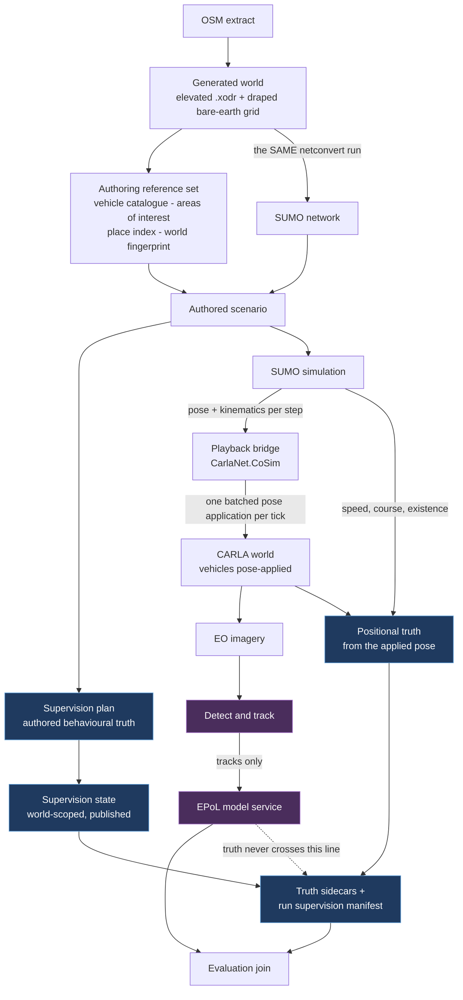

# 00 — SUMO-driven behavioural capture: overview

**Status:** Plan. No code changed and no build run in producing it. Every section is grounded in the
working tree as it stood on 2026-09-17, with claims cited to `path:line`, measurements distinguished
from inferences, and inferences labelled.
**Scope:** Realising, as one system, the supervision model of
[`Findings/20_Behavioral_Annotation_And_Areas_Of_Interest.md`](../../Findings/20_Behavioral_Annotation_And_Areas_Of_Interest.md)
and the SUMO integration of
[`Findings/23_SUMO_Traffic_Integration.md`](../../Findings/23_SUMO_Traffic_Integration.md) — a SUMO
traffic simulation driving the vehicles rendered in a generated CARLA world, producing
electro-optical imagery whose truth sidecar carries behavioural annotation, for training and
validating estimated-pattern-of-life (EPoL) models, and for exercising one live.
**Audience:** Engineers who will build this, and reviewers deciding whether it should be built. It
assumes familiarity with the fork but not with the conversation that produced it.

---

## 1. What is being built

The thing that makes this tractable, and which was already true before this plan, is that **the SUMO
and CARLA coordinate frames coincide**: the network is rebuilt from the same clipped OSM at the same
pinned origin with `--offset.disable-normalization`, so SUMO (x, y) ≡ CARLA (x, −y) with no offset
arithmetic. Everything else is engineering on top of that invariant.

## 2. The seam between the two source documents, and how it was closed

The user's framing was that there is "a bit of contractual work" between docs 20 and 23. There is
more than a bit, and naming it precisely is most of what this plan does.

| | Doc 20 assumed | Doc 23 assumed | What this plan does |
|---|---|---|---|
| **Authoring surface** | An OpenSCENARIO storyboard, executed by `CarlaNet.Scenario` | Not addressed | A declarative traffic-scenario specification compiled to SUMO artifacts, with a companion supervision plan as the sole annotation channel ([07](07_Scenario_Authoring.md) D7.x, [06](06_Truth_And_Annotation.md) D6.1) |
| **Who knows when a behaviour began** | The executor, from its own speed-action ramp | Not addressed | SUMO's own model. The three onsets are renamed for the authority producing each — **declared**, **committed**, **observed** — and map onto artifacts SUMO already exposes ([06](06_Truth_And_Annotation.md) §3.3) |
| **Actuation** | Not addressed | "SUMO decides, CARLA physics executes"; teleporting regresses capabilities | Pose application, with doc 23's shape retained as a second **actuation strategy behind the same bridge** ([01](01_Architecture.md) D1.15) |
| **Truth producer** | CARLA's `VehicleTelemetryService` | Notes that a teleported body reports zero velocity | Authority settled **field by field**, not producer by producer ([06](06_Truth_And_Annotation.md) D6.9) |
| **Scale** | Hand-sited scenarios | Ordinary ambient traffic | Windowed capture over a simulation far larger than the rendered set ([10](10_Scale_And_Performance.md)) |

**Doc 23 is not overturned.** Its recommendation was made for a different requirement — believable
ambient background for a storyboard, at ordinary scale, where body dynamics are most of the point. It
remains the right answer for that, and for oblique or ground-level imagery. This plan scopes it to the
mode it was written for and builds pose application first, because that is what the accepted
requirement asks for and it is the shape that sustains the render counts [10](10_Scale_And_Performance.md)
measured.

## 3. The decisions that shape everything else

Full decision tables live in each section. These nine are the ones a reader needs to hold in mind.

| | Decision | Where |
|---|---|---|
| **Authority is split two ways** | **Population authority** is exclusive per world; **motion authority** is exclusive per actor. The ambient-traffic lockout is therefore a *failed session start naming the current holder*, not a warning — while storyboard execution, which takes no population authority, can still coexist | [01](01_Architecture.md) D1.7, D1.8 |
| **One clock** | `PlaybackClock` solely owns simulated time; it cues the world and steps SUMO. The SUMO step, world delta and capture rate are an integer-ratio contract validated at session start | [01](01_Architecture.md) D1.1, D1.12 · [04](04_Contracts.md) C6 |
| **SUMO's pose is the command; CARLA's applied pose is the record** | The pixels were rendered from the applied transform. A measurable divergence between the two is a bridge defect, and reporting it gives the mode a free self-check on the three pose conversions | [01](01_Architecture.md) D1.3 · [06](06_Truth_And_Annotation.md) D6.9 |
| **Kinematic truth comes from SUMO** | `Actor.GetVelocity` is a structural zero for a pose-applied body. SUMO's speed and angle are carried into truth with a provenance field — and are *better* than a velocity-derived course for stationary vehicles, which is what a dwell corpus is made of | [01](01_Architecture.md) D1.4 · [03](03_CoSimulation_Runtime.md) §5 |
| **The step is not changed to suit the renderer** | Shrinking the SUMO step is cheap but changes the behaviour being captured. The bridge buffers one step and interpolates **along lane geometry, never chordally** | [03](03_CoSimulation_Runtime.md) D3.6 |
| **A vType names exactly one blueprint** | Dimensions are copied verbatim from a build-time spawn-and-measure sweep; variety comes from a per-class `vTypeDistribution` drawn by SUMO's own seed. **vType colour never reaches a blueprint** | [04](04_Contracts.md) D4.5, D4.17 |
| **Annotations are authored intent; area relations are derived context** | No geometric predicate ever writes into supervision. This is doc 20's rule and it is *more* at risk under SUMO, where a vehicle's stop and speed are one call away | [06](06_Truth_And_Annotation.md) §3.6 |
| **Truth never reaches the model's input path** | Three artifact roots with one writer each; the split happens **at the writer**, so nothing is ever "stripped"; a mechanical validator over the model's input root runs in CI | [08](08_Collection_And_EPoL.md) D8.17 |
| **Seven simulated days cannot be rendered** | Measured at 19–24 days of wall clock and 6–17 TB for one camera. Capture is **windowed**, with SUMO fast-forwarded from t = 0 | [10](10_Scale_And_Performance.md) D10.2 |

## 4. What the team measured

The standing rule on this project is that a systemic explanation offered ahead of a measurement has
repeatedly been wrong. These are the numbers the plan rests on, all taken read-only during planning.

| Measurement | Value | Consequence |
|---|---|---|
| Concurrent vehicles, Bahonar | peak **139**, median 41, from a complete headless run of all 604,800 steps | Bahonar fits under the render cap |
| Concurrent vehicles, Arapahoe Underpass | peak **437**, median **336** | **Arapahoe, not Bahonar, is the binding scenario.** It needs the spatial region gate |
| Wall clock for seven simulated days | **19–24 days**, from PNG tick metadata differenced against file timestamps across four real recorder runs | Windowing is mandatory, not an optimisation |
| SUMO step 1.0 s → 0.1 s | insertions identical (716), routes +0.06%, **mean time loss −62%** | Changing the step changes the behaviour; keep the authored step and interpolate |
| Chordal vs lane interpolation | a right-angle turn between samples 15 m either side misses the corner by **10.6 m** — three lane widths | Interpolation must follow the lane polyline |
| TraCI subscriptions vs per-vehicle getters | **8.1 ms vs 116.0 ms** per step at 388 vehicles | The naive path alone exceeds twice a 50 ms tick. Subscriptions are not optional |
| `apply_batch` command coverage | **all 22** command types, verified at both ends | A teleport of N vehicles is **one** round trip |
| Prevalence, two defensible units | **0.013%** per vehicle vs **4.8%** per stationary vehicle-second — a factor of **372** | Prevalence is meaningless without its unit; the manifest records three |
| OSM relations surviving the clip | **42 relations, 22 of them turn restrictions → 0** | Issue #12 is a hard prerequisite, and an *authoring* trap as well as a runtime one |
| Named-edge coverage | 91% on the US maps, **5% on Bahonar** (48 of 1,066 edges, six names, all Persian); one name maps to **65 edges** | Street-name resolution is one place form among several, never the mechanism |
| World-build vs scenario netconvert, identical OSM | **321 vs 317 edges**; one lane **352.19 m vs 2.60 m**; `convBoundary` matches exactly | The frame invariant holds while the topology diverges silently |

## 5. Defects found in things already shipped

Planning work surfaced live defects in delivered artifacts and in the current pipeline. They are
listed here rather than buried in sections because several affect data that already exists.

| Defect | Evidence | Consequence |
|---|---|---|
| **Bare-earth heights read the mirrored row.** `SumoCotBridge` passes SUMO y to a grid indexed in CARLA y | The generated map's header (`north="2107.82" south="-1914.94"`) matches the SUMO `convBoundary` y-range exactly, so `.xodr` y ≡ SUMO y and CARLA y = −SUMO y. Indexing the grid with CARLA y tracks road elevation at **1.81 m** scatter against **5.15 m** for SUMO y, over 3,891 road reference points. Recomputing the shipped sample with SUMO y reproduces it to **0.003 m** | Every `hae_m` in every CoT dataset produced by that path is wrong by a **median 9.8 m, mean 11.2 m, max 38.0 m**; **96.2%** of rows are off by over a metre. Only the y ≈ 0 centreline is unaffected. **Affected datasets need re-issuing, not a forward patch** |
| **Three ground-truth leaks put the answer inside the scored channel** | `special_type="marked"` (`SumoCotBridge.py:321-322`) sits in the field doc 09 §9 scores classification confusion on; `affiliation_by_type` maps every anomaly vType to `u`, violating doc 20 decision 9 live; anomaly vTypes carry conspicuous colours and distinct ids | A corpus built with the current bridge scores models on reading the answer key |
| **The Windows distribution packages a launcher that cannot work** | `MakeDistribution.ps1:237` copies `CarlaNet\python\SCTMV.py`, deleted in `d2c666c23`; it only warns, so the build succeeds, then `:301` writes a `run-sctmv.ps1` that execs the absent script. Linux was migrated correctly (`MakeDistribution.sh:117`) | A Windows/Linux parity break that ships silently |
| **World and scenario are built by different netconvert versions** | `SUMO_HOME` on this machine is an independent SUMO **1.27.1**; `SumoInstallation.py:36` prefers it over the repo-pinned **1.27.0** | Plausibly part of the 321-vs-317 divergence above. No log line says which ran |
| **`anomaly_notes` is never read** | `sumo_cot_telemetry.py:134-139` loads only `marked_ids` and `affiliation_by_type` | The guard-no-show anomaly reaches no consumer at all |
| **`scenario_id` is accepted and never supplied** | `NativeRecorder.py:96-111` passes `run_id` and `seed` only | Doc 20 §4.2's gap, still open at a new address |
| **Silent capture loss** | `FrameRecorder.Dropped` has no reader anywhere; the clock ratio is recorded nowhere | A thin corpus looks like a normal one |
| **`sensor_tick` is set nowhere** | `ActorBlueprintFunctionLibrary.cpp:244-254` → `Sensor.cpp:44-49`; every camera renders at world rate while the recorder discards 19 frames in 20 | Possibly ~10× the achievable clock ratio, unspent |
| **The bare-earth reader boxes 7.6 M Python floats** | 60.9 MB file → **243.6 MB and 5.6 s** | One-line fix, measured at 32.3 MB and 0.011 s |

## 6. One conflict the sections create together, and its resolution

Each section is internally consistent; one *combination* is not, and it is resolved here rather than
left for implementation to discover.

[06](06_Truth_And_Annotation.md) observes that [01](01_Architecture.md) D1.13 prioritises annotated
participants when the render cap binds, which makes **scene density a function of the label** — a
confounder — and proposes recording `cap_bound_ticks` and excluding those spans from the *training*
export while keeping them for evaluation. [10](10_Scale_And_Performance.md) then measures that on
Arapahoe Underpass **the cap binds essentially always** (median 336 against a cap of 128). Taken
together, those two correct statements would exclude an entire Arapahoe-class corpus from training.

**The resolution is to size the render region so the cap does not bind.** The two reduction
mechanisms differ in a way that matters: the **region gate is spatial and label-independent**, so it
cannot make density a function of the label; the **cap is priority-ordered and label-dependent**, so
it can. [10](10_Scale_And_Performance.md) §4.3.1 measures that a 300 m region on Arapahoe holds
exactly `render_cap`. So the rule is:

> **Size `render_region` per scenario from its radial population distribution so that the population
> inside the region stays under `render_cap` at the run's measured peak. The cap then exists as a
> safety limit rather than as an active shedding mechanism, and the label-dependent path is inert.**
> Where that cannot be achieved, the run records `cap_bound_ticks` and [06](06_Truth_And_Annotation.md)'s
> training exclusion applies — but that is the degraded case, not the design point.

This costs nothing new: both parameters already exist, and both sections already record what is
needed to check the condition.

## 7. What this plan does not cover

- **Pedestrians.** Out of scope by user decision: the world-generation pipeline does not yet produce
  footway meshes good enough to render them onto. SUMO has a person model and CARLA has walkers, so
  this is a second bridge when it comes, not a gap in this one.
- **The EPoL model itself.** Its interface is specified ([08](08_Collection_And_EPoL.md) §6); its
  internals are someone else's.
- **The detector and tracker.** Likewise specified at the boundary and not designed here. Note that
  no detector exists in the tree today.
- **Vehicle dynamics fidelity.** Deliberately traded in this mode, bounded to it, and named in
  [01](01_Architecture.md) §8.3: collision response, suspension, and the staging spawn model.
- **Scoring in the ScenarioRunner sense.** Rejected in doc 18 §3.2 and still rejected.
- **Grade-responsive speed.** Doc 23 §3.3's work, independent of which actuator is used.

## 8. How to read this plan

| Read this | If you want |
|---|---|
| [01 — Architecture](01_Architecture.md) | Components, topology, the authority model, the mode matrix, and how doc 23's costs are answered |
| [02 — Use cases](02_Use_Cases.md) | Eleven use cases with flows, plus activity diagrams for authoring and for capture |
| [03 — Co-simulation runtime](03_CoSimulation_Runtime.md) | The bridge: binding choice, pose conversion, interpolation, lifecycle, the tick loop, failure paths |
| [04 — Contracts](04_Contracts.md) | Every interface, field by field, with validation rules and what breaks when each is violated |
| [05 — CarlaNet capability audit](05_CarlaNet_Capability_Audit.md) | Whether the .NET client can do this, traced shim → C# → RPC → engine |
| [06 — Truth and annotation](06_Truth_And_Annotation.md) | Doc 20's supervision model re-seated on SUMO, and the two truth producers reconciled |
| [07 — Scenario authoring](07_Scenario_Authoring.md) | How a scenario is written, by a human or an assistant, and how it is validated before it costs a run |
| [08 — Collection and EPoL](08_Collection_And_EPoL.md) | Cameras, labels, detect-and-track, the model boundary, the anti-leak rule, evaluation |
| [09 — Toolchain and packaging](09_Toolchain_And_Packaging.md) | Finishing and shipping the SUMO toolchain, both platforms |
| [10 — Scale and performance](10_Scale_And_Performance.md) | The numbers: population, wall clock, budgets, the sizing envelope, degradation |
| [11 — Work breakdown](11_Work_Breakdown.md) | What to build, in what order, and what has to be measured before committing |

Decisions are numbered by section (`D1.x` … `D10.x`) and are unique across the folder, so they can be
cited from outside it.
