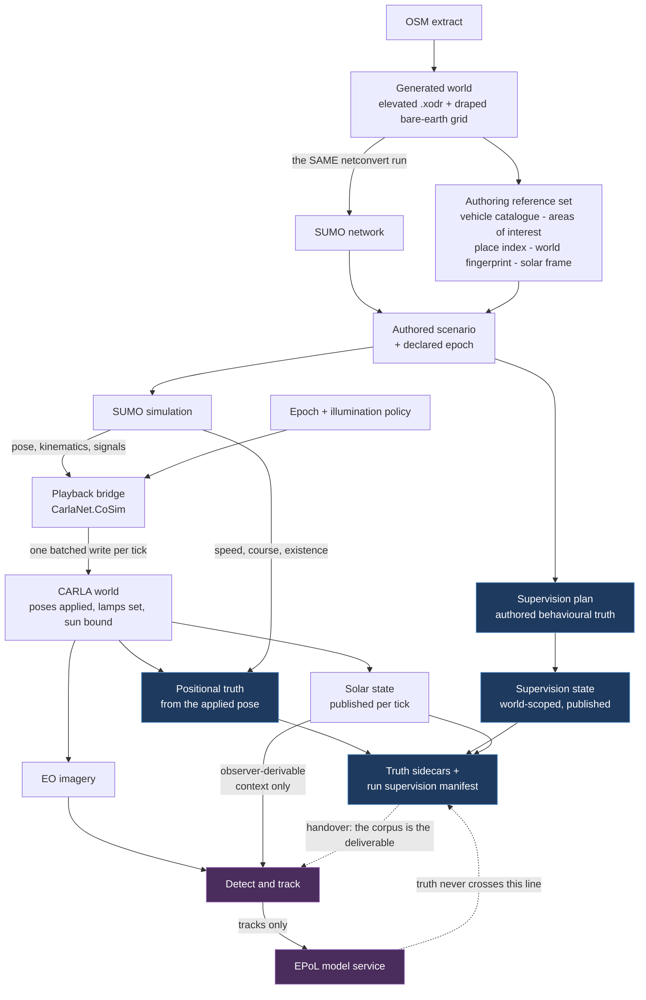

# 00 — SUMO-driven behavioural capture: overview

**Status:** Plan. No code changed and no build run in producing it. Every section is grounded in the
working tree as it stood on 2026-09-18, with claims cited to `path:line`, measurements distinguished
from inferences, and inferences labelled.

| Revision | Change |
|---|---|
| 1 · 2026-09-17 | First draft: the SUMO-driven capture system end to end. |
| 2 · 2026-09-18 | Simulated time of day bound to playback; adds time, illumination and the operator surface. |
| 3 · 2026-09-18 | Scope narrowed: the pipeline labels and never scores. |
| 4 · 2026-09-18 | Live exercise made primary and generic past our boundary; cyclic generation driven externally. |

**Scope:** Realising, as one system, the supervision model of
[`Findings/20`](../../Findings/20_Behavioral_Annotation_And_Areas_Of_Interest.md) and the SUMO
integration of [`Findings/23`](../../Findings/23_SUMO_Traffic_Integration.md) — a SUMO traffic
simulation driving the vehicles rendered in a generated CARLA world, producing electro-optical
imagery whose truth sidecar carries behavioural annotation, for training and validating
estimated-pattern-of-life (EPoL) models, and for exercising one live.
**Audience:** Engineers who will build this, and reviewers deciding whether it should be built.

---

## 1. What is being built

Two invariants make this tractable, and both predate the plan. **The SUMO and CARLA coordinate frames
coincide** — the network is rebuilt from the same clipped OSM at the same pinned origin with
`--offset.disable-normalization`, so SUMO (x, y) ≡ CARLA (x, −y) with no offset arithmetic. And
**the sun that lights frame *n*, the solar state recorded in frame *n*'s snapshot, and frame *n*'s
vehicle poses are all the same tick** — verified from the engine's tick ordering, so there is no
skew to reconcile.

## 2. The seams between the source documents, and how they were closed

| | Doc 20 assumed | Doc 23 assumed | What this plan does |
|---|---|---|---|
| **Authoring surface** | An OpenSCENARIO storyboard executed by `CarlaNet.Scenario` | Not addressed | A declarative traffic-scenario specification compiled to SUMO artifacts, with a companion supervision plan as the sole annotation channel ([07](07_Scenario_Authoring.md), [06](06_Truth_And_Annotation.md) D6.1) |
| **Who knows when a behaviour began** | The executor, from its own speed-action ramp | Not addressed | SUMO's own model. The onsets are renamed for the authority producing each — **declared**, **committed**, **observed** ([06](06_Truth_And_Annotation.md) §3.3) |
| **Actuation** | Not addressed | "SUMO decides, CARLA physics executes"; teleporting regresses capabilities | Pose application, with doc 23's shape retained as a second **actuation strategy behind the same bridge** ([01](01_Architecture.md) D1.15) |
| **Truth producer** | CARLA's `VehicleTelemetryService` | Notes a teleported body reports zero velocity | Authority settled **field by field**, not producer by producer ([06](06_Truth_And_Annotation.md) D6.9) |
| **Scale** | Hand-sited scenarios | Ordinary ambient traffic | Windowed capture over a simulation far larger than the rendered set ([10](10_Scale_And_Performance.md)) |
| **Time of day** | Not addressed | Not addressed | A scenario declares an epoch; the clock owner projects civil time through it; the sun is bound per window and the policy is asserted, never defaulted ([11](11_Time_And_Illumination.md), [04](04_Contracts.md) C9) |

**Doc 23 is not overturned.** Its recommendation was made for believable ambient background at
ordinary scale, where body dynamics are most of the point. It remains right for that, and for oblique
or ground-level imagery. This plan scopes it to the mode it was written for.

## 3. The decisions that shape everything else

Full tables live in each section; there are 234 numbered decisions across twelve. These are the ones
a reader must hold in mind.

| | Decision | Where |
|---|---|---|
| **Authority is split two ways** | **Population authority** is exclusive per world; **motion authority** is exclusive per actor. The ambient lockout is a *failed session start naming the holder*, not a warning — while storyboard execution, taking no population authority, can still coexist | [01](01_Architecture.md) D1.7, D1.8 |
| **One clock owns simulated time and civil time** | `PlaybackClock` owns both; civil time is a *projection* of elapsed time through the declared epoch, not a second authority. There is no separate solar clock, because the engine's own advance is an accumulator and a client-side one would be a second accumulator beside it | [01](01_Architecture.md) D1.1, D1.19 |
| **SUMO's pose is the command; CARLA's applied pose is the record** | The pixels were rendered from the applied transform, and the divergence is a reported self-check on the three pose conversions | [01](01_Architecture.md) D1.3 |
| **Kinematic truth comes from SUMO** | `Actor.GetVelocity` is a structural zero for a pose-applied body; SUMO's speed and angle are carried with a provenance field, and are *better* than a velocity-derived course for the stationary vehicles a dwell corpus is made of | [01](01_Architecture.md) D1.4 |
| **The authored SUMO step is never changed to suit the renderer** | Shrinking it is cheap and changes the behaviour being captured. The bridge buffers one step and interpolates **along lane geometry, never chordally** | [03](03_CoSimulation_Runtime.md) D3.6 |
| **A vType names exactly one blueprint** | Dimensions copied verbatim from a build-time spawn-and-measure sweep; variety from a per-class distribution drawn by SUMO's own seed. **vType colour never reaches a blueprint** | [04](04_Contracts.md) D4.5, D4.17 |
| **The illumination policy is asserted, never defaulted** | A frozen run and an unconfigured run are byte-identical today, so absence is indistinguishable from intent. A corpus-eligible run without a declared policy is **refused**; `freeze_at_window_start` is the recommended value, not a silent one (§6) | [11](11_Time_And_Illumination.md), [04](04_Contracts.md) D4.24 |
| **Annotations are authored intent; area relations and illumination are derived context** | No geometric or photometric predicate ever writes supervision. Enforced by the type graph, not by discipline | [06](06_Truth_And_Annotation.md) §3.6, D6.21 |
| **Observer-derivability governs the model boundary** | An input may reach the model iff a fielded system with the same sensor, navigation solution, clock and public reference data could compute it **without observing the scene's contents**. Solar state passes; `advancing`, `rate`, policy and residual do not | [08](08_Collection_And_EPoL.md), [04](04_Contracts.md) D4.20 |
| **The pipeline labels; it never scores** | The external models are trained and validated downstream. What stays is everything that describes *our own* data honestly — observability, prevalence, illumination bands, render states, and an explicit statement of what the corpus does **not** contain | [04](04_Contracts.md) C8, D4.26 · [02](02_Use_Cases.md) UC-10 |
| **Ambient traffic and the idle cull are off, structurally** | Population authority is an exclusive engine-held lease, so starting ambient traffic under SUMO drive is a failed session start; SUMO-driven vehicles are never registered with the traffic manager, so its idle cull cannot reach them. A forty-five-minute park stays parked | [01](01_Architecture.md) D1.7, §4.1 · [13](13_Work_Breakdown.md) §13.1 |
| **A scenario is rendered in windows, never in full** | A scenario runs for as long as its author declared; nothing here bounds that. What is bounded is what can be *rendered*, and the sizing case makes the limit concrete: seven simulated days would cost 19–24 days of wall clock and 6–17 TB for one camera. Capture is windowed, with SUMO fast-forwarded from t = 0 | [10](10_Scale_And_Performance.md) D10.1 |
| **Night imagery is not viable; night truth is free** | The 23:00 window is 38–79° below the horizon on every date. It becomes a **truth-only window** — SUMO runs it alone at 4,307× real time, costing 0.42 s of wall clock and zero bytes (§5) | [10](10_Scale_And_Performance.md) D10.14, [11](11_Time_And_Illumination.md), [08](08_Collection_And_EPoL.md) D8.29 |

## 4. What the team measured

The standing rule is that a systemic explanation offered ahead of a measurement has repeatedly been
wrong here. These are the load-bearing numbers.

| Measurement | Value | Consequence |
|---|---|---|
| Concurrent vehicles, Bahonar / Arapahoe | peak **139** / **437**, median 41 / **336** | **Arapahoe is the binding scenario**, not the seven-day one |
| Wall clock for seven simulated days | **19–24 days**, from PNG tick metadata across four real recorder runs | Windowing is mandatory |
| SUMO step 1.0 s → 0.1 s | insertions identical, routes +0.06%, **mean time loss −62%** | Changing the step changes the behaviour; keep it and interpolate |
| Chordal vs lane interpolation | a right-angle turn between samples 15 m apart misses the corner by **10.6 m** | Interpolation follows the lane polyline |
| TraCI subscriptions vs per-vehicle getters | **8.1 ms vs 116.0 ms** per step at 388 vehicles | The naive path alone exceeds twice a 50 ms tick |
| `apply_batch` command coverage | **all 22** types, verified at both ends | A teleport of N vehicles is **one** round trip |
| Vehicle light-state traffic, inside the render region | **7.54%** of vehicles per step ≈ **9.6 commands/tick** at cap 128; +1.9% of batch bytes on Arapahoe | Lamps ride the existing batch; zero extra round trips |
| Sun elevation at the recommended windows | 07:00 spans **+3.97° to +25.92°** by date alone; 23:00 is **−38.1° to −79.5°** on every date | The date is a free 21° illumination axis; 23:00 is unphotographable |
| Renderable share of the sizing scenario | only **59–77%** of daily vehicle-hours have the sun above −6° | A quarter to two-fifths of the traffic cannot be photographed at any price |
| Hour-to-label mutual information, Bahonar | **I(hour; label)/H(label) = 0.600** | Hour carries 60% of the label; a corpus needs an illumination-only **leakage probe** to detect it |
| Prevalence, two defensible units | **0.013%** per vehicle vs **4.8%** per stationary vehicle-second | A factor of **372**; prevalence is meaningless without its unit |
| OSM relations surviving the clip | **42 relations, 22 turn restrictions → 0** | Issue #12 is a hard prerequisite and an *authoring* trap |
| Named-edge coverage | 91% on the US maps, **5% on Bahonar** | Street names are one place form, never the mechanism |
| World-build vs scenario netconvert, identical OSM | **321 vs 317 edges**; one lane **352.19 m vs 2.60 m** | The frame invariant holds while topology diverges silently |

## 5. Defects found in things already shipped

Listed here rather than buried, because several affect data that exists now.

| Defect | Evidence | Consequence |
|---|---|---|
| **Bare-earth heights read the mirrored grid row** | `.xodr` header `north/south` matches the SUMO `convBoundary` exactly, so `.xodr` y ≡ SUMO y and CARLA y = −SUMO y. Indexing with CARLA y tracks road elevation at **1.81 m** scatter against **5.15 m**; the shipped sample reproduces under SUMO y to 0.003 m | Median **9.8 m**, mean 11.2 m, max 38.0 m error in every Cursor-on-Target dataset from that path; 96.2% of rows over a metre. **Re-issue, not a forward patch** |
| **The scenario and its own telemetry disagree about `t = 0` by 3.5 h** | 335 of 335 guard trips satisfy `depart == D×86400 + H×3600` with hours in {7,15,23}, asserting local midnight; `SumoCotBridge.py:149-151` is UTC-only and the shipped CSV pins t = 0 to `2026-01-01T00:00:00Z` | The epoch convention is perfectly consistent and reaches nothing that can read it |
| **Three ground-truth leaks put the answer inside the label channel** | `special_type="marked"`; anomaly affiliation `u` readable off the CoT type; conspicuous anomaly colours | A corpus built with the current bridge scores models on reading the answer key |
| **Two leaks inside PNG metadata** | `carla:solar` embeds `advancing`/`rate`; `carla:capture` embeds `scenario_id`/`seed` | Memorisation handles that are neither truth nor observer-derivable. The anti-leak validator must read tEXt chunks, not just file trees |
| **A sunless world publishes a convincing lie** | The stream header cannot express "no sun", so the cache returns **midnight of year 0 at lat 0, lon 0**, and `CotWriter` writes it as fact | Live today on stock content |
| **A client RPC name mismatch, silently swallowed** | `CarlaClient.cs:1631` sends `get_vehicles_light_states`; the server and LibCarla use the singular. The sole caller catches without logging | Latent only because `update_vehicle_lights` defaults false. The C# and C++ clients otherwise agree on the RPC surface |
| **Every capture ever made is noon on the host's date** | `run_SCTMV.py:138` calls `setup_solar_time` unconditionally; with no `--time` it forces 12:00 on the host clock | Illumination has never been a controlled variable, and the seasonal sun in existing captures is an artifact of when the run happened |
| **A loaded world inherits the previous session's sun** | The defaults block is guarded by `if (!bHasSunSky)` | Illumination is non-deterministic across runs unless explicitly bound |
| **The advancing sun never rolls the date** | `Fmod(…, 24.0)`; `Day` untouched | Six of seven days would render under day 0's seasonal sun and record day 0's date |
| **The engine's clock is local mean solar, not civil** | `TimeZone = longitude / 15` exactly | At the sizing site a **14 min 43 s** standing error — at 21 Dec 17:00 the difference between a sun at −1.60° and +1.33° |
| **The Windows distribution packages a launcher that cannot work** | `MakeDistribution.ps1:237` copies a script deleted in `d2c666c23` and only warns; `:301` writes a launcher that execs it. Linux was migrated correctly. Windows also omits the `carlacontrol` wheel Linux bundles | Two parity breaks, shipping silently |
| **Worlds and scenarios use different netconvert versions** | `SUMO_HOME` is an independent 1.27.1; `SumoInstallation.py:36` prefers it over the pinned 1.27.0 | No log line says which ran |
| **Smaller, same family** | `anomaly_notes` is never read; `scenario_id` never supplied; `FrameRecorder.Dropped` has no reader and the clock ratio is recorded nowhere; `sensor_tick` set nowhere so 19 frames in 20 are discarded after rendering; the bare-earth reader boxes 7.6 M floats (60.9 MB → 243.6 MB, 5.6 s) | Each silent |

## 6. Conflicts the sections create together, and their resolutions

Each section is internally consistent. Two *combinations* were not, and both are settled here.

**The render cap versus the training export.** [06](06_Truth_And_Annotation.md) observes that
prioritising annotated participants under the render cap makes scene density a function of the label,
and proposes excluding cap-bound spans from the training export.
[10](10_Scale_And_Performance.md) then measures that on Arapahoe **the cap binds essentially always**.
Together those would exclude an Arapahoe-class corpus entirely.

> **Resolution — size `render_region` per scenario so the cap does not bind.** The region gate is
> spatial and label-independent and therefore cannot make density a function of the label; the cap is
> priority-ordered and label-dependent and therefore can. A 300 m region on Arapahoe holds exactly
> `render_cap`. Where that cannot be achieved, the run records `cap_bound_ticks` and the training
> exclusion applies — the degraded case, not the design point.

**Freeze versus advance.** [11](11_Time_And_Illumination.md) and
[08](08_Collection_And_EPoL.md) independently recommend **frozen**, measuring that a default window
sweeps up to 6.7° of sun elevation so its two ends are not the same lighting condition;
[10](10_Scale_And_Performance.md) adds a third reason, that an advancing sun defeats the virtual
shadow-map cache, which keys on light direction with an exact comparison and no epsilon.
[12](12_Operator_Control_Surface.md) recommends **advancing**, because freezing by accident records a
physically impossible constant sun and nothing flags it.

> **Resolution — there is no default.** [06](06_Truth_And_Annotation.md) measured that a frozen run
> and an unconfigured run are byte-identical, so the real defect is that the policy can be absent at
> all. The policy is **asserted into the record**, a corpus-eligible run without one is **refused**,
> and `freeze_at_window_start` is the recommended value rather than a silent one. That removes the
> accidental-freeze failure [12](12_Operator_Control_Surface.md) feared and keeps the controlled
> illumination [08](08_Collection_And_EPoL.md) and [11](11_Time_And_Illumination.md) need.

## 7. What this plan does not cover

- **Pedestrians.** Out of scope by user decision: the pipeline does not yet produce footway meshes
  good enough to render them onto. A second bridge when it comes, not a gap in this one.
- **Night imagery.** Established as not viable (§3) rather than deferred. Building it means a
  lighting capability — emitters in the world, a moon, de-lit tiles — which is
  [`Findings/13`](../../Findings/13_Usable_Night_Lighting.md)'s work, not this plan's.
- **The EPoL model, the detector and the tracker.** Specified at their boundaries; internals are
  elsewhere. No detector exists in the tree today.
- **Vehicle dynamics fidelity.** Deliberately traded in this mode and bounded to it: collision
  response, suspension, and the staging spawn model.
- **Scoring anything.** The detect-and-track model and the EPoL model are **external to this
  effort**. This pipeline produces imagery, truth and labels for training and validating them
  downstream; it runs no model, associates no model output to truth, and emits no metric, comparison
  or verdict. Doc 18 §3.2 already rejected scoring in the ScenarioRunner sense of driving-quality
  criteria; this is the wider exclusion. Quality gates on **our own data** — is it consistent,
  leak-free, complete, does it say what it lacks — are not scoring and remain in full
  (`_TEAM_BRIEF.md` §3b).
- **Grade-responsive speed.** Doc 23 §3.3's work, independent of which actuator is used.

## 8. How to read this plan

| Read this | If you want |
|---|---|
| [01 — Architecture](01_Architecture.md) | Components, topology, the authority model, the mode matrix, how doc 23's costs are answered |
| [02 — Use cases](02_Use_Cases.md) | Twelve use cases with flows, plus activity diagrams for authoring and capture |
| [03 — Co-simulation runtime](03_CoSimulation_Runtime.md) | The bridge: binding, pose conversion, interpolation, lifecycle, the tick loop, lamps, failure paths |
| [04 — Contracts](04_Contracts.md) | Every interface field by field, with validation rules and what breaks when each is violated |
| [05 — CarlaNet capability audit](05_CarlaNet_Capability_Audit.md) | Whether the .NET client can do this, traced shim → C# → RPC → engine |
| [06 — Truth and annotation](06_Truth_And_Annotation.md) | Doc 20's supervision model re-seated on SUMO, and the truth producers reconciled |
| [07 — Scenario authoring](07_Scenario_Authoring.md) | How a scenario is written, by a human or an assistant, and validated before it costs a run |
| [08 — Collection and EPoL](08_Collection_And_EPoL.md) | Cameras, labels, occlusion, the anti-leak rule, and what an external model team is handed |
| [09 — Toolchain and packaging](09_Toolchain_And_Packaging.md) | Finishing and shipping the SUMO toolchain, both platforms |
| [10 — Scale and performance](10_Scale_And_Performance.md) | The numbers: population, wall clock, budgets, the sizing envelope, degradation |
| [11 — Time and illumination](11_Time_And_Illumination.md) | The epoch, the solar policy, the night verdict, the lamp mapping |
| [12 — Operator control surface](12_Operator_Control_Surface.md) | How a run is configured, validated, launched and recorded |
| [13 — Work breakdown](13_Work_Breakdown.md) | What to build, in what order, and what must be measured before committing |

Decisions are numbered by section (`D1.x` … `D12.x`) and unique across the folder, so they can be
cited from outside it. `_TEAM_BRIEF.md` records the constraints every section was written under.
