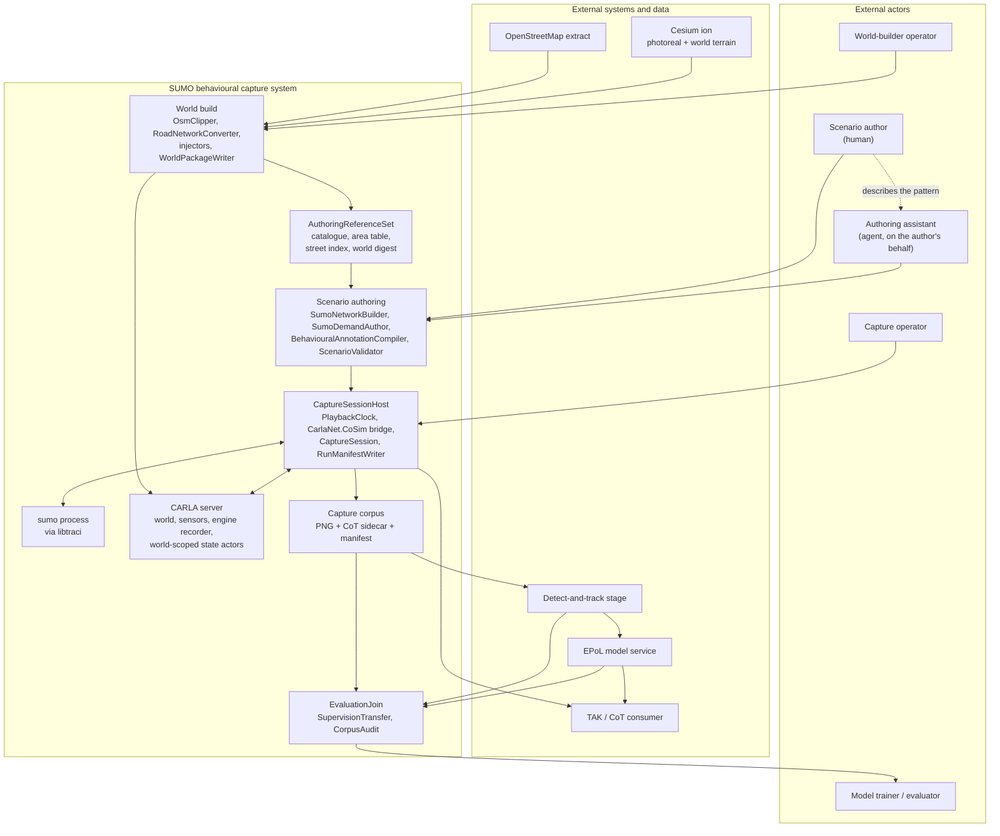
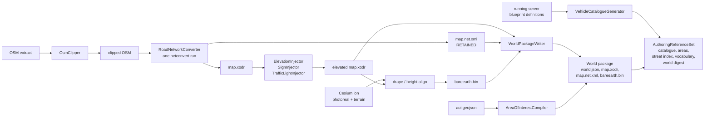
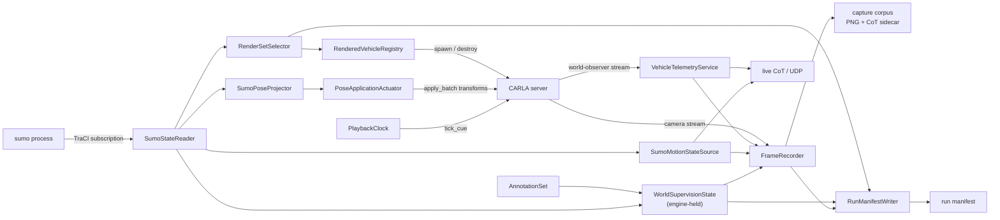
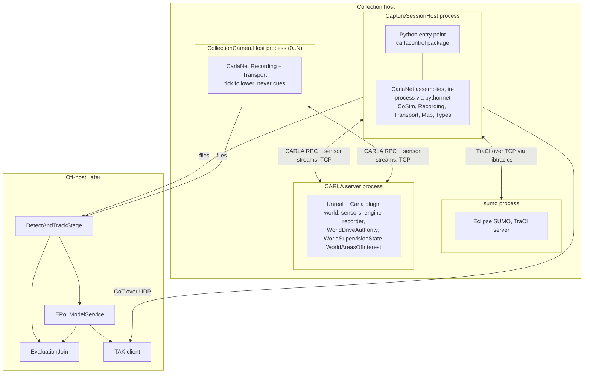
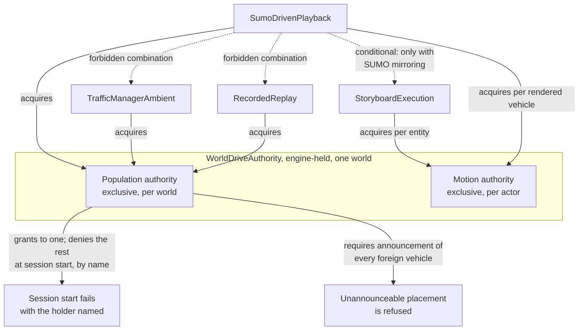
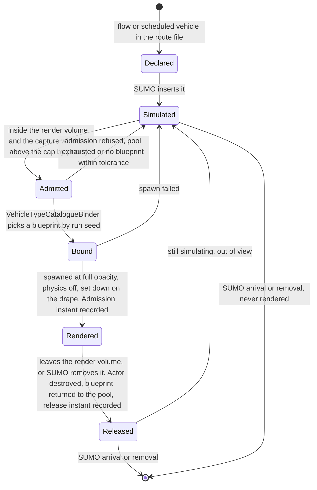

# 01 — System architecture

**Status:** Plan section. Design, not implementation. No code was changed and no build was run.
**Date:** 2026-09-17
**Owner role:** Systems architect. Companion section: [02 — Use cases](02_Use_Cases.md).
**Scope:** The component decomposition, the process topology, the authority model, the mode matrix, the
resolution of the conflict between [23](../../Findings/23_SUMO_Traffic_Integration.md) §4 and the
accepted teleport decision, and the architectural answer to a simulation vastly larger than the
renderable set.
**Audience:** An engineer who has not read the conversation that produced this plan, and who will
implement or review one of the other sections in this folder.
**Grounding:** Every claim about existing behaviour is cited `path:line` against the working tree as read
on 2026-09-17, or carried forward from a Findings document and marked as carried forward. Measurements
taken for this section are marked **measured** and say how. Everything else that is not cited is marked
**inference**.

**Out of scope, deliberately.** The per-tick mechanism of the co-simulation loop
([03](03_CoSimulation_Runtime.md)), the wire-level shape of any contract
([04](04_Contracts.md)), whether a given shim or transport call is implemented end to end
([05](05_CarlaNet_Capability_Audit.md)), the annotation schema
([06](06_Truth_And_Annotation.md)), the authoring surface's grammar ([07](07_Scenario_Authoring.md)),
the detector and model interfaces in detail ([08](08_Collection_And_EPoL.md)), packaging
([09](09_Toolchain_And_Packaging.md)), and the measured performance envelope
([10](10_Scale_And_Performance.md)). Where this section needs a property from one of those, it states
the property and names the section rather than designing it.

---

## 1. The system in one paragraph

A SUMO microsimulation, authored against the same OpenStreetMap extract a CARLA world was generated
from, is the sole source of ambient vehicle motion for that world. A bridge admits a subset of SUMO's
vehicles into CARLA as actors and applies SUMO's pose to them each rendered frame. Collection cameras in
the CARLA world write imagery plus a Cursor-on-Target truth sidecar. The truth carries two things SUMO
and CARLA each own half of: where a vehicle was and what it looked like from a particular camera
(CARLA), and how fast it was going and what the author asserted it was doing (SUMO and the annotation
set). The imagery goes to a detect-and-track stage; its tracks go to an estimated-pattern-of-life model
service, either offline against a recorded corpus or live. Truth is joined to the model's output only
after the fact, for scoring.

### 1.1 Context and containers



---

## 2. Component decomposition

Every component below carries a name it can keep in code. Components that already exist are marked with
their current location; the rest are new. Nothing here is named for a stage number or a phase.

### 2.1 Build time — produces a world and the things needed to author against it

| Component | Exists as | Responsibility |
|---|---|---|
| `OsmClipper` | `CarlaControl/src/carlacontrol/OsmClipper.py` | Cuts the extract to its `<bounds>`, preserving node ids |
| `RoadNetworkConverter` | `CarlaNet.Map` `OsmConverter` | One `netconvert` run producing **both** the OpenDRIVE and the SUMO network. It already asks for both and then deletes the network (carried forward from [23 §6.4](../../Findings/23_SUMO_Traffic_Integration.md), `OsmConverter.cs:135`); retaining it is the change |
| `ElevationInjector`, `SignInjector`, `TrafficLightInjector` | `CarlaNet.Map` | Unchanged |
| `WorldPackageWriter` | `WorldBuilder._write_world_package` → `client.write_world_package` | Writes `world.json`, `map.xodr`, `bareearth.bin`. Gains `map.net.xml` from the same converter run |
| `VehicleCatalogueGenerator` | **new** | Projects `GetActorDefinitionsAsync` into a versioned vehicle catalogue ([20 §5.6](../../Findings/20_Behavioral_Annotation_And_Areas_Of_Interest.md), decision 12) |
| `AreaOfInterestCompiler` | **new** | Reads `<extract>.aoi.geojson`, validates, resolves to CARLA-local metres ([20 §8](../../Findings/20_Behavioral_Annotation_And_Areas_Of_Interest.md)) |
| `AuthoringReferenceSet` | **new artifact** | The machine-readable inputs an author needs: vehicle catalogue, area table, street-name-to-road index, annotation vocabulary, world digest. [20 open question 9](../../Findings/20_Behavioral_Annotation_And_Areas_Of_Interest.md) asks whether this should be packaged; this architecture requires it, because the assistant actor of [02](02_Use_Cases.md) cannot author without it |

The invariant that makes the whole system cheap is already established and must be preserved: because the
SUMO network and the OpenDRIVE come from one `netconvert` run at one pinned origin with
`--offset.disable-normalization`, **SUMO (x, y) equals CARLA (x, −y)** with no offset arithmetic
(carried forward from [23 §2](../../Findings/23_SUMO_Traffic_Integration.md), measured `netOffset`
`0.00,0.00`). Any design that re-derives one artifact from the other forfeits this.

### 2.2 Authoring time — produces a scenario package, with no CARLA in the loop

| Component | Exists as | Responsibility |
|---|---|---|
| `SumoNetworkBuilder` | `SumoScenarioBuilder.build_network` (`SumoScenarioBuilder.py:309`) | Rebuilds the SUMO network at the world's origin. Becomes redundant once `RoadNetworkConverter` retains `map.net.xml`; kept for scenarios authored against a world package rather than a live build |
| `SumoDemandAuthor` | `SumoScenarioBuilder`, `SumoPatternOfLifeBuilder` | Flows, scheduled vehicles, stops, fencing, opposite-lane overtaking, config |
| `BehaviouralAnnotationCompiler` | **new** | Reads the authored annotation channel and emits the `AnnotationSet` of [20 §6.1](../../Findings/20_Behavioral_Annotation_And_Areas_Of_Interest.md): pattern instances, participants, intervals, supervision state, vocabulary version |
| `ScenarioValidator` | **new**, over existing practice | Route validation through `duarouter` rather than a graph walk, departure-sort check, reference resolution against catalogue, area table and vocabulary. The gotchas it enforces are already recorded in `.agents/skills/sumo-traffic-scenarios/SKILL.md` |
| `ScenarioPackage` | **new artifact** | The shippable unit: `map.net.xml`, `.rou.xml`, `.sumocfg`, the `AnnotationSet`, the resolved area table, the vType-to-catalogue binding, and the world digest that binds it to one world ([18 §5.5](../../Findings/18_Scenario_Fabrication_For_EPoL_Training.md)) |

### 2.3 Run time

**In `CarlaNet.CoSim`, a new assembly** (the name is carried forward from
[23 §5](../../Findings/23_SUMO_Traffic_Integration.md)). Its reference set is `CarlaNet.Types`,
`CarlaNet.Transport`, `CarlaNet.Map` and the `libtracics` wrapper. It must **not** reference
`CarlaNet.TrafficManager` for the playback mode; see §5.3. The existing reference graph
(`CarlaNet/src/*/*.csproj`, read 2026-09-17) confirms `CarlaNet.Types` references nothing and is the only
common ancestor of `CarlaNet.Scenario` and `CarlaNet.Recording`.

| Component | Responsibility |
|---|---|
| `SumoSession` | Owns the `sumo` process lifetime and the libtraci connection; restartable without restarting the world |
| `SumoStateReader` | One bulk read per SUMO step through a TraCI subscription, not one call per vehicle. Non-optional at Bahonar scale ([23 §6.11](../../Findings/23_SUMO_Traffic_Integration.md)) |
| `PlaybackClock` | **The sole owner of the advance of simulated time.** Decides when the world is cued and when SUMO is stepped, and enforces the step ratio of §6.1 |
| `RenderSetSelector` | Decides which SUMO vehicles are CARLA actors, over which span of simulated time. **The single place the size reduction of §9 happens** |
| `RenderedVehicleRegistry` | The actor pool. Instantiates, binds and releases; the sole creator and destroyer of a SUMO-driven actor. It owns **existence, not appearance** — an admitted vehicle appears at full opacity and a released one disappears (§8.2) |
| `VehicleTypeCatalogueBinder` | Maps a SUMO `vType` to a CARLA blueprint drawn from the world's vehicle catalogue by the run seed, reconciling dimensions |
| `SumoPoseProjector` | SUMO pose to CARLA transform: Y negation, `yaw = sumoAngle − 90`, the front-bumper-to-body-centre half-length shift ([23 §6.7](../../Findings/23_SUMO_Traffic_Integration.md)), and Z from the drape |
| `SumoMotionStateSource` | Speed, course and stopped-state per vehicle, taken from SUMO and carried into truth. The compensation for §8.2's headline cost |
| `PoseApplicationActuator` | Applies the projected pose. The actuation strategy used by the `SumoDrivenPlayback` mode |
| `ControlLoopActuator` | The alternative actuation strategy of [23 §4.1](../../Findings/23_SUMO_Traffic_Integration.md) — SUMO's target fed through a controller, CARLA physics executing. Not used by this mode; see §8.4 |
| `DriveAuthorityLease` | The client handle on the world's exclusive population authority (§5.3) |

**Held by the engine, world-scoped**, mirroring the `UStagingBounds` precedent exactly
(`Unreal/CarlaUnreal/Plugins/CesiumCarlaBridge/Source/CesiumCarlaBridge/Public/StagingBounds.h`, bound at
`Unreal/CarlaUnreal/Plugins/Carla/Source/Carla/Server/CarlaServer.cpp:808` and `:828`, surfaced on the
shim at `CarlaNet/python/carlanet/__init__.py:1589,1596`):

| Component | Responsibility |
|---|---|
| `WorldDriveAuthority` | Which component holds population authority over this world, and under which mode. Read by every client; granted to at most one |
| `WorldSupervisionState` | The tick-stamped annotation projection ([20 §7.3](../../Findings/20_Behavioral_Annotation_And_Areas_Of_Interest.md)), published so a recorder in **any** process reads the same thing |
| `WorldAreasOfInterest` | The resolved area table ([20 §8.4](../../Findings/20_Behavioral_Annotation_And_Areas_Of_Interest.md)) |

**Collection and truth:**

| Component | Exists as | Responsibility |
|---|---|---|
| `CollectionCamera` | `SensorRig` + camera actor | An RGB camera and its paired depth camera |
| `FrameRecorder` | `CarlaNet.Recording/FrameRecorder.cs` | Decimates a camera stream, writes PNG plus CoT sidecar. One per camera |
| `CaptureSession` | **new** | Assigns one capture-session identity to every recorder in a session, and a stable `sensor_id` per camera. Closes [20 §7.5](../../Findings/20_Behavioral_Annotation_And_Areas_Of_Interest.md)'s per-recorder run-id defect |
| `VehicleTelemetryService`, `CotWriter` | `CarlaNet.Recording` | Positional truth and the sidecar |
| `RunManifestWriter` | **new** | The authoritative supervision artifact ([20 §7.5](../../Findings/20_Behavioral_Annotation_And_Areas_Of_Interest.md)), written incrementally |
| `SumoCotBridge` | `carlacontrol/SumoCotBridge.py` | **Retained unchanged** as the standalone, no-CARLA telemetry path. It is not in the capture path |

### 2.4 Post-run

| Component | Responsibility |
|---|---|
| `DetectAndTrackStage` | External. Consumes a capture directory; emits detection-sourced CoT tracks (`source="detection"`, `CARLA-DET-<track_id>`, [09 §3](../../Findings/09_Telemetry_CoT_Contract.md)) |
| `SupervisionTransfer` | Transfers supervision from truth tracks onto detector tracks, per sensor, clipping at interval bounds ([20 §7.6](../../Findings/20_Behavioral_Annotation_And_Areas_Of_Interest.md)) |
| `EPoLModelService` | External. Consumes tracks; emits per-track assessments. **Never given truth** |
| `EvaluationJoin` | Joins assessments to supervision after the fact and scores |
| `CorpusAudit` | Finds accidental positives in the unlabelled population ([20 §2.2](../../Findings/20_Behavioral_Annotation_And_Areas_Of_Interest.md)) |

### 2.5 Build-time pipeline



Two properties of this pipeline are load-bearing. **The OpenDRIVE and the SUMO network must come from the
same `netconvert` invocation**, never from re-deriving one from the other — that is what keeps the
coordinate identity and the junction identifiers aligned for free ([23
§6.4](../../Findings/23_SUMO_Traffic_Integration.md)). And **turn restrictions must survive the clip**;
`osm_clip.py` drops all OSM relations today ([issue #12](https://github.com/sbrett9/carla/issues/12)),
which costs little while nothing enforces turn legality and costs a great deal once SUMO is routing every
vehicle ([23 §6.6](../../Findings/23_SUMO_Traffic_Integration.md)). It is a prerequisite of this
architecture, not an improvement to it.

### 2.6 Run-time dataflow



---

## 3. Process and deployment topology

### 3.1 What today's system does, and the constraint that follows

Today the scenario executor and the recorder are in **one process** and on **one client**:
`world.start_scenario` and `world.start_recording` are both methods on the same `World`, storing
`self._scenario` and `self._recorder` (`CarlaNet/python/carlanet/__init__.py:1932`, `:1873`, `:1924`).
`run_SCTMV.py` constructs both and steps them from one loop (`run_SCTMV.py:222`, `:279-284`).

The constraint is stronger than [20 §7.3](../../Findings/20_Behavioral_Annotation_And_Areas_Of_Interest.md)
records. Starting a second recording on the same client **stops the first**:
`start_recording` calls `self.stop_recording()` before constructing the new one
(`carlanet/__init__.py:1908`). So a second collection camera today does not merely mean a second registry
reader — it means a second **process**, unconditionally.

And there are **two** process-local registries, not one, each of which a second process reads wrongly:

| Registry | Where it lives | What a second process sees |
|---|---|---|
| Annotation state | Proposed process-local in [20 §7.3](../../Findings/20_Behavioral_Annotation_And_Areas_Of_Interest.md), decision 11 | Empty — every vehicle `unlabelled`, silently |
| Render set | New | Would be invisible to any process that did not build it |

That is one failure mode with two instances, and it is the reason the topology decision below is what it
is rather than a matter of taste.

**A third instance was here and has been withdrawn, deliberately rather than by renumbering.** The
staging fade table is also client-local — `CarlaClient._fade`, held there because "the server keeps no
readable copy of it" (`CarlaNet.Transport/CarlaClient.cs:1545-1556`) — and it gates truth, because
`VehicleTelemetryService.cs:73` skips any vehicle that has not been established. Two processes disagreeing
about which vehicles had arrived would have been a real third instance of the same failure. **It is not,
because fade is off.** `--fade` now carries `default=False`, and its help text gives the reason: the
opacity is computed client-side and pushed to the server as one blocking RPC per vehicle per reconcile,
which is the heaviest load this client puts on the server's per-frame RPC budget
(`CarlaControl/src/carlacontrol/CarlaControlArgumentParser.py:318-328`, read 2026-09-17; `--no-fade` is
retained at `:329-334` so existing command lines keep working). With nothing fading, the gate is inert by
construction: `IsActorEstablished` returns true for any actor nobody has faded (`CarlaClient.cs:1571`),
`GetActorOpacity` returns 1.0 for the same reason (`CarlaClient.cs:1562`), and the truth producer's own
comment states that the gate is inert unless staging traffic is running
(`VehicleTelemetryService.cs:66-73`). So the disagreement cannot arise, no truth is lost, and no
replacement mechanism is owed. This architecture designs no fade behaviour of any kind; vehicles appear
and vanish at full opacity, and refining that later is a rendering question with no bearing on anything
below.

**A note on stale citations, for every author in this folder.** `CarlaNet/python/SCTMV.py` **no longer
exists** — verified 2026-09-17 by searching the tree, which finds no file of that name outside `Build/`.
It was replaced by `CarlaControl/scripts/run_SCTMV.py` over the `carlacontrol` package. Every
`SCTMV.py:NNN` citation in [20](../../Findings/20_Behavioral_Annotation_And_Areas_Of_Interest.md) and in
`_TEAM_BRIEF.md` therefore points at a file that is gone, and must be re-grounded against the current
tree before it is relied on. The gaps those citations recorded have not gone away: `scenario_id` is still
accepted by the recorder and still never supplied, now at `NativeRecorder.py:107-108`, which passes
`run_id` and `seed` and nothing else.

### 3.2 The processes



### 3.3 What crosses a boundary and by what transport

| From | To | Transport | Notes |
|---|---|---|---|
| Python entry | CarlaNet assemblies | **No transport** — same process, pythonnet | This is why there is no Python in the per-tick path ([18 D2](../../Findings/18_Scenario_Fabrication_For_EPoL_Training.md)) |
| `CarlaNet.Transport` | CARLA server | CARLA RPC (msgpack over TCP) and the sensor/world-observer streams | `SendTickCueAsync` (`CarlaClient.cs:403`) is the synchronous rendezvous |
| `CarlaNet.CoSim` | `sumo` | TraCI over TCP, through the first-party SWIG C# binding `Eclipse.Sumo.Libtraci` | Out of process by choice: a SUMO assertion cannot take the client down and `sumo` is restartable ([23 §6.3](../../Findings/23_SUMO_Traffic_Integration.md)) |
| Any client | World-scoped state | CARLA RPC pairs, in the manner of `set_staging_bounds`/`get_staging_bounds` | Published on change, not per tick; see §4.1 |
| `FrameRecorder` | Disk | PNG + CoT XML sidecar pairs, per camera | |
| Truth producer | TAK client | CoT over UDP | Diagnostic; the sidecar is authoritative ([20 §7.4](../../Findings/20_Behavioral_Annotation_And_Areas_Of_Interest.md)) |
| Capture corpus | `DetectAndTrackStage` | Filesystem | |

### 3.4 The topology decision

**One `CaptureSessionHost` process owns the clock, the bridge, the render set, the manifest and — by
default — every collection camera's recorder. Additional camera processes are permitted, are tick
followers that never cue the world, and read every world-scoped fact from the server rather than from
their own memory.**

Two halves, and both are needed:

- **Correctness does not depend on co-location.** Annotation state, drive authority, areas of interest and
  the render set are published to the server. This is [20 decision
  11](../../Findings/20_Behavioral_Annotation_And_Areas_Of_Interest.md)'s first option, chosen over its
  second, and it resolves both registry failures of §3.1 together rather than one at a time. The cost is
  an engine change; per the standing rule, that is not a cost worth avoiding. No fade or arrival state is
  published, because there is none — see §3.1.
- **The default is still one process**, because one tick owner is simpler, because the recorder already
  does its work off the interpreter on a .NET worker pool (`FrameRecorder.cs:115-123`), and because the
  shim's one-recorder-per-`World` limit (`carlanet/__init__.py:1908,1924`) is a shim defect to fix, not a
  reason to fan out into processes.

The shim change that follows is small and must be made: `start_recording` must be able to hold several
recorders keyed by camera, and must stop refusing by silently stopping the previous one.

---

## 4. The authority model

This is the backbone. For each concern there is exactly one owner. Everything else either reads it,
applies it, or is forbidden from touching it.

### 4.1 The table

| Concern | Sole owner | What every other component does |
|---|---|---|
| **Simulated time** | `PlaybackClock` | `sumo` steps only when stepped; the CARLA world advances only on a tick cue from the clock; recorders decimate against the frame timestamp they are given and never against wall clock; camera-follower processes never cue; the .NET traffic manager does not run at all |
| **Vehicle existence in the simulation** | `sumo`, from the authored demand | Nothing else inserts or removes a simulated vehicle. The bridge never invents one |
| **Vehicle existence in the world** (actor create/destroy) | `RenderedVehicleRegistry`, on `RenderSetSelector`'s decision | Nothing else spawns or destroys a SUMO-driven actor. The staging controller is locked out (§5). The traffic manager's idle cull cannot reach them because they are never registered with it |
| **Vehicle pose** | `sumo`, projected by `SumoPoseProjector`, **except Z, pitch and roll**, which are owned by the drape | CARLA applies the transform to a non-simulating body. Physics proposes nothing |
| **Vehicle kinematics** (speed, course, stopped-state) | `sumo`, via `SumoMotionStateSource` | The truth producer must take these from the bridge and **not** from `Actor.GetVelocity`, which is zero for a teleported body (`Unreal/.../Sensor/WorldObserver.cpp:373`) |
| **Positional truth** (what a sensor saw, and where) | CARLA, via `VehicleTelemetryService` | SUMO's position is the *command*; CARLA's applied transform is the *record*. See §4.2 |
| **Vehicle appearance** | `VehicleTypeCatalogueBinder`, from the world's vehicle catalogue and the run seed | SUMO's `vType` contributes class and dimensions only. **SUMO's `vType` colour is display metadata and must not reach the blueprint** — see §4.3 |
| **Behavioural truth** | The scenario author, compiled into the `AnnotationSet`, published as `WorldSupervisionState` | Nothing derives an annotation from a trajectory, ever ([20 §2.1, §8.5](../../Findings/20_Behavioral_Annotation_And_Areas_Of_Interest.md)). Derived area relations are a separate element and are never a label |
| **Population authority over the world** | Exactly one mode holder, leased from `WorldDriveAuthority` | Every other population-producing component refuses to start. See §5.3 |
| **Run and session identity** | `CaptureSession` | Recorders are *given* the session id, the scenario id and a stable `sensor_id`; they stop deriving them from their own start instant (`FrameRecorder.cs:101-103`) |

`WorldSupervisionState` is published **on change**, not per tick. An interval opens or closes a handful of
times across a capture, so the RPC traffic is negligible and no per-tick round trip is introduced. What is
stamped with the tick is the state itself, so a recorder can tell which simulated instant a snapshot
describes ([20 §7.3](../../Findings/20_Behavioral_Annotation_And_Areas_Of_Interest.md)).

### 4.2 Why CARLA owns positional truth although SUMO commands the pose

Under teleport the two agree by construction, which makes the question look academic. It is not, for four
reasons:

1. **The pixels were rendered from the applied transform.** Truth that disagrees with the pose the frame
   was drawn at is not truth about that frame.
2. **Z does not come from SUMO.** The SUMO network is flat — zero distinct `z` in any lane shape
   (carried forward from [23 §2](../../Findings/23_SUMO_Traffic_Integration.md), measured). Height comes
   from the drape.
3. **An apply can fail or be clamped**, and a vehicle can be destroyed between the command and the frame.
4. **Occlusion, apparent size and bounding box are camera-relative** and exist only on the CARLA side
   ([09 §5.1](../../Findings/09_Telemetry_CoT_Contract.md)).

So: **SUMO's pose is the command; CARLA's applied pose is the record.** A measurable divergence between
them is a bridge defect and should be reported, which gives the mode a free self-check.

### 4.3 Why SUMO owns kinematics although CARLA holds the body

`WorldObserver.cpp:373` serialises `View->GetActor()->GetVelocity()`, which a transform applied to a
non-simulating body does not update. Deriving speed from successive positions on the consumer side would
work but is a second implementation of a quantity SUMO already computed exactly, and it would be
indistinguishable from detector-derived speed in a record whose whole purpose is to be compared against
detector output. So the bridge carries SUMO's speed and angle into the truth record, and the record says
where it came from.

Appearance deserves a flag of its own, because the hazard is live and measured. **Measured** 2026-09-17 by
parsing `BahonarPatternOfLife.zip`'s route file: the scenario declares 14 `vType`s, and the anomaly types
carry deliberately conspicuous colours — `anomaly_probe` `1.00,0.45,0.00`, `anomaly_escort`
`1.00,0.10,0.10`, `anomaly_shadow` `1.00,0.20,0.60` — against muted civilian greys. Those colours exist to
make the SUMO GUI readable. Carried into CARLA blueprints they would make **colour the label**, which is
exactly the appearance confounder of
[20 §2.6](../../Findings/20_Behavioral_Annotation_And_Areas_Of_Interest.md) and would produce a corpus on
which a trivially cheating model scores well. The binder therefore ignores `vType` colour entirely.

Dimensions run the other way and must be respected: a `vType`'s `length` and `width` change car-following
gaps and therefore the behaviour itself, so the blueprint must be chosen to match the declared dimensions
within a stated tolerance rather than the `vType` being adjusted to match a chosen blueprint. The Bahonar
types span 4.4 m to 12.0 m (**measured**, same parse), so this is a real matching problem and not a
formality. [04](04_Contracts.md) owns the tolerance and the fallback.

### 4.4 Authority handover

For the `SumoDrivenPlayback` mode there is **no handover**. A vehicle is SUMO-driven for its whole
rendered life. Handover exists only in the actuated shape of §8.4 and in the storyboard coupling of
§5.2, and in both cases it is per actor and is mediated by motion authority, never by a component
deciding on its own to start commanding a vehicle.

---

## 5. Modes

### 5.1 The four modes

| Mode | What drives ambient vehicles | Population authority | Exists today |
|---|---|---|---|
| `SumoDrivenPlayback` | `sumo`, poses applied | Held by `CarlaNet.CoSim` | New |
| `TrafficManagerAmbient` | The .NET traffic manager, over the inward staging ring | Held by `TrafficController` | Yes — `carlacontrol/TrafficController.py` |
| `StoryboardExecution` | `CarlaNet.Scenario`, over named entities only | **None** — it places named entities, it does not generate a population | Yes — `CarlaNet.Scenario/ScenarioExecutor.cs` |
| `RecordedReplay` | The engine replayer, from a log | Held by the server | Yes — validated in [18 §5.4](../../Findings/18_Scenario_Fabrication_For_EPoL_Training.md) |

### 5.2 The coexistence matrix

| | `SumoDrivenPlayback` | `TrafficManagerAmbient` | `StoryboardExecution` | `RecordedReplay` |
|---|---|---|---|---|
| `SumoDrivenPlayback` | — | **Exclusive** | Conditional | **Exclusive** |
| `TrafficManagerAmbient` | **Exclusive** | — | Coexist (today's use) | **Exclusive** |
| `StoryboardExecution` | Conditional | Coexist | — | **Exclusive** |
| `RecordedReplay` | **Exclusive** | **Exclusive** | **Exclusive** | — |

- `SumoDrivenPlayback` × `TrafficManagerAmbient` is **mutually exclusive** by user decision, and the
  architecture makes it structural rather than advisory (§5.3). Both claim population authority.
- `SumoDrivenPlayback` × `StoryboardExecution` is **conditional**: permitted only once every storyboard
  entity is mirrored into SUMO so SUMO's car-following yields to it ([23
  §6.9](../../Findings/23_SUMO_Traffic_Integration.md)). Until that exists the combination is **refused at
  session start**, not warned about, because an unmirrored storyboard entity is invisible to every SUMO
  vehicle and the resulting imagery shows cars driving through it.
- Anything × `RecordedReplay` is exclusive: the replayer respawns actors from the log and owns their pose.

### 5.3 The lockout, as a structural property

A runtime warning the operator can ignore is not a lockout. Three mechanisms together make it structural,
in increasing order of how hard they are to defeat:

**One — the assembly graph.** `CarlaNet.CoSim` does not reference `CarlaNet.TrafficManager` for the
playback mode. A component that cannot name a type cannot call it. This is cheap and catches the
accidental case at compile time, but it does not stop a *different* component in the same process from
starting ambient traffic, so it is not sufficient on its own.

**Two — an exclusive, server-held lease.** `WorldDriveAuthority` grants **population authority** over a
world to at most one holder, and names the mode in the grant. It is engine-held for the same reason
staging bounds are: it must be visible to a client that did not create it, and must outlive the client
that did (`StagingBounds.h`, `CarlaServer.cpp:808,828`). Acquisition is part of starting a session; a
denied acquisition **fails the session start with the current holder named**. `TrafficController.enable`
(`TrafficController.py:1096`) acquires it too, and fails the same way. Nothing takes the lease
implicitly and nothing breaks it; it is released on clean shutdown and reaped when its holder's client
disconnects.

**Three — mandatory announcement.** While a population-authority holder exists, any component that
creates a vehicle actor must announce it to the holder. A storyboard entity that cannot be announced
cannot be placed. This is what makes the conditional case of §5.2 safe rather than merely discouraged,
and it is the mechanism by which the mirror of [23 §6.9](../../Findings/23_SUMO_Traffic_Integration.md)
becomes a precondition rather than an aspiration.

Two capabilities are deliberately distinguished, because conflating them would forbid something worth
having:

| Capability | Granularity | Exclusive | Held by |
|---|---|---|---|
| **Population authority** | Per world | Yes | The mode that generates unscripted vehicles |
| **Motion authority** | Per actor | Yes, per actor | Whoever commands that actor's pose or control |

`SumoDrivenPlayback` takes population authority over the world and motion authority over each rendered
vehicle. `StoryboardExecution` takes motion authority over its own entities and no population authority —
which is why it can coexist with either ambient mode, and why the actuated shape of §8.4 is not a
contradiction of the lockout: it would use the traffic manager as a *per-actor actuator* under SUMO's
motion authority, and would still generate no population of its own.

### 5.4 Mode and authority



---

## 6. One simulated instant, end to end

### 6.1 The clock contract

Three rates meet here and their relationship is a contract, not a setting:

| Rate | Value in the sizing case | Source |
|---|---|---|
| SUMO step | **1.0 s** | `<step-length value="1.0"/>` — **measured** in `BahonarPatternOfLife.zip`'s `.sumocfg`, read 2026-09-17 |
| CARLA fixed delta | 0.05 s typical | `--fixed-delta`, `WorldBuilder.configure_sync_mode` (`run_SCTMV.py:141`) |
| Capture rate | 2 Hz typical | `FrameRecorder` decimation (`FrameRecorder.cs:131-133`) |

So twenty world ticks fall inside one SUMO step, and a capture lands every tenth world tick. Two
consequences the architecture fixes rather than leaves to configuration:

- **The step ratio must be an exact integer and is validated at session start.** A non-integer ratio makes
  the phase between SUMO steps and captures drift across a run, so two captures the same nominal interval
  apart are not the same interval apart in SUMO.
- **Sub-step pose is the bridge's responsibility.** Applying a 1 Hz pose to a 20 Hz world produces a
  visible stutter at exactly the rate a detector is most sensitive to. The bridge therefore runs SUMO
  **one step ahead of the rendered instant** and renders the interval behind it, which costs one SUMO step
  of latency — irrelevant for a capture — and buys an exact pose at every step boundary with a faithful
  path between them. Lowering SUMO's step to the world delta instead is rejected: it multiplies a
  seven-day simulation's cost by twenty and perturbs car-following. *The interpolation must follow the
  lane rather than the straight line between two positions, or every vehicle cuts every corner;* the
  mechanism belongs to [03](03_CoSimulation_Runtime.md), which owns it.

**What happens when one side stalls.** The clock owns both, so neither can run away from the other. If a
SUMO step exceeds its budget the world simply is not cued until it returns — the capture slows, the
content does not change, and `tick` remains the time base ([18
D3](../../Findings/18_Scenario_Fabrication_For_EPoL_Training.md)). If the world does not deliver the cued
frame, `WaitForFrame` times out and returns null rather than deadlocking (`CarlaClient.cs:425-433`); the
clock must treat that as a session fault and stop, because a capture that silently drops frames produces a
corpus whose tick spacing is not what the manifest says it is.

### 6.2 The sequence

```mermaid
sequenceDiagram
    autonumber
    participant CLK as PlaybackClock
    participant SUM as sumo (libtraci)
    participant SEL as RenderSetSelector
    participant REG as RenderedVehicleRegistry
    participant ACT as PoseApplicationActuator
    participant SRV as CARLA server
    participant REC as FrameRecorder
    participant DSK as capture corpus

    Note over CLK: instant k, inside SUMO step n..n+1

    CLK->>ACT: pose for instant k, interpolated from steps n and n+1
    ACT->>SRV: apply_batch(set_transform per rendered vehicle)
    CLK->>SRV: tick_cue
    SRV-->>CLK: frame number
    SRV-->>REC: camera frame k (sensor stream)
    SRV-->>REC: episode state k (world-observer stream)
    REC->>REC: decimate against frame timestamp
    REC->>REC: positional truth from the snapshot of frame k
    REC->>REC: merge SumoMotionStateSource speed/course for frame k
    REC->>REC: merge WorldSupervisionState snapshot stamped k
    REC->>DSK: queue job; worker writes PNG + CoT sidecar

    alt k crosses a SUMO step boundary
        CLK->>SUM: simulationStep()
        SUM-->>CLK: one bulk subscription read, all vehicles
        CLK->>SEL: reconcile the render set
        SEL->>REG: admit / release
        REG->>SRV: spawn, destroy
        SEL->>CLK: interval state changes, if any
        CLK->>SRV: publish WorldSupervisionState (on change only)
    end
```

**A defect this mode makes visible, and the property it needs.** The recorder takes the capture's tick
from the image frame header (`FrameRecorder.cs:179`) but takes its vehicle truth from whatever the
world-observer cache last held (`FrameRecorder.cs:148` → `VehicleTelemetryService.Compute`, which reads
`GetActorSnapshot` with no frame argument). The paired depth capture *is* tick-matched
(`FrameRecorder.cs:156` → `OcclusionEstimator.MatchTo(tick, …)`), so the two halves of one capture already
use different rules. Under physics a one-frame mismatch is a small position error. Under applied poses it
is a whole frame of motion arriving in one step. **[03](03_CoSimulation_Runtime.md) must guarantee that a
capture's truth is the snapshot of the frame its pixels came from**, matched the way occlusion already
matches.

---

## 7. The life of one vehicle



The contract this state machine encodes, stated once so the other sections can reference it:

- **A vehicle CARLA is not rendering is still simulating**, and truth must say so rather than implying it
  does not exist. It is absent from a capture sidecar, because a sidecar is the record of what a camera
  could have seen; it is present in the run manifest's accounting, marked as not rendered.
- **A rendered span gate sits upstream of
  [20 §2.5](../../Findings/20_Behavioral_Annotation_And_Areas_Of_Interest.md)'s observed span.** An
  annotated interval can now fail to be observable for two independent reasons — the participant was never
  rendered, or it was rendered and not seen. Both must be recorded per interval or the evaluation
  denominator is wrong in a way nothing downstream can detect. This is a requirement the render set
  introduces and that doc 20 did not have; [06](06_Truth_And_Annotation.md) owns its shape.
- **The rendered span is delimited by two recorded instants, and those instants are the gate.** A vehicle
  appears in the world at the tick it was admitted and vanishes at the tick it was released, at full
  opacity in both directions. That abrupt appearance and disappearance is a fact about the capture, so
  `RenderedVehicleRegistry` records the admission and release tick per vehicle and the run manifest carries
  them. This is a recorded instant, not a visual transition: nothing in this architecture dissolves
  anything, and the rendered span of the gate above is exactly the interval between those two instants.
- **The registry owns existence, not appearance.** It has no fade role. The arrival gate that
  `VehicleTelemetryService.cs:73` applies is inert with nothing fading — `IsActorEstablished` returns true
  for any actor nobody has faded (`CarlaClient.cs:1571`) — so no truth is lost and no state has to be
  published to replace it (§3.1).
- **A released vehicle can be re-admitted.** Its `entity_id` and its blueprint binding must be stable
  across the gap, or one SUMO vehicle appears in the corpus as two different-looking vehicles. The binding
  is therefore keyed on the SUMO vehicle id and the run seed, not on the order of admission.

---

## 8. Resolving doc 23 §4 against the accepted teleport

### 8.1 What doc 23 actually argued

[23 §4](../../Findings/23_SUMO_Traffic_Integration.md) recommends against teleporting and for "SUMO
decides, CARLA physics executes", on the grounds that adopting upstream's teleport shape would regress
four capabilities this fork has built. That argument was made for a different requirement: **ambient
traffic as believable background for an OpenSCENARIO storyboard**, at ordinary scale, where physics
fidelity is most of the point. It was not made for a seven-day, 245-flow behavioural capture whose product
is imagery plus behavioural truth. The user has accepted teleport-style control **for this mode**. Neither
document is wrong; each was written without the other's requirement in hand.

What follows is doc 23 §4's own table, cost by cost, with what this architecture does about each. Nothing
is waved away.

### 8.2 Cost by cost

| Doc 23 §4 cost | Is it real here | What the architecture does |
|---|---|---|
| **Truth telemetry velocity reads zero.** `WorldObserver.cpp:373` serialises `GetActor()->GetVelocity()`, which a transform on a non-simulating body does not update | **Yes, verified at that exact line 2026-09-17** | Fully compensated, and arguably improved. `SumoMotionStateSource` carries SUMO's own speed and angle into the truth record, and the record says the kinematics came from the simulation rather than from the body. SUMO's angle is additionally *better* than a velocity-derived course for the case that matters most: a stationary vehicle has no course, and [18 §6.3](../../Findings/18_Scenario_Fabrication_For_EPoL_Training.md) measured two stationary vehicles broadcasting `course="271.8"` and `course="299.3"` as pure noise. `SumoCotBridge.py:302-303` already relies on exactly this property |
| **Seating on the draped terrain** — SUMO poses arrive with no usable Z | Yes; the SUMO network is flat, zero distinct `z` (carried forward from [23 §2](../../Findings/23_SUMO_Traffic_Integration.md)) | Fully compensated, and cheaply. `CarlaClient.SampleDrapeGroundElevation` (`CarlaClient.cs:241-263`) is a **client-side bilinear lookup with no RPC and no raycast**, already used to resolve ground height in .NET. The projector samples it per vehicle per tick. [23 §6.5](../../Findings/23_SUMO_Traffic_Integration.md) names this same call for the same purpose |
| **Suspension, pitch and wheel rotation** | Partly | **Partly compensated, partly a stated loss.** Terrain-following pitch and roll are recoverable from the gradient of the same drape grid along the heading, which is the visible part at EO altitude, and the projector owns them. Suspension travel and load transfer are **gone and stay gone**. Wheel rotation is already dead in this fork's record and replay path — `#if 0 // @CARLAUE5` at `Recorder/CarlaRecorder.cpp:209` and `Recorder/CarlaReplayerHelper.cpp:348`, carried forward from [18 §5.2](../../Findings/18_Scenario_Fabrication_For_EPoL_Training.md) — and is sub-pixel at the altitudes [09 §5.1](../../Findings/09_Telemetry_CoT_Contract.md) measured, where a vehicle is about three pixels long at 1.1 km |
| **Vehicle fade and the staging ring** are built around a client-side registry keyed to vehicles the staging controller owns | The staging ring, yes. The fade, **no longer** | **The staging ring is replaced; the fade is already withdrawn independently of this plan.** The ring exists to solve a spawn-model problem that SUMO's insertion model solves better and directly — [23 §3.1](../../Findings/23_SUMO_Traffic_Integration.md) sets that out at length, including that exactly two of Arapahoe's 212 fringe entries are freeway — so `RenderSetSelector` supersedes it for this mode while the staging controller itself is untouched and remains the `TrafficManagerAmbient` mode's mechanism. The fade is a different matter and is **not** inherited: `--fade` is off by default in the working tree because the opacity is computed client-side and pushed one blocking RPC per vehicle per reconcile (`CarlaControlArgumentParser.py:318-328`). `RenderedVehicleRegistry` therefore owns existence and not appearance — an admitted vehicle appears at full opacity and a released one disappears, and the admission and release ticks are recorded (§7). Doc 23 §4 counted the fade as a capability a teleport shape would cost; it is no longer a capability in use, so there is nothing here to cost |

### 8.3 What is genuinely lost, and stays lost

Named so it is not quietly assumed away:

1. **Vehicle-to-vehicle collision response.** With physics off, two bodies SUMO allows to overlap will
   interpenetrate on screen. SUMO's own collision handling is the only guard, and the sizing scenario sets
   `<collision.action value="warn"/>` (**measured**, `.sumocfg`) — it warns and continues. A capture must
   treat SUMO collision warnings as corpus-affecting events, recorded in the manifest.
2. **Suspension and load-transfer dynamics**, as above.
3. **Any emergent interaction between a vehicle and the terrain** other than following it: no wheel slip,
   no grade-limited acceleration. Note that [23 §3.3](../../Findings/23_SUMO_Traffic_Integration.md)
   already establishes that stock SUMO does not model grade either, so this is not a regression against
   the alternative — it is a gap both shapes share and that doc 23's per-lane speed derivation addresses
   independently of which actuator is used.
4. **The nomenclature trap.** SUMO has its own "teleport", which is a jam-breaking jump within the
   microsimulation and is a different thing entirely. The sizing scenario disables it —
   `<time-to-teleport value="-1"/>`, **measured**, with the authored comment that a vehicle jumping
   position is something nothing downstream can reproduce faithfully. Every document and identifier in
   this plan must be explicit about which is meant; the architecture's term for ours is **pose
   application**, and `PoseApplicationActuator` is named that way for this reason.

### 8.4 Should doc 23's recommended shape still exist?

**Yes, as a second actuation strategy behind the same bridge, and it should be built second, not first.**

The two shapes differ in exactly one component. Everything upstream — the session, the clock, the SUMO
session and state reader, the render-set selector, the vehicle registry, the type binder, the pose
projector — is shared. What differs is whether the projected target becomes a transform
(`PoseApplicationActuator`) or a control input through a controller and the traffic manager's motion-plan
stage (`ControlLoopActuator`, the shape of
[23 §4.1](../../Findings/23_SUMO_Traffic_Integration.md)). Making that a strategy rather than a second
system is what keeps them from diverging into two half-maintained integrations.

Why playback first: it is the shape the accepted requirement asks for, it has no tracking-tolerance
question ([23 open question 2](../../Findings/23_SUMO_Traffic_Integration.md)) because there is no
tracking error to bound, and it is the one that can sustain the render counts of §9. Why the actuated
shape should still exist: it is the honest oracle for whether a control loop can track SUMO at all, it is
the right answer for oblique or ground-level imagery where body dynamics are visible, and it is the path
by which storyboard coupling ([23 §6.9](../../Findings/23_SUMO_Traffic_Integration.md)) becomes
believable. Doc 23's recommendation is therefore not overturned — it is scoped to the mode it was written
for.

---

## 9. Sizing: a seven-day simulation and a capture that is not seven days long

### 9.1 What was measured

**Measured 2026-09-17** by parsing `BahonarPatternOfLife.zip` at the workspace root (read-only; the
archive's `.rou.xml`, `.sumocfg` and `.net.xml` were parsed with the standard library):

| Quantity | Value |
|---|---|
| Simulated span | 604 800 s — seven days |
| SUMO step | 1.0 s |
| `vType` declarations | 14, lengths 4.4 m to 12.0 m |
| Flows / individually declared vehicles | 245 / **0** |
| **Estimated total vehicle insertions across the run** | **≈ 68 900**, summed per flow from `vehsPerHour`, `period` or `number` against each flow's own begin and end |
| Peak hourly insertion rate | ≈ 2 160 veh/h |
| Mean hourly insertion rate across covered hours | ≈ 800 veh/h |
| Map extent (`convBoundary`) | −3 606.86, −1 914.94 to 3 607.23, 2 107.82 — **7 214 m × 4 023 m**, about 29 km² |
| `netOffset` | 0.00, 0.00 — the coordinate identity holds for this map too |

The bundled sample telemetry (`samples/bahonar_cot_sample.csv`) covers only the run's first 572 s and
shows 2 to 5 concurrent vehicles, so it is **not** a concurrency measurement for the run and must not be
quoted as one.

**Inference, not measurement:** at the peak insertion rate and a trip duration on the order of the map's
own extent divided by a typical speed, concurrent SUMO vehicles at peak are of order several hundred.
That figure is an estimate offered to size the problem, not a result; bounding it properly belongs to
[10](10_Scale_And_Performance.md).

### 9.2 Where the reduction happens, and who owns it

There is exactly one component that decides what CARLA instantiates: **`RenderSetSelector`**. It applies
two independent reductions and one priority rule.

**Temporal reduction — the capture window.** A capture covers a window of simulated time, not the whole
authored span. The `PlaybackClock` reaches the window by stepping SUMO with nothing rendered at all, then
begins cueing the world. That is how a seven-day pattern of life yields a twenty-minute capture at 08:15
on the fourth day. This is cheap because SUMO steps a network this size far faster than real time —
`SumoCotBridge` already reports an achieved real-time factor for exactly this reason
(`SumoCotBridge.py:165-168`, `:289-291`). It is also the reduction that does most of the work: the ratio
between a seven-day span and a twenty-minute window is about 500 to 1, before any spatial filter runs.

**Spatial reduction — the render volume.** Within the window, a vehicle becomes an actor only inside the
render volume: the union of every collection camera's footprint, expanded by a margin large enough that a
vehicle is instantiated and settled before it could first be seen. With vehicles appearing at full
opacity the margin has only one job — to keep an appearance from happening inside a frame — so it is
derived from the approach speed and the settle time rather than tuned.

**Priority, not exemption.** Participants of an annotated pattern instance rank above ambient vehicles
when the concurrent-actor cap binds. They are not exempt from the render volume — a vehicle outside every
footprint cannot be seen and rendering it buys nothing — but they are never displaced by ambient traffic
inside it. Without this, a busy hour silently drops the very vehicles the capture exists to record.

**And it is recorded.** Every admission and every refusal is a fact about the corpus, so both go to the
run manifest. A refusal is the only evidence that a capture was demand-limited rather than
content-limited, and it is invisible in the imagery.

### 9.3 What this section needs [10](10_Scale_And_Performance.md) to guarantee

Stated as properties, not as a design:

1. **A measured concurrent-actor bound** at the capture rate, for one camera and for N, at which the world
   still delivers every cued frame within the clock's budget. `RenderSetSelector`'s cap is that number;
   the architecture does not choose it.
2. **A measured per-vehicle per-tick cost** decomposed into pose application, positional truth computation
   and occlusion sampling, because those three scale differently in the number of cameras and the
   selector needs to know which one binds first.
3. **A measured cost of one SUMO step** at Bahonar scale, and of the bulk subscription read, so the clock
   knows whether a SUMO step fits inside a world tick or must be overlapped with the render.
4. **A measured headless step rate**, which sets what a capture window's lead-in costs and therefore
   whether reaching hour 103 of a seven-day scenario is a minute of waiting or an hour of it.
5. **A statement of whether `apply_batch`** (`CarlaClient.cs:1779-1785`) applies a batch of transforms
   atomically with respect to a frame, because if it does not, a large render set can straddle a frame
   boundary and half the vehicles in a capture will be one tick stale.

---

## 10. What this section depends on from others

| Needed from | Property required |
|---|---|
| [03 — Co-simulation runtime](03_CoSimulation_Runtime.md) | A capture's truth is the snapshot of the frame its pixels came from (§6.2). Sub-step pose interpolation follows the lane, not the chord (§6.1) |
| [04 — Contracts](04_Contracts.md) | The vType-to-blueprint dimension tolerance and its fallback (§4.3). The render-set contract's wire shape (§7). The kinematics provenance field in truth (§4.3) |
| [05 — Capability audit](05_CarlaNet_Capability_Audit.md) | Whether `set_transform`, `set_simulate_physics` and `apply_batch` are implemented end to end through `CarlaNet.Transport` to the server, at batch sizes this mode uses. `set_actor_fade` is deliberately **not** on this list — nothing here calls it (§3.1, §8.2) |
| [06 — Truth and annotation](06_Truth_And_Annotation.md) | The rendered span gate upstream of the observed span (§7). Where kinematics provenance is carried |
| [07 — Scenario authoring](07_Scenario_Authoring.md) | How [20 §2.4](../../Findings/20_Behavioral_Annotation_And_Areas_Of_Interest.md)'s three interval onsets are produced on a SUMO surface, where there is no authored speed-action ramp to separate them |
| [08 — Collection and EPoL](08_Collection_And_EPoL.md) | That truth never reaches the model service, only the evaluation join |
| [09 — Toolchain and packaging](09_Toolchain_And_Packaging.md) | `sumo`, `duarouter` and `libtracics` staged and shipped, `SUMO_HOME` set ([23 §6.1, §6.2, §6.12](../../Findings/23_SUMO_Traffic_Integration.md)) |
| [10 — Scale and performance](10_Scale_And_Performance.md) | The five properties of §9.3 |

## 11. The capability changes this mode makes, in both directions

Recorded here because the standing rule is that a capability is never silently lost, and because the gains
should not be silently missed either.

**Gained: per-frame RPC headroom, from a load that is already gone.** The staging fade was the heaviest
load this client puts on the server's per-frame RPC budget — one blocking call per vehicle per reconcile,
computed client-side — and it is off by default in the working tree
(`CarlaControl/src/carlacontrol/CarlaControlArgumentParser.py:318-328`, read 2026-09-17). This
architecture does not reinstate it in any form. That matters here more than it would elsewhere, because
pose application is itself a per-vehicle write path and it inherits the budget the fade was spending. No
truth is given up for it: the arrival gate at `VehicleTelemetryService.cs:73` is inert with nothing
fading, since `IsActorEstablished` returns true for any actor nobody has faded (`CarlaClient.cs:1571`) and
`GetActorOpacity` returns 1.0 for the same reason (`CarlaClient.cs:1562`) — a property the truth
producer's own comment states (`VehicleTelemetryService.cs:66-73`).

**Gained: the ambient stationary distribution stops being truncated.** The .NET traffic manager's idle
cull destroys any registered vehicle idle beyond 90 s, at a wall-clock-measured and therefore
irreproducible moment — the mechanism, the thresholds and the reproducibility problem are set out in
[20 §2.8](../../Findings/20_Behavioral_Annotation_And_Areas_Of_Interest.md). Under `SumoDrivenPlayback`
the traffic manager does not run, so the cull does not exist and no ambient vehicle is destroyed for
standing still. A forty-five-minute parked car in the ambient population becomes possible, which
[20 §2.7](../../Findings/20_Behavioral_Annotation_And_Areas_Of_Interest.md) argues is the single most
valuable thing this corpus can contain. The corresponding SUMO-side control is `time-to-teleport`, which
the sizing scenario already sets to `-1` (**measured**). Doc 20's decision 14 — that cull behaviour must
be switchable per capture — is unaffected and still applies to the `TrafficManagerAmbient` mode.

**Lost, and bounded to this mode:** collision response, suspension dynamics, and the staging controller's
own spawn model (§8.3). The first is a real hazard and is mitigated by recording SUMO's collision warnings
into the manifest; the other two are deliberate trades confined to `SumoDrivenPlayback`, with the
`TrafficManagerAmbient` and `StoryboardExecution` modes retaining all three unchanged.

**Not a loss, and recorded so it is not mistaken for one:** a vehicle appearing and vanishing abruptly is
not a capability this mode gave up, because the dissolve is already off in the working tree and this
architecture never reinstates it. What the capture needs from that moment is the *instant*, not the
transition, and §7 requires the admission and release ticks to be recorded per vehicle and carried in the
run manifest. Reintroducing a visual dissolve later — if a cheaper mechanism than a per-vehicle blocking
RPC is found — would be a rendering improvement that changes nothing above, because nothing above depends
on opacity.

---

## 12. Decisions

| # | Decision |
|---|---|
| D1.1 | **`PlaybackClock` is the sole owner of simulated time.** It cues the CARLA world and steps SUMO; nothing else advances either. A camera-follower process never cues. A failure to deliver a cued frame is a session fault, not a dropped frame (§4.1, §6.1) |
| D1.2 | **SUMO owns vehicle existence in the simulation; `RenderedVehicleRegistry` owns existence in the world.** These are different questions with different answers, and truth must be able to say that a vehicle exists in one and not the other (§4.1, §7) |
| D1.3 | **SUMO's pose is the command; CARLA's applied pose is the record.** Positional truth is CARLA's because the pixels were rendered from it, and a measurable divergence between the two is a bridge defect to report (§4.2) |
| D1.4 | **Kinematic truth comes from SUMO, not from the CARLA body.** `Actor.GetVelocity` is zero for a pose-applied body (`WorldObserver.cpp:373`); the record carries SUMO's speed and angle and says so (§4.3, §8.2) |
| D1.5 | **Z, pitch and roll come from the drape**, sampled client-side with no RPC (`CarlaClient.cs:241-263`). SUMO contributes no height and is never asked for one (§4.1, §8.2) |
| D1.6 | **A `vType`'s colour never reaches a blueprint.** Appearance is drawn from the world's vehicle catalogue by the run seed; `vType` dimensions are respected because they change car-following behaviour, `vType` colour is display metadata and carrying it would make colour the label (§4.3) |
| D1.7 | **Population authority is an exclusive, engine-held, world-scoped lease**, in the manner of staging bounds. Ambient traffic and SUMO-driven playback both acquire it, so the lockout is a failed session start naming the current holder, never a runtime warning (§5.3) |
| D1.8 | **Motion authority is per actor and is distinct from population authority.** This is what lets storyboard execution coexist with an ambient mode, and what lets the actuated shape of §8.4 exist without contradicting D1.7 (§5.3) |
| D1.9 | **While a population-authority holder exists, every vehicle any component creates must be announced to it.** A placement that cannot be announced is refused. This is what makes SUMO-plus-storyboard safe rather than merely discouraged (§5.2, §5.3) |
| D1.10 | **World-scoped facts are published to the server, not held in a client process.** Two of them: supervision state and the render set, alongside drive authority and the area table which are world-scoped by construction. This resolves [20 decision 11](../../Findings/20_Behavioral_Annotation_And_Areas_Of_Interest.md) in favour of publication and dissolves both process-local registry failures of §3.1 together. Fade and arrival state are **not** published, because there is none to publish: `--fade` is off by default in the working tree and the arrival gate is inert with nothing fading, so no truth is lost and no replacement is owed (§3.1, §3.4) |
| D1.11 | **This architecture designs no fade behaviour.** A vehicle admitted to the render set appears at full opacity and a released one disappears. `RenderedVehicleRegistry` owns existence, not appearance. What the capture records is the admission and release **tick**, which delimits the rendered span of D1.15; it is an instant, not a visual transition (§7, §8.2, §11) |
| D1.12 | **The default deployment is one `CaptureSessionHost` process holding the clock, the bridge and every camera's recorder.** Extra camera processes are permitted and are tick followers. The shim's one-recorder-per-`World` limit (`carlanet/__init__.py:1908,1924`) is a defect to fix, not a reason to fan out (§3.4) |
| D1.13 | **The SUMO step, the world delta and the capture rate are an integer-ratio contract validated at session start**, and the bridge runs SUMO one step ahead so sub-step pose is interpolated rather than stepped (§6.1) |
| D1.14 | **`RenderSetSelector` is the single place the size reduction happens**, and it reduces twice — a capture window in simulated time, and a render volume in space — with annotated participants prioritised over ambient traffic under the cap, and every refusal recorded in the manifest (§9.2) |
| D1.15 | **A rendered-span gate sits upstream of doc 20's observed-span gate.** An annotated interval can fail to be observable because nothing rendered the participant or because nothing saw it, and both must be recorded per interval (§7) |
| D1.16 | **Pose application and the control-loop shape of [23 §4.1](../../Findings/23_SUMO_Traffic_Integration.md) are two actuation strategies behind one bridge**, not two systems. Playback is built first; the actuated strategy is retained as the tracking oracle and as the path to believable storyboard coupling (§8.4) |
| D1.17 | **The losses of pose application are named and bounded to this mode**: collision response, suspension dynamics, and the staging spawn model. SUMO collision warnings are recorded into the manifest as corpus-affecting events. The other modes retain all three (§8.3, §11) |
| D1.18 | **`SumoCotBridge` is retained unchanged** as the standalone, CARLA-free telemetry path. It is reference material and a comparison producer, not a component of the capture path (§2.3) |

## 13. Open questions

1. **Does a pose-applied vehicle read correctly to a detector at EO altitude?** Everything here assumes
   that removing suspension and wheel motion is invisible at collection range, on the strength of
   [09 §5.1](../../Findings/09_Telemetry_CoT_Contract.md)'s measurement that a vehicle is about three
   pixels long at 1.1 km. That is an argument, not a measurement of *this* question. The cheap experiment
   is one scene captured twice — physics-driven and pose-applied along the same path — and the detector run
   over both. Recommend running it before the render-set cap is tuned, because the answer decides whether
   the actuated strategy of §8.4 is optional or necessary.
2. **How large must the render-volume margin be?** With vehicles appearing at full opacity the margin only
   has to keep an appearance out of frame, so it is derived from approach speed and settle time rather
   than from a dissolve duration. Options: a fixed margin sized for the fastest road class in the network,
   or a per-vehicle lead time computed from that vehicle's own speed. Recommend the second — it is no
   harder and it does not pay freeway margin for a service road. Note the answer is now smaller than it
   would have been with a dissolve, which is a second way the fade's withdrawal buys actor slots.
3. **Where does the capture window come from?** Either the author declares it in the scenario package, or
   the capture operator chooses it at session start. Both are wanted for different reasons: an annotated
   pattern instance implies a window, and an operator wants to capture an arbitrary hour of ambient life.
   Recommend both, with the scenario's declared windows as named presets and the operator free to give
   another — and the manifest recording which was used.
4. **What happens to an annotated pattern instance whose window is only partly captured?** [20 §6.1](../../Findings/20_Behavioral_Annotation_And_Areas_Of_Interest.md)'s
   `closed_by` distinguishes an orbit that finished from one the run truncated; a capture window
   introduces a third case — the instance completed in SUMO but the capture stopped inside it. It needs
   its own value rather than being filed as `scenario_end`, and [06](06_Truth_And_Annotation.md) should
   decide what it is called.
5. **Is one `sumo` process per capture session, or one shared across sessions?** One per session is
   simpler and is what makes a seed reproducible. A shared long-running process would let an operator
   capture several windows of one seven-day run without re-stepping the lead-in each time, which §9.3's
   fourth property may make attractive. Recommend deciding after that measurement, not before.
6. **How is a SUMO collision warning surfaced?** §8.3 requires recording it, but not what a capture should
   do about it. Options: record and continue, record and mark the affected interval unusable, or stop the
   session. Leaning towards recording and marking, because a collision in a corpus is a fact about the
   corpus rather than a failure of the run — but this interacts with [20 open question 10](../../Findings/20_Behavioral_Annotation_And_Areas_Of_Interest.md)'s
   question about what a degraded span of a capture is worth, and the two should be settled together.
7. **Do the two truth producers have to agree, and how is that checked?** `SumoCotBridge` and the CARLA
   truth path emit the same schema deliberately, so a capture could carry both and be diffed. That is a
   ready-made integration check — the pose the bridge commanded against the pose the world reported — and
   it costs almost nothing while the standalone bridge exists. Not required by anything above, which is
   why it is a question rather than a decision.
