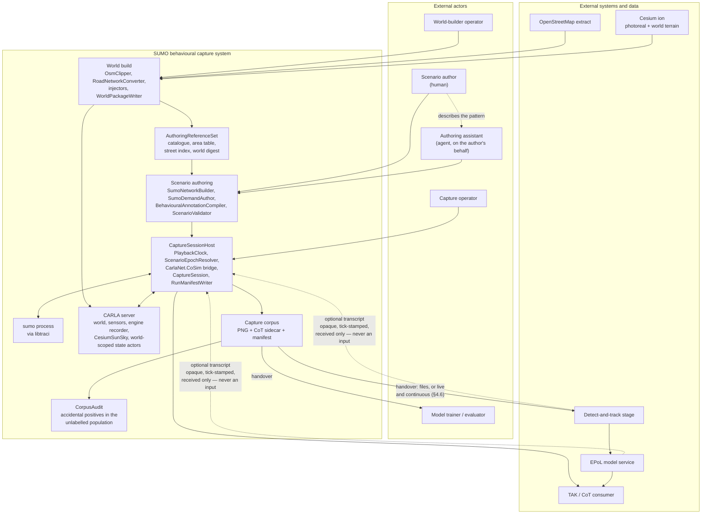
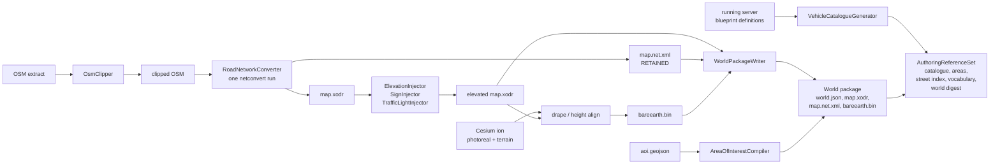
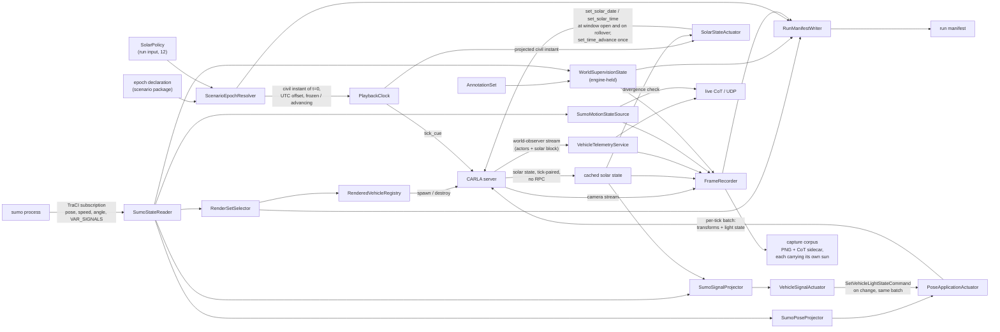
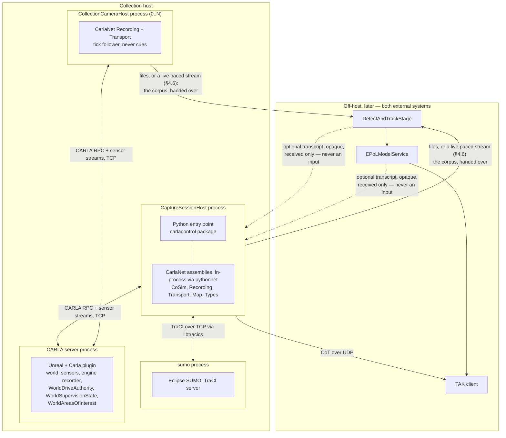
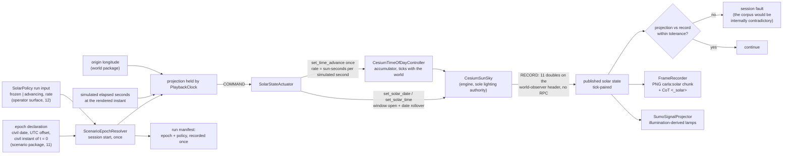
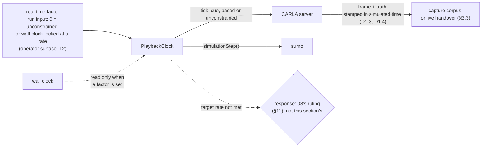
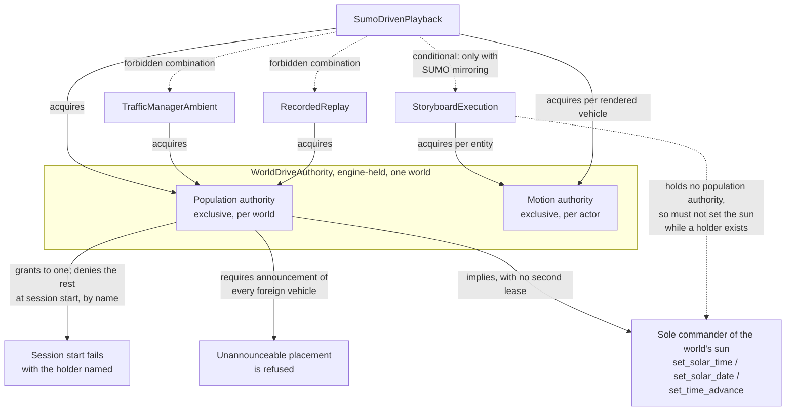
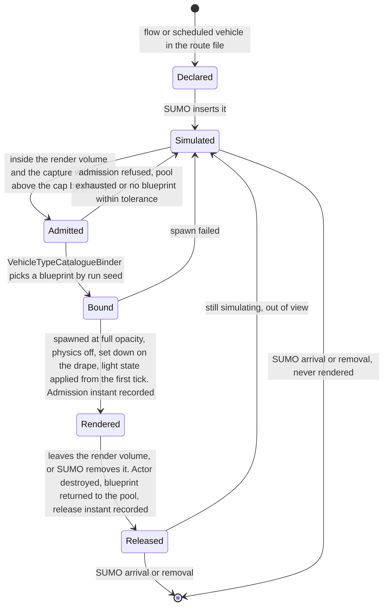

# 01 — System architecture

**Status:** Plan section. Design, not implementation. No code was changed and no build was run.
**Date:** 2026-09-18.
**Owner role:** Systems architect. Companion section: [02 — Use cases](02_Use_Cases.md).
**Scope:** The component decomposition, the process topology, the authority model, the mode matrix, the
ownership of simulated civil time and of the world's illumination, the ownership of real-time pacing for
a live exercise, the resolution of the conflict between
[23](../../Findings/23_SUMO_Traffic_Integration.md) §4 and the accepted teleport decision, and the
architectural answer to a simulation vastly larger than the renderable set.
**Audience:** An engineer who has not read the conversation that produced this plan, and who will
implement or review one of the other sections in this folder.
**Grounding:** Every claim about existing behaviour is cited `path:line` against the working tree as read
on 2026-09-17 or 2026-09-18, or carried forward from a Findings document and marked as carried forward.
Measurements taken for this section are marked **measured** and say how. Everything else that is not
cited is marked **inference**.

**Change history.**

| Revision | What changed |
|---|---|
| 1 — 2026-09-17 | First draft: components, topology, authority model, mode matrix, doc 23 reconciliation, sizing. |
| 2 — 2026-09-18 | Simulated civil time, solar policy and illumination given named owners. Adds D1.19–D1.25. |
| 3 — 2026-09-18 | Detect-and-track and EPoL model fixed as external; no evaluation or association component. |
| 4 — 2026-09-18 | Live exercise a primary use case; real-time pacing owned by `PlaybackClock`. Adds D1.26–D1.29. |

**Out of scope, deliberately.** The per-tick mechanism of the co-simulation loop
([03](03_CoSimulation_Runtime.md)), the wire-level shape of any contract
([04](04_Contracts.md)), whether a given shim or transport call is implemented end to end
([05](05_CarlaNet_Capability_Audit.md)), the annotation schema
([06](06_Truth_And_Annotation.md)), the authoring surface's grammar ([07](07_Scenario_Authoring.md)),
the detector and model interfaces in detail, and the ruling on what happens when a live external consumer
cannot keep pace with the clock ([08](08_Collection_And_EPoL.md)), packaging
([09](09_Toolchain_And_Packaging.md)), the measured performance envelope
([10](10_Scale_And_Performance.md)), the epoch contract's grammar and the night-viability and
vehicle-light mapping ([11](11_Time_And_Illumination.md)), the operator's surface over any of it,
including how a real-time factor or an unattended cadence is expressed ([12](12_Operator_Control_Surface.md)),
and the order things are built in
([13](13_Work_Breakdown.md)). Where this section needs a property from one of those, it states the
property and names the section rather than designing it.

---

## 1. The system in one paragraph

A SUMO microsimulation, authored against the same OpenStreetMap extract a CARLA world was generated
from, is the sole source of ambient vehicle motion for that world. A bridge admits a subset of SUMO's
vehicles into CARLA as actors and applies SUMO's pose to them each rendered frame. The same clock that
steps SUMO also places the sun, by projecting simulated elapsed seconds through the civil epoch the
scenario declares, so a window that opens at 23:00 on day 4 renders at night. Collection cameras in the
CARLA world write imagery plus a Cursor-on-Target truth sidecar, each frame already carrying the solar
state it was lit by. The truth carries two things SUMO and CARLA each own half of: where a vehicle was
and what it looked like from a particular camera (CARLA), and how fast it was going and what the author
asserted it was doing (SUMO and the annotation set). **This pipeline's product is that corpus** —
imagery, truth and behavioural labels, produced complete and handed over, or, in a **live exercise —
wanted at least as much as the stored corpus, and designed to the same standard (§5.6)** — the same
records leaving continuously, paced against a wall clock rather than produced as fast as the machine
allows (§4.6). What reads either form is external to this effort: a detect-and-track stage and an
estimated-pattern-of-life model service, run offline against a recorded corpus or live against a paced
stream, are both external systems this pipeline supplies and reads nothing back from for meaning — we
know nothing about their APIs, formats, transports or latencies, and this architecture specifies none of
them (D1.28). No part of this pipeline or tool suite scores anything.

### 1.1 Context and containers



**This architecture builds no component that reads `DetectAndTrackStage` or `EPoLModelService` output
back in.** Both are drawn inside `ext`, the external-systems subgraph, under a live exercise exactly as
under a stored corpus — nothing inside `sys` draws either as its own. Everything `sys` sends them is a
one-way handover, batched or live (§4.6); nothing inside `sys` reads an edge from either of them for
meaning. `CorpusAudit` is inside `sys`, because it checks this pipeline's own labels against this
pipeline's own derived area relations
([20 §2.2](../../Findings/20_Behavioral_Annotation_And_Areas_Of_Interest.md)) and needs no external
model's output to do it.

**The two dashed edges are the only edges this architecture draws returning from `ext` into `sys`.**
They exist because team brief §3c permits, but does not require, an
attached consumer to push material back — tracks, reports, or anything else. What lands at `CS` is
received as an **opaque, tick-stamped transcript with its own provenance**, not parsed for meaning, not
merged into truth or supervision, and not read by anything this pipeline computes (D1.28); its container
shape belongs to [08 §11.6](08_Collection_And_EPoL.md). The edge is dashed for the same reason the
author-to-assistant edge is: it is real, but it is not a control-flow dependency anything here waits on —
`CS` runs identically whether or not either edge ever fires.

---

## 2. Component decomposition

Every component below carries a name it can keep in code. Components that already exist are marked with
their current location; the rest are new. Nothing here is named for a stage number or a phase.

### 2.1 Build time — produces a world and the things needed to author against it

| Component | Exists as | Responsibility |
|---|---|---|
| `OsmClipper` | `CarlaControl/src/carlacontrol/OsmClipper.py` | Cuts the extract to its `<bounds>`, preserving node ids |
| `RoadNetworkConverter` | `CarlaNet.Map` `OsmConverter` | One `netconvert` run producing **both** the OpenDRIVE and the SUMO network. It already asks for both and then deletes the network (carried forward from [23 §6.4](../../Findings/23_SUMO_Traffic_Integration.md), `OsmConverter.cs:135`); retaining it is the change |
| `ElevationInjector`, `SignInjector`, `TrafficLightInjector` | `CarlaNet.Map` | Unchanged |
| `WorldPackageWriter` | `WorldBuilder._write_world_package` → `client.write_world_package` | Writes `world.json`, `map.xodr`, `bareearth.bin`. Gains `map.net.xml` from the same converter run |
| `VehicleCatalogueGenerator` | **new** | Projects `GetActorDefinitionsAsync` into a versioned vehicle catalogue ([20 §5.6](../../Findings/20_Behavioral_Annotation_And_Areas_Of_Interest.md), decision 12) |
| `AreaOfInterestCompiler` | **new** | Reads `<extract>.aoi.geojson`, validates, resolves to CARLA-local metres ([20 §8](../../Findings/20_Behavioral_Annotation_And_Areas_Of_Interest.md)) |
| `AuthoringReferenceSet` | **new artifact** | The machine-readable inputs an author needs: vehicle catalogue, area table, street-name-to-road index, annotation vocabulary, world digest. [20 open question 9](../../Findings/20_Behavioral_Annotation_And_Areas_Of_Interest.md) asks whether this should be packaged; this architecture requires it, because the assistant actor of [02](02_Use_Cases.md) cannot author without it |

The invariant that makes the whole system cheap is already established and must be preserved: because the
SUMO network and the OpenDRIVE come from one `netconvert` run at one pinned origin with
`--offset.disable-normalization`, **SUMO (x, y) equals CARLA (x, −y)** with no offset arithmetic
(carried forward from [23 §2](../../Findings/23_SUMO_Traffic_Integration.md), measured `netOffset`
`0.00,0.00`). Any design that re-derives one artifact from the other forfeits this.

### 2.2 Authoring time — produces a scenario package, with no CARLA in the loop

| Component | Exists as | Responsibility |
|---|---|---|
| `SumoNetworkBuilder` | `SumoScenarioBuilder.build_network` (`SumoScenarioBuilder.py:309`) | Rebuilds the SUMO network at the world's origin. Becomes redundant once `RoadNetworkConverter` retains `map.net.xml`; kept for scenarios authored against a world package rather than a live build |
| `SumoDemandAuthor` | `SumoScenarioBuilder`, `SumoPatternOfLifeBuilder` | Flows, scheduled vehicles, stops, fencing, opposite-lane overtaking, config |
| `BehaviouralAnnotationCompiler` | **new** | Reads the authored annotation channel and emits the `AnnotationSet` of [20 §6.1](../../Findings/20_Behavioral_Annotation_And_Areas_Of_Interest.md): pattern instances, participants, intervals, supervision state, vocabulary version |
| `ScenarioValidator` | **new**, over existing practice | Route validation through `duarouter` rather than a graph walk, departure-sort check, reference resolution against catalogue, area table and vocabulary, **and the presence and well-formedness of the epoch declaration**. The gotchas it enforces are already recorded in `.agents/skills/sumo-traffic-scenarios/SKILL.md` |
| `ScenarioPackage` | **new artifact** | The shippable unit: `map.net.xml`, `.rou.xml`, `.sumocfg`, the `AnnotationSet`, the resolved area table, the vType-to-catalogue binding, **the epoch declaration** (§4.4), and the world digest that binds it to one world ([18 §5.5](../../Findings/18_Scenario_Fabrication_For_EPoL_Training.md)) |

**The epoch declaration is a new required member of the scenario package**, and it is required because
nothing machine-readable states it today. **Measured** 2026-09-17 on the sizing scenario: guard shifts
depart at 25,200 s, 54,000 s and 82,800 s, so `t = 0` is midnight of day 0 — but that mapping exists only
inside trip identifiers such as `guard_d0_h7_t3` and in the author's head. A declaration of the civil
date, the civil UTC offset and the instant `t = 0` corresponds to is what turns a simulated second into a
sun angle. [11](11_Time_And_Illumination.md) owns its grammar and its defaults; this section requires
only that it exist, that it be part of the package's digest, and that a package without it fail
validation rather than fall back to a guess.

### 2.3 Run time

**In `CarlaNet.CoSim`, a new assembly** (the name is carried forward from
[23 §5](../../Findings/23_SUMO_Traffic_Integration.md)). Its reference set is `CarlaNet.Types`,
`CarlaNet.Transport`, `CarlaNet.Map` and the `libtracics` wrapper. It must **not** reference
`CarlaNet.TrafficManager` for the playback mode; see §5.3. The existing reference graph
(`CarlaNet/src/*/*.csproj`, read 2026-09-17) confirms `CarlaNet.Types` references nothing and is the only
common ancestor of `CarlaNet.Scenario` and `CarlaNet.Recording`.

| Component | Responsibility |
|---|---|
| `SumoSession` | Owns the `sumo` process lifetime and the libtraci connection; restartable without restarting the world |
| `SumoStateReader` | One bulk read per SUMO step through a TraCI subscription, not one call per vehicle. Non-optional at Bahonar scale ([23 §6.11](../../Findings/23_SUMO_Traffic_Integration.md)) |
| `PlaybackClock` | **The sole owner of the advance of simulated time, and therefore of simulated civil time and of the sun.** Decides when the world is cued and when SUMO is stepped, enforces the step ratio of §6.1, and is the only component that commands the world's solar state (§4.4) |
| `ScenarioEpochResolver` | Resolves the scenario package's epoch declaration and the run's `SolarPolicy` into one immutable session input: the civil instant of `t = 0`, the civil UTC offset, and whether the sun is frozen or advancing and at what rate. Runs once at session start; produces the projection `PlaybackClock` then evaluates. It is also what a replay uses, reading the epoch and policy back out of a run manifest instead of a scenario package (§5.5) |
| `SolarStateActuator` | Applies `PlaybackClock`'s projected civil instant to the world through `set_solar_date` / `set_solar_time` / `set_time_advance`, and compares the projection against the published solar state each tick. The peer of `PoseApplicationActuator`: the clock decides, the actuator writes, and neither holds the other's knowledge |
| `SumoSignalProjector` | Maps SUMO's per-vehicle `VEH_SIGNAL_*` bitmask to CARLA's `VehicleLightStateFlags`, and composes it with the illumination-derived lights the solar state implies. The peer of `SumoPoseProjector`. [11](11_Time_And_Illumination.md) owns the mapping table and the darkness thresholds; §8.5 states the guard rail the mapping must respect |
| `VehicleSignalActuator` | Emits `SetVehicleLightStateCommand` **on change only**, contributed into the same per-tick batch the pose writes ride in, so it adds no round trip (§8.5) |
| `RenderSetSelector` | Decides which SUMO vehicles are CARLA actors, over which span of simulated time. **The single place the size reduction of §9 happens** |
| `RenderedVehicleRegistry` | The actor pool. Instantiates, binds and releases; the sole creator and destroyer of a SUMO-driven actor. It owns **existence, not appearance** — an admitted vehicle appears at full opacity and a released one disappears (§8.2) |
| `VehicleTypeCatalogueBinder` | Maps a SUMO `vType` to a CARLA blueprint drawn from the world's vehicle catalogue by the run seed, reconciling dimensions |
| `SumoPoseProjector` | SUMO pose to CARLA transform: Y negation, `yaw = sumoAngle − 90`, the front-bumper-to-body-centre half-length shift ([23 §6.7](../../Findings/23_SUMO_Traffic_Integration.md)), and Z from the drape |
| `SumoMotionStateSource` | Speed, course and stopped-state per vehicle, taken from SUMO and carried into truth. The compensation for §8.2's headline cost |
| `PoseApplicationActuator` | Applies the projected pose. The actuation strategy used by the `SumoDrivenPlayback` mode |
| `ControlLoopActuator` | The alternative actuation strategy of [23 §4.1](../../Findings/23_SUMO_Traffic_Integration.md) — SUMO's target fed through a controller, CARLA physics executing. Not used by this mode; see §8.4 |
| `DriveAuthorityLease` | The client handle on the world's exclusive population authority (§5.3) |

**Held by the engine, world-scoped**, mirroring the `UStagingBounds` precedent exactly
(`Unreal/CarlaUnreal/Plugins/CesiumCarlaBridge/Source/CesiumCarlaBridge/Public/StagingBounds.h`, bound at
`Unreal/CarlaUnreal/Plugins/Carla/Source/Carla/Server/CarlaServer.cpp:808` and `:828`, surfaced on the
shim at `CarlaNet/python/carlanet/__init__.py:1589,1596`):

| Component | Responsibility |
|---|---|
| `WorldDriveAuthority` | Which component holds population authority over this world, and under which mode. Read by every client; granted to at most one |
| `WorldSupervisionState` | The tick-stamped annotation projection ([20 §7.3](../../Findings/20_Behavioral_Annotation_And_Areas_Of_Interest.md)), published so a recorder in **any** process reads the same thing |
| `WorldAreasOfInterest` | The resolved area table ([20 §8.4](../../Findings/20_Behavioral_Annotation_And_Areas_Of_Interest.md)) |
| **Solar state** — `ACesiumSunSky` plus `ACesiumTimeOfDayController` | **Already built, already world-scoped, already published.** `CesiumSunSky` is named in the server binding as "the single sun/lighting authority for the georeferenced world (CARLA weather is inert here)" (`Unreal/CarlaUnreal/Plugins/Carla/Source/Carla/Server/CarlaServer.cpp:611-612`). `ACesiumTimeOfDayController` is spawned on demand by `set_time_advance` and advances the solar clock on the world tick (`CesiumTimeOfDayController.cpp:14-38`). Nothing new is needed here; see §4.4 |

**Collection and truth:**

| Component | Exists as | Responsibility |
|---|---|---|
| `CollectionCamera` | `SensorRig` + camera actor | An RGB camera and its paired depth camera |
| `FrameRecorder` | `CarlaNet.Recording/FrameRecorder.cs` | Decimates a camera stream, writes PNG plus CoT sidecar. One per camera |
| `CaptureSession` | **new** | Assigns one capture-session identity to every recorder in a session, and a stable `sensor_id` per camera. Closes [20 §7.5](../../Findings/20_Behavioral_Annotation_And_Areas_Of_Interest.md)'s per-recorder run-id defect |
| `VehicleTelemetryService`, `CotWriter` | `CarlaNet.Recording` | Positional truth and the sidecar |
| `RunManifestWriter` | **new** | The authoritative supervision artifact ([20 §7.5](../../Findings/20_Behavioral_Annotation_And_Areas_Of_Interest.md)), written incrementally |
| `SumoCotBridge` | `carlacontrol/SumoCotBridge.py` | **Retained unchanged** as the standalone, no-CARLA telemetry path. It is not in the capture path |

### 2.4 Post-run — the handover, and the one check that stays ours

This pipeline builds nothing past the corpus. What follows is the handover: the corpus is an artifact
this pipeline produces, complete and closed, and external model teams consume it. `DetectAndTrackStage`
and `EPoLModelService` are named here only to fix the boundary — they are not components this
architecture builds, they are the two systems the corpus is handed to, offline or live, and this
pipeline reads nothing back from either.

| Component | Responsibility |
|---|---|
| `DetectAndTrackStage` | **External.** Consumes the capture corpus, batched or live; emits its own detection-sourced tracks. This pipeline supplies its input and reads none of its output for meaning; anything it pushes back is, at most, optionally received as an opaque transcript (D1.28) |
| `EPoLModelService` | **External.** Consumes tracks; emits its own per-track assessments, live or offline. Never given truth, and nothing it emits is read back into this pipeline for meaning; anything it pushes back is, at most, optionally received as an opaque transcript (D1.28) |
| `CorpusAudit` | **Ours.** Finds accidental positives in the unlabelled population ([20 §2.2](../../Findings/20_Behavioral_Annotation_And_Areas_Of_Interest.md)) — a check of this pipeline's own labels against its own derived area relations, needing no output from either external system above |

This architecture specifies nothing about either external system's API, format, transport or latency, by
design (D1.28) — they are none of this plan's business, live or offline. Where a concrete integration
helps a reader, it is one illustrative adapter, marked as such; sketching one is
[02](02_Use_Cases.md)'s and [08](08_Collection_And_EPoL.md)'s to do, not this section's.

**Two components this architecture deliberately does not contain.** There is no join of
`EPoLModelService`'s assessments to supervision — that is the evaluation this effort does not perform —
and no harness associating `DetectAndTrackStage`'s tracks to truth, because that requires reading an
external system's output back in, which is the one thing the handover forecloses. What stands in their
place is a contract, not a component: this pipeline publishes truth that is
*associable* — per tick, positioned, timed, boxed — and documents the rule by which supervision
*would* transfer onto a detector's tracks ([20 §7.6](../../Findings/20_Behavioral_Annotation_And_Areas_Of_Interest.md)),
so that an external consumer can perform that association itself. [04](04_Contracts.md) and
[06](06_Truth_And_Annotation.md) own that contract's wire shape; this section owns only the fact that no
runtime component here executes it.

### 2.5 Build-time pipeline



Two properties of this pipeline are load-bearing. **The OpenDRIVE and the SUMO network must come from the
same `netconvert` invocation**, never from re-deriving one from the other — that is what keeps the
coordinate identity and the junction identifiers aligned for free ([23
§6.4](../../Findings/23_SUMO_Traffic_Integration.md)). And **turn restrictions must survive the clip**;
`osm_clip.py` drops all OSM relations today ([issue #12](https://github.com/sbrett9/carla/issues/12)),
which costs little while nothing enforces turn legality and costs a great deal once SUMO is routing every
vehicle ([23 §6.6](../../Findings/23_SUMO_Traffic_Integration.md)). It is a prerequisite of this
architecture, not an improvement to it.

### 2.6 Run-time dataflow



### 2.7 Unattended regeneration needs no new component

The second half of the clarification asks for a corpus that can be **regenerated on a cadence by an
automated process** — nothing trains here, and nothing schedules here either (team brief §3c). Checked
against §2.2's and §2.3's tables, that requirement is already met by what exists:

- `ScenarioPackage` (§2.2) and its epoch declaration are already a versioned, machine-readable input a
  script can select without a human choosing anything interactively.
- `CaptureSession` (§2.3) already assigns a stable identity from run inputs — session id, scenario id,
  seed — so two unattended invocations with the same inputs are identifiable as the same run and two with
  different seeds are identifiable as different ones.
- `RunManifestWriter` (§2.3) already produces a machine-readable record of what was produced, every
  admission and refusal (§9.2), and — from §4.6 on — the pacing policy actually achieved. It states
  **facts**, and an external caller decides what they mean: this architecture publishes no aggregate
  verdict on whether a run is fit for a purpose it does not know (team brief §3d;
  [04](04_Contracts.md) owns the record's contract).

Two properties matter more than any of the above, and both follow from the caller — not this system —
owning termination. **A deliberate kill at an arbitrary instant is a normal operating mode**, so the
manifest must be **written incrementally and be valid at every instant**, never readable only once
closed; an interrupted run yields a shorter record, not a corrupt one. And because the caller decides
when it has enough by **querying while the run is in progress**, the observable surface during a run
matters more than anything read back at the end — the existing client RPC and stream surfaces are that
interface, and [04](04_Contracts.md) specifies what they expose.

So an unattended regeneration is a script that invokes the same entry point non-interactively with a new
seed, date or window, watches through surfaces that already exist, and stops the run when it decides to.
That is a parameter surface and an external control loop, neither of them architectural.
[12](12_Operator_Control_Surface.md) owns the parameter surface; no cadence, scheduler, run-length
policy, training loop or model lifecycle is any part of this architecture (D1.29).

---

## 3. Process and deployment topology

### 3.1 What today's system does, and the constraint that follows

Today the scenario executor and the recorder are in **one process** and on **one client**:
`world.start_scenario` and `world.start_recording` are both methods on the same `World`, storing
`self._scenario` and `self._recorder` (`CarlaNet/python/carlanet/__init__.py:1932`, `:1873`, `:1924`).
`run_SCTMV.py` constructs both and steps them from one loop (`run_SCTMV.py:222`, `:279-284`).

The constraint is stronger than [20 §7.3](../../Findings/20_Behavioral_Annotation_And_Areas_Of_Interest.md)
records. Starting a second recording on the same client **stops the first**:
`start_recording` calls `self.stop_recording()` before constructing the new one
(`carlanet/__init__.py:1908`). So a second collection camera today does not merely mean a second registry
reader — it means a second **process**, unconditionally.

And there are **two** process-local registries, not one, each of which a second process reads wrongly:

| Registry | Where it lives | What a second process sees |
|---|---|---|
| Annotation state | Proposed process-local in [20 §7.3](../../Findings/20_Behavioral_Annotation_And_Areas_Of_Interest.md), decision 11 | Empty — every vehicle `unlabelled`, silently |
| Render set | New | Would be invisible to any process that did not build it |

That is one failure mode with two instances, and it is the reason the topology decision below is what it
is rather than a matter of taste.

**A third instance does not arise, and the reason is worth recording.** The
staging fade table is also client-local — `CarlaClient._fade`, held there because "the server keeps no
readable copy of it" (`CarlaNet.Transport/CarlaClient.cs:1545-1556`) — and it gates truth, because
`VehicleTelemetryService.cs:73` skips any vehicle that has not been established. Two processes disagreeing
about which vehicles had arrived would be a real third instance of the same failure. **It is not one,
because fade is off.** `--fade` carries `default=False`, and its help text gives the reason: the
opacity is computed client-side and pushed to the server as one blocking RPC per vehicle per reconcile,
which is the heaviest load this client puts on the server's per-frame RPC budget
(`CarlaControl/src/carlacontrol/CarlaControlArgumentParser.py:318-328`, read 2026-09-17; `--no-fade` is
retained at `:329-334` so existing command lines keep working). With nothing fading, the gate is inert by
construction: `IsActorEstablished` returns true for any actor nobody has faded (`CarlaClient.cs:1571`),
`GetActorOpacity` returns 1.0 for the same reason (`CarlaClient.cs:1562`), and the truth producer's own
comment states that the gate is inert unless staging traffic is running
(`VehicleTelemetryService.cs:66-73`). So the disagreement cannot arise, no truth is lost, and no
replacement mechanism is owed. This architecture designs no fade behaviour of any kind; vehicles appear
and vanish at full opacity, and refining that later is a rendering question with no bearing on anything
below.

**A note on stale citations, for every author in this folder.** `CarlaNet/python/SCTMV.py` **no longer
exists** — verified 2026-09-17 by searching the tree, which finds no file of that name outside `Build/`.
It was replaced by `CarlaControl/scripts/run_SCTMV.py` over the `carlacontrol` package. Every
`SCTMV.py:NNN` citation in [20](../../Findings/20_Behavioral_Annotation_And_Areas_Of_Interest.md) and in
`_TEAM_BRIEF.md` therefore points at a file that is gone, and must be re-grounded against the current
tree before it is relied on. The gaps those citations recorded have not gone away: `scenario_id` is still
accepted by the recorder and still never supplied, now at `NativeRecorder.py:107-108`, which passes
`run_id` and `seed` and nothing else.

### 3.2 The processes



**No process on this host reads `DetectAndTrackStage`'s tracks or `EPoLModelService`'s assessments back
in for meaning**; the only edges leaving `p1`/`p2` toward `off` are the corpus handover and the
diagnostic CoT stream. `DAT --> EPOL` and `EPOL --> TAK` are drawn because they are true of the external
world this pipeline hands its corpus into, not because this architecture builds or owns either arrow. The
two dashed edges back into `p1` carry only the optional transcript of §1.1; they cross the same
filesystem or socket boundary as the handover, whichever the external system chooses, and this
architecture states nothing further about that transport (D1.28).

### 3.3 What crosses a boundary and by what transport

| From | To | Transport | Notes |
|---|---|---|---|
| Python entry | CarlaNet assemblies | **No transport** — same process, pythonnet | This is why there is no Python in the per-tick path ([18 D2](../../Findings/18_Scenario_Fabrication_For_EPoL_Training.md)) |
| `CarlaNet.Transport` | CARLA server | CARLA RPC (msgpack over TCP) and the sensor/world-observer streams | `SendTickCueAsync` (`CarlaClient.cs:403`) is the synchronous rendezvous |
| `CarlaNet.CoSim` | `sumo` | TraCI over TCP, through the first-party SWIG C# binding `Eclipse.Sumo.Libtraci` | Out of process by choice: a SUMO assertion cannot take the client down and `sumo` is restartable ([23 §6.3](../../Findings/23_SUMO_Traffic_Integration.md)) |
| Any client | World-scoped state | CARLA RPC pairs, in the manner of `set_staging_bounds`/`get_staging_bounds` | Published on change, not per tick; see §4.1 |
| `SolarStateActuator` | CARLA server | `set_solar_time`, `set_solar_date`, `set_time_advance` — three RPCs (`CarlaServer.cpp:614`, `:625`, `:661`) | **Write path only, and rare**: once at window open, once per solar-date rollover, once per policy change. Never per tick (§4.4) |
| CARLA server | Any client | Solar state, **on the world-observer snapshot header** — eleven doubles appended at offset 36 (`Unreal/CarlaUnreal/Plugins/Carla/Source/Carla/Sensor/WorldObserver.cpp:322-339`; cached at `CarlaClient.cs:1850-1855`, exposed at `:1991`) | **No RPC at all**, tick-paired, lock-free. The read path costs nothing and is already consumed by the recorder (`FrameRecorder.cs:160-162`) |
| `FrameRecorder` | Disk | PNG + CoT XML sidecar pairs, per camera | |
| Truth producer | TAK client | CoT over UDP | Diagnostic; the sidecar is authoritative ([20 §7.4](../../Findings/20_Behavioral_Annotation_And_Areas_Of_Interest.md)) |
| Capture corpus | `DetectAndTrackStage` | Filesystem, or a live transport the external system chooses | The transport past this boundary is `DetectAndTrackStage`'s choice, not this architecture's. For a live exercise the handover is **continuous rather than deferred**: the same frame and sidecar `FrameRecorder` already produces become available as they are produced, at the pace `PlaybackClock` is pacing to (§4.6) — what crosses the boundary is unchanged, only the timing of the handover differs, and how a consumer is notified or polled is [08](08_Collection_And_EPoL.md)'s to define |
| `DetectAndTrackStage` / `EPoLModelService` | `CaptureSessionHost` | Whatever the external system offers, if anything; opaque to this architecture | **Optional, and one-way in only.** Recorded verbatim and tick-stamped as a transcript with a source id and a content type; never parsed for meaning and never fed into truth, supervision or the clock (D1.28). [04](04_Contracts.md) and [08 §11.6](08_Collection_And_EPoL.md) own the container shape |

### 3.4 The topology decision

**One `CaptureSessionHost` process owns the clock, the bridge, the render set, the manifest and — by
default — every collection camera's recorder. Additional camera processes are permitted, are tick
followers that never cue the world, and read every world-scoped fact from the server rather than from
their own memory.**

Two halves, and both are needed:

- **Correctness does not depend on co-location.** Annotation state, drive authority, areas of interest and
  the render set are published to the server. This is [20 decision
  11](../../Findings/20_Behavioral_Annotation_And_Areas_Of_Interest.md)'s first option, chosen over its
  second, and it resolves both registry failures of §3.1 together rather than one at a time. The cost is
  an engine change; per the standing rule, that is not a cost worth avoiding. No fade or arrival state is
  published, because there is none — see §3.1.
- **The default is still one process**, because one tick owner is simpler, because the recorder already
  does its work off the interpreter on a .NET worker pool (`FrameRecorder.cs:115-123`), and because the
  shim's one-recorder-per-`World` limit (`carlanet/__init__.py:1908,1924`) is a shim defect to fix, not a
  reason to fan out into processes.

The shim change that follows is small and must be made: `start_recording` must be able to hold several
recorders keyed by camera, and must stop refusing by silently stopping the previous one.

---

## 4. The authority model

This is the backbone. For each concern there is exactly one owner. Everything else either reads it,
applies it, or is forbidden from touching it.

### 4.1 The table

| Concern | Sole owner | What every other component does |
|---|---|---|
| **Simulated time** | `PlaybackClock` | `sumo` steps only when stepped; the CARLA world advances only on a tick cue from the clock; recorders decimate against the frame timestamp they are given and never against wall clock; camera-follower processes never cue; the .NET traffic manager does not run at all |
| **Pacing against a wall clock** (a live exercise's tick-cue cadence) | `PlaybackClock`, as a real-time-factor run input — not a governor, and not a second clock | Nothing else decides when a tick cue is issued or compares simulated time to wall time. A stored-corpus capture's factor is unconstrained (today's default, every mode, §6.1); a live exercise's factor locks the cue cadence to wall time. Every other §2.3 component reacts only to "the clock has advanced by one step" and is unaware pacing exists. What `PlaybackClock` does when the target cannot be met is [08](08_Collection_And_EPoL.md)'s ruling; this row fixes only that the lever is the clock's (§4.6) |
| **Simulated civil time** (what o'clock it is in the scenario) | `PlaybackClock`, **as a projection of simulated elapsed time through the session's resolved epoch** — not a second clock, and not a second authority to keep in step. See §4.4 | Nothing else computes a civil instant. A component that needs one asks the clock; a component that needs the *achieved* one reads the published solar state. `sumo` has no notion of civil time and is never asked for one |
| **The epoch and the solar policy** (what civil instant `t = 0` is; frozen or advancing, and at what rate) | `ScenarioEpochResolver`, once at session start, from the scenario package's declaration and the run input. **Immutable for the session** | Nothing changes either mid-session. A capture that wants a different sun is a different run, so that the manifest's single recorded value is true for every frame in it. [12](12_Operator_Control_Surface.md) owns how an operator expresses the choice; [11](11_Time_And_Illumination.md) owns the declaration's grammar |
| **Illumination — the world's sun** | `PlaybackClock`, actuated by `SolarStateActuator`. The mechanism is `CesiumSunSky`, which the server binding names the single sun and lighting authority for the georeferenced world (`CarlaServer.cpp:611-612`) | Nothing else calls `set_solar_time`, `set_solar_date` or `set_time_advance` during a session. Every other component **reads** the published solar state from the world-observer snapshot at no cost. CARLA's own weather is inert in this world and is not an alternative route to the sun |
| **Vehicle light state** | `sumo` for the motion-derived signals, the solar state for the illumination-derived lamps, composed by `SumoSignalProjector` | Nothing else sets a light. The traffic manager's `VehicleLightStage` does not run (§5.3) and could not do this job anyway — its night branch is gated on CARLA weather (`CarlaNet/src/CarlaNet.TrafficManager/Stages/VehicleLightStage.cs:228-241`), which is inert here. See §8.5 |
| **Vehicle existence in the simulation** | `sumo`, from the authored demand | Nothing else inserts or removes a simulated vehicle. The bridge never invents one |
| **Vehicle existence in the world** (actor create/destroy) | `RenderedVehicleRegistry`, on `RenderSetSelector`'s decision | Nothing else spawns or destroys a SUMO-driven actor. The staging controller is locked out (§5). The traffic manager's idle cull cannot reach them because they are never registered with it |
| **Vehicle pose** | `sumo`, projected by `SumoPoseProjector`, **except Z, pitch and roll**, which are owned by the drape | CARLA applies the transform to a non-simulating body. Physics proposes nothing |
| **Vehicle kinematics** (speed, course, stopped-state) | `sumo`, via `SumoMotionStateSource` | The truth producer must take these from the bridge and **not** from `Actor.GetVelocity`, which is zero for a teleported body (`Unreal/.../Sensor/WorldObserver.cpp:373`) |
| **Positional truth** (what a sensor saw, and where) | CARLA, via `VehicleTelemetryService` | SUMO's position is the *command*; CARLA's applied transform is the *record*. See §4.2 |
| **Vehicle appearance** | `VehicleTypeCatalogueBinder`, from the world's vehicle catalogue and the run seed | SUMO's `vType` contributes class and dimensions only. **SUMO's `vType` colour is display metadata and must not reach the blueprint** — see §4.3 |
| **Behavioural truth** | The scenario author, compiled into the `AnnotationSet`, published as `WorldSupervisionState` | Nothing derives an annotation from a trajectory, ever ([20 §2.1, §8.5](../../Findings/20_Behavioral_Annotation_And_Areas_Of_Interest.md)). Derived area relations are a separate element and are never a label |
| **Population authority over the world** | Exactly one mode holder, leased from `WorldDriveAuthority` | Every other population-producing component refuses to start. See §5.3 |
| **Run and session identity** | `CaptureSession` | Recorders are *given* the session id, the scenario id and a stable `sensor_id`; they stop deriving them from their own start instant (`FrameRecorder.cs:101-103`) |

`WorldSupervisionState` is published **on change**, not per tick. An interval opens or closes a handful of
times across a capture, so the RPC traffic is negligible and no per-tick round trip is introduced. What is
stamped with the tick is the state itself, so a recorder can tell which simulated instant a snapshot
describes ([20 §7.3](../../Findings/20_Behavioral_Annotation_And_Areas_Of_Interest.md)).

**Solar state is published the same way and already is.** It is the third world-scoped fact of D1.10, and
unlike the other two it needs no engine work: eleven doubles ride on the world-observer snapshot header
(`WorldObserver.cpp:322-339`), the client caches them lock-free as it parses each snapshot
(`CarlaClient.cs:165-169`, `:1850-1855`) and exposes them as a
lock-free cache read with no RPC (`GetCachedSolarState`, `CarlaClient.cs:1991`), and the shim's
`get_solar_state` falls back to an RPC only before that cache is populated
(`CarlaNet/python/carlanet/__init__.py:1511-1533`). `{solar_time, year, month, day, time_zone, lat, lon,
sun_elevation_deg, sun_azimuth_deg, advancing, rate}` is exactly the payload a recorder needs, paired to
exactly the tick it needs it for. **This is not a coincidence and it should be said plainly**: when
[08 D8.3](08_Collection_And_EPoL.md) chose the world-observer snapshot as the publication mechanism for
world-scoped state, the precedent it cited for the choice was `_solar` itself. Publishing solar state is
therefore not a new mechanism to build but the original instance of the one already chosen.

### 4.2 Why CARLA owns positional truth although SUMO commands the pose

Under teleport the two agree by construction, which makes the question look academic. It is not, for four
reasons:

1. **The pixels were rendered from the applied transform.** Truth that disagrees with the pose the frame
   was drawn at is not truth about that frame.
2. **Z does not come from SUMO.** The SUMO network is flat — zero distinct `z` in any lane shape
   (carried forward from [23 §2](../../Findings/23_SUMO_Traffic_Integration.md), measured). Height comes
   from the drape.
3. **An apply can fail or be clamped**, and a vehicle can be destroyed between the command and the frame.
4. **Occlusion, apparent size and bounding box are camera-relative** and exist only on the CARLA side
   ([09 §5.1](../../Findings/09_Telemetry_CoT_Contract.md)).

So: **SUMO's pose is the command; CARLA's applied pose is the record.** A measurable divergence between
them is a bridge defect and should be reported, which gives the mode a free self-check.

### 4.3 Why SUMO owns kinematics although CARLA holds the body

`WorldObserver.cpp:373` serialises `View->GetActor()->GetVelocity()`, which a transform applied to a
non-simulating body does not update. Deriving speed from successive positions on the consumer side would
work but is a second implementation of a quantity SUMO already computed exactly, and it would be
indistinguishable from detector-derived speed in a record whose whole purpose is to be compared against
detector output. So the bridge carries SUMO's speed and angle into the truth record, and the record says
where it came from.

Appearance deserves a flag of its own, because the hazard is live and measured. **Measured** 2026-09-17 by
parsing `BahonarPatternOfLife.zip`'s route file: the scenario declares 14 `vType`s, and the anomaly types
carry deliberately conspicuous colours — `anomaly_probe` `1.00,0.45,0.00`, `anomaly_escort`
`1.00,0.10,0.10`, `anomaly_shadow` `1.00,0.20,0.60` — against muted civilian greys. Those colours exist to
make the SUMO GUI readable. Carried into CARLA blueprints they would make **colour the label**, which is
exactly the appearance confounder of
[20 §2.6](../../Findings/20_Behavioral_Annotation_And_Areas_Of_Interest.md): a corpus in which the
annotation is trivially recoverable from a covariate that has nothing to do with behaviour, whether or
not anything downstream ever exploits it. The binder therefore ignores `vType` colour entirely.

Dimensions run the other way and must be respected: a `vType`'s `length` and `width` change car-following
gaps and therefore the behaviour itself, so the blueprint must be chosen to match the declared dimensions
within a stated tolerance rather than the `vType` being adjusted to match a chosen blueprint. The Bahonar
types span 4.4 m to 12.0 m (**measured**, same parse), so this is a real matching problem and not a
formality. [04](04_Contracts.md) owns the tolerance and the fallback.

### 4.4 Simulated civil time is a projection, not a second clock

Two plausible owners exist for this job, so the choice between them is argued rather than asserted.

#### 4.4.1 The question

A capture window is a span of *simulated* time. A sun is placed by a *civil* instant — a date, a clock
time and a zone. Something has to turn the first into the second, and the choice is between giving that
job to `PlaybackClock`, which already owns simulated time, or to a `SolarClock` component that
`PlaybackClock` drives.

#### 4.4.2 The answer: `PlaybackClock` owns it, and there is no `SolarClock`

Simulated civil time is a pure function of values `PlaybackClock` and `ScenarioEpochResolver` already
hold between them, plus one constant of the world itself:

```
civil_instant(tick)  =  epoch.t0_civil  +  simulated_elapsed_seconds(tick)
solar_clock_hours    =  hours_of_day(civil_instant)  +  (origin_longitude / 15  −  epoch.utc_offset)
```

The second line is the projection into the engine's own clock convention, and it is derived rather than
invented. **Read:** the world spawns its sun with `EstimateTimeZoneForLongitude(OriginLongitude)`
(`CesiumHeightSampler.cpp:411-412`), and that function assigns `TimeZone = longitude / 15.0` exactly, with
no rounding to a civil zone (`Unreal/CarlaUnreal/Plugins/CesiumForUnreal/Source/CesiumRuntime/Private/CesiumSunSky.cpp:570-573`).
`UpdateSun` then passes `SolarTime` and `TimeZone` to the engine's sun-position library
(`CesiumSunSky.cpp:419-434`), which is the standard local-time-minus-zone form. So the engine's clock is
**local mean solar time at the map's longitude**, and a scenario's civil clock has to be offset into it.

**Measured, and it is not a rounding error.** The sizing scenario's network declares
`+lat_0=27.15012 +lon_0=56.18065` (**measured** 2026-09-18 by reading the `<location projParameter=…>`
element of `Shahid_Bahonar_Port.net.xml` inside `BahonarPatternOfLife.zip`). That longitude gives
`TimeZone = 3.745377 h`, or +03:44:43. Iran's civil offset is **+03:30**. The two differ by **14 min 43 s**,
which is worth up to **±3.3° of sun elevation** at that site (**computed** 2026-09-18 with a NOAA
solar-position implementation over that latitude and longitude, sampling four dates across the year). At
the 07:00 window [10 §4.2](10_Scale_And_Performance.md) recommends, on a January date, the sun sits at
**+4.00°** — so a 2.9° error is **73% of the sun's entire elevation**. Feeding civil hours straight into
`set_solar_time` is therefore wrong in exactly the window where it matters most.

Given that the projection is a function, a `SolarClock` component would hold no state that is not
derivable, and state that is a pure function of other state is how two clocks come to disagree. The
backbone of this whole section is one owner per concern; a derived value promoted to an authority is a
second owner wearing a disguise. So: **`PlaybackClock` owns the solar clock. `ScenarioEpochResolver`
owns the epoch and the policy that parameterise the projection. `SolarStateActuator` owns the writes.
There is no `SolarClock`.**

#### 4.4.3 Command and record, the same shape as pose

There is a second, sharper reason not to keep a client-side solar clock: **the engine's own advancement
is an accumulator, not a projection.** `ACesiumTimeOfDayController::Tick` does
`SolarTime += DeltaSeconds * Rate / 3600` and wraps the result into `[0, 24)`
(`CesiumTimeOfDayController.cpp:34-35`). A client-side `SolarClock` would be a *second* accumulator
running beside it, and the two would drift. Worse, the engine's wrap is a plain `Fmod` — **it does not
increment the date**, so a window that crosses midnight silently keeps the previous calendar day.

The resolution is the pattern §4.2 already uses for pose, applied to the sun:

> **The projection is the command. The published solar state is the record.**

`SolarStateActuator` writes the command sparsely — `set_solar_date` and `set_solar_time` at window open
and on any date rollover, `set_time_advance` once when the policy is established — and lets the engine
accumulator carry per-tick continuity for free. Each tick it then reads the record, which costs nothing,
and compares `solar_time` against the projection. A divergence beyond a stated tolerance is a session
fault, not a warning, for the same reason a pose divergence is a bridge defect: the frame was lit by the
record, and the manifest asserts the command.

That check is what makes the whole coupling verifiable rather than hopeful, and it closes the failure the
requirement was written against. The silent-failure risk here is unusually high **because the recording
path already works perfectly**: every capture already carries its own sun, in the sidecar
(`CarlaNet/src/CarlaNet.Recording/CotWriter.cs:52-66`) and in a `carla:solar` PNG text chunk
(`CarlaNet/src/CarlaNet.Recording/SolarMetadata.cs:16-20`). Without the coupling those records would be
*accurate* and *contradictory* — faithfully reporting noon while the scenario asserts 23:00 — and nothing
in the pipeline compares them. The check is the thing that compares them.

#### 4.4.4 What `rate` means, pinned down

[11](11_Time_And_Illumination.md) owns the policy's semantics, but one property is load-bearing here and
is settled by reading the mechanism. `set_time_advance(enabled, rate)` is documented as advancing "with
the world tick, so it tracks wall-clock in asynchronous mode and simulation time under synchronous
ticking" (`carlanet/__init__.py:1535-1540`; the same statement is in the engine header comment,
`CesiumTimeOfDayController.h:3-7`). The mechanism is the actor tick's `DeltaSeconds`
(`CesiumTimeOfDayController.cpp:34`). Windowed capture runs synchronously with a fixed delta, so:

> **Under this mode, `rate` is sun-clock seconds per *simulated* second** — concretely, each world tick
> advances the sun by `fixed_delta_seconds × rate` of solar time. `rate = 1.0` means the sun tracks
> simulated time exactly, which is what "the sun follows the scenario" requires. It is a wall-clock rate
> only in asynchronous mode, which this mode never uses.

One consequence worth stating because it is easy to get backwards: the sun must follow the **rendered**
instant, not SUMO's. §6.1 runs SUMO one step ahead of the rendered clock, so the projection is evaluated
at the instant the pixels are drawn for, not at the instant SUMO has reached.

#### 4.4.5 The mechanism, end to end



### 4.5 Authority handover

For the `SumoDrivenPlayback` mode there is **no handover**. A vehicle is SUMO-driven for its whole
rendered life. Handover exists only in the actuated shape of §8.4 and in the storyboard coupling of
§5.2, and in both cases it is per actor and is mediated by motion authority, never by a component
deciding on its own to start commanding a vehicle.

The sun has no handover either, and for a stronger reason: it is world-scoped, there is exactly one of
it, and its input — simulated elapsed time — is already exclusively owned (D1.1). **Solar command
authority therefore needs no lease of its own; it follows the population-authority lease of §5.3.**
Whoever holds population authority over a world is the only component permitted to command its sun. That
costs no new mechanism and it resolves the one real conflict, which is `StoryboardExecution` — see §5.5.

### 4.6 Real-time pacing under a live exercise

Team brief §3c makes the live
exercise a primary use case and names pacing as **"the one genuinely new engineering question"**: a
stored-corpus capture runs as fast as the machine allows; a live exercise runs against a wall clock with
an external chain, and possibly a human, watching. Something has to decide when the next tick cue goes
out, and the brief asks this section to say where that decision sits — as a property of `PlaybackClock`
itself, as a governor in front of it, or as an operator-set rate.

#### 4.6.1 The three candidates are one candidate

**A governor is rejected on the same structural argument §4.4.2 already made against a `SolarClock`.** A
governor sitting in front of `PlaybackClock`, gating its cues from outside, would have to know the same
simulated instant D1.1 already assigns to one owner in order to decide whether to hold a cue back. That
is a second component deciding about state that is the clock's alone to hold — the identical shape of
disagreement risk that made a second solar accumulator unacceptable (§4.4.2), now recurring one level up
the same clock. It is rejected for the same reason, not a new one.

**An operator-set rate is not a competing design — it is the simplest value the clock's own contract can
take.** The pattern already exists in this tree and needs no invention: `SumoCotBridge.run` paces a
scenario against the wall clock through a single `real_time_factor` argument, documented as "1.0 makes a
second of simulation take a second, 2.0 runs at twice that, and 0 — the default — steps as fast as the
machine allows" (`CarlaControl/src/carlacontrol/SumoCotBridge.py:184-194`), implemented as a comparison
against an **absolute** wall-clock target rather than a per-step sleep, specifically so "a step that
overruns is absorbed by the next one instead of accumulating drift over a long run"
(`SumoCotBridge.py:243-248`). That idiom is not part of the capture path today — `SumoCotBridge` is
retained unchanged as the standalone, CARLA-free telemetry path (D1.18) — but it is exactly the shape a
run input to `PlaybackClock` should take, because it already solves the long-run drift problem a live
exercise would otherwise hit fresh.

So: **real-time pacing is a property of `PlaybackClock`'s own contract, carried as a run input — a
real-time factor, the same shape as `SolarPolicy` (D1.22): declared once at session start, immutable for
the session, and echoed to the operator and the manifest (§10.2).** A factor of zero (or the policy's
absence) is unconstrained, which is what every mode already gets today (§6.1); a positive factor locks
the cue cadence to wall time at that ratio. `PlaybackClock` is the only component that ever reads wall-clock
time under this policy, for the same reason it is the only component that ever projects a civil instant
(§4.4): it is the only component holding the simulated instant the comparison needs.

#### 4.6.2 The useful property, and what is deliberately not decided here

**Truth is stamped in simulated time, not wall time — D1.3 and D1.4 already establish this, for pose and
for kinematics, and §6.1's step-ratio contract establishes it for the SUMO/world/capture relationship.**
Nothing above changes under a real-time factor: `CaptureIdentity` and the decimation gate are both keyed
to the simulated instant, the sun is a projection of simulated elapsed time (§4.4), and the SUMO step, the
world tick and the capture rate stay in the same integer ratio regardless of how fast or slowly wall time
is passing. **A world that ticks slower than real time is therefore still internally exact** — every
frame's pose, kinematics and solar state are exactly what the simulated instant says, whatever the wall
clock did to reach it. That is what makes "let simulated time fall behind wall time" a nearly free
response to a downstream stall, unlike dropping a frame, which is a permanent gap in what was captured.

**What this section does not decide, and says so rather than guessing.** Whether `PlaybackClock` actually
slows, drops, or does something else when a live consumer cannot keep the declared rate — and what an
operator sees when it happens — is [08 §11](08_Collection_And_EPoL.md)'s ruling, per the team brief's own
division of labour. This section's claim is narrower and does not depend on which way that ruling falls:
**whatever the response is, it attaches to `PlaybackClock`, because it is the only component that knows
the current simulated instant and the only one that issues a tick cue.** Nothing downstream — `SumoStateReader`,
`RenderSetSelector`, `SumoPoseProjector`, `SolarStateActuator`, `FrameRecorder` — needs to know a live
exercise is even running; each still reacts only to "the clock has advanced by one step."



#### 4.6.3 What this needs from elsewhere

**From [03 — Co-simulation runtime](03_CoSimulation_Runtime.md):** the mechanism, in the manner of
`SumoCotBridge.py:243-248` — a real-time factor evaluated against an absolute wall-clock target on the
world tick, not a per-step sleep, so drift does not accumulate over a long exercise, with the achieved
factor **measured per wall-clock interval and reported, not merely targeted** — because a run that did
not hold its declared rate is a fact about that run, not something to hide (echoing the defect already
visible in the unmodified pattern: it sleeps only when ahead of schedule and records nothing when it
falls behind, `SumoCotBridge.py:247-248`).

**From [08 — Collection and EPoL](08_Collection_And_EPoL.md):** the ruling on what `PlaybackClock` does
when the declared rate cannot be sustained, and what the operator sees while it happens (§4.6.2).

**From [12 — Operator control surface](12_Operator_Control_Surface.md):** where the real-time factor is
expressed, alongside the epoch and `SolarPolicy` this section already asks it for (§10.2) — one surface,
not a live-only flag.

---

## 5. Modes

### 5.1 The four modes

| Mode | What drives ambient vehicles | Population authority | Who commands the sun | Exists today |
|---|---|---|---|---|
| `SumoDrivenPlayback` | `sumo`, poses applied | Held by `CarlaNet.CoSim` | `PlaybackClock`, projecting through the scenario's epoch | New |
| `TrafficManagerAmbient` | The .NET traffic manager, over the inward staging ring | Held by `TrafficController` | The operator, as an absolute civil instant — there is no scenario epoch to project through | Yes — `carlacontrol/TrafficController.py` |
| `StoryboardExecution` | `CarlaNet.Scenario`, over named entities only | **None** — it places named entities, it does not generate a population | **Nobody, when it is coexisting.** Holding no population authority, it holds no solar command authority either (§4.5, §5.5) | Yes — `CarlaNet.Scenario/ScenarioExecutor.cs` |
| `RecordedReplay` | The engine replayer, from a log | Held by the server | The replay client, re-establishing the original run's epoch and policy **from the run manifest**, because the engine log carries no sun (§5.5) | Yes — validated in [18 §5.4](../../Findings/18_Scenario_Fabrication_For_EPoL_Training.md) |

### 5.2 The coexistence matrix

| | `SumoDrivenPlayback` | `TrafficManagerAmbient` | `StoryboardExecution` | `RecordedReplay` |
|---|---|---|---|---|
| `SumoDrivenPlayback` | — | **Exclusive** | Conditional | **Exclusive** |
| `TrafficManagerAmbient` | **Exclusive** | — | Coexist (today's use) | **Exclusive** |
| `StoryboardExecution` | Conditional | Coexist | — | **Exclusive** |
| `RecordedReplay` | **Exclusive** | **Exclusive** | **Exclusive** | — |

- `SumoDrivenPlayback` × `TrafficManagerAmbient` is **mutually exclusive** by user decision, and the
  architecture makes it structural rather than advisory (§5.3). Both claim population authority.
- `SumoDrivenPlayback` × `StoryboardExecution` is **conditional**: permitted only once every storyboard
  entity is mirrored into SUMO so SUMO's car-following yields to it ([23
  §6.9](../../Findings/23_SUMO_Traffic_Integration.md)). Until that exists the combination is **refused at
  session start**, not warned about, because an unmirrored storyboard entity is invisible to every SUMO
  vehicle and the resulting imagery shows cars driving through it.
- Anything × `RecordedReplay` is exclusive: the replayer respawns actors from the log and owns their pose.

**The matrix itself does not change with illumination, and that is a result rather than an omission.**
Solar command authority follows the population lease (§4.5), so every combination the lease already
permits has exactly one commander of the sun and every combination it already forbids was forbidden for
a reason that covers the sun too. What *does* change is the `StoryboardExecution` row, because it is the
one mode that holds no population authority and could therefore command a sun nobody else is commanding
— or, worse, command one somebody else is. §5.5 states that rule, and §5.5 also states the
obligation `RecordedReplay` acquires.

### 5.3 The lockout, as a structural property

A runtime warning the operator can ignore is not a lockout. Three mechanisms together make it structural,
in increasing order of how hard they are to defeat:

**One — the assembly graph.** `CarlaNet.CoSim` does not reference `CarlaNet.TrafficManager` for the
playback mode. A component that cannot name a type cannot call it. This is cheap and catches the
accidental case at compile time, but it does not stop a *different* component in the same process from
starting ambient traffic, so it is not sufficient on its own.

**Two — an exclusive, server-held lease.** `WorldDriveAuthority` grants **population authority** over a
world to at most one holder, and names the mode in the grant. It is engine-held for the same reason
staging bounds are: it must be visible to a client that did not create it, and must outlive the client
that did (`StagingBounds.h`, `CarlaServer.cpp:808,828`). Acquisition is part of starting a session; a
denied acquisition **fails the session start with the current holder named**. `TrafficController.enable`
(`TrafficController.py:1096`) acquires it too, and fails the same way. Nothing takes the lease
implicitly and nothing breaks it; it is released on clean shutdown and reaped when its holder's client
disconnects.

**Three — mandatory announcement.** While a population-authority holder exists, any component that
creates a vehicle actor must announce it to the holder. A storyboard entity that cannot be announced
cannot be placed. This is what makes the conditional case of §5.2 safe rather than merely discouraged,
and it is the mechanism by which the mirror of [23 §6.9](../../Findings/23_SUMO_Traffic_Integration.md)
becomes a precondition rather than an aspiration.

Two capabilities are deliberately distinguished, because conflating them would forbid something worth
having:

| Capability | Granularity | Exclusive | Held by |
|---|---|---|---|
| **Population authority** | Per world | Yes | The mode that generates unscripted vehicles |
| **Motion authority** | Per actor | Yes, per actor | Whoever commands that actor's pose or control |

**Solar command authority is deliberately not a third entry.** It is world-scoped and exclusive, which
makes it look like one, but it is derivable: its only input is simulated elapsed time, which D1.1 already
grants to exactly one owner, and its actuation is a projection of that. Adding a third lease would be a
second mechanism enforcing a constraint the first one already implies, and two mechanisms that can
disagree about the same thing is precisely the failure this section exists to avoid. **The rule is one
line: the holder of population authority is the sole commander of the world's sun, for as long as it
holds the lease.** A mode that takes no population authority takes no solar command authority.

`SumoDrivenPlayback` takes population authority over the world and motion authority over each rendered
vehicle. `StoryboardExecution` takes motion authority over its own entities and no population authority —
which is why it can coexist with either ambient mode, and why the actuated shape of §8.4 is not a
contradiction of the lockout: it would use the traffic manager as a *per-actor actuator* under SUMO's
motion authority, and would still generate no population of its own.

### 5.4 Mode and authority



### 5.5 Illumination under each mode

| Mode | Where the initial civil instant comes from | Advancement | What it must not do |
|---|---|---|---|
| `SumoDrivenPlayback` | The scenario package's epoch declaration plus the window's `begin_s`, projected by `PlaybackClock` (§4.4) | Per the run's `SolarPolicy`: frozen at the window's opening instant, or advancing at `rate` sun-seconds per simulated second | Proceed with no epoch declared. A package without one fails validation, and a session started against one fails at start rather than guessing |
| `TrafficManagerAmbient` | The operator, directly — there is no scenario, so there is no `t = 0` to project from | Same policy surface, same two choices | Nothing new. This mode gains the control surface and loses nothing |
| `StoryboardExecution` | Its own environment action, **only when it is running alone** | Its own, only when running alone | **Set the sun at all while coexisting with a population-authority holder.** An OpenSCENARIO storyboard is entitled to declare an environment; a storyboard running as a guest inside a SUMO-driven capture is not entitled to overrule its host's clock. This is a refusal at session start, not a runtime warning, and it belongs with the mirroring precondition of §5.2. **This is a guard rail, not a live conflict** — searching `CarlaNet/src/CarlaNet.Scenario/` on 2026-09-18 finds no source reference to an environment action, a time-of-day action or any solar or weather call, so the executor does not set the sun today. The rule exists so that implementing one later does not silently create a second commander |
| `RecordedReplay` | **The run manifest of the original run.** See below | Whatever the original run recorded. If the original was frozen, the replay is frozen at the same instant; if it was advancing, the replay advances at the same rate from the same start | Render under the spawn default. That is what it would do today, and it would be silently wrong |

#### 5.5.1 Recorded replay is the case that changes

A replay must reproduce the original run's illumination or the imagery does not match, and **no executor
runs during a replay** — the replayer respawns actors from the log and owns their pose, and nothing in
the session is projecting anything. So the question is not "which component keeps driving the sun" but
"where does the sun come from at all".

**Read, and it is decisive: the engine recorder carries no solar, sun or weather state.** The recorder's
packet set is twenty-four entries — `FrameStart`, `FrameEnd`, `EventAdd`, `EventDel`, `EventParent`,
`Collision`, `Position`, `State`, `AnimVehicle`, `AnimWalker`, `VehicleLight`, `SceneLight`,
`Kinematics`, `BoundingBox`, `PlatformTime`, `PhysicsControl`, `TrafficLightTime`, `TriggerVolume`,
`FrameCounter`, `WalkerBones`, `VisualTime`, `VehicleDoor`, `AnimVehicleWheels`, `AnimBiker`
(`Unreal/CarlaUnreal/Plugins/Carla/Source/Carla/Recorder/CarlaRecorder.h:48-74`) — and none of them is
the sun. `VisualTime` is not it either: it carries `Episode->GetVisualGameTime()` and is consumed by
setting a material scalar parameter of the same name (`CarlaRecorder.cpp:102`, `CarlaReplayer.cpp:443`,
`CarlaEpisode.h:121`), which is a shader input, not a solar clock.

The consequence, stated plainly: **a 23:00 capture replayed today renders at local solar noon**, because
that is what the world was spawned with (`CesiumHeightSampler.cpp:409`) and nothing in the log changes
it. That is the same silent contradiction the requirement was written against, arriving by a different
route.

The architecture's answer reuses what already exists and invents nothing:

1. **The run manifest carries the epoch and the `SolarPolicy`**, recorded once, because
   `ScenarioEpochResolver` resolved them once and they are immutable for the session (§4.1).
2. **A replay resolves them from the manifest instead of from a scenario package.** That is the second
   input shape `ScenarioEpochResolver` is specified for in §2.3, and it is the whole of the change.
3. **`SolarStateActuator` establishes the sun before the first replayed frame**, and drives advancement
   with the same `set_time_advance` call if the original run was advancing.
4. **The divergence check of §4.4.3 verifies it**, and here it has something even better to check
   against than a projection: the original run's per-frame `<_solar>` records
   (`CotWriter.cs:52-66`). A replay that reproduces the original illumination will match them frame for
   frame; one that does not will diverge on the first frame. No new mechanism is needed to notice.

This makes the manifest a **required input to replay**, which is not a new constraint but the one
[02 D2.10](02_Use_Cases.md) already states: a corpus without a closed manifest is not replayable. The
illumination requirement gives that rule a second, independent reason to exist.

**Vehicle lights, by contrast, replay for free.** `VehicleLight` is one of the recorded packet types
(`CarlaRecorder.h:60`) and the replayer restores it (`CarlaReplayer.cpp:641-655`,
`Helper.ProcessReplayerLightVehicle`). So whatever §8.5 puts on a vehicle during a capture comes back on
replay without anything being re-derived. The sun is the only half of illumination that has to be
re-established.

### 5.6 Live exercise is a property of the collection, not a mode

**Checked against §5.1's table and §4.1's authority table, as the clarification asks.** Live exercise
does not change what drives ambient vehicles, who holds population authority, or who holds motion
authority — so it is not a fifth row of §5.1 and it adds no cell to §5.2's coexistence matrix.

Every mode of §5.1 can run against a stored corpus or live, unchanged: `SumoDrivenPlayback` is the mode
the sizing scenario uses either way; `TrafficManagerAmbient` and `StoryboardExecution` are equally able to
feed a live exercise, subject to the same coexistence rules §5.2 already states; `RecordedReplay` can be
run live to rehearse against a fixed, reproducible scene. **Exactly one thing changes under a live
exercise, and it is orthogonal to the mode matrix**: `PlaybackClock`'s pacing policy (§4.6), and,
downstream of the clock, whether the corpus handover is continuous or deferred (§3.3). Neither of those
is a row of §5.1 or a cell of §5.2: `SumoDrivenPlayback` × `TrafficManagerAmbient` remains exclusive
whether or not either is live, `StoryboardExecution`'s conditional coexistence with `SumoDrivenPlayback`
is unaffected, and `RecordedReplay`'s exclusivity against everything else is unaffected. **The matrix is
unchanged** (D1.27).

One consequence worth naming because it is easy to miss: solar command authority still follows the
population-authority lease exactly as §4.5 and §5.3 state, live or not — a live exercise does not create
a second reason to touch the sun, and `StoryboardExecution`'s guard rail against setting it while
coexisting (§5.5) applies identically whether the session is being watched live or recorded to disk.

---

## 6. One simulated instant, end to end

### 6.1 The clock contract

Five rates meet here and their relationship is a contract, not a setting:

| Rate | Value in the sizing case | Source |
|---|---|---|
| SUMO step | **1.0 s** | `<step-length value="1.0"/>` — **measured** in `BahonarPatternOfLife.zip`'s `.sumocfg`, read 2026-09-17 |
| CARLA fixed delta | 0.05 s typical | `--fixed-delta`, `WorldBuilder.configure_sync_mode` (`run_SCTMV.py:141`) |
| Capture rate | 2 Hz typical | `FrameRecorder` decimation (`FrameRecorder.cs:131-133`) |
| **Solar rate** | **1.0 sun-second per simulated second**, or frozen | `set_time_advance(enabled, rate)`, advancing on the world tick by `DeltaSeconds × rate` (`CesiumTimeOfDayController.cpp:34`); see §4.4.4 |
| **Real-time factor** (live exercise only) | **0 — unconstrained**, today's default for every mode; a positive value locks the tick-cue cadence to wall time at that ratio | `PlaybackClock`'s pacing run input, in the manner of the existing `real_time_factor` idiom (`SumoCotBridge.py:184-194`); see §4.6 |

So twenty world ticks fall inside one SUMO step, a capture lands every tenth world tick, and at
`rate = 1.0` each world tick moves the sun by 0.05 s of solar time. The solar rate and the real-time
factor are the two rates here that are **run inputs rather than a derived contract** — the other three
have to divide into one another, while the sun is free to be stopped and the tick-cue cadence is free to
be paced against wall time. Unlike the solar rate, the real-time factor changes nothing about *what* any
tick contains — it only changes *when* the cue that produces it is issued (§4.6). Two consequences the
architecture fixes rather than leaves to configuration:

- **The step ratio must be an exact integer and is validated at session start.** A non-integer ratio makes
  the phase between SUMO steps and captures drift across a run, so two captures the same nominal interval
  apart are not the same interval apart in SUMO.
- **Sub-step pose is the bridge's responsibility.** Applying a 1 Hz pose to a 20 Hz world produces a
  visible stutter at exactly the rate a detector is most sensitive to. The bridge therefore runs SUMO
  **one step ahead of the rendered instant** and renders the interval behind it, which costs one SUMO step
  of latency — irrelevant for a capture — and buys an exact pose at every step boundary with a faithful
  path between them. Lowering SUMO's step to the world delta instead is rejected: it multiplies a
  seven-day simulation's cost by twenty and perturbs car-following. *The interpolation must follow the
  lane rather than the straight line between two positions, or every vehicle cuts every corner;* the
  mechanism belongs to [03](03_CoSimulation_Runtime.md), which owns it.

**A third consequence, from the solar rate.** Freezing the sun is not the same as freezing it *somewhere*.
A frozen policy pins the sun at the **window's opening civil instant**, which is a value only the
projection can supply — so even the frozen case needs the epoch, and a run with no epoch has no defensible
frozen instant either. This is why §4.4 makes the epoch a precondition of the mode rather than a
precondition of the advancing policy.

**A fourth consequence, from the real-time factor.** Because the factor changes only *when* a tick cue is
issued and not what any tick contains (§4.6), it composes with the first three consequences rather than
interacting with them: the step-ratio integrality requirement, the sub-step interpolation, and the solar
epoch precondition all hold exactly as stated whether the factor is zero or positive. The one thing that
changes downstream of the clock is how promptly the corpus handover reaches an external consumer (§3.3),
not the content of a single tick.

**What happens when one side stalls.** The clock owns both, so neither can run away from the other. If a
SUMO step exceeds its budget the world simply is not cued until it returns — the capture slows, the
content does not change, and `tick` remains the time base ([18
D3](../../Findings/18_Scenario_Fabrication_For_EPoL_Training.md)). If the world does not deliver the cued
frame, `WaitForFrame` times out and returns null rather than deadlocking (`CarlaClient.cs:425-433`); the
clock must treat that as a session fault and stop, because a capture that silently drops frames produces a
corpus whose tick spacing is not what the manifest says it is. **That is the stored-corpus case, where
there is no external consumer to wait for.** Under a real-time factor, a slower-than-declared rate is not
automatically a fault — whether it is treated as one, or absorbed as the pacing response of §4.6, is
[08](08_Collection_And_EPoL.md)'s ruling, not a variant of this paragraph's rule.

### 6.2 The sequence

```mermaid
sequenceDiagram
    autonumber
    participant ERS as ScenarioEpochResolver
    participant CLK as PlaybackClock
    participant SUM as sumo (libtraci)
    participant SEL as RenderSetSelector
    participant REG as RenderedVehicleRegistry
    participant SOL as SolarStateActuator
    participant ACT as PoseApplicationActuator
    participant SRV as CARLA server
    participant REC as FrameRecorder
    participant DSK as capture corpus

    rect rgb(240,240,240)
        Note over ERS,SRV: once, at session start — before any capture tick
        ERS->>ERS: resolve epoch + SolarPolicy (immutable for the session)
        ERS->>CLK: civil instant of t = 0, UTC offset, frozen / advancing, rate
        CLK->>SOL: civil instant of the window's opening tick
        SOL->>SRV: set_solar_date(y, m, d)
        SOL->>SRV: set_solar_time(projected local solar hours)
        SOL->>SRV: set_time_advance(advancing, rate)
    end

    Note over CLK: instant k, inside SUMO step n..n+1

    CLK->>ACT: pose for instant k, interpolated from steps n and n+1
    CLK->>ACT: light state for instant k (SumoSignalProjector, changed entries only)
    ACT->>SRV: apply_batch(set_transform + set_vehicle_light_state per changed vehicle)

    opt real-time factor > 0 (live exercise, §4.6)
        CLK->>CLK: hold until wall clock reaches instant k's paced target
        opt declared rate cannot be met
            Note over CLK: response is 08's ruling (§11), not this diagram's
        end
    end

    CLK->>SRV: tick_cue
    SRV-->>CLK: frame number
    SRV-->>REC: camera frame k (sensor stream)
    SRV-->>REC: episode state k (world-observer stream, solar block on the header)
    CLK->>CLK: read published solar state from the cache (no RPC)
    CLK->>CLK: compare against the projection for instant k
    alt divergence beyond tolerance
        CLK->>CLK: session fault — the record would contradict the manifest
    end
    REC->>REC: decimate against frame timestamp
    REC->>REC: positional truth from the snapshot of frame k
    REC->>REC: merge SumoMotionStateSource speed/course for frame k
    REC->>REC: merge WorldSupervisionState snapshot stamped k
    REC->>REC: attach solar state paired to frame k (already in the snapshot)
    REC->>DSK: queue job; worker writes PNG + CoT sidecar

    alt k crosses a solar-date boundary
        CLK->>SOL: new civil date
        SOL->>SRV: set_solar_date(y, m, d)
        Note over SOL,SRV: the engine accumulator wraps the clock at 24 h<br/>but never increments the date (CesiumTimeOfDayController.cpp:35)
    end

    alt k crosses a SUMO step boundary
        CLK->>SUM: simulationStep()
        SUM-->>CLK: one bulk subscription read, all vehicles, pose + speed + signals
        CLK->>SEL: reconcile the render set
        SEL->>REG: admit / release
        REG->>SRV: spawn, destroy
        SEL->>CLK: interval state changes, if any
        CLK->>SRV: publish WorldSupervisionState (on change only)
    end
```

Four properties of that sequence are worth reading off it, because they are the reason the coupling is
cheap. **The solar write path is outside the per-tick loop** — three RPCs at session start, one more per
date rollover, and nothing else. **The solar read path costs nothing** — it arrives on a stream the
recorder is already consuming, so the check and the record are both free. **The light commands ride
the batch that already exists**, so the per-tick round-trip count of [03 D3.3](03_CoSimulation_Runtime.md)
is unchanged: one batch, one tick cue. **And the pacing gate is the same shape as the other three.** It
sits entirely inside `PlaybackClock`, is evaluated *before* the cue is issued rather than after, and
touches nothing downstream — `ACT`, `SRV`, `REC` and every other participant in this diagram run
identically whether the real-time factor is zero or positive, because pacing decides only *when* the next
line of this diagram executes, never *what* it does (§4.6).

**A defect this mode makes visible, and the property it needs.** The recorder takes the capture's tick
from the image frame header (`FrameRecorder.cs:179`) but takes its vehicle truth from whatever the
world-observer cache last held (`FrameRecorder.cs:148` → `VehicleTelemetryService.Compute`, which reads
`GetActorSnapshot` with no frame argument). The paired depth capture *is* tick-matched
(`FrameRecorder.cs:156` → `OcclusionEstimator.MatchTo(tick, …)`), so the two halves of one capture already
use different rules. Under physics a one-frame mismatch is a small position error. Under applied poses it
is a whole frame of motion arriving in one step. **[03](03_CoSimulation_Runtime.md) must guarantee that a
capture's truth is the snapshot of the frame its pixels came from**, matched the way occlusion already
matches.

**The solar block is in the same defect.**
The recorder attaches solar state by calling `GetCachedSolarState()` (`FrameRecorder.cs:162`), which
returns the *latest* snapshot's block rather than frame *k*'s — the identical rule that produces the
vehicle-truth mismatch above. At `rate = 1.0` the consequence is trivial: one frame is 0.05 s of sun, far
below anything visible. At a high rate it is not — a policy running the sun at an hour per second makes a
one-frame mismatch three minutes of solar motion, and the frame would then be stamped with a sun it was
not lit by. **The requirement is the same requirement**: solar state belongs to the frame its pixels came
from, and 03's guarantee should cover the whole snapshot rather than the vehicle rows of it. Stating it
here costs nothing because the payload is already on the same header as the actor rows and is therefore
already matched to the same tick at the source — only the client-side read is unmatched.

---

## 7. The life of one vehicle



The contract this state machine encodes, stated once so the other sections can reference it:

- **A vehicle CARLA is not rendering is still simulating**, and truth must say so rather than implying it
  does not exist. It is absent from a capture sidecar, because a sidecar is the record of what a camera
  could have seen; it is present in the run manifest's accounting, marked as not rendered.
- **A rendered span gate sits upstream of
  [20 §2.5](../../Findings/20_Behavioral_Annotation_And_Areas_Of_Interest.md)'s observed span.** An
  annotated interval can now fail to be observable for two independent reasons — the participant was never
  rendered, or it was rendered and not seen. Both must be recorded per interval, or a consumer computing
  prevalence or coverage from this corpus gets a wrong answer with nothing in the corpus to flag it. This
  is a requirement the render set introduces and that doc 20 did not have;
  [06](06_Truth_And_Annotation.md) owns its shape.
- **The rendered span is delimited by two recorded instants, and those instants are the gate.** A vehicle
  appears in the world at the tick it was admitted and vanishes at the tick it was released, at full
  opacity in both directions. That abrupt appearance and disappearance is a fact about the capture, so
  `RenderedVehicleRegistry` records the admission and release tick per vehicle and the run manifest carries
  them. This is a recorded instant, not a visual transition: nothing in this architecture dissolves
  anything, and the rendered span of the gate above is exactly the interval between those two instants.
- **The registry owns existence, not appearance.** It has no fade role. The arrival gate that
  `VehicleTelemetryService.cs:73` applies is inert with nothing fading — `IsActorEstablished` returns true
  for any actor nobody has faded (`CarlaClient.cs:1571`) — so no truth is lost and no state has to be
  published to replace it (§3.1).
- **A released vehicle can be re-admitted.** Its `entity_id` and its blueprint binding must be stable
  across the gap, or one SUMO vehicle appears in the corpus as two different-looking vehicles. The binding
  is therefore keyed on the SUMO vehicle id and the run seed, not on the order of admission.
- **Light state is applied on the admission tick, not on the first tick something changes.** A vehicle
  admitted into a dark window with its lamps off for one frame is a vehicle that flickers into existence
  *and* into illumination, which is two artefacts where the architecture already accepts one. The
  `VehicleSignalActuator` writes on change, and an admission counts as a change from nothing
  (§8.5). This matters more than it sounds: at the 23:00 window of [10 §4.2](10_Scale_And_Performance.md)
  the lamps may be most of what a detector can see of the vehicle at all.

---

## 8. Resolving doc 23 §4 against the accepted teleport

### 8.1 What doc 23 actually argued

[23 §4](../../Findings/23_SUMO_Traffic_Integration.md) recommends against teleporting and for "SUMO
decides, CARLA physics executes", on the grounds that adopting upstream's teleport shape would regress
four capabilities this fork has built. That argument was made for a different requirement: **ambient
traffic as believable background for an OpenSCENARIO storyboard**, at ordinary scale, where physics
fidelity is most of the point. It was not made for a seven-day, 245-flow behavioural capture whose product
is imagery plus behavioural truth. The user has accepted teleport-style control **for this mode**. Neither
document is wrong; each was written without the other's requirement in hand.

What follows is doc 23 §4's own table, cost by cost, with what this architecture does about each. Nothing
is waved away.

### 8.2 Cost by cost

| Doc 23 §4 cost | Is it real here | What the architecture does |
|---|---|---|
| **Truth telemetry velocity reads zero.** `WorldObserver.cpp:373` serialises `GetActor()->GetVelocity()`, which a transform on a non-simulating body does not update | **Yes, verified at that exact line 2026-09-17** | Fully compensated, and arguably improved. `SumoMotionStateSource` carries SUMO's own speed and angle into the truth record, and the record says the kinematics came from the simulation rather than from the body. SUMO's angle is additionally *better* than a velocity-derived course for the case that matters most: a stationary vehicle has no course, and [18 §6.3](../../Findings/18_Scenario_Fabrication_For_EPoL_Training.md) measured two stationary vehicles broadcasting `course="271.8"` and `course="299.3"` as pure noise. `SumoCotBridge.py:302-303` already relies on exactly this property |
| **Seating on the draped terrain** — SUMO poses arrive with no usable Z | Yes; the SUMO network is flat, zero distinct `z` (carried forward from [23 §2](../../Findings/23_SUMO_Traffic_Integration.md)) | Fully compensated, and cheaply. `CarlaClient.SampleDrapeGroundElevation` (`CarlaClient.cs:241-263`) is a **client-side bilinear lookup with no RPC and no raycast**, already used to resolve ground height in .NET. The projector samples it per vehicle per tick. [23 §6.5](../../Findings/23_SUMO_Traffic_Integration.md) names this same call for the same purpose |
| **Suspension, pitch and wheel rotation** | Partly | **Partly compensated, partly a stated loss.** Terrain-following pitch and roll are recoverable from the gradient of the same drape grid along the heading, which is the visible part at EO altitude, and the projector owns them. Suspension travel and load transfer are **gone and stay gone**. Wheel rotation is already dead in this fork's record and replay path — `#if 0 // @CARLAUE5` at `Recorder/CarlaRecorder.cpp:209` and `Recorder/CarlaReplayerHelper.cpp:348`, carried forward from [18 §5.2](../../Findings/18_Scenario_Fabrication_For_EPoL_Training.md) — and is sub-pixel at the altitudes [09 §5.1](../../Findings/09_Telemetry_CoT_Contract.md) measured, where a vehicle is about three pixels long at 1.1 km |
| **Vehicle light state**, which under the traffic manager is computed by a stage that does not run when the traffic manager does not run. **This is a fifth cost doc 23 §4 did not enumerate** | **No — there is nothing to lose, measured** | **A gain, not a cost, and the ledger should say so.** The only component with automatic vehicle lights is the .NET traffic manager's `VehicleLightStage`, and in a georeferenced world it cannot work: it is **off per actor by default** (`Parameters.cs:437-438` returns false for any actor nobody enabled), and its entire night branch is wrapped in `if (_isWeatherEnabled)` with the sun read from `_weather.SunAltitudeAngle` (`Stages/VehicleLightStage.cs:228-241`) — CARLA weather, which `CarlaServer.cpp:611-612` records as inert in this world. So **no existing mode turns a headlight on at night in a generated world.** SUMO-sourced signals plus solar-derived lamps are new capability over a baseline of none. See §8.5 |
| **Vehicle fade and the staging ring** are built around a client-side registry keyed to vehicles the staging controller owns | The staging ring, yes. The fade, no | **The staging ring is replaced; the fade is already off in the working tree, independently of this plan.** The ring exists to solve a spawn-model problem that SUMO's insertion model solves better and directly — [23 §3.1](../../Findings/23_SUMO_Traffic_Integration.md) sets that out at length, including that exactly two of Arapahoe's 212 fringe entries are freeway — so `RenderSetSelector` supersedes it for this mode while the staging controller itself is untouched and remains the `TrafficManagerAmbient` mode's mechanism. The fade is a different matter: `--fade` is off by default in the working tree because the opacity is computed client-side and pushed one blocking RPC per vehicle per reconcile (`CarlaControlArgumentParser.py:318-328`). `RenderedVehicleRegistry` therefore owns existence and not appearance — an admitted vehicle appears at full opacity and a released one disappears, and the admission and release ticks are recorded (§7). Doc 23 §4 counted the fade as a capability a teleport shape would cost; it is no longer a capability in use, so there is nothing here to cost |

### 8.3 What is genuinely lost, and stays lost

Named so it is not quietly assumed away:

1. **Vehicle-to-vehicle collision response.** With physics off, two bodies SUMO allows to overlap will
   interpenetrate on screen. SUMO's own collision handling is the only guard, and the sizing scenario sets
   `<collision.action value="warn"/>` (**measured**, `.sumocfg`) — it warns and continues. A capture must
   treat SUMO collision warnings as corpus-affecting events, recorded in the manifest.
2. **Suspension and load-transfer dynamics**, as above.
3. **Any emergent interaction between a vehicle and the terrain** other than following it: no wheel slip,
   no grade-limited acceleration. Note that [23 §3.3](../../Findings/23_SUMO_Traffic_Integration.md)
   already establishes that stock SUMO does not model grade either, so this is not a regression against
   the alternative — it is a gap both shapes share and that doc 23's per-lane speed derivation addresses
   independently of which actuator is used.
4. **The nomenclature trap.** SUMO has its own "teleport", which is a jam-breaking jump within the
   microsimulation and is a different thing entirely. The sizing scenario disables it —
   `<time-to-teleport value="-1"/>`, **measured**, with the authored comment that a vehicle jumping
   position is something nothing downstream can reproduce faithfully. Every document and identifier in
   this plan must be explicit about which is meant; the architecture's term for ours is **pose
   application**, and `PoseApplicationActuator` is named that way for this reason.

### 8.4 Should doc 23's recommended shape still exist?

**Yes, as a second actuation strategy behind the same bridge, and it should be built second, not first.**

The two shapes differ in exactly one component. Everything upstream — the session, the clock, the SUMO
session and state reader, the render-set selector, the vehicle registry, the type binder, the pose
projector — is shared. What differs is whether the projected target becomes a transform
(`PoseApplicationActuator`) or a control input through a controller and the traffic manager's motion-plan
stage (`ControlLoopActuator`, the shape of
[23 §4.1](../../Findings/23_SUMO_Traffic_Integration.md)). Making that a strategy rather than a second
system is what keeps them from diverging into two half-maintained integrations.

Why playback first: it is the shape the accepted requirement asks for, it has no tracking-tolerance
question ([23 open question 2](../../Findings/23_SUMO_Traffic_Integration.md)) because there is no
tracking error to bound, and it is the one that can sustain the render counts of §9. Why the actuated
shape should still exist: it is the honest oracle for whether a control loop can track SUMO at all, it is
the right answer for oblique or ground-level imagery where body dynamics are visible, and it is the path
by which storyboard coupling ([23 §6.9](../../Findings/23_SUMO_Traffic_Integration.md)) becomes
believable. Doc 23's recommendation is therefore not overturned — it is scoped to the mode it was written
for.

**Illumination is neutral between the two strategies**, and that is worth one line so nobody has to work
it out later. The sun is world-scoped and is commanded by the clock, which both strategies share; vehicle
lights are per actor and are applied by a command either strategy can carry. Nothing in §8.5 argues for
one actuator over the other.

### 8.5 Illumination and vehicle lights under pose application

Pose application takes nothing away from the sun: the sun is a property of the world, not of how a body
got to where it is. What it *does* change is who supplies a vehicle's lamps, because the component that
would otherwise have supplied them is locked out — and, as the new row in §8.2 records, that component
could not have supplied them here anyway.

#### 8.5.1 The two halves of a lamp, and why they have different owners

**Read from the SUMO source, 2026-09-18.** SUMO computes some signals and not others:

| CARLA lamp | SUMO source | Read at |
|---|---|---|
| Brake | `VEH_SIGNAL_BRAKELIGHT`, set from the car-following model's own next-step deceleration, with the stopped case forced on | `carla/Build/sumo-src/src/microsim/MSVehicle.cpp:4249-4258` |
| Left / right blinker | `VEH_SIGNAL_BLINKER_LEFT` / `_RIGHT`, set from the lane-change model's own state and from the upcoming link direction | `MSVehicle.cpp:6802-6857` |
| Emergency beacon | `VEH_SIGNAL_EMERGENCY_BLUE`, toggled once a second, **only for `vClass="emergency"`** | `MSVehicle.cpp:4802-4803`, `:6862-6873` |
| Position, low beam, high beam, fog, reverse | **Nothing.** `VEH_SIGNAL_FRONTLIGHT`, `VEH_SIGNAL_HIGHBEAM` and `VEH_SIGNAL_BACKDRIVE` appear in the enum (`MSVehicle.h:1118-1126`) and are assigned **nowhere in `src/`** — verified by grep across the SUMO source tree | — |

That split is the design. **SUMO models the lamps that follow from motion and does not model the lamps
that follow from the light level** — it has no notion of a sun. So:

> **Motion-derived signals come from SUMO. Illumination-derived lamps come from the published solar
> state.** `SumoSignalProjector` composes the two into one `VehicleLightStateFlags` value.

This is the same authority argument as D1.4 — kinematics come from SUMO because SUMO computed them
exactly — extended to the one channel where SUMO is *not* the better source and the sun is.

#### 8.5.2 It costs no round trips, which is why it is worth mandating

`SetVehicleLightStateCommand` is one of the batch commands already imported by the shim
(`carlanet/__init__.py:484-487`) and already emitted in batch form by the traffic manager's own light
stage (`Stages/VehicleLightStage.cs:9-12`, which explicitly notes it issues no RPC inside `Update`).
SUMO's signals arrive on the **same bulk subscription** the state reader already performs —
`VAR_SIGNALS` is an ordinary subscribable vehicle variable (`libsumo/TraCIConstants.h:1075`) and is
exposed on the C# binding as `Vehicle.getSignals` (`Eclipse.Sumo.Libtraci/Vehicle.cs:318-319`). So the
whole feature is: more entries in a subscription that already runs, and more entries in a batch that
already runs. **Zero additional round trips**, at a per-tick cost [10](10_Scale_And_Performance.md) needs
to bound but that has the same shape as the pose writes it already bounded.

Given that, the architecture mandates it rather than leaving it optional. The deciding argument is not
elegance, it is corpus validity: [10 §4.2](10_Scale_And_Performance.md) recommends a **23:00** window,
and at that hour on the sizing site the sun is between **38° and 78° below the horizon** as the window
opens, depending on the date (§9.3, computed). A capture of unlit vehicles at that hour is not a dimmer
version of the daylight capture — it is imagery in which the objects of interest may not be present at
all.

#### 8.5.3 The guard rail: a lamp must not become a label

D1.6 forbids a `vType`'s colour from reaching a blueprint, because the sizing scenario's anomaly types
carry deliberately conspicuous colours and carrying them would make colour the label. **The light channel
reopens exactly that hazard**, and it must be closed the same way.

**Measured** 2026-09-18 by parsing the sizing scenario's route file: the four anomaly types are
`anomaly_probe` (`vClass="passenger"`), `anomaly_escort` and `anomaly_shadow` (`vClass="army"`) and
`anomaly_staybehind` (`vClass="authority"`). **No Bahonar type declares `vClass="emergency"`**, and the
beacon fires only for that class (`MSVehicle.cpp:4802`), so on this scenario the hazard is **latent, not
live**. But it is one `vClass` away: a scenario that gave an anomalous vehicle an emergency class would
put a flashing blue beacon on precisely the vehicles the corpus marks anomalous — a leaked covariate
exactly like the colour of D1.6, present in the data whether or not anything downstream ever exploits it.
The rule, stated so [11](11_Time_And_Illumination.md) can implement it and [07](07_Scenario_Authoring.md)
can validate it:

> **Lamps that are computed from a vehicle's own motion or from the world's light level are carried.
> Lamps that are a declared attribute of a vehicle are treated the way `vType` colour is treated under
> D1.6 — they reach the world only when they are a property of the vehicle's *class* in the vehicle
> catalogue, never when they are a property of its annotation status.**

Illumination remains derived context and never a supervision signal, which is the standing rule this is
an instance of: it is computed identically for every vehicle in a capture, it is a legitimate covariate
for stratifying a corpus, and a scenario must never encode its annotation in the lighting.

---

## 9. Sizing: a seven-day simulation and a capture that is not seven days long

### 9.1 What was measured

**Measured 2026-09-17** by parsing `BahonarPatternOfLife.zip` at the workspace root (read-only; the
archive's `.rou.xml`, `.sumocfg` and `.net.xml` were parsed with the standard library):

| Quantity | Value |
|---|---|
| Simulated span | 604 800 s — seven days |
| SUMO step | 1.0 s |
| `vType` declarations | 14, lengths 4.4 m to 12.0 m |
| Flows / individually declared vehicles | 245 / **0** |
| **Estimated total vehicle insertions across the run** | **≈ 68 900**, summed per flow from `vehsPerHour`, `period` or `number` against each flow's own begin and end |
| Peak hourly insertion rate | ≈ 2 160 veh/h |
| Mean hourly insertion rate across covered hours | ≈ 800 veh/h |
| Map extent (`convBoundary`) | −3 606.86, −1 914.94 to 3 607.23, 2 107.82 — **7 214 m × 4 023 m**, about 29 km² |
| `netOffset` | 0.00, 0.00 — the coordinate identity holds for this map too |

The bundled sample telemetry (`samples/bahonar_cot_sample.csv`) covers only the run's first 572 s and
shows 2 to 5 concurrent vehicles, so it is **not** a concurrency measurement for the run and must not be
quoted as one.

**Inference, not measurement:** at the peak insertion rate and a trip duration on the order of the map's
own extent divided by a typical speed, concurrent SUMO vehicles at peak are of order several hundred.
That figure is an estimate offered to size the problem, not a result; bounding it properly belongs to
[10](10_Scale_And_Performance.md).

### 9.2 Where the reduction happens, and who owns it

There is exactly one component that decides what CARLA instantiates: **`RenderSetSelector`**. It applies
two independent reductions and one priority rule.

**Temporal reduction — the capture window.** A capture covers a window of simulated time, not the whole
authored span. The `PlaybackClock` reaches the window by stepping SUMO with nothing rendered at all, then
begins cueing the world. That is how a seven-day pattern of life yields a twenty-minute capture at 08:15
on the fourth day. **The phrase "at 08:15 on the fourth day" is doing real work**: the window is chosen
in civil time because that is what a pattern of life is
organised around, and choosing it therefore chooses an illumination. §9.3 makes that consequence
explicit. This is cheap because SUMO steps a network this size far faster than real time —
`SumoCotBridge` already reports an achieved real-time factor for exactly this reason
(`SumoCotBridge.py:165-168`, `:289-291`). It is also the reduction that does most of the work: the ratio
between a seven-day span and a twenty-minute window is about 500 to 1, before any spatial filter runs.

**Spatial reduction — the render volume.** Within the window, a vehicle becomes an actor only inside the
render volume: the union of every collection camera's footprint, expanded by a margin large enough that a
vehicle is instantiated and settled before it could first be seen. With vehicles appearing at full
opacity the margin has only one job — to keep an appearance from happening inside a frame — so it is
derived from the approach speed and the settle time rather than tuned.

**Priority, not exemption.** Participants of an annotated pattern instance rank above ambient vehicles
when the concurrent-actor cap binds. They are not exempt from the render volume — a vehicle outside every
footprint cannot be seen and rendering it buys nothing — but they are never displaced by ambient traffic
inside it. Without this, a busy hour silently drops the very vehicles the capture exists to record.

**And it is recorded.** Every admission and every refusal is a fact about the corpus, so both go to the
run manifest. A refusal is the only evidence that a capture was demand-limited rather than
content-limited, and it is invisible in the imagery.

### 9.3 Where a window lands is an illumination choice, and it should be visible as one

[10 §4.2.3](10_Scale_And_Performance.md) recommends four to eight windows placed on the authored events,
naming **07:00** (shift change), **15:00** and **23:00** (the night shift) as the sizing scenario's daily
peaks. Those are civil hours, so each names a different sun. The architecture's job is not to choose the
windows — that is the capture plan's — but to stop the illumination consequence being implicit.

**Computed** 2026-09-18, with a NOAA solar-position implementation evaluated at the sizing site's own
origin (latitude 27.15012, longitude 56.18065, **measured** from the network's `projParameter`) and Iran's
civil offset of **+03:30**. Sun elevation in degrees above the horizon, at the start of each window:

| Civil hour | 5 Jan | 5 Apr | 5 Jul | 5 Oct |
|---|---|---|---|---|
| **07:00** | **+4.0°** | +18.7° | +25.1° | +16.8° |
| 15:00 | +22.4° | +39.9° | +46.9° | +30.8° |
| **23:00** | **−77.6°** | −54.6° | −38.7° | −66.4° |
| 03:00 *(doc 20's class-4 pattern hour)* | −47.0° | −33.0° | −22.1° | −36.1° |

Four consequences follow, and each is a thing the architecture must expose rather than leave to be
discovered in the imagery.

1. **The 23:00 and 03:00 windows are genuinely night, on every date.** The sun is never less than 22°
   below the horizon at those hours, which is past astronomical twilight. There is no date on which they
   render as dusk. Whether a night capture is *usable* — what a photoreal Cesium tileset looks like with
   no sun on it, and what a detector can do with it — is the night-viability question, and it belongs to
   [11](11_Time_And_Illumination.md). What belongs here is that the question is unavoidable: the
   recommended capture plan contains a night window, so the plan is not executable until it is answered.
2. **The declared *date* is as load-bearing as the declared clock, and only at the 07:00 window is that
   obvious.** The same 07:00 window is a **+4.0°** sun in January and a **+25.1°** sun in July. Sunrise at
   that site is **06:40** civil on 5 January and **05:00** on 5 July (computed, same method), so the
   window opens twenty minutes after sunrise in one case and two hours after it in the other. These are
   not the same capture. An epoch that declared a time of day but not a date would leave the single
   largest covariate an electro-optical detector faces unpinned.
3. **Frozen and advancing are materially different at the default window length, and the difference is
   largest exactly where the light is lowest.** Over [10 D10.3](10_Scale_And_Performance.md)'s default
   **1,800 s** window at `rate = 1.0`, the sun moves (computed):

   | Window | 5 Jan | 5 Jul |
   |---|---|---|
   | 07:00 → 07:30 | +4.0° → **+9.8°** (+5.8°) | +25.1° → +31.6° (+6.5°) |
   | 15:00 → 15:30 | +22.4° → +17.3° (−5.1°) | +46.9° → +40.3° (−6.6°) |
   | 23:00 → 23:30 | −77.6° → −83.4° (−5.8°) | −38.7° → −39.9° (−1.2°) |

   At the January 07:00 window the sun's elevation **more than doubles inside one window**. A sweep that
   wants illumination held constant across its cells must freeze it; a capture that wants a detector
   exposed to changing light must let it advance. Both are legitimate, which is why the policy is a run
   input and not a constant — and why the manifest has to record which was used, because the two produce
   visibly different corpora from the same window declaration.
4. **The prewarm lead-in is on the correct side of the window automatically.** [10 §4.2.2](10_Scale_And_Performance.md)
   admits and poses vehicles for `prewarm_s` before the window opens without capturing. Because the sun
   is a projection of simulated elapsed time (§4.4), the prewarm ticks are lit by the instants *before*
   the window, which is what they should be, and nothing has to special-case them.

**What this section does not decide.** Whether the epoch is declared per scenario or per run, what its
defaults are, what the darkness threshold for switching lamps on is, and whether a night window needs
anything of the world besides a low sun. Those are [11](11_Time_And_Illumination.md)'s. Whether the
operator picks a window by civil hour or by simulated second, and how the choice is echoed back before a
long run starts, is [12](12_Operator_Control_Surface.md)'s.

### 9.4 What this section needs [10](10_Scale_And_Performance.md) to guarantee

Stated as properties, not as a design:

1. **A measured concurrent-actor bound** at the capture rate, for one camera and for N, at which the world
   still delivers every cued frame within the clock's budget. `RenderSetSelector`'s cap is that number;
   the architecture does not choose it.
2. **A measured per-vehicle per-tick cost** decomposed into pose application, positional truth computation
   and occlusion sampling, because those three scale differently in the number of cameras and the
   selector needs to know which one binds first.
3. **A measured cost of one SUMO step** at Bahonar scale, and of the bulk subscription read, so the clock
   knows whether a SUMO step fits inside a world tick or must be overlapped with the render.
4. **A measured headless step rate**, which sets what a capture window's lead-in costs and therefore
   whether reaching hour 103 of a seven-day scenario is a minute of waiting or an hour of it.
5. **A statement of whether `apply_batch`** (`CarlaClient.cs:1779-1785`) applies a batch of transforms
   atomically with respect to a frame, because if it does not, a large render set can straddle a frame
   boundary and half the vehicles in a capture will be one tick stale.
6. **The marginal per-tick cost of the light commands** that §8.5 adds to the same batch, at the render
   cap and in the worst case for change frequency, which is stop-and-go traffic where brake lamps toggle
   constantly. The architecture's claim is that this adds entries to an existing batch rather than a new
   round trip; the size of that addition is a measurement, not an argument.
7. **Whether a night window costs the same as a day window.** Render cost at very low sun is not
   obviously equal to render cost at noon — shadow, sky and tile-streaming behaviour all change — and
   [10 §4.2.3](10_Scale_And_Performance.md)'s wall-clock and storage rates were derived without a night
   case. If the recommended plan contains a night window, the budget has to cover one.

---

## 10. What this section depends on from others

| Needed from | Property required |
|---|---|
| [03 — Co-simulation runtime](03_CoSimulation_Runtime.md) | A capture's truth is the snapshot of the frame its pixels came from — **the whole snapshot, solar block included, not only the actor rows** (§6.2). Sub-step pose interpolation follows the lane, not the chord (§6.1). The per-tick batch of D3.3 carries the light commands of §8.5 alongside the pose writes, so the round-trip count stays at one batch and one cue. **A real-time factor on the world tick**, evaluated against an absolute wall-clock target rather than a per-step sleep, with the achieved factor measured per wall-clock interval and reported rather than merely targeted (§4.6) |
| [04 — Contracts](04_Contracts.md) | The vType-to-blueprint dimension tolerance and its fallback (§4.3). The render-set contract's wire shape (§7). The kinematics provenance field in truth (§4.3). The wire shape of the epoch declaration and of `SolarPolicy` as a run input, and the tolerance for the projection-versus-record check of §4.4.3 |
| [05 — Capability audit](05_CarlaNet_Capability_Audit.md) | Whether `set_transform`, `set_simulate_physics` and `apply_batch` are implemented end to end through `CarlaNet.Transport` to the server, at batch sizes this mode uses; add `SetVehicleLightStateCommand` in batch form to that list (§8.5). `set_actor_fade` is deliberately **not** on this list — nothing here calls it (§3.1, §8.2) |
| [06 — Truth and annotation](06_Truth_And_Annotation.md) | The rendered span gate upstream of the observed span (§7). Where kinematics provenance is carried. **That the run manifest carries the declared epoch and the `SolarPolicy`**, because the sidecar's `<_solar>` records local solar time and the engine's longitude-derived zone (`CotWriter.cs:52-66`) and nothing in it states the *civil* offset the scenario declared — so without the manifest a consumer cannot convert a recorded frame back to scenario civil time, and a replay cannot re-establish the sun (§5.5) |
| [07 — Scenario authoring](07_Scenario_Authoring.md) | How [20 §2.4](../../Findings/20_Behavioral_Annotation_And_Areas_Of_Interest.md)'s three interval onsets are produced on a SUMO surface, where there is no authored speed-action ramp to separate them. That the validator rejects a package with no epoch declaration, and rejects an author-declared lamp that would breach §8.5.3 |
| [08 — Collection and EPoL](08_Collection_And_EPoL.md) | That truth never reaches the model service — it consumes tracks only, and this pipeline reads nothing it emits back in. That solar state remains an available covariate for stratifying a corpus; this pipeline does not train or judge any model against it. **The ruling on what `PlaybackClock` does when a live external chain cannot sustain the declared real-time factor** — hold, slow, or drop — and what the operator sees while it happens (§4.6); this section fixes only that the lever is the clock's |
| [09 — Toolchain and packaging](09_Toolchain_And_Packaging.md) | `sumo`, `duarouter` and `libtracics` staged and shipped, `SUMO_HOME` set ([23 §6.1, §6.2, §6.12](../../Findings/23_SUMO_Traffic_Integration.md)) |
| [10 — Scale and performance](10_Scale_And_Performance.md) | The seven properties of §9.4 |
| [11 — Time and illumination](11_Time_And_Illumination.md) | Five properties, stated in §10.1 below |
| [12 — Operator control surface](12_Operator_Control_Surface.md) | Four properties, stated in §10.2 below |
| [13 — Work breakdown](13_Work_Breakdown.md) | That the epoch declaration and `ScenarioEpochResolver` are sequenced **before** the first windowed capture, not after it. A corpus captured before the coupling exists is internally contradictory (§4.4.3) and is not repairable after the fact, because the contradiction is in the pixels |

### 10.1 What this section needs from [11 — Time and illumination](11_Time_And_Illumination.md)

Stated as properties this architecture depends on, not as a design. **11 owns all of them; this section
designs none of them.**

1. **An epoch declaration that carries a civil date, a civil UTC offset and the civil instant `t = 0`
   corresponds to** — all three, because §9.3 shows the date alone changes the 07:00 window from a +4.0°
   sun to a +25.1° one. The offset must tolerate a **half-hour zone**: the sizing site is in Iran at
   **+03:30** (§4.4.2), so a whole-hour integer field would be wrong for the one scenario the whole plan
   is sized against.
2. **The exact projection from declared civil time to the engine's solar clock**, including the
   longitude-derived-zone correction of §4.4.2, stated as a formula that can be unit-tested. This section
   derives the shape of it and measures why it is needed; 11 owns the statement of record.
3. **The `SolarPolicy` semantics** — what frozen means precisely (pinned at the window's opening civil
   instant, per §6.1), what advancing means, what `rate` values are permitted, and what a date rollover
   does given that the engine's accumulator wraps the clock without incrementing the date
   (`CesiumTimeOfDayController.cpp:35`).
4. **The night-viability answer.** §9.3 establishes that the recommended capture plan contains a window
   at 23:00 where the sun is 38° to 78° below the horizon. Whether that window produces usable imagery,
   and what has to be true of the world for it to, is 11's to answer — and the recommended plan is not
   executable until it is.
5. **The SUMO-signal to vehicle-light mapping table and the darkness thresholds**, respecting the split
   of §8.5.1 (motion-derived lamps from SUMO, illumination-derived lamps from the solar state) and the
   guard rail of §8.5.3. One warning to save a wrong turn: the traffic manager's existing thresholds
   (`Constants.cs:202-205`) are **not reusable as-is** — they are 15/165/35/145 in CARLA's weather angle
   convention, whereas `get_solar_state`'s `sun_elevation_deg` is documented as degrees above the horizon
   (`carlanet/__init__.py:1514-1516`, `CesiumHeightSampler.cpp:703`). They are different quantities that
   both look like sun angles.

### 10.2 What this section needs from [12 — Operator control surface](12_Operator_Control_Surface.md)

1. **One place where the epoch and the `SolarPolicy` are expressed**, applying to every mode of §5.1 —
   not a SUMO-only flag. `TrafficManagerAmbient` and `RecordedReplay` both need the same surface for
   different reasons (§5.5).
2. **The choice is recorded, not merely applied.** Whatever the operator expresses reaches the run
   manifest verbatim, because §5.5 makes the manifest the only route by which a replay can reproduce a
   run's illumination, and because a frozen and an advancing capture of the same window are different
   corpora that would otherwise be indistinguishable from their declarations.
3. **An echo before a long run commits.** [10 §4.2.3](10_Scale_And_Performance.md) sizes a capture plan
   at ten hours of wall clock and 313 GB. Discovering afterwards that the sun was wrong is the most
   expensive failure available here, and the cheapest guard is the run telling the operator the civil
   instant and the sun elevation its first frame will be captured under, before it starts. This
   architecture supplies the numbers — the projection and `get_solar_state` both already exist — and
   asks 12 only to put them in front of a human.
4. **The same surface expresses the real-time factor**, alongside the epoch and `SolarPolicy` rather than
   as a separate live-only flag, because a live exercise needs exactly the same three properties above —
   one place to declare it, the choice recorded verbatim in the manifest, and an echo of the declared
   factor before a long exercise commits (§4.6).

## 11. The capability changes this mode makes, in both directions

Recorded here because the standing rule is that a capability is never silently lost, and because the gains
should not be silently missed either.

**Gained: per-frame RPC headroom, from a load that is already gone.** The staging fade was the heaviest
load this client puts on the server's per-frame RPC budget — one blocking call per vehicle per reconcile,
computed client-side — and it is off by default in the working tree
(`CarlaControl/src/carlacontrol/CarlaControlArgumentParser.py:318-328`, read 2026-09-17). This
architecture does not reinstate it in any form. That matters here more than it would elsewhere, because
pose application is itself a per-vehicle write path and it inherits the budget the fade was spending. No
truth is given up for it: the arrival gate at `VehicleTelemetryService.cs:73` is inert with nothing
fading, since `IsActorEstablished` returns true for any actor nobody has faded (`CarlaClient.cs:1571`) and
`GetActorOpacity` returns 1.0 for the same reason (`CarlaClient.cs:1562`) — a property the truth
producer's own comment states (`VehicleTelemetryService.cs:66-73`).

**Gained: the ambient stationary distribution stops being truncated.** The .NET traffic manager's idle
cull destroys any registered vehicle idle beyond 90 s, at a wall-clock-measured and therefore
irreproducible moment — the mechanism, the thresholds and the reproducibility problem are set out in
[20 §2.8](../../Findings/20_Behavioral_Annotation_And_Areas_Of_Interest.md). Under `SumoDrivenPlayback`
the traffic manager does not run, so the cull does not exist and no ambient vehicle is destroyed for
standing still. A forty-five-minute parked car in the ambient population becomes possible, which
[20 §2.7](../../Findings/20_Behavioral_Annotation_And_Areas_Of_Interest.md) argues is the single most
valuable thing this corpus can contain. The corresponding SUMO-side control is `time-to-teleport`, which
the sizing scenario already sets to `-1` (**measured**). Doc 20's decision 14 — that cull behaviour must
be switchable per capture — is unaffected and still applies to the `TrafficManagerAmbient` mode.

**Gained: illumination becomes a declared, controlled covariate instead of an accident of spawn.** Today
a generated world is lit at local solar noon because that is the value the spawn path writes
(`CesiumHeightSampler.cpp:409`), and no mode has ever set it since. Under this architecture the sun is a
projection of the scenario's own clock, the choice between frozen and advancing is a recorded run input,
and the achieved value is checked against the commanded one every tick (§4.4.3). That is a gain for
**every** mode, not only this one — `TrafficManagerAmbient` acquires the same surface (§5.5) — and it is
the single largest covariate an electro-optical detector faces, so it is the difference between a corpus
that can validate a dusk-capable model and one that cannot.

**Gained: correct vehicle signalling, from the same source that produced the motion.** SUMO's brake
lights come from its own car-following deceleration and its blinkers from its own lane-change model
(§8.5.1), so the lamps agree with the behaviour by construction rather than by a second inference over
the same trajectory. The capability being replaced is not a working one: the traffic manager's light
stage is off per actor by default and its night branch is gated on inert CARLA weather (§8.2's fifth
row), so **no existing mode lights a vehicle at night in a generated world**. This is new capability over
a baseline of none, and it costs no round trips (§8.5.2).

**Gained, and free: solar state was already being recorded and was simply never being set.** Every
capture already carries its own sun in the sidecar (`CotWriter.cs:52-66`) and in a `carla:solar` PNG
chunk (`SolarMetadata.cs:16-20`), read from the world-observer cache with no RPC
(`FrameRecorder.cs:160-162`). The record end was complete; only the command end was missing. That is also
precisely why the failure would have been silent — the record would have been accurate and contradictory
at the same time — and why the divergence check of §4.4.3 is the piece that closes it.

**Gained: a live exercise is served by the same clock, not a second one.** `PlaybackClock` already owns
the sole advance of simulated time (D1.1) and already projects the sun from it (§4.4); the real-time
factor (§4.6) is one more run input on the same component rather than a parallel timing mechanism that
would have to be kept synchronised with it. Nothing regresses for a stored-corpus capture, which keeps
the unconstrained pacing it already had — the factor's default is exactly today's behaviour, not a new
mode it has to opt out of.

**Lost, and bounded to this mode:** collision response, suspension dynamics, and the staging controller's
own spawn model (§8.3). The first is a real hazard and is mitigated by recording SUMO's collision warnings
into the manifest; the other two are deliberate trades confined to `SumoDrivenPlayback`, with the
`TrafficManagerAmbient` and `StoryboardExecution` modes retaining all three unchanged.

**Named, not lost: two engine limitations this architecture depends on and does not remove.** Neither is a
regression — both are pre-existing and both are compensated in §4.4.3 and §5.5 — but they are the two
places where the coupling rests on something the engine does not do, so they are recorded here rather
than left to be rediscovered:

| Limitation | Read at | Compensation | Residual |
|---|---|---|---|
| The solar-clock accumulator wraps at 24 h and **never increments the date** | `CesiumTimeOfDayController.cpp:35` (`Fmod(Fmod(SolarTime + DeltaHours, 24) + 24, 24)`) | `SolarStateActuator` re-asserts `set_solar_date` on a date boundary (§6.2) | The *visual* cost of a missed rollover is small — one day of seasonal change at the 07:00 window is **0.03° in January and 0.23° in April** (computed, §9.3's method) — but the *recorded* cost is not: an uncorrected run stamps two different simulated days with the same date, and a consumer stratifying a corpus by date would silently merge them |
| The engine recorder carries **no solar, sun or weather packet** | `CarlaRecorder.h:48-74`, the full packet enumeration | A replay re-establishes the sun from the run manifest's epoch and policy, and verifies against the original run's per-frame `<_solar>` records (§5.5.1) | A replay driven from a log alone, with no manifest, renders at the spawn default. This is why [02 D2.10](02_Use_Cases.md)'s "a corpus without a closed manifest is not replayable" now has a second, independent reason behind it |

**Not a loss, and recorded so it is not mistaken for one:** a vehicle appearing and vanishing abruptly is
not a capability this mode gave up, because the dissolve is already off in the working tree and this
architecture never reinstates it. What the capture needs from that moment is the *instant*, not the
transition, and §7 requires the admission and release ticks to be recorded per vehicle and carried in the
run manifest. Reintroducing a visual dissolve later — if a cheaper mechanism than a per-vehicle blocking
RPC is found — would be a rendering improvement that changes nothing above, because nothing above depends
on opacity.

---

## 12. Decisions

**Numbering.** Decision numbers are stable and are never reused or reassigned, because
[00](00_Overview.md), [02](02_Use_Cases.md), [06](06_Truth_And_Annotation.md) and
[08](08_Collection_And_EPoL.md) cite them by number.

| # | Decision |
|---|---|
| D1.1 | **`PlaybackClock` is the sole owner of simulated time.** It cues the CARLA world and steps SUMO; nothing else advances either. A camera-follower process never cues. A failure to deliver a cued frame is a session fault, not a dropped frame (§4.1, §6.1). Because simulated civil time, the sun, and — for a live exercise — pacing against a wall clock are all projections of, or run-input policies attached to, simulated time, this ownership extends to each without a second clock or a governor — see D1.19 and D1.26 |
| D1.2 | **SUMO owns vehicle existence in the simulation; `RenderedVehicleRegistry` owns existence in the world.** These are different questions with different answers, and truth must be able to say that a vehicle exists in one and not the other (§4.1, §7) |
| D1.3 | **SUMO's pose is the command; CARLA's applied pose is the record.** Positional truth is CARLA's because the pixels were rendered from it, and a measurable divergence between the two is a bridge defect to report (§4.2) |
| D1.4 | **Kinematic truth comes from SUMO, not from the CARLA body.** `Actor.GetVelocity` is zero for a pose-applied body (`WorldObserver.cpp:373`); the record carries SUMO's speed and angle and says so (§4.3, §8.2) |
| D1.5 | **Z, pitch and roll come from the drape**, sampled client-side with no RPC (`CarlaClient.cs:241-263`). SUMO contributes no height and is never asked for one (§4.1, §8.2) |
| D1.6 | **A `vType`'s colour never reaches a blueprint.** Appearance is drawn from the world's vehicle catalogue by the run seed; `vType` dimensions are respected because they change car-following behaviour, `vType` colour is display metadata and carrying it would make colour the label (§4.3). The same rule governs the light channel, which reopens the same hazard by a different route — see D1.24 |
| D1.7 | **Population authority is an exclusive, engine-held, world-scoped lease**, in the manner of staging bounds. Ambient traffic and SUMO-driven playback both acquire it, so the lockout is a failed session start naming the current holder, never a runtime warning (§5.3) |
| D1.8 | **Motion authority is per actor and is distinct from population authority.** This is what lets storyboard execution coexist with an ambient mode, and what lets the actuated shape of §8.4 exist without contradicting D1.7 (§5.3) |
| D1.9 | **While a population-authority holder exists, every vehicle any component creates must be announced to it.** A placement that cannot be announced is refused. This is what makes SUMO-plus-storyboard safe rather than merely discouraged (§5.2, §5.3) |
| D1.10 | **World-scoped facts are published to the server, not held in a client process.** Two of them: supervision state and the render set, alongside drive authority and the area table which are world-scoped by construction. This resolves [20 decision 11](../../Findings/20_Behavioral_Annotation_And_Areas_Of_Interest.md) in favour of publication and dissolves both process-local registry failures of §3.1 together. Fade and arrival state are **not** published, because there is none to publish: `--fade` is off by default in the working tree and the arrival gate is inert with nothing fading, so no truth is lost and no replacement is owed (§3.1, §3.4). **Solar state is a third published world-scoped fact, and it is already implemented.** Eleven doubles ride the world-observer snapshot header (`WorldObserver.cpp:322-339`), the client exposes them as a lock-free tick-paired cache read with **no RPC** (`CarlaClient.cs:1850-1855`, `:1991`), and the recorder already consumes them (`FrameRecorder.cs:160-162`). This is the same mechanism [08 D8.3](08_Collection_And_EPoL.md) chose for the other two — and the precedent D8.3 cited for choosing it was `_solar` itself, so publishing solar state costs nothing and introduces nothing new (§4.1) |
| D1.11 | **This architecture designs no fade behaviour.** A vehicle admitted to the render set appears at full opacity and a released one disappears. `RenderedVehicleRegistry` owns existence, not appearance. What the capture records is the admission and release **tick**, which delimits the rendered span of D1.15; it is an instant, not a visual transition (§7, §8.2, §11) |
| D1.12 | **The default deployment is one `CaptureSessionHost` process holding the clock, the bridge and every camera's recorder.** Extra camera processes are permitted and are tick followers. The shim's one-recorder-per-`World` limit (`carlanet/__init__.py:1908,1924`) is a defect to fix, not a reason to fan out (§3.4) |
| D1.13 | **The SUMO step, the world delta and the capture rate are an integer-ratio contract validated at session start**, and the bridge runs SUMO one step ahead so sub-step pose is interpolated rather than stepped (§6.1) |
| D1.14 | **`RenderSetSelector` is the single place the size reduction happens**, and it reduces twice — a capture window in simulated time, and a render volume in space — with annotated participants prioritised over ambient traffic under the cap, and every refusal recorded in the manifest (§9.2) |
| D1.15 | **A rendered-span gate sits upstream of doc 20's observed-span gate.** An annotated interval can fail to be observable because nothing rendered the participant or because nothing saw it, and both must be recorded per interval (§7) |
| D1.16 | **Pose application and the control-loop shape of [23 §4.1](../../Findings/23_SUMO_Traffic_Integration.md) are two actuation strategies behind one bridge**, not two systems. Playback is built first; the actuated strategy is retained as the tracking oracle and as the path to believable storyboard coupling (§8.4) |
| D1.17 | **The losses of pose application are named and bounded to this mode**: collision response, suspension dynamics, and the staging spawn model. SUMO collision warnings are recorded into the manifest as corpus-affecting events. The other modes retain all three (§8.3, §11) |
| D1.18 | **`SumoCotBridge` is retained unchanged** as the standalone, CARLA-free telemetry path. It is reference material and a comparison producer, not a component of the capture path (§2.3) |
| D1.19 | **Simulated civil time is a projection of simulated elapsed time through the declared epoch, owned by `PlaybackClock`. There is no `SolarClock`.** A second clock would hold no state that is not derivable and would be a second owner of a concern D1.1 already assigns; worse, it would be a second accumulator running beside the engine's own (`CesiumTimeOfDayController.cpp:34-35`) and the two would drift. `ScenarioEpochResolver` supplies the epoch and the policy; `SolarStateActuator` performs the writes (§4.4) |
| D1.20 | **A scenario package must declare its epoch — civil date, civil UTC offset, and the civil instant `t = 0` corresponds to — and a package without one fails validation.** Today that mapping exists only inside trip identifiers and in the author's head (**measured**, §2.2), so nothing can set a sun from it. The offset must admit half-hour zones: the sizing site is at **+03:30** (§4.4.2). [11](11_Time_And_Illumination.md) owns the grammar; this architecture requires the declaration to exist and to be part of the package digest (§2.2, §4.1) |
| D1.21 | **The projection is the command and the published solar state is the record, checked every tick.** `SolarStateActuator` writes sparsely — at window open, on a date rollover, and once to establish the policy — and the engine accumulator carries per-tick continuity for free. The clock compares its projection against the tick-paired published value at zero cost, and a divergence beyond tolerance is a **session fault**. This is D1.3's pattern applied to the sun, and it is what stops a corpus being accurate and self-contradictory at the same time (§4.4.3) |
| D1.22 | **The solar policy — frozen or advancing, and at what rate — is a run input, immutable for the session, and recorded in the manifest.** Both choices are legitimate and the difference is material: over the default 1,800 s window the sun's elevation moves by about 6°, and at the January 07:00 window that **more than doubles** it (computed, §9.3). Under synchronous ticking `rate` is sun-clock seconds per **simulated** second (§4.4.4). A capture that wants a different sun is a different run (§4.1, §6.1) |
| D1.23 | **Solar command authority follows the population-authority lease; it is not a third lease.** Whoever holds population authority over a world is the only component permitted to command its sun. `StoryboardExecution`, which holds none, must not set the sun while a holder exists, and a storyboard whose environment action would do so is refused at session start rather than warned about. `RecordedReplay` re-establishes the original run's epoch and policy **from the run manifest**, because the engine recorder carries no solar packet at all (`CarlaRecorder.h:48-74`) and a 23:00 capture replayed today would render at solar noon (§4.5, §5.3, §5.5) |
| D1.24 | **Vehicle light state is mandated, split by source: motion-derived lamps from SUMO, illumination-derived lamps from the published solar state.** SUMO models brake lights and blinkers in its core microsim and models headlights not at all (**read**, §8.5.1), so neither source alone is sufficient. It costs no round trips — the signals ride the existing subscription and the commands ride the existing batch — and without it the recommended 23:00 window captures unlit vehicles against a 38°-to-78°-below-the-horizon sun. **The guard rail of D1.6 extends to lamps**: a lamp computed from motion or light level is carried, a lamp that is a declared attribute of a vehicle reaches the world only as a property of its catalogue *class*, never of its annotation status (§8.5) |
| D1.25 | **Illumination is derived context and never a supervision signal.** It is computed identically for every vehicle in a capture, it is a legitimate covariate for stratifying a corpus and a legitimate input to a fielded system that knows the time and its own location, and a scenario must never encode its annotation in the lighting. This is the standing supervision rule applied to a new channel, and D1.24's guard rail is its enforcement (§8.5.3) |
| D1.26 | **Real-time pacing is a policy carried by `PlaybackClock` itself, not a governor and not a second clock.** A real-time-factor run input — the same shape as `SolarPolicy` (D1.22) and the same idiom `SumoCotBridge.run` already uses (`SumoCotBridge.py:184-194`) — is zero (unconstrained, today's default for every mode) or a positive value that locks the tick-cue cadence to wall time at that ratio. A governor in front of the clock would be a second component deciding about the same simulated instant D1.1 already assigns to one owner, which is the identical disagreement risk §4.4.2 rejected for the sun. Because truth is stamped in simulated time (D1.3, D1.4), a world that ticks slower than real time under this policy is still internally exact — a nearly free way to answer a downstream stall. What `PlaybackClock` actually does when the declared rate cannot be met — hold, slow, or drop — is [08](08_Collection_And_EPoL.md)'s ruling; this decision fixes only that the lever is the clock's (§4.6) |
| D1.27 | **Live exercise is a property of the collection, not a fifth mode.** It changes no row of the mode matrix (§5.2) and no cell of the authority table (§4.1) beyond the pacing row D1.26 adds. Every mode of §5.1 can run against a stored corpus or live, unchanged (§5.6) |
| D1.28 | **`DetectAndTrackStage` and `EPoLModelService` remain external and unowned by this architecture whether the exercise is live or offline.** The path to them is one-way out, batched or live (§4.6); any tracks or reports that come back are received as an opaque, tick-stamped transcript with its own provenance, recorded but never parsed for meaning and never fed into truth, supervision or the clock (§1.1, §2.4, §3.2, §3.3). This architecture specifies nothing about either external system's API, format, transport or latency, by design |
| D1.29 | **Unattended regeneration needs no new architectural component.** `CaptureSession`'s stable identity and `RunManifestWriter`'s closed, machine-readable manifest (§2.3, §4.1) already give a non-interactive, parameterised, reproducible invocation a result an automated cadence can read to tell what was produced and whether it is fit to use (§2.7). The scheduler, and any model lifecycle around it, are outside this architecture entirely |

## 13. Open questions

1. **Does a pose-applied vehicle read correctly to a detector at EO altitude?** Everything here assumes
   that removing suspension and wheel motion is invisible at collection range, on the strength of
   [09 §5.1](../../Findings/09_Telemetry_CoT_Contract.md)'s measurement that a vehicle is about three
   pixels long at 1.1 km. That is an argument, not a measurement of *this* question. The cheap experiment
   is one scene captured twice — physics-driven and pose-applied along the same path — and the detector run
   over both. Recommend running it before the render-set cap is tuned, because the answer decides whether
   the actuated strategy of §8.4 is optional or necessary.
2. **How large must the render-volume margin be?** With vehicles appearing at full opacity the margin only
   has to keep an appearance out of frame, so it is derived from approach speed and settle time rather
   than from a dissolve duration. Options: a fixed margin sized for the fastest road class in the network,
   or a per-vehicle lead time computed from that vehicle's own speed. Recommend the second — it is no
   harder and it does not pay freeway margin for a service road. Note the answer is smaller than it
   would be with a dissolve, which is a second way the fade being off buys actor slots.
3. **Where does the capture window come from?** Either the author declares it in the scenario package, or
   the capture operator chooses it at session start. Both are wanted for different reasons: an annotated
   pattern instance implies a window, and an operator wants to capture an arbitrary hour of ambient life.
   Recommend both, with the scenario's declared windows as named presets and the operator free to give
   another — and the manifest recording which was used.
4. **What happens to an annotated pattern instance whose window is only partly captured?** [20 §6.1](../../Findings/20_Behavioral_Annotation_And_Areas_Of_Interest.md)'s
   `closed_by` distinguishes an orbit that finished from one the run truncated; a capture window
   introduces a third case — the instance completed in SUMO but the capture stopped inside it. It needs
   its own value rather than being filed as `scenario_end`, and [06](06_Truth_And_Annotation.md) should
   decide what it is called.
5. **Is one `sumo` process per capture session, or one shared across sessions?** One per session is
   simpler and is what makes a seed reproducible. A shared long-running process would let an operator
   capture several windows of one seven-day run without re-stepping the lead-in each time, which §9.3's
   fourth property may make attractive. Recommend deciding after that measurement, not before.
6. **How is a SUMO collision warning surfaced?** §8.3 requires recording it, but not what a capture should
   do about it. Options: record and continue, record and mark the affected interval unusable, or stop the
   session. Leaning towards recording and marking, because a collision in a corpus is a fact about the
   corpus rather than a failure of the run — but this interacts with [20 open question 10](../../Findings/20_Behavioral_Annotation_And_Areas_Of_Interest.md)'s
   question about what a degraded span of a capture is worth, and the two should be settled together.
7. **Do the two truth producers have to agree, and how is that checked?** `SumoCotBridge` and the CARLA
   truth path emit the same schema deliberately, so a capture could carry both and be diffed. That is a
   ready-made integration check — the pose the bridge commanded against the pose the world reported — and
   it costs almost nothing while the standalone bridge exists. Not required by anything above, which is
   why it is a question rather than a decision.
8. **Where does the epoch live — in the scenario package, in the run, or in both?** A pattern of life is
   authored around civil hours, which argues the scenario declares it. But the same network and demand
   could legitimately be run on a January date and a July one to sweep illumination, and §9.3 measures
   that this changes the 07:00 window from a +4.0° sun to a +25.1° one — which argues the date is a run
   input. Recommend **the scenario declares a default epoch and the run may override the date only**,
   with the manifest recording both the declared and the effective value: the time-of-day mapping is
   part of the author's meaning and must not move, while the date is an appearance axis of the kind
   [02 UC-10](02_Use_Cases.md) already treats as separate from behaviour. [11](11_Time_And_Illumination.md)
   should settle this, since it owns the declaration.
9. **What is the tolerance for the projection-versus-record check, and is it in clock seconds or in sun
   degrees?** Clock seconds are what the record carries and are trivially comparable; sun degrees are
   what actually matters to the imagery, and the relationship between them is latitude- and
   hour-dependent — near the horizon at the sizing site, a 14.7-minute clock error is worth about 3° of
   elevation (§4.4.2). Recommend **degrees, computed from the published `sun_elevation_deg` and
   `sun_azimuth_deg`**, because it is the quantity that is scale-free across sites and it uses two fields
   the record already carries. [04](04_Contracts.md) owns the number.
10. **Is a night capture worth taking at all, on this world?** §9.3 establishes only that 23:00 is
    unambiguously dark. It does not establish what a photoreal Cesium tileset with no sun on it looks
    like, whether the mandated vehicle lamps carry enough signal at EO altitude, or whether the answer
    is instead a dusk window at a few degrees of elevation. This is [11](11_Time_And_Illumination.md)'s
    to answer and it is the one open question that could change the recommended capture plan, because
    [10 §4.2.3](10_Scale_And_Performance.md) currently budgets a night window.
11. **Should the sizing scenario be re-run once the epoch exists, to confirm that its three daily peaks
    fall where the identifiers claim?** The 07:00 / 15:00 / 23:00 mapping was inferred from departure
    times (**measured**: 25,200 s, 54,000 s, 82,800 s) and from trip identifiers such as `guard_d0_h7_t3`.
    That inference is almost certainly right, but it is an inference, and once it is written into an
    epoch declaration it becomes an assertion the whole corpus rests on. The check is cheap — declare the
    epoch, re-derive the peak hours, compare — and it is worth doing once rather than trusting a naming
    convention.
12. **What exact parameters does the real-time-factor run input carry, beyond the single scalar this
    section relies on?** §4.6 fixes only that it is a run input to `PlaybackClock`, structurally like
    `SolarPolicy`. Whether it needs a tolerance band, a minimum sustainable value below which the session
    refuses to start, or nothing beyond the scalar itself is [08](08_Collection_And_EPoL.md)'s ruling to
    make and [12](12_Operator_Control_Surface.md)'s surface to expose; 11's precedent for the grammar of a
    run-input policy (`SolarPolicy`'s own open questions, §13 item 8 above) is the natural model to reuse
    rather than inventing a second shape.
