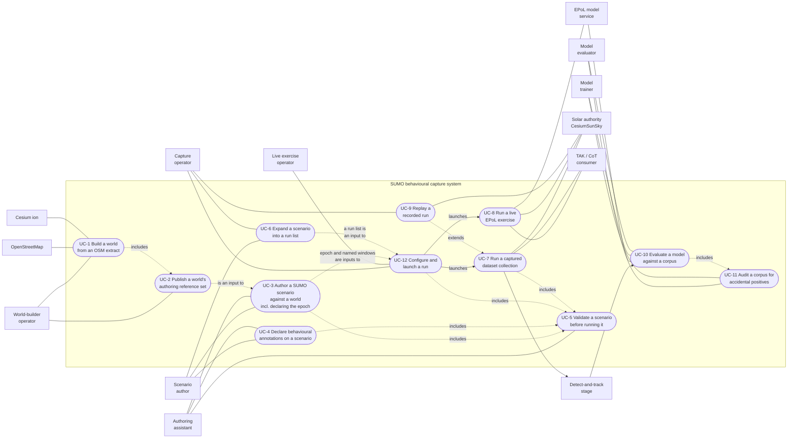
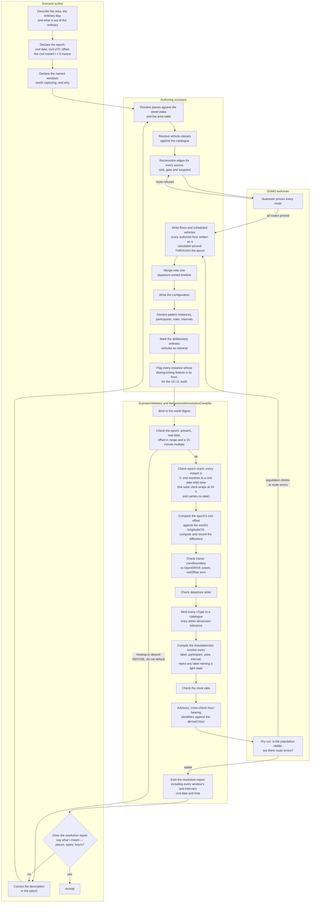
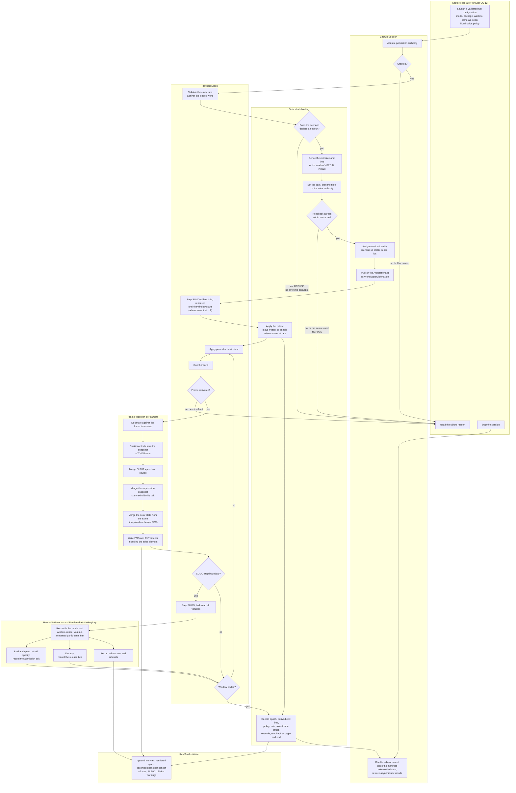

# 02 — Use cases

**Status:** Plan section. Behavioural specification, not implementation. No code was changed and no build
was run.
**Date:** 2026-09-18. Redrafted against the added requirement recorded in
[`_TEAM_BRIEF.md`](_TEAM_BRIEF.md) §3a — simulated time of day driven in tandem with the network
playback, toggleable advancement, and a coherent operator surface. The first draft specified windowed
capture in simulated time and never connected it to the sun; that omission reaches eight of the eleven
original use cases, so this section was rewritten rather than amended.
**Owner role:** Systems architect. Companion section: [01 — Architecture](01_Architecture.md), whose
component names, modes and authority model this section uses without restating them.
**Scope:** The actors, the use cases each one drives, and the two flows that carry the most risk drawn as
activity diagrams with partitions.
**Audience:** An engineer implementing any section in this folder, and anyone deciding what the tooling's
command surface should be. A use case here is a contract about *what must be possible and what must fail
loudly*; it is not a user manual.
**Grounding:** Claims about existing behaviour are cited `path:line` against the working tree as read on
2026-09-17 and 2026-09-18, or carried forward from a Findings document and marked as such. Measurements
say how they were taken. Anything marked **inference** is reasoning, not a reading.

**Sibling sections this one leans on and does not duplicate.**
[11 — Time and illumination](11_Time_And_Illumination.md) owns the epoch contract, the civil-time
conversion, the rate semantics and the solar record's schema. [12 — Operator control
surface](12_Operator_Control_Surface.md) owns the design of the surface: what kind of program it is, what
it looks like, and what its commands are called. This section owns only the **actor-facing flow** over
both — what an actor must be able to do, in what order, and what must refuse. Where a use case needs a
property from either, the dependency is stated as a property, not as a design.
[13 — Work breakdown](13_Work_Breakdown.md) sequences the build.

**Out of scope, deliberately.** Command-line syntax, screen layouts, file formats, and the internals of
any step. A step that says "validate every route" does not say how; [07](07_Scenario_Authoring.md) and
[04](04_Contracts.md) own that. Likewise a step that says "derive the civil time" does not say how;
[11](11_Time_And_Illumination.md) owns that.

---

## 1. The actors

Derived from the workflow as it actually runs, not from roles invented for the diagram. Two of these are
the same person wearing different hats on different days, and they are kept apart because their
preconditions differ.

| Actor | Kind | What they are trying to do | Why they are a distinct actor |
|---|---|---|---|
| **Scenario author** | Human | Decide what pattern of life a scene depicts, what in it is anomalous, and **what civil time the scenario's simulated seconds mean** | Owns intent. The only source of behavioural truth ([20 §2.1](../../Findings/20_Behavioral_Annotation_And_Areas_Of_Interest.md)), and now the only source of the **epoch** — see §1.1 |
| **Authoring assistant** | Software agent, acting for the author | Turn a description in ordinary terms — street names, times, who goes where — into a scenario package that resolves | Needs machine-readable inputs and loud failures. It is fluent in SUMO and OpenSCENARIO and cannot know this fork's conventions unless they are written down and validated ([20 §5](../../Findings/20_Behavioral_Annotation_And_Areas_Of_Interest.md) preamble) |
| **World-builder operator** | Human | Turn an OSM extract into a world and its authoring reference set | Needs a GPU, a running server and a Cesium ion token; the only actor with that precondition |
| **Capture operator** | Human | Produce a corpus from a scenario and a world | Owns the session: mode, window, cameras, seed, and **illumination policy** — see §1.1 |
| **Model trainer** | Human | Train an EPoL model on a corpus | Consumes; never runs the simulator. Needs the corpus's illumination strata to know what the training set is balanced over |
| **Model evaluator** | Human | Score a model against a corpus, honestly | Must be able to compute a denominator the capture cannot silently distort, **per illumination stratum as well as per sensor** |
| **Live exercise operator** | Human | Drive an end-to-end demonstration with a live model and a live feed | Real-time pacing and a live consumer; nothing is written for training |
| **TAK / CoT consumer** | External system | Display tracks | Receives CoT over UDP; ignores unknown `<detail>` children ([09 §5](../../Findings/09_Telemetry_CoT_Contract.md)) |
| **Detect-and-track stage** | External system | Turn imagery into tracks | Never given truth |
| **EPoL model service** | External system | Assess tracks | Never given truth |
| **Solar authority (`CesiumSunSky`)** | In-world system | Hold the sun's clock, date, time zone and resulting angles, and light the world from them | **New in this draft.** `CarlaServer.cpp:611-612` names it *the single sun and lighting authority for the georeferenced world*, with CARLA's own weather inert there. It is a distinct actor because it holds **state that outlives a session** (§1.2) and because it can refuse — every solar call returns false when no `CesiumSunSky` exists in the world (`CesiumHeightSampler.cpp:726`, `:830`) |
| **OpenStreetMap** | External data source | Supplies the extract | |
| **Cesium ion** | External data source | Supplies photoreal imagery and world terrain | |

No new *human* actor was added. A separate "illumination owner" was considered and rejected: it would be
a role nobody occupies, and it would put two people in the launch path for one decision that has to be
made once per run. The re-examination instead sharpened what two existing actors own, which is §1.1.

### 1.1 Who owns illumination policy

The requirement raises a genuine ownership question with two claimants, and answering it wrongly in
either direction produces a specific failure. The answer is a split, and the split is not a compromise —
the two halves are different kinds of thing.

| Half | Owner | Why | Scope | Where it is enforced |
|---|---|---|---|---|
| **The epoch** — the civil date, the civil UTC offset, and the civil instant that `t = 0` means | **Scenario author** | It is a statement about what the scenario *means*, without which its annotations are not interpretable. "Guards relieve at 07:00, 15:00 and 23:00" is an authored fact, not a run-time preference. It is also not a free choice at capture: nobody but the author can say whether `t = 82,800` is 23:00 or 11:00 | Scenario-scoped. One epoch per scenario package | Declared in UC-3, checked in UC-5, **refused at compile** |
| **The illumination policy** — frozen or advancing, the rate, and any deliberate departure from the derived civil time | **Capture operator** | It is a property of the *experiment*, not of the scenario. A sweep holds it constant to keep a behavioural comparison clean (UC-6); a replay deliberately varies it to make a second corpus of the same behaviour under different appearance (UC-9, [18 D4](../../Findings/18_Scenario_Fabrication_For_EPoL_Training.md)). The author is not in the loop for either | Run-scoped. One policy per run | Chosen in UC-12, applied in UC-7, recorded in the manifest |

**The operator owns the policy; the operator does not own the civil time.** The window's civil time is
*derived* from the epoch and the window's simulated begin instant. An operator who wants a different
light does not re-state the time — they record an **override**, which marks the corpus as one whose
illumination deliberately does not match its scenario's clock. The distinction matters because an
override is a fact a later reader needs, and a silently different time is indistinguishable from a bug.

**Why not give the author both.** The author cannot know the sweep. Handing the author the freeze/advance
choice would mean a run list could not vary illumination without editing the scenario, which would change
the scenario's identity and therefore the world-digest-and-recipe binding UC-5 step 1 rests on. Behaviour
and appearance would stop being separate axes, which is the property [18
D4](../../Findings/18_Scenario_Fabrication_For_EPoL_Training.md) exists to preserve.

**Why not give the operator both.** An operator handed a bare hour would be inventing the scenario's
meaning at launch. The measured state of the sizing scenario is exactly this failure already in progress:
its civil hours exist only in the generator's source and in identifier text (§3, UC-3), so any operator
today would be guessing.

This is the same shape as open question 2 (who chooses the capture *window*), and §7 now recommends they
be answered identically: **the scenario declares, the operator selects, the manifest records.**

### 1.2 One property of the solar authority that changes several use cases

The world's sun is spawned with `SolarTime = 12.0` — local solar noon — and daylight saving disabled
(`CesiumHeightSampler.cpp:409-410`), with the time zone derived from the origin longitude
(`:412`, `EstimateTimeZoneForLongitude`, which sets `TimeZone = longitude / 15`). That spawn happens
**only when no `ACesiumSunSky` already exists in the world** (`:396-402`, `if (!bHasSunSky)`).

**Inference, from that guard:** on a server that keeps a world loaded across successive sessions, the sun
is *not* re-defaulted between them. A second capture inherits whatever the first one set. So "the default
is noon" is true only of a freshly generated world, and no use case may rely on it. Every session that
renders must position the sun explicitly and read it back. This is why D2.15 exists.

A second reading, with the same consequence: the advancing controller wraps the solar clock at 24 h and
**never advances the calendar date** — `SolarTime = Fmod(Fmod(SolarTime + DeltaHours, 24) + 24, 24)`
(`CesiumTimeOfDayController.cpp:34-35`). A window that crosses midnight therefore keeps the date it
started on, and the date is what drives the seasonal sun angle and what the truth sidecar records
(`CotUdpEmitter.py:160` writes `date` into the `<_solar>` element). Over a seven-day scenario the
declination error is small; the *recorded* date being wrong is not small, because it is the same class of
internally contradictory record the whole requirement exists to prevent. Named as an open question in §7
for [11](11_Time_And_Illumination.md), and as a postcondition obligation in UC-7.

## 2. The use-case diagram

**On the numbering.** UC-12 is the entry point to UC-7 and UC-8 and belongs before them in reading order,
but it is numbered last on purpose: UC-1 through UC-11 are cited by number from nine other sections in
this folder, and renumbering them to make the diagram read left to right would invalidate every one of
those citations for a cosmetic gain.

---

## 3. The use cases

Each is stated in the same shape. "Failure" means the system refuses and says why; "alternate" means a
legitimate different path through the same case.

### UC-1 — Build a world from an OSM extract

| | |
|---|---|
| **Primary actor** | World-builder operator |
| **Supporting** | OpenStreetMap, Cesium ion, CARLA server |

**Preconditions.** A headless CARLA server is running; `CESIUM_ION_TOKEN` is set; `netconvert` is on the
staged install (`run_SCTMV.py:60-78` resolves it from `CARLA_NETCONVERT` or the in-repo build); an OSM
extract exists with a `<bounds>` element; an optional `<extract>.aoi.geojson` sits beside it.

**Main flow.**
1. Operator names the extract, the height-align mode and the package destination.
2. `OsmClipper` cuts the extract to its bounds, preserving node ids **and OSM relations** — the turn
   restrictions [issue #12](https://github.com/sbrett9/carla/issues/12) records as discarded today, which
   [01 §2.5](01_Architecture.md) makes a prerequisite of this system.
3. `RoadNetworkConverter` runs `netconvert` **once**, emitting the OpenDRIVE and the SUMO network from the
   same invocation at the same pinned origin.
4. Elevation, sign and traffic-light injection run against the OpenDRIVE.
5. The world is generated on the server; Cesium streams; the drape samples true ground height per cell.
6. `WorldPackageWriter` writes `world.json`, `map.xodr`, **`map.net.xml`** and `bareearth.bin`.
7. `AreaOfInterestCompiler` validates any supplied areas against the OSM bounds, the sandbox rectangle and
   the road network, and resolves them to CARLA-local metres.
8. UC-2 runs as part of this case.

**Alternate flows.**
- *No areas supplied* — step 7 proceeds with an empty area table; area-relative authoring is then
  unavailable and UC-5 says so.
- *Secure site with a private interior* — the road filter is turned off so `access=private` roads survive,
  and the fence is applied during authoring rather than at build.

**Failure flows.**
- *Cesium does not stream* — height sampling has nothing to sample. Refuse the build rather than emit a
  world whose drape is a plane; a silently flat world produces vehicles floating or buried and is
  discovered much later.
- *An area's envelope is disjoint from the OSM bounds* — refuse, per
  [20 §8.3](../../Findings/20_Behavioral_Annotation_And_Areas_Of_Interest.md). An area that crosses the
  sandbox edge, or that sits inside the staging ring, or that has no drivable road near it, warns.
- *`netconvert` reports restriction relations it cannot apply* — warn and record the count in the build
  recipe, because under SUMO drive a discarded restriction becomes visible bad behaviour and must not be
  mistaken for a bridge defect ([23 §6.6](../../Findings/23_SUMO_Traffic_Integration.md)).

**Postconditions.** A world package exists; the server holds the world; the OpenDRIVE's digest is the
world's identity ([18 §5.5](../../Findings/18_Scenario_Fabrication_For_EPoL_Training.md)).

**Artifacts.** World package (`world.json`, `map.xodr`, `map.net.xml`, `bareearth.bin`), the resolved area
table, the build recipe.

---

### UC-2 — Publish a world's authoring reference set

| | |
|---|---|
| **Primary actor** | World-builder operator |
| **Supporting** | CARLA server |

**Preconditions.** A world is loaded on a running server.

**Main flow.**
1. `VehicleCatalogueGenerator` projects the server's blueprint definitions into a versioned vehicle
   catalogue carrying, per entry, the real bounding-box dimensions and the attributes truth already reads
   — `base_type`, `special_type`, `number_of_wheels`, `color`
   ([20 §5.6](../../Findings/20_Behavioral_Annotation_And_Areas_Of_Interest.md)).
2. A street-name-to-road index is extracted from the generated OpenDRIVE. This is what makes a description
   in street names resolvable: non-junction roads carry the real name, junction internals carry the
   converter's own edge identifier ([20 §5](../../Findings/20_Behavioral_Annotation_And_Areas_Of_Interest.md)).
3. The annotation vocabulary and its version are attached.
4. The area table from UC-1 is attached.
5. **The world's solar frame is attached** — the pinned origin latitude and longitude, and the time zone
   the engine will derive from that longitude (`longitude / 15`, `CesiumHeightSampler.cpp:411-412`). This
   is what lets UC-5 check an epoch's civil offset against the world **without a running server**, which
   is the property D2.2 protects. It is a published *fact about the world*, not a policy.
6. All of it is stamped with the world digest and published as the `AuthoringReferenceSet`.

**Alternate flow.** *A world built earlier, reopened* — the set is regenerated from the running server
rather than read from disk, so it can never describe a different content build from the one loaded.

**Failure flows.**
- *The catalogue is empty or the blueprint filter matched nothing* — refuse. An author given an empty
  catalogue writes a scenario that resolves to nothing.
- *The street index is degenerate* (every road named by an edge identifier) — warn loudly; the world is
  usable but cannot be authored against in ordinary language, which is the primary authoring path.
- *The world has no solar authority* — warn, and mark the reference set as one that cannot support a
  windowed capture. A world with no `CesiumSunSky` refuses every solar call
  (`CesiumHeightSampler.cpp:726`, `:830`), so a capture against it can only ever be a capture in unknown
  light. Finding that out at build time is much cheaper than finding it at session start.

**Postconditions.** Authoring can proceed without a running server.

**Artifacts.** Vehicle catalogue, street-name index, area table, vocabulary, solar frame, world digest —
versioned together.

---

### UC-3 — Author a SUMO scenario against a world

| | |
|---|---|
| **Primary actor** | Scenario author |
| **Supporting** | Authoring assistant, SUMO toolchain |

**Preconditions.** An `AuthoringReferenceSet` and a world package exist. No CARLA server is needed —
authoring runs on any machine with SUMO ([`sumo-traffic-scenarios/SKILL.md`](../../../../../.agents/skills/sumo-traffic-scenarios/SKILL.md)).

**Main flow.**
1. Author describes the scene in ordinary terms: where traffic comes from and goes, what the ordinary day
   looks like, who is present and when, and what is out of the ordinary.
2. **Author declares the scenario's epoch**: the civil date, the civil UTC offset, and the civil instant
   that `t = 0` corresponds to. This is a required part of the scenario contract, not an optional
   annotation, because without it no sun can be derived for any window and the scenario's own hours are
   not machine-readable. [11](11_Time_And_Illumination.md) owns the epoch's representation; this case owns
   only that the author states it and that the author is the one who states it (§1.1).
3. Assistant resolves every named place against the street index and the area table, and every named
   vehicle class against the catalogue.
4. Assistant reconnoitres the real network: finds the edges for every source, sink, gate and waypoint and
   their access class. **Routes are proved with `duarouter`, never with a graph walk** — a graph walk
   gives false positives by traversing one-way edges the real router refuses, and the scenario then fails
   at load with "no valid route" (measured gotcha, recorded in the skill).
5. Assistant writes the demand: flows for the ordinary population, scheduled vehicles for the ones with a
   story. Everything is merged onto **one departure-sorted timeline**, because SUMO silently drops
   out-of-order entries with only a warning (measured gotcha; `SumoPatternOfLifeBuilder` merges for
   exactly this reason). Every departure instant the author thinks of as an *hour* is written as a
   simulated second **through the epoch**, so the two can never disagree.
6. Assistant writes the configuration: step length, seed, end time, and the SUMO-side policies that affect
   reproducibility — the sizing scenario sets `time-to-teleport` to `-1` so a jam stays a jam
   (**measured** in `BahonarPatternOfLife.zip`'s `.sumocfg`, read 2026-09-17).
7. **Author declares the scenario's named windows**, if it has any: the spans of simulated time worth
   capturing, each with a name that says why. A window is the author's suggestion, not the operator's
   obligation (§1.1, open question 2).
8. UC-4 runs for anything the author asserts is a behaviour.
9. UC-5 runs; failures return to step 3.
10. Author reads back the validator's resolution report — which now prints each declared window's
    **derived civil date and time** beside its simulated span — and confirms it says what they meant.

#### Why step 2 is new, measured

The sizing scenario maps simulated seconds to civil hours, and nothing machine-readable says so.
Measured 2026-09-18 by reading `BahonarPatternOfLife.zip` and the live generator
`CarlaControl/scripts/make_bahonar_scenario.py`:

| Evidence | Reading |
|---|---|
| Guard-shift departures | 25,200 / 54,000 / 82,800 s and every 28,800 s after, i.e. **07:00, 15:00, 23:00** with `t = 0` at midnight of day 0 (measured: 335 `guard_*` trips in the `.rou.xml`, distinct depart values on an 8-hour cycle) |
| Where the hours live in the artifact | Only inside identifier text — `ferry_in_d0_h6` (`make_bahonar_scenario.py:190`), `shift_in_d0_h7` (`:206`), `guard_d0_h7_t3` (`:238`) |
| Where the hours live in the source | `HOUR = 3600`, `DAY = 24 * HOUR` (`make_bahonar_scenario.py:76-77`), `FERRY_HOURS = [6, 8, 10, 12, 14, 16, 18]` (`:162`), `SHIFT_HOURS = [7, 15, 23]` (`:164`), composed as `begin = day * DAY + hour * HOUR` (`:188`, `:204`) |
| An illumination assumption already baked into the demand | `# Ferry sailings (local hours) -- daylight only, none overnight.` (`make_bahonar_scenario.py:161`) — the author has *already* reasoned about light, and nothing carries that reasoning into the world |
| What the shipped scenario states | Nothing. The `.rou.xml` contains **zero** occurrences of `epoch`, `date`, `civil`, `timezone`, `time_zone` or `utc` (measured by string count over the whole file); the `.sumocfg` declares `begin`, `end` and `step-length` and no calendar at all |

The mapping is therefore in the generator's source and in the author's head. Neither is readable by the
thing that has to set a sun.

**Alternate flows.**
- *Author works by hand* — every convention the assistant uses is documented and validated, so a
  hand-written scenario passes or fails the same checks. This is a requirement, not a courtesy
  ([20 decision 13](../../Findings/20_Behavioral_Annotation_And_Areas_Of_Interest.md)). It applies to the
  epoch too: a hand-written scenario declares one or it does not compile.
- *Secure site* — private roads are kept, then fenced per vehicle class. The internal junction-connector
  lanes must be cleared too, or the restricted class cannot cross any junction and the interior fragments
  (the subtlest measured bug of the Bahonar build, recorded in the skill).
- *Author starts from an existing scenario* — it is copied and re-bound to a new world digest, and every
  reference is re-resolved rather than assumed to carry. **The epoch is re-examined explicitly**, because
  a scenario re-sited to a different longitude keeps its civil offset only if the site's civil offset is
  the same, and the site is exactly what changed.
- *Migrating a scenario that predates the epoch* — the epoch is supplied once, by the author, and the
  validator prints what every existing departure instant now means in civil time so the author can check
  it against what they originally intended. There is no inference path: the tooling never guesses an
  epoch from identifier text, because `guard_d0_h7_t3` is a convention nobody promised to keep.

**Failure flows.**
- *No epoch declared* — error. The scenario does not compile. Not a warning, and not a default of
  midnight: a defaulted epoch is indistinguishable in the artifact from a declared one, which reproduces
  the exact failure this requirement exists to remove.
- *An epoch the author cannot have meant* — a UTC offset outside `[-12, +14]`, an offset that is not a
  multiple of 15 minutes, an impossible date. Error, naming the field. Half-hour and quarter-hour offsets
  are real and must pass: the sizing scenario's site is Bandar Abbas, Iran (**measured**: the clipped
  extract's `<bounds>` is `minlat=27.13110 minlon=56.14426 maxlat=27.16914 maxlon=56.21704`), whose civil
  offset is **+03:30**.
- *A named street does not resolve* — error naming the street and offering the nearest matches. Never a
  silent nearest-match substitution.
- *A movement through a junction is named as a turn* — junction internals have no human name
  ([20 open question 8](../../Findings/20_Behavioral_Annotation_And_Areas_Of_Interest.md)), so the
  assistant must express it as the roads either side, and the error must say that rather than reporting
  the name as unknown.
- *A route no router can find* — error naming the origin, the destination and the vehicle class, because
  the usual cause is an access class the fence excluded.

**Postconditions.** A scenario exists that loads in SUMO, whose every reference resolves against one named
world, and **whose every simulated instant has an unambiguous civil time**.

**Artifacts.** `ScenarioPackage` — `map.net.xml`, `.rou.xml`, `.sumocfg`, the epoch declaration, any named
windows, the world digest binding, and, once UC-4 has run, the `AnnotationSet`.

---

### UC-4 — Declare behavioural annotations on a scenario

| | |
|---|---|
| **Primary actor** | Scenario author |
| **Supporting** | Authoring assistant |

**Preconditions.** A scenario in progress, **with an epoch declared** (UC-3 step 2); a declared annotation
vocabulary and its version.

**Main flow.**
1. Author names each phenomenon they are asserting: what it is, who takes part, in what role, over what
   spans.
2. Author marks the deliberately ordinary vehicles as `nominal` — the authored hard negatives that make
   duration alone stop being the signal ([20 §2.7](../../Findings/20_Behavioral_Annotation_And_Areas_Of_Interest.md)).
3. **An annotation whose definition includes an hour says so as an hour**, in civil time, resolved through
   the epoch to the simulated seconds the interval actually spans. Doc 20's pattern class 4 — *a heavy
   goods vehicle in a residential area at 03:00* — is a pattern the epoch makes expressible and whose
   absence made it unrenderable (brief §3a). The annotation names **the hour**, never the light.
4. `BehaviouralAnnotationCompiler` produces the `AnnotationSet`: pattern instances with participants,
   roles, intervals and parameters, and instance ids derived deterministically from the scenario and the
   authored name so a sweep's runs are joinable. Each interval carries its civil time alongside its
   simulated span, derived once, so no downstream consumer re-derives it differently.
5. **Any instance whose distinguishing feature is its hour is flagged for UC-11**, because its label will
   correlate with illumination by construction and someone has to have checked (UC-11, D2.20).
6. Every vehicle the author said nothing about is `unlabelled`, and that state is written explicitly
   rather than by omission ([20 decision 2](../../Findings/20_Behavioral_Annotation_And_Areas_Of_Interest.md)).

**Alternate flows.**
- *An anomaly that is an absence* — a guard who never arrives has no vehicle to attach to. The sizing
  scenario already carries one such case in its `anomaly_notes` (**measured**: a `guard_no_show` covering
  tower 3 over `begin_s = 370,800` to `end_s = 399,600`, which the epoch resolves to **day 4, 07:00 to
  15:00**). It is a pattern instance with a participant that is expected and does not appear, with a
  place and a window, and the compiler must be able to express it rather than relegating it to a note.
  Note that this instance is *defined* by a shift boundary, so it is a step 5 case.
- *An hour-defined pattern with no vehicle-level signature* — permitted, and precisely the class the epoch
  unlocks. It is also the class most exposed to the confound, so it is the class UC-11 must be strongest
  on.

**Failure flows.**
- *A label outside the vocabulary* — error. A corpus assembled from scenarios that each spelled `loiter`
  differently is not a corpus ([20 §6.2](../../Findings/20_Behavioral_Annotation_And_Areas_Of_Interest.md)).
- *A participant naming a vehicle the scenario does not contain* — error.
- *An annotation derived from geometry* — cannot happen, because no geometric predicate is an input to
  this case at all. This is stated as a failure to make the boundary visible where it is most likely to
  erode ([20 §8.5](../../Findings/20_Behavioral_Annotation_And_Areas_Of_Interest.md)).
- *An annotation that names an illumination state* — error, for the same reason and with the same force.
  "At night", "in darkness", "under low sun" are not labels; **03:00** is. Illumination is derived context
  computed identically for every capture, never a supervision signal (brief §3a, standing constraint).
  Sun elevation is not an input to this case at all, which is what makes the error statable.
- *An interval declared in civil time that the epoch cannot resolve* — error rather than a wrap. An
  interval at 25:30, or on a date outside the scenario's span, is a mistake and reads as one.

**Postconditions.** Every assertion the author made exists as a record; nothing the author did not assert
does; every interval is expressible in both simulated seconds and civil time.

**Artifacts.** `AnnotationSet`, the resolution report of what each annotation bound to, the list of
hour-defined instances handed to UC-11.

---

### UC-5 — Validate a scenario before running it

| | |
|---|---|
| **Primary actor** | Authoring assistant |
| **Supporting** | Scenario author, SUMO toolchain |

**Preconditions.** A `ScenarioPackage`; the `AuthoringReferenceSet` it was authored against.

**Main flow.**
1. **Bind.** The package's world digest matches the world it names. A mismatch in the build recipe is a
   refusal; a digest mismatch with a matching recipe is a warning requiring an explicit override
   ([18 §5.5](../../Findings/18_Scenario_Fabrication_For_EPoL_Training.md)'s two-tier gate).
2. **Frame.** The network's `convBoundary` equals the OpenDRIVE header's extent, and `netOffset` is zero —
   the check that the coordinate identity holds.
3. **Epoch.** Present; the date is real; the civil UTC offset is within `[-12, +14]` and a multiple of 15
   minutes; the instant `t = 0` maps to is stated. **A missing or absurd epoch fails here, at compile, not
   at capture** — which is the whole point of putting the check in this case rather than in UC-7.
4. **Epoch reach.** Every instant the scenario can reach — `t = 0` through the configured `end` — resolves
   to a representable civil date and time. This is a real check, not a formality: the sizing scenario's
   `end` is 604,800 s (**measured**, `<end value="604800"/>`), so `t` alone rolls the calendar over six
   times, while the engine's solar clock wraps at 24 h and carries no date
   (`CesiumHeightSampler.cpp:730`; `CesiumTimeOfDayController.cpp:34-35`). A validator that checks only
   the hour would pass a scenario whose day-6 window renders under day-0's sun.
5. **Solar frame.** The epoch's civil offset is compared against the time zone the engine will actually
   use, which the reference set carries from UC-2 step 5. The two are different kinds of quantity and they
   do not have to agree — but the difference must be computed, reported, and carried into the run record
   rather than silently absorbed. **Measured for the sizing scenario:** longitude spans 56.14426 to
   56.21704, so `longitude / 15` gives **3.743 – 3.748 h**, against Iran's civil **+03:30 = 3.5 h** — a
   standing offset of ≈ **0.245 h, or 14.7 minutes**, equivalent to ≈ 3.7° of solar hour angle. At a night
   window that is invisible; at the 07:00 window [10 §3.1.3](10_Scale_And_Performance.md) recommends it is
   a materially different sun. Whether the fix is a conversion in the run path or a settable time zone on
   the server is [11](11_Time_And_Illumination.md)'s decision and §7's open question 8; this case only
   insists the quantity exists and is never zero by assumption.
6. **Window sanity.** Each declared named window lies inside `[0, end]`, and its derived civil date and
   time are printed. A window whose derived civil time places the sun below the horizon is **not** an
   error — a night capture is a first-class goal (brief §3a) — but it is called out, because a night
   window authored by accident and a night window authored on purpose look identical in simulated seconds.
7. **Routes.** Every origin-destination and waypoint route is proved with `duarouter`.
8. **Order.** The route file is departure-sorted across flows and vehicles.
9. **Types.** Every `vType` binds to at least one catalogue entry within the dimension tolerance. The
   sizing scenario spans 4.4 m to 12.0 m across 14 types (**measured**), so this is a real matching check.
10. **Annotations.** Every label is in the vocabulary, every participant exists, every area reference
    resolves, every interval resolves in both simulated seconds and civil time, and no annotation names an
    illumination state.
11. **Clock.** The SUMO step length, the intended world delta and the intended capture rate are in integer
    ratio ([01 §6.1](01_Architecture.md)).
12. **Identifier convention, advisory.** Where flow and vehicle identifiers carry an hour by convention —
    `ferry_in_d0_h6`, `shift_in_d0_h7`, `guard_d0_h7_t3` (`make_bahonar_scenario.py:190`, `:206`,
    `:238`) — the
    validator checks the identifier against the hour the epoch derives, and **warns** on disagreement.
    Advisory and not a refusal, deliberately: the convention is a habit of one generator, not a contract,
    and a scenario that does not follow it is not wrong. It is still the cheapest available detector of an
    epoch declared off by a day or an hour, because it cross-checks the author's two independent
    expressions of the same intent.
13. **Report.** The validator prints what it *resolved*, not only what it rejected — the roads a street
    name bound to, the catalogue entries each type bound to, the areas each annotation bound to, **and the
    civil date and time of every declared window and every annotation interval**. A preview cannot check
    any of this ([20 §5.5](../../Findings/20_Behavioral_Annotation_And_Areas_Of_Interest.md)), so the
    report is the only place an author sees whether the scenario says what they meant.

**Alternate flow.** *Validation without a world* — steps 1, 5 and 9 need the reference set but not a
server, so the whole case runs offline. This matters because authoring is the part of the workflow that
does not need a GPU, and it is why UC-2 step 5 publishes the solar frame as a fact rather than making the
validator ask a running server for it.

**Failure flows.** Any of steps 2 through 11 failing refuses the package. Step 1 is the two-tier gate;
step 12 is advisory. A dry run whose population climbs monotonically rather than settling is a demand
error, not a validator error, and is reported as a warning with the numbers rather than as a pass.

**Postconditions.** The package is either refused with a named reason, or accepted and stamped with the
validator's version, the resolution report, and the computed solar-frame offset.

**Artifacts.** Validation report; a validated `ScenarioPackage`.

---

### UC-6 — Expand a scenario into a run list

| | |
|---|---|
| **Primary actor** | Scenario author, with the capture operator |

**Preconditions.** A validated `ScenarioPackage`.

**Main flow.**
1. Author sets the bounds of the behavioural parameters to sweep and the appearance parameters to cross
   them with — **illumination**, weather, camera track. Behaviour and appearance are separate axes
   ([18 D4](../../Findings/18_Scenario_Fabrication_For_EPoL_Training.md)).
2. The machine expands the cross product into a run list, each entry carrying a seed, a capture window, a
   camera set, the instance ids the variation touched, and **an illumination stratum**: the derived civil
   time, the policy (frozen or advancing), the rate, and any override.
3. Instance ids stay stable across the expansion, so one authored pattern's variants can be diffed.

#### 6a. Illumination is an axis, and it is a confounding axis

Stated separately because it is the one axis that changes the pixels without changing the behaviour, and
therefore the one most able to contaminate a comparison that looks clean.

**As an axis, it is the cheapest one available.** Varying it requires no re-authoring and no different
demand: the same scenario, the same seed, the same window, a different sun. It is also the axis that
matters most to the consumer, because illumination is the single largest covariate an electro-optical
detector faces (brief §3a).

**As a confound, it is the most dangerous one available.** A sweep whose purpose is to vary *behaviour*
must hold illumination **constant** — same derived civil time, same policy, same rate — or the difference
between two runs contains a lighting difference as well as a behavioural one, and nothing downstream can
separate them. The rule and its consequences:

| Sweep intent | Illumination must be | Because |
|---|---|---|
| Vary behaviour (which pattern fires, which parameter) | **Constant and frozen** | A frozen sun makes illumination identical frame-for-frame across the arm, so the only difference is the one being studied |
| Vary illumination (the appearance axis) | **The swept variable**, behaviour held by seed and window | This is the valid use of the axis, and it is nearly free |
| Both, deliberately | **Marked per entry** so the two can be stratified apart downstream | UC-10 cannot stratify what the run list did not record |

**Why "frozen" and not merely "the same policy".** An *advancing* sun is constant only if the two arms
occupy identical simulated spans and start identically. A behavioural variation that shifts a departure
by a few seconds, or that changes how long a run takes to reach its window, moves the sun with it. Frozen
removes the coupling entirely. This is an **inference**, from `CesiumTimeOfDayController.cpp:34-36`
advancing the clock by `DeltaSeconds × Rate` on every world tick: anything that changes the tick count
between window start and a given frame changes that frame's sun.

**Alternate flows.**
- *Counterfactual pairing* — the same seed and the same ambient population with one instance's behaviour
  switched off, which isolates the authored behaviour as the only difference between two runs.
  [20 open question 7](../../Findings/20_Behavioral_Annotation_And_Areas_Of_Interest.md) leaves this open;
  the run list is where it would be expressed, and it costs almost nothing here because the seed and the
  parameters are already run inputs. **A counterfactual pair whose two arms have different suns is worth
  nothing**, because the pixel difference the pairing exists to isolate is then partly a lighting
  difference. Frozen illumination is a precondition of the pairing, not a refinement of it.
- *An illumination-only sweep* — one window, one seed, the sun stepped across a set of civil times. The
  strongest available probe of a detector's illumination sensitivity and the natural companion to UC-9.

**Failure flows.**
- *A swept parameter that changes the network* — refused. A sweep that rebuilds the world is not a sweep
  over one scenario, and the world digest would differ between runs.
- *An expansion that varies behaviour and illumination together without marking the stratum* — refused.
  Not because the combination is illegitimate, but because an unmarked entry is unstratifiable later and
  the resulting joint number is uninterpretable. Marking is the whole cost.
- *A swept illumination value the scenario's epoch cannot reach* — refused at expansion rather than at
  launch.

**Postconditions.** A run list whose entries are individually runnable, collectively joinable, and
individually attributable to an illumination stratum.

**Artifacts.** Run list.

---

### UC-7 — Run a captured dataset collection

| | |
|---|---|
| **Primary actor** | Capture operator |
| **Supporting** | CARLA server, solar authority (`CesiumSunSky`), `sumo`, TAK consumer (optional) |

**Preconditions.** A running server with the named world loaded; a validated `ScenarioPackage` **carrying
an epoch**; the toolchain staged with `SUMO_HOME` set; one or more collection cameras configured; a
capture window and a seed; **an illumination policy for this run** — frozen at the window's start instant
or advancing with simulated time at a stated rate, plus any explicit override of the derived civil time.
The policy is supplied by UC-12; there is no default, because a default is how the first draft's failure
would come back.

**Main flow.**
1. Operator starts a session naming the mode `SumoDrivenPlayback`, the package, the window, the cameras,
   the seed and the illumination policy.
2. `CaptureSession` acquires **population authority** from `WorldDriveAuthority`. If it is held, the
   session start fails naming the holder ([01 §5.3](01_Architecture.md)).
3. The world is put in synchronous mode at the fixed delta; the clock ratio is re-checked against the
   loaded world.
4. **The solar clock is bound to the window.** The session reads the scenario's epoch, derives the civil
   date and time of the window's **begin** instant, sets the date and then the time on the solar
   authority, and reads the result back. Four properties of this step matter and each is grounded:
   - The date is set **before** the time, and it is set explicitly on every run. The advancing controller
     never touches the date (`CesiumTimeOfDayController.cpp:34-35`), so a date left over from a previous
     session or from a window that crossed midnight would silently give the wrong seasonal sun.
   - The readback is **verified**, not assumed. `set_solar_time` returns false when the world has no
     `CesiumSunSky` (`CesiumHeightSampler.cpp:726`), and the value it stores is wrapped modulo 24
     (`:730`), so a derivation error shows up as a clean disagreement between request and readback.
   - The readback is **free**. `get_solar_state` reads the world-observer cache paired to the latest tick
     with no RPC, falling back to an RPC only before the cache is populated
     (`carlanet/__init__.py:1511-1533`; `CarlaClient.cs:1991`). This is the same publication mechanism
     [08](08_Collection_And_EPoL.md) D8.3 chose for world-scoped state, already working for this payload.
   - Nothing is **inherited**. The world's noon default is applied only when no `CesiumSunSky` exists
     (`CesiumHeightSampler.cpp:396-402`), so a world already holding a sun keeps the last session's one.
     §1.2 has the reasoning; D2.15 has the rule.
5. `CaptureSession` assigns one session identity and a stable `sensor_id` per camera, and hands both to
   every recorder — replacing the per-recorder default derived from its own start instant
   (`CarlaNet.Recording/FrameRecorder.cs:101-103`). It also supplies the `scenario_id`, which the
   recorder has always accepted and nothing has ever passed (`NativeRecorder.py:107-108` passes `run_id`
   and `seed` only; this carries forward
   [20 §4.2](../../Findings/20_Behavioral_Annotation_And_Areas_Of_Interest.md)'s gap to the current entry
   point).
6. `SumoSession` launches `sumo` and connects; the `AnnotationSet` is published as `WorldSupervisionState`.
7. The clock steps SUMO with nothing rendered until the capture window's start. **Advancement stays off
   through this pre-roll**, so the sun positioned in step 4 cannot drift before the first captured frame
   (the controller advances only on a world tick and only when advancing is enabled,
   `CesiumTimeOfDayController.cpp:14-37`).
8. **The illumination policy is applied**, immediately before the first cued frame: either advancement is
   left off (frozen), or `set_time_advance(true, rate)` is issued. The policy is then fixed for the run.
9. The capture window runs: per rendered instant, poses are applied, the world is cued, cameras deliver,
   recorders write. Per SUMO step, the render set is reconciled and interval state changes are published.
   The solar state travels with every capture, from the same tick-paired cache the rest of the frame's
   truth comes from — the truth sidecar already carries a `<_solar>` element with `solar_time`, `date`,
   `time_zone`, `sun_elevation_deg`, `sun_azimuth_deg`, `advancing` and `rate`
   (`CarlaControl/src/carlacontrol/CotUdpEmitter.py:154-165`).
10. `RunManifestWriter` writes incrementally throughout — instances, intervals, rendered spans, observed
    spans per sensor and unioned, admissions and refusals, SUMO collision warnings, **and the run's solar
    record**: the epoch used, the derived civil date and time at the window's begin, the policy and rate,
    the computed solar-frame offset from UC-5 step 5, any override, and the solar readback at window begin
    and at window end.
11. At the window's end the session stops: recorders flush, rendered vehicles are released, **advancement
    is disabled**, the manifest is closed, the lease is released, and the world is restored to
    asynchronous mode so a headless server is never left waiting for a tick
    (`run_SCTMV.py:329-335` already does this on shutdown). Advancement is disabled on stop because it is
    world state that outlives the session and would otherwise keep moving the sun under the next one.

**Alternate flows.**
- *Frozen sun* — the default choice for anything that will be compared against another run (UC-6 §6a), and
  the only choice that makes illumination an exact constant.
- *Advancing sun* — for a window long enough that the light changing is part of the point. Rate 1.0 is the
  case the design must guarantee end to end: **one sun-clock second per one simulated second**, so a
  window of *N* simulated seconds moves the sun by exactly *N* seconds. **Inference**, from
  `CesiumTimeOfDayController.cpp:34` advancing by `DeltaSeconds × Rate` on each world tick and from the
  controller's own documentation that it "advances in wall-clock time under asynchronous mode and in
  simulation time under synchronous ticking" (`CesiumTimeOfDayController.h`, header comment); pinning the
  exact second down is [11](11_Time_And_Illumination.md)'s job and is open question 9.
- *Deliberate illumination override* — the operator names a civil time other than the derived one, to
  capture the same behaviour at dusk. Permitted, and the manifest records it **as an override**, marking
  the corpus as one whose illumination deliberately does not match its scenario's clock. This is
  [18 D4](../../Findings/18_Scenario_Fabrication_For_EPoL_Training.md)'s appearance axis used on purpose
  rather than by accident, and the distinction between the two is exactly the record.
- *Live feed alongside* — CoT goes to a TAK consumer as it is written. It is diagnostic; the sidecar is
  authoritative ([20 §7.4](../../Findings/20_Behavioral_Annotation_And_Areas_Of_Interest.md)).
- *Several cameras* — extra cameras run in the default single process, or in tick-follower processes that
  never cue. Either way they read supervision, the render set, session identity **and solar state** from
  the server, so their sidecars agree at each tick ([01 §3.4](01_Architecture.md)). Solar state is
  world-scoped and tick-paired, so this costs nothing extra.
- *Engine recorder alongside* — the server-side log is started for the same window so UC-9 is possible.

**Failure flows.**
- ***The scenario declares no epoch, so no civil time can be derived.*** **Refuse at session start**,
  naming the scenario and the missing declaration. This is the failure flow that matters most, and it is a
  refusal rather than a fallback for a reason that is worth stating in full: every alternative is worse.
  Defaulting to noon reproduces the original defect. Defaulting to the window's `t` modulo 24 h invents an
  epoch nobody declared and would be right only for scenarios whose `t = 0` happens to be midnight.
  Inferring the epoch from identifier text would read `guard_d0_h7_t3` as a contract when it is a habit of
  one generator (UC-5 step 12). Warning and continuing produces exactly the corpus the requirement
  exists to prevent: the sidecar's `<_solar>` element (`CotUdpEmitter.py:154-165`) would faithfully record
  noon while the scenario asserts 23:00, the record would be internally contradictory, and **nothing
  downstream would flag it** — the imagery is well-formed, the truth is well-formed, and only the
  relationship between them is wrong. UC-5 step 3 is where this should normally be caught; this flow is
  the backstop for a package that reached a server without passing it.
- *The solar authority refuses* — `set_solar_date` or `set_solar_time` returns false, which means the
  world has no `CesiumSunSky` (`CesiumHeightSampler.cpp:726`, `:743`). Fail the session. A capture that
  could not position the sun is a capture in unknown light, and is worth less than no capture because it
  looks valid. UC-2 step 5's warning is the earlier detection of the same condition.
- *The readback disagrees with the request* — `get_solar_state` after step 4 does not match the derived
  civil time within tolerance. Fail the session naming both values. The likely causes are a civil-offset
  conversion error (UC-5 step 5) and a date that did not take, and both are silent otherwise.
- *An advancement rate the window cannot support* — a rate that moves the sun by more than the window's
  own span implies the operator meant something other than what they typed; a rate large enough that one
  tick moves the sun visibly implies a discontinuous sky in consecutive frames. Refuse with the numbers.
  The bound is [11](11_Time_And_Illumination.md)'s to set.
- *Population authority is held* — session start fails naming the holder. Ambient traffic cannot be
  running underneath a SUMO capture, and this is the mechanism rather than a warning.
- *A storyboard is also requested* — refused unless storyboard entities are mirrored into SUMO; an
  unmirrored entity is invisible to every SUMO vehicle ([01 §5.2](01_Architecture.md)).
- *The world does not deliver a cued frame* — session fault, stop, and the manifest records where. A
  capture that silently drops frames has a tick spacing its manifest misreports.
- *The actor cap binds* — admissions are refused by priority, ambient first, and every refusal is recorded.
  A demand-limited capture must be distinguishable afterwards from a quiet one.
- *A capture window falls outside the scenario's end time* — refuse at session start rather than
  discovering an empty world at hour 170.

**Postconditions.** A corpus exists whose imagery, truth sidecars and manifest share one session identity
and one tick base, bound to one world digest and one scenario, **and whose recorded illumination is the
illumination the scenario's own clock implies, or is explicitly marked as an override**. The manifest can
answer, for any frame, what civil time it depicts and where the sun was — without inference.

**Artifacts.** Per camera: PNG captures plus CoT sidecars carrying `<_solar>`. Per session: the run
manifest including the solar record, the session log, and optionally the engine recorder log.

---

### UC-8 — Run a live EPoL exercise

| | |
|---|---|
| **Primary actor** | Live exercise operator |
| **Supporting** | Detect-and-track stage, EPoL model service, TAK consumer, solar authority |

**Preconditions.** As UC-7 — including the epoch and the illumination policy — plus a reachable
detect-and-track stage and model service, and a consumer for the output.

**Main flow.**
1. Session starts as UC-7, paced against the wall clock rather than run as fast as the machine allows.
   `SumoCotBridge` already implements exactly this distinction — a real-time factor of 0 for datasets and
   1 for a live feed, with absolute targets so an overrunning step is absorbed rather than accumulating
   drift (`carlacontrol/SumoCotBridge.py:243-248`) — and the same rule applies here.
2. The solar clock is bound exactly as in UC-7 step 4. Because a live exercise is paced at a real-time
   factor of 1, an advancing sun at rate 1.0 moves in step with both simulated and wall-clock time, and
   the two coincide for the duration — which is the one case where the distinction the controller draws
   (`CesiumTimeOfDayController.h`, header comment) has no observable consequence.
3. Imagery streams to the detect-and-track stage; its tracks stream to the model service; the model's
   assessments stream to the consumer.
4. Truth streams to the consumer on a **separate** track source so an observer can see both, and the model
   service receives none of it.

**Alternate flows.**
- *Demonstration without a model* — truth only, which is the existing live telemetry behaviour and must
  keep working.
- *Illumination as legitimate context for the model* — a live exercise is the natural place to demonstrate
  that a fielded system knows the time and its own location and is entitled to use them, which the
  standing constraint permits explicitly (brief §3a). The boundary is unchanged: the model may be told the
  civil time and the site; it is never told a *label*, and the solar state it is given is the same derived
  quantity every capture computes, not a truth-sourced field.

**Failure flows.**
- *The pipeline cannot keep up* — the exercise degrades rather than stalls: captures are dropped, and the
  fact is displayed. A live exercise that silently slows the world is worse than one that visibly drops
  frames, because the observer cannot tell. **An advancing sun makes this visible for free**: under
  synchronous ticking the sun tracks simulated time, so a world falling behind wall clock shows a sun
  falling behind the exercise's own clock.
- *Truth reaching the model service* — a configuration error that must be impossible by construction, not
  caught by review. The model service's input is a track stream with no truth-sourced fields in it.

**Postconditions.** Nothing training-grade is produced. A session log records what was shown, including
the illumination policy it was shown under.

**Artifacts.** Session log; optionally a recorded CoT stream for later review.

---

### UC-9 — Replay a recorded run

| | |
|---|---|
| **Primary actor** | Capture operator |
| **Supporting** | CARLA server, solar authority |

**Preconditions.** An engine recorder log, its manifest **including the original run's solar record**, and
a loaded world whose digest matches.

**Main flow.**
1. Operator names the log; the tooling fetches the live OpenDRIVE, hashes it, and compares against the
   manifest.
2. `RecordedReplay` acquires population authority; anything else holding it must stop first.
3. **The original illumination is restored before anything is captured.** The epoch, the derived civil
   date and time, the policy and the rate are read from the original manifest, applied to the solar
   authority, and read back and verified — the same four properties as UC-7 step 4, for the same reasons.
   **Reproducing is the default; differing is an override.**
4. The replayer respawns and drives the actors from the log. Record and replay are verified working end to
   end in this fork ([18 §5.4](../../Findings/18_Scenario_Fabrication_For_EPoL_Training.md)).
5. New captures are taken under the restored illumination, or — when the operator has asked for it
   explicitly — **under a deliberately different appearance**: time of day, weather, camera track, while
   the behaviour is exactly the recorded behaviour
   ([18 D4](../../Findings/18_Scenario_Fabrication_For_EPoL_Training.md)). The replayed corpus's manifest
   records which of the two happened, cites the original run, and states the difference.
6. Supervision is recovered from the original run's manifest, joined by `entity_id` and normalised tick
   ([20 §7.7](../../Findings/20_Behavioral_Annotation_And_Areas_Of_Interest.md)); the static identity
   attributes survive because the recorder log preserves spawn attributes verbatim
   ([20 §4.5](../../Findings/20_Behavioral_Annotation_And_Areas_Of_Interest.md)).

**Why reproduce rather than inherit.** Replayed imagery whose light does not match the truth that travels
with it is the same internally contradictory corpus as UC-7's no-epoch failure, one generation removed —
and here it would be *harder* to spot, because the supervision is demonstrably correct (it came from a
validated original) and only the pixels disagree with it. The concrete mechanism is §1.2: a replay run on
a server whose world still holds the previous session's sun inherits that sun silently, because the noon
default is applied only when no `CesiumSunSky` exists (`CesiumHeightSampler.cpp:396-402`). Inheriting is
not a neutral default; it is a random one.

**Alternate flows.**
- *Replay for review rather than capture* — no recording, no manifest needed, and no illumination
  obligation. A human watching a replay to understand what happened is not producing a corpus.
- *Replay as the illumination axis* — the cheapest legitimate way to produce a second corpus of identical
  behaviour under different light, and the natural companion to UC-6's illumination-only sweep. The pair
  is what lets UC-11's separability test have something to compare against.

**Failure flows.**
- *No manifest* — refuse to treat the log as replayable
  ([18 §5.5](../../Findings/18_Scenario_Fabrication_For_EPoL_Training.md)).
- *The manifest carries no solar record* — refuse to replay **for capture**; permit replay for review. The
  original illumination is unrecoverable, so the new corpus could not state its relationship to the old
  one, and a corpus that cannot state that is not joinable to it. This is the one case where an older run,
  captured before the solar record existed, is not re-capturable — which is a correct outcome, not a
  regression: it was never capturable correctly, only silently.
- *Digest mismatch* — the two-tier gate: recipe mismatch refuses, digest-only mismatch warns and requires
  an override.
- *Relying on the engine's own map guard* — it is inert for generated worlds and must never be the check.
  The comparison is between a value and itself, and every generated world loads under one level name
  ([18 §5.3](../../Findings/18_Scenario_Fabrication_For_EPoL_Training.md)).
- *Kinematics in a replayed capture* — the SUMO bridge is not running, so the compensation of
  [01 §4.3](01_Architecture.md) is unavailable and replayed bodies are moved by the replayer. Whether
  replayed truth can carry speed at all is an open question, recorded in §7.

**Postconditions.** A second corpus of the same behaviour, under the same illumination as the first or
under a stated different one, joinable to the first by `entity_id` and normalised tick.

**Artifacts.** New captures and sidecars; a manifest that cites the original run and states whether its
illumination reproduced or departed from it.

---

### UC-10 — Evaluate a model against a captured corpus

| | |
|---|---|
| **Primary actor** | Model evaluator |
| **Supporting** | Model trainer, detect-and-track stage, EPoL model service |

**Preconditions.** A corpus with its manifest **including its solar record**; a trained model; detector
tracks for the corpus.

**Main flow.**
1. `SupervisionTransfer` transfers supervision from truth onto detector tracks, **per sensor**, clipping
   any track that spans an interval boundary rather than labelling it wholesale, and recording the
   association quality per assignment ([20 §7.6](../../Findings/20_Behavioral_Annotation_And_Areas_Of_Interest.md)).
2. The model is run over the tracks. It is given no truth.
3. `EvaluationJoin` joins assessments to supervision.
4. The denominator is computed over **observed** intervals, not authored ones, and the render-set gate is
   applied first: an interval whose participant was never instantiated is not a miss
   ([01 §7](01_Architecture.md), [20 §2.5](../../Findings/20_Behavioral_Annotation_And_Areas_Of_Interest.md)).
5. Base rate is reported per sensor and unioned, because precision at low prevalence is dominated by it
   ([20 §2.6](../../Findings/20_Behavioral_Annotation_And_Areas_Of_Interest.md)).
6. **Every reported figure is also reported stratified by illumination.** The stratum is derived from the
   manifest's solar record and the per-frame `<_solar>` elements — at minimum by sun elevation band
   (daylight, civil twilight, night), and by the run's policy, since a frozen run occupies one stratum and
   an advancing run can cross several. The denominator, the base rate and the detector scores are each
   computed per stratum as well as in aggregate. The reason is not statistical hygiene in the abstract:
   illumination is the single largest covariate an electro-optical detector faces (brief §3a), so an
   aggregate figure over a corpus that spans strata is a weighted average whose weights are an artifact of
   the capture plan rather than of anything about the model.
7. Detector performance is scored separately against truth: position error, height error, class confusion,
   missed and false tracks ([09 §9](../../Findings/09_Telemetry_CoT_Contract.md)) — per illumination
   stratum, for the same reason, and because this is where the effect will be largest.

**Alternate flows.**
- *Fused tracks* — if the model consumes tracks fused across sensors, "observed" means the union; without
  fusion it is per sensor. The manifest carries both so the choice is made downstream rather than baked in
  at capture time. Illumination is world-scoped, so it stratifies a fused evaluation exactly as it does a
  per-sensor one.
- *A corpus captured entirely in one stratum* — legitimate, common, and the stratified report degenerates
  to the aggregate one. What must not degenerate is the **statement** of which stratum it was, because a
  model scored only at noon has not been shown to work at dusk and the report is where that is visible.

**Failure flows.**
- *A corpus whose manifest is absent or was not closed* — refuse to score. Supervision in interval form is
  the only thing a detector track can be clipped against
  ([20 §7.6](../../Findings/20_Behavioral_Annotation_And_Areas_Of_Interest.md)).
- *A corpus whose manifest carries no solar record* — refuse to report an aggregate figure; a stratified
  figure cannot be computed and an unstratified one would be presented as if it could have been. Report
  what is computable and say plainly that the illumination is unknown.
- *Corpora with different illumination combined into one figure without stratifying* — refuse, in the same
  family as the world-digest refusal below and for the same reason: the combined figure is not a property
  of the model.
- *A vocabulary version the evaluator does not understand* — refuse.
- *Corpora from different worlds combined without saying so* — refuse; the world digest is part of the
  corpus identity.

**Postconditions.** A score that charges the model only for what a sensor could have seen, reported so
that what it could have seen *in what light* is visible rather than averaged away.

**Artifacts.** Transferred supervision per sensor; an evaluation report carrying the denominators, base
rates and illumination strata it used.

---

### UC-11 — Audit a corpus for accidental positives, and for illumination leakage

| | |
|---|---|
| **Primary actor** | Model evaluator, with the model trainer |

**Preconditions.** A corpus with its manifest, its solar record and derived area relations.

**Main flow.**
1. Every `unlabelled` vehicle's derived area relations and motion summary are compared against the
   profile of each annotated pattern class.
2. Candidates — an unlabelled vehicle that looks exactly like an annotated pattern — are surfaced for
   human review before they train as negatives
   ([20 §2.2](../../Findings/20_Behavioral_Annotation_And_Areas_Of_Interest.md)).
3. **The corpus is tested for illumination leakage.** For each annotated pattern class, the distribution
   of sun elevation over its intervals is computed and compared against the unlabelled population's
   distribution over the same corpus. If a decision rule on sun elevation alone separates the two, the
   corpus teaches the hour rather than the behaviour, and the finding is recorded with the corpus whether
   or not anything is done about it.
4. The hour-defined instances UC-4 step 5 flagged are checked explicitly, since they are leakage by
   construction and the audit's job for them is to quantify it, not to discover it.
5. The audit's own criteria are recorded with the corpus, so a later reader knows what was looked for.

#### 11a. Why leakage is the default state of a pattern of life, measured

A pattern of life is a rhythm of hours. Annotated behaviour in one therefore correlates with hour *by
construction* — guard shifts, night deliveries, pre-dawn movement — and the hour determines the
illumination exactly. Nobody has to make a mistake for this to happen.

Measured 2026-09-18, by reading the nine `marked_ids` out of
`BahonarPatternOfLife.zip`'s `.labels.json` and resolving each one's `depart` in the `.rou.xml` through
the epoch established in UC-3:

| Marked vehicle | `depart` (s) | Day | Civil hour | Light |
|---|---|---|---|---|
| `escort_0` … `escort_4` | 295,200 – 295,216 | 3 | 10:00 | day |
| `probe_d2` | 212,674 | 2 | 11:04 | day |
| `probe_d5` | 472,285 | 5 | 11:11 | day |
| `staybehind` | 115,200 | 1 | 08:00 | day |
| `shadow` | 527,400 | 6 | **02:30** | **night** |
| `guard_no_show` (an interval, not a vehicle) | 370,800 – 399,600 | 4 | 07:00 – 15:00 | dawn → day |

Three things follow, and none of them is a criticism of the scenario — it is a well-made scenario, and
that is the point.

- **The nocturnal hour is a designed property of one anomaly, not a coincidence.** The generator says so:
  *"Perimeter shadow (day 6, 02:30): a vehicle slowly follows the fence line when nothing else moves"*
  (`make_bahonar_scenario.py:280-281`), described in the module header as a *"temporal and spatial
  outlier"* (`:24`).
- **The ordinary population at that hour is nearly nothing.** [10 §3.1.3](10_Scale_And_Performance.md)
  measures the overnight floor at ~18–21 concurrent vehicles — *"almost entirely the 17 parked guards"* —
  against a 10:00 mean of 47.0 and a 07:00 mean of 92.1. So at 02:30 the anomalous vehicle is close to
  being the only thing moving, in the dark, and both facts are true of it alone.
- **The ordinary population is itself hour-shaped.** Ferry sailings are restricted to daylight by an
  explicit authoring decision — `# Ferry sailings (local hours) -- daylight only, none overnight.`
  (`make_bahonar_scenario.py:161-162`) — and guard shifts sit at 07:00, 15:00 and 23:00 (`:164`). A
  detector trained on this corpus can learn "bright and busy" versus "dark and empty" and score well
  without learning any behaviour at all.

**What the audit does about it, and what it must not do.** It does not remove the correlation: the
correlation is *real*, a fielded system sees it, and illumination is a legitimate input to one that knows
the time and its own location (brief §3a). It **measures** the correlation and records it with the corpus,
so that a score is read in the light of it. Where the leakage is strong enough to make an evaluation
meaningless, the remedy is a capture, not an edit — UC-6's illumination-only sweep or UC-9's replay under
a different appearance gives the same behaviour in different light, and a model that only worked in the
original light is then visibly the model it always was.

**Alternate flows.**
- *Audit a run list rather than one run* — the same test across a sweep finds a class of accidental
  positive the seed makes common. It also finds illumination leakage that a single run cannot expose,
  because a single frozen run has no illumination variance to test against.
- *Audit across an illumination pair* — where UC-6 or UC-9 produced the same behaviour under two suns,
  the leakage test has a genuine control and becomes a measurement rather than an estimate.

**Failure flows.**
- *The audit's output used as a label* — prohibited. A derived predicate never writes into supervision
  ([20 decision 3](../../Findings/20_Behavioral_Annotation_And_Areas_Of_Interest.md)). How a confirmed
  accidental positive is handled is
  [20 open question 5](../../Findings/20_Behavioral_Annotation_And_Areas_Of_Interest.md) and is not
  settled here.
- *The illumination stratum used as a label* — prohibited, with the same force and by the same rule.
  Illumination is derived context computed identically for every capture; it is a legitimate covariate for
  stratifying a corpus and never a supervision signal (brief §3a). This is stated here as well as in UC-4
  because UC-4 is where it would be written in by an author and UC-11 is where it would be written in by a
  tool, and the second is the likelier of the two.
- *A corpus with no solar record* — the leakage test cannot run. Report that it could not run rather than
  reporting a pass.

**Note on why this case matters more under this system than it did.** The traffic manager's idle cull
truncates the ambient stationary distribution at ninety seconds, which is also what suppresses accidental
positives today. Under `SumoDrivenPlayback` the traffic manager does not run, so long ambient stops become
possible — a gain ([01 §11](01_Architecture.md)) that raises the accidental-positive rate at the same
time. The realism gain and the audit are coupled and must not be sequenced apart
([20 §2.8](../../Findings/20_Behavioral_Annotation_And_Areas_Of_Interest.md)). The illumination coupling
arrives by the same route: correct time of day is a realism gain that simultaneously creates a leakage
channel, and the same rule applies — they ship together.

**Postconditions.** Candidates identified; illumination leakage quantified and recorded; the corpus is
either accepted, corrected, has spans excluded, or is paired with a counter-illumination capture.

**Artifacts.** Audit report, including the per-class illumination distributions and the separability
result.

---

### UC-12 — Configure and launch a run

| | |
|---|---|
| **Primary actor** | Capture operator |
| **Supporting** | Live exercise operator, scenario author (indirectly, through the epoch and named windows), CARLA server |

**New in this draft.** The tool suite needs a coherent operator surface over time of day and everything
else a run depends on; that is now a first-class deliverable rather than a by-product (brief §3a).
[12 — Operator control surface](12_Operator_Control_Surface.md) owns its **design** — what kind of program
it is, what its commands are called, what it shows. This case owns the **actor-facing flow**: what an
operator must be able to do, in what order, and what must refuse.

**What already exists, and what it tells us.** The interactive viewer already exposes the sun to an
operator: `--time` (*"start local solar time as HH:MM or decimal hours (default: 12:00, local solar
noon)"*), `--date`, `--time-advance` and `--time-rate`
(`CarlaControl/src/carlacontrol/CarlaControlArgumentParser.py:244`, `:251`, `:257`, `:265`), plus a
runtime `K` toggle and a solar HUD polled from `get_solar_state`
(`CarlaControl/src/carlacontrol/PygameInterface.py:258-268`, `:296`, `:505-508`). **So the controls are
not the missing piece.** What is missing is that none of this is on the *capture* path, none of it is
derived from a scenario's clock, and all of it is optional. The work is putting the choice on the capture
path and making it impossible to skip — which is why this is a use case and not a feature request.

**Preconditions.** A validated `ScenarioPackage` carrying an epoch; a world package; either a run-list
entry from UC-6 or an operator composing one directly. A running server is needed to *launch*, and not to
*compose*.

**Main flow.**
1. Operator selects the scenario package and the world. The surface shows the binding — world digest,
   build recipe — and applies UC-5 step 1's two-tier gate here rather than letting a mismatched pair
   proceed to a server.
2. The surface shows the scenario's **epoch** and its **named windows**, rendering each window's derived
   civil date and time beside its simulated span. This is the point at which an operator sees
   `t = 82,800 s` as *"day 0, 23:00 local"* — the mapping that today exists only in the generator's source
   and in identifier text (UC-3, measured).
3. Operator chooses a window: a declared preset, or an arbitrary span. The surface re-derives the civil
   date and time for whatever was chosen and shows it immediately, before anything else is configured.
4. Operator chooses the **illumination policy**: frozen at the window's start instant, or advancing with
   simulated time at a stated rate; and, if they want one, an explicit override of the derived civil time.
   The surface shows the resulting sun elevation at the window's begin and, for an advancing policy, at
   its end — **so a night window is visibly a night window before a single actor is spawned**, and an
   override is visibly an override.
5. Operator chooses the camera set, the seed, the render caps, the recorders, and whether a live TAK feed
   and the engine recorder run alongside.
6. The surface composes one **run configuration** and validates it as a whole, re-running UC-5 including
   the epoch, reach, solar-frame and window-sanity checks against the values actually chosen — not against
   the scenario's declared defaults.
7. Operator launches. The run configuration is handed to UC-7 (or UC-8) intact and is copied verbatim into
   the manifest, so what was launched is recoverable from the corpus without reading anyone's shell
   history.
8. While the run is live, the surface shows health — render-set occupancy, refusal rate, frame delivery,
   SUMO step budget — and the live solar readback, which costs nothing because `get_solar_state` reads the
   tick-paired world-observer cache with no RPC (`carlanet/__init__.py:1511-1533`; `CarlaClient.cs:1991`).
   The instrumentation behind the health figures is [10](10_Scale_And_Performance.md)'s; the surface
   displays it and does not define it.

**Alternate flows.**
- *Launch a whole run list* — UC-6's list is the input and entries run in sequence, each with its own
  illumination stratum applied and recorded. The surface refuses a list whose entries differ in
  illumination without carrying the stratum (UC-6 failure flow), because it is the last place that is
  cheap to catch.
- *Scripted launch* — the same composition and the same validation, invoked as a library rather than
  driven by a human. The requirement is that the composition step cannot be bypassed, not that a person
  must sit in front of it. A script that builds a run configuration goes through the same validation and
  produces the same record.
- *Compose offline* — steps 1 through 6 with no server, producing a stored run configuration to be
  launched later. Same motivation as UC-5's offline alternate flow: the part a human iterates on should
  not need a GPU.
- *Live exercise* — the same composition with UC-8 as the launch target, differing only in pacing and in
  the downstream consumers configured.

**Failure flows.**
- *The scenario declares no epoch* — the surface will not compose a run at all, and says which scenario
  and what is missing. This is the same refusal UC-7 makes; making it here as well means it happens before
  a server, a world load and a SUMO pre-roll have been spent on it.
- *A window outside the scenario's end time* — refused at composition, not at session start.
- *An illumination policy that cannot be previewed* — composing offline, there is no server to ask for a
  sun elevation. Permitted, but the configuration is marked *unpreviewed* and UC-7 re-derives and
  re-verifies at session start regardless. **A preview is never a check**; it is the same rule UC-5 step
  13 and [20 §5.5](../../Findings/20_Behavioral_Annotation_And_Areas_Of_Interest.md) apply to annotations.
- *Population authority is already held* — surfaced at composition as a warning naming the holder, so an
  operator finds out before configuring a whole run. The hard refusal stays where D2.6 put it, at session
  start; showing it early is a courtesy and must not be mistaken for the gate.
- *The operator edits a configuration mid-run* — refused. The manifest asserts the configuration it opened
  with, so a run's configuration is immutable once the manifest opens. A change means a new run.
- *A configuration with any field unset* — refused. There is no field that falls back to "whatever the
  world happened to be in", and illumination is the field that makes this rule worth stating, because it
  is the one that had no explicit value at all in the first draft.

**Postconditions.** A run configuration exists, is validated, and is either launched or stored for later.
Every field that affects the corpus — illumination included — has an explicit, recorded value chosen by a
named actor.

**Artifacts.** The run configuration; the launch record; the live health and solar display, which is not
an artifact but is part of the contract.

---

## 4. Activity diagram — authoring a scenario

Partitions are actors and system components. This is UC-3 and UC-4 with UC-5 inlined, because in practice
they are one sitting.

Five things this diagram is asserting, each grounded:

- **`duarouter` sits inside the loop, not after it.** Route validation with a graph walk gives false
  positives that surface only at SUMO load (measured gotcha, recorded in the skill), so it belongs where
  a failure is cheap.
- **A dry run is part of authoring.** A population that climbs monotonically rather than settling is a
  demand error the validator cannot see statically; netconvert's guessed fixed-time 90 s signal programs
  are a known cause that a busy interchange cannot discharge (measured gotcha).
- **The epoch is declared before any demand is written, and its failure returns to the author.** It is
  written second only to the description because everything after it — every departure instant, every
  interval — is expressed through it. A missing epoch has no machine fallback (UC-7 failure flow), so the
  only edge out of `D2` on failure goes back to a human.
- **The epoch is checked for *reach*, not only for form.** `D3` exists because the solar clock wraps at 24
  hours and carries no calendar (`CesiumHeightSampler.cpp:730`; `CesiumTimeOfDayController.cpp:34-35`),
  while the sizing scenario spans seven days (**measured**, `<end value="604800"/>`). A validator that
  checked only the hour would pass a scenario whose day-6 window renders under day-0's sun.
- **The author's acceptance is of the resolution report, not of the scenario file.** An annotation carried
  in a vendor construct is invisible to a foreign previewer, so a preview cannot check that annotations
  are right — only the compile step can
  ([20 §5.5](../../Findings/20_Behavioral_Annotation_And_Areas_Of_Interest.md)). The report now carries
  the civil times as well, which is the only place an author can catch an epoch that is right in form and
  a day out in fact.

---

## 5. Activity diagram — running a capture

This is UC-7, entered from UC-12. Partitions are the components of [01 §2.3](01_Architecture.md), plus
the **solar clock binding** — a role, not a component name; [11](11_Time_And_Illumination.md) names the
component that performs it.

Six things this diagram is asserting:

- **Authority is acquired before anything else happens.** The lockout is the first node with an outcome,
  not a check somewhere in the middle ([01 §5.3](01_Architecture.md)).
- **The sun is bound before the session identity is assigned, and before the pre-roll.** Both refusals —
  no epoch, and a readback that disagrees — happen before the SUMO pre-roll is spent. The pre-roll is
  cheap (at most ~140 s to reach any instant in the seven-day scenario, [10
  §4.2.1](10_Scale_And_Performance.md), measured) but it is not free, and neither is a world load.
- **Advancement is enabled after the pre-roll and disabled on stop.** `T5` sits between `K2` and the first
  `K3` so the sun positioned at `T3` cannot drift before the first captured frame, and `S5` clears it
  because advancement is world state that outlives the session
  (`CesiumTimeOfDayController.cpp:14-37`: it advances on every world tick while enabled, and nothing in
  the session's teardown would otherwise turn it off).
- **Nothing is inherited.** `T3` runs on every session, including one against a world that already has a
  sun, because the noon default is applied only when no `CesiumSunSky` exists
  (`CesiumHeightSampler.cpp:396-402`) and a loaded world therefore keeps the last session's sun.
- **Truth is taken from the snapshot of the frame the pixels came from.** Today the recorder takes the
  tick from the image header (`FrameRecorder.cs:179`) but the vehicle truth from whatever the
  world-observer cache last held (`FrameRecorder.cs:148`), while the paired depth capture *is* tick-matched
  (`FrameRecorder.cs:156`). The two halves of one capture use different rules today;
  [03](03_CoSimulation_Runtime.md) owns closing that. `F5` joins the same queue: solar state comes from the
  tick-paired cache (`carlanet/__init__.py:1511-1533`), so it must be the cache for *this* frame's tick.
- **The manifest is written throughout, not at the end.** A run that fails at minute forty of forty-five
  otherwise keeps every capture and loses all its supervision
  ([20 §7.5](../../Findings/20_Behavioral_Annotation_And_Areas_Of_Interest.md)). The solar record is
  written at `T6` at the start and completed at the end, for the same reason.

---

## 6. Decisions

| # | Decision |
|---|---|
| D2.1 | **The authoring assistant is a first-class actor, not a convenience.** Every convention it relies on is a published, machine-readable artifact of a build, and every unresolved reference is an error rather than a nearest match. Hand authoring stays possible against the same artifacts (UC-2, UC-3) |
| D2.2 | **Authoring needs no CARLA server.** UC-3, UC-4, UC-5 and UC-6 run against the `AuthoringReferenceSet` and the world package alone, so the part of the workflow a human iterates on does not contend for a GPU. UC-12 extends this: a run configuration can be *composed* offline and can only be *launched* against a server (UC-5 alternate flow, UC-12 alternate flow) |
| D2.3 | **Route validity is proved with `duarouter`, inside the authoring loop.** A graph walk gives false positives that surface at SUMO load, which is the wrong place to find them (UC-3, §4) |
| D2.4 | **A dry run is part of authoring, not part of capture.** A population that climbs rather than settles is a demand defect and is found before a server is involved (§4) |
| D2.5 | **The author accepts a resolution report, not a file.** The compile step reports what every name bound to — and what every window and interval means in civil time — because a preview cannot check an annotation and a silent nearest match is the failure mode that costs the most later (UC-5 step 13) |
| D2.6 | **Population authority is acquired at session start, and a denial fails the session naming the holder.** It is the first thing that happens in UC-7, and there is no path that proceeds past it with a warning (UC-7, §5) |
| D2.7 | **One capture session, one identity.** The session assigns the run identity, the scenario id and a stable `sensor_id` per camera, replacing the recorder's own wall-clock default and closing the never-supplied `scenario_id` gap at its current location (UC-7 step 5) |
| D2.8 | **The evaluation denominator is observed intervals, gated first on rendered spans.** An annotated interval whose participant was never instantiated is not a model miss, and only the manifest can say which those were (UC-10 step 4) |
| D2.9 | **The model service is never given truth, in any mode.** Live and offline alike, its input is a track stream with no truth-sourced field in it, and that is a structural property of the interface rather than a configuration to get right (UC-8, UC-10) |
| D2.10 | **A corpus without a closed manifest is not scoreable and not replayable.** Both UC-9 and UC-10 refuse it rather than degrading, because supervision in interval form is the only thing a detector track can be clipped against (UC-9, UC-10) |
| D2.11 | **Auditing for accidental positives is a required use case, not an optional one**, because this system removes the mechanism that was suppressing them. The realism gain and the audit ship together (UC-11) |
| D2.12 | **A live exercise degrades visibly rather than silently slowing the world.** An observer who cannot tell that the pipeline is behind is being shown something other than what they think (UC-8 failure flow) |
| D2.13 | **The scenario author owns the epoch; the capture operator owns the illumination policy.** The epoch — civil date, civil UTC offset, the civil instant `t = 0` means — is scenario-scoped and a required part of the scenario contract. Freeze-or-advance, the rate, and any override are run-scoped. Neither actor can perform the other's part: the operator cannot invent what a scenario's hours mean, and the author cannot know the sweep (§1.1) |
| D2.14 | **A window's civil time is derived, never chosen.** An operator who wants a different light records an **override**, which marks the corpus. The difference between a derived time and an override is a fact a later reader needs, and a silently different time is indistinguishable from a bug (§1.1, UC-7 alternate flow) |
| D2.15 | **The sun is positioned explicitly at every session start and never inherited.** The noon default is applied only when no `CesiumSunSky` exists (`CesiumHeightSampler.cpp:396-402`), so a loaded world keeps the previous session's sun. The date is set as well as the time, because the advancing controller never touches the date (`CesiumTimeOfDayController.cpp:34-35`) (§1.2, UC-7 step 4, UC-9 step 3) |
| D2.16 | **A run that cannot derive, set or verify its illumination fails rather than captures.** No epoch, a solar authority that refuses, or a readback that disagrees each stop the session. The alternative is a corpus whose imagery and truth disagree while both are well-formed, which nothing downstream detects (UC-7 failure flows) |
| D2.17 | **Illumination is an appearance axis and a confounding one.** A sweep that varies behaviour holds illumination constant *and frozen*; a sweep that varies both marks every entry with its illumination stratum or is refused. A counterfactual pair whose arms have different suns is worth nothing (UC-6 §6a) |
| D2.18 | **A replay reproduces the original illumination by default; departing from it is an explicit, recorded override.** A manifest with no solar record is replayable for review and not for capture, because the new corpus could not state its relationship to the old one (UC-9) |
| D2.19 | **Evaluation is stratified by illumination.** Denominator, base rate and detector scores are reported per stratum as well as in aggregate, because an aggregate over a corpus spanning strata is a weighted average whose weights belong to the capture plan rather than to the model (UC-10 step 6) |
| D2.20 | **The audit tests whether the annotated class is separable by illumination alone, and records the result with the corpus.** In a pattern of life the label correlates with the hour by construction, so this is the default state and not an exceptional one. The remedy is a counter-illumination capture, never an edit to the labels (UC-11 §11a) |
| D2.21 | **Illumination is derived context and never a label.** No annotation may name a light state (UC-4 failure flow), and no audit output or stratum may be written into supervision (UC-11 failure flow). It is a legitimate covariate and a legitimate input to a fielded system that knows the time and its location; it is never a supervision signal (brief §3a, standing constraint) |
| D2.22 | **Every field of a run configuration has an explicit value, composed and validated in one place.** There is no field that falls back to "whatever the world happened to be in". A scripted launch composes and validates the same configuration through the same path; the requirement is that the step cannot be bypassed, not that a human performs it (UC-12) |

## 7. Open questions

1. **Can a replayed capture carry speed?** UC-9 replays bodies the replayer moves, with no SUMO session
   running, so [01 §4.3](01_Architecture.md)'s kinematic compensation is unavailable and the replayed
   truth would report the zero velocity of `WorldObserver.cpp:373` again. Options: carry the original
   run's kinematics in the manifest and re-attach them by `entity_id` and normalised tick; or accept that
   a replayed corpus has position and no speed and say so in its manifest. Recommend the first — the data
   already exists and the join already exists for supervision — but it needs
   [06](06_Truth_And_Annotation.md) to decide where it rides.
2. **Who chooses the capture window — the author or the operator?** Both have a legitimate claim: an
   annotated instance implies a window, and an operator may want an arbitrary hour of ordinary life.
   Recommend the scenario declaring named windows as presets with the operator free to give another, and
   the manifest recording which was used. **This is now the same question as illumination ownership, and
   §1.1 answers it in that shape** — the scenario declares, the operator selects, the manifest records.
   Recommend answering both identically and at once; it is also [01 open question
   3](01_Architecture.md), and all three should be settled together.
3. **Is there a use case for capturing a window with no annotations at all?** A corpus of purely ordinary
   movement is what an EPoL model most needs, and nothing above requires an `AnnotationSet` to be
   non-empty. If that is a first-class case it should be named, because it changes what UC-5 can insist on
   and what UC-10's base rate means when the numerator is zero. It interacts with UC-11 §11a: an
   unannotated corpus is also the cleanest available control for an illumination-leakage test, because it
   has no labels for illumination to correlate with.
4. **How does an author preview a SUMO scenario?** [18 §8.3](../../Findings/18_Scenario_Fabrication_For_EPoL_Training.md)'s
   graphical canvas previews OpenSCENARIO storyboards, not SUMO demand. `sumo-gui` is the obvious
   candidate and is already built ([23 §1.2](../../Findings/23_SUMO_Traffic_Integration.md)), but it
   previews the microsimulation rather than the imagery. Whether that is enough, or whether a preview
   against the world's own geometry is wanted, is unsettled and affects how much UC-3's dry run has to
   carry. A preview that showed the *light* as well as the demand would answer part of UC-12 step 4, but
   `sumo-gui` cannot; a single rendered probe frame from the server could.
5. **What does the capture operator see while a capture runs?** Largely answered by UC-12 step 8, which
   makes the live health display part of the contract rather than an afterthought. What remains is which
   figures it shows and at what cost to the tick thread — that is
   [10](10_Scale_And_Performance.md)'s instrumentation and [12](12_Operator_Control_Surface.md)'s
   presentation, and the note here exists only so neither assumes the other owns it. The solar readback is
   the one figure already known to be free (`carlanet/__init__.py:1511-1533`).
6. **Is UC-6's counterfactual pairing worth building?** It is the strongest validation signal available for
   an EPoL detector and is nearly free here, but it doubles the run list and its value depends on a
   modelling question outside this plan. Carried forward unresolved from
   [20 open question 7](../../Findings/20_Behavioral_Annotation_And_Areas_Of_Interest.md). Note that
   §6a adds a hard precondition to it: both arms must share a frozen sun, or the pairing measures two
   things at once.
7. **The civil time zone is not settable, and for the sizing scenario it is wrong by ~15 minutes.**
   The engine derives `TimeZone = longitude / 15` once, at sun spawn
   (`CesiumHeightSampler.cpp:411-412`), and **no setter exists anywhere on the surface** — measured
   2026-09-18 by searching the whole `CesiumCarlaBridge` plugin, `CarlaNet/src` and
   `CarlaNet/python` for `TimeZone`: the only hits are that spawn call, its comment, and the read-only
   value `GetSolarState` packs at `:779`. For the sizing scenario this is a standing error of ≈ 14.7
   minutes (UC-5 step 5, measured). Options: **(a)** convert civil time into the engine's
   solar-longitude frame inside the solar clock binding, and accept that the sidecar's `time_zone` field
   reports a longitude zone rather than the civil one; **(b)** add a `set_solar_time_zone` RPC so the
   engine holds the scenario's civil offset and `solar_time` means civil time throughout. **Recommend
   (b).** It makes the sidecar self-describing, it removes a conversion that every consumer would
   otherwise have to know about, and it is the only option under which a half-hour civil offset like
   Iran's +03:30 is representable as itself. Rebuilds are neutral. The decision is
   [11](11_Time_And_Illumination.md)'s.
8. **What does `rate` mean, exactly, under synchronous ticking?** The controller advances by
   `DeltaSeconds × Rate` on each world tick (`CesiumTimeOfDayController.cpp:34`) and both the header
   comment and `set_time_advance`'s docstring (`carlanet/__init__.py:1535-1541`) say it tracks simulation
   time under synchronous ticking. The property this section needs guaranteed is narrow and testable:
   **at rate 1.0, a window of *N* simulated seconds must move the sun by exactly *N* seconds, with no
   dependence on frame rate or on how long the run took in wall clock.** [11](11_Time_And_Illumination.md)
   should state it and say how it was verified. A second part is unresolved by reading alone: whether the
   controller's `DeltaSeconds` is the world's fixed delta under CARLA's synchronous cue, or something
   else — that is a measurement, not an argument.
9. **What happens to the date when an advancing window crosses midnight?** The controller wraps the solar
   clock modulo 24 h and never touches the calendar (`CesiumTimeOfDayController.cpp:34-35`), so a window
   spanning midnight ends on the date it began, and the sidecar records that date
   (`CotUdpEmitter.py:160`). Options: roll the date in the controller; have the solar clock binding detect
   the crossing and re-set the date; or forbid a single window from crossing midnight. Recommend the
   first — it is the only one that keeps the recorded date correct without a client in the loop every
   tick — but it is [11](11_Time_And_Illumination.md)'s to decide, and the third is a real option because
   a window crossing midnight is rare and splitting it costs nothing.
10. **Should a night capture drive vehicle lights?** The mechanism exists and is batchable:
    `Actor.set_light_state` / `get_light_state` (`carlanet/__init__.py:781`, `:786`) over
    `VehicleLightStateFlags`, with `SetVehicleLightStateCommand` among the batch commands (imported at
    `:487`, used at `:1147`), and SUMO exposes per-vehicle brake and indicator signals, so the state could
    ride the same batch as the pose at no extra round trip (brief §3a). The question is whether it
    *should*: at night it is the difference between a believable corpus and one in which vehicles are
    nearly invisible, but it adds a per-vehicle field to the write path that [10](10_Scale_And_Performance.md)
    budgets. Recommend yes for brake and indicator state, sourced from SUMO's own signal bitmask and
    batched with the pose; the decision is [03](03_CoSimulation_Runtime.md)'s and
    [10](10_Scale_And_Performance.md)'s jointly. Note it is a *rendering* question and not a supervision
    one — a lit brake light is derived context exactly as illumination is (D2.21).
11. **Should the camera configuration differ per illumination stratum?** A fixed exposure across a sweep
    under-exposes the night arm; an exposure adapted per stratum means the sensor model is not constant
    across the corpus, which is its own confound. The viewer already exposes `--ev`
    (`CarlaControlArgumentParser.py:238-242`), so the control exists. This is
    [08](08_Collection_And_EPoL.md)'s to decide; whichever way, the choice must be in the manifest, because
    an evaluator stratifying by illumination (D2.19) needs to know whether the sensor changed too.
</content>
</invoke>
