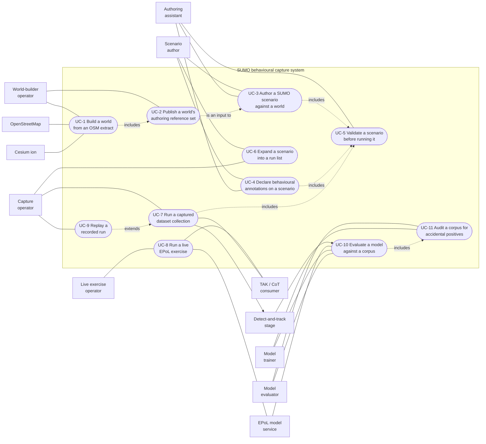
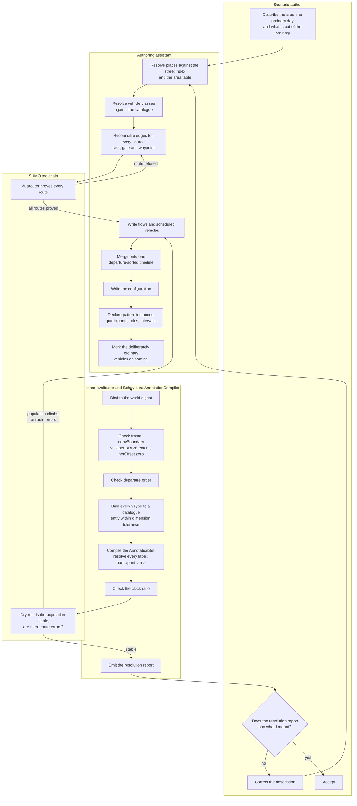
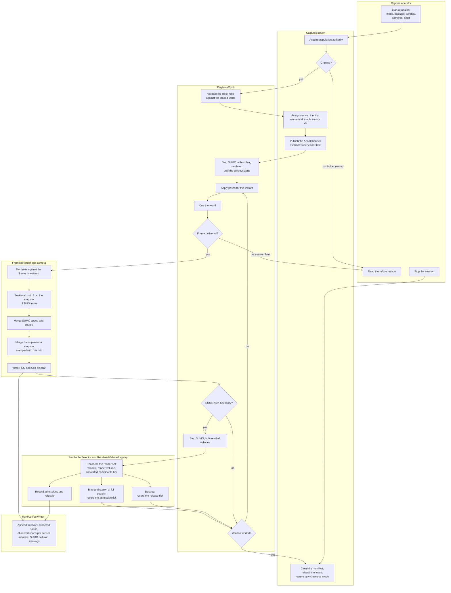

# 02 — Use cases

**Status:** Plan section. Behavioural specification, not implementation. No code was changed and no build
was run.
**Date:** 2026-09-17
**Owner role:** Systems architect. Companion section: [01 — Architecture](01_Architecture.md), whose
component names, modes and authority model this section uses without restating them.
**Scope:** The actors, the use cases each one drives, and the two flows that carry the most risk drawn as
activity diagrams with partitions.
**Audience:** An engineer implementing any section in this folder, and anyone deciding what the tooling's
command surface should be. A use case here is a contract about *what must be possible and what must fail
loudly*; it is not a user manual.
**Grounding:** Claims about existing behaviour are cited `path:line` against the working tree as read on
2026-09-17, or carried forward from a Findings document and marked as such. Anything marked **inference**
is reasoning, not a reading.

**Out of scope, deliberately.** Command-line syntax, screen layouts, file formats, and the internals of
any step. A step that says "validate every route" does not say how; [07](07_Scenario_Authoring.md) and
[04](04_Contracts.md) own that.

---

## 1. The actors

Derived from the workflow as it actually runs, not from roles invented for the diagram. Two of these are
the same person wearing different hats on different days, and they are kept apart because their
preconditions differ.

| Actor | Kind | What they are trying to do | Why they are a distinct actor |
|---|---|---|---|
| **Scenario author** | Human | Decide what pattern of life a scene depicts, and what in it is anomalous | Owns intent. The only source of behavioural truth ([20 §2.1](../../Findings/20_Behavioral_Annotation_And_Areas_Of_Interest.md)) |
| **Authoring assistant** | Software agent, acting for the author | Turn a description in ordinary terms — street names, times, who goes where — into a scenario package that resolves | Needs machine-readable inputs and loud failures. It is fluent in SUMO and OpenSCENARIO and cannot know this fork's conventions unless they are written down and validated ([20 §5](../../Findings/20_Behavioral_Annotation_And_Areas_Of_Interest.md) preamble) |
| **World-builder operator** | Human | Turn an OSM extract into a world and its authoring reference set | Needs a GPU, a running server and a Cesium ion token; the only actor with that precondition |
| **Capture operator** | Human | Produce a corpus from a scenario and a world | Owns the session: mode, window, cameras, seed |
| **Model trainer** | Human | Train an EPoL model on a corpus | Consumes; never runs the simulator |
| **Model evaluator** | Human | Score a model against a corpus, honestly | Must be able to compute a denominator the capture cannot silently distort |
| **Live exercise operator** | Human | Drive an end-to-end demonstration with a live model and a live feed | Real-time pacing and a live consumer; nothing is written for training |
| **TAK / CoT consumer** | External system | Display tracks | Receives CoT over UDP; ignores unknown `<detail>` children ([09 §5](../../Findings/09_Telemetry_CoT_Contract.md)) |
| **Detect-and-track stage** | External system | Turn imagery into tracks | Never given truth |
| **EPoL model service** | External system | Assess tracks | Never given truth |
| **OpenStreetMap** | External data source | Supplies the extract | |
| **Cesium ion** | External data source | Supplies photoreal imagery and world terrain | |

## 2. The use-case diagram

---

## 3. The use cases

Each is stated in the same shape. "Failure" means the system refuses and says why; "alternate" means a
legitimate different path through the same case.

### UC-1 — Build a world from an OSM extract

| | |
|---|---|
| **Primary actor** | World-builder operator |
| **Supporting** | OpenStreetMap, Cesium ion, CARLA server |

**Preconditions.** A headless CARLA server is running; `CESIUM_ION_TOKEN` is set; `netconvert` is on the
staged install (`run_SCTMV.py:60-78` resolves it from `CARLA_NETCONVERT` or the in-repo build); an OSM
extract exists with a `<bounds>` element; an optional `<extract>.aoi.geojson` sits beside it.

**Main flow.**
1. Operator names the extract, the height-align mode and the package destination.
2. `OsmClipper` cuts the extract to its bounds, preserving node ids **and OSM relations** — the turn
   restrictions [issue #12](https://github.com/sbrett9/carla/issues/12) records as discarded today, which
   [01 §2.5](01_Architecture.md) makes a prerequisite of this system.
3. `RoadNetworkConverter` runs `netconvert` **once**, emitting the OpenDRIVE and the SUMO network from the
   same invocation at the same pinned origin.
4. Elevation, sign and traffic-light injection run against the OpenDRIVE.
5. The world is generated on the server; Cesium streams; the drape samples true ground height per cell.
6. `WorldPackageWriter` writes `world.json`, `map.xodr`, **`map.net.xml`** and `bareearth.bin`.
7. `AreaOfInterestCompiler` validates any supplied areas against the OSM bounds, the sandbox rectangle and
   the road network, and resolves them to CARLA-local metres.
8. UC-2 runs as part of this case.

**Alternate flows.**
- *No areas supplied* — steps 7 proceeds with an empty area table; area-relative authoring is then
  unavailable and UC-5 says so.
- *Secure site with a private interior* — the road filter is turned off so `access=private` roads survive,
  and the fence is applied during authoring rather than at build.

**Failure flows.**
- *Cesium does not stream* — height sampling has nothing to sample. Refuse the build rather than emit a
  world whose drape is a plane; a silently flat world produces vehicles floating or buried and is
  discovered much later.
- *An area's envelope is disjoint from the OSM bounds* — refuse, per
  [20 §8.3](../../Findings/20_Behavioral_Annotation_And_Areas_Of_Interest.md). An area that crosses the
  sandbox edge, or that sits inside the staging ring, or that has no drivable road near it, warns.
- *`netconvert` reports restriction relations it cannot apply* — warn and record the count in the build
  recipe, because under SUMO drive a discarded restriction becomes visible bad behaviour and must not be
  mistaken for a bridge defect ([23 §6.6](../../Findings/23_SUMO_Traffic_Integration.md)).

**Postconditions.** A world package exists; the server holds the world; the OpenDRIVE's digest is the
world's identity ([18 §5.5](../../Findings/18_Scenario_Fabrication_For_EPoL_Training.md)).

**Artifacts.** World package (`world.json`, `map.xodr`, `map.net.xml`, `bareearth.bin`), the resolved area
table, the build recipe.

---

### UC-2 — Publish a world's authoring reference set

| | |
|---|---|
| **Primary actor** | World-builder operator |
| **Supporting** | CARLA server |

**Preconditions.** A world is loaded on a running server.

**Main flow.**
1. `VehicleCatalogueGenerator` projects the server's blueprint definitions into a versioned vehicle
   catalogue carrying, per entry, the real bounding-box dimensions and the attributes truth already reads
   — `base_type`, `special_type`, `number_of_wheels`, `color`
   ([20 §5.6](../../Findings/20_Behavioral_Annotation_And_Areas_Of_Interest.md)).
2. A street-name-to-road index is extracted from the generated OpenDRIVE. This is what makes a description
   in street names resolvable: non-junction roads carry the real name, junction internals carry the
   converter's own edge identifier ([20 §5](../../Findings/20_Behavioral_Annotation_And_Areas_Of_Interest.md)).
3. The annotation vocabulary and its version are attached.
4. The area table from UC-1 is attached.
5. All of it is stamped with the world digest and published as the `AuthoringReferenceSet`.

**Alternate flow.** *A world built earlier, reopened* — the set is regenerated from the running server
rather than read from disk, so it can never describe a different content build from the one loaded.

**Failure flows.**
- *The catalogue is empty or the blueprint filter matched nothing* — refuse. An author given an empty
  catalogue writes a scenario that resolves to nothing.
- *The street index is degenerate* (every road named by an edge identifier) — warn loudly; the world is
  usable but cannot be authored against in ordinary language, which is the primary authoring path.

**Postconditions.** Authoring can proceed without a running server.

**Artifacts.** Vehicle catalogue, street-name index, area table, vocabulary, world digest — versioned
together.

---

### UC-3 — Author a SUMO scenario against a world

| | |
|---|---|
| **Primary actor** | Scenario author |
| **Supporting** | Authoring assistant, SUMO toolchain |

**Preconditions.** An `AuthoringReferenceSet` and a world package exist. No CARLA server is needed —
authoring runs on any machine with SUMO ([`sumo-traffic-scenarios/SKILL.md`](../../../../../.agents/skills/sumo-traffic-scenarios/SKILL.md)).

**Main flow.**
1. Author describes the scene in ordinary terms: where traffic comes from and goes, what the ordinary day
   looks like, who is present and when, and what is out of the ordinary.
2. Assistant resolves every named place against the street index and the area table, and every named
   vehicle class against the catalogue.
3. Assistant reconnoitres the real network: finds the edges for every source, sink, gate and waypoint and
   their access class. **Routes are proved with `duarouter`, never with a graph walk** — a graph walk
   gives false positives by traversing one-way edges the real router refuses, and the scenario then fails
   at load with "no valid route" (measured gotcha, recorded in the skill).
4. Assistant writes the demand: flows for the ordinary population, scheduled vehicles for the ones with a
   story. Everything is merged onto **one departure-sorted timeline**, because SUMO silently drops
   out-of-order entries with only a warning (measured gotcha; `SumoPatternOfLifeBuilder` merges for
   exactly this reason).
5. Assistant writes the configuration: step length, seed, end time, and the SUMO-side policies that affect
   reproducibility — the sizing scenario sets `time-to-teleport` to `-1` so a jam stays a jam
   (**measured** in `BahonarPatternOfLife.zip`'s `.sumocfg`, read 2026-09-17).
6. UC-4 runs for anything the author asserts is a behaviour.
7. UC-5 runs; failures return to step 2.
8. Author reads back the validator's resolution report and confirms it says what they meant.

**Alternate flows.**
- *Author works by hand* — every convention the assistant uses is documented and validated, so a
  hand-written scenario passes or fails the same checks. This is a requirement, not a courtesy
  ([20 decision 13](../../Findings/20_Behavioral_Annotation_And_Areas_Of_Interest.md)).
- *Secure site* — private roads are kept, then fenced per vehicle class. The internal junction-connector
  lanes must be cleared too, or the restricted class cannot cross any junction and the interior fragments
  (the subtlest measured bug of the Bahonar build, recorded in the skill).
- *Author starts from an existing scenario* — it is copied and re-bound to a new world digest, and every
  reference is re-resolved rather than assumed to carry.

**Failure flows.**
- *A named street does not resolve* — error naming the street and offering the nearest matches. Never a
  silent nearest-match substitution.
- *A movement through a junction is named as a turn* — junction internals have no human name
  ([20 open question 8](../../Findings/20_Behavioral_Annotation_And_Areas_Of_Interest.md)), so the
  assistant must express it as the roads either side, and the error must say that rather than reporting
  the name as unknown.
- *A route no router can find* — error naming the origin, the destination and the vehicle class, because
  the usual cause is an access class the fence excluded.

**Postconditions.** A scenario exists that loads in SUMO and whose every reference resolves against one
named world.

**Artifacts.** `ScenarioPackage` — `map.net.xml`, `.rou.xml`, `.sumocfg`, the world digest binding, and,
once UC-4 has run, the `AnnotationSet`.

---

### UC-4 — Declare behavioural annotations on a scenario

| | |
|---|---|
| **Primary actor** | Scenario author |
| **Supporting** | Authoring assistant |

**Preconditions.** A scenario in progress; a declared annotation vocabulary and its version.

**Main flow.**
1. Author names each phenomenon they are asserting: what it is, who takes part, in what role, over what
   spans.
2. Author marks the deliberately ordinary vehicles as `nominal` — the authored hard negatives that make
   duration alone stop being the signal ([20 §2.7](../../Findings/20_Behavioral_Annotation_And_Areas_Of_Interest.md)).
3. `BehaviouralAnnotationCompiler` produces the `AnnotationSet`: pattern instances with participants,
   roles, intervals and parameters, and instance ids derived deterministically from the scenario and the
   authored name so a sweep's runs are joinable.
4. Every vehicle the author said nothing about is `unlabelled`, and that state is written explicitly
   rather than by omission ([20 decision 2](../../Findings/20_Behavioral_Annotation_And_Areas_Of_Interest.md)).

**Alternate flow.** *An anomaly that is an absence* — a guard who never arrives has no vehicle to attach to.
The sizing scenario already carries one such case in its `anomaly_notes` (**measured**: a `guard_no_show`
covering one tower across one shift). It is a pattern instance with a participant that is expected and
does not appear, with a place and a window, and the compiler must be able to express it rather than
relegating it to a note.

**Failure flows.**
- *A label outside the vocabulary* — error. A corpus assembled from scenarios that each spelled `loiter`
  differently is not a corpus ([20 §6.2](../../Findings/20_Behavioral_Annotation_And_Areas_Of_Interest.md)).
- *A participant naming a vehicle the scenario does not contain* — error.
- *An annotation derived from geometry* — cannot happen, because no geometric predicate is an input to
  this case at all. This is stated as a failure to make the boundary visible where it is most likely to
  erode ([20 §8.5](../../Findings/20_Behavioral_Annotation_And_Areas_Of_Interest.md)).

**Postconditions.** Every assertion the author made exists as a record; nothing the author did not assert
does.

**Artifacts.** `AnnotationSet`, the resolution report of what each annotation bound to.

---

### UC-5 — Validate a scenario before running it

| | |
|---|---|
| **Primary actor** | Authoring assistant |
| **Supporting** | Scenario author, SUMO toolchain |

**Preconditions.** A `ScenarioPackage`; the `AuthoringReferenceSet` it was authored against.

**Main flow.**
1. **Bind.** The package's world digest matches the world it names. A mismatch in the build recipe is a
   refusal; a digest mismatch with a matching recipe is a warning requiring an explicit override
   ([18 §5.5](../../Findings/18_Scenario_Fabrication_For_EPoL_Training.md)'s two-tier gate).
2. **Frame.** The network's `convBoundary` equals the OpenDRIVE header's extent, and `netOffset` is zero —
   the check that the coordinate identity holds.
3. **Routes.** Every origin-destination and waypoint route is proved with `duarouter`.
4. **Order.** The route file is departure-sorted across flows and vehicles.
5. **Types.** Every `vType` binds to at least one catalogue entry within the dimension tolerance. The
   sizing scenario spans 4.4 m to 12.0 m across 14 types (**measured**), so this is a real matching check.
6. **Annotations.** Every label is in the vocabulary, every participant exists, every area reference
   resolves.
7. **Clock.** The SUMO step length, the intended world delta and the intended capture rate are in integer
   ratio ([01 §6.1](01_Architecture.md)).
8. **Report.** The validator prints what it *resolved*, not only what it rejected — the roads a street name
   bound to, the catalogue entries each type bound to, the areas each annotation bound to. A preview cannot
   check any of this ([20 §5.5](../../Findings/20_Behavioral_Annotation_And_Areas_Of_Interest.md)), so the
   report is the only place an author sees whether the scenario says what they meant.

**Alternate flow.** *Validation without a world* — steps 1 and 5 need the reference set but not a server,
so the whole case runs offline. This matters because authoring is the part of the workflow that does not
need a GPU.

**Failure flows.** Any of steps 2 through 7 failing refuses the package. Step 1 is the two-tier gate.
A dry run whose population climbs monotonically rather than settling is a demand error, not a validator
error, and is reported as a warning with the numbers rather than as a pass.

**Postconditions.** The package is either refused with a named reason, or accepted and stamped with the
validator's version and the resolution report.

**Artifacts.** Validation report; a validated `ScenarioPackage`.

---

### UC-6 — Expand a scenario into a run list

| | |
|---|---|
| **Primary actor** | Scenario author, with the capture operator |

**Preconditions.** A validated `ScenarioPackage`.

**Main flow.**
1. Author sets the bounds of the behavioural parameters to sweep and the appearance parameters to cross
   them with — time of day, weather, camera track. Behaviour and appearance are separate axes
   ([18 D4](../../Findings/18_Scenario_Fabrication_For_EPoL_Training.md)).
2. The machine expands the cross product into a run list, each entry carrying a seed, a capture window, a
   camera set, and the instance ids the variation touched.
3. Instance ids stay stable across the expansion, so one authored pattern's variants can be diffed.

**Alternate flow.** *Counterfactual pairing* — the same seed and the same ambient population with one
instance's behaviour switched off, which isolates the authored behaviour as the only difference between
two runs. [20 open question 7](../../Findings/20_Behavioral_Annotation_And_Areas_Of_Interest.md) leaves
this open; the run list is where it would be expressed, and it costs almost nothing here because the seed
and the parameters are already run inputs.

**Failure flow.** *A swept parameter that changes the network* — refused. A sweep that rebuilds the world
is not a sweep over one scenario, and the world digest would differ between runs.

**Postconditions.** A run list whose entries are individually runnable and collectively joinable.

**Artifacts.** Run list.

---

### UC-7 — Run a captured dataset collection

| | |
|---|---|
| **Primary actor** | Capture operator |
| **Supporting** | CARLA server, `sumo`, TAK consumer (optional) |

**Preconditions.** A running server with the named world loaded; a validated `ScenarioPackage`; the
toolchain staged with `SUMO_HOME` set; one or more collection cameras configured; a capture window and a
seed.

**Main flow.**
1. Operator starts a session naming the mode `SumoDrivenPlayback`, the package, the window, the cameras
   and the seed.
2. `CaptureSession` acquires **population authority** from `WorldDriveAuthority`. If it is held, the
   session start fails naming the holder ([01 §5.3](01_Architecture.md)).
3. The world is put in synchronous mode at the fixed delta; the clock ratio is re-checked against the
   loaded world.
4. `CaptureSession` assigns one session identity and a stable `sensor_id` per camera, and hands both to
   every recorder — replacing the per-recorder default derived from its own start instant
   (`CarlaNet.Recording/FrameRecorder.cs:101-103`). It also supplies the `scenario_id`, which the
   recorder has always accepted and nothing has ever passed (`NativeRecorder.py:107-108` passes `run_id`
   and `seed` only; this carries forward
   [20 §4.2](../../Findings/20_Behavioral_Annotation_And_Areas_Of_Interest.md)'s gap to the current entry
   point).
5. `SumoSession` launches `sumo` and connects; the `AnnotationSet` is published as `WorldSupervisionState`.
6. The clock steps SUMO with nothing rendered until the capture window's start.
7. The capture window runs: per rendered instant, poses are applied, the world is cued, cameras deliver,
   recorders write. Per SUMO step, the render set is reconciled and interval state changes are published.
8. `RunManifestWriter` writes incrementally throughout — instances, intervals, rendered spans, observed
   spans per sensor and unioned, admissions and refusals, and SUMO collision warnings.
9. At the window's end the session stops: recorders flush, rendered vehicles are released, the manifest is
   closed, the lease is released, and the world is restored to asynchronous mode so a headless server is
   never left waiting for a tick (`run_SCTMV.py:329-335` already does this on shutdown).

**Alternate flows.**
- *Live feed alongside* — CoT goes to a TAK consumer as it is written. It is diagnostic; the sidecar is
  authoritative ([20 §7.4](../../Findings/20_Behavioral_Annotation_And_Areas_Of_Interest.md)).
- *Several cameras* — extra cameras run in the default single process, or in tick-follower processes that
  never cue. Either way they read supervision, the render set and session identity from the server, so
  their sidecars agree at each tick ([01 §3.4](01_Architecture.md)).
- *Engine recorder alongside* — the server-side log is started for the same window so UC-9 is possible.

**Failure flows.**
- *Population authority is held* — session start fails naming the holder. Ambient traffic cannot be
  running underneath a SUMO capture, and this is the mechanism rather than a warning.
- *A storyboard is also requested* — refused unless storyboard entities are mirrored into SUMO; an
  unmirrored entity is invisible to every SUMO vehicle ([01 §5.2](01_Architecture.md)).
- *The world does not deliver a cued frame* — session fault, stop, and the manifest records where. A
  capture that silently drops frames has a tick spacing its manifest misreports.
- *The actor cap binds* — admissions are refused by priority, ambient first, and every refusal is recorded.
  A demand-limited capture must be distinguishable afterwards from a quiet one.
- *A capture window falls outside the scenario's end time* — refuse at session start rather than
  discovering an empty world at hour 170.

**Postconditions.** A corpus exists whose imagery, truth sidecars and manifest share one session identity
and one tick base, bound to one world digest and one scenario.

**Artifacts.** Per camera: PNG captures plus CoT sidecars. Per session: the run manifest, the session log,
and optionally the engine recorder log.

---

### UC-8 — Run a live EPoL exercise

| | |
|---|---|
| **Primary actor** | Live exercise operator |
| **Supporting** | Detect-and-track stage, EPoL model service, TAK consumer |

**Preconditions.** As UC-7, plus a reachable detect-and-track stage and model service, and a consumer for
the output.

**Main flow.**
1. Session starts as UC-7, paced against the wall clock rather than run as fast as the machine allows.
   `SumoCotBridge` already implements exactly this distinction — a real-time factor of 0 for datasets and
   1 for a live feed, with absolute targets so an overrunning step is absorbed rather than accumulating
   drift (`carlacontrol/SumoCotBridge.py:243-248`) — and the same rule applies here.
2. Imagery streams to the detect-and-track stage; its tracks stream to the model service; the model's
   assessments stream to the consumer.
3. Truth streams to the consumer on a **separate** track source so an observer can see both, and the model
   service receives none of it.

**Alternate flow.** *Demonstration without a model* — truth only, which is the existing live telemetry
behaviour and must keep working.

**Failure flows.**
- *The pipeline cannot keep up* — the exercise degrades rather than stalls: captures are dropped, and the
  fact is displayed. A live exercise that silently slows the world is worse than one that visibly drops
  frames, because the observer cannot tell.
- *Truth reaching the model service* — a configuration error that must be impossible by construction, not
  caught by review. The model service's input is a track stream with no truth-sourced fields in it.

**Postconditions.** Nothing training-grade is produced. A session log records what was shown.

**Artifacts.** Session log; optionally a recorded CoT stream for later review.

---

### UC-9 — Replay a recorded run

| | |
|---|---|
| **Primary actor** | Capture operator |
| **Supporting** | CARLA server |

**Preconditions.** An engine recorder log, its manifest, and a loaded world whose digest matches.

**Main flow.**
1. Operator names the log; the tooling fetches the live OpenDRIVE, hashes it, and compares against the
   manifest.
2. `RecordedReplay` acquires population authority; anything else holding it must stop first.
3. The replayer respawns and drives the actors from the log. Record and replay are verified working end to
   end in this fork ([18 §5.4](../../Findings/18_Scenario_Fabrication_For_EPoL_Training.md)).
4. New captures are taken under a different appearance — time of day, weather, camera track — while the
   behaviour is exactly the recorded behaviour ([18 D4](../../Findings/18_Scenario_Fabrication_For_EPoL_Training.md)).
5. Supervision is recovered from the original run's manifest, joined by `entity_id` and normalised tick
   ([20 §7.7](../../Findings/20_Behavioral_Annotation_And_Areas_Of_Interest.md)); the static identity
   attributes survive because the recorder log preserves spawn attributes verbatim
   ([20 §4.5](../../Findings/20_Behavioral_Annotation_And_Areas_Of_Interest.md)).

**Alternate flow.** *Replay for review rather than capture* — no recording, no manifest needed.

**Failure flows.**
- *No manifest* — refuse to treat the log as replayable
  ([18 §5.5](../../Findings/18_Scenario_Fabrication_For_EPoL_Training.md)).
- *Digest mismatch* — the two-tier gate: recipe mismatch refuses, digest-only mismatch warns and requires
  an override.
- *Relying on the engine's own map guard* — it is inert for generated worlds and must never be the check.
  The comparison is between a value and itself, and every generated world loads under one level name
  ([18 §5.3](../../Findings/18_Scenario_Fabrication_For_EPoL_Training.md)).
- *Kinematics in a replayed capture* — the SUMO bridge is not running, so the compensation of
  [01 §4.3](01_Architecture.md) is unavailable and replayed bodies are moved by the replayer. Whether
  replayed truth can carry speed at all is an open question, recorded in §6.

**Postconditions.** A second corpus of the same behaviour under a different appearance, joinable to the
first by `entity_id` and normalised tick.

**Artifacts.** New captures and sidecars; a manifest that cites the original run.

---

### UC-10 — Evaluate a model against a captured corpus

| | |
|---|---|
| **Primary actor** | Model evaluator |
| **Supporting** | Model trainer, detect-and-track stage, EPoL model service |

**Preconditions.** A corpus with its manifest; a trained model; detector tracks for the corpus.

**Main flow.**
1. `SupervisionTransfer` transfers supervision from truth onto detector tracks, **per sensor**, clipping
   any track that spans an interval boundary rather than labelling it wholesale, and recording the
   association quality per assignment ([20 §7.6](../../Findings/20_Behavioral_Annotation_And_Areas_Of_Interest.md)).
2. The model is run over the tracks. It is given no truth.
3. `EvaluationJoin` joins assessments to supervision.
4. The denominator is computed over **observed** intervals, not authored ones, and the render-set gate is
   applied first: an interval whose participant was never instantiated is not a miss
   ([01 §7](01_Architecture.md), [20 §2.5](../../Findings/20_Behavioral_Annotation_And_Areas_Of_Interest.md)).
5. Base rate is reported per sensor and unioned, because precision at low prevalence is dominated by it
   ([20 §2.6](../../Findings/20_Behavioral_Annotation_And_Areas_Of_Interest.md)).
6. Detector performance is scored separately against truth: position error, height error, class confusion,
   missed and false tracks ([09 §9](../../Findings/09_Telemetry_CoT_Contract.md)).

**Alternate flow.** *Fused tracks* — if the model consumes tracks fused across sensors, "observed" means
the union; without fusion it is per sensor. The manifest carries both so the choice is made downstream
rather than baked in at capture time.

**Failure flows.**
- *A corpus whose manifest is absent or was not closed* — refuse to score. Supervision in interval form is
  the only thing a detector track can be clipped against
  ([20 §7.6](../../Findings/20_Behavioral_Annotation_And_Areas_Of_Interest.md)).
- *A vocabulary version the evaluator does not understand* — refuse.
- *Corpora from different worlds combined without saying so* — refuse; the world digest is part of the
  corpus identity.

**Postconditions.** A score that charges the model only for what a sensor could have seen.

**Artifacts.** Transferred supervision per sensor; an evaluation report carrying the denominators and base
rates it used.

---

### UC-11 — Audit a corpus for accidental positives

| | |
|---|---|
| **Primary actor** | Model evaluator, with the model trainer |

**Preconditions.** A corpus with its manifest and derived area relations.

**Main flow.**
1. Every `unlabelled` vehicle's derived area relations and motion summary are compared against the
   profile of each annotated pattern class.
2. Candidates — an unlabelled vehicle that looks exactly like an annotated pattern — are surfaced for
   human review before they train as negatives
   ([20 §2.2](../../Findings/20_Behavioral_Annotation_And_Areas_Of_Interest.md)).
3. The audit's own criteria are recorded with the corpus, so a later reader knows what was looked for.

**Alternate flow.** *Audit a run list rather than one run* — the same test across a sweep finds a class of
accidental positive the seed makes common.

**Failure flow.** *The audit's output used as a label* — prohibited. A derived predicate never writes into
supervision ([20 decision 3](../../Findings/20_Behavioral_Annotation_And_Areas_Of_Interest.md)). How a
confirmed accidental positive is handled is
[20 open question 5](../../Findings/20_Behavioral_Annotation_And_Areas_Of_Interest.md) and is not settled
here.

**Note on why this case matters more under this system than it did.** The traffic manager's idle cull
truncates the ambient stationary distribution at ninety seconds, which is also what suppresses accidental
positives today. Under `SumoDrivenPlayback` the traffic manager does not run, so long ambient stops become
possible — a gain ([01 §11](01_Architecture.md)) that raises the accidental-positive rate at the same
time. The realism gain and the audit are coupled and must not be sequenced apart
([20 §2.8](../../Findings/20_Behavioral_Annotation_And_Areas_Of_Interest.md)).

**Postconditions.** Candidates identified; the corpus is either accepted, corrected, or has spans excluded.

**Artifacts.** Audit report.

---

## 4. Activity diagram — authoring a scenario

Partitions are actors and system components. This is UC-3 and UC-4 with UC-5 inlined, because in practice
they are one sitting.

Three things this diagram is asserting, each grounded:

- **`duarouter` sits inside the loop, not after it.** Route validation with a graph walk gives false
  positives that surface only at SUMO load (measured gotcha, recorded in the skill), so it belongs where
  a failure is cheap.
- **A dry run is part of authoring.** A population that climbs monotonically rather than settling is a
  demand error the validator cannot see statically; netconvert's guessed fixed-time 90 s signal programs
  are a known cause that a busy interchange cannot discharge (measured gotcha).
- **The author's acceptance is of the resolution report, not of the scenario file.** An annotation carried
  in a vendor construct is invisible to a foreign previewer, so a preview cannot check that annotations
  are right — only the compile step can
  ([20 §5.5](../../Findings/20_Behavioral_Annotation_And_Areas_Of_Interest.md)).

---

## 5. Activity diagram — running a capture

This is UC-7. Partitions are the components of [01 §2.3](01_Architecture.md).

Three things this diagram is asserting:

- **Authority is acquired before anything else happens.** The lockout is the first node with an outcome,
  not a check somewhere in the middle ([01 §5.3](01_Architecture.md)).
- **Truth is taken from the snapshot of the frame the pixels came from.** Today the recorder takes the
  tick from the image header (`FrameRecorder.cs:179`) but the vehicle truth from whatever the
  world-observer cache last held (`FrameRecorder.cs:148`), while the paired depth capture *is* tick-matched
  (`FrameRecorder.cs:156`). The two halves of one capture use different rules today;
  [03](03_CoSimulation_Runtime.md) owns closing that.
- **The manifest is written throughout, not at the end.** A run that fails at minute forty of forty-five
  otherwise keeps every capture and loses all its supervision
  ([20 §7.5](../../Findings/20_Behavioral_Annotation_And_Areas_Of_Interest.md)).

---

## 6. Decisions

| # | Decision |
|---|---|
| D2.1 | **The authoring assistant is a first-class actor, not a convenience.** Every convention it relies on is a published, machine-readable artifact of a build, and every unresolved reference is an error rather than a nearest match. Hand authoring stays possible against the same artifacts (UC-2, UC-3) |
| D2.2 | **Authoring needs no CARLA server.** UC-3, UC-4, UC-5 and UC-6 run against the `AuthoringReferenceSet` and the world package alone, so the part of the workflow a human iterates on does not contend for a GPU (UC-5 alternate flow) |
| D2.3 | **Route validity is proved with `duarouter`, inside the authoring loop.** A graph walk gives false positives that surface at SUMO load, which is the wrong place to find them (UC-3, §4) |
| D2.4 | **A dry run is part of authoring, not part of capture.** A population that climbs rather than settles is a demand defect and is found before a server is involved (§4) |
| D2.5 | **The author accepts a resolution report, not a file.** The compile step reports what every name bound to, because a preview cannot check an annotation and a silent nearest match is the failure mode that costs the most later (UC-5 step 8) |
| D2.6 | **Population authority is acquired at session start, and a denial fails the session naming the holder.** It is the first thing that happens in UC-7, and there is no path that proceeds past it with a warning (UC-7, §5) |
| D2.7 | **One capture session, one identity.** The session assigns the run identity, the scenario id and a stable `sensor_id` per camera, replacing the recorder's own wall-clock default and closing the never-supplied `scenario_id` gap at its current location (UC-7 step 4) |
| D2.8 | **The evaluation denominator is observed intervals, gated first on rendered spans.** An annotated interval whose participant was never instantiated is not a model miss, and only the manifest can say which those were (UC-10 step 4) |
| D2.9 | **The model service is never given truth, in any mode.** Live and offline alike, its input is a track stream with no truth-sourced field in it, and that is a structural property of the interface rather than a configuration to get right (UC-8, UC-10) |
| D2.10 | **A corpus without a closed manifest is not scoreable and not replayable.** Both UC-9 and UC-10 refuse it rather than degrading, because supervision in interval form is the only thing a detector track can be clipped against (UC-9, UC-10) |
| D2.11 | **Auditing for accidental positives is a required use case, not an optional one**, because this system removes the mechanism that was suppressing them. The realism gain and the audit ship together (UC-11) |
| D2.12 | **A live exercise degrades visibly rather than silently slowing the world.** An observer who cannot tell that the pipeline is behind is being shown something other than what they think (UC-8 failure flow) |

## 7. Open questions

1. **Can a replayed capture carry speed?** UC-9 replays bodies the replayer moves, with no SUMO session
   running, so [01 §4.3](01_Architecture.md)'s kinematic compensation is unavailable and the replayed
   truth would report the zero velocity of `WorldObserver.cpp:373` again. Options: carry the original
   run's kinematics in the manifest and re-attach them by `entity_id` and normalised tick; or accept that
   a replayed corpus has position and no speed and say so in its manifest. Recommend the first — the data
   already exists and the join already exists for supervision — but it needs
   [06](06_Truth_And_Annotation.md) to decide where it rides.
2. **Who chooses the capture window — the author or the operator?** Both have a legitimate claim: an
   annotated instance implies a window, and an operator may want an arbitrary hour of ordinary life.
   Recommend the scenario declaring named windows as presets with the operator free to give another, and
   the manifest recording which was used. Same question as [01 open question 3](01_Architecture.md); they
   should be answered once.
3. **Is there a use case for capturing a window with no annotations at all?** A corpus of purely ordinary
   movement is what an EPoL model most needs, and nothing above requires an `AnnotationSet` to be
   non-empty. If that is a first-class case it should be named, because it changes what UC-5 can insist on
   and what UC-10's base rate means when the numerator is zero.
4. **How does an author preview a SUMO scenario?** [18 §8.3](../../Findings/18_Scenario_Fabrication_For_EPoL_Training.md)'s
   graphical canvas previews OpenSCENARIO storyboards, not SUMO demand. `sumo-gui` is the obvious
   candidate and is already built ([23 §1.2](../../Findings/23_SUMO_Traffic_Integration.md)), but it
   previews the microsimulation rather than the imagery. Whether that is enough, or whether a preview
   against the world's own geometry is wanted, is unsettled and affects how much UC-3's dry run has to
   carry.
5. **What does the capture operator see while a capture runs?** UC-7 is described as a session with a
   beginning and an end, but a multi-hour capture needs a live indication of whether it is healthy —
   render-set occupancy, refusal rate, frame delivery, SUMO step budget. That is a real interface and
   nothing above specifies it; it belongs with [10](10_Scale_And_Performance.md)'s instrumentation rather
   than being invented separately.
6. **Is UC-6's counterfactual pairing worth building?** It is the strongest validation signal available for
   an EPoL detector and is nearly free here, but it doubles the run list and its value depends on a
   modelling question outside this plan. Carried forward unresolved from
   [20 open question 7](../../Findings/20_Behavioral_Annotation_And_Areas_Of_Interest.md).
