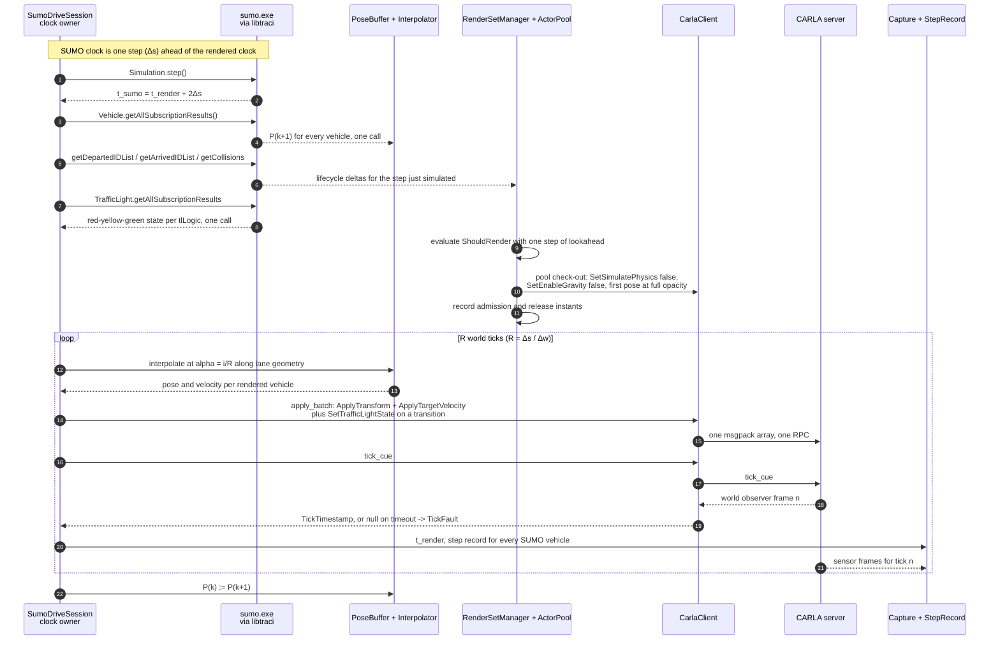
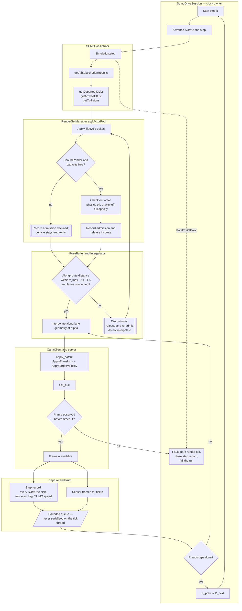

# Co-simulation runtime — the SUMO↔CARLA playback bridge

**Status:** design, ready for review · **Date:** 2026-09-17
**Scope:** the component that takes a running SUMO simulation and makes the CARLA world show it —
binding choice, the per-step write path, pose conversion, sub-step motion, traffic-light
synchronisation, vehicle lifecycle, clock ownership, the ambient-traffic lockout, and failure
handling.
**Audience:** an engineer who will implement the bridge and has not read the conversation that
produced this plan. Familiarity with CARLA's client/server split is assumed; familiarity with SUMO
is not.

**Reads from:** [`Findings/23_SUMO_Traffic_Integration.md`](../../Findings/23_SUMO_Traffic_Integration.md)
(primary), [`Findings/17_Photoreal_Occlusion_Metric.md`](../../Findings/17_Photoreal_Occlusion_Metric.md)
§12.2 (the arrival gate), [`Findings/20_Behavioral_Annotation_And_Areas_Of_Interest.md`](../../Findings/20_Behavioral_Annotation_And_Areas_Of_Interest.md)
§5.6 (the vehicle catalogue), [`_TEAM_BRIEF.md`](_TEAM_BRIEF.md).

**Depends on decisions owned elsewhere:** [`04_Contracts.md`](04_Contracts.md) (vehicle catalogue,
render-set contract), [`05_CarlaNet_Capability_Audit.md`](05_CarlaNet_Capability_Audit.md) (every gap
in §11), [`06_Truth_And_Annotation.md`](06_Truth_And_Annotation.md) (what the per-step record
carries), [`10_Scale_And_Performance.md`](10_Scale_And_Performance.md) (render-set budget).

---

## 0. What this section does not cover

- **Which** SUMO vehicles become CARLA actors. This section specifies the *mechanism* of admission
  and release and the interface the policy must satisfy (§8.3); the policy itself is the render-set
  contract, owned by [`04_Contracts.md`](04_Contracts.md), sized by
  [`10_Scale_And_Performance.md`](10_Scale_And_Performance.md).
- The vType ↔ blueprint map. Named here only where playback geometry depends on it (§7.4).
- Truth record schema, behavioural annotation, areas of interest.
- Scenario authoring, netconvert flags, demand modelling.
- Toolchain staging and packaging. Measured state is reported in §12 G9 and handed to
  [`09_Toolchain_And_Packaging.md`](09_Toolchain_And_Packaging.md).
- Pedestrians (out of scope by decision, `_TEAM_BRIEF.md` §3.5).

---

## 1. What the bridge is

One component, `CarlaNet.CoSim`, holding exactly one TraCI connection and exactly one CARLA client
connection, which:

1. owns the advance of simulated time on **both** sides;
2. converts SUMO's per-vehicle state into CARLA poses;
3. writes those poses to the server as a batch, once per world tick;
4. manages which SUMO vehicles hold a CARLA actor;
5. emits a per-step record of *every* SUMO vehicle — rendered or not — for the truth path.

It replaces nothing. The .NET traffic manager, the OpenSCENARIO executor and the existing
CARLA-free `SumoCotBridge` telemetry path all remain, and SUMO drive is a mode
(`_TEAM_BRIEF.md` §3.6).

```mermaid
flowchart LR
  subgraph ext["Outside the bridge"]
    SUMO["sumo.exe<br/>separate process"]
    SRV["CARLA server<br/>UE5.7.4, synchronous"]
    PY["Python run harness<br/>launch, config, operator surface"]
  end

  subgraph cosim["CarlaNet.CoSim"]
    DRV["SumoDriveSession<br/>owns both clocks, owns the lease"]
    CONN["SumoConnection<br/>libtraci C# wrapper,<br/>subscriptions only"]
    BUF["PoseBuffer<br/>two SUMO frames:<br/>P&#40;k&#41; and P&#40;k+1&#41;"]
    INT["LaneArcInterpolator<br/>sub-step pose along lane shape"]
    CONV["PoseConverter<br/>frame, yaw, bumper shift, Z, pitch/roll"]
    POOL["ActorPool<br/>per blueprint, reuse not respawn"]
    RS["RenderSetManager<br/>admission and release,<br/>instants recorded, no opacity"]
    WR["BatchWriter<br/>one apply_batch per world tick:<br/>poses, velocities, changed light states"]
    TLS["SignalMirror<br/>SUMO tlLogic to OpenDRIVE signal J_k"]
    REC["StepRecord<br/>every SUMO vehicle, per step"]
  end

  subgraph deps["Existing CarlaNet"]
    CC["CarlaClient<br/>RPC + world-observer cache"]
    NET["RoadNetwork / net.xml reader<br/>lane shapes for interpolation"]
    DRAPE["CarlaClient.SampleDrapeGroundElevation<br/>in-process bilinear, no RPC"]
  end

  PY -->|"start / stop / config"| DRV
  DRV --> CONN --> SUMO
  CONN --> BUF --> INT --> CONV --> WR --> CC --> SRV
  CONN --> TLS --> WR
  NET --> INT
  NET --> TLS
  DRAPE --> CONV
  DRV --> RS --> POOL --> CC
  BUF --> REC
  RS --> REC
  TLS --> REC
  DRV --> CC
```



---

## 2. Language and binding choice

### 2.1 What is actually on disk (measured 2026-09-17)

| Thing | Where | State |
|---|---|---|
| `sumo.exe`, `duarouter.exe`, `netconvert.exe`, `libtracics.dll` | `Build/sumo-src/bin/` | all four present; `sumo --version` reports `Eclipse SUMO sumo 1.27.0`, build features include `SWIG` |
| Generated C# binding | `Build/sumo-build/src/libtraci/Eclipse.Sumo.Libtraci/` | **94 files** |
| Staged into `Build/sumo-install/bin/` | — | **`netconvert.exe` only** |
| `SUMO_HOME` | — | set nowhere in the repo |

API surface confirmed by reading the generated files:

| Call | File:line | Note |
|---|---|---|
| `Vehicle.moveToXY` | `Vehicle.cs:1103-1118` | 4 overloads including `keepRoute`, `matchThreshold` |
| `Vehicle.subscribe` / `getAllSubscriptionResults` | `Vehicle.cs:1298-1323`, `:1358` | the constant-call-count read path doc 23 §6.11 requires |
| `Vehicle.remove`, `Vehicle.add` | `Vehicle.cs:1123-1128`, `:848-913` | |
| `Simulation.step`, `getTime`, `getDeltaT` | `Simulation.cs:183-188`, `:226`, `:430` | |
| `Simulation.getDepartedIDList` / `getArrivedIDList` | `Simulation.cs:256`, `:268` | per-step lifecycle deltas |
| `Simulation.start(cmd, port, retries, label, …)` / `switchConnection` | `Simulation.cs:96-138`, `:150` | labelled connections — a second consumer is possible without a second `sumo` process |
| TraCI variable constants (`VAR_POSITION`, `VAR_ANGLE`, …) | `libtraci.cs:2958-2990` | exposed as C# properties; no hardcoded integers needed |
| `TraCICollision`, `FatalTraCIError` | `TraCICollision.cs`, `FatalTraCIError.cs` | collision reporting and process-death signalling are typed |

All static methods on static-facing classes. One process-global connection unless `label` /
`switchConnection` is used.

### 2.2 The existing Python path, and what it proves

`CarlaControl/src/carlacontrol/SumoCotBridge.py` drives a scenario over Python TraCI and emits CoT,
with no CARLA in the loop. Its step loop is `SumoCotBridge.py:239-277`. It works, and it is fast: the
Bahonar seven-day scenario runs at **3,119× real time** at a 1.0 s step (measured §6.1). Python TraCI
is not a performance problem *for driving SUMO*.

Two properties of that loop matter for the decision:

- It reads **per-vehicle, not by subscription** — `getPosition`, `convertGeo`, `getTypeID`,
  `getSpeed`, `getAngle`, `getLength`, `getWidth`, `getHeight`, `getRoadID`, `getLaneID`,
  `vehicletype.getColor`, `vehicletype.getVehicleClass` — 11 TraCI round trips per vehicle per sample
  (`SumoCotBridge.py:296-334`). At 131 concurrent vehicles (measured §8.1) that is 1,441 TraCI calls
  per emitted sample.
- Its `--rate` is a **decimator only**: `every = max(1, int(round(1.0 / (settings.rate_hz * step))))`
  (`SumoCotBridge.py:224`). With `step = 1.0 s`, any `rate_hz` above 1.0 clamps `every` to 1. There is
  no mechanism in it to produce motion *between* SUMO steps. This is the single most important thing
  to know about reusing it: **it cannot be the playback bridge without a new sub-step mechanism**
  (§6).

### 2.3 Re-examining doc 23 §6.3 under teleport

Doc 23 §6.3 says: *"Reject the pure-Python `traci` client outright — it puts Python in the per-tick
control path."* That argument was written for §4.1's shape, where each tick runs a PID controller and
a motion-plan stage per vehicle in .NET. Under teleport there is no controller. The honest restatement
of the per-tick work is: N pose conversions, one batch RPC, one tick RPC. Python can do that.

So the original argument does **not** survive unchanged. Five things replace it, and they are not the
same argument. The first two are capability gaps, not performance opinions, and they are decisive on
their own.

1. **The whole teleport of N vehicles is one round trip — in C#. It is not expressible in Python
   today.** The wire order that defines each command's variant index is
   `LibCarla/source/carla/rpc/Command.h:284-305`, mirrored exactly by
   `CarlaNet/src/CarlaNet.Types/Rpc/Commands/Command.cs:12-35`; all 22 have a serialiser arm
   (`CarlaNet.Types/Formatters/CommandFormatter.cs:41-72`) and a server visitor arm
   (`Unreal/CarlaUnreal/Plugins/Carla/Source/Carla/Server/CarlaServer.cpp:3145-3194`), with
   `BIND_SYNC(apply_batch)` at `:3198-3213`. `ApplyTransform` is index 6, `ApplyTargetVelocity` 8,
   `SetSimulatePhysics` 14, `SetEnableGravity` 15, `SetTrafficLightState` 21. **This is already
   proven in this repo, not theoretical:** the .NET traffic manager sends one mixed
   `ApplyBatchSyncAsync` per tick (`CarlaNet.TrafficManager/TrafficManagerLocal.cs:568`) whose
   contents include `ApplyTransformCommand` teleports
   (`CarlaNet.TrafficManager/Stages/MotionPlanStage.cs:244`, `:424`). The Python shim's `command`
   namespace exposes **8 of the 22** (`carlanet/__init__.py:1080-1149`: `SpawnActor`,
   `DestroyActor`, `SetAutopilot`, `ApplyVehicleControl`, `ApplyTransform`, `ApplyLocation`,
   `SetVehicleLightState`, `ConsoleCommand`) — so a Python bridge can batch the pose but **cannot
   batch the velocity, the physics toggle, the gravity toggle or the traffic-light state**, and must
   fall back to one RPC per actor for each of them.
2. **A SUMO-driven world has to drive CARLA's traffic lights, and the Python path cannot.** All ten
   traffic-light RPCs exist in C# (`CarlaNet.Transport/CarlaClient.cs:1659-1689`:
   `SetTrafficLightStateAsync`, green/yellow/red time, freeze, reset, group, light boxes) and all are
   bound server-side (`CarlaServer.cpp:2648-2884`). The shim's entire traffic-light surface is
   `class TrafficLight(TrafficSign): pass` (`carlanet/__init__.py:1002-1004`) — a marker class with
   no methods. This is not a convenience gap; §3.4 shows the light state is a per-tick write in this
   mode, and it is one the Python path has no way to make.
3. **The bridge runs at the world-tick rate, not the SUMO-step rate.** Sub-step motion (§6) means the
   pose arithmetic happens 20× per SUMO step at the default `--fixed-delta` of 0.05 s
   (`CarlaControl/src/carlacontrol/CarlaControlArgumentParser.py:69-75`). That work lands on the
   thread that owns the world clock. [Issue #14](https://github.com/sbrett9/carla/issues/14) is
   already open for exactly this failure mode against a *much* lighter Python loop — 5 Hz of CoT
   datagram serialisation — and records simulation time already running at roughly 84% of real time
   under ordinary load.
4. **Subscription results are SWIG containers.** `Vehicle.getAllSubscriptionResults()` returns a
   `SubscriptionResults` wrapping a native map (`Vehicle.cs:1358-1362`). Consuming it from Python
   through pythonnet is a per-element marshal; consuming it from C# is not.
5. **There is an existing, proven .NET tick-subscription pattern.** `ScenarioExecutor` subscribes to
   `CarlaClient.OnTick` at `CarlaNet/src/CarlaNet.Scenario/ScenarioExecutor.cs:77-78` and unsubscribes
   at `:561`. `OnTick` is raised from the world-observer stream thread
   (`CarlaNet/src/CarlaNet.Transport/CarlaClient.cs:1821-1831`), so a C# bridge can do its work
   without ever crossing into Python.

Points 1 and 2 are worth stating plainly: **the Python path is missing capability the .NET path
already has.** Extending the shim to close that gap is worth doing on its own merits (§12 G1, G13),
but it is work whose only beneficiary here would be a Python bridge that would then still lose on
points 3–5. Choosing C# does not depend on the shim gap being left open.

**Honest costs of choosing C#,** stated because they are real and none of them is "it needs a rebuild":

- A wrapper `.csproj` around the generated sources plus `libtracics.dll` on the native load path, and
  a packaging change (doc 23 §6.12). Belongs to [`09_Toolchain_And_Packaging.md`](09_Toolchain_And_Packaging.md).
- The scenario-authoring suite and the existing telemetry emitter are Python. A C# bridge that also
  needs SUMO state for truth must either open a second TraCI connection or become the truth source.
  §2.4 resolves this by making it the truth source; that is a design commitment, not an accident.
- Debugging a SWIG-wrapped native API from C# is worse than debugging `traci` from Python. Mitigated
  by keeping `sumo` out of process (D3.2) so a `FatalTraCIError` is catchable rather than a crash.

### 2.4 The split

> **D3.1 — The per-step playback bridge is C# (`CarlaNet.CoSim`). Orchestration is Python. There is
> exactly one TraCI connection and the bridge owns it.**

| Owner | Responsibility |
|---|---|
| **C# — `CarlaNet.CoSim`** | the TraCI connection; `simulationStep`; subscription reads; the pose buffer and interpolator; pose conversion; the render set and actor pool; the batch write; cueing the world tick; the per-step record of every SUMO vehicle |
| **Python — a new `carlacontrol` CLI and module** | resolving the scenario and world package; launching the server and the session; the operator surface (start, stop, seek, status); wiring the sensor rig, the recorder and the CoT sink; reporting at the end of the run |
| **Python — unchanged** | `SumoScenarioBuilder`, `SumoPatternOfLifeBuilder`, `make_*_scenario.py` (authoring); `SumoCotBridge` + `sumo_cot_telemetry.py` (the CARLA-free telemetry path, which stays a supported product — see §12 L4) |

The Python side never calls TraCI while a session is live. It reads the bridge's per-step record.
This is what keeps one clock and one SUMO connection, and it is also what makes the zero-velocity fix
(§5) meaningful: the bridge holds SUMO's true speed for every vehicle, rendered or not.

> **D3.2 — `libtraci` (out of process), not `libsumo`.** Carried forward from doc 23 §6.3 and now
> reinforced by measurement: `Simulation.start` takes a connection `label` and `switchConnection`
> exists (`Simulation.cs:96-150`), so a second consumer can be added later without a second `sumo`
> process, and a SUMO assertion cannot take down the CARLA client. The API is identical to `libsumo`,
> so moving in-process later is a namespace change.

---

## 3. The write path — what actually exists

Everything in this section was read from the source, not assumed.

### 3.1 The chain, end to end

| Layer | Symbol | Location | Verdict |
|---|---|---|---|
| Python shim, single actor | `Actor.set_transform` | `CarlaNet/python/carlanet/__init__.py:754` | present → `SetActorTransformAsync` |
| Python shim, single actor | `Actor.set_simulate_physics` | `:790` | present → `SetActorSimulatePhysicsAsync` |
| Python shim, single actor | `Actor.set_target_velocity` | `:793-801` | present → `SetActorTargetVelocityAsync` |
| Python shim, single actor | `Actor.set_enable_gravity` | `:817` | present → `SetActorEnableGravityAsync` |
| Python shim, single actor | `Actor.set_fade` | `:806-813` | present → `SetActorFadeAsync`. **Not used by this bridge** (D3.10); listed so the audit's picture of the surface is complete. |
| Python shim, batch | `Client.apply_batch` / `apply_batch_sync` | `:2475-2487` | present; `apply_batch_sync` returns `command.Response` per command |
| Python shim, command types | `command.*` | `:1080-1149` | **8 of 22** — see §12 G1 |
| Python shim, traffic lights | `class TrafficLight(TrafficSign): pass` | `:1002-1004` | marker class, **no methods** — see §12 G13 |
| C# transport | `CarlaClient.SetActorTransformAsync` | `CarlaNet/src/CarlaNet.Transport/CarlaClient.cs:1496` | `set_actor_transform` |
| C# transport | `CarlaClient.SetActorTargetVelocityAsync` | `:1499` | `set_actor_target_velocity` |
| C# transport | `CarlaClient.SetActorSimulatePhysicsAsync` | `:1529` | `set_actor_simulate_physics` |
| C# transport | `CarlaClient.SetActorEnableGravityAsync` | `:1538` | `set_actor_enable_gravity` |
| C# transport | `CarlaClient.SetActorFadeAsync` | `:1545-1556` | `set_actor_fade`; also maintains the client-side opacity/arrival registry |
| C# transport | `CarlaClient.ApplyBatchAsync` / `ApplyBatchSyncAsync` | `:1779-1785` | `apply_batch`; the sync form uses the raw path because the server returns a bare vector |
| C# transport | ten traffic-light RPCs | `:1659-1689` | `set_traffic_light_state`, green/yellow/red time, freeze, reset, group, light boxes |
| C# types | all 22 `Command` records | `CarlaNet.Types/Rpc/Commands/Command.cs:41-126` | complete, including `ApplyTargetVelocityCommand`, `SetSimulatePhysicsCommand`, `SetEnableGravityCommand`, `SetTrafficLightStateCommand` |
| C# serialisation | `CommandFormatter.WritePayload` | `CarlaNet.Types/Formatters/CommandFormatter.cs:41-72` | all 22 handled; variant indices match `LibCarla/source/carla/rpc/Command.h:284-305` |
| **Precedent** | one mixed batch per tick containing teleports | `CarlaNet.TrafficManager/TrafficManagerLocal.cs:568`; `Stages/MotionPlanStage.cs:244`, `:424` | the .NET traffic manager already does exactly the write this bridge needs |
| Server RPC | `set_actor_transform` | `CarlaServer.cpp:1589-1605` | `CarlaActor->SetActorGlobalTransform(Transform, ETeleportType::TeleportPhysics)` |
| Server RPC | `set_actor_target_velocity` | `CarlaServer.cpp:1639-1660` | `CarlaActor->SetActorTargetVelocity(...)` |
| Server RPC | `set_actor_simulate_physics` | `CarlaServer.cpp:2113-2144` | `CarlaActor->SetActorSimulatePhysics(...)` |
| Server RPC | `set_actor_fade` | `CarlaServer.cpp:2217-2249` | writes Custom Primitive Data float 8 on **every** `UPrimitiveComponent` of the actor |
| Server batch | `apply_batch` | `CarlaServer.cpp:3198-3213` | visits each command, then `tick_cue()` if `do_tick_cue` |

**The batch path is complete from C# to the server.** The only gap is the Python shim's exposed
command set (§12 G1). A C# bridge does not hit that gap at all — which is a further, concrete point
in favour of D3.1.

### 3.2 Two semantics worth knowing before designing the loop

**`ETeleportType::TeleportPhysics` preserves velocity.** The engine defines it as *"Teleport physics
body so that velocity remains the same and no collision occurs"*
(`UE_5_7_4/Engine/Source/Runtime/Engine/Classes/Engine/EngineTypes.h:2405-2406`). `set_actor_transform`
uses it unconditionally (`CarlaServer.cpp:1603`). So a teleport does not sweep for collisions along
the way — which is what makes a 35 m jump survivable — and does not itself zero the physics body's
velocity.

**`apply_batch(do_tick_cue=True)` does not wait for the frame.** `ApplyBatchAsync` is
`CallVoidAsync("apply_batch", …)` (`CarlaClient.cs:1779-1780`); the server's `tick_cue` handler just
increments a counter and returns `frame + 1` (`CarlaServer.cpp:393-399`). The blocking wait lives in
`CarlaClient.SendTickCueAsync` → `WaitForFrame` (`CarlaClient.cs:403-443`), which is what
`World.tick()` calls (`carlanet/__init__.py:2086-2087`). So a batch with `do_tick_cue` returns before
the frame exists. The bridge must issue the batch and then tick separately (§9). See §12 G6.

### 3.3 Per-vehicle, per world tick

Reads are free; writes are not. `Actor.get_transform()` and `Actor.get_velocity()` read the
client-side world-observer cache with no RPC (`carlanet/__init__.py:726-737` →
`CarlaClient.GetActorTransform` / `GetActorVelocity`, `CarlaClient.cs:1915-1919`). So the loop is
write-dominated and the write must be a single batch.

| When | Call | Batched? | Cost |
|---|---|---|---|
| admission, once | `SpawnActorCommand` *or* pool checkout | yes (pool checkout writes nothing) | one-off |
| admission, once | `SetSimulatePhysicsCommand(actor, false)` | yes | one-off |
| admission, once | `SetEnableGravityCommand(actor, false)` | yes | one-off |
| **every world tick** | `ApplyTransformCommand(actor, pose)` | yes | 1 command per rendered vehicle |
| **every world tick** | `ApplyTargetVelocityCommand(actor, v)` | yes | 1 command per rendered vehicle — **only after D3.5 lands**; see §5 |
| on a signal transition only | `SetTrafficLightStateCommand(actor, state)` | yes | tens of commands per transition, not per tick; see §3.4 and G14 |
| release | pool check-in (transform to the parking pose) | yes | folded into the same batch |

> **D3.3 — One `apply_batch` per world tick carries every pose write, then a separate `world.tick()`.**
> `apply_batch`, not `apply_batch_sync`: the bridge does not need per-command responses on the steady
> path, and `apply_batch_sync` allocates a response per command. Use `apply_batch_sync` only for the
> admission batch, where a spawn can fail.

At the measured Bahonar peak of 131 concurrent vehicles (§8.1), a fully-rendered map is 131–262
commands in one msgpack array per tick, 20 times a second. A render set limited by camera footprint
is far smaller. Sizing is [`10_Scale_And_Performance.md`](10_Scale_And_Performance.md)'s.

**The steady-state write is exactly one RPC per tick, with no variable tail.** That is a direct
consequence of D3.10 (§8.5): with the per-vehicle opacity dissolve removed, nothing in the per-tick
path is unbatchable. The RPC budget this mode *releases* is not small — the fade was one blocking call
per vehicle per reconcile against a handler that walks every primitive component of the actor, and
`--fade`'s own help text calls it *"the heaviest load this client puts on the server's per-frame RPC
budget"* (`CarlaControl/src/carlacontrol/CarlaControlArgumentParser.py:318-328`). That headroom is
what the pose batch spends.

### 3.4 Traffic lights are part of the write path

A teleported vehicle stops when SUMO says so. If the *rendered* light does not agree, the imagery
shows cars waiting at a green and moving on a red — and the truth record asserts it. Under teleport,
the light state is not decoration: it is the only visible explanation for the behaviour being
captured. So SUMO owns the signal state and CARLA renders it, exactly as SUMO owns the pose and CARLA
renders it.

**The identity mapping already exists in the data, by construction.** `TrafficLightInjector` records
it in its own header (`CarlaNet.Map/OpenDrive/TrafficLightInjector.cs:17-20`):

> *"netconvert names the xodr signal for tlLogic J's link k `J_k`, the xodr `<controller>` id and the
> junction `<name>` both equal J, and each `<connection tl="J" linkIndex="k">` ties link k to a
> movement. So the green characters of a phase state string map position-for-position onto signals
> J_0, J_1, …"*

Because the `.xodr` and the `.net.xml` come from the same netconvert run, SUMO's
`TrafficLight.getRedYellowGreenState(J)` (`TrafficLight.cs:60`) returns a state string whose character
`k` *is* the state of OpenDRIVE signal `J_k`. No new correspondence has to be invented. The libtraci
C# surface has everything needed and is subscribable:
`getRedYellowGreenState` (`:60`), `getControlledLanes` (`:78`), `getProgram` (`:90`), `getPhase`
(`:96`), `getNextSwitch` (`:114`), `getIDList` (`:174`), `subscribe` / `getAllSubscriptionResults`
(`:203-228`).

**Why it must be read every step rather than precomputed.** The netconvert settings this pipeline
uses can produce `traffic_light_type="actuated"` programs
(`.agents/skills/sumo-traffic-scenarios/SKILL.md`, "measured gotchas" — fixed-time 90 s programs
cannot discharge a busy interchange). An actuated program's phase depends on the traffic present, so
it is only knowable at runtime, from SUMO.

**The write.** `SetTrafficLightStateCommand` is variant index 21
(`Command.h:284-305`; `Command.cs:35`; `CommandFormatter.cs:67`; `CarlaServer.cpp:3192`), so light
changes ride the **same** `apply_batch` as the pose writes, at no extra round trip. Only changed
signals are sent — measured on Bahonar there are **zero** `<tlLogic>` programs (§6.1 measurement
basis), and on Arapahoe 45 (doc 23 §2), so this is tens of commands per *transition*, not per tick.
CARLA's own light cycling must be frozen first, or the two authorities will fight:
`FreezeAllTrafficLightsAsync` / `freeze_traffic_light` (`CarlaClient.cs:1675-1683`;
`CarlaServer.cpp:2648-2884`).

> **D3.16 — SUMO owns traffic-light state in a SUMO-drive session. CARLA's own cycling is frozen at
> session start, and changed signal states ride the per-tick pose batch as
> `SetTrafficLightStateCommand`.** This is the same authority argument as D3.13 applied to signals,
> and it is the reason the generated traffic lights stay meaningful in this mode rather than becoming
> a second, contradictory simulation.

**One unresolved link, and it is a real gap.** The mapping above is from a SUMO `tlLogic` id to an
*OpenDRIVE signal id* `J_k`. Writing the state needs a CARLA **actor id**. The server holds the
OpenDRIVE id — `USignComponent::SignId`
(`Unreal/CarlaUnreal/Plugins/Carla/Source/Carla/Traffic/SignComponent.h:80`,
`SignComponent.cpp:35-41`), used for lookup at `TrafficLightManager.cpp:150-155` and `:216` — but
**no RPC exposes it**: grepping `CarlaServer.cpp` for `sign_id` / `signal_id` returns nothing. A
client can enumerate `traffic.traffic_light` actors and call `get_group_traffic_lights`
(`CarlaServer.cpp:2855-2884`) but cannot ask any of them which OpenDRIVE signal it is. See §12 G14.

Also relevant, and deliberately not a defect: generated lights and signs in this fork are
**sensor-invisible by design** — they return nothing to semantic lidar or radar, as a human aid for
judging vehicle behaviour against signal state. They still render, so they still matter for imagery
and for a human reviewing a collect.

---

## 4. Physics and control authority per SUMO-driven actor

> **D3.4 — A SUMO-driven actor is kinematic: physics off, gravity off, collision response left on.**

`FVehicleActor::SetActorSimulatePhysics(false)` (`CarlaActor.cpp:813-829`) calls
`ACarlaWheeledVehicle::SetSimulatePhysics(false)` (`CarlaWheeledVehicle.cpp:754-790`), which:

- `SetActorEnableCollision(true)` and `RootPrimitive->SetCollisionEnabled(ECollisionEnabled::QueryAndPhysics)`
  — so the body still answers traces. Semantic lidar, radar and the depth camera keep seeing it. Do
  not disable collision.
- `RootPrimitive->SetSimulatePhysics(false)`
- `Movement->DestroyPhysicsState()` — **the Chaos vehicle physics state is destroyed.**

### Named losses, and what compensates each

| Lost | Why | Compensation |
|---|---|---|
| **Suspension travel** | `DestroyPhysicsState()` | none. Bounded, deliberate, confined to this mode. |
| **Body pitch and roll over terrain** | nothing tilts a kinematic body | **compensated**: derive pitch and roll from the drape-grid gradient (§7.5). Two extra in-process bilinear samples per vehicle per tick, no RPC. |
| **Wheel spin** | no movement component | none today. Note that `ACarlaWheeledVehicle::SetWheelSteerDirection` is **already stubbed out in this port** — the physics-off branch has its only effective line commented out with `// ToDo We need to investigate about this` (`CarlaWheeledVehicle.cpp:717-731`), and `GetWheelSteerAngle` is inside `#if 0 // @CARLAUE5` (`:733-740`). So steering angle is *also* unavailable, for physics-on and physics-off alike. See §12 G8. |
| **Real velocity in the world-observer snapshot** | §5 | **compensated** by D3.5. |
| **Terrain seating from collision** | body is kinematic | **compensated**: Z comes from the drape grid analytically (§7.5), which is the same surface the collision heightfield was built from (`CarlaClient.cs:933-938`). Seating becomes exact rather than settled. |
| **Vehicle fade / staging ring** | the staging controller owns the registry | **not used** — D3.10. The dissolve costs one blocking RPC per vehicle per reconcile and is already off by default in the working tree (`CarlaControlArgumentParser.py:318-328`); entry and exit are handled geometrically instead (§8.5). The mechanism is untouched and still available to every other client. |

Pitch/roll and exact seating are arguably *better* than today's settled physics. The suspension and
wheel-spin losses are real and are the price of this mode.

---

## 5. The zero-velocity problem

### 5.1 Verified against source

Doc 23 §4 and `_TEAM_BRIEF.md` §5 state that `WorldObserver.cpp:373` serialises
`GetActor()->GetVelocity()` and that a teleport on a non-simulating body does not update it. **Both
halves verified, and the chain is longer than the citation suggests.**

```
WorldObserver.cpp:373          Velocity = TO_METERS * View->GetActor()->GetVelocity();
  └─ CarlaWheeledVehicle.cpp:804-807   ACarlaWheeledVehicle::GetVelocity()
        → BaseMovementComponent->GetVelocity()
  └─ MovementComponents/BaseCarlaMovementComponent.cpp:35-42
        → CarlaVehicle->AWheeledVehiclePawn::GetVelocity()
           (UDefaultMovementComponent does NOT override it — the declaration is
            commented out at DefaultMovementComponent.h:27 and .cpp:47)
  └─ UE_5_7_4/.../Engine/Private/Actor.cpp:748-756   AActor::GetVelocity()
        → RootComponent->GetComponentVelocity()
  └─ UE_5_7_4/.../Engine/Private/PrimitiveComponentPhysics.cpp:1328-1340
        UPrimitiveComponent::GetComponentVelocity()
           if (IsSimulatingPhysics()) return BodyInst->GetUnrealWorldVelocity();
           return Super::GetComponentVelocity();
  └─ UE_5_7_4/.../Engine/Private/Components/SceneComponent.cpp:2995-2998
        USceneComponent::GetComponentVelocity()  { return ComponentVelocity; }
```

So with physics off, the reported velocity is the cached `USceneComponent::ComponentVelocity` field.
**Nothing in the CARLA vehicle path ever writes that field.** The only writer in the engine is
`UMovementComponent::UpdateComponentVelocity()`
(`UE_5_7_4/.../Engine/Private/Components/MovementComponent.cpp:382-388`), and
`UChaosVehicleMovementComponent` never calls it (grepped
`UE_5_7_4/Engine/Plugins/Experimental/ChaosVehiclesPlugin/Source/ChaosVehicles/Private/ChaosVehicleMovementComponent.cpp`
— no occurrence). It is therefore whatever it was constructed as: zero.

Consequence: every teleported vehicle reports **speed 0** into the world-observer snapshot, and
everything downstream of that snapshot inherits it.

### 5.2 Who actually reads it — one correction to doc 23

| Consumer | Reads velocity? | Path |
|---|---|---|
| **Truth telemetry, C# (native recorder)** | **yes** | `CarlaNet.Recording/VehicleTelemetryService.cs:78` `var vel = snap.Velocity;` → `speed_mps`, `vx`, `vy` |
| **Truth telemetry, Python shim** | **yes** | `carlanet/__init__.py:1809` `vel = v.get_velocity()` |
| **Traffic-manager collision stage** | **yes** | `CarlaNet.TrafficManager/Stages/CollisionStage.cs:105-112`, `:371-377`, `:405` — collision radius and forward extension scale with speed |
| **Occlusion / arrival gating (doc 17)** | **no** | `CarlaNet.Recording/OcclusionEstimator.cs` contains no reference to velocity or speed at all. The arrival gate is `_client.IsActorEstablished(id)` (`VehicleTelemetryService.cs:73`), which is driven by the **fade registry**, not by motion (`CarlaClient.cs:1571`) — and with no fade in this mode (D3.10) it is inert, returning `true` for every actor. |

> **Correction to carry into [`00_Overview.md`](00_Overview.md):** doc 23 §4's claim that zero velocity
> reaches "the occlusion/arrival gating of doc 17" is **not supported by the source**. The arrival gate
> is opacity-based, and in this mode it is inert besides (D3.10). Two of the three named consumers are
> real; the third is not.

One mitigating detail, also verified: **course survives**. Both telemetry paths fall back to the
transform's yaw when `speed < 0.5 m/s` (`VehicleTelemetryService.cs:89-96`;
`carlanet/__init__.py:1825-1831`). A teleported vehicle therefore reports the right heading and a
wrong speed, not garbage.

### 5.3 The candidates

**(a) Keep physics on; drive with `set_target_velocity` plus a transform correction each step.**

Works for velocity — `SetActorTargetVelocity` writes the physics body
(`CarlaActor.cpp:392-411` → `RootComponent->SetPhysicsLinearVelocity`), and with physics on
`GetComponentVelocity()` reads that body back. And `ETeleportType::TeleportPhysics` preserves it
across the correction.

Fails on everything else. Between corrections the vehicle is under Chaos: it coasts in a straight
line, falls under gravity, collides, and rolls. At a 1.0 s SUMO step the correction distance is up to
35 m (§6.2) — the vehicle spends the whole step diverging and is then snapped back. It reintroduces
the vehicle dynamics the mode exists to avoid, costs a full Chaos vehicle simulation per actor at
render-set scale, and does not survive a turn. Reject.

**(b) `set_target_velocity` on a physics-off body, and read the component velocity back.**

**Verified impossible, three ways:**

1. `UPrimitiveComponent::GetComponentVelocity()` only consults the body when `IsSimulatingPhysics()`
   (`PrimitiveComponentPhysics.cpp:1330`). With physics off it returns `ComponentVelocity`, which the
   setter does not touch.
2. `SetPhysicsLinearVelocity` calls `WarnInvalidPhysicsOperations` first
   (`PrimitiveComponentPhysics.cpp:383-389`), which in a non-shipping build logs *"has to have
   'Simulate Physics' enabled if you'd like to SetPhysicsLinearVelocity"*
   (`PrimitiveComponentPhysics.cpp:159-163`). The engine explicitly classifies this call as invalid on
   a non-simulating body.
3. For a CARLA vehicle there may be no body to write: `SetSimulatePhysics(false)` calls
   `Movement->DestroyPhysicsState()` (`CarlaWheeledVehicle.cpp:784`).

Reject. This is the option most likely to be assumed to work, so it is worth the three citations.
Note what the failure actually is: `set_target_velocity` writes a body the getter will not read, and
`set_simulate_physics(false)` destroys that body anyway. **No ordering of client calls fixes this** —
there is no sequence of `set_transform`, `set_target_velocity` and `set_simulate_physics` that makes
the world observer report a non-zero speed for a kinematic CARLA vehicle. The fix is necessarily at
the server or engine layer, which is what (d) and (e) are. Independently confirmed by the capability
audit.

**(c) The truth producer takes velocity from the bridge rather than from the actor.**

Satisfies: both truth telemetry paths (they are the bridge's own consumers, and the bridge holds
SUMO's exact speed). Fails: everything reading the world-observer snapshot that is not the truth
producer — `Actor.get_velocity()` for any user script or probe, a second client, and the traffic
manager's collision stage (locked out here by D3.12, but the defect would remain latent for every
other mode). Leaves the snapshot itself lying. Keep as a *complement*, not the fix.

**(d) Compute velocity in the world observer by finite-differencing pose.**

Server-side, so every consumer is fixed at once, including a second client. There is direct
precedent in the same file: `FWorldObserver_GetAcceleration` already finite-differences, using
`View->GetActorInfo()->Velocity` as scratch (`WorldObserver.cpp:264-277`). And the .NET traffic
manager already does exactly this client-side when physics is off — *"When physics is disabled,
recompute velocity from displacement"* (`CarlaNet.TrafficManager/Stages/ALSM.cs:480-490`).

Fails on discontinuity. Every pose discontinuity becomes a velocity spike: a pool check-out that
moves an actor from its parking pose to its entry pose, a SUMO teleport (forbidden here, §10.4, but
not forbidden in general), a lane-change snap. It also lags by one frame and, if the bridge ever
holds a pose across sub-steps instead of interpolating, reports zero on 19 frames of every 20. It is
a reasonable *fallback* for actors nobody sets a velocity on, not the primary.

**(e) Make `set_actor_target_velocity` mean what its name says on a kinematic body.**

Extend `FCarlaActor::SetActorTargetVelocity` (`CarlaActor.cpp:392-411`) so that when the root
primitive is not simulating it writes `RootComponent->ComponentVelocity` — the exact field
`UPrimitiveComponent::GetComponentVelocity()` falls back to. `FVehicleActor` does **not** override
`SetActorTargetVelocity` (checked `CarlaActor.h:472-536`: it overrides `EnableActorConstantVelocity`,
`SetActorSimulatePhysics` and 18 others, but not this), so the base implementation is the one on the
vehicle path, and `ACarlaWheeledVehicle::GetVelocity()` resolves through the root component as traced
in §5.1. One change, and the whole chain reads back.

Satisfies: the world-observer snapshot, therefore both truth paths, the traffic-manager collision
stage, `Actor.get_velocity()`, any second client, and the recorder. Exact — SUMO's own speed, not a
difference. No lag, no discontinuity spike. Costs a `Vector3D` per actor per tick in the batch, which
is one extra command in an array that already exists.

> **D3.5 — Fix the zero-velocity problem at `FCarlaActor::SetActorTargetVelocity`: on a non-simulating
> root primitive, write `ComponentVelocity` (candidate e). The bridge then emits an
> `ApplyTargetVelocityCommand` beside every `ApplyTransformCommand`.** Candidate (d) is retained as a
> *fallback only* — if a consumer needs velocity for an actor nobody is setting one on — and is not
> needed for SUMO-driven vehicles. Candidate (c) becomes unnecessary; the truth record still carries
> SUMO's speed as its own field for cross-checking, which is cheap and catches a regression.

**Two follow-ons this opens, for [`05_CarlaNet_Capability_Audit.md`](05_CarlaNet_Capability_Audit.md):**

- **Angular velocity is probably different and must be measured, not assumed.**
  `FWorldObserver_GetAngularVelocity` calls `RootComponent->GetPhysicsAngularVelocityInDegrees()` with
  **no `IsSimulatingPhysics()` check** (`WorldObserver.cpp:249-262`), and
  `SetActorTargetAngularVelocity` writes `SetPhysicsAngularVelocityInDegrees`
  (`CarlaActor.cpp:413-431`). Whether Chaos retains a written angular velocity on a kinematic
  particle and reads it back is **unverified**. Measure before deciding whether the same change is
  needed for the angular path.
- **Acceleration is derived and will be wrong for one frame after any step change.**
  `FWorldObserver_GetAcceleration` differences the reported velocity
  (`WorldObserver.cpp:264-277`). With D3.5 and sub-step interpolation (§6) the velocity is
  piecewise-smooth, so acceleration is right except at SUMO-step boundaries where it shows the whole
  step's acceleration in one frame. Acceptable; name it in the truth contract.

---

## 6. Motion smoothness — the sub-step problem

### 6.1 The two rates, measured

| Quantity | Value | Source |
|---|---|---|
| SUMO step, Bahonar | **1.0 s** | `<step-length value="1.0"/>` in `Shahid_Bahonar_Port_PatternOfLife.sumocfg` (read from `BahonarPatternOfLife.zip`) |
| CARLA fixed delta, default | **0.05 s** (20 ticks/s) | `CarlaControlArgumentParser.py:69-75` |
| Capture rate, default | **2.0 Hz** | `--record-hz`, `CarlaControlArgumentParser.py:512-517` |
| Ratio R = Δs/Δw | **20** | |

The `.sumocfg` comment claims the 1.0 s step *"Matches the CARLA fixed delta the world is ticked at,
so the two step together."* Against a default `--fixed-delta` of 0.05 that is **not true**, and the
comment should be corrected when the scenario is next regenerated — it will otherwise be read as
authority for holding a pose for a whole second.

### 6.2 What one SUMO step looks like at speed

Measured from the shipped Bahonar CoT sample (`samples/bahonar_cot_sample.csv`, 2,000 rows over
572 s): mean speed 28.0 m/s, p95 34.1 m/s, **max 35.0 m/s**. Measured from a fresh headless run of
the 07:00–08:00 window (§8.1): mean speed 22.1 m/s.

At 35 m/s a vehicle covers **35 m per SUMO step**. Rendered by holding the pose for 20 ticks and then
jumping, that is: 1 second frozen, then a 35 m discontinuity. At the default 2 Hz capture rate the
collect sees two frames per SUMO step — one of a stationary car and one of a car 35 m further on.
Nothing in that imagery is usable for detect-and-track, and the tracks derived from it would be
training an EPoL model on an artefact of the bridge.

### 6.3 The options

**Reduce the SUMO step to the world delta.** *Measured, not argued.* Same scenario, same seed, same
window (07:00–08:00), only `--step-length` changed:

| | step 1.0 s | step 0.1 s | change |
|---|---|---|---|
| Vehicles inserted | 716 | 716 | 0 |
| Running at window end | 49 | 49 | 0 |
| Mean route length | 6,354.45 m | 6,358.28 m | +0.06% |
| **Mean speed** | 22.09 m/s | 22.79 m/s | **+3.2%** |
| **Mean trip duration** | 365.27 s | 345.01 s | **−5.5%** |
| **Mean time loss** | 32.05 s | 12.10 s | **−62%** |
| Mean waiting time | 1.85 s | 1.77 s | −4% |
| Mean depart delay | 0.21 s | 0.00 s | — |
| Wall clock for 3,600 s of simulation | 1.15 s | 8.61 s | 7.5× |

*(`sumo.exe -c … --begin 25200 --end 28800 --step-length {1.0,0.1} --seed 42 --duration-log.statistics`,
run 2026-09-17 from `Build/sumo-src/bin/sumo.exe`.)*

Read this carefully, because the obvious conclusion is the wrong one. The **cost** argument against a
smaller step is weak: 7.5× of 1.15 s is nothing, and SUMO still runs 418× faster than real time. The
**fidelity** argument is decisive: mean time loss per vehicle drops by 62%. Time loss is the
difference between the trip a vehicle made and the trip it would have made unimpeded — it is, almost
exactly, *how much the traffic interacted with itself*. Changing the step changes the behaviour the
run is supposed to be capturing truth about. The demand (716 insertions, 6.35 km routes) is stable;
the dynamics are not.

Also note that the authored scenario's measured behaviour — every gotcha in
`.agents/skills/sumo-traffic-scenarios/SKILL.md` — was established at 1.0 s.

**Let CARLA physics carry the vehicle between corrections.** Requires physics on, which is
candidate (a) of §5.3, rejected there. A constant-velocity coast covers 35 m of straight line through
a curve. Reject.

**Interpolate between SUMO steps.** The remaining option, and it splits into two sub-choices that
matter a great deal.

*Extrapolate forward from pose(k), speed(k), angle(k)*, correcting at k+1. No latency, but the
correction is a visible jump. SUMO's default deceleration is 4.5 m/s²; a vehicle that brakes hard
during a step diverges by ≈ ½·4.5·1² = **2.25 m** by the end of it, and the speed error at the
correction is 4.5 m/s. That jump lands at a known instant once per second, in every frame, for every
braking vehicle — a systematic artefact a tracker will learn.

*Buffer one SUMO step and interpolate between two known endpoints.* Exact at both ends, no jump. The
cost is that the SUMO clock runs one step ahead of the rendered clock: a **constant, known 1.0 s of
simulated latency**. Nothing in this product is interactive — capture and truth are both stamped with
the rendered simulated time — so that latency is free. It also buys something: §8.4.

**And the interpolation must follow the lane, not the chord.** Measured on the Bahonar network
(`Shahid_Bahonar_Port.net.xml`, 2026-09-17): 3,198 internal junction-connector lanes, length median
**8.25 m**, p90 16.37 m, max 48.64 m; median lane width **3.35 m**. A vehicle at 35 m/s crosses the
median junction connector in under a quarter of a SUMO step, so consecutive samples routinely sit on
*opposite sides* of a turn. For a right-angle turn with 15 m of approach and 15 m of exit, the
straight chord between the two samples passes **10.6 m** from the corner — three lane widths. Even
for a chord spanning only the connector itself, a 90° turn of arc length 8.25 m has radius 5.25 m and
a chordal deviation of **1.54 m**, against a lane half-width of 1.68 m: the vehicle's centreline ends
up on the lane edge.

> **D3.6 — The bridge runs SUMO exactly one step ahead of the rendered clock and produces every
> sub-step pose by interpolating between the two buffered SUMO frames along the lane's own geometry.**
> The SUMO step-length is whatever the scenario authored; the bridge reads it with
> `Simulation.getDeltaT()` and does not change it. An operator override exists but is a
> behaviour-changing knob and the run manifest must record it.

### 6.4 The interpolator

Inputs per vehicle for frames k and k+1, from one subscription: position, angle, speed, road id, lane
id, lane position. Cases, in order:

1. **Same lane.** Interpolate *lane position* linearly, then evaluate the lane's polyline at that
   distance. The lane shape comes from the persisted `.net.xml`, read once at session start by the
   existing road-network reader concept in `SumoScenarioBuilder.RoadNetwork` (re-implemented in C#;
   see §12 G10). Exact on curves by construction.
2. **Lane change on the same edge.** Interpolate along-lane as in (1) on each lane, then blend the two
   resulting points laterally with a smoothstep over the step. SUMO's lane change is instantaneous in
   the data; a linear lateral blend across 1.0 s at 3.35 m is a 3.35 m/s lateral rate, which is
   brisk but not absurd. Consider a shorter blend window as a tuning knob.
3. **Crossed one or more edges.** Walk the route from lane(k) to lane(k+1) through the connecting
   internal lanes, accumulate arc length, and place the vehicle at the interpolated arc distance along
   that concatenated polyline. This is the case the 10.6 m corner-cut number is about, and it is the
   common case at 35 m/s.
4. **Discontinuous** — the along-route distance between the two frames exceeds `v_max · Δs · 1.5`, or
   no route connects the two lanes. This is a SUMO teleport or a removal-and-reinsertion. Do **not**
   interpolate. Release the actor and re-admit it at the new pose (§8.4, §10.4).

Yaw is interpolated as the tangent of the evaluated polyline, not by blending the two reported
angles — the polyline tangent is already correct through a turn and a blended angle is not. Speed is
interpolated linearly and is what feeds `ApplyTargetVelocityCommand` (D3.5), so reported speed ramps
the way SUMO's did.

---

## 7. Pose conversion

### 7.1 Variables

| Symbol | Meaning | Source |
|---|---|---|
| `x_s`, `y_s` | SUMO position, projected metres, **front-bumper centre** | `Vehicle.getPosition` (subscribed `VAR_POSITION`) |
| `θ_s` | SUMO angle, degrees **clockwise from north** | `Vehicle.getAngle` (subscribed `VAR_ANGLE`) |
| `L_s` | vType length, metres | `.net.xml` / `.rou.xml` `<vType length=…>` |
| `b` | CARLA bounding-box centre in actor-local coordinates | `Actor.bounding_box.location` |
| `e` | CARLA bounding-box extent (half-sizes) in actor-local coordinates | `Actor.bounding_box.extent` |
| `ψ` | CARLA yaw, degrees | to be computed |
| `h₀` | georeference origin height, metres ellipsoidal | `world.json` `OriginHeightMeters` |
| `g(x,y)` | ground surface elevation, metres ellipsoidal | `CarlaClient.SampleDrapeGroundElevation` |
| `z_seat` | height of the actor origin above the contact surface, per blueprint | measured once (§7.5) |

### 7.2 Frame

CARLA's local frame is east/**negated** north/up: `Geodesy.GeodeticToCarlaLocal` returns
`(east, −north, up)` (`CarlaNet/src/CarlaNet.Types/Geom/Geodesy.cs:104-108`). SUMO's projected frame
from `+proj=tmerc … +x_0=0 +y_0=0` with `--offset.disable-normalization` is east/north, and the
Bahonar network's `netOffset` is `0.00,0.00` (read from the shipped `.net.xml` header, matching doc 23
§2's Arapahoe measurement). Therefore:

```
x_c = x_s
y_c = −y_s
```

with no offset arithmetic, provided the SUMO network was rebuilt from the same clipped OSM at the
same pinned origin. **The bridge must assert this**, not assume it: compare the `.net.xml`
`convBoundary` against the `.xodr` header bounds at session start and refuse a mismatch.

### 7.3 Yaw

Derived rather than asserted, against code whose correctness is already established by the shipped
telemetry. The truth path computes course from a CARLA yaw as
`course = atan2(cos ψ, −sin ψ)` (`VehicleTelemetryService.cs:94-95`, `carlanet/__init__.py:1830`),
i.e. the CARLA forward vector is `(cos ψ, sin ψ)` in `(x, y)` and north is `−y`. Requiring
`course = θ_s`:

```
sin ψ = −cos θ_s ,  cos ψ = sin θ_s
⇒  ψ = θ_s − 90°
```

Check: `θ_s = 0` (north) → `ψ = −90°` → forward `(0, −1)` → north component `−(−1) = +1`. ✔
`θ_s = 90` (east) → `ψ = 0` → forward `(1, 0)` → east. ✔

```
ψ = θ_s − 90        (degrees; normalise to (−180, 180])
pitch, roll: see §7.5
```

This confirms doc 23 §6.7 and `_TEAM_BRIEF.md` §5 from an independent derivation.

### 7.4 The reference-point shift

SUMO reports the front-bumper centre; CARLA's actor location is the actor origin, which is **not**
necessarily the body centre — the body centre is `b` in actor-local coordinates. The exact
requirement is that the *rendered* front-bumper centre lands on SUMO's reference point. With
`R(ψ) = [[cos ψ, −sin ψ], [sin ψ, cos ψ]]` (the standard UE yaw rotation):

```
frontLocal = ( b.x + e.x ,  b.y )
loc.x = x_c − ( (b.x + e.x)·cos ψ − b.y·sin ψ )
loc.y = y_c − ( (b.x + e.x)·sin ψ + b.y·cos ψ )
```

For the common case `b.y ≈ 0` this reduces to the familiar half-length shift back along the heading,
with the half-length being the **CARLA front overhang** `b.x + e.x`, not `L_s/2`.

**Which length, and what happens when they disagree.** Call `L_c = 2·e.x` the rendered length.

- Shifting by the **CARLA** overhang puts the rendered front bumper exactly where SUMO's is. The
  rendered *rear* then sits `(L_c − L_s)/2` from where SUMO thinks it is. SUMO measures a
  car-following gap from the leader's rear bumper to the follower's front bumper, so if `L_c > L_s`
  the rendered leader overlaps its follower by that amount; if `L_c < L_s` an unexplained gap opens.
- Shifting by the **SUMO** half-length spreads the same error across both ends instead of
  concentrating it at one.

Neither removes the error. The only fix is `L_s = L_c`, which is the vehicle-catalogue contract.

> **D3.7 — Shift by the CARLA front overhang `b.x + e.x`, so the rendered front bumper is exactly
> SUMO's reference point. Require the catalogue to set each vType's `length` and `width` from the
> CARLA blueprint's bounding box.**

**What this section needs from [`04_Contracts.md`](04_Contracts.md):** a vType ↔ blueprint map in
which, for every mapped pair, `vType.length == 2·e.x` and `vType.width == 2·e.y` to within a stated
tolerance, plus a session-start validation that reports every pair outside it. Two facts make this
harder than it sounds and both belong in that contract:

- **Blueprint definitions carry no bounding box.** `ActorDefinition` is
  `(Uid, Id, Tags, Attributes)` (`CarlaNet.Types/Rpc/Actors/ActorDefinition.cs:5-9`); `BoundingBox`
  appears only on a *spawned* `Actor` (`CarlaNet.Types/Rpc/Actors/Actor.cs:8-15`). The catalogue
  therefore requires a spawn-and-measure pass against a running server — which is exactly what doc 20
  §5.6 and its decision 1 already propose.
- **Changing a vType's length changes the behaviour.** Car-following gaps are a function of length,
  so a catalogue that adjusts `length` to match a blueprint changes the simulation it is describing.
  The adjustment must happen at **authoring** time and be part of the scenario, never applied at
  playback.

Measured scale of the problem: the Bahonar scenario's 14 vTypes range from 4.4 m (`civ_car`) to
12.0 m (`civ_bus`); the fleet includes a 10.0 m `civ_truck` and a 9.0 m `port_truck`. For reference,
[issue #18](https://github.com/sbrett9/carla/issues/18) records the CARLA Fuso as 10.2 m long and
3.9 m wide. A 12.0 m bus mapped to a 10.2 m Fuso is a 1.8 m error — half a lane width of overlap,
visible in any oblique EO frame.

### 7.5 Z, pitch and roll

**`CarlaClient.SampleDrapeGroundElevation` exists and is the right source.**
`CarlaNet/src/CarlaNet.Transport/CarlaClient.cs:241-262`: bilinear sample of a cached `float[]` grid,
returning *"Ground-surface elevation (ellipsoidal metres, = draped DTM + offset) under CARLA-local
(x, y)"*, `null` outside the grid or when no drape is active. It is **in-process, with no RPC and no
raycast** — the grids are cached and re-parsed only when the underlying `byte[]` changes
(`:253-256`), and `Bilinear` is four array reads and six multiply-adds (`:272-282`). Exposed to
Python as `World.drape_ground_elevation` (`carlanet/__init__.py:1627-1634`).

The heightfield the collision surface was built from is `DrapedZ − originHeight`
(`CarlaClient.cs:933-938`), so:

```
z_local(x_c, y_c) = g(x_c, y_c) − h₀ + z_seat(blueprint)
```

`z_seat` is the height of the actor origin above the contact surface for that blueprint. It is a
per-blueprint constant, measured once by spawning each catalogue blueprint on flat ground with
physics on, letting it settle, and recording `loc.z − g(x, y) + h₀`. Deriving it from
`b.z − e.z` is an approximation only: a vehicle's collision body is not its visual bounding box.
**Measure it; do not compute it.**

Pitch and roll from the same grid, two extra samples each, which is why this compensation is
essentially free:

```
δ = grid cell size (2.0 m on Bahonar, measured)
f = (cos ψ, sin ψ)            forward, CARLA XY
r = (−sin ψ, cos ψ)           right,   CARLA XY
∂g/∂f = ( g(p + δf) − g(p − δf) ) / (2δ)
∂g/∂r = ( g(p + δr) − g(p − δr) ) / (2δ)
pitch = −atan(∂g/∂f)   ·(180/π)      # nose up on a climb; sign to be confirmed against the viewer
roll  =  atan(∂g/∂r)   ·(180/π)
```

The pitch sign convention must be confirmed visually against the CARLA viewer before it ships; it is
one bit and it is cheap to get wrong. Marked **unverified**.

**Cost per vehicle per world tick:** 5 `SampleDrapeGroundElevation` calls (one for Z, four for the
gradients) = 20 array reads, no allocation, no RPC. At 131 vehicles × 20 ticks/s that is 13,100
samples/s — negligible against the msgpack encode of the batch.

**Memory cost, measured:** the Bahonar grid is 3,609 × 2,109 cells at 2.0 m = 7,611,381 cells, two
float32 planes = 60,891,048 bytes plus a 60-byte header, exactly the 60,891,108-byte
`Shahid_Bahonar_Port.bareearth.bin` in the scenario archive. Held in the client as two `byte[]` **and**
two parsed `float[]` (`CarlaClient.cs:246-256`) → about **122 MB resident**. Name it in
[`10_Scale_And_Performance.md`](10_Scale_And_Performance.md); a `float[]`-only cache would halve it.

**Sample in the CARLA frame.** `SampleDrapeGroundElevation` takes CARLA-local `(x, y)`; the grid
origin comes from `DrapeGridSpec`, which is documented as *"A regular collision-terrain grid in the
CARLA world frame"* (`CarlaNet.Map/OpenDrive/DrapeTerrain.cs:19-21`) and is built by projecting the
OSM bounds corners through `Geodesy.GeodeticToCarlaLocal`
(`DrapeTerrain.cs:54-68`) — i.e. with Y negated. So the bridge must pass `(x_s, −y_s)`, **not**
`(x_s, y_s)`.

> **Defect found while establishing this, for [`05_CarlaNet_Capability_Audit.md`](05_CarlaNet_Capability_Audit.md) (§12 G5).**
> `SumoCotBridge._height_at(x, y)` is called with the raw SUMO position
> (`SumoCotBridge.py:311`) and indexes the same CARLA-frame grid
> (`BareEarthGrid.height_at`, `SumoCotBridge.py:115-119`). Every height it reports is read from the
> row mirrored about the grid's Y origin. It is invisible in bounds terms — measured on Bahonar, the
> grid spans y ∈ [−2108.05, +2107.95] while the road network spans y ∈ [−1914.94, +2107.82], so a
> mirrored row is always *inside* the grid — but every off-centre sample is the wrong cell. This
> affects the existing CARLA-free CoT datasets, not the new bridge.

---

## 8. Vehicle lifecycle and the render set

### 8.1 The churn the design has to survive — measured

Headless `sumo` run of the Bahonar scenario, 07:00–08:00 window, step 1.0 s, seed 42, 2026-09-17:

| | |
|---|---|
| Vehicles inserted in the hour | **716** |
| Concurrent vehicles (map-wide) | min 5, mean 84.9, **max 131** |
| Insertions per 1 s step | mean 0.20, **max 5** |
| Wall clock for the hour of simulation | 1.15 s |

Over the whole authored seven days, summing the flow definitions in
`Shahid_Bahonar_Port_PatternOfLife.rou.xml`: **68,880 vehicle insertions**, peak simultaneous
insertion rate 1,200 veh/h, mean 457 veh/h. 245 flows, zero individually-declared vehicles.

So: a *map-wide* render set peaks around 131 actors in a busy hour, but the scenario creates 68,880
distinct vehicles over its span. Spawn-and-destroy per vehicle would mean 68,880 spawns.

### 8.2 Pool, not spawn/destroy

CARLA spawning fails when the point is occupied — `EActorSpawnResultStatus::Collision`, *"Failed
because collision at spawn position"*
(`Unreal/CarlaUnreal/Plugins/Carla/Source/Carla/Actor/ActorSpawnResult.h:13-21`), surfaced by the
`spawn_actor` RPC as an error with `UE_LOG(LogCarla, Error, TEXT("Actor not Spawned"))`
(`CarlaServer.cpp:1311-1331`). There is no queue and no retry. This is the same mechanism doc 23 §3.1
identifies as one cause of freeway under-population.

For a teleport bridge that hazard is avoidable entirely: spawn each pool actor **once**, at a known
clear parking pose, and never spawn again during the run.

> **D3.9 — Actors are drawn from a per-blueprint pool, checked out on admission and checked back in on
> release. A pooled actor is never destroyed during a session.**

- Pool keyed by **blueprint id**, because an actor's blueprint cannot change. The catalogue's
  vType→blueprint map therefore also determines the pool's shape.
- Pool depth per blueprint sized from the render-set budget with headroom; sizing is
  [`10_Scale_And_Performance.md`](10_Scale_And_Performance.md)'s.
- Parking pose: below the drape surface and outside the OSM sandbox, physics and gravity off. A
  parked actor costs one entry in the world-observer snapshot per tick and nothing else. No opacity
  call is involved: it is out of sight because of where it is, not because of what it looks like.
- **The pool stands without qualification.** An earlier draft of this section qualified it on a defect
  in the arrival latch — `IsActorEstablished` is cleared only when an actor id leaves the
  world-observer snapshot (`CarlaClient.cs:1901-1908`), and a pooled actor never leaves it, so a
  recycled actor would have inherited its predecessor's arrival state. With D3.10 removing the fade,
  the latch is **never set in the first place**: `IsActorEstablished` returns `true` for any actor
  with no fade record (`CarlaClient.cs:1571`) and the truth producer documents its gate as inert in
  exactly that case (`VehicleTelemetryService.cs:66-73`). There is no interaction left between actor
  reuse and truth reporting. See §12 G4, retained as a note rather than a blocker.
- Exhaustion is a **policy** event, not an error: the render-set manager declines to admit and records
  the decline in the step record. It must never be a spawn attempt.

### 8.3 Admission — what this section needs from elsewhere

The render-set policy is not mine to design. The bridge requires it to be expressible as:

```
RenderSetPolicy:
    bool ShouldRender(SumoVehicleState v, CameraState[] cameras, SessionState s)
    int  Capacity(string blueprintId)
    double AdmitLead                 # simulated seconds before the vehicle enters any footprint
    double ReleaseLag                # simulated seconds after it leaves every footprint
```

and to have three properties, each for a reason:

1. **Stable under hysteresis.** A vehicle must not oscillate in and out across a boundary; the
   predicate needs distinct admit and release thresholds. Without this a marginal vehicle flickers
   into and out of existence on consecutive ticks — which, with no dissolve to soften it (D3.10), is
   the most visible failure this design has.
2. **Evaluable one SUMO step ahead.** The bridge already holds frame k+1 (D3.6), so it can admit a
   vehicle `AdmitLead` seconds before it is needed. With D3.10 that lead is no longer buying a
   dissolve; it is buying **distance** — the vehicle is placed while it is still outside every camera
   footprint, which is what makes its appearance unobserved (§8.5).
3. **Budget-bounded and deterministic.** When more vehicles pass the predicate than there is capacity
   for, the ranking must be a pure function of the session seed and the vehicle state, so two runs of
   the same seed admit the same set.

**What [`04_Contracts.md`](04_Contracts.md) owns:** the predicate itself, and what the truth record
says about a SUMO vehicle that is simulated but not rendered. **What
[`10_Scale_And_Performance.md`](10_Scale_And_Performance.md) owns:** `Capacity`, and whether the
budget is per blueprint, per camera footprint or global.

### 8.4 The lookahead dividend

Because the bridge holds one full SUMO step of future (D3.6), `Simulation.getArrivedIDList()`
(`Simulation.cs:268`) tells it about an arrival **before** the rendered clock reaches it. So a vehicle
that SUMO removes is known about a whole SUMO step before the rendered clock reaches it, so it can be
released at a moment the bridge chooses — outside a camera footprint, or at the arrival instant —
rather than vanishing wherever it happened to be. The same applies to departures via
`getDepartedIDList()` (`Simulation.cs:256`): a vehicle can be placed before its first rendered frame.
Under D3.10 this lookahead is doing the work the dissolve used to do, and doing it better: an
unobserved appearance is strictly more honest than a visible one that has been smoothed.

This directly answers "a vehicle SUMO removes while CARLA still holds it" (§10.3): with the
lookahead, that situation does not arise on the normal path, and when it does arise it is one of the
abnormal paths in §10 rather than a race.

### 8.5 Visual entry and exit — full opacity, and a geometric margin

> **D3.10 — A vehicle admitted to the render set appears at full opacity and a released one
> disappears. The bridge issues no per-vehicle opacity RPC and publishes no fade state.**

This supersedes an earlier draft of this section, which proposed reusing the per-actor dissolve. The
mechanism exists and works — `Actor.set_fade` (`carlanet/__init__.py:806-813`) →
`CarlaClient.SetActorFadeAsync` (`CarlaClient.cs:1545-1556`) → `set_actor_fade`
(`CarlaServer.cpp:2217-2249`) — but its cost is wrong for this mode, and the working tree already
says so. `--fade` carries `default=False`
(`CarlaControl/src/carlacontrol/CarlaControlArgumentParser.py:318-328`), and its own help text gives
the reason:

> *"OFF by default: the opacity is computed client-side and pushed to the server one blocking RPC per
> vehicle per reconcile, which is the heaviest load this client puts on the server's per-frame RPC
> budget."*

`--no-fade` is retained at `:329-334` so existing command lines keep working. The bridge does not call
`set_actor_fade` at all.

**What this costs, stated plainly.** A vehicle popping into existence is visible. If the render-volume
boundary falls inside an active camera's footprint, a collect will contain frames in which a car
appears from nothing — and, worse for the product, a track that begins mid-scene with no approach.

**The mitigation is geometric, not visual.** Size the render volume so that admission and release both
happen outside every active camera's footprint. Then nothing observes the transition and there is
nothing to dissolve. This costs nothing new here: §8.4's one-SUMO-step lookahead already lets the
bridge admit a vehicle before its first *rendered* frame, and the render-volume margin is already an
open question for the architect. The two together are the whole answer.

Where a camera geometry makes the margin impossible — a wide oblique field that reaches past any
affordable render volume — that is **a fact the run manifest records**, not something to fade over. A
manifest entry saying "admission was inside camera 2's footprint for this run" is honest and
filterable; a dissolve is neither, because it changes the imagery without recording that it did.

**The arrival gate needs no replacement, and this is the good news.**
`CarlaClient.IsActorEstablished` returns `true` for any actor with no fade record —
`!_fade.TryGetValue(id, out var fade) || fade.Established` (`CarlaClient.cs:1571`), documented as
*"Actors nobody has faded are established from the moment they are seen."* The truth producer's gate
is documented as inert in exactly that case: *"Vehicles nobody fades are established from the start,
so this gate is inert unless staging traffic is running"* (`VehicleTelemetryService.cs:66-73`). With
no fade, the latch is never set, so there is nothing to reset and nothing to get wrong.

**One truth-record consequence.** `VehicleTelemetry.Opacity` is populated from
`_client.GetActorOpacity(id)` (`VehicleTelemetryService.cs:112`), which returns `1.0` for an actor
nobody has faded (`CarlaClient.cs:1562`); the record's own default is also `1.0`
(`VehicleTelemetry.cs:63`). So **`Opacity` is a constant 1.0 for every vehicle in this mode.** It is
not wrong, and it should not be quietly dropped — but a consumer that treats it as a signal will find
none. Note it in [`06_Truth_And_Annotation.md`](06_Truth_And_Annotation.md).

**What must still exist** is the render-set **admission instant** and **release instant** per vehicle,
recorded in the step record. Those are what let anyone later reconcile "SUMO simulated 68,880
vehicles" against "the collect shows N tracks", and they are the only honest way to explain a track
that starts or stops mid-scene. They are recorded facts about the run, not visual transitions, and
they cost nothing to emit because the bridge already computes both.

**Budget consequence, in the bridge's favour.** Removing the fade removes the single heaviest
per-frame client load this codebase has — a blocking RPC per vehicle per reconcile against a handler
that walks every primitive component of the actor. That is headroom the per-tick pose batch can spend
(§3.3), and it is the reason the write path in this mode is one RPC per tick rather than one RPC per
tick plus a variable tail of opacity calls.

### 8.6 Reconciling with issue #18

[Issue #18](https://github.com/sbrett9/carla/issues/18) records two subsystems independently deciding
to destroy a vehicle from different data on different thresholds, and proposes splitting authority by
what each subsystem knows: the traffic manager owns *"this vehicle cannot drive"*, the viewer owns
*"out of frame"*. Doc 23 §6.8 notes SUMO's arrival/removal makes a third.

Under this design it does not. Both of issue #18's deciders are gone from this mode:

| Issue #18 decider | Under SUMO drive |
|---|---|
| Viewer's `oob` / `exited` / `red-edge` / `stuck` / `stalled` (`TrafficController.py:1181-1214`) | **Not running.** `TrafficController` is not instantiated in a SUMO-drive session, and D3.12 makes its mechanism unavailable anyway. |
| Traffic manager's `ALSM.IsVehicleStuck` and `_markedForRemoval` | **Not running.** The .NET traffic manager is locked out (D3.12). |
| SUMO arrival / removal | **The single authority.** |

> **D3.11 — In a SUMO-drive session there is exactly one removal authority: SUMO. The bridge
> *translates* that removal into a pool check-in; it never originates one.** A vehicle that is stuck,
> jammed or blocked stays stuck — which is the correct behaviour when `time-to-teleport` is `-1`
> (§10.4) and the whole point of capturing a jam.

The staging ring's `RED_CLEAR` despawn and the clipped-edge spawn bug it produced are simply absent:
SUMO's fringe insertion and arrival replace them, and there is no red-edge rule.

### 8.7 Lifecycle

```mermaid
stateDiagram-v2
    direction LR

    state "SUMO side" as S {
        [*] --> Scheduled : flow or vehicle declared
        Scheduled --> Departed : inserted; appears in getDepartedIDList
        Scheduled --> Dropped : max-depart-delay exceeded
        Departed --> Running
        Running --> Running : simulationStep
        Running --> Arrived : reached destination; in getArrivedIDList
        Running --> Removed : route error, or explicit Vehicle.remove
        Arrived --> [*]
        Removed --> [*]
        Dropped --> [*]
    }

    state "CARLA side" as C {
        [*] --> Parked : pool actor spawned once at session start
        Parked --> Rendered : ADMISSION INSTANT recorded;<br/>teleported to first pose at full opacity
        Rendered --> Rendered : ApplyTransform + ApplyTargetVelocity each world tick
        Rendered --> Reseated : discontinuity detected
        Reseated --> Rendered : re-teleported; no interpolation across the gap
        Rendered --> Parked : RELEASE INSTANT recorded;<br/>teleported to parking pose
        Parked --> [*] : session end only
    }

    S --> C : admission is driven by SUMO state plus the render-set policy
```



The two halves are deliberately not one machine: a SUMO vehicle can run its whole life without ever
holding a CARLA actor, and a CARLA pool actor outlives every vehicle that borrows it.

---

## 9. Tick and clock ownership

> **D3.12 — `SumoDriveSession` owns the advance of simulated time on both sides. Nothing else calls
> `world.tick()` and nothing else calls `simulationStep()` while a session is live.**

Contract:

| Quantity | Definition |
|---|---|
| `Δw` | world fixed delta, from `WorldSettings.fixed_delta_seconds` |
| `Δs` | SUMO step, read at session start from `Simulation.getDeltaT()` |
| `R` | `Δs / Δw`, which **must be a positive integer**. The session refuses to start otherwise. `1.0 / 0.05 = 20` for the Bahonar case. |
| `t_render` | rendered simulated time = `begin + (n / R)·Δs`, for world tick `n` |
| `t_sumo` | SUMO's clock, always `t_render + Δs` once primed (the D3.6 lookahead) |

The world must be in synchronous mode. The server drains RPCs until a tick cue arrives —
`do { Server.RunSome(1u); } while (!Server.TickCueReceived());`
(`Unreal/CarlaUnreal/Plugins/Carla/Source/Carla/Game/CarlaEngine.cpp:333-341`) — so the world cannot
advance without the session, which is what makes the loop authoritative rather than advisory.

### 9.1 The loop

```
session.start():
    assert world.settings.synchronous_mode and world.settings.fixed_delta_seconds == Δw
    Δs = Simulation.getDeltaT();  R = Δs / Δw;  assert R is a positive integer
    assert netxml.convBoundary matches xodr bounds        # frame identity, §7.2
    assert sumocfg time-to-teleport < 0                   # §10.4
    Vehicle.subscribe(each vehicle, [VAR_POSITION, VAR_ANGLE, VAR_SPEED,
                                     VAR_ROAD_ID, VAR_LANE_ID, VAR_LANEPOSITION, VAR_TYPE])
    TrafficLight.subscribe(each tlLogic, [TL_RED_YELLOW_GREEN_STATE])   # D3.16
    client.freezeAllTrafficLights(true)                    # CARLA stops cycling on its own
    pool.spawnAll()                                       # one apply_batch_sync
    P_prev = readSubscriptions()                          # t = begin
    Simulation.step();  P_next = readSubscriptions()      # t = begin + Δs

session.run():
    while not finished:
        applyLifecycle(departed = P_next.new, arrived = Simulation.getArrivedIDList())
        for i in 0 .. R-1:
            alpha = i / R
            poses = interpolate(P_prev, P_next, alpha)    # along lane geometry, §6.4
            batch = []
            for v in renderSet:
                batch += ApplyTransformCommand(v.actor, poses[v].transform)
                batch += ApplyTargetVelocityCommand(v.actor, poses[v].velocity)
            if i == 0:
                batch += changedSignalStates()            # SetTrafficLightStateCommand, D3.16
            client.applyBatch(batch, doTickCue = false)   # one RPC; no variable tail, §8.5
            frame = client.sendTickCue()                  # blocks for the frame
            if frame is null: raise TickFault             # §10.2
            stepRecord.emit(t_render, allSumoVehicles, renderSet)
            captureHook(frame)
        P_prev = P_next
        Simulation.step()
        P_next = readSubscriptions()
```

**When SUMO is slower than the world.** It cannot be, in any way that matters: the loop is serial and
the world clock is simulated, not wall. A heavy SUMO step delays the next world tick in *wall* time
and changes nothing about the simulated timeline. This is the property that makes owning both clocks
in one loop worth more than any amount of overlap.

**When the world is slower than SUMO.** Same answer, mirrored. `sendTickCue` blocks; SUMO is simply
not stepped until the loop comes back round.

**Why this sidesteps issue #14.** The tick thread is already contended by telemetry emission
(issue #14). Under this design the bridge's per-tick work is: array arithmetic, one msgpack encode,
one RPC. The step record is *produced* on the tick thread and *consumed* elsewhere — it must be handed
to a bounded queue, exactly as `FrameRecorder` already does for imagery, and never serialised or sent
on the tick thread. Issue #14's suggested fix is a precondition of this design, not a consequence of
it.

### 9.2 One step, end to end



---

## 10. Ambient-traffic lockout

`_TEAM_BRIEF.md` §3.4: the .NET traffic manager must be *unavailable* while SUMO is driving, and the
lockout must be structural, not a warning an operator can ignore.

### 10.1 How ambient traffic is started today

| Step | Where |
|---|---|
| `tm = client.get_trafficmanager(args.tm_port)` | `CarlaControl/scripts/run_SCTMV.py:144` |
| `TrafficController.configure_traffic_manager(tm, sync, fixed_delta, seed)` → `tm.set_synchronous_mode(sync)` | `run_SCTMV.py:145`; `TrafficController.py:121-137` |
| `traffic = TrafficController.create(world, client, tm, args)` — requires `world.get_staging_bounds()` to be non-empty | `run_SCTMV.py:147`; `TrafficController.py:276-300` |
| per-vehicle `v.set_autopilot(True, args.tm_port)` | `TrafficController.py:986` |
| … which does both a server-side flag **and** a client-side TM registration | `carlanet/__init__.py:771-781`: `SetActorAutopilotAsync` then `Client._tm_register_actors` |
| the TM is stepped inline on the tick thread in sync mode | `run_SCTMV.py:278-284` |
| `command.SetAutopilot` in a batch is a third route | `carlanet/__init__.py:1107-1114` → `CarlaServer.cpp:3185` |

Note that `get_trafficmanager` silently degrades to a no-op stub when assemblies are missing
(`carlanet/__init__.py:2445-2473`). A lockout built on "the TM isn't there" would be
indistinguishable from that failure mode, which is precisely the kind of ignorable warning the brief
forbids.

### 10.2 The lockout

> **D3.13 — Two mechanisms, because they cover different attackers.**

**(1) Per-actor control authority, server-side.** An actor admitted to a SUMO-drive render set is
marked *bridge-owned* in the episode. While an actor is bridge-owned, `set_actor_autopilot`,
`apply_control_to_vehicle`, `apply_ackermann_control_to_vehicle` and
`apply_physics_control` return `ECarlaServerResponse` errors for it. This is the mechanism that
actually matters, because the .NET traffic manager drives through `ApplyControlToVehicle`, not
through the autopilot flag — a lock on `set_actor_autopilot` alone would not stop it.

**(2) An episode-level drive-mode flag, server-side.** While the episode is in SUMO-drive mode,
`set_actor_autopilot(id, true)` is refused for **any** actor, including one no bridge owns. This is
what stops a second process — another `run_SCTMV.py`, a stray notebook — from starting ambient
traffic against the same server. Set by an RPC the session owns; cleared on session end and on
client disconnect.

**(3) A client-side lease, for a legible error.** `CarlaClient` refuses `get_trafficmanager` and
`SetActorAutopilotAsync` while a `SumoDriveSession` holds the lease, throwing at the call site rather
than letting the operator discover the refusal from a server log. This is ergonomics, not security:
it makes the failure obvious in the same process. It must never be the only mechanism.

This also answers `_TEAM_BRIEF.md` §6 contract 4 (physics and control authority per actor): authority
is explicit, server-held, per-actor, and there is exactly one way to hand it over — release the actor
back to the pool.

**Not lost:** the .NET traffic manager and the OpenSCENARIO executor are untouched outside a
SUMO-drive session. The lockout is scoped to the session's lifetime and to the episode flag, both of
which clear on exit.

---

## 11. Failure and recovery

The governing principle: **a run that cannot produce honest truth must stop, not degrade.** The
product is a truth corpus; a corpus with a silently wrong span in it is worse than a short corpus.

### 11.1 SUMO process death

`libtraci` raises `FatalTraCIError` (`FatalTraCIError.cs` is in the generated set) when the connection
drops. On it:

1. Stop cueing world ticks immediately. **Do not keep ticking with a frozen pose buffer** — that
   would write truth records asserting that every vehicle stood still.
2. Park the whole render set, in one batch, recording a release instant for each.
3. Close the step record with an explicit `terminated: sumo-connection-lost` and the last valid
   `t_render`.
4. Fail the run. Do not restart `sumo`: a restarted SUMO is a different simulation unless the state
   was saved, and silently splicing two simulations into one truth record is the worst available
   outcome.

`Simulation.loadState` / `saveState` exist (`Simulation.cs:689`), so a checkpoint-and-resume design is
*possible* — but it is a separate feature with its own determinism argument, and it belongs in
[`11_Work_Breakdown.md`](11_Work_Breakdown.md), not in the failure path.

### 11.2 CARLA stall

`SendTickCueAsync` waits in `WaitForFrame`, which on timeout logs *"Timed out waiting for frame…"*
and **returns null**, and the calling code *"carries on rather than fail, because a tick that outran
its stream is recoverable and a deadlocked client is not"* (`CarlaClient.cs:419-441`). That is the
right default for an interactive viewer and the wrong one here: a null observation means a batch was
applied to a frame that may never have rendered, so any capture attributed to it is unattributable.

The bridge treats a null frame observation as `TickFault`: stop, park, close the record with
`terminated: world-tick-timeout`, fail the run. The frame-wait timeout is the RPC timeout
(`CarlaClient.cs:293-300`) and must be set deliberately for a capture session rather than inherited
from a viewer default.

### 11.3 A vehicle SUMO removes while CARLA still holds it

On the normal path the lookahead prevents it (§8.4). When it happens anyway — an arrival the
subscription missed, or a removal inside the step — the vehicle id is absent from the new
subscription results. The bridge releases the actor immediately: park, check in, record the release
instant with `released: vanished` so the count is visible rather than inferred. This is the one case
where a vehicle disappears mid-scene without the lookahead having placed the release outside a camera
footprint (§8.5), which is exactly why the reason code matters.

The inverse — CARLA loses an actor SUMO still has — shows up as the actor id disappearing from the
world-observer snapshot (`CarlaClient.cs:1901-1908`). The bridge detects the absent id, removes it
from the pool, records `actor: lost`, and admits the SUMO vehicle to a different pool actor if
capacity allows.

### 11.4 Route errors mid-run

SUMO reports a route error as a warning and, depending on `--ignore-route-errors`, removes the
vehicle. Either way it reaches the bridge as a removal (§11.3). The bridge counts route errors from
SUMO's own output and reports them in the run summary. It does not attempt a reroute: rerouting is an
authoring decision, and a run whose routes fail is a scenario defect the author needs to see.

Related, already open: [issue #12](https://github.com/sbrett9/carla/issues/12) — `osm_clip.py` drops
all OSM relations, so turn restrictions never reach netconvert. Doc 23 §6.6 calls it a prerequisite,
for a reason that applies with full force here: SUMO will happily route traffic through banned turns,
and under teleport that illegal turn is rendered faithfully into the imagery and asserted as truth.

### 11.5 Collisions

The Bahonar config sets `<collision.action value="warn"/>`, so SUMO reports a collision and continues.
`Simulation.getCollisions()` returns a typed `TraCICollisionVector` (`TraCICollision.cs`). A collision
is a **behavioural event**, not a fault: the bridge records it into the step record with both vehicle
ids and the simulated time, and does nothing else. Whether it becomes an annotated event is
[`06_Truth_And_Annotation.md`](06_Truth_And_Annotation.md)'s call.

### 11.6 `time-to-teleport`

The Bahonar configuration sets `<time-to-teleport value="-1"/>`, and says why in a comment:

> *"A teleport is a vehicle jumping position, which nothing downstream can reproduce faithfully, so
> the default of -1 forbids it and lets a jam stay a jam."*

That comment was written about the CoT dataset, but it is now **load-bearing for the interpolator**.
D3.6 interpolates between consecutive SUMO poses on the assumption that they are connected by a
drivable path of plausible length. A SUMO teleport breaks that assumption and would render as a
vehicle dragged across the map at an impossible speed — with a matching, and entirely false, velocity
in the truth record.

> **D3.14 — A SUMO-drive session refuses to start against a configuration with `time-to-teleport >= 0`,
> and additionally carries a runtime jump detector (§6.4 case 4) that releases and re-admits rather
> than interpolating across a discontinuity.** The refusal is overridable by an explicit flag, which
> the run manifest records; the detector is not overridable.

Also note `<max-depart-delay value="900"/>`: a vehicle that cannot be inserted within 900 s is
dropped. The bridge must therefore allocate actors on **actual departure**
(`getDepartedIDList`), never on a scheduled one.

### 11.7 The per-step loop with its error paths



---

## 12. Capability gaps found, for the audit author

Every item here was read from the tree on 2026-09-17. They are handed to
[`05_CarlaNet_Capability_Audit.md`](05_CarlaNet_Capability_Audit.md) to own, scope and sequence.

| # | Gap | Evidence | Why it matters here |
|---|---|---|---|
| **G1** | The Python shim's `command` namespace exposes **8** of the 22 command types the C# layer and the server both support. Missing: `ApplyVehicleAckermannControl`, `ApplyWalkerControl`, `ApplyVehiclePhysicsControl`, `ApplyWalkerState`, **`ApplyTargetVelocity`**, `ApplyTargetAngularVelocity`, `ApplyImpulse`, `ApplyForce`, `ApplyAngularImpulse`, `ApplyTorque`, **`SetSimulatePhysics`**, **`SetEnableGravity`**, `ShowDebugTelemetry`, **`SetTrafficLightState`**. | shim `carlanet/__init__.py:1080-1149` vs `LibCarla/source/carla/rpc/Command.h:284-305`, `Command.cs:12-35`, `CommandFormatter.cs:41-72`, `CarlaServer.cpp:3145-3194` | A Python bridge cannot batch a physics toggle, a velocity or a light state. Does not block the C# bridge; blocks any Python probe of it, and is a surface-parity defect in its own right. The .NET side already exercises the full path (`TrafficManagerLocal.cs:568`, `MotionPlanStage.cs:244`/`:424`), so the gap is purely the shim's. |
| **G2** *(no longer blocking — recorded for the audit, not for this mode)* | No batch command for `set_actor_fade` anywhere in the stack. | `Command.cs:12-35`; `CarlaServer.cpp:3169-3194`; handler at `CarlaServer.cpp:2217-2249` walks every primitive component | **This bridge does not call `set_actor_fade` (D3.10)**, so it is not on the critical path here. It remains a real asymmetry for any client that *does* fade — and it is a large part of why `--fade` defaults off (`CarlaControlArgumentParser.py:318-328`). If the fade is ever revived, adding the batch variant is the fix that makes it affordable. |
| **G3** | `set_actor_target_velocity` on a non-simulating body writes the physics body, which `GetComponentVelocity()` will not read back; nothing writes `ComponentVelocity` on the CARLA vehicle path. | chain in §5.1: `CarlaActor.cpp:392-411`, `PrimitiveComponentPhysics.cpp:1328-1340`, `SceneComponent.cpp:2995-2998`, `MovementComponent.cpp:382-388`, `PrimitiveComponentPhysics.cpp:159-163` | **The zero-velocity problem.** Fix recommended as D3.5. |
| **G4** *(demoted — latent, not reached by this design)* | The client-side arrival latch (`IsActorEstablished`) is cleared only when an actor id leaves the world-observer snapshot, and never by fading back out. A pooled actor never leaves the snapshot, so it would inherit its predecessor's arrival state. | `CarlaClient.cs:1545-1556`, `:1571`, `:1901-1908` | **Recorded rather than dropped, because it was real.** An earlier draft had it blocking the actor pool and the fade together. With D3.10 removing the fade, the latch is never set: `IsActorEstablished` returns `true` for any actor with no fade record (`:1571`) and the truth gate is documented inert in that case (`VehicleTelemetryService.cs:66-73`). **The actor pool (D3.9) is therefore unblocked.** The defect still exists for any client that combines a fade with actor reuse, which is why it stays on the list. |
| **G5** — **a data defect in delivered artifacts, not a future risk** | `SumoCotBridge._height_at` indexes a **CARLA-frame** bare-earth grid with a **SUMO-frame** `y`. Since CARLA `y = −`SUMO `y` (`Geodesy.cs:104-108`), every lookup reads the row mirrored about the grid's Y origin. | call site `SumoCotBridge.py:311`; reader `SumoCotBridge.py:115-119`; grid frame `DrapeTerrain.cs:19-21` and `:54-68` | **Every `hae_m` in every CoT dataset already produced by this path is wrong** — the UDP feeds, the XML files, the CSV datasets, and the sample shipped inside `BahonarPatternOfLife.zip`. It is invisible in bounds terms, which is why it has survived: measured on Bahonar the grid spans y ∈ [−2108.05, +2107.95] while the road network spans y ∈ [−1914.94, +2107.82], so a mirrored row is always *inside* the grid and always returns a plausible height. Only points on the grid's Y centreline are unaffected. This is independent of the new bridge and needs correcting **and re-issuing affected datasets**, not just patching forward. |
| **G6** | `apply_batch(do_tick_cue=True)` returns before the frame exists; only `world.tick()` waits. | `CarlaClient.cs:1779-1780` vs `:403-417`; `CarlaServer.cpp:393-399` | A caller that assumes the combined form is synchronous will capture against a frame that has not rendered. Worth a docstring at minimum. |
| **G7** | `ActorDefinition` carries no bounding box; `BoundingBox` exists only on a spawned `Actor`. | `ActorDefinition.cs:5-9`; `Actor.cs:8-15` | The vType ↔ blueprint dimension map (§7.4, and [`04_Contracts.md`](04_Contracts.md)) needs a spawn-and-measure pass against a running server. |
| **G8** | `ACarlaWheeledVehicle::SetWheelSteerDirection` is stubbed in this port — the physics-off branch's only effective line is commented out — and `GetWheelSteerAngle` is inside `#if 0 // @CARLAUE5`. | `CarlaWheeledVehicle.cpp:717-731`, `:733-740` | Wheel steer is unavailable for teleported vehicles, and for everything else. Wheel *spin* has no control surface at all. Both are visible in oblique EO imagery. |
| **G9** | `sumo`, `duarouter` and `libtracics` are built in `Build/sumo-src/bin/` but **only `netconvert.exe` is staged** into `Build/sumo-install/bin/`; `SUMO_HOME` is set nowhere. | directory listings, 2026-09-17; `CarlaSetup.ps1:677` builds only the `netconvert` target | Doc 23 §6.1/§6.2 already record this. Belongs to [`09_Toolchain_And_Packaging.md`](09_Toolchain_And_Packaging.md); repeated because the bridge cannot run without it. |
| **G10** | There is no C# reader for a SUMO `.net.xml` lane geometry. The only one is Python (`SumoScenarioBuilder.RoadNetwork`), and `OsmConverter` returns the network as a string and then deletes the temp file without persisting it (`OsmConverter.cs:141-147`); `WorldPackage` writes `world.json`, `map.xodr` and `bareearth.bin` only (`WorldPackage.cs:132-134`). | as cited | D3.6's lane-arc interpolation needs lane shapes in C#. Also note `RedundantJunctionCollapser.Collapse` rewrites the `.xodr` *after* netconvert produced the `.net.xml` (`CarlaClient.cs:568-573`), so the two files share a frame but not junction identity. |
| **G11** | Nothing asserts that the SUMO step is an integer multiple of the world delta, or that the `.net.xml` frame matches the `.xodr` frame. | no such check exists | §9's `R` and §7.2's frame identity are silent preconditions today. The session should assert both. |
| **G12** | **Unverified:** whether Chaos retains a written angular velocity on a kinematic particle. `FWorldObserver_GetAngularVelocity` reads the body with no `IsSimulatingPhysics()` guard, unlike the linear path. | `WorldObserver.cpp:249-262` vs `PrimitiveComponentPhysics.cpp:1328-1340` | Decides whether D3.5 needs an angular counterpart. **Measure; do not assume either way.** |
| **G13** | The Python shim has **no traffic-light surface at all** — `class TrafficLight(TrafficSign): pass`. All ten traffic-light RPCs exist in C# and are bound server-side. | shim `carlanet/__init__.py:1002-1004`; C# `CarlaClient.cs:1659-1689`; server `CarlaServer.cpp:2648-2884` | Under SUMO drive the light state is a per-tick write (§3.4). A Python bridge could not render a signalised junction correctly. Independent of the bridge, this is a capability the .NET path has and the Python path does not. |
| **G14** | A CARLA traffic-light actor's **OpenDRIVE signal id is not reachable from a client**. The server holds it as `USignComponent::SignId` and uses it for lookup, but no RPC exposes it. | `Traffic/SignComponent.h:80`, `SignComponent.cpp:35-41`; `Traffic/TrafficLightManager.cpp:150-155`, `:216`; no `sign_id`/`signal_id` binding in `CarlaServer.cpp` | §3.4's SUMO `tlLogic` → `J_k` correspondence (`TrafficLightInjector.cs:17-20`) is exact, but there is no way to turn `J_k` into the actor id that `SetTrafficLightStateCommand` needs. The cheapest fix is one getter RPC returning the sign id per traffic-light actor; the alternative is a fragile spatial match. See Q3.8. |

---

## 13. Capabilities this mode changes, and what compensates

Per `_TEAM_BRIEF.md` §4, nothing is lost silently.

| # | Capability | Status under SUMO drive | Compensation |
|---|---|---|---|
| L1 | Real velocity in the truth record | **preserved** | D3.5 — SUMO's own speed, written to the component velocity |
| L2 | Terrain seating | **preserved and improved** | analytic Z from the drape grid (§7.5), the same surface the collision heightfield was built from — exact rather than settled |
| L3 | Body pitch and roll over undulations | **preserved** | drape-grid gradient (§7.5), four extra in-process samples per vehicle per tick |
| L4 | The CARLA-free SUMO→CoT path | **preserved, untouched** | `SumoCotBridge` and `sumo_cot_telemetry.py` stay a supported product; the bridge does not replace them (D3.1) |
| L5 | Vehicle fade / staging dissolve | **not used in this mode — and it is already off by default in the working tree** | `--fade` carries `default=False` (`CarlaControlArgumentParser.py:318-328`); the mechanism is untouched and still available to any other client. The mitigation here is geometric, not visual: size the render volume so admission and release fall outside every camera footprint (§8.5). Where that is impossible for a given camera geometry, the manifest records it. |
| L5b | **Gained:** the per-frame client RPC budget the fade used to consume | **headroom** | Removing one blocking RPC per vehicle per reconcile — *"the heaviest load this client puts on the server's per-frame RPC budget"* (`CarlaControlArgumentParser.py:318-328`) — is what lets the per-tick write be a single `apply_batch` with no variable tail (§3.3). A capability table should record a gain as carefully as a loss. |
| L6 | The .NET traffic manager and the OpenSCENARIO executor | **preserved outside this mode** | locked out only for the session's lifetime (D3.13); clears on exit and on disconnect |
| L6b | Traffic lights that mean something | **preserved, re-owned** | D3.16 — SUMO drives them through the existing `tlLogic J` → signal `J_k` correspondence; CARLA's own cycling is frozen so the two never contradict. Needs G14. Without this the lights would keep cycling on their own schedule while teleported cars obey a different one — a visible regression against today's behaviour, where the .NET traffic manager at least reads the same lights it renders. |
| L7 | Suspension travel | **lost** | none. Bounded, deliberate, confined to this mode. |
| L8 | Wheel rotation and steer angle | **lost** | none *today* — and note per G8 that steer angle is already unavailable in this port regardless of mode, so the marginal loss is wheel spin |
| L9 | The staging ring's boundary-aware entry/exit | **replaced** | SUMO's fringe insertion and arrival, which is a strictly richer model (doc 23 §3.1); the `RED_CLEAR` despawn and its clipped-edge failure mode disappear with it |
| L10 | Collision response between vehicles | **degraded** | kinematic bodies interpenetrate instead of colliding. SUMO's own collision model governs (`collision.action=warn`), and collisions are recorded (§11.5). A rendered interpenetration is possible where SUMO permits one. |

---

## 14. Decisions

| # | Decision |
|---|---|
| **D3.1** | The per-step playback bridge is **C# — `CarlaNet.CoSim`**; orchestration, configuration and the operator surface are Python. There is **exactly one TraCI connection** and the bridge owns it; the Python side reads the bridge's per-step record rather than opening its own. Doc 23 §6.3's "no Python in the tick path" argument does **not** survive the move to teleport unchanged; it is replaced by four measured ones (§2.3). |
| **D3.2** | `libtraci` out of process, not `libsumo`. Reinforced by `Simulation.start(…, label)` + `switchConnection` (`Simulation.cs:96-150`). |
| **D3.3** | One `apply_batch` per world tick carries every pose write; the tick is a separate `SendTickCueAsync` because `do_tick_cue` does not wait for the frame (G6). `apply_batch_sync` only for the admission batch. |
| **D3.4** | A SUMO-driven actor is kinematic: physics off, gravity off, **collision response left on** so sensors still see it. |
| **D3.5** | Fix zero velocity at `FCarlaActor::SetActorTargetVelocity`: write `ComponentVelocity` when the root primitive is not simulating (candidate **e**). Candidate (b) is **verified impossible** (§5.3). Candidate (d) is a fallback for actors nobody drives; candidate (c) becomes unnecessary. |
| **D3.6** | SUMO runs **one step ahead** of the rendered clock; every sub-step pose is interpolated between the two buffered frames **along the lane's own geometry**, never chordally. The SUMO step-length is the scenario's; the bridge reads it and does not change it. |
| **D3.7** | The reference-point shift uses the **CARLA front overhang** `b.x + e.x`, so the rendered front bumper lands exactly on SUMO's reference point. The catalogue must set each vType's `length`/`width` from the blueprint's bounding box, at **authoring** time. |
| **D3.8** | Z, pitch and roll come from `CarlaClient.SampleDrapeGroundElevation`, sampled in the **CARLA** frame `(x_s, −y_s)`. `z_seat` per blueprint is **measured**, not computed from the bounding box. |
| **D3.9** | Actors come from a **per-blueprint pool**, checked out and in. No actor is spawned or destroyed during a session. Pool exhaustion is a policy decline, never a spawn attempt. |
| **D3.10** | **A vehicle admitted to the render set appears at full opacity; a released one disappears.** No dissolve, no per-vehicle opacity RPC, no fade state published. The mitigation for a visible pop is **geometric** — size the render volume so admission and release fall outside every active camera footprint, which §8.4's lookahead already pays for — and where the margin cannot be made large enough, the **manifest records that fact** rather than a fade papering over it. The arrival gate needs no replacement: with no fade record, `IsActorEstablished` is `true` and the truth gate is inert (`CarlaClient.cs:1571`; `VehicleTelemetryService.cs:66-73`). `VehicleTelemetry.Opacity` is a constant 1.0 in this mode. What is still required is the **recorded admission and release instant** per vehicle. |
| **D3.11** | In a SUMO-drive session **SUMO is the only removal authority**. The bridge translates removals; it never originates one. This resolves [issue #18](https://github.com/sbrett9/carla/issues/18) for this mode by deleting both of its deciders rather than adding a third. |
| **D3.12** | `SumoDriveSession` owns the advance of simulated time on both sides. `R = Δs/Δw` must be a positive integer; the session refuses to start otherwise. Neither side can outrun the other, because the loop is serial and the world clock is simulated. |
| **D3.13** | The ambient-traffic lockout is **three mechanisms**: per-actor server-side control authority (the one that actually stops the .NET TM, which drives via `ApplyControlToVehicle`), an episode-level drive-mode flag that refuses `set_actor_autopilot` for *any* actor (the one that stops a second process), and a client-side lease for a legible error at the call site. |
| **D3.14** | A session refuses to start against a configuration with `time-to-teleport >= 0`, and carries a non-overridable runtime jump detector that releases and re-admits rather than interpolating across a discontinuity. |
| **D3.15** | Any fault that makes the truth record unreliable — SUMO connection loss, a world-tick timeout — **stops the run**. It does not degrade, does not restart `sumo`, and does not keep ticking a frozen pose buffer. |
| **D3.16** | **SUMO owns traffic-light state.** CARLA's own cycling is frozen at session start; changed signal states ride the per-tick pose batch as `SetTrafficLightStateCommand` (variant index 21). The `tlLogic J` → OpenDRIVE signal `J_k` correspondence is already exact by construction (`TrafficLightInjector.cs:17-20`); only the signal-id → actor-id lookup is missing (G14). Under teleport the rendered light is the only visible explanation for why a vehicle stopped, so this is not decoration. |

---

## 15. Open questions

| # | Question | Options | Recommendation |
|---|---|---|---|
| **Q3.1** | Is the sub-step **lateral blend** for a lane change (§6.4 case 2) right at 1.0 s? A full 3.35 m lane change spread over one second is a 3.35 m/s lateral rate. | (a) blend over the whole step; (b) blend over a fixed 0.4 s window inside the step; (c) derive from the vType's `lcSublane` parameters | (b), with the window as a recorded knob. Measure against imagery before fixing it. |
| **Q3.2** | Should the bridge also push CARLA's real poses **back** into SUMO with `moveToXY`, as doc 23 §4.1 step 1 does? | (a) no — under teleport CARLA has no independent pose, so the push is a no-op that costs an RPC per vehicle; (b) yes, for scenario actors that CARLA *does* drive independently (doc 23 §6.9) | (a) for pure SUMO drive; (b) becomes necessary the moment a storyboard actor shares the world, which is doc 23's Phase 5 and not this section's. |
| **Q3.3** | Does a scenario ever need a **different** SUMO step at playback than at authoring? | (a) never — refuse; (b) allow with a manifest entry and a loud warning | (b), given the measured 62% change in mean time loss (§6.3) is a behaviour change and not a rendering one. The knob must be visible in the truth manifest so a corpus can be filtered on it. |
| **Q3.4** | How is the **one-step lookahead latency** expressed in the truth record? | (a) invisible — everything is stamped `t_render`; (b) an explicit `lookahead_s` field in the run manifest | (b). It costs one field and it is the difference between a reader being able to reconstruct the pipeline and guessing at it. Belongs to [`06_Truth_And_Annotation.md`](06_Truth_And_Annotation.md). |
| **Q3.5** | Should the bridge run its own `sumo` process, or attach to one started elsewhere? | (a) own it — `Simulation.start` spawns and the session owns the lifetime; (b) attach by port, so an operator can run `sumo-gui` alongside | (a) by default for determinism and clean teardown; (b) behind a flag, because watching the SUMO GUI beside the CARLA viewer is worth a great deal during bring-up. |
| **Q3.6** | Does the angular-velocity path need the same fix as the linear one (G12)? | measure | **Measure before deciding.** `FWorldObserver_GetAngularVelocity` has no `IsSimulatingPhysics()` guard where the linear path does, so the answer is genuinely not predictable from the source. |
| **Q3.7** | What is the right `_frameWaitTimeout` for a capture session? | inherited from the RPC timeout today (`CarlaClient.cs:293-300`), which `run_SCTMV.py` sets to 20 s | Needs a number from [`10_Scale_And_Performance.md`](10_Scale_And_Performance.md): long enough that a heavy Cesium-streaming frame is not a fault, short enough that a real stall is caught inside one run. |
| **Q3.8** | How does the bridge resolve OpenDRIVE signal `J_k` to a CARLA traffic-light **actor id** (G14)? | (a) a new getter RPC returning `USignComponent::SignId` per traffic-light actor; (b) extend the existing actor attributes so the sign id arrives with the actor description; (c) spatial match against the `<signal>` positions in the `.xodr` | (a) or (b) — one is a getter, the other is an attribute, and both are small. Reject (c): a spatial match at a junction with eight heads 2 m apart is exactly the kind of thing that works on the test map and fails silently elsewhere. (b) is preferable if the attribute is free at spawn, because it costs no per-run RPCs. |
| **Q3.9** | Should the Python shim's missing command and traffic-light surface (G1, G13) be closed as part of this work? | (a) yes — surface parity is worth having regardless; (b) no — the C# bridge does not need it, so it is unrelated scope | (b) for *this* section's critical path, (a) as a separate item. Stated explicitly so nobody reads D3.1 as a reason to leave the shim gap open: the shim gap is a real defect and the binding choice does not depend on it. Owner: [`05_CarlaNet_Capability_Audit.md`](05_CarlaNet_Capability_Audit.md). |
