# Co-simulation runtime — the SUMO↔CARLA playback bridge

**Status:** design, ready for review · **Date:** 2026-09-18
**Scope:** the component that takes a running SUMO simulation and makes the CARLA world show it —
binding choice, the per-step write path, pose conversion, sub-step motion, traffic-light
synchronisation, **the solar clock**, **vehicle light state**, vehicle lifecycle, clock ownership,
the ambient-traffic lockout, and failure handling.
**Audience:** an engineer who will implement the bridge and has not read the conversation that
produced this plan. Familiarity with CARLA's client/server split is assumed; familiarity with SUMO
is not.

**Reads from:** [`Findings/23_SUMO_Traffic_Integration.md`](../../Findings/23_SUMO_Traffic_Integration.md)
(primary), [`Findings/17_Photoreal_Occlusion_Metric.md`](../../Findings/17_Photoreal_Occlusion_Metric.md)
§12.2 (the arrival gate), [`Findings/20_Behavioral_Annotation_And_Areas_Of_Interest.md`](../../Findings/20_Behavioral_Annotation_And_Areas_Of_Interest.md)
§5.6 (the vehicle catalogue), [`_TEAM_BRIEF.md`](_TEAM_BRIEF.md) (§3a for the time-of-day requirement).

**Depends on decisions owned elsewhere:** [`04_Contracts.md`](04_Contracts.md) (vehicle catalogue,
render-set contract), [`05_CarlaNet_Capability_Audit.md`](05_CarlaNet_Capability_Audit.md) (every gap
in §12), [`06_Truth_And_Annotation.md`](06_Truth_And_Annotation.md) (what the per-step record
carries), [`10_Scale_And_Performance.md`](10_Scale_And_Performance.md) (render-set budget, capture
windows), [`11_Time_And_Illumination.md`](11_Time_And_Illumination.md) (the scenario epoch, the
advancement policy, the headlight predicate),
[`12_Operator_Control_Surface.md`](12_Operator_Control_Surface.md) (how a run selects any of it).

---

## 0. What this section does not cover

- **Which** SUMO vehicles become CARLA actors. This section specifies the *mechanism* of admission
  and release and the interface the policy must satisfy (§8.3); the policy itself is the render-set
  contract, owned by [`04_Contracts.md`](04_Contracts.md), sized by
  [`10_Scale_And_Performance.md`](10_Scale_And_Performance.md).
- The vType ↔ blueprint map. Named here only where playback geometry depends on it (§7.4).
- **The meaning of a civil time.** The scenario epoch (what civil instant `t = 0` is), the civil UTC
  offset, the choice between a frozen and an advancing sun, the *rationale* for a headlight
  threshold, and whether illumination is a corpus stratifier are all
  [`11_Time_And_Illumination.md`](11_Time_And_Illumination.md)'s. **This section owns the loop
  mechanics**: where the solar clock is written, what the engine does with it per tick, what the
  warm-up does to it, and what the failure paths are. §9.6 states exactly what it needs from `11`
  and in what form.
- **The operator surface.** Which flags exist, what the manifest records, how a run selects a window
  or a policy — [`12_Operator_Control_Surface.md`](12_Operator_Control_Surface.md).
- Truth record schema, behavioural annotation, areas of interest.
- Scenario authoring, netconvert flags, demand modelling.
- Toolchain staging and packaging. Measured state is reported in §12 G9 and handed to
  [`09_Toolchain_And_Packaging.md`](09_Toolchain_And_Packaging.md).
- Pedestrians (out of scope by decision, `_TEAM_BRIEF.md` §3.5).

---

## 1. What the bridge is

One component, `CarlaNet.CoSim`, holding exactly one TraCI connection and exactly one CARLA client
connection, which:

1. owns the advance of simulated time on **both** sides, **and the solar clock that is a function of
   it**;
2. converts SUMO's per-vehicle state into CARLA poses;
3. writes those poses to the server as a batch, once per world tick;
4. maps SUMO's per-vehicle signal bits onto CARLA vehicle light state and puts the changes in the
   same batch;
5. manages which SUMO vehicles hold a CARLA actor;
6. emits a per-step record of *every* SUMO vehicle — rendered or not — for the truth path.

Item 1's second clause is the reason this document was redrafted. A capture window is a span of
*simulated* time (`10` D10.3); the sun is a function of civil time; and nothing connected the two.
A 23:00 window rendered under the spawn default of local solar noon
(`Unreal/CarlaUnreal/Plugins/CesiumCarlaBridge/Source/CesiumCarlaBridge/Private/CesiumHeightSampler.cpp:409`)
while the truth sidecar faithfully recorded noon and the scenario asserted 23:00. The clock owner is
the only component that can close that seam, because it is the only component that knows what
simulated instant each rendered frame is.

It replaces nothing. The .NET traffic manager, the OpenSCENARIO executor and the existing
CARLA-free `SumoCotBridge` telemetry path all remain, and SUMO drive is a mode
(`_TEAM_BRIEF.md` §3.6).

```mermaid
flowchart LR
  subgraph ext["Outside the bridge"]
    SUMO["sumo.exe<br/>separate process"]
    SRV["CARLA server<br/>UE5.7.4, synchronous"]
    PY["Python run harness<br/>launch, config, operator surface"]
  end

  subgraph cosim["CarlaNet.CoSim"]
    DRV["SumoDriveSession<br/>owns both clocks, owns the lease"]
    CONN["SumoConnection<br/>libtraci C# wrapper,<br/>subscriptions only"]
    BUF["PoseBuffer<br/>two SUMO frames:<br/>P&#40;k&#41; and P&#40;k+1&#41;"]
    INT["LaneArcInterpolator<br/>sub-step pose along lane shape"]
    CONV["PoseConverter<br/>frame, yaw, bumper shift, Z, pitch/roll"]
    POOL["ActorPool<br/>per blueprint, reuse not respawn"]
    RS["RenderSetManager<br/>admission and release,<br/>instants recorded, no opacity"]
    SOL["SolarClock<br/>civil time from t_render;<br/>sets the sun, audits it every tick"]
    LIGHT["VehicleLightMapper<br/>SUMO signal bits + sun elevation<br/>to VehicleLightStateFlags"]
    WR["BatchWriter<br/>one apply_batch per world tick:<br/>poses, velocities, changed light states,<br/>changed signal states"]
    TLS["SignalMirror<br/>SUMO tlLogic to OpenDRIVE signal J_k"]
    REC["StepRecord<br/>every SUMO vehicle, per step,<br/>plus the tick's solar state"]
  end

  subgraph deps["Existing CarlaNet"]
    CC["CarlaClient<br/>RPC + world-observer cache<br/>incl. GetCachedSolarState"]
    NET["RoadNetwork / net.xml reader<br/>lane shapes for interpolation"]
    DRAPE["CarlaClient.SampleDrapeGroundElevation<br/>in-process bilinear, no RPC"]
  end

  subgraph eng["In the engine, per world tick"]
    TOD["ACesiumTimeOfDayController<br/>SolarTime += Δw × Rate per world tick"]
    SUN["ACesiumSunSky<br/>sole sun and lighting authority"]
  end

  PY -->|"start / stop / config"| DRV
  DRV --> CONN --> SUMO
  CONN --> BUF --> INT --> CONV --> WR --> CC --> SRV
  CONN --> TLS --> WR
  CONN -->|"VAR_SIGNALS,<br/>same subscription"| LIGHT --> WR
  NET --> INT
  NET --> TLS
  DRAPE --> CONV
  DRV --> RS --> POOL --> CC
  DRV --> SOL --> CC
  SOL -->|"sun elevation,<br/>free from the observer cache"| LIGHT
  SRV --> TOD --> SUN
  SUN -->|"solar block in every<br/>world-observer snapshot"| CC
  BUF --> REC
  RS --> REC
  TLS --> REC
  SOL --> REC
  DRV --> CC
```



`SolarClock` and `VehicleLightMapper` are the two components this redraft adds. Neither owns a
policy: `SolarClock` turns a simulated instant into a solar-clock write and audits the result
(§9.1–§9.6), and `VehicleLightMapper` turns SUMO's signal word plus the tick's sun elevation into a
`VehicleLightStateFlags` value (§3.5). The thresholds and the epoch both come from
[`11_Time_And_Illumination.md`](11_Time_And_Illumination.md).

---

## 2. Language and binding choice

### 2.1 What is actually on disk (measured 2026-09-17)

| Thing | Where | State |
|---|---|---|
| `sumo.exe`, `duarouter.exe`, `netconvert.exe`, `libtracics.dll` | `Build/sumo-src/bin/` | all four present; `sumo --version` reports `Eclipse SUMO sumo 1.27.0`, build features include `SWIG` |
| Generated C# binding | `Build/sumo-build/src/libtraci/Eclipse.Sumo.Libtraci/` | **94 files** |
| Staged into `Build/sumo-install/bin/` | — | **`netconvert.exe` only** |
| `SUMO_HOME` | — | set nowhere in the repo |

API surface confirmed by reading the generated files:

| Call | File:line | Note |
|---|---|---|
| `Vehicle.moveToXY` | `Vehicle.cs:1103-1118` | 4 overloads including `keepRoute`, `matchThreshold` |
| `Vehicle.subscribe` / `getAllSubscriptionResults` | `Vehicle.cs:1298-1323`, `:1358` | the constant-call-count read path doc 23 §6.11 requires |
| `Vehicle.remove`, `Vehicle.add` | `Vehicle.cs:1123-1128`, `:848-913` | |
| `Simulation.step`, `getTime`, `getDeltaT` | `Simulation.cs:183-188`, `:226`, `:430` | |
| `Simulation.getDepartedIDList` / `getArrivedIDList` | `Simulation.cs:256`, `:268` | per-step lifecycle deltas |
| `Simulation.start(cmd, port, retries, label, …)` / `switchConnection` | `Simulation.cs:96-138`, `:150` | labelled connections — a second consumer is possible without a second `sumo` process |
| TraCI variable constants (`VAR_POSITION`, `VAR_ANGLE`, …) | `libtraci.cs:2958-2990` | exposed as C# properties; no hardcoded integers needed |
| `TraCICollision`, `FatalTraCIError` | `TraCICollision.cs`, `FatalTraCIError.cs` | collision reporting and process-death signalling are typed |

All static methods on static-facing classes. One process-global connection unless `label` /
`switchConnection` is used.

### 2.2 The existing Python path, and what it proves

`CarlaControl/src/carlacontrol/SumoCotBridge.py` drives a scenario over Python TraCI and emits CoT,
with no CARLA in the loop. Its step loop is `SumoCotBridge.py:239-277`. It works, and it is fast: the
Bahonar seven-day scenario runs at **3,119× real time** at a 1.0 s step (measured §6.1). Python TraCI
is not a performance problem *for driving SUMO*.

Two properties of that loop matter for the decision:

- It reads **per-vehicle, not by subscription** — `getPosition`, `convertGeo`, `getTypeID`,
  `getSpeed`, `getAngle`, `getLength`, `getWidth`, `getHeight`, `getRoadID`, `getLaneID`,
  `vehicletype.getColor`, `vehicletype.getVehicleClass` — 11 TraCI round trips per vehicle per sample
  (`SumoCotBridge.py:296-334`). At 131 concurrent vehicles (measured §8.1) that is 1,441 TraCI calls
  per emitted sample.
- Its `--rate` is a **decimator only**: `every = max(1, int(round(1.0 / (settings.rate_hz * step))))`
  (`SumoCotBridge.py:224`). With `step = 1.0 s`, any `rate_hz` above 1.0 clamps `every` to 1. There is
  no mechanism in it to produce motion *between* SUMO steps. This is the single most important thing
  to know about reusing it: **it cannot be the playback bridge without a new sub-step mechanism**
  (§6).

### 2.3 Re-examining doc 23 §6.3 under teleport

Doc 23 §6.3 says: *"Reject the pure-Python `traci` client outright — it puts Python in the per-tick
control path."* That argument was written for §4.1's shape, where each tick runs a PID controller and
a motion-plan stage per vehicle in .NET. Under teleport there is no controller. The honest restatement
of the per-tick work is: N pose conversions, one batch RPC, one tick RPC. Python can do that.

So the original argument does **not** survive unchanged. Five things replace it, and they are not the
same argument. The first two are capability gaps, not performance opinions, and they are decisive on
their own.

1. **The whole teleport of N vehicles is one round trip — in C#. It is not expressible in Python
   today.** The wire order that defines each command's variant index is
   `LibCarla/source/carla/rpc/Command.h:284-305`, mirrored exactly by
   `CarlaNet/src/CarlaNet.Types/Rpc/Commands/Command.cs:12-35`; all 22 have a serialiser arm
   (`CarlaNet.Types/Formatters/CommandFormatter.cs:41-72`) and a server visitor arm
   (`Unreal/CarlaUnreal/Plugins/Carla/Source/Carla/Server/CarlaServer.cpp:3145-3194`), with
   `BIND_SYNC(apply_batch)` at `:3198-3213`. `ApplyTransform` is index 6, `ApplyTargetVelocity` 8,
   `SetSimulatePhysics` 14, `SetEnableGravity` 15, `SetTrafficLightState` 21. **This is already
   proven in this repo, not theoretical:** the .NET traffic manager sends one mixed
   `ApplyBatchSyncAsync` per tick (`CarlaNet.TrafficManager/TrafficManagerLocal.cs:568`) whose
   contents include `ApplyTransformCommand` teleports
   (`CarlaNet.TrafficManager/Stages/MotionPlanStage.cs:244`, `:424`). The Python shim's `command`
   namespace exposes **8 of the 22** (`carlanet/__init__.py:1080-1149`: `SpawnActor`,
   `DestroyActor`, `SetAutopilot`, `ApplyVehicleControl`, `ApplyTransform`, `ApplyLocation`,
   `SetVehicleLightState`, `ConsoleCommand`) — so a Python bridge can batch the pose but **cannot
   batch the velocity, the physics toggle, the gravity toggle or the traffic-light state**, and must
   fall back to one RPC per actor for each of them.
2. **A SUMO-driven world has to drive CARLA's traffic lights, and the Python path cannot.** All ten
   traffic-light RPCs exist in C# (`CarlaNet.Transport/CarlaClient.cs:1659-1689`:
   `SetTrafficLightStateAsync`, green/yellow/red time, freeze, reset, group, light boxes) and all are
   bound server-side (`CarlaServer.cpp:2648-2884`). The shim's entire traffic-light surface is
   `class TrafficLight(TrafficSign): pass` (`carlanet/__init__.py:1002-1004`) — a marker class with
   no methods. This is not a convenience gap; §3.4 shows the light state is a per-tick write in this
   mode, and it is one the Python path has no way to make.
3. **The bridge runs at the world-tick rate, not the SUMO-step rate.** Sub-step motion (§6) means the
   pose arithmetic happens 20× per SUMO step at the default `--fixed-delta` of 0.05 s
   (`CarlaControl/src/carlacontrol/CarlaControlArgumentParser.py:69-75`). That work lands on the
   thread that owns the world clock. [Issue #14](https://github.com/sbrett9/carla/issues/14) is
   already open for exactly this failure mode against a *much* lighter Python loop — 5 Hz of CoT
   datagram serialisation — and records simulation time already running at roughly 84% of real time
   under ordinary load.
4. **Subscription results are SWIG containers.** `Vehicle.getAllSubscriptionResults()` returns a
   `SubscriptionResults` wrapping a native map (`Vehicle.cs:1358-1362`). Consuming it from Python
   through pythonnet is a per-element marshal; consuming it from C# is not.
5. **There is an existing, proven .NET tick-subscription pattern.** `ScenarioExecutor` subscribes to
   `CarlaClient.OnTick` at `CarlaNet/src/CarlaNet.Scenario/ScenarioExecutor.cs:77-78` and unsubscribes
   at `:561`. `OnTick` is raised from the world-observer stream thread
   (`CarlaNet/src/CarlaNet.Transport/CarlaClient.cs:1821-1831`), so a C# bridge can do its work
   without ever crossing into Python.

Points 1 and 2 are worth stating plainly: **the Python path is missing capability the .NET path
already has.** Extending the shim to close that gap is worth doing on its own merits (§12 G1, G13),
but it is work whose only beneficiary here would be a Python bridge that would then still lose on
points 3–5. Choosing C# does not depend on the shim gap being left open.

**The time-of-day and light-state requirements do not add a sixth point, and this is worth saying so
that nobody later cites them as one.** The four solar calls are fully exposed to Python
(`carlanet/__init__.py:1500`, `:1506`, `:1511`, `:1535`) and so is `command.SetVehicleLightState`
(imported `:487`, emitted `:1147`) — it is one of the eight the shim carries. Both new obligations are
therefore *reachable* from either binding. What still decides the question is point 3: the solar
audit and the light-state diff run at the world-tick rate, on the thread that owns the world clock,
and that is the argument that was already decisive.

**Honest costs of choosing C#,** stated because they are real and none of them is "it needs a rebuild":

- A wrapper `.csproj` around the generated sources plus `libtracics.dll` on the native load path, and
  a packaging change (doc 23 §6.12). Belongs to [`09_Toolchain_And_Packaging.md`](09_Toolchain_And_Packaging.md).
- The scenario-authoring suite and the existing telemetry emitter are Python. A C# bridge that also
  needs SUMO state for truth must either open a second TraCI connection or become the truth source.
  §2.4 resolves this by making it the truth source; that is a design commitment, not an accident.
- Debugging a SWIG-wrapped native API from C# is worse than debugging `traci` from Python. Mitigated
  by keeping `sumo` out of process (D3.2) so a `FatalTraCIError` is catchable rather than a crash.

### 2.4 The split

> **D3.1 — The per-step playback bridge is C# (`CarlaNet.CoSim`). Orchestration is Python. There is
> exactly one TraCI connection and the bridge owns it.**

| Owner | Responsibility |
|---|---|
| **C# — `CarlaNet.CoSim`** | the TraCI connection; `simulationStep`; subscription reads; the pose buffer and interpolator; pose conversion; the render set and actor pool; the batch write; cueing the world tick; the per-step record of every SUMO vehicle |
| **Python — a new `carlacontrol` CLI and module** | resolving the scenario and world package; launching the server and the session; the operator surface (start, stop, seek, status); wiring the sensor rig, the recorder and the CoT sink; reporting at the end of the run |
| **Python — unchanged** | `SumoScenarioBuilder`, `SumoPatternOfLifeBuilder`, `make_*_scenario.py` (authoring); `SumoCotBridge` + `sumo_cot_telemetry.py` (the CARLA-free telemetry path, which stays a supported product — see §12 L4) |

The Python side never calls TraCI while a session is live. It reads the bridge's per-step record.
This is what keeps one clock and one SUMO connection, and it is also what makes the zero-velocity fix
(§5) meaningful: the bridge holds SUMO's true speed for every vehicle, rendered or not.

> **D3.2 — `libtraci` (out of process), not `libsumo`.** Carried forward from doc 23 §6.3 and now
> reinforced by measurement: `Simulation.start` takes a connection `label` and `switchConnection`
> exists (`Simulation.cs:96-150`), so a second consumer can be added later without a second `sumo`
> process, and a SUMO assertion cannot take down the CARLA client. The API is identical to `libsumo`,
> so moving in-process later is a namespace change.

---

## 3. The write path — what actually exists

Everything in this section was read from the source, not assumed.

### 3.1 The chain, end to end

| Layer | Symbol | Location | Verdict |
|---|---|---|---|
| Python shim, single actor | `Actor.set_transform` | `CarlaNet/python/carlanet/__init__.py:754` | present → `SetActorTransformAsync` |
| Python shim, single actor | `Actor.set_simulate_physics` | `:790` | present → `SetActorSimulatePhysicsAsync` |
| Python shim, single actor | `Actor.set_target_velocity` | `:793-801` | present → `SetActorTargetVelocityAsync` |
| Python shim, single actor | `Actor.set_enable_gravity` | `:817` | present → `SetActorEnableGravityAsync` |
| Python shim, single actor | `Actor.set_fade` | `:806-813` | present → `SetActorFadeAsync`. **Not used by this bridge** (D3.10); listed so the audit's picture of the surface is complete. |
| Python shim, batch | `Client.apply_batch` / `apply_batch_sync` | `:2475-2487` | present; `apply_batch_sync` returns `command.Response` per command |
| Python shim, command types | `command.*` | `:1080-1149` | **8 of 22** — see §12 G1 |
| Python shim, traffic lights | `class TrafficLight(TrafficSign): pass` | `:1002-1004` | marker class, **no methods** — see §12 G13 |
| Python shim, vehicle lights | `Actor.set_light_state` / `Actor.get_light_state` | `:781-784`, `:786-788` | present → `SetVehicleLightStateAsync` / `GetVehicleLightStateAsync`; the setter accepts an `int`, a `VehicleLightState` wrapper or the C# flags enum |
| Python shim, batch command | `command.SetVehicleLightState` | imported `:487`, emitted `:1147` | **exposed** — one of the 8 the shim carries, so this is the one per-tick write a Python bridge *could* also batch |
| Python shim, solar | `set_solar_time` / `set_solar_date` / `get_solar_state` / `set_time_advance` | `:1500`, `:1506`, `:1511`, `:1535` | present → the four `CarlaClient` solar calls; `get_solar_state` prefers the observer cache (§9.4) |
| C# transport | `CarlaClient.SetActorTransformAsync` | `CarlaNet/src/CarlaNet.Transport/CarlaClient.cs:1496` | `set_actor_transform` |
| C# transport | `CarlaClient.SetActorTargetVelocityAsync` | `:1499` | `set_actor_target_velocity` |
| C# transport | `CarlaClient.SetActorSimulatePhysicsAsync` | `:1529` | `set_actor_simulate_physics` |
| C# transport | `CarlaClient.SetActorEnableGravityAsync` | `:1538` | `set_actor_enable_gravity` |
| C# transport | `CarlaClient.SetActorFadeAsync` | `:1545-1556` | `set_actor_fade`; also maintains the client-side opacity/arrival registry |
| C# transport | `CarlaClient.ApplyBatchAsync` / `ApplyBatchSyncAsync` | `:1779-1785` | `apply_batch`; the sync form uses the raw path because the server returns a bare vector |
| C# transport | ten traffic-light RPCs | `:1659-1689` | `set_traffic_light_state`, green/yellow/red time, freeze, reset, group, light boxes |
| C# transport | `SetVehicleLightStateAsync` / `GetVehicleLightStateAsync` | `:1621-1622`, `:1615-1617` | `set_vehicle_light_state` / `get_vehicle_light_state`. **The getter is an RPC, not a cache read** — vehicle light state is *not* in the world-observer snapshot, unlike transform and velocity (§3.5). |
| C# transport | `GetVehiclesLightStatesAsync` | `:1630-1631` | `get_vehicles_light_states` — every vehicle's light state in **one** RPC (`CarlaServer.cpp:2824`) |
| C# transport | four solar calls | `:1043`, `:1048`, `:1053`, `:1058` | `set_solar_time`, `set_solar_date`, `get_solar_state`, `set_time_advance` |
| C# transport | `GetCachedSolarState` | `:1991`, written at `:1855` | the tick's solar block, parsed out of the world-observer header — **no RPC and no poll** (§9.4) |
| C# types | all 22 `Command` records | `CarlaNet.Types/Rpc/Commands/Command.cs:41-126` | complete, including `ApplyTargetVelocityCommand`, `SetSimulatePhysicsCommand`, `SetEnableGravityCommand`, `SetVehicleLightStateCommand` (variant **18**, `Command.cs:32`, `:94`) and `SetTrafficLightStateCommand` |
| C# serialisation | `CommandFormatter.WritePayload` | `CarlaNet.Types/Formatters/CommandFormatter.cs:41-72` | all 22 handled; variant indices match `LibCarla/source/carla/rpc/Command.h:284-305` |
| **Precedent** | one mixed batch per tick containing teleports | `CarlaNet.TrafficManager/TrafficManagerLocal.cs:568`; `Stages/MotionPlanStage.cs:244`, `:424` | the .NET traffic manager already does exactly the write this bridge needs |
| Server RPC | `set_actor_transform` | `CarlaServer.cpp:1589-1605` | `CarlaActor->SetActorGlobalTransform(Transform, ETeleportType::TeleportPhysics)` |
| Server RPC | `set_actor_target_velocity` | `CarlaServer.cpp:1639-1660` | `CarlaActor->SetActorTargetVelocity(...)` |
| Server RPC | `set_actor_simulate_physics` | `CarlaServer.cpp:2113-2144` | `CarlaActor->SetActorSimulatePhysics(...)` |
| Server RPC | `set_actor_fade` | `CarlaServer.cpp:2217-2249` | writes Custom Primitive Data float 8 on **every** `UPrimitiveComponent` of the actor |
| Server RPC | `set_vehicle_light_state` | `CarlaServer.cpp:1985-2008` | → `FVehicleActor::SetVehicleLightState` (`CarlaActor.cpp:756-776`) → `ACarlaWheeledVehicle::SetVehicleLightState` (`CarlaWheeledVehicle.cpp:684-700`), which **compares field by field and only calls `RefreshLightState` when something changed** |
| Server RPC | `set_solar_time` / `set_solar_date` / `get_solar_state` / `set_time_advance` | `CarlaServer.cpp:614`, `:625`, `:640`, `:661` | thin wrappers over `UCesiumHeightSampler`; each returns **false** when the world has no `CesiumSunSky` |
| Server batch | `apply_batch` | `CarlaServer.cpp:3198-3213` | visits each command, then `tick_cue()` if `do_tick_cue`; the `SetVehicleLightState` arm is `CarlaServer.cpp:3187` |

**The batch path is complete from C# to the server.** The only gap is the Python shim's exposed
command set (§12 G1). A C# bridge does not hit that gap at all — which is a further, concrete point
in favour of D3.1.

### 3.2 Two semantics worth knowing before designing the loop

**`ETeleportType::TeleportPhysics` preserves velocity.** The engine defines it as *"Teleport physics
body so that velocity remains the same and no collision occurs"*
(`UE_5_7_4/Engine/Source/Runtime/Engine/Classes/Engine/EngineTypes.h:2405-2406`). `set_actor_transform`
uses it unconditionally (`CarlaServer.cpp:1603`). So a teleport does not sweep for collisions along
the way — which is what makes a 35 m jump survivable — and does not itself zero the physics body's
velocity.

**`apply_batch(do_tick_cue=True)` does not wait for the frame.** `ApplyBatchAsync` is
`CallVoidAsync("apply_batch", …)` (`CarlaClient.cs:1779-1780`); the server's `tick_cue` handler just
increments a counter and returns `frame + 1` (`CarlaServer.cpp:393-399`). The blocking wait lives in
`CarlaClient.SendTickCueAsync` → `WaitForFrame` (`CarlaClient.cs:403-443`), which is what
`World.tick()` calls (`carlanet/__init__.py:2086-2087`). So a batch with `do_tick_cue` returns before
the frame exists. The bridge must issue the batch and then tick separately (§9). See §12 G6.

### 3.3 Per-vehicle, per world tick

Reads are free; writes are not — **with one exception that matters here.** `Actor.get_transform()`
and `Actor.get_velocity()` read the client-side world-observer cache with no RPC
(`carlanet/__init__.py:726-737` → `CarlaClient.GetActorTransform` / `GetActorVelocity`,
`CarlaClient.cs:1915-1919`), and so does the tick's solar state (`GetCachedSolarState`,
`CarlaClient.cs:1991`). **Vehicle light state is not in the snapshot** — `get_vehicle_light_state` is
a round trip (`CarlaClient.cs:1615-1617`), which is why §3.5 keeps the last written value
client-side rather than reading it back. So the loop is write-dominated and the write must be a
single batch.

| When | Call | Batched? | Cost |
|---|---|---|---|
| admission, once | `SpawnActorCommand` *or* pool checkout | yes (pool checkout writes nothing) | one-off |
| admission, once | `SetSimulatePhysicsCommand(actor, false)` | yes | one-off |
| admission, once | `SetEnableGravityCommand(actor, false)` | yes | one-off |
| admission, once | `SetVehicleLightStateCommand(actor, flags)` | yes | one-off, and **mandatory** — a pooled actor carries its predecessor's light state (§3.5, §8.2) |
| **every world tick** | `ApplyTransformCommand(actor, pose)` | yes | 1 command per rendered vehicle |
| **every world tick** | `ApplyTargetVelocityCommand(actor, v)` | yes | 1 command per rendered vehicle — **only after D3.5 lands**; see §5 |
| on a SUMO signal-word change only | `SetVehicleLightStateCommand(actor, flags)` | yes | **measured** on Bahonar: mean 14.44, p90 31, max 47 per *SUMO step* map-wide, all landing in one of the R sub-step batches (§3.5) |
| on a signal transition only | `SetTrafficLightStateCommand(actor, state)` | yes | tens of commands per transition, not per tick; see §3.4 and G14 |
| on a sun-elevation threshold crossing | `SetVehicleLightStateCommand(actor, flags)` | yes | at most \|render set\| commands, at most twice per window, and **never** under a frozen sun (§3.5) |
| at window open, and on a civil-day rollover | `set_solar_time` / `set_solar_date` | **no — a plain RPC** | 1–2 RPCs per window (§9.3) |
| release | pool check-in (transform to the parking pose, lights to `None`) | yes | folded into the same batch |

> **D3.3 — One `apply_batch` per world tick carries every pose write *and* every light-state and
> signal-state change due that tick, then a separate `world.tick()`.**
> `apply_batch`, not `apply_batch_sync`: the bridge does not need per-command responses on the steady
> path, and `apply_batch_sync` allocates a response per command. Use `apply_batch_sync` only for the
> admission batch, where a spawn can fail.

At the measured Bahonar peak of 131 concurrent vehicles (§8.1), a fully-rendered map is 131–262
commands in one msgpack array per tick, 20 times a second. A render set limited by camera footprint
is far smaller. Sizing is [`10_Scale_And_Performance.md`](10_Scale_And_Performance.md)'s.

**The steady-state write is exactly one RPC per tick, with no variable tail.** That is a direct
consequence of D3.10 (§8.5): with the per-vehicle opacity dissolve removed, nothing in the per-tick
path is unbatchable. The RPC budget this mode *releases* is not small — the fade was one blocking call
per vehicle per reconcile against a handler that walks every primitive component of the actor, and
`--fade`'s own help text calls it *"the heaviest load this client puts on the server's per-frame RPC
budget"* (`CarlaControl/src/carlacontrol/CarlaControlArgumentParser.py:318-328`). That headroom is
what the pose batch spends.

**Adding light state and the sun does not change that sentence, and §3.6 shows the arithmetic rather
than asserting it.** Light state is a batch command, so it joins the array that already exists; the
sun is a whole-world RPC issued once or twice per capture window and read for free out of the
observer cache every tick. Neither introduces a per-vehicle round trip, which is the only thing that
would matter.

### 3.4 Traffic lights are part of the write path

A teleported vehicle stops when SUMO says so. If the *rendered* light does not agree, the imagery
shows cars waiting at a green and moving on a red — and the truth record asserts it. Under teleport,
the light state is not decoration: it is the only visible explanation for the behaviour being
captured. So SUMO owns the signal state and CARLA renders it, exactly as SUMO owns the pose and CARLA
renders it.

**The identity mapping already exists in the data, by construction.** `TrafficLightInjector` records
it in its own header (`CarlaNet.Map/OpenDrive/TrafficLightInjector.cs:17-20`):

> *"netconvert names the xodr signal for tlLogic J's link k `J_k`, the xodr `<controller>` id and the
> junction `<name>` both equal J, and each `<connection tl="J" linkIndex="k">` ties link k to a
> movement. So the green characters of a phase state string map position-for-position onto signals
> J_0, J_1, …"*

Because the `.xodr` and the `.net.xml` come from the same netconvert run, SUMO's
`TrafficLight.getRedYellowGreenState(J)` (`TrafficLight.cs:60`) returns a state string whose character
`k` *is* the state of OpenDRIVE signal `J_k`. No new correspondence has to be invented. The libtraci
C# surface has everything needed and is subscribable:
`getRedYellowGreenState` (`:60`), `getControlledLanes` (`:78`), `getProgram` (`:90`), `getPhase`
(`:96`), `getNextSwitch` (`:114`), `getIDList` (`:174`), `subscribe` / `getAllSubscriptionResults`
(`:203-228`).

**Why it must be read every step rather than precomputed.** The netconvert settings this pipeline
uses can produce `traffic_light_type="actuated"` programs
(`.agents/skills/sumo-traffic-scenarios/SKILL.md`, "measured gotchas" — fixed-time 90 s programs
cannot discharge a busy interchange). An actuated program's phase depends on the traffic present, so
it is only knowable at runtime, from SUMO.

**The write.** `SetTrafficLightStateCommand` is variant index 21
(`Command.h:284-305`; `Command.cs:35`; `CommandFormatter.cs:67`; `CarlaServer.cpp:3192`), so light
changes ride the **same** `apply_batch` as the pose writes, at no extra round trip. Only changed
signals are sent — measured on Bahonar there are **zero** `<tlLogic>` programs (§6.1 measurement
basis), and on Arapahoe 45 (doc 23 §2), so this is tens of commands per *transition*, not per tick.
CARLA's own light cycling must be frozen first, or the two authorities will fight:
`FreezeAllTrafficLightsAsync` / `freeze_traffic_light` (`CarlaClient.cs:1675-1683`;
`CarlaServer.cpp:2648-2884`).

> **D3.16 — SUMO owns traffic-light state in a SUMO-drive session. CARLA's own cycling is frozen at
> session start, and changed signal states ride the per-tick pose batch as
> `SetTrafficLightStateCommand`.** This is the same authority argument as D3.13 applied to signals,
> and it is the reason the generated traffic lights stay meaningful in this mode rather than becoming
> a second, contradictory simulation.

**One unresolved link, and it is a real gap.** The mapping above is from a SUMO `tlLogic` id to an
*OpenDRIVE signal id* `J_k`. Writing the state needs a CARLA **actor id**. The server holds the
OpenDRIVE id — `USignComponent::SignId`
(`Unreal/CarlaUnreal/Plugins/Carla/Source/Carla/Traffic/SignComponent.h:80`,
`SignComponent.cpp:35-41`), used for lookup at `TrafficLightManager.cpp:150-155` and `:216` — but
**no RPC exposes it**: grepping `CarlaServer.cpp` for `sign_id` / `signal_id` returns nothing. A
client can enumerate `traffic.traffic_light` actors and call `get_group_traffic_lights`
(`CarlaServer.cpp:2855-2884`) but cannot ask any of them which OpenDRIVE signal it is. See §12 G14.

Also relevant, and deliberately not a defect: generated lights and signs in this fork are
**sensor-invisible by design** — they return nothing to semantic lidar or radar, as a human aid for
judging vehicle behaviour against signal state. They still render, so they still matter for imagery
and for a human reviewing a collect.

### 3.5 Vehicle light state is part of the write path

At 23:00 a vehicle is mostly a pattern of lamps. Brake lights, indicators and headlights are, for an
electro-optical detector at night, a larger fraction of the signal than the body is. They are also
the same kind of thing as the traffic light in §3.4: **the only visible explanation of a behaviour
the capture is asserting truth about.** A vehicle that stops with dark lamps and then turns with no
indicator is rendering a lie about a manoeuvre SUMO actually modelled.

#### 3.5.1 What SUMO actually models — read from the source, then measured

SUMO's signal word is `MSVehicle::Signalling`
(`Build/sumo-src/src/microsim/MSVehicle.h:1108-1139`) and reaches a client as an `int` from
`Vehicle.getSignals` (`Build/sumo-build/src/libtraci/Eclipse.Sumo.Libtraci/Vehicle.cs:318-322`) or as
the subscribable variable `VAR_SIGNALS` (`libtraci.cs:3262-3268`).

Grepping the whole of `Build/sumo-src/src` for each of the fourteen non-zero constants shows that
**SUMO's microsimulation writes exactly three of them on the ordinary path, plus one that requires a
vehicle class the sizing scenario does not use**. The other ten are never written at all: nine occur
nowhere but the enum declaration, and `BLINKER_EMERGENCY` occurs only in code that *reads* it:

| Bit | Constant | Set by SUMO? | Where |
|---|---|---|---|
| 1 | `VEH_SIGNAL_BLINKER_RIGHT` | **yes** | `MSVehicle::setBlinkerInformation` (`MSVehicle.cpp:6801-6860`), `MSAbstractLaneChangeModel.cpp:317-318`, `MSVehicleTransfer.cpp:148-150` |
| 2 | `VEH_SIGNAL_BLINKER_LEFT` | **yes** | same |
| 4 | `VEH_SIGNAL_BLINKER_EMERGENCY` | **no** — never written; read only by `sumo-gui` (`GUIVehicle.cpp:505`, `:515`). Hazards are expressed as `LEFT\|RIGHT` = 3 instead (`MSVehicle.cpp:6850`) | — |
| 8 | `VEH_SIGNAL_BRAKELIGHT` | **yes** | `MSVehicle::setBrakingSignals` (`MSVehicle.cpp:4244-4258`) |
| 16 | `VEH_SIGNAL_FRONTLIGHT` | **no** — appears only in the enum declaration | — |
| 32 | `VEH_SIGNAL_FOGLIGHT` | **no** — enum only | — |
| 64 | `VEH_SIGNAL_HIGHBEAM` | **no** — enum only | — |
| 128 | `VEH_SIGNAL_BACKDRIVE` | **no** — enum only | — |
| 256 / 512 / 1024 | `VEH_SIGNAL_WIPER`, `DOOR_OPEN_LEFT`, `DOOR_OPEN_RIGHT` | **no** — enum only (`MSVehicle.h:1128`, `:1130`, `:1132`) | — |
| 2048 | `VEH_SIGNAL_EMERGENCY_BLUE` | **only for `vClass="emergency"`** — `MSVehicle.cpp:4802-4804` gates `setEmergencyBlueLight` on `SVC_EMERGENCY`, and the routine toggles the bit once a second (`:6863-6874`) | — |
| 4096 / 8192 | `VEH_SIGNAL_EMERGENCY_RED`, `EMERGENCY_YELLOW` | **no** — enum only (`MSVehicle.h:1136`, `:1138`) | — |

Two consequences follow immediately, and they answer two of the design questions outright:

- **SUMO has no headlight model.** `VEH_SIGNAL_FRONTLIGHT`, `FOGLIGHT`, `HIGHBEAM` and `BACKDRIVE`
  exist as enumerators and nothing in the simulator ever writes them. **Headlights therefore cannot
  come from SUMO and must come from the sun.** This is not a preference; it is the only available
  source.
- **The Bahonar fleet has no emergency vehicle.** Its 14 vTypes are 3 × `passenger`, 1 × `taxi`,
  1 × `truck`, 1 × `bus`, 3 × `authority`, 5 × `army`
  (read from `Shahid_Bahonar_Port_PatternOfLife.rou.xml`; `authority` and `army` are *not*
  `SVC_EMERGENCY`), so the blue light never fires in the sizing scenario. A scenario that wants one
  must declare `vClass="emergency"` at authoring time — an observation for
  [`07_Scenario_Authoring.md`](07_Scenario_Authoring.md).

**Measured, not inferred.** Same scenario, same window, same seed as every other measurement in this
section — `sumo.exe -c Shahid_Bahonar_Port_PatternOfLife.sumocfg --begin 25200 --end 28800 --seed 42
--fcd-output --fcd-output.signals`, run 2026-09-18, 3,600 steps and 305,639 vehicle-samples (the run
reproduced §8.1's 716 insertions / 131 peak and §6.3's 22.09 m/s and 32.05 s time loss exactly):

| | |
|---|---|
| Distinct signal words observed | **8**: `0` (266,996), `8` brake (25,350), `2` left (5,220), `1` right (4,142), `9` brake+right (1,965), `10` brake+left (1,952), `11` brake+both (12), `3` both (2) |
| Bits ever set | **1, 2 and 8 only** — exactly what the source reading predicted |
| Vehicle-samples that differ from the same vehicle's previous step | **17.0%** |
| Signal-word **changes per SUMO step**, map-wide | min 0, **mean 14.44**, p50 14, p90 31, p99 39, **max 47** |

#### 3.5.2 The mapping

`VehicleLightStateFlags` is `CarlaNet.Types/Rpc/Lighting/VehicleLightState.cs:6-11`, a `uint`
bitfield mirroring `carla/rpc/VehicleLightState.h`.

> **The numeric values do not line up and a cast is wrong.** SUMO uses 1 = right, 2 = left; CARLA
> uses `0x10` = `RightBlinker`, `0x20` = `LeftBlinker`. `(VehicleLightStateFlags)signals` would set
> `Position|LowBeam` for a vehicle indicating right. The map must be explicit, bit by bit.

| SUMO bit | CARLA flag | Value | Note |
|---|---|---|---|
| `BLINKER_RIGHT` (1) | `RightBlinker` | `0x10` | |
| `BLINKER_LEFT` (2) | `LeftBlinker` | `0x20` | |
| both (3) | `LeftBlinker \| RightBlinker` | `0x30` | SUMO's hazard idiom; observed twice in the window |
| `BRAKELIGHT` (8) | `Brake` | `0x8` | |
| `EMERGENCY_BLUE` (2048) | `Special1` | `0x200` | only reachable from a `vClass="emergency"` vType |
| — | `Position` | `0x1` | **from sun elevation**, not from SUMO |
| — | `LowBeam` | `0x2` | **from sun elevation**, not from SUMO |
| — | `HighBeam`, `Fog`, `Reverse`, `Interior`, `Special2` | — | no source in this mode; left clear |

Two faithfulness notes worth carrying into the truth contract rather than silently smoothing:

- **A vehicle stopped at a scheduled `<stop>` shows no brake light.** `setBrakingSignals` switches
  the bit off when `isStopped()` (`MSVehicle.cpp:4254`). That is SUMO's model and the render should
  match it, not improve on it.
- **SUMO indicates for an upcoming junction turn, not only for lane changes.** The blinker is lit
  when the vehicle is within `laneMaxSpeed × 7 s` of a link whose direction is a turn
  (`MSVehicle.cpp:6825-6841`). That is why rendering indicators is worth anything at all: they carry
  intent, which is behavioural information, ahead of the manoeuvre.

**What [`11_Time_And_Illumination.md`](11_Time_And_Illumination.md) owns here, and why it is not
mine.** The sun-driven half of the table — the predicate that turns `sun_elevation_deg` into
`Position` and `LowBeam` — is an illumination-modelling decision with corpus consequences, not a loop
mechanic. I need it as a **pure function `(double sunElevationDeg) → VehicleLightStateFlags`**
evaluated once per tick for the whole render set, so that the loop's cost does not depend on its
shape. One hazard to hand over with it: there is an existing implementation in this tree,
`CarlaNet.TrafficManager/Stages/VehicleLightStage.cs:228-254`, whose thresholds are
`SUN_ALTITUDE_DEGREES_BEFORE_DAWN = 15`, `AFTER_SUNSET = 165`, `JUST_AFTER_DAWN = 35`,
`JUST_BEFORE_SUNSET = 145` (`CarlaNet.TrafficManager/Constants.cs:202-205`). Those are in **CARLA's
weather `sun_altitude_angle` convention**. `get_solar_state()[7]` is `ACesiumSunSky::Elevation`,
computed as `sunPosition.Elevation − 180.0` (`CesiumSunSky.cpp:436`) and documented as degrees above
the horizon. **Do not copy the numbers across conventions.**

#### 3.5.3 The runtime mechanics, and the batching cost

> **D3.17 — Vehicle light state rides the existing per-tick `apply_batch` as
> `SetVehicleLightStateCommand` (variant 18). There is no second batch and no per-vehicle RPC. The
> bridge holds each rendered vehicle's last written flags client-side and emits a command only on a
> change.**

Four things make that work, each read from source:

1. **It is a batch command.** `SetVehicleLightState` is variant index 18
   (`Command.cs:32`, record at `:94`), serialised by `CommandFormatter.cs:41-72` and dispatched by
   the server's visitor at `CarlaServer.cpp:3187`. It goes in the same msgpack array as the poses.
2. **There is precedent in this repo for exactly this composition.** `VehicleLightStage` appends
   `new SetVehicleLightStateCommand(actorId, newLightStates)` to the traffic manager's control frame
   *"so a single ApplyBatchSync at the end of the tick flushes the lights alongside the MotionPlan
   commands"* (`VehicleLightStage.cs:289-295`), and emits it **only on a change**
   (`:289`). The structure is proven; only its inputs change here.
3. **The read is free.** `VAR_SIGNALS` is one more variable id in the `IntVector` already passed to
   `Vehicle.subscribe` (`Vehicle.cs:1298-1301`), and the whole render set's values arrive in the
   single `getAllSubscriptionResults` call the bridge already makes (`Vehicle.cs:1358`). Adding
   signals costs **zero** additional TraCI calls.
4. **The server-side write is idempotent-guarded.** `ACarlaWheeledVehicle::SetVehicleLightState`
   compares all eleven fields against `InputControl.LightState` and only calls `RefreshLightState`
   when one differs (`CarlaWheeledVehicle.cpp:684-700`). So an accidental resend is a comparison, not
   a material update — the change filter is a wire-size optimisation, not a correctness requirement.

**The cost, from the measurement above.** SUMO state changes only at step boundaries, so all of a
step's signal changes land in **one** of the `R = 20` sub-step batches:

| | |
|---|---|
| Light commands added to the `i = 0` batch | mean **14.44**, p90 31, max **47** (map-wide, 131 peak concurrent) |
| Light commands added to the other 19 batches | **0** |
| Amortised over the 20 world ticks of a SUMO step | **0.72 commands per tick** |
| Against a fully-rendered 131-vehicle pose+velocity batch of 262 commands | **+0.28%** amortised; **+18%** on one tick in twenty, in the worst step of the hour |
| Additional RPCs per tick | **zero** |

A render set smaller than the whole map scales this down with it: the transition count is a property
of the *rendered* vehicles, not of the map.

**Headlights are the cheap case, and the frozen policy is free.** The sun-driven bits change only
when `sun_elevation_deg` crosses a predicate boundary. Under a **frozen** sun (`11`'s policy) the
elevation is constant for the whole window, so the bits are computed once at admission and **never
change again** — zero ongoing cost, and the answer to "what happens when the policy is frozen at
night" is that every vehicle is admitted already correctly lit and stays that way. Under an
**advancing** sun the bits change at the boundary crossings, at most twice in a window, and the
crossing puts at most one command per rendered vehicle into a single batch. Neither case needs a
per-vehicle RPC.

**Three interactions with the rest of this section, all of which would bite if left implicit:**

- **A pooled actor carries its predecessor's light state.** `InputControl.LightState` lives on the
  actor (`CarlaWheeledVehicle.cpp:697`), and D3.9 never destroys a pool actor. A check-out therefore
  **must** include a `SetVehicleLightStateCommand` even when the computed flags are `None`, or a
  vehicle admitted in daylight inherits the night headlights of whoever held that actor last. This is
  the same class of stale-state hazard as the arrival latch in §12 G4, and unlike that one it is
  live, because there is no fade to make it inert.
- **A released actor must be darkened.** The check-in batch sets `None` alongside the parking-pose
  transform, so a parked actor below the drape surface is not emitting light.
- **Light state is not in the world-observer snapshot.** The `Header` at
  `LibCarla/source/carla/sensor/s11n/EpisodeStateSerializer.h:37-59` carries transform, velocity and
  the solar block, but no light state; the only reads are the `get_vehicle_light_state` RPC
  (`CarlaClient.cs:1615-1617`) and the whole-world `get_vehicles_light_states`
  (`:1630-1631`, `CarlaServer.cpp:2824`). The bridge is the only holder of what it wrote, so it keeps
  the value client-side — exactly as `CarlaClient` already does for fade opacity
  (`CarlaClient.cs:170-175`). If the truth record wants light state, it takes it from the bridge, not
  from the actor. That is [`06_Truth_And_Annotation.md`](06_Truth_And_Annotation.md)'s call; the
  bridge can supply it at no cost.

**One capability this quietly restores.** `VehicleLightStage`'s whole sun-and-weather block is inside
`if (_isWeatherEnabled)` (`VehicleLightStage.cs:228`), and `is_weather_enabled` returns false when
`Episode->GetWeather()` is null (`CarlaServer.cpp:1281-1290`) — which is the generated-world case,
since the generated map has no CARLA weather actor and `CesiumSunSky` is spawned precisely because of
it (`CesiumHeightSampler.cpp:385-388`). **So in a generated world today, no vehicle ever turns its
headlights on, at any hour, under any client.** The SUMO-drive mode is the first path that lights
them. Recorded as §12 G18.

### 3.6 The write path and RPC budget, accounted

Per world tick, in the steady state, for a render set of `N` vehicles:

| Traffic | Count | Evidence |
|---|---|---|
| `apply_batch` | **1 RPC** | D3.3 |
| `tick_cue` (via `SendTickCueAsync`) | **1 RPC** | §3.2 — `do_tick_cue` does not wait for the frame (G6) |
| Commands inside that one batch | `2N` steady (pose + velocity), `+0.72` amortised for light changes, `+0` for signals on most ticks | §3.3, §3.5.3, §3.4 |
| Solar writes | **0** on a steady tick | §9.3 — 1 `set_solar_time` at window open, plus `set_solar_date` only on a civil-day rollover |
| Solar reads | **0 RPC** | `GetCachedSolarState` (`CarlaClient.cs:1991`) returns the block parsed at `:1855` out of the observer header the server already pushes (`WorldObserver.cpp:323-341`) |
| Light-state reads | **0 RPC** | the bridge holds what it wrote (§3.5.3); the `get_` path is never on the steady loop |

**So the steady-state budget is unchanged at two RPCs per world tick, and the solar and light-state
traffic is carried entirely inside an array that already exists.** The one number that grew is the
batch's command count, by 0.28% amortised and 18% on the worst single tick in a measured hour — against
a mode that simultaneously deletes the fade's *one blocking RPC per vehicle per reconcile* (§8.5).
This is not an assumption that solar is cheap; it is the arithmetic, and the inputs are cited above.

---

## 4. Physics and control authority per SUMO-driven actor

> **D3.4 — A SUMO-driven actor is kinematic: physics off, gravity off, collision response left on.**

`FVehicleActor::SetActorSimulatePhysics(false)` (`CarlaActor.cpp:813-829`) calls
`ACarlaWheeledVehicle::SetSimulatePhysics(false)` (`CarlaWheeledVehicle.cpp:754-790`), which:

- `SetActorEnableCollision(true)` and `RootPrimitive->SetCollisionEnabled(ECollisionEnabled::QueryAndPhysics)`
  — so the body still answers traces. Semantic lidar, radar and the depth camera keep seeing it. Do
  not disable collision.
- `RootPrimitive->SetSimulatePhysics(false)`
- `Movement->DestroyPhysicsState()` — **the Chaos vehicle physics state is destroyed.**

### Named losses, and what compensates each

| Lost | Why | Compensation |
|---|---|---|
| **Suspension travel** | `DestroyPhysicsState()` | none. Bounded, deliberate, confined to this mode. |
| **Body pitch and roll over terrain** | nothing tilts a kinematic body | **compensated**: derive pitch and roll from the drape-grid gradient (§7.5). Two extra in-process bilinear samples per vehicle per tick, no RPC. |
| **Wheel spin** | no movement component | none today. Note that `ACarlaWheeledVehicle::SetWheelSteerDirection` is **already stubbed out in this port** — the physics-off branch has its only effective line commented out with `// ToDo We need to investigate about this` (`CarlaWheeledVehicle.cpp:717-731`), and `GetWheelSteerAngle` is inside `#if 0 // @CARLAUE5` (`:733-740`). So steering angle is *also* unavailable, for physics-on and physics-off alike. See §12 G8. |
| **Real velocity in the world-observer snapshot** | §5 | **compensated** by D3.5. |
| **Terrain seating from collision** | body is kinematic | **compensated**: Z comes from the drape grid analytically (§7.5), which is the same surface the collision heightfield was built from (`CarlaClient.cs:933-938`). Seating becomes exact rather than settled. |
| **Vehicle fade / staging ring** | the staging controller owns the registry | **not used** — D3.10. The dissolve costs one blocking RPC per vehicle per reconcile and is already off by default in the working tree (`CarlaControlArgumentParser.py:318-328`); entry and exit are handled geometrically instead (§8.5). The mechanism is untouched and still available to every other client. |

Pitch/roll and exact seating are arguably *better* than today's settled physics. The suspension and
wheel-spin losses are real and are the price of this mode.

---

## 5. The zero-velocity problem

### 5.1 Verified against source

Doc 23 §4 and `_TEAM_BRIEF.md` §5 state that `WorldObserver.cpp:373` serialises
`GetActor()->GetVelocity()` and that a teleport on a non-simulating body does not update it. **Both
halves verified, and the chain is longer than the citation suggests.**

```
WorldObserver.cpp:373          Velocity = TO_METERS * View->GetActor()->GetVelocity();
  └─ CarlaWheeledVehicle.cpp:804-807   ACarlaWheeledVehicle::GetVelocity()
        → BaseMovementComponent->GetVelocity()
  └─ MovementComponents/BaseCarlaMovementComponent.cpp:35-42
        → CarlaVehicle->AWheeledVehiclePawn::GetVelocity()
           (UDefaultMovementComponent does NOT override it — the declaration is
            commented out at DefaultMovementComponent.h:27 and .cpp:47)
  └─ UE_5_7_4/.../Engine/Private/Actor.cpp:748-756   AActor::GetVelocity()
        → RootComponent->GetComponentVelocity()
  └─ UE_5_7_4/.../Engine/Private/PrimitiveComponentPhysics.cpp:1328-1340
        UPrimitiveComponent::GetComponentVelocity()
           if (IsSimulatingPhysics()) return BodyInst->GetUnrealWorldVelocity();
           return Super::GetComponentVelocity();
  └─ UE_5_7_4/.../Engine/Private/Components/SceneComponent.cpp:2995-2998
        USceneComponent::GetComponentVelocity()  { return ComponentVelocity; }
```

So with physics off, the reported velocity is the cached `USceneComponent::ComponentVelocity` field.
**Nothing in the CARLA vehicle path ever writes that field.** The only writer in the engine is
`UMovementComponent::UpdateComponentVelocity()`
(`UE_5_7_4/.../Engine/Private/Components/MovementComponent.cpp:382-388`), and
`UChaosVehicleMovementComponent` never calls it (grepped
`UE_5_7_4/Engine/Plugins/Experimental/ChaosVehiclesPlugin/Source/ChaosVehicles/Private/ChaosVehicleMovementComponent.cpp`
— no occurrence). It is therefore whatever it was constructed as: zero.

Consequence: every teleported vehicle reports **speed 0** into the world-observer snapshot, and
everything downstream of that snapshot inherits it.

### 5.2 Who actually reads it — one correction to doc 23

| Consumer | Reads velocity? | Path |
|---|---|---|
| **Truth telemetry, C# (native recorder)** | **yes** | `CarlaNet.Recording/VehicleTelemetryService.cs:78` `var vel = snap.Velocity;` → `speed_mps`, `vx`, `vy` |
| **Truth telemetry, Python shim** | **yes** | `carlanet/__init__.py:1809` `vel = v.get_velocity()` |
| **Traffic-manager collision stage** | **yes** | `CarlaNet.TrafficManager/Stages/CollisionStage.cs:105-112`, `:371-377`, `:405` — collision radius and forward extension scale with speed |
| **Occlusion / arrival gating (doc 17)** | **no** | `CarlaNet.Recording/OcclusionEstimator.cs` contains no reference to velocity or speed at all. The arrival gate is `_client.IsActorEstablished(id)` (`VehicleTelemetryService.cs:73`), which is driven by the **fade registry**, not by motion (`CarlaClient.cs:1571`) — and with no fade in this mode (D3.10) it is inert, returning `true` for every actor. |

> **Correction to carry into [`00_Overview.md`](00_Overview.md):** doc 23 §4's claim that zero velocity
> reaches "the occlusion/arrival gating of doc 17" is **not supported by the source**. The arrival gate
> is opacity-based, and in this mode it is inert besides (D3.10). Two of the three named consumers are
> real; the third is not.

One mitigating detail, also verified: **course survives**. Both telemetry paths fall back to the
transform's yaw when `speed < 0.5 m/s` (`VehicleTelemetryService.cs:89-96`;
`carlanet/__init__.py:1825-1831`). A teleported vehicle therefore reports the right heading and a
wrong speed, not garbage.

### 5.3 The candidates

**(a) Keep physics on; drive with `set_target_velocity` plus a transform correction each step.**

Works for velocity — `SetActorTargetVelocity` writes the physics body
(`CarlaActor.cpp:392-411` → `RootComponent->SetPhysicsLinearVelocity`), and with physics on
`GetComponentVelocity()` reads that body back. And `ETeleportType::TeleportPhysics` preserves it
across the correction.

Fails on everything else. Between corrections the vehicle is under Chaos: it coasts in a straight
line, falls under gravity, collides, and rolls. At a 1.0 s SUMO step the correction distance is up to
35 m (§6.2) — the vehicle spends the whole step diverging and is then snapped back. It reintroduces
the vehicle dynamics the mode exists to avoid, costs a full Chaos vehicle simulation per actor at
render-set scale, and does not survive a turn. Reject.

**(b) `set_target_velocity` on a physics-off body, and read the component velocity back.**

**Verified impossible, three ways:**

1. `UPrimitiveComponent::GetComponentVelocity()` only consults the body when `IsSimulatingPhysics()`
   (`PrimitiveComponentPhysics.cpp:1330`). With physics off it returns `ComponentVelocity`, which the
   setter does not touch.
2. `SetPhysicsLinearVelocity` calls `WarnInvalidPhysicsOperations` first
   (`PrimitiveComponentPhysics.cpp:383-389`), which in a non-shipping build logs *"has to have
   'Simulate Physics' enabled if you'd like to SetPhysicsLinearVelocity"*
   (`PrimitiveComponentPhysics.cpp:159-163`). The engine explicitly classifies this call as invalid on
   a non-simulating body.
3. For a CARLA vehicle there may be no body to write: `SetSimulatePhysics(false)` calls
   `Movement->DestroyPhysicsState()` (`CarlaWheeledVehicle.cpp:784`).

Reject. This is the option most likely to be assumed to work, so it is worth the three citations.
Note what the failure actually is: `set_target_velocity` writes a body the getter will not read, and
`set_simulate_physics(false)` destroys that body anyway. **No ordering of client calls fixes this** —
there is no sequence of `set_transform`, `set_target_velocity` and `set_simulate_physics` that makes
the world observer report a non-zero speed for a kinematic CARLA vehicle. The fix is necessarily at
the server or engine layer, which is what (d) and (e) are. Independently confirmed by the capability
audit.

**(c) The truth producer takes velocity from the bridge rather than from the actor.**

Satisfies: both truth telemetry paths (they are the bridge's own consumers, and the bridge holds
SUMO's exact speed). Fails: everything reading the world-observer snapshot that is not the truth
producer — `Actor.get_velocity()` for any user script or probe, a second client, and the traffic
manager's collision stage (locked out here by D3.12, but the defect would remain latent for every
other mode). Leaves the snapshot itself lying. Keep as a *complement*, not the fix.

**(d) Compute velocity in the world observer by finite-differencing pose.**

Server-side, so every consumer is fixed at once, including a second client. There is direct
precedent in the same file: `FWorldObserver_GetAcceleration` already finite-differences, using
`View->GetActorInfo()->Velocity` as scratch (`WorldObserver.cpp:264-277`). And the .NET traffic
manager already does exactly this client-side when physics is off — *"When physics is disabled,
recompute velocity from displacement"* (`CarlaNet.TrafficManager/Stages/ALSM.cs:480-490`).

Fails on discontinuity. Every pose discontinuity becomes a velocity spike: a pool check-out that
moves an actor from its parking pose to its entry pose, a SUMO teleport (forbidden here, §11.6, but
not forbidden in general), a lane-change snap. It also lags by one frame and, if the bridge ever
holds a pose across sub-steps instead of interpolating, reports zero on 19 frames of every 20. It is
a reasonable *fallback* for actors nobody sets a velocity on, not the primary.

**(e) Make `set_actor_target_velocity` mean what its name says on a kinematic body.**

Extend `FCarlaActor::SetActorTargetVelocity` (`CarlaActor.cpp:392-411`) so that when the root
primitive is not simulating it writes `RootComponent->ComponentVelocity` — the exact field
`UPrimitiveComponent::GetComponentVelocity()` falls back to. `FVehicleActor` does **not** override
`SetActorTargetVelocity` (checked `CarlaActor.h:472-536`: it overrides `EnableActorConstantVelocity`,
`SetActorSimulatePhysics` and 18 others, but not this), so the base implementation is the one on the
vehicle path, and `ACarlaWheeledVehicle::GetVelocity()` resolves through the root component as traced
in §5.1. One change, and the whole chain reads back.

Satisfies: the world-observer snapshot, therefore both truth paths, the traffic-manager collision
stage, `Actor.get_velocity()`, any second client, and the recorder. Exact — SUMO's own speed, not a
difference. No lag, no discontinuity spike. Costs a `Vector3D` per actor per tick in the batch, which
is one extra command in an array that already exists.

> **D3.5 — Fix the zero-velocity problem at `FCarlaActor::SetActorTargetVelocity`: on a non-simulating
> root primitive, write `ComponentVelocity` (candidate e). The bridge then emits an
> `ApplyTargetVelocityCommand` beside every `ApplyTransformCommand`.** Candidate (d) is retained as a
> *fallback only* — if a consumer needs velocity for an actor nobody is setting one on — and is not
> needed for SUMO-driven vehicles. Candidate (c) becomes unnecessary; the truth record still carries
> SUMO's speed as its own field for cross-checking, which is cheap and catches a regression.

**Two follow-ons this opens, for [`05_CarlaNet_Capability_Audit.md`](05_CarlaNet_Capability_Audit.md):**

- **Angular velocity is probably different and must be measured, not assumed.**
  `FWorldObserver_GetAngularVelocity` calls `RootComponent->GetPhysicsAngularVelocityInDegrees()` with
  **no `IsSimulatingPhysics()` check** (`WorldObserver.cpp:249-262`), and
  `SetActorTargetAngularVelocity` writes `SetPhysicsAngularVelocityInDegrees`
  (`CarlaActor.cpp:413-431`). Whether Chaos retains a written angular velocity on a kinematic
  particle and reads it back is **unverified**. Measure before deciding whether the same change is
  needed for the angular path.
- **Acceleration is derived and will be wrong for one frame after any step change.**
  `FWorldObserver_GetAcceleration` differences the reported velocity
  (`WorldObserver.cpp:264-277`). With D3.5 and sub-step interpolation (§6) the velocity is
  piecewise-smooth, so acceleration is right except at SUMO-step boundaries where it shows the whole
  step's acceleration in one frame. Acceptable; name it in the truth contract.

---

## 6. Motion smoothness — the sub-step problem

### 6.1 The two rates, measured

| Quantity | Value | Source |
|---|---|---|
| SUMO step, Bahonar | **1.0 s** | `<step-length value="1.0"/>` in `Shahid_Bahonar_Port_PatternOfLife.sumocfg` (read from `BahonarPatternOfLife.zip`) |
| CARLA fixed delta, default | **0.05 s** (20 ticks/s) | `CarlaControlArgumentParser.py:69-75` |
| Capture rate, default | **2.0 Hz** | `--record-hz`, `CarlaControlArgumentParser.py:512-517` |
| Ratio R = Δs/Δw | **20** | |

The `.sumocfg` comment claims the 1.0 s step *"Matches the CARLA fixed delta the world is ticked at,
so the two step together."* Against a default `--fixed-delta` of 0.05 that is **not true**, and the
comment should be corrected when the scenario is next regenerated — it will otherwise be read as
authority for holding a pose for a whole second.

### 6.2 What one SUMO step looks like at speed

Measured from the shipped Bahonar CoT sample (`samples/bahonar_cot_sample.csv`, 2,000 rows over
572 s): mean speed 28.0 m/s, p95 34.1 m/s, **max 35.0 m/s**. Measured from a fresh headless run of
the 07:00–08:00 window (§8.1): mean speed 22.1 m/s.

At 35 m/s a vehicle covers **35 m per SUMO step**. Rendered by holding the pose for 20 ticks and then
jumping, that is: 1 second frozen, then a 35 m discontinuity. At the default 2 Hz capture rate the
collect sees two frames per SUMO step — one of a stationary car and one of a car 35 m further on.
Nothing in that imagery is usable for detect-and-track, and the tracks derived from it would be
training an EPoL model on an artefact of the bridge.

### 6.3 The options

**Reduce the SUMO step to the world delta.** *Measured, not argued.* Same scenario, same seed, same
window (07:00–08:00), only `--step-length` changed:

| | step 1.0 s | step 0.1 s | change |
|---|---|---|---|
| Vehicles inserted | 716 | 716 | 0 |
| Running at window end | 49 | 49 | 0 |
| Mean route length | 6,354.45 m | 6,358.28 m | +0.06% |
| **Mean speed** | 22.09 m/s | 22.79 m/s | **+3.2%** |
| **Mean trip duration** | 365.27 s | 345.01 s | **−5.5%** |
| **Mean time loss** | 32.05 s | 12.10 s | **−62%** |
| Mean waiting time | 1.85 s | 1.77 s | −4% |
| Mean depart delay | 0.21 s | 0.00 s | — |
| Wall clock for 3,600 s of simulation | 1.15 s | 8.61 s | 7.5× |

*(`sumo.exe -c … --begin 25200 --end 28800 --step-length {1.0,0.1} --seed 42 --duration-log.statistics`,
run 2026-09-17 from `Build/sumo-src/bin/sumo.exe`.)*

Read this carefully, because the obvious conclusion is the wrong one. The **cost** argument against a
smaller step is weak: 7.5× of 1.15 s is nothing, and SUMO still runs 418× faster than real time. The
**fidelity** argument is decisive: mean time loss per vehicle drops by 62%. Time loss is the
difference between the trip a vehicle made and the trip it would have made unimpeded — it is, almost
exactly, *how much the traffic interacted with itself*. Changing the step changes the behaviour the
run is supposed to be capturing truth about. The demand (716 insertions, 6.35 km routes) is stable;
the dynamics are not.

Also note that the authored scenario's measured behaviour — every gotcha in
`.agents/skills/sumo-traffic-scenarios/SKILL.md` — was established at 1.0 s.

**Let CARLA physics carry the vehicle between corrections.** Requires physics on, which is
candidate (a) of §5.3, rejected there. A constant-velocity coast covers 35 m of straight line through
a curve. Reject.

**Interpolate between SUMO steps.** The remaining option, and it splits into two sub-choices that
matter a great deal.

*Extrapolate forward from pose(k), speed(k), angle(k)*, correcting at k+1. No latency, but the
correction is a visible jump. SUMO's default deceleration is 4.5 m/s²; a vehicle that brakes hard
during a step diverges by ≈ ½·4.5·1² = **2.25 m** by the end of it, and the speed error at the
correction is 4.5 m/s. That jump lands at a known instant once per second, in every frame, for every
braking vehicle — a systematic artefact a tracker will learn.

*Buffer one SUMO step and interpolate between two known endpoints.* Exact at both ends, no jump. The
cost is that the SUMO clock runs one step ahead of the rendered clock: a **constant, known 1.0 s of
simulated latency**. Nothing in this product is interactive — capture and truth are both stamped with
the rendered simulated time — so that latency is free. It also buys something: §8.4.

**And the interpolation must follow the lane, not the chord.** Measured on the Bahonar network
(`Shahid_Bahonar_Port.net.xml`, 2026-09-17): 3,198 internal junction-connector lanes, length median
**8.25 m**, p90 16.37 m, max 48.64 m; median lane width **3.35 m**. A vehicle at 35 m/s crosses the
median junction connector in under a quarter of a SUMO step, so consecutive samples routinely sit on
*opposite sides* of a turn. For a right-angle turn with 15 m of approach and 15 m of exit, the
straight chord between the two samples passes **10.6 m** from the corner — three lane widths. Even
for a chord spanning only the connector itself, a 90° turn of arc length 8.25 m has radius 5.25 m and
a chordal deviation of **1.54 m**, against a lane half-width of 1.68 m: the vehicle's centreline ends
up on the lane edge.

> **D3.6 — The bridge runs SUMO exactly one step ahead of the rendered clock and produces every
> sub-step pose by interpolating between the two buffered SUMO frames along the lane's own geometry.**
> The SUMO step-length is whatever the scenario authored; the bridge reads it with
> `Simulation.getDeltaT()` and does not change it. An operator override exists but is a
> behaviour-changing knob and the run manifest must record it.

### 6.4 The interpolator

Inputs per vehicle for frames k and k+1, from one subscription: position, angle, speed, road id, lane
id, lane position. Cases, in order:

1. **Same lane.** Interpolate *lane position* linearly, then evaluate the lane's polyline at that
   distance. The lane shape comes from the persisted `.net.xml`, read once at session start by the
   existing road-network reader concept in `SumoScenarioBuilder.RoadNetwork` (re-implemented in C#;
   see §12 G10). Exact on curves by construction.
2. **Lane change on the same edge.** Interpolate along-lane as in (1) on each lane, then blend the two
   resulting points laterally with a smoothstep over the step. SUMO's lane change is instantaneous in
   the data; a linear lateral blend across 1.0 s at 3.35 m is a 3.35 m/s lateral rate, which is
   brisk but not absurd. Consider a shorter blend window as a tuning knob.
3. **Crossed one or more edges.** Walk the route from lane(k) to lane(k+1) through the connecting
   internal lanes, accumulate arc length, and place the vehicle at the interpolated arc distance along
   that concatenated polyline. This is the case the 10.6 m corner-cut number is about, and it is the
   common case at 35 m/s.
4. **Discontinuous** — the along-route distance between the two frames exceeds `v_max · Δs · 1.5`, or
   no route connects the two lanes. This is a SUMO teleport or a removal-and-reinsertion. Do **not**
   interpolate. Release the actor and re-admit it at the new pose (§8.4, §11.6).

Yaw is interpolated as the tangent of the evaluated polyline, not by blending the two reported
angles — the polyline tangent is already correct through a turn and a blended angle is not. Speed is
interpolated linearly and is what feeds `ApplyTargetVelocityCommand` (D3.5), so reported speed ramps
the way SUMO's did.

---

## 7. Pose conversion

### 7.1 Variables

| Symbol | Meaning | Source |
|---|---|---|
| `x_s`, `y_s` | SUMO position, projected metres, **front-bumper centre** | `Vehicle.getPosition` (subscribed `VAR_POSITION`) |
| `θ_s` | SUMO angle, degrees **clockwise from north** | `Vehicle.getAngle` (subscribed `VAR_ANGLE`) |
| `L_s` | vType length, metres | `.net.xml` / `.rou.xml` `<vType length=…>` |
| `b` | CARLA bounding-box centre in actor-local coordinates | `Actor.bounding_box.location` |
| `e` | CARLA bounding-box extent (half-sizes) in actor-local coordinates | `Actor.bounding_box.extent` |
| `ψ` | CARLA yaw, degrees | to be computed |
| `h₀` | georeference origin height, metres ellipsoidal | `world.json` `OriginHeightMeters` |
| `g(x,y)` | ground surface elevation, metres ellipsoidal | `CarlaClient.SampleDrapeGroundElevation` |
| `z_seat` | height of the actor origin above the contact surface, per blueprint | measured once (§7.5) |

### 7.2 Frame

CARLA's local frame is east/**negated** north/up: `Geodesy.GeodeticToCarlaLocal` returns
`(east, −north, up)` (`CarlaNet/src/CarlaNet.Types/Geom/Geodesy.cs:104-108`). SUMO's projected frame
from `+proj=tmerc … +x_0=0 +y_0=0` with `--offset.disable-normalization` is east/north, and the
Bahonar network's `netOffset` is `0.00,0.00` (read from the shipped `.net.xml` header, matching doc 23
§2's Arapahoe measurement). Therefore:

```
x_c = x_s
y_c = −y_s
```

with no offset arithmetic, provided the SUMO network was rebuilt from the same clipped OSM at the
same pinned origin. **The bridge must assert this**, not assume it: compare the `.net.xml`
`convBoundary` against the `.xodr` header bounds at session start and refuse a mismatch.

### 7.3 Yaw

Derived rather than asserted, against code whose correctness is already established by the shipped
telemetry. The truth path computes course from a CARLA yaw as
`course = atan2(cos ψ, −sin ψ)` (`VehicleTelemetryService.cs:94-95`, `carlanet/__init__.py:1830`),
i.e. the CARLA forward vector is `(cos ψ, sin ψ)` in `(x, y)` and north is `−y`. Requiring
`course = θ_s`:

```
sin ψ = −cos θ_s ,  cos ψ = sin θ_s
⇒  ψ = θ_s − 90°
```

Check: `θ_s = 0` (north) → `ψ = −90°` → forward `(0, −1)` → north component `−(−1) = +1`. ✔
`θ_s = 90` (east) → `ψ = 0` → forward `(1, 0)` → east. ✔

```
ψ = θ_s − 90        (degrees; normalise to (−180, 180])
pitch, roll: see §7.5
```

This confirms doc 23 §6.7 and `_TEAM_BRIEF.md` §5 from an independent derivation.

### 7.4 The reference-point shift

SUMO reports the front-bumper centre; CARLA's actor location is the actor origin, which is **not**
necessarily the body centre — the body centre is `b` in actor-local coordinates. The exact
requirement is that the *rendered* front-bumper centre lands on SUMO's reference point. With
`R(ψ) = [[cos ψ, −sin ψ], [sin ψ, cos ψ]]` (the standard UE yaw rotation):

```
frontLocal = ( b.x + e.x ,  b.y )
loc.x = x_c − ( (b.x + e.x)·cos ψ − b.y·sin ψ )
loc.y = y_c − ( (b.x + e.x)·sin ψ + b.y·cos ψ )
```

For the common case `b.y ≈ 0` this reduces to the familiar half-length shift back along the heading,
with the half-length being the **CARLA front overhang** `b.x + e.x`, not `L_s/2`.

**Which length, and what happens when they disagree.** Call `L_c = 2·e.x` the rendered length.

- Shifting by the **CARLA** overhang puts the rendered front bumper exactly where SUMO's is. The
  rendered *rear* then sits `(L_c − L_s)/2` from where SUMO thinks it is. SUMO measures a
  car-following gap from the leader's rear bumper to the follower's front bumper, so if `L_c > L_s`
  the rendered leader overlaps its follower by that amount; if `L_c < L_s` an unexplained gap opens.
- Shifting by the **SUMO** half-length spreads the same error across both ends instead of
  concentrating it at one.

Neither removes the error. The only fix is `L_s = L_c`, which is the vehicle-catalogue contract.

> **D3.7 — Shift by the CARLA front overhang `b.x + e.x`, so the rendered front bumper is exactly
> SUMO's reference point. Require the catalogue to set each vType's `length` and `width` from the
> CARLA blueprint's bounding box.**

**What this section needs from [`04_Contracts.md`](04_Contracts.md):** a vType ↔ blueprint map in
which, for every mapped pair, `vType.length == 2·e.x` and `vType.width == 2·e.y` to within a stated
tolerance, plus a session-start validation that reports every pair outside it. Two facts make this
harder than it sounds and both belong in that contract:

- **Blueprint definitions carry no bounding box.** `ActorDefinition` is
  `(Uid, Id, Tags, Attributes)` (`CarlaNet.Types/Rpc/Actors/ActorDefinition.cs:5-9`); `BoundingBox`
  appears only on a *spawned* `Actor` (`CarlaNet.Types/Rpc/Actors/Actor.cs:8-15`). The catalogue
  therefore requires a spawn-and-measure pass against a running server — which is exactly what doc 20
  §5.6 and its decision 1 already propose.
- **Changing a vType's length changes the behaviour.** Car-following gaps are a function of length,
  so a catalogue that adjusts `length` to match a blueprint changes the simulation it is describing.
  The adjustment must happen at **authoring** time and be part of the scenario, never applied at
  playback.

Measured scale of the problem: the Bahonar scenario's 14 vTypes range from 4.4 m (`civ_car`) to
12.0 m (`civ_bus`); the fleet includes a 10.0 m `civ_truck` and a 9.0 m `port_truck`. For reference,
[issue #18](https://github.com/sbrett9/carla/issues/18) records the CARLA Fuso as 10.2 m long and
3.9 m wide. A 12.0 m bus mapped to a 10.2 m Fuso is a 1.8 m error — half a lane width of overlap,
visible in any oblique EO frame.

### 7.5 Z, pitch and roll

**`CarlaClient.SampleDrapeGroundElevation` exists and is the right source.**
`CarlaNet/src/CarlaNet.Transport/CarlaClient.cs:241-262`: bilinear sample of a cached `float[]` grid,
returning *"Ground-surface elevation (ellipsoidal metres, = draped DTM + offset) under CARLA-local
(x, y)"*, `null` outside the grid or when no drape is active. It is **in-process, with no RPC and no
raycast** — the grids are cached and re-parsed only when the underlying `byte[]` changes
(`:253-256`), and `Bilinear` is four array reads and six multiply-adds (`:272-282`). Exposed to
Python as `World.drape_ground_elevation` (`carlanet/__init__.py:1627-1634`).

The heightfield the collision surface was built from is `DrapedZ − originHeight`
(`CarlaClient.cs:933-938`), so:

```
z_local(x_c, y_c) = g(x_c, y_c) − h₀ + z_seat(blueprint)
```

`z_seat` is the height of the actor origin above the contact surface for that blueprint. It is a
per-blueprint constant, measured once by spawning each catalogue blueprint on flat ground with
physics on, letting it settle, and recording `loc.z − g(x, y) + h₀`. Deriving it from
`b.z − e.z` is an approximation only: a vehicle's collision body is not its visual bounding box.
**Measure it; do not compute it.**

Pitch and roll from the same grid, two extra samples each, which is why this compensation is
essentially free:

```
δ = grid cell size (2.0 m on Bahonar, measured)
f = (cos ψ, sin ψ)            forward, CARLA XY
r = (−sin ψ, cos ψ)           right,   CARLA XY
∂g/∂f = ( g(p + δf) − g(p − δf) ) / (2δ)
∂g/∂r = ( g(p + δr) − g(p − δr) ) / (2δ)
pitch = −atan(∂g/∂f)   ·(180/π)      # nose up on a climb; sign to be confirmed against the viewer
roll  =  atan(∂g/∂r)   ·(180/π)
```

The pitch sign convention must be confirmed visually against the CARLA viewer before it ships; it is
one bit and it is cheap to get wrong. Marked **unverified**.

**Cost per vehicle per world tick:** 5 `SampleDrapeGroundElevation` calls (one for Z, four for the
gradients) = 20 array reads, no allocation, no RPC. At 131 vehicles × 20 ticks/s that is 13,100
samples/s — negligible against the msgpack encode of the batch.

**Memory cost, measured:** the Bahonar grid is 3,609 × 2,109 cells at 2.0 m = 7,611,381 cells, two
float32 planes = 60,891,048 bytes plus a 60-byte header, exactly the 60,891,108-byte
`Shahid_Bahonar_Port.bareearth.bin` in the scenario archive. Held in the client as two `byte[]` **and**
two parsed `float[]` (`CarlaClient.cs:246-256`) → about **122 MB resident**. Name it in
[`10_Scale_And_Performance.md`](10_Scale_And_Performance.md); a `float[]`-only cache would halve it.

**Sample in the CARLA frame.** `SampleDrapeGroundElevation` takes CARLA-local `(x, y)`; the grid
origin comes from `DrapeGridSpec`, which is documented as *"A regular collision-terrain grid in the
CARLA world frame"* (`CarlaNet.Map/OpenDrive/DrapeTerrain.cs:19-21`) and is built by projecting the
OSM bounds corners through `Geodesy.GeodeticToCarlaLocal`
(`DrapeTerrain.cs:54-68`) — i.e. with Y negated. So the bridge must pass `(x_s, −y_s)`, **not**
`(x_s, y_s)`.

> **Defect found while establishing this, for [`05_CarlaNet_Capability_Audit.md`](05_CarlaNet_Capability_Audit.md) (§12 G5).**
> `SumoCotBridge._height_at(x, y)` is called with the raw SUMO position
> (`SumoCotBridge.py:311`) and indexes the same CARLA-frame grid
> (`BareEarthGrid.height_at`, `SumoCotBridge.py:115-119`). Every height it reports is read from the
> row mirrored about the grid's Y origin. It is invisible in bounds terms — measured on Bahonar, the
> grid spans y ∈ [−2108.05, +2107.95] while the road network spans y ∈ [−1914.94, +2107.82], so a
> mirrored row is always *inside* the grid — but every off-centre sample is the wrong cell. This
> affects the existing CARLA-free CoT datasets, not the new bridge.

---

## 8. Vehicle lifecycle and the render set

### 8.1 The churn the design has to survive — measured

Headless `sumo` run of the Bahonar scenario, 07:00–08:00 window, step 1.0 s, seed 42, 2026-09-17:

| | |
|---|---|
| Vehicles inserted in the hour | **716** |
| Concurrent vehicles (map-wide) | min 5, mean 84.9, **max 131** |
| Insertions per 1 s step | mean 0.20, **max 5** |
| Wall clock for the hour of simulation | 1.15 s |

Over the whole authored seven days, summing the flow definitions in
`Shahid_Bahonar_Port_PatternOfLife.rou.xml`: **68,880 vehicle insertions**, peak simultaneous
insertion rate 1,200 veh/h, mean 457 veh/h. 245 flows, zero individually-declared vehicles.

So: a *map-wide* render set peaks around 131 actors in a busy hour, but the scenario creates 68,880
distinct vehicles over its span. Spawn-and-destroy per vehicle would mean 68,880 spawns.

### 8.2 Pool, not spawn/destroy

CARLA spawning fails when the point is occupied — `EActorSpawnResultStatus::Collision`, *"Failed
because collision at spawn position"*
(`Unreal/CarlaUnreal/Plugins/Carla/Source/Carla/Actor/ActorSpawnResult.h:13-21`), surfaced by the
`spawn_actor` RPC as an error with `UE_LOG(LogCarla, Error, TEXT("Actor not Spawned"))`
(`CarlaServer.cpp:1311-1331`). There is no queue and no retry. This is the same mechanism doc 23 §3.1
identifies as one cause of freeway under-population.

For a teleport bridge that hazard is avoidable entirely: spawn each pool actor **once**, at a known
clear parking pose, and never spawn again during the run.

> **D3.9 — Actors are drawn from a per-blueprint pool, checked out on admission and checked back in on
> release. A pooled actor is never destroyed during a session.**

- Pool keyed by **blueprint id**, because an actor's blueprint cannot change. The catalogue's
  vType→blueprint map therefore also determines the pool's shape.
- Pool depth per blueprint sized from the render-set budget with headroom; sizing is
  [`10_Scale_And_Performance.md`](10_Scale_And_Performance.md)'s.
- Parking pose: below the drape surface and outside the OSM sandbox, physics and gravity off, **light
  state cleared to `None`**. A parked actor costs one entry in the world-observer snapshot per tick
  and nothing else. No opacity call is involved: it is out of sight because of where it is, not
  because of what it looks like.
- **Every check-out re-writes the light state, unconditionally.** `InputControl.LightState` lives on
  the actor and survives reuse (`CarlaWheeledVehicle.cpp:684-700`), so a recycled actor would
  otherwise inherit whatever its predecessor was showing — night headlights on a vehicle admitted at
  noon, or a brake light on a vehicle admitted at speed. This is one more command in the admission
  batch (§3.5.3) and it is not optional.
- **The pool stands without qualification.** An earlier draft of this section qualified it on a defect
  in the arrival latch — `IsActorEstablished` is cleared only when an actor id leaves the
  world-observer snapshot (`CarlaClient.cs:1901-1908`), and a pooled actor never leaves it, so a
  recycled actor would have inherited its predecessor's arrival state. With D3.10 removing the fade,
  the latch is **never set in the first place**: `IsActorEstablished` returns `true` for any actor
  with no fade record (`CarlaClient.cs:1571`) and the truth producer documents its gate as inert in
  exactly that case (`VehicleTelemetryService.cs:66-73`). There is no interaction left between actor
  reuse and truth reporting. See §12 G4, retained as a note rather than a blocker.
- Exhaustion is a **policy** event, not an error: the render-set manager declines to admit and records
  the decline in the step record. It must never be a spawn attempt.

### 8.3 Admission — what this section needs from elsewhere

The render-set policy is not mine to design. The bridge requires it to be expressible as:

```
RenderSetPolicy:
    bool ShouldRender(SumoVehicleState v, CameraState[] cameras, SessionState s)
    int  Capacity(string blueprintId)
    double AdmitLead                 # simulated seconds before the vehicle enters any footprint
    double ReleaseLag                # simulated seconds after it leaves every footprint
```

and to have three properties, each for a reason:

1. **Stable under hysteresis.** A vehicle must not oscillate in and out across a boundary; the
   predicate needs distinct admit and release thresholds. Without this a marginal vehicle flickers
   into and out of existence on consecutive ticks — which, with no dissolve to soften it (D3.10), is
   the most visible failure this design has.
2. **Evaluable one SUMO step ahead.** The bridge already holds frame k+1 (D3.6), so it can admit a
   vehicle `AdmitLead` seconds before it is needed. With D3.10 that lead is no longer buying a
   dissolve; it is buying **distance** — the vehicle is placed while it is still outside every camera
   footprint, which is what makes its appearance unobserved (§8.5).
3. **Budget-bounded and deterministic.** When more vehicles pass the predicate than there is capacity
   for, the ranking must be a pure function of the session seed and the vehicle state, so two runs of
   the same seed admit the same set.

**What [`04_Contracts.md`](04_Contracts.md) owns:** the predicate itself, and what the truth record
says about a SUMO vehicle that is simulated but not rendered. **What
[`10_Scale_And_Performance.md`](10_Scale_And_Performance.md) owns:** `Capacity`, and whether the
budget is per blueprint, per camera footprint or global.

### 8.4 The lookahead dividend

Because the bridge holds one full SUMO step of future (D3.6), `Simulation.getArrivedIDList()`
(`Simulation.cs:268`) tells it about an arrival **before** the rendered clock reaches it. So a vehicle
that SUMO removes is known about a whole SUMO step before the rendered clock reaches it, so it can be
released at a moment the bridge chooses — outside a camera footprint, or at the arrival instant —
rather than vanishing wherever it happened to be. The same applies to departures via
`getDepartedIDList()` (`Simulation.cs:256`): a vehicle can be placed before its first rendered frame.
Under D3.10 this lookahead is doing the work the dissolve used to do, and doing it better: an
unobserved appearance is strictly more honest than a visible one that has been smoothed.

This directly answers "a vehicle SUMO removes while CARLA still holds it" (§11.3): with the
lookahead, that situation does not arise on the normal path, and when it does arise it is one of the
abnormal paths in §10 rather than a race.

### 8.5 Visual entry and exit — full opacity, and a geometric margin

> **D3.10 — A vehicle admitted to the render set appears at full opacity and a released one
> disappears. The bridge issues no per-vehicle opacity RPC and publishes no fade state.**

This supersedes an earlier draft of this section, which proposed reusing the per-actor dissolve. The
mechanism exists and works — `Actor.set_fade` (`carlanet/__init__.py:806-813`) →
`CarlaClient.SetActorFadeAsync` (`CarlaClient.cs:1545-1556`) → `set_actor_fade`
(`CarlaServer.cpp:2217-2249`) — but its cost is wrong for this mode, and the working tree already
says so. `--fade` carries `default=False`
(`CarlaControl/src/carlacontrol/CarlaControlArgumentParser.py:318-328`), and its own help text gives
the reason:

> *"OFF by default: the opacity is computed client-side and pushed to the server one blocking RPC per
> vehicle per reconcile, which is the heaviest load this client puts on the server's per-frame RPC
> budget."*

`--no-fade` is retained at `:329-334` so existing command lines keep working. The bridge does not call
`set_actor_fade` at all.

**What this costs, stated plainly.** A vehicle popping into existence is visible. If the render-volume
boundary falls inside an active camera's footprint, a collect will contain frames in which a car
appears from nothing — and, worse for the product, a track that begins mid-scene with no approach.

**The mitigation is geometric, not visual.** Size the render volume so that admission and release both
happen outside every active camera's footprint. Then nothing observes the transition and there is
nothing to dissolve. This costs nothing new here: §8.4's one-SUMO-step lookahead already lets the
bridge admit a vehicle before its first *rendered* frame, and the render-volume margin is already an
open question for the architect. The two together are the whole answer.

Where a camera geometry makes the margin impossible — a wide oblique field that reaches past any
affordable render volume — that is **a fact the run manifest records**, not something to fade over. A
manifest entry saying "admission was inside camera 2's footprint for this run" is honest and
filterable; a dissolve is neither, because it changes the imagery without recording that it did.

**The arrival gate needs no replacement, and this is the good news.**
`CarlaClient.IsActorEstablished` returns `true` for any actor with no fade record —
`!_fade.TryGetValue(id, out var fade) || fade.Established` (`CarlaClient.cs:1571`), documented as
*"Actors nobody has faded are established from the moment they are seen."* The truth producer's gate
is documented as inert in exactly that case: *"Vehicles nobody fades are established from the start,
so this gate is inert unless staging traffic is running"* (`VehicleTelemetryService.cs:66-73`). With
no fade, the latch is never set, so there is nothing to reset and nothing to get wrong.

**One truth-record consequence.** `VehicleTelemetry.Opacity` is populated from
`_client.GetActorOpacity(id)` (`VehicleTelemetryService.cs:112`), which returns `1.0` for an actor
nobody has faded (`CarlaClient.cs:1562`); the record's own default is also `1.0`
(`VehicleTelemetry.cs:63`). So **`Opacity` is a constant 1.0 for every vehicle in this mode.** It is
not wrong, and it should not be quietly dropped — but a consumer that treats it as a signal will find
none. Note it in [`06_Truth_And_Annotation.md`](06_Truth_And_Annotation.md).

**What must still exist** is the render-set **admission instant** and **release instant** per vehicle,
recorded in the step record. Those are what let anyone later reconcile "SUMO simulated 68,880
vehicles" against "the collect shows N tracks", and they are the only honest way to explain a track
that starts or stops mid-scene. They are recorded facts about the run, not visual transitions, and
they cost nothing to emit because the bridge already computes both.

**Budget consequence, in the bridge's favour.** Removing the fade removes the single heaviest
per-frame client load this codebase has — a blocking RPC per vehicle per reconcile against a handler
that walks every primitive component of the actor. That is headroom the per-tick pose batch can spend
(§3.3), and it is the reason the write path in this mode is one RPC per tick rather than one RPC per
tick plus a variable tail of opacity calls.

### 8.6 Reconciling with issue #18

[Issue #18](https://github.com/sbrett9/carla/issues/18) records two subsystems independently deciding
to destroy a vehicle from different data on different thresholds, and proposes splitting authority by
what each subsystem knows: the traffic manager owns *"this vehicle cannot drive"*, the viewer owns
*"out of frame"*. Doc 23 §6.8 notes SUMO's arrival/removal makes a third.

Under this design it does not. Both of issue #18's deciders are gone from this mode:

| Issue #18 decider | Under SUMO drive |
|---|---|
| Viewer's `oob` / `exited` / `red-edge` / `stuck` / `stalled` (`TrafficController.py:1181-1214`) | **Not running.** `TrafficController` is not instantiated in a SUMO-drive session, and D3.12 makes its mechanism unavailable anyway. |
| Traffic manager's `ALSM.IsVehicleStuck` and `_markedForRemoval` | **Not running.** The .NET traffic manager is locked out (D3.12). |
| SUMO arrival / removal | **The single authority.** |

> **D3.11 — In a SUMO-drive session there is exactly one removal authority: SUMO. The bridge
> *translates* that removal into a pool check-in; it never originates one.** A vehicle that is stuck,
> jammed or blocked stays stuck — which is the correct behaviour when `time-to-teleport` is `-1`
> (§11.6) and the whole point of capturing a jam.

The staging ring's `RED_CLEAR` despawn and the clipped-edge spawn bug it produced are simply absent:
SUMO's fringe insertion and arrival replace them, and there is no red-edge rule.

### 8.7 Lifecycle

```mermaid
stateDiagram-v2
    direction LR

    state "SUMO side" as S {
        [*] --> Scheduled : flow or vehicle declared
        Scheduled --> Departed : inserted; appears in getDepartedIDList
        Scheduled --> Dropped : max-depart-delay exceeded
        Departed --> Running
        Running --> Running : simulationStep
        Running --> Arrived : reached destination; in getArrivedIDList
        Running --> Removed : route error, or explicit Vehicle.remove
        Arrived --> [*]
        Removed --> [*]
        Dropped --> [*]
    }

    state "CARLA side" as C {
        [*] --> Parked : pool actor spawned once at session start;<br/>lights None
        Parked --> Rendered : ADMISSION INSTANT recorded;<br/>teleported to first pose at full opacity;<br/>LIGHT STATE WRITTEN (predecessor's is stale)
        Rendered --> Rendered : ApplyTransform + ApplyTargetVelocity each world tick;<br/>SetVehicleLightState only on a change
        Rendered --> Reseated : discontinuity detected
        Reseated --> Rendered : re-teleported; no interpolation across the gap;<br/>light state re-asserted
        Rendered --> Parked : RELEASE INSTANT recorded;<br/>teleported to parking pose, lights cleared to None
        Parked --> [*] : session end only
    }

    state "World, per tick" as W {
        [*] --> SunSet : solar clock written once, after the SUMO<br/>fast-forward and before the first tick (D3.21)
        SunSet --> Frozen : policy = frozen
        SunSet --> Advancing : policy = advancing(rate)
        Frozen --> Frozen : no controller tick effect;<br/>headlight bits constant for the whole window
        Advancing --> Advancing : SolarTime += Δw × Rate each world tick
        Advancing --> DayRolled : t_civil crossed midnight
        DayRolled --> Advancing : session issues set_solar_date<br/>(the engine never does)
        Frozen --> [*] : window close
        Advancing --> [*] : window close
    }

    S --> C : admission is driven by SUMO state plus the render-set policy
    W --> C : sun elevation drives the Position / LowBeam bits of the light state
```



The three parts are deliberately not one machine. A SUMO vehicle can run its whole life without ever
holding a CARLA actor; a CARLA pool actor outlives every vehicle that borrows it; and the sun outlives
both, because it is a property of the world and of the clock rather than of any vehicle. The one edge
between the world and a vehicle is the headlight bits, and it is a *read* of solar state, not a
coupling of lifetimes.

---

## 9. Tick, clock and sun ownership

> **D3.12 — `SumoDriveSession` owns the advance of simulated time on both sides. Nothing else calls
> `world.tick()` and nothing else calls `simulationStep()` while a session is live.**

> **D3.18 — The same component owns the solar clock, because the solar clock is a function of
> simulated time and nothing else in the system knows what simulated instant a frame is.** The
> session sets the sun, chooses whether the engine advances it, and audits it against the scenario
> epoch on every tick. No other component in a SUMO-drive session calls `set_solar_time`,
> `set_solar_date` or `set_time_advance`.

Contract:

| Quantity | Definition |
|---|---|
| `Δw` | world fixed delta, from `WorldSettings.fixed_delta_seconds`; default **0.05 s** (`CarlaControlArgumentParser.py:69-75`) |
| `Δs` | SUMO step, read at session start from `Simulation.getDeltaT()` |
| `R` | `Δs / Δw`, which **must be a positive integer**. The session refuses to start otherwise. `1.0 / 0.05 = 20` for the Bahonar case. |
| `t_render` | rendered simulated time = `begin + (n / R)·Δs`, for world tick `n` |
| `t_sumo` | SUMO's clock, always `t_render + Δs` once primed (the D3.6 lookahead) |
| `t_civil` | the civil instant `t_render` means, from the scenario epoch — **owned by [`11_Time_And_Illumination.md`](11_Time_And_Illumination.md)**, consumed here as a pure function of `t_render` (§9.5) |
| `T_sun` | `ACesiumSunSky::SolarTime`, hours in `[0, 24)`, interpreted against `ACesiumSunSky::TimeZone` |
| `Rate` | the `rate` argument of `set_time_advance` — **sun-clock seconds per simulated second** (§9.1) |

The world must be in synchronous mode. The server drains RPCs until a tick cue arrives —
`do { Server.RunSome(1u); } while (!Server.TickCueReceived());`
(`Unreal/CarlaUnreal/Plugins/Carla/Source/Carla/Game/CarlaEngine.cpp:333-341`) — so the world cannot
advance without the session, which is what makes the loop authoritative rather than advisory. **That
same property is what makes the sun controllable**, as §9.1 and §9.4 show.

### 9.1 What `set_time_advance` actually does under synchronous ticking

The RPC's own comment says advancement *"tracks wall-clock in asynchronous mode and sim time under
synchronous ticking"* (`CarlaServer.cpp:658-660`) and the shim repeats it
(`carlanet/__init__.py:1535-1541`). That is true, but it is a claim about behaviour, not a
specification, and the `rate` argument is documented as *"sun-clock seconds per real second"* — which
is the wrong unit under synchronous ticking. **Read from the engine instead of the docstring, the
mechanism is four links long and completely determined.**

1. **The RPC only configures an actor; it advances nothing itself.**
   `UCesiumHeightSampler::SetTimeAdvance`
   (`Unreal/CarlaUnreal/Plugins/CesiumCarlaBridge/Source/CesiumCarlaBridge/Private/CesiumHeightSampler.cpp:819-841`)
   refuses with `false` if there is no `CesiumSunSky`, then finds or **spawns** an
   `ACesiumTimeOfDayController` (`:801-817`) and writes two fields: `bAdvancing = enabled` and
   `Rate = rate`. Note the spawn: calling `set_time_advance(false, …)` still creates the controller,
   which is harmless and is what makes `advancing` and `rate` readable afterwards (`:784-798`).

2. **The controller advances on the actor tick, and the arithmetic is one line.**
   `ACesiumTimeOfDayController::Tick`
   (`Unreal/CarlaUnreal/Plugins/CesiumCarlaBridge/Source/CesiumCarlaBridge/Private/CesiumTimeOfDayController.cpp:14-39`):

   ```cpp
   const double DeltaHours = static_cast<double>(DeltaSeconds) * Rate / 3600.0;
   SunSky->SolarTime = FMath::Fmod(FMath::Fmod(SunSky->SolarTime + DeltaHours, 24.0) + 24.0, 24.0);
   SunSky->UpdateSun();
   ```

   `PrimaryActorTick.bCanEverTick = true` and `bStartWithTickEnabled = true` (`:10-11`), so it ticks
   once per world tick and never otherwise.

3. **`DeltaSeconds` under synchronous mode is exactly `fixed_delta_seconds`.** `FCarlaEngine` sets
   `FApp::SetBenchmarking(true)` and `FApp::SetFixedDeltaTime(FixedDeltaSeconds)` whenever the
   episode carries a fixed delta (`CarlaEngine.cpp:85-89`), and
   `UEngine::UpdateTimeAndHandleMaxTickRate` takes the fixed branch on
   `FApp::IsBenchmarking() || FApp::UseFixedTimeStep()` and does
   `FApp::SetDeltaTime(FApp::GetFixedDeltaTime())`
   (`UE_5_7_4/Engine/Source/Runtime/Engine/Private/UnrealEngine.cpp:2703-2719`). The world's delta is
   the configured `Δw` and nothing about wall clock enters it.

4. **No tick cue, no tick.** `FCarlaEngine::OnPreTick` is bound to `FWorldDelegates::OnWorldTickStart`
   (`CarlaEngine.cpp:125-127`) and in synchronous mode blocks the game thread there until a cue
   arrives (`:333-341`) — *before* any actor ticks. So the controller does not tick while the session
   is not cueing ticks.

**Therefore, pinned down:**

```
per world tick, advancement enabled:   ΔT_sun = Δw × Rate   sun-seconds
per SUMO step (R world ticks):         ΔT_sun = R·Δw × Rate = Δs × Rate   sun-seconds
```

> **`rate` is sun-clock seconds per second of *simulated* time, and it is independent of `Δw`.** At
> the default `Δw = 0.05 s` one world tick advances the solar clock by `0.05 × rate` sun-seconds;
> twenty of them advance it by `rate` sun-seconds, which is one simulated second's worth. `rate = 1.0`
> means the sun tracks simulated time one-for-one. A 1,800 s capture window (`10` D10.3) at
> `rate = 1.0` therefore shows exactly 30 minutes of solar motion — 7.5° of hour angle — regardless of
> how long the window takes in wall clock, which is the property the whole requirement rests on.

Four consequences that are not obvious from the docstring and that the loop has to handle:

- **The solar clock is quantised to one second.** `UpdateSun` converts `SolarTime` to integer
  H/M/S before computing the sun (`CesiumSunSky.cpp:420` → `GetHMSFromSolarTime`, `:575-585`, whose
  `Second` is a `RoundToInt`). At `Δw = 0.05` and `rate = 1.0` each tick adds 0.05 sun-seconds, below
  the quantum, so **the sun actually moves once every 20 ticks** — in steps of 1 sun-second, which is
  0.0042° of hour angle and invisible. The quantisation only becomes visible at large `rate`: at
  `rate = 3600` a tick advances 180 sun-seconds and the sun steps 0.75° per frame. *Inference, from
  the arithmetic above:* an accelerated sun will show stepping in the imagery, so an accelerated-sun
  capture is a different product from a real-time-sun capture. `11` should say whether it wants one.
- **`SolarTime` wraps but the date does not.** Both the controller (`:35`) and `SetSolarTime`
  (`CesiumHeightSampler.cpp:730`) wrap with `Fmod(…, 24.0)`, and **neither touches `Year`, `Month` or
  `Day`.** A window that advances through midnight rolls the clock to 00:00 on the *same* calendar
  date. The seasonal sun angle barely moves in a day, so this is invisible in the imagery — but the
  `solar_day` the truth sidecar records (`WorldObserver.cpp:332`) would then disagree with the
  scenario's day, in a corpus whose entire point is that the record and the assertion agree. The loop
  detects the wrap and issues `set_solar_date` (§9.3).
- **`UpdateSun()` runs every advancing tick.** It recomputes the sun position, rewrites the
  directional light's rotation and repositions the sky light (`CesiumSunSky.cpp:405-467`). That is
  per-tick engine work the frozen policy does not pay. It is small, but it is not zero, and it is a
  measurable difference between the two policies that `10` may want to know about.
- **The controller lives in the world.** It is spawned into the current `UWorld`, so a map load
  discards it and the advancement setting with it. Set it *after* the world is up, not before.

### 9.2 Where the solar clock sits in the per-step sequence

The intra-tick ordering is not a matter of opinion; it is three consecutive statements in
`FCarlaEngine`:

| Phase of world tick `n` | What happens | Source |
|---|---|---|
| **1. `OnWorldTickStart`** | synchronous RPC drain: `do { Server.RunSome(1u); } while (!Server.TickCueReceived())`. **The pose batch, its light-state commands and any `set_solar_time` / `set_solar_date` issued before the cue are all executed here, before a single actor ticks** — `BIND_SYNC` handlers are drained on the game thread inside this loop (`CarlaServer.cpp:278`). Ordering *among* them is guaranteed by the client, which awaits each call before issuing the next (`CarlaClient.ApplyBatchAsync`, `:1779-1785`); the server guarantees only that all of them precede the tick. | `CarlaEngine.cpp:333-341` |
| **2. Actor ticks** | `ACesiumTimeOfDayController::Tick` advances `SolarTime` by `Δw × Rate` and calls `UpdateSun()`, if and only if `bAdvancing`. | `CesiumTimeOfDayController.cpp:14-39` |
| **3. `OnWorldPostActorTick`** | `WorldObserver.BroadcastTick(...)` writes the snapshot **including the solar block read from the now-advanced sun**, and then `SensorManager.PostPhysTick(...)` runs the camera captures. | `CarlaEngine.cpp:424-425`; solar block `WorldObserver.cpp:323-341`; capture path `SceneCaptureSensor.cpp:944-947` |

> **The sun that lights frame `n`, the sun in frame `n`'s observer snapshot, and the poses written
> for frame `n` are all the same tick.** The advance happens in phase 2 and the capture in phase 3, so
> there is no possibility of a frame rendering under the previous tick's sun. This is stronger than it
> needed to be and it is worth not breaking.

> **D3.19 — The session writes the solar clock inside the RPC drain of the tick it is meant to take
> effect on: `set_solar_time` is issued after the `apply_batch` and before `sendTickCue`.** It is a
> plain RPC, not a batch command, but it lands in the same drain as the batch and therefore in the
> same frame. This is why a solar write is never off by a tick.

The loop writes the sun in exactly two situations, plus one audit:

1. **At window open (and at the start of the prewarm span — §9.4).** One `set_solar_time`, one
   `set_solar_date`. Under a frozen policy this is the only solar write of the entire run.
2. **On a civil-day rollover.** When advancement is on and the tick's `t_civil` crosses midnight, the
   session issues `set_solar_date` for the new civil day, because the engine will not
   (§9.1). Detected from `t_civil`, not from the wrapped `SolarTime`, so it cannot be fooled by the
   quantisation.
3. **Every tick, the audit** — a free read and a comparison, never a write unless it fails (§9.4).

### 9.3 Civil time, the time zone, and a half-hour offset

`ACesiumSunSky::SolarTime` is local clock time **in the zone `ACesiumSunSky::TimeZone`**:
`UpdateSun` passes `TimeZone` straight into `USunPositionFunctionLibrary::GetSunPosition` beside the
H/M/S decomposed from `SolarTime` (`CesiumSunSky.cpp:420-434`). So the sun depends on
`SolarTime − TimeZone`, and to render a civil instant the session must write

```
T_sun = civil_hours + (TimeZone_world − UTC_offset_civil)
```

**`TimeZone_world` is not the civil offset, and on the sizing scenario the gap is measurable.** The
bridge spawns the sun with `EstimateTimeZoneForLongitude(OriginLongitude)`
(`CesiumHeightSampler.cpp:412`), which is `TimeZone = Longitude / 15.0` with **no rounding to a civil
zone** (`CesiumSunSky.cpp:570-573`). Bahonar's origin is `lon_0 = 56.18065`
(`projParameter` in `Shahid_Bahonar_Port.net.xml`), so `TimeZone_world = 3.745377`. Iran's civil
offset is **+03:30**. The bias is therefore

```
3.745377 − 3.5 = 0.245377 h = 14 min 43 s = 3.68° of solar hour angle
```

and rendering civil 23:00 IRST means writing `set_solar_time(23.245377)`, not `set_solar_time(23.0)`.

**There is no `set_solar_time_zone` RPC.** Grepping `CarlaServer.cpp` for `time_zone` finds only the
`get_solar_state` layout comment at `:638`; `TimeZone` is written exactly once, at spawn
(`CesiumHeightSampler.cpp:412`). So the bias is the only mechanism available, and it is sufficient:
the session reads `TimeZone_world` for free from `get_solar_state()[4]` and applies the arithmetic.
Recorded as §12 G16 in case a later reader would rather have the setter, which would be small.

`UseDaylightSavingTime` is set `false` at spawn (`CesiumHeightSampler.cpp:410`), so `IsDST` short-
circuits to false (`CesiumSunSky.cpp:587-596`) and the clock does not jump an hour mid-window. That is
a deliberate property of the world this mode renders into and the session must not change it.

**What this section needs from [`11_Time_And_Illumination.md`](11_Time_And_Illumination.md):** the
civil UTC offset as a declared number, not one derived from the map. Iran is `+03:30`; a longitude
estimate cannot produce a half-hour zone at all.

### 9.4 Reading the sun back is free, and the per-tick audit

`get_solar_state` has a cached path that is exactly the publication mechanism this design wants.
`FWorldObserver` writes eleven doubles into every snapshot header
(`WorldObserver.cpp:323-341`; struct at
`LibCarla/source/carla/sensor/s11n/EpisodeStateSerializer.h:37-59`), `CarlaClient` parses the block
on the observer stream thread (`CarlaClient.cs:1849-1855`) and `GetCachedSolarState` hands it back
with **no RPC and no poll** (`:1987-1991`). The shim prefers that path and only falls back to an RPC
before the cache is populated (`carlanet/__init__.py:1511-1533`).

So the session can compare, on **every** tick, at the cost of eleven array reads:

```
expected = solarTimeFor(t_render)          # from the epoch + the §9.3 time-zone bias
actual   = cachedSolarState[0]             # SolarTime, wrapped into [0,24)
if circularDistanceHours(expected, actual) > tolerance:  raise SolarDisagreement
```

> **D3.20 — The session audits the solar clock against the scenario epoch on every world tick, from
> the observer cache, and treats a disagreement as a fault rather than a correction.** See §11.8 for
> what the fault does. Silently re-writing the sun would hide whichever of the two bugs caused the
> divergence — a wrong epoch mapping or a second client touching the sun — and this is precisely the
> failure mode `_TEAM_BRIEF.md` §3a calls out as "silently and in the worst possible way".

**One trap in the cached path, and the bridge must not fall into it.** The header's solar fields
default to zero with `solar_rate = 1.0` (`EpisodeStateSerializer.h:48-58`) and `FWorldObserver` leaves
them at those defaults when `GetSolarState` returns empty — which is exactly the no-`CesiumSunSky`
case (`WorldObserver.cpp:326-328`; `CesiumHeightSampler.cpp:760-762`). But `CarlaClient` always parses
eleven doubles (`CarlaClient.cs:1851-1855`), so `GetCachedSolarState()` never comes back empty once
the observer is running, and the shim's `get_solar_state()` — which accepts the cache on
`cached.Count >= 9` (`carlanet/__init__.py:1515-1517`) — returns a **plausible-looking dict of zeros
instead of `None`**. A world with no sun is indistinguishable from midnight, from the cache alone.

> The session therefore establishes sun presence from the **return value of `set_solar_time`**, which
> is `false` when there is no `CesiumSunSky` (`CesiumHeightSampler.cpp:723-729` →
> `CarlaServer.cpp:614-623`), and never from the truthiness of a state read. `solar_year == 0` in the
> cache is a usable secondary tell, since no real scenario epoch is year 0. Recorded as §12 G15.

### 9.5 The warm-up — where a silently wrong first frame would come from

`10` D10.2 runs `sumo.exe` from `t = 0` with no output until the window opens: measured at **1.65 s**
of wall clock to reach 07:00 on day 0 and **140.41 s** for the whole seven days (`10` §4.2.1, carried
forward). During that span nothing is rendered. The question this section has to answer is what the
sun is doing.

**There are two distinct warm-up phases and they behave oppositely. Conflating them is the bug.**

| Phase | Wall clock | World ticks | Simulated time advanced | What the sun does |
|---|---|---|---|---|
| **SUMO fast-forward** — `t = 0` → `window.begin − prewarm_s` | up to 140.41 s | **none** | 604,800 s in the limit | **Nothing at all.** In synchronous mode the game thread is blocked in the `OnWorldTickStart` drain (`CarlaEngine.cpp:333-341`) until a cue arrives, so no actor ticks, so `ACesiumTimeOfDayController::Tick` never runs. Advancement cannot drift the sun because there is no tick to advance it on. |
| **Render prewarm** — `prewarm_s = 300` simulated seconds of ticked, uncaptured time (`10` §4.2.2) | minutes | **6,000** at `Δw = 0.05` | 300 s | **It advances, if advancement is on**: 6,000 × 0.05 × `Rate` = 300 × `Rate` sun-seconds. At `rate = 1.0` that is five minutes of sun before the first captured frame. |

> **This is the seam.** The fast-forward is safe for a reason that has nothing to do with the sun — it
> is safe because there are no ticks — and it would stop being safe the moment anything cued ticks
> during it, which is a perfectly reasonable thing for a future operator surface to want (letting
> Cesium stream tiles while SUMO catches up, for instance). A design that relies on "the warm-up is
> wall-clock so the sun is fine" is relying on an accident. A design that sets the sun from
> `t_render` and audits it every tick is not.

> **D3.21 — The solar clock is written once, after the SUMO fast-forward completes and before the
> first world tick of the prewarm, and `set_time_advance` is issued after it; the audit runs during
> the prewarm as well as during capture.** The instant written depends on the policy, and only on the
> policy:
>
> | Policy | Write | Then | At `window.begin` the clock reads |
> |---|---|---|---|
> | `advancing(rate)` | `solarTimeFor(window.begin − prewarm_s)` — the **first ticked** instant | `set_time_advance(true, rate)` | `solarTimeFor(window.begin)`, carried there by the engine across the prewarm's 6,000 ticks |
> | `frozen(pin)` | `solarTimeFor(pin)` — `11`'s pinned instant (Q3.10) | `set_time_advance(false, 1.0)` | `solarTimeFor(pin)`, unchanged, because nothing advances it |
>
> In both cases the audit expectation is derived from the same policy, so the advancing case is
> checked against a moving target and the frozen case against a constant. Getting the write and the
> expectation from one function is what makes the audit a real check rather than a tautology — the
> function's *input* is the policy and the epoch, and its output is compared against what the engine
> actually did.

Three follow-ons, all of which are answers to "would a long warm-up drift the sun":

- **Setting the sun before the fast-forward is not wrong, but it is fragile, and it is also
  insufficient** — the prewarm is 300 s of *simulated* time after it, so an advancing sun would still
  need the write to be for `window.begin − prewarm_s` rather than for `window.begin`. Setting it once,
  afterwards, from the first ticked instant, is both correct and one rule instead of two.
- **Advancement must be enabled after the clock is set, not before**, or the 300 s of prewarm is added
  to a clock that was already right for `window.begin`.
- **A long warm-up cannot drift the sun today, and the audit is what keeps that true tomorrow.** The
  audit costs eleven array reads per tick (§9.4) and would catch the drift on the first prewarm tick,
  before a single frame is captured. That is the whole point of running it during the prewarm: the
  prewarm exists precisely so that things that need to settle can settle where nothing is watching.

### 9.6 What this section needs from `11_Time_And_Illumination.md`

Stated as an interface rather than a request, because the loop has to compile against it:

| Needed | Form | Why the loop cannot supply it |
|---|---|---|
| The scenario epoch | civil date + UTC offset + the civil instant `t = 0` means, declared in the scenario, machine-readable | `_TEAM_BRIEF.md` §3a: today the mapping exists only inside trip identifiers (`guard_d0_h7_t3`) and in the author's head |
| `solarTimeFor(t_render)` | a pure function → `(T_sun hours, year, month, day)`, already carrying the §9.3 time-zone bias | the bias needs the *civil* offset (+03:30 for Iran), which cannot be derived from longitude |
| The advancement policy | `frozen(pinInstant)` or `advancing(rate)` per run | it is a property of the capture, not of the code (`_TEAM_BRIEF.md` §3a.2) |
| For `frozen`, the pinned instant | `window.begin`, or `window.begin − prewarm_s` | both are defensible; the loop needs to be told which, and the manifest needs to record it |
| `headlightsFor(sunElevationDeg)` | a pure function → `VehicleLightStateFlags`, in the **`CesiumSunSky::Elevation`** convention (§3.5.2) | it is an illumination-modelling choice with corpus consequences, and the existing thresholds in this tree are in a different convention |
| The audit tolerance | hours | it trades a false fault against a real one; that is a corpus-quality judgement |

And one thing this section supplies *to* `11` and to
[`06_Truth_And_Annotation.md`](06_Truth_And_Annotation.md): the step record carries the tick's solar
block verbatim from the observer cache (§9.4), so the truth path never has to ask the server what the
sun was, and never has to trust the bridge's own arithmetic about it.

### 9.7 The loop

```
session.start():
    assert world.settings.synchronous_mode and world.settings.fixed_delta_seconds == Δw
    Δs = Simulation.getDeltaT();  R = Δs / Δw;  assert R is a positive integer
    assert netxml.convBoundary matches xodr bounds        # frame identity, §7.2
    assert sumocfg time-to-teleport < 0                   # §11.6
    Vehicle.subscribe(each vehicle, [VAR_POSITION, VAR_ANGLE, VAR_SPEED,
                                     VAR_ROAD_ID, VAR_LANE_ID, VAR_LANEPOSITION,
                                     VAR_TYPE, VAR_SIGNALS])       # signals ride the same call, §3.5
    TrafficLight.subscribe(each tlLogic, [TL_RED_YELLOW_GREEN_STATE])   # D3.16
    client.freezeAllTrafficLights(true)                    # CARLA stops cycling on its own
    pool.spawnAll()                                       # one apply_batch_sync

    # ── SUMO fast-forward: wall clock only, no world ticks, sun untouched (§9.5) ──
    while Simulation.getTime() < window.begin - prewarm_s:
        Simulation.step()

    # ── Sun: one write, before the first tick, instant chosen by the policy (D3.21) ──
    tz_world = client.getSolarState()[4]                  # RPC once; cache not yet populated
    t0 = (window.begin - prewarm_s) if policy.advancing else policy.pinInstant
    (T_sun, y, m, d) = solarTimeFor(t0, tz_world)         # carries the §9.3 time-zone bias
    if not client.setSolarTime(T_sun):  raise NoSolarAuthority          # §11.7, D3.22
    client.setSolarDate(y, m, d)
    client.setTimeAdvance(policy.advancing, policy.rate)   # after the clock is set, never before

    P_prev = readSubscriptions()                          # t = window.begin - prewarm_s
    Simulation.step();  P_next = readSubscriptions()      # one step of lookahead, D3.6

session.run():
    while not finished:
        applyLifecycle(departed = P_next.new, arrived = Simulation.getArrivedIDList())
        for i in 0 .. R-1:
            alpha = i / R
            poses = interpolate(P_prev, P_next, alpha)    # along lane geometry, §6.4
            sun   = client.getCachedSolarState()          # free, paired to the last tick, §9.4
            auditSolar(sun, t_render)                     # D3.20; fault, never silent correction
            batch = []
            for v in renderSet:
                batch += ApplyTransformCommand(v.actor, poses[v].transform)
                batch += ApplyTargetVelocityCommand(v.actor, poses[v].velocity)
            if i == 0:
                batch += changedSignalStates()            # SetTrafficLightStateCommand, D3.16
                batch += changedLightStates(P_next, sun.elevation)   # §3.5, mean 14.44, max 47
            client.applyBatch(batch, doTickCue = false)   # one RPC; no variable tail, §8.5
            if civilDayRolledOver(t_render):              # the engine will not do this, §9.1
                client.setSolarDate(civilDateFor(t_render))
            frame = client.sendTickCue()                  # blocks for the frame
            if frame is null: raise TickFault             # §11.2
            stepRecord.emit(t_render, sun, allSumoVehicles, renderSet)
            captureHook(frame)
        P_prev = P_next
        Simulation.step()
        P_next = readSubscriptions()
```

Everything between `applyBatch` and `sendTickCue` executes inside the server's RPC drain for the
frame that cue produces (§9.2), which is why the day-rollover write lands on the right frame.

**When SUMO is slower than the world.** It cannot be, in any way that matters: the loop is serial and
the world clock is simulated, not wall. A heavy SUMO step delays the next world tick in *wall* time
and changes nothing about the simulated timeline — **and, since 2026-09-18's reading of the engine,
that guarantee now demonstrably extends to the sun**, which advances on `Δw` and not on elapsed
seconds (§9.1). This is the property that makes owning all three clocks in one loop worth more than
any amount of overlap.

**When the world is slower than SUMO.** Same answer, mirrored. `sendTickCue` blocks; SUMO is simply
not stepped until the loop comes back round, and the sun does not move because no tick happens.

**Why this sidesteps issue #14.** The tick thread is already contended by telemetry emission
(issue #14). Under this design the bridge's per-tick work is: array arithmetic, one msgpack encode,
one RPC, and eleven array reads for the solar audit. The step record is *produced* on the tick thread
and *consumed* elsewhere — it must be handed to a bounded queue, exactly as `FrameRecorder` already
does for imagery, and never serialised or sent on the tick thread. Issue #14's suggested fix is a
precondition of this design, not a consequence of it.

### 9.8 One step, end to end

```mermaid
sequenceDiagram
    autonumber
    participant CLK as SumoDriveSession<br/>clock + sun owner
    participant SU as sumo.exe<br/>via libtraci
    participant BUF as PoseBuffer + Interpolator
    participant RS as RenderSetManager + ActorPool
    participant CC as CarlaClient
    participant SRV as CARLA server<br/>(RPC drain, actor ticks, post-tick)
    participant SUN as CesiumTimeOfDayController<br/>+ CesiumSunSky
    participant CAP as Capture + StepRecord

    Note over CLK,SU: SUMO clock is one step (Δs) ahead of the rendered clock
    Note over CLK,SUN: sun already set for the first ticked instant; advancement configured (D3.21)

    CLK->>SU: Simulation.step()
    SU-->>CLK: t_sumo = t_render + 2Δs
    CLK->>SU: Vehicle.getAllSubscriptionResults()
    SU-->>BUF: P(k+1) for every vehicle — position, angle, speed,<br/>lane, type AND signals, one call
    CLK->>SU: getDepartedIDList / getArrivedIDList / getCollisions
    SU-->>RS: lifecycle deltas for the step just simulated
    CLK->>SU: TrafficLight.getAllSubscriptionResults
    SU-->>CLK: red-yellow-green state per tlLogic, one call

    RS->>RS: evaluate ShouldRender with one step of lookahead
    RS->>CC: pool check-out: SetSimulatePhysics false, SetEnableGravity false,<br/>first pose at full opacity, LIGHT STATE RESET (predecessor's is stale)
    RS->>RS: record admission and release instants

    loop R world ticks (R = Δs / Δw)
        CLK->>CC: GetCachedSolarState — no RPC, paired to tick n-1
        CC-->>CLK: solar_time, elevation, azimuth, advancing, rate
        CLK->>CLK: audit against solarTimeFor(t_render) — fault, never correct (D3.20)
        CLK->>BUF: interpolate at alpha = i/R along lane geometry
        BUF-->>CLK: pose and velocity per rendered vehicle
        CLK->>CC: apply_batch: ApplyTransform + ApplyTargetVelocity,<br/>plus SetVehicleLightState / SetTrafficLightState on a change (i = 0)
        CC->>SRV: one msgpack array, one RPC
        opt civil day rolled over — the engine will not do this
            CLK->>CC: set_solar_date
            CC->>SRV: same RPC drain, same frame
        end
        CLK->>CC: tick_cue
        CC->>SRV: tick_cue — ends the drain
        SRV->>SUN: actor tick: SolarTime += Δw x Rate, then UpdateSun
        SUN-->>SRV: sun for frame n
        SRV-->>CC: world observer frame n, solar block read AFTER the advance
        SRV-->>CAP: sensor frames for tick n, captured AFTER the advance
        CC-->>CLK: TickTimestamp, or null on timeout -> TickFault
        CLK->>CAP: t_render, tick solar state, step record for every SUMO vehicle
    end

    CLK->>BUF: P(k) := P(k+1)
```

The two `AFTER the advance` returns are the ordering established in §9.2 and are the reason a night
window cannot render under the previous tick's sun.

---

## 10. Ambient-traffic and world-state lockout

`_TEAM_BRIEF.md` §3.4: the .NET traffic manager must be *unavailable* while SUMO is driving, and the
lockout must be structural, not a warning an operator can ignore. The same reasoning reaches one step
further than the brief asked, to the sun: §10.2 mechanism (4).

### 10.1 How ambient traffic is started today

| Step | Where |
|---|---|
| `tm = client.get_trafficmanager(args.tm_port)` | `CarlaControl/scripts/run_SCTMV.py:144` |
| `TrafficController.configure_traffic_manager(tm, sync, fixed_delta, seed)` → `tm.set_synchronous_mode(sync)` | `run_SCTMV.py:145`; `TrafficController.py:121-137` |
| `traffic = TrafficController.create(world, client, tm, args)` — requires `world.get_staging_bounds()` to be non-empty | `run_SCTMV.py:147`; `TrafficController.py:276-300` |
| per-vehicle `v.set_autopilot(True, args.tm_port)` | `TrafficController.py:986` |
| … which does both a server-side flag **and** a client-side TM registration | `carlanet/__init__.py:771-781`: `SetActorAutopilotAsync` then `Client._tm_register_actors` |
| the TM is stepped inline on the tick thread in sync mode | `run_SCTMV.py:278-284` |
| `command.SetAutopilot` in a batch is a third route | `carlanet/__init__.py:1107-1114` → `CarlaServer.cpp:3185` |

Note that `get_trafficmanager` silently degrades to a no-op stub when assemblies are missing
(`carlanet/__init__.py:2445-2473`). A lockout built on "the TM isn't there" would be
indistinguishable from that failure mode, which is precisely the kind of ignorable warning the brief
forbids.

### 10.2 The lockout

> **D3.13 — Two mechanisms, because they cover different attackers.**

**(1) Per-actor control authority, server-side.** An actor admitted to a SUMO-drive render set is
marked *bridge-owned* in the episode. While an actor is bridge-owned, `set_actor_autopilot`,
`apply_control_to_vehicle`, `apply_ackermann_control_to_vehicle` and
`apply_physics_control` return `ECarlaServerResponse` errors for it. This is the mechanism that
actually matters, because the .NET traffic manager drives through `ApplyControlToVehicle`, not
through the autopilot flag — a lock on `set_actor_autopilot` alone would not stop it.

**(2) An episode-level drive-mode flag, server-side.** While the episode is in SUMO-drive mode,
`set_actor_autopilot(id, true)` is refused for **any** actor, including one no bridge owns. This is
what stops a second process — another `run_SCTMV.py`, a stray notebook — from starting ambient
traffic against the same server. Set by an RPC the session owns; cleared on session end and on
client disconnect.

**(3) A client-side lease, for a legible error.** `CarlaClient` refuses `get_trafficmanager` and
`SetActorAutopilotAsync` while a `SumoDriveSession` holds the lease, throwing at the call site rather
than letting the operator discover the refusal from a server log. This is ergonomics, not security:
it makes the failure obvious in the same process. It must never be the only mechanism.

**(4) The same episode flag covers the sun.** While the episode is in SUMO-drive mode,
`set_solar_time`, `set_solar_date` and `set_time_advance` are refused for any client that does not
hold the drive lease. Today there is **no ownership check on these at all** — they are plain
`BIND_SYNC` handlers that any connected client can call (`CarlaServer.cpp:614`, `:625`, `:661`) — so a
stray notebook can move the sun under a capture in progress and nothing would notice except the audit
(§9.4). This is the same argument as mechanism (2), applied to the world's other global: illumination
is world-scoped, a capture's illumination is a recorded fact about the corpus, and exactly one
component may write it (D3.18). The audit remains in place regardless, because a lockout that is
newly written is not yet a lockout that is proven.

This also answers `_TEAM_BRIEF.md` §6 contract 4 (physics and control authority per actor): authority
is explicit, server-held, per-actor, and there is exactly one way to hand it over — release the actor
back to the pool. Mechanism (4) extends the same idea from per-actor authority to world-scoped
authority.

**Not lost:** the .NET traffic manager and the OpenSCENARIO executor are untouched outside a
SUMO-drive session. The lockout is scoped to the session's lifetime and to the episode flag, both of
which clear on exit.

---

## 11. Failure and recovery

The governing principle: **a run that cannot produce honest truth must stop, not degrade.** The
product is a truth corpus; a corpus with a silently wrong span in it is worse than a short corpus.

### 11.1 SUMO process death

`libtraci` raises `FatalTraCIError` (`FatalTraCIError.cs` is in the generated set) when the connection
drops. On it:

1. Stop cueing world ticks immediately. **Do not keep ticking with a frozen pose buffer** — that
   would write truth records asserting that every vehicle stood still.
2. Park the whole render set, in one batch, recording a release instant for each.
3. Close the step record with an explicit `terminated: sumo-connection-lost` and the last valid
   `t_render`.
4. Fail the run. Do not restart `sumo`: a restarted SUMO is a different simulation unless the state
   was saved, and silently splicing two simulations into one truth record is the worst available
   outcome.

`Simulation.loadState` / `saveState` exist (`Simulation.cs:689`), so a checkpoint-and-resume design is
*possible* — but it is a separate feature with its own determinism argument, and it belongs in
[`13_Work_Breakdown.md`](13_Work_Breakdown.md), not in the failure path.

### 11.2 CARLA stall

`SendTickCueAsync` waits in `WaitForFrame`, which on timeout logs *"Timed out waiting for frame…"*
and **returns null**, and the calling code *"carries on rather than fail, because a tick that outran
its stream is recoverable and a deadlocked client is not"* (`CarlaClient.cs:419-441`). That is the
right default for an interactive viewer and the wrong one here: a null observation means a batch was
applied to a frame that may never have rendered, so any capture attributed to it is unattributable.

The bridge treats a null frame observation as `TickFault`: stop, park, close the record with
`terminated: world-tick-timeout`, fail the run. The frame-wait timeout is the RPC timeout
(`CarlaClient.cs:293-300`) and must be set deliberately for a capture session rather than inherited
from a viewer default.

### 11.3 A vehicle SUMO removes while CARLA still holds it

On the normal path the lookahead prevents it (§8.4). When it happens anyway — an arrival the
subscription missed, or a removal inside the step — the vehicle id is absent from the new
subscription results. The bridge releases the actor immediately: park, check in, record the release
instant with `released: vanished` so the count is visible rather than inferred. This is the one case
where a vehicle disappears mid-scene without the lookahead having placed the release outside a camera
footprint (§8.5), which is exactly why the reason code matters.

The inverse — CARLA loses an actor SUMO still has — shows up as the actor id disappearing from the
world-observer snapshot (`CarlaClient.cs:1901-1908`). The bridge detects the absent id, removes it
from the pool, records `actor: lost`, and admits the SUMO vehicle to a different pool actor if
capacity allows.

### 11.4 Route errors mid-run

SUMO reports a route error as a warning and, depending on `--ignore-route-errors`, removes the
vehicle. Either way it reaches the bridge as a removal (§11.3). The bridge counts route errors from
SUMO's own output and reports them in the run summary. It does not attempt a reroute: rerouting is an
authoring decision, and a run whose routes fail is a scenario defect the author needs to see.

Related, already open: [issue #12](https://github.com/sbrett9/carla/issues/12) — `osm_clip.py` drops
all OSM relations, so turn restrictions never reach netconvert. Doc 23 §6.6 calls it a prerequisite,
for a reason that applies with full force here: SUMO will happily route traffic through banned turns,
and under teleport that illegal turn is rendered faithfully into the imagery and asserted as truth.

### 11.5 Collisions

The Bahonar config sets `<collision.action value="warn"/>`, so SUMO reports a collision and continues.
`Simulation.getCollisions()` returns a typed `TraCICollisionVector` (`TraCICollision.cs`). A collision
is a **behavioural event**, not a fault: the bridge records it into the step record with both vehicle
ids and the simulated time, and does nothing else. Whether it becomes an annotated event is
[`06_Truth_And_Annotation.md`](06_Truth_And_Annotation.md)'s call.

### 11.6 `time-to-teleport`

The Bahonar configuration sets `<time-to-teleport value="-1"/>`, and says why in a comment:

> *"A teleport is a vehicle jumping position, which nothing downstream can reproduce faithfully, so
> the default of -1 forbids it and lets a jam stay a jam."*

That comment was written about the CoT dataset, but it is now **load-bearing for the interpolator**.
D3.6 interpolates between consecutive SUMO poses on the assumption that they are connected by a
drivable path of plausible length. A SUMO teleport breaks that assumption and would render as a
vehicle dragged across the map at an impossible speed — with a matching, and entirely false, velocity
in the truth record.

> **D3.14 — A SUMO-drive session refuses to start against a configuration with `time-to-teleport >= 0`,
> and additionally carries a runtime jump detector (§6.4 case 4) that releases and re-admits rather
> than interpolating across a discontinuity.** The refusal is overridable by an explicit flag, which
> the run manifest records; the detector is not overridable.

Also note `<max-depart-delay value="900"/>`: a vehicle that cannot be inserted within 900 s is
dropped. The bridge must therefore allocate actors on **actual departure**
(`getDepartedIDList`), never on a scheduled one.

### 11.7 A world with no `CesiumSunSky`

Every solar call degrades the same way: `SetSolarTime`, `SetSolarDate` and `SetTimeAdvance` log a
warning and return `false` (`CesiumHeightSampler.cpp:723-729`, `:740-745`, `:828-832`), `GetSolarState`
returns an **empty** array (`:760-762`), and the observer header keeps its defaults — zeros with
`solar_rate = 1.0` (`EpisodeStateSerializer.h:48-58`; `WorldObserver.cpp:326-328`). The world is lit by
whatever else is in it, which for a generated map is nothing, since the level's own lights are
deliberately disabled so the sun is the sole authority (`CesiumHeightSampler.cpp:353-382`).

This is not an edge case to tolerate. A capture that cannot set its own illumination cannot produce a
frame whose solar state means anything, and the truth sidecar would record zeros as though they were
a measurement.

> **D3.22 — A SUMO-drive session refuses to start when `set_solar_time` returns `false`.** It is a
> start-up refusal, not a runtime degradation, and it is not overridable: a run with no solar authority
> cannot satisfy the requirement that a 23:00 window renders at 23:00, and a corpus produced by one
> would be indistinguishable from a correct one by inspection. The failure message names the missing
> `CesiumSunSky` and points at `ConfigureCesiumForOrigin`, which is what spawns it
> (`CesiumHeightSampler.cpp:396-419`).

The probe is the **return value of the write**, never a state read, for the reason in §9.4: the cached
read cannot express "no sun" and will hand back a plausible midnight instead (§12 G15). If a
non-Cesium world ever becomes a legitimate target for this mode — a stock town, say — that is a
different illumination authority and a decision for
[`11_Time_And_Illumination.md`](11_Time_And_Illumination.md), not a relaxation of this refusal.

### 11.8 A solar state that disagrees with the scenario

Detected by the per-tick audit in §9.4, which runs inside the loop at
`auditSolar(sun, t_render)` — **before** the batch for that tick is assembled, so a run that is about
to render under the wrong sun stops before it writes the frame rather than after.

| Cause | How it shows | What the session does |
|---|---|---|
| Wrong epoch arithmetic — an off-by-one in the civil-offset bias, a time zone read from the wrong place | constant offset from the first prewarm tick | fault at the first audit, **during the prewarm, before any capture** |
| A second client wrote the sun | step change mid-window | fault. **Nothing prevents this today** — the solar RPCs have no ownership check — which is why D3.13's fourth mechanism extends the episode drive-mode flag to cover them (§10.2) |
| Advancement left on from a previous run | drift proportional to elapsed simulated time | fault within `tolerance / rate` simulated seconds |
| Midnight wrap with no date roll (§9.1) | `solar_time` correct, `solar_day` stale | caught by auditing the **date** as well as the clock; the session's own rollover write is what prevents it |
| No sun at all | zeros | caught earlier and harder by D3.22 |

> **D3.23 — A solar disagreement is a `SolarDisagreement` fault with the same consequence as a
> `TickFault`: stop, park the render set, close the step record with
> `terminated: solar-state-disagreement` and the last valid `t_render`, fail the run. The session
> never silently re-writes the sun to make the audit pass.**

The reasoning is the governing principle of this section applied to illumination: *a run that cannot
produce honest truth must stop, not degrade.* A silent correction would leave the underlying defect —
a wrong epoch, an uncontrolled second writer — in place and produce a corpus that looks right. The
brief is explicit that this class of failure is the expensive one, because the truth sidecar records
solar state and would faithfully report whatever the world happened to be doing
(`_TEAM_BRIEF.md` §3a).

The tolerance is `11`'s (§9.6). It has to be loose enough that the one-second quantisation of
`SolarTime` (§9.1) and the wrapped-clock arithmetic never trip it, and tight enough that a
one-time-zone error — a whole hour, or the 14 min 43 s half-hour-zone error measured in §9.3 — always
does.

### 11.9 The per-step loop with its error paths

```mermaid
flowchart TD

  subgraph LANE_CLK["SumoDriveSession — clock and sun owner"]
    A1[Start step k] --> A2[Advance SUMO one step]
    A6{"R sub-steps done?"}
    A7[P_prev := P_next] --> A1
    AERR[["Fault: park render set,<br/>close step record,<br/>fail the run"]]
  end

  subgraph LANE_SUMO["SUMO via libtraci"]
    B1[Simulation.step] --> B2["getAllSubscriptionResults<br/>pose, speed, lane, type, SIGNALS"]
    B2 --> B3[getDepartedIDList<br/>getArrivedIDList<br/>getCollisions]
    B1 -.->|FatalTraCIError| AERR
  end

  subgraph LANE_SUN["SolarClock — free read, per tick"]
    G1[GetCachedSolarState<br/>no RPC]
    G2{"matches solarTimeFor&#40;t_render&#41;<br/>within tolerance?"}
    G3[["SolarDisagreement:<br/>stop before writing the frame"]]
    G4{"civil day<br/>rolled over?"}
    G5[set_solar_date<br/>same RPC drain, same frame]
  end

  subgraph LANE_BUF["PoseBuffer and Interpolator"]
    C1{"Along-route distance<br/>within v_max · Δs · 1.5<br/>and lanes connected?"}
    C2[Interpolate along lane geometry at alpha]
    C3[["Discontinuity:<br/>release and re-admit,<br/>do not interpolate"]]
  end

  subgraph LANE_RS["RenderSetManager and ActorPool"]
    D1[Apply lifecycle deltas]
    D2{"ShouldRender and<br/>capacity free?"}
    D3[Check out actor,<br/>physics off, gravity off,<br/>full opacity]
    D4[["Record admission declined;<br/>vehicle stays truth-only"]]
    D5[Record admission and<br/>release instants]
  end

  subgraph LANE_CARLA["CarlaClient and server"]
    E1["apply_batch:<br/>ApplyTransform + ApplyTargetVelocity<br/>+ changed SetVehicleLightState / SetTrafficLightState"]
    E2[tick_cue]
    E3{"Frame observed<br/>before timeout?"}
    E4["Frame n available —<br/>sun already advanced this tick"]
  end

  subgraph LANE_OUT["Capture and truth"]
    F1[Step record:<br/>every SUMO vehicle,<br/>rendered flag, SUMO speed,<br/>tick solar block]
    F2[Sensor frames for tick n]
    F3[/Bounded queue —<br/>never serialised on the tick thread/]
  end

  A2 --> B1
  B3 --> D1
  D1 --> D2
  D2 -->|no| D4
  D2 -->|yes| D3
  D3 --> D5
  D4 --> C1
  D5 --> C1
  C1 -->|no| C3
  C3 --> D1
  C1 -->|yes| C2
  C2 --> G1
  G1 --> G2
  G2 -->|no| G3
  G3 --> AERR
  G2 -->|yes| E1
  E1 --> G4
  G4 -->|yes| G5
  G5 --> E2
  G4 -->|no| E2
  E2 --> E3
  E3 -->|no| AERR
  E3 -->|yes| E4
  E4 --> F1
  E4 --> F2
  F1 --> F3
  F2 --> F3
  F3 --> A6
  A6 -->|no| C2
  A6 -->|yes| A7
```



The solar lane sits **between** the interpolator and the batch on purpose: the audit is the last thing
that can stop a tick before a frame is written under a sun nobody checked.

---

## 12. Capability gaps found, for the audit author

Every item G1–G14 was read from the tree on 2026-09-17; G15–G18 on 2026-09-18 while establishing the
solar and light-state paths. They are handed to
[`05_CarlaNet_Capability_Audit.md`](05_CarlaNet_Capability_Audit.md) to own, scope and sequence.

| # | Gap | Evidence | Why it matters here |
|---|---|---|---|
| **G1** | The Python shim's `command` namespace exposes **8** of the 22 command types the C# layer and the server both support. Missing: `ApplyVehicleAckermannControl`, `ApplyWalkerControl`, `ApplyVehiclePhysicsControl`, `ApplyWalkerState`, **`ApplyTargetVelocity`**, `ApplyTargetAngularVelocity`, `ApplyImpulse`, `ApplyForce`, `ApplyAngularImpulse`, `ApplyTorque`, **`SetSimulatePhysics`**, **`SetEnableGravity`**, `ShowDebugTelemetry`, **`SetTrafficLightState`**. | shim `carlanet/__init__.py:1080-1149` vs `LibCarla/source/carla/rpc/Command.h:284-305`, `Command.cs:12-35`, `CommandFormatter.cs:41-72`, `CarlaServer.cpp:3145-3194` | A Python bridge cannot batch a physics toggle, a velocity or a light state. Does not block the C# bridge; blocks any Python probe of it, and is a surface-parity defect in its own right. The .NET side already exercises the full path (`TrafficManagerLocal.cs:568`, `MotionPlanStage.cs:244`/`:424`), so the gap is purely the shim's. |
| **G2** *(no longer blocking — recorded for the audit, not for this mode)* | No batch command for `set_actor_fade` anywhere in the stack. | `Command.cs:12-35`; `CarlaServer.cpp:3169-3194`; handler at `CarlaServer.cpp:2217-2249` walks every primitive component | **This bridge does not call `set_actor_fade` (D3.10)**, so it is not on the critical path here. It remains a real asymmetry for any client that *does* fade — and it is a large part of why `--fade` defaults off (`CarlaControlArgumentParser.py:318-328`). If the fade is ever revived, adding the batch variant is the fix that makes it affordable. |
| **G3** | `set_actor_target_velocity` on a non-simulating body writes the physics body, which `GetComponentVelocity()` will not read back; nothing writes `ComponentVelocity` on the CARLA vehicle path. | chain in §5.1: `CarlaActor.cpp:392-411`, `PrimitiveComponentPhysics.cpp:1328-1340`, `SceneComponent.cpp:2995-2998`, `MovementComponent.cpp:382-388`, `PrimitiveComponentPhysics.cpp:159-163` | **The zero-velocity problem.** Fix recommended as D3.5. |
| **G4** *(demoted — latent, not reached by this design)* | The client-side arrival latch (`IsActorEstablished`) is cleared only when an actor id leaves the world-observer snapshot, and never by fading back out. A pooled actor never leaves the snapshot, so it would inherit its predecessor's arrival state. | `CarlaClient.cs:1545-1556`, `:1571`, `:1901-1908` | **Recorded rather than dropped, because it was real.** An earlier draft had it blocking the actor pool and the fade together. With D3.10 removing the fade, the latch is never set: `IsActorEstablished` returns `true` for any actor with no fade record (`:1571`) and the truth gate is documented inert in that case (`VehicleTelemetryService.cs:66-73`). **The actor pool (D3.9) is therefore unblocked.** The defect still exists for any client that combines a fade with actor reuse, which is why it stays on the list. |
| **G5** — **a data defect in delivered artifacts, not a future risk** | `SumoCotBridge._height_at` indexes a **CARLA-frame** bare-earth grid with a **SUMO-frame** `y`. Since CARLA `y = −`SUMO `y` (`Geodesy.cs:104-108`), every lookup reads the row mirrored about the grid's Y origin. | call site `SumoCotBridge.py:311`; reader `SumoCotBridge.py:115-119`; grid frame `DrapeTerrain.cs:19-21` and `:54-68` | **Every `hae_m` in every CoT dataset already produced by this path is wrong** — the UDP feeds, the XML files, the CSV datasets, and the sample shipped inside `BahonarPatternOfLife.zip`. It is invisible in bounds terms, which is why it has survived: measured on Bahonar the grid spans y ∈ [−2108.05, +2107.95] while the road network spans y ∈ [−1914.94, +2107.82], so a mirrored row is always *inside* the grid and always returns a plausible height. Only points on the grid's Y centreline are unaffected. This is independent of the new bridge and needs correcting **and re-issuing affected datasets**, not just patching forward. |
| **G6** | `apply_batch(do_tick_cue=True)` returns before the frame exists; only `world.tick()` waits. | `CarlaClient.cs:1779-1780` vs `:403-417`; `CarlaServer.cpp:393-399` | A caller that assumes the combined form is synchronous will capture against a frame that has not rendered. Worth a docstring at minimum. |
| **G7** | `ActorDefinition` carries no bounding box; `BoundingBox` exists only on a spawned `Actor`. | `ActorDefinition.cs:5-9`; `Actor.cs:8-15` | The vType ↔ blueprint dimension map (§7.4, and [`04_Contracts.md`](04_Contracts.md)) needs a spawn-and-measure pass against a running server. |
| **G8** | `ACarlaWheeledVehicle::SetWheelSteerDirection` is stubbed in this port — the physics-off branch's only effective line is commented out — and `GetWheelSteerAngle` is inside `#if 0 // @CARLAUE5`. | `CarlaWheeledVehicle.cpp:717-731`, `:733-740` | Wheel steer is unavailable for teleported vehicles, and for everything else. Wheel *spin* has no control surface at all. Both are visible in oblique EO imagery. |
| **G9** | `sumo`, `duarouter` and `libtracics` are built in `Build/sumo-src/bin/` but **only `netconvert.exe` is staged** into `Build/sumo-install/bin/`; `SUMO_HOME` is set nowhere. | directory listings, 2026-09-17; `CarlaSetup.ps1:677` builds only the `netconvert` target | Doc 23 §6.1/§6.2 already record this. Belongs to [`09_Toolchain_And_Packaging.md`](09_Toolchain_And_Packaging.md); repeated because the bridge cannot run without it. |
| **G10** | There is no C# reader for a SUMO `.net.xml` lane geometry. The only one is Python (`SumoScenarioBuilder.RoadNetwork`), and `OsmConverter` returns the network as a string and then deletes the temp file without persisting it (`OsmConverter.cs:141-147`); `WorldPackage` writes `world.json`, `map.xodr` and `bareearth.bin` only (`WorldPackage.cs:132-134`). | as cited | D3.6's lane-arc interpolation needs lane shapes in C#. Also note `RedundantJunctionCollapser.Collapse` rewrites the `.xodr` *after* netconvert produced the `.net.xml` (`CarlaClient.cs:568-573`), so the two files share a frame but not junction identity. |
| **G11** | Nothing asserts that the SUMO step is an integer multiple of the world delta, or that the `.net.xml` frame matches the `.xodr` frame. | no such check exists | §9's `R` and §7.2's frame identity are silent preconditions today. The session should assert both. |
| **G12** | **Unverified:** whether Chaos retains a written angular velocity on a kinematic particle. `FWorldObserver_GetAngularVelocity` reads the body with no `IsSimulatingPhysics()` guard, unlike the linear path. | `WorldObserver.cpp:249-262` vs `PrimitiveComponentPhysics.cpp:1328-1340` | Decides whether D3.5 needs an angular counterpart. **Measure; do not assume either way.** |
| **G13** | The Python shim has **no traffic-light surface at all** — `class TrafficLight(TrafficSign): pass`. All ten traffic-light RPCs exist in C# and are bound server-side. | shim `carlanet/__init__.py:1002-1004`; C# `CarlaClient.cs:1659-1689`; server `CarlaServer.cpp:2648-2884` | Under SUMO drive the light state is a per-tick write (§3.4). A Python bridge could not render a signalised junction correctly. Independent of the bridge, this is a capability the .NET path has and the Python path does not. |
| **G14** | A CARLA traffic-light actor's **OpenDRIVE signal id is not reachable from a client**. The server holds it as `USignComponent::SignId` and uses it for lookup, but no RPC exposes it. | `Traffic/SignComponent.h:80`, `SignComponent.cpp:35-41`; `Traffic/TrafficLightManager.cpp:150-155`, `:216`; no `sign_id`/`signal_id` binding in `CarlaServer.cpp` | §3.4's SUMO `tlLogic` → `J_k` correspondence (`TrafficLightInjector.cs:17-20`) is exact, but there is no way to turn `J_k` into the actor id that `SetTrafficLightStateCommand` needs. The cheapest fix is one getter RPC returning the sign id per traffic-light actor; the alternative is a fragile spatial match. See Q3.8. |
| **G15** | **The cached solar path cannot express "no sun", and the shim returns a plausible midnight instead of `None`.** `FWorldObserver` leaves the header's solar fields at their defaults (zeros, `solar_rate = 1.0`) when `GetSolarState` comes back empty, but `CarlaClient` unconditionally parses 11 doubles out of the header, so `GetCachedSolarState()` is never empty once the observer is running — and the shim accepts the cache on `cached.Count >= 9`. | `EpisodeStateSerializer.h:48-58`; `WorldObserver.cpp:326-328`; `CesiumHeightSampler.cpp:760-762`; `CarlaClient.cs:1851-1855`; `carlanet/__init__.py:1511-1533` | Any client that tests `get_solar_state()` for `None` to decide whether the world has a sun gets the wrong answer, and a truth record built from the cache would carry year 0 / midnight / elevation 0 as though measured. The bridge sidesteps it by probing with the **write** (D3.22), but the shim's contract is wrong as written. Cheapest fixes: have the observer write a sentinel (`solar_year = 0` is already the de-facto one — document it), or have the shim reject `year == 0` from the cache. |
| **G16** | **There is no `set_solar_time_zone` RPC.** `ACesiumSunSky::TimeZone` is written exactly once, at spawn, as `longitude / 15.0` with no rounding to a civil zone, and is thereafter read-only to a client. | `CesiumHeightSampler.cpp:412`; `CesiumSunSky.cpp:570-573`; `get_solar_state` layout `CarlaServer.cpp:638`; no `time_zone` setter anywhere in `CarlaServer.cpp` | Rendering a declared civil time means biasing `set_solar_time` by `TimeZone_world − UTC_offset_civil` (§9.3). **Measured on Bahonar** (`lon_0 = 56.18065`, Iran `+03:30`): the bias is 0.245377 h = 14 min 43 s = 3.68° of hour angle. The bias works and costs nothing, so this is a clarity gap rather than a blocker — but it means the world's reported `time_zone` is not a civil zone and no consumer should treat it as one. |
| **G17** | **Solar advancement wraps the clock but never rolls the date.** Both `ACesiumTimeOfDayController::Tick` and `UCesiumHeightSampler::SetSolarTime` wrap `SolarTime` with `Fmod(…, 24.0)` and neither touches `Year`, `Month` or `Day`. | `CesiumTimeOfDayController.cpp:35`; `CesiumHeightSampler.cpp:730` | A window advancing through midnight reports the pre-midnight `solar_day` in every snapshot header (`WorldObserver.cpp:332`) and therefore in the truth sidecar, while the scenario asserts the next day. Invisible in the imagery, wrong in the record. The bridge compensates (§9.3) but a second client would not, and the engine-side fix — roll the date in the controller when the clock wraps — is four lines. |
| **G18** | **Vehicle headlights never come on in a generated world, under any client, at any hour.** The .NET traffic manager's entire sun/precipitation/fog block is gated on `_isWeatherEnabled`, and `is_weather_enabled` returns false when the episode has no weather actor — which is the generated-map case, and is precisely why `CesiumSunSky` is spawned. | `VehicleLightStage.cs:228-254`; `CarlaServer.cpp:1281-1290`; `CesiumHeightSampler.cpp:385-388` | Every night collect produced by any existing path shows unlit vehicles. It is a pre-existing capability hole that this mode is the first to fill (§3.5.3), and the general fix — point the light stage at `get_solar_state()` instead of at the inert weather — would fix it for the traffic-manager path too. Note the convention trap: the stage's thresholds (15 / 165 / 35 / 145, `Constants.cs:202-205`) are in CARLA's weather convention, not `CesiumSunSky::Elevation`'s. |

---

## 13. Capabilities this mode changes, and what compensates

Per `_TEAM_BRIEF.md` §4, nothing is lost silently.

| # | Capability | Status under SUMO drive | Compensation |
|---|---|---|---|
| L1 | Real velocity in the truth record | **preserved** | D3.5 — SUMO's own speed, written to the component velocity |
| L2 | Terrain seating | **preserved and improved** | analytic Z from the drape grid (§7.5), the same surface the collision heightfield was built from — exact rather than settled |
| L3 | Body pitch and roll over undulations | **preserved** | drape-grid gradient (§7.5), four extra in-process samples per vehicle per tick |
| L4 | The CARLA-free SUMO→CoT path | **preserved, untouched** | `SumoCotBridge` and `sumo_cot_telemetry.py` stay a supported product; the bridge does not replace them (D3.1) |
| L5 | Vehicle fade / staging dissolve | **not used in this mode — and it is already off by default in the working tree** | `--fade` carries `default=False` (`CarlaControlArgumentParser.py:318-328`); the mechanism is untouched and still available to any other client. The mitigation here is geometric, not visual: size the render volume so admission and release fall outside every camera footprint (§8.5). Where that is impossible for a given camera geometry, the manifest records it. |
| L5b | **Gained:** the per-frame client RPC budget the fade used to consume | **headroom** | Removing one blocking RPC per vehicle per reconcile — *"the heaviest load this client puts on the server's per-frame RPC budget"* (`CarlaControlArgumentParser.py:318-328`) — is what lets the per-tick write be a single `apply_batch` with no variable tail (§3.3). A capability table should record a gain as carefully as a loss. |
| L6 | The .NET traffic manager and the OpenSCENARIO executor | **preserved outside this mode** | locked out only for the session's lifetime (D3.13); clears on exit and on disconnect |
| L6b | Traffic lights that mean something | **preserved, re-owned** | D3.16 — SUMO drives them through the existing `tlLogic J` → signal `J_k` correspondence; CARLA's own cycling is frozen so the two never contradict. Needs G14. Without this the lights would keep cycling on their own schedule while teleported cars obey a different one — a visible regression against today's behaviour, where the .NET traffic manager at least reads the same lights it renders. |
| L7 | Suspension travel | **lost** | none. Bounded, deliberate, confined to this mode. |
| L8 | Wheel rotation and steer angle | **lost** | none *today* — and note per G8 that steer angle is already unavailable in this port regardless of mode, so the marginal loss is wheel spin |
| L9 | The staging ring's boundary-aware entry/exit | **replaced** | SUMO's fringe insertion and arrival, which is a strictly richer model (doc 23 §3.1); the `RED_CLEAR` despawn and its clipped-edge failure mode disappear with it |
| L10 | Collision response between vehicles | **degraded** | kinematic bodies interpenetrate instead of colliding. SUMO's own collision model governs (`collision.action=warn`), and collisions are recorded (§11.5). A rendered interpenetration is possible where SUMO permits one. |
| L11 | **Gained:** illumination that matches the simulated instant | **new capability** | The sun is set from the scenario epoch and, under the advancing policy, carried by the engine at `Δw × rate` per tick (§9.1–§9.3). Before this, a window opened at whatever the world was spawned in — local solar noon (`CesiumHeightSampler.cpp:409`) — so `10`'s recommended 23:00 window would have rendered in daylight while the truth sidecar recorded noon. Nothing was lost to gain this; the mechanism existed and was unused. |
| L12 | **Gained:** vehicle lights that mean something | **new capability** | Brake lights and indicators come from SUMO's own signal word, measured at mean 14.44 transitions per step (§3.5.1), and headlights from the sun. Per G18 this is strictly more than any existing client does in a generated world, where the traffic manager's light stage is gated off entirely. |
| L13 | Weather-driven lights (rain, fog) | **not available — and it was not available before either** | `is_weather_enabled` is false in a generated world (`CarlaServer.cpp:1281-1290`), so precipitation and fog have no value to read and CARLA's weather is inert here by design. `Fog` and the wet-weather `LowBeam` path are therefore left clear (§3.5.2). This is a **statement of an existing boundary**, not a regression: nothing in this mode removes a capability that was working. |

---

## 14. Decisions

| # | Decision |
|---|---|
| **D3.1** | The per-step playback bridge is **C# — `CarlaNet.CoSim`**; orchestration, configuration and the operator surface are Python. There is **exactly one TraCI connection** and the bridge owns it; the Python side reads the bridge's per-step record rather than opening its own. Doc 23 §6.3's "no Python in the tick path" argument does **not** survive the move to teleport unchanged; it is replaced by four measured ones (§2.3). |
| **D3.2** | `libtraci` out of process, not `libsumo`. Reinforced by `Simulation.start(…, label)` + `switchConnection` (`Simulation.cs:96-150`). |
| **D3.3** | One `apply_batch` per world tick carries every pose write; the tick is a separate `SendTickCueAsync` because `do_tick_cue` does not wait for the frame (G6). `apply_batch_sync` only for the admission batch. |
| **D3.4** | A SUMO-driven actor is kinematic: physics off, gravity off, **collision response left on** so sensors still see it. |
| **D3.5** | Fix zero velocity at `FCarlaActor::SetActorTargetVelocity`: write `ComponentVelocity` when the root primitive is not simulating (candidate **e**). Candidate (b) is **verified impossible** (§5.3). Candidate (d) is a fallback for actors nobody drives; candidate (c) becomes unnecessary. |
| **D3.6** | SUMO runs **one step ahead** of the rendered clock; every sub-step pose is interpolated between the two buffered frames **along the lane's own geometry**, never chordally. The SUMO step-length is the scenario's; the bridge reads it and does not change it. |
| **D3.7** | The reference-point shift uses the **CARLA front overhang** `b.x + e.x`, so the rendered front bumper lands exactly on SUMO's reference point. The catalogue must set each vType's `length`/`width` from the blueprint's bounding box, at **authoring** time. |
| **D3.8** | Z, pitch and roll come from `CarlaClient.SampleDrapeGroundElevation`, sampled in the **CARLA** frame `(x_s, −y_s)`. `z_seat` per blueprint is **measured**, not computed from the bounding box. |
| **D3.9** | Actors come from a **per-blueprint pool**, checked out and in. No actor is spawned or destroyed during a session. Pool exhaustion is a policy decline, never a spawn attempt. |
| **D3.10** | **A vehicle admitted to the render set appears at full opacity; a released one disappears.** No dissolve, no per-vehicle opacity RPC, no fade state published. The mitigation for a visible pop is **geometric** — size the render volume so admission and release fall outside every active camera footprint, which §8.4's lookahead already pays for — and where the margin cannot be made large enough, the **manifest records that fact** rather than a fade papering over it. The arrival gate needs no replacement: with no fade record, `IsActorEstablished` is `true` and the truth gate is inert (`CarlaClient.cs:1571`; `VehicleTelemetryService.cs:66-73`). `VehicleTelemetry.Opacity` is a constant 1.0 in this mode. What is still required is the **recorded admission and release instant** per vehicle. |
| **D3.11** | In a SUMO-drive session **SUMO is the only removal authority**. The bridge translates removals; it never originates one. This resolves [issue #18](https://github.com/sbrett9/carla/issues/18) for this mode by deleting both of its deciders rather than adding a third. |
| **D3.12** | `SumoDriveSession` owns the advance of simulated time on both sides. `R = Δs/Δw` must be a positive integer; the session refuses to start otherwise. Neither side can outrun the other, because the loop is serial and the world clock is simulated. |
| **D3.13** | The lockout is **four mechanisms**: per-actor server-side control authority (the one that actually stops the .NET TM, which drives via `ApplyControlToVehicle`), an episode-level drive-mode flag that refuses `set_actor_autopilot` for *any* actor (the one that stops a second process), a client-side lease for a legible error at the call site, and the same episode flag refusing **`set_solar_time` / `set_solar_date` / `set_time_advance`** to anyone but the lease holder — because illumination is world-scoped state that a capture records, and today those RPCs have no ownership check whatever. |
| **D3.14** | A session refuses to start against a configuration with `time-to-teleport >= 0`, and carries a non-overridable runtime jump detector that releases and re-admits rather than interpolating across a discontinuity. |
| **D3.15** | Any fault that makes the truth record unreliable — SUMO connection loss, a world-tick timeout — **stops the run**. It does not degrade, does not restart `sumo`, and does not keep ticking a frozen pose buffer. |
| **D3.16** | **SUMO owns traffic-light state.** CARLA's own cycling is frozen at session start; changed signal states ride the per-tick pose batch as `SetTrafficLightStateCommand` (variant index 21). The `tlLogic J` → OpenDRIVE signal `J_k` correspondence is already exact by construction (`TrafficLightInjector.cs:17-20`); only the signal-id → actor-id lookup is missing (G14). Under teleport the rendered light is the only visible explanation for why a vehicle stopped, so this is not decoration. |
| **D3.17** | **Vehicle light state rides the existing per-tick `apply_batch`** as `SetVehicleLightStateCommand` (variant **18**), emitted only on a change, with the last written flags held client-side because the getter is an RPC and the snapshot carries no light state. Brake and indicator bits come from SUMO's `VAR_SIGNALS`, read at zero extra cost in the subscription the bridge already makes; `Position` and `LowBeam` come from sun elevation, because **SUMO has no headlight model at all** (§3.5.1). Measured batching cost: mean 14.44 / p90 31 / max 47 extra commands in one of the 20 sub-step batches per SUMO step — **0.72 amortised per tick, and zero extra RPCs**. |
| **D3.18** | **The session owns the solar clock**, because the sun is a function of simulated time and only the clock owner knows what instant a frame is. No other component in a SUMO-drive session calls `set_solar_time`, `set_solar_date` or `set_time_advance`. |
| **D3.19** | **Solar writes go inside the RPC drain of the tick they take effect on** — after `apply_batch`, before `sendTickCue`. Established from the engine, not assumed: the drain (`CarlaEngine.cpp:333-341`) precedes the actor tick that advances the sun (`CesiumTimeOfDayController.cpp:14-39`), which precedes both the observer snapshot and the sensor capture (`CarlaEngine.cpp:424-425`). A frame therefore cannot render under the previous tick's sun. |
| **D3.20** | **The session audits the solar clock against the scenario epoch on every world tick**, from the free observer cache (`CarlaClient.cs:1991`), **before** assembling that tick's batch — and treats a disagreement as a fault, never as something to correct silently. |
| **D3.21** | **The solar clock is written from the first *ticked* instant** (`window.begin − prewarm_s`), after the SUMO fast-forward and before the first world tick, and `set_time_advance` is issued **after** the clock is set. The fast-forward itself cannot move the sun — in synchronous mode no tick cue means no actor tick, so the controller never runs (§9.5) — but that is a property of the tick loop, not of the sun, and the audit is what keeps it true if the loop ever changes. |
| **D3.22** | **A session refuses to start when `set_solar_time` returns `false`** (no `CesiumSunSky`), non-overridably. Presence is probed with the **write**, never with a state read, because the cached read cannot express "no sun" (G15). |
| **D3.23** | **A `SolarDisagreement` has the same consequence as a `TickFault`**: stop, park the render set, close the step record with `terminated: solar-state-disagreement`, fail the run. Same governing principle as D3.15 — a run that cannot produce honest truth must stop, not degrade. |

---

## 15. Open questions

| # | Question | Options | Recommendation |
|---|---|---|---|
| **Q3.1** | Is the sub-step **lateral blend** for a lane change (§6.4 case 2) right at 1.0 s? A full 3.35 m lane change spread over one second is a 3.35 m/s lateral rate. | (a) blend over the whole step; (b) blend over a fixed 0.4 s window inside the step; (c) derive from the vType's `lcSublane` parameters | (b), with the window as a recorded knob. Measure against imagery before fixing it. |
| **Q3.2** | Should the bridge also push CARLA's real poses **back** into SUMO with `moveToXY`, as doc 23 §4.1 step 1 does? | (a) no — under teleport CARLA has no independent pose, so the push is a no-op that costs an RPC per vehicle; (b) yes, for scenario actors that CARLA *does* drive independently (doc 23 §6.9) | (a) for pure SUMO drive; (b) becomes necessary the moment a storyboard actor shares the world, which is doc 23's Phase 5 and not this section's. |
| **Q3.3** | Does a scenario ever need a **different** SUMO step at playback than at authoring? | (a) never — refuse; (b) allow with a manifest entry and a loud warning | (b), given the measured 62% change in mean time loss (§6.3) is a behaviour change and not a rendering one. The knob must be visible in the truth manifest so a corpus can be filtered on it. |
| **Q3.4** | How is the **one-step lookahead latency** expressed in the truth record? | (a) invisible — everything is stamped `t_render`; (b) an explicit `lookahead_s` field in the run manifest | (b). It costs one field and it is the difference between a reader being able to reconstruct the pipeline and guessing at it. Belongs to [`06_Truth_And_Annotation.md`](06_Truth_And_Annotation.md). |
| **Q3.5** | Should the bridge run its own `sumo` process, or attach to one started elsewhere? | (a) own it — `Simulation.start` spawns and the session owns the lifetime; (b) attach by port, so an operator can run `sumo-gui` alongside | (a) by default for determinism and clean teardown; (b) behind a flag, because watching the SUMO GUI beside the CARLA viewer is worth a great deal during bring-up. |
| **Q3.6** | Does the angular-velocity path need the same fix as the linear one (G12)? | measure | **Measure before deciding.** `FWorldObserver_GetAngularVelocity` has no `IsSimulatingPhysics()` guard where the linear path does, so the answer is genuinely not predictable from the source. |
| **Q3.7** | What is the right `_frameWaitTimeout` for a capture session? | inherited from the RPC timeout today (`CarlaClient.cs:293-300`), which `run_SCTMV.py` sets to 20 s | Needs a number from [`10_Scale_And_Performance.md`](10_Scale_And_Performance.md): long enough that a heavy Cesium-streaming frame is not a fault, short enough that a real stall is caught inside one run. |
| **Q3.8** | How does the bridge resolve OpenDRIVE signal `J_k` to a CARLA traffic-light **actor id** (G14)? | (a) a new getter RPC returning `USignComponent::SignId` per traffic-light actor; (b) extend the existing actor attributes so the sign id arrives with the actor description; (c) spatial match against the `<signal>` positions in the `.xodr` | (a) or (b) — one is a getter, the other is an attribute, and both are small. Reject (c): a spatial match at a junction with eight heads 2 m apart is exactly the kind of thing that works on the test map and fails silently elsewhere. (b) is preferable if the attribute is free at spawn, because it costs no per-run RPCs. |
| **Q3.9** | Should the Python shim's missing command and traffic-light surface (G1, G13) be closed as part of this work? | (a) yes — surface parity is worth having regardless; (b) no — the C# bridge does not need it, so it is unrelated scope | (b) for *this* section's critical path, (a) as a separate item. Stated explicitly so nobody reads D3.1 as a reason to leave the shim gap open: the shim gap is a real defect and the binding choice does not depend on it. Owner: [`05_CarlaNet_Capability_Audit.md`](05_CarlaNet_Capability_Audit.md). |
| **Q3.10** | Under a **frozen** sun, is the pinned instant `window.begin` or `window.begin − prewarm_s`? | (a) `window.begin` — the sun matches the first *captured* frame, and the 300 s prewarm renders under a sun 5 minutes late that nobody sees; (b) `window.begin − prewarm_s` — one rule shared with the advancing policy, and the prewarm is internally consistent | (a), narrowly. The point of freezing is that the *corpus* has one illumination, and `window.begin` is the instant the corpus is about. But it means frozen and advancing pin different instants, so the manifest must record which — and the difference is 300 simulated seconds, which is 1.25° of hour angle and not nothing at dawn. Owner: [`11_Time_And_Illumination.md`](11_Time_And_Illumination.md). |
| **Q3.11** | Should an **accelerated** sun (`rate` ≫ 1) be offered at all? | (a) no — only `frozen` and `rate = 1.0`; (b) yes, with the stepping named | At `rate = 3600` the one-second quantisation of `SolarTime` (§9.1) makes the sun step 0.75° per frame, which is a rendering artefact a detector would learn — the same class of problem as §6.2's held pose. Recommend (a) for corpus capture and (b) only for previews, with `rate ≠ 1.0` disqualifying a run from the corpus in the manifest. Owner: `11`, with `12` for the flag. |
| **Q3.12** | Should the step record carry the SUMO signal word alongside the mapped `VehicleLightStateFlags`? | (a) mapped flags only; (b) both | (b). The mapping is lossy in one direction by design (SUMO's bits 16/32/64/128 have no source; CARLA's `Position`/`LowBeam` have no SUMO origin), so recording the raw word is the only way a later reader can tell a rendering decision from a simulation fact. It is one `int` per rendered vehicle per step. Owner: [`06_Truth_And_Annotation.md`](06_Truth_And_Annotation.md). |
| **Q3.13** | Does the **audit** belong on every tick, or once per SUMO step? | (a) every tick — 11 array reads, catches a second writer within one frame; (b) once per step, at `i = 0` | (a). The cost is eleven array reads against a tick that already does an msgpack encode and an RPC, and the thing it protects against — a frame rendered under an unchecked sun — is per frame, not per step. Revisit only if `10` measures it as material, which seems unlikely. |
