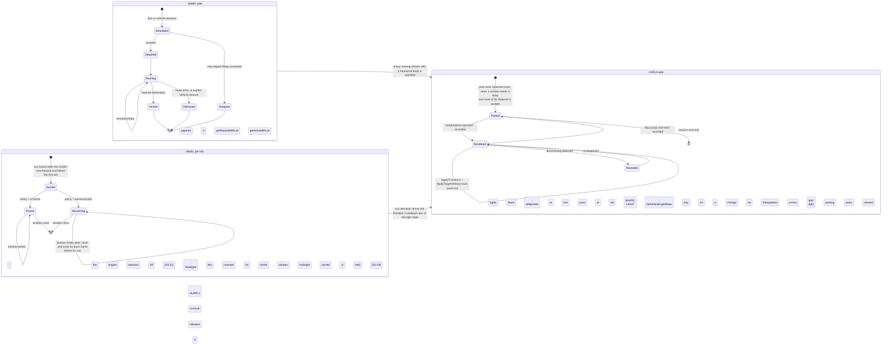

# Co-simulation runtime — the SUMO↔CARLA playback bridge

**Status:** design, ready for review · **Date:** 2026-09-18
**Scope:** the component that takes a running SUMO simulation and makes the CARLA world show it —
binding choice, the per-step write path, pose conversion, sub-step motion, **the solar clock**,
**vehicle light state**, vehicle lifecycle, clock ownership, **real-time pacing**, the
ambient-traffic lockout, and failure handling.
**Audience:** an engineer who will implement the bridge and has not read the conversation that
produced this plan. Familiarity with CARLA's client/server split is assumed; familiarity with SUMO
is not.

**Reads from:** [`Findings/23_SUMO_Traffic_Integration.md`](../../Findings/23_SUMO_Traffic_Integration.md)
(primary), [`Findings/17_Photoreal_Occlusion_Metric.md`](../../Findings/17_Photoreal_Occlusion_Metric.md)
§12.2 (the arrival gate), [`Findings/20_Behavioral_Annotation_And_Areas_Of_Interest.md`](../../Findings/20_Behavioral_Annotation_And_Areas_Of_Interest.md)
§5.6 (the vehicle catalogue), [`_TEAM_BRIEF.md`](_TEAM_BRIEF.md) (§3a for the time-of-day requirement).

**Depends on decisions owned elsewhere:** [`04_Contracts.md`](04_Contracts.md) (vehicle catalogue,
admission contract), [`05_CarlaNet_Capability_Audit.md`](05_CarlaNet_Capability_Audit.md) (every gap
in §12), [`06_Truth_And_Annotation.md`](06_Truth_And_Annotation.md) (what the per-step record
carries), [`10_Scale_And_Performance.md`](10_Scale_And_Performance.md) (wall-clock budget, capture
windows), [`11_Time_And_Illumination.md`](11_Time_And_Illumination.md) (the scenario epoch, the
advancement policy, the headlight predicate),
[`12_Operator_Control_Surface.md`](12_Operator_Control_Surface.md) (how a run selects any of it).

**Change history**

| Date | Change |
|---|---|
| 2026-09-18 | No traffic-light or sign actors rendered; no traffic-light state written; signal layer suppressed per session. |
| 2026-09-21 | TraCI client is a managed socket client (§2.5); the subscribed set is governed separately from the render set. |
| 2026-09-25 | §5: velocity chain runs through `APawn`; D3.5 restated as implemented; bridge velocity writes specified (§5.4). |
| 2026-09-21 | The managed client is built; §2.5 carries the check behind each property and the measured step cost through it. |
| 2026-09-22 | The bridge is built as far as the pose, applying none: §6.4 carries five interpolation cases and the speed-ramp integration, §7.2 the frame check as it is made and the network-identity residual beside it, §7.5 the seat height the catalogue does not carry, §8.3 the two subscription tiers, §9.7 the two measured server properties the loop rests on. |
| 2026-09-22 | §9.5.1: imagery readiness is counted in ticks; in the attended path the operator's key press is the settle. |
| 2026-09-25 | Real-time pacing on the world tick, achieved factor published per window (§9.9); package checked against the loaded world (§7.2). |
| 2026-09-25 | §9: sun bound by `set_solar_epoch`; under `advance` written every tick, engine advance off; audit as built. |
| 2026-09-28 | §5.4: velocity sent and checked per tick, measured live; §5.5 angular velocity and acceleration measured. |
| 2026-09-28 | §2.6, D3.27: the session names the SUMO it launches, reports it, refuses a release other than the world's converter. |
| 2026-09-28 | §7.2, D3.28: the session refuses a scenario whose network is not the world package's, by canonical fingerprint. |
| 2026-09-28 | §2.7, D3.29: the session checks a compiled scenario against its compile lock. §11.6, D3.14: teleporting refused where it is enabled, measured. |
| 2026-09-28 | §11.10, D3.30: every refusal carries the stage it was raised at; SUMO failures are refusals quoting SUMO. |
| 2026-09-28 | §9.5, D3.21, Q3.10 settled: the window opens at its own instant; a frozen sun is pinned there and an advancing one anchored there. |
| 2026-09-28 | §8.8, D3.31: each admission pass is published as it is made. |
| 2026-09-28 | §3.5.3, §8.2: vehicle lamps as built — SUMO's signals mapped bit by bit, headlights from the reported sun, written on a loan and on a change, darkened on release. |
| 2026-09-28 | §11.1–§11.7, §11.10, D3.30, D3.32–D3.35: the failure paths as built — SUMO's answers bounded, a dropped CARLA connection a refusal of its stage, the stop recorded, vanished vehicles, route errors, uninsertable vehicles, collision spans and a sun that goes away. §12 G15 closed. |
| 2026-09-29 | §2.6, D3.36: a session can launch `sumo-gui` in place of `sumo`, from the same installation and held to the release pin by its own release; the report names the binary that ran. |
| 2026-09-29 | §7.2, D3.26: the bare-earth grids are compared by digest (`get_bare_earth_digest`), not fetched — measured 146 s and 153 s for Bahonar's two; the manifest records them; the session's telemetry takes the package's grids. |
| 2026-09-30 | §8.9, D3.37: each frame's render set published for the recorder; the truth sidecar lists only the bodies a frame drew, by SUMO vehicle, and no parked body. |
| 2026-09-30 | §9.5.1: `run_capture` waits on both witnesses inside the prewarm, once every camera holds its opening pose; a view not ready by the window's opening refuses at `PreRoll` and the window is not moved. |
| 2026-09-30 | §9.5.1: measured on Bahonar, traffic in view defeats a whole-view picture comparison, and the renderer settles on ticks; the picture is compared ten ticks apart with a 120-tick ceiling, and the blocks rendered vehicles cover are left out, half the view to be judged. |
| 2026-09-30 | §8.3, §8.3.1, D3.38: the policy interface as built, and the render set that follows the registered cameras' ground footprints -- range-capped, admitted ahead, held after, ranked by the seed -- with the circle deciding while no camera is registered. §8.8: the eligible include the vehicles the release lag holds. |
| 2026-09-30 | Render cap removed: the cap (128, hard 192) was never measured -- M2 never ran -- and the scenario is the arbiter of population, so every vehicle SUMO has is drawn and a heavier scenario runs slower, never thinner. §8.3 now states that rule; §8.3.1 and D3.38 are withdrawn, and with them the circle, the camera-footprint render set, capacity, shedding and the subscription tiers. The pool still parks and reuses bodies, with no ceiling (§8.2, D3.9). §8.5 and D3.10 describe the entry and exit this gives, §8.8 and D3.31 the pass's counts, and §9.5.1 a stare at the traffic starting over the staging bounds. |
| 2026-10-01 | D3.6, §6.3, §8.3, §8.4, §8.5, §8.8, §9.7, §9.8: a vehicle SUMO inserts is drawn from the frame SUMO first reports it in, at that position and moving, and never before SUMO inserted it. Measured live on Bahonar, the bridge had drawn every inserted vehicle a step early, standing at its insertion point while the truth reported SUMO's speed. A vehicle SUMO has when rendering begins is still drawn on the first rendered frame. |
| 2026-10-01 | §7.5: the pitch and roll signs confirmed live against the visible surface; bodies at two-level crossings measured seated on the wrong level. |
| 2026-10-01 | §8.9, D3.39: the render set is named to the server on each change and carried on every world-observer snapshot, so the live pull, the CoT feed and a recorder in any process list only the bodies a frame drew, each by its SUMO vehicle. §8.2: every body is spawned with `role_name` `sumo`. Written; the plugin awaits a build. |
| 2026-10-01 | §7.5, D3.8: a body takes its height from the road it is on. Z and pitch from the OpenDRIVE profile of the vehicle's road at its origin's s; roll from the ground grid at grade, none on a structure, blended by the road's departure from the ground; the grid alone off every road, counted by reason. Every lane of Arapahoe and Bahonar joined to its road; measured offline on the Arapahoe dwell, I-25's deck bodies now up to 6.8 m above where the grid seated them and East Arapahoe Road's 4.5 m below, for 0.25 ms a tick. Built and tested offline; the live check is the owner's to run. |

---

## 0. What this section does not cover

- **The admission contract.** Every vehicle SUMO has is drawn while it is rendered (§8.3); this
  section specifies the *mechanism* of admission and release. The contract — when a vehicle is
  admitted and released, and what the truth record says of one that is simulated and not drawn — is
  [`04_Contracts.md`](04_Contracts.md)'s, and what a population costs in wall clock is
  [`10_Scale_And_Performance.md`](10_Scale_And_Performance.md)'s.
- The vType ↔ blueprint map. Named here only where playback geometry depends on it (§7.4).
- **The meaning of a civil time.** The scenario epoch (what civil instant `t = 0` is), the civil UTC
  offset, the choice between a frozen and an advancing sun, the *rationale* for a headlight
  threshold, and whether illumination is a corpus stratifier are all
  [`11_Time_And_Illumination.md`](11_Time_And_Illumination.md)'s. **This section owns the loop
  mechanics**: where the solar clock is written, what the engine does with it per tick, what the
  warm-up does to it, and what the failure paths are. §9.6 states exactly what it needs from `11`
  and in what form.
- **The operator surface.** Which flags exist, what the manifest records, how a run selects a window
  or a policy — [`12_Operator_Control_Surface.md`](12_Operator_Control_Surface.md).
- Truth record schema, behavioural annotation, areas of interest.
- Scenario authoring, netconvert flags, demand modelling.
- Toolchain staging and packaging. Measured state is reported in §12 G9 and handed to
  [`09_Toolchain_And_Packaging.md`](09_Toolchain_And_Packaging.md).
- Pedestrians (out of scope by decision, `_TEAM_BRIEF.md` §3.5).

---

## 1. What the bridge is

One component, `CarlaNet.CoSim`, holding exactly one TraCI connection and exactly one CARLA client
connection, which:

1. owns the advance of simulated time on **both** sides, **and the solar clock that is a function of
   it**;
2. converts SUMO's per-vehicle state into CARLA poses;
3. writes those poses to the server as a batch, once per world tick;
4. maps SUMO's per-vehicle signal bits onto CARLA vehicle light state and puts the changes in the
   same batch;
5. lends every SUMO vehicle whose type has a measured body a CARLA actor from a pool while it is
   rendered, and takes the actor back when SUMO removes the vehicle;
6. emits a per-step record of *every* SUMO vehicle — rendered or not — for the truth path.

Item 1's second clause is load-bearing. A capture window is a span of
*simulated* time (`10` D10.3); the sun is a function of civil time; and nothing connected the two.
A 23:00 window rendered under the spawn default of local solar noon
(`Unreal/CarlaUnreal/Plugins/CesiumCarlaBridge/Source/CesiumCarlaBridge/Private/CesiumHeightSampler.cpp:409`)
while the truth sidecar faithfully recorded noon and the scenario asserted 23:00. The clock owner is
the only component that can close that seam, because it is the only component that knows what
simulated instant each rendered frame is.

It replaces nothing. The .NET traffic manager, the OpenSCENARIO executor and the existing
CARLA-free `SumoCotBridge` telemetry path all remain, and SUMO drive is a mode
(`_TEAM_BRIEF.md` §3.6).


```mermaid
flowchart LR
  subgraph ext["Outside the bridge"]
    SUMO["sumo.exe<br/>separate process"]
    SRV["CARLA server<br/>UE5.7.4, synchronous"]
    PY["Python run harness<br/>launch, config, operator surface"]
  end

  subgraph cosim["CarlaNet.CoSim"]
    DRV["SumoDriveSession<br/>owns both clocks, owns the lease"]
    CONN["SumoConnection<br/>TraCI socket client,<br/>subscriptions only"]
    BUF["PoseBuffer<br/>two SUMO frames:<br/>P&#40;k&#41; and P&#40;k+1&#41;"]
    INT["LaneArcInterpolator<br/>sub-step pose along lane shape"]
    CONV["PoseConverter<br/>frame, yaw, bumper shift, Z, pitch/roll"]
    POOL["ActorPool<br/>per blueprint, reuse not respawn"]
    RS["RenderSetManager<br/>admission and release,<br/>instants recorded, no opacity"]
    SOL["SolarClock<br/>civil time from t_render;<br/>sets the sun, audits it every tick"]
    LIGHT["VehicleLightMapper<br/>SUMO signal bits + sun elevation<br/>to VehicleLightStateFlags"]
    WR["BatchWriter<br/>one apply_batch per world tick:<br/>poses, velocities,<br/>changed vehicle light states"]
    REC["StepRecord<br/>every SUMO vehicle, per step,<br/>plus the tick's solar state"]
  end

  subgraph deps["Existing CarlaNet"]
    CC["CarlaClient<br/>RPC + world-observer cache<br/>incl. GetCachedSolarState"]
    NET["RoadNetwork / net.xml reader<br/>lane shapes for interpolation"]
    DRAPE["GroundSurface<br/>the package's drape grid, in-process bilinear, no RPC:<br/>roll at grade, everything off the road"]
    ROADS["RoadSurface<br/>the package's OpenDRIVE joined to its lanes:<br/>Z and pitch from the road a body is on"]
  end

  subgraph eng["In the engine, per world tick"]
    TOD["ACesiumTimeOfDayController<br/>SolarTime += Δw × Rate per world tick"]
    SUN["ACesiumSunSky<br/>sole sun and lighting authority"]
  end

  PY -->|"start / stop / config"| DRV
  DRV --> CONN --> SUMO
  CONN --> BUF --> INT --> CONV --> WR --> CC --> SRV
  CONN -->|"VAR_SIGNALS,<br/>same subscription"| LIGHT --> WR
  NET --> INT
  DRAPE --> CONV
  ROADS --> CONV
  DRV --> RS --> POOL --> CC
  DRV --> SOL --> CC
  SOL -->|"sun elevation,<br/>free from the observer cache"| LIGHT
  SRV --> TOD --> SUN
  SUN -->|"solar block in every<br/>world-observer snapshot"| CC
  BUF --> REC
  RS --> REC
  SOL --> REC
  DRV --> CC
```

`SolarClock` and `VehicleLightMapper` complete the component set. Neither owns a
policy: `SolarClock` turns a simulated instant into a solar-clock write and audits the result
(§9.1–§9.6), and `VehicleLightMapper` turns SUMO's signal word plus the tick's sun elevation into a
`VehicleLightStateFlags` value (§3.5). The thresholds and the epoch both come from
[`11_Time_And_Illumination.md`](11_Time_And_Illumination.md).

---

## 2. Language and binding choice

### 2.1 What is actually on disk (measured 2026-09-17; staging and `SUMO_HOME` 2026-09-28)

| Thing | Where | State |
|---|---|---|
| `sumo.exe`, `duarouter.exe`, `netconvert.exe` | `Build/sumo-src/bin/` | all three present; `sumo --version` reports `Eclipse SUMO sumo 1.27.0` |
| SUMO's reference TraCI client, in Python | `Build/sumo-src/tools/traci/` | complete, pure Python — no native module anywhere in it |
| Staged into `Build/sumo-install/` | — | `bin/` holds `sumo.exe`, `duarouter.exe` and `netconvert.exe`, each reporting 1.27.0; `tools/` holds `traci` and `sumolib`, `data/` holds `typemap` and `xsd`. `sumo-gui` joined the required set on 2026-09-29 (§2.6, [`09`](09_Toolchain_And_Packaging.md) §2) and is not staged here until setup runs again |
| `SUMO_HOME` | — | set by no script in the repository; on this machine the environment holds `G:\Sumo\`, an independent SUMO whose `sumo --version` reports `Eclipse SUMO sumo 1.27.1` (§2.6) |

**The interface is a wire protocol, not a library.** `sumo --remote-port N` is a TraCI server; a client
connects over TCP and exchanges length-prefixed frames. `CarlaNet.Sumo` speaks it directly from C#,
ported from SUMO's own reference client (doc 23 §1.1, §6.3). API surface confirmed by reading that
client:

| Call | File:line | Note |
|---|---|---|
| the socket and the frame header | `connection.py:78`, `:105-127` | `socket.socket(AF_INET, SOCK_STREAM, IPPROTO_TCP)`; a 4-byte big-endian length prefix |
| the typed value codec | `connection.py:154-207`, `storage.py` | 103 lines of `struct` on the read side |
| `vehicle.moveToXY` | `_vehicle.py:1485-1499` | `edgeID`, `laneIndex`, `x`, `y`, `angle`, `keepRoute`, `matchThreshold` |
| `subscribe` / `getAllSubscriptionResults` | `domain.py:188-202`, `:223` | the constant-call-count read path doc 23 §6.11 requires |
| `vehicle.remove`, `vehicle.add` | `_vehicle.py` over `domain.py`'s `_setCmd` | |
| `simulationStep`, `simulation.getTime`, `getDeltaT` | `connection.py:359-379`, `_simulation.py` | |
| `simulation.getDepartedIDList` / `getArrivedIDList` | `_simulation.py` | per-step lifecycle deltas |
| TraCI variable and command constants | `constants.py` (1 545 lines, generated from SUMO's own `TraCIConstants.h` by `rebuildConstants.py`) | one table to port, mechanically checkable against the header |
| `CMD_GETVERSION` | `connection.py:381-388`, called from `main.py:119` | the server names its API version and SUMO build on connect, so a mismatch is reportable |

One connection per session, addressed explicitly — there is no process-global state to share, because
there is no static native API underneath it.

### 2.2 The existing Python path, and what it proves

`CarlaControl/src/carlacontrol/SumoCotBridge.py` drives a scenario over Python TraCI and emits CoT,
with no CARLA in the loop. Its step loop is `SumoCotBridge.py:239-277`. It works, and it is fast: the
Bahonar seven-day scenario runs at **3,119× real time** at a 1.0 s step (measured §6.1). Python TraCI
is not a performance problem *for driving SUMO*.

Two properties of that loop matter for the decision:

- It reads **per-vehicle, not by subscription** — `getPosition`, `convertGeo`, `getTypeID`,
  `getSpeed`, `getAngle`, `getLength`, `getWidth`, `getHeight`, `getRoadID`, `getLaneID`,
  `vehicletype.getColor`, `vehicletype.getVehicleClass` — 11 TraCI round trips per vehicle per sample
  (`SumoCotBridge.py:296-334`). At 131 concurrent vehicles (measured §8.1) that is 1,441 TraCI calls
  per emitted sample.
- Its `--rate` is a **decimator only**: `every = max(1, int(round(1.0 / (settings.rate_hz * step))))`
  (`SumoCotBridge.py:224`). With `step = 1.0 s`, any `rate_hz` above 1.0 clamps `every` to 1. There is
  no mechanism in it to produce motion *between* SUMO steps. This is the single most important thing
  to know about reusing it: **it cannot be the playback bridge without a new sub-step mechanism**
  (§6).

### 2.3 Re-examining doc 23 §6.3 under teleport

Doc 23 §6.3 says: *"Reject the pure-Python `traci` client outright — it puts Python in the per-tick
control path."* That argument was written for §4.1's shape, where each tick runs a PID controller and
a motion-plan stage per vehicle in .NET. Under teleport there is no controller. The honest restatement
of the per-tick work is: N pose conversions, one batch RPC, one tick RPC. Python can do that.

So the original argument does **not** survive unchanged. Four things replace it, and they are not the
same argument. The first is a capability gap, not a performance opinion, and it is decisive on its
own.

1. **The whole teleport of N vehicles is one round trip — in C#. It is not expressible in Python
   today.** The wire order that defines each command's variant index is
   `LibCarla/source/carla/rpc/Command.h:284-305`, mirrored exactly by
   `CarlaNet/src/CarlaNet.Types/Rpc/Commands/Command.cs:12-35`; all 22 have a serialiser arm
   (`CarlaNet.Types/Formatters/CommandFormatter.cs:41-72`) and a server visitor arm
   (`Unreal/CarlaUnreal/Plugins/Carla/Source/Carla/Server/CarlaServer.cpp:3145-3194`), with
   `BIND_SYNC(apply_batch)` at `:3198-3213`. `ApplyTransform` is index 6, `ApplyTargetVelocity` 8,
   `SetSimulatePhysics` 14, `SetEnableGravity` 15. **This is already
   proven in this repo, not theoretical:** the .NET traffic manager sends one mixed
   `ApplyBatchSyncAsync` per tick (`CarlaNet.TrafficManager/TrafficManagerLocal.cs:568`) whose
   contents include `ApplyTransformCommand` teleports
   (`CarlaNet.TrafficManager/Stages/MotionPlanStage.cs:244`, `:424`). The Python shim's `command`
   namespace exposes **8 of the 22** (`carlanet/__init__.py:1080-1149`: `SpawnActor`,
   `DestroyActor`, `SetAutopilot`, `ApplyVehicleControl`, `ApplyTransform`, `ApplyLocation`,
   `SetVehicleLightState`, `ConsoleCommand`) — so a Python bridge can batch the pose but **cannot
   batch the velocity, the physics toggle or the gravity toggle**, and must fall back to one RPC per
   actor for each of them.
2. **The bridge runs at the world-tick rate, not the SUMO-step rate.** Sub-step motion (§6) means the
   pose arithmetic happens 20× per SUMO step at the default `--fixed-delta` of 0.05 s
   (`CarlaControl/src/carlacontrol/CarlaControlArgumentParser.py:69-75`). That work runs on the
   thread that owns the world clock. [Issue #14](https://github.com/sbrett9/carla/issues/14) is
   already open for exactly this failure mode against a *much* lighter Python loop — 5 Hz of CoT
   datagram serialisation — and records simulation time already running at roughly 84% of real time
   under ordinary load.
3. **The subscription result is a wire frame, and whoever decodes it owns the allocation.** A C#
   client reads it straight out of the socket buffer into the structs the pose path already uses —
   one decode, no intermediate representation. Handing the same frame to a Python client and then
   lifting the decoded objects into .NET through pythonnet is a per-element marshal on top of a
   decode that has already happened once.
4. **There is an existing, proven .NET tick-subscription pattern.** `ScenarioExecutor` subscribes to
   `CarlaClient.OnTick` at `CarlaNet/src/CarlaNet.Scenario/ScenarioExecutor.cs:77-78` and unsubscribes
   at `:561`. `OnTick` is raised from the world-observer stream thread
   (`CarlaNet/src/CarlaNet.Transport/CarlaClient.cs:1821-1831`), so a C# bridge can do its work
   without ever crossing into Python.

Point 1 is worth stating plainly: **the Python path is missing capability the .NET path already
has.** Extending the shim to close that gap is worth doing on its own merits (§12 G1), but it is
work whose only beneficiary here would be a Python bridge that would then still lose on points 2–4.
Choosing C# does not depend on the shim gap being left open.

**The time-of-day and light-state requirements do not add a sixth point, and this is worth saying so
that nobody later cites them as one.** The four solar calls are fully exposed to Python
(`carlanet/__init__.py:1500`, `:1506`, `:1511`, `:1535`) and so is `command.SetVehicleLightState`
(imported `:487`, emitted `:1147`) — it is one of the eight the shim carries. Both new obligations are
therefore *reachable* from either binding. What still decides the question is point 2: the solar
audit and the light-state diff run at the world-tick rate, on the thread that owns the world clock,
and that is the argument that was already decisive.

**Honest costs of choosing C#,** stated because they are real and none of them is "it needs a rebuild":

- **A TraCI client to write and to keep.** The transport is small — `connection.py` is 407 lines and
  `storage.py` 103 — but it is ours once written, and the command and variable numbers are pinned to a
  SUMO release. §2.5 states what that buys and what it costs.
- The scenario-authoring suite and the existing telemetry emitter are Python. A C# bridge that also
  needs SUMO state for truth must either open a second TraCI connection or become the truth source.
  §2.4 resolves this by making it the truth source; that is a design commitment, not an accident.
- The Python side keeps a mature client with a decade of use behind it while the C# side has a new
  one. The mitigation is that both speak the same protocol to the same server, so the Python client
  is an oracle the C# one can be differenced against — §2.5's acceptance check does exactly that.

### 2.4 The split

> **D3.1 — The per-step playback bridge is C# (`CarlaNet.CoSim`). Orchestration is Python. There is
> exactly one TraCI connection and the bridge owns it.**

| Owner | Responsibility |
|---|---|
| **C# — `CarlaNet.CoSim`** | the TraCI connection; `simulationStep`; subscription reads; the pose buffer and interpolator; pose conversion; the render set and actor pool; the batch write; cueing the world tick; the per-step record of every SUMO vehicle |
| **Python — a new `carlacontrol` CLI and module** | resolving the scenario and world package; launching the server and the session; the operator surface (start, stop, seek, status); wiring the sensor rig, the recorder and the CoT sink; reporting at the end of the run |
| **Python — unchanged** | `SumoScenarioBuilder`, `ScenarioCompiler`, `make_*_scenario.py` (authoring; the Bahonar generator emits a specification `ScenarioCompiler` compiles, [`07`](07_Scenario_Authoring.md) §3.4.1); `SumoCotBridge` + `sumo_cot_telemetry.py` (the CARLA-free telemetry path, which stays a supported product — see §12 L4) |

The Python side never calls TraCI while a session is live. It reads the bridge's per-step record.
This is what keeps one clock and one SUMO connection, and it is also what makes the zero-velocity fix
(§5) meaningful: the bridge holds SUMO's true speed for every vehicle, rendered or not.

> **D3.2 — `CarlaNet.Sumo` speaks the TraCI wire protocol over a TCP socket to an out-of-process
> `sumo`.** It is a port of SUMO's own reference client (doc 23 §6.3), not a binding to one, so nothing
> native is loaded into the CarlaNet process. Out of process is therefore structural rather than
> chosen: a SUMO assertion cannot take the CARLA client down, `sumo` can be restarted without
> restarting the world, and a second consumer is another connection to the same server rather than a
> second process.

### 2.5 What the client owes, and how it is held to it

Four properties the bridge depends on, each with the thing that establishes it.

| Property | How it is established |
|---|---|
| **The frame codec is right** | `storage.py` and `connection.py:154-207` are the whole of it, and the types in play here are `TYPE_DOUBLE`, `TYPE_STRING`, `TYPE_INTEGER`, `TYPE_COMPOUND`, `POSITION_2D` and `TYPE_STRINGLIST`. A round-trip test per type against a live `sumo` is the check, not a reading of the port |
| **The constants match the build** | `constants.py` is generated from SUMO's own `TraCIConstants.h` by `rebuildConstants.py`. The C# table is checkable against the same header mechanically, and should be |
| **The decoded state is the state SUMO holds** | Differencing against the reference client is available and cheap: run `tools/traci` and `CarlaNet.Sumo` against the same network and the same seed, and compare a whole subscribed state for a moving vehicle. Two independent decoders of the same frames cannot agree by accident |
| **The server is the build the client was written for** | `CMD_GETVERSION` on connect (`connection.py:381-388`), asserted against the pin. This is a thing the protocol offers and a linked binding cannot ask for |

**And one property of SUMO, not of the client, that sets what a step costs: a subscription is
charged inside `simulationStep`, whether or not anyone reads it.** Measured at 388 live vehicles on
Arapahoe: **3.73 ms** per step with nothing subscribed, **9.26 ms** with the seven-variable set
subscribed and never read (doc 23 §6.11). SUMO fills the results as part of advancing; the read is only
what it costs to collect them afterwards. The bridge subscribes every vehicle SUMO has (§8.3), so this
is a cost of the scenario's population, paid inside SUMO's step; what it costs a run in wall clock is
[`10_Scale_And_Performance.md`](10_Scale_And_Performance.md)'s.

**The client is `CarlaNet/src/CarlaNet.Sumo`, and each property above has a check that runs.** The
checks are in `CarlaNet/test/CarlaNet.Sumo.Tests` under `dotnet test`, and skip rather than fail where
no SUMO installation resolves — the client itself needs none to build.

| Property | The check |
|---|---|
| The frame codec is right | `TraCIWriterTests` asserts each outgoing frame byte for byte against bytes generated by driving `tools/traci`'s own `Connection._pack` and `_sendCmd` at the pin. `TraCIReaderTests` round-trips every value type the bridge reads, and asserts that a frame read past its end or at the wrong offset raises rather than returning |
| The constants match the build | `TraCIConstantsTests` compares all 578 translated constants, name for name and value for value, against the staged `constants.py` |
| The decoded state is the state SUMO holds | `ReferenceClientAgreementTests` differences this client's subscription reads against the reference client's per-vehicle reads on the same scenario and seed. **Measured 2026-09-21 on `Import/Arapahoe_I25_UnderpassDwell.sumocfg` fast-forwarded to t = 1 000 s: 7 766 vehicle-steps at 388 vehicles, zero disagreements across position, angle, speed, edge, lane, type and signals** |
| The server is the build the client was written for | `CMD_GETVERSION` on connect, asserted against `TRACI_VERSION` in `SumoConnectionTests` |

**What a step costs through it, measured on the same network and the same warm-up** (2026-09-21, 400
steps from t = 1 000 s, 388 vehicles, the subscribed set maintained against departures and arrivals):
**4.40 ms** per step with nothing subscribed, **8.16 ms** with the population subscribed and never read,
**8.86 ms** subscribed and read. The shape matches doc 23 §6.11's measurement through the generated
binding — the subscription is most of the step and the read is a fraction of it — and the totals sit
below it: 8.86 ms against 10.43 ms for the same work.

### 2.6 Which SUMO a session launches

More than one SUMO is installed on this machine, and nothing in the binaries says which one a process
picked. `Build/sumo-install` holds the pinned build (1.27.0); `SUMO_HOME` names `G:\Sumo\`, an
independent official installation (1.27.1; [`09`](09_Toolchain_And_Packaging.md) §3.3). All three
packages in `Build/world-packages` record `Eclipse SUMO netconvert 1.27.0` as their converter
(`WorldPackageManifest.NetconvertVersion`, `WorldPackage.cs:163`), and `NetconvertPath` names
`Build/sumo-install/bin/netconvert.exe` on all three.

**Which installation.** `SumoDriveSessionOptions.SumoHome` names it, and `SumoInstallation.At` takes
it as given, with `Source` `explicit`. Left unset, `SumoInstallation.Locate` searches, in order:
`CARLANET_SUMO_HOME`; `Build/sumo-install`, then `Build/sumo-src`, each found by walking upward from
the application's base directory and from the CarlaNet assembly's own; `SUMO_HOME`; `sumo` on `PATH`.
The upward walk finds the repository only when the assemblies sit inside it. Loaded from an installed
wheel they sit in `site-packages`, the walk finds nothing, and `SUMO_HOME` decides. So
`run_sumo_drive.py` names the installation rather than leaving it to that search (`SessionSumo`):
`--sumo-home` as given; otherwise `CARLANET_SUMO_HOME` where it holds a `sumo`; otherwise
`Build/sumo-install`, then `Build/sumo-src`. Only where none of those holds a `sumo` does it name
nothing, and the session searches `SUMO_HOME` and `PATH` itself.

**The comparison.** After the loaded-world check (§7.2) and before `SumoConnection.Start`,
`SumoDriveSession.Start` reads the installation's release from `sumo --version` and compares it with
the manifest's `NetconvertVersion` by release number (`SumoReleaseCheck`). `SumoRelease.Of` reduces
`Eclipse SUMO netconvert 1.27.0`, `Eclipse SUMO sumo 1.27.0`, `1.27.0` and `v1.27.0` alike to
`1.27.0` before the two meet.

| The package records | Outcome |
|---|---|
| the installation's release, however written | runs; reported as the same release |
| another release, or the installation's release cannot be read | **refused** with `CoSimSessionRefusedException` naming the recorded converter, the installation's release, its path and the rule that found it; SUMO is not started |
| another release, with `AllowSumoVersionMismatch` (`--allow-sumo-version-mismatch`) | runs; reported as a different release, run because the mismatch was explicitly accepted |
| no converter — a package written before the converter was recorded | runs; reported as unchecked |

**On every run** the report carries the installation, its release, the rule that found it and the
outcome (`CoSimRunReport.Sumo`, printed as the `sumo` and `world converter` lines).
`run_sumo_drive.py` logs the installation it names before it connects, and the session's line once the
session has started — at warning level for an accepted mismatch or an unchecked world.

**Measured 2026-09-28**, offline, with `SUMO_HOME=G:\Sumo\` and the CarlaNet assemblies loaded from a
copy outside the repository — where an installed wheel's assemblies are — against
`Gardnerville_Centerville_Lane.cwp` and `Import/Gardnerville_Centerville_Lane_NeighborhoodOrbit.sumocfg`:

| Session | Launches | Outcome |
|---|---|---|
| no installation named | `G:\Sumo\`, 1.27.1, matched by `SUMO_HOME` | refused against `Eclipse SUMO netconvert 1.27.0` |
| installation named by `run_sumo_drive.SessionSumo` | `Build/sumo-install`, 1.27.0, `explicit` | runs, the same release |
| no installation named, mismatch accepted | `G:\Sumo\`, 1.27.1, matched by `SUMO_HOME` | runs, reported as accepted |

These outcomes are the release comparison's alone. The session refuses this scenario against this
package on its network, in the check that follows the release comparison (§7.2): the network it names
is not the one the package carries.

**What it cannot see.** A release number names a release, not a build: two builds of one release with
different patches or build options compare equal, and anything a development build prints after the
number is dropped. It compares against the converter that built the *world*; whether the scenario's
own network is the world's is the network-identity check's (§7.2, D3.28), made after this one and
also before SUMO is started.

**Where the comparison is defined.** `CarlaNet.Sumo.SumoRelease` for the session.
`carlacontrol.SumoInstallation.require_version` calls it through `carlanet` for the world-build and
authoring tools, so there is one comparison, and the scenario compiler's check 6 refuses a mismatch as
the session does.

**Exercised by** `SumoReleaseCheckTests` (the comparison and the verdict, nothing launched),
`SumoInstallationTests` (a named installation, and a named directory holding no `sumo`) and
`SumoDriveSessionReleaseTests` (six session starts naming the installation the test process resolves,
with the package's recorded converter varied). Each was seen failing against a wrong implementation:
one that never refuses, one that ignores the acceptance, one that records an accepted mismatch as a
match, one that refuses an unrecorded converter and one that passes it as a match, a verbatim string
comparison, a check made after SUMO has started, a tool-output parser that accepts a line naming no
release, and a named directory taken without looking for a `sumo` in it.

**`sumo-gui` in place of `sumo`** (D3.36). `SumoDriveSessionOptions.SumoGui`
(`run_sumo_drive.py --sumo-gui`, `start_sumo_drive(sumo_gui=True)`) launches the installation's
`sumo-gui` instead of `sumo`. It is the same microsimulation with SUMO's own view of it, serving TraCI
as `sumo` does, so there is still one SUMO process and one connection (D3.1): the window shows the
simulation the session is stepping, not a second copy running beside it. Q3.5's attach-by-port option
is what a separately started GUI would need, and it is not built.

It is taken from the installation already resolved and from nowhere else: `SumoInstallation.SumoGui`,
`bin/sumo-gui` beside `bin/sumo`. A `sumo-gui` from another installation would be another SUMO. An
installation without one is refused at `Validation`, before the release comparison and before anything
is started, naming the file and the setup script that builds and stages it (`CarlaSetup.ps1`,
`CarlaSetup.sh`).

**The release pin holds for the binary that runs.** The comparison above reads the release from the
launched binary's own `--version` -- `sumo-gui`'s, which prints `Eclipse SUMO GUI 1.27.0`
(`guisim_main.cpp`) -- rather than from `sumo`'s on its behalf (`SumoInstallation.ReleaseOf`,
`SumoReleaseCheck.Of(installation, name, …)`). Two executables in one directory are usually one build,
but nothing makes them so. The refusal names the binary, `CoSimRunReport.Sumo.Binary` records which
one ran on every run -- printed as the report's `launched` line, for `sumo` as for `sumo-gui` -- and
`run_sumo_drive.py` logs it beside the installation.

**What it is given.** `sumo`'s arguments unchanged -- the configuration, the port, the step override --
then `SumoConnection.GuiArguments`, each chosen from SUMO's source at the pin:

| Argument | Why |
|---|---|
| `--start` | A GUI runs only once its play button is pressed, and a TraCI server inside it processes no command until then (`docs/web/docs/TraCI/index.md`). Without it the handshake waits on a person and times out |
| `--quit-on-end` | When the session closes the connection the simulation ends, and without it the GUI opens a modal "Simulation ended" dialog and keeps running (`GUIApplicationWindow::handleEvent_SimulationEnded`) -- a process `SumoConnection.Dispose` kills after its 10 s grace. It cannot end a live run early: while a client is connected, SUMO turns every ending state but the connection's own closing back into running (`MSNet::adaptToState`). It also makes a configuration the GUI cannot load exit at once, rather than leave a window holding the error while the connection times out |
| `--delay 0` | The GUI sleeps this long between steps, and a gui-settings file the configuration names can raise it from zero (`GUISettingsHandler::getDelay`); the command line wins. The pace of a run is the session's (§9.9), never the window's |
| `--message-log stdout --error-log stderr` | A GUI build detaches SUMO's messages from the console before it loads anything ("within gui-based applications, nothing is reported to the console", `GUILoadThread::run`), so the session's console tail would count no warnings and a refusal would quote no last words. These restore exactly `sumo`'s console -- warnings and errors on stderr, messages on stdout only when verbose (`MsgHandler::initOutputOptions`) -- and the window keeps its own copy |

Not given: `--game`, which replaces the view with SUMO's interactive traffic-light game, and
`--window-size` / `--window-pos`, which the GUI otherwise restores from its last window.

**What the window can do to a run.** It is live. Paused, SUMO answers nothing, so a pause longer than
`SumoAnswerTimeoutSeconds` stops the run as a SUMO that stopped answering (D3.32); closed, the
connection ends and the run stops as a SUMO that died (§11.1). Its delay control, raised, slows every
step, which the published pace shows (§9.9). On Linux it needs a display. A binary the operating system
will not run -- missing, not executable, not a program for the platform -- is refused at `Launch` as
SUMO failing to start: `SumoConnection.Start` reports it as a `FatalTraCIError` naming the file, for
`sumo` as for `sumo-gui`, where before it escaped as the operating system's own exception.

**Built and exercised offline; not yet run.** `sumo-gui` is not staged on this machine yet, so no
session has launched it. `SumoGuiTests` asserts the command line, where the binary is looked for, and
that the pin reads the GUI's own release, with nothing launched; `SumoDriveSessionGuiTests` asserts the
up-front refusal, the binary the pin names and the binary the launch starts, against placeholder
installations whose binaries cannot run, so no test can ever open a window. Each was seen failing
against a wrong implementation: a session with no up-front check, one pinning `sumo`'s release for the
GUI, one checking the GUI and launching `sumo`, and a check that probes `sumo` whatever binary it is
asked about. `sumo-gui.exe` is linked as a Windows GUI-subsystem program (`src/CMakeLists.txt`); that
its `--version` and its console reach the session's redirected handles is expected and not yet
measured. Were they not to, its release would read as unreadable and the session would refuse it rather
than run unpinned.

### 2.7 Which scenario files a session runs: the compile lock

The scenario compiler (`CarlaControl/src/carlacontrol/ScenarioCompiler.py`) writes
`<scenario_id>.lock.json` beside the `.sumocfg` it compiles: the SHA-256 of the configuration, route
file and network it wrote, the catalogue digest its vehicle types were bound against, the digest of
the epoch every civil instant was resolved against (`epoch_block_sha256`, computed by
`SolarEpoch.Digest` through `carlanet`), the SUMO release that routed the demand, and the world it
compiled for. Its output is byte-reproducible and the repository stores these files exactly as written
(`.gitattributes`: `Import/*.net.xml`, `*.rou.xml`, `*.sumocfg` and `*.json` are `-text`), so a digest
that has moved is a file changed after it was compiled, and the traffic it produces is not the traffic
the lock and its resolution report describe.

**The check.** After the network-identity check (§7.2) and before `SumoConnection.Start`,
`SumoDriveSession.Start` looks for the lock at `<stem>.lock.json` beside the configuration
(`ScenarioLockCheck`, D3.29). Where one is there it reads it (`ScenarioLock`) and compares:

| Lock field | Compared with | Refused when |
|---|---|---|
| `files.config` | the configuration the session was given | the lock names another configuration, or its bytes digest differently |
| `files.routes` | the route files the configuration names, read as SUMO reads them (`route-files`, `routes`, `r`; a comma-separated list; relative to the configuration) | the configuration runs any route file other than exactly the one the lock names, or its bytes digest differently |
| `files.network` | the network the configuration names (the reading of §7.2) | another network, or its bytes digest differently |
| `catalogue.catalogue_digest` | the digest the catalogue the session loads declares | different |
| `epoch_block_sha256` | `SolarEpoch.Digest` of the session's epoch | different, where the session declares an epoch |

Every disagreement is named in one `CoSimSessionRefusedException`, and SUMO is not started. A lock
that is not JSON, declares a `lock_version` other than 1, or does not record one of the compared fields
is refused whole, naming each missing field. A session that declares no epoch binds no sun and derives
no civil instant, so it is not compared on one and the report says so.

**On every run** the report carries the outcome (`CoSimRunReport.CompileLock`, the `compile lock`
line): for a compiled scenario its id and compiler, the routing tool and release against the world
converter the compiler compared it with (`routed by`), and the world the lock records
(`compiled for`: package, map, network fingerprint, OpenDRIVE digest, converter). The routing release
and the world identity are recorded, not compared; the world is compared by the checks that read the
package (§7.2) and the loaded world (§7.2, D3.26). `run_sumo_drive.py` logs the line, at warning level
for an uncompiled scenario.

**No lock is not a refusal.** A scenario a generator writes directly as SUMO files has none, and it
runs; the report records it as uncompiled, so its run cannot be mistaken for a compiled scenario's.

| Scenario, `Import/` | Lock | Outcome |
|---|---|---|
| `Gardnerville_Centerville_Lane_NeighborhoodOrbit.sumocfg` | present; configuration, route file and network digests equal the files in the tree; catalogue `771fa431…` is `CarlaControl/catalogue/vehicles.catalogue.json`'s; epoch `3cb60fce…` is the digest `SolarEpoch` computes from the scenario's own epoch | **admitted**, compiled; routed by `duarouter 1.27.0` against `Eclipse SUMO netconvert 1.27.0` (`SameRelease`); compiled for `Gardnerville_Centerville_Lane.cwp`, network `a50ac545…` |
| `Arapahoe_I25_UnderpassDwell.sumocfg` | none: `SumoScenarioBuilder` writes it directly | **admitted**, recorded as uncompiled |

**What it cannot see.** The catalogue's declared digest is compared, not recomputed, so a catalogue
edited without re-digesting passes. Additional files and the supervision plan are not digested. The
files are checked once, just before SUMO reads them. And a lock rewritten to match edited files passes:
the check establishes that the files are the ones the lock describes, not who wrote the lock.

**Exercised by** `ScenarioLockCheckTests` (a compiled copy of the fixture scenario with each file, the
catalogue, the epoch and the lock varied; the shipped Gardnerville scenario against its lock, the tree's
catalogue and its own epoch; Arapahoe as uncompiled) and `SumoDriveSessionLockTests` (a compiled
scenario run and its lock on the report, an uncompiled one run and said to be, and a disagreement
refused with SUMO never launched and the world untouched). Each was seen failing against a wrong
implementation: one that never refuses; one that looks for the lock under another name; one that
refuses a scenario with no lock; one that compares the epoch when none is declared; one that names only
the first disagreement; one that skips each of the three file digests in turn; one that reads route
files under one name only; one that accepts a lock binding another configuration; one that skips the
catalogue; one that digests the path rather than the bytes; one that tolerates a lock missing a compared
field; a session that never makes the check; and a check made after SUMO has started.

---

## 3. The write path — what actually exists

Everything in this section was read from the source, not assumed.

### 3.1 The chain, end to end

| Layer | Symbol | Location | Verdict |
|---|---|---|---|
| Python shim, single actor | `Actor.set_transform` | `CarlaNet/python/carlanet/__init__.py:754` | present → `SetActorTransformAsync` |
| Python shim, single actor | `Actor.set_simulate_physics` | `:790` | present → `SetActorSimulatePhysicsAsync` |
| Python shim, single actor | `Actor.set_target_velocity` | `:793-801` | present → `SetActorTargetVelocityAsync` |
| Python shim, single actor | `Actor.set_enable_gravity` | `:817` | present → `SetActorEnableGravityAsync` |
| Python shim, single actor | `Actor.set_fade` | `:806-813` | present → `SetActorFadeAsync`. **Not used by this bridge** (D3.10); listed so the audit's picture of the surface is complete. |
| Python shim, batch | `Client.apply_batch` / `apply_batch_sync` | `:2475-2487` | present; `apply_batch_sync` returns `command.Response` per command |
| Python shim, command types | `command.*` | `:1080-1149` | **8 of 22** — see §12 G1 |
| Python shim, traffic lights | `class TrafficLight(TrafficSign): pass` | `:1002-1004` | marker class, **no methods**. **Not used by this bridge** (D3.24); listed so the audit's picture of the surface is complete — see §12 G13 |
| Python shim, vehicle lights | `Actor.set_light_state` / `Actor.get_light_state` | `:781-784`, `:786-788` | present → `SetVehicleLightStateAsync` / `GetVehicleLightStateAsync`; the setter accepts an `int`, a `VehicleLightState` wrapper or the C# flags enum |
| Python shim, batch command | `command.SetVehicleLightState` | imported `:487`, emitted `:1147` | **exposed** — one of the 8 the shim carries, so this is the one per-tick write a Python bridge *could* also batch |
| Python shim, solar | `set_solar_time` / `set_solar_date` / `get_solar_state` / `set_time_advance` | `:1500`, `:1506`, `:1511`, `:1535` | present → the four `CarlaClient` solar calls; `get_solar_state` prefers the observer cache (§9.4). `set_solar_epoch` (shim `:1523`) is the session's one write (§9.2) |
| C# transport | `CarlaClient.SetActorTransformAsync` | `CarlaNet/src/CarlaNet.Transport/CarlaClient.cs:1496` | `set_actor_transform` |
| C# transport | `CarlaClient.SetActorTargetVelocityAsync` | `:1499` | `set_actor_target_velocity` |
| C# transport | `CarlaClient.SetActorSimulatePhysicsAsync` | `:1529` | `set_actor_simulate_physics` |
| C# transport | `CarlaClient.SetActorEnableGravityAsync` | `:1538` | `set_actor_enable_gravity` |
| C# transport | `CarlaClient.SetActorFadeAsync` | `:1545-1556` | `set_actor_fade`; also maintains the client-side opacity/arrival registry |
| C# transport | `CarlaClient.ApplyBatchAsync` / `ApplyBatchSyncAsync` | `:1779-1785` | `apply_batch`; the sync form uses the raw path because the server returns a bare vector |
| C# transport | ten traffic-light RPCs | `:1659-1689` | `set_traffic_light_state`, green/yellow/red time, freeze, reset, group, light boxes. **None is called by this bridge** (D3.24) |
| C# transport | `SetLayerVisibleAsync` | `:1077-1078` | `set_layer_visible`; the `road` and `signals` layers are each written **once at session start** and once more when the session is disposed (§3.4) |
| C# transport | `SetVehicleLightStateAsync` / `GetVehicleLightStateAsync` | `:1621-1622`, `:1615-1617` | `set_vehicle_light_state` / `get_vehicle_light_state`. **The getter is an RPC, not a cache read** — vehicle light state is *not* in the world-observer snapshot, unlike transform and velocity (§3.5). |
| C# transport | `GetVehiclesLightStatesAsync` | `:1630-1631` | `get_vehicles_light_states` — every vehicle's light state in **one** RPC (`CarlaServer.cpp:2824`) |
| C# transport | five solar calls | `:1043`, `:1048`, `:1053`, `:1058`, `:1117` | `set_solar_time`, `set_solar_date`, `get_solar_state`, `set_time_advance`, `set_solar_epoch` |
| C# transport | `GetCachedSolarState` | `:1991`, written at `:1855` | the tick's solar block, parsed out of the world-observer header — **no RPC and no poll** (§9.4) |
| C# types | all 22 `Command` records | `CarlaNet.Types/Rpc/Commands/Command.cs:41-126` | complete, including `ApplyTargetVelocityCommand`, `SetSimulatePhysicsCommand`, `SetEnableGravityCommand`, `SetVehicleLightStateCommand` (variant **18**, `Command.cs:32`, `:94`) and `SetTrafficLightStateCommand` |
| C# serialisation | `CommandFormatter.WritePayload` | `CarlaNet.Types/Formatters/CommandFormatter.cs:41-72` | all 22 handled; variant indices match `LibCarla/source/carla/rpc/Command.h:284-305` |
| **Precedent** | one mixed batch per tick containing teleports | `CarlaNet.TrafficManager/TrafficManagerLocal.cs:568`; `Stages/MotionPlanStage.cs:244`, `:424` | the .NET traffic manager already does exactly the write this bridge needs |
| Server RPC | `set_actor_transform` | `CarlaServer.cpp:1589-1605` | `CarlaActor->SetActorGlobalTransform(Transform, ETeleportType::TeleportPhysics)` |
| Server RPC | `set_actor_target_velocity` | `CarlaServer.cpp:1639-1660` | `CarlaActor->SetActorTargetVelocity(...)` |
| Server RPC | `set_actor_simulate_physics` | `CarlaServer.cpp:2113-2144` | `CarlaActor->SetActorSimulatePhysics(...)` |
| Server RPC | `set_actor_fade` | `CarlaServer.cpp:2217-2249` | writes Custom Primitive Data float 8 on **every** `UPrimitiveComponent` of the actor |
| Server RPC | `set_vehicle_light_state` | `CarlaServer.cpp:1985-2008` | → `FVehicleActor::SetVehicleLightState` (`CarlaActor.cpp:756-776`) → `ACarlaWheeledVehicle::SetVehicleLightState` (`CarlaWheeledVehicle.cpp:684-700`), which **compares field by field and only calls `RefreshLightState` when something changed** |
| Server RPC | `set_solar_time` / `set_solar_date` / `get_solar_state` / `set_time_advance` / `set_solar_epoch` | `CarlaServer.cpp:614`, `:625`, `:640`, `:661`, `:644` | thin wrappers over `UCesiumHeightSampler`; each returns **false** when the world has no `CesiumSunSky` |
| Server batch | `apply_batch` | `CarlaServer.cpp:3198-3213` | visits each command, then `tick_cue()` if `do_tick_cue`; the `SetVehicleLightState` arm is `CarlaServer.cpp:3187` |

**The batch path is complete from C# to the server.** The only gap is the Python shim's exposed
command set (§12 G1). A C# bridge does not hit that gap at all — which is a further, concrete point
in favour of D3.1.

### 3.2 Two semantics worth knowing before designing the loop

**`ETeleportType::TeleportPhysics` preserves velocity.** The engine defines it as *"Teleport physics
body so that velocity remains the same and no collision occurs"*
(`UE_5_7_4/Engine/Source/Runtime/Engine/Classes/Engine/EngineTypes.h:2405-2406`). `set_actor_transform`
uses it unconditionally (`CarlaServer.cpp:1603`). So a teleport does not sweep for collisions along
the way — which is what makes a 35 m jump survivable — and does not itself zero the physics body's
velocity.

**`apply_batch(do_tick_cue=True)` does not wait for the frame.** `ApplyBatchAsync` is
`CallVoidAsync("apply_batch", …)` (`CarlaClient.cs:1779-1780`); the server's `tick_cue` handler just
increments a counter and returns `frame + 1` (`CarlaServer.cpp:393-399`). The blocking wait lives in
`CarlaClient.SendTickCueAsync` → `WaitForFrame` (`CarlaClient.cs:403-443`), which is what
`World.tick()` calls (`carlanet/__init__.py:2086-2087`). So a batch with `do_tick_cue` returns before
the frame exists. The bridge must issue the batch and then tick separately (§9). See §12 G6.

### 3.3 Per-vehicle, per world tick

Reads are free; writes are not — **with one exception that matters here.** `Actor.get_transform()`
and `Actor.get_velocity()` read the client-side world-observer cache with no RPC
(`carlanet/__init__.py:726-737` → `CarlaClient.GetActorTransform` / `GetActorVelocity`,
`CarlaClient.cs:1915-1919`), and so does the tick's solar state (`GetCachedSolarState`,
`CarlaClient.cs:1991`). **Vehicle light state is not in the snapshot** — `get_vehicle_light_state` is
a round trip (`CarlaClient.cs:1615-1617`), which is why §3.5 keeps the last written value
client-side rather than reading it back. So the loop is write-dominated and the write must be a
single batch.

| When | Call | Batched? | Cost |
|---|---|---|---|
| admission, once | `SpawnActorCommand` *or* pool checkout | yes (pool checkout writes nothing) | one-off |
| admission, once | `SetSimulatePhysicsCommand(actor, false)` | yes | one-off |
| admission, once | `SetEnableGravityCommand(actor, false)` | yes | one-off |
| admission, once | `SetVehicleLightStateCommand(actor, flags)` | yes | one-off, and **mandatory** — a pooled actor carries its predecessor's light state (§3.5, §8.2) |
| **every world tick** | `ApplyTransformCommand(actor, pose)` | yes | 1 command per rendered vehicle |
| **every world tick** | `ApplyTargetVelocityCommand(actor, v)` | yes | 1 command per body whose pose is written, straight after its `ApplyTransformCommand`; **zero** for a held body that gets no pose and after a parking transform. **Built** (`TickBatch`), and read back through D3.5 on every tick by the self-check (§5.4) |
| on a SUMO signal-word change only | `SetVehicleLightStateCommand(actor, flags)` | yes | **measured** on Bahonar: mean 14.44, p90 31, max 47 per *SUMO step* map-wide, all carried in one of the R sub-step batches (§3.5) |
| on a sun-elevation threshold crossing | `SetVehicleLightStateCommand(actor, flags)` | yes | at most \|render set\| commands, at most twice per window, and **never** under a frozen sun (§3.5) |
| at window open, and every tick under `advance` | `set_solar_epoch` | **no — a plain RPC**; no batch command sets the sun | 1 per window under a freeze; 1 per tick under `advance`, measured at a 0.128 ms median round trip (§9.2) |
| session start, once | `set_layer_visible` for `road` and for `signals` | **no — a plain RPC** | 2 RPCs per session, before the first tick, and 2 more when it is disposed (§3.4) |
| release | pool check-in (transform to the parking pose, velocity to zero, lights to `None`) | yes | folded into the head of the next tick's batch, ahead of every pose (§5.4) |

> **D3.3 — One `apply_batch` per world tick carries every pose write *and* every vehicle
> light-state change due that tick, then a separate `world.tick()`.**
> `apply_batch`, not `apply_batch_sync`: the bridge does not need per-command responses on the steady
> path, and `apply_batch_sync` allocates a response per command. Use `apply_batch_sync` only for the
> admission batch, where a spawn can fail.

Every vehicle SUMO has is drawn (§8.3), so the array grows with the population, one or two commands
per vehicle. At the measured Bahonar peak of 131 concurrent vehicles in the hour of §8.1 it is 131–262
commands per tick, 20 times a second; scaled from the measured populations, the compiled Bahonar
scenario's peak of 170 is 170–340 and Arapahoe's peak of 437 is 437–874
([`10_Scale_And_Performance.md`](10_Scale_And_Performance.md) §3.1, §3.2). What that costs in wall
clock is `10`'s.

**The steady-state write is exactly one RPC per tick, with no variable tail.** That is a direct
consequence of D3.10 (§8.5): with the per-vehicle opacity dissolve removed, nothing in the per-tick
path is unbatchable. The RPC budget this mode *releases* is not small — the fade was one blocking call
per vehicle per reconcile against a handler that walks every primitive component of the actor, and
`--fade`'s own help text calls it *"the heaviest load this client puts on the server's per-frame RPC
budget"* (`CarlaControl/src/carlacontrol/CarlaControlArgumentParser.py:318-328`). That headroom is
what the pose batch spends.

**Adding light state and the sun does not change that sentence, and §3.6 shows the arithmetic rather
than asserting it.** Light state is a batch command, so it joins the array that already exists; the
sun is a whole-world RPC issued once or twice per capture window and read for free out of the
observer cache every tick. Neither introduces a per-vehicle round trip, which is the only thing that
would matter.

### 3.4 No road mesh, no traffic-light or sign actors, and no traffic-light state is sent

**This mode renders no traffic-light or sign actors, and the write path carries no traffic-light
state.** There is no `SetTrafficLightStateCommand` in any batch, no traffic-light RPC on any path,
and no `tlLogic` subscription over TraCI. The per-tick batch is poses, velocities and changed
*vehicle* lamp state, and nothing else (§3.3, §3.6).

**Why, and it is a property of the imagery.** The available traffic-light meshes are limited, and
where they are placed against the photoreal they are frequently misaligned. A rendered light that
does not correspond to the world the photoreal shows is a **hazard** in this corpus rather than a
benefit — a detector trained on it learns an artefact (`_TEAM_BRIEF.md` §3e).

**SUMO still simulates the lights, and its vehicles still obey them.** The `tlLogic` programs, the
`<request>` right-of-way rows and the `traffic_light_type="actuated"` netconvert setting are a large
part of why the ambient behaviour is believable, and none of that changes. An actuated program's
phase depends on the traffic present and is only knowable at runtime
(`CarlaControl/skills/sumo-traffic-scenarios/SKILL.md`, "measured gotchas" — fixed-time 90 s programs
cannot discharge a busy interchange), and SUMO resolves it every step. What arrives over the pose
stream is already the behaviour those programs produced: a vehicle that waits at a junction waits
because SUMO's signal held it. **What is dropped is the rendering of the signal, not the signal.**

**The generated road surface is suppressed the same way, and for a reason of the same kind.** The
road mesh CARLA builds from the `.xodr` is a flat grey ribbon laid over the photogrammetry of the
real road surface, and a capture with it drawn carries that ribbon in every frame. Its geometry is
also only as good as the elevation fit, so where the two disagree the artefact is a road drawn
beside the road. The same call takes it: `set_layer_visible("road", false)`, whose arm at
`CarlaServer.cpp:729-738` clears `SetActorHiddenInGame` on the road surface actors. Hiding is
rendering-only there too — collision is the separate `set_layer_collision` — so the surface stays
collidable, which this mode would not notice either way because a SUMO-driven body is teleported
with its physics off.

**The mechanism, and it is one RPC per layer at session start.** `set_layer_visible("signals", false)` —
shim `carlanet/__init__.py:1548-1555` → `CarlaClient.SetLayerVisibleAsync` (`CarlaClient.cs:1077-1078`)
→ `BIND_SYNC(set_layer_visible)` (`CarlaServer.cpp:697`), whose `signals` arm at `:719-728` calls
`ATrafficLightManager::SetGeneratedSignalsVisible(false)` (`TrafficLightManager.cpp:618-628`). That
walks the registered generated signals once and clears `SetVisibility` on every non-shape primitive
(`TrafficLightManager.cpp:589-600`). It is issued before the first world tick and never again:
**zero per-tick cost, and it is not on the steady loop at all.**

> **D3.24 — A SUMO-drive session renders neither the generated road surface nor the traffic-light
> and sign actors. Both layers are written once at session start, before the first tick, and are
> fixed for the session's lifetime; the run report records what was in frame.**
>
> Each layer has an operator override, and it is a session-start decision rather than a toggle: a
> layer that changed mid-run would make two frames of one capture incomparable with nothing in the
> record saying why. Hidden is the default for both, because the corpus is of the photogrammetry.
> `--show-road-mesh` exists for the question *where is the network the vehicles are driving on*,
> which is a debugging view and not a capture.

The session owns both, not the launcher that started it: `LayerVisibilityLease`
(`CarlaNet.CoSim/LayerVisibilityLease.cs`), taken beside the world-settings lease and given back on
every exit path including a failure. **It gives them back to *drawn*, not to what it found**, because
the server binds a setter for layer visibility and no getter, so what a layer was before the session
touched it is not readable. The asymmetry is deliberate in that direction: a run that hid the road
mesh and then threw must not leave an operator's editor showing a world with no road network in it.

The viewer's `L` hotkey drives the same layer (flag `PygameInterface.py:106`, bound at `:295`, shown
on the HUD at `:580`), and a capture session must not be able to change a recorded property of the
corpus mid-run. Two things make it fixed. The capture launcher constructs no interactive display at
all — `PygameInterface` is built only by `run_SCTMV.py:172`, `:198`, which a capture session does not
run ([`12_Operator_Control_Surface.md`](12_Operator_Control_Surface.md)) — so there is no `L` key to
press. And `set_layer_visible` must join the set of RPCs the episode drive-mode flag refuses to a
client without the drive lease, on exactly the argument §10.2 mechanism (4) makes for the solar
calls: what the imagery contains is world-scoped state that a capture records, so exactly one
component may write it. Today that RPC has no ownership check at all (`CarlaServer.cpp:697`).

**Suppression is at the session, not at the source — do not change world generation.** Signals reach
a world because `SignInjector` writes the missing `<signal>` elements into the `.xodr`
(`CarlaNet.Map/OpenDrive/SignInjector.cs:1-8`) and native `ATrafficLightManager::SpawnSignals`
(`TrafficLightManager.cpp:759`) turns them into actors. **That world build is shared with every other
mode and is untouched by this decision.** Two consequences follow, and both matter:

- **The actors still exist in the level**, hidden rather than absent. Any budget line that scales with
  the total actor count — the three per-tick `GetSolarState` actor sweeps, for instance
  ([`10_Scale_And_Performance.md`](10_Scale_And_Performance.md) §4.7.2) — is therefore **unchanged**.
  Hiding is not a saving there, and nothing in this plan claims one.
- **Hiding is rendering-only.** `SetSignalMeshesVisible` skips `UShapeComponent`
  (`TrafficLightManager.cpp:589-600`), so the stop-line trigger volumes stay live and a signal a
  client cannot see still detects vehicles (`CarlaServer.cpp:723-725`). That costs this mode nothing,
  because a SUMO-driven actor is teleported and consults no CARLA trigger, and the .NET traffic
  manager — the only thing that would read one — is locked out for the session (D3.13).

**What this does not touch.** Vehicle lamps are a different mechanism with a different authority and
are specified in full in §3.5: brake and indicator bits from SUMO's own `VAR_SIGNALS` word,
headlights from solar elevation. Nothing in this section changes them.

### 3.5 Vehicle light state is part of the write path

At 23:00 a vehicle is mostly a pattern of lamps. Brake lights, indicators and headlights are, for an
electro-optical detector at night, a larger fraction of the signal than the body is. They are also
**the only visible explanation of a behaviour the capture is asserting truth about**, and with no
signal geometry in frame (§3.4) they are the *whole* of it. A vehicle that stops with dark lamps and
then turns with no indicator is rendering a lie about a manoeuvre SUMO actually modelled.

#### 3.5.1 What SUMO actually models — read from the source, then measured

SUMO's signal word is `MSVehicle::Signalling`
(`Build/sumo-src/src/microsim/MSVehicle.h:1108-1139`) and reaches a client as an `int` from
`vehicle.getSignals` (`Build/sumo-install/tools/traci/_vehicle.py:515`) or as the subscribable
variable `VAR_SIGNALS = 0x5b` (`constants.py:1056`, generated from SUMO's own `TraCIConstants.h`).

Grepping the whole of `Build/sumo-src/src` for each of the fourteen non-zero constants shows that
**SUMO's microsimulation writes exactly three of them on the ordinary path, plus one that requires a
vehicle class the sizing scenario does not use**. The other ten are never written at all: nine occur
nowhere but the enum declaration, and `BLINKER_EMERGENCY` occurs only in code that *reads* it:

| Bit | Constant | Set by SUMO? | Where |
|---|---|---|---|
| 1 | `VEH_SIGNAL_BLINKER_RIGHT` | **yes** | `MSVehicle::setBlinkerInformation` (`MSVehicle.cpp:6801-6860`), `MSAbstractLaneChangeModel.cpp:317-318`, `MSVehicleTransfer.cpp:148-150` |
| 2 | `VEH_SIGNAL_BLINKER_LEFT` | **yes** | same |
| 4 | `VEH_SIGNAL_BLINKER_EMERGENCY` | **no** — never written; read only by `sumo-gui` (`GUIVehicle.cpp:505`, `:515`). Hazards are expressed as `LEFT\|RIGHT` = 3 instead (`MSVehicle.cpp:6850`) | — |
| 8 | `VEH_SIGNAL_BRAKELIGHT` | **yes** | `MSVehicle::setBrakingSignals` (`MSVehicle.cpp:4244-4258`) |
| 16 | `VEH_SIGNAL_FRONTLIGHT` | **no** — appears only in the enum declaration | — |
| 32 | `VEH_SIGNAL_FOGLIGHT` | **no** — enum only | — |
| 64 | `VEH_SIGNAL_HIGHBEAM` | **no** — enum only | — |
| 128 | `VEH_SIGNAL_BACKDRIVE` | **no** — enum only | — |
| 256 / 512 / 1024 | `VEH_SIGNAL_WIPER`, `DOOR_OPEN_LEFT`, `DOOR_OPEN_RIGHT` | **no** — enum only (`MSVehicle.h:1128`, `:1130`, `:1132`) | — |
| 2048 | `VEH_SIGNAL_EMERGENCY_BLUE` | **only for `vClass="emergency"`** — `MSVehicle.cpp:4802-4804` gates `setEmergencyBlueLight` on `SVC_EMERGENCY`, and the routine toggles the bit once a second (`:6863-6874`) | — |
| 4096 / 8192 | `VEH_SIGNAL_EMERGENCY_RED`, `EMERGENCY_YELLOW` | **no** — enum only (`MSVehicle.h:1136`, `:1138`) | — |

Two consequences follow immediately, and they answer two of the design questions outright:

- **SUMO has no headlight model.** `VEH_SIGNAL_FRONTLIGHT`, `FOGLIGHT`, `HIGHBEAM` and `BACKDRIVE`
  exist as enumerators and nothing in the simulator ever writes them. **Headlights therefore cannot
  come from SUMO and must come from the sun.** This is not a preference; it is the only available
  source.
- **The Bahonar fleet has no emergency vehicle.** Its 14 vTypes are 3 × `passenger`, 1 × `taxi`,
  1 × `truck`, 1 × `bus`, 3 × `authority`, 5 × `army`
  (read from `Shahid_Bahonar_Port_PatternOfLife.rou.xml`; `authority` and `army` are *not*
  `SVC_EMERGENCY`), so the blue light never fires in the sizing scenario. A scenario that wants one
  must declare `vClass="emergency"` at authoring time — an observation for
  [`07_Scenario_Authoring.md`](07_Scenario_Authoring.md).

**Measured, not inferred.** Same scenario, same window, same seed as every other measurement in this
section — `sumo.exe -c Shahid_Bahonar_Port_PatternOfLife.sumocfg --begin 25200 --end 28800 --seed 42
--fcd-output --fcd-output.signals`, run 2026-09-18, 3,600 steps and 305,639 vehicle-samples (the run
reproduced §8.1's 716 insertions / 131 peak and §6.3's 22.09 m/s and 32.05 s time loss exactly):

| | |
|---|---|
| Distinct signal words observed | **8**: `0` (266,996), `8` brake (25,350), `2` left (5,220), `1` right (4,142), `9` brake+right (1,965), `10` brake+left (1,952), `11` brake+both (12), `3` both (2) |
| Bits ever set | **1, 2 and 8 only** — exactly what the source reading predicted |
| Vehicle-samples that differ from the same vehicle's previous step | **17.0%** |
| Signal-word **changes per SUMO step**, map-wide | min 0, **mean 14.44**, p50 14, p90 31, p99 39, **max 47** |

#### 3.5.2 The mapping

`VehicleLightStateFlags` is `CarlaNet.Types/Rpc/Lighting/VehicleLightState.cs:6-11`, a `uint`
bitfield mirroring `carla/rpc/VehicleLightState.h`.

> **The numeric values do not line up and a cast is wrong.** SUMO uses 1 = right, 2 = left; CARLA
> uses `0x10` = `RightBlinker`, `0x20` = `LeftBlinker`. `(VehicleLightStateFlags)signals` would set
> `Position|LowBeam` for a vehicle indicating right. The map must be explicit, bit by bit.

| SUMO bit | CARLA flag | Value | Note |
|---|---|---|---|
| `BLINKER_RIGHT` (1) | `RightBlinker` | `0x10` | |
| `BLINKER_LEFT` (2) | `LeftBlinker` | `0x20` | |
| both (3) | `LeftBlinker \| RightBlinker` | `0x30` | SUMO's hazard idiom; observed twice in the window |
| `BRAKELIGHT` (8) | `Brake` | `0x8` | |
| `EMERGENCY_BLUE` (2048) | `Special1` | `0x200` | only reachable from a `vClass="emergency"` vType |
| — | `Position` | `0x1` | **from sun elevation**, not from SUMO |
| — | `LowBeam` | `0x2` | **from sun elevation**, not from SUMO |
| — | `HighBeam`, `Fog`, `Reverse`, `Interior`, `Special2` | — | no source in this mode; left clear |

Two faithfulness notes worth carrying into the truth contract rather than silently smoothing:

- **A vehicle stopped at a scheduled `<stop>` shows no brake light.** `setBrakingSignals` switches
  the bit off when `isStopped()` (`MSVehicle.cpp:4254`). That is SUMO's model and the render should
  match it, not improve on it.
- **SUMO indicates for an upcoming junction turn, not only for lane changes.** The blinker is lit
  when the vehicle is within `laneMaxSpeed × 7 s` of a link whose direction is a turn
  (`MSVehicle.cpp:6825-6841`). That is why rendering indicators is worth anything at all: they carry
  intent, which is behavioural information, ahead of the manoeuvre.

**What [`11_Time_And_Illumination.md`](11_Time_And_Illumination.md) owns here, and why it is not
mine.** The sun-driven half of the table — the predicate that turns `sun_elevation_deg` into
`Position` and `LowBeam` — is an illumination-modelling decision with corpus consequences, not a loop
mechanic. I need it as a **pure function `(double sunElevationDeg) → VehicleLightStateFlags`**
evaluated once per tick for the whole render set, so that the loop's cost does not depend on its
shape. One hazard to hand over with it: there is an existing implementation in this tree,
`CarlaNet.TrafficManager/Stages/VehicleLightStage.cs:228-254`, whose thresholds are
`SUN_ALTITUDE_DEGREES_BEFORE_DAWN = 15`, `AFTER_SUNSET = 165`, `JUST_AFTER_DAWN = 35`,
`JUST_BEFORE_SUNSET = 145` (`CarlaNet.TrafficManager/Constants.cs:202-205`). Those are in **CARLA's
weather `sun_altitude_angle` convention**. `get_solar_state()[7]` is `ACesiumSunSky::Elevation`,
computed as `sunPosition.Elevation − 180.0` (`CesiumSunSky.cpp:436`) and documented as degrees above
the horizon. **Do not copy the numbers across conventions.**

#### 3.5.3 The runtime mechanics, and the batching cost

> **D3.17 — Vehicle light state rides the existing per-tick `apply_batch` as
> `SetVehicleLightStateCommand` (variant 18). There is no second batch and no per-vehicle RPC. The
> bridge holds each rendered vehicle's last written flags client-side and emits a command only on a
> change.**

Four things make that work, each read from source:

1. **It is a batch command.** `SetVehicleLightState` is variant index 18
   (`Command.cs:32`, record at `:94`), serialised by `CommandFormatter.cs:41-72` and dispatched by
   the server's visitor at `CarlaServer.cpp:3187`. It goes in the same msgpack array as the poses.
2. **There is precedent in this repo for exactly this composition.** `VehicleLightStage` appends
   `new SetVehicleLightStateCommand(actorId, newLightStates)` to the traffic manager's control frame
   *"so a single ApplyBatchSync at the end of the tick flushes the lights alongside the MotionPlan
   commands"* (`VehicleLightStage.cs:289-295`), and emits it **only on a change**
   (`:289`). The structure is proven; only its inputs change here.
3. **The read is free.** `VAR_SIGNALS` is one more variable id in the `IntVector` already passed to
   `subscribe` (`domain.py:188-202`), and every vehicle's values arrive in the
   single `getAllSubscriptionResults` call the bridge already makes (`domain.py:223`). Adding
   signals costs **zero** additional TraCI calls.
4. **The server-side write is idempotent-guarded.** `ACarlaWheeledVehicle::SetVehicleLightState`
   compares all eleven fields against `InputControl.LightState` and only calls `RefreshLightState`
   when one differs (`CarlaWheeledVehicle.cpp:684-700`). So an accidental resend is a comparison, not
   a material update — the change filter is a wire-size optimisation, not a correctness requirement.

**The cost, from the measurement above.** SUMO state changes only at step boundaries, so all of a
step's signal changes go into **one** of the `R = 20` sub-step batches:

| | |
|---|---|
| Light commands added to the `i = 0` batch | mean **14.44**, p90 31, max **47** (map-wide, 131 peak concurrent) |
| Light commands added to the other 19 batches | **0** |
| Amortised over the 20 world ticks of a SUMO step | **0.72 commands per tick** |
| Against a fully-rendered 131-vehicle pose+velocity batch of 262 commands | **+0.28%** amortised; **+18%** on one tick in twenty, in the worst step of the hour |
| Additional RPCs per tick | **zero** |

Every vehicle SUMO has is drawn (§8.3), so the map-wide count is the count the batch carries, and it
scales with the scenario's population.

**Headlights are the cheap case, and the frozen policy is free.** The sun-driven bits change only
when `sun_elevation_deg` crosses a predicate boundary. Under a **frozen** sun (`11`'s policy) the
elevation is constant for the whole window, so the bits are computed once at admission and **never
change again** — zero ongoing cost, and the answer to "what happens when the policy is frozen at
night" is that every vehicle is admitted already correctly lit and stays that way. Under an
**advancing** sun the bits change at the boundary crossings, at most twice in a window, and the
crossing puts at most one command per rendered vehicle into a single batch. Neither case needs a
per-vehicle RPC.

**Three interactions with the rest of this section, all of which would bite if left implicit:**

- **A pooled actor carries its predecessor's light state.** `InputControl.LightState` lives on the
  actor (`CarlaWheeledVehicle.cpp:697`), and D3.9 never destroys a pool actor. A check-out therefore
  **must** include a `SetVehicleLightStateCommand` even when the computed flags are `None`, or a
  vehicle admitted in daylight inherits the night headlights of whoever held that actor last. This is
  the same class of stale-state hazard as the arrival latch in §12 G4, and unlike that one it is
  live, because there is no fade to make it inert.
- **A released actor must be darkened.** The check-in batch sets `None` alongside the parking-pose
  transform, so a parked actor below the drape surface is not emitting light.
- **Light state is not in the world-observer snapshot.** The `Header` at
  `LibCarla/source/carla/sensor/s11n/EpisodeStateSerializer.h:37-59` carries transform, velocity and
  the solar block, but no light state; the only reads are the `get_vehicle_light_state` RPC
  (`CarlaClient.cs:1615-1617`) and the whole-world `get_vehicles_light_states`
  (`:1630-1631`, `CarlaServer.cpp:2824`). The bridge is the only holder of what it wrote, so it keeps
  the value client-side — exactly as `CarlaClient` already does for fade opacity
  (`CarlaClient.cs:170-175`). If the truth record wants light state, it takes it from the bridge, not
  from the actor. That is [`06_Truth_And_Annotation.md`](06_Truth_And_Annotation.md)'s call; the
  bridge can supply it at no cost.

**As built.** `VehicleLampMapping.FromSumo` is the bit-by-bit table — [`11`](11_Time_And_Illumination.md)
D11.8's, which is §3.5.2's with the bits SUMO declares and never writes mapped where CARLA has a lamp —
and `HeadlightRule` is D11.9: `Position | LowBeam` once the sun's elevation falls below
`HeadlightOnBelowDegrees` (+3°) and cleared once it rises above `HeadlightOffAboveDegrees` (+6°), a band
that is empty or inverted refused at `Validation`, and a window opening inside the band starting with the
lamps off. The elevation is the geometric one the world reports — the `sun_elevation_deg` of a frame's
solar record — from the read-back when the sun is bound and then each tick's audited snapshot, so under a
freeze every frame's lamps follow exactly the sun its record carries, and under `advance` a tick's lamps,
written before its frame renders, follow the previous frame's sun, a twentieth of a second earlier.
Headlights are driven only where the session binds and audits the sun. Each tick, a body's lamps are
SUMO's signals at the SUMO frame the tick is rendered from, with the headlights, written in the batch
after the body's pose pair when the body is newly lent to the vehicle — whatever the lamps,
`None` included — or when they differ from the last written for that vehicle on that body; a body given
back is darkened after its parking pair; the pose record carries the raw `Signals` and the `Lamps` the
body holds; `VehicleLampsDriven` false writes no lamp at all, a control condition. The report says what
was driven, the rule, the switches and the commands written. **What it cannot see:** whether a lamp
lights — the optical survey found 16 of the 17 catalogue blueprints change no pixel on any lamp bit, so
the mapping matters for the one that does and for content that adds lamps.

**Exercised by** `VehicleLampMappingTests` (every measured word, the cast it replaces, the bits SUMO never
writes, no word ever lighting a headlight, high beam, fog lamp or interior), `HeadlightRuleTests` (the
first elevation, the band both ways, a sun wandering inside it, an empty band refused) and
`SumoDriveSessionLampTests` on the fixture: each body's signals equal to what a second SUMO running the
same scenario alone reported at the tick's frame, mapped; lamps written exactly on a loan and on a change;
at night every body lit, every parking followed by darkening, a body lent on wearing its new vehicle's
lamps, nothing parked left lit; a body lent at midday to a vehicle showing nothing still written dark; a
vehicle admitted again to the body it gave back holding its lamps again, checked by replaying every lamp
command; a sun crossing +3° under `advance` switching every body's headlights on the same tick; lamps not
driven writing none; an unbound sun driving no headlights; and an empty band refused. Each was seen
failing against a wrong implementation: the word cast; the blinkers swapped; the brake light dropped; no
band; a start inside the band switching the lamps on; the next SUMO frame's signals; lamps written every
tick; a loan with no lamps lit left unwritten; a body not darkened; a released vehicle's lamps
remembered; headlights never driven; headlights frozen at the window-open sun; headlights following an
unbound sun; lamps written when not driven; the darkening ahead of the parking pair; and an empty band
accepted.

**One capability this quietly restores.** `VehicleLightStage`'s whole sun-and-weather block is inside
`if (_isWeatherEnabled)` (`VehicleLightStage.cs:228`), and `is_weather_enabled` returns false when
`Episode->GetWeather()` is null (`CarlaServer.cpp:1281-1290`) — which is the generated-world case,
since the generated map has no CARLA weather actor and `CesiumSunSky` is spawned precisely because of
it (`CesiumHeightSampler.cpp:385-388`). **So in a generated world today, no vehicle ever turns its
headlights on, at any hour, under any client.** The SUMO-drive mode is the first path that lights
them. Recorded as §12 G18.

### 3.6 The write path and RPC budget, accounted

Per world tick, in the steady state, for a render set of `N` vehicles:

| Traffic | Count | Evidence |
|---|---|---|
| `apply_batch` | **1 RPC** | D3.3 |
| `tick_cue` (via `SendTickCueAsync`) | **1 RPC** | §3.2 — `do_tick_cue` does not wait for the frame (G6) |
| Commands inside that one batch | `2N` steady (pose + velocity), `+0.72` amortised for vehicle lamp changes | §3.3, §3.5.3 |
| Solar writes | **0** on a steady tick under a freeze; **1 RPC** under `advance` | §9.2 — 1 `set_solar_epoch` at window open, and under `advance` 1 per tick, for that frame, after the batch and before the cue |
| Solar reads | **0 RPC** | `GetCachedSolarState` (`CarlaClient.cs:1991`) returns the block parsed at `:1855` out of the observer header the server already pushes (`WorldObserver.cpp:323-341`) |
| Light-state reads | **0 RPC** | the bridge holds what it wrote (§3.5.3); the `get_` path is never on the steady loop |
| Traffic-light traffic, any kind | **0 RPC, 0 commands** | §3.4 — nothing is written, read or subscribed. `set_layer_visible` is two RPCs at session start and is not a steady-tick line |

**So the steady-state budget is two RPCs per world tick under a frozen sun and three under an
advancing one, and the vehicle lamp traffic is carried entirely inside an array that already
exists.** The one number that grew is the
batch's command count, by 0.28% amortised and 18% on the worst single tick in a measured hour — against
a mode that simultaneously deletes the fade's *one blocking RPC per vehicle per reconcile* (§8.5).
This is not an assumption that solar is cheap; it is the arithmetic, and the inputs are cited above.

---

## 4. Physics and control authority per SUMO-driven actor

> **D3.4 — A SUMO-driven actor is kinematic: physics off, gravity off, collision response left on.**

`FVehicleActor::SetActorSimulatePhysics(false)` (`CarlaActor.cpp:813-829`) calls
`ACarlaWheeledVehicle::SetSimulatePhysics(false)` (`CarlaWheeledVehicle.cpp:754-790`), which:

- `SetActorEnableCollision(true)` and `RootPrimitive->SetCollisionEnabled(ECollisionEnabled::QueryAndPhysics)`
  — so the body still answers traces. Semantic lidar, radar and the depth camera keep seeing it. Do
  not disable collision.
- `RootPrimitive->SetSimulatePhysics(false)`
- `Movement->DestroyPhysicsState()` — **the Chaos vehicle physics state is destroyed.**

### Named losses, and what compensates each

| Lost | Why | Compensation |
|---|---|---|
| **Suspension travel** | `DestroyPhysicsState()` | none. Bounded, deliberate, confined to this mode. |
| **Body pitch and roll over terrain** | nothing tilts a kinematic body | **compensated**: pitch from the slope of the road profile the body is on, roll from the drape-grid gradient where that road is at grade and none on a structure (§7.5). In process, no RPC. |
| **Wheel spin** | no movement component | none today. Note that `ACarlaWheeledVehicle::SetWheelSteerDirection` is **already stubbed out in this port** — the physics-off branch has its only effective line commented out with `// ToDo We need to investigate about this` (`CarlaWheeledVehicle.cpp:717-731`), and `GetWheelSteerAngle` is inside `#if 0 // @CARLAUE5` (`:733-740`). So steering angle is *also* unavailable, for physics-on and physics-off alike. See §12 G8. |
| **Real velocity in the world-observer snapshot** | §5 | **compensated** by D3.5. |
| **Terrain seating from collision** | body is kinematic | **compensated**: Z comes analytically from the profile of the road the body is on (§7.5), the surface the engine builds its road mesh from, deck or not; off every road, from the drape grid the collision heightfield was built from (`CarlaClient.cs:933-938`). Seating becomes exact rather than settled. |
| **Vehicle fade / staging ring** | the staging controller owns the registry | **not used** — D3.10. The dissolve costs one blocking RPC per vehicle per reconcile and is already off by default in the working tree (`CarlaControlArgumentParser.py:318-328`); a vehicle appears and disappears where and when SUMO inserts and removes it, timed by the lookahead (§8.4, §8.5). The mechanism is untouched and still available to every other client. |

Pitch/roll and exact seating are arguably *better* than today's settled physics. The suspension and
wheel-spin losses are real and are the price of this mode.

---

## 5. The zero-velocity problem

### 5.1 Verified against source

Doc 23 §4 and `_TEAM_BRIEF.md` §5 state that `WorldObserver.cpp:373` serialises
`GetActor()->GetVelocity()` and that a teleport on a non-simulating body does not update it. **Both
halves hold.** The read is at `WorldObserver.cpp:385` in the current tree, and the chain passes
through `APawn`, which is where the outcome is decided.

```
WorldObserver.cpp:385          Velocity = TO_METERS * View->GetActor()->GetVelocity();
  └─ CarlaWheeledVehicle.cpp:857-860   ACarlaWheeledVehicle::GetVelocity()
        → BaseMovementComponent->GetVelocity()
  └─ MovementComponents/BaseCarlaMovementComponent.cpp:35-42
        → CarlaVehicle->AWheeledVehiclePawn::GetVelocity()
           (UDefaultMovementComponent does NOT override it — the declaration is
            commented out at DefaultMovementComponent.h:27 and .cpp:47)
  └─ UE_5_7_4/.../Engine/Private/Pawn.cpp:240-249   APawn::GetVelocity()
           (AWheeledVehiclePawn does not override it)
           if (GetRootComponent()->IsSimulatingPhysics())
               return GetRootComponent()->GetComponentVelocity();   // the physics body
           return GetMovementComponent()->Velocity;
  └─ UE_5_7_4/.../Engine/Private/Pawn.cpp:186-189   APawn::GetMovementComponent()
        → FindComponentByClass<UPawnMovementComponent>()
           = the UChaosWheeledVehicleMovementComponent. UBaseCarlaMovementComponent is a
             UMovementComponent, not a UPawnMovementComponent (BaseCarlaMovementComponent.h:21)
```

So with physics off, the reported velocity is the `UMovementComponent::Velocity` field of the Chaos
vehicle movement component. **Nothing on the CARLA vehicle path writes that field.** The Chaos
vehicle plugin never assigns it (`ChaosVehiclesPlugin/Source/ChaosVehicles`; its one `Velocity =` is
`UChaosVehicleWheel`'s own member, `ChaosVehicleWheel.cpp:144`). The engine's writers are
`UNavMovementComponent::RequestDirectMove` (`NavMovementComponent.cpp:132-134`), which only AI path
following calls, and `UMovementComponent::StopMovementImmediately` (`MovementComponent.h:473-477`),
which writes zero. It is therefore zero.

`USceneComponent::ComponentVelocity`, which `UPrimitiveComponent::GetComponentVelocity()` returns for
a non-simulating primitive (`PrimitiveComponentPhysics.cpp:1328-1340`,
`SceneComponent.cpp:2995-2998`), is **not** on this path: `APawn::GetVelocity` asks the root
component only when it simulates. It is read by consumers that ask a component rather than an actor,
such as `SpringBasedVegetationComponent.cpp:660`, and it too is never written on the vehicle path.

Consequence: a teleported vehicle whose velocity nobody sets through D3.5 (§5.3) reports **speed 0**
into the world-observer snapshot, and everything downstream of that snapshot inherits it.

### 5.2 Who actually reads it — one correction to doc 23

| Consumer | Reads velocity? | Path |
|---|---|---|
| **Truth telemetry, C# (native recorder)** | **yes** | `CarlaNet.Recording/VehicleTelemetryService.cs:78` `var vel = snap.Velocity;` → `speed_mps`, `vx`, `vy` |
| **Truth telemetry, Python shim** | **yes** | `carlanet/__init__.py:1809` `vel = v.get_velocity()` |
| **Traffic-manager collision stage** | **yes** | `CarlaNet.TrafficManager/Stages/CollisionStage.cs:105-112`, `:371-377`, `:405` — collision radius and forward extension scale with speed |
| **Engine recorder** | **yes** | `Recorder/CarlaRecorder.cpp:324-339` `AddActorKinematics` writes `GetActorVelocity()` into the kinematics packet of the `.log` |
| **Radar sensor** | **yes** | `Sensor/Radar.cpp:219` `HittedActor->GetVelocity()` — the Doppler term of every return off a vehicle |
| **Occlusion / arrival gating (doc 17)** | **no** | `CarlaNet.Recording/OcclusionEstimator.cs` contains no reference to velocity or speed at all. The arrival gate is `_client.IsActorEstablished(id)` (`VehicleTelemetryService.cs:73`), which is driven by the **fade registry**, not by motion (`CarlaClient.cs:1571`) — and with no fade in this mode (D3.10) it is inert, returning `true` for every actor. |

> **Correction to carry into [`00_Overview.md`](00_Overview.md):** doc 23 §4's claim that zero velocity
> reaches "the occlusion/arrival gating of doc 17" is **not supported by the source**. The arrival gate
> is opacity-based, and in this mode it is inert besides (D3.10). Two of the three named consumers are
> real; the third is not.

One mitigating detail, also verified: **course survives**. Both telemetry paths fall back to the
transform's yaw when `speed < 0.5 m/s` (`VehicleTelemetryService.cs:89-96`;
`carlanet/__init__.py:1825-1831`). A teleported vehicle therefore reports the right heading and a
wrong speed, not garbage.

### 5.3 The candidates

**(a) Keep physics on; drive with `set_target_velocity` plus a transform correction each step.**

Works for velocity — `SetActorTargetVelocity` writes the physics body
(`CarlaActor.cpp:392-411` → `RootComponent->SetPhysicsLinearVelocity`), and with physics on
`GetComponentVelocity()` reads that body back. And `ETeleportType::TeleportPhysics` preserves it
across the correction.

Fails on everything else. Between corrections the vehicle is under Chaos: it coasts in a straight
line, falls under gravity, collides, and rolls. At a 1.0 s SUMO step the correction distance is up to
35 m (§6.2) — the vehicle spends the whole step diverging and is then snapped back. It reintroduces
the vehicle dynamics the mode exists to avoid, costs a full Chaos vehicle simulation per actor at
render-set scale, and does not survive a turn. Reject.

**(b) `set_target_velocity` on a physics-off body, and read the component velocity back.**

**Verified impossible, three ways:**

1. `APawn::GetVelocity()` only consults the body when the root `IsSimulatingPhysics()`
   (`Pawn.cpp:242`). With physics off it returns the pawn movement component's `Velocity`, which the
   setter does not touch.
2. `SetPhysicsLinearVelocity` calls `WarnInvalidPhysicsOperations` first
   (`PrimitiveComponentPhysics.cpp:383-389`), which in a non-shipping build logs *"has to have
   'Simulate Physics' enabled if you'd like to SetPhysicsLinearVelocity"*
   (`PrimitiveComponentPhysics.cpp:159-163`). The engine explicitly classifies this call as invalid on
   a non-simulating body.
3. The body it writes is kinematic, and a teleport overwrites its velocity.
   `SetSimulatePhysics(false)` calls `Movement->DestroyPhysicsState()` (`CarlaWheeledVehicle.cpp:787`),
   which removes the Chaos vehicle simulation and then recreates the mesh's physics state
   (`ChaosVehicleMovementComponent.cpp:791-805`), so the root keeps a body, now kinematic. A
   `TeleportPhysics` transform on a kinematic body sets a position target beside the new pose
   (`BodyInstance.cpp:2786-2798`), and the solver recomputes the body's velocity from that target
   (`PBDRigidsEvolutionGBF.cpp:1180-1223`) — zero, since the pose already stands on it. Nothing
   switches a kinematic particle to velocity-integrating mode (`KinematicTargets.h:106` has no
   caller), so a written velocity does not move the body either. Read from source, not measured.

Reject. This is the option most likely to be assumed to work, so it is worth the three citations.
Note what the failure actually is: `set_target_velocity` writes a kinematic body the getter will not
read and the next teleport resets. **No ordering of client calls fixes this** —
there is no sequence of `set_transform`, `set_target_velocity` and `set_simulate_physics` that makes
the world observer report a non-zero speed for a kinematic CARLA vehicle. The fix is necessarily at
the server or engine layer, which is what (d) and (e) are. Independently confirmed by the capability
audit.

**(c) The truth producer takes velocity from the bridge rather than from the actor.**

Satisfies: both truth telemetry paths (they are the bridge's own consumers, and the bridge holds
SUMO's exact speed). Fails: everything reading the world-observer snapshot that is not the truth
producer — `Actor.get_velocity()` for any user script or probe, a second client, and the traffic
manager's collision stage (locked out here by D3.12, but the defect would remain latent for every
other mode). Leaves the snapshot itself lying. Keep as a *complement*, not the fix.

**(d) Compute velocity in the world observer by finite-differencing pose.**

Server-side, so every consumer is fixed at once, including a second client. There is direct
precedent in the same file: `FWorldObserver_GetAcceleration` already finite-differences, using
`View->GetActorInfo()->Velocity` as scratch (`WorldObserver.cpp:264-277`). And the .NET traffic
manager already does exactly this client-side when physics is off — *"When physics is disabled,
recompute velocity from displacement"* (`CarlaNet.TrafficManager/Stages/ALSM.cs:480-490`).

Fails on discontinuity. Every pose discontinuity becomes a velocity spike: the first tick after
admission, when a pool check-out moves a body from its parking slot beyond the sandbox to its entry
pose; a re-admission after a discontinuous step (§6.4 case 5), which is a teleport by construction; a
SUMO teleport (forbidden here, §11.6, but not forbidden in general). No rule at the engine can tell
those jumps from motion, because the engine does not know why a pose moved. It also lags by one
frame, measures the chord of an interpolated arc rather than its tangent, needs the elapsed time
between two poses, which under asynchronous ticking is not the world delta, and reports zero on
every frame a pose is held. It is a reasonable *fallback* for actors nobody sets a velocity on, not
the primary.

**(e) Make `set_actor_target_velocity` mean what its name says on a kinematic vehicle.**

`FVehicleActor::SetActorTargetVelocity` (`CarlaActor.cpp:831-846`) overrides the base for a vehicle
that `ACarlaWheeledVehicle::IsKinematic()` accepts (`CarlaWheeledVehicle.cpp:798-808`): its physics
was disabled with `SetSimulatePhysics`, which clears `bPhysicsEnabled`; it runs the default movement
component, since CarSim and Chrono report their own velocity; and its root does not simulate. For
such a vehicle `ACarlaWheeledVehicle::SetKinematicVelocity` (`:810-827`) writes both fields a
non-simulating vehicle is read from — the pawn movement component's `Velocity`, which
`APawn::GetVelocity` returns, and the root's `ComponentVelocity`, which `GetComponentVelocity`
returns — and writes the kinematic body as the base always has, through
`FBodyInstance::SetLinearVelocity`, which does not raise the component's warning. Every other actor,
and every vehicle whose physics is on, takes the base implementation unchanged
(`CarlaActor.cpp:392-411`).

The value is held until the next write. `SetSimulatePhysics` zeroes both fields on every change of
state (`CarlaWheeledVehicle.cpp:791-792`), so a kinematic vehicle nobody sets a velocity on reports
zero, and a velocity from one kinematic period never outlives a return to physics. A dormant vehicle
keeps its velocity across sleep: the base stores it in `ActorData->Velocity`, the world observer
reports that while the actor is dormant (`WorldObserver.cpp:373`), and `FVehicleData::RestoreActorData`
hands it back to a vehicle that wakes kinematic (`ActorData.cpp:124-129`).

Writing `ComponentVelocity` alone would change nothing the observer reads, because `APawn::GetVelocity`
does not consult it for a non-simulating root (§5.1).

Satisfies: the world-observer snapshot, therefore both truth paths, `Actor.get_velocity()`, any
second client, the engine recorder, the radar's Doppler term and the traffic-manager collision stage.
Exact — SUMO's own speed, not a difference. No lag, no discontinuity spike. Costs a `Vector3D` per
actor per tick in the batch, one extra command in an array that already exists.

**(f) A separate asserted-velocity command, preferred by the observer when physics is off**
([`05`](05_CarlaNet_Capability_Audit.md) §7.4).

Keeps an asserted velocity distinguishable from a simulated one inside the engine. But the snapshot
has no field to carry the distinction to a client (`LibCarla/source/carla/sensor/data/ActorDynamicState.h:124-143`), so a consumer
would still see one velocity; the provenance belongs in the truth record, which carries SUMO's speed
as its own field. It adds a 23rd command type, moving `Command.h`, `Command.cs` and
`CommandFormatter.cs` together, for no reader that needs it. Not taken.

> **D3.5 — A pose-applied vehicle reports the velocity its driver supplies.
> `set_actor_target_velocity` on a vehicle whose physics is disabled writes the velocity where
> `GetVelocity` reads a non-simulating vehicle (candidate e). The bridge emits an
> `ApplyTargetVelocityCommand` beside every `ApplyTransformCommand`, and a zero one when it parks a
> body (§5.4).** Candidate (d) is retained as a *fallback only* — if a consumer needs velocity for an
> actor nobody is setting one on — and is not needed for SUMO-driven vehicles. Candidate (c) becomes
> unnecessary; the truth record still carries SUMO's speed as its own field for cross-checking, which
> is cheap and catches a regression.

### 5.4 What the bridge sends

The engine holds whatever velocity it was last given, so the bridge's writes are the whole of the
contract. All in the tick's one `apply_batch` (D3.3), in metres per second, in the CARLA world frame
the transform is written in. **Built**: `CarlaNet.CoSim/TickBatch.cs` composes each tick's batch, and
`SumoDriveSession.ComputePoses` and `Release` fill it.

| When | Command | Value | Where |
|---|---|---|---|
| every tick, per body whose pose is written | `ApplyTargetVelocityCommand(actor, v)` straight **after** that body's `ApplyTransformCommand` | `v.x = VelocityX`, `v.y = VelocityY` of the same `VehiclePose` — the interpolated speed times the forward vector of the applied yaw — and `v.z = VelocityZ`, the speed times the along-heading gradient the pose's pitch came from, so the velocity is tangent to the draped path the body moves along | `TickBatch.Pose` (`TickBatch.cs:65`); `v.z` from `PoseConverter.Tilt` (`PoseConverter.cs:128`, `:193`) |
| the first tick after check-out | the same pair | nothing extra: the vehicle's current speed from its first tick, because the parked body's velocity is zero | as above |
| a tick in which a held body gets no pose | `ApplyTargetVelocityCommand(actor, 0)`, and no transform | the body stands where its last pose left it, so it reports zero. The one path on which a body is held and gets no pose is no ground under the vehicle: every vehicle in the render set has a frame, and a vehicle whose type has no measured body is never lent one | `TickBatch.HoldStill`, called from `SumoDriveSession.cs:585` |
| check-in to the parking slot | `ApplyTargetVelocityCommand(actor, 0)` after the parking `ApplyTransformCommand` | a parked body is not moving; otherwise it would report its last speed from beyond the sandbox for as long as it is parked | `TickBatch.Park` (`TickBatch.cs:50`), called from `Release` |
| spawn into the pool | nothing | `SetSimulatePhysicsCommand(actor, false)` zeroes the velocity, and it precedes every velocity write — one that arrives while physics is on writes the simulating body instead | `VehicleBodyPool.Spawn` writes it before a body is ever lent |

Where one batch carries two pairs for the same actor — a release and a re-admission of one body in
one tick — the batch is visited in order (`CarlaServer.cpp:3227`), so the last pair is the one in
effect. Bodies are given back between ticks, while SUMO's answer is read, and `TickBatch.Begin`
writes every one of them at the head of the next tick's batch, ahead of every pose, so a body lent
again in the same tick holds its new vehicle's pose and velocity. Truth speed and course are
horizontal (`hypot(vx, vy)`, `carlanet/__init__.py:1865`; `VehicleTelemetryService.cs:107`), so
`v.z` changes neither; it makes the observer's acceleration vertical component describe the body's
motion.

**The self-check.** `SumoDriveSession.MeasureDivergence` compares, per vehicle per tick, the velocity
the world observer reports for each posed body against the one it was given, beside the pose
comparison and from the same snapshot, so it costs no round trip. The observer's velocity is the one
the truth telemetry, the recorder and radar read, so the comparison bounds how far the truth record's
speed is from SUMO's. Each `PoseDivergence` carries `ObservedVelocity` and
`VelocityMetresPerSecond`, the length of the vector difference; `CoSimRunReport` publishes
`WorstVelocityDivergenceMetresPerSecond`, `MeanVelocityDivergenceMetresPerSecond`,
`WorstVelocityDivergence` and, to read the gap against, `MeanCommandedSpeedMetresPerSecond`. A bridge
that sends no velocity, or a server without D3.5, shows a mean gap equal to the mean commanded speed.

**Measured**, 2026-09-28, on the generated Gardnerville world (`OpenDriveMap`) with a server built
with D3.5: `run_sumo_drive.py` on `Gardnerville_Centerville_Lane_NeighborhoodOrbit.sumocfg`,
fast-forwarded 120 s, 400 ticks at 0.05 s, recording at 2 Hz, SUMO 1.27.0.

| | Bridge as built | The same bridge with `TickBatch`'s three velocity writes removed |
|---|---|---|
| Commands written | 8,002 for 400 ticks: one pair per pose and per parking | 2,012 for 200 ticks: transforms only |
| Velocity gap, worst | **3 × 10⁻⁶ m/s** | **21.807 m/s** (`corridor_west_to_east.6`, commanded (21.795, −0.176, 0.719), reported (0, 0, 0)) |
| Velocity gap, mean, against mean commanded speed | 1 × 10⁻⁶ against 18.037 m/s, over 3,996 vehicle-ticks | 18.2058 against 18.206 m/s, over 2,009 vehicle-ticks |
| Truth-sidecar rows of moving driven bodies | 398 in 40 captures; every sidecar speed equal to SUMO's own to the sidecar's 0.01 m/s | 200 in 20 captures; every one **0.00** against SUMO speeds up to 21.80 m/s |
| Truth-sidecar rows of parked bodies | 96, all 0.00 | 18, all 0.00 |

SUMO's speed in that comparison is not the bridge's: it is read from an independent standalone run of
the same configuration with `--fcd-output`, joined to each sidecar row through the frame, body and
vehicle the session recorded. **SUMO's own outputs label a vehicle state one step earlier than the
TraCI clock the session stamps it with**: `MSNet::postMoveStep` writes the step's outputs and only
then advances `myStep` (`MSNet.cpp:948`, `:956`), and TraCI answers the step with the advanced clock
(`:809`). Measured on this run, the session's commanded speed at its instant *t* agrees with the FCD
speed at *t* − 0.05 s to 5.0 × 10⁻³ m/s — the FCD's own two-decimal rounding — and at *t* to only
0.229 m/s. The rendered state is SUMO's; its stamp is one SUMO step later than any SUMO output file
gives the same state.

### 5.5 Angular velocity and acceleration

Measured on the same run, and for [`05_CarlaNet_Capability_Audit.md`](05_CarlaNet_Capability_Audit.md):

- **Angular velocity reads zero for a pose-applied vehicle, whatever is written.**
  `FWorldObserver_GetAngularVelocity` calls `RootComponent->GetPhysicsAngularVelocityInDegrees()` with
  **no `IsSimulatingPhysics()` check** (`WorldObserver.cpp:249-262`), and
  `SetActorTargetAngularVelocity` writes `SetPhysicsAngularVelocityInDegrees`
  (`CarlaActor.cpp:413-431`); D3.5 does not touch the angular path. The observer reported zero on all
  3,996 driven vehicle-ticks, turning vehicles included. A kinematic vehicle turned at 30°/s by
  writing its transform every tick read zero for 40 ticks with nothing else written, and zero for 40
  more with a target angular velocity of 30°/s written after every transform. This is what the source
  predicts — a teleport sets a position target on a kinematic body and the solver recomputes its
  velocities from it (`PBDRigidsEvolutionGBF.cpp:1180-1223`) — so no ordering of client calls supplies
  an angular velocity; a consumer that needs one needs an engine change of its own. Nothing in the
  truth record reads it: the telemetry takes the linear velocity only (`VehicleTelemetryService.cs:96`).
- **Acceleration is the reported velocity differenced over one tick, so it is SUMO's velocity change
  per tick.** `FWorldObserver_GetAcceleration` differences the reported velocity
  (`WorldObserver.cpp:264-277`). Measured on continuing ticks, the reported acceleration equals the
  commanded velocity's own per-tick difference to 6.9 × 10⁻⁵ m/s² over 3,981 vehicle-ticks, with a
  median of 0.742 m/s². Ten exceed 10 m/s²; the largest, 117.9 m/s², is SUMO's heading turning 25.6°
  in one 0.05 s step at a junction, and the vertical component reaches 4.7 m/s² where the ground
  gradient changes under a vehicle at 21.8 m/s. On the first tick of each of the 15 lendings it is the
  whole admission speed over one tick — at most 434.9 m/s² — because the parked body's velocity was
  zero. At a SUMO step equal to the world delta every tick is a step boundary; at a coarser step the
  interpolated speed between boundaries (§6) is what is differenced. Name both spikes in the truth
  contract.

---

## 6. Motion smoothness — the sub-step problem

### 6.1 The two rates, measured

| Quantity | Value | Source |
|---|---|---|
| SUMO step, Bahonar | **1.0 s** | `<step-length value="1.0"/>` in `Shahid_Bahonar_Port_PatternOfLife.sumocfg` (read from `BahonarPatternOfLife.zip`) |
| CARLA fixed delta, default | **0.05 s** (20 ticks/s) | `CarlaControlArgumentParser.py:69-75` |
| Capture rate, default | **2.0 Hz** | `--record-hz`, `CarlaControlArgumentParser.py:512-517` |
| Ratio R = Δs/Δw | **20** | |

The `.sumocfg` comment claims the 1.0 s step *"Matches the CARLA fixed delta the world is ticked at,
so the two step together."* Against a default `--fixed-delta` of 0.05 that is **not true**, and the
comment should be corrected when the scenario is next regenerated — it will otherwise be read as
authority for holding a pose for a whole second.

### 6.2 What one SUMO step looks like at speed

Measured from the shipped Bahonar CoT sample (`samples/bahonar_cot_sample.csv`, 2,000 rows over
572 s): mean speed 28.0 m/s, p95 34.1 m/s, **max 35.0 m/s**. Measured from a fresh headless run of
the 07:00–08:00 window (§8.1): mean speed 22.1 m/s.

At 35 m/s a vehicle covers **35 m per SUMO step**. Rendered by holding the pose for 20 ticks and then
jumping, that is: 1 second frozen, then a 35 m discontinuity. At the default 2 Hz capture rate the
collect sees two frames per SUMO step — one of a stationary car and one of a car 35 m further on.
Nothing in that imagery is usable for detect-and-track, and the tracks derived from it would be
training an EPoL model on an artefact of the bridge.

### 6.3 The options

**Reduce the SUMO step to the world delta.** *Measured, not argued.* Same scenario, same seed, same
window (07:00–08:00), only `--step-length` changed:

| | step 1.0 s | step 0.1 s | change |
|---|---|---|---|
| Vehicles inserted | 716 | 716 | 0 |
| Running at window end | 49 | 49 | 0 |
| Mean route length | 6,354.45 m | 6,358.28 m | +0.06% |
| **Mean speed** | 22.09 m/s | 22.79 m/s | **+3.2%** |
| **Mean trip duration** | 365.27 s | 345.01 s | **−5.5%** |
| **Mean time loss** | 32.05 s | 12.10 s | **−62%** |
| Mean waiting time | 1.85 s | 1.77 s | −4% |
| Mean depart delay | 0.21 s | 0.00 s | — |
| Wall clock for 3,600 s of simulation | 1.15 s | 8.61 s | 7.5× |

*(`sumo.exe -c … --begin 25200 --end 28800 --step-length {1.0,0.1} --seed 42 --duration-log.statistics`,
run 2026-09-17 from `Build/sumo-src/bin/sumo.exe`.)*

Read this carefully, because the obvious conclusion is the wrong one. The **cost** argument against a
smaller step is weak: 7.5× of 1.15 s is nothing, and SUMO still runs 418× faster than real time. The
**fidelity** argument is decisive: mean time loss per vehicle drops by 62%. Time loss is the
difference between the trip a vehicle made and the trip it would have made unimpeded — it is, almost
exactly, *how much the traffic interacted with itself*. Changing the step changes the behaviour the
run is supposed to be capturing truth about. The demand (716 insertions, 6.35 km routes) is stable;
the dynamics are not.

Also note that the authored scenario's measured behaviour — every gotcha in
`CarlaControl/skills/sumo-traffic-scenarios/SKILL.md` — was established at 1.0 s.

**Let CARLA physics carry the vehicle between corrections.** Requires physics on, which is
candidate (a) of §5.3, rejected there. A constant-velocity coast covers 35 m of straight line through
a curve. Reject.

**Interpolate between SUMO steps.** The remaining option, and it splits into two sub-choices that
matter a great deal.

*Extrapolate forward from pose(k), speed(k), angle(k)*, correcting at k+1. No latency, but the
correction is a visible jump. SUMO's default deceleration is 4.5 m/s²; a vehicle that brakes hard
during a step diverges by ≈ ½·4.5·1² = **2.25 m** by the end of it, and the speed error at the
correction is 4.5 m/s. That jump comes at a known instant once per second, in every frame, for every
braking vehicle — a systematic artefact a tracker will learn.

*Buffer one SUMO step and interpolate between two known endpoints.* Exact at both ends, no jump. The
cost is that the SUMO clock runs one step ahead of the rendered clock: a **constant, known 1.0 s of
simulated latency**. Nothing in this product is interactive — capture and truth are both stamped with
the rendered simulated time — so that latency is free. It also buys something: §8.4.

**And the interpolation must follow the lane, not the chord.** Measured on the Bahonar network
(`Shahid_Bahonar_Port.net.xml`, 2026-09-17): 3,198 internal junction-connector lanes, length median
**8.25 m**, p90 16.37 m, max 48.64 m; median lane width **3.35 m**. A vehicle at 35 m/s crosses the
median junction connector in under a quarter of a SUMO step, so consecutive samples routinely sit on
*opposite sides* of a turn.

Two figures bound the cost of the chord, and they are a long way apart. The **geometric** one: for a
right-angle turn with 15 m of approach and 15 m of exit, the straight chord between the two samples
passes 10.6 m from the corner. The **trajectory** one, and this is the number to plan against:
**1.16 m**, measured 2026-09-22 on a recorded SUMO run of a right-angle junction, sampled at the
world's 0.05 s tick rate and subsampled to 1.0 s SUMO steps over every alignment of the window
(`CarlaNet.CoSim.Tests.LaneArcInterpolatorTests`). The geometric figure overstates it because
**SUMO does not take a right-angle turn at speed**: measured on the same run, a vehicle approaching
at 27 m/s enters the junction at **6.39 m/s**, spends **1.40 s** inside the connector, and covers
**6.88 m** in the second straddling the corner, so a one-second chord spans about three metres either
side of the turn rather than fifteen. A third of a lane width is still a systematic offset a tracker
would learn, and following the lane takes it to under 0.10 m, so the conclusion is unchanged. Even
for a chord spanning only the connector itself, a 90° turn of arc length 8.25 m has radius 5.25 m and
a chordal deviation of **1.54 m**, against a lane half-width of 1.68 m: the vehicle's centreline ends
up on the lane edge.

> **D3.6 — The bridge runs SUMO exactly one step ahead of the rendered clock and produces every
> sub-step pose by interpolating between the two buffered SUMO frames along the lane's own geometry.
> A vehicle is drawn over a step only where SUMO reported it at both of the step's frames, so a
> vehicle SUMO inserts is drawn from the frame SUMO first reports it in, at that position and moving
> from then, and never before SUMO inserted it.** The SUMO step-length is whatever the scenario
> authored; the bridge reads it with `Simulation.getDeltaT()` and does not change it. An operator
> override exists but is a behaviour-changing knob and the run manifest must record it.

**Measured 2026-10-01: the first-draw rule as first built put an inserted vehicle a step early.** It
drew a vehicle from the step before the frame SUMO first reported it in, interpolating that first frame
to itself, so the body stood at its insertion point for a whole SUMO step and then moved off. Live on
Bahonar at a 1.0 s step, in two runs with identical results, all 9 vehicles SUMO inserted inside each
capture window did this: their first three 2 Hz captures were 0.00 m apart, then 16.5 m per half-second,
while the truth sidecar reported SUMO's ≈33 m/s for the motionless frames. A picture that disagrees
with its truth for a second at the start of every inserted track is what the bridge exists to prevent,
so the vehicle now holds no body and is in no frame's render set until the rendered clock reaches its
first frame. A vehicle SUMO already has when rendering begins is unaffected: the fast-forward's frame
is read, with every vehicle on it subscribed, before the step of lookahead, so each has both frames
and is drawn on the first rendered frame (§8.3). Exercised by `SumoDriveSessionInsertionTests`, which
fails against the step-early draw, against a body lent before the insertion frame and posed nowhere,
and against an unrenderable vehicle's ticks counted from the step before its insertion.

### 6.4 The interpolator

Inputs per vehicle for frames k and k+1, from one subscription: position, angle, speed, road id, lane
id, lane position. Cases, in order:

1. **Same lane.** Advance the *lane position* by the step's distance and evaluate the lane's polyline
   at that distance. The lane shape comes from the `.net.xml` the **world package** carries, read
   once at session start by `CarlaNet.CoSim.SumoRoadNetwork`. Exact on curves by construction.
2. **Lane change on the same edge.** Advance along-lane as in (1) on each lane, then blend the two
   resulting points laterally with a smoothstep over the step. SUMO's lane change is instantaneous in
   the data; a linear lateral blend across 1.0 s at 3.35 m is a 3.35 m/s lateral rate, which is
   brisk but not absurd. Consider a shorter blend window as a tuning knob.
3. **Crossed one or more edges.** Walk the route from lane(k) to lane(k+1) through the connecting
   internal lanes, accumulate arc length, and place the vehicle at the interpolated arc distance along
   that concatenated polyline. This is the case the corner-cut number is about, and it is the common
   case at speed.
4. **Crossed an edge and changed lane at once.** No route reaches lane(k+1) at all, because the
   junction connector the vehicle left feeds its *sibling*. Walk the route to the sibling as in (3)
   and blend the sideways move onto lane(k+1) on top, as in (2) — the two cases together, which is
   what leaving a junction and immediately changing lane is. **Measured 2026-09-22** on the shipped
   Arapahoe underpass scenario at a forced 1.0 s step, 100 steps at ≈99 rendered vehicles: **38 of
   them**, one every 2.5 simulated seconds. At the scenario's authored 0.05 s step, 14 in 2,000
   steps. Treating them as case (5) releases and re-admits a vehicle that did nothing but change
   lane, which downstream is a track that stops and restarts for no visible reason.
5. **Discontinuous** — the along-route distance between the two frames exceeds `v_max · Δs · 1.5`, or
   no route connects lane(k) to *any* lane of lane(k+1)'s edge. This is a SUMO teleport or a
   removal-and-reinsertion. Do **not** interpolate. Release the actor and re-admit it at the new pose
   (§8.4, §11.6). With (4) in place this case does not arise at all on a matched network: measured,
   0 in 197,300 poses at a 1.0 s step and 0 in 193,808 at 0.05 s.
6. **Off every lane.** SUMO reports an **empty** lane for a vehicle parked at a stop, for as long as
   it is parked. That is neither a lane the network lacks nor a jump, so the reported points are
   blended directly: a vehicle parked at both ends is held where it stands, and one pulling into or
   out of its stop crosses the short step between lane and kerb. A move longer than
   `v_max · Δs · 1.5` plus 10 m is still case (5); a lane *name* the network does not know is still
   case (5). **Measured 2026-09-30** on Bahonar through TraCI over all sixteen guards pulling into
   their tower stops: 3.20 m to 7.05 m in the step their lane became empty, at 0.09 m/s to
   1.18 m/s, where a teleport is tens of metres at the least. Before this case existed every
   parked guard was filed as (5) on every step, and three of them filled the run report's samples;
   the report now keeps one sample per vehicle and counts the ticks it recurred on.

**Distance is advanced by integrating the speed ramp, not linearly in time.** A step during which the
vehicle's speed changed does not cover its distance at a constant rate, and the error from pretending
it does lies entirely along the vehicle's own track. **Measured** on a recorded run subsampled to
1.0 s steps: **0.563 m** at the worst instant, worst where a vehicle brakes for a junction. The bound
is `a · Δs² / 8`, and SUMO's default deceleration of 4.5 m/s² over a one-second step gives exactly
that. Integrating a linear ramp between the two reported speeds — three multiplications, and the step
length cancels so it is a *fraction of the distance travelled* rather than a distance — takes the
same measurement under **0.10 m**.

Yaw is interpolated as the tangent of the evaluated polyline, not by blending the two reported
angles — the polyline tangent is already correct through a turn and a blended angle is not. Speed is
interpolated linearly and is what feeds `ApplyTargetVelocityCommand` (D3.5), so reported speed ramps
the way SUMO's did.

---

## 7. Pose conversion

### 7.1 Variables

| Symbol | Meaning | Source |
|---|---|---|
| `x_s`, `y_s` | SUMO position, projected metres, **front-bumper centre** | `Vehicle.getPosition` (subscribed `VAR_POSITION`) |
| `θ_s` | SUMO angle, degrees **clockwise from north** | `Vehicle.getAngle` (subscribed `VAR_ANGLE`) |
| `L_s` | vType length, metres | `.net.xml` / `.rou.xml` `<vType length=…>` |
| `b` | CARLA bounding-box centre in actor-local coordinates | `Actor.bounding_box.location` |
| `e` | CARLA bounding-box extent (half-sizes) in actor-local coordinates | `Actor.bounding_box.extent` |
| `ψ` | CARLA yaw, degrees | to be computed |
| `h₀` | georeference origin height, metres ellipsoidal | `world.json` `OriginHeightMeters` |
| `g(x,y)` | ground surface elevation, metres ellipsoidal | the world package's draped grid (`GroundSurface`), the surface `CarlaClient.SampleDrapeGroundElevation` samples |
| `z_road(s)` | the elevation of the vehicle's OpenDRIVE road at `s`, metres above the georeference origin | the world package's `map.xodr`, joined to the SUMO lane (`RoadSurface`, §7.5.1) |
| `z_seat` | height of the actor origin above the contact surface, per blueprint | measured once (§7.5.2) |

### 7.2 Frame

CARLA's local frame is east/**negated** north/up: `Geodesy.GeodeticToCarlaLocal` returns
`(east, −north, up)` (`CarlaNet/src/CarlaNet.Types/Geom/Geodesy.cs:104-108`). SUMO's projected frame
from `+proj=tmerc … +x_0=0 +y_0=0` with `--offset.disable-normalization` is east/north, and the
Bahonar network's `netOffset` is `0.00,0.00` (read from the shipped `.net.xml` header, matching doc 23
§2's Arapahoe measurement). Therefore:

```
x_c = x_s
y_c = −y_s
```

with no offset arithmetic, provided the SUMO network was rebuilt from the same clipped OSM at the
same pinned origin. **The bridge asserts this rather than assuming it**, in three parts at session
start, each of which is a thing that makes the conversion a sign and nothing else: the network's
`projParameter` must equal the world manifest's `GeoReferenceString`, its `netOffset` must be zero,
and its `convBoundary` must lie inside the world's drape grid once the northings are negated. The
last carries a tolerance of one grid cell, because the surface is built from the same bounds the
network was clipped to and the two agree only to rounding — measured on the shipped Arapahoe world,
the network overhangs the grid by **0.2 mm** at one edge. A vehicle that genuinely stands off the end
of the surface is counted at the tick it happens, which is where an overhang of any size shows up.

**And the frame check is not the network-identity check**, which is a different question with a
different answer. The frame check reads the package's own network; SUMO drives the one the scenario's
configuration names. Two networks can share a projection, an offset and a boundary and still be
different graphs: the world's `map.net.xml` and the `Import/` network the shipped Arapahoe scenario
is authored against agree on all three and differ in 894 of their 4,993 canonical rows each way. The
cost is measured at runtime by the ghost's **lane-geometry residual** — the lane polyline evaluated at
a frame's reported lane position against the position SUMO reported. Measured 2026-09-22 over 193,426
frames: **0.000 m** on the world's own network, **mean 0.258 m and worst 1.342 m** on the other, plus
68 spurious discontinuities. That is what a scenario built against a network the world does not have
costs, and it is a silent quarter-metre systematic offset.

**So the session refuses a scenario whose network is not the package's**, before SUMO is started
(`ScenarioNetworkCheck`, called from `SumoDriveSession.Start` after the release comparison of §2.6;
D3.28). It reads the network the configuration loads the way SUMO reads it — the `net-file` option
under any of the three names SUMO takes it by, `net-file`, `net` and `n` (`MSFrame.cpp:78-79`), at any
depth, from a `value` or `v` attribute or the element's text (`OptionsLoader.cpp`), a relative path
taken against the configuration's own directory (`OptionsCont::relocateFiles`) — and compares its
canonical fingerprint (`CarlaNet.Map.NetworkFingerprint`: the parsed graph, not the bytes, because
netconvert stamps each output with the moment it ran and the paths it was handed) with the fingerprint
of the package's `map.net.xml`. Where the manifest records `NetworkFingerprint`, the network the package
carries must also be that one: the world build writes it from the network it converted, beside the
OpenDRIVE digest the loaded-world check compares, so a package carrying another was assembled from two
builds. The refusal names both networks and both fingerprints. A configuration that names no network,
names it twice, or names a file that is not there or does not parse is refused too.

| Scenario, `Import/` | World package | Outcome |
|---|---|---|
| `Gardnerville_Centerville_Lane_NeighborhoodOrbit.sumocfg`, compiled by the scenario compiler | `Gardnerville_Centerville_Lane.cwp`, `a50ac545…` | **admitted**: its network is the package's own |
| `Arapahoe_I25_UnderpassDwell.sumocfg`, generated against its package's network | `Arapahoe_I25.cwp`, `ac83aa8b…` | **admitted**: the package's network plus two `opposite` attributes, which the fingerprint does not cover |
| A second conversion of Arapahoe's area, `0e1c69ce…` | `Arapahoe_I25.cwp`, `ac83aa8b…` | **refused**. Same projection, offset and boundary; 18 edges exclusive to each side, 657 of 1,676 shared lanes reshaped, lane lengths moved by up to 3.2 m |

Each shipped package carries the network it records, and each package's own network written beside a
configuration — which is what the scenario compiler emits (`07` §5.1) — is admitted. The lane-geometry
residual stays on the report as the runtime measurement of the same property: lane shapes are inside
the fingerprint, so it reads zero on a network the check admits, and it is what would show a network
changed on disk between the check and SUMO reading it.

**What it cannot see.** What the fingerprint leaves out: it covers edges, lanes (id, index, speed,
length, width, permissions, shape), junctions (id, type, position, lanes), every attribute of every
connection, each signal programme's type and phase states, and the location. Networks that differ only
elsewhere pass — in a signal programme's phase durations, a junction's right-of-way rows (`<request>`),
a lane's `changeLeft`, `changeRight` or `acceleration`, a drawn junction or edge shape, a
`<roundabout>` — all of which the shipped networks carry, and some of which change how traffic moves.
Route and additional files are not read, and an additional file can carry signal programmes of its own.
SUMO's substitutions in a path (`${…}`, a leading `~`) are taken literally, so a network named that way
is refused as absent even where SUMO would find it, and a compressed network is refused as unreadable.
It is taken once, at session start.

**Exercised by** `ScenarioNetworkCheckTests`: the fixture scenario and a package recording its own
network admitted; a network with one junction lane moved by 0.1 m — identical in projection, offset and
boundary — refused, naming both networks and both fingerprints; the same graph re-stamped, reordered,
given street names and re-serialised, admitted; a package recording another network refused; each of the
four ways SUMO reads the option resolved against the configuration's directory; no network, two, and a
missing one refused; a session on another network refused with SUMO never launched; each shipped
world's own network admitted; and both shipped scenarios admitted against their own worlds and Arapahoe's
refused against Gardnerville's. Each was seen failing against a wrong
implementation: one that never refuses, a byte comparison, one that reads only `net-file`, one that
ignores `v` and the element's text, one that resolves against the working directory, one that takes the
first of two, one that counts an empty value, one that skips the package's record, one that refuses any
package that records a fingerprint, one that compares the scenario with the record instead of the
network carried, a refusal naming only one fingerprint, a check made after SUMO has started, and a
session that never makes it.

**Both of those check the network against the world package. Neither checks the package against the
world the server has loaded**, and when one process builds and views a world and another drives it,
nothing else ties the two: a package from another build seats every vehicle on that build's roads
and ground. So a session given a world asks the server what it has loaded and refuses a package that
does not describe it, before SUMO is started and before anything on the server is written
(`LoadedWorldCheck`, called from `SumoDriveSession.Start`; D3.26). Every value compared exists on both
sides:

| Server | Package | Compared |
|---|---|---|
| the bare-earth reference record (`get_bare_earth_reference`), published by the building client and again by a world restored from its level | — | present, or the session is refused: a stock map has none |
| the record's drape flag, grid corner, cell size, columns and rows | `DrapeActive`, `GridMinX/YMeters`, `GridCellSizeMeters`, `GridNumCols/Rows` | equal, positions within 1 mm |
| the SHA-1 of the record's offset and bare-earth grids (`get_bare_earth_digest`), computed by the server when the record is set | the SHA-1 of each grid in `bareearth.bin`, hashed from the entry's bytes (`WorldPackage.HashGrid`) | equal, which is bit for bit — the session seats vehicles on the package's grids and the world's collision surface and telemetry use the record's |
| — | `BareEarthOffsetSha1`, `BareEarthDtmSha1` in `world.json`, where the package records them | equal to what its `bareearth.bin` hashes to; a package written before they were recorded has none, and nothing depends on them |
| the georeference origin (`get_cesium_origin`) | `OriginLatitude/Longitude`, `OriginHeightMeters` | within 1e-9° and 1 mm |
| the OpenDRIVE served for the loaded map (`get_map_data`) | `map.xodr` | `WorldPackage.HashOpenDrive` of each; this is what tells two builds of one area apart when origin and grid coincide |

The grids are compared bit for bit because a second client's copy of the record is byte-identical to
the building client's (`CarlaNet/python/test_bare_earth_reference.py`) and the package's grids are
written from the same arrays. **They are compared by digest because fetching them is what the check
cost.** On the Bahonar world each grid is 3,609 × 2,109 = 7,611,381 floats, and the two fetches
(`get_bare_earth_offset_grid`, `get_bare_earth_dtm_grid`) took **146 s and 153 s**; most of that is the
client's message framing, but even framed well it is 61 MB sent to establish that two copies are equal.
So the server computes the SHA-1 of each grid once, when the record is set — by the building client's
`set_bare_earth_reference` or by `GeoreferencedWorldInitializer` on a level load, both through
`UBareEarthReference::Set` — caches it with the record, and serves both digests on
`get_bare_earth_digest`; the check hashes the package's grids locally and compares. Both sides hash the
same bytes, each grid's float32 values little-endian and row-major as `bareearth.bin` holds them, so a
differing digest is a differing grid, in one bit of one cell or in all of them; a refusal names both
digests, since a digest cannot say which cell differs. SHA-1 because the server computes it with the
engine's own Core (`FSHA1`): Core's SHA-256 entry point has no Windows or Linux implementation and every
working SHA-256 in the engine is OpenSSL's, a dependency the plugin does not have, while .NET computes
SHA-1 natively. It tells one build's grids from another's; an adversary is outside what the check can
see anyway, since the server takes a record from any client. A draped world whose server publishes no
digest — one built before the call existed — is refused and named, not admitted on silence.
`WorldPackage.Write` records both digests in `world.json` from the grids it writes, as the grids'
identity for a reader with no server; the check verifies them where present and does not need them.

The digests also spare the recorder a fetch. A capture run's recorders share the session's client, and
their truth telemetry recovered the record with `EnsureBareEarthReference`, which fetched the same two
grids once per world. In `run_sumo_drive.py` that fetch ran after the session had started, under the
30 s per-call timeout, so on Bahonar it could not finish, and `EnsureBareEarthReference` swallows the
failure and leaves bare-earth truth unknown — read from the code, not seen in a run. Once the check has
admitted the package, the session hands the package's grids to
that client (`ICarlaWorld.AdoptBareEarthGrids` → `CarlaClient.AdoptBareEarthReference`), which takes them
only where the server's digests still match, and otherwise changes nothing, so the telemetry fetches as
it did. A client with no package keeps the fetch.

The manifest's `OpenDriveSha256` is that same normalised digest of `map.xodr`, **measured
equal on all three packages in `Build/world-packages`**. The staging bounds are not compared: on all
three they equal the drape grid's extent exactly, so they add nothing a draped world does not already
carry. The margins on doubles are not measurements — an unchanged world returns the identical double —
and exist so a value that has passed through a restored level's settings asset is not refused over
its last bit. **Not yet measured against a running server:** the server's leg of the OpenDRIVE
comparison (the text it received, written to a file or held by a level, and served back), the server's
grid digests (`test_bare_earth_reference.py` asserts them against `hashlib` of the grids fetched the
slow way and of the package's `bareearth.bin`, and `--package` does so for a world already loaded), and
the level-restored path for any of the values. Offline, the .NET digest of Bahonar's two grids equals
`hashlib`'s over the entry's bytes.

**What it cannot see.** The `.net.xml` never reaches the server, so the loaded world is tied to it
only through the package (the loaded OpenDRIVE is the package's, and the package's network came from
the same netconvert run by construction); the network-identity check above refuses a network swapped
inside a package that records the fingerprint of the one it was written with. In a package that
records none, only the frame check sees a swapped network, and only where its projection, offset or
extent differ: a scenario compiled from that package runs on the swapped network too, so SUMO and the
session agree and the lane-geometry residual reads zero. The server publishes nothing about which imagery it
streams. It accepts a record from any client and does not tie it to the roads it loaded, so the record
is taken as the world's statement about itself. And it is checked once, at session start.

**Exercised by** `LoadedWorldCheckTests` — each value changed alone is refused and named, a grid
differing in one bit of one cell refused naming both digests, a draped world publishing no digest
refused, a constant-shift world compared by its constant alone, a manifest recording another grid than
it carries refused and one recording none admitted; each of the three shipped packages describes the
world it was written from, its grid entry hashes as its decoded grids do, and Gardnerville's package
against a server holding Arapahoe is refused on its grid, its origin and its OpenDRIVE — by two session
tests showing that a refusal, for a world with no record or for another build's ground, leaves the world
untouched and hands nothing to the telemetry, and one showing an admitted package handed over once,
after the check; by `WorldPackageTests` for the digest's byte layout, pinned against `hashlib`, and the
manifest's digests; and by `BareEarthDigestRpcTests`, a stand-in server showing a client take a
package's grids without a grid fetch, and fetch as before where a digest, the grid's shape or the call
itself is missing. Each was seen failing against an implementation with that comparison removed.

### 7.3 Yaw

Derived rather than asserted, against code whose correctness is already established by the shipped
telemetry. The truth path computes course from a CARLA yaw as
`course = atan2(cos ψ, −sin ψ)` (`VehicleTelemetryService.cs:94-95`, `carlanet/__init__.py:1830`),
i.e. the CARLA forward vector is `(cos ψ, sin ψ)` in `(x, y)` and north is `−y`. Requiring
`course = θ_s`:

```
sin ψ = −cos θ_s ,  cos ψ = sin θ_s
⇒  ψ = θ_s − 90°
```

Check: `θ_s = 0` (north) → `ψ = −90°` → forward `(0, −1)` → north component `−(−1) = +1`. ✔
`θ_s = 90` (east) → `ψ = 0` → forward `(1, 0)` → east. ✔

```
ψ = θ_s − 90        (degrees; normalise to (−180, 180])
pitch, roll: see §7.5
```

This confirms doc 23 §6.7 and `_TEAM_BRIEF.md` §5 from an independent derivation.

### 7.4 The reference-point shift

SUMO reports the front-bumper centre; CARLA's actor location is the actor origin, which is **not**
necessarily the body centre — the body centre is `b` in actor-local coordinates. The exact
requirement is that the *rendered* front-bumper centre sits on SUMO's reference point. With
`R(ψ) = [[cos ψ, −sin ψ], [sin ψ, cos ψ]]` (the standard UE yaw rotation):

```
frontLocal = ( b.x + e.x ,  b.y )
loc.x = x_c − ( (b.x + e.x)·cos ψ − b.y·sin ψ )
loc.y = y_c − ( (b.x + e.x)·sin ψ + b.y·cos ψ )
```

For the common case `b.y ≈ 0` this reduces to the familiar half-length shift back along the heading,
with the half-length being the **CARLA front overhang** `b.x + e.x`, not `L_s/2`.

**Which length, and what happens when they disagree.** Call `L_c = 2·e.x` the rendered length.

- Shifting by the **CARLA** overhang puts the rendered front bumper exactly where SUMO's is. The
  rendered *rear* then sits `(L_c − L_s)/2` from where SUMO thinks it is. SUMO measures a
  car-following gap from the leader's rear bumper to the follower's front bumper, so if `L_c > L_s`
  the rendered leader overlaps its follower by that amount; if `L_c < L_s` an unexplained gap opens.
- Shifting by the **SUMO** half-length spreads the same error across both ends instead of
  concentrating it at one.

Neither removes the error. The only fix is `L_s = L_c`, which is the vehicle-catalogue contract.

> **D3.7 — Shift by the CARLA front overhang `b.x + e.x`, so the rendered front bumper is exactly
> SUMO's reference point. Require the catalogue to set each vType's `length` and `width` from the
> CARLA blueprint's bounding box.**

**What this section needs from [`04_Contracts.md`](04_Contracts.md):** a vType ↔ blueprint map in
which, for every mapped pair, `vType.length == 2·e.x` and `vType.width == 2·e.y` to within a stated
tolerance, plus a session-start validation that reports every pair outside it. Two facts make this
harder than it sounds and both belong in that contract:

- **Blueprint definitions carry no bounding box.** `ActorDefinition` is
  `(Uid, Id, Tags, Attributes)` (`CarlaNet.Types/Rpc/Actors/ActorDefinition.cs:5-9`); `BoundingBox`
  appears only on a *spawned* `Actor` (`CarlaNet.Types/Rpc/Actors/Actor.cs:8-15`). The catalogue
  therefore requires a spawn-and-measure pass against a running server — which is exactly what doc 20
  §5.6 and its decision 1 already propose.
- **Changing a vType's length changes the behaviour.** Car-following gaps are a function of length,
  so a catalogue that adjusts `length` to match a blueprint changes the simulation it is describing.
  The adjustment must happen at **authoring** time and be part of the scenario, never applied at
  playback.

Measured scale of the problem: the Bahonar scenario's 14 vTypes range from 4.4 m (`civ_car`) to
12.0 m (`civ_bus`); the fleet includes a 10.0 m `civ_truck` and a 9.0 m `port_truck`. For reference,
[issue #18](https://github.com/sbrett9/carla/issues/18) records the CARLA Fuso as 10.2 m long and
3.9 m wide. A 12.0 m bus mapped to a 10.2 m Fuso is a 1.8 m error — half a lane width of overlap,
visible in any oblique EO frame.

### 7.5 Z, pitch and roll

**A body takes its height from the road it is on** (D3.8). The SUMO network is flat — no lane shape
in it carries a `z` — so none of the three comes from SUMO, and the world offers two surfaces to take
them from. The ground surface `g(x, y)` is the draped grid the collision heightfield was built from,
one height per cell, read out of the world package (`GroundSurface`, `bareearth.bin`). The road
profile `z_road(s)` is each OpenDRIVE road's elevation along its reference line, from which the
engine builds the road mesh, the waypoints and the traffic manager's paths. They agree wherever a road
is at grade. They part company at every two-level crossing, by construction: under every bridge deck
the grid is **deliberately anchored to bare earth plus the systematic photoreal offset**
(`DrapeTerrain.Despike`, `AnchorStructuresToGround`), because one height per cell cannot hold a deck
and the road beneath it and the deck carries its own road-mesh collision, while the profile knows both
levels — `GradeSeparation` lifts a deck road to the photoreal deck and spans a road passing beneath it
on a chord, and `BridgeProfileShaper` shapes the deck ramp-deck-ramp.

Seated on the grid, as this section first specified, a body was right at grade and wrong at every
structure. **Measured live on Arapahoe, 2026-10-01**: on I-25's overpass at Arapahoe Road the freeway's
bodies sat 1.2 to 6.1 m below the visible deck, on the ground beneath it, and under the Yosemite Street
bridge bodies were lifted toward the deck in humps of up to 7 m. The package's OpenDRIVE has I-25's deck
roads up to 6.16 m above the grid and East Arapahoe Road beneath I-25 (road 2141) up to 3.17 m below it,
at the reference line.

**So Z and pitch come from the profile of the vehicle's own road, at the s its origin projects to:**

```
z_local = z_road(s) + z_seat(blueprint)        z_road is local already: ellipsoidal − h₀
k       = ds per metre travelled along the heading   (+1 along +s, −1 against it; read geometrically)
pitch   = +atan(k · dz_road/ds)    ·(180/π)    nose up on a climb
v_z     = speed · k · dz_road/ds
roll    = w(Δ) · roll_g             Δ = z_road(s) − (g(x_c, y_c) − h₀), the road's departure from the ground
w(Δ)    = 1 for |Δ| ≤ 0.5 m;  0 for |Δ| ≥ 1.5 m;  1 − smoothstep between
```

CARLA builds a road flat across its width and ignores superelevation, so every lane of a road stands at
the reference line's height at the same s, and the lane a body is in does not enter into its height.
`k` is read by projecting a point a metre ahead along the heading onto the same road: it carries the
sign of the direction of travel against +s, and the factor by which s advances faster than the body on
the inside of a curve. The vertical velocity is the speed times the same slope the pitch comes from, so
the two cannot disagree.

**The roll is the ground's where the road is at grade, and none on a structure.** The engine's road is
flat across, so a body on a deck or on a road spanning the ground has no cross-slope; but at grade the
photoreal road has the crown and camber of the real one, which the ground surface follows and which
shows from any altitude — a degree matters. The weight `w` is a function of how far the road departs
from the ground under the body's origin. **Full roll up to 0.5 m**: the profile is the height at the
reference line, the carriageway's left edge, and the ground under a lane several metres across a
cambered surface stands a little higher or lower — measured on the Arapahoe package, an at-grade road
agrees with the ground at its reference line to a few centimetres, and East Arapahoe Road's outer lane,
11.7 m across, stands 0.36 m above the ground under it; half a metre is also the floor below which the
live check against the photoreal could measure nothing. **No roll from 1.5 m**: the smallest lift the
world build counts as a deck (`GradeSeparationOptions.MinStructureMeters`). Between them the weight
falls on a smoothstep, continuous with a continuous derivative, so a body climbing an approach ramp
sheds the cross-slope over the metres in which the ramp leaves the ground and never in a step — on a
15 % ramp the whole of it in under 7 m. The same weight takes the roll off wherever else the ground
under a body is not its road: a vehicle or a tree reconstructed into the photogrammetry, or the side
slope of an embankment where the mapped lane runs a few metres off the real carriageway. Of the
Arapahoe package's lane-centre samples, 92.7 % depart from the ground by under 0.5 m (median 0.11 m,
90th percentile 0.42 m), 4.4 % fall in the blend, and 2.9 % — the structures — beyond it, reaching
+7.29 m above the ground and 4.54 m below it.

**Off every road, the ground decides all three, exactly as before** — the grid's height and the grid's
two gradients below — and the pose says why (`VehiclePose.GroundReason`, counted by reason on the run
report as `PosesSeatedOnTheGround`): **`NoLane`**, a vehicle SUMO puts on no lane, parked at a stop off
the carriageway or pulling into or out of one (the `OffLane` interpolation case); **`NoRoad`**, a lane
on an edge no OpenDRIVE road was found for; **`OffTheRoad`**, a position more than 5 m across the road
from its lane's own offset, which no lane change or connector misfit reaches. A vehicle outside the
grid still has no pose at all, on a road or off one: the network is checked to lie inside the grid to
one cell (§7.2), so this is the overhang of a cell at most.

#### 7.5.1 Which road, and where along it

`RoadSurface` joins the package's `map.xodr` to its `map.net.xml` once, at session start, after the
loaded-world check has confirmed the OpenDRIVE is the one the server serves (§7.2). Every SUMO lane is
given one road and the stretch of it the lane covers:

- **A normal edge** is on the road whose `<userData code="sumoId">` names it — every non-junction road
  netconvert writes carries one; `CarlaNet.Map`'s road parser now reads a road's user data.
- **The edges a merge absorbed.** `RedundantJunctionCollapser` merges a road, its connector and the road
  after it into one road of three lane sections, keeping only the first edge's `sumoId` (44 merged
  roads and 48 absorbed edges on Arapahoe). The absorbed connector and edge are the next two sections,
  found through the lane sections' boundaries and the SUMO connections out of each edge in turn — the
  junction was collapsed because there was only one way through it. A dead end collapses the same way,
  into a road that runs out along a street, round its turning connector and back along the same centre
  line.
- **An internal lane** is on the junction connector **whose own links name the roads its traffic comes
  from and goes to**: the road of its incoming edge as the connector's predecessor and the road of its
  outgoing edge as its successor, and among several such connectors the one it lies on best. The
  connector's name is not reliable for this: netconvert names a connector after the first internal edge
  whose lanes it draws, draws a split internal edge's two halves end to end on one connector, and draws
  the lanes of several internal edges on one where their shapes run together — on Arapahoe, measured, a
  lane of `:176118868_2` lay 15 m from the only connector named after its edge. A split edge's halves
  take the first and second parts of their connector in proportion to their lengths.

Every lane is then **fitted** to its stretch: its two ends projected onto the road give the s its lane
positions run between, its samples give its mean offset across the road, and a lane any of whose
samples lies more than 3 m off the road — past an end or beside the paved width — is not on it. A lane
position is carried between its ends' s in proportion, and **the body's origin is projected onto the
reference line near that estimate every tick**, at the lane's own offset across the road, which tells
apart two stretches of one road lying side by side (a collapsed dead end's way out and way back are a
lane width either side of the same line). The projection decides; the proportion only says where to
look, within ±12 m, or further for a lane whose fit strayed further. A connector whose reference line
swings a lane's width sideways within a few metres — where a lane is added or dropped, as at I-25's
on-ramps — leaves its outer lanes no single foot on it: their projections run backwards along the road
or crowd into a fraction of it, and such a lane is **carried along its connector in proportion alone**.
The origin is behind the bumper, so for a moment after the bumper crosses onto a road the origin is on
the one before: where the projection falls off the road's start, the roads of the lanes leading into
the lane are tried and the one the point lies on best is taken; roads meet at one height, reconciled
when the world was built, so those overlapping at a junction's mouth agree there.

| Measured, 2026-10-01 | Arapahoe I-25 | Shahid Bahonar Port |
|---|---|---|
| SUMO lanes joined to a road | **1,694 of 1,694**, on 917 roads | **4,109 of 4,109**, on 3,572 roads |
| … by `sumoId` / merged edge / merged connector | 582 / 75 / 71 | 951 / 111 / 111 |
| … on a connector, projected / second half / in proportion | 745 / 73 / 148 | 2,024 / 97 / 815 |
| Along-track residual of the proportional estimate, mean · p99 · worst | 0.22 · 2.17 · 6.30 m | 0.37 · 2.81 · 11.29 m |
| Lateral residual, lane centre to the road's nearest lane centre, mean · p99 · worst | 0.06 · 1.01 · 4.64 m | 0.05 · 0.99 · 4.54 m |
| Time to join, at session start | 0.6 s | 3.3 s |

Gardnerville's package joins 263 of its 264 lanes. The residuals are over every 2 m sample of every
projected lane; the along-track residual is what the per-tick projection corrects, and a lateral
residual inside the road's paved width does not reach the height, which is the same across it.

#### 7.5.2 The seat height and the ground's tilt

`z_seat` is the height of the actor origin above the contact surface for that blueprint. It is a
per-blueprint constant, measured once by spawning each catalogue blueprint on flat ground with
physics on, letting it settle, and recording `loc.z − g(x, y) + h₀`. Deriving it from
`b.z − e.z` is an approximation only: a vehicle's collision body is not its visual bounding box.
**Measure it; do not compute it.**

**The published catalogue carries no such measurement**, so until it does the bounding-box
approximation stands in for it and **every computed pose records that it used one**
(`VehiclePose.SeatHeightWasApproximated`), so a run can say how many of its poses rest on it rather
than leaving the question open. The approximation is `e.z − b.z`, which measures **−7 mm** for the
Dodge Charger and **−11 mm** for the Mitsubishi Fuso — the origin sits a centimetre *below* the box
bottom on every blueprint in the shipped catalogue, which says the measured boxes enclose the wheels
and that the gap to a settled measurement is of that order. The catalogue field belongs with the
blueprint sweep that produces the rest of the measurements.

The ground's tilt — the roll at grade, and pitch and roll off every road — comes from the grid, two
extra samples each:

```
δ = grid cell size (2.0 m on Bahonar, measured)
f = (cos ψ, sin ψ)            forward, CARLA XY
r = (−sin ψ, cos ψ)           right,   CARLA XY
a = ∂g/∂f = ( g(p + δf) − g(p − δf) ) / (2δ)
b = ∂g/∂r = ( g(p + δr) − g(p − δr) ) / (2δ)
pitch_g = +atan(a)                        ·(180/π)      # nose up on a climb
roll_g  = −asin( b / √(1 + a² + b²) )     ·(180/π)      # right side down where the ground falls right
```

**Both signs are CARLA's own, and both are the opposite of what this section first wrote.**
`Math::GetForwardVector` is `(cos ψ cos p, sin ψ cos p, sin p)` and `Math::GetRightVector`'s third
component is `−cos p sin r` (`LibCarla/source/carla/geom/Math.cpp:117-136`), and a
`carla::geom::Rotation` reaches the engine as `FRotator{pitch, yaw, roll}` with no sign change
(`Rotation.h:221`). A body seated in the surface has both horizontal axes lying in the tangent
plane, which requires the forward axis to rise with the surface — a **positive** pitch on a climb —
and the right axis to rise where the surface rises to the right, which needs a **negative** roll
because the right axis's height is the *negative* sine of the roll. The road's pitch takes the same
sign: positive climbing along the heading.

**And the roll is the exact seating, not the independent gradient.** Rolling by `atan(b)` is the
same thing only where the pitch is zero, because the roll turns about an axis the pitch has already
tilted. The closed form above costs one square root. Established by a test that ports
`GetForwardVector` and `GetRightVector`, puts a body on a plane sloping in both axes at seven
headings, and requires each horizontal axis to satisfy `z = a·x + b·y`
(`CarlaNet/test/CarlaNet.CoSim.Tests/PoseConverterTests.cs`).

What the geometry cannot settle is whether the body on screen agrees, which is the one thing a live
run adds. **Confirmed live on Arapahoe, 2026-10-01**: for the 309 drawn bodies seated within 0.5 m of
the photoreal surface, the surface was sampled 4 m ahead and behind and 2 m to each side, and the
pitch and roll a body seated on it would have were set against the body's own rotation. Of the 181 on
a visible grade over 1 degree, 167 pitch the same way as the surface; of the 190 on a cross-slope over
1 degree, 169 roll the same way. The disagreements are mostly samples that met a building, a tree or
a structure's edge in the photoreal, reading as grades of 40 to 55 degrees. That run is what found the
bodies at two-level crossings seated on the wrong level, above.

**Sample in the CARLA frame.** The grid's origin comes from `DrapeGridSpec`, documented as *"A regular
collision-terrain grid in the CARLA world frame"* (`CarlaNet.Map/OpenDrive/DrapeTerrain.cs:19-21`) and
built by projecting the OSM bounds corners through `Geodesy.GeodeticToCarlaLocal`
(`DrapeTerrain.cs:54-68`) — i.e. with Y negated. So the bridge samples it at `(x_s, −y_s)`, **not**
`(x_s, y_s)` (`GroundSurface.SampleForSumoPosition`). The OpenDRIVE is in netconvert's own frame, which
is SUMO's, so a road is projected onto at `(x_s, y_s)` as it is.

#### 7.5.3 Measured offline, and what it costs

A world-less session over the compiled Arapahoe dwell (`Import/Arapahoe_I25_UnderpassDwell.sumocfg`,
SUMO 1.27.0, fast-forwarded to 600 s, 2,400 ticks of 0.05 s, 335 vehicles on average;
`RoadSeatingRunTests`):

| | |
|---|---|
| Poses | 805,015: **802,615 on a road** (20,667 on a structure, 23,314 on an approach), 2,400 on the ground — `NoLane`, the one vehicle parked off its lane for the whole run — and none `NoRoad` or `OffTheRoad` |
| On I-25's decks (roads 2055, 2068, South Valley Highway) | 102 and 103 vehicles, now **1.50–5.24 m and 1.50–6.79 m above** where the grid seated them |
| On Yosemite Street's decks (roads 2013, 2016, 2086, 2163) | up to **5.28 m above** the grid seat |
| East Arapahoe Road beneath I-25 (road 2141, under 2055, 2068 and the ramp 2137) | 29 vehicles, now **1.50–4.54 m below** the grid seat — the humps are gone |
| The roads beneath the Yosemite Street bridge (2000, 2129) | within −0.48 to +0.68 m of the grid seat: the grid there already holds the ground the roads run on |
| Seat against the profile | at the seat's own s, to 10⁻⁶ m of the engine's evaluation; on a structure, to 6 mm of the profile evaluated densely along the reference line |
| Continuity, height between consecutive ticks less the climb the vertical velocity predicts | p50 0.000 m, p99 0.005 m, p99.9 0.035 m over 801,964 pairs; worst **0.28 m**, at a junction's mouth where SUMO's own heading turns 20–23° inside one tick and the origin swings across the connector |
| Across 539 changes onto or off a deck road | worst **0.20 m**; no step in any profile |

**The deck ends do not step.** Every road in the package meets the next at one height
(`ElevationContinuityInjector`, `JunctionSurfaceReconciler`), and the seat follows the profile across
the joint: I-25's deck road 2068 ends at −16.79 m, the 3.6 m connector 2639 climbs 0.35 m at 9.6 % to
road 2054's −16.44 m, and a body crossing it rides a short steep ramp rather than a step. The worst
change onto or off a deck road, 0.20 m, is a body whose origin crosses that connector in two ticks.

**Cost, measured on the same run in Release:** the bridge's own work rose from **0.213 to 0.464 ms per
tick** for 335 vehicles — 0.75 µs a vehicle: two projections onto a sampled reference line inside a
window of a few dozen one-metre segments, one binary search and one cubic. Against the ~30 ms per tick of
client work a rendered Arapahoe drive measures, under 1 %. The ground's five samples per vehicle are
unchanged: 20 array reads, no allocation, no RPC. The join holds each road's reference line sampled at
one metre: about 5 MB for Bahonar's 206 km of road.

**Memory cost of the grid, measured:** the Bahonar grid is 3,609 × 2,109 cells at 2.0 m = 7,611,381
cells, two float32 planes = 60,891,048 bytes plus a 60-byte header, exactly the 60,891,108-byte
`Shahid_Bahonar_Port.bareearth.bin` in the scenario archive. Held as two parsed `float[]`
(`GroundSurface`) → about **61 MB resident** in the session; the client's own copy for the truth
telemetry, as two `byte[]` **and** two `float[]` (`CarlaClient.cs:246-256`), is about **122 MB**. Name it
in [`10_Scale_And_Performance.md`](10_Scale_And_Performance.md); a `float[]`-only cache would halve it.

**The truth height follows the body, and needs no change.** The recorded truth and the live pull report
`hae = physical − offset(x, y)` and `hae_dtm` = the bare earth at `(x, y)`. Under a deck the offset grid
is the anchored footprint's — bare earth plus the systematic offset, which is the offset the deck's own
height was measured against — so for a body seated on a deck `hae` is the deck's altitude in the
bare-earth datum and `hae_dtm` stays the ground beneath it. Measured on the Arapahoe package: the offset
under the decks' lanes is −1.24 to −0.52 m (median −0.77 m) against −0.79 m at grade, and `hae −
hae_dtm` for a body there is 3.0–7.3 m plus its pivot (`RoadSurfaceShippedTests`). A check that read
"metres above bare earth" as a body in the air would misfire on every deck, and the live decoupling
test now measures a vehicle against the road it rests on (`test_telemetry_dtm_decoupling.py`).

> **Defect found while establishing this, for [`05_CarlaNet_Capability_Audit.md`](05_CarlaNet_Capability_Audit.md) (§12 G5).**
> `SumoCotBridge._height_at(x, y)` is called with the raw SUMO position
> (`SumoCotBridge.py:311`) and indexes the same CARLA-frame grid
> (`BareEarthGrid.height_at`, `SumoCotBridge.py:115-119`). Every height it reports is read from the
> row mirrored about the grid's Y origin. It is invisible in bounds terms — measured on Bahonar, the
> grid spans y ∈ [−2108.05, +2107.95] while the road network spans y ∈ [−1914.94, +2107.82], so a
> mirrored row is always *inside* the grid — but every off-centre sample is the wrong cell. This
> affects the existing CARLA-free CoT datasets, not the new bridge.

---

## 8. Vehicle lifecycle and the render set

### 8.1 The churn the design has to survive — measured

Headless `sumo` run of the Bahonar scenario, 07:00–08:00 window, step 1.0 s, seed 42, 2026-09-17:

| | |
|---|---|
| Vehicles inserted in the hour | **716** |
| Concurrent vehicles (map-wide) | min 5, mean 84.9, **max 131** |
| Insertions per 1 s step | mean 0.20, **max 5** |
| Wall clock for the hour of simulation | 1.15 s |

Over the whole authored seven days, summing the flow definitions in
`Shahid_Bahonar_Port_PatternOfLife.rou.xml`: **68,880 vehicle insertions**, peak simultaneous
insertion rate 1,200 veh/h, mean 457 veh/h. 245 flows, zero individually-declared vehicles.

So: the population peaks around 131 vehicles in a busy hour, and every one of them is drawn (§8.3);
the compiled scenario the pipeline runs today peaks at 170 over its seven days
([`10`](10_Scale_And_Performance.md) §3.1). But the scenario creates 68,880 distinct vehicles over its
span, and spawn-and-destroy per vehicle would mean 68,880 spawns.

### 8.2 Pool, not spawn/destroy

CARLA spawning fails when the point is occupied — `EActorSpawnResultStatus::Collision`, *"Failed
because collision at spawn position"*
(`Unreal/CarlaUnreal/Plugins/Carla/Source/Carla/Actor/ActorSpawnResult.h:13-21`), surfaced by the
`spawn_actor` RPC as an error with `UE_LOG(LogCarla, Error, TEXT("Actor not Spawned"))`
(`CarlaServer.cpp:1311-1331`). There is no queue and no retry. This is the same mechanism doc 23 §3.1
identifies as one cause of freeway under-population.

For a teleport bridge that hazard is avoidable entirely: spawn each pool actor **once**, at a known
clear parking pose, and never spawn again during the run.

> **D3.9 — Actors are drawn from a per-blueprint pool, checked out on admission and checked back in on
> release. A pooled actor is never destroyed during a session.**

- Pool keyed by **blueprint id**, because an actor's blueprint cannot change. The catalogue's
  vType→blueprint map therefore also determines the pool's shape.
- **The pool grows to demand rather than being spawned in full at session start**, which is what was
  built and is a departure from the paragraph above. A body is spawned only when a vehicle needs one
  and no parked body of its blueprint is free, and it is never spawned again, so the spawn-once
  property that makes the pool safe is kept while the actor count stays near the most vehicles of
  each blueprint the scene has held at once. Each body gets its own parking slot, so every spawn is
  still onto ground known to be clear. **The pool has no ceiling:** it holds as many bodies as the
  scenario's population needs, and no vehicle goes without a body for want of one.
- Parking pose: below the drape surface and outside the OSM sandbox, physics and gravity off, **light
  state cleared to `None`**. A parked actor costs one entry in the world-observer snapshot per tick
  and nothing else. No opacity call is involved: it is out of sight because of where it is, not
  because of what it looks like. **That entry was not free for the truth, measured:** a parked body
  is a vehicle actor like any other, and the capture sidecar listed every vehicle actor — 1,385 of
  2,608 records in a Gardnerville capture of 2026-09-28 stood 300 m below the ground. The recorder
  now lists each frame's render set instead (§8.9).
- **Every check-out re-writes the light state, unconditionally** — built, with the lamps (§3.5.3): a
  body newly lent to a vehicle has that vehicle's lamps written with its first pose, `None` included, and
  a body given back is darkened with its parking pose. `InputControl.LightState` lives on
  the actor and survives reuse (`CarlaWheeledVehicle.cpp:684-700`), so a recycled actor would
  otherwise inherit whatever its predecessor was showing — night headlights on a vehicle admitted at
  noon, or a brake light on a vehicle admitted at speed. Measured, 16 of 17 catalogue blueprints change
  no pixel on any light bit, so for them the write is invisible and costs one batch entry.
- **The pool stands without qualification.** There is a latent defect in the arrival latch that would
  otherwise interact with actor reuse: `IsActorEstablished` is cleared only when an actor id leaves
  the world-observer snapshot (`CarlaClient.cs:1901-1908`), and a pooled actor never leaves it, so a
  recycled actor would inherit its predecessor's arrival state. It is unreachable here, because under
  D3.10 nothing fades and the latch is **never set in the first place**: `IsActorEstablished` returns
  `true` for any actor with no fade record (`CarlaClient.cs:1571`), and the truth producer documents
  its gate as inert in exactly that case (`VehicleTelemetryService.cs:66-73`). So no interaction
  remains between actor reuse and truth reporting. Recorded as §12 G4 — a note for any client that
  combines a fade with actor reuse, not a blocker here. **That holds for the latch only.** Actor
  reuse did interact with truth reporting in two other ways, both measured and both closed in §8.9:
  a parked body was reported as a vehicle, and the truth uid was built on an actor id that names each
  vehicle its body carries in turn.
- **Every body is spawned with `role_name` `sumo`** (built 2026-10-01). `role_name` is provenance —
  `autopilot` for traffic-manager traffic, `scenario` for storyboard entities, `sumo` for SUMO-driven
  ones ([`04`](04_Contracts.md) D4.9) — and an attribute is fixed for the actor's life. Left to the
  blueprint's default, every body read `autopilot`, and the truth record named the traffic manager as
  the driver of every SUMO vehicle: 152 of 152 in a Bahonar sidecar. The pool spawns under
  `VehicleBodyPool.RoleName`, `ICarlaWorld.Spawn` takes the role, and `CarlaClientWorld` sends it in
  place of the definition's default; the recorded sidecar and the live pull read it from the actor's
  description. SUMO drives a body for its whole life, so the role holds whichever vehicle it carries.

### 8.3 Admission — every vehicle SUMO has

**Every vehicle SUMO has is drawn while the session renders.** A vehicle is admitted at the first
admission pass that sees it (§8.8) and drawn from the frame SUMO first reports it in: where SUMO
inserted it, moving from then, and never on a frame before SUMO inserted it (D3.6). A vehicle SUMO
already has at the instant the session starts rendering — where SUMO was fast-forwarded to, the
prewarm's first frame where there is a prewarm — is drawn on that first rendered frame. It is released
when SUMO removes it, or when the capture window closes or the session stops
([`04`](04_Contracts.md) §4.3, E1 and E3). A vehicle SUMO holds parked is drawn too. No policy chooses among them — no region, no camera footprint, no ranking, no capacity — and the
pool lends a body to each, growing without a ceiling (§8.2). The population is the scenario's: a
heavier one makes a synchronous run slower on the wall clock, never different in content
([`10`](10_Scale_And_Performance.md) §4.3). The render set keeps one meaning, the bodies a frame drew,
published per frame for the truth (§8.9).

**The only vehicles in the rendered span that are not drawn are those whose type has no measured
body** — a vType that names no CARLA blueprint, or names one the catalogue holds no measurement for.
Such a type is refused per type, not per session: the binder asks once per type and keeps the answer, the vehicle is still
simulated and its truth recorded, and it is never placed at a guessed size. The run report counts the
refused types by reason and the vehicle-ticks with no measured body (`VehicleTicksWithNoMeasuredBody`).
Upstream, the scenario compiler refuses a vehicle class naming a blueprint the catalogue did not measure
([`07`](07_Scenario_Authoring.md) scenario-compiler check 14). What the truth record says of such a
vehicle, and of one outside any capture window, is [`04`](04_Contracts.md)'s.

**Every vehicle is subscribed, with the whole set the bridge reads**: the client's seven-variable state
plus `VAR_LANEPOSITION`, the parameter the lane polyline is evaluated at. There are no tiers and no
margin. A vehicle subscribed as it departs delivers its state on the step the subscription is made,
because SUMO answers a subscribe command with the current values of everything subscribed, and those
arrive in the same per-step store the step response fills. Subscribing the population is charged
inside SUMO's step (§2.5) — through this client, 8.16 ms per step with Arapahoe's 388 vehicles
subscribed and unread against 4.40 ms with none — and what that costs a run in wall clock is
[`10`](10_Scale_And_Performance.md)'s.

#### 8.3.1 Withdrawn

**Withdrawn 2026-09-30 with D3.38.** No policy chooses which vehicles are drawn; the rule is §8.3.

### 8.4 The lookahead dividend

Because the bridge holds one full SUMO step of future (D3.6), `Simulation.getArrivedIDList()`
(`_simulation.py:329`) tells it about an arrival **before** the rendered clock reaches it. So a vehicle
that SUMO removes is known about a whole SUMO step before the rendered clock reaches it, and it is
released at its arrival instant rather than vanishing wherever it happened to be when the bridge
noticed. The same applies to departures via `getDepartedIDList()` (`_simulation.py:314`): a vehicle
SUMO inserts is known a whole step before the rendered clock reaches the frame it was inserted at, so
its body is lent and posed for exactly that frame, where SUMO inserted it and already moving, rather
than on the step before it (D3.6). Under D3.10 this lookahead is doing the work the
dissolve used to do, and doing it better: a vehicle appears and disappears exactly where and when the
scenario inserts and removes it, which is an event the scenario holds and the step record records,
rather than a smoothed transition the scenario never had.

This directly answers "a vehicle SUMO removes while CARLA still holds it" (§11.3): with the
lookahead, that situation does not arise on the normal path, and when it does arise it is one of the
abnormal paths in §10 rather than a race.

### 8.5 Visual entry and exit — full opacity, where SUMO inserts and removes

> **D3.10 — A vehicle admitted to the render set appears at full opacity and a released one
> disappears. The bridge issues no per-vehicle opacity RPC and publishes no fade state.**

A per-actor dissolve is deliberately not used here. The
mechanism exists and works — `Actor.set_fade` (`carlanet/__init__.py:806-813`) →
`CarlaClient.SetActorFadeAsync` (`CarlaClient.cs:1545-1556`) → `set_actor_fade`
(`CarlaServer.cpp:2217-2249`) — but its cost is wrong for this mode, and the working tree already
says so. `--fade` carries `default=False`
(`CarlaControl/src/carlacontrol/CarlaControlArgumentParser.py:318-328`), and its own help text gives
the reason:

> *"OFF by default: the opacity is computed client-side and pushed to the server one blocking RPC per
> vehicle per reconcile, which is the heaviest load this client puts on the server's per-frame RPC
> budget."*

`--no-fade` is retained at `:329-334` so existing command lines keep working. The bridge does not call
`set_actor_fade` at all.

**What this means, stated plainly.** A vehicle appearing at full opacity is visible where it appears.
Every vehicle SUMO has is drawn (§8.3), so a vehicle appears where and when SUMO inserts it — the
scenario's own insertion — and disappears where and when SUMO removes it. A track that begins or ends
mid-scene does so because the scenario began or ended it there, and a camera that sees it sees an event
the scenario holds. A dissolve would change the imagery around that event without recording that it
did.

**The timing is the lookahead's.** §8.4's one SUMO step of lookahead lets the bridge lend a departing
vehicle its body for exactly the frame SUMO inserted it at and release an arriving one at its arrival
instant, so neither appears or disappears a step early or late. Vehicles alive when a window's prewarm begins are
drawn from the prewarm, before the window's first frame, so a window opens on traffic already in
place rather than on vehicles appearing in its first frame.

**The arrival gate needs no replacement, and this is the good news.**
`CarlaClient.IsActorEstablished` returns `true` for any actor with no fade record —
`!_fade.TryGetValue(id, out var fade) || fade.Established` (`CarlaClient.cs:1571`), documented as
*"Actors nobody has faded are established from the moment they are seen."* The truth producer's gate
is documented as inert in exactly that case: *"Vehicles nobody fades are established from the start,
so this gate is inert unless staging traffic is running"* (`VehicleTelemetryService.cs:66-73`). With
no fade, the latch is never set, so there is nothing to reset and nothing to get wrong.

**One truth-record consequence.** `VehicleTelemetry.Opacity` is populated from
`_client.GetActorOpacity(id)` (`VehicleTelemetryService.cs:112`), which returns `1.0` for an actor
nobody has faded (`CarlaClient.cs:1562`); the record's own default is also `1.0`
(`VehicleTelemetry.cs:63`). So **`Opacity` is a constant 1.0 for every vehicle in this mode.** It is
not wrong, and it should not be quietly dropped — but a consumer that treats it as a signal will find
none. Note it in [`06_Truth_And_Annotation.md`](06_Truth_And_Annotation.md).

**What must still exist** is the render-set **admission instant** and **release instant** per vehicle,
recorded in the step record. Those are what let anyone later reconcile "SUMO simulated 68,880
vehicles" against "the collect shows N tracks", and they are the only honest way to explain a track
that starts or stops mid-scene. They are recorded facts about the run, not visual transitions, and
they cost nothing to emit because the bridge already computes both.

**Budget consequence, in the bridge's favour.** Removing the fade removes the single heaviest
per-frame client load this codebase has — a blocking RPC per vehicle per reconcile against a handler
that walks every primitive component of the actor. That is headroom the per-tick pose batch can spend
(§3.3), and it is the reason the write path in this mode is one RPC per tick rather than one RPC per
tick plus a variable tail of opacity calls.

### 8.6 Reconciling with issue #18

[Issue #18](https://github.com/sbrett9/carla/issues/18) records two subsystems independently deciding
to destroy a vehicle from different data on different thresholds, and proposes splitting authority by
what each subsystem knows: the traffic manager owns *"this vehicle cannot drive"*, the viewer owns
*"out of frame"*. Doc 23 §6.8 notes SUMO's arrival/removal makes a third.

Under this design it does not. Both of issue #18's deciders are gone from this mode:

| Issue #18 decider | Under SUMO drive |
|---|---|
| Viewer's `oob` / `exited` / `red-edge` / `stuck` / `stalled` (`TrafficController.py:1181-1214`) | **Not running.** `TrafficController` is not instantiated in a SUMO-drive session, and D3.12 makes its mechanism unavailable anyway. |
| Traffic manager's `ALSM.IsVehicleStuck` and `_markedForRemoval` | **Not running.** The .NET traffic manager is locked out (D3.12). |
| SUMO arrival / removal | **The single authority.** |

> **D3.11 — In a SUMO-drive session there is exactly one removal authority: SUMO. The bridge
> *translates* that removal into a pool check-in; it never originates one.** A vehicle that is stuck,
> jammed or blocked stays stuck — which is the correct behaviour when `time-to-teleport` is `-1`
> (§11.6) and the whole point of capturing a jam.

The staging ring's `RED_CLEAR` despawn and the clipped-edge spawn bug it produced are simply absent:
SUMO's fringe insertion and arrival replace them, and there is no red-edge rule.

### 8.7 Lifecycle


```mermaid
stateDiagram-v2
    direction LR

    state "SUMO side" as S {
        [*] --> Scheduled : flow or vehicle declared
        Scheduled --> Departed : inserted; appears in getDepartedIDList
        Scheduled --> Dropped : max-depart-delay exceeded
        Departed --> Running
        Running --> Running : simulationStep
        Running --> Arrived : reached destination; in getArrivedIDList
        Running --> Removed : route error, or explicit Vehicle.remove
        Arrived --> [*]
        Removed --> [*]
        Dropped --> [*]
    }

    state "CARLA side" as C {
        [*] --> Parked : pool actor spawned once, when a vehicle needs a body<br/>and none of its blueprint is parked; lights None
        Parked --> Rendered : ADMISSION INSTANT recorded;<br/>teleported to first pose at full opacity;<br/>LIGHT STATE WRITTEN (predecessor's is stale)
        Rendered --> Rendered : ApplyTransform + ApplyTargetVelocity each world tick;<br/>SetVehicleLightState only on a change
        Rendered --> Reseated : discontinuity detected
        Reseated --> Rendered : re-teleported; no interpolation across the gap;<br/>light state re-asserted
        Rendered --> Parked : RELEASE INSTANT recorded;<br/>teleported to parking pose, lights cleared to None
        Parked --> [*] : session end only
    }

    state "World, per tick" as W {
        [*] --> SunSet : sun bound after the SUMO fast-forward and before<br/>the first tick; engine advance off (D3.21)
        SunSet --> Frozen : policy = a freeze
        SunSet --> Advancing : policy = advance(rate)
        Frozen --> Frozen : nothing written;<br/>headlight bits constant for the whole window
        Advancing --> Advancing : session writes date, clock and zone for each frame<br/>before its cue; midnight carried or held (D3.19)
        Frozen --> [*] : window close
        Advancing --> [*] : window close
    }

    S --> C : every running vehicle with a measured body is admitted;<br/>SUMO's removal releases it
    W --> C : sun elevation drives the Position / LowBeam bits of the light state
```

The three parts are deliberately not one machine. A SUMO vehicle can run its whole life without ever
holding a CARLA actor; a CARLA pool actor outlives every vehicle that borrows it; and the sun outlives
both, because it is a property of the world and of the clock rather than of any vehicle. The one edge
between the world and a vehicle is the headlight bits, and it is a *read* of solar state, not a
coupling of lifetimes.

### 8.8 Each admission pass, published as it is made

Admission and release are decided once per SUMO step, when SUMO's state is read, and hold for the
ticks the step is worth. Each such **admission pass** is published as it is made (`AdmissionPass`,
D3.31), and carries:

| What | What it counts |
|---|---|
| when | the world ticks rendered when the pass was made, and the SUMO frame it decided, one step ahead of the last rendered frame (§8.4) |
| the population | every vehicle SUMO has at that frame, each of them subscribed (§8.3) |
| rendered | the vehicles holding a body: every vehicle of the population whose type has a measured body; one the pass admits holds its body from the frame the pass is for, the first SUMO reports it in (D3.6). A vehicle of a type with no measured body is simulated and not drawn (§8.3), and `VehicleTicksWithNoMeasuredBody` counts its vehicle-ticks from that same frame |
| admitted and released | the vehicles admitted at this pass, and those released at it for any reason |
| total admissions | the running total since the session started; a vehicle admitted again counts again |

**Two surfaces, one record.** `CoSimRunReport.LastAdmissionPass` holds the latest pass, replaced whole
— immutable, so a reader between two advances reads one pass, never half of two — for a monitor that
reads between advances. `SumoDriveSessionOptions.OnAdmissionPass` (`on_admission_pass`) is handed every
pass, including the two the session makes while starting (the fast-forward's frame and the step of
lookahead), for a writer that keeps every pass. From Python a read of the pass is one object off the
report and a handful of integers off it: measured through pythonnet on a scratch build, **3.4 µs** for
five of its counts. The report's running count of admissions has been the latest pass's total all
along; the pass adds the rest. The report's text prints the last pass (`last pass` line), and
`run_sumo_drive.py` logs it with its pacing line.

**What it cannot see.** Anything between passes, since admission and release do not change between
them.

**Exercised by** `SumoDriveSessionAdmissionTests`: every pass handed out and on the report by the time
the advance that made it returns, of the SUMO frame the step read and the tick it was made at; the
counts' relations on every pass (the rendered within the population, the totals the running sums); the
population equal, pass for pass, to the vehicles a second SUMO running the same scenario and seed alone
has. Each was seen failing against a wrong
implementation: passes published only at disposal; the report not updated as passes are made; the
writer never handed one; the tick not recorded; every rendered vehicle counted as newly admitted;
releases not counted; and per-pass counts never reset.

### 8.9 Each frame's render set, published for the truth

**What the pool did to the truth record, measured.** The capture sidecar is written from the world's
vehicle actors (`VehicleTelemetryService`), and under the pool those are not the scene's vehicles. On
a Gardnerville capture of 2026-09-28 (`Build/captures/cap-20260928-210156-b06714`, 60 sidecars),
**1,385 of 2,608 vehicle records (53.1%) were parked bodies**, at hae 1,120.8 against a road at about
1,421, speed 0, from 28 actors. And no record said which SUMO vehicle it was: the uid was
`CARLA-TRUTH-<actor id>`, a pooled actor carries a succession of SUMO vehicles, and in those 30 s two
uids were seen on the road, parked and on the road again — a body given back and lent again under one
uid. A record could not be joined to the scenario's supervision, whose participants are SUMO vehicle ids.

> **D3.37 — The session publishes, per world tick and keyed by the frame the tick produced, the render
> set that frame drew: every body lent, the SUMO vehicle it rendered, that vehicle's vType, and the
> first frame of its rendered span. The recorder lists exactly that set for each capture, named by
> SUMO vehicle, and refuses a frame whose set is no longer held rather than guessing it.**

- **What is published.** `SumoDriveSession.RenderSet`, an `IRenderSetSource` declared in
  `CarlaNet.Recording` (the recorder does not depend on `CarlaNet.CoSim`; the session implements the
  recorder's contract, as it does `IIlluminationSource`). Each frame answers with a `RenderSet`: per
  body, `ActorId`, `SumoId`, `VehicleTypeId` and `AdmittedTick`. The vType is the one SUMO fact the
  truth producer has no other way to reach; class and dimensions stay the spawned blueprint's, which
  [`06`](06_Truth_And_Annotation.md) §4.2 makes authoritative for a rendered vehicle.
- **When, and from what.** Recorded as each tick returns its frame — before the sun's audit, which can
  stop the run with that frame already on its way to a recorder — from the pool as the tick left it.
  Every body given back since the last tick was parked at the head of this tick's batch and every body
  lent was posed in it (`TickBatch`), so the bodies held are exactly the bodies the frame drew,
  including one whose pose was refused this tick, which stands where it was last put and is drawn
  there. The set is rebuilt only when a body is lent or given back; frames between share one.
- **Why per frame and not the latest.** Bodies change hands between two ticks, and an image arrives
  several ticks after its frame (measured up to seven, `SnapshotHistory`). Read against the newest
  set, a body's pose is named for the vehicle it carries by the time the image arrives, and a body just
  given back is listed as the vehicle it no longer renders. A body given back by one vehicle and lent
  to the next vehicle of its blueprint between two ticks renders the first on one frame and the second
  on the next, and each frame's set names the vehicle it drew.
- **The history, and a frame that is gone.** `RenderSetFrames` holds the last **256** frames (12.8 s at
  0.05 s), more than the client's 64 frames of snapshot history, so any frame whose truth is still held
  has its set held. The recorder asks for the frame its truth records describe — the image's own
  whenever the client held it, otherwise the neighbour the sidecar names in `telemetry_tick` — waiting
  up to 500 ms for a frame not yet recorded and giving up at once where the source is already past it.
  A frame whose set is not held is **refused**: the capture keeps its image, sun and sensor pose, lists
  no vehicle, says `vehicles="unknown"` on its container so the empty list is never read as an empty
  scene, and is counted in `FrameRecorder.RenderSetUnpaired`, which `run_capture` gates at 0
  (`capture.render_set_unpaired`, [`12`](12_Operator_Control_Surface.md) §7.2). A rendered body with no
  truth record is counted in `RenderSetBodiesMissing`.
- **What a parked body can still do.** Nothing to the truth. It is not listed, and it is not measured
  for occlusion, because the records are cut to the render set before the occlusion estimate runs. It
  was never an occluder of anything else: the estimate takes an occluder only from what the depth
  capture drew, and a body 300 m below the world's origin and 200 m outside the sandbox cannot stand
  between a camera above the scene and a vehicle on its roads.
- **Where it runs.** The source is in-process: the recorder sits beside the session in the driving
  process, which is the default topology ([`01`](01_Architecture.md) §3.4,
  [`08`](08_Collection_And_EPoL.md) §3.4). Every other reader of the world takes the same set from the
  server, which carries it on every world-observer snapshot (D3.39, below). Until that was built a
  recorder in another process, the live pull and the CoT feed listed every vehicle actor, parked bodies
  included, and none named a SUMO vehicle.

With no source — a run of traffic-manager traffic, where every vehicle actor is its own vehicle — the
recorder writes exactly what it wrote before, byte for byte.

**Exercised by** `SumoDriveSessionRenderSetTests` (every held frame's set equal to the bodies posed
for it, by SUMO vehicle and vType; a body handed from one vehicle to another named for each on its own
side of the hand-over; the
span's opening frame; a parked body in no set; an aged-out frame and an unrendered one answered with
nothing), `RenderSetFramesTests`, `RenderSetPairingTests` (a sidecar listing exactly its frame's set
while the next frame has changed hands; an aged-out frame written with no vehicles and counted; a
bounded wait; a parked body neither listed nor measured, and no occluder) and `CotWriterTests` (the
output with no source identical to the writer's before the change). Each was seen failing against a
wrong implementation: the parked bodies listed; the newest set used in place of the frame's own; an
aged-out frame falling back to every vehicle actor; the uid and callsign left on the actor id; every
body the pool owns published; the set not rebuilt when a body is given back; and the set keyed one
frame off. `CarlaControl/scripts/audit_truth_sidecars.py` reads a capture back and counts all three
defects; on the capture above it reports the 1,385 records below the ground band, all 2,608 without a
SUMO id, and the two uids lent again after parking.

**The same set, on the server, for every other reader (2026-10-01).** The render set above lives in
the driving process, and the world's other readers see only its vehicle actors: the live pull
(`get_vehicle_telemetry`), the live CoT feed and a recorder in any other process listed every body,
the parked ones 300 m below the ground among them, by actor id. The render set is one of the
world-scoped facts [`01`](01_Architecture.md) §3.4 publishes to the server, on the world-observer
snapshot as [`08`](08_Collection_And_EPoL.md) D8.3 asks of every one, and it is now built that way.

> **D3.39 — The session names each change to its render set to the server — every body lent since the
> last change, with the SUMO vehicle and vType it draws, and every body given back — in one
> `update_render_set` call before the tick cue of the frame the change is drawn in, and the world
> observer carries every named body on each snapshot. Every client's truth leaves out a body parked
> on the frame it describes and names a lent one by its SUMO vehicle. The server holds the naming on
> each actor's own record, so it ends with the actor, and only a body a session named is ever left
> out.**

- **What the server holds.** `update_render_set(lent_ids, vehicle_ids, vehicle_type_ids, parked_ids)`
  (`CarlaServer.cpp`) sets each named actor's `FRenderSetMembership` on its `FCarlaActor`: lent, with
  the vehicle, its vType and the frame its span began on, or parked. A body given back and lent again
  in one call ends lent. The span's first frame is the frame counter plus one at the call — the frame
  `tick_cue` answers with, the frame the change is first drawn in — and is kept while the body stays
  lent to the same vehicle, so it is the recorder's `admitted_tick`. The call answers how many named
  actors it found; the report sums the ones it did not (`RenderSetBodiesNotFound`).
- **What the snapshot carries.** Where any body is named, a render set block between the header and
  the actors, flagged `RenderSetCarried` (`EpisodeStateSerializer.h` gives the layout): per named body
  its actor id, state, span's first frame, and the vehicle and vType names. A world no session has
  named a body in carries no block, and its snapshot is laid out byte for byte as before. The client
  reads it (`EpisodeStateLayout.ReadRenderSet`, `CarlaClient.GetCachedRenderSet`) and keeps it with
  the frame's actors in `SnapshotHistory`, so a frame's actors and its naming are read together
  (`CarlaClient.GetSnapshotFrame(frame, out served, out renderSet)`).
- **The recorder's set, frame for frame.** Named from the pool after the tick's batch, as §8.9's set
  is read from it once the tick returns, with nothing lending or giving back a body in between, and
  applied in the drain the frame is cued from: so each frame's snapshot carries exactly the set the
  session recorded for it (`SumoDriveSession.NameTheRenderSet`).
- **The cost.** One round trip on a tick whose lending changed, none on any other: a body is lent or
  given back only where a SUMO step is read, so at most one per SUMO step and far fewer in a steady
  scene (`CoSimRunReport.RenderSetUpdates`). The snapshot carries 17 bytes per named body plus its two
  names every tick, and the client keeps one parsed set for every frame whose block is the same bytes.
- **What reads it.** `VehicleTelemetryService`, which every truth path goes through: a parked body is
  not listed and its description is not even fetched; a lent one carries `Rendered`, its SUMO
  vehicle, vType and span's first frame. With no frame asked for — the live pull — and a set in the
  newest snapshot, the records come from the newest retained frame rather than the actor cache, so
  pose and naming are of one frame. The shim's dicts gain `sumo_id`, `vtype_id` and `admitted_tick`,
  and the live CoT emitters key such a track on its SUMO id as the sidecar does
  ([`09`](../../Findings/09_Telemetry_CoT_Contract.md) §5.2). A recorder with no source of its own
  writes the server's set and says `vehicles="rendered"`; one with a source pairs as above.
- **Nothing outlives its bodies.** Only actors a session named are affected, and the naming lives on
  each actor's record: the session's disposal destroys its bodies and their naming with them, and a
  map load starts a new episode. A session that stops without destroying them — a crash, a dropped
  connection — leaves its parked bodies named parked, which is still what they are, out of sight below
  the ground, and its lent bodies named for the vehicle each last drew, standing where it left them. An
  actor no session named, such as traffic-manager traffic started afterwards, is never left out. There
  is no server-side session to tie it to instead: the population lease is process-scoped
  (`WorldDriveAuthority`), and §10.2's episode-held mechanisms are not built. The per-actor record is
  where §10.2 mechanism (1) would keep its bridge-owned mark; the lockout itself is still not built.
- **A server that refuses.** One built before this has no such call and answers it with an error. The
  session records the refusal (`CoSimRunReport.RenderSetRefused`, printed in its report) and names
  nothing more; its own recorded truth is cut to its render set in process either way, and only other
  processes go back to listing every vehicle actor.

**Exercised by** `SumoDriveSessionRenderSetTests` (each held frame's set as the world was told it,
lent bodies with the recorder's vehicles, vTypes and span starts and every other body named parked; a
change named exactly on the ticks whose set changed; no body named once the session is disposed; a
refusing server asked once and the run going on), `CarlaClientWorldTests` (the call as the server
receives it; a missing call answered as a refusal), `EpisodeStateRenderSetTests` (the actors found
after the block, a layout unchanged without one, a truncated block refused with the actors still
found), `SnapshotHistoryTests` and `LiveTruthRenderSetTests` (through a stand-in server: the live pull
with no parked body and the lent one named, each frame read with its own set, a world with none
unchanged, a recorder with no source writing the server's set). Each was seen failing against a
wrong implementation: the set named after the tick; no body ever named parked; the live pull without
the parked filter; the live pull pairing the newest actors with another frame's set; a reader ignoring
the block; and a recorder with no source not marking its sidecar.

---

## 9. Tick, clock and sun ownership

> **D3.12 — `SumoDriveSession` owns the advance of simulated time on both sides. Nothing else calls
> `world.tick()` and nothing else calls `simulationStep()` while a session is live.**

> **D3.18 — The same component owns the solar clock, because the solar clock is a function of
> simulated time and nothing else in the system knows what simulated instant a frame is.** The
> session binds the sun when the window opens, writes it for every frame under `advance` with the
> engine's own advance off, and audits it against the scenario epoch on every tick. No other
> component in a SUMO-drive session calls `set_solar_time`, `set_solar_date`, `set_solar_epoch` or
> `set_time_advance`.

Contract:

| Quantity | Definition |
|---|---|
| `Δw` | world fixed delta, from `WorldSettings.fixed_delta_seconds`; default **0.05 s** (`CarlaControlArgumentParser.py:69-75`) |
| `Δs` | SUMO step, read at session start from `Simulation.getDeltaT()` |
| `R` | `Δs / Δw`, which **must be a positive integer**. The session refuses to start otherwise. `1.0 / 0.05 = 20` for the Bahonar case. |
| `t_render` | rendered simulated time = `begin + (n / R)·Δs`, for world tick `n` |
| `t_sumo` | SUMO's clock, always `t_render + Δs` once primed (the D3.6 lookahead) |
| `t_civil` | the civil instant `t_render` means, from the scenario epoch — **owned by [`11_Time_And_Illumination.md`](11_Time_And_Illumination.md)**, consumed here as a pure function of `t_render` (§9.5) |
| `T_sun` | `ACesiumSunSky::SolarTime`, hours in `[0, 24)`, interpreted against `ACesiumSunSky::TimeZone` |
| `Rate` | the illumination policy's `rate_sun_s_per_sim_s` — **sun-clock seconds per simulated second**. The session carries each frame's declared instant forward from the window's opening by it (§9.2). The engine's own `set_time_advance` rate has the same unit (§9.1) and the session sets it to 0 |

The world must be in synchronous mode. The server drains RPCs until a tick cue arrives —
`do { Server.RunSome(1u); } while (bSynchronousMode && !Server.TickCueReceived());`
(`Unreal/CarlaUnreal/Plugins/Carla/Source/Carla/Game/CarlaEngine.cpp:333-341`) — so the world cannot
advance without the session, which is what makes the loop authoritative rather than advisory. **That
same property is what makes the sun controllable**, as §9.1 and §9.4 show.

### 9.1 What `set_time_advance` actually does under synchronous ticking

**The session does not use this advance.** It sets it off under every policy and, under `advance`,
writes the sun for every frame itself (§9.2; [`11`](11_Time_And_Illumination.md) D11.19), because a
clock the engine carries forward passes through the last half-second of every minute, where the
engine's clock decomposition drops the minute. `set_time_advance` remains the interactive viewer's
surface, and what follows pins it down.

The RPC's own comment says advancement *"tracks wall-clock in asynchronous mode and sim time under
synchronous ticking"* (`CarlaServer.cpp:658-660`) and the shim repeats it
(`carlanet/__init__.py:1535-1541`). That is true, but it is a claim about behaviour, not a
specification, and the `rate` argument is documented as *"sun-clock seconds per real second"* — which
is the wrong unit under synchronous ticking. **Read from the engine instead of the docstring, the
mechanism is four links long and completely determined.**

1. **The RPC only configures an actor; it advances nothing itself.**
   `UCesiumHeightSampler::SetTimeAdvance`
   (`Unreal/CarlaUnreal/Plugins/CesiumCarlaBridge/Source/CesiumCarlaBridge/Private/CesiumHeightSampler.cpp:819-841`)
   refuses with `false` if there is no `CesiumSunSky`, then finds or **spawns** an
   `ACesiumTimeOfDayController` (`:801-817`) and writes two fields: `bAdvancing = enabled` and
   `Rate = rate`. Note the spawn: calling `set_time_advance(false, …)` still creates the controller,
   which is harmless and is what makes `advancing` and `rate` readable afterwards (`:784-798`).

2. **The controller advances on the actor tick, and the arithmetic is a few lines.**
   `ACesiumTimeOfDayController::Tick`
   (`Unreal/CarlaUnreal/Plugins/CesiumCarlaBridge/Source/CesiumCarlaBridge/Private/CesiumTimeOfDayController.cpp:53-91`):

   ```cpp
   const double DeltaHours = static_cast<double>(DeltaSeconds) * Rate / 3600.0;
   const double Advanced = SunSky->SolarTime + DeltaHours;
   const double WholeDays = FMath::FloorToDouble(Advanced / 24.0);
   SunSky->SolarTime = Advanced - WholeDays * 24.0;
   RollSolarDate(SunSky, ...WholeDays...);   // whole days onto Year/Month/Day, via FDateTime
   SunSky->UpdateSun();
   ```

   `PrimaryActorTick.bCanEverTick = true` and `bStartWithTickEnabled = true` (`:10-11`), so it ticks
   once per world tick and never otherwise.

3. **`DeltaSeconds` under synchronous mode is exactly `fixed_delta_seconds`.** `FCarlaEngine` sets
   `FApp::SetBenchmarking(true)` and `FApp::SetFixedDeltaTime(FixedDeltaSeconds)` whenever the
   episode carries a fixed delta (`CarlaEngine.cpp:85-89`), and
   `UEngine::UpdateTimeAndHandleMaxTickRate` takes the fixed branch on
   `FApp::IsBenchmarking() || FApp::UseFixedTimeStep()` and does
   `FApp::SetDeltaTime(FApp::GetFixedDeltaTime())`
   (`UE_5_7_4/Engine/Source/Runtime/Engine/Private/UnrealEngine.cpp:2703-2719`). The world's delta is
   the configured `Δw` and nothing about wall clock enters it.

4. **No tick cue, no tick.** `FCarlaEngine::OnPreTick` is bound to `FWorldDelegates::OnWorldTickStart`
   (`CarlaEngine.cpp:125-127`) and in synchronous mode blocks the game thread there until a cue
   arrives (`:333-341`) — *before* any actor ticks. So the controller does not tick while the session
   is not cueing ticks.

**Therefore, pinned down:**

```
per world tick, advancement enabled:   ΔT_sun = Δw × Rate   sun-seconds
per SUMO step (R world ticks):         ΔT_sun = R·Δw × Rate = Δs × Rate   sun-seconds
```

> **`rate` is sun-clock seconds per second of *simulated* time, and it is independent of `Δw`.** At
> the default `Δw = 0.05 s` one world tick advances the solar clock by `0.05 × rate` sun-seconds;
> twenty of them advance it by `rate` sun-seconds, which is one simulated second's worth. `rate = 1.0`
> means the sun tracks simulated time one-for-one. A 1,800 s capture window (`10` D10.3) at
> `rate = 1.0` therefore shows exactly 30 minutes of solar motion — 7.5° of hour angle — regardless of
> how long the window takes in wall clock, which is the property the whole requirement rests on.

Four consequences that are not obvious from the docstring:

- **The solar clock is quantised to one second, and the quantiser drops a minute.** `UpdateSun`
  converts `SolarTime` to integer H/M/S before computing the sun (`CesiumSunSky.cpp:420` →
  `GetHMSFromSolarTime`, `:575-585`, whose `Second` is a `RoundToInt` that can reach sixty and is then
  zeroed without carrying). A clock in the last half-second of any minute is therefore rendered as the
  minute before — measured live, an advancing window this controller carried stopped the audit at
  07:00:59.45, lit by the sun of 07:00:00 — which is why the session writes every clock a millisecond
  past a whole second instead ([`11`](11_Time_And_Illumination.md) §3.4, F1). At `Δw = 0.05` and
  `rate = 1.0` each tick adds 0.05 sun-seconds, below the quantum, so **the sun actually moves once
  every 20 ticks** — in steps of 1 sun-second, which is 0.0042° of hour angle and invisible; the
  session's per-frame write moves it on the same whole seconds. The quantisation only becomes visible at large `rate`: at
  `rate = 3600` a tick advances 180 sun-seconds and the sun steps 0.75° per frame. *Inference, from
  the arithmetic above:* an accelerated sun will show stepping in the imagery, so an accelerated-sun
  capture is a different product from a real-time-sun capture. `11` should say whether it wants one.
- **The controller carries whole days onto the date; `SetSolarTime` does not.** The controller
  floors the advanced clock by 24 hours and rolls `Year`, `Month` and `Day` with `FDateTime`
  (`RollSolarDate`); `SetSolarTime` and `SetSolarEpoch` wrap the clock into [0, 24) and leave the date
  to the caller (`CesiumHeightSampler.cpp:755`, `:806`). The session relies on neither: under
  `advance` it writes the date with every frame's clock, carrying it across civil midnight when the
  epoch's calendar advances and holding it when it does not (§9.2).
- **`UpdateSun()` runs on every write.** It recomputes the sun position, rewrites the directional
  light's rotation and repositions the sky light (`CesiumSunSky.cpp:405-467`). Under `advance` the
  session's write triggers it once per tick, work the frozen policy does not pay; measured with the
  round trip it belongs to, 0.128 ms median (§9.2).
- **The controller lives in the world.** It is spawned into the current `UWorld`, so a map load
  discards it and the advancement setting with it. Set it *after* the world is up, not before.

### 9.2 Where the solar clock sits in the per-step sequence

The intra-tick ordering is not a matter of opinion; it is three consecutive statements in
`FCarlaEngine`:

| Phase of world tick `n` | What happens | Source |
|---|---|---|
| **1. `OnWorldTickStart`** | synchronous RPC drain: `do { Server.RunSome(1u); } while (bSynchronousMode && !Server.TickCueReceived())`. **The pose batch, its light-state commands and, under `advance`, the session's `set_solar_epoch` for the frame are all executed here, before a single actor ticks** — `BIND_SYNC` handlers are drained on the game thread inside this loop (`CarlaServer.cpp:278`). Ordering *among* them is guaranteed by the client, which awaits each call before issuing the next (`CarlaClient.ApplyBatchAsync`, `:1779-1785`); the server guarantees only that all of them precede the tick. | `CarlaEngine.cpp:333-341` |
| **2. Actor ticks** | `ACesiumTimeOfDayController::Tick` advances `SolarTime` by `Δw × Rate` and calls `UpdateSun()`, if and only if `bAdvancing` — which the session sets false, so in a session nothing here moves the sun. | `CesiumTimeOfDayController.cpp:53-91` |
| **3. `OnWorldPostActorTick`** | `WorldObserver.BroadcastTick(...)` writes the snapshot **including the solar block of the sun written in phase 1**, and then `SensorManager.PostPhysTick(...)` runs the camera captures. | `CarlaEngine.cpp:424-425`; solar block `WorldObserver.cpp:323-341`; capture path `SceneCaptureSensor.cpp:944-947` |

> **The sun that lights frame `n`, the sun in frame `n`'s observer snapshot, and the poses written
> for frame `n` are all the same tick.** The write is executed in phase 1 and the capture happens in
> phase 3, so there is no possibility of a frame rendering under the previous tick's sun. This is
> stronger than it needed to be and it is worth not breaking.

> **D3.19 — Under `advance` the session writes the sun for every frame inside the RPC drain of that
> frame's tick: one `set_solar_epoch` of date, clock and zone, issued after the `apply_batch` and
> before `sendTickCue`** (`SumoDriveSession.Advance` → `WriteTheSun` → `SolarLease.WriteForFrame`),
> with the engine's own advance off. It is a plain RPC — no batch command sets the sun
> (`LibCarla/source/carla/rpc/Command.h:284-306`) — and the server executes it in the same drain as
> the batch, before the same frame. The clock is the whole second nearest the frame's declared
> instant, one millisecond past it ([`11`](11_Time_And_Illumination.md) §3.4, D11.19). Measured on
> the loaded Gardnerville world: a median round trip of 0.128 ms (p95 0.190 ms) over 500 calls, and
> 6.151 ms per tick with a write every tick against 6.063 ms with none, a difference the size of the
> round-to-round spread.

The loop writes the sun in two situations, plus one audit:

1. **Before the first tick, for the window's opening instant** (§9.5). One `set_solar_epoch` — date, clock and civil offset together, one
   `UpdateSun()` — then `set_time_advance(false, 0)`, then an on-demand read-back compared field by
   field (`SolarLease.Take`). Under a frozen policy this is the only solar write of the run.
2. **Under `advance`, every tick.** One `set_solar_epoch` for the frame the tick renders (D3.19). The
   date is written with the clock, so a window crossing civil midnight is carried onto the next date
   when the epoch's calendar advances and held on the epoch's date when it does not — measured live
   at both sites. Nothing depends on the engine rolling a date.
3. **Every tick, the audit** — a free read of the snapshot the tick delivered and a comparison, never
   a correction (§9.4).

### 9.3 Civil time, the time zone, and a half-hour offset

`ACesiumSunSky::SolarTime` is local clock time **in the zone `ACesiumSunSky::TimeZone`**:
`UpdateSun` passes `TimeZone` straight into `USunPositionFunctionLibrary::GetSunPosition` beside the
H/M/S decomposed from `SolarTime` (`CesiumSunSky.cpp:420-434`), so the sun depends on
`SolarTime − TimeZone`.

**The zone a world is configured with is not the civil offset, and on the sizing scenario the gap is
measurable.** Configuring the georeference sets `TimeZone = Longitude / 15.0` with **no rounding to a
civil zone** (`CesiumSunSky.cpp:570-573`). Bahonar's origin is `lon_0 = 56.18065`, so that zone is
3.745377 h against Iran's civil **+03:30** — 0.245377 h = **14 min 43 s = 3.68° of solar hour angle**.

**The session writes the civil offset as the sun's zone.** `set_solar_epoch(year, month, day, hours,
utc_offset_hours)` (`CarlaServer.cpp:644`, `UCesiumHeightSampler::SetSolarEpoch`
`CesiumHeightSampler.cpp:778`) sets the date, the clock and `TimeZone` together, turns the engine's
daylight-saving rule off and calls `UpdateSun()` once, so the clock the session writes is the
declared civil clock and the recorded `solar_time` and `time_zone` are the declared ones — no bias is
applied anywhere, and a half-hour or quarter-hour offset is written as it is declared
([`11`](11_Time_And_Illumination.md) D11.5). The offset comes from the scenario epoch, never from the
map (`SolarEpoch`, [`11`](11_Time_And_Illumination.md) §2.2). The audit compares the zone exactly on
every tick, so a second `configure_cesium_georeference` that puts `longitude / 15` back is caught on
the next tick and named as local mean solar time.

### 9.4 Reading the sun back is free, and the per-tick audit

`get_solar_state` has a cached path that is exactly the publication mechanism this design wants.
`FWorldObserver` writes eleven doubles into every snapshot header
(`WorldObserver.cpp:323-341`; struct at
`LibCarla/source/carla/sensor/s11n/EpisodeStateSerializer.h:37-59`), `CarlaClient` parses the block
on the observer stream thread (`CarlaClient.cs:1849-1855`) and `GetCachedSolarState` hands it back
with **no RPC and no poll** (`:1987-1991`). The shim prefers that path and only falls back to an RPC
before the cache is populated (`carlanet/__init__.py:1511-1533`).

So the session compares, on **every** tick, at the cost of a dozen array reads
(`SolarAudit.AuditTick`, [`11`](11_Time_And_Illumination.md) §8.3):

```
declared = DeclaredSun.SunAt(t_render)     # date and clock in the epoch's offset, from the epoch
observed = the snapshot's solar block      # the tick just delivered, no round trip
zone, engine advance flag and rate         exactly: the declared offset, off, 0
observed instant − declared instant        within 0.5 s        (date and clock together)
observed direction vs the model at declared   within 0.01°     (and the corrected elevation)
any disagreement:                          raise SolarAuditFailedException
```

> **D3.20 — The session audits the solar clock against the scenario epoch on every world tick, from
> the observer cache, and treats a disagreement as a fault rather than a correction.** See §11.8 for
> what the fault does. Silently re-writing the sun would hide whichever of the two bugs caused the
> divergence — a wrong epoch mapping or a second client touching the sun — and this is precisely the
> failure mode `_TEAM_BRIEF.md` §3a calls out as "silently and in the worst possible way".

**A world with no sun is an empty cached block, not a midnight.** The header's solar fields default to
zero with `solar_rate = 1.0` (`EpisodeStateSerializer.h:48-58`), a well-formed reading of midnight in
year 0 at latitude 0, so presence is carried by a flag rather than by the values: the observer sets
`SolarStateValid` only where `GetSolarState` answered in full (`WorldObserver.cpp:328-337`), and the
client caches no block where it is clear (`EpisodeStateLayout.cs:64-70`). §12 G15 records the trap this
closed.

> The session establishes sun presence from an **on-demand `get_solar_state`**, which answers empty when
> there is no `CesiumSunSky` (`CesiumHeightSampler.cpp:760-762`), and from the return value of
> `set_solar_epoch`, which is `false` in the same case — never from the observer cache, which predates
> the write (`SolarLease.Take`). A snapshot with no block after the sun was bound fails the per-tick audit
> (§11.7).

### 9.5 The warm-up — where a silently wrong first frame would come from

`10` D10.2 runs `sumo.exe` from `t = 0` with no output until the window opens: measured at **1.65 s**
of wall clock to reach 07:00 on day 0 and **140.41 s** for the whole seven days (`10` §4.2.1, carried
forward). During that span nothing is rendered. The question this section has to answer is what the
sun is doing.

**There are two distinct warm-up phases and they behave oppositely. Conflating them is the bug.**

| Phase | Wall clock | World ticks | Simulated time advanced | What the sun does |
|---|---|---|---|---|
| **SUMO fast-forward** — `t = 0` → `window.begin − prewarm_s` | up to 140.41 s | **none** | 604,800 s in the limit | **Nothing at all.** In synchronous mode the game thread is blocked in the `OnWorldTickStart` drain (`CarlaEngine.cpp:333-341`) until a cue arrives, so no actor ticks, so `ACesiumTimeOfDayController::Tick` never runs. Advancement cannot drift the sun because there is no tick to advance it on. |
| **Render prewarm** — `prewarm_s = 300` simulated seconds of ticked, uncaptured time (`10` §4.2.2) | minutes | **6,000** at `Δw = 0.05` | 300 s | **It moves under `advance`**: the session writes each prewarm frame's sun at that frame's own instant, anchored at the window's opening, so the window's first frame is lit by its own instant — five minutes of sun motion across the prewarm at `rate = 1.0`. **Under `freeze_at_window_start` it holds the window's opening sun**, pinned before the first prewarm tick. |

> **This is the seam.** The fast-forward is safe for a reason that has nothing to do with the sun — it
> is safe because there are no ticks — and it would stop being safe the moment anything cued ticks
> during it, which is a perfectly reasonable thing for a future operator surface to want (letting
> Cesium stream tiles while SUMO catches up, for instance). A design that relies on "the warm-up is
> wall-clock so the sun is fine" is relying on an accident. A design that sets the sun from
> `t_render` and audits it every tick is not.

> **D3.21 — The sun is bound after the SUMO fast-forward completes and before the first world
> tick, for the civil instant the window opens — its first captured frame, which a render prewarm
> precedes — and `set_time_advance(false, 0)` is issued after it under every policy; under `advance`
> the sun is then written for every tick, prewarm ticks included; the audit runs from the first tick.**
> The window's opening instant is `SumoDriveSessionOptions.WindowOpensAtSimulatedSecond`, or the first
> rendered frame's where the caller gives none (a session with no prewarm). The instant written depends
> on the policy, and only on the policy (`DeclaredSun`):
>
> | Policy | Written before the first tick | Then | Each frame, prewarm or window, is lit by |
> |---|---|---|---|
> | `advance` | the window's opening instant, at the whole second nearest it | `set_time_advance(false, 0)`, then one `set_solar_epoch` per tick | the sun written for that frame, anchored at the window's opening: its own instant at `rate = 1.0` |
> | `freeze_at_window_start` | the window's opening instant, declared to the whole second | `set_time_advance(false, 0)` | the window's opening sun, because nothing moves it |
> | `freeze_at` | the declared civil time of day, on the window's opening date where the date follows | `set_time_advance(false, 0)` | the same sun |
>
> In every case the audit expectation is derived from the same declaration, so the advancing case is
> checked against a moving target and the frozen case against a constant. Getting the write and the
> expectation from one function is what makes the audit a real check rather than a tautology — the
> function's *input* is the policy and the epoch, and its output is compared against what the engine
> actually did.

Three follow-ons, all of which are answers to "would a long warm-up drift the sun":

- **Setting the sun before the fast-forward is not wrong, but it is fragile** — binding it
  afterwards, for the window's opening instant, is correct whatever the fast-forward did, and it is one
  rule. With a render prewarm ticked before capture, the first rendered instant is the prewarm's first
  tick and the window opens after it: a frozen window is frozen at its own opening, and the prewarm is
  lit by that sun (Q3.10).
- **The engine's advance is set off after the clock is written, under every policy**, and under
  `advance` every frame's clock is written from the epoch rather than carried from the last, so a
  prewarm of any length leaves each frame at its own declared instant.
- **A long warm-up cannot drift the sun today, and the audit is what keeps that true tomorrow.** The
  audit costs a dozen array reads per tick (§9.4) and would catch the drift on the first prewarm tick,
  before a single frame is captured. That is the whole point of running it during the prewarm: the
  prewarm exists precisely so that things that need to settle can settle where nothing is watching.

**The window opens at its own instant, as built.** `SumoDriveSessionOptions.WindowOpensAtSimulatedSecond`
(`window_opens_at` on `start_sumo_drive`, `--window-opens-at` on `run_sumo_drive.py`) is the window's
first captured frame; the session renders from `WarmUpToSimulatedSecond` and the frames before the
window's opening are the prewarm. Left unset, the window opens at the first rendered frame, which is
the behaviour of a session with no prewarm. `SumoDriveSession.WindowOpensAtSeconds` and
`FirstRenderedSeconds` say which instants the session took, and the report's `window` line states
both and the prewarm between them. A window before `WarmUpToSimulatedSecond`, or not a number, is
refused at `Validation`: its sun would light no frame the session renders.

For the Gardnerville run that surfaced this — a 300 s prewarm before a window at 10:05:00, epoch
10:00:00 — `run_capture` passing the window's begin pins the frozen sun at 10:05:00, not 10:00:00.

**What it means for a prewarm frame.** It is rendered, audited and declared like any other, and its
declaration is true of it:

| Policy | A prewarm frame's `DeclaredCivil` | Its `SunDeclared`, the sun that lit it |
|---|---|---|
| `freeze_at_window_start` | its own instant, before the window | the window's opening instant: later than the frame by as much as the prewarm, 300 s at most for the shipped defaults |
| `advance` | its own instant | anchored at the window's opening and carried back by the rate: its own instant at `rate = 1.0` |
| `freeze_at` | its own instant | the declared time of day, on the window's opening date where the date follows |

So under a freeze a prewarm frame is lit by a sun up to 300 s — 1.25° of hour angle — later than its
own civil instant, and says so; a reader tells it from a window frame by `DeclaredCivil` preceding the
window's opening (`SunDeclared`, under a freeze). `run_capture` records nothing before the window opens,
and `run_sumo_drive.py` ticks the prewarm before starting its recorder, so neither writes such a frame
into a capture. A refusal raised on a prewarm tick is at `PreRoll` — no frame of the window was rendered —
and from the window's opening instant on at `Window` (§11.10); the rendered clock is a running sum of
`Δw`, so the boundary is taken to within 1 µs of the window's instant.

**Exercised by** `SumoDriveSessionWindowTests`: a frozen sun pinned at a window two seconds after the
first rendered frame, the first prewarm frame declared at its own instant and lit by the window's, forty
prewarm frames and twenty window frames audited with no failure and no write after the binding; an
advancing sun at twice real time anchored at the window, so the first prewarm frame is lit four
sun-seconds before it and the window's first frame by its own instant; a `freeze_at` taking the date the
window opens on across midnight; no window given, opening at the first rendered frame; a window before
the first rendered frame, or at no instant, refused at `Validation`; and a refusal on the last prewarm
tick at `PreRoll` and on the window's first tick at `Window`, with the rendered clock both above and below
the window's instant by rounding. Each was seen failing against a wrong implementation: a sun bound at
the first rendered frame; the declared window ignored; refusals always at `Window`, and always at
`PreRoll`; the boundary compared exactly; a window before the first frame accepted, and one at no instant
accepted; and a report that says nothing of the prewarm.

#### 9.5.1 The imagery has its own readiness, and an unattended run has nobody waiting for it

The sun is not the only thing a warm-up settles. Cesium selects and refines photogrammetry tiles
**on the world tick**, from the camera views registered for that tick — and a CARLA camera sensor is
registered by its own publisher, so tiles are selected for the sensor's frustum and not for the
spectator's. A wait that does not tick renders nothing and streams nothing, so this readiness is
counted in ticks and never in seconds.

Measured over 27 placements on Gardnerville, synchronous at 0.05 s; ticks count from the camera's
spawn, and the residual is the worst 80-pixel block's grey-level difference from the run's settled frame:

| Condition (runs) | Ticks until the tiles are in | Wall clock | Residual then | Settled to ≤ 0.5 at tick |
|---|---|---|---|---|
| Cold, 450 m nadir, 1280×720 (6) | 30–45 | 2.4–3.4 s | 1.0–3.5 | 49–69 |
| Tiles already in memory (3) | 9–14 | 0.8–1.2 s | 2.1–3.2 | 29–38 |
| 150 m (2) / 900 m (1) | 30–32 / 28 | 2.4–2.6 s | 5.2–7.7 / 3.4 | 65–69 / 55 |
| 640×360 (2) / 1920×1080 (2) | 32–37 / 49–82 | 1.4 s / 6–10 s | 4.3–6.8 / 0.2–4.1 | 68–69 / 67–81 |
| Oblique, horizon in view (2) | 75–124 | 5.2–8.0 s | 1.5–2.5 | 91–151 |
| 0.2 s added to every tick (2) | 11–18 | 3.3–5.1 s | 4.5–6.7 | 37–62 |
| One request stalled on DNS (1) | 1,258 | 61.5 s | about 75% of the frame empty | — |

Four measured facts each rule out a simpler rule. **The tick count follows the network, not the
scene**: 0.2 s added per tick cut it from 30–45 to 11–18 while wall clock barely moved, because Cesium
receives HTTP responses on the game thread only when the world ticks, while the network runs in wall
time. **The picture cannot witness the tiles**, because a view waiting on the network does not change;
image-only rules let through frames up to 177 levels from settled. **`LoadProgress` alone cannot
either**: it reads 100 for up to 8 ticks before a new camera is published, and after a failure, since a
failed tile is never retried and counts as done — the DNS stall ended with three-quarters of the frame
empty at 100. **And tiles being in is not the picture being settled**: the renderer moves the worst
block by up to 7.7 levels for up to 39 frames. The placements' camera rendered every tick, so those 39
frames were also 39 ticks; which of the two the renderer counts is settled below, by a camera that
rendered one tick in ten.

Readiness is therefore two conditions from two witnesses. The **tiles** are in when the camera is among
the views `ACesiumSensorViewPublisher` published on the last tick and every visible tileset reports
`LoadProgress` 100 with no failed tile in view; only the server can say this. The **picture** has
settled when the camera's frame differs from its newest frame at least ten ticks earlier by at most
0.5 grey levels in its worst 80-pixel block that no rendered vehicle covers in either frame; only the
camera can say this. Each stage has a ceiling in the unit it progresses in, and a ceiling only fails
the run: 90 s of wall clock for the tiles, above the 60 s request timeout so a stalled request shows
first as a failed tile, and 120 ticks for the picture. Neither is a count a caller supplies. The span
and the picture's ceiling were first written as ten and 120 of the camera's frames, and the vehicles
were not left out; the next paragraphs give the measurement that changed both.

**Traffic in view, and the unit the picture settles in.** Measured on Bahonar (2026-09-30), two runs of
one stare — (−1400, −600) from 450 m, straight down, 1280×720 at 2 Hz, synchronous at 0.05 s, the
picture then compared frame against the camera's frame ten frames earlier — one with traffic in view
and one with none. (Drives then drew only the vehicles inside a circle, placed over the view for the
first run, 800 m around (−1200, −600), and away from it for the second, 300 m around (3000, 1500).)

| Run | Rendered vehicles | Tiles in | Picture |
|---|---|---|---|
| Traffic in view | 56 | 80 ticks, 2.1 s | never settled: the worst block held at 1.77–2.04 grey levels, at pixel (480, 480), over 120 frames; refused at pre-roll |
| No traffic in view | none | 20 ticks, 0.3 s | settled after 16 frames, worst block 0.46 |

Two facts come out of the pair. **Moving vehicles defeat a whole-view comparison.** At the capture
rate, ten of the camera's frames are 100 ticks — 5 s, in which traffic moves about 100 m — so the
comparison saw the scene change, not the rendering; the question the witness asks is whether the
world's rendering (tiles, levels of detail, textures) has settled, and a vehicle driving through the
view answers a different question. **The renderer settles on the world's ticks, not on the frames a
camera renders.** The run with no traffic matched its frames 50 and 150 ticks after the tiles — the
sixth and sixteenth — so its view had settled by 50 ticks, five of its own frames; the placements'
renderer, at a frame a tick, took 19 to 39. Had the renderer counted the camera's frames, the sixth
frame would still have been moving. *Inference, from one run of each:* the span and the ceiling belong
in ticks, where the placements measured them, since frames and ticks were the same there. So a frame
is compared with the camera's newest frame at least ten ticks before it — at 2 Hz the frame before it,
at 20 Hz the frame ten before it, the rule as measured — and the ceiling is 120 ticks from the tiles
being in: at 2 Hz, the frames of 6 s, twelve comparisons. The run with no traffic would have met it at
its seventh frame, 60 ticks after the tiles, by the same inference.

**What a rendered vehicle covers is left out, in either frame of a comparison.** Each body the
session's render set says a frame drew (§8.9) is posed where the client's snapshot of exactly that
frame holds it, with the box its actor description reports, and projected from the camera's pose in
the same snapshot with the pinhole the occlusion estimate uses (`OcclusionEstimator`, whose apparent
sizes the projection is held equal to), together with the shadow the box casts on the ground from the
world's sun and a margin of four pixels. Every 80-pixel block such a footprint touches, in the newer
frame or the older, is left out of that comparison: a vehicle's old place changes as much as its new
one. **A comparison left less than half the view's blocks to judge cannot settle the picture**,
because a judgement of whatever part of the view the traffic happens to leave is not a judgement of
the view; nor can one whose vehicles could not be placed, because the session no longer held the
frame's render set or the client its snapshot. A view that stays so until the ceiling is refused at
pre-roll with that as the reason. Half is chosen, not measured; the run result records, per
comparison, the blocks left out and the share judged, so it can be set from what live runs show.

**What the server reports.** `get_view_readiness(actor_id)` reads the tilesets' state as of the end of
the last tick. The camera counts only once `ACesiumSensorViewPublisher` has written its view on that
tick, because a tileset with no view for the camera selects nothing for it and reads fully loaded. For
each tileset it gives `LoadProgress`, the load queues and kicked tiles behind it, and two failure
counts: among the tiles it draws, and across its loaded tree. A failed tile is drawn empty and counts
as loaded, so `LoadProgress` 100 with a failure in view is a frame with a hole. An unknown or
non-camera actor is an error. The figures come from one view group holding every registered view, so a
camera follower flying during the wait holds `LoadProgress` below 100. The RPC is built and verified
live on Bahonar (`CarlaNet/python/test_view_readiness.py`), and the client method is
`world.get_view_readiness`.

**What the capture waits on, and where.** `run_capture` writes no capture before both witnesses say
its camera's view is ready ([`12`](12_Operator_Control_Surface.md) §6.2 check 50 and §6.3;
`CarlaControl/src/carlacontrol/ViewReadiness.py`). The wait lives in the prewarm and ticks with it:
the session owns the clock (D3.12), so the capture asks the server once after each of the session's
steps and never between them — a wait that did not tick would ask about the same tick again. The
camera's own frames are listened to from its placement until the recorders start, reduced as they
arrive and compared in frame order as the 27 placements were measured (BT.601 grey, the mean of each
4 × 4 pixels, the mean absolute difference over each 20 × 20 of those), counting only frames rendered
on or after the step the tiles were answered in for, and leaving out the blocks the rendered vehicles
cover (`SessionFrameVehicles`); a view whose tiles stop being in starts its picture again. The wait begins once every capture camera holds the pose the window opens on, because
the tiles' figures cover every registered view and a camera that moves between its frames never reads
settled: a stare at a point or a pose from the prewarm's first step; an orbit, which is held at the
pose it opens on through the prewarm and sweeps from the window's opening; and a stare aimed at the
rendered traffic, which starts over the centre of the world's staging bounds (`get_staging_bounds`),
follows the traffic through the prewarm until one SUMO step and the picture's 120-tick ceiling before
the window opens — seven one-second steps at the defaults — and holds from there
([`12`](12_Operator_Control_Surface.md) §5.2, D12.37).

**A view not ready by the window's opening refuses the run at `PreRoll`, and the window is not
moved** ([`12`](12_Operator_Control_Surface.md) D12.38). The prewarm is the lead: `capture.prewarm_s`,
300 s by default ([`10`](10_Scale_And_Performance.md) §8), fixed for the session and recorded in the
effective configuration and the lock. It is not lengthened while a run is under way, for two
reasons. SUMO has been fast-forwarded to the prewarm's first instant before the wait begins and cannot
be taken back to start earlier ([`10`](10_Scale_And_Performance.md) D10.2). And a window opened later
than declared is not the window D3.21 binds the sun for. So a
ceiling reached, or a view not ready when the window opens, ends the run `refused_preroll`, naming the
channel, the witness and where it stood; a prewarm too short for the camera to render two frames ten
ticks apart after its tiles are first asked about is refused before anything starts (check 51). The
measured need sits far inside the default: cold tiles in after 30–124 ticks and the picture within 39
ticks of them, against 6,000 ticks of prewarm.

**What is recorded, and what is not.** The run result carries, per channel, the ticks and the wall
clock until the tiles were in — to within one SUMO step, the interval they are asked at — the ticks
and frames until the picture settled and its residual, the blocks rendered vehicles took out of that
comparison and the share of the view judged, how many comparisons were judged and how many could not
be (too few blocks left, or vehicles that could not be placed), where each witness stood if it did not
finish, and any return of the tiles to streaming; the launch echo says the wait will happen and where
it begins. A
capture's own readiness is not recorded: the server answers only for the last tick and an image
reaches the recorder several ticks after its frame, so it needs the server to publish readiness per
frame on the observer snapshot, which it does not; and an orbit's readiness as the window opens says
nothing of the ground it sweeps afterwards. Both wait for that publication rather than being
approximated from the last tick. Not yet measured live: the with-traffic stare above run again with
its vehicles left out, the share of its blocks that leaves, and whether cast shadows or moving
vehicles' lamps reach blocks the footprints do not.

**The attended path never had this problem, because a person is its settle.** In `run_SCTMV.py`
recording starts on a key press — `CarlaControl/src/carlacontrol/PygameInterface.py:308` binds
`pygame.K_f` to `NativeRecorder.toggle_want()` — and the operator is flying the camera and watching
the same view the recorder will write. Nobody presses the key over an empty sky. An unattended
capture has no such person, which is why the first frames of a cold view are this section's problem
and were never SCTMV's.

### 9.6 What this section needs from `11_Time_And_Illumination.md`

Stated as an interface rather than a request, because the loop has to compile against it:

| Needed | Form | Why the loop cannot supply it |
|---|---|---|
| The scenario epoch | civil date + UTC offset + the civil instant `t = 0` means, declared in the scenario, machine-readable | `_TEAM_BRIEF.md` §3a: today the mapping exists only inside trip identifiers (`guard_d0_h7_t3`) and in the author's head |
| The declared sun at `t_render` | `DeclaredSun.SunAt(t)` — date and clock in the epoch's offset — and `DeclaredSun.WrittenAt(t)`, the whole second written for the frame; built in `CarlaNet.CoSim` | the civil offset (+03:30 for Iran) cannot be derived from longitude |
| The illumination policy | `IlluminationPolicy` — `freeze_at_window_start`, `advance`, `freeze_at` or `ignore`, declared per run and refused when absent ([`04`](04_Contracts.md) `C9` §11.6); built | it is a property of the capture, not of the code (`_TEAM_BRIEF.md` §3a.2) |
| For a freeze, the pinned instant | the window's opening instant under `freeze_at_window_start` — `WindowOpensAtSimulatedSecond`, the first rendered frame's where none is given — and a declared civil time under `freeze_at`; recorded on the run report (`window` and `bound` lines) | the loop needs to be told which, and the record needs to say |
| `headlightsFor(sunElevationDeg)` | a pure function → `VehicleLightStateFlags`, in the **`CesiumSunSky::Elevation`** convention (§3.5.2) | it is an illumination-modelling choice with corpus consequences, and the existing thresholds in this tree are in a different convention |
| The audit tolerance | 0.5 s of clock and 0.01° of direction, the same at every rate ([`11`](11_Time_And_Illumination.md) §8.3) | it trades a false fault against a real one; that is a corpus-quality judgement |

And one thing this section supplies *to* `11` and to
[`06_Truth_And_Annotation.md`](06_Truth_And_Annotation.md): the step record carries the tick's solar
block verbatim from the observer cache (§9.4), so the truth path never has to ask the server what the
sun was, and never has to trust the bridge's own arithmetic about it.

### 9.7 The loop

```
session.start():
    assert f is finite and f >= 0                         # the real-time factor, read once, §9.9
    assert the world package describes the loaded world   # record, grid digests, origin, OpenDRIVE, §7.2
    assert sumo release == the package's converter        # unless accepted; before SUMO starts, §2.6
    assert netxml.projParameter == world.geoReference     # frame identity, from the package alone, §7.2
    assert netxml.netOffset == (0, 0) and its bounds sit inside the drape grid
    assert fingerprint(sumocfg's network) == fingerprint(package's map.net.xml)
                                                          # and == the one it records; before SUMO starts, §7.2
    if <stem>.lock.json beside the sumocfg:               # §2.7; else recorded as uncompiled
        assert sha256(config, routes, network) == the lock's; catalogue digest and epoch digest too
    assert sumocfg time-to-teleport <= 0                  # absent is 300; unless accepted, §11.6
    assert world.settings.synchronous_mode and world.settings.fixed_delta_seconds == Δw
    Δs = Simulation.getDeltaT();  R = Δs / Δw;  assert R is a positive integer
    assert 1 / captureRateHz is a whole number of Δw      # a frame falls on the tick it is stamped
    Vehicle.subscribe(each vehicle, [VAR_POSITION, VAR_ANGLE, VAR_SPEED,
                                     VAR_ROAD_ID, VAR_LANE_ID, VAR_LANEPOSITION,
                                     VAR_TYPE, VAR_SIGNALS])       # signals ride the same call, §3.5
    client.setLayerVisible("signals", false)              # once; fixed off for the session, D3.24
                                                          # no bodies yet: the pool spawns one when a
                                                          #   vehicle needs it and none is parked, §8.2

    # ── SUMO fast-forward: wall clock only, no world ticks, sun untouched (§9.5) ──
    while Simulation.getTime() < window.begin - prewarm_s:
        Simulation.step()

    # ── Sun: bound before the first tick, for the window's opening instant (D3.21) ──
    t_open = window.begin if given else t_first           # the prewarm renders from t_first up to it
    found = client.getSolarState()                        # on demand; empty means no sun, D3.22
    (y, m, d, hours) = declared.writtenAt(t_open)         # a millisecond past a whole second
    if not client.setSolarEpoch(y, m, d, hours, epoch.utc_offset):  raise refused   # §11.7
    client.setTimeAdvance(false, 0)                       # under every policy, after the clock
    auditWindowOpen(client.getSolarState())               # every written field, then the declared sun

    P_prev = readSubscriptions()                          # t = window.begin - prewarm_s
    Simulation.step();  P_next = readSubscriptions()      # one step of lookahead, D3.6

session.run():
    while not finished:
        applyLifecycle(departed = P_next.new, arrived = Simulation.getArrivedIDList())
        for i in 0 .. R-1:
            alpha = i / R
            poses = interpolate(P_prev, P_next, alpha)    # along lane geometry, §6.4
            batch = []
            for v in renderSet where v in P_prev:         # one first in P_next is drawn from the next step, D3.6
                batch += ApplyTransformCommand(v.actor, poses[v].transform)
                batch += ApplyTargetVelocityCommand(v.actor, poses[v].velocity)
            if i == 0:
                batch += changedLightStates(P_next, sun.elevation)   # §3.5, mean 14.44, max 47
            client.applyBatch(batch, doTickCue = false)   # one RPC; no variable tail, §8.5
            if policy.advances:                           # this frame's sun, D3.19
                client.setSolarEpoch(declared.writtenAt(t_render), epoch.utc_offset)
            waitUntil(T0 + n·Δw / f) if f > 0             # absolute target, then time the cue, §9.9
            frame = client.sendTickCue()                  # blocks for the frame
            if frame is null: raise TickFault             # §11.2
            auditSolar(client.getCachedSolarState(), t_render)   # this frame's snapshot, D3.20
            stepRecord.emit(t_render, sun, allSumoVehicles, renderSet)
            captureHook(frame)
        P_prev = P_next
        Simulation.step()
        P_next = readSubscriptions()
```

Everything between `applyBatch` and `sendTickCue` executes inside the server's RPC drain for the
frame that cue produces (§9.2), which is why the sun written for a frame is the sun that frame is
rendered under.

**Two properties of the server this loop rests on, both measured against a running editor.**

**A world handed back asynchronous free-runs on its own.** The session gives the world back with the
settings it found, and a client that switches a world from synchronous to asynchronous is served
from inside the server's synchronous RPC drain (§9.2). The drain tests the mode on every pass, so the
switch ends it and the next frame is free-running. A drain that waits on the tick cue alone never
ends, because an asynchronous client sends no cue: the world reports asynchronous and advances
nothing — the whole engine, not only CARLA's clock — until some client ticks it, and every camera
and observer in it sees nothing. Measured 2026-09-25 against such a server: **0 observer frames and
0 camera images over 3 seconds** with no client ticking; **one tick cue** sent to the same world
released it to **481 observer frames in the next 3 seconds**, and a camera then delivered **373
images in 5 seconds**, still asynchronous. `CarlaNet/python/test_sync_to_async_release.py` is the
guard: it proves its frame counter against 20 synchronous ticks, then requires the world it switches
to asynchronous to deliver observer frames and camera images with no client ticking.

**`world.get_actors()` with no arguments answers nothing until the world has been ticked since the
client connected.** The shim's no-argument path reads `CarlaClient.GetCachedActorIds`, which is the
world-observer snapshot cache, and in synchronous mode a snapshot is produced only by a tick.
Measured 2026-09-22: a fresh client on a synchronous world read **0** actors before any tick and **25**
immediately after one, while `get_actors([id])` on that same client resolved straight away because it
goes to the server by id. A bridge enumerates the world at session start, which is before its first
tick, so **the bridge must not depend on enumeration** — its one whole-population question is SUMO's
`Vehicle.getIDList()` when it subscribes the vehicles already running, and everything after that is
departure and arrival deltas.

**When SUMO is slower than the world.** It cannot be, in any way that matters: the loop is serial and
the world clock is simulated, not wall. A heavy SUMO step delays the next world tick in *wall* time
and changes nothing about the simulated timeline — **and
that guarantee extends to the sun**, whose every frame is written from that frame's simulated
instant (§9.2) and never from elapsed seconds. This is the property that makes owning all three clocks in one loop worth more than
any amount of overlap.

**When the world is slower than SUMO.** Same answer, mirrored. `sendTickCue` blocks; SUMO is simply
not stepped until the loop comes back round, and the sun is not written again until the next tick.

**Why this sidesteps issue #14.** The tick thread is already contended by telemetry emission
(issue #14). Under this design the bridge's per-tick work is: array arithmetic, one msgpack encode,
one RPC — two under an advancing sun — and a dozen array reads for the solar audit. The step record is *produced* on the tick thread
and *consumed* elsewhere — it must be handed to a bounded queue, exactly as `FrameRecorder` already
does for imagery, and never serialised or sent on the tick thread. Issue #14's suggested fix is a
precondition of this design, not a consequence of it.

### 9.8 One step, end to end

```mermaid
sequenceDiagram
    autonumber
    participant CLK as SumoDriveSession<br/>clock + sun owner
    participant SU as sumo.exe<br/>TraCI over TCP
    participant BUF as PoseBuffer + Interpolator
    participant RS as RenderSetManager + ActorPool
    participant CC as CarlaClient
    participant SRV as CARLA server<br/>(RPC drain, actor ticks, post-tick)
    participant SUN as CesiumSunSky
    participant CAP as Capture + StepRecord

    Note over CLK,SU: SUMO clock is one step (Δs) ahead of the rendered clock
    Note over CLK,SUN: sun bound for the window's opening instant; engine advance off (D3.21)

    CLK->>SU: Simulation.step()
    SU-->>CLK: t_sumo = t_render + 2Δs
    CLK->>SU: Vehicle.getAllSubscriptionResults()
    SU-->>BUF: P(k+1) for every vehicle — position, angle, speed,<br/>lane, type AND signals, one call
    CLK->>SU: getDepartedIDList / getArrivedIDList / getCollisions
    SU-->>RS: lifecycle deltas for the step just simulated

    RS->>RS: admit every vehicle newly seen, to be drawn from its first frame, P(k+1) (D3.6),<br/>and release every vehicle SUMO removed, with one step of lookahead
    RS->>CC: pool check-out for each vehicle first seen in P(k), the frame this step starts from:<br/>SetSimulatePhysics false, SetEnableGravity false,<br/>first pose at full opacity, LIGHT STATE RESET (predecessor's is stale)
    RS->>RS: record admission and release instants

    loop R world ticks (R = Δs / Δw)
        CLK->>BUF: interpolate at alpha = i/R along lane geometry
        BUF-->>CLK: pose and velocity per rendered vehicle
        CLK->>CC: apply_batch: ApplyTransform + ApplyTargetVelocity,<br/>plus SetVehicleLightState on a change (i = 0)
        CC->>SRV: one msgpack array, one RPC
        opt policy advances
            CLK->>CC: set_solar_epoch for frame n's declared instant (D3.19)
            CC->>SRV: same RPC drain, same frame
            SRV->>SUN: date, clock, zone, then UpdateSun
        end
        opt real-time factor f > 0
            CLK->>CLK: wait until T0 + n·Δw/f, only if early (§9.9)
        end
        CLK->>CC: tick_cue
        CC->>SRV: tick_cue — ends the drain
        SRV-->>CC: world observer frame n, solar block of the sun written for frame n
        SRV-->>CAP: sensor frames for tick n, captured under that sun
        CC-->>CLK: TickTimestamp, or null on timeout -> TickFault
        CLK->>CLK: audit frame n's sun against frame n's declaration — fault, never correct (D3.20)
        CLK->>CAP: t_render, tick solar state, step record for every SUMO vehicle
    end

    CLK->>BUF: P(k) := P(k+1)
```

The sun is written in the drain and read and captured after the actor tick — the ordering
established in §9.2 — which is why no frame renders under the previous tick's sun.

### 9.9 Real-time pacing

> **D3.25 — Pacing is a run input to the clock owner: a real-time factor, read once when the session
> starts and fixed for it, applied on the world tick against an absolute wall-clock schedule, with
> the achieved factor measured and published whether or not the run is paced.**

This is the mechanism [`01`](01_Architecture.md) §4.6.3 and [`08`](08_Collection_And_EPoL.md) §11.1
ask this section for, in the manner of `SumoCotBridge.run`
(`CarlaControl/src/carlacontrol/SumoCotBridge.py:319-323`).

**The input.** `SumoDriveSessionOptions.RealTimeFactor` is simulated seconds per wall-clock second:
1.0 is the pace of real traffic, 0.5 half of it, 2.0 twice it. **0 is the default and holds the cues to
nothing**, so a session that does not set it ticks as fast as the machine allows. The session reads it
once, in its constructor, so a caller writing the options object afterwards changes nothing. A
negative, infinite or NaN factor refuses the session before anything is started, as does a
non-positive or non-finite `PacingWindowSeconds`
(`SumoDriveSession.RequireAUsablePace`). This is `pacing.real_time_factor` of
[`12`](12_Operator_Control_Surface.md) §5.2.

**Where the wait is.** In `SumoDriveSession.Advance()`, inside the tick loop, **immediately before each
world tick cue** and after that tick's batch has been written. The server is held in its RPC drain
until the cue arrives (§9.2), with the batch already applied, so the wait holds the frame and nothing
else, and the cue goes out at its due instant rather than the bridge's own work later. It is per world
tick: a SUMO step worth `R` ticks is `R` paced cues, not one.

**The schedule is absolute.** With `T0` the wall instant of the session's first tick cue and `n` the
ticks cued since it,

```
due(n) = T0 + n · Δw / f          wait only if now < due(n); then send the cue
```

A tick that overruns sends the next cue late; the cues after it go out as soon as they can until the
schedule is met again, and then keep to it. An overrun is absorbed by the ticks that follow it rather
than carried forward, so over any span the world renders `f` simulated seconds per wall second however
uneven the span was. A sleep of one interval per tick would add every overrun to the run for good. The
converse is worth stating plainly: **after a stall, the ticks that follow run as fast as the machine
allows until the schedule is met**, so a live viewer sees traffic briefly move faster than real time
after anything that held the loop up — including the caller's own work between advances.

**The warm-up is not paced.** The SUMO fast-forward cues no world tick (§9.5), so nothing is rendered
during it and there is no cue to hold. The schedule starts at the first cue and counts ticks from
there, not simulated seconds from zero: a warm-up to 07:00 does not leave the first cue seven hours
behind.

**The wall clock** is read through a .NET `TimeProvider` (`SumoDriveSessionOptions.WallClock`, the
system's by default), by `RealTimePacer`, which the session owns and which is the only thing in a
session that decides when a cue goes out by the wall clock. A test stands in a clock that moves only
when told to, which is what lets the schedule be asserted to the tick.

**What is published.** Every cue is timed, paced or not, and `CoSimRunReport.Pacing` carries, live
while the run goes and in the report's text form:

| Figure | Definition |
|---|---|
| `DeclaredFactor` | the factor the session read at start; 0 where unpaced |
| `LastWindowFactor`, `CompletedWindows` | the achieved factor over each window of `PacingWindowSeconds` of wall clock, **default 5 s**; a window closes on the first cue at or after that much wall clock and is measured over exactly the span it covered |
| `WorstWindowFactor`, `WorstWindowClosedAtSeconds` | the lowest window, and the simulated instant of the cue that closed it |
| `AchievedFactor`, `SimulatedSeconds`, `WallSeconds` | the whole run, first cue to latest |
| `BehindScheduleSeconds`, `WorstBehindScheduleSeconds` | paced runs only: how far after its due instant the latest cue went out, and the furthest any cue did — how far the simulated clock is behind the wall clock at the declared factor |

The achieved factor is measured between cues: simulated time between two cues is exactly the ticks
between them times `Δw`, and wall time is read as each cue goes out, so a run that holds its schedule
measures exactly its factor. Everything between two cues counts against the pace — the bridge's work,
the world's frame, and whatever the caller does between advances — because all of it is wall clock
the run took. An unpaced run's figure is how fast "as fast as the machine allows" was. **This is the
defect in the pattern it is copied from, not copied:** `SumoCotBridge.py:322-323` sleeps when ahead
and records nothing when behind; the only figure it keeps is the whole run's, logged once at the end
(`:373-375`), so a run that held its rate for an hour and then slipped for ten minutes reads the same as
one that ran a little slow throughout.

**Nothing stops a run for falling behind.** `pacing.min_achieved_factor` has no tool default
([`12`](12_Operator_Control_Surface.md) §5.2) and the pacing floor is an open question in its §7.5, so
a floor here would be a number nobody chose; the session publishes and a reader decides. For the same reason nothing here slows the world in
response to a consumer, and there is no floor factor or drop policy in the bridge: both are
[`08`](08_Collection_And_EPoL.md) §11.3's, at the emission socket.

**Truth is unaffected.** The factor changes when a cue goes out and nothing else: the SUMO step, `Δw`
and the capture rate keep their whole ratio (§9), every frame is stamped with its simulated instant,
and the sun advances by `Δw × Rate` per tick (§9.1), so a world held below real time renders exactly
the frames it would have rendered unpaced, and the same sun on each.

**The jitter of one cue, measured on the development host** (Windows, the system timer, through the
same wait the pacer uses; three runs of 200 cues on a 50 ms schedule): a cue goes out a median of
**6.9–7.4 ms** late, **p95 14.2–14.3 ms**, **worst 14.9–15.3 ms** — the system timer's resolution, not
an accumulation, since the absolute schedule gives each late cue's lateness back on the next wait. So
a healthy run at `f = 1.0` and the default `Δw` sends its cues 35–65 ms apart (computed from those
figures) at an exact average of 20 per second, and its `WorstBehindScheduleSeconds` reads about
0.015 s. The figures are this host's.

**Exercised by** `RealTimePacerTests` and the pacing tests in `SumoDriveSessionTests`: a factor of 0
never waits; a run that is ahead waits exactly to the absolute target; one overrun is absorbed two
ticks later with the two hundredth cue exactly on the first cue's schedule; a run that falls to half
of real time publishes 0.5, not 1.0; the fast-forward is not paced and every world tick, not every
SUMO step, is; unusable factors and windows are refused. Each was seen failing against a deliberately
wrong implementation — a sleep relative to the previous cue, a fixed sleep per tick, reporting the
declared factor as achieved, pacing once per SUMO step, scheduling from simulated zero, treating 0 as
real time, and removing the refusal.

**From Python**, `world.start_sumo_drive(..., real_time_factor=0.0, pacing_window_s=5.0)`, and
`CarlaNet/python/run_sumo_drive.py --real-time-factor 1.0`, which logs the declared pace at start, a
progress line with the achieved figures once per closed window, and the achieved figures in its final
summary. `--steps 0` runs until the scenario ends.

---

## 10. Ambient-traffic and world-state lockout

`_TEAM_BRIEF.md` §3.4: the .NET traffic manager must be *unavailable* while SUMO is driving, and the
lockout must be structural, not a warning an operator can ignore. The same reasoning reaches one step
further than the brief asked, to the sun: §10.2 mechanism (4).

### 10.1 How ambient traffic is started today

| Step | Where |
|---|---|
| `tm = client.get_trafficmanager(args.tm_port)` | `CarlaControl/scripts/run_SCTMV.py:144` |
| `TrafficController.configure_traffic_manager(tm, sync, fixed_delta, seed)` → `tm.set_synchronous_mode(sync)` | `run_SCTMV.py:145`; `TrafficController.py:121-137` |
| `traffic = TrafficController.create(world, client, tm, args)` — requires `world.get_staging_bounds()` to be non-empty | `run_SCTMV.py:147`; `TrafficController.py:276-300` |
| per-vehicle `v.set_autopilot(True, args.tm_port)` | `TrafficController.py:986` |
| … which does both a server-side flag **and** a client-side TM registration | `carlanet/__init__.py:771-781`: `SetActorAutopilotAsync` then `Client._tm_register_actors` |
| the TM is stepped inline on the tick thread in sync mode | `run_SCTMV.py:278-284` |
| `command.SetAutopilot` in a batch is a third route | `carlanet/__init__.py:1107-1114` → `CarlaServer.cpp:3185` |

Note that `get_trafficmanager` silently degrades to a no-op stub when assemblies are missing
(`carlanet/__init__.py:2445-2473`). A lockout built on "the TM isn't there" would be
indistinguishable from that failure mode, which is precisely the kind of ignorable warning the brief
forbids.

### 10.2 The lockout

> **D3.13 — Two mechanisms, because they cover different attackers.**

**(1) Per-actor control authority, server-side.** An actor admitted to a SUMO-drive render set is
marked *bridge-owned* in the episode. While an actor is bridge-owned, `set_actor_autopilot`,
`apply_control_to_vehicle`, `apply_ackermann_control_to_vehicle` and
`apply_physics_control` return `ECarlaServerResponse` errors for it. This is the mechanism that
actually matters, because the .NET traffic manager drives through `ApplyControlToVehicle`, not
through the autopilot flag — a lock on `set_actor_autopilot` alone would not stop it.

**(2) An episode-level drive-mode flag, server-side.** While the episode is in SUMO-drive mode,
`set_actor_autopilot(id, true)` is refused for **any** actor, including one no bridge owns. This is
what stops a second process — another `run_SCTMV.py`, a stray notebook — from starting ambient
traffic against the same server. Set by an RPC the session owns; cleared on session end and on
client disconnect.

**(3) A client-side lease, for a legible error.** `CarlaClient` refuses `get_trafficmanager` and
`SetActorAutopilotAsync` while a `SumoDriveSession` holds the lease, throwing at the call site rather
than letting the operator discover the refusal from a server log. This is ergonomics, not security:
it makes the failure obvious in the same process. It must never be the only mechanism.

**(4) The same episode flag covers the sun.** While the episode is in SUMO-drive mode,
`set_solar_time`, `set_solar_date`, `set_solar_epoch` and `set_time_advance` are refused for any client that does not
hold the drive lease. Today there is **no ownership check on these at all** — they are plain
`BIND_SYNC` handlers that any connected client can call (`CarlaServer.cpp:614`, `:625`, `:661`) — so a
stray notebook can move the sun under a capture in progress and nothing would notice except the audit
(§9.4). This is the same argument as mechanism (2), applied to the world's other global: illumination
is world-scoped, a capture's illumination is a recorded fact about the corpus, and exactly one
component may write it (D3.18). The audit remains in place regardless, because a lockout that is
newly written is not yet a lockout that is proven.

This also answers `_TEAM_BRIEF.md` §6 contract 4 (physics and control authority per actor): authority
is explicit, server-held, per-actor, and there is exactly one way to hand it over — release the actor
back to the pool. Mechanism (4) extends the same idea from per-actor authority to world-scoped
authority.

**Not lost:** the .NET traffic manager and the OpenSCENARIO executor are untouched outside a
SUMO-drive session. The lockout is scoped to the session's lifetime and to the episode flag, both of
which clear on exit.

---

## 11. Failure and recovery

The governing principle: **a run that cannot produce honest truth must stop, not degrade.** The
product is a truth corpus; a corpus with a silently wrong span in it is worse than a short corpus.

### 11.1 SUMO process death

**TraCI errors come in two classes and the bridge must not confuse them.** The reference client draws
the line explicitly: `TraCIException` for "errors which keep the connection intact" and
`FatalTraCIError` for "errors which do not allow for continuation"
(`Build/sumo-install/tools/traci/exceptions.py:69,85`). `CarlaNet.Sumo` carries the same two, as
itself — a recoverable error is a command SUMO refused and a fatal one is a connection that cannot be
used again. On a fatal error:

1. Stop cueing world ticks immediately. **Do not keep ticking with a frozen pose buffer** — that
   would write truth records asserting that every vehicle stood still.
2. Park the whole render set, in one batch, recording a release instant for each.
3. Close the step record with an explicit `terminated: sumo-connection-lost` and the last valid
   `t_render`.
4. Fail the run. Do not restart `sumo`: a restarted SUMO is a different simulation unless the state
   was saved, and silently splicing two simulations into one truth record is the worst available
   outcome.

`simulation.loadState` / `saveState` exist (`_simulation.py:662,665`), so a checkpoint-and-resume design is
*possible* — but it is a separate feature with its own determinism argument, and it belongs in
[`13_Work_Breakdown.md`](13_Work_Breakdown.md), not in the failure path.

**A SUMO that stops answering is a SUMO that has failed.** A hung or suspended `sumo` keeps its socket
open and simply never answers, and a session waiting on it forever holds the world in synchronous mode
with nothing ticking it. So every answer is bounded: `SumoDriveSessionOptions.SumoAnswerTimeoutSeconds`
(`run_sumo_drive.py --sumo-answer-timeout`, `sumo_answer_timeout_s` on `start_sumo_drive`), 60 s by
default, positive or refused at `Validation`. It bounds one exchange, a step included, and the
fast-forward steps one at a time, so it has to exceed the slowest single step — measured steps are
milliseconds (§2.5), so the default is thousands of times the slowest seen. Past it,
`TraCIConnection` raises `FatalTraCIError` naming the bound ("SUMO did not answer within 60 s"),
closes the connection — an answer arriving later would be read as the answer to a different command —
and records `StoppedAnswering`, so the shutdown kills that `sumo` at once rather than giving it the
grace a `sumo` that is exiting gets. A close never waits longer than `TraCIConnection.CloseAnswerBound`
(5 s) for SUMO's answer, whatever the bound, so no shutdown is held by the process it is shutting down.

**As built.** Every TraCI failure while SUMO is started, fast-forwarded or stepped is a refusal of that
stage (§11.10) with cause `sumo-connection-lost`, the TraCI error inside it and SUMO's last console lines
in its message. SUMO writes why it closed the connection a moment before the socket closes, and that line
reaches the client from another thread, so the session waits for a `sumo` that closed the connection to
exit and deliver its output (`SumoConnection.WaitForExit`, bounded at 5 s) before it quotes it; without
that wait the refusal intermittently reported "SUMO wrote nothing to its console" (measured on the
unconnected-route scenario of §11.4). Of the four steps above: no world tick is cued once SUMO has failed,
and a stopped run refuses any further `Advance` without touching either side; the render set's intervals
are closed and every body destroyed in one batch when the caller disposes the session; the report's
`Stopped` records the stage, the cause and the last complete frame — the step record that would carry
`terminated:` belongs to behavioural truth and is not built, so the report carries it meanwhile; and nothing restarts `sumo`.

**Exercised by** `SumoDriveSessionFailureTests`: a real `sumo` suspended mid-run (`NtSuspendProcess` on
Windows, `SIGSTOP` on Linux) under a 1 s bound — a `Window` refusal naming the bound, no tick after it,
the last complete frame recorded, the world, bodies, sun and lease given back, and the process ended in
under 5 s; a `sumo` killed mid-run; and a bound that is no length of time, refused before anything is
touched. `TraCIConnectionFailureTests` gives the client a socket that accepts and never answers, one that
hangs up, and a close to each. Each was seen failing against a wrong implementation: a session that passes
no bound (it waited on the suspended SUMO past the test's 30 s); a timeout reported as any socket failure;
a hung SUMO given the full grace; a close that waits without bound; SUMO quoted before its output arrived;
a stopped run advanced again; a stop not recorded; the last complete frame not tracked; and no check of
the bound.

### 11.2 CARLA stall

`SendTickCueAsync` waits in `WaitForFrame`, which on timeout logs *"Timed out waiting for frame…"*
and **returns null**, and the calling code *"carries on rather than fail, because a tick that outran
its stream is recoverable and a deadlocked client is not"* (`CarlaClient.cs:419-441`). That is the
right default for an interactive viewer and the wrong one here: a null observation means a batch was
applied to a frame that may never have rendered, so any capture attributed to it is unattributable.

The bridge treats a null frame observation as `TickFault`: stop, park, close the record with
`terminated: world-tick-timeout`, fail the run. The frame-wait timeout is the RPC timeout
(`CarlaClient.cs:293-300`) and must be set deliberately for a capture session rather than inherited
from a viewer default.

**Three ways the world stops, told apart.** A tick the server answered whose frame never reached the
world observer is `world-tick-timeout`: `CarlaClientWorld.Tick` answers null and the session refuses. A
call the server never answers — the tick cue among them — is a `TimeoutException` from the client once its
per-call timeout passes (`MsgPackRpcClient.CallAsync`, `WaitAsync(_timeout)`), and a socket the server
closed or reset is an `IOException` or `SocketException`; both are `world-connection-lost`. Every call the
session makes on the world passes through `WorldConnectionGuard`, which turns exactly those three into
`WorldConnectionLostException` and lets everything else through — so an `IOException` from a world package
or catalogue that cannot be read is never reported as a dropped server, and a server that answers with an
error is not one either. The session refuses with the stage it had reached — `Validation` while it reads
the loaded world, `Launch` while it takes the clock and layers, `PreRoll` while it binds the sun or renders
the prewarm, `Window` from the window's opening — with the connection's own failure as the inner
exception (§11.10).

**What an unreachable server costs on the way out.** Every give-back step is attempted whatever the ones
before it did, at a failed start as at a disposal: the world's sun, bodies, layers and settings can only
be given back over the connection, and each that fails is named — on the refusal's `GiveBackFailures` for
a start, in the `AggregateException` `Dispose` raises for a run, each carrying the connection's failure —
while the population lease and the `sumo` process, which are this process's own, are released regardless.
**The server does not release synchronous
mode itself when a client disconnects** — nothing in `CarlaServer.cpp` or `CarlaEngine.cpp` handles a
client going away — so a world whose connection dropped stays synchronous until something else resets it.

**Exercised by** `SumoDriveSessionFailureTests`, against `RecordedWorld`, which can drop its connection at
a named call and keep it dropped: a tick cue answered by a timeout (`Window`, the timeout inside, the stop
recorded with the last complete frame, everything given back); a connection dropped mid-run (`Window`,
the four server-side give-backs named with the failure inside, the lease released, SUMO told to terminate);
dropped while the layers are written (`Launch`, the settings named, SUMO stopped), while the sun is bound
(`PreRoll`, the lease released, SUMO stopped) and while the loaded world is read (`Validation`); and a
catalogue that cannot be read, which is not a dropped server. Each was seen failing against a wrong
implementation: a dropped connection passed through unwrapped; the world not guarded; a timeout not
counted as a connection failure; any `IOException` at start called a dropped server; and a failed start
that gives back only until the first failure.

### 11.3 A vehicle SUMO removes while CARLA still holds it

On the normal path the lookahead prevents it (§8.4). When it happens anyway — an arrival the
subscription missed, or a removal inside the step — the vehicle id is absent from the new
subscription results. The bridge releases the actor immediately: park, check in, record the release
instant with `released: vanished` so the count is visible rather than inferred. This is the one case
where a vehicle disappears mid-scene without the lookahead having timed the release to an arrival SUMO
reported (§8.4, §8.5), which is exactly why the reason code matters.

**Where it happens, measured.** SUMO lists as arrivals only the vehicles it removed during the step: a
vehicle taken out between two steps — by a TraCI `vehicle.remove`, as another client would — has its
arrival recorded against the client and then cleared when the client sends its next `simulationStep`,
before that step's arrivals are collected (`TraCIServer.cpp:1185-1194`), and its subscription goes with
it. So it is in neither the arrival list nor the subscription results, and that is the whole signature.
Every other removal — a vehicle reaching the end of its route, `collision.action remove`, a teleport past
the end of the route — goes through `MSVehicleControl::removePending` and is listed as an arrival
(`MSVehicleControl.cpp:165`), and is released as `LeftTheSimulation`.

**As built.** `SubscribedPopulation.LastVanished` names the subscribed vehicles that delivered nothing and
were not listed as arrived, and the render set releases a rendered one as `RenderSetReleaseReason.Vanished`
at the SUMO frame that showed it; `CoSimRunReport.Releases` counts releases by reason. The frames already
buffered are ones in which the vehicle existed, so it is rendered up to the last of them, and its body
leaves wherever that put it — possibly in frame, which is why the reason is recorded. From the release
on, nothing is written for it: its body is checked back in and written to its slot, with zero
velocity, at the head of the next tick's batch, and every later write to that body is the pose of a
vehicle it was lent to afterwards.

**Exercised by** `SumoDriveSessionFailureTests` (a rendered vehicle removed through the session's own
connection between two advances: one `Vanished` release naming its body, nothing posed for it after, its
body parked at the head of the next batch, every other release an arrival SUMO listed) and
`RenderSetManagerTests` (a vanished and an arrived vehicle in one pass). Each was seen failing against a
wrong implementation: a population that does not name what vanished; a render set that ignores it; and a
released body that is not parked.

The inverse — CARLA loses an actor SUMO still has — shows up as the actor id disappearing from the
world-observer snapshot (`CarlaClient.cs:1901-1908`). The bridge detects the absent id, removes it
from the pool, records `actor: lost`, and lends the SUMO vehicle another body from the pool, spawning
one if none of its blueprint is parked. **Not built**: a body the world stops reporting is counted per vehicle-tick as
`VehicleTicksWithNoReadBack`, and the session goes on writing to it.

### 11.4 Route errors mid-run

A route SUMO cannot follow stops SUMO by default, and the run with it; a route that becomes impossible at
run time, on a reroute, is a warning on SUMO's console, and the vehicle keeps its old route. The bridge
does not attempt a reroute: rerouting is an authoring decision, and a run whose routes fail is a scenario
defect the author needs to see.

**What SUMO 1.27.0 actually does, measured on the fixture network**, with a vehicle routed from `ahead`
to `approach`, which no connection joins, departing at t = 31:

| Configuration | What SUMO does | What the session does |
|---|---|---|
| default | quits: `Error: Vehicle 'broken' has no valid route. No connection between edge 'ahead' and edge 'approach'.` | stops the run at the stage it is in, cause `sumo-connection-lost`, quoting that line (§11.1) |
| `ignore-route-errors` true | inserts the vehicle, which drives `ahead` and **stands at its end until the run ends**, with nothing on its console and its end-of-run statistics counting it as running | refuses the scenario at `Validation`, before SUMO is started (`RouteErrorCheck`) |
| a route naming an edge the network lacks | quits, with or without the option: `The edge 'nowhere' within the route for vehicle 'late' is not known.` | stops the run, quoting it (§11.10) |

The option does not remove the vehicle: it keeps a vehicle SUMO cannot route standing where
its route breaks, which renders as a vehicle parked at a junction that nothing authored, with truth saying
it chose to stand there. The option is refused rather than recorded, because nothing SUMO reports tells a
vehicle stranded that way from one queued, and a run whose routes fail is the scenario defect the paragraph
above says the author needs to see. It is read as SUMO reads a boolean (`StringUtils::toBool`); set twice,
or to something SUMO does not read as true or false, it is refused too. No shipped scenario and nothing the
compiler writes sets it.

**A vehicle SUMO cannot insert is dropped without a word.** Past `max-depart-delay`, or on an edge being
vaporised, `MSInsertionControl::tryInsert` deletes it with no warning and no state change. Measured with a
vehicle whose start is blocked for the whole run and `max-depart-delay` 3: it is in SUMO's pending list
from 1.05 s to 4.05 s and gone from it at 4.1 s, never departed, and SUMO's statistics say only
`Inserted: 2 (Loaded: 3)`. The session reads the pending list each SUMO step and records a vehicle that
leaves it without departing (`VehicleNotInserted`: the vehicle, the last frame it was waiting and the first
it was gone; `OnVehicleNotInserted`, `on_vehicle_not_inserted`; counted and sampled on the report with the
number still waiting at the last frame). The queue the fast-forward leaves is taken as it stands, so a drop
on the first step after it is recorded and one during it is not — that vehicle could not have been in any
frame. **What it cannot see:** a vehicle refused on its very first attempt for a start lane it may not use
is dropped before it is ever listed as pending; the compiler's route validation is what catches that.

**What the two reads cost.** The pending list and the collisions are one getter each per SUMO step (the
collisions are not asked for where SUMO registers none, and a subscription cannot carry them, §11.5):
measured with the managed client on the compiled Gardnerville scenario from t = 300 s at 41 vehicles,
0.097 ms per step for both against 0.355 ms for the step and the three getters it already made. The
session reads SUMO's clock once per step where it read it twice, which is one round trip of the same kind
back.

**SUMO's warnings are kept in its own words.** A reroute that finds no path, a teleport, a collision and an
emergency stop are each a `Warning:` line on SUMO's console and nowhere a client can ask for them, so the
report counts every warning line and keeps the first ten verbatim (`SumoWarnings`, `SumoWarningSamples`),
without reading meaning into them.

**Exercised by** `SumoDriveSessionFailureTests` (the option refused with SUMO never started; the same route
under the default stopping the run quoting SUMO; the blocked vehicle recorded at 4.05 and 4.10, including
when the fast-forward ends at 4.05; none recorded for the fixture, whose every vehicle is inserted) and
`RouteErrorCheckTests` (every word SUMO reads as true refused, every word it reads as false run, the option
absent, garbled or set twice, and the shipped scenarios). Each was seen failing against a wrong
implementation: a check that never refuses; true words accepted; a drop not recorded; a vehicle still
waiting taken for dropped; the fast-forward's queue not taken; and SUMO's warnings not counted.

Related, already open: [issue #12](https://github.com/sbrett9/carla/issues/12) — `osm_clip.py` drops
all OSM relations, so turn restrictions never reach netconvert. Doc 23 §6.6 calls it a prerequisite,
for a reason that applies with full force here: SUMO will happily route traffic through banned turns,
and under teleport that illegal turn is rendered faithfully into the imagery and asserted as truth.

### 11.5 Collisions

The Bahonar config sets `<collision.action value="warn"/>`, so SUMO reports a collision and continues.
`Simulation.getCollisions()` returns a typed `TraCICollisionVector` (`TraCICollision.cs`). A collision
is a **behavioural event**, not a fault: the bridge records it into the step record with both vehicle
ids and the simulated time, and does nothing else. Whether it becomes an annotated event is
[`06_Truth_And_Annotation.md`](06_Truth_And_Annotation.md)'s call.

**What SUMO reports, read from 1.27.0.** `getCollisions` answers the collisions of the step just taken,
and a collision whose two vehicles stay in contact is reported again on every step it lasts, with the
roles it was first registered with, and forgotten on the first step they are not
(`MSNet::registerCollision`, `MSNet::removeOutdatedCollisions`). Its value is a compound whose declared
member count is one plus four per collision while one plus nine typed fields follow
(`TraCIServerAPI_Simulation.cpp`, `VAR_COLLISIONS`), so the generic decoder stops part-way through the
first collision; `SumoSimulationDomain.Collisions` decodes it field by field, as SUMO's own client does,
into `SumoCollision` (collider, victim, their types and speeds, SUMO's name for it — `collision`,
`frontal`, `side`, `junction` — the lane and the position). What SUMO counts as a collision is its rule:
a gap below the follower's `minGap` unless `collision.mingap-factor` lowers it.

**What the session does with one** (decision 5 of [`13`](13_Work_Breakdown.md) §13: record it, mark the
span, never stop). Each SUMO step it opens a span for a pair reported for the first time and closes the
span on the first frame that no longer reports it, handing the closed span out once
(`CollisionSpan`, `OnCollision`, `on_collision`): the collision as first reported, the simulated seconds
it began and ended at, and the body that rendered each vehicle while it lasted — a vehicle admitted on the
step its collision began takes up its body on the next tick, so a body not yet named is named then. The
report counts collisions once each, keeps the first ten, and says what SUMO does about them. Nothing is
asked of SUMO where it registers none.

**Whether the compiled scenario sets the action: it does.** The compiler writes `collision.action warn`
into every configuration and records it in the lock (`PROCESSING_OPTIONS`, `ScenarioCompiler.py`), and both
shipped scenarios set `warn`. The fixture, and any hand-written configuration that names no action, gets
SUMO's default `teleport` (`MSFrame.cpp:399`). The report's `collisions` line names which governed the run
(`SumoCollisionHandling`), because the same collision renders differently under each:

| Action | What SUMO does | What the session can record |
|---|---|---|
| `warn` | registers it, writes a warning, both vehicles carry on | the span, both bodies |
| `teleport` | registers it and moves the collider to the next edge of its route | the span; the collider's jump is a discontinuity (§6.4) |
| `remove` | registers it and takes both vehicles out | the span; both leave the render set as arrivals |
| `none`, or `ignore-accidents` set | the lane's check returns before registering anything (`MSLane::detectCollisions`) | nothing — and the report says none can be |

`TeleportingCheck` does not refuse a `collision.action` of `teleport` (§11.6), and the session does not
refuse `none`; which actions a corpus may carry belongs to behavioural truth's enumeration of SUMO's
distribution-editing behaviours ([`13`](13_Work_Breakdown.md) §11).

**Exercised by** `SumoDriveSessionFailureTests` (on the fixture under `warn`, a vehicle moved over the rear
of another, as a client moving it would: one span, collider and victim as SUMO registered them, the lane,
beginning on the frame after the move and lasting more than one step, both bodies named and distinct, the
run going on, and SUMO's warning kept on the report; the fixture itself recording none and naming SUMO's
default), `SumoCollisionHandlingTests` (each action, the default, `ignore-accidents`, the compiled
scenario) and `SumoCollisionDecodingTests` (the layout SUMO's server writes, none, the generic reading
stopping part-way, a value that is not a compound, a field of the wrong kind). Each was seen failing
against a wrong implementation: a new span on every step; a span closed on the step it began; a body not
held when it began never named; the collisions decoded as the compound they declare; the count field
skipped; any field kind accepted; SUMO's default taken as `warn`; and `ignore-accidents` not read.

### 11.6 `time-to-teleport`

The Bahonar configuration sets `<time-to-teleport value="-1"/>`, and says why in a comment:

> *"A teleport is a vehicle jumping position, which nothing downstream can reproduce faithfully, so
> the default of -1 forbids it and lets a jam stay a jam."*

That comment was written about the CoT dataset, but it is now **load-bearing for the interpolator**.
D3.6 interpolates between consecutive SUMO poses on the assumption that they are connected by a
drivable path of plausible length. A SUMO teleport breaks that assumption and would render as a
vehicle dragged across the map at an impossible speed — with a matching, and entirely false, velocity
in the truth record.

> **D3.14 — A SUMO-drive session refuses to start against a configuration whose `time-to-teleport`
> enables teleporting — a positive value, or none, which SUMO takes as 300 s — and additionally carries
> a runtime jump detector (§6.4 case 4) that releases and re-admits rather than interpolating across a
> discontinuity.** The refusal is overridable by an explicit flag, which the run report records; the
> detector is not overridable.

**What enables teleporting, read from SUMO 1.27.0 and measured.** The option is registered with no
synonym and a default of 300 s (`MSFrame.cpp:438`), and a blocked vehicle is teleported only where the
value is positive (`MSLane.cpp:2402-2410`, `ttt > 0`; the option's own description says "non-positive
values disable teleporting"). Measured 2026-09-28 against the staged `sumo` on the fixture network, a
vehicle stopped for 1,000 s on the single-lane `ahead` edge with another behind it: `5` and
`00:00:05` teleported the follower at t = 17 s, `0.5` at t = 12 s, the option absent at t = 312 s,
and `0` and `-1` never (`Teleports:` absent from the statistics). So `0` disables teleporting as `-1`
does, and the refusal is of a value that enables it.

**As built** (`TeleportingCheck`, called from `SumoDriveSession.Start` after the compile-lock check
and before `SumoConnection.Start`): the option is read as SUMO reads a configuration (§2.7) and as SUMO
reads a time — seconds, `hh:mm:ss` or `dd:hh:mm:ss`, rounded to the millisecond as `TIME2STEPS` rounds
it. A positive value, or no value, is refused naming what the configuration set or that it set nothing;
an option set twice, or to something that is not a time, is refused. `AllowTeleporting`
(`run_sumo_drive.py --allow-teleporting`, `allow_teleporting` on `start_sumo_drive`) runs anyway, and
the report's `teleporting` line records the wait and that it was accepted; otherwise it records the
value that disabled it. Both shipped scenarios set `-1`, and the compiled one's lock records the same
(`traffic.processing`). **What it cannot see:** a vehicle type's own `timeToTeleport` attribute, which
overrides the option for that type, since route files are not read for it; the other teleport triggers
(`time-to-teleport.highways`, `.disconnected`, `.bidi`, `.railsignal-deadlock`, all off by default); and
a `collision.action` of `teleport`, SUMO's default, which the compiler sets to `warn`.

**Exercised by** `TeleportingCheckTests` (the measured values, the three ways SUMO reads an option, the
clock forms, the absent option, the acceptance, an option set twice or garbled, and both shipped
scenarios) and `SumoDriveSessionLockTests` (a scenario with no `time-to-teleport` refused with SUMO never
launched, and run once accepted). Each was seen failing against a wrong implementation: one that refuses
at zero, as `>= 0` would; one that takes an absent option as disabled; one that ignores the `v`
attribute; one that does not read the clock form; one that ignores the acceptance; one that never
refuses; one that takes the first of two values; a session that never makes the check; and a check made
after SUMO has started.

Also note `<max-depart-delay value="900"/>`: a vehicle that cannot be inserted within 900 s is
dropped. The bridge must therefore allocate actors on **actual departure**
(`getDepartedIDList`), never on a scheduled one.

### 11.7 A world with no `CesiumSunSky`

Every solar call degrades the same way: `SetSolarTime`, `SetSolarDate` and `SetTimeAdvance` log a
warning and return `false` (`CesiumHeightSampler.cpp:723-729`, `:740-745`, `:828-832`), `GetSolarState`
returns an **empty** array (`:760-762`), and the observer header keeps its defaults — zeros with
`solar_rate = 1.0` (`EpisodeStateSerializer.h:48-58`; `WorldObserver.cpp:326-328`). The world is lit by
whatever else is in it, which for a generated map is nothing, since the level's own lights are
deliberately disabled so the sun is the sole authority (`CesiumHeightSampler.cpp:353-382`).

This is not an edge case to tolerate. A capture that cannot set its own illumination cannot produce a
frame whose solar state means anything, and the truth sidecar would record zeros as though they were
a measurement.

> **D3.22 — A SUMO-drive session refuses to start when the world reports no sun.** It is a
> start-up refusal, not a runtime degradation, and it is not overridable: a run with no solar authority
> cannot satisfy the requirement that a 23:00 window renders at 23:00, and a corpus produced by one
> would be indistinguishable from a correct one by inspection. The failure message names the missing
> `CesiumSunSky` and points at `ConfigureCesiumForOrigin`, which is what spawns it
> (`CesiumHeightSampler.cpp:396-419`).

The probe is an **on-demand `get_solar_state`**, which answers empty when there is no sun, and the
return value of `set_solar_epoch`; never the cached read, for the reason in §9.4: the cache is paired to
the last tick and so predates the write. A run that
declares `require_sun: false` is the one exception, and it binds and audits nothing. If a
non-Cesium world ever becomes a legitimate target for this mode — a stock town, say — that is a
different illumination authority and a decision for
[`11_Time_And_Illumination.md`](11_Time_And_Illumination.md), not a relaxation of this refusal.

**A sun that goes away mid-run stops the run** ([`11`](11_Time_And_Illumination.md) §8.3, "the absent
block is also a failure"). The observer marks a snapshot that carries a sun with `SolarStateValid`
(`WorldObserver.cpp:328-337`), and the client caches no block where the flag is clear
(`EpisodeStateLayout.ReadSolar`), so a world whose sun has gone publishes an empty block, and the per-tick
audit stops the run on it (`SolarAudit.AuditTick`, "published no sun") at the stage the tick is in, cause
`solar-state-disagreement`. Under `advance` it is caught one step earlier, before the frame renders: the
world refuses the sun written for the frame (`SolarLease.WriteForFrame`), and nothing is ticked. On the
way out there is no sun left holding what the session wrote, so there is nothing to give back:
`SolarLease` records `SunGoneWhenGivenBack` rather than failing the shutdown, and the settings, layers,
bodies and lease are given back as on any other path. A snapshot that stops carrying the sun while the
sun is still there stops the run the same way, and the sun is then given back as it was found.

**Exercised by** `SumoDriveSessionFailureTests` (the sun removed mid-run under a freeze and under
`advance`, and a snapshot that stops carrying a sun that is still there) and `SolarAuditTests` (the absent
block). Each was seen failing against a wrong implementation: a shutdown that fails because the sun it
would give back has gone.

### 11.8 A solar state that disagrees with the scenario

Detected by the per-tick audit in §9.4, which runs inside the loop at
`auditSolar(sun, t_render)` on the snapshot each tick delivers, so a run stops on the first frame
rendered under a sun nothing declared; that frame still carries its declaration and its residual, so
a capture of it says what it was measured against.

| Cause | How it shows | What the session does |
|---|---|---|
| Wrong epoch arithmetic — an offset applied in the wrong direction, a zone the world kept at `longitude / 15` | constant offset from the window's opening | fault at the on-demand read-back, **before the first tick** |
| A second client wrote the sun | step change mid-window | fault. **Nothing prevents this today** — the solar RPCs have no ownership check — which is why D3.13's fourth mechanism extends the episode drive-mode flag to cover them (§10.2) |
| The engine's advance left on, or switched on by another client | the advancing flag, and a clock moved between writes | fault on the first tick: the session sets it off, and the flag is compared exactly |
| A date a whole day out | `solar_time` correct, `solar_day` wrong | caught by auditing the **date** with the clock as one instant; under `advance` the session writes the date with every frame |
| No sun at all | zeros | caught earlier and harder by D3.22 |

> **D3.23 — A solar disagreement is a `SolarDisagreement` fault with the same consequence as a
> `TickFault`: stop, park the render set, close the step record with
> `terminated: solar-state-disagreement` and the last valid `t_render`, fail the run. The session
> never silently re-writes the sun to make the audit pass.**

The reasoning is the governing principle of this section applied to illumination: *a run that cannot
produce honest truth must stop, not degrade.* A silent correction would leave the underlying defect —
a wrong epoch, an uncontrolled second writer — in place and produce a corpus that looks right. The
brief is explicit that this class of failure is the expensive one, because the truth sidecar records
solar state and would faithfully report whatever the world happened to be doing
(`_TEAM_BRIEF.md` §3a).

The tolerance is `11`'s (§9.6): 0.5 s of clock and 0.01° of direction, the same at every rate. It is
loose enough that the one-second quantisation of `SolarTime` (§9.1) never trips it — the session
writes the whole second nearest each frame's declared instant — and tight enough that a one-time-zone
error — a whole hour, or the 14 min 43 s half-hour-zone error measured in §9.3 — always does.

### 11.9 The per-step loop with its error paths


```mermaid
flowchart TD

  subgraph LANE_CLK["SumoDriveSession — clock and sun owner"]
    A1[Start step k] --> A2[Advance SUMO one step]
    A6{"R sub-steps done?"}
    A7[P_prev := P_next] --> A1
    AERR[["Fault: park render set,<br/>close step record,<br/>fail the run"]]
  end

  subgraph LANE_SUMO["SUMO over TraCI"]
    B1[Simulation.step] --> B2["getAllSubscriptionResults<br/>pose, speed, lane, type, SIGNALS"]
    B2 --> B3[getDepartedIDList<br/>getArrivedIDList<br/>getPendingVehicles<br/>getCollisions]
    B1 -.->|"FatalTraCIError,<br/>or no answer within the bound"| AERR
  end

  subgraph LANE_SUN["SolarLease and SolarAudit, per tick"]
    G4{"policy<br/>advances?"}
    G5[set_solar_epoch for this frame<br/>same RPC drain, same frame]
    G1[snapshot's solar block<br/>no RPC]
    G2{"matches DeclaredSun.SunAt&#40;t_render&#41;<br/>within tolerance?"}
    G3[["SolarAuditFailedException:<br/>stop at this frame"]]
  end

  subgraph LANE_BUF["PoseBuffer and Interpolator"]
    C1{"Along-route distance<br/>within v_max · Δs · 1.5<br/>and lanes connected?"}
    C2[Interpolate along lane geometry at alpha]
    C3[["Discontinuity:<br/>release and re-admit,<br/>do not interpolate"]]
  end

  subgraph LANE_RS["RenderSetManager and ActorPool"]
    D1[Apply lifecycle deltas]
    D2{"New vehicle's type<br/>has a measured body?"}
    D3[Check out actor,<br/>spawned if none parked,<br/>physics off, gravity off,<br/>full opacity]
    D4[["No body: simulated,<br/>not drawn, truth recorded"]]
    D5[Record admission and<br/>release instants]
  end

  subgraph LANE_CARLA["CarlaClient and server"]
    E1["apply_batch:<br/>ApplyTransform + ApplyTargetVelocity<br/>+ changed SetVehicleLightState"]
    E2[tick_cue]
    E3{"Frame observed<br/>before timeout?"}
    E4["Frame n available —<br/>lit by the sun written for it"]
  end

  subgraph LANE_OUT["Capture and truth"]
    F1[Step record:<br/>every SUMO vehicle,<br/>rendered flag, SUMO speed,<br/>tick solar block]
    F2[Sensor frames for tick n]
    F3[/Bounded queue —<br/>never serialised on the tick thread/]
  end

  A2 --> B1
  B3 --> D1
  D1 --> D2
  D2 -->|no| D4
  D2 -->|yes| D3
  D3 --> D5
  D4 --> C1
  D5 --> C1
  C1 -->|no| C3
  C3 --> D1
  C1 -->|yes| C2
  C2 --> E1
  E1 --> G4
  G4 -->|yes| G5
  G5 --> E2
  G4 -->|no| E2
  E2 --> E3
  E3 -->|no| AERR
  E1 -.->|"connection failed"| AERR
  E2 -.->|"connection failed,<br/>or cue unanswered"| AERR
  E3 -->|yes| E4
  E4 --> G1
  G1 --> G2
  G2 -->|no| G3
  G3 --> AERR
  G2 -->|yes| F1
  E4 --> F2
  F1 --> F3
  F2 --> F3
  F3 --> A6
  A6 -->|no| C2
  A6 -->|yes| A7
```

The solar lane's write sits between the batch and the cue, so the frame is rendered under the sun
written for it, and its audit sits on the frame the tick delivered, so the run stops at the first frame
whose sun disagrees with its declaration. Every edge into the fault is a refusal of the stage the tick is
in, with the cause named (§11.10); a collision, a vehicle SUMO gave up inserting and a vehicle that
vanished are records, not edges into it.

### 11.10 How far a refusal got

A caller maps a session's refusal onto its own outcome — [`12`](12_Operator_Control_Surface.md)
§3.10.2's `refused_server`, `refused_authority`, `refused_preroll` and `run_stopped` — and the message is
for a person. So every refusal carries **how far the session had got**, named by what it had taken by
then (`CoSimSessionRefusedException.Stage`, a `CoSimSessionStage`; `StageName` gives the same as text).
`SumoDriveSession.Start` keeps the stage as it goes and assigns it to any refusal that leaves it;
`Advance` assigns its own. `PopulationAuthorityHeldException` and `SolarAuditFailedException` are
refusals too and carry it the same way. A refusal raised by a check or a declaration used outside a
session — `SolarEpoch.FromJson`, `IlluminationPolicy.FromJson`, the lockout refusing ambient traffic —
has started nothing and says `Validation`, except the lockout's, which says `Authority`.

A refusal that is a failure of one side rather than of something the session was given also says
**which side failed** (`CoSimSessionRefusedException.Cause`, a `CoSimStopCause`; `CauseName` gives the text
the failure paths write): `sumo-connection-lost` (§11.1), `world-connection-lost` and `world-tick-timeout`
(§11.2), `solar-state-disagreement` (§9.4, §11.7) or `missing-blueprint`; `none` for everything else. A
refusal from `Advance` also stops the run for good: the report's `Stopped` records the stage, the cause,
the last complete frame — written, rendered, observed and audited — and the message, and any further
`Advance` refuses with the same stage and cause without ticking the world or stepping SUMO. A refusal from
`Start` lists on `GiveBackFailures` whatever it tried to give back and could not, which is only ever what an
unreachable server holds (§11.2).

| Stage | Where in the sequence | What the refusals are | What it had taken, all given back |
|---|---|---|---|
| `Validation` | before SUMO is started and before anything on the server is written | the declarations (policy, epoch, pace, the ways to advance the world, the bound on SUMO's answers); the package, its drape and its frame (§7.2); the catalogue; the loaded world (read, not written; D3.26), or the connection failing while it is read; the SUMO installation and its release (§2.6); the scenario's network (§7.2) and compile lock (§2.7); `time-to-teleport` (§11.6); `ignore-route-errors` (§11.4) | nothing |
| `Launch` | SUMO started on the scenario; the world's clock and layers taken; no lease | SUMO could not load the scenario; the world would not hold synchronous mode at the delta asked; the SUMO step, the delta and the capture rate do not divide; the connection failed while the clock or the layers were written | SUMO, the world's settings, the layers |
| `Authority` | the population lease | another holds it, named (`PopulationAuthorityHeldException.HeldBy`) | as above |
| `PreRoll` | the lease held, before the window opens: in `Start`, and in `Advance` on a prewarm tick (§9.5) | from `Start`, SUMO failing or not answering during the fast-forward or the step of lookahead, the sun refused, read back other than written, or disagreeing with the declaration for the window's opening, or the connection failing while the sun is bound; from `Advance`, any `Window` refusal raised on a prewarm tick | from `Start`, as above plus the lease, the sun and any bodies; from `Advance`, the caller disposes the session |
| `Window` | from `Advance`, on a tick at or after the window's opening instant | the world produced no frame; the connection failed or a call on it, the tick cue among them, went unanswered; the sun disagreed on a tick, was absent from its snapshot or refused a frame's write; the server has no blueprint for a body the pool needs; SUMO failed, died or stopped answering mid-run | the caller disposes the session, which gives back everything it can reach |

The frame check (§7.2) reads nothing but the package, so it runs before SUMO is started, with the other
`Validation` checks.

**A SUMO failure is a refusal, quoting SUMO.** A `FatalTraCIError` or `TraCIException` raised while
SUMO is started, fast-forwarded or stepped is wrapped in a `CoSimSessionRefusedException` of that
stage, with the TraCI error as its inner exception and the last lines SUMO wrote to its console in the
message — SUMO says why it closed the connection on its own console, a moment before the socket
closes (`SumoConsoleTail`). Measured on the fixture network with a route file whose third vehicle
names an edge the network lacks, behind one departing at t = 20: SUMO reads its routes a few seconds
ahead of its clock, meets the bad route at t = 20 and quits, and the refusal ends
`SUMO's console ended: Error: The edge 'nowhere' within the route for vehicle 'late' is not known. | The
route can not be build. | Quitting (on error).` — at `PreRoll` from a fast-forward to 40 s, at `Window`
from a session that started at zero.

**A failure of the connection to the CARLA server is a refusal too, of the stage it happens in** —
`Validation`, `Launch`, `PreRoll` or `Window` — with the connection's own failure as its inner exception
and cause `world-connection-lost` (§11.2). A dropped server mid-window is a run that stopped with a
fault, and the refusal says so rather than leaving a caller to report an internal error. Every other
exception — a defect, a server that answered a call with an error — passes through unwrapped: it is not
the session's refusal, and a caller that reports it as an internal error is reporting it truthfully.

**What a caller reads, from Python.** `refused.Stage == CoSimSessionStage.PreRoll` holds through
pythonnet, and `str(refused.StageName)` is `"PreRoll"` — checked against a scratch build of these
assemblies loaded through `CARLANET_PUBLISH_DIR`, on the late-route scenario beside the Gardnerville
package. `CauseName` is a string property of the same shape as `StageName`, and
`session.Report.Stopped` carries `Stage`, `Cause`, `LastCompleteSeconds` and `CompleteTicks`; neither
has been read through pythonnet yet, which needs a published build of these assemblies.

**Exercised by** `SumoDriveSessionStageTests`: at least one real refusal per stage — a declaration and
another build's package (`Validation`, nothing written), a network outside the world's frame refused
with SUMO never launched, a route file SUMO cannot load and a clock that does not divide (`Launch`),
a held lease (`Authority`, and outside a session), a sun that keeps its own zone and reads back wrong,
a sun computed for another origin, and SUMO quitting in the fast-forward (`PreRoll`, with the lease,
the sun and the world's settings given back), and a world that stops producing frames, a sun another
client moved, and SUMO quitting mid-run (`Window`). Each was seen failing against a wrong
implementation: a start that never assigns a stage; one that never enters `Launch`, `Authority` or
`PreRoll`; one that enters `PreRoll` before the lease; SUMO failures left unwrapped at start and
mid-run; an `Advance` that never assigns `Window`; a console tail that quotes nothing; a lockout
refusal with no stage of its own; and the frame check made once SUMO is running.
`SumoDriveSessionFailureTests` adds a connection failure at `Validation`, `Launch`, `PreRoll` and
`Window`, the causes, the stop record and a stopped run refusing to advance (§11.1–§11.7). The two
tests that drop the connection mid-run in `SumoDriveSessionTests` receive the refusal with the
`IOException` inside it.

---

## 12. Capability gaps found, for the audit author

Every item G1–G14 was read from the tree on 2026-09-17; G15–G18 on 2026-09-18 while establishing the
solar and light-state paths. They are handed to
[`05_CarlaNet_Capability_Audit.md`](05_CarlaNet_Capability_Audit.md) to own, scope and sequence.

| # | Gap | Evidence | Why it matters here |
|---|---|---|---|
| **G1** | The Python shim's `command` namespace exposes **8** of the 22 command types the C# layer and the server both support. Missing: `ApplyVehicleAckermannControl`, `ApplyWalkerControl`, `ApplyVehiclePhysicsControl`, `ApplyWalkerState`, **`ApplyTargetVelocity`**, `ApplyTargetAngularVelocity`, `ApplyImpulse`, `ApplyForce`, `ApplyAngularImpulse`, `ApplyTorque`, **`SetSimulatePhysics`**, **`SetEnableGravity`**, `ShowDebugTelemetry`, `SetTrafficLightState`. | shim `carlanet/__init__.py:1080-1149` vs `LibCarla/source/carla/rpc/Command.h:284-305`, `Command.cs:12-35`, `CommandFormatter.cs:41-72`, `CarlaServer.cpp:3145-3194` | A Python bridge cannot batch a physics toggle, a velocity or a vehicle light state. Does not block the C# bridge; blocks any Python probe of it, and is a surface-parity defect in its own right. The .NET side already exercises the full path (`TrafficManagerLocal.cs:568`, `MotionPlanStage.cs:244`/`:424`), so the gap is purely the shim's. |
| **G2** *(no longer blocking — recorded for the audit, not for this mode)* | No batch command for `set_actor_fade` anywhere in the stack. | `Command.cs:12-35`; `CarlaServer.cpp:3169-3194`; handler at `CarlaServer.cpp:2217-2249` walks every primitive component | **This bridge does not call `set_actor_fade` (D3.10)**, so it is not on the critical path here. It remains a real asymmetry for any client that *does* fade — and it is a large part of why `--fade` defaults off (`CarlaControlArgumentParser.py:318-328`). If the fade is ever revived, adding the batch variant is the fix that makes it affordable. |
| **G3** | `set_actor_target_velocity` on a non-simulating vehicle writes a kinematic physics body, which `APawn::GetVelocity()` does not read; for a non-simulating root it returns the pawn movement component's `Velocity`, which nothing on the CARLA vehicle path writes. | chain in §5.1: `CarlaActor.cpp:392-411`, `Pawn.cpp:240-249`, `Pawn.cpp:186-189`, `NavMovementComponent.cpp:132-134`, `MovementComponent.h:473-477`, `PrimitiveComponentPhysics.cpp:159-163` | **The zero-velocity problem.** Closed by D3.5 in the engine (`CarlaActor.cpp:831-846`, `CarlaWheeledVehicle.cpp:798-843`) and by the bridge's writes (§5.4); measured live, the truth sidecars carry SUMO's own speed. |
| **G4** *(latent — not reached by this design)* | The client-side arrival latch (`IsActorEstablished`) is cleared only when an actor id leaves the world-observer snapshot, and never by fading back out. A pooled actor never leaves the snapshot, so it would inherit its predecessor's arrival state. | `CarlaClient.cs:1545-1556`, `:1571`, `:1901-1908` | **Recorded rather than dropped, because it is real.** It would block the actor pool and a fade together. With D3.10 removing the fade, the latch is never set: `IsActorEstablished` returns `true` for any actor with no fade record (`:1571`) and the truth gate is documented inert in that case (`VehicleTelemetryService.cs:66-73`). **The actor pool (D3.9) is therefore unblocked.** The defect still exists for any client that combines a fade with actor reuse, which is why it stays on the list. |
| **G5** — **a data defect in delivered artifacts, not a future risk** | `SumoCotBridge._height_at` indexes a **CARLA-frame** bare-earth grid with a **SUMO-frame** `y`. Since CARLA `y = −`SUMO `y` (`Geodesy.cs:104-108`), every lookup reads the row mirrored about the grid's Y origin. | call site `SumoCotBridge.py:311`; reader `SumoCotBridge.py:115-119`; grid frame `DrapeTerrain.cs:19-21` and `:54-68` | **Every `hae_m` in every CoT dataset already produced by this path is wrong** — the UDP feeds, the XML files, the CSV datasets, and the sample shipped inside `BahonarPatternOfLife.zip`. It is invisible in bounds terms, which is why it has survived: measured on Bahonar the grid spans y ∈ [−2108.05, +2107.95] while the road network spans y ∈ [−1914.94, +2107.82], so a mirrored row is always *inside* the grid and always returns a plausible height. Only points on the grid's Y centreline are unaffected. This is independent of the new bridge and needs correcting **and re-issuing affected datasets**, not just patching forward. |
| **G6** | `apply_batch(do_tick_cue=True)` returns before the frame exists; only `world.tick()` waits. | `CarlaClient.cs:1779-1780` vs `:403-417`; `CarlaServer.cpp:393-399` | A caller that assumes the combined form is synchronous will capture against a frame that has not rendered. Worth a docstring at minimum. |
| **G7** | `ActorDefinition` carries no bounding box; `BoundingBox` exists only on a spawned `Actor`. | `ActorDefinition.cs:5-9`; `Actor.cs:8-15` | The vType ↔ blueprint dimension map (§7.4, and [`04_Contracts.md`](04_Contracts.md)) needs a spawn-and-measure pass against a running server. |
| **G8** | `ACarlaWheeledVehicle::SetWheelSteerDirection` is stubbed in this port — the physics-off branch's only effective line is commented out — and `GetWheelSteerAngle` is inside `#if 0 // @CARLAUE5`. | `CarlaWheeledVehicle.cpp:717-731`, `:733-740` | Wheel steer is unavailable for teleported vehicles, and for everything else. Wheel *spin* has no control surface at all. Both are visible in oblique EO imagery. |
| **G9** | **Closed.** `netconvert`, `sumo` and `duarouter` are built together and staged into `Build/sumo-install/bin/`, with the named `data/` and `tools/` subsets beside them, `tools/traci` among them. `SUMO_HOME` is set by no script in the repository; on this machine it names an independent SUMO 1.27.1. | directory listing, 2026-09-28; `CarlaSetup.ps1:713`, `:724`; `CarlaSetup.sh:309` | The session launches the staged `sumo` when it is named, and compares whatever it launches against the world's converter (§2.6). Belongs to [`09_Toolchain_And_Packaging.md`](09_Toolchain_And_Packaging.md). |
| **G10** | **Closed.** `CarlaNet.CoSim.SumoRoadNetwork` reads lane shapes, lane lengths and the connection table out of the `map.net.xml` a world package carries, and `WorldPackage` carries it. It keeps only what an interpolation needs and skips the rest while parsing. | `CarlaNet.CoSim/SumoRoadNetwork.cs`, `CarlaNet.Map/WorldPackage/WorldPackage.cs` | Note that `RedundantJunctionCollapser.Collapse` rewrites the `.xodr` *after* netconvert produced the `.net.xml` (`CarlaClient.cs:568-573`), so the two files share a frame but not junction identity. |
| **G11** | Nothing asserts that the SUMO step is an integer multiple of the world delta, or that the `.net.xml` frame matches the `.xodr` frame. | no such check exists | §9's `R` and §7.2's frame identity are silent preconditions today. The session should assert both. |
| **G12** | Chaos does not retain a written angular velocity on a kinematic particle. **Measured**: a kinematic vehicle turned at 30°/s by transforms reads zero angular velocity with a 30°/s target angular velocity written every tick, and every driven body reads zero while it turns (§5.5). `FWorldObserver_GetAngularVelocity` reads the body with no `IsSimulatingPhysics()` guard, unlike the linear path. | `WorldObserver.cpp:249-262` vs `Pawn.cpp:242`; `PBDRigidsEvolutionGBF.cpp:1180-1223` | No client call supplies an angular velocity for a pose-applied body. Nothing in the truth record reads it; a consumer that needs it needs an angular counterpart to D3.5 in the engine. |
| **G13** *(not required by this mode — recorded for the audit)* | The Python shim has **no traffic-light surface at all** — `class TrafficLight(TrafficSign): pass`. All ten traffic-light RPCs exist in C# and are bound server-side. | shim `carlanet/__init__.py:1002-1004`; C# `CarlaClient.cs:1659-1689`; server `CarlaServer.cpp:2648-2884` | **This mode writes no traffic-light state from any binding (D3.24)**, so nothing here depends on it. It stays on the list because it is a real capability the .NET path has and the Python path does not, and it is the audit's to scope. |
| **G14** *(not required by this mode — recorded for the audit)* | A CARLA traffic-light actor's **OpenDRIVE signal id is not reachable from a client**. The server holds it as `USignComponent::SignId` and uses it for lookup, but no RPC exposes it. | `Traffic/SignComponent.h:80`, `SignComponent.cpp:35-41`; `Traffic/TrafficLightManager.cpp:150-155`, `:216`; no `sign_id`/`signal_id` binding in `CarlaServer.cpp` | **Nothing in this mode needs to turn an OpenDRIVE signal id into an actor id**, because no client here addresses a traffic-light actor at all (D3.24) — the layer is suppressed wholesale by `set_layer_visible`, which takes a layer name and no ids. The observation is accurate and stays recorded; it is a gap for any *other* client that wants to address a signal individually, and the cheapest fix there is one getter RPC returning the sign id per traffic-light actor. |
| **G15** | **Closed.** The observer marks a snapshot that carries a sun with `SolarStateValid` and the client caches no block where the flag is clear (`WorldObserver.cpp:328-337`; `EpisodeStateLayout.cs:64-70`), so `GetCachedSolarState()` is empty for a world with no sun and the shim falls through to the on-demand read, which answers `None`. As first found: **the cached solar path cannot express "no sun", and the shim returns a plausible midnight instead of `None`.** `FWorldObserver` leaves the header's solar fields at their defaults (zeros, `solar_rate = 1.0`) when `GetSolarState` comes back empty, but `CarlaClient` unconditionally parses 11 doubles out of the header, so `GetCachedSolarState()` is never empty once the observer is running — and the shim accepts the cache on `cached.Count >= 9`. | `EpisodeStateSerializer.h:48-58`; `WorldObserver.cpp:326-328`; `CesiumHeightSampler.cpp:760-762`; `CarlaClient.cs:1851-1855`; `carlanet/__init__.py:1511-1533` | Any client that tests `get_solar_state()` for `None` to decide whether the world has a sun gets the wrong answer, and a truth record built from the cache would carry year 0 / midnight / elevation 0 as though measured. The bridge sidesteps it by probing on demand and with the write (D3.22), but the shim's contract is wrong as written. Cheapest fixes: have the observer write a sentinel (`solar_year = 0` is already the de-facto one — document it), or have the shim reject `year == 0` from the cache. |
| **G16** | **Closed.** `set_solar_epoch` writes the sun's zone with its date and clock ([`11`](11_Time_And_Illumination.md) D11.5). Configuring the georeference still sets `longitude / 15.0` with no rounding to a civil zone. | `CarlaServer.cpp:644`; `CesiumHeightSampler.cpp:778-817`; `CesiumSunSky.cpp:570-573` | The session writes the declared civil offset, so the recorded `time_zone` is the declared one. **Measured on Bahonar** (`lon_0 = 56.18065`, Iran `+03:30`): the longitude zone is 0.245377 h = 14 min 43 s = 3.68° of hour angle from civil time, which the per-tick audit names if anything puts it back (§9.3). |
| **G17** | **Closed.** `ACesiumTimeOfDayController::Tick` carries whole days onto the date (`RollSolarDate`); `SetSolarTime` still wraps the clock and leaves the date. | `CesiumTimeOfDayController.cpp:53-91`; `CesiumHeightSampler.cpp:755` | The session does not rely on either: under `advance` it writes the date with every frame's clock (D3.19), carried across midnight when the calendar advances and held when it does not. |
| **G18** | **Vehicle headlights never come on in a generated world, under any client, at any hour.** The .NET traffic manager's entire sun/precipitation/fog block is gated on `_isWeatherEnabled`, and `is_weather_enabled` returns false when the episode has no weather actor — which is the generated-map case, and is precisely why `CesiumSunSky` is spawned. | `VehicleLightStage.cs:228-254`; `CarlaServer.cpp:1281-1290`; `CesiumHeightSampler.cpp:385-388` | Every night collect produced by any existing path shows unlit vehicles. It is a pre-existing capability hole that this mode is the first to fill (§3.5.3), and the general fix — point the light stage at `get_solar_state()` instead of at the inert weather — would fix it for the traffic-manager path too. Note the convention trap: the stage's thresholds (15 / 165 / 35 / 145, `Constants.cs:202-205`) are in CARLA's weather convention, not `CesiumSunSky::Elevation`'s. |

---

## 13. Capabilities this mode changes, and what compensates

Per `_TEAM_BRIEF.md` §4, nothing is lost silently.

| # | Capability | Status under SUMO drive | Compensation |
|---|---|---|---|
| L1 | Real velocity in the truth record | **preserved** | D3.5 — SUMO's own speed, written where `GetVelocity` reads a kinematic vehicle |
| L2 | Terrain seating | **preserved and improved** | analytic Z from the profile of the road the body is on (§7.5) — a deck's own height on a deck, the road's own chord beneath one — and from the drape grid off every road; exact rather than settled |
| L3 | Body pitch and roll over undulations | **preserved** | pitch from the road profile's slope; roll from the drape-grid gradient at grade, none on a structure, blended between (§7.5) |
| L4 | The CARLA-free SUMO→CoT path | **preserved, untouched** | `SumoCotBridge` and `sumo_cot_telemetry.py` stay a supported product; the bridge does not replace them (D3.1) |
| L5 | Vehicle fade / staging dissolve | **not used in this mode — and it is already off by default in the working tree** | `--fade` carries `default=False` (`CarlaControlArgumentParser.py:318-328`); the mechanism is untouched and still available to any other client. Nothing needs dissolving: every vehicle SUMO has is drawn, so a vehicle appears where and when SUMO inserts it and disappears where and when SUMO removes it, timed by the lookahead, and its admission and release instants are recorded (§8.4, §8.5). |
| L5b | **Gained:** the per-frame client RPC budget the fade used to consume | **headroom** | Removing one blocking RPC per vehicle per reconcile — *"the heaviest load this client puts on the server's per-frame RPC budget"* (`CarlaControlArgumentParser.py:318-328`) — is what lets the per-tick write be a single `apply_batch` with no variable tail (§3.3). A capability table should record a gain as carefully as a loss. |
| L6 | The .NET traffic manager and the OpenSCENARIO executor | **preserved outside this mode** | locked out only for the session's lifetime (D3.13); clears on exit and on disconnect |
| L6b | Rendered traffic-light and sign actors | **not rendered in this mode, by decision** | D3.24, and the reason is the imagery: the available meshes are limited and are frequently misaligned against the photoreal, so a rendered signal is an object in frame that does not correspond to the world the photoreal shows (`_TEAM_BRIEF.md` §3e). **The behaviour they govern is not lost** — SUMO's `tlLogic` programs and right-of-way rows still run and its vehicles still obey them, and that behaviour is exactly what the pose stream carries (§3.4). The sensor streams do not change either: generated lights and signs in this fork are **sensor-invisible by design**, returning nothing to semantic lidar or radar, so what is withdrawn is the RGB mesh and the human view of it. The world build is untouched — the actors are hidden, not removed — so any other mode renders them as before. |
| L7 | Suspension travel | **lost** | none. Bounded, deliberate, confined to this mode. |
| L8 | Wheel rotation and steer angle | **lost** | none *today* — and note per G8 that steer angle is already unavailable in this port regardless of mode, so the marginal loss is wheel spin |
| L9 | The staging ring's boundary-aware entry/exit | **replaced** | SUMO's fringe insertion and arrival, which is a strictly richer model (doc 23 §3.1); the `RED_CLEAR` despawn and its clipped-edge failure mode disappear with it |
| L10 | Collision response between vehicles | **degraded** | kinematic bodies interpenetrate instead of colliding. SUMO's own collision model governs (`collision.action=warn`), and collisions are recorded (§11.5). A rendered interpenetration is possible where SUMO permits one. |
| L11 | **Gained:** illumination that matches the simulated instant | **new capability** | The sun is set from the scenario epoch and, under the advancing policy, carried by the engine at `Δw × rate` per tick (§9.1–§9.3). Before this, a window opened at whatever the world was spawned in — local solar noon (`CesiumHeightSampler.cpp:409`) — so `10`'s recommended 23:00 window would have rendered in daylight while the truth sidecar recorded noon. Nothing was lost to gain this; the mechanism existed and was unused. |
| L12 | **Gained:** vehicle lights that mean something | **new capability** | Brake lights and indicators come from SUMO's own signal word, measured at mean 14.44 transitions per step (§3.5.1), and headlights from the sun. Per G18 this is strictly more than any existing client does in a generated world, where the traffic manager's light stage is gated off entirely. |
| L13 | Weather-driven lights (rain, fog) | **not available — and it was not available before either** | `is_weather_enabled` is false in a generated world (`CarlaServer.cpp:1281-1290`), so precipitation and fog have no value to read and CARLA's weather is inert here by design. `Fog` and the wet-weather `LowBeam` path are therefore left clear (§3.5.2). This is a **statement of an existing boundary**, not a regression: nothing in this mode removes a capability that was working. |

---

## 14. Decisions

`D3.x` numbers are stable identifiers cited from other sections of the plan. The list is never
renumbered and a number is never reused; a new decision takes the next free number.

| # | Decision |
|---|---|
| **D3.1** | The per-step playback bridge is **C# — `CarlaNet.CoSim`**; orchestration, configuration and the operator surface are Python. There is **exactly one TraCI connection** and the bridge owns it; the Python side reads the bridge's per-step record rather than opening its own. Doc 23 §6.3's "no Python in the tick path" argument does **not** survive the move to teleport unchanged; it is replaced by four measured ones (§2.3). |
| **D3.2** | A managed TraCI socket client to an out-of-process `sumo`, ported from SUMO's reference client. Nothing native in the CarlaNet process; the version handshake is `CMD_GETVERSION` (§2.5). |
| **D3.3** | One `apply_batch` per world tick carries every pose write; the tick is a separate `SendTickCueAsync` because `do_tick_cue` does not wait for the frame (G6). `apply_batch_sync` only for the admission batch. |
| **D3.4** | A SUMO-driven actor is kinematic: physics off, gravity off, **collision response left on** so sensors still see it. |
| **D3.5** | A pose-applied vehicle reports the velocity its driver supplies: `FVehicleActor::SetActorTargetVelocity` on a vehicle whose physics is disabled writes the pawn movement component's `Velocity` and the root's `ComponentVelocity` (candidate **e**), and the bridge sends an `ApplyTargetVelocityCommand` beside every `ApplyTransformCommand` and a zero one at check-in (§5.4). Vehicles with physics on, and every other actor, are unchanged. Candidate (b) is **verified impossible** (§5.3). Candidate (d) is a fallback for actors nobody drives; candidates (c) and (f) are not taken. |
| **D3.6** | SUMO runs **one step ahead** of the rendered clock; every sub-step pose is interpolated between the two buffered frames **along the lane's own geometry**, never chordally. A vehicle is drawn over a step only where SUMO reported it at both frames: **one SUMO inserts is drawn from the frame SUMO first reports it in, at that position and moving, and never before SUMO inserted it** (§6.3). The SUMO step-length is the scenario's; the bridge reads it and does not change it. |
| **D3.7** | The reference-point shift uses the **CARLA front overhang** `b.x + e.x`, so the rendered front bumper sits exactly on SUMO's reference point. The catalogue must set each vType's `length`/`width` from the blueprint's bounding box, at **authoring** time. |
| **D3.8** | **A body takes its height from the road it is on.** Z and pitch come from the OpenDRIVE profile of the vehicle's road at the s its origin projects to — the road found from its lane by `RoadSurface` (the edge's `sumoId`, a merge's lane sections, a connector's links), the s by projection at the lane's offset across the road — with the pitch signed for the direction of travel against +s and the vertical velocity the speed times the same slope. Roll is the ground grid's (`GroundSurface`, sampled in the **CARLA** frame `(x_s, −y_s)`) scaled by a weight that is 1 while the road departs from the ground by under 0.5 m and 0 from 1.5 m, smoothstep between: the crown at grade, none on a deck or a spanned road. A vehicle on no lane, on a lane with no road, or more than 5 m off its road is seated on the ground grid exactly as before, and the run report counts it by reason (§7.5). `z_seat` per blueprint is **measured**, not computed from the bounding box. |
| **D3.9** | Actors come from a **per-blueprint pool**, checked out on admission and in on release, and no pooled actor is destroyed during a session. The pool has **no ceiling**: it grows to what the scenario's population needs, spawning a body onto its own clear parking slot only when a vehicle needs one and none of its blueprint is parked, and no vehicle goes without a body for want of one (§8.2). |
| **D3.10** | **A vehicle admitted to the render set appears at full opacity; a released one disappears.** No dissolve, no per-vehicle opacity RPC, no fade state published. Every vehicle SUMO has is drawn (§8.3), so a vehicle appears where and when SUMO inserts it and disappears where and when SUMO removes it — the scenario's own events, timed by §8.4's lookahead — rather than at a transition a fade would paper over. The arrival gate needs no replacement: with no fade record, `IsActorEstablished` is `true` and the truth gate is inert (`CarlaClient.cs:1571`; `VehicleTelemetryService.cs:66-73`). `VehicleTelemetry.Opacity` is a constant 1.0 in this mode. What is still required is the **recorded admission and release instant** per vehicle. |
| **D3.11** | In a SUMO-drive session **SUMO is the only removal authority**. The bridge translates removals; it never originates one. This resolves [issue #18](https://github.com/sbrett9/carla/issues/18) for this mode by deleting both of its deciders rather than adding a third. |
| **D3.12** | `SumoDriveSession` owns the advance of simulated time on both sides. `R = Δs/Δw` must be a positive integer; the session refuses to start otherwise. Neither side can outrun the other, because the loop is serial and the world clock is simulated. |
| **D3.13** | The lockout is **four mechanisms**: per-actor server-side control authority (the one that actually stops the .NET TM, which drives via `ApplyControlToVehicle`), an episode-level drive-mode flag that refuses `set_actor_autopilot` for *any* actor (the one that stops a second process), a client-side lease for a legible error at the call site, and the same episode flag refusing **`set_solar_time` / `set_solar_date` / `set_solar_epoch` / `set_time_advance`** to anyone but the lease holder — because illumination is world-scoped state that a capture records, and today those RPCs have no ownership check whatever. |
| **D3.14** | A session refuses to start against a configuration whose `time-to-teleport` enables teleporting — a positive value, or none, which SUMO takes as 300 s; measured, `0` disables it as `-1` does (§11.6) — unless the run accepts it explicitly, which the report records; and carries a non-overridable runtime jump detector that releases and re-admits rather than interpolating across a discontinuity. |
| **D3.15** | Any fault that makes the truth record unreliable — SUMO connection loss, a world-tick timeout — **stops the run**. It does not degrade, does not restart `sumo`, and does not keep ticking a frozen pose buffer. |
| **D3.17** | **Vehicle light state rides the existing per-tick `apply_batch`** as `SetVehicleLightStateCommand` (variant **18**), emitted when a body is lent and on a change, and `None` when it is given back, with the last written flags held client-side because the getter is an RPC and the snapshot carries no light state. **Built** (§3.5.3). Brake and indicator bits come from SUMO's `VAR_SIGNALS`, read at zero extra cost in the subscription the bridge already makes; `Position` and `LowBeam` come from sun elevation, because **SUMO has no headlight model at all** (§3.5.1). Measured batching cost: mean 14.44 / p90 31 / max 47 extra commands in one of the 20 sub-step batches per SUMO step — **0.72 amortised per tick, and zero extra RPCs**. |
| **D3.18** | **The session owns the solar clock**, because the sun is a function of simulated time and only the clock owner knows what instant a frame is. It binds the sun at window open, writes it for every frame under `advance` with the engine's own advance off, and audits it every tick. No other component in a SUMO-drive session calls `set_solar_time`, `set_solar_date`, `set_solar_epoch` or `set_time_advance`. |
| **D3.19** | **Under `advance` the session writes the sun for every frame inside the RPC drain of that frame's tick** — one `set_solar_epoch` of date, clock and zone, after `apply_batch`, before `sendTickCue`, at the whole second nearest the frame's declared instant and a millisecond past it; the engine's own advance is off ([`11`](11_Time_And_Illumination.md) D11.19). Established from the engine, not assumed: the drain (`CarlaEngine.cpp:333-341`) precedes the actor ticks, which precede both the observer snapshot and the sensor capture (`CarlaEngine.cpp:424-425`). A frame therefore cannot render under the previous tick's sun. One RPC per tick, measured at a 0.128 ms median round trip; no batch command sets the sun. |
| **D3.20** | **The session audits the sun against the scenario epoch on every world tick**, from the snapshot that tick delivered (`CarlaClient.GetCachedSolarState`, no round trip) — zone, engine advance and rate exactly, the held instant within 0.5 s, the direction and corrected elevation within 0.01°, the same at every rate — and treats a disagreement as a fault, never as something to correct silently. |
| **D3.21** | **The sun is bound for the window's opening instant** — its first captured frame, `WindowOpensAtSimulatedSecond`, or the first rendered frame's where none is given — after the SUMO fast-forward and before the first world tick, and `set_time_advance(false, 0)` is issued **after** the clock is written, under every policy. A frozen sun is pinned there and holds through a render prewarm; under `advance` the sun is anchored there and written for every frame, prewarm frames included, at that frame's own instant. The fast-forward itself cannot move the sun — in synchronous mode no tick cue means no actor tick, so the controller never runs (§9.5) — but that is a property of the tick loop, not of the sun, and the audit is what keeps it true if the loop ever changes. A refusal raised on a prewarm tick is at `PreRoll`, from the window's opening on at `Window` (§11.10). |
| **D3.22** | **A session refuses to start when the world reports no sun**, unless the run declares `require_sun: false`. Presence is probed with an on-demand `get_solar_state` and the return value of `set_solar_epoch`, never with the cached read, which is paired to the last tick and so predates the write (§9.4). A sun that goes away after it was bound stops the run at the next tick's audit, and the shutdown does not fail for the sun it can no longer give back (§11.7). |
| **D3.23** | **A `SolarDisagreement` has the same consequence as a `TickFault`**: stop, park the render set, close the step record with `terminated: solar-state-disagreement`, fail the run. Same governing principle as D3.15 — a run that cannot produce honest truth must stop, not degrade. |
| **D3.24** | **A SUMO-drive session renders neither the generated road surface nor the traffic-light and sign actors, and writes no traffic-light state.** No `SetTrafficLightStateCommand` in any batch, no traffic-light RPC, no `tlLogic` subscription. The `road` and `signals` layers are each written once at session start with `set_layer_visible` (`CarlaClient.cs:1077-1078` → `CarlaServer.cpp:697`; the `road` arm at `:729-738`, the `signals` arm at `:739-751` → `TrafficLightManager.cpp:618-628`), **fixed for the session's lifetime** with an operator override per layer that is a session-start decision and not a toggle, and given back on every exit path by `LayerVisibilityLease`. The run report records what was in frame. `set_layer_visible` joins the RPCs the episode drive-mode flag refuses to a client without the drive lease (§10.2 mechanism 4). Suppression is at the session, not at the source: `SignInjector` and native `SpawnSignals` are untouched, because the world build is shared with other modes (§3.4). SUMO's `tlLogic` programs, its right-of-way rows and the actuated netconvert setting are unaffected, and its vehicles still obey them. Vehicle lamps are a separate mechanism and are unchanged (D3.17). |
| **D3.25** | **Real-time pacing is a factor the session reads once at start**, 0 by default and unconstrained, applied immediately before every world tick cue against the absolute schedule `T0 + n·Δw/f` counted from the first cue, so an overrun is absorbed rather than accumulated and the SUMO fast-forward is never paced. The session times every cue, paced or not, and publishes the achieved factor per window of wall clock (default 5 s), for the whole run and for the worst window, with the slip behind schedule, on `CoSimRunReport.Pacing`. It never stops or slows a run for falling behind: the floor is undecided and the consumer-side response is `08` §11.3's (§9.9). |
| **D3.26** | **A session given a world refuses a world package that does not describe the world the server has loaded, and a world that carries no bare-earth reference record**, before SUMO is started and before anything on the server is written: the record's drape flag, grid and both grids against the package's — the grids by the SHA-1 the server computes when the record is set (`get_bare_earth_digest`), never by fetching them — the georeference origin against the manifest's, and the served OpenDRIVE against the package's by normalised digest (§7.2). An admitted package's grids are handed to the session's client for its truth telemetry, which takes them only where the server's digests match. |
| **D3.27** | **A session refuses to launch a SUMO whose release is not the converter the world package records**, compared by release number and settled before SUMO is started, naming both releases, the installation and the rule that found it. `AllowSumoVersionMismatch` accepts the difference. An accepted mismatch and a package that records no converter both run, and the run report names either; it carries the installation, its release and the rule that found it on every run. `run_sumo_drive.py` names the installation — the repository's pinned build first — rather than leaving it to `SUMO_HOME` (§2.6). |
| **D3.28** | **A session refuses a scenario whose network is not the one the world package carries**, compared by canonical fingerprint (`NetworkFingerprint`, the parsed graph rather than the bytes) and settled before SUMO is started, naming both networks and both fingerprints. It also refuses a package whose carried network does not fingerprint as the `NetworkFingerprint` its manifest records. The scenario's network is read the way SUMO reads the configuration. There is no override: a scenario for another network is compiled against this world's package, and the compiler writes the package's own network beside the configuration (§7.2). |
| **D3.29** | **A session refuses a compiled scenario that is not the one its compile lock binds**, before SUMO is started: the configuration, the route file and the network by SHA-256 of their bytes, the catalogue by its declared digest, and the epoch by `SolarEpoch.Digest` where the session declares one, every disagreement named in one refusal. A scenario with no `<stem>.lock.json` beside it runs and is recorded as uncompiled. The lock's routing release and world identity are recorded on every compiled run's report, not compared (§2.7). |
| **D3.30** | **Every refusal a session raises carries the stage it was raised at** — `Validation`, `Launch`, `Authority`, `PreRoll` or `Window`, named by what the session had taken — so a caller maps it onto an outcome without reading the message. A SUMO failure while SUMO is started, fast-forwarded or stepped is such a refusal, quoting SUMO's console; so is a failure of the connection to the CARLA server — a socket closed or reset, or a call left unanswered past the client's timeout — at the stage it happens in, with the connection's failure as its inner exception. A failure of one side also names the side (`Cause`), and a refusal from `Advance` stops the run for good and is recorded on the report with the last complete frame. Every other exception passes through unwrapped (§11.10). |
| **D3.31** | **Each admission pass is published as it is made**, once per SUMO step: the population SUMO has, the vehicles rendered after the pass, those admitted and released at it, and the running total of admissions, as an immutable `AdmissionPass` replaced whole on `CoSimRunReport.LastAdmissionPass` and handed to `OnAdmissionPass` (§8.8). |
| **D3.32** | **Every answer SUMO owes the session is bounded** (`SumoAnswerTimeoutSeconds`, 60 s by default), and one that does not come stops the run as any other SUMO failure does; the `sumo` that stopped answering is ended at shutdown without the grace an exiting one gets, and no close waits longer than 5 s for SUMO's answer. A hung SUMO keeps its socket open, so without a bound a session would hold the world in synchronous mode indefinitely with nothing ticking it (§11.1). |
| **D3.33** | **A collision SUMO registers is recorded as one span and never stops the run** — the collision as first registered, the simulated seconds it began and ended at, and the bodies that rendered both vehicles — handed out once it is over and counted on the report, with the `collision.action` that governed the run. SUMO reports an ongoing collision on every step it lasts, so a span, not a report, is the unit. Which actions a corpus may carry belongs to behavioural truth ([`13`](13_Work_Breakdown.md) §11; §11.5). |
| **D3.34** | **A route SUMO cannot follow stops the run, and a vehicle SUMO cannot insert is recorded.** A scenario setting `ignore-route-errors` is refused before SUMO starts, because SUMO then keeps an unroutable vehicle standing at the end of an edge and says nothing (measured); a vehicle that leaves SUMO's insertion queue without departing is recorded with the frame it was last waiting and the first it was gone, because SUMO drops it without a word; SUMO's console warnings are counted and kept verbatim (§11.4). |
| **D3.35** | **A rendered vehicle that stops reporting without SUMO listing it as arrived is released as `Vanished`**, its body parked at the head of the next batch and written to for nothing else of that vehicle's; it is the one release the lookahead cannot place, so it has its own reason (§11.3). |
| **D3.36** | **A session can launch `sumo-gui` in place of `sumo`** (`SumoGui`; `run_sumo_drive.py --sumo-gui`), from the installation it resolved and no other, with `sumo`'s arguments followed by `--start --quit-on-end --delay 0 --message-log stdout --error-log stderr`, so the one SUMO process the session steps is on screen, follows the session with nobody at the window, exits when the session closes it, never sets the pace and keeps the console the session reads. The release pin holds for the binary that runs: the release compared with the world's converter is `sumo-gui`'s own. An installation without `sumo-gui` is refused before anything starts, naming the file and the setup script that stages it. The report records the binary that ran on every run (§2.6). |
| **D3.38** | **Withdrawn 2026-09-30.** No policy chooses which vehicles are drawn: every vehicle SUMO has is drawn, so the render set no longer follows the cameras (§8.3). |
| **D3.37** | **Each frame's render set is published for the truth, keyed by the frame the tick produced** — every body lent, the SUMO vehicle it rendered, its vType and the first frame of its rendered span, read from the pool as the tick left it and recorded as the tick returns, the last 256 frames held (`SumoDriveSession.RenderSet`, `IRenderSetSource`). The recorder lists exactly the set of the frame its truth describes, named by SUMO vehicle, and no parked body; a frame whose set is no longer held is written with no vehicles, marked `vehicles="unknown"`, and counted, never guessed. With no source the recorder is unchanged (§8.9). |
| **D3.39** | **The render set is also published on the server, for every reader** — the session names each change (bodies lent, with their SUMO vehicles and vTypes, and bodies given back) in one `update_render_set` before the tick cue of the frame it is drawn in, the server holds it on each actor's record so it ends with the actor, and the world observer carries every named body on each snapshot. Every client's truth leaves out a body parked on its frame and names a lent one by its SUMO vehicle; a world no session named a body in is unchanged; a server that refuses is recorded and told nothing more (§8.9). |

---

## 15. Open questions

`Q3.x` numbers follow the same rule as the decisions: stable, never renumbered, never reused.

| # | Question | Options | Recommendation |
|---|---|---|---|
| **Q3.1** | Is the sub-step **lateral blend** for a lane change (§6.4 case 2) right at 1.0 s? A full 3.35 m lane change spread over one second is a 3.35 m/s lateral rate. | (a) blend over the whole step; (b) blend over a fixed 0.4 s window inside the step; (c) derive from the vType's `lcSublane` parameters | (b), with the window as a recorded knob. Measure against imagery before fixing it. |
| **Q3.2** | Should the bridge also push CARLA's real poses **back** into SUMO with `moveToXY`, as doc 23 §4.1 step 1 does? | (a) no — under teleport CARLA has no independent pose, so the push is a no-op that costs an RPC per vehicle; (b) yes, for scenario actors that CARLA *does* drive independently (doc 23 §6.9) | (a) for pure SUMO drive; (b) becomes necessary the moment a storyboard actor shares the world, which is doc 23's Phase 5 and not this section's. |
| **Q3.3** | Does a scenario ever need a **different** SUMO step at playback than at authoring? | (a) never — refuse; (b) allow with a manifest entry and a loud warning | (b), given the measured 62% change in mean time loss (§6.3) is a behaviour change and not a rendering one. The knob must be visible in the truth manifest so a corpus can be filtered on it. |
| **Q3.4** | How is the **one-step lookahead latency** expressed in the truth record? | (a) invisible — everything is stamped `t_render`; (b) an explicit `lookahead_s` field in the run manifest | (b). It costs one field and it is the difference between a reader being able to reconstruct the pipeline and guessing at it. Belongs to [`06_Truth_And_Annotation.md`](06_Truth_And_Annotation.md). |
| **Q3.5** | Should the bridge run its own `sumo` process, or attach to one started elsewhere? | (a) own it — `Simulation.start` spawns and the session owns the lifetime; (b) attach by port, so an operator can run `sumo-gui` alongside | (a) by default for determinism and clean teardown; (b) behind a flag, because watching the SUMO GUI beside the CARLA viewer is worth a great deal during bring-up. **Watching no longer needs (b):** under (a) the session launches `sumo-gui` in place of `sumo` (D3.36, §2.6), so the GUI is the process the session owns and steps. (b) is not built, and stays open only for a SUMO that something else must start. |
| **Q3.6** | Does the angular-velocity path need the same fix as the linear one (G12)? | (a) an angular counterpart to D3.5 in the engine; (b) none, while nothing reads angular velocity | **Measured**: a written angular velocity does not read back on a kinematic vehicle, so it would need an engine change of its own (§5.5). Nothing in the truth record reads angular velocity; the change waits on a consumer that does. |
| **Q3.7** | What is the right `_frameWaitTimeout` for a capture session? | inherited from the RPC timeout today (`CarlaClient.cs:293-300`), which `run_SCTMV.py` sets to 20 s | Needs a number from [`10_Scale_And_Performance.md`](10_Scale_And_Performance.md): long enough that a heavy Cesium-streaming frame is not a fault, short enough that a real stall is caught inside one run. |
| **Q3.9** | Should the Python shim's missing command and traffic-light surface (G1, G13) be closed as part of this work? | (a) yes — surface parity is worth having regardless; (b) no — the C# bridge does not need it, so it is unrelated scope | (b) for *this* section's critical path, (a) as a separate item. Stated explicitly so nobody reads D3.1 as a reason to leave the shim gap open: the shim gap is a real defect and the binding choice does not depend on it. Owner: [`05_CarlaNet_Capability_Audit.md`](05_CarlaNet_Capability_Audit.md). |
| **Q3.10** | Under a **frozen** sun, is the pinned instant `window.begin` or `window.begin − prewarm_s`? | (a) `window.begin` — the sun matches the first *captured* frame, and the 300 s prewarm renders under a sun 5 minutes late that nobody sees; (b) `window.begin − prewarm_s` — one rule shared with the advancing policy, and the prewarm is internally consistent | **Settled — (a), as built.** The session takes the window's opening instant separately from the first rendered frame (`WindowOpensAtSimulatedSecond`), pins a frozen sun there, and anchors an advancing sun there too, so both policies light the window's first frame by its own instant and there is no second instant to record. The prewarm is internally consistent under either: each prewarm frame's declaration states its own civil instant and the sun it was lit by — under a freeze the window's, 300 s later than the frame — and the audit checks it against that sun (§9.5, D3.21). |
| **Q3.11** | Should an **accelerated** sun (`rate` ≫ 1) be offered at all? | (a) no — only `frozen` and `rate = 1.0`; (b) yes, with the stepping named | At `rate = 3600` the one-second quantisation of `SolarTime` (§9.1) makes the sun step 0.75° per frame, which is a rendering artefact a detector would learn — the same class of problem as §6.2's held pose. Recommend (a) for corpus capture and (b) only for previews, with `rate ≠ 1.0` disqualifying a run from the corpus in the manifest. Owner: `11`, with `12` for the flag. |
| **Q3.12** | Should the step record carry the SUMO signal word alongside the mapped `VehicleLightStateFlags`? | (a) mapped flags only; (b) both | (b). The mapping is lossy in one direction by design (SUMO's bits 16/32/64/128 have no source; CARLA's `Position`/`LowBeam` have no SUMO origin), so recording the raw word is the only way a later reader can tell a rendering decision from a simulation fact. It is one `int` per rendered vehicle per step. Owner: [`06_Truth_And_Annotation.md`](06_Truth_And_Annotation.md). |
| **Q3.13** | Does the **audit** belong on every tick, or once per SUMO step? | (a) every tick — 11 array reads, catches a second writer within one frame; (b) once per step, at `i = 0` | (a). The cost is eleven array reads against a tick that already does an msgpack encode and an RPC, and the thing it protects against — a frame rendered under an unchecked sun — is per frame, not per step. Revisit only if `10` measures it as material, which seems unlikely. |
