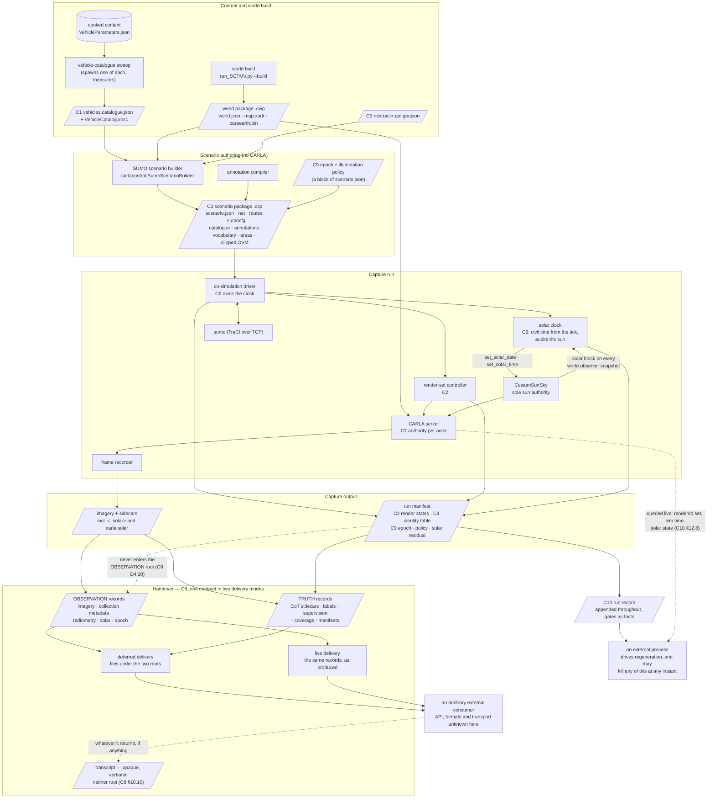
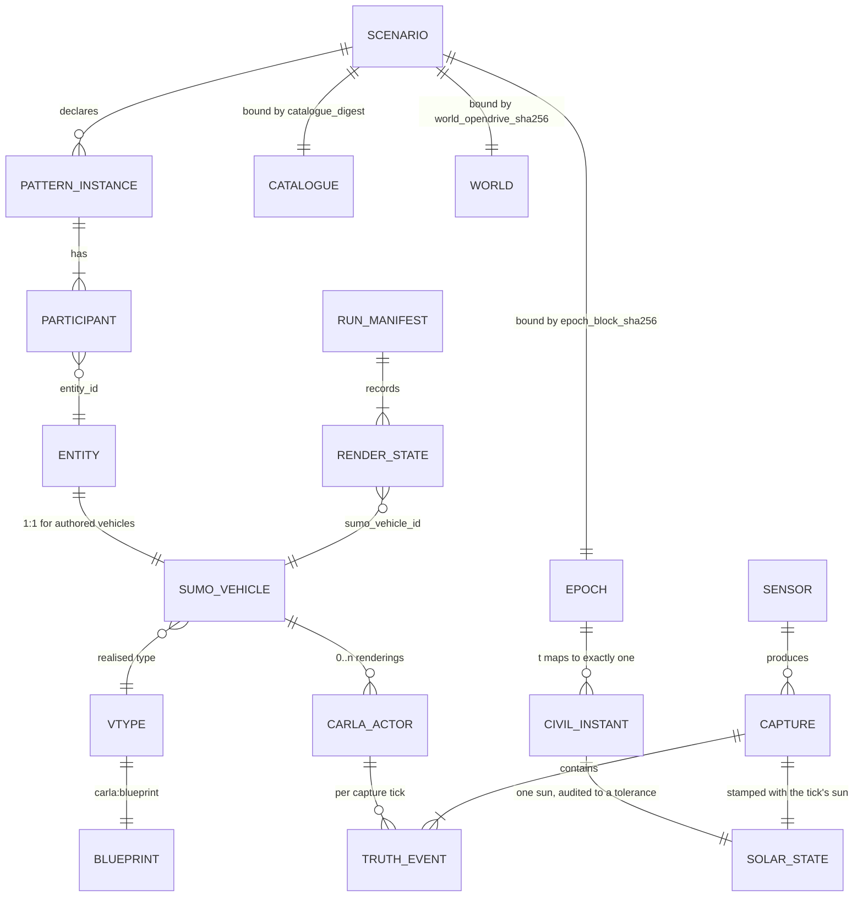
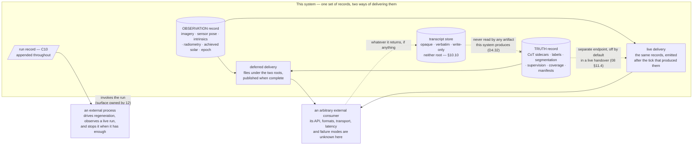
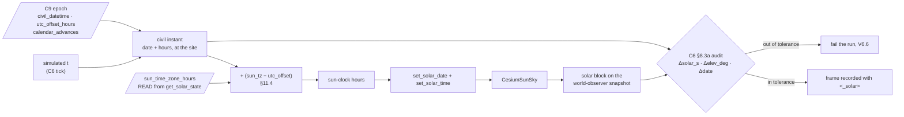

# 04 — Interface contracts

**Status:** Plan section. Every claim about existing behaviour is read from the working tree
and cited `path:line`, or **measured** by inspecting an artifact (the measurement is described where it
is used), or explicitly labelled an inference. No code was changed, no build was run.
**Date:** 2026-09-18
**Scope:** Every interface between two components of the SUMO-driven behavioural-capture system: the
artifact's name and location, its format, its complete field table, a worked example, the validation
rules, the failure mode when a rule is violated, and the versioning rule. Ten contracts, `C1`–`C10`.
**Audience:** an engineer implementing one side of one of these interfaces who has not read the
conversation that produced this plan.

**Binds to:** [`_TEAM_BRIEF.md`](_TEAM_BRIEF.md) §3 (decisions not to re-litigate), §3a (the
simulated-time-of-day requirement), **§3b (the scope boundary — this pipeline labels; it never scores)**,
**§3c (the live exercise is a primary use case, and it is generic past our boundary)**, **§3d (cyclic
generation is driven from outside, and we do not judge our own runs)** and §4 (standing rules).
**Depends on:** [`03_CoSimulation_Runtime.md`](03_CoSimulation_Runtime.md) (owns the tick and
solar-clock *mechanism*; this section states the *guarantee*),
[`06_Truth_And_Annotation.md`](06_Truth_And_Annotation.md) (owns the annotation payload; this section
owns where it is carried and how it is joined),
[`08_Collection_And_EPoL.md`](08_Collection_And_EPoL.md) (owns the EPoL design; this section owns the
boundary shape), [`10_Scale_And_Performance.md`](10_Scale_And_Performance.md) (owns every numeric limit;
this section states which limits must exist, never their values),
[`11_Time_And_Illumination.md`](11_Time_And_Illumination.md) (owns what a civil time *means* here and
why a policy is chosen; this section owns the wire shape and the validation — §11.13 states exactly
what it needs from `11`), [`12_Operator_Control_Surface.md`](12_Operator_Control_Surface.md) (owns how
an operator *expresses* a policy; this section owns how the expressed policy is *carried, bound and
checked*).

**Change history.**

| Rev | Change |
|---|---|
| 6 | `C3` carries the annotation vocabulary and binds it by digest |
| 5 | `C10` records facts, not a verdict; per-artifact crash safety; the contract for observing a live run |
| 4 | `C8` gains a live delivery mode; `C10` added; the external side left unspecified on purpose |
| 3 | `C8` becomes a corpus handover; three artifact roots become two; nothing scores a model |
| 2 | `C9` added — the simulated-time epoch and illumination policy — and bound into `C3`, `C6`, `C7` |
| 1 | `C1`–`C8` |

### What this section does not cover

- **Sizing.** Every cap, radius, window, budget and tolerance below is named and typed; not one is given
  a value. Values belong to [`10_Scale_And_Performance.md`](10_Scale_And_Performance.md).
- **The annotation vocabulary.** `C4` carries `instance_id` and says how it joins; the term list, the
  `PatternInstance` payload and the migration from `.labels.json` are
  [`06_Truth_And_Annotation.md`](06_Truth_And_Annotation.md)'s.
- **How SUMO and CARLA are stepped.** `C6` states what must be true at a tick boundary and what every
  participant is forbidden to do. The loop, the subscription set and the failure recovery are
  [`03_CoSimulation_Runtime.md`](03_CoSimulation_Runtime.md)'s.
- **Whether the .NET client can do these things today.** That audit is
  [`05_CarlaNet_Capability_Audit.md`](05_CarlaNet_Capability_Audit.md)'s. Where a contract needs an
  RPC, a shim method or a C# type that this document could not find, it says so in place.
- **What a civil time means, and why one illumination policy is preferred over another.** `C9` fixes
  the field set, the arithmetic that has to be reproducible, the validation and the failure modes. The
  semantics — what "the site's civil time" is for a scenario, how a window is chosen against the sun,
  whether illumination is a corpus stratifier, and the rationale for a headlight threshold — are
  [`11_Time_And_Illumination.md`](11_Time_And_Illumination.md)'s.
- **The operator's surface over any of it.** Which flags exist, how a run selects or overrides a
  policy, and what an operator sees is
  [`12_Operator_Control_Surface.md`](12_Operator_Control_Surface.md)'s. `C9` says only what the
  resulting choice must look like on the wire and what the manifest must record about it.
- **Anything a model does with what we emit, and anything about the external chain itself.** Running a
  detector, a tracker or a model service, associating their output to truth, and any metric, harness or
  comparison over them are outside this effort entirely
  ([`_TEAM_BRIEF.md`](_TEAM_BRIEF.md) §3b). So — per §3c — are **a detector's input schema, a track
  format, a report schema, a fusion or normalisation stage, and any latency, retry or error semantics
  past our emission**. `C8` specifies what we emit, in what form, with what timing and identity
  guarantees, and how an arbitrary consumer attaches and detaches; it specifies nothing that consumes
  it, and `D4.34`'s substitution test is how a reader checks that claim (§10.11).
- **How a run is invoked, attended or otherwise.** The flags, the configuration layering and its
  resolution, the exit-status set, the live monitor and the closeout rendering are
  [`12_Operator_Control_Surface.md`](12_Operator_Control_Surface.md)'s. `C10` (§12) owns the **record**
  of what a run produced and what was checked, and §12.8 states what an external process can observe
  while a run is alive. **When a run starts and when it stops are the caller's, not ours**
  ([`_TEAM_BRIEF.md`](_TEAM_BRIEF.md) §3d): there is no scheduler, no cadence, no run-length policy, no
  training loop and no model lifecycle anywhere in this plan.
- **Pedestrians**, out of scope by [`_TEAM_BRIEF.md`](_TEAM_BRIEF.md) §3.5.

---

## 1. How to read a contract

Each contract below has the same eight parts, so two people implementing the two sides can work from
the same headings.

| Part | What it fixes |
|---|---|
| **Artifact** | The file or message, its name, its location, and who writes it |
| **Format** | The encoding, and the exact grammar where the encoding does not fix it |
| **Fields** | Name, type, unit, required/optional, meaning — every field, no "and so on" |
| **Example** | A complete, valid instance, built from measured values wherever measured values exist |
| **Validation** | The rules a conforming artifact satisfies, each one checkable by a program |
| **Failure** | What the system does when a rule is violated — which side detects it, and when |
| **Versioning** | How the artifact changes over time and how a consumer refuses one it cannot read |
| **What breaks** | The concrete damage if the contract is ignored. This is why it is written down |

**Normative words.** *Must* is a rule a validator enforces and whose violation stops the run. *Should*
is a rule a validator warns on. *May* is permitted and unchecked.

**Units.** Every length is metres, every time is seconds, every angle is degrees. Simulated time is
distinguished from wall-clock time in every field name (`_s` is simulated seconds unless the name says
`wall`). Coordinates are named for their frame: `carla_x`/`carla_y`/`carla_z` (CARLA-local metres),
`sumo_x`/`sumo_y` (the SUMO network's projected metres), `latitude`/`longitude`/`hae_m` (WGS84
ellipsoidal, the project datum).

**Three clocks, three names, never interchangeable.** They are named here once and used consistently
below; `C9` exists because nothing in the tree distinguishes them.

| Clock | Field-name convention | Meaning |
|---|---|---|
| **Simulated** | `_s`, and bare `t` | Seconds since the simulation's own zero. SUMO's `<begin>`, every capture window, every interval. Carries no date and no zone |
| **Civil** | `_civil`, or a full ISO-8601 string with an explicit offset | Wall-clock time at the site, of the form `2026-03-21T23:00:00+03:30`. What a human means by "the night shift". **A civil time without an explicit offset is not a civil time** and is rejected (`C9` V9.2) |
| **Sun-clock** | `solar_time`, `_solar_hours` | The number `CesiumSunSky.SolarTime` holds: hours in the sun's *own* time zone, which is derived from the map longitude and is **not** the civil offset (`C9` §11.4). A conversion sits between civil and sun-clock and it is not the identity |

Wall-clock time appears in five places and nowhere else: `generated_at_utc` on build artifacts;
`sumo_step_timeout_wall_s`; the live delivery envelope's `emitted_wall_utc` and the stream header's two
stamps (§10.9.2); the transcript's `received_wall_utc` (§10.10); and the run record's
`started_wall_utc`, `stopped_wall_utc` and `ended_wall_utc` (§12.2, §12.3, §12.4). The last three are
**delivery and bookkeeping, never data** — nothing
rendered, recorded or joined may depend on any of them, and `C8`'s guarantee L3 says so explicitly for
the one case where somebody might be tempted, which is pairing frames by their arrival time.

**Digest.** Wherever this document says *digest*, it means the lowercase hex SHA-256 of the artifact's
bytes, or — for a JSON document that carries its own digest field — of the document serialised with
that field set to the empty string, with sorted keys, two-space indent, UTF-8, no BOM, `\n` line
endings. The existing world package already computes digests this way in spirit
(`CarlaNet.Transport/CarlaClient.cs:1252-1253`); this document makes the canonicalisation explicit
because two implementations that disagree about whitespace disagree about identity.

**A note on stale citations.** [`Findings/20`](../../Findings/20_Behavioral_Annotation_And_Areas_Of_Interest.md)
and [`Findings/23`](../../Findings/23_SUMO_Traffic_Integration.md) cite `CarlaNet/python/SCTMV.py:NNN`
in several places. That file no longer exists; the live path is
`carla/CarlaControl/scripts/run_SCTMV.py` over the `carlacontrol` package. Every such claim used below
was **re-resolved against `carla/CarlaControl/`** and is cited at its current location, with the
re-resolution noted.

---

## 2. The contract map



**The register.** Every artifact, who writes it, who reads it, and which contract governs it.

| Artifact | Written by | Read by | Contract |
|---|---|---|---|
| `vehicles.catalogue.json` | the catalogue sweep, against a running server | scenario builder, assistant author, human author, validator, **and the co-simulation bridge at runtime — the pose conversion needs the measured extent** (`C1` §3.2) | `C1` |
| `VehicleCatalog.xosc` | the same sweep, same run | OpenSCENARIO executor, foreign preview player | `C1` |
| `<name>.rou.xml` `vType` set | scenario builder, from the catalogue | SUMO, playback bridge | `C1` |
| render-set parameters in `scenario.json` | scenario author | render-set controller | `C2` |
| `render_states[]` in the run manifest | render-set controller | truth consumers, corpus auditor, corpus builder | `C2` |
| `<name>.csp` scenario package | scenario builder | co-simulation driver, validator | `C3` |
| spawn attributes `capture:*` | playback bridge at spawn | truth producer, recorder log, replayer | `C4` |
| `<extract>.aoi.geojson` | the author, beside the OSM | world build, scenario builder, world actor | `C5` |
| `<name>.aoi.resolved.json` | scenario builder | SUMO route writer, truth producer, and — for its **authored definitions only** — the observation writer (`C8` §10.4) | `C5` |
| clock parameters in `scenario.json` | scenario author | co-simulation driver | `C6` |
| per-actor authority | playback bridge at spawn | every subsystem that touches an actor | `C7` |
| per-actor vehicle light state | playback bridge, every tick | the rendered scene, and nothing else — it is not published as data | `C7` |
| `OBSERVATION` root — imagery plus collection metadata | frame recorder and the collection-metadata writer | an external consumer, at handover — deferred or live (`D4.29`) | `C8` |
| `TRUTH` root — sidecars, labels, supervision, coverage, manifests | truth producer and manifest writer | corpus auditor, corpus builder, and an external consumer at handover | `C8` |
| corpus manifest — contents, versions, declared omissions | corpus builder, at handover | an external consumer | `C8` |
| the live handover streams — the **same** `OBSERVATION` and `TRUTH` records, emitted as produced | the handover emitter | an arbitrary external consumer, about which this document assumes nothing | `C8` §10.9 |
| transcript index and blobs — bytes an external chain returned | the transcript recorder | **nothing in this system** (`D4.32`); a human, or an external team if the transcript is released | `C8` §10.10 |
| `run_record.jsonl` — identity and bindings, the gate record, the stop, what was produced | the component that owns the run manifest, appended from before the first capture | an automated caller; an operator; a corpus builder | `C10` |
| `epoch` block in `scenario.json` | scenario author | co-simulation driver, solar clock, truth producer, corpus auditor, **and the observation writer** (`C8` §10.4a) | `C9` |
| `illumination` block in `scenario.json`, and the run override | scenario author; operator at run start | solar clock | `C9` |
| `<_solar>` sidecar element and the `carla:solar` PNG chunk | frame recorder — **already written today** (`CotWriter.cs:52-65`, `SolarMetadata.cs:19`) | truth consumers, corpus auditor, observation writer | `C9` |
| `epoch`, `illumination_in_force`, `solar_achieved[]`, `solar_residual` in the run manifest | the solar clock, closed at run end | corpus auditor, corpus stratification | `C9` |

---

## 3. C1 — The vehicle catalogue

The headline contract. A user hands the assistant authoring a SUMO scenario a catalogue of vehicles to
choose from, with real dimensions and colour; the playback bridge maps what the scenario chose back
onto CARLA blueprints.

### 3.1 The defect this replaces, measured

`BlueprintChooser.Choose` takes the whole blueprint catalogue, filters to `vehicle.*`, and returns the
**first** entry whose identifier contains a preferred substring for the entity's category
(`CarlaNet.Scenario/BlueprintChooser.cs:43-63`). One category therefore resolves to exactly one
blueprint, which is why a five-car convoy is five identical cars. The preference table is
`BlueprintChooser.cs:16-25`.

Three measurements make the defect sharper than doc 20 §5.6 records.

**Measurement 1 — the content build offers seventeen vehicles, and its own metadata is wrong.** The
vehicle blueprint set is loaded at runtime from a JSON file
(`Unreal/CarlaUnreal/Plugins/Carla/Source/Carla/Actor/Factory/VehicleActorFactory.cpp:19-26`), read
here at `Unreal/CarlaUnreal/Content/Carla/Config/VehicleParameters.json`. Parsed with `json`:

| Property | Measured |
|---|---|
| Vehicle entries | **17** |
| `BaseType` values | `bus` ×7, `car` ×6, `truck` ×3, empty ×1 |
| `SpecialType` values | **empty on all 17** |
| `NumberOfWheels` | `4` ×16, `3` ×1 (`vehicle.Lincoln.Mkz`) |
| Entries with at least one `RecommendedColors` entry | **17 of 17** |
| Motorcycle or bicycle blueprints | **none** |

Seven blueprints that are plainly cars are declared `bus` — `ue4.ford.mustang`, `ue4.ford.crown`,
`ue4.bmw.grantourer`, `ue4.audi.tt`, `ue4.mercedes.ccc`, `ue4.chevrolet.impala` — and `fuso.mitsubishi`,
which is a lorry, is also `bus`. `sprinter.mercedes` has no `BaseType` at all, so the truth producer's
fallback reports it as `car` (`CarlaNet.Recording/VehicleTelemetryService.cs:100-102`). Every
`special_type` is empty, so [doc 09 §4](../../Findings/09_Telemetry_CoT_Contract.md)'s
`special_type=emergency` mapping has nothing to fire on even for the ambulance, the police Charger and
the fire truck.

**Measurement 2 — half the preference table matches nothing.** Definition ids are lowercased
(`Unreal/CarlaUnreal/Plugins/Carla/Source/Carla/Actor/ActorBlueprintFunctionLibrary.cpp:203-206`), so
`vehicle.UE4.audi.tt` becomes `vehicle.ue4.audi.tt`. Against the measured 17, the `motorbike` and
`bicycle` preference lists (`harley`, `yamaha`, `kawasaki`, `crossbike`, `omafiets`, `diamondback`)
match nothing, so those categories fall through to `vehicles[0]` — a car
(`BlueprintChooser.cs:62`). `mercedes` matches both `vehicle.sprinter.mercedes` and
`vehicle.ue4.mercedes.ccc`, resolved by enumeration order rather than by intent. Note also that doc 09
and doc 20 use `vehicle.audi.tt` and `vehicle.audi.a2` as examples; **neither id exists** in this
content build.

**Measurement 3 — the SUMO side already declares vehicles that CARLA cannot render.** The shipped
ambient type set (`CarlaControl/src/carlacontrol/SumoScenarioBuilder.py:278-296`) declares a
`motorcycle` vType with `vClass="motorcycle"`. Measurement 1 says no motorcycle blueprint exists. Under
today's chooser that vehicle would render as a car with no error anywhere.

### 3.2 Where a blueprint's dimensions come from — measured, not assumed

The brief asks whether dimensions are available *before* spawning. They are not. Four readings, in the
order the data would have to travel:

1. **The parameter struct carries no dimension.** `FVehicleParameters`
   (`Unreal/CarlaUnreal/Plugins/Carla/Source/Carla/Actor/VehicleParameters.h`) has `Make`, `Model`,
   `Class`, `NumberOfWheels`, `Generation`, `ObjectType`, `BaseType`, `SpecialType`,
   `HasDynamicDoors`, `HasLights`, `RecommendedColors`, `SupportedDrivers` — and nothing else.
2. **The definition builder emits no dimension.** `MakeVehicleDefinition`
   (`ActorBlueprintFunctionLibrary.cpp:839-930`) emits the variations `role_name`, `ros_name`, `color`
   (only when `RecommendedColors` is non-empty, `:850-861`), `driver_id`, `sticky_control`,
   `terramechanics`, and the attributes `object_type`, `base_type`, `special_type`,
   `number_of_wheels`, `generation`, `has_dynamic_doors`, `has_lights`. No length, no width, no height,
   no bounding box.
3. **The RPC type has no slot for one.** `carla::rpc::ActorDefinition` is
   `MSGPACK_DEFINE_ARRAY(uid, id, tags, attributes)`
   (`LibCarla/source/carla/rpc/ActorDefinition.h:49`), mirrored in C# as
   `ActorDefinition(Uid, Id, Tags, Attributes)`
   (`CarlaNet/src/CarlaNet.Types/Rpc/Actors/ActorDefinition.cs`). `GetActorDefinitionsAsync`
   (`CarlaNet.Transport/CarlaClient.cs:467`) calls `get_actor_definitions`
   (`Unreal/.../Carla/Server/CarlaServer.cpp:1177`) and returns exactly that.
4. **The bounding box first exists on a spawned actor.** `carla::rpc::Actor` carries
   `bounding_box` as key 3 (`CarlaNet.Types/Rpc/Actors/Actor.cs`), filled from `FActorInfo::BoundingBox`
   (`Unreal/.../Carla/Actor/ActorInfo.h:25`), which is computed at registration by
   `UBoundingBoxCalculator::GetActorBoundingBox(&Actor)` over the **already-spawned `AActor`**
   (`Unreal/.../Carla/Actor/ActorRegistry.cpp:163,173`). The only bounding-box RPCs on the server are
   `get_all_level_BBs` (`CarlaServer.cpp:1194`), which returns static level geometry by semantic tag,
   and `get_light_boxes`. There is no RPC keyed by blueprint id.

The truth record's `length_m`/`width_m`/`height_m` are consequently `2 × bounding_box.extent` of the
spawned actor (`CarlaNet.Recording/VehicleTelemetryService.cs:103,110`), which is why the storyboards
in `carla/Import/` — all three of which declare `<Dimensions width="1.9" length="4.6" height="1.45"/>`
for every car (`Import/Gardnerville_CentervilleEast.xosc:18`) — disagree with truth and nothing
notices.

> **D4.1 — the catalogue is generated by a build-time spawn-and-measure sweep against a running
> server. It is not, and cannot be, a projection of the blueprint library.** There is no cheaper source
> of dimensions, because the server does not hold one.

This is also why upstream ships a static `vtypes.json` rather than deriving one
([doc 23 §6.8](../../Findings/23_SUMO_Traffic_Integration.md)): upstream measured its blueprint set once
and froze the result. Our blueprint set differs — 17 entries, none of them upstream's default Audi set
— so ours is new work rather than a file to copy, and freezing it is exactly what §3.11's digests exist
to make safe.

**Measurement 4 — the sweep's output already exists in this tree, incidentally.** Fifty-four recorded
truth sidecars in `carla/Build/SCTMV_recordings/*.xml` were parsed for distinct
`<_carla type_id="vehicle.*">` elements. They cover **all 17** blueprints and carry exactly the
measurement a sweep would produce:

| blueprint | length_m | width_m | height_m | `base_type` reported | recommended colours |
|---|---|---|---|---|---|
| `vehicle.ambulance.ford` | 6.36 | 2.35 | 2.43 | truck | 1 |
| `vehicle.carlacola.actors` | 8.00 | 2.91 | 4.05 | truck | 1 |
| `vehicle.dodge.charger` | 5.01 | 1.88 | 1.54 | car | 7 |
| `vehicle.dodgecop.charger` | 5.24 | 1.92 | 1.64 | car | 1 |
| `vehicle.firetruck.actors` | 8.58 | 2.90 | 3.83 | truck | 1 |
| `vehicle.fuso.mitsubishi` | 10.17 | 3.93 | 4.24 | **bus** (wrong) | 6 |
| `vehicle.lincoln.mkz` | 4.89 | 1.84 | 1.52 | car | 1 |
| `vehicle.mini.cooper` | 4.55 | 2.10 | 1.77 | car | 4 |
| `vehicle.nissan.patrol` | 5.59 | 2.15 | 2.06 | car | 6 |
| `vehicle.sprinter.mercedes` | 5.92 | 1.99 | 2.73 | car (by fallback) | 5 |
| `vehicle.taxi.ford` | 5.35 | 1.79 | 1.58 | car | 1 |
| `vehicle.ue4.audi.tt` | 4.18 | 1.99 | 1.39 | **bus** (wrong) | 5 |
| `vehicle.ue4.bmw.grantourer` | 4.61 | 2.24 | 1.67 | **bus** (wrong) | 5 |
| `vehicle.ue4.chevrolet.impala` | 5.36 | 2.03 | 1.41 | **bus** (wrong) | 5 |
| `vehicle.ue4.ford.crown` | 5.37 | 1.80 | 1.57 | **bus** (wrong) | 5 |
| `vehicle.ue4.ford.mustang` | 4.72 | 1.89 | 1.30 | **bus** (wrong) | 5 |
| `vehicle.ue4.mercedes.ccc` | 4.67 | 1.81 | 1.44 | **bus** (wrong) | 5 |

Every number in the worked examples below is one of these, so the example is a real catalogue entry
rather than an invented one. Two consequences for the sweep's specification fall straight out: it must
**record the measured dimensions and disregard `base_type`**, because `base_type` is demonstrably
unreliable in this content build; and it must carry a **curated** class assignment in the catalogue, so
the wrong `bus` values never reach SUMO's `vClass`.

#### The sweep tool, specified

- **Name and location:** `carla/CarlaControl/scripts/make_vehicle_catalogue.py`, a thin CLI over
  `carla/CarlaControl/src/carlacontrol/VehicleCatalogueBuilder.py` (repo convention: one public class
  per file, file named for the class — `carla/AGENTS.md`). Windows/Linux parity applies to any
  `Scripts/*` wrapper, not to this CLI, which is platform-neutral Python.
- **When it runs:** once per content build, as a build step, against a headless server with any map
  loaded. It needs no world package, no Cesium imagery and no OSM — only a server.
- **What it spawns:** every definition returned by `get_actor_definitions`
  (`CarlaNet.Transport/CarlaClient.cs:467`) whose `id` starts with `vehicle.`, **one at a time**, never
  concurrently. One at a time matters: concurrent spawns can collide and return
  `EActorSpawnResultStatus::Collision` (`Unreal/.../Carla/Actor/Factory/VehicleActorFactory.cpp:43-47`),
  which the sweep would then have to distinguish from a genuinely unspawnable blueprint.
- **Where it spawns:** at a single fixed transform well clear of geometry and of any other actor — by
  default `z = 300 m` above the map's first recommended spawn point, with gravity and physics
  irrelevant because the actor is destroyed before it can fall anywhere. The bounding box is
  **actor-local** (`FActorInfo::BoundingBox`, `Unreal/.../Carla/Actor/ActorInfo.h:25`, computed by
  `UBoundingBoxCalculator::GetActorBoundingBox` at `ActorRegistry.cpp:163`), so the pose does not
  affect the measurement; height is chosen only to guarantee a clear spawn.
- **How it measures:** read the `rpc::Actor` returned by the spawn — it carries `bounding_box` as key 3
  (`CarlaNet.Types/Rpc/Actors/Actor.cs`) — and record `2 × extent.x`, `2 × extent.y`, `2 × extent.z` as
  `length_m`, `width_m`, `height_m`, and `bounding_box.location` as `bbox_centre_m`. This is exactly
  what the truth producer does (`CarlaNet.Recording/VehicleTelemetryService.cs:103,110`), so the
  catalogue and the truth record agree by construction rather than by coincidence. It also records
  every declared variation with its type, `restrict_to_recommended` flag and recommended values, from
  the definition rather than from the actor.
- **How it tears down:** destroy the actor, and **confirm the destroy**, before the next spawn. A
  sweep that leaks actors turns its own later spawns into collisions and its measurements into
  failures. At the end it asserts the world's vehicle actor count is what it was at the start, and
  refuses to emit a catalogue if it is not — a leaked actor means some measurement may have been taken
  against a colliding spawn.
- **Colour applicability:** the sweep spawns each blueprint a second time with a distinctive `color`
  and scans the server log for the known `MaterialNotFound` warning attributable to that spawn. That
  warning is `BaseVehiclePawn.ApplyColor` failing to find the `Bodywork_Mat` slot; it is cosmetic and
  benign in itself, but it is exactly the signal that a requested colour did **not** reach the body.
  The sweep records `colour_applied` as `true`, `false`, or `unknown` when the log was unavailable.
  It must never record `true` by assumption.
- **Lamp applicability:** a third pass, specified in §3.2a, which measures *optically* which lamps a
  blueprint actually lights. It is a separate pass because it is the only measurement in the sweep that
  needs a camera and a night sun, and because a sweep that cannot get one must still emit a catalogue
  (with every lamp recorded `unknown`) rather than emit a guess.
- **What it emits:** `vehicles.catalogue.json` and `VehicleCatalog.xosc` (§3.3), plus a one-page
  human-readable report listing every blueprint, its measured dimensions, and every discrepancy
  between the measurement and the blueprint's own declared metadata — which, on the measured content
  build, is seven wrong `base_type` values, one empty one, seventeen empty `special_type` values and
  one wrong wheel count. The report is what makes Measurement 1's defect visible to the person who can
  fix it in the content.
- **What it must not do:** infer a dimension, fall back to a default, or skip a blueprint that failed
  to spawn. A blueprint that will not spawn is written with `"measurement": "failed"` and a reason, and
  the catalogue is still emitted — a partial catalogue that says which entries are missing is more
  useful than no catalogue, and `C3` validation refuses a scenario that references a failed entry.
- **Dependency on [`05_CarlaNet_Capability_Audit.md`](05_CarlaNet_Capability_Audit.md):** the sweep
  needs the Python shim to expose a spawned actor's bounding box. That the RPC carries it is measured
  above; that the shim surfaces it is not verified here. If it does not, the sweep is a C# tool over
  `CarlaClient` instead, which changes its language and nothing else in this contract.

### 3.2a Lamp capability — measured, because `has_lights` says nothing

A night capture that assumes every blueprint has the same lamps will be
wrong, and — as with colour — it will be wrong *invisibly*, because the client is told the command
succeeded.

**Measurement 5 — `HasLights` is `true` on all 17 blueprints.** Parsed from
`Unreal/CarlaUnreal/Content/Carla/Config/VehicleParameters.json` with `json`, the same file Measurement 1
used: `HasLights` is `true` for every one of the seventeen entries, with no per-lamp breakdown anywhere
in the file. It is emitted as the `has_lights` attribute by `MakeVehicleDefinition`
(`ActorBlueprintFunctionLibrary.cpp:839-930`), so it reaches a client with no spawn — and it carries
exactly as much information as `SpecialType`, which Measurement 1 found empty on all 17. A blanket
value is not a measurement.

**Three readings that show why a set-and-read-back probe cannot substitute for an optical one.**

1. **The read-back returns the command, not the vehicle.** `ACarlaWheeledVehicle::GetVehicleLightState`
   is `return InputControl.LightState;`
   (`Unreal/CarlaUnreal/Plugins/Carla/Source/Carla/Vehicle/CarlaWheeledVehicle.cpp:486-489`), and
   `SetVehicleLightState` stores the incoming bitmask into that same field whenever any bit differs
   (`:684-701`). So `get_light_state` after `set_light_state` returns what was asked for, whatever the
   vehicle did with it.
2. **Whether a lamp illuminates is implemented per blueprint, in Blueprint.** The only thing the C++
   does with the stored value is raise `RefreshLightState`, which is a
   `UFUNCTION(BlueprintImplementableEvent)`
   (`Unreal/CarlaUnreal/Plugins/Carla/Source/Carla/Vehicle/CarlaWheeledVehicle.h:310-311`, raised at
   `CarlaWheeledVehicle.cpp:699`). A blueprint whose graph handles four of the eleven bits is
   indistinguishable, over the RPC, from one that handles all eleven.
3. **This is the same shape as the measured colour trap.** §3.2's `colour_applied` exists because
   `ApplyColor` can fail to find the `Bodywork_Mat` slot and report nothing to the caller. Lamps are
   that failure with no log line at all.

> **D4.23 — lamp capability is measured optically, per blueprint, per lamp, and carried in the
> catalogue. `has_lights` is recorded verbatim and never used to decide anything** — it is `true` on
> all 17 and therefore discriminates nothing.

**The lamp pass, specified.** Run as part of the catalogue sweep, after the dimension pass:

- Set the sun to a night instant and disable advancement, so the only light in frame is the vehicle's:
  `set_solar_date` then `set_solar_time` at a declared sun-clock hour, and `set_time_advance(false)`
  (`carlanet/__init__.py:1506`, `:1500`, `:1535`). The hour and date used are recorded in the catalogue
  header as `lamp_probe.solar_time_hours` / `lamp_probe.solar_date`, together with the sun elevation
  the world reported back, because a measurement whose lighting is not recorded is not repeatable. The
  pass refuses to report at all if that elevation is above the horizon, since it would then be
  measuring a lamp against daylight. This is the one place `C1` depends on `C9`'s mechanism, and it is
  a build-time dependency only.
- Spawn one blueprint at the sweep's fixed transform and place a camera at each of **two** declared
  relative poses, ahead of the body looking back along it and behind it looking forward. Two, because
  front and rear lamps are different meshes and one camera cannot see both; a pixel count is taken from
  whichever camera sees the larger change, so the camera that cannot see a lamp does not dilute the one
  that can.
- Capture with `VehicleLightState.NONE`, then one frame per lamp bit with exactly that bit set,
  restoring `NONE` between bits — and **capture the restored `NONE` state as well**. Each lamp is
  compared against the off state before it and the off state after it, and the difference between those
  two off states is the run's own noise floor. A single early reference is not enough: **measured on
  this content build**, a pass that compared every bit against one reference taken 40 steps after the
  spawn reported all eleven lamps lit on `vehicle.ambulance.ford` with 3,281 pixels of gain, against
  2,464 pixels between two captures of the *same* state — the vehicle's arrival moves the scene's
  exposure, and exposure drift produces the same positive difference a lamp does. Comparing each bit
  against the off state beside it reduced the same blueprint's readings to 0–1 pixels.
- A lamp is `lit` when it gains more pixels than both the measured floor by a declared margin and a
  declared minimum, above a declared luminance threshold in a declared region; `unlit` when it does
  not; `unknown` when the pass could not run — no camera, no sun in the world, or a capture that
  failed. The threshold, the region, the margin, the minimum and the camera poses are catalogue-header
  fields, not constants in code, for the same reason the solar instant is.
- **A positive control runs once per pass**: the sun is moved to a declared daylight instant and back,
  and the same metric must respond. A metric that cannot see a vehicle go from night to day could not
  have seen a lamp either, so if it does not respond the pass records `ran: false` and every verdict
  `unknown`, rather than publishing seventeen `unlit` verdicts it was never in a position to make.
- The pass must never write `lit` by assumption, and must never infer one lamp from another. Front and
  rear are separate bits and separate meshes.
- **The camera takes the clock.** Measured on this server: a camera delivers no frames at all while the
  simulation free-runs and exactly one frame per step in synchronous mode, so the pass switches the
  world to synchronous stepping for its duration and restores the caller's settings afterwards.

**What is *not* measured, and must not be.** Whether a lamp is bright enough to be *detectable* at a
given range by a given sensor is a collection question, not a content property; it belongs to
[`08_Collection_And_EPoL.md`](08_Collection_And_EPoL.md) and to whatever occlusion and detectability
work follows [doc 17](../../Findings/17_Photoreal_Occlusion_Metric.md). `C1` records only that the lamp
changes the rendered image at all.

**The confounder this opens, and the rule that closes it.** If the blueprints that light up are not
distributed alike across marked and unmarked vehicles, lamp capability becomes a night-time appearance
separator in exactly the way `vType@color` was a daytime one (§3.7.1). The distribution is a property
of the class members, so the check is the same shape as V1.11 and is written as V1.19.

#### The catalogue is a runtime dependency of the bridge, not only an authoring aid

This is the consequence that makes `C1` load-bearing at playback and not merely at build.

SUMO's reference point is the **front bumper centre**; CARLA's actor transform is the body's origin,
and the body's geometric centre is offset from that origin by the bounding box's own centre. So the
pose conversion of [doc 23 §6.7](../../Findings/23_SUMO_Traffic_Integration.md) — the third of the
three conventions, and the one upstream's `BridgeHelper` needs the vehicle extent for — **cannot be
computed without the catalogue.** SUMO knows a declared `length`; only the catalogue knows the rendered
body's extent and where its centre sits relative to the actor origin.

Written out, so two implementations agree. Given SUMO position `(sx, sy)` (front bumper centre, in the
network's projected metres), SUMO angle `a` (degrees clockwise from north), catalogue `length_m = L`
and `bbox_centre_m = (cx, cy, cz)`:

```
ψ   = a − 90                                  # CARLA yaw, degrees
ux  =  cos ψ ,  uy = sin ψ                    # heading unit vector, CARLA frame
bx  =  sx − (L / 2) · ux                      # body centre, CARLA frame
by  = −sy − (L / 2) · uy                      # note the Y negation: carla_y = −sumo_y
                                              # actor origin = body centre minus the local
                                              # bbox centre rotated into the world frame
ax  = bx − (cx · cos ψ − cy · sin ψ)
ay  = by − (cx · sin ψ + cy · cos ψ)
az  = drape_ground_z(ax, ay) + seat_offset    # C7 — never SUMO's z, which is zero everywhere
```

For every blueprint measured here `cy` is expected to be ~0, so the shift collapses to
`−(L / 2 + cx) · (ux, uy)`; the general form is written down because a blueprint whose mesh is not
centred on its origin would otherwise be silently mis-seated laterally.

> **D4.17 — the co-simulation bridge loads the catalogue at run start and uses it for the pose
> conversion, not only for blueprint selection. A vehicle whose extent is unknown is not rendered.**

**What the bridge does when an extent is unknown.** Three cases, one response:

| Case | Response |
|---|---|
| The realised vType carries no `carla:blueprint` param | Not rendered. `render_state = simulated_only`, `reason = "no_blueprint"` |
| It names a catalogue entry whose `measurement` is `failed` | Not rendered. `reason = "unknown_extent"` |
| It names an entry that is not in the catalogue at all | Not rendered. `reason = "unknown_extent"` |

In every case the bridge emits **one** warning per distinct vType, never per vehicle, and the run
continues with the vehicle present in behavioural truth and absent from the imagery — which is exactly
what `C2` §4.5's accounting exists to record.

**It must not fall back to SUMO's declared `length`.** That is the substitution this whole contract
exists to prevent: it would place a body of unknown size at a pose computed from a length nobody
measured, and the error is invisible in every artifact, because both sides remain internally
consistent. All three cases are unreachable in a package that passed `C1` V1.5, V1.8 and V1.9 at build
time; the runtime behaviour exists so that a validator bug degrades into a recorded absence rather than
into a silently wrong corpus.

### 3.3 Artifact and format

> **D4.2 — the canonical catalogue is JSON; the OpenSCENARIO `<VehicleCatalog>` is a generated,
> non-authoritative projection emitted by the same sweep run.**

Doc 20 §5.6 argues for the OpenSCENARIO catalogue format so one artifact serves both authoring
surfaces. That argument is right about the *goal* and wrong about the *mechanism*, for a reason that
only appears once the SUMO side is in scope:

- `<Vehicle>` can carry `<BoundingBox><Dimensions>`, `<Performance>` and `<Axles>` natively. It cannot
  carry `vClass`, `guiShape`, `sigma`, `speedDev`, class membership, or the colour palette without
  `<Properties><Property>` vendor keys. Once half the payload is vendor keys, the standard's advantage
  is reduced to one thing: a conformant foreign player can resolve a `CatalogReference`.
- That one thing is still worth having ([doc 20 §5.5](../../Findings/20_Behavioral_Annotation_And_Areas_Of_Interest.md)
  wants the storyboard previewable as authored), and it costs nothing, because both files are emitted
  from **one** measurement run and both carry the same `catalogue_digest`. There is no hand-editing
  step in which they could drift.
- The SUMO scenario builder, the playback bridge and an assistant author all read JSON at lower cost
  than they read OpenSCENARIO XML with vendor properties.

So: one measurement, two serialisations, the JSON authoritative. A consumer finding the two in
disagreement treats it as a build error, not as a choice.

**The OpenSCENARIO projection is not yet emitted, and the reason is a gap in the measurement, not in
the writer.** A conformant `<Vehicle>` requires `<Axles>` — wheel diameter, track width and the
longitudinal and vertical position of each axle — and the sweep measures none of them: the only
geometry a spawned actor hands back is its bounding box. Writing plausible axle numbers derived from
the box would put fabricated measurements into a file whose whole purpose is to be read by a foreign
player as measured. Until the sweep can read wheel geometry off the actor, the JSON catalogue and the
SUMO vehicle types are what it emits, and a `VehicleCatalog.xosc` remains something to add to the same
run rather than something to hand-write.

**Location.** The catalogue is a property of a content build, so it ships with the distribution:

```
<distribution root>/catalogue/vehicles.catalogue.json
<distribution root>/catalogue/VehicleCatalog.xosc
```

and a copy is **embedded** in every scenario package (`C3`), so a scenario is never separated from the
catalogue it was authored against.

**Encoding.** UTF-8, no BOM, `\n` line endings, two-space indent, object keys sorted, for the digest
rule of §1 to be well defined.

### 3.4 Fields

#### 3.4.1 Document header

| Field | Type | Unit | Req. | Meaning |
|---|---|---|---|---|
| `catalogue_version` | integer | — | yes | Schema shape of this document. `1` for the shape below |
| `catalogue_id` | string | — | yes | Human-readable name, e.g. `carla-0.10.0-win64-development` |
| `catalogue_digest` | string | — | yes | Digest of this document per §1. Empty while computing |
| `content_build_id` | string | — | yes | Identifies the cooked content measured. The distribution's own version string |
| `blueprint_set_digest` | string | — | yes | Digest over the sorted list of `"<id>\|<attr_id>=<attr_value>"` for every blueprint and every declared attribute returned by `get_actor_definitions`. The **only** part of the catalogue a running server can independently reproduce |
| `generated_at_utc` | string | — | yes | ISO-8601 UTC, millisecond precision |
| `generator` | string | — | yes | `carlacontrol.VehicleCatalogueBuilder` and its version |
| `server_version` | string | — | yes | The server the sweep measured against |
| `lamp_probe` | object | — | yes | The lamp pass's own conditions, so the measurement is repeatable: `{ ran, solar_date, solar_time_hours, sun_elevation_deg, camera_poses, image_size, luminance_threshold, region, minimum_lit_pixels, drift_margin, average_frames, positive_control_pixels }`. `camera_poses` is a list because front and rear lamps need two of them (§3.2a). `ran: false` with a reason when the pass could not run, in which case every `lamp_capability` value is `unknown` |
| `vehicles` | array | — | yes | §3.4.2 |
| `classes` | array | — | yes | §3.4.3 |

#### 3.4.2 `vehicles[]` — one entry per blueprint, all measured

| Field | Type | Unit | Req. | Meaning |
|---|---|---|---|---|
| `blueprint_id` | string | — | yes | The definition id exactly as the server returns it, lowercase (`ActorBlueprintFunctionLibrary.cpp:205`) |
| `uid` | integer | — | yes | The definition's `uid`, carried so a spawn description can be built without a second lookup |
| `tags` | string | — | yes | The definition's `tags`, verbatim |
| `measurement` | string | — | yes | `measured` or `failed` |
| `measurement_note` | string | — | no | Present only when `measurement == "failed"` |
| `length_m` | number | m | yes if measured | `2 × bounding_box.extent.x` |
| `width_m` | number | m | yes if measured | `2 × bounding_box.extent.y` |
| `height_m` | number | m | yes if measured | `2 × bounding_box.extent.z` |
| `bbox_centre_m` | `[x,y,z]` | m | yes if measured | `bounding_box.location`, actor-local. Needed for the bumper-shift of `C7` and for any projected box |
| `declared_base_type` | string | — | yes | The blueprint's own `base_type` attribute, **verbatim and untrusted** — measured wrong for 7 of 17 |
| `declared_special_type` | string | — | yes | The blueprint's own `special_type` attribute, verbatim. Measured empty for all 17 |
| `number_of_wheels` | integer | — | yes | Verbatim. Measured `3` for `vehicle.lincoln.mkz`, which is wrong; carried as data, never used to classify |
| `generation` | integer | — | yes | Verbatim |
| `settable_attributes` | array of object | — | yes | `{ id, type, restrict_to_recommended, recommended_values[] }` for every *variation* the definition declares |
| `colour_settable` | boolean | — | yes | True when a `color` variation is declared. Measured true for all 17 |
| `colour_palette` | array of string | — | yes | The `color` variation's recommended values, each `"R,G,B"` with integer components 0–255 |
| `colour_applied` | string | — | yes | `true` \| `false` \| `unknown` — whether a set colour reaches the body (§3.2) |
| `declared_has_lights` | boolean | — | yes | The blueprint's own `has_lights` attribute, **verbatim and untrusted** — measured `true` on all 17 (§3.2a Measurement 5). Carried as data, never used to decide |
| `lamp_capability` | object | — | yes | One entry per `VehicleLightState` bit, each `lit` \| `unlit` \| `unknown`. The eleven keys are the bit names in snake case — `position`, `low_beam`, `high_beam`, `brake`, `right_blinker`, `left_blinker`, `reverse`, `fog`, `interior`, `special_1`, `special_2`, mapping one-to-one onto `Position`…`Special2` (`carlanet/__init__.py:2666-2676`; `NONE` and `All` are not bits). No key may be absent; `unknown` is the value for "not measured" |

#### 3.4.3 `classes[]` — the authoring unit

A class is what a scenario author asks for. It becomes a SUMO `<vTypeDistribution>`; its members
become SUMO `<vType>`s.

| Field | Type | Unit | Req. | Meaning |
|---|---|---|---|---|
| `class_id` | string | — | yes | The name an author writes. Matches `[a-z][a-z0-9_]{0,31}`. Becomes the `vTypeDistribution` id |
| `description` | string | — | yes | One human sentence. This is what an assistant author reads to choose |
| `sumo_vclass` | string | — | yes | A SUMO vehicle class, e.g. `passenger`, `truck`, `bus`, `delivery`, `taxi`, `authority`, `army`. **Curated, never taken from `declared_base_type`** |
| `cot_base_type` | string | — | yes | The truth record's `base_type` for members of this class — `car`, `truck`, `van`, `bus`, `motorcycle`, `bicycle`. Curated, and it **overrides** the blueprint's wrong `base_type` in truth |
| `cot_special_type` | string | — | no | The truth record's `special_type`, e.g. `emergency`, `taxi`. Curated, because the content build declares none |
| `members` | array of object | — | yes | `{ blueprint_id, weight }`; `weight` is a positive number, normalised across the class |
| `max_speed_mps` | number | m/s | yes | SUMO `maxSpeed` |
| `accel_mps2` | number | m/s² | yes | SUMO `accel`. Explicit, never defaulted (§3.6) |
| `decel_mps2` | number | m/s² | yes | SUMO `decel`. Explicit |
| `sigma` | number | — | yes | SUMO driver imperfection, 0–1. Explicit |
| `speed_factor_mean` | number | — | yes | SUMO `speedFactor` mean |
| `speed_factor_dev` | number | — | yes | SUMO `speedDev`. **Explicit and mandatory** (§3.6) |
| `min_gap_m` | number | m | yes | SUMO `minGap`. Explicit |
| `gui_shape` | string | — | yes | SUMO `guiShape`, for `sumo-gui` only |
| `gui_colour` | string | — | yes | `#RRGGBB`. **For `sumo-gui` only. Never rendered** (§3.7) |
| `render_colour_policy` | string | — | yes | `palette` (draw from the member blueprint's `colour_palette`) or `fixed` (§3.7) |
| `render_colour` | string | — | only if `fixed` | `"R,G,B"` integers 0–255 |
| `lamps_expected` | array of string | — | no | Lamp names this class is expected to show **in addition to** the ones `C7` §9.4 commands for every vehicle — a beacon on an emergency class, for example. Checked against `lamp_capability` by V1.18. Absent means "the common set only" |

### 3.5 Worked example

Catalogue fragment, with measured dimensions and measured palettes:

```json
{
  "catalogue_version": 1,
  "catalogue_id": "carla-0.10.0-win64-development",
  "catalogue_digest": "8f2c…",
  "content_build_id": "Carla-0.10.0-Win64-Development",
  "blueprint_set_digest": "41ad…",
  "generated_at_utc": "2026-09-17T09:14:22.108Z",
  "generator": "carlacontrol.VehicleCatalogueBuilder/1.0.0",
  "server_version": "0.10.0",
  "vehicles": [
    {
      "blueprint_id": "vehicle.mini.cooper",
      "uid": 26,
      "tags": "vehicle,mini,cooper",
      "measurement": "measured",
      "length_m": 4.55, "width_m": 2.10, "height_m": 1.77,
      "bbox_centre_m": [0.02, 0.00, 0.72],
      "declared_base_type": "car",
      "declared_special_type": "",
      "number_of_wheels": 4,
      "generation": 3,
      "settable_attributes": [
        { "id": "color", "type": "RGBColor", "restrict_to_recommended": false,
          "recommended_values": ["0,0,0", "104,4,8", "27,54,118", "26,62,29"] },
        { "id": "role_name", "type": "String", "restrict_to_recommended": false,
          "recommended_values": ["autopilot", "scenario", "ego_vehicle"] }
      ],
      "colour_settable": true,
      "colour_palette": ["0,0,0", "104,4,8", "27,54,118", "26,62,29"],
      "colour_applied": "false",
      "declared_has_lights": true,
      "lamp_capability": {
        "position": "lit", "low_beam": "lit", "high_beam": "lit", "brake": "lit",
        "right_blinker": "lit", "left_blinker": "lit", "reverse": "unlit", "fog": "unlit",
        "interior": "unlit", "special_1": "unlit", "special_2": "unlit"
      }
    },
    {
      "blueprint_id": "vehicle.carlacola.actors",
      "uid": 31,
      "tags": "vehicle,carlacola,actors",
      "measurement": "measured",
      "length_m": 8.00, "width_m": 2.91, "height_m": 4.05,
      "bbox_centre_m": [0.10, 0.00, 1.86],
      "declared_base_type": "truck",
      "declared_special_type": "",
      "number_of_wheels": 4,
      "generation": 3,
      "settable_attributes": [
        { "id": "color", "type": "RGBColor", "restrict_to_recommended": false,
          "recommended_values": ["149,0,14"] }
      ],
      "colour_settable": true,
      "colour_palette": ["149,0,14"],
      "colour_applied": "unknown",
      "declared_has_lights": true,
      "lamp_capability": {
        "position": "unknown", "low_beam": "unknown", "high_beam": "unknown", "brake": "unknown",
        "right_blinker": "unknown", "left_blinker": "unknown", "reverse": "unknown",
        "fog": "unknown", "interior": "unknown", "special_1": "unknown", "special_2": "unknown"
      }
    }
  ],
  "classes": [
    {
      "class_id": "civ_car",
      "description": "Ordinary civilian passenger cars. The default for background traffic.",
      "sumo_vclass": "passenger",
      "cot_base_type": "car",
      "members": [
        { "blueprint_id": "vehicle.mini.cooper",          "weight": 1.0 },
        { "blueprint_id": "vehicle.dodge.charger",        "weight": 1.0 },
        { "blueprint_id": "vehicle.lincoln.mkz",          "weight": 1.0 },
        { "blueprint_id": "vehicle.nissan.patrol",        "weight": 0.8 },
        { "blueprint_id": "vehicle.ue4.audi.tt",          "weight": 0.6 },
        { "blueprint_id": "vehicle.ue4.bmw.grantourer",   "weight": 0.8 },
        { "blueprint_id": "vehicle.ue4.chevrolet.impala", "weight": 0.8 },
        { "blueprint_id": "vehicle.ue4.ford.crown",       "weight": 0.8 },
        { "blueprint_id": "vehicle.ue4.ford.mustang",     "weight": 0.6 },
        { "blueprint_id": "vehicle.ue4.mercedes.ccc",     "weight": 0.6 }
      ],
      "max_speed_mps": 35.0,
      "accel_mps2": 2.6, "decel_mps2": 4.5, "sigma": 0.5,
      "speed_factor_mean": 1.00, "speed_factor_dev": 0.10,
      "min_gap_m": 2.5,
      "gui_shape": "passenger",
      "gui_colour": "#CCCCD1",
      "render_colour_policy": "palette"
    }
  ]
}
```

**Provenance of the numbers above.** The example predates the sweep, and the sweep has since run: the
catalogue it produced is in the tree at `CarlaControl/catalogue/vehicles.catalogue.json`, and that file
rather than this fragment is where a real value is read from. Against it:

- `length_m`, `width_m`, `height_m`, `colour_palette` and the `recommended_values` are **measured**
  (§3.2, Measurement 1 and Measurement 4), and the swept values agree with Measurement 4's to within a
  centimetre. Two `colour_palette` counts here do not survive the sweep: `vehicle.ue4.ford.crown`
  declares **one** recommended colour rather than five, and `vehicle.ue4.mercedes.ccc` **four** rather
  than five.
- `bbox_centre_m` was **illustrative** when this was written, because the recorded sidecars carry
  dimensions but not the box centre (`CarlaNet.Recording/CotWriter.cs` writes
  `length_m`/`width_m`/`height_m` and no centre). It is now **measured**, and it is not zero: the
  forward component runs from **−0.493 m** (`vehicle.fuso.mitsubishi`) to **+0.185 m**
  (`vehicle.ue4.ford.crown`), so ignoring it biases the bumper shift by up to half a metre. The
  lateral component is zero to a millimetre on sixteen of the seventeen and **−0.092 m** on
  `vehicle.fuso.mitsubishi`, which is the off-centre mesh §3.2's general form exists for.
- `declared_has_lights` is **measured** (§3.2a, Measurement 5: `true` on all 17).
- `lamp_capability` was **illustrative**. It is now **measured**, and it is very nearly uniform:
  **sixteen of the seventeen blueprints change no pixel when any of their eleven lamps is
  commanded.** The seventeenth, `vehicle.firetruck.actors`, lights exactly one — its `high_beam`,
  at 369 gained pixels against a same-state control of 48 and a bar of 192. Every other blueprint's
  strongest reading across all eleven bits is between 0 and 20 pixels, at or below its own noise
  floor, in a pass whose positive control moved by six figures of pixels. The example's row of `lit`
  verdicts is therefore a shape rather than a value: it shows what an entry looks like when lamps do
  light, which one blueprint and one bit in this content build do.
- **The consequence for `V1.19` is immediate.** Lamp capability is currently a perfect separator of
  one class: at the probe's sun instant, the only vehicle in this content build that shows a lit lamp
  is the fire appliance, and `fire_appliance` is a single-member class. Any night window containing it
  alongside anything else has an illumination covariate that is not behavioural, and `V1.18` will warn
  on every other class for every conspicuity lamp the policy commands.

The `.rou.xml` the scenario builder emits from that class — **generated, never hand-written**:

```xml
<!-- Generated from vehicles.catalogue.json; edit the catalogue, not this. -->
<vType id="vehicle.mini.cooper" vClass="passenger"
       length="4.55" width="2.10" height="1.77" minGap="2.5"
       maxSpeed="35.0" accel="2.6" decel="4.5" sigma="0.5"
       speedFactor="1.00" speedDev="0.10"
       guiShape="passenger" color="#CCCCD1">
  <param key="carla:blueprint"        value="vehicle.mini.cooper"/>
  <param key="carla:class_id"         value="civ_car"/>
  <param key="carla:catalogue_digest" value="8f2c…"/>
</vType>

<vType id="vehicle.dodge.charger" vClass="passenger"
       length="5.01" width="1.88" height="1.54" minGap="2.5"
       maxSpeed="35.0" accel="2.6" decel="4.5" sigma="0.5"
       speedFactor="1.00" speedDev="0.10"
       guiShape="passenger" color="#CCCCD1">
  <param key="carla:blueprint"        value="vehicle.dodge.charger"/>
  <param key="carla:class_id"         value="civ_car"/>
  <param key="carla:catalogue_digest" value="8f2c…"/>
</vType>

<vTypeDistribution id="civ_car"
                   vTypes="vehicle.mini.cooper vehicle.dodge.charger …"
                   probabilities="1.0 1.0 …"/>

<flow id="corridor_east_morning" type="civ_car" begin="0" end="21600"
      vehsPerHour="220" from="26417705#0" to="26401454#6"
      departLane="free" departSpeed="max"/>
```

**`<param>` children of `<vType>` are schema-valid.** Measured in the vendored SUMO schema:
`Build/sumo-src/data/xsd/types/route.xsd`, `vTypeType` opens with
`<xsd:element name="param" type="paramType" minOccurs="0" maxOccurs="unbounded"/>`, and
`SUMORouteHandler::myStartElement` handles `SUMO_TAG_PARAM`
(`Build/sumo-src/src/utils/vehicle/SUMORouteHandler.cpp:200-201`).

The OpenSCENARIO projection of the same entry:

```xml
<Vehicle name="vehicle.mini.cooper" vehicleCategory="car">
  <BoundingBox>
    <Center x="0.02" y="0.00" z="0.72"/>
    <Dimensions width="2.10" length="4.55" height="1.77"/>
  </BoundingBox>
  <Performance maxSpeed="35.0" maxAcceleration="2.6" maxDeceleration="4.5"/>
  <Axles>
    <FrontAxle maxSteering="0.5" wheelDiameter="0.7" trackWidth="2.10" positionX="3.40" positionZ="0.35"/>
    <RearAxle  maxSteering="0"   wheelDiameter="0.7" trackWidth="2.10" positionX="0"    positionZ="0.35"/>
  </Axles>
  <Properties>
    <Property name="carla:blueprint"        value="vehicle.mini.cooper"/>
    <Property name="carla:class_id"         value="civ_car"/>
    <Property name="carla:catalogue_digest" value="8f2c…"/>
    <Property name="carla:colour_palette"   value="0,0,0;104,4,8;27,54,118;26,62,29"/>
  </Properties>
</Vehicle>
```

### 3.6 The two-way mapping, and why it needs no tolerance

The brief's question — does the vType derive from the blueprint, or is the blueprint chosen to fit the
vType? — has a third answer that dissolves the tolerance problem entirely.

> **D4.3 — one `vType` per catalogue blueprint, with `length`, `width` and `height` copied verbatim
> from the measurement; one `vTypeDistribution` per catalogue class. The author asks for a class; SUMO
> draws the member; the member *is* the blueprint.**

Neither pure direction works:

- *vType derives from the blueprint, one per class* would make a flow of 200 `civ_car` into 200
  identical cars — the appearance confounder
  [doc 20 §2.6](../../Findings/20_Behavioral_Annotation_And_Areas_Of_Interest.md) and decision 12
  prohibit.
- *blueprint chosen to fit the vType* lets an author declare a vType no blueprint matches. Measured:
  the shipped ambient set declares a `motorcycle` vType (`SumoScenarioBuilder.py:290`) and the content
  build has no motorcycle. A nearest-match rule would render it as a car, silently.

The distribution form resolves both, and it is already how the largest authored scenario works.
Measured in `BahonarPatternOfLife.zip`, path
`BahonarPatternOfLife/scenario/Shahid_Bahonar_Port_PatternOfLife.rou.xml`: **14 `<vType>`, 3
`<vTypeDistribution>`, 245 `<flow>`, 0 `<vehicle>`**, and flows reference the distribution
(`type="civ_mix"`), not a type. The playback bridge therefore reads the **realised** type per vehicle
via `traci.vehicle.getTypeID`, exactly as the existing SUMO telemetry bridge already does
(`CarlaControl/src/carlacontrol/SumoCotBridge.py:300`).

**The mapping, both directions:**

| Direction | Rule |
|---|---|
| catalogue entry → `vType` | The generator writes one `<vType id="<blueprint_id>">` per member, `length`/`width`/`height` copied from the measurement to two decimal places, behaviour parameters from the class, and `<param key="carla:blueprint">` carrying the blueprint id again |
| `vType` → blueprint, at playback | Read `<param key="carla:blueprint">`. **Never parse the id.** The id is human sugar; the param is the binding |
| SUMO vehicle → blueprint | `traci.vehicle.getTypeID(v)` → that vType → its `carla:blueprint` param. One hop, no matching, no nearest neighbour |

**Tolerance.** Because the generator copies the measured value, the only difference that can arise is
decimal rounding. The validator's tolerance is therefore **0.01 m** on each of `length`, `width`,
`height`, and its purpose is to absorb serialisation, not to permit substitution.

**Why the tolerance is not cosmetic.** Two independent effects, both measurable:

1. **Car-following gaps.** SUMO's Krauss model computes the space a vehicle occupies as
   `length + minGap`, and lane occupancy and junction blocking from `width`. A vType 2 m longer than
   the body being rendered makes SUMO reserve road the imagery shows as empty.
2. **Pose.** SUMO's reference point is the front bumper centre, CARLA's is the body centre
   ([doc 23 §6.7](../../Findings/23_SUMO_Traffic_Integration.md)), so every pose is shifted by
   `length / 2` along the heading. A length mismatch of `Δ` puts the rendered body `Δ/2` from where
   SUMO believes it is. Worked from measured values: Bahonar's `civ_truck` declares `length="10.0"`;
   the nearest CARLA lorry, `vehicle.carlacola.actors`, measures **8.00 m**. Binding one to the other
   would place every such lorry **1.00 m** out along its own heading, in every frame, for the whole
   capture — a systematic bias exactly in the axis a detector's along-track error is measured in.

**Failure when nothing fits.** An author asks for a class the catalogue does not define, or a class
whose `members` list is empty, or a member whose `measurement` is `failed`. All three are **errors at
scenario package build**, never at playback, and the message must list the classes the catalogue does
offer. This is the loud failure that replaces today's silent substitution.

**A hand-written `vType`.** Permitted, and checked: any `<vType>` in the routes file must carry
`carla:blueprint` naming an entry whose `measurement` is `measured`, and its `length`, `width` and
`height` must equal that entry's within 0.01 m. A `vType` without the param, or outside tolerance, is
an **error**. There is no warning tier here, because the consequence is a behavioural simulation
computed for a body that was never rendered.

### 3.7 Colour

**Two formats, and a measured trap in each.**

*CARLA.* The `color` attribute is exactly three comma-separated integers 0–255. `ActorAttributeToColor`
(`ActorBlueprintFunctionLibrary.cpp:1222-1262`) splits on `,`, requires exactly three channels, parses
each with `Atoi`, and rejects anything outside `[0, 255]`. On any failure it logs an error **on the
server** and returns the default — the client is told nothing. So a malformed colour is a **silent
no-op from the caller's side**. The attribute exists only when the blueprint declares
`RecommendedColors` (`:850-861`), measured present on all 17, with `bRestrictToRecommended = false`
(`:855`), so any legal triple is accepted, not only the recommended ones.

*SUMO.* `RGBColor::parseColor` (`Build/sumo-src/src/utils/common/RGBColor.cpp:279-323`) first parses a
comma triple as integers; **if all components are ≤ 1 it throws and re-parses them as fractions
× 255**. So `"1,0,0"` is red, not near-black, and `"1,1,1"` is white, not near-black. `#RRGGBB` and
`#RRGGBBAA` are parsed unambiguously (`:285-298`).

> **D4.4 — colours are written as `#RRGGBB` in every SUMO artifact and as `"R,G,B"` integers 0–255 in
> every CARLA artifact. The generator never emits a SUMO comma triple.**

That removes the fraction ambiguity by construction. It is a migration from the shipped artifacts,
which use fractions: measured in the Bahonar route file, all 14 vTypes carry `color="0.80,0.80,0.82"`
and similar, and the existing bridge converts them to CARLA's byte form through TraCI
(`SumoCotBridge.py:305,326` → measured sample row `color="230,204,51"` from
`color="0.90,0.80,0.20"`, in `BahonarPatternOfLife/samples/bahonar_cot_sample.csv`).

#### Which vType fields bind to the blueprint, and which do not

This is the rule the integration lead asked for, and the measurement supports it exactly.

| `vType` field | Binds to the rendered vehicle? | Why |
|---|---|---|
| `length`, `width`, `height` | **Yes, exactly** | They change SUMO's gaps and the bumper-shift. `C1` makes them equal by construction (§3.6) |
| `vClass` | Yes, as `cot_base_type` / `cot_special_type` in truth | Curated in the catalogue, because the blueprint's own `base_type` is measurably wrong |
| `maxSpeed`, `accel`, `decel`, `sigma`, `speedFactor`, `speedDev`, `minGap` | No — they are SUMO's driving model | CARLA does not simulate the driver in this mode (`C7`) |
| `guiShape` | **No** | `sumo-gui` only |
| `color` | **No. Deliberately ignored at render time** | §3.7.1 |

##### 3.7.1 `vType` colour is a `sumo-gui` property and is never rendered

**Measured confounder.** In the Bahonar route file the four anomaly types carry conspicuous colours —
`anomaly_probe` `1.00,0.45,0.00` (orange), `anomaly_escort` `1.00,0.10,0.10` (red), `anomaly_shadow`
`1.00,0.20,0.60` (magenta), `anomaly_staybehind` `1.00,0.30,0.00` (orange) — while every civilian and
port type is a muted grey or brown: `civ_car` `0.80,0.80,0.82`, `civ_pickup` `0.55,0.58,0.60`,
`civ_truck` `0.60,0.50,0.35`, `port_vehicle` `0.55,0.70,0.85`. Nine vehicle ids are listed in
`marked_ids` and every one of them uses one of those four types. Carrying `vType` colour through to
the blueprint would therefore make **colour a perfect linear separator of the positive class**, which
is precisely the appearance confounder
[doc 20 §2.6](../../Findings/20_Behavioral_Annotation_And_Areas_Of_Interest.md) and decision 12
prohibit.

> **D4.5 — `vType@color` is read only by `sumo-gui`. The rendered colour is drawn from the member
> blueprint's own `colour_palette` by the seeded rule of §3.8, and is identical in distribution for
> marked and unmarked vehicles of the same class.**

This keeps everything everyone needs:

- **SUMO still has a colour**, so `sumo-gui` renders normally and nothing in SUMO changes.
- **The author still sees the marked vehicles** in `sumo-gui`, in whatever conspicuous colour they
  like, and are *encouraged* to make them conspicuous — it is now free of consequence, because it
  reaches nothing downstream. The existing Bahonar colouring is therefore correct as authored and
  needs no change; only its interpretation at render time does.
- **The corpus is not poisoned**, because the imagery's colour distribution is a property of the class,
  not of the supervision state.

**Two escape hatches, both loud.**

1. `render_colour_policy = "fixed"` on a class renders every member in one colour. Legitimate — a taxi
   fleet, a livery. The validator requires that the class contains **both** marked and unmarked
   vehicles in the scenario, or the run is rejected as appearance-confounded.
2. `carla:colour_override` as a `<param>` on an individual `<vehicle>` or `<trip>` forces one colour.
   Legitimate when the colour *is* the phenomenon. The validator requires the same override value to
   appear on at least one vehicle whose supervision is `unlabelled` or `nominal`, drawn from the same
   class — so the colour is never a separator. An override on a blueprint whose `colour_applied` is
   `false` is a **warning**: the request will be honoured by the attribute and ignored by the material.

A package-level switch `render_uses_vtype_colour` exists for diagnostic runs where an operator wants
the `sumo-gui` colours on screen. Setting it `true` stamps `appearance_confounded: true` into the run
manifest and marks the run **not corpus-eligible**. It is a debugging aid with a recorded consequence,
not a configuration choice.

### 3.8 One class, many blueprints, one reproducible draw

Two draws happen, and only one of them is ours.

**The blueprint draw is SUMO's.** When SUMO instantiates a flow vehicle from a `vTypeDistribution` it
picks a member using its own seeded RNG, fixed by `<seed>` in the `.sumocfg` (measured:
`<seed value="42"/>` in the Bahonar config). The choice is therefore recorded inside the behavioural
simulation, reproducible from the SUMO seed alone, visible in SUMO's own outputs, and **identical for
annotated and ambient vehicles because they draw from the same distribution**. The bridge performs no
blueprint selection at all. This is the strongest available form of doc 20 decision 12: not "selection
is reproducible from the run seed" but "selection is not made at playback".

**The colour draw is ours**, because SUMO has no concept of a CARLA colour palette. It must be
deterministic, stable per SUMO vehicle id, and re-derivable by any implementation. Specified exactly:

```
palette  = catalogue.vehicles[blueprint_id].colour_palette          # ordered, as written
material = appearance_seed_decimal + "|" + sumo_vehicle_id          # ASCII, no separator padding
h        = SHA-256(UTF-8 bytes of material)
index    = int.from_bytes(h[0:8], byteorder="big") % len(palette)
colour   = palette[index]
```

- `appearance_seed` is a 64-bit unsigned integer in `scenario.json`, **defaulting to the SUMO seed**,
  rendered in decimal with no sign and no padding. A separate field so a deliberate appearance re-roll
  is expressible without re-running the behaviour.
- `sumo_vehicle_id` is the exact SUMO id, including a flow's `.N` suffix, so two vehicles of one flow
  differ.
- An empty palette (impossible in the measured content build, but expressible) means no `color`
  attribute is set at all.

**Worked draw.** `appearance_seed = 42`, vehicle `corridor_east_morning.17`, blueprint
`vehicle.mini.cooper` with the measured 4-entry palette. `material = "42|corridor_east_morning.17"`,
`index = <first 8 bytes of SHA-256> mod 4`, colour = that palette entry. Re-running with the same
scenario package and the same seeds yields the same car in the same colour, which is what makes a
counterfactual pair ([doc 20 §11 question 7](../../Findings/20_Behavioral_Annotation_And_Areas_Of_Interest.md))
cheap.

### 3.9 Validation

Checked by the catalogue generator (`G`), the scenario package builder (`S`), or the co-simulation
driver at run start (`R`).

| # | Rule | Where | Response |
|---|---|---|---|
| V1.1 | `blueprint_id` unique; matches `vehicle\.[a-z0-9_.]+` | G | refuse |
| V1.2 | Every `measured` entry has all three dimensions, each > 0.2 m and < 30 m, **and a `bbox_centre_m`** — the pose conversion needs it (§3.2) | G | refuse |
| V1.2a | The sweep's vehicle-actor count at the end equals its count at the start | G | refuse — a leaked actor may have turned a later spawn into a collision |
| V1.3 | `colour_palette` entries are three integers 0–255 | G | refuse |
| V1.4 | `colour_applied` is one of `true`/`false`/`unknown`; never absent | G | refuse |
| V1.5 | Every `classes[].members[].blueprint_id` exists in `vehicles[]` | G, S | refuse |
| V1.6 | Every class declares `accel`, `decel`, `sigma`, `speed_factor_mean`, `speed_factor_dev`, `min_gap_m` explicitly | G | refuse — §3.10 |
| V1.7 | No class has an empty `members` list | G, S | refuse |
| V1.8 | Every `vType` in the routes file carries `carla:blueprint` | S | refuse |
| V1.9 | Every such `vType`'s `length`/`width`/`height` equals the catalogue entry within 0.01 m | S | refuse |
| V1.10 | Every `flow`/`trip`/`vehicle` `type=` names a declared `vType` or `vTypeDistribution` | S | refuse |
| V1.11 | No `vType` or `vTypeDistribution` is referenced **only** by vehicles carrying supervision `annotated`, unless the class declares `appearance_is_the_phenomenon: true` | S | refuse — the confounder of §3.7.1 |
| V1.12 | Every `carla:colour_override` value also appears on a vehicle with supervision `unlabelled` or `nominal` in the same class | S | refuse |
| V1.13 | A `carla:colour_override` on a blueprint with `colour_applied == "false"` | S | warn |
| V1.14 | `blueprint_set_digest` recomputed from the live server equals the catalogue's | R | refuse — §3.10 |
| V1.14a | The bridge loaded the embedded catalogue and every class member has `length_m` and `bbox_centre_m` | R | refuse to start — without them the pose conversion is undefined (§3.2) |
| V1.15 | SUMO colours are `#RRGGBB`; CARLA colours are `"R,G,B"` 0–255 | G, S | refuse |
| V1.16 | A referenced class's `sumo_vclass` is permitted on every edge its flows route over | S | refuse, naming the vClass and the first offending edge |
| V1.17 | Every `measured` entry carries all eleven `lamp_capability` keys, each `lit`/`unlit`/`unknown`; and `lamp_probe` is present with `ran` set | G | refuse — an absent key is indistinguishable from an unmeasured one, and that is the ambiguity this field exists to remove |
| V1.18 | For a scenario with any capture window whose civil span includes an hour at which `C7` §9.4 commands a conspicuity lamp (`C9` decides which; the check is "the policy would command lamp L"), every class used in that window has `lamp_capability[L] == "lit"` for every member | S | **warn**, naming the class, the member and the lamp, and record it in the run manifest as `lamp_gaps[]`. Not a refusal: a blueprint without a working headlight is a content fact, not an authoring error, and the honest response is to record it rather than to forbid the capture |
| V1.18a | The same check where `lamp_capability[L] == "unknown"` | S | **warn**, distinctly from V1.18 — "not measured" and "measured absent" must never collapse into one message |
| V1.19 | Within any class used in a night window, `lamp_capability` for the policy-commanded lamps is identical across all members, **or** the class contains both marked and unmarked vehicles in the scenario | S | refuse — otherwise lamp capability is a night-time appearance separator of the positive class, exactly as `vType@color` was a daytime one (§3.7.1, V1.11) |

### 3.10 Failure modes

| Violation | Detected | Behaviour |
|---|---|---|
| Catalogue references a blueprint the running content does not have | run start, V1.14 | **Refuse to start.** Name every blueprint that moved. Do not substitute |
| `vType` length disagrees with the blueprint | scenario build, V1.9 | **Refuse to build.** Report the pose bias `Δ/2` it would have caused, in metres |
| Author asks for a class that does not exist | scenario build | **Refuse**, listing the classes the catalogue offers |
| Author asks for a vehicle kind the content lacks (motorcycle, bicycle) | scenario build | **Refuse**, and say plainly that this content build has none. Never fall through to a car |
| A `vType` reaches playback without `carla:blueprint` (should be unreachable) | playback | Vehicle is **not rendered**; `render_state = simulated_only`, reason `no_blueprint`; one warning per distinct vType, not per vehicle; the run continues and the manifest records it |
| Colour string malformed | server, silently | Nothing is reported to the client (`ActorBlueprintFunctionLibrary.cpp:1241-1252`). V1.15 exists precisely because this failure is invisible at runtime |
| A lamp the illumination policy commands is `unlit` on a rendered blueprint | scenario build V1.18; and again at run start | **Warn, and record.** The vehicle renders dark where it should be lit; `lamp_gaps[]` in the run manifest names every (class, blueprint, lamp) so a corpus auditor can find every affected frame. Never substitute another lamp |
| A night window authored against a catalogue whose `lamp_probe.ran` is `false` | scenario build, V1.18a | **Warn**, and stamp `lamp_capability: "unmeasured"` into the run manifest. The capture is legitimate; the claim "the vehicles had headlights" is not available from it |
| Class omits `speed_factor_dev` | catalogue build, V1.6 | **Refuse.** A scalar `speedFactor` leaves the vClass default deviation in place — measured 0.1 for `passenger` (`Build/sumo-src/src/utils/vehicle/SUMOVTypeParameter.cpp:283`), 0.05 for `taxi` (`:287`), `truck` (`:170`), `delivery` (`:266`) — and `Distribution_Parameterized::parse` overwrites only the mean (`Build/sumo-src/src/utils/distribution/Distribution_Parameterized.cpp:64-77`). A catalogue that does not state the deviation is not reproducible |

**Why every SUMO parameter is explicit.** The catalogue must not rely on SUMO's vClass defaults,
because they are large, class-dependent and invisible in the artifact. Measured from
`Build/sumo-src/src/utils/vehicle/SUMOVTypeParameter.cpp` and
`Build/sumo-src/src/utils/common/SUMOVehicleClass.cpp`:

| vClass | default length (m) | default width (m) | default height (m) | default speedDev |
|---|---|---|---|---|
| `passenger`, `authority`, `army`, unlisted | 5.0 (`SUMOVehicleClass.cpp:604`) | 1.8 (`:175`) | 1.5 (`:176`) | 0.1 for `passenger` (`SUMOVTypeParameter.cpp:283`); **0.0** for `army`/`authority`, which the switch does not name |
| `taxi` | 5.0 | 1.8 | 1.5 | 0.05 (`:287`) |
| `truck` | 7.1 (`SUMOVehicleClass.cpp:575`) | 2.4 (`SUMOVTypeParameter.cpp:162`) | 2.4 (`:163`) | 0.05 (`:170`) |
| `bus` | 12.0 (`:579`) | 2.5 (`SUMOVTypeParameter.cpp:186`) | 3.4 (`:187`) | — |
| `delivery`, `emergency` | 6.5 (`:593-594`) | 2.16 (`SUMOVTypeParameter.cpp:265`) | 2.86 (`:266`) | 0.05 for `delivery` |
| `motorcycle` | 2.2 (`:573`) | 0.9 (`SUMOVTypeParameter.cpp:152`) | 1.5 (`:153`) | 0.1 |

The cost of leaving these implicit is measurable in the shipped scenario: of Bahonar's 14 vTypes,
**width is declared on 5 and height on none**, so every one of them reports a defaulted height, and
nine of them a defaulted width. The sample CSV confirms it —
`civ_taxi` rows carry `length_m=4.50` (declared) with `width_m=1.80` and `height_m=1.50` (both
defaults). Under `C1` those numbers become the blueprint's real 4.55 × 2.10 × 1.77.

### 3.11 Versioning and binding

- `catalogue_version` is an integer. A consumer that does not implement the version it reads **must
  refuse**, not best-effort.
- `catalogue_digest` identifies the exact catalogue. A scenario package records it (`C3`).
- `blueprint_set_digest` is the part a running server can independently reproduce, from
  `get_actor_definitions` alone, with no spawning. The driver recomputes it at run start (V1.14).
- `content_build_id` covers what the set digest cannot: a mesh change alters a bounding box without
  altering any definition. A mismatch here with all digests matching is a **warning** naming the two
  build ids, because it is the one case where the catalogue may be stale in a way nothing can detect
  cheaply.

**Binding tiers at run start:**

| Condition | Response |
|---|---|
| `blueprint_set_digest` differs | **refuse** |
| set digest matches, `catalogue_digest` differs | **warn**, naming every entry whose fields moved |
| everything matches, `content_build_id` differs | **warn** |

### 3.12 What breaks if C1 is violated

- **A behavioural simulation computed for a body nobody rendered.** SUMO reserves space by `length`
  and `width`; the imagery shows a different body. Every gap, every follow distance and every junction
  occupancy in the corpus is then a claim about a vehicle that does not appear, and the truth record
  and the imagery disagree about the same object. Nothing downstream can detect this, because both
  sides are internally consistent.
- **A systematic along-track pose bias.** `Δlength / 2` in every frame, in exactly the axis along which
  the label and the pixels have to agree for the label to mean anything. Measured worst case in the
  shipped artifacts: 1.00 m.
- **The pose conversion cannot be computed at all.** The front-bumper-centre to actor-origin shift
  needs the measured extent and box centre, and SUMO has neither (`D4.17`). Without the catalogue at
  runtime the bridge either does not render or renders at a guessed offset — and the guess is
  invisible, because both the imagery and the truth record agree with each other while both are wrong.
- **Colour becomes the label.** Measured: the four Bahonar anomaly types are the only conspicuous
  colours in the file and cover all nine marked vehicles. A corpus built that way carries its own
  supervision in a covariate — "orange means anomaly" is readable straight off the pixels — and nothing
  in the corpus records that it does.
- **One category, one car.** The present state (`BlueprintChooser.cs:43-63`) produces convoys of
  identical vehicles, which
  [doc 18 §8.4](../../Findings/18_Scenario_Fabrication_For_EPoL_Training.md) already records as worse
  than arbitrary for detector training.
- **Silent substitution.** An author asks for a motorcycle, gets a car, and is told nothing. Every
  subsequent conclusion about two-wheeler detection is about cars.
- **A night corpus of dark vehicles, asserted to be lit.** `has_lights` is `true` on all 17
  (Measurement 5) and the light-state read-back returns the command rather than the vehicle
  (`CarlaWheeledVehicle.cpp:486-489`), so every layer above reports success while the imagery shows an
  unlit body. The corpus then asserts a lit vehicle where the imagery holds a dark one, and records no
  trace of which of the seventeen blueprints actually lit up — a label that contradicts its own frame.
- **Lamp capability becomes the night-time label.** If the blueprints that light up cluster in the
  classes the marked vehicles use, the positive class is separable on illumination rather than on
  behaviour — the same defect as `vType@color`, at a different time of day, and V1.19 is the check.

---

## 4. C2 — The render set

Which SUMO vehicles CARLA instantiates, when they appear, when they are released, and what the truth
record says about one that SUMO simulated and CARLA never rendered.

The problem is stated by the scale: the sizing case is seven simulated days at one-second steps with
245 flows ([`_TEAM_BRIEF.md`](_TEAM_BRIEF.md) §5, re-measured here as 245 `<flow>` and 0 `<vehicle>`),
against a CARLA world that can hold some hundreds of actors. The set of SUMO vehicles is therefore
much larger than the set CARLA should ever instantiate, and the rule for choosing must be explicit.

### 4.1 Artifact

Two halves, both named:

- **Input** — a `render_set` object in `scenario.json` (`C3`), written by the scenario author.
- **Output** — a `render_states[]` array in the run manifest, written by the render-set controller as
  append-only rows: an admission row when a vehicle is admitted, a release row when it is released. A
  vehicle still rendered when the run stops has an admission row and no release row, which is exactly
  what a reader needs to know (`D4.36`, `C10` §12.7). The manifest's closing row states that the run
  closed; it is not what makes the manifest readable.

### 4.2 The admission predicate

Evaluated once per admission pass, for every SUMO vehicle currently in the simulation. An admission
pass runs at most once per SUMO step.

```
admit(v, t) ⟺  in_window(t)
           ∧  ( is_participant(v, t) ∨ in_region(v, t) )
           ∧  ¬ rendered(v)
           ∧  capacity_allows(v)
```

with the gates evaluated in this order and defined as:

| Gate | Definition | Parameter (typed here, valued in [`10_Scale_And_Performance.md`](10_Scale_And_Performance.md)) |
|---|---|---|
| **1. Capture window** | `t` lies in one of the declared `capture_windows[]`, each `{ begin_s, end_s }` in simulated seconds, or within `prewarm_s` before one | `capture_windows[]`, `prewarm_s` |
| **2. Participant** | `v` participates in a pattern instance whose interval is open, or opens within `prewarm_s` | — |
| **3. Region** | `v`'s SUMO position, converted to CARLA-local, lies inside `render_region` dilated by `entry_lead_m` | `render_region`, `entry_lead_m` |
| **4. Priority** | `participant` > `aoi_member` > `in_frustum` > `ambient` | `aoi_halo_m`, `frustum_lead_s` |
| **5. Capacity** | `\|rendered\| < render_cap`, admitting in priority order | `render_cap`, `render_cap_hard` |

Definitions of the sub-terms, so two implementations agree:

- **`render_region`** is the intersection of (a) the world's staging rectangle inset by its margin —
  read from `get_staging_bounds`, which returns `[minX, minY, maxX, maxY, margin]` in CARLA-local
  metres (`Unreal/.../Carla/Server/CarlaServer.cpp:828-840`; measured for Arapahoe as
  `[-476.79, -969.28, 477.21, 970.72]` with `margin = 30.48`) and (b), when the author declares one,
  either an area-of-interest id (`C5`) or an explicit rectangle in `scenario.json`.
- **`aoi_member`** — `v` is inside a declared area, or within `aoi_halo_m` of one.
- **`in_frustum`** — `v`'s position, advanced by `frustum_lead_s × v.speed` along its heading, projects
  inside the image rectangle of any collection sensor, using the pinhole intrinsics the sidecar
  already carries (`CarlaNet.Recording/VehicleTelemetryService.cs:167-177`). Frustum membership is a
  *priority* input, never an admission gate on its own: a vehicle admitted only when it enters frame
  pops into existence in the imagery.
- **`capacity_allows`** — true when admitting `v` keeps `|rendered| ≤ render_cap`, **or** when `v` is a
  participant, in which case capacity is checked against `render_cap_hard` instead.

### 4.3 The eviction rule

A rendered vehicle is released when any of:

| # | Condition | Notes |
|---|---|---|
| E1 | SUMO removed the vehicle (arrival, `remove`, collision removal) | SUMO is the authority on existence |
| E2 | `v` has been outside `render_region` dilated by `exit_lag_m` for `exit_lag_s` continuous simulated seconds | The hysteresis is what stops a vehicle on the boundary flickering |
| E3 | The capture window closed and no window opens within `prewarm_s` | |
| E4 | Capacity is exceeded and `v` is the lowest-priority candidate, tie-broken by longest time since last in any sensor's frustum | |

**A release is abrupt, and the instant is recorded.** Per-actor opacity fade is demoted and is not to be
designed around ([`_TEAM_BRIEF.md`](_TEAM_BRIEF.md), *Vehicle fade is demoted*): an admitted vehicle
appears at full opacity and a released one disappears. What replaces the fade-derived notion of a
vehicle having "arrived" is the **recorded admission and release instant** — `rendered_spans[]` in §4.5
— which is a fact about the capture rather than a visual transition.

Two consequences, both already true in the tree. The arrival gate degrades to inert rather than
breaking: `CarlaClient.IsActorEstablished` returns true for any actor nobody has faded
(`CarlaNet.Transport/CarlaClient.cs:1571`), the truth producer's gate is documented as inert in exactly
that case (`CarlaNet.Recording/VehicleTelemetryService.cs:66-73`), and `GetActorOpacity` returns 1.0 for
an unfaded actor (`CarlaClient.cs:1562`), so `VehicleTelemetry.Opacity`
(`VehicleTelemetryService.cs:112`) is a constant 1.0 under this mode. And the release path stays a
single path: `C2` is the *only* subsystem that destroys a vehicle here, because the .NET traffic manager
is locked out ([`_TEAM_BRIEF.md`](_TEAM_BRIEF.md) §3.4) and no storyboard executor is running, so this
mode does not add a fourth destroyer
([issue #18](https://github.com/sbrett9/carla/issues/18)). Whether the actor is destroyed or returned to
a pool is [`03_CoSimulation_Runtime.md`](03_CoSimulation_Runtime.md)'s; `C2` fixes only that the release
instant is recorded and that exactly one component decides it.

### 4.4 The participant guarantee

> **D4.6 — a vehicle participating in an open annotated or nominal interval is admitted at
> `interval.start − prewarm_s`, is never evicted by E4 while any of its intervals is open, and is
> never denied admission by capacity below `render_cap_hard`. If admitting it would exceed
> `render_cap_hard`, the run fails, loudly, at that tick.**

The reasoning is the whole point of the capture: an authored subject that was never rendered produced
no imagery, so the run has no evidence for the very thing it was built to produce, and a run that
*silently* drops its subject looks exactly like a run whose model missed it. Failing is the only
honest response. E1, E2 and E3 still apply to participants — a participant that SUMO removed is gone,
and a participant outside the region was never observable anyway — but E4 never does.

### 4.5 What truth says about a simulated-but-unrendered vehicle

This is doc 20 §2.5's observability accounting, stated as a contract.

> **D4.7 — behavioural truth exists for every SUMO vehicle in a capture window. Imagery-side truth
> exists only for rendered ones. Every SUMO vehicle carries an explicit `render_state`, and the
> absence of a vehicle from a sidecar is never the carrier of that fact.**

`render_states[]` in the run manifest, one entry per SUMO vehicle that existed during any capture
window:

| Field | Type | Unit | Req. | Meaning |
|---|---|---|---|---|
| `sumo_vehicle_id` | string | — | yes | The join key |
| `vtype_id` | string | — | yes | The realised vType, i.e. the blueprint (`C1` §3.6) |
| `class_id` | string | — | yes | The catalogue class |
| `entity_id` | string | — | no | Present for authored vehicles only |
| `render_state` | string | — | yes | `rendered` \| `partially_rendered` \| `simulated_only` |
| `reason` | string | — | yes when not `rendered` | `outside_window` \| `outside_region` \| `capped` \| `no_blueprint` \| `unknown_extent` \| `spawn_failed`. The middle two are `C1` §3.2's runtime cases |
| `sumo_span_s` | `[begin, end]` | s | yes | Simulated seconds of the vehicle's whole life in SUMO |
| `rendered_spans` | array of `{ begin_s, end_s, actor_id }` | s | yes | Empty for `simulated_only`. One entry per *rendering* — a vehicle released and re-admitted has two, with two different `actor_id`s (`C4`) |
| `observed_spans` | array of `{ sensor_id, begin_s, end_s }` | s | yes | In-frustum coverage per collection sensor. Empty is meaningful and must be written |
| `observed_union_s` | number | s | yes | Total simulated seconds observed by at least one sensor |

**The accounting rules that follow, stated so a consumer cannot get them wrong:**

- A `simulated_only` vehicle contributes to any denominator computed over **behaviour** — how many
  vehicles executed a pattern, base rates of behaviour in the world.
- It contributes **zero** to any denominator computed over **imagery** — per-sensor prevalence, and the
  imagery-side denominator of doc 20 §2.5. A vehicle that was never rendered is not something the
  imagery ever had a chance to contain. *(This is a rule about which of our own numbers is the
  honest one, not about what any consumer would be charged for.)*
- `observed_union_s` and the per-sensor `observed_spans` are the honest denominators. `sumo_span_s` is
  not.
- `reason = "capped"` on **any** vehicle is a capture-quality signal; on a participant it is
  unreachable by `D4.6` and, if ever seen, means the guarantee was not implemented.
- A vehicle with `render_state = partially_rendered` has a behavioural interval that is only partly
  evidenced; an interval clipped to `rendered_spans ∩ observed_spans` is the supervisable part.

### 4.6 Validation, failure, versioning

| # | Rule | Response |
|---|---|---|
| V2.1 | `capture_windows[]` non-empty, each `begin_s < end_s`, non-overlapping, sorted | refuse at scenario build |
| V2.2 | Every window lies within the SUMO config's `[begin, end]` | refuse |
| V2.3 | `render_region`, if an area id, resolves against the area table (`C5`) | refuse |
| V2.4 | `render_cap ≤ render_cap_hard` | refuse |
| V2.5 | Every participant's interval lies within some capture window | refuse — an annotated interval nobody could render is an authoring error, not a runtime outcome |
| V2.6 | At an orderly run end, no `render_states[]` entry has `render_state != "rendered"` with an `entity_id` and an open interval. **Evaluated at closeout only**: a run the caller stops leaves intervals open by construction, which is a fact about when it was stopped and not a violation (`C10` §12.5, §12.7) | run is marked invalid |
| V2.7 | `render_states[]` covers every SUMO vehicle that existed in a window | run is marked incomplete |

`render_set` carries its own `render_set_version` integer; a driver that does not implement it refuses.

### 4.7 What breaks if C2 is violated

- **Absence becomes ambiguous.** Without `render_states[]`, a vehicle missing from the imagery could be
  one that was rendered and simply not visible, one the renderer never instantiated, or one SUMO never
  simulated. Those three have opposite implications and no consumer can separate them after the fact,
  because the manifest and the imagery are the only artifacts.
- **The corpus's own denominator is wrong by most of its mass.** Any count taken over imagery that uses
  `sumo_span_s` instead of `observed_union_s` is charged with vehicles no sensor ever saw — at the
  sizing case that is most of the simulation — so the corpus misdescribes itself and every consumer
  inherits the error.
- **Prevalence is overstated**, which bites hardest at the low base rates doc 20 §2.6 records, where a
  small error in the denominator moves the reported rate by a large factor.
- **The subject of a run silently disappears.** Without `D4.6` the capture is missing the one vehicle
  it was built for, and the run looks superficially fine.
- **An abrupt appearance becomes unaccounted for.** Vehicles appear and vanish at full opacity by
  decision, which is acceptable — but only because `rendered_spans[]` records exactly when. Without it,
  a body that pops into frame is indistinguishable from a detection artifact, and the observability
  accounting has no instant to attribute it to.

---

## 5. C3 — The scenario package

Today a scenario is a loose set of files — `.net.xml`, `.rou.xml`, `.sumocfg`, `.labels.json` — beside a
separate world package. Nothing binds one to the other, and the coordinate identity that makes the
whole pipeline work depends on both having been built from the same clipped OSM at the same pinned
origin.

### 5.1 What the world package holds today, measured

`WorldPackage` writes a `.cwp` zip with **exactly three STORED entries** — `world.json`, `map.xodr`,
`bareearth.bin` (`CarlaNet/src/CarlaNet.Map/WorldPackage/WorldPackage.cs`, entry names at the
`ManifestEntry`/`OpenDriveEntry`/`GridEntry` constants). Read from
`carla/Build/world-packages/Arapahoe_I25.cwp` with `zipfile`, its `world.json` is:

```json
{
  "MapName": "Arapahoe_I25",
  "OriginLatitude": 39.59431, "OriginLongitude": -104.88449,
  "OriginHeightMeters": 1747.4032423071112,
  "GeoReferenceString": "+proj=tmerc +lat_0=39.59431 +lon_0=-104.88449 +k=1 +x_0=0 +y_0=0 +ellps=WGS84 +units=m +no_defs",
  "HeightAlignMode": "drape", "DrapeActive": true, "HeightAlignOffsetMeters": 0,
  "GridMinXMeters": -476.78851318359375, "GridMinYMeters": -969.27978515625,
  "GridCellSizeMeters": 2, "GridNumCols": 478, "GridNumRows": 971,
  "PhotorealIonAssetId": 2275207, "GroundIonAssetId": 1,
  "StagingMinXMeters": -476.78851318359375, "StagingMinYMeters": -969.27978515625,
  "StagingMaxXMeters": 477.21148681640625, "StagingMaxYMeters": 970.72021484375,
  "StagingMarginMeters": 30.48,
  "SourceOsmFileName": "Arapahoe_I25_clipped.osm",
  "SourceOsmSha256": "4d82119fa1aa75db8e5bb0f6214830d88ebe78ed900d055ef4584395242204a9",
  "OpenDriveSha256": "29bc4a5a9003944e8a618c5e5ba6e35dfca38bf059321fae3e15a9ec8746271b",
  "SampleStepMeters": 10, "TerrainResolutionMeters": 2, "TerrainMarginMeters": 30.48,
  "GeneratedAtUtc": "2026-09-15T17:51:06.3705087Z", "GeneratorVersion": "1.0.0.0",
  "NetconvertExtraArgs": ["--keep-edges.by-vclass","passenger","--keep-edges.components","1","--remove-edges.isolated","true"]
}
```

Three findings from that measurement:

1. **The `.xodr` digest already exists** — `OpenDriveSha256`, written at
   `CarlaNet.Transport/CarlaClient.cs:1253`, and `SourceOsmSha256` at `:1252`. Doc 20 §7.5 and
   [doc 18 §5.5](../../Findings/18_Scenario_Fabrication_For_EPoL_Training.md) plan to *introduce* a
   world-binding digest; it is already produced. `C3` consumes it rather than inventing one.
2. **The clipped OSM is named but not carried.** `SourceOsmFileName` is
   `Arapahoe_I25_clipped.osm`, and that file is not an entry in the package. But the SUMO network must
   be rebuilt from *that exact file* at *that exact origin* for the measured SUMO↔CARLA coordinate
   identity to hold ([`_TEAM_BRIEF.md`](_TEAM_BRIEF.md) §5). A world package alone is therefore not
   sufficient to rebuild a co-simulable scenario. **The scenario package must carry the clipped OSM.**
3. **`NetconvertExtraArgs` is recorded**, so the SUMO network can be rebuilt with the same edge
   filtering. That list drives the fence behaviour described in the authoring skill.

### 5.2 Artifact and format

- **Name:** `<scenario_name>.csp`, "scenario package".
- **Location:** `carla/Build/scenario-packages/` by convention; the path is an argument.
- **Format:** a zip archive with **STORED** entries, mirroring `WorldPackage.Write`'s choice and for
  the same reason — the editor's `FZipArchiveReader` handles uncompressed archives only, and a
  package that writes cleanly and fails to import is a far worse trade than three times the bytes
  (`WorldPackage.cs`, header comment). Written whole to `<name>.csp.partial` and moved into place, so
  a package that exists is always complete.

**Entries:**

| Entry | Content |
|---|---|
| `scenario.json` | The manifest, §5.3 |
| `network/map.net.xml` | The SUMO network |
| `routes/scenario.rou.xml` | Types, distributions, flows, trips, vehicles |
| `config/scenario.sumocfg` | The SUMO configuration |
| `catalogue/vehicles.catalogue.json` | The exact catalogue authored against (`C1`), embedded |
| `catalogue/VehicleCatalog.xosc` | Its OpenSCENARIO projection |
| `annotations/scenario.annotations.json` | The `AnnotationSet` of doc 20 §6.1 — payload owned by [`06`](06_Truth_And_Annotation.md) |
| `annotations/vocabulary.json` | The document every term in the annotation set resolves against: the closed core, and each author namespace the specification declared or imported, import-flattened — payload owned by [`06`](06_Truth_And_Annotation.md) §8.7 |
| `areas/areas.aoi.geojson` | The source area definitions (`C5`) |
| `areas/areas.resolved.json` | Areas resolved to CARLA-local metres and to SUMO edges/lanes (`C5`) |
| `source/clipped.osm` | The clipped OSM the network was built from — §5.1 finding 2 |

### 5.3 `scenario.json` fields

| Field | Type | Unit | Req. | Meaning |
|---|---|---|---|---|
| `scenario_package_version` | integer | — | yes | Schema shape |
| `scenario_id` | string | — | yes | Stable across runs. **This is the field the recorder accepts and is never given** — §5.6 |
| `scenario_name` | string | — | yes | Human |
| `description` | string | — | yes | What the scenario depicts, in prose |
| `generated_at_utc` | string | — | yes | ISO-8601 UTC |
| `generator` | string | — | yes | Tool and version |
| **World binding** | | | | |
| `world_map_name` | string | — | yes | Must equal the world package's `MapName` |
| `world_opendrive_sha256` | string | — | yes | Must equal `OpenDriveSha256` |
| `world_source_osm_sha256` | string | — | yes | Must equal `SourceOsmSha256` |
| `world_origin_latitude` | number | ° | yes | Must equal `OriginLatitude` |
| `world_origin_longitude` | number | ° | yes | Must equal `OriginLongitude` |
| `world_origin_height_m` | number | m | yes | Must equal `OriginHeightMeters` |
| `world_georeference` | string | — | yes | Must equal `GeoReferenceString`, byte for byte |
| `world_staging_bounds` | `[minX,minY,maxX,maxY,margin]` | m | yes | Copied from the world package |
| `netconvert_extra_args` | array of string | — | yes | Copied from `NetconvertExtraArgs` |
| `content_build_id` | string | — | yes | From the catalogue |
| **Component digests** | | | | |
| `sumo_net_sha256` | string | — | yes | Digest of `network/map.net.xml` |
| `sumo_routes_sha256` | string | — | yes | Digest of `routes/scenario.rou.xml` |
| `clipped_osm_sha256` | string | — | yes | Digest of `source/clipped.osm`; must equal `world_source_osm_sha256` |
| `catalogue_digest` | string | — | yes | From the embedded catalogue |
| `blueprint_set_digest` | string | — | yes | From the embedded catalogue |
| `area_block_sha256` | string | — | yes | Digest of `areas/areas.aoi.geojson` alone — tiered separately, §5.4 |
| `annotations_sha256` | string | — | yes | Digest of the annotation set |
| `vocabulary_sha256` | string | — | yes | Digest of `annotations/vocabulary.json`. **Bound at the refuse tier**, §5.4 V3.15 |
| `epoch_block_sha256` | string | — | yes | Digest of the `epoch` object alone, canonicalised per §1. **Bound at the refuse tier**, §5.4 V3.11 |
| **Time and illumination** | | | | |
| `epoch` | object | — | yes | The civil instant `t = 0` corresponds to, and everything derived from it. Shape, units and validation are `C9` §11.3 |
| `illumination` | object | — | yes | The declared advancement policy and its rate. Shape and validation are `C9` §11.5. An operator may override it at run start (`C9` §11.8); the manifest records which won |
| **Run parameters** | | | | |
| `sumo_seed` | integer | — | yes | Mirrors `<seed>` in the sumocfg |
| `appearance_seed` | integer | — | yes | `C1` §3.8; defaults to `sumo_seed` |
| `sumo_step_s` | number | s | yes | Mirrors `<step-length>` |
| `world_fixed_delta_s` | number | s | yes | `C6` |
| `world_substeps_per_sumo_step` | integer | — | yes | `C6` |
| `render_set` | object | — | yes | `C2` §4.2 |
| `render_uses_vtype_colour` | boolean | — | yes | `C1` §3.7.1; `false` for any corpus-eligible run |
| `capture_windows` | array | s | yes | `C2` |

### 5.4 Validation and the mismatch tiers

Every check runs at run start, against the world actually loaded.

| # | Condition | Response | Reason |
|---|---|---|---|
| V3.1 | `world_opendrive_sha256` differs | **refuse** | Road ids, lane ids and elevation may all have moved; every edge and lane reference is suspect |
| V3.2 | `world_source_osm_sha256` or `clipped_osm_sha256` differs | **refuse** | The SUMO net was built from the OSM; a different OSM is a different edge set even where the OpenDRIVE happens to match |
| V3.3 | `world_origin_*` or `world_georeference` differs | **refuse** | The SUMO↔CARLA identity `sumo(x, y) = carla(x, −y)` *is* the pinned origin |
| V3.4 | `netconvert_extra_args` differs | **refuse** | The edge filter decides whether private roads exist at all |
| V3.5 | `blueprint_set_digest` differs | **refuse** | `C1` §3.11 |
| V3.6 | `catalogue_digest` differs, set digest matches | **warn**, naming every moved entry | A dimension may have moved without the definition set moving |
| V3.7 | `area_block_sha256` differs, everything else matches | **warn** | Doc 20 §8.4: an area edit changes no road geometry, so a recording made before it is still faithfully replayable |
| V3.8 | `content_build_id` differs, all digests match | **warn** | The one staleness nothing cheap can detect |
| V3.9 | `sumo_step_s` is not an integer multiple of `world_fixed_delta_s` | **refuse** | `C6` |
| V3.10 | Any entry listed in §5.2 is absent | **refuse** | A package is complete or it is not a package |
| V3.11 | `epoch` is absent, or `epoch_block_sha256` does not match the `epoch` object as carried | **refuse** | `C9` §11.12. A package whose epoch has been edited away from the one it was validated under is a package whose windows mean something other than what the author wrote |
| V3.12 | `epoch` is present but fails any `C9` V9.* rule | **refuse** | The epoch is checked *as part of loading the package*, not at first use, so a run never gets as far as rendering a frame under an epoch that will not validate |
| V3.13 | The world reports no sun — `get_solar_state` returns empty (`CesiumHeightSampler.cpp:760-763`, shim `None` at `carlanet/__init__.py:1527`) — and `illumination.require_sun` is true | **refuse** | `C9` §11.7. Running anyway would produce a corpus whose every frame is lit by something nobody declared |
| V3.14 | The world's `OriginLongitude` differs from `world_origin_longitude` | already **refuse** by V3.3 | Restated here because `C9`'s civil-to-sun-clock conversion is a function of it (§11.4): the same digest that protects the coordinate identity also protects the sun |
| V3.15 | `vocabulary_sha256` does not match `annotations/vocabulary.json` as carried | **refuse** | A term list edited after the annotation set was compiled against it still resolves every label, and resolves some of them to a meaning the author never wrote. The failure is invisible in both artifacts, which is the same property that puts the epoch at this tier ([`06`](06_Truth_And_Annotation.md) §8.7) |

That tiering answers doc 20 §11 question 6 for this plan: **the area block is digested separately and
an area-only difference is a warning.**

**Why the epoch is bound at the refuse tier and not warned about.** The world digests are refuse-tier
because a different world silently relocates every position (§5.7). A different epoch silently relocates
every *frame in time*: the same windows, the same vehicles, the same behaviour, rendered under a
different sun, with the sidecar faithfully recording the sun it got. Both failures are invisible in
every artifact because both sides stay internally consistent, which is the property that decides the
tier. The epoch is therefore bound exactly as `world_opendrive_sha256` is — carried in the package,
digested separately, and checked before the first tick.

### 5.5 Versioning

`scenario_package_version` is an integer, refused when unimplemented. Because the catalogue, the areas,
the annotation set and the vocabulary that defines its terms are **embedded rather than referenced**, a
scenario package is self-contained and reproducible from itself plus a matching world package. The only
external dependency is the world, and that is bound by digest.

### 5.6 A defect this closes

`scenario_id` is accepted by the recorder (`CarlaNet.Recording/FrameRecorder.cs` constructor parameter,
written to the sidecar container at `CarlaNet.Recording/CotWriter.cs:45`) and **is never supplied**.
Re-resolved to the live path today: `CarlaControl/src/carlacontrol/NativeRecorder.py:96-112` passes
`run_id` and `seed` to `world.start_recording` and does not pass `scenario_id`. (Doc 20 §4.2 cites the
deleted `SCTMV.py:1472-1479` for this; the finding holds at the new location.) Every sidecar recorded
today therefore omits the scenario it was recorded under, and the run manifest joins to captures by
exactly that field. `C3` makes `scenario_id` a required manifest field precisely so there is something
to pass.

### 5.7 What breaks if C3 is violated

- **A scenario runs against the wrong world and produces plausible nonsense.** Edge ids are numeric
  OSM way ids; a rebuild from a different extract can reuse them. Routes then resolve, vehicles drive,
  and every position is wrong by an amount nothing reports.
- **The coordinate identity silently stops holding.** A different origin means `sumo(x, y)` no longer
  equals `carla(x, −y)`, and every rendered pose is offset by the difference — uniformly, so it looks
  like a georeferencing error rather than a binding error.
- **A capture cannot be reproduced.** Without the embedded catalogue, areas and clipped OSM, a package
  re-run a year later depends on four files nobody kept.
- **Captures cannot be joined to supervision**, because `scenario_id` is absent from the sidecar.
- **Every label in the corpus becomes an opaque string, or a differently-meaning one.** With no
  vocabulary in the package, a consumer reading `bahonar:post_unmanned` a year later has the spelling
  and nothing else — no definition, no `applies_to`, no `broader` parent to roll it up to. With the
  vocabulary carried but not digest-bound, the definitions may have been edited after the annotation
  set was compiled against them; every label still resolves, and nothing in either artifact says that
  what it resolves to has moved ([`06`](06_Truth_And_Annotation.md) §8.7).
- **The same scenario renders under a different sun on every machine.** Without the epoch in the
  package, the civil meaning of `t` lives in the author's head and in trip identifiers, and the sun
  falls back to whatever the world was spawned with — measured as local solar noon and the *host
  system date* (`CesiumHeightSampler.cpp:409`, `WorldBuilder.py:229-230`). Two runs of one package on
  two days then differ in seasonal sun angle, and nothing in either artifact says so.

---

## 6. C4 — Identity

Doc 20 §6.3 defines four identifiers. SUMO adds a fifth, and it is the one the whole behavioural record
is keyed on.

### 6.1 The five identifiers

| Identifier | Assigned by | Lifetime | Stable across runs | Carried in |
|---|---|---|---|---|
| `sumo_vehicle_id` | SUMO, from the `<flow>`/`<trip>`/`<vehicle>` id | SUMO insertion → SUMO removal | **Yes**, given a fixed `sumo_seed` and an unchanged routes file | routes file; spawn attribute `capture:sumo_id`; sidecar `_carla@sumo_id`; the SUMO-side CoT `uid` |
| `actor_id` | The CARLA server at spawn | spawn → destroy | **No** | sidecar `_carla@actor_id`; CoT `uid` as `CARLA-TRUTH-<actor_id>` (`CotWriter.cs:134`) |
| `entity_id` | The author | The scenario | **Yes** | spawn attribute `capture:entity_id`; sidecar `_carla@entity_id` |
| `instance_id` | The annotation compiler, deterministically from `scenario_id` + authored instance name | The scenario | **Yes** | annotation set; sidecar `<_supervision><annotation instance=…>` |
| `sensor_id` | The operator, in the collection configuration | The capture session | **Yes, once authored** | `platform_uid` on the recorder; the platform event's `uid` in the sidecar |

**`sensor_id` today.** The shim defaults it to `platform_uid or f"CARLA-SENSOR-{camera.id}"`
(`CarlaNet/python/carlanet/__init__.py:1910`; doc 20 §6.3 cites `:1818`, re-resolved here), and a
camera is an actor, so the default is a different identifier in every run. The parameter to supply a
stable one exists and is plumbed — `CarlaControl/src/carlacontrol/NativeRecorder.py:65,106` from
`--platform-uid` (`CarlaControlArgumentParser.py:538`). What is missing is a convention requiring it
and a check. `C4` requires it: a capture session with more than one sensor **must** supply
`platform_uid` for every sensor, and the driver refuses to start otherwise.

### 6.2 Cardinality, and the one that surprises people



**What this diagram deliberately does not contain.** There is no entity for a consumer's track and no
association edge to `TRUTH_EVENT`. A consumer's track is **not an entity of this identity model**: we
never see one, we form no such relation (`D4.27`), and asserting a cardinality for something outside the
system is exactly the over-specification `D4.34` forbids — it would have to change the moment the
external chain was replaced. The rule by which supervision *would* be carried onto such a track is
documented at `C8` §10.6 and performed nowhere.

> **D4.8 — `sumo_vehicle_id` → `actor_id` is one-to-many, not one-to-one.** A vehicle released by `C2`
> and later re-admitted is a **new CARLA actor with a new `actor_id`** and the **same**
> `sumo_vehicle_id`. Any consumer that assumes one actor per SUMO vehicle will silently merge two
> renderings into one track, or drop the second.

`rendered_spans[]` in `render_states[]` (`C2` §4.5) carries one entry per rendering with its
`actor_id`, so the mapping is always recoverable. This is why `render_states[]` is a required artifact
and not a diagnostic.

**The other cardinalities, stated:** `entity_id` → `sumo_vehicle_id` is 1:1 and exists only for
authored vehicles; an ambient flow vehicle has a `sumo_vehicle_id` and **no** `entity_id`.
`instance_id` → `entity_id` is 1:n. `sensor_id` → capture is 1:n. `actor_id` → truth event is 1:n, one
per capture tick the actor was present.

**Solar state is scene-scoped and has no identity of its own.** There is exactly one solar state per
tick and it is identical for every actor, every sensor and every capture at that tick — it is written
once on the world-observer snapshot (`WorldObserver.cpp:326-339`) and read from the cache by whichever
recorder needs it (`FrameRecorder.cs:160-162`). That is why it is not an identifier and why it cannot
encode anything about a particular object, which is the structural fact `C8` §10.4a's ruling rests on.

### 6.3 Naming rules

| Identifier | Grammar | Why |
|---|---|---|
| `sumo_vehicle_id` | `[A-Za-z0-9_-]+(\.[0-9]+)?` | SUMO appends `.N` to a flow id to name the vehicles it generates (measured: `<flow id="corridor_d0_p0_h0">` yields `corridor_d0_p0_h0.0`). A flow or trip id containing `.` therefore makes the suffix ambiguous, and the existing bridge already splits on the last `.` to recover the flow (`CarlaControl/src/carlacontrol/SumoCotBridge.py:329`). **A flow, trip or vehicle id must not contain `.`** |
| `entity_id` | `[a-z][a-z0-9_]{0,63}` | Referenced by annotations and by name-convention shorthand |
| `instance_id` | `[a-z][a-z0-9_]{0,63}` | Derived deterministically, so no counter and no timestamp |
| `sensor_id` | `[A-Za-z0-9_.:-]{1,63}` | Authored; freer because it may follow an external naming scheme |

### 6.4 Spawn attributes, and the verification of doc 20 §4.5

Doc 20 §4.5 claims custom spawn attributes are accepted unvalidated by the server and preserved
through record and replay. **The claim holds.** Verified at four points:

1. **RPC → engine, unfiltered.** `rpc::ActorDescription`'s conversion to `FActorDescription` copies
   *every* attribute into `Variations` with no lookup against the blueprint's declared variations:
   `for (const auto &item : attributes) { Description.Variations.Emplace(ToFString(item.id), item); }`
   (`LibCarla/source/carla/rpc/ActorDescription.h:47-56`).
2. **Spawn stores the description as received.** `spawn_actor` passes it straight to
   `Episode->SpawnActorWithInfo` (`Unreal/.../Carla/Server/CarlaServer.cpp:1311-1332` — doc 20 §4.5
   cites `:1139-1146`, re-resolved here; the claim itself verifies), and
   `FActorRegistry::MakeActorInfo` does `Info->Description = std::move(Description)` then
   `Info->SerializedData.description = Info->Description`
   (`Unreal/.../Carla/Actor/ActorRegistry.cpp:161,172`). So the custom attribute is returned to
   **every** client by `SerializeActor` (`Unreal/.../Carla/Game/CarlaEpisode.cpp:253-270`), which is how
   the truth producer would see it — it already reads attributes by name
   (`CarlaNet.Recording/VehicleTelemetryService.cs:99-107`).
3. **The recorder log preserves them.** `ACarlaRecorder::CreateRecorderEventAdd` copies **all**
   variations into the actor-add event, skipping only those with an empty id
   (`Unreal/.../Carla/Recorder/CarlaRecorder.cpp:753-770`).
4. **Replay restores them.** `CarlaReplayerHelper::ProcessReplayerEventAdd` rebuilds
   `ActorDesc.Variations` from every logged attribute
   (`Unreal/.../Carla/Recorder/CarlaReplayerHelper.cpp:191-207`).

**One asymmetry, also verified.** The Python shim refuses to set an attribute the blueprint does not
declare: `if name not in self._attrs: raise KeyError(...)`
(`CarlaNet/python/carlanet/__init__.py:610-613`). So custom attributes must be added from C#, where
`BlueprintChooser.Describe` already assembles the attribute list
(`CarlaNet.Scenario/BlueprintChooser.cs:33-39`), or the shim needs a bypass. The playback bridge is the
C# path, so this costs nothing where it is needed.

**The attributes, namespaced `capture:` so they cannot collide with an engine-declared id (all of which
are bare lowercase words):**

| Attribute | Type | Req. | Meaning |
|---|---|---|---|
| `capture:sumo_id` | String | yes | The `sumo_vehicle_id` this actor is a rendering of |
| `capture:class_id` | String | yes | The catalogue class (`C1`) |
| `capture:entity_id` | String | no | Present only for authored vehicles |
| `capture:instance_id` | String | no | Present only for a participant in exactly one instance; multi-instance participation lives in the dynamic registry (doc 20 §7.3), not here |
| `capture:role` | String | no | The participant's role in the instance |
| `role_name` | String | yes | **`sumo`** for SUMO-driven vehicles |

> **D4.9 — `role_name` is a provenance field and carries the authority class.** `autopilot` for .NET
> traffic-manager traffic (`CarlaControl/src/carlacontrol/TrafficController.py:484`), `scenario` for
> storyboard entities, **`sumo`** for SUMO-driven ones. `hero` and `ego` are never used here: they
> carry traffic-manager, ROS2 and replayer behaviour (doc 20 §4.3), so using them would change what the
> simulation does.

`role_name` is a declared variation on every definition with
`bRestrictToRecommended = false` (`ActorBlueprintFunctionLibrary.cpp:203-214`, recommended values
replaced with `{autopilot, scenario, ego_vehicle}` at `:846-847` via `:225-237`), so `sumo` is accepted
by both the C# and the Python paths.

### 6.5 The identity lifecycle

```mermaid
stateDiagram-v2
  [*] --> Declared : author writes a flow/trip in the routes file
  Declared --> Simulated : SUMO inserts it, assigns sumo_vehicle_id
  Simulated --> Rendered : C2 admits it; server assigns actor_id;\ncapture:sumo_id stamped at spawn
  Simulated --> SimulatedOnly : C2 declines\n(outside_window / outside_region / capped)
  Rendered --> Observed : projects inside a sensor frustum;\ntruth event written with both ids
  Observed --> HandedOver : C8 — imagery and truth leave this system
  HandedOver --> [*] : what a consumer does with it, including\nsupervision transfer by the documented\nrule (C8 §10.6), happens outside this system
  Observed --> Rendered : leaves frame, still rendered
  Rendered --> Released : C2 eviction E2/E3/E4 — actor destroyed, release instant recorded
  Released --> Rendered : re-admitted — NEW actor_id, SAME sumo_vehicle_id
  Rendered --> Removed : SUMO removes it (E1)
  Released --> Removed : SUMO removes it while released
  SimulatedOnly --> Removed : SUMO removes it
  Removed --> [*] : render_state closed in the manifest
```



`HandedOver` is this system's last state, and a vehicle reaches it identically whether the records were
written to a corpus or emitted live — the state machine has no delivery-mode branch, which is `D4.29`
seen from the identity side. Everything past `HandedOver` belongs to whoever received it
([`_TEAM_BRIEF.md`](_TEAM_BRIEF.md) §3b, §3c), and `C8` §10.6 documents the transfer rule without
performing it.

### 6.6 Join rules

| From | To | Key | Notes |
|---|---|---|---|
| truth event | SUMO behaviour record | `sumo_vehicle_id` | The primary join. Requires `capture:sumo_id` to reach the sidecar |
| truth event | truth event, across ticks | `actor_id` | Intra-run, within one rendering only |
| truth event | annotation set | `entity_id`, then `instance_id` | Cross-run comparison rests on `entity_id`; `actor_id` cannot |
| capture | capture, across sensors | `tick` | **Not filenames.** The recorder's file stem is local wall-clock time to the millisecond and two cameras sample on their own phase, so the same simulated instant carries different names in different directories (doc 20 §7.5; the tick is on every capture) |
| an external consumer's track | truth | position and time, **never uid** | The rule `C8` §10.6 *documents* and this pipeline does not perform. [doc 09 §9](../../Findings/09_Telemetry_CoT_Contract.md) fixes it; `C8` §10.8 is why the corpus keeps an identifier join unavailable |
| run manifest | captures | `run_id` + `scenario_id` | Both must be supplied — §5.6 |
| render state | truth | `sumo_vehicle_id`, then `rendered_spans[].actor_id` | The only way to recover which actor was which rendering |

### 6.7 Validation, failure, versioning

| # | Rule | Response |
|---|---|---|
| V4.1 | Every flow/trip/vehicle id matches the grammar and contains no `.` | refuse at scenario build |
| V4.2 | `entity_id` unique across the scenario | refuse |
| V4.3 | Every annotation's `entity_id` names a declared vehicle | refuse |
| V4.4 | `sensor_id` supplied explicitly when more than one collection sensor is configured | refuse at run start |
| V4.5 | Every spawned SUMO-driven actor carries `capture:sumo_id` and `role_name="sumo"` | assertion in the bridge; a spawn without them is a bug, not a condition |
| V4.6 | No two rendered actors carry the same `capture:sumo_id` at the same tick | refuse the second spawn; a duplicate means the release path leaked |

The attribute namespace is versioned by `scenario_package_version`. A new `capture:*` key is additive
and inert to older consumers, because the engine ignores attributes it does not recognise (§6.4).

### 6.8 What breaks if C4 is violated

- **Behavioural truth and imagery truth cannot be joined.** SUMO knows what every vehicle did; CARLA
  knows what every actor looked like. Without `capture:sumo_id` in the sidecar there is no key between
  them, and the entire behavioural annotation is unreachable from the imagery.
- **A re-rendered vehicle becomes two unrelated tracks**, or one track with a gap attributed to
  occlusion.
- **Cross-run comparison fails**, which is the whole point of a parameter sweep: one authored pattern,
  many variants, diffed. `actor_id` is assigned at spawn and differs every run.
- **Multi-camera captures cannot be paired**, if anything is built expecting filenames to correspond.
- **Supervision silently disappears on replay** unless identity is on a spawn attribute — the reason
  §6.4's verification matters. An in-process registry cannot survive a replay; a spawn attribute does.

---

## 7. C5 — Areas of interest

Doc 20 §8 specifies GeoJSON beside the OSM extract, validated at build, held in the world on a
dedicated actor with a Set/Get RPC pair mirroring staging bounds. Restated here as a contract and
extended, because a SUMO scenario author sites behaviour on **edges**, not on metres.

**Nothing of this exists yet.** A search of the tree for `areas_of_interest`, `AreaOfInterest` and
`AreasOfInterest` outside `Docs/` and outside the vendored GDAL headers returns nothing.

### 7.1 Artifact: the source definitions

- **Name and location:** `<extract>.aoi.geojson`, beside the OSM extract, discovered by name and
  overridable by argument — mirroring how the extract itself is supplied
  (`--osm`, `CarlaControl/src/carlacontrol/CarlaControlArgumentParser.py:88`; doc 20 cites the deleted
  `SCTMV.py:225`, re-resolved here).
- **Format:** GeoJSON, RFC 7946. A `FeatureCollection`. WGS84 by mandate of the standard, which is the
  datum this project locked end to end.

| Shape | Encoding | Use |
|---|---|---|
| Polygon | `Polygon` / `MultiPolygon` geometry | A car park, a block, a compound — anything whose extent matters |
| Centre and radius | `Point` geometry with `properties.radius_m` | A standoff ring, a site whose extent is unknown. A circle is not a GeoJSON primitive, so this is the conventional encoding |

**Per-feature `properties`:**

| Field | Type | Unit | Req. | Meaning |
|---|---|---|---|---|
| `id` | string | — | yes | Stable, referenced by scenarios and annotations. `[a-z][a-z0-9_]{0,63}` |
| `name` | string | — | yes | Human |
| `kind` | string | — | no | A declared term, for stratification |
| `radius_m` | number | m | Point only | Must be > 0 |

Heights are deliberately absent: these are ground footprints and vehicles are on the ground.

> **The ordering trap.** GeoJSON positions are **`[longitude, latitude]`**. Every internal signature
> here is the opposite: `Geodesy.GeodeticToCarlaLocal` takes a `GeoLocation(Latitude, Longitude,
> Altitude)` (`CarlaNet/src/CarlaNet.Types/Geom/Geodesy.cs:104`, the record at
> `CarlaNet.Types/Geom/GeoLocation.cs`). Every reader must transpose, and §7.5 requires the validator
> to diagnose the transposition by name.

### 7.2 Artifact: the resolved table

The source file is geographic. Two consumers need it in other frames, and neither may re-implement a
projection.

- **Name and location:** `areas/areas.resolved.json` inside the scenario package (`C3` §5.2). Also
  written beside the world package for tooling that has no scenario.
- **Written by:** the scenario package builder, at build time, with the network and the world package
  both in hand.

| Field | Type | Unit | Req. | Meaning |
|---|---|---|---|---|
| `resolved_version` | integer | — | yes | Schema shape |
| `source_sha256` | string | — | yes | Digest of the `.aoi.geojson` this was resolved from; equals `area_block_sha256` in `scenario.json` |
| `world_georeference` | string | — | yes | The proj string used, copied from the world package |
| `areas[]` | array | — | yes | One per feature |
| `areas[].id` | string | — | yes | From `properties.id` |
| `areas[].name` | string | — | yes | |
| `areas[].kind` | string | — | no | |
| `areas[].geographic` | object | — | yes | The source geometry verbatim, `[lon, lat]` |
| `areas[].carla_local` | object | — | yes | `{ polygon: [[x, y], …] }` or `{ centre: [x, y], radius_m }`, CARLA-local metres, via `Geodesy.GeodeticToCarlaLocal` |
| `areas[].sumo` | object | — | yes | §7.3 |

### 7.3 Resolution to SUMO edges and lanes

> **D4.10 — an area resolves to a lane-and-arc-length table, not to a list of edge ids.** An edge id
> alone cannot be turned into a `<stop>`; `laneId`, `startPos` and `endPos` can.

```
areas[].sumo = {
  "edges": [ { "edge_id": "26413459", "containment": "crossing" }, … ],
  "lanes": [ { "lane_id": "26413459_0", "edge_id": "26413459",
               "containment": "crossing", "s_begin_m": 41.8, "s_end_m": 76.3,
               "allowed_vclasses": ["passenger","taxi","truck","bus","army","authority"] }, … ]
}
```

| Field | Type | Unit | Meaning |
|---|---|---|---|
| `lane_id` | string | — | SUMO lane id, `<edge>_<index>` |
| `edge_id` | string | — | The lane's edge |
| `containment` | string | — | `inside` \| `crossing` \| `near` |
| `s_begin_m`, `s_end_m` | number | m | Arc length along the lane shape, from the lane start, bounding the contained portion. Absent for `near` |
| `allowed_vclasses` | array of string | — | The lane's permission set, read from the network |

**The resolution rule, stated so two implementations agree:**

1. Read every lane's shape polyline from the `.net.xml`. Shapes are in the network's projected metres.
2. Convert each area's geographic geometry into that same frame **through SUMO's own projection** —
   `sumolib.net.convertLonLat2XY` offline, `traci.simulation.convertGeo` at runtime. Never through a
   second implementation: the pipeline's existing rule is that coordinates convert through the running
   simulation's own PROJ, and divergence between two implementations of one transform is a failure
   this project has already paid for.
3. A lane is `inside` when every vertex of its shape is inside the polygon (or within `radius_m` of the
   point); `crossing` when the shape enters and leaves; `near` when its nearest point is within
   `near_m` (a parameter, valued in [`10`](10_Scale_And_Performance.md)) but no part is inside.
4. `s_begin_m`/`s_end_m` are the arc-length bounds of the contained portion, computed by walking the
   polyline and clipping each segment against the boundary.
5. An edge is `inside` when all its lanes are, `crossing` when any lane is `crossing` or the lanes
   disagree, `near` otherwise.

The CARLA-local view is the *other* projection of the same source, and the two are consistent by the
measured identity `sumo(x, y) = carla(x, −y)` ([`_TEAM_BRIEF.md`](_TEAM_BRIEF.md) §5), which the
validator checks on a sample of vertices.

### 7.4 At runtime in the world

Doc 20 §8.4's precedent is exact and should be copied rather than redesigned. Staging bounds are held
on a dedicated, geometry-free, non-ticking actor with a blueprint-library accessor
(`Unreal/CarlaUnreal/Plugins/CesiumCarlaBridge/Source/CesiumCarlaBridge/Public/StagingBounds.h:21-65`)
and a pair of RPCs bound side by side — `set_staging_bounds` and `get_staging_bounds` at
`Unreal/.../Carla/Server/CarlaServer.cpp:808-842` (doc 20 cites `:727-760`; re-resolved here) — with
shim wrappers at `CarlaNet/python/carlanet/__init__.py:1589` and `:1596` (doc 20 cites `:1562` and
`:1569`; re-resolved here).

Areas of interest are the same kind of object, and get the same treatment: an areas-of-interest actor,
a `Set`/`Get` blueprint library, `set_areas_of_interest` / `get_areas_of_interest` beside the
staging-bounds pair, and shim wrappers.

**What crosses the RPC:** ids plus geometry **already resolved to CARLA-local metres** — never the
GeoJSON. Sending the source would put a JSON parser and a second geodesy implementation in the engine.
The source geographic definition rides along as one opaque string for provenance. `get_areas_of_interest`
returns an empty list for a world that was loaded rather than generated, exactly as
`get_staging_bounds` returns an empty vector (`CarlaServer.cpp:838-840`).

### 7.5 Validation and failure modes

Checked at world build (`W`), at scenario package build (`S`), or at run start (`R`).

| # | Rule | Where | Response |
|---|---|---|---|
| V5.1 | Ids unique, non-empty, no whitespace, no case-only collisions | W | refuse |
| V5.2 | Polygon rings closed, ≥ 4 positions, non-self-intersecting, positive area; `radius_m > 0` | W | refuse |
| V5.3 | Envelope intersects the OSM `<bounds>` | W | refuse if disjoint |
| V5.4 | **Transposition check** — if the envelope is disjoint from the bounds but *would* intersect with every position's components swapped, the message must say so by name: "positions appear to be `[latitude, longitude]`; GeoJSON requires `[longitude, latitude]`" | W | refuse, with that message |
| V5.5 | Wholly inside the staging rectangle | W | warn if it crosses the edge |
| V5.6 | Not wholly inside the staging ring (the margin band) | W | warn — traffic enters and exits there (`TrafficController.py:74-95`; doc 20 cites the deleted `SCTMV.py:555-574`, re-resolved here) |
| V5.7 | Some drivable road within, or within `near_m` of, the area | W | warn — an area no vehicle can reach produces zero relations and reads as a broken pipeline |
| V5.8 | An area referenced by a scenario for **siting behaviour** resolves to ≥ 1 lane with `containment` `inside` or `crossing` | S | **refuse** — this is the case V5.7 only warns about, promoted because the scenario now depends on it |
| V5.9 | Every lane an area sites behaviour on permits the referencing class's `sumo_vclass` | S | **refuse**, naming the vClass and the lane. Measured relevance: the fence workflow sets private edges to allow only `army authority`, so a `passenger` flow sited there cannot run |
| V5.10 | Every `aoi` reference in an annotation names a declared area | S | refuse |
| V5.11 | `source_sha256` in the resolved table matches the embedded GeoJSON | S, R | refuse |
| V5.12 | Sampled vertices satisfy `carla_x == sumo_x` and `carla_y == −sumo_y` within 0.05 m | S | refuse — the frames have diverged |

**Failure modes not covered by a rule:**

- An area whose `kind` is not a declared term: **warn**, and the term is carried through unchanged.
  Stratification terms are cheap to add and expensive to rename.
- An area edit with no geometry change: **warn only**, by the digest tiering of `C3` §5.4 V3.7.

### 7.6 Versioning

`resolved_version` on the resolved table; the source GeoJSON is versioned by its digest alone, which is
what `area_block_sha256` carries. Areas should additionally be written into the generated `.xodr` under
`<header><userData>`, where the build recipe is also planned to go, so the world carries its own area
definitions and they cannot be separated from it. Neither the recipe nor a `<userData>` emitter exists
yet — a search of `CarlaNet/src` finds no `<userData>` writer — so these are new together.

### 7.7 What breaks if C5 is violated

- **An annotation names a place only the author can see.** "Circling `school_lot`" is unverifiable
  unless `school_lot` exists as truth, and the corpus then contains a label nothing can be checked
  against.
- **Behaviour is welded to one build's road numbering.** Authored as lane positions rather than as an
  area reference, every scenario has to be rewritten when the world is rebuilt —
  [doc 18 §2.3](../../Findings/18_Scenario_Fabrication_For_EPoL_Training.md)'s portability failure.
- **The whole ambient population stays unstratifiable.** Area relations computed for every vehicle turn
  hundreds of unlabelled vehicles into usable negatives at no authoring cost, and are the mechanism for
  auditing them for accidental positives (doc 20 §8.1).
- **The transposition error goes undiagnosed.** `[lat, lon]` instead of `[lon, lat]` puts a Denver area
  in the Indian Ocean or, worse, somewhere plausible. It is the single most likely authoring mistake
  and it is cheap to name.
- **A scenario sites behaviour on a lane its vehicle class cannot use**, and the flow silently fails to
  route — which surfaces as "no valid route" at SUMO load if you are lucky, and as a missing vehicle if
  you are not.

---

## 8. C6 — Tick and clock

[`03_CoSimulation_Runtime.md`](03_CoSimulation_Runtime.md) owns the loop. This section states the
guarantee, because a guarantee is what the other seven contracts rely on.

### 8.1 Ownership

> **D4.11 — the co-simulation driver is the sole owner of the advance of simulated time. It advances
> SUMO and it advances the world, in that order, and nothing else advances either.**

> **D4.25 — the same owner owns civil time, because civil time is a function of the tick and of nothing
> else.** The driver derives the civil instant of every tick from `C9`'s epoch and writes the sun from
> it. No component may read the host clock, the host time zone or the host locale to decide what time
> the scene is. This extends `D4.11` rather than qualifying it: a second component that could move the
> sun would be a second owner of time, and the seam `C9` exists to close would reopen inside one run.

### 8.2 Fields

In `scenario.json` (`C3`):

| Field | Type | Unit | Req. | Meaning |
|---|---|---|---|---|
| `sumo_step_s` | number | s | yes | SUMO `--step-length`. Must be a whole number of milliseconds |
| `world_fixed_delta_s` | number | s | yes | CARLA `fixed_delta_seconds` |
| `world_substeps_per_sumo_step` | integer | — | yes | `k`, where `sumo_step_s = k × world_fixed_delta_s`, `k ≥ 1` |
| `sumo_step_timeout_wall_s` | number | s (wall) | yes | How long the driver waits for a SUMO step before declaring a stall |
| `solar_audit_tolerance_s` | number | s (sun-clock) | yes | The G9 residual tolerance on the sun clock. **Named and typed here, valued in [`10`](10_Scale_And_Performance.md)**; §8.3a gives the form the value must take |
| `solar_audit_tolerance_elev_deg` | number | ° | yes | The G9 residual tolerance on solar elevation. Same ownership |
| `solar_audit_every_n_ticks` | integer | — | yes | How often the residual is evaluated. `1` means every tick; the audit **must** run on every *capture* tick whatever this says (§8.3a) |

The epoch and the policy those tolerances are measured against are `C9`'s, not `C6`'s. `C6` owns only
the statement that the sun observed at a tick agrees with the civil time derived from the epoch, and by
how much it is allowed to disagree.

**Measured relevance.** The Bahonar config declares `<step-length value="1.0"/>` with a comment saying
it "matches the CARLA fixed delta the world is ticked at" — which, at a typical
`fixed_delta_seconds = 0.05`, it does not. That comment is an artifact of a pipeline with no CARLA in
it; under `C6` the relationship is `k = 20` and is written down as a number rather than asserted in
prose. The team brief's second load-bearing consequence — a one-second SUMO step is far coarser than
any usable capture rate — is exactly this.

### 8.3 The guarantee at a tick boundary

After the driver returns from one advance, all of the following hold:

| # | Guarantee |
|---|---|
| G1 | The world's `elapsed_seconds` equals SUMO's simulated time **exactly** at every SUMO-step boundary, and `world_elapsed_s ≤ sumo_time_s` between boundaries |
| G2 | Every rendered actor's transform is SUMO's pose at the bracketing SUMO steps, interpolated by the sub-step index, with the bumper shift of `C7` applied and Z taken from the drape |
| G3 | The truth record for tick `n` describes the world **after** every write for tick `n`, never a mixture |
| G4 | No sensor frame for tick `n` is delivered to a recorder before the driver has applied tick `n`'s poses |
| G5 | The render-set admission and eviction decisions for a SUMO step are applied before the first world sub-step of that SUMO step |
| G6 | The annotation state a capture is stamped with is the snapshot for **that capture's tick**, not "current" — the recorder's workers encode asynchronously while the world keeps ticking (`CarlaNet.Recording/FrameRecorder.cs` worker path), so a registry read at write time would annotate a frame with a later state |
| G7 | A given `(scenario package, sumo_seed, appearance_seed)` produces the same sequence of `(tick, sumo_vehicle_id, pose)` triples on every run, provided the world is in synchronous mode |
| G8 | **Civil time.** Every tick has exactly one civil instant, `civil(n) = epoch.civil_datetime + t_render(n)` seconds, computed in the epoch's declared offset. It is the same for every participant, every sensor and every artifact of that tick; it is a pure function of the epoch and the tick index; and it is independent of wall-clock time, host time zone, host locale and the order in which components ask for it (`D4.25`) |
| G9 | **The sun agrees with it.** The solar state observed at tick `n` corresponds to `civil(n)` within the tolerances of §8.3a. This is the residual that makes the silent failure loud |
| G10 | **The policy is the one that was declared.** The observed `advancing` flag and `rate` (`get_solar_state` fields 9 and 10, `CesiumHeightSampler.cpp:786-796`) equal the policy in force for the whole run; under a freeze policy the observed sun clock is additionally constant across the window to within the same tolerance |
| G11 | **The calendar does what was declared.** Define the *effective date rule* as: the date advances iff `epoch.calendar_advances` is true **and** the policy is `advance` or `illumination.freeze_date_advances` is true. Under it, the observed solar date equals `civil(n)`'s date at every tick; otherwise the observed date equals the epoch's date at every tick while the sun clock still wraps. Either way the check is **exact**, and either way the date that was used is recorded per window beside the civil date it corresponds to (`C9` §11.8.1) |

The world's tick identity is available to every participant as `TickTimestamp(Frame, ElapsedSeconds,
DeltaSeconds, PlatformTimestamp)` (`CarlaNet.Transport/CarlaClient.cs:20-24`), raised on
`CarlaClient.OnTick` (`:305`).

### 8.3a Civil time at a tick boundary, and the residual that checks it

**Why this is in `C6` and not only in `C9`.** `C9` declares what `t = 0` means. `C6` is where that
declaration becomes a property of a *tick*, because the tick is the only instant every participant
agrees on, and because the failure mode is not a wrong declaration but a **declaration nothing
enforced**. The whole of `_TEAM_BRIEF.md` §3a rests on the observation that the truth sidecar would
faithfully record noon while the scenario asserted 23:00; the residual below is what turns that from a
silent contradiction into a failed run.

**The arithmetic, written out so two implementations agree.** All of it is exact integer arithmetic on
milliseconds until the final conversion to hours.

```
t_render(n)          = begin_s + n · world_fixed_delta_s        # simulated seconds, C6
civil(n)             = epoch.civil_datetime + t_render(n)       # in epoch.utc_offset_hours
civil_hours(n)       = hour-of-day of civil(n), as a real number in [0, 24)
civil_date(n)        = calendar date of civil(n)
expected_date(n)     = civil_date(n)      if G11's effective date rule advances the date
                     = epoch's own date   otherwise
expected_solar_hours = civil_hours(n) + (sun_time_zone_hours − epoch.utc_offset_hours)   # C9 §11.4
expected_elev_deg    = the sun's elevation for (expected_date(n), expected_solar_hours,
                       world_origin_latitude, world_origin_longitude, sun_time_zone_hours)
```

Under a freeze policy `expected_solar_hours` is the value computed once for the window's pinned instant
rather than per tick; everything else is unchanged. **The expectation is always computed for the date
and hour that were declared to be in force, never for the date the sun happens to hold** — otherwise the
audit would compare the sun against itself and pass unconditionally, which is the one way to make this
check worthless.

`sun_time_zone_hours` is **read**, never assumed: it is field 4 of `get_solar_state`
(`CesiumHeightSampler.cpp:779`, shim key `time_zone` at `carlanet/__init__.py:1529`). §11.4 explains why
it is not the civil offset and measures the difference on the sizing scenario.

**The observation.** The solar state paired to tick `n` is read from the world-observer cache, which
already carries it: `FWorldObserver` writes the eleven-value solar block into every snapshot header
(`WorldObserver.cpp:322-340`), the client updates it lock-free per tick
(`CarlaClient.cs:165-169`), and both the recorder (`FrameRecorder.cs:160-162`) and any consumer
(`GetCachedSolarState`, `CarlaClient.cs:1991`) read it with **no RPC**. The audit therefore costs
nothing on the tick thread, which is already contended
([issue #14](https://github.com/sbrett9/carla/issues/14)).

**The residual, and the tolerance.**

| Residual | Definition | Tolerance |
|---|---|---|
| `Δsolar_s` | `\|observed.solar_time − expected_solar_hours\| × 3600`, taken on the circle so 23:59:59 and 00:00:01 differ by 2 s | `max(solar_audit_tolerance_s, 2 × rate × world_fixed_delta_s)` |
| `Δelev_deg` | `\|observed.sun_elevation_deg − expected_elev_deg\|` | `max(solar_audit_tolerance_elev_deg, 15 × Δsolar_tolerance_s / 3600)` |
| `Δdate` | observed `(year, month, day)` against the date G11 requires | **exact**. A date is never within tolerance of another date |
| `Δpolicy` | observed `advancing`, `rate` against the policy in force | **exact** |

**Why the tolerance has that shape rather than a single number.** The floor `solar_audit_tolerance_s`
absorbs serialisation and the conversion; the `2 × rate × world_fixed_delta_s` term absorbs the
one-tick lag that any advancing mechanism can have between the sun being written and the snapshot being
observed. That term is not decorative: the engine's advance is `DeltaSeconds × Rate / 3600` hours per
actor tick (`CesiumTimeOfDayController.cpp:34`), so at `rate = 3600` — one hour of sun per second, an
entirely ordinary sweep setting — a single 0.05 s tick moves the sun **180 sun-clock seconds**. A fixed
one-second tolerance would fail every run at that rate and pass nothing extra at `rate = 1`. The
elevation tolerance is derived from the clock tolerance at the sun's maximum apparent rate of 15° of
hour angle per hour, so the two cannot disagree about what "in tolerance" means.

**When it is evaluated.** Every `solar_audit_every_n_ticks` ticks, **and unconditionally on every
capture tick** — a tick on which any recorder writes a frame. A capture whose solar block was never
audited is a capture whose `<_solar>` is an unverified claim, and those are the only frames that end up
in a corpus.

**What is recorded.** The maximum residual over the run, the tick it occurred at, and the
`within_tolerance` verdict, all in the run manifest (`C9` §11.8). A run that never exceeded tolerance
still records its maximum, because "the residual was 0.4 s" and "the residual was never measured" must
not look alike.

### 8.4 What every participant must not do

| Forbidden | Why |
|---|---|
| Call `world.tick()` | Two ticks per step desynchronises G1 irrecoverably |
| Call `traci.simulationStep()` | Same, on the other side |
| Change `synchronous_mode` or `fixed_delta_seconds` mid-run | Breaks G7 and invalidates `world_substeps_per_sumo_step` |
| Register a vehicle with the .NET traffic manager | Locked out by [`_TEAM_BRIEF.md`](_TEAM_BRIEF.md) §3.4. A second controller writing poses makes G2 false |
| Block the tick thread | The tick thread is already contended by telemetry emission ([issue #14](https://github.com/sbrett9/carla/issues/14)); the driver lands in the same budget |
| Emit telemetry synchronously from the tick thread | Same |
| Destroy an actor outside the render-set controller | The fourth destroyer ([issue #18](https://github.com/sbrett9/carla/issues/18)) |
| Read "current" annotation or render state at capture-write time | Violates G6 |
| Call `set_solar_time`, `set_solar_date` or `set_time_advance` while a session is live, unless you are the clock owner | A second writer of the sun is a second owner of time (`D4.25`). The RPCs exist and are reachable from any client (`CarlaServer.cpp:614`, `:625`, `:661`), so this is a rule a reviewer enforces, not one the transport can |
| Read the host clock, host time zone or host locale to decide what time the scene is | Violates G8. Measured as the present behaviour: the scene date defaults to `datetime.now()` (`WorldBuilder.py:229-230`), which makes a capture's seasonal sun angle depend on the day it was run |
| Assume `set_solar_time`'s argument is civil time | It is sun-clock time in a zone derived from longitude (`CesiumSunSky.cpp:571`), and `C9` §11.4 measures the difference as 14.7 minutes on the sizing scenario |
| Let a recorder write a frame on a tick whose solar residual has not been evaluated | Violates the capture-tick rule of §8.3a: the frame's `<_solar>` would be an unverified claim |

### 8.5 Stall

> **D4.12 — if either side stalls, the driver stops advancing *both* and fails the run. It never
> advances the world without SUMO.**

On `sumo_step_timeout_wall_s` elapsing: stop advancing; record `stalled: true` with the last good tick
in the run manifest; close every open interval with `closed_by = "aborted"`; close `render_states[]`
with the spans observed so far; exit non-zero. A world that keeps ticking while SUMO is stuck produces
imagery whose behavioural truth is a lie — and it is a *plausible* lie, because the vehicles simply
stop moving.

### 8.6 Validation

| # | Rule | Response |
|---|---|---|
| V6.1 | `sumo_step_s = k × world_fixed_delta_s` for integer `k ≥ 1`, within 1 µs | refuse at run start |
| V6.2 | `sumo_step_s` is a whole number of milliseconds | refuse |
| V6.3 | The world reports `synchronous_mode == true` and `fixed_delta_seconds == world_fixed_delta_s` | refuse |
| V6.4 | The SUMO config's `<seed>` equals `scenario.json`'s `sumo_seed` | refuse |
| V6.5 | At every SUMO-step boundary, `\|world_elapsed_s − sumo_time_s\| ≤ 1 µs` | assertion; a violation fails the run |
| V6.6 | `Δsolar_s` and `Δelev_deg` between the **commanded** solar target and the observed sun, within the §8.3a tolerances at every audited tick | **fail the run** at the first violation, naming the tick, both residuals, the expected and observed values, and the policy in force. Not a warning: the sun is not doing what it was told, so every frame from here on carries a `<_solar>` nothing predicted — an inherited sun, a wrapped date or engine drift, never an authored choice |
| V6.6a | The commanded solar target equals the civil time the epoch derives for the tick, **unless** the run declares an illumination override | **warn and mark the corpus**, never fail. An operator may deliberately render a window under light its own clock does not imply; that is a parameterisation, not a defect, and the responsibility is theirs. The warning names the derived civil time, the commanded one and the gap; the manifest records `illumination_override` with both values so a consumer can filter on it. An **undeclared** gap is not this case — it is a bug in the driver and fails under V6.6 |
| V6.7 | Observed `advancing` and `rate` equal the policy in force (G10) | fail the run — the sun is being driven by something other than the declared policy |
| V6.8 | Observed solar date satisfies G11 | fail the run — a wrong date is a wrong seasonal sun angle, and the check is exact, not approximate |
| V6.9 | Every capture tick is an audited tick (§8.3a) | assertion in the recorder path; a capture written on an unaudited tick is a bug, not a condition |
| V6.10 | `solar_audit_every_n_ticks ≥ 1` and both tolerances `> 0` | refuse at run start |

### 8.7 What breaks if C6 is violated

- **The imagery and the behavioural truth describe different instants.** Every position in the sidecar
  is then wrong by up to one SUMO step — at the measured one-second step, up to 30 m at freeway speed.
- **Determinism is lost**, and with it counterfactual pairing, sweeps and any claim that two runs
  differ only in the thing that was varied.
- **A stall becomes invisible.** Vehicles stand still, the world keeps rendering, and the corpus
  acquires a long stretch of stationary traffic that no author wrote and no consumer can distinguish
  from a jam.
- **The night shift is captured in daylight, and every artifact agrees that it was.** Without G8–G11
  and V6.6 a 23:00 window renders under whatever the world was spawned with — measured as local solar
  noon (`CesiumHeightSampler.cpp:409`) — while `<_solar>` faithfully records noon and the scenario
  asserts 23:00. The corpus is internally contradictory and nothing flags it. This is the failure
  [`_TEAM_BRIEF.md`](_TEAM_BRIEF.md) §3a calls out as the worst available, and the residual is the only
  thing in the system that can see it.
- **Illumination stops being a covariate and becomes noise.** A sweep that means to hold the sun fixed
  and does not, or means to advance it and drifts, produces a corpus whose lighting is neither
  controlled nor recorded accurately. Every stratification over solar bins is then wrong by an unknown
  amount, and the amount is unrecoverable because the only record of it is the thing that drifted.

---

## 9. C7 — Physics and control authority per actor

### 9.1 The contract for a SUMO-driven actor

| Property | State | Source |
|---|---|---|
| Rigid-body simulation | **disabled** | `set_actor_simulate_physics` (`CarlaNet.Transport/CarlaClient.cs:1530`) |
| Traffic-manager registration | **never**; lockout is run-level, not a warning | [`_TEAM_BRIEF.md`](_TEAM_BRIEF.md) §3.4 |
| Storyboard control | **never** in this mode | |
| Pose | written every world sub-step by the driver | `set_actor_transform` (`CarlaClient.cs:1497`) |
| X, Y | SUMO's, negated in Y, shifted back by `length / 2` along the heading and by the bounding-box centre — **the exact formula and its catalogue dependency are `C1` §3.2** | [doc 23 §6.7](../../Findings/23_SUMO_Traffic_Integration.md), `D4.17` |
| Yaw | `sumoAngle − 90` | same |
| Z | the drape ground height at (x, y), **not** SUMO's — the SUMO network is flat, measured zero distinct `z` in any lane shape | doc 23 §2, §6.5 |
| Bounding box | the blueprint's, unchanged; equal to the vType's by `C1` §3.6 | |
| Colour | drawn per `C1` §3.8, set at spawn, immutable | |
| **Vehicle light state** | **owned by the co-simulation bridge**, rewritten whenever it changes, in the same per-tick batch as the pose | §9.4; `SetVehicleLightStateCommand` (`CarlaNet.Types/Rpc/Commands/Command.cs:94`) |
| Collision response between two SUMO-driven actors | **undefined.** SUMO owns separation | |
| Wheel rotation, suspension, body roll | **not simulated** | |
| Vehicle fade | **not used.** Admission and release are abrupt and the instants are recorded | `C2` §4.3; [`_TEAM_BRIEF.md`](_TEAM_BRIEF.md), *Vehicle fade is demoted* |

### 9.2 The velocity problem, verified

The team brief carries this forward from doc 23 §4 and asks for verification. **It is confirmed from
source, and it is worse than a reporting gap — the obvious workaround does not work either.**

- `FWorldObserver` serialises a non-dormant actor's velocity as
  `Velocity = TO_METERS * View->GetActor()->GetVelocity();`
  (`Unreal/CarlaUnreal/Plugins/Carla/Source/Carla/Sensor/WorldObserver.cpp:373`). With simulation off,
  a `set_transform` does not update that.
- `FCarlaActor::SetActorTargetVelocity` writes
  `RootComponent->SetPhysicsLinearVelocity(Velocity, false, "None")` for a non-dormant actor
  (`Unreal/CarlaUnreal/Plugins/Carla/Source/Carla/Actor/CarlaActor.cpp:392-411`), which is inert when
  physics simulation is disabled. So calling `set_actor_target_velocity` on a teleported body does
  **not** fix the reported velocity.

The truth record reads `snap.Velocity` from the world-observer cache
(`CarlaNet.Recording/VehicleTelemetryService.cs:77,88`) and derives both `speed` and — above 0.5 m/s —
`course` from it (`:89-98`). So a teleported body reports zero speed *and* falls back to yaw for
course, which then also reaches the CoT `track` element (`CotWriter.cs`), the occlusion and arrival
gating of [doc 17](../../Findings/17_Photoreal_Occlusion_Metric.md), and every consumer that reads speed
out of the truth record.

> **D4.13 — truth velocity for a SUMO-driven actor is a contract obligation of the producer, not a
> property recovered from the engine.** The truth record's `speed`, `course`, `vx`, `vy`, `vz` for an
> actor with `role_name = "sumo"` **must** be SUMO's own velocity for that vehicle, converted to the
> CARLA frame (`vx = speed·sin(heading)`, `vy = −speed·cos(heading)`, `vz = 0`), and **must not** be
> read from the world-observer snapshot.

The conversion is already implemented and measured on the SUMO-only path
(`CarlaControl/src/carlacontrol/SumoCotBridge.py:311-318`), which exists precisely because the SUMO
side has correct velocity. *How* that value reaches `VehicleTelemetryService` — a per-actor velocity
override written by the driver, or the truth producer consulting the driver — is
[`03`](03_CoSimulation_Runtime.md)'s and [`06`](06_Truth_And_Annotation.md)'s to design. `C7` fixes only
that the resulting number is SUMO's and that reading `GetVelocity()` for such an actor is a defect.

### 9.3 Authority transfer

> **D4.14 — authority is a property of the actor, written at spawn in `role_name`, and immutable for
> the actor's life. A handover is expressed as destroy-and-respawn, never as a mutation.**

Three reasons, each independent:

1. Actor attributes are fixed at spawn — there is no RPC to change one (doc 20 §4.3) — so `role_name`
   is *already* immutable and any mutable authority flag would live somewhere else and disagree with it.
2. A mutable flag is exactly the state two subsystems will disagree about, which is the shape of
   [issue #18](https://github.com/sbrett9/carla/issues/18) already.
3. Destroy-and-respawn is observable in the truth record: a new `actor_id`, a new `rendered_span`, the
   same `sumo_vehicle_id` (`C4` `D4.8`). A mutation is not.

Doc 23 §6.9's scenario-coupling case — a storyboard entity inside SUMO traffic — is therefore expressed
as: the storyboard entity is spawned with `role_name = "scenario"` and is **mirrored into** SUMO
(`vehicle.add` plus `moveToXY(keepRoute=2)`) so ambient traffic yields to it, while SUMO never issues
control for it. That is not a transfer; it is two authorities over two disjoint actor sets.

### 9.4 Vehicle light state

`SetVehicleLightStateCommand` is one of the 22 batch commands, SUMO exposes
per-vehicle signals, and the .NET traffic manager — which owns light state today — is locked out in this
mode. Light state therefore has **no owner at all** unless `C7` gives it one, and a night capture with
no owner renders every vehicle dark.

> **D4.22 — the co-simulation bridge owns a SUMO-driven vehicle's light state, in two disjoint halves.
> SUMO owns the behavioural bits, because they are consequences of the driving it is simulating. The
> illumination policy owns the conspicuity bits, because SUMO has no model of them. Every other bit is
> undefined and must be left alone.**

#### What each half is, and why the split falls exactly there

**Measured — SUMO sets four signals and only four.** Searching the vendored SUMO source for every
`VEH_SIGNAL_*` constant:

| SUMO signal | Set by the simulation? | Where |
|---|---|---|
| `VEH_SIGNAL_BRAKELIGHT` (8) | **yes** | `Build/sumo-src/src/microsim/MSVehicle.cpp:4249-4257`, from `vNext < speed − pseudoFriction`, and unconditionally below halting speed |
| `VEH_SIGNAL_BLINKER_LEFT` (2), `VEH_SIGNAL_BLINKER_RIGHT` (1) | **yes** | lane change (`MSAbstractLaneChangeModel.cpp:317-318`, `:472`), junction turns (`MSVehicle.cpp:6803-6836`), stops (`:6843-6853`), teleport re-insertion (`MSVehicleTransfer.cpp:150`) |
| `VEH_SIGNAL_BLINKER_EMERGENCY` (4) | **yes**, as both blinkers, when stopping other than on the right | `MSVehicle.cpp:6850` |
| `VEH_SIGNAL_EMERGENCY_BLUE` (2048) | **yes**, for emergency vehicles | `MSVehicle.cpp:6866-6870` |
| `VEH_SIGNAL_FRONTLIGHT` (16), `VEH_SIGNAL_FOGLIGHT` (32), `VEH_SIGNAL_HIGHBEAM` (64), `VEH_SIGNAL_BACKDRIVE` (128), `VEH_SIGNAL_WIPER` (256), `VEH_SIGNAL_DOOR_OPEN_LEFT`/`RIGHT` (512, 1024) | **no** | Measured: each of these seven constants occurs **exactly once** in `Build/sumo-src/src/` — its own line in the enum declaration `microsim/MSVehicle.h:1110-1138` — and nowhere else |

So SUMO has a brake model and an indicator model and **no headlight model**. A TraCI client can still
*write* those bits, so their absence is SUMO's modelling choice rather than an interface limit — which
is exactly what makes the split below a decision worth recording. A brake light is a consequence of a
deceleration SUMO computed, and only SUMO knows it. A headlight is a consequence of the sun, and only
`C9` knows that.

**Measured — the existing headlight rule cannot be reused here.** The .NET traffic manager's
`VehicleLightStage` decides `Position`, `LowBeam` and `Fog` from `WeatherParameters.SunAltitudeAngle`
and the precipitation and fog densities
(`CarlaNet/src/CarlaNet.TrafficManager/Stages/VehicleLightStage.cs:231-249`, thresholds at
`CarlaNet.TrafficManager/Constants.cs:202-205`). In a georeferenced world **CARLA's own weather is
inert** — `CarlaServer.cpp:611-612` names CesiumSunSky the single sun and lighting authority and says so
— so that rule would be reading a weather actor that is not driving the lighting. The bridge's
equivalent must take its sun altitude from `get_solar_state`'s `sun_elevation_deg`
(`CesiumHeightSampler.cpp:782`), which is the sun that is actually lighting the scene. Note the two use
different conventions — the weather angle is CARLA's 0–180 form the thresholds above are written
against, `sun_elevation_deg` is degrees above the horizon — so the thresholds are not transferable as
numbers. The *values* of any threshold are
[`11_Time_And_Illumination.md`](11_Time_And_Illumination.md)'s; `C7` fixes only that the input is the
real sun and the owner is the bridge.

#### The mapping

| CARLA bit (`carlanet/__init__.py:2665-2676`) | Owner | Rule |
|---|---|---|
| `Brake` (0x8) | **SUMO** | set iff `VEH_SIGNAL_BRAKELIGHT` |
| `RightBlinker` (0x10) | **SUMO** | set iff `VEH_SIGNAL_BLINKER_RIGHT` or `VEH_SIGNAL_BLINKER_EMERGENCY` |
| `LeftBlinker` (0x20) | **SUMO** | set iff `VEH_SIGNAL_BLINKER_LEFT` or `VEH_SIGNAL_BLINKER_EMERGENCY` |
| `Position` (0x1), `LowBeam` (0x2) | **illumination policy** | a function of the tick's solar elevation and of nothing else, identical for every vehicle at that tick |
| `Fog` (0x80) | **illumination policy** | reserved; nothing in this mode sets it today, because the world has no weather to read (`CarlaServer.cpp:611-612`) |
| `Special1` (0x200), `Special2` (0x400) | **the class**, via `C1` `lamps_expected` | the only bits an author can ask for per class — a beacon on an emergency class. Never a function of supervision state |
| `HighBeam` (0x4), `Reverse` (0x40), `Interior` (0x100) | **nobody** | undefined; see below |

#### What is guaranteed

1. **Every rendered SUMO-driven vehicle has a defined light state at every tick**, written by exactly
   one component. There is no tick at which a vehicle's lights are whatever they last happened to be
   under some other owner.
2. **The behavioural bits are SUMO's, unmodified.** The bridge does not re-derive braking from the
   pose it just wrote; it reads the signal SUMO computed. Re-deriving would produce a brake light that
   disagrees with the deceleration in the behavioural record.
3. **The conspicuity bits are a function of the scene's sun, identical across every vehicle at one
   tick.** This is what keeps them from becoming an appearance separator: a scene-scoped scalar cannot
   distinguish two vehicles in the same frame (`C4` §6.2). Combined with `C1` V1.19, which keeps lamp
   *capability* from separating them either, illumination stays a covariate rather than a label
   ([`_TEAM_BRIEF.md`](_TEAM_BRIEF.md) §3a, standing constraint).
4. **A change is written, an unchanged state is not.** The light state rides the same batch as the pose
   and only when a vehicle's bitmask differs from the one last written for that actor. The engine
   already diffs all eleven bits before doing anything (`CarlaWheeledVehicle.cpp:686-700`), so a resend
   is harmless, but the bridge holds the last written value rather than polling, because the readback
   is the command and not the vehicle (§3.2a) and a poll would cost a round trip per vehicle per tick.
5. **The written bitmask is recorded nowhere as data.** Light state is a rendering input, not truth. It
   does not enter the sidecar, the run manifest or either handover root (`C8`). If a consumer needs to know
   whether a vehicle was braking, the answer is SUMO's behavioural record, which is where the fact
   originated.

#### What is undefined, explicitly

`HighBeam`, `Reverse`, `Interior`, and the door bits. No component sets them, SUMO never computes them
(the `BACKDRIVE` measurement above), and the render is whatever the blueprint does with a bit nobody
asked for. **A consumer must not infer anything from them**, and a later design that wants them must
claim an owner here first. Naming them as undefined is the point: an unclaimed bit that someone starts
writing later is how two owners appear.

Two further undefined cases, both consequences of measurements already in this document:

- **What a lamp does when the blueprint does not implement it.** `RefreshLightState` is a
  `BlueprintImplementableEvent` (`CarlaWheeledVehicle.h:310-311`), so a commanded bit may illuminate
  nothing. `C1` §3.2a measures which, `C1` V1.18 warns, and the run manifest records it. The *command*
  is still written, because suppressing it would make the artifact disagree with the policy.
- **Whether a light is detectable.** `C7` guarantees the command and, through `C1`, whether the lamp
  changes the image at all. Whether it is bright enough to be found by a detector at range is a
  collection question for [`08_Collection_And_EPoL.md`](08_Collection_And_EPoL.md).

### 9.5 Invariants a test can check

Named so a test can be written against them without further interpretation.

| # | Invariant | Tolerance |
|---|---|---|
| I1 | Every actor with `role_name = "sumo"` reports `simulate_physics == false` | exact |
| I2 | For such an actor with SUMO speed > 0.5 m/s, `\|truth.speed − sumo.speed\|` | ≤ 0.25 m/s over any 1 s window |
| I3 | For such an actor above 0.5 m/s, `\|truth.course − sumo.angle\|` modulo 360 | ≤ 2° |
| I4 | `\|actor.z − drape_ground_z(x, y) − seat_offset\|` | ≤ 0.10 m |
| I5 | Truth `length_m`, `width_m`, `height_m` equal the catalogue entry for `capture:class_id`'s realised blueprint | ≤ 0.01 m |
| I6 | No actor with `role_name = "sumo"` appears in the .NET traffic manager's registry | exact |
| I7 | After undoing the bumper shift, `carla_x == sumo_x` and `carla_y == −sumo_y` | ≤ 0.05 m |
| I8 | Every rendered actor carries `capture:sumo_id`, and no two carry the same one at one tick | exact |
| I9 | No rendered actor's truth record reports `speed == 0` while SUMO reports it moving | exact — this is `D4.13`'s regression test |
| I10 | The set of destroyed actors in a tick equals the set the render-set controller released | exact |
| I11 | For every rendered SUMO-driven actor at every tick, the written `Brake`, `LeftBlinker` and `RightBlinker` bits equal the mapping of that vehicle's SUMO signal bitmask in §9.4 | exact |
| I12 | At any one tick, the `Position` and `LowBeam` bits written are identical across every rendered SUMO-driven actor | exact — a difference means a per-vehicle input leaked into a scene-scoped decision |
| I13 | No component other than the bridge issues `SetVehicleLightStateCommand` or `set_vehicle_light_state` during a session | exact; the .NET traffic manager's `VehicleLightStage` is unreachable because no vehicle is registered (I6) |

### 9.6 Losses, named as the standing rule requires

[`_TEAM_BRIEF.md`](_TEAM_BRIEF.md) §4 requires a capability that cannot be preserved to be named
explicitly rather than lost silently. In this mode:

| Lost | Compensation |
|---|---|
| Vehicle dynamics — suspension travel, body roll, tyre slip | **None, and accepted.** The purpose is imagery plus behavioural truth ([`_TEAM_BRIEF.md`](_TEAM_BRIEF.md) §3.2). Confined to this mode; the .NET traffic-manager path and the storyboard executor keep full dynamics |
| Engine-reported velocity | **Compensated** — `D4.13` replaces it with SUMO's, which is more accurate for this mode, not less |
| Terrain-responsive speed | Not provided by SUMO either (doc 23 §7); a separate piece of work |
| Collision response between rendered vehicles | **None.** SUMO's car-following owns separation. A SUMO collision is reported by SUMO |
| Terrain seating | **Preserved** — Z from the drape, I4 |
| Staging fade | **Deliberately not used** ([`_TEAM_BRIEF.md`](_TEAM_BRIEF.md), *Vehicle fade is demoted*). What it provided — a recorded notion of a vehicle having arrived — is replaced by `rendered_spans[]` (`C2` §4.5), which is a recorded instant rather than a visual transition. The per-frame RPC budget gains, since the fade was the heaviest existing client load |
| Truth arrival gate | **Preserved and inert** — `IsActorEstablished` returns true for an unfaded actor (`CarlaClient.cs:1571`), documented at `VehicleTelemetryService.cs:66-73` |
| The traffic manager's headlight and fog rule | **Compensated, and improved.** `VehicleLightStage` is unreachable because no vehicle is registered (I6), and it read `WeatherParameters.SunAltitudeAngle` (`VehicleLightStage.cs:231-238`), which is inert in a georeferenced world (`CarlaServer.cpp:611-612`). §9.4's replacement reads the sun that is actually lighting the scene. This is a capability that worked on stock content, did not work here, and now does |
| The traffic manager's brake and indicator inference | **Replaced by a better source.** It inferred them from its own motion plan (`VehicleLightStage.cs`); the bridge reads the signals SUMO computed for the driving it actually simulated (§9.4) |

### 9.7 What breaks if C7 is violated

- **Every truth speed is zero and every course is a yaw** — the measured consequence of
  `WorldObserver.cpp:373`. A corpus whose truth says nothing moves is not a corpus, and downstream
  consumers that gate on speed — occlusion, arrival, and anything downstream reading the truth record —
  all mis-fire.
- **Vehicles float or sink.** SUMO's network is flat; taking Z from it puts every vehicle at the
  world's Z = 0 plane regardless of terrain.
- **Two controllers write one actor's pose**, and it jitters between them at tick rate.
- **A systematic along-heading offset** if the bumper shift is skipped — half a vehicle length, every
  frame, in the same direction.
- **Authority becomes unrecoverable after the fact.** Without `role_name` as the authority record, a
  truth record cannot say what was driving the vehicle it describes.
- **Every vehicle in a night capture is dark.** With the traffic manager locked out nothing else writes
  light state, so a 23:00 window renders unlit bodies on unlit roads — and the imagery looks plausible,
  because a night scene with no headlights is simply a darker night scene. The measured cost is the
  whole point of capturing at night: brake lights and indicators are the strongest motion cues an
  electro-optical detector has in the dark, and SUMO was computing both all along.
- **Two owners of one bitmask.** If the traffic manager were ever registered alongside the bridge, both
  would write `Position` and `LowBeam` from different sun sources — one inert, one real — and the lights
  would flicker at tick rate with no record of why. I13 is the check.
- **A conspicuity lamp becomes a label.** If `Position`/`LowBeam` were derived per vehicle rather than
  per scene, or if a class's `lamps_expected` tracked supervision state, the corpus's positive class
  would be separable on lighting rather than on behaviour. The guarantee in §9.4 item 3 and `C1` V1.19 are the two halves that prevent it.

---

## 10. C8 — The handover, in two delivery modes

[`_TEAM_BRIEF.md`](_TEAM_BRIEF.md) §3b puts the detect-and-track model and the estimated-pattern-of-life
model outside this effort and forbids scoring; §3c adds that excluding **scoring** does not exclude
**running the chain**. The **live exercise is a primary use case** — our synthetic imagery generation
feeds an external detect-and-track stage, which sends tracks to an external model service, which
performs its anomaly detection and produces its reports live — and *everything past our imagery and
truth is external and unknown to us*.

`C8` is therefore **one contract with two delivery modes**, not a corpus contract with a live
afterthought bolted to it:

| Mode | What it is |
|---|---|
| **Deferred handover** | The records are written to files under the two artifact roots and published once the corpus is complete and has passed its checks |
| **Live handover** | The *same records* are emitted as they are produced, over a transport, to whatever is listening — with stated timing and identity guarantees, and no assumption whatever about the listener |

The records are the same records. What differs is the **carrier, the timing, the loss behaviour and the
closure** — and nothing else. A reader who has understood one mode has understood the other, and a
consumer writes one reader. §10.1a states the difference and the identity in full, and the rest of this
section is written once and applies to both unless it says otherwise.

Three consequences organise the rest of the section:

1. Everything **identical** across the modes is specified once — the identity keys, the observation
   field set, the truth content, the observer-derivability rule and the anti-leak split (§10.1a).
2. Everything the **external side** does is unspecified, deliberately, and the omission is checkable by
   the substitution test of §10.11. If a clause of this contract would have to change when the external
   chain is replaced wholesale, that clause is a defect in this contract.
3. Anything that **comes back** is received data with its own provenance: an opaque blob in a minimal
   container, recorded verbatim and never parsed for meaning we act on (§10.10).

The delivery mode changes none of the rulings this contract rests on: the two artifact roots
(`D4.26`), the observer-derivability principle (`D4.20`), the anti-leak isolation (`D4.16`), the
supervision-transfer rule as published-but-not-performed (`D4.27`) and the label-quality ruling
(`D4.28`) hold in both modes and are cited where each applies.

[`08_Collection_And_EPoL.md`](08_Collection_And_EPoL.md) owns the collection rationale — what a camera
can see, what a capture session is, how the roots are laid out and which transport a stream is bound to.
`C8` owns the contract: the records, the field sets, the guarantees, the refusals and the validation.
[`12_Operator_Control_Surface.md`](12_Operator_Control_Surface.md) owns how a run is *invoked*; `C10`
(§12) owns the record of what it produced, and what an external process can observe while it runs.

### 10.1 Where this system ends



The arrows out are the whole of `C8`'s runtime behaviour. **Exactly one arrow carries data in** — the
transcript's — and it lands in a store that nothing of ours reads, which is why §10.10 is the precise
statement of the one-directional guarantee rather than an exception to it. The dotted arrow from the
external process carries an *invocation*, not data, and the surface it uses is
[`12_Operator_Control_Surface.md`](12_Operator_Control_Surface.md)'s; what it reads back is the `C10`
run record, and what it watches while the run is alive is §12.8's observation surfaces.

### 10.1a One contract, two delivery modes

> **D4.29 — the `OBSERVATION` record and the `TRUTH` record are identical in both delivery modes. Only
> the carrier, the timing, the loss behaviour and the closure differ, and the two modes are *additive*
> rather than alternative — a live run may write the deferred roots as well, and when it does, the
> record a consumer received on the stream and the record in the corpus are the same record.** The test
> of this decision is that a consumer writes **one** reader. [`08`](08_Collection_And_EPoL.md) §7.2
> reached the same conclusion from the collection side — "the handover is defined as the record, not as
> a directory" — and `C8` is the ruling a later reader should cite.

**What is identical, field for field and rule for rule.** This is the list a reader should check a
proposed change against: a change that makes any row differ between the modes is a change that splits
one contract into two.

| Identical in both modes | Specified at | Why it must not differ |
|---|---|---|
| **The identity keys on every record** — `sensor_id`, `tick`, `sim_time_s`, `run_id` (and `scenario_id`, subject to §10.3's open conflict) | `C4` §6.1, §6.6; §10.3 | The tick is the only join key in either mode (`C4` §6.6; [`08`](08_Collection_And_EPoL.md) `D8.4`). A live consumer and a corpus consumer must be able to name the same frame, and a live exercise that is also recorded must yield one frame with one name, not two |
| **The `OBSERVATION` record's field set** | §10.3, §10.4 | It is an allow-list, and it is enforced at the file writer and at the stream emitter alike (V8.8, V8.14). A field that is unsafe in a corpus is unsafe on a wire |
| **The truth content** — sidecars, per-image labels, segmentation, `<_supervision>`, `<_aoi>`, coverage, the label-quality block | §10.6, §10.7 | Truth does not become less exact because it is delivered sooner |
| **The observer-derivability rule and the solar/epoch allow-list** | `D4.20`, `D4.21`, §10.4a | Both are rules about *our own data*. A delivery mode is not an argument for admitting a field |
| **The anti-leak split** — truth and observation written by separate components from the first byte, neither holding a reference to the other's artifacts | `D4.16`, §10.5 | In the live mode the same rule binds the *emitter*: one endpoint per root, never one stream carrying both |
| **Two artifact roots, and no third** | `D4.26` | The transcript is not a root (§10.10) and neither is a stream |
| **The supervision-transfer rule, published and never performed** | `D4.27`, §10.6 | Unaffected by delivery. A live exercise is the one place where performing it would be a few lines away, which is exactly why the rule is stated rather than implemented |
| **The obligation to declare what is not contained** | V8.9 (corpus manifest), V8.17 (stream close record) | A gap a consumer cannot see is indistinguishable from data that never existed, in either mode |

**What differs, exhaustively.** Everything not in this table is the same in both modes.

| | Deferred handover | Live handover |
|---|---|---|
| **Carrier** | files under the two roots; one `OBSERVATION` metadata document beside each frame, one `TRUTH` sidecar per `(sensor_id, tick)` | records on a transport, framed; the binding is [`08`](08_Collection_And_EPoL.md)'s and this contract requires only the three transport properties of §10.9.1 |
| **The pixels** | the image is a file; the record names it | the image rides inline as bytes in the same record |
| **When a record leaves** | at publication, after the run has closed and passed its checks | after the tick that produced it has completed, and never before (L1) |
| **Completeness** | complete by construction, validated before publication | necessarily partial while the run is in progress; gaps are legal, counted and recoverable (L2) |
| **Ordering** | none required — random access by `(sensor_id, tick)` | per stream: `tick` non-decreasing, `seq` strictly increasing, never reordered, never duplicated (L2) |
| **Loss** | none. A missing file is a defect, not a policy | drop-oldest at the emitter, counted, and written into coverage as *covered but not delivered* ([`08`](08_Collection_And_EPoL.md) §11.3) |
| **Pacing** | as fast as the machine allows | a **declared** real-time factor, never negotiated with the consumer (`D4.30`) |
| **Attachment** | a consumer copies what exists, whenever it likes | attach and detach at any time; a stream header on attach, no handshake, no acknowledgement, no replay (`D4.31`) |
| **Closure** | the corpus manifest, then the run record's closing row (`C10`) | a stream close record, then the run record's closing row (`C10`). A caller that kills the run leaves neither, and §12.7 says what a reader concludes |
| **Truth delivery** | the whole `TRUTH` root, for sessions in the release partition | a separate stream on a separate endpoint, **off by default**, and turning it on is a recorded choice ([`08`](08_Collection_And_EPoL.md) §11.4, V8.15) |
| **What a consumer's absence costs** | nothing | nothing. Zero consumers is a legal state and the default (`D4.31`) |

**Why the modes are additive and not alternative.** A live exercise that also writes the roots costs one
extra writer and yields a corpus as a by-product; a live exercise that *cannot* write them would make
the most expensive kind of run — one with an audience — the only kind that produces nothing reusable.
`D4.29` therefore makes the two independent switches rather than one selector, and the coverage record
distinguishes them: a frame that was captured, written to the corpus and dropped by the link is
`covered` in the corpus and `covered but not delivered` on the stream, which is two facts about one
tick and not a contradiction.

### 10.2 The artifact roots — the ruling

A root for associations and reports would have no writer in this system and no reader in it either:
associations and reports are computed from model output, which this pipeline never produces and never
receives ([`_TEAM_BRIEF.md`](_TEAM_BRIEF.md) §3b).

> **D4.26 — this system owns exactly two artifact roots, `OBSERVATION` and `TRUTH`. There is no third.
> Model output — detections, tracks, model assessments, associations, reports — is neither produced,
> consumed, stored, validated nor versioned here, and no artifact of this pipeline may be written into
> a location that holds it.** The separation that keeps truth out of a model's input is the
> `OBSERVATION`/`TRUTH` boundary, and it needs no third root to hold.

| Root | Written by | Contents | Guarantee it carries |
|---|---|---|---|
| `OBSERVATION` | the frame recorder and the collection-metadata writer, in the same call that writes the frame | imagery; sensor pose and intrinsics; radiometry; achieved solar state; the scenario epoch; the capture identity attributes `tick`, `sim_time_s`, `run_id`, `scenario_id`, `sensor_id` | **Observer-derivable in full.** Every field in it satisfies all four tests of `D4.20`. It can be put in front of a model with nothing removed, because nothing was ever added |
| `TRUTH` | the truth producer and the manifest writer | CoT truth sidecars; per-image label records; segmentation; `<_supervision>`; `<_aoi>`; coverage; the render-state accounting of `C2` §4.5; the run manifest and the corpus manifest | **Complete and self-describing.** It states what it contains, in what units, over what spans, and — `C2` `D4.7` — what it does *not* contain and why |

**Coordination with [`08`](08_Collection_And_EPoL.md).** The two documents reached this independently
and agree: `08` §3.5 specifies two roots and lays the session directory out over them, and `08`
§9.4 restates the anti-leak mechanisms over two writers. The division of labour is that `08` owns the
collection rationale — how the two roots are laid out, named and sessioned, and why — while `C8` owns
the contract, and `D4.26` is the ruling a later reader should cite. The properties this contract needs
from `08` are exactly two roots with one writer each, and the split performed at the writer rather than
by a later stripping step, which is `08`'s own second mechanism and is unaffected by the removal.
Where any text in the folder names a third root, `D4.26` is what it is measured against.

**Two roots, and two things that are not roots.** A **stream** is not a root — it is a delivery of the
same records (`D4.29`) — and the **transcript** is not a root either. The transcript holds bytes an
external chain returned; it is not an artifact of this pipeline, it is not corpus content, it is never
validated against a schema of ours and it is never versioned by us beyond its own container. `D4.26`'s
location clause — *no artifact of this pipeline may be written into a location that holds model output*
— is precisely what forces the transcript into a location of its own, beside the roots rather than
inside either. The clause is honoured by §10.10, not weakened by it; `D4.32` states the one respect in
which §3c refines `D4.26`'s word *stored*, and says so in place rather than quietly.

### 10.3 What the `OBSERVATION` root contains, exhaustively

Every field that travels with the pixels. **Adding a field to this list is a contract change**, and the
allow-list of V8.8 is the mechanical form of that sentence.

**This table is the record in both delivery modes** (`D4.29`). The only difference is how the pixels are
carried: in the deferred mode `frame` is a file the record names, and in the live mode it is inline
bytes in the same record. `image_sha256` makes the two provably the same image — a live consumer can
check the frame it received against the one the corpus later publishes, and an auditor can check that a
corpus frame was not re-encoded after emission. A digest of the pixels is
**not** an admission under `D4.20`: that rule governs inputs that are *neither truth nor pixels*, and a
hash of the pixels is a function of the pixels a consumer already holds, computable by anyone with the
image and telling them nothing they could not compute.

| Field | Type | Unit | Req. | Source |
|---|---|---|---|---|
| `frame` | image | — | yes | The capture PNG. A path in the deferred mode, inline bytes in the live mode — the only field whose *carrier* differs between modes |
| `image_sha256` | string | — | yes | Lowercase hex SHA-256 of the encoded image bytes, so one frame delivered twice is provably one frame |
| `sensor_id` | string | — | yes | `C4` |
| `tick` | integer | — | yes | The sidecar container's `tick` (`CotWriter.cs:42`) |
| `sim_time_s` | number | s | yes | Container's `sim_time_s` (`:43`) |
| `run_id` | string | — | yes | Container's `run_id` (`:44`) |
| `scenario_id` | — | — | **no — excluded** | **Resolved by the integration lead, 2026-09-18, in favour of [`08`](08_Collection_And_EPoL.md) §9.7 consequence 2.** `scenario_id` and `seed` are excluded from the `OBSERVATION` record and from the live stream header, in both delivery modes. They fail `D4.20` on two of its four clauses at once: no fielded observer can derive a simulator's scenario identifier or its seed from a sensor, a navigation solution, a clock and public reference data; and because every frame of one scenario carries the same value, the field indexes a *set of scenes* rather than describing one — which is a memorisation handle, not context. That is the same defect already recorded against the PNG's `carla:capture` chunk, and it would be worse in the live mode, where the value would ride a stream header to a consumer we know nothing about. Both fields remain **required in the `TRUTH` root and in the run manifest**, where §5.6's requirement that `scenario_id` actually be supplied still binds. Open question 15 is closed |
| `sensor_pose` | object | — | yes | `latitude`, `longitude`, `hae_m`, `azimuth`, `elevation`, `roll` — the platform event's `<point>` and `<sensor>` elements |
| `intrinsics` | object | — | yes | `width`, `height`, `fx`, `fy`, `cx`, `cy`, `hfov_deg`, `vfov_deg`, `model`, `distortion` — the `<_carla_intrinsics>` element |
| `radiometry` | object | — | yes | The camera's exposure and response record. The field set is [`08`](08_Collection_And_EPoL.md) §4.8's; `C8` requires only that it is present and is on this side |
| `solar` | object | — | yes | The frozen field set of §10.4a, from `<_solar>` and the `carla:solar` PNG chunk |
| `epoch` | object | — | yes | `civil_datetime`, `utc_offset_hours`, `utc_datetime` from `C9` §11.3, copied from the scenario package |

**It contains nothing else.** In particular it does not contain the sidecar's per-vehicle `<event>`
elements, `<_carla>`, `<_supervision>`, `<_aoi>`, the label records, the coverage file, the render-state
accounting, or any field reachable only from a manifest.

### 10.4 What is excluded from the `OBSERVATION` root, and where it lives instead

This table is a statement about **where our own fields live**, not about what is fed to a model. An
external model team receives **both** roots — it must, to train and to validate — and the separation exists so that the
team can put the observation root in front of a model without having to trust that something was
stripped out of it first.

**The same table binds the live emitter.** Every field in the right-hand column is as excluded from an
observation *stream* as it is from the observation root, and the exclusion is checked at the emitter
rather than assumed from the writer (V8.14). In a live handover the truth side is not merely a different
file but a different endpoint, off by default and enabled only by a recorded choice
([`08`](08_Collection_And_EPoL.md) §11.4, V8.15) — because on a live feed the audience may itself be
part of what is being exercised, which a file on disk cannot be.

| In the `OBSERVATION` root | In the `TRUTH` root, and only there |
|---|---|
| Imagery, sensor pose per frame, intrinsics, radiometry | `sumo_vehicle_id`, `entity_id`, `instance_id`, `actor_id` |
| `sensor_id`, `tick`, `sim_time_s`, `run_id`, `scenario_id` | `<_supervision>` in any form |
| The **authored** area table — `id`, `name`, `kind`, geometry (`C5` §7.1), which an author wrote and no truth derived | `<_aoi>` derived relations, which are computed from truth positions |
| The world's georeference and the bare-earth grid, for height | `_carla` truth extras: `type_id`, `base_type`, `special_type`, true dimensions, `color`, `role_name`, `capture:*` |
| **The scenario epoch and the per-frame solar state**, in the exact field set of §10.4a | `render_states[]`, the run manifest, the corpus manifest, `marked` |
| | `illumination`, the policy in force, and the solar residual — these are *statements about the capture*, not about the world |
| | The per-label quality block: occlusion, visible signature, apparent size, truncation, label crowding (§10.7) |

> **D4.15 — only the area *definitions* may be placed in the `OBSERVATION` root. Area *relations* are
> derived from truth positions and are therefore truth, and live in the `TRUTH` root.** An
> observation-side `<_aoi>` would state exact containment that no observer
> measured, so anything reading it would be reading a rule evaluated on noiseless inputs — the failure
> doc 20 §2.1 exists to prevent.

### 10.4a Observer-derivability: what may be placed in the `OBSERVATION` root

**The question.** Solar state is not truth about the scene — a fielded system knows the time and knows
where it is standing — but it is produced by the simulator and it is recorded beside truth. `C8` has to
say which root it belongs in, precisely enough that an implementer cannot get it wrong in either
direction: putting it on the truth side would withhold from a model something it is entitled to, and
admitting the wrong neighbouring field would leak.

> **D4.20 — the general principle. An input that is neither truth about the scene nor pixels may be
> placed in the `OBSERVATION` root if and only if it passes all four of these tests. Failing any one is
> disqualifying, and no argument from usefulness overrides a failure.**
>
> 1. **Fieldable.** A real system at the same place and time, with no access to the simulator, could
>    obtain it — from its own instruments, its own configuration, or public reference data.
> 2. **Scene-independent.** Its value does not depend on what is in the scene. Move every vehicle,
>    delete them all, change every annotation: the value is unchanged.
> 3. **Supervision-blind.** It is computed identically for every capture, by a rule fixed before the
>    run, that takes no supervision state as input.
> 4. **Sourceable from the observation side.** It is reachable from an artifact the observation writer
>    is already permitted to open, without opening a truth artifact. A field that is only in the run
>    manifest fails this test *even if it passes the other three*, because reaching it would breach
>    `D4.16`'s structural isolation.

*(`D4.20` is a question about our own data — what may be placed in the `OBSERVATION` root — and never a
permission granted to an external model. [`00_Overview.md`](00_Overview.md) cites it.)*

**The rule is delivery-blind, and the delivery is not a field.** `D4.20` admits or refuses a value; it
never asks how the value will travel. Nothing in §10.9's envelope — sequence numbers, drop counters,
emission wall time — is part of the record, none of it is admitted to the `OBSERVATION` field set, and
V8.13 requires that no envelope field be derived from truth, supervision or scene content. The envelope
describes the *link*; the record describes the *collection*; and the reason the distinction is written
down is the same reason `advancing` and `rate` are excluded below — a consumer that could read the
experiment off the delivery would be reading the capture plan.

Test 4 is the one that is easy to miss and it is why this is a contract clause rather than a policy
note. Tests 1–3 are about the *value*; test 4 is about the *path*. A field can be perfectly legitimate
and still be unavailable, and the right response is to publish it on the observation side rather than to
reach across.

**Applying it to solar state.** Every test passes, and the fourth passes because the plumbing already
exists:

| Test | Solar state |
|---|---|
| Fieldable | A fielded sensor knows its clock and its own georeferenced pose; solar elevation and azimuth follow from an almanac. This is arithmetic, not privileged information |
| Scene-independent | The value is a function of date, time, latitude and longitude only (`USunPositionFunctionLibrary::GetSunPosition`, called from `CesiumSunSky.cpp:422-434`). No actor, no annotation and no supervision state is an input |
| Supervision-blind | It is scene-scoped: one value per tick, identical for every actor and every sensor (`C4` §6.2). A scalar that is the same for every object in a frame cannot separate objects within it |
| Sourceable | It is already on the **observation** side. `<_solar>` is written into every sidecar (`CotWriter.cs:50-65`) and `carla:solar` into every PNG (`SolarMetadata.cs:14-19`, `PngEncoder.cs:44`, `FrameRecorder.cs:227`). The writer reads the same container attributes it already reads for `tick` and `sim_time_s` |

> **D4.21 — solar state and the scenario epoch are placed in the `OBSERVATION` root as *collection
> context*, in a named and frozen field set, written from the capture's `<_solar>` element and the PNG's
> `carla:solar` chunk — never copied from the run manifest.**
> [`08_Collection_And_EPoL.md`](08_Collection_And_EPoL.md) §8.2 already places `solar` and `epoch` in
> the context block that travels with the imagery; `C8` fixes which fields, and from where.

**The field set, exhaustively. Adding a field to this list is a contract change.**

| Field | In `OBSERVATION` | Source |
|---|---|---|
| `solar_time` | **yes** | `<_solar>@solar_time` (`CotWriter.cs:55`) |
| `date` (`YYYY-MM-DD`) | **yes** | `<_solar>@date` (`:56-57`) |
| `time_zone` | **yes** | `<_solar>@time_zone` (`:58`) — the sun's zone, needed to interpret `solar_time` |
| `sun_elevation_deg`, `sun_azimuth_deg` | **yes** | `<_solar>@sun_elevation_deg`, `@sun_azimuth_deg` (`:61-62`) |
| `lat`, `lon` | **yes** | `<_solar>@lat`, `@lon` (`:59-60`). These are the **georeference origin**, not any vehicle's position. A fielded sensor knows where it is |
| `epoch.civil_datetime`, `epoch.utc_offset_hours`, `epoch.utc_datetime` | **yes** | the `epoch` block, copied by the observation writer from the scenario package, not from the manifest |
| `advancing`, `rate` | **no** | `<_solar>@advancing`, `@rate` are present in the sidecar but are statements about *how the capture was produced*, not about the world. They fail test 2: two corpora of identical scenes differ in them. The observation writer strips them |
| `illumination.policy`, `solar_residual`, `lamp_gaps[]`, `lamp_probe` | **no** | manifest-only; they fail test 4 and, for the residual, test 2 |

**Why `advancing` and `rate` are excluded even though they sit in the same element.** They describe the
experiment, not the scene. A model that learned "frozen sun means this is a sweep" would be reading the
capture plan, and capture plans correlate with what a run was built to show. It costs nothing to strip
two attributes, and the exclusion is where this clause's precision actually bites: the element goes into
the observation root, but not all of it does.

**The one thing that can still go wrong, and the check for it.** Solar state cannot separate two
vehicles in a frame, but it can separate *frames*. A corpus that placed every annotated interval at
night and every nominal one at noon would have made illumination a perfect between-frame separator of
its own supervision — a defect in **the data**, present whether or not anything is ever trained on it.
That is the standing constraint of [`_TEAM_BRIEF.md`](_TEAM_BRIEF.md) §3a — illumination is derived
context, never a label — expressed as something checkable: V8.6 requires supervision prevalence to be
reported per solar bin, which is the number that makes the correlation visible in the corpus's own
description.

### 10.5 The anti-leak isolation, as a structural property

A policy that says "keep truth out of the observation root" is enforced by discipline. A structure that
makes truth unreachable from the observation writer is enforced by the build.

> **D4.16 — the `OBSERVATION` root is written by a component that holds no reference to any truth
> artifact, and the two roots are written as separate files by separate writers from the first byte.**
> The isolation is the whole of the rule: no join between truth and model output is produced here at
> all, and §10.6 is where that is stated.

Three properties, each checkable:

1. **Writer isolation.** The observation writer reads the frame, the camera's own configuration, the
   container attributes of §10.3 and the `<_solar>` element. It must be *incapable* of opening a truth
   artifact — in C# terms an assembly with no reference to `CarlaNet.Recording`'s truth types; in Python
   terms a module that does not import the truth reader. A validator can assert a reference graph; it
   cannot assert good intentions. V8.10 makes this a build-time check rather than a run-time one.
2. **The split happens at the writer, never at a copy step.** Today one `CotWriter` call produces one
   file holding both the sensor block and the truth events (`CotWriter.cs:71-198`). A single file that
   holds both forces a "strip the truth out" step to be invented later, and a stripping step is a thing
   that gets forgotten or gets a bug. The two roots must be separate files from the start, so that
   nothing is ever stripped because nothing was ever combined. This is
   [`08`](08_Collection_And_EPoL.md) `D8.17` mechanism 2, and `C8` depends on it.
3. **The handover is one-directional into every artifact, and the roots are immutable after it.**
   Nothing outside this system writes into either root, and nothing this system produces is derived from
   anything an external consumer returns. The live mode makes this sentence carry more weight rather
   than less, because bytes genuinely can arrive: a live exercise may receive tracks or reports. The
   guarantee is therefore stated over **artifacts**, not over sockets — *no artifact this system
   produces has any inbound path* — and the one place inbound bytes may land is a store that no producer
   of ours reads (§10.10, `D4.32`). A feedback path needs a reader; there is none, and V8.20 is the
   build-time check that keeps it that way.
4. **In the live mode the same isolation binds the emitter.** One endpoint per root, never one stream
   carrying both; the observation emitter's build carries no truth reference exactly as the observation
   writer's does (V8.10 covers both); and the envelope writer can no more reach truth than the record
   writer can (V8.13). A socket is not a loophole in a structural rule.

### 10.6 Supervision transfer — a format guarantee and a documented rule, never an operation

Doc 20 §7.6 requires that supervision be transferable from truth onto a consumer's tracks. Performing
that transfer needs model output, which this pipeline never sees. The obligation therefore splits
cleanly, and `C8` takes only the half that is about our artifacts.

> **D4.27 — this contract guarantees that truth is emitted in an *associable form*, and documents the
> rule by which supervision would transfer. It does not perform the association, ship a harness for it,
> or produce any artifact derived from a consumer's output.** The format is normative for us; the rule
> is documentation for the consumer.

**`D4.27` is unaffected by the live mode and is confirmed here in one line:** the transfer rule is
published, never performed, in either delivery mode — and the live mode is the single place in this plan
where performing it would be easy, since both streams exist in one process on one tick base, which is
why the prohibition is restated rather than assumed ([`02`](02_Use_Cases.md) `D2.24` reaches the same
conclusion from the use-case side).

**The format guarantee — normative, checkable, ours.** For every capture tick, for every rendered
vehicle, the `TRUTH` root carries:

| Guaranteed property | Where it is | Why a transfer rule needs it |
|---|---|---|
| **Per tick** | one sidecar per `(sensor_id, tick)`; the tick is on the container (`CotWriter.cs:42`) and is the cross-sensor join key (`C4` §6.6) | a consumer's track is a time series, and can only be matched instant by instant |
| **Positioned** | `<point>` with `lat`, `lon`, `hae` per vehicle, in the same frame and datum as the imagery's own georeference | the rule gates on position |
| **Timed** | `sim_time_s` on the container (`:43`), and interval bounds `t_begin_s` / `t_end_s` in the manifest, in the same simulated-seconds clock | clipping a track at an interval boundary needs the boundary |
| **Boxed** | the 2D and 3D boxes on the per-image label record, in the frame's own pixel coordinates and in world coordinates | image space is where a detector's error actually lives, so the box has to exist there too |
| **Identified, stably** | `sumo_vehicle_id` and `entity_id` on every truth event (`C4`), so transferred supervision names something that survives across runs | `actor_id` alone cannot support cross-run comparison (`C4` §6.8) |
| **Supervised, with bounds** | `<_supervision>` per tick, and the interval bounds in the manifest — the per-frame element alone cannot support clipping (doc 20 §7.6) | the manifest is the authoritative artifact for interval extent |
| **Honestly scoped** | `observed_spans[]` and `observed_union_s` per sensor (`C2` §4.5) | a transfer over a span nothing observed is a transfer onto nothing, and the corpus says which spans those are |

**The documented rule — not performed here, and the reason it is written down at all.** A consumer who
wants supervision on their own tracks applies this rule. Nothing in this pipeline implements it, and no
artifact here is derived from having applied it.

1. Match a track to a truth vehicle **by position and time, never by identifier**. Doc 09 §3 and §9 fix
   this: truth uids are `CARLA-TRUTH-<actor_id>` (`CotWriter.cs:134`) and a non-truth source uses a
   different prefix, so an identifier join is not merely discouraged — it is not available, and §10.8
   records that the corpus keeps it unavailable deliberately.
2. Transfer supervision **per `(sensor_id, track, interval)`**, never per entity. One truth vehicle maps
   to several tracks — identity switches, re-acquisitions — and with N sensors there are N independent
   track sets, so one truth interval yields up to N supervised spans that overlap in time and differ in
   coverage (doc 20 decision 15).
3. **Clip** a track that spans an interval boundary; never label it wholesale. The bounds come from the
   manifest, not from the per-frame element.
4. Where the corpus reports a label as crowded, ambiguous, heavily occluded, truncated, or of
   `visible_signature = none` (§10.7), the supervision transferred onto that label is correspondingly
   uncertain — and the corpus said so before anyone asked.

**What this contract therefore does not contain, and will not grow:** an assignment step, a gate radius,
a cost function, a bipartite solver, an adjudication table, or any artifact holding the result of
running one. Those belong to the consumer, outside the scope [`_TEAM_BRIEF.md`](_TEAM_BRIEF.md) §3b
sets.

### 10.7 Label quality versus model performance — the ruling, field by field

An association-quality block names fields of two kinds: some describe **how good our label is**, the
rest describe **how well a model matched it**. Only the first kind is ours — and the first kind needs no
model at all. Every field this contract keeps is computable from truth and the rendered frame alone,
before any consumer exists.

> **D4.28 — a quality field survives in the corpus if and only if it is computable from this system's
> own truth and imagery with no model output as an input. Such fields attach to the *label*, per
> `(sensor_id, tick, vehicle)`, in the `TRUTH` root — not to an assignment, because there are no
> assignments here.**

| Association-quality field | Ruling | The form it takes here |
|---|---|---|
| `occlusion_at_assignment` | **Label quality — kept.** Computed by the occlusion measurement already built ([doc 17](../../Findings/17_Photoreal_Occlusion_Metric.md)) from our own render, with no detector in sight | `occlusion` on the per-image label record. A label on a 90 %-hidden vehicle is a weak label, and the corpus says which ones they are |
| `signature_at_assignment` | **Label quality — kept.** `visible_signature` ([`08`](08_Collection_And_EPoL.md) §5.8) is derived from our own imagery and our own lamp state | `visible_signature` on the label record. At night a box may enclose two lamps and no vehicle; that is a fact about the label |
| `truth_density` | **Label quality — kept, in truth-only form.** Defined as "truth vehicles inside the detection's gate", it needs a detection; the quantity that makes it useful does not — how crowded this label is by *other labels* | `label_crowding` — the number of other truth vehicles whose projected boxes fall within a declared radius of this one — and `nearest_label_px`, the distance to the closest. Both from truth projections only. The radius is a declared parameter, valued in [`10`](10_Scale_And_Performance.md) |
| `margin` — distance to the next-best truth candidate for a detection | **Split.** The margin itself needs a detection and is model performance: **not produced.** What makes a margin small is a property of the labels — two of them are close together | subsumed by `nearest_label_px`. How separable two labels are is ours; how well something resolved them is not |
| `association_ambiguous` | **Label quality — kept, in truth-only form.** It is almost truth-only already: it fires when *a second truth entity* is within the gate | `supervision_transfer_ambiguous` — true when `label_crowding > 0` within the declared radius **and** the neighbouring labels carry different supervision. That is exactly the case in which any transfer rule, run by anyone, could put the wrong supervision on a target, and it is decidable from truth alone |
| `association_quality` — the gate residual | **Model performance — not produced.** A residual between a detection and a label is a statement about the detection | not produced. A consumer computing it has the label-quality block to interpret it against, which is the whole reason the block exists |
| `residual_px`, `residual_norm` | **Model performance** | not produced |
| `assigned_fraction`, `dominant_truth_fraction`, `switch_count` | **Model performance.** All three are properties of a track | not produced |

**Apparent size and truncation** are not association fields at all: they are per-label
descriptors of what the corpus contains, they stay, and `C2` §4.5's `observed_spans[]` is their
per-vehicle counterpart over time.

The net effect is that the requirement doc 20 §7.6 actually raised — *"the association quality per
assignment should be recorded, so a mis-associated label is findable later rather than being an
unexplained hard example"* — is met **better** on this side of the line than on the other. A consumer
who finds a hard example looks the label up and reads that it was crowded by two differently-supervised
neighbours at 4 px separation under `visible_signature = lamps`. The example stops being unexplained,
and nobody measured a model to get there.

**`D4.28` is unaffected by the live mode and is confirmed here in one line:** every field it keeps is
computable from our own truth and our own render before any consumer exists, so the label-quality block
rides the truth side in both modes and needs nothing from anybody.

### 10.8 What the corpus deliberately does not contain

Stated positively, because a consumer who does not know an omission is deliberate will read it as a bug.

| Not in the corpus | Why |
|---|---|
| Model output of any kind — detections, tracks, assessments, reports | Not produced here, and `D4.26`: there is no root for it. A live exercise may **record** what came back, verbatim, outside both roots (§10.10) — recorded is not contained, and the transcript is excluded from the corpus unless releasing it is an explicit, recorded choice |
| A schema, a format or a transport for anything the external chain produces or consumes | §10.11. This contract specifies what *we* emit; the transcript's **container** is ours and its **content** is not our schema |
| Any field derived from the transcript | `D4.32`. The bytes are recorded; nothing is computed from them, and no field of any artifact specified here is a function of them |
| An assignment or association table | `D4.27`: the rule is documented, the operation is not performed |
| Any model metric, score, confusion matrix or model comparison | [`_TEAM_BRIEF.md`](_TEAM_BRIEF.md) §3b |
| Any identifier by which a consumer's track could be joined to truth without measuring position and time | Deliberate. Truth's uid grammar is `CARLA-TRUTH-<actor_id>` (`CotWriter.cs:134`), truth's container is marked `source="truth"` (`:34`), truth's `how` is `m-g` (`:136`) and truth's `ce`/`le` are exactly `0.0` (`:145-146`). Those markers exist so that truth is **self-identifying** and can never be mistaken for, or silently merged with, something a consumer produced |
| Imagery-side truth for a `simulated_only` vehicle | `C2` `D4.7`. The vehicle's behaviour is in the corpus; no sensor ever saw it, and `render_state` says so explicitly rather than by absence |
| Truth for any partition the corpus declares as reserved | If [`08`](08_Collection_And_EPoL.md) reserves a partition whose truth is not released, `C8` requires only that the corpus manifest **declares** the partition and the fact of the omission. Whether to reserve one at all is `08`'s call; an undeclared omission is a defect either way (V8.9) |
| Pedestrians | [`_TEAM_BRIEF.md`](_TEAM_BRIEF.md) §3.5 |

### 10.9 The live delivery mode — timing, identity, attachment and detachment

A **live handover** emits the records of §10.3 and §10.6 as they are produced, to whatever is listening.
The emitter is ours and is fully specified here. The listener is not ours and is not specified anywhere
in this plan (§10.11). Everything below is a statement about what leaves this process and when; nothing
below is a statement about what receives it.

#### 10.9.1 The transport, as three properties and nothing more

`C8` does not name a socket, a framing, a broker or a wire format. It names the three properties any
binding must have, and [`08`](08_Collection_And_EPoL.md) picks the binding.

| # | Property | Why it is required rather than preferred |
|---|---|---|
| **P1** | **Record boundaries are preserved.** A consumer can tell where one record ends and the next begins without parsing the payload | A consumer that has to parse to find the end has to understand the format to receive it, which couples receipt to schema |
| **P2** | **Order is preserved within one stream to one consumer.** Records are never delivered out of order | L2's monotonicity is what lets a consumer detect loss by arithmetic instead of by bookkeeping we would otherwise have to send |
| **P3** | **The emitter never blocks on the consumer.** A transport whose only delivery mode is to block the producer is not admissible | `D4.30`. A blocking transport hands the clock to the consumer |

A transport may of course offer more — reliability, ordering across streams, authentication. This
contract neither requires nor forbids any of it. *(Carried forward from
[`08`](08_Collection_And_EPoL.md) §11.4, which records that today's live CoT feed is one event per UDP
datagram, `CotUdpEmitter.py:38-44` — one admissible binding of P1–P3, cited as precedent and not as a
requirement.)*

#### 10.9.2 Three record kinds, and the envelope that is not part of the record

A stream carries exactly three kinds of record. The **envelope** is delivery bookkeeping; the
**record** is the §10.3 observation record or the truth record, byte-identical to the deferred mode's
(`D4.29`). Nothing in the envelope is part of either, and nothing in the envelope may be derived from
truth, supervision or scene content (V8.13).

**`stream_header` — written once to every consumer at the moment it attaches.** It exists so that a
consumer that joined halfway through a seven-day run is as well equipped as one that was there at the
start: everything needed to interpret every later record on this stream is in it.

| Field | Type | Unit | Req. | Meaning |
|---|---|---|---|---|
| `record_kind` | string | — | yes | `stream_header` |
| `handover_contract_version` | integer | — | yes | The `C8` version this stream speaks. A consumer that does not implement it stops reading (§10.12) |
| `stream_kind` | string | — | yes | `observation` or `truth`. **One kind per stream, never both** — the live form of `D4.16` |
| `root_version` | integer | — | yes | The version of the root whose records travel here, so a stream and a corpus are comparable |
| `run_id` | string | — | yes | `C4`. Provenance for one execution |
| `session_id` | string | — | yes | The capture session ([`08`](08_Collection_And_EPoL.md) §3.5) |
| `scenario_id` | string | — | on a truth stream, yes | On an observation stream, exactly as §10.3 rules — which is the open conflict recorded at open question 15 and must be closed before either mode ships |
| `sensor_ids[]` | array of string | — | yes | Every sensor whose records may appear on this stream (`C4` §6.1) |
| `epoch` | object | — | yes on an observation stream | The `C9` epoch block, so a late attacher can turn `sim_time_s` into civil time with no other artifact. Admitted by `D4.21` |
| `capture_interval_sim_s` | number | s | yes | The declared spacing of captures per sensor, in simulated seconds — **the rate a consumer must meet** |
| `declared_real_time_factor` | number | — | yes | Simulated seconds per wall-clock second the run is paced at; `0` means as fast as the machine allows |
| `drop_policy` | string | — | yes | `drop_oldest` — the only value this contract defines ([`08`](08_Collection_And_EPoL.md) §11.3) |
| `queue_depth_frames` | integer | — | yes | The emitter's per-consumer buffer depth. Stating it is what makes L4's staleness bound a number rather than a hope. Valued in [`10`](10_Scale_And_Performance.md) |
| `identity_keys[]` | array of string | — | yes | The join keys on this stream, in order — `["sensor_id", "tick"]`. Stated rather than assumed, so a consumer never guesses (`C4` §6.6) |
| `image_encoding` | string | — | yes on an observation stream | The encoding of the inline image bytes. A statement about **our** bytes, not a requirement on their decoder |
| `stream_opened_tick`, `stream_opened_sim_time_s` | integer, number | —, s | yes | Where this consumer joined, in the run's own clock |
| `run_started_wall_utc`, `stream_opened_wall_utc` | string | — | yes | Delivery bookkeeping only. Nothing rendered or recorded depends on it (§1) |

**`observation_frame` / `truth_frame` — the envelope.**

| Field | Type | Unit | Req. | Meaning |
|---|---|---|---|---|
| `record_kind` | string | — | yes | `observation_frame` or `truth_frame` |
| `seq` | integer | — | yes | Assigned **at capture**, strictly increasing by one per `(stream_kind, sensor_id)`. It numbers the *capture*, not the delivery, so two consumers receiving one frame see one `seq`. A gap **after a consumer's first record** is exactly a drop, so loss is detected by arithmetic and needs nothing from us; a consumer that attached mid-run simply starts at whatever number the run had reached, and `stream_opened_tick` in its header is what says so |
| `dropped_cumulative` | integer | — | yes | Drops on this stream so far. A cross-check that survives a burst of drops at the very end of a run, when there is no later `seq` to reveal the gap |
| `emitted_wall_utc` | string | — | yes | When the emitter handed it to the transport. Delivery bookkeeping; **never a join key** (L3) |
| `record` | object | — | yes | The §10.3 observation record, or the truth record of §10.6 — identical to the deferred mode's, with `frame` carried as inline bytes and `image_sha256` covering them |

**`stream_close` — written once when the stream ends, for every stream that was opened.**

| Field | Type | Unit | Req. | Meaning |
|---|---|---|---|---|
| `record_kind` | string | — | yes | `stream_close` |
| `closed_reason` | string | — | yes | `run_complete` \| `run_failed` \| `operator_stopped` \| `emitter_shutdown` |
| `last_tick`, `last_sim_time_s` | integer, number | —, s | yes | The last record emitted on this stream |
| `per_sensor[]` | array | — | yes | `{ sensor_id, frames_emitted, frames_dropped, first_tick, last_tick }`. Empty counts are written, never omitted |
| `not_delivered_recorded` | boolean | — | yes | True when every dropped `(sensor_id, tick)` has been written into coverage as *covered but not delivered* ([`08`](08_Collection_And_EPoL.md) §11.3). This is the stream's form of V8.9: an undeclared gap is indistinguishable from data that never existed |
| `run_record_uri` | string | — | no | Where the run record (`C10`, §12) will be found, when the deployment makes it reachable. **A close record carries no verdict**, because nothing in this system issues one (`D4.33`); a consumer that wants to know what a run produced and what was checked reads the record, and a run the caller killed leaves no close record at all (§12.7) |

#### 10.9.2a Worked example — one attach, one frame, one close

The sizing scenario's night window, on the epoch of `C9` §11.9. **The numeric values below are
illustrative and are [`10`](10_Scale_And_Performance.md)'s to fix; the shape is this contract's.** The
`record` is elided because it is §10.3's table and is identical to the corpus's — which is the whole
point of `D4.29`.

```json
{ "record_kind": "stream_header",
  "handover_contract_version": 1,
  "stream_kind": "observation",
  "root_version": 1,
  "run_id": "cap-20260321-2300",
  "session_id": "bahonar-night-01",
  "sensor_ids": ["OVERWATCH-1", "OVERWATCH-2"],
  "epoch": { "civil_datetime": "2026-03-21T00:00:00+03:30", "utc_offset_hours": 3.5,
             "utc_datetime": "2026-03-20T20:30:00Z" },
  "capture_interval_sim_s": 0.2,
  "declared_real_time_factor": 1.0,
  "drop_policy": "drop_oldest",
  "queue_depth_frames": 8,
  "identity_keys": ["sensor_id", "tick"],
  "image_encoding": "image/png",
  "stream_opened_tick": 1656000, "stream_opened_sim_time_s": 82800.0,
  "run_started_wall_utc": "2026-03-21T17:02:11Z", "stream_opened_wall_utc": "2026-03-21T17:04:03Z" }

{ "record_kind": "observation_frame",
  "seq": 561, "dropped_cumulative": 0,
  "emitted_wall_utc": "2026-03-21T17:04:05.214Z",
  "record": { "sensor_id": "OVERWATCH-1", "tick": 1656004, "sim_time_s": 82800.8,
              "run_id": "cap-20260321-2300", "image_sha256": "9f1c…", "frame": "<bytes>",
              "sensor_pose": { "…": "§10.3" }, "intrinsics": { "…": "§10.3" },
              "radiometry": { "…": "§10.3" },
              "solar": { "solar_time": 23.245377, "date": "2026-03-21", "time_zone": 3.7453767,
                         "lat": 27.15012, "lon": 56.18065,
                         "sun_elevation_deg": -39.1, "sun_azimuth_deg": 22.4 },
              "epoch": { "civil_datetime": "2026-03-21T00:00:00+03:30", "utc_offset_hours": 3.5,
                         "utc_datetime": "2026-03-20T20:30:00Z" } } }

{ "record_kind": "stream_close",
  "closed_reason": "run_complete",
  "last_tick": 1665000, "last_sim_time_s": 84600.0,
  "per_sensor": [ { "sensor_id": "OVERWATCH-1", "frames_emitted": 8994, "frames_dropped": 6,
                    "first_tick": 1656004, "last_tick": 1665000 },
                  { "sensor_id": "OVERWATCH-2", "frames_emitted": 9000, "frames_dropped": 0,
                    "first_tick": 1656004, "last_tick": 1665000 } ],
  "not_delivered_recorded": true,
  "run_record_uri": "…/cap-20260321-2300/run_record.jsonl" }
```

**Three things to read off it.** The record carries `solar` **without** `advancing` and `rate`, because
§10.4a strips them on the observation side and a stream is no exception (V8.14). The envelope carries
`seq` and `dropped_cumulative` and nothing about the scene (V8.13). And `frames_dropped: 6` on one sensor
is not a defect in the corpus — it is six ticks the link did not carry, recorded in coverage as covered
but not delivered (V8.16), with the corpus itself complete.

#### 10.9.3 The guarantees — seven, each checkable

| # | Guarantee | What it rules out |
|---|---|---|
| **L1 — emission follows the tick** | A record is emitted only after the tick that produced it has completed (`C6` §8.3). No record ever describes a tick the world has not finished | A consumer seeing a half-applied world: poses from tick *n*, sun from tick *n−1* |
| **L2 — monotone, gappy, never reordered, never duplicated** | Within a stream, `tick` is non-decreasing and `seq` increases by one per `(stream_kind, sensor_id)` from the consumer's first record onward. Gaps in `tick` are legal — capture is decimated and frames may be dropped. A gap in `seq` after the first record is a drop and nothing else; a duplicate `seq` is never legal | A consumer having to de-duplicate, and a consumer unable to distinguish decimation from loss |
| **L3 — the tick is the only join key** | `seq`, `emitted_wall_utc` and the record's arrival order are delivery bookkeeping and must never be used to pair anything, across sensors or across streams (`C4` §6.6; [`08`](08_Collection_And_EPoL.md) `D8.4`) | Two sensors paired by arrival order, which is a race, not a fact |
| **L4 — staleness is bounded and the bound is published** | The emitter holds at most `queue_depth_frames` per consumer and drops the oldest rather than delaying the newest, so the newest record on a stream is never more than `queue_depth_frames × capture_interval_sim_s` of simulated time behind the world | A consumer reading an hour-old world because a queue grew without bound |
| **L5 — the link never owns the clock** | No consumer, transport or transcript peer can stall, pace, rewind or otherwise influence the advance of simulated time (`D4.30`, and `D4.11`'s single owner) | A slow consumer silently changing the illumination, since the sun advances on the world tick (`D4.25`) |
| **L6 — streams are frame-coherent** | Every stream of a session emits records built from **one** world-observer snapshot per tick, so two streams stamping one tick cannot disagree about the sun or the supervision state ([`08`](08_Collection_And_EPoL.md) §3.4) | Two channels of one exercise showing two different skies |
| **L7 — truth is a separate stream on a separate endpoint, off by default** | The observation emitter holds no truth reference (`D4.16`, V8.10), and in a live handover the truth stream is enabled only by an explicit recorded choice (V8.15) | Truth reaching an audience that is itself part of what is being exercised |

#### 10.9.4 Attachment and detachment

> **D4.31 — a consumer attaches and detaches at will, and the run is indifferent to both.** Every stream
> opens with a `stream_header` and ends with a `stream_close`. There is no handshake, no
> acknowledgement, no replay of history and no request channel. **Zero consumers is a legal state and is
> the default**, and neither the absence, the arrival, nor the departure of a consumer changes a single
> byte of what the run produces.

```mermaid
sequenceDiagram
  autonumber
  participant W as World + collection (ours)
  participant E as Handover emitter (ours)
  participant C1 as Consumer A (unknown)
  participant C2 as Consumer B (unknown)

  Note over W,E: the run is already going; nobody is listening, and that is normal
  W->>E: record for tick n
  E->>E: no consumers — nothing is queued, nothing is an error

  C1->>E: attach
  E-->>C1: stream_header (identity, epoch, capture interval,<br/>drop policy, queue depth, join keys)
  W->>E: record for tick n+1
  E-->>C1: observation_frame seq=1

  C2->>E: attach (mid-run)
  E-->>C2: stream_header — a late joiner is fully equipped
  W->>E: record for tick n+2
  E-->>C1: observation_frame seq=2
  E-->>C2: observation_frame seq=2

  Note over E,C1: Consumer A falls behind; its queue is full
  W->>E: record for tick n+3
  E->>E: drop oldest for A, count it,<br/>write coverage: covered but not delivered
  E-->>C2: observation_frame seq=3
  Note over W,E: the world does not slow down (L5) and B is unaffected

  C1--xE: detach, without warning
  E->>E: count, continue. The run neither fails nor changes
  W->>E: last record
  E-->>C2: stream_close (counters, reason, run-record location)
```

**The rules the diagram encodes:**

1. **Attach at any time.** A new consumer receives a fresh `stream_header` and then the *next* record.
   The stream is not a queue and history is not replayed: a live handover is a window onto a running
   world, and a consumer that wants the past reads the corpus, which is the same records (`D4.29`).
2. **Detach at any time, without notice.** The emitter counts what it could not deliver and continues.
   A consumer that vanishes is not a failure; it is a fact recorded in `per_sensor[].frames_dropped` and
   in coverage.
3. **Several consumers are independent.** Each has its own queue and its own drop accounting. **One slow
   consumer must not affect another, and neither may affect the world** (L5). A shared queue would make
   the slowest consumer the pacer, which is `D4.30` by the back door.
4. **No consumer state reaches any artifact.** Counters of what *we* could not deliver are ours and are
   recorded; nothing a consumer says about itself is recorded anywhere except, as opaque bytes, in the
   transcript (§10.10).

#### 10.9.5 Pacing — the answer to the brief's open engineering question

[`_TEAM_BRIEF.md`](_TEAM_BRIEF.md) §3c asks what happens when the external chain cannot keep up, and
names three candidates: dropping frames and recording the drop, letting simulated time advance more
slowly in wall-clock terms, or running ahead and buffering. **The answer is two of them, and they are
different knobs at different times — and neither is under the consumer's control.**

| When | What happens | Why |
|---|---|---|
| **Before the run** | The operator **declares** a real-time factor. Running the world slower in wall-clock terms is legitimate and **costs no truth at all**, because every truth field is stamped in *simulated* time: a world that ticks slower is still internally exact, and the sun still advances on the world tick, so the scene stays consistent with the scenario ([`08`](08_Collection_And_EPoL.md) §11.1, carried forward, which cites `CesiumTimeOfDayController.cpp:34-36`) | This is §3c's second candidate, taken deliberately and in advance. If the chain is known to be slow, the honest response is to run the exercise slower, not to show it a sparser world |
| **During the run** | The world does **not** slow down in response to the link. The emitter drops the oldest queued frame, counts it, and coverage records that `(sensor, tick)` as *covered but not delivered* ([`08`](08_Collection_And_EPoL.md) §11.3) | This is §3c's first candidate. It is the only one that can be applied without the consumer becoming an owner of simulated time (`D4.11`, `D4.30`) and without the illumination changing under everyone (`D4.25`) |
| **Never** | Running ahead into an unbounded buffer | Latency would grow without bound and the consumer would be reasoning about a world that has moved on — and nothing would say so. L4's bounded depth is the explicit refusal |

> **D4.30 — the link never owns the clock. Pacing is declared before the run and never negotiated during
> it; no consumer, transport or transcript peer may stall, pace or otherwise influence the advance of
> simulated time.** A consumer that cannot keep up loses frames, the loss is counted, and the coverage
> record states it. Back-pressure is refused not because it is hard but because it would make the
> consumer a second owner of time (`D4.11`) and would move the sun (`D4.25`), which would change the
> illumination of an exercise in response to how fast somebody else's software happened to run.

**What the operator sees** is [`12`](12_Operator_Control_Surface.md) §7.1's monitor, and it already has
the right fields: frames written and `Dropped` per channel, with a non-zero `Dropped` as one of its
three loud conditions. Two facts make that surface cheap rather than new: `FrameRecorder` already
applies drop-oldest to its own encode queue and already counts it — the channel is created with
`FullMode = BoundedChannelFullMode.DropWrite` and the comment *"never block the stream-reader thread"*
(`CarlaNet/src/CarlaNet.Recording/FrameRecorder.cs:116-118`), the counter is incremented at `:185` and
exposed at `:49` — **and it has no reader anywhere in the tree**, which is
[`12`](12_Operator_Control_Surface.md) §7.3's first silent failure. The live mode needs the same counter
for a second queue, so one reader closes both. *(Read from the source at the lines cited, 2026-09-18.)*

**The property this needs from [`03`](03_CoSimulation_Runtime.md):** a real-time factor on the *world*
tick, computed against an absolute target rather than a per-step sleep, and the **achieved** factor
reported per window. The pattern exists and is worth copying rather than reinventing: `SumoCotBridge`
paces SUMO alone with an absolute target — `behind = (started_at + (now - sim_start) / real_time_factor)
- time.monotonic()` — under the comment *"a step that overruns is absorbed by the next one instead of
accumulating drift over a long run"*
(`CarlaControl/src/carlacontrol/SumoCotBridge.py:243-246`). *(Read from the source, 2026-09-18.)* Over
seven simulated days a per-step sleep would drift; that is why the detail is in the contract and not
left to an implementer.

If a deployment makes the factor adjustable while a run is in progress, the adjustment goes **through
the clock owner** and is recorded per window like any other declared quantity — it is an input to the
owner, not a second owner — and it is never a function of consumer state. Whether the factor is mutable
at all is [`12`](12_Operator_Control_Surface.md)'s call.

### 10.10 The transcript — an opaque container for whatever comes back

[`_TEAM_BRIEF.md`](_TEAM_BRIEF.md) §3c: *"Anything that comes back is received data, with its own
provenance… we may record them verbatim and tick-stamped as a transcript, because a transcript is a
record of what happened."* [`02`](02_Use_Cases.md) UC-8 step 4 is the use case, and
[`02`](02_Use_Cases.md) `D2.24` is the same ruling from the use-case side.

**What the transcript is:** a record that certain bytes arrived from a certain source at a certain
instant of simulated time. That is the entire claim it makes.

**What the transcript is not:** truth, supervision, a label, an input, a measurement, a denominator, a
corpus artifact, or a schema of ours.

> **D4.32 — anything an external chain returns is recorded, if it is recorded at all, as an opaque blob
> with a timestamp, a source id and a content type: verbatim, never parsed for meaning we act on, never
> merged into truth or supervision, never measured, and never inside either artifact root.** We define
> and version the **container**; **its content is not our schema**. The transcript is write-only from
> this system's point of view — nothing we produce reads it — and releasing it is an explicit, recorded
> choice rather than a default.
>
> *This refines [`_TEAM_BRIEF.md`](_TEAM_BRIEF.md) §3b's and `D4.26`'s word **stored** in exactly one
> respect — verbatim retention of received bytes, outside both roots — and in no other. `D4.26`'s
> two-root ruling stands, its prohibition on **consuming**, **validating** and **versioning** model
> output stands, and its location clause is what puts the transcript in a location of its own rather
> than being weakened by it.*

**Artifact.** One directory per run, beside the two roots and inside neither:
`<run>/transcript/index.jsonl` with one row per received record, and `<run>/transcript/blobs/<seq>.bin`
holding the bytes. Written by a transcript recorder that holds a reference to neither root's types, and
read by nothing in this system.

**Fields — the whole container, and there is deliberately nothing else in it.**

| Field | Type | Unit | Req. | Meaning |
|---|---|---|---|---|
| `transcript_version` | integer | — | yes | Versions **the container**. It says nothing about the content and never will |
| `transcript_seq` | integer | — | yes | Strictly increasing per run; also the blob's file name |
| `received_tick` | integer | — | yes | The simulated tick current when the bytes arrived (`C6`). This is the tick-stamp §3c asks for, and it is *our* clock reading, not anything the sender claimed |
| `received_sim_time_s` | number | s | yes | The same instant in simulated seconds |
| `received_wall_utc` | string | — | yes | Wall-clock receipt. The **third and last** place wall-clock time appears in this contract (§1) |
| `source_id` | string | — | yes | Which configured peer it came from. **Minted by us at configuration time**, never a name a peer chose for itself, so two peers cannot collide and no peer can assert its own provenance |
| `content_type` | string | — | yes | Exactly as the sender declared it; `application/octet-stream` when it declared none. **Recorded, never used to select a parser** |
| `byte_count` | integer | — | yes | Length of the blob |
| `sha256` | string | — | yes | Digest of the blob, so a released transcript is provably the one that was recorded |
| `blob_path` | string | — | yes | Relative path to the bytes |
| `truncated` | boolean | — | yes | True when a cap below cut this record. Never omitted — a silent truncation is a lie about what arrived |
| `run_id`, `session_id` | string | — | yes | So one transcript row is self-locating without the manifest |

**The rules, each checkable:**

1. **Verbatim.** The bytes are written as received. Nothing is decoded, re-encoded, pretty-printed,
   normalised, re-serialised or re-ordered. A transcript that has been through a formatter is not a
   transcript.
2. **No parser.** `content_type` is recorded and never dispatched on. No component in this system may
   contain a decoder selected by a transcript's content type — which is a code-review rule with teeth,
   because the decoder is the thing that would later grow a field somebody reads.
3. **Nothing is derived from the content** except `byte_count` and `sha256`, both of which are
   properties of the bytes rather than of their meaning.
4. **Nothing reads it.** No truth record, supervision record, coverage row, manifest field, corpus
   summary, quality gate or field of the `C10` run record is a function of any transcript row (V8.20). The record
   may *report* that a transcript exists and how large it is; it may never **gate** on it, because a
   gate on received data would make somebody else's software a determinant of whether our data is fit.
5. **Caps, declared and never fatal.** A per-record byte cap and a per-run byte cap, valued in
   [`10`](10_Scale_And_Performance.md). Exceeding either sets `truncated` or stops recording, records
   the fact, and **never stops the run** — the exercise does not fail because the far end became
   talkative.
6. **Outside both roots, and outside the corpus by default.** Releasing a transcript is legitimate
   ([`02`](02_Use_Cases.md) UC-8 alternate flow: it is *their* output beside *our* truth on a common
   tick base) and it is an explicit, recorded choice, declared in the corpus manifest like any other
   inclusion.
7. **Not a feed.** A transcript peer is a receiver of nothing from us beyond what §10.9 already emits;
   opening a transcript endpoint grants no additional access to any artifact.

**Stated plainly, because it is the point of the whole section: the content is not our schema.** We do
not define it, validate it, migrate it, document it or promise anything about it. If the external chain
changes its report format tomorrow, or is replaced by a different chain with a different format, **not
one field above changes** — which is the substitution test of §10.11 applied to the one place where
bytes come back.

### 10.11 What this contract does not specify about the external side

> **D4.34 — the substitution test. No clause of this contract may become false, ambiguous or
> unimplementable if the entire external chain is replaced by a different one.** Any clause that names a
> consumer's format, schema, transport, stage, latency or behaviour is a defect in this contract and is
> removed on sight. What we owe is: **what we emit, in what form, with what timing and identity
> guarantees, and how an arbitrary consumer attaches and detaches.** Nothing more — and those four
> obligations live in §10.3 (what we emit and in what form), §10.6 (the truth we emit and the guarantees
> on it) and §10.9 (the timing, the identity, and attaching and detaching).

| Not specified here, deliberately | Why | What a reader might mistake for it |
|---|---|---|
| A detector's or a model service's **input schema** | It is theirs. We publish a record (§10.3); how anybody maps it into their own inputs is their design | [`08`](08_Collection_And_EPoL.md) §7.2 defines **our** record. It is not a detector's input schema and does not become one by being read by a detector |
| A **track format** | Ditto | [`08`](08_Collection_And_EPoL.md) §7.3 writes down a *minimum shape* for one reason only: the transfer rule of §10.6 has to state the shape it applies to. It is **illustrative**, it is `08`'s, and `C8` does not import it, does not validate against it and does not break if no consumer ever matches it |
| A **report or assessment schema** | Never ours. §10.10's container is the only thing we define, and it holds bytes, not fields | An `<_epol>` detail child on a CoT feed — an idea [`08`](08_Collection_And_EPoL.md) §11.4 explicitly **withdrew**, because this pipeline emits no assessments |
| A **fusion or normalisation stage** for consumer output | None exists here. Coverage is published **both** per sensor and unioned ([`08`](08_Collection_And_EPoL.md) §11.4), so a consumer picks whichever matches what they did, and nothing of ours waits on a stage that was never ours | The multi-channel question, which is ours only insofar as it changes what *our* coverage record means |
| **Latency, retry or error semantics past our emission** | Our budget ends at emit. §10.9's header states the capture interval and the drop policy, which is the whole of what a consumer needs from us in order to size themselves | [`08`](08_Collection_And_EPoL.md) §11.2's budget diagram, which deliberately ends at the boundary and times nothing beyond it |
| An **identity for a consumer's output** | We mint none. §10.8's "no identifier join" row is deliberate: truth is self-identifying so that it can never be silently merged with something a consumer produced | Doc 09 §3's `CARLA-DET-<track_id>` grammar, which exists for **their** use on a TAK feed and is not a contract of ours |
| An **acknowledgement, request or control channel** | `D4.31`. A consumer that could ask us for something would be a consumer that could change what we produce | The transcript, which is inbound **bytes** and never inbound **requests** (§10.10 rule 7) |

**Where a concrete integration appears anywhere in this plan, it is one possible adapter, thin and
outside.** [`02`](02_Use_Cases.md) UC-8's narrative chain and [`08`](08_Collection_And_EPoL.md) §11.2's
sequence diagram both name a detect-and-track stage and a model service because a use case is
unreadable without a concrete reader on the far end. Neither is normative, neither is a dependency of
this contract, and `C8` is written so that substituting a completely different chain — or no chain at
all — changes nothing in it.

### 10.12 Validation, failure, versioning

Every rule is a check on **our own artifacts**, run by us — before a corpus is handed over (V8.1–V8.10),
at the emitter or at build time for the live mode (V8.11–V8.17), and over the container of what came
back (V8.18–V8.20). The response column names what this system does; **none of them is a verdict on
anything outside it**, and V8.18 is the one to read twice: a malformed arrival from a system we do not
own is refused and recorded, and never fails our run.

| # | Rule | Response |
|---|---|---|
| V8.1 | The `OBSERVATION` root contains no field listed in §10.4's right-hand column | refuse to publish the handover |
| V8.2 | Every truth event carries `source="truth"` on its container (`CotWriter.cs:34`), a `CARLA-TRUTH-` uid (`:134`), `how="m-g"` (`:136`) and `ce`/`le` of exactly `0.0` (`:145-146`); the truth writer never mints a uid with any other prefix | refuse to publish the truth root. The check is on *our* writer, which is what makes truth self-identifying in the first place; nothing here inspects anything incoming |
| V8.3 | The handover exposes no identifier by which a consumer's track could be joined to truth; the documented rule (§10.6) names position and time and nothing else | assertion at corpus build. The rule is about what the handover exposes, not about an assignment, because no assignment is performed here |
| V8.4 | Every truth event in the `TRUTH` root carries the label-quality block of §10.7 — `occlusion`, `visible_signature`, `label_crowding`, `nearest_label_px`, `supervision_transfer_ambiguous` | refuse to publish. The quality attaches to the label rather than to an assignment, which is where it is computable without a model |
| V8.5 | Prevalence is reported per sensor **and** unioned, never as one unlabelled number | refuse to publish a corpus summary without both |
| V8.6 | A corpus summary reports supervision prevalence **per solar bin** as well as per sensor. The bin edges are a declared parameter, valued in [`10`](10_Scale_And_Performance.md); solar elevation is the binning variable, because it is what an electro-optical sensor actually experiences | refuse to publish a summary without it. This is the check that makes an illumination–supervision correlation visible **in the corpus's own description** (§10.4a) |
| V8.7 | The `OBSERVATION` root contains `advancing`, `rate`, any `illumination.*` field, any residual, or any field read from the run manifest | refuse to publish — §10.4a's excluded list, and test 4 of `D4.20` |
| V8.8 | Every field in the observation root's `solar` and `epoch` blocks appears in §10.4a's "in `OBSERVATION`: yes" list | refuse to publish. An allow-list, not a deny-list: a new field stays out until the contract admits it |
| V8.9 | The corpus manifest declares every partition whose truth is not released, and every capture window, sensor and vehicle the corpus does not cover | refuse to publish. An undeclared omission is indistinguishable from data loss |
| V8.10 | The observation writer's build carries no reference to any truth type (`D4.16` property 1) | fail the build, not the run |
| V8.11 | Every stream record carries the identity keys of `C4` — `sensor_id` and `tick` always, with `sim_time_s` and `run_id` on every record. A record that cannot be named is not emitted | refuse to emit, and fail the run at that tick. The alternative is a consumer holding pixels it cannot place |
| V8.12 | `seq` increases by exactly one per `(stream_kind, sensor_id)` over a stream's life, and `dropped_cumulative` is non-decreasing and equals the count of skipped `seq` values | assertion in the emitter (L2) |
| V8.13 | No envelope field is derived from truth, supervision or any scene content, and the envelope writer's build carries no reference to any truth type | fail the build, not the run — the same kind of check as V8.10 |
| V8.14 | An observation **stream** record satisfies V8.1, V8.7 and V8.8 unchanged, checked **at the emitter** rather than inherited from the corpus writer | refuse to open the stream. A field that is unsafe in a corpus is unsafe on a wire |
| V8.15 | A truth stream is opened in a live handover only when the choice to open it was explicitly recorded, in the run manifest and in the `C10` run record | refuse to open the stream. Off by default; on by record (L7) |
| V8.16 | Every dropped frame is counted, every dropped `(sensor_id, tick)` appears in coverage as *covered but not delivered*, and the two counts agree | a run whose counters and coverage disagree is marked invalid — one of them is wrong and neither can then be trusted |
| V8.17 | A `stream_close` is written for every stream that was opened, with `not_delivered_recorded` true | assertion. If the process was killed there is no close record, and its absence is the signal — the expected ending of a live run (§12.7). The `C10` run record on disk is what a reader consults either way |
| V8.18 | Every transcript row carries `received_tick`, `source_id`, `content_type`, `byte_count` and `sha256`, and `source_id` is one of the configured peers | refuse the row and record the refusal. **Never stop the run** — a malformed arrival from outside is not a fault in the capture |
| V8.19 | Every transcript blob's digest and length match its row | mark the transcript untrusted at corpus build rather than shipping it silently |
| V8.20 | No component that writes truth, observation, coverage, a manifest, a corpus summary or the `C10` run record holds a reference to the transcript reader, and no field of any of them is a function of a transcript row | fail the build. The structural form of `D4.32` |

**Versioning.** Each root carries its own integer version, declared in the corpus manifest alongside the
`scenario_package_version` the run was produced from. A consumer that does not implement a root's
version refuses to read that root. The two roots version independently, because a change to the label
record should not invalidate imagery already captured.

**And in the live mode, the same versions, declared up front.** A stream's header carries
`handover_contract_version` and the `root_version` of the one root it delivers, so a consumer decides
whether it can read the stream **before** the first frame rather than on encountering a field it does
not know. A consumer that does not implement either stops reading and says so. The transcript's
`transcript_version` versions its container only and is independent of both — it has to be, because the
container is ours and the content is not (`D4.32`).

### 10.13 What breaks if C8 is violated

- **The corpus teaches the simulator instead of the world.** If `base_type` or true dimensions reach the
  `OBSERVATION` root, class is readable straight off the input; if a truth position reaches it, position
  is. Neither is visible afterwards — the data looks ordinary, and everything anyone concludes from it
  is a fact about our renderer. This is a defect in the corpus the moment it is written, whether or not
  anything is ever trained on it.
- **The rule-derived label failure returns.** If `<_aoi>` reaches the observation root, the containment
  predicate — evaluated on noiseless inputs — is in the input, which is the failure doc 20 §2.1 exists
  to prevent.
- **A hard example stays unexplained.** Without the label-quality block of §10.7, a label that was
  crowded, half-occluded or lamp-only is indistinguishable from a clean one, and the corpus cannot tell
  anyone which of its labels were weak. Doc 20 §7.6 asked for exactly this, and `D4.28` is where it
  lands now that there is no assignment to hang it on.
- **The corpus's own denominators are wrong.** `C2` §4.5 exists so that counts taken over imagery use
  `observed_union_s` and not `sumo_span_s`; `C8` is where those numbers are published. Publishing the
  wrong one makes every prevalence figure in the corpus description a misstatement about the corpus, and
  at the sizing case the error is most of the simulation.
- **A corpus is handed over that cannot support the context the data was built to exercise, and nothing
  says so.** A pattern-of-life model cannot represent "a heavy goods vehicle in a residential area at
  03:00" — one of doc 20's ten pattern classes — if the observation root carries no notion of time of
  day. `D4.20` exists so this is settled by a rule rather than by whoever is most nervous on the day,
  and §10.4a is the worked application of it.
- **The capture plan leaks through the lighting.** If `advancing` and `rate` reach the observation root,
  or if supervision correlates with the solar bin and nobody looks, the corpus encodes when the run was
  interesting rather than what happened in it. V8.6 is cheap and is the only thing that would notice.
- **A deliberate absence is read as a bug, or a bug is read as a deliberate absence.** §10.8 and V8.9
  exist because a consumer who cannot tell the two apart will either work around data that is fine or
  trust data that is not.
- **The live exercise becomes a different product from the corpus.** If the record differs by mode, a
  consumer writes two readers, the frame they saw live cannot be checked against the frame the corpus
  published, and the two will eventually disagree about something nobody notices. `D4.29` and
  `image_sha256` are what make them provably one thing.
- **A slow consumer changes the experiment.** Back-pressure looks like politeness and is not: the sun
  advances on the world tick, so a link that stalls the world changes the illumination of the exercise
  in response to how fast somebody else's software ran, and the corpus would record the altered
  lighting as though it had been asked for (`D4.30`, `D4.25`).
- **A gap in the stream is read as an empty scene.** Without `seq`, the drop counters and the
  covered-but-not-delivered coverage rows, a consumer receiving nothing for twenty ticks cannot tell a
  quiet world from a lost one, and will conclude the wrong thing about the scene rather than about the
  link (V8.16).
- **The transcript becomes a label.** Received model output sitting in the same process as truth, on one
  tick base, with a common frame identity, is one refactor away from being merged — and a merged
  transcript is supervision derived from somebody else's model, which is neither truth nor ours
  (`D4.32`, V8.20).
- **The contract has to be renegotiated every time the far end changes.** If any clause here named a
  consumer's format or transport, replacing the external chain would reopen this document. `D4.34` is
  the test that keeps that from happening, and §10.11 is the list it was applied to.

---

## 11. C9 — The simulated-time epoch and the illumination policy

The other eight contracts exist because two components have to agree about an artifact. This one exists
because **no artifact says the thing at all**: a scenario declares its windows
in simulated seconds and never declares what civil time those seconds mean, so nothing downstream can
set a sun from them. That is a contract gap before it is a rendering problem
([`_TEAM_BRIEF.md`](_TEAM_BRIEF.md) §3a).

[`11_Time_And_Illumination.md`](11_Time_And_Illumination.md) owns the semantics and the rationale —
what a site's civil time is, how a window is placed against the sun, why one policy is preferred.
[`12_Operator_Control_Surface.md`](12_Operator_Control_Surface.md) owns how an operator *expresses* a
choice. **`C9` owns the wire shape and the validation**: what is declared, in what units, with what
arithmetic, checked how, failing how, and what a consumer does when the declaration is missing. §11.13
states exactly what `C9` needs from `11` and in what form.

### 11.1 The gap, measured

**Measurement 6 — the mapping exists, is perfectly consistent, and is machine-readable nowhere.**
Parsed `BahonarPatternOfLife/scenario/Shahid_Bahonar_Port_PatternOfLife.rou.xml` from the sizing archive
with `xml.etree`:

| | |
|---|---|
| `<trip>` elements whose id matches `guard_d<D>_h<H>_t<N>` | **335** |
| Of those, satisfying `depart == D × 86400 + H × 3600` **exactly** | **335 of 335**, zero mismatches |
| Distinct `D` | 0–6 — seven days |
| Distinct `H` | **7, 15, 23** — the three guard shifts |
| Departure times that follow | 25,200 / 54,000 / 82,800 s and the same three every 86,400 s thereafter |

So `t = 0` is **midnight of day 0**, asserted 335 times, and asserted **only inside identifiers**. The
brief's three sampled shift times are the first day of that pattern; the pattern holds across the whole
week without exception.

**Where it is not.** The `.sumocfg` declares `<begin value="0"/>` and `<end value="604800"/>` and
nothing else about time. The `.labels.json` gives the guard-no-show anomaly as `begin_s: 370800`,
`end_s: 399600` — day 4's 07:00 shift and the 15:00 one that relieves it — again in bare simulated
seconds. Neither file, nor the network, nor the world package, carries a date, a zone or a civil hour.

**Measurement 7 — the one epoch that does exist is UTC-only, defaults to the wall clock, and
contradicts the identifiers.** `SumoCotBridge` already has the field:
`epoch: datetime | None`, documented as "wall-clock instant that simulation time zero maps to"
(`CarlaControl/src/carlacontrol/SumoCotBridge.py:149-151`), defaulting to `datetime.now(UTC)` (`:197`),
used as `stamp = epoch + timedelta(seconds=now)` (`:254`) and written into the XML header as
`epoch="…"` (`:211`), with `--epoch` on the CLI (`CarlaControl/scripts/sumo_cot_telemetry.py:80-82`).
Three things follow, all of which `C9` has to fix rather than inherit:

1. **It is a run setting, not a scenario property.** It lives beside the emitter's UDP host and
   affiliation map, so it is not carried with the scenario, not digested, and not validated.
2. **It is UTC with no civil offset**, so it cannot express "the site's midnight".
3. **The shipped sample proves the contradiction.** Parsed from
   `BahonarPatternOfLife/samples/bahonar_cot_sample.csv`: `sim_time_s = 1.00` carries
   `time_utc = 2026-01-01T00:00:01.000Z`, so that dataset was produced with `t = 0` pinned to
   **2026-01-01T00:00:00Z**. Under the trip identifiers' own reading, `t = 0` is the *site's* midnight;
   the site is at +03:30, so the two declarations disagree by **3.5 hours**. The `guard_d0_h7` trips
   would be stamped 07:00 UTC — 10:30 local — while their names say 07:00.

**Measurement 8 — without a declaration the sun falls back to two defaults, one of which is the host's
calendar.** The generated world spawns its own `ACesiumSunSky` with `SolarTime = 12.0`,
`UseDaylightSavingTime = false`, and the time zone derived from the origin longitude
(`Unreal/CarlaUnreal/Plugins/CesiumCarlaBridge/Source/CesiumCarlaBridge/Private/CesiumHeightSampler.cpp:396-414`),
and the operator path defaults the *date* to `datetime.now()`
(`CarlaControl/src/carlacontrol/WorldBuilder.py:226-230`, flags at
`CarlaControlArgumentParser.py:243-270`). So today a 23:00 window renders at local solar noon on
whatever date the run happened, and the sidecar records that faithfully.

> **D4.18 — a scenario declares the civil instant that `t = 0` corresponds to, with an explicit UTC
> offset, as part of the scenario package. The mapping is never inferred from identifiers, never
> defaulted from the host clock, and never left to a run setting.**

### 11.2 Artifact, format and location

| | |
|---|---|
| **Artifact** | Two JSON objects, `epoch` and `illumination`, inside `scenario.json` in the scenario package (`C3` §5.3). Plus an `illumination` override supplied at run start, and the achieved state written into the run manifest (§11.8) |
| **Written by** | `epoch` and `illumination` by the scenario package builder, from what the author declared. The override by the operator surface ([`12`](12_Operator_Control_Surface.md)). The manifest block by the solar clock, closed at run end |
| **Read by** | The co-simulation driver and its solar clock at run start and every tick; the validator at package build and at run start; the corpus auditor; and — for the epoch and the per-frame solar state only — the observation writer (`C8` §10.4a) |
| **Format** | UTF-8 JSON, canonicalised per §1 so `epoch_block_sha256` is well defined. Civil times are ISO-8601 with an **explicit numeric offset**; `Z` is permitted only where the offset genuinely is zero |
| **Bound by** | `epoch_block_sha256` in `scenario.json`, at the refuse tier (`C3` §5.4 V3.11) |

### 11.3 `epoch` fields

| Field | Type | Unit | Req. | Meaning |
|---|---|---|---|---|
| `epoch_version` | integer | — | yes | Schema shape of this object. A consumer that does not implement the version it reads **refuses**, never best-efforts |
| `civil_datetime` | string | — | yes | The civil instant `t = 0` corresponds to, ISO-8601 with an explicit numeric offset: `2026-03-21T00:00:00+03:30`. **This is the authoritative declaration**; everything else in this table either restates it machine-readably or qualifies it |
| `utc_offset_hours` | number | h | yes | The site's civil offset as a signed number, e.g. `3.5` for +03:30, `5.75` for +05:45, `-3.5` for −03:30. Must be a multiple of `0.25` — quarter-hour zones exist (Nepal, Chatham) and half-hour zones are the sizing scenario's own case |
| `utc_datetime` | string | — | yes | The same instant in UTC, `2026-03-20T20:30:00Z`. Redundant **by design**: it is what the existing CoT stamping path already consumes (`SumoCotBridge.py:254`), and a validator that checks the two against each other catches the single most likely authoring error, which is an offset applied in the wrong direction |
| `calendar_advances` | boolean | — | yes | Whether the civil **date** advances when simulated time crosses a civil midnight. `true` for a multi-day scenario that means seven consecutive days; `false` pins the seasonal sun angle to the epoch's date while the clock still wraps — legitimate when a sweep wants one sun geometry across a week of behaviour, and it must be *declared*, because the engine's own advance leaves the date alone either way (§11.6) |
| `dst_in_effect` | boolean | — | yes | Whether `utc_offset_hours` already includes daylight saving. The engine's DST is disabled at spawn (`CesiumHeightSampler.cpp:410`) and `C9` never re-enables it, so the declared offset must be the **effective** one for the declared date. The flag exists so a reader can tell "+02:00 standard" from "+02:00 because it is summer" |
| `time_zone_id` | string | — | no | IANA identifier, e.g. `Asia/Tehran`. **Provenance only. Never resolved at runtime** — resolving it would make a render depend on the host's tz database version, and two machines with different databases would disagree about a corpus |
| `note` | string | — | no | One human sentence saying what `t = 0` is in the scenario's own terms |

**The site's latitude and longitude are deliberately absent.** The sun's geometry is computed from the
world's georeference (`GetSolarState` reads it from the default georeference,
`CesiumHeightSampler.cpp:764-772`), and the scenario is already bound to that world by
`world_origin_latitude` / `world_origin_longitude` / `world_georeference` at the refuse tier
(`C3` §5.4 V3.3). A second copy here could disagree with the first, and there would be no way to say
which was right.

### 11.4 The conversion from civil time to the sun, and why it is not the identity

This is the part an implementer will get wrong if the contract does not write it down, because both
quantities are called "hours" and both look like a time of day.

**Measured — `set_solar_time` does not take civil hours.** Three readings:

1. `ACesiumSunSky::EstimateTimeZoneForLongitude` sets `TimeZone = clamp(longitude, −180, 180) / 15.0`
   (`Unreal/CarlaUnreal/Plugins/CesiumForUnreal/Source/CesiumRuntime/Private/CesiumSunSky.cpp:570-572`)
   — a **continuous** value, not a rounded civil zone — and the world's sun is spawned with exactly that
   (`CesiumHeightSampler.cpp:411-412`).
2. `UpdateSun` passes `TimeZone` and the hours-minutes-seconds decomposition of `SolarTime` into
   `USunPositionFunctionLibrary::GetSunPosition` (`CesiumSunSky.cpp:420-434`), which computes
   `TrueSolarTime = clockMinutes + EqOfTime + 4·Longitude − 60·TimeZone`
   (`UE_5_7_4/Engine/Plugins/Runtime/SunPosition/Source/SunPosition/Private/SunPosition.cpp:97`).
3. With `TimeZone = longitude / 15`, the `4·Longitude − 60·TimeZone` terms cancel exactly. **So
   `SolarTime` is local apparent solar time at the map origin**, and `12.0` is local solar noon — which
   is precisely what the spawn comment claims it is doing (`CesiumHeightSampler.cpp:392-395`).

Civil time is offset from that by the difference between the longitude-derived zone and the site's
actual civil offset:

```
sun_time_zone_hours   = get_solar_state()["time_zone"]        # = OriginLongitude / 15, READ never assumed
solar_clock_hours     = civil_hours + (sun_time_zone_hours − epoch.utc_offset_hours)
```

**Worked, on the sizing scenario.** Origin `lat 27.15012, lon 56.18065`
(`CarlaControl/scripts/make_bahonar_scenario.py:69`), Iran's civil offset +03:30, no DST:

| | |
|---|---|
| `sun_time_zone_hours` | `56.18065 / 15` = **3.7453767 h** (+03:44.7) |
| `epoch.utc_offset_hours` | **3.5** (+03:30) |
| Correction | **+0.2453767 h = +14.72 minutes = 883.4 s** |
| As solar hour angle | **3.68°** |
| Civil 23:00 day 0 (`t = 82,800`) | `set_solar_time(23.245377)` |
| Civil 07:00 day 4 (`t = 370,800`) | `set_solar_time(7.245377)`, `set_solar_date(2026, 3, 25)` |

**Why 14.7 minutes matters.** The site sits 3.68° of longitude east of its zone meridian, so the sun
crosses the meridian a quarter of an hour before the civil clock says noon. Passing civil hours straight
through puts the sun a quarter of an hour from where the declared time says it is, **in every frame, in
the same direction** — a systematic bias in shadow direction and length, and worst exactly where the
sizing scenario's windows are. At this latitude the sun's elevation changes at most
`15·cos(27.15°) = 13.35°` per hour, so near sunrise 14.7 minutes is up to **3.3° of solar elevation**
(computed, not measured) — around the 07:00 shift-change window that is the difference between civil
twilight and the sun being up. It is a small number that is never noise.

> **D4.19 — the sun-clock write is derived from the declared civil time and the *observed* sun time
> zone, never from either alone. `sun_time_zone_hours` is read from `get_solar_state` at run start and
> recorded in the manifest.** Reading it rather than recomputing `longitude / 15` means the contract
> survives a world whose sun was configured some other way, and means the manifest records which
> convention was actually in force.

**The gap this exposes, and what `C9` does about it.** There is **no RPC to set the sun's time zone**.
`time_zone` is readable — field 4 of `get_solar_state` (`CesiumHeightSampler.cpp:779`, shim key at
`carlanet/__init__.py:1529`), carried on every world-observer snapshot (`WorldObserver.cpp:333`), written
into every sidecar (`CotWriter.cs:58`) — and writable nowhere. Searched: `CarlaServer.cpp` binds
`set_solar_time`, `set_solar_date`, `get_solar_state` and `set_time_advance` (`:614`, `:625`, `:640`,
`:661`) and nothing else about the sun. So today the correction is mandatory and client-side. If a
`set_solar_time_zone` RPC is added — recommended to [`11`](11_Time_And_Illumination.md) and
[`05`](05_CarlaNet_Capability_Audit.md) as open question 9 — the correction collapses to zero and
**not one declared field changes**, because the declaration is civil time either way. That is the
reason the conversion belongs in the contract rather than in the operator's head.



### 11.5 `illumination` fields

| Field | Type | Unit | Req. | Meaning |
|---|---|---|---|---|
| `illumination_version` | integer | — | yes | Schema shape. Unimplemented version ⇒ refuse |
| `policy` | string | — | yes | One of `advance`, `freeze_at_window_start`, `freeze_at`, `ignore`. §11.6 defines each |
| `rate_sun_s_per_sim_s` | number | — | yes when `advance` | Sun-clock seconds per **simulated** second. `1.0` means civil time and the sun keep step. `> 1` compresses a day into a window. Must be `> 0` |
| `freeze_at_civil_time` | string | — | yes when `freeze_at` | `HH:MM:SS` civil time of day at the site, the instant the sun is pinned to. Not an offset from the window; an absolute civil hour, so two windows can share one lighting condition |
| `freeze_date_advances` | boolean | — | no | Under a freeze policy, whether the *date* still advances with `epoch.calendar_advances`. Default `false` — a freeze that meant to hold illumination constant and let the seasonal angle drift across a week would be a freeze in name only. Declared rather than assumed because the opposite is defensible and `11` may prefer it |
| `require_sun` | boolean | — | no | Default `true`. When true, a world with no `CesiumSunSky` is a refusal (`C3` V3.13) rather than a run under unknown lighting |
| `solar_audit_tolerance_s` | number | s | no | Overrides `C6`'s value for this scenario. Must be `> 0` and must not exceed a bound valued in [`10`](10_Scale_And_Performance.md) — an override is for a scenario with an unusual rate, not a way to switch the audit off |
| `solar_audit_tolerance_elev_deg` | number | ° | no | Same, for the elevation residual |
| `note` | string | — | no | Why this policy, in one human sentence |

**`rate` is per *simulated* second, and that is measured, not assumed.** The advance is
`DeltaHours = DeltaSeconds × Rate / 3600` applied in the controller's `Tick`
(`Unreal/CarlaUnreal/Plugins/CesiumCarlaBridge/Source/CesiumCarlaBridge/Private/CesiumTimeOfDayController.cpp:34`).
`DeltaSeconds` is the world tick's delta, which under synchronous ticking is exactly
`world_fixed_delta_s` — so under the synchronous mode every windowed capture runs in (`C6` V6.3), a
`rate` of 1.0 is one sun-clock second per simulated second. The shim and the server both say the same
in prose ("tracks wall-clock in asynchronous mode and simulation time under synchronous ticking",
`carlanet/__init__.py:1535-1540`, `CarlaServer.cpp:658-660`); the arithmetic above is where it is
actually decided. **In asynchronous mode the same field means wall-clock seconds**, which is why `C6`
V6.3 refusing anything but synchronous mode is a precondition of this contract and not merely of the
tick loop.

### 11.6 The four policies, and what each guarantees

| `policy` | The sun does | Guaranteed | Use |
|---|---|---|---|
| `advance` | Tracks civil time at `rate_sun_s_per_sim_s` | `C6` G9 and G10 hold with `advancing = true` and the declared rate. At `rate = 1.0`, the civil time of a frame and its solar state are the same instant | A long window that should show the light changing — dawn over a shift change |
| `freeze_at_window_start` | Is set once, to the civil instant each capture window opens, and does not move within the window | The observed sun clock is constant across the window to within the §8.3a tolerance, and `advancing = false`. Different windows get **different** frozen suns, each correct for its own opening instant | The default for a sweep: illumination is a controlled constant within a window and a deliberate variable between windows |
| `freeze_at` | Is set once, to `freeze_at_civil_time`, for every window | As above, and **identical across every window**. The declared civil time of a frame and its solar state then deliberately disagree, and the manifest records that they do | Holding lighting fixed while varying behaviour — the counterfactual pair whose only difference is the thing that was varied |
| `ignore` | Is not written at all | Nothing. The manifest carries `illumination_in_force.policy = "ignore"`, `epoch_honoured: false` and `corpus_eligible: false` | Diagnostics, and the only legal behaviour when no epoch is declared (§11.7) |

**`freeze_at` is the one that can lie, so it is the one that must be recorded loudly.** Under it a frame
whose civil time is 23:00 may be lit as though it were 15:00. That is a legitimate experiment and an
illegitimate corpus if nobody knows, so the manifest records both numbers per window (§11.8) and the
`<_solar>` block already records the sun that was actually used. A consumer comparing the two gets the
right answer; a consumer that reads only one of them was going to be wrong under any design.

**The calendar is the driver's job under every policy.** Measured: the engine's advance wraps the clock
and **never touches the date** — `SolarTime = fmod(fmod(SolarTime + DeltaHours, 24) + 24, 24)`
(`CesiumTimeOfDayController.cpp:35`), with no write to `SunSky->Year/Month/Day` anywhere in the
controller. So a seven-day scenario left to the engine's own advance would spend all seven days on the
epoch's date, with the seasonal sun angle of day 0. Whenever `C6` G11's effective date rule says the
date advances, the clock owner **must** write `set_solar_date` at each civil midnight crossing; G11 and
V6.8 are the check, and they are exact because a date is either right or wrong.

### 11.7 What a consumer does when the declaration is absent

The rule that stops this contract from being decorative.

> **D4.24 — a consumer that finds no epoch does not invent one. It either refuses, or runs with
> `policy = "ignore"` and records that it did. Silently defaulting to noon, to the host date, or to
> `t = 0` being UTC midnight is prohibited.**

| Situation | Response |
|---|---|
| A package at a `scenario_package_version` that includes `C9`, with `epoch` absent | **Refuse at run start** (`C3` V3.11). There is no honest default |
| A legacy package predating `C9` | **Refuse by default.** An operator may opt in to `policy = "ignore"`, which stamps `epoch_declared: false` and `corpus_eligible: false` into the manifest and marks every sidecar's solar block as unbacked by an epoch — an added `<_solar>` attribute that [`06_Truth_And_Annotation.md`](06_Truth_And_Annotation.md) owns the shape of. It never guesses an epoch from trip identifiers, however regular they look — Measurement 6 shows the pattern is perfectly consistent and Measurement 7 shows it contradicts the only epoch anyone wrote down |
| A bare `.sumocfg` run outside a package | Same as legacy. `C9` does not require a package to exist; it requires the declaration not to be fabricated |
| A world with no `CesiumSunSky` | `require_sun: true` ⇒ refuse (`C3` V3.13). `require_sun: false` ⇒ run, with `no_sun: true` in the manifest and the audit skipped and **recorded as skipped**, never recorded as passed |
| An epoch declared but the policy is `ignore` | Legal, and the manifest carries both — the epoch, so the civil time of every frame is still recoverable, and `epoch_honoured: false`, so nobody reads the lighting as evidence of it |

This mirrors `render_uses_vtype_colour` (§3.7.1): a
diagnostic escape hatch exists, it is loud, it is recorded, and it costs the run its corpus eligibility.
The alternative — a default that renders something plausible — is the failure mode this whole contract
was added to prevent.

### 11.8 What the run manifest records

The run manifest has several authors. `C2` §4.5 owns `render_states[]`; `C6` §8.5 owns `stalled` and
the last good tick. **The blocks below are `C9`'s, written by the solar clock and by nothing else**, as
append-only rows, so what was already true survives a kill at any instant (`D4.36`, `C10` §12.7).

| Field | Type | Unit | Req. | Meaning |
|---|---|---|---|---|
| `epoch` | object | — | yes | The `epoch` block **verbatim** from the package, so a manifest is readable without the package |
| `epoch_declared` | boolean | — | yes | False only in the §11.7 legacy cases |
| `epoch_block_sha256` | string | — | yes | The digest the package carried, so the manifest identifies *which* epoch |
| `illumination_declared` | object | — | yes | What the package asked for |
| `illumination_override` | object | — | no | What the operator supplied at run start, if anything ([`12`](12_Operator_Control_Surface.md) owns how) |
| `illumination_in_force` | object | — | yes | Which one won, resolved. **Always written even when there was no override**, so no consumer has to re-derive precedence |
| `epoch_honoured` | boolean | — | yes | True when the policy wrote the sun from the epoch — i.e. `advance` or `freeze_at_window_start`. False under `freeze_at` and `ignore` |
| `corpus_eligible` | boolean | — | yes | False whenever `epoch_declared` is false, `policy == "ignore"`, `no_sun` is true, or the audit failed. The single field a corpus builder filters on |
| `sun_time_zone_hours` | number | h | yes | Read at run start (§11.4). Recorded because the conversion is a function of it |
| `civil_to_solar_correction_h` | number | h | yes | `sun_time_zone_hours − epoch.utc_offset_hours`. Recorded separately because it is the number an implementer most often gets wrong, and a manifest that states it is auditable without re-deriving it |
| `no_sun` | boolean | — | yes | True when the world had no `CesiumSunSky` |
| `advance_mechanism` | string | — | yes | `per_tick_write` or `engine_advance` — which mechanism [`03`](03_CoSimulation_Runtime.md) used. Not a policy choice and not declarable; recorded because two corpora produced by different mechanisms have different residual characteristics |
| `solar_achieved[]` | array | — | yes | One entry per capture window, §11.8.1 |
| `solar_residual` | object | — | yes | The run's worst case, §11.8.2 |
| `lamp_gaps[]` | array | — | yes | `{ class_id, blueprint_id, lamp, verdict }` for every V1.18 / V1.18a warning that fired. Empty array when none, never absent |

#### 11.8.1 `solar_achieved[]` — one entry per capture window

| Field | Type | Unit | Meaning |
|---|---|---|---|
| `window_index` | integer | — | Index into `capture_windows[]` (`C2`) |
| `begin_s`, `end_s` | number | s | The window, in simulated seconds |
| `civil_begin`, `civil_end` | string | — | The same two instants as civil times, from the epoch |
| `solar_date_begin`, `solar_date_end` | string | — | The dates actually written, under the effective date rule of `C6` G11. They differ from each other only when the date is advancing and the window crosses a civil midnight, and they may differ from `civil_begin`/`civil_end`'s dates whenever the date is held |
| `solar_time_begin`, `solar_time_end` | number | h | The sun-clock hours actually observed at the first and last capture tick of the window |
| `sun_elevation_begin_deg`, `sun_elevation_end_deg` | number | ° | Observed |
| `sun_azimuth_begin_deg`, `sun_azimuth_end_deg` | number | ° | Observed |
| `advancing` | boolean | — | Observed |
| `rate` | number | — | Observed |
| `declared_civil_vs_solar_delta_h` | number | h | How far the sun that was used is from the window's own civil time. **Zero under `advance` and `freeze_at_window_start`; non-zero and deliberate under `freeze_at`** — this is the field that makes a `freeze_at` corpus honest |

#### 11.8.2 `solar_residual` — the declared-versus-actual check

| Field | Type | Unit | Meaning |
|---|---|---|---|
| `max_delta_solar_s` | number | s | The largest `Δsolar_s` seen at any audited tick (`C6` §8.3a) |
| `max_delta_elev_deg` | number | ° | The largest `Δelev_deg` |
| `max_at_tick` | integer | — | The tick the maximum occurred at, so it can be found |
| `max_at_sim_time_s` | number | s | The same instant in simulated seconds |
| `tolerance_s`, `tolerance_elev_deg` | number | s, ° | The tolerances actually in force, including the rate-dependent term |
| `audited_ticks` | integer | — | How many ticks were audited |
| `capture_ticks` | integer | — | How many capture ticks there were. `audited_ticks ≥ capture_ticks` always (`C6` V6.9) |
| `within_tolerance` | boolean | — | The verdict |
| `audit_skipped` | boolean | — | True only when `no_sun` is true. **A skipped audit is never reported as a passed one** |

A run that stayed in tolerance still writes every field. "The residual was 0.4 s" and "the residual was
never measured" must not look alike, which is why `audit_skipped` is a separate field from
`within_tolerance` rather than a value of it.

### 11.9 Worked example

The sizing scenario, declaring what Measurement 6 shows its identifiers already meant, with the night
window drawn from the three daily peaks [`10_Scale_And_Performance.md`](10_Scale_And_Performance.md)
§3.1.2 measures — 07:00–08:00, 15:00–16:00 and 23:00 — at the 1,800 s default length of its `D10.3`.
The date is the author's choice; only the midnight is measured.

```json
{
  "epoch": {
    "epoch_version": 1,
    "civil_datetime": "2026-03-21T00:00:00+03:30",
    "utc_offset_hours": 3.5,
    "utc_datetime": "2026-03-20T20:30:00Z",
    "calendar_advances": true,
    "dst_in_effect": false,
    "time_zone_id": "Asia/Tehran",
    "note": "t = 0 is midnight at the start of day 0 at the port, as every guard_dD_hH trip id already assumes."
  },
  "illumination": {
    "illumination_version": 1,
    "policy": "freeze_at_window_start",
    "freeze_date_advances": false,
    "require_sun": true,
    "note": "Illumination held constant within each window so the six windows differ only in hour."
  }
}
```

**What the driver computes for the night window** — `capture_windows[0] = { begin_s: 82800, end_s: 84600 }`,
which is 23:00–23:30 on day 0, the night shift:

| Step | Value | Where it comes from |
|---|---|---|
| `t = 82,800 s` | day 0, 23:00 | `C6` `t_render` |
| Civil instant | `2026-03-21T23:00:00+03:30` | `epoch.civil_datetime + t` |
| `sun_time_zone_hours` | `3.7453767` | read from `get_solar_state` at run start (§11.4) |
| Correction | `3.7453767 − 3.5 = +0.2453767 h` | §11.4 |
| Written | `set_solar_date(2026, 3, 21)`; `set_solar_time(23.245377)`; `set_time_advance(false, 1.0)` | `carlanet/__init__.py:1506`, `:1500`, `:1535` |
| Audited every capture tick | observed `solar_time ≈ 23.245377`, `advancing == false`, date `2026-03-21` | `C6` §8.3a |
| Recorded | `declared_civil_vs_solar_delta_h: 0.0`, `epoch_honoured: true`, `corpus_eligible: true` | §11.8 |

**And for the day-4 shift change**, `t = 370,800` — the instant the shipped `.labels.json` gives as the
start of the guard-no-show anomaly (`begin_s: 370800`) — the civil instant is
`2026-03-25T07:00:00+03:30` and the sun-clock write is `set_solar_time(7.245377)` either way. The
**date** is where the two declarations in the example above meet: `calendar_advances: true` says the
civil date is 25 March, and `freeze_date_advances: false` says the frozen sun keeps the epoch's date, so
`set_solar_date` is **not** re-issued and `solar_achieved[]` records `solar_date_begin: "2026-03-21"`
beside `civil_begin: "2026-03-25T07:00:00+03:30"`. Declaring `freeze_date_advances: true` instead writes
`set_solar_date(2026, 3, 25)`, and `C6` V6.8 then checks it exactly. Both are legitimate; what is not
legitimate is leaving it undeclared, because the engine's advance would silently pick the first.

**The same window with no epoch declared**, for comparison: `set_solar_time` never called, sun at
`SolarTime = 12.0` from the spawn (`CesiumHeightSampler.cpp:409`) on the host's date
(`WorldBuilder.py:229-230`), `<_solar>` recording noon, the scenario asserting 23:00, and nothing
anywhere reporting a problem.

### 11.10 Validation

Checked by the scenario package builder (`S`) or by the co-simulation driver at run start (`R`), except
where a rule is a per-tick assertion (`T`).

| # | Rule | Where | Response |
|---|---|---|---|
| V9.1 | `epoch` and `illumination` are both present and both carry their `*_version` | S, R | refuse |
| V9.2 | `civil_datetime` parses as ISO-8601 **with an explicit numeric offset**. A bare local time, or `Z` where `utc_offset_hours ≠ 0`, is rejected | S, R | refuse, naming the field. A civil time without an offset is the error this contract exists to eliminate |
| V9.3 | `utc_offset_hours` is a multiple of `0.25` and lies in `[−12, +14]` | S | refuse |
| V9.4 | The offset carried inside `civil_datetime` equals `utc_offset_hours` exactly | S, R | refuse — two declarations of one fact must agree |
| V9.5 | `utc_datetime == civil_datetime − utc_offset_hours`, to the second | S, R | refuse. Catches an offset applied in the wrong direction — at the sizing site's +03:30 that is a **7-hour** error produced by a one-character mistake, and it renders a scene that looks entirely plausible |
| V9.6 | `civil_datetime` is a real calendar date. `set_solar_date` **clamps** rather than rejects — `Month = Clamp(1,12)`, `Day = Clamp(1,31)` (`CesiumHeightSampler.cpp:747-748`) — so 31 February would silently become 31 February | S | refuse, because the engine will not |
| V9.7 | `policy` is one of the four values; the field required by that policy (`rate_sun_s_per_sim_s` or `freeze_at_civil_time`) is present, and fields belonging to the other policies are absent | S, R | refuse — an ignored field is a field someone will later believe |
| V9.8 | `rate_sun_s_per_sim_s > 0`; `freeze_at_civil_time` parses as `HH:MM:SS` in `[00:00:00, 24:00:00)` | S | refuse |
| V9.9 | Every `capture_windows[]` entry's civil span is computable from the epoch, and the whole span lies within `[epoch, epoch + sumocfg end]` | S | refuse — a window whose civil time is outside the scenario's own span is an authoring error |
| V9.10 | `epoch_block_sha256` matches the `epoch` object as carried | S, R | refuse (`C3` V3.11) |
| V9.11 | The world reports a sun, or `require_sun` is false | R | refuse (`C3` V3.13) |
| V9.12 | `sun_time_zone_hours` read at run start is within `0.001 h` of `world_origin_longitude / 15` | R | **warn**, recording both. A disagreement means the world's sun was configured by something other than the spawn path, which is legal and worth knowing |
| V9.13 | `\|civil_to_solar_correction_h\| ≤ 1.0` | R | **warn**, naming the number. A correction larger than an hour means the declared offset and the map are probably not the same place; below that it is ordinary, and 0.245 h is the sizing scenario's real value |
| V9.14 | Any tolerance override is `> 0` and within the bound valued in [`10`](10_Scale_And_Performance.md) | S | refuse — an override is not an off switch |
| V9.15 | Under `C6` G11's effective date rule, the driver wrote a date for every civil midnight the run crossed — and under a held date, wrote none after the first | T | assertion; a miss is a bug, and `C6` V6.8 catches its effect independently |
| V9.16 | Under any freeze policy, no `set_solar_time` is issued between the window's first and last capture tick | T | assertion — a write inside a frozen window is a second owner of the sun (`D4.25`) |
| V9.17 | `illumination_in_force` is written to the manifest whether or not an override was supplied | R | refuse to close the manifest without it |

### 11.11 Failure modes

| Violation | Detected | Behaviour |
|---|---|---|
| No epoch declared | run start, V9.1 | **Refuse**, naming the package, and print what an `epoch` block looks like. Never guess (`D4.24`) |
| Civil time with no offset | package build, V9.2 | **Refuse.** Say which field and say that an offset is required even when it is zero |
| `utc_datetime` disagrees with `civil_datetime` | package build, V9.5 | **Refuse**, printing both and their difference in hours. This is the sign-error catcher |
| Impossible date | package build, V9.6 | **Refuse.** State that the engine would have clamped it silently (`CesiumHeightSampler.cpp:747-748`) |
| World has no sun, `require_sun: true` | run start, V9.11 | **Refuse.** `get_solar_state` returning empty is the detection (`CesiumHeightSampler.cpp:760-763`) |
| World has no sun, `require_sun: false` | run start | Run; `no_sun: true`, `audit_skipped: true`, `corpus_eligible: false` |
| Sun drifts out of tolerance mid-run | per tick, `C6` V6.6 | **Fail the run**, naming the tick and both residuals. Every frame after the drift began would carry a `<_solar>` contradicting the scenario |
| Date not advanced across midnight | per tick, `C6` V6.8 | **Fail the run.** Exact check; a wrong date is a wrong seasonal sun |
| `freeze_at` used, civil and solar disagree | by construction | Not a failure. Recorded in `declared_civil_vs_solar_delta_h` per window and in `epoch_honoured: false` |
| A second component writes the sun | per tick, V9.16 and `C6` G10 | **Fail the run.** The observed `advancing`/`rate` no longer match the policy in force |
| `time_zone_id` present and disagreeing with `utc_offset_hours` for that date | — | **Not checked, by design.** Resolving it would need a tz database and make the render host-dependent (§11.3). It is provenance; the offset is the declaration |

### 11.12 Versioning

- `epoch_version` and `illumination_version` are independent integers. Either may advance without the
  other, because a new policy does not change what an epoch is.
- A consumer that does not implement the version it reads **refuses**. There is no partial reading of a
  time declaration: a consumer that ignored `calendar_advances` because it did not recognise it would
  render six of seven days on the wrong date.
- `epoch_block_sha256` identifies the exact epoch and is bound at the refuse tier (`C3` §5.4 V3.11). It
  covers the `epoch` object only, **not** `illumination`, and that split is deliberate: re-running one
  scenario under a different illumination policy is an ordinary, legitimate sweep, whereas re-running it
  under a different epoch produces a different corpus wearing the same name.
- Adding a field to `epoch` changes the digest and therefore invalidates every package that carried the
  old one. Adding a `policy` value is additive and needs only `illumination_version`.
- **An `illumination` override never changes any digest.** It is a property of a run, recorded in the
  manifest, and `illumination_in_force` is what a consumer reads.

### 11.13 What `C9` needs from `11_Time_And_Illumination.md`

Stated as properties needed, not as requests, in the style of §14.

| Property | Why `C9` cannot decide it |
|---|---|
| A recommended default `policy`, and the argument for it | It is a question about what makes a good corpus, not about what the wire carries. `C9` lists four and defines each |
| The solar-elevation thresholds at which `Position`, `LowBeam` and `Fog` are commanded, in the `sun_elevation_deg` convention (degrees above the horizon), **not** the CARLA weather convention the traffic manager's constants are written in (`Constants.cs:202-205`) | A threshold is a rendering judgement. `C7` §9.4 fixes only that the input is the real sun and that the value is scene-scoped |
| Whether `freeze_date_advances` should default `true` or `false` | `C9` defaults it `false` and says why; the opposite is defensible and the choice is about seasonal geometry, which is `11`'s |
| Whether illumination is a declared corpus stratifier, and the solar-bin edges for `C8` V8.6 | A stratification decision. `C9` requires the bins to exist; [`10`](10_Scale_And_Performance.md) values them |
| Whether to pursue a `set_solar_time_zone` RPC (open question 9) | An engine-surface decision with [`05`](05_CarlaNet_Capability_Audit.md). `C9`'s declared fields are unchanged either way |

### 11.14 What breaks if C9 is violated

- **The night shift is captured in daylight, and every artifact agrees that it was.** This is the
  failure this contract exists to prevent. The sidecar records the sun it got (`CotWriter.cs:52-65`), the PNG
  carries the same block (`SolarMetadata.cs:19`), the scenario asserts 23:00, and the two never meet.
  A corpus is internally contradictory and **nothing flags it** — there is no error, no warning and no
  dropped frame, only a night scene that is bright.
- **A pattern class becomes unrenderable.** Doc 20's class 4 is "a heavy goods vehicle in a residential
  area at 03:00". Without an epoch there is no 03:00; the scenario can place a lorry at `t = 10,800`
  and cannot state that this is the middle of the night.
- **The largest covariate an electro-optical detector faces is uncontrolled and unrecorded.** A corpus
  captured entirely at noon cannot validate a model that must work at dusk, and without the manifest's
  solar block a corpus cannot even say which it is.
- **Two runs of one package differ and nothing says why.** With the date defaulting to the host's
  (`WorldBuilder.py:229-230`), the same scenario run in March and in September has different sun
  elevations, different shadow lengths and different apparent contrast — a difference that looks like
  model variance and is calendar variance.
- **The sun is 15 minutes out even when everything else is right.** §11.4's correction is not optional
  and is not visible: passing civil hours into `set_solar_time` at the sizing site puts every shadow
  3.68° of hour angle from where the declared time says it should be, in every frame, in one direction.
- **The seventh day is lit like the first.** The engine's advance never touches the date
  (`CesiumTimeOfDayController.cpp:35`), so a week-long scenario that delegates the calendar renders six
  days under day 0's seasonal sun while the behavioural record correctly says day 6.
- **The epoch is re-invented incompatibly in every tool.** One already exists, is UTC-only, defaults to
  the wall clock, and contradicts the scenario's own identifiers by 3.5 hours (Measurement 7). Without
  one declaration that everything reads, the next tool adds a second.
- **Illumination quietly becomes a label.** If nothing declares the mapping, windows get placed by
  whoever is authoring, correlations with supervision go unmeasured, and a model learns the capture plan
  — the outcome [`_TEAM_BRIEF.md`](_TEAM_BRIEF.md) §3a's standing constraint forbids and `C8` V8.6 is
  the only check for.

---

## 12. C10 — The run record: what a run produced, and what was checked

**Cyclic generation is not ours to control.** External processes drive it, and they are in full control
of when to terminate, what to do with the data and what comes next. They may kill the SUMO process, the
CARLA server or our client **at any instant, deliberately**, or query through CarlaNet and the Python
shim to decide when enough is enough ([`_TEAM_BRIEF.md`](_TEAM_BRIEF.md) §3d).

`C10` is therefore a record of facts, not a judgement. It says **what a run produced and what was
checked**. It does not say whether the result suits a purpose, because the purpose belongs to a caller we
know nothing about — §3b's principle applied to our own run: we do not judge a model, and we do not judge
a run on the caller's behalf either. The gate rows are facts about our own data and are published in
full; the aggregation is the caller's.

Three properties shape everything below.

1. **The caller ends the run, so the record cannot wait for the end.** It is appended from before the
   first capture, and every prefix of it is valid (§12.1, §12.7).
2. **The record is a projection, not a new measurement.** Every field is copied or computed from an
   artifact this plan already specifies. **If a field is not derivable from an artifact this plan already
   specifies, it does not belong in the record.** A record that measures something of its own is a second
   source of truth about a run, and the first disagreement between it and the manifest is the one nobody
   can adjudicate.
3. **Division of labour.** [`12_Operator_Control_Surface.md`](12_Operator_Control_Surface.md) owns the
   **invocation surface** — the flags, the configuration layering and resolution, the effective
   configuration and its digest, the live monitor, the closeout rendering of its §7.2 and the exit-status
   set of its §3.10.2. `C10` owns the **record artifact**: its identity, what it says was produced, and
   its record of the gates. Neither restates the other.

| Where the record's content comes from | What it contributes |
|---|---|
| The **run manifest** — `C2` §4.5 (`render_states[]`, observed spans), `C6` §8.5 (`stalled`, last good tick), `C9` §11.8 (`epoch`, `illumination_in_force`, `solar_residual`, `lamp_gaps[]`, `corpus_eligible`) | Identity, what ran, and most of the gate inputs |
| The **corpus manifest** (`C8` §10.12) | Root versions, declared omissions, partitions — when the run reached publication. A run the caller stopped has none, and §12.7 says what a reader does then |
| The **stream close records** (`C8` §10.9.2) | What a live delivery actually delivered, and what it dropped, where they exist |
| [`12`](12_Operator_Control_Surface.md) §7.2's closeout gates, and the values [`10`](10_Scale_And_Performance.md) owns | The status of each check, with its threshold |

**What `C10` does not touch.** The record describes a run; it changes nothing about what a run emits, so
each of these holds exactly as its own section states it:

- **`C8`'s two delivery modes** (`D4.29`) — a run record is written for a deferred run, a live run or
  both, and the records a consumer receives are unaffected by it.
- **`D4.20`, observer-derivability** — no field of the run record may be placed in the `OBSERVATION`
  root, and the record is reachable only from the truth side (§10.4a, test 4).
- **`D4.26`, two artifact roots and no third** — the run record sits beside the run manifest in the
  `TRUTH` root's location and is not a root.
- **`D4.27`, supervision transfer as a published rule and never an operation** — the record counts
  intervals; it performs nothing and joins nothing.
- **`D4.32`, the transcript** — the record may report that a transcript exists and how large it is, and
  no field of the record is a function of any transcript row (V10.7, V8.20).
- **The `OBSERVATION` exclusion of `scenario_id` and `seed`** (open question 15) — both are required in
  the run record and in the `TRUTH` root, and neither appears on the observation side or in a live
  stream header.

### 12.1 Artifact

| | |
|---|---|
| **Artifact** | `run_record.jsonl` — one per run, written beside the run manifest, at a location keyed on `run_id` (`D4.35`) |
| **Format** | **JSON Lines** — one complete JSON object per line, UTF-8, `\n` terminated. The same container shape the transcript index uses (`C8` §10.10), and for the same reason: an append-only file of self-contained rows is readable as a prefix |
| **Written by** | the component that owns the run manifest, on **every** path — before the first capture, as checks are evaluated, when a stop is received, and at closeout if closeout is reached |
| **Read by** | an automated caller; an operator; a corpus builder deciding what to include; a human diagnosing a run months later |
| **Durability** | each row is appended and flushed to disk **before the next row is composed**. A buffered append is not a guarantee, and this artifact's whole value is that it survives a kill that no handler runs for |

#### 12.1.1 Four row kinds, and nothing else

| `record_kind` | When | Cardinality |
|---|---|---|
| `run_opened` | Before the first irreversible step of the run — before the first tick, the first spawn or the first capture | Exactly one, and it is the first line |
| `gate` | As each check is evaluated. Most are evaluated at closeout; any that can be evaluated earlier is appended earlier | Zero or more (§12.5) |
| `stopped` | When a stop *arrives* — an operator stop, a signal we catch, a stall (`D4.12`), or a fault — written **before** any shutdown work | At most one |
| `run_closed` | When closeout ran to its end | At most one, and it is the last line |

> **D4.36 — every artifact this plan produces is incrementally written, self-describing without a
> closing record, and valid at every instant. A kill at an arbitrary point leaves a shorter artifact,
> never a corrupt one, and a reader distinguishes a complete artifact from an interrupted one by the
> presence of a terminal record, never by whether the file parses.** Abrupt external termination is a
> normal operating mode ([`_TEAM_BRIEF.md`](_TEAM_BRIEF.md) §3d), so "closed at the end" may never be
> what makes an artifact readable. §12.7 applies this to every artifact by name and says which ones fail
> it today.

#### 12.1.2 The terminal states, and how a reader tells them apart

| What happened | Rows present | What the reader concludes |
|---|---|---|
| The run reached closeout | `run_opened` … `run_closed` | Everything the run set out to record was recorded. The required gate set was evaluated or its omissions are named (V10.3) |
| The run was stopped and we saw it coming — operator stop, a signal we handle, a stall, a fault | `run_opened` … `stopped`, and `run_closed` only if closeout then ran | The run was **stopped, not finished**, and `stopped.reason` says by what. The corpus is shorter, not defective |
| The process was killed outright — `SIGKILL`, the server killed under us, the host lost | `run_opened` … whatever had been appended | The run was interrupted at an unknown instant. The last appended row bounds how far it got; the run manifest and the artifacts on disk are the record of what exists |
| Nothing at all | *(no file)* | The run never reached its first irreversible step. Nothing was produced under this `run_id`, and no corpus exists to be misread |

**A trailing partial line is expected and is not corruption.** A kill can land in the middle of an
append. A reader parses lines until one fails to parse, discards that one and stops. Every complete line
before it is a complete fact. This is the mechanical form of `D4.36` for this artifact, and V10.6 is the
rule.

**There is no `incomplete` flag**, because the case that matters most is the one where nothing is alive to
set it. The absence of `run_closed` carries the same information, cannot be forgotten, and cannot be
wrong.

### 12.2 `run_opened` — identity and bindings, written before anything can be lost

Everything here is known before the first tick, which is why it is written first: a run killed one second
in still has a complete statement of what it was.

| Field | Type | Req. | Meaning, and where it comes from |
|---|---|---|---|
| `record_kind` | string | yes | `run_opened` |
| `record_version` | integer | yes | Versions this artifact (§12.13) |
| `run_id` | string | yes | `C4`. The run's identity |
| `session_id` | string | yes | The capture session ([`08`](08_Collection_And_EPoL.md) §3.5) |
| `scenario_id` | string | yes | `C4`, and §5.6 is why it must actually be supplied |
| `invocation_id` | string | no | Supplied by the caller and **echoed verbatim**; opaque to us. How an external process correlates a record with the invocation it made, without us inventing a job model |
| `scenario_package_sha256`, `scenario_package_version` | string, integer | yes | `C3`. Which scenario is being run |
| `world_opendrive_sha256`, `catalogue_digest`, `blueprint_set_digest`, `epoch_block_sha256` | string | yes | `C3`, `C1`, `C9`. The bindings the run validated against at start |
| `effective_configuration_sha256` | string | yes | The digest of the resolved configuration ([`12`](12_Operator_Control_Surface.md) §3.7 owns the resolution; `C10` carries its digest and nothing else) |
| `seeds` | object | yes | Every seed the run consumed, by name |
| `delivery_modes[]` | array of string | yes | `deferred`, `live`, or both (`D4.29`) |
| `roots[]` | array | yes | `{ root, location, root_version }` for `OBSERVATION` and `TRUTH`. **Locations, not counts** — so a caller whose run was killed knows where to look without any closing row |
| `manifest_paths` | object | yes | `{ run_manifest, corpus_manifest_expected }`. The second is where a corpus manifest *would* be written; its absence later is then defined rather than ambiguous (§12.7) |
| `regeneration` | object | yes | §12.5. Written here because every field of it is known up front |
| `reproduce` | object | yes | `{ configuration_path, effective_configuration_sha256, non_interactive: true }`. **Not a new format**: the configuration is [`12`](12_Operator_Control_Surface.md)'s and this block points at it |
| `limit_declared` | object | no | Present **only** if the caller set a convenience limit, as `{ kind, value }` with `kind` one of `duration_s`, `frames`, `windows`. Absent means the run had no declared end, **which is the normal case** (§12.9) |
| `started_wall_utc` | string | yes | Bookkeeping for a caller's own correlation. Nothing rendered or recorded depends on it (§1) |

### 12.3 `stopped` — the honest record that a run was stopped rather than finished

One row, written the moment a stop is observed and **before** any shutdown work, because shutdown work is
exactly what a second kill interrupts.

| Field | Type | Req. | Meaning |
|---|---|---|---|
| `record_kind` | string | yes | `stopped` |
| `reason` | string | yes | `caller_signal` \| `operator_stop` \| `stall` (`D4.12`) \| `fault`. **Never a value that implies we chose to stop** unless we did |
| `tick`, `sim_time_s` | integer, number | yes | Where the run was in its own clock. The bound on everything after it |
| `detail` | string | no | One line for a human; never parsed |
| `stopped_wall_utc` | string | yes | Bookkeeping |

**Why this row exists, measured.** In the tree today an interrupted run is indistinguishable from a
completed one. `run_SCTMV.py` installs a `SIGINT` handler that only sets a flag (`:246`), catches
`KeyboardInterrupt` and discards it (`:291-292` — the body is `pass`), runs its cleanup and returns `0`
(`:337`), which `sys.exit(main())` makes the process's exit status (`:341`). **`SIGTERM` is not handled
at all** — only `SIGINT` is registered — so an ordinary `kill` never reaches the `finally` block, and
nothing anywhere records that a stop happened. *(Read from the source, 2026-09-18.)*

A deliberate kill is the expected path (§3d), so the record has to say the run was stopped rather than
finished. And because a hard kill runs no handler at all, the structural guarantee — `D4.36`, the absence
of `run_closed` — has to hold **without** this row. This row is the better-quality answer when we are
given the chance to write one; it is never the only answer.

### 12.4 `run_closed` — the projection, written only when closeout ran

Everything here requires the run to have ended in an orderly way, which is why none of it may be
load-bearing for a reader of an interrupted run (V10.11).

| Field | Type | Req. | Meaning |
|---|---|---|---|
| `record_kind` | string | yes | `run_closed` |
| `completion` | string | yes | `stopped_by_caller` \| `stopped_by_operator` \| `limit_reached` \| `stalled` \| `failed` \| `ran_to_scenario_end`. **`limit_reached` may be written only when `limit_declared` was present**, and no consumer may treat its absence as abnormal (§12.9) |
| `ended_wall_utc` | string | yes | Bookkeeping |
| `gates_evaluated` | string | yes | `required_set` when every gate of §12.5's list was evaluated, `partial` otherwise. **Not an aggregate verdict**; a statement about how much checking happened |
| `gates_not_evaluated[]` | array of string | yes when `partial` | Gate ids that were not evaluated, so absence is explicit rather than inferred from a missing row |
| `produced` | object | yes | §12.4.1 |
| `manifest_digests` | object | yes | `{ run_manifest, corpus_manifest }`, the second null when no corpus manifest was written — so the record is provably the record *of* those manifests |

#### 12.4.1 `produced` — what the run actually made

A **convenience projection of the run manifest**, not a second measurement. A reader of an interrupted
run computes the same facts from the manifest and the directory (§12.7, §12.8) and gets the same answers;
this block exists so that a reader of a closed run does not have to.

| Field | Type | Req. | Meaning |
|---|---|---|---|
| `roots[]` | array | yes | `{ root, location, root_version, frame_count, byte_count, manifest_digest }`. A root that was not written appears with `frame_count: 0`, never by omission |
| `sensors[]` | array | yes | `{ sensor_id, frames_written, frames_emitted, frames_dropped, observed_union_s }` — the first from the recorder, the middle two from the stream close records (`C8` §10.9.2), the last from `C2` §4.5. **`frames_written` counts writes the writer completed**, never captures it accepted (§12.7 rule W3) |
| `windows[]` | array | yes | `{ window_index, begin_s, end_s, civil_begin, civil_end, capture_ticks, achieved_ticks_per_wall_s, closed }` — from `C9` §11.8.1 and [`12`](12_Operator_Control_Surface.md) §7.1's clock ratio. **`closed: false`** is legal and means the run ended inside that window |
| `supervision` | object | yes | `{ instances, intervals_closed, intervals_open_at_end, prevalence_units_reported[] }` — counts only, from the truth manifest. **No prevalence figure is a gate**, because a corpus with few positives is not a defective corpus. `intervals_open_at_end` is non-zero for any run stopped mid-interval and is a fact, not a defect |
| `transcript` | object | yes | `{ present, sources[], rows, bytes, truncated, released }` — **reported, never a gate** (§10.10 rule 4). A run whose far end said nothing is a perfectly ordinary run |
| `declared_omissions[]` | array | yes | Every omission the corpus manifest declares (V8.9), echoed so a caller sees them without opening the manifest |

#### 12.4.2 Worked example

The same run as §10.9.2a, **stopped by the caller inside its window**, which under §3d is the ordinary
case rather than the exception. Abbreviated where a block is a table above, and **the numeric values are
illustrative**; what is normative is that every row is self-contained and that no row is an aggregate
verdict.

```jsonc
{ "record_kind": "run_opened", "record_version": 1,
  "run_id": "cap-20260321-2300", "session_id": "bahonar-night-01",
  "scenario_id": "bahonar_pattern_of_life",
  "invocation_id": "regen-2026-03-21T14:00Z#3",
  "scenario_package_sha256": "4c7a…", "scenario_package_version": 1,
  "world_opendrive_sha256": "b02f…", "catalogue_digest": "e51d…",
  "blueprint_set_digest": "77aa…", "epoch_block_sha256": "1d3e…",
  "effective_configuration_sha256": "aa90…",
  "seeds": { "sumo_seed": 20260321, "render_draw_seed": 7 },
  "delivery_modes": ["deferred", "live"],
  "roots": [ { "root": "OBSERVATION", "location": "…/observation", "root_version": 1 },
             { "root": "TRUTH", "location": "…/truth", "root_version": 1 } ],
  "manifest_paths": { "run_manifest": "…/truth/manifest.jsonl",
                      "corpus_manifest_expected": "…/truth/corpus_manifest.json" },
  "regeneration": { "supersedes_run_id": "cap-20260314-2300",
                    "input_digests": { "…": "§12.6" }, "inputs_unchanged": false,
                    "declared_nondeterminism": [
                      "render-thread frame timing affects which ticks a channel captures" ] },
  "reproduce": { "configuration_path": "…/effective.json",
                 "effective_configuration_sha256": "aa90…", "non_interactive": true },
  "started_wall_utc": "2026-03-21T17:02:11Z" }

{ "record_kind": "gate", "id": "C9.corpus_eligible", "owner": "04", "severity": "fail",
  "status": "passed", "observed": true,
  "name": "epoch declared, sun written from it, audit passed",
  "evaluated_at_tick": 1656000, "evaluated_at_sim_time_s": 82800.0 }

{ "record_kind": "gate", "id": "V1.18", "owner": "04", "severity": "warn", "status": "failed",
  "name": "every class in a night window has a working headlight",
  "detail": "lamp_gaps[]: 1 blueprint, low beam not optically confirmed",
  "evaluated_at_tick": 1656000, "evaluated_at_sim_time_s": 82800.0 }

{ "record_kind": "stopped", "reason": "caller_signal",
  "tick": 1661200, "sim_time_s": 83840.0,
  "detail": "SIGTERM received", "stopped_wall_utc": "2026-03-21T17:24:38Z" }

{ "record_kind": "run_closed", "completion": "stopped_by_caller",
  "ended_wall_utc": "2026-03-21T17:24:41Z",
  "gates_evaluated": "partial",
  "gates_not_evaluated": ["D10.7", "V8.16", "12.clock_ratio_recorded"],
  "produced": {
    "roots": [ { "root": "OBSERVATION", "location": "…/observation", "root_version": 1,
                 "frame_count": 10402, "byte_count": 23811240064, "manifest_digest": "5ab1…" },
               { "root": "TRUTH", "location": "…/truth", "root_version": 1,
                 "frame_count": 10401, "byte_count": 1668204411, "manifest_digest": "c93f…" } ],
    "sensors": [ { "sensor_id": "OVERWATCH-1", "frames_written": 5201, "frames_emitted": 5195,
                   "frames_dropped": 6, "observed_union_s": 986.2 },
                 { "sensor_id": "OVERWATCH-2", "frames_written": 5201, "frames_emitted": 5201,
                   "frames_dropped": 0, "observed_union_s": 968.9 } ],
    "windows": [ { "window_index": 0, "begin_s": 82800, "end_s": 84600,
                   "civil_begin": "2026-03-21T23:00:00+03:30",
                   "civil_end": "2026-03-21T23:30:00+03:30",
                   "capture_ticks": 5201, "achieved_ticks_per_wall_s": 4.9, "closed": false } ],
    "supervision": { "instances": 7, "intervals_closed": 6, "intervals_open_at_end": 3,
                     "prevalence_units_reported": ["per_vehicle", "per_interval",
                                                   "per_observed_second"] },
    "transcript": { "present": true, "sources": ["dt-stage-a"], "rows": 24110,
                    "bytes": 52104933, "truncated": false, "released": false },
    "declared_omissions": [] },
  "manifest_digests": { "run_manifest": "d4c2…", "corpus_manifest": null } }
```

**What an automated caller reads off it.** That the run it killed produced 10,402 observation frames and
10,401 truth sidecars — one unpaired capture at the tail, which is §12.7's expected shape and not a
defect; that three annotated intervals were open when it stopped; that one window never closed; that
three gates were never evaluated and are named rather than missing; and that a warn-severity check
observed a blueprint whose low beam was never optically confirmed. **What it does not read off it: a
verdict.** Whether 10,401 sidecars with three open intervals is enough is the caller's judgement, made
against a purpose we do not know.

**What a human reads off it.** The same, plus `stopped.detail` — `SIGTERM received` — which is the one
line that says the run was stopped rather than finished.

### 12.5 The gate record

One `gate` row per check the run was subject to. Each row is a fact about our own data: which check ran,
what it observed, what threshold it compared against, and whether it passed, failed or was skipped. The
point of the row is that a caller — or a human months later — can see **what was checked, what was
observed, against what threshold, and who owns the rule**, without reading a log. **Nothing sums these
rows into a judgement**, here or anywhere else in this contract.

| Field | Type | Req. | Meaning |
|---|---|---|---|
| `record_kind` | string | yes | `gate` |
| `id` | string | yes | The rule's identifier in its owning document — `V8.16`, `V2.6`, `D4.6`, `D10.7` |
| `name` | string | yes | A descriptive name that stands alone, so a reader who does not have the owning document open still knows what was checked |
| `owner` | string | yes | The document that owns the rule — `04`, `08`, `10`, `12` |
| `severity` | string | yes | `fail` or `warn`. **A severity is a property of the rule, not a verdict on the run** — it tells a caller how the rule's author graded the check, and the caller decides what to do about it |
| `status` | string | yes | `passed` \| `failed` \| `skipped` \| `not_applicable` |
| `observed` | any | yes when applicable | The value the run produced |
| `threshold` | any | yes when applicable | The value it was checked against, and where a value is [`10`](10_Scale_And_Performance.md)'s, the one actually in force |
| `skip_reason` | string | yes when `skipped` | Why the check did not run. A skip without a reason is the one thing this record may not contain (V10.9) |
| `detail` | string | no | One line for a human |
| `evaluated_at_tick`, `evaluated_at_sim_time_s` | integer, number | yes | When the check was evaluated, in the run's own clock. In an append-only record a row's position does not say when it was written |

**Four rules about the record itself:**

1. **Every gate that was evaluated appears, including the ones that passed.** A record that lists only
   failures cannot be distinguished from a record produced by a build that forgot to run the checks.
2. **`skipped` is never reported as `passed`.** This is `C9` §11.8.2's `audit_skipped` principle applied
   generally: *"the residual was 0.4 s"* and *"the residual was never measured"* must not look alike. A
   skip carries its reason (V10.9).
3. **A gate that was never evaluated is absent, and absence is explicit where we can make it so.** Most
   runs end when the caller ends them, so a gate evaluated only at closeout is routinely never evaluated
   at all. `run_closed.gates_not_evaluated[]` names them; in a run with no `run_closed`, the absence of
   the row is the only statement available and it means *not evaluated* — **never** *passed*, and never
   *failed* either (V10.3).
4. **No row is an aggregate.** No `gate` row may have as its `observed` value a function of other gate
   rows, and no row anywhere in this artifact may summarise them (V10.2). The caller aggregates.

**A gate whose definition presumes an ending.** Several of the rules below are written "at run end" —
`C2` V2.6 is the clearest. A run routinely has no end of its own, and one stopped mid-window leaves
annotated intervals open **by construction**, which violates nothing. Such a gate is evaluated at
closeout only; the fact that intervals were open is carried by
`produced.supervision.intervals_open_at_end` and by the run manifest, where it belongs.

**The gates this contract requires to be present**, in a run that reaches closeout. `C10` does not invent
gates; it requires that each of these appears with its owner named, because these are the ones whose
absence would let a corpus be misread:

| Gate | Owner | Severity |
|---|---|---|
| A participant in an open annotated interval was admitted, every time | `04` `D4.6` | fail |
| `render_states[]` covers every SUMO vehicle, and no participant ended un-rendered with an open interval | `04` V2.6, V2.7 | fail |
| Neither side stalled | `04` `D4.12`, `C6` §8.5 | fail |
| `corpus_eligible` | `04` `C9` §11.8 | fail |
| The solar residual stayed in tolerance, and the audit was not skipped | `04` `C9` §11.8.2 | fail |
| The observation root contains nothing from §10.4's right-hand column | `04` V8.1, V8.7, V8.8 | fail |
| Every declared omission is declared | `04` V8.9 | fail |
| Drop counters and coverage agree | `04` V8.16 | fail |
| `Dropped` is zero on every channel | `10` `D10.7` | fail |
| The rendered fraction held its floor | `10` §7 | fail |
| The clock ratio was recorded | `12` §7.2 | fail |
| Corpus-affecting events — collisions, teleports, emergency stops, reconciliation refusals | `01` | warn |
| Lamp gaps (`lamp_gaps[]` non-empty) | `04` `C1` V1.18 | warn |
| A supervision–illumination correlation was reported per solar bin | `04` V8.6 | fail |

**`corpus_eligible` keeps its own meaning and is not restated as a verdict.** `C9` §11.8 defines it as a
statement about the epoch and the sun — *"the single field a corpus builder filters on"* — and it appears
here as one gate row among the others, stated once and projected once.

### 12.6 Regeneration and lineage

A corpus regenerated by an external process is a **new run, never an overwrite**. The cadence, the
decision to regenerate and the decision to stop are all the caller's; what the caller needs from us is
that a relaunch cannot destroy what the previous launch produced, and that it can tell whether anything
actually changed without comparing corpora.

This block is written in `run_opened`, because every field of it is known before the run starts — and
because a caller that kills a run one second in should still be able to see what that run was going to be
a regeneration of.

| Field | Type | Req. | Meaning |
|---|---|---|---|
| `supersedes_run_id` | string | no | The previous run this one regenerates, when the caller supplied it. We do not infer it |
| `input_digests` | object | yes | `{ scenario_package_sha256, world_opendrive_sha256, catalogue_digest, effective_configuration_sha256, seeds }` — the complete set of inputs that determine a run |
| `inputs_unchanged` | boolean | no | True when every entry of `input_digests` equals the superseded run's. **Computed only when `supersedes_run_id` was supplied**, and a statement about the *inputs*, never about the outputs |
| `declared_nondeterminism[]` | array of string | yes | Named sources of run-to-run variation that survive identical inputs, each with the artifact that records it. Empty is a claim, not a default, and V10.10 is why |

**Why `inputs_unchanged` is a statement about inputs only.** Asserting that two corpora are identical
would require comparing them, and two runs with identical inputs may still differ wherever
`declared_nondeterminism[]` says they may. The honest field is the cheap one: *the inputs were the same*.
What a caller does with that — skip, re-run for a new sample, or diff the outputs itself — is outside this
contract and is emphatically the caller's.

### 12.7 Crash safety, per artifact

A deliberate kill at an arbitrary instant is a normal operating mode
([`_TEAM_BRIEF.md`](_TEAM_BRIEF.md) §3d), so every artifact needs a stated answer to four questions: *is
it valid, is it truncated but readable, is it self-describing without a closing record, and how does a
reader tell a complete one from an interrupted one.*

Three writer rules make `D4.36` checkable rather than aspirational. They are stated once and referenced
from the table:

| # | Writer rule | Why |
|---|---|---|
| **W1** | **Whole-file artifacts are written to a temporary name in the same directory and renamed into place.** A rename within a filesystem is atomic, so a reader never sees a partially written file under its final name, and a leftover temporary file is exactly the interrupted tail | Without it, "the file is present" and "the file is complete" are different statements and nothing distinguishes them |
| **W2** | **Growing artifacts are append-only files of self-contained rows, flushed per row.** A reader parses rows until one fails to parse, discards that one, and has a valid prefix | This is what makes a closing record unnecessary for readability. The closing row becomes a *statement about closure* rather than the thing that makes the file parseable |
| **W3** | **Nothing claims a frame the writer did not complete.** Coverage rows, observed spans and `frames_written` are written from the writer's completion, never from the capture callback | The encode queue is bounded and in memory; a kill discards what is in it. A manifest that counted captures rather than writes would claim frames that do not exist on disk |

| Artifact | How it is written | After a kill at an arbitrary instant | How a reader tells complete from interrupted | Meets `D4.36`? |
|---|---|---|---|---|
| **Capture imagery** (PNG, `OBSERVATION`) | One whole file per capture | Every completed PNG is valid and **self-describing**: the `carla:capture` and `carla:solar` tEXt chunks are written **between IHDR and IDAT** (`PngEncoder.cs:44-47`), so even a truncated file carries its tick, simulated time and run id before any pixel data — the writer's own comment says as much: *"so a still is self-describing even once separated from its sidecar"* (`CaptureMetadata.cs:31-32`). At most one file is truncated | The `IEND` chunk. A file without it is a truncated capture | **Nearly.** Measured: the file is written straight to its final name (`FileStream(path, FileMode.Create…)`, `PngEncoder.cs:19`), so *present* does not yet imply *complete*. **W1 closes it** |
| **Truth sidecar** (CoT XML, `TRUTH`) | One whole document per capture, `XmlWriter.Create(path, …)` (`CotWriter.cs:25`), root element `<events>` carrying `tick`, `sim_time_s` and `run_id` as attributes (`:42-44`) | Every completed sidecar is a valid, independently readable document. The last one may be truncated, and a truncated XML document **does not parse at all** | An XML parse. There is no cheaper signal, which is the problem | **No — this is the artifact that fails the property today.** Its readability depends on a closing record (`</events>`) and it is written in place. **W1 closes it**: a truncated document then never appears under a final name |
| **The capture pair** (PNG + sidecar for one tick) | PNG first, sidecar second (`FrameRecorder.cs:225`, `:230`), counted only after both (`:233`) | The tail of an interrupted run is **an image with no sidecar, never the reverse**. In-flight captures still in the bounded encode queue (`Channel.CreateBounded(max(4, workers×2))`, `FrameRecorder.cs:116`) are lost outright | An unpaired file stem | **Yes, and the write order is load-bearing** — reversing it would produce truth for a frame that does not exist. An unpaired stem is *captured but unlabelled*: not observation data whose truth may be assumed empty, and W3 keeps it out of every denominator over labelled frames (`C2` §4.5) |
| **Run manifest** (`TRUTH`) | Append-only rows under W2, closed at run end (`C2` §4.1, `C9` §11.8) | Everything already true is on disk. A vehicle admitted but not released has an admission row and no release row; a window begun but not finished has a begin row and no end row; the `C9` solar blocks are as complete as the run got | A `manifest_closed` row. Its absence means the run was interrupted, and every unpaired open is *still open at the interruption* — **never zero-length, never dropped** | **Yes.** The incremental write is the guarantee; the closing row is a statement about closure and nothing depends on it to read the file |
| **Supervision content** (`<_supervision>` per sidecar; instance and interval records in the run manifest; payload owned by [`06`](06_Truth_And_Annotation.md)) | Per-frame supervision rides inside each whole sidecar; interval opens and closes are manifest rows | Per-frame supervision survives automatically, because each sidecar is whole. An interval open at the kill has an open row and no close row | The close row. An interval without one is **`open_at_interruption`** — a fact about when the run stopped, not a defect and not a silently dropped interval | **Yes, given W2** — and the property [`06`](06_Truth_And_Annotation.md) must preserve is that an interval is written **at open**, not composed at close. An interval materialised only on closing is an interval a kill erases |
| **Corpus manifest** (`TRUTH`) | A **closure artifact** by definition: it describes a corpus that has been published, so it cannot be incremental | A run the caller stopped has none | Its presence. **Absence is defined, not ambiguous**: it means *this corpus was never published*, and the reader falls back to the run manifest, which is incremental and says what exists | **By exception, and the exception is declared.** This is the one artifact that cannot meet `D4.36`, and the honest treatment is to define its absence rather than to pretend. `run_opened.manifest_paths.corpus_manifest_expected` names where it would have been, so *absent* is distinguishable from *elsewhere* |
| **Transcript** (`index.jsonl` + `blobs/<seq>.bin`, `C8` §10.10) | Append-only index rows, one blob per row. **The blob is written and flushed first, then the index row** | Complete rows are valid; a trailing partial row is discarded on parse. A blob may be truncated | V8.19: a blob whose length or digest disagrees with its row is untrusted. The write order means a row can never name a blob that does not exist; a blob with no row is an orphan and is ignored | **Yes.** No field of the container is affected (`D4.32` stands); the guarantee is in the write order |
| **Live handover streams** (`C8` §10.9) | Not files. Records are emitted after the tick that produced them (L1) | The consumer receives **no `stream_close`**, and every record it already received remains valid and self-describing, because the `stream_header` gave it everything needed to interpret them (`D4.31`) | Silence, plus the absence of a close record — V8.17's *"if the process died there is no close record, and its absence is the signal"*. That is the **expected** ending of a live run, so a consumer treats a stream that simply stops as a normal termination and not as an error | **Yes, and by design.** A consumer that attached mid-run and one that was there from the start are equally well equipped, so a stream that ends without ceremony loses nothing already delivered |
| **Run record** (`run_record.jsonl`) | Append-only under W2, flushed per row, `run_opened` before the first irreversible step | The prefix is valid. Identity, bindings, seeds, root locations and `declared_nondeterminism[]` are all present from the first line | The `run_closed` row (§12.1.2) | **Yes.** This is the artifact that makes the others' interruption legible |
| **Effective configuration and lock** ([`12`](12_Operator_Control_Surface.md) §3.6) | Whole files, written at resolution — **before** the window | Present and complete for any run that got as far as starting | Their presence. A run with neither never resolved a configuration | **Yes, by being early.** Written before anything a kill could interrupt |
| **Scenario package, world package, catalogue** (`C3`, `C1`) | Inputs. Read-only during a run | Unaffected. A kill cannot damage what is only read | — | **Not applicable**, said explicitly so nobody looks for a rule |

**One artifact fails `D4.36` today and one cannot meet it.** The truth sidecar fails it, and W1 fixes it;
the capture PNG fails only the weaker *present-implies-complete* half, and W1 fixes that too; the corpus
manifest cannot meet it, and its absence is defined instead. Everything else either holds already or
holds once W2 is applied to a writer this plan specifies anyway.

### 12.8 Observing a run in progress

> **`C10` publishes no verdict, so the interface that matters is the one that lets a caller decide for
> itself.** §3d: the external process *"[uses] the CarlaNet and Python shim to query data so as to decide
> when enough is enough"*. This section states what is observable **through surfaces that already
> exist**, at what cost, and — where nothing existing answers a question — **names the gap as a gap
> rather than designing a channel around it**.

> **D4.37 — a caller observes a run in progress through the surfaces that already exist: a second client
> on the CARLA server, the live handover stream if one is open, and the incrementally written artifacts
> on disk. This plan adds no status service, no progress RPC, no completion percentage and no callback to
> the caller.** Where an existing surface cannot answer a question, the gap is recorded as a gap. A status
> service would be a fourth place a run's state is stated, and the first disagreement between it and the
> manifest is the one nobody can adjudicate — the same argument that keeps this record a projection
> (§12).

#### 12.8.1 Surface one — a second client on the CARLA server

The shim and the C# client both connect additional clients to a running server; nothing about a
SUMO-driven run changes that. Read from the client and shim sources, 2026-09-18.

| Question a caller might ask | Call | Cost | Read from |
|---|---|---|---|
| **How many vehicles are rendered right now, and which SUMO vehicles are they?** | `world.get_actors()` | A **free** cache read for the id list plus **one** RPC for the descriptions | `GetCachedActorIds()` returns the world-observer cache's keys with no RPC (`CarlaClient.cs:1985`); `get_actors_by_id` is the single round trip (`:1431-1432`). The cache evicts any actor absent from the latest snapshot (`:1896-1908`), so the list is the live render set, not a high-water mark |
| **Which SUMO id, class, entity and instance is each rendered actor?** | `actor.attributes` on the same result | Free once the descriptions are in hand | The `capture:*` spawn attributes of `C4` §6.4, which the server returns to **every** client (`CarlaEpisode.cpp:253-270`; unfiltered at `ActorDescription.h:47-56`). This is the one place a foreign process can see the render set's identity without our cooperation |
| **Where is each one, and how fast?** | `actor.get_transform()`, `get_velocity()` | Free cache reads | `CarlaClient.cs:1915-1919`. **Velocity is useless here** — a SUMO-driven body is non-simulating and reports zero (`D4.13`, `C7` §9.2, audit `G5.1`). A caller must not read progress from velocity |
| **How far has the run got in its own clock?** | `world.get_sim_time()` | Free cache read | `carlanet/__init__.py:2017-2025` → `LatestElapsedSeconds` (`CarlaClient.cs:146`) |
| **What tick is it on?** | `world.on_tick(cb)` | Free, **push** — no polling at all | `carlanet/__init__.py:2145-2162`, which passes the observer frame's own `Frame`. `wait_for_tick`'s returned timestamp is synthetic (audit `G5.6`), so a caller reads a tick number from `on_tick` and not from `wait_for_tick` |
| **What civil time and sun is the scene at?** | `world.get_solar_state()` | Free cache read, tick-paired, **no RPC** | `carlanet/__init__.py:1511-1534`. Subject to audit `G5.17` (the cached solar block is not tick-stamped) and `G5.18` (a world with no `CesiumSunSky` publishes a fabricated state rather than none) |
| **What is the sandbox extent, to test containment myself?** | `world.get_staging_bounds()` | One RPC, once — it does not change during a run | `carlanet/__init__.py:1596-1606`, `CarlaServer.cpp:828-842` |

**The cost model, stated because it is not the usual one.** Under synchronous ticking the per-frame RPC
budget does not apply at all: the engine drains the request queue until the tick cue arrives
(`Game/CarlaEngine.cpp:332-347`; `-RPCBudgetMs` is documented as ignored in synchronous mode —
[`05`](05_CarlaNet_Capability_Audit.md) §13). **Inferred, and stated as an inference:** an observer's RPC
therefore does not compete for a slice, it delays the next frame by its own latency. The practical rule
follows and is cheap: **subscribe once and read the cache.** Every question in the table above except two
costs nothing per poll, and the two that cost an RPC are answered once or at a bounded rate.

**The one thing an observer must not do.** `C6` §8.4 forbids every participant from calling
`world.tick()`, from changing `synchronous_mode` or `fixed_delta_seconds`, and from writing the sun; an
external process holding a client is a participant for that purpose. A second ticker desynchronises the
co-simulation irrecoverably (`D4.11`, `D4.12`) and does so **silently**, and the transport cannot prevent
it — the RPCs are reachable from any client. It is the only thing a caller can do from the observation
surface that damages the data, and it is worth one sentence in whatever the caller is handed.

#### 12.8.2 Surface two — the live handover stream, when one is open

If the run is emitting a live handover (`C8` §10.9), the caller already has the strongest progress signal
in the system and it costs **no query at all**, because it is pushed: `seq` increases by one per
`(stream_kind, sensor_id)` at capture, and `dropped_cumulative` counts what the link did not carry
(§10.9.2, guarantee L2). A consumer therefore knows exactly how many frames were produced and how many it
missed, by arithmetic. The `stream_header` gives it the capture interval and the declared real-time
factor, so it can also say how far behind it is.

This surface is **specified in this plan** and is not code in the tree — stated so nobody counts it as
existing. Where it exists, it answers "how many frames have been produced" better than anything else
listed here.

#### 12.8.3 Surface three — the artifacts on disk

Because `D4.36` makes every artifact incremental, the run directory *is* a progress surface, and it is the
cheapest one: it touches neither the server nor the tick thread.

| Question | Answer, from the directory alone |
|---|---|
| How many frames have been written? | Count the files in the `OBSERVATION` root. Under W3 every one of them is a completed write, and under W1 every one of them is complete |
| How far has the run got? | The `tick` and `sim_time_s` attributes on the most recent complete sidecar (`CotWriter.cs:42-43`) — **not** the file name, which is local wall-clock to the millisecond (`FrameRecorder.cs:223-224`) and is not a join key (`C4` §6.6) |
| Which vehicles are in the render set, and which were released? | The run manifest's appended admission and release rows (`C2` §4.5) |
| How many annotated intervals have closed? | The manifest's interval close rows — for intervals that were rendered and written; see gap 1 below |
| What did the run bind to, and what is it a regeneration of? | `run_record.jsonl`'s first line, present from before the first capture (§12.2) |

#### 12.8.4 What is a genuine gap

Named, not designed around. Each is a fact about the tree as read on 2026-09-18.

| # | Gap | What it blocks | Where it belongs |
|---|---|---|---|
| **1** | **Annotation state is not readable outside the driver's process.** There is no RPC, no shim method and no world actor publishing pattern-instance or interval state. A caller asking *"how many annotated intervals have closed"* can only parse `<_supervision>` from the sidecars on disk, which lags by the encode queue and sees only intervals that were rendered and written | The single most likely "is this enough?" question, answered directly | **This section's open question 5**, which asks whether annotation state must be readable across processes and recommends publishing it on a world actor in the staging-bounds shape ([`05`](05_CarlaNet_Capability_Audit.md) §11 describes that pattern completely: flat primitives, no LibCarla file touched). An external caller's need raises the stakes on that question without changing its options, and this contract does not pre-empt it |
| **2** | **No recorder counter leaves the process.** `FrameRecorder.Saved` and `Dropped` are in-memory fields (`FrameRecorder.cs:48-49`, incremented at `:233` and `:185`) **with no reader anywhere in the tree** ([`12`](12_Operator_Control_Surface.md) §7.3's first silent failure). *Frames dropped* is therefore observable nowhere outside the process, and a caller counting files cannot distinguish a capture the queue dropped from one the capture interval never took | Telling a short corpus from a lossy one while the run is still going | [`12`](12_Operator_Control_Surface.md), which needs the same counter for its monitor, and `C8` §10.9, which needs it for the stream's drop accounting. One reader closes all three. **Not a new channel** |
| **3** | **`LatestObservedFrame` is not wrapped in the shim** although the C# client exposes it (`CarlaClient.cs:149`). A Python observer can pull simulated seconds for free but must attach an `on_tick` callback to see a tick number | Nothing important — `on_tick` answers it — but it is a one-line asymmetry of the kind [`05`](05_CarlaNet_Capability_Audit.md)'s gap register exists to hold | [`05`](05_CarlaNet_Capability_Audit.md)'s register. No id is minted here, because that numbering is `05`'s |
| **4** | **If the caller cannot see the run directory, only the live stream answers "what has been written".** The artifact surface of §12.8.3 assumes a shared filesystem. A caller on another host with no share and no stream open has the server surface only, which says what is *rendered*, never what was *written* | Remote operation without a live handover | Named here as a deployment constraint. **We propose no artifact-status RPC for it** — that is the status service `D4.37` refuses |

**One thing that is not a gap, and is worth separating.** *"How much of a declared area has been
covered"* has no publisher, but every input to it already exists on the caller's side: the resolved area
table is a file it holds (`C5` §7.2), live actor positions are free cache reads (§12.8.1), and the
per-vehicle observed spans are in the manifest (`C2` §4.5). **A caller can compute area coverage itself
from artifacts and reads that already exist.** We publish no percentage, because a coverage fraction
depends on what the caller means by covered — by area, by lane metres, by observed seconds, per sensor or
unioned — and choosing one for it would be exactly the judgement §3d removes from us.

### 12.9 No run-length policy

> **D4.38 — nothing in this contract requires a run to have a declared length. A convenience limit may
> exist on the invocation surface; no field, rule, gate or reader here may assume one was set, and
> reaching the end of a limit is one ordinary way a run can end among several.** The caller stops us
> ([`_TEAM_BRIEF.md`](_TEAM_BRIEF.md) §3d), so a contract that needed a duration would be a contract that
> only worked for callers who did not want to use it that way.

What follows, stated so nobody reintroduces a length requirement by accident:

- `limit_declared` in `run_opened` is **optional and usually absent**; its absence is the normal case and
  is never a defect (§12.2).
- `completion: "limit_reached"` may be written only when `limit_declared` was present (§12.4).
- A capture window that never closed is recorded with `closed: false` and is not a failure of anything. A
  window is a declaration of *what simulated time to render*, not a stop rule.
- No gate may be defined such that it can only pass in a run that reached a declared end. Gates evaluated
  at closeout simply do not appear in an interrupted run, and §12.5 rule 3 says what absence means.
- `--duration` and `--frames`, if [`12`](12_Operator_Control_Surface.md) offers them, are conveniences.
  This contract records that one was used; it never requires one, and a corpus produced without one is
  not less describable than a corpus produced with one.

### 12.10 The measured facts this contract rests on

| Measurement | Why it matters here |
|---|---|
| **The interrupt is swallowed.** `run_SCTMV.py` registers a `SIGINT` handler that only sets a flag (`:246`), catches `KeyboardInterrupt` and discards it (`:291-292`), and returns `0` (`:337`, `:341`). **`SIGTERM` is not handled at all.** *(Read from the source, 2026-09-18)* | A deliberate kill is the expected path, so it must leave valid artifacts (§12.7) and an honest record that the run was *stopped* rather than *finished* (§12.3). Because a hard kill runs no handler, the structural guarantee has to hold without one (`D4.36`) |
| **`FrameRecorder.Dropped` and `Saved` have no reader** (`FrameRecorder.cs:48-49`, `:185`, `:233`); the recorder's encode channel is `BoundedChannelFullMode.DropWrite` with the comment *"never block the stream-reader thread"* (`:118`) | The caller decides *enough* by querying, and a counter that cannot leave the process is a question that cannot be answered while the run is alive (§12.8.4 gap 2). The drop-oldest policy itself is right — it is what keeps the link from owning the clock (`D4.30`) |
| **Five environment variables reach behaviour and none is recorded**, measured by [`12`](12_Operator_Control_Surface.md) §3.10.1 | A caller that relaunches us repeatedly is exactly the caller a host-dependent default would silently vary the corpus for (§12.11 property 2, `D4.24`, `D4.25`) |
| **The pacing pattern** — `SumoCotBridge` paces against an absolute target, *"a step that overruns is absorbed by the next one instead of accumulating drift over a long run"* (`CarlaControl/src/carlacontrol/SumoCotBridge.py:243-246`) | The real-time factor for a live exercise (`C8` §10.9.5), and the reason a long run does not drift away from the civil time its artifacts claim |

### 12.11 What non-interactive invocation has to be, stated as properties

`C10` owns the record; [`12`](12_Operator_Control_Surface.md) owns the surface. A caller that cannot
answer a question still cannot answer one ([`_TEAM_BRIEF.md`](_TEAM_BRIEF.md) §3d), so these properties
bind whatever that surface looks like.

1. **Non-interactive.** A run never prompts, never requires a terminal, and never waits for a human. A
   surface that can block on input cannot be driven by a process.
2. **Parameterised from artifacts only.** Everything that determines the run comes from the scenario
   package and the resolved configuration. **Nothing may come from the host clock, host time zone or host
   locale** — `D4.24` and `D4.25` — and repeated automated invocation is exactly the condition under
   which a host-clock default would produce a differently-lit corpus every time with nothing saying so.
3. **Reproducible.** Identical `input_digests` produce an identical corpus except where
   `declared_nondeterminism[]` says otherwise.
4. **Addressed by `run_id`.** A run writes into a location keyed on its own `run_id`, so a repeated
   invocation cannot overwrite a previous corpus. A caller that kills and relaunches at will would
   otherwise be one relaunch away from destroying the only good corpus it had.
5. **The record is always written, and nothing depends on an exit status.** The exit-status set is
   [`12`](12_Operator_Control_Surface.md) §3.10.2's and is not restated here; **a killed process has no
   exit status worth reading at all.** The artifact on disk is the record; an exit status is a
   convenience for the case where we were allowed to return one.

### 12.12 Validation

| # | Rule | Response |
|---|---|---|
| V10.1 | A `run_opened` row exists for every run, written before the first irreversible step | assertion at the writer. A run that produced artifacts but has no record is a run nothing can describe |
| V10.2 | No row in the record is an aggregate of other rows, and the record contains no field that grades the corpus as a whole | refuse to publish the record ([`_TEAM_BRIEF.md`](_TEAM_BRIEF.md) §3d) |
| V10.3 | In a run that wrote `run_closed`, every gate of §12.5's required list either appears as a `gate` row or is named in `gates_not_evaluated[]`. In a run with no `run_closed`, an absent gate means *not evaluated*, and no reader may treat it as passed or failed | refuse to publish the record; the reader's half is §12.5 rule 3 |
| V10.4 | `corpus_eligible` appears exactly once, as a gate row projected from `C9` §11.8, and the record states no verdict derived from it | refuse to publish |
| V10.5 | Every identity digest in `run_opened` is present and equal to the run manifest's | refuse to open the run — a record that cannot be tied to its manifest is an assertion about nothing |
| V10.6 | Every row is a single line of valid JSON, flushed to disk before the next row is composed; a reader discards a trailing line that does not parse | assertion at the writer, and a reader rule. This is `D4.36` for this artifact |
| V10.7 | No field of the record is a function of any transcript row (`D4.32`, V8.20) | fail the build |
| V10.8 | The record contains no model metric, score, comparison or statement about anything outside this system | refuse to publish ([`_TEAM_BRIEF.md`](_TEAM_BRIEF.md) §3b) |
| V10.9 | No gate's `status` is `passed` when its check did not run, and every `skipped` row carries a `skip_reason` | refuse to publish |
| V10.10 | `declared_nondeterminism[]` is present in `run_opened`; an empty array is written explicitly and is a claim the run is making | refuse to open the run, because an omitted list reads as "none" without anybody having said so |
| V10.11 | No field outside `run_closed` requires the run to have ended, and `run_closed` is never a prerequisite for reading any other row | checkable by reading the record with its last row removed and confirming every remaining row still parses and still means what it meant |
| V10.12 | No field, gate or reader rule assumes a declared run length; `completion: "limit_reached"` appears only when `limit_declared` was present | refuse to publish (`D4.38`) |
| V10.13 | Every artifact named in §12.7 satisfies W1 or W2, and the two declared exceptions — the corpus manifest, and a live stream's missing close record — are the only ones | a review rule against the writer set rather than a runtime check; V10.14 is what a test can do |
| V10.14 | **The kill test.** A run is killed at a randomly chosen instant and every artifact it left is read: every complete PNG decodes, every sidecar parses, the run manifest parses as a prefix, the run record parses as a prefix, and the terminal-state rule of §12.1.2 returns the right answer | a test. It is the only way to *check* `D4.36` rather than assert it, and it is cheap to run |

### 12.13 Versioning

`record_version` is an integer carried on the `run_opened` row, so a reader knows before anything else
whether it can read the file. A reader that does not implement the version **refuses to read the record**
and says so; it draws no conclusion about the corpus from that refusal, because the record's version says
nothing about the data's quality. Adding a field is a version bump only when a reader that ignores it
would be misled; adding a gate to the required list is **not** a version change, because gates are rows
and a reader that does not recognise an id can still read the row. Adding a **row kind** *is* a version
change, because a reader that skips an unknown `record_kind` would be silently discarding a fact.

### 12.14 Failure modes

| Situation | What happens |
|---|---|
| **The caller kills the client mid-window** | The artifacts on disk are valid and shorter (§12.7). If the signal is one we handle, a `stopped` row says so; if it is not, the absence of `run_closed` says the run was interrupted. **This is a normal ending, not a failure** |
| **The caller kills the CARLA server** | The client's next call fails; the run stops. Whatever the writers had completed is on disk and valid. Captures still in the encode queue are lost and, by W3, were never claimed |
| **The caller kills the SUMO process** | The stall rule fires (`D4.12`): stop advancing both sides, `stopped` with `reason: "stall"`, close what can be closed. If the kill also takes us, `D4.36` covers it |
| **The run is killed between a PNG and its sidecar** | An unpaired stem, which is the expected tail shape (§12.7). The frame is captured-but-unlabelled and is excluded from denominators over labelled frames, never assumed to have empty truth |
| **The process dies before `run_opened`** | No record, and none is needed: nothing irreversible had happened (§12.1.2, last row) |
| **A gate's threshold was never valued** | The gate is `skipped` with a `skip_reason`. It is **not** a verdict about the run; a caller that cares about that check sees that it did not run |
| **The record disagrees with the manifest** | V10.5 catches the identity case at open; anything subtler is a defect in the projection, which is why §12 forbids the record from measuring anything of its own |
| **A caller wants a single field to branch on** | There is not one, deliberately. It has `gates[]`, which is strictly more information, and the aggregation rule is its own |

### 12.15 What breaks if C10 is violated

- **A kill leaves an artifact nobody can read.** This is the whole of `D4.36`. A truth sidecar written in
  place and truncated by a kill does not parse, and the tick it described is simply gone — where under W1
  it would have been either complete or absent, both of which a reader can handle.
- **A stopped run looks like a finished one.** Measured, today: `run_SCTMV.py:291-292` discards the
  interrupt and `:337` returns `0`. Without `stopped` and without the terminal-state rule, a corpus cut
  short at minute nine of forty is indistinguishable from one that ran to its end, and every count taken
  over it is quietly a count over a fragment.
- **A check that never ran looks like a check that passed.** The asymmetry `C9` §11.8.2 guards for the
  solar audit applies to every gate: `skipped` and `passed` must not look alike, and in an interrupted run
  *absent* must not look like either (V10.3, V10.9).
- **Someone re-invents the verdict.** If any field here aggregated the gates, a caller would branch on it
  — and would be branching on our guess about a purpose we do not know (§3b, §3d). The rows are the
  product; the judgement is the caller's.
- **A caller has to poll something that does not exist.** Without the observation contract (§12.8) the
  obvious next move is a status service — a fourth place a run's state is asserted, and the first one to
  disagree with the manifest. `D4.37` refuses it, and the price of refusing it is that the genuine gaps
  are named instead of papered over.
- **A relaunch destroys the corpus that worked.** A caller that kills and relaunches at will needs
  `run_id`-keyed locations (§12.11 property 4, `D4.35`) far more than a polite caller does.
- **A value with no reader stays unread.** `FrameRecorder.Dropped` exists and nothing reads it
  (`:48-49`), so a run that silently dropped a tenth of its frames looks identical to one that dropped
  none — to the operator, to the corpus, and to the external process deciding whether it has enough.
- **The transcript becomes a gate.** If any field of the record were a function of what came back, our
  data's description would depend on somebody else's software being up — and a corpus would be recorded
  as deficient because a service we do not own was restarting (`D4.32`, V10.7).

---

## 13. The protocol, end to end

```mermaid
sequenceDiagram
  autonumber
  participant OP as Operator
  participant SRV as CARLA server
  participant SW as Catalogue sweep
  participant AU as Author (assisted or by hand)
  participant SB as Scenario package builder
  participant DR as Co-simulation driver
  participant SC as Solar clock (C9)
  participant SU as SUMO
  participant RS as Render-set controller
  participant REC as Frame recorder

  Note over OP,SW: Catalogue generation — once per content build
  OP->>SW: make_vehicle_catalogue.py
  SW->>SRV: get_actor_definitions
  SRV-->>SW: 17 definitions, no dimensions (C1 §3.2)
  loop per blueprint
    SW->>SRV: spawn_actor at a clear transform
    SRV-->>SW: rpc::Actor with bounding_box
    SW->>SRV: destroy_actor
  end
  SW->>SRV: set_solar_date + set_solar_time (night), set_time_advance(false)
  loop per blueprint, per lamp bit
    SW->>SRV: spawn, set light state, capture, compare to the NONE reference
  end
  SW-->>OP: vehicles.catalogue.json + VehicleCatalog.xosc<br/>catalogue_digest, blueprint_set_digest,<br/>lamp_capability per blueprint (C1 §3.2a)

  Note over AU,SB: Scenario authoring — no CARLA in the loop
  AU->>SB: classes wanted, flows, trips, areas, annotations,<br/>epoch and illumination policy
  SB->>SB: C1 V1.5-V1.19 · C5 V5.8-V5.12 · C4 V4.1-V4.3 · C9 V9.1-V9.10
  SB->>SB: emit one vType per member blueprint,<br/>one vTypeDistribution per class (C1 §3.6)
  SB->>SB: resolve areas to lanes + arc lengths (C5 §7.3)
  SB-->>AU: <name>.csp with catalogue, areas, annotations,<br/>epoch and illumination embedded (C3)

  Note over DR,REC: Playback
  OP->>DR: run <name>.csp against a loaded world,<br/>with an optional illumination override (12)
  DR->>SRV: get_actor_definitions
  DR->>DR: C3 V3.1-V3.14 — world binding, digests, epoch
  DR->>DR: C1 V1.14 — blueprint_set_digest
  DR->>DR: C1 V1.14a — load the embedded catalogue;<br/>extents drive the pose conversion (D4.17)
  DR->>DR: C6 V6.1-V6.4, V6.10 — clock
  DR->>SC: hand over epoch + illumination_in_force
  SC->>SRV: get_solar_state — read sun_time_zone_hours (C9 §11.4)
  SC->>SC: C9 V9.11-V9.14
  alt any refuse-tier mismatch
    DR-->>OP: refuse, naming the artifact and the field
  else all pass
    DR->>SU: start, seed, step-length
    loop each SUMO step
      DR->>SU: step
      SU-->>DR: subscribed poses, types, edges, signal bits
      DR->>RS: admission pass (C2 §4.2)
      RS->>SRV: spawn admitted — capture:sumo_id, role_name=sumo,<br/>colour by the seeded draw (C1 §3.8, C4 §6.4)
      RS->>SRV: destroy released, release instant recorded (C2 §4.3)
      loop k world sub-steps
        SC->>SC: civil(n) from the epoch (C6 G8)
        SC->>SRV: set_solar_date / set_solar_time when the policy says so (C9 §11.6)
        DR->>SRV: set_actor_transform, interpolated,<br/>bumper shift undone, Z from drape (C7)
        DR->>SRV: SetVehicleLightStateCommand on change —<br/>brake and blinkers from SUMO, conspicuity from the sun (C7 §9.4)
        DR->>SRV: world tick
        SRV-->>SC: solar block on the world-observer snapshot (no RPC)
        SC->>SC: audit Δsolar_s, Δelev_deg, Δdate (C6 §8.3a, V6.6-V6.8)
        SRV-->>REC: frame
        REC->>REC: truth with SUMO velocity (D4.13),<br/>annotation snapshot for THIS tick (G6),<br/><_solar> for this tick (C9)
      end
    end
    SC-->>DR: solar_achieved[], solar_residual (C9 §11.8)
    DR-->>OP: run manifest — render_states, observed spans, prevalence (C2 §4.5),<br/>epoch, illumination_in_force, solar residual (C9 §11.8)
  end
```

**The same protocol in the live delivery mode.** Not one message above changes. The recorder's records
are *additionally* emitted as they are produced (`C8` §10.9), the run is paced at a declared real-time
factor rather than as fast as the machine allows (`D4.30`), and each stream ends with a `stream_close`
beside the manifest. That is the whole difference, and it is the point of `D4.29`: a live exercise is
this protocol with a second delivery attached, not a second protocol.

**And the same protocol driven from outside.** The `Operator` lane becomes an external process: the
opening message carries an `invocation_id` and a resolved configuration digest instead of a typed
command line ([`12`](12_Operator_Control_Surface.md) owns that surface), the process may observe the run
as it goes through the surfaces of `C10` §12.8, and it may end the run at any instant by killing any
participant — in which case the closing messages simply do not happen and the artifacts on disk are what
remains (`D4.36`). Where a closeout does run, the last thing written is the run record's `run_closed`
row (`C10`, §12).

---

## 14. Dependencies on other sections

Stated as properties needed, not as requests.

| Section | Property this section needs it to have |
|---|---|
| [`03_CoSimulation_Runtime.md`](03_CoSimulation_Runtime.md) | A single advance entry point that satisfies G1–G11 and implements the stall rule `D4.12`. A mechanism by which SUMO's velocity reaches the truth producer per actor (`D4.13`). A solar clock that derives civil time from the tick alone (`D4.25`), writes the sun under whichever policy is in force, writes the **date** at every civil midnight the effective date rule of G11 calls for, and reports which advance mechanism it used. A light mapper that reads SUMO's signal bits and the tick's solar elevation and emits `SetVehicleLightStateCommand` in the pose batch (`D4.22`). A **real-time factor on the world tick**, computed against an absolute target in the manner of `SumoCotBridge.py:243-246` rather than as a per-step sleep, with the achieved factor reported per window — and never a function of consumer state (`D4.30`, §10.9.5) |
| [`05_CarlaNet_Capability_Audit.md`](05_CarlaNet_Capability_Audit.md) | Whether the Python shim exposes a spawned actor's bounding box (needed by the sweep, §3.2); whether `set_actor_transform`, `set_actor_simulate_physics` and `apply_batch_sync` are implemented end to end. For `C9`: the solar surface is present and complete end to end (`carlanet/__init__.py:1500`, `:1506`, `:1511`, `:1535`; `CarlaClient.cs:1043`, `:1049`, `:1053`, `:1058`, `GetCachedSolarState` at `:1991`; `CarlaServer.cpp:614`, `:625`, `:640`, `:661`) — what is needed is confirmation that **no time-zone setter exists** and a view on adding one (open question 9). For `C7`: `SetVehicleLightStateCommand` is present at every layer — C# record (`Command.cs:94`), formatter (`CommandFormatter.cs:64`), client methods (`CarlaClient.cs:1615`, `:1621`), shim command wrapper (`carlanet/__init__.py:1141-1147`), shim actor methods (`:781`, `:786`) — so §9.4 needs nothing built on the transport side. What is needed is confirmation that nothing else in the engine writes light state for an actor the bridge owns |
| [`06_Truth_And_Annotation.md`](06_Truth_And_Annotation.md) | An `AnnotationSet` payload whose `entity_id` and `instance_id` match `C4`'s grammars; `<_supervision>` identical across sensors at one tick; the sidecar carrying `sumo_id` and `entity_id` on `_carla`. The `<_solar>` element already exists (`CotWriter.cs:52-65`) and needs no change; what is needed is the container additionally carrying the scenario's `epoch` so a sidecar states its own civil time without the manifest |
| [`07_Scenario_Authoring.md`](07_Scenario_Authoring.md) | An authoring surface that emits only catalogue classes, never bare vTypes; area references rather than raw edge ids where an area exists; and an `epoch` that is **authored**, not defaulted — the authoring surface is where the 3.5-hour contradiction of Measurement 7 gets fixed at source |
| [`08_Collection_And_EPoL.md`](08_Collection_And_EPoL.md) | **Two** artifact roots, not three (`D4.26`) — `08` owns the collection rationale for how they are laid out, named and sessioned; `C8` owns the ruling that there is no third. An observation writer with no reference to truth artifacts, and the split performed at the writer rather than by a stripping step (`D4.16`, and `08`'s own `D8.17` mechanism 2). A `context` block whose `solar` and `epoch` fields are exactly §10.4a's allow-list, taken from the sidecar and the PNG chunk rather than from the run manifest (`D4.21`). The per-label quality fields of `D4.28` — `occlusion`, `visible_signature`, `label_crowding`, `nearest_label_px`, `supervision_transfer_ambiguous` — computed from truth and the rendered frame alone and written onto the label record. If `08` reserves a partition whose truth is not released, that the corpus manifest declares it (V8.9). **And for the live delivery mode** (`D4.29`): a transport binding satisfying §10.9.1's three properties; one endpoint per root, with the truth endpoint off by default (`08` §11.4, guarantee L7); drop-oldest at the emitter with a per-sensor counter and the covered-but-not-delivered coverage row (`08` §11.3, V8.16); a real-time factor observed rather than owned (`08` §11.1); and one world-observer snapshot per tick behind every stream (`08` §3.4, guarantee L6) |
| [`09_Toolchain_And_Packaging.md`](09_Toolchain_And_Packaging.md) | `vehicles.catalogue.json` and `VehicleCatalog.xosc` shipped in the distribution under `catalogue/`; `sumo` and `duarouter` staged with `tools/traci` and `SUMO_HOME` set |
| [`10_Scale_And_Performance.md`](10_Scale_And_Performance.md) | Values for `render_cap`, `render_cap_hard`, `prewarm_s`, `entry_lead_m`, `exit_lag_m`, `exit_lag_s`, `aoi_halo_m`, `frustum_lead_s`, `near_m`, `sumo_step_timeout_wall_s`, **`solar_audit_tolerance_s`, `solar_audit_tolerance_elev_deg`, `solar_audit_every_n_ticks`, the bound on a per-scenario tolerance override, the solar-bin edges `C8` V8.6 stratifies on, the live emitter's `queue_depth_frames` (§10.9.2, guarantee L4), and the transcript's per-record and per-run byte caps (§10.10 rule 5)** |
| [`11_Time_And_Illumination.md`](11_Time_And_Illumination.md) | The five properties listed in §11.13: a recommended default policy, the headlight thresholds in the `sun_elevation_deg` convention, the `freeze_date_advances` default, whether illumination is a declared stratifier, and a view on a time-zone setter. `C9` carries and checks whatever `11` decides; it does not decide any of them |
| [`12_Operator_Control_Surface.md`](12_Operator_Control_Surface.md) | An override that produces exactly an `illumination` object of §11.5's shape, so the driver validates the operator's choice with the same rules as the author's; and a surface that can express the four policies without inventing a fifth. `C9` requires only that whatever an operator expresses resolves to `illumination_in_force` in the manifest (§11.8). **And for non-interactive invocation**: the five properties of §12.11 — non-interactive, parameterised from artifacts only, reproducible, addressed by `run_id`, and a record always written that depends on no exit status, because a killed process has none. `12` owns the surface, the configuration resolution, the exit-status set and the closeout rendering; `C10` owns the record artifact, and its gate rows are `12` §7.2's gate record projected rather than a second set of gates. `C10` publishes no aggregate verdict (`D4.36`, §12), so `12`'s `quality_gate` rendering is the only summary in the plan and is `12`'s to justify |

---

## 15. Decisions

| # | Decision |
|---|---|
| **D4.1** | **The vehicle catalogue is generated by a build-time spawn-and-measure sweep against a running server; it cannot be a projection of the blueprint library.** Measured: dimensions do not exist on `rpc::ActorDefinition`, on `FVehicleParameters`, or in any attribute `MakeVehicleDefinition` emits; the bounding box first exists on the spawned actor (§3.2). Upstream's static `vtypes.json` is the same conclusion reached once and frozen; our blueprint set differs, so ours is new work |
| **D4.2** | **The canonical catalogue is JSON; the OpenSCENARIO `<VehicleCatalog>` is a generated projection emitted by the same sweep run.** One measurement, two serialisations, one digest, no hand-editing step in which they could drift (§3.3) |
| **D4.3** | **One `vType` per catalogue blueprint with dimensions copied verbatim; one `vTypeDistribution` per catalogue class.** The author asks for a class, SUMO draws the member, the member *is* the blueprint. No matching, no nearest neighbour, tolerance 0.01 m for rounding only (§3.6) |
| **D4.4** | **Colours are `#RRGGBB` in every SUMO artifact and `"R,G,B"` 0–255 in every CARLA artifact.** SUMO reinterprets an all-≤1 integer triple as fractions (`RGBColor.cpp:308-311`); hex removes the ambiguity (§3.7) |
| **D4.5** | **`vType@color` is a `sumo-gui` property and is never rendered.** Measured: Bahonar's four anomaly types are the only conspicuous colours in the file and cover all nine marked vehicles, so carrying colour through would make it a perfect separator of the positive class. The rendered colour is drawn from the blueprint's own palette by a seeded rule, identically for marked and unmarked vehicles of one class (§3.7.1) |
| **D4.6** | **A participant in an open interval is admitted early, never evicted by capacity, and never denied admission below the hard cap. Exceeding the hard cap fails the run** rather than silently dropping the subject (§4.4) |
| **D4.7** | **Behavioural truth exists for every SUMO vehicle; imagery truth only for rendered ones; every SUMO vehicle carries an explicit `render_state` with a reason and its rendered and observed spans.** Absence never carries that fact (§4.5) |
| **D4.8** | **`sumo_vehicle_id` → `actor_id` is one-to-many.** A released and re-admitted vehicle is a new actor with the same SUMO id; `rendered_spans[]` is how the mapping stays recoverable (§6.2) |
| **D4.9** | **`role_name` is a provenance field and carries the authority class** — `autopilot`, `scenario`, `sumo`. `hero` and `ego` are never used, because they change what the simulation does (§6.4) |
| **D4.10** | **An area resolves to a lane-and-arc-length table, not to a list of edge ids**, because `laneId`/`startPos`/`endPos` is what a `<stop>` needs and an edge id is not (§7.3) |
| **D4.11** | **The co-simulation driver is the sole owner of the advance of simulated time** (§8.1) |
| **D4.12** | **If either side stalls, the driver stops advancing both and fails the run.** A world that ticks without SUMO produces a plausible lie (§8.5) |
| **D4.13** | **Truth velocity for a SUMO-driven actor is SUMO's, converted to the CARLA frame — never `GetActor()->GetVelocity()`.** Verified: the observer reads the physics velocity (`WorldObserver.cpp:373`) and `SetActorTargetVelocity` writes `SetPhysicsLinearVelocity` (`CarlaActor.cpp:392-411`), which is inert with simulation off, so the obvious workaround does not work either (§9.2) |
| **D4.14** | **Authority is written at spawn and is immutable; a handover is destroy-and-respawn, never a mutation** (§9.3) |
| **D4.15** | **Only area *definitions* may be placed in the `OBSERVATION` root; area *relations* are derived from truth positions and live in the `TRUTH` root** (§10.4). An observation-side `<_aoi>` would state exact containment that no observer measured |
| **D4.16** | **The `OBSERVATION` root is written by a component that holds no reference to any truth artifact, and the two roots are written as separate files by separate writers from the first byte.** A structural guarantee, not a policy (§10.5). No join between truth and model output is produced here at all, which is `D4.27` |
| **D4.17** | **The catalogue is a runtime dependency of the co-simulation bridge, not only an authoring aid.** SUMO's reference point is the front bumper centre and CARLA's is the actor origin, so the pose conversion needs the measured `length_m` and `bbox_centre_m`; SUMO has neither. A vehicle whose extent is unknown is **not rendered** and is recorded as `simulated_only` with reason `unknown_extent`. The bridge must never substitute SUMO's declared length (§3.2) |
| **D4.18** | **A scenario declares the civil instant `t = 0` corresponds to, with an explicit UTC offset, carried in the scenario package.** Never inferred from identifiers, never defaulted from the host clock, never left to a run setting. Measured: 335 of 335 `guard_dD_hH_tN` trips satisfy `depart == D×86400 + H×3600` exactly, so the mapping is asserted perfectly consistently — and **only inside identifiers**, while the one epoch that does exist is UTC-only, defaults to `datetime.now(UTC)` (`SumoCotBridge.py:197`) and contradicts those identifiers by 3.5 hours (§11.1) |
| **D4.19** | **The sun-clock write is derived from the declared civil time and the *observed* sun time zone, never from either alone.** `set_solar_time` takes hours in a zone equal to `longitude / 15` (`CesiumSunSky.cpp:570-572`, cancelling the longitude terms at `SunPosition.cpp:97`), not the civil offset. Measured on the sizing site: the correction is **+14.72 minutes, 3.68° of hour angle**. `sun_time_zone_hours` is read at run start and recorded, so the arithmetic is auditable from the manifest (§11.4) |
| **D4.20** | **The general admission rule for an input that is neither truth about the scene nor pixels: it may be placed in the `OBSERVATION` root only if it is fieldable, scene-independent, supervision-blind, *and* reachable from the observation side without opening a truth artifact.** The fourth test is about the path rather than the value, and it is the one that is easy to miss: a legitimate field that lives only in the run manifest still stays out, because reaching it would breach `D4.16` (§10.4a). *Unaffected by the scope decision — it always governed our own data* |
| **D4.21** | **Solar state and the scenario epoch are placed in the `OBSERVATION` root as collection context, in the frozen field set of §10.4a, written from the sidecar's `<_solar>` and the PNG's `carla:solar` chunk — never copied from the run manifest.** `advancing`, `rate`, the policy and the residual stay out: they describe the experiment, not the world. The element goes in; not all of it does (§10.4a) |
| **D4.22** | **The bridge owns a SUMO-driven vehicle's light state, in two disjoint halves** — SUMO owns brake and indicators because they are consequences of the driving it simulated; the illumination policy owns position and low beam because SUMO has no headlight model. Measured: `VEH_SIGNAL_FRONTLIGHT`, `FOGLIGHT`, `HIGHBEAM` and `BACKDRIVE` appear only in the enum declaration (`MSVehicle.h:1110-1138`) and are never set anywhere in SUMO. Everything else is **undefined and must be left alone** (§9.4) |
| **D4.23** | **Lamp capability is measured optically per blueprint per lamp and carried in the catalogue; `has_lights` is recorded verbatim and used for nothing.** Measured `true` on all 17, so it discriminates nothing; and the read-back returns the command rather than the vehicle (`CarlaWheeledVehicle.cpp:486-489`) because illumination is a `BlueprintImplementableEvent` (`CarlaWheeledVehicle.h:310-311`), so a set-and-read probe cannot substitute for an optical one (§3.2a) |
| **D4.24** | **A consumer that finds no epoch does not invent one.** It refuses, or runs with `policy = "ignore"` and records `epoch_declared: false`, `corpus_eligible: false`. Defaulting to noon, to the host date, or to `t = 0` being UTC midnight is prohibited — all three exist in the tree today and all three are silent (§11.7) |
| **D4.25** | **The clock owner owns civil time too, because civil time is a function of the tick and of nothing else.** No component may read the host clock, host time zone or host locale to decide what time the scene is, and no component but the owner may write the sun. A second writer of the sun is a second owner of time (§8.1, §8.3a) |
| **D4.26** | **This system owns exactly two artifact roots, `OBSERVATION` and `TRUTH`. There is no third.** Model output — detections, tracks, assessments, associations, reports — is neither produced, consumed, stored, validated nor versioned here, and no artifact of this pipeline may be written into a location that holds it. The anti-leak separation that matters is the `OBSERVATION`/`TRUTH` boundary and it needs no third root (§10.2) |
| **D4.27** | **Supervision transfer is a format guarantee plus a documented rule, never an operation performed here.** Truth is emitted in an associable form — per tick, positioned, timed, boxed, stably identified, with interval bounds in the manifest — and the rule by which supervision would transfer is written down. No association is performed, no harness ships, and no artifact is derived from a consumer's output (§10.6) |
| **D4.28** | **A quality field survives in the corpus if and only if it is computable from this system's own truth and imagery with no model output as an input, and it attaches to the *label* rather than to an assignment.** Surviving: `occlusion`, `visible_signature`, `label_crowding`, `nearest_label_px`, `supervision_transfer_ambiguous`. Not produced: the gate residual, the match margin, and every track-level rate. Doc 20 §7.6's requirement — that a mis-associated label be findable rather than an unexplained hard example — is met on the label side, without measuring anything (§10.7) |
| **D4.29** | **`C8` is one contract with two delivery modes, and the `OBSERVATION` and `TRUTH` records are identical in both.** Only the carrier, the timing, the loss behaviour and the closure differ, and the modes are **additive rather than alternative** — a live run may write the corpus as well, and `image_sha256` makes the record a consumer received provably the record the corpus holds. The test of the decision is that a consumer writes one reader (§10.1a) |
| **D4.30** | **The link never owns the clock.** Pacing is declared before a run and never negotiated during it; no consumer, transport or transcript peer may stall, pace or otherwise influence the advance of simulated time. A consumer that cannot keep up loses frames, the loss is counted, and coverage records the tick as covered-but-not-delivered. Back-pressure is refused because it would make the consumer a second owner of time (`D4.11`) and would **move the sun** (`D4.25`), changing an exercise's illumination in response to how fast somebody else's software ran (§10.9.5) |
| **D4.31** | **A consumer attaches and detaches at will, and the run is indifferent to both.** A `stream_header` on attach, a `stream_close` at the end, and in between no handshake, no acknowledgement, no replay and no request channel. Zero consumers is the default and a legal state; several consumers are independent, and one slow consumer may affect neither another consumer nor the world (§10.9.4) |
| **D4.32** | **Anything the external chain returns is recorded, if it is recorded at all, as an opaque blob with a timestamp, a source id and a content type** — verbatim, never parsed for meaning we act on, never merged into truth or supervision, never measured, never inside either root, and never an input to any artifact we produce. We define and version the **container**; **its content is not our schema**. This refines `D4.26`'s word *stored* in exactly one respect — verbatim retention outside both roots — and in no other (§10.10) |
| **D4.33** | **Every run writes a machine-readable record of what it produced and what was checked, and the record contains no verdict on either.** Gate rows are published in full — which check ran, what it observed, what threshold it compared against, whether it passed, failed or was skipped — and the caller aggregates them against a purpose we do not know. The record is a projection of the run manifest and the gates that already exist: a field not derivable from an artifact this plan already specifies does not belong in it (`C10`, §12) |
| **D4.34** | **The substitution test.** No clause of this contract may become false, ambiguous or unimplementable if the entire external chain is replaced by a different one. Any clause naming a consumer's format, schema, transport, stage, latency or behaviour is a defect in this contract and is cut. What we owe is what we emit, in what form, with what timing and identity guarantees, and how an arbitrary consumer attaches and detaches (§10.11) |
| **D4.35** | **A regenerated corpus is a new run, never an overwrite.** A run writes into a location keyed on its own `run_id`, and the record carries the digests of every input plus — when the caller names a predecessor — whether those inputs changed. An external process driving regeneration can therefore tell a fresh corpus from an identical one without comparing corpora, and a relaunch cannot destroy the corpus it already had (§12.6, §12.11) |
| **D4.36** | **Every artifact this plan produces is incrementally written, self-describing without a closing record, and valid at every instant.** A kill at an arbitrary point leaves a shorter artifact, never a corrupt one, and a reader distinguishes a complete artifact from an interrupted one by the presence of a terminal record, never by whether the file parses. Abrupt external termination is a normal operating mode, so "closed at the end" may never be what makes an artifact readable. §12.7 applies this artifact by artifact, with three writer rules and two declared exceptions |
| **D4.37** | **A caller observes a run in progress through the surfaces that already exist** — a second client on the CARLA server, the live handover stream if one is open, and the incrementally written artifacts on disk. **This plan adds no status service, no progress RPC, no completion percentage and no callback to the caller.** Where an existing surface cannot answer a question, the gap is recorded as a gap (§12.8.4) rather than designed around, because a status service would be a fourth place a run's state is asserted (§12.8) |
| **D4.38** | **Nothing in this contract requires a run to have a declared length.** A convenience limit may exist on the invocation surface; no field, rule, gate or reader here may assume one was set, and reaching the end of a limit is one ordinary way a run can end among several. The caller stops us, so a contract that needed a duration would be a contract that only worked for callers who did not want to use it that way (§12.9) |
| **D4.39** | **The annotation vocabulary travels inside the scenario package and is bound by digest at the refuse tier, exactly as the annotation set and the epoch are.** A package that carries terms and not their definitions is a package whose labels only the author can read, and a vocabulary bound by nothing can be edited after the annotation set was compiled against it — after which every label still resolves, to a meaning nobody declared. `annotations/vocabulary.json` is an entry, `vocabulary_sha256` is a required field, and V3.15 refuses a mismatch. The **content** of the document — what the core holds, how an author term declares itself, how a namespace is versioned — is [`06`](06_Truth_And_Annotation.md) §3.7, §3.8 and §8.7's; this contract owns only that it travels, where, and what binds it (§5.2, §5.3, §5.4) |

---

## 16. Open questions

Each carries the options and a recommendation; none is decided here.

1. **Where the catalogue's class list comes from.** `C1` requires `classes[]` to be curated — measured
   necessity, since `base_type` is wrong for 7 of 17 blueprints and `special_type` is empty for all 17.
   But the sweep generates the catalogue, and a sweep cannot curate. Options: (a) a hand-maintained
   `classes` fragment merged by the sweep, which reintroduces a hand-maintained file that doc 20 §5.6
   argues against; (b) fixing `VehicleParameters.json` in the content and deriving classes from it,
   which makes the content correct but couples the catalogue to a cook; (c) both — derive, then allow a
   curated override that the sweep validates against the derived set. **Recommend (c)**, because it
   makes the wrong metadata visible rather than papering over it, and because the override file is tiny
   and reviewable. The user's call, because (b) alone is the honest fix and costs a content change.
2. **Whether the catalogue lives in the world package or the distribution.** It is a property of the
   content build, not of a world, so the distribution is right — but a world package handed to someone
   without the distribution then cannot be run. Options: distribution only; distribution plus an
   embedded copy in every scenario package (what `C3` currently specifies); or all three.
   **Recommend the current specification**, and record that a world package alone was never sufficient
   anyway, since it does not carry the clipped OSM either (§5.1 finding 2). `D4.17` strengthens this:
   because the bridge needs the catalogue *at runtime* for the pose conversion, a scenario package
   without an embedded catalogue is not runnable at all, not merely unvalidatable.
3. **Whether `render_cap` is a count or a budget.** `C2` specifies a count because it is checkable at
   the admission pass with no measurement. A rendering-cost budget would be more honest — a fire truck
   is not a Mini — but it needs a per-blueprint cost the catalogue does not measure. Options: count
   now, budget later with a `render_cost` field added to `vehicles[]` in `catalogue_version 2`; or
   budget from the start. **Recommend count now**, and note the field name so the later change is
   additive. Belongs jointly to [`10`](10_Scale_And_Performance.md).
4. **What `render_state` should say about a vehicle SUMO teleported.** The shipped configs set
   `<time-to-teleport value="-1"/>`, forbidding it, with the comment that a teleport is a vehicle
   jumping position that nothing downstream can reproduce faithfully. If a scenario ever raises it,
   a rendered vehicle jumps. Options: a fourth `render_state` value; a per-rendering flag; forbid
   teleporting in `C3` validation. **Recommend forbidding it** — `time-to-teleport` must be `-1` for a
   corpus-eligible run — with a flag for diagnostic runs that marks the run not corpus-eligible, by
   analogy with `render_uses_vtype_colour`.
5. **Whether the annotation state must be readable across processes.** Doc 20 decision 11 leaves this
   open and says it must be decided before multi-camera capture, not after. `C2`'s observability
   accounting is per sensor and `C4`'s `sensor_id` rule assumes several sensors, so this plan pushes
   towards the decision. Options: publish the annotation state on a world actor the way staging bounds
   are (`C5` §7.4 has the pattern ready-made); or require every recorder to live in the driver's
   process. **Recommend publishing it**, because the second option's failure mode is silent — a
   recorder in another process reads an empty registry and writes `unlabelled` on every vehicle — and
   because `C5` is building the actor-plus-RPC-pair pattern anyway.
6. **Whether a SUMO-driven actor should be given a non-zero physics velocity anyway.** `D4.13` fixes
   the truth record, but other consumers read the engine's velocity directly — the traffic manager's
   collision stage, and the arrival and occlusion gating of
   [doc 17](../../Findings/17_Photoreal_Occlusion_Metric.md). The traffic manager is locked out, so the
   question reduces to whether anything else in the engine needs it. Options: leave it zero and fix
   each consumer; or re-enable simulation with zero gravity and drive by velocity rather than by
   transform, which restores the engine's velocity at the cost of the pose no longer being exact.
   **Recommend leaving it zero** and treating any consumer that needs velocity as a caller of the truth
   producer — but this needs [`05`](05_CarlaNet_Capability_Audit.md)'s inventory of who reads
   `GetVelocity()` before it can be closed.
7. **Whether `capture:instance_id` on a spawn attribute is worth having at all.** It is only valid for
   a participant in exactly one instance, and doc 20 §7.3's dynamic registry carries the general case.
   Options: drop it and let the registry own all instance membership; keep it for the common case so a
   replayed capture is supervised without the registry (doc 20 §7.7's argument). **Recommend keeping
   it**, since replay is the case a registry cannot serve, but the "exactly one" restriction is ugly
   and [`06`](06_Truth_And_Annotation.md) may have a better encoding.
8. **How a movement through a junction is named** — carried forward from doc 20 §11 question 8, and
   sharpened by the SUMO side: SUMO's internal junction lanes are named `:<nodeId>_<n>`, matching the
   generated `.xodr`'s junction-internal road names, so the two *agree* on an unstable machine name.
   Whether a stable derived junction name is worth minting, and whether it should be minted once and
   carried in both artifacts, is open. It affects `C5`, because an area sited on a junction resolves to
   lanes whose ids change on rebuild.
9. **Whether to add a `set_solar_time_zone` RPC.** Measured: the sun's zone is `longitude / 15`
   (`CesiumSunSky.cpp:570-572`), it is readable everywhere and writable nowhere, and the resulting
   civil-to-sun-clock correction is +14.72 minutes on the sizing site (§11.4). Options: (a) keep the
   client-side correction, which every implementation must get right and which the manifest's
   `civil_to_solar_correction_h` at least makes auditable; (b) add one setter RPC beside the existing
   four (`CarlaServer.cpp:614-670`), set `TimeZone = utc_offset_hours` at run start, and let
   `set_solar_time` take civil hours directly. **Recommend (b)**: it removes an arithmetic step from
   every future client rather than documenting it, `TimeZone` is already a `double` so +03:30 and +05:45
   are representable, and **not one declared field in `C9` changes either way** — which is the test of
   whether a mechanism belongs in a contract. Rebuilds are neutral
   ([`_TEAM_BRIEF.md`](_TEAM_BRIEF.md) §4). Belongs jointly to
   [`11`](11_Time_And_Illumination.md) and [`05`](05_CarlaNet_Capability_Audit.md).
10. **Whether a freeze should freeze the date as well as the clock.** `C9` defaults
    `freeze_date_advances` to `false` on the argument that a freeze meant to hold illumination constant
    should not let the seasonal angle drift across a week. The counter-argument is real: under a
    seven-day scenario with `calendar_advances: true`, a frozen date makes the manifest's civil dates
    and the sun's date disagree for six of seven days, which is another two numbers a consumer must
    reconcile. Options: default `false` (current); default `true`; or forbid the combination of
    `calendar_advances: true` with a freeze policy outright. **Recommend the current default** and
    recording both dates per window (§11.8.1 already does), but this is a judgement about seasonal
    geometry and it is [`11`](11_Time_And_Illumination.md)'s.
11. **Whether an unlit lamp should refuse rather than warn.** `C1` V1.18 warns and records, on the
    argument that a blueprint without a working headlight is a content fact rather than an authoring
    error, and that forbidding the capture would lose imagery that is still useful for everything except
    claims about headlights. The counter-argument is that a night corpus of dark vehicles is worse than
    no night corpus, because it will be used. Options: warn and record (current); refuse when a night
    window's classes are not fully lit; or make it a per-scenario declaration,
    `night_lighting_required`. **Recommend the current warn-and-record**, with the manifest's
    `lamp_gaps[]` as the filter a corpus builder applies — but if [`11`](11_Time_And_Illumination.md)
    decides illumination is a declared stratifier, the third option becomes the consistent one.
12. **Whether a supervision–illumination correlation should block a corpus or only be reported.**
    `C8` V8.6 requires prevalence per solar bin and refuses a corpus summary without it, but does not
    refuse on the correlation itself. This is a question about the corpus describing itself honestly,
    not about anything downstream: a corpus whose supervision is separable on illumination is defective
    the moment it is written. A threshold would be arbitrary and gameable; no threshold means someone
    has to look. Options: report only (current); report plus a declared maximum correlation that fails
    the summary; report plus an automatic re-weighting recommendation. **Recommend report only for
    now**, because the bin edges themselves are not yet valued
    ([`10`](10_Scale_And_Performance.md)) and a threshold over undecided bins would be noise. Revisit
    once one corpus exists to measure the natural correlation on.
13. **Where the label-quality radius of `D4.28` is fixed, and whether `label_crowding` is per sensor or
    per frame.** `C8` §10.7 names `label_crowding` and `nearest_label_px` and declares the radius a
    parameter without valuing it, as this section does with every number. Two things are genuinely
    open. First, the radius is in pixels and apparent size varies across a frame by a large factor at
    these look angles ([`08`](08_Collection_And_EPoL.md) §8.2 records the geometry), so a constant
    radius is wrong at the corners — options are a constant, a radius normalised by the subject's own
    apparent size, or both recorded. **Recommend both recorded**, since the normalised one is the
    meaningful field and the raw one costs nothing and makes the normalisation auditable. Second,
    whether a label crowded only in *another* sensor's frame is crowded: `C4`'s `sensor_id` rule assumes
    several sensors and the fields are per `(sensor_id, tick, vehicle)`, so **recommend per sensor**,
    with the union left to a corpus summary. Belongs jointly to
    [`08`](08_Collection_And_EPoL.md) and [`10`](10_Scale_And_Performance.md).
14. **Whether a reserved partition exists at all, and who declares it.** [`08`](08_Collection_And_EPoL.md)
    `D8.17` names a held-back split whose truth is never released. `C8` V8.9 requires only that any such
    omission is **declared** in the corpus manifest, because an undeclared omission is indistinguishable
    from data loss. Whether to reserve one, and at what granularity, is a corpus-construction judgement
    and is [`08`](08_Collection_And_EPoL.md)'s — recorded here so the two documents do not each assume
    the other decided it.
15. **CLOSED 2026-09-18 — `scenario_id` and `seed` do not belong in the `OBSERVATION` record.**
    Decided by the integration lead in favour of [`08`](08_Collection_And_EPoL.md): both are excluded
    from the observation side and from the live stream header, and both remain required in the `TRUTH`
    root, the run manifest and the `C10` run record. The field-level statement is in §10.3.
    **The argument, kept because it is the worked application of `D4.20` a later reader will want.** The
    recorder writes `scenario_id` into the sidecar container today (`CotWriter.cs:45`, with `seed`
    beside it at `:46-47`, read from the source 2026-09-18), so carrying it into the observation root
    would have been free. [`08`](08_Collection_And_EPoL.md) §9.7 consequence 2 is why it is not:
    `scenario_id` and `seed` are *"handles that index a set of scenes"*, so a corpus carrying them lets
    a model key on the scenario rather than on the scene — `D4.20`'s supervision-blindness test applied
    exactly. The live mode sharpens it, because the field would otherwise ride a stream header to an
    unknown consumer, and the join a consumer actually needs is the tick. `D4.29` makes it one rule in
    one place: the modes carry the same record.
16. **Whether a live run should also write the deferred roots by default.** `D4.29` makes the two modes
    additive so that the most expensive kind of run — one with an audience — need not be the only kind
    that produces nothing reusable. Whether *default-on* is right is a different question: writing the
    corpus costs disk and a writer on the same machine that is trying to hold a real-time factor.
    Options: both on by default; live-only by default with an opt-in; a per-session choice with the
    record recording which. **Recommend the third**, with `delivery_modes[]` in the `C10` run record
    already carrying the answer, and the sizing of the extra writer belonging to
    [`10`](10_Scale_And_Performance.md).
17. **Whether an interrupted corpus can be published at all, and by whom.** §12.7 makes the corpus
    manifest the one artifact that cannot be incremental — it describes a *published* corpus — so a run
    the caller kills leaves valid imagery, valid truth and a valid run manifest, and no corpus manifest.
    The artifacts are readable; what is missing is the statement of contents and declared omissions that
    `C8` V8.9 requires before a handover. Options: (a) a corpus manifest is written only by an orderly
    closeout, and an interrupted run's artifacts stay readable but unpublished — what §12.7 currently
    says; (b) a separate publish step can be run over an interrupted run's directory afterwards,
    building a corpus manifest from the run manifest and declaring the interruption as an omission; (c)
    the corpus manifest is incremental too, which means publishing a statement of contents that is
    wrong until the moment it is not. **Recommend (b)**: it keeps the manifest a statement about a
    finished thing, and it makes the corpus from a killed run usable rather than merely present — which
    matters most precisely because killing us is the expected path. It needs
    [`08`](08_Collection_And_EPoL.md), which owns corpus construction, to agree that a corpus may be
    published from a run that was stopped.
18. **Whether a transcript is recorded by default, and who authorises releasing it.** `D4.32` fixes the
    container and the prohibitions; it does not decide whether a live exercise records one unasked. The
    case for default-on is that a transcript is a record of what happened and is unrecoverable
    afterwards; the case for default-off is that it is the only inbound path in the system and an
    unasked-for recording of somebody else's output may not be ours to keep. Options: off unless asked;
    on with the release withheld by default (`released: false` in the `C10` run record); on and released
    with the corpus. **Recommend the second** — record it, do not ship it — with releasing it an
    explicit, recorded choice as §10.10 rule 6 requires. The authorisation question is the user's, not
    this document's.
