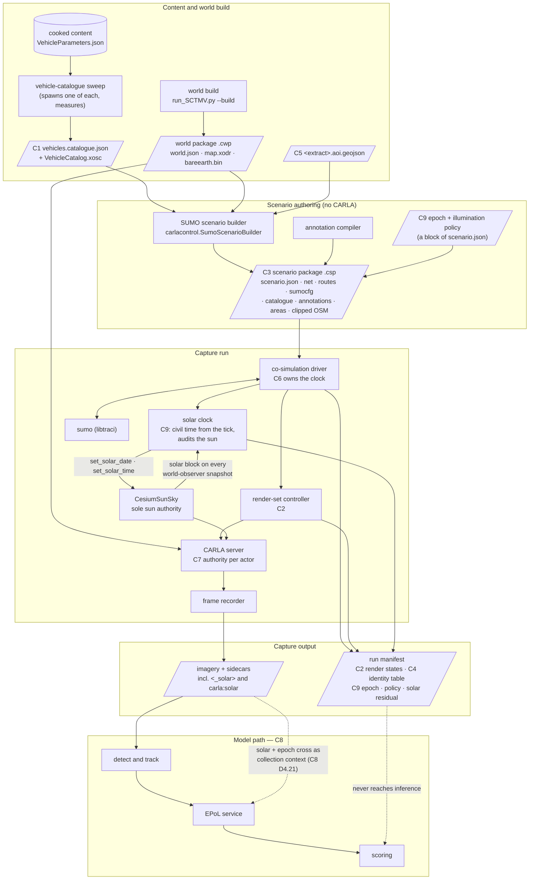
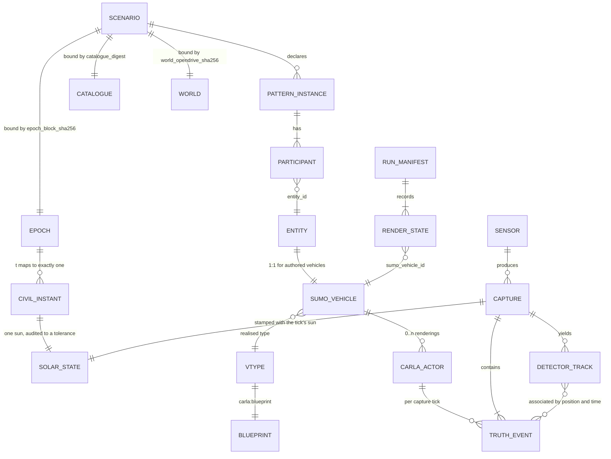
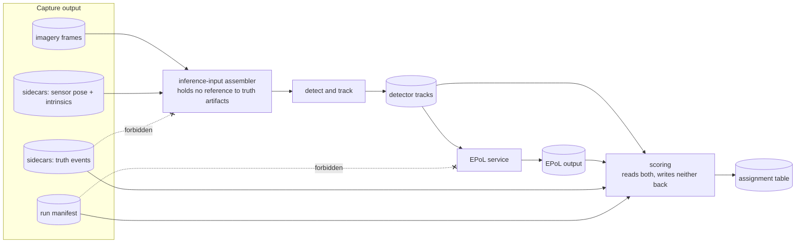
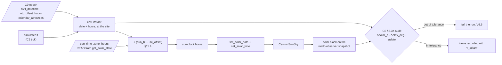

# 04 — Interface contracts

**Status:** Plan section, redrafted. Every claim about existing behaviour is read from the working tree
and cited `path:line`, or **measured** by inspecting an artifact (the measurement is described where it
is used), or explicitly labelled an inference. No code was changed, no build was run.
**Date:** 2026-09-18
**Scope:** Every interface between two components of the SUMO-driven behavioural-capture system: the
artifact's name and location, its format, its complete field table, a worked example, the validation
rules, the failure mode when a rule is violated, and the versioning rule. Nine contracts, `C1`–`C9`.
**Audience:** an engineer implementing one side of one of these interfaces who has not read the
conversation that produced this plan.

**Binds to:** [`_TEAM_BRIEF.md`](_TEAM_BRIEF.md) §3 (decisions not to re-litigate), §3a (the
simulated-time-of-day requirement) and §4 (standing rules).
**Depends on:** [`03_CoSimulation_Runtime.md`](03_CoSimulation_Runtime.md) (owns the tick and
solar-clock *mechanism*; this section states the *guarantee*),
[`06_Truth_And_Annotation.md`](06_Truth_And_Annotation.md) (owns the annotation payload; this section
owns where it is carried and how it is joined),
[`08_Collection_And_EPoL.md`](08_Collection_And_EPoL.md) (owns the EPoL design; this section owns the
boundary shape), [`10_Scale_And_Performance.md`](10_Scale_And_Performance.md) (owns every numeric limit;
this section states which limits must exist, never their values),
[`11_Time_And_Illumination.md`](11_Time_And_Illumination.md) (owns what a civil time *means* here and
why a policy is chosen; this section owns the wire shape and the validation — §11.13 states exactly
what it needs from `11`), [`12_Operator_Control_Surface.md`](12_Operator_Control_Surface.md) (owns how
an operator *expresses* a policy; this section owns how the expressed policy is *carried, bound and
checked*).

**What changed in this redraft.** [`_TEAM_BRIEF.md`](_TEAM_BRIEF.md) §3a added a requirement the first
draft missed: capture windows are placed in **simulated** time and nothing connected them to the sun.
The gap is a contract gap before it is anything else — *a scenario does not declare what civil time its
simulated seconds mean*, so nothing can set a sun from it. This redraft adds **`C9`, the simulated-time
epoch and illumination policy** (§11), binds the epoch into `C3` (§5.3), extends `C6` with a civil-time
guarantee and a solar-residual invariant (§8.3a), gives `C7` ownership of vehicle light state (§9.4),
rules on whether solar state may cross `C8`'s boundary (§10.4a), and adds measured lamp capability to
`C1` (§3.2a). Every contract, field, rule and decision from the first draft that survives is unchanged
and keeps its number.

### What this section does not cover

- **Sizing.** Every cap, radius, window, budget and tolerance below is named and typed; not one is given
  a value. Values belong to [`10_Scale_And_Performance.md`](10_Scale_And_Performance.md).
- **The annotation vocabulary.** `C4` carries `instance_id` and says how it joins; the term list, the
  `PatternInstance` payload and the migration from `.labels.json` are
  [`06_Truth_And_Annotation.md`](06_Truth_And_Annotation.md)'s.
- **How SUMO and CARLA are stepped.** `C6` states what must be true at a tick boundary and what every
  participant is forbidden to do. The loop, the subscription set and the failure recovery are
  [`03_CoSimulation_Runtime.md`](03_CoSimulation_Runtime.md)'s.
- **Whether the .NET client can do these things today.** That audit is
  [`05_CarlaNet_Capability_Audit.md`](05_CarlaNet_Capability_Audit.md)'s. Where a contract needs an
  RPC, a shim method or a C# type that this document could not find, it says so in place.
- **What a civil time means, and why one illumination policy is preferred over another.** `C9` fixes
  the field set, the arithmetic that has to be reproducible, the validation and the failure modes. The
  semantics — what "the site's civil time" is for a scenario, how a window is chosen against the sun,
  whether illumination is a corpus stratifier, and the rationale for a headlight threshold — are
  [`11_Time_And_Illumination.md`](11_Time_And_Illumination.md)'s.
- **The operator's surface over any of it.** Which flags exist, how a run selects or overrides a
  policy, and what an operator sees is
  [`12_Operator_Control_Surface.md`](12_Operator_Control_Surface.md)'s. `C9` says only what the
  resulting choice must look like on the wire and what the manifest must record about it.
- **Pedestrians**, out of scope by [`_TEAM_BRIEF.md`](_TEAM_BRIEF.md) §3.5.

---

## 1. How to read a contract

Each contract below has the same eight parts, so two people implementing the two sides can work from
the same headings.

| Part | What it fixes |
|---|---|
| **Artifact** | The file or message, its name, its location, and who writes it |
| **Format** | The encoding, and the exact grammar where the encoding does not fix it |
| **Fields** | Name, type, unit, required/optional, meaning — every field, no "and so on" |
| **Example** | A complete, valid instance, built from measured values wherever measured values exist |
| **Validation** | The rules a conforming artifact satisfies, each one checkable by a program |
| **Failure** | What the system does when a rule is violated — which side detects it, and when |
| **Versioning** | How the artifact changes over time and how a consumer refuses one it cannot read |
| **What breaks** | The concrete damage if the contract is ignored. This is why it is written down |

**Normative words.** *Must* is a rule a validator enforces and whose violation stops the run. *Should*
is a rule a validator warns on. *May* is permitted and unchecked.

**Units.** Every length is metres, every time is seconds, every angle is degrees. Simulated time is
distinguished from wall-clock time in every field name (`_s` is simulated seconds unless the name says
`wall`). Coordinates are named for their frame: `carla_x`/`carla_y`/`carla_z` (CARLA-local metres),
`sumo_x`/`sumo_y` (the SUMO network's projected metres), `latitude`/`longitude`/`hae_m` (WGS84
ellipsoidal, the project datum).

**Three clocks, three names, never interchangeable.** `C9` exists because the first draft had only one
of them, so they are named here once and used consistently below.

| Clock | Field-name convention | Meaning |
|---|---|---|
| **Simulated** | `_s`, and bare `t` | Seconds since the simulation's own zero. SUMO's `<begin>`, every capture window, every interval. Carries no date and no zone |
| **Civil** | `_civil`, or a full ISO-8601 string with an explicit offset | Wall-clock time at the site, of the form `2026-03-21T23:00:00+03:30`. What a human means by "the night shift". **A civil time without an explicit offset is not a civil time** and is rejected (`C9` V9.2) |
| **Sun-clock** | `solar_time`, `_solar_hours` | The number `CesiumSunSky.SolarTime` holds: hours in the sun's *own* time zone, which is derived from the map longitude and is **not** the civil offset (`C9` §11.4). A conversion sits between civil and sun-clock and it is not the identity |

Wall-clock time appears in exactly two places — `generated_at_utc` on build artifacts, and
`sumo_step_timeout_wall_s` — and nothing rendered, recorded or scored may depend on it.

**Digest.** Wherever this document says *digest*, it means the lowercase hex SHA-256 of the artifact's
bytes, or — for a JSON document that carries its own digest field — of the document serialised with
that field set to the empty string, with sorted keys, two-space indent, UTF-8, no BOM, `\n` line
endings. The existing world package already computes digests this way in spirit
(`CarlaNet.Transport/CarlaClient.cs:1252-1253`); this document makes the canonicalisation explicit
because two implementations that disagree about whitespace disagree about identity.

**A note on stale citations.** [`Findings/20`](../../Findings/20_Behavioral_Annotation_And_Areas_Of_Interest.md)
and [`Findings/23`](../../Findings/23_SUMO_Traffic_Integration.md) cite `CarlaNet/python/SCTMV.py:NNN`
in several places. That file no longer exists; the live path is
`carla/CarlaControl/scripts/run_SCTMV.py` over the `carlacontrol` package. Every such claim used below
was **re-resolved against `carla/CarlaControl/`** and is cited at its current location, with the
re-resolution noted.

---

## 2. The contract map



**The register.** Every artifact, who writes it, who reads it, and which contract governs it.

| Artifact | Written by | Read by | Contract |
|---|---|---|---|
| `vehicles.catalogue.json` | the catalogue sweep, against a running server | scenario builder, assistant author, human author, validator, **and the co-simulation bridge at runtime — the pose conversion needs the measured extent** (`C1` §3.2) | `C1` |
| `VehicleCatalog.xosc` | the same sweep, same run | OpenSCENARIO executor, foreign preview player | `C1` |
| `<name>.rou.xml` `vType` set | scenario builder, from the catalogue | SUMO, playback bridge | `C1` |
| render-set parameters in `scenario.json` | scenario author | render-set controller | `C2` |
| `render_states[]` in the run manifest | render-set controller | truth consumers, scoring, corpus auditor | `C2` |
| `<name>.csp` scenario package | scenario builder | co-simulation driver, validator | `C3` |
| spawn attributes `capture:*` | playback bridge at spawn | truth producer, recorder log, replayer | `C4` |
| `<extract>.aoi.geojson` | the author, beside the OSM | world build, scenario builder, world actor | `C5` |
| `<name>.aoi.resolved.json` | scenario builder | SUMO route writer, truth producer, EPoL service | `C5` |
| clock parameters in `scenario.json` | scenario author | co-simulation driver | `C6` |
| per-actor authority | playback bridge at spawn | every subsystem that touches an actor | `C7` |
| per-actor vehicle light state | playback bridge, every tick | the rendered scene, and nothing else — it is not published as data | `C7` |
| detector input / detector tracks | collection and detect-and-track | EPoL service, scoring | `C8` |
| assignment table | scoring, after inference | corpus auditor | `C8` |
| `epoch` block in `scenario.json` | scenario author | co-simulation driver, solar clock, truth producer, corpus auditor, **and the EPoL context assembler** (`C8` §10.4a) | `C9` |
| `illumination` block in `scenario.json`, and the run override | scenario author; operator at run start | solar clock | `C9` |
| `<_solar>` sidecar element and the `carla:solar` PNG chunk | frame recorder — **already written today** (`CotWriter.cs:52-65`, `SolarMetadata.cs:19`) | truth consumers, corpus auditor, EPoL context assembler | `C9` |
| `epoch`, `illumination_in_force`, `solar_achieved[]`, `solar_residual` in the run manifest | the solar clock, closed at run end | corpus auditor, scoring, stratification | `C9` |

---

## 3. C1 — The vehicle catalogue

The headline contract. A user hands the assistant authoring a SUMO scenario a catalogue of vehicles to
choose from, with real dimensions and colour; the playback bridge maps what the scenario chose back
onto CARLA blueprints.

### 3.1 The defect this replaces, measured

`BlueprintChooser.Choose` takes the whole blueprint catalogue, filters to `vehicle.*`, and returns the
**first** entry whose identifier contains a preferred substring for the entity's category
(`CarlaNet.Scenario/BlueprintChooser.cs:43-63`). One category therefore resolves to exactly one
blueprint, which is why a five-car convoy is five identical cars. The preference table is
`BlueprintChooser.cs:16-25`.

Three measurements make the defect sharper than doc 20 §5.6 records.

**Measurement 1 — the content build offers seventeen vehicles, and its own metadata is wrong.** The
vehicle blueprint set is loaded at runtime from a JSON file
(`Unreal/CarlaUnreal/Plugins/Carla/Source/Carla/Actor/Factory/VehicleActorFactory.cpp:19-26`), read
here at `Unreal/CarlaUnreal/Content/Carla/Config/VehicleParameters.json`. Parsed with `json`:

| Property | Measured |
|---|---|
| Vehicle entries | **17** |
| `BaseType` values | `bus` ×7, `car` ×6, `truck` ×3, empty ×1 |
| `SpecialType` values | **empty on all 17** |
| `NumberOfWheels` | `4` ×16, `3` ×1 (`vehicle.Lincoln.Mkz`) |
| Entries with at least one `RecommendedColors` entry | **17 of 17** |
| Motorcycle or bicycle blueprints | **none** |

Seven blueprints that are plainly cars are declared `bus` — `ue4.ford.mustang`, `ue4.ford.crown`,
`ue4.bmw.grantourer`, `ue4.audi.tt`, `ue4.mercedes.ccc`, `ue4.chevrolet.impala` — and `fuso.mitsubishi`,
which is a lorry, is also `bus`. `sprinter.mercedes` has no `BaseType` at all, so the truth producer's
fallback reports it as `car` (`CarlaNet.Recording/VehicleTelemetryService.cs:100-102`). Every
`special_type` is empty, so [doc 09 §4](../../Findings/09_Telemetry_CoT_Contract.md)'s
`special_type=emergency` mapping has nothing to fire on even for the ambulance, the police Charger and
the fire truck.

**Measurement 2 — half the preference table matches nothing.** Definition ids are lowercased
(`Unreal/CarlaUnreal/Plugins/Carla/Source/Carla/Actor/ActorBlueprintFunctionLibrary.cpp:203-206`), so
`vehicle.UE4.audi.tt` becomes `vehicle.ue4.audi.tt`. Against the measured 17, the `motorbike` and
`bicycle` preference lists (`harley`, `yamaha`, `kawasaki`, `crossbike`, `omafiets`, `diamondback`)
match nothing, so those categories fall through to `vehicles[0]` — a car
(`BlueprintChooser.cs:62`). `mercedes` matches both `vehicle.sprinter.mercedes` and
`vehicle.ue4.mercedes.ccc`, resolved by enumeration order rather than by intent. Note also that doc 09
and doc 20 use `vehicle.audi.tt` and `vehicle.audi.a2` as examples; **neither id exists** in this
content build.

**Measurement 3 — the SUMO side already declares vehicles that CARLA cannot render.** The shipped
ambient type set (`CarlaControl/src/carlacontrol/SumoScenarioBuilder.py:278-296`) declares a
`motorcycle` vType with `vClass="motorcycle"`. Measurement 1 says no motorcycle blueprint exists. Under
today's chooser that vehicle would render as a car with no error anywhere.

### 3.2 Where a blueprint's dimensions come from — measured, not assumed

The brief asks whether dimensions are available *before* spawning. They are not. Four readings, in the
order the data would have to travel:

1. **The parameter struct carries no dimension.** `FVehicleParameters`
   (`Unreal/CarlaUnreal/Plugins/Carla/Source/Carla/Actor/VehicleParameters.h`) has `Make`, `Model`,
   `Class`, `NumberOfWheels`, `Generation`, `ObjectType`, `BaseType`, `SpecialType`,
   `HasDynamicDoors`, `HasLights`, `RecommendedColors`, `SupportedDrivers` — and nothing else.
2. **The definition builder emits no dimension.** `MakeVehicleDefinition`
   (`ActorBlueprintFunctionLibrary.cpp:839-930`) emits the variations `role_name`, `ros_name`, `color`
   (only when `RecommendedColors` is non-empty, `:850-861`), `driver_id`, `sticky_control`,
   `terramechanics`, and the attributes `object_type`, `base_type`, `special_type`,
   `number_of_wheels`, `generation`, `has_dynamic_doors`, `has_lights`. No length, no width, no height,
   no bounding box.
3. **The RPC type has no slot for one.** `carla::rpc::ActorDefinition` is
   `MSGPACK_DEFINE_ARRAY(uid, id, tags, attributes)`
   (`LibCarla/source/carla/rpc/ActorDefinition.h:49`), mirrored in C# as
   `ActorDefinition(Uid, Id, Tags, Attributes)`
   (`CarlaNet/src/CarlaNet.Types/Rpc/Actors/ActorDefinition.cs`). `GetActorDefinitionsAsync`
   (`CarlaNet.Transport/CarlaClient.cs:467`) calls `get_actor_definitions`
   (`Unreal/.../Carla/Server/CarlaServer.cpp:1177`) and returns exactly that.
4. **The bounding box first exists on a spawned actor.** `carla::rpc::Actor` carries
   `bounding_box` as key 3 (`CarlaNet.Types/Rpc/Actors/Actor.cs`), filled from `FActorInfo::BoundingBox`
   (`Unreal/.../Carla/Actor/ActorInfo.h:25`), which is computed at registration by
   `UBoundingBoxCalculator::GetActorBoundingBox(&Actor)` over the **already-spawned `AActor`**
   (`Unreal/.../Carla/Actor/ActorRegistry.cpp:163,173`). The only bounding-box RPCs on the server are
   `get_all_level_BBs` (`CarlaServer.cpp:1194`), which returns static level geometry by semantic tag,
   and `get_light_boxes`. There is no RPC keyed by blueprint id.

The truth record's `length_m`/`width_m`/`height_m` are consequently `2 × bounding_box.extent` of the
spawned actor (`CarlaNet.Recording/VehicleTelemetryService.cs:103,110`), which is why the storyboards
in `carla/Import/` — all three of which declare `<Dimensions width="1.9" length="4.6" height="1.45"/>`
for every car (`Import/Gardnerville_CentervilleEast.xosc:18`) — disagree with truth and nothing
notices.

> **D4.1 — the catalogue is generated by a build-time spawn-and-measure sweep against a running
> server. It is not, and cannot be, a projection of the blueprint library.** There is no cheaper source
> of dimensions, because the server does not hold one.

This is also why upstream ships a static `vtypes.json` rather than deriving one
([doc 23 §6.8](../../Findings/23_SUMO_Traffic_Integration.md)): upstream measured its blueprint set once
and froze the result. Our blueprint set differs — 17 entries, none of them upstream's default Audi set
— so ours is new work rather than a file to copy, and freezing it is exactly what §3.11's digests exist
to make safe.

**Measurement 4 — the sweep's output already exists in this tree, incidentally.** Fifty-four recorded
truth sidecars in `carla/Build/SCTMV_recordings/*.xml` were parsed for distinct
`<_carla type_id="vehicle.*">` elements. They cover **all 17** blueprints and carry exactly the
measurement a sweep would produce:

| blueprint | length_m | width_m | height_m | `base_type` reported | recommended colours |
|---|---|---|---|---|---|
| `vehicle.ambulance.ford` | 6.36 | 2.35 | 2.43 | truck | 1 |
| `vehicle.carlacola.actors` | 8.00 | 2.91 | 4.05 | truck | 1 |
| `vehicle.dodge.charger` | 5.01 | 1.88 | 1.54 | car | 7 |
| `vehicle.dodgecop.charger` | 5.24 | 1.92 | 1.64 | car | 1 |
| `vehicle.firetruck.actors` | 8.58 | 2.90 | 3.83 | truck | 1 |
| `vehicle.fuso.mitsubishi` | 10.17 | 3.93 | 4.24 | **bus** (wrong) | 6 |
| `vehicle.lincoln.mkz` | 4.89 | 1.84 | 1.52 | car | 1 |
| `vehicle.mini.cooper` | 4.55 | 2.10 | 1.77 | car | 4 |
| `vehicle.nissan.patrol` | 5.59 | 2.15 | 2.06 | car | 6 |
| `vehicle.sprinter.mercedes` | 5.92 | 1.99 | 2.73 | car (by fallback) | 5 |
| `vehicle.taxi.ford` | 5.35 | 1.79 | 1.58 | car | 1 |
| `vehicle.ue4.audi.tt` | 4.18 | 1.99 | 1.39 | **bus** (wrong) | 5 |
| `vehicle.ue4.bmw.grantourer` | 4.61 | 2.24 | 1.67 | **bus** (wrong) | 5 |
| `vehicle.ue4.chevrolet.impala` | 5.36 | 2.03 | 1.41 | **bus** (wrong) | 5 |
| `vehicle.ue4.ford.crown` | 5.37 | 1.80 | 1.57 | **bus** (wrong) | 5 |
| `vehicle.ue4.ford.mustang` | 4.72 | 1.89 | 1.30 | **bus** (wrong) | 5 |
| `vehicle.ue4.mercedes.ccc` | 4.67 | 1.81 | 1.44 | **bus** (wrong) | 5 |

Every number in the worked examples below is one of these, so the example is a real catalogue entry
rather than an invented one. Two consequences for the sweep's specification fall straight out: it must
**record the measured dimensions and disregard `base_type`**, because `base_type` is demonstrably
unreliable in this content build; and it must carry a **curated** class assignment in the catalogue, so
the wrong `bus` values never reach SUMO's `vClass`.

#### The sweep tool, specified

- **Name and location:** `carla/CarlaControl/scripts/make_vehicle_catalogue.py`, a thin CLI over
  `carla/CarlaControl/src/carlacontrol/VehicleCatalogueBuilder.py` (repo convention: one public class
  per file, file named for the class — `carla/AGENTS.md`). Windows/Linux parity applies to any
  `Scripts/*` wrapper, not to this CLI, which is platform-neutral Python.
- **When it runs:** once per content build, as a build step, against a headless server with any map
  loaded. It needs no world package, no Cesium imagery and no OSM — only a server.
- **What it spawns:** every definition returned by `get_actor_definitions`
  (`CarlaNet.Transport/CarlaClient.cs:467`) whose `id` starts with `vehicle.`, **one at a time**, never
  concurrently. One at a time matters: concurrent spawns can collide and return
  `EActorSpawnResultStatus::Collision` (`Unreal/.../Carla/Actor/Factory/VehicleActorFactory.cpp:43-47`),
  which the sweep would then have to distinguish from a genuinely unspawnable blueprint.
- **Where it spawns:** at a single fixed transform well clear of geometry and of any other actor — by
  default `z = 300 m` above the map's first recommended spawn point, with gravity and physics
  irrelevant because the actor is destroyed before it can fall anywhere. The bounding box is
  **actor-local** (`FActorInfo::BoundingBox`, `Unreal/.../Carla/Actor/ActorInfo.h:25`, computed by
  `UBoundingBoxCalculator::GetActorBoundingBox` at `ActorRegistry.cpp:163`), so the pose does not
  affect the measurement; height is chosen only to guarantee a clear spawn.
- **How it measures:** read the `rpc::Actor` returned by the spawn — it carries `bounding_box` as key 3
  (`CarlaNet.Types/Rpc/Actors/Actor.cs`) — and record `2 × extent.x`, `2 × extent.y`, `2 × extent.z` as
  `length_m`, `width_m`, `height_m`, and `bounding_box.location` as `bbox_centre_m`. This is exactly
  what the truth producer does (`CarlaNet.Recording/VehicleTelemetryService.cs:103,110`), so the
  catalogue and the truth record agree by construction rather than by coincidence. It also records
  every declared variation with its type, `restrict_to_recommended` flag and recommended values, from
  the definition rather than from the actor.
- **How it tears down:** destroy the actor, and **confirm the destroy**, before the next spawn. A
  sweep that leaks actors turns its own later spawns into collisions and its measurements into
  failures. At the end it asserts the world's vehicle actor count is what it was at the start, and
  refuses to emit a catalogue if it is not — a leaked actor means some measurement may have been taken
  against a colliding spawn.
- **Colour applicability:** the sweep spawns each blueprint a second time with a distinctive `color`
  and scans the server log for the known `MaterialNotFound` warning attributable to that spawn. That
  warning is `BaseVehiclePawn.ApplyColor` failing to find the `Bodywork_Mat` slot; it is cosmetic and
  benign in itself, but it is exactly the signal that a requested colour did **not** reach the body.
  The sweep records `colour_applied` as `true`, `false`, or `unknown` when the log was unavailable.
  It must never record `true` by assumption.
- **Lamp applicability:** a third pass, specified in §3.2a, which measures *optically* which lamps a
  blueprint actually lights. It is a separate pass because it is the only measurement in the sweep that
  needs a camera and a night sun, and because a sweep that cannot get one must still emit a catalogue
  (with every lamp recorded `unknown`) rather than emit a guess.
- **What it emits:** `vehicles.catalogue.json` and `VehicleCatalog.xosc` (§3.3), plus a one-page
  human-readable report listing every blueprint, its measured dimensions, and every discrepancy
  between the measurement and the blueprint's own declared metadata — which, on the measured content
  build, is seven wrong `base_type` values, one empty one, seventeen empty `special_type` values and
  one wrong wheel count. The report is what makes Measurement 1's defect visible to the person who can
  fix it in the content.
- **What it must not do:** infer a dimension, fall back to a default, or skip a blueprint that failed
  to spawn. A blueprint that will not spawn is written with `"measurement": "failed"` and a reason, and
  the catalogue is still emitted — a partial catalogue that says which entries are missing is more
  useful than no catalogue, and `C3` validation refuses a scenario that references a failed entry.
- **Dependency on [`05_CarlaNet_Capability_Audit.md`](05_CarlaNet_Capability_Audit.md):** the sweep
  needs the Python shim to expose a spawned actor's bounding box. That the RPC carries it is measured
  above; that the shim surfaces it is not verified here. If it does not, the sweep is a C# tool over
  `CarlaClient` instead, which changes its language and nothing else in this contract.

### 3.2a Lamp capability — measured, because `has_lights` says nothing

**Added in this redraft.** A night capture that assumes every blueprint has the same lamps will be
wrong, and — as with colour — it will be wrong *invisibly*, because the client is told the command
succeeded.

**Measurement 5 — `HasLights` is `true` on all 17 blueprints.** Parsed from
`Unreal/CarlaUnreal/Content/Carla/Config/VehicleParameters.json` with `json`, the same file Measurement 1
used: `HasLights` is `true` for every one of the seventeen entries, with no per-lamp breakdown anywhere
in the file. It is emitted as the `has_lights` attribute by `MakeVehicleDefinition`
(`ActorBlueprintFunctionLibrary.cpp:839-930`), so it reaches a client with no spawn — and it carries
exactly as much information as `SpecialType`, which Measurement 1 found empty on all 17. A blanket
value is not a measurement.

**Three readings that show why a set-and-read-back probe cannot substitute for an optical one.**

1. **The read-back returns the command, not the vehicle.** `ACarlaWheeledVehicle::GetVehicleLightState`
   is `return InputControl.LightState;`
   (`Unreal/CarlaUnreal/Plugins/Carla/Source/Carla/Vehicle/CarlaWheeledVehicle.cpp:486-489`), and
   `SetVehicleLightState` stores the incoming bitmask into that same field whenever any bit differs
   (`:684-701`). So `get_light_state` after `set_light_state` returns what was asked for, whatever the
   vehicle did with it.
2. **Whether a lamp illuminates is implemented per blueprint, in Blueprint.** The only thing the C++
   does with the stored value is raise `RefreshLightState`, which is a
   `UFUNCTION(BlueprintImplementableEvent)`
   (`Unreal/CarlaUnreal/Plugins/Carla/Source/Carla/Vehicle/CarlaWheeledVehicle.h:310-311`, raised at
   `CarlaWheeledVehicle.cpp:699`). A blueprint whose graph handles four of the eleven bits is
   indistinguishable, over the RPC, from one that handles all eleven.
3. **This is the same shape as the measured colour trap.** §3.2's `colour_applied` exists because
   `ApplyColor` can fail to find the `Bodywork_Mat` slot and report nothing to the caller. Lamps are
   that failure with no log line at all.

> **D4.23 — lamp capability is measured optically, per blueprint, per lamp, and carried in the
> catalogue. `has_lights` is recorded verbatim and never used to decide anything** — it is `true` on
> all 17 and therefore discriminates nothing.

**The lamp pass, specified.** Run as part of the catalogue sweep, after the dimension pass:

- Set the sun to a night instant and disable advancement, so the only light in frame is the vehicle's:
  `set_solar_date` then `set_solar_time` at a declared sun-clock hour, and `set_time_advance(false)`
  (`carlanet/__init__.py:1506`, `:1500`, `:1535`). The hour and date used are recorded in the catalogue
  header as `lamp_probe_solar_time` / `lamp_probe_solar_date`, because a measurement whose lighting is
  not recorded is not repeatable. This is the one place `C1` depends on `C9`'s mechanism, and it is a
  build-time dependency only.
- Spawn one blueprint at the sweep's fixed transform, place one camera at a declared relative pose,
  capture a reference frame with `VehicleLightState.NONE`, then one frame per lamp bit with exactly that
  bit set, restoring `NONE` between bits.
- A lamp is `lit` when the frame for that bit differs from the reference above a declared luminance
  threshold in a declared region; `unlit` when it does not; `unknown` when the pass could not run — no
  camera, no sun in the world, or a capture that failed. The threshold, the region and the camera pose
  are catalogue-header fields, not constants in code, for the same reason the solar instant is.
- The pass must never write `lit` by assumption, and must never infer one lamp from another. Front and
  rear are separate bits and separate meshes.

**What is *not* measured, and must not be.** Whether a lamp is bright enough to be *detectable* at a
given range by a given sensor is a collection question, not a content property; it belongs to
[`08_Collection_And_EPoL.md`](08_Collection_And_EPoL.md) and to whatever occlusion and detectability
work follows [doc 17](../../Findings/17_Photoreal_Occlusion_Metric.md). `C1` records only that the lamp
changes the rendered image at all.

**The confounder this opens, and the rule that closes it.** If the blueprints that light up are not
distributed alike across marked and unmarked vehicles, lamp capability becomes a night-time appearance
separator in exactly the way `vType@color` was a daytime one (§3.7.1). The distribution is a property
of the class members, so the check is the same shape as V1.11 and is written as V1.19.

#### The catalogue is a runtime dependency of the bridge, not only an authoring aid

This is the consequence that makes `C1` load-bearing at playback and not merely at build.

SUMO's reference point is the **front bumper centre**; CARLA's actor transform is the body's origin,
and the body's geometric centre is offset from that origin by the bounding box's own centre. So the
pose conversion of [doc 23 §6.7](../../Findings/23_SUMO_Traffic_Integration.md) — the third of the
three conventions, and the one upstream's `BridgeHelper` needs the vehicle extent for — **cannot be
computed without the catalogue.** SUMO knows a declared `length`; only the catalogue knows the rendered
body's extent and where its centre sits relative to the actor origin.

Written out, so two implementations agree. Given SUMO position `(sx, sy)` (front bumper centre, in the
network's projected metres), SUMO angle `a` (degrees clockwise from north), catalogue `length_m = L`
and `bbox_centre_m = (cx, cy, cz)`:

```
ψ   = a − 90                                  # CARLA yaw, degrees
ux  =  cos ψ ,  uy = sin ψ                    # heading unit vector, CARLA frame
bx  =  sx − (L / 2) · ux                      # body centre, CARLA frame
by  = −sy − (L / 2) · uy                      # note the Y negation: carla_y = −sumo_y
                                              # actor origin = body centre minus the local
                                              # bbox centre rotated into the world frame
ax  = bx − (cx · cos ψ − cy · sin ψ)
ay  = by − (cx · sin ψ + cy · cos ψ)
az  = drape_ground_z(ax, ay) + seat_offset    # C7 — never SUMO's z, which is zero everywhere
```

For every blueprint measured here `cy` is expected to be ~0, so the shift collapses to
`−(L / 2 + cx) · (ux, uy)`; the general form is written down because a blueprint whose mesh is not
centred on its origin would otherwise be silently mis-seated laterally.

> **D4.17 — the co-simulation bridge loads the catalogue at run start and uses it for the pose
> conversion, not only for blueprint selection. A vehicle whose extent is unknown is not rendered.**

**What the bridge does when an extent is unknown.** Three cases, one response:

| Case | Response |
|---|---|
| The realised vType carries no `carla:blueprint` param | Not rendered. `render_state = simulated_only`, `reason = "no_blueprint"` |
| It names a catalogue entry whose `measurement` is `failed` | Not rendered. `reason = "unknown_extent"` |
| It names an entry that is not in the catalogue at all | Not rendered. `reason = "unknown_extent"` |

In every case the bridge emits **one** warning per distinct vType, never per vehicle, and the run
continues with the vehicle present in behavioural truth and absent from the imagery — which is exactly
what `C2` §4.5's accounting exists to record.

**It must not fall back to SUMO's declared `length`.** That is the substitution this whole contract
exists to prevent: it would place a body of unknown size at a pose computed from a length nobody
measured, and the error is invisible in every artifact, because both sides remain internally
consistent. All three cases are unreachable in a package that passed `C1` V1.5, V1.8 and V1.9 at build
time; the runtime behaviour exists so that a validator bug degrades into a recorded absence rather than
into a silently wrong corpus.

### 3.3 Artifact and format

> **D4.2 — the canonical catalogue is JSON; the OpenSCENARIO `<VehicleCatalog>` is a generated,
> non-authoritative projection emitted by the same sweep run.**

Doc 20 §5.6 argues for the OpenSCENARIO catalogue format so one artifact serves both authoring
surfaces. That argument is right about the *goal* and wrong about the *mechanism*, for a reason that
only appears once the SUMO side is in scope:

- `<Vehicle>` can carry `<BoundingBox><Dimensions>`, `<Performance>` and `<Axles>` natively. It cannot
  carry `vClass`, `guiShape`, `sigma`, `speedDev`, class membership, or the colour palette without
  `<Properties><Property>` vendor keys. Once half the payload is vendor keys, the standard's advantage
  is reduced to one thing: a conformant foreign player can resolve a `CatalogReference`.
- That one thing is still worth having ([doc 20 §5.5](../../Findings/20_Behavioral_Annotation_And_Areas_Of_Interest.md)
  wants the storyboard previewable as authored), and it costs nothing, because both files are emitted
  from **one** measurement run and both carry the same `catalogue_digest`. There is no hand-editing
  step in which they could drift.
- The SUMO scenario builder, the playback bridge and an assistant author all read JSON at lower cost
  than they read OpenSCENARIO XML with vendor properties.

So: one measurement, two serialisations, the JSON authoritative. A consumer finding the two in
disagreement treats it as a build error, not as a choice.

**Location.** The catalogue is a property of a content build, so it ships with the distribution:

```
<distribution root>/catalogue/vehicles.catalogue.json
<distribution root>/catalogue/VehicleCatalog.xosc
```

and a copy is **embedded** in every scenario package (`C3`), so a scenario is never separated from the
catalogue it was authored against.

**Encoding.** UTF-8, no BOM, `\n` line endings, two-space indent, object keys sorted, for the digest
rule of §1 to be well defined.

### 3.4 Fields

#### 3.4.1 Document header

| Field | Type | Unit | Req. | Meaning |
|---|---|---|---|---|
| `catalogue_version` | integer | — | yes | Schema shape of this document. `1` for the shape below |
| `catalogue_id` | string | — | yes | Human-readable name, e.g. `carla-0.10.0-win64-development` |
| `catalogue_digest` | string | — | yes | Digest of this document per §1. Empty while computing |
| `content_build_id` | string | — | yes | Identifies the cooked content measured. The distribution's own version string |
| `blueprint_set_digest` | string | — | yes | Digest over the sorted list of `"<id>\|<attr_id>=<attr_value>"` for every blueprint and every declared attribute returned by `get_actor_definitions`. The **only** part of the catalogue a running server can independently reproduce |
| `generated_at_utc` | string | — | yes | ISO-8601 UTC, millisecond precision |
| `generator` | string | — | yes | `carlacontrol.VehicleCatalogueBuilder` and its version |
| `server_version` | string | — | yes | The server the sweep measured against |
| `lamp_probe` | object | — | yes | The lamp pass's own conditions, so the measurement is repeatable: `{ ran, solar_date, solar_time_hours, camera_pose, luminance_threshold, region }`. `ran: false` with a reason when the pass could not run, in which case every `lamp_capability` value is `unknown` (§3.2a) |
| `vehicles` | array | — | yes | §3.4.2 |
| `classes` | array | — | yes | §3.4.3 |

#### 3.4.2 `vehicles[]` — one entry per blueprint, all measured

| Field | Type | Unit | Req. | Meaning |
|---|---|---|---|---|
| `blueprint_id` | string | — | yes | The definition id exactly as the server returns it, lowercase (`ActorBlueprintFunctionLibrary.cpp:205`) |
| `uid` | integer | — | yes | The definition's `uid`, carried so a spawn description can be built without a second lookup |
| `tags` | string | — | yes | The definition's `tags`, verbatim |
| `measurement` | string | — | yes | `measured` or `failed` |
| `measurement_note` | string | — | no | Present only when `measurement == "failed"` |
| `length_m` | number | m | yes if measured | `2 × bounding_box.extent.x` |
| `width_m` | number | m | yes if measured | `2 × bounding_box.extent.y` |
| `height_m` | number | m | yes if measured | `2 × bounding_box.extent.z` |
| `bbox_centre_m` | `[x,y,z]` | m | yes if measured | `bounding_box.location`, actor-local. Needed for the bumper-shift of `C7` and for any projected box |
| `declared_base_type` | string | — | yes | The blueprint's own `base_type` attribute, **verbatim and untrusted** — measured wrong for 7 of 17 |
| `declared_special_type` | string | — | yes | The blueprint's own `special_type` attribute, verbatim. Measured empty for all 17 |
| `number_of_wheels` | integer | — | yes | Verbatim. Measured `3` for `vehicle.lincoln.mkz`, which is wrong; carried as data, never used to classify |
| `generation` | integer | — | yes | Verbatim |
| `settable_attributes` | array of object | — | yes | `{ id, type, restrict_to_recommended, recommended_values[] }` for every *variation* the definition declares |
| `colour_settable` | boolean | — | yes | True when a `color` variation is declared. Measured true for all 17 |
| `colour_palette` | array of string | — | yes | The `color` variation's recommended values, each `"R,G,B"` with integer components 0–255 |
| `colour_applied` | string | — | yes | `true` \| `false` \| `unknown` — whether a set colour reaches the body (§3.2) |
| `declared_has_lights` | boolean | — | yes | The blueprint's own `has_lights` attribute, **verbatim and untrusted** — measured `true` on all 17 (§3.2a Measurement 5). Carried as data, never used to decide |
| `lamp_capability` | object | — | yes | One entry per `VehicleLightState` bit, each `lit` \| `unlit` \| `unknown`. The eleven keys are the bit names in snake case — `position`, `low_beam`, `high_beam`, `brake`, `right_blinker`, `left_blinker`, `reverse`, `fog`, `interior`, `special_1`, `special_2`, mapping one-to-one onto `Position`…`Special2` (`carlanet/__init__.py:2666-2676`; `NONE` and `All` are not bits). No key may be absent; `unknown` is the value for "not measured" |

#### 3.4.3 `classes[]` — the authoring unit

A class is what a scenario author asks for. It becomes a SUMO `<vTypeDistribution>`; its members
become SUMO `<vType>`s.

| Field | Type | Unit | Req. | Meaning |
|---|---|---|---|---|
| `class_id` | string | — | yes | The name an author writes. Matches `[a-z][a-z0-9_]{0,31}`. Becomes the `vTypeDistribution` id |
| `description` | string | — | yes | One human sentence. This is what an assistant author reads to choose |
| `sumo_vclass` | string | — | yes | A SUMO vehicle class, e.g. `passenger`, `truck`, `bus`, `delivery`, `taxi`, `authority`, `army`. **Curated, never taken from `declared_base_type`** |
| `cot_base_type` | string | — | yes | The truth record's `base_type` for members of this class — `car`, `truck`, `van`, `bus`, `motorcycle`, `bicycle`. Curated, and it **overrides** the blueprint's wrong `base_type` in truth |
| `cot_special_type` | string | — | no | The truth record's `special_type`, e.g. `emergency`, `taxi`. Curated, because the content build declares none |
| `members` | array of object | — | yes | `{ blueprint_id, weight }`; `weight` is a positive number, normalised across the class |
| `max_speed_mps` | number | m/s | yes | SUMO `maxSpeed` |
| `accel_mps2` | number | m/s² | yes | SUMO `accel`. Explicit, never defaulted (§3.6) |
| `decel_mps2` | number | m/s² | yes | SUMO `decel`. Explicit |
| `sigma` | number | — | yes | SUMO driver imperfection, 0–1. Explicit |
| `speed_factor_mean` | number | — | yes | SUMO `speedFactor` mean |
| `speed_factor_dev` | number | — | yes | SUMO `speedDev`. **Explicit and mandatory** (§3.6) |
| `min_gap_m` | number | m | yes | SUMO `minGap`. Explicit |
| `gui_shape` | string | — | yes | SUMO `guiShape`, for `sumo-gui` only |
| `gui_colour` | string | — | yes | `#RRGGBB`. **For `sumo-gui` only. Never rendered** (§3.7) |
| `render_colour_policy` | string | — | yes | `palette` (draw from the member blueprint's `colour_palette`) or `fixed` (§3.7) |
| `render_colour` | string | — | only if `fixed` | `"R,G,B"` integers 0–255 |
| `lamps_expected` | array of string | — | no | Lamp names this class is expected to show **in addition to** the ones `C7` §9.4 commands for every vehicle — a beacon on an emergency class, for example. Checked against `lamp_capability` by V1.18. Absent means "the common set only" |

### 3.5 Worked example

Catalogue fragment, with measured dimensions and measured palettes:

```json
{
  "catalogue_version": 1,
  "catalogue_id": "carla-0.10.0-win64-development",
  "catalogue_digest": "8f2c…",
  "content_build_id": "Carla-0.10.0-Win64-Development",
  "blueprint_set_digest": "41ad…",
  "generated_at_utc": "2026-09-17T09:14:22.108Z",
  "generator": "carlacontrol.VehicleCatalogueBuilder/1.0.0",
  "server_version": "0.10.0",
  "vehicles": [
    {
      "blueprint_id": "vehicle.mini.cooper",
      "uid": 26,
      "tags": "vehicle,mini,cooper",
      "measurement": "measured",
      "length_m": 4.55, "width_m": 2.10, "height_m": 1.77,
      "bbox_centre_m": [0.02, 0.00, 0.72],
      "declared_base_type": "car",
      "declared_special_type": "",
      "number_of_wheels": 4,
      "generation": 3,
      "settable_attributes": [
        { "id": "color", "type": "RGBColor", "restrict_to_recommended": false,
          "recommended_values": ["0,0,0", "104,4,8", "27,54,118", "26,62,29"] },
        { "id": "role_name", "type": "String", "restrict_to_recommended": false,
          "recommended_values": ["autopilot", "scenario", "ego_vehicle"] }
      ],
      "colour_settable": true,
      "colour_palette": ["0,0,0", "104,4,8", "27,54,118", "26,62,29"],
      "colour_applied": "false",
      "declared_has_lights": true,
      "lamp_capability": {
        "position": "lit", "low_beam": "lit", "high_beam": "lit", "brake": "lit",
        "right_blinker": "lit", "left_blinker": "lit", "reverse": "unlit", "fog": "unlit",
        "interior": "unlit", "special_1": "unlit", "special_2": "unlit"
      }
    },
    {
      "blueprint_id": "vehicle.carlacola.actors",
      "uid": 31,
      "tags": "vehicle,carlacola,actors",
      "measurement": "measured",
      "length_m": 8.00, "width_m": 2.91, "height_m": 4.05,
      "bbox_centre_m": [0.10, 0.00, 1.86],
      "declared_base_type": "truck",
      "declared_special_type": "",
      "number_of_wheels": 4,
      "generation": 3,
      "settable_attributes": [
        { "id": "color", "type": "RGBColor", "restrict_to_recommended": false,
          "recommended_values": ["149,0,14"] }
      ],
      "colour_settable": true,
      "colour_palette": ["149,0,14"],
      "colour_applied": "unknown",
      "declared_has_lights": true,
      "lamp_capability": {
        "position": "unknown", "low_beam": "unknown", "high_beam": "unknown", "brake": "unknown",
        "right_blinker": "unknown", "left_blinker": "unknown", "reverse": "unknown",
        "fog": "unknown", "interior": "unknown", "special_1": "unknown", "special_2": "unknown"
      }
    }
  ],
  "classes": [
    {
      "class_id": "civ_car",
      "description": "Ordinary civilian passenger cars. The default for background traffic.",
      "sumo_vclass": "passenger",
      "cot_base_type": "car",
      "members": [
        { "blueprint_id": "vehicle.mini.cooper",          "weight": 1.0 },
        { "blueprint_id": "vehicle.dodge.charger",        "weight": 1.0 },
        { "blueprint_id": "vehicle.lincoln.mkz",          "weight": 1.0 },
        { "blueprint_id": "vehicle.nissan.patrol",        "weight": 0.8 },
        { "blueprint_id": "vehicle.ue4.audi.tt",          "weight": 0.6 },
        { "blueprint_id": "vehicle.ue4.bmw.grantourer",   "weight": 0.8 },
        { "blueprint_id": "vehicle.ue4.chevrolet.impala", "weight": 0.8 },
        { "blueprint_id": "vehicle.ue4.ford.crown",       "weight": 0.8 },
        { "blueprint_id": "vehicle.ue4.ford.mustang",     "weight": 0.6 },
        { "blueprint_id": "vehicle.ue4.mercedes.ccc",     "weight": 0.6 }
      ],
      "max_speed_mps": 35.0,
      "accel_mps2": 2.6, "decel_mps2": 4.5, "sigma": 0.5,
      "speed_factor_mean": 1.00, "speed_factor_dev": 0.10,
      "min_gap_m": 2.5,
      "gui_shape": "passenger",
      "gui_colour": "#CCCCD1",
      "render_colour_policy": "palette"
    }
  ]
}
```

**Provenance of the numbers above.** `length_m`, `width_m`, `height_m`, `colour_palette` and the
`recommended_values` are **measured** (§3.2, Measurement 1 and Measurement 4). `bbox_centre_m` is
**illustrative**: the recorded sidecars carry dimensions but not the box centre
(`CarlaNet.Recording/CotWriter.cs` writes `length_m`/`width_m`/`height_m` and no centre), so no
measurement of it exists in this tree. The sweep is the first thing that will produce real values, and
§3.2's pose formula is why they matter. `declared_has_lights` is **measured** (§3.2a, Measurement 5:
`true` on all 17). `lamp_capability` is **illustrative** — no optical measurement of any lamp exists in
this tree, and the two entries deliberately show both shapes: a probed blueprint with per-lamp verdicts,
and an unprobed one carrying `unknown` for every bit. A real catalogue whose `lamp_probe.ran` is `true`
carries verdicts for every entry the pass reached and `unknown` only for the ones it did not.

The `.rou.xml` the scenario builder emits from that class — **generated, never hand-written**:

```xml
<!-- Generated from vehicles.catalogue.json; edit the catalogue, not this. -->
<vType id="vehicle.mini.cooper" vClass="passenger"
       length="4.55" width="2.10" height="1.77" minGap="2.5"
       maxSpeed="35.0" accel="2.6" decel="4.5" sigma="0.5"
       speedFactor="1.00" speedDev="0.10"
       guiShape="passenger" color="#CCCCD1">
  <param key="carla:blueprint"        value="vehicle.mini.cooper"/>
  <param key="carla:class_id"         value="civ_car"/>
  <param key="carla:catalogue_digest" value="8f2c…"/>
</vType>

<vType id="vehicle.dodge.charger" vClass="passenger"
       length="5.01" width="1.88" height="1.54" minGap="2.5"
       maxSpeed="35.0" accel="2.6" decel="4.5" sigma="0.5"
       speedFactor="1.00" speedDev="0.10"
       guiShape="passenger" color="#CCCCD1">
  <param key="carla:blueprint"        value="vehicle.dodge.charger"/>
  <param key="carla:class_id"         value="civ_car"/>
  <param key="carla:catalogue_digest" value="8f2c…"/>
</vType>

<vTypeDistribution id="civ_car"
                   vTypes="vehicle.mini.cooper vehicle.dodge.charger …"
                   probabilities="1.0 1.0 …"/>

<flow id="corridor_east_morning" type="civ_car" begin="0" end="21600"
      vehsPerHour="220" from="26417705#0" to="26401454#6"
      departLane="free" departSpeed="max"/>
```

**`<param>` children of `<vType>` are schema-valid.** Measured in the vendored SUMO schema:
`Build/sumo-src/data/xsd/types/route.xsd`, `vTypeType` opens with
`<xsd:element name="param" type="paramType" minOccurs="0" maxOccurs="unbounded"/>`, and
`SUMORouteHandler::myStartElement` handles `SUMO_TAG_PARAM`
(`Build/sumo-src/src/utils/vehicle/SUMORouteHandler.cpp:200-201`).

The OpenSCENARIO projection of the same entry:

```xml
<Vehicle name="vehicle.mini.cooper" vehicleCategory="car">
  <BoundingBox>
    <Center x="0.02" y="0.00" z="0.72"/>
    <Dimensions width="2.10" length="4.55" height="1.77"/>
  </BoundingBox>
  <Performance maxSpeed="35.0" maxAcceleration="2.6" maxDeceleration="4.5"/>
  <Axles>
    <FrontAxle maxSteering="0.5" wheelDiameter="0.7" trackWidth="2.10" positionX="3.40" positionZ="0.35"/>
    <RearAxle  maxSteering="0"   wheelDiameter="0.7" trackWidth="2.10" positionX="0"    positionZ="0.35"/>
  </Axles>
  <Properties>
    <Property name="carla:blueprint"        value="vehicle.mini.cooper"/>
    <Property name="carla:class_id"         value="civ_car"/>
    <Property name="carla:catalogue_digest" value="8f2c…"/>
    <Property name="carla:colour_palette"   value="0,0,0;104,4,8;27,54,118;26,62,29"/>
  </Properties>
</Vehicle>
```

### 3.6 The two-way mapping, and why it needs no tolerance

The brief's question — does the vType derive from the blueprint, or is the blueprint chosen to fit the
vType? — has a third answer that dissolves the tolerance problem entirely.

> **D4.3 — one `vType` per catalogue blueprint, with `length`, `width` and `height` copied verbatim
> from the measurement; one `vTypeDistribution` per catalogue class. The author asks for a class; SUMO
> draws the member; the member *is* the blueprint.**

Neither pure direction works:

- *vType derives from the blueprint, one per class* would make a flow of 200 `civ_car` into 200
  identical cars — the appearance confounder
  [doc 20 §2.6](../../Findings/20_Behavioral_Annotation_And_Areas_Of_Interest.md) and decision 12
  prohibit.
- *blueprint chosen to fit the vType* lets an author declare a vType no blueprint matches. Measured:
  the shipped ambient set declares a `motorcycle` vType (`SumoScenarioBuilder.py:290`) and the content
  build has no motorcycle. A nearest-match rule would render it as a car, silently.

The distribution form resolves both, and it is already how the largest authored scenario works.
Measured in `BahonarPatternOfLife.zip`, path
`BahonarPatternOfLife/scenario/Shahid_Bahonar_Port_PatternOfLife.rou.xml`: **14 `<vType>`, 3
`<vTypeDistribution>`, 245 `<flow>`, 0 `<vehicle>`**, and flows reference the distribution
(`type="civ_mix"`), not a type. The playback bridge therefore reads the **realised** type per vehicle
via `traci.vehicle.getTypeID`, exactly as the existing SUMO telemetry bridge already does
(`CarlaControl/src/carlacontrol/SumoCotBridge.py:300`).

**The mapping, both directions:**

| Direction | Rule |
|---|---|
| catalogue entry → `vType` | The generator writes one `<vType id="<blueprint_id>">` per member, `length`/`width`/`height` copied from the measurement to two decimal places, behaviour parameters from the class, and `<param key="carla:blueprint">` carrying the blueprint id again |
| `vType` → blueprint, at playback | Read `<param key="carla:blueprint">`. **Never parse the id.** The id is human sugar; the param is the binding |
| SUMO vehicle → blueprint | `traci.vehicle.getTypeID(v)` → that vType → its `carla:blueprint` param. One hop, no matching, no nearest neighbour |

**Tolerance.** Because the generator copies the measured value, the only difference that can arise is
decimal rounding. The validator's tolerance is therefore **0.01 m** on each of `length`, `width`,
`height`, and its purpose is to absorb serialisation, not to permit substitution.

**Why the tolerance is not cosmetic.** Two independent effects, both measurable:

1. **Car-following gaps.** SUMO's Krauss model computes the space a vehicle occupies as
   `length + minGap`, and lane occupancy and junction blocking from `width`. A vType 2 m longer than
   the body being rendered makes SUMO reserve road the imagery shows as empty.
2. **Pose.** SUMO's reference point is the front bumper centre, CARLA's is the body centre
   ([doc 23 §6.7](../../Findings/23_SUMO_Traffic_Integration.md)), so every pose is shifted by
   `length / 2` along the heading. A length mismatch of `Δ` puts the rendered body `Δ/2` from where
   SUMO believes it is. Worked from measured values: Bahonar's `civ_truck` declares `length="10.0"`;
   the nearest CARLA lorry, `vehicle.carlacola.actors`, measures **8.00 m**. Binding one to the other
   would place every such lorry **1.00 m** out along its own heading, in every frame, for the whole
   capture — a systematic bias exactly in the axis a detector's along-track error is measured in.

**Failure when nothing fits.** An author asks for a class the catalogue does not define, or a class
whose `members` list is empty, or a member whose `measurement` is `failed`. All three are **errors at
scenario package build**, never at playback, and the message must list the classes the catalogue does
offer. This is the loud failure that replaces today's silent substitution.

**A hand-written `vType`.** Permitted, and checked: any `<vType>` in the routes file must carry
`carla:blueprint` naming an entry whose `measurement` is `measured`, and its `length`, `width` and
`height` must equal that entry's within 0.01 m. A `vType` without the param, or outside tolerance, is
an **error**. There is no warning tier here, because the consequence is a behavioural simulation
computed for a body that was never rendered.

### 3.7 Colour

**Two formats, and a measured trap in each.**

*CARLA.* The `color` attribute is exactly three comma-separated integers 0–255. `ActorAttributeToColor`
(`ActorBlueprintFunctionLibrary.cpp:1222-1262`) splits on `,`, requires exactly three channels, parses
each with `Atoi`, and rejects anything outside `[0, 255]`. On any failure it logs an error **on the
server** and returns the default — the client is told nothing. So a malformed colour is a **silent
no-op from the caller's side**. The attribute exists only when the blueprint declares
`RecommendedColors` (`:850-861`), measured present on all 17, with `bRestrictToRecommended = false`
(`:855`), so any legal triple is accepted, not only the recommended ones.

*SUMO.* `RGBColor::parseColor` (`Build/sumo-src/src/utils/common/RGBColor.cpp:279-323`) first parses a
comma triple as integers; **if all components are ≤ 1 it throws and re-parses them as fractions
× 255**. So `"1,0,0"` is red, not near-black, and `"1,1,1"` is white, not near-black. `#RRGGBB` and
`#RRGGBBAA` are parsed unambiguously (`:285-298`).

> **D4.4 — colours are written as `#RRGGBB` in every SUMO artifact and as `"R,G,B"` integers 0–255 in
> every CARLA artifact. The generator never emits a SUMO comma triple.**

That removes the fraction ambiguity by construction. It is a migration from the shipped artifacts,
which use fractions: measured in the Bahonar route file, all 14 vTypes carry `color="0.80,0.80,0.82"`
and similar, and the existing bridge converts them to CARLA's byte form through TraCI
(`SumoCotBridge.py:305,326` → measured sample row `color="230,204,51"` from
`color="0.90,0.80,0.20"`, in `BahonarPatternOfLife/samples/bahonar_cot_sample.csv`).

#### Which vType fields bind to the blueprint, and which do not

This is the rule the integration lead asked for, and the measurement supports it exactly.

| `vType` field | Binds to the rendered vehicle? | Why |
|---|---|---|
| `length`, `width`, `height` | **Yes, exactly** | They change SUMO's gaps and the bumper-shift. `C1` makes them equal by construction (§3.6) |
| `vClass` | Yes, as `cot_base_type` / `cot_special_type` in truth | Curated in the catalogue, because the blueprint's own `base_type` is measurably wrong |
| `maxSpeed`, `accel`, `decel`, `sigma`, `speedFactor`, `speedDev`, `minGap` | No — they are SUMO's driving model | CARLA does not simulate the driver in this mode (`C7`) |
| `guiShape` | **No** | `sumo-gui` only |
| `color` | **No. Deliberately ignored at render time** | §3.7.1 |

##### 3.7.1 `vType` colour is a `sumo-gui` property and is never rendered

**Measured confounder.** In the Bahonar route file the four anomaly types carry conspicuous colours —
`anomaly_probe` `1.00,0.45,0.00` (orange), `anomaly_escort` `1.00,0.10,0.10` (red), `anomaly_shadow`
`1.00,0.20,0.60` (magenta), `anomaly_staybehind` `1.00,0.30,0.00` (orange) — while every civilian and
port type is a muted grey or brown: `civ_car` `0.80,0.80,0.82`, `civ_pickup` `0.55,0.58,0.60`,
`civ_truck` `0.60,0.50,0.35`, `port_vehicle` `0.55,0.70,0.85`. Nine vehicle ids are listed in
`marked_ids` and every one of them uses one of those four types. Carrying `vType` colour through to
the blueprint would therefore make **colour a perfect linear separator of the positive class**, which
is precisely the appearance confounder
[doc 20 §2.6](../../Findings/20_Behavioral_Annotation_And_Areas_Of_Interest.md) and decision 12
prohibit.

> **D4.5 — `vType@color` is read only by `sumo-gui`. The rendered colour is drawn from the member
> blueprint's own `colour_palette` by the seeded rule of §3.8, and is identical in distribution for
> marked and unmarked vehicles of the same class.**

This keeps everything everyone needs:

- **SUMO still has a colour**, so `sumo-gui` renders normally and nothing in SUMO changes.
- **The author still sees the marked vehicles** in `sumo-gui`, in whatever conspicuous colour they
  like, and are *encouraged* to make them conspicuous — it is now free of consequence, because it
  reaches nothing downstream. The existing Bahonar colouring is therefore correct as authored and
  needs no change; only its interpretation at render time does.
- **The corpus is not poisoned**, because the imagery's colour distribution is a property of the class,
  not of the supervision state.

**Two escape hatches, both loud.**

1. `render_colour_policy = "fixed"` on a class renders every member in one colour. Legitimate — a taxi
   fleet, a livery. The validator requires that the class contains **both** marked and unmarked
   vehicles in the scenario, or the run is rejected as appearance-confounded.
2. `carla:colour_override` as a `<param>` on an individual `<vehicle>` or `<trip>` forces one colour.
   Legitimate when the colour *is* the phenomenon. The validator requires the same override value to
   appear on at least one vehicle whose supervision is `unlabelled` or `nominal`, drawn from the same
   class — so the colour is never a separator. An override on a blueprint whose `colour_applied` is
   `false` is a **warning**: the request will be honoured by the attribute and ignored by the material.

A package-level switch `render_uses_vtype_colour` exists for diagnostic runs where an operator wants
the `sumo-gui` colours on screen. Setting it `true` stamps `appearance_confounded: true` into the run
manifest and marks the run **not corpus-eligible**. It is a debugging aid with a recorded consequence,
not a configuration choice.

### 3.8 One class, many blueprints, one reproducible draw

Two draws happen, and only one of them is ours.

**The blueprint draw is SUMO's.** When SUMO instantiates a flow vehicle from a `vTypeDistribution` it
picks a member using its own seeded RNG, fixed by `<seed>` in the `.sumocfg` (measured:
`<seed value="42"/>` in the Bahonar config). The choice is therefore recorded inside the behavioural
simulation, reproducible from the SUMO seed alone, visible in SUMO's own outputs, and **identical for
annotated and ambient vehicles because they draw from the same distribution**. The bridge performs no
blueprint selection at all. This is the strongest available form of doc 20 decision 12: not "selection
is reproducible from the run seed" but "selection is not made at playback".

**The colour draw is ours**, because SUMO has no concept of a CARLA colour palette. It must be
deterministic, stable per SUMO vehicle id, and re-derivable by any implementation. Specified exactly:

```
palette  = catalogue.vehicles[blueprint_id].colour_palette          # ordered, as written
material = appearance_seed_decimal + "|" + sumo_vehicle_id          # ASCII, no separator padding
h        = SHA-256(UTF-8 bytes of material)
index    = int.from_bytes(h[0:8], byteorder="big") % len(palette)
colour   = palette[index]
```

- `appearance_seed` is a 64-bit unsigned integer in `scenario.json`, **defaulting to the SUMO seed**,
  rendered in decimal with no sign and no padding. A separate field so a deliberate appearance re-roll
  is expressible without re-running the behaviour.
- `sumo_vehicle_id` is the exact SUMO id, including a flow's `.N` suffix, so two vehicles of one flow
  differ.
- An empty palette (impossible in the measured content build, but expressible) means no `color`
  attribute is set at all.

**Worked draw.** `appearance_seed = 42`, vehicle `corridor_east_morning.17`, blueprint
`vehicle.mini.cooper` with the measured 4-entry palette. `material = "42|corridor_east_morning.17"`,
`index = <first 8 bytes of SHA-256> mod 4`, colour = that palette entry. Re-running with the same
scenario package and the same seeds yields the same car in the same colour, which is what makes a
counterfactual pair ([doc 20 §11 question 7](../../Findings/20_Behavioral_Annotation_And_Areas_Of_Interest.md))
cheap.

### 3.9 Validation

Checked by the catalogue generator (`G`), the scenario package builder (`S`), or the co-simulation
driver at run start (`R`).

| # | Rule | Where | Response |
|---|---|---|---|
| V1.1 | `blueprint_id` unique; matches `vehicle\.[a-z0-9_.]+` | G | refuse |
| V1.2 | Every `measured` entry has all three dimensions, each > 0.2 m and < 30 m, **and a `bbox_centre_m`** — the pose conversion needs it (§3.2) | G | refuse |
| V1.2a | The sweep's vehicle-actor count at the end equals its count at the start | G | refuse — a leaked actor may have turned a later spawn into a collision |
| V1.3 | `colour_palette` entries are three integers 0–255 | G | refuse |
| V1.4 | `colour_applied` is one of `true`/`false`/`unknown`; never absent | G | refuse |
| V1.5 | Every `classes[].members[].blueprint_id` exists in `vehicles[]` | G, S | refuse |
| V1.6 | Every class declares `accel`, `decel`, `sigma`, `speed_factor_mean`, `speed_factor_dev`, `min_gap_m` explicitly | G | refuse — §3.10 |
| V1.7 | No class has an empty `members` list | G, S | refuse |
| V1.8 | Every `vType` in the routes file carries `carla:blueprint` | S | refuse |
| V1.9 | Every such `vType`'s `length`/`width`/`height` equals the catalogue entry within 0.01 m | S | refuse |
| V1.10 | Every `flow`/`trip`/`vehicle` `type=` names a declared `vType` or `vTypeDistribution` | S | refuse |
| V1.11 | No `vType` or `vTypeDistribution` is referenced **only** by vehicles carrying supervision `annotated`, unless the class declares `appearance_is_the_phenomenon: true` | S | refuse — the confounder of §3.7.1 |
| V1.12 | Every `carla:colour_override` value also appears on a vehicle with supervision `unlabelled` or `nominal` in the same class | S | refuse |
| V1.13 | A `carla:colour_override` on a blueprint with `colour_applied == "false"` | S | warn |
| V1.14 | `blueprint_set_digest` recomputed from the live server equals the catalogue's | R | refuse — §3.10 |
| V1.14a | The bridge loaded the embedded catalogue and every class member has `length_m` and `bbox_centre_m` | R | refuse to start — without them the pose conversion is undefined (§3.2) |
| V1.15 | SUMO colours are `#RRGGBB`; CARLA colours are `"R,G,B"` 0–255 | G, S | refuse |
| V1.16 | A referenced class's `sumo_vclass` is permitted on every edge its flows route over | S | refuse, naming the vClass and the first offending edge |
| V1.17 | Every `measured` entry carries all eleven `lamp_capability` keys, each `lit`/`unlit`/`unknown`; and `lamp_probe` is present with `ran` set | G | refuse — an absent key is indistinguishable from an unmeasured one, and that is the ambiguity this field exists to remove |
| V1.18 | For a scenario with any capture window whose civil span includes an hour at which `C7` §9.4 commands a conspicuity lamp (`C9` decides which; the check is "the policy would command lamp L"), every class used in that window has `lamp_capability[L] == "lit"` for every member | S | **warn**, naming the class, the member and the lamp, and record it in the run manifest as `lamp_gaps[]`. Not a refusal: a blueprint without a working headlight is a content fact, not an authoring error, and the honest response is to record it rather than to forbid the capture |
| V1.18a | The same check where `lamp_capability[L] == "unknown"` | S | **warn**, distinctly from V1.18 — "not measured" and "measured absent" must never collapse into one message |
| V1.19 | Within any class used in a night window, `lamp_capability` for the policy-commanded lamps is identical across all members, **or** the class contains both marked and unmarked vehicles in the scenario | S | refuse — otherwise lamp capability is a night-time appearance separator of the positive class, exactly as `vType@color` was a daytime one (§3.7.1, V1.11) |

### 3.10 Failure modes

| Violation | Detected | Behaviour |
|---|---|---|
| Catalogue references a blueprint the running content does not have | run start, V1.14 | **Refuse to start.** Name every blueprint that moved. Do not substitute |
| `vType` length disagrees with the blueprint | scenario build, V1.9 | **Refuse to build.** Report the pose bias `Δ/2` it would have caused, in metres |
| Author asks for a class that does not exist | scenario build | **Refuse**, listing the classes the catalogue offers |
| Author asks for a vehicle kind the content lacks (motorcycle, bicycle) | scenario build | **Refuse**, and say plainly that this content build has none. Never fall through to a car |
| A `vType` reaches playback without `carla:blueprint` (should be unreachable) | playback | Vehicle is **not rendered**; `render_state = simulated_only`, reason `no_blueprint`; one warning per distinct vType, not per vehicle; the run continues and the manifest records it |
| Colour string malformed | server, silently | Nothing is reported to the client (`ActorBlueprintFunctionLibrary.cpp:1241-1252`). V1.15 exists precisely because this failure is invisible at runtime |
| A lamp the illumination policy commands is `unlit` on a rendered blueprint | scenario build V1.18; and again at run start | **Warn, and record.** The vehicle renders dark where it should be lit; `lamp_gaps[]` in the run manifest names every (class, blueprint, lamp) so a corpus auditor can find every affected frame. Never substitute another lamp |
| A night window authored against a catalogue whose `lamp_probe.ran` is `false` | scenario build, V1.18a | **Warn**, and stamp `lamp_capability: "unmeasured"` into the run manifest. The capture is legitimate; the claim "the vehicles had headlights" is not available from it |
| Class omits `speed_factor_dev` | catalogue build, V1.6 | **Refuse.** A scalar `speedFactor` leaves the vClass default deviation in place — measured 0.1 for `passenger` (`Build/sumo-src/src/utils/vehicle/SUMOVTypeParameter.cpp:283`), 0.05 for `taxi` (`:287`), `truck` (`:170`), `delivery` (`:266`) — and `Distribution_Parameterized::parse` overwrites only the mean (`Build/sumo-src/src/utils/distribution/Distribution_Parameterized.cpp:64-77`). A catalogue that does not state the deviation is not reproducible |

**Why every SUMO parameter is explicit.** The catalogue must not rely on SUMO's vClass defaults,
because they are large, class-dependent and invisible in the artifact. Measured from
`Build/sumo-src/src/utils/vehicle/SUMOVTypeParameter.cpp` and
`Build/sumo-src/src/utils/common/SUMOVehicleClass.cpp`:

| vClass | default length (m) | default width (m) | default height (m) | default speedDev |
|---|---|---|---|---|
| `passenger`, `authority`, `army`, unlisted | 5.0 (`SUMOVehicleClass.cpp:604`) | 1.8 (`:175`) | 1.5 (`:176`) | 0.1 for `passenger` (`SUMOVTypeParameter.cpp:283`); **0.0** for `army`/`authority`, which the switch does not name |
| `taxi` | 5.0 | 1.8 | 1.5 | 0.05 (`:287`) |
| `truck` | 7.1 (`SUMOVehicleClass.cpp:575`) | 2.4 (`SUMOVTypeParameter.cpp:162`) | 2.4 (`:163`) | 0.05 (`:170`) |
| `bus` | 12.0 (`:579`) | 2.5 (`SUMOVTypeParameter.cpp:186`) | 3.4 (`:187`) | — |
| `delivery`, `emergency` | 6.5 (`:593-594`) | 2.16 (`SUMOVTypeParameter.cpp:265`) | 2.86 (`:266`) | 0.05 for `delivery` |
| `motorcycle` | 2.2 (`:573`) | 0.9 (`SUMOVTypeParameter.cpp:152`) | 1.5 (`:153`) | 0.1 |

The cost of leaving these implicit is measurable in the shipped scenario: of Bahonar's 14 vTypes,
**width is declared on 5 and height on none**, so every one of them reports a defaulted height, and
nine of them a defaulted width. The sample CSV confirms it —
`civ_taxi` rows carry `length_m=4.50` (declared) with `width_m=1.80` and `height_m=1.50` (both
defaults). Under `C1` those numbers become the blueprint's real 4.55 × 2.10 × 1.77.

### 3.11 Versioning and binding

- `catalogue_version` is an integer. A consumer that does not implement the version it reads **must
  refuse**, not best-effort.
- `catalogue_digest` identifies the exact catalogue. A scenario package records it (`C3`).
- `blueprint_set_digest` is the part a running server can independently reproduce, from
  `get_actor_definitions` alone, with no spawning. The driver recomputes it at run start (V1.14).
- `content_build_id` covers what the set digest cannot: a mesh change alters a bounding box without
  altering any definition. A mismatch here with all digests matching is a **warning** naming the two
  build ids, because it is the one case where the catalogue may be stale in a way nothing can detect
  cheaply.

**Binding tiers at run start:**

| Condition | Response |
|---|---|
| `blueprint_set_digest` differs | **refuse** |
| set digest matches, `catalogue_digest` differs | **warn**, naming every entry whose fields moved |
| everything matches, `content_build_id` differs | **warn** |

### 3.12 What breaks if C1 is violated

- **A behavioural simulation computed for a body nobody rendered.** SUMO reserves space by `length`
  and `width`; the imagery shows a different body. Every gap, every follow distance and every junction
  occupancy in the corpus is then a claim about a vehicle that does not appear, and the truth record
  and the imagery disagree about the same object. Nothing downstream can detect this, because both
  sides are internally consistent.
- **A systematic along-track pose bias.** `Δlength / 2` in every frame, in exactly the axis a
  detector's along-track error is scored in. Measured worst case in the shipped artifacts: 1.00 m.
- **The pose conversion cannot be computed at all.** The front-bumper-centre to actor-origin shift
  needs the measured extent and box centre, and SUMO has neither (`D4.17`). Without the catalogue at
  runtime the bridge either does not render or renders at a guessed offset — and the guess is
  invisible, because both the imagery and the truth record agree with each other while both are wrong.
- **Colour becomes the label.** Measured: the four Bahonar anomaly types are the only conspicuous
  colours in the file and cover all nine marked vehicles. A model trained on that corpus learns
  "orange means anomaly" and its measured skill is a property of the scenario generator.
- **One category, one car.** The present state (`BlueprintChooser.cs:43-63`) produces convoys of
  identical vehicles, which
  [doc 18 §8.4](../../Findings/18_Scenario_Fabrication_For_EPoL_Training.md) already records as worse
  than arbitrary for detector training.
- **Silent substitution.** An author asks for a motorcycle, gets a car, and is told nothing. Every
  subsequent conclusion about two-wheeler detection is about cars.
- **A night corpus of dark vehicles, asserted to be lit.** `has_lights` is `true` on all 17
  (Measurement 5) and the light-state read-back returns the command rather than the vehicle
  (`CarlaWheeledVehicle.cpp:486-489`), so every layer above reports success while the imagery shows an
  unlit body. A detector trained to find headlights at night learns whatever those seventeen blueprints
  happen to do, and the corpus records no trace of which ones did nothing.
- **Lamp capability becomes the night-time label.** If the blueprints that light up cluster in the
  classes the marked vehicles use, a model separates the positive class on illumination rather than on
  behaviour — the same failure as `vType@color`, at a different time of day, and V1.19 is the check.

---

## 4. C2 — The render set

Which SUMO vehicles CARLA instantiates, when they appear, when they are released, and what the truth
record says about one that SUMO simulated and CARLA never rendered.

The problem is stated by the scale: the sizing case is seven simulated days at one-second steps with
245 flows ([`_TEAM_BRIEF.md`](_TEAM_BRIEF.md) §5, re-measured here as 245 `<flow>` and 0 `<vehicle>`),
against a CARLA world that can hold some hundreds of actors. The set of SUMO vehicles is therefore
much larger than the set CARLA should ever instantiate, and the rule for choosing must be explicit.

### 4.1 Artifact

Two halves, both named:

- **Input** — a `render_set` object in `scenario.json` (`C3`), written by the scenario author.
- **Output** — a `render_states[]` array in the run manifest, written by the render-set controller,
  closed at run end, written incrementally so a crash at minute forty of forty-five does not lose it.

### 4.2 The admission predicate

Evaluated once per admission pass, for every SUMO vehicle currently in the simulation. An admission
pass runs at most once per SUMO step.

```
admit(v, t) ⟺  in_window(t)
           ∧  ( is_participant(v, t) ∨ in_region(v, t) )
           ∧  ¬ rendered(v)
           ∧  capacity_allows(v)
```

with the gates evaluated in this order and defined as:

| Gate | Definition | Parameter (typed here, valued in [`10_Scale_And_Performance.md`](10_Scale_And_Performance.md)) |
|---|---|---|
| **1. Capture window** | `t` lies in one of the declared `capture_windows[]`, each `{ begin_s, end_s }` in simulated seconds, or within `prewarm_s` before one | `capture_windows[]`, `prewarm_s` |
| **2. Participant** | `v` participates in a pattern instance whose interval is open, or opens within `prewarm_s` | — |
| **3. Region** | `v`'s SUMO position, converted to CARLA-local, lies inside `render_region` dilated by `entry_lead_m` | `render_region`, `entry_lead_m` |
| **4. Priority** | `participant` > `aoi_member` > `in_frustum` > `ambient` | `aoi_halo_m`, `frustum_lead_s` |
| **5. Capacity** | `\|rendered\| < render_cap`, admitting in priority order | `render_cap`, `render_cap_hard` |

Definitions of the sub-terms, so two implementations agree:

- **`render_region`** is the intersection of (a) the world's staging rectangle inset by its margin —
  read from `get_staging_bounds`, which returns `[minX, minY, maxX, maxY, margin]` in CARLA-local
  metres (`Unreal/.../Carla/Server/CarlaServer.cpp:828-840`; measured for Arapahoe as
  `[-476.79, -969.28, 477.21, 970.72]` with `margin = 30.48`) and (b), when the author declares one,
  either an area-of-interest id (`C5`) or an explicit rectangle in `scenario.json`.
- **`aoi_member`** — `v` is inside a declared area, or within `aoi_halo_m` of one.
- **`in_frustum`** — `v`'s position, advanced by `frustum_lead_s × v.speed` along its heading, projects
  inside the image rectangle of any collection sensor, using the pinhole intrinsics the sidecar
  already carries (`CarlaNet.Recording/VehicleTelemetryService.cs:167-177`). Frustum membership is a
  *priority* input, never an admission gate on its own: a vehicle admitted only when it enters frame
  pops into existence in the imagery.
- **`capacity_allows`** — true when admitting `v` keeps `|rendered| ≤ render_cap`, **or** when `v` is a
  participant, in which case capacity is checked against `render_cap_hard` instead.

### 4.3 The eviction rule

A rendered vehicle is released when any of:

| # | Condition | Notes |
|---|---|---|
| E1 | SUMO removed the vehicle (arrival, `remove`, collision removal) | SUMO is the authority on existence |
| E2 | `v` has been outside `render_region` dilated by `exit_lag_m` for `exit_lag_s` continuous simulated seconds | The hysteresis is what stops a vehicle on the boundary flickering |
| E3 | The capture window closed and no window opens within `prewarm_s` | |
| E4 | Capacity is exceeded and `v` is the lowest-priority candidate, tie-broken by longest time since last in any sensor's frustum | |

**A release is abrupt, and the instant is recorded.** Per-actor opacity fade is demoted and is not to be
designed around ([`_TEAM_BRIEF.md`](_TEAM_BRIEF.md), *Vehicle fade is demoted*): an admitted vehicle
appears at full opacity and a released one disappears. What replaces the fade-derived notion of a
vehicle having "arrived" is the **recorded admission and release instant** — `rendered_spans[]` in §4.5
— which is a fact about the capture rather than a visual transition.

Two consequences, both already true in the tree. The arrival gate degrades to inert rather than
breaking: `CarlaClient.IsActorEstablished` returns true for any actor nobody has faded
(`CarlaNet.Transport/CarlaClient.cs:1571`), the truth producer's gate is documented as inert in exactly
that case (`CarlaNet.Recording/VehicleTelemetryService.cs:66-73`), and `GetActorOpacity` returns 1.0 for
an unfaded actor (`CarlaClient.cs:1562`), so `VehicleTelemetry.Opacity`
(`VehicleTelemetryService.cs:112`) is a constant 1.0 under this mode. And the release path stays a
single path: `C2` is the *only* subsystem that destroys a vehicle here, because the .NET traffic manager
is locked out ([`_TEAM_BRIEF.md`](_TEAM_BRIEF.md) §3.4) and no storyboard executor is running, so this
mode does not add a fourth destroyer
([issue #18](https://github.com/sbrett9/carla/issues/18)). Whether the actor is destroyed or returned to
a pool is [`03_CoSimulation_Runtime.md`](03_CoSimulation_Runtime.md)'s; `C2` fixes only that the release
instant is recorded and that exactly one component decides it.

### 4.4 The participant guarantee

> **D4.6 — a vehicle participating in an open annotated or nominal interval is admitted at
> `interval.start − prewarm_s`, is never evicted by E4 while any of its intervals is open, and is
> never denied admission by capacity below `render_cap_hard`. If admitting it would exceed
> `render_cap_hard`, the run fails, loudly, at that tick.**

The reasoning is the whole point of the capture: an authored subject that was never rendered produced
no imagery, so the run has no evidence for the very thing it was built to produce, and a run that
*silently* drops its subject looks exactly like a run whose model missed it. Failing is the only
honest response. E1, E2 and E3 still apply to participants — a participant that SUMO removed is gone,
and a participant outside the region was never observable anyway — but E4 never does.

### 4.5 What truth says about a simulated-but-unrendered vehicle

This is doc 20 §2.5's observability accounting, stated as a contract.

> **D4.7 — behavioural truth exists for every SUMO vehicle in a capture window. Imagery-side truth
> exists only for rendered ones. Every SUMO vehicle carries an explicit `render_state`, and the
> absence of a vehicle from a sidecar is never the carrier of that fact.**

`render_states[]` in the run manifest, one entry per SUMO vehicle that existed during any capture
window:

| Field | Type | Unit | Req. | Meaning |
|---|---|---|---|---|
| `sumo_vehicle_id` | string | — | yes | The join key |
| `vtype_id` | string | — | yes | The realised vType, i.e. the blueprint (`C1` §3.6) |
| `class_id` | string | — | yes | The catalogue class |
| `entity_id` | string | — | no | Present for authored vehicles only |
| `render_state` | string | — | yes | `rendered` \| `partially_rendered` \| `simulated_only` |
| `reason` | string | — | yes when not `rendered` | `outside_window` \| `outside_region` \| `capped` \| `no_blueprint` \| `unknown_extent` \| `spawn_failed`. The middle two are `C1` §3.2's runtime cases |
| `sumo_span_s` | `[begin, end]` | s | yes | Simulated seconds of the vehicle's whole life in SUMO |
| `rendered_spans` | array of `{ begin_s, end_s, actor_id }` | s | yes | Empty for `simulated_only`. One entry per *rendering* — a vehicle released and re-admitted has two, with two different `actor_id`s (`C4`) |
| `observed_spans` | array of `{ sensor_id, begin_s, end_s }` | s | yes | In-frustum coverage per collection sensor. Empty is meaningful and must be written |
| `observed_union_s` | number | s | yes | Total simulated seconds observed by at least one sensor |

**The accounting rules that follow, stated so a consumer cannot get them wrong:**

- A `simulated_only` vehicle contributes to any denominator computed over **behaviour** — how many
  vehicles executed a pattern, base rates of behaviour in the world.
- It contributes **zero** to any denominator computed over **imagery** — detection recall, per-sensor
  prevalence, the evaluation denominator of doc 20 §2.5.
- `observed_union_s` and the per-sensor `observed_spans` are the honest denominators. `sumo_span_s` is
  not.
- `reason = "capped"` on **any** vehicle is a capture-quality signal; on a participant it is
  unreachable by `D4.6` and, if ever seen, means the guarantee was not implemented.
- A vehicle with `render_state = partially_rendered` has a behavioural interval that is only partly
  evidenced; an interval clipped to `rendered_spans ∩ observed_spans` is the supervisable part.

### 4.6 Validation, failure, versioning

| # | Rule | Response |
|---|---|---|
| V2.1 | `capture_windows[]` non-empty, each `begin_s < end_s`, non-overlapping, sorted | refuse at scenario build |
| V2.2 | Every window lies within the SUMO config's `[begin, end]` | refuse |
| V2.3 | `render_region`, if an area id, resolves against the area table (`C5`) | refuse |
| V2.4 | `render_cap ≤ render_cap_hard` | refuse |
| V2.5 | Every participant's interval lies within some capture window | refuse — an annotated interval nobody could render is an authoring error, not a runtime outcome |
| V2.6 | At run end, no `render_states[]` entry has `render_state != "rendered"` with an `entity_id` and an open interval | run is marked invalid |
| V2.7 | `render_states[]` covers every SUMO vehicle that existed in a window | run is marked incomplete |

`render_set` carries its own `render_set_version` integer; a driver that does not implement it refuses.

### 4.7 What breaks if C2 is violated

- **Absence becomes ambiguous.** Without `render_states[]`, a vehicle missing from the imagery could
  be one the model failed to detect, one the renderer never instantiated, or one SUMO never simulated.
  Those three have opposite implications and no downstream consumer can separate them after the fact,
  because the manifest and the imagery are the only artifacts.
- **Recall is charged against vehicles no sensor ever saw**, which understates the model by exactly
  the fraction of the simulation that was never rendered — and at the sizing case that fraction is
  most of it.
- **Prevalence is overstated**, and precision at low base rates is dominated by the base rate
  (doc 20 §2.6).
- **The subject of a run silently disappears.** Without `D4.6` the capture is missing the one vehicle
  it was built for, and the run looks superficially fine.
- **An abrupt appearance becomes unaccounted for.** Vehicles appear and vanish at full opacity by
  decision, which is acceptable — but only because `rendered_spans[]` records exactly when. Without it,
  a body that pops into frame is indistinguishable from a detection artifact, and the observability
  accounting has no instant to attribute it to.

---

## 5. C3 — The scenario package

Today a scenario is a loose set of files — `.net.xml`, `.rou.xml`, `.sumocfg`, `.labels.json` — beside a
separate world package. Nothing binds one to the other, and the coordinate identity that makes the
whole pipeline work depends on both having been built from the same clipped OSM at the same pinned
origin.

### 5.1 What the world package holds today, measured

`WorldPackage` writes a `.cwp` zip with **exactly three STORED entries** — `world.json`, `map.xodr`,
`bareearth.bin` (`CarlaNet/src/CarlaNet.Map/WorldPackage/WorldPackage.cs`, entry names at the
`ManifestEntry`/`OpenDriveEntry`/`GridEntry` constants). Read from
`carla/Build/world-packages/Arapahoe_I25.cwp` with `zipfile`, its `world.json` is:

```json
{
  "MapName": "Arapahoe_I25",
  "OriginLatitude": 39.59431, "OriginLongitude": -104.88449,
  "OriginHeightMeters": 1747.4032423071112,
  "GeoReferenceString": "+proj=tmerc +lat_0=39.59431 +lon_0=-104.88449 +k=1 +x_0=0 +y_0=0 +ellps=WGS84 +units=m +no_defs",
  "HeightAlignMode": "drape", "DrapeActive": true, "HeightAlignOffsetMeters": 0,
  "GridMinXMeters": -476.78851318359375, "GridMinYMeters": -969.27978515625,
  "GridCellSizeMeters": 2, "GridNumCols": 478, "GridNumRows": 971,
  "PhotorealIonAssetId": 2275207, "GroundIonAssetId": 1,
  "StagingMinXMeters": -476.78851318359375, "StagingMinYMeters": -969.27978515625,
  "StagingMaxXMeters": 477.21148681640625, "StagingMaxYMeters": 970.72021484375,
  "StagingMarginMeters": 30.48,
  "SourceOsmFileName": "Arapahoe_I25_clipped.osm",
  "SourceOsmSha256": "4d82119fa1aa75db8e5bb0f6214830d88ebe78ed900d055ef4584395242204a9",
  "OpenDriveSha256": "29bc4a5a9003944e8a618c5e5ba6e35dfca38bf059321fae3e15a9ec8746271b",
  "SampleStepMeters": 10, "TerrainResolutionMeters": 2, "TerrainMarginMeters": 30.48,
  "GeneratedAtUtc": "2026-09-15T17:51:06.3705087Z", "GeneratorVersion": "1.0.0.0",
  "NetconvertExtraArgs": ["--keep-edges.by-vclass","passenger","--keep-edges.components","1","--remove-edges.isolated","true"]
}
```

Three findings from that measurement:

1. **The `.xodr` digest already exists** — `OpenDriveSha256`, written at
   `CarlaNet.Transport/CarlaClient.cs:1253`, and `SourceOsmSha256` at `:1252`. Doc 20 §7.5 and
   [doc 18 §5.5](../../Findings/18_Scenario_Fabrication_For_EPoL_Training.md) plan to *introduce* a
   world-binding digest; it is already produced. `C3` consumes it rather than inventing one.
2. **The clipped OSM is named but not carried.** `SourceOsmFileName` is
   `Arapahoe_I25_clipped.osm`, and that file is not an entry in the package. But the SUMO network must
   be rebuilt from *that exact file* at *that exact origin* for the measured SUMO↔CARLA coordinate
   identity to hold ([`_TEAM_BRIEF.md`](_TEAM_BRIEF.md) §5). A world package alone is therefore not
   sufficient to rebuild a co-simulable scenario. **The scenario package must carry the clipped OSM.**
3. **`NetconvertExtraArgs` is recorded**, so the SUMO network can be rebuilt with the same edge
   filtering. That list drives the fence behaviour described in the authoring skill.

### 5.2 Artifact and format

- **Name:** `<scenario_name>.csp`, "scenario package".
- **Location:** `carla/Build/scenario-packages/` by convention; the path is an argument.
- **Format:** a zip archive with **STORED** entries, mirroring `WorldPackage.Write`'s choice and for
  the same reason — the editor's `FZipArchiveReader` handles uncompressed archives only, and a
  package that writes cleanly and fails to import is a far worse trade than three times the bytes
  (`WorldPackage.cs`, header comment). Written whole to `<name>.csp.partial` and moved into place, so
  a package that exists is always complete.

**Entries:**

| Entry | Content |
|---|---|
| `scenario.json` | The manifest, §5.3 |
| `network/map.net.xml` | The SUMO network |
| `routes/scenario.rou.xml` | Types, distributions, flows, trips, vehicles |
| `config/scenario.sumocfg` | The SUMO configuration |
| `catalogue/vehicles.catalogue.json` | The exact catalogue authored against (`C1`), embedded |
| `catalogue/VehicleCatalog.xosc` | Its OpenSCENARIO projection |
| `annotations/scenario.annotations.json` | The `AnnotationSet` of doc 20 §6.1 — payload owned by [`06`](06_Truth_And_Annotation.md) |
| `areas/areas.aoi.geojson` | The source area definitions (`C5`) |
| `areas/areas.resolved.json` | Areas resolved to CARLA-local metres and to SUMO edges/lanes (`C5`) |
| `source/clipped.osm` | The clipped OSM the network was built from — §5.1 finding 2 |

### 5.3 `scenario.json` fields

| Field | Type | Unit | Req. | Meaning |
|---|---|---|---|---|
| `scenario_package_version` | integer | — | yes | Schema shape |
| `scenario_id` | string | — | yes | Stable across runs. **This is the field the recorder accepts and is never given** — §5.6 |
| `scenario_name` | string | — | yes | Human |
| `description` | string | — | yes | What the scenario depicts, in prose |
| `generated_at_utc` | string | — | yes | ISO-8601 UTC |
| `generator` | string | — | yes | Tool and version |
| **World binding** | | | | |
| `world_map_name` | string | — | yes | Must equal the world package's `MapName` |
| `world_opendrive_sha256` | string | — | yes | Must equal `OpenDriveSha256` |
| `world_source_osm_sha256` | string | — | yes | Must equal `SourceOsmSha256` |
| `world_origin_latitude` | number | ° | yes | Must equal `OriginLatitude` |
| `world_origin_longitude` | number | ° | yes | Must equal `OriginLongitude` |
| `world_origin_height_m` | number | m | yes | Must equal `OriginHeightMeters` |
| `world_georeference` | string | — | yes | Must equal `GeoReferenceString`, byte for byte |
| `world_staging_bounds` | `[minX,minY,maxX,maxY,margin]` | m | yes | Copied from the world package |
| `netconvert_extra_args` | array of string | — | yes | Copied from `NetconvertExtraArgs` |
| `content_build_id` | string | — | yes | From the catalogue |
| **Component digests** | | | | |
| `sumo_net_sha256` | string | — | yes | Digest of `network/map.net.xml` |
| `sumo_routes_sha256` | string | — | yes | Digest of `routes/scenario.rou.xml` |
| `clipped_osm_sha256` | string | — | yes | Digest of `source/clipped.osm`; must equal `world_source_osm_sha256` |
| `catalogue_digest` | string | — | yes | From the embedded catalogue |
| `blueprint_set_digest` | string | — | yes | From the embedded catalogue |
| `area_block_sha256` | string | — | yes | Digest of `areas/areas.aoi.geojson` alone — tiered separately, §5.4 |
| `annotations_sha256` | string | — | yes | Digest of the annotation set |
| `epoch_block_sha256` | string | — | yes | Digest of the `epoch` object alone, canonicalised per §1. **Bound at the refuse tier**, §5.4 V3.11 |
| **Time and illumination** | | | | |
| `epoch` | object | — | yes | The civil instant `t = 0` corresponds to, and everything derived from it. Shape, units and validation are `C9` §11.3 |
| `illumination` | object | — | yes | The declared advancement policy and its rate. Shape and validation are `C9` §11.5. An operator may override it at run start (`C9` §11.8); the manifest records which won |
| **Run parameters** | | | | |
| `sumo_seed` | integer | — | yes | Mirrors `<seed>` in the sumocfg |
| `appearance_seed` | integer | — | yes | `C1` §3.8; defaults to `sumo_seed` |
| `sumo_step_s` | number | s | yes | Mirrors `<step-length>` |
| `world_fixed_delta_s` | number | s | yes | `C6` |
| `world_substeps_per_sumo_step` | integer | — | yes | `C6` |
| `render_set` | object | — | yes | `C2` §4.2 |
| `render_uses_vtype_colour` | boolean | — | yes | `C1` §3.7.1; `false` for any corpus-eligible run |
| `capture_windows` | array | s | yes | `C2` |

### 5.4 Validation and the mismatch tiers

Every check runs at run start, against the world actually loaded.

| # | Condition | Response | Reason |
|---|---|---|---|
| V3.1 | `world_opendrive_sha256` differs | **refuse** | Road ids, lane ids and elevation may all have moved; every edge and lane reference is suspect |
| V3.2 | `world_source_osm_sha256` or `clipped_osm_sha256` differs | **refuse** | The SUMO net was built from the OSM; a different OSM is a different edge set even where the OpenDRIVE happens to match |
| V3.3 | `world_origin_*` or `world_georeference` differs | **refuse** | The SUMO↔CARLA identity `sumo(x, y) = carla(x, −y)` *is* the pinned origin |
| V3.4 | `netconvert_extra_args` differs | **refuse** | The edge filter decides whether private roads exist at all |
| V3.5 | `blueprint_set_digest` differs | **refuse** | `C1` §3.11 |
| V3.6 | `catalogue_digest` differs, set digest matches | **warn**, naming every moved entry | A dimension may have moved without the definition set moving |
| V3.7 | `area_block_sha256` differs, everything else matches | **warn** | Doc 20 §8.4: an area edit changes no road geometry, so a recording made before it is still faithfully replayable |
| V3.8 | `content_build_id` differs, all digests match | **warn** | The one staleness nothing cheap can detect |
| V3.9 | `sumo_step_s` is not an integer multiple of `world_fixed_delta_s` | **refuse** | `C6` |
| V3.10 | Any entry listed in §5.2 is absent | **refuse** | A package is complete or it is not a package |
| V3.11 | `epoch` is absent, or `epoch_block_sha256` does not match the `epoch` object as carried | **refuse** | `C9` §11.12. A package whose epoch has been edited away from the one it was validated under is a package whose windows mean something other than what the author wrote |
| V3.12 | `epoch` is present but fails any `C9` V9.* rule | **refuse** | The epoch is checked *as part of loading the package*, not at first use, so a run never gets as far as rendering a frame under an epoch that will not validate |
| V3.13 | The world reports no sun — `get_solar_state` returns empty (`CesiumHeightSampler.cpp:760-763`, shim `None` at `carlanet/__init__.py:1527`) — and `illumination.require_sun` is true | **refuse** | `C9` §11.7. Running anyway would produce a corpus whose every frame is lit by something nobody declared |
| V3.14 | The world's `OriginLongitude` differs from `world_origin_longitude` | already **refuse** by V3.3 | Restated here because `C9`'s civil-to-sun-clock conversion is a function of it (§11.4): the same digest that protects the coordinate identity also protects the sun |

That tiering answers doc 20 §11 question 6 for this plan: **the area block is digested separately and
an area-only difference is a warning.**

**Why the epoch is bound at the refuse tier and not warned about.** The world digests are refuse-tier
because a different world silently relocates every position (§5.7). A different epoch silently relocates
every *frame in time*: the same windows, the same vehicles, the same behaviour, rendered under a
different sun, with the sidecar faithfully recording the sun it got. Both failures are invisible in
every artifact because both sides stay internally consistent, which is the property that decides the
tier. The epoch is therefore bound exactly as `world_opendrive_sha256` is — carried in the package,
digested separately, and checked before the first tick.

### 5.5 Versioning

`scenario_package_version` is an integer, refused when unimplemented. Because the catalogue, the areas
and the annotation set are **embedded rather than referenced**, a scenario package is self-contained
and reproducible from itself plus a matching world package. The only external dependency is the world,
and that is bound by digest.

### 5.6 A defect this closes

`scenario_id` is accepted by the recorder (`CarlaNet.Recording/FrameRecorder.cs` constructor parameter,
written to the sidecar container at `CarlaNet.Recording/CotWriter.cs:45`) and **is never supplied**.
Re-resolved to the live path today: `CarlaControl/src/carlacontrol/NativeRecorder.py:96-112` passes
`run_id` and `seed` to `world.start_recording` and does not pass `scenario_id`. (Doc 20 §4.2 cites the
deleted `SCTMV.py:1472-1479` for this; the finding holds at the new location.) Every sidecar recorded
today therefore omits the scenario it was recorded under, and the run manifest joins to captures by
exactly that field. `C3` makes `scenario_id` a required manifest field precisely so there is something
to pass.

### 5.7 What breaks if C3 is violated

- **A scenario runs against the wrong world and produces plausible nonsense.** Edge ids are numeric
  OSM way ids; a rebuild from a different extract can reuse them. Routes then resolve, vehicles drive,
  and every position is wrong by an amount nothing reports.
- **The coordinate identity silently stops holding.** A different origin means `sumo(x, y)` no longer
  equals `carla(x, −y)`, and every rendered pose is offset by the difference — uniformly, so it looks
  like a georeferencing error rather than a binding error.
- **A capture cannot be reproduced.** Without the embedded catalogue, areas and clipped OSM, a package
  re-run a year later depends on four files nobody kept.
- **Captures cannot be joined to supervision**, because `scenario_id` is absent from the sidecar.
- **The same scenario renders under a different sun on every machine.** Without the epoch in the
  package, the civil meaning of `t` lives in the author's head and in trip identifiers, and the sun
  falls back to whatever the world was spawned with — measured as local solar noon and the *host
  system date* (`CesiumHeightSampler.cpp:409`, `WorldBuilder.py:229-230`). Two runs of one package on
  two days then differ in seasonal sun angle, and nothing in either artifact says so.

---

## 6. C4 — Identity

Doc 20 §6.3 defines four identifiers. SUMO adds a fifth, and it is the one the whole behavioural record
is keyed on.

### 6.1 The five identifiers

| Identifier | Assigned by | Lifetime | Stable across runs | Carried in |
|---|---|---|---|---|
| `sumo_vehicle_id` | SUMO, from the `<flow>`/`<trip>`/`<vehicle>` id | SUMO insertion → SUMO removal | **Yes**, given a fixed `sumo_seed` and an unchanged routes file | routes file; spawn attribute `capture:sumo_id`; sidecar `_carla@sumo_id`; the SUMO-side CoT `uid` |
| `actor_id` | The CARLA server at spawn | spawn → destroy | **No** | sidecar `_carla@actor_id`; CoT `uid` as `CARLA-TRUTH-<actor_id>` (`CotWriter.cs:134`) |
| `entity_id` | The author | The scenario | **Yes** | spawn attribute `capture:entity_id`; sidecar `_carla@entity_id` |
| `instance_id` | The annotation compiler, deterministically from `scenario_id` + authored instance name | The scenario | **Yes** | annotation set; sidecar `<_supervision><annotation instance=…>` |
| `sensor_id` | The operator, in the collection configuration | The capture session | **Yes, once authored** | `platform_uid` on the recorder; the platform event's `uid` in the sidecar |

**`sensor_id` today.** The shim defaults it to `platform_uid or f"CARLA-SENSOR-{camera.id}"`
(`CarlaNet/python/carlanet/__init__.py:1910`; doc 20 §6.3 cites `:1818`, re-resolved here), and a
camera is an actor, so the default is a different identifier in every run. The parameter to supply a
stable one exists and is plumbed — `CarlaControl/src/carlacontrol/NativeRecorder.py:65,106` from
`--platform-uid` (`CarlaControlArgumentParser.py:538`). What is missing is a convention requiring it
and a check. `C4` requires it: a capture session with more than one sensor **must** supply
`platform_uid` for every sensor, and the driver refuses to start otherwise.

### 6.2 Cardinality, and the one that surprises people



> **D4.8 — `sumo_vehicle_id` → `actor_id` is one-to-many, not one-to-one.** A vehicle released by `C2`
> and later re-admitted is a **new CARLA actor with a new `actor_id`** and the **same**
> `sumo_vehicle_id`. Any consumer that assumes one actor per SUMO vehicle will silently merge two
> renderings into one track, or drop the second.

`rendered_spans[]` in `render_states[]` (`C2` §4.5) carries one entry per rendering with its
`actor_id`, so the mapping is always recoverable. This is why `render_states[]` is a required artifact
and not a diagnostic.

**The other cardinalities, stated:** `entity_id` → `sumo_vehicle_id` is 1:1 and exists only for
authored vehicles; an ambient flow vehicle has a `sumo_vehicle_id` and **no** `entity_id`.
`instance_id` → `entity_id` is 1:n. `sensor_id` → capture is 1:n. `actor_id` → truth event is 1:n, one
per capture tick the actor was present.

**Solar state is scene-scoped and has no identity of its own.** There is exactly one solar state per
tick and it is identical for every actor, every sensor and every capture at that tick — it is written
once on the world-observer snapshot (`WorldObserver.cpp:326-339`) and read from the cache by whichever
recorder needs it (`FrameRecorder.cs:160-162`). That is why it is not an identifier and why it cannot
encode anything about a particular object, which is the structural fact `C8` §10.4a's ruling rests on.

### 6.3 Naming rules

| Identifier | Grammar | Why |
|---|---|---|
| `sumo_vehicle_id` | `[A-Za-z0-9_-]+(\.[0-9]+)?` | SUMO appends `.N` to a flow id to name the vehicles it generates (measured: `<flow id="corridor_d0_p0_h0">` yields `corridor_d0_p0_h0.0`). A flow or trip id containing `.` therefore makes the suffix ambiguous, and the existing bridge already splits on the last `.` to recover the flow (`CarlaControl/src/carlacontrol/SumoCotBridge.py:329`). **A flow, trip or vehicle id must not contain `.`** |
| `entity_id` | `[a-z][a-z0-9_]{0,63}` | Referenced by annotations and by name-convention shorthand |
| `instance_id` | `[a-z][a-z0-9_]{0,63}` | Derived deterministically, so no counter and no timestamp |
| `sensor_id` | `[A-Za-z0-9_.:-]{1,63}` | Authored; freer because it may follow an external naming scheme |

### 6.4 Spawn attributes, and the verification of doc 20 §4.5

Doc 20 §4.5 claims custom spawn attributes are accepted unvalidated by the server and preserved
through record and replay. **The claim holds.** Verified at four points:

1. **RPC → engine, unfiltered.** `rpc::ActorDescription`'s conversion to `FActorDescription` copies
   *every* attribute into `Variations` with no lookup against the blueprint's declared variations:
   `for (const auto &item : attributes) { Description.Variations.Emplace(ToFString(item.id), item); }`
   (`LibCarla/source/carla/rpc/ActorDescription.h:47-56`).
2. **Spawn stores the description as received.** `spawn_actor` passes it straight to
   `Episode->SpawnActorWithInfo` (`Unreal/.../Carla/Server/CarlaServer.cpp:1311-1332` — doc 20 §4.5
   cites `:1139-1146`, re-resolved here; the claim itself verifies), and
   `FActorRegistry::MakeActorInfo` does `Info->Description = std::move(Description)` then
   `Info->SerializedData.description = Info->Description`
   (`Unreal/.../Carla/Actor/ActorRegistry.cpp:161,172`). So the custom attribute is returned to
   **every** client by `SerializeActor` (`Unreal/.../Carla/Game/CarlaEpisode.cpp:253-270`), which is how
   the truth producer would see it — it already reads attributes by name
   (`CarlaNet.Recording/VehicleTelemetryService.cs:99-107`).
3. **The recorder log preserves them.** `ACarlaRecorder::CreateRecorderEventAdd` copies **all**
   variations into the actor-add event, skipping only those with an empty id
   (`Unreal/.../Carla/Recorder/CarlaRecorder.cpp:753-770`).
4. **Replay restores them.** `CarlaReplayerHelper::ProcessReplayerEventAdd` rebuilds
   `ActorDesc.Variations` from every logged attribute
   (`Unreal/.../Carla/Recorder/CarlaReplayerHelper.cpp:191-207`).

**One asymmetry, also verified.** The Python shim refuses to set an attribute the blueprint does not
declare: `if name not in self._attrs: raise KeyError(...)`
(`CarlaNet/python/carlanet/__init__.py:610-613`). So custom attributes must be added from C#, where
`BlueprintChooser.Describe` already assembles the attribute list
(`CarlaNet.Scenario/BlueprintChooser.cs:33-39`), or the shim needs a bypass. The playback bridge is the
C# path, so this costs nothing where it is needed.

**The attributes, namespaced `capture:` so they cannot collide with an engine-declared id (all of which
are bare lowercase words):**

| Attribute | Type | Req. | Meaning |
|---|---|---|---|
| `capture:sumo_id` | String | yes | The `sumo_vehicle_id` this actor is a rendering of |
| `capture:class_id` | String | yes | The catalogue class (`C1`) |
| `capture:entity_id` | String | no | Present only for authored vehicles |
| `capture:instance_id` | String | no | Present only for a participant in exactly one instance; multi-instance participation lives in the dynamic registry (doc 20 §7.3), not here |
| `capture:role` | String | no | The participant's role in the instance |
| `role_name` | String | yes | **`sumo`** for SUMO-driven vehicles |

> **D4.9 — `role_name` is a provenance field and carries the authority class.** `autopilot` for .NET
> traffic-manager traffic (`CarlaControl/src/carlacontrol/TrafficController.py:484`), `scenario` for
> storyboard entities, **`sumo`** for SUMO-driven ones. `hero` and `ego` are never used here: they
> carry traffic-manager, ROS2 and replayer behaviour (doc 20 §4.3), so using them would change what the
> simulation does.

`role_name` is a declared variation on every definition with
`bRestrictToRecommended = false` (`ActorBlueprintFunctionLibrary.cpp:203-214`, recommended values
replaced with `{autopilot, scenario, ego_vehicle}` at `:846-847` via `:225-237`), so `sumo` is accepted
by both the C# and the Python paths.

### 6.5 The identity lifecycle

```mermaid
stateDiagram-v2
  [*] --> Declared : author writes a flow/trip in the routes file
  Declared --> Simulated : SUMO inserts it, assigns sumo_vehicle_id
  Simulated --> Rendered : C2 admits it; server assigns actor_id;\ncapture:sumo_id stamped at spawn
  Simulated --> SimulatedOnly : C2 declines\n(outside_window / outside_region / capped)
  Rendered --> Observed : projects inside a sensor frustum;\ntruth event written with both ids
  Observed --> Detected : detector emits a track (CARLA-DET-track_id)
  Detected --> Supervised : scoring associates by position and time,\ntransfers supervision per interval
  Observed --> Rendered : leaves frame, still rendered
  Rendered --> Released : C2 eviction E2/E3/E4 — fade out, actor destroyed
  Released --> Rendered : re-admitted — NEW actor_id, SAME sumo_vehicle_id
  Rendered --> Removed : SUMO removes it (E1)
  Released --> Removed : SUMO removes it while released
  SimulatedOnly --> Removed : SUMO removes it
  Removed --> [*] : render_state closed in the manifest
  Supervised --> [*]
```



### 6.6 Join rules

| From | To | Key | Notes |
|---|---|---|---|
| truth event | SUMO behaviour record | `sumo_vehicle_id` | The primary join. Requires `capture:sumo_id` to reach the sidecar |
| truth event | truth event, across ticks | `actor_id` | Intra-run, within one rendering only |
| truth event | annotation set | `entity_id`, then `instance_id` | Cross-run comparison rests on `entity_id`; `actor_id` cannot |
| capture | capture, across sensors | `tick` | **Not filenames.** The recorder's file stem is local wall-clock time to the millisecond and two cameras sample on their own phase, so the same simulated instant carries different names in different directories (doc 20 §7.5; the tick is on every capture) |
| detector track | truth | position and time gate, **never uid** | [doc 09 §9](../../Findings/09_Telemetry_CoT_Contract.md) fixes this, and `C8` depends on it |
| run manifest | captures | `run_id` + `scenario_id` | Both must be supplied — §5.6 |
| render state | truth | `sumo_vehicle_id`, then `rendered_spans[].actor_id` | The only way to recover which actor was which rendering |

### 6.7 Validation, failure, versioning

| # | Rule | Response |
|---|---|---|
| V4.1 | Every flow/trip/vehicle id matches the grammar and contains no `.` | refuse at scenario build |
| V4.2 | `entity_id` unique across the scenario | refuse |
| V4.3 | Every annotation's `entity_id` names a declared vehicle | refuse |
| V4.4 | `sensor_id` supplied explicitly when more than one collection sensor is configured | refuse at run start |
| V4.5 | Every spawned SUMO-driven actor carries `capture:sumo_id` and `role_name="sumo"` | assertion in the bridge; a spawn without them is a bug, not a condition |
| V4.6 | No two rendered actors carry the same `capture:sumo_id` at the same tick | refuse the second spawn; a duplicate means the release path leaked |

The attribute namespace is versioned by `scenario_package_version`. A new `capture:*` key is additive
and inert to older consumers, because the engine ignores attributes it does not recognise (§6.4).

### 6.8 What breaks if C4 is violated

- **Behavioural truth and imagery truth cannot be joined.** SUMO knows what every vehicle did; CARLA
  knows what every actor looked like. Without `capture:sumo_id` in the sidecar there is no key between
  them, and the entire behavioural annotation is unreachable from the imagery.
- **A re-rendered vehicle becomes two unrelated tracks**, or one track with a gap attributed to
  occlusion.
- **Cross-run comparison fails**, which is the whole point of a parameter sweep: one authored pattern,
  many variants, diffed. `actor_id` is assigned at spawn and differs every run.
- **Multi-camera captures cannot be paired**, if anything is built expecting filenames to correspond.
- **Supervision silently disappears on replay** unless identity is on a spawn attribute — the reason
  §6.4's verification matters. An in-process registry cannot survive a replay; a spawn attribute does.

---

## 7. C5 — Areas of interest

Doc 20 §8 specifies GeoJSON beside the OSM extract, validated at build, held in the world on a
dedicated actor with a Set/Get RPC pair mirroring staging bounds. Restated here as a contract and
extended, because a SUMO scenario author sites behaviour on **edges**, not on metres.

**Nothing of this exists yet.** A search of the tree for `areas_of_interest`, `AreaOfInterest` and
`AreasOfInterest` outside `Docs/` and outside the vendored GDAL headers returns nothing.

### 7.1 Artifact: the source definitions

- **Name and location:** `<extract>.aoi.geojson`, beside the OSM extract, discovered by name and
  overridable by argument — mirroring how the extract itself is supplied
  (`--osm`, `CarlaControl/src/carlacontrol/CarlaControlArgumentParser.py:88`; doc 20 cites the deleted
  `SCTMV.py:225`, re-resolved here).
- **Format:** GeoJSON, RFC 7946. A `FeatureCollection`. WGS84 by mandate of the standard, which is the
  datum this project locked end to end.

| Shape | Encoding | Use |
|---|---|---|
| Polygon | `Polygon` / `MultiPolygon` geometry | A car park, a block, a compound — anything whose extent matters |
| Centre and radius | `Point` geometry with `properties.radius_m` | A standoff ring, a site whose extent is unknown. A circle is not a GeoJSON primitive, so this is the conventional encoding |

**Per-feature `properties`:**

| Field | Type | Unit | Req. | Meaning |
|---|---|---|---|---|
| `id` | string | — | yes | Stable, referenced by scenarios and annotations. `[a-z][a-z0-9_]{0,63}` |
| `name` | string | — | yes | Human |
| `kind` | string | — | no | A declared term, for stratification |
| `radius_m` | number | m | Point only | Must be > 0 |

Heights are deliberately absent: these are ground footprints and vehicles are on the ground.

> **The ordering trap.** GeoJSON positions are **`[longitude, latitude]`**. Every internal signature
> here is the opposite: `Geodesy.GeodeticToCarlaLocal` takes a `GeoLocation(Latitude, Longitude,
> Altitude)` (`CarlaNet/src/CarlaNet.Types/Geom/Geodesy.cs:104`, the record at
> `CarlaNet.Types/Geom/GeoLocation.cs`). Every reader must transpose, and §7.5 requires the validator
> to diagnose the transposition by name.

### 7.2 Artifact: the resolved table

The source file is geographic. Two consumers need it in other frames, and neither may re-implement a
projection.

- **Name and location:** `areas/areas.resolved.json` inside the scenario package (`C3` §5.2). Also
  written beside the world package for tooling that has no scenario.
- **Written by:** the scenario package builder, at build time, with the network and the world package
  both in hand.

| Field | Type | Unit | Req. | Meaning |
|---|---|---|---|---|
| `resolved_version` | integer | — | yes | Schema shape |
| `source_sha256` | string | — | yes | Digest of the `.aoi.geojson` this was resolved from; equals `area_block_sha256` in `scenario.json` |
| `world_georeference` | string | — | yes | The proj string used, copied from the world package |
| `areas[]` | array | — | yes | One per feature |
| `areas[].id` | string | — | yes | From `properties.id` |
| `areas[].name` | string | — | yes | |
| `areas[].kind` | string | — | no | |
| `areas[].geographic` | object | — | yes | The source geometry verbatim, `[lon, lat]` |
| `areas[].carla_local` | object | — | yes | `{ polygon: [[x, y], …] }` or `{ centre: [x, y], radius_m }`, CARLA-local metres, via `Geodesy.GeodeticToCarlaLocal` |
| `areas[].sumo` | object | — | yes | §7.3 |

### 7.3 Resolution to SUMO edges and lanes

> **D4.10 — an area resolves to a lane-and-arc-length table, not to a list of edge ids.** An edge id
> alone cannot be turned into a `<stop>`; `laneId`, `startPos` and `endPos` can.

```
areas[].sumo = {
  "edges": [ { "edge_id": "26413459", "containment": "crossing" }, … ],
  "lanes": [ { "lane_id": "26413459_0", "edge_id": "26413459",
               "containment": "crossing", "s_begin_m": 41.8, "s_end_m": 76.3,
               "allowed_vclasses": ["passenger","taxi","truck","bus","army","authority"] }, … ]
}
```

| Field | Type | Unit | Meaning |
|---|---|---|---|
| `lane_id` | string | — | SUMO lane id, `<edge>_<index>` |
| `edge_id` | string | — | The lane's edge |
| `containment` | string | — | `inside` \| `crossing` \| `near` |
| `s_begin_m`, `s_end_m` | number | m | Arc length along the lane shape, from the lane start, bounding the contained portion. Absent for `near` |
| `allowed_vclasses` | array of string | — | The lane's permission set, read from the network |

**The resolution rule, stated so two implementations agree:**

1. Read every lane's shape polyline from the `.net.xml`. Shapes are in the network's projected metres.
2. Convert each area's geographic geometry into that same frame **through SUMO's own projection** —
   `sumolib.net.convertLonLat2XY` offline, `traci.simulation.convertGeo` at runtime. Never through a
   second implementation: the pipeline's existing rule is that coordinates convert through the running
   simulation's own PROJ, and divergence between two implementations of one transform is a failure
   this project has already paid for.
3. A lane is `inside` when every vertex of its shape is inside the polygon (or within `radius_m` of the
   point); `crossing` when the shape enters and leaves; `near` when its nearest point is within
   `near_m` (a parameter, valued in [`10`](10_Scale_And_Performance.md)) but no part is inside.
4. `s_begin_m`/`s_end_m` are the arc-length bounds of the contained portion, computed by walking the
   polyline and clipping each segment against the boundary.
5. An edge is `inside` when all its lanes are, `crossing` when any lane is `crossing` or the lanes
   disagree, `near` otherwise.

The CARLA-local view is the *other* projection of the same source, and the two are consistent by the
measured identity `sumo(x, y) = carla(x, −y)` ([`_TEAM_BRIEF.md`](_TEAM_BRIEF.md) §5), which the
validator checks on a sample of vertices.

### 7.4 At runtime in the world

Doc 20 §8.4's precedent is exact and should be copied rather than redesigned. Staging bounds are held
on a dedicated, geometry-free, non-ticking actor with a blueprint-library accessor
(`Unreal/CarlaUnreal/Plugins/CesiumCarlaBridge/Source/CesiumCarlaBridge/Public/StagingBounds.h:21-65`)
and a pair of RPCs bound side by side — `set_staging_bounds` and `get_staging_bounds` at
`Unreal/.../Carla/Server/CarlaServer.cpp:808-842` (doc 20 cites `:727-760`; re-resolved here) — with
shim wrappers at `CarlaNet/python/carlanet/__init__.py:1589` and `:1596` (doc 20 cites `:1562` and
`:1569`; re-resolved here).

Areas of interest are the same kind of object, and get the same treatment: an areas-of-interest actor,
a `Set`/`Get` blueprint library, `set_areas_of_interest` / `get_areas_of_interest` beside the
staging-bounds pair, and shim wrappers.

**What crosses the RPC:** ids plus geometry **already resolved to CARLA-local metres** — never the
GeoJSON. Sending the source would put a JSON parser and a second geodesy implementation in the engine.
The source geographic definition rides along as one opaque string for provenance. `get_areas_of_interest`
returns an empty list for a world that was loaded rather than generated, exactly as
`get_staging_bounds` returns an empty vector (`CarlaServer.cpp:838-840`).

### 7.5 Validation and failure modes

Checked at world build (`W`), at scenario package build (`S`), or at run start (`R`).

| # | Rule | Where | Response |
|---|---|---|---|
| V5.1 | Ids unique, non-empty, no whitespace, no case-only collisions | W | refuse |
| V5.2 | Polygon rings closed, ≥ 4 positions, non-self-intersecting, positive area; `radius_m > 0` | W | refuse |
| V5.3 | Envelope intersects the OSM `<bounds>` | W | refuse if disjoint |
| V5.4 | **Transposition check** — if the envelope is disjoint from the bounds but *would* intersect with every position's components swapped, the message must say so by name: "positions appear to be `[latitude, longitude]`; GeoJSON requires `[longitude, latitude]`" | W | refuse, with that message |
| V5.5 | Wholly inside the staging rectangle | W | warn if it crosses the edge |
| V5.6 | Not wholly inside the staging ring (the margin band) | W | warn — traffic enters and exits there (`TrafficController.py:74-95`; doc 20 cites the deleted `SCTMV.py:555-574`, re-resolved here) |
| V5.7 | Some drivable road within, or within `near_m` of, the area | W | warn — an area no vehicle can reach produces zero relations and reads as a broken pipeline |
| V5.8 | An area referenced by a scenario for **siting behaviour** resolves to ≥ 1 lane with `containment` `inside` or `crossing` | S | **refuse** — this is the case V5.7 only warns about, promoted because the scenario now depends on it |
| V5.9 | Every lane an area sites behaviour on permits the referencing class's `sumo_vclass` | S | **refuse**, naming the vClass and the lane. Measured relevance: the fence workflow sets private edges to allow only `army authority`, so a `passenger` flow sited there cannot run |
| V5.10 | Every `aoi` reference in an annotation names a declared area | S | refuse |
| V5.11 | `source_sha256` in the resolved table matches the embedded GeoJSON | S, R | refuse |
| V5.12 | Sampled vertices satisfy `carla_x == sumo_x` and `carla_y == −sumo_y` within 0.05 m | S | refuse — the frames have diverged |

**Failure modes not covered by a rule:**

- An area whose `kind` is not a declared term: **warn**, and the term is carried through unchanged.
  Stratification terms are cheap to add and expensive to rename.
- An area edit with no geometry change: **warn only**, by the digest tiering of `C3` §5.4 V3.7.

### 7.6 Versioning

`resolved_version` on the resolved table; the source GeoJSON is versioned by its digest alone, which is
what `area_block_sha256` carries. Areas should additionally be written into the generated `.xodr` under
`<header><userData>`, where the build recipe is also planned to go, so the world carries its own area
definitions and they cannot be separated from it. Neither the recipe nor a `<userData>` emitter exists
yet — a search of `CarlaNet/src` finds no `<userData>` writer — so these are new together.

### 7.7 What breaks if C5 is violated

- **An annotation names a place only the author can see.** "Circling `school_lot`" is unverifiable
  unless `school_lot` exists as truth, and the corpus then contains a label nothing can be checked
  against.
- **Behaviour is welded to one build's road numbering.** Authored as lane positions rather than as an
  area reference, every scenario has to be rewritten when the world is rebuilt —
  [doc 18 §2.3](../../Findings/18_Scenario_Fabrication_For_EPoL_Training.md)'s portability failure.
- **The whole ambient population stays unstratifiable.** Area relations computed for every vehicle turn
  hundreds of unlabelled vehicles into usable negatives at no authoring cost, and are the mechanism for
  auditing them for accidental positives (doc 20 §8.1).
- **The transposition error goes undiagnosed.** `[lat, lon]` instead of `[lon, lat]` puts a Denver area
  in the Indian Ocean or, worse, somewhere plausible. It is the single most likely authoring mistake
  and it is cheap to name.
- **A scenario sites behaviour on a lane its vehicle class cannot use**, and the flow silently fails to
  route — which surfaces as "no valid route" at SUMO load if you are lucky, and as a missing vehicle if
  you are not.

---

## 8. C6 — Tick and clock

[`03_CoSimulation_Runtime.md`](03_CoSimulation_Runtime.md) owns the loop. This section states the
guarantee, because a guarantee is what the other seven contracts rely on.

### 8.1 Ownership

> **D4.11 — the co-simulation driver is the sole owner of the advance of simulated time. It advances
> SUMO and it advances the world, in that order, and nothing else advances either.**

> **D4.25 — the same owner owns civil time, because civil time is a function of the tick and of nothing
> else.** The driver derives the civil instant of every tick from `C9`'s epoch and writes the sun from
> it. No component may read the host clock, the host time zone or the host locale to decide what time
> the scene is. This extends `D4.11` rather than qualifying it: a second component that could move the
> sun would be a second owner of time, and the seam `C9` exists to close would reopen inside one run.

### 8.2 Fields

In `scenario.json` (`C3`):

| Field | Type | Unit | Req. | Meaning |
|---|---|---|---|---|
| `sumo_step_s` | number | s | yes | SUMO `--step-length`. Must be a whole number of milliseconds |
| `world_fixed_delta_s` | number | s | yes | CARLA `fixed_delta_seconds` |
| `world_substeps_per_sumo_step` | integer | — | yes | `k`, where `sumo_step_s = k × world_fixed_delta_s`, `k ≥ 1` |
| `sumo_step_timeout_wall_s` | number | s (wall) | yes | How long the driver waits for a SUMO step before declaring a stall |
| `solar_audit_tolerance_s` | number | s (sun-clock) | yes | The G9 residual tolerance on the sun clock. **Named and typed here, valued in [`10`](10_Scale_And_Performance.md)**; §8.3a gives the form the value must take |
| `solar_audit_tolerance_elev_deg` | number | ° | yes | The G9 residual tolerance on solar elevation. Same ownership |
| `solar_audit_every_n_ticks` | integer | — | yes | How often the residual is evaluated. `1` means every tick; the audit **must** run on every *capture* tick whatever this says (§8.3a) |

The epoch and the policy those tolerances are measured against are `C9`'s, not `C6`'s. `C6` owns only
the statement that the sun observed at a tick agrees with the civil time derived from the epoch, and by
how much it is allowed to disagree.

**Measured relevance.** The Bahonar config declares `<step-length value="1.0"/>` with a comment saying
it "matches the CARLA fixed delta the world is ticked at" — which, at a typical
`fixed_delta_seconds = 0.05`, it does not. That comment is an artifact of a pipeline with no CARLA in
it; under `C6` the relationship is `k = 20` and is written down as a number rather than asserted in
prose. The team brief's second load-bearing consequence — a one-second SUMO step is far coarser than
any usable capture rate — is exactly this.

### 8.3 The guarantee at a tick boundary

After the driver returns from one advance, all of the following hold:

| # | Guarantee |
|---|---|
| G1 | The world's `elapsed_seconds` equals SUMO's simulated time **exactly** at every SUMO-step boundary, and `world_elapsed_s ≤ sumo_time_s` between boundaries |
| G2 | Every rendered actor's transform is SUMO's pose at the bracketing SUMO steps, interpolated by the sub-step index, with the bumper shift of `C7` applied and Z taken from the drape |
| G3 | The truth record for tick `n` describes the world **after** every write for tick `n`, never a mixture |
| G4 | No sensor frame for tick `n` is delivered to a recorder before the driver has applied tick `n`'s poses |
| G5 | The render-set admission and eviction decisions for a SUMO step are applied before the first world sub-step of that SUMO step |
| G6 | The annotation state a capture is stamped with is the snapshot for **that capture's tick**, not "current" — the recorder's workers encode asynchronously while the world keeps ticking (`CarlaNet.Recording/FrameRecorder.cs` worker path), so a registry read at write time would annotate a frame with a later state |
| G7 | A given `(scenario package, sumo_seed, appearance_seed)` produces the same sequence of `(tick, sumo_vehicle_id, pose)` triples on every run, provided the world is in synchronous mode |
| G8 | **Civil time.** Every tick has exactly one civil instant, `civil(n) = epoch.civil_datetime + t_render(n)` seconds, computed in the epoch's declared offset. It is the same for every participant, every sensor and every artifact of that tick; it is a pure function of the epoch and the tick index; and it is independent of wall-clock time, host time zone, host locale and the order in which components ask for it (`D4.25`) |
| G9 | **The sun agrees with it.** The solar state observed at tick `n` corresponds to `civil(n)` within the tolerances of §8.3a. This is the residual that makes the silent failure loud |
| G10 | **The policy is the one that was declared.** The observed `advancing` flag and `rate` (`get_solar_state` fields 9 and 10, `CesiumHeightSampler.cpp:786-796`) equal the policy in force for the whole run; under a freeze policy the observed sun clock is additionally constant across the window to within the same tolerance |
| G11 | **The calendar does what was declared.** Define the *effective date rule* as: the date advances iff `epoch.calendar_advances` is true **and** the policy is `advance` or `illumination.freeze_date_advances` is true. Under it, the observed solar date equals `civil(n)`'s date at every tick; otherwise the observed date equals the epoch's date at every tick while the sun clock still wraps. Either way the check is **exact**, and either way the date that was used is recorded per window beside the civil date it corresponds to (`C9` §11.8.1) |

The world's tick identity is available to every participant as `TickTimestamp(Frame, ElapsedSeconds,
DeltaSeconds, PlatformTimestamp)` (`CarlaNet.Transport/CarlaClient.cs:20-24`), raised on
`CarlaClient.OnTick` (`:305`).

### 8.3a Civil time at a tick boundary, and the residual that checks it

**Why this is in `C6` and not only in `C9`.** `C9` declares what `t = 0` means. `C6` is where that
declaration becomes a property of a *tick*, because the tick is the only instant every participant
agrees on, and because the failure mode is not a wrong declaration but a **declaration nothing
enforced**. The whole of `_TEAM_BRIEF.md` §3a rests on the observation that the truth sidecar would
faithfully record noon while the scenario asserted 23:00; the residual below is what turns that from a
silent contradiction into a failed run.

**The arithmetic, written out so two implementations agree.** All of it is exact integer arithmetic on
milliseconds until the final conversion to hours.

```
t_render(n)          = begin_s + n · world_fixed_delta_s        # simulated seconds, C6
civil(n)             = epoch.civil_datetime + t_render(n)       # in epoch.utc_offset_hours
civil_hours(n)       = hour-of-day of civil(n), as a real number in [0, 24)
civil_date(n)        = calendar date of civil(n)
expected_date(n)     = civil_date(n)      if G11's effective date rule advances the date
                     = epoch's own date   otherwise
expected_solar_hours = civil_hours(n) + (sun_time_zone_hours − epoch.utc_offset_hours)   # C9 §11.4
expected_elev_deg    = the sun's elevation for (expected_date(n), expected_solar_hours,
                       world_origin_latitude, world_origin_longitude, sun_time_zone_hours)
```

Under a freeze policy `expected_solar_hours` is the value computed once for the window's pinned instant
rather than per tick; everything else is unchanged. **The expectation is always computed for the date
and hour that were declared to be in force, never for the date the sun happens to hold** — otherwise the
audit would compare the sun against itself and pass unconditionally, which is the one way to make this
check worthless.

`sun_time_zone_hours` is **read**, never assumed: it is field 4 of `get_solar_state`
(`CesiumHeightSampler.cpp:779`, shim key `time_zone` at `carlanet/__init__.py:1529`). §11.4 explains why
it is not the civil offset and measures the difference on the sizing scenario.

**The observation.** The solar state paired to tick `n` is read from the world-observer cache, which
already carries it: `FWorldObserver` writes the eleven-value solar block into every snapshot header
(`WorldObserver.cpp:322-340`), the client updates it lock-free per tick
(`CarlaClient.cs:165-169`), and both the recorder (`FrameRecorder.cs:160-162`) and any consumer
(`GetCachedSolarState`, `CarlaClient.cs:1991`) read it with **no RPC**. The audit therefore costs
nothing on the tick thread, which is already contended
([issue #14](https://github.com/sbrett9/carla/issues/14)).

**The residual, and the tolerance.**

| Residual | Definition | Tolerance |
|---|---|---|
| `Δsolar_s` | `\|observed.solar_time − expected_solar_hours\| × 3600`, taken on the circle so 23:59:59 and 00:00:01 differ by 2 s | `max(solar_audit_tolerance_s, 2 × rate × world_fixed_delta_s)` |
| `Δelev_deg` | `\|observed.sun_elevation_deg − expected_elev_deg\|` | `max(solar_audit_tolerance_elev_deg, 15 × Δsolar_tolerance_s / 3600)` |
| `Δdate` | observed `(year, month, day)` against the date G11 requires | **exact**. A date is never within tolerance of another date |
| `Δpolicy` | observed `advancing`, `rate` against the policy in force | **exact** |

**Why the tolerance has that shape rather than a single number.** The floor `solar_audit_tolerance_s`
absorbs serialisation and the conversion; the `2 × rate × world_fixed_delta_s` term absorbs the
one-tick lag that any advancing mechanism can have between the sun being written and the snapshot being
observed. That term is not decorative: the engine's advance is `DeltaSeconds × Rate / 3600` hours per
actor tick (`CesiumTimeOfDayController.cpp:34`), so at `rate = 3600` — one hour of sun per second, an
entirely ordinary sweep setting — a single 0.05 s tick moves the sun **180 sun-clock seconds**. A fixed
one-second tolerance would fail every run at that rate and pass nothing extra at `rate = 1`. The
elevation tolerance is derived from the clock tolerance at the sun's maximum apparent rate of 15° of
hour angle per hour, so the two cannot disagree about what "in tolerance" means.

**When it is evaluated.** Every `solar_audit_every_n_ticks` ticks, **and unconditionally on every
capture tick** — a tick on which any recorder writes a frame. A capture whose solar block was never
audited is a capture whose `<_solar>` is an unverified claim, and those are the only frames that end up
in a corpus.

**What is recorded.** The maximum residual over the run, the tick it occurred at, and the
`within_tolerance` verdict, all in the run manifest (`C9` §11.8). A run that never exceeded tolerance
still records its maximum, because "the residual was 0.4 s" and "the residual was never measured" must
not look alike.

### 8.4 What every participant must not do

| Forbidden | Why |
|---|---|
| Call `world.tick()` | Two ticks per step desynchronises G1 irrecoverably |
| Call `traci.simulationStep()` | Same, on the other side |
| Change `synchronous_mode` or `fixed_delta_seconds` mid-run | Breaks G7 and invalidates `world_substeps_per_sumo_step` |
| Register a vehicle with the .NET traffic manager | Locked out by [`_TEAM_BRIEF.md`](_TEAM_BRIEF.md) §3.4. A second controller writing poses makes G2 false |
| Block the tick thread | The tick thread is already contended by telemetry emission ([issue #14](https://github.com/sbrett9/carla/issues/14)); the driver lands in the same budget |
| Emit telemetry synchronously from the tick thread | Same |
| Destroy an actor outside the render-set controller | The fourth destroyer ([issue #18](https://github.com/sbrett9/carla/issues/18)) |
| Read "current" annotation or render state at capture-write time | Violates G6 |
| Call `set_solar_time`, `set_solar_date` or `set_time_advance` while a session is live, unless you are the clock owner | A second writer of the sun is a second owner of time (`D4.25`). The RPCs exist and are reachable from any client (`CarlaServer.cpp:614`, `:625`, `:661`), so this is a rule a reviewer enforces, not one the transport can |
| Read the host clock, host time zone or host locale to decide what time the scene is | Violates G8. Measured as the present behaviour: the scene date defaults to `datetime.now()` (`WorldBuilder.py:229-230`), which makes a capture's seasonal sun angle depend on the day it was run |
| Assume `set_solar_time`'s argument is civil time | It is sun-clock time in a zone derived from longitude (`CesiumSunSky.cpp:571`), and `C9` §11.4 measures the difference as 14.7 minutes on the sizing scenario |
| Let a recorder write a frame on a tick whose solar residual has not been evaluated | Violates the capture-tick rule of §8.3a: the frame's `<_solar>` would be an unverified claim |

### 8.5 Stall

> **D4.12 — if either side stalls, the driver stops advancing *both* and fails the run. It never
> advances the world without SUMO.**

On `sumo_step_timeout_wall_s` elapsing: stop advancing; record `stalled: true` with the last good tick
in the run manifest; close every open interval with `closed_by = "aborted"`; close `render_states[]`
with the spans observed so far; exit non-zero. A world that keeps ticking while SUMO is stuck produces
imagery whose behavioural truth is a lie — and it is a *plausible* lie, because the vehicles simply
stop moving.

### 8.6 Validation

| # | Rule | Response |
|---|---|---|
| V6.1 | `sumo_step_s = k × world_fixed_delta_s` for integer `k ≥ 1`, within 1 µs | refuse at run start |
| V6.2 | `sumo_step_s` is a whole number of milliseconds | refuse |
| V6.3 | The world reports `synchronous_mode == true` and `fixed_delta_seconds == world_fixed_delta_s` | refuse |
| V6.4 | The SUMO config's `<seed>` equals `scenario.json`'s `sumo_seed` | refuse |
| V6.5 | At every SUMO-step boundary, `\|world_elapsed_s − sumo_time_s\| ≤ 1 µs` | assertion; a violation fails the run |
| V6.6 | `Δsolar_s` and `Δelev_deg` within the §8.3a tolerances at every audited tick | **fail the run** at the first violation, naming the tick, both residuals, the expected and observed values, and the policy in force. Not a warning: an out-of-tolerance sun means every frame from here on carries a `<_solar>` that contradicts the scenario, which is the exact silent failure `C9` exists to prevent |
| V6.7 | Observed `advancing` and `rate` equal the policy in force (G10) | fail the run — the sun is being driven by something other than the declared policy |
| V6.8 | Observed solar date satisfies G11 | fail the run — a wrong date is a wrong seasonal sun angle, and the check is exact, not approximate |
| V6.9 | Every capture tick is an audited tick (§8.3a) | assertion in the recorder path; a capture written on an unaudited tick is a bug, not a condition |
| V6.10 | `solar_audit_every_n_ticks ≥ 1` and both tolerances `> 0` | refuse at run start |

### 8.7 What breaks if C6 is violated

- **The imagery and the behavioural truth describe different instants.** Every position in the sidecar
  is then wrong by up to one SUMO step — at the measured one-second step, up to 30 m at freeway speed.
- **Determinism is lost**, and with it counterfactual pairing, sweeps and any claim that two runs
  differ only in the thing that was varied.
- **A stall becomes invisible.** Vehicles stand still, the world keeps rendering, and the corpus
  acquires a long stretch of stationary traffic that no author wrote and no consumer can distinguish
  from a jam.
- **The night shift is captured in daylight, and every artifact agrees that it was.** Without G8–G11
  and V6.6 a 23:00 window renders under whatever the world was spawned with — measured as local solar
  noon (`CesiumHeightSampler.cpp:409`) — while `<_solar>` faithfully records noon and the scenario
  asserts 23:00. The corpus is internally contradictory and nothing flags it. This is the failure
  [`_TEAM_BRIEF.md`](_TEAM_BRIEF.md) §3a calls out as the worst available, and the residual is the only
  thing in the system that can see it.
- **Illumination stops being a covariate and becomes noise.** A sweep that means to hold the sun fixed
  and does not, or means to advance it and drifts, produces a corpus whose lighting is neither
  controlled nor recorded accurately. Every stratification over solar bins is then wrong by an unknown
  amount, and the amount is unrecoverable because the only record of it is the thing that drifted.

---

## 9. C7 — Physics and control authority per actor

### 9.1 The contract for a SUMO-driven actor

| Property | State | Source |
|---|---|---|
| Rigid-body simulation | **disabled** | `set_actor_simulate_physics` (`CarlaNet.Transport/CarlaClient.cs:1530`) |
| Traffic-manager registration | **never**; lockout is run-level, not a warning | [`_TEAM_BRIEF.md`](_TEAM_BRIEF.md) §3.4 |
| Storyboard control | **never** in this mode | |
| Pose | written every world sub-step by the driver | `set_actor_transform` (`CarlaClient.cs:1497`) |
| X, Y | SUMO's, negated in Y, shifted back by `length / 2` along the heading and by the bounding-box centre — **the exact formula and its catalogue dependency are `C1` §3.2** | [doc 23 §6.7](../../Findings/23_SUMO_Traffic_Integration.md), `D4.17` |
| Yaw | `sumoAngle − 90` | same |
| Z | the drape ground height at (x, y), **not** SUMO's — the SUMO network is flat, measured zero distinct `z` in any lane shape | doc 23 §2, §6.5 |
| Bounding box | the blueprint's, unchanged; equal to the vType's by `C1` §3.6 | |
| Colour | drawn per `C1` §3.8, set at spawn, immutable | |
| **Vehicle light state** | **owned by the co-simulation bridge**, rewritten whenever it changes, in the same per-tick batch as the pose | §9.4; `SetVehicleLightStateCommand` (`CarlaNet.Types/Rpc/Commands/Command.cs:94`) |
| Collision response between two SUMO-driven actors | **undefined.** SUMO owns separation | |
| Wheel rotation, suspension, body roll | **not simulated** | |
| Vehicle fade | **not used.** Admission and release are abrupt and the instants are recorded | `C2` §4.3; [`_TEAM_BRIEF.md`](_TEAM_BRIEF.md), *Vehicle fade is demoted* |

### 9.2 The velocity problem, verified

The team brief carries this forward from doc 23 §4 and asks for verification. **It is confirmed from
source, and it is worse than a reporting gap — the obvious workaround does not work either.**

- `FWorldObserver` serialises a non-dormant actor's velocity as
  `Velocity = TO_METERS * View->GetActor()->GetVelocity();`
  (`Unreal/CarlaUnreal/Plugins/Carla/Source/Carla/Sensor/WorldObserver.cpp:373`). With simulation off,
  a `set_transform` does not update that.
- `FCarlaActor::SetActorTargetVelocity` writes
  `RootComponent->SetPhysicsLinearVelocity(Velocity, false, "None")` for a non-dormant actor
  (`Unreal/CarlaUnreal/Plugins/Carla/Source/Carla/Actor/CarlaActor.cpp:392-411`), which is inert when
  physics simulation is disabled. So calling `set_actor_target_velocity` on a teleported body does
  **not** fix the reported velocity.

The truth record reads `snap.Velocity` from the world-observer cache
(`CarlaNet.Recording/VehicleTelemetryService.cs:77,88`) and derives both `speed` and — above 0.5 m/s —
`course` from it (`:89-98`). So a teleported body reports zero speed *and* falls back to yaw for
course, which then also reaches the CoT `track` element (`CotWriter.cs`), the occlusion and arrival
gating of [doc 17](../../Findings/17_Photoreal_Occlusion_Metric.md), and any consumer scoring speed.

> **D4.13 — truth velocity for a SUMO-driven actor is a contract obligation of the producer, not a
> property recovered from the engine.** The truth record's `speed`, `course`, `vx`, `vy`, `vz` for an
> actor with `role_name = "sumo"` **must** be SUMO's own velocity for that vehicle, converted to the
> CARLA frame (`vx = speed·sin(heading)`, `vy = −speed·cos(heading)`, `vz = 0`), and **must not** be
> read from the world-observer snapshot.

The conversion is already implemented and measured on the SUMO-only path
(`CarlaControl/src/carlacontrol/SumoCotBridge.py:311-318`), which exists precisely because the SUMO
side has correct velocity. *How* that value reaches `VehicleTelemetryService` — a per-actor velocity
override written by the driver, or the truth producer consulting the driver — is
[`03`](03_CoSimulation_Runtime.md)'s and [`06`](06_Truth_And_Annotation.md)'s to design. `C7` fixes only
that the resulting number is SUMO's and that reading `GetVelocity()` for such an actor is a defect.

### 9.3 Authority transfer

> **D4.14 — authority is a property of the actor, written at spawn in `role_name`, and immutable for
> the actor's life. A handover is expressed as destroy-and-respawn, never as a mutation.**

Three reasons, each independent:

1. Actor attributes are fixed at spawn — there is no RPC to change one (doc 20 §4.3) — so `role_name`
   is *already* immutable and any mutable authority flag would live somewhere else and disagree with it.
2. A mutable flag is exactly the state two subsystems will disagree about, which is the shape of
   [issue #18](https://github.com/sbrett9/carla/issues/18) already.
3. Destroy-and-respawn is observable in the truth record: a new `actor_id`, a new `rendered_span`, the
   same `sumo_vehicle_id` (`C4` `D4.8`). A mutation is not.

Doc 23 §6.9's scenario-coupling case — a storyboard entity inside SUMO traffic — is therefore expressed
as: the storyboard entity is spawned with `role_name = "scenario"` and is **mirrored into** SUMO
(`vehicle.add` plus `moveToXY(keepRoute=2)`) so ambient traffic yields to it, while SUMO never issues
control for it. That is not a transfer; it is two authorities over two disjoint actor sets.

### 9.4 Vehicle light state

**Added in this redraft.** `SetVehicleLightStateCommand` is one of the 22 batch commands, SUMO exposes
per-vehicle signals, and the .NET traffic manager — which owns light state today — is locked out in this
mode. Light state therefore has **no owner at all** unless `C7` gives it one, and a night capture with
no owner renders every vehicle dark.

> **D4.22 — the co-simulation bridge owns a SUMO-driven vehicle's light state, in two disjoint halves.
> SUMO owns the behavioural bits, because they are consequences of the driving it is simulating. The
> illumination policy owns the conspicuity bits, because SUMO has no model of them. Every other bit is
> undefined and must be left alone.**

#### What each half is, and why the split falls exactly there

**Measured — SUMO sets four signals and only four.** Searching the vendored SUMO source for every
`VEH_SIGNAL_*` constant:

| SUMO signal | Set by the simulation? | Where |
|---|---|---|
| `VEH_SIGNAL_BRAKELIGHT` (8) | **yes** | `Build/sumo-src/src/microsim/MSVehicle.cpp:4249-4257`, from `vNext < speed − pseudoFriction`, and unconditionally below halting speed |
| `VEH_SIGNAL_BLINKER_LEFT` (2), `VEH_SIGNAL_BLINKER_RIGHT` (1) | **yes** | lane change (`MSAbstractLaneChangeModel.cpp:317-318`, `:472`), junction turns (`MSVehicle.cpp:6803-6836`), stops (`:6843-6853`), teleport re-insertion (`MSVehicleTransfer.cpp:150`) |
| `VEH_SIGNAL_BLINKER_EMERGENCY` (4) | **yes**, as both blinkers, when stopping other than on the right | `MSVehicle.cpp:6850` |
| `VEH_SIGNAL_EMERGENCY_BLUE` (2048) | **yes**, for emergency vehicles | `MSVehicle.cpp:6866-6870` |
| `VEH_SIGNAL_FRONTLIGHT` (16), `VEH_SIGNAL_FOGLIGHT` (32), `VEH_SIGNAL_HIGHBEAM` (64), `VEH_SIGNAL_BACKDRIVE` (128), `VEH_SIGNAL_WIPER` (256), `VEH_SIGNAL_DOOR_OPEN_LEFT`/`RIGHT` (512, 1024) | **no** | Measured: each of these seven constants occurs **exactly once** in `Build/sumo-src/src/` — its own line in the enum declaration `microsim/MSVehicle.h:1110-1138` — and nowhere else |

So SUMO has a brake model and an indicator model and **no headlight model**. A TraCI client can still
*write* those bits, so their absence is SUMO's modelling choice rather than an interface limit — which
is exactly what makes the split below a decision worth recording. A brake light is a consequence of a
deceleration SUMO computed, and only SUMO knows it. A headlight is a consequence of the sun, and only
`C9` knows that.

**Measured — the existing headlight rule cannot be reused here.** The .NET traffic manager's
`VehicleLightStage` decides `Position`, `LowBeam` and `Fog` from `WeatherParameters.SunAltitudeAngle`
and the precipitation and fog densities
(`CarlaNet/src/CarlaNet.TrafficManager/Stages/VehicleLightStage.cs:231-249`, thresholds at
`CarlaNet.TrafficManager/Constants.cs:202-205`). In a georeferenced world **CARLA's own weather is
inert** — `CarlaServer.cpp:611-612` names CesiumSunSky the single sun and lighting authority and says so
— so that rule would be reading a weather actor that is not driving the lighting. The bridge's
equivalent must take its sun altitude from `get_solar_state`'s `sun_elevation_deg`
(`CesiumHeightSampler.cpp:782`), which is the sun that is actually lighting the scene. Note the two use
different conventions — the weather angle is CARLA's 0–180 form the thresholds above are written
against, `sun_elevation_deg` is degrees above the horizon — so the thresholds are not transferable as
numbers. The *values* of any threshold are
[`11_Time_And_Illumination.md`](11_Time_And_Illumination.md)'s; `C7` fixes only that the input is the
real sun and the owner is the bridge.

#### The mapping

| CARLA bit (`carlanet/__init__.py:2665-2676`) | Owner | Rule |
|---|---|---|
| `Brake` (0x8) | **SUMO** | set iff `VEH_SIGNAL_BRAKELIGHT` |
| `RightBlinker` (0x10) | **SUMO** | set iff `VEH_SIGNAL_BLINKER_RIGHT` or `VEH_SIGNAL_BLINKER_EMERGENCY` |
| `LeftBlinker` (0x20) | **SUMO** | set iff `VEH_SIGNAL_BLINKER_LEFT` or `VEH_SIGNAL_BLINKER_EMERGENCY` |
| `Position` (0x1), `LowBeam` (0x2) | **illumination policy** | a function of the tick's solar elevation and of nothing else, identical for every vehicle at that tick |
| `Fog` (0x80) | **illumination policy** | reserved; nothing in this mode sets it today, because the world has no weather to read (`CarlaServer.cpp:611-612`) |
| `Special1` (0x200), `Special2` (0x400) | **the class**, via `C1` `lamps_expected` | the only bits an author can ask for per class — a beacon on an emergency class. Never a function of supervision state |
| `HighBeam` (0x4), `Reverse` (0x40), `Interior` (0x100) | **nobody** | undefined; see below |

#### What is guaranteed

1. **Every rendered SUMO-driven vehicle has a defined light state at every tick**, written by exactly
   one component. There is no tick at which a vehicle's lights are whatever they last happened to be
   under some other owner.
2. **The behavioural bits are SUMO's, unmodified.** The bridge does not re-derive braking from the
   pose it just wrote; it reads the signal SUMO computed. Re-deriving would produce a brake light that
   disagrees with the deceleration in the behavioural record.
3. **The conspicuity bits are a function of the scene's sun, identical across every vehicle at one
   tick.** This is what keeps them from becoming an appearance separator: a scene-scoped scalar cannot
   distinguish two vehicles in the same frame (`C4` §6.2). Combined with `C1` V1.19, which keeps lamp
   *capability* from separating them either, illumination stays a covariate rather than a label
   ([`_TEAM_BRIEF.md`](_TEAM_BRIEF.md) §3a, standing constraint).
4. **A change is written, an unchanged state is not.** The light state rides the same batch as the pose
   and only when a vehicle's bitmask differs from the one last written for that actor. The engine
   already diffs all eleven bits before doing anything (`CarlaWheeledVehicle.cpp:686-700`), so a resend
   is harmless, but the bridge holds the last written value rather than polling, because the readback
   is the command and not the vehicle (§3.2a) and a poll would cost a round trip per vehicle per tick.
5. **The written bitmask is recorded nowhere as data.** Light state is a rendering input, not truth. It
   does not enter the sidecar, the run manifest or the EPoL boundary. If a consumer needs to know
   whether a vehicle was braking, the answer is SUMO's behavioural record, which is where the fact
   originated.

#### What is undefined, explicitly

`HighBeam`, `Reverse`, `Interior`, and the door bits. No component sets them, SUMO never computes them
(the `BACKDRIVE` measurement above), and the render is whatever the blueprint does with a bit nobody
asked for. **A consumer must not infer anything from them**, and a later design that wants them must
claim an owner here first. Naming them as undefined is the point: an unclaimed bit that someone starts
writing later is how two owners appear.

Two further undefined cases, both consequences of measurements already in this document:

- **What a lamp does when the blueprint does not implement it.** `RefreshLightState` is a
  `BlueprintImplementableEvent` (`CarlaWheeledVehicle.h:310-311`), so a commanded bit may illuminate
  nothing. `C1` §3.2a measures which, `C1` V1.18 warns, and the run manifest records it. The *command*
  is still written, because suppressing it would make the artifact disagree with the policy.
- **Whether a light is detectable.** `C7` guarantees the command and, through `C1`, whether the lamp
  changes the image at all. Whether it is bright enough to be found by a detector at range is a
  collection question for [`08_Collection_And_EPoL.md`](08_Collection_And_EPoL.md).

### 9.5 Invariants a test can check

Named so a test can be written against them without further interpretation.

| # | Invariant | Tolerance |
|---|---|---|
| I1 | Every actor with `role_name = "sumo"` reports `simulate_physics == false` | exact |
| I2 | For such an actor with SUMO speed > 0.5 m/s, `\|truth.speed − sumo.speed\|` | ≤ 0.25 m/s over any 1 s window |
| I3 | For such an actor above 0.5 m/s, `\|truth.course − sumo.angle\|` modulo 360 | ≤ 2° |
| I4 | `\|actor.z − drape_ground_z(x, y) − seat_offset\|` | ≤ 0.10 m |
| I5 | Truth `length_m`, `width_m`, `height_m` equal the catalogue entry for `capture:class_id`'s realised blueprint | ≤ 0.01 m |
| I6 | No actor with `role_name = "sumo"` appears in the .NET traffic manager's registry | exact |
| I7 | After undoing the bumper shift, `carla_x == sumo_x` and `carla_y == −sumo_y` | ≤ 0.05 m |
| I8 | Every rendered actor carries `capture:sumo_id`, and no two carry the same one at one tick | exact |
| I9 | No rendered actor's truth record reports `speed == 0` while SUMO reports it moving | exact — this is `D4.13`'s regression test |
| I10 | The set of destroyed actors in a tick equals the set the render-set controller released | exact |
| I11 | For every rendered SUMO-driven actor at every tick, the written `Brake`, `LeftBlinker` and `RightBlinker` bits equal the mapping of that vehicle's SUMO signal bitmask in §9.4 | exact |
| I12 | At any one tick, the `Position` and `LowBeam` bits written are identical across every rendered SUMO-driven actor | exact — a difference means a per-vehicle input leaked into a scene-scoped decision |
| I13 | No component other than the bridge issues `SetVehicleLightStateCommand` or `set_vehicle_light_state` during a session | exact; the .NET traffic manager's `VehicleLightStage` is unreachable because no vehicle is registered (I6) |

### 9.6 Losses, named as the standing rule requires

[`_TEAM_BRIEF.md`](_TEAM_BRIEF.md) §4 requires a capability that cannot be preserved to be named
explicitly rather than lost silently. In this mode:

| Lost | Compensation |
|---|---|
| Vehicle dynamics — suspension travel, body roll, tyre slip | **None, and accepted.** The purpose is imagery plus behavioural truth ([`_TEAM_BRIEF.md`](_TEAM_BRIEF.md) §3.2). Confined to this mode; the .NET traffic-manager path and the storyboard executor keep full dynamics |
| Engine-reported velocity | **Compensated** — `D4.13` replaces it with SUMO's, which is more accurate for this mode, not less |
| Terrain-responsive speed | Not provided by SUMO either (doc 23 §7); a separate piece of work |
| Collision response between rendered vehicles | **None.** SUMO's car-following owns separation. A SUMO collision is reported by SUMO |
| Terrain seating | **Preserved** — Z from the drape, I4 |
| Staging fade | **Deliberately not used** ([`_TEAM_BRIEF.md`](_TEAM_BRIEF.md), *Vehicle fade is demoted*). What it provided — a recorded notion of a vehicle having arrived — is replaced by `rendered_spans[]` (`C2` §4.5), which is a recorded instant rather than a visual transition. The per-frame RPC budget gains, since the fade was the heaviest existing client load |
| Truth arrival gate | **Preserved and inert** — `IsActorEstablished` returns true for an unfaded actor (`CarlaClient.cs:1571`), documented at `VehicleTelemetryService.cs:66-73` |
| The traffic manager's headlight and fog rule | **Compensated, and improved.** `VehicleLightStage` is unreachable because no vehicle is registered (I6), and it read `WeatherParameters.SunAltitudeAngle` (`VehicleLightStage.cs:231-238`), which is inert in a georeferenced world (`CarlaServer.cpp:611-612`). §9.4's replacement reads the sun that is actually lighting the scene. This is a capability that worked on stock content, did not work here, and now does |
| The traffic manager's brake and indicator inference | **Replaced by a better source.** It inferred them from its own motion plan (`VehicleLightStage.cs`); the bridge reads the signals SUMO computed for the driving it actually simulated (§9.4) |

### 9.7 What breaks if C7 is violated

- **Every truth speed is zero and every course is a yaw** — the measured consequence of
  `WorldObserver.cpp:373`. A corpus whose truth says nothing moves is not a corpus, and downstream
  consumers that gate on speed (occlusion, arrival, scoring) all mis-fire.
- **Vehicles float or sink.** SUMO's network is flat; taking Z from it puts every vehicle at the
  world's Z = 0 plane regardless of terrain.
- **Two controllers write one actor's pose**, and it jitters between them at tick rate.
- **A systematic along-heading offset** if the bumper shift is skipped — half a vehicle length, every
  frame, in the same direction.
- **Authority becomes unrecoverable after the fact.** Without `role_name` as the authority record, a
  truth record cannot say what was driving the vehicle it describes.
- **Every vehicle in a night capture is dark.** With the traffic manager locked out nothing else writes
  light state, so a 23:00 window renders unlit bodies on unlit roads — and the imagery looks plausible,
  because a night scene with no headlights is simply a darker night scene. The measured cost is the
  whole point of capturing at night: brake lights and indicators are the strongest motion cues an
  electro-optical detector has in the dark, and SUMO was computing both all along.
- **Two owners of one bitmask.** If the traffic manager were ever registered alongside the bridge, both
  would write `Position` and `LowBeam` from different sun sources — one inert, one real — and the lights
  would flicker at tick rate with no record of why. I13 is the check.
- **A conspicuity lamp becomes a label.** If `Position`/`LowBeam` were derived per vehicle rather than
  per scene, or if a class's `lamps_expected` tracked supervision state, the positive class would be
  separable on lighting. The guarantee in §9.4 item 3 and `C1` V1.19 are the two halves that prevent it.

---

## 10. C8 — The EPoL-facing boundary

[`08_Collection_And_EPoL.md`](08_Collection_And_EPoL.md) owns the design. `C8` fixes only the shape of
the boundary and the rule that keeps truth out of the model's input.

### 10.1 The three stages and what crosses between them



### 10.2 What detect-and-track consumes

| Field | Type | Unit | Req. | Source |
|---|---|---|---|---|
| `frame` | image | — | yes | The capture PNG |
| `sensor_id` | string | — | yes | `C4` |
| `tick` | integer | — | yes | The sidecar container's `tick` (`CotWriter.cs:42`) |
| `sim_time_s` | number | s | yes | Container's `sim_time_s` (`:43`) |
| `run_id` | string | — | yes | Container's `run_id` (`:44`) |
| `sensor_pose` | object | — | yes | `latitude`, `longitude`, `hae_m`, `azimuth`, `elevation`, `roll` — the platform event's `<point>` and `<sensor>` elements |
| `intrinsics` | object | — | yes | `width`, `height`, `fx`, `fy`, `cx`, `cy`, `hfov_deg`, `vfov_deg`, `model`, `distortion` — the `<_carla_intrinsics>` element |

**It consumes nothing else.** In particular it is not given the sidecar's per-vehicle `<event>`
elements, `<_carla>`, `<_supervision>`, `<_aoi>`, or the run manifest.

### 10.3 What detect-and-track emits

The same CoT shape as truth, so the two are directly comparable —
[doc 09 §1](../../Findings/09_Telemetry_CoT_Contract.md)'s whole purpose:

| Field | Value |
|---|---|
| `uid` | `CARLA-DET-<track_id>` |
| `how` | `m-f` (machine/fused), so provenance differs from truth's `m-g` |
| `point.ce`, `point.le` | **estimated**, not zero. Truth's zeros are the marker of truth |
| `_carla@source` | `detection` |
| `_carla@track_id` | The detector's track identifier, stable within a sensor |
| `_carla@class` | The predicted class |
| `_carla@confidence` | 0–1 |
| `_carla@bbox_px` | `x,y,w,h` in the frame |

Track identity is **per sensor**: one truth entity maps to a track set per sensor, because each camera
feeds its own detector (doc 20 §7.6).

### 10.4 What the EPoL service is given

| Given | Withheld |
|---|---|
| The detector track stream of §10.3 | `sumo_vehicle_id`, `entity_id`, `instance_id`, `actor_id` |
| `sensor_id`, and the sensor's pose per frame | `_supervision` in any form |
| The **authored** area table — `id`, `name`, `kind`, geometry (`C5` §7.1) | `_aoi` derived relations, which are computed from truth positions |
| The world's georeference and the bare-earth grid, for height | `_carla` truth extras: `type_id`, `base_type`, `special_type`, true dimensions, `color`, `role_name`, `capture:*` |
| **The scenario epoch and the per-frame solar state**, in the exact field set of §10.4a | `render_states[]`, the run manifest, `marked` |
| | `illumination`, the policy in force, and the solar residual — these are *statements about the capture*, not about the world, and they live in the manifest |

> **D4.15 — area *relations* the model uses must be recomputed from the model's own track positions.
> Only the area *definitions* cross the boundary.** `<_aoi>` is derived from truth and is therefore
> truth; handing it to the model would let it read exact containment it could not have measured.

### 10.4a Solar state, the epoch, and the general principle for inputs that are neither truth nor pixels

**The question.** Solar state is not truth about the scene — a fielded system knows the time and knows
where it is standing — but it is produced by the simulator and it is recorded beside truth. `C8` has to
say whether it crosses, and it has to say it precisely enough that an implementer cannot get it wrong
in either direction: withholding it would cripple a model that is entitled to it, and admitting the
wrong neighbouring field would leak.

> **D4.20 — the general principle. An input that is neither truth about the scene nor pixels crosses
> the EPoL boundary if and only if it passes all four of these tests. Failing any one is disqualifying,
> and no argument from usefulness overrides a failure.**
>
> 1. **Fieldable.** A real system at the same place and time, with no access to the simulator, could
>    obtain it — from its own instruments, its own configuration, or public reference data.
> 2. **Scene-independent.** Its value does not depend on what is in the scene. Move every vehicle,
>    delete them all, change every annotation: the value is unchanged.
> 3. **Supervision-blind.** It is computed identically for every capture, by a rule fixed before the
>    run, that takes no supervision state as input.
> 4. **Sourceable from the observation side.** It is reachable from an artifact the inference-input
>    assembler is already permitted to open, without opening a truth artifact. A field that is only in
>    the run manifest fails this test *even if it passes the other three*, because reaching it would
>    breach `D4.16`'s structural isolation.

Test 4 is the one that is easy to miss and it is why this is a contract clause rather than a policy
note. Tests 1–3 are about the *value*; test 4 is about the *path*. A field can be perfectly legitimate
and still be unavailable, and the right response is to publish it on the observation side rather than to
reach across.

**Applying it to solar state.** Every test passes, and the fourth passes because the plumbing already
exists:

| Test | Solar state |
|---|---|
| Fieldable | A fielded sensor knows its clock and its own georeferenced pose; solar elevation and azimuth follow from an almanac. This is arithmetic, not privileged information |
| Scene-independent | The value is a function of date, time, latitude and longitude only (`USunPositionFunctionLibrary::GetSunPosition`, called from `CesiumSunSky.cpp:422-434`). No actor, no annotation and no supervision state is an input |
| Supervision-blind | It is scene-scoped: one value per tick, identical for every actor and every sensor (`C4` §6.2). A scalar that is the same for every object in a frame cannot separate objects within it |
| Sourceable | It is already on the **observation** side. `<_solar>` is written into every sidecar (`CotWriter.cs:50-65`) and `carla:solar` into every PNG (`SolarMetadata.cs:14-19`, `PngEncoder.cs:44`, `FrameRecorder.cs:227`). The assembler reads the same container attributes it already reads for `tick` and `sim_time_s` |

> **D4.21 — solar state and the scenario epoch cross the EPoL boundary as *collection context*, in a
> named and frozen field set, read from the capture sidecar's `<_solar>` element and the PNG's
> `carla:solar` chunk — never from the run manifest.** `08_Collection_And_EPoL.md` §8.2 already places
> `solar` and `epoch` in `EpolRequest.context`; `C8` fixes which fields, and from where.

**The field set, exhaustively. Adding a field to this list is a contract change.**

| Field | Crosses | Source |
|---|---|---|
| `solar_time` | **yes** | `<_solar>@solar_time` (`CotWriter.cs:55`) |
| `date` (`YYYY-MM-DD`) | **yes** | `<_solar>@date` (`:56-57`) |
| `time_zone` | **yes** | `<_solar>@time_zone` (`:58`) — the sun's zone, needed to interpret `solar_time` |
| `sun_elevation_deg`, `sun_azimuth_deg` | **yes** | `<_solar>@sun_elevation_deg`, `@sun_azimuth_deg` (`:61-62`) |
| `lat`, `lon` | **yes** | `<_solar>@lat`, `@lon` (`:59-60`). These are the **georeference origin**, not any vehicle's position. A fielded sensor knows where it is |
| `epoch.civil_datetime`, `epoch.utc_offset_hours`, `epoch.utc_datetime` | **yes** | the `epoch` block, copied by the assembler from the scenario package, not from the manifest |
| `advancing`, `rate` | **no** | `<_solar>@advancing`, `@rate` are present in the sidecar but are statements about *how the capture was produced*, not about the world. They fail test 2: two corpora of identical scenes differ in them. The assembler strips them |
| `illumination.policy`, `solar_residual`, `lamp_gaps[]`, `lamp_probe` | **no** | manifest-only; they fail test 4 and, for the residual, test 2 |

**Why `advancing` and `rate` are excluded even though they sit in the same element.** They describe the
experiment, not the scene. A model that learned "frozen sun means this is a sweep" would be reading the
capture plan, and capture plans correlate with what a run was built to show. It costs nothing to strip
two attributes, and the exclusion is where the precision this clause was asked for actually bites: the
element crosses, but not all of it.

**The one thing that can still go wrong, and the check for it.** Solar state cannot separate two
vehicles in a frame, but it can separate *frames*. A scenario that placed every annotated interval at
night and every nominal one at noon would make illumination a perfect between-frame separator, and the
model would learn the capture plan rather than the behaviour. That is the standing constraint of
[`_TEAM_BRIEF.md`](_TEAM_BRIEF.md) §3a — illumination is derived context, never a label — expressed as
something checkable: V8.6 below requires supervision prevalence to be reported per solar bin, which is
the number that makes the correlation visible before a model is trained on it.

### 10.5 The anti-leak rule, as a structural property

A policy that says "do not pass truth" is enforced by discipline. A structure that makes truth
unavailable is enforced by the build.

> **D4.16 — the inference input is assembled by a component that holds no reference to any truth
> artifact, and the truth-to-model join is produced only *after* inference, from the model's own
> output.**

Three properties, each checkable:

1. **Assembly isolation.** The inference-input assembler reads the imagery directory and the sidecar's
   `<sensor>`, `<_carla_intrinsics>` and container attributes. It must refuse to open the run manifest
   or to parse any `<event>` element. In C# terms that is an assembly with no reference to
   `CarlaNet.Recording`'s truth types; in Python terms, a module that does not import the truth reader.
2. **The join does not exist at inference time.** The association from a detector track to a truth
   entity is computed by the scoring component from the detector's own positions, by the position-and-
   time gate [doc 09 §9](../../Findings/09_Telemetry_CoT_Contract.md) fixes, **never by uid**. It
   therefore cannot be consulted during inference, because it is a function of inference's output.
   This is stronger than a rule, because breaking it requires inverting causality.
3. **Scoring writes nothing back.** The assignment table is an output of scoring and is never an input
   to inference or to the assembler. A pipeline that feeds it back is doing training-on-test, and the
   directionality is what makes that visible.

### 10.6 The assignment table

Written by scoring, after inference. The artifact that makes a mis-associated label findable later
rather than an unexplained hard example.

| Field | Type | Unit | Req. | Meaning |
|---|---|---|---|---|
| `sensor_id` | string | — | yes | Which sensor's detector produced the track |
| `track_id` | string | — | yes | The detector track |
| `t_begin_s`, `t_end_s` | number | s | yes | The span of this assignment. A track crossing an interval boundary is **clipped**, not labelled wholesale |
| `sumo_vehicle_id` | string | — | yes | The truth entity assigned |
| `entity_id` | string | — | no | When the truth entity is authored |
| `instance_id` | string | — | no | When the span falls inside an annotated interval |
| `supervision` | string | — | yes | `annotated` \| `nominal` \| `unlabelled`, transferred from truth |
| `association_quality` | number | — | yes | The gate's residual — positional error, or a normalised score |
| `association_ambiguous` | boolean | — | yes | True when a second truth entity was within the gate |

One truth entity can map to several detector tracks (identity switches, re-acquisitions), so the
exported supervision is per `(detector track, interval)`, never per entity. With several sensors it is
per `(sensor, detector track, interval)`.

### 10.7 Validation, failure, versioning

| # | Rule | Response |
|---|---|---|
| V8.1 | The inference input contains no field listed in §10.4's "withheld" column | refuse to run inference |
| V8.2 | Every detector track has `source = "detection"` and non-zero `ce`/`le` | refuse at scoring — a track with `ce = 0` is truth wearing a detector's uid |
| V8.3 | No assignment is made by uid | assertion in the scoring component |
| V8.4 | Every assignment records `association_quality` | refuse |
| V8.5 | Prevalence is reported per sensor **and** unioned, never as one unlabelled number | refuse to publish a corpus summary without both |
| V8.6 | A corpus summary reports supervision prevalence **per solar bin** as well as per sensor. The bin edges are a declared parameter, valued in [`10`](10_Scale_And_Performance.md); solar elevation is the binning variable, because it is what an electro-optical sensor actually experiences | refuse to publish a summary without it. This is the check that makes an illumination-supervision correlation visible before it is trained on (§10.4a) |
| V8.7 | The inference input contains `advancing`, `rate`, any `illumination.*` field, any residual, or any field read from the run manifest | refuse to run inference — §10.4a's excluded list, and test 4 of `D4.20` |
| V8.8 | Every field in the inference input's `context.solar` and `context.epoch` appears in §10.4a's "crosses: yes" list | refuse to run inference. An allow-list, not a deny-list: a new field is withheld until the contract admits it |

Each of the three streams carries its own integer version; a consumer that does not implement one
refuses.

### 10.8 What breaks if C8 is violated

- **The model's measured skill is the simulator's.** A leak of `base_type` or true dimensions into the
  input makes classification trivial; a leak of truth position makes localisation trivial. Neither is
  visible in the output — the model simply performs well, and keeps performing well until it is
  fielded.
- **The rule-derived label failure returns.** If `<_aoi>` reaches the model, the model learns the
  containment predicate evaluated on noiseless inputs, which is the failure doc 20 §2.1 exists to
  prevent.
- **Mis-associations become unexplained hard examples.** Without `association_quality` and
  `association_ambiguous`, a label transferred to the wrong track is indistinguishable from a genuinely
  difficult example, and it will be "fixed" by making the model worse.
- **Recall is computed against a denominator no sensor could see** — `C2` §4.5 exists to prevent this,
  and `C8` is where it is consumed.
- **A model is denied context it is entitled to, and is scored as though it had it.** The mirror of the
  leak, and no less expensive. A pattern-of-life model with no notion of time of day cannot represent
  "a heavy goods vehicle in a residential area at 03:00" — one of doc 20's ten pattern classes — and a
  corpus built to exercise it then measures something else. `D4.20` exists so this is decided by a rule
  rather than by whoever is nervous that day.
- **The capture plan leaks through the lighting.** If `advancing` and `rate` cross, or if supervision
  correlates with the solar bin and nobody looks, the model learns when the run was interesting rather
  than what happened in it. V8.6 is cheap and is the only thing that would ever notice.

---

## 11. C9 — The simulated-time epoch and the illumination policy

**New in this redraft.** The other eight contracts existed because two components had to agree about an
artifact. This one exists because **no artifact said the thing at all**: a scenario declares its windows
in simulated seconds and never declares what civil time those seconds mean, so nothing downstream can
set a sun from them. That is a contract gap before it is a rendering problem, and it is the reason the
plan was redrafted rather than amended ([`_TEAM_BRIEF.md`](_TEAM_BRIEF.md) §3a).

[`11_Time_And_Illumination.md`](11_Time_And_Illumination.md) owns the semantics and the rationale —
what a site's civil time is, how a window is placed against the sun, why one policy is preferred.
[`12_Operator_Control_Surface.md`](12_Operator_Control_Surface.md) owns how an operator *expresses* a
choice. **`C9` owns the wire shape and the validation**: what is declared, in what units, with what
arithmetic, checked how, failing how, and what a consumer does when the declaration is missing. §11.13
states exactly what `C9` needs from `11` and in what form.

### 11.1 The gap, measured

**Measurement 6 — the mapping exists, is perfectly consistent, and is machine-readable nowhere.**
Parsed `BahonarPatternOfLife/scenario/Shahid_Bahonar_Port_PatternOfLife.rou.xml` from the sizing archive
with `xml.etree`:

| | |
|---|---|
| `<trip>` elements whose id matches `guard_d<D>_h<H>_t<N>` | **335** |
| Of those, satisfying `depart == D × 86400 + H × 3600` **exactly** | **335 of 335**, zero mismatches |
| Distinct `D` | 0–6 — seven days |
| Distinct `H` | **7, 15, 23** — the three guard shifts |
| Departure times that follow | 25,200 / 54,000 / 82,800 s and the same three every 86,400 s thereafter |

So `t = 0` is **midnight of day 0**, asserted 335 times, and asserted **only inside identifiers**. The
brief's three sampled shift times are the first day of that pattern; the pattern holds across the whole
week without exception.

**Where it is not.** The `.sumocfg` declares `<begin value="0"/>` and `<end value="604800"/>` and
nothing else about time. The `.labels.json` gives the guard-no-show anomaly as `begin_s: 370800`,
`end_s: 399600` — day 4's 07:00 shift and the 15:00 one that relieves it — again in bare simulated
seconds. Neither file, nor the network, nor the world package, carries a date, a zone or a civil hour.

**Measurement 7 — the one epoch that does exist is UTC-only, defaults to the wall clock, and
contradicts the identifiers.** `SumoCotBridge` already has the field:
`epoch: datetime | None`, documented as "wall-clock instant that simulation time zero maps to"
(`CarlaControl/src/carlacontrol/SumoCotBridge.py:149-151`), defaulting to `datetime.now(UTC)` (`:197`),
used as `stamp = epoch + timedelta(seconds=now)` (`:254`) and written into the XML header as
`epoch="…"` (`:211`), with `--epoch` on the CLI (`CarlaControl/scripts/sumo_cot_telemetry.py:80-82`).
Three things follow, all of which `C9` has to fix rather than inherit:

1. **It is a run setting, not a scenario property.** It lives beside the emitter's UDP host and
   affiliation map, so it is not carried with the scenario, not digested, and not validated.
2. **It is UTC with no civil offset**, so it cannot express "the site's midnight".
3. **The shipped sample proves the contradiction.** Parsed from
   `BahonarPatternOfLife/samples/bahonar_cot_sample.csv`: `sim_time_s = 1.00` carries
   `time_utc = 2026-01-01T00:00:01.000Z`, so that dataset was produced with `t = 0` pinned to
   **2026-01-01T00:00:00Z**. Under the trip identifiers' own reading, `t = 0` is the *site's* midnight;
   the site is at +03:30, so the two declarations disagree by **3.5 hours**. The `guard_d0_h7` trips
   would be stamped 07:00 UTC — 10:30 local — while their names say 07:00.

**Measurement 8 — without a declaration the sun falls back to two defaults, one of which is the host's
calendar.** The generated world spawns its own `ACesiumSunSky` with `SolarTime = 12.0`,
`UseDaylightSavingTime = false`, and the time zone derived from the origin longitude
(`Unreal/CarlaUnreal/Plugins/CesiumCarlaBridge/Source/CesiumCarlaBridge/Private/CesiumHeightSampler.cpp:396-414`),
and the operator path defaults the *date* to `datetime.now()`
(`CarlaControl/src/carlacontrol/WorldBuilder.py:226-230`, flags at
`CarlaControlArgumentParser.py:243-270`). So today a 23:00 window renders at local solar noon on
whatever date the run happened, and the sidecar records that faithfully.

> **D4.18 — a scenario declares the civil instant that `t = 0` corresponds to, with an explicit UTC
> offset, as part of the scenario package. The mapping is never inferred from identifiers, never
> defaulted from the host clock, and never left to a run setting.**

### 11.2 Artifact, format and location

| | |
|---|---|
| **Artifact** | Two JSON objects, `epoch` and `illumination`, inside `scenario.json` in the scenario package (`C3` §5.3). Plus an `illumination` override supplied at run start, and the achieved state written into the run manifest (§11.8) |
| **Written by** | `epoch` and `illumination` by the scenario package builder, from what the author declared. The override by the operator surface ([`12`](12_Operator_Control_Surface.md)). The manifest block by the solar clock, closed at run end |
| **Read by** | The co-simulation driver and its solar clock at run start and every tick; the validator at package build and at run start; the corpus auditor; and — for the epoch and the per-frame solar state only — the EPoL context assembler (`C8` §10.4a) |
| **Format** | UTF-8 JSON, canonicalised per §1 so `epoch_block_sha256` is well defined. Civil times are ISO-8601 with an **explicit numeric offset**; `Z` is permitted only where the offset genuinely is zero |
| **Bound by** | `epoch_block_sha256` in `scenario.json`, at the refuse tier (`C3` §5.4 V3.11) |

### 11.3 `epoch` fields

| Field | Type | Unit | Req. | Meaning |
|---|---|---|---|---|
| `epoch_version` | integer | — | yes | Schema shape of this object. A consumer that does not implement the version it reads **refuses**, never best-efforts |
| `civil_datetime` | string | — | yes | The civil instant `t = 0` corresponds to, ISO-8601 with an explicit numeric offset: `2026-03-21T00:00:00+03:30`. **This is the authoritative declaration**; everything else in this table either restates it machine-readably or qualifies it |
| `utc_offset_hours` | number | h | yes | The site's civil offset as a signed number, e.g. `3.5` for +03:30, `5.75` for +05:45, `-3.5` for −03:30. Must be a multiple of `0.25` — quarter-hour zones exist (Nepal, Chatham) and half-hour zones are the sizing scenario's own case |
| `utc_datetime` | string | — | yes | The same instant in UTC, `2026-03-20T20:30:00Z`. Redundant **by design**: it is what the existing CoT stamping path already consumes (`SumoCotBridge.py:254`), and a validator that checks the two against each other catches the single most likely authoring error, which is an offset applied in the wrong direction |
| `calendar_advances` | boolean | — | yes | Whether the civil **date** advances when simulated time crosses a civil midnight. `true` for a multi-day scenario that means seven consecutive days; `false` pins the seasonal sun angle to the epoch's date while the clock still wraps — legitimate when a sweep wants one sun geometry across a week of behaviour, and it must be *declared*, because the engine's own advance leaves the date alone either way (§11.6) |
| `dst_in_effect` | boolean | — | yes | Whether `utc_offset_hours` already includes daylight saving. The engine's DST is disabled at spawn (`CesiumHeightSampler.cpp:410`) and `C9` never re-enables it, so the declared offset must be the **effective** one for the declared date. The flag exists so a reader can tell "+02:00 standard" from "+02:00 because it is summer" |
| `time_zone_id` | string | — | no | IANA identifier, e.g. `Asia/Tehran`. **Provenance only. Never resolved at runtime** — resolving it would make a render depend on the host's tz database version, and two machines with different databases would disagree about a corpus |
| `note` | string | — | no | One human sentence saying what `t = 0` is in the scenario's own terms |

**The site's latitude and longitude are deliberately absent.** The sun's geometry is computed from the
world's georeference (`GetSolarState` reads it from the default georeference,
`CesiumHeightSampler.cpp:764-772`), and the scenario is already bound to that world by
`world_origin_latitude` / `world_origin_longitude` / `world_georeference` at the refuse tier
(`C3` §5.4 V3.3). A second copy here could disagree with the first, and there would be no way to say
which was right.

### 11.4 The conversion from civil time to the sun, and why it is not the identity

This is the part an implementer will get wrong if the contract does not write it down, because both
quantities are called "hours" and both look like a time of day.

**Measured — `set_solar_time` does not take civil hours.** Three readings:

1. `ACesiumSunSky::EstimateTimeZoneForLongitude` sets `TimeZone = clamp(longitude, −180, 180) / 15.0`
   (`Unreal/CarlaUnreal/Plugins/CesiumForUnreal/Source/CesiumRuntime/Private/CesiumSunSky.cpp:570-572`)
   — a **continuous** value, not a rounded civil zone — and the world's sun is spawned with exactly that
   (`CesiumHeightSampler.cpp:411-412`).
2. `UpdateSun` passes `TimeZone` and the hours-minutes-seconds decomposition of `SolarTime` into
   `USunPositionFunctionLibrary::GetSunPosition` (`CesiumSunSky.cpp:420-434`), which computes
   `TrueSolarTime = clockMinutes + EqOfTime + 4·Longitude − 60·TimeZone`
   (`UE_5_7_4/Engine/Plugins/Runtime/SunPosition/Source/SunPosition/Private/SunPosition.cpp:97`).
3. With `TimeZone = longitude / 15`, the `4·Longitude − 60·TimeZone` terms cancel exactly. **So
   `SolarTime` is local apparent solar time at the map origin**, and `12.0` is local solar noon — which
   is precisely what the spawn comment claims it is doing (`CesiumHeightSampler.cpp:392-395`).

Civil time is offset from that by the difference between the longitude-derived zone and the site's
actual civil offset:

```
sun_time_zone_hours   = get_solar_state()["time_zone"]        # = OriginLongitude / 15, READ never assumed
solar_clock_hours     = civil_hours + (sun_time_zone_hours − epoch.utc_offset_hours)
```

**Worked, on the sizing scenario.** Origin `lat 27.15012, lon 56.18065`
(`CarlaControl/scripts/make_bahonar_scenario.py:69`), Iran's civil offset +03:30, no DST:

| | |
|---|---|
| `sun_time_zone_hours` | `56.18065 / 15` = **3.7453767 h** (+03:44.7) |
| `epoch.utc_offset_hours` | **3.5** (+03:30) |
| Correction | **+0.2453767 h = +14.72 minutes = 883.4 s** |
| As solar hour angle | **3.68°** |
| Civil 23:00 day 0 (`t = 82,800`) | `set_solar_time(23.245377)` |
| Civil 07:00 day 4 (`t = 370,800`) | `set_solar_time(7.245377)`, `set_solar_date(2026, 3, 25)` |

**Why 14.7 minutes matters.** The site sits 3.68° of longitude east of its zone meridian, so the sun
crosses the meridian a quarter of an hour before the civil clock says noon. Passing civil hours straight
through puts the sun a quarter of an hour from where the declared time says it is, **in every frame, in
the same direction** — a systematic bias in shadow direction and length, and worst exactly where the
sizing scenario's windows are. At this latitude the sun's elevation changes at most
`15·cos(27.15°) = 13.35°` per hour, so near sunrise 14.7 minutes is up to **3.3° of solar elevation**
(computed, not measured) — around the 07:00 shift-change window that is the difference between civil
twilight and the sun being up. It is a small number that is never noise.

> **D4.19 — the sun-clock write is derived from the declared civil time and the *observed* sun time
> zone, never from either alone. `sun_time_zone_hours` is read from `get_solar_state` at run start and
> recorded in the manifest.** Reading it rather than recomputing `longitude / 15` means the contract
> survives a world whose sun was configured some other way, and means the manifest records which
> convention was actually in force.

**The gap this exposes, and what `C9` does about it.** There is **no RPC to set the sun's time zone**.
`time_zone` is readable — field 4 of `get_solar_state` (`CesiumHeightSampler.cpp:779`, shim key at
`carlanet/__init__.py:1529`), carried on every world-observer snapshot (`WorldObserver.cpp:333`), written
into every sidecar (`CotWriter.cs:58`) — and writable nowhere. Searched: `CarlaServer.cpp` binds
`set_solar_time`, `set_solar_date`, `get_solar_state` and `set_time_advance` (`:614`, `:625`, `:640`,
`:661`) and nothing else about the sun. So today the correction is mandatory and client-side. If a
`set_solar_time_zone` RPC is added — recommended to [`11`](11_Time_And_Illumination.md) and
[`05`](05_CarlaNet_Capability_Audit.md) as open question 9 — the correction collapses to zero and
**not one declared field changes**, because the declaration is civil time either way. That is the
reason the conversion belongs in the contract rather than in the operator's head.



### 11.5 `illumination` fields

| Field | Type | Unit | Req. | Meaning |
|---|---|---|---|---|
| `illumination_version` | integer | — | yes | Schema shape. Unimplemented version ⇒ refuse |
| `policy` | string | — | yes | One of `advance`, `freeze_at_window_start`, `freeze_at`, `ignore`. §11.6 defines each |
| `rate_sun_s_per_sim_s` | number | — | yes when `advance` | Sun-clock seconds per **simulated** second. `1.0` means civil time and the sun keep step. `> 1` compresses a day into a window. Must be `> 0` |
| `freeze_at_civil_time` | string | — | yes when `freeze_at` | `HH:MM:SS` civil time of day at the site, the instant the sun is pinned to. Not an offset from the window; an absolute civil hour, so two windows can share one lighting condition |
| `freeze_date_advances` | boolean | — | no | Under a freeze policy, whether the *date* still advances with `epoch.calendar_advances`. Default `false` — a freeze that meant to hold illumination constant and let the seasonal angle drift across a week would be a freeze in name only. Declared rather than assumed because the opposite is defensible and `11` may prefer it |
| `require_sun` | boolean | — | no | Default `true`. When true, a world with no `CesiumSunSky` is a refusal (`C3` V3.13) rather than a run under unknown lighting |
| `solar_audit_tolerance_s` | number | s | no | Overrides `C6`'s value for this scenario. Must be `> 0` and must not exceed a bound valued in [`10`](10_Scale_And_Performance.md) — an override is for a scenario with an unusual rate, not a way to switch the audit off |
| `solar_audit_tolerance_elev_deg` | number | ° | no | Same, for the elevation residual |
| `note` | string | — | no | Why this policy, in one human sentence |

**`rate` is per *simulated* second, and that is measured, not assumed.** The advance is
`DeltaHours = DeltaSeconds × Rate / 3600` applied in the controller's `Tick`
(`Unreal/CarlaUnreal/Plugins/CesiumCarlaBridge/Source/CesiumCarlaBridge/Private/CesiumTimeOfDayController.cpp:34`).
`DeltaSeconds` is the world tick's delta, which under synchronous ticking is exactly
`world_fixed_delta_s` — so under the synchronous mode every windowed capture runs in (`C6` V6.3), a
`rate` of 1.0 is one sun-clock second per simulated second. The shim and the server both say the same
in prose ("tracks wall-clock in asynchronous mode and simulation time under synchronous ticking",
`carlanet/__init__.py:1535-1540`, `CarlaServer.cpp:658-660`); the arithmetic above is where it is
actually decided. **In asynchronous mode the same field means wall-clock seconds**, which is why `C6`
V6.3 refusing anything but synchronous mode is a precondition of this contract and not merely of the
tick loop.

### 11.6 The four policies, and what each guarantees

| `policy` | The sun does | Guaranteed | Use |
|---|---|---|---|
| `advance` | Tracks civil time at `rate_sun_s_per_sim_s` | `C6` G9 and G10 hold with `advancing = true` and the declared rate. At `rate = 1.0`, the civil time of a frame and its solar state are the same instant | A long window that should show the light changing — dawn over a shift change |
| `freeze_at_window_start` | Is set once, to the civil instant each capture window opens, and does not move within the window | The observed sun clock is constant across the window to within the §8.3a tolerance, and `advancing = false`. Different windows get **different** frozen suns, each correct for its own opening instant | The default for a sweep: illumination is a controlled constant within a window and a deliberate variable between windows |
| `freeze_at` | Is set once, to `freeze_at_civil_time`, for every window | As above, and **identical across every window**. The declared civil time of a frame and its solar state then deliberately disagree, and the manifest records that they do | Holding lighting fixed while varying behaviour — the counterfactual pair whose only difference is the thing that was varied |
| `ignore` | Is not written at all | Nothing. The manifest carries `illumination_in_force.policy = "ignore"`, `epoch_honoured: false` and `corpus_eligible: false` | Diagnostics, and the only legal behaviour when no epoch is declared (§11.7) |

**`freeze_at` is the one that can lie, so it is the one that must be recorded loudly.** Under it a frame
whose civil time is 23:00 may be lit as though it were 15:00. That is a legitimate experiment and an
illegitimate corpus if nobody knows, so the manifest records both numbers per window (§11.8) and the
`<_solar>` block already records the sun that was actually used. A consumer comparing the two gets the
right answer; a consumer that reads only one of them was going to be wrong under any design.

**The calendar is the driver's job under every policy.** Measured: the engine's advance wraps the clock
and **never touches the date** — `SolarTime = fmod(fmod(SolarTime + DeltaHours, 24) + 24, 24)`
(`CesiumTimeOfDayController.cpp:35`), with no write to `SunSky->Year/Month/Day` anywhere in the
controller. So a seven-day scenario left to the engine's own advance would spend all seven days on the
epoch's date, with the seasonal sun angle of day 0. Whenever `C6` G11's effective date rule says the
date advances, the clock owner **must** write `set_solar_date` at each civil midnight crossing; G11 and
V6.8 are the check, and they are exact because a date is either right or wrong.

### 11.7 What a consumer does when the declaration is absent

The rule that stops this contract from being decorative.

> **D4.24 — a consumer that finds no epoch does not invent one. It either refuses, or runs with
> `policy = "ignore"` and records that it did. Silently defaulting to noon, to the host date, or to
> `t = 0` being UTC midnight is prohibited.**

| Situation | Response |
|---|---|
| A package at a `scenario_package_version` that includes `C9`, with `epoch` absent | **Refuse at run start** (`C3` V3.11). There is no honest default |
| A legacy package predating `C9` | **Refuse by default.** An operator may opt in to `policy = "ignore"`, which stamps `epoch_declared: false` and `corpus_eligible: false` into the manifest and marks every sidecar's solar block as unbacked by an epoch — an added `<_solar>` attribute that [`06_Truth_And_Annotation.md`](06_Truth_And_Annotation.md) owns the shape of. It never guesses an epoch from trip identifiers, however regular they look — Measurement 6 shows the pattern is perfectly consistent and Measurement 7 shows it contradicts the only epoch anyone wrote down |
| A bare `.sumocfg` run outside a package | Same as legacy. `C9` does not require a package to exist; it requires the declaration not to be fabricated |
| A world with no `CesiumSunSky` | `require_sun: true` ⇒ refuse (`C3` V3.13). `require_sun: false` ⇒ run, with `no_sun: true` in the manifest and the audit skipped and **recorded as skipped**, never recorded as passed |
| An epoch declared but the policy is `ignore` | Legal, and the manifest carries both — the epoch, so the civil time of every frame is still recoverable, and `epoch_honoured: false`, so nobody reads the lighting as evidence of it |

This mirrors the pattern the first draft already used for `render_uses_vtype_colour` (§3.7.1): a
diagnostic escape hatch exists, it is loud, it is recorded, and it costs the run its corpus eligibility.
The alternative — a default that renders something plausible — is the failure mode this whole contract
was added to prevent.

### 11.8 What the run manifest records

The run manifest has several authors. `C2` §4.5 owns `render_states[]`; `C6` §8.5 owns `stalled` and
the last good tick. **The blocks below are `C9`'s, written by the solar clock and by nothing else**,
incrementally and closed at run end, so a crash keeps what was already true.

| Field | Type | Unit | Req. | Meaning |
|---|---|---|---|---|
| `epoch` | object | — | yes | The `epoch` block **verbatim** from the package, so a manifest is readable without the package |
| `epoch_declared` | boolean | — | yes | False only in the §11.7 legacy cases |
| `epoch_block_sha256` | string | — | yes | The digest the package carried, so the manifest identifies *which* epoch |
| `illumination_declared` | object | — | yes | What the package asked for |
| `illumination_override` | object | — | no | What the operator supplied at run start, if anything ([`12`](12_Operator_Control_Surface.md) owns how) |
| `illumination_in_force` | object | — | yes | Which one won, resolved. **Always written even when there was no override**, so no consumer has to re-derive precedence |
| `epoch_honoured` | boolean | — | yes | True when the policy wrote the sun from the epoch — i.e. `advance` or `freeze_at_window_start`. False under `freeze_at` and `ignore` |
| `corpus_eligible` | boolean | — | yes | False whenever `epoch_declared` is false, `policy == "ignore"`, `no_sun` is true, or the audit failed. The single field a corpus builder filters on |
| `sun_time_zone_hours` | number | h | yes | Read at run start (§11.4). Recorded because the conversion is a function of it |
| `civil_to_solar_correction_h` | number | h | yes | `sun_time_zone_hours − epoch.utc_offset_hours`. Recorded separately because it is the number an implementer most often gets wrong, and a manifest that states it is auditable without re-deriving it |
| `no_sun` | boolean | — | yes | True when the world had no `CesiumSunSky` |
| `advance_mechanism` | string | — | yes | `per_tick_write` or `engine_advance` — which mechanism [`03`](03_CoSimulation_Runtime.md) used. Not a policy choice and not declarable; recorded because two corpora produced by different mechanisms have different residual characteristics |
| `solar_achieved[]` | array | — | yes | One entry per capture window, §11.8.1 |
| `solar_residual` | object | — | yes | The run's worst case, §11.8.2 |
| `lamp_gaps[]` | array | — | yes | `{ class_id, blueprint_id, lamp, verdict }` for every V1.18 / V1.18a warning that fired. Empty array when none, never absent |

#### 11.8.1 `solar_achieved[]` — one entry per capture window

| Field | Type | Unit | Meaning |
|---|---|---|---|
| `window_index` | integer | — | Index into `capture_windows[]` (`C2`) |
| `begin_s`, `end_s` | number | s | The window, in simulated seconds |
| `civil_begin`, `civil_end` | string | — | The same two instants as civil times, from the epoch |
| `solar_date_begin`, `solar_date_end` | string | — | The dates actually written, under the effective date rule of `C6` G11. They differ from each other only when the date is advancing and the window crosses a civil midnight, and they may differ from `civil_begin`/`civil_end`'s dates whenever the date is held |
| `solar_time_begin`, `solar_time_end` | number | h | The sun-clock hours actually observed at the first and last capture tick of the window |
| `sun_elevation_begin_deg`, `sun_elevation_end_deg` | number | ° | Observed |
| `sun_azimuth_begin_deg`, `sun_azimuth_end_deg` | number | ° | Observed |
| `advancing` | boolean | — | Observed |
| `rate` | number | — | Observed |
| `declared_civil_vs_solar_delta_h` | number | h | How far the sun that was used is from the window's own civil time. **Zero under `advance` and `freeze_at_window_start`; non-zero and deliberate under `freeze_at`** — this is the field that makes a `freeze_at` corpus honest |

#### 11.8.2 `solar_residual` — the declared-versus-actual check

| Field | Type | Unit | Meaning |
|---|---|---|---|
| `max_delta_solar_s` | number | s | The largest `Δsolar_s` seen at any audited tick (`C6` §8.3a) |
| `max_delta_elev_deg` | number | ° | The largest `Δelev_deg` |
| `max_at_tick` | integer | — | The tick the maximum occurred at, so it can be found |
| `max_at_sim_time_s` | number | s | The same instant in simulated seconds |
| `tolerance_s`, `tolerance_elev_deg` | number | s, ° | The tolerances actually in force, including the rate-dependent term |
| `audited_ticks` | integer | — | How many ticks were audited |
| `capture_ticks` | integer | — | How many capture ticks there were. `audited_ticks ≥ capture_ticks` always (`C6` V6.9) |
| `within_tolerance` | boolean | — | The verdict |
| `audit_skipped` | boolean | — | True only when `no_sun` is true. **A skipped audit is never reported as a passed one** |

A run that stayed in tolerance still writes every field. "The residual was 0.4 s" and "the residual was
never measured" must not look alike, which is why `audit_skipped` is a separate field from
`within_tolerance` rather than a value of it.

### 11.9 Worked example

The sizing scenario, declaring what Measurement 6 shows its identifiers already meant, with the night
window drawn from the three daily peaks [`10_Scale_And_Performance.md`](10_Scale_And_Performance.md)
§3.1.2 measures — 07:00–08:00, 15:00–16:00 and 23:00 — at the 1,800 s default length of its `D10.3`.
The date is the author's choice; only the midnight is measured.

```json
{
  "epoch": {
    "epoch_version": 1,
    "civil_datetime": "2026-03-21T00:00:00+03:30",
    "utc_offset_hours": 3.5,
    "utc_datetime": "2026-03-20T20:30:00Z",
    "calendar_advances": true,
    "dst_in_effect": false,
    "time_zone_id": "Asia/Tehran",
    "note": "t = 0 is midnight at the start of day 0 at the port, as every guard_dD_hH trip id already assumes."
  },
  "illumination": {
    "illumination_version": 1,
    "policy": "freeze_at_window_start",
    "freeze_date_advances": false,
    "require_sun": true,
    "note": "Illumination held constant within each window so the six windows differ only in hour."
  }
}
```

**What the driver computes for the night window** — `capture_windows[0] = { begin_s: 82800, end_s: 84600 }`,
which is 23:00–23:30 on day 0, the night shift:

| Step | Value | Where it comes from |
|---|---|---|
| `t = 82,800 s` | day 0, 23:00 | `C6` `t_render` |
| Civil instant | `2026-03-21T23:00:00+03:30` | `epoch.civil_datetime + t` |
| `sun_time_zone_hours` | `3.7453767` | read from `get_solar_state` at run start (§11.4) |
| Correction | `3.7453767 − 3.5 = +0.2453767 h` | §11.4 |
| Written | `set_solar_date(2026, 3, 21)`; `set_solar_time(23.245377)`; `set_time_advance(false, 1.0)` | `carlanet/__init__.py:1506`, `:1500`, `:1535` |
| Audited every capture tick | observed `solar_time ≈ 23.245377`, `advancing == false`, date `2026-03-21` | `C6` §8.3a |
| Recorded | `declared_civil_vs_solar_delta_h: 0.0`, `epoch_honoured: true`, `corpus_eligible: true` | §11.8 |

**And for the day-4 shift change**, `t = 370,800` — the instant the shipped `.labels.json` gives as the
start of the guard-no-show anomaly (`begin_s: 370800`) — the civil instant is
`2026-03-25T07:00:00+03:30` and the sun-clock write is `set_solar_time(7.245377)` either way. The
**date** is where the two declarations in the example above meet: `calendar_advances: true` says the
civil date is 25 March, and `freeze_date_advances: false` says the frozen sun keeps the epoch's date, so
`set_solar_date` is **not** re-issued and `solar_achieved[]` records `solar_date_begin: "2026-03-21"`
beside `civil_begin: "2026-03-25T07:00:00+03:30"`. Declaring `freeze_date_advances: true` instead writes
`set_solar_date(2026, 3, 25)`, and `C6` V6.8 then checks it exactly. Both are legitimate; what is not
legitimate is leaving it undeclared, because the engine's advance would silently pick the first.

**The same window under the first draft**, for comparison: `set_solar_time` never called, sun at
`SolarTime = 12.0` from the spawn (`CesiumHeightSampler.cpp:409`) on the host's date
(`WorldBuilder.py:229-230`), `<_solar>` recording noon, the scenario asserting 23:00, and nothing
anywhere reporting a problem.

### 11.10 Validation

Checked by the scenario package builder (`S`) or by the co-simulation driver at run start (`R`), except
where a rule is a per-tick assertion (`T`).

| # | Rule | Where | Response |
|---|---|---|---|
| V9.1 | `epoch` and `illumination` are both present and both carry their `*_version` | S, R | refuse |
| V9.2 | `civil_datetime` parses as ISO-8601 **with an explicit numeric offset**. A bare local time, or `Z` where `utc_offset_hours ≠ 0`, is rejected | S, R | refuse, naming the field. A civil time without an offset is the error this contract exists to eliminate |
| V9.3 | `utc_offset_hours` is a multiple of `0.25` and lies in `[−12, +14]` | S | refuse |
| V9.4 | The offset carried inside `civil_datetime` equals `utc_offset_hours` exactly | S, R | refuse — two declarations of one fact must agree |
| V9.5 | `utc_datetime == civil_datetime − utc_offset_hours`, to the second | S, R | refuse. Catches an offset applied in the wrong direction — at the sizing site's +03:30 that is a **7-hour** error produced by a one-character mistake, and it renders a scene that looks entirely plausible |
| V9.6 | `civil_datetime` is a real calendar date. `set_solar_date` **clamps** rather than rejects — `Month = Clamp(1,12)`, `Day = Clamp(1,31)` (`CesiumHeightSampler.cpp:747-748`) — so 31 February would silently become 31 February | S | refuse, because the engine will not |
| V9.7 | `policy` is one of the four values; the field required by that policy (`rate_sun_s_per_sim_s` or `freeze_at_civil_time`) is present, and fields belonging to the other policies are absent | S, R | refuse — an ignored field is a field someone will later believe |
| V9.8 | `rate_sun_s_per_sim_s > 0`; `freeze_at_civil_time` parses as `HH:MM:SS` in `[00:00:00, 24:00:00)` | S | refuse |
| V9.9 | Every `capture_windows[]` entry's civil span is computable from the epoch, and the whole span lies within `[epoch, epoch + sumocfg end]` | S | refuse — a window whose civil time is outside the scenario's own span is an authoring error |
| V9.10 | `epoch_block_sha256` matches the `epoch` object as carried | S, R | refuse (`C3` V3.11) |
| V9.11 | The world reports a sun, or `require_sun` is false | R | refuse (`C3` V3.13) |
| V9.12 | `sun_time_zone_hours` read at run start is within `0.001 h` of `world_origin_longitude / 15` | R | **warn**, recording both. A disagreement means the world's sun was configured by something other than the spawn path, which is legal and worth knowing |
| V9.13 | `\|civil_to_solar_correction_h\| ≤ 1.0` | R | **warn**, naming the number. A correction larger than an hour means the declared offset and the map are probably not the same place; below that it is ordinary, and 0.245 h is the sizing scenario's real value |
| V9.14 | Any tolerance override is `> 0` and within the bound valued in [`10`](10_Scale_And_Performance.md) | S | refuse — an override is not an off switch |
| V9.15 | Under `C6` G11's effective date rule, the driver wrote a date for every civil midnight the run crossed — and under a held date, wrote none after the first | T | assertion; a miss is a bug, and `C6` V6.8 catches its effect independently |
| V9.16 | Under any freeze policy, no `set_solar_time` is issued between the window's first and last capture tick | T | assertion — a write inside a frozen window is a second owner of the sun (`D4.25`) |
| V9.17 | `illumination_in_force` is written to the manifest whether or not an override was supplied | R | refuse to close the manifest without it |

### 11.11 Failure modes

| Violation | Detected | Behaviour |
|---|---|---|
| No epoch declared | run start, V9.1 | **Refuse**, naming the package, and print what an `epoch` block looks like. Never guess (`D4.24`) |
| Civil time with no offset | package build, V9.2 | **Refuse.** Say which field and say that an offset is required even when it is zero |
| `utc_datetime` disagrees with `civil_datetime` | package build, V9.5 | **Refuse**, printing both and their difference in hours. This is the sign-error catcher |
| Impossible date | package build, V9.6 | **Refuse.** State that the engine would have clamped it silently (`CesiumHeightSampler.cpp:747-748`) |
| World has no sun, `require_sun: true` | run start, V9.11 | **Refuse.** `get_solar_state` returning empty is the detection (`CesiumHeightSampler.cpp:760-763`) |
| World has no sun, `require_sun: false` | run start | Run; `no_sun: true`, `audit_skipped: true`, `corpus_eligible: false` |
| Sun drifts out of tolerance mid-run | per tick, `C6` V6.6 | **Fail the run**, naming the tick and both residuals. Every frame after the drift began would carry a `<_solar>` contradicting the scenario |
| Date not advanced across midnight | per tick, `C6` V6.8 | **Fail the run.** Exact check; a wrong date is a wrong seasonal sun |
| `freeze_at` used, civil and solar disagree | by construction | Not a failure. Recorded in `declared_civil_vs_solar_delta_h` per window and in `epoch_honoured: false` |
| A second component writes the sun | per tick, V9.16 and `C6` G10 | **Fail the run.** The observed `advancing`/`rate` no longer match the policy in force |
| `time_zone_id` present and disagreeing with `utc_offset_hours` for that date | — | **Not checked, by design.** Resolving it would need a tz database and make the render host-dependent (§11.3). It is provenance; the offset is the declaration |

### 11.12 Versioning

- `epoch_version` and `illumination_version` are independent integers. Either may advance without the
  other, because a new policy does not change what an epoch is.
- A consumer that does not implement the version it reads **refuses**. There is no partial reading of a
  time declaration: a consumer that ignored `calendar_advances` because it did not recognise it would
  render six of seven days on the wrong date.
- `epoch_block_sha256` identifies the exact epoch and is bound at the refuse tier (`C3` §5.4 V3.11). It
  covers the `epoch` object only, **not** `illumination`, and that split is deliberate: re-running one
  scenario under a different illumination policy is an ordinary, legitimate sweep, whereas re-running it
  under a different epoch produces a different corpus wearing the same name.
- Adding a field to `epoch` changes the digest and therefore invalidates every package that carried the
  old one. Adding a `policy` value is additive and needs only `illumination_version`.
- **An `illumination` override never changes any digest.** It is a property of a run, recorded in the
  manifest, and `illumination_in_force` is what a consumer reads.

### 11.13 What `C9` needs from `11_Time_And_Illumination.md`

Stated as properties needed, not as requests, in the style of §13.

| Property | Why `C9` cannot decide it |
|---|---|
| A recommended default `policy`, and the argument for it | It is a question about what makes a good corpus, not about what the wire carries. `C9` lists four and defines each |
| The solar-elevation thresholds at which `Position`, `LowBeam` and `Fog` are commanded, in the `sun_elevation_deg` convention (degrees above the horizon), **not** the CARLA weather convention the traffic manager's constants are written in (`Constants.cs:202-205`) | A threshold is a rendering judgement. `C7` §9.4 fixes only that the input is the real sun and that the value is scene-scoped |
| Whether `freeze_date_advances` should default `true` or `false` | `C9` defaults it `false` and says why; the opposite is defensible and the choice is about seasonal geometry, which is `11`'s |
| Whether illumination is a declared corpus stratifier, and the solar-bin edges for `C8` V8.6 | A stratification decision. `C9` requires the bins to exist; [`10`](10_Scale_And_Performance.md) values them |
| Whether to pursue a `set_solar_time_zone` RPC (open question 9) | An engine-surface decision with [`05`](05_CarlaNet_Capability_Audit.md). `C9`'s declared fields are unchanged either way |

### 11.14 What breaks if C9 is violated

- **The night shift is captured in daylight, and every artifact agrees that it was.** This is the
  failure that caused the redraft. The sidecar records the sun it got (`CotWriter.cs:52-65`), the PNG
  carries the same block (`SolarMetadata.cs:19`), the scenario asserts 23:00, and the two never meet.
  A corpus is internally contradictory and **nothing flags it** — there is no error, no warning and no
  dropped frame, only a night scene that is bright.
- **A pattern class becomes unrenderable.** Doc 20's class 4 is "a heavy goods vehicle in a residential
  area at 03:00". Without an epoch there is no 03:00; the scenario can place a lorry at `t = 10,800`
  and cannot state that this is the middle of the night.
- **The largest covariate an electro-optical detector faces is uncontrolled and unrecorded.** A corpus
  captured entirely at noon cannot validate a model that must work at dusk, and without the manifest's
  solar block a corpus cannot even say which it is.
- **Two runs of one package differ and nothing says why.** With the date defaulting to the host's
  (`WorldBuilder.py:229-230`), the same scenario run in March and in September has different sun
  elevations, different shadow lengths and different apparent contrast — a difference that looks like
  model variance and is calendar variance.
- **The sun is 15 minutes out even when everything else is right.** §11.4's correction is not optional
  and is not visible: passing civil hours into `set_solar_time` at the sizing site puts every shadow
  3.68° of hour angle from where the declared time says it should be, in every frame, in one direction.
- **The seventh day is lit like the first.** The engine's advance never touches the date
  (`CesiumTimeOfDayController.cpp:35`), so a week-long scenario that delegates the calendar renders six
  days under day 0's seasonal sun while the behavioural record correctly says day 6.
- **The epoch is re-invented incompatibly in every tool.** One already exists, is UTC-only, defaults to
  the wall clock, and contradicts the scenario's own identifiers by 3.5 hours (Measurement 7). Without
  one declaration that everything reads, the next tool adds a second.
- **Illumination quietly becomes a label.** If nothing declares the mapping, windows get placed by
  whoever is authoring, correlations with supervision go unmeasured, and a model learns the capture plan
  — the outcome [`_TEAM_BRIEF.md`](_TEAM_BRIEF.md) §3a's standing constraint forbids and `C8` V8.6 is
  the only check for.

---

## 12. The protocol, end to end

```mermaid
sequenceDiagram
  autonumber
  participant OP as Operator
  participant SRV as CARLA server
  participant SW as Catalogue sweep
  participant AU as Author (assisted or by hand)
  participant SB as Scenario package builder
  participant DR as Co-simulation driver
  participant SC as Solar clock (C9)
  participant SU as SUMO
  participant RS as Render-set controller
  participant REC as Frame recorder

  Note over OP,SW: Catalogue generation — once per content build
  OP->>SW: make_vehicle_catalogue.py
  SW->>SRV: get_actor_definitions
  SRV-->>SW: 17 definitions, no dimensions (C1 §3.2)
  loop per blueprint
    SW->>SRV: spawn_actor at a clear transform
    SRV-->>SW: rpc::Actor with bounding_box
    SW->>SRV: destroy_actor
  end
  SW->>SRV: set_solar_date + set_solar_time (night), set_time_advance(false)
  loop per blueprint, per lamp bit
    SW->>SRV: spawn, set light state, capture, compare to the NONE reference
  end
  SW-->>OP: vehicles.catalogue.json + VehicleCatalog.xosc<br/>catalogue_digest, blueprint_set_digest,<br/>lamp_capability per blueprint (C1 §3.2a)

  Note over AU,SB: Scenario authoring — no CARLA in the loop
  AU->>SB: classes wanted, flows, trips, areas, annotations,<br/>epoch and illumination policy
  SB->>SB: C1 V1.5-V1.19 · C5 V5.8-V5.12 · C4 V4.1-V4.3 · C9 V9.1-V9.10
  SB->>SB: emit one vType per member blueprint,<br/>one vTypeDistribution per class (C1 §3.6)
  SB->>SB: resolve areas to lanes + arc lengths (C5 §7.3)
  SB-->>AU: <name>.csp with catalogue, areas, annotations,<br/>epoch and illumination embedded (C3)

  Note over DR,REC: Playback
  OP->>DR: run <name>.csp against a loaded world,<br/>with an optional illumination override (12)
  DR->>SRV: get_actor_definitions
  DR->>DR: C3 V3.1-V3.14 — world binding, digests, epoch
  DR->>DR: C1 V1.14 — blueprint_set_digest
  DR->>DR: C1 V1.14a — load the embedded catalogue;<br/>extents drive the pose conversion (D4.17)
  DR->>DR: C6 V6.1-V6.4, V6.10 — clock
  DR->>SC: hand over epoch + illumination_in_force
  SC->>SRV: get_solar_state — read sun_time_zone_hours (C9 §11.4)
  SC->>SC: C9 V9.11-V9.14
  alt any refuse-tier mismatch
    DR-->>OP: refuse, naming the artifact and the field
  else all pass
    DR->>SU: start, seed, step-length
    loop each SUMO step
      DR->>SU: step
      SU-->>DR: subscribed poses, types, edges, signal bits
      DR->>RS: admission pass (C2 §4.2)
      RS->>SRV: spawn admitted — capture:sumo_id, role_name=sumo,<br/>colour by the seeded draw (C1 §3.8, C4 §6.4)
      RS->>SRV: destroy released, release instant recorded (C2 §4.3)
      loop k world sub-steps
        SC->>SC: civil(n) from the epoch (C6 G8)
        SC->>SRV: set_solar_date / set_solar_time when the policy says so (C9 §11.6)
        DR->>SRV: set_actor_transform, interpolated,<br/>bumper shift undone, Z from drape (C7)
        DR->>SRV: SetVehicleLightStateCommand on change —<br/>brake and blinkers from SUMO, conspicuity from the sun (C7 §9.4)
        DR->>SRV: world tick
        SRV-->>SC: solar block on the world-observer snapshot (no RPC)
        SC->>SC: audit Δsolar_s, Δelev_deg, Δdate (C6 §8.3a, V6.6-V6.8)
        SRV-->>REC: frame
        REC->>REC: truth with SUMO velocity (D4.13),<br/>annotation snapshot for THIS tick (G6),<br/><_solar> for this tick (C9)
      end
    end
    SC-->>DR: solar_achieved[], solar_residual (C9 §11.8)
    DR-->>OP: run manifest — render_states, observed spans, prevalence (C2 §4.5),<br/>epoch, illumination_in_force, solar residual (C9 §11.8)
  end
```

---

## 13. Dependencies on other sections

Stated as properties needed, not as requests.

| Section | Property this section needs it to have |
|---|---|
| [`03_CoSimulation_Runtime.md`](03_CoSimulation_Runtime.md) | A single advance entry point that satisfies G1–G11 and implements the stall rule `D4.12`. A mechanism by which SUMO's velocity reaches the truth producer per actor (`D4.13`). A solar clock that derives civil time from the tick alone (`D4.25`), writes the sun under whichever policy is in force, writes the **date** at every civil midnight the effective date rule of G11 calls for, and reports which advance mechanism it used. A light mapper that reads SUMO's signal bits and the tick's solar elevation and emits `SetVehicleLightStateCommand` in the pose batch (`D4.22`) |
| [`05_CarlaNet_Capability_Audit.md`](05_CarlaNet_Capability_Audit.md) | Whether the Python shim exposes a spawned actor's bounding box (needed by the sweep, §3.2); whether `set_actor_transform`, `set_actor_simulate_physics` and `apply_batch_sync` are implemented end to end. For `C9`: the solar surface is present and complete end to end (`carlanet/__init__.py:1500`, `:1506`, `:1511`, `:1535`; `CarlaClient.cs:1043`, `:1049`, `:1053`, `:1058`, `GetCachedSolarState` at `:1991`; `CarlaServer.cpp:614`, `:625`, `:640`, `:661`) — what is needed is confirmation that **no time-zone setter exists** and a view on adding one (open question 9). For `C7`: `SetVehicleLightStateCommand` is present at every layer — C# record (`Command.cs:94`), formatter (`CommandFormatter.cs:64`), client methods (`CarlaClient.cs:1615`, `:1621`), shim command wrapper (`carlanet/__init__.py:1141-1147`), shim actor methods (`:781`, `:786`) — so §9.4 needs nothing built on the transport side. What is needed is confirmation that nothing else in the engine writes light state for an actor the bridge owns |
| [`06_Truth_And_Annotation.md`](06_Truth_And_Annotation.md) | An `AnnotationSet` payload whose `entity_id` and `instance_id` match `C4`'s grammars; `<_supervision>` identical across sensors at one tick; the sidecar carrying `sumo_id` and `entity_id` on `_carla`. The `<_solar>` element already exists (`CotWriter.cs:52-65`) and needs no change; what is needed is the container additionally carrying the scenario's `epoch` so a sidecar states its own civil time without the manifest |
| [`07_Scenario_Authoring.md`](07_Scenario_Authoring.md) | An authoring surface that emits only catalogue classes, never bare vTypes; area references rather than raw edge ids where an area exists; and an `epoch` that is **authored**, not defaulted — the authoring surface is where the 3.5-hour contradiction of Measurement 7 gets fixed at source |
| [`08_Collection_And_EPoL.md`](08_Collection_And_EPoL.md) | An inference-input assembler with no reference to truth artifacts (`D4.16`); per-sensor track streams; and a `context` block whose `solar` and `epoch` fields are exactly §10.4a's allow-list, assembled from the sidecar and the PNG chunk rather than from the run manifest (`D4.21`) |
| [`09_Toolchain_And_Packaging.md`](09_Toolchain_And_Packaging.md) | `vehicles.catalogue.json` and `VehicleCatalog.xosc` shipped in the distribution under `catalogue/`; `sumo`, `duarouter` and `libtracics` staged with `SUMO_HOME` set |
| [`10_Scale_And_Performance.md`](10_Scale_And_Performance.md) | Values for `render_cap`, `render_cap_hard`, `prewarm_s`, `entry_lead_m`, `exit_lag_m`, `exit_lag_s`, `aoi_halo_m`, `frustum_lead_s`, `near_m`, `sumo_step_timeout_wall_s`, **`solar_audit_tolerance_s`, `solar_audit_tolerance_elev_deg`, `solar_audit_every_n_ticks`, the bound on a per-scenario tolerance override, and the solar-bin edges `C8` V8.6 stratifies on** |
| [`11_Time_And_Illumination.md`](11_Time_And_Illumination.md) | The five properties listed in §11.13: a recommended default policy, the headlight thresholds in the `sun_elevation_deg` convention, the `freeze_date_advances` default, whether illumination is a declared stratifier, and a view on a time-zone setter. `C9` carries and checks whatever `11` decides; it does not decide any of them |
| [`12_Operator_Control_Surface.md`](12_Operator_Control_Surface.md) | An override that produces exactly an `illumination` object of §11.5's shape, so the driver validates the operator's choice with the same rules as the author's; and a surface that can express the four policies without inventing a fifth. `C9` requires only that whatever an operator expresses resolves to `illumination_in_force` in the manifest (§11.8) |

---

## 14. Decisions

| # | Decision |
|---|---|
| **D4.1** | **The vehicle catalogue is generated by a build-time spawn-and-measure sweep against a running server; it cannot be a projection of the blueprint library.** Measured: dimensions do not exist on `rpc::ActorDefinition`, on `FVehicleParameters`, or in any attribute `MakeVehicleDefinition` emits; the bounding box first exists on the spawned actor (§3.2). Upstream's static `vtypes.json` is the same conclusion reached once and frozen; our blueprint set differs, so ours is new work |
| **D4.2** | **The canonical catalogue is JSON; the OpenSCENARIO `<VehicleCatalog>` is a generated projection emitted by the same sweep run.** One measurement, two serialisations, one digest, no hand-editing step in which they could drift (§3.3) |
| **D4.3** | **One `vType` per catalogue blueprint with dimensions copied verbatim; one `vTypeDistribution` per catalogue class.** The author asks for a class, SUMO draws the member, the member *is* the blueprint. No matching, no nearest neighbour, tolerance 0.01 m for rounding only (§3.6) |
| **D4.4** | **Colours are `#RRGGBB` in every SUMO artifact and `"R,G,B"` 0–255 in every CARLA artifact.** SUMO reinterprets an all-≤1 integer triple as fractions (`RGBColor.cpp:308-311`); hex removes the ambiguity (§3.7) |
| **D4.5** | **`vType@color` is a `sumo-gui` property and is never rendered.** Measured: Bahonar's four anomaly types are the only conspicuous colours in the file and cover all nine marked vehicles, so carrying colour through would make it a perfect separator of the positive class. The rendered colour is drawn from the blueprint's own palette by a seeded rule, identically for marked and unmarked vehicles of one class (§3.7.1) |
| **D4.6** | **A participant in an open interval is admitted early, never evicted by capacity, and never denied admission below the hard cap. Exceeding the hard cap fails the run** rather than silently dropping the subject (§4.4) |
| **D4.7** | **Behavioural truth exists for every SUMO vehicle; imagery truth only for rendered ones; every SUMO vehicle carries an explicit `render_state` with a reason and its rendered and observed spans.** Absence never carries that fact (§4.5) |
| **D4.8** | **`sumo_vehicle_id` → `actor_id` is one-to-many.** A released and re-admitted vehicle is a new actor with the same SUMO id; `rendered_spans[]` is how the mapping stays recoverable (§6.2) |
| **D4.9** | **`role_name` is a provenance field and carries the authority class** — `autopilot`, `scenario`, `sumo`. `hero` and `ego` are never used, because they change what the simulation does (§6.4) |
| **D4.10** | **An area resolves to a lane-and-arc-length table, not to a list of edge ids**, because `laneId`/`startPos`/`endPos` is what a `<stop>` needs and an edge id is not (§7.3) |
| **D4.11** | **The co-simulation driver is the sole owner of the advance of simulated time** (§8.1) |
| **D4.12** | **If either side stalls, the driver stops advancing both and fails the run.** A world that ticks without SUMO produces a plausible lie (§8.5) |
| **D4.13** | **Truth velocity for a SUMO-driven actor is SUMO's, converted to the CARLA frame — never `GetActor()->GetVelocity()`.** Verified: the observer reads the physics velocity (`WorldObserver.cpp:373`) and `SetActorTargetVelocity` writes `SetPhysicsLinearVelocity` (`CarlaActor.cpp:392-411`), which is inert with simulation off, so the obvious workaround does not work either (§9.2) |
| **D4.14** | **Authority is written at spawn and is immutable; a handover is destroy-and-respawn, never a mutation** (§9.3) |
| **D4.15** | **Only area *definitions* cross the EPoL boundary; area *relations* must be recomputed from the model's own positions**, because `<_aoi>` is derived from truth (§10.4) |
| **D4.16** | **The inference-input assembler holds no reference to any truth artifact, and the truth-to-model join is produced only after inference from the model's own output.** A structural guarantee, not a policy (§10.5) |
| **D4.17** | **The catalogue is a runtime dependency of the co-simulation bridge, not only an authoring aid.** SUMO's reference point is the front bumper centre and CARLA's is the actor origin, so the pose conversion needs the measured `length_m` and `bbox_centre_m`; SUMO has neither. A vehicle whose extent is unknown is **not rendered** and is recorded as `simulated_only` with reason `unknown_extent`. The bridge must never substitute SUMO's declared length (§3.2) |
| **D4.18** | **A scenario declares the civil instant `t = 0` corresponds to, with an explicit UTC offset, carried in the scenario package.** Never inferred from identifiers, never defaulted from the host clock, never left to a run setting. Measured: 335 of 335 `guard_dD_hH_tN` trips satisfy `depart == D×86400 + H×3600` exactly, so the mapping is asserted perfectly consistently — and **only inside identifiers**, while the one epoch that does exist is UTC-only, defaults to `datetime.now(UTC)` (`SumoCotBridge.py:197`) and contradicts those identifiers by 3.5 hours (§11.1) |
| **D4.19** | **The sun-clock write is derived from the declared civil time and the *observed* sun time zone, never from either alone.** `set_solar_time` takes hours in a zone equal to `longitude / 15` (`CesiumSunSky.cpp:570-572`, cancelling the longitude terms at `SunPosition.cpp:97`), not the civil offset. Measured on the sizing site: the correction is **+14.72 minutes, 3.68° of hour angle**. `sun_time_zone_hours` is read at run start and recorded, so the arithmetic is auditable from the manifest (§11.4) |
| **D4.20** | **The general admission rule for an input that is neither truth about the scene nor pixels: it crosses the EPoL boundary only if it is fieldable, scene-independent, supervision-blind, *and* reachable from the observation side without opening a truth artifact.** The fourth test is about the path rather than the value, and it is the one that is easy to miss: a legitimate field that lives only in the run manifest is still withheld, because reaching it would breach `D4.16` (§10.4a) |
| **D4.21** | **Solar state and the scenario epoch cross the EPoL boundary as collection context, in the frozen field set of §10.4a, read from the sidecar's `<_solar>` and the PNG's `carla:solar` chunk — never from the run manifest.** `advancing`, `rate`, the policy and the residual do **not** cross: they describe the experiment, not the world. The element crosses; not all of it does (§10.4a) |
| **D4.22** | **The bridge owns a SUMO-driven vehicle's light state, in two disjoint halves** — SUMO owns brake and indicators because they are consequences of the driving it simulated; the illumination policy owns position and low beam because SUMO has no headlight model. Measured: `VEH_SIGNAL_FRONTLIGHT`, `FOGLIGHT`, `HIGHBEAM` and `BACKDRIVE` appear only in the enum declaration (`MSVehicle.h:1110-1138`) and are never set anywhere in SUMO. Everything else is **undefined and must be left alone** (§9.4) |
| **D4.23** | **Lamp capability is measured optically per blueprint per lamp and carried in the catalogue; `has_lights` is recorded verbatim and used for nothing.** Measured `true` on all 17, so it discriminates nothing; and the read-back returns the command rather than the vehicle (`CarlaWheeledVehicle.cpp:486-489`) because illumination is a `BlueprintImplementableEvent` (`CarlaWheeledVehicle.h:310-311`), so a set-and-read probe cannot substitute for an optical one (§3.2a) |
| **D4.24** | **A consumer that finds no epoch does not invent one.** It refuses, or runs with `policy = "ignore"` and records `epoch_declared: false`, `corpus_eligible: false`. Defaulting to noon, to the host date, or to `t = 0` being UTC midnight is prohibited — all three exist in the tree today and all three are silent (§11.7) |
| **D4.25** | **The clock owner owns civil time too, because civil time is a function of the tick and of nothing else.** No component may read the host clock, host time zone or host locale to decide what time the scene is, and no component but the owner may write the sun. A second writer of the sun is a second owner of time (§8.1, §8.3a) |

---

## 15. Open questions

Each carries the options and a recommendation; none is decided here.

1. **Where the catalogue's class list comes from.** `C1` requires `classes[]` to be curated — measured
   necessity, since `base_type` is wrong for 7 of 17 blueprints and `special_type` is empty for all 17.
   But the sweep generates the catalogue, and a sweep cannot curate. Options: (a) a hand-maintained
   `classes` fragment merged by the sweep, which reintroduces a hand-maintained file that doc 20 §5.6
   argues against; (b) fixing `VehicleParameters.json` in the content and deriving classes from it,
   which makes the content correct but couples the catalogue to a cook; (c) both — derive, then allow a
   curated override that the sweep validates against the derived set. **Recommend (c)**, because it
   makes the wrong metadata visible rather than papering over it, and because the override file is tiny
   and reviewable. The user's call, because (b) alone is the honest fix and costs a content change.
2. **Whether the catalogue lives in the world package or the distribution.** It is a property of the
   content build, not of a world, so the distribution is right — but a world package handed to someone
   without the distribution then cannot be run. Options: distribution only; distribution plus an
   embedded copy in every scenario package (what `C3` currently specifies); or all three.
   **Recommend the current specification**, and record that a world package alone was never sufficient
   anyway, since it does not carry the clipped OSM either (§5.1 finding 2). `D4.17` strengthens this:
   because the bridge needs the catalogue *at runtime* for the pose conversion, a scenario package
   without an embedded catalogue is not runnable at all, not merely unvalidatable.
3. **Whether `render_cap` is a count or a budget.** `C2` specifies a count because it is checkable at
   the admission pass with no measurement. A rendering-cost budget would be more honest — a fire truck
   is not a Mini — but it needs a per-blueprint cost the catalogue does not measure. Options: count
   now, budget later with a `render_cost` field added to `vehicles[]` in `catalogue_version 2`; or
   budget from the start. **Recommend count now**, and note the field name so the later change is
   additive. Belongs jointly to [`10`](10_Scale_And_Performance.md).
4. **What `render_state` should say about a vehicle SUMO teleported.** The shipped configs set
   `<time-to-teleport value="-1"/>`, forbidding it, with the comment that a teleport is a vehicle
   jumping position that nothing downstream can reproduce faithfully. If a scenario ever raises it,
   a rendered vehicle jumps. Options: a fourth `render_state` value; a per-rendering flag; forbid
   teleporting in `C3` validation. **Recommend forbidding it** — `time-to-teleport` must be `-1` for a
   corpus-eligible run — with a flag for diagnostic runs that marks the run not corpus-eligible, by
   analogy with `render_uses_vtype_colour`.
5. **Whether the annotation state must be readable across processes.** Doc 20 decision 11 leaves this
   open and says it must be decided before multi-camera capture, not after. `C2`'s observability
   accounting is per sensor and `C4`'s `sensor_id` rule assumes several sensors, so this plan pushes
   towards the decision. Options: publish the annotation state on a world actor the way staging bounds
   are (`C5` §7.4 has the pattern ready-made); or require every recorder to live in the driver's
   process. **Recommend publishing it**, because the second option's failure mode is silent — a
   recorder in another process reads an empty registry and writes `unlabelled` on every vehicle — and
   because `C5` is building the actor-plus-RPC-pair pattern anyway.
6. **Whether a SUMO-driven actor should be given a non-zero physics velocity anyway.** `D4.13` fixes
   the truth record, but other consumers read the engine's velocity directly — the traffic manager's
   collision stage, and the arrival and occlusion gating of
   [doc 17](../../Findings/17_Photoreal_Occlusion_Metric.md). The traffic manager is locked out, so the
   question reduces to whether anything else in the engine needs it. Options: leave it zero and fix
   each consumer; or re-enable simulation with zero gravity and drive by velocity rather than by
   transform, which restores the engine's velocity at the cost of the pose no longer being exact.
   **Recommend leaving it zero** and treating any consumer that needs velocity as a caller of the truth
   producer — but this needs [`05`](05_CarlaNet_Capability_Audit.md)'s inventory of who reads
   `GetVelocity()` before it can be closed.
7. **Whether `capture:instance_id` on a spawn attribute is worth having at all.** It is only valid for
   a participant in exactly one instance, and doc 20 §7.3's dynamic registry carries the general case.
   Options: drop it and let the registry own all instance membership; keep it for the common case so a
   replayed capture is supervised without the registry (doc 20 §7.7's argument). **Recommend keeping
   it**, since replay is the case a registry cannot serve, but the "exactly one" restriction is ugly
   and [`06`](06_Truth_And_Annotation.md) may have a better encoding.
8. **How a movement through a junction is named** — carried forward from doc 20 §11 question 8, and
   sharpened by the SUMO side: SUMO's internal junction lanes are named `:<nodeId>_<n>`, matching the
   generated `.xodr`'s junction-internal road names, so the two *agree* on an unstable machine name.
   Whether a stable derived junction name is worth minting, and whether it should be minted once and
   carried in both artifacts, is open. It affects `C5`, because an area sited on a junction resolves to
   lanes whose ids change on rebuild.
9. **Whether to add a `set_solar_time_zone` RPC.** Measured: the sun's zone is `longitude / 15`
   (`CesiumSunSky.cpp:570-572`), it is readable everywhere and writable nowhere, and the resulting
   civil-to-sun-clock correction is +14.72 minutes on the sizing site (§11.4). Options: (a) keep the
   client-side correction, which every implementation must get right and which the manifest's
   `civil_to_solar_correction_h` at least makes auditable; (b) add one setter RPC beside the existing
   four (`CarlaServer.cpp:614-670`), set `TimeZone = utc_offset_hours` at run start, and let
   `set_solar_time` take civil hours directly. **Recommend (b)**: it removes an arithmetic step from
   every future client rather than documenting it, `TimeZone` is already a `double` so +03:30 and +05:45
   are representable, and **not one declared field in `C9` changes either way** — which is the test of
   whether a mechanism belongs in a contract. Rebuilds are neutral
   ([`_TEAM_BRIEF.md`](_TEAM_BRIEF.md) §4). Belongs jointly to
   [`11`](11_Time_And_Illumination.md) and [`05`](05_CarlaNet_Capability_Audit.md).
10. **Whether a freeze should freeze the date as well as the clock.** `C9` defaults
    `freeze_date_advances` to `false` on the argument that a freeze meant to hold illumination constant
    should not let the seasonal angle drift across a week. The counter-argument is real: under a
    seven-day scenario with `calendar_advances: true`, a frozen date makes the manifest's civil dates
    and the sun's date disagree for six of seven days, which is another two numbers a consumer must
    reconcile. Options: default `false` (current); default `true`; or forbid the combination of
    `calendar_advances: true` with a freeze policy outright. **Recommend the current default** and
    recording both dates per window (§11.8.1 already does), but this is a judgement about seasonal
    geometry and it is [`11`](11_Time_And_Illumination.md)'s.
11. **Whether an unlit lamp should refuse rather than warn.** `C1` V1.18 warns and records, on the
    argument that a blueprint without a working headlight is a content fact rather than an authoring
    error, and that forbidding the capture would lose imagery that is still useful for everything except
    claims about headlights. The counter-argument is that a night corpus of dark vehicles is worse than
    no night corpus, because it will be used. Options: warn and record (current); refuse when a night
    window's classes are not fully lit; or make it a per-scenario declaration,
    `night_lighting_required`. **Recommend the current warn-and-record**, with the manifest's
    `lamp_gaps[]` as the filter a corpus builder applies — but if [`11`](11_Time_And_Illumination.md)
    decides illumination is a declared stratifier, the third option becomes the consistent one.
12. **Whether a supervision–illumination correlation should block a corpus or only be reported.**
    `C8` V8.6 requires prevalence per solar bin and refuses a summary without it, but does not refuse on
    the correlation itself. A threshold would be arbitrary and gameable; no threshold means someone has
    to look. Options: report only (current); report plus a declared maximum correlation that fails the
    summary; report plus an automatic re-weighting recommendation. **Recommend report only for now**,
    because the bin edges themselves are not yet valued
    ([`10`](10_Scale_And_Performance.md)) and a threshold over undecided bins would be noise. Revisit
    once one corpus exists to measure the natural correlation on.
