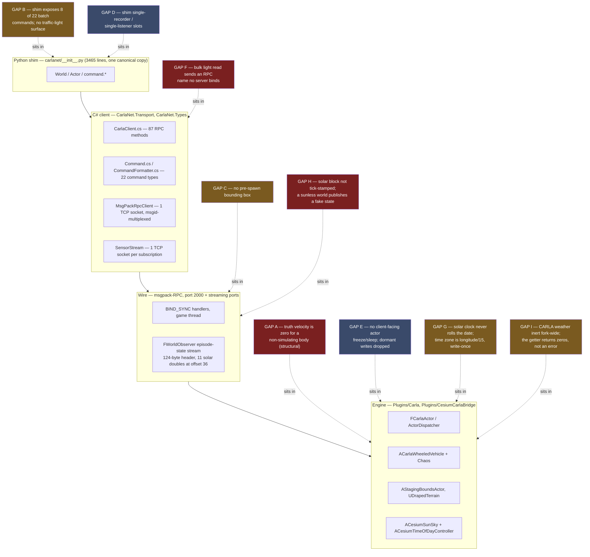
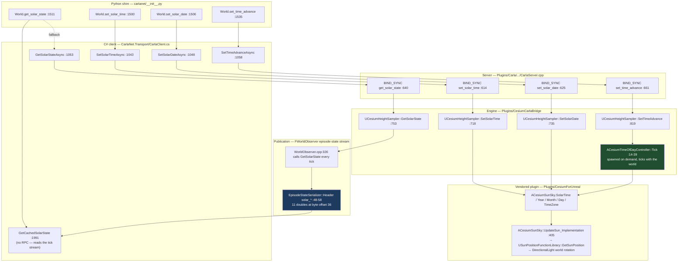

# 05 — CarlaNet capability audit for a SUMO-driven playback mode

| | |
|---|---|
| **Status** | Audit complete, second draft. First draft read from source 2026-09-17; the time-of-day, vehicle-light and weather surfaces added 2026-09-18. Both drafts read against `carla` branch `ue5-dev` at `b39ffe338`. |
| **Question answered** | Does the .NET client (`CarlaNet`) — and the engine beneath it — carry everything a SUMO-driven playback mode needs, including one that renders at the time of day the scenario asserts? Where it does not, what exactly is missing and at which layer? |
| **Audience** | Engineers implementing the co-simulation runtime ([`03_CoSimulation_Runtime.md`](03_CoSimulation_Runtime.md)), the contracts ([`04_Contracts.md`](04_Contracts.md)), the time-and-illumination coupling ([`11_Time_And_Illumination.md`](11_Time_And_Illumination.md)) and the operator surface ([`12_Operator_Control_Surface.md`](12_Operator_Control_Surface.md)). Assumes no knowledge of the conversation that produced this plan. |
| **Method** | Every capability traced Python shim → C# client → RPC method name → server binding → engine implementation. Nothing is concluded from a name match in the shim, and no layer is assumed from the layer above it. |

### What this draft adds to the first

The first draft audited actuation, sensing and truth. It did not audit **illumination**, because the
first draft of the plan never connected capture windows to the sun.
[`_TEAM_BRIEF.md` §3a](_TEAM_BRIEF.md) now makes simulated time of day a first-class requirement, so
this draft audits that surface to the same standard: §14 (the solar control surface), §15 (vehicle
light state) and §16 (whether CARLA's own weather is genuinely inert). Every verdict, citation and
gap from the first draft is carried forward unchanged; the gap register (§17) and the decision table
(§19) are **extended, not renumbered**, so `G5.1`–`G5.12` and `D5.1`–`D5.12` still mean what siblings
already cite them as meaning.

One first-draft conclusion is **corrected** rather than extended. The first draft's headline was that
nothing in the gap register sat in the C# client's RPC coverage. That is no longer true: §15.5 finds
one RPC the C# client sends under a name **no server binds**. It is the audit's first and only true
port defect, and it is in the vehicle-light surface the new requirement depends on.

## What this section does **not** cover

- Whether the SUMO side can produce what CARLA needs (network, demand, `tlLogic`, per-vehicle
  signals). That is [`07_Scenario_Authoring.md`](07_Scenario_Authoring.md) and
  [doc 23](../../Findings/23_SUMO_Traffic_Integration.md).
- The render-set rule, the clock contract, or physics authority. Those are decisions for
  [`03_CoSimulation_Runtime.md`](03_CoSimulation_Runtime.md) and [`04_Contracts.md`](04_Contracts.md);
  this section supplies the mechanisms they may assume exist and names the ones they may not.
- **What the sun should be set to**, how a scenario declares its civil epoch, and whether a capture
  window freezes or advances it. Those belong to
  [`11_Time_And_Illumination.md`](11_Time_And_Illumination.md). This section establishes only what the
  mechanism *does* when it is called, and what it cannot be asked to do at all.
- The shape of the operator surface over any of it —
  [`12_Operator_Control_Surface.md`](12_Operator_Control_Surface.md).
- The SUMO toolchain build and packaging — [`09_Toolchain_And_Packaging.md`](09_Toolchain_And_Packaging.md).
- Sequencing of the fixes named here — [`13_Work_Breakdown.md`](13_Work_Breakdown.md).
- Performance measurement. This section reports the documented budget and the dispatch code that
  implements it; it makes no throughput measurement of its own and says so where that matters.

## Evidence vocabulary

Per the team brief's "measure, do not theorise" rule, every claim below is marked:

- **Read** — taken from a source file, cited `path:line`.
- **Measured** — produced by running something read-only; the method is stated.
- **Inferred** — a conclusion drawn from read facts; the reasoning is shown.

The first draft needed no measurement: every question resolved by reading. This draft needed two,
both byte-level searches of content packages for a reference that source code cannot answer — §16
settles whether any shipped map places a weather actor, and §15.4 settles which vehicle blueprints
implement the light-refresh event. Both state their method. Where a question can only be settled by
running the simulator, it is in the open questions (§20) rather than asserted.

---

## 1. The answer, before the evidence

**CarlaNet's C# client is at parity with LibCarla's C++ client on every RPC a SUMO-driven playback
mode needs, with one exception found in this draft.** The batch-command path carries all twenty-two
command types the server understands — `ApplyTransform`, `ApplyTargetVelocity`, `SetSimulatePhysics`,
`SetEnableGravity`, `SpawnActor`, `DestroyActor`, `ApplyVehicleControl`, `SetVehicleLightState` and
`SetTrafficLightState` among them — so a per-step teleport of *N* vehicles, with their lights, is
**one round trip, not N**. That is the single most load-bearing finding in this audit (§4).

The **time-of-day surface is complete end to end and already in production use** — shim, C# client,
RPC, server, engine, and consumers in both the Cursor-on-Target sidecar and the recorded PNG metadata
(§14). It is not something this plan has to build. Three properties of it decide how it should be
used:

1. **`set_time_advance` advances the sun by the world's frame delta, not by wall-clock time**
   (`CesiumTimeOfDayController.cpp:34`). With a fixed delta of 0.05 s and `rate = 1.0` the sun
   advances **exactly one sun-clock second per simulated second** (§14.4). The property that makes
   this true is `fixed_delta_seconds`, **not** synchronous mode — the shim's own comment and the C#
   client's both attribute it to synchronous mode, and that is imprecise in a way that matters.
2. **`get_solar_state` costs nothing and is complete, but it is not tick-stamped.** The eleven
   appended doubles in the episode-state header are the whole state, published every tick, readable
   lock-free from any thread — but no frame number travels with them, so a consumer pairing them with
   a camera frame is trusting two independent sockets to stay in step. The pairing error is
   negligible at `rate = 1.0` and grows in direct proportion to `rate` (§14.5).
3. **A world with no sun publishes a fabricated solar state rather than nothing.** The stream header
   cannot say "no sun"; it says midnight of year 0 at latitude 0, longitude 0. The shim believes it
   and the truth writer records it (§14.5). This is exactly the silent, internally consistent
   falsehood [`_TEAM_BRIEF.md` §3a](_TEAM_BRIEF.md) warns about, and it is live today on stock
   content.

**Vehicle lights work on a physics-disabled actor**, which is the question the SUMO mode actually
needed answered. No layer from the shim to the engine consults physics state: `set_light_state` on a
vehicle whose Chaos body has been destroyed still sets, still reads back, and still fires the
blueprint event that renders it (§15.2). Light state also survives record and replay (§15.3). What
does **not** work is reading every vehicle's lights in one call, and that is the port defect named
above (§15.5).

**CARLA's own weather is inert, and inert fork-wide rather than only in the georeferenced world**
(§16, measured). Nothing is regressed by treating CesiumSunSky as the sole lighting authority,
because there is no other authority to regress.

The gaps are real. In order of consequence:

1. **Truth velocity for a non-simulating body is structurally zero**, not merely un-updated. The
   field the world observer falls back to is written by nothing in the CARLA/Chaos vehicle stack
   (§7). No client-side call can fix it.
2. **One RPC name in the C# client matches no server binding**, so the bulk vehicle-light read always
   fails and the failure is always swallowed (§15.5).
3. **The Python shim exposes 8 of the 22 batch commands and none of the traffic-light surface.**
   Everything missing exists one layer down in C# (§4.3, §12).
4. **The solar surface cannot express a civil time zone, cannot roll the calendar date, and cannot
   report its own absence** (§14.6) — three small engine-side omissions that together decide whether
   a multi-day scenario at a half-hour-offset site can be rendered under the right sun at all.
5. **Vehicle dimensions are not available before spawn** — neither the RPC nor the engine emits them
   on a blueprint definition — which makes the SUMO `vType` ↔ CARLA blueprint correspondence a
   build-time artefact rather than a runtime lookup (§6).

The direct answer to the question as the user put it is in §18.

---

## 2. The layer stack, and where each gap sits



Read the colours as consequence, not effort: the dark red gaps change what the truth record can say,
or make a call silently do nothing; the amber gaps change what an author can express; the blue gaps
change what one process can do.

---

## 3. Capability matrix

`P` = present and traced end to end · `p` = partially present (the layer named is the weak one) ·
`—` = absent at that layer · `n/a` = no such layer for this capability.

| # | Capability | Shim | C# client | RPC name(s) | Server / engine | Verdict | Weakest link |
|---|---|---|---|---|---|---|---|
| 1 | Synchronous mode + settings | P | P | `get_episode_settings`, `set_episode_settings` | P | **Present** | none |
| 1 | `world.tick()` with frame wait | P | P | `tick_cue` | P | **Present** | none |
| 1 | `on_tick` | P | P | n/a (stream) | P | **Present** | none |
| 1 | `wait_for_tick` | p | P | n/a (stream) | P | **Partial** | shim returns a synthetic timestamp |
| 2 | `apply_batch` / `apply_batch_sync` | p | P | `apply_batch` | P | **Present in C#** | shim exposes 8 of 22 commands |
| 2 | `ApplyTransform` in batch | P | P | `apply_batch` | P | **Present** | none |
| 2 | `ApplyTargetVelocity`, `SetSimulatePhysics`, `SetEnableGravity` in batch | — | P | `apply_batch` | P | **Present in C#** | shim |
| 2 | `SpawnActor` / `DestroyActor` in batch, with `do_after` | P | P | `apply_batch` | P | **Present** | none |
| 3 | `set_transform`, `set_simulate_physics`, `set_enable_gravity`, `set_collisions`, `set_target_velocity` | P | P | per-call RPCs | P | **Present** | none |
| 3 | `set_target_angular_velocity`, impulses, forces, torque | — | P | per-call RPCs | P | **Present in C#** | shim |
| 3 | Actor freeze / sleep | — | — | — | internal only | **Absent** | server (not bound) |
| 4 | `spawn_actor` / `try_spawn_actor` | P | P | `spawn_actor`, `spawn_actor_with_parent` | P | **Present** | `try_spawn` swallows all exceptions |
| 4 | Unvalidated custom spawn attributes | — | P | `spawn_actor` | P | **Present in C#** | shim `set_attribute` refuses |
| 5 | Blueprint library + attributes | P | P | `get_actor_definitions` | P | **Present** | none |
| 5 | Bounding box **before** spawn | — | — | — | — | **Absent** | engine emits no dimension |
| 5 | `has_lights` **before** spawn | P | P | `get_actor_definitions` | P | **Present** | none — the light declaration exists although dimensions do not (§15.4) |
| 6 | World snapshot every tick | P | P | n/a (stream) | P | **Present** | none |
| 6 | Velocity of a **simulating** actor | P | P | n/a (stream) | P | **Present** | none |
| 6 | Velocity of a **teleported non-simulating** actor | n/a | n/a | n/a | — | **Absent** | engine (structural) |
| 7 | Many simultaneous sensor streams per process | p | P | n/a (stream) | P | **Present in C#** | shim single-slot fields |
| 8 | `SampleDrapeGroundElevation` | P | P | none — local | P (grid fetched once) | **Present** | shim does not prime the grid |
| 9 | `get_staging_bounds` / `set_staging_bounds` | P | P | `get/set_staging_bounds` | P | **Present** | none |
| 10 | Native recorder start/stop, replay | p | P | 10 RPCs | P | **Present in C#** | 3 of 10 unwrapped in shim |
| 10 | Spawn attributes survive into the log | n/a | n/a | n/a | P | **Present** | none |
| 11 | Traffic-light state / freeze / phase times | — | P | 8 RPCs | P | **Present in C#** | shim: `TrafficLight` is `pass` |
| 11 | Traffic-light read (state, per tick, no RPC) | — | p | n/a (stream) | P | **Partial** | C# discards all but `State` |
| 11 | Traffic-light OpenDRIVE `sign_id` | — | p | **none — stream only** | P | **Partial** | no RPC carries it (§12.4) |
| 11 | Map-side light lookup (`get_traffic_lights_from_waypoint`) | — | — | n/a (client-side) | n/a | **Absent** | C# (no waypoint graph surfaced) |
| 12 | Documented RPC service budget | n/a | n/a | n/a | P | **Present** | doc gives a time budget, not a count |
| 13 | `set_solar_time` / `set_solar_date` | P | P | `set_solar_time`, `set_solar_date` | P | **Present** | none |
| 13 | `set_time_advance` (enable + rate) | P | P | `set_time_advance` | P | **Present** | shim and C# comments misattribute the simulation-time property to synchronous mode (§14.4) |
| 13 | `get_solar_state` by RPC | P | P | `get_solar_state` | P | **Present** | none |
| 13 | Solar state on the tick stream, no RPC | P | P | n/a (stream) | P | **Partial** | not tick-stamped; cannot express "no sun" (§14.5) |
| 13 | Advancing clock rolls the **calendar date** | — | — | — | — | **Absent** | engine — the controller wraps the hour and never touches `Day` (§14.6) |
| 13 | Set the sun's **civil** time zone | — | — | — | — | **Absent** | engine — `TimeZone` is `longitude / 15`, written once at world configuration (§14.6) |
| 13 | Solar state in the native recorder `.log` | n/a | n/a | n/a | — | **Absent** | engine — no solar packet, so a replay renders under whatever sun is current (§14.7) |
| 14 | `set_light_state` / `get_light_state` per actor | P | P | `set_vehicle_light_state`, `get_vehicle_light_state` | P | **Present** | none |
| 14 | `SetVehicleLightState` in batch | P | P | `apply_batch` | P | **Present** | shim wrapper does not coerce an `int` to the flags enum (§15.6) |
| 14 | Light state on a **physics-disabled** actor | P | P | as above | P | **Present** | none — no layer consults physics (§15.2) |
| 14 | Light state through record **and** replay | p | P | recorder RPCs | P | **Present** | none |
| 14 | **Bulk** read of every vehicle's light state | — | **broken** | `get_vehicle_light_states` | P | **Absent in C#** | C# sends `get_vehicles_light_states`, which no server binds (§15.5) |
| 14 | Light state on the episode-state stream | — | — | n/a | — | **Absent** | engine — the vehicle union carries no light field (§15.5) |
| 14 | Automatic (weather-driven) vehicle lighting | — | p | n/a | — | **Absent in practice** | three independent causes (§15.7) |
| 15 | CARLA weather set / read / enabled | P | P | `set_weather_parameters`, `get_weather_parameters`, `is_weather_enabled` | — | **Absent in practice** | engine + content — no map places an `AWeather` actor (§16) |

---

## 4. Capability 2 — batch command application (the load-bearing finding)

### 4.1 The complete command set, verified against the server's variant

`carla::rpc::Command` is a `std::variant` whose **declaration order is the wire index**. Read from
`LibCarla/source/carla/rpc/Command.h:284-306`. CarlaNet's `CommandType` enum reproduces that order
exactly, and its comment says it was source-verified — which this audit re-confirms
(`CarlaNet/src/CarlaNet.Types/Rpc/Commands/Command.cs:12-36`).

| Index | C++ type (`Command.h`) | C# record (`Command.cs`) | Serialised by | Server handler (`CarlaServer.cpp`) |
|---|---|---|---|---|
| 0 | `SpawnActor` `:53` | `SpawnActorCommand` `:46` | `CommandFormatter.cs:74-90` | `:3146-3169` → `spawn_actor` / `spawn_actor_with_parent` |
| 1 | `DestroyActor` `:69` | `DestroyActorCommand` `:53` | `:47` | `:3170` |
| 2 | `ApplyVehicleControl` `:77` | `ApplyVehicleControlCommand` `:56` | `:48` | `:3171` |
| 3 | `ApplyVehicleAckermannControl` `:87` | `…AckermannControlCommand` `:57` | `:49` | `:3172` |
| 4 | `ApplyWalkerControl` `:97` | `ApplyWalkerControlCommand` `:58` | `:50` | `:3173` |
| 5 | `ApplyVehiclePhysicsControl` `:107` | `…PhysicsControlCommand` `:61` | `:51` | `:3174` |
| **6** | **`ApplyTransform` `:117`** | **`ApplyTransformCommand` `:64`** | **`:52`** | **`:3175` → `set_actor_transform`** |
| 7 | `ApplyWalkerState` `:137` | `ApplyWalkerStateCommand` `:67` | `:53`, `:92-100` | `:3190` |
| **8** | **`ApplyTargetVelocity` `:146`** | **`ApplyTargetVelocityCommand` `:70`** | **`:54`** | **`:3176` → `set_actor_target_velocity`** |
| 9 | `ApplyTargetAngularVelocity` `:156` | `…AngularVelocityCommand` `:73` | `:55` | `:3177` |
| 10 | `ApplyImpulse` `:166` | `ApplyImpulseCommand` `:76` | `:56` | `:3178` |
| 11 | `ApplyForce` `:176` | `ApplyForceCommand` `:80` | `:57` | `:3179` |
| 12 | `ApplyAngularImpulse` `:186` | `ApplyAngularImpulseCommand` `:77` | `:58` | `:3180` |
| 13 | `ApplyTorque` `:196` | `ApplyTorqueCommand` `:83` | `:59` | `:3181` |
| **14** | **`SetSimulatePhysics` `:206`** | **`SetSimulatePhysicsCommand` `:86`** | **`:60`** | **`:3182`** |
| **15** | **`SetEnableGravity` `:216`** | **`SetEnableGravityCommand` `:87`** | **`:61`** | **`:3183`** |
| 16 | `SetAutopilot` `:226` | `SetAutopilotCommand` `:90` | `:62` | `:3185` |
| 17 | `ShowDebugTelemetry` `:241` | `ShowDebugTelemetryCommand` `:91` | `:63` | `:3186` |
| 18 | `SetVehicleLightState` `:253` | `SetVehicleLightStateCommand` `:94` | `:64`, `:102-109` | `:3187` |
| 19 | `ApplyLocation` `:127` | `ApplyLocationCommand` `:97` | `:65` | `:3193` |
| 20 | `ConsoleCommand` `:265` | `ConsoleCommandCommand` `:100` | `:66`, `:111-117` | `:3191` |
| 21 | `SetTrafficLightState` `:272` | `SetTrafficLightStateCommand` `:103` | `:67`, `:119-126` | `:3192` |

**Read.** All twenty-two are implemented in the C# serialiser — `CommandFormatter.WritePayload`
(`CarlaNet/src/CarlaNet.Types/Formatters/CommandFormatter.cs:41-72`) has an arm for each and throws
on anything unknown (`:68`). The nested-variant wire shape `[[variant_idx, [fields…]]]` is
reproduced at `:29-39`; `std::optional<ActorId> parent` as `[false]` / `[true, id]` at `:82-83`;
`do_after` recursion at `:84-88`. Responses decode at
`Formatters/CommandResponseFormatter.cs:15-32`, handling both the `ResponseError` and `ActorId`
variant arms.

The client entry points are `CarlaClient.ApplyBatchAsync` and `ApplyBatchSyncAsync`
(`CarlaNet/src/CarlaNet.Transport/CarlaClient.cs:1779-1785`), both sending RPC `"apply_batch"`. The
sync variant uses `CallRawAsync` because the server returns `std::vector<CommandResponse>`
unwrapped rather than inside `Response<T>` — a real wire-shape difference the port got right
(`CarlaClient.cs:1782-1785`, `MsgPackRpc/MsgPackRpcClient.cs:68-97`).

Server side: the visitor is built at `CarlaServer.cpp:3145-3194` and `BIND_SYNC(apply_batch)` at
`:3198-3213` iterates the vector in one game-thread call, then optionally calls `tick_cue()`
(`:3208-3211`).

### 4.2 This path is already in production use — with teleports in it

**Read.** The .NET traffic manager builds one `_controlFrame` per tick and sends it as a single
`ApplyBatchSync` (`CarlaNet/src/CarlaNet.TrafficManager/TrafficManagerLocal.cs:568`, with the
empty-batch and walker-only variants at `:465` and `:479`). That frame is a *mix* of command types
— `ApplyVehicleControlCommand`, `ApplyWalkerStateCommand`, `SetVehicleLightStateCommand`
(`Stages/VehicleLightStage.cs:292`) and, critically, **`ApplyTransformCommand`**, which the
motion-plan stage emits for its hybrid-physics and respawn teleports
(`Stages/MotionPlanStage.cs:244` and `:424`).

**Inferred, from those two facts:** the exact mechanism a SUMO teleport mode needs — a batch of
per-vehicle transforms applied in one round trip — is not a new capability to be built. It is the
mechanism this fork's traffic manager already runs on every tick, and any wire-shape defect in it
would have shown up as ambient traffic failing to move.

### 4.3 What Python cannot reach

**Read.** The shim imports **8** of the 22 command types
(`CarlaNet/python/carlanet/__init__.py:485-487`) and its `command` namespace declares exactly 8
wrapper classes: `SpawnActor` `:1080`, `DestroyActor` `:1101`, `SetAutopilot` `:1108`,
`ApplyVehicleControl` `:1117`, `ApplyTransform` `:1125`, `ApplyLocation` `:1133`,
`SetVehicleLightState` `:1141`, `ConsoleCommand` `:1149`. `Client.apply_batch` / `apply_batch_sync`
themselves are fine (`:2475-2485`) and `_cmds_to_cs` (`:1157-1159`) passes any already-C# command
straight through.

Missing from Python, present in C#: `ApplyTargetVelocity`, `ApplyTargetAngularVelocity`,
`SetSimulatePhysics`, `SetEnableGravity`, `ApplyImpulse`, `ApplyForce`, `ApplyAngularImpulse`,
`ApplyTorque`, `ApplyVehicleAckermannControl`, `ApplyWalkerControl`, `ApplyVehiclePhysicsControl`,
`ApplyWalkerState`, `ShowDebugTelemetry`, `SetTrafficLightState`.

**Consequence.** From Python, a teleport batch can carry poses but not the physics toggles or the
velocity commands that go with them — those become one RPC per vehicle through
`Actor.set_simulate_physics` / `Actor.set_target_velocity` (`:790-800`). From C#, they ride in the
same batch. This is the clearest single argument in the audit for the co-simulation runtime being a
.NET assembly, which is what [doc 23 §5](../../Findings/23_SUMO_Traffic_Integration.md) already
recommends for an unrelated reason.

Each missing wrapper is a five-line class beside the existing eight and an added name in the import
at `:485-487`. Nothing below Python changes.

### 4.4 The round trips, for real

```mermaid
sequenceDiagram
    autonumber
    participant Sumo as sumo (libtraci, out of process)
    participant CoSim as CarlaNet co-simulation<br/>(on CarlaClient.OnWorldTickCompleted)
    participant Rpc as MsgPackRpcClient<br/>(1 TCP socket, msgid-multiplexed)
    participant Srv as CARLA server<br/>(BIND_SYNC, game thread)
    participant Obs as FWorldObserver<br/>(separate streaming socket)

    Note over CoSim: one SUMO step, N rendered vehicles
    CoSim->>Sumo: simulationStep() + getAllSubscriptionResults()
    Sumo-->>CoSim: N poses, speeds, arrivals, departures

    Note over CoSim,Rpc: build ONE List&lt;Command&gt;:<br/>SpawnActor.do_after[SetSimulatePhysics(false)] for arrivals,<br/>ApplyTransform + ApplyTargetVelocity per live vehicle,<br/>DestroyActor for departures
    CoSim->>Rpc: ApplyBatchSyncAsync(commands, doTickCue: false)
    Rpc->>Srv: apply_batch  ← ROUND TRIP 1 of 2, independent of N
    Srv->>Srv: std::visit over the vector, in order,<br/>on one game-thread slice (CarlaServer.cpp:3202-3206)
    Srv-->>Rpc: vector&lt;CommandResponse&gt; (N entries, ids or errors)
    Rpc-->>CoSim: IReadOnlyList&lt;CommandResponse&gt;

    CoSim->>Rpc: SendTickCueAsync()
    Rpc->>Srv: tick_cue  ← ROUND TRIP 2 of 2
    Srv-->>Rpc: frame number
    Srv->>Obs: FWorldObserver::BroadcastTick
    Obs-->>CoSim: episode-state frame (NOT an RPC; push over the stream socket)
    Note over CoSim: WaitForFrame releases; OnWorldTickCompleted fires<br/>on the ticking thread (CarlaClient.cs:403-421)
    CoSim->>Sumo: moveToXY feedback for the next step
```

**Read.** Two RPC round trips per simulated step, whatever *N* is. The world state comes back on
the streaming socket and costs no RPC at all (`CarlaClient.StartWorldObserverAsync`,
`CarlaClient.cs:1800-1804`; parse and cache at `:1806-1838` and `:1840-1909`).

Two nuances worth stating because they are easy to get wrong:

- `apply_batch` takes a `do_tick_cue` flag that would fold the tick into round trip 1
  (`CarlaServer.cpp:3208-3211`). **Do not use it for a deterministic loop**: it ticks the server but
  the client does not then wait for the frame, so the caller can read the world one frame behind.
  `SendTickCueAsync` is the call that waits (`CarlaClient.cs:403-421`, `WaitForFrame` at `:423-445`).
- `SpawnActor.do_after` is the right place for per-spawn setup. The server resolves the new actor id
  into every follow-up command in the list before running it (`CarlaServer.cpp:3157-3164`), skipping
  only `SpawnActor` and `ConsoleCommand`, which have no `actor` field. A SUMO arrival can therefore
  be spawn + `SetSimulatePhysics(false)` + `ApplyTargetVelocity` in **one batch entry**.

---

## 5. Capability 1 — synchronous mode and tick control

### 5.1 Settings

**Read.** `EpisodeSettings` carries all eleven fields including `SynchronousMode`,
`FixedDeltaSeconds` (as `std::optional<double>`, with a dedicated `NullableDoubleFormatter`),
`Substepping`, `MaxSubstepDeltaTime` and `MaxSubsteps`
(`CarlaNet/src/CarlaNet.Types/Rpc/Environment/EpisodeSettings.cs:10-21`). Client:
`GetEpisodeSettingsAsync` / `SetEpisodeSettingsAsync` (`CarlaClient.cs:385-390`), RPC
`get_episode_settings` / `set_episode_settings`. Server: `CarlaServer.cpp:1150-1174` — applies to
the episode and additionally pushes synchronous mode into the streaming server (`:1159`).

Shim: `World.get_settings` / `apply_settings` (`__init__.py:1459-1466`) via a mutable
`_WorldSettings` mirror (`:2724-2772`) that snapshots all eleven fields and rebuilds the immutable
C# record on apply. **Verdict: present, no gap.**

### 5.2 The tick, and who owns it

**Read.** `World.tick()` (`__init__.py:2086-2087`) → `CarlaClient.SendTickCueAsync`
(`CarlaClient.cs:403-421`) → RPC `tick_cue` → `CarlaServer.cpp:393-399`, which only increments a
counter and returns `frame + 1`. The engine's dispatch loop is the other half
(`Unreal/CarlaUnreal/Plugins/Carla/Source/Carla/Game/CarlaEngine.cpp:332-347`).

The client-side contract is stronger than a bare cue, and recently so:

- `SendTickCueAsync` sends the cue, then **blocks until the world observer has delivered that frame
  or later**, then raises `OnWorldTickCompleted` on the ticking thread (`CarlaClient.cs:403-421`).
  The wait honours the client's own timeout (`SetTimeout` sets `_frameWaitTimeout`, `:292-299`), and
  on timeout it logs and returns rather than deadlocking (`:432-440`).
- Commit `37a2e4145` *Step the traffic manager on the world tick, so a run can repeat* introduced
  that wait. Its message records the cause plainly: the synchronous machinery existed but nothing
  joined it up, so a synchronous traffic manager parked on its first gate and no vehicle moved. It
  also raised the manager's synchronous step timeout from upstream's 10 ms to 1000 ms, on the ground
  that our step ends by sending a batch of vehicle commands and that round trip alone measured
  ~20 ms against a free-running server.
- Commit `fbed54ee0` *Hand the world-tick subscriber a complete timestamp* filled `DeltaSeconds` and
  `PlatformTimestamp` on that record, which had been left at zero because the only subscriber read
  the other two (`CarlaClient.cs:441-444`).
- Commit `2f392f0ba` *Schedule the synchronous loop on the world's clock, not the wall's* moved the
  launcher's interval scheduling onto simulated time and added `World.get_sim_time`
  (`__init__.py:2017`). Its message reports a comparison of two seeded synchronous runs: the traffic
  manager drove the first vehicle bit-identically for 1252 frames before the runs differed, and then
  by five millimetres — but the *n*-th vehicle to spawn appeared up to 558 frames apart, because
  spawn scheduling was on the wall clock.

**Two events exist and they are not interchangeable**, which the co-simulation runtime must get
right:

| Event | Raised from | Thread | Meaning |
|---|---|---|---|
| `CarlaClient.OnTick` (`CarlaClient.cs:305`) | the world-observer stream reader, once per delivered frame (`:1820-1832`) | the stream socket's reader thread | "a frame arrived" |
| `CarlaClient.OnWorldTickCompleted` (`:159`) | `SendTickCueAsync`, after the cue **and** after the frame it produced is in (`:405-417`) | the thread that called `tick()` | "the frame I asked for is in; step now, and block me while you do" |

`CarlaNet.Scenario.ScenarioExecutor` subscribes to `OnTick` (`ScenarioExecutor.cs:79`, unsubscribes
at `:561`). `CarlaNet.TrafficManager.TrafficManagerLocal` subscribes to `OnWorldTickCompleted`
(`TrafficManagerLocal.cs:238`, `:257`, handler at `:316-331`) and takes its clock from the
timestamp's `ElapsedSeconds` (`:321`, `CurrentElapsedSeconds` at `:341-345`).

**Inferred.** A SUMO bridge that must have issued its commands *before* the next frame is asked for
belongs on `OnWorldTickCompleted`, not `OnTick`. `OnTick` fires on a stream thread that the tick
does not wait for; a bridge there would race the next tick. This is a contract for
[`03_CoSimulation_Runtime.md`](03_CoSimulation_Runtime.md) to record.

### 5.3 `wait_for_tick` — the one real defect in this capability

**Read.** `World.wait_for_tick` (`__init__.py:2190-2209`) registers a one-shot `on_tick` handler,
waits on a `threading.Event`, and then returns `Timestamp(0, 0.0, 0.0, time.time())` — a **synthetic
record with frame 0 and elapsed 0**, discarding the timestamp the handler was actually given. The
fallback path at `:2208` returns the same thing after a 50 ms sleep.

Any caller that does `ts = world.wait_for_tick(); ...ts.frame` gets zero. `on_tick` does not have
this problem (`:2158-2163` forwards all four fields). Fix: capture the timestamp in the handler's
closure and return it. Shim only.

---

## 6. Capabilities 4 and 5 — spawning at scale, and what a blueprint tells you

### 6.1 Spawn

**Read.** Shim `World.spawn_actor` `:2055-2073`, `try_spawn_actor` `:2075-2080`; C#
`SpawnActorAsync` (`CarlaClient.cs:1442-1443`) and `SpawnActorWithParentAsync` (`:1484-1486`); RPCs
`spawn_actor` / `spawn_actor_with_parent`; server `CarlaServer.cpp:1311-1332` and `:1334-1400`;
engine `UCarlaEpisode::SpawnActorWithInfo` → `UActorDispatcher::SpawnActor`
(`Actor/ActorDispatcher.cpp:50-86`).

Two shapes worth knowing:

- There is **no `TrySpawnActorAsync` in C#**. `try_spawn_actor` is a bare `except Exception: return
  None` in the shim (`:2075-2080`), so a transport fault is indistinguishable from an occupied spawn
  point.
- At scale, spawn belongs in the batch (`SpawnActorCommand`, §4), which also returns a per-entry
  error string rather than an exception.

### 6.2 Custom attributes — doc 20 §4.5 verified, with one citation corrected

**Read.** The RPC→engine conversion copies every attribute into the description's `Variations` map
with no membership test (`LibCarla/source/carla/rpc/ActorDescription.h:47-56`, the
`Variations.Emplace` at `:53`). The spawn binding forwards the description untouched
(`CarlaServer.cpp:1317`). The dispatcher validates only the `UId` bounds
(`Actor/ActorDispatcher.cpp:55-64`). Consumers are lookup-with-default —
`RetrieveActorAttributeToInt` and its five siblings all return `Default` when the key is absent and
never enumerate the map looking for strangers (`Actor/ActorBlueprintFunctionLibrary.cpp:1293-1339`).

So the server accepts an attribute no blueprint declares, and it is inert. Doc 20 §4.5's claim
**holds**; its citation `CarlaServer.cpp:1139-1146` is stale in this tree — that range is inside the
`request_file` binding. The correct range is `CarlaServer.cpp:1311-1332`.

**The shim's refusal**, exactly as doc 20 cites it
(`CarlaNet/python/carlanet/__init__.py:611-614`):

```python
    def set_attribute(self, name: str, value: str):
        if name not in self._attrs:
            raise KeyError(f"Blueprint '{self._id}' has no attribute '{name}'")
        self._attrs[name]['value'] = str(value)
```

**What relaxing it takes.** `ActorBlueprint.to_description` (`:619-624`) iterates `self._attrs`
unconditionally, so anything placed in that dict reaches the wire. The whole gate is the `if` at
`:612`. The right shape is a sibling `set_attribute_unchecked(name, value, attr_type)` that writes a
new entry rather than loosening `set_attribute`, because `set_attribute`'s strictness faithfully
mirrors upstream (`LibCarla/source/carla/client/ActorBlueprint.cpp:41-51` throws
`std::out_of_range`), and a silent divergence there is worse than a second method. No C# change, no
engine change.

From C# there is no gate at all: `BlueprintChooser.Describe` already builds the attribute list
(`CarlaNet/src/CarlaNet.Scenario/BlueprintChooser.cs:33-39`) and an extra
`ActorAttributeValue(id, type, value)` can simply be appended.

One asymmetry found on the way, not previously recorded: the shim caches each attribute's
`modifiable` flag (`:592`) and never consults it, and does not cache `RestrictToRecommended` at all,
while upstream enforces both (`LibCarla/source/carla/client/ActorAttribute.cpp:22-32`). The shim is
*stricter* than upstream about unknown keys and *laxer* about read-only ones. Harmless on the wire;
a behaviour difference a ported script could trip over.

### 6.3 Blueprint definitions carry no dimensions — which is a contract problem, not a bug

**Read.** `ActorDefinition` on the wire is `(Uid, Id, Tags, Attributes)` and nothing else
(`CarlaNet/src/CarlaNet.Types/Rpc/Actors/ActorDefinition.cs:5-10`, matching
`LibCarla/source/carla/rpc/ActorDefinition.h`). `Actor` — what you get **after** a spawn — carries
`BoundingBox` at key 3 (`CarlaNet.Types/Rpc/Actors/Actor.cs:11`).

The engine emits no size attribute for a vehicle. `MakeVehicleDefinition`
(`Actor/ActorBlueprintFunctionLibrary.cpp:839-930`) produces exactly: `role_name`, `ros_name`,
`color`, `driver_id`, `sticky_control`, `terramechanics`, `object_type`, `base_type`,
`special_type`, `number_of_wheels`, `generation`, `has_dynamic_doors`, `has_lights`. The root cause
is one level up: `FVehicleParameters` (`Actor/VehicleParameters.h:13-58`) has no dimension field at
all, so the data is not in the catalogue to emit.

The bounding box is computed from the instantiated actor at registration:
`Info->BoundingBox = UBoundingBoxCalculator::GetActorBoundingBox(&Actor)`
(`Actor/ActorRegistry.cpp:163`), copied into the serialised form at `:173`.

**Inferred, and load-bearing for the vehicle catalogue contract.** Every dimension consumer in this
fork already works post-spawn because it has no choice: `ScenarioExecutor.SetDown` spawns high, reads
`actor.BoundingBox`, and teleports the vehicle down onto the surface
(`CarlaNet.Scenario/ScenarioExecutor.cs:168-182`); the traffic manager reads `BoundingBox.Extent`
off live actors (`Stages/ALSM.cs:536`, `:589`, `:602`, `:620`). A SUMO `vType`'s `length` and
`width` change car-following gaps, so the correspondence has to be established **at authoring time
from a catalogue produced by a running server**, exactly as
[doc 20 decision 12](../../Findings/20_Behavioral_Annotation_And_Areas_Of_Interest.md) argues — not
looked up at playback. [`04_Contracts.md`](04_Contracts.md) owns that contract; this audit supplies
the reason it cannot be a runtime query.

---

## 7. Capability 6 — the world snapshot, and why a teleported vehicle reports zero speed

### 7.1 How state reaches the client

**Read.** One subscription to the episode-state stream, opened by `StartWorldObserverAsync`
(`CarlaClient.cs:1800-1804`) using the token from `get_episode_info`. Each frame is parsed inline
(`ParseEpisodeState`, `:1840-1909`): a 124-byte header (episode id, platform timestamp, delta
seconds, map origin, state, plus eleven appended solar doubles at offset 36) followed by
119 bytes per actor. Per actor the client decodes id, state, transform, **velocity**, angular
velocity, acceleration and a 54-byte type-dependent union (`:1861-1892`), caching an `ActorSnapshot`
(`:26-45`) and evicting any actor absent from the snapshot (`:1900-1908`).

Accessors are pure cache reads, no RPC: `GetActorTransform`, `GetActorVelocity`,
`GetActorAngularVelocity`, `GetActorAcceleration`, `GetActorSnapshot` (`:1915-1919`).

### 7.2 Where velocity comes from — doc 23's `WorldObserver.cpp:373` verified

**Read**, line for line:

```cpp
// Unreal/CarlaUnreal/Plugins/Carla/Source/Carla/Sensor/WorldObserver.cpp
373:      Velocity = TO_METERS * View->GetActor()->GetVelocity();
```

Confirmed at exactly line 373, inside the `else` branch of an `if (View->IsDormant())` at `:358`.
The dormant branch reads a stored value instead: `Velocity = TO_METERS * ActorData->Velocity`
(`:361`). Acceleration in **both** branches is derived by differencing the same velocity against the
previous frame's (`FWorldObserver_GetAcceleration`, `:264-278`), so whatever is true of velocity is
true of acceleration.

Following `GetActor()->GetVelocity()` down for a CARLA vehicle:

1. `ACarlaWheeledVehicle::GetVelocity()` overrides it and returns
   `BaseMovementComponent->GetVelocity()`
   (`Vehicle/CarlaWheeledVehicle.cpp:804-806`, declared `Vehicle/CarlaWheeledVehicle.h:412`).
2. `UBaseCarlaMovementComponent::GetVelocity()` returns
   `CarlaVehicle->AWheeledVehiclePawn::GetVelocity()`
   (`Vehicle/MovementComponents/BaseCarlaMovementComponent.cpp:35-42`) — i.e. it explicitly routes
   back to the pawn's base implementation.
3. `AWheeledVehiclePawn` does not override it, so this is `AActor::GetVelocity()`, which returns
   `RootComponent->GetComponentVelocity()`
   (`UE_5_7_4/Engine/Source/Runtime/Engine/Private/Actor.cpp:748-755`).
4. `UPrimitiveComponent::GetComponentVelocity()`
   (`.../Private/PrimitiveComponentPhysics.cpp:1328-1340`):

   ```cpp
   if (IsSimulatingPhysics())
   {
       FBodyInstance* BodyInst = GetBodyInstance();
       if(BodyInst != NULL) { return BodyInst->GetUnrealWorldVelocity(); }
   }
   return Super::GetComponentVelocity();
   ```
5. `USceneComponent::GetComponentVelocity()` returns the bare `ComponentVelocity` field
   (`.../Private/Components/SceneComponent.cpp:2995-2998`).

### 7.3 The conclusion, stated more strongly than doc 23 states it

**Read.** `ComponentVelocity` is written in exactly one place in the engine's movement machinery:
`UMovementComponent::UpdateComponentVelocity()`
(`.../Private/Components/MovementComponent.cpp:382-388`). A grep of the entire
`Engine/Plugins/Experimental/ChaosVehiclesPlugin/Source/ChaosVehicles` tree for
`UpdateComponentVelocity` or `ComponentVelocity` returns **zero hits**.

**Inferred, and this is the audit's most consequential inference:** a CARLA vehicle's
`ComponentVelocity` is never written by anything. So for a vehicle whose physics is off, the world
observer does not report a *stale* velocity — it reports a **structural zero**, and would do so
however the vehicle got where it is. Doc 23's framing ("a teleport does not update component
velocity") is correct but understates the problem: there is no history to be stale.

Nor can the client set it. `FCarlaActor::SetActorTargetVelocity` on a non-dormant actor calls
`RootComponent->SetPhysicsLinearVelocity(...)` (`Actor/CarlaActor.cpp:392-411`), which writes the
physics body (`FBodyInstance::SetLinearVelocity`, guarded by
`FPhysicsInterface::IsRigidBody`) — and step 4 above never *reads* the body when
`IsSimulatingPhysics()` is false. And for a CARLA vehicle, `set_simulate_physics(false)` does more
than clear a flag: `ACarlaWheeledVehicle::SetSimulatePhysics(false)` calls
`Movement->DestroyPhysicsState()` (`Vehicle/CarlaWheeledVehicle.cpp:754-788`, the destroy at `:781`),
so there is no body left to write to.

**One route does exist in the current code**, and it is worth naming because it is the only one:
the **dormant** branch. `FCarlaActor::SetActorTargetVelocity` writes `ActorData->Velocity` when the
actor is dormant (`CarlaActor.cpp:394-397`), and `FWorldObserver_Serialize` reads exactly that field
for a dormant actor (`WorldObserver.cpp:361`). But dormancy is driven by large-map streaming and
`actor_active_distance`, not by the client — there is no `put_actor_to_sleep` RPC (§8.3) — so this
is a description of the shape of a fix, not a usable mechanism today.

### 7.4 What this means for the plan

Everything downstream of velocity is affected, not just the CoT record: the traffic manager's
collision stage, and the arrival/occlusion gating of
[doc 17](../../Findings/17_Photoreal_Occlusion_Metric.md). The team brief's decision 2 already says
this is a problem to be solved rather than a reason to reject the mode. The audit's contribution is
to say **where** it must be solved: in the engine, because no ordering of client calls produces a
non-zero reading. Candidate shapes, for
[`03_CoSimulation_Runtime.md`](03_CoSimulation_Runtime.md) and
[`06_Truth_And_Annotation.md`](06_Truth_And_Annotation.md) to choose between:

| Shape | Where it lands | Note |
|---|---|---|
| Have `SetActorTargetVelocity` also write `ComponentVelocity` on a non-simulating root | `Actor/CarlaActor.cpp:392-411` | Smallest change; makes the existing API mean what its name says. Alters behaviour for every client, so it is a shared-code change and needs stock-content regression. |
| A new "asserted velocity" field on `FActorInfo`, set by a new command/RPC and preferred by the observer when physics is off | `WorldObserver.cpp:358-378` + a new `BIND_SYNC` + a new variant arm | Keeps teleport velocity distinguishable from measured velocity, which the truth record arguably wants to know. Adds a 23rd command type, so `Command.h`, `Command.cs` and `CommandFormatter.cs` move together. |
| Derive velocity client-side from consecutive snapshot transforms | `CarlaNet` only | Needs no engine change but produces a *different quantity* (finite difference of pose) that must be labelled as such in truth, never as measured speed. |

Each is a design decision, not an effort estimate; a rebuild is neutral and is not a consideration
between them.

---

## 8. Capability 3 — per-actor state control

**Read.** Traced shim → C# → RPC → `CarlaServer.cpp` → `CarlaActor.cpp` for each.

| Call | Shim | C# | RPC | Server | Engine |
|---|---|---|---|---|---|
| `set_transform` | `:754-755` | `CarlaClient.cs:1496` | `set_actor_transform` | `CarlaServer.cpp:1589-1606` | `CarlaActor.cpp:335-360` |
| `set_location` | `:757-758` | `:1493` | `set_actor_location` | `:1570-1587` | `CarlaActor.cpp:284-306` |
| `set_simulate_physics` | `:790-791` | `:1529` | `set_actor_simulate_physics` | `:2113-2136` | base `CarlaActor.cpp:562-582`; vehicle `:813-829`; walker `:1295-1319` |
| `set_target_velocity` | `:793-800` | `:1499` | `set_actor_target_velocity` | `:1639-1662` | `CarlaActor.cpp:392-411` |
| `set_target_angular_velocity` | **absent** | `:1502` | `set_actor_target_angular_velocity` | `:1664-1687` | `CarlaActor.cpp:413-432` |
| `set_enable_gravity` | `:817-818` | `:1538` | `set_actor_enable_gravity` | `:2187-2210` | `CarlaActor.cpp:596-611` |
| `set_collisions` | `:811-815` | `:1532` | `set_actor_collisions` | `:2138-2161` | `CarlaActor.cpp:584-594` |
| `enable/disable_constant_velocity` | `:828-832` | `:1505`, `:1508` | `enable/disable_actor_constant_velocity` | `:1689-1740` | `CarlaActor.cpp:615-645` (vehicles only) |
| impulses / forces / torque (6 calls) | **absent** | `:1511-1527` | `add_actor_*` | `:1742-1909` | `CarlaActor.cpp:434+` |
| `set_actor_dead` | **absent** | `:1535` | `set_actor_dead` | `:2163-2185` | `CarlaActor.cpp:1461-1481` (walkers only) |

### 8.1 What `set_actor_transform` actually does

**Read.** `CarlaServer.cpp:1603-1604` passes `ETeleportType::TeleportPhysics`, and
`FCarlaActor::SetActorGlobalTransform` calls `GetActor()->SetActorTransform(LocalTransform, false,
nullptr, TeleportType)` (`CarlaActor.cpp:335-360`). Three properties follow:

- **No sweep.** `bSweep = false`, so the actor is placed regardless of what is already there. Nothing
  reports an overlap. `ScenarioExecutor.WarnIfOccupied` (`ScenarioExecutor.cs:134-158`) is a
  client-side proximity scan written to compensate, and it only warns.
- **It touches no velocity state.** Neither linear nor angular velocity is written anywhere in that
  function, which is why `ScenarioExecutor.SetDown` issues a separate zeroing call immediately after
  its teleport (`ScenarioExecutor.cs:179-180`). The shim's `set_transform` does not, so a Python
  caller inherits whatever the actor had.
- **It is not virtual** (`CarlaActor.h:203-205`) — no vehicle- or walker-specific override, so a
  wheeled vehicle is teleported by the same code as a prop.

### 8.2 Two traps worth recording before they are rediscovered

**Read.** `FCarlaActor::SetActorSimulatePhysics` (the non-vehicle path) ends with an
**unconditional** `RootComponent->SetCollisionEnabled(ECollisionEnabled::QueryAndPhysics)`
(`CarlaActor.cpp:578-579`). A `set_collisions(false)` issued earlier is therefore silently undone by
a later `set_simulate_physics(false)`. Order matters and nothing enforces it.

**Read.** Several dormant branches are empty — `SetActorCollisions` (`:586-588`),
`SetActorEnableGravity` (`:598-600`), `AddActorImpulse` (`:436-438`),
`EnableActorConstantVelocity` / `DisableActorConstantVelocity` (`:617-619`, `:634-636`). The request
is dropped and never replayed on wake. Only `SetActorSimulatePhysics`, `SetActorTargetVelocity` and
`SetActorTargetAngularVelocity` persist into `ActorData`.

### 8.3 Actor freeze / sleep — absent from the client

**Read.** `UCarlaEpisode::PutActorToSleep` / `WakeActorUp` exist (`Game/CarlaEpisode.h:284-292`) but
are **not RPC-bound**. Their only use in the server is internal — putting a freshly attached sensor
to sleep when its parent is already dormant (`CarlaServer.cpp:1387-1396`). There is no
`put_actor_to_sleep`, `wake_actor_up`, `freeze_actor` or `set_actor_dormant` among the server's
bindings. The only `freeze_*` RPCs are traffic-light-specific.

**Not found** after searching the full `BIND_SYNC`/`BIND_ASYNC` name set in `CarlaServer.cpp`, all
`.cs` under `CarlaNet/src`, and the shim.

**Inferred.** The closest reachable approximation is `set_simulate_physics(false)`, which for a
vehicle destroys the Chaos physics state (§7.3) — sufficient for a teleport-driven vehicle, and
exactly the thing that zeroes truth velocity. There is no cheaper "present but inert" state
available to the render-set contract.

---

## 9. Capability 7 — sensors and multi-camera capture

**Read.** The stream-token model is per-subscription, not per-client. `StreamToken.Parse` unpacks
the 24-byte blob and rewrites `0.0.0.0` to the RPC host
(`CarlaNet.Types/Streaming/StreamToken.cs:33-62`); the token arrives on the `spawn_actor` response
(`CarlaNet.Types/Rpc/Actors/Actor.cs:15`). `SensorStream` opens **one dedicated `TcpClient` per
subscription** with `NoDelay`, writes the 4-byte stream id to subscribe, and runs its own framed
read loop on its own thread (`CarlaNet.Transport/Streaming/SensorStream.cs:21-61`).

`CarlaClient.SubscribeToStream` appends to an unbounded `List<SensorStream>`
(`CarlaClient.cs:133`, `:1748-1754`) and returns an `IDisposable` that removes it. There is no
token→callback map because there is nothing to key: the callback is captured by the socket that owns
it. **The C# layer imposes no limit on simultaneous sensors**, and the client already runs at least
two streams in normal operation (the world observer plus any sensor).

**The claim in the brief that `FrameRecorder.cs:59-98` binds one stream token per recorder is not
what the code says**, and the range is wrong. Lines 59-98 are occlusion counters, doc comment, the
constructor signature and the token guard. The subscriptions are at `:112-113` (an optional second
one, to a depth camera, via `OcclusionEstimator`, which subscribes at
`CarlaNet.Recording/OcclusionEstimator.cs:89`) and `:125-126`:

```csharp
// Independent subscription to the camera stream (does not disturb the display listener).
_subscription = client.SubscribeToStream(streamToken, OnFrame);
```

So a single `FrameRecorder` already opens **up to two** streams, and the comment explicitly says the
subscription is independent of any other listener on the same camera.

**The real single-slot limit is in the shim**, in two places:

- `World.start_recording` calls `self.stop_recording()` first and stores into a single
  `self._recorder` field (`__init__.py:1908`, `:1924`). Starting a second recorder destroys the
  first.
- `Actor.listen` stores into a single `self._sub` (`:872`); a second `listen()` on the same actor
  orphans the first subscription.

**Inferred.** Doc 20 decision 11's warning — that the process-local annotation registry does not
survive multiple collection cameras — is about *process* boundaries. This audit finds that the
process boundary is not forced by the transport: constructing `FrameRecorder` N times with N camera
tokens works today in one process, each with its own worker pool, channel and sockets. The
restriction is a shim API shape. That weakens the premise of decision 11's "additional cameras mean
additional client processes" and should be revisited in
[`08_Collection_And_EPoL.md`](08_Collection_And_EPoL.md) rather than inherited.

---

## 10. Capability 8 — the drape ground sampler

**Read.** `CarlaClient.SampleDrapeGroundElevation(double x, double y)` is at
`CarlaNet/src/CarlaNet.Transport/CarlaClient.cs:241-263`. It is **synchronous, local, and contains
no RPC call**: two bilinear taps on cached `float[]` grids (draped DTM plus a per-cell offset),
returning `null` outside the grid or when no drape is active. Helpers at `:265-282`. The
`byte[] → float[]` conversion is memoised by reference identity (`:252-255`), so the single
`Buffer.BlockCopy` runs only when the underlying array object is replaced.

**Per-call cost:** eight array reads and about ten floating-point operations. Safe at any per-vehicle,
per-step rate. This is the Z source a teleported pose needs, and it costs nothing.

The grid is loaded once, by one of two paths:

- The client that generated the world latches it during
  `GenerateWorldFromOsmWithElevationAsync` (`CarlaClient.cs:953-960`; `LastDrapeActive` cleared for
  non-drape modes at `:975`).
- A client that merely connected pulls it with **three RPCs, once per world**:
  `get_bare_earth_reference`, `get_bare_earth_offset_grid`, `get_bare_earth_dtm_grid`, via
  `EnsureBareEarthReference` (`CarlaClient.cs:1152-1198`, memoised, invalidated on episode load at
  `:373`).

**One defect.** The shim's `World.drape_ground_elevation` (`__init__.py:1627-1634`) calls
`SampleDrapeGroundElevation` **without** first calling `EnsureBareEarthReference`. On a reconnected
client nothing has primed `LastDrapeActive`, so it returns `None` silently until some other path
primes it. A co-simulation runtime in C# should call `EnsureBareEarthReference()` once at startup
and check `HasBareEarthReference` (`CarlaClient.cs:213`) before trusting any Z.

---

## 11. Capability 9 — the staging-bounds pattern, described so it can be copied

**Read.** Present end to end, and it is the cleanest RPC pair in the tree.

| Layer | `set_staging_bounds` | `get_staging_bounds` |
|---|---|---|
| Shim | `__init__.py:1589-1594` | `:1596-1606` |
| C# | `CarlaClient.cs:1103-1105` | `:1111-1112` |
| Server | `CarlaServer.cpp:808-822` | `:828-842` |
| Engine | `UStagingBounds::Set` | `UStagingBounds::Get` |

The pattern, in the five parts an author copying it needs:

1. **Only flat primitives cross the wire.** The setter takes five bare `double`s and returns
   `R<bool>`; the getter takes nothing and returns `R<std::vector<double>>`, a positional array
   `{minX, minY, maxX, maxY, margin}` (`CarlaServer.cpp:841`). `R<T>` is
   `carla::rpc::Response<T>`, already included at the top of `CarlaServer.cpp`. **No msgpack struct
   was authored, no `MSGPACK_DEFINE_ARRAY`, no new header in `LibCarla/source/carla/rpc/`.** A grep
   of `LibCarla/source/` and `PythonAPI/carla/src/` for `staging_bounds` returns nothing — these are
   CarlaNet-only RPCs. Copying this shape means a new pair touches no LibCarla file at all.
2. **The data lives on its own actor.** `AStagingBoundsActor` is an `AActor` with five `UPROPERTY()`
   doubles and nothing else — no geometry, no tick, hidden, tagged `"staging_bounds"`
   (`Unreal/CarlaUnreal/Plugins/CesiumCarlaBridge/Source/CesiumCarlaBridge/Public/StagingBounds.h:20-34`).
   `Set` destroys every existing instance (`TActorIterator<AStagingBoundsActor>`, one per world) and
   spawns a replacement; `Get` iterates the same type and returns the first valid one. The header's
   own rationale (`StagingBounds.h:8-11`) is the rule to follow: give the record its own actor when
   its lifetime is a property of something other than an existing actor.
3. **Absence is not an error.** `set_*` responds with an error when there is no world or the helper
   fails. `get_*` errors **only** on "no world"; a world with no record returns an **empty vector**
   (`CarlaServer.cpp:839`), which the shim maps to `None` (`__init__.py:1603-1604`). That
   distinction is load-bearing: `get_staging_bounds() is not None` is used elsewhere in the shim as
   the "was this world generated from OSM?" test (`:1747`).
4. **There is no RPC-name registry.** `#define BIND_SYNC(name)` stringifies the C++ identifier
   (`CarlaServer.cpp:278`), so the name exists as a literal in exactly two places: the `BIND_SYNC`
   macro inside `FCarlaServer::FPimpl::BindActions()` and the string passed to `_rpc.CallAsync<T>`
   in `CarlaClient.cs`. Nothing else has to be updated.
5. **Include the plugin header** alongside `BareEarthReference.h`, `DrapedTerrain.h` and
   `StagingBounds.h` inside the `<util/ue-header-guard-begin.h>` block at `CarlaServer.cpp:78-81`.

Doc 20 §8.4's citations are stale in this tree (`CarlaServer.cpp:727-760`, shim `:1562`/`:1569`);
current lines are `:808-842` and `__init__.py:1589`/`:1596`. Its recommendation — that areas of
interest be a second pair in the same shape — is confirmed by this reading and needs no revision.

---

## 12. Capabilities 10 and 11 — recorder, replay, and traffic lights

### 12.1 Recorder and replay

**Read.** All ten native-recorder RPCs exist in C# (`CarlaClient.cs:1713-1742`) and all ten are
bound in the server (`CarlaServer.cpp:3030-3119`). The shim wraps seven
(`__init__.py:2622-2643`); **`show_recorder_collisions`, `show_recorder_actors_blocked` and
`set_replayer_ignore_spectator` have no Python wrapper**. The last of those is called by a shipped
utility (`PythonAPI/util/start_replaying.py:62`), which therefore raises `AttributeError` against
the CarlaNet shim.

Naming caution for anyone reading the shim: `Client.start_recorder` (the native CARLA `.log`) and
`World.start_recording` (CarlaNet's PNG + CoT `FrameRecorder`) are unrelated subsystems that coexist
in the same file.

**Doc 20 §4.5's recorder claim is confirmed.** `ACarlaRecorder::CreateRecorderEventAdd` copies the
entire `Variations` map into the actor-add event
(`Unreal/CarlaUnreal/Plugins/Carla/Source/Carla/Recorder/CarlaRecorder.cpp:747-769`), and
`CarlaRecorderEventAdd` writes and reads those attributes symmetrically to and from disk
(`Recorder/CarlaRecorderEventAdd.cpp:11-65`). Spawn attributes survive record **and** replay.

One incidental hazard found while verifying: `CarlaRecorder.cpp:783-786` dereferences the result of
`Episode->FindCarlaActor(DatabaseId)` without a null check, unlike every other call site in the
server.

### 12.2 Traffic lights — the C# client is at parity; Python has nothing

This matters because a SUMO-driven world must be able to drive CARLA's lights from SUMO's `tlLogic`.

**Read.** Ten traffic-light RPCs in C# (`CarlaClient.cs:1659-1689`): `set_traffic_light_state`,
`set_traffic_light_green_time`, `set_traffic_light_yellow_time`, `set_traffic_light_red_time`,
`freeze_traffic_light`, `reset_traffic_light_group`, `reset_all_traffic_lights`,
`freeze_all_traffic_lights`, `get_light_boxes`, `get_group_traffic_lights`. All ten are bound
(`CarlaServer.cpp:2648-2884`) and all the engine implementations exist under
`Plugins/Carla/Source/Carla/Traffic/`.

**The diff against LibCarla's C++ client is empty.** `LibCarla/source/carla/client/detail/Client.cpp:519-570`
sends exactly those ten names; CarlaNet sends the same ten. There is no RPC the C++ client had that
the C# client lacks.

Above the RPC layer there are three gaps:

1. **Nothing is reachable from Python.** `class TrafficLight(TrafficSign): pass`
   (`__init__.py:1002-1004`), and `TrafficSign` is likewise `pass` (`:997-999`). There is no
   `__getattr__` forwarding on `Actor`. The enum is exported (`:476-478`) with nothing to pass it
   to. `World` has no `reset_all_traffic_lights` or `freeze_all_traffic_lights` either. This was a
   deliberate deferral, recorded in
   [doc 10](../../Findings/10_Intersection_Navigation_Traffic_Control.md) as "Layer C — deferred"
   (`:76-77`) and again at `:247-250`.
2. **Phase times and the frozen flag are decoded and then discarded in C#.**
   `ParseTrafficLightState` (`CarlaClient.cs:79-97`) decodes sign id, state, green/yellow/red/elapsed
   times, pole index and `time_is_frozen` from the observer's type-dependent union — and the only
   public accessor, `GetTrafficLightStatesBySignId` (`:1964-1974`), writes only `State` into its
   dictionary. `ParseTrafficLightState` is `internal` with two in-file callers. So
   `get_elapsed_time()`, `is_frozen()` and the per-phase durations are unreachable from **any**
   caller although the bytes are already in hand. Fixing this needs no RPC and no server change —
   one public accessor returning the existing `TrafficLightObservedState`.
3. **All map-side light lookup is absent.** Upstream's `World::GetTrafficLightsFromWaypoint`
   (`LibCarla/source/carla/client/World.cpp:264-281`), `GetTrafficLightsInJunction` (`:284-298`),
   `TrafficLight::GetAffectedLaneWaypoints` and `GetStopWaypoints`
   (`LibCarla/source/carla/client/TrafficLight.cpp:81-105`, `:115-137`) are **client-side map
   operations, not RPCs**. CarlaNet's shim has no `Waypoint`, `Junction` or `Landmark` type at all
   (`Map` is name plus spawn points, `__init__.py:666-685`). **Not found** after searching the whole
   `CarlaNet` tree.

**Inferred, and it matters for how expensive gap 3 is.** A SUMO bridge does not need the waypoint
query. This fork's `TrafficLightInjector` already establishes the `tlLogic` ↔ OpenDRIVE `sign_id`
correspondence at world-build time — one `<controller>` per green phase, with the xodr signal id
`{tlLogicId}_{k}` matching tlLogic link index *k* and the controller id matching the junction name
([doc 10 §Implementation status](../../Findings/10_Intersection_Navigation_Traffic_Control.md), `:60-74`).
A bridge can key off `sign_id` directly, which is also how `GetTrafficLightStatesBySignId` reads
state back. **Gap 3 is sidesteppable for this use case; gaps 1 and 2 are not.**

Two related facts from doc 10 that a SUMO design must know:

- Signal timing currently uses CARLA's defaults — 10 s green, 3 s yellow, 2 s red per controller —
  and does **not** reproduce netconvert's per-phase durations (`:115-116`). Driving real SUMO phase
  durations is exactly what `set_traffic_light_green_time` and its siblings are for, and they are
  the surface not bound in Python.
- CARLA builds one stop-line trigger box **per lane listed in a signal's `<validity>`**, so
  collapsing heads without merging validity leaves lanes with no trigger box and vehicles drive
  through (`:95-104`). Any change to light placement for SUMO has to preserve that.

### 12.3 Upstream's `Co-Simulation/Sumo`, reconstructed and checked call by call

**Read.** Our tree has **no `Co-Simulation/` directory** — confirmed by listing the repository root
and by a search for any `cosim` / `co-simulation` path. The only SUMO-aware code we carry is
`CarlaControl/src/carlacontrol/Sumo{ScenarioBuilder,PatternOfLifeBuilder,CotBridge,Installation}.py`
and `CarlaNet/src/CarlaNet.Map/OpenDrive/TrafficLightInjector.cs`, none of which talks to a running
CARLA server. So upstream's dependency set cannot be cited from this tree.

**Inferred**, from [doc 23 §4](../../Findings/23_SUMO_Traffic_Integration.md) and from the structure
of upstream's module (`run_synchronization.py`; `sumo_integration/carla_simulation.py`;
`sumo_integration/bridge_helper.py`; `data/vtypes.json`), the CARLA-client surface it depends on is
the following. Everything in the right-hand column **is** read from our tree and cited above.

| Upstream co-simulation needs | What for | Our client |
|---|---|---|
| `world.get_settings()` / `apply_settings()` with `synchronous_mode`, `fixed_delta_seconds` | run CARLA synchronously at SUMO's step length | **Present** (§5.1) |
| `world.tick()` | advance one step | **Present**, and stronger than upstream's — ours waits for the frame (§5.2) |
| `client.apply_batch_sync([carla.command.SpawnActor(…)])` | spawn the step's arrivals in one call | **Present** (§4.1) |
| `actor.destroy()` / `carla.command.DestroyActor` | remove SUMO's arrivals-out | **Present** (§4.1) |
| `actor.set_transform()` per vehicle per step | the teleport itself | **Present**, and batchable (§4.1, §8) |
| `actor.set_simulate_physics(False)` at spawn | make the body follow the teleport rather than fall | **Present**; batchable from C# only (§4.3) |
| `actor.set_light_state()` | mirror SUMO's signals/brake lights | **Present**, batchable (§4.1) |
| `world.get_blueprint_library()` + `.filter()` | resolve a `vType` to a blueprint | **Present** (§6.3) |
| **an actor's bounding-box extent** | `BridgeHelper` shifts every pose by half the vehicle length, because SUMO's reference point is the front bumper centre and CARLA's is the body centre | **Post-spawn only.** Gap G5.4. Upstream sidesteps this by shipping `data/vtypes.json` with dimensions baked in; our blueprint set differs, so ours is new work and belongs in the build-time catalogue (D5.6) |
| `traffic_light.set_state()` / `.freeze()` | drive CARLA's lights from SUMO's `tlLogic` | **Present in C#**, absent from Python. Gap G5.3 (§12.2) |
| `world.get_traffic_lights_from_waypoint()` | find which lights an edge's stop line carries | **Absent.** Gap G5.11 — sidesteppable here via the injector's `tlLogic` ↔ `sign_id` correspondence (§12.2, D5.10) |
| `world.get_actor(id)` | fetch one actor by id | **Present in substance**: our shim has `get_actors([id])` and `ActorList.find()` (`__init__.py:2038-2049`, `:1043-1048`), not a singular `get_actor` |
| `world.get_snapshot()` / `WorldSnapshot` | read all actor poses for one frame | **Not found in the Python shim.** The equivalent exists one layer down as the C# observer cache — `GetCachedActorIds`, `GetActorTransform`, `GetActorVelocity`, `GetActorSnapshot` (`CarlaClient.cs:1915-1919`, `:1985`) — which is a better primitive for this purpose because it costs no RPC. A shim `get_snapshot` over it would be a thin wrapper |
| Pose arithmetic: Y negation, `yaw = sumoAngle − 90`, half-length shift | `BridgeHelper.get_carla_transform` / `get_sumo_transform` | **Client-side arithmetic, no CARLA dependency.** New code in `CarlaNet.CoSim`; doc 23 §6.7 already names all three conversions |

**Conclusion for this capability.** Nothing upstream's co-simulation asks of the CARLA client is
missing from our C# client except the pre-spawn extent, and that is missing from upstream's client
too — upstream works around it with a shipped dimension table rather than an API. The two items that
are genuinely absent from *our* stack relative to upstream's *Python* client are the traffic-light
methods (G5.3, one layer down and reachable) and the waypoint-based light lookup (G5.11, not needed
here).

### 12.4 The OpenDRIVE signal id has no RPC at all — re-checked, and compared with the new surfaces

Added in the second draft, because [`03_CoSimulation_Runtime.md`](03_CoSimulation_Runtime.md) and
[`07_Scenario_Authoring.md`](07_Scenario_Authoring.md) both cite D5.10, which rests on this.

**Read.** The signal id lives on `USignComponent::SignId` (`Traffic/SignComponent.h:45-48`, `:80`),
set by `TrafficLightManager` when the light is built from the map
(`Traffic/TrafficLightManager.cpp:150-155`, `:216`, with a fallback numeric id for a light that has
none at `:231-233`). It reaches a client through **one** path: `FWorldObserver_GetActorState` copies
it into the 32-byte `sign_id` field of the traffic-light type-dependent union
(`WorldObserver.cpp:97`, `:121-131`), and `ActorSnapshot.ParseTrafficLightState` decodes it
(`CarlaClient.cs:79-97`). `CarlaClient.RefreshTrafficLightRegistryAsync` builds the actor-id →
sign-id map from that decoded union, filtering on the blueprint id `traffic.traffic_light`
(`:1938-1954`).

**Not found**, after searching the full `BIND_SYNC`/`BIND_ASYNC` name set in `CarlaServer.cpp` for
`sign_id`, `SignId` and `GetSignId`: **no RPC returns it.** `get_actors_by_id` returns
`carla::rpc::Actor`, which carries id, description, bounding box, semantic tags, parent and stream
token, and no signal id. So a client that has not started the world observer cannot map a traffic
light to the map at all — not by any call.

**This is a stronger version of the problem than the two new surfaces have**, and the three are worth
setting beside one another because they are the same design pattern at three different levels of
completeness:

| State | RPC path | Tick-stream path | Can a client get it without the observer? |
|---|---|---|---|
| Solar / time of day | **yes** — `get_solar_state` returns all eleven values (§14.2) | yes, free, every tick (§14.5) | **yes** |
| Vehicle light state | **yes** — per actor (`get_vehicle_light_state`); the bulk form is broken (§15.5) | **no** — absent from the vehicle union (G5.14) | yes, at one round trip per vehicle |
| Traffic-light `sign_id` | **no — none exists** | yes, but only for lights already in the snapshot | **no** |

**Inferred.** The solar surface is the pattern done completely: an RPC for the cold case, a stream
publication for the hot case, and the shim preferring the cache with an RPC fallback
(`__init__.py:1519-1525`). The other two are each missing one half. Anything
[`08_Collection_And_EPoL.md`](08_Collection_And_EPoL.md) adds to the episode-state header should
follow the solar shape and provide both, because a stream-only datum silently ties a capability to a
subscription that a caller may not know it needs — which is exactly why D5.10 works today and would
stop working for a client that read lights without running the observer.

One incidental hazard, read while confirming this: the union's `sign_id` field is 32 bytes and
`FWorldObserver_GetActorState` truncates anything longer, logging a warning
(`WorldObserver.cpp:123-131`). Our injector's ids are `{tlLogicId}_{k}`, and `tlLogicId` is a junction
name, so a long junction name silently yields a truncated key that will not match the `.xodr`.

---

## 13. Capability 12 — throughput and the RPC budget

**Read.** The document the brief refers to is the "How the server serves client requests" section
added by commit `7b4afc5ee` to `carla/Docs/adv_synchrony_timestep.md:200-246`.

**It does not give a number of RPCs per tick.** It gives a *time* budget and a *ratio*:

- The budget: **5 ms of game thread per rendered frame**, granted to the queue every `BIND_SYNC`
  handler runs on (`adv_synchrony_timestep.md:221`). Implemented as
  `FCarlaEngine_GetAsyncRPCBudgetMs()`, parsing `-RPCBudgetMs=` and defaulting to `5u`
  (`Game/CarlaEngine.cpp:66-78`).
- The ratio: "each one that misses a slice costs a whole frame, so a loop needing five of them runs
  no faster than a fifth of the frame rate however cheap the requests themselves are" (`:216-220`).
- The historical figure, in the source comment rather than the doc: the previous default was 1 ms a
  frame, "at 60 fps that is 60 ms of service per second of simulation"
  (`Game/CarlaEngine.cpp:54-60`). That is arithmetic from the budget, not a measurement.

**The decisive fact for this plan, which the doc states and the dispatch code confirms: the budget
applies in asynchronous mode only.** In synchronous mode the engine drains the queue until the cue
arrives (`Game/CarlaEngine.cpp:332-347`):

```cpp
if (bSynchronousMode)
{
  do { Server.RunSome(1u); } while (!Server.TickCueReceived());
}
else
{
  Server.RunSome(FCarlaEngine_GetAsyncRPCBudgetMs());
}
```

`-RPCBudgetMs` is ignored under synchronous mode (`adv_synchrony_timestep.md:232`). **Inferred:** a
SUMO-driven run in synchronous mode is not bounded by a per-frame RPC slice at all; its cost is
wall-clock time per step, and the honest budget statement is "each round trip delays the next frame
by its own latency", not "N calls per tick are affordable". The two-round-trip shape of §4.4 is
therefore the right target for reasons of latency rather than of budget.

Tuning options the document names (`:230-235`): `-RPCBudgetMs=<n>` (default 5),
`-RPCThreads=<n>` (default `max(4, cores)/3`, parsed at `CarlaServer.cpp:3386-3408`),
`-StreamingThreads=<n>`, `-SecondaryThreads=<n>`. All are executable arguments, not Python API
settings; the launchers pass them via `--extra-args`
(`Scripts/Windows/RunCarlaServer.ps1`, `Scripts/Linux/RunCarlaServer.sh`).
`-carla-rpc-port` is **not** a throughput knob and does not appear in this document.

On the client side, one socket carries all RPCs, multiplexed by message id
(`MsgPackRpc/MsgPackRpcClient.cs:17-58`); only writes are serialised, by a `SemaphoreSlim`, so
concurrent calls pipeline. Per-call timeout is `Task.WaitAsync(_timeout)` (`:54`); a timed-out call
leaves its entry in `_pending` until the late response arrives and removes it (`:209`) — self-healing
in practice, worth knowing if a step ever stalls.

**Issue #14's tick-thread contention claim.** Referenced twice in the tree
([doc 23 §6.11](../../Findings/23_SUMO_Traffic_Integration.md), `_TEAM_BRIEF.md:154-155`) and in
both cases as a one-line cross-reference. The issue body is not in the repository and **no measured
contention figure exists in either document**. Treat the claim as recorded but unquantified; if the
magnitude matters to a design decision, it has to be measured or the issue fetched.

---

## 14. Capability 13 — the solar control surface

This capability did not exist in the first draft of this audit. It is audited here to the same
standard as the rest: shim → C# client → RPC → server → engine, with a verdict at every layer.

### 14.1 The layer stack of the solar surface



### 14.2 The four calls, traced

**Read**, every row, every layer.

| Call | Shim | C# client | RPC name | Server binding | Engine | Ultimate effect | Verdict |
|---|---|---|---|---|---|---|---|
| `set_solar_time(hours)` | `__init__.py:1500-1504` | `CarlaClient.cs:1043-1044` | `set_solar_time` | `CarlaServer.cpp:614-623` | `CesiumHeightSampler.cpp:718-733` | `SunSky->SolarTime = Fmod(Fmod(h,24)+24,24)` then `UpdateSun()` (`:730-731`) | **Present** |
| `set_solar_date(y,m,d)` | `:1506-1509` | `:1048-1049` | `set_solar_date` | `:625-638` | `:735-751` | `Year = y`, `Month = Clamp(m,1,12)`, `Day = Clamp(d,1,31)`, then `UpdateSun()` | **Present** |
| `get_solar_state()` | `:1511-1533` | `:1053-1054` (RPC) and `:1991` (cache) | `get_solar_state` | `:640-659` | `:753-795` | returns 11 doubles, or empty when the world has no `ACesiumSunSky` (`:759-762`) | **Present** |
| `set_time_advance(on, rate)` | `:1535-1541` | `:1058-1059` | `set_time_advance` | `:661-672` | `:819-841` | finds or spawns `ACesiumTimeOfDayController` (`:801-818`), writes `bAdvancing` and `Rate` (`:838-839`) | **Present** |

Three details worth recording because they are easy to get wrong:

- **Every setter returns `false` rather than an error when the world has no sun.** `SetSolarTime`,
  `SetSolarDate` and `SetTimeAdvance` each log a warning and return `false`
  (`CesiumHeightSampler.cpp:726`, `:743`, `:830`), and the RPC layer passes that straight through as a
  successful call with a `false` result. Only "no world at all" produces an RPC error
  (`CarlaServer.cpp:618-621` and siblings). A caller that ignores the return value cannot tell a
  set-the-sun from a no-sun-to-set.
- **`set_solar_time` wraps rather than rejects.** The double `Fmod` at
  `CesiumHeightSampler.cpp:730` maps any real number into `[0, 24)`, including negatives. A caller
  may therefore pass a freely accumulating hour count — `t_seconds / 3600.0` straight out of a SUMO
  clock — without doing its own modulo. That is a deliberate affordance; the comment at `:729` says
  so.
- **`set_solar_date` clamps the day to 1–31 with no month-awareness** (`:747`), so 31 February is
  accepted and handed to the sun-position library. The vendored plugin validates the date before
  constructing an `FDateTime` for the daylight-saving test (`CesiumSunSky.cpp:598-599` and the lines
  following), but the sun geometry itself is computed from the raw `Year/Month/Day`.

### 14.3 What it drives, and verifying the "single lighting authority" claim

The team brief states that CesiumSunSky is *"the single sun and lighting authority for the
georeferenced world, with CARLA's own weather inert there"*, citing the comment at
`CarlaServer.cpp:611-612`. **The comment says exactly that, and the claim is true — but it is true
more broadly than the comment claims.** The evidence has three parts.

**Part one — the sun is the only light.** `UCesiumHeightSampler` spawns an `ACesiumSunSky` when the
world has none (`CesiumHeightSampler.cpp:396-419`), with `SolarTime = 12.0`,
`UseDaylightSavingTime = false`, and the time zone estimated from the origin longitude (`:409-412`).
Immediately before that, it walks the world and **switches off every pre-existing light actor** —
each `ADirectionalLight`'s light component and each `ASkyLight`'s sky-light component
(`:358-384`). The comment there (`:352-357`) gives the reason: the `OpenDriveMap` template ships a
plain directional light plus a sky light that are not georeferenced and are driven by nothing, so
leaving them on produces a second, fixed sun disc through the shared `SkyAtmosphere` and doubled
ambient. CesiumSunSky's own sun and sky are *components on that actor* rather than
`ADirectionalLight`/`ASkyLight` actors — `UseLevelDirectionalLight` defaults to `false`
(`CesiumSunSky.h:379`) — so that sweep never disables the one light it must keep.

**Part two — what `UpdateSun` actually moves.** `ACesiumSunSky::UpdateSun_Implementation`
(`CesiumSunSky.cpp:405-467`) reads the georeference's origin latitude and longitude, its own
`TimeZone`, its daylight-saving decision and its `Year/Month/Day` plus `SolarTime`, calls
`USunPositionFunctionLibrary::GetSunPosition`, and sets the world rotation of the directional light
from the result (`:440-465`). It also parks the sky light at the georeference origin (`:406-409`).
So the entire illumination of a georeferenced world is a pure function of
(origin lat, origin lon, time zone, DST, date, solar time).

**Part three — the reported angles are the real ones.** `GetSolarState` reads `Elevation` and
`Azimuth` off the sun actor through the reflection system, because both are protected
`BlueprintReadOnly` properties (`CesiumHeightSampler.cpp:699-716`; the reason is given in the comment
at `:699-703` — depend on the vendored plugin's declared contract, do not edit it). Following the
numbers down: the UE sun-position library returns `Elevation = 180 + SolarElevationAngleDeg`
(`SunPosition.cpp:143`, with `SolarElevationAngleDeg = 90 − SolarZenithAngleDeg` at `:108`), and
Cesium stores `this->Elevation = sunPosition.Elevation - 180.0f` (`CesiumSunSky.cpp:436`). **The two
offsets cancel**, so `sun_elevation_deg` really is degrees above the horizon — negative below it —
and `sun_azimuth_deg` really is degrees clockwise from north (`SunPosition.cpp:139`, `:145`). The
shim's docstring (`__init__.py:1514-1516`) is correct.

One refinement, stated because an illumination study will eventually care: the **reported** elevation
is the geometric one, while the light is actually rotated by `CorrectedElevation`, which includes an
atmospheric-refraction term (`CesiumSunSky.cpp:437`, `:441`; the refraction model is
`SunPosition.cpp:114-135`). The two agree to better than 0.02° above 5° elevation and differ by up to
about 0.57° at the horizon. Truth records the geometric angle.

### 14.4 `set_time_advance` under synchronous ticking — settled

This is the question [`03_CoSimulation_Runtime.md`](03_CoSimulation_Runtime.md) and
[`11_Time_And_Illumination.md`](11_Time_And_Illumination.md) both depend on, and the two existing
comments do not say quite the same thing. The shim says advancement "tracks wall-clock in
asynchronous mode and simulation time under synchronous ticking" (`__init__.py:1538-1540`); the C#
client says the rate is "sun-clock seconds per real/sim second" (`CarlaClient.cs:1057`). Neither is
the mechanism.

**Read — the mechanism, in four lines of engine code.**

```cpp
// Unreal/CarlaUnreal/Plugins/CesiumCarlaBridge/Source/CesiumCarlaBridge/Private/CesiumTimeOfDayController.cpp
34:      const double DeltaHours = static_cast<double>(DeltaSeconds) * Rate / 3600.0;
35:      SunSky->SolarTime = FMath::Fmod(FMath::Fmod(SunSky->SolarTime + DeltaHours, 24.0) + 24.0, 24.0);
36:      SunSky->UpdateSun();
```

`DeltaSeconds` is the ordinary actor-tick delta — the controller is a plain `AActor` with
`bCanEverTick` and `bStartWithTickEnabled` set in its constructor and no tick group or tick interval
override (`CesiumTimeOfDayController.cpp:8-12`), so it ticks once per world tick in `TG_PrePhysics`
with the world's delta time.

**What sets that delta.** `FCarlaEngine::OnEpisodeSettingsChanged` calls
`FCarlaEngine_SetFixedDeltaSeconds(Settings.FixedDeltaSeconds)` (`CarlaEngine.cpp:442`), and that
helper is two lines: `FApp::SetBenchmarking(FixedDeltaSeconds.IsSet())` and
`FApp::SetFixedDeltaTime(FixedDeltaSeconds.Get(0.0))` (`CarlaEngine.cpp:85-89`). With benchmarking
on, the engine's per-frame delta **is** the fixed value, so every actor's `Tick` receives exactly
`fixed_delta_seconds`.

**Therefore, precisely:**

> The sun's clock advances by `Σ (world frame delta × rate)` seconds. It does not read the wall clock
> at any point.

With `fixed_delta_seconds = 0.05` and `rate = 1.0`, each tick adds `0.05 / 3600` hours — so **twenty
ticks advance the sun by one second, and the sun clock and the simulated clock run at exactly 1:1**.
`rate = R` gives `R` sun-clock seconds per simulated second. To move the sun by one sun-hour takes
`3600 / R` simulated seconds, i.e. `3600 / (R × Δ)` ticks. Wall-clock time does not enter the
arithmetic at all.

**The correction both comments need.** The property that makes the advance track *simulated* time is
`fixed_delta_seconds` being set — **not** synchronous mode. The two are independent settings on
`EpisodeSettings` (`CarlaNet.Types/Rpc/Environment/EpisodeSettings.cs:10-21`), and
`FCarlaEngine_SetFixedDeltaSeconds` is called with whatever `FixedDeltaSeconds` holds, regardless of
`bSynchronousMode`. All four combinations are reachable:

| `synchronous_mode` | `fixed_delta_seconds` | What the sun tracks | Deterministic? |
|---|---|---|---|
| true | set (the windowed-capture case) | simulated time, 1:1 at `rate = 1.0` | **yes** — same tick count gives the same sun |
| true | unset | the real duration of each frame, **including the time the engine spent draining RPCs waiting for the tick cue** (`CarlaEngine.cpp:333-341`) | no |
| false | set | `frames × delta × rate` — neither wall-clock nor a client-controlled clock, but "however many frames the server rendered" | no |
| false | unset | wall-clock time | no |

**Inferred, and this is the operational rule the runtime needs:** a run that wants reproducible
illumination must set `fixed_delta_seconds`. Under synchronous ticking with a fixed delta the sun is
a pure function of the tick count, so two runs of the same window with the same start instant are
illuminated identically — which is what makes a controlled illumination sweep possible at all.

Three further properties, all read:

- **The advance happens before the frame is observed and before sensors capture.** The controller
  ticks with all other actors; `FWorldObserver.BroadcastTick` and
  `GetSensorManager().PostPhysTick` both run from `FCarlaEngine::OnPostTick`, which is bound to
  `FWorldDelegates::OnWorldPostActorTick` (`CarlaEngine.cpp:128-130`, `:424-425`). So the solar block
  on the stream and the pixels in a camera frame are both produced **after** that frame's advance.
  The pairing within one frame is correct by construction.
- **RPCs land before the advance.** In synchronous mode `FCarlaEngine::OnPreTick` drains the request
  queue until the tick cue arrives (`CarlaEngine.cpp:333-341`) and is bound to
  `OnWorldTickStart` (`:125-127`), i.e. before any actor ticks. A `set_solar_time` issued as part of
  the batch preceding a `tick_cue` therefore takes effect *before* that frame's advance, not after —
  so a jump followed by a tick lands at `jump + Δ × rate`, not at `jump`.
- **The rendered sun is quantised to whole solar seconds even though `solar_time` is continuous.**
  `ACesiumSunSky::UpdateSun_Implementation` converts `SolarTime` through
  `GetHMSFromSolarTime` (`CesiumSunSky.cpp:575-585`), which truncates to integer hours, minutes and
  seconds before calling the sun-position library. At `rate = 1.0` and `Δ = 0.05` the sun geometry
  changes only on every twentieth tick, while the `solar_time` written into truth advances smoothly.
  Not a defect; an artefact that a sensitivity study comparing consecutive frames will see.

**Not measured, and it should be:** `UpdateSun()` runs on **every** tick while advancing, and it
performs a full solar-position computation, a `SetWorldRotation` on the directional light and an
`UpdateSkySphere()` (`CesiumSunSky.cpp:405-467`). No per-tick cost for it exists anywhere in this
tree. See open question 8 (§20).

### 14.5 `get_solar_state` as a publication mechanism

[`08_Collection_And_EPoL.md`](08_Collection_And_EPoL.md) chose this exact mechanism — world-scoped
state appended to the episode-state header and read from the client's cache — for world-scoped state
generally, so its soundness matters beyond the sun.

**Read — the payload.** `EpisodeStateSerializer::Header` is `#pragma pack(1)` and carries, in order:
`uint64 episode_id`, `double platform_timestamp`, `float delta_seconds`, `geom::Vector3DInt
map_origin` (three `int32`), `SimulationState simulation_state`, then **eleven doubles**
(`LibCarla/source/carla/sensor/s11n/EpisodeStateSerializer.h:37-59`). That is 8 + 8 + 4 + 12 + 4 = 36
bytes before the solar block, and 36 + 88 = **124 bytes** total — which is exactly the offset and
header size the C# reader uses (`CarlaClient.cs:1841-1850`). The first draft's observation of
"eleven appended solar doubles at offset 36" (§7.1) is confirmed against the struct.

**Read — who fills it.** `FWorldObserver_Serialize` calls
`UCesiumHeightSampler::GetSolarState(Episode.GetWorld())` once per tick and copies eleven values into
the header **only when the array has at least eleven entries** (`WorldObserver.cpp:322-341`).

**Read — who reads it.** `CarlaClient.ParseEpisodeState` decodes all eleven into a fresh `double[11]`
and publishes it by assigning to a `volatile double[] _solar` field (`CarlaClient.cs:1849-1855`,
field at `:169`). `GetCachedSolarState()` returns that reference (`:1991`).

Now the three questions asked of it.

**Is the cache complete?** **Yes.** All eleven fields survive: `[solar_time, year, month, day,
time_zone, lat, lon, elevation_deg, azimuth_deg, advancing, rate]`. The engine's producer
(`CesiumHeightSampler.cpp:771-794`), the serialiser header, the C# reader and the shim's dictionary
(`__init__.py:1527-1533`) all agree on that order and length. Two consumers already use it: the
Cursor-on-Target sidecar writes a `<_solar>` element with every field
(`CarlaNet.Recording/CotWriter.cs:52-65`), and each recorded PNG carries a `carla:solar` `tEXt` chunk
(`CarlaNet.Recording/SolarMetadata.cs:6-14`, encoder at `PngEncoder.cs:44`).

**Reconciling the shim's nine-to-eleven handling.** The shim accepts a list of nine or more, indexes
0–8 unconditionally, and guards indices 9 and 10 with `Count > 9` / `Count > 10`
(`__init__.py:1519-1533`). **No producer ever returns nine or ten.** `GetSolarState` appends exactly
eleven values or returns an empty array (`CesiumHeightSampler.cpp:753-795`), and the stream path
either fills all eleven or none (`WorldObserver.cpp:327`). The nine-element shape is not a legacy
wire format still in circulation; it is the shape the **C# doc comment** describes —
`CarlaClient.cs:1051-1052` lists `[solar_time, year, month, day, time_zone, lat, lon, advancing,
rate]`, omitting elevation and azimuth, and contradicts the correct eleven-element list on the same
class at `:1988-1990`. **Inferred:** the elevation and azimuth fields were added and the
`GetSolarStateAsync` comment was not updated, and the shim's guards are defensive code written
against that stale comment. Harmless, but the comment is wrong and should be fixed, because it is the
first thing a C# caller reads.

**Is it tick-stamped?** **No.** This is the substantive finding. Three facts:

1. `GetCachedSolarState()` returns a bare `IReadOnlyList<double>` with no frame number in it
   (`CarlaClient.cs:1991`). A caller has no way to ask which frame the block belongs to.
2. Inside the observer's own reader thread, `_solar` is published by `ParseEpisodeState`
   (`CarlaClient.cs:1855`) **before** `_latestObservedFrame` is published under `_frameGate`
   (`:1813-1820`). Even a caller that read the client's frame number immediately afterwards could see
   the new frame's sun beside the previous frame's number.
3. The consumer that matters reads it from a **different thread on a different socket**.
   `FrameRecorder.OnFrame` runs on the camera stream's reader thread, takes `frame.Header.Frame` from
   the camera frame for its `CaptureIdentity` (`CarlaNet.Recording/FrameRecorder.cs:178`), and calls
   `_client.GetCachedSolarState()` for the solar block (`:162`). Its comment says the block is
   "paired to this tick" (`:160-161`), and `CarlaClient.cs:1987` says "paired to the current tick" —
   but the pairing is *whatever the world observer delivered most recently*, not a match on frame
   number, and the two streams are independent sockets with no ordering guarantee.

**Inferred, with the magnitude worked out so the design can decide whether it cares:** a one-tick
mis-pairing moves the recorded sun by `Δ × rate` sun-seconds. At `Δ = 0.05` and `rate = 1.0` that is
0.05 s of sun, about 0.0002° — far below the reporting precision of `sun_elevation_deg`, which the
Cursor-on-Target writer formats to three decimals (`CotWriter.cs:61`). At `rate = 3600` (one sun-hour
per second) the same one-tick slip is 180 sun-seconds, roughly 0.75° of sun motion — visible, and
recorded as fact. And across a `set_solar_time` jump the mis-pairing is the whole jump. So the
mechanism is sound for an advancing sun at realistic rates and unsound for accelerated time or for
the frames either side of a jump.

**Is it safe to read from a sensor thread?** **Yes, unreservedly.** `_solar` is a `volatile double[]`
written only by whole-array replacement: a fresh `double[11]` is filled and then assigned
(`CarlaClient.cs:1851-1855`). A reader gets either the old array or the new one, never a partially
written one, and the array it gets is never mutated afterwards. No lock is taken on either side, so a
sensor callback can read it on its own thread at frame rate with no contention and no risk of
blocking the tick. This is the property that makes the mechanism attractive for world-scoped state in
general, and it holds.

**One trap that is not about threading.** `GetCachedSolarState()` requires the world observer to be
running (`StartWorldObserverAsync`, `CarlaClient.cs:1800-1804`), and it is never invalidated: if the
observer stops, the last block stays readable forever with nothing to mark it stale.

**And the trap that matters most: the cache cannot say "no sun".** The RPC can — `GetSolarState`
returns an empty vector when the world has no `ACesiumSunSky` (`CesiumHeightSampler.cpp:759-762`),
which the shim maps to `None` (`__init__.py:1524-1525`). The **stream** cannot: the header's solar
fields simply keep their in-struct defaults, which are zero for everything except `solar_rate = 1.0`
(`EpisodeStateSerializer.h:48-58`), and the C# reader copies those eleven defaults into `_solar`
exactly as it would copy real values. The shim's `get_solar_state()` prefers the cache whenever it
holds nine or more entries (`__init__.py:1519-1523`), so on a world with no sun it returns

```python
{"solar_time": 0.0, "year": 0, "month": 0, "day": 0, "time_zone": 0.0,
 "lat": 0.0, "lon": 0.0, "sun_elevation_deg": 0.0, "sun_azimuth_deg": 0.0,
 "advancing": False, "rate": 1.0}
```

— midnight on year 0 at the intersection of the equator and the prime meridian, presented as fact,
where the RPC would have returned `None`. `CotWriter` writes `<_solar>` on any block of eleven
(`CotWriter.cs:52`), so that fabrication reaches the truth sidecar. **This is live today on stock
content**, where no CesiumSunSky exists at all. The one discriminator nobody checks is `month == 0`,
which no real date can produce. Gap G5.18.

### 14.6 What the solar surface cannot express

Three absences, each verified by searching for the missing surface rather than by not finding it in
passing.

**There is no way to set a civil time zone.** `ACesiumSunSky::TimeZone` is written in exactly one
place in our code: `SunSky->EstimateTimeZoneForLongitude(OriginLongitude)` during world configuration
(`CesiumHeightSampler.cpp:412`), and that function is `TimeZone = Clamp(lon, -180, 180) / 15.0`
(`CesiumSunSky.cpp:570-573`). **Not found** after searching the whole tree for `set_time_zone`,
`solar_time_zone` and `SetSolarTimeZone` across `.cpp`, `.h`, `.cs` and `.py`: the only hits are the
serializer field and the observer that fills it. `TimeZone` is therefore readable
(`CesiumHeightSampler.cpp:779`) and never writable by a client.

The consequence is specific and it bites the sizing scenario. `solar_time` is **local *solar* time in
a zone of `longitude / 15`**, not civil local time. The Bahonar scenario's origin is
`origin_lat=27.15012, origin_lon=56.18065` (`CarlaControl/scripts/make_bahonar_scenario.py:69`), so
its sun runs on a zone of `56.18065 / 15 = +3.745` hours while the site's civil offset is **+03:30** —
a fixed discrepancy of about **14.7 minutes**, on top of the equation of time. A scenario that
declares its epoch in civil time must convert to this solar zone before calling `set_solar_time`, and
nothing in the stack will do that for it or warn that it was not done. The conversion is arithmetic
the client can do; the audit's point is that **the server will not accept a civil offset, so the
conversion is mandatory and belongs in a named place** — a contract for
[`11_Time_And_Illumination.md`](11_Time_And_Illumination.md).

Two related facts: `UseDaylightSavingTime` is forced off, but **only on a sun the bridge itself
spawns** (`CesiumHeightSampler.cpp:410`) — the vendored class default is `true`
(`CesiumSunSky.h:142`) and the spawn block is guarded by "is there already a sun?"
(`CesiumHeightSampler.cpp:396-402`). A world that already contains a hand-placed `ACesiumSunSky` —
which is exactly what the editable-generated-level path produces — keeps the Cesium defaults:
`SolarTime = 13.0` (`CesiumSunSky.h:78`), `TimeZone = -5.0` (`:65`) and DST on. Nothing in the client
can correct the last two.

**The advancing clock never rolls the calendar date.** `ACesiumTimeOfDayController::Tick` wraps
`SolarTime` modulo 24 and touches nothing else (`CesiumTimeOfDayController.cpp:34-36`). `Day`,
`Month` and `Year` are written only by `set_solar_date`. So a run that advances the sun past midnight
comes back round to 00:00 on the *same* date: the seasonal sun angle stops tracking, and the date in
the truth sidecar — `CotWriter.cs:56-57` formats `year-month-day` straight out of the block — is
wrong for every day after the first. For the seven-day sizing scenario this is not an edge case; it
is six of the seven days. Gap G5.16.

The client-side workaround is real but must be deliberate: watch `solar_time` in the tick-stream
block for a wrap (a decrease) and issue a `set_solar_date` for the next day. That is a behaviour
[`11_Time_And_Illumination.md`](11_Time_And_Illumination.md) has to own explicitly, because nothing
does it today.

**A world load silently resets the sun.** The controller is an actor in the world
(`CesiumHeightSampler.cpp:801-818`), so a world reload destroys it and `advancing` returns to
`false`. The sun itself is re-spawned at `SolarTime = 12.0` by the configuration path (`:409`),
because the "already has a sun?" guard sees none in the fresh world. So **generating or loading a
world resets the sun to local solar noon and stops any advance**, with no event and no warning to a
connected client. A client that set the sun before a `generate_opendrive_world` will find its setting
gone. Gap G5.20.

### 14.7 Solar state and the native recorder

**Read.** The native recorder's packet set is fixed by the files in
`Plugins/Carla/Source/Carla/Recorder/`: positions, kinematics, bounding boxes, animations, doors,
physics control, collisions, scene lights, **vehicle lights**, traffic-light states, and the frame
and platform-time bookkeeping. A search of that whole directory for `solar`, `Solar` or `SunSky`
returns **nothing**. There is no solar packet.

**Inferred.** A `.log` replay therefore renders under whatever sun the world holds at replay time,
not the sun the run was recorded under. For a corpus whose whole point is illumination, that means
the native recorder is not a sufficient record of a capture: the solar state has to come from the
Cursor-on-Target sidecar and the PNG `tEXt` chunk (which do carry it, §14.5), or the replay has to be
given the sun explicitly by the tool that starts it. Gap G5.19; it belongs to
[`06_Truth_And_Annotation.md`](06_Truth_And_Annotation.md) to decide which.

### 14.8 What already exists above the client

Not a capability question, but it saves
[`12_Operator_Control_Surface.md`](12_Operator_Control_Surface.md) rediscovering it. The
`carlacontrol` viewer already exposes the whole surface: `--time` (start local solar time, HH:MM or
decimal hours), `--date`, `--time-advance` and `--time-rate`
(`CarlaControl/src/carlacontrol/CarlaControlArgumentParser.py:243-268`), plus a runtime toggle bound
to the `K` key (`PygameInterface.py:258-268`, registered at `:296`) and a periodic solar poll
(`PygameInterface.py:61`). The `--time-advance` help text at `:255-262` already states the
synchronous-versus-asynchronous distinction, so the imprecision identified in §14.4 is present in
three places and should be corrected in all three.

---

## 15. Capability 14 — vehicle light state

### 15.1 The surfaces, traced

**Read**, every row.

| Surface | Shim | C# client | RPC / wire | Server | Engine |
|---|---|---|---|---|---|
| `Actor.set_light_state(state)` | `__init__.py:781-784` | `SetVehicleLightStateAsync` `CarlaClient.cs:1621-1622` | `set_vehicle_light_state` | `CarlaServer.cpp:1985-2007` | `FVehicleActor::SetVehicleLightState` `CarlaActor.cpp:756-772` |
| `Actor.get_light_state()` | `:786-788` | `GetVehicleLightStateAsync` `:1615-1619` | `get_vehicle_light_state` | `:1935-1957` | `FVehicleActor::GetVehicleLightState` `CarlaActor.cpp:687-705` |
| `VehicleLightStateFlags` | imported `:479`; Python `VehicleLightState(int)` at `:2659` | `CarlaNet.Types/Rpc/Lighting/VehicleLightState.cs:5-11` | `uint32` | `carla/rpc/VehicleLightState.h` | `FVehicleLightState`, eleven booleans, `Vehicle/VehicleLightState.h:11-49` |
| `SetVehicleLightStateCommand` in a batch | `command.SetVehicleLightState` `:1141-1147` | `Command.cs:94`, serialised `CommandFormatter.cs:103-109` | variant index **18** inside `apply_batch` | `CarlaServer.cpp:3187` | same `FVehicleActor::SetVehicleLightState` |
| Bulk read of all vehicles | **absent** | `GetVehiclesLightStatesAsync` `:1630-1631` — **wrong RPC name** (§15.5) | `get_vehicle_light_states` | `CarlaServer.cpp:2824-2860` | iterates the registry |

The wire shapes differ between the two write paths and CarlaNet gets both right. The standalone RPC
takes `carla::rpc::VehicleLightState`, whose `MSGPACK_DEFINE_ARRAY(light_state)` makes it a
one-element array, and the C# client sends the wrapping struct rather than the bare enum
(`CarlaClient.cs:1622`, struct at `VehicleLightState.cs:16-23` with the reason in its comment at
`:13-15`). The **batch** command's C++ field is a bare `VehicleLightState::flag_type`
(`LibCarla/source/carla/rpc/Command.h:253-263`), and the C# formatter writes a bare `uint`
(`CommandFormatter.cs:103-109`). Two different shapes for the same value, both correct.

### 15.2 Does it work on a physics-disabled actor? Yes — and nothing in the path could make it not

This is the question that decides the night design, because every SUMO-driven vehicle has physics
off (`set_simulate_physics(false)`, which for a CARLA vehicle destroys the Chaos physics state
entirely — §7.3, `CarlaWheeledVehicle.cpp:754-788`). **Read**, layer by layer, looking specifically
for any physics predicate:

1. **Server binding** — `CarlaServer.cpp:1985-2007` finds the actor by id and calls
   `CarlaActor->SetVehicleLightState(...)`. No physics test.
2. **`FCarlaActor`** — `FVehicleActor::SetVehicleLightState` (`CarlaActor.cpp:756-772`) branches only
   on `IsDormant()`. Dormant writes the stored `FVehicleData::LightState`; non-dormant casts to
   `ACarlaWheeledVehicle` and forwards. **Both branches are implemented** — unlike
   `SetActorCollisions`, `SetActorEnableGravity` and the impulse calls, whose dormant branches are
   empty and silently drop the request (§8.2). Light state is one of the few things that survives
   dormancy.
3. **`ACarlaWheeledVehicle::SetVehicleLightState`** (`CarlaWheeledVehicle.cpp:684-701`) compares the
   eleven booleans against `InputControl.LightState`, and on any difference stores the new value and
   calls `RefreshLightState(LightState)`. No physics test, no body instance, no movement component.
4. **`RefreshLightState`** is a `UFUNCTION(BlueprintImplementableEvent)`
   (`CarlaWheeledVehicle.h:310-311`) with **no C++ body anywhere** — a search of the whole
   `Plugins/Carla/Source` tree finds only the declaration and the one call site. The visible change
   is done by the blueprint's implementation of that event.

**Verdict: present.** There is no `IsSimulatingPhysics()`, no `GetBodyInstance()` and no
`FBodyInstance` anywhere in the chain. The lights are a property of the actor and its blueprint, not
of its rigid body. This is a sharp contrast with velocity (§7.3), where every layer routes through
the physics body and a disabled body yields a structural zero.

**One caveat, and it is a reading caveat rather than a capability one.** `get_light_state` returns
`InputControl.LightState` (`CarlaWheeledVehicle.cpp:486-489`) — the value last written. It is an echo
of the command, not an observation of what rendered. A vehicle whose blueprint implements
`RefreshLightState` as a no-op would still read back exactly the flags that were set. So the getter
confirms the command landed; it cannot confirm anything is lit. Only a camera can.

**Inferred, for [`03_CoSimulation_Runtime.md`](03_CoSimulation_Runtime.md):** a SUMO signal mask can
therefore ride in the same per-step batch as the pose, as variant index 18 beside the
`ApplyTransformCommand` at index 6, costing nothing extra in round trips (§4.4) and needing no change
to the physics authority contract.

### 15.3 Record and replay

**Read.** `ACarlaRecorder::Ticking` records `AddVehicleLight(View)` for **every** actor of type
`Vehicle`, unconditionally, in the same switch arm as the position and animation
(`CarlaRecorder.cpp:118-127`). `AddVehicleLight` reads through the same
`FCarlaActor::GetVehicleLightState` used by the RPC and packs the flags into a
`CarlaRecorderLightVehicle` (`CarlaRecorder.cpp:299-309`; the packet type is
`Recorder/CarlaRecorderLightVehicle.h:14-26`, one `uint32` per vehicle per frame). It is written to
the file with the rest of the frame (`CarlaRecorder.cpp:526`).

On the way back, `CarlaReplayerHelper::ProcessReplayerLightVehicle` looks the actor up and calls
`CarlaActor->SetVehicleLightState(...)` (`CarlaReplayerHelper.cpp:445-454`) — **the same entry point
as the RPC**, so replay inherits the same physics independence and the same dormant handling.

**Verdict: present, symmetric, and not gated on physics.** A night capture's brake lights and
indicators survive a record-and-replay round trip. Note the asymmetry with the sun, which does not
(§14.7): replay restores the vehicles' lights and not the light they are lit by.

### 15.4 Does the light set differ by blueprint?

Two answers, at two layers.

**At the API, no.** `FVehicleLightState` is a fixed struct of eleven booleans — `Position`,
`LowBeam`, `HighBeam`, `Brake`, `RightBlinker`, `LeftBlinker`, `Reverse`, `Fog`, `Interior`,
`Special1`, `Special2` (`Vehicle/VehicleLightState.h:11-49`) — and
`VehicleLightStateFlags` mirrors them bit for bit at `0x1` through `0x400`
(`CarlaNet.Types/Rpc/Lighting/VehicleLightState.cs:5-11`). Every vehicle accepts every flag; the
server never rejects one.

**At the content, yes, and there is a machine-readable declaration for it.** `MakeVehicleDefinition`
emits a `has_lights` boolean attribute on every vehicle blueprint definition
(`Actor/ActorBlueprintFunctionLibrary.cpp:925-929`), sourced from `FVehicleParameters::HasLights`
(`Actor/VehicleParameters.h:49`), which is round-tripped through the vehicle-factory JSON
(`Actor/Factory/VehicleActorFactory.cpp:71`, `:154`). Because it is an *attribute on the
definition*, it travels on `get_actor_definitions` and is readable **before spawn** — unlike
dimensions, which are not (§6.3). A build-time vehicle catalogue can therefore record which
blueprints declare lights without instantiating anything.

**Measured** (byte-level search of the content package, 2026-09-18): of the vehicle blueprint assets
under `Unreal/CarlaUnreal/Content/Carla/Blueprints/Vehicles/`, exactly **two** contain the string
`RefreshLightState` — `BaseVehiclePawn.uasset` and `BaseVehiclePawnNW.uasset`. No concrete vehicle
blueprint implements the event itself; every one of the thirty-odd vehicles inherits one of those two
base implementations. So the *mechanism* is uniform across the fleet, and what varies is which light
components a given vehicle actually carries, plus its `has_lights` declaration.

**Not established here:** which specific flags a given vehicle renders. That is inside the base
pawn's event graph and can only be settled by looking in the editor or by photographing a vehicle
with each flag set. Open question 9 (§20).

### 15.5 Reading light state back — the port defect

**Read.** The server binds a bulk read: `BIND_SYNC(get_vehicle_light_states)`, which walks the actor
registry and returns one `(ActorId, uint32)` pair per non-dormant vehicle
(`CarlaServer.cpp:2824-2860`). LibCarla's C++ client sends exactly that name —
`CallAndWait<std::vector<std::pair<carla::ActorId, uint32_t>>>("get_vehicle_light_states")`
(`LibCarla/source/carla/client/detail/Client.cpp:558-560`, surfaced as `World::GetVehiclesLightStates`
at `LibCarla/source/carla/client/World.cpp:40-42`), and the Python API exposes it as
`world.get_vehicles_light_states` (`PythonAPI/carla/src/World.cpp:308`).

**CarlaNet sends a different string:**

```csharp
// CarlaNet/src/CarlaNet.Transport/CarlaClient.cs
1630:    public Task<IReadOnlyList<(ActorId, VehicleLightStateFlags)>> GetVehiclesLightStatesAsync()
1631:        => _rpc.CallAsync<IReadOnlyList<(ActorId, VehicleLightStateFlags)>>("get_vehicles_light_states");
```

`get_vehicle**s**_light_states` — the C# method name and the *Python API's* method name, not the RPC
name. A search of the server for `vehicles_light_states` across `.cpp` and `.h` finds **no binding**;
the only occurrence anywhere outside CarlaNet is the boost-python method name at
`PythonAPI/carla/src/World.cpp:308`, which is a client-side label. `#define BIND_SYNC(name)`
stringifies the C++ identifier (`CarlaServer.cpp:278`), so the bound name is `get_vehicle_light_states`
and nothing aliases it.

**Read — what the server does with an unknown name.** rpclib's dispatcher returns an error response,
`"rpclib: server could not find function '{0}' with argument count {1}."`
(`Build/_deps/rpclib-src/lib/rpc/dispatcher.cc:81-85`), and CarlaNet's reader turns a non-nil error
field into a thrown `CarlaRpcException` (`MsgPackRpc/MsgPackRpcClient.cs:144-148`). So the call throws
every time, on every server.

**Read — where that lands.** The only caller is the .NET traffic manager's light stage, and it
swallows the exception without logging:

```csharp
// CarlaNet/src/CarlaNet.TrafficManager/Stages/VehicleLightStage.cs
107:            try
108:            {
109:                _allLightStates = _client.GetVehiclesLightStatesAsync().GetAwaiter().GetResult();
110:            }
111:            catch (Exception)
112:            {
113:                _allLightStates = Array.Empty<(ActorId, VehicleLightStateFlags)>();
114:            }
```

(`VehicleLightStage.cs:107-114`, inside the refresh guard at `:104-115`; the outer call site in
`TrafficManagerLocal.cs:514-518` has a logger, but this inner `catch` never reaches it.)

**Inferred — why nobody noticed, and what would happen if they enabled it.** The stage's `Update`
returns immediately unless a vehicle has `update_vehicle_lights` set, and
`Parameters.GetUpdateVehicleLights` defaults to **false** (`Parameters.cs:437-438`). So today the
whole stage is a no-op and the broken call has no visible effect: the defect is **latent**. If it
were enabled, `_allLightStates` being empty means the linear search at
`VehicleLightStage.cs:175-183` never finds the vehicle and leaves the "current" state at its sentinel
`(VehicleLightStateFlags)uint.MaxValue`. The composed mask then clears only the seven bits the stage
computes (`:258-286`), leaving `Reverse`, `Interior`, `Special1` and `Special2` **set on every
vehicle**, and the change test `newLightStates != lightStates` at `:289` compares against a
fictitious value that can never match — so a `SetVehicleLightStateCommand` is appended to the control
frame for every managed vehicle on every tick.

**This is the audit's only true port defect**, and it corrects the first draft's headline. Everything
else in the gap register is a shim omission, an engine omission, or a design consequence; this is one
string in `CarlaClient.cs`. Gap G5.13.

**The second half of the same problem: there is no free path to light state at all.** The
episode-state stream's per-actor type-dependent union carries, for a vehicle, only
`PackedVehicleControl control`, `float speed_limit`, `TrafficLightState traffic_light_state`, `bool
has_traffic_light`, `ActorId traffic_light_id` and `VehicleFailureState failure_state`
(`LibCarla/source/carla/sensor/data/ActorDynamicState.h:59-68`). **No light field.** So unlike solar
state, which is free every tick, vehicle light state can only be read by RPC — one per vehicle
through `get_vehicle_light_state`, or one for all through the bulk call once its name is fixed. Gap
G5.14.

**Inferred, and it is the practical conclusion:** a SUMO-driven runtime should not read light state
back at all. It is the sole author of every vehicle's lights, so it already knows them; keeping its
own map and sending a `SetVehicleLightStateCommand` only on change costs nothing and needs neither
gap closed. Reading back is for a *supervisor* that did not set them.

### 15.6 The shim's batch wrapper does not convert its argument

**Read.** `Actor.set_light_state` converts explicitly —
`flags = VehicleLightStateFlags(int(state)) if not isinstance(state, VehicleLightStateFlags) else
state` (`__init__.py:782-783`), with a comment saying it accepts a Python `int`, the shim's
`VehicleLightState` wrapper, or the C# enum. The **batch** wrapper does no such thing:
`command.SetVehicleLightState.to_cs` passes `self._state` straight into
`SetVehicleLightStateCommand(self._id, self._state)` (`:1141-1147`), whose second parameter is the C#
`VehicleLightStateFlags` enum (`Command.cs:94`).

**Inferred, and flagged for measurement rather than asserted:** the explicit conversion at `:783`
exists for a reason, and the most likely reason is that the implicit `int` → .NET-enum conversion is
not available in this bridge. If so, `command.SetVehicleLightState(vehicle, carla.VehicleLightState.Brake)`
raises where `vehicle.set_light_state(carla.VehicleLightState.Brake)` succeeds — a same-file
inconsistency in the fork's public API. One line fixes it either way. Gap G5.21; confirm by running
it (open question 10, §20).

### 15.7 There is no automatic vehicle lighting in this fork

**Inferred, from three independently sufficient causes, each read:**

1. The only automatic-lighting logic in the client stack is `VehicleLightStage`, and its per-vehicle
   enable defaults to false (`Parameters.cs:437-438`).
2. Its read of the current state is broken (§15.5).
3. Its entire darkness test is inside `if (_isWeatherEnabled)` (`VehicleLightStage.cs:228-254`), and
   `is_weather_enabled` returns `false` on every map in this fork (§16). The thresholds it would
   apply are on `WeatherParameters.SunAltitudeAngle`, `Precipitation` and `FogDensity` — the CARLA
   weather sun, not the CesiumSunSky sun, which the stage has never heard of.

**So every lit vehicle in a night capture must be lit by explicit command.** That is not a defect to
fix on the way to the SUMO mode — the SUMO mode wants explicit authority anyway, and
[`_TEAM_BRIEF.md` §3](_TEAM_BRIEF.md) decision 4 locks the traffic manager out while SUMO drives. It
is stated because the opposite assumption is the natural one, and it would produce a night corpus of
unlit vehicles with nothing to explain it.

Worth noting for [`11_Time_And_Illumination.md`](11_Time_And_Illumination.md): the correct input for
a "should the headlights be on" rule already exists and is free — `sun_elevation_deg`, index 7 of the
tick-stream solar block (§14.5). It is the same physical quantity `VehicleLightStage` wanted from
`WeatherParameters.SunAltitudeAngle`, from an authority that actually exists.

---

## 16. Capability 15 — is CARLA's weather genuinely inert?

The team brief asserts it in passing, and the assertion constrains everything downstream, so it was
checked rather than repeated.

**Read — the one place the weather actor is established.** `ACarlaGameModeBase::InitGame` looks for an
existing `AWeather` actor in the level; failing that it spawns `WeatherClass` if one is set; failing
that it logs an error:

```cpp
// Unreal/CarlaUnreal/Plugins/Carla/Source/Carla/Game/CarlaGameModeBase.cpp
137:  AActor* WeatherActor =
138:      UGameplayStatics::GetActorOfClass(GetWorld(), AWeather::StaticClass());
139:  if (WeatherActor != nullptr) { ... Episode->Weather = static_cast<AWeather*>(WeatherActor); }
143:  else if (WeatherClass != nullptr) { Episode->Weather = World->SpawnActor<AWeather>(WeatherClass); }
145:  else { UE_LOG(LogCarla, Error, TEXT("Missing weather class!")); }
```

`WeatherClass` is a `TSubclassOf<AWeather>` property on the game mode (`CarlaGameModeBase.h:168`), so
it is set in the game-mode blueprint or not at all. There is **no `LoadClass` or `StaticLoadClass`
fallback** in that file — searched, not found.

**Measured**, 2026-09-18, by byte-level search of the content package:

| What was searched | Result |
|---|---|
| `Content/Carla/Blueprints/Game/CarlaGameMode.uasset` — the global default game mode (`Config/DefaultEngine.ini:15`, `:18`) — for any reference to `CarlaWeather` | **no match** |
| Every `.umap` under `Content/` — all shipped towns, the generated maps, `OpenDriveMap`, `BaseMap`, the large-map templates — for `BP_CarlaWeather` or `CarlaWeather_C` | **no match in any map** |
| Whether the weather content exists at all | `Content/Carla/Blueprints/Weather/BP_CarlaWeather.uasset` **is present** |

**Inferred, and stated more strongly than the brief does:** `Episode->Weather` is null in **every**
map in this fork, not only in the georeferenced one. The first branch of `InitGame` finds no
`AWeather` actor because no level places one; the second finds no `WeatherClass` because the default
game-mode blueprint sets none; so every map logs "Missing weather class!". The blueprint that would
work is sitting in the content tree, unreferenced.

**Read — what that makes the three weather RPCs do.** They behave differently from one another, and
the difference matters:

| RPC | Behaviour with a null weather actor | Server |
|---|---|---|
| `is_weather_enabled` | returns **`false`** | `CarlaServer.cpp:1281-1289` |
| `set_weather_parameters` | responds with an **RPC error**, "unable to find weather:: weather is disabled" | `:1268-1279` |
| `get_weather_parameters` | returns a **default-constructed `WeatherParameters`** — every field zero — with only a `Log`-level line | `:1256-1267` |

The getter is the trap. A default `WeatherParameters` has `cloudiness = 0`, `precipitation = 0` and,
critically, `sun_altitude_angle = 0` (`LibCarla/source/carla/rpc/WeatherParameters.h:84-89`) —
a sun exactly on the horizon, clear sky. A caller that does not first check `is_weather_enabled`
receives a plausible-looking weather reading that is entirely fictitious. The .NET light stage does
check (`VehicleLightStage.cs:228`), which is why the fiction has never surfaced. Gap G5.19.

**Verdict.** The brief's claim holds and should be widened in the plan's text: **CARLA weather is
inert fork-wide.** Two consequences follow, and both are good news for this plan:

- **CesiumSunSky can be made the sole lighting authority without regressing anything**, because
  nothing else is driving lighting on any map. The "never regress a capability" rule is not engaged:
  there is no working weather capability to lose.
- **Weather-derived covariates are unavailable.** A corpus can stratify on solar elevation, date and
  azimuth (all real, all published every tick, §14.5) but not on cloud, rain or fog, because no
  mechanism produces them. Any plan that wants those has to resurrect the weather actor first, which
  is a separate piece of work already recorded in the tree
  ([issue #6](https://github.com/sbrett9/carla/issues/6)) and is explicitly **not** in this plan's
  scope.

---
## 17. Gap register

Sizes are relative scope of change, not schedule. **A rebuild is not a cost and is not listed as
one.** Every gap below is stated with the layer it sits in, because that is what decides who fixes it.
`G5.1`–`G5.12` are the first draft's, unchanged in numbering and in substance; `G5.13`–`G5.22` are
new in this draft.

| # | Gap | Layer | What it blocks | Scope of fix |
|---|---|---|---|---|
| **G5.1** | A non-simulating (teleported) actor reports velocity **zero** in the world observer, structurally: `ComponentVelocity` is never written by the CARLA/Chaos vehicle stack (§7.3) | **Engine** | CoT truth speed, the traffic manager's collision stage, doc 17's occlusion and arrival gating. The single named cost of teleport mode. | Engine change plus, for one of the three shapes in §7.4, a new command variant moving together across `Command.h`, `Command.cs`, `CommandFormatter.cs`. Shared code — regression-test stock content. |
| **G5.2** | Python shim exposes 8 of 22 batch command types (§4.3) | **Shim** | A Python-driven teleport loop cannot batch `SetSimulatePhysics`, `ApplyTargetVelocity`, `SetEnableGravity` or `SetTrafficLightState`; each becomes one RPC per vehicle. Does **not** block a C# runtime. | 14 wrapper classes beside the existing 8 and an import line. Shim only. |
| **G5.3** | No traffic-light surface in Python; phase times and the frozen flag discarded in C# (§12.2) | **Shim**, then **C#** | Driving CARLA's lights from SUMO's `tlLogic` from Python; reading real phase durations from anywhere | Shim: a `TrafficLight` class over the ten existing C# methods. C#: one public accessor returning the already-decoded `TrafficLightObservedState`. No RPC, no server change. |
| **G5.4** | Vehicle dimensions unavailable before spawn — no size attribute on any blueprint definition, no dimension field on `FVehicleParameters` (§6.3) | **RPC / engine** | A runtime `vType` ↔ blueprint fit check. Forces the correspondence to be a build-time catalogue. | Either accept the build-time catalogue (recommended; see D5.6), or add dimensions to `FVehicleParameters` and `MakeVehicleDefinition` and carry them on `ActorDefinition`, which is an engine + LibCarla + C# type change. |
| **G5.5** | No client-facing actor freeze/sleep; several dormant-branch writes silently dropped (§8.3, §8.2) | **Server / engine** | A cheap "instantiated but inert" state for the render-set contract; state survival across large-map dormancy | Bind `PutActorToSleep`/`WakeActorUp`, and fill the empty dormant branches in `CarlaActor.cpp`. Both engine-side. |
| **G5.6** | `wait_for_tick` returns a synthetic `Timestamp(0, 0.0, 0.0, now)` (§5.3) | **Shim** | Any caller reading `.frame` or `.elapsed_seconds` from it | Capture the handler's timestamp in the closure. Shim only. |
| **G5.7** | Shim holds one recorder and one listener per object, so one process appears limited to one camera (§9) | **Shim** | Multi-camera capture in one process — and, through that, doc 20 decision 11's premise | A dict keyed by camera id in place of `self._recorder` / `self._sub`. Shim only; C# already supports N. |
| **G5.8** | Shim `set_attribute` refuses undeclared attributes although the server accepts them (§6.2) | **Shim** | Setting a custom identity attribute at spawn from Python | A sibling `set_attribute_unchecked`. Shim only. C# has no gate. |
| **G5.9** | `drape_ground_elevation` does not prime the grid, so it returns `None` on a reconnected client (§10) | **Shim** | Silent null Z for any consumer that runs before telemetry | Call `EnsureBareEarthReference()` first. Shim only. |
| **G5.10** | Three recorder/replay RPCs unwrapped in the shim; `PythonAPI/util/start_replaying.py` breaks (§12.1) | **Shim** | Replay utilities and recorder inspection from Python | Three two-line wrappers. |
| **G5.11** | No map-side light lookup (`get_traffic_lights_from_waypoint` and siblings); no `Waypoint`/`Junction`/`Landmark` in the shim (§12.2) | **C#** | Asking "what controls this vehicle's next junction" from a client | Large — surfacing `CarlaNet.Map`'s already-parsed graph. **Sidesteppable for SUMO** by keying off `sign_id`. |
| **G5.12** | `try_spawn_actor` swallows every exception, not only collision (§6.1) | **Shim** | Distinguishing "spawn point occupied" from a transport fault at scale | Catch the collision message specifically, or use the batch path, which returns per-entry errors. |
| **G5.13** | **`CarlaClient.GetVehiclesLightStatesAsync` sends the RPC name `get_vehicles_light_states`; the server binds `get_vehicle_light_states`** (§15.5). rpclib answers "could not find function"; the client throws; the sole caller swallows it silently | **C#** | Any bulk read of vehicle light state. Latent today only because `update_vehicle_lights` defaults to false — with it on, every managed vehicle would be commanded `Reverse`+`Interior`+`Special1`+`Special2` on, and re-commanded every tick | **One string** in `CarlaClient.cs:1631`. Nothing else changes. The audit's only true port defect. |
| **G5.14** | Vehicle light state is absent from the episode-state stream's vehicle union (`ActorDynamicState.h:59-68`), so reading it always costs an RPC (§15.5) | **Engine / wire** | A free per-tick read of who has their lights on, the way solar state and traffic-light state are free | Add a `uint32` to `VehicleData` and fill it in `FWorldObserver_GetActorState`; the union is already 54 bytes of type-dependent space. Engine + LibCarla + the C# parser move together. **Not needed** if the SUMO runtime is the sole author of lights (§15.5). |
| **G5.15** | The sun's time zone cannot be set by any client. `TimeZone` is `longitude / 15` written once at world configuration (`CesiumSunSky.cpp:570-573`, called from `CesiumHeightSampler.cpp:412`); no `set_solar_time_zone` exists anywhere (§14.6) | **Engine / RPC** | Expressing a civil time zone — including the sizing scenario's **+03:30**, which differs from its longitude zone by ~14.7 min. Also leaves a hand-placed sun stuck on Cesium's `-5.0` default | Either a `set_solar_time_zone` RPC in the staging-bounds shape (§11 — flat primitives, no LibCarla file touched), or a documented mandatory client-side civil→solar conversion. The first is the honest one. |
| **G5.16** | The advancing solar clock **never rolls the calendar date**: `ACesiumTimeOfDayController::Tick` wraps `SolarTime` mod 24 and never touches `Day` (`CesiumTimeOfDayController.cpp:34-36`) (§14.6) | **Engine** | Any run spanning midnight. Six of the sizing scenario's seven days would render at day 0's seasonal sun and be recorded with day 0's date | Carry the whole days out of the `Fmod` and increment `Year/Month/Day` with a real calendar. Engine-side, self-contained. A client-side midnight watcher is a workaround, not a fix, and must be owned explicitly if chosen. |
| **G5.17** | The cached solar block is **not tick-stamped**: no frame number travels with it, and it is published before the frame number it belongs to (`CarlaClient.cs:1855` vs `:1813-1820`). Consumers on other stream threads pair it by "most recent" (`FrameRecorder.cs:162` vs `:178`) (§14.5) | **C# / wire** | Provable frame-exact pairing of the sun with the pixels. Error is ~0.0002° of sun at `rate = 1.0` and ~0.75° at `rate = 3600`, and is the whole jump across a `set_solar_time` | Publish `(frame, solar)` together under `_frameGate` and return both from `GetCachedSolarState`. C# only, no RPC, no engine change. Also fix the stale nine-field doc comment at `CarlaClient.cs:1051-1052`. |
| **G5.18** | **A world with no `ACesiumSunSky` publishes a fabricated solar state.** The stream header keeps its struct defaults (`EpisodeStateSerializer.h:48-58`), the C# reader copies them, and the shim — which prefers the cache — returns midnight of year 0 at lat 0/lon 0 instead of `None`; `CotWriter.cs:52` then writes it into truth (§14.5) | **Wire / shim** | Trusting any solar reading. Live today on stock content, where there is no sun at all | Add a validity flag to the header (or treat `solar_month == 0` as absent) and have `GetCachedSolarState` return empty for it, so the shim falls back to the RPC, which already answers correctly. |
| **G5.19** | **CARLA weather is inert fork-wide** — no `.umap` places an `AWeather` actor and the default game-mode blueprint sets no `WeatherClass` (§16, measured) — and `get_weather_parameters` returns a **default-constructed** `WeatherParameters` rather than an error (`CarlaServer.cpp:1256-1267`) | **Engine / content** | Any weather-derived covariate, and any automatic vehicle lighting that keys off it (§15.7). The getter's zeros read as "clear sky, sun exactly on the horizon" | Out of scope for this plan; recorded so nothing is designed on top of it. The getter should at least fail the way the setter does. Tracked separately as [issue #6](https://github.com/sbrett9/carla/issues/6). |
| **G5.20** | **A world load silently resets the sun.** The time-of-day controller is an actor, so a reload destroys it and `advancing` returns to false; the configuration path then re-spawns the sun at `SolarTime = 12.0` (`CesiumHeightSampler.cpp:402-412`) (§14.6) | **Engine** | Any client that set the sun before `generate_opendrive_world`. No event, no warning | Either re-apply the solar settings after a world load from the client that owns them (the operator surface's job, [`12_Operator_Control_Surface.md`](12_Operator_Control_Surface.md)), or carry them across the reload server-side. |
| **G5.21** | `command.SetVehicleLightState` passes its argument straight to the C# enum parameter, while `Actor.set_light_state` converts explicitly (`__init__.py:1141-1147` vs `:782-783`) (§15.6) | **Shim** | Probably the batch form from Python with a plain `int` or the shim's own `VehicleLightState`. **Unconfirmed** — needs one line of measurement (open question 10) | One line: the same `VehicleLightStateFlags(int(state))` coercion. |
| **G5.22** | `SumoCotBridge._height_at(x, y)` is called with the **raw SUMO** position (`CarlaControl/src/carlacontrol/SumoCotBridge.py:311`) and indexes a grid in the CARLA frame (`BareEarthGrid.height_at`, `:115-120`), so every off-centre height is read from the row mirrored about the grid's Y origin. Handed over by [`03_CoSimulation_Runtime.md`](03_CoSimulation_Runtime.md) §7; verified here | **Control-side Python** | Correct ellipsoidal height in the existing CARLA-free CoT datasets. Invisible in bounds terms — a mirrored row is always inside the grid — so it produces plausible wrong numbers | Negate Y at the call site, matching what the very next lines of that file already say the contract's frame is (`:314-315`). One line, plus regeneration of any dataset that depends on it. |

**One gap now sits in the C# client's RPC coverage — G5.13 — and it is a single string.** The first
draft's headline that nothing did is corrected. Everything else remains a shim omission, an engine
omission, or a design consequence; no wire-protocol or serialisation defect was found in either
draft.

---

## 18. What the user asked

> "SUMO integration is possible according to the extant CARLA documents, but we have to make sure
> CarlaNet actually did port all that was needed from LibCarla in order to do that."

**Yes — the port is complete for this purpose, at the layer that matters, with one string to fix.**
Every RPC LibCarla's C++ client sends that a SUMO-driven mode would use has a C# counterpart, and the
two places where a port of this kind usually fails both check out:

- **The batch path is whole.** All twenty-two command types are defined, serialised in the correct
  variant order, and answered by the server — so moving *N* vehicles per step is one round trip, not
  *N*. It is not a theoretical capability either: this fork's own traffic manager already sends a
  mixed batch containing `ApplyTransform` teleports every tick.
- **The traffic-light RPCs are all there.** The C++ client sent ten; the C# client sends the same
  ten, all bound, all implemented in the engine. SUMO's `tlLogic` has somewhere to go.

**The one exception, found in this draft:** `get_vehicle_light_states` — the bulk read of every
vehicle's lights — is sent by the C# client under a name no server binds, so it always fails and the
failure is always swallowed (§15.5, G5.13). LibCarla's C++ client sends the right name. This is the
audit's only true port omission, it is one string in `CarlaClient.cs:1631`, and it is latent today
only because the sole caller is disabled by default.

Where CarlaNet otherwise falls short of upstream's *Python* client, it falls short **in the Python
shim**, not in the port. The shim exposes 8 of 22 batch commands and leaves `TrafficLight` an empty
class. That is a real limitation and it would bite hard if the SUMO bridge were written in Python —
which is precisely what doc 23 already rules out for an unrelated reason (no Python in the per-tick
path). A .NET co-simulation assembly, subscribing to `OnWorldTickCompleted` the way the traffic
manager already does, reaches all of it today.

**On the added requirement — driving simulated time of day in tandem with playback — the answer is
that the mechanism exists, works, and is already in production use.** Solar time, date, advancement
and read-back are complete from shim to engine (§14.2), the advance is tied to the world's frame
delta and therefore to simulated time under a fixed delta (§14.4), the state is published free on
every tick and already reaches both the Cursor-on-Target sidecar and the recorded PNGs (§14.5), and
vehicle lights are commandable and batchable on physics-disabled actors (§15.2). Nothing here has to
be built.

What has to be *fixed* is narrower than "build the feature" and each item is small: the clock does
not roll the date (G5.16), the time zone cannot be made civil (G5.15), the published block is not
tick-stamped (G5.17), and a world with no sun reports a convincing lie rather than nothing (G5.18).
The last is the one that matters most, because it is the failure mode
[`_TEAM_BRIEF.md` §3a](_TEAM_BRIEF.md) names as the worst available — a corpus that is internally
consistent and wrong, with nothing to flag it.

The things that are genuinely **missing rather than unexposed** are still, as in the first draft, in
the engine rather than in the port. A teleported vehicle reports zero velocity because the field
CARLA's world observer falls back to for a non-simulating body is written by nothing (§7.3). A
blueprint tells you nothing about a vehicle's size until you have spawned it (§6.3) — though it does
tell you whether it has lights (§15.4). And CARLA's own weather does nothing at all, on any map
(§16). None of those is a CarlaNet defect; all three are facts the design has to be built around.

---

## 19. Decisions recorded

`D5.1`–`D5.12` are the first draft's, unchanged. `D5.13`–`D5.20` are new in this draft and all
concern time of day, illumination and vehicle lights.

| # | Decision |
|---|---|
| **D5.1** | **The SUMO-driven runtime is a .NET assembly, and this audit is the reason.** Only C# reaches all 22 batch commands (§4.3) and the ten traffic-light RPCs (§12.2). A Python bridge would pay one RPC per vehicle for every physics toggle and could not drive a traffic light at all. This reinforces [doc 23 §5](../../Findings/23_SUMO_Traffic_Integration.md) on independent grounds. |
| **D5.2** | **Per-step actuation is exactly two RPC round trips, independent of vehicle count**: one `apply_batch` carrying spawns, transforms, velocity commands, physics toggles and destroys; then one `tick_cue` through `SendTickCueAsync`. Per-vehicle RPCs in the step loop are a defect, not a tuning choice (§4.4). |
| **D5.3** | **Do not use `apply_batch`'s `do_tick_cue` flag in the co-simulation loop.** It ticks the server without the client waiting for the frame, so the next read can be one frame stale. `SendTickCueAsync` is the call that waits (§4.4). |
| **D5.4** | **The co-simulation bridge subscribes to `CarlaClient.OnWorldTickCompleted`, not `OnTick`.** The former runs on the ticking thread after the frame has arrived and blocks it; the latter runs on a stream thread the tick does not wait for (§5.2). |
| **D5.5** | **Truth velocity for a teleported vehicle is fixed in the engine or not at all.** No client-side call produces a non-zero reading (§7.3). [`03_CoSimulation_Runtime.md`](03_CoSimulation_Runtime.md) and [`06_Truth_And_Annotation.md`](06_Truth_And_Annotation.md) choose between the three shapes in §7.4; a client-side finite difference, if chosen, must be labelled in truth as a derived quantity and never as measured speed. |
| **D5.6** | **The `vType` ↔ blueprint correspondence is a build-time catalogue, not a runtime lookup.** No RPC and no engine path exposes a vehicle's dimensions before spawn (§6.3), and `vType.length`/`width` change SUMO's car-following gaps, so the numbers must agree before the scenario is authored. Owned by [`04_Contracts.md`](04_Contracts.md). |
| **D5.7** | **Areas of interest copy the staging-bounds pattern exactly** — flat primitives over `Response<T>`, a dedicated tagged holder actor found by `TActorIterator`, empty-result-means-absent on the getter, and no LibCarla file touched (§11). This confirms [doc 20 decision 10](../../Findings/20_Behavioral_Annotation_And_Areas_Of_Interest.md); only its line citations need updating. |
| **D5.8** | **Z for a teleported pose comes from `CarlaClient.SampleDrapeGroundElevation`**, which is a local bilinear lookup costing no RPC (§10). The runtime calls `EnsureBareEarthReference()` once at startup and refuses to place vehicles when `HasBareEarthReference` is false, rather than silently seating them on the shifted surface. |
| **D5.9** | **Multi-camera capture is not blocked by the transport.** The C# client supports unbounded simultaneous sensor streams and `FrameRecorder` is instantiable N times; the single-camera limit is the shim's `self._recorder` / `self._sub` fields (§9). [doc 20 decision 11](../../Findings/20_Behavioral_Annotation_And_Areas_Of_Interest.md)'s premise that additional cameras force additional processes should be re-examined in [`08_Collection_And_EPoL.md`](08_Collection_And_EPoL.md) rather than inherited. |
| **D5.10** | **SUMO traffic-light control keys off the OpenDRIVE `sign_id`, not a waypoint query.** The injector already establishes the `tlLogic` ↔ `sign_id` correspondence at build time, and `GetTrafficLightStatesBySignId` reads state back with no RPC (§12.2). G5.11 is therefore out of scope for this plan. |
| **D5.11** | **The RPC budget is an asynchronous-mode concern and does not bound a synchronous SUMO run.** Under synchronous mode the engine drains the request queue until the tick cue arrives (§13). The quantity to manage is per-step latency, not calls per tick; no per-call service cost is documented anywhere and none is assumed here. |
| **D5.12** | **Every shim gap in §17 is optional work for this plan.** G5.2, G5.3, G5.6–G5.10 and G5.12 block Python callers only. They are worth closing because the shim is the fork's public API and a silently divergent shim is a trap, but no part of the SUMO-driven mode waits on them. |
| **D5.13** | **A run that wants reproducible illumination sets `fixed_delta_seconds`.** The sun advances by `Σ (world frame delta × rate)` and never reads the wall clock (`CesiumTimeOfDayController.cpp:34`, §14.4). With a fixed delta the sun is a pure function of the tick count, so two runs of the same window are lit identically; without one, it is not — **in synchronous mode as well as asynchronous**. State the coupling as `fixed_delta_seconds`, never as "synchronous mode", and correct the three places that say otherwise (`__init__.py:1538-1540`, `CarlaClient.cs:1057`, `CarlaControlArgumentParser.py:255-262`). |
| **D5.14** | **`rate = 1.0` means one sun-clock second per simulated second.** At `Δ = 0.05` that is twenty ticks per sun-second. To hold the sun to a SUMO clock of step length `L` applied every `K` CARLA ticks, the identity the runtime must satisfy is `rate = L / (K × Δ)`. [`11_Time_And_Illumination.md`](11_Time_And_Illumination.md) owns the choice; this audit supplies the identity (§14.4). |
| **D5.15** | **A frozen-sun capture sets the instant and leaves `set_time_advance` off; it does not set `rate = 0`.** Both work arithmetically, but `advancing` is published in the solar block (index 9) and reaches truth as a boolean (`CotWriter.cs:63`), so the state of the run is self-describing only if the flag carries the intent (§14.5). |
| **D5.16** | **The runtime is the sole author of vehicle lights under SUMO drive, and never reads them back.** Reading is either one RPC per vehicle or the broken bulk call (§15.5), while the author already knows the state it sent. Keep a client-side map and emit `SetVehicleLightStateCommand` only on change, in the same batch as the pose (variant index 18 beside index 6, §4.1). This makes G5.13 and G5.14 irrelevant to the critical path without making them acceptable. |
| **D5.17** | **Vehicle lights are safe to design on for physics-disabled actors.** No layer from `CarlaServer.cpp:1985` to `ACarlaWheeledVehicle::SetVehicleLightState` consults physics, the body instance or the movement component (§15.2), and replay uses the same entry point (§15.3). The night design does not have to change to accommodate teleported bodies. |
| **D5.18** | **"Is it dark" is decided from `sun_elevation_deg`, index 7 of the solar block — never from `WeatherParameters.SunAltitudeAngle`.** The latter reads zero on every map in this fork because there is no weather actor to read (§16), and a caller that skips `is_weather_enabled` gets that zero as though it were a measurement. The solar block is free, real, and published every tick (§14.5). |
| **D5.19** | **Nothing may treat the tick-stream solar block as authoritative until it can express absence.** Today a sunless world publishes midnight of year 0 and the shim returns it as fact (G5.18). Until that is fixed, any consumer must either check `month != 0` or use the RPC, which answers correctly. This is a precondition on [`08_Collection_And_EPoL.md`](08_Collection_And_EPoL.md)'s use of the same publication mechanism for other world-scoped state: **the mechanism is sound, but every payload carried on it needs its own way of saying "absent".** |
| **D5.20** | **Civil time is converted to solar time by the client, in one named place, until `set_solar_time_zone` exists.** The server accepts only a longitude-derived solar zone (G5.15), so a scenario epoch expressed in civil time — the sizing scenario's is `+03:30` — must be converted before it reaches `set_solar_time`. The conversion belongs to [`11_Time_And_Illumination.md`](11_Time_And_Illumination.md) and must be recorded in truth beside the solar time, because the solar block reports only the zone the server used. |

---

## 20. Open questions

1. **Which shape closes the truth-velocity hole (§7.4)?** The three candidates differ in what the
   truth record is allowed to claim, not in effort. Writing `ComponentVelocity` from
   `SetActorTargetVelocity` makes the existing API honest but changes behaviour for every client; a
   separate asserted-velocity field keeps teleported speed distinguishable from measured speed,
   which a downstream consumer of the corpus may well want; a client-side finite difference needs no engine change
   but is a different quantity. **Recommendation:** the asserted-velocity field, because the truth
   record's whole purpose is to be unambiguous about provenance, and because the same field would
   serve any future mode that moves a body without simulating it. This needs the user's decision, not
   the auditor's.
2. **Does the render-set contract want an "instantiated but inert" state cheaper than
   `set_simulate_physics(false)`?** If it does, G5.5 (binding `PutActorToSleep`/`WakeActorUp`) stops
   being optional — and the dormant path is also the one place where a stored velocity already
   reaches the observer (§7.3), so the two questions may have one answer. Undecidable without the
   render-set rule from [`03_CoSimulation_Runtime.md`](03_CoSimulation_Runtime.md).
3. **What is the real per-step latency of one `apply_batch` carrying *N* transforms?** Commit
   `37a2e4145` records ~20 ms for the traffic manager's control-frame round trip against a
   free-running server, which is the only figure in the tree and was not measured at SUMO's scale.
   This is the number that decides how many vehicles can be rendered per step and it should be
   measured against a real batch before any sizing claim is made. It is also the number open question
   2 of [doc 23 §9](../../Findings/23_SUMO_Traffic_Integration.md) depends on.
4. **Should the shim's batch-command and traffic-light gaps be closed anyway?** They block nothing in
   this plan (D5.12), but the shim is the fork's public API, `PythonAPI/util/start_replaying.py`
   already breaks against it (§12.1), and each gap is small. **Recommendation:** close G5.2, G5.3,
   G5.6 and G5.10 as ordinary maintenance rather than as part of this plan, so the shim stops being a
   partial mirror of a complete client.
5. **Is issue #14's tick-thread contention real at the magnitude implied?** No measurement exists in
   the repository (§13). If the co-simulation design is going to cite it as a constraint, it needs a
   figure.
6. **Where should the date roll — engine or client (G5.16)?** Incrementing `Year/Month/Day` inside
   `ACesiumTimeOfDayController::Tick` makes the surface mean what its name says and fixes it for
   every caller including the viewer. A client-side midnight watcher needs no engine change but
   leaves the defect in place for anyone who does not implement the watcher, and puts a calendar in
   the tick path. **Recommendation:** the engine, because the controller already owns the clock and a
   clock that cannot cross midnight is not a clock. A rebuild is not a consideration between them.
7. **Should `set_solar_time_zone` exist, or is the civil→solar conversion the client's job for good
   (G5.15)?** An RPC in the staging-bounds shape (§11) is a handful of lines and touches no LibCarla
   file, and it would let the solar block report the zone the scenario actually meant instead of a
   longitude approximation. Against it: one more piece of world state to set after every world load
   (G5.20). **Recommendation:** add it, because a truth record that reports a time zone nobody chose
   is a record that will be misread. Needs the user's decision.
8. **What does an advancing sun cost per tick?** `UpdateSun()` runs on every tick while advancing and
   performs a full solar-position computation plus a light rotation plus `UpdateSkySphere()`
   (`CesiumSunSky.cpp:405-467`). **No figure exists anywhere in this tree.** It is almost certainly
   negligible beside the tile streaming and the sensor captures, but "almost certainly" is not a
   measurement, and [`10_Scale_And_Performance.md`](10_Scale_And_Performance.md) should not assume it
   either way. One measurement settles it: tick a fixed scene N times with `advancing` off, then on.
9. **Which light flags does a given vehicle blueprint actually render (§15.4)?** All eleven are
   accepted by every vehicle at the API, `has_lights` is declared per blueprint, and only the two base
   pawns implement `RefreshLightState` — but what that implementation does for `Special1`, `Interior`
   or `Fog` on a given body is content, not code. A night corpus that uses indicator state as a
   rendered cue needs this established per catalogue entry, by photographing one vehicle of each type
   with each flag set. Belongs with the vehicle catalogue in
   [`04_Contracts.md`](04_Contracts.md).
10. **Does `command.SetVehicleLightState` accept a plain `int` (G5.21)?** `Actor.set_light_state`
    converts explicitly and the batch wrapper does not (§15.6), which suggests the implicit
    conversion is unavailable — but that is an inference about the Python/.NET bridge, not something
    read from a source. One line of running code settles it, and the fix is the same either way.
