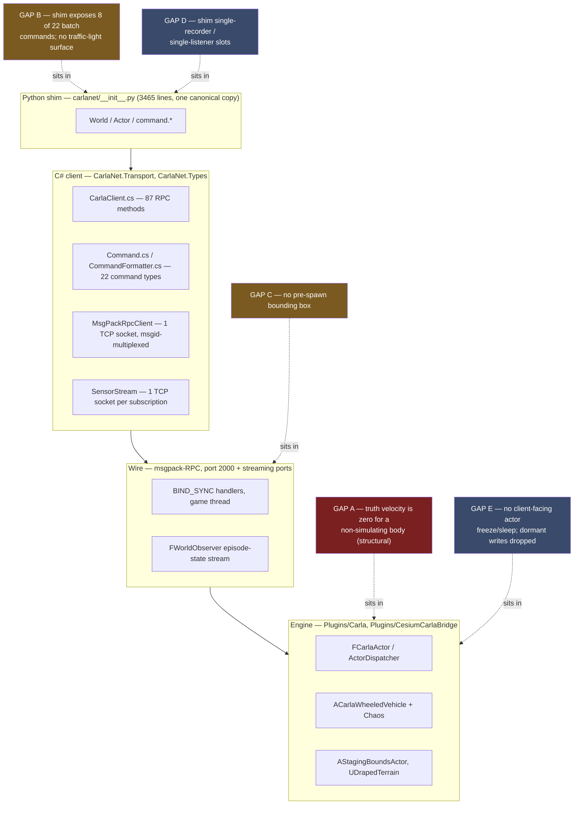

# 05 — CarlaNet capability audit for a SUMO-driven playback mode

| | |
|---|---|
| **Status** | Audit complete. Read from source on 2026-09-17 against `carla` branch `ue5-dev` at `b39ffe338`. |
| **Question answered** | Does the .NET client (`CarlaNet`) carry everything from LibCarla that a SUMO-driven playback mode needs, and where it does not, what exactly is missing and at which layer? |
| **Audience** | Engineers implementing the co-simulation runtime ([`03_CoSimulation_Runtime.md`](03_CoSimulation_Runtime.md)) and the contracts ([`04_Contracts.md`](04_Contracts.md)). Assumes no knowledge of the conversation that produced this plan. |
| **Method** | Every capability traced Python shim → C# client → RPC method name → server binding → engine implementation. Nothing is concluded from a name match in the shim. |

## What this section does **not** cover

- Whether the SUMO side can produce what CARLA needs (network, demand, `tlLogic`). That is
  [`07_Scenario_Authoring.md`](07_Scenario_Authoring.md) and
  [doc 23](../../Findings/23_SUMO_Traffic_Integration.md).
- The render-set rule, the clock contract, or physics authority. Those are decisions for
  [`03_CoSimulation_Runtime.md`](03_CoSimulation_Runtime.md) and [`04_Contracts.md`](04_Contracts.md);
  this section supplies the mechanisms they may assume exist and names the ones they may not.
- The SUMO toolchain build and packaging — [`09_Toolchain_And_Packaging.md`](09_Toolchain_And_Packaging.md).
- Performance measurement. This section reports the documented budget and the dispatch code that
  implements it; it makes no throughput measurement of its own and says so where that matters.

## Evidence vocabulary

Per the team brief's "measure, do not theorise" rule, every claim below is marked:

- **Read** — taken from a source file, cited `path:line`.
- **Measured** — produced by running something read-only; the method is stated.
- **Inferred** — a conclusion drawn from read facts; the reasoning is shown.

No measurement was needed for this audit: every question resolved by reading. Where a question
*could* only be settled by measurement, it is in the open questions rather than asserted.

---

## 1. The answer, before the evidence

**CarlaNet's C# client is at full parity with LibCarla's C++ client on every RPC a SUMO-driven
playback mode needs, including the one that decides whether the mode is affordable at all.** The
batch-command path carries all twenty-two command types the server understands — `ApplyTransform`,
`ApplyTargetVelocity`, `SetSimulatePhysics`, `SetEnableGravity`, `SpawnActor`, `DestroyActor`,
`ApplyVehicleControl` and `SetTrafficLightState` among them — so a per-step teleport of *N* vehicles
is **one round trip, not N**. That is the single most load-bearing finding in this audit (§4).

The gaps are real, but none of them is in the C# client or the RPC surface, and none of them is in
the engine. They are, in order of consequence:

1. **Truth velocity for a non-simulating body is structurally zero**, not merely un-updated. The
   field the world observer falls back to is written by nothing in the CARLA/Chaos vehicle stack
   (§7). No client-side call can fix it.
2. **The Python shim exposes 8 of the 22 batch commands and none of the traffic-light surface.**
   Everything missing exists one layer down in C# (§4.3, §12).
3. **Vehicle dimensions are not available before spawn** — neither the RPC nor the engine emits
   them on a blueprint definition — which makes the SUMO `vType` ↔ CARLA blueprint correspondence
   a build-time artefact rather than a runtime lookup (§6).

The direct answer to the question as the user put it is in §15.

---

## 2. The layer stack, and where each gap sits



Read the colours as consequence, not effort: the dark red gap changes what the truth record can
say; the amber gaps change what an author can express; the blue gaps change what one process can do.

---

## 3. Capability matrix

`P` = present and traced end to end · `p` = partially present (the layer named is the weak one) ·
`—` = absent at that layer · `n/a` = no such layer for this capability.

| # | Capability | Shim | C# client | RPC name(s) | Server / engine | Verdict | Weakest link |
|---|---|---|---|---|---|---|---|
| 1 | Synchronous mode + settings | P | P | `get_episode_settings`, `set_episode_settings` | P | **Present** | none |
| 1 | `world.tick()` with frame wait | P | P | `tick_cue` | P | **Present** | none |
| 1 | `on_tick` | P | P | n/a (stream) | P | **Present** | none |
| 1 | `wait_for_tick` | p | P | n/a (stream) | P | **Partial** | shim returns a synthetic timestamp |
| 2 | `apply_batch` / `apply_batch_sync` | p | P | `apply_batch` | P | **Present in C#** | shim exposes 8 of 22 commands |
| 2 | `ApplyTransform` in batch | P | P | `apply_batch` | P | **Present** | none |
| 2 | `ApplyTargetVelocity`, `SetSimulatePhysics`, `SetEnableGravity` in batch | — | P | `apply_batch` | P | **Present in C#** | shim |
| 2 | `SpawnActor` / `DestroyActor` in batch, with `do_after` | P | P | `apply_batch` | P | **Present** | none |
| 3 | `set_transform`, `set_simulate_physics`, `set_enable_gravity`, `set_collisions`, `set_target_velocity` | P | P | per-call RPCs | P | **Present** | none |
| 3 | `set_target_angular_velocity`, impulses, forces, torque | — | P | per-call RPCs | P | **Present in C#** | shim |
| 3 | Actor freeze / sleep | — | — | — | internal only | **Absent** | server (not bound) |
| 4 | `spawn_actor` / `try_spawn_actor` | P | P | `spawn_actor`, `spawn_actor_with_parent` | P | **Present** | `try_spawn` swallows all exceptions |
| 4 | Unvalidated custom spawn attributes | — | P | `spawn_actor` | P | **Present in C#** | shim `set_attribute` refuses |
| 5 | Blueprint library + attributes | P | P | `get_actor_definitions` | P | **Present** | none |
| 5 | Bounding box **before** spawn | — | — | — | — | **Absent** | engine emits no dimension |
| 6 | World snapshot every tick | P | P | n/a (stream) | P | **Present** | none |
| 6 | Velocity of a **simulating** actor | P | P | n/a (stream) | P | **Present** | none |
| 6 | Velocity of a **teleported non-simulating** actor | n/a | n/a | n/a | — | **Absent** | engine (structural) |
| 7 | Many simultaneous sensor streams per process | p | P | n/a (stream) | P | **Present in C#** | shim single-slot fields |
| 8 | `SampleDrapeGroundElevation` | P | P | none — local | P (grid fetched once) | **Present** | shim does not prime the grid |
| 9 | `get_staging_bounds` / `set_staging_bounds` | P | P | `get/set_staging_bounds` | P | **Present** | none |
| 10 | Native recorder start/stop, replay | p | P | 10 RPCs | P | **Present in C#** | 3 of 10 unwrapped in shim |
| 10 | Spawn attributes survive into the log | n/a | n/a | n/a | P | **Present** | none |
| 11 | Traffic-light state / freeze / phase times | — | P | 8 RPCs | P | **Present in C#** | shim: `TrafficLight` is `pass` |
| 11 | Traffic-light read (state, per tick, no RPC) | — | p | n/a (stream) | P | **Partial** | C# discards all but `State` |
| 11 | Map-side light lookup (`get_traffic_lights_from_waypoint`) | — | — | n/a (client-side) | n/a | **Absent** | C# (no waypoint graph surfaced) |
| 12 | Documented RPC service budget | n/a | n/a | n/a | P | **Present** | doc gives a time budget, not a count |

---

## 4. Capability 2 — batch command application (the load-bearing finding)

### 4.1 The complete command set, verified against the server's variant

`carla::rpc::Command` is a `std::variant` whose **declaration order is the wire index**. Read from
`LibCarla/source/carla/rpc/Command.h:284-306`. CarlaNet's `CommandType` enum reproduces that order
exactly, and its comment says it was source-verified — which this audit re-confirms
(`CarlaNet/src/CarlaNet.Types/Rpc/Commands/Command.cs:12-36`).

| Index | C++ type (`Command.h`) | C# record (`Command.cs`) | Serialised by | Server handler (`CarlaServer.cpp`) |
|---|---|---|---|---|
| 0 | `SpawnActor` `:53` | `SpawnActorCommand` `:46` | `CommandFormatter.cs:74-90` | `:3146-3169` → `spawn_actor` / `spawn_actor_with_parent` |
| 1 | `DestroyActor` `:69` | `DestroyActorCommand` `:53` | `:47` | `:3170` |
| 2 | `ApplyVehicleControl` `:77` | `ApplyVehicleControlCommand` `:56` | `:48` | `:3171` |
| 3 | `ApplyVehicleAckermannControl` `:87` | `…AckermannControlCommand` `:57` | `:49` | `:3172` |
| 4 | `ApplyWalkerControl` `:97` | `ApplyWalkerControlCommand` `:58` | `:50` | `:3173` |
| 5 | `ApplyVehiclePhysicsControl` `:107` | `…PhysicsControlCommand` `:61` | `:51` | `:3174` |
| **6** | **`ApplyTransform` `:117`** | **`ApplyTransformCommand` `:64`** | **`:52`** | **`:3175` → `set_actor_transform`** |
| 7 | `ApplyWalkerState` `:137` | `ApplyWalkerStateCommand` `:67` | `:53`, `:92-100` | `:3190` |
| **8** | **`ApplyTargetVelocity` `:146`** | **`ApplyTargetVelocityCommand` `:70`** | **`:54`** | **`:3176` → `set_actor_target_velocity`** |
| 9 | `ApplyTargetAngularVelocity` `:156` | `…AngularVelocityCommand` `:73` | `:55` | `:3177` |
| 10 | `ApplyImpulse` `:166` | `ApplyImpulseCommand` `:76` | `:56` | `:3178` |
| 11 | `ApplyForce` `:176` | `ApplyForceCommand` `:80` | `:57` | `:3179` |
| 12 | `ApplyAngularImpulse` `:186` | `ApplyAngularImpulseCommand` `:77` | `:58` | `:3180` |
| 13 | `ApplyTorque` `:196` | `ApplyTorqueCommand` `:83` | `:59` | `:3181` |
| **14** | **`SetSimulatePhysics` `:206`** | **`SetSimulatePhysicsCommand` `:86`** | **`:60`** | **`:3182`** |
| **15** | **`SetEnableGravity` `:216`** | **`SetEnableGravityCommand` `:87`** | **`:61`** | **`:3183`** |
| 16 | `SetAutopilot` `:226` | `SetAutopilotCommand` `:90` | `:62` | `:3185` |
| 17 | `ShowDebugTelemetry` `:241` | `ShowDebugTelemetryCommand` `:91` | `:63` | `:3186` |
| 18 | `SetVehicleLightState` `:253` | `SetVehicleLightStateCommand` `:94` | `:64`, `:102-109` | `:3187` |
| 19 | `ApplyLocation` `:127` | `ApplyLocationCommand` `:97` | `:65` | `:3193` |
| 20 | `ConsoleCommand` `:265` | `ConsoleCommandCommand` `:100` | `:66`, `:111-117` | `:3191` |
| 21 | `SetTrafficLightState` `:272` | `SetTrafficLightStateCommand` `:103` | `:67`, `:119-126` | `:3192` |

**Read.** All twenty-two are implemented in the C# serialiser — `CommandFormatter.WritePayload`
(`CarlaNet/src/CarlaNet.Types/Formatters/CommandFormatter.cs:41-72`) has an arm for each and throws
on anything unknown (`:68`). The nested-variant wire shape `[[variant_idx, [fields…]]]` is
reproduced at `:29-39`; `std::optional<ActorId> parent` as `[false]` / `[true, id]` at `:82-83`;
`do_after` recursion at `:84-88`. Responses decode at
`Formatters/CommandResponseFormatter.cs:15-32`, handling both the `ResponseError` and `ActorId`
variant arms.

The client entry points are `CarlaClient.ApplyBatchAsync` and `ApplyBatchSyncAsync`
(`CarlaNet/src/CarlaNet.Transport/CarlaClient.cs:1779-1785`), both sending RPC `"apply_batch"`. The
sync variant uses `CallRawAsync` because the server returns `std::vector<CommandResponse>`
unwrapped rather than inside `Response<T>` — a real wire-shape difference the port got right
(`CarlaClient.cs:1782-1785`, `MsgPackRpc/MsgPackRpcClient.cs:68-97`).

Server side: the visitor is built at `CarlaServer.cpp:3145-3194` and `BIND_SYNC(apply_batch)` at
`:3198-3213` iterates the vector in one game-thread call, then optionally calls `tick_cue()`
(`:3208-3211`).

### 4.2 This path is already in production use — with teleports in it

**Read.** The .NET traffic manager builds one `_controlFrame` per tick and sends it as a single
`ApplyBatchSync` (`CarlaNet/src/CarlaNet.TrafficManager/TrafficManagerLocal.cs:568`, with the
empty-batch and walker-only variants at `:465` and `:479`). That frame is a *mix* of command types
— `ApplyVehicleControlCommand`, `ApplyWalkerStateCommand`, `SetVehicleLightStateCommand`
(`Stages/VehicleLightStage.cs:292`) and, critically, **`ApplyTransformCommand`**, which the
motion-plan stage emits for its hybrid-physics and respawn teleports
(`Stages/MotionPlanStage.cs:244` and `:424`).

**Inferred, from those two facts:** the exact mechanism a SUMO teleport mode needs — a batch of
per-vehicle transforms applied in one round trip — is not a new capability to be built. It is the
mechanism this fork's traffic manager already runs on every tick, and any wire-shape defect in it
would have shown up as ambient traffic failing to move.

### 4.3 What Python cannot reach

**Read.** The shim imports **8** of the 22 command types
(`CarlaNet/python/carlanet/__init__.py:485-487`) and its `command` namespace declares exactly 8
wrapper classes: `SpawnActor` `:1080`, `DestroyActor` `:1101`, `SetAutopilot` `:1108`,
`ApplyVehicleControl` `:1117`, `ApplyTransform` `:1125`, `ApplyLocation` `:1133`,
`SetVehicleLightState` `:1141`, `ConsoleCommand` `:1149`. `Client.apply_batch` / `apply_batch_sync`
themselves are fine (`:2475-2485`) and `_cmds_to_cs` (`:1157-1159`) passes any already-C# command
straight through.

Missing from Python, present in C#: `ApplyTargetVelocity`, `ApplyTargetAngularVelocity`,
`SetSimulatePhysics`, `SetEnableGravity`, `ApplyImpulse`, `ApplyForce`, `ApplyAngularImpulse`,
`ApplyTorque`, `ApplyVehicleAckermannControl`, `ApplyWalkerControl`, `ApplyVehiclePhysicsControl`,
`ApplyWalkerState`, `ShowDebugTelemetry`, `SetTrafficLightState`.

**Consequence.** From Python, a teleport batch can carry poses but not the physics toggles or the
velocity commands that go with them — those become one RPC per vehicle through
`Actor.set_simulate_physics` / `Actor.set_target_velocity` (`:790-800`). From C#, they ride in the
same batch. This is the clearest single argument in the audit for the co-simulation runtime being a
.NET assembly, which is what [doc 23 §5](../../Findings/23_SUMO_Traffic_Integration.md) already
recommends for an unrelated reason.

Each missing wrapper is a five-line class beside the existing eight and an added name in the import
at `:485-487`. Nothing below Python changes.

### 4.4 The round trips, for real

```mermaid
sequenceDiagram
    autonumber
    participant Sumo as sumo (libtraci, out of process)
    participant CoSim as CarlaNet co-simulation<br/>(on CarlaClient.OnWorldTickCompleted)
    participant Rpc as MsgPackRpcClient<br/>(1 TCP socket, msgid-multiplexed)
    participant Srv as CARLA server<br/>(BIND_SYNC, game thread)
    participant Obs as FWorldObserver<br/>(separate streaming socket)

    Note over CoSim: one SUMO step, N rendered vehicles
    CoSim->>Sumo: simulationStep() + getAllSubscriptionResults()
    Sumo-->>CoSim: N poses, speeds, arrivals, departures

    Note over CoSim,Rpc: build ONE List&lt;Command&gt;:<br/>SpawnActor.do_after[SetSimulatePhysics(false)] for arrivals,<br/>ApplyTransform + ApplyTargetVelocity per live vehicle,<br/>DestroyActor for departures
    CoSim->>Rpc: ApplyBatchSyncAsync(commands, doTickCue: false)
    Rpc->>Srv: apply_batch  ← ROUND TRIP 1 of 2, independent of N
    Srv->>Srv: std::visit over the vector, in order,<br/>on one game-thread slice (CarlaServer.cpp:3202-3206)
    Srv-->>Rpc: vector&lt;CommandResponse&gt; (N entries, ids or errors)
    Rpc-->>CoSim: IReadOnlyList&lt;CommandResponse&gt;

    CoSim->>Rpc: SendTickCueAsync()
    Rpc->>Srv: tick_cue  ← ROUND TRIP 2 of 2
    Srv-->>Rpc: frame number
    Srv->>Obs: FWorldObserver::BroadcastTick
    Obs-->>CoSim: episode-state frame (NOT an RPC; push over the stream socket)
    Note over CoSim: WaitForFrame releases; OnWorldTickCompleted fires<br/>on the ticking thread (CarlaClient.cs:403-421)
    CoSim->>Sumo: moveToXY feedback for the next step
```

**Read.** Two RPC round trips per simulated step, whatever *N* is. The world state comes back on
the streaming socket and costs no RPC at all (`CarlaClient.StartWorldObserverAsync`,
`CarlaClient.cs:1800-1804`; parse and cache at `:1806-1838` and `:1840-1909`).

Two nuances worth stating because they are easy to get wrong:

- `apply_batch` takes a `do_tick_cue` flag that would fold the tick into round trip 1
  (`CarlaServer.cpp:3208-3211`). **Do not use it for a deterministic loop**: it ticks the server but
  the client does not then wait for the frame, so the caller can read the world one frame behind.
  `SendTickCueAsync` is the call that waits (`CarlaClient.cs:403-421`, `WaitForFrame` at `:423-445`).
- `SpawnActor.do_after` is the right place for per-spawn setup. The server resolves the new actor id
  into every follow-up command in the list before running it (`CarlaServer.cpp:3157-3164`), skipping
  only `SpawnActor` and `ConsoleCommand`, which have no `actor` field. A SUMO arrival can therefore
  be spawn + `SetSimulatePhysics(false)` + `ApplyTargetVelocity` in **one batch entry**.

---

## 5. Capability 1 — synchronous mode and tick control

### 5.1 Settings

**Read.** `EpisodeSettings` carries all eleven fields including `SynchronousMode`,
`FixedDeltaSeconds` (as `std::optional<double>`, with a dedicated `NullableDoubleFormatter`),
`Substepping`, `MaxSubstepDeltaTime` and `MaxSubsteps`
(`CarlaNet/src/CarlaNet.Types/Rpc/Environment/EpisodeSettings.cs:10-21`). Client:
`GetEpisodeSettingsAsync` / `SetEpisodeSettingsAsync` (`CarlaClient.cs:385-390`), RPC
`get_episode_settings` / `set_episode_settings`. Server: `CarlaServer.cpp:1150-1174` — applies to
the episode and additionally pushes synchronous mode into the streaming server (`:1159`).

Shim: `World.get_settings` / `apply_settings` (`__init__.py:1459-1466`) via a mutable
`_WorldSettings` mirror (`:2724-2772`) that snapshots all eleven fields and rebuilds the immutable
C# record on apply. **Verdict: present, no gap.**

### 5.2 The tick, and who owns it

**Read.** `World.tick()` (`__init__.py:2086-2087`) → `CarlaClient.SendTickCueAsync`
(`CarlaClient.cs:403-421`) → RPC `tick_cue` → `CarlaServer.cpp:393-399`, which only increments a
counter and returns `frame + 1`. The engine's dispatch loop is the other half
(`Unreal/CarlaUnreal/Plugins/Carla/Source/Carla/Game/CarlaEngine.cpp:332-347`).

The client-side contract is stronger than a bare cue, and recently so:

- `SendTickCueAsync` sends the cue, then **blocks until the world observer has delivered that frame
  or later**, then raises `OnWorldTickCompleted` on the ticking thread (`CarlaClient.cs:403-421`).
  The wait honours the client's own timeout (`SetTimeout` sets `_frameWaitTimeout`, `:292-299`), and
  on timeout it logs and returns rather than deadlocking (`:432-440`).
- Commit `37a2e4145` *Step the traffic manager on the world tick, so a run can repeat* introduced
  that wait. Its message records the cause plainly: the synchronous machinery existed but nothing
  joined it up, so a synchronous traffic manager parked on its first gate and no vehicle moved. It
  also raised the manager's synchronous step timeout from upstream's 10 ms to 1000 ms, on the ground
  that our step ends by sending a batch of vehicle commands and that round trip alone measured
  ~20 ms against a free-running server.
- Commit `fbed54ee0` *Hand the world-tick subscriber a complete timestamp* filled `DeltaSeconds` and
  `PlatformTimestamp` on that record, which had been left at zero because the only subscriber read
  the other two (`CarlaClient.cs:441-444`).
- Commit `2f392f0ba` *Schedule the synchronous loop on the world's clock, not the wall's* moved the
  launcher's interval scheduling onto simulated time and added `World.get_sim_time`
  (`__init__.py:2017`). Its message reports a comparison of two seeded synchronous runs: the traffic
  manager drove the first vehicle bit-identically for 1252 frames before the runs differed, and then
  by five millimetres — but the *n*-th vehicle to spawn appeared up to 558 frames apart, because
  spawn scheduling was on the wall clock.

**Two events exist and they are not interchangeable**, which the co-simulation runtime must get
right:

| Event | Raised from | Thread | Meaning |
|---|---|---|---|
| `CarlaClient.OnTick` (`CarlaClient.cs:305`) | the world-observer stream reader, once per delivered frame (`:1820-1832`) | the stream socket's reader thread | "a frame arrived" |
| `CarlaClient.OnWorldTickCompleted` (`:159`) | `SendTickCueAsync`, after the cue **and** after the frame it produced is in (`:405-417`) | the thread that called `tick()` | "the frame I asked for is in; step now, and block me while you do" |

`CarlaNet.Scenario.ScenarioExecutor` subscribes to `OnTick` (`ScenarioExecutor.cs:79`, unsubscribes
at `:561`). `CarlaNet.TrafficManager.TrafficManagerLocal` subscribes to `OnWorldTickCompleted`
(`TrafficManagerLocal.cs:238`, `:257`, handler at `:316-331`) and takes its clock from the
timestamp's `ElapsedSeconds` (`:321`, `CurrentElapsedSeconds` at `:341-345`).

**Inferred.** A SUMO bridge that must have issued its commands *before* the next frame is asked for
belongs on `OnWorldTickCompleted`, not `OnTick`. `OnTick` fires on a stream thread that the tick
does not wait for; a bridge there would race the next tick. This is a contract for
[`03_CoSimulation_Runtime.md`](03_CoSimulation_Runtime.md) to record.

### 5.3 `wait_for_tick` — the one real defect in this capability

**Read.** `World.wait_for_tick` (`__init__.py:2190-2209`) registers a one-shot `on_tick` handler,
waits on a `threading.Event`, and then returns `Timestamp(0, 0.0, 0.0, time.time())` — a **synthetic
record with frame 0 and elapsed 0**, discarding the timestamp the handler was actually given. The
fallback path at `:2208` returns the same thing after a 50 ms sleep.

Any caller that does `ts = world.wait_for_tick(); ...ts.frame` gets zero. `on_tick` does not have
this problem (`:2158-2163` forwards all four fields). Fix: capture the timestamp in the handler's
closure and return it. Shim only.

---

## 6. Capabilities 4 and 5 — spawning at scale, and what a blueprint tells you

### 6.1 Spawn

**Read.** Shim `World.spawn_actor` `:2055-2073`, `try_spawn_actor` `:2075-2080`; C#
`SpawnActorAsync` (`CarlaClient.cs:1442-1443`) and `SpawnActorWithParentAsync` (`:1484-1486`); RPCs
`spawn_actor` / `spawn_actor_with_parent`; server `CarlaServer.cpp:1311-1332` and `:1334-1400`;
engine `UCarlaEpisode::SpawnActorWithInfo` → `UActorDispatcher::SpawnActor`
(`Actor/ActorDispatcher.cpp:50-86`).

Two shapes worth knowing:

- There is **no `TrySpawnActorAsync` in C#**. `try_spawn_actor` is a bare `except Exception: return
  None` in the shim (`:2075-2080`), so a transport fault is indistinguishable from an occupied spawn
  point.
- At scale, spawn belongs in the batch (`SpawnActorCommand`, §4), which also returns a per-entry
  error string rather than an exception.

### 6.2 Custom attributes — doc 20 §4.5 verified, with one citation corrected

**Read.** The RPC→engine conversion copies every attribute into the description's `Variations` map
with no membership test (`LibCarla/source/carla/rpc/ActorDescription.h:47-56`, the
`Variations.Emplace` at `:53`). The spawn binding forwards the description untouched
(`CarlaServer.cpp:1317`). The dispatcher validates only the `UId` bounds
(`Actor/ActorDispatcher.cpp:55-64`). Consumers are lookup-with-default —
`RetrieveActorAttributeToInt` and its five siblings all return `Default` when the key is absent and
never enumerate the map looking for strangers (`Actor/ActorBlueprintFunctionLibrary.cpp:1293-1339`).

So the server accepts an attribute no blueprint declares, and it is inert. Doc 20 §4.5's claim
**holds**; its citation `CarlaServer.cpp:1139-1146` is stale in this tree — that range is inside the
`request_file` binding. The correct range is `CarlaServer.cpp:1311-1332`.

**The shim's refusal**, exactly as doc 20 cites it
(`CarlaNet/python/carlanet/__init__.py:611-614`):

```python
    def set_attribute(self, name: str, value: str):
        if name not in self._attrs:
            raise KeyError(f"Blueprint '{self._id}' has no attribute '{name}'")
        self._attrs[name]['value'] = str(value)
```

**What relaxing it takes.** `ActorBlueprint.to_description` (`:619-624`) iterates `self._attrs`
unconditionally, so anything placed in that dict reaches the wire. The whole gate is the `if` at
`:612`. The right shape is a sibling `set_attribute_unchecked(name, value, attr_type)` that writes a
new entry rather than loosening `set_attribute`, because `set_attribute`'s strictness faithfully
mirrors upstream (`LibCarla/source/carla/client/ActorBlueprint.cpp:41-51` throws
`std::out_of_range`), and a silent divergence there is worse than a second method. No C# change, no
engine change.

From C# there is no gate at all: `BlueprintChooser.Describe` already builds the attribute list
(`CarlaNet/src/CarlaNet.Scenario/BlueprintChooser.cs:33-39`) and an extra
`ActorAttributeValue(id, type, value)` can simply be appended.

One asymmetry found on the way, not previously recorded: the shim caches each attribute's
`modifiable` flag (`:592`) and never consults it, and does not cache `RestrictToRecommended` at all,
while upstream enforces both (`LibCarla/source/carla/client/ActorAttribute.cpp:22-32`). The shim is
*stricter* than upstream about unknown keys and *laxer* about read-only ones. Harmless on the wire;
a behaviour difference a ported script could trip over.

### 6.3 Blueprint definitions carry no dimensions — which is a contract problem, not a bug

**Read.** `ActorDefinition` on the wire is `(Uid, Id, Tags, Attributes)` and nothing else
(`CarlaNet/src/CarlaNet.Types/Rpc/Actors/ActorDefinition.cs:5-10`, matching
`LibCarla/source/carla/rpc/ActorDefinition.h`). `Actor` — what you get **after** a spawn — carries
`BoundingBox` at key 3 (`CarlaNet.Types/Rpc/Actors/Actor.cs:11`).

The engine emits no size attribute for a vehicle. `MakeVehicleDefinition`
(`Actor/ActorBlueprintFunctionLibrary.cpp:839-930`) produces exactly: `role_name`, `ros_name`,
`color`, `driver_id`, `sticky_control`, `terramechanics`, `object_type`, `base_type`,
`special_type`, `number_of_wheels`, `generation`, `has_dynamic_doors`, `has_lights`. The root cause
is one level up: `FVehicleParameters` (`Actor/VehicleParameters.h:13-58`) has no dimension field at
all, so the data is not in the catalogue to emit.

The bounding box is computed from the instantiated actor at registration:
`Info->BoundingBox = UBoundingBoxCalculator::GetActorBoundingBox(&Actor)`
(`Actor/ActorRegistry.cpp:163`), copied into the serialised form at `:173`.

**Inferred, and load-bearing for the vehicle catalogue contract.** Every dimension consumer in this
fork already works post-spawn because it has no choice: `ScenarioExecutor.SetDown` spawns high, reads
`actor.BoundingBox`, and teleports the vehicle down onto the surface
(`CarlaNet.Scenario/ScenarioExecutor.cs:168-182`); the traffic manager reads `BoundingBox.Extent`
off live actors (`Stages/ALSM.cs:536`, `:589`, `:602`, `:620`). A SUMO `vType`'s `length` and
`width` change car-following gaps, so the correspondence has to be established **at authoring time
from a catalogue produced by a running server**, exactly as
[doc 20 decision 12](../../Findings/20_Behavioral_Annotation_And_Areas_Of_Interest.md) argues — not
looked up at playback. [`04_Contracts.md`](04_Contracts.md) owns that contract; this audit supplies
the reason it cannot be a runtime query.

---

## 7. Capability 6 — the world snapshot, and why a teleported vehicle reports zero speed

### 7.1 How state reaches the client

**Read.** One subscription to the episode-state stream, opened by `StartWorldObserverAsync`
(`CarlaClient.cs:1800-1804`) using the token from `get_episode_info`. Each frame is parsed inline
(`ParseEpisodeState`, `:1840-1909`): a 124-byte header (episode id, platform timestamp, delta
seconds, map origin, state, plus eleven appended solar doubles at offset 36) followed by
119 bytes per actor. Per actor the client decodes id, state, transform, **velocity**, angular
velocity, acceleration and a 54-byte type-dependent union (`:1861-1892`), caching an `ActorSnapshot`
(`:26-45`) and evicting any actor absent from the snapshot (`:1900-1908`).

Accessors are pure cache reads, no RPC: `GetActorTransform`, `GetActorVelocity`,
`GetActorAngularVelocity`, `GetActorAcceleration`, `GetActorSnapshot` (`:1915-1919`).

### 7.2 Where velocity comes from — doc 23's `WorldObserver.cpp:373` verified

**Read**, line for line:

```cpp
// Unreal/CarlaUnreal/Plugins/Carla/Source/Carla/Sensor/WorldObserver.cpp
373:      Velocity = TO_METERS * View->GetActor()->GetVelocity();
```

Confirmed at exactly line 373, inside the `else` branch of an `if (View->IsDormant())` at `:358`.
The dormant branch reads a stored value instead: `Velocity = TO_METERS * ActorData->Velocity`
(`:361`). Acceleration in **both** branches is derived by differencing the same velocity against the
previous frame's (`FWorldObserver_GetAcceleration`, `:264-278`), so whatever is true of velocity is
true of acceleration.

Following `GetActor()->GetVelocity()` down for a CARLA vehicle:

1. `ACarlaWheeledVehicle::GetVelocity()` overrides it and returns
   `BaseMovementComponent->GetVelocity()`
   (`Vehicle/CarlaWheeledVehicle.cpp:804-806`, declared `Vehicle/CarlaWheeledVehicle.h:412`).
2. `UBaseCarlaMovementComponent::GetVelocity()` returns
   `CarlaVehicle->AWheeledVehiclePawn::GetVelocity()`
   (`Vehicle/MovementComponents/BaseCarlaMovementComponent.cpp:35-42`) — i.e. it explicitly routes
   back to the pawn's base implementation.
3. `AWheeledVehiclePawn` does not override it, so this is `AActor::GetVelocity()`, which returns
   `RootComponent->GetComponentVelocity()`
   (`UE_5_7_4/Engine/Source/Runtime/Engine/Private/Actor.cpp:748-755`).
4. `UPrimitiveComponent::GetComponentVelocity()`
   (`.../Private/PrimitiveComponentPhysics.cpp:1328-1340`):

   ```cpp
   if (IsSimulatingPhysics())
   {
       FBodyInstance* BodyInst = GetBodyInstance();
       if(BodyInst != NULL) { return BodyInst->GetUnrealWorldVelocity(); }
   }
   return Super::GetComponentVelocity();
   ```
5. `USceneComponent::GetComponentVelocity()` returns the bare `ComponentVelocity` field
   (`.../Private/Components/SceneComponent.cpp:2995-2998`).

### 7.3 The conclusion, stated more strongly than doc 23 states it

**Read.** `ComponentVelocity` is written in exactly one place in the engine's movement machinery:
`UMovementComponent::UpdateComponentVelocity()`
(`.../Private/Components/MovementComponent.cpp:382-388`). A grep of the entire
`Engine/Plugins/Experimental/ChaosVehiclesPlugin/Source/ChaosVehicles` tree for
`UpdateComponentVelocity` or `ComponentVelocity` returns **zero hits**.

**Inferred, and this is the audit's most consequential inference:** a CARLA vehicle's
`ComponentVelocity` is never written by anything. So for a vehicle whose physics is off, the world
observer does not report a *stale* velocity — it reports a **structural zero**, and would do so
however the vehicle got where it is. Doc 23's framing ("a teleport does not update component
velocity") is correct but understates the problem: there is no history to be stale.

Nor can the client set it. `FCarlaActor::SetActorTargetVelocity` on a non-dormant actor calls
`RootComponent->SetPhysicsLinearVelocity(...)` (`Actor/CarlaActor.cpp:392-411`), which writes the
physics body (`FBodyInstance::SetLinearVelocity`, guarded by
`FPhysicsInterface::IsRigidBody`) — and step 4 above never *reads* the body when
`IsSimulatingPhysics()` is false. And for a CARLA vehicle, `set_simulate_physics(false)` does more
than clear a flag: `ACarlaWheeledVehicle::SetSimulatePhysics(false)` calls
`Movement->DestroyPhysicsState()` (`Vehicle/CarlaWheeledVehicle.cpp:754-788`, the destroy at `:781`),
so there is no body left to write to.

**One route does exist in the current code**, and it is worth naming because it is the only one:
the **dormant** branch. `FCarlaActor::SetActorTargetVelocity` writes `ActorData->Velocity` when the
actor is dormant (`CarlaActor.cpp:394-397`), and `FWorldObserver_Serialize` reads exactly that field
for a dormant actor (`WorldObserver.cpp:361`). But dormancy is driven by large-map streaming and
`actor_active_distance`, not by the client — there is no `put_actor_to_sleep` RPC (§8.3) — so this
is a description of the shape of a fix, not a usable mechanism today.

### 7.4 What this means for the plan

Everything downstream of velocity is affected, not just the CoT record: the traffic manager's
collision stage, and the arrival/occlusion gating of
[doc 17](../../Findings/17_Photoreal_Occlusion_Metric.md). The team brief's decision 2 already says
this is a problem to be solved rather than a reason to reject the mode. The audit's contribution is
to say **where** it must be solved: in the engine, because no ordering of client calls produces a
non-zero reading. Candidate shapes, for
[`03_CoSimulation_Runtime.md`](03_CoSimulation_Runtime.md) and
[`06_Truth_And_Annotation.md`](06_Truth_And_Annotation.md) to choose between:

| Shape | Where it lands | Note |
|---|---|---|
| Have `SetActorTargetVelocity` also write `ComponentVelocity` on a non-simulating root | `Actor/CarlaActor.cpp:392-411` | Smallest change; makes the existing API mean what its name says. Alters behaviour for every client, so it is a shared-code change and needs stock-content regression. |
| A new "asserted velocity" field on `FActorInfo`, set by a new command/RPC and preferred by the observer when physics is off | `WorldObserver.cpp:358-378` + a new `BIND_SYNC` + a new variant arm | Keeps teleport velocity distinguishable from measured velocity, which the truth record arguably wants to know. Adds a 23rd command type, so `Command.h`, `Command.cs` and `CommandFormatter.cs` move together. |
| Derive velocity client-side from consecutive snapshot transforms | `CarlaNet` only | Needs no engine change but produces a *different quantity* (finite difference of pose) that must be labelled as such in truth, never as measured speed. |

Each is a design decision, not an effort estimate; a rebuild is neutral and is not a consideration
between them.

---

## 8. Capability 3 — per-actor state control

**Read.** Traced shim → C# → RPC → `CarlaServer.cpp` → `CarlaActor.cpp` for each.

| Call | Shim | C# | RPC | Server | Engine |
|---|---|---|---|---|---|
| `set_transform` | `:754-755` | `CarlaClient.cs:1496` | `set_actor_transform` | `CarlaServer.cpp:1589-1606` | `CarlaActor.cpp:335-360` |
| `set_location` | `:757-758` | `:1493` | `set_actor_location` | `:1570-1587` | `CarlaActor.cpp:284-306` |
| `set_simulate_physics` | `:790-791` | `:1529` | `set_actor_simulate_physics` | `:2113-2136` | base `CarlaActor.cpp:562-582`; vehicle `:813-829`; walker `:1295-1319` |
| `set_target_velocity` | `:793-800` | `:1499` | `set_actor_target_velocity` | `:1639-1662` | `CarlaActor.cpp:392-411` |
| `set_target_angular_velocity` | **absent** | `:1502` | `set_actor_target_angular_velocity` | `:1664-1687` | `CarlaActor.cpp:413-432` |
| `set_enable_gravity` | `:817-818` | `:1538` | `set_actor_enable_gravity` | `:2187-2210` | `CarlaActor.cpp:596-611` |
| `set_collisions` | `:811-815` | `:1532` | `set_actor_collisions` | `:2138-2161` | `CarlaActor.cpp:584-594` |
| `enable/disable_constant_velocity` | `:828-832` | `:1505`, `:1508` | `enable/disable_actor_constant_velocity` | `:1689-1740` | `CarlaActor.cpp:615-645` (vehicles only) |
| impulses / forces / torque (6 calls) | **absent** | `:1511-1527` | `add_actor_*` | `:1742-1909` | `CarlaActor.cpp:434+` |
| `set_actor_dead` | **absent** | `:1535` | `set_actor_dead` | `:2163-2185` | `CarlaActor.cpp:1461-1481` (walkers only) |

### 8.1 What `set_actor_transform` actually does

**Read.** `CarlaServer.cpp:1603-1604` passes `ETeleportType::TeleportPhysics`, and
`FCarlaActor::SetActorGlobalTransform` calls `GetActor()->SetActorTransform(LocalTransform, false,
nullptr, TeleportType)` (`CarlaActor.cpp:335-360`). Three properties follow:

- **No sweep.** `bSweep = false`, so the actor is placed regardless of what is already there. Nothing
  reports an overlap. `ScenarioExecutor.WarnIfOccupied` (`ScenarioExecutor.cs:134-158`) is a
  client-side proximity scan written to compensate, and it only warns.
- **It touches no velocity state.** Neither linear nor angular velocity is written anywhere in that
  function, which is why `ScenarioExecutor.SetDown` issues a separate zeroing call immediately after
  its teleport (`ScenarioExecutor.cs:179-180`). The shim's `set_transform` does not, so a Python
  caller inherits whatever the actor had.
- **It is not virtual** (`CarlaActor.h:203-205`) — no vehicle- or walker-specific override, so a
  wheeled vehicle is teleported by the same code as a prop.

### 8.2 Two traps worth recording before they are rediscovered

**Read.** `FCarlaActor::SetActorSimulatePhysics` (the non-vehicle path) ends with an
**unconditional** `RootComponent->SetCollisionEnabled(ECollisionEnabled::QueryAndPhysics)`
(`CarlaActor.cpp:578-579`). A `set_collisions(false)` issued earlier is therefore silently undone by
a later `set_simulate_physics(false)`. Order matters and nothing enforces it.

**Read.** Several dormant branches are empty — `SetActorCollisions` (`:586-588`),
`SetActorEnableGravity` (`:598-600`), `AddActorImpulse` (`:436-438`),
`EnableActorConstantVelocity` / `DisableActorConstantVelocity` (`:617-619`, `:634-636`). The request
is dropped and never replayed on wake. Only `SetActorSimulatePhysics`, `SetActorTargetVelocity` and
`SetActorTargetAngularVelocity` persist into `ActorData`.

### 8.3 Actor freeze / sleep — absent from the client

**Read.** `UCarlaEpisode::PutActorToSleep` / `WakeActorUp` exist (`Game/CarlaEpisode.h:284-292`) but
are **not RPC-bound**. Their only use in the server is internal — putting a freshly attached sensor
to sleep when its parent is already dormant (`CarlaServer.cpp:1387-1396`). There is no
`put_actor_to_sleep`, `wake_actor_up`, `freeze_actor` or `set_actor_dormant` among the server's
bindings. The only `freeze_*` RPCs are traffic-light-specific.

**Not found** after searching the full `BIND_SYNC`/`BIND_ASYNC` name set in `CarlaServer.cpp`, all
`.cs` under `CarlaNet/src`, and the shim.

**Inferred.** The closest reachable approximation is `set_simulate_physics(false)`, which for a
vehicle destroys the Chaos physics state (§7.3) — sufficient for a teleport-driven vehicle, and
exactly the thing that zeroes truth velocity. There is no cheaper "present but inert" state
available to the render-set contract.

---

## 9. Capability 7 — sensors and multi-camera capture

**Read.** The stream-token model is per-subscription, not per-client. `StreamToken.Parse` unpacks
the 24-byte blob and rewrites `0.0.0.0` to the RPC host
(`CarlaNet.Types/Streaming/StreamToken.cs:33-62`); the token arrives on the `spawn_actor` response
(`CarlaNet.Types/Rpc/Actors/Actor.cs:15`). `SensorStream` opens **one dedicated `TcpClient` per
subscription** with `NoDelay`, writes the 4-byte stream id to subscribe, and runs its own framed
read loop on its own thread (`CarlaNet.Transport/Streaming/SensorStream.cs:21-61`).

`CarlaClient.SubscribeToStream` appends to an unbounded `List<SensorStream>`
(`CarlaClient.cs:133`, `:1748-1754`) and returns an `IDisposable` that removes it. There is no
token→callback map because there is nothing to key: the callback is captured by the socket that owns
it. **The C# layer imposes no limit on simultaneous sensors**, and the client already runs at least
two streams in normal operation (the world observer plus any sensor).

**The claim in the brief that `FrameRecorder.cs:59-98` binds one stream token per recorder is not
what the code says**, and the range is wrong. Lines 59-98 are occlusion counters, doc comment, the
constructor signature and the token guard. The subscriptions are at `:112-113` (an optional second
one, to a depth camera, via `OcclusionEstimator`, which subscribes at
`CarlaNet.Recording/OcclusionEstimator.cs:89`) and `:125-126`:

```csharp
// Independent subscription to the camera stream (does not disturb the display listener).
_subscription = client.SubscribeToStream(streamToken, OnFrame);
```

So a single `FrameRecorder` already opens **up to two** streams, and the comment explicitly says the
subscription is independent of any other listener on the same camera.

**The real single-slot limit is in the shim**, in two places:

- `World.start_recording` calls `self.stop_recording()` first and stores into a single
  `self._recorder` field (`__init__.py:1908`, `:1924`). Starting a second recorder destroys the
  first.
- `Actor.listen` stores into a single `self._sub` (`:872`); a second `listen()` on the same actor
  orphans the first subscription.

**Inferred.** Doc 20 decision 11's warning — that the process-local annotation registry does not
survive multiple collection cameras — is about *process* boundaries. This audit finds that the
process boundary is not forced by the transport: constructing `FrameRecorder` N times with N camera
tokens works today in one process, each with its own worker pool, channel and sockets. The
restriction is a shim API shape. That weakens the premise of decision 11's "additional cameras mean
additional client processes" and should be revisited in
[`08_Collection_And_EPoL.md`](08_Collection_And_EPoL.md) rather than inherited.

---

## 10. Capability 8 — the drape ground sampler

**Read.** `CarlaClient.SampleDrapeGroundElevation(double x, double y)` is at
`CarlaNet/src/CarlaNet.Transport/CarlaClient.cs:241-263`. It is **synchronous, local, and contains
no RPC call**: two bilinear taps on cached `float[]` grids (draped DTM plus a per-cell offset),
returning `null` outside the grid or when no drape is active. Helpers at `:265-282`. The
`byte[] → float[]` conversion is memoised by reference identity (`:252-255`), so the single
`Buffer.BlockCopy` runs only when the underlying array object is replaced.

**Per-call cost:** eight array reads and about ten floating-point operations. Safe at any per-vehicle,
per-step rate. This is the Z source a teleported pose needs, and it costs nothing.

The grid is loaded once, by one of two paths:

- The client that generated the world latches it during
  `GenerateWorldFromOsmWithElevationAsync` (`CarlaClient.cs:953-960`; `LastDrapeActive` cleared for
  non-drape modes at `:975`).
- A client that merely connected pulls it with **three RPCs, once per world**:
  `get_bare_earth_reference`, `get_bare_earth_offset_grid`, `get_bare_earth_dtm_grid`, via
  `EnsureBareEarthReference` (`CarlaClient.cs:1152-1198`, memoised, invalidated on episode load at
  `:373`).

**One defect.** The shim's `World.drape_ground_elevation` (`__init__.py:1627-1634`) calls
`SampleDrapeGroundElevation` **without** first calling `EnsureBareEarthReference`. On a reconnected
client nothing has primed `LastDrapeActive`, so it returns `None` silently until some other path
primes it. A co-simulation runtime in C# should call `EnsureBareEarthReference()` once at startup
and check `HasBareEarthReference` (`CarlaClient.cs:213`) before trusting any Z.

---

## 11. Capability 9 — the staging-bounds pattern, described so it can be copied

**Read.** Present end to end, and it is the cleanest RPC pair in the tree.

| Layer | `set_staging_bounds` | `get_staging_bounds` |
|---|---|---|
| Shim | `__init__.py:1589-1594` | `:1596-1606` |
| C# | `CarlaClient.cs:1103-1105` | `:1111-1112` |
| Server | `CarlaServer.cpp:808-822` | `:828-842` |
| Engine | `UStagingBounds::Set` | `UStagingBounds::Get` |

The pattern, in the five parts an author copying it needs:

1. **Only flat primitives cross the wire.** The setter takes five bare `double`s and returns
   `R<bool>`; the getter takes nothing and returns `R<std::vector<double>>`, a positional array
   `{minX, minY, maxX, maxY, margin}` (`CarlaServer.cpp:841`). `R<T>` is
   `carla::rpc::Response<T>`, already included at the top of `CarlaServer.cpp`. **No msgpack struct
   was authored, no `MSGPACK_DEFINE_ARRAY`, no new header in `LibCarla/source/carla/rpc/`.** A grep
   of `LibCarla/source/` and `PythonAPI/carla/src/` for `staging_bounds` returns nothing — these are
   CarlaNet-only RPCs. Copying this shape means a new pair touches no LibCarla file at all.
2. **The data lives on its own actor.** `AStagingBoundsActor` is an `AActor` with five `UPROPERTY()`
   doubles and nothing else — no geometry, no tick, hidden, tagged `"staging_bounds"`
   (`Unreal/CarlaUnreal/Plugins/CesiumCarlaBridge/Source/CesiumCarlaBridge/Public/StagingBounds.h:20-34`).
   `Set` destroys every existing instance (`TActorIterator<AStagingBoundsActor>`, one per world) and
   spawns a replacement; `Get` iterates the same type and returns the first valid one. The header's
   own rationale (`StagingBounds.h:8-11`) is the rule to follow: give the record its own actor when
   its lifetime is a property of something other than an existing actor.
3. **Absence is not an error.** `set_*` responds with an error when there is no world or the helper
   fails. `get_*` errors **only** on "no world"; a world with no record returns an **empty vector**
   (`CarlaServer.cpp:839`), which the shim maps to `None` (`__init__.py:1603-1604`). That
   distinction is load-bearing: `get_staging_bounds() is not None` is used elsewhere in the shim as
   the "was this world generated from OSM?" test (`:1747`).
4. **There is no RPC-name registry.** `#define BIND_SYNC(name)` stringifies the C++ identifier
   (`CarlaServer.cpp:278`), so the name exists as a literal in exactly two places: the `BIND_SYNC`
   macro inside `FCarlaServer::FPimpl::BindActions()` and the string passed to `_rpc.CallAsync<T>`
   in `CarlaClient.cs`. Nothing else has to be updated.
5. **Include the plugin header** alongside `BareEarthReference.h`, `DrapedTerrain.h` and
   `StagingBounds.h` inside the `<util/ue-header-guard-begin.h>` block at `CarlaServer.cpp:78-81`.

Doc 20 §8.4's citations are stale in this tree (`CarlaServer.cpp:727-760`, shim `:1562`/`:1569`);
current lines are `:808-842` and `__init__.py:1589`/`:1596`. Its recommendation — that areas of
interest be a second pair in the same shape — is confirmed by this reading and needs no revision.

---

## 12. Capabilities 10 and 11 — recorder, replay, and traffic lights

### 12.1 Recorder and replay

**Read.** All ten native-recorder RPCs exist in C# (`CarlaClient.cs:1713-1742`) and all ten are
bound in the server (`CarlaServer.cpp:3030-3119`). The shim wraps seven
(`__init__.py:2622-2643`); **`show_recorder_collisions`, `show_recorder_actors_blocked` and
`set_replayer_ignore_spectator` have no Python wrapper**. The last of those is called by a shipped
utility (`PythonAPI/util/start_replaying.py:62`), which therefore raises `AttributeError` against
the CarlaNet shim.

Naming caution for anyone reading the shim: `Client.start_recorder` (the native CARLA `.log`) and
`World.start_recording` (CarlaNet's PNG + CoT `FrameRecorder`) are unrelated subsystems that coexist
in the same file.

**Doc 20 §4.5's recorder claim is confirmed.** `ACarlaRecorder::CreateRecorderEventAdd` copies the
entire `Variations` map into the actor-add event
(`Unreal/CarlaUnreal/Plugins/Carla/Source/Carla/Recorder/CarlaRecorder.cpp:747-769`), and
`CarlaRecorderEventAdd` writes and reads those attributes symmetrically to and from disk
(`Recorder/CarlaRecorderEventAdd.cpp:11-65`). Spawn attributes survive record **and** replay.

One incidental hazard found while verifying: `CarlaRecorder.cpp:783-786` dereferences the result of
`Episode->FindCarlaActor(DatabaseId)` without a null check, unlike every other call site in the
server.

### 12.2 Traffic lights — the C# client is at parity; Python has nothing

This matters because a SUMO-driven world must be able to drive CARLA's lights from SUMO's `tlLogic`.

**Read.** Ten traffic-light RPCs in C# (`CarlaClient.cs:1659-1689`): `set_traffic_light_state`,
`set_traffic_light_green_time`, `set_traffic_light_yellow_time`, `set_traffic_light_red_time`,
`freeze_traffic_light`, `reset_traffic_light_group`, `reset_all_traffic_lights`,
`freeze_all_traffic_lights`, `get_light_boxes`, `get_group_traffic_lights`. All ten are bound
(`CarlaServer.cpp:2648-2884`) and all the engine implementations exist under
`Plugins/Carla/Source/Carla/Traffic/`.

**The diff against LibCarla's C++ client is empty.** `LibCarla/source/carla/client/detail/Client.cpp:519-570`
sends exactly those ten names; CarlaNet sends the same ten. There is no RPC the C++ client had that
the C# client lacks.

Above the RPC layer there are three gaps:

1. **Nothing is reachable from Python.** `class TrafficLight(TrafficSign): pass`
   (`__init__.py:1002-1004`), and `TrafficSign` is likewise `pass` (`:997-999`). There is no
   `__getattr__` forwarding on `Actor`. The enum is exported (`:476-478`) with nothing to pass it
   to. `World` has no `reset_all_traffic_lights` or `freeze_all_traffic_lights` either. This was a
   deliberate deferral, recorded in
   [doc 10](../../Findings/10_Intersection_Navigation_Traffic_Control.md) as "Layer C — deferred"
   (`:76-77`) and again at `:247-250`.
2. **Phase times and the frozen flag are decoded and then discarded in C#.**
   `ParseTrafficLightState` (`CarlaClient.cs:79-97`) decodes sign id, state, green/yellow/red/elapsed
   times, pole index and `time_is_frozen` from the observer's type-dependent union — and the only
   public accessor, `GetTrafficLightStatesBySignId` (`:1964-1974`), writes only `State` into its
   dictionary. `ParseTrafficLightState` is `internal` with two in-file callers. So
   `get_elapsed_time()`, `is_frozen()` and the per-phase durations are unreachable from **any**
   caller although the bytes are already in hand. Fixing this needs no RPC and no server change —
   one public accessor returning the existing `TrafficLightObservedState`.
3. **All map-side light lookup is absent.** Upstream's `World::GetTrafficLightsFromWaypoint`
   (`LibCarla/source/carla/client/World.cpp:264-281`), `GetTrafficLightsInJunction` (`:284-298`),
   `TrafficLight::GetAffectedLaneWaypoints` and `GetStopWaypoints`
   (`LibCarla/source/carla/client/TrafficLight.cpp:81-105`, `:115-137`) are **client-side map
   operations, not RPCs**. CarlaNet's shim has no `Waypoint`, `Junction` or `Landmark` type at all
   (`Map` is name plus spawn points, `__init__.py:666-685`). **Not found** after searching the whole
   `CarlaNet` tree.

**Inferred, and it matters for how expensive gap 3 is.** A SUMO bridge does not need the waypoint
query. This fork's `TrafficLightInjector` already establishes the `tlLogic` ↔ OpenDRIVE `sign_id`
correspondence at world-build time — one `<controller>` per green phase, with the xodr signal id
`{tlLogicId}_{k}` matching tlLogic link index *k* and the controller id matching the junction name
([doc 10 §Implementation status](../../Findings/10_Intersection_Navigation_Traffic_Control.md), `:60-74`).
A bridge can key off `sign_id` directly, which is also how `GetTrafficLightStatesBySignId` reads
state back. **Gap 3 is sidesteppable for this use case; gaps 1 and 2 are not.**

Two related facts from doc 10 that a SUMO design must know:

- Signal timing currently uses CARLA's defaults — 10 s green, 3 s yellow, 2 s red per controller —
  and does **not** reproduce netconvert's per-phase durations (`:115-116`). Driving real SUMO phase
  durations is exactly what `set_traffic_light_green_time` and its siblings are for, and they are
  the surface not bound in Python.
- CARLA builds one stop-line trigger box **per lane listed in a signal's `<validity>`**, so
  collapsing heads without merging validity leaves lanes with no trigger box and vehicles drive
  through (`:95-104`). Any change to light placement for SUMO has to preserve that.

### 12.3 Upstream's `Co-Simulation/Sumo`, reconstructed and checked call by call

**Read.** Our tree has **no `Co-Simulation/` directory** — confirmed by listing the repository root
and by a search for any `cosim` / `co-simulation` path. The only SUMO-aware code we carry is
`CarlaControl/src/carlacontrol/Sumo{ScenarioBuilder,PatternOfLifeBuilder,CotBridge,Installation}.py`
and `CarlaNet/src/CarlaNet.Map/OpenDrive/TrafficLightInjector.cs`, none of which talks to a running
CARLA server. So upstream's dependency set cannot be cited from this tree.

**Inferred**, from [doc 23 §4](../../Findings/23_SUMO_Traffic_Integration.md) and from the structure
of upstream's module (`run_synchronization.py`; `sumo_integration/carla_simulation.py`;
`sumo_integration/bridge_helper.py`; `data/vtypes.json`), the CARLA-client surface it depends on is
the following. Everything in the right-hand column **is** read from our tree and cited above.

| Upstream co-simulation needs | What for | Our client |
|---|---|---|
| `world.get_settings()` / `apply_settings()` with `synchronous_mode`, `fixed_delta_seconds` | run CARLA synchronously at SUMO's step length | **Present** (§5.1) |
| `world.tick()` | advance one step | **Present**, and stronger than upstream's — ours waits for the frame (§5.2) |
| `client.apply_batch_sync([carla.command.SpawnActor(…)])` | spawn the step's arrivals in one call | **Present** (§4.1) |
| `actor.destroy()` / `carla.command.DestroyActor` | remove SUMO's arrivals-out | **Present** (§4.1) |
| `actor.set_transform()` per vehicle per step | the teleport itself | **Present**, and batchable (§4.1, §8) |
| `actor.set_simulate_physics(False)` at spawn | make the body follow the teleport rather than fall | **Present**; batchable from C# only (§4.3) |
| `actor.set_light_state()` | mirror SUMO's signals/brake lights | **Present**, batchable (§4.1) |
| `world.get_blueprint_library()` + `.filter()` | resolve a `vType` to a blueprint | **Present** (§6.3) |
| **an actor's bounding-box extent** | `BridgeHelper` shifts every pose by half the vehicle length, because SUMO's reference point is the front bumper centre and CARLA's is the body centre | **Post-spawn only.** Gap G5.4. Upstream sidesteps this by shipping `data/vtypes.json` with dimensions baked in; our blueprint set differs, so ours is new work and belongs in the build-time catalogue (D5.6) |
| `traffic_light.set_state()` / `.freeze()` | drive CARLA's lights from SUMO's `tlLogic` | **Present in C#**, absent from Python. Gap G5.3 (§12.2) |
| `world.get_traffic_lights_from_waypoint()` | find which lights an edge's stop line carries | **Absent.** Gap G5.11 — sidesteppable here via the injector's `tlLogic` ↔ `sign_id` correspondence (§12.2, D5.10) |
| `world.get_actor(id)` | fetch one actor by id | **Present in substance**: our shim has `get_actors([id])` and `ActorList.find()` (`__init__.py:2038-2049`, `:1043-1048`), not a singular `get_actor` |
| `world.get_snapshot()` / `WorldSnapshot` | read all actor poses for one frame | **Not found in the Python shim.** The equivalent exists one layer down as the C# observer cache — `GetCachedActorIds`, `GetActorTransform`, `GetActorVelocity`, `GetActorSnapshot` (`CarlaClient.cs:1915-1919`, `:1985`) — which is a better primitive for this purpose because it costs no RPC. A shim `get_snapshot` over it would be a thin wrapper |
| Pose arithmetic: Y negation, `yaw = sumoAngle − 90`, half-length shift | `BridgeHelper.get_carla_transform` / `get_sumo_transform` | **Client-side arithmetic, no CARLA dependency.** New code in `CarlaNet.CoSim`; doc 23 §6.7 already names all three conversions |

**Conclusion for this capability.** Nothing upstream's co-simulation asks of the CARLA client is
missing from our C# client except the pre-spawn extent, and that is missing from upstream's client
too — upstream works around it with a shipped dimension table rather than an API. The two items that
are genuinely absent from *our* stack relative to upstream's *Python* client are the traffic-light
methods (G5.3, one layer down and reachable) and the waypoint-based light lookup (G5.11, not needed
here).

---

## 13. Capability 12 — throughput and the RPC budget

**Read.** The document the brief refers to is the "How the server serves client requests" section
added by commit `7b4afc5ee` to `carla/Docs/adv_synchrony_timestep.md:200-246`.

**It does not give a number of RPCs per tick.** It gives a *time* budget and a *ratio*:

- The budget: **5 ms of game thread per rendered frame**, granted to the queue every `BIND_SYNC`
  handler runs on (`adv_synchrony_timestep.md:221`). Implemented as
  `FCarlaEngine_GetAsyncRPCBudgetMs()`, parsing `-RPCBudgetMs=` and defaulting to `5u`
  (`Game/CarlaEngine.cpp:66-78`).
- The ratio: "each one that misses a slice costs a whole frame, so a loop needing five of them runs
  no faster than a fifth of the frame rate however cheap the requests themselves are" (`:216-220`).
- The historical figure, in the source comment rather than the doc: the previous default was 1 ms a
  frame, "at 60 fps that is 60 ms of service per second of simulation"
  (`Game/CarlaEngine.cpp:54-60`). That is arithmetic from the budget, not a measurement.

**The decisive fact for this plan, which the doc states and the dispatch code confirms: the budget
applies in asynchronous mode only.** In synchronous mode the engine drains the queue until the cue
arrives (`Game/CarlaEngine.cpp:332-347`):

```cpp
if (bSynchronousMode)
{
  do { Server.RunSome(1u); } while (!Server.TickCueReceived());
}
else
{
  Server.RunSome(FCarlaEngine_GetAsyncRPCBudgetMs());
}
```

`-RPCBudgetMs` is ignored under synchronous mode (`adv_synchrony_timestep.md:232`). **Inferred:** a
SUMO-driven run in synchronous mode is not bounded by a per-frame RPC slice at all; its cost is
wall-clock time per step, and the honest budget statement is "each round trip delays the next frame
by its own latency", not "N calls per tick are affordable". The two-round-trip shape of §4.4 is
therefore the right target for reasons of latency rather than of budget.

Tuning options the document names (`:230-235`): `-RPCBudgetMs=<n>` (default 5),
`-RPCThreads=<n>` (default `max(4, cores)/3`, parsed at `CarlaServer.cpp:3386-3408`),
`-StreamingThreads=<n>`, `-SecondaryThreads=<n>`. All are executable arguments, not Python API
settings; the launchers pass them via `--extra-args`
(`Scripts/Windows/RunCarlaServer.ps1`, `Scripts/Linux/RunCarlaServer.sh`).
`-carla-rpc-port` is **not** a throughput knob and does not appear in this document.

On the client side, one socket carries all RPCs, multiplexed by message id
(`MsgPackRpc/MsgPackRpcClient.cs:17-58`); only writes are serialised, by a `SemaphoreSlim`, so
concurrent calls pipeline. Per-call timeout is `Task.WaitAsync(_timeout)` (`:54`); a timed-out call
leaves its entry in `_pending` until the late response arrives and removes it (`:209`) — self-healing
in practice, worth knowing if a step ever stalls.

**Issue #14's tick-thread contention claim.** Referenced twice in the tree
([doc 23 §6.11](../../Findings/23_SUMO_Traffic_Integration.md), `_TEAM_BRIEF.md:154-155`) and in
both cases as a one-line cross-reference. The issue body is not in the repository and **no measured
contention figure exists in either document**. Treat the claim as recorded but unquantified; if the
magnitude matters to a design decision, it has to be measured or the issue fetched.

---

## 14. Gap register

Sizes are relative scope of change, not schedule. **A rebuild is not a cost and is not listed as
one.** Every gap below is stated with the layer it sits in, because that is what decides who fixes it.

| # | Gap | Layer | What it blocks | Scope of fix |
|---|---|---|---|---|
| **G5.1** | A non-simulating (teleported) actor reports velocity **zero** in the world observer, structurally: `ComponentVelocity` is never written by the CARLA/Chaos vehicle stack (§7.3) | **Engine** | CoT truth speed, the traffic manager's collision stage, doc 17's occlusion and arrival gating. The single named cost of teleport mode. | Engine change plus, for one of the three shapes in §7.4, a new command variant moving together across `Command.h`, `Command.cs`, `CommandFormatter.cs`. Shared code — regression-test stock content. |
| **G5.2** | Python shim exposes 8 of 22 batch command types (§4.3) | **Shim** | A Python-driven teleport loop cannot batch `SetSimulatePhysics`, `ApplyTargetVelocity`, `SetEnableGravity` or `SetTrafficLightState`; each becomes one RPC per vehicle. Does **not** block a C# runtime. | 14 wrapper classes beside the existing 8 and an import line. Shim only. |
| **G5.3** | No traffic-light surface in Python; phase times and the frozen flag discarded in C# (§12.2) | **Shim**, then **C#** | Driving CARLA's lights from SUMO's `tlLogic` from Python; reading real phase durations from anywhere | Shim: a `TrafficLight` class over the ten existing C# methods. C#: one public accessor returning the already-decoded `TrafficLightObservedState`. No RPC, no server change. |
| **G5.4** | Vehicle dimensions unavailable before spawn — no size attribute on any blueprint definition, no dimension field on `FVehicleParameters` (§6.3) | **RPC / engine** | A runtime `vType` ↔ blueprint fit check. Forces the correspondence to be a build-time catalogue. | Either accept the build-time catalogue (recommended; see D5.6), or add dimensions to `FVehicleParameters` and `MakeVehicleDefinition` and carry them on `ActorDefinition`, which is an engine + LibCarla + C# type change. |
| **G5.5** | No client-facing actor freeze/sleep; several dormant-branch writes silently dropped (§8.3, §8.2) | **Server / engine** | A cheap "instantiated but inert" state for the render-set contract; state survival across large-map dormancy | Bind `PutActorToSleep`/`WakeActorUp`, and fill the empty dormant branches in `CarlaActor.cpp`. Both engine-side. |
| **G5.6** | `wait_for_tick` returns a synthetic `Timestamp(0, 0.0, 0.0, now)` (§5.3) | **Shim** | Any caller reading `.frame` or `.elapsed_seconds` from it | Capture the handler's timestamp in the closure. Shim only. |
| **G5.7** | Shim holds one recorder and one listener per object, so one process appears limited to one camera (§9) | **Shim** | Multi-camera capture in one process — and, through that, doc 20 decision 11's premise | A dict keyed by camera id in place of `self._recorder` / `self._sub`. Shim only; C# already supports N. |
| **G5.8** | Shim `set_attribute` refuses undeclared attributes although the server accepts them (§6.2) | **Shim** | Setting a custom identity attribute at spawn from Python | A sibling `set_attribute_unchecked`. Shim only. C# has no gate. |
| **G5.9** | `drape_ground_elevation` does not prime the grid, so it returns `None` on a reconnected client (§10) | **Shim** | Silent null Z for any consumer that runs before telemetry | Call `EnsureBareEarthReference()` first. Shim only. |
| **G5.10** | Three recorder/replay RPCs unwrapped in the shim; `PythonAPI/util/start_replaying.py` breaks (§12.1) | **Shim** | Replay utilities and recorder inspection from Python | Three two-line wrappers. |
| **G5.11** | No map-side light lookup (`get_traffic_lights_from_waypoint` and siblings); no `Waypoint`/`Junction`/`Landmark` in the shim (§12.2) | **C#** | Asking "what controls this vehicle's next junction" from a client | Large — surfacing `CarlaNet.Map`'s already-parsed graph. **Sidesteppable for SUMO** by keying off `sign_id`. |
| **G5.12** | `try_spawn_actor` swallows every exception, not only collision (§6.1) | **Shim** | Distinguishing "spawn point occupied" from a transport fault at scale | Catch the collision message specifically, or use the batch path, which returns per-entry errors. |

**Nothing in the gap register sits in the C# client's RPC coverage or the wire protocol.** That is
the audit's headline.

---

## 15. What the user asked

> "SUMO integration is possible according to the extant CARLA documents, but we have to make sure
> CarlaNet actually did port all that was needed from LibCarla in order to do that."

**Yes — the port is complete for this purpose, at the layer that matters.** Every RPC LibCarla's C++
client sends that a SUMO-driven mode would use has a C# counterpart, and the two places where a port
of this kind usually fails both check out:

- **The batch path is whole.** All twenty-two command types are defined, serialised in the correct
  variant order, and answered by the server — so moving *N* vehicles per step is one round trip, not
  *N*. It is not a theoretical capability either: this fork's own traffic manager already sends a
  mixed batch containing `ApplyTransform` teleports every tick.
- **The traffic-light RPCs are all there.** The C++ client sent ten; the C# client sends the same
  ten, all bound, all implemented in the engine. SUMO's `tlLogic` has somewhere to go.

Where CarlaNet falls short of upstream's *Python* client, it falls short **in the Python shim**, not
in the port. The shim exposes 8 of 22 batch commands and leaves `TrafficLight` an empty class. That
is a real limitation and it would bite hard if the SUMO bridge were written in Python — which is
precisely what doc 23 already rules out for an unrelated reason (no Python in the per-tick path). A
.NET co-simulation assembly, subscribing to `OnWorldTickCompleted` the way the traffic manager
already does, reaches all of it today.

The one thing that is genuinely **missing rather than unexposed** is not a port omission at all: a
teleported vehicle reports zero velocity because the field CARLA's world observer falls back to for a
non-simulating body is written by nothing in the engine. LibCarla has the same hole; upstream's SUMO
co-simulation lives with it. This fork has already decided not to, and the audit's contribution is to
establish that no arrangement of client calls can close it — the fix belongs in the engine, and
§7.4 lays out the three shapes it could take.

Second in consequence, and also not a port omission: a blueprint tells you nothing about a vehicle's
size until you have spawned it. That is true of upstream too, and it settles an open design question
rather than blocking anything — the SUMO `vType` ↔ CARLA blueprint correspondence has to be a
build-time catalogue produced from a running server, which is what doc 20 decision 12 already
argues for.

---

## 16. Decisions recorded

| # | Decision |
|---|---|
| **D5.1** | **The SUMO-driven runtime is a .NET assembly, and this audit is the reason.** Only C# reaches all 22 batch commands (§4.3) and the ten traffic-light RPCs (§12.2). A Python bridge would pay one RPC per vehicle for every physics toggle and could not drive a traffic light at all. This reinforces [doc 23 §5](../../Findings/23_SUMO_Traffic_Integration.md) on independent grounds. |
| **D5.2** | **Per-step actuation is exactly two RPC round trips, independent of vehicle count**: one `apply_batch` carrying spawns, transforms, velocity commands, physics toggles and destroys; then one `tick_cue` through `SendTickCueAsync`. Per-vehicle RPCs in the step loop are a defect, not a tuning choice (§4.4). |
| **D5.3** | **Do not use `apply_batch`'s `do_tick_cue` flag in the co-simulation loop.** It ticks the server without the client waiting for the frame, so the next read can be one frame stale. `SendTickCueAsync` is the call that waits (§4.4). |
| **D5.4** | **The co-simulation bridge subscribes to `CarlaClient.OnWorldTickCompleted`, not `OnTick`.** The former runs on the ticking thread after the frame has arrived and blocks it; the latter runs on a stream thread the tick does not wait for (§5.2). |
| **D5.5** | **Truth velocity for a teleported vehicle is fixed in the engine or not at all.** No client-side call produces a non-zero reading (§7.3). [`03_CoSimulation_Runtime.md`](03_CoSimulation_Runtime.md) and [`06_Truth_And_Annotation.md`](06_Truth_And_Annotation.md) choose between the three shapes in §7.4; a client-side finite difference, if chosen, must be labelled in truth as a derived quantity and never as measured speed. |
| **D5.6** | **The `vType` ↔ blueprint correspondence is a build-time catalogue, not a runtime lookup.** No RPC and no engine path exposes a vehicle's dimensions before spawn (§6.3), and `vType.length`/`width` change SUMO's car-following gaps, so the numbers must agree before the scenario is authored. Owned by [`04_Contracts.md`](04_Contracts.md). |
| **D5.7** | **Areas of interest copy the staging-bounds pattern exactly** — flat primitives over `Response<T>`, a dedicated tagged holder actor found by `TActorIterator`, empty-result-means-absent on the getter, and no LibCarla file touched (§11). This confirms [doc 20 decision 10](../../Findings/20_Behavioral_Annotation_And_Areas_Of_Interest.md); only its line citations need updating. |
| **D5.8** | **Z for a teleported pose comes from `CarlaClient.SampleDrapeGroundElevation`**, which is a local bilinear lookup costing no RPC (§10). The runtime calls `EnsureBareEarthReference()` once at startup and refuses to place vehicles when `HasBareEarthReference` is false, rather than silently seating them on the shifted surface. |
| **D5.9** | **Multi-camera capture is not blocked by the transport.** The C# client supports unbounded simultaneous sensor streams and `FrameRecorder` is instantiable N times; the single-camera limit is the shim's `self._recorder` / `self._sub` fields (§9). [doc 20 decision 11](../../Findings/20_Behavioral_Annotation_And_Areas_Of_Interest.md)'s premise that additional cameras force additional processes should be re-examined in [`08_Collection_And_EPoL.md`](08_Collection_And_EPoL.md) rather than inherited. |
| **D5.10** | **SUMO traffic-light control keys off the OpenDRIVE `sign_id`, not a waypoint query.** The injector already establishes the `tlLogic` ↔ `sign_id` correspondence at build time, and `GetTrafficLightStatesBySignId` reads state back with no RPC (§12.2). G5.11 is therefore out of scope for this plan. |
| **D5.11** | **The RPC budget is an asynchronous-mode concern and does not bound a synchronous SUMO run.** Under synchronous mode the engine drains the request queue until the tick cue arrives (§13). The quantity to manage is per-step latency, not calls per tick; no per-call service cost is documented anywhere and none is assumed here. |
| **D5.12** | **Every shim gap in §14 is optional work for this plan.** G5.2, G5.3, G5.6–G5.10 and G5.12 block Python callers only. They are worth closing because the shim is the fork's public API and a silently divergent shim is a trap, but no part of the SUMO-driven mode waits on them. |

---

## 17. Open questions

1. **Which shape closes the truth-velocity hole (§7.4)?** The three candidates differ in what the
   truth record is allowed to claim, not in effort. Writing `ComponentVelocity` from
   `SetActorTargetVelocity` makes the existing API honest but changes behaviour for every client; a
   separate asserted-velocity field keeps teleported speed distinguishable from measured speed,
   which the EPoL scoring path may well want; a client-side finite difference needs no engine change
   but is a different quantity. **Recommendation:** the asserted-velocity field, because the truth
   record's whole purpose is to be unambiguous about provenance, and because the same field would
   serve any future mode that moves a body without simulating it. This needs the user's decision, not
   the auditor's.
2. **Does the render-set contract want an "instantiated but inert" state cheaper than
   `set_simulate_physics(false)`?** If it does, G5.5 (binding `PutActorToSleep`/`WakeActorUp`) stops
   being optional — and the dormant path is also the one place where a stored velocity already
   reaches the observer (§7.3), so the two questions may have one answer. Undecidable without the
   render-set rule from [`03_CoSimulation_Runtime.md`](03_CoSimulation_Runtime.md).
3. **What is the real per-step latency of one `apply_batch` carrying *N* transforms?** Commit
   `37a2e4145` records ~20 ms for the traffic manager's control-frame round trip against a
   free-running server, which is the only figure in the tree and was not measured at SUMO's scale.
   This is the number that decides how many vehicles can be rendered per step and it should be
   measured against a real batch before any sizing claim is made. It is also the number open question
   2 of [doc 23 §9](../../Findings/23_SUMO_Traffic_Integration.md) depends on.
4. **Should the shim's batch-command and traffic-light gaps be closed anyway?** They block nothing in
   this plan (D5.12), but the shim is the fork's public API, `PythonAPI/util/start_replaying.py`
   already breaks against it (§12.1), and each gap is small. **Recommendation:** close G5.2, G5.3,
   G5.6 and G5.10 as ordinary maintenance rather than as part of this plan, so the shim stops being a
   partial mirror of a complete client.
5. **Is issue #14's tick-thread contention real at the magnitude implied?** No measurement exists in
   the repository (§13). If the co-simulation design is going to cite it as a constraint, it needs a
   figure.
