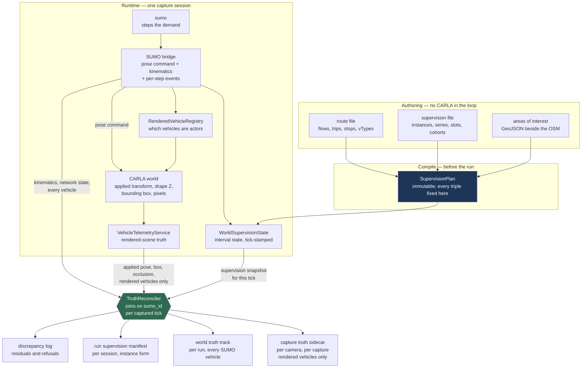
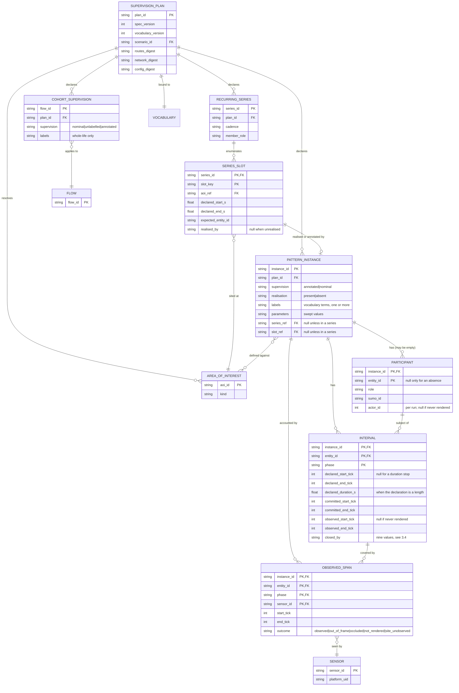
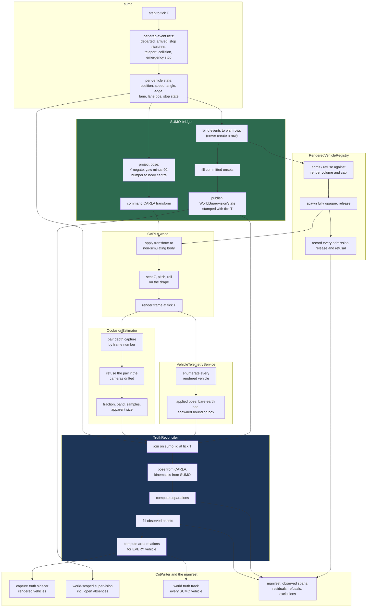

# 06 — Truth and annotation

**Status:** Plan section. Design against a read of the working tree and against measurements taken from
the real scenario artifacts on 2026-09-17. No code changed, no build run.
**Date:** 2026-09-17
**Scope:** How an author's assertion about what a vehicle is doing reaches the truth record when the
authoring surface is a SUMO scenario rather than an OpenSCENARIO storyboard; how positional truth and
behavioural truth are produced by two different simulators and reconciled into one record; what the
capture sidecar, the world truth track and the run manifest each contain; and what may and may not be
exported to a detector or an estimated-pattern-of-life (EPoL) model.
**Re-seats:** [20 — Behavioral Annotation of Tracks, and Areas of Interest](../../Findings/20_Behavioral_Annotation_And_Areas_Of_Interest.md).
Doc 20 is the source of the supervision model and remains correct; what changes here is the surface it
sits on. §11 records, decision by decision, what survived and what did not.
**Related:** [09 — Telemetry CoT Contract](../../Findings/09_Telemetry_CoT_Contract.md) ·
[17 — Photoreal Occlusion Metric](../../Findings/17_Photoreal_Occlusion_Metric.md) ·
[23 — SUMO Traffic Integration](../../Findings/23_SUMO_Traffic_Integration.md) ·
[01 — System architecture](01_Architecture.md) · [04 — Contracts](04_Contracts.md) ·
[07 — Scenario authoring](07_Scenario_Authoring.md) · [08 — Collection and EPoL](08_Collection_And_EPoL.md)

**Audience:** an engineer building the truth path, who has read neither doc 20 nor the conversation
that produced this plan. Every claim about existing behaviour is cited `path:line` or marked as
measured; anything else that is not cited is labelled as an inference.

**Out of scope, deliberately.**

- **Scoring.** No pass/fail verdict, no driving-quality metric. Rejected in
  [18 §3.2](../../Findings/18_Scenario_Fabrication_For_EPoL_Training.md) and still rejected.
- **How an author writes an annotation.** The authoring ergonomics — what a human or an assistant
  types, and what tool validates it — belong to [07](07_Scenario_Authoring.md). This section owns the
  *compiled* form, the runtime state and the recorded artifacts, and states the properties 07 must
  deliver.
- **Area-of-interest geometry, supply and validation.** [20 §8](../../Findings/20_Behavioral_Annotation_And_Areas_Of_Interest.md)
  settles the GeoJSON contract, the build-time validation and the world-scoped actor; that is adopted
  unchanged. What this section adds is the one new requirement SUMO creates: an area of interest stops
  being optional for a whole class of anomaly (§3.5).
- **The render-set rule.** [01 §9.2](01_Architecture.md) owns `RenderSetSelector`. This section owns
  what the truth record must say about its decisions, and one constraint the training export places on
  it (§10.4).
- **Detector and model internals.** [08](08_Collection_And_EPoL.md) owns those. This section fixes the
  join and the boundary.

---

## 1. What changes when SUMO drives

Doc 20 derived its supervision model from an OpenSCENARIO storyboard executed by
`CarlaNet.Scenario.ScenarioExecutor`. Under SUMO drive there is no storyboard and no executor. The
model survives; three of its mechanisms do not.

| Doc 20 assumed | Under SUMO drive | Consequence |
|---|---|---|
| An **executor** holds phase state per entity and could publish it (`ScenarioExecutor.cs:611-629`) | The route file is static; SUMO holds vehicle state, not phase state | Interval state must be produced by a component that knows both the plan and SUMO's per-step events. It is the bridge, not an executor (§3.3) |
| A **speed-action ramp** separates the three interval onsets, and the gap is an authored scenario property (§2.4) | There is no ramp. There *is* an authored departure time, an authored stop length, SUMO's own insertion and arrival instants, and the physically observed standstill | The three onsets survive, but one gap becomes a measured simulation output and the other becomes a property of the co-simulation seam. This inverts doc 20's justification for recording all three, and strengthens it (§3.3) |
| The **annotation channel** is `UserDefinedAction`/`CustomCommandAction` inside the `.xosc` (decision 6) | SUMO's route file has no sanctioned vendor extension point and is validated against `routes_file.xsd` (`Shahid_Bahonar_Port_PatternOfLife.rou.xml:5-6`, measured) | The companion file, which doc 20 kept as an equal-status alternative, becomes the sole channel. Decision 6 changes (§3.1, D6.1) |
| **Supervision is per entity**, and the entity list is known at compile time | A `<flow>` is a generator. 245 of them produce roughly 68 880 vehicles whose ids are `<flow id>.<n>` and whose count is not known until the run (measured, §2.1) | A third kind of subject is needed: the cohort. And a cohort may not carry a phased annotation (§3.2, D6.2) |
| **Truth has one producer**, `VehicleTelemetryService` (§4.1) | Two producers exist and neither is sufficient alone: CARLA holds the rendered pose and the camera geometry, SUMO holds the kinematics and every vehicle CARLA is not rendering | Authority is settled field by field and the disagreement is recorded rather than hidden (§4) |
| An annotated interval is either **observed or not** (§2.5) | It can also be unobserved because the participant was *never rendered*, which is a different fact about a different thing | The observability record gains a rendered-span gate upstream of the observed-span gate ([01 §7](01_Architecture.md) states the requirement; §5 gives it shape) |
| The **Traffic Manager's idle cull** edits the ambient distribution and must be switchable (§2.8, decision 14) | The traffic manager is locked out ([01 D1.7](01_Architecture.md)). SUMO has no idle cull — a vehicle parks indefinitely, measured at 489 000 s | Decision 14 does not apply to this mode. But SUMO has several *other* distribution-editing behaviours, three of which are on by default (§6) |

Two things about doc 20 are load-bearing and are **not** changed here, because they are the design:

- Supervision is **three-valued** and the state is always written (§2.2, decision 2).
- An annotation is **authored intent**; a derived geometric relation is context and never a label
  (§2.1, §8.5, decision 3).

Under SUMO both are at greater risk than doc 20 anticipated, and §3.1 and §3.6 say how each is held.

---

## 2. What was measured

All figures in this section were taken on 2026-09-17 by extracting
`G:\Projects\CarlaUE_5_7_4\BahonarPatternOfLife.zip` with Python's `zipfile` and parsing the contents,
or by reading the SUMO source staged at `carla/Build/sumo-src`. They are measurements, not estimates.

### 2.1 The authored scenario

`BahonarPatternOfLife/scenario/Shahid_Bahonar_Port_PatternOfLife.rou.xml`:

| | Measured |
|---|---|
| `<flow>` elements | **245** |
| `<trip>` elements | **365** |
| Explicit `<vehicle>` elements | **0** |
| `<vType>` / `<vTypeDistribution>` | **14** / **3** |
| `<stop>` elements | **338** — 336 `parking="true"`, 2 `parking="false"` |
| `<stop>` elements using `until` | **0**. Every stop is specified by `duration` |
| Distinct stop durations | 28 800 s x 335, 300 s x 2, 489 000 s x 1 |
| Trip departure range | 25 200 s to 601 200 s |
| Vehicles the flow rates imply | **68 880**, summing `vehsPerHour x (end - begin) / 3600` over all 245 flows |

68 880 + 365 = **69 245**, which is exactly the insertion count the bundle's own README records as
measured from a full seven-day run (`BahonarPatternOfLife/README.md:138-140`). The arithmetic and the
run agree to the vehicle, which means that in that run `max-depart-delay` skipped nothing — see §6.3.

The scheduled 365 decompose as **335 guard postings + 21 routine hauls + 9 anomaly vehicles**.

### 2.2 The guard relief series, and the hole in it

`tower_postings` dispatches one guard to each of sixteen towers at each of three shift changes a day
for seven days (`CarlaControl/scripts/make_bahonar_scenario.py:215-241`). Parsing every
`guard_d{day}_h{hour}_t{tower}` trip id out of the route file:

| | Measured |
|---|---|
| Distinct shift departures | **21** (7 days x 3 shift hours) |
| Guard trips present | **335** |
| Shifts with all 16 towers manned | **20** |
| Shifts with a tower missing | **1** — day 4, hour 7, departure 370 800 s, tower **3** |

The absence is produced by a `continue` in the generator's loop (`CarlaControl/scripts/make_bahonar_scenario.py:236`),
which discards the `ScheduledVehicle` it was about to build. **The discarded trip is reconstructible
byte for byte from its own siblings.** The same tower's posting in the shift before is:

```xml
<trip id="guard_d3_h23_t3" type="guard" depart="342000"
      from="26413425#5" to="26413425#5" via="26413459"
      departLane="best" departSpeed="max" arrivalSpeed="current">
    <stop lane="26413459_0" endPos="58.90" duration="28800" parking="true"/>
</trip>
```

(`Shahid_Bahonar_Port_PatternOfLife.rou.xml:1409-1413`, and `:1639-1643` for the shift after,
`guard_d4_h15_t3`.)

So the missing trip is `guard_d4_h7_t3`, `via="26413459"`, stopping at `26413459_0` at 58.90 m for
28 800 s from 370 800 s. The `.labels.json` note records exactly those coordinates — `edge`
`26413459`, `edge_pos_m` 58.9, `begin_s` 370800, `end_s` 399600 — as free text with nothing to join
to. §3.5 turns that into a record.

This matters beyond one scenario. **The counterfactual is not merely describable; it is already held
by the generator at the moment it decides not to emit it.** Nothing new has to be authored to express
the absence. It has to stop being thrown away.

### 2.3 The anomalies as authored

| Anomaly | Vehicles | Authored shape (measured) |
|---|---|---|
| Escort to drydock | `escort_0`..`escort_4` | 5 trips, same `from`/`to`, departing 295 200 s + 4n, `:1239-1253` |
| Gate probe | `probe_d2`, `probe_d5` | 2 trips, same `via` and same stop, departing 212 674 s and 472 285 s, `:883-887`, `:1960-1964` |
| Perimeter shadow | `shadow` | 1 trip, 7 `via` edges round the fence, `vType` `speedFactor="0.45" speedDev="0"`, `:2194-2196`, `:29-30` |
| Ferry stay-behind | `staybehind` | 1 trip, `parking="true"` stop of **489 000 s** (5.66 days), `:503-507` |
| Guard no-show | **none** | An omitted trip (§2.2) |

Note what the record has to express and `marked_ids` cannot: the escort is **one phenomenon with five
participants**; the two probes are **two instances of one pattern**, not one instance with two
intervals, because the participants differ; and the no-show has no participant at all.

### 2.4 Where today's ground truth leaks into the comparison channel

Three independent leaks, each read from source. All three put the answer inside the record a detector
is supposed to be scored against.

| Leak | Where | Why it is a leak |
|---|---|---|
| `special_type` is set to the literal string `"marked"` for any flagged vehicle | `CarlaControl/src/carlacontrol/SumoCotBridge.py:321-322` | `special_type` is a **vehicle class** field ([09 §5](../../Findings/09_Telemetry_CoT_Contract.md): emergency / taxi / electric) and [09 §9](../../Findings/09_Telemetry_CoT_Contract.md) scores classification confusion on it. The ground-truth label is sitting in the field being scored |
| CoT affiliation is assigned per `vType`, and every anomaly `vType` maps to `u` | `.labels.json` `affiliation_by_type`; applied at `SumoCotBridge.py:263-265` | Exactly what [20 decision 9](../../Findings/20_Behavioral_Annotation_And_Areas_Of_Interest.md) prohibits: the label becomes readable from the CoT `type` string, which a detector-derived track can never produce |
| Anomaly `vType`s carry conspicuous colours and distinct ids | `rou.xml:29-33`; colours `1.00,0.45,0.00`, `1.00,0.10,0.10`, `1.00,0.20,0.60` | [20 §2.6](../../Findings/20_Behavioral_Annotation_And_Areas_Of_Interest.md)'s appearance confounder. [01 D1.6](01_Architecture.md) already blocks the colour reaching a blueprint; the `type_id` string still reaches the truth record, at `CotUdpEmitter.py:137` |

A fourth, subtler one: `anomaly_escort` declares `length="6.0" width="2.3"` against `mil_jeep`'s
`4.8`/`2.0` (`rou.xml:24`, `:31`). Dimensions are respected by design ([01 §4.3](01_Architecture.md))
because they change car-following gaps — so an annotated vehicle whose dimensions differ gratuitously
from the nominal population is a *dynamic* appearance confounder. §9.3 states the authoring rule that
closes it.

### 2.5 SUMO's own distribution-editing defaults

Read from `carla/Build/sumo-src/src/microsim/MSFrame.cpp` and
`carla/Build/sumo-src/src/utils/common/RandHelper.cpp`:

| Option | SUMO default | Effect | Bahonar sets |
|---|---|---|---|
| `time-to-teleport` | **300 s** (`MSFrame.cpp:438`) | A jammed vehicle jumps position | `-1` (disabled) |
| `time-to-teleport.highways` | `0` (`MSFrame.cpp:441`, applied `:1164`) | A second teleport path on fast roads | not set |
| `time-to-teleport.disconnected` | `-1` (`MSFrame.cpp:447`) | Teleport on a disconnected route | not set |
| `collision.action` | **`teleport`** (`MSFrame.cpp:399`) | Colliding vehicles jump; `remove` destroys them | `warn` |
| `max-depart-delay` | **`-1`, never skipped** (`MSFrame.cpp:471`) | A vehicle that cannot insert within the delay is **discarded** | **`900`** |
| `scale` | `1.0` (`MSFrame.cpp:432`) | Demand scaled "by discarding or duplicating vehicles" | not set |
| `max-num-vehicles` | `-1` (`MSFrame.cpp:423`) | Insertion delayed to stay under a cap | not set |
| `random-depart-offset` | `0` (`MSFrame.cpp:486`) | Uniform random jitter on every `depart` | not set |
| `ignore-route-errors` | `false` (`MSFrame.cpp:393`) | Unroutable vehicles dropped instead of failing the load | not set |
| `seed` | `23423` (`RandHelper.cpp:67`) | Fixed by default, but `--random` (`:63`) reseeds from wall clock | `42` |
| `lanechange.duration` | **`0`** (`MSFrame.cpp:489`) | A lane change is laterally **instantaneous** | not set |

The last row is not a population edit but reaches truth and imagery directly: at the default a vehicle
crosses a lane width within one 1.0 s step, which renders as a sideways jump and shows up in the
reconciliation residual of §4.3 as a spurious spike. §6.2 takes it up.

### 2.6 The two prevalence numbers

9 of 69 245 vehicles carry `marked=1`: a per-vehicle prevalence of **0.013 %**. Counted instead over
authored *stationary* vehicle-seconds, the annotated dwells total 489 600 s (the stay-behind's 489 000
plus two 300 s probe waits) against the guard postings' 335 x 28 800 = 9 648 000 s, a prevalence of
**4.8 %** — a factor of **372** apart.

[20 §2.6](../../Findings/20_Behavioral_Annotation_And_Areas_Of_Interest.md) says prevalence must be
recorded rather than reconstructed. This measurement says something sharper: **prevalence is
meaningless without its unit, and two defensible units differ here by more than two orders of
magnitude.** The manifest records it in three units, over the captured span only (§8.4).

---

## 3. The supervision model, re-seated

### 3.1 Three-valued supervision, and how each state is authored

[20 §2.2](../../Findings/20_Behavioral_Annotation_And_Areas_Of_Interest.md) requires three states, not
two, because a long capture will produce genuine instances of the target pattern by chance and filing
those as negatives teaches the model that the target behaviour is normal. That argument is unchanged
and the three states survive verbatim.

| State | Meaning | Who gets it in a SUMO scenario |
|---|---|---|
| `annotated` | The author asserts this subject is executing the named pattern over this interval | Entities and slots named in an annotation |
| `nominal` | The author asserts this subject is **not** executing any target pattern | Entities and cohorts explicitly declared so — the hard negatives |
| `unlabelled` | No assertion either way | Everything else; the default, always written explicitly |

**Today's ground truth is binary, and the binary collapse is measurable.** `ScheduledVehicle.marked`
is a `bool` (`CarlaControl/src/carlacontrol/SumoPatternOfLifeBuilder.py:66`) and `write_routes` returns
`[v.veh_id for v in scheduled if v.marked]` (`:121`), which is the whole of `marked_ids`. So the 335
guard postings and the 21 routine hauls — 356 deliberately authored ordinary behaviours — are
indistinguishable from the 68 880 ambient flow vehicles, and both are indistinguishable from "not
asserted".

That is not an abstract loss. **A guard posting is a textbook hard negative in
[20 §2.7](../../Findings/20_Behavioral_Annotation_And_Areas_Of_Interest.md)'s exact sense: an eight-hour
authored parked dwell, in a legitimate place, for a legitimate reason, sharing the site with an
annotated dwell** — the stay-behind parks for 489 000 s, the guards for 28 800 s each, and the only
trajectory-level difference is duration and place (§2.1, measured). A corpus that cannot say "this
eight-hour stop is ordinary" is a corpus in which duration alone looks like the signal.

**How each state is authored.** The annotation travels in a companion file beside the `.sumocfg`,
`<scenario>.supervision.json`, keyed by SUMO ids and flow ids. Doc 20 decision 6 made the in-file
custom action the primary channel and the companion file an equal-status alternative; under SUMO the
in-file channel does not exist:

- A SUMO route file is validated against `routes_file.xsd`
  (`Shahid_Bahonar_Port_PatternOfLife.rou.xml:5-6`, measured), and SUMO has no counterpart to
  OpenSCENARIO's `UserDefinedAction`. The generic `<param key= value=/>` element is not a vendor
  extension point: it is a **flat, un-namespaced** key/value store on `Parameterised`
  (`Build/sumo-src/src/utils/common/Parameterised.cpp:179`) that SUMO's own device and model code
  reads keys out of — `device.ssm.file` on a vehicle and on its `vType`
  (`microsim/devices/MSDevice_SSM.cpp:3890-3898`), `device.glosa.range` on a traffic light
  (`microsim/devices/MSDevice_GLOSA.cpp:344`). Supervision written there shares a namespace with
  simulation behaviour, which is the failure [20 §4.3](../../Findings/20_Behavioral_Annotation_And_Areas_Of_Interest.md)
  identified when it rejected `role_name`. `<param>` is fit for **identity transport** and unfit for
  an annotation channel.
- The route file is **generated**, never hand-edited — every one in the repository carries "Generated
  by `carlacontrol.SumoPatternOfLifeBuilder`; edit that, not this" (`rou.xml:3`, `sumocfg:2`). Putting
  authored intent into a generated file makes the generator the only author.
- Doc 20's second argument for the companion file applies with more force here: run identity, the
  world digest and the vocabulary version describe a *capture*, not a scenario, and the scenario
  artifact is regenerated whenever the network is.

So **decision 6 changes**: the companion file is the sole channel, the builder emits it alongside the
routes, and the two are bound by digest (§8.1). Everything else about decision 6 stands — one compiled
representation, unknown terms are errors, name conventions are never the sole carrier.

### 3.2 Three kinds of subject

Doc 20 knew one kind of subject, the storyboard entity. SUMO needs three, because a `<flow>` is a
generator rather than a thing.

| Subject | Names | Realises as | May carry |
|---|---|---|---|
| **Entity** | One authored SUMO vehicle id — `escort_0`, `guard_d4_h15_t3` | Exactly one vehicle | `annotated` with phased intervals, `nominal`, `unlabelled` |
| **Cohort** | A `<flow>` id — `corridor_d0_p0_h6` | Every vehicle SUMO names `<flow id>.<n>` | `nominal`, `unlabelled`, or an annotation whose interval is **whole-life only** |
| **Slot** | A `(series_id, slot_key)` pair — `tower_relief` / `d4_h7_t3` | Zero or one vehicle | `annotated`, `nominal`; and it is the only subject that can be **unrealised** (§3.5) |

**A cohort may not carry a phased annotation.** A phase needs an onset, an onset needs a specific
vehicle, and a flow's members are interchangeable and unbounded — 68 880 of them here. What a cohort
*can* carry is the whole-life case doc 20 called class-conditioned presence
([20 §3](../../Findings/20_Behavioral_Annotation_And_Areas_Of_Interest.md) class 4): "every vehicle
this flow emits is a heavy goods vehicle in a residential area at 03:00" is an assertion about the
flow, true of every member for its whole life, and needs no onset. Attaching a phased annotation to a
cohort must be a compile error rather than a silent per-member expansion, because the expansion would
assert an interval for each of tens of thousands of vehicles that nobody looked at.

The **slot** is the new one and §3.5 is about it.

### 3.3 The three interval onsets on the SUMO surface

[20 §2.4](../../Findings/20_Behavioral_Annotation_And_Areas_Of_Interest.md) records three defensible
answers to "when did the phase begin", derived from the executor's decomposition of a speed action:
the tick the action fired, the tick the ramp finished and the brake went on, and the tick the world
first reported at or below 0.15 m/s (`ScenarioExecutor.cs:22`, `:252`). Doc 20's decision 5 is to
record all three.

Under SUMO there is no ramp, so the three have to be re-derived from the SUMO artifacts. They are
still three, and they still cannot be reconstructed from each other, but what separates them changes.
Naming them by the authority that produces each, rather than by the executor mechanism that used to:

| Onset | Produced by | Read from |
|---|---|---|
| **declared** | the author | the route file, or the supervision plan |
| **committed** | SUMO's own model | TraCI, at the step it happened |
| **observed** | the rendered body | CARLA, from the applied transform and the world's own state |

Filled in for the two phase kinds SUMO actually has:

| Phase kind | declared | committed | observed |
|---|---|---|---|
| **Entry into the world** | `<trip depart>` or `<flow begin>` — an absolute simulated time | `Vehicle.getDeparture` — the step SUMO actually inserted it, which differs by `Vehicle.getDepartDelay` (`Eclipse.Sumo.Libtraci/Vehicle.cs:156`, `:162`) | **the admission instant** — the CARLA tick at which `RenderedVehicleRegistry` admitted the vehicle and its actor first appeared in the world snapshot (§4.4) |
| **A stop or dwell** | `<stop until>` when the author wrote one; **absent** when the author wrote `duration`, in which case the declared quantity is a length, not a time | `StopData.arrival` against `StopData.intendedArrival`, plus the step on which the id appears in `Simulation.getStopStartingVehiclesIDList` or `getParkingStartingVehiclesIDList` (`Simulation.cs:298-320`, `:274-292`) | the CARLA tick at which the rendered body's speed first held at or below 0.15 m/s, the same physical predicate and the same threshold as `ScenarioExecutor.cs:22` |
| **Departure from a stop** | `until` if present, otherwise absent | `StopData.depart`, and the id appearing in `getStopEndingVehiclesIDList` / `getParkingEndingVehiclesIDList` | first CARLA tick above the threshold |

**SUMO itself distinguishes declared from committed, and exposes both.** `StopData` carries
`intendedArrival`, `arrival` and `depart` as separate fields alongside `duration` and `until`
(`Build/sumo-src/tools/traci/_vehicle.py:37-70`; the same fields in the generated C# binding at
`Build/sumo-build/src/libtraci/Eclipse.Sumo.Libtraci/TraCINextStopData.cs:181-229`). This is not an
analogy being stretched onto SUMO. It is a distinction SUMO already makes for its own reasons, and it
lines up with doc 20's exactly.

**Four consequences, and they change the justification for decision 5 rather than the decision.**

1. **The declared onset can be legitimately absent.** Measured: all 338 stops in the Bahonar scenario
   use `duration` and none uses `until` (§2.1). A `duration` stop declares a *length*, anchored
   wherever SUMO happens to arrive, so there is no declared instant to record. The record must carry
   `declared_duration_s` with `declared_start_tick` absent, and a consumer must distinguish "not
   declared" from "declared at tick 0". Doc 20's schema had no such case; every onset there was always
   available.
2. **The declared-to-committed gap becomes a measured simulation output, not a scenario constant.**
   For an entry it is exactly `getDepartDelay`, which the `.sumocfg`'s `max-depart-delay` bounds — at
   900 s in this scenario (§2.5). For a stop it is `arrival - intendedArrival`. Doc 20 argued the gap
   "is not a constant and cannot be calibrated away" because the ramp is an authored property; the
   SUMO version is stronger, because the gap is *congestion*, which is the very distribution the model
   is learning. Anyone who collapsed the three onsets into one would be throwing away a measurement of
   the thing under study.
3. **The committed-to-observed gap is a property of the co-simulation seam, not of the scenario, and
   nothing else is mixed into it.** It is the transport lag between a SUMO step and the CARLA tick
   that renders its result, and under the integer-ratio clock contract of
   [01 D1.12](01_Architecture.md) it should be small and nearly constant. That makes it a free health
   check: a gap that drifts, or a committed stop with no observed standstill, is a bridge defect.

   **Vehicle fade being off makes this check sharper than it would otherwise have been.** The user has
   demoted fade — it is computed client-side and pushed one blocking RPC per vehicle per reconcile,
   which the argument parser's own help text calls "the heaviest load this client puts on the server's
   per-frame RPC budget", and `--fade` now carries `default=False`
   (`CarlaControl/src/carlacontrol/CarlaControlArgumentParser.py:317-328`). Vehicles appear fully
   opaque. So the observed onset is an **exact instant with no ramp**: the tick the vehicle was
   admitted to the render set. Had a dissolve been running, the committed-to-observed gap would have
   carried a fade duration inside it and a drift in the seam would have been indistinguishable from a
   change in the fade profile. With no ramp, any drift is the seam.

   **It is also the only one of the three that can fail to exist** — if the participant was never
   rendered there is no observed onset at all, which is §5's subject.
4. **Which onset defines the interval remains the trainer's choice** — unchanged from doc 20, and now
   better supported, because the three have different provenances rather than being three points on
   one ramp.

**Decision 5 therefore survives, with the onsets renamed and one of them made optional.** Recording
all three is more valuable here than in doc 20, not less.

The mechanics: the component that fills these in is the SUMO bridge, because it is the only component
holding both the plan and the per-step TraCI events. It writes into `WorldSupervisionState`
([01 §4.1](01_Architecture.md)), which is published on change and stamped with the tick it describes,
and which the recorders read. [07](07_Scenario_Authoring.md) owns how an author declares a phase; this
section owns what is recorded when one opens and closes.

### 3.4 Pattern instances, participants and recurring series

[20 §2.3](../../Findings/20_Behavioral_Annotation_And_Areas_Of_Interest.md)'s unit of supervision — a
pattern instance with participants, roles and intervals — is adopted unchanged and is what
`marked_ids` cannot express. Measured against the Bahonar anomalies (§2.3), a flat id list loses:

- **the convoy** — `escort_0`..`escort_4` are one phenomenon with five participants and, on the
  README's own measurement, a 16 s departure spread over a 10.3 km run. As five flat ids they are five
  unrelated anomalies, and the thing that makes it an escort (that they travel together) is not stated
  anywhere;
- **the distinction between an instance and a pattern** — `probe_d2` and `probe_d5` are two instances
  of one pattern, 259 611 s apart, with different participants. A revisit cadence would be one
  instance with several intervals and the same participant. `marked_ids` renders both as "two ids";
- **roles** — the escort has a lead and four followers; a rendezvous has asymmetric roles by
  definition;
- **absence** — §3.5.

One record is added above doc 20's `PatternInstance`, and it is what makes absence expressible:

```
RecurringSeries
  series_id           stable; e.g. tower_relief
  cadence             declared: period_s, offsets_s[], span; or "enumerated"
  member_role         the role a realising vehicle plays in each occurrence
  slots[]             SeriesSlot

SeriesSlot
  slot_key            stable within the series; e.g. d4_h7_t3
  aoi_ref             the area of interest this slot is about       (required, see §3.5)
  declared_start_s    the authored occasion
  declared_end_s
  expected_entity_id  the id the realising vehicle would carry, when the cadence names one
  realised_by         the SUMO id that realised it, or null
```

A series is not itself supervision; it is the scaffolding that makes a slot meaningful. The 335 guard
postings become 335 realised slots of `tower_relief`, each `nominal`; the hole becomes the one
unrealised slot, and the pattern instance that annotates it (§3.5). Every field is available where the
generator already loops over `(day, hour, tower)` — the loop **is** the slot enumeration and
`TOWER_POSTS[tower]` **is** the site (`CarlaControl/scripts/make_bahonar_scenario.py:231-241`, measured).

The interval lifecycle, including the outcomes `closed_by` has to distinguish:

```mermaid
stateDiagram-v2
    [*] --> Planned: compiled from the supervision plan;<br/>exists before the run starts

    Planned --> Declared: declared onset reached<br/>(trip depart, flow begin, stop until)
    Planned --> Committed: no declared onset<br/>(a duration stop)

    Declared --> Committed: SUMO acts<br/>(getDeparture, StopData.arrival,<br/>getStopStartingVehiclesIDList)
    Committed --> Observed: rendered body satisfies<br/>the physical predicate<br/>(speed <= 0.15 m/s)

    Committed --> Closed: closed_by = physical_predicate_never_held
    Observed --> Closed: closed_by = trigger
    Observed --> Closed: closed_by = entity_arrived
    Committed --> Closed: closed_by = entity_arrived
    Observed --> Closed: closed_by = render_released
    Committed --> Closed: closed_by = sumo_removed
    Declared --> Closed: closed_by = never_inserted
    Planned --> Closed: closed_by = slot_unrealised
    Observed --> Closed: closed_by = capture_window_end
    Committed --> Closed: closed_by = capture_window_end
    Observed --> Closed: closed_by = scenario_end

    Closed --> [*]

    note right of Closed
      render_released is NOT an end of the behaviour.
      It says the capture stopped looking.
      A consumer must treat it differently from
      entity_arrived and from trigger.
    end note
```



`closed_by` extends doc 20's four values (`trigger`, `scenario_end`, `entity_removed`, `aborted`) to
nine, because SUMO and the render set between them produce more ways for an interval to end and they
are not interchangeable:

| `closed_by` | Means | Source |
|---|---|---|
| `trigger` | The authored condition ended it | plan + TraCI |
| `entity_arrived` | The vehicle reached its route destination and SUMO removed it | `Simulation.getArrivedIDList` (`Simulation.cs:268`) |
| `sumo_removed` | SUMO removed it for another reason — collision action, teleport, `remove` | `Simulation.getCollidingVehiclesIDList`, `getStartingTeleportIDList` (`:328`, `:352`) |
| `never_inserted` | Declared, but `max-depart-delay` discarded it before it ever existed | absent from `getDepartedIDList` past the delay |
| `slot_unrealised` | The occasion passed with no vehicle. **The absence** | plan; §3.5 |
| `physical_predicate_never_held` | SUMO committed, the body never did | bridge; a defect signal |
| `render_released` | CARLA stopped rendering it. The behaviour did not end | `RenderedVehicleRegistry` |
| `capture_window_end` | The capture window closed while it was open | `CaptureSession` |
| `scenario_end` | The simulation ended while it was open | `PlaybackClock` |

**`render_released` must never be conflated with `entity_arrived`.** The first says the capture
stopped looking; the second says the behaviour finished. Doc 20 did not need the distinction because
nothing released a scripted entity mid-behaviour. Under a render set that is routine, and a consumer
that treats a released interval as a completed one will train on truncated examples believing they are
whole. This is the shape of doc 20's open question 3 (is a truncated instance a usable example) with a
new and more frequent cause.

### 3.5 An anomaly with no participant

The guard no-show is an anomaly whose entire signal is that nothing happened. Doc 20 does not cover
it; `marked_ids` cannot hold it; and it is not a corner case — it is one of the six anomalies the
largest authored scenario ships, and arguably the most realistic of them.

**Four things have to be true before an absence is supervision rather than a note.**

**One: the expectation must be a record, not prose.** An absence is only defined against an
expectation, so the expectation has to exist in the same form as the realisations it is measured
against. That is the `RecurringSeries` of §3.4. The evidence that day 4 hour 7 tower 3 is anomalous is
the other 335 slots — 20 shifts in which all sixteen towers were manned (measured, §2.2) — and that
evidence is only joinable if the 335 and the 1 are members of one enumerated series. A free-text note
with a `tower_index` cannot be joined to anything, because nothing else in the corpus is keyed by
tower index.

**Two: the anchor is a place and a window, not a vehicle.** Every other pattern instance hangs off its
participants' tracks. This one has none, so it hangs off the site. That makes
[20 §8](../../Findings/20_Behavioral_Annotation_And_Areas_Of_Interest.md)'s areas of interest a **hard
prerequisite for this class of anomaly**, not the "adopt, sequenced after" they are for every other
class. Doc 20 sequenced areas behind the annotation channel on the grounds that the annotation channel
is what removes the deficiency; that sequencing holds for eight of the ten pattern classes and fails
for this one. **An absence cannot be expressed without an area of interest.** The area is cheap here:
the site is `26413459` at 58.90 m, which resolves to a point in the SUMO network and thence, by the
measured frame identity SUMO (x, y) = CARLA (x, -y) ([23 §2](../../Findings/23_SUMO_Traffic_Integration.md)),
to a CARLA-local position and a radius.

**Three: the record must never produce a phantom track.** Nothing may emit a CoT `<event>` for a
vehicle that does not exist; that is fabricating a detection, and a viewer or a scoring harness would
have no way to know. So an absence instance is **world-scoped, never vehicle-scoped**: it lives in the
run manifest, and its per-frame projection is a child of the sidecar's `<events>` container, not of
any `<event>`. That placement already has a precedent in the real writer — `_solar` is written as a
child of `<events>` (`CotWriter.cs:52-66`) and capture identity sits on the container's attributes
(`:40-48`) — so this is an established shape rather than a new one.

**Four: an unobserved absence is not an observation.** A camera that never looked at tower 3 cannot
have missed a guard there. The observability question for an absence is therefore about the **site**,
not about a participant: was the area under observation, by which sensors, for how much of the window.
And the record needs the negative evidence too — the set of vehicles that *were* observed inside the
area during the window — because "no guard arrived" is a claim about what was there, not only about
what was not. §5.2 gives the computation.

The compiled record:

```
PatternInstance                       -- the absence, at Bahonar
  instance_id      pi_tower_relief_d4_h7_t3_unmanned
  supervision      annotated
  labels           [ post_unmanned ]
  realisation      absent                       -- present | absent
  series_ref       tower_relief
  slot_ref         d4_h7_t3
  aoi_refs         [ tower_03 ]
  participants     []                           -- legitimately empty
  expected         { role: guard,
                     expected_entity_id: guard_d4_h7_t3,
                     route: { from: 26413425#5, to: 26413425#5, via: [26413459] },
                     site_lane: 26413459_0, site_pos_m: 58.90,
                     declared_start_s: 370800, declared_end_s: 399600 }
  intervals        [ { participant: null, phase: vacancy,
                       declared_start_tick: …, declared_end_tick: …,
                       committed_start_tick: null,      -- nothing to commit
                       observed_start_tick: null,       -- nothing to observe
                       closed_by: slot_unrealised } ]
  counter_evidence { series_slots_total: 336, series_slots_realised: 335,
                     sibling_slots_same_site: [ d3_h23_t3, d4_h15_t3, … ] }
```

`realisation: absent` is a first-class field rather than an inference from an empty participant list,
so a consumer cannot mistake an absence for a malformed instance. `expected` is filled from the
generator's own loop state — measured as reconstructible in §2.2 — so authoring it costs nothing.

**One safeguard.** An absence is the only supervision state a geometric predicate could produce
convincingly ("nothing was at the site, therefore absence"), which makes it the sharpest edge of
§3.6's rule. The rule holds without exception: an absence instance exists because a **slot** was
authored and went unrealised, never because a site was observed to be empty. A site that is empty with
no authored slot is `unlabelled`, exactly like every other unasserted fact.

### 3.6 The authored-intent rule, stated operationally

[20 §2.1 and §8.5](../../Findings/20_Behavioral_Annotation_And_Areas_Of_Interest.md) set the rule:
annotations are authored intent, area relations are derived context, and no geometric predicate ever
writes an annotation. Doc 20 flagged that areas make derivation easy. Under SUMO it is worse, because
SUMO hands the runtime a finished answer: `Vehicle.getStopState` returns a stopped-and-parking flag
(`Vehicle.cs:360`), `Simulation.getStopStartingVehiclesIDList` returns the ids that just started
stopping (`Simulation.cs:304`), and either is a one-line label of apparently excellent quality.

Restating the rule so it is enforceable rather than aspirational:

1. **The set of supervision rows is fixed before the run starts.** The
   `(instance_id, participant, phase)` triples in the manifest are wholly determined by the compiled
   supervision plan. The runtime may only **bind** rows that already exist — fill in onsets, close
   intervals, record observability. It may never create a row, a label, an instance or a participant.
2. **That is testable, and it is the enforcement.** Two runs of the same scenario must produce
   manifests whose triple sets are **identical**; only the tick fields, the observability and the
   reconciliation residuals may differ. A diff of two manifests is a regression test for the rule, and
   it costs one comparison. Nothing else about supervision has this property, which is why the
   invariant is worth stating in exactly this form.
3. **The code boundary is the plan.** `SupervisionPlan` is immutable, is compiled by a build-time tool
   from the supervision file plus the route file, and is an *input* to the runtime. The runtime
   component that maintains interval state consumes it and TraCI events; it has no writer for the
   label set, the instance set or the participant set, because those types expose none.
4. **The two sidecar elements stay separate and a consumer can delete one.** `<_supervision>` is
   written only from the plan. `<_aoi>` is written only by computation, for **every** vehicle including
   ambient. A consumer must be able to discard `<_aoi>` entirely and still have complete supervision;
   if that ever stops being true the labels have become the rule.
5. **Everything SUMO knows is available, and none of it is a label.** `getStopState`, the current
   edge, the current lane, `getWaitingTime`, `getTimeLoss` are derived context. They belong beside the
   area relations, where a human auditing for the accidental positives of
   [20 §2.2](../../Findings/20_Behavioral_Annotation_And_Areas_Of_Interest.md) will want them, and
   nowhere near `<_supervision>`.

Placement: the record types and the published state belong in `CarlaNet.Types`, which references
nothing and is the common ancestor of every assembly that needs them — doc 20 §7.3's argument,
unchanged. Doc 20's decision 11 (a process-local registry) is superseded by
[01 D1.10](01_Architecture.md), which publishes world-scoped state to the server; that resolves doc
20's own open concern in the direction doc 20 preferred, and this section adopts it without
re-litigating.

**Auditing is required from the start, not deferred.**
[20 §2.8](../../Findings/20_Behavioral_Annotation_And_Areas_Of_Interest.md) argued that relaxing the
idle cull would raise the accidental-positive rate and that the relaxation and the audit are coupled.
Under SUMO drive the cull is simply absent (§6.1) — a vehicle parks for 489 000 s and stays reported,
measured. So the "relaxed" regime is the only regime, and doc 20's open question 5 (what to do with an
accidental positive) arrives with the first capture rather than with a later change.

---

## 4. Positional truth: two producers, one record

### 4.1 What each producer knows

Both producers exist today and both work. Neither is sufficient alone, and the failure of each is in a
different place.

| | **CARLA producer** — `VehicleTelemetryService` | **SUMO producer** — the bridge, modelled on `SumoCotBridge` |
|---|---|---|
| Source | world-observer snapshot cache, `VehicleTelemetryService.cs:37,75-79` | TraCI / `libtraci`, `SumoCotBridge.py:296-334` |
| Covers | **only actors that exist.** The `IsActorEstablished` gate at `:73` is a second condition only while something is fading, and nothing is: it returns true for any actor with no fade record (`CarlaNet.Transport/CarlaClient.cs:1571`) and the gate's own comment says it is inert in that case (`:66-73`). Under this mode, existing and being reported are the same thing | **every** SUMO vehicle, rendered or not |
| Position | the applied transform the frame was rendered from | `Vehicle.getPosition`, converted by `Simulation.convertGeo` — SUMO's own PROJ, no second implementation (`SumoCotBridge.py:298-299`) |
| Height | drape / bare-earth decoupling: `hae` and `hae_dtm`, `:83-86` | a lookup in `bareearth.bin` at (x, y), `BareEarthGrid.height_at`, `:115-119` |
| Velocity | `WorldObserver.cpp:373` serialises `GetActor()->GetVelocity()`, which **is zero for a pose-applied non-simulating body** | `Vehicle.getSpeed` and `getAngle`, exact and never zero for a moving vehicle (measured: 0 of 2000 sample rows have speed 0) |
| Dimensions | the **spawned blueprint's** bounding box, `:103,110` | the `vType`'s declared `length`/`width`/`height`, `:323-325` |
| Camera-relative | occlusion fraction, band, sample count, apparent size ([17 §12.1](../../Findings/17_Photoreal_Occlusion_Metric.md)); sensor pose and full pinhole intrinsics (`CotWriter.cs:101-124`) | none. There is no camera |
| Network state | none | edge, lane, lane position, stop state, waiting time |
| Identity | `actor_id`, assigned at spawn, different every run | the SUMO vehicle id, which for a `<trip>` is **authored and stable across runs** |

Two asymmetries decide everything below. **Only CARLA's pose is in the same frame as the pixels.**
And **only SUMO has a vehicle it is simulating that CARLA never rendered** — measured at scale here:
69 245 vehicles over the week against a render set [01 §9.2](01_Architecture.md) caps at a few hundred
concurrently.

### 4.2 Authority, field by field

The question is not which producer is authoritative. It is which producer is authoritative for which
field, because a producer-level answer is wrong in both directions.

| Field | Authoritative | Why | Other producer's value |
|---|---|---|---|
| Existence in the simulation | **SUMO** | It creates and removes vehicles ([01 D1.2](01_Architecture.md)) | CARLA has no opinion |
| Existence in the world | **CARLA** (`RenderedVehicleRegistry`) | It decides what is instantiated | recorded as `render_state` |
| `lat`, `lon` | **CARLA**, for any vehicle it rendered | The frame was drawn from the applied transform; truth that disagrees with it is not truth about that frame ([01 D1.3](01_Architecture.md)) | kept, as the command; the difference is the residual (§4.3) |
| `hae`, `hae_dtm` | **CARLA** where rendered | The SUMO network is flat — zero distinct `z` in any lane shape ([23 §2](../../Findings/23_SUMO_Traffic_Integration.md), carried forward) — so SUMO's height is a grid lookup, while CARLA's is the surface the body is actually seated on. A vehicle on a bridge deck is the case that separates them | used for unrendered vehicles, where it is the only value available |
| `speed`, `course`, `vx`, `vy`, `vz` | **SUMO**, always | `WorldObserver.cpp:373` reports zero for a pose-applied body. Deriving it from successive CARLA positions would be a second implementation of a quantity SUMO computed exactly, and would be indistinguishable from detector-derived speed in a record whose purpose is to be compared against detector output ([01 D1.4](01_Architecture.md)) | never used; not silently substituted |
| `length_m`, `width_m`, `height_m` | **CARLA** where rendered | The box a detector's box is scored against must be the box that was drawn. [20 §5.6](../../Findings/20_Behavioral_Annotation_And_Areas_Of_Interest.md) records that the authored dimensions and the spawned actor's disagree today and nothing notices | `vType` dimensions are recorded separately, because they are **behaviour inputs** (they set car-following gaps), and their divergence from the blueprint is a defect to report, not a rounding difference |
| `base_type`, `type_id` | **CARLA** where rendered | The class a detector is scored against is the class of the thing that was rendered | SUMO's `vClass` maps through `BASE_TYPE_BY_VEHICLE_CLASS` (`SumoCotBridge.py:45-57`) for unrendered vehicles |
| Occlusion, apparent size | **CARLA** only | Camera-relative; SUMO has no camera ([09 §5.1](../../Findings/09_Telemetry_CoT_Contract.md)) | none |
| Edge, lane, lane position, stop state | **SUMO** only | Network state; CARLA does not have it | none |
| Identity | **SUMO** | §7 | `actor_id` recorded alongside |
| Supervision | **the plan** | Neither simulator. §3.6 | — |

**Neither producer is discarded.** The reconciled record is what reaches the corpus, and it carries
enough to recover both inputs. This is not a compromise: it is the only arrangement in which the
record is internally consistent at every field while remaining faithful to the pixels.



### 4.3 Reconciliation, and the discrepancies that must be reported

The reconciler joins on `sumo_id`, per captured tick. Four quantities fall out of the join, and none
of them may be silently absorbed.

| Quantity | Computed as | What a non-zero value means |
|---|---|---|
| `pose_separation_m` | horizontal distance between the SUMO-commanded position and the CARLA applied position, both in CARLA-local metres | Under pose application it should be at the numeric floor. Anything larger is a **seam defect**, and the three pose conventions the team brief names — CARLA's Y negated, yaw = `sumoAngle - 90`, and SUMO's front-bumper reference against CARLA's body centre — each produce a *characteristic* residual. A constant offset of half the vehicle length along the heading is the bumper shift; a residual that mirrors about the X axis is the Y negation |
| `heading_separation_deg` | commanded yaw minus applied yaw | A constant 90 degrees is the yaw convention; anything else is a drape-induced or clamp-induced rotation |
| `speed_separation_mps` | SUMO speed minus the speed implied by successive CARLA positions | Under pose application this is the interpolation error of [01 D1.12](01_Architecture.md); under the actuated shape of [23 §4.1](../../Findings/23_SUMO_Traffic_Integration.md) it is the **control tracking error**, which is the whole point of that shape |
| `dimension_separation_m` | `vType` length/width minus the spawned blueprint's | The car-following model ran on one set of dimensions and the imagery shows another. [04](04_Contracts.md) owns the tolerance |

**The residual is a free test oracle, and it is the reason to keep both producers rather than
collapsing to one.** [01 §4.2](01_Architecture.md) makes the same point from the architecture side.
The concrete value here is that a pose convention bug is otherwise invisible: the imagery looks
plausible, the truth is self-consistent, and every bounding box is wrong by half a car length. A
residual with a reported distribution catches it on the first capture.

Practical requirements on the reconciler:

- **It runs on the capture path, not offline.** Both inputs exist only at that instant; the CARLA side
  is already captured into the encoding job beside the telemetry (`FrameRecorder.cs:183`), and the
  SUMO snapshot must be captured into the same job at the same point, for the same reason doc 20 §7.3
  gives: the workers encode asynchronously while the world keeps ticking, so anything read at write
  time describes a later state.
- **Both sides are stamped with the tick they describe**, and the reconciler refuses to join two
  snapshots of different ticks rather than joining them approximately. `OcclusionEstimator` already
  sets this precedent: it pairs depth to colour by simulation frame number and **refuses the pair
  outright** if the cameras have drifted, on the stated grounds that silently mismeasuring is worse
  than reporting nothing ([17 §12.1](../../Findings/17_Photoreal_Occlusion_Metric.md)). The same
  stance applies here.
- **A refusal is recorded, not swallowed.** `FrameRecorder` already counts what it could not do —
  `OcclusionUnmatched`, `OcclusionNoDepthCaptures`, `OcclusionDepthOutOfStep`, `OcclusionDepthWrongPose`
  (`FrameRecorder.cs:56-69`). Reconciliation refusals take the same shape and reach the manifest.

### 4.4 Three vehicle states, and what truth says about each

**There were four, and one of them existed only because of vehicle fade.** An earlier draft of this
section carried a *rendered, arriving* state: an actor that existed but was mid-dissolve, excluded
from the capture sidecar because [09 §5.2](../../Findings/09_Telemetry_CoT_Contract.md) fixes that a
half-dissolved car is not something a sensor should be told is there. **That state is gone.** The user
has demoted fade for this mode — it is a client-side computation pushed one blocking RPC per vehicle
per reconcile, and `--fade` carries `default=False`
(`CarlaControl/src/carlacontrol/CarlaControlArgumentParser.py:317-328`, which states that cost in its
own help text). Vehicles spawn fully opaque, `IsActorEstablished` returns true for any actor with no
fade record (`CarlaClient.cs:1571`), and the truth producer's gate is inert in exactly that case
(`VehicleTelemetryService.cs:66-73`). So **a vehicle is admitted and is immediately rendered and
reported**, and there is no `render_state="arriving"` and no intermediate span to account for.

The state is named and buried rather than silently deleted because it is the thing a later reader will
expect to find: doc 20, doc 09 §5.2 and [17 §12.2](../../Findings/17_Photoreal_Occlusion_Metric.md)
all describe an arrival gate, and all three are describing a mechanism that is switched off here. If
fade is ever restored this row comes back with it; nothing else in this section does.

| State | In SUMO | In CARLA | Capture sidecar | World truth track | Manifest |
|---|---|---|---|---|---|
| **Simulated, never rendered** | yes | no | **absent** | present, `producer="sumo"`, `render_state="never"` | counted; annotated intervals marked `not_rendered` |
| **Rendered** | yes | actor exists, opaque from its first tick | present, `producer="reconciled"`, with residuals | present, `render_state="rendered"` | rendered span open, from the **admission instant** |
| **Rendered, SUMO-removed** | no | actor may briefly persist | present until released, with `sumo_state="removed"` | present until released | interval closed `sumo_removed` or `entity_arrived`; rendered span closed at the **release instant** |

**The two instants are the record that replaces fade, and they are what §5 keys on.** For every
vehicle CARLA rendered, the registry records the tick it was admitted and the tick it was released.
Both are exact — a vehicle appears abruptly and vanishes abruptly, so there is no ramp to attribute,
no opacity to threshold, and no latching rule. They are recorded per vehicle in the manifest's
`render_accounting` (§8.4) and they bound every observed sub-interval.

The first row is the one doc 20 had no concept of and the one most likely to be got wrong. **A vehicle
SUMO is simulating and CARLA is not rendering is not absent from the world; it is absent from the
view.** Leaving it out of the world truth track would make the corpus claim the world was emptier than
it was, and would make the base rate of §2.6 wrong in the direction that flatters the model.

The third row is where [issue #18](https://github.com/sbrett9/carla/issues/18) bites — two subsystems
already destroy vehicles with different signals, and SUMO's arrival and removal make a third. The
truth requirement is narrow and firm: **a CARLA-side destruction never closes a supervision interval.**
Only a SUMO-side removal or an authored trigger does. A CARLA destruction closes the *rendered span*
and sets `closed_by = render_released` only if the interval was still open at that moment (§3.4).

---

## 5. Observability accounting

### 5.1 Five outcomes where doc 20 had two

[20 §2.5](../../Findings/20_Behavioral_Annotation_And_Areas_Of_Interest.md) establishes that an
unobserved annotated interval is not a training problem — it produces no detection, so it never
reaches the model — but is an accounting problem in two places: the evaluation denominator and the
base rate. That analysis is unchanged. What changes is the set of reasons an interval can be
unobserved, and they are not interchangeable.

**The boundary between "never rendered" and "rendered but unobserved" is the rendered span, and the
rendered span is defined by two recorded instants.** For each participant the registry records an
admission tick and a release tick (§4.4); their union over the interval is the participant's rendered
span. An interval's observability is then evaluated **only inside that span**, and the part of the
interval outside it is `not_rendered` by definition rather than by inference. Nothing here keys on
opacity, on an arrival latch or on any fade notion, because vehicles appear fully opaque
(§4.4) — which makes both instants exact and removes the only ambiguity the gate used to carry.

| Outcome | Means | Determined by |
|---|---|---|
| `observed` | Inside the rendered span, in at least one sensor's frustum, occlusion below the cutoff, apparent size above the cutoff | admission/release instants + sensor pose and intrinsics (`CotWriter.cs:112-124`) + `OcclusionEstimator` |
| `out_of_frame` | Inside the rendered span, but outside every collection sensor's frustum | sensor geometry |
| `occluded` | Inside the rendered span and in frustum, but hidden past the cutoff, or too few pixels to be a usable example ([17 §7](../../Findings/17_Photoreal_Occlusion_Metric.md); [09 §5.1](../../Findings/09_Telemetry_CoT_Contract.md) on reading the fraction against the sample count) | `occlusion`, `occlusion_samples`, `apparent_width_px` |
| `not_rendered` | **Outside the rendered span: no CARLA actor existed at that tick.** The question is undefined, not answered "no" | the recorded admission and release instants, from `RenderedVehicleRegistry` |
| `site_unobserved` | For an absence: the site was not under observation during the window | area of interest + sensor geometry (§5.2) |

An interval can carry more than one outcome across its length — admitted part way through, observed,
then released before it closed — so the record is a list of spans with an outcome each, not a single
verdict. That is what `OBSERVED_SPAN` in §8.1 is, and it is why `closed_by = render_released` (§3.4)
has to be distinguishable from a behavioural end: the release instant closes the *rendered* span, and
it says nothing at all about the behaviour.

**`not_rendered` is categorically different from the other two failures, and conflating them corrupts
two different numbers.** `out_of_frame` and `occluded` are properties of the **collection geometry** —
real limitations that a fielded sensor has too, and legitimately outside the denominator of "did the
model flag what it could see". `not_rendered` is a property of **our pipeline's budget**. It is an
artifact of the corpus construction, it has no analogue in the field, and a corpus in which annotated
intervals are systematically `not_rendered` is broken rather than merely sparse. The two therefore
report separately:

- **Collection coverage** — of the intervals whose participants were rendered, what fraction was
  observable, per sensor and unioned. This is doc 20's honest denominator.
- **Render coverage** — of the authored intervals, what fraction had a rendered participant at all.
  This is a quality gate on the capture, not a measure of the model.

An annotated interval that is entirely `not_rendered` must be **excluded from evaluation entirely and
reported as an exclusion**, never counted as a miss. [01 D1.13](01_Architecture.md) prioritises
annotated participants under the cap precisely so this is rare; §10.4 records the constraint that
prioritisation places on the training export.

Per doc 20 decision 15, supervision is world-scoped and observability is sensor-scoped: `<_supervision>`
for a given tick is identical in every camera's sidecar, and coverage, prevalence and transferred
supervision are per sensor and also reported unioned. That is adopted unchanged.

### 5.2 Observability of an absence

An absence has no participant, so the coverage computation runs over the **area** instead:

1. Project the area of interest's footprint into each sensor's frustum per captured tick, using the
   pose and intrinsics already in the sidecar (`CotWriter.cs:101-124`).
2. `site_covered_fraction` = the fraction of the declared window in which the site was in at least one
   frustum. Per sensor and unioned.
3. `site_occupancy_observed` = every vehicle observed inside the area during the window, with its
   supervision state and its time inside. This is the negative evidence: "no guard arrived" is a claim
   about what was there, not only about what was not.
4. An absence with `site_covered_fraction` below a stated threshold is `site_unobserved` and leaves the
   evaluation denominator, exactly as `not_rendered` does for a participant-bearing interval.

Point 3 has a second use. If `site_occupancy_observed` contains a vehicle that looks like a relief
arrival but is not the expected one, the absence is not what the author thought it was — which is the
audit signal for this class, and the analogue of
[20 §2.2](../../Findings/20_Behavioral_Annotation_And_Areas_Of_Interest.md)'s accidental positive.

### 5.3 Prevalence, in three units over the captured span

Measured in §2.6: per-vehicle prevalence and per-stationary-second prevalence differ by a factor of
372 in this scenario. The manifest therefore records prevalence three ways, each per sensor and
unioned, and each over the **captured** span rather than the authored one:

| Unit | Numerator | Denominator |
|---|---|---|
| Per vehicle | vehicles that were a participant in an annotated instance while observed | vehicles observed |
| Per vehicle-second | observed seconds inside an annotated interval | observed vehicle-seconds |
| Per interval | annotated intervals with a non-empty observed sub-interval | annotated intervals whose participants were rendered |

An unlabelled number is a defect. A consumer that does not know the unit cannot use it, and at these
magnitudes the wrong unit is not a small error.

---

## 6. Distribution-editing behaviours under SUMO

### 6.1 The idle cull, re-examined

[20 §2.8 and decision 14](../../Findings/20_Behavioral_Annotation_And_Areas_Of_Interest.md) are about
the .NET traffic manager's idle cull: a registered vehicle idle past `BLOCKED_TIME_THRESHOLD` is
destroyed, so no ambient vehicle can ever be observed parked, and the cull's firing point is not
reproducible because it is measured against wall clock.

**Under SUMO drive, decision 14 does not apply, for three independent reasons.**

1. The traffic manager is locked out by an exclusive world-scoped lease
   ([01 D1.7](01_Architecture.md)), so the cull cannot run.
2. SUMO-driven actors are never registered with it, so the cull could not reach them even if it did.
3. **SUMO has no equivalent.** A parked vehicle stays for as long as it was told to: measured, the
   stay-behind holds a `parking="true"` stop for 489 000 s and the 335 guards for 28 800 s each, and
   the authoring skill records "A parked vehicle is still reported by TraCI, so it stays in the
   dataset — verified" (`.agents/skills/sumo-traffic-scenarios/SKILL.md`).

So the ninety-second ceiling doc 20 worried about is gone and the ambient stationary distribution is
whatever the author wrote. That is a **capability gain**, and it should be recorded as one: the
scenario system can now produce the long ordinary stop that doc 20 called impossible, which is exactly
the hard negative of [20 §2.7](../../Findings/20_Behavioral_Annotation_And_Areas_Of_Interest.md).

The coupled consequence arrives with it, unchanged and immediate: doc 20 noted that relaxing the cull
raises the accidental-positive rate, and the relaxed regime is now the only regime. §3.6 records that
this makes doc 20's open question 5 a first-capture concern rather than a deferrable one.

### 6.2 What SUMO does instead

SUMO's housekeeping is not absent, it is different, and three of its mechanisms are **on by default**
(measured, §2.5). Each is classified by what it does to the distribution being learned.

| Mechanism | What it edits | Verdict | Handling |
|---|---|---|---|
| **Jam teleport** — `time-to-teleport`, default 300 s | A vehicle jumps position. No detector track can follow it; no downstream consumer can reproduce it | **Forbid** | Session start refuses unless `time-to-teleport <= 0`. Bahonar already sets `-1` |
| **Highway and disconnected teleport** — `time-to-teleport.highways` (default 0), `.disconnected` (default -1) | Second and third teleport paths that the main option does **not** cover | **Forbid** | Both validated at session start. This is a real trap: setting `time-to-teleport=-1` alone does not disable the highways path, which is governed by a separate global (`MSFrame.cpp:1164`) |
| **Collision action** — default `teleport` | `teleport` jumps, `remove` destroys, both silently | **Constrain** to `warn` or `none` | Refused otherwise. Every collision recorded from `Simulation.getCollidingVehiclesIDList` (`Simulation.cs:328`) into the manifest as a corpus-affecting event, per [01 D1.16](01_Architecture.md) |
| **Departure skip** — `max-depart-delay`, default `-1` (never) | A vehicle that cannot insert within the delay is **discarded**. It never exists. This is the direct SUMO analogue of doc 20 §2.8's cull | **Record, always; hard-fail for a plan subject** | Counted per flow and per trip. A discarded vehicle that the supervision plan names as an entity or a slot realisation **fails the run**, because the plan asserts something that did not happen |
| **Insertion backlog** — `getPendingVehicles` (`Simulation.cs:412`) | Not a removal, a deferral. It moves the departure onset | **Record** | It is the declared-to-committed gap of §3.3, and it is a measurement of congestion, which is signal |
| **Emergency braking** — `getEmergencyStoppingVehiclesIDList` (`Simulation.cs:340`) | Physically implausible deceleration that reaches both imagery and truth kinematics | **Record** | Harmless to the population, not harmless to the behaviour distribution |
| **Arrival** — `getArrivedIDList` (`Simulation.cs:268`) | A vehicle reaching its destination is removed. Ordinary and correct | **Harmless, but record** | It closes intervals with `closed_by = entity_arrived` and is the third of the three destruction signals of [issue #18](https://github.com/sbrett9/carla/issues/18) |
| **Demand scaling** — `scale`, default 1.0; `max-num-vehicles`, default -1 | "by discarding or duplicating vehicles" | **Forbid, or record prominently** | Not used today; if used it belongs in the manifest beside the seed, because it changes the population wholesale |
| **Departure jitter** — `random-depart-offset`, default 0 | Uniform random offset on every `depart`, which moves every declared onset | **Forbid** | It would make the declared onset of §3.3 a lie |
| **Route errors** — `ignore-route-errors`, default false | Unroutable vehicles dropped instead of failing the load | **Keep at the default** | The authoring skill already validates every route with `duarouter` rather than a graph check |
| **Unseeded run** — `--random` (`RandHelper.cpp:63`) | Reseeds from wall clock | **Forbid** | An unreproducible corpus. The seed is recorded in the manifest |
| **Instantaneous lane change** — `lanechange.duration`, default 0 | Not a population edit, but the vehicle crosses a lane width inside one step | **Set above zero and record the value** | At the default the imagery shows a sideways jump and §4.3's residual spikes at every lane change. The right value is a physical one; [04](04_Contracts.md) owns it |

The pattern: **SUMO's edits are on insertion and on jam resolution, where the traffic manager's were on
idleness.** Doc 20's diagnosis — that housekeeping silently reshapes the distribution being learned and
must be switchable, recorded, or both — transfers intact. Its specific remedy does not.

### 6.3 Two corrections to the shipped scenario's own account of itself

Measured, and worth stating because the configuration is the template every later scenario will copy:

- The `.sumocfg` comment above `time-to-teleport` calls `-1` "the default"
  (`Shahid_Bahonar_Port_PatternOfLife.sumocfg:20-23`). **SUMO's default is 300 s**
  (`MSFrame.cpp:438`). The scenario's choice is correct and its reasoning is correct; the claim about
  the default is not. A later author who omits the line gets teleports.
- `max-depart-delay value="900"` carries **no comment at all**, and SUMO's default is `-1`, meaning
  never skipped (`MSFrame.cpp:471`). So the line **turns on** a discard behaviour that SUMO would not
  perform, rather than restraining one it would. In the shipped seven-day run it happened not to bind
  — the flow arithmetic and the measured insertion count agree exactly at 69 245 (§2.1) — but that is
  a property of that run's congestion, not of the setting.

Neither is a defect in the scenario. Both are reasons the manifest must record the effective
configuration rather than the file, and reasons session start must validate it rather than trust it.

---

## 7. Identity

### 7.1 Six identifiers

[20 §6.3](../../Findings/20_Behavioral_Annotation_And_Areas_Of_Interest.md) names four. SUMO adds one
and splits another.

| Identifier | Answers | Stable within a run | Stable across runs | Where it comes from |
|---|---|---|---|---|
| `actor_id` | Which CARLA object is this, right now | yes | **no** — assigned at spawn | CARLA; already emitted (`CotWriter.cs:162`) |
| `sumo_id` | Which SUMO vehicle is this | yes | **yes for a `<trip>`**; conditional for a flow member (§7.2) | authored, or `<flow id>.<n>` |
| `entity_id` | Which authored entity is this | yes | yes | supervision plan; **defaults to `sumo_id`** |
| `instance_id` | Which occurrence of a pattern is this | yes | yes, if the compiler assigns deterministically | compiler |
| `series_id` + `slot_key` | Which scheduled occasion is this, **including ones that never happened** | yes | yes | compiler |
| `sensor_id` | Which collection sensor produced this imagery and these tracks | yes | yes once authored | `platform_uid`, today defaulting to `CARLA-SENSOR-<camera actor id>` (`carlanet/__init__.py:1910`) — a camera is an actor, so the default has `actor_id`'s defect |

**SUMO closes doc 20 §4.4's cross-run identity gap for free.** Doc 20's minimum viable fix was to
carry the storyboard entity name into truth, because CARLA actor ids are assigned at spawn and a
parameter sweep needs runs to be joinable. Under SUMO the vehicle id is already the authored name —
`escort_0`, `guard_d4_h15_t3` — and it is already in the truth record today, as the `uid` suffix and
the callsign (measured in the shipped CSV sample: `uid` = `SUMO-TRUTH-corridor_d0_p0_h0.0`). So
`entity_id` is `sumo_id` unless an author overrides it, and nothing has to be invented.

`role_name` stays a provenance field, per doc 20 decision 8, and the SUMO producer already uses it that
way: it is set to `vehicle_id.rsplit(".", 1)[0]` (`SumoCotBridge.py:329`), which is the flow id for a
flow member and the trip id for a scheduled vehicle. That is the cohort identity, and it is exactly
what a provenance field should say. `hero` and `ego` are not used for anything in this section, for
doc 20 §4.3's reasons.

**`scenario_id` must finally be supplied.** Doc 20 §4.2 records that the recorder accepts it and
nothing passes it. **Re-resolved against `carla/CarlaControl/` on 2026-09-17** (doc 20's original
`SCTMV.py` citation is stale — that file no longer exists in the tree): the live call site is
`carla/CarlaControl/src/carlacontrol/NativeRecorder.py:96-111`, which passes `run_id` (`:107`) and
`seed` (`:108`) and no `scenario_id`, while the shim accepts one
(`CarlaNet/python/carlanet/__init__.py:1876`) and `CotWriter` writes it when present (`CotWriter.cs:45`).
The finding survives the move intact. Under SUMO drive it is no longer merely a gap: the manifest is
joined to captures by that field, and `scenario_id` must bind the `.sumocfg`, the `.rou.xml`, the
`.net.xml` and the supervision file by digest, because the plan is compiled against all four.

Likewise the per-recorder run identity: `FrameRecorder` derives one from its own start instant when
none is given, and its comment calls it "unique enough per recorder"
(`FrameRecorder.cs:98-103`) — the wrong property when several recorders cover one scenario, as doc 20
§7.5 notes and [01 D1.11](01_Architecture.md) resolves. `CarlaControl/scripts/run_SCTMV.py:152`
supplies one derived from
wall clock, which is a session identity in the right place with the wrong derivation.

### 7.2 A reproducibility caveat that decides how far identity can be trusted

`sumo_id` is authored for a `<trip>` and therefore stable. For a flow member it is `<flow id>.<n>`,
where `n` is the insertion ordinal — deterministic **only if SUMO runs open-loop from its seed**.

That condition depends on which actuation strategy is in use, and the two differ:

- **Pose application** (the accepted mode): the bridge reads SUMO and commands CARLA. Nothing flows
  back. SUMO is open-loop, `n` is reproducible, and two runs of one scenario name the same vehicles.
- **The actuated shape** of [23 §4.1](../../Findings/23_SUMO_Traffic_Integration.md), retained as the
  tracking oracle ([01 D1.15](01_Architecture.md)): step 1 pushes CARLA's measured pose back into SUMO
  with `moveToXY` every tick. **SUMO is then closed-loop and is no longer reproducible from its own
  seed**, because CARLA's control error perturbs the very state SUMO steps from. Insertion order can
  differ, and `<flow id>.<n>` can name a different vehicle in the second run.

This is an inference from the control topology, not a measurement — nobody has run the actuated shape
here. But it is a consequence of the loop rather than of an implementation detail, and it is the
reason for the following rule, which costs nothing and is safe under either strategy:

> **An annotation may never be attached to a flow member by ordinal.** A cohort annotation names the
> flow; a per-vehicle annotation names an authored `<trip>`. The flow id is the stable part and the
> ordinal is not.

The manifest records which actuation strategy ran, because whether flow-member ids are comparable
across runs depends on it, and a sweep that joins on them silently is joining the wrong vehicles.

---

## 8. The artifacts

Four, each with one writer and one job. Naming them apart matters because three of them were one
undifferentiated idea in doc 20 and the fourth did not exist.

| Artifact | Scope | Writer | Contains |
|---|---|---|---|
| **Supervision plan** | one scenario | compile-time tool | Every instance, participant, series, slot and interval row. Immutable. Input to the run |
| **Capture truth sidecar** | one camera, one capture | `FrameRecorder` / `CotWriter` | The per-tick projection: rendered vehicles, their reconciled truth, their supervision, their area relations |
| **World truth track** | one run | the capture session | Every SUMO vehicle at a configured rate, rendered or not. The record of what the world contained |
| **Run supervision manifest** | one capture session | the capture session | The instance form, the observability, the prevalence, the exclusions and the configuration actually in force |

### 8.1 The supervision plan



Three properties the plan must have, each for a reason already established:

- **Instance ids are deterministic** — derived from the scenario id and the authored instance name,
  with no counter and no timestamp, so a sweep's runs are joinable (doc 20 §7.1).
- **Every reference resolves or the compile fails** — unknown entity, unknown flow, unknown area,
  unknown vocabulary term, a phased annotation on a cohort (§3.2), and a `<trip>` id in the plan that
  the route file does not contain. The measured authoring surface already validates edge references
  this way (`CarlaControl/src/carlacontrol/SumoPatternOfLifeBuilder.py:150-167` raises on an edge not in the network), so the stance
  is established in this codebase.
- **The plan is digest-bound to the four scenario files** it was compiled against. A route file is
  regenerated whenever the network is (`rou.xml:3`, measured), so a plan compiled against an older
  generation must fail loudly rather than resolve half its ids.

### 8.2 The capture truth sidecar

Written by `CotWriter`. The existing shape is unchanged; three elements are added and one attribute
set is extended. Taking the real emitted shape as the baseline (`CotWriter.cs:130-198`):

```xml
<events captured="2026-01-05T07:00:00.000Z" count="37" source="truth"
        tick="1044000" sim_time_s="370800.000000"
        run_id="cap-20260105-0700-bahonar-tower3"
        scenario_id="bahonar_pattern_of_life@a91c3f"
        seed="42"
        session_id="cap-20260105-0700"
        plan_id="bahonar_supervision@7d2e10" vocabulary="1">

  <!-- world-scoped supervision: facts about the world, not about any one track.
       Sibling of <_solar>, which is already written here (CotWriter.cs:52-66). -->
  <_supervision scope="world" state_tick="1044000">
    <!-- an anomaly with no participant: never an <event>, because there is no object -->
    <absence instance="pi_tower_relief_d4_h7_t3_unmanned" label="post_unmanned"
             series="tower_relief" slot="d4_h7_t3" aoi="tower_03"
             declared_start_tick="1044000" declared_end_tick="1125000"
             expected_entity_id="guard_d4_h7_t3" phase="vacancy" state="open"/>
  </_supervision>

  <_solar .../>
  <event uid="CARLA-SENSOR-OVERWATCH-1" .../>   <!-- the collection platform, unchanged -->

  <event version="2.0" uid="CARLA-TRUTH-412" type="a-n-G-E-V" how="m-g"
         time="..." start="..." stale="...">
    <point lat="27.1701234" lon="56.2013456" hae="-24.60" ce="0.0" le="0.0"/>
    <detail>
      <!-- kinematics: SUMO's, and the record says so -->
      <track course="184.2" speed="0.00"/>
      <contact callsign="car-412"/>

      <!-- _carla keeps its name although the source is SUMO, deliberately, so the two producers
           stay directly comparable. Existing attributes unchanged; new ones below the fold. -->
      <_carla source="truth" actor_id="412" type_id="vehicle.audi.a2" base_type="car"
              special_type="" length_m="4.24" width_m="1.85" height_m="1.48"
              color="72,72,74" role_name="guard_d4_h15_t3"
              vx="-0.00" vy="0.00" vz="0.00"
              occlusion="0.180" occlusion_level="1" occlusion_samples="96"
              apparent_width_px="41" apparent_height_px="18"

              producer="reconciled"
              entity_id="guard_d4_h15_t3" sumo_id="guard_d4_h15_t3" provenance="sumo_scheduled"
              kinematics_source="sumo" pose_source="carla"
              render_state="rendered" admitted_tick="1015259"
              sumo_edge="26413459" sumo_lane="26413459_0" sumo_lane_pos_m="58.90"
              sumo_stop_state="3"
              vtype_id="guard" vtype_length_m="4.80" vtype_width_m="2.00"
              pose_separation_m="0.02" heading_separation_deg="0.10"
              speed_separation_mps="0.00" dimension_separation_m="0.56"/>

      <!-- asserted by the author; never derived. Empty of <annotation> is itself the assertion. -->
      <_supervision state="nominal" vocabulary="1"/>

      <!-- computed identically for EVERY vehicle, ambient included; never a label -->
      <_aoi>
        <relation id="tower_03" state="inside" range_m="0.00" continuous_s="28741.0"/>
      </_aoi>
    </detail>
  </event>

  <event version="2.0" uid="CARLA-TRUTH-518" type="a-n-G-E-V" how="m-g" ...>
    <point .../>
    <detail>
      <track course="271.8" speed="1.90"/>
      <contact callsign="car-518"/>
      <_carla ... entity_id="shadow" sumo_id="shadow" provenance="sumo_scheduled"
              producer="reconciled" kinematics_source="sumo" .../>
      <_supervision state="annotated" vocabulary="1">
        <annotation instance="pi_perimeter_shadow_d6" label="perimeter_transit_off_cadence"
                    phase="transit" role="subject" aoi="fence_line"
                    declared_start_tick="1489200" committed_start_tick="1489204"
                    observed_start_tick="1489261"/>
      </_supervision>
      <_aoi>
        <relation id="fence_line" state="inside" range_m="0.00" continuous_s="612.0"/>
        <relation id="tower_03" state="outside" range_m="214.30" continuous_s="0.0"/>
      </_aoi>
    </detail>
  </event>
</events>
```

Notes, each carrying a decision:

- **`state` is always written.** `annotated` carries one or more `<annotation>` children (labels are a
  set); `nominal` carries none and is itself the assertion; `unlabelled` carries none and asserts
  nothing. Absence of the element is a bug, not a negative. Unchanged from doc 20 §7.4.
- **The onsets are renamed** `declared_` / `committed_` / `observed_`, and `declared_start_tick` is
  **absent** on a duration stop, with `declared_duration_s` carried on the instance in the manifest
  (§3.3). A consumer must handle absence; doc 20's shape could not produce it.
- **`_carla` keeps its name even when the source is SUMO**, exactly as the standalone bridge already
  does (`.agents/skills/sumo-traffic-scenarios/SKILL.md`, "The `_carla` detail block name is kept even
  though the source is SUMO, so the two producers are directly comparable"). What is added is
  `producer`, `pose_source` and `kinematics_source`, so a consumer can tell *which* producer supplied
  *which* field rather than inferring it from the block name.
- **`speed="0.00"` on a parked guard is now true**, not an artifact. It reads identically to the
  teleport defect it used to be, which is why `kinematics_source="sumo"` is not optional cosmetics: it
  is the only thing distinguishing a genuinely stationary vehicle from a broken one.
- **`admitted_tick` is carried and `opacity` is not.** `VehicleTelemetry.Opacity` exists and is
  populated from `GetActorOpacity` (`VehicleTelemetryService.cs:112`), which returns 1.0 for any actor
  nobody has faded (`CarlaClient.cs:1562`). With fade off (§4.4) it is **constant 1.0 for every
  vehicle in every capture**, and a field that never varies invites a consumer to believe it carries
  information. It is therefore not emitted in this mode. What a consumer actually needs from that
  neighbourhood is when the vehicle entered and left the render set, so `admitted_tick` is emitted
  instead and `released_tick` is recorded in the manifest, where a release is known only after it
  happens. If fade is ever restored, `opacity` returns alongside it and is meaningful again.
- **`special_type` is a class field and carries no supervision.** The `"marked"` value of
  `SumoCotBridge.py:321-322` is removed (§9).
- **The CoT `type` affiliation is untouched**: every vehicle stays `a-n-G-E-V` unless an author
  overrides for display reasons unrelated to supervision. The `affiliation_by_type` mapping of
  anomaly types to `u` is removed (§9). Doc 20 decision 9, enforced rather than restated.
- **`<_aoi>` is emitted for every vehicle**, capped to areas containing the vehicle plus those within
  a configured radius with the nearest always present, per doc 20 §7.4.
- **`<_supervision>` is identical in every camera's sidecar for a given tick**; only the sensor block
  and anything derived from it differs. A disagreement between two sidecars at one tick is a defect
  (doc 20 decision 15), which is why the snapshot is tick-stamped and captured into the encoding job
  alongside `CaptureIdentity` (`FrameRecorder.cs:179-183`) rather than read at write time.

The PNG already carries `carla:capture` so a still is self-describing when separated from its sidecar
(`CaptureMetadata.cs:31-36`). A compact `carla:supervision` chunk listing annotated actor ids and
labels extends that property to the annotation, with the sidecar authoritative on any disagreement.

### 8.3 The world truth track

One file per run, every SUMO vehicle, at a configured rate independent of the capture rate. This is
the record of what the world *contained*, as against what a camera could see, and without it the base
rate of §5.3 is computed over a population that was silently filtered by the render set.

Its record shape is `SumoCotBridge`'s existing 31-column CSV (`SumoCotBridge.py:59-65`, measured
against the shipped sample: 2000 rows, 31 columns), plus the columns §8.2 adds and minus the two
leaked ones. Keeping the shape identical is deliberate: it makes the standalone CARLA-free path and
the capture path produce comparable datasets, which is the same reason the `_carla` block keeps its
name.

`SumoCotBridge` itself stays what [01 D1.17](01_Architecture.md) says it is — the standalone,
CARLA-free telemetry path, reference material rather than a component of the capture path. **One
amendment to that decision is needed and is narrow:** the two label leaks of §2.4 must be fixed
wherever that code produces ground truth, including in the standalone path, because a corpus produced
standalone has the answer written into the field it will be scored on. That is a defect fix, not a
change of role.

### 8.4 The run supervision manifest

JSON, written incrementally and closed at session end. The format follows the precedent already in the
tree: a world package's manifest is JSON "because it is small, and because a human resolving why is
this world wrong" needs to read it (`CarlaNet.Map/WorldPackage/WorldPackage.cs:10-20`).

Incremental writing is not an optimisation here. A capture session against a seven-day scenario can
run a long time, and doc 20 §7.5 already requires that a run which fails part way keeps its
supervision rather than keeping every capture and losing the thing that explains them.

```jsonc
{
  "spec_version": 1,
  "vocabulary_version": 1,

  "session": {
    "session_id": "cap-20260105-0700",
    "run_id": "cap-20260105-0700-bahonar-tower3",
    "scenario_id": "bahonar_pattern_of_life@a91c3f",
    "plan_id": "bahonar_supervision@7d2e10",
    "seed": 42,
    "world_digest": "xodr@3f91ac", "network_digest": "net@88b1de",
    "routes_digest": "rou@11c7a0", "config_digest": "cfg@5e2b94",
    "actuation": "pose_application",          // decides flow-id comparability, see 7.2
    "sumo_step_s": 1.0, "world_delta_s": 0.05, "capture_hz": 2.0,
    "simulated_span_s": [0, 604800],
    "captured_window_s": [370500, 371700],    // what this session actually rendered
    "sensors": [ { "sensor_id": "OVERWATCH-1", "platform_uid": "CARLA-SENSOR-OVERWATCH-1" } ]
  },

  // The configuration actually in force, not the file. Session start validated it (6.2).
  "sumo_effective_config": {
    "time-to-teleport": -1, "time-to-teleport.highways": 0, "time-to-teleport.disconnected": -1,
    "collision.action": "warn", "max-depart-delay": 900, "scale": 1.0,
    "random-depart-offset": 0, "lanechange.duration": 3.0, "seed": 42
  },

  "areas_of_interest": [ { "id": "tower_03", "kind": "guard_post", "source": "bahonar.aoi.geojson" } ],

  "series": [
    { "series_id": "tower_relief", "cadence": "enumerated", "member_role": "guard",
      "slots_total": 336, "slots_realised": 335,
      "slots": [ { "slot_key": "d4_h7_t3", "aoi_ref": "tower_03",
                   "declared_start_s": 370800, "declared_end_s": 399600,
                   "expected_entity_id": "guard_d4_h7_t3", "realised_by": null } ]
    }
  ],

  "instances": [
    {
      "instance_id": "pi_tower_relief_d4_h7_t3_unmanned",
      "supervision": "annotated", "realisation": "absent",
      "labels": ["post_unmanned"], "aoi_refs": ["tower_03"],
      "series_ref": "tower_relief", "slot_ref": "d4_h7_t3",
      "participants": [],
      "expected": { "role": "guard", "expected_entity_id": "guard_d4_h7_t3",
                    "site_lane": "26413459_0", "site_pos_m": 58.90,
                    "declared_start_s": 370800, "declared_end_s": 399600 },
      "intervals": [ { "participant": null, "phase": "vacancy",
                       "declared_start_tick": 1044000, "declared_end_tick": 1125000,
                       "committed_start_tick": null, "observed_start_tick": null,
                       "closed_by": "slot_unrealised" } ],
      "counter_evidence": { "series_slots_total": 336, "series_slots_realised": 335 },
      "site_observability": {
        "union": { "covered_fraction": 0.41, "covered_ticks": [1044000, 1056000] },
        "per_sensor": { "OVERWATCH-1": { "covered_fraction": 0.41 } },
        "site_occupancy_observed": []
      }
    },
    {
      "instance_id": "pi_escort_drydock_d3",
      "supervision": "annotated", "realisation": "present",
      "labels": ["coordinated_group_transit", "destination_off_pattern"],
      "parameters": { "group_size": 5, "departure_spread_s": 16, "route_length_m": 10300 },
      "aoi_refs": ["drydock"],
      "participants": [
        { "entity_id": "escort_0", "sumo_id": "escort_0", "role": "lead",     "actor_id": 733 },
        { "entity_id": "escort_1", "sumo_id": "escort_1", "role": "follower", "actor_id": 734 }
        // escort_2..4 likewise
      ],
      "intervals": [
        { "participant": "escort_0", "phase": "transit",
          "declared_start_tick": 5904000, "committed_start_tick": 5904000,
          "observed_start_tick": 5904058, "observed_end_tick": 5911400,
          "closed_by": "entity_arrived",
          "observability": {
            "union":      { "outcome": "observed", "spans": [[5904058, 5906900]] },
            "per_sensor": { "OVERWATCH-1": { "outcome": "observed", "spans": [[5904058, 5906900]] } }
          } }
      ]
    }
  ],

  "cohorts": [ { "flow_id": "corridor_d3_p0_h10", "supervision": "unlabelled" },
               { "flow_id": "ferry_out_d3_h10",   "supervision": "nominal" } ],

  "prevalence": {
    "per_vehicle":        { "union": 0.0009, "per_sensor": { "OVERWATCH-1": 0.0009 } },
    "per_vehicle_second": { "union": 0.0421, "per_sensor": { "OVERWATCH-1": 0.0421 } },
    "per_interval":       { "union": 0.0130, "per_sensor": { "OVERWATCH-1": 0.0130 } }
  },

  "render_accounting": {
    "sumo_vehicles_simulated": 4112,
    "rendered": 287, "never_rendered": 3825,
    "fade": false,                                 // 4.4: vehicles appear fully opaque,
                                                   // so admission and release are exact instants
    // The rendered span per vehicle. This is what 5.1's not_rendered boundary keys on;
    // a vehicle re-admitted after a release has more than one span.
    "rendered_spans": {
      "escort_0":  [ [5903980, 5911640] ],
      "shadow":    [ [1489255, 1492010], [1494400, 1495120] ]
    },
    "admissions": 287, "refusals": [ { "reason": "concurrent_cap", "count": 14, "ticks": [ ... ] } ],
    "annotated_intervals_total": 7,
    "annotated_intervals_not_rendered": 0,
    "cap_bound_ticks": [ [5906200, 5906400] ]      // 10.4: training-excluded spans
  },

  "corpus_affecting_events": {
    "depart_skipped": [], "teleports": [], "collisions": [],
    "emergency_stops": [ { "sumo_id": "corridor_d3_p0_h10.221", "tick": 5905180 } ],
    "reconciliation_refusals": { "tick_mismatch": 0, "pose_out_of_tolerance": 0 }
  },

  "reconciliation": {
    "pose_separation_m":      { "p50": 0.01, "p95": 0.04, "max": 0.11 },
    "heading_separation_deg": { "p50": 0.08, "p95": 0.22, "max": 0.91 },
    "dimension_separation_m": { "p50": 0.31, "p95": 0.72, "max": 1.20 }
  }
}
```

The manifest, not the sidecar, is the authoritative supervision artifact — doc 20 decision 4,
unchanged. The sidecar is a per-tick projection and cannot express an instance, an unclosed interval,
or a tick that was not captured; and it cannot express an absence at all in vehicle-scoped form.

### 8.5 From an authored annotation to a supervised detector track

```mermaid
sequenceDiagram
    autonumber
    participant Author
    participant Builder as SumoScenarioBuilder /<br/>SumoPatternOfLifeBuilder
    participant Compiler as SupervisionCompiler
    participant Bridge as SUMO bridge
    participant Sumo as sumo
    participant Registry as RenderedVehicleRegistry
    participant Carla as CARLA world
    participant Recorder as FrameRecorder / CotWriter
    participant Manifest as Run manifest
    participant Post as Supervision transfer
    participant Model as EPoL model

    Author->>Builder: flows, trips, stops, series, annotations
    Builder->>Builder: emit .rou.xml, .sumocfg (generated; never hand-edited)
    Builder->>Compiler: emit .supervision.json (the authored intent)
    Note over Builder: the skipped slot is emitted as an<br/>unrealised SeriesSlot, not discarded

    Compiler->>Compiler: resolve entities, flows, areas, vocabulary
    Compiler->>Compiler: assign deterministic instance ids
    Compiler-->>Author: report what resolved; fail on any unresolved reference
    Compiler->>Bridge: SupervisionPlan (immutable) + digests

    loop every SUMO step in the capture window
        Bridge->>Sumo: simulationStep()
        Sumo-->>Bridge: departed / arrived / stop-start / stop-end /<br/>teleport / collision id lists
        Bridge->>Bridge: bind events to EXISTING plan rows only
        Note over Bridge: committed onsets filled here.<br/>No row is ever created.
        Bridge->>Registry: which vehicles are inside the render volume
        Registry->>Carla: spawn (fully opaque) / release<br/>record admission and release instants
        Bridge->>Carla: pose command (Z from the drape)
        Bridge->>Carla: publish WorldSupervisionState (on change, tick-stamped)
    end

    loop every captured frame
        Carla-->>Recorder: frame + tick + sensor transform
        Recorder->>Carla: VehicleTelemetryService.Compute (every rendered vehicle)
        Recorder->>Bridge: SUMO snapshot for THIS tick
        Recorder->>Recorder: reconcile; fill observed onsets; measure occlusion
        Recorder->>Recorder: read WorldSupervisionState snapshot for THIS tick
        Recorder->>Recorder: write PNG + capture truth sidecar
        Recorder->>Manifest: observed spans, residuals, refusals (incremental)
    end

    Bridge->>Manifest: close open intervals with closed_by
    Manifest->>Manifest: prevalence, render accounting, corpus-affecting events

    Post->>Manifest: read instances and intervals
    Post->>Post: associate detector tracks to truth by position and time,<br/>never by uid (09 section 9)
    Post->>Post: clip each detector track at interval bounds;<br/>record association quality
    Post->>Model: supervised detector tracks ONLY
    Note over Post,Model: truth positions, entity ids, instance ids,<br/>occlusion, area relations and render-set<br/>membership do not cross this line
```

### 8.6 Producing one capture's truth, by component



The partition is the point. **Only the bridge touches supervision state, and it can only bind rows the
plan already holds** (§3.6). The reconciler computes area relations for every vehicle and never writes
a label. `CotWriter` serialises and decides nothing.

---

## 9. Migration from the `.labels.json`

Today's ground truth is
`BahonarPatternOfLife/scenario/Shahid_Bahonar_Port_PatternOfLife.labels.json`: three keys, 835 bytes,
loaded at `CarlaControl/scripts/sumo_cot_telemetry.py:134-139` into `CotOutputSettings.marked_ids`
and `.affiliation_by_type` (`SumoCotBridge.py:144`, `:148`).

**Measured, and worth stating before the migration table: the loader reads `marked_ids` and
`affiliation_by_type` and never reads `anomaly_notes` at all** (`sumo_cot_telemetry.py:134-139`). So
the guard no-show is not merely unjoinable to the corpus — it is consumed by nothing, and no artifact
the pipeline produces today mentions it. An absence recorded where nothing reads it is not ground
truth; it is a comment.

Each key migrates to a different place, and two of them are deleted rather than moved.

### 9.1 Key by key

| Today | Becomes | Why |
|---|---|---|
| `marked_ids` — 9 flat ids | **Five pattern instances plus one absence instance** (§9.2) | A flat id list cannot say that five of them are one convoy, that two of them are separate instances of one pattern, or that a sixth anomaly has no id at all |
| `affiliation_by_type` — **display** half (civilian neutral, military friendly) | Kept, as a display convention in the run manifest | Legitimate: it is what makes a TAK view readable and it says nothing about supervision |
| `affiliation_by_type` — **supervision** half (every `anomaly_*` type to `u`) | **Deleted** | [20 decision 9](../../Findings/20_Behavioral_Annotation_And_Areas_Of_Interest.md): a detector-derived track cannot produce an affiliation, so encoding the label there breaks the truth-versus-detection comparison the identical-shape contract exists for |
| `special_type = "marked"` (`SumoCotBridge.py:321-322`) | **Deleted** | It writes the answer into the class field that [09 §9](../../Findings/09_Telemetry_CoT_Contract.md) scores classification confusion on |
| `anomaly_notes` — free text | **A `RecurringSeries` with an unrealised slot, plus an absence instance** (§3.5) | Free text joins to nothing. The series joins to the 335 realisations that are its evidence |
| nothing | **`nominal` on 356 scheduled vehicles** (335 guard postings, 21 hauls) | The hard negatives that make the corpus teach that duration alone is not the signal (§3.1) |
| nothing | **`unlabelled`, explicitly, on every flow member** | Doc 20 §2.2: absence of an element must not stand for "asserted negative" |

### 9.2 The nine marked ids, resolved

| Instance | Participants and roles | Intervals | Labels |
|---|---|---|---|
| `pi_escort_drydock_d3` | `escort_0` lead; `escort_1..4` follower | one transit per participant, overlapping | `coordinated_group_transit`, `destination_off_pattern` |
| `pi_gate_probe_d2` | `probe_d2` subject | approach, wait (300 s), depart | `standoff_dwell_at_access_point` |
| `pi_gate_probe_d5` | `probe_d5` subject | approach, wait (300 s), depart | `standoff_dwell_at_access_point` |
| `pi_perimeter_shadow_d6` | `shadow` subject | one transit | `perimeter_transit_off_cadence` |
| `pi_ferry_stay_behind_d1` | `staybehind` subject | arrival, dwell (489 000 s, unclosed at scenario end) | `arrival_without_departure` |
| `pi_tower_relief_d4_h7_t3_unmanned` | **none** | one vacancy, `closed_by = slot_unrealised` | `post_unmanned` |

Six instances from nine ids and one note. Two facts fall out of this table that `marked_ids` cannot
state and that a trainer needs:

- **The stay-behind's dwell is unclosed at scenario end.** 489 000 s of a 604 800 s scenario, starting
  at 115 800 s (measured). Its `closed_by` is `scenario_end`, and doc 20's open question 3 — whether a
  truncated instance is a usable training example — applies to it directly.
- **The two gate probes are one pattern, two instances.** A model evaluated per-instance sees two
  independent positives 259 611 s apart; a consumer that treated them as one instance with two
  intervals would report a single revisit that never happened.

### 9.3 Authoring rules the migration imposes

Not new policy — these are the measured confounders of §2.4 turned into checks the compiler runs.

1. **An annotated entity's `vType` must be drawn from the same `vType` set as the nominal population**,
   unless the differing property is the annotated behaviour itself. `anomaly_shadow`'s
   `speedFactor="0.45" speedDev="0"` is legitimate — the crawl *is* the pattern, measured at 1.9 m/s
   average. `anomaly_escort`'s `length="6.0"` against `mil_jeep`'s `4.8` is not: it changes
   car-following gaps for no authored reason, so the dynamics carry the label.
2. **`vType` ids must not name the supervision.** `anomaly_probe` reaches the truth record as
   `type_id` (`CotUdpEmitter.py:137`). The type names a vehicle kind; the plan names the behaviour.
3. **`vType` colour is display metadata only**, already blocked from reaching a blueprint by
   [01 D1.6](01_Architecture.md). It may stay conspicuous in the SUMO GUI, where it is useful.
4. **A nominal entity must share the entry style of the population it is a negative for.** Doc 20
   §2.6's spawn-signature confounder, restated for SUMO: a `<trip>` inserted with
   `departLane="best" departSpeed="max"` and a flow member inserted with `departLane="free"
   departSpeed="max"` (measured, both used in the shipped file) are different insertion behaviours,
   and if every annotated vehicle uses one and every ambient vehicle uses the other, insertion style
   is the label.

---

## 10. Transfer to detector tracks, and the anti-leak boundary

### 10.1 The transfer

Unchanged from [20 §7.6](../../Findings/20_Behavioral_Annotation_And_Areas_Of_Interest.md), which is
already correct and is restated only because the manifest has to support it:

- Detector tracks carry detector track ids and are associated to truth **by position and time, never
  by uid** — [09 §9](../../Findings/09_Telemetry_CoT_Contract.md) fixes that.
- One truth entity maps to several detector tracks (identity switches, re-acquisitions), so exported
  supervision is per (detector track, interval), not per entity.
- With several cameras there are several detectors, so a truth entity maps to a track set **per
  sensor** and supervision transfers once per sensor. This is why §5 reports per-sensor and unioned.
- A detector track spanning an interval boundary is **clipped**, not labelled wholesale — which
  requires the interval form, which is why the manifest and not the sidecar is the source.
- Association quality per assignment is recorded, so a mis-associated label is findable later rather
  than being an unexplained hard example.

### 10.2 What is exported, and to where

| Artifact | Training input | Training label | Evaluation | Never exported |
|---|---|---|---|---|
| Imagery (PNG) | yes | — | yes | — |
| Detector tracks (positions, classes, confidences) | **yes** | — | yes | — |
| Transferred supervision: `(detector_track_id, interval, label, state)` | — | **yes** | yes | — |
| `instance_id`, `series_id`, `slot_key`, `entity_id`, `sumo_id`, `actor_id` | **no** | joins only | yes | — |
| Truth positions, `hae`, `hae_dtm`, truth velocity | **no** | no | yes | — |
| `occlusion`, `occlusion_level`, `apparent_*_px` | **no** | used to *filter* examples, never as a feature | yes | — |
| `<_aoi>` derived relations | **no** | no | yes (stratification, auditing) | — |
| `role_name`, `provenance`, `vtype_id`, `producer` | **no** | no | yes | — |
| `pose_separation_m` and the other residuals | no | no | yes (corpus QA) | — |
| Render-set membership and refusals | no | no | yes (corpus QA) | **yes — see §10.4** |
| The supervision plan itself | no | compile-time only | yes | — |

The rule behind the table: **truth may define the target and may filter the corpus, and may never be
an input the model can read.** Everything in the "never" column would let a model score well by
reading how the corpus was made.

### 10.3 The bright line

The boundary is a *process* boundary, not a convention. The supervision transfer runs after the
capture and writes two files: a **training export** containing only the first three rows of §10.2, and
an **evaluation export** containing everything. The model service is given a path to the first and has
no path to the second. [08](08_Collection_And_EPoL.md) owns the service side; the property this
section needs is that the two paths are separate artifacts rather than two views of one, because a
view is one configuration mistake away from being the wrong view.

### 10.4 The render set is a potential label leak, and the constraint that closes it

This is the one genuinely new leak SUMO introduces, and it is not obvious.

[01 D1.13](01_Architecture.md) has `RenderSetSelector` prioritise participants of an annotated pattern
instance above ambient vehicles when the concurrent-actor cap binds. That is correct for coverage —
without it a busy hour silently drops the vehicles the capture exists to record, and §5.1's
`not_rendered` exclusion would eat the evaluation. But it has a consequence for training:

> **While the cap is binding, "this vehicle was rendered" correlates with "this vehicle is
> annotated".** A model cannot read that field — but the *imagery itself* carries it, because the
> annotated vehicle is present in the frame and the ambient vehicle that would have been beside it is
> not. Scene density becomes a function of the label.

Three ways out; the third is the one to take.

- Make the selector annotation-blind. Rejected: it reintroduces the coverage failure D1.13 exists to
  prevent, and coverage is the scarcer resource.
- Render everything. Rejected: not available at Bahonar scale, which is the sizing case.
- **Record when the cap bound, and exclude those spans from the training export while keeping them in
  the evaluation export.** The manifest already carries `cap_bound_ticks` (§8.4). A span in which the
  cap did not bind has no leak, because nothing was displaced; a span in which it did is still
  perfectly good evaluation data, because evaluation asks whether the model flagged what was there.

This is cheap, it is auditable from the manifest alone, and it turns an invisible confound into a
recorded quantity. The requirement it places on [01](01_Architecture.md) is small and additive: the
selector must report *when* the cap bound, not only *which* vehicles it refused.

---

## 11. Doc 20's decisions, audited

Every decision in [20 §10](../../Findings/20_Behavioral_Annotation_And_Areas_Of_Interest.md), with
what happened to it here. "Survives" means adopted unchanged; where it changed, the justification is
from the SUMO surface and the section is given.

| Doc 20 | Outcome | Note |
|---|---|---|
| 1 — scenario membership is not an annotation | **Survives, and matters more** | 356 of 365 scheduled vehicles here are deliberately ordinary. Treating scenario membership as a positive would poison the best hard negatives available (§3.1) |
| 2 — supervision is three-valued, always written | **Survives unchanged** | Today's `marked` bool is the binary collapse doc 20 warned about, measured (§3.1) |
| 3 — authored intent versus derived context | **Survives, restated operationally** | SUMO hands the runtime a one-line label, so the rule gains a testable invariant: the triple set is identical across runs (§3.6) |
| 4 — the unit is the pattern instance; the manifest is authoritative | **Survives unchanged** | §3.4, §8.4 |
| 5 — record all three onsets | **Survives; onsets renamed and one made optional** | `declared` / `committed` / `observed`. `declared_start_tick` is absent for a `duration` stop — all 338 stops here (§3.3). The justification inverts: one gap is a measured congestion output, the other a seam property |
| 6 — `CustomCommandAction` primary, companion file equal-status | **Changed** | SUMO has no vendor extension point and route files are generated. The companion file becomes the sole channel (§3.1) |
| 7 — static identity as a custom spawn attribute | **Survives, with a caveat** | Still the right carrier for `entity_id` and role, and it still survives record and replay. The caveat is that under SUMO the identity already exists as the vehicle id, so the attribute carries rather than creates it (§7.1) |
| 8 — `role_name` stays provenance | **Survives; already honoured** | The SUMO producer sets it to the flow or trip id (`SumoCotBridge.py:329`), which is exactly a provenance value |
| 9 — CoT affiliation not overloaded | **Survives, and is violated today** | `affiliation_by_type` maps every anomaly type to `u`, measured. Deleted in migration (§9.1) |
| 10 — areas of interest adopted as GeoJSON | **Survives, and is promoted** | For absences an area is a **hard prerequisite**, not a later tier (§3.5) |
| 11 — the annotation registry is process-local | **Superseded** | By [01 D1.10](01_Architecture.md), which publishes world-scoped state to the server. This is the direction doc 20 preferred; not re-litigated here |
| 12 — catalogue reference versus category-to-a-set | **Survives, re-seated** | The selection surface is the `vType`, not `vehicleCategory`. [04](04_Contracts.md) owns the binding; §9.3 owns the confounder rules |
| 13 — text authoring primary, canvas is preview | **Survives** | The SUMO authoring path is already text and code, with no canvas |
| 14 — idle cull switchable, detection separable | **Does not apply to this mode** | The traffic manager is locked out and SUMO has no idle cull; a vehicle parks for 489 000 s, measured. SUMO's own distribution edits are on **insertion and jam resolution** instead and are enumerated separately (§6) |
| 15 — supervision world-scoped, observability sensor-scoped | **Survives, extended** | Observability gains a rendered-span gate upstream of the observed-span gate, and `not_rendered` is accounted separately from `out_of_frame` and `occluded` (§5.1) |

Doc 20's open questions 1, 2, 3, 4, 6, 7, 8 and 9 all remain open and are unaffected by the change of
surface. Question 5 (what to do with an accidental positive) becomes **immediate** rather than
deferrable, because the regime it was coupled to is now the only regime (§3.6, §6.1).

---

## 12. What this section does not cover

- How an author writes a supervision file, and what tooling assists them —
  [07](07_Scenario_Authoring.md).
- The wire shape of the render-set contract, the `vType`-to-blueprint tolerance, and the identity
  contract as a versioned interface — [04](04_Contracts.md).
- Whether `set_transform` and `apply_batch` are implemented end to end at the batch sizes this mode
  needs — [05](05_CarlaNet_Capability_Audit.md). `set_actor_fade` is deliberately not on that list:
  fade is demoted for this mode (§4.4) and nothing in this section depends on it.
- The detector, the tracker, the model service and the scoring harness —
  [08](08_Collection_And_EPoL.md).
- The cost of computing area relations and reconciliation residuals per vehicle per capture —
  [10](10_Scale_And_Performance.md).
- Area-of-interest file format, build-time validation, the world-scoped actor and the RPC pair —
  [20 §8](../../Findings/20_Behavioral_Annotation_And_Areas_Of_Interest.md), adopted unchanged.

## 13. What this section needs from others

| Needed from | Property required |
|---|---|
| [01](01_Architecture.md) | `RenderedVehicleRegistry` records an **admission tick and a release tick per vehicle**, exposed to the manifest — this is what §5.1's `not_rendered` boundary keys on, and it replaces the arrival/opacity notion that fade used to supply (§4.4). `RenderSetSelector` reports **when** the cap bound, not only which vehicles it refused (§10.4). `WorldSupervisionState` is tick-stamped and published on change (already D1.10, D1.13) |
| [03](03_CoSimulation_Runtime.md) | The SUMO snapshot used for reconciliation is of the **same tick** as the frame, and is captured into the encoding job rather than read at write time (§4.3) |
| [04](04_Contracts.md) | `scenario_id`, `session_id` and a stable `sensor_id` are supplied, not derived from a start instant (§7.1). The `vType`-to-blueprint dimension tolerance, so `dimension_separation_m` has a threshold |
| [07](07_Scenario_Authoring.md) | The supervision file is emitted by the builder beside the routes, an unrealised slot is emitted rather than discarded (§2.2, §3.5), and the confounder rules of §9.3 are enforced at authoring |
| [08](08_Collection_And_EPoL.md) | The training export and the evaluation export are separate artifacts, and the model service has a path only to the first (§10.3) |
| [09](09_Toolchain_And_Packaging.md) | Session start can read SUMO's effective configuration in order to validate §6.2 |
| [10](10_Scale_And_Performance.md) | A measured cost for per-vehicle area relations and reconciliation at the capture rate, so §8.2's per-vehicle elements have a budget |

---

## 14. Decisions

| # | Decision |
|---|---|
| **D6.1** | **The behavioural annotation travels in a companion supervision file beside the `.sumocfg`, and that is the only channel.** SUMO has no sanctioned vendor extension point in a route file, and route files are generated rather than hand-edited (measured). This **changes [20 decision 6](../../Findings/20_Behavioral_Annotation_And_Areas_Of_Interest.md)**, which made an in-file custom action primary; everything else about that decision — one compiled representation, unknown terms are errors, name conventions never the sole carrier — stands (§3.1) |
| **D6.2** | **Supervision has three kinds of subject: entity, cohort and slot.** A cohort names a `<flow>` and may carry only `nominal`, `unlabelled`, or a whole-life annotation; a phased annotation on a cohort is a compile error. A slot names an occasion in a recurring series and is the only subject that can be unrealised (§3.2) |
| **D6.3** | **The three interval onsets are renamed for the authority that produces each — `declared`, `committed`, `observed` — and all three are still recorded.** [20 decision 5](../../Findings/20_Behavioral_Annotation_And_Areas_Of_Interest.md) survives; its justification is replaced. The declared-to-committed gap is a measured congestion output (`getDepartDelay`, `arrival - intendedArrival`); the committed-to-observed gap is a property of the co-simulation seam and a free health check (§3.3) |
| **D6.4** | **A declared onset may be legitimately absent.** A `duration` stop declares a length, not a time; all 338 stops in the sizing scenario are of that kind (measured). The record carries `declared_duration_s` with no `declared_start_tick`, and a consumer must distinguish absent from zero (§3.3) |
| **D6.5** | **`RecurringSeries` and `SeriesSlot` are added above `PatternInstance`.** A cadence is a first-class record, its realisations are its members, and the 335 realised guard postings are the evidence that makes the 336th slot's vacancy meaningful (§3.4) |
| **D6.6** | **An absence is a pattern instance with `realisation: absent`, no participants, an `expected` block, and a `slot_ref`.** It is anchored to an area of interest and a window rather than to a track. It is **world-scoped**: it appears in the manifest and as a child of the sidecar's `<events>` container, and **never as a CoT `<event>`**, because emitting an event for a vehicle that does not exist is fabricating a detection (§3.5) |
| **D6.7** | **An area of interest is a hard prerequisite for an absence**, not a later tier as in [20 §8](../../Findings/20_Behavioral_Annotation_And_Areas_Of_Interest.md). An absence with no area cannot be expressed, and its observability is computed over the site, including the vehicles that *were* observed there (§3.5, §5.2) |
| **D6.8** | **The supervision row set is fixed before the run; the runtime may only bind rows.** Two runs of one scenario must produce manifests with identical `(instance_id, participant, phase)` triples, differing only in ticks, observability and residuals. That diff is the enforcement of [20 decision 3](../../Findings/20_Behavioral_Annotation_And_Areas_Of_Interest.md) and is a regression test (§3.6) |
| **D6.9** | **Truth authority is settled field by field, not producer by producer.** CARLA is authoritative for pose, height, bounding box and everything camera-relative; SUMO is authoritative for kinematics, existence in the simulation and network state. Neither producer is discarded and the reconciled record can recover both (§4.2) |
| **D6.10** | **The SUMO-to-CARLA disagreement is recorded, never absorbed.** `pose_separation_m`, `heading_separation_deg`, `speed_separation_mps` and `dimension_separation_m` per vehicle per captured tick, summarised in the manifest. It is the only mechanism that catches a pose-convention error, which otherwise produces plausible imagery and bounding boxes wrong by half a car length (§4.3) |
| **D6.11** | **Observability has five outcomes, and `not_rendered` is not a miss.** `out_of_frame` and `occluded` are collection-geometry facts and belong in coverage reporting; `not_rendered` is a corpus-construction artifact, is excluded from evaluation entirely, and is reported as an exclusion. The boundary between them is the **rendered span**, bounded by the recorded admission and release instants of D6.19, never by opacity or an arrival latch (§5.1) |
| **D6.12** | **[20 decision 14](../../Findings/20_Behavioral_Annotation_And_Areas_Of_Interest.md) does not apply to this mode, and SUMO's own distribution edits are governed instead.** Teleports (all three options) are forbidden; `collision.action` is constrained to `warn` or `none`; `max-depart-delay` skips are always recorded and are a hard failure when they discard a plan subject; arrivals, emergency stops and insertion backlog are recorded; an unseeded run and `random-depart-offset` are forbidden. `lanechange.duration` must be above zero (§6) |
| **D6.13** | **`entity_id` defaults to the SUMO vehicle id**, which closes [20 §4.4](../../Findings/20_Behavioral_Annotation_And_Areas_Of_Interest.md)'s cross-run identity gap for authored trips at no cost (§7.1) |
| **D6.14** | **An annotation may never be attached to a flow member by ordinal.** `<flow id>.<n>` is reproducible only while SUMO runs open-loop, which the accepted pose-application mode is and the actuated shape of [23 §4.1](../../Findings/23_SUMO_Traffic_Integration.md) is not. The manifest records which actuation strategy ran (§7.2) |
| **D6.15** | **The training export and the evaluation export are separate artifacts written by the supervision transfer**, and the model service is given a path only to the first. Truth may define the target and filter the corpus; it may never be an input the model can read (§10.2, §10.3) |
| **D6.16** | **A span in which the render-set cap bound is excluded from the training export and kept in the evaluation export.** Prioritising annotated participants under the cap makes scene density a function of the label; recording `cap_bound_ticks` turns that from an invisible confound into an auditable one (§10.4) |
| **D6.17** | **Four artifacts, one writer each**: the supervision plan (compile time), the capture truth sidecar (per camera per capture), the world truth track (per run, every SUMO vehicle), and the run supervision manifest (per session, authoritative). The world truth track is new and is what keeps the base rate from being computed over a render-filtered population (§8) |
| **D6.18** | **The two label leaks in the existing producer are defects and are fixed wherever that code produces ground truth**, including the standalone CARLA-free path: `special_type = "marked"` (`SumoCotBridge.py:321-322`) and the anomaly-to-`u` affiliation mapping. This is a narrow amendment to [01 D1.17](01_Architecture.md)'s "retained unchanged" — unchanged in role, corrected in these two places (§2.4, §8.3, §9.1) |
| **D6.19** | **Vehicle fade is not designed around, and the rendered span replaces it.** The user has demoted fade for this mode — it is a client-side computation pushed one blocking RPC per vehicle per reconcile, and `--fade` carries `default=False` (`CarlaControl/src/carlacontrol/CarlaControlArgumentParser.py:317-328`). Vehicles spawn fully opaque, so `VehicleTelemetryService.cs:73`'s arrival gate is inert (`CarlaClient.cs:1571`), there is no *arriving* vehicle state, and `VehicleTelemetry.Opacity` is a constant 1.0 (`VehicleTelemetryService.cs:112`, `CarlaClient.cs:1562`) and is **not emitted**. What truth records instead is the **admission and release instant per vehicle**, which is exact because there is no ramp. This is a simplification of the onset model, not a loss: the committed-to-observed gap becomes purely the co-simulation seam, with no fade duration mixed into it (§3.3, §4.4, §5.1, §8.2) |

---

## 15. Open questions

1. **What the vocabulary contains at v1.** Doc 20's question 2, unchanged, and now with six worked
   terms from the Bahonar migration (§9.2) that are proposals rather than a settled list. Terms are
   cheap to add and expensive to rename once a corpus exists, so this wants the model's requirements
   in hand. Recommendation: settle it with [08](08_Collection_And_EPoL.md) before the first corpus,
   not before the first capture.
2. **Is `post_unmanned` one term or a family?** An absence in a cadence is structurally the same
   whether the missing thing is a guard, a delivery or a ferry. One generic term
   (`expected_arrival_absent`) with the series in `parameters` is more stratifiable; a per-domain term
   reads better. Leaning generic, on doc 20 §6.2's rule that places and magnitudes stay out of terms.
3. **How much of an absence window must be observed before the absence is evaluable?**
   `site_covered_fraction` is a continuous number and the cutoff is a judgement. It interacts with
   detector recall: a site observed for 41 % of an eight-hour window may still be conclusive if the
   expected arrival is a single event at a known time. Recommendation: record the fraction and the
   covered spans, and leave the cutoff downstream, where the expected event's timing is known.
4. **Whether the world truth track should run at the SUMO step or at a lower rate.** At 1.0 s and
   69 245 vehicles the full week is a large file; the shipped tooling already offers `--rate` and uses
   0.2 Hz for pattern-of-life work. But the base rate of §5.3 is computed from it, and an undersampled
   track biases short-lived vehicles out of the denominator. Recommendation: full rate inside the
   capture window, reduced rate outside it, with both rates recorded.
5. **Whether a `nominal` assertion should be sampled rather than blanket.** Declaring all 335 guard
   postings `nominal` asserts something the author is confident of. Declaring all 68 880 flow members
   `nominal` would not be — a flow can produce an accidental positive, which is doc 20 §2.2's whole
   point. The line between "authored and therefore assertable" and "generated and therefore
   unlabelled" is currently drawn at trip versus flow, which is a proxy for the real question.
   Recommendation: keep the proxy, and treat any promotion of a cohort to `nominal` as requiring a
   stated reason in the plan.
6. **Where the accidental-positive audit runs, now that it is immediate.** §3.6 establishes that it
   cannot be deferred, because SUMO has no idle cull to mask long ambient stops. The mechanism doc 20
   sketched — a human reviewing `unlabelled` vehicles whose derived relations look like an annotated
   pattern — needs a place to live and a threshold. Recommendation: a post-run report over the world
   truth track and `<_aoi>`, since both exist by then and neither needs the imagery.
7. **Whether the reconciliation residual should gate a capture or only annotate it.** A pose
   separation beyond tolerance means the bounding boxes are wrong. Refusing the capture loses data;
   recording it and moving on ships a corrupted example. Recommendation: refuse above a hard
   threshold, record between a soft and hard threshold, and set both from the first measured
   distribution rather than by guess.
8. **Whether `closed_by = render_released` intervals are usable training examples at all.** Doc 20's
   question 3 with a new cause and a much higher frequency — under a render set, truncation is routine
   rather than exceptional. This is a modelling question, but it decides whether the render volume's
   margin is a comfort setting or a correctness one.
9. **Whether the supervision plan should also be emitted for stock content and storyboard runs.** The
   plan, the manifest and the sidecar elements are not SUMO-specific; only the compiler's front end
   is. Making the artifacts shared would let a storyboard capture and a SUMO capture land in one
   corpus. Not required by anything here, which is why it is a question.


