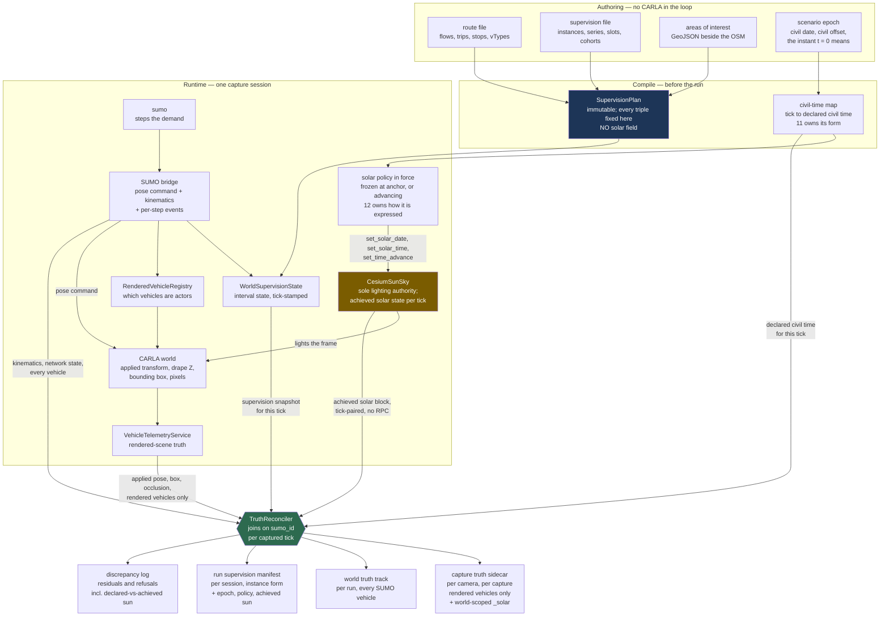
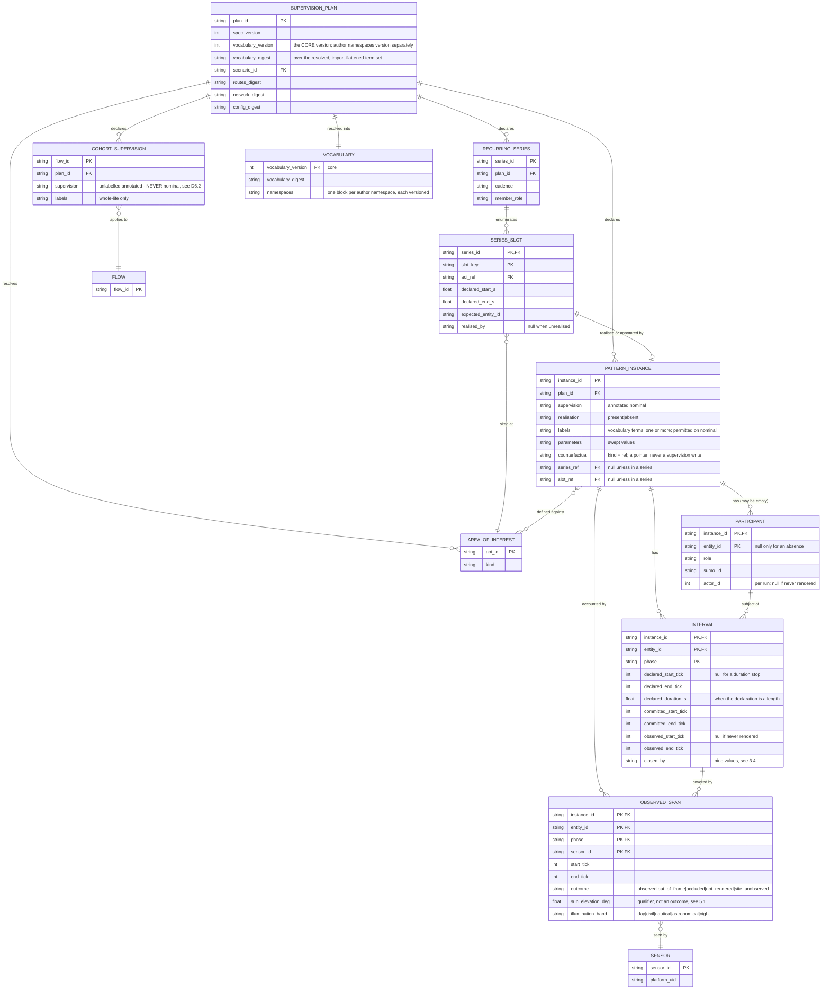
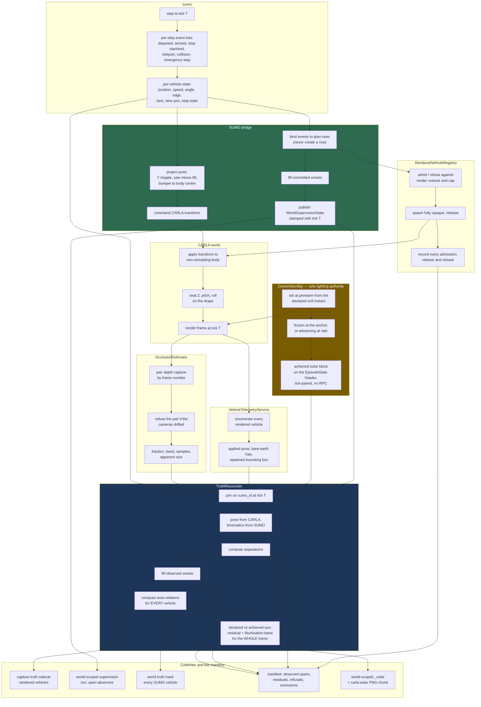

# 06 — Truth and annotation

**Status:** Plan section. Design against a read of the working tree and against measurements taken from
the real scenario artifacts. No code changed, no build run.
**Date:** 2026-09-18.

| Revision | Change |
|---|---|
| 1 · 2026-09-17 | Doc 20's supervision model re-seated on a SUMO authoring surface. |
| 2 · 2026-09-18 | Simulated time of day and scene illumination brought into the truth model. |
| 3 · 2026-09-18 | Scope boundary applied: imagery, truth and labels are produced; nothing is scored. |
| 4 · 2026-09-21 | Annotation vocabulary layered: a closed core, and author terms carried opaquely to the consumer. |
| 5 · 2026-09-21 | Training export carries supervision per image, and the vocabulary without its subject pointers. |

**This pipeline produces imagery, truth and labels, and scores nothing.** The detect-and-track model
and the estimated-pattern-of-life model are external to this effort; §10 draws that boundary field by
field. Decisions are numbered D6.1 to D6.38 and are stable — sibling documents cite them.
**Scope:** How an author's assertion about what a vehicle is doing reaches the truth record when the
authoring surface is a SUMO scenario rather than an OpenSCENARIO storyboard; how positional truth,
behavioural truth and **the illumination the frame was rendered under** are produced by different
authorities and reconciled into one record; what the capture sidecar, the world truth track and the run
manifest each contain; **how the annotation vocabulary is layered so that a term this pipeline never
understands still reaches a consumer who can read it**; **what the corpus contains and what it does
not**; and which of that a model may be allowed to read as an input.
**Re-seats:** [20 — Behavioral Annotation of Tracks, and Areas of Interest](../../Findings/20_Behavioral_Annotation_And_Areas_Of_Interest.md).
Doc 20 is the source of the supervision model and remains correct; what changes here is the surface it
sits on. §11 records, decision by decision, what survived and what did not.
**Related:** [09 — Telemetry CoT Contract](../../Findings/09_Telemetry_CoT_Contract.md) ·
[17 — Photoreal Occlusion Metric](../../Findings/17_Photoreal_Occlusion_Metric.md) ·
[23 — SUMO Traffic Integration](../../Findings/23_SUMO_Traffic_Integration.md) ·
[01 — System architecture](01_Architecture.md) · [04 — Contracts](04_Contracts.md) ·
[07 — Scenario authoring](07_Scenario_Authoring.md) · [08 — Collection and EPoL](08_Collection_And_EPoL.md) ·
[10 — Scale and performance](10_Scale_And_Performance.md) ·
[11 — Time and illumination](11_Time_And_Illumination.md) ·
[12 — Operator control surface](12_Operator_Control_Surface.md)

**Audience:** an engineer building the truth path, who has read neither doc 20 nor the conversation
that produced this plan. Every claim about existing behaviour is cited `path:line` or marked as
measured; anything else that is not cited is labelled as an inference.

**Out of scope, deliberately.**

- **Scoring, of anything, by anything in this pipeline.** This is broader than the exclusion earlier
  drafts carried. [18 §3.2](../../Findings/18_Scenario_Fabrication_For_EPoL_Training.md) rejected
  scoring in the ScenarioRunner sense — pass/fail verdicts and driving-quality criteria — and that
  rejection stands. [`_TEAM_BRIEF.md` §3b](_TEAM_BRIEF.md) now also excludes **measuring the
  performance of the external detect-and-track and estimated-pattern-of-life models**. Concretely,
  nothing designed here runs a detector, a tracker or a model; associates model output to truth in
  order to measure that model; computes precision, recall, F1, temporal-localisation figures or a
  confusion matrix; or produces a scoreboard, a model comparison or a verdict on a model. There is no
  "score" artifact root. §10 is where that boundary is drawn field by field, and §10.1 publishes the
  transfer rule in place of performing the association.
- **Quality gates on the *data* are not scoring and remain in scope in full.** Whether the corpus is
  internally consistent, leak-free, complete, and honest about what it does not contain is this
  section's whole subject. Where a statement below reads as a judgement, check what its subject is: an
  assertion about our data stays; an assertion about a model does not exist here.
- **How an author writes an annotation.** The authoring ergonomics — what a human or an assistant
  types, and what tool validates it — belong to [07](07_Scenario_Authoring.md). This section owns the
  *compiled* form, the runtime state and the recorded artifacts, and states the properties 07 must
  deliver.
- **Area-of-interest geometry, supply and validation.** [20 §8](../../Findings/20_Behavioral_Annotation_And_Areas_Of_Interest.md)
  settles the GeoJSON contract, the build-time validation and the world-scoped actor; that is adopted
  unchanged. What this section adds is the one new requirement SUMO creates: an area of interest stops
  being optional for a whole class of anomaly (§3.5).
- **The render-set rule.** [01 §9.2](01_Architecture.md) owns `RenderSetSelector`. This section owns
  what the truth record must say about its decisions, and one constraint the training export places on
  it (§10.4).
- **Detector and model internals, and running either.** [08](08_Collection_And_EPoL.md) owns the
  interfaces to them. This section fixes the **format** in which truth is emitted — per tick,
  positioned, timed, boxed — and **publishes the rule** by which supervision would be carried onto
  detector tracks by whoever holds them. It does not perform that carry, because that needs model
  output this pipeline never sees (§10.1).
- **The epoch contract, the semantics of the solar policy, and whether night capture is viable at all.**
  [11](11_Time_And_Illumination.md) owns all three. This section owns what the truth record must say
  about the illumination that was achieved, and states the properties 11 must deliver (§4.5, §5.4).
- **How an operator expresses the time-of-day choice.** [12](12_Operator_Control_Surface.md) owns the
  surface. This section owns the record of what the choice turned out to be.
- **Sequencing and work items.** [13](13_Work_Breakdown.md) owns those.

---

## 1. What changes when SUMO drives

Doc 20 derived its supervision model from an OpenSCENARIO storyboard executed by
`CarlaNet.Scenario.ScenarioExecutor`. Under SUMO drive there is no storyboard and no executor. The
model survives; three of its mechanisms do not.

| Doc 20 assumed | Under SUMO drive | Consequence |
|---|---|---|
| An **executor** holds phase state per entity and could publish it (`ScenarioExecutor.cs:611-629`) | The route file is static; SUMO holds vehicle state, not phase state | Interval state must be produced by a component that knows both the plan and SUMO's per-step events. It is the bridge, not an executor (§3.3) |
| A **speed-action ramp** separates the three interval onsets, and the gap is an authored scenario property (§2.4) | There is no ramp. There *is* an authored departure time, an authored stop length, SUMO's own insertion and arrival instants, and the physically observed standstill | The three onsets survive, but one gap becomes a measured simulation output and the other becomes a property of the co-simulation seam. This inverts doc 20's justification for recording all three, and strengthens it (§3.3) |
| The **annotation channel** is `UserDefinedAction`/`CustomCommandAction` inside the `.xosc` (decision 6) | SUMO's route file has no sanctioned vendor extension point and is validated against `routes_file.xsd` (`Shahid_Bahonar_Port_PatternOfLife.rou.xml:5-6`, measured) | The companion file, which doc 20 kept as an equal-status alternative, becomes the sole channel. Decision 6 changes (§3.1, D6.1) |
| **Supervision is per entity**, and the entity list is known at compile time | A `<flow>` is a generator. 245 of them produce roughly 68 880 vehicles whose ids are `<flow id>.<n>` and whose count is not known until the run (measured, §2.1) | A third kind of subject is needed: the cohort. And a cohort may not carry a phased annotation (§3.2, D6.2) |
| **Truth has one producer**, `VehicleTelemetryService` (§4.1) | Two producers exist and neither is sufficient alone: CARLA holds the rendered pose and the camera geometry, SUMO holds the kinematics and every vehicle CARLA is not rendering | Authority is settled field by field and the disagreement is recorded rather than hidden (§4) |
| An annotated interval is either **observed or not** (§2.5) | It can also be unobserved because the participant was *never rendered*, which is a different fact about a different thing | The observability record gains a rendered-span gate upstream of the observed-span gate ([01 §7](01_Architecture.md) states the requirement; §5 gives it shape) |
| The **Traffic Manager's idle cull** edits the ambient distribution and must be switchable (§2.8, decision 14) | The traffic manager is locked out ([01 D1.7](01_Architecture.md)). SUMO has no idle cull — a vehicle parks indefinitely, measured at 489 000 s | Decision 14 does not apply to this mode. But SUMO has several *other* distribution-editing behaviours, three of which are on by default (§6) |
| **Illumination is not a variable.** Doc 20 never mentions the sun, because a storyboard capture was a short scripted episode under whatever light the world was spawned in | A capture window is a span of *simulated* time, and [10 §3.1](10_Scale_And_Performance.md) recommends windows at **07:00** and **23:00** on the sizing scenario. The sun is a settable, optionally advancing world variable (`CarlaServer.cpp:611-670`), and the truth sidecar **already records its state** (`CotWriter.cs:52-65`) | Illumination becomes a recorded property of the capture with an authority of its own — neither simulator's. And because the sidecar records the *achieved* sun faithfully, an unset sun produces a record that contradicts the scenario and nothing notices (§2.7, §4.5) |

Two things about doc 20 are load-bearing and are **not** changed here, because they are the design:

- Supervision is **three-valued** and the state is always written (§2.2, decision 2).
- An annotation is **authored intent**; a derived geometric relation is context and never a label
  (§2.1, §8.5, decision 3). **Illumination joins area relations as the second class of derived
  context** — computed identically for every capture, legitimately a covariate, never a label (§3.6).

Under SUMO both are at greater risk than doc 20 anticipated, and §3.1 and §3.6 say how each is held.

**One new failure mode is introduced by the change of surface, and it is exactly the kind this section
exists to prevent.** The capture window is placed in simulated time; the sun is set by a separate
mechanism; nothing binds them. If the binding is omitted, a 23:00 window renders under the spawn
default of local solar noon (`CesiumHeightSampler.cpp:409`, measured), and the sidecar's `_solar` block
faithfully records noon while the scenario asserts 23:00. The corpus is then internally contradictory
and *every artifact is individually correct*: the imagery is a faithful daylight render, the solar block is a
true record of the sun that lit it, and the scenario is a true record of what was asserted. Nothing in
the set is wrong on its own, so nothing can flag it. §4.5 makes the contradiction a measured number.

---

## 2. What was measured

All figures in this section were taken on 2026-09-17 by extracting
`G:\Projects\CarlaUE_5_7_4\BahonarPatternOfLife.zip` with Python's `zipfile` and parsing the contents,
or by reading the SUMO source staged at `carla/Build/sumo-src`. They are measurements, not estimates.

### 2.1 The authored scenario

`BahonarPatternOfLife/scenario/Shahid_Bahonar_Port_PatternOfLife.rou.xml`:

| | Measured |
|---|---|
| `<flow>` elements | **245** |
| `<trip>` elements | **365** |
| Explicit `<vehicle>` elements | **0** |
| `<vType>` / `<vTypeDistribution>` | **14** / **3** |
| `<stop>` elements | **338** — 336 `parking="true"`, 2 `parking="false"` |
| `<stop>` elements using `until` | **0**. Every stop is specified by `duration` |
| Distinct stop durations | 28 800 s x 335, 300 s x 2, 489 000 s x 1 |
| Trip departure range | 25 200 s to 601 200 s |
| Vehicles the flow rates imply | **68 880**, summing `vehsPerHour x (end - begin) / 3600` over all 245 flows |

68 880 + 365 = **69 245**, which is exactly the insertion count the bundle's own README records as
measured from a full seven-day run (`BahonarPatternOfLife/README.md:138-140`). The arithmetic and the
run agree to the vehicle, which means that in that run `max-depart-delay` skipped nothing — see §6.3.

The scheduled 365 decompose as **335 guard postings + 21 routine hauls + 9 anomaly vehicles**.

### 2.2 The guard relief series, and the hole in it

`tower_postings` dispatches one guard to each of sixteen towers at each of three shift changes a day
for seven days (`CarlaControl/scripts/make_bahonar_scenario.py:215-241`). Parsing every
`guard_d{day}_h{hour}_t{tower}` trip id out of the route file:

| | Measured |
|---|---|
| Distinct shift departures | **21** (7 days x 3 shift hours) |
| Guard trips present | **335** |
| Shifts with all 16 towers manned | **20** |
| Shifts with a tower missing | **1** — day 4, hour 7, departure 370 800 s, tower **3** |

The absence is produced by a `continue` in the generator's loop (`CarlaControl/scripts/make_bahonar_scenario.py:236`),
which discards the `ScheduledVehicle` it was about to build. **The discarded trip is reconstructible
byte for byte from its own siblings.** The same tower's posting in the shift before is:

```xml
<trip id="guard_d3_h23_t3" type="guard" depart="342000"
      from="26413425#5" to="26413425#5" via="26413459"
      departLane="best" departSpeed="max" arrivalSpeed="current">
    <stop lane="26413459_0" endPos="58.90" duration="28800" parking="true"/>
</trip>
```

(`Shahid_Bahonar_Port_PatternOfLife.rou.xml:1409-1413`, and `:1639-1643` for the shift after,
`guard_d4_h15_t3`.)

So the missing trip is `guard_d4_h7_t3`, `via="26413459"`, stopping at `26413459_0` at 58.90 m for
28 800 s from 370 800 s. The `.labels.json` note records exactly those coordinates — `edge`
`26413459`, `edge_pos_m` 58.9, `begin_s` 370800, `end_s` 399600 — as free text with nothing to join
to. §3.5 turns that into a record.

This matters beyond one scenario. **The counterfactual is not merely describable; it is already held
by the generator at the moment it decides not to emit it.** Nothing new has to be authored to express
the absence. It has to stop being thrown away.

### 2.3 The anomalies as authored

| Anomaly | Vehicles | Authored shape (measured) |
|---|---|---|
| Escort to drydock | `escort_0`..`escort_4` | 5 trips, same `from`/`to`, departing 295 200 s + 4n, `:1239-1253` |
| Gate probe | `probe_d2`, `probe_d5` | 2 trips, same `via` and same stop, departing 212 674 s and 472 285 s, `:883-887`, `:1960-1964` |
| Perimeter shadow | `shadow` | 1 trip, 7 `via` edges round the fence, `vType` `speedFactor="0.45" speedDev="0"`, `:2194-2196`, `:29-30` |
| Ferry stay-behind | `staybehind` | 1 trip, `parking="true"` stop of **489 000 s** (5.66 days), `:503-507` |
| Guard no-show | **none** | An omitted trip (§2.2) |

Note what the record has to express and `marked_ids` cannot: the escort is **one phenomenon with five
participants**; the two probes are **two instances of one pattern**, not one instance with two
intervals, because the participants differ; and the no-show has no participant at all.

**The same departures, read as civil times.** Measured 2026-09-18 by parsing every anomaly `<trip>`'s
`depart` out of the route file and dividing by 86 400, under the midnight epoch the brief establishes
from the guard shifts (25 200 / 54 000 / 82 800 s = 07:00 / 15:00 / 23:00, so `t = 0` is midnight of
day 0):

| Anomaly | `depart` (s) | Civil day and time |
|---|---|---|
| `escort_0`..`escort_4` | 295 200 → 295 216 | day 3, **10:00:00** → 10:00:16 |
| `probe_d2` | 212 674 | day 2, **11:04:34** |
| `probe_d5` | 472 285 | day 5, **11:11:25** |
| `staybehind` | 115 200 | day 1, **08:00:00** |
| `shadow` | 527 400 | day 6, **02:30:00** |
| `guard_d4_h7_t3` (the absence) | 370 800 | day 4, **07:00:00** |

Two things fall out of this that no other measurement in this section shows, and both are new to the
redraft.

- **Five of the six anomalies are authored into daylight and one is authored into the middle of the
  night.** The perimeter shadow — the one whose whole character is furtiveness — transits at 02:30.
  Under a pipeline that never sets the sun, **that transit renders at local solar noon**
  (`CesiumHeightSampler.cpp:409`), which is not a degraded version of the intended capture but a
  different scene entirely. This is the concrete instance, in the largest authored scenario we have, of
  the brief's point that a pattern class defined by time of day becomes unrenderable.
- **The distribution is lopsided, and it runs the opposite way to the obvious confound.** The
  positives cluster between 08:00 and 11:11 with one outlier at 02:30; the hard negatives — 335 guard
  postings — fire at exactly 07:00, 15:00 and 23:00 (measured, §2.2). So annotated and nominal
  populations do not share a time-of-day distribution, in either direction. §9.3 rule 5 is about
  exactly this, and §5.3's per-band prevalence is how it is caught rather than intended.

### 2.4 Where today's ground truth leaks into the comparison channel

Three independent leaks, each read from source. All three write the answer into a field that is
supposed to carry only what a detector-derived track could have produced for itself. That is a defect
in **our data**, and it is a defect whether or not anybody ever compares the two: a corpus whose class
field silently encodes the annotation is not a corpus of labelled imagery, it is a corpus with the
answer key stapled to the front.

| Leak | Where | Why it is a leak |
|---|---|---|
| `special_type` is set to the literal string `"marked"` for any flagged vehicle | `CarlaControl/src/carlacontrol/SumoCotBridge.py:321-322` | `special_type` is a **vehicle class** field ([09 §5](../../Findings/09_Telemetry_CoT_Contract.md): emergency / taxi / electric). [09 §9](../../Findings/09_Telemetry_CoT_Contract.md) describes a downstream comparison reading that field as the class — a comparison external to this pipeline, but the field's meaning is ours to keep clean. The ground-truth label is sitting in a field that is supposed to say what kind of vehicle it is |
| CoT affiliation is assigned per `vType`, and every anomaly `vType` maps to `u` | `.labels.json` `affiliation_by_type`; applied at `SumoCotBridge.py:263-265` | Exactly what [20 decision 9](../../Findings/20_Behavioral_Annotation_And_Areas_Of_Interest.md) prohibits: the label becomes readable from the CoT `type` string, which a detector-derived track can never produce |
| Anomaly `vType`s carry conspicuous colours and distinct ids | `rou.xml:29-33`; colours `1.00,0.45,0.00`, `1.00,0.10,0.10`, `1.00,0.20,0.60` | [20 §2.6](../../Findings/20_Behavioral_Annotation_And_Areas_Of_Interest.md)'s appearance confounder. [01 D1.6](01_Architecture.md) already blocks the colour reaching a blueprint; the `type_id` string still reaches the truth record, at `CotUdpEmitter.py:137` |

A fourth, subtler one: `anomaly_escort` declares `length="6.0" width="2.3"` against `mil_jeep`'s
`4.8`/`2.0` (`rou.xml:24`, `:31`). Dimensions are respected by design ([01 §4.3](01_Architecture.md))
because they change car-following gaps — so an annotated vehicle whose dimensions differ gratuitously
from the nominal population is a *dynamic* appearance confounder. §9.3 states the authoring rule that
closes it.

### 2.5 SUMO's own distribution-editing defaults

Read from `carla/Build/sumo-src/src/microsim/MSFrame.cpp` and
`carla/Build/sumo-src/src/utils/common/RandHelper.cpp`:

| Option | SUMO default | Effect | Bahonar sets |
|---|---|---|---|
| `time-to-teleport` | **300 s** (`MSFrame.cpp:438`) | A jammed vehicle jumps position | `-1` (disabled) |
| `time-to-teleport.highways` | `0` (`MSFrame.cpp:441`, applied `:1164`) | A second teleport path on fast roads | not set |
| `time-to-teleport.disconnected` | `-1` (`MSFrame.cpp:447`) | Teleport on a disconnected route | not set |
| `collision.action` | **`teleport`** (`MSFrame.cpp:399`) | Colliding vehicles jump; `remove` destroys them | `warn` |
| `max-depart-delay` | **`-1`, never skipped** (`MSFrame.cpp:471`) | A vehicle that cannot insert within the delay is **discarded** | **`900`** |
| `scale` | `1.0` (`MSFrame.cpp:432`) | Demand scaled "by discarding or duplicating vehicles" | not set |
| `max-num-vehicles` | `-1` (`MSFrame.cpp:423`) | Insertion delayed to stay under a cap | not set |
| `random-depart-offset` | `0` (`MSFrame.cpp:486`) | Uniform random jitter on every `depart` | not set |
| `ignore-route-errors` | `false` (`MSFrame.cpp:393`) | Unroutable vehicles dropped instead of failing the load | not set |
| `seed` | `23423` (`RandHelper.cpp:67`) | Fixed by default, but `--random` (`:63`) reseeds from wall clock | `42` |
| `lanechange.duration` | **`0`** (`MSFrame.cpp:489`) | A lane change is laterally **instantaneous** | not set |

The last row is not a population edit but reaches truth and imagery directly: at the default a vehicle
crosses a lane width within one 1.0 s step, which renders as a sideways jump and shows up in the
reconciliation residual of §4.3 as a spurious spike. §6.2 takes it up.

### 2.6 The two prevalence numbers

9 of 69 245 vehicles carry `marked=1`: a per-vehicle prevalence of **0.013 %**. Counted instead over
authored *stationary* vehicle-seconds, the annotated dwells total 489 600 s (the stay-behind's 489 000
plus two 300 s probe waits) against the guard postings' 335 x 28 800 = 9 648 000 s, a prevalence of
**4.8 %** — a factor of **372** apart.

[20 §2.6](../../Findings/20_Behavioral_Annotation_And_Areas_Of_Interest.md) says prevalence must be
recorded rather than reconstructed. This measurement says something sharper: **prevalence is
meaningless without its unit, and two defensible units differ here by more than two orders of
magnitude.** The manifest records it in three units, over the captured span only (§8.4), and §5.3 adds
a fourth axis to each of them: the illumination the capture was taken under.

### 2.7 The solar record as it exists today

Read from the tree on 2026-09-18. The mechanism is complete and working; what follows is what it
records and, at the end, the four ways it can be silently wrong. Nothing here is a proposal — it is the
baseline the rest of this section builds on.

**`_solar` is written once per sidecar, before any `<event>`, as a child of the `<events>` container**
(`CotWriter.cs:50-65`). The comment states the placement reason: "written once here, before the
per-vehicle events, so it is present even for a vehicle-free frame" (`:50-51`). It carries **nine
attributes**, packed from an eleven-double block:

| Attribute | Source double | What it is |
|---|---|---|
| `solar_time` | `solar[0]` | the sun clock in **hours**, `[0, 24)`, in the world's own time zone — **not** a civil time |
| `date` | `solar[1..3]` | `YYYY-MM-DD`, formatted from three doubles (`CotWriter.cs:56-57`); drives the seasonal sun angle |
| `time_zone` | `solar[4]` | hours; set at world spawn to **longitude ÷ 15, unrounded** (`CesiumSunSky.cpp:570-573`, called from `CesiumHeightSampler.cpp:411-412`) |
| `lat`, `lon` | `solar[5..6]` | the **georeference origin**, not any vehicle's position (`CesiumHeightSampler.cpp:765-772`) |
| `sun_elevation_deg` | `solar[7]` | degrees above the horizon |
| `sun_azimuth_deg` | `solar[8]` | degrees clockwise from North |
| `advancing` | `solar[9]` | whether a time-of-day controller is advancing the clock |
| `rate` | `solar[10]` | sun-clock seconds per tick-second while advancing |

Four properties of the existing path are worth having in hand, because the design below relies on all
four rather than replacing them:

1. **It is already tick-paired and already free.** `FrameRecorder` reads it with
   `_client.GetCachedSolarState()` (`FrameRecorder.cs:160-162`) — the world-observer cache, lock-free
   and with no RPC (`CarlaClient.cs:1988-1991`), populated from eleven doubles appended to the
   `EpisodeState` header at offset 36 (`CarlaClient.cs:1842-1855`). It is the same snapshot the
   telemetry came from.
2. **It is already captured into the encoding job rather than read at write time.** The solar block is
   handed to the `Job` record alongside the telemetry, the sensor pose and the capture identity
   (`FrameRecorder.cs:183`), and the worker writes it out later (`:227-232`). That is precisely the
   discipline §4.3 demands of the SUMO snapshot — **already honoured here, for this payload**, which is
   the strongest available argument that the discipline is practical.
3. **It is already bound to the pixels.** The same block is embedded in the PNG as a `carla:solar`
   tEXt chunk (`SolarMetadata.cs:14-20`, written between IHDR and IDAT by `PngEncoder.cs:44-47`,
   composed at `FrameRecorder.cs:227`), so a still separated from its sidecar still carries the sun it
   was rendered under. `SolarMetadata.HasData` requires the full eleven doubles, "so a frame is never
   tagged with a bogus sun" (`SolarMetadata.cs:14-15`).
4. **The world has exactly one lighting authority, and the generator enforces it.** World generation
   disables every pre-existing `ADirectionalLight` and `ASkyLight` in the level so that CesiumSunSky is
   the sole sun (`CesiumHeightSampler.cpp:358-381`, which logs the count), and `CarlaServer.cpp:611-612`
   names CesiumSunSky "the single sun/lighting authority for the georeferenced world (CARLA weather is
   inert here)". So there is no second light to reconcile — and, as §5.4 notes, no street lighting
   either.

**Four ways the record can be silently wrong.** Each is measured, and each is a reason the additions of
§4.5 are not decoration.

- **The spawn default is local solar noon.** A freshly generated world starts at `SolarTime = 12.0`
  with daylight saving disabled (`CesiumHeightSampler.cpp:409-410`). If nothing sets the sun, every
  window renders at noon and `_solar` records noon truthfully. This is the failure the whole redraft is
  about.
- **`time_zone` is a solar zone, not a civil offset, and the two differ by a real amount.** Measured
  from the sizing scenario's own network: `projParameter="+proj=tmerc +lat_0=27.15012 +lon_0=56.18065 …"`
  (`BahonarPatternOfLife/scenario/Shahid_Bahonar_Port.net.xml`, `<location>` element — the same element
  also shows `netOffset="0.00,0.00"`, confirming at Bahonar what [23 §2](../../Findings/23_SUMO_Traffic_Integration.md)
  measured at Arapahoe). So the world's time zone is 56.18065 ÷ 15 = **+3.745377 h**, while Iran's
  civil offset is **+3.5 h**. A caller who passes a declared civil hour straight into `set_solar_time`
  puts the sun **14 min 43 s** away from the civil time it thinks it asked for. Small, and at 23:00
  irrelevant — but it is a units mismatch, not an approximation, and near sunrise it moves the sun
  through a few degrees of azimuth. The conversion is arithmetic and belongs in the contract
  ([11](11_Time_And_Illumination.md) owns it); the residual of §4.5 is what proves it was applied.
- **The advancing clock wraps at midnight and never advances the date.** Measured:
  `SolarTime = Fmod(Fmod(SolarTime + DeltaHours, 24.0) + 24.0, 24.0)` and nothing touches `Year`,
  `Month` or `Day` (`CesiumTimeOfDayController.cpp:34-36`). `set_solar_time` wraps the same way
  (`CesiumHeightSampler.cpp:730`), with a comment that callers may pass "a freely-accumulating clock".
  So a seven-day scenario run with the sun advancing re-lives **one calendar date** seven times: the
  time of day is right, the seasonal declination is frozen at whatever date was last set. For a
  seven-day span the declination error is small; for a scenario whose windows span months it is not.
  This is a defect, it belongs to [11](11_Time_And_Illumination.md), and until it is fixed the manifest
  must record that no date roll-over occurred (§8.4) rather than let a reader assume one did.
- **A frozen sun and an unconfigured sun are indistinguishable in the record.** `advancing` and `rate`
  are read from the time-of-day controller actor if one exists and otherwise default to `0.0` and `1.0`
  (`CesiumHeightSampler.cpp:784-796`). A run that deliberately froze the sun and a run where nobody ever
  called `set_time_advance` both emit `advancing="false" rate="1.0"`. **The sidecar therefore cannot
  express the policy — only the outcome.** That is the single strongest reason the policy must be
  recorded separately rather than inferred from `advancing` (§4.5, D6.20).

Two smaller asymmetries, noted so a later reader does not trip on them. `CotWriter` requires
`Count >= 11` (`:52`) and writes **no `_solar` element at all** below that, so a capture can legitimately
carry no illumination record; §4.5 makes that a session failure rather than a silent omission. And the
Python shim accepts `Count >= 9` and substitutes `advancing=False, rate=1.0` for a short payload
(`carlanet/__init__.py:1511-1533`), so the two readers disagree about what a short block means.

---

## 3. The supervision model, re-seated

### 3.1 Three-valued supervision, and how each state is authored

[20 §2.2](../../Findings/20_Behavioral_Annotation_And_Areas_Of_Interest.md) requires three states, not
two, because a long capture will produce genuine instances of the target pattern by chance and filing
those as negatives makes the corpus assert that the target behaviour is normal. That argument is unchanged
and the three states survive verbatim.

| State | Meaning | Who gets it in a SUMO scenario |
|---|---|---|
| `annotated` | The author asserts this subject is executing the named pattern over this interval | Entities and slots named in an annotation |
| `nominal` | The author asserts this subject is **not** executing any target pattern | Entities and cohorts explicitly declared so — the hard negatives |
| `unlabelled` | No assertion either way | Everything else; the default, always written explicitly |

**Today's ground truth is binary, and the binary collapse is measurable.** `ScheduledVehicle.marked`
is a `bool` (`CarlaControl/src/carlacontrol/SumoPatternOfLifeBuilder.py:66`) and `write_routes` returns
`[v.veh_id for v in scheduled if v.marked]` (`:121`), which is the whole of `marked_ids`. So the 335
guard postings and the 21 routine hauls — 356 deliberately authored ordinary behaviours — are
indistinguishable from the 68 880 ambient flow vehicles, and both are indistinguishable from "not
asserted".

That is not an abstract loss. **A guard posting is a textbook hard negative in
[20 §2.7](../../Findings/20_Behavioral_Annotation_And_Areas_Of_Interest.md)'s exact sense: an eight-hour
authored parked dwell, in a legitimate place, for a legitimate reason, sharing the site with an
annotated dwell** — the stay-behind parks for 489 000 s, the guards for 28 800 s each, and the only
trajectory-level difference is duration and place (§2.1, measured). A corpus that cannot say "this
eight-hour stop is ordinary" is a corpus in which duration alone looks like the signal.

**How each state is authored.** The annotation travels in a companion file beside the `.sumocfg`,
`<scenario>.supervision.json`, keyed by SUMO ids and flow ids. Doc 20 decision 6 made the in-file
custom action the primary channel and the companion file an equal-status alternative; under SUMO the
in-file channel does not exist:

- A SUMO route file is validated against `routes_file.xsd`
  (`Shahid_Bahonar_Port_PatternOfLife.rou.xml:5-6`, measured), and SUMO has no counterpart to
  OpenSCENARIO's `UserDefinedAction`. The generic `<param key= value=/>` element is not a vendor
  extension point: it is a **flat, un-namespaced** key/value store on `Parameterised`
  (`Build/sumo-src/src/utils/common/Parameterised.cpp:179`) that SUMO's own device and model code
  reads keys out of — `device.ssm.file` on a vehicle and on its `vType`
  (`microsim/devices/MSDevice_SSM.cpp:3890-3898`), `device.glosa.range` on a traffic light
  (`microsim/devices/MSDevice_GLOSA.cpp:344`). Supervision written there shares a namespace with
  simulation behaviour, which is the failure [20 §4.3](../../Findings/20_Behavioral_Annotation_And_Areas_Of_Interest.md)
  identified when it rejected `role_name`. `<param>` is fit for **identity transport** and unfit for
  an annotation channel.
- The route file is **generated**, never hand-edited — every one in the repository carries "Generated
  by `carlacontrol.SumoPatternOfLifeBuilder`; edit that, not this" (`rou.xml:3`, `sumocfg:2`). Putting
  authored intent into a generated file makes the generator the only author.
- Doc 20's second argument for the companion file applies with more force here: run identity, the
  world digest and the vocabulary version describe a *capture*, not a scenario, and the scenario
  artifact is regenerated whenever the network is.

So **decision 6 changes**: the companion file is the sole channel, the builder emits it alongside the
routes, and the two are bound by digest (§8.1). Everything else about decision 6 stands — one compiled
representation, unknown terms are errors, name conventions are never the sole carrier.

### 3.2 Three kinds of subject

Doc 20 knew one kind of subject, the storyboard entity. SUMO needs three, because a `<flow>` is a
generator rather than a thing.

| Subject | Names | Realises as | May carry |
|---|---|---|---|
| **Entity** | One authored SUMO vehicle id — `escort_0`, `guard_d4_h15_t3` | Exactly one vehicle | `annotated` with phased intervals, `nominal`, `unlabelled` |
| **Cohort** | A `<flow>` id — `corridor_d0_p0_h6` | Every vehicle SUMO names `<flow id>.<n>` | `nominal`, `unlabelled`, or an annotation whose interval is **whole-life only** |
| **Slot** | A `(series_id, slot_key)` pair — `tower_relief` / `d4_h7_t3` | Zero or one vehicle | `annotated`, `nominal`; and it is the only subject that can be **unrealised** (§3.5) |

**A cohort may not carry a phased annotation.** A phase needs an onset, an onset needs a specific
vehicle, and a flow's members are interchangeable and unbounded — 68 880 of them here. What a cohort
*can* carry is the whole-life case doc 20 called class-conditioned presence
([20 §3](../../Findings/20_Behavioral_Annotation_And_Areas_Of_Interest.md) class 4): "every vehicle
this flow emits is a heavy goods vehicle in a residential area at 03:00" is an assertion about the
flow, true of every member for its whole life, and needs no onset. Attaching a phased annotation to a
cohort must be a compile error rather than a silent per-member expansion, because the expansion would
assert an interval for each of tens of thousands of vehicles that nobody looked at.

The **slot** is the new one and §3.5 is about it.

### 3.3 The three interval onsets on the SUMO surface

[20 §2.4](../../Findings/20_Behavioral_Annotation_And_Areas_Of_Interest.md) records three defensible
answers to "when did the phase begin", derived from the executor's decomposition of a speed action:
the tick the action fired, the tick the ramp finished and the brake went on, and the tick the world
first reported at or below 0.15 m/s (`ScenarioExecutor.cs:22`, `:252`). Doc 20's decision 5 is to
record all three.

Under SUMO there is no ramp, so the three have to be re-derived from the SUMO artifacts. They are
still three, and they still cannot be reconstructed from each other, but what separates them changes.
Naming them by the authority that produces each, rather than by the executor mechanism that used to:

| Onset | Produced by | Read from |
|---|---|---|
| **declared** | the author | the route file, or the supervision plan |
| **committed** | SUMO's own model | TraCI, at the step it happened |
| **observed** | the rendered body | CARLA, from the applied transform and the world's own state |

Filled in for the two phase kinds SUMO actually has:

| Phase kind | declared | committed | observed |
|---|---|---|---|
| **Entry into the world** | `<trip depart>` or `<flow begin>` — an absolute simulated time | `Vehicle.getDeparture` — the step SUMO actually inserted it, which differs by `Vehicle.getDepartDelay` (`Eclipse.Sumo.Libtraci/Vehicle.cs:156`, `:162`) | **the admission instant** — the CARLA tick at which `RenderedVehicleRegistry` admitted the vehicle and its actor first appeared in the world snapshot (§4.4) |
| **A stop or dwell** | `<stop until>` when the author wrote one; **absent** when the author wrote `duration`, in which case the declared quantity is a length, not a time | `StopData.arrival` against `StopData.intendedArrival`, plus the step on which the id appears in `Simulation.getStopStartingVehiclesIDList` or `getParkingStartingVehiclesIDList` (`Simulation.cs:298-320`, `:274-292`) | the CARLA tick at which the rendered body's speed first held at or below 0.15 m/s, the same physical predicate and the same threshold as `ScenarioExecutor.cs:22` |
| **Departure from a stop** | `until` if present, otherwise absent | `StopData.depart`, and the id appearing in `getStopEndingVehiclesIDList` / `getParkingEndingVehiclesIDList` | first CARLA tick above the threshold |

**SUMO itself distinguishes declared from committed, and exposes both.** `StopData` carries
`intendedArrival`, `arrival` and `depart` as separate fields alongside `duration` and `until`
(`Build/sumo-src/tools/traci/_vehicle.py:37-70`; the same fields in the generated C# binding at
`Build/sumo-build/src/libtraci/Eclipse.Sumo.Libtraci/TraCINextStopData.cs:181-229`). This is not an
analogy being stretched onto SUMO. It is a distinction SUMO already makes for its own reasons, and it
lines up with doc 20's exactly.

**Four consequences, and they change the justification for decision 5 rather than the decision.**

1. **The declared onset can be legitimately absent.** Measured: all 338 stops in the Bahonar scenario
   use `duration` and none uses `until` (§2.1). A `duration` stop declares a *length*, anchored
   wherever SUMO happens to arrive, so there is no declared instant to record. The record must carry
   `declared_duration_s` with `declared_start_tick` absent, and a consumer must distinguish "not
   declared" from "declared at tick 0". Doc 20's schema had no such case; every onset there was always
   available.
2. **The declared-to-committed gap becomes a measured simulation output, not a scenario constant.**
   For an entry it is exactly `getDepartDelay`, which the `.sumocfg`'s `max-depart-delay` bounds — at
   900 s in this scenario (§2.5). For a stop it is `arrival - intendedArrival`. Doc 20 argued the gap
   "is not a constant and cannot be calibrated away" because the ramp is an authored property; the
   SUMO version is stronger, because the gap is *congestion*, which is the very phenomenon the corpus
   exists to depict. Anyone who collapsed the three onsets into one would be throwing away a
   measurement of the thing being captured.
3. **The committed-to-observed gap is a property of the co-simulation seam, not of the scenario, and
   nothing else is mixed into it.** It is the transport lag between a SUMO step and the CARLA tick
   that renders its result, and under the integer-ratio clock contract of
   [01 D1.13](01_Architecture.md) it should be small and nearly constant. That makes it a free health
   check: a gap that drifts, or a committed stop with no observed standstill, is a bridge defect.

   **Vehicle fade being off makes this check sharper than it would otherwise have been.** The user has
   demoted fade — it is computed client-side and pushed one blocking RPC per vehicle per reconcile,
   which the argument parser's own help text calls "the heaviest load this client puts on the server's
   per-frame RPC budget", and `--fade` now carries `default=False`
   (`CarlaControl/src/carlacontrol/CarlaControlArgumentParser.py:317-328`). Vehicles appear fully
   opaque. So the observed onset is an **exact instant with no ramp**: the tick the vehicle was
   admitted to the render set. Had a dissolve been running, the committed-to-observed gap would have
   carried a fade duration inside it and a drift in the seam would have been indistinguishable from a
   change in the fade profile. With no ramp, any drift is the seam.

   **It is also the only one of the three that can fail to exist** — if the participant was never
   rendered there is no observed onset at all, which is §5's subject.
4. **Which onset defines the interval remains the trainer's choice** — unchanged from doc 20, and now
   better supported, because the three have different provenances rather than being three points on
   one ramp.

**Decision 5 therefore survives, with the onsets renamed and one of them made optional.** Recording
all three is more valuable here than in doc 20, not less.

The mechanics: the component that fills these in is the SUMO bridge, because it is the only component
holding both the plan and the per-step TraCI events. It writes into `WorldSupervisionState`
([01 §4.1](01_Architecture.md)), which is published on change and stamped with the tick it describes,
and which the recorders read. [07](07_Scenario_Authoring.md) owns how an author declares a phase; this
section owns what is recorded when one opens and closes.

### 3.4 Pattern instances, participants and recurring series

[20 §2.3](../../Findings/20_Behavioral_Annotation_And_Areas_Of_Interest.md)'s unit of supervision — a
pattern instance with participants, roles and intervals — is adopted unchanged and is what
`marked_ids` cannot express. Measured against the Bahonar anomalies (§2.3), a flat id list loses:

- **the convoy** — `escort_0`..`escort_4` are one phenomenon with five participants and, on the
  README's own measurement, a 16 s departure spread over a 10.3 km run. As five flat ids they are five
  unrelated anomalies, and the thing that makes it an escort (that they travel together) is not stated
  anywhere;
- **the distinction between an instance and a pattern** — `probe_d2` and `probe_d5` are two instances
  of one pattern, 259 611 s apart, with different participants. A revisit cadence would be one
  instance with several intervals and the same participant. `marked_ids` renders both as "two ids";
- **roles** — the escort has a lead and four followers; a rendezvous has asymmetric roles by
  definition;
- **absence** — §3.5.

One record is added above doc 20's `PatternInstance`, and it is what makes absence expressible:

```
RecurringSeries
  series_id           stable; e.g. tower_relief
  cadence             declared: period_s, offsets_s[], span; or "enumerated"
  member_role         the role a realising vehicle plays in each occurrence
  slots[]             SeriesSlot

SeriesSlot
  slot_key            stable within the series; e.g. d4_h7_t3
  aoi_ref             the area of interest this slot is about       (required, see §3.5)
  declared_start_s    the authored occasion
  declared_end_s
  expected_entity_id  the id the realising vehicle would carry, when the cadence names one
  realised_by         the SUMO id that realised it, or null
```

A series is not itself supervision; it is the scaffolding that makes a slot meaningful. The 335 guard
postings become 335 realised slots of `tower_relief`, each `nominal`; the hole becomes the one
unrealised slot, and the pattern instance that annotates it (§3.5). Every field is available where the
generator already loops over `(day, hour, tower)` — the loop **is** the slot enumeration and
`TOWER_POSTS[tower]` **is** the site (`CarlaControl/scripts/make_bahonar_scenario.py:231-241`, measured).

The interval lifecycle, including the outcomes `closed_by` has to distinguish:


`closed_by` extends doc 20's four values (`trigger`, `scenario_end`, `entity_removed`, `aborted`) to
nine, because SUMO and the render set between them produce more ways for an interval to end and they
are not interchangeable:

| `closed_by` | Means | Source |
|---|---|---|
| `trigger` | The authored condition ended it | plan + TraCI |
| `entity_arrived` | The vehicle reached its route destination and SUMO removed it | `Simulation.getArrivedIDList` (`Simulation.cs:268`) |
| `sumo_removed` | SUMO removed it for another reason — collision action, teleport, `remove` | `Simulation.getCollidingVehiclesIDList`, `getStartingTeleportIDList` (`:328`, `:352`) |
| `never_inserted` | Declared, but `max-depart-delay` discarded it before it ever existed | absent from `getDepartedIDList` past the delay |
| `slot_unrealised` | The occasion passed with no vehicle. **The absence** | plan; §3.5 |
| `physical_predicate_never_held` | SUMO committed, the body never did | bridge; a defect signal |
| `render_released` | CARLA stopped rendering it. The behaviour did not end | `RenderedVehicleRegistry` |
| `capture_window_end` | The capture window closed while it was open | `CaptureSession` |
| `scenario_end` | The simulation ended while it was open | `PlaybackClock` |

**`render_released` must never be conflated with `entity_arrived`.** The first says the capture
stopped looking; the second says the behaviour finished. Doc 20 did not need the distinction because
nothing released a scripted entity mid-behaviour. Under a render set that is routine, and a consumer
that treats a released interval as a completed one will train on truncated examples believing they are
whole. This is the shape of doc 20's open question 3 (is a truncated instance a usable example) with a
new and more frequent cause.

### 3.5 An anomaly with no participant

The guard no-show is an anomaly whose entire signal is that nothing happened. Doc 20 does not cover
it; `marked_ids` cannot hold it; and it is not a corner case — it is one of the six anomalies the
largest authored scenario ships, and arguably the most realistic of them.

**Four things have to be true before an absence is supervision rather than a note.**

**One: the expectation must be a record, not prose.** An absence is only defined against an
expectation, so the expectation has to exist in the same form as the realisations it is measured
against. That is the `RecurringSeries` of §3.4. The evidence that day 4 hour 7 tower 3 is anomalous is
the other 335 slots — 20 shifts in which all sixteen towers were manned (measured, §2.2) — and that
evidence is only joinable if the 335 and the 1 are members of one enumerated series. A free-text note
with a `tower_index` cannot be joined to anything, because nothing else in the corpus is keyed by
tower index.

**Two: the anchor is a place and a window, not a vehicle.** Every other pattern instance hangs off its
participants' tracks. This one has none, so it hangs off the site. That makes
[20 §8](../../Findings/20_Behavioral_Annotation_And_Areas_Of_Interest.md)'s areas of interest a **hard
prerequisite for this class of anomaly**, not the "adopt, sequenced after" they are for every other
class. Doc 20 sequenced areas behind the annotation channel on the grounds that the annotation channel
is what removes the deficiency; that sequencing holds for eight of the ten pattern classes and fails
for this one. **An absence cannot be expressed without an area of interest.** The area is cheap here:
the site is `26413459` at 58.90 m, which resolves to a point in the SUMO network and thence, by the
measured frame identity SUMO (x, y) = CARLA (x, -y) ([23 §2](../../Findings/23_SUMO_Traffic_Integration.md)),
to a CARLA-local position and a radius.

**Three: the record must never produce a phantom track.** Nothing may emit a CoT `<event>` for a
vehicle that does not exist; that is fabricating a detection, and neither a viewer nor any downstream
consumer would have any way to know. So an absence instance is **world-scoped, never vehicle-scoped**: it lives in the
run manifest, and its per-frame projection is a child of the sidecar's `<events>` container, not of
any `<event>`. That placement already has a precedent in the real writer — `_solar` is written as a
child of `<events>` (`CotWriter.cs:52-65`) and capture identity sits on the container's attributes
(`:40-48`) — so this is an established shape rather than a new one.

**Four: an unobserved absence is not an observation.** A camera that never looked at tower 3 cannot
have missed a guard there. The observability question for an absence is therefore about the **site**,
not about a participant: was the area under observation, by which sensors, for how much of the window.
And the record needs the negative evidence too — the set of vehicles that *were* observed inside the
area during the window — because "no guard arrived" is a claim about what was there, not only about
what was not. §5.2 gives the computation.

The compiled record:

```
PatternInstance                       -- the absence, at Bahonar
  instance_id      pi_tower_relief_d4_h7_t3_unmanned
  supervision      annotated
  labels           [ bahonar:post_unmanned ]   -- an author term, namespaced (3.8)
  realisation      absent                       -- present | absent
  series_ref       tower_relief
  slot_ref         d4_h7_t3
  aoi_refs         [ tower_03 ]
  participants     []                           -- legitimately empty
  expected         { role: guard,
                     expected_entity_id: guard_d4_h7_t3,
                     route: { from: 26413425#5, to: 26413425#5, via: [26413459] },
                     site_lane: 26413459_0, site_pos_m: 58.90,
                     declared_start_s: 370800, declared_end_s: 399600 }
  intervals        [ { participant: null, phase: vacancy,
                       declared_start_tick: …, declared_end_tick: …,
                       committed_start_tick: null,      -- nothing to commit
                       observed_start_tick: null,       -- nothing to observe
                       closed_by: slot_unrealised } ]
  counter_evidence { series_slots_total: 336, series_slots_realised: 335,
                     sibling_slots_same_site: [ d3_h23_t3, d4_h15_t3, … ] }
```

`realisation: absent` is a first-class field rather than an inference from an empty participant list,
so a consumer cannot mistake an absence for a malformed instance. `expected` is filled from the
generator's own loop state — measured as reconstructible in §2.2 — so authoring it costs nothing.

**One safeguard.** An absence is the only supervision state a geometric predicate could produce
convincingly ("nothing was at the site, therefore absence"), which makes it the sharpest edge of
§3.6's rule. The rule holds without exception: an absence instance exists because a **slot** was
authored and went unrealised, never because a site was observed to be empty. A site that is empty with
no authored slot is `unlabelled`, exactly like every other unasserted fact.

### 3.6 The authored-intent rule, stated operationally

[20 §2.1 and §8.5](../../Findings/20_Behavioral_Annotation_And_Areas_Of_Interest.md) set the rule:
annotations are authored intent, area relations are derived context, and no geometric predicate ever
writes an annotation. Doc 20 flagged that areas make derivation easy. Under SUMO it is worse, because
SUMO hands the runtime a finished answer: `Vehicle.getStopState` returns a stopped-and-parking flag
(`Vehicle.cs:360`), `Simulation.getStopStartingVehiclesIDList` returns the ids that just started
stopping (`Simulation.cs:304`), and either is a one-line label of apparently excellent quality.

Restating the rule so it is enforceable rather than aspirational:

1. **The set of supervision rows is fixed before the run starts.** The
   `(instance_id, participant, phase)` triples in the manifest are wholly determined by the compiled
   supervision plan. The runtime may only **bind** rows that already exist — fill in onsets, close
   intervals, record observability. It may never create a row, a label, an instance or a participant.
2. **That is testable, and it is the enforcement.** Two runs of the same scenario must produce
   manifests whose triple sets are **identical**; only the tick fields, the observability and the
   reconciliation residuals may differ. A diff of two manifests is a regression test for the rule, and
   it costs one comparison. Nothing else about supervision has this property, which is why the
   invariant is worth stating in exactly this form.
3. **The code boundary is the plan.** `SupervisionPlan` is immutable, is compiled by a build-time tool
   from the supervision file plus the route file, and is an *input* to the runtime. The runtime
   component that maintains interval state consumes it and TraCI events; it has no writer for the
   label set, the instance set or the participant set, because those types expose none.
4. **The two sidecar elements stay separate and a consumer can delete one.** `<_supervision>` is
   written only from the plan. `<_aoi>` is written only by computation, for **every** vehicle including
   ambient. A consumer must be able to discard `<_aoi>` entirely and still have complete supervision;
   if that ever stops being true the labels have become the rule.
5. **Everything SUMO knows is available, and none of it is a label.** `getStopState`, the current
   edge, the current lane, `getWaitingTime`, `getTimeLoss` are derived context. They belong beside the
   area relations, where a human auditing for the accidental positives of
   [20 §2.2](../../Findings/20_Behavioral_Annotation_And_Areas_Of_Interest.md) will want them, and
   nowhere near `<_supervision>`.
6. **Illumination is derived context, of exactly the same class as an area relation.** §3.6's rule was
   written about geometry; the argument does not depend on geometry, it depends on *who computes the
   value*. An area relation is computed identically for every vehicle from the world's own state; the
   sun's elevation is computed identically for every capture from the world's own state. Both are
   legitimate covariates, both are legitimate inputs to a fielded system — a real sensor knows the time
   and its own position, and can compute the solar geometry as well as we can — and **neither is ever a
   label**. The rule is stated operationally below.

**Illumination, operationally.** Four statements, in the same enforceable form as points 1–5.

| | |
|---|---|
| **Which element carries it** | `<_solar>`, a child of the sidecar's `<events>` container and a **sibling of world-scoped `<_supervision>`** (`CotWriter.cs:50-65`, existing). It is world-scoped, exactly like `<_supervision>`: one sun lit every vehicle in the frame, so it is written once and never per `<event>`. No `<event>`, no `<_carla>` block and no `<_supervision>` element carries a solar attribute |
| **Where the code boundary is** | `SupervisionPlan` has **no solar field**, and the runtime component that binds interval state has **no reader for the solar cache**. The solar block travels from `CarlaClient.GetCachedSolarState()` (`CarlaClient.cs:1988-1991`) through `FrameRecorder`'s encoding job (`FrameRecorder.cs:162`, `:183`) to `SolarMetadata` and `CotWriter`, and that path touches nothing in `CarlaNet.Types`'s supervision records. The boundary is enforced by the type graph, not by a convention: a binder that wanted to read the sun would have to be given a new dependency, which is a visible change |
| **The deletion test** | A consumer must be able to **delete every `<_solar>` element and every `carla:solar` PNG chunk from a corpus and still have complete, unambiguous supervision.** This is the same test point 4 applies to `<_aoi>`, for the same reason. If deleting the sun ever changes what the corpus asserts, illumination has become a label |
| **The invariant it must not break** | The row-set invariant of point 2 is unaffected by illumination, and that is a property worth checking rather than assuming: two runs of one scenario under **different solar policies** must still produce manifests with identical `(instance_id, participant, phase)` triples. Only the observability spans, the illumination qualifiers and the residuals may differ. A frozen-sun run and an advancing-sun run of the same scenario are therefore a *second* free regression test for the rule, orthogonal to the same-policy repeat |

**The hazard is a confounder, and it is the temporal twin of one already documented.** §2.4 measured
that anomaly `vType`s carry conspicuous colours and distinct ids, so appearance correlates with the
label. Time of day can do the same thing and is easier to do by accident: an author who writes every
anomaly into the night window, or who captures the annotated instances at 23:00 and the nominal
population at 07:00, has encoded the annotation in the lighting. Such a corpus offers "dark" as a
sufficient explanation of the label and never contradicts it, which makes it a corpus that cannot
support the claim its labels appear to make. Worse than the colour confounder in one respect: a colour
is per vehicle and a human reviewing the route file can see it, whereas time of day is a property of
the *capture plan* and is invisible in every individual artifact. The countermeasures are split across
two places, and both are cheap:

- **At authoring**, §9.3 rule 5 requires an annotated instance's time of day to be drawn from the same
  distribution as the nominal population it is a negative for, unless time of day *is* the annotated
  pattern — which is a real case, since [20 §3](../../Findings/20_Behavioral_Annotation_And_Areas_Of_Interest.md)
  class 4 is "a heavy goods vehicle in a residential area **at 03:00**".
- **At corpus level**, §5.3 reports prevalence per illumination band, which turns the confounder into a
  number a reviewer can read off the manifest: if the annotated prevalence in one band is orders of
  magnitude above another, the lighting is carrying signal. §10.2 makes that check the gate on whether
  solar state may be exported as a model input at all.

Placement: the record types and the published state belong in `CarlaNet.Types`, which references
nothing and is the common ancestor of every assembly that needs them — doc 20 §7.3's argument,
unchanged. Doc 20's decision 11 (a process-local registry) is superseded by
[01 D1.10](01_Architecture.md), which publishes world-scoped state to the server; that resolves doc
20's own open concern in the direction doc 20 preferred, and this section adopts it without
re-litigating.

**Auditing is required from the start, not deferred.**
[20 §2.8](../../Findings/20_Behavioral_Annotation_And_Areas_Of_Interest.md) argued that relaxing the
idle cull would raise the accidental-positive rate and that the relaxation and the audit are coupled.
Under SUMO drive the cull is simply absent (§6.1) — a vehicle parks for 489 000 s and stays reported,
measured. So the "relaxed" regime is the only regime, and doc 20's open question 5 (what to do with an
accidental positive) arrives with the first capture rather than with a later change.

### 3.7 The vocabulary is layered, and one test decides where a term sits

Two facts about this pipeline's position pull in opposite directions until the vocabulary is split.

**Nothing can be fixed against the model's requirements, because none have been stated.** The
estimated-pattern-of-life model is external to this effort
([`_TEAM_BRIEF.md` §3b](_TEAM_BRIEF.md)) — what it is, how it is trained and what it looks for are not
ours to know — and the team that owns it has stated no term requirements. A corpus shipped with no
vocabulary leaves every consumer to invent their own reading of the sidecar, which is worse than a core
we author and publish.

**The terms are not ours to dictate either.** A SUMO network can express almost anything an author
imagines, and whether a vehicle is noise or an actor in the pattern being reinforced is a statement the
*author* makes to the *model trainer*. Neither party is this pipeline. **Labelling is a contract
between those two, and this section's job is to convey it intact, not to write it.**

The split that satisfies both: the pipeline closes and versions only the terms its own code branches
on, and carries everything else **opaquely but self-describingly**. One test decides membership —
**does the pipeline's own code branch on this term?** If yes it is core, and must be enumerable,
versioned and testable, because a value outside the set is a defect the machinery cannot detect. If no
it is author space, and the pipeline never inspects it, so allowing it costs nothing and constraining
it costs the author the ability to say what they meant. **Passing through a term we do not understand
is a property of this design, not a gap in it.**

Stated in the form that settles an argument: **the core is the set of terms whose misspelling makes the
pipeline behave differently; an author term is one whose misspelling only makes the corpus harder to
read.** Equivalently, the core is exactly what §3.6's two-manifest diff compares semantically; an
author term appears in that diff only as bytes.

**The closed core.** "Branches where" names the component that misbehaves if the value is wrong.

| Term family | Values | Branches where | Why it cannot be open |
|---|---|---|---|
| `supervision_state` | `annotated` · `nominal` · `unlabelled` | the compiler (D6.2 refuses `nominal` on a cohort); `CotWriter` (which children an element carries); the export gate (§10.2) | Three-valued supervision is the whole contract (§3.1). A fourth value is a silent corpus corruption |
| `subject_kind` | `entity` · `cohort` · `slot` | the compiler (a phased annotation on a cohort is an error); the interval binder (only a slot may be unrealised) | D6.2 is enforceable only if the kinds are enumerable (§3.2) |
| `realisation` | `present` · `absent` | the sidecar writer — an absence is world-scoped and never a CoT `<event>` (D6.6) | Getting this wrong fabricates a detection (§3.5) |
| `interval_onset` | `declared` · `committed` · `observed` | three separate producers write three separate fields | Three field names with three authorities, not a list an author picks from (§3.3) |
| `closed_by` | the nine values of §3.4 | the interval lifecycle; consumer filtering, where `render_released` must never read as `entity_arrived` | The distinction the corpus exists to preserve (§3.4) |
| `observability_outcome` | `observed` · `out_of_frame` · `occluded` · `not_rendered` · `site_unobserved` | the export step — D6.11 excludes `not_rendered` from the corpus's contents | A sixth value changes what the corpus claims to hold; D6.22 already reserves the slot for `unlit` (§5.1) |
| `illumination_band` | `day` · `civil` · `nautical` · `astronomical` · `night` | the manifest writer — D6.23 stratifies every prevalence unit by it | Computed by us from `sun_elevation_deg`; an author never supplies it (§5.3) |
| `cadence` form | `enumerated`, or `period_s` + `offsets_s[]` + `span` | the slot enumerator, which has to expand a series into slots | Without it a `RecurringSeries` cannot be compiled (§3.4) |
| reserved `role` | `subject`, and nothing else | the compiler: an instance with exactly one participant must name that participant `subject` | One handle a consumer can rely on for "the participant this instance is about" |
| reserved `phase` | `vacancy`, and nothing else | the absence writer emits it; no author writes it | Produced by the pipeline, so its spelling is ours (§3.5) |

**The open author space.**

| Term family | Bahonar example | Why it is not core |
|---|---|---|
| `labels[]` | `bahonar:post_unmanned`, `bahonar:coordinated_group_transit` | The pipeline never inspects a label. It copies it from plan to manifest to sidecar to PNG chunk and never branches on its value |
| `role` values beyond `subject` | `bahonar:lead`, `bahonar:follower`, `bahonar:guard` | Nothing branches on `lead`. What §3.4 needs is that a participant *has* a role and that the triple is stable; the word is the author's |
| `phase` values beyond `vacancy` | `approach`, `wait`, `depart`, `transit`, `dwell` | [20 §6.1](../../Findings/20_Behavioral_Annotation_And_Areas_Of_Interest.md) already calls a phase "a free term within the instance". Only its **stability** matters, and §3.6's diff enforces that without knowing the word |
| `parameters{}` keys and values | `group_size: 5`, `departure_spread_s: 16`, `dwell_s: 300` | [20 §6.2](../../Findings/20_Behavioral_Annotation_And_Areas_Of_Interest.md) sends magnitudes and places here precisely so they stay out of terms |
| area-of-interest `kind` | `bahonar:guard_post`, `bahonar:gate`, `bahonar:drydock` | [20 §8.2](../../Findings/20_Behavioral_Annotation_And_Areas_Of_Interest.md) already calls it "a declared term, for stratification". Nothing branches on it |
| what a series *means* | what `tower_relief` is | Only the cadence form is consumed; the meaning is carried |

**Role values are author space, with one reserved term.** Closing the role list would make Bahonar's
`guard` illegal on the day it was written (*read*, `CarlaControl/scripts/make_bahonar_scenario.py:238`,
`vehicle_type="guard"` against a rota of sixteen posts). What the records of §3.4 and §8.1 require is
role *presence* and *arity*, not a fixed word — with the single exception of `subject`, which exists so
that a consumer reading a one-participant instance never has to guess which track the instance is
about. The same argument, and the same shape, applies to `phase` and `vacancy`.

**Labels are a set, and the set may mix namespaces.** [20 §3](../../Findings/20_Behavioral_Annotation_And_Areas_Of_Interest.md)
requires multi-label because its classes 2 and 4 co-occur on one vehicle; the escort of §9.2 carries two
labels for the same reason. Nothing in the layering changes that, and a set drawn from two author
namespaces is legal — a consumer reads each term against the namespace that defines it.

### 3.8 Declaring a term, so it is readable by a consumer who never met the author

A term reaches somebody who cannot ask what it means. The declaration is what makes it readable, and
every field below is justified by naming what breaks without it. Fields not on this list were
considered and are not published (§3.9).

| Field | Required | What breaks without it |
|---|---|---|
| `term` — `<namespace>:<name>` | yes | Two authors mint `loiter` with different meanings and a merged corpus cannot tell. [20 §6.2](../../Findings/20_Behavioral_Annotation_And_Areas_Of_Interest.md) argues that one concept spelled three ways is not a corpus; one spelling covering three concepts is the worse half of the same failure, because nothing surfaces it. The prefix rule is already this plan's convention for compiled `<param>` keys ([07 §3.6](07_Scenario_Authoring.md)) |
| `definition` — natural language, non-empty | yes | The whole requirement: a term that arrives without its meaning is an opaque string, and a consumer who has never spoken to the author has nothing to read |
| `applies_to[]` — `entity` · `cohort` · `slot` | yes | **This is what makes D6.2 enforceable for a term the compiler does not understand.** D6.2 blocks `nominal` on a cohort, but nothing otherwise stops an author attaching a per-member behavioural term to a `<flow>`, which asserts something about 68 880 vehicles nobody looked at (§2.1, measured). The compiler can refuse that only if the term states what it applies to |
| `realisation[]` — `present` · `absent` | yes | An absence term on a realised subject, or a transit term on an absence, is a category error the compiler can otherwise only pass through. One field, one check |
| `since` — the namespace version the term appeared at | yes | Half of the rename rule below |
| `status` — `active` · `deprecated`, with `superseded_by` when deprecated | yes | The other half. **Renaming is deliberately not expressible.** The only sanctioned retirement is deprecate-and-add, and `superseded_by` is what joins a corpus captured under the old name to one captured under the new. Without it the cheap operation and the expensive one look identical to an author |
| `broader` — one parent term | no | §3.9(b) |
| `parameters{}` — per key, `{type, unit, definition}` | no | `group_size` in one scenario and `n_vehicles` in another cannot be stratified together. [20 §6.2](../../Findings/20_Behavioral_Annotation_And_Areas_Of_Interest.md) sends magnitudes to `parameters` and then says nothing about what a key means; §8.4 already emits `group_size`, `departure_spread_s` and `route_length_m` undocumented |
| `counterfactual` — `{kind, ref}` | no | §3.9(c) |
| `contrast_with[]` — sibling terms | no | §3.9(b) |
| `hard_negative_for[]` — terms this `nominal` term is a matched negative for | no | §3.9(d) |
| `exemplar_instances[]` — instance ids in a shipped example scenario | no | Prose alone is unverifiable; an exemplar reference is checkable, because [07 §8.5](07_Scenario_Authoring.md) compiles every shipped example in the ordinary test run |

**Three fields are deliberately absent, and their absence is load-bearing.** A term may not declare
itself anomalous, may not carry a severity, and may not carry a confidence. A term that declares itself
anomalous invites a consumer to read every subject without such a term as a negative, which is the
`unlabelled`-to-negative collapse [08 D8.20](08_Collection_And_EPoL.md) names as the single easiest
mistake a downstream consumer makes. The three-valued state is the only assertion we are entitled to
publish and it already carries this (§3.1).

**Versioning, and the asymmetry it exists to honour.** Adding a term is cheap; renaming one after a
corpus exists is expensive, because every capture already written carries the old spelling. The scheme
makes the cheap operation trivial and the expensive one unavailable:

- **`vocabulary_version` covers the core only**, as a single integer. Adding a value — the `unlit`
  outcome D6.22 anticipates — bumps it. Removing or renaming one bumps it and is a breaking change a
  consumer must refuse ([02](02_Use_Cases.md) already requires that refusal).
- **Each author namespace versions independently**, as `{namespace, version}`. A term's identity is the
  pair `(namespace, name)`; `since` records its introduction. Adding a term bumps one namespace and
  moves nothing else. There is no rename operation to reach for.

**The declaration, in the form an author writes and the compiler emits.** JSON, matching the
supervision file of §3.1 and the manifest of §8.4:

```jsonc
{
  "namespace": "bahonar",
  "version": 1,
  "authority": "Shahid Bahonar Port pattern of life; CarlaControl/scripts/make_bahonar_scenario.py",
  "terms": [
    {
      "term": "bahonar:expected_arrival_absent",
      "since": 1, "status": "active",
      "applies_to": ["slot"], "realisation": ["absent"],
      "definition": "A recurring series enumerated an occasion and no vehicle realised it. The signal
                     is the vacancy; the realised siblings of the same series are its evidence."
    },
    {
      "term": "bahonar:post_unmanned",
      "broader": "bahonar:expected_arrival_absent",
      "since": 1, "status": "active",
      "applies_to": ["slot"], "realisation": ["absent"],
      "definition": "A guard tower that should have been manned at a shift change stands unmanned for
                     the whole shift, while the other fifteen towers are relieved as usual.",
      "counterfactual": { "kind": "series", "ref": "tower_relief" },
      "exemplar_instances": ["pi_tower_relief_d4_h7_t3_unmanned"]
    },
    {
      "term": "bahonar:standoff_dwell_at_access_point",
      "since": 1, "status": "active",
      "applies_to": ["entity"], "realisation": ["present"],
      "definition": "A vehicle approaches a controlled access point from the public side, halts short
                     of it for several minutes, and departs without transiting.",
      "parameters": {
        "dwell_s": { "type": "number", "unit": "s",
                     "definition": "authored halt length at the access point" }
      },
      "contrast_with": ["bahonar:cleared_gate_transit"],
      "counterfactual": { "kind": "term", "ref": "bahonar:cleared_gate_transit" },
      "exemplar_instances": ["pi_gate_probe_d2", "pi_gate_probe_d5"]
    },
    {
      "term": "bahonar:tower_posting",
      "since": 1, "status": "active",
      "applies_to": ["entity"], "realisation": ["present"],
      "definition": "An eight-hour authored guard posting at a perimeter tower: a long parked dwell,
                     in a legitimate place, for a legitimate reason.",
      "hard_negative_for": ["bahonar:standoff_dwell_at_access_point",
                            "bahonar:arrival_without_departure"]
    }
  ],
  "roles": [ { "role": "bahonar:guard",
               "definition": "the vehicle that mans a tower for a shift" } ],
  "area_kinds": [ { "kind": "bahonar:guard_post" }, { "kind": "bahonar:gate" } ]
}
```

**Core terms are unprefixed and reserved; every author term carries a namespace.** That keeps
`state="nominal"`, `role="subject"` and `closed_by="slot_unrealised"` spelled as §8.2 and §8.4 spell
them, and makes a namespace prefix a reliable signal that the pipeline did not author the string.

**A namespace is first-come and free-form.** There is no registry, because a registry would be a
governance surface this project has no one to staff and no way to enforce across authors it never
meets. What replaces it is visibility: the release attestation records every namespace present in a
corpus ([08 §9.4](08_Collection_And_EPoL.md)), so a collision between two authors is *visible* to
whoever merges them rather than *prevented* by us. Revisit only if multi-author corpus merges become
routine.

**Where a term may be declared, and where it may not.** Terms are declared in the scenario
specification — as a `vocabulary` block holding `import[]` and `terms[]` ([07 §3.5](07_Scenario_Authoring.md)) — so
that they are reviewed with the scenario and versioned with it. `import[]` names a shared or site
vocabulary travelling in the authoring bundle, which is how two scenarios on one site share terms
without copying them. Nothing may declare a term at run time: D6.8 fixes the supervision row set before
the run, and a label set is part of that row set.

### 3.9 Conveying intent beyond a term list

A flat term list conveys names. What an author actually needs to convey to a trainer they may never
meet is *structure* — that five vehicles are one phenomenon, that this absence is measured against 335
realisations, that these 356 ordinary vehicles are the matched negatives for those six anomalies. Six
mechanisms were assessed against what the shipped generator already expresses. Four are published, one
is deferred, and one is prohibited.

| Mechanism | Verdict |
|---|---|
| (a) An executable pattern schema describing the structure of a pattern | **Prohibited**, permanently. D6.34 |
| (b) Relationships between terms — `broader`, `contrast_with` | **Published** |
| (c) A declared counterfactual | **Published**, as a resolved reference and never as prose |
| (d) `hard_negative_for` on a `nominal` term | **Published**, optional and strictly narrowing |
| (e) A statement of what the author believes carries the signal | **Deferred**; not published at v1 |
| (f) Deriving the gates as areas of interest | **Published**, as a world-build product |

**(a) An executable pattern schema is prohibited, and the prohibition is the point.** The attraction is
real: a machine-readable description of what a convoy or a rendezvous *is* would let a consumer
stratify by structure and generate matched negatives. It is refused because **that description is
exactly the "concept of a pattern to compare against" whose absence is the reason §15 question 6 is
closed.** The moment such a schema exists in the tree, running it over the `unlabelled` population is
one afternoon's work, and the result is a geometric predicate writing supervision — the thing §3.6
forbids in the one place it is hardest to notice, because the output would look like a helpful audit.
It also duplicates what the plan already states: participants, roles, intervals and `RecurringSeries`
**are** the structure of a pattern, recorded once, in the artifact that is checked.

What *is* published is the narrow form — the per-term `parameters{}` declaration of §3.8. It describes
the **record** (`group_size` is a count, `dwell_s` is seconds) and never the **trajectory**, so there is
nothing in it to execute against a vehicle. That is the line, and it is worth stating as a rule rather
than a verdict: **a vocabulary may describe what we wrote down; it may never describe what a vehicle
would have to do.**

**(b) Relationships between terms are published, and bounded.** A term may name one `broader` parent
and any number of `contrast_with` siblings. The parent link is what lets a consumer who does not know
`bahonar:post_unmanned` still stratify at `bahonar:expected_arrival_absent`, which is the whole of the
generic-versus-specific argument and resolves it without choosing a side (§15 question 2). *For:* it
makes adding a term cheap in the one way that matters — a new domain term arrives as a child of an
existing parent and every consumer that knew the parent keeps working. *Against:* it invites a taxonomy
project. Bounded accordingly — **one parent, acyclic, resolving inside the published document, and the
pipeline never branches on it.** It is carried, not used.

**(c) A counterfactual is published as a resolved reference.** The single most useful thing an author
can tell a trainer is what the non-anomalous version of a behaviour looks like, and the sizing scenario
is built on exactly that opposition: *read*, `make_bahonar_scenario.py:12-16` — the week of routine
exists "so that six planted anomalies stand out against it". The counterfactuals are concrete and
already in the file. The 335 realised postings are the counterfactual of the 336th slot
(`:231-241`, `:236`). The 21 apron-to-ferry hauls are the counterfactual of the apron-to-drydock escort
(`:245-253` against `:262-267`). The port-cleared ferry pulses transit the gate the probe declines to
transit (`:183-196` against `:271-278`).

*For:* it is expressible from loop state the generator already holds, and it is the one relation a
consumer cannot recover from the corpus. *Against, as free text:* unverifiable, and unjoinable to
anything. So it is a typed reference — `{kind: series | cohort | instance | term, ref}` — resolved by
the compiler like every other reference in §8.1 and a compile error when it dangles. The run-level
counterpart already exists as counterfactual pairing in a sweep ([07 §7.3](07_Scenario_Authoring.md));
this is the plan-level form of the same idea, available to a scenario that is not part of a sweep.

**One caution, because this is the edge where the mechanism could turn into a label.** A counterfactual
reference **asserts nothing about the referenced subjects beyond what they already carry.** It is a
pointer, never a supervision write. Naming `tower_relief` as the counterfactual of the no-show does not
annotate the 335 postings, does not change their supervision state, and does not add a row to the plan;
those postings carry whatever their own records say and nothing more. The row-set invariant of §3.6
point 2 is what enforces it: resolving a counterfactual adds no triple.

**(d) `hard_negative_for` is published, optional and strictly narrowing.** The three-valued model
already declares the negative class — `nominal` **is** the asserted negative. What it cannot say is
which negative each `nominal` subject is a negative *for*. `nominal` as defined in §3.1 is untargeted:
not executing *any* target pattern. In the sizing scenario the 335 guard postings are matched negatives
specifically for the dwell-shaped terms, because an eight-hour authored parked dwell, a five-minute
standoff dwell and a 489 000 s stay-behind differ only in duration and place (§2.1, measured); the 21
hauls are matched negatives specifically for the escort, because they are the route the escort deviates
from. A trainer who cannot see that samples 356 negatives at random instead of building the matched set
that [20 §2.7](../../Findings/20_Behavioral_Annotation_And_Areas_Of_Interest.md) calls this system's
unique product.

*Against:* a consumer could read an absent `hard_negative_for` as "a negative for nothing". The
mitigation is in the artifact rather than in a plan document, in these words: **the field narrows and
never widens, and its absence means unspecified, not none.** A `nominal` subject with no
`hard_negative_for` still asserts everything §3.1 says `nominal` asserts.

**The term is the authority and the record is a projection of it.** `hard_negative_for` is declared
once, on the term (§3.8), and the instance in the manifest and the `<annotation>` in the sidecar carry
a copy so that neither artifact has to be read against the vocabulary to be usable. An instance may not
declare a different set from its term's; a disagreement is a compile error, for the same reason §8.2
makes a disagreement between two sidecars at one tick a defect rather than a choice.

**(e) A statement of what the author believes carries the signal is deferred, and is not published at
v1.** The case for it is real and is already measured: §9.3 distinguishes `anomaly_shadow`'s
`speedFactor="0.45"` — legitimate, because the crawl *is* the pattern — from `anomaly_escort`'s
`length="6.0"` against `mil_jeep`'s `4.8`, which is a confounder. The author knows which property is
the signal and nobody downstream can recover it. It is not published because the two forms it could
take are both wrong for v1. A closed facet list would be a closed vocabulary invented in author space,
which is the thing §3.7 exists to avoid; an open list would be prose the compiler cannot check and
would tempt the compiler to branch on an author term in order to phrase a warning. The ground it covers
is already covered for a human reader: the compile report prints the illumination-to-label association
statistic beside the labels ([07 §5.6](07_Scenario_Authoring.md)), which is where an author looks to see
whether a correlation is the one they intended. **Terms are cheap to add; a published field is not**, so
this waits for a demand that names itself.

**(f) The gates are derived as areas of interest at world build.** The sizing scenario's whole structure
is a fence: *read*, `CarlaControl/src/carlacontrol/SumoScenarioBuilder.py:532-541` — OSM
access-controlled roads are rewritten so that two populations "can only exchange at the junctions where
a public road meets a private one: the gates". **No label mentions it, and a corpus consumer cannot see
it.** Meanwhile the one place a scenario needs a gate, it uses a hand-found literal:
`make_bahonar_scenario.py:90`, `PORT_GATE_APPROACH = "-431672573#2"`, with a three-line comment
explaining why that edge and no other.

`restrict_private_roads` already holds everything needed to fix this. It reads the OSM access tag per
way (`SumoScenarioBuilder.py:547-551`), rewrites the permission list on every restricted edge
(`:571-576`) and reports the count (`:582`). The junctions at which a restricted edge meets an
unrestricted one are computable from that same pass. **They are emitted as areas of interest with
`kind` naming a gate, at world build, in the area table [20 §8](../../Findings/20_Behavioral_Annotation_And_Areas_Of_Interest.md)
already defines.** Three things fall out: `bahonar:standoff_dwell_at_access_point` resolves against a
named area instead of an opaque edge literal; D6.7's hard area prerequisite is satisfied for any
gate-sited absence at no authoring cost; and the fence becomes a fact in the corpus rather than a
comment in a script. It is derived context of exactly the class §3.6 point 5 describes — computed
identically for every vehicle, from the network's own state, and never a label.

---

## 4. Positional truth: two producers, one record

### 4.1 What each producer knows

Both producers exist today and both work. Neither is sufficient alone, and the failure of each is in a
different place.

| | **CARLA producer** — `VehicleTelemetryService` | **SUMO producer** — the bridge, modelled on `SumoCotBridge` |
|---|---|---|
| Source | world-observer snapshot cache, `VehicleTelemetryService.cs:37,75-79` | TraCI / `libtraci`, `SumoCotBridge.py:296-334` |
| Covers | **only actors that exist.** The `IsActorEstablished` gate at `:73` is a second condition only while something is fading, and nothing is: it returns true for any actor with no fade record (`CarlaNet.Transport/CarlaClient.cs:1571`) and the gate's own comment says it is inert in that case (`:66-73`). Under this mode, existing and being reported are the same thing | **every** SUMO vehicle, rendered or not |
| Position | the applied transform the frame was rendered from | `Vehicle.getPosition`, converted by `Simulation.convertGeo` — SUMO's own PROJ, no second implementation (`SumoCotBridge.py:298-299`) |
| Height | drape / bare-earth decoupling: `hae` and `hae_dtm`, `:83-86` | a lookup in `bareearth.bin` at (x, y), `BareEarthGrid.height_at`, `:115-119` |
| Velocity | `WorldObserver.cpp:373` serialises `GetActor()->GetVelocity()`, which **is zero for a pose-applied non-simulating body** | `Vehicle.getSpeed` and `getAngle`, exact and never zero for a moving vehicle (measured: 0 of 2000 sample rows have speed 0) |
| Dimensions | the **spawned blueprint's** bounding box, `:103,110` | the `vType`'s declared `length`/`width`/`height`, `:323-325` |
| Camera-relative | occlusion fraction, band, sample count, apparent size ([17 §12.1](../../Findings/17_Photoreal_Occlusion_Metric.md)); sensor pose and full pinhole intrinsics (`CotWriter.cs:101-124`) | none. There is no camera |
| Network state | none | edge, lane, lane position, stop state, waiting time |
| Illumination | the solar block paired to this tick, read from the world-observer cache with no RPC (`CarlaClient.cs:1988-1991`) and already emitted (`CotWriter.cs:52-65`) | **none.** SUMO has no sun, no date and no concept of illumination. It does not even know what civil time its own seconds mean (§4.5) |
| Identity | `actor_id`, assigned at spawn, different every run | the SUMO vehicle id, which for a `<trip>` is **authored and stable across runs** |

Two asymmetries decide everything below. **Only CARLA's pose is in the same frame as the pixels.**
And **only SUMO has a vehicle it is simulating that CARLA never rendered** — measured at scale here:
69 245 vehicles over the week against a render set [01 §9.2](01_Architecture.md) caps at a few hundred
concurrently.

### 4.2 Authority, field by field

The question is not which producer is authoritative. It is which producer is authoritative for which
field, because a producer-level answer is wrong in both directions.

| Field | Authoritative | Why | Other producer's value |
|---|---|---|---|
| Existence in the simulation | **SUMO** | It creates and removes vehicles ([01 D1.2](01_Architecture.md)) | CARLA has no opinion |
| Existence in the world | **CARLA** (`RenderedVehicleRegistry`) | It decides what is instantiated | recorded as `render_state` |
| `lat`, `lon` | **CARLA**, for any vehicle it rendered | The frame was drawn from the applied transform; truth that disagrees with it is not truth about that frame ([01 D1.3](01_Architecture.md)) | kept, as the command; the difference is the residual (§4.3) |
| `hae`, `hae_dtm` | **CARLA** where rendered | The SUMO network is flat — zero distinct `z` in any lane shape ([23 §2](../../Findings/23_SUMO_Traffic_Integration.md), carried forward) — so SUMO's height is a grid lookup, while CARLA's is the surface the body is actually seated on. A vehicle on a bridge deck is the case that separates them | used for unrendered vehicles, where it is the only value available |
| `speed`, `course`, `vx`, `vy`, `vz` | **SUMO**, always | `WorldObserver.cpp:373` reports zero for a pose-applied body. Deriving it from successive CARLA positions would be a second implementation of a quantity SUMO computed exactly, and would be indistinguishable from detector-derived speed in a record whose purpose is to be compared against detector output ([01 D1.4](01_Architecture.md)) | never used; not silently substituted |
| `length_m`, `width_m`, `height_m` | **CARLA** where rendered | A box is a **label**, and a label is only true of the thing that was rendered: the box in the record must be the box that was drawn. [20 §5.6](../../Findings/20_Behavioral_Annotation_And_Areas_Of_Interest.md) records that the authored dimensions and the spawned actor's disagree today and nothing notices | `vType` dimensions are recorded separately, because they are **behaviour inputs** (they set car-following gaps), and their divergence from the blueprint is a defect to report, not a rounding difference |
| `base_type`, `type_id` | **CARLA** where rendered | Same reason as the box: the class in the record is a label, and it must name the thing that was rendered rather than the thing SUMO intended | SUMO's `vClass` maps through `BASE_TYPE_BY_VEHICLE_CLASS` (`SumoCotBridge.py:45-57`) for unrendered vehicles |
| Occlusion, apparent size | **CARLA** only | Camera-relative; SUMO has no camera ([09 §5.1](../../Findings/09_Telemetry_CoT_Contract.md)) | none |
| Edge, lane, lane position, stop state | **SUMO** only | Network state; CARLA does not have it | none |
| Identity | **SUMO** | §7 | `actor_id` recorded alongside |
| Supervision | **the plan** | Neither simulator. §3.6 | — |
| Declared civil time of a tick | **the scenario epoch** | Neither simulator holds it. SUMO counts seconds from zero and CARLA counts ticks; the civil meaning of `t = 370 800` exists only in the scenario contract ([11](11_Time_And_Illumination.md) owns its form) | — |
| Solar clock, date, sun angles, `advancing`, `rate` | **CesiumSunSky**, read through the world-observer cache | It is the single sun and lighting authority for the georeferenced world (`CarlaServer.cpp:611-612`), and the generator disables every other level light to keep it so (`CesiumHeightSampler.cpp:358-381`). CARLA's own weather is inert here | — |
| Solar **policy** in force | **the capture session** | It is the only component that knows what was *asked for*. The world can only report what it *is*, and §2.7 measured that a deliberately frozen sun and an unconfigured one are byte-identical in the world's answer | — |

**A third authority joins the two producers, and it is asymmetric in a way neither of them is.** For
pose and kinematics the two producers disagree and the record keeps both. For illumination there is
only one producer of the achieved value and only one holder of the intended value, and they live on
opposite sides of the capture: the scenario declares, the world achieves. That is why §4.5 is written
as a declared-versus-achieved residual rather than as a producer reconciliation.

**Neither producer is discarded.** The reconciled record is what reaches the corpus, and it carries
enough to recover both inputs. This is not a compromise: it is the only arrangement in which the
record is internally consistent at every field while remaining faithful to the pixels.



The sun enters the diagram in two places and they are deliberately not connected to each other. The
**policy** flows from the compiled civil-time map into the world through the three existing RPCs; the
**achieved state** flows back out of the world into the reconciler. Nothing closes that loop at
runtime — the reconciler does not correct the sun, it only measures the gap (§4.5). Closing it would
make the record agree with itself by construction and destroy the oracle.

### 4.3 Reconciliation, and the discrepancies that must be reported

The reconciler joins on `sumo_id`, per captured tick. Four quantities fall out of the join, and none
of them may be silently absorbed.

| Quantity | Computed as | What a non-zero value means |
|---|---|---|
| `pose_separation_m` | horizontal distance between the SUMO-commanded position and the CARLA applied position, both in CARLA-local metres | Under pose application it should be at the numeric floor. Anything larger is a **seam defect**, and the three pose conventions the team brief names — CARLA's Y negated, yaw = `sumoAngle - 90`, and SUMO's front-bumper reference against CARLA's body centre — each produce a *characteristic* residual. A constant offset of half the vehicle length along the heading is the bumper shift; a residual that mirrors about the X axis is the Y negation |
| `heading_separation_deg` | commanded yaw minus applied yaw | A constant 90 degrees is the yaw convention; anything else is a drape-induced or clamp-induced rotation |
| `speed_separation_mps` | SUMO speed minus the speed implied by successive CARLA positions | Under pose application this is the interpolation error of [01 D1.13](01_Architecture.md); under the actuated shape of [23 §4.1](../../Findings/23_SUMO_Traffic_Integration.md) it is the **control tracking error**, which is the whole point of that shape |
| `dimension_separation_m` | `vType` length/width minus the spawned blueprint's | The car-following model ran on one set of dimensions and the imagery shows another. [04](04_Contracts.md) owns the tolerance |
| `solar_time_residual_s`, `sun_elevation_residual_deg` | the declared civil time for this tick, converted to the world's solar clock, minus the achieved `solar_time`; and the sun elevation that conversion implies minus the achieved `sun_elevation_deg` | **The sun was not set from the scenario.** Unlike the four above, this one is not a seam defect between two producers — it is a gap between what the scenario asserts and what the pixels show, and §4.5 gives it its own treatment because its failure signatures are diagnostic rather than numeric noise |

**The residual is a free test oracle, and it is the reason to keep both producers rather than
collapsing to one.** [01 §4.2](01_Architecture.md) makes the same point from the architecture side.
The concrete value here is that a pose convention bug is otherwise invisible: the imagery looks
plausible, the truth is self-consistent, and every bounding box is wrong by half a car length. A
residual with a reported distribution catches it on the first capture.

Practical requirements on the reconciler:

- **It runs on the capture path, not offline.** Both inputs exist only at that instant; the CARLA side
  is already captured into the encoding job beside the telemetry (`FrameRecorder.cs:183`), and the
  SUMO snapshot must be captured into the same job at the same point, for the same reason doc 20 §7.3
  gives: the workers encode asynchronously while the world keeps ticking, so anything read at write
  time describes a later state.
- **Both sides are stamped with the tick they describe**, and the reconciler refuses to join two
  snapshots of different ticks rather than joining them approximately. `OcclusionEstimator` already
  sets this precedent: it pairs depth to colour by simulation frame number and **refuses the pair
  outright** if the cameras have drifted, on the stated grounds that silently mismeasuring is worse
  than reporting nothing ([17 §12.1](../../Findings/17_Photoreal_Occlusion_Metric.md)). The same
  stance applies here.
- **A refusal is recorded, not swallowed.** `FrameRecorder` already counts what it could not do —
  `OcclusionUnmatched`, `OcclusionNoDepthCaptures`, `OcclusionDepthOutOfStep`, `OcclusionDepthWrongPose`
  (`FrameRecorder.cs:56-69`). Reconciliation refusals take the same shape and reach the manifest.

### 4.4 Three vehicle states, and what truth says about each

**There are three, and there is deliberately no fourth.** A *rendered, arriving* state would be an
actor that existed but was mid-dissolve, excluded
from the capture sidecar because [09 §5.2](../../Findings/09_Telemetry_CoT_Contract.md) fixes that a
half-dissolved car is not something a sensor should be told is there. **That state is gone.** [01 D1.11](01_Architecture.md) designs no fade behaviour, and the user
has demoted fade for this mode — it is a client-side computation pushed one blocking RPC per vehicle
per reconcile, and `--fade` carries `default=False`
(`CarlaControl/src/carlacontrol/CarlaControlArgumentParser.py:317-328`, which states that cost in its
own help text). Vehicles spawn fully opaque, `IsActorEstablished` returns true for any actor with no
fade record (`CarlaClient.cs:1571`), and the truth producer's gate is inert in exactly that case
(`VehicleTelemetryService.cs:66-73`). So **a vehicle is admitted and is immediately rendered and
reported**, and there is no `render_state="arriving"` and no intermediate span to account for.

The state is named and buried rather than silently deleted because it is the thing a later reader will
expect to find: doc 20, doc 09 §5.2 and [17 §12.2](../../Findings/17_Photoreal_Occlusion_Metric.md)
all describe an arrival gate, and all three are describing a mechanism that is switched off here. If
fade is ever restored this row comes back with it; nothing else in this section does.

| State | In SUMO | In CARLA | Capture sidecar | World truth track | Manifest |
|---|---|---|---|---|---|
| **Simulated, never rendered** | yes | no | **absent** | present, `producer="sumo"`, `render_state="never"` | counted; annotated intervals marked `not_rendered` |
| **Rendered** | yes | actor exists, opaque from its first tick | present, `producer="reconciled"`, with residuals | present, `render_state="rendered"` | rendered span open, from the **admission instant** |
| **Rendered, SUMO-removed** | no | actor may briefly persist | present until released, with `sumo_state="removed"` | present until released | interval closed `sumo_removed` or `entity_arrived`; rendered span closed at the **release instant** |

**The two instants are the record that replaces fade, and they are what §5 keys on.** For every
vehicle CARLA rendered, the registry records the tick it was admitted and the tick it was released.
Both are exact — a vehicle appears abruptly and vanishes abruptly, so there is no ramp to attribute,
no opacity to threshold, and no latching rule. They are recorded per vehicle in the manifest's
`render_accounting` (§8.4) and they bound every observed sub-interval.

The first row is the one doc 20 had no concept of and the one most likely to be got wrong. **A vehicle
SUMO is simulating and CARLA is not rendering is not absent from the world; it is absent from the
view.** Leaving it out of the world truth track would make the corpus claim the world was emptier than
it was, and would make the base rate of §2.6 wrong in the direction that makes the corpus look
denser in annotated content than it is.

The third row is where [issue #18](https://github.com/sbrett9/carla/issues/18) bites — two subsystems
already destroy vehicles with different signals, and SUMO's arrival and removal make a third. The
truth requirement is narrow and firm: **a CARLA-side destruction never closes a supervision interval.**
Only a SUMO-side removal or an authored trigger does. A CARLA destruction closes the *rendered span*
and sets `closed_by = render_released` only if the interval was still open at that moment (§3.4).

### 4.5 Illumination: declared, achieved, and the residual between them

`_solar` exists, works, and is written into every sidecar and every PNG today (§2.7). What it lacks is
any relationship to the scenario. It reports the sun that lit the frame and says nothing about the sun
the scenario asked for, because nothing in the pipeline has ever asked for one. **Bringing it into the
authority model means adding the other two terms and the difference between them.**

| Term | What it is | Where it comes from | New? |
|---|---|---|---|
| **Achieved** | `solar_time`, `date`, `time_zone`, `lat`, `lon`, `sun_elevation_deg`, `sun_azimuth_deg`, `advancing`, `rate` | the world-observer solar cache, tick-paired, no RPC | **no** — exists, `CotWriter.cs:52-65` |
| **Declared** | the **civil** date and time this tick means in the scenario: `declared_civil_time`, `declared_civil_date`, `declared_utc_offset_h` | the scenario epoch, compiled into the civil-time map. [11](11_Time_And_Illumination.md) owns the epoch's form; this section requires only that a tick maps to a civil instant | **yes** |
| **Policy** | `solar_policy` = `frozen` or `advancing`; `solar_rate`; `solar_anchor_tick` — the tick the clock was set from | the capture session, which is the only component that knows what was asked for (§4.2) | **yes** |
| **Residual** | `solar_time_residual_s` and `sun_elevation_residual_deg` | computed at capture, from the two above | **yes** |

**Why the policy cannot be inferred from `advancing`.** Measured in §2.7: `advancing` and `rate` default
to `false` and `1.0` when no time-of-day controller actor exists (`CesiumHeightSampler.cpp:784-796`).
A run that deliberately froze the sun so illumination would be a controlled constant across a sweep, and
a run in which the operator surface was never wired up, emit the identical attribute. The first is a
design choice and the second is a bug, and **the record as it stands cannot tell them apart.** `frozen`
is therefore an asserted policy with an anchor tick, not a reading of `advancing=false`; the two
together are what makes the assertion checkable, because a `frozen` policy whose achieved `solar_time`
moved between two captures is a contradiction that can be caught.

**The residual, precisely.** At each captured tick the recorder already holds the achieved block
(`FrameRecorder.cs:162`). It additionally holds the declared civil instant for that tick. The residual
is the difference after the one conversion the world requires:

```
solar_time_expected_h = declared_civil_time_h
                      + (world.time_zone_h − declared_utc_offset_h)     -- 2.7: solar zone ≠ civil offset
solar_time_residual_s = wrap_to_pm12h(achieved.solar_time − solar_time_expected_h) × 3600
sun_elevation_residual_deg = achieved.sun_elevation_deg
                           − elevation(declared_civil_date, solar_time_expected_h, lat, lon)
```

Both numbers are recorded per capture and summarised in the manifest. The second is the one that
matters operationally, because it is the quantity a detector actually experiences: a residual of
fifteen minutes at midnight is nothing and the same fifteen minutes at civil dawn is several degrees of
sun elevation and a completely different image.

**What each failure looks like.** This is the point of the residual: the failures have *signatures*,
so a reader does not merely learn that something is wrong but what.

| Signature | Diagnosis |
|---|---|
| Residual of several **hours**, constant across the whole window, achieved `solar_time` exactly `12.0` | The sun was never set. The world is at its spawn default of local solar noon (`CesiumHeightSampler.cpp:409`). **This is the silent failure this residual exists to catch** — it is the 23:00-window-in-daylight case, and it is now a number in the manifest rather than something a human has to notice by looking at a picture |
| Constant residual of **14 min 43 s** at the sizing scenario (in general, `lon/15 − civil_offset`) | The declared civil time was passed straight into `set_solar_time` without the civil-to-solar conversion. Measured in §2.7; the value is site-specific and is exactly the arithmetic above |
| Residual **zero in time**, achieved `date` **not equal to** `declared_civil_date`, and an elevation residual that grows across a multi-day run | The advancing clock wrapped at midnight without advancing the date (`CesiumTimeOfDayController.cpp:34-36`), so declination is frozen at the anchor date. The date comparison catches it directly and needs no arithmetic; the elevation residual says how much it cost. A defect [11](11_Time_And_Illumination.md) owns; the manifest records `date_rollover_applied: false` so that a reader is never left inferring it |
| Residual **growing linearly** under a `frozen` policy, or **static** under an `advancing` one | The policy that was asserted is not the policy in force. Under `frozen` the achieved `solar_time` must be constant across every capture in the window; under `advancing` it must move at `rate` per simulated second |
| **No `_solar` element at all** | The server returned fewer than eleven doubles, so `CotWriter.cs:52` wrote nothing. A capture whose illumination is unknown cannot be reconciled with anything and cannot be replayed (§7.3) |

**Three requirements follow, and none needs a new mechanism.**

1. **The sun is set during prewarm, before the first captured frame.** [10 §4.2](10_Scale_And_Performance.md)
   already runs SUMO alone up to `window.begin − prewarm_s`, after which CARLA attaches and the render
   set fills ahead of the first capture. The solar date and time are set inside that lead-in, so no
   frame is ever captured under a sun that is still being corrected, and the residual is checked once
   before the window opens rather than discovered halfway through it. This costs nothing: it is three
   existing RPCs (`CarlaServer.cpp:614`, `:625`, `:661`) once per window.
2. **The residual is recorded, never absorbed.** Same stance as §4.3's pose, heading, speed and
   dimension separations, and the same
   precedent: `OcclusionEstimator` refuses a mismatched pair rather than measuring it approximately
   ([17 §12.1](../../Findings/17_Photoreal_Occlusion_Metric.md)). A residual beyond a hard threshold
   fails the session; between a soft and a hard threshold it is recorded and the capture ships flagged.
   The thresholds are open question 10, and for the same reason as open question 7 — they should be set
   from the first measured distribution, not guessed.
3. **A capture with no `_solar` fails the session.** Not a warning. An unlit-by-record capture is one
   whose illumination can never be recovered, and it silently corrupts the stratification of §5.3,
   which is computed from the achieved sun.

**Why this belongs in §4 rather than in a section of its own.** The declared-versus-achieved shape is
not a new idea in this document. §4.3 already made the commanded-versus-applied pose residual a free
test oracle, on the argument that a pose-convention bug is otherwise invisible because the imagery looks
plausible and the truth is self-consistent. **An unset sun is the same bug in a different dimension**:
the imagery looks plausible, the solar block is self-consistent, and only the comparison against what
was asked for reveals it. The one asymmetry is that a pose residual is the seam between two producers
and a solar residual is the seam between an assertion and a world, which is why the failure table above
carries diagnoses rather than a tolerance.

---

## 5. Observability accounting

### 5.1 Five outcomes where doc 20 had two

[20 §2.5](../../Findings/20_Behavioral_Annotation_And_Areas_Of_Interest.md) establishes that an
unobserved annotated interval is not a training problem — no imagery shows it, so no training example
is built from it — but is an accounting problem in two places: **the count of annotated intervals the
corpus can honestly claim to hold**, and the base rate. That analysis is unchanged; only its wording
here is, because the accounting is a statement about our corpus rather than about anybody's model. What
changes substantively is the set of reasons an interval can be unobserved, and they are not
interchangeable.

**Why the accounting exists at all, stated plainly.** A consumer must be able to tell what the data
does and does not contain. An annotated interval that no camera saw is a row in our plan with no
pixels behind it, and a corpus that does not distinguish that row from one with pixels is lying about
its own size. Everything in this section is that distinction, made in the several ways the distinction
can be made.

**The boundary between "never rendered" and "rendered but unobserved" is the rendered span, and the
rendered span is defined by two recorded instants.** For each participant the registry records an
admission tick and a release tick (§4.4); their union over the interval is the participant's rendered
span. An interval's observability is then determined **only inside that span**, and the part of the
interval outside it is `not_rendered` by definition rather than by inference. Nothing here keys on
opacity, on an arrival latch or on any fade notion, because vehicles appear fully opaque
(§4.4) — which makes both instants exact and removes the only ambiguity the gate used to carry.

| Outcome | Means | Determined by |
|---|---|---|
| `observed` | Inside the rendered span, in at least one sensor's frustum, occlusion below the cutoff, apparent size above the cutoff | admission/release instants + sensor pose and intrinsics (`CotWriter.cs:112-124`) + `OcclusionEstimator` |
| `out_of_frame` | Inside the rendered span, but outside every collection sensor's frustum | sensor geometry |
| `occluded` | Inside the rendered span and in frustum, but hidden past the cutoff, or too few pixels to be a usable example ([17 §7](../../Findings/17_Photoreal_Occlusion_Metric.md); [09 §5.1](../../Findings/09_Telemetry_CoT_Contract.md) on reading the fraction against the sample count) | `occlusion`, `occlusion_samples`, `apparent_width_px` |
| `not_rendered` | **Outside the rendered span: no CARLA actor existed at that tick.** The question is undefined, not answered "no" | the recorded admission and release instants, from `RenderedVehicleRegistry` |
| `site_unobserved` | For an absence: the site was not under observation during the window | area of interest + sensor geometry (§5.2) |

An interval can carry more than one outcome across its length — admitted part way through, observed,
then released before it closed — so the record is a list of spans with an outcome each, not one
outcome for the whole interval. That is what `OBSERVED_SPAN` in §8.1 is, and it is why `closed_by = render_released` (§3.4)
has to be distinguishable from a behavioural end: the release instant closes the *rendered* span, and
it says nothing at all about the behaviour.

**`not_rendered` is categorically different from the other two failures, and conflating them corrupts
two different statements about the corpus.** `out_of_frame` and `occluded` are properties of the
**collection geometry** — real limitations a fielded sensor has too, and honest content of the corpus:
the thing was there, the camera could not see it, and that is a fact the imagery genuinely contains.
`not_rendered` is a property of **our pipeline's budget**. It is an artifact of the corpus
construction, it has no analogue in the field, and a corpus in which annotated intervals are
systematically `not_rendered` is broken rather than merely sparse. The two therefore report separately:

- **Collection coverage** — of the intervals whose participants were rendered, what fraction was
  observable, per sensor and unioned — **and per illumination band**, because a coverage figure that
  pools a daylight window and a night window describes neither. This is the honest statement of how
  much of what the world held the cameras were positioned to show.
- **Render coverage** — of the authored intervals, what fraction had a rendered participant at all.
  This is a quality gate on **the data**: it says how much of the supervision plan the corpus actually
  backs with imagery.

An annotated interval that is entirely `not_rendered` is **reported as an exclusion and is not counted
among the intervals the corpus contains.** It is a row in the plan with no pixels behind it. Recording
it as an exclusion rather than dropping it is the point: the plan asserted the behaviour, the corpus
cannot show it, and a consumer must be able to read both facts. [01 D1.14](01_Architecture.md)
prioritises annotated participants under the cap precisely so this is rare; §10.4 records the
constraint that prioritisation places on the training export.

**Darkness is a sixth thing that can happen to an observed interval, and it is a qualifier on the five
rather than a sixth value.** An interval whose participant was rendered, in frustum and unoccluded, but
lit by a sun eight degrees below the horizon, is `observed` by every test above and may be unusable. The
question is whether to add a sixth outcome — call it `unlit` — or to carry illumination alongside the
five. **It is a qualifier.** Four reasons, in increasing order of weight:

1. **The five outcomes are mutually exclusive on geometry; illumination is orthogonal to all three
   geometric tests.** A vehicle in darkness is still inside the rendered span, still inside a frustum,
   still unoccluded. A sixth exclusive value would force a precedence rule against `occluded` for a
   vehicle that is both occluded and dark, and either precedence destroys one of two independent facts.
2. **The two existing failure classes are already split by *whose* limitation they are** — `out_of_frame`
   and `occluded` are collection geometry, which a fielded sensor faces too and which is honest content
   of the corpus; `not_rendered` is a corpus-construction artifact with no field analogue, and is
   reported as an exclusion instead. Darkness is squarely in the first class: a real sensor at 23:00
   faces exactly this, so a dark frame is data rather than a gap. It therefore needs no new outcome to
   keep it out of a category it does not belong in.
3. **The precedent in this document is that a continuous physical quantity is recorded and the cutoff
   applied downstream.** `occluded` is not a measurement, it is the post-cutoff *name* for one:
   `occlusion`, `occlusion_samples` and `apparent_width_px` are carried as numbers and the outcome is
   what a threshold makes of them ([17 §7](../../Findings/17_Photoreal_Occlusion_Metric.md)). §5.2
   takes the same stance on `site_covered_fraction`, and open question 3 leaves that cutoff downstream
   deliberately. Sun elevation is the same kind of quantity and gets the same treatment.
4. **Deciding `unlit` here would be pre-judging a finding this section does not own.** Whether a capture
   below some sun elevation is resolvable at all belongs to [11](11_Time_And_Illumination.md) (§5.4).
   Minting an outcome called `unlit` means choosing its threshold, and choosing its threshold is
   exactly the night-viability question. A qualifier records the fact and waits.

So **every `OBSERVED_SPAN` carries the illumination it was observed under**, and it costs nothing: the
solar block is already cached per tick and already read by the recorder (`FrameRecorder.cs:162`), so the
qualifier is two fields copied from a value that is in hand, with no extra RPC and no extra computation
beyond a band lookup.

| Field on `OBSERVED_SPAN` | Value |
|---|---|
| `sun_elevation_deg` | the achieved elevation at the span's midpoint, and min/max across the span when the policy is `advancing` |
| `illumination_band` | `day`, `civil_twilight`, `nautical_twilight`, `astronomical_twilight`, `night` |

The bands are the standard twilight definitions — sun elevation above 0°, 0° to −6°, −6° to −12°,
−12° to −18°, below −18° — chosen because they are conventional and therefore need no defence, not
because they are known to be the right cut points for an electro-optical detector. **The manifest
records the boundaries it used** (§8.4) so that a corpus is not left asserting a classification whose
definition a later reader has to guess, and so that a boundary set derived from a real detector
sensitivity can replace them without silently reinterpreting old corpora.

**The upgrade path is stated so the decision is reversible on evidence rather than on taste.** If
[11](11_Time_And_Illumination.md) returns a measured elevation below which no detector can resolve a
vehicle in this imagery, then `unlit` becomes definable exactly as `occluded` is — the post-cutoff name
for a recorded number — and is added as a sixth outcome at that point, computed from the qualifier that
was being recorded all along. Corpora captured before that finding lose nothing, because the number the
cutoff would be applied to is already in them. That property is the practical reason to prefer the
qualifier even for a reader who finds the sixth outcome tidier.

Per doc 20 decision 15, supervision is world-scoped and observability is sensor-scoped: `<_supervision>`
for a given tick is identical in every camera's sidecar, and coverage, prevalence and transferred
supervision are per sensor and also reported unioned. That is adopted unchanged.

### 5.2 Observability of an absence

An absence has no participant, so the coverage computation runs over the **area** instead:

1. Project the area of interest's footprint into each sensor's frustum per captured tick, using the
   pose and intrinsics already in the sidecar (`CotWriter.cs:101-124`).
2. `site_covered_fraction` = the fraction of the declared window in which the site was in at least one
   frustum. Per sensor and unioned.
3. `site_occupancy_observed` = every vehicle observed inside the area during the window, with its
   supervision state and its time inside. This is the negative evidence: "no guard arrived" is a claim
   about what was there, not only about what was not.
4. An absence with `site_covered_fraction` below a stated threshold is `site_unobserved` and is
   reported as an exclusion, exactly as `not_rendered` is for a participant-bearing interval. The
   corpus does not contain evidence of an absence at a site nobody was looking at, and must say so
   rather than let a consumer infer coverage from the annotation's existence.
5. `site_covered_fraction` is additionally **broken out per illumination band**, for the same reason
   §5.1 qualifies an observed span: a guard post watched for eight hours of which six were dark is not
   the same evidence as six hours of daylight, and an absence is the one class where the claim rests
   entirely on having looked. The Bahonar no-show is the worked case and it is a night-adjacent one —
   the missing posting is at 07:00 on day 4 (measured, §2.2), which at latitude 27.15 is near sunrise
   for much of the year, so the band breakdown is load-bearing for this scenario rather than
   hypothetical.

Point 3 has a second use. If `site_occupancy_observed` contains a vehicle that looks like a relief
arrival but is not the expected one, the absence is not what the author thought it was — which is the
audit signal for this class, and the analogue of
[20 §2.2](../../Findings/20_Behavioral_Annotation_And_Areas_Of_Interest.md)'s accidental positive.

### 5.3 Prevalence, in three units over the captured span

**Prevalence is a description of the corpus, not a measurement of anything downstream.** It answers
"how much of what this data contains is annotated" — the first question a consumer of a supervised
corpus asks, and one they cannot answer from the files without counting the whole corpus themselves.
That is the reason it is recorded, and it is the reason all of §5.3 stays in full.

Measured in §2.6: per-vehicle prevalence and per-stationary-second prevalence differ by a factor of
372 in this scenario. The manifest therefore records prevalence three ways, each per sensor and
unioned, and each over the **captured** span rather than the authored one:

| Unit | Numerator | Denominator |
|---|---|---|
| Per vehicle | vehicles that were a participant in an annotated instance while observed | vehicles observed |
| Per vehicle-second | observed seconds inside an annotated interval | observed vehicle-seconds |
| Per interval | annotated intervals with a non-empty observed sub-interval | annotated intervals whose participants were rendered |

An unlabelled number is a defect. A consumer that does not know the unit cannot use it, and at these
magnitudes the wrong unit is not a small error.

**Each of the three is additionally reported per illumination band, and that is the stratification
axis the manifest owes its consumers.** The argument is the same one that produced three units in the
first place, applied to a different confound. Three units exist because a prevalence without its unit
is unusable and two defensible units differ by 372× (measured, §2.6). A prevalence without its
illumination is unusable for a different reason: **illumination is the strongest single covariate an
electro-optical corpus has**, and a corpus assembled from a 07:00 window and a 23:00 window
([10 §3.1](10_Scale_And_Performance.md) recommends exactly those two) is two populations, not one. A
consumer who pools them gets a number that describes neither.

| Property | How it is recorded |
|---|---|
| **The band is derived from the achieved sun, never from the declared time** | If the two disagree, the declared time is a claim about a world that was not rendered, and stratifying by it would sort the corpus by an assertion rather than by the light the frames were actually captured under. The residual of §4.5 is what makes the disagreement visible; the stratification is computed from `sun_elevation_deg` regardless |
| **Every band that has any capture in it gets a row, including empty numerators** | A band with observed vehicle-seconds and zero annotated seconds is a real and important fact — it is a corpus that has ordinary traffic at that illumination and no anomalies. Suppressing the row turns "we captured nothing anomalous at night" into "we did not capture at night", which are different statements and only one of them is a gap |
| **Per band, the same three units and the same per-sensor and unioned breakdown** | The units do not collapse under stratification. A night window can shift the per-vehicle and the per-vehicle-second prevalences in opposite directions, because the night population is small and heavily weighted towards long parked dwells — measured at Bahonar, the overnight floor is "almost entirely the 17 parked" vehicles ([10 §3.1](10_Scale_And_Performance.md)) |
| **The band boundaries used are recorded beside the numbers** | §5.1. A stratification whose cut points are undocumented cannot be recomputed or compared across corpora |

**The per-band table is also the confounder check of §3.6, at no extra cost.** If annotated prevalence
is an order of magnitude higher in one band than another, the lighting is carrying the label. That is a
number a reviewer reads off the manifest rather than a property somebody has to think to look for, and
§10.2 makes passing it the condition on exporting solar state as a model input at all.

### 5.4 Night capture: what this section needs from 11, and what it does not decide

[11](11_Time_And_Illumination.md) owns whether night capture is viable. This section deliberately takes
no position on it — §5.1's qualifier is designed precisely so that the answer can arrive later without
invalidating anything captured before it. What this section needs from 11 is the following, and the
reasons are given so 11 can weigh them against its own:

| Needed | Why this section needs it |
|---|---|
| **A measured sun elevation (or band) below which a vehicle in this imagery is not resolvable by the detector stack**, or a statement that none exists | It is the cutoff that would turn §5.1's qualifier into a sixth `unlit` outcome. Without it, this section records the number and applies no cutoff |
| **Whether the photoreal tileset renders usefully under a sub-horizon sun** | *Inference, not measured:* Cesium 3D Tiles carry **baked daylight photography**, so a night render darkens textures whose own shadows were captured at the imaging time of day. If that makes night imagery unrepresentative rather than merely dark, it is a corpus-validity finding and not a truth-record one — but this section would need to record it per capture, and would want a manifest field for it |
| **Whether a generated world has any artificial illumination at all** | *Measured here:* world generation disables every pre-existing `ADirectionalLight` and `ASkyLight` so CesiumSunSky is the sole lighting authority (`CesiumHeightSampler.cpp:358-381`), and CARLA's own weather is inert in this world (`CarlaServer.cpp:611-612`). So unless something adds street lighting, a night scene is lit by sky and moon alone. That is 11's question; this section only needs to know whether a second light source exists, because if one does then `sun_elevation_deg` stops being a sufficient description of the illumination and the qualifier needs a companion field |
| **Whether vehicle light state is driven at night, and from what** | The brief establishes that `Actor.set_light_state` exists (`carlanet/__init__.py:781`, `:786`) and that `SetVehicleLightStateCommand` is one of the batch commands (imported at `:487`), and SUMO exposes per-vehicle brake and indicator signals. If lights are driven, headlights are the dominant night-time detection cue and the truth record must carry the light state per vehicle — as **derived context sourced from SUMO's signals**, in the `_carla` block beside the other SUMO-sourced state, and never as supervision. If lights are not driven, that is itself a stated corpus limitation. Open question 11 |
| **The epoch contract's form, and the civil-to-solar conversion** | §4.5's residual is arithmetic over whatever 11 defines. This section requires only that a tick maps to a civil instant with a stated UTC offset, and that the offset may be a half-hour one — the sizing scenario's site is at Iran's +03:30 while its world's solar zone is +3.745377 (measured, §2.7) |
| **What `rate` means per tick under synchronous ticking** | The advancement is `DeltaSeconds × Rate / 3600` hours per actor tick (`CesiumTimeOfDayController.cpp:34`), and under synchronous ticking the world delta is the fixed delta. This section records whatever 11 pins down, and uses it only to check an `advancing` policy against the achieved clock (§4.5) |

---

## 6. Distribution-editing behaviours under SUMO

### 6.1 The idle cull, re-examined

[20 §2.8 and decision 14](../../Findings/20_Behavioral_Annotation_And_Areas_Of_Interest.md) are about
the .NET traffic manager's idle cull: a registered vehicle idle past `BLOCKED_TIME_THRESHOLD` is
destroyed, so no ambient vehicle can ever be observed parked, and the cull's firing point is not
reproducible because it is measured against wall clock.

**Under SUMO drive, decision 14 does not apply, for three independent reasons.**

1. The traffic manager is locked out by an exclusive world-scoped lease
   ([01 D1.7](01_Architecture.md)), so the cull cannot run.
2. SUMO-driven actors are never registered with it, so the cull could not reach them even if it did.
3. **SUMO has no equivalent.** A parked vehicle stays for as long as it was told to: measured, the
   stay-behind holds a `parking="true"` stop for 489 000 s and the 335 guards for 28 800 s each, and
   the authoring skill records "A parked vehicle is still reported by TraCI, so it stays in the
   dataset — verified" (`CarlaControl/skills/sumo-traffic-scenarios/SKILL.md`).

So the ninety-second ceiling doc 20 worried about is gone and the ambient stationary distribution is
whatever the author wrote. That is a **capability gain**, and it should be recorded as one: the
scenario system can now produce the long ordinary stop that doc 20 called impossible, which is exactly
the hard negative of [20 §2.7](../../Findings/20_Behavioral_Annotation_And_Areas_Of_Interest.md).

The coupled consequence arrives with it, unchanged and immediate: doc 20 noted that relaxing the cull
raises the accidental-positive rate, and the relaxed regime is now the only regime. §3.6 records that
this makes doc 20's open question 5 a first-capture concern rather than a deferrable one.

### 6.2 What SUMO does instead

SUMO's housekeeping is not absent, it is different, and three of its mechanisms are **on by default**
(measured, §2.5). Each is classified by what it does to the distribution being learned.

| Mechanism | What it edits | Verdict | Handling |
|---|---|---|---|
| **Jam teleport** — `time-to-teleport`, default 300 s | A vehicle jumps position. No detector track can follow it; no downstream consumer can reproduce it | **Forbid** | Session start refuses unless `time-to-teleport <= 0`. Bahonar already sets `-1` |
| **Highway and disconnected teleport** — `time-to-teleport.highways` (default 0), `.disconnected` (default -1) | Second and third teleport paths that the main option does **not** cover | **Forbid** | Both validated at session start. This is a real trap: setting `time-to-teleport=-1` alone does not disable the highways path, which is governed by a separate global (`MSFrame.cpp:1164`) |
| **Collision action** — default `teleport` | `teleport` jumps, `remove` destroys, both silently | **Constrain** to `warn` or `none` | Refused otherwise. Every collision recorded from `Simulation.getCollidingVehiclesIDList` (`Simulation.cs:328`) into the manifest as a corpus-affecting event, per [01 D1.17](01_Architecture.md) |
| **Departure skip** — `max-depart-delay`, default `-1` (never) | A vehicle that cannot insert within the delay is **discarded**. It never exists. This is the direct SUMO analogue of doc 20 §2.8's cull | **Record, always; hard-fail for a plan subject** | Counted per flow and per trip. A discarded vehicle that the supervision plan names as an entity or a slot realisation **fails the run**, because the plan asserts something that did not happen |
| **Insertion backlog** — `getPendingVehicles` (`Simulation.cs:412`) | Not a removal, a deferral. It moves the departure onset | **Record** | It is the declared-to-committed gap of §3.3, and it is a measurement of congestion, which is signal |
| **Emergency braking** — `getEmergencyStoppingVehiclesIDList` (`Simulation.cs:340`) | Physically implausible deceleration that reaches both imagery and truth kinematics | **Record** | Harmless to the population, not harmless to the behaviour distribution |
| **Arrival** — `getArrivedIDList` (`Simulation.cs:268`) | A vehicle reaching its destination is removed. Ordinary and correct | **Harmless, but record** | It closes intervals with `closed_by = entity_arrived` and is the third of the three destruction signals of [issue #18](https://github.com/sbrett9/carla/issues/18) |
| **Demand scaling** — `scale`, default 1.0; `max-num-vehicles`, default -1 | "by discarding or duplicating vehicles" | **Forbid, or record prominently** | Not used today; if used it belongs in the manifest beside the seed, because it changes the population wholesale |
| **Departure jitter** — `random-depart-offset`, default 0 | Uniform random offset on every `depart`, which moves every declared onset | **Forbid** | It would make the declared onset of §3.3 a lie |
| **Route errors** — `ignore-route-errors`, default false | Unroutable vehicles dropped instead of failing the load | **Keep at the default** | The authoring skill already validates every route with `duarouter` rather than a graph check |
| **Unseeded run** — `--random` (`RandHelper.cpp:63`) | Reseeds from wall clock | **Forbid** | An unreproducible corpus. The seed is recorded in the manifest |
| **Instantaneous lane change** — `lanechange.duration`, default 0 | Not a population edit, but the vehicle crosses a lane width inside one step | **Set above zero and record the value** | At the default the imagery shows a sideways jump and §4.3's residual spikes at every lane change. The right value is a physical one; [04](04_Contracts.md) owns it |

The pattern: **SUMO's edits are on insertion and on jam resolution, where the traffic manager's were on
idleness.** Doc 20's diagnosis — that housekeeping silently reshapes the distribution being learned and
must be switchable, recorded, or both — transfers intact. Its specific remedy does not.

### 6.3 Two corrections to the shipped scenario's own account of itself

Measured, and worth stating because the configuration is the template every later scenario will copy:

- The `.sumocfg` comment above `time-to-teleport` calls `-1` "the default"
  (`Shahid_Bahonar_Port_PatternOfLife.sumocfg:20-23`). **SUMO's default is 300 s**
  (`MSFrame.cpp:438`). The scenario's choice is correct and its reasoning is correct; the claim about
  the default is not. A later author who omits the line gets teleports.
- `max-depart-delay value="900"` carries **no comment at all**, and SUMO's default is `-1`, meaning
  never skipped (`MSFrame.cpp:471`). So the line **turns on** a discard behaviour that SUMO would not
  perform, rather than restraining one it would. In the shipped seven-day run it happened not to bind
  — the flow arithmetic and the measured insertion count agree exactly at 69 245 (§2.1) — but that is
  a property of that run's congestion, not of the setting.

Neither is a defect in the scenario. Both are reasons the manifest must record the effective
configuration rather than the file, and reasons session start must validate it rather than trust it.

---

## 7. Identity

### 7.1 Six identifiers

[20 §6.3](../../Findings/20_Behavioral_Annotation_And_Areas_Of_Interest.md) names four. SUMO adds one
and splits another.

| Identifier | Answers | Stable within a run | Stable across runs | Where it comes from |
|---|---|---|---|---|
| `actor_id` | Which CARLA object is this, right now | yes | **no** — assigned at spawn | CARLA; already emitted (`CotWriter.cs:162`) |
| `sumo_id` | Which SUMO vehicle is this | yes | **yes for a `<trip>`**; conditional for a flow member (§7.2) | authored, or `<flow id>.<n>` |
| `entity_id` | Which authored entity is this | yes | yes | supervision plan; **defaults to `sumo_id`** |
| `instance_id` | Which occurrence of a pattern is this | yes | yes, if the compiler assigns deterministically | compiler |
| `series_id` + `slot_key` | Which scheduled occasion is this, **including ones that never happened** | yes | yes | compiler |
| `sensor_id` | Which collection sensor produced this imagery and these tracks | yes | yes once authored | `platform_uid`, today defaulting to `CARLA-SENSOR-<camera actor id>` (`carlanet/__init__.py:1910`) — a camera is an actor, so the default has `actor_id`'s defect |

**SUMO closes doc 20 §4.4's cross-run identity gap for free.** Doc 20's minimum viable fix was to
carry the storyboard entity name into truth, because CARLA actor ids are assigned at spawn and a
parameter sweep needs runs to be joinable. Under SUMO the vehicle id is already the authored name —
`escort_0`, `guard_d4_h15_t3` — and it is already in the truth record today, as the `uid` suffix and
the callsign (measured in the shipped CSV sample: `uid` = `SUMO-TRUTH-corridor_d0_p0_h0.0`). So
`entity_id` is `sumo_id` unless an author overrides it, and nothing has to be invented.

`role_name` stays a provenance field, per doc 20 decision 8, and the SUMO producer already uses it that
way: it is set to `vehicle_id.rsplit(".", 1)[0]` (`SumoCotBridge.py:329`), which is the flow id for a
flow member and the trip id for a scheduled vehicle. That is the cohort identity, and it is exactly
what a provenance field should say. `hero` and `ego` are not used for anything in this section, for
doc 20 §4.3's reasons.

**`scenario_id` must finally be supplied.** Doc 20 §4.2 records that the recorder accepts it and
nothing passes it. **Re-resolved against `carla/CarlaControl/` on 2026-09-17** (doc 20's original
`SCTMV.py` citation is stale — that file no longer exists in the tree): the live call site is
`carla/CarlaControl/src/carlacontrol/NativeRecorder.py:96-111`, which passes `run_id` (`:107`) and
`seed` (`:108`) and no `scenario_id`, while the shim accepts one
(`CarlaNet/python/carlanet/__init__.py:1876`) and `CotWriter` writes it when present (`CotWriter.cs:45`).
The finding survives the move intact. Under SUMO drive it is no longer merely a gap: the manifest is
joined to captures by that field, and `scenario_id` must bind the `.sumocfg`, the `.rou.xml`, the
`.net.xml` and the supervision file by digest, because the plan is compiled against all four.

Likewise the per-recorder run identity: `FrameRecorder` derives one from its own start instant when
none is given, and its comment calls it "unique enough per recorder"
(`FrameRecorder.cs:98-103`) — the wrong property when several recorders cover one scenario, as doc 20
§7.5 notes and [01 D1.12](01_Architecture.md) resolves — one `CaptureSessionHost` process holds
every camera's recorder, so there is one session identity to derive from. `CarlaControl/scripts/run_SCTMV.py:152`
supplies one derived from
wall clock, which is a session identity in the right place with the wrong derivation.

### 7.2 A reproducibility caveat that decides how far identity can be trusted

`sumo_id` is authored for a `<trip>` and therefore stable. For a flow member it is `<flow id>.<n>`,
where `n` is the insertion ordinal — deterministic **only if SUMO runs open-loop from its seed**.

That condition depends on which actuation strategy is in use, and the two differ:

- **Pose application** (the accepted mode): the bridge reads SUMO and commands CARLA. Nothing flows
  back. SUMO is open-loop, `n` is reproducible, and two runs of one scenario name the same vehicles.
- **The actuated shape** of [23 §4.1](../../Findings/23_SUMO_Traffic_Integration.md), retained as the
  tracking oracle ([01 D1.16](01_Architecture.md)): step 1 pushes CARLA's measured pose back into SUMO
  with `moveToXY` every tick. **SUMO is then closed-loop and is no longer reproducible from its own
  seed**, because CARLA's control error perturbs the very state SUMO steps from. Insertion order can
  differ, and `<flow id>.<n>` can name a different vehicle in the second run.

This is an inference from the control topology, not a measurement — nobody has run the actuated shape
here. But it is a consequence of the loop rather than of an implementation detail, and it is the
reason for the following rule, which costs nothing and is safe under either strategy:

> **An annotation may never be attached to a flow member by ordinal.** A cohort annotation names the
> flow; a per-vehicle annotation names an authored `<trip>`. The flow id is the stable part and the
> ordinal is not.

The manifest records which actuation strategy ran, because whether flow-member ids are comparable
across runs depends on it, and a sweep that joins on them silently is joining the wrong vehicles.

### 7.3 Replay, and the illumination it has to reproduce

**"Replay" here means re-running a recorded capture session from its manifest to produce the same
imagery** — the operation a sweep depends on, and the operation that makes a corpus defensible, because
it is what lets somebody else obtain the frames you claim to have obtained. It is an identity question,
which is why it sits in §7: a replay is a claim that two runs are the same run.

**A replay that does not reproduce the illumination is not a replay.** Every other reproducibility
lever in this section — the seed, the digests, the actuation strategy, the deterministic instance ids —
protects the *content* of the scene. The sun protects its *appearance*, and appearance is the entire
product: this is an electro-optical corpus. A re-run at the right seed under the wrong sun produces
vehicles in the right places, a truth record that is correct in every field it inherits from SUMO, and
imagery that no longer matches the `_solar` block of the original capture it is supposed to reproduce.

**The solar state travels with the manifest, in the three parts of §4.5, and nothing else is needed.**

| Part | Recorded in | Restored by |
|---|---|---|
| **Epoch** — civil date, civil UTC offset, the instant `t = 0` means | `solar.epoch` (§8.4) | recomputing the civil-time map; no RPC |
| **Policy** — `frozen` or `advancing`, `rate`, the anchor tick | `solar.policy` | `set_time_advance(enabled, rate)` (`CarlaServer.cpp:661`) |
| **Anchor state** — the date and solar clock commanded at the anchor tick | `solar.commanded` | `set_solar_date(y, m, d)` then `set_solar_time(h)` (`CarlaServer.cpp:625`, `:614`) |

Three existing RPCs, issued during prewarm exactly as in the original run (§4.5). No new mechanism, no
new artifact, and nothing that depends on the replay machinery understanding what a sun is.

**The per-frame check is already there and is stronger than the manifest.** Every original capture
carries its achieved solar block twice — in the sidecar (`CotWriter.cs:52-65`) and in the PNG itself as
a `carla:solar` tEXt chunk (`SolarMetadata.cs:14-20`, `FrameRecorder.cs:227`). So a replay is verified
**frame by frame** by comparing the replayed `_solar` against the original's, and the verification
survives a corpus whose sidecars have been separated from its stills. That is a property the existing
code already bought and that nothing in this section had to ask for. A replay whose per-frame solar
state differs beyond the §4.5 tolerance is a **failed replay**, reported as such and not shipped — the
same stance §4.3 takes on a reconciliation refusal, for the same reason: silently mismeasuring is worse
than reporting nothing.

**Two carried defects the replay contract has to be explicit about, because both are silent.**

- **The date does not roll over.** Measured in §2.7: the advancing controller wraps `SolarTime` modulo
  24 and never touches `Year`, `Month` or `Day` (`CesiumTimeOfDayController.cpp:34-36`). A multi-day
  advancing run therefore *is* reproducible — the defect is deterministic — but only if the replay
  reproduces it. A replay that helpfully advanced the date would produce different declination and
  different shadows from the original, and would look like a corrected run rather than a failed one.
  So the replay sets the date **explicitly at the anchor** and never assumes advancement carried it,
  and the manifest's `date_rollover_applied` flag records which behaviour the original had. When
  [11](11_Time_And_Illumination.md) fixes the roll-over, that flag is what distinguishes a corpus
  captured before the fix from one captured after, and it costs one boolean to have it now.
- **CARLA's own recorder does not record the sun.** Measured 2026-09-18: the native recorder's record
  types include `CarlaRecorderLightScene` and `CarlaRecorderLightVehicle` — scene and vehicle *lights* —
  but there is **no solar record type at all** (no file under
  `Unreal/CarlaUnreal/Plugins/Carla/Source/Carla/Recorder/` mentions `Solar`). So a native record-and-
  replay restores vehicle and scene light state and re-renders under whatever sun the replaying world
  happens to hold. This is not a defect to fix here — the native replayer is not this mode's replay
  path — but it is a trap worth naming, because "CARLA has a replayer" is the obvious thing for a later
  reader to reach for, and the one thing it does not carry is the thing this section says a replay must.

**A replay is therefore verifiable in three layers, cheapest first:** the manifest's epoch, policy and
anchor tell you what should have happened; the per-capture residual of §4.5 tells you whether it did;
and the frame-by-frame `_solar` comparison tells you exactly which frames it did not.

---

## 8. The artifacts

Four, each with one writer and one job. Naming them apart matters because three of them were one
undifferentiated idea in doc 20 and the fourth did not exist.

| Artifact | Scope | Writer | Contains |
|---|---|---|---|
| **Supervision plan** | one scenario | compile-time tool | Every instance, participant, series, slot and interval row. Immutable. Input to the run |
| **Capture truth sidecar** | one camera, one capture | `FrameRecorder` / `CotWriter` | The per-tick projection: rendered vehicles, their reconciled truth, their supervision, their area relations, and the world-scoped illumination the frame was rendered under |
| **World truth track** | one run | the capture session | Every SUMO vehicle at a configured rate, rendered or not. The record of what the world contained |
| **Run supervision manifest** | one capture session | the capture session | The instance form, the observability, the prevalence, the exclusions, the configuration actually in force, and the epoch, policy and achieved solar state |

### 8.1 The supervision plan



The properties the plan must have, each for a reason already established:

- **The vocabulary is resolved into the plan, not referenced from it.** The plan carries the core term
  set at its version plus every author namespace it uses, imports flattened, and a `vocabulary_digest`
  over the result. A plan that named a term into a file somebody could edit afterwards is precisely the
  drift the digest binding below exists to prevent, and a term is as load-bearing as a route.
- **Instance ids are deterministic** — derived from the scenario id and the authored instance name,
  with no counter and no timestamp, so a sweep's runs are joinable (doc 20 §7.1).
- **Every reference resolves or the compile fails** — unknown entity, unknown flow, unknown area,
  unknown vocabulary term, a phased annotation on a cohort (§3.2), and a `<trip>` id in the plan that
  the route file does not contain. The measured authoring surface already validates edge references
  this way (`CarlaControl/src/carlacontrol/SumoPatternOfLifeBuilder.py:150-167` raises on an edge not in the network), so the stance
  is established in this codebase.
- **The plan is digest-bound to the four scenario files** it was compiled against. A route file is
  regenerated whenever the network is (`rou.xml:3`, measured), so a plan compiled against an older
  generation must fail loudly rather than resolve half its ids.
- **The plan has no solar field, and its absence is the code boundary of §3.6.** The scenario's epoch
  is compiled into a separate civil-time map (§4.2's diagram) that the capture session consumes and the
  supervision binder does not see. This is deliberate and is worth stating in the plan's own section,
  because the epoch *is* a compile-time scenario property and putting it on `SupervisionPlan` would be
  the natural place for it — and would put illumination one field away from every supervision row.

### 8.2 The capture truth sidecar

Written by `CotWriter`. The existing shape is unchanged; three elements are added and one attribute
set is extended. Taking the real emitted shape as the baseline (`CotWriter.cs:130-198`):

```xml
<events captured="2026-01-05T07:00:00.000Z" count="37" source="truth"
        tick="1044000" sim_time_s="370800.000000"
        run_id="cap-20260105-0700-bahonar-tower3"
        scenario_id="bahonar_pattern_of_life@a91c3f"
        seed="42"
        session_id="cap-20260105-0700"
        plan_id="bahonar_supervision@7d2e10"
        vocabulary="1" vocabulary_digest="vocab@3c81f7">

  <!-- world-scoped supervision: facts about the world, not about any one track.
       Sibling of <_solar>, which is already written here (CotWriter.cs:52-65). -->
  <_supervision scope="world" state_tick="1044000">
    <!-- an anomaly with no participant: never an <event>, because there is no object -->
    <absence instance="pi_tower_relief_d4_h7_t3_unmanned" label="bahonar:post_unmanned"
             series="tower_relief" slot="d4_h7_t3" aoi="tower_03"
             declared_start_tick="1044000" declared_end_tick="1125000"
             expected_entity_id="guard_d4_h7_t3" phase="vacancy" state="open"/>
  </_supervision>

  <!-- World-scoped illumination. The first nine attributes are EXISTING and unchanged
       (CotWriter.cs:52-65); the four below the fold are added by 4.5. Derived context,
       never supervision: a consumer must be able to delete this element and still have
       complete supervision (3.6). -->
  <_solar solar_time="23.2454" date="2026-03-12" time_zone="3.7454"
          lat="27.1501200" lon="56.1806500"
          sun_elevation_deg="-41.802" sun_azimuth_deg="356.114"
          advancing="false" rate="1.0"

          declared_civil_time="23:00:00" declared_civil_date="2026-03-12"
          declared_utc_offset_h="3.5"
          solar_policy="frozen" solar_anchor_tick="1044000"
          solar_time_residual_s="0.4" sun_elevation_residual_deg="0.01"
          illumination_band="night"/>

  <event uid="CARLA-SENSOR-OVERWATCH-1" .../>   <!-- the collection platform, unchanged -->

  <event version="2.0" uid="CARLA-TRUTH-412" type="a-n-G-E-V" how="m-g"
         time="..." start="..." stale="...">
    <point lat="27.1701234" lon="56.2013456" hae="-24.60" ce="0.0" le="0.0"/>
    <detail>
      <!-- kinematics: SUMO's, and the record says so -->
      <track course="184.2" speed="0.00"/>
      <contact callsign="car-412"/>

      <!-- _carla keeps its name although the source is SUMO, deliberately, so the two producers
           stay directly comparable. Existing attributes unchanged; new ones below the fold. -->
      <_carla source="truth" actor_id="412" type_id="vehicle.audi.a2" base_type="car"
              special_type="" length_m="4.24" width_m="1.85" height_m="1.48"
              color="72,72,74" role_name="guard_d4_h15_t3"
              vx="-0.00" vy="0.00" vz="0.00"
              occlusion="0.180" occlusion_level="1" occlusion_samples="96"
              apparent_width_px="41" apparent_height_px="18"

              producer="reconciled"
              entity_id="guard_d4_h15_t3" sumo_id="guard_d4_h15_t3" provenance="sumo_scheduled"
              kinematics_source="sumo" pose_source="carla"
              render_state="rendered" admitted_tick="1015259"
              sumo_edge="26413459" sumo_lane="26413459_0" sumo_lane_pos_m="58.90"
              sumo_stop_state="3"
              vtype_id="guard" vtype_length_m="4.80" vtype_width_m="2.00"
              pose_separation_m="0.02" heading_separation_deg="0.10"
              speed_separation_mps="0.00" dimension_separation_m="0.56"/>

      <!-- asserted by the author; never derived. The assertion is in `state`; the <annotation>
           child says WHICH authored ordinary behaviour this is, and what it is a negative for. -->
      <_supervision state="nominal" vocabulary="1" vocabulary_digest="vocab@3c81f7">
        <annotation instance="pi_tower_posting_d4_h15_t3" label="bahonar:tower_posting"
                    phase="dwell" role="bahonar:guard" aoi="tower_03"
                    series="tower_relief" slot="d4_h15_t3"
                    hard_negative_for="bahonar:standoff_dwell_at_access_point
                                       bahonar:arrival_without_departure"/>
      </_supervision>

      <!-- computed identically for EVERY vehicle, ambient included; never a label -->
      <_aoi>
        <relation id="tower_03" state="inside" range_m="0.00" continuous_s="28741.0"/>
      </_aoi>
    </detail>
  </event>

  <event version="2.0" uid="CARLA-TRUTH-518" type="a-n-G-E-V" how="m-g" ...>
    <point .../>
    <detail>
      <track course="271.8" speed="1.90"/>
      <contact callsign="car-518"/>
      <_carla ... entity_id="shadow" sumo_id="shadow" provenance="sumo_scheduled"
              producer="reconciled" kinematics_source="sumo" .../>
      <_supervision state="annotated" vocabulary="1" vocabulary_digest="vocab@3c81f7">
        <annotation instance="pi_perimeter_shadow_d6"
                    label="bahonar:perimeter_transit_off_cadence"
                    phase="transit" role="subject" aoi="fence_line"
                    declared_start_tick="1489200" committed_start_tick="1489204"
                    observed_start_tick="1489261"/>
      </_supervision>
      <_aoi>
        <relation id="fence_line" state="inside" range_m="0.00" continuous_s="612.0"/>
        <relation id="tower_03" state="outside" range_m="214.30" continuous_s="0.0"/>
      </_aoi>
    </detail>
  </event>
</events>
```

Notes, each carrying a decision:

- **`state` is always written, and the assertion lives in `state` alone.** `annotated` and `nominal`
  may each carry one or more `<annotation>` children — labels are a set — and `unlabelled` carries
  none, because there is nothing to name. Absence of the element is a bug, not a negative. What a
  child does **not** do is decide which of the three states applies: a `nominal` element with children
  and one without assert exactly the same thing, and the children say only *which* authored ordinary
  behaviour this is. That matters because a hard negative is worth nothing anonymous. A sidecar-only
  consumer that can see `bahonar:tower_posting` can build the matched negative set of §3.9(d); one
  that sees a bare `state="nominal"` has 356 indistinguishable vehicles and is back at the binary
  collapse of §3.1 with one bit more information.
- **`vocabulary` and `vocabulary_digest` are both written**, on the `<events>` container and on every
  `<_supervision>` element. The version alone cannot detect a term redefined without a version bump;
  the digest, taken over the resolved term set of §8.1, can. It is what makes the release check of
  §8.7 mean something on a corpus somebody else assembled.
- **Every label carries its namespace and every core value does not** (§3.8). A reader can therefore
  tell at a glance which strings this pipeline authored and which it only carried.
- **The onsets are renamed** `declared_` / `committed_` / `observed_`, and `declared_start_tick` is
  **absent** on a duration stop, with `declared_duration_s` carried on the instance in the manifest
  (§3.3). A consumer must handle absence; doc 20's shape could not produce it.
- **`_carla` keeps its name even when the source is SUMO**, exactly as the standalone bridge already
  does (`CarlaControl/skills/sumo-traffic-scenarios/SKILL.md`, "The `_carla` detail block name is kept even
  though the source is SUMO, so the two producers are directly comparable"). What is added is
  `producer`, `pose_source` and `kinematics_source`, so a consumer can tell *which* producer supplied
  *which* field rather than inferring it from the block name.
- **`speed="0.00"` on a parked guard is now true**, not an artifact. It reads identically to the
  teleport defect it used to be, which is why `kinematics_source="sumo"` is not optional cosmetics: it
  is the only thing distinguishing a genuinely stationary vehicle from a broken one.
- **`admitted_tick` is carried and `opacity` is not.** `VehicleTelemetry.Opacity` exists and is
  populated from `GetActorOpacity` (`VehicleTelemetryService.cs:112`), which returns 1.0 for any actor
  nobody has faded (`CarlaClient.cs:1562`). With fade off (§4.4) it is **constant 1.0 for every
  vehicle in every capture**, and a field that never varies invites a consumer to believe it carries
  information. It is therefore not emitted in this mode. What a consumer actually needs from that
  neighbourhood is when the vehicle entered and left the render set, so `admitted_tick` is emitted
  instead and `released_tick` is recorded in the manifest, where a release is known only after it
  happens. If fade is ever restored, `opacity` returns alongside it and is meaningful again.
- **`special_type` is a class field and carries no supervision.** The `"marked"` value of
  `SumoCotBridge.py:321-322` is removed (§9).
- **The CoT `type` affiliation is untouched**: every vehicle stays `a-n-G-E-V` unless an author
  overrides for display reasons unrelated to supervision. The `affiliation_by_type` mapping of
  anomaly types to `u` is removed (§9). Doc 20 decision 9, enforced rather than restated.
- **`<_aoi>` is emitted for every vehicle**, capped to areas containing the vehicle plus those within
  a configured radius with the nearest always present, per doc 20 §7.4.
- **`<_solar>` is world-scoped and is extended, not restructured.** The nine existing attributes keep
  their names, their formats and their source, because they are already written into shipped corpora
  and into PNG chunks (§2.7) and renaming them would strand every capture taken so far. The four
  additions are the declared civil instant, the policy, the residual and the band — the terms §4.5
  needs to make the silent failure loud. Like `<_supervision>`, it is **identical in every camera's
  sidecar for a given tick**, because one sun lit every camera; a disagreement between two sidecars at
  one tick is a defect of the same kind and the same severity.
- **A sidecar with no `<_solar>` element is a failed capture, not a capture with unknown lighting.**
  `CotWriter.cs:52` writes nothing below eleven doubles (§2.7). Under this section that condition fails
  the session at the first capture rather than producing a corpus whose stratification (§5.3) silently
  omits an unknown fraction of its frames.
- **`<_supervision>` is identical in every camera's sidecar for a given tick**; only the sensor block
  and anything derived from it differs. A disagreement between two sidecars at one tick is a defect
  (doc 20 decision 15), which is why the snapshot is tick-stamped and captured into the encoding job
  alongside `CaptureIdentity` (`FrameRecorder.cs:179-183`) rather than read at write time.

The PNG already carries `carla:capture` so a still is self-describing when separated from its sidecar
(`CaptureMetadata.cs:31-36`), and **already carries `carla:solar`** for the same reason
(`SolarMetadata.cs:14-20`, composed into the chunk set at `FrameRecorder.cs:227`). A compact
`carla:supervision` chunk listing annotated actor ids, their labels, and the `vocabulary` version and
`vocabulary_digest` extends that property to the annotation, with the sidecar authoritative on any
disagreement. The two vocabulary fields are what make a separated still self-describing rather than
merely self-identifying: a label without the version and digest that pin its meaning is a string whose
definition a reader cannot locate. The solar chunk gains the four added
attributes alongside the nine it already carries, which is what makes the frame-by-frame replay check
of §7.3 work on stills alone.

### 8.3 The world truth track

One file per run, every SUMO vehicle, at a configured rate independent of the capture rate. This is
the record of what the world *contained*, as against what a camera could see, and without it the base
rate of §5.3 is computed over a population that was silently filtered by the render set.

Its record shape is `SumoCotBridge`'s existing 31-column CSV (`SumoCotBridge.py:59-65`, measured
against the shipped sample: 2000 rows, 31 columns), plus the columns §8.2 adds and minus the two
leaked ones. Keeping the shape identical is deliberate: it makes the standalone CARLA-free path and
the capture path produce comparable datasets, which is the same reason the `_carla` block keeps its
name.

**It also carries the illumination, and for a reason specific to this artifact.** §5.3 stratifies
prevalence by band, and the *denominator* of the base rate is computed from this track rather than from
the sidecars — that is the whole point of the track existing (§8.3's opening). If the track has no
band, the numerator can be stratified and the denominator cannot, which produces a per-band prevalence
whose two halves are measured over different populations. So each sample carries `sun_elevation_deg`
and `illumination_band` from the same solar block the sidecars use. Two notes on how, because it is not
symmetric with the sidecar. The band is a **world fact, not a per-vehicle one**, so it is written once
per sample instant rather than on every row when the track is stored in a form that allows it. And when
the track runs at a reduced rate outside the capture window (open question 4), the band still applies
to the instant it was sampled at — but a **frozen** solar policy means the band is only meaningful
*inside* the window, since outside it the world's sun was never asked to correspond to anything. The
track therefore also carries whether each sample was inside a capture window, which it needs for open
question 4's rate accounting anyway.

`SumoCotBridge` itself stays what [01 D1.18](01_Architecture.md) says it is — the standalone,
CARLA-free telemetry path, reference material rather than a component of the capture path. **One
amendment to that decision is needed and is narrow:** the two label leaks of §2.4 must be fixed
wherever that code produces ground truth, including in the standalone path, because a corpus produced
standalone has the answer written into a field that is supposed to say only what kind of vehicle it is.
That is a defect fix, not a change of role.

### 8.4 The run supervision manifest

JSON, written incrementally and closed at session end. The format follows the precedent already in the
tree: a world package's manifest is JSON "because it is small, and because a human resolving why is
this world wrong" needs to read it (`CarlaNet.Map/WorldPackage/WorldPackage.cs:10-20`).

Incremental writing is not an optimisation here. A capture session against a seven-day scenario can
run a long time, and doc 20 §7.5 already requires that a run which fails part way keeps its
supervision rather than keeping every capture and losing the thing that explains them.

```jsonc
{
  "spec_version": 1,

  // 3.7: the core, closed and versioned; every author namespace, versioned independently and
  // carried whole. A consumer reads a label against the namespace that defines it.
  "vocabulary": {
    "vocabulary_version": 1,
    "vocabulary_digest": "vocab@3c81f7",
    "namespaces": [ { "namespace": "bahonar", "version": 1 } ]
  },

  "session": {
    "session_id": "cap-20260105-0700",
    "run_id": "cap-20260105-0700-bahonar-tower3",
    "scenario_id": "bahonar_pattern_of_life@a91c3f",
    "plan_id": "bahonar_supervision@7d2e10",
    "seed": 42,
    "world_digest": "xodr@3f91ac", "network_digest": "net@88b1de",
    "routes_digest": "rou@11c7a0", "config_digest": "cfg@5e2b94",
    "actuation": "pose_application",          // decides flow-id comparability, see 7.2
    "sumo_step_s": 1.0, "world_delta_s": 0.05, "capture_hz": 2.0,
    "simulated_span_s": [0, 604800],
    "captured_window_s": [370500, 371700],    // what this session actually rendered
    "sensors": [ { "sensor_id": "OVERWATCH-1", "platform_uid": "CARLA-SENSOR-OVERWATCH-1" } ]
  },

  // 4.5: the epoch, the policy and the achieved sun. Enough to re-run the window (7.3) and
  // enough to detect after the fact that the sun was never connected to the scenario.
  "solar": {
    // What the scenario asserts its seconds mean. 11 owns the contract; this is its resolved form.
    "epoch": {
      "civil_date_at_t0": "2026-03-08", "civil_time_at_t0": "00:00:00",
      "civil_utc_offset_h": 3.5,                 // Iran; a half-hour offset is a real case
      "declared_at_window_start": "2026-03-12T23:00:00+03:30",
      "source": "scenario epoch declaration"
    },
    // What was asked for. NOT inferrable from `advancing`, which defaults to false when nothing
    // ever configured the sun (2.7) — frozen-by-choice and never-configured are byte-identical.
    "policy": {
      "mode": "frozen",                          // frozen | advancing
      "rate_sun_s_per_sim_s": 1.0,               // meaningful only when advancing
      "anchor_tick": 1044000, "anchor_sim_time_s": 370800,
      "set_during_prewarm": true                 // 4.5: no frame captured under a sun still settling
    },
    // Properties of the world that the conversion depends on. Read, not chosen.
    "world": {
      "time_zone_h": 3.745377,                   // longitude / 15, unrounded (CesiumSunSky.cpp:570-573)
      "time_zone_source": "longitude/15 at world spawn (CesiumHeightSampler.cpp:411-412)",
      "origin_lat": 27.15012, "origin_lon": 56.18065,
      "daylight_saving": false,                  // CesiumHeightSampler.cpp:410
      "lighting_authority": "CesiumSunSky",      // sole; level lights disabled (CesiumHeightSampler.cpp:358-381)
      "civil_to_solar_offset_h": 0.245377        // time_zone_h − civil_utc_offset_h; 14 min 43 s here
    },
    "commanded": { "date": "2026-03-12", "solar_time_h": 23.245377 },
    "achieved": {
      "first_capture": { "tick": 1044000, "solar_time": 23.2454, "date": "2026-03-12",
                         "sun_elevation_deg": -41.802, "sun_azimuth_deg": 356.114 },
      "last_capture":  { "tick": 1068000, "solar_time": 23.2454, "date": "2026-03-12",
                         "sun_elevation_deg": -41.802, "sun_azimuth_deg": 356.114 },
      "sun_elevation_deg": { "min": -41.802, "max": -41.802 },
      "solar_time_moved": false                  // must be false under a frozen policy
    },
    "residual": {
      "solar_time_s":           { "p50": 0.4, "p95": 0.4, "max": 0.4 },
      "sun_elevation_deg":      { "p50": 0.01, "p95": 0.01, "max": 0.01 },
      "captures_over_soft_threshold": 0, "captures_over_hard_threshold": 0
    },
    // 2.7: the advancing clock wraps mod 24 and never touches the date
    // (CesiumTimeOfDayController.cpp:34-36). Recorded so a reader never has to infer it, and so a
    // corpus captured before 11 fixes it is distinguishable from one captured after.
    "date_rollover_applied": false,
    "illumination_bands": {
      "definition": "standard twilight boundaries by sun elevation",
      "boundaries_deg": { "day": 0.0, "civil_twilight": -6.0,
                          "nautical_twilight": -12.0, "astronomical_twilight": -18.0 },
      "captures_by_band": { "day": 0, "civil_twilight": 0, "nautical_twilight": 0,
                            "astronomical_twilight": 0, "night": 2400 }
    },
    "sidecars_missing_solar": 0                  // 4.5: nonzero fails the session
  },

  // The configuration actually in force, not the file. Session start validated it (6.2).
  "sumo_effective_config": {
    "time-to-teleport": -1, "time-to-teleport.highways": 0, "time-to-teleport.disconnected": -1,
    "collision.action": "warn", "max-depart-delay": 900, "scale": 1.0,
    "random-depart-offset": 0, "lanechange.duration": 3.0, "seed": 42
  },

  "areas_of_interest": [ { "id": "tower_03", "kind": "guard_post", "source": "bahonar.aoi.geojson" } ],

  "series": [
    { "series_id": "tower_relief", "cadence": "enumerated", "member_role": "guard",
      "slots_total": 336, "slots_realised": 335,
      "slots": [ { "slot_key": "d4_h7_t3", "aoi_ref": "tower_03",
                   "declared_start_s": 370800, "declared_end_s": 399600,
                   "expected_entity_id": "guard_d4_h7_t3", "realised_by": null } ]
    }
  ],

  "instances": [
    {
      "instance_id": "pi_tower_relief_d4_h7_t3_unmanned",
      "supervision": "annotated", "realisation": "absent",
      "labels": ["bahonar:post_unmanned"], "aoi_refs": ["tower_03"],
      "series_ref": "tower_relief", "slot_ref": "d4_h7_t3",
      // 3.9(c): a pointer to the 335 realised siblings. It annotates none of them.
      "counterfactual": { "kind": "series", "ref": "tower_relief" },
      "participants": [],
      "expected": { "role": "guard", "expected_entity_id": "guard_d4_h7_t3",
                    "site_lane": "26413459_0", "site_pos_m": 58.90,
                    "declared_start_s": 370800, "declared_end_s": 399600 },
      "intervals": [ { "participant": null, "phase": "vacancy",
                       "declared_start_tick": 1044000, "declared_end_tick": 1125000,
                       "committed_start_tick": null, "observed_start_tick": null,
                       "closed_by": "slot_unrealised" } ],
      "counter_evidence": { "series_slots_total": 336, "series_slots_realised": 335 },
      "site_observability": {
        "union": { "covered_fraction": 0.41, "covered_ticks": [1044000, 1056000] },
        "per_sensor": { "OVERWATCH-1": { "covered_fraction": 0.41 } },
        // 5.2 point 5: an absence rests entirely on having looked, so how well it was lit
        // while being looked at is part of the evidence
        "covered_fraction_by_band": { "night": 0.28, "civil_twilight": 0.09, "day": 0.04 },
        "site_occupancy_observed": []
      }
    },
    {
      "instance_id": "pi_escort_drydock_d3",
      "supervision": "annotated", "realisation": "present",
      "labels": ["bahonar:coordinated_group_transit", "bahonar:destination_off_pattern"],
      "parameters": { "group_size": 5, "departure_spread_s": 16, "route_length_m": 10300 },
      "aoi_refs": ["drydock"],
      "counterfactual": { "kind": "term", "ref": "bahonar:routine_freight_haul" },
      "participants": [
        { "entity_id": "escort_0", "sumo_id": "escort_0", "role": "lead",     "actor_id": 733 },
        { "entity_id": "escort_1", "sumo_id": "escort_1", "role": "follower", "actor_id": 734 }
        // escort_2..4 likewise
      ],
      "intervals": [
        { "participant": "escort_0", "phase": "transit",
          "declared_start_tick": 5904000, "committed_start_tick": 5904000,
          "observed_start_tick": 5904058, "observed_end_tick": 5911400,
          "closed_by": "entity_arrived",
          "observability": {
            // 5.1: illumination is a QUALIFIER on the outcome, never a sixth outcome value
            "union":      { "outcome": "observed", "spans": [[5904058, 5906900]],
                            "illumination_band": "day", "sun_elevation_deg": 34.9 },
            "per_sensor": { "OVERWATCH-1": { "outcome": "observed", "spans": [[5904058, 5906900]],
                                             "illumination_band": "day",
                                             "sun_elevation_deg": 34.9 } }
          } }
      ]
    },
    {
      // 3.9(d): an authored hard negative that says what it IS and what it is a negative FOR.
      // `hard_negative_for` narrows and never widens; its absence would mean unspecified, not none.
      "instance_id": "pi_tower_posting_d4_h15_t3",
      "supervision": "nominal", "realisation": "present",
      "labels": ["bahonar:tower_posting"],
      "hard_negative_for": ["bahonar:standoff_dwell_at_access_point",
                            "bahonar:arrival_without_departure"],
      "aoi_refs": ["tower_03"], "series_ref": "tower_relief", "slot_ref": "d4_h15_t3",
      "participants": [ { "entity_id": "guard_d4_h15_t3", "sumo_id": "guard_d4_h15_t3",
                          "role": "bahonar:guard", "actor_id": 412 } ],
      "intervals": [ { "participant": "guard_d4_h15_t3", "phase": "dwell",
                       // D6.4: a `duration` stop declares a length, not an instant
                       "declared_start_tick": null, "declared_duration_s": 28800,
                       "committed_start_tick": 1015244, "observed_start_tick": 1015259,
                       "closed_by": "trigger" } ]
    }
  ],

  // D6.2: a cohort is `unlabelled` or carries a WHOLE-LIFE annotation. It is never `nominal`,
  // because a flow's members are generated rather than reasoned about one by one.
  "cohorts": [ { "flow_id": "corridor_d3_p0_h10", "supervision": "unlabelled" },
               { "flow_id": "ferry_out_d3_h10",   "supervision": "annotated",
                 "labels": ["bahonar:cleared_gate_transit"] } ],

  "prevalence": {
    "per_vehicle":        { "union": 0.0009, "per_sensor": { "OVERWATCH-1": 0.0009 } },
    "per_vehicle_second": { "union": 0.0421, "per_sensor": { "OVERWATCH-1": 0.0421 } },
    "per_interval":       { "union": 0.0130, "per_sensor": { "OVERWATCH-1": 0.0130 } }
  },

  // 5.3: the same three units, stratified by the band the sun ACHIEVED (never by the declared
  // time). A band with captures and no annotated seconds keeps its row — "nothing anomalous at
  // night" and "we did not capture at night" are different facts and only one is a gap.
  "prevalence_by_illumination": {
    "night": { "observed_vehicles": 41, "observed_vehicle_seconds": 28900,
               "annotated_intervals": 1,
               "per_vehicle": 0.0244, "per_vehicle_second": 0.0421, "per_interval": 0.0130 },
    "day":   { "observed_vehicles": 0, "observed_vehicle_seconds": 0,
               "annotated_intervals": 0,
               "per_vehicle": null, "per_vehicle_second": null, "per_interval": null }
  },

  "render_accounting": {
    "sumo_vehicles_simulated": 4112,
    "rendered": 287, "never_rendered": 3825,
    "fade": false,                                 // 4.4: vehicles appear fully opaque,
                                                   // so admission and release are exact instants
    // The rendered span per vehicle. This is what 5.1's not_rendered boundary keys on;
    // a vehicle re-admitted after a release has more than one span.
    "rendered_spans": {
      "escort_0":  [ [5903980, 5911640] ],
      "shadow":    [ [1489255, 1492010], [1494400, 1495120] ]
    },
    "admissions": 287, "refusals": [ { "reason": "concurrent_cap", "count": 14, "ticks": [ ... ] } ],
    "annotated_intervals_total": 7,
    "annotated_intervals_not_rendered": 0,
    "cap_bound_ticks": [ [5906200, 5906400] ]      // 10.4: withheld from the training export
  },

  "corpus_affecting_events": {
    "depart_skipped": [], "teleports": [], "collisions": [],
    "emergency_stops": [ { "sumo_id": "corridor_d3_p0_h10.221", "tick": 5905180 } ],
    "reconciliation_refusals": { "tick_mismatch": 0, "pose_out_of_tolerance": 0 }
  },

  "reconciliation": {
    "pose_separation_m":      { "p50": 0.01, "p95": 0.04, "max": 0.11 },
    "heading_separation_deg": { "p50": 0.08, "p95": 0.22, "max": 0.91 },
    "dimension_separation_m": { "p50": 0.31, "p95": 0.72, "max": 1.20 }
  }
}
```

The manifest, not the sidecar, is the authoritative supervision artifact — doc 20 decision 4,
unchanged. The sidecar is a per-tick projection and cannot express an instance, an unclosed interval,
or a tick that was not captured; and it cannot express an absence at all in vehicle-scoped form.

**Four checks become possible from the manifest alone, and each of them catches a failure that is
otherwise invisible.** They are listed here rather than in §4.5 because they are properties of the
recorded artifact, and because a reader auditing a corpus somebody else produced has the manifest and
nothing else.

| Check | Fails when |
|---|---|
| `solar.residual.captures_over_hard_threshold == 0` | the sun was not set from the scenario at all, or was set in the wrong units (§4.5's signature table diagnoses which) |
| `solar.achieved.solar_time_moved == (policy.mode == "advancing")` | the asserted policy was not the policy in force |
| `solar.sidecars_missing_solar == 0` | some captures carry no illumination record and cannot be stratified or replayed |
| `prevalence_by_illumination` has annotated mass in more than one band, or the scenario states that time of day *is* the pattern | the corpus has encoded its annotation in the lighting (§3.6). This is the gate §10.2 puts on exporting solar state as a model input |

None of the four needs the imagery, the sidecars or the scenario package. That is the property worth
having: **a corpus can be audited for the silent failure after the fact, by someone who was not there.**

### 8.5 From an authored annotation to the corpus, and where this pipeline stops

The last two participants are **outside this pipeline** and are drawn only so the seam is visible. The
boundary is not a diagram convention: everything above it is built here, and nothing below it is. See
§10.1 for the rule that crosses it.

```mermaid
sequenceDiagram
    autonumber
    participant Author
    participant Builder as SumoScenarioBuilder /<br/>SumoPatternOfLifeBuilder
    participant Compiler as SupervisionCompiler
    participant Bridge as SUMO bridge
    participant Sumo as sumo
    participant Registry as RenderedVehicleRegistry
    participant Sun as CesiumSunSky
    participant Carla as CARLA world
    participant Recorder as FrameRecorder / CotWriter
    participant Manifest as Run manifest
    participant Export as Corpus export
    participant Downstream as EXTERNAL:<br/>detector, tracker, EPoL

    Author->>Builder: flows, trips, stops, series, annotations
    Author->>Builder: scenario epoch: civil date, civil offset, what t = 0 means
    Builder->>Builder: emit .rou.xml, .sumocfg (generated; never hand-edited)
    Builder->>Compiler: emit .supervision.json (the authored intent)
    Note over Builder: the skipped slot is emitted as an<br/>unrealised SeriesSlot, not discarded

    Compiler->>Compiler: resolve entities, flows, areas, vocabulary
    Compiler->>Compiler: assign deterministic instance ids
    Compiler->>Compiler: compile the civil-time map from the epoch<br/>(SEPARATE from the plan; 3.6, 8.1)
    Compiler-->>Author: report what resolved; fail on any unresolved reference
    Compiler->>Bridge: SupervisionPlan (immutable) + digests

    rect rgb(60, 48, 12)
        Note over Bridge,Sun: PREWARM — before the first captured frame (10 section 4.2)
        Bridge->>Sun: set_solar_date(declared civil date)
        Bridge->>Sun: set_solar_time(civil time + time_zone − civil offset)
        Bridge->>Sun: set_time_advance(policy.mode == advancing, rate)
        Sun-->>Bridge: achieved state; residual checked once before capture opens
    end

    loop every SUMO step in the capture window
        Bridge->>Sumo: simulationStep()
        Sumo-->>Bridge: departed / arrived / stop-start / stop-end /<br/>teleport / collision id lists
        Bridge->>Bridge: bind events to EXISTING plan rows only
        Note over Bridge: committed onsets filled here.<br/>No row is ever created.
        Bridge->>Registry: which vehicles are inside the render volume
        Registry->>Carla: spawn (fully opaque) / release<br/>record admission and release instants
        Bridge->>Carla: pose command (Z from the drape)
        Bridge->>Carla: publish WorldSupervisionState (on change, tick-stamped)
    end

    loop every captured frame
        Carla-->>Recorder: frame + tick + sensor transform
        Recorder->>Carla: VehicleTelemetryService.Compute (every rendered vehicle)
        Recorder->>Bridge: SUMO snapshot for THIS tick
        Recorder->>Sun: GetCachedSolarState for THIS tick (cache read, no RPC)
        Recorder->>Recorder: reconcile; fill observed onsets; measure occlusion
        Recorder->>Recorder: declared vs achieved sun; residual + illumination band
        Recorder->>Recorder: read WorldSupervisionState snapshot for THIS tick
        Recorder->>Recorder: write PNG (carla:solar chunk) + capture truth sidecar
        Recorder->>Manifest: observed spans (band-qualified), residuals, refusals (incremental)
    end

    Bridge->>Manifest: close open intervals with closed_by
    Manifest->>Manifest: prevalence (three units) and prevalence by illumination band
    Manifest->>Manifest: render accounting, corpus-affecting events
    Manifest->>Manifest: epoch, policy, achieved sun, residual summary

    Export->>Manifest: read instances, intervals, prevalence by band
    Export->>Export: check prevalence by band; decide whether solar<br/>may be a model-readable field (10.2)
    Export->>Export: write TWO artifacts: training export (model-readable<br/>rows only) and full-truth export (everything) — 10.3
    Export->>Export: withhold cap-bound spans from the training export (10.4)

    rect rgb(70, 24, 24)
        Note over Export,Downstream: BOUNDARY OF THIS PIPELINE.<br/>Nothing below this line is designed, built or run here.
        Export->>Downstream: training export + the published transfer rule (10.1)
        Downstream->>Downstream: run a detector; associate its tracks to truth by<br/>position and time, never by uid (09 section 9);<br/>clip each track at interval bounds; record association quality
        Downstream->>Downstream: train and validate its own models
    end

    Note over Export,Downstream: Truth positions, entity ids, instance ids, occlusion,<br/>area relations and render-set membership are NOT in<br/>the training export. Sun angle and declared civil time<br/>MAY be, but only if the band check passes.<br/>This pipeline never reads anything back from the right-hand side.
```

### 8.6 Producing one capture's truth, by component



The partition is the point. **Only the bridge touches supervision state, and it can only bind rows the
plan already holds** (§3.6). The reconciler computes area relations for every vehicle and never writes
a label. `CotWriter` serialises and decides nothing.

**The sun lane is the newest partition and the one most likely to be collapsed by a later
implementer, so it is worth saying why it is separate.** CesiumSunSky is upstream of the pixels and
downstream of the policy, and it reports its achieved state on the same tick-paired path as everything
else. It has no participant, no id, and no row in the plan — it is a property of the frame, not of any
object in it. A component that folded it into `VehicleTelemetryService`, or that attached sun angle to
each `<event>`, would make a world fact look like a vehicle fact and would tempt a consumer to treat it
as a per-vehicle feature. It is per frame, it is written once, and it is world-scoped for the same
reason `<_supervision>` is.

### 8.7 How a term reaches a consumer, and what keeps it honest

**The vocabulary is not a fifth truth artifact.** The four of D6.17 are unchanged. A vocabulary is a
*compile-time* product: it is resolved into the supervision plan (artifact one), it is quoted by
version and digest in every sidecar and every PNG chunk (artifact two), it is summarised in the
manifest (artifact four), and it is republished beside the corpus by the release step, which
[08](08_Collection_And_EPoL.md) owns. Nothing new is written during a run, which is the same statement
as D6.8 seen from the vocabulary's side: a run cannot mint a term any more than it can mint a row.

| Stage | Where it lives | What it carries |
|---|---|---|
| Authored | the scenario specification's `vocabulary` block — `import[]` and `terms[]` ([07 §3.5](07_Scenario_Authoring.md)) | the author's declarations, reviewed and version-controlled with the scenario |
| Compiled | `SupervisionPlan` (§8.1) | the resolved, import-flattened term set, `vocabulary_version` and `vocabulary_digest` |
| Packaged | the scenario package (`C3`, [04](04_Contracts.md)) | the same document, digest-bound alongside the routes, the network and the annotations |
| Per capture | `<events>`, every `<_supervision>`, the `carla:supervision` PNG chunk (§8.2) | `vocabulary` and `vocabulary_digest`, so a separated still is still readable |
| Per session | the run supervision manifest (§8.4) | the core version, the digest, and every author namespace with its version |
| Published | beside the corpus, in both the training export and the full-truth export (§10.3) | the whole document: core, namespaces, terms and their definitions |

**The published document mirrors the code boundary of §3.6, in three sections**, because a consumer has
to be able to apply the deletion test without reading this plan:

```jsonc
{
  "vocabulary_version": 1,
  "vocabulary_digest": "vocab@3c81f7",
  "core": {
    "supervision":     { /* supervision_state, subject_kind, realisation, interval_onset,
                            closed_by, reserved role `subject`, reserved phase `vacancy` */ },
    "accounting":      { /* the five observability outcomes, and what each one excludes */ },
    "derived_context": { /* illumination_band with boundaries_deg; area relation states */ },
    "three_valued_semantics": {
      "annotated":  "the author asserts this subject executed the named pattern over this interval",
      "nominal":    "the author asserts this subject executed no target pattern. An AUTHORED negative",
      "unlabelled": "the author made no claim. NOT a negative; treating it as one manufactures a
                     label out of silence"
    },
    "hard_negative_for": "narrows and never widens. Its absence means unspecified, not none",
    "deletion_test": "Delete every derived_context value from this corpus and the supervision is
                      still complete and unambiguous. If that stops being true, context has become
                      a label (D6.21)",
    "generated_from": "CarlaNet.Types"
  },
  "namespaces": [ /* one block per author namespace present in this corpus, whole, per 3.8 */ ]
}
```

**The core half is generated from the code, not written beside it.** The values live in
`CarlaNet.Types` as the enumerations the binder and the writers switch on, and the published document
is emitted from them. A sixth `closed_by` value, or D6.22's `unlit` outcome, therefore appears in every
shipped vocabulary without anyone remembering to update a file — the mechanism
[07 §8.5](07_Scenario_Authoring.md) uses to keep `checks.json` true, applied to the one artifact where
a stale copy would misdescribe a corpus that has already been handed over.

**Three mechanisms keep the terms in a sidecar identical to the terms in the vocabulary**, at three
different times, and none of them is a convention:

1. **At compile.** Check 18 of [07 §5.2](07_Scenario_Authoring.md) already refuses a label outside the
   declared vocabulary. Two clauses are required beyond it: refuse a label whose `applies_to` excludes
   the subject kind it was asserted of — which is how D6.2's cohort rule reaches terms the compiler
   cannot interpret — and refuse a namespace the specification neither declared nor imported.
2. **At run time — nothing, and that is the strength.** D6.8 fixes the row set before the run and
   permits the runtime only to *bind*. The label set of a run is therefore a subset of the plan's by
   construction, and §3.6 point 2's two-manifest diff already tests it. There is no runtime path that
   could introduce a term, so there is nothing to validate.
3. **At release.** The anti-leak validator gains one check: every term appearing anywhere in the corpus
   — sidecars, `carla:supervision` chunks, manifest — is defined in the published vocabulary at the
   declared digest. This is what makes a corpus auditable by somebody who was not there, the same
   property §8.4's four manifest checks have.

**What a consumer may do with a term the pipeline never understood.** Read its definition, stratify by
it, roll it up to its `broader` parent, pull its counterfactual set, or ignore it. What they cannot do
is mistake it for something we computed: a namespace prefix is present on every author term and absent
from every core value (§3.8), so the provenance of each string in the corpus is readable from the
string itself.

---

## 9. Migration from the `.labels.json`

Today's ground truth is
`BahonarPatternOfLife/scenario/Shahid_Bahonar_Port_PatternOfLife.labels.json`: three keys, 835 bytes,
loaded at `CarlaControl/scripts/sumo_cot_telemetry.py:134-139` into `CotOutputSettings.marked_ids`
and `.affiliation_by_type` (`SumoCotBridge.py:144`, `:148`).

**Measured, and worth stating before the migration table: the loader reads `marked_ids` and
`affiliation_by_type` and never reads `anomaly_notes` at all** (`sumo_cot_telemetry.py:134-139`). So
the guard no-show is not merely unjoinable to the corpus — it is consumed by nothing, and no artifact
the pipeline produces today mentions it. An absence recorded where nothing reads it is not ground
truth; it is a comment.

Each key migrates to a different place, and two of them are deleted rather than moved.

### 9.1 Key by key

| Today | Becomes | Why |
|---|---|---|
| `marked_ids` — 9 flat ids | **Five pattern instances plus one absence instance** (§9.2) | A flat id list cannot say that five of them are one convoy, that two of them are separate instances of one pattern, or that a sixth anomaly has no id at all |
| `affiliation_by_type` — **display** half (civilian neutral, military friendly) | Kept, as a display convention in the run manifest | Legitimate: it is what makes a TAK view readable and it says nothing about supervision |
| `affiliation_by_type` — **supervision** half (every `anomaly_*` type to `u`) | **Deleted** | [20 decision 9](../../Findings/20_Behavioral_Annotation_And_Areas_Of_Interest.md): a detector-derived track cannot produce an affiliation, so encoding the label there breaks the truth-versus-detection comparison the identical-shape contract exists for |
| `special_type = "marked"` (`SumoCotBridge.py:321-322`) | **Deleted** | It writes the answer into a field whose entire job is to say what kind of vehicle this is ([09 §5](../../Findings/09_Telemetry_CoT_Contract.md)) |
| `anomaly_notes` — free text | **A `RecurringSeries` with an unrealised slot, plus an absence instance** (§3.5) | Free text joins to nothing. The series joins to the 335 realisations that are its evidence |
| nothing | **`nominal` on 356 scheduled vehicles** (335 guard postings, 21 hauls) | The hard negatives that make the corpus teach that duration alone is not the signal (§3.1) |
| nothing | **`unlabelled`, explicitly, on every flow member** | Doc 20 §2.2: absence of an element must not stand for "asserted negative" |

### 9.2 The nine marked ids, resolved

| Instance | Participants and roles | Intervals | Labels |
|---|---|---|---|
| `pi_escort_drydock_d3` | `escort_0` `bahonar:lead`; `escort_1..4` `bahonar:follower` | one transit per participant, overlapping | `bahonar:coordinated_group_transit`, `bahonar:destination_off_pattern` |
| `pi_gate_probe_d2` | `probe_d2` `subject` | approach, wait (300 s), depart | `bahonar:standoff_dwell_at_access_point` |
| `pi_gate_probe_d5` | `probe_d5` `subject` | approach, wait (300 s), depart | `bahonar:standoff_dwell_at_access_point` |
| `pi_perimeter_shadow_d6` | `shadow` `subject` | one transit | `bahonar:perimeter_transit_off_cadence` |
| `pi_ferry_stay_behind_d1` | `staybehind` `subject` | arrival, dwell (489 000 s, unclosed at scenario end) | `bahonar:arrival_without_departure` |
| `pi_tower_relief_d4_h7_t3_unmanned` | **none** | one vacancy, `closed_by = slot_unrealised` | `bahonar:post_unmanned` |

Six instances from nine ids and one note. Two facts fall out of this table that `marked_ids` cannot
state and that a trainer needs:

- **The stay-behind's dwell is unclosed at scenario end.** 489 000 s of a 604 800 s scenario, starting
  at 115 800 s (measured). Its `closed_by` is `scenario_end`, and doc 20's open question 3 — whether a
  truncated instance is a usable training example — applies to it directly.
- **The two gate probes are one pattern, two instances.** Read per instance, the corpus contains two
  independent positives 259 611 s apart; a consumer that treated them as one instance with two
  intervals would read out of the corpus a single revisiting vehicle that never existed. The corpus
  has to make that distinction for them, because nothing in the imagery does.

### 9.3 Authoring rules the migration imposes

Not new policy — these are the measured confounders of §2.4 turned into checks the compiler runs.

1. **An annotated entity's `vType` must be drawn from the same `vType` set as the nominal population**,
   unless the differing property is the annotated behaviour itself. `anomaly_shadow`'s
   `speedFactor="0.45" speedDev="0"` is legitimate — the crawl *is* the pattern, measured at 1.9 m/s
   average. `anomaly_escort`'s `length="6.0"` against `mil_jeep`'s `4.8` is not: it changes
   car-following gaps for no authored reason, so the dynamics carry the label.
2. **`vType` ids must not name the supervision.** `anomaly_probe` reaches the truth record as
   `type_id` (`CotUdpEmitter.py:137`). The type names a vehicle kind; the plan names the behaviour.
3. **`vType` colour is display metadata only**, already blocked from reaching a blueprint by
   [01 D1.6](01_Architecture.md). It may stay conspicuous in the SUMO GUI, where it is useful.
4. **A nominal entity must share the entry style of the population it is a negative for.** Doc 20
   §2.6's spawn-signature confounder, restated for SUMO: a `<trip>` inserted with
   `departLane="best" departSpeed="max"` and a flow member inserted with `departLane="free"
   departSpeed="max"` (measured, both used in the shipped file) are different insertion behaviours,
   and if every annotated vehicle uses one and every ambient vehicle uses the other, insertion style
   is the label.
5. **An annotated instance's time of day must be drawn from the same distribution as the nominal
   population it is a negative for — unless time of day *is* the annotated pattern.** This is rule 1
   in the temporal dimension, and it has the same exception for the same reason. `anomaly_shadow`'s
   `speedFactor="0.45"` is legitimate because the crawl *is* the pattern; a 03:00 heavy goods vehicle
   in a residential area is legitimate because the hour *is* the pattern
   ([20 §3](../../Findings/20_Behavioral_Annotation_And_Areas_Of_Interest.md) class 4). What is not
   legitimate is annotating five anomalies that have nothing to do with darkness and capturing all
   five in the night window while every hard negative is captured at 07:00 — that is the
   `anomaly_escort` dimension mistake with hours instead of metres.

   Two things make this rule harder to keep than the other four, and both are worth stating because
   they change where it has to be enforced. First, **it is not a property of the route file.** Rules 1
   to 4 are checkable by reading the scenario; this one depends on which windows the capture plan
   selects, which is a run-time choice made by an operator ([12](12_Operator_Control_Surface.md))
   possibly long after authoring — so the compiler can warn on the authored distribution but only the
   manifest can settle it. Second, **the sizing scenario already violates it in both directions**
   (measured, §2.3): five of six anomalies depart between 08:00 and 11:11 and one at 02:30, while the
   335 hard negatives fire at exactly 07:00, 15:00 and 23:00. Whichever window a capture selects, the
   annotated and nominal populations will not share an illumination distribution unless somebody
   arranges it. That is not a defect in a scenario written before any of this existed; it is the reason
   the check has to be a number in the manifest (§5.3) rather than an authoring guideline that anyone
   can satisfy by intending to.

### 9.4 The vocabulary the sizing scenario declares

The migration above resolves nine flat ids and one unread note into six instances. This is the other
half of it: the terms those instances carry, and the state every one of the scenario's 69 245 vehicles
ends up in. It is the proof that the layering of §3.7 carries real content, because every row is
reconstructible from the shipped generator (*read*, `CarlaControl/scripts/make_bahonar_scenario.py`).

**Where every vehicle lands.**

| Population | Count | Subject kind | State | Term |
|---|---|---|---|---|
| Diurnal corridor, ferry and shift flows | 68 880 members over ~440 flows (`:167-212`) | cohort | `unlabelled` | — |
| Port-cleared ferry pulses | flows (`:183-196`) | cohort | `annotated`, whole-life | `bahonar:cleared_gate_transit` |
| Guard postings | 335 trips, each a realised `tower_relief` slot (`:215-242`) | entity | `nominal` | `bahonar:tower_posting` |
| Routine air-freight hauls | 21 trips (`:245-253`) | entity | `nominal` | `bahonar:routine_freight_haul` |
| Escort convoy | 1 instance, 5 participants (`:262-267`) | entity | `annotated` | `bahonar:coordinated_group_transit` + `bahonar:destination_off_pattern` |
| Gate probes | 2 instances (`:271-278`) | entity | `annotated` | `bahonar:standoff_dwell_at_access_point` |
| Perimeter shadow | 1 instance (`:282-286`) | entity | `annotated` | `bahonar:perimeter_transit_off_cadence` |
| Ferry stay-behind | 1 instance (`:289-295`) | entity | `annotated` | `bahonar:arrival_without_departure` |
| Guard no-show | 1 instance, no participant (`:236`, `:370-379`) | **slot** | `annotated`, `realisation: absent` | `bahonar:post_unmanned` |

The ferry pulses are `annotated` and not `nominal` because D6.2 forbids `nominal` on a cohort, and
because what is true of them *is* true of every member for its whole life: each one is port-cleared
traffic that transits a checkpoint and enters. That is class-conditioned presence
([20 §3](../../Findings/20_Behavioral_Annotation_And_Areas_Of_Interest.md) class 4), which needs no
onset and is the one annotation a cohort may carry (§3.2).

**The terms, in the form §3.8 declares them.** Ten terms, three roles, one reserved role and five area
kinds, in one namespace.

| Term | `applies_to` | `realisation` | `broader` | Other fields |
|---|---|---|---|---|
| `bahonar:expected_arrival_absent` | slot | absent | — | — |
| `bahonar:post_unmanned` | slot | absent | `bahonar:expected_arrival_absent` | `counterfactual: series tower_relief` |
| `bahonar:coordinated_group_transit` | entity | present | — | `parameters: group_size, departure_spread_s`; `counterfactual: term bahonar:routine_freight_haul` |
| `bahonar:destination_off_pattern` | entity | present | — | `parameters: destination_aoi_visits_in_baseline` |
| `bahonar:standoff_dwell_at_access_point` | entity | present | — | `parameters: dwell_s`; `contrast_with` and `counterfactual: term bahonar:cleared_gate_transit` |
| `bahonar:perimeter_transit_off_cadence` | entity | present | — | `parameters: speed_factor, circuit_edges` |
| `bahonar:arrival_without_departure` | entity | present | — | `parameters: dwell_s`; note that its interval closes on `scenario_end` |
| `bahonar:tower_posting` | entity | present | — | `hard_negative_for: standoff_dwell_at_access_point, arrival_without_departure` |
| `bahonar:routine_freight_haul` | entity | present | — | `hard_negative_for: coordinated_group_transit, destination_off_pattern` |
| `bahonar:cleared_gate_transit` | **cohort** | present | — | the whole-life term the ferry pulses carry |

Beside the terms, in the same namespace block: three roles — `bahonar:lead`, `bahonar:follower` and
`bahonar:guard` — alongside the reserved `subject` that the three single-participant instances use;
and five area kinds — `bahonar:guard_post`, `bahonar:gate`, `bahonar:drydock`,
`bahonar:ferry_terminal` and `bahonar:quay`. The sixteen tower positions (`:109-114`) become
`bahonar:guard_post` areas and the gates come from the fence (§3.9(f)); neither is a term the
supervision rows carry, and both are what those rows point at.

**Five things this expresses that `marked_ids` and `anomaly_notes` between them could not**, each of
them a fact the generator already holds and today discards:

1. **The 356 authored ordinary vehicles say what they are.** `ScheduledVehicle.marked` is a `bool`
   (`CarlaControl/src/carlacontrol/SumoPatternOfLifeBuilder.py:66`) and every unmarked vehicle
   disappears from the ground truth (`:121`, measured). Under this vocabulary a guard posting is a
   `nominal` subject carrying `bahonar:tower_posting`, readable from the manifest and — under §8.2 —
   from a sidecar alone.
2. **The hard negatives say what they are negatives *for*.** `bahonar:tower_posting` is the matched
   negative for the two dwell-shaped terms; `bahonar:routine_freight_haul` for the two escort terms.
   The trainer builds a matched set instead of sampling 356 vehicles at random (§3.9(d)).
3. **The absence is joined to its own evidence.** `bahonar:post_unmanned` names `tower_relief` as its
   counterfactual, and the series holds all 336 slots, so the 335 realisations that make the 336th
   meaningful are one reference away. Today the no-show is free text that nothing reads
   (`sumo_cot_telemetry.py:134-139`, measured).
4. **The general case and the specific case both survive.** A consumer stratifying coarsely rolls
   `bahonar:post_unmanned` up to `bahonar:expected_arrival_absent`, which is structurally the same
   whether the missing thing is a guard, a delivery or a ferry; one that cares about guards reads the
   child.
5. **The fence is in the corpus.** `restrict_private_roads` fences the installation
   (`SumoScenarioBuilder.py:532-541`), the gates become areas of `kind: bahonar:gate` at world build
   (§3.9(f)), and `bahonar:standoff_dwell_at_access_point` resolves against one of them instead of
   against `"-431672573#2"` (`make_bahonar_scenario.py:90`).

**One term is not declared here, deliberately.** Nothing in the list names an hour, a date or a
lighting condition, and no term may. The perimeter shadow runs at 02:30 (`:285`) and that is a
`parameters` value and a `declared_start_tick`, never a term — §3.6's confounder argument and
[07 §3.5.1](07_Scenario_Authoring.md)'s statement that the epoch gains no vocabulary term are the same
rule read from two directions.

---

## 10. What the corpus contains, the transfer rule it publishes, and the anti-leak boundary

This pipeline does not *perform* the association of detector tracks to truth, and writes no export for a
scoring step. Both are removed. What survives — and survives in full — is the part that was always
about our own data: the format in which truth is emitted, the rule by which supervision would be
carried onto detector tracks, the partition of the corpus into a model-readable half and a withheld
half, and the label leaks that partition exists to close — the three measured in §2.4, the fourth
subtler one beside them, and the render-set leak of §10.4.

### 10.1 The format guarantee, and the transfer rule this pipeline publishes but does not apply

This is doc 20 §7.6's descendant, split into the two halves it always contained and which the earlier
draft ran together.

**The format guarantee — what this pipeline does.** Truth is emitted in an **associable** form. That
is a property of the artifact, and it is met by things §4, §5, §7 and §8 already require:

| Guarantee | Delivered by |
|---|---|
| **Per tick** — every truth record is stamped with the simulation tick it describes, and the reconciler refuses to join two snapshots of different ticks rather than joining them approximately | §4.3; `FrameRecorder.cs:183` captures into the encoding job rather than reading at write time |
| **Positioned** — geodetic position in the same frame as the pixels, plus `hae` and `hae_dtm`, for every rendered vehicle, and for every unrendered one in the world truth track | §4.2, §8.3 |
| **Timed** — interval bounds as ticks, with all three onsets (`declared`, `committed`, `observed`) and a `closed_by` that distinguishes a behavioural end from a capture end | §3.3, §3.4 |
| **Boxed** — the dimensions of the **thing that was rendered**, not the `vType`'s declared dimensions, together with the sensor pose and full pinhole intrinsics needed to project them (`CotWriter.cs:101-124`) | §4.2, §8.2 |
| **Identified** — a stable `entity_id`, `instance_id`, `series_id` and `slot_key`, deterministic across runs, so truth joins to truth across a sweep and a transferred label can be traced back to the instance it came from. These are **never** join keys for detector output; that is rule 1 below, and it is why the truth uid is deliberately useless for that join | §7.1 |
| **Qualified** — occlusion fraction and sample count, apparent size, illumination band and sun elevation, render state, and the admission and release instants, so a consumer can tell which records are usable evidence and which are not | §5.1, §4.4 |

**The transfer rule — what this pipeline documents so that somebody else can apply it.** Unchanged in
substance from [20 §7.6](../../Findings/20_Behavioral_Annotation_And_Areas_Of_Interest.md), which is
correct; what changes is that it is written here as a **published rule**, not as a step in this
pipeline:

1. Detector tracks carry detector track ids. They are associated to truth **by position and time,
   never by uid** — [09 §9](../../Findings/09_Telemetry_CoT_Contract.md) fixes that, and it is why the
   truth record's uid is deliberately useless for the join.
2. One truth entity maps to several detector tracks (identity switches, re-acquisitions), so
   transferred supervision is per **(detector track, interval)**, never per entity.
3. With several cameras there are several detectors, so a truth entity maps to a track set **per
   sensor** and supervision transfers once per sensor. This is why §5 reports per sensor *and*
   unioned, and why the manifest carries both.
4. A detector track spanning an interval boundary is **clipped**, not labelled wholesale. This is the
   requirement that forces the interval form, and it is why the manifest rather than the sidecar is the
   authoritative supervision artifact (§8.4).
5. Association quality per assignment is recorded by whoever makes the association, so a
   mis-associated label is findable later rather than surfacing as an unexplained hard example.

**And what this pipeline does not do, stated so that nobody builds it here.** *This pipeline never
performs steps 1 to 5.* It cannot: every one of them needs detector output, and no part of this system
ever holds any. There is no association harness, no association-quality report produced here, and no
artifact in §8 whose contents depend on a model having run. The five rules are published in the corpus
documentation alongside the manifest schema, so that a downstream team applies them consistently rather
than reinventing the join and getting the uid rule wrong.

**Why publish the rule at all, if we do not run it.** Because rules 1 to 4 each place a requirement on
the *format*, and a format guarantee with no statement of what it is for is a guarantee nobody can
check. Rule 1 is why the join keys are position and time and why uid is not one. Rule 2 is why
supervision is stored per interval rather than per entity. Rule 4 is why interval bounds are ticks and
not a flag on each frame. The rule is the justification for half of §8.1's schema; deleting it would
leave that schema looking arbitrary.

### 10.2 What the corpus contains, and which of it a model may read

The corpus contains everything below. The question the table answers is narrower and is entirely about
**our data**: which fields go into the model-readable partition of §10.3, and in what role.

| What the corpus contains | In the training export | In the full-truth export |
|---|---|---|
| Imagery (PNG), with its `carla:capture` and `carla:solar` chunks | **yes — the model input** | yes |
| Two- and three-dimensional boxes and class for every rendered vehicle, and the modal mask where an instance-segmentation channel ran — the per-image label set [08 §5.1](08_Collection_And_EPoL.md) specifies | **yes — the label** | yes |
| Three-valued supervision, **per image and attached to the box** — the state, the labels in force, and the phase at that instant | **yes — the label** (`D6.38`) | yes |
| The pattern-instance structure itself: participants, phase sequences, interval bounds, series and slot membership | **no** — joinable only through identifiers the export withholds; the consumer assembles supervision onto **its own** tracks through the published transfer rule (§10.1) | yes |
| The vocabulary that defines the terms: the core, and every author namespace with its definitions, `broader` links, `contrast_with` and `hard_negative_for` (§8.7) | **yes — it is what makes the label readable.** These fields say what a term *means*, never which subject carries it | yes |
| A term's **pointer** fields: `exemplar_instances[]`, and `counterfactual` whose `kind` is `instance`, `cohort` or `series` | **no** (`D6.37`) — they name subjects of this scenario by the very identifiers the row below withholds | yes |
| `instance_id`, `series_id`, `slot_key`, `entity_id`, `sumo_id`, `actor_id` | **no** — build-time join keys only; they do not travel with an example | yes |
| Truth positions, `hae`, `hae_dtm`, truth velocity, network state (edge, lane, lane position, stop state) | **no** | yes |
| `occlusion`, `occlusion_level`, `occlusion_samples`, `apparent_*_px` | **no** — may *filter* which examples are included, never travels as a feature | yes |
| `<_aoi>` derived area relations | **no** | yes (stratification, auditing) |
| `role_name`, `provenance`, `vtype_id`, `producer`, `pose_source`, `kinematics_source` | **no** | yes |
| `pose_separation_m` and the other reconciliation residuals | **no** | yes (corpus QA) |
| Render-set membership, admission and release instants, refusals | **no**, and it additionally withholds whole **spans** — §10.4 | yes (corpus QA) |
| `_solar` achieved sun angles and the declared civil instant | **conditionally — see the gate below** | yes (stratification, auditing) |
| `_solar` residual, policy, anchor tick | **no** | yes (corpus QA, replay verification §7.3) |
| Observability outcomes, spans and per-band coverage | **no** — they say which examples to include, and are not examples | yes |
| Prevalence in three units, per band, per sensor and unioned | **no** | yes |
| The supervision plan and the run manifest themselves | **no** — compile-time and audit artifacts | yes |
| *Detector tracks, and supervision transferred onto them* | *not produced here at all — §10.1 rule, assembled downstream* | *not ours* |

The rule behind the table: **truth may define the target and may filter which examples are included,
and may never travel with an example as something the model can read.** Anything that did would let a
model learn how the corpus was constructed instead of what the imagery shows — which makes the corpus
useless for its stated purpose regardless of what anyone measures on it afterwards.

**Illumination is the one row where that rule does not settle the question by itself, and it is worth
being explicit about why.** Every other withheld field is withheld because a fielded system could not
obtain it: nothing in the field knows an `instance_id`, a truth position, an occlusion fraction or
whether our render set was capped. **A fielded system does know the time and its own location**, and
can compute the solar geometry from them exactly as we do. Sun elevation is therefore not privileged
information — it is a covariate the deployed system is entitled to, and withholding it makes the corpus
*less* representative rather than safer. That is the brief's own position (§3a, standing constraint),
and this section adopts it.

But it is only true when the corpus's illumination is independent of its labels. If the annotated
instances are concentrated in one band (§3.6's confounder, which the sizing scenario already exhibits —
§2.3, measured), then sun elevation is a label proxy, and putting it in the training export is putting
the answer there by a different route. So its inclusion is **gated on a number that is already being
computed about our own data**:

> Solar state is included in the training export **only when `prevalence_by_illumination` (§8.4) shows
> annotated mass in more than one band, or the supervision plan declares that time of day is itself the
> annotated pattern** (as [20 §3](../../Findings/20_Behavioral_Annotation_And_Areas_Of_Interest.md)
> class 4 does). Otherwise it stays in the full-truth export only, and the training export carries no
> solar fields.

Three properties make this the right shape rather than a compromise. It is **auditable from the
manifest alone**, by someone who has neither the imagery nor the scenario. It **fails closed** — the
default for a single-window corpus, which is the common case, is no solar input. And it **names the
remedy**: a corpus that fails the gate does not need a policy change, it needs a second capture window
in a different band, which the mechanisms of [11](11_Time_And_Illumination.md) and
[12](12_Operator_Control_Surface.md) make cheap.

This is the same shape as §10.4's `cap_bound_ticks` rule, and deliberately so: an invisible confound is
turned into a recorded quantity, and the quantity gates what goes into a partition rather than gating a
design.

### 10.3 The two exports, and why the split survives the scope narrowing

**The split survives, as a held-back partition of our own data.** It was worth asking whether it
should, because "training versus evaluation" would justify it on a basis — evaluating a model — that
is not in scope. The answer is that the split was never a measurement — it is a statement about
which of our own rows go where, and it survives on exactly those terms. What changes is the second
artifact's **name and its stated purpose**: it is no longer "the evaluation export", because nothing
here evaluates. It is the **full-truth export**, named for what it contains.

The boundary is a *process* boundary, not a convention. A **corpus export step** runs after the capture
and writes two artifacts from one corpus:

| Artifact | Contains | Given to |
|---|---|---|
| **Training export** | Imagery; the per-image labels [08](08_Collection_And_EPoL.md) specifies — boxes, class, and the modal mask when an instance-segmentation channel ran (`sensor.camera.instance_segmentation`, 08 §3.2); the three-valued supervision with its intervals; **the vocabulary that defines the terms it carries** (§8.7); and solar state only when §10.2's gate passes. Nothing else. Cap-bound spans are withheld from it (§10.4) | a downstream team training a model |
| **Full-truth export** | Everything the corpus contains: the full truth record, the world truth track, the observability accounting, prevalence, residuals, render accounting, the supervision plan and the run manifest | a downstream team validating a model, and anyone auditing the corpus |

Three properties, each load-bearing:

- **Two artifacts, not two views of one.** A view is one configuration mistake away from being the
  wrong view, and a leak that arrives through a misconfigured filter is invisible in the corpus that
  results. [08](08_Collection_And_EPoL.md) owns the consumer side; the property this section needs is
  that they are separate files with separate paths.
- **The vocabulary is in both exports, and that is not a leak.** It defines the terms the training
  export already carries, and a label whose definition and version a reader cannot locate is an opaque
  string rather than a label. It holds no per-subject truth: it says what `bahonar:post_unmanned`
  means, never which vehicle carries it. Withholding it would hand a trainer supervision they cannot
  read while withholding nothing they could have inferred from it.
- **The partition is by field and by span, and both senses are real.** By field: §10.2's table, of
  which the solar gate is one conditional row. By span: §10.4's cap-bound spans, which are genuinely
  held back — present in the full-truth export, absent from the training export. **It is not a
  held-out test set of examples.** Deciding which captures a trainer trains on and which it holds back
  for its own validation is that team's business, made downstream, and this pipeline neither makes nor
  records that choice. What it partitions is *what each export is allowed to say*, which is an
  anti-leak property of our data and nothing more.
- **Nothing in this pipeline reads either export back to judge anything.** The export step writes and
  stops. There is no artifact here that is a function of a model having run, and no code path that
  consumes one.

### 10.4 The render set is a potential label leak, and the constraint that closes it

This is the one genuinely new leak SUMO introduces, and it is not obvious.

[01 D1.14](01_Architecture.md) has `RenderSetSelector` prioritise participants of an annotated pattern
instance above ambient vehicles when the concurrent-actor cap binds. That is correct for coverage —
without it a busy hour silently drops the vehicles the capture exists to record, and §5.1's
`not_rendered` exclusion would eat the annotated content of the corpus. But it has a consequence for
the training partition:

> **While the cap is binding, "this vehicle was rendered" correlates with "this vehicle is
> annotated".** No field carries that — but the *imagery itself* does, because the annotated vehicle is
> present in the frame and the ambient vehicle that would have been beside it is not. Scene density
> becomes a function of the label.

Three ways out; the third is the one to take.

- Make the selector annotation-blind. Rejected: it reintroduces the coverage failure D1.14 exists to
  prevent, and coverage is the scarcer resource.
- Render everything. Rejected: not available at Bahonar scale, which is the sizing case.
- **Record when the cap bound, and withhold those spans from the training export while keeping them in
  the full-truth export.** The manifest already carries `cap_bound_ticks` (§8.4). A span in which the
  cap did not bind has no leak, because nothing was displaced; a span in which it did is still
  perfectly good data — the record says exactly which vehicles were present and which were refused —
  and it belongs in the corpus. What it must not do is teach a model that emptiness means anomaly.

This is cheap, it is auditable from the manifest alone, and it turns an invisible confound into a
recorded quantity. The requirement it places on [01](01_Architecture.md) is small and additive: the
selector must report *when* the cap bound, not only *which* vehicles it refused.

---

## 11. Doc 20's decisions, audited

Every decision in [20 §10](../../Findings/20_Behavioral_Annotation_And_Areas_Of_Interest.md), with
what happened to it here. "Survives" means adopted unchanged; where it changed, the justification is
from the SUMO surface and the section is given.

| Doc 20 | Outcome | Note |
|---|---|---|
| 1 — scenario membership is not an annotation | **Survives, and matters more** | 356 of 365 scheduled vehicles here are deliberately ordinary. Treating scenario membership as a positive would poison the best hard negatives available (§3.1) |
| 2 — supervision is three-valued, always written | **Survives unchanged** | Today's `marked` bool is the binary collapse doc 20 warned about, measured (§3.1) |
| 3 — authored intent versus derived context | **Survives, restated operationally, and extended to a second class of context** | SUMO hands the runtime a one-line label, so the rule gains a testable invariant: the triple set is identical across runs (§3.6). Illumination joins area relations as derived context — a legitimate covariate, a legitimate input to a fielded system that knows the time and its own location, and never a label. The invariant extends with it: two runs under *different solar policies* must still produce identical triples (§3.6) |
| 4 — the unit is the pattern instance; the manifest is authoritative | **Survives unchanged** | §3.4, §8.4 |
| 5 — record all three onsets | **Survives; onsets renamed and one made optional** | `declared` / `committed` / `observed`. `declared_start_tick` is absent for a `duration` stop — all 338 stops here (§3.3). The justification inverts: one gap is a measured congestion output, the other a seam property |
| 6 — `CustomCommandAction` primary, companion file equal-status | **Changed** | SUMO has no vendor extension point and route files are generated. The companion file becomes the sole channel (§3.1) |
| 7 — static identity as a custom spawn attribute | **Survives, with a caveat** | Still the right carrier for `entity_id` and role, and it still survives record and replay. The caveat is that under SUMO the identity already exists as the vehicle id, so the attribute carries rather than creates it (§7.1) |
| 8 — `role_name` stays provenance | **Survives; already honoured** | The SUMO producer sets it to the flow or trip id (`SumoCotBridge.py:329`), which is exactly a provenance value |
| 9 — CoT affiliation not overloaded | **Survives, and is violated today** | `affiliation_by_type` maps every anomaly type to `u`, measured. Deleted in migration (§9.1) |
| 10 — areas of interest adopted as GeoJSON | **Survives, and is promoted** | For absences an area is a **hard prerequisite**, not a later tier (§3.5) |
| 11 — the annotation registry is process-local | **Superseded** | By [01 D1.10](01_Architecture.md), which publishes world-scoped state to the server. This is the direction doc 20 preferred; not re-litigated here |
| 12 — catalogue reference versus category-to-a-set | **Survives, re-seated** | The selection surface is the `vType`, not `vehicleCategory`. [04](04_Contracts.md) owns the binding; §9.3 owns the confounder rules |
| 13 — text authoring primary, canvas is preview | **Survives** | The SUMO authoring path is already text and code, with no canvas |
| 14 — idle cull switchable, detection separable | **Does not apply to this mode** | The traffic manager is locked out and SUMO has no idle cull; a vehicle parks for 489 000 s, measured. SUMO's own distribution edits are on **insertion and jam resolution** instead and are enumerated separately (§6) |
| 15 — supervision world-scoped, observability sensor-scoped | **Survives, extended twice** | Observability gains a rendered-span gate upstream of the observed-span gate, and `not_rendered` is accounted separately from `out_of_frame` and `occluded` (§5.1). It also gains an illumination qualifier, which is **world-scoped like supervision** rather than sensor-scoped like the outcomes — one sun lit every camera, so `<_solar>` is identical in every sidecar for a tick and a disagreement is a defect of the same kind as a `<_supervision>` disagreement (§8.2) |

Doc 20's open questions 1, 3, 4, 6, 7, 8 and 9 all remain open and are unaffected by the change of
surface. Question 5 (what to do with an accidental positive) becomes **immediate** rather than
deferrable, because the regime it was coupled to is now the only regime (§3.6, §6.1). Question 2 (what
the vocabulary contains at v1) is **answered** by §3.7: it asked for a single list settled against the
model's requirements, and no requirements exist to settle it against — so the list is layered instead,
and only the part this pipeline branches on is ours to fix (§15 question 1).

**Doc 20 §6.2 survives in full and is the foundation of §3.7**, which is worth saying because it is a
section rather than a numbered decision and would otherwise be audited nowhere. Its three assertions
all hold: terms come from a declared list rather than being invented per scenario, `vocabulary_version`
lets a consumer refuse a corpus it does not understand, and magnitudes and places stay in `parameters`
rather than in terms. What §3.7 adds is the answer to a question doc 20 did not face, because its
authoring surface was a storyboard written by the same people who read the corpus: who declares the
list when the author and the trainer are strangers.

**None of doc 20's fifteen decisions is disturbed by the scope narrowing of
[`_TEAM_BRIEF.md` §3b](_TEAM_BRIEF.md), and that is worth recording rather than assumed.** Every one of
them is an assertion about how supervision is authored, carried and recorded — about *our data* — and
none of them measures a model. The one part of doc 20 that did assume this pipeline would measure
something is **§7.6, the supervision transfer**, which is not a numbered decision. It survives, split
into a format guarantee and a published rule (§10.1): the format half is ours and is built here, and
the association half is documented here and applied elsewhere. Doc 20's own exclusion of scoring
([18 §3.2](../../Findings/18_Scenario_Fabrication_For_EPoL_Training.md), driving-quality criteria) is
unchanged and is now the narrower of the two exclusions in force.

**Doc 20 has no decision about illumination, and that is not an omission on its part.** Its authoring
surface was an OpenSCENARIO storyboard executed as a short scripted episode in a world whose lighting
nobody varied; there was no window to place in simulated time and therefore no sun to bind it to. The
decisions D6.20–D6.25 are additions to the model rather than amendments to doc 20's, which is why none
of the fifteen rows above changes on their account beyond rows 3 and 15.

---

## 12. What this section does not cover

- How an author writes a supervision file, and what tooling assists them —
  [07](07_Scenario_Authoring.md).
- The wire shape of the render-set contract, the `vType`-to-blueprint tolerance, and the identity
  contract as a versioned interface — [04](04_Contracts.md).
- Whether `set_transform` and `apply_batch` are implemented end to end at the batch sizes this mode
  needs — [05](05_CarlaNet_Capability_Audit.md). `set_actor_fade` is deliberately not on that list:
  fade is demoted for this mode (§4.4) and nothing in this section depends on it.
- The detector, the tracker and the model service, all of which are **external to this effort**
  ([`_TEAM_BRIEF.md` §3b](_TEAM_BRIEF.md)) — [08](08_Collection_And_EPoL.md) owns the interfaces to
  them. There is **no scoring harness anywhere in this plan**, in this section or in any other; §10.1
  publishes the transfer rule rather than applying it.
- The cost of computing area relations and reconciliation residuals per vehicle per capture —
  [10](10_Scale_And_Performance.md).
- Area-of-interest file format, build-time validation, the world-scoped actor and the RPC pair —
  [20 §8](../../Findings/20_Behavioral_Annotation_And_Areas_Of_Interest.md), adopted unchanged.
- **The scenario epoch contract**, the semantics of the solar policy under synchronous ticking, the
  fix for the date that never rolls over, and **whether night capture produces usable imagery at
  all** — [11](11_Time_And_Illumination.md). This section consumes all four and pre-judges none of
  them; §5.4 states what it needs and why.
- **How an operator selects a window, a policy and a rate** — [12](12_Operator_Control_Surface.md).
  This section owns only the record of what was selected and what was achieved.
- **Sequencing, dependencies and work items** — [13](13_Work_Breakdown.md).
- **What an author's terms should mean.** This section fixes the closed core, the declaration format
  and the transport (§3.7, §3.8, §8.7). **What a pattern *is* in a given author's world is theirs**,
  and the pipeline neither supplies a starting list nor reviews the one they write. The Bahonar terms
  of §9.4 are one author's vocabulary shown working, not a recommended set.
- **Translating between two authors' vocabularies.** Two namespaces are two namespaces. Deciding that
  one author's term means the same as another's is a judgement about their intent, which is the same
  class of judgement §15 question 6 refuses on the author's own labels.

## 13. What this section needs from others

| Needed from | Property required |
|---|---|
| [01](01_Architecture.md) | `RenderedVehicleRegistry` records an **admission tick and a release tick per vehicle**, exposed to the manifest — this is what §5.1's `not_rendered` boundary keys on, and it replaces the arrival/opacity notion that fade used to supply (§4.4). `RenderSetSelector` reports **when** the cap bound, not only which vehicles it refused (§10.4). `WorldSupervisionState` is tick-stamped and published on change (already D1.10, D1.14) |
| [03](03_CoSimulation_Runtime.md) | The SUMO snapshot used for reconciliation is of the **same tick** as the frame, and is captured into the encoding job rather than read at write time (§4.3) |
| [04](04_Contracts.md) | `scenario_id`, `session_id` and a stable `sensor_id` are supplied, not derived from a start instant (§7.1). The `vType`-to-blueprint dimension tolerance, so `dimension_separation_m` has a threshold |
| [07](07_Scenario_Authoring.md) | The supervision file is emitted by the builder beside the routes, an unrealised slot is emitted rather than discarded (§2.2, §3.5), and the confounder rules of §9.3 are enforced at authoring |
| [08](08_Collection_And_EPoL.md) | The **training export** and the **full-truth export** are separate artifacts with separate paths, and a downstream trainer is given a path only to the first (§10.3). The five-step transfer rule of §10.1 is published in the corpus documentation, and **nothing in this plan applies it** — confirm that 08 does not assign the association to any component inside the pipeline boundary |
| [09](09_Toolchain_And_Packaging.md) | Session start can read SUMO's effective configuration in order to validate §6.2 |
| [10](10_Scale_And_Performance.md) | A measured cost for per-vehicle area relations and reconciliation at the capture rate, so §8.2's per-vehicle elements have a budget. The solar state itself costs nothing to record — it is a cache read (`CarlaClient.cs:1988-1991`) — but the prewarm lead-in must be long enough for the three solar RPCs to land before the first captured frame (§4.5) |
| [11](11_Time_And_Illumination.md) | **A tick maps to a declared civil instant** with a stated UTC offset that may be a half-hour one, so §4.5's residual is computable. **The policy is an assertion, not a reading** — `frozen` or `advancing` with a rate and an anchor tick — because a frozen sun and an unconfigured one are byte-identical in the world's answer (§2.7, measured). The civil-to-solar conversion is defined once, since the world's zone is longitude ÷ 15 and not the civil offset (measured: +3.745377 against +3.5 at the sizing site). A statement on **night viability**, and on whether a resolvability cutoff exists, so §5.1's qualifier can become a sixth outcome if one does. Whether the date roll-over is fixed, so the manifest's `date_rollover_applied` means something. Full list and reasoning in §5.4 |
| [12](12_Operator_Control_Surface.md) | Whatever the operator selects — window, policy, rate, date — reaches the capture session **as data the manifest can record verbatim** (§8.4's `solar.epoch` and `solar.policy`), not as a side effect of a command line that is gone by the time the manifest is written. A run whose solar policy cannot be written down is a run that cannot be replayed (§7.3) |

### 13.1 What the layered vocabulary requires elsewhere

The vocabulary is authored in one section, compiled in another and published by a third, so four
documents hold a piece of it. Each item below is owned by the document named and is listed here so its
owner acts on it rather than rediscovers it.

| Document | Required |
|---|---|
| [04](04_Contracts.md) | `C3`'s scenario package gains an `annotations/vocabulary.json` entry and a `vocabulary_sha256` field in `scenario.json`. It carries `annotations/scenario.annotations.json` and `annotations_sha256` today, and an annotation set whose terms are not digest-bound alongside it can resolve against a term list that has since changed meaning (§8.7) |
| [07](07_Scenario_Authoring.md) | Check 18 gains two clauses: refuse a label whose `applies_to` excludes the subject kind it was asserted of, and refuse a namespace the specification neither declared nor imported (§8.7). §8.3's `vocabulary.json` is sourced as **generated** — its core half from `CarlaNet.Types`, its author half from the compiled specification — rather than written beside the skill, per that section's own §8.5 discipline. The specification's `vocabulary` block carries `import[]` and `terms[]` (§3.8) |
| [08](08_Collection_And_EPoL.md) | `vocabulary.json` is placed in the **training export as well as the TRUTH root**. A training export carries labels, and a label without the definition and version that pin its meaning is an opaque string; §10.3's split is of fields and spans, and the vocabulary is neither withheld truth nor a leak (§8.7, §10.3) |
| [13](13_Work_Breakdown.md) | §13.5's core column narrows: **role values are author space with one reserved term, `subject`** (§3.7). Closing the role list would refuse Bahonar's `guard` (`make_bahonar_scenario.py:238`, measured). What the core requires of a role is presence and arity, not a fixed word |

---

## 14. Decisions

| # | Decision |
|---|---|
| **D6.1** | **The behavioural annotation travels in a companion supervision file beside the `.sumocfg`, and that is the only channel.** SUMO has no sanctioned vendor extension point in a route file, and route files are generated rather than hand-edited (measured). This **changes [20 decision 6](../../Findings/20_Behavioral_Annotation_And_Areas_Of_Interest.md)**, which made an in-file custom action primary; everything else about that decision — one compiled representation, unknown terms are errors, name conventions never the sole carrier — stands (§3.1) |
| **D6.2** | **Supervision has three kinds of subject: entity, cohort and slot.** A cohort names a `<flow>` and may carry only `unlabelled` or a whole-life annotation. **A cohort may never be `nominal`**: `nominal` asserts that a subject is not executing any target pattern, and a flow's members are generated rather than individually reasoned about, so one blocked member can contradict the assertion silently. `nominal` is assertable only of a subject the author wrote one by one — an entity or a `<trip>`. A phased annotation on a cohort is a compile error, and so is `nominal` on one. A slot names an occasion in a recurring series and is the only subject that can be unrealised (§3.2) |
| **D6.3** | **The three interval onsets are renamed for the authority that produces each — `declared`, `committed`, `observed` — and all three are still recorded.** [20 decision 5](../../Findings/20_Behavioral_Annotation_And_Areas_Of_Interest.md) survives; its justification is replaced. The declared-to-committed gap is a measured congestion output (`getDepartDelay`, `arrival - intendedArrival`); the committed-to-observed gap is a property of the co-simulation seam and a free health check (§3.3) |
| **D6.4** | **A declared onset may be legitimately absent.** A `duration` stop declares a length, not a time; all 338 stops in the sizing scenario are of that kind (measured). The record carries `declared_duration_s` with no `declared_start_tick`, and a consumer must distinguish absent from zero (§3.3) |
| **D6.5** | **`RecurringSeries` and `SeriesSlot` are added above `PatternInstance`.** A cadence is a first-class record, its realisations are its members, and the 335 realised guard postings are the evidence that makes the 336th slot's vacancy meaningful (§3.4) |
| **D6.6** | **An absence is a pattern instance with `realisation: absent`, no participants, an `expected` block, and a `slot_ref`.** It is anchored to an area of interest and a window rather than to a track. It is **world-scoped**: it appears in the manifest and as a child of the sidecar's `<events>` container, and **never as a CoT `<event>`**, because emitting an event for a vehicle that does not exist is fabricating a detection (§3.5) |
| **D6.7** | **An area of interest is a hard prerequisite for an absence**, not a later tier as in [20 §8](../../Findings/20_Behavioral_Annotation_And_Areas_Of_Interest.md). An absence with no area cannot be expressed, and its observability is computed over the site, including the vehicles that *were* observed there (§3.5, §5.2) |
| **D6.8** | **The supervision row set is fixed before the run; the runtime may only bind rows.** Two runs of one scenario must produce manifests with identical `(instance_id, participant, phase)` triples, differing only in ticks, observability and residuals. That diff is the enforcement of [20 decision 3](../../Findings/20_Behavioral_Annotation_And_Areas_Of_Interest.md) and is a regression test (§3.6) |
| **D6.9** | **Truth authority is settled field by field, not producer by producer.** CARLA is authoritative for pose, height, bounding box and everything camera-relative; SUMO is authoritative for kinematics, existence in the simulation and network state. Neither producer is discarded and the reconciled record can recover both (§4.2) |
| **D6.10** | **The SUMO-to-CARLA disagreement is recorded, never absorbed.** `pose_separation_m`, `heading_separation_deg`, `speed_separation_mps` and `dimension_separation_m` per vehicle per captured tick, summarised in the manifest. It is the only mechanism that catches a pose-convention error, which otherwise produces plausible imagery and bounding boxes wrong by half a car length (§4.3) |
| **D6.11** | **Observability has five outcomes, and `not_rendered` is not one of the corpus's contents.** `out_of_frame` and `occluded` are collection-geometry facts and are honest content, reported as coverage; `not_rendered` is a corpus-construction artifact, is **reported as an exclusion** and is not counted among the intervals the corpus holds, because it is a row in the plan with no pixels behind it. The boundary between them is the **rendered span**, bounded by the recorded admission and release instants of D6.19, never by opacity or an arrival latch (§5.1) |
| **D6.12** | **[20 decision 14](../../Findings/20_Behavioral_Annotation_And_Areas_Of_Interest.md) does not apply to this mode, and SUMO's own distribution edits are governed instead.** Teleports (all three options) are forbidden; `collision.action` is constrained to `warn` or `none`; `max-depart-delay` skips are always recorded and are a hard failure when they discard a plan subject; arrivals, emergency stops and insertion backlog are recorded; an unseeded run and `random-depart-offset` are forbidden. `lanechange.duration` must be above zero (§6) |
| **D6.13** | **`entity_id` defaults to the SUMO vehicle id**, which closes [20 §4.4](../../Findings/20_Behavioral_Annotation_And_Areas_Of_Interest.md)'s cross-run identity gap for authored trips at no cost (§7.1) |
| **D6.14** | **An annotation may never be attached to a flow member by ordinal.** `<flow id>.<n>` is reproducible only while SUMO runs open-loop, which the accepted pose-application mode is and the actuated shape of [23 §4.1](../../Findings/23_SUMO_Traffic_Integration.md) is not. The manifest records which actuation strategy ran (§7.2) |
| **D6.15** | **The corpus is written as two separate artifacts by a corpus export step: a `training export` and a `full-truth export`**, and a downstream trainer is given a path only to the first. Truth may define the target and may filter which examples are included; it may never travel with an example as a field the model can read (§10.2, §10.3). **The split survives the scope narrowing of [`_TEAM_BRIEF.md` §3b](_TEAM_BRIEF.md) as a held-back partition of our own data: of *fields and spans*, not a held-out test set of examples, which is a downstream team's choice to make.** It was never a measurement, so nothing about it depended on scoring; what changed is that the second artifact is named for what it contains rather than for what somebody might do with it, and that no component here writes, reads or checks a model's output |
| **D6.16** | **A span in which the render-set cap bound is withheld from the training export and kept in the full-truth export.** Prioritising annotated participants under the cap makes scene density a function of the label; recording `cap_bound_ticks` turns that from an invisible confound into an auditable one (§10.4) |
| **D6.17** | **Four artifacts, one writer each**: the supervision plan (compile time), the capture truth sidecar (per camera per capture), the world truth track (per run, every SUMO vehicle), and the run supervision manifest (per session, authoritative). The world truth track is new and is what keeps the base rate from being computed over a render-filtered population (§8) |
| **D6.18** | **The two label leaks in the existing producer are defects and are fixed wherever that code produces ground truth**, including the standalone CARLA-free path: `special_type = "marked"` (`SumoCotBridge.py:321-322`) and the anomaly-to-`u` affiliation mapping. This is a narrow amendment to [01 D1.18](01_Architecture.md)'s "retained unchanged" — unchanged in role, corrected in these two places (§2.4, §8.3, §9.1) |
| **D6.19** | **Vehicle fade is not designed around, and the rendered span replaces it.** The user has demoted fade for this mode — it is a client-side computation pushed one blocking RPC per vehicle per reconcile, and `--fade` carries `default=False` (`CarlaControl/src/carlacontrol/CarlaControlArgumentParser.py:317-328`). Vehicles spawn fully opaque, so `VehicleTelemetryService.cs:73`'s arrival gate is inert (`CarlaClient.cs:1571`), there is no *arriving* vehicle state, and `VehicleTelemetry.Opacity` is a constant 1.0 (`VehicleTelemetryService.cs:112`, `CarlaClient.cs:1562`) and is **not emitted**. What truth records instead is the **admission and release instant per vehicle**, which is exact because there is no ramp. This is a simplification of the onset model, not a loss: the committed-to-observed gap becomes purely the co-simulation seam, with no fade duration mixed into it (§3.3, §4.4, §5.1, §8.2) |
| **D6.20** | **Illumination is part of the truth record, and the record carries the declared civil instant, the asserted policy and the residual — not only the achieved sun.** `_solar` already carries nine achieved attributes in every sidecar and every PNG (`CotWriter.cs:52-65`, `SolarMetadata.cs:14-20`, measured). Four are added: `declared_civil_time` / `declared_civil_date` / `declared_utc_offset_h`, `solar_policy` with its rate and anchor tick, `solar_time_residual_s` with `sun_elevation_residual_deg`, and `illumination_band`. **The policy is asserted rather than read**, because `advancing` defaults to `false` when nothing ever configured the sun (`CesiumHeightSampler.cpp:784-796`, measured), so a deliberately frozen run and a never-configured run are otherwise indistinguishable. The residual is what makes the silent failure loud: an unset sun shows up as a multi-hour residual against an achieved `solar_time` of exactly `12.0`, the spawn default (§2.7, §4.5) |
| **D6.21** | **Illumination is derived context of the same class as an area relation, and never supervision.** It is carried by the world-scoped `<_solar>` element, a sibling of world-scoped `<_supervision>`, and by no `<event>`, no `<_carla>` block and no supervision row. The code boundary is the type graph: `SupervisionPlan` has no solar field, the interval binder has no reader for the solar cache, and the scenario epoch compiles into a **separate** civil-time map consumed by the capture session. The deletion test is the enforcement — a consumer must be able to delete every `<_solar>` element and every `carla:solar` chunk and still have complete supervision, exactly as for `<_aoi>` (§3.6, §8.1) |
| **D6.22** | **Darkness is a qualifier on the five observability outcomes, not a sixth outcome.** Every `OBSERVED_SPAN` carries `sun_elevation_deg` and `illumination_band`; the five outcomes are unchanged. Illumination is orthogonal to all three geometric tests, so a sixth exclusive value would force a precedence rule against `occluded` and destroy one of two independent facts; and minting an `unlit` outcome would mean choosing its threshold, which is the night-viability question [11](11_Time_And_Illumination.md) owns. The precedent is `occluded` itself, which is the post-cutoff name for a recorded number. **If 11 returns a measured resolvability cutoff, `unlit` becomes a sixth outcome at that point**, computed from a qualifier already present in every corpus captured before the finding (§5.1, §5.4) |
| **D6.23** | **Prevalence and site coverage are reported per illumination band, and the band comes from the achieved sun.** All three prevalence units (§5.3) and `site_covered_fraction` (§5.2) gain a per-band breakdown, per sensor and unioned, over the captured span. The band is derived from `sun_elevation_deg` and never from the declared time, because stratifying by a declaration would sort the corpus by an assertion rather than by the light the frames were actually captured under. Bands with captures and no annotated mass keep their rows. The **boundaries used are recorded in the manifest**, since they are a convention (standard twilight elevations) rather than a measured detector property (§5.1, §5.3, §8.4) |
| **D6.24** | **Solar state travels with the manifest as epoch, policy and anchor, and a replay is verified frame by frame.** Restoring it is three existing RPCs during prewarm (`CarlaServer.cpp:614`, `:625`, `:661`); verifying it is a comparison against the original's `_solar` and `carla:solar`, which every capture already carries. A replay outside the §4.5 tolerance is a **failed replay** and is reported rather than shipped. Two carried defects are made explicit rather than silently reproduced: the advancing clock never rolls the date (`CesiumTimeOfDayController.cpp:34-36`, measured), so a replay sets the date explicitly at the anchor and the manifest records `date_rollover_applied`; and **CARLA's native recorder has no solar record type at all** (measured: nothing under `Carla/Source/Carla/Recorder/` mentions `Solar`, though it records scene and vehicle lights), so it is not a replay path for this mode (§7.3) |
| **D6.25** | **The time-of-day confounder is an authoring rule and an export gate, not a warning.** §9.3 rule 5 requires an annotated instance's time of day to match the nominal population's unless time of day *is* the pattern. Because the capture window is chosen at run time and not at authoring, the compiler can only warn; the manifest settles it. So solar state is exported to the **training** export only when `prevalence_by_illumination` shows annotated mass in more than one band, or the plan declares time of day as the pattern; otherwise it stays in the full-truth export only. This fails closed, is auditable from the manifest alone, and names its own remedy — a second window in another band. Measured motivation: in the sizing scenario five of six anomalies depart between 08:00 and 11:11 and one at 02:30, while all 335 hard negatives fire at 07:00, 15:00 and 23:00 (§2.3, §5.3, §10.2) |
| **D6.26** | **This section produces truth and labels and scores nothing, and the association is a published rule rather than a step.** Per [`_TEAM_BRIEF.md` §3b](_TEAM_BRIEF.md), the detect-and-track model and the estimated-pattern-of-life model are external to this effort. What this section delivers is (a) a **format guarantee** — truth is emitted per tick, positioned, timed, boxed, identified and qualified, so that supervision *can* be carried onto detector tracks — and (b) the **five-step transfer rule** by which a downstream team would carry it, published in the corpus documentation. **This pipeline never performs the association**, because every step of it needs model output this pipeline never holds. No component here runs a detector, tracker or model; computes a model metric; or produces an association-quality report, a scoreboard or a verdict. The observability accounting, the five outcomes, the prevalence units, the illumination qualifier and the rendered-span gate all remain in full — they describe what the corpus does and does not contain, which is the one thing a consumer cannot recover from the files themselves (§10.1, §10.3, §5) |
| **D6.27** | **The vocabulary is layered, and one test decides where a term sits: does the pipeline's own code branch on it?** If yes, the term is core — closed, versioned and testable, because a value outside the set is a defect the machinery cannot detect. If no, it is author space and is carried opaquely. The core is supervision state, subject kind, realisation, the three interval onsets, `closed_by`, the five observability outcomes, the illumination band, the cadence form, and two reserved words. Everything else — labels, role and phase values, `parameters` keys, area kinds — is the author's. **Labelling is a contract between the scenario author and the model trainer**, and neither party is this pipeline; carrying a term we do not understand is a property of the design rather than a gap in it (§3.7) |
| **D6.28** | **An author term is self-describing or it is not published.** Required: a namespaced identifier, a natural-language definition, `applies_to` naming the subject kinds it may be asserted of, `realisation`, `since`, and `status` with `superseded_by` when deprecated. Optional: `broader`, `parameters`, `counterfactual`, `contrast_with`, `hard_negative_for`, `exemplar_instances`. `applies_to` is what makes D6.2 enforceable for a term the compiler cannot interpret. A term may **not** declare itself anomalous, nor carry a severity or a confidence — that would invite a consumer to read every subject without such a term as a negative, which is the `unlabelled`-to-negative collapse [08 D8.20](08_Collection_And_EPoL.md) names (§3.8) |
| **D6.29** | **Core terms are unprefixed and reserved; every author term carries a namespace; a namespace is first-come and free-form.** `vocabulary_version` covers the core alone; each author namespace versions independently as `{namespace, version}` and a term's identity is the pair `(namespace, name)`. **There is no rename operation** — the only sanctioned retirement is `status: deprecated` plus `superseded_by`, which is what joins a corpus captured under the old spelling to one captured under the new. No registry governs namespaces: a collision is made **visible** by the release attestation recording every namespace present, not prevented by us (§3.8) |
| **D6.30** | **The vocabulary is resolved into the supervision plan and is not a fifth truth artifact.** D6.17's four stand. The plan carries the import-flattened term set with a `vocabulary_digest`; `<events>`, every `<_supervision>` element and the `carla:supervision` PNG chunk carry the version **and** the digest; the manifest carries both plus every author namespace and its version; the release step republishes the whole document. **The core half is generated from the enumerations in `CarlaNet.Types`**, so a new `closed_by` value or D6.22's `unlit` outcome reaches every shipped vocabulary without anyone remembering — [07 §8.5](07_Scenario_Authoring.md)'s mechanism applied where a stale copy would misdescribe a corpus already handed over. Three enforcement points: the compiler refuses an undeclared term, the runtime cannot mint one (D6.8), and the release validator refuses a corpus containing a term the published vocabulary does not define (§8.7) |
| **D6.31** | **`nominal` may carry labels, and the assertion lives in `state` alone.** A `nominal` instance may carry `<annotation>` children in the sidecar exactly as an `annotated` one does, and labels in the plan and the manifest; a `nominal` element with children and one without assert precisely the same thing. An anonymous hard negative is worth little: a sidecar-only consumer that can read `bahonar:tower_posting` can build the matched negative set, while one reading a bare `state="nominal"` has 356 indistinguishable vehicles and is one bit away from §3.1's binary collapse (§8.2) |
| **D6.32** | **A `nominal` term may declare `hard_negative_for`, and the field narrows and never widens.** `nominal` as defined in §3.1 is untargeted — not executing *any* target pattern — and cannot say which negative a subject is a negative *for*. The 335 guard postings are matched negatives for the dwell-shaped terms and the 21 hauls for the escort terms, and without the field a trainer samples 356 negatives at random instead of building the matched set [20 §2.7](../../Findings/20_Behavioral_Annotation_And_Areas_Of_Interest.md) calls this system's unique product. **The published vocabulary states in these words that the field narrows, never widens, and that its absence means unspecified rather than none** (§3.9) |
| **D6.33** | **A term may declare one `broader` parent and a resolved `counterfactual`, and a counterfactual is a pointer rather than a supervision write.** `broader` is one parent, acyclic, resolving inside the published document, never branched on — it lets a consumer roll an unknown term up to a known ancestor and makes adding a term cheap. `counterfactual` is `{kind: series \| cohort \| instance \| term, ref}`, resolved by the compiler and a compile error when it dangles; free text is refused because it joins to nothing. **A counterfactual reference asserts nothing about the referenced subjects beyond what they already carry**: naming `tower_relief` as the no-show's counterfactual annotates none of the 335 postings and adds no triple, which §3.6 point 2's row-set invariant enforces (§3.9) |
| **D6.34** | **No executable pattern schema is built, now or later.** A machine-readable description of what a convoy or a rendezvous *is* would be **exactly the "concept of a pattern to compare against" whose absence is the reason §15 question 6 is closed**; once it exists, running it over the `unlabelled` population is an afternoon's work and the result is a geometric predicate writing supervision, disguised as a helpful audit. It also duplicates the plan, whose participants, roles, intervals and `RecurringSeries` **are** a pattern's structure. The published form is the narrow one: a per-term `parameters` declaration describing the record. The rule: **a vocabulary may describe what we wrote down; it may never describe what a vehicle would have to do** (§3.9) |
| **D6.35** | **Role and phase values are author space, with one reserved word each.** `subject` is reserved and required of the single participant of a one-participant instance, so a consumer never guesses which track an instance is about; `vacancy` is reserved because the absence writer emits it. Every other role and phase is the author's, because nothing branches on `lead` and [20 §6.1](../../Findings/20_Behavioral_Annotation_And_Areas_Of_Interest.md) already calls a phase a free term within the instance. What the records require is role presence and arity and phase stability, and §3.6's triple diff enforces stability without knowing the word (§3.7) |
| **D6.36** | **The gates are emitted as areas of interest at world build, derived from the private-road restriction.** `restrict_private_roads` reads the OSM access tag per way (`CarlaControl/src/carlacontrol/SumoScenarioBuilder.py:547-551`), rewrites the permission list on every restricted edge (`:571-576`) and reports the count (`:582`); the junctions where a restricted edge meets an unrestricted one fall out of the same pass and become areas whose `kind` names a gate. That converts a hand-found literal into a build artifact (`make_bahonar_scenario.py:90`, `PORT_GATE_APPROACH = "-431672573#2"`, measured), satisfies D6.7's hard area prerequisite for any gate-sited absence at no authoring cost, and puts the fence — the structure the whole sizing scenario rests on and that no label mentions — into the corpus. It is derived context of §3.6 point 5's class: computed identically for every vehicle, from the network's own state, never a label (§3.9) |
| **D6.37** | **The training export's copy of the vocabulary carries a term's definitional fields only.** `exemplar_instances[]`, and a `counterfactual` whose `kind` is `instance`, `cohort` or `series`, name subjects of this scenario by `instance_id`, `series_id` or `slot_key` — the identifiers §10.2 withholds from the training export as build-time join keys. Publishing the document verbatim would reintroduce them through a different door. The full-truth copy carries every field; the training copy drops the pointers, and the release step checks that it did, in the mechanical style of §9.4. A `counterfactual` with `kind: term` is definitional and stays — it names another term, not a subject (§10.2) |
| **D6.38** | **Supervision reaches the training export per image, attached to the box**: the three-valued state, the labels in force and the phase at that instant. The pattern-instance *structure* — participants, phase sequences, interval bounds, series and slot membership — does not. It is joinable only through `instance_id` and its siblings, which §10.2 withholds; shipping the structure without them yields rows that cannot be assembled, and shipping the identifiers to make them assemblable yields a handle constant across every frame of an instance — the memorisation defect [04](04_Contracts.md) D4.20 excluded `scenario_id` for. Assembling supervision onto tracks is the consumer's step, performed on **its own** tracks through the transfer rule §10.1 publishes (§10.2) |

---

## 15. Open questions

1. **CLOSED — the vocabulary is layered, and only the part this pipeline branches on is ours to fix**
   (D6.27). Doc 20's question 2 asked for a single list settled against the model's requirements. **No
   requirements exist to settle it against**: the estimated-pattern-of-life model is external
   ([`_TEAM_BRIEF.md` §3b](_TEAM_BRIEF.md)) and the team that owns it has stated none. Waiting is not
   available, because a corpus shipped with no vocabulary leaves every consumer to invent their own
   reading of the sidecar. Dictating is not available either, because a SUMO network can express
   almost anything and the label is a statement the *author* makes to the *model trainer*. So the
   closed core is authored here and versioned (§3.7), author terms are carried opaquely and
   self-describingly (§3.8), and the rename asymmetry is designed out rather than documented — there
   is no rename operation, only deprecate-and-supersede (D6.29). **The accepted cost** is that two
   authors can mint colliding terms in different namespaces and nothing stops them; the release
   attestation makes the collision visible to whoever merges the corpora, and that is the most a
   pipeline that never meets either author can honestly offer.
2. **CLOSED — both, via `broader`** (D6.33). An absence in a cadence is structurally the same whether
   the missing thing is a guard, a delivery or a ferry, and a per-domain term still reads better. The
   parent link makes the choice unnecessary: `bahonar:post_unmanned` declares
   `broader: bahonar:expected_arrival_absent`, a consumer stratifying coarsely rolls every child up to
   the parent, and one that cares about guards reads the child. Doc 20 §6.2's rule that places and
   magnitudes stay out of terms is untouched — the series is still a `series_ref` and the site still an
   `aoi_ref`, neither of them in the term (§3.9, §9.4).
3. **How much of an absence window must be observed before the absence is evaluable?**
   `site_covered_fraction` is a continuous number and the cutoff is a judgement, and it is not one this
   pipeline can make: a site observed for 41 % of an eight-hour window may still be conclusive if the
   expected arrival is a single event at a known time, and may be worthless if it is not.
   Recommendation: record the fraction, the covered spans and the per-band breakdown, and leave the
   cutoff to the consumer, who knows what they are asking of the data. This is the same stance §5.1
   takes on `occluded` and on the illumination qualifier — record the number, name the cutoff nowhere.
4. **Whether the world truth track should run at the SUMO step or at a lower rate.** At 1.0 s and
   69 245 vehicles the full week is a large file; the shipped tooling already offers `--rate` and uses
   0.2 Hz for pattern-of-life work. But the base rate of §5.3 is computed from it, and an undersampled
   track biases short-lived vehicles out of the denominator. Recommendation: full rate inside the
   capture window, reduced rate outside it, with both rates recorded.
5. **CLOSED — a cohort may never be `nominal`** (D6.2). `nominal` is assertable of an entity or a
   `<trip>`, which an author wrote one by one and can be confident of; it is not assertable of a
   `<flow>`, whose members are generated. The 335 guard postings are trips and remain assertable; the
   68 880 flow members are `unlabelled`, which asserts nothing and therefore cannot be contradicted.
   **The accepted cost** is that hard negatives come only from authored trips, so a corpus that wants
   many of them must author many — doc 20 §2.7 values hard negatives highly, and this makes them
   deliberate rather than free.
6. **CLOSED — no accidental-positive audit is built, because it cannot be and is not ours.** Doc 20
   sketched a human reviewing `unlabelled` vehicles "whose derived relations look like an annotated
   pattern". **This system has no concept of a pattern to compare against, and acquiring one would be
   the geometric predicate §3.6 forbids.** The most that could ever be offered is a sort of the
   derived quantities an authored instance happens to be defined against — which exists only for
   dwell-like patterns with a scalar axis, and not at all for convoy, rendezvous, revisit cadence or
   route repetition. It is also not this system's place: the author owns labelling, and an audit that
   hunts for things the author labelled wrongly is a judgement about their work. What we publish is
   the derived context — area relations, continuous time inside, render state, the world truth track —
   identically for every vehicle. Interrogating it is the author's prerogative and burden.
   **The residual risk is bounded by D6.2**: an accidental positive can only sit in the corpus as
   `unlabelled`, which asserts nothing, so a consumer that files it as a negative has violated the
   three-valued contract rather than been misled by it.
7. **Whether the reconciliation residual should gate a capture or only annotate it.** A pose
   separation beyond tolerance means the bounding boxes are wrong. Refusing the capture loses data;
   recording it and moving on ships a corrupted example. Recommendation: refuse above a hard
   threshold, record between a soft and hard threshold, and set both from the first measured
   distribution rather than by guess.
8. **Whether `closed_by = render_released` intervals are usable training examples at all.** Doc 20's
   question 3 with a new cause and a much higher frequency — under a render set, truncation is routine
   rather than exceptional. This is a question for whoever trains on the corpus and not one this
   pipeline can answer, but the answer decides whether the render volume's margin is a comfort setting
   or a correctness one. What this section can do is make sure the question is *answerable from the
   data*: `closed_by` distinguishes the cause, and the release instant is recorded, so a consumer can
   find and filter every truncated interval without guessing (§3.4, §4.4).
9. **Whether the supervision plan should also be emitted for stock content and storyboard runs.** The
   plan, the manifest and the sidecar elements are not SUMO-specific; only the compiler's front end
   is. Making the artifacts shared would let a storyboard capture and a SUMO capture land in one
   corpus. Not required by anything here, which is why it is a question.
10. **The solar residual's soft and hard thresholds.** Question 7 with a different quantity, and the
    same recommendation for the same reason: set both from the first measured distribution rather than
    by guess. Two things make this one easier than question 7, and worth saying. The failure *modes*
    are discrete and diagnosable (§4.5's signature table) rather than a continuum, so a threshold does
    not have to separate "slightly wrong" from "acceptable" — it has to separate "the conversion ran"
    from "it did not". And the natural unit is `sun_elevation_residual_deg` rather than seconds,
    because a fifteen-minute error is nothing at midnight and several degrees of elevation at civil
    dawn. Recommendation: express both thresholds in degrees of elevation, and record the seconds
    alongside for diagnosis.
11. **Whether vehicle light state is driven at night, and whether it belongs in the truth record.** The
    mechanism exists and is batchable — `Actor.set_light_state` / `get_light_state`
    (`carlanet/__init__.py:781`, `:786`) and `SetVehicleLightStateCommand` among the batch commands
    (imported at `:487`) — and SUMO exposes per-vehicle brake and indicator signals, so correct lights
    at night cost no extra round trip. The truth question is separate from the rendering one: if
    headlights are the dominant night-time detection cue, then light state is a *cause* of whether a
    vehicle is detectable and belongs in the record beside occlusion and apparent size. It is derived
    context sourced from SUMO, never supervision. [11](11_Time_And_Illumination.md) owns whether to
    drive them. Recommendation: if they are driven, record the state per vehicle in the `_carla` block
    with `kinematics_source="sumo"`'s sibling provenance; if they are not, record that fact once in the
    manifest so a corpus's night imagery is not silently missing its strongest cue.
12. **Whether the illumination bands should stay the standard twilight boundaries.** They were chosen
    because they are conventional and need no defence (§5.1), not because they are known to be the
    right cut points for this imagery and this detector stack. A sensor-derived set would stratify
    better and would be arbitrary in a different way. Recommendation: keep the standard boundaries,
    record them in every manifest so a later set can be applied retroactively to the recorded elevation
    numbers, and revisit only if [11](11_Time_And_Illumination.md) produces a measured sensitivity
    curve.
13. **Whether a capture window should ever straddle a band boundary.** An `advancing` policy across a
    dawn window is the most realistic capture this system can produce and the hardest to stratify: a
    single interval can be observed across three bands. §5.1's span-wise record handles it — the spans
    already carry an outcome each and now carry a band each — but the prevalence units of §5.3 have to
    apportion a straddling interval to bands somehow, and the obvious choices (by vehicle-seconds, by
    midpoint, by any-overlap) give different answers. Recommendation: apportion by observed
    vehicle-seconds, which is the only unit that is additive across bands, and record the other two
    units per band as "any overlap" with that stated. Not urgent: the windows [10 §3.1](10_Scale_And_Performance.md)
    recommends are short enough that a frozen policy is the likely default.
14. **Whether an author should be told what carries the signal in their own annotation.** §3.9(e)
    assessed a per-term statement of which authored property is the pattern and which is incidental —
    `anomaly_shadow`'s `speedFactor="0.45"` is the pattern, `anomaly_escort`'s `length="6.0"` is a
    confounder (§9.3) — and it is **not published at v1**. A closed facet list would be a closed
    vocabulary invented in author space, which is what D6.27 exists to avoid; an open list would be
    prose nothing checks and would tempt the compiler to branch on an author term in order to phrase a
    warning. The ground is already covered for a human reader by the compile report's
    illumination-to-label association statistic printed beside the labels
    ([07 §5.6](07_Scenario_Authoring.md)). Terms are cheap to add and a published field is not, so this
    waits for a demand that names itself rather than shipping on a guess.
