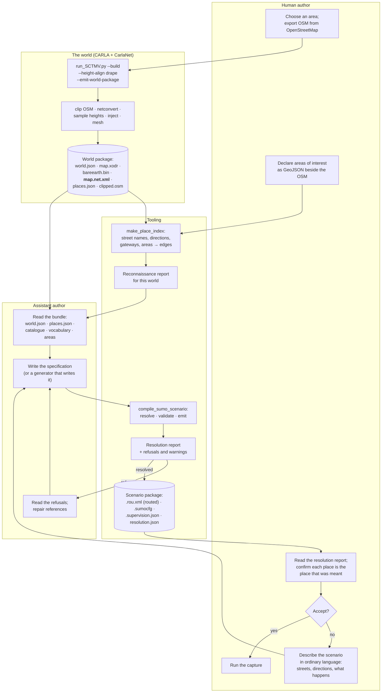
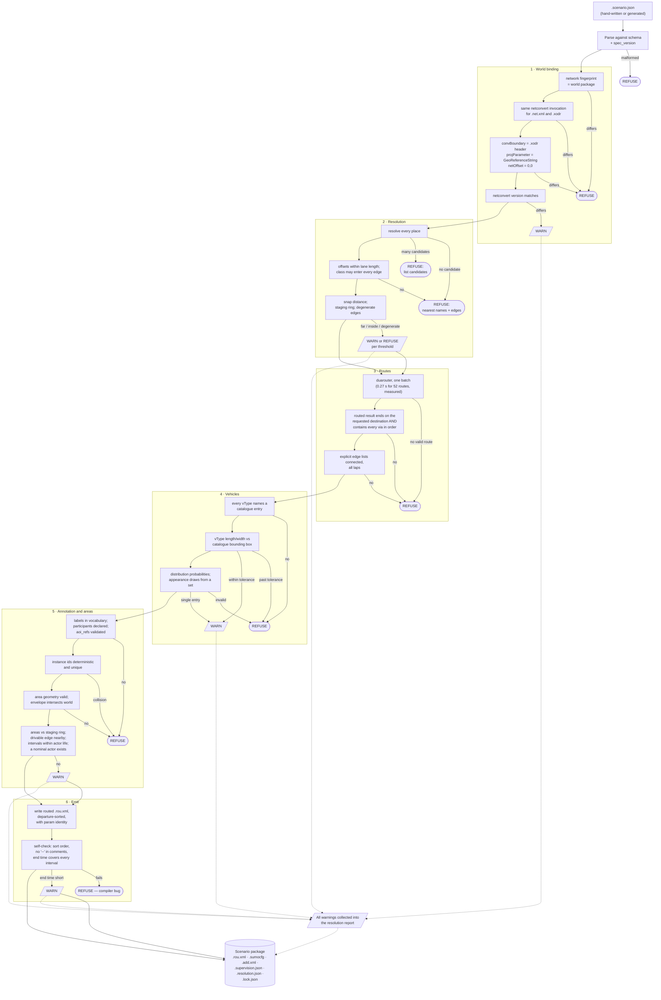

# 07 — Scenario Authoring

**Status:** Plan section. Source audit against the working tree plus read-only measurement of the
shipped world packages, networks and route files. No code changed, no build run, no engine started.
**Date:** 2026-09-17
**Scope:** How a SUMO-driven behavioural-capture scenario comes into existence — what an author is
given, what they write, how a described place becomes an edge, and what is checked before a capture
run is spent. Covers the authoring bundle, the authoring surface, reconnaissance and resolution, the
compile-and-validate step, determinism and parameter sweeps, and whether the conventions ship as a
packaged skill.
**Audience:** an engineer building the authoring tooling, and an author — assistant or human —
using it. It assumes no knowledge of the conversation that produced this plan.
**Owner:** scenario authoring engineer. One of the document set described in
[`_TEAM_BRIEF.md`](_TEAM_BRIEF.md) §8.

**Evidence convention.** Every claim below is marked. *Read* — taken from a source, cited
`path:line`. *Measured* — produced by running something read-only on this machine on 2026-09-17, with
the method stated. *Carried forward* — a measurement recorded in a Findings document or in the
authoring skill, cited, not re-run. *Inferred* — a conclusion drawn from the above, and labelled as
such.

**Out of scope, deliberately.**

- The **runtime**. Which SUMO vehicles CARLA instantiates, how the two clocks relate, and what
  happens to a vehicle's velocity in truth are [`03_CoSimulation_Runtime.md`](03_CoSimulation_Runtime.md)
  and [`04_Contracts.md`](04_Contracts.md). This section stops at the moment a validated scenario
  package is handed to a run.
- The **shape of the annotation record**. Doc 20 §6.1's `AnnotationSet`, `PatternInstance` and
  `Interval` and their migration from today's `.labels.json` belong to
  [`06_Truth_And_Annotation.md`](06_Truth_And_Annotation.md). This section says only where an author
  writes an annotation and what validates it.
- The **vehicle catalogue's content and its blueprint binding**, which is
  [`04_Contracts.md`](04_Contracts.md) contract 1. §2.6 states the properties this section needs it
  to have.
- **Scale**. Whether a seven-day scenario is renderable at all is
  [`10_Scale_And_Performance.md`](10_Scale_And_Performance.md). This section treats the Bahonar
  scenario purely as the authoring sizing case.
- **Pedestrians**, excluded by the brief's decision 5.

---

## 1. What authoring costs today, measured

Three scenarios have been authored against generated worlds. They are the evidence for everything
below, so they are measured before anything is proposed.

### 1.1 The three scripts

| | `make_sumo_scenario.py` (Gardnerville) | `make_arapahoe_scenario.py` | `make_bahonar_scenario.py` |
|---|---|---|---|
| Lines / comment lines | 198 / 28 | 353 / 38 | 398 / 39 |
| Distinct hard-coded literals that are real network identifiers | **45 edges** | **53 edges + 1 lane** | **23 edges**, plus 16 `(edge, position)` tower pairs |
| Simulated span | sized to the orbit | sized to the dwell | **604 800 s** |
| Route entries produced | 30 flows + 1 vehicle | 51 flows + 1 trip | **610** — 245 flows, 365 trips |
| Marked vehicles | 1 | 1 | 9 |
| Checks its world binding | **no** | origin lat/lon only (`make_arapahoe_scenario.py:283-290`) | **no** |

*Measured:* literal counts by extracting every quoted string from each script and intersecting it
with the normal-edge and lane id sets of that scenario's own `.net.xml`, so the figures are
identifiers that really resolve, not a regular-expression estimate. Route-entry counts by parsing
`carla/Import/Gardnerville_Centerville_Lane_NeighborhoodOrbit.rou.xml`,
`carla/Import/Arapahoe_I25_UnderpassDwell.rou.xml` and
`BahonarPatternOfLife.zip → scenario/Shahid_Bahonar_Port_PatternOfLife.rou.xml` with `xml.etree`.

Two numbers deserve to be held together. The Bahonar scenario emits **610 route entries across seven
simulated days**, and the entire thing rests on **21 distinct edge identifiers** (*measured*: the
union of every `from`, `to`, `via` and `<stop lane=>` edge in the emitted route file). The expensive,
error-prone, unrepeatable part of authoring is finding and justifying twenty-odd opaque strings. The
cheap part — composing a week of behaviour out of them — is already a program and should stay one.

A smaller measurement from the same comparison makes the case for §5.3's resolution report on its
own. The script declares **23** edge literals; **21** reach the emitted route file. The two that do
not — `175815458#5` and `181931491`, the west and north corridor gateways — were reconnoitred,
named and commented like the rest, and then dropped when `CORRIDOR_PAIRS` was narrowed because "the
public corridor is fragmented and effectively one-way in places, so westbound exits are not
reachable and are left out rather than faked" (*read*, `make_bahonar_scenario.py:92-99`). Nothing
reports that two of the author's anchors are dead, and nothing would report it if the two live ones
had been dropped by accident instead.

That asymmetry is the finding this whole section turns on.

### 1.2 What is validated today, and what is not

*Read.* Two validators exist:

- `RoadNetwork.check_drivable` (`SumoScenarioBuilder.py:151-160`) — raises if an edge is absent from
  the network, or if consecutive edges in an explicit edge list have no connection between them.
  Used only by `write_routes` (`SumoScenarioBuilder.py:353`), and only on the orbit's first two laps.
- `SumoPatternOfLifeBuilder._validate` (`SumoPatternOfLifeBuilder.py:150-167`) — raises if any flow
  or scheduled vehicle references an edge absent from the network. Existence only; no reachability.

Nothing else is checked anywhere. In particular nothing checks that a route is **routable** (as
opposed to its endpoints existing), that a `via` list is honoured, that the network shares the
CARLA map's frame, that the vehicle types resolve to anything CARLA can spawn, or that the network
was built from the same OSM the world was.

`make_bahonar_scenario.py:64` defines `WORLD_PACKAGE` and never reads it (*read*): the largest
authored scenario has no binding to the world it is meant to run in.
`make_sumo_scenario.py:56` records the world's `SourceOsmSha256` in a **comment** (*read*).

### 1.3 The frame is shared. The graph is not.

This is the most consequential measurement in this section, and it contradicts an assumption that
runs through the authoring skill and through doc 23.

The invariant everyone relies on — SUMO (x, y) ≡ CARLA (x, −y) — **holds**. *Measured:* every shipped
network's `<location netOffset="0.00,0.00">` and its `convBoundary` equal the corresponding `.xodr`
header's `north`/`south`/`east`/`west` exactly:

| Map | `.net.xml` `convBoundary` | `.xodr` header |
|---|---|---|
| Arapahoe_I25 | `-476.78,-969.26,476.74,969.28` | `north="969.28" south="-969.26" east="476.74" west="-476.78"` |
| Gardnerville | `-838.86,-455.04,838.86,391.32` | `north="391.32" south="-455.04" east="838.86" west="-838.86"` |
| Shahid_Bahonar_Port | `-3606.86,-1914.94,3607.23,2107.82` | `north="2107.82" south="-1914.94" east="3607.23" west="-3606.86"` |

But the **road graph an author works against is not the road graph the world was built from.** The
world build's netconvert flag set is assembled in C# at `OsmConverter.BuildArguments`
(`CarlaNet/src/CarlaNet.Map/OsmConverter.cs:233-303`); the scenario build's is reimplemented
independently in Python at `NetconvertSettings.to_arguments` (`SumoScenarioBuilder.py:68-103`). They
are not the same set, and the scenarios add flags the world build never saw —
`--junctions.join-dist 25` and `--tls.default-type actuated` for Arapahoe
(`make_arapahoe_scenario.py:65-67`), `--remove-edges.by-type` for Bahonar
(`make_bahonar_scenario.py:72-74`).

*Measured.* Running the repo's staged netconvert 1.27.0 over the identical clipped OSM
(`Build/sumo-smoketest/Arapahoe_I25_clipped.osm`) under each flag set:

| | World-build flags | Scenario flags |
|---|---|---|
| Normal edges | **321** | **317** |
| Junctions | 298 | 298, but **22 differ by identity** |
| `convBoundary` | identical | identical |
| Edges present in one only | 6 (`1037832985#0`, `223207864#2`, `982413823`, …) | 2 (`-572762876#8`, `1107125073`) |
| Common lanes whose **length** differs | — | **27 of 655** |

The largest length disagreements are not rounding. Lane `-1107125073_0` is **352.19 m** in the
world's graph and **2.60 m** in the scenario's; `907700111_3` is 453.64 m against 442.08 m;
`1342047649_4` is 123.41 m against 106.59 m. The first is exactly the near-zero-length-edge artefact
the authoring skill records (`SKILL.md:164-165`), here created by the scenario's own
`--junctions.join-dist 25`.

The consequence is stated plainly because it is easy to misattribute later. Under SUMO drive, a
vehicle's position is an offset along a named lane, and the bridge converts that into a CARLA pose.
If the two graphs disagree about that lane's length by two orders of magnitude, so do the two
positions. Today's three scenarios happen to survive — *measured:* all eighteen of the Arapahoe
scenario's named anchor edges exist in both networks, and all 52 of its origin–destination–via
triples route successfully on both — but nothing establishes that, and nothing would report it if it
stopped being true.

**Inference:** the authoring bundle must contain *the world's own* `.net.xml`, from the same
netconvert invocation that produced the `.xodr`, and the compile step must refuse a scenario built
against any other. Doc 23 §6.4 already asks for the network to be persisted for the runtime's
benefit; this makes it an authoring prerequisite as well, and adds the reason: it is the only way the
author's graph and the rendered graph are the same graph.

---

## 2. The authoring bundle

The set of artifacts handed to an author — assistant or human — before they write anything. Each row
states where it comes from, what it guarantees, and whether it exists.

| # | Artifact | Source | Exists today | What it guarantees |
|---|---|---|---|---|
| 1 | `world.json` | `WorldBuilder._write_world_package` → `client.write_world_package` (`WorldBuilder.py:159-184`; shim `carlanet/__init__.py:2402-2420`) | **yes** | Origin lat/lon, the PROJ string, grid geometry, staging rectangle, `SourceOsmSha256`, `OpenDriveSha256`, `NetconvertExtraArgs`, generation time |
| 2 | `map.xodr` | same | **yes** | The road network CARLA loads; carries street names on non-junction roads (§4.4) |
| 3 | `bareearth.bin` | same, only under `--height-align drape` | **yes** | Per-cell bare-earth ellipsoidal height; the telemetry altitude and the only elevation the flat SUMO network can borrow |
| 4 | The clipped `.osm` | `OsmClipper.clip_osm_to_bounds`, written to `Build/sumo-smoketest/<Name>_clipped.osm` (`WorldBuilder.py:106-115`) | **yes**, but not inside the package | The exact geometry netconvert saw. Referenced by name and digest in `world.json`, not carried |
| 5 | **The world's `.net.xml`** | netconvert, same run as the `.xodr` | **no — deleted** (`OsmConverter.cs:146`) | §1.3. The single missing artifact that makes the rest sound |
| 6 | **Place index** | new; derived from 2 + 5 | **no** | Street name, direction and area id → edge and lane. §4 |
| 7 | **Vehicle catalogue** | [`04_Contracts.md`](04_Contracts.md) contract 1; doc 20 §5.6 and D12 | **no** | Which vehicles exist, with real dimensions. §2.6 states what this section needs from it |
| 8 | **Area-of-interest table** | doc 20 §8; GeoJSON beside the OSM | **no** | Named, stable places a scenario and an annotation can both reference |
| 9 | **Annotation vocabulary** | doc 20 §6.2 | **no** | The closed term list a label must come from, with a version |
| 10 | **World digest** binding 1–9 | §2.7 | partially, and **unstable as recorded** | That a scenario and a run are talking about the same world |

### 2.1 The world package is richer than the skill records

*Read,* from `Build/world-packages/Gardnerville_Centerville_Lane.world.json` and the `world.json`
inside `Arapahoe_I25.cwp` and `Shahid_Bahonar_Port.cwp`. Beyond the three fields the authoring skill
names (`SKILL.md:31-33`), the manifest already carries `GeoReferenceString`, the full staging
rectangle (`StagingMinX/MinY/MaxX/MaxY` and `StagingMarginMeters`), `HeightAlignMode`,
`OriginHeightMeters`, `SourceOsmFileName`, `SourceOsmSha256`, `OpenDriveSha256`, `SampleStepMeters`,
`TerrainResolutionMeters`, `TerrainMarginMeters`, `GeneratedAtUtc`, `GeneratorVersion` and
`NetconvertExtraArgs`.

That is most of a world binding already. Three things are missing and all three are cheap: the
`.net.xml` (§1.3), the **complete** netconvert argument vector rather than only the extra arguments,
and the netconvert build version. The manifest records that the world used
`--keep-edges.by-vclass passenger …` but not that it used `--osm.turn-lanes`, `--junctions.join` or
`--geometry.remove`, so the Python reimplementation of the base flag set cannot be verified against
it — it can only be trusted.

### 2.2 The clipped OSM is an input, not an output, and must travel

An author needs it because the network is rebuilt from it. It is referenced by
`SourceOsmFileName`/`SourceOsmSha256` and lives outside the package in
`Build/sumo-smoketest/`. Once §2.5 is adopted the network is carried and the OSM is no longer needed
to *build* anything — but it is still needed to read access tags (the fence of `SKILL.md:128-141`
reads `access=` straight off the OSM, `SumoScenarioBuilder.py:547-550`), so it should be carried in
the package rather than referenced.

### 2.3 `bareearth.bin` is the only elevation an author has

*Carried forward,* doc 23 §2: the SUMO network is flat. *Measured, confirmed on all three shipped
networks:* zero distinct `z` values in any lane shape. So any authored behaviour that depends on
height — a vehicle under a bridge, a hilltop overwatch, an area of interest with a vertical relation
— has to get its height from `bareearth.bin`, which is what `SumoCotBridge`'s `BareEarthGrid` already
does (`SKILL.md:88`). The bundle therefore includes it, and the compile step can report the
bare-earth height of every resolved place without needing a running server.

### 2.4 The world's `.net.xml`, kept

*Read.* `OsmConverter.ConvertFileWithNetworkAsync` (`OsmConverter.cs:122-148`) already asks
netconvert for the network in the same invocation that produces the OpenDRIVE, reads it, and deletes
it in a `finally` block at `:146`. Keeping it is a matter of writing it into the world package
beside `map.xodr`. Everything in §1.3 follows from that one change, and doc 23 §6.4 wants it anyway.

The pair must be **from the same invocation**, not merely from the same flags: that is what makes
lane lengths, junction identity and edge identifiers correspond by construction rather than by
agreement between two argument builders.

### 2.5 The place index — new

The artifact that turns "eastbound on Centerville Lane" into an edge. Its content, resolver and
failure modes are §4. It is a build-time derivative of the `.xodr` and the `.net.xml`, so it belongs
in the world package, regenerated whenever either changes.

### 2.6 What this section needs from the vehicle catalogue

The catalogue itself is [`04_Contracts.md`](04_Contracts.md)'s. Four properties are required here,
stated as a dependency rather than a design:

1. **An author must be able to read it without a running server.** It is one of the inputs to
   writing a scenario, so it travels in the world package or beside it, as a file.
2. **Every entry carries real length, width and height.** A SUMO `vType`'s `length` and `width`
   change car-following gaps and lane-change acceptance, so they are behavioural parameters, not
   presentation. Today the three scenarios invent them: fourteen `vType`s across the Bahonar file
   with hand-written lengths from 4.4 m to 16.5 m (*read*, `make_bahonar_scenario.py:121-149`,
   `make_arapahoe_scenario.py:96-137`), none of which was checked against any blueprint's bounding
   box. Doc 20 §5.6 records the same defect on the OpenSCENARIO side, where the storyboard's declared
   `<BoundingBox>` and the truth record's measured `length_m` already disagree and nothing notices.
3. **`vType` → blueprint resolution is declared, not inferred.** An entry is named; nothing
   substring-matches. Doc 20 D12 settles this for storyboards; the same rule applies here.
4. **A category resolves to a *set*, drawn on the run seed.** Doc 20 §2.6's appearance confounder is
   sharper under SUMO drive than under storyboards, because SUMO's `vTypeDistribution` already does
   exactly this for *behaviour* — `freeway_mix` draws seven types on declared probabilities
   (`make_arapahoe_scenario.py:123-125`) — while the blueprint behind each type is a single
   identifier. Without an appearance draw, every `car_quick` in a corpus is the same car.

**Dependency stated:** if the catalogue cannot give a `vType` its real dimensions, then either the
authored gaps are wrong or the rendered vehicle does not fit its SUMO footprint. There is no third
option and no version of this section that works around it.

### 2.7 The world digest is not reproducible today

*Measured.* Clipping `Import/Gardnerville_Centerville_Lane.osm` three times, each in a separate
Python process, through `OsmClipper.clip_osm_to_bounds`, produced **three different SHA-256 digests**
(`dfeb6f0b…`, `00598df6…`, `82c360cc…`). Running the staged netconvert 1.27.0 over each of those
three clips produced **three different `.net.xml` digests** (`e0bdaef1…`, `8e907ab8…`, `96ee5488…`).

The cause is read directly from source: `used_orig` is a `set` of node-id strings
(`OsmClipper.py:154`) and is iterated to emit nodes (`OsmClipper.py:219`), so element order follows
Python's per-process string-hash randomisation. The same defect is in the standalone copy
(`CarlaNet/python/osm_clip.py:82,135`).

**But the graph is identical.** *Measured,* comparing the three networks structurally: the same 55
normal edges, the same 202 internal edges, the same 68 junctions, the same `convBoundary`, and all
257 lane shapes byte-for-byte equal. Only element order differs.

Two consequences, and they point in opposite directions, which is why both are worth writing down.

- **Reassuring:** an edge identifier an author records as a constant is stable across a re-clip.
  Today's 45–55 hard-coded literals per scenario are not fragile in the way they look.
- **Blocking:** `SourceOsmSha256` and `OpenDriveSha256` in `world.json` are digests of *file bytes*,
  so a world rebuilt from the same inputs gets a different binding and any digest gate rejects it.
  Doc 20 §7.5 wants the `.xodr` digest in the run manifest and doc 20 §8.4 already worries about
  digest tiering; this measurement says the naive digest cannot carry that weight.

**The fix belongs here, not in the clipper.** Sorting `used_orig` would make the file stable and is
worth doing, but a byte digest would still change for reasons that do not matter — a netconvert patch
release reformatting an attribute, a comment, a timestamp. What the binding actually needs to assert
is *this scenario was authored against this road graph*. So the bundle carries a **network
fingerprint**: a digest over the network's canonical content — sorted normal-edge ids, each edge's
lane ids with their lengths and shapes rounded to a stated precision, the junction id set with types,
and `convBoundary` — computed identically by the world build and by the compile step. The file
digests stay, as provenance; the fingerprint is what gates.

---

## 3. The authoring surface

### 3.1 What the bespoke Python script gets right

It would be easy to under-credit this. Read honestly, the current surface has four real virtues, and
any replacement that loses them is worse.

- **Full expressive power.** The Bahonar scenario's guard rota is a triple loop over days, shifts and
  sixteen towers, with one iteration deliberately skipped to plant an absence
  (`make_bahonar_scenario.py:230-242`). That is a program. Expressing it as data would mean either
  610 hand-written entries or inventing a loop construct in a configuration format, which is how
  configuration formats become bad programming languages.
- **It is reviewable as code.** `git diff` on `make_arapahoe_scenario.py` shows exactly what changed
  between two versions of a scenario, and the reviewer is reading Python, not a diff of generated
  XML.
- **The comments are the design record.** The scripts carry 28–39 comment lines each, and they hold
  measurements that exist nowhere else — why the westbound rate is 180 against 430 eastbound
  (`make_sumo_scenario.py:79-85`), what happens if the dwell is in the running lane (12.9 m/s drops
  to 0.6, `make_arapahoe_scenario.py:237-243`), why the internal junction lanes must be cleared
  (`SumoScenarioBuilder.py:558-568`). Losing that would be a real regression.
- **Measured helpers are reused.** `restrict_private_roads`, `allow_opposite_overtaking`,
  `check_drivable` and the departure-sorted timeline merge each encode a bug that cost real time.

### 3.2 What it costs

- **Every scenario is a program, so every scenario is a program that can be wrong.** There is no
  schema, so there is nothing to check a scenario against before running it.
- **Nothing validates until SUMO loads it,** and SUMO's response to most authoring errors is a
  warning on stderr, not a failure (`SKILL.md:155-157` — an out-of-order entry is dropped with a
  warning; *measured* in §5.4 — `duarouter` emits a routed vehicle for a trip whose destination does
  not exist).
- **The behavioural annotation has nowhere structured to live.** Today it is `.labels.json` with
  three keys, and one of the six Bahonar anomalies — the guard who never arrives — is a free-text
  `note` because there is no vehicle to attach it to (*read*, `make_bahonar_scenario.py:372-379`;
  *measured*, the emitted `labels.json` carries exactly one such note). Doc 20 §2.3 requires pattern
  instances with participants, roles and intervals; none of that is expressible.
- **The world binding is a comment.** §1.2.
- **The identifiers are opaque and undocumented.** `"218965860#0"` means nothing without
  `make_arapahoe_scenario.py:71-75`'s five lines of prose, and the prose is not machine-readable, so
  nothing can check it still describes that edge after a rebuild.
- **The netconvert flag set is reimplemented.** §1.3.
- **Nothing reports what a scenario resolved to.** Doc 20 §5.5 argues for this explicitly on the
  storyboard side, because a preview cannot check annotations. It is more true here: there is no
  preview at all except running SUMO.

### 3.3 The three candidate surfaces

| | Python builder script only (today) | Declarative specification only | **Specification as the compiled surface, script as generator** |
|---|---|---|---|
| Expresses a 610-entry seven-day rota | yes | no, without inventing control flow | **yes** — the script generates the specification |
| Schema to validate against | no | yes | **yes** |
| Errors caught before a run | none | all reference errors | **all reference errors, on every scenario** |
| Behavioural annotation has a home | no | yes | **yes** |
| Reviewable diff | Python | data | **both — the generator in Python, the compiled specification as the artifact** |
| Hand-authorable without tooling (doc 20 D13) | yes, by writing Python | **yes, by writing one file** | **yes, either way** |
| Reliably emittable by an assistant | poor — must get SUMO XML ordering, `speedDev`, `<stop speed>` and comment escaping right | good | **good** |
| Measured helpers reused | yes | must be re-expressed as specification constructs | **yes — the compiler owns them** |
| One place to add a new check | no | yes | **yes** |

### 3.4 Recommendation

**Adopt a declarative traffic-scenario specification as the artifact that is compiled, validated,
archived and run — and keep the Python builder as a first-class generator whose output is a
specification rather than SUMO XML.**

The move that makes this work, and the reason it is not simply "add a config file", is that **the
escape hatch emits the input to the compiler, not the output of it.** A generator script that writes
`.rou.xml` directly bypasses every check; a generator script that writes a specification is subject
to all of them. So:

- A small scenario is one hand-written specification file and no code at all.
- A large scenario is a Python program whose `main` writes a specification. Bahonar's rota, ferry
  pulses and shift changes stay exactly the loops they are today; what changes is that they append
  to a specification object instead of formatting XML strings.
- Both go through one compiler. There is one implementation of departure sorting, one of the
  `<stop speed=>` per-edge waypoint rule, one of route validation, one of annotation resolution.

Against the alternative of keeping the script surface and bolting on a declarative *annotation*
companion: that fixes the smallest of the eight costs in §3.2 and none of the other seven. The
reference errors, the world binding, the flag-set drift and the absence of a resolution report all
live on the traffic side, not the annotation side.

The specification is **not** an attempt to be SUMO. It does not restate `vType` car-following
parameters or SUMO's insertion model — those pass through verbatim, because SUMO's own documentation
is better than any paraphrase and because the skill's measured `vType` tuning
(`make_arapahoe_scenario.py:96-120`) must survive unchanged. The specification describes what is
*specific to this pipeline*: which world, which places, which vehicles, which annotations, which
sweep, and which references must resolve.

### 3.5 Shape of the specification

A JSON document, `<Scenario>.scenario.json`, with a `spec_version`. Sketched only far enough to make
the checks in §5 concrete; the field list is settled with
[`06_Truth_And_Annotation.md`](06_Truth_And_Annotation.md) for the annotation half.

```
world              package path or map name + network fingerprint (§2.7)
seeds              { sumo, appearance, admission }                      §7.1
vehicle_types[]    verbatim SUMO vType/vTypeDistribution, plus catalogue_entry per type
places{}           named places: each an edge, a lane+offset, an area id, or a described
                   place the resolver resolves (§4.2). Every later reference is by name.
flows[]            id, from, to, via[], type, rate, window                — cohorts
actors[]           id, type, depart, route (places), stops[], params{}   — entities
network_edits[]    fence, opposite pairs, lane closures — the measured post-processors
supervision        instances[] with participants, roles, phases, labels  — compiles to
                   <Scenario>.supervision.json; see 06_Truth_And_Annotation.md §3.1
sweep              the swept parameter set, if this is a sweep member     §7.2
```

Two properties are load-bearing:

- **Every reference is a name, and every name is resolved at compile time.** A specification never
  contains a bare edge identifier in a route; it contains a place name, and the compiled output
  contains the edge. The 45–55 opaque literals per scenario become a named, documented, checked table
  that lives in the specification's `places` block and is reported back (§5.3).
- **A place may be described rather than named.** `{"street": "East Arapahoe Road", "direction":
  "west", "near": {"lat": …, "lon": …}}` is a valid place, resolved by §4. An assistant writes that;
  the compiler turns it into `427819541#0` and says so.

### 3.6 Where the behavioural annotation lives

**The annotation channel is settled by [`06_Truth_And_Annotation.md`](06_Truth_And_Annotation.md) and
this section adopts it unchanged.** That section's D6.1 amends doc 20 decision 6 for the SUMO
surface: the companion file `<scenario>.supervision.json` becomes the *sole* channel, because SUMO
has no counterpart to OpenSCENARIO's `UserDefinedAction` and because the route file is generated
rather than authored. Its D6.2 adds a third kind of subject — the **cohort**, a `<flow>` id standing
for every vehicle SUMO names `<flow id>.<n>` — which may carry only a whole-life annotation.

Two alignments between that and the surface proposed here, worth stating because they were reached
independently:

- **The specification's `flows[]` / `actors[]` split is exactly D6.2's cohort / entity split.** A
  `flows[]` entry is a cohort and may carry a whole-life annotation; an `actors[]` entry is an entity
  and may carry phased intervals. The compiler enforces that, which is check 23 in §5.2.
- **D7.2 strengthens rather than contradicts D6.1's second argument.** That argument is that putting
  authored intent into a generated file makes the generator the only author. Under D7.2 the route
  file is *wholly* generated from the specification, so no authored intent lives in it at all, and
  the authored artifact — the specification — is the thing under review and in version control.

What remains for this section is one narrower question the annotation channel does not answer: how
**static identity** — `entity_id`, `instance_id`, the participant role, the catalogue entry — reaches
a CARLA spawn attribute, which doc 20 D7 requires because an attribute survives record and replay
where an in-process registry cannot. SUMO has an exact analogue of doc 20 §5.1's entity
`<Properties>`, and it is better than it looks.

*Measured.* SUMO's `<param key= value=/>` child element round-trips end to end. A route file carrying
`<param>` on a `<vType>` and on a `<trip>` was passed through `duarouter` 1.27.0 (params preserved on
both the `vType` and the emitted `<vehicle>`) and then through `sumo` 1.27.0 with
`--vehroute-output` (params preserved on the arrived vehicle, arrival 96.00 s). *Read:* the generated
C# TraCI binding exposes `Vehicle.getParameter` and `Vehicle.setParameter`
(`Build/sumo-build/src/libtraci/Eclipse.Sumo.Libtraci/Vehicle.cs:546,558`).

So the path from an authored identity to a CARLA spawn attribute is complete with no new transport:
the compiler writes `<param key="…" value="…"/>` into the route file, SUMO carries it, the .NET
bridge reads it with `getParameter`, and it becomes the custom spawn attribute doc 20 D7 requires —
which the engine stores unvalidated and the recorder preserves through record and replay (doc 20
§4.5).

**`<param>` is identity transport, not an annotation channel, and the distinction is the point.**
[`06_Truth_And_Annotation.md`](06_Truth_And_Annotation.md) §3.1 declines `<param>` for supervision on
the grounds that it "attaches only to certain elements and is consumed by device and model code, not
reserved for vendors". Both halves are right and neither blocks this use. The elements it attaches to
are exactly the ones needed (*measured:* `vType` and `vehicle`/`trip`), and the collision risk with
SUMO's own consumed keys — `device.*`, `has.*`, car-following parameters — is removed by requiring a
declared namespace prefix on every key the compiler emits, which the compiler owns because nothing is
hand-written. A key outside the declared namespace in a compiled route file is a compiler bug.

It carries only what is **static** for the life of a vehicle: `entity_id`, `instance_id`, participant
role, catalogue entry. It cannot carry intervals, phases or multi-participant structure, for the same
reason `role_name` could not (doc 20 §4.3): a parameter is one string, and although SUMO's parameters
are mutable at runtime they are not *recorded* per tick. That belongs to
[`06_Truth_And_Annotation.md`](06_Truth_And_Annotation.md)'s `WorldSupervisionState`. The authoring
side's obligation is only to make every reference in the supervision file resolvable and checkable,
which is §5.

One asymmetry to record, because it is the SUMO version of doc 20 §5.5's: **a scenario previewed in
`sumo-gui` shows the motion faithfully and the annotation not at all.** `sumo-gui` is the only
preview available, and it has no concept of a pattern instance. That is acceptable — the annotation
changes no motion — but it means the compile step's report is the *only* place an annotation can be
checked, which is the argument for §5.3 existing.

### 3.7 The end-to-end workflow



### 3.8 An assistant authoring a scenario

```mermaid
sequenceDiagram
    autonumber
    actor User as Human author
    participant AI as Assistant
    participant Pkg as World package
    participant Recon as Reconnaissance report
    participant Cat as Vehicle catalogue
    participant Comp as Scenario compiler
    participant Duar as duarouter

    User->>AI: "A vehicle enters from the south on I-25,<br/>leaves at the Arapahoe interchange, parks<br/>under the Yosemite bridge for 30 minutes."
    AI->>Pkg: read world.json
    Pkg-->>AI: origin, PROJ string, staging rectangle,<br/>network fingerprint, netconvert argv
    AI->>Recon: read places.json + reconnaissance report
    Recon-->>AI: gateways by bearing; street name → edges;<br/>areas of interest; edges by access class;<br/>lane lengths; flagged degenerate edges
    AI->>Cat: read vehicle catalogue
    Cat-->>AI: entries with real length/width/height,<br/>category sets, blueprint ids
    Note over AI: Ambiguity the report cannot settle —<br/>"South Yosemite Street" is 65 edges —<br/>is asked, not guessed.
    AI->>User: "Which Yosemite bridge — the one over<br/>Arapahoe Road, or over the ground-level<br/>roadway at 39.6004N 104.8865W?"
    User-->>AI: the ground-level roadway
    AI->>AI: write <Scenario>.scenario.json<br/>(places by description, flows, actors,<br/>annotations, seeds)
    AI->>Comp: compile
    Comp->>Comp: resolve places · check fingerprint ·<br/>check vocabulary · check catalogue
    Comp->>Duar: validate every route (once)
    Duar-->>Comp: routed vehicles, or no valid route
    Comp-->>AI: 2 refusals: "north gate" is ambiguous (3 candidates);<br/>route underpass_south_to_north is not routable
    AI->>AI: repair: name the gate by bearing;<br/>drop the unreachable westbound exit
    AI->>Comp: compile
    Comp-->>AI: resolved; report written
    AI->>User: resolution report — every place, every route,<br/>every annotation, and what each became
    User->>User: read the report, then run the capture
```

---

## 4. Reconnaissance and resolution

The authoring skill's recipe step 3 is "reconnoitre against the real net… save the validated edge IDs
as named constants in the CLI" (`SKILL.md:114-116`). That is a practice. It is performed by hand,
its result is a comment, and it is redone from scratch for every scenario. This section makes it two
artifacts.

### 4.1 The reconnaissance report

Generated once per world, from `map.xodr` + `map.net.xml` + `bareearth.bin` + the area GeoJSON. It is
what an author reads *before* writing anything, and it is designed to be read by an assistant as
easily as by a person: a JSON document (`places.json`) with a rendered Markdown companion.

| Section | Content | Answers |
|---|---|---|
| **Frame** | origin lat/lon, PROJ string, `convBoundary`, staging rectangle, network fingerprint | "Is this the world I think it is?" |
| **Gateways** | every fringe (`dead_end`) edge, with bearing, the street it belongs to, lane count and speed | "Where does traffic enter and leave?" |
| **Streets** | street name → the ordered edges carrying it, each with direction of travel, length, lane count, speed, and its geographic extent | "What is `eastbound on Centerville Lane`?" |
| **Areas** | each area of interest, the edges inside it or within a stated radius, and the nearest drivable edge | "What is `the school car park`?" |
| **Access classes** | edges grouped by permitted vehicle class, and the junctions where classes meet — the gates | "Where is the fence, and where are its gates?" |
| **Signals** | `tlLogic` programs with type and cycle length, and the junctions they control | "Which junctions are signalised, and are they actuated?" |
| **Health flags** | degenerate edges (§6), unreachable components, edges with no successor, junction ids that differ from the world graph | "What will bite me?" |
| **Elevation** | bare-earth height sampled at each named place | "Is this the roadway under the bridge, or the bridge?" |

*Measured,* as the sizing case: the Arapahoe network has 317 normal edges, 298 junctions, 23 actuated
`tlLogic` programs and 934 right-of-way `<request>` rows; Bahonar has 1066 normal edges, 651
junctions and 3004 request rows. A report over that is a small file, not a corpus.

### 4.2 The resolver

Turns a described place into an edge, a lane, or a lane-and-offset. Accepted forms, in the order the
compiler tries them:

| Form | Example | Resolves to |
|---|---|---|
| Explicit edge or lane | `{"edge": "218965860#0"}`, `{"lane": "218965860#0_0", "offset_m": 87.93}` | itself, after existence and geometry checks |
| Area of interest | `{"area": "drydock"}` | the drivable edges inside the area, or the nearest one |
| Street plus direction | `{"street": "East Arapahoe Road", "direction": "west"}` | the edge run carrying that name in that heading |
| Street plus position | adds `"near": {"lat": …, "lon": …}` or `"at": "South Yosemite Street"` | narrows to one edge |
| Gateway | `{"gateway": "south", "street": "I-25"}` | the fringe edge whose bearing matches |
| Geographic point | `{"lat": …, "lon": …, "max_snap_m": 25}` | the nearest drivable lane, with the snap distance reported |
| Junction movement | `{"from_street": …, "to_street": …}` | the pair of edges either side, never the internal edge |

The last row is doc 20 §11 question 8, answered for this surface: a movement through a junction is
named by the roads either side, and the resolver produces that pair. *Measured:* junction internals
carry the converter's own identifier — 646 of Arapahoe's 917 `.xodr` roads, 2868 of Bahonar's 3891 —
so there is nothing else to name them by. Whether junctions want stable derived names remains open
(§12).

**The resolver never guesses when it is ambiguous.** It refuses and lists the candidates with enough
information to choose between them. That is the property that makes it safe for an assistant to use.

### 4.3 Failure modes

| Failure | How it shows | Response |
|---|---|---|
| Name matches nothing | no candidate | **refuse**, list the nearest names by edit distance and the nearest edges by distance |
| Name matches many | *measured:* `South Yosemite Street` is **65 edges**, `East Arapahoe Road` **26**, `Centerville Lane` **18** | **refuse**, list candidates with direction, extent and length; the author narrows with `direction`, `near` or `at` |
| Direction is ambiguous | a street that curves through more than 90° | **refuse**, report the bearing range |
| Map has no street names | *measured:* Bahonar — **48 of 1066 normal edges named (5 %)**, 6 distinct names, all Persian script | **warn at index build**: name resolution is unavailable on this map; §4.4 |
| Snap distance large | point resolution lands far from any road | **warn** past a stated threshold, **refuse** past `max_snap_m` |
| Place is outside the world | envelope disjoint from `convBoundary` | **refuse** — doc 20 §8.3's most likely authoring mistake |
| Place is in the staging ring | inside the margin of the staging rectangle | **warn** — doc 20 §8.3; traffic enters and leaves there |
| Place is on a degenerate edge | lane length below a stated threshold | **refuse** — §6 |
| Place is on an edge the actor's class may not enter | `allow`/`disallow` excludes it | **refuse**, name the class and the gates |
| Resolved edge disagrees with the world graph | edge absent from, or length differing in, `map.net.xml` | **refuse** — §1.3 |

### 4.4 Name resolution is a strong tool on some maps and unavailable on others

Doc 20 §5 records that the generated `.xodr` carries real street names, and takes it as the mechanism
that makes assisted authoring work. *Measured,* it is true, and it is much weaker than the sentence
suggests:

| Map | `.xodr` roads | Carrying a real street name | Junction internals (`:node`) | Blank name | Distinct street names |
|---|---|---|---|---|---|
| Gardnerville | 213 | 50 | 158 | 5 | **10** |
| Arapahoe_I25 | 917 | 248 | 646 | 23 | **32** |
| Shahid_Bahonar_Port | 3891 | 45 | 2868 | **978** | **6** |

On the `.net.xml` side the same picture: 91 % of normal edges named on the two US maps, **5 % on
Bahonar** — 48 of 1066, across six names, all in Persian script. The transliterations in the Bahonar
script's own comments ("Shahid Rajaei Highway", "Pasdaran Boulevard",
`make_bahonar_scenario.py:81-83`) appear nowhere in any artifact.

Two conclusions follow, and the second is the reason §4.1 is a *report* and not just a name index.

1. **A name is one-to-many and must be disambiguated by direction and position**, always. There is no
   map on which "South Yosemite Street" identifies an edge.
2. **On an industrial or non-Latin-script map, name resolution contributes almost nothing**, and the
   author falls back on areas of interest, geographic points and gateways. That is precisely how the
   largest scenario was actually authored — *read*, `make_bahonar_scenario.py:107-108`: the sixteen
   guard posts were "found by projecting each tower (from the Google Earth survey) onto the nearest
   army edge and validating the round trip with duarouter". Point-snapping and area membership are
   therefore first-class resolver forms, not fallbacks.

---

## 5. Compile and validate

Doc 20 §7.1 defines a compile step for storyboards: read the annotations, resolve area references
against the world actually loaded, assign instance ids deterministically, validate every reference,
and hand the executor an `AnnotationSet` beside the `ScenarioDefinition`. This is its SUMO
equivalent, with the traffic half added.

### 5.1 What compile consumes and emits

**Consumes:** the specification, the world package (including `map.net.xml` and `places.json`), the
vehicle catalogue, the annotation vocabulary, the area table.

**Emits a scenario package**, all of it generated, none of it hand-edited:

| File | Content |
|---|---|
| `<Scenario>.rou.xml` | vehicle types, flows and actors, **departure-sorted**, with `<param>` identity, and **already routed** (§5.5) |
| `<Scenario>.sumocfg` | the run configuration, with the SUMO seed and step length |
| `<Scenario>.add.xml` | rerouters, lane closures, detectors — when the specification declares any |
| `<Scenario>.supervision.json` | the supervision record, in the form [`06_Truth_And_Annotation.md`](06_Truth_And_Annotation.md) §3.1 defines, with instance ids assigned deterministically from the scenario id and the authored instance name |
| `<Scenario>.resolution.json` | **what it resolved** — §5.3 |
| `<Scenario>.lock.json` | the `scenario_id`; digests of the `.net.xml`, the `.rou.xml`, the `.sumocfg` and the supervision file — the four-way binding [`06_Truth_And_Annotation.md`](06_Truth_And_Annotation.md) §8.1 requires, because the plan is compiled against all four; plus the world fingerprint, the netconvert argument vector and version, the catalogue version, the vocabulary version, the seeds, and the compiler version |

The network is **not** emitted. It is the world's, carried in the world package. Any scenario that
would need a different network needs a different world.

### 5.2 The checks

Every check states what it compares against, whether it refuses or warns, and the concrete failure it
prevents. "Refuse" means the compile fails and nothing is emitted.

| # | Check | Against | Outcome | Prevents |
|---|---|---|---|---|
| **World binding** ||||
| 1 | Network fingerprint in the specification equals the world package's | §2.7 | **refuse** | Authoring against a different road graph from the one that will render (§1.3) |
| 2 | `.net.xml` and `map.xodr` came from the same netconvert invocation | a token written by the world build into both | **refuse** | The 352 m → 2.60 m lane disagreement of §1.3 |
| 3 | Network `convBoundary` equals the `.xodr` header `north`/`south`/`east`/`west` | both files | **refuse** | A network in a different frame — the check `SKILL.md:112-113` asks an author to do by hand |
| 4 | `<location projParameter>` equals `world.json`'s `GeoReferenceString` | both | **refuse** | Origin drift; the one check `make_arapahoe_scenario.py:283-290` already performs, generalised |
| 5 | `netOffset` is `0.00,0.00` | the network | **refuse** | A normalised network, where SUMO (x, y) ≠ CARLA (x, −y) |
| 6 | netconvert version recorded in the world package equals the one on this machine | `world.json`, `netconvert --version` | **warn** | *Measured:* `SUMO_HOME` on this machine is an external **1.27.1** while the repo stages **1.27.0**, and `SumoInstallation.locate` prefers `SUMO_HOME` (`SumoInstallation.py:36`) — so today every scenario build uses a different netconvert from the world build |
| **References** ||||
| 7 | Every place in `places` resolves, unambiguously | the resolver, §4.2 | **refuse**, with candidates | An authored place that silently becomes a different place |
| 8 | Every flow, actor, stop and annotation references a declared place name | the specification | **refuse** | A typo becoming a valid-looking edge id |
| 9 | Every `<stop lane=>` offset lies within that lane's length | `map.net.xml` | **refuse** | A dwell clamped to somewhere other than where it was authored — today `write_dwell_routes` silently clamps (`SumoScenarioBuilder.py:399`) |
| 10 | Every actor's vehicle class may enter every edge on its route | edge `allow`/`disallow` | **refuse**, naming the class and the gate junctions | The fenced-network fragmentation of `SKILL.md:135-139` |
| **Routes** ||||
| 11 | Every origin–destination–via triple routes | `duarouter`, §5.5 | **refuse** | "No valid route" at SUMO load, after a capture has been scheduled |
| 12 | Each routed result **ends on the requested destination and contains every `via` edge in order** | the routed output | **refuse** | *Measured:* the false accept of §5.5 |
| 13 | Explicit edge lists are connected end to end | `check_drivable` (`SumoScenarioBuilder.py:151-160`), applied to **all** laps, not the first two | **refuse** | A lap-count-dependent break that only appears late in a run |
| **Vehicles** ||||
| 14 | Every `vType` names a catalogue entry that exists | the catalogue | **refuse** | A `vType` with no blueprint, discovered at spawn |
| 15 | Every `vType`'s `length`/`width` match its catalogue entry's bounding box within a stated tolerance | the catalogue | **refuse** past tolerance, **warn** within it | *Read:* fourteen hand-written Bahonar lengths, none checked; SUMO's gaps and CARLA's rendering disagreeing by the difference everywhere (doc 23 §6.8) |
| 16 | Every `vTypeDistribution`'s probabilities sum to 1 and name declared types | the specification | **refuse** | A silently renormalised mix |
| 17 | Category-resolved appearance draws from a set, seeded | §7.1, doc 20 §2.6 | **warn** if a category resolves to one entry | Appearance becoming the label |
| **Annotation** ||||
| 18 | Every label is in the declared vocabulary at the declared version | the vocabulary | **refuse** | A corpus in which `loiter` is spelled three ways (doc 20 §6.2) |
| 19 | Every annotation participant names a declared actor | the specification | **refuse** | An instance with a participant that never exists |
| 20 | Every `aoi_ref` names a validated area | the area table | **refuse** | An annotation naming a place only the author can see (doc 20 §8.1) |
| 21 | Instance ids are deterministic and unique | scenario id + authored name, no counter, no timestamp | **refuse** on collision | Sweep members that cannot be joined (doc 20 §7.1) |
| 22 | Every annotated actor's intervals lie within its depart-to-arrival span | the routed result | **warn** | An interval that no vehicle could have been in |
| 23 | A **cohort** — a `flows[]` entry — carries only a whole-life annotation, never a phased interval | [`06_Truth_And_Annotation.md`](06_Truth_And_Annotation.md) D6.2 | **refuse** | A phase asserted over a generator, whose member count is not known until the run |
| 24 | At least one actor is `nominal` when any is `annotated` | the specification | **warn** | The missing hard negatives of doc 20 §2.7 |
| **Areas** ||||
| 25 | Area ids unique, rings closed and non-self-intersecting, `radius_m > 0` | doc 20 §8.3 | **refuse** | Undefined containment tests |
| 26 | Area envelope intersects the world | `convBoundary` | **refuse** | An area outside the world entirely |
| 27 | Area wholly inside the staging rectangle, and not inside the staging margin | `world.json` staging fields | **warn** | A pattern sited where traffic spawns and despawns |
| 28 | Some drivable edge within or near each area | `map.net.xml` | **warn** | An area no vehicle can reach |
| **Emission** ||||
| 29 | Route file is departure-sorted across flows and actors | the emitted file | **refuse** (it is a compiler bug if it fires) | *Carried forward,* `SKILL.md:155-157`: SUMO drops out-of-order entries with only a warning |
| 30 | No XML comment contains `--` | the emitted files | **refuse** | *Carried forward,* `SKILL.md:169-170`: SUMO rejects the file |
| 31 | Simulation end time covers every declared interval and every actor's arrival | the routed result | **warn** | An orbit or dwell truncated by the run ending, recorded as if it completed (doc 20 §6.1 `closed_by`) |
| 32 | Every flow's window lies inside the run | the specification | **warn** | Flows that never fire |

### 5.3 Reporting what it resolved

Doc 20 §5.5 argues for this on the storyboard side because a preview cannot check annotations. Under
SUMO the argument is stronger: `sumo-gui` is the only preview and it knows nothing about pattern
instances, areas, catalogue entries or supervision (§3.6).

`<Scenario>.resolution.json`, with a rendered Markdown companion, states:

- **every place**, its authored description, the edge or lane it became, that edge's street name,
  direction, length, speed limit, permitted classes, lat/lon of its midpoint, and bare-earth height;
- **every route**, its authored endpoints, the full edge sequence `duarouter` produced, its length
  and free-flow duration, and which `via` edges it honoured;
- **every vehicle type**, its catalogue entry, the blueprint that entry names, and the
  catalogue-versus-`vType` dimension comparison;
- **every annotation instance**, its participants and their resolved actors, its labels and their
  vocabulary version, and its areas;
- **every area**, its resolved local-metre geometry and the edges inside it;
- **every warning**, in full, because warnings are the failures that a human has to adjudicate;
- **the lock**: fingerprint, argument vector, versions, seeds.

This is the artifact a human reads before spending a capture run, and it is the artifact an assistant
reads back to check its own work against what it intended. It is also the thing that makes a
scenario auditable years later, when the author is gone and the comment is all that is left.

### 5.4 The compile pipeline



### 5.5 `duarouter` as a build step, and the false accept it hides

The skill records that routes must be validated with `duarouter` rather than `sumolib.getShortestPath`,
because sumolib gives false positives (`SKILL.md:145-149`). *Carried forward.* Two measurements
change how that advice should be implemented.

**It is cheap enough to be unconditional.** *Measured:* every one of the 52 origin–destination–via
triples in `Arapahoe_I25_UnderpassDwell.rou.xml` was extracted into a probe trips file and routed by
`duarouter` 1.27.0 against `Import/Arapahoe_I25.net.xml` in **0.27 s**, exit 0, 52 of 52 routed.
There is no version of "validation is too slow to do on every compile".

**Producing a `<vehicle>` is not sufficient**, and the skill's recipe as written admits a bad route.
*Measured*, four deliberately broken trips against the same network with `--ignore-errors`:

| Trip | duarouter said | Emitted a `<vehicle>`? | Route it emitted |
|---|---|---|---|
| valid | — | yes | `37722905 907700111 1342047649 1001791386 37722913 106308386` |
| destination edge does not exist | `Warning: The edge 'NOT_AN_EDGE' … is not known.` | **yes** | **`37722905`** — one edge, going nowhere |
| wrong-way origin/destination | `no valid route` | no | — |
| `via` in an impossible order | `no valid route` | no | — |

So the filter "keep only those that produce a `<vehicle>`" accepts a trip whose destination is a
typo, and the resulting vehicle drives one edge and arrives. That is check 12 in §5.2, and it is the
reason the check is phrased as *terminal edge equals requested destination, and every `via` edge
appears in order* rather than as *a vehicle came out*.

*Measured,* the other lever: **without** `--ignore-errors`, duarouter exits **1** and quits on the
first bad reference; with it, exit **0** regardless. So exit code alone is a gate that stops at the
first error. The compiler should run **with** `--ignore-errors` and validate each emitted route
against its request, so one compile reports every broken route rather than the first.

**Compile emits the routed file.** duarouter's output replaces `<trip>` with `<vehicle>` carrying an
explicit `<route edges="…">` (*measured*, §3.6's param test shows the substitution). Emitting that,
rather than trips, removes the router from the run: two runs of the same scenario cannot diverge
because of a routing decision, and a run does not fail at load for a reason the compile step already
checked. Flows stay flows — SUMO's insertion model is the point of them (doc 23 §3.1) — but their
routes are validated the same way.

---

## 6. The measured gotchas, as enforcement

Each of these cost real time once. None should cost it twice. For each: whether it becomes a
validator check, a compiler default, or stays documentation, and where the enforcement lives.

| # | Gotcha (`SKILL.md`) | Becomes | Where |
|---|---|---|---|
| 1 | `<stop speed=>` caps speed only between its own `startPos`/`endPos` **on its own edge** (`:150-152`) | **Compiler default.** The specification says "hold this phase to 11 m/s"; the compiler emits one waypoint per edge in the phase. The per-edge rule is never an author's problem again | Route emitter. Today `_waypoint_xml` (`SumoScenarioBuilder.py:649-665`) already does this correctly for orbits only — generalise it |
| 2 | A scalar `speedFactor` is a distribution unless `speedDev="0"` (`:153-154`) | **Compiler default + validator check.** A `vType` whose specification declares an exact multiple gets `speedDev="0"` emitted; a hand-written `vType` with a scalar `speedFactor` and no `speedDev` **warns**, naming the measured 1.25 → 1.31 | Type emitter; check in the vehicle group of §5.2 |
| 3 | Route file must be departure-sorted (`:155-157`) | **Compiler default + self-check.** The compiler merges flows and actors onto one timeline before writing — as `SumoPatternOfLifeBuilder.write_routes` (`:99-106`) already does — and then re-reads its own output to confirm. Check 29 | Route emitter; self-check |
| 4 | `--opposites.guess` yields nothing on our output (`:158-161`) | **Compiler default + documentation.** The flag is never emitted; opposite pairs are named in the specification's `network_edits` and applied by `allow_opposite_overtaking` (`SumoScenarioBuilder.py:489-526`). The *second* half — that it does not rescue a two-way jam — stays documentation, because it is a modelling judgement, not a rule | Network post-processor; skill |
| 5 | Guessed traffic lights are fixed-time 90 s programs a busy interchange cannot discharge (`:162-163`) | **Moves to the world build, then becomes a validator check.** Because the scenario no longer builds the network (§5.1), `--tls.default-type actuated` must be a **world-build** decision. The compile step then **warns** when a scenario routes substantial flow through a fixed-time signal | `OsmConverter.BuildArguments`; check in the world-binding group |
| 6 | A near-zero-length edge spanning real geometry blocks merging (`:164-165`) | **Validator check, both sides.** The reconnaissance report flags every edge below a stated length whose geometric span exceeds it; the resolver **refuses** to site a place on one. `--junctions.join-dist` moves to the world build for the same reason as #5 | Reconnaissance health flags; resolver; `OsmConverter.BuildArguments` |
| 7 | A long dwell in a running lane blocks the road (`:166-168`) | **Compiler default + validator check.** A stop whose duration exceeds a stated threshold on a single-lane edge with ambient flow across it gets `parking="true"` by default, and **warns** if the specification explicitly overrides it. The measured consequence — 12.9 m/s to 0.6 (`make_arapahoe_scenario.py:238-243`) — goes in the warning text | Route emitter; check |
| 8 | XML comments cannot contain `--` (`:169-170`) | **Compiler default + self-check.** The emitter escapes; the self-check re-reads. Check 30. Authors never hand-edit emitted XML, so this stops being an authoring concern at all | Emitter; self-check |
| 9 | `--device.fcd.explicit` is comma-separated (`:171`) | **Compiler default.** The specification lists ids; the emitter joins them. An author never writes the flag | Config emitter |
| 10 | Validate with `duarouter`, not `sumolib` (`:145-149`) | **Validator check**, unconditionally, plus the false-accept guard of §5.5 | Route validation stage |
| 11 | Restricting private roads must also clear internal junction-connector lanes (`:135-139`) | **Compiler default.** Already correct in `restrict_private_roads` (`SumoScenarioBuilder.py:558-568`). Becomes a `network_edits` entry in the specification, and the reconnaissance report shows the resulting gates so the author can see the fence | Network post-processor; report |

Two of these — #5 and #6 — are the visible edge of §1.3. Moving them to the world build is not
incidental tidying; it is the mechanism by which the author's graph and the rendered graph stay the
same graph. A world that wants actuated signals or a different junction-join distance is a world that
is **rebuilt** with them.

---

## 7. Determinism and sweeps

A corpus is many runs of one scenario with parameters varied. That only means anything if a run is
reproducible and if two runs differ only where they were meant to.

### 7.1 What makes a run reproducible

Four seeds, and today one of them exists.

| Seed | Governs | State today |
|---|---|---|
| **SUMO seed** | flow insertion times, `speedFactor` draws, `vTypeDistribution` draws, lane-change stochasticity (`sigma`) | *Read:* written into the `.sumocfg` at `SumoScenarioBuilder.py:473`, default 42 on all three scenarios |
| **Appearance seed** | which blueprint each catalogue category resolves to (§2.6 property 4, doc 20 §2.6) | does not exist |
| **Admission seed** | any non-deterministic element in choosing which SUMO vehicles become CARLA actors, if the render-set contract has one | does not exist; [`04_Contracts.md`](04_Contracts.md) contract 2 |
| **CARLA world seed** | ambient traffic — **irrelevant here**, because the brief's decision 4 requires the .NET traffic manager to be unavailable while SUMO drives | n/a by design |

They are separate seeds, not one seed, for a reason that matters to the corpus: **a counterfactual
pair must be able to hold the ambient population fixed while changing one thing** (§7.3). One seed
makes that impossible, because changing anything reshuffles everything.

Determinism also requires, beyond seeds:

- **A routed route file** (§5.5), so no routing happens at load.
- **A fixed SUMO step length and a stated relationship to the CARLA fixed delta** —
  [`03_CoSimulation_Runtime.md`](03_CoSimulation_Runtime.md) contract 3. Note *measured*: the three
  shipped scenarios use step lengths of 0.05, 0.05 and **1.0** s; the last is the seven-day case, and
  the brief already records that a one-second step is far coarser than any capture rate.
- **`time-to-teleport` at `-1`**, already the default (`SumoScenarioBuilder.py:477`), because a
  teleport is a position jump nothing downstream can reproduce.
- **The idle cull suppressed or its policy recorded** — doc 20 D14 and §2.8. It is a .NET traffic
  manager mechanism and the brief's decision 4 locks that out, so under SUMO drive it should be
  *absent* rather than merely off. The lock file records which.
- **The lock file itself** (§5.1), so a run's inputs are recoverable from its outputs.

### 7.2 A sweep as an artifact

A sweep is a single file, `<Sweep>.sweep.json`, that names a base specification and the axes varied
over it. It is itself compiled: each member is a full compile, with its own resolution report and its
own lock file, and the sweep's output is a directory of scenario packages plus an index.

```
base              path to the base <Scenario>.scenario.json
axes[]            { path: "actors.marked.stops[0].duration_s", values: [600, 1800, 3600] }
                  { path: "seeds.sumo",                        values: [42, 43, 44] }
pairing           "cross" | "zip" | "counterfactual"           §7.3
member_id         deterministic from the base scenario id and the axis values
```

Three properties:

- **Member ids are deterministic**, derived from the base scenario id and the axis values with no
  counter and no timestamp — the same rule doc 20 §7.1 applies to instance ids, and for the same
  reason: sweep members must be joinable across a rebuild.
- **The swept values land in `PatternInstance.parameters`** (doc 20 §6.1), not in the label. Doc 20
  §6.2 is explicit that magnitudes stay out of the vocabulary; a sweep is the mechanism that makes
  that rule pay, because `parameters` is what a trainer stratifies on.
- **Compile is per member**, so a sweep that would produce an unroutable member fails at compile, not
  at run number seventeen of forty.

### 7.3 Counterfactual pairing

Doc 20 §11 question 7 asks whether counterfactual pairing is worth building into the sweep: the same
seed, the same ambient population, one instance's behaviour switched off, so the authored behaviour
is the only difference between two runs.

**Answer: yes, and the authoring surface should support it as a declared pairing mode rather than as
a convention.** The reasons are stronger under SUMO drive than they were on the storyboard side.

- **It is nearly free here.** The ambient population is `flows[]`, the authored behaviour is
  `actors[]`, and they are already separate blocks of the specification. A counterfactual member is
  the same specification with one actor's entry removed or replaced by its `nominal` twin, and every
  seed held.
- **It is the strongest validation signal available** for an EPoL detector, because it isolates the
  phenomenon from the scene.
- **It has one mechanism that must be got right, and it is an authoring concern.** Removing a vehicle
  from a SUMO scenario does not leave the rest of the traffic unchanged: a car-following model reacts
  to what is in front of it, so deleting the loiterer changes the trajectory of everything that would
  have passed it. The pair is therefore *not* "identical except one vehicle"; it is "identical inputs
  except one vehicle". That distinction has to be stated in the manifest or a consumer will assume
  the former.

So the specification declares the pairing, and the compiler emits **both** members with a shared
`counterfactual_pair_id`, a recorded statement of which actor differs, and an explicit note that
downstream trajectories are not expected to match. Three pairing modes:

| Mode | The counterfactual member |
|---|---|
| `absent` | the actor is not inserted at all |
| `nominal` | the actor is inserted with the same type, route and timing, but its anomalous element removed and its supervision set to `nominal` — doc 20 §2.7's hard negative, generated rather than hand-authored |
| `displaced` | the actor performs the same behaviour at a different place or time, so "the behaviour happened" is held constant and "where" is varied |

`nominal` is the most valuable of the three, because it is the pairing that generates hard negatives
at no authoring cost, and doc 20 §2.7 records hard negatives as the single most valuable output of
the whole apparatus.

### 7.4 The scenario artifact's lifecycle

```mermaid
stateDiagram-v2
    direction TB

    Described : Described — a scenario in ordinary language,<br/>against a world that exists. No artifact yet.
    Specified : Specified — the scenario specification file.<br/>Places described, not yet resolved.<br/>Hand-written, or written by a generator.
    Compiling : Compiling — binding · resolution · routes ·<br/>vehicles · annotation · emission
    Refused : Refused — nothing emitted. Every failure<br/>named, with candidates and distances.
    Validated : Validated — scenario package, resolution report<br/>and lock file. Every reference resolved, every<br/>route routed, every label in vocabulary.<br/>Not yet judged by a human.
    Previewed : Previewed in SUMO — sumo-gui or headless,<br/>no CARLA. Population stable, no route errors,<br/>each intended behaviour measured.<br/>Annotations are NOT checkable here.
    Accepted : Accepted — a human has read the resolution<br/>report and confirmed each place is the<br/>place that was meant.
    Swept : Swept — N members, deterministic ids,<br/>one shared base, optional counterfactual pairs.
    Captured : Captured — run against CARLA. Imagery,<br/>truth sidecars and run manifest,<br/>joined to the lock file.
    Stale : Stale — the world was rebuilt.<br/>The network fingerprint no longer matches.

    [*] --> Described
    Described --> Specified : author writes it
    Specified --> Compiling : compile
    Compiling --> Refused : any refusing check
    Refused --> Specified : repair
    Compiling --> Validated : all checks pass; warnings<br/>carried into the report
    Validated --> Previewed : run SUMO alone
    Previewed --> Specified : behaviour is not what was intended
    Validated --> Accepted : report reviewed
    Previewed --> Accepted : report reviewed
    Accepted --> Swept : declare axes
    Accepted --> Captured : run once
    Swept --> Captured : run each member
    Captured --> [*]

    Validated --> Stale : world rebuilt
    Accepted --> Stale : world rebuilt
    Swept --> Stale : world rebuilt
    Stale --> Compiling : recompile against the new world —<br/>named places re-resolve,<br/>explicit edge ids may not

    note right of Stale
      This is why places are named.
      A named place re-resolves against
      a rebuilt world; a hard-coded
      edge id is a coin toss.
    end note

    note right of Previewed
      sumo-gui has no concept of a pattern
      instance, so the resolution report is
      the only place an annotation can be
      checked. See section 3.6.
    end note
```



---

## 8. The packaged skill — answering doc 20 §11 question 9

**Question:** whether the authoring conventions should ship as a packaged skill with the
distribution.

**Answer: yes, and the existing `.agents/skills/sumo-traffic-scenarios/SKILL.md` is the embryo of it
— but a skill that ships is a different artifact from the one that exists, in three specific ways.**

*Read:* the current skill is a single 14 KB `SKILL.md` with no supporting files, while other skills
in the same workspace already carry a `references/` subdirectory (`ue-mass-entity/references/` holds
two). The layout for what follows already exists.

### 8.1 Why yes

Doc 20 §11 question 9 already makes the argument and it holds unchanged under SUMO: by the end of
this section, everything an author needs is a machine-readable artifact of a build — the world
package, the place index, the vehicle catalogue, the annotation vocabulary, the area table, and the
fingerprint that binds them. The only thing that is not yet a build artifact is the **conventions
that use them**, which is exactly what a skill is.

Three further reasons are specific to this pipeline:

- **The gotchas are not derivable.** Nobody reads `MSVehicle.cpp` and discovers that a `<stop speed=>`
  caps speed only on its own edge. Each of the eleven entries in §6 was bought with time. Half of
  them become compiler defaults and stop needing to be known — but half remain judgements, and a
  judgement has to be written down or it is relearned.
- **Doc 20 D13 requires it.** "Hand authoring stays possible throughout, which means every convention
  has to be documented and validated rather than merely implemented." Validated is §5. Documented is
  this.
- **The primary author is an assistant with no memory of this project.** A packaged skill is the
  mechanism by which an assistant gets this project's conventions rather than generic SUMO knowledge.
  That is not a nicety; generic SUMO knowledge produces a scenario that loads and is wrong.

### 8.2 What it must become

| Today | Must become |
|---|---|
| Describes a two-stage pipeline in which the author rebuilds the network | Describes a pipeline in which the network is an **input**, carried in the world package (§1.3, §2.4) |
| Recipe step 3 is "reconnoitre against the real net… save the edge IDs as named constants in the CLI" | Recipe step 3 is "read the reconnaissance report; name your places; the compiler resolves them" |
| Recipe step 6 is "run and verify… confirm each intended behaviour actually happened, with numbers" | **Keep this verbatim.** It is the best sentence in the skill and no amount of compile-time checking replaces it |
| Eleven gotchas presented as things to remember | Gotchas split: which are now enforced (and by what), and which remain judgements |
| Route validation described as a discipline | Route validation described as something the compiler did, including the §5.5 false accept |
| No mention of annotation beyond `.labels.json`'s three keys | The annotation vocabulary, pattern instances, three-valued supervision, and the hard-negative requirement (doc 20 §2.2, §2.7) |
| No mention of areas of interest | Areas as a first-class place form (§4.2) and the GeoJSON `[lon, lat]` trap (doc 20 §8.2) |
| Silent on determinism | The four seeds, the lock file, and counterfactual pairing (§7) |

### 8.3 The machine-readable artifacts that must accompany it

A skill that is only prose degrades into folklore. Each of these is a file an author or a tool reads,
shipped beside the skill, versioned with it:

| Artifact | What it is | Source |
|---|---|---|
| `schemas/scenario.schema.json` | JSON Schema for the traffic-scenario specification | the compiler's own schema — one source, not a copy |
| `schemas/sweep.schema.json` | JSON Schema for a sweep | same |
| `vocabulary.json` | the annotation term list with its version | doc 20 §6.2 |
| `checks.json` | every check in §5.2 with its id, what it compares, and refuse/warn | generated from the compiler, so it cannot drift |
| `examples/` | one minimal specification, one generated from a program, one with a counterfactual pair — each with its resolution report | the three shipped scenarios, re-expressed |
| `references/gotchas.md` | the measured gotchas with the measurement that produced each, and its enforcement site | §6 |
| `references/resolution.md` | the place forms and their failure modes | §4 |

The vehicle catalogue, the place index and the area table are **not** in the skill — they are
per-world and travel in the world package. The skill says how to read them.

### 8.4 Where it lives

Two locations, one source.

- **In the repository**, at `.agents/skills/sumo-traffic-scenarios/`, where it is now. This is where
  it is edited and where it is versioned alongside the code it describes.
- **In the distribution**, staged by `MakeDistribution.ps1` beside the SUMO tooling it already
  bundles (*carried forward,* doc 23 §6.12: `MakeDistribution.ps1:237` already creates `tools\sumo\`;
  §1.1 of the same document records the slot). A distribution that ships the compiler and not the
  conventions ships a tool nobody can drive. Per the standing rule, the `Scripts/Linux/*.sh`
  counterpart lands in the same change.

### 8.5 How it stays true

This is the part that decides whether a packaged skill is an asset or a liability, so it is
mechanism, not intention.

- **The schemas and `checks.json` are generated from the compiler**, not written beside it. A check
  added to the compiler appears in the shipped skill without anyone remembering to update it; a check
  removed disappears.
- **The examples are compiled in the test suite.** Every example specification in `examples/` is
  compiled against a fixture world as part of the ordinary test run, and its resolution report is
  compared against the recorded one. An example that stops compiling is a failing test, not a stale
  document. This is the mechanism that replaces the skill's own recipe step 8 — "regression-check the
  other scenarios still regenerate identically after any shared-code edit; Gardnerville is the
  canary" — and generalises it.
- **The gotchas carry their enforcement site as a citation.** `references/gotchas.md` cites
  `path:line` for each enforcement, and a test asserts each cited site still exists. A gotcha whose
  enforcement was refactored away fails the build rather than silently becoming folklore again.
- **The skill's `metadata.version` moves with the specification's `spec_version`.** A specification
  declaring a version the skill does not describe is a refusal, not a guess.
- **The three shipped scenarios stay in the corpus as the regression set.** They are the only
  evidence of what authoring costs, and the moment they stop being regenerable the measurements in
  §1 stop being checkable.

---

## 9. Prerequisites this section depends on

### 9.1 Turn restrictions never reach netconvert — confirmed

Doc 23 §6.6 records that `osm_clip.py` drops all OSM relations, so turn restrictions are discarded
before netconvert sees them ([issue #12](https://github.com/sbrett9/carla/issues/12)). The brief asks
for this to be confirmed. It is confirmed, twice over.

*Read.* Both copies of the clipper build their output document from scratch and append exactly three
kinds of element: the `<bounds>`, the kept `<node>`s, and the reconstructed `<way>`s
(`carla/CarlaControl/src/carlacontrol/OsmClipper.py:214-236`;
`carla/CarlaNet/python/osm_clip.py:131-146`). `<relation>` is never read and never written. OSM
encodes a turn restriction as a relation with `type=restriction`, so no turn restriction can survive.

*Measured,* counting `<relation>` elements in each raw extract and its clipped output:

| Extract | Raw relations | Of which `type=restriction` | Relations after clipping |
|---|---|---|---|
| `Import/Arapahoe_I25.osm` | 42 | **22** | **0** |
| `Import/Shahid_Bahonar_Port.osm` | 15 | 0 | **0** |
| `Import/Gardnerville_Centerville_Lane.osm` | 3 | 0 | **0** |

Doc 23 §6.6 cites "8 restriction relations" on the raw Arapahoe extract; that was netconvert's
*warning* count, which covers only the restrictions it could not apply. The file holds 22.

**The dependency, stated plainly.** Under SUMO drive, SUMO's router will route traffic through banned
turns, and its junction model will let those movements proceed, because the network was built from an
OSM with no restrictions in it. The resulting behaviour will look **worse than today's**, because
today nothing enforces turn legality either but nothing is confidently routing through the illegal
movement. And it will be **easy to misattribute to the bridge**, since it will present as "the SUMO
integration made left turns wrong".

Two further consequences that belong to this section specifically:

- **It is an authoring trap, not only a runtime one.** An author reads the reconnaissance report,
  sees a movement is possible, validates the route with `duarouter` — which agrees, because the
  network permits it — and authors a scenario around a turn that does not exist in the world. Every
  check in §5.2 passes. The scenario is wrong and nothing can tell.
- **It cannot be papered over in the compiler.** The compiler validates against the network; the
  network is the thing that is wrong. There is no check that recovers information the clipper threw
  away.

**This section therefore depends on [issue #12](https://github.com/sbrett9/carla/issues/12) being
fixed before any authored scenario is treated as behavioural truth**, and doc 23's plan already
sequences it into the read-only-bridge phase, before any SUMO decision is applied to a CARLA vehicle.
The fix is small — carry `<relation>` elements whose members survive the clip, and drop members that
do not — and lands in both copies of the clipper, which should be reduced to one while it is open.

### 9.2 The world's `.net.xml` must be kept

§1.3 and §2.4. Everything in §5.2's world-binding group is unimplementable without it. Doc 23 §6.4
already asks for it for the runtime's sake.

### 9.3 The world digest must be reproducible

§2.7. Sorting the clipper's node emission, and adding a network fingerprint that does not depend on
file bytes.

### 9.4 One netconvert, named

*Measured:* `SumoInstallation.locate` prefers `$SUMO_HOME` over the repo build
(`SumoInstallation.py:36`), `$SUMO_HOME` on this machine is `G:\Sumo` holding netconvert **1.27.1**,
and the repo stages **1.27.0** at `Build/sumo-install/bin/netconvert.exe`, which is what
`run_SCTMV.py:66-71` uses for the world build. So today the world and its scenarios are built by
different converters, and nothing says so. Once the network is carried in the world package (§9.2)
the scenario side stops running netconvert at all and the skew disappears for authoring — but the
recorded version becomes part of the lock file, which is check 6.

*Also measured, and worth a line:* `duarouter` exists only at `Build/sumo-src/bin/duarouter.exe` and
is **not** staged into `Build/sumo-install/bin`, which holds `netconvert.exe` alone. Making route
validation a compile step requires doc 23 §6.1's staging work — the toolchain phase of that
document's plan, which stages the built binaries and sets `SUMO_HOME`. Naming it here so it is not discovered when the compiler first runs on a clean machine.

---

## 10. What this section does not cover

- The content of the annotation record and its migration from `.labels.json` —
  [`06_Truth_And_Annotation.md`](06_Truth_And_Annotation.md).
- The vehicle catalogue's format, generation and blueprint binding —
  [`04_Contracts.md`](04_Contracts.md) contract 1. §2.6 states four properties this section needs.
- The render-set contract — which authored vehicles become CARLA actors and when —
  [`04_Contracts.md`](04_Contracts.md) contract 2. The specification declares intent; it does not
  decide admission.
- Tick and clock ownership, and the SUMO-step-to-fixed-delta relationship —
  [`03_CoSimulation_Runtime.md`](03_CoSimulation_Runtime.md).
- Whether the Bahonar-sized scenario is renderable —
  [`10_Scale_And_Performance.md`](10_Scale_And_Performance.md).
- Staging, packaging and distribution of the SUMO toolchain —
  [`09_Toolchain_And_Packaging.md`](09_Toolchain_And_Packaging.md). §9.4 raises the one dependency.
- Pedestrians (brief decision 5) and vehicle dynamics fidelity (brief decision 2).

---

## 11. Decisions recorded

| # | Decision |
|---|---|
| **D7.1** | **The world package carries the `.net.xml` from the same netconvert invocation as the `.xodr`,** and a scenario is authored against that network and no other. *Measured:* the scenario flag set and the world flag set produce 321 against 317 edges on the same OSM, 22 junctions differing by identity, and 27 lanes differing in length — one by 352.19 m against 2.60 m (§1.3) |
| **D7.2** | **A declarative traffic-scenario specification is the artifact that is compiled, validated, archived and run.** The Python builder is retained as a first-class generator, and it emits a **specification**, never SUMO XML — so every scenario, hand-written or generated, passes through one compiler and one set of checks (§3.4) |
| **D7.3** | **Every place is named; no route contains a bare edge identifier.** Places are resolved at compile time from descriptions — street and direction, area, gateway, geographic point, junction movement — and the resolution is reported. The 45–55 opaque literals per scenario measured in §1.1 become a named, checked, documented table (§3.5, §4.2) |
| **D7.4** | **The resolver refuses ambiguity; it never guesses.** *Measured:* one street name maps to 65 edges. A refusal lists the candidates with direction, extent and length so the author can narrow it (§4.3) |
| **D7.5** | **Name resolution is one place form among several, not the mechanism.** *Measured:* 91 % of edges named on the two US maps, **5 % on Bahonar** (48 of 1066, six names, non-Latin script). Areas of interest, geographic point-snapping and gateways are first-class, because on some maps they are all there is (§4.4) |
| **D7.6** | **The compile step reports what it resolved, not only what it refused.** `sumo-gui` is the only preview and it knows nothing about annotations, areas, catalogue entries or supervision, so the resolution report is the sole place any of that can be checked. This is doc 20 §5.5's argument, stronger here (§3.6, §5.3) |
| **D7.7** | **Route validation is a build step, unconditional, and "a `<vehicle>` came out" is not the test.** *Measured:* 52 routes validated in 0.27 s; and a trip whose destination edge does not exist produced a `<vehicle>` with a one-edge route. The check is that the routed result ends on the requested destination and contains every `via` edge in order (§5.5) |
| **D7.8** | **Compile emits the routed route file, not trips,** so no routing decision is taken at run time and two runs of one scenario cannot diverge because of the router (§5.5) |
| **D7.9** | **Netconvert options that change the graph are world-build decisions, never scenario decisions.** `--tls.default-type`, `--junctions.join-dist` and `--remove-edges.by-type` move to `OsmConverter.BuildArguments`. A world that wants actuated signals is a world that is rebuilt with them (§6, gotchas 5 and 6) |
| **D7.10** | **Static authored identity travels in SUMO's own `<param>` element, under a declared namespace prefix.** *Measured:* `<param>` round-trips through `duarouter` and through `sumo --vehroute-output`, and the generated C# TraCI binding exposes `Vehicle.getParameter`/`setParameter` — so identity reaches the CARLA spawn attribute doc 20 D7 requires with no new transport. `<param>` is **identity transport, not an annotation channel**: the annotation channel is [`06_Truth_And_Annotation.md`](06_Truth_And_Annotation.md) D6.1's companion supervision file, adopted here unchanged (§3.6) |
| **D7.11** | **Four separate seeds — SUMO, appearance, admission, and none for ambient traffic —** recorded in a per-run lock file. Separate rather than one, because a counterfactual pair must hold the ambient population fixed while changing one thing (§7.1) |
| **D7.12** | **Counterfactual pairing is a declared mode of the sweep,** in three forms — `absent`, `nominal`, `displaced`. The manifest states explicitly that downstream trajectories are *not* expected to match, because a car-following model reacts to what is in front of it. `nominal` generates doc 20 §2.7's hard negatives at no authoring cost. This answers doc 20 §11 question 7 (§7.3) |
| **D7.13** | **The authoring conventions ship as a packaged skill with the distribution,** accompanied by machine-readable artifacts — the specification and sweep schemas, the vocabulary, the generated check list, worked examples and their recorded resolution reports. This answers doc 20 §11 question 9 (§8) |
| **D7.14** | **The skill stays true by mechanism, not intention:** schemas and the check list are generated from the compiler; every example is compiled in the test suite and its resolution report diffed; every gotcha cites its enforcement site and a test asserts the site still exists (§8.5) |
| **D7.15** | **The world binding is a network fingerprint over canonical graph content, not a file digest.** *Measured:* the same OSM clipped three times gives three digests and three `.net.xml` digests, while the graph — 55 edges, 202 internal edges, 68 junctions, 257 lane shapes — is byte-identical. File digests stay as provenance; the fingerprint is what gates (§2.7) |
| **D7.16** | **[Issue #12](https://github.com/sbrett9/carla/issues/12) is a hard prerequisite for treating any authored scenario as behavioural truth.** *Measured:* 22 `type=restriction` relations in the raw Arapahoe extract, **0** after clipping. It is an authoring trap as well as a runtime one — every compile check passes on a scenario built around a turn that does not exist (§9.1) |

---

## 12. Open questions

1. **How much of the specification should be SUMO, and how much a vocabulary of our own?** §3.4
   proposes passing `vType` parameters through verbatim, because SUMO's documentation is better than
   any paraphrase and because the measured tuning in `make_arapahoe_scenario.py:96-120` must survive.
   The counter-argument is that a pass-through field is a field no schema can validate, so check 15's
   dimension comparison is the only guard on any of it. Leaning towards pass-through with a declared
   allow-list of keys, so an unknown key is a refusal rather than a silent no-op — but the allow-list
   is maintenance, and whether it earns its keep is unsettled.
2. **Do junctions want stable derived names?** Doc 20 §11 question 8, unchanged by anything measured
   here. §4.2 resolves a junction movement by the roads either side, which is adequate for every
   movement the three shipped scenarios author. It is not adequate for "the roundabout", "the
   interchange" or "the gate" as *places* — Bahonar's gates are junctions, and they are currently
   named by an approach edge (`make_bahonar_scenario.py:90`). A derived name would have to survive a
   rebuild to be worth anything, and *measured:* junction ids are stable across a re-clip but 22 of
   298 differ between two netconvert flag sets. So the answer depends on D7.9 holding.
3. **What fraction of a scenario's places should the author be required to confirm?** §5.3 produces
   a report; nothing forces anyone to read it. A signed-off resolution report — the author records
   that they checked it, and the lock file carries the acknowledgement — would make acceptance an
   artifact rather than an assumption. It is also process, and process that is not enforced is
   theatre. Recommendation: make it a field in the lock file, populate it from an explicit flag, and
   record it in the run manifest, so a corpus can be filtered on it later rather than argued about.
4. **Should the specification be able to express "ambient traffic like this area really has"?**
   Doc 23 §9 question 1 raises `routeSampler.py` matching measured counts, so density becomes a
   modelled quantity rather than a knob. That is an authoring surface question as much as a traffic
   one: `flows[]` with hand-set rates is what all three shipped scenarios do, and the rates carry
   long justifying comments (`make_sumo_scenario.py:79-85`) that a measured count would replace with
   a citation. Not required by anything here, and it would change what `flows[]` means.
5. **How does a scenario declare that it needs a world rebuilt?** D7.9 moves graph-changing
   netconvert options to the world build, which is right, but it leaves an author who needs actuated
   signals with no way to say so except prose. The world package records its argument vector; a
   specification could declare a **required** world configuration and refuse against a world that
   does not have it, which converts a silent mismatch into a refusal naming the rebuild needed.
   Recommended, but it couples the specification to world-build options and that coupling should be
   deliberate.
6. **Does a specification for a seven-day scenario stay readable?** *Measured:* Bahonar compiles to
   610 route entries from 23 edges and 16 tower positions. As a generated specification that is a
   large JSON file nobody reads, which is fine — the generator is the reviewable artifact and the
   resolution report is the readable one. But it means the specification is, for large scenarios, an
   intermediate representation rather than a document. Whether that is acceptable, or whether the
   specification wants its own loop constructs for rotas and diurnal windows, is the one design
   question in §3 that measurement does not settle. Leaning strongly against loop constructs, on the
   grounds that every configuration format that grew them regretted it.
7. **What happens to a scenario when its world is rebuilt and a named place no longer resolves?**
   §7.4's `Stale` state recompiles and named places re-resolve. But a place that resolved to an edge
   which no longer exists is a refusal, and a corpus built across a world rebuild then has members
   that cannot be regenerated. Whether the answer is to freeze the world for a corpus, or to record
   the resolved edges in the lock file so a rebuild can be diffed place by place, should be decided
   with [`06_Truth_And_Annotation.md`](06_Truth_And_Annotation.md)'s world-binding needs in hand
   rather than separately.
