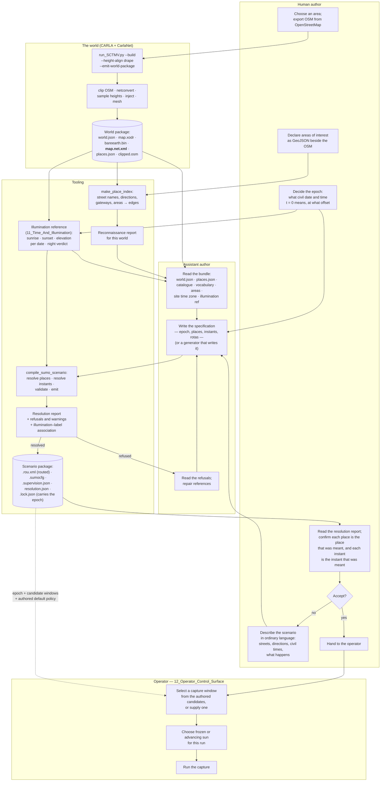
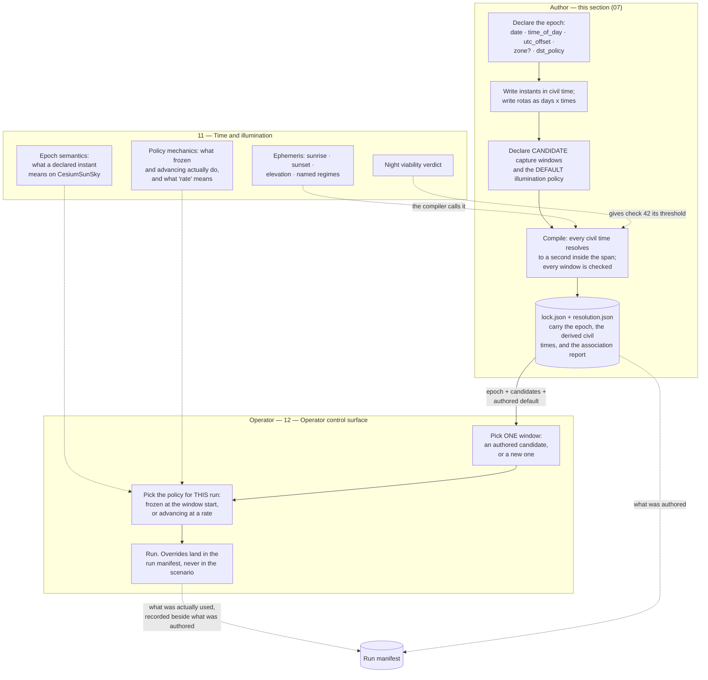
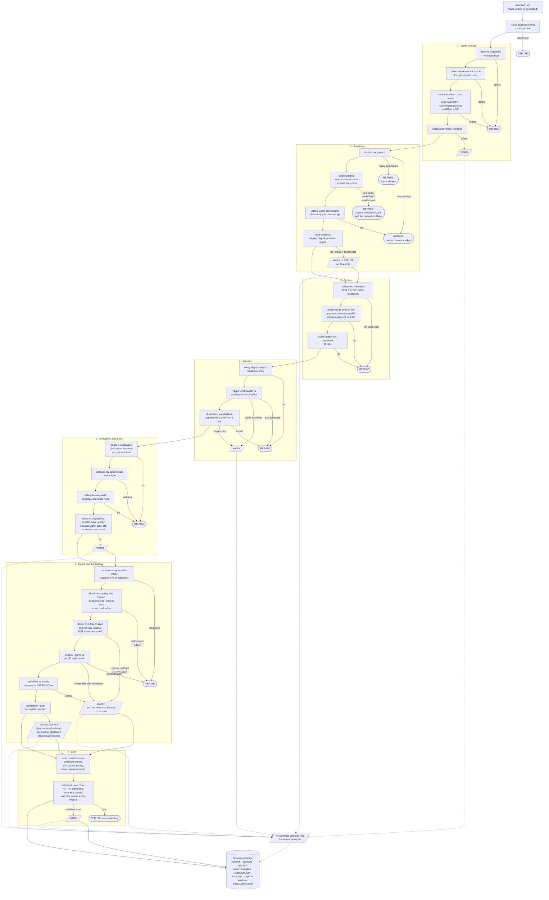

# 07 — Scenario Authoring

**Status:** Plan section. Redrafted against the added time-of-day requirement
([`_TEAM_BRIEF.md`](_TEAM_BRIEF.md) §3a). Source audit against the working tree plus read-only
measurement of the shipped world packages, networks and route files. No code changed, no build run,
no engine started.
**Date:** 2026-09-18
**Scope:** How a SUMO-driven behavioural-capture scenario comes into existence — what an author is
given, what they write, how a described place becomes an edge, **what civil instant a simulated
second means**, and what is checked before a capture run is spent. Covers the authoring bundle, the
authoring surface, reconnaissance and resolution, the epoch declaration, the compile-and-validate
step, determinism and parameter sweeps, and whether the conventions ship as a packaged skill.
**Audience:** an engineer building the authoring tooling, and an author — assistant or human —
using it. It assumes no knowledge of the conversation that produced this plan.
**Owner:** scenario authoring engineer. One of the document set described in
[`_TEAM_BRIEF.md`](_TEAM_BRIEF.md) §8.

**Evidence convention.** Every claim below is marked. *Read* — taken from a source, cited
`path:line`. *Measured* — produced by running something read-only on this machine on 2026-09-17 or
2026-09-18, with the method stated. *Carried forward* — a measurement recorded in a Findings document
or in the authoring skill, cited, not re-run. *Inferred* — a conclusion drawn from the above, and
labelled as such.

**The one-line division of labour on time.** **The author declares what the scenario's time *means*;
the operator chooses the window and the illumination policy.** An epoch is a property of the
scenario — change it and `guard_d0_h7_t3` stops being a 07:00 guard — so it is authored, versioned,
and locked. A capture window and whether the sun is frozen or advancing are properties of a *run* —
change them and the scenario is unaltered — so they are the operator's, in
[`12_Operator_Control_Surface.md`](12_Operator_Control_Surface.md). This section owns the declaration
and everything that can be checked about it without a running server; it owns none of the run-time
choice. §3.9 draws the boundary.

**Out of scope, deliberately.**

- The **runtime**. Which SUMO vehicles CARLA instantiates, how the two clocks relate, and what
  happens to a vehicle's velocity in truth are [`03_CoSimulation_Runtime.md`](03_CoSimulation_Runtime.md)
  and [`04_Contracts.md`](04_Contracts.md). This section stops at the moment a validated scenario
  package is handed to a run.
- **Epoch semantics beyond the declaration, illumination policy mechanics, and the night verdict.**
  How a declared epoch is driven onto `CesiumSunSky`, what the `rate` argument means under
  synchronous ticking, whether vehicle headlights are driven from the sun, and above all **whether a
  night capture is usable imagery at all** belong to
  [`11_Time_And_Illumination.md`](11_Time_And_Illumination.md). §2.9 states exactly what this section
  needs from it and §9.7 states the dependency.
- **How an operator expresses the choice at run time** — selecting a window, freezing or advancing
  the sun, overriding the authored default — is
  [`12_Operator_Control_Surface.md`](12_Operator_Control_Surface.md). This section supplies the
  authored defaults and the lock file it reads; it does not design the surface.
- The **shape of the annotation record**. Doc 20 §6.1's `AnnotationSet`, `PatternInstance` and
  `Interval` and their migration from today's `.labels.json` belong to
  [`06_Truth_And_Annotation.md`](06_Truth_And_Annotation.md). This section says only where an author
  writes an annotation and what validates it.
- The **vehicle catalogue's content and its blueprint binding**, which is
  [`04_Contracts.md`](04_Contracts.md) contract 1. §2.6 states the properties this section needs it
  to have.
- **Scale**. Whether a seven-day scenario is renderable at all is
  [`10_Scale_And_Performance.md`](10_Scale_And_Performance.md). This section treats the Bahonar
  scenario purely as the authoring sizing case.
- **Pedestrians**, excluded by the brief's decision 5.

---

## 1. What authoring costs today, measured

Three scenarios have been authored against generated worlds. They are the evidence for everything
below, so they are measured before anything is proposed.

### 1.1 The three scripts

| | `make_sumo_scenario.py` (Gardnerville) | `make_arapahoe_scenario.py` | `make_bahonar_scenario.py` |
|---|---|---|---|
| Lines / comment lines | 198 / 28 | 353 / 38 | 398 / 39 |
| Distinct hard-coded literals that are real network identifiers | **45 edges** | **53 edges + 1 lane** | **23 edges**, plus 16 `(edge, position)` tower pairs |
| Simulated span | sized to the orbit | sized to the dwell | **604 800 s** |
| Route entries produced | 30 flows + 1 vehicle | 51 flows + 1 trip | **610** — 245 flows, 365 trips |
| Marked vehicles | 1 | 1 | 9 |
| Checks its world binding | **no** | origin lat/lon only (`make_arapahoe_scenario.py:283-290`) | **no** |

*Measured:* literal counts by extracting every quoted string from each script and intersecting it
with the normal-edge and lane id sets of that scenario's own `.net.xml`, so the figures are
identifiers that really resolve, not a regular-expression estimate. Route-entry counts by parsing
`carla/Import/Gardnerville_Centerville_Lane_NeighborhoodOrbit.rou.xml`,
`carla/Import/Arapahoe_I25_UnderpassDwell.rou.xml` and
`BahonarPatternOfLife.zip → scenario/Shahid_Bahonar_Port_PatternOfLife.rou.xml` with `xml.etree`.

Two numbers deserve to be held together. The Bahonar scenario emits **610 route entries across seven
simulated days**, and the entire thing rests on **21 distinct edge identifiers** (*measured*: the
union of every `from`, `to`, `via` and `<stop lane=>` edge in the emitted route file). The expensive,
error-prone, unrepeatable part of authoring is finding and justifying twenty-odd opaque strings. The
cheap part — composing a week of behaviour out of them — is already a program and should stay one.

A smaller measurement from the same comparison makes the case for §5.3's resolution report on its
own. The script declares **23** edge literals; **21** reach the emitted route file. The two that do
not — `175815458#5` and `181931491`, the west and north corridor gateways — were reconnoitred,
named and commented like the rest, and then dropped when `CORRIDOR_PAIRS` was narrowed because "the
public corridor is fragmented and effectively one-way in places, so westbound exits are not
reachable and are left out rather than faked" (*read*, `make_bahonar_scenario.py:92-99`). Nothing
reports that two of the author's anchors are dead, and nothing would report it if the two live ones
had been dropped by accident instead.

That asymmetry is the finding this whole section turns on.

### 1.2 What is validated today, and what is not

*Read.* Two validators exist:

- `RoadNetwork.check_drivable` (`SumoScenarioBuilder.py:151-160`) — raises if an edge is absent from
  the network, or if consecutive edges in an explicit edge list have no connection between them.
  Used only by `write_routes` (`SumoScenarioBuilder.py:353`), and only on the orbit's first two laps.
- `SumoPatternOfLifeBuilder._validate` (`SumoPatternOfLifeBuilder.py:150-167`) — raises if any flow
  or scheduled vehicle references an edge absent from the network. Existence only; no reachability.

Nothing else is checked anywhere. In particular nothing checks that a route is **routable** (as
opposed to its endpoints existing), that a `via` list is honoured, that the network shares the
CARLA map's frame, that the vehicle types resolve to anything CARLA can spawn, or that the network
was built from the same OSM the world was.

`make_bahonar_scenario.py:64` defines `WORLD_PACKAGE` and never reads it (*read*): the largest
authored scenario has no binding to the world it is meant to run in.
`make_sumo_scenario.py:56` records the world's `SourceOsmSha256` in a **comment** (*read*).

### 1.3 The frame is shared. The graph is not.

This is the most consequential measurement in this section, and it contradicts an assumption that
runs through the authoring skill and through doc 23.

The invariant everyone relies on — SUMO (x, y) ≡ CARLA (x, −y) — **holds**. *Measured:* every shipped
network's `<location netOffset="0.00,0.00">` and its `convBoundary` equal the corresponding `.xodr`
header's `north`/`south`/`east`/`west` exactly:

| Map | `.net.xml` `convBoundary` | `.xodr` header |
|---|---|---|
| Arapahoe_I25 | `-476.78,-969.26,476.74,969.28` | `north="969.28" south="-969.26" east="476.74" west="-476.78"` |
| Gardnerville | `-838.86,-455.04,838.86,391.32` | `north="391.32" south="-455.04" east="838.86" west="-838.86"` |
| Shahid_Bahonar_Port | `-3606.86,-1914.94,3607.23,2107.82` | `north="2107.82" south="-1914.94" east="3607.23" west="-3606.86"` |

But the **road graph an author works against is not the road graph the world was built from.** The
world build's netconvert flag set is assembled in C# at `OsmConverter.BuildArguments`
(`CarlaNet/src/CarlaNet.Map/OsmConverter.cs:233-303`); the scenario build's is reimplemented
independently in Python at `NetconvertSettings.to_arguments` (`SumoScenarioBuilder.py:68-103`). They
are not the same set, and the scenarios add flags the world build never saw —
`--junctions.join-dist 25` and `--tls.default-type actuated` for Arapahoe
(`make_arapahoe_scenario.py:65-67`), `--remove-edges.by-type` for Bahonar
(`make_bahonar_scenario.py:72-74`).

*Measured.* Running the repo's staged netconvert 1.27.0 over the identical clipped OSM
(`Build/sumo-smoketest/Arapahoe_I25_clipped.osm`) under each flag set:

| | World-build flags | Scenario flags |
|---|---|---|
| Normal edges | **321** | **317** |
| Junctions | 298 | 298, but **22 differ by identity** |
| `convBoundary` | identical | identical |
| Edges present in one only | 6 (`1037832985#0`, `223207864#2`, `982413823`, …) | 2 (`-572762876#8`, `1107125073`) |
| Common lanes whose **length** differs | — | **27 of 655** |

The largest length disagreements are not rounding. Lane `-1107125073_0` is **352.19 m** in the
world's graph and **2.60 m** in the scenario's; `907700111_3` is 453.64 m against 442.08 m;
`1342047649_4` is 123.41 m against 106.59 m. The first is exactly the near-zero-length-edge artefact
the authoring skill records (`SKILL.md:164-165`), here created by the scenario's own
`--junctions.join-dist 25`.

The consequence is stated plainly because it is easy to misattribute later. Under SUMO drive, a
vehicle's position is an offset along a named lane, and the bridge converts that into a CARLA pose.
If the two graphs disagree about that lane's length by two orders of magnitude, so do the two
positions. Today's three scenarios happen to survive — *measured:* all eighteen of the Arapahoe
scenario's named anchor edges exist in both networks, and all 52 of its origin–destination–via
triples route successfully on both — but nothing establishes that, and nothing would report it if it
stopped being true.

**Inference:** the authoring bundle must contain *the world's own* `.net.xml`, from the same
netconvert invocation that produced the `.xodr`, and the compile step must refuse a scenario built
against any other. Doc 23 §6.4 already asks for the network to be persisted for the runtime's
benefit; this makes it an authoring prerequisite as well, and adds the reason: it is the only way the
author's graph and the rendered graph are the same graph.

### 1.4 The scenario is authored in civil time and emitted in seconds, and the mapping is lost

This is the second-most consequential measurement in this section, and it was missing from the first
draft entirely.

**The authoring is already civil-time-shaped.** *Read,* `make_bahonar_scenario.py`: the diurnal
corridor rhythm is five `(start_hour, end_hour, rate)` windows (`:169`), the ferry sails at
`FERRY_HOURS = [6, 8, 10, 12, 14, 16, 18]` (`:163`), the airfield changes shift at
`SHIFT_HOURS = [7, 15, 23]` (`:164`), a guard's post lasts `shift = 8 * HOUR` (`:230`), the
perimeter shadow runs at `6 * DAY + 2 * HOUR + 30 * 60` (`:285`), the stay-behind arrives on the
`1 * DAY + 8 * HOUR` sailing (`:293`), and even the anomaly's own annotation records
`"begin_s": gap_begin, "end_s": gap_begin + 8 * HOUR` (`:377`). *Measured:* **sixteen sites** in that
one file multiply a civil hour into seconds (`grep -n '\* HOUR\|\* DAY'`, lines 77, 175, 179, 188,
204, 230, 233, 252, 263, 275, 285, 290, 293, 351, 371, 377).

**The emitted artifact is seconds-shaped, and that is all it is.** *Measured,* parsing
`BahonarPatternOfLife.zip → scenario/Shahid_Bahonar_Port_PatternOfLife.rou.xml` with `xml.etree` and
taking `@depart` on every `<vehicle>`/`<trip>` and `@begin` on every `<flow>`:

| | |
|---|---|
| Route entries | **610** |
| Departing on an exact civil hour (`t % 3600 == 0`) | **533 of 610 — 87.4 %** |
| Distinct hour-of-day buckets occupied | **17 of 24** (empty: 01, 03, 04, 05, 19, 21, 22) |
| Distinct guard departure seconds | 25 200, 54 000, 82 800, 111 600, 140 400, 169 200, 198 000, … (+86 400 per day) |
| Guard entries | **335** — seven days × three shifts × sixteen towers, **less the one deliberate no-show** |
| Latest departure | 602 100 s — day 6, 23:15 |

25 200 / 54 000 / 82 800 are 07:00 / 15:00 / 23:00. **So `t = 0` is midnight of day 0 — and nothing in
the scenario package says so.** *Read,* the emitted configuration says only
`<begin value="0"/> <end value="604800"/> <step-length value="1.0"/>`
(`Shahid_Bahonar_Port_PatternOfLife.sumocfg`). The civil meaning survives in exactly two places:
inside the trip identifiers (`guard_d0_h7_t3`), and in the author's head.

**SUMO's own time syntax makes this worse, not better.** *Measured:* SUMO 1.27.0 accepts a `TIME`
option in `H:M:S` form, and resolves it to elapsed seconds with no epoch. Running
`sumo -n Import/Arapahoe_I25.net.xml --begin 7:00:00 --end 7:00:10 --summary-output …` produced steps
`time="25200.00"` through `time="25209.00"`, exit 0. So `--begin 7:00:00` means *25 200 seconds after
the simulation started*, which is 07:00 only if `t = 0` happened to be midnight. **A clock-shaped
literal that is really an offset is the most dangerous kind of authoring construct**, because it
reads correct on every scenario and is wrong on any scenario whose origin is not midnight. It is
gotcha 12 in §6.

**The failure is silent and the truth record participates in it.** *Read:* every streamed snapshot
already carries the sun. `WorldObserver.cpp:322-341` copies
`[solar_time, year, month, day, time_zone, lat, lon, elevation, azimuth, advancing, rate]` into the
snapshot header, and `CotWriter.cs:50-66` writes it into every CoT sidecar as a `<_solar>` element
with `solar_time`, `date`, `time_zone`, `sun_elevation_deg` and `sun_azimuth_deg`;
`SolarMetadata.cs:31` writes the same into the PNG metadata. So a 23:00 night-shift capture rendered
under the spawn default produces imagery in daylight **and a sidecar that faithfully and correctly
records midday** — an internally consistent record of the wrong scenario. Nothing disagrees with
anything, so nothing can flag it.

**Inference, and it is the whole of §3.5.1 and §5.2's new check group:** the mapping from simulated
seconds to civil time is a property of the scenario, it is already how the author thinks, and it must
become a declared field rather than a naming convention. Doc 10 already relies on it — that document
writes `t = 25,200 s (07:00 on day 0)` (`10_Scale_And_Performance.md:454`) and recommends capture
windows at 07:00–08:00, 15:00–16:00 and 23:00 (`:173-175`) — so a second section is already doing
this arithmetic by hand from the same undocumented assumption.

---

## 2. The authoring bundle

The set of artifacts handed to an author — assistant or human — before they write anything. Each row
states where it comes from, what it guarantees, and whether it exists.

| # | Artifact | Source | Exists today | What it guarantees |
|---|---|---|---|---|
| 1 | `world.json` | `WorldBuilder._write_world_package` → `client.write_world_package` (`WorldBuilder.py:159-184`; shim `carlanet/__init__.py:2402-2420`) | **yes** | Origin lat/lon, the PROJ string, grid geometry, staging rectangle, `SourceOsmSha256`, `OpenDriveSha256`, `NetconvertExtraArgs`, generation time |
| 2 | `map.xodr` | same | **yes** | The road network CARLA loads; carries street names on non-junction roads (§4.4) |
| 3 | `bareearth.bin` | same, only under `--height-align drape` | **yes** | Per-cell bare-earth ellipsoidal height; the telemetry altitude and the only elevation the flat SUMO network can borrow |
| 4 | The clipped `.osm` | `OsmClipper.clip_osm_to_bounds`, written to `Build/sumo-smoketest/<Name>_clipped.osm` (`WorldBuilder.py:106-115`) | **yes**, but not inside the package | The exact geometry netconvert saw. Referenced by name and digest in `world.json`, not carried |
| 5 | **The world's `.net.xml`** | netconvert, same run as the `.xodr` | **no — deleted** (`OsmConverter.cs:146`) | §1.3. The single missing artifact that makes the rest sound |
| 6 | **Place index** | new; derived from 2 + 5 | **no** | Street name, direction and area id → edge and lane. §4 |
| 7 | **Vehicle catalogue** | [`04_Contracts.md`](04_Contracts.md) contract 1; doc 20 §5.6 and D12 | **no** | Which vehicles exist, with real dimensions. §2.6 states what this section needs from it |
| 8 | **Area-of-interest table** | doc 20 §8; GeoJSON beside the OSM | **no** | Named, stable places a scenario and an annotation can both reference |
| 9 | **Annotation vocabulary** | doc 20 §6.2 | **no** | The closed term list a label must come from, with a version |
| 10 | **World digest** binding 1–9 | §2.7 | partially, and **unstable as recorded** | That a scenario and a run are talking about the same world |
| 11 | **Site civil time zone** | new; derived from `world.json`'s origin lat/lon plus a time-zone database | **no** | The candidate civil offset for the epoch, and whether the site observes daylight saving. §2.8 |
| 12 | **Illumination reference** | new; [`11_Time_And_Illumination.md`](11_Time_And_Illumination.md), computed from origin lat/lon and the epoch's dates | **no** | Sunrise, sunset and sun elevation for every date the scenario spans, and the **night viability verdict**. §2.9 |

### 2.1 The world package is richer than the skill records

*Read,* from `Build/world-packages/Gardnerville_Centerville_Lane.world.json` and the `world.json`
inside `Arapahoe_I25.cwp` and `Shahid_Bahonar_Port.cwp`. Beyond the three fields the authoring skill
names (`SKILL.md:31-33`), the manifest already carries `GeoReferenceString`, the full staging
rectangle (`StagingMinX/MinY/MaxX/MaxY` and `StagingMarginMeters`), `HeightAlignMode`,
`OriginHeightMeters`, `SourceOsmFileName`, `SourceOsmSha256`, `OpenDriveSha256`, `SampleStepMeters`,
`TerrainResolutionMeters`, `TerrainMarginMeters`, `GeneratedAtUtc`, `GeneratorVersion` and
`NetconvertExtraArgs`.

That is most of a world binding already. Three things are missing and all three are cheap: the
`.net.xml` (§1.3), the **complete** netconvert argument vector rather than only the extra arguments,
and the netconvert build version. The manifest records that the world used
`--keep-edges.by-vclass passenger …` but not that it used `--osm.turn-lanes`, `--junctions.join` or
`--geometry.remove`, so the Python reimplementation of the base flag set cannot be verified against
it — it can only be trusted.

### 2.2 The clipped OSM is an input, not an output, and must travel

An author needs it because the network is rebuilt from it. It is referenced by
`SourceOsmFileName`/`SourceOsmSha256` and lives outside the package in
`Build/sumo-smoketest/`. Once §2.5 is adopted the network is carried and the OSM is no longer needed
to *build* anything — but it is still needed to read access tags (the fence of `SKILL.md:128-141`
reads `access=` straight off the OSM, `SumoScenarioBuilder.py:547-550`), so it should be carried in
the package rather than referenced.

### 2.3 `bareearth.bin` is the only elevation an author has

*Carried forward,* doc 23 §2: the SUMO network is flat. *Measured, confirmed on all three shipped
networks:* zero distinct `z` values in any lane shape. So any authored behaviour that depends on
height — a vehicle under a bridge, a hilltop overwatch, an area of interest with a vertical relation
— has to get its height from `bareearth.bin`, which is what `SumoCotBridge`'s `BareEarthGrid` already
does (`SKILL.md:88`). The bundle therefore includes it, and the compile step can report the
bare-earth height of every resolved place without needing a running server.

### 2.4 The world's `.net.xml`, kept

*Read.* `OsmConverter.ConvertFileWithNetworkAsync` (`OsmConverter.cs:122-148`) already asks
netconvert for the network in the same invocation that produces the OpenDRIVE, reads it, and deletes
it in a `finally` block at `:146`. Keeping it is a matter of writing it into the world package
beside `map.xodr`. Everything in §1.3 follows from that one change, and doc 23 §6.4 wants it anyway.

The pair must be **from the same invocation**, not merely from the same flags: that is what makes
lane lengths, junction identity and edge identifiers correspond by construction rather than by
agreement between two argument builders.

### 2.5 The place index — new

The artifact that turns "eastbound on Centerville Lane" into an edge. Its content, resolver and
failure modes are §4. It is a build-time derivative of the `.xodr` and the `.net.xml`, so it belongs
in the world package, regenerated whenever either changes.

### 2.6 What this section needs from the vehicle catalogue

The catalogue itself is [`04_Contracts.md`](04_Contracts.md)'s. Four properties are required here,
stated as a dependency rather than a design:

1. **An author must be able to read it without a running server.** It is one of the inputs to
   writing a scenario, so it travels in the world package or beside it, as a file.
2. **Every entry carries real length, width and height.** A SUMO `vType`'s `length` and `width`
   change car-following gaps and lane-change acceptance, so they are behavioural parameters, not
   presentation. Today the three scenarios invent them: fourteen `vType`s across the Bahonar file
   with hand-written lengths from 4.4 m to 16.5 m (*read*, `make_bahonar_scenario.py:121-149`,
   `make_arapahoe_scenario.py:96-137`), none of which was checked against any blueprint's bounding
   box. Doc 20 §5.6 records the same defect on the OpenSCENARIO side, where the storyboard's declared
   `<BoundingBox>` and the truth record's measured `length_m` already disagree and nothing notices.
3. **`vType` → blueprint resolution is declared, not inferred.** An entry is named; nothing
   substring-matches. Doc 20 D12 settles this for storyboards; the same rule applies here.
4. **A category resolves to a *set*, drawn on the run seed.** Doc 20 §2.6's appearance confounder is
   sharper under SUMO drive than under storyboards, because SUMO's `vTypeDistribution` already does
   exactly this for *behaviour* — `freeway_mix` draws seven types on declared probabilities
   (`make_arapahoe_scenario.py:123-125`) — while the blueprint behind each type is a single
   identifier. Without an appearance draw, every `car_quick` in a corpus is the same car.

**Dependency stated:** if the catalogue cannot give a `vType` its real dimensions, then either the
authored gaps are wrong or the rendered vehicle does not fit its SUMO footprint. There is no third
option and no version of this section that works around it.

### 2.7 The world digest is not reproducible today

*Measured.* Clipping `Import/Gardnerville_Centerville_Lane.osm` three times, each in a separate
Python process, through `OsmClipper.clip_osm_to_bounds`, produced **three different SHA-256 digests**
(`dfeb6f0b…`, `00598df6…`, `82c360cc…`). Running the staged netconvert 1.27.0 over each of those
three clips produced **three different `.net.xml` digests** (`e0bdaef1…`, `8e907ab8…`, `96ee5488…`).

The cause is read directly from source: `used_orig` is a `set` of node-id strings
(`OsmClipper.py:154`) and is iterated to emit nodes (`OsmClipper.py:219`), so element order follows
Python's per-process string-hash randomisation. The same defect is in the standalone copy
(`CarlaNet/python/osm_clip.py:82,135`).

**But the graph is identical.** *Measured,* comparing the three networks structurally: the same 55
normal edges, the same 202 internal edges, the same 68 junctions, the same `convBoundary`, and all
257 lane shapes byte-for-byte equal. Only element order differs.

Two consequences, and they point in opposite directions, which is why both are worth writing down.

- **Reassuring:** an edge identifier an author records as a constant is stable across a re-clip.
  Today's 45–55 hard-coded literals per scenario are not fragile in the way they look.
- **Blocking:** `SourceOsmSha256` and `OpenDriveSha256` in `world.json` are digests of *file bytes*,
  so a world rebuilt from the same inputs gets a different binding and any digest gate rejects it.
  Doc 20 §7.5 wants the `.xodr` digest in the run manifest and doc 20 §8.4 already worries about
  digest tiering; this measurement says the naive digest cannot carry that weight.

**The fix belongs here, not in the clipper.** Sorting `used_orig` would make the file stable and is
worth doing, but a byte digest would still change for reasons that do not matter — a netconvert patch
release reformatting an attribute, a comment, a timestamp. What the binding actually needs to assert
is *this scenario was authored against this road graph*. So the bundle carries a **network
fingerprint**: a digest over the network's canonical content — sorted normal-edge ids, each edge's
lane ids with their lengths and shapes rounded to a stated precision, the junction id set with types,
and `convBoundary` — computed identically by the world build and by the compile step. The file
digests stay, as provenance; the fingerprint is what gates.

### 2.8 The site's civil time zone, which the world does not know

An author declaring "the night shift starts at 23:00" is declaring a *civil* time, in the zone people
at that site keep. The world package does not carry one, and the engine's substitute is not it.

*Read.* At world spawn the bridge configures the sun from the georeference and nothing else:
`SunSky->SolarTime = 12.0`, `SunSky->UseDaylightSavingTime = false`, then
`SunSky->EstimateTimeZoneForLongitude(OriginLongitude)`
(`Unreal/CarlaUnreal/Plugins/CesiumCarlaBridge/Source/CesiumCarlaBridge/Private/CesiumHeightSampler.cpp:409-412`).
That Cesium method is one line:
`this->TimeZone = FMath::Clamp(InLongitude, -180.0, 180.0) / 15.0`
(`Unreal/CarlaUnreal/Plugins/CesiumForUnreal/Source/CesiumRuntime/Private/CesiumSunSky.cpp:570-573`).

Two things follow, and they pull in opposite directions.

**The good news: a half-hour offset is exactly representable.** `TimeZone` is a `double` and the
division is continuous, not rounded, so Iran's **+03:30** is `3.5` with no approximation and needs no
special case anywhere in the stack. `get_solar_state` returns it as a `double` at index 4
(`carlanet/__init__.py:1511-1533`), `CotWriter.cs:57` writes it with four decimal places, and
`WorldObserver.cpp:332` carries it in the snapshot header. Nothing in the pipeline assumes integer
hours. (*Inference from the above, stated because it is the kind of thing a reader will assume is
broken.*)

**The bad news: the spawned zone is a longitude estimate, not a civil zone, and on the sizing scenario
the difference crosses the horizon.** *Read,* `make_bahonar_scenario.py:69`: the Bahonar world is
pinned at `origin_lat=27.15012, origin_lon=56.18065`. *Measured,* `56.18065 / 15 = 3.745377 h`, which
is **14 min 43 s** east of Iran's civil **+03:30** — 3.68° of sun rotation. *Measured,* propagating
that through a standard low-precision solar-position calculation (NOAA-style mean-anomaly form,
written for this measurement; adequate to a few tenths of a degree, which is why it is used only to
size the effect and never as the authority — see §2.9), at the March equinox:

| Civil time at the site | Correct elevation (+03:30) | As spawned (+03:45:23) | Error |
|---|---|---|---|
| 05:00 | −11.59° | −14.84° | −3.25° |
| **06:00** | **+1.74° (sun up)** | **−1.53° (sun down)** | **−3.28°** |
| 07:00 | +15.06° | +11.80° | −3.25° |
| 12:00 | +63.08° | +63.08° | 0.00° |
| 17:00 | +11.82° | +15.07° | +3.25° |
| **18:00** | **−1.51° (sun down)** | **+1.77° (sun up)** | **+3.27°** |

At local noon the error is nil; at the horizon it decides whether the sun has risen. A dawn capture is
a different image depending on whether the offset was declared or derived, and nothing in the pipeline
would report the substitution.

**There is no way to correct it in the engine, and none is needed.** *Measured,* grepping the whole
stack: the solar surface is exactly four entry points —
`SetSolarTime`, `SetSolarDate`, `GetSolarState`, `SetTimeAdvance`
(`CesiumHeightSampler.h:193,200,210,220`; server binds at `CarlaServer.cpp:614,625,640,661`; client at
`CarlaClient.cs:1043,1048,1053,1058`; shim at `carlanet/__init__.py:1500,1506,1511,1535`).
**No RPC sets `TimeZone`.** It is fixed at spawn from longitude and is thereafter read-only.

*Inference, and it is the design decision this section takes:* because the world's zone is a fixed
`double` the client can *read* (`get_solar_state()["time_zone"]`, or `GetCachedSolarState`
at `CarlaClient.cs:1991`, free and tick-paired), a declared civil instant can be driven correctly with
no new RPC and no engine change, by converting through UTC:

```
solar_time_hours = (civil_time_hours − epoch.utc_offset_hours) + world_time_zone_hours
```

where `world_time_zone_hours` is what the world reports, not what the author declared. This section's
obligation is therefore to make the epoch's **numeric offset** a declared, checked field, so that
arithmetic is possible. Performing it is
[`11_Time_And_Illumination.md`](11_Time_And_Illumination.md)'s and
[`12_Operator_Control_Surface.md`](12_Operator_Control_Surface.md)'s.

**Daylight saving is off in the engine, by deliberate choice.** *Read:*
`SunSky->UseDaylightSavingTime = false` at `CesiumHeightSampler.cpp:410`, commented "Disable DST for a
deterministic clock". Cesium's own DST machinery exists and is fixed-date rather than rule-based
(`CesiumSunSky.cpp:411-416, 587-609` — `IsDST(UseDaylightSavingTime, DSTStartMonth, DSTStartDay,
DSTEndMonth, DSTEndDay, …)`), which could not express a real zone's rules anyway. So **the engine will
never apply a DST rule**, and any DST a scenario needs must be resolved by the compiler into offsets
before anything is handed to the world. That is check 36.

**A time-zone database is not present and must be declared as a dependency.** *Measured* on this
machine: Python **3.14.4**; `import tzdata` raises `ModuleNotFoundError`;
`zoneinfo.ZoneInfo("Asia/Tehran")` raises `ZoneInfoNotFoundError`; `zoneinfo.available_timezones()`
returns **0** entries. Windows ships no IANA database and CPython's `zoneinfo` falls back to the
`tzdata` wheel, which is not installed. *Read:* `CarlaControl/pyproject.toml:12-15` declares
`carlanet>=0.1.0` and `numpy>=1.24.0` and nothing else. So a compiler that *required* an IANA zone
name would refuse every scenario on a clean Windows box. This is why §3.5.1 makes the **numeric offset
normative and the zone name an optional cross-check**, and why `tzdata` is named as a packaging
dependency in §9.6.

### 2.9 What this section needs from `11_Time_And_Illumination.md`

Stated as a dependency rather than a design, in the same form as §2.6's catalogue dependency. All five
are things an author has to reason about *before* writing, so all five must be readable **without a
running server** — a file in or beside the world package, not an RPC.

1. **An authoritative sunrise, sunset and sun-elevation function** for the world's origin lat/lon over
   any date the scenario spans. The arithmetic in §2.8 is a sizing estimate written for this document;
   it must not be the thing the compiler ships, because the compiler's numbers go into a resolution
   report an author acts on and into a corpus-stratification field a trainer uses. One
   implementation, owned by doc 11, called by this section's compiler.
2. **Elevation bands with names**, so the compile report and the sweep axis can speak in regimes
   rather than degrees: the boundary elevations for night, astronomical/nautical/civil twilight, low
   sun, and high sun. This section uses them as opaque labels; it must not invent them, because doc 8
   and doc 6 will stratify a corpus on the same labels.
3. **The night viability verdict — does the world render usable EO imagery at night at all?** The
   verdict informs the author; it never forbids them. **Any time of day is authorable, including one
   the renderer serves poorly** — the tooling's job is to say what the imagery will look like, not to
   decide which parameters a user may explore, and a night window still produces complete behavioural
   truth and a sidecar whatever the pixels show. So check 42 **warns and records the regime, and
   never refuses**. Where the verdict is yes-with-conditions, the conditions are authoring inputs
   (street lighting present or absent, whether vehicle headlights are driven, what sensor
   configuration is required). *Read,* the
   reason this cannot be assumed either way: the only existing sun-driven headlight rule is
   `VehicleLightStage.cs:228-236`, which switches beams and position lamps from
   `_weather.SunAltitudeAngle` — but that is a **.NET traffic-manager** stage, and the brief's decision
   4 locks the traffic manager out while SUMO drives, and `CarlaServer.cpp:610-612` records CARLA's own
   weather as inert in a georeferenced world. So under SUMO drive nothing switches a headlight on
   unless doc 11 says what does.
4. **Whether the solar date advances on its own across a multi-day run, and if not, what does.**
   *Measured, and this is why the question is not rhetorical:* the advance controller's tick is
   `SunSky->SolarTime = Fmod(Fmod(SunSky->SolarTime + DeltaHours, 24.0) + 24.0, 24.0)`
   (`Unreal/CarlaUnreal/Plugins/CesiumCarlaBridge/Source/CesiumCarlaBridge/Private/CesiumTimeOfDayController.cpp:35`)
   — it **wraps the clock at midnight and never touches `Year`/`Month`/`Day`**, which change only on an
   explicit `SetSolarDate` (`CesiumHeightSampler.cpp:735-751`). `SetSolarTime` wraps the same way
   (`:730`). So on a seven-day scenario left to advance, day 6 renders under day 0's seasonal sun and
   the `<_solar date=…>` in every sidecar reports day 0's date. *Measured,* the size of the seasonal
   half of that error at the Bahonar origin, 07:00, over a six-day span: **+1.51°** near the March
   equinox, −0.28° near the June solstice, −0.59° near the December solstice — smaller than §2.8's
   zone error but in the same class, and the *date* in the truth record is simply wrong regardless of
   the angle. This section's response is check 36, which makes the compiler derive and report the
   civil date of every declared window so the operator surface has a date to set; whose job it is to
   set it is doc 11's and doc 12's.
5. **Confirmation of what `set_time_advance`'s `rate` means under synchronous ticking**, expressed as
   sun-clock seconds per *simulated* second, so a sweep axis can be declared in those units. The brief
   (§3a) and the shim docstring (`carlanet/__init__.py:1535-1542`) both say the advance tracks
   simulation time under synchronous ticking; this section needs the settled statement, not the
   docstring, because §7.2 makes `rate` a declarable sweep axis.

**Dependency stated:** without (1) and (2) the compile report can state a civil time but not what it
looks like; without (3) an author cannot tell an unrenderable window from a renderable one and check
42 has no threshold to test against. There is no version of this section that supplies its own
ephemeris.

---

## 3. The authoring surface

### 3.1 What the bespoke Python script gets right

It would be easy to under-credit this. Read honestly, the current surface has four real virtues, and
any replacement that loses them is worse.

- **Full expressive power.** The Bahonar scenario's guard rota is a triple loop over days, shifts and
  sixteen towers, with one iteration deliberately skipped to plant an absence
  (`make_bahonar_scenario.py:230-242`). That is a program. Expressing it as data would mean either
  610 hand-written entries or inventing a loop construct in a configuration format, which is how
  configuration formats become bad programming languages.
- **It is reviewable as code.** `git diff` on `make_arapahoe_scenario.py` shows exactly what changed
  between two versions of a scenario, and the reviewer is reading Python, not a diff of generated
  XML.
- **The comments are the design record.** The scripts carry 28–39 comment lines each, and they hold
  measurements that exist nowhere else — why the westbound rate is 180 against 430 eastbound
  (`make_sumo_scenario.py:79-85`), what happens if the dwell is in the running lane (12.9 m/s drops
  to 0.6, `make_arapahoe_scenario.py:237-243`), why the internal junction lanes must be cleared
  (`SumoScenarioBuilder.py:558-568`). Losing that would be a real regression.
- **Measured helpers are reused.** `restrict_private_roads`, `allow_opposite_overtaking`,
  `check_drivable` and the departure-sorted timeline merge each encode a bug that cost real time.

### 3.2 What it costs

- **Every scenario is a program, so every scenario is a program that can be wrong.** There is no
  schema, so there is nothing to check a scenario against before running it.
- **Nothing validates until SUMO loads it,** and SUMO's response to most authoring errors is a
  warning on stderr, not a failure (`SKILL.md:155-157` — an out-of-order entry is dropped with a
  warning; *measured* in §5.4 — `duarouter` emits a routed vehicle for a trip whose destination does
  not exist).
- **The behavioural annotation has nowhere structured to live.** Today it is `.labels.json` with
  three keys, and one of the six Bahonar anomalies — the guard who never arrives — is a free-text
  `note` because there is no vehicle to attach it to (*read*, `make_bahonar_scenario.py:372-379`;
  *measured*, the emitted `labels.json` carries exactly one such note). Doc 20 §2.3 requires pattern
  instances with participants, roles and intervals; none of that is expressible.
- **The scenario does not say what time it is.** §1.4. Sixteen sites in the largest script multiply a
  civil hour into seconds; 533 of the 610 emitted entries land on an exact civil hour; and the only
  surviving trace of what those hours *were* is the substring `_h7_` in a vehicle id. Every author
  hand-computes the arithmetic, and no consumer can undo it.
- **The world binding is a comment.** §1.2.
- **The identifiers are opaque and undocumented.** `"218965860#0"` means nothing without
  `make_arapahoe_scenario.py:71-75`'s five lines of prose, and the prose is not machine-readable, so
  nothing can check it still describes that edge after a rebuild.
- **The netconvert flag set is reimplemented.** §1.3.
- **Nothing reports what a scenario resolved to.** Doc 20 §5.5 argues for this explicitly on the
  storyboard side, because a preview cannot check annotations. It is more true here: there is no
  preview at all except running SUMO.

### 3.3 The three candidate surfaces

| | Python builder script only (today) | Declarative specification only | **Specification as the compiled surface, script as generator** |
|---|---|---|---|
| Expresses a 610-entry seven-day rota | yes | no, without inventing control flow | **yes** — the script generates the specification |
| Schema to validate against | no | yes | **yes** |
| Errors caught before a run | none | all reference errors | **all reference errors, on every scenario** |
| Behavioural annotation has a home | no | yes | **yes** |
| States what civil time `t = 0` is | no — a naming convention (§1.4) | yes | **yes — one declared `epoch`, checked** |
| An author writes `07:00` rather than `25200` | no — sixteen arithmetic sites measured | yes | **yes — the compiler emits the seconds** |
| Reviewable diff | Python | data | **both — the generator in Python, the compiled specification as the artifact** |
| Hand-authorable without tooling (doc 20 D13) | yes, by writing Python | **yes, by writing one file** | **yes, either way** |
| Reliably emittable by an assistant | poor — must get SUMO XML ordering, `speedDev`, `<stop speed>` and comment escaping right | good | **good** |
| Measured helpers reused | yes | must be re-expressed as specification constructs | **yes — the compiler owns them** |
| One place to add a new check | no | yes | **yes** |

### 3.4 Recommendation

**Adopt a declarative traffic-scenario specification as the artifact that is compiled, validated,
archived and run — and keep the Python builder as a first-class generator whose output is a
specification rather than SUMO XML.**

The move that makes this work, and the reason it is not simply "add a config file", is that **the
escape hatch emits the input to the compiler, not the output of it.** A generator script that writes
`.rou.xml` directly bypasses every check; a generator script that writes a specification is subject
to all of them. So:

- A small scenario is one hand-written specification file and no code at all.
- A large scenario is a Python program whose `main` writes a specification. Bahonar's rota, ferry
  pulses and shift changes stay exactly the loops they are today; what changes is that they append
  to a specification object instead of formatting XML strings.
- Both go through one compiler. There is one implementation of departure sorting, one of the
  `<stop speed=>` per-edge waypoint rule, one of route validation, one of annotation resolution.

Against the alternative of keeping the script surface and bolting on a declarative *annotation*
companion: that fixes the smallest of the eight costs in §3.2 and none of the other seven. The
reference errors, the world binding, the flag-set drift and the absence of a resolution report all
live on the traffic side, not the annotation side.

The specification is **not** an attempt to be SUMO. It does not restate `vType` car-following
parameters or SUMO's insertion model — those pass through verbatim, because SUMO's own documentation
is better than any paraphrase and because the skill's measured `vType` tuning
(`make_arapahoe_scenario.py:96-120`) must survive unchanged. The specification describes what is
*specific to this pipeline*: which world, which places, **which instants**, which vehicles, which
annotations, which sweep, and which references must resolve.

**Time is the second reference type, and it is the clearest case for the whole design.** The argument
for named places is that an author should write what they mean and have a compiler produce the opaque
identifier (§3.5, D7.3). Time is exactly the same argument with the measurements already in hand: the
author means 07:00, the artifact needs 25 200, the author currently does the multiplication sixteen
times per scenario (§1.4), and the meaning is then unrecoverable. A place resolves to an edge; an
instant resolves to a second. One compiler, two resolvers, one report.

### 3.5 Shape of the specification

A JSON document, `<Scenario>.scenario.json`, with a `spec_version`. Sketched only far enough to make
the checks in §5 concrete; the field list is settled with
[`06_Truth_And_Annotation.md`](06_Truth_And_Annotation.md) for the annotation half.

```
world              package path or map name + network fingerprint (§2.7)
epoch              { date, time_of_day, utc_offset, zone?, dst_policy }   §3.5.1 — REQUIRED
seeds              { sumo, appearance, admission }                        §7.1
vehicle_types[]    verbatim SUMO vType/vTypeDistribution, plus catalogue_entry per type
places{}           named places: each an edge, a lane+offset, an area id, or a described
                   place the resolver resolves (§4.2). Every later reference is by name.
instants{}         named instants: each a civil time, an absolute civil instant, or a
                   plain second. Every later reference is by name.             §4.5
rotas[]            repeat blocks — days x civil times x subjects; the compiler expands
                   them to departures. The sizing scenario's guard rota is one. §3.5.1
flows[]            id, from, to, via[], type, rate, window                 — cohorts
actors[]           id, type, depart, route (places), stops[], params{}     — entities
network_edits[]    fence, opposite pairs, lane closures — the measured post-processors
supervision        instances[] with participants, roles, phases, labels    — compiles to
                   <Scenario>.supervision.json; see 06_Truth_And_Annotation.md §3.1
capture_windows[]  CANDIDATE windows, in civil time. Authored defaults the operator
                   selects from or overrides; checked here.                    §3.5.2
illumination       the authored DEFAULT policy for those windows.               §3.5.2
sweep              the swept parameter set, if this is a sweep member           §7.2
```

Three properties are load-bearing:

- **Every reference is a name, and every name is resolved at compile time.** A specification never
  contains a bare edge identifier in a route; it contains a place name, and the compiled output
  contains the edge. The 45–55 opaque literals per scenario become a named, documented, checked table
  that lives in the specification's `places` block and is reported back (§5.3).
- **A place may be described rather than named.** `{"street": "East Arapahoe Road", "direction":
  "west", "near": {"lat": …, "lon": …}}` is a valid place, resolved by §4. An assistant writes that;
  the compiler turns it into `427819541#0` and says so.
- **The same is true of an instant.** `{"at": "d0 07:00"}` is a valid departure. The compiler turns it
  into `25200` and says so. Every one of the 533 exact-hour departures measured in §1.4 becomes a
  civil-time literal, and the sixteen arithmetic sites go to zero.

### 3.5.1 The epoch declaration, and writing civil time

**`epoch` is required.** A specification without one is refused (check 33). It is one small block, and
it is the whole of what makes everything else in this subsection possible.

```jsonc
"epoch": {
  "date":        "2026-03-21",   // civil calendar date on which t = 0 falls
  "time_of_day": "00:00:00",     // civil clock time that t = 0 corresponds to
  "utc_offset":  "+03:30",       // REQUIRED, normative. Half-hour offsets are ordinary.
  "zone":        "Asia/Tehran",  // OPTIONAL. Provenance and a cross-check, never the authority.
  "dst_policy":  "fixed_offset"  // "fixed_offset" (default) | "civil_clock"        see below
}
```

**Why the numeric offset is normative and the zone name is not.** Three measurements, all in §2.8.
The engine has no zone database and no DST rule it could honour (`UseDaylightSavingTime = false`,
`CesiumHeightSampler.cpp:410`; Cesium's own DST is fixed-date, `CesiumSunSky.cpp:587-609`). The world's
own `TimeZone` is a longitude estimate the client can only read, never set, so driving a declared
instant is arithmetic on a number and needs a number. And `zoneinfo` has **zero** zones on this
machine (*measured*, §2.8), so requiring a name would refuse every scenario until `tzdata` ships. The
name is kept because it is the only place a reader learns *which* +03:30 this is, and because where a
zone database is present the compiler can check the two against each other (check 35).

**Iran's +03:30 is not a special case anywhere.** `SunSky->TimeZone` is a `double` set by a continuous
division (`CesiumSunSky.cpp:571`), `get_solar_state` returns it as a `double`, `CotWriter.cs:57`
serialises it to four decimals. The offset field is therefore parsed and stored as a signed number of
minutes, and the schema accepts any offset that is a whole number of minutes — which covers +03:30,
+05:45 and +12:45 without a branch. What must *not* happen is an integer-hours representation
anywhere, and check 34 exists to catch one being introduced.

**`dst_policy` is a declared fork, not an inference, because it changes the emitted seconds.**

| Value | What a declared civil time means | Emitted seconds |
|---|---|---|
| `fixed_offset` (default) | The epoch's offset applies for the whole run. Simulated seconds map linearly to UTC. After a daylight-saving transition the civil labels are an hour off the clock people at the site keep, and the report says so. | `(civil − epoch) / 1 s`, uniform |
| `civil_clock` | A declared civil time resolves through the zone's rules, so `d3 07:00` is genuinely 07:00 local on day 3 even across a transition. The day containing the transition is 23 or 25 hours long. | non-uniform; one day differs by 3 600 s |

`fixed_offset` is the default because it is what every existing scenario already assumes — *read*,
`make_bahonar_scenario.py:233`, `depart = day * DAY + hour * HOUR` with `DAY = 24 * HOUR` (`:77`) — and
because it is the only policy that keeps `t % 86400` a meaningful hour-of-day, which §5.6's confounder
statistic and doc 10's per-day repeatability finding (`10_Scale_And_Performance.md:168`) both rely on.
`civil_clock` is refused without a resolvable `zone` (check 36), because there is nothing to resolve
the rule against. The sizing scenario is unaffected either way: Iran does not currently observe
daylight saving, so both policies emit identical seconds for it — which is precisely why the check
must fire on the *site*, not on the one scenario that exists.

**Writing civil time.** Wherever the specification takes a time, it takes any of these forms, and the
compiler emits seconds:

| Form | Example | Resolves to |
|---|---|---|
| Plain seconds | `25200` | itself — always accepted, never deprecated |
| Day plus civil clock | `"d0 07:00"`, `"d6 02:30"` | `day × 86400 + clock`, under `epoch` |
| Civil clock alone | `"07:00"` | day 0 — refused if the span exceeds one day, to make the day explicit |
| Absolute civil instant | `"2026-03-21T07:00:00+03:30"` | offset from the epoch; **refused** if its offset disagrees with `epoch.utc_offset` under `fixed_offset` |
| Duration | `"8h"`, `"30m"`, `"5m"` | seconds — for a stop, a window length, a phase |
| Named instant | `{"instant": "night_shift_start"}` | whatever `instants{}` declared it to be (§4.5) |
| Rota | see below | a set of seconds |

A **rota** is the construct the sizing scenario is made of, and it is the one place the specification
gains a repetition form. It is deliberately not a loop: it has no body, no variables and no
conditionals — it is a cross product of declared days, declared civil times and declared subjects,
with an explicit exclusion list. §12 question 6's standing objection to loop constructs is what keeps
it that shape.

```jsonc
"rotas": [{
  "id": "guard_posting",
  "days": "0..6",
  "at": ["07:00", "15:00", "23:00"],          // reads exactly like SHIFT_HOURS
  "subjects": {"place_set": "guard_towers"},   // the sixteen posts, named in places{}
  "template": {"type": "guard", "from": "guard_base", "to": "guard_base",
               "via": ["$subject"], "stop": {"lane": "$subject_lane",
                                             "end_pos": "$subject_pos", "duration": "8h"}},
  "id_pattern": "guard_d{day}_h{hour}_t{subject_index}",
  "skip": [{"day": 4, "at": "07:00", "subject_index": 11,
            "because": "the no-show anomaly: this post is not manned this shift"}]
}]
```

**What it does to the sizing scenario's readability.** *Measured against the shipped script and its
output:*

| | Today | Under the epoch |
|---|---|---|
| Civil-hour-to-seconds arithmetic sites | **16** (`make_bahonar_scenario.py`, `grep '\* HOUR\|\* DAY'`) | **0** |
| Emitted entries whose civil meaning is recoverable from the artifact | **0 of 610** (only from the `_h7_` substring in an id) | **610 of 610** |
| The guard rota — 335 entries | a triple loop with a `continue`, `:232-242` | one `rotas[]` block with one `skip` entry carrying its reason |
| The no-show anomaly | a `continue` and a comment (`:236`) | a `skip` entry whose `because` is a field, reported in §5.3 and joinable to the supervision record |
| `SHIFT_HOURS = [7, 15, 23]` (`:164`) | a constant multiplied out at `:233`, `:188`, `:204` | the literal text `"at": ["07:00", "15:00", "23:00"]` |
| `FERRY_HOURS = [6, 8, …, 18]` (`:163`) | multiplied out at `:252` | a second rota |
| The diurnal rates, `[(0,6,20), (6,10,180), …]` (`:169`) | multiplied out at `:175`, `:179` | flow windows `"06:00".."10:00"` |
| The perimeter shadow, `6*DAY + 2*HOUR + 30*60` (`:285`) | three multiplications | `"d6 02:30"` |
| The stay-behind, `1*DAY + 8*HOUR` (`:293`) | two multiplications | `"d1 08:00"` |
| The probe's per-day jitter, `day * 137` (`:275`) | arithmetic, and the resulting instant is never stated anywhere | `{"at": "d2 11:00", "jitter_s": 274}` — and the report states that it resolved to **d2 11:04:34** and **d5 11:11:25** |
| The annotation's own interval, `"begin_s"/"end_s"` (`:371-377`) | seconds in a file with no epoch | civil times, resolved against the same epoch as the traffic |

The generator does not disappear and is not meant to. Bahonar's sixteen tower positions still come
from a survey and still need a program to project them onto edges. What changes is that the program
stops doing arithmetic the compiler can do, and the thing it writes now says what it means.

**One thing the epoch deliberately does not do: it does not become a supervision signal.** The brief's
standing constraint (§3a) is that illumination is derived context and never a label. The epoch is an
input to illumination, so the same rule binds it. It may be read by the compile report, by the
sweep's stratification and by a trainer; the annotation vocabulary (doc 20 §6.2) gains no time term,
and check 41 exists precisely to surface the case where the two have become entangled anyway.

### 3.5.2 Capture windows and illumination policy: authored candidates, operator choice

Two fields sit on the boundary and must be labelled as such, because getting this wrong would put a
run-time decision under version control.

**`capture_windows[]` are authored candidates.** An author knows where the interesting hours are —
they built them. Doc 10 identifies the sizing scenario's three peaks from the scenario source
(`10_Scale_And_Performance.md:173-175`) and already delegates one check to this section: "at authoring
time, `07`'s validator rejects a `capture_windows[]` entry that cuts a declared interval, naming the
instance" (`:504`). So the windows are declared here, in civil time, and checked here (checks 37, 38).
What they are **not** is a run instruction. The operator selects among them, or supplies one of their
own, in [`12_Operator_Control_Surface.md`](12_Operator_Control_Surface.md).

```jsonc
"capture_windows": [
  {"id": "morning_shift_change", "begin": "d3 07:00", "length": "30m"},
  {"id": "night_shift",          "begin": "d3 23:00", "length": "30m"},
  {"id": "probe_window",         "begin": "d2 10:50", "length": "30m"}
]
```

**`illumination` is an authored default, in the same sense.**

```jsonc
"illumination": {
  "mode": "frozen",        // "frozen" | "advancing"
  "rate": 1.0,             // sun-clock seconds per SIMULATED second; only with "advancing"
  "rationale": "a sweep varying dwell duration must hold the sun still"   // free text, reported
}
```

`frozen` means the sun is set once, at the window's first instant, and does not move — illumination is
a controlled constant. `advancing` means it tracks simulated time. Both are legitimate; the brief's
§3a requirement 2 says so; and the choice belongs to the run. The specification declares which one the
scenario was *designed* around, and the resolution report states it, so that an operator overriding it
is making a visible decision rather than an accidental one. The override lands in the run manifest,
not in the scenario.

**Why the authored default is worth having at all, rather than leaving it wholly to the operator.**
Because a sweep is compiled here, not run here (§7.2), and a sweep that varies behaviour while the sun
moves is contaminated before the operator ever sees it (§7.4). The compiler can only refuse that if
the specification states what it intended.

### 3.6 Where the behavioural annotation lives

**The annotation channel is settled by [`06_Truth_And_Annotation.md`](06_Truth_And_Annotation.md) and
this section adopts it unchanged.** That section's D6.1 amends doc 20 decision 6 for the SUMO
surface: the companion file `<scenario>.supervision.json` becomes the *sole* channel, because SUMO
has no counterpart to OpenSCENARIO's `UserDefinedAction` and because the route file is generated
rather than authored. Its D6.2 adds a third kind of subject — the **cohort**, a `<flow>` id standing
for every vehicle SUMO names `<flow id>.<n>` — which may carry only a whole-life annotation.

Two alignments between that and the surface proposed here, worth stating because they were reached
independently:

- **The specification's `flows[]` / `actors[]` split is exactly D6.2's cohort / entity split.** A
  `flows[]` entry is a cohort and may carry a whole-life annotation; an `actors[]` entry is an entity
  and may carry phased intervals. The compiler enforces that, which is check 23 in §5.2.
- **D7.2 strengthens rather than contradicts D6.1's second argument.** That argument is that putting
  authored intent into a generated file makes the generator the only author. Under D7.2 the route
  file is *wholly* generated from the specification, so no authored intent lives in it at all, and
  the authored artifact — the specification — is the thing under review and in version control.

What remains for this section is one narrower question the annotation channel does not answer: how
**static identity** — `entity_id`, `instance_id`, the participant role, the catalogue entry — reaches
a CARLA spawn attribute, which doc 20 D7 requires because an attribute survives record and replay
where an in-process registry cannot. SUMO has an exact analogue of doc 20 §5.1's entity
`<Properties>`, and it is better than it looks.

*Measured.* SUMO's `<param key= value=/>` child element round-trips end to end. A route file carrying
`<param>` on a `<vType>` and on a `<trip>` was passed through `duarouter` 1.27.0 (params preserved on
both the `vType` and the emitted `<vehicle>`) and then through `sumo` 1.27.0 with
`--vehroute-output` (params preserved on the arrived vehicle, arrival 96.00 s). *Read:* the generated
C# TraCI binding exposes `Vehicle.getParameter` and `Vehicle.setParameter`
(`Build/sumo-build/src/libtraci/Eclipse.Sumo.Libtraci/Vehicle.cs:546,558`).

So the path from an authored identity to a CARLA spawn attribute is complete with no new transport:
the compiler writes `<param key="…" value="…"/>` into the route file, SUMO carries it, the .NET
bridge reads it with `getParameter`, and it becomes the custom spawn attribute doc 20 D7 requires —
which the engine stores unvalidated and the recorder preserves through record and replay (doc 20
§4.5).

**`<param>` is identity transport, not an annotation channel, and the distinction is the point.**
[`06_Truth_And_Annotation.md`](06_Truth_And_Annotation.md) §3.1 declines `<param>` for supervision on
the grounds that it "attaches only to certain elements and is consumed by device and model code, not
reserved for vendors". Both halves are right and neither blocks this use. The elements it attaches to
are exactly the ones needed (*measured:* `vType` and `vehicle`/`trip`), and the collision risk with
SUMO's own consumed keys — `device.*`, `has.*`, car-following parameters — is removed by requiring a
declared namespace prefix on every key the compiler emits, which the compiler owns because nothing is
hand-written. A key outside the declared namespace in a compiled route file is a compiler bug.

It carries only what is **static** for the life of a vehicle: `entity_id`, `instance_id`, participant
role, catalogue entry. It cannot carry intervals, phases or multi-participant structure, for the same
reason `role_name` could not (doc 20 §4.3): a parameter is one string, and although SUMO's parameters
are mutable at runtime they are not *recorded* per tick. That belongs to
[`06_Truth_And_Annotation.md`](06_Truth_And_Annotation.md)'s `WorldSupervisionState`. The authoring
side's obligation is only to make every reference in the supervision file resolvable and checkable,
which is §5.

One asymmetry to record, because it is the SUMO version of doc 20 §5.5's: **a scenario previewed in
`sumo-gui` shows the motion faithfully and the annotation not at all.** `sumo-gui` is the only
preview available, and it has no concept of a pattern instance. That is acceptable — the annotation
changes no motion — but it means the compile step's report is the *only* place an annotation can be
checked, which is the argument for §5.3 existing.

**The same asymmetry applies twice over to time, and that is the second argument for §5.3.** `sumo-gui`
renders a clock, but it renders elapsed seconds — §1.4 measured SUMO resolving `7:00:00` to step
25 200 with no notion of what 25 200 is. It has no sun, no date and no idea what illumination a
capture will be made under. So a preview can show that the guard arrives; only the resolution report
can show that he arrives at 07:00 on a Tuesday under a +15° sun. And the annotation inherits the same
gap: *read*, `make_bahonar_scenario.py:371-377` writes the no-show interval into the labels file as
`"begin_s"` / `"end_s"`, so the supervision record carries the identical epochless seconds the route
file does. One epoch has to interpret both, which is why it sits at the top of the specification
rather than beside the traffic.

### 3.6.1 Identity travels with `<param>`; the epoch does not

A related question, answered here so it is not asked at the wrong layer. `<param>` carries what is
static about a *vehicle* (§3.6): `entity_id`, `instance_id`, participant role, catalogue entry. The
epoch is static about the *scenario*, so it does not belong on a vehicle and is not written 610 times.
It travels in `<Scenario>.lock.json` and `<Scenario>.resolution.json` (§5.1), which are the artifacts a
run already reads and the run manifest already joins to. *Inference,* but a cheap one: putting the
epoch on every `<param>` would make it 610 restatements of one fact, each of which could disagree with
the others, and would still not reach anything that reads the `.sumocfg`.

### 3.7 The end-to-end workflow



### 3.8 An assistant authoring a scenario

```mermaid
sequenceDiagram
    autonumber
    actor User as Human author
    participant AI as Assistant
    participant Pkg as World package
    participant Recon as Reconnaissance report
    participant Cat as Vehicle catalogue
    participant Illum as Illumination reference<br/>(doc 11)
    participant Comp as Scenario compiler
    participant Duar as duarouter

    User->>AI: "A vehicle enters from the south on I-25,<br/>leaves at the Arapahoe interchange, parks<br/>under the Yosemite bridge for 30 minutes,<br/>starting at 05:30 on a March morning."
    AI->>Pkg: read world.json
    Pkg-->>AI: origin, PROJ string, staging rectangle,<br/>network fingerprint, netconvert argv
    AI->>Recon: read places.json + reconnaissance report
    Recon-->>AI: gateways by bearing; street name → edges;<br/>areas of interest; edges by access class;<br/>lane lengths; flagged degenerate edges
    AI->>Cat: read vehicle catalogue
    Cat-->>AI: entries with real length/width/height,<br/>category sets, blueprint ids
    AI->>Illum: sunrise/sunset for the candidate dates<br/>at this origin; is night usable?
    Illum-->>AI: 2026-03-21 sunrise 06:11, sunset 18:14 local;<br/>05:30 is nautical twilight; night verdict: <conditions>
    Note over AI: Ambiguity the report cannot settle —<br/>"South Yosemite Street" is 65 edges —<br/>is asked, not guessed.
    AI->>User: "Which Yosemite bridge — the one over<br/>Arapahoe Road, or over the ground-level<br/>roadway at 39.6004N 104.8865W?"
    User-->>AI: the ground-level roadway
    Note over AI,User: The epoch is asked, never assumed.<br/>"05:30" is meaningless without it, and<br/>a default would be a silent decision.
    AI->>User: "What civil date and offset is t = 0?<br/>I will take 2026-03-21 00:00 −06:00<br/>(America/Denver, no DST until 08 Mar) unless you say otherwise."
    User-->>AI: that date, and yes that offset
    AI->>AI: write <Scenario>.scenario.json<br/>(epoch, places by description, instants<br/>by civil time, flows, actors,<br/>annotations, capture windows, seeds)
    AI->>Comp: compile
    Comp->>Comp: resolve places · resolve instants ·<br/>check fingerprint · check epoch ·<br/>check vocabulary · check catalogue
    Comp->>Duar: validate every route (once)
    Duar-->>Comp: routed vehicles, or no valid route
    Comp->>Illum: sun elevation at every declared instant
    Illum-->>Comp: elevation and regime per instant
    Comp-->>AI: 3 refusals: "north gate" is ambiguous (3 candidates);<br/>route underpass_south_to_north is not routable;<br/>capture window "dawn" begins before t = 0.<br/>1 warning: illumination–label association I/H = 0.60
    AI->>AI: repair: name the gate by bearing;<br/>drop the unreachable westbound exit;<br/>move the window inside the span
    AI->>Comp: compile
    Comp-->>AI: resolved; report written
    AI->>User: resolution report — every place, every instant<br/>and its civil time, every route, every annotation,<br/>the epoch, and the illumination–label association
    User->>User: read the report, accept, hand to the operator,<br/>who chooses the window and the sun policy
```

### 3.9 The boundary: the author declares meaning, the operator chooses the window

This is the division the brief asks to be made explicit, and it is worth a diagram because both halves
are about time and they are easy to confuse. The test is simple and can be applied to any new field:
**if changing it changes what the scenario asserts, it is authored; if changing it changes only what
was captured of an unchanged scenario, it is the operator's.** Moving the epoch from 00:00 to 06:00
makes `guard_d0_h7_t3` a 13:00 guard, so the epoch is authored. Capturing the 23:00 window instead of
the 07:00 one changes nothing about the guards, so the window choice is the operator's.



Three consequences of drawing it this way, each of which is a rule the compiler or the report
enforces:

- **An operator can never silently contradict the author.** The run manifest carries both the authored
  default and the value used, so a capture made under `advancing` on a scenario authored `frozen` is a
  visible fact rather than a forensic exercise. The mechanism is doc 12's; the obligation to emit the
  authored value into the lock file is this section's (§5.1).
- **An author can never pin a run to one window.** `capture_windows[]` is a list of candidates, and a
  specification declaring exactly one is still a candidate list of length one. Doc 10's windowing
  analysis assumes the operator chooses among them (`10_Scale_And_Performance.md:978` sizes them at
  1 800 s each, four to eight per seven-day scenario), and this section does nothing to take that
  choice away.
- **Neither side owns the ephemeris.** Both call doc 11's. If the compile report says the window opens
  at +15.1° and the run renders +11.8°, that is a bug in one implementation, not a disagreement
  between two — which is only true if there is one implementation. (*Inference,* and the reason §2.9
  item 1 is phrased as a dependency rather than as a utility this section could write.)

---

## 4. Reconnaissance and resolution

The authoring skill's recipe step 3 is "reconnoitre against the real net… save the validated edge IDs
as named constants in the CLI" (`SKILL.md:114-116`). That is a practice. It is performed by hand,
its result is a comment, and it is redone from scratch for every scenario. This section makes it two
artifacts.

### 4.1 The reconnaissance report

Generated once per world, from `map.xodr` + `map.net.xml` + `bareearth.bin` + the area GeoJSON. It is
what an author reads *before* writing anything, and it is designed to be read by an assistant as
easily as by a person: a JSON document (`places.json`) with a rendered Markdown companion.

| Section | Content | Answers |
|---|---|---|
| **Frame** | origin lat/lon, PROJ string, `convBoundary`, staging rectangle, network fingerprint | "Is this the world I think it is?" |
| **Gateways** | every fringe (`dead_end`) edge, with bearing, the street it belongs to, lane count and speed | "Where does traffic enter and leave?" |
| **Streets** | street name → the ordered edges carrying it, each with direction of travel, length, lane count, speed, and its geographic extent | "What is `eastbound on Centerville Lane`?" |
| **Areas** | each area of interest, the edges inside it or within a stated radius, and the nearest drivable edge | "What is `the school car park`?" |
| **Access classes** | edges grouped by permitted vehicle class, and the junctions where classes meet — the gates | "Where is the fence, and where are its gates?" |
| **Signals** | `tlLogic` programs with type and cycle length, and the junctions they control | "Which junctions are signalised, and are they actuated?" |
| **Health flags** | degenerate edges (§6), unreachable components, edges with no successor, junction ids that differ from the world graph | "What will bite me?" |
| **Elevation** | bare-earth height sampled at each named place | "Is this the roadway under the bridge, or the bridge?" |

*Measured,* as the sizing case: the Arapahoe network has 317 normal edges, 298 junctions, 23 actuated
`tlLogic` programs and 934 right-of-way `<request>` rows; Bahonar has 1066 normal edges, 651
junctions and 3004 request rows. A report over that is a small file, not a corpus.

### 4.2 The resolver

Turns a described place into an edge, a lane, or a lane-and-offset. Accepted forms, in the order the
compiler tries them:

| Form | Example | Resolves to |
|---|---|---|
| Explicit edge or lane | `{"edge": "218965860#0"}`, `{"lane": "218965860#0_0", "offset_m": 87.93}` | itself, after existence and geometry checks |
| Area of interest | `{"area": "drydock"}` | the drivable edges inside the area, or the nearest one |
| Street plus direction | `{"street": "East Arapahoe Road", "direction": "west"}` | the edge run carrying that name in that heading |
| Street plus position | adds `"near": {"lat": …, "lon": …}` or `"at": "South Yosemite Street"` | narrows to one edge |
| Gateway | `{"gateway": "south", "street": "I-25"}` | the fringe edge whose bearing matches |
| Geographic point | `{"lat": …, "lon": …, "max_snap_m": 25}` | the nearest drivable lane, with the snap distance reported |
| Junction movement | `{"from_street": …, "to_street": …}` | the pair of edges either side, never the internal edge |

The last row is doc 20 §11 question 8, answered for this surface: a movement through a junction is
named by the roads either side, and the resolver produces that pair. *Measured:* junction internals
carry the converter's own identifier — 646 of Arapahoe's 917 `.xodr` roads, 2868 of Bahonar's 3891 —
so there is nothing else to name them by. Whether junctions want stable derived names remains open
(§12).

**The resolver never guesses when it is ambiguous.** It refuses and lists the candidates with enough
information to choose between them. That is the property that makes it safe for an assistant to use.

### 4.3 Failure modes

| Failure | How it shows | Response |
|---|---|---|
| Name matches nothing | no candidate | **refuse**, list the nearest names by edit distance and the nearest edges by distance |
| Name matches many | *measured:* `South Yosemite Street` is **65 edges**, `East Arapahoe Road` **26**, `Centerville Lane` **18** | **refuse**, list candidates with direction, extent and length; the author narrows with `direction`, `near` or `at` |
| Direction is ambiguous | a street that curves through more than 90° | **refuse**, report the bearing range |
| Map has no street names | *measured:* Bahonar — **48 of 1066 normal edges named (5 %)**, 6 distinct names, all Persian script | **warn at index build**: name resolution is unavailable on this map; §4.4 |
| Snap distance large | point resolution lands far from any road | **warn** past a stated threshold, **refuse** past `max_snap_m` |
| Place is outside the world | envelope disjoint from `convBoundary` | **refuse** — doc 20 §8.3's most likely authoring mistake |
| Place is in the staging ring | inside the margin of the staging rectangle | **warn** — doc 20 §8.3; traffic enters and leaves there |
| Place is on a degenerate edge | lane length below a stated threshold | **refuse** — §6 |
| Place is on an edge the actor's class may not enter | `allow`/`disallow` excludes it | **refuse**, name the class and the gates |
| Resolved edge disagrees with the world graph | edge absent from, or length differing in, `map.net.xml` | **refuse** — §1.3 |

### 4.4 Name resolution is a strong tool on some maps and unavailable on others

Doc 20 §5 records that the generated `.xodr` carries real street names, and takes it as the mechanism
that makes assisted authoring work. *Measured,* it is true, and it is much weaker than the sentence
suggests:

| Map | `.xodr` roads | Carrying a real street name | Junction internals (`:node`) | Blank name | Distinct street names |
|---|---|---|---|---|---|
| Gardnerville | 213 | 50 | 158 | 5 | **10** |
| Arapahoe_I25 | 917 | 248 | 646 | 23 | **32** |
| Shahid_Bahonar_Port | 3891 | 45 | 2868 | **978** | **6** |

On the `.net.xml` side the same picture: 91 % of normal edges named on the two US maps, **5 % on
Bahonar** — 48 of 1066, across six names, all in Persian script. The transliterations in the Bahonar
script's own comments ("Shahid Rajaei Highway", "Pasdaran Boulevard",
`make_bahonar_scenario.py:81-83`) appear nowhere in any artifact.

Two conclusions follow, and the second is the reason §4.1 is a *report* and not just a name index.

1. **A name is one-to-many and must be disambiguated by direction and position**, always. There is no
   map on which "South Yosemite Street" identifies an edge.
2. **On an industrial or non-Latin-script map, name resolution contributes almost nothing**, and the
   author falls back on areas of interest, geographic points and gateways. That is precisely how the
   largest scenario was actually authored — *read*, `make_bahonar_scenario.py:107-108`: the sixteen
   guard posts were "found by projecting each tower (from the Google Earth survey) onto the nearest
   army edge and validating the round trip with duarouter". Point-snapping and area membership are
   therefore first-class resolver forms, not fallbacks.

### 4.5 The time resolver

The second resolver, deliberately built the same way as the first, so that the compile report has one
shape and an author learns one idea. A place resolves to an edge; an instant resolves to a second;
both refuse rather than guess; both report what they became.

It is smaller than the place resolver for a good reason: **there is no ambiguity to adjudicate.** Given
an epoch, `"d0 07:00"` has exactly one answer. The place resolver's hard cases come from a map having
65 edges called South Yosemite Street (§4.3); the time resolver's hard cases all come from the epoch
being absent, wrong, or contradicted — which is why almost every entry below is a refusal about the
epoch rather than about the instant.

| Form accepted | Example | Resolves to |
|---|---|---|
| Plain seconds | `25200` | itself |
| Day plus civil clock | `"d0 07:00"`, `"d6 02:30"`, `"d3 23:00:00"` | `day × 86400 + clock − epoch.time_of_day`, under `dst_policy` |
| Civil clock alone | `"07:00"` | day 0, and only when the span is one day or less |
| Absolute civil instant | `"2026-03-21T07:00:00+03:30"` | `instant − epoch instant`, in seconds |
| Duration | `"8h"`, `"30m"`, `"274s"` | seconds |
| Named instant | `{"instant": "night_shift_start"}` | what `instants{}` declared |
| Offset from a named instant | `{"instant": "night_shift_start", "plus": "15m"}` | that second plus the duration |
| Rota expansion | §3.5.1 | a set of seconds, each reported individually |

Failure modes, in the same form as §4.3's:

| Failure | How it shows | Response |
|---|---|---|
| No `epoch` | the field is absent | **refuse** — check 33. Every other row here is unanswerable without it, and a default would be a silent assertion about what the scenario means |
| `epoch.utc_offset` missing or not a whole number of minutes | parse | **refuse** — check 34, and the check that keeps +03:30 working |
| `epoch.zone` unknown, or its offset at the epoch instant disagrees with `utc_offset` | tz database | **refuse** on disagreement; **warn** and skip if no tz database is installed (*measured* on this machine: zero zones available, §2.8) — check 35 |
| A civil clock alone on a multi-day scenario | `"07:00"` with `end` > 86 400 | **refuse**, naming the day form. This is the SUMO `H:M:S` trap of §1.4 caught at the specification layer |
| Absolute instant whose offset ≠ `epoch.utc_offset` under `fixed_offset` | parse | **refuse** — an author who writes two different offsets means something the policy cannot express |
| A resolved second outside `[begin, end]` | arithmetic | **refuse** — check 37. *Measured,* how easy this is: the sizing scenario's latest departure is 602 100 s against an `end` of 604 800 — 45 minutes of margin on a seven-day run |
| A resolved second negative | an instant before `t = 0` | **refuse**, and say what the epoch instant is, because the author has almost certainly mistaken the epoch for a start-of-interest rather than a start-of-simulation |
| Span crosses a daylight-saving transition under `fixed_offset` | the zone's rules | **warn**, naming the transition instant and stating that civil labels after it are an hour off — check 36 |
| `dst_policy: "civil_clock"` with no resolvable zone | no tz database, or no `zone` | **refuse** — there is no rule to resolve against |
| Span crosses midnight | `end − begin` spans a date boundary, or any instant does | **warn** with the derived date of every window, because *measured* the solar date does not advance on its own (`CesiumTimeOfDayController.cpp:35`, §2.9 item 4) |
| Rota `skip` entry matches nothing | the expansion | **refuse** — a skip that matches nothing is an anomaly that was never planted, and *read*, `make_bahonar_scenario.py:236` shows the whole no-show anomaly resting on one `continue` firing |
| Rota expands to zero entries | `days` or `at` empty | **refuse** |

**One property is worth stating because it is not obvious.** The resolver runs **before** route
validation, not after, even though route validation is the expensive stage. The reason is that a
refused instant is almost always an epoch error, and an epoch error invalidates every instant in the
file at once — so reporting it first turns one compile into one fix, rather than one compile into 610
individually wrong departures. (*Inference.*)

---

## 5. Compile and validate

Doc 20 §7.1 defines a compile step for storyboards: read the annotations, resolve area references
against the world actually loaded, assign instance ids deterministically, validate every reference,
and hand the executor an `AnnotationSet` beside the `ScenarioDefinition`. This is its SUMO
equivalent, with the traffic half added.

### 5.1 What compile consumes and emits

**Consumes:** the specification, the world package (including `map.net.xml` and `places.json`), the
vehicle catalogue, the annotation vocabulary, the area table, and the illumination reference (§2.9).

**Emits a scenario package**, all of it generated, none of it hand-edited:

| File | Content |
|---|---|
| `<Scenario>.rou.xml` | vehicle types, flows and actors, **departure-sorted**, with `<param>` identity, and **already routed** (§5.5). Times in **plain seconds**, never `H:M:S` — §6 gotcha 12 |
| `<Scenario>.sumocfg` | the run configuration, with the SUMO seed and step length. `<begin>`/`<end>` in plain seconds, with the epoch restated as an XML comment above them for a human opening the file |
| `<Scenario>.add.xml` | rerouters, lane closures, detectors — when the specification declares any |
| `<Scenario>.supervision.json` | the supervision record, in the form [`06_Truth_And_Annotation.md`](06_Truth_And_Annotation.md) §3.1 defines, with instance ids assigned deterministically from the scenario id and the authored instance name. Intervals carry **both** the resolved second and the derived civil time, because *read* `make_bahonar_scenario.py:371-377` today writes only `begin_s`/`end_s` |
| `<Scenario>.resolution.json` | **what it resolved** — §5.3 |
| `<Scenario>.lock.json` | the `scenario_id`; digests of the `.net.xml`, the `.rou.xml`, the `.sumocfg` and the supervision file — the four-way binding [`06_Truth_And_Annotation.md`](06_Truth_And_Annotation.md) §8.1 requires, because the plan is compiled against all four; plus the world fingerprint, the netconvert argument vector and version, the catalogue version, the vocabulary version, the seeds, the compiler version, **the epoch verbatim, the candidate capture windows with their derived civil dates and times, the authored default illumination policy, the ephemeris version, and the illumination–label association statistic of §5.6** |

The network is **not** emitted. It is the world's, carried in the world package. Any scenario that
would need a different network needs a different world.

**Why the epoch is in the lock file and not only in the specification.** The lock is what a run reads
and what the run manifest joins to; it is also the artifact that survives when a specification is
regenerated. Doc 20 §7.5 already wants the `.xodr` digest in the run manifest for the same reason. And
concretely: [`12_Operator_Control_Surface.md`](12_Operator_Control_Surface.md) needs the epoch and the
window's civil date to drive `set_solar_date` — which, *measured*, nothing else will do for it
(`CesiumTimeOfDayController.cpp:35` never touches the date, §2.9 item 4) — so the epoch has to be in a
file the operator surface reads, not in one the author edits.

### 5.2 The checks

Every check states what it compares against, whether it refuses or warns, and the concrete failure it
prevents. "Refuse" means the compile fails and nothing is emitted.

| # | Check | Against | Outcome | Prevents |
|---|---|---|---|---|
| **World binding** ||||
| 1 | Network fingerprint in the specification equals the world package's | §2.7 | **refuse** | Authoring against a different road graph from the one that will render (§1.3) |
| 2 | `.net.xml` and `map.xodr` came from the same netconvert invocation | a token written by the world build into both | **refuse** | The 352 m → 2.60 m lane disagreement of §1.3 |
| 3 | Network `convBoundary` equals the `.xodr` header `north`/`south`/`east`/`west` | both files | **refuse** | A network in a different frame — the check `SKILL.md:112-113` asks an author to do by hand |
| 4 | `<location projParameter>` equals `world.json`'s `GeoReferenceString` | both | **refuse** | Origin drift; the one check `make_arapahoe_scenario.py:283-290` already performs, generalised |
| 5 | `netOffset` is `0.00,0.00` | the network | **refuse** | A normalised network, where SUMO (x, y) ≠ CARLA (x, −y) |
| 6 | netconvert version recorded in the world package equals the one on this machine | `world.json`, `netconvert --version` | **warn** | *Measured:* `SUMO_HOME` on this machine is an external **1.27.1** while the repo stages **1.27.0**, and `SumoInstallation.locate` prefers `SUMO_HOME` (`SumoInstallation.py:36`) — so today every scenario build uses a different netconvert from the world build |
| **References** ||||
| 7 | Every place in `places` resolves, unambiguously | the resolver, §4.2 | **refuse**, with candidates | An authored place that silently becomes a different place |
| 8 | Every flow, actor, stop and annotation references a declared place name | the specification | **refuse** | A typo becoming a valid-looking edge id |
| 9 | Every `<stop lane=>` offset lies within that lane's length | `map.net.xml` | **refuse** | A dwell clamped to somewhere other than where it was authored — today `write_dwell_routes` silently clamps (`SumoScenarioBuilder.py:399`) |
| 10 | Every actor's vehicle class may enter every edge on its route | edge `allow`/`disallow` | **refuse**, naming the class and the gate junctions | The fenced-network fragmentation of `SKILL.md:135-139` |
| **Routes** ||||
| 11 | Every origin–destination–via triple routes | `duarouter`, §5.5 | **refuse** | "No valid route" at SUMO load, after a capture has been scheduled |
| 12 | Each routed result **ends on the requested destination and contains every `via` edge in order** | the routed output | **refuse** | *Measured:* the false accept of §5.5 |
| 13 | Explicit edge lists are connected end to end | `check_drivable` (`SumoScenarioBuilder.py:151-160`), applied to **all** laps, not the first two | **refuse** | A lap-count-dependent break that only appears late in a run |
| **Vehicles** ||||
| 14 | Every `vType` names a catalogue entry that exists | the catalogue | **refuse** | A `vType` with no blueprint, discovered at spawn |
| 15 | Every `vType`'s `length`/`width` match its catalogue entry's bounding box within a stated tolerance | the catalogue | **refuse** past tolerance, **warn** within it | *Read:* fourteen hand-written Bahonar lengths, none checked; SUMO's gaps and CARLA's rendering disagreeing by the difference everywhere (doc 23 §6.8) |
| 16 | Every `vTypeDistribution`'s probabilities sum to 1 and name declared types | the specification | **refuse** | A silently renormalised mix |
| 17 | Category-resolved appearance draws from a set, seeded | §7.1, doc 20 §2.6 | **warn** if a category resolves to one entry | Appearance becoming the label |
| **Annotation** ||||
| 18 | Every label is in the declared vocabulary at the declared version | the vocabulary | **refuse** | A corpus in which `loiter` is spelled three ways (doc 20 §6.2) |
| 19 | Every annotation participant names a declared actor | the specification | **refuse** | An instance with a participant that never exists |
| 20 | Every `aoi_ref` names a validated area | the area table | **refuse** | An annotation naming a place only the author can see (doc 20 §8.1) |
| 21 | Instance ids are deterministic and unique | scenario id + authored name, no counter, no timestamp | **refuse** on collision | Sweep members that cannot be joined (doc 20 §7.1) |
| 22 | Every annotated actor's intervals lie within its depart-to-arrival span | the routed result | **warn** | An interval that no vehicle could have been in |
| 23 | A **cohort** — a `flows[]` entry — carries only a whole-life annotation, never a phased interval | [`06_Truth_And_Annotation.md`](06_Truth_And_Annotation.md) D6.2 | **refuse** | A phase asserted over a generator, whose member count is not known until the run |
| 24 | At least one actor is `nominal` when any is `annotated` | the specification | **warn** | The missing hard negatives of doc 20 §2.7 |
| **Areas** ||||
| 25 | Area ids unique, rings closed and non-self-intersecting, `radius_m > 0` | doc 20 §8.3 | **refuse** | Undefined containment tests |
| 26 | Area envelope intersects the world | `convBoundary` | **refuse** | An area outside the world entirely |
| 27 | Area wholly inside the staging rectangle, and not inside the staging margin | `world.json` staging fields | **warn** | A pattern sited where traffic spawns and despawns |
| 28 | Some drivable edge within or near each area | `map.net.xml` | **warn** | An area no vehicle can reach |
| **Epoch and illumination** ||||
| 33 | `epoch` is present, and `date`, `time_of_day` and `utc_offset` all parse | the specification | **refuse** | *Measured,* §1.4: today nothing states that `t = 0` is midnight, so nothing can set a sun from it and a 23:00 window renders at whatever the world spawned in — solar noon, `CesiumHeightSampler.cpp:409` |
| 34 | `utc_offset` is a whole number of minutes in `[−12:00, +14:00]`, stored as minutes | the specification | **refuse** | An integer-hours representation creeping in. **Iran is +03:30** and the sizing scenario's site is in it; *read,* `SunSky->TimeZone` is a `double` set by `lon / 15.0` (`CesiumSunSky.cpp:571`) so the stack has no integer assumption to protect |
| 35 | `epoch.zone`, if declared, exists in the time-zone database, and its offset at the epoch instant equals `utc_offset` | `zoneinfo` | **refuse** on disagreement; **warn and skip** when no database is installed | A zone name and an offset that describe different places. *Measured:* `zoneinfo.available_timezones()` returns **0** on this machine and `ZoneInfo("Asia/Tehran")` raises `ZoneInfoNotFoundError`, so the warn-and-skip branch is the one that fires today (§9.6) |
| 36 | The scenario's span resolved against the calendar: the derived civil date of `begin`, of `end`, and of every capture window; whether the date advances; whether a daylight-saving transition falls inside | the ephemeris and, for DST, the zone | **warn** when the span crosses midnight or a transition under `fixed_offset`, naming the instant; **refuse** `dst_policy: "civil_clock"` with no resolvable zone | *Measured:* the advance controller wraps the clock with `Fmod(…, 24.0)` and **never advances the date** (`CesiumTimeOfDayController.cpp:35`), so day 6 of a seven-day run renders under day 0's seasonal sun — **+1.51°** of elevation error at 07:00 near the March equinox at the Bahonar origin — and every sidecar's `<_solar date=…>` (`CotWriter.cs:56-57`) reports the wrong day. The warning is what gives doc 12 a date to set |
| 37 | Every declared civil time resolves to a second inside `[begin, end]`, and no instant is negative | §4.5 | **refuse**, stating the epoch instant and the derived civil time | An instant that silently lands outside the run. *Measured,* the margin on the sizing scenario is 45 minutes: latest departure 602 100 s against `<end value="604800"/>` |
| 38 | Every capture window lies inside the span and cuts no declared supervision interval | the specification and the supervision file | **refuse** | The delegation doc 10 already makes to this section: "at authoring time, `07`'s validator rejects a `capture_windows[]` entry that cuts a declared interval, naming the instance" (`10_Scale_And_Performance.md:504`). A partially observed positive teaches a truncated pattern |
| 39 | `illumination` is well-formed if declared: `mode` in {`frozen`, `advancing`}; `rate` present and positive only with `advancing`; `rate` absent with `frozen` | the specification | **refuse** malformed; **warn** when `mode × rate × window length` sweeps the sun through more than a stated arc, naming the arc | A window authored as a controlled constant that is not one, and a `rate` silently ignored because the mode is `frozen`. The units are sun-clock seconds per **simulated** second (§2.9 item 5) |
| 40 | The site's civil offset against the world's spawned `TimeZone` | `epoch.utc_offset` vs `world.json` origin longitude ÷ 15 | **warn**, with the derived elevation error at each declared window | *Measured:* the Bahonar origin's `lon / 15` is **3.745377 h**, **14 min 43 s** from Iran's +03:30 — and at the equinox that flips the sun across the horizon at 06:00 (**+1.74°** correct, **−1.53°** as spawned) and at 18:00. Warn, not refuse: the conversion of §2.8 makes it correctable at run time without an engine change, and the warning is how the author learns the correction is needed |
| 41 | **Illumination–label association** across the entries a declared window will capture | the resolved instants, the supervision labels, and the ephemeris | **warn, always, and never refuse** | §5.6. *Measured on the shipped sizing scenario:* `I(hour; label) / H(label) = 0.600`, and two hours are **100 % annotated**. In a pattern of life this correlation exists by construction; the failure is discovering it after training |
| 42 | Each declared capture window's illumination regime is reported, and named against doc 11's viability verdict | the night viability verdict (§2.9 item 3) | **warn, never refuse** — naming the regime, the computed sun elevation, and what doc 11 says imagery in that regime will and will not show. An author may capture any regime deliberately; the warning exists so nobody captures one *accidentally*, and so the manifest records that the regime was chosen with its consequences stated | Doc 10 recommends a **23:00** window on the sizing scenario (`10_Scale_And_Performance.md:175`). *Measured,* sun elevation at that instant at the Bahonar origin is **−59.6°** at the equinox, **−38.1°** in June, **−79.5°** in December — deep night on every date. Whether that is imagery is not this section's call, and this check is where doc 11's answer binds |
| 43 | A sweep member's `epoch` and `illumination` equal its base's, unless illumination is a declared sweep axis | the sweep (§7.2) | **refuse** | §7.4. A behaviour sweep whose members were captured under different light is not a comparison |
| **Emission** ||||
| 29 | Route file is departure-sorted across flows and actors | the emitted file | **refuse** (it is a compiler bug if it fires) | *Carried forward,* `SKILL.md:155-157`: SUMO drops out-of-order entries with only a warning |
| 30 | No XML comment contains `--` | the emitted files | **refuse** | *Carried forward,* `SKILL.md:169-170`: SUMO rejects the file |
| 31 | Simulation end time covers every declared interval and every actor's arrival | the routed result | **warn** | An orbit or dwell truncated by the run ending, recorded as if it completed (doc 20 §6.1 `closed_by`) |
| 32 | Every flow's window lies inside the run | the specification | **warn** | Flows that never fire |
| 44 | No emitted SUMO artifact contains an `H:M:S` time literal | the emitted files | **refuse** (compiler bug) | §6 gotcha 12. *Measured:* SUMO resolves `--begin 7:00:00` to step 25 200 — an **offset** wearing a clock's clothes. Emitting seconds means the file cannot be misread |

**Two notes on the table.**

*On placement.* The seventh group runs after annotation and before emission, because check 41 needs
the labels and check 38 needs the resolved intervals. Checks 33–37 are cheap enough to run at
resolution time and §5.4 shows them there; they are *reported* first when they fail, for the reason in
§4.5 — one epoch error is one fix, not 610.

*On numbering.* **A check id is a stable identifier, not a position.** The table is in pipeline order,
so the new group's ids (33–43) sit between the annotation group and the emission group's ids (29–32,
44), which is why the sequence jumps. That is deliberate: `checks.json` ships with the skill (§8.3), a
resolution report cites check ids, and a corpus filtered on "members that warned on check 41" has to
keep meaning the same thing a year later. Ids are assigned once and never reused; a removed check
leaves a gap.

### 5.3 Reporting what it resolved

Doc 20 §5.5 argues for this on the storyboard side because a preview cannot check annotations. Under
SUMO the argument is stronger: `sumo-gui` is the only preview and it knows nothing about pattern
instances, areas, catalogue entries or supervision (§3.6). **And it is stronger again for time:**
*measured* (§1.4), `sumo-gui`'s clock reads elapsed seconds, so a preview cannot show a civil time, a
date, a sun angle or an illumination regime. Everything in the epoch half of this section is checkable
in exactly one place, and this is it.

`<Scenario>.resolution.json`, with a rendered Markdown companion, states:

- **every place**, its authored description, the edge or lane it became, that edge's street name,
  direction, length, speed limit, permitted classes, lat/lon of its midpoint, and bare-earth height;
- **the epoch**, verbatim: the civil date and clock time `t = 0` corresponds to, the numeric UTC
  offset, the zone name if one was declared and whether it was checkable, the `dst_policy`, and — in
  one sentence a human can read without arithmetic — *"`t = 0` is 2026-03-21 00:00:00 +03:30
  (Asia/Tehran); the run ends at 2026-03-28 00:00:00 +03:30"*;
- **every declared instant and every resolved departure**, its authored form, the second it became,
  and the civil date and time that second is — including the ones the author did not write by hand:
  the sizing scenario's probe jitter resolves to **d2 11:04:34** and **d5 11:11:25** from
  `{"at": "d2 11:00", "jitter_s": 274}`, and *read*, `make_bahonar_scenario.py:275`'s `day * 137` states
  those instants nowhere today;
- **every rota**, its expansion count, and every `skip` entry with its `because` text — so the
  deliberate absence that is the sizing scenario's anomaly (*read*, `make_bahonar_scenario.py:236`) is
  an item in the report rather than a `continue` in a loop;
- **every capture window**, its authored civil begin and length, the seconds it became, its derived
  **civil date** (check 36, because the date does not advance on its own), the sun elevation and
  azimuth at its first and last instant, the named illumination regime, and whether doc 11 certifies
  that regime renderable;
- **the illumination policy** the scenario was authored around, with its `rationale` text, marked
  explicitly as *an authored default the operator may override* (§3.9);
- **the illumination–label association**, in full — §5.6;
- **every route**, its authored endpoints, the full edge sequence `duarouter` produced, its length
  and free-flow duration, and which `via` edges it honoured;
- **every vehicle type**, its catalogue entry, the blueprint that entry names, and the
  catalogue-versus-`vType` dimension comparison;
- **every annotation instance**, its participants and their resolved actors, its labels and their
  vocabulary version, its areas, and **its intervals in both seconds and civil time**;
- **every area**, its resolved local-metre geometry and the edges inside it;
- **every warning**, in full, because warnings are the failures that a human has to adjudicate;
- **the lock**: fingerprint, argument vector, versions, seeds, epoch, ephemeris version.

This is the artifact a human reads before spending a capture run, and it is the artifact an assistant
reads back to check its own work against what it intended. It is also the thing that makes a
scenario auditable years later, when the author is gone and the comment is all that is left — and,
now, the only place anyone can discover that the scenario they are about to capture asserts 23:00.

### 5.4 The compile pipeline



### 5.5 `duarouter` as a build step, and the false accept it hides

The skill records that routes must be validated with `duarouter` rather than `sumolib.getShortestPath`,
because sumolib gives false positives (`SKILL.md:145-149`). *Carried forward.* Two measurements
change how that advice should be implemented.

**It is cheap enough to be unconditional.** *Measured:* every one of the 52 origin–destination–via
triples in `Arapahoe_I25_UnderpassDwell.rou.xml` was extracted into a probe trips file and routed by
`duarouter` 1.27.0 against `Import/Arapahoe_I25.net.xml` in **0.27 s**, exit 0, 52 of 52 routed.
There is no version of "validation is too slow to do on every compile".

**Producing a `<vehicle>` is not sufficient**, and the skill's recipe as written admits a bad route.
*Measured*, four deliberately broken trips against the same network with `--ignore-errors`:

| Trip | duarouter said | Emitted a `<vehicle>`? | Route it emitted |
|---|---|---|---|
| valid | — | yes | `37722905 907700111 1342047649 1001791386 37722913 106308386` |
| destination edge does not exist | `Warning: The edge 'NOT_AN_EDGE' … is not known.` | **yes** | **`37722905`** — one edge, going nowhere |
| wrong-way origin/destination | `no valid route` | no | — |
| `via` in an impossible order | `no valid route` | no | — |

So the filter "keep only those that produce a `<vehicle>`" accepts a trip whose destination is a
typo, and the resulting vehicle drives one edge and arrives. That is check 12 in §5.2, and it is the
reason the check is phrased as *terminal edge equals requested destination, and every `via` edge
appears in order* rather than as *a vehicle came out*.

*Measured,* the other lever: **without** `--ignore-errors`, duarouter exits **1** and quits on the
first bad reference; with it, exit **0** regardless. So exit code alone is a gate that stops at the
first error. The compiler should run **with** `--ignore-errors` and validate each emitted route
against its request, so one compile reports every broken route rather than the first.

**Compile emits the routed file.** duarouter's output replaces `<trip>` with `<vehicle>` carrying an
explicit `<route edges="…">` (*measured*, §3.6's param test shows the substitution). Emitting that,
rather than trips, removes the router from the run: two runs of the same scenario cannot diverge
because of a routing decision, and a run does not fail at load for a reason the compile step already
checked. Flows stay flows — SUMO's insertion model is the point of them (doc 23 §3.1) — but their
routes are validated the same way.

### 5.6 The confounder: if behaviour correlates with hour, illumination correlates with the label

This is check 41, and it is the one check in the section that reports a *statistic* rather than a
verdict. It deserves its own subsection because the reasoning behind "warn, never refuse" is the part
that is easy to get wrong.

#### 5.6.1 The confounder is not hypothetical — it is measured, on the only large scenario that exists

*Measured.* Joining
`BahonarPatternOfLife.zip → scenario/Shahid_Bahonar_Port_PatternOfLife.rou.xml` (610 entries, taking
`@depart` on vehicles and trips and `@begin` on flows) to the shipped
`…PatternOfLife.labels.json`'s nine `marked_ids`, and bucketing each entry by hour of day
(`t mod 86400 ÷ 3600`, which is the correct hour precisely because §1.4 established the midnight
epoch):

| Hour | Annotated | Total | Annotated rate |
|---|---|---|---|
| 00:00 | 0 | 21 | 0.0 % |
| **02:00** | **1** | **1** | **100.0 %** |
| 06:00 | 0 | 35 | 0.0 % |
| **07:00** | **0** | **125** | **0.0 %** |
| 08:00 | 1 | 15 | 6.7 % |
| 09:00 | 0 | 7 | 0.0 % |
| 10:00 | 5 | 40 | 12.5 % |
| **11:00** | **2** | **2** | **100.0 %** |
| 12:00–14:00 | 0 | 35 | 0.0 % |
| **15:00** | **0** | **126** | **0.0 %** |
| 16:00–18:00 | 0 | 56 | 0.0 % |
| 20:00 | 0 | 21 | 0.0 % |
| **23:00** | **0** | **126** | **0.0 %** |
| **all** | **9** | **610** | **1.475 %** |

Two summary figures, both computed from that table:

- **`I(hour; label) / H(label) = 0.600`.** Sixty per cent of the label's entropy is recoverable from the
  departure hour alone. (`H(label) = 0.1109` bits, `I = 0.0665` bits, base-2, computed directly from
  the joint counts.)
- **Two hours are degenerate**: at 02:00 and at 11:00, *every* entry in the scenario is annotated. And
  the three hours doc 10 recommends capturing — 07:00, 15:00, 23:00, which carry **377 of the 610
  entries, 61.8 %** — contain **zero** annotated entries.

The scenario is not badly authored. It is authored *correctly*: the anomalies are a mid-morning
phenomenon because that is when a probe would probe, and the guard rota is a 07:00/15:00/23:00
phenomenon because that is when shifts change. The correlation is the pattern of life working as
intended. What is wrong is only that **nothing says so**, and a model trained on imagery from this
corpus would learn mid-morning light.

#### 5.6.2 And the hours really are different light

*Measured,* with the low-precision solar-position calculation of §2.8 at the Bahonar origin
(27.15012 N, 56.18065 E), civil offset +03:30 — used here to establish that the regimes differ, not to
supply the numbers the compiler ships (§2.9 item 1 owns those):

| Civil hour | 2026-03-21 | 2026-06-21 | 2026-12-21 |
|---|---|---|---|
| 07:00 (shift change) | +15.1° | +25.9° | **+5.0°** |
| 10:00 (probe) | +51.9° | +65.6° | +33.6° |
| 11:00 (probe) | +60.3° | +78.7° | +38.3° |
| 15:00 (shift change) | +37.7° | +46.5° | +20.6° |
| 23:00 (night shift) | **−59.6°** | **−38.1°** | **−79.5°** |
| 02:00 (perimeter shadow) | **−49.0°** | **−30.1°** | **−58.9°** |

So the annotated population sits at +33° to +79° and in deep night; the nominal population's mass sits
at +5° to +47° and in deep night. **Hour is a proxy; the sun is the covariate the detector actually
sees**, and the two are not the same function — 07:00 is +5.0° in December and +25.9° in June, which
are different regimes at the same clock reading. That is why the check buckets by **illumination
regime**, computed from the epoch, the date and the origin through doc 11's ephemeris, and not by hour.
The same scenario therefore scores differently in December than in June, which is correct.

#### 5.6.3 What the check computes, and what it emits

Over the entries each declared capture window will actually capture — not over the whole seven days,
because a corpus is made of windows:

1. **A contingency table** of illumination regime against doc 20's three-valued supervision
   (`annotated` / `nominal` / `unlabelled`), with counts and per-regime label rates against the base
   rate.
2. **The normalized mutual information** `I(regime; label) / H(label)`, reported to three decimals with
   the counts it was computed from, so it is reproducible and so a reader can see when it rests on
   two entries.
3. **Every degenerate regime** — a regime in which the annotated rate is 0 or 1 — named explicitly,
   because those are the cases where the regime *determines* the label and no amount of statistical
   care recovers a comparison from them.
4. **The usable subset**: the regimes in which both labels occur, with their counts. This is the only
   stratum from which an illumination-controlled comparison can be drawn, and computing it is the
   difference between a complaint and a remedy.
5. **The remedies the compiler can name**, because a warning that offers nothing is one a reader learns
   to skip: the `displaced` counterfactual pairing mode of §7.3 (which holds *the behaviour happened*
   constant and varies where and when, so the same annotation appears in a second regime); adding a
   `nominal` twin inside the annotated regime (§7.3, doc 20 §2.7's hard negative); and adding a capture
   window in a regime where the annotated class is absent, which converts a degenerate regime into a
   populated one.

All of it goes into `<Scenario>.resolution.json` and the statistic goes into `<Scenario>.lock.json`, so
a corpus can be **filtered and stratified on it later** rather than argued about. That is the actual
point: doc 20 §6.1's `PatternInstance.parameters` is what a trainer stratifies on, and this is the
same idea applied to the covariate nobody declared.

#### 5.6.4 Why it warns and never refuses

Three reasons, in order of how much they cost to get wrong.

- **Refusing would make doc 20's class 4 unauthorable.** That class is *"a heavy goods vehicle in a
  residential area at 03:00"* — a pattern **defined** by its hour. Any threshold that refuses a
  time-correlated label refuses the patterns the apparatus exists to capture. A check that forbids the
  requirement is not a check.
- **In a pattern of life the correlation is structural, so a threshold would fire on every scenario
  and be switched off.** *Measured:* it fires at 0.600 on the one large scenario that exists, which
  under a refusing check would mean the shipped sizing scenario cannot be compiled. A check everybody
  disables protects nothing.
- **The failure this prevents is discovery-after-training, not authoring.** Nobody is going to author a
  scenario, read a resolution report saying "at 11:00 every vehicle is annotated", and proceed without
  thinking. The thing that actually happens is that the correlation is never computed, a corpus is
  built, a model reaches 0.9 on it, and the reason is the clock. Surfacing the number at compile time
  is the whole intervention.

**But it must be impossible to miss.** So: the statistic is in the report, in the lock file, and — per
§8.2 — in the packaged skill's description of what a compile report contains, so an assistant reading
the report knows the line is not decorative. And §12 question 10 records the one part that is genuinely
undecidable here, which is whether a corpus-level gate belongs downstream in
[`08_Collection_And_EPoL.md`](08_Collection_And_EPoL.md), where the population of members is known and
a threshold could mean something.

**Finally, the standing constraint this check exists to defend.** The brief's §3a is explicit that
illumination is derived context and never a label, and that "a scenario must never encode its
annotation in the lighting". Check 41 is how that rule stops being an instruction and becomes a
measurement. It does not forbid the correlation; it refuses to let it be invisible.

---

## 6. The measured gotchas, as enforcement

Each of these cost real time once. None should cost it twice. For each: whether it becomes a
validator check, a compiler default, or stays documentation, and where the enforcement lives.

| # | Gotcha (`SKILL.md`) | Becomes | Where |
|---|---|---|---|
| 1 | `<stop speed=>` caps speed only between its own `startPos`/`endPos` **on its own edge** (`:150-152`) | **Compiler default.** The specification says "hold this phase to 11 m/s"; the compiler emits one waypoint per edge in the phase. The per-edge rule is never an author's problem again | Route emitter. Today `_waypoint_xml` (`SumoScenarioBuilder.py:649-665`) already does this correctly for orbits only — generalise it |
| 2 | A scalar `speedFactor` is a distribution unless `speedDev="0"` (`:153-154`) | **Compiler default + validator check.** A `vType` whose specification declares an exact multiple gets `speedDev="0"` emitted; a hand-written `vType` with a scalar `speedFactor` and no `speedDev` **warns**, naming the measured 1.25 → 1.31 | Type emitter; check in the vehicle group of §5.2 |
| 3 | Route file must be departure-sorted (`:155-157`) | **Compiler default + self-check.** The compiler merges flows and actors onto one timeline before writing — as `SumoPatternOfLifeBuilder.write_routes` (`:99-106`) already does — and then re-reads its own output to confirm. Check 29 | Route emitter; self-check |
| 4 | `--opposites.guess` yields nothing on our output (`:158-161`) | **Compiler default + documentation.** The flag is never emitted; opposite pairs are named in the specification's `network_edits` and applied by `allow_opposite_overtaking` (`SumoScenarioBuilder.py:489-526`). The *second* half — that it does not rescue a two-way jam — stays documentation, because it is a modelling judgement, not a rule | Network post-processor; skill |
| 5 | Guessed traffic lights are fixed-time 90 s programs a busy interchange cannot discharge (`:162-163`) | **Moves to the world build, then becomes a validator check.** Because the scenario no longer builds the network (§5.1), `--tls.default-type actuated` must be a **world-build** decision. The compile step then **warns** when a scenario routes substantial flow through a fixed-time signal | `OsmConverter.BuildArguments`; check in the world-binding group |
| 6 | A near-zero-length edge spanning real geometry blocks merging (`:164-165`) | **Validator check, both sides.** The reconnaissance report flags every edge below a stated length whose geometric span exceeds it; the resolver **refuses** to site a place on one. `--junctions.join-dist` moves to the world build for the same reason as #5 | Reconnaissance health flags; resolver; `OsmConverter.BuildArguments` |
| 7 | A long dwell in a running lane blocks the road (`:166-168`) | **Compiler default + validator check.** A stop whose duration exceeds a stated threshold on a single-lane edge with ambient flow across it gets `parking="true"` by default, and **warns** if the specification explicitly overrides it. The measured consequence — 12.9 m/s to 0.6 (`make_arapahoe_scenario.py:238-243`) — goes in the warning text | Route emitter; check |
| 8 | XML comments cannot contain `--` (`:169-170`) | **Compiler default + self-check.** The emitter escapes; the self-check re-reads. Check 30. Authors never hand-edit emitted XML, so this stops being an authoring concern at all | Emitter; self-check |
| 9 | `--device.fcd.explicit` is comma-separated (`:171`) | **Compiler default.** The specification lists ids; the emitter joins them. An author never writes the flag | Config emitter |
| 10 | Validate with `duarouter`, not `sumolib` (`:145-149`) | **Validator check**, unconditionally, plus the false-accept guard of §5.5 | Route validation stage |
| 11 | Restricting private roads must also clear internal junction-connector lanes (`:135-139`) | **Compiler default.** Already correct in `restrict_private_roads` (`SumoScenarioBuilder.py:558-568`). Becomes a `network_edits` entry in the specification, and the reconnaissance report shows the resulting gates so the author can see the fence | Network post-processor; report |
| 12 | **SUMO's `H:M:S` time literal is an elapsed offset, not a clock.** *Measured here, new:* `sumo -n … --begin 7:00:00 --end 7:00:10 --summary-output` ran steps `time="25200.00"` to `time="25209.00"`, exit 0. `7:00:00` means 25 200 s after `t = 0`, which is 07:00 only when the epoch says `t = 0` is midnight | **Compiler default + self-check.** The specification's civil times are resolved against `epoch` (§4.5) and the compiler emits **plain seconds** into every SUMO artifact, with the epoch restated as a comment above `<begin>`. The self-check refuses an emitted file containing an `H:M:S` literal. Authors never hand-edit emitted XML, so the trap stops being reachable | Config and route emitters; check 44 |

Two of these — #5 and #6 — are the visible edge of §1.3. Moving them to the world build is not
incidental tidying; it is the mechanism by which the author's graph and the rendered graph stay the
same graph. A world that wants actuated signals or a different junction-join distance is a world that
is **rebuilt** with them.

**#12 is the visible edge of §1.4, and it is worth saying why it is not solved by simply forbidding the
syntax.** A prohibition would only cover files this compiler writes. The trap is reachable any time
anyone types a SUMO command line by hand — during reconnaissance, during a preview, in a bug report —
and it produces a plausible number every time. What removes it is the epoch: once the scenario states
what `t = 0` is, the report can print the civil time beside the second, and a wrong offset becomes a
visible disagreement rather than a silent one. The prohibition is belt; the epoch is braces.

---

## 7. Determinism and sweeps

A corpus is many runs of one scenario with parameters varied. That only means anything if a run is
reproducible and if two runs differ only where they were meant to.

### 7.1 What makes a run reproducible

Four seeds, and today one of them exists.

| Seed | Governs | State today |
|---|---|---|
| **SUMO seed** | flow insertion times, `speedFactor` draws, `vTypeDistribution` draws, lane-change stochasticity (`sigma`) | *Read:* written into the `.sumocfg` at `SumoScenarioBuilder.py:473`, default 42 on all three scenarios |
| **Appearance seed** | which blueprint each catalogue category resolves to (§2.6 property 4, doc 20 §2.6) | does not exist |
| **Admission seed** | any non-deterministic element in choosing which SUMO vehicles become CARLA actors, if the render-set contract has one | does not exist; [`04_Contracts.md`](04_Contracts.md) contract 2 |
| **CARLA world seed** | ambient traffic — **irrelevant here**, because the brief's decision 4 requires the .NET traffic manager to be unavailable while SUMO drives | n/a by design |

They are separate seeds, not one seed, for a reason that matters to the corpus: **a counterfactual
pair must be able to hold the ambient population fixed while changing one thing** (§7.3). One seed
makes that impossible, because changing anything reshuffles everything.

Determinism also requires, beyond seeds:

- **A routed route file** (§5.5), so no routing happens at load.
- **A fixed SUMO step length and a stated relationship to the CARLA fixed delta** —
  [`03_CoSimulation_Runtime.md`](03_CoSimulation_Runtime.md) contract 3. Note *measured*: the three
  shipped scenarios use step lengths of 0.05, 0.05 and **1.0** s; the last is the seven-day case, and
  the brief already records that a one-second step is far coarser than any capture rate.
- **`time-to-teleport` at `-1`**, already the default (`SumoScenarioBuilder.py:477`), because a
  teleport is a position jump nothing downstream can reproduce.
- **The idle cull suppressed or its policy recorded** — doc 20 D14 and §2.8. It is a .NET traffic
  manager mechanism and the brief's decision 4 locks that out, so under SUMO drive it should be
  *absent* rather than merely off. The lock file records which.
- **The lock file itself** (§5.1), so a run's inputs are recoverable from its outputs.
- **A declared epoch and a recorded illumination policy.** Illumination is not seeded — it is
  *determined*, by the epoch, the window and the policy — but it is exactly as capable of making two
  runs differ, and it is not currently recorded anywhere a rerun would read. Two runs of one scenario
  with the same four seeds and different sun are not the same run, and *measured* (§1.4) the truth
  sidecar would record the difference faithfully (`CotWriter.cs:50-66`) without anything flagging it as
  unintended. So the epoch and the run's actual policy both go in the lock and the run manifest,
  beside the seeds and for the same reason.

### 7.2 A sweep as an artifact

A sweep is a single file, `<Sweep>.sweep.json`, that names a base specification and the axes varied
over it. It is itself compiled: each member is a full compile, with its own resolution report and its
own lock file, and the sweep's output is a directory of scenario packages plus an index.

```
base              path to the base <Scenario>.scenario.json
axes[]            { path: "actors.marked.stops[0].duration_s", values: [600, 1800, 3600] }
                  { path: "seeds.sumo",                        values: [42, 43, 44] }
                  { path: "capture_windows.night_shift.begin",
                    values: ["d3 07:00", "d3 15:00", "d3 23:00"], kind: "illumination" }
                  { path: "illumination.mode", values: ["frozen", "advancing"],
                    kind: "illumination" }
                  { path: "epoch.date", values: ["2026-03-21", "2026-06-21", "2026-12-21"],
                    kind: "illumination" }
pairing           "cross" | "zip" | "counterfactual"           §7.3
illumination      "hold" (default) | "vary" | "factorial"      §7.4
member_id         deterministic from the base scenario id and the axis values
```

Four properties:

- **Member ids are deterministic**, derived from the base scenario id and the axis values with no
  counter and no timestamp — the same rule doc 20 §7.1 applies to instance ids, and for the same
  reason: sweep members must be joinable across a rebuild.
- **The swept values land in `PatternInstance.parameters`** (doc 20 §6.1), not in the label. Doc 20
  §6.2 is explicit that magnitudes stay out of the vocabulary; a sweep is the mechanism that makes
  that rule pay, because `parameters` is what a trainer stratifies on.
- **Compile is per member**, so a sweep that would produce an unroutable member fails at compile, not
  at run number seventeen of forty.
- **An axis is tagged `kind: "illumination"` when varying it changes the light**, and the compiler
  decides that tag rather than trusting it: any axis whose `path` touches `epoch`, `illumination` or a
  capture window's `begin` is an illumination axis whether it was declared one or not. §7.4 is what the
  tag is for.

### 7.2.1 Illumination as an axis in its own right

It is worth saying plainly that this is not only a hazard to be guarded against — it is the axis the
corpus most needs, and the requirement is what makes it declarable.

The brief's §3a records the reason: illumination is the single largest covariate an electro-optical
detector faces, and a corpus captured entirely at noon cannot validate a model that must work at dusk.
*Measured* (§5.6.2), the sizing scenario's own recommended windows already span +5.0° to +46.5° to
−79.5° depending on hour and date — three regimes and a night — so the variation is available at zero
authoring cost the moment the epoch exists. Before the epoch it was not expressible at all: there was
no field to sweep, because there was no field.

Three axis shapes, each doing something the others cannot:

| Axis | Holds constant | Varies | Use |
|---|---|---|---|
| `capture_windows.<id>.begin` across hours of one day | date, season, population statistics (doc 10 measured day-to-day peaks flat to 1.5 %) | sun elevation and azimuth | the cheapest illumination sweep; but it also varies **which vehicles are out**, which is §7.4's whole problem |
| `epoch.date` across seasons, window hour held | hour of day, and every authored behaviour | sun elevation at that hour, day length | **the clean one** — the same 07:00 shift change at +5.0°, +15.1° and +25.9°, with the identical population. This is the axis to reach for first |
| `illumination.mode` frozen vs advancing | everything else | whether the light moves during the window | tests a detector's tolerance of changing light within one track |

The middle row is the finding: **sweeping the date rather than the hour varies illumination without
varying behaviour**, because the scenario's behaviour is indexed on hour-of-day and the sun is indexed
on both. It is the one illumination axis that is not confounded by construction, and it exists only
because the epoch carries a date.

### 7.3 Counterfactual pairing

Doc 20 §11 question 7 asks whether counterfactual pairing is worth building into the sweep: the same
seed, the same ambient population, one instance's behaviour switched off, so the authored behaviour
is the only difference between two runs.

**Answer: yes, and the authoring surface should support it as a declared pairing mode rather than as
a convention.** The reasons are stronger under SUMO drive than they were on the storyboard side.

- **It is nearly free here.** The ambient population is `flows[]`, the authored behaviour is
  `actors[]`, and they are already separate blocks of the specification. A counterfactual member is
  the same specification with one actor's entry removed or replaced by its `nominal` twin, and every
  seed held.
- **It is the strongest validation signal available** for an EPoL detector, because it isolates the
  phenomenon from the scene.
- **It has one mechanism that must be got right, and it is an authoring concern.** Removing a vehicle
  from a SUMO scenario does not leave the rest of the traffic unchanged: a car-following model reacts
  to what is in front of it, so deleting the loiterer changes the trajectory of everything that would
  have passed it. The pair is therefore *not* "identical except one vehicle"; it is "identical inputs
  except one vehicle". That distinction has to be stated in the manifest or a consumer will assume
  the former.

So the specification declares the pairing, and the compiler emits **both** members with a shared
`counterfactual_pair_id`, a recorded statement of which actor differs, and an explicit note that
downstream trajectories are not expected to match. Three pairing modes:

| Mode | The counterfactual member | What it does about time of day |
|---|---|---|
| `absent` | the actor is not inserted at all | **Nothing — and that is the requirement.** Epoch, window and policy are inherited verbatim from the base member. Check 43 refuses a pair whose two members differ in either |
| `nominal` | the actor is inserted with the same type, route and timing, but its anomalous element removed and its supervision set to `nominal` — doc 20 §2.7's hard negative, generated rather than hand-authored | **Same instant, same sun.** "Same timing" now means something checkable: the twin's departure resolves to the same second from the same epoch, so the pair is lit identically. Before the epoch, "same timing" was two integers an author had to keep in step by hand |
| `displaced` | the actor performs the same behaviour at a different place or time, so "the behaviour happened" is held constant and "where" is varied | **This is the one mode that deliberately moves time, and it therefore moves the sun.** The member's own illumination regime is computed and recorded, the pair carries `illumination_differs: true`, and the report states both regimes. A `displaced`-in-time pair is *not* an illumination-controlled comparison and must never be presented as one |

`nominal` is the most valuable of the three, because it is the pairing that generates hard negatives
at no authoring cost, and doc 20 §2.7 records hard negatives as the single most valuable output of
the whole apparatus.

**`displaced` is also the remedy §5.6.3 offers for the confounder, and the two facts sit together.**
Displacing an annotated behaviour in time is exactly how a corpus gets the same annotation under a
second illumination regime — it is the authoring tool that breaks a degenerate regime. But the pair it
produces is a *behavioural* counterfactual, not an *illumination* counterfactual, and conflating the
two would be the same mistake in a new place. So the compiler records which kind each pair is, and the
resolution report says so in words: a `displaced`-in-space pair is illumination-controlled; a
`displaced`-in-time pair is not.

### 7.4 A sweep that varies behaviour must hold illumination constant

The warning the requirement attaches to the illumination axis, stated as a compiler rule because a
warning nobody is forced to read is a comment.

**The rule.** A sweep's `illumination` field takes one of three values, and the compiler infers which
axes are illumination axes rather than trusting the declaration (§7.2):

| `illumination` | Meaning | Compiler behaviour |
|---|---|---|
| `hold` (default) | No axis may vary illumination. Every member inherits the base's epoch, window and policy. | **Refuse** any member whose epoch, capture window or policy differs from the base — check 43 |
| `vary` | Illumination is the *only* thing varied. No behavioural axis may be present. | **Refuse** if a non-illumination axis is also declared |
| `factorial` | Both are varied deliberately, and the analysis is expected to account for it. | **Warn**, stating the cell count and that behaviour and illumination are crossed; record the design in the sweep index so a consumer cannot mistake it for a controlled comparison |

The default is `hold` because that is what a sweep is usually for — doc 20 §11 question 7's
counterfactual pairing, and §7.2's dwell-duration and seed axes, are all behavioural — and because the
cost of the default being wrong is asymmetric. A `hold` sweep that should have been `factorial` produces
a refusal at compile time and a five-second fix. A `factorial` sweep silently treated as `hold` produces
a corpus in which a dwell of 1 800 s was captured at +51.9° and a dwell of 3 600 s at +37.7°, and the
difference the model learns is the shadow length.

**Why this cannot be left to the operator.** Because a sweep is compiled here (§7.2) and each member is
a separate scenario package with its own lock file, the contamination is baked in before any run
happens: it is in the members' epochs and windows, not in the runs' settings. The operator can override
a policy for a run, but they cannot un-cross a factorial design that was compiled as one. *Inference,*
and it is the reason §3.5.2 gives the authoring surface an illumination field at all rather than
leaving the whole subject to doc 12.

**What the sweep index records**, per member and once for the sweep: the epoch, the window's derived
civil date and time, the sun elevation and azimuth at the window's first and last instant, the named
regime, the policy, and — for the sweep as a whole — whether illumination is held, varied or crossed.
That turns "was this comparison contaminated?" from an argument into a lookup, which is the same move
§5.6.3 makes for the per-scenario case.

### 7.5 The scenario artifact's lifecycle

```mermaid
stateDiagram-v2
    direction TB

    Described : Described — a scenario in ordinary language,<br/>against a world that exists. No artifact yet.
    Specified : Specified — the scenario specification file.<br/>Places described and instants in civil time,<br/>neither yet resolved. Hand-written,<br/>or written by a generator.
    Compiling : Compiling — binding · resolution · routes ·<br/>vehicles · annotation · epoch and<br/>illumination · emission
    Refused : Refused — nothing emitted. Every failure<br/>named, with candidates and distances.
    Validated : Validated — scenario package, resolution report<br/>and lock file. Every reference resolved, every<br/>instant dated, every route routed, every label<br/>in vocabulary. Not yet judged by a human.
    Previewed : Previewed in SUMO — sumo-gui or headless,<br/>no CARLA. Population stable, no route errors,<br/>each intended behaviour measured.<br/>Annotations and ILLUMINATION are<br/>NOT checkable here.
    Accepted : Accepted — a human has read the resolution<br/>report and confirmed each place is the place<br/>that was meant and each instant is the<br/>instant that was meant.
    Swept : Swept — N members, deterministic ids,<br/>one shared base, optional counterfactual pairs,<br/>illumination held · varied · crossed.
    Captured : Captured — run against CARLA, under a window<br/>and a policy the OPERATOR chose. Imagery,<br/>truth sidecars and run manifest, joined to<br/>the lock file; authored default and actual<br/>policy both recorded.
    Stale : Stale — the world was rebuilt.<br/>The network fingerprint no longer matches.

    [*] --> Described
    Described --> Specified : author writes it
    Specified --> Compiling : compile
    Compiling --> Refused : any refusing check
    Refused --> Specified : repair
    Compiling --> Validated : all checks pass; warnings<br/>carried into the report
    Validated --> Previewed : run SUMO alone
    Previewed --> Specified : behaviour is not what was intended
    Validated --> Accepted : report reviewed
    Previewed --> Accepted : report reviewed
    Accepted --> Swept : declare axes
    Accepted --> Captured : run once
    Swept --> Captured : run each member
    Captured --> [*]

    Validated --> Stale : world rebuilt
    Accepted --> Stale : world rebuilt
    Swept --> Stale : world rebuilt
    Stale --> Compiling : recompile against the new world —<br/>named places re-resolve,<br/>explicit edge ids may not

    note right of Stale
      This is why places are named.
      A named place re-resolves against
      a rebuilt world; a hard-coded
      edge id is a coin toss.
    end note

    note right of Previewed
      sumo-gui has no concept of a pattern
      instance, and its clock reads elapsed
      seconds with no epoch, no date and no
      sun. So the resolution report is the
      only place an annotation OR an
      illumination regime can be checked.
      See sections 3.6 and 5.3.
    end note

    note right of Captured
      The epoch does not change here.
      The window and the sun policy do —
      they are the operator's, and the run
      manifest records the authored default
      beside what was used. See section 3.9
      and 12_Operator_Control_Surface.md.
    end note
```

---

## 8. The packaged skill — answering doc 20 §11 question 9

**Question:** whether the authoring conventions should ship as a packaged skill with the
distribution.

**Answer: yes, and the existing `.agents/skills/sumo-traffic-scenarios/SKILL.md` is the embryo of it
— but a skill that ships is a different artifact from the one that exists, in three specific ways.**

*Read:* the current skill is a single 14 KB `SKILL.md` with no supporting files, while other skills
in the same workspace already carry a `references/` subdirectory (`ue-mass-entity/references/` holds
two). The layout for what follows already exists.

### 8.1 Why yes

Doc 20 §11 question 9 already makes the argument and it holds unchanged under SUMO: by the end of
this section, everything an author needs is a machine-readable artifact of a build — the world
package, the place index, the vehicle catalogue, the annotation vocabulary, the area table, and the
fingerprint that binds them. The only thing that is not yet a build artifact is the **conventions
that use them**, which is exactly what a skill is.

Three further reasons are specific to this pipeline:

- **The gotchas are not derivable.** Nobody reads `MSVehicle.cpp` and discovers that a `<stop speed=>`
  caps speed only on its own edge. Each of the twelve entries in §6 was bought with time. Half of
  them become compiler defaults and stop needing to be known — but half remain judgements, and a
  judgement has to be written down or it is relearned.
- **Doc 20 D13 requires it.** "Hand authoring stays possible throughout, which means every convention
  has to be documented and validated rather than merely implemented." Validated is §5. Documented is
  this.
- **The primary author is an assistant with no memory of this project.** A packaged skill is the
  mechanism by which an assistant gets this project's conventions rather than generic SUMO knowledge.
  That is not a nicety; generic SUMO knowledge produces a scenario that loads and is wrong.
- **The epoch is the clearest instance of that, and it is why the skill is no longer optional.** An
  assistant with generic SUMO knowledge will write departure seconds, because that is what SUMO takes;
  it will reach for `--begin 7:00:00` when it wants a clock, because SUMO accepts it; and it will omit
  an epoch, because SUMO has no such concept. *Measured:* all three shipped scenarios do exactly that,
  and one of them does the hour-to-second multiplication sixteen times (§1.4). Without the skill the
  new field will be omitted precisely as consistently as it is omitted today — the compiler will
  refuse (check 33), and the assistant's next move will be to invent an epoch rather than ask for one,
  which is the worse failure because it compiles.

### 8.2 What it must become

| Today | Must become |
|---|---|
| Describes a two-stage pipeline in which the author rebuilds the network | Describes a pipeline in which the network is an **input**, carried in the world package (§1.3, §2.4) |
| Recipe step 3 is "reconnoitre against the real net… save the edge IDs as named constants in the CLI" | Recipe step 3 is "read the reconnaissance report; name your places; the compiler resolves them" |
| Recipe step 6 is "run and verify… confirm each intended behaviour actually happened, with numbers" | **Keep this verbatim.** It is the best sentence in the skill and no amount of compile-time checking replaces it |
| Eleven gotchas presented as things to remember (now twelve) | Gotchas split: which are now enforced (and by what), and which remain judgements |
| Route validation described as a discipline | Route validation described as something the compiler did, including the §5.5 false accept |
| No mention of annotation beyond `.labels.json`'s three keys | The annotation vocabulary, pattern instances, three-valued supervision, and the hard-negative requirement (doc 20 §2.2, §2.7) |
| No mention of areas of interest | Areas as a first-class place form (§4.2) and the GeoJSON `[lon, lat]` trap (doc 20 §8.2) |
| Silent on determinism | The four seeds, the lock file, and counterfactual pairing (§7) |
| **Silent on time entirely** | **The epoch conventions** — §8.2.1 |
| **Silent on illumination entirely** | **The illumination guidance** — §8.2.2 |

#### 8.2.1 The epoch conventions the skill must carry

Six, and they are ordered by what an assistant gets wrong first.

1. **Every scenario declares an `epoch`, and the epoch is asked for, never assumed.** A date and an
   offset are facts about the world being modelled, and an assistant that guesses them produces a
   scenario that compiles and asserts the wrong thing. The skill says: if the author has not said what
   civil date and time `t = 0` is, ask, and offer a candidate derived from the site rather than a
   default derived from nothing. §3.8's sequence diagram shows the exchange.
2. **Write civil times; never multiply.** `"d0 07:00"`, not `25200`. The compiler emits the seconds
   and the report states them. *Measured,* the habit to break: 533 of the sizing scenario's 610
   departures are exact civil hours reached by sixteen multiplication sites (§1.4).
3. **`t = 0` is conventionally midnight of the epoch date, and conventionally is not the same as
   necessarily.** The shipped scenarios all use midnight, which is why the convention exists; a
   scenario that starts at 06:00 is legal and must say so. What is forbidden is leaving it to the
   identifiers.
4. **Never write a SUMO `H:M:S` time literal anywhere**, including in a hand-typed command line during
   reconnaissance. *Measured:* `--begin 7:00:00` resolves to step 25 200 (§1.4) — an offset that looks
   like a clock. §6 gotcha 12.
5. **A half-hour offset is ordinary.** The largest shipped scenario's site is in Iran, **+03:30**. The
   skill states this with the example, because "time zone" plus an assistant's priors produces an
   integer.
6. **Ask for `dst_policy` only when the site observes daylight saving**, and say which policy changes
   the emitted seconds and how (§3.5.1). An assistant that offers the fork on an Iranian scenario is
   wasting the author's attention; one that omits it on a Colorado scenario spanning March is
   producing a scenario whose civil labels quietly shift by an hour.

#### 8.2.2 The illumination guidance the skill must carry

Five, and the first two are the ones that stop a corpus being wasted.

1. **Illumination is derived context and is never a label.** The brief's standing constraint (§3a).
   The skill states it as a prohibition with a worked example of the violation: a scenario in which the
   anomalous class only ever appears in the dark encodes its annotation in the lighting, and a model
   trained on it has learned the clock.
2. **Expect the compile report's illumination–label association to be non-zero, read it anyway, and
   report it to the author.** In a pattern of life the correlation is structural. *Measured:* the
   sizing scenario scores `I/H(label) = 0.600` with two hours 100 % annotated (§5.6.1). The skill's
   instruction is to surface the number and the degenerate regimes to the author in words, alongside
   the remedies of §5.6.3, rather than to treat a warning as noise.
3. **A window is a candidate, not a run instruction, and the sun policy is the operator's.** §3.9. The
   skill says what to declare and where the declaration stops, so an assistant does not write run
   configuration into a scenario.
4. **Prefer `epoch.date` over the window hour when sweeping illumination.** §7.2.1: sweeping the date
   varies the sun while holding the population and every authored behaviour fixed; sweeping the hour
   varies both. This is the single most useful piece of design advice in this section and an assistant
   will not derive it.
5. **Before authoring a night window, read the night viability verdict** in
   [`11_Time_And_Illumination.md`](11_Time_And_Illumination.md). *Measured:* 23:00 at the sizing
   scenario's site is −38° to −80° below the horizon on every date (§5.6.2), and under SUMO drive
   nothing switches a vehicle headlight on — the only sun-driven headlight rule in the tree is a .NET
   traffic-manager stage (`VehicleLightStage.cs:228-236`) that the brief's decision 4 locks out
   (§2.9 item 3).

### 8.3 The machine-readable artifacts that must accompany it

A skill that is only prose degrades into folklore. Each of these is a file an author or a tool reads,
shipped beside the skill, versioned with it:

| Artifact | What it is | Source |
|---|---|---|
| `schemas/scenario.schema.json` | JSON Schema for the traffic-scenario specification | the compiler's own schema — one source, not a copy |
| `schemas/sweep.schema.json` | JSON Schema for a sweep | same |
| `vocabulary.json` | the annotation term list with its version | doc 20 §6.2 |
| `checks.json` | every check in §5.2 with its id, what it compares, and refuse/warn | generated from the compiler, so it cannot drift |
| `examples/` | one minimal specification, one generated from a program, one with a counterfactual pair — each with its resolution report | the three shipped scenarios, re-expressed |
| `references/gotchas.md` | the measured gotchas with the measurement that produced each, and its enforcement site | §6 |
| `references/resolution.md` | the place forms and their failure modes | §4 |
| `references/time.md` | the epoch conventions, the civil-time forms, the rota construct, and the `H:M:S` trap with the measurement that found it | §3.5.1, §4.5, §6 gotcha 12, §8.2.1 |
| `references/illumination.md` | the illumination guidance, the association statistic and how to read it, the sweep rule, and a pointer to doc 11 for the ephemeris and the night verdict | §5.6, §7.2.1, §7.4, §8.2.2 |
| `examples/epoch/` | one specification declaring a whole-hour offset, one declaring **+03:30**, one declaring a `dst_policy` fork, each with its recorded resolution report | §3.5.1 |

The vehicle catalogue, the place index and the area table are **not** in the skill — they are
per-world and travel in the world package. The skill says how to read them. The **illumination
reference** (§2.9) is in the same category: it is per-world and per-date, so the skill describes it and
doc 11 produces it.

### 8.4 Where it lives

Two locations, one source.

- **In the repository** — which is where it must move to, and **not** where it is now. *Measured
  2026-09-18:* the skill lives at `.agents/skills/sumo-traffic-scenarios/` under the **workspace
  root**, one level above `carla/`; there is no `carla/.agents/`, and `git ls-files` reports the path
  as "outside repository". So the artifact the whole authoring workflow depends on is currently
  unversioned, and a change to it is invisible to review and unreachable by a distribution build.
  Moving it inside `carla/` is a precondition of everything else in this section, because §8.5's
  mechanism for keeping it true is a test suite that can only run against tracked files.
- **In the distribution**, staged by `MakeDistribution.ps1` beside the SUMO tooling it already
  bundles (*carried forward,* doc 23 §6.12: `MakeDistribution.ps1:237` already creates `tools\sumo\`;
  §1.1 of the same document records the slot). A distribution that ships the compiler and not the
  conventions ships a tool nobody can drive. Per the standing rule, the `Scripts/Linux/*.sh`
  counterpart lands in the same change.

### 8.5 How it stays true

This is the part that decides whether a packaged skill is an asset or a liability, so it is
mechanism, not intention.

- **The schemas and `checks.json` are generated from the compiler**, not written beside it. A check
  added to the compiler appears in the shipped skill without anyone remembering to update it; a check
  removed disappears.
- **The examples are compiled in the test suite.** Every example specification in `examples/` is
  compiled against a fixture world as part of the ordinary test run, and its resolution report is
  compared against the recorded one. An example that stops compiling is a failing test, not a stale
  document. This is the mechanism that replaces the skill's own recipe step 8 — "regression-check the
  other scenarios still regenerate identically after any shared-code edit; Gardnerville is the
  canary" — and generalises it.
- **The gotchas carry their enforcement site as a citation.** `references/gotchas.md` cites
  `path:line` for each enforcement, and a test asserts each cited site still exists. A gotcha whose
  enforcement was refactored away fails the build rather than silently becoming folklore again.
- **The skill's `metadata.version` moves with the specification's `spec_version`.** A specification
  declaring a version the skill does not describe is a refusal, not a guess.
- **The three shipped scenarios stay in the corpus as the regression set.** They are the only
  evidence of what authoring costs, and the moment they stop being regenerable the measurements in
  §1 stop being checkable. Re-expressing them under the epoch is also the only honest test of
  §3.5.1's readability claim: the sizing scenario must produce **byte-identical** departure seconds
  from civil-time literals, or the rota construct does not express what the triple loop expressed.
- **The `+03:30` example is a test, not an illustration.** *Measured:* the whole stack carries the
  offset as a `double` (§2.8), so nothing should break — which is exactly the kind of claim that stops
  being true when someone introduces an integer-hours field. The example compiles in the test suite
  like every other, so a regression to integer hours is a failing test rather than a corpus captured
  under the wrong sun.

---

## 9. Prerequisites this section depends on

### 9.1 Turn restrictions never reach netconvert — confirmed

Doc 23 §6.6 records that `osm_clip.py` drops all OSM relations, so turn restrictions are discarded
before netconvert sees them ([issue #12](https://github.com/sbrett9/carla/issues/12)). The brief asks
for this to be confirmed. It is confirmed, twice over.

*Read.* Both copies of the clipper build their output document from scratch and append exactly three
kinds of element: the `<bounds>`, the kept `<node>`s, and the reconstructed `<way>`s
(`carla/CarlaControl/src/carlacontrol/OsmClipper.py:214-236`;
`carla/CarlaNet/python/osm_clip.py:131-146`). `<relation>` is never read and never written. OSM
encodes a turn restriction as a relation with `type=restriction`, so no turn restriction can survive.

*Measured,* counting `<relation>` elements in each raw extract and its clipped output:

| Extract | Raw relations | Of which `type=restriction` | Relations after clipping |
|---|---|---|---|
| `Import/Arapahoe_I25.osm` | 42 | **22** | **0** |
| `Import/Shahid_Bahonar_Port.osm` | 15 | 0 | **0** |
| `Import/Gardnerville_Centerville_Lane.osm` | 3 | 0 | **0** |

Doc 23 §6.6 cites "8 restriction relations" on the raw Arapahoe extract; that was netconvert's
*warning* count, which covers only the restrictions it could not apply. The file holds 22.

**The dependency, stated plainly.** Under SUMO drive, SUMO's router will route traffic through banned
turns, and its junction model will let those movements proceed, because the network was built from an
OSM with no restrictions in it. The resulting behaviour will look **worse than today's**, because
today nothing enforces turn legality either but nothing is confidently routing through the illegal
movement. And it will be **easy to misattribute to the bridge**, since it will present as "the SUMO
integration made left turns wrong".

Two further consequences that belong to this section specifically:

- **It is an authoring trap, not only a runtime one.** An author reads the reconnaissance report,
  sees a movement is possible, validates the route with `duarouter` — which agrees, because the
  network permits it — and authors a scenario around a turn that does not exist in the world. Every
  check in §5.2 passes. The scenario is wrong and nothing can tell.
- **It cannot be papered over in the compiler.** The compiler validates against the network; the
  network is the thing that is wrong. There is no check that recovers information the clipper threw
  away.

**This section therefore depends on [issue #12](https://github.com/sbrett9/carla/issues/12) being
fixed before any authored scenario is treated as behavioural truth**, and doc 23's plan already
sequences it into the read-only-bridge phase, before any SUMO decision is applied to a CARLA vehicle.
The fix is small — carry `<relation>` elements whose members survive the clip, and drop members that
do not — and lands in both copies of the clipper, which should be reduced to one while it is open.

### 9.2 The world's `.net.xml` must be kept

§1.3 and §2.4. Everything in §5.2's world-binding group is unimplementable without it. Doc 23 §6.4
already asks for it for the runtime's sake.

### 9.3 The world digest must be reproducible

§2.7. Sorting the clipper's node emission, and adding a network fingerprint that does not depend on
file bytes.

### 9.4 One netconvert, named

*Measured:* `SumoInstallation.locate` prefers `$SUMO_HOME` over the repo build
(`SumoInstallation.py:36`), `$SUMO_HOME` on this machine is `G:\Sumo` holding netconvert **1.27.1**,
and the repo stages **1.27.0** at `Build/sumo-install/bin/netconvert.exe`, which is what
`run_SCTMV.py:66-71` uses for the world build. So today the world and its scenarios are built by
different converters, and nothing says so. Once the network is carried in the world package (§9.2)
the scenario side stops running netconvert at all and the skew disappears for authoring — but the
recorded version becomes part of the lock file, which is check 6.

*Also measured, and worth a line:* `duarouter` exists only at `Build/sumo-src/bin/duarouter.exe` and
is **not** staged into `Build/sumo-install/bin`, which holds `netconvert.exe` alone. Making route
validation a compile step requires doc 23 §6.1's staging work — the toolchain phase of that
document's plan, which stages the built binaries and sets `SUMO_HOME`. Naming it here so it is not discovered when the compiler first runs on a clean machine.

### 9.5 The world's time zone cannot be set, and does not need to be

*Measured,* §2.8: the solar surface is four entry points and none of them writes `TimeZone`
(`CesiumHeightSampler.h:193,200,210,220`; `CarlaServer.cpp:614,625,640,661`;
`CarlaClient.cs:1043,1048,1053,1058`; `carlanet/__init__.py:1500,1506,1511,1535`). It is set once at
spawn to `origin_longitude / 15.0` (`CesiumHeightSampler.cpp:409-412` calling
`CesiumSunSky.cpp:570-573`) and is read-only thereafter — 3.745377 h at the Bahonar origin, 14 min 43 s
from Iran's civil +03:30, enough to put the sun on the wrong side of the horizon at 06:00 and 18:00.

**No new RPC is required, and this section does not ask for one.** Because `get_solar_state` returns
the world's `TimeZone` and the cached read is free and tick-paired (`CarlaClient.cs:1991`), a declared
civil instant converts correctly with the arithmetic of §2.8. The dependency this section states is
narrower: **the epoch must reach whoever performs that conversion**, which is why it is in the lock
file (§5.1) and why check 40 warns when the two zones differ rather than pretending they do not.

*Stated so it is not mistaken for a recommendation against changing anything:* adding a `set_solar_zone`
RPC would be a perfectly reasonable thing to do, and per the standing rule a rebuild is not a cost. It
is simply not this section's call — doc 11 owns whether the world's zone should be settable or whether
the client-side conversion is the better contract, and this section is correct either way because it
declares an offset rather than a zone.

### 9.6 A time-zone database must be a declared dependency

*Measured* on this machine, 2026-09-18: Python **3.14.4**; `import tzdata` raises
`ModuleNotFoundError`; `zoneinfo.ZoneInfo("Asia/Tehran")` raises `ZoneInfoNotFoundError`;
`zoneinfo.available_timezones()` returns **0** entries. Windows ships no IANA database and CPython's
`zoneinfo` falls back to the `tzdata` wheel. *Read:* `CarlaControl/pyproject.toml:12-15` declares
`carlanet>=0.1.0` and `numpy>=1.24.0`.

Three consequences, all of them authoring-visible:

- **Check 35 warns and skips rather than refusing** when no database is present, because otherwise
  every scenario declaring a zone name would be refused on a clean Windows box for a reason that has
  nothing to do with the scenario.
- **`dst_policy: "civil_clock"` is unavailable without one**, and check 36 refuses it rather than
  silently resolving as `fixed_offset`.
- **`tzdata` belongs in `CarlaControl`'s dependency list**, which is
  [`09_Toolchain_And_Packaging.md`](09_Toolchain_And_Packaging.md)'s to add and this section's to name.
  It is a pure-Python wheel with no build step. The numeric offset being normative (§3.5.1) is what
  keeps the absence of the database from being blocking rather than merely limiting.

### 9.7 The night viability verdict is a hard input, not a nicety

§2.9 item 3. Restated here because it is a prerequisite in the same sense issue #12 is: a check
cannot be written without it.

Check 42 asks whether a declared capture window's illumination regime produces usable imagery. Doc 10
recommends a **23:00** window on the sizing scenario (`10_Scale_And_Performance.md:175`); *measured*,
that is −38° to −80° below the horizon depending on date (§5.6.2). If doc 11's verdict is that the
world renders nothing usable there, then that window is not authorable and check 42 must refuse it —
and a substantial part of doc 10's windowing plan needs revisiting, which is better discovered at
compile time than after a 313 GB capture (`10_Scale_And_Performance.md:523`). If the verdict is
usable-under-conditions, the conditions become authoring inputs and the check warns while naming them.

**This section cannot supply the verdict and must not guess it.** The one thing it can record is that
the obvious mechanism is currently absent: *read,* the only sun-driven headlight rule in the tree is
`VehicleLightStage.cs:228-236`, a .NET traffic-manager stage switching beams from
`_weather.SunAltitudeAngle`, and the brief's decision 4 locks the traffic manager out under SUMO drive
while `CarlaServer.cpp:610-612` records CARLA's own weather as inert in a georeferenced world. *Read,*
the mechanism that could replace it exists and is cheap — `Actor.set_light_state`
(`carlanet/__init__.py:781`) and `SetVehicleLightStateCommand` as one of the batch commands (`:487`),
so headlights could ride the existing per-tick batch at no extra round trip. Whether they should is
doc 11's design question; that they can is established.

---

## 10. What this section does not cover

- The content of the annotation record and its migration from `.labels.json` —
  [`06_Truth_And_Annotation.md`](06_Truth_And_Annotation.md).
- The vehicle catalogue's format, generation and blueprint binding —
  [`04_Contracts.md`](04_Contracts.md) contract 1. §2.6 states four properties this section needs.
- The render-set contract — which authored vehicles become CARLA actors and when —
  [`04_Contracts.md`](04_Contracts.md) contract 2. The specification declares intent; it does not
  decide admission.
- Tick and clock ownership, and the SUMO-step-to-fixed-delta relationship —
  [`03_CoSimulation_Runtime.md`](03_CoSimulation_Runtime.md).
- Whether the Bahonar-sized scenario is renderable —
  [`10_Scale_And_Performance.md`](10_Scale_And_Performance.md).
- Staging, packaging and distribution of the SUMO toolchain —
  [`09_Toolchain_And_Packaging.md`](09_Toolchain_And_Packaging.md). §9.4 and §9.6 raise the two
  dependencies.
- **Epoch semantics, the ephemeris, the illumination regime names, the night viability verdict, and
  what `set_time_advance`'s `rate` means under synchronous ticking** —
  [`11_Time_And_Illumination.md`](11_Time_And_Illumination.md). §2.9 states the five things this
  section needs from it; §9.7 states the one that is blocking.
- **How an operator selects a capture window, freezes or advances the sun, and overrides an authored
  default at run time** — [`12_Operator_Control_Surface.md`](12_Operator_Control_Surface.md). §3.9
  draws the boundary and §5.1 says what this section leaves in the lock file for it to read.
- **Sequencing and dependency ordering of the work this section implies** —
  [`13_Work_Breakdown.md`](13_Work_Breakdown.md).
- Pedestrians (brief decision 5) and vehicle dynamics fidelity (brief decision 2).

---

## 11. Decisions recorded

| # | Decision |
|---|---|
| **D7.1** | **The world package carries the `.net.xml` from the same netconvert invocation as the `.xodr`,** and a scenario is authored against that network and no other. *Measured:* the scenario flag set and the world flag set produce 321 against 317 edges on the same OSM, 22 junctions differing by identity, and 27 lanes differing in length — one by 352.19 m against 2.60 m (§1.3) |
| **D7.2** | **A declarative traffic-scenario specification is the artifact that is compiled, validated, archived and run.** The Python builder is retained as a first-class generator, and it emits a **specification**, never SUMO XML — so every scenario, hand-written or generated, passes through one compiler and one set of checks (§3.4) |
| **D7.3** | **Every place is named; no route contains a bare edge identifier.** Places are resolved at compile time from descriptions — street and direction, area, gateway, geographic point, junction movement — and the resolution is reported. The 45–55 opaque literals per scenario measured in §1.1 become a named, checked, documented table (§3.5, §4.2) |
| **D7.4** | **The resolver refuses ambiguity; it never guesses.** *Measured:* one street name maps to 65 edges. A refusal lists the candidates with direction, extent and length so the author can narrow it (§4.3) |
| **D7.5** | **Name resolution is one place form among several, not the mechanism.** *Measured:* 91 % of edges named on the two US maps, **5 % on Bahonar** (48 of 1066, six names, non-Latin script). Areas of interest, geographic point-snapping and gateways are first-class, because on some maps they are all there is (§4.4) |
| **D7.6** | **The compile step reports what it resolved, not only what it refused.** `sumo-gui` is the only preview and it knows nothing about annotations, areas, catalogue entries or supervision, so the resolution report is the sole place any of that can be checked. This is doc 20 §5.5's argument, stronger here (§3.6, §5.3) |
| **D7.7** | **Route validation is a build step, unconditional, and "a `<vehicle>` came out" is not the test.** *Measured:* 52 routes validated in 0.27 s; and a trip whose destination edge does not exist produced a `<vehicle>` with a one-edge route. The check is that the routed result ends on the requested destination and contains every `via` edge in order (§5.5) |
| **D7.8** | **Compile emits the routed route file, not trips,** so no routing decision is taken at run time and two runs of one scenario cannot diverge because of the router (§5.5) |
| **D7.9** | **Netconvert options that change the graph are world-build decisions, never scenario decisions.** `--tls.default-type`, `--junctions.join-dist` and `--remove-edges.by-type` move to `OsmConverter.BuildArguments`. A world that wants actuated signals is a world that is rebuilt with them (§6, gotchas 5 and 6) |
| **D7.10** | **Static authored identity travels in SUMO's own `<param>` element, under a declared namespace prefix.** *Measured:* `<param>` round-trips through `duarouter` and through `sumo --vehroute-output`, and the generated C# TraCI binding exposes `Vehicle.getParameter`/`setParameter` — so identity reaches the CARLA spawn attribute doc 20 D7 requires with no new transport. `<param>` is **identity transport, not an annotation channel**: the annotation channel is [`06_Truth_And_Annotation.md`](06_Truth_And_Annotation.md) D6.1's companion supervision file, adopted here unchanged (§3.6) |
| **D7.11** | **Four separate seeds — SUMO, appearance, admission, and none for ambient traffic —** recorded in a per-run lock file. Separate rather than one, because a counterfactual pair must hold the ambient population fixed while changing one thing (§7.1) |
| **D7.12** | **Counterfactual pairing is a declared mode of the sweep,** in three forms — `absent`, `nominal`, `displaced`. The manifest states explicitly that downstream trajectories are *not* expected to match, because a car-following model reacts to what is in front of it. `nominal` generates doc 20 §2.7's hard negatives at no authoring cost. This answers doc 20 §11 question 7 (§7.3) |
| **D7.13** | **The authoring conventions ship as a packaged skill with the distribution,** accompanied by machine-readable artifacts — the specification and sweep schemas, the vocabulary, the generated check list, worked examples and their recorded resolution reports. This answers doc 20 §11 question 9 (§8) |
| **D7.14** | **The skill stays true by mechanism, not intention:** schemas and the check list are generated from the compiler; every example is compiled in the test suite and its resolution report diffed; every gotcha cites its enforcement site and a test asserts the site still exists (§8.5) |
| **D7.15** | **The world binding is a network fingerprint over canonical graph content, not a file digest.** *Measured:* the same OSM clipped three times gives three digests and three `.net.xml` digests, while the graph — 55 edges, 202 internal edges, 68 junctions, 257 lane shapes — is byte-identical. File digests stay as provenance; the fingerprint is what gates (§2.7) |
| **D7.16** | **[Issue #12](https://github.com/sbrett9/carla/issues/12) is a hard prerequisite for treating any authored scenario as behavioural truth.** *Measured:* 22 `type=restriction` relations in the raw Arapahoe extract, **0** after clipping. It is an authoring trap as well as a runtime one — every compile check passes on a scenario built around a turn that does not exist (§9.1) |
| **D7.17** | **Every scenario declares an `epoch` — civil date, civil clock time at `t = 0`, numeric UTC offset, optional zone name, and a `dst_policy` — and a specification without one is refused.** *Measured:* the sizing scenario's guard shifts depart at 25 200 / 54 000 / 82 800 s, so `t = 0` is midnight of day 0, and that fact survives only inside trip identifiers (`guard_d0_h7_t3`) and in the author's head; the emitted configuration says only `<begin value="0"/>` (§1.4). Nothing machine-readable states it, so nothing can set a sun from it (§3.5.1, check 33) |
| **D7.18** | **The numeric UTC offset is normative; the IANA zone name is provenance and a cross-check.** *Measured:* the engine has no zone database and DST is deliberately disabled (`CesiumHeightSampler.cpp:410`); `zoneinfo` resolves **zero** zones on this machine, so a required zone name would refuse every scenario; and the offset is a `double` end to end, so **+03:30 needs no special case anywhere** (`CesiumSunSky.cpp:571`, `get_solar_state` index 4, `CotWriter.cs:57`). Offsets are stored as whole minutes and check 34 refuses an integer-hours representation (§2.8, §3.5.1) |
| **D7.19** | **An author writes civil times and the compiler emits seconds.** Day-plus-clock, absolute civil instant, duration, named instant and a non-looping `rotas[]` cross product are all accepted; the resolution report states the second and the civil time for every one. *Measured,* the gain on the sizing scenario: **sixteen** civil-hour-to-seconds arithmetic sites go to **zero**, and the civil meaning of **610 of 610** emitted entries becomes recoverable from the artifact instead of **0 of 610** (§3.5.1) |
| **D7.20** | **The author declares what the scenario's time means; the operator chooses the window and the policy.** `capture_windows[]` and `illumination` are authored *candidates and defaults*, checked here (checks 38, 39) and selected or overridden at run time by [`12_Operator_Control_Surface.md`](12_Operator_Control_Surface.md). The test: if changing a field changes what the scenario asserts it is authored; if it changes only what was captured of an unchanged scenario it is the operator's. Both the authored default and the value used go in the run manifest (§3.9, §5.1) |
| **D7.21** | **The compile step gains a seventh check group — epoch and illumination — of eleven checks (33–43), each stating refuse or warn.** Epoch present and well-formed; offset valid to the minute; zone agreeing with offset where a database exists; the span resolved against the calendar including multi-day date advance and daylight-saving transitions; every civil time inside the span; capture windows inside the span and cutting no interval; illumination policy well-formed; the site offset against the world's spawned `lon / 15` zone; the illumination–label association; the window's regime against doc 11's night verdict; and sweep-member inheritance (§5.2) |
| **D7.22** | **The illumination–label association is computed at compile time, reported in full, recorded in the lock file, and never refuses.** *Measured on the shipped sizing scenario:* `I(hour; label) / H(label) = 0.600`; at 02:00 and 11:00 **every** entry is annotated; and the three hours doc 10 recommends capturing carry **377 of 610 entries and zero annotations**. It warns rather than refuses because in a pattern of life the correlation is structural — doc 20's class 4 is *defined* by its hour — so a refusing threshold would forbid the requirement and be switched off. Bucketing is by **illumination regime**, not hour, because *measured* 07:00 is +5.0° in December and +25.9° in June at the sizing scenario's site (§5.6) |
| **D7.23** | **A sweep that varies behaviour holds illumination constant, and the compiler enforces it.** `illumination: "hold"` is the default and refuses any member differing from the base in epoch, window or policy; `"vary"` forbids a behavioural axis; `"factorial"` warns and records the crossed design. An axis is an illumination axis if its path touches `epoch`, `illumination` or a window's `begin`, whether it was declared one or not. **Sweep `epoch.date`, not the window hour**, when illumination is what is wanted: the date varies the sun while holding the population and every authored behaviour fixed (§7.2.1, §7.4) |
| **D7.24** | **A counterfactual pair inherits its base member's epoch, window and illumination policy verbatim.** `absent` and `nominal` are lit identically to their base — which is what "same timing" now means, checkably. `displaced`-in-time deliberately moves the sun, so it carries `illumination_differs: true`, records both regimes, and is never presented as an illumination-controlled comparison — while being, at the same time, the authoring remedy §5.6.3 offers for a degenerate regime (§7.3, check 43) |

---

## 12. Open questions

1. **How much of the specification should be SUMO, and how much a vocabulary of our own?** §3.4
   proposes passing `vType` parameters through verbatim, because SUMO's documentation is better than
   any paraphrase and because the measured tuning in `make_arapahoe_scenario.py:96-120` must survive.
   The counter-argument is that a pass-through field is a field no schema can validate, so check 15's
   dimension comparison is the only guard on any of it. Leaning towards pass-through with a declared
   allow-list of keys, so an unknown key is a refusal rather than a silent no-op — but the allow-list
   is maintenance, and whether it earns its keep is unsettled.
2. **Do junctions want stable derived names?** Doc 20 §11 question 8, unchanged by anything measured
   here. §4.2 resolves a junction movement by the roads either side, which is adequate for every
   movement the three shipped scenarios author. It is not adequate for "the roundabout", "the
   interchange" or "the gate" as *places* — Bahonar's gates are junctions, and they are currently
   named by an approach edge (`make_bahonar_scenario.py:90`). A derived name would have to survive a
   rebuild to be worth anything, and *measured:* junction ids are stable across a re-clip but 22 of
   298 differ between two netconvert flag sets. So the answer depends on D7.9 holding.
3. **What fraction of a scenario's places should the author be required to confirm?** §5.3 produces
   a report; nothing forces anyone to read it. A signed-off resolution report — the author records
   that they checked it, and the lock file carries the acknowledgement — would make acceptance an
   artifact rather than an assumption. It is also process, and process that is not enforced is
   theatre. Recommendation: make it a field in the lock file, populate it from an explicit flag, and
   record it in the run manifest, so a corpus can be filtered on it later rather than argued about.
4. **Should the specification be able to express "ambient traffic like this area really has"?**
   Doc 23 §9 question 1 raises `routeSampler.py` matching measured counts, so density becomes a
   modelled quantity rather than a knob. That is an authoring surface question as much as a traffic
   one: `flows[]` with hand-set rates is what all three shipped scenarios do, and the rates carry
   long justifying comments (`make_sumo_scenario.py:79-85`) that a measured count would replace with
   a citation. Not required by anything here, and it would change what `flows[]` means.
5. **How does a scenario declare that it needs a world rebuilt?** D7.9 moves graph-changing
   netconvert options to the world build, which is right, but it leaves an author who needs actuated
   signals with no way to say so except prose. The world package records its argument vector; a
   specification could declare a **required** world configuration and refuse against a world that
   does not have it, which converts a silent mismatch into a refusal naming the rebuild needed.
   Recommended, but it couples the specification to world-build options and that coupling should be
   deliberate.
6. **Does a specification for a seven-day scenario stay readable?** *Measured:* Bahonar compiles to
   610 route entries from 23 edges and 16 tower positions. As a generated specification that is a
   large JSON file nobody reads, which is fine — the generator is the reviewable artifact and the
   resolution report is the readable one. But it means the specification is, for large scenarios, an
   intermediate representation rather than a document. Whether that is acceptable, or whether the
   specification wants its own loop constructs for rotas and diurnal windows, is the one design
   question in §3 that measurement does not settle. Leaning strongly against loop constructs, on the
   grounds that every configuration format that grew them regretted it.
7. **Should the epoch be allowed to declare a `t = 0` that is not midnight at all?** Every shipped
   scenario uses midnight and the `dst_policy` table, the `t mod 86400` hour bucketing in §5.6 and
   doc 10's per-day repeatability finding all read more simply when it is. Forbidding anything else
   would remove a class of confusion at the cost of forcing an author who cares about a 06:00-to-06:00
   day to shift every departure by 21 600 s — which is exactly the hand arithmetic D7.19 exists to
   abolish. Leaning towards allowing it and making the report state the hour-of-day convention
   explicitly wherever it is used, but the simplification is real and someone should weigh it.
8. **Does the epoch belong to the scenario or to the world?** It is declared in the scenario here,
   because the same world can host a morning scenario and a night one and because an epoch is a claim
   about the modelled situation rather than about the terrain. But the *site's* civil offset is a
   property of the place, and duplicating it into every scenario means it can be got wrong once per
   scenario rather than once per world. Recommendation: the world package carries a **suggested**
   offset and zone derived from the origin (§2.8, bundle row 11), the scenario declares the normative
   one, and check 40 warns when they differ — which is what is written above. The alternative,
   inheriting silently from the world, was rejected because it makes an assertion no one wrote.
9. **Should a `frozen` policy freeze at the window's start or at its midpoint?** The brief's §3a says
   "the window's start instant", and that is what §3.5.2 declares. The counter-argument is that a
   1 800 s window (`10_Scale_And_Performance.md:978`) advances the sun by 7.5° of hour angle, so
   freezing at the start systematically biases every capture towards the earlier light, whereas
   freezing at the midpoint centres the error. The difference is small and the argument for the start
   instant — that it is the instant the operator named, so it is the one they can predict — is
   probably decisive. Recorded because it is the kind of choice that is cheap now and expensive to
   change once a corpus exists. Owned jointly with
   [`11_Time_And_Illumination.md`](11_Time_And_Illumination.md).
10. **Does a corpus-level illumination–label gate belong downstream?** §5.6.4 argues the per-scenario
    check must warn and never refuse, and that argument is sound at the scenario level: one scenario
    is one draw and its correlation is structural. It is *not* obviously sound at the corpus level,
    where the population of members is known, the intent is a training set, and a threshold could mean
    something. But a corpus is assembled by
    [`08_Collection_And_EPoL.md`](08_Collection_And_EPoL.md), not here, and this section's contribution
    is that the statistic and the per-regime counts are already in every member's lock file, so the
    gate is computable without recomputing anything. Recommendation: raise it with doc 08 rather than
    inventing a corpus concept in the authoring section.
11. **What happens to a scenario when its world is rebuilt and a named place no longer resolves?**
   §7.5's `Stale` state recompiles and named places re-resolve. But a place that resolved to an edge
   which no longer exists is a refusal, and a corpus built across a world rebuild then has members
   that cannot be regenerated. Whether the answer is to freeze the world for a corpus, or to record
   the resolved edges in the lock file so a rebuild can be diffed place by place, should be decided
   with [`06_Truth_And_Annotation.md`](06_Truth_And_Annotation.md)'s world-binding needs in hand
   rather than separately.
