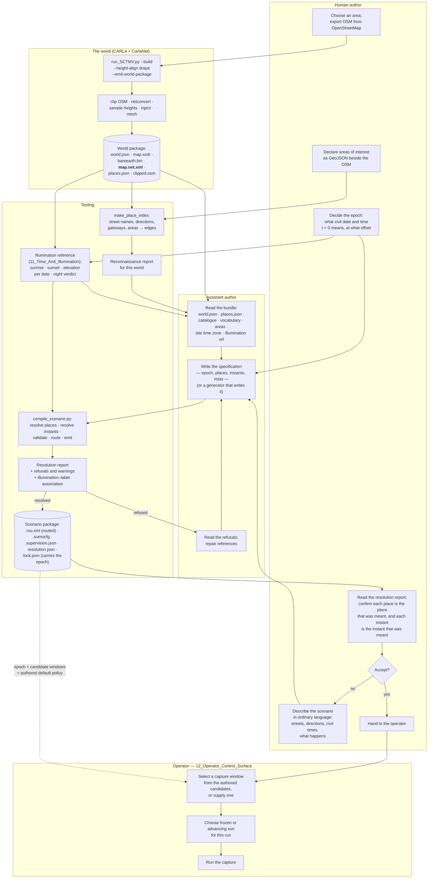
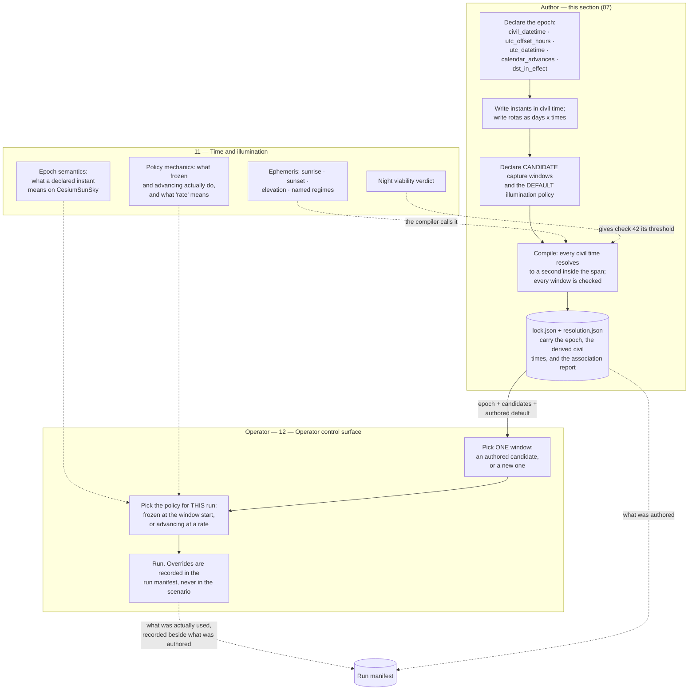
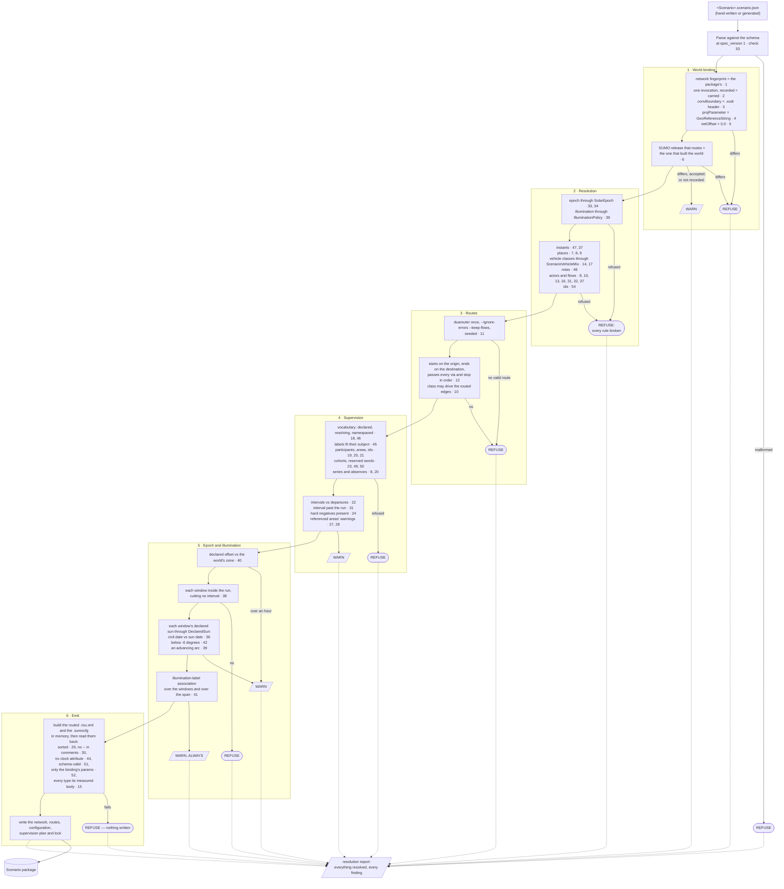

# 07 — Scenario Authoring

**Status:** Plan section. Redrafted against the added time-of-day requirement
([`_TEAM_BRIEF.md`](_TEAM_BRIEF.md) §3a). Source audit against the working tree plus read-only
measurement of the shipped world packages, networks and route files. The reference set (§2.5, §2.10–
§2.12) and the compiler (§3.5–§7) are built, and each section states what is built and what is not.
**Date:** 2026-09-18
**Scope:** How a SUMO-driven behavioural-capture scenario comes into existence — what an author is
given, what they write, how a described place becomes an edge, **what civil instant a simulated
second means**, and what is checked before a capture run is spent. Covers the authoring bundle, the
authoring surface, reconnaissance and resolution, the epoch declaration, the compile-and-validate
step, determinism and parameter sweeps, and whether the conventions ship as a packaged skill.
**Audience:** an engineer building the authoring tooling, and an author — assistant or human —
using it. It assumes no knowledge of the conversation that produced this plan.
**Owner:** scenario authoring engineer. One of the document set described in
[`_TEAM_BRIEF.md`](_TEAM_BRIEF.md) §8.

**Evidence convention.** Every claim below is marked. *Read* — taken from a source, cited
`path:line`. *Measured* — produced by running something read-only on this machine on 2026-09-17 or
2026-09-18, with the method stated. *Carried forward* — a measurement recorded in a Findings document
or in the authoring skill, cited, not re-run. *Inferred* — a conclusion drawn from the above, and
labelled as such. A line citation of `make_bahonar_scenario.py` is to the SUMO-XML generator the
specification generator replaced, as it stands at commit `308e4aaab` and in `BahonarPatternOfLife.zip`,
whose route file and labels are the test fixtures
`CarlaControl/test/fixtures/Shahid_Bahonar_Port_PatternOfLife.shipped.*`; §3.4.1 describes the one that
replaced it.

**The one-line division of labour on time.** **The author declares what the scenario's time *means*;
the operator chooses the window and the illumination policy.** An epoch is a property of the
scenario — change it and `guard_d0_h7_t3` stops being a 07:00 guard — so it is authored, versioned,
and locked. A capture window and whether the sun is frozen or advancing are properties of a *run* —
change them and the scenario is unaltered — so they are the operator's, in
[`12_Operator_Control_Surface.md`](12_Operator_Control_Surface.md). This section owns the declaration
and everything that can be checked about it without a running server; it owns none of the run-time
choice. §3.9 draws the boundary.

**Out of scope, deliberately.**

- The **runtime**. When CARLA draws each SUMO vehicle, how the two clocks relate, and what
  happens to a vehicle's velocity in truth are [`03_CoSimulation_Runtime.md`](03_CoSimulation_Runtime.md)
  and [`04_Contracts.md`](04_Contracts.md). This section stops at the moment a validated scenario
  package is handed to a run.
- **Epoch semantics beyond the declaration, illumination policy mechanics, and the night verdict.**
  How a declared epoch is driven onto `CesiumSunSky`, what the `rate` argument means under
  synchronous ticking, whether vehicle headlights are driven from the sun, and above all **whether a
  night capture is usable imagery at all** belong to
  [`11_Time_And_Illumination.md`](11_Time_And_Illumination.md). §2.9 states exactly what this section
  needs from it and §9.7 states the dependency.
- **How an operator expresses the choice at run time** — selecting a window, freezing or advancing
  the sun, overriding the authored default — is
  [`12_Operator_Control_Surface.md`](12_Operator_Control_Surface.md). This section supplies the
  authored defaults and the lock file it reads; it does not design the surface.
- The **shape of the annotation record**. Doc 20 §6.1's `AnnotationSet`, `PatternInstance` and
  `Interval` and their migration from today's `.labels.json` belong to
  [`06_Truth_And_Annotation.md`](06_Truth_And_Annotation.md). This section says only where an author
  writes an annotation and what validates it.
- The **vehicle catalogue's content and its blueprint binding**, which is
  [`04_Contracts.md`](04_Contracts.md) contract 1. §2.6 states the properties this section needs it
  to have.
- **Scale**. What rendering a seven-day scenario costs in wall-clock time — every vehicle SUMO has is
  drawn, so a heavier scenario runs slower, never thinner — is
  [`10_Scale_And_Performance.md`](10_Scale_And_Performance.md). This section treats the Bahonar
  scenario purely as the authoring sizing case.
- **Pedestrians**, excluded by the brief's decision 5.

**Change history**

| Date | Change |
|---|---|
| 2026-09-21 | Annotation vocabulary layered: core generated from types, author terms declared in the specification. |
| 2026-09-25 | Areas of interest, the place index and the solar frame built and published in the world package (§2.5, §2.10–§2.12). |
| 2026-09-28 | Epoch is the C9 object; the session writes the zone; compiler, checks, report, association and sweeps built. |
| 2026-09-28 | Check 6 refuses a SUMO release mismatch; the fence is the world's type map (D7.33); the bands are doc 11's; route phases and point, gateway and movement places built; the Gardnerville generator writes a specification; the skill's examples and references written. |
| 2026-09-29 | The Bahonar generator writes a specification on the rebuilt world's own network under a 07:00 epoch, with named vehicle mixes, areas of interest and its six anomalies as supervision (§3.4.1, D7.34–D7.36); its compile waits on the catalogue measuring the European heavy goods vehicle. |
| 2026-09-30 | The out-of-scope notes no longer ask whether a scenario is renderable at all: the render cap (128, hard 192) was never measured — M2 never ran — and the scenario is the arbiter of population, so every vehicle SUMO has is drawn and a heavier scenario runs slower, never thinner. Scale is now its wall-clock cost (doc 10). |
| 2026-10-01 | The Arapahoe generator writes a specification compiled against the regenerated world with measured bodies, its incident a lane closure (§3.4.2); lane closures are a specification block compiled into an additional file the lock binds, and check 55 refuses one that breaks a route (D7.37). |
| 2026-10-01 | The compiler writes `lanechange.duration` 3 beside the other processing options (§5.1, §7.1; [`04`](04_Contracts.md) D4.42), the lock records it and the resolution report lists every processing option; Gardnerville and Arapahoe are recompiled with it, and Bahonar, which deadlocks with it behind a body wider than its lanes, is not. |

---

## 1. What authoring costs today, measured

Three scenarios have been authored against generated worlds. They are the evidence for everything
below, so they are measured before anything is proposed.

### 1.1 The three scripts

| | `make_sumo_scenario.py` (Gardnerville) | `make_arapahoe_scenario.py` | `make_bahonar_scenario.py` |
|---|---|---|---|
| Lines / comment lines | 198 / 28 | 353 / 38 | 398 / 39 |
| Distinct hard-coded literals that are real network identifiers | **45 edges** | **53 edges + 1 lane** | **23 edges**, plus 16 `(edge, position)` tower pairs |
| Simulated span | sized to the orbit | sized to the dwell | **604 800 s** |
| Route entries produced | 30 flows + 1 vehicle | 51 flows + 1 trip | **610** — 245 flows, 365 trips |
| Marked vehicles | 1 | 1 | 9 |
| Checks its world binding | **no** | origin lat/lon only (`make_arapahoe_scenario.py:283-290`) | **no** |

*Measured:* literal counts by extracting every quoted string from each script and intersecting it
with the normal-edge and lane id sets of that scenario's own `.net.xml`, so the figures are
identifiers that really resolve, not a regular-expression estimate. Route-entry counts by parsing
`carla/Import/Gardnerville_Centerville_Lane_NeighborhoodOrbit.rou.xml`,
`carla/Import/Arapahoe_I25_UnderpassDwell.rou.xml` and
`BahonarPatternOfLife.zip → scenario/Shahid_Bahonar_Port_PatternOfLife.rou.xml` with `xml.etree`.

Two numbers deserve to be held together. The Bahonar scenario emits **610 route entries across seven
simulated days**, and the entire thing rests on **21 distinct edge identifiers** (*measured*: the
union of every `from`, `to`, `via` and `<stop lane=>` edge in the emitted route file). The expensive,
error-prone, unrepeatable part of authoring is finding and justifying twenty-odd opaque strings. The
cheap part — composing a week of behaviour out of them — is already a program and should stay one.

A smaller measurement from the same comparison makes the case for §5.3's resolution report on its
own. The script declares **23** edge literals; **21** reach the emitted route file. The two that do
not — `175815458#5` and `181931491`, the west and north corridor gateways — were reconnoitred,
named and commented like the rest, and then dropped when `CORRIDOR_PAIRS` was narrowed because "the
public corridor is fragmented and effectively one-way in places, so westbound exits are not
reachable and are left out rather than faked" (*read*, `make_bahonar_scenario.py:92-99`). Nothing
reports that two of the author's anchors are dead, and nothing would report it if the two live ones
had been dropped by accident instead.

That asymmetry is the finding this whole section turns on.

### 1.2 What is validated today, and what is not

*Read.* Two validators exist:

- `RoadNetwork.check_drivable` (`SumoScenarioBuilder.py:151-160`) — raises if an edge is absent from
  the network, or if consecutive edges in an explicit edge list have no connection between them.
  Used only by `write_routes` (`SumoScenarioBuilder.py:353`), and only on the orbit's first two laps.
- `SumoPatternOfLifeBuilder._validate` (`SumoPatternOfLifeBuilder.py:150-167` at `e4fd64d19`, which
  went with the SUMO-XML Bahonar generator; that generator now emits a specification
  `ScenarioCompiler` compiles, §3.4.1) — raised if any flow or scheduled vehicle referenced an edge
  absent from the network. Existence only; no reachability.

Nothing else in those scripts checks anything. In particular nothing in them checks that a route is
**routable** (as opposed to its endpoints existing), that a `via` list is honoured, that the network
shares the CARLA map's frame, or that the network was built from the same OSM the world was. The
compiler of §5 checks all of that for a specification. All three scripts now write specifications
and compile them (§3.4, §3.4.1, §3.4.2).

The SUMO-XML Bahonar generator defined `WORLD_PACKAGE` and never read it (`make_bahonar_scenario.py:64`,
*read*): the largest authored scenario had no binding to the world it was meant to run in. Its
specification names the package and the fingerprint of the network it carries (§3.4.1).
`make_sumo_scenario.py:56` records the world's `SourceOsmSha256` in a **comment** (*read*).

### 1.3 The frame is shared. The graph is not.

This is the most consequential measurement in this section, and it contradicts an assumption that
runs through the authoring skill and through doc 23.

The invariant everyone relies on — SUMO (x, y) ≡ CARLA (x, −y) — **holds**. *Measured:* every shipped
network's `<location netOffset="0.00,0.00">` and its `convBoundary` equal the corresponding `.xodr`
header's `north`/`south`/`east`/`west` exactly:

| Map | `.net.xml` `convBoundary` | `.xodr` header |
|---|---|---|
| Arapahoe_I25 | `-476.78,-969.26,476.74,969.28` | `north="969.28" south="-969.26" east="476.74" west="-476.78"` |
| Gardnerville | `-838.86,-455.04,838.86,391.32` | `north="391.32" south="-455.04" east="838.86" west="-838.86"` |
| Shahid_Bahonar_Port | `-3606.86,-1914.94,3607.23,2107.82` | `north="2107.82" south="-1914.94" east="3607.23" west="-3606.86"` |

But the **road graph an author works against is not the road graph the world was built from.** The
world build's netconvert flag set is assembled in C# at `OsmConverter.BuildArguments`
(`CarlaNet/src/CarlaNet.Map/OsmConverter.cs:233-303`); the scenario build's is reimplemented
independently in Python at `NetconvertSettings.to_arguments` (`SumoScenarioBuilder.py:68-103`). They
are not the same set, and the scenarios add flags the world build never saw —
`--junctions.join-dist 25` and `--tls.default-type actuated` for Arapahoe
(`make_arapahoe_scenario.py:65-67`), `--remove-edges.by-type` for Bahonar
(`make_bahonar_scenario.py:72-74`).

*Measured.* Running the repo's staged netconvert 1.27.0 over the identical clipped OSM
(`Build/sumo-smoketest/Arapahoe_I25_clipped.osm`) under each flag set:

| | World-build flags | Scenario flags |
|---|---|---|
| Normal edges | **321** | **317** |
| Junctions | 298 | 298, but **22 differ by identity** |
| `convBoundary` | identical | identical |
| Edges present in one only | 6 (`1037832985#0`, `223207864#2`, `982413823`, …) | 2 (`-572762876#8`, `1107125073`) |
| Common lanes whose **length** differs | — | **27 of 655** |

The largest length disagreements are not rounding. Lane `-1107125073_0` is **352.19 m** in the
world's graph and **2.60 m** in the scenario's; `907700111_3` is 453.64 m against 442.08 m;
`1342047649_4` is 123.41 m against 106.59 m. The first is exactly the near-zero-length-edge artefact
the authoring skill records (`SKILL.md:164-165`), here created by the scenario's own
`--junctions.join-dist 25`.

The consequence is stated plainly because it is easy to misattribute later. Under SUMO drive, a
vehicle's position is an offset along a named lane, and the bridge converts that into a CARLA pose.
If the two graphs disagree about that lane's length by two orders of magnitude, so do the two
positions. Today's three scenarios happen to survive — *measured:* all eighteen of the Arapahoe
scenario's named anchor edges exist in both networks, and all 52 of its origin–destination–via
triples route successfully on both — but nothing establishes that, and nothing would report it if it
stopped being true.

**Inference:** the authoring bundle must contain *the world's own* `.net.xml`, from the same
netconvert invocation that produced the `.xodr`, and the compile step must refuse a scenario built
against any other. Doc 23 §6.4 already asks for the network to be persisted for the runtime's
benefit; this makes it an authoring prerequisite as well, and adds the reason: it is the only way the
author's graph and the rendered graph are the same graph.

### 1.4 The scenario is authored in civil time and emitted in seconds, and the mapping is lost

This is the second-most consequential measurement in this section, and it was missing from the first
draft entirely.

**The authoring is already civil-time-shaped.** *Read,* `make_bahonar_scenario.py`: the diurnal
corridor rhythm is five `(start_hour, end_hour, rate)` windows (`:169`), the ferry sails at
`FERRY_HOURS = [6, 8, 10, 12, 14, 16, 18]` (`:163`), the airfield changes shift at
`SHIFT_HOURS = [7, 15, 23]` (`:164`), a guard's post lasts `shift = 8 * HOUR` (`:230`), the
perimeter shadow runs at `6 * DAY + 2 * HOUR + 30 * 60` (`:285`), the stay-behind arrives on the
`1 * DAY + 8 * HOUR` sailing (`:293`), and even the anomaly's own annotation records
`"begin_s": gap_begin, "end_s": gap_begin + 8 * HOUR` (`:377`). *Measured:* **sixteen sites** in that
one file multiply a civil hour into seconds (`grep -n '\* HOUR\|\* DAY'`, lines 77, 175, 179, 188,
204, 230, 233, 252, 263, 275, 285, 290, 293, 351, 371, 377).

**The emitted artifact is seconds-shaped, and that is all it is.** *Measured,* parsing
`BahonarPatternOfLife.zip → scenario/Shahid_Bahonar_Port_PatternOfLife.rou.xml` with `xml.etree` and
taking `@depart` on every `<vehicle>`/`<trip>` and `@begin` on every `<flow>`:

| | |
|---|---|
| Route entries | **610** |
| Departing on an exact civil hour (`t % 3600 == 0`) | **533 of 610 — 87.4 %** |
| Distinct hour-of-day buckets occupied | **17 of 24** (empty: 01, 03, 04, 05, 19, 21, 22) |
| Distinct guard departure seconds | 25 200, 54 000, 82 800, 111 600, 140 400, 169 200, 198 000, … (+86 400 per day) |
| Guard entries | **335** — seven days × three shifts × sixteen towers, **less the one deliberate no-show** |
| Latest departure | 602 100 s — day 6, 23:15 |

25 200 / 54 000 / 82 800 are 07:00 / 15:00 / 23:00. **So `t = 0` is midnight of day 0 — and nothing in
the scenario package says so.** *Read,* the emitted configuration says only
`<begin value="0"/> <end value="604800"/> <step-length value="1.0"/>`
(`Shahid_Bahonar_Port_PatternOfLife.sumocfg`). The civil meaning survives in exactly two places:
inside the trip identifiers (`guard_d0_h7_t3`), and in the author's head.

**SUMO's own time syntax makes this worse, not better.** *Measured:* SUMO 1.27.0 accepts a `TIME`
option in `H:M:S` form, and resolves it to elapsed seconds with no epoch. Running
`sumo -n Import/Arapahoe_I25.net.xml --begin 7:00:00 --end 7:00:10 --summary-output …` produced steps
`time="25200.00"` through `time="25209.00"`, exit 0. So `--begin 7:00:00` means *25 200 seconds after
the simulation started*, which is 07:00 only if `t = 0` happened to be midnight. **A clock-shaped
literal that is really an offset is the most dangerous kind of authoring construct**, because it
reads correct on every scenario and is wrong on any scenario whose origin is not midnight. It is
gotcha 12 in §6.

**The failure is silent and the truth record participates in it.** *Read:* every streamed snapshot
already carries the sun. `WorldObserver.cpp:322-341` copies
`[solar_time, year, month, day, time_zone, lat, lon, elevation, azimuth, advancing, rate]` into the
snapshot header, and `CotWriter.cs:50-66` writes it into every CoT sidecar as a `<_solar>` element
with `solar_time`, `date`, `time_zone`, `sun_elevation_deg` and `sun_azimuth_deg`;
`SolarMetadata.cs:31` writes the same into the PNG metadata. So a 23:00 night-shift capture rendered
under the spawn default produces imagery in daylight **and a sidecar that faithfully and correctly
records midday** — an internally consistent record of the wrong scenario. Nothing disagrees with
anything, so nothing can flag it.

**Inference, and it is the whole of §3.5.1 and §5.2's new check group:** the mapping from simulated
seconds to civil time is a property of the scenario, it is already how the author thinks, and it must
become a declared field rather than a naming convention. Doc 10 already relies on it — that document
writes `t = 25,200 s (07:00 on day 0)` (`10_Scale_And_Performance.md:454`) and recommends capture
windows at 07:00–08:00, 15:00–16:00 and 23:00 (`:173-175`) — so a second section is already doing
this arithmetic by hand from the same undocumented assumption.

---

## 2. The authoring bundle

The set of artifacts handed to an author — assistant or human — before they write anything. Each row
states where it comes from, what it guarantees, and whether it exists.

| # | Artifact | Source | Exists today | What it guarantees |
|---|---|---|---|---|
| 1 | `world.json` | `WorldBuilder._write_world_package` → `client.write_world_package` (`WorldBuilder.py:159-184`; shim `carlanet/__init__.py:2402-2420`) | **yes** | Origin lat/lon, the PROJ string, grid geometry, staging rectangle, `SourceOsmSha256`, `OpenDriveSha256`, `NetconvertExtraArgs`, generation time |
| 2 | `map.xodr` | same | **yes** | The road network CARLA loads; carries street names on non-junction roads (§4.4) |
| 3 | `bareearth.bin` | same, only under `--height-align drape` | **yes** | Per-cell bare-earth ellipsoidal height; the telemetry altitude and the only elevation the flat SUMO network can borrow |
| 4 | The clipped `.osm` | `OsmClipper.clip_osm_to_bounds`, written to `Build/sumo-smoketest/<Name>_clipped.osm` (`WorldBuilder.py:106-115`) | **yes**, outside the package | The exact geometry netconvert saw. Referenced by name and digest in `world.json`; the world build's input, never read by the compiler (§2.2) |
| 5 | **The world's `.net.xml`** | netconvert, same run as the `.xodr` | **no — deleted** (`OsmConverter.cs:146`) | §1.3. The single missing artifact that makes the rest sound |
| 6 | **Place index** | `places.json` in the world package, derived from 5 alone (§2.5) | **yes** | Street name → the edges carrying it, each with heading, cardinal direction, length, lanes, speed and extent; the index's own coverage and warnings. An area id resolves through row 8. §2.5, §4 |
| 7 | **Vehicle catalogue** | [`04_Contracts.md`](04_Contracts.md) contract 1; doc 20 §5.6 and D12 | **no** | Which vehicles exist, with real dimensions. §2.6 states what this section needs from it |
| 8 | **Area-of-interest table** | `areas.resolved.json` and `areas.aoi.geojson` in the world package, resolved from `<extract>.aoi.geojson` at world build ([`04`](04_Contracts.md) C5, §2.11) | **yes** | Named, stable places a scenario and an annotation can both reference, in CARLA-local metres and on SUMO lanes |
| 9 | **Annotation vocabulary** | [`06_Truth_And_Annotation.md`](06_Truth_And_Annotation.md) §3.7–§3.8; the core written from 06 §3.7 in `AnnotationVocabulary`, its bands from `IlluminationBand` | **yes**, per compiled scenario, in its supervision plan (§8.3) | What a label means. Two halves: a closed, versioned core the pipeline's own code branches on, and the author terms this scenario declares or imports, each carrying its own definition |
| 10 | **World digest** binding 1–9 | §2.7 | partially, and **unstable as recorded** | That a scenario and a run are talking about the same world |
| 11 | **Site civil time zone** | new; derived from `world.json`'s origin lat/lon plus a time-zone database | **no** | The candidate civil offset for the epoch, and whether the site observes daylight saving. §2.8 |
| 12 | **Illumination reference** | new; [`11_Time_And_Illumination.md`](11_Time_And_Illumination.md), computed from origin lat/lon and the epoch's dates | **no** | Sunrise, sunset and sun elevation for every date the scenario spans, and the **night viability verdict**. §2.9 |
| 13 | **Solar frame** | `solar.json` in the world package, derived from 1 (§2.10) | **yes** | The origin latitude and longitude and the time zone the engine derives from them, so an epoch's declared offset is checked against the world without a running server (check 40) |

### 2.1 The world package is richer than the skill records

*Read,* from `Build/world-packages/Gardnerville_Centerville_Lane.world.json` and the `world.json`
inside `Arapahoe_I25.cwp` and `Shahid_Bahonar_Port.cwp`. Beyond the three fields the authoring skill
names (`SKILL.md:31-33`), the manifest already carries `GeoReferenceString`, the full staging
rectangle (`StagingMinX/MinY/MaxX/MaxY` and `StagingMarginMeters`), `HeightAlignMode`,
`OriginHeightMeters`, `SourceOsmFileName`, `SourceOsmSha256`, `OpenDriveSha256`, `SampleStepMeters`,
`TerrainResolutionMeters`, `TerrainMarginMeters`, `GeneratedAtUtc`, `GeneratorVersion` and
`NetconvertExtraArgs`.

That is most of a world binding already. Three things are missing and all three are cheap: the
`.net.xml` (§1.3), the **complete** netconvert argument vector rather than only the extra arguments,
and the netconvert build version. The manifest records that the world used
`--keep-edges.by-vclass passenger …` but not that it used `--osm.turn-lanes`, `--junctions.join` or
`--geometry.remove`, so the Python reimplementation of the base flag set cannot be verified against
it — it can only be trusted.

### 2.2 The clipped OSM is the world build's input, and a scenario never reads it

It is referenced by `SourceOsmFileName`/`SourceOsmSha256` and lives outside the package in
`Build/sumo-smoketest/`. The world build reads it — to clip, to convert, and to validate areas of
interest against its `<bounds>` — and everything a scenario needs from it reaches the scenario through
the world's network (§2.4): the edges, their names, their permitted classes. The one scenario-side reader
there was, the fence of `SKILL.md:128-141`, read `access=` straight off the OSM to rewrite a network
after the fact (`SumoScenarioBuilder.restrict_private_roads`); what a road admits is now the world's,
set at world build by its type map (§9.8, D7.33), so the compiler does not read the OSM and a scenario
package does not carry it.

### 2.3 `bareearth.bin` is the only elevation an author has

*Carried forward,* doc 23 §2: the SUMO network is flat. *Measured, confirmed on all three shipped
networks:* zero distinct `z` values in any lane shape. So any authored behaviour that depends on
height — a vehicle under a bridge, a hilltop overwatch, an area of interest with a vertical relation
— has to get its height from `bareearth.bin`, which is what `SumoCotBridge`'s `BareEarthGrid` already
does (`SKILL.md:88`). The bundle therefore includes it, and the compile step can report the
bare-earth height of every resolved place without needing a running server.

### 2.4 The world's `.net.xml`, kept

*Read.* `OsmConverter.ConvertFileWithNetworkAsync` (`OsmConverter.cs:122-148`) already asks
netconvert for the network in the same invocation that produces the OpenDRIVE, reads it, and deletes
it in a `finally` block at `:146`. Keeping it is a matter of writing it into the world package
beside `map.xodr`. Everything in §1.3 follows from that one change, and doc 23 §6.4 wants it anyway.

The pair must be **from the same invocation**, not merely from the same flags: that is what makes
lane lengths, junction identity and edge identifiers correspond by construction rather than by
agreement between two argument builders.

### 2.5 The place index

The artifact that turns "eastbound on Centerville Lane" into edges. It is `places.json` in the world
package, built by `carlacontrol.PlaceIndex` and published with the rest of the reference set
(§2.12). The resolver that reads it, and the failure modes it refuses, are §4.

**Derived from the network alone.** Every place form resolves to SUMO edges; the network carries each
edge's street name because the world build always passes `--output.street-names`
([`13`](13_Work_Breakdown.md) §2); and the OpenDRIVE's road names are written by the same netconvert
invocation from the same OSM tags. Reading the `.xodr` as well would add a second source for one
fact.

**What it holds.**

| Field | Meaning |
|---|---|
| `place_index_version` | `1`. A reader refuses any other and never reads one in part |
| `network_fingerprint` | The `NetworkFingerprint` of the network it was derived from, so a stale index is detectable |
| `coverage.normal_edges`, `.named_edges`, `.named_fraction` | Non-internal edges, how many carry a name, and the ratio |
| `coverage.distinct_names`, `.names_by_script` | How many names, and the writing systems their letters come from, by Unicode character name |
| `coverage.largest_name` | The name carried by the most edges, and how many |
| `coverage.warn_below_named_fraction` | `0.5`: the threshold below which the index warns, stated beside the measurement so a reader sees what the warning meant |
| `warnings[]` | Sparse coverage (below the threshold), and the one-to-many caveat whenever a name covers more than one edge |
| `streets[]` | One per name, sorted by the name's UTF-8 bytes: `name`, `scripts`, `edge_count`, `length_m`, `extent_carla_m`, `directions`, `edges[]` |
| `streets[].directions` | Edge ids grouped by cardinal direction (`north`/`east`/`south`/`west`), each group ordered along its direction of travel by where its edges start |
| `streets[].edges[]` | `edge_id`, `from_junction`, `to_junction`, `bearing_deg`, `direction`, `length_m`, `lane_count`, `lane_ids`, `speed_mps`, `extent_carla_m` |

`bearing_deg` is the chord of the edge's rightmost lane, start to end, in degrees clockwise from north
in the network's frame (its +y is grid north; grid convergence is under 0.02° anywhere on the shipped
maps). `direction` is the cardinal whose 90° sector the bearing falls in. `length_m` and `speed_mps`
are the rightmost lane's SUMO values. Extents are CARLA-local metres, `carla(x, y) = sumo(x, −y)`, the
frame the rest of the world package uses.

**Measured on the shipped world packages, 2026-09-25:**

| World | Normal edges | Named | Fraction | Distinct names | Largest name | Script |
|---|---|---|---|---|---|---|
| Gardnerville_Centerville_Lane | 57 | 52 | 91.2 % | 10 | `Centerville Lane`, 18 edges | Latin |
| Arapahoe_I25 | 317 | 288 | 90.9 % | 32 | `South Yosemite Street`, **65** edges | Latin |
| Shahid_Bahonar_Port | 1044 | 47 | **4.5 %** | 6 | `بزرگراه شهید رجایی`, 14 edges | Arabic |

The Bahonar figures are the current world's: its network was rebuilt with the unified flag set, and the
earlier measurement in §4.4 (48 of 1066) was taken on the network built before it. The Persian names
are written in Arabic script, which is how Unicode names their letters.

**What it cannot see.** Whether a name is the one people at the site use; whether two edges of one
name are one road or two roads sharing a name; and, for a strongly curving edge, anything but its net
displacement. The resolver's refusal of a direction on a street turning through more than a right
angle (§4.3) is made against the network's shapes, not against this index.

### 2.6 What this section needs from the vehicle catalogue

The catalogue itself is [`04_Contracts.md`](04_Contracts.md)'s. Four properties are required here,
stated as a dependency rather than a design:

1. **An author must be able to read it without a running server.** It is one of the inputs to
   writing a scenario, so it travels in the world package or beside it, as a file.
2. **Every entry carries real length, width and height.** A SUMO `vType`'s `length` and `width`
   change car-following gaps and lane-change acceptance, so they are behavioural parameters, not
   presentation. Today the three scenarios invent them: fourteen `vType`s across the Bahonar file
   with hand-written lengths from 4.4 m to 16.5 m (*read*, `make_bahonar_scenario.py:121-149`,
   `make_arapahoe_scenario.py:96-137`), none of which was checked against any blueprint's bounding
   box. Doc 20 §5.6 records the same defect on the OpenSCENARIO side, where the storyboard's declared
   `<BoundingBox>` and the truth record's measured `length_m` already disagree and nothing notices.
3. **`vType` → blueprint resolution is declared, not inferred.** An entry is named; nothing
   substring-matches. Doc 20 D12 settles this for storyboards; the same rule applies here.
4. **A category resolves to a *set*, drawn on the run seed.** Doc 20 §2.6's appearance confounder is
   sharper under SUMO drive than under storyboards, because SUMO's `vTypeDistribution` already does
   exactly this for *behaviour* — `freeway_mix` draws seven types on declared probabilities
   (`make_arapahoe_scenario.py:123-125`) — while the blueprint behind each type is a single
   identifier. Without an appearance draw, every `car_quick` in a corpus is the same car.

**Dependency stated:** if the catalogue cannot give a `vType` its real dimensions, then either the
authored gaps are wrong or the rendered vehicle does not fit its SUMO footprint. There is no third
option and no version of this section that works around it.

### 2.7 The world digest is not reproducible today

*Measured.* Clipping `Import/Gardnerville_Centerville_Lane.osm` three times, each in a separate
Python process, through `OsmClipper.clip_osm_to_bounds`, produced **three different SHA-256 digests**
(`dfeb6f0b…`, `00598df6…`, `82c360cc…`). Running the staged netconvert 1.27.0 over each of those
three clips produced **three different `.net.xml` digests** (`e0bdaef1…`, `8e907ab8…`, `96ee5488…`).

The cause is read directly from source: `used_orig` is a `set` of node-id strings
(`OsmClipper.py:154`) and is iterated to emit nodes (`OsmClipper.py:219`), so element order follows
Python's per-process string-hash randomisation. The same defect is in the standalone copy
(`CarlaNet/python/osm_clip.py:82,135`).

**But the graph is identical.** *Measured,* comparing the three networks structurally: the same 55
normal edges, the same 202 internal edges, the same 68 junctions, the same `convBoundary`, and all
257 lane shapes byte-for-byte equal. Only element order differs.

Two consequences, and they point in opposite directions, which is why both are worth writing down.

- **Reassuring:** an edge identifier an author records as a constant is stable across a re-clip.
  Today's 45–55 hard-coded literals per scenario are not fragile in the way they look.
- **Blocking:** `SourceOsmSha256` and `OpenDriveSha256` in `world.json` are digests of *file bytes*,
  so a world rebuilt from the same inputs gets a different binding and any digest gate rejects it.
  Doc 20 §7.5 wants the `.xodr` digest in the run manifest and doc 20 §8.4 already worries about
  digest tiering; this measurement says the naive digest cannot carry that weight.

**The fix belongs here, not in the clipper.** Sorting `used_orig` would make the file stable and is
worth doing, but a byte digest would still change for reasons that do not matter — a netconvert patch
release reformatting an attribute, a comment, a timestamp. What the binding actually needs to assert
is *this scenario was authored against this road graph*. So the bundle carries a **network
fingerprint**: a digest over the network's canonical content — sorted normal-edge ids, each edge's
lane ids with their lengths and shapes rounded to a stated precision, the junction id set with types,
and `convBoundary` — computed identically by the world build and by the compile step. The file
digests stay, as provenance; the fingerprint is what gates.

### 2.8 The site's civil time zone, which the world does not know

An author declaring "the night shift starts at 23:00" is declaring a *civil* time, in the zone people
at that site keep. The world package does not carry one, and the engine's substitute is not it.

*Read.* At world spawn the bridge configures the sun from the georeference and nothing else:
`SunSky->SolarTime = 12.0`, `SunSky->UseDaylightSavingTime = false`, then
`SunSky->EstimateTimeZoneForLongitude(OriginLongitude)`
(`Unreal/CarlaUnreal/Plugins/CesiumCarlaBridge/Source/CesiumCarlaBridge/Private/CesiumHeightSampler.cpp:409-412`).
That Cesium method is one line:
`this->TimeZone = FMath::Clamp(InLongitude, -180.0, 180.0) / 15.0`
(`Unreal/CarlaUnreal/Plugins/CesiumForUnreal/Source/CesiumRuntime/Private/CesiumSunSky.cpp:570-573`).

Two things follow, and they pull in opposite directions.

**The good news: a half-hour offset is exactly representable.** `TimeZone` is a `double` and the
division is continuous, not rounded, so Iran's **+03:30** is `3.5` with no approximation and needs no
special case anywhere in the stack. `get_solar_state` returns it as a `double` at index 4
(`carlanet/__init__.py:1511-1533`), `CotWriter.cs:57` writes it with four decimal places, and
`WorldObserver.cpp:332` carries it in the snapshot header. Nothing in the pipeline assumes integer
hours. (*Inference from the above, stated because it is the kind of thing a reader will assume is
broken.*)

**The bad news: the spawned zone is a longitude estimate, not a civil zone, and on the sizing scenario
the difference crosses the horizon.** *Read,* `make_bahonar_scenario.py:69`: the Bahonar world is
pinned at `origin_lat=27.15012, origin_lon=56.18065`. *Measured,* `56.18065 / 15 = 3.745377 h`, which
is **14 min 43 s** east of Iran's civil **+03:30** — 3.68° of sun rotation. *Measured,* propagating
that through a standard low-precision solar-position calculation (NOAA-style mean-anomaly form,
written for this measurement; adequate to a few tenths of a degree, which is why it is used only to
size the effect and never as the authority — see §2.9), at the March equinox:

| Civil time at the site | Correct elevation (+03:30) | As spawned (+03:45:23) | Error |
|---|---|---|---|
| 05:00 | −11.59° | −14.84° | −3.25° |
| **06:00** | **+1.74° (sun up)** | **−1.53° (sun down)** | **−3.28°** |
| 07:00 | +15.06° | +11.80° | −3.25° |
| 12:00 | +63.08° | +63.08° | 0.00° |
| 17:00 | +11.82° | +15.07° | +3.25° |
| **18:00** | **−1.51° (sun down)** | **+1.77° (sun up)** | **+3.27°** |

At local noon the error is nil; at the horizon it decides whether the sun has risen. A dawn capture is
a different image depending on whether the offset was declared or derived, and nothing in the pipeline
would report the substitution.

**The session writes the declared offset as the sun's zone.** `set_solar_epoch(year, month, day,
hours, utc_offset_hours)` (`CarlaServer.cpp:644`; `UCesiumHeightSampler::SetSolarEpoch`,
`CesiumHeightSampler.cpp:778`) sets `TimeZone` to the declared offset together with the date and the
clock, turns the engine's daylight-saving rule off and recomputes the sun once
([`11_Time_And_Illumination.md`](11_Time_And_Illumination.md) D11.5). A SUMO drive session writes it
when the capture window opens and, under `advance`, for every tick (D11.19), reads it back before
anything renders and compares the zone on every tick, so the sun's clock is the civil clock the epoch
declares and no component converts a civil time into another zone's clock
([`04_Contracts.md`](04_Contracts.md) D4.19). The longitude estimate above is what a world holds before
a session binds its sun, and what the session gives back when it ends; it is not what a capture renders
under. This section's obligation is to make the epoch's **numeric offset** a declared, checked field,
because that number is what the session writes.

**Daylight saving is off in the engine, by deliberate choice.** *Read:*
`SunSky->UseDaylightSavingTime = false` at `CesiumHeightSampler.cpp:410`, commented "Disable DST for a
deterministic clock". Cesium's own DST machinery exists and is fixed-date rather than rule-based
(`CesiumSunSky.cpp:411-416, 587-609` — `IsDST(UseDaylightSavingTime, DSTStartMonth, DSTStartDay,
DSTEndMonth, DSTEndDay, …)`), which could not express a real zone's rules anyway. So **the engine never
applies a DST rule**: `set_solar_epoch` turns it off every time it binds the sun, and daylight saving is
carried by the declared offset, with `dst_in_effect` saying whether that offset includes it
([`11_Time_And_Illumination.md`](11_Time_And_Illumination.md) D11.3, [`04_Contracts.md`](04_Contracts.md)
§11.3).

**A time-zone database is not present, and nothing needs one.** *Measured* on this
machine: Python **3.14.4**; `import tzdata` raises `ModuleNotFoundError`;
`zoneinfo.ZoneInfo("Asia/Tehran")` raises `ZoneInfoNotFoundError`; `zoneinfo.available_timezones()`
returns **0** entries. Windows ships no IANA database and CPython's `zoneinfo` falls back to the
`tzdata` wheel, which is not installed. *Read:* `CarlaControl/pyproject.toml:12-15` declares
`carlanet>=0.1.0` and `numpy>=1.24.0` and nothing else. So a compiler or a session that *required*
an IANA zone name would refuse every scenario on a clean Windows box, and two hosts with different
databases would disagree about what a corpus's frames were lit by. This is why the **numeric offset is
normative and the zone name, `time_zone_id`, is provenance only — carried and never resolved**
([`04_Contracts.md`](04_Contracts.md) §11.3, [`11_Time_And_Illumination.md`](11_Time_And_Illumination.md)
D11.1).

### 2.9 What this section takes from `11_Time_And_Illumination.md`

Five things an author has to reason about before writing, each supplied by doc 11 or by the session
code doc 11 specifies, and each readable without a running server.

1. **The ephemeris.** The engine's own solar algorithm is ported to C# as
   `CarlaNet.CoSim.SolarPositionModel`, and a window's declared instant under a policy is
   `CarlaNet.CoSim.DeclaredSun` — the two functions the session writes the sun from and audits it
   against. The compiler states every sun through them (`carlacontrol.WindowSun`), so the elevation a
   resolution report gives for a window is the elevation the session will declare for it. There is no
   second ephemeris: the low-precision calculation of §2.8 sized the effect and is not shipped.
2. **Elevation bands with names.** Doc 11 §4.4 defines six, against the refraction-corrected elevation a
   declaration is made by: `day` above +6°, `golden` +6° to 0°, `civil_twilight` 0° to −6°,
   `nautical_twilight` −6° to −12°, `astronomical_twilight` −12° to −18°, `night` below −18°.
   `carlacontrol.IlluminationBand` implements them, each band holding its upper edge; the association
   statistic (check 41) buckets by it, and the core vocabulary's `illumination_band` terms are its
   names, so the supervision plan and the statistic read one table. Doc 11 is their definition and
   [`06_Truth_And_Annotation.md`](06_Truth_And_Annotation.md) §3.7 and §5.1 name them from it (§12
   question 13).
3. **The night viability verdict.** D11.7: night capture is not viable, and no window whose sun is below
   −6° may be declared corpus-eligible. Any time of day stays authorable — a night window still yields
   complete behavioural truth — so check 42 **warns and never refuses**, naming the verdict.
4. **Whose job the date is.** The session writes the date with every clock — at window open, and under
   `advance` for every tick — under the effective date rule of [`04`](04_Contracts.md) `C6` G11
   (D11.2, D11.19); nothing waits on the engine to roll a date. A window's sun is therefore written on
   the window's civil date when the epoch's calendar advances and the policy lets the date move, and on
   the epoch's own date otherwise. Check 36 reports both dates for every window and warns where they
   differ.
5. **What `rate` means.** Sun-clock seconds per **simulated** second, applied by the session itself
   (`DeclaredSun.SunAt`, [`04`](04_Contracts.md) §11.5), so a sweep axis declared in those units means
   the same thing in any clock mode.

### 2.10 The solar frame

`solar.json` in the world package, built by `carlacontrol.SolarFrame`. It publishes the two facts about
a world that an epoch is checked against, so the check needs no server:

| Field | Meaning |
|---|---|
| `solar_frame_version` | `1`; a reader refuses any other |
| `origin_latitude`, `origin_longitude` | The georeference origin the engine computes the sun from, copied from `world.json` |
| `engine_time_zone_hours` | `clamp(origin_longitude, −180, 180) / 15`, from `SolarPositionModel.estimate_time_zone_for_longitude` — the zone the bridge sets whenever it configures the georeference, whether it spawned the sun or found one (`CesiumHeightSampler.cpp`, the configure path calling `EstimateTimeZoneForLongitude`) |
| `engine_time_zone` | The same as signed `hh:mm:ss`: `+03:44:43` at Bahonar, `−06:59:32` at Arapahoe, `−07:59:04` at Gardnerville |
| `engine_time_zone_rule` | The rule above, in words |
| `engine_daylight_saving`, `engine_solar_time_at_configure_hours` | `false` and `12.0`, the other two values the configure path sets |

It is local mean solar time at the origin's longitude, not the site's civil offset — at Bahonar
14.72 minutes east of Iran's +03:30. The difference between it and an epoch's declared offset is what
check 40 reports and [`04`](04_Contracts.md) V9.13 bounds, computable from this file and the epoch
alone.

**What it cannot see.** The zone *during a run*: a SUMO drive session writes the declared civil offset
into the sun with `set_solar_epoch`, and an attached world holds whatever the last session left, so the
run's zone is read from `get_solar_state` at run start ([`04`](04_Contracts.md) D4.19). Whether the
world has a sun: the frame is written from the package, not read from a server. Reading the sun back
at build time would go through the shim's world-observer cache (`get_solar_state`), and whether that
cache reflects a world loaded moments earlier is unmeasured, so a reading from it is not recorded as a
fact about the world. The site's civil zone (bundle row 11) is not built:
deriving one from a position needs a zone-boundary dataset and a time-zone database, this machine has
neither (`zoneinfo` resolves zero zones, §2.8), and a civil zone presented as a fact about the world
would be an assertion nobody made.

### 2.11 Areas of interest in the world build

The contract is [`04`](04_Contracts.md) C5; this is how the world build carries it out.

- **Supply.** `<extract>.aoi.geojson` beside the OSM extract given to `--osm`, or the file named by
  `--aoi` (`CarlaControlArgumentParser`). No file means no areas, and says so in the build log.
- **Validation before building.** `WorldBuilder.load_areas_of_interest` reads and validates the file
  (`AreaOfInterestSource`) against the extract's `<bounds>` before netconvert or the server is asked
  for anything. A file breaking V5.1–V5.4 refuses the build, naming every rule broken: a malformed file
  costs one edit rather than minutes of building a world whose areas cannot be published. With no
  `--emit-world-package` the areas are validated and not published.
- **Resolution after building.** Once the package is written, the areas are resolved against the
  package's own network (`AreaOfInterestResolver`) and published beside it (§2.12). An area the frame
  check refuses (V5.12) is left out and the refusal logged; the place index and solar frame are still
  published.
- **Bahonar's areas**, `Import/Shahid_Bahonar_Port.aoi.geojson`, nineteen of them: `tower_00`..`tower_15`
  (`bahonar:guard_post`), circles of 30 m centred where each tower's guard parks — the lane position the
  generator's survey projected each tower onto, placed in WGS84 by SUMO's own projection, within 5.6 m
  to 86 m of the nearest of the extract's 18 `military=guard_house` buildings; `port_gate`
  (`bahonar:gate`), a 45 m circle on the OSM gate node the gate probe halts short of; and `drydock` and
  `ferry_terminal`, the OSM `dock=drydock` and `amenity=ferry_terminal` outlines. *Measured,*
  2026-09-29: published into the rebuilt package with `publish_reference_set.py`, every area resolved,
  the worst geodesy residual 0.0003 m, and the package's `world.json`, `map.net.xml`, `map.xodr` and
  `bareearth.bin` byte for byte unchanged. A world built again from the extract finds the file by name.

### 2.12 How the reference set travels

**In the world package, as the world does.** The world build writes the package with `CarlaNet.Map`
and then `carlacontrol.AuthoringReferenceSet` publishes the set into it:

| Entry | Written | Content |
|---|---|---|
| `areas.resolved.json` | always | The resolved area table ([`04`](04_Contracts.md) C5 §7.2); an empty `areas` list when none were declared, so "no areas" and "published before areas existed" read differently |
| `areas.aoi.geojson` | when areas were declared | The GeoJSON they were resolved from, byte for byte, whose SHA-256 the table records as `source_sha256` |
| `places.json` | always | The place index, §2.5 |
| `solar.json` | always | The solar frame, §2.10 |

Entries are named for their role, stored uncompressed (the editor's `FZipArchiveReader` reads stored
entries only) and self-describing, each carrying its own schema version. The package is rewritten whole
to `<name>.cwp.partial` and moved into place, the four entries `CarlaNet.Map` wrote copied across byte
for byte. Publishing again replaces the whole set, so no entry outlives the declarations it described;
`WorldPackage.Write` writing the world again drops the set until the build publishes it again, because
a rebuilt world's network can differ. The vehicle catalogue is not in the package: it belongs to the
content build, not to a world, and lives in `CarlaControl/catalogue/`.

**Read offline, in both languages.** `WorldPackageReader.areas_of_interest()`, `.place_index()` and
`.solar_frame()` in Python; `WorldPackage.TryReadAreasOfInterest`, `TryReadAreasOfInterestSource`,
`TryReadPlaceIndex` and `TryReadSolarFrame` in C#. Absent entries read as "not published". Both readers
refuse an area table whose `source_sha256` disagrees with the GeoJSON carried beside it (C5 V5.11), and
the Python reader refuses any entry declaring a schema version it does not implement.

**Republished without a rebuild.** `CarlaControl/scripts/publish_reference_set.py --package <cwp>`
publishes the set into an existing package — a world built before the set existed, or one whose areas
were declared or edited afterwards, which changes no road geometry. It takes areas from `--aoi`, then
from beside the extract, then from the GeoJSON the package already carries; with no extract it checks
envelopes against the network's `origBoundary`. `--output` publishes into a copy.

---

## 3. The authoring surface

### 3.1 What the bespoke Python script gets right

It would be easy to under-credit this. Read honestly, the current surface has four real virtues, and
any replacement that loses them is worse.

- **Full expressive power.** The Bahonar scenario's guard rota is a triple loop over days, shifts and
  sixteen towers, with one iteration deliberately skipped to plant an absence
  (`make_bahonar_scenario.py:230-242`). That is a program. Expressing it as data would mean either
  610 hand-written entries or inventing a loop construct in a configuration format, which is how
  configuration formats become bad programming languages.
- **It is reviewable as code.** `git diff` on `make_arapahoe_scenario.py` shows exactly what changed
  between two versions of a scenario, and the reviewer is reading Python, not a diff of generated
  XML.
- **The comments are the design record.** The scripts carry 28–39 comment lines each, and they hold
  measurements that exist nowhere else — why the westbound rate is 180 against 430 eastbound
  (`make_sumo_scenario.py:79-85`), what happens if the dwell is in the running lane (12.9 m/s drops
  to 0.6, `make_arapahoe_scenario.py:237-243`), why the internal junction lanes must be cleared
  (`SumoScenarioBuilder.py:558-568`). Losing that would be a real regression.
- **Measured helpers are reused.** `restrict_private_roads`, `allow_opposite_overtaking`,
  `check_drivable` and the departure-sorted timeline merge each encode a bug that cost real time.

### 3.2 What it costs

- **Every scenario is a program, so every scenario is a program that can be wrong.** There is no
  schema, so there is nothing to check a scenario against before running it.
- **Nothing validates until SUMO loads it,** and SUMO's response to most authoring errors is a
  warning on stderr, not a failure (`SKILL.md:155-157` — an out-of-order entry is dropped with a
  warning; *measured* in §5.4 — `duarouter` emits a routed vehicle for a trip whose destination does
  not exist).
- **The behavioural annotation has nowhere structured to live.** Today it is `.labels.json` with
  three keys, and one of the six Bahonar anomalies — the guard who never arrives — is a free-text
  `note` because there is no vehicle to attach it to (*read*, `make_bahonar_scenario.py:372-379`;
  *measured*, the emitted `labels.json` carries exactly one such note). Doc 20 §2.3 requires pattern
  instances with participants, roles and intervals; none of that is expressible.
- **The scenario does not say what time it is.** §1.4. Sixteen sites in the largest script multiply a
  civil hour into seconds; 533 of the 610 emitted entries fall on an exact civil hour; and the only
  surviving trace of what those hours *were* is the substring `_h7_` in a vehicle id. Every author
  hand-computes the arithmetic, and no consumer can undo it.
- **The world binding is a comment.** §1.2.
- **The identifiers are opaque and undocumented.** `"218965860#0"` means nothing without
  `make_arapahoe_scenario.py:71-75`'s five lines of prose, and the prose is not machine-readable, so
  nothing can check it still describes that edge after a rebuild.
- **The netconvert flag set is reimplemented.** §1.3.
- **Nothing reports what a scenario resolved to.** Doc 20 §5.5 argues for this explicitly on the
  storyboard side, because a preview cannot check annotations. It is more true here: there is no
  preview at all except running SUMO.

### 3.3 The three candidate surfaces

| | Python builder script only (today) | Declarative specification only | **Specification as the compiled surface, script as generator** |
|---|---|---|---|
| Expresses a 610-entry seven-day rota | yes | no, without inventing control flow | **yes** — the script generates the specification |
| Schema to validate against | no | yes | **yes** |
| Errors caught before a run | none | all reference errors | **all reference errors, on every scenario** |
| Behavioural annotation has a home | no | yes | **yes** |
| States what civil time `t = 0` is | no — a naming convention (§1.4) | yes | **yes — one declared `epoch`, checked** |
| An author writes `07:00` rather than `25200` | no — sixteen arithmetic sites measured | yes | **yes — the compiler emits the seconds** |
| Reviewable diff | Python | data | **both — the generator in Python, the compiled specification as the artifact** |
| Hand-authorable without tooling (doc 20 D13) | yes, by writing Python | **yes, by writing one file** | **yes, either way** |
| Reliably emittable by an assistant | poor — must get SUMO XML ordering, `speedDev`, `<stop speed>` and comment escaping right | good | **good** |
| Measured helpers reused | yes | must be re-expressed as specification constructs | **yes — the compiler owns them** |
| One place to add a new check | no | yes | **yes** |

### 3.4 Recommendation

**Adopt a declarative traffic-scenario specification as the artifact that is compiled, validated,
archived and run — and keep the Python builder as a first-class generator whose output is a
specification rather than SUMO XML.**

The move that makes this work, and the reason it is not simply "add a config file", is that **the
escape hatch emits the input to the compiler, not the output of it.** A generator script that writes
`.rou.xml` directly bypasses every check; a generator script that writes a specification is subject
to all of them. So:

- A small scenario is one hand-written specification file and no code at all.
- A large scenario is a Python program whose `main` writes a specification. Bahonar's rota, ferry
  pulses and shift changes stay exactly the loops they are today; what changes is that they append
  to a specification object instead of formatting XML strings.
- Both go through one compiler. There is one implementation of departure sorting, one of the
  `<stop speed=>` per-edge waypoint rule, one of route validation, one of annotation resolution.

Against the alternative of keeping the script surface and bolting on a declarative *annotation*
companion: that fixes the smallest of the eight costs in §3.2 and none of the other seven. The
reference errors, the world binding, the flag-set drift and the absence of a resolution report all
live on the traffic side, not the annotation side.

The specification is **not** an attempt to be SUMO. It does not restate `vType` car-following
parameters or SUMO's insertion model — those pass through verbatim, because SUMO's own documentation
is better than any paraphrase and because the skill's measured `vType` tuning
(`make_arapahoe_scenario.py:96-120`) must survive unchanged. The specification describes what is
*specific to this pipeline*: which world, which places, **which instants**, which vehicles, which
annotations, which sweep, and which references must resolve.

**Time is the second reference type, and it is the clearest case for the whole design.** The argument
for named places is that an author should write what they mean and have a compiler produce the opaque
identifier (§3.5, D7.3). Time is exactly the same argument with the measurements already in hand: the
author means 07:00, the artifact needs 25 200, the author currently does the multiplication sixteen
times per scenario (§1.4), and the meaning is then unrecoverable. A place resolves to an edge; an
instant resolves to a second. One compiler, two resolvers, one report.

**What is built of this.** The compiler is (§5). `make_sumo_scenario.py` writes the Gardnerville orbit
as a specification — every edge it names a place, the orbit one actor in three phases, in held to each
edge's posted limit, twenty laps held to 11 m/s, out on the vehicle's own speedFactor — and compiles it
into `Import/`, under the file names the shipped scenario always had plus its specification, lock,
supervision plan and resolution report. *Measured,* 2026-09-28, in SUMO against the world package's
network: 775 vehicles inserted and none left waiting, as the SUMO-XML output of the same script gives;
the orbiter drives the same 20 983 m route and arrives at 1 899.7 s against 1 919.3 s — the difference
is SUMO routing the flows itself at insertion rather than running the routes `duarouter` fixed (D7.8),
which moves where its random draws fall. The co-simulation session's network check admits the compiled
package ([`03`](03_CoSimulation_Runtime.md) D3.28). Its lorry class draws the CarlaCola alone: the
content's other rigid lorry, the European heavy goods vehicle, joins it when the catalogue measures it,
and the Fuso Rosa is a light bus. *Measured* 2026-09-29 on that class: 775 inserted, none waiting, no
teleport, and the orbiter arrives at 1 920.8 s on the same 20 983 m route. The Bahonar pattern of life
is a specification (§3.4.1), and so is the Arapahoe dwell (§3.4.2): its seven vehicle types are classes
of measured bodies, its incident a lane closure, and its opposite-lane pairs, a network edit (D7.9), are
not applied — its vehicle parks off the running lane, which is what keeps the underpass open.

### 3.4.1 The Bahonar pattern of life, as built

`make_bahonar_scenario.py` writes the sizing scenario as a specification,
`Import/Shahid_Bahonar_Port_PatternOfLife.scenario.json`, and compiles it against the world package.

**The world's own network.** No netconvert run and no rewrite: the specification names
`Build/world-packages/Shahid_Bahonar_Port.cwp` and the canonical fingerprint of its `map.net.xml`,
`3966113a337bb878b0f34f55153214dded7b62faabaec3deefc1934fe7eb991f`, the world rebuilt with its type map
(§9.8). Every anchor the SUMO-XML generator named resolves on it: the eight anchor edges its routes
run between, the sixteen tower lanes at their surveyed offsets and the seven fence-line edges. The two
anchors it had dropped are not declared.

**Time.** The epoch is `2026-09-29T07:00:00+03:30` — `2026-09-29T03:30:00Z`, `Asia/Tehran`, no daylight
saving (Iran has kept none since 2022), calendar advancing — so simulated second zero is the first
morning shift change. The schedule's hours were civil: the guards change at 07:00, 15:00 and 23:00 local
and the ferry sails from 06:00 to 18:00. So the schedule is written in civil clocks and the compiler
resolves each under the epoch, and nothing moves in local time. The run is seven whole days, `d0 07:00`
to `d7 07:00`. A daily rhythm is written for every civil day the run touches and cut to the run, so what
the shipped scenario held before 07:00 on day 0 — the pre-dawn corridor windows and the 06:00 sailing —
is not written, and day 7 before 07:00 is. The result is 335 guard postings (the first departs at
t = 0), 21 hauls, the nine planted vehicles, 108 corridor windows, 49 sailings as 98 flows and 42 shift
surges: 248 flows and 365 vehicles, where the shipped scenario had 245 and 365.

**Bodies.** Each class names catalogue bodies and the compiler sizes it from their measurements (§2.6):

| Class | vClass | Bodies | The shipped types it draws |
|---|---|---|---|
| `civ_car` | passenger | the catalogue's `civ_car` class, ten bodies | `civ_car`, `anomaly_probe` |
| `civ_pickup` | passenger | the Jeep Wrangler Rubicon once the catalogue measures it, the Nissan Patrol until then | `civ_pickup` |
| `civ_taxi` | taxi | `vehicle.taxi.ford` | `civ_taxi` |
| `civ_truck` | truck | `vehicle.carlamotors.european_hgv` | `civ_truck` |
| `civ_bus` | bus | `vehicle.fuso.mitsubishi`, the Rosa | `civ_bus` |
| `port_vehicle` | authority | `vehicle.nissan.patrol` | `port_vehicle` |
| `port_truck` | authority | `vehicle.carlamotors.european_hgv` | `port_truck` |
| `mil_jeep` | army | as `civ_pickup` | `mil_jeep`, `anomaly_escort` |
| `mil_truck` | army | `vehicle.carlamotors.european_hgv` | `mil_truck` |
| `guard` | army | as `civ_pickup` | `guard` |
| `army_car_crawl` | army | the civilian cars, `speedFactor` 0.45 exactly | `anomaly_shadow` |
| `port_car` | authority | the civilian cars | `anomaly_staybehind` |

The four shipped types that named the supervision are gone (D7.36): the probe drove as a civilian car
and is one, and the escort drives as a military jeep — its shipped `maxSpeed` of 28 m/s against the
jeeps' 33 is not kept, and *measured* its peak on the corridor is 30.6 m/s. The flows draw three named
mixes with the shipped shares (D7.34).

**Supervision**, in namespace `bahonar` at version 1 with the ten terms and three roles of
[`06`](06_Truth_And_Annotation.md) §9.4 and the four area kinds its areas use: five annotated instances — the escort, lead and four
followers, labelled `coordinated_group_transit` and `destination_off_pattern` at `drydock`; each gate
probe, `standoff_dwell_at_access_point` at `port_gate`; the perimeter shadow,
`perimeter_transit_off_cadence`; the stay-behind, `arrival_without_departure` at `ferry_terminal` — each
interval opening at its vehicle's departure; the guard rota read as the nominal series `tower_relief`,
labelled `tower_posting`, eight-hour slots each sited at its tower's area; the no-show as the absence
`pi_tower_relief_d4_h7_t3_unmanned`, labelled `post_unmanned`, a vacancy from 2026-10-03T07:00:00+03:30
to 15:00 at `tower_03` with its counter-evidence of 335 realised slots in 336; the 21 hauls nominal,
`routine_freight_haul`; and the 98 ferry flows an annotated cohort, `cleared_gate_transit`. The CoT
display affiliation per type the shipped labels carried is not in the specification: it is a run
display convention ([`06`](06_Truth_And_Annotation.md) §9.1), and `sumo_cot_telemetry.py` reads only a
`.labels.json`, which a compiled scenario does not write.

**What it reproduces.** *Measured,* `test_bahonar_generator.py`: every entry of the shipped scenario
inside the run comes back with the same id, roads, stops and local time — 335 postings, 21 hauls, the
nine planted vehicles, every flow window cut to the run — and the absence sits at the tower, instant
and length of the shipped labels' described gap. *Measured* in the resolution report: all 613 entries
carry their second and their civil time, where the shipped 610 carried none.

**Measured in SUMO,** 2026-09-29, the specification compiled with the one body the catalogue lacks
replaced by a measured one, seven days at 1.0 s in 106 s: 69 245 inserted, none waiting, no teleport,
no collision. The escort departs 10:00:00 to 10:00:16 on day 3 and reaches the drydock between 10:30:03
and 10:31:00 over 14.3 km; each probe halts 300 s at the gate approach and leaves; the shadow crawls
21.8 km from 02:30 to 05:28 on day 6 at a mean 2.0 m/s; the stay-behind parks at the berth at 08:01:27
on day 1 and is there when the run ends; every tower is manned every shift but `tower_03` from 07:07 to
15:07 on day 4; and no civilian route crosses a way the extract marks private. The shipped run's escort
covered 10.3 km and its shadow 9.6 km: the world admits `authority` and not `army` on the `access=no`
service connector (way 26413344) the access-keyed fence had opened to both, so the naval routes to the
western towers go round (§12 question 14).

**The compile.** Refused by check 14 alone, naming `vehicle.carlamotors.european_hgv` for `civ_truck`,
`port_truck` and `mil_truck`: catalogue `carla-0.10.0-windows` (digest `771fa431…`) has not measured
it. Every other check of the resolution stage passes, and with that body replaced by a measured one the
whole compile passes and the session's network, lock, teleporting and route-error checks admit it
against the package (`test_bahonar_generator.py`). It compiles, unchanged, once the catalogue measures
the European heavy goods vehicle; a catalogue that also measures the Wrangler moves the jeep classes to
it when the generator is next run. A compiled scenario's lock binds the catalogue digest, and the
session refuses another, so every compiled scenario — Gardnerville's too — is recompiled after the
catalogue is republished.

### 3.4.2 The Arapahoe underpass dwell, as built

`make_arapahoe_scenario.py` writes the dwell as a specification,
`Import/Arapahoe_I25_UnderpassDwell.scenario.json`, and compiles it against
`Build/world-packages/Arapahoe_I25.cwp`, the world regenerated on 2026-10-01 (network
`ac83aa8b541158e60f012d185405ec20e5a924ff95f1a4609660ccd3a714191b`), into `Import/` under the file
names the shipped scenario always had — its `.add.xml` now compiled — plus its specification, lock,
supervision plan and resolution report. The network is the world's byte for byte; the two `opposite`
attributes the SUMO-XML script wrote into its copy are gone.

**Places.** The four ends of I-25 are the world's gateways on South Valley Highway, which resolve to the
edges the script reconnoitred (§4.2); the dwell is the point 39.600357 N 104.886490 W, which snaps 0.09 m
to `218965860#0_0` at 88.63 m where the SUMO-XML scenario stopped at 87.93 m; every other road is the
edge it was reconnoitred on, under a name saying what it is. The 51 flows carry the shipped demand
exactly: 9 887 vehicles/hour, the same origins, destinations, vias, rates and mixes.

**Bodies.** Each of the seven shipped types is a class of measured bodies, its driving model —
`maxSpeed`, the `speedFactor` spread and the lane-change parameters that sort the freeway's lanes by
speed — copied verbatim, and the three mixes are named mixes at the shipped shares (D7.34):

| Class | vClass | Bodies | Designed around → measured |
|---|---|---|---|
| `car_quick`, `car` | passenger | the same nine cars: Audi TT, Mini Cooper, BMW Gran Tourer, Mercedes CCC, Mustang, Lincoln MKZ, Charger, Impala, Crown — a fast driver is not told apart by body | 4.6 m → 4.18 to 5.37 m, mean 4.82 m |
| `suv` | passenger | `vehicle.nissan.patrol` | 5.0 × 1.95 m → 5.59 × 2.15 m |
| `van` | delivery | `vehicle.sprinter.mercedes` | 5.9 m → 5.92 m |
| `truck` | truck | `vehicle.carlacola.actors`, the box truck | 12.0 m → 8.00 m |
| `semi` | truck | `vehicle.carlamotors.european_hgv`: the content has no articulated lorry, so the heaviest rigid one | 16.5 m → 7.92 m |
| `marked` | passenger | `vehicle.jeep.wrangler_rubicon`, which no other class draws, so the vehicle can be followed by eye | 4.8 m → 3.87 m |

**Time.** `t = 0` is 2026-09-29T07:00:00-06:00 (13:00Z), `America/Denver`, daylight saving in effect,
calendar advancing — the Bahonar date, for comparability; illumination `freeze_at_window_start`; seed 42;
step 0.05 s; the run ends at 2 700 s, 07:45. The sun stands at 0.4° at `t = 0` and 9.0° at the end
(`SolarPositionModel`), so every window of this run is a low eastern sun.

**The incident** is a lane closure (§3.5, D7.37): lanes 0 to 4 of `1001791386`, I-25 northbound past
the interchange, closed to all but `authority` from 900 s to 1 080 s and notified on `907700111` — the
rerouter the SUMO-XML scenario wrote, now compiled into `Arapahoe_I25_UnderpassDwell.add.xml` and bound
by the lock.

**Routes.** Routed once per flow (D7.8), the shipped demand filled the map. *Measured* in SUMO against
the world package: median 430 live vehicles and peak 516, the halting count still rising when the run
ended, behind a loop ramp onto I-25 southbound (`1037827830`) that deadlocked within ten minutes and the
South Yosemite Street collector (`1025703939#0`), which took 341 vehicles where it had taken 214 and
held them three times as long. The
SUMO-XML scenario let SUMO route each vehicle as it entered, on travel times that follow the congestion;
with the compiled types routed that way the population is 448 peak, 341 median, so the difference is the
routing — with the shipped dimensions put back on the compiled routes it stays 526 and 434. Ten flows are
therefore held by a via to the way most of their vehicles took when SUMO routed them one by one:
`arapahoe_east_to_i25_south` to the ramp that becomes I-25's sixth lane (all of them took it),
`i25_north_to_arapahoe_east` to the direct ramp onto Arapahoe Road (81%), and eight residential flows to
the South Xanthia Street cut-through (58 to 61%).

**Measured in SUMO,** 2026-10-01: the compiled package alone, staged SUMO 1.27.0, 2 700 s at 0.05 s in
119 s. 7 433 vehicles inserted, every one demanded, none left waiting; no teleport; one collision warned,
at 900.75 s on `1342047649_4` as the closure begins — the SUMO-XML files, rerun the same day, warn the
same one at 901.95 s. Live vehicles: **peak 440** at 1 146.7 s, **median 338**, p90 376, p99 427, against
[`10`](10_Scale_And_Performance.md) §3.2's 437, 336 and 427, and 443, 337 and 426 for the SUMO-XML files
rerun on the same SUMO. The incident backs the freeway up — halting peaks at 107 at 1 024.9 s — and
drains: halting is back to 35 by 1 800 s. The marked vehicle departs at 120 s, parks at 88.63 m from
455.6 s to 2 255.6 s, and leaves at the northern end at 2 493.7 s over 5 961.6 m. Every vehicle type the
route file declares names a measured body (check 15; `test_arapahoe_generator.py`). Recompiled the same
day with 3 s lane changes ([`04`](04_Contracts.md) D4.42), the routes unchanged: peak 441, median 345,
p99 431, every vehicle inserted, none waiting, no collision.

**What the specification does not carry.** The opposite-lane pairs, a network edit (§6 gotcha 4). They
matter only to a vehicle stopped in the running lane: under `--stop-in-lane` no lane lets a driver cross
the centre line to pass the marked vehicle, where with the pairs traffic still crept past it at 0.6 m/s
and queued both ways. The shipped scenario parks it off the lane.

### 3.5 Shape of the specification

A JSON document, `<Scenario>.scenario.json`, at `spec_version` 1. Its schema is the compiler's own,
held once in `carlacontrol.ScenarioSchema` and published from there as
`CarlaControl/skills/sumo-traffic-scenarios/schemas/scenario.schema.json`; a field the schema does not
name is refused (check 53).

```
spec_version       1
scenario_id        stable across runs; the recorder's scenario_id
scenario_name, description
world              { package, network_fingerprint }                          checks 1-5
epoch              the 04 C9 epoch object, read by CarlaNet.CoSim.SolarEpoch  §3.5.1, checks 33-34
illumination       the 04 C9 illumination object: the authored default        §3.5.2, check 39
seeds              { sumo }                                                   §7.1
simulation         { end, step_length_s }; t = 0 is the epoch, so the run begins at 0
catalogue          the measured vehicle catalogue                             04 C1
vehicle_classes[]  class_id, blueprints[], sumo_vclass, behaviour{}, share, weights[], gui_*
vehicle_mix        the id of the whole-mix distribution, when one is wanted
vehicle_mixes[]    further named mixes: id, shares{class: share}, note             D7.34
places{}           named places: an edge, a lane with offset, an area, a street one way     §4.2
                   (at a cross street or near a point), a geographic point, a gateway,
                   or a junction movement
place_sets{}       named lists of places, which a rota's subjects may be
instants{}         named instants, in civil time                                          §4.5
flows[]            id, type, from, to, via[], vehs_per_hour, begin, end    — cohorts
actors[]           id, type, depart, from/to/via[] or route[] or phases[], stops[]  — entities
                   phases[]: route[], repeat, hold (m/s, or "posted"): one waypoint per held edge
rotas[]            days x civil clocks x subjects, with a skip list        §3.5.1
lane_closures[]    id, place, lanes[], notify[], begin, end                D7.37, check 55
vocabulary         { import[], namespaces[] }                              06 §3.8, checks 18, 45, 46
supervision        instances[], cohorts[], series[], absences[]            §3.6
capture_windows[]  CANDIDATE windows, in civil time                        §3.5.2
```

Not in the schema: what a road admits, which is the world's and set at world build by its type map (§9.8,
§12 question 14); the network edit of §6 that remains — opposite-lane pairs — which no compiled scenario
carries, because it runs the world's network byte for byte; and the sweep, which is its own file (§7.2).
A lane closure is not a network edit: it is a rerouter acting for a window, a specification block that
compiles into an additional file (D7.37).

Three properties are load-bearing:

- **Every reference is a name, and every name is resolved at compile time.** A route never carries a
  bare edge id: a flow or actor names places, and the compiled route file carries the edges they
  resolved to. The 45–55 opaque literals per scenario become a named, checked table in `places`,
  reported back (§5.3).
- **A place may be described rather than named.** `{"street": "East Street", "direction": "east", "at":
  "Cross Street"}` is a place; the compiler turns it into `901#0` and says so.
- **The same is true of an instant.** `"d0 07:00"` is a departure; the compiler turns it into seconds
  under the epoch and says which civil instant that is.

### 3.5.1 The epoch declaration, and writing civil time

**`epoch` is required.** It is the `epoch` object of [`04_Contracts.md`](04_Contracts.md) §11.3, and the
compiler reads it with the session's own reader, `CarlaNet.CoSim.SolarEpoch` (`ScenarioEpoch`), so a
scenario the compiler accepts is one the session accepts, with the same digest and the same civil
instant for every simulated second:

```jsonc
"epoch": {
  "epoch_version":     1,
  "civil_datetime":    "2026-03-21T00:00:00+03:30",  // the civil instant t = 0 is, with its offset
  "utc_offset_hours":  3.5,                          // normative: signed hours, whole quarter hours
  "utc_datetime":      "2026-03-20T20:30:00Z",       // the same instant in UTC, cross-checked
  "calendar_advances": true,                         // whether the civil date moves at midnight
  "dst_in_effect":     false,                        // whether the offset includes daylight saving
  "time_zone_id":      "Asia/Tehran"                 // optional provenance, never resolved
}
```

A refusal names every rule broken — a missing epoch or field, an offset applied in the wrong direction,
a date that is not a calendar date, an unknown field — under check 33, and an offset that is not a whole
number of quarter hours in [−12, +14] under check 34.

**Why the numeric offset is normative and the zone name is not.** The engine has no zone database and
no DST rule it could honour (`UseDaylightSavingTime = false`, `CesiumHeightSampler.cpp:410`); the
session writes the declared offset as the sun's zone (§2.8); and `zoneinfo` has **zero** zones on this
machine (§2.8), so a required name would refuse every scenario. The name is carried because it is the
only place a reader learns *which* +03:30 this is.

**Iran's +03:30 is not a special case anywhere.** `SunSky->TimeZone` is a `double`
(`CesiumSunSky.cpp:571`), `get_solar_state` returns it as a `double`, and `utc_offset_hours` is a number,
so +03:30, +05:45 and +12:45 need no branch; `test_scenario_epoch.py` compiles all three.

**Daylight saving is carried by the declared offset** ([`04`](04_Contracts.md) §11.3,
[`11`](11_Time_And_Illumination.md) D11.3). One offset holds for the whole run, so simulated seconds map
linearly onto civil time and `t mod 86400` stays an hour of the day on a midnight epoch — which §5.6's
statistic and doc 10's per-day repeatability finding (`10_Scale_And_Performance.md:168`) rely on. A span
that crosses a daylight-saving transition at the site keeps the declared offset, so its civil labels after
the transition are an hour from the clocks people there keep; the compiler cannot see the transition,
because it resolves no zone, and the author declares the offset for the dates the scenario means.
Iran does not observe daylight saving, so the sizing scenario is unaffected.

**Writing civil time.** Wherever the specification takes a time, it takes any of these forms, and the
compiler emits seconds (`carlacontrol.CivilTimeResolver`):

| Form | Example | Resolves to |
|---|---|---|
| Plain seconds | `25200` | itself — always accepted |
| Day plus civil clock | `"d0 07:00"`, `"d6 02:30:15"`, `"d0 24:00"` | that clock on the epoch's civil date plus N days, at the epoch's offset |
| Civil clock alone | `"07:00"` | day 0 — **refused** (check 47) when the run spans more than one day, naming the day form |
| Absolute civil instant | `"2026-03-21T07:00:00+03:30"` | its distance from the epoch — **refused** (check 47) at any offset but the epoch's |
| Duration | `"8h"`, `"30m"`, `"1h30m"`, `"7d"`, `300` | seconds, for a stop, a window length or a slot |
| Named instant | `{"instant": "night_shift"}` | what `instants{}` declares |
| Offset from either | `{"instant": "night_shift", "plus": "15m"}`, `{"at": "d2 11:00", "plus": 274}` | that second plus the duration |
| Rota | below | a set of seconds |

**The session's function is the authority.** Every day-clock and absolute instant is handed back to
`SolarEpoch.CivilInstantAt`; a civil instant that does not come back as written stops the compile as a
defect, so the second a report prints beside `07:00` is the second the session will call 07:00.

A **rota** is one of two places the specification gains a repetition form, and it is deliberately not a
loop: a cross product of declared days, declared civil clocks and declared subjects, with an explicit
exclusion list (`carlacontrol.RotaExpander`). The other is a route phase's `repeat` (§3.5), a count of
identical passes over one declared list of edges, with nothing inside it varying. §12 question 6's
objection to loop constructs is what keeps both that shape.

```jsonc
"place_sets": {"guard_towers": ["tower_00", "tower_01", "...", "tower_15"]},
"rotas": [{
  "id": "guard_posting",
  "days": "0..6",
  "at": ["07:00", "15:00", "23:00"],
  "subjects": {"place_set": "guard_towers"},
  "template": {"type": "guard", "from": "guard_base", "to": "guard_base", "via": ["$subject"],
               "stops": [{"place": "$subject", "duration": "8h", "parking": true}]},
  "id_pattern": "guard_d{day}_h{hour}_t{subject_index}",
  "skip": [{"day": 4, "at": "07:00", "subject_index": 3,
            "because": "the no-show anomaly: this post is not manned this shift"}]
}]
```

`$subject` in the template is replaced by the subject's place name; `id_pattern` may use `{day}`,
`{hour}`, `{minute}`, `{subject_index}` and `{subject}`. Each entry departs at `d<day> <clock>`. A skip
must match exactly one occasion and must say why (check 48): a skip that matches nothing is an anomaly
that was never planted, and the whole of the sizing scenario's no-show rests on one `continue` firing
(*read*, `make_bahonar_scenario.py:236`). *Measured:* the block above, over sixteen tower places,
reproduces the 335 guard trips of the route file that loop shipped exactly — the same ids with the same
departure seconds (`test_rota_expander.py`) — and it is the block the generator writes. *Measured,* compiled against the real Bahonar world
package, 2026-09-28: all 335 entries route through `duarouter`, pass the false-accept guard and compile
in **0.64 s**, with the generator's ids and departure seconds — when the guard class is drawn as
`delivery`, because the shipped world's network admits no other road class on the port's service roads.
With the class `army` it compiles on the package rebuilt with the world's type map, and the same
netconvert invocation without the map refuses it by check 10 on all 335 entries
(`test_netconvert_type_map.py`; §9.8, §12 question 14).

**What it does to the sizing scenario's readability.** *Measured against the shipped script and its
output, and against the specification generator that replaced it (§3.4.1):*

| | The SUMO-XML generator | The specification generator |
|---|---|---|
| Civil-hour-to-seconds arithmetic sites | **16** (`make_bahonar_scenario.py`, `grep '\* HOUR\|\* DAY'`) | **0** |
| Emitted entries whose civil meaning is recoverable from the artifact | **0 of 610** (only from the `_h7_` substring in an id) | **613 of 613**, each with its second and civil time in the report |
| The guard rota — 335 entries | a triple loop with a `continue`, `:232-242` | one `rotas[]` block with one `skip` entry carrying its reason |
| The no-show anomaly | a `continue` and a comment (`:236`) | a `skip` whose `because` is a field, reported in §5.3, and the slot an absence names (§3.6) |
| `SHIFT_HOURS = [7, 15, 23]` (`:164`) | a constant multiplied out at `:233`, `:188`, `:204` | the literal text `"at": ["07:00", "15:00", "23:00"]` |
| `FERRY_HOURS = [6, 8, …, 18]` (`:163`) | multiplied out at `:252` | flows per civil day, `"d3 08:00"`..`"d3 08:12"`: a rota's template is an actor, so a sailing's pulse is two flows the generator writes |
| The diurnal rates, `[(0,6,20), (6,10,180), …]` (`:169`) | multiplied out at `:175`, `:179` | flow windows `"d1 06:00"`..`"d1 10:00"`, cut to the run at its edges |
| The perimeter shadow, `6*DAY + 2*HOUR + 30*60` (`:285`) | three multiplications | `"d6 02:30"` |
| The stay-behind, `1*DAY + 8*HOUR` (`:293`) | two multiplications | `"d1 08:00"` |
| The probe's per-day offset, `day * 137` (`:275`) | arithmetic, and the resulting instant is stated nowhere | `{"at": "d2 11:00", "plus": 274}` — and the report states that it resolved to **2026-10-01T11:04:34+03:30**, and d5's to **2026-10-04T11:11:25+03:30** (`test_bahonar_generator.py`; under a midnight epoch, `test_civil_time_resolver.py`) |
| The annotation's own interval, `"begin_s"/"end_s"` (`:371-377`) | seconds in a file with no epoch | the absence's vacancy, **2026-10-03T07:00:00+03:30** to **15:00**, resolved against the same epoch as the traffic |

The generator does not disappear and is not meant to. Bahonar's sixteen tower positions still come
from a survey and still need a program to project them onto edges. What changes is that the program
stops doing arithmetic the compiler can do, and the thing it writes says what it means.

**One thing the epoch deliberately does not do: it does not become a supervision signal.** The brief's
standing constraint (§3a) is that illumination is derived context and never a label. The epoch is an
input to illumination, so the same rule binds it: the supervision plan carries no epoch and no solar
field (06 §8.1), the vocabulary gains no time term, and check 41 exists to surface the case where time
and label have become entangled anyway.

### 3.5.2 Capture windows and illumination policy: authored candidates, operator choice

Two fields sit on the boundary and are labelled as such, because getting this wrong would put a
run-time decision under version control.

**`capture_windows[]` are authored candidates.** An author knows where the interesting hours are —
they built them. Doc 10 identifies the sizing scenario's three peaks from the scenario source
(`10_Scale_And_Performance.md:173-175`) and delegates one check to this section: "at authoring time,
`07`'s validator rejects a `capture_windows[]` entry that cuts a declared interval, naming the instance"
(`:504`). So the windows are declared here, in civil time, and checked here (checks 36, 38, 42). What
they are **not** is a run instruction: the operator selects among them, or supplies one of their own, in
[`12_Operator_Control_Surface.md`](12_Operator_Control_Surface.md).

```jsonc
"capture_windows": [
  {"id": "morning_shift_change", "begin": "d3 07:00", "length": "30m"},
  {"id": "night_shift",          "begin": "d3 23:00", "length": "30m"},
  {"id": "probe_window",         "begin": "d2 10:50", "length": "30m"}
]
```

**`illumination` is an authored default, in the same sense**, and **required**: a frozen run and an
unconfigured one write identical records, so there is no default to assume (D11.6, check 39). It is the
`illumination` object of [`04_Contracts.md`](04_Contracts.md) §11.5, read by the session's own
`CarlaNet.CoSim.IlluminationPolicy`:

```jsonc
"illumination": {
  "illumination_version": 1,
  "policy": "freeze_at_window_start",   // | "advance" (with rate_sun_s_per_sim_s) | "freeze_at" | "ignore"
  "note": "a sweep varying dwell duration must hold the sun still"
}
```

`freeze_at_window_start` sets the sun once, at the window's opening instant; `advance` carries it forward
at a declared number of sun-clock seconds per simulated second, written by the session every tick;
`freeze_at` holds it at a declared civil time of day; `ignore` writes no sun. The choice belongs to the
run. The specification declares which one the scenario was *designed* around, the resolution report
states it as an authored default the operator may override, and the override is recorded in the run
manifest, not in the scenario. Under `advance`, check 39 warns per window with the elevation at the
window's open and close, because such a window is not one lighting condition.

**Why the authored default is worth having at all, rather than leaving it wholly to the operator.**
Because a sweep is compiled here, not run here (§7.2), and a sweep that varies behaviour while the sun
moves is contaminated before the operator ever sees it (§7.4). The compiler can only refuse that if
the specification states what it intended.

### 3.6 Where the behavioural annotation lives

**The annotation channel is settled by [`06_Truth_And_Annotation.md`](06_Truth_And_Annotation.md) and
this section adopts it unchanged.** D6.1 makes the companion file `<Scenario>.supervision.json` the
*sole* channel, because SUMO has no counterpart to OpenSCENARIO's `UserDefinedAction` and because the
route file is generated rather than authored. D6.2 adds the **cohort** — a `<flow>` standing for every
vehicle SUMO names `<flow id>.<n>` — which may carry only a whole-life annotation.

An author writes supervision in the specification's `supervision` block, and the compiler
(`carlacontrol.SupervisionPlanCompiler`) turns it into the plan of 06 §8.1:

| Declared | Compiles to |
|---|---|
| `instances[]` — `annotated` or `nominal`, with `labels`, `participants` (actor and role), `intervals` (participant, phase, begin, end or duration, in civil time), `aoi_refs`, `parameters`, `counterfactual` | a pattern instance, id `<scenario_id>/<name>`, with its participants and its intervals in seconds and civil time |
| `cohorts[]` — a flow, `annotated` whole-life or `unlabelled` | a cohort row; `nominal` (check 49) and intervals (check 23) refuse |
| `series[]` — a rota read as a recurring series, with the members' role, the slot length, each subject's area and the members' state | a series with one slot per occasion, realised by the rota's entry or unrealised where the rota skips; each realised member is an entity in the declared state |
| `absences[]` — a skipped rota occasion, annotated | an instance with `realisation: absent`, no participant, one `vacancy` interval over the slot, its `expected` route in edges, and the series' realised count as counter-evidence |

Every actor not in an instance or a series, and every flow not in `cohorts`, is written explicitly as
`unlabelled`: absence of an element must not stand for an asserted negative (06 §3.1). The set of rows is
fixed at compile time; the runtime may only bind them (06 §3.6). The plan carries the resolved,
import-flattened vocabulary with its digest, and the digests of the route file, the network and the
configuration it was compiled against. It carries no epoch and no solar field.

Two alignments between that and the surface proposed here:

- **The specification's `flows[]` / `actors[]` split is exactly D6.2's cohort / entity split.** A flow
  is a cohort and may carry a whole-life annotation; an actor is an entity and may carry phased
  intervals. The compiler enforces that (checks 23, 49).
- **D7.2 strengthens rather than contradicts D6.1's second argument.** That argument is that putting
  authored intent into a generated file makes the generator the only author. Under D7.2 the route file
  is *wholly* generated from the specification, so no authored intent lives in it at all, and the
  authored artifact — the specification — is the thing under review and in version control.

**The route file carries no supervision, and the compiler checks that it does not.** *Measured.* SUMO's
`<param key= value=/>` round-trips end to end: a route file carrying `<param>` on a `<vType>` and on a
`<trip>` was passed through `duarouter` 1.27.0 (params preserved on both the `vType` and the emitted
`<vehicle>`) and then through `sumo` 1.27.0 with `--vehroute-output` (params preserved on the arrived
vehicle, arrival 96.00 s); TraCI carries per-object parameters on every domain
(`Build/sumo-install/tools/traci/domain.py:254,278`). That makes `<param>` fit for **identity
transport** and unfit for an annotation channel, for 06 §3.1's reason: it is a flat store SUMO's own
device and model code reads keys out of. The compiled route file carries exactly the vehicle-type
binding — `carla:blueprint`, `carla:class_id` and `carla:catalogue_digest` on each `<vType>`
([`04`](04_Contracts.md) C1) — and a vehicle's identity is its SUMO id ([`04`](04_Contracts.md) C4), so
nothing else is emitted. Check 52 re-reads the route file before it is written and refuses any other
key; `test_scenario_compiler.py` asserts that no label, term, state or instance name appears in it.

One asymmetry to record: **a scenario previewed in `sumo-gui` shows the motion faithfully and the
annotation not at all**, and its clock reads elapsed seconds — §1.4 measured SUMO resolving `7:00:00` to
step 25 200 with no notion of what 25 200 is. So a preview can show that the guard arrives; only the
resolution report can show that he arrives at 07:00 on a Tuesday under a +15° sun, and only the report
can show which instance he belongs to. That is the argument for §5.3 existing.

### 3.6.1 Identity travels in the SUMO id; the epoch travels in the lock

The epoch is static about the *scenario*, so it does not belong on a vehicle and is not written 610
times. It travels in `<Scenario>.lock.json` and `<Scenario>.resolution.json` (§5.1), which are the
artifacts a run reads and the run manifest joins to, and it is restated as a comment in the `.sumocfg`
for a person opening the file. The route file carries none of it, so a sweep over `epoch.date` changes
the lock and the configuration and leaves the traffic the route file declares identical (§7.2.1).

### 3.7 The end-to-end workflow


```mermaid
flowchart TB
  subgraph HUMAN["Human author"]
    H1["Choose an area;<br/>export OSM from OpenStreetMap"]
    H2["Describe the scenario<br/>in ordinary language:<br/>streets, directions, civil times,<br/>what happens"]
    H3["Declare areas of interest<br/>as GeoJSON beside the OSM"]
    H7["Decide the epoch:<br/>what civil date and time<br/>t = 0 means, at what offset"]
    H4["Read the resolution report;<br/>confirm each place is the place<br/>that was meant, and each instant<br/>is the instant that was meant"]
    H5{"Accept?"}
    H6["Hand to the operator"]
  end

  subgraph WORLD["The world (CARLA + CarlaNet)"]
    W1["run_SCTMV.py --build<br/>--height-align drape<br/>--emit-world-package"]
    W2["clip OSM · netconvert ·<br/>sample heights · inject · mesh"]
    W3[("World package:<br/>world.json · map.xodr ·<br/>bareearth.bin · <b>map.net.xml</b> ·<br/>places.json · clipped.osm")]
  end

  subgraph TOOLING["Tooling"]
    T1["make_place_index:<br/>street names, directions,<br/>gateways, areas → edges"]
    T2["Reconnaissance report<br/>for this world"]
    T6["Illumination reference<br/>(11_Time_And_Illumination):<br/>sunrise · sunset · elevation<br/>per date · night verdict"]
    T3["compile_scenario.py:<br/>resolve places · resolve instants ·<br/>validate · route · emit"]
    T4["Resolution report<br/>+ refusals and warnings<br/>+ illumination–label association"]
    T5[("Scenario package:<br/>.rou.xml (routed) · .sumocfg ·<br/>.supervision.json · resolution.json ·<br/>.lock.json (carries the epoch)")]
  end

  subgraph ASSISTANT["Assistant author"]
    A1["Read the bundle:<br/>world.json · places.json ·<br/>catalogue · vocabulary · areas ·<br/>site time zone · illumination ref"]
    A2["Write the specification<br/>— epoch, places, instants, rotas —<br/>(or a generator that writes it)"]
    A3["Read the refusals;<br/>repair references"]
  end

  subgraph OPERATOR["Operator — 12_Operator_Control_Surface"]
    O1["Select a capture window<br/>from the authored candidates,<br/>or supply one"]
    O2["Choose frozen or advancing sun<br/>for this run"]
    O3["Run the capture"]
  end

  H1 --> W1 --> W2 --> W3
  W3 --> T1 --> T2
  H3 --> T1
  W3 --> T6
  H7 --> T6
  T2 --> A1
  T6 --> A1
  W3 --> A1
  H2 --> A2
  H7 --> A2
  A1 --> A2
  A2 --> T3
  T6 --> T3
  T3 --> T4
  T4 -->|refused| A3 --> A2
  T4 -->|resolved| T5
  T5 --> H4 --> H5
  H5 -->|no| H2
  H5 -->|yes| H6
  H6 --> O1 --> O2 --> O3
  T5 -.->|epoch + candidate windows<br/>+ authored default policy| O1
```

### 3.8 An assistant authoring a scenario

```mermaid
sequenceDiagram
    autonumber
    actor User as Human author
    participant AI as Assistant
    participant Pkg as World package
    participant Recon as Reconnaissance report
    participant Cat as Vehicle catalogue
    participant Illum as Illumination reference<br/>(doc 11)
    participant Comp as Scenario compiler
    participant Duar as duarouter

    User->>AI: "A vehicle enters from the south on I-25,<br/>leaves at the Arapahoe interchange, parks<br/>under the Yosemite bridge for 30 minutes,<br/>starting at 05:30 on a March morning."
    AI->>Pkg: read world.json
    Pkg-->>AI: origin, PROJ string, staging rectangle,<br/>network fingerprint, netconvert argv
    AI->>Recon: read places.json + reconnaissance report
    Recon-->>AI: gateways by bearing; street name → edges;<br/>areas of interest; edges by access class;<br/>lane lengths; flagged degenerate edges
    AI->>Cat: read vehicle catalogue
    Cat-->>AI: entries with real length/width/height,<br/>category sets, blueprint ids
    AI->>Illum: sunrise/sunset for the candidate dates<br/>at this origin; is night usable?
    Illum-->>AI: 2026-03-21 sunrise 06:11, sunset 18:14 local;<br/>05:30 is nautical twilight; night verdict: <conditions>
    Note over AI: Ambiguity the report cannot settle —<br/>"South Yosemite Street" is 65 edges —<br/>is asked, not guessed.
    AI->>User: "Which Yosemite bridge — the one over<br/>Arapahoe Road, or over the ground-level<br/>roadway at 39.6004N 104.8865W?"
    User-->>AI: the ground-level roadway
    Note over AI,User: The epoch is asked, never assumed.<br/>"05:30" is meaningless without it, and<br/>a default would be a silent decision.
    AI->>User: "What civil date and offset is t = 0?<br/>I will take 2026-03-21 00:00 −06:00<br/>(America/Denver, daylight saving in effect from 8 March) unless you say otherwise."
    User-->>AI: that date, and yes that offset
    AI->>AI: write <Scenario>.scenario.json<br/>(epoch, places by description, instants<br/>by civil time, flows, actors,<br/>annotations, capture windows, seeds)
    AI->>Comp: compile
    Comp->>Comp: resolve places · resolve instants ·<br/>check fingerprint · check epoch ·<br/>check vocabulary · check catalogue
    Comp->>Duar: validate every route (once)
    Duar-->>Comp: routed vehicles, or no valid route
    Comp->>Illum: sun elevation at every declared instant
    Illum-->>Comp: elevation and regime per instant
    Comp-->>AI: 3 refusals: "north gate" is ambiguous (3 candidates);<br/>route underpass_south_to_north is not routable;<br/>capture window "dawn" begins before t = 0.<br/>1 warning: illumination–label association I/H = 0.60
    AI->>AI: repair: name the gate by bearing;<br/>drop the unreachable westbound exit;<br/>move the window inside the span
    AI->>Comp: compile
    Comp-->>AI: resolved; report written
    AI->>User: resolution report — every place, every instant<br/>and its civil time, every route, every annotation,<br/>the epoch, and the illumination–label association
    User->>User: read the report, accept, hand to the operator,<br/>who chooses the window and the sun policy
```

### 3.9 The boundary: the author declares meaning, the operator chooses the window

This is the division the brief asks to be made explicit, and it is worth a diagram because both halves
are about time and they are easy to confuse. The test is simple and can be applied to any new field:
**if changing it changes what the scenario asserts, it is authored; if changing it changes only what
was captured of an unchanged scenario, it is the operator's.** Moving the epoch from 00:00 to 06:00
makes `guard_d0_h7_t3` a 13:00 guard, so the epoch is authored. Capturing the 23:00 window instead of
the 07:00 one changes nothing about the guards, so the window choice is the operator's.


```mermaid
flowchart TB
  subgraph AUTHOR["Author — this section (07)"]
    direction TB
    AU1["Declare the epoch:<br/>civil_datetime · utc_offset_hours ·<br/>utc_datetime · calendar_advances ·<br/>dst_in_effect"]
    AU2["Write instants in civil time;<br/>write rotas as days x times"]
    AU3["Declare CANDIDATE capture windows<br/>and the DEFAULT illumination policy"]
    AU4["Compile: every civil time resolves<br/>to a second inside the span;<br/>every window is checked"]
    AU5[("lock.json + resolution.json<br/>carry the epoch, the derived civil<br/>times, and the association report")]
  end

  subgraph SEMANTICS["11 — Time and illumination"]
    direction TB
    TI1["Epoch semantics:<br/>what a declared instant<br/>means on CesiumSunSky"]
    TI2["Ephemeris: sunrise · sunset ·<br/>elevation · named regimes"]
    TI3["Night viability verdict"]
    TI4["Policy mechanics: what frozen<br/>and advancing actually do,<br/>and what 'rate' means"]
  end

  subgraph OPERATOR["Operator — 12 — Operator control surface"]
    direction TB
    OP1["Pick ONE window:<br/>an authored candidate,<br/>or a new one"]
    OP2["Pick the policy for THIS run:<br/>frozen at the window start,<br/>or advancing at a rate"]
    OP3["Run. Overrides are recorded in the<br/>run manifest, never in the scenario"]
  end

  AU1 --> AU2 --> AU3 --> AU4 --> AU5
  TI2 -.->|"the compiler calls it"| AU4
  TI3 -.->|"gives check 42 its threshold"| AU4
  TI1 -.-> OP2
  TI4 -.-> OP2
  AU5 -->|"epoch + candidates +<br/>authored default"| OP1 --> OP2 --> OP3
  OP3 -.->|"what was actually used,<br/>recorded beside what was authored"| MAN[("Run manifest")]
  AU5 -.->|"what was authored"| MAN
```

Three consequences of drawing it this way, each of which is a rule the compiler or the report
enforces:

- **An operator can never silently contradict the author.** The run manifest carries both the authored
  default and the value used, so a capture made under `advance` on a scenario authored `freeze_at_window_start` is a
  visible fact rather than a forensic exercise. The mechanism is doc 12's; the obligation to emit the
  authored value into the lock file is this section's (§5.1).
- **An author can never pin a run to one window.** `capture_windows[]` is a list of candidates, and a
  specification declaring exactly one is still a candidate list of length one. Doc 10's windowing
  analysis assumes the operator chooses among them (`10_Scale_And_Performance.md:978` sizes them at
  1 800 s each, four to eight per seven-day scenario), and this section does nothing to take that
  choice away.
- **Neither side owns the ephemeris.** Both call doc 11's. If the compile report says the window opens
  at +15.1° and the run renders +11.8°, that is a bug in one implementation, not a disagreement
  between two — which is only true if there is one implementation. It is built that way: the
  compiler states every sun through `DeclaredSun` and `SolarPositionModel`, the session's own
  functions (§2.9 item 1).

---

## 4. Reconnaissance and resolution

The authoring skill's recipe step 3 is "reconnoitre against the real net… save the validated edge IDs
as named constants in the CLI" (`SKILL.md:114-116`). That is a practice. It is performed by hand,
its result is a comment, and it is redone from scratch for every scenario. This section makes it two
artifacts.

### 4.1 The reconnaissance report

Generated once per world, from `map.xodr` + `map.net.xml` + `bareearth.bin` + the area GeoJSON. It is
what an author reads *before* writing anything, and it is designed to be read by an assistant as
easily as by a person: a JSON document with a rendered Markdown companion.

**Built so far: two of its sections, as world-package entries of their own.** *Streets* is the place
index, `places.json` (§2.5), and *Areas* is the area table, `areas.resolved.json` ([`04`](04_Contracts.md)
C5). The report as a whole — frame, gateways, access classes, signals, health flags, elevation and the
Markdown companion — is not built; when it is, it is a separate entry, `reconnaissance.json`, that
cites those two by digest rather than copying them, so there is one source for each.

| Section | Content | Answers |
|---|---|---|
| **Frame** | origin lat/lon, PROJ string, `convBoundary`, staging rectangle, network fingerprint | "Is this the world I think it is?" |
| **Gateways** | every fringe (`dead_end`) edge, with bearing, the street it belongs to, lane count and speed | "Where does traffic enter and leave?" |
| **Streets** | street name → the ordered edges carrying it, each with direction of travel, length, lane count, speed, and its geographic extent | "What is `eastbound on Centerville Lane`?" |
| **Areas** | each area of interest, the edges inside it or within a stated radius, and the nearest drivable edge | "What is `the school car park`?" |
| **Access classes** | edges grouped by permitted vehicle class, and the junctions where classes meet — the gates | "Where is the fence, and where are its gates?" |
| **Signals** | `tlLogic` programs with type and cycle length, and the junctions they control | "Which junctions are signalised, and are they actuated?" |
| **Health flags** | degenerate edges (§6), unreachable components, edges with no successor, junction ids that differ from the world graph | "What will bite me?" |
| **Elevation** | bare-earth height sampled at each named place | "Is this the roadway under the bridge, or the bridge?" |

*Measured,* as the sizing case: the Arapahoe network has 317 normal edges, 298 junctions, 23 actuated
`tlLogic` programs and 934 right-of-way `<request>` rows; Bahonar has 1066 normal edges, 651
junctions and 3004 request rows. A report over that is a small file, not a corpus.

### 4.2 The resolver

Turns a described place into an edge, a lane, or a lane position (`carlacontrol.PlaceResolver`). What a
place is used for decides what it must resolve to: an origin, destination or via needs one edge; a stop
needs one lane and a position.

| Form | Example | Resolves to | Built |
|---|---|---|---|
| Explicit edge | `{"edge": "218965860#0"}`, optionally `"offset_m": 87.93` | itself, after an existence check; with an offset, that position on its rightmost lane | **yes** |
| Lane and offset | `{"lane": "26413459_0", "offset_m": 58.9}` | that position, checked against the lane's length (check 9) | **yes** |
| Area of interest | `{"area": "drydock"}` | the area's inside and crossing lanes, from the world's area table; a stop uses the area's one lane, from its interval's start to its end | **yes** |
| Street plus direction | `{"street": "East Arapahoe Road", "direction": "west"}` | the edges of that name heading that way, ordered, from the place index | **yes** |
| Street plus a cross street | adds `"at": "South Yosemite Street"` | the one edge of that run arriving at a junction the cross street meets | **yes** |
| Street plus a point | adds `"near": {"lat": …, "lon": …}` | the one edge of that run nearest the point | **yes** |
| Gateway | `{"gateway": "south", "travel": "in", "street": "South Valley Highway"}` | the edges entering (`in`) or leaving (`out`) the world on that side: an end served by a single road within 10 m of the network's boundary | **yes** |
| Geographic point | `{"lat": …, "lon": …, "max_snap_m": 25, "vclass": "army"}` | the position on the nearest lane admitting `vclass`, or any road vehicle when none is named, with the snap distance reported | **yes** |
| Junction movement | `{"from_street": …, "to_street": …}`, optionally `from_direction`, `to_direction` | the pair of edges one connection joins, never the internal edge; a `via`, where it contributes both | **yes** |

A point is placed by `GeodeticFrame` at the world's origin — the WGS84 transform the telemetry and the
imagery use, which agrees with the network's projection within 0.4 mm on every shipped world — and its
lane position is SUMO's: the projected arc length scaled by the lane's `length` over its shape length. A
gateway is not netconvert's `dead_end` type: a two-way road cut by the clip ends at a `priority` junction
holding its turnaround. *Measured* on the three shipped networks, every end served by a single road that
lies on the clip boundary is within 4.99 m of it, and the nearest such end inside a map — a cul-de-sac —
is 45.77 m in; the 10 m margin sits between. *Measured* against the Arapahoe world package: the four
gateways of South Valley Highway resolve to exactly the edges `make_arapahoe_scenario.py` reconnoitred by
hand — `37722905` and `106308386` northbound in and out, `472478085` and `908324823` southbound — and the
dwell's published coordinates, 39.600357 N 104.886490 W, snap 0.09 m to `218965860#0_0` at 88.63 m,
against the 87.93 m the script authored; East Arapahoe Road onto South Yosemite Street is four
connections, and is refused until a direction narrows it.

The last row is doc 20 §11 question 8, answered for this surface: a movement through a junction is
named by the roads either side. *Measured:* junction internals carry the converter's own identifier —
646 of Arapahoe's 917 `.xodr` roads, 2868 of Bahonar's 3891 — so there is nothing else to name them by.
Whether junctions want stable derived names remains open (§12).

**The resolver never guesses when it is ambiguous.** It refuses and lists the candidates — edge,
direction, length and extent — with enough to choose between them (check 7). That is the property that
makes it safe for an assistant to use.

### 4.3 Failure modes

| Failure | How it shows | Response | Built |
|---|---|---|---|
| Name matches nothing | no candidate | **refuse**, listing the nearest names by similarity | **yes**, check 7 |
| Name matches many where one is needed | *measured:* `South Yosemite Street` is **65 edges**, `East Arapahoe Road` **26**, `Centerville Lane` **18** | **refuse**, listing candidates with direction, extent and length; the author narrows with `direction` and `at` | **yes**, check 7 |
| A stop at a place naming no position | an edge with no offset, a street, an area of several lanes | **refuse**, naming the forms that give a position | **yes**, check 7 |
| Offset beyond the lane | `offset_m` greater than the lane's length | **refuse** | **yes**, check 9 |
| Place used on a vehicle whose class may not enter it | `allow`/`disallow` excludes the class | **refuse**, naming the class and the edges | **yes**, check 10 |
| Direction is ambiguous | a street that curves through more than 90° | **refuse**, reporting the bearing range | no |
| Map has no street names | *measured:* Bahonar — **47 of 1044 normal edges named (4.5 %)** | **warn at index build**: `places.json` carries the warning below half named (§2.5); a street place on such a map resolves against what little is named | **yes**, at world build |
| Snap distance large | point resolution falls far from any road | **warn** past a stated threshold, **refuse** past `max_snap_m` | **refuse**, check 7, naming the distance; every snap distance is in the report. No warning threshold is stated, so none is built |
| A point equidistant from two roads | lanes of two edges within 0.01 m of each other's distance | **refuse**, naming both | **yes**, check 7 |
| A gateway or a turn that is several | several edges at one side, or several connections from one street onto another | **refuse**, listing them; `street`, `from_direction` and `to_direction` narrow | **yes**, check 7 |
| Place is in the staging ring | inside the margin of the staging rectangle | **warn** — doc 20 §8.3 | no; for an area, the area table's V5.5/V5.6 warning is carried (check 27) |
| Place is on a degenerate edge | lane length below a stated threshold | **refuse** — §6 | no |

### 4.4 Name resolution is a strong tool on some maps and unavailable on others

Doc 20 §5 records that the generated `.xodr` carries real street names, and takes it as the mechanism
that makes assisted authoring work. *Measured,* it is true, and it is much weaker than the sentence
suggests:

| Map | `.xodr` roads | Carrying a real street name | Junction internals (`:node`) | Blank name | Distinct street names |
|---|---|---|---|---|---|
| Gardnerville | 213 | 50 | 158 | 5 | **10** |
| Arapahoe_I25 | 917 | 248 | 646 | 23 | **32** |
| Shahid_Bahonar_Port | 3891 | 45 | 2868 | **978** | **6** |

On the `.net.xml` side the same picture. *Measured* on the current world packages by the place index
(§2.5): 52 of 57 normal edges named on Gardnerville (91.2 %), 288 of 317 on Arapahoe (90.9 %), and
**47 of 1044 on Bahonar (4.5 %)**, across six names, all Persian in Arabic script. (The network this
table's `.xodr` columns were counted on, before the world was rebuilt with the unified flag set, had
48 of 1066.) The transliterations in the Bahonar script's own comments ("Shahid Rajaei Highway",
"Pasdaran Boulevard", `make_bahonar_scenario.py:81-83`) appear nowhere in any artifact.

Two conclusions follow, and the second is the reason §4.1 is a *report* and not just a name index.

1. **A name is one-to-many and must be disambiguated by direction and position**, always. There is no
   map on which "South Yosemite Street" identifies an edge.
2. **On an industrial or non-Latin-script map, name resolution contributes almost nothing**, and the
   author falls back on areas of interest, geographic points and gateways. That is precisely how the
   largest scenario was actually authored — *read*, `make_bahonar_scenario.py:107-108`: the sixteen
   guard posts were "found by projecting each tower (from the Google Earth survey) onto the nearest
   army edge and validating the round trip with duarouter". Point-snapping and area membership are
   therefore first-class resolver forms, not fallbacks.

### 4.5 The time resolver

The second resolver, built the same way as the first (`carlacontrol.CivilTimeResolver`), so that the
compile report has one shape and an author learns one idea. A place resolves to an edge; an instant
resolves to a second; both refuse rather than guess; both report what they became.

It is smaller than the place resolver for a good reason: **there is no ambiguity to adjudicate.** Given
an epoch, `"d0 07:00"` has exactly one answer. The place resolver's hard cases come from a map having
65 edges called South Yosemite Street (§4.3); the time resolver's all come from the epoch being absent,
wrong, or contradicted — which is why almost every entry below is a refusal about the epoch rather than
about the instant.

| Form accepted | Example | Resolves to |
|---|---|---|
| Plain seconds | `25200` | itself |
| Day plus civil clock | `"d0 07:00"`, `"d6 02:30"`, `"d3 23:00:00"`, `"d0 24:00"` | the clock on the epoch's civil date plus N days, at the epoch's offset, less the epoch instant |
| Civil clock alone | `"07:00"` | day 0, and only when the run is one day or less |
| Absolute civil instant | `"2026-03-21T07:00:00+03:30"` | the instant less the epoch instant, in seconds |
| Duration | `"8h"`, `"30m"`, `"274s"`, `"1h30m"`, `"7d"` | seconds |
| Named instant | `{"instant": "night_shift_start"}` | what `instants{}` declared |
| Offset from a named or written instant | `{"instant": "night_shift_start", "plus": "15m"}`, `{"at": "d2 11:00", "plus": 274}` | that second plus the duration |
| Rota expansion | §3.5.1 | a set of seconds, each reported individually |

Failure modes, in the same form as §4.3's:

| Failure | How it shows | Response |
|---|---|---|
| No `epoch` | the field is absent | **refuse** — check 33. Every other row is unanswerable without it, and a default would be a silent assertion about what the scenario means |
| The epoch breaks a rule | `SolarEpoch` refuses it | **refuse**, naming every rule broken — check 33; the offset rule is check 34, the check that keeps +03:30 working |
| A civil clock alone on a multi-day run | `"07:00"` with `end` past 86 400 | **refuse**, naming the day form — check 47. This is the SUMO `H:M:S` trap of §1.4 caught at the specification layer |
| An absolute instant at another offset | parse | **refuse** — check 47. One offset holds for the whole run, so an instant at another means something the epoch cannot express |
| A form the resolver does not accept, an unknown named instant, a circular definition | parse, lookup | **refuse** — checks 47 and 8 |
| A resolved second after the run | arithmetic | **refuse** for a departure, a stop's `until` or an interval's begin — check 37; *measured,* how easy this is: the sizing scenario's latest departure is 602 100 s against an `end` of 604 800 — 45 minutes of margin on a seven-day run. A flow or an interval ending after the run is warned about instead (checks 32, 31) |
| A resolved second negative | an instant before `t = 0` | **refuse** — check 37, stating the epoch instant, because the author has almost certainly mistaken the epoch for a start of interest rather than the start of the simulation |
| A window on another date than its sun | the epoch's calendar held, or a freeze holding the date | **warn**, naming both dates — check 36 |
| Rota `skip` entry matches nothing, or has no reason | the expansion | **refuse** — check 48; *read*, `make_bahonar_scenario.py:236` shows the whole no-show anomaly resting on one `continue` firing |
| Rota expands to zero entries | `days` or `at` empty | **refuse** — check 48 |

**One property is worth stating because it is not obvious.** The resolver runs **before** route
validation, even though route validation is the expensive stage. A refused instant is almost always an
epoch error, and an epoch error invalidates every instant in the file at once — so reporting it first
turns one compile into one fix, rather than one compile into 610 individually wrong departures.

---

## 5. Compile and validate

Doc 20 §7.1 defines a compile step for storyboards: read the annotations, resolve area references
against the world actually loaded, assign instance ids deterministically, validate every reference,
and hand the executor an `AnnotationSet` beside the `ScenarioDefinition`. This is its SUMO
equivalent, with the traffic half added.

### 5.1 What compile consumes and emits

**Consumes:** the specification, the world package — its `map.net.xml`, `map.xodr` header, `world.json`,
place index, area table and solar frame — and the vehicle catalogue. Nothing else, and no server.

**Emits a scenario package** into one directory, all of it generated, none of it hand-edited
(`carlacontrol.ScenarioCompiler`; `CarlaControl/scripts/compile_scenario.py`):

| File | Content |
|---|---|
| `<scenario_id>.rou.xml` | the vehicle types, one per measured body, and every actor and flow, **already routed** (§5.5), **departure-sorted** with entries that depart together in the specification's order, flows before actors — SUMO inserts, and draws its random numbers, in the order it reads, so that order decides the traffic as the seed does — times in **plain seconds**, and no supervision (§3.6) |
| `<scenario_id>.sumocfg` | the run configuration: the network and route files, `begin` 0, `end` and `step-length` in plain seconds with the epoch restated as a comment above them, the SUMO seed, and the processing options that decide how the traffic moves — `time-to-teleport` −1, `max-depart-delay` 900, `collision.action` warn, `lanechange.duration` 3 |
| `<scenario_id>.add.xml` | written only when the specification declares `lane_closures`: one rerouter per closure, its lanes closed to all but `authority` for the closure's window, times in plain seconds; the configuration names it in `additional-files`. The route file cannot carry a closure (D7.37) |
| `<MapName>.net.xml` | the world package's own network, **byte for byte**, so the network SUMO runs is the world's; nothing about it is scenario-specific |
| `<scenario_id>.supervision.json` | the supervision plan (§3.6), in the form of [`06`](06_Truth_And_Annotation.md) §8.1: instance ids `<scenario_id>/<name>`, intervals in seconds and civil time, every entity and cohort explicit, the vocabulary resolved with its digest, and the digests of the route file, network and configuration it was compiled against |
| `<scenario_id>.resolution.json`, `.resolution.md` | **what it resolved** — §5.3 |
| `<scenario_id>.lock.json` | the `scenario_id`; the specification's name and digest; the compiler and its version; the four files — routes, configuration, network, supervision plan — and the lane closures' additional file where there is one, each with its SHA-256; the world binding (map name, network fingerprint, netconvert argument vector and version, OpenDRIVE and OSM digests, origin, georeference); the catalogue's id and digests; the vocabulary's core version, namespaces and digest; the traffic — SUMO seed, step, end, processing options, the `duarouter` release that routed it, the world's converter, how the two stand by release number and whether a mismatch was accepted (check 6); **the epoch verbatim and its digest, the authored illumination default, the candidate windows with their civil dates and times, the ephemeris, and the illumination–label association statistic** (§5.6) |

**A refused compile writes only its resolution report**, marked refused, so every refusal can be read;
no scenario file is written. **The same specification, seed and world give byte-identical scenario
files**: no file carries a timestamp, a path on the compiling machine or the specification's file
name — the world's netconvert argument list, which names the world build's own files, is copied into
the lock as the package records it — and `test_scenario_compiler.py` compiles twice and compares.

**Why the epoch is in the lock file and not only in the specification.** The lock is what a run reads
and what the run manifest joins to; it survives when a specification is regenerated; and it is where
[`12_Operator_Control_Surface.md`](12_Operator_Control_Surface.md) reads the epoch and a window's civil
date from, to hand the session what it binds the sun with (`set_solar_epoch`, §2.8).

### 5.2 The checks

Every check states what it compares against, whether it refuses or warns, and the concrete failure it
prevents. "Refuse" means the compile fails and nothing but the resolution report is written. The list is
held once, in `carlacontrol.ScenarioCheckCatalogue`, and shipped as the skill's `checks.json`, generated
from it; `test_scenario_checks_are_one_list.py` holds this table, the shipped list and the compiler to
the same ids and outcomes.

| # | Check | Against | Outcome | Prevents |
|---|---|---|---|---|
| **Specification** ||||
| 53 | The specification is well formed at a `spec_version` this compiler implements: known fields only, each of its declared type | the compiler's schema, `schemas/scenario.schema.json` | **refuse**, naming every departure | A field nobody reads, which its author will later believe was honoured |
| **World binding** ||||
| 1 | The network fingerprint the specification names equals the network the world package carries | §2.7 | **refuse** | Authoring against a different road graph from the one that will render (§1.3) |
| 2 | The package's network and OpenDRIVE came from one netconvert invocation, and the network it carries is the one it records | `world.json` `NetconvertArgv` — both outputs in one argument list — and `NetworkFingerprint` | **refuse** | The 352 m → 2.60 m lane disagreement of §1.3, and a package assembled from two builds |
| 3 | The network's `convBoundary` equals the `.xodr` header's `north`/`south`/`east`/`west` | both files | **refuse** | A network in a different frame — the check `SKILL.md` used to ask an author to do by hand |
| 4 | The network's `projParameter` equals `world.json`'s `GeoReferenceString` | both | **refuse** | Origin drift; the one check `make_arapahoe_scenario.py:283-290` performs, generalised |
| 5 | The network's `netOffset` is `0.00,0.00` | the network | **refuse** | A network whose metres are displaced from the world's geographic frame. *Measured* (§12 question 12): a world built with `--road-offset-east/north` carries a `netOffset` equal to the offset while every lane shape and every `.xodr` road moves by the same amount, so SUMO (x, y) ≡ CARLA (x, −y) still holds for road geometry and SUMO's conversion of a latitude and longitude places it the offset away from the imagery. The co-simulation session refuses the same networks (`SumoDriveSession.RequireTheWorldSNetwork`), as does the area resolver for areas of interest ([`04`](04_Contracts.md) V5.12) |
| 6 | The SUMO release routing the scenario is the one that built the world, compared by release number with the co-simulation session's own function (`CarlaNet.Sumo.SumoReleaseCheck`, reached through `SumoInstallation.release_check`) | `world.json` `NetconvertVersion` and the installation `duarouter` runs from | **refuse**, naming both releases, the installation and the rule that found it; **warn** when the mismatch is accepted with `--allow-sumo-version-mismatch`, and the lock records the acceptance (`traffic.routed_by.release_agreement`, `mismatch_accepted`); **warn** when the package records no converter | A different `duarouter` release can route the same demand differently, so the traffic would not be the world's — the same rule the session refuses a run by ([`03`](03_CoSimulation_Runtime.md) §2.6). *Measured:* `SUMO_HOME` on this machine is an external **1.27.1** while the repository stages **1.27.0**; `compile_scenario.py` routes with the staged installation unless `--sumo-home` names another |
| **References** ||||
| 7 | Every declared place resolves, and to exactly one thing where one is needed; every lane a closure names is on its edge | the resolver, §4.2 | **refuse**, with candidates | An authored place that silently becomes a different place |
| 8 | Every reference names what the specification declares: places, instants, rotas, series, flows and counterfactuals | the specification | **refuse** | A typo becoming a valid-looking identifier |
| 54 | Every actor, rota entry, flow, lane closure and capture window id is unique | the specification | **refuse** | Two vehicles SUMO would read as one, or a window cited ambiguously |
| 9 | Every stop position lies within its lane's length | `map.net.xml` | **refuse** | A dwell clamped to somewhere other than where it was authored — `write_dwell_routes` clamps silently (`SumoScenarioBuilder.py:533`) |
| 10 | Every vehicle's class may drive every edge of its route | lane `allow`/`disallow`, before routing and on the routed edges | **refuse**, naming the class and the edges | The fenced-network fragmentation the skill records |
| **Routes** ||||
| 11 | Every origin–destination–via triple routes | `duarouter`, §5.5 | **refuse** | "No valid route" at SUMO load, after a capture has been scheduled |
| 12 | Each routed result starts on the requested origin, ends on the requested destination, and passes every via and stop edge in order | the routed output | **refuse** | *Measured:* the false accept of §5.5 |
| 13 | An explicit edge list is connected end to end | `map.net.xml` connections | **refuse** | A break that appears only where the list is used |
| 55 | Every route through a lane closure enters and leaves the closed edge on a lane the closure leaves open | `map.net.xml` lane connections and the routed routes | **refuse** | SUMO refusing to insert a vehicle whose route the closure breaks and stopping the run — *measured*, D7.37 |
| **Vehicles** ||||
| 14 | Every vehicle class names only blueprints the catalogue measured, and no two-wheeler; every named mix draws on declared classes at positive shares under an id of its own | the catalogue and the specification, through `ScenarioVehicleMix` | **refuse** | A `vType` with no blueprint, discovered at spawn |
| 15 | Every emitted `vType`'s length, width and height are its blueprint's measured box | the route file read back as the bridge reads it (`ScenarioVehicleMix.check_route_file`) | **refuse** | *Read:* fourteen hand-written Bahonar lengths, none checked; SUMO's gaps and CARLA's rendering disagreeing by the difference everywhere. A class restating a dimension is refused when it is built |
| 16 | Every type a flow or actor names is a declared class, one of its member types, the mix or a named mix | the specification | **refuse** | A vehicle drawn from a type nothing declares. Class shares are weights, normalised by design (`ScenarioVehicleMix`), so a class the content build has no body for redistributes in the proportions authored |
| 17 | A vehicle class draws from more than one body | the specification | **warn** | Appearance becoming the label: every member of the class is the same car |
| **Annotation** ||||
| 18 | Every label is a declared term and every role but `subject` a declared role; an annotation carries a label; the declarations resolve inside the published vocabulary | the vocabulary block | **refuse** | A corpus in which `loiter` is spelled three ways (doc 20 §6.2), or a label no consumer can read |
| 45 | Every label's `applies_to` includes the subject kind, and its `realisation` the instance's | the vocabulary | **refuse** | A per-member term on a `<flow>`, or an absence term on a vehicle. This is how [`06`](06_Truth_And_Annotation.md) D6.2 reaches a term the compiler cannot interpret |
| 46 | Every namespace appearing in a label, role, phase or area kind was declared in `vocabulary.namespaces[]` or imported | the specification | **refuse** | A term resolving against a namespace that travels in nobody's bundle (06 §8.7) |
| 19 | Every participant names a declared actor | the specification | **refuse** | An instance with a participant that never exists |
| 20 | Every `aoi_ref`, and every slot's area, names an area in the world's area table | `areas.resolved.json` | **refuse** | An annotation naming a place only the author can see (doc 20 §8.1) |
| 21 | Instance ids are `<scenario_id>/<name>`, deterministic and unique | the specification | **refuse** on collision | Sweep members that cannot be joined (doc 20 §7.1) |
| 22 | No annotated interval begins before its participant departs | the resolved departures | **warn** | An interval no vehicle could have been in. Its end is not checked: only the run knows when a vehicle arrives |
| 23 | A **cohort** carries only a whole-life annotation, never an interval | [`06`](06_Truth_And_Annotation.md) D6.2 | **refuse** | A phase asserted over a generator, whose member count is not known until the run |
| 49 | No cohort is `nominal` | [`06`](06_Truth_And_Annotation.md) D6.2 | **refuse** | A negative asserted of vehicles nobody authored one by one |
| 50 | A one-participant instance names its participant `subject`; the phase `vacancy` is never authored | [`06`](06_Truth_And_Annotation.md) §3.7 | **refuse** | A consumer guessing which track an instance is about, or a spelling the absence writer owns |
| 24 | Some subject is `nominal` when any is `annotated` | the plan | **warn** | The missing hard negatives of doc 20 §2.7 |
| **Areas** ||||
| 25 | Area ids unique, rings closed and non-self-intersecting, `radius_m > 0` | [`04`](04_Contracts.md) C5 V5.1–V5.4 | **refuse** — carried out by `AreaOfInterestSource` when the world is built; the compiler reads only a table the world build validated | Undefined containment tests |
| 26 | An area's envelope intersects the world | [`04`](04_Contracts.md) C5 | **refuse** — at world build | An area outside the world entirely |
| 27 | A referenced area lies out of the staging ring | the area table's V5.5 and V5.6 warnings, carried for every area the supervision references | **warn** | A pattern sited where traffic spawns and despawns |
| 28 | A referenced area can be reached by a road vehicle | the area table's V5.7 warning | **warn** | An area no vehicle can reach |
| **Epoch and illumination** ||||
| 33 | The epoch is present and accepted by `CarlaNet.CoSim.SolarEpoch` under every [`04`](04_Contracts.md) C9 epoch rule | the specification | **refuse**, naming every rule broken | *Measured,* §1.4: nothing in a shipped scenario states that `t = 0` is midnight, so nothing can set a sun from it |
| 34 | `utc_offset_hours` is a whole number of quarter hours in `[−12, +14]` | the specification, through `SolarEpoch` | **refuse** | An offset no civil zone uses, one the engine's zone would clamp without a word, or an integer-hours representation creeping in. **Iran is +03:30** and the sizing scenario's site is in it; *read,* `SunSky->TimeZone` is a `double` (`CesiumSunSky.cpp:571`) ([`04`](04_Contracts.md) V9.3) |
| 35 | *Retired.* The zone name's offset against `utc_offset_hours` | — | — | `time_zone_id` is carried and never resolved ([`04`](04_Contracts.md) §11.3, [`11`](11_Time_And_Illumination.md) D11.1); a check resolving it would make a compile's verdict depend on the host's zone database, and this machine has none (§9.6) |
| 47 | Every authored time is in an accepted form, names its day on a multi-day run, and carries the epoch's offset when absolute | §4.5 | **refuse** | A clock-shaped literal that is really an offset — SUMO's `H:M:S` trap of §1.4 |
| 48 | Every rota expands to entries, and every skip matches exactly one occasion and says why | the rota | **refuse** | An absence that was never planted |
| 37 | Every resolved departure, stop `until` and interval begin lies in `[0, end]` | §4.5 | **refuse**, stating the epoch instant and the civil time | An instant that silently falls outside the run. *Measured,* the margin on the sizing scenario is 45 minutes: latest departure 602 100 s against `<end value="604800"/>` |
| 36 | A capture window's civil date and the date its sun is written with | the epoch's `calendar_advances` and the policy, through `DeclaredSun` | **warn** when they differ, naming both | A window rendered under another date's seasonal sun without notice. The session writes the date (§2.9 item 4), so a difference is a declared choice — a held calendar, or a freeze holding the date — and the warning makes it visible |
| 38 | Every capture window lies inside the run and cuts no declared supervision interval | the specification and the supervision plan | **refuse**, naming the instance | The delegation doc 10 makes to this section: "at authoring time, `07`'s validator rejects a `capture_windows[]` entry that cuts a declared interval, naming the instance" (`10_Scale_And_Performance.md:504`). A partially observed positive teaches a truncated pattern |
| 39 | The illumination default is present and accepted by `CarlaNet.CoSim.IlluminationPolicy`; under `advance`, each window's arc is named | the specification | **refuse** when absent or malformed; **warn** per window under `advance`, with the elevation at its open and close | A window authored as a controlled constant that is not one, and a `rate` silently ignored because the policy is a freeze. The units are sun-clock seconds per **simulated** second (§2.9 item 5) |
| 40 | The declared offset is within an hour of the zone the world's georeference configures | `epoch.utc_offset_hours` vs `solar.json` `engine_time_zone_hours` (§2.10) | **warn** past 1.0 h, naming both ([`04`](04_Contracts.md) V9.13); the difference is reported for every scenario | A declared offset that is not this place's. *Measured:* the Bahonar origin's `lon / 15` is **3.745377 h**, **14 min 43 s** from Iran's +03:30 — at the equinox the difference between a sun above the horizon at 06:00 (**+1.74°**) and one below it (**−1.53°**). The session writes the declared offset as the sun's zone ([`04`](04_Contracts.md) D4.19), so a difference of that size moves no sun at run time |
| 42 | A window whose sun reaches below −6° is named as not corpus-eligible | [`11`](11_Time_And_Illumination.md) D11.7, through `WindowSun` | **warn, never refuse**, naming the elevation and the verdict. An author may capture any regime deliberately; the warning exists so nobody captures one *accidentally* | Doc 10 recommends a **23:00** window on the sizing scenario (`10_Scale_And_Performance.md:175`). *Measured,* sun elevation at that instant at the Bahonar origin is **−59.6°** at the equinox, **−38.1°** in June, **−79.5°** in December — deep night on every date |
| 41 | The illumination–label association over the declared windows, and over the span | the resolved instants, the supervision plan and the declared sun | **warn, always, and never refuse** | §5.6. *Measured on the shipped sizing scenario:* `I(hour; label) / H(label) = 0.600`, and two hours are **100 % annotated**. In a pattern of life this correlation exists by construction; the failure is discovering it after training |
| 43 | A sweep holds illumination while it varies behaviour, varies only illumination when it says so, and names a crossed design; a counterfactual pair shares its base's epoch, windows and illumination unless displaced in time | the sweep (§7.2) | **refuse**; **warn** for a factorial design, naming its cells | §7.4. A behaviour sweep whose members were captured under different light is not a comparison |
| **Emission** ||||
| 29 | The route file is departure-sorted | the file, before it is written | **refuse** (a compiler bug if it fires) | *Carried forward,* the skill: SUMO drops out-of-order entries with only a warning |
| 30 | No XML comment contains `--` | the files, before they are written | **refuse** (a compiler bug: the emitter escapes) | SUMO rejects the file |
| 44 | No attribute of an emitted SUMO file is a clock | the files, before they are written | **refuse** (a compiler bug) | §6 gotcha 12. *Measured:* SUMO resolves `--begin 7:00:00` to step 25 200 — an **offset** wearing a clock's clothes. The epoch restated in a comment is not an attribute |
| 51 | The route file is valid against SUMO's `routes_file.xsd`, and the additional file, where there is one, against `additional_file.xsd` | the staged SUMO's schemas | **refuse** | A file SUMO will not load — a `departLane` SUMO does not accept, for one |
| 52 | The route file carries no parameter but the vehicle-type binding's | the file, before it is written | **refuse** | Supervision reaching the channel it must never use (§3.6) |
| 31 | The run ends after every declared interval and every stop | the resolved instants | **warn** | A behaviour truncated by the run ending, recorded as if it completed (doc 20 §6.1 `closed_by`) |
| 32 | Every flow's window lies inside the run | the specification | **warn** | Flows that never fire |

**Two notes on the table.**

*On placement.* The table is in pipeline order. The epoch is read in the resolution stage, before any
route is validated, because an epoch error invalidates every instant at once (§4.5); the windows and
the association run after supervision, because check 38 needs the plan's intervals and check 41 its
states.

*On numbering.* **A check id is a stable identifier, not a position.** The table is in pipeline order
and an id records the order in which ids were assigned, so the two diverge wherever a check belongs to
an earlier group than its id. That is deliberate: `checks.json` ships with the skill (§8.3), a
resolution report cites check ids, and a corpus filtered on "members that warned on check 41" has to
keep meaning the same thing a year later. Ids are assigned once and never reused; a removed check stays
in the table as retired.

### 5.3 Reporting what it resolved

Doc 20 §5.5 argues for this on the storyboard side because a preview cannot check annotations. Under
SUMO the argument is stronger: `sumo-gui` is the only preview and it knows nothing about pattern
instances, areas, catalogue entries or supervision (§3.6). **And it is stronger again for time:**
*measured* (§1.4), `sumo-gui`'s clock reads elapsed seconds, so a preview cannot show a civil time, a
date, a sun angle or an illumination band. Everything in the epoch half of this section is checkable in
exactly one place, and this is it.

`<scenario_id>.resolution.json`, with a rendered Markdown companion (`carlacontrol.ResolutionReport`),
states:

- **the outcome and every finding**, in full, with its check id — warnings are the failures a human has
  to adjudicate;
- **the epoch**, verbatim, with its digest, and in one sentence a human can read without arithmetic —
  *"t = 0 is 2026-03-21T00:00:00+03:30 (2026-03-20T20:30:00Z), UTC+03:30, calendar advances,
  Asia/Tehran; the run ends at 2026-03-28T00:00:00+03:30"* — and that the zone name was not resolved;
- **the sun's zone**: the declared offset, the zone the world's georeference configures, and that the
  session writes the declared one;
- **the illumination default**, marked as *an authored default the operator may override* (§3.9);
- **every capture window**: its civil begin and end, the seconds, its civil date, the date its sun is
  written with, and the declared sun at its open and close — both elevations and the azimuth;
- **the illumination–label association**, in full (§5.6);
- **every declared instant**, its authored form, the second it became, and its civil time;
- **every place**, its authored description, the edges or lane position it became, each edge's street,
  length and speed limit;
- **every rota**, its entry count, and every skip with its civil time and its `because`;
- **every route**, its authored endpoints, the edge sequence `duarouter` produced, its length and
  free-flow duration, and its departure — authored form, seconds and civil time — or a flow's window;
- **every vehicle type**, the body it binds with its measured box, each class's bodies, and the mix's
  normalised probabilities;
- **every supervision instance**, its participants and roles, its labels, and its intervals in seconds
  and civil time; every annotated cohort; every series;
- **the world** it bound to and the SUMO that routed it; **the lock**.

Not stated, because not built: each place's latitude, longitude and bare-earth height, and each edge's
permitted classes.

This is the artifact a human reads before spending a capture run, and the artifact an assistant reads
back to check its own work against what it intended. It is also what makes a scenario auditable years
later, when the author is gone — and, now, the only place anyone can discover that the scenario they are
about to capture asserts 23:00.

### 5.4 The compile pipeline

Each stage's checks all run, so one compile reports every failure a stage can see; a stage that refused
stops the compile, because what follows depends on it. Vehicle binding records what each declared class,
member type and mix may drive before it looks a body up, so a body the catalogue lacks leaves checks 10
and 16 reporting in the same compile (`test_scenario_compiler.py`).


```mermaid
flowchart TD
  IN["&lt;Scenario&gt;.scenario.json<br/>(hand-written or generated)"] --> P0

  P0["Parse against the schema<br/>at spec_version 1 · check 53"] -->|malformed| R0(["REFUSE"])
  P0 --> P1

  subgraph BIND["1 · World binding"]
    P1["network fingerprint = the package's · 1<br/>one invocation, recorded = carried · 2<br/>convBoundary = .xodr header · 3<br/>projParameter = GeoReferenceString · 4<br/>netOffset = 0,0 · 5"] -->|differs| R1(["REFUSE"])
    P1 --> P2["SUMO release that routes =<br/>the one that built the world · 6"] -->|differs| R1
    P2 -->|"differs, accepted;<br/>or not recorded"| W1[/"WARN"/]
  end

  P2 --> P3

  subgraph RES["2 · Resolution"]
    P3["epoch through SolarEpoch · 33, 34<br/>illumination through IlluminationPolicy · 39"] -->|refused| R2(["REFUSE:<br/>every rule broken"])
    P3 --> P4["instants · 47, 37<br/>places · 7, 8, 9<br/>vehicle classes through ScenarioVehicleMix · 14, 17<br/>rotas · 48<br/>actors and flows · 8, 10, 13, 16, 31, 32, 37<br/>ids · 54"] -->|refused| R2
  end

  P4 --> P5

  subgraph ROUTE["3 · Routes"]
    P5["duarouter once, --ignore-errors --keep-flows,<br/>seeded · 11"] -->|no valid route| R3(["REFUSE"])
    P5 --> P6["starts on the origin, ends on the destination,<br/>passes every via and stop in order · 12<br/>class may drive the routed edges · 10"] -->|no| R3
  end

  P6 --> P7

  subgraph ANN["4 · Supervision"]
    P7["vocabulary: declared, resolving, namespaced · 18, 46<br/>labels fit their subject · 45<br/>participants, areas, ids · 19, 20, 21<br/>cohorts, reserved words · 23, 49, 50<br/>series and absences · 8, 20"] -->|refused| R4(["REFUSE"])
    P7 --> P8["intervals vs departures · 22<br/>interval past the run · 31<br/>hard negatives present · 24<br/>referenced areas' warnings · 27, 28"] --> W4[/"WARN"/]
  end

  P8 --> P9

  subgraph TIME["5 · Epoch and illumination"]
    P9["declared offset vs the world's zone · 40"] -->|over an hour| W6[/"WARN"/]
    P9 --> P10["each window inside the run,<br/>cutting no interval · 38"] -->|no| R5(["REFUSE"])
    P10 --> P11["each window's declared sun through DeclaredSun:<br/>civil date vs sun date · 36<br/>below -6 degrees · 42<br/>an advancing arc · 39"] --> W6
    P11 --> P12["illumination-label association<br/>over the windows and over the span · 41"] --> W7[/"WARN, ALWAYS"/]
  end

  P12 --> P13

  subgraph EMIT["6 · Emit"]
    P13["build the routed .rou.xml and the .sumocfg<br/>in memory, then read them back:<br/>sorted · 29, no -- in comments · 30,<br/>no clock attribute · 44, schema-valid · 51,<br/>only the binding's params · 52,<br/>every type its measured body · 15"] -->|fails| R6(["REFUSE — nothing written"])
    P13 --> P14["write the network, routes, configuration,<br/>supervision plan and lock"]
  end

  P14 --> OUT[("Scenario package")]

  R0 & R1 & R2 & R3 & R4 & R5 & R6 -.-> REP
  W1 & W4 & W6 & W7 -.-> REP
  P14 -.-> REP
  REP[/"resolution report:<br/>everything resolved, every finding"/]
```

### 5.5 `duarouter` as a build step, and the false accept it hides

The skill records that routes must be validated with `duarouter` rather than `sumolib.getShortestPath`,
because sumolib gives false positives (`SKILL.md:145-149`). *Carried forward.* Two measurements
change how that advice should be implemented.

**It is cheap enough to be unconditional.** *Measured:* every one of the 52 origin–destination–via
triples in `Arapahoe_I25_UnderpassDwell.rou.xml` was extracted into a probe trips file and routed by
`duarouter` 1.27.0 against `Import/Arapahoe_I25.net.xml` in **0.27 s**, exit 0, 52 of 52 routed.
There is no version of "validation is too slow to do on every compile".

**Producing a `<vehicle>` is not sufficient**, and the skill's recipe as written admits a bad route.
*Measured*, four deliberately broken trips against the same network with `--ignore-errors`:

| Trip | duarouter said | Emitted a `<vehicle>`? | Route it emitted |
|---|---|---|---|
| valid | — | yes | `37722905 907700111 1342047649 1001791386 37722913 106308386` |
| destination edge does not exist | `Warning: The edge 'NOT_AN_EDGE' … is not known.` | **yes** | **`37722905`** — one edge, going nowhere |
| wrong-way origin/destination | `no valid route` | no | — |
| `via` in an impossible order | `no valid route` | no | — |

So the filter "keep only those that produce a `<vehicle>`" accepts a trip whose destination is a
typo, and the resulting vehicle drives one edge and arrives. That is check 12 in §5.2, and it is the
reason the check is phrased as *terminal edge equals requested destination, and every `via` edge
appears in order* rather than as *a vehicle came out*.

*Measured,* the other lever: **without** `--ignore-errors`, duarouter exits **1** and quits on the
first bad reference; with it, exit **0** regardless. So exit code alone is a gate that stops at the
first error. The compiler runs it **with** `--ignore-errors` and validates each emitted route against
its request, so one compile reports every broken route rather than the first
(`carlacontrol.RouteValidator`).

*Measured again,* 2026-09-28, on the staged `duarouter` 1.27.0 against the CarlaNet fixture network
(`street_names_true.net.xml`): a trip and a flow whose destination edge does not exist each come back
with the one-edge route `900`, exit 0; a trip with a `via` is routed through it; a trip with a stop is
routed through the stop's edge; and `--keep-flows` keeps a flow as one `<flow>` carrying one routed
`<route>`. Without it, a flow is expanded into its members.

**Compile emits the routed file.** Every actor becomes a `<vehicle>` and every flow a `<flow>`, each
carrying the explicit `<route edges="…">` `duarouter` produced and the guard accepted. That removes the
router from the run: two runs of one scenario cannot diverge because of a routing decision, and a run
does not fail at load for a reason the compile already checked. `duarouter` is run once over all of a
scenario's trips and flows, with the scenario's SUMO seed, so the one choice it makes per flow — which
member of a type distribution to route it with — is reproducible too; check 10 then holds every member
class of a flow's type to the routed edges. An actor given an explicit edge list (`route`) is not
routed; its list is checked for connection end to end instead (check 13).

### 5.6 The confounder: if behaviour correlates with hour, illumination correlates with the label

This is check 41, and it is the one check in the section that reports a *statistic* rather than a
verdict. It deserves its own subsection because the reasoning behind "warn, never refuse" is the part
that is easy to get wrong.

#### 5.6.1 The confounder is not hypothetical — it is measured, on the only large scenario that exists

*Measured.* Joining
`BahonarPatternOfLife.zip → scenario/Shahid_Bahonar_Port_PatternOfLife.rou.xml` (610 entries, taking
`@depart` on vehicles and trips and `@begin` on flows) to the shipped
`…PatternOfLife.labels.json`'s nine `marked_ids`, and bucketing each entry by hour of day
(`t mod 86400 ÷ 3600`, which is the correct hour precisely because §1.4 established the midnight
epoch):

| Hour | Annotated | Total | Annotated rate |
|---|---|---|---|
| 00:00 | 0 | 21 | 0.0 % |
| **02:00** | **1** | **1** | **100.0 %** |
| 06:00 | 0 | 35 | 0.0 % |
| **07:00** | **0** | **125** | **0.0 %** |
| 08:00 | 1 | 15 | 6.7 % |
| 09:00 | 0 | 7 | 0.0 % |
| 10:00 | 5 | 40 | 12.5 % |
| **11:00** | **2** | **2** | **100.0 %** |
| 12:00–14:00 | 0 | 35 | 0.0 % |
| **15:00** | **0** | **126** | **0.0 %** |
| 16:00–18:00 | 0 | 56 | 0.0 % |
| 20:00 | 0 | 21 | 0.0 % |
| **23:00** | **0** | **126** | **0.0 %** |
| **all** | **9** | **610** | **1.475 %** |

Two summary figures, both computed from that table:

- **`I(hour; label) / H(label) = 0.600`.** Sixty per cent of the label's entropy is recoverable from the
  departure hour alone. (`H(label) = 0.1109` bits, `I = 0.0665` bits, base-2, computed directly from
  the joint counts.)
- **Two hours are degenerate**: at 02:00 and at 11:00, *every* entry in the scenario is annotated. And
  the three hours doc 10 recommends capturing — 07:00, 15:00, 23:00, which carry **377 of the 610
  entries, 61.8 %** — contain **zero** annotated entries.

The scenario is not badly authored. It is authored *correctly*: the anomalies are a mid-morning
phenomenon because that is when a probe would probe, and the guard rota is a 07:00/15:00/23:00
phenomenon because that is when shifts change. The correlation is the pattern of life working as
intended. What is wrong is only that **nothing says so**, and a model trained on imagery from this
corpus would learn mid-morning light.

#### 5.6.2 And the hours really are different light

*Measured,* with the low-precision solar-position calculation of §2.8 at the Bahonar origin
(27.15012 N, 56.18065 E), civil offset +03:30 — used here to establish that the regimes differ, not to
supply the numbers the compiler ships (§2.9 item 1 owns those):

| Civil hour | 2026-03-21 | 2026-06-21 | 2026-12-21 |
|---|---|---|---|
| 07:00 (shift change) | +15.1° | +25.9° | **+5.0°** |
| 10:00 (probe) | +51.9° | +65.6° | +33.6° |
| 11:00 (probe) | +60.3° | +78.7° | +38.3° |
| 15:00 (shift change) | +37.7° | +46.5° | +20.6° |
| 23:00 (night shift) | **−59.6°** | **−38.1°** | **−79.5°** |
| 02:00 (perimeter shadow) | **−49.0°** | **−30.1°** | **−58.9°** |

So the annotated population sits at +33° to +79° and in deep night; the nominal population's mass sits
at +5° to +47° and in deep night. **Hour is a proxy; the sun is the covariate the detector actually
sees**, and the two are not the same function — 07:00 is +5.0° in December and +25.9° in June, which
are different regimes at the same clock reading. That is why the check buckets by **illumination
regime**, computed from the epoch, the date and the origin through doc 11's ephemeris, and not by hour.
The same scenario therefore scores differently in December than in June, which is correct.

#### 5.6.3 What the check computes, and what it emits

`carlacontrol.IlluminationLabelAssociation` computes two tables. **Over the windows** — every entry each
declared capture window captures, because a corpus is made of windows: an actor is taken as present from
its departure for its free-flow route time plus its stop durations, a flow from its begin to its end, and
an entry is captured by each window it overlaps, under the window's declared sun at the entry's first
instant inside it. The presence span is an estimate and is labelled one; congestion lengthens it, and
only the run knows exactly who was in frame. **Over the span** — every entry at its own departure, the
scenario-wide picture §5.6.1 measured. For each:

1. **A contingency table** of illumination band against the three-valued supervision state
   (`annotated` / `nominal` / `unlabelled`), with counts, per-band annotated rates and the base rate. The
   band is doc 11 §4.4's (`IlluminationBand`), of the declared sun (`WindowSun`), so the statistic rests
   on the sun the session will bind.
2. **The normalized mutual information** `I(band; supervision) / H(supervision)`, in bits, to three
   decimals, with the counts it was computed from — so a reader can see when it rests on two entries. It
   is *undefined*, not zero, when the entries carry one state only. *Measured:* fed §5.6.1's published
   contingency table, the computation returns **0.600** (`test_illumination_label_association.py`).
3. **Every degenerate band** — a band in which the annotated rate is 0 or 1 — named explicitly, because
   there the band determines the label and no amount of statistical care recovers a comparison.
4. **The usable subset**: the bands in which both occur. This is the only stratum from which an
   illumination-controlled comparison can be drawn.
5. **The remedies**, because a warning that offers nothing is one a reader learns to skip: a
   `displaced`-in-time counterfactual (§7.3), which puts the same annotation in a second band; a
   `nominal` twin inside the annotated band, doc 20 §2.7's hard negative; and a capture window in a
   band where the annotated class is absent.

The warning carries the number and the degenerate bands; the tables and the remedies are in
`<scenario_id>.resolution.json`, and the statistic with its table is in `<scenario_id>.lock.json`, so a
corpus can be **filtered and stratified on it later** rather than argued about. Under an `ignore`
default no sun is declared, and the tables say they were not computed rather than guessing a sun.

#### 5.6.4 Why it warns and never refuses

Three reasons, in order of how much they cost to get wrong.

- **Refusing would make doc 20's class 4 unauthorable.** That class is *"a heavy goods vehicle in a
  residential area at 03:00"* — a pattern **defined** by its hour. Any threshold that refuses a
  time-correlated label refuses the patterns the apparatus exists to capture. A check that forbids the
  requirement is not a check.
- **In a pattern of life the correlation is structural, so a threshold would fire on every scenario
  and be switched off.** *Measured:* it fires at 0.600 on the one large scenario that exists, which
  under a refusing check would mean the shipped sizing scenario cannot be compiled. A check everybody
  disables protects nothing.
- **The failure this prevents is discovery-after-training, not authoring.** Nobody is going to author a
  scenario, read a resolution report saying "at 11:00 every vehicle is annotated", and proceed without
  thinking. The thing that actually happens is that the correlation is never computed, a corpus is
  built, a model reaches 0.9 on it, and the reason is the clock. Surfacing the number at compile time
  is the whole intervention.

**But it must be impossible to miss.** So: the statistic is in the report, in the lock file, and — per
§8.2 — in the packaged skill's description of what a compile report contains, so an assistant reading
the report knows the line is not decorative. And §12 question 10 records the one part that is genuinely
undecidable here, which is whether a corpus-level gate belongs downstream in
[`08_Collection_And_EPoL.md`](08_Collection_And_EPoL.md), where the population of members is known and
a threshold could mean something.

**Finally, the standing constraint this check exists to defend.** The brief's §3a is explicit that
illumination is derived context and never a label, and that "a scenario must never encode its
annotation in the lighting". Check 41 is how that rule stops being an instruction and becomes a
measurement. It does not forbid the correlation; it refuses to let it be invisible.

---

## 6. The measured gotchas, as enforcement

Each of these cost real time once. None should cost it twice. For each: whether it becomes a
validator check, a compiler default, or stays documentation, and where the enforcement lives.

| # | Gotcha (`SKILL.md`) | Becomes | Where |
|---|---|---|---|
| 1 | `<stop speed=>` caps speed only between its own `startPos`/`endPos` **on its own edge** (`:150-152`) | **Compiler default.** The specification says "hold this phase to 11 m/s"; the compiler emits one waypoint per edge in the phase | **Built**: an actor's `phases[]`, each with an optional `hold` — a speed capped at each edge's limit, or `posted` — and `repeat` (`ScenarioCompiler._resolve_phases`); a stop beside phases is refused, since on a repeated route it names no one pass. *Measured* by SUMO's own floating-car output: a held lap never exceeds its hold on a 201 m straight where the vehicle's speedFactor would take it past (`test_scenario_compiler.py`) |
| 2 | A scalar `speedFactor` is a distribution unless `speedDev="0"` (`:153-154`) | **Compiler default + validator check**, warning on a scalar `speedFactor` with no `speedDev` | Not built; a class's `behaviour` is copied through verbatim |
| 3 | Route file must be departure-sorted (`:155-157`) | **Compiler default + self-check.** The compiler merges actors and flows onto one timeline before writing and re-reads what it wrote | **Built**: `ScenarioCompiler._routes_xml`; check 29 |
| 4 | `--opposites.guess` yields nothing on our output (`:158-161`) | **Compiler default + documentation.** Opposite pairs are named and applied by `allow_opposite_overtaking` (`SumoScenarioBuilder.py:622-659`). That it does not rescue a two-way jam stays documentation, a modelling judgement | Not in the specification, and no compiled scenario carries it: a network edit (D7.9), and the compiler runs the world's network byte for byte. The Arapahoe dwell parks its vehicle off the running lane instead (§3.4.2) |
| 5 | Guessed traffic lights are fixed-time 90 s programs a busy interchange cannot discharge (`:162-163`) | **A world-build decision.** The world build passes `--tls.default-type actuated` (`OsmConverter.BuildArguments`; the recorded argument list of every shipped package) | **Built** at world build; a warning on flow through a fixed-time signal is not built |
| 6 | A near-zero-length edge spanning real geometry blocks merging (`:164-165`) | **A world-build decision, then a resolver refusal.** `--junctions.join-dist 25` is passed by the world build; the resolver refusing a place on a degenerate edge is not built | World build: **built**; resolver: not built |
| 7 | A long dwell in a running lane blocks the road (`:166-168`) | **Compiler default + validator check**: `parking="true"` by default for a long stop on a single-lane edge with traffic across it | Not built; a stop's `parking` is the author's, written as declared |
| 8 | XML comments cannot contain `--` (`:169-170`) | **Compiler default + self-check.** The emitter escapes; the self-check re-reads | **Built**: `ScenarioCompiler._comment`; check 30 |
| 9 | `--device.fcd.explicit` is comma-separated (`:171`) | **Compiler default.** An author never writes the flag | Not needed: the compiler writes no device options |
| 10 | Validate with `duarouter`, not `sumolib` (`:145-149`) | **Validator check**, unconditionally, plus the false-accept guard of §5.5 | **Built**: `RouteValidator`; checks 11, 12 |
| 11 | Restricting private roads must also clear internal junction-connector lanes (`:135-139`) | **Does not arise under a world-build type map.** netconvert gives an internal lane the intersection of the permissions of the lanes it joins as it builds them (`NBEdge.cpp:1760`), so permissions set by type reach the junctions with no clearing; the trap belongs to a rewrite after netconvert, which `restrict_private_roads` still is | **Built** at world build (§9.8): *measured,* all 335 guard routes pass `duarouter` through the port's junctions; `restrict_private_roads`, which nothing calls, keeps its clearing |
| 12 | **SUMO's `H:M:S` time literal is an elapsed offset, not a clock.** *Measured:* `sumo -n … --begin 7:00:00 --end 7:00:10 --summary-output` ran steps `time="25200.00"` to `time="25209.00"`, exit 0 | **Compiler default + self-check.** The specification's civil times are resolved against `epoch` (§4.5) and the compiler emits **plain seconds** into every SUMO file, with the epoch restated as a comment above `<begin>`; a bare clock on a multi-day run is refused before anything is emitted | **Built**: `CivilTimeResolver`; checks 47 and 44 |

Two of these — #5 and #6 — are the visible edge of §1.3. Moving them to the world build is not
incidental tidying; it is the mechanism by which the author's graph and the rendered graph stay the
same graph. A world that wants actuated signals or a different junction-join distance is a world that
is **rebuilt** with them.

**#12 is the visible edge of §1.4, and it is worth saying why it is not solved by simply forbidding the
syntax.** A prohibition would only cover files this compiler writes. The trap is reachable any time
anyone types a SUMO command line by hand — during reconnaissance, during a preview, in a bug report —
and it produces a plausible number every time. What removes it is the epoch: once the scenario states
what `t = 0` is, the report can print the civil time beside the second, and a wrong offset becomes a
visible disagreement rather than a silent one. The prohibition is belt; the epoch is braces.

---

## 7. Determinism and sweeps

A corpus is many runs of one scenario with parameters varied. That only means anything if a run is
reproducible and if two runs differ only where they were meant to.

### 7.1 What makes a run reproducible

**Reproducible SUMO-driven traffic is the priority**: the same scenario, seed and world must place and
move the traffic the same way. So everything that decides the traffic is declared in the specification
or fixed by the compiler, written into the scenario files, and bound in the lock (§5.1).

| Decides the traffic | Where it is fixed |
|---|---|
| **The SUMO seed** — flow insertion times, `speedFactor` draws, `vTypeDistribution` draws, lane-change stochasticity | `seeds.sumo`, required; written as `<seed>` in the `.sumocfg`, handed to `duarouter`, recorded in the lock |
| **The routes** | routed at compile time and written into the route file (§5.5), so no routing happens at load |
| **The network** | the world's own, written byte for byte beside the configuration and digested in the lock |
| **The step length and the end** | `simulation.step_length_s` and `simulation.end`, in the `.sumocfg` and the lock |
| **The processing options** | `time-to-teleport` −1 — a teleport is a position jump nothing downstream can reproduce — `max-depart-delay` 900, `collision.action` warn, and `lanechange.duration` 3 — a lane change spread over three seconds rather than made inside one step, its value [`04`](04_Contracts.md) D4.42's — fixed by the compiler, recorded in the lock and listed in the resolution report's Traffic section |
| **The vehicle types** | one per measured body, from the catalogue, whose digests are in the lock |
| **The SUMO release that routed** | recorded in the lock; a release other than the one that built the world is refused unless explicitly accepted, and an acceptance is recorded in the lock (check 6) |

Two seeds doc 20 anticipated are not declared, because nothing consumes them: an **appearance seed**
(which body a category resolves to — SUMO's own seeded `vTypeDistribution` draw does this today) and an
**admission seed** (the render set of [`04_Contracts.md`](04_Contracts.md) C2 has no random element). A
field nothing reads is one somebody will later believe was honoured, so each is added when something
reads it. The **CARLA world seed** is irrelevant by design: the traffic manager is locked out while SUMO
drives.

Illumination is not seeded — it is *determined*, by the epoch, the window and the policy — but it is as
capable of making two runs differ. So the epoch and the authored default are in the lock, and the run's
actual policy in the run manifest ([`04`](04_Contracts.md) C9 §11.8), beside the seed and for the same
reason.

*Measured:* compiling the fixture scenario twice gives byte-identical route, configuration, network and
supervision files (`test_scenario_compiler.py`).

### 7.2 A sweep as an artifact

A sweep is a single file, `<Sweep>.sweep.json`, that names a base specification and the axes varied over
it (`carlacontrol.ScenarioSweep`; `compile_scenario.py --sweep`; schema
`CarlaControl/skills/sumo-traffic-scenarios/schemas/sweep.schema.json`). It is itself compiled: **each
member is a full compile**, into its own directory, with its own route file, supervision plan,
resolution report and lock, and the sweep's output is those directories plus
`<sweep_id>.sweep-index.json`.

```jsonc
{"sweep_version": 1, "sweep_id": "probe_dwell",
 "base": "probe.scenario.json",
 "axes": [{"path": "actors.probe.stops[0].duration", "values": ["5m", "10m", "20m"]},
          {"path": "seeds.sumo",                     "values": [42, 43, 44]},
          {"path": "epoch.date",                     "values": ["2026-03-21", "2026-06-21"]},
          {"path": "capture_windows.night_shift.begin", "values": ["d3 07:00", "d3 23:00"]}],
 "pairing": "cross",          // cross | zip
 "illumination": "hold",      // hold (default) | vary | factorial        §7.4
 "counterfactuals": [{"actor": "probe", "mode": "nominal", "remove": ["stops"]}]}   // §7.3
```

An axis path walks the specification: a key, a list entry by its `id` (or `name`, `class_id`,
`series_id`, `flow`), and `[n]` for a position. `epoch.date` moves the date the epoch falls on,
rewriting `civil_datetime` and `utc_datetime` together so the epoch stays valid; its offset is unchanged,
and a date across a daylight-saving transition at the site needs its offset declared by the author.

Four properties:

- **Member ids are deterministic**, the base scenario id and a digest of the member's axis values, with
  no counter and no timestamp — so sweep members are joinable across a rebuild.
- **The swept values are recorded per member** in the index, beside the member's epoch digest, its
  illumination default, its file digests, and each window's civil date and the sun it opens under.
- **Compile is per member**, so a member that would not route fails at compile, not at run seventeen of
  forty; a refused member refuses the sweep, with the member's own findings.
- **An axis is an illumination axis when varying it changes the light**, and the compiler decides that
  rather than trusting it: any axis whose path touches `epoch`, `illumination` or a capture window's
  `begin` is one, and an axis declared `"kind": "behaviour"` on such a path is refused (check 43).

### 7.2.1 Illumination as an axis in its own right

This is not only a hazard to be guarded against — it is the axis the corpus most needs, and the epoch
is what makes it declarable.

The brief's §3a records the reason: illumination is the single largest covariate an electro-optical
detector faces, and a corpus captured entirely at noon cannot validate a model that must work at dusk.
*Measured* (§5.6.2), the sizing scenario's own recommended windows span +5.0° to +46.5° to −79.5°
depending on hour and date — three regimes and a night.

| Axis | Holds constant | Varies | Use |
|---|---|---|---|
| `capture_windows.<id>.begin` across hours of one day | date, season, population statistics (doc 10 measured day-to-day peaks flat to 1.5 %) | sun elevation and azimuth | the cheapest illumination sweep; but it also varies **which vehicles are out**, which is §7.4's whole problem |
| `epoch.date` across seasons, window hour held | hour of day, and every authored behaviour | sun elevation at that hour, day length | **the clean one** — the same 07:00 shift change under a different sun, with the identical population. This is the axis to reach for first |
| `illumination.policy` freeze against advance | everything else | whether the light moves during the window | tests a detector's tolerance of changing light within one track |

**Sweeping the date rather than the hour varies illumination without varying behaviour**, because the
scenario's behaviour is indexed on the civil clock and the sun on both. *Measured:* a `vary` sweep of the
fixture scenario over 21 March, 21 June and 21 September moves its 07:00 window's sun through three
elevations while the vehicles and flows its three route files declare are identical
(`test_scenario_sweep.py`); the epoch is stated in each member's configuration and lock, not in its
route file (§3.6.1).

### 7.3 Counterfactual pairing

Doc 20 §11 question 7 asks whether counterfactual pairing is worth building into the sweep: the same
seed, the same ambient population, one instance's behaviour switched off, so the authored behaviour is
the only difference between two runs. **It is built as a declared part of the sweep**, because:

- **It is nearly free here.** The ambient population is `flows[]` and the authored behaviour is
  `actors[]`, separate blocks of the specification, so a counterfactual member is the same
  specification with one actor changed and every seed held.
- **It is the strongest validation signal available** for an EPoL detector, because it isolates the
  phenomenon from the scene.
- **It has one mechanism that must be got right.** Removing a vehicle does not leave the rest of the
  traffic unchanged: a car-following model reacts to what is in front of it. So the pair is *identical
  inputs except one vehicle*, never identical trajectories, and every pair in the index says
  `trajectories_expected_to_match: false` with that sentence beside it.

Each declared counterfactual is paired with every axis member, as `<member_id>.cf.<actor>.<mode>`,
compiled in full, and recorded in the index with its base member, the actor, the mode, whether it moved
in time or space, and `illumination_differs`.

| Mode | The counterfactual member | What it does about time of day |
|---|---|---|
| `absent` | the actor is not inserted, and an instance it was the only participant of goes with it | **Nothing — and that is the requirement.** Epoch, windows and policy are the base's verbatim; check 43 refuses a pair that differs in any |
| `nominal` | the actor keeps its type, route and timing; the fields the author names in `remove` — its `stops`, its `via` — are dropped, its instances are replaced by one `nominal` instance with the author's `labels` | **Same instant, same sun.** The twin departs at the same second from the same epoch, so the pair is lit identically. The pipeline does not decide what the anomalous element is: the author names it |
| `displaced` | the actor moves by a declared `shift` in time — its departure and every interval of its instances shifted together — and/or a declared `places` substitution in space | **The one mode that deliberately moves time, and so the sun.** Displaced in time, the pair carries `illumination_differs: true` and must never be presented as an illumination-controlled comparison; displaced only in space, it shares the base's sun |

`nominal` is the most valuable, because it generates hard negatives at no authoring cost, and doc 20 §2.7
records hard negatives as the single most valuable output of the whole apparatus. `displaced` in time is
also the remedy §5.6.3 offers for a degenerate band, and the two facts sit together: it puts the same
annotation under a second band, and the pair it produces is a *behavioural* counterfactual, not an
*illumination* one.

### 7.4 A sweep that varies behaviour must hold illumination constant

The rule the requirement attaches to the illumination axis, enforced by the compiler (check 43), with
the illumination axes decided as §7.2 says:

| `illumination` | Meaning | Compiler behaviour |
|---|---|---|
| `hold` (default) | No axis may vary illumination | **Refuse** any illumination axis |
| `vary` | Illumination is the *only* thing varied | **Refuse** any behaviour axis |
| `factorial` | Both are varied deliberately | **Warn**, stating the cells and that behaviour and illumination are crossed; the index records the design so a consumer cannot mistake it for a controlled comparison |

The default is `hold` because that is what a sweep is usually for — counterfactual pairing, dwell
durations and seeds are all behavioural — and because the cost of the default being wrong is
asymmetric. A `hold` sweep that should have been `factorial` produces a refusal at compile time and a
five-second fix. A `factorial` sweep silently treated as `hold` produces a corpus in which a dwell of
1 800 s was captured at +51.9° and a dwell of 3 600 s at +37.7°, and the difference the model learns is
the shadow length.

**Why this cannot be left to the operator.** A sweep is compiled here and each member is a separate
scenario package with its own lock, so the contamination is baked in before any run happens: it is in
the members' epochs and windows, not in the runs' settings. The operator can override a policy for a
run, but cannot un-cross a factorial design that was compiled as one.

### 7.5 The scenario artifact's lifecycle

```mermaid
stateDiagram-v2
    direction TB

    Described : Described — a scenario in ordinary language,<br/>against a world that exists. No artifact yet.
    Specified : Specified — the scenario specification file.<br/>Places described and instants in civil time,<br/>neither yet resolved. Hand-written,<br/>or written by a generator.
    Compiling : Compiling — binding · resolution · routes ·<br/>vehicles · annotation · epoch and<br/>illumination · emission
    Refused : Refused — nothing emitted. Every failure<br/>named, with candidates and distances.
    Validated : Validated — scenario package, resolution report<br/>and lock file. Every reference resolved, every<br/>instant dated, every route routed, every label<br/>in vocabulary. Not yet judged by a human.
    Previewed : Previewed in SUMO — sumo-gui or headless,<br/>no CARLA. Population stable, no route errors,<br/>each intended behaviour measured.<br/>Annotations and ILLUMINATION are<br/>NOT checkable here.
    Accepted : Accepted — a human has read the resolution<br/>report and confirmed each place is the place<br/>that was meant and each instant is the<br/>instant that was meant.
    Swept : Swept — N members, deterministic ids,<br/>one shared base, optional counterfactual pairs,<br/>illumination held · varied · crossed.
    Captured : Captured — run against CARLA, under a window<br/>and a policy the OPERATOR chose. Imagery,<br/>truth sidecars and run manifest, joined to<br/>the lock file; authored default and actual<br/>policy both recorded.
    Stale : Stale — the world was rebuilt.<br/>The network fingerprint no longer matches.

    [*] --> Described
    Described --> Specified : author writes it
    Specified --> Compiling : compile
    Compiling --> Refused : any refusing check
    Refused --> Specified : repair
    Compiling --> Validated : all checks pass; warnings<br/>carried into the report
    Validated --> Previewed : run SUMO alone
    Previewed --> Specified : behaviour is not what was intended
    Validated --> Accepted : report reviewed
    Previewed --> Accepted : report reviewed
    Accepted --> Swept : declare axes
    Accepted --> Captured : run once
    Swept --> Captured : run each member
    Captured --> [*]

    Validated --> Stale : world rebuilt
    Accepted --> Stale : world rebuilt
    Swept --> Stale : world rebuilt
    Stale --> Compiling : recompile against the new world —<br/>named places re-resolve,<br/>explicit edge ids may not

    note right of Stale
      This is why places are named.
      A named place re-resolves against
      a rebuilt world; a hard-coded
      edge id is a coin toss.
    end note

    note right of Previewed
      sumo-gui has no concept of a pattern
      instance, and its clock reads elapsed
      seconds with no epoch, no date and no
      sun. So the resolution report is the
      only place an annotation OR an
      illumination regime can be checked.
      See sections 3.6 and 5.3.
    end note

    note right of Captured
      The epoch does not change here.
      The window and the sun policy do —
      they are the operator's, and the run
      manifest records the authored default
      beside what was used. See section 3.9
      and 12_Operator_Control_Surface.md.
    end note
```

---

## 8. The packaged skill — answering doc 20 §11 question 9

**Question:** whether the authoring conventions should ship as a packaged skill with the
distribution.

**Answer: yes, and the existing `CarlaControl/skills/sumo-traffic-scenarios/SKILL.md` is the embryo of it
— but a skill that ships is a different artifact from the one that exists, in three specific ways.**

*Read:* the current skill is a single 14 KB `SKILL.md` with no supporting files, while other skills
in the same workspace already carry a `references/` subdirectory (`ue-mass-entity/references/` holds
two). The layout for what follows already exists.

### 8.1 Why yes

Doc 20 §11 question 9 already makes the argument and it holds unchanged under SUMO: by the end of
this section, everything an author needs is a machine-readable artifact of a build — the world
package, the place index, the vehicle catalogue, the annotation vocabulary, the area table, and the
fingerprint that binds them. The only thing that is not yet a build artifact is the **conventions
that use them**, which is exactly what a skill is.

Three further reasons are specific to this pipeline:

- **The gotchas are not derivable.** Nobody reads `MSVehicle.cpp` and discovers that a `<stop speed=>`
  caps speed only on its own edge. Each of the twelve entries in §6 was bought with time. Half of
  them become compiler defaults and stop needing to be known — but half remain judgements, and a
  judgement has to be written down or it is relearned.
- **Doc 20 D13 requires it.** "Hand authoring stays possible throughout, which means every convention
  has to be documented and validated rather than merely implemented." Validated is §5. Documented is
  this.
- **The primary author is an assistant with no memory of this project.** A packaged skill is the
  mechanism by which an assistant gets this project's conventions rather than generic SUMO knowledge.
  That is not a nicety; generic SUMO knowledge produces a scenario that loads and is wrong.
- **The epoch is the clearest instance of that, and it is why the skill is no longer optional.** An
  assistant with generic SUMO knowledge will write departure seconds, because that is what SUMO takes;
  it will reach for `--begin 7:00:00` when it wants a clock, because SUMO accepts it; and it will omit
  an epoch, because SUMO has no such concept. *Measured:* all three shipped scenarios do exactly that,
  and one of them does the hour-to-second multiplication sixteen times (§1.4). Without the skill the
  new field will be omitted precisely as consistently as it is omitted today — the compiler will
  refuse (check 33), and the assistant's next move will be to invent an epoch rather than ask for one,
  which is the worse failure because it compiles.

### 8.2 What it must become

| Today | Must become |
|---|---|
| Describes a two-stage pipeline in which the author rebuilds the network | Describes a pipeline in which the network is an **input**, carried in the world package (§1.3, §2.4) |
| Recipe step 3 is "reconnoitre against the real net… save the edge IDs as named constants in the CLI" | Recipe step 3 is "read the reconnaissance report; name your places; the compiler resolves them" |
| Recipe step 6 is "run and verify… confirm each intended behaviour actually happened, with numbers" | **Keep this verbatim.** It is the best sentence in the skill and no amount of compile-time checking replaces it |
| Eleven gotchas presented as things to remember (now twelve) | Gotchas split: which are now enforced (and by what), and which remain judgements |
| Route validation described as a discipline | Route validation described as something the compiler did, including the §5.5 false accept |
| No mention of annotation beyond `.labels.json`'s three keys | The annotation vocabulary, pattern instances, three-valued supervision, and the hard-negative requirement (doc 20 §2.2, §2.7) |
| No mention of areas of interest | Areas as a first-class place form (§4.2) and the GeoJSON `[lon, lat]` trap (doc 20 §8.2) |
| Silent on determinism | The seed and everything else that decides the traffic, the lock file, and counterfactual pairing (§7) |
| **Silent on time entirely** | **The epoch conventions** — §8.2.1 |
| **Silent on illumination entirely** | **The illumination guidance** — §8.2.2 |

`SKILL.md` 1.4.0 carries: the network as an input, the specification and `compile_scenario.py`, the
epoch conventions of §8.2.1, the place forms, the rota, the supervision channel and the vocabulary's
layering, the illumination guidance of §8.2.2, sweeps with counterfactual pairs, the fence as the
world's type map (§9.8), route phases and the point, gateway and movement places, and — beside it — the
examples and references of §8.3. Not yet: the reconnaissance report the recipe's step 3 would read (§4.1
builds two of its sections).

#### 8.2.1 The epoch conventions the skill must carry

Six, and they are ordered by what an assistant gets wrong first.

1. **Every scenario declares an `epoch`, and the epoch is asked for, never assumed.** A date and an
   offset are facts about the world being modelled, and an assistant that guesses them produces a
   scenario that compiles and asserts the wrong thing. The skill says: if the author has not said what
   civil date and time `t = 0` is, ask, and offer a candidate derived from the site rather than a
   default derived from nothing. §3.8's sequence diagram shows the exchange.
2. **Write civil times; never multiply.** `"d0 07:00"`, not `25200`. The compiler emits the seconds
   and the report states them. *Measured,* the habit to break: 533 of the sizing scenario's 610
   departures are exact civil hours reached by sixteen multiplication sites (§1.4).
3. **`t = 0` is conventionally midnight of the epoch date, and conventionally is not the same as
   necessarily.** The shipped scenarios all use midnight, which is why the convention exists; a
   scenario that starts at 06:00 is legal and must say so. What is forbidden is leaving it to the
   identifiers.
4. **Never write a SUMO `H:M:S` time literal anywhere**, including in a hand-typed command line during
   reconnaissance. *Measured:* `--begin 7:00:00` resolves to step 25 200 (§1.4) — an offset that looks
   like a clock. §6 gotcha 12.
5. **A half-hour offset is ordinary.** The largest shipped scenario's site is in Iran, **+03:30**. The
   skill states this with the example, because "time zone" plus an assistant's priors produces an
   integer.
6. **Declare the offset in force on the scenario's dates, and say whether it includes daylight
   saving.** One offset holds for the whole run (§3.5.1), so a Colorado scenario in March declares
   −06:00 with `dst_in_effect: true`, and one spanning the March transition is an hour off local clocks
   on one side of it unless the author splits it. An Iranian scenario needs no question: Iran does not
   observe daylight saving.

#### 8.2.2 The illumination guidance the skill must carry

Five, and the first two are the ones that stop a corpus being wasted.

1. **Illumination is derived context and is never a label.** The brief's standing constraint (§3a).
   The skill states it as a prohibition with a worked example of the violation: a scenario in which the
   anomalous class only ever appears in the dark encodes its annotation in the lighting, and a model
   trained on it has learned the clock.
2. **Expect the compile report's illumination–label association to be non-zero, read it anyway, and
   report it to the author.** In a pattern of life the correlation is structural. *Measured:* the
   sizing scenario scores `I/H(label) = 0.600` with two hours 100 % annotated (§5.6.1). The skill's
   instruction is to surface the number and the degenerate regimes to the author in words, alongside
   the remedies of §5.6.3, rather than to treat a warning as noise.
3. **A window is a candidate, not a run instruction, and the sun policy is the operator's.** §3.9. The
   skill says what to declare and where the declaration stops, so an assistant does not write run
   configuration into a scenario.
4. **Prefer `epoch.date` over the window hour when sweeping illumination.** §7.2.1: sweeping the date
   varies the sun while holding the population and every authored behaviour fixed; sweeping the hour
   varies both. This is the single most useful piece of design advice in this section and an assistant
   will not derive it.
5. **Before authoring a night window, read the night viability verdict** in
   [`11_Time_And_Illumination.md`](11_Time_And_Illumination.md). *Measured:* 23:00 at the sizing
   scenario's site is −38° to −80° below the horizon on every date (§5.6.2), and under SUMO drive
   nothing switches a vehicle headlight on — the only sun-driven headlight rule in the tree is a .NET
   traffic-manager stage (`VehicleLightStage.cs:228-236`) that the brief's decision 4 locks out
   (§2.9 item 3).

### 8.3 The machine-readable artifacts that must accompany it

A skill that is only prose degrades into folklore. Each of these is a file an author or a tool reads,
shipped beside the skill, versioned with it:

| Artifact | What it is | Source | Built |
|---|---|---|---|
| `schemas/scenario.schema.json` | JSON Schema for the scenario specification | the compiler's own schema (`ScenarioSchema`), written by `compile_scenario.py --write-schema` | **yes** |
| `schemas/sweep.schema.json` | JSON Schema for a sweep | `ScenarioSweep`, written by `--write-sweep-schema` | **yes** |
| `checks.json` | every check of §5.2 with its id, what it compares, its outcomes and where it is carried out | `ScenarioCheckCatalogue`, written by `--write-checks` | **yes** |
| `vocabulary.json` | the term document a label resolves against: the closed core and every author namespace the scenario declares or imports | generated per compiled scenario and carried in its supervision plan with its digest. The core is written from [`06`](06_Truth_And_Annotation.md) §3.7 (`AnnotationVocabulary`), because `CarlaNet.Types` does not yet enumerate it | per scenario, in the plan; not beside the skill |
| `examples/` | one minimal specification, one with every kind of supervision and a sweep pairing its annotated actor `nominal`, `absent` and `displaced` — each with its recorded resolution report or sweep index — on the compiler's fixture world; the one generated from a program is the Gardnerville orbit in `Import/`, written and compiled by `make_sumo_scenario.py` | written for the fixture world, and the generator | **yes** |
| `references/gotchas.md`, `resolution.md`, `time.md`, `illumination.md` | the gotchas with their enforcement sites; the place and instant forms; the epoch and civil-time conventions; the illumination guidance, with doc 11's six bands | §6, §4, §3.5.1, §5.6 | **yes** |
| `examples/epoch/` | one whole-hour, one daylight-saving and one **+03:30** offset, each with its recorded resolution report | §3.5.1 | **yes**; the +03:30 one declared on the Colorado fixture world, where checks 40 and 42 warn |

The place index, the area table and the solar frame are **not** in the skill — they are per-world and
travel in the world package (§2.12). Nor is the vehicle catalogue, which is per content build and lives
in `CarlaControl/catalogue/`. The skill says how to read them.

### 8.4 Where it lives

Two locations, one source. The move into the repository is authorised and is a **stage A item**, carried out together with the Unreal agent skills, with the workspace copies reduced to references (`13` §13.3).

- **In the repository**, at `CarlaControl/skills/sumo-traffic-scenarios/`, beside the tooling it
  describes and the compiler that generates most of its contents. It was previously a single
  untracked file at `.agents/skills/sumo-traffic-scenarios/` under the **workspace root**, one level
  above `carla/`, where it had no version, no history, no reproducible source, and no path a
  distribution build could reference; the workspace copy is now a stub naming the canonical path.
  Being tracked is a precondition of everything else in this section, because §8.5's mechanism for
  keeping it true is a test suite that can only run against tracked files.
- **In the distribution**, staged by `MakeDistribution.ps1` beside the SUMO tooling it already
  bundles (*carried forward,* doc 23 §6.12: `MakeDistribution.ps1:237` already creates `tools\sumo\`;
  §1.1 of the same document records the slot). A distribution that ships the compiler and not the
  conventions ships a tool nobody can drive. Per the standing rule, the `Scripts/Linux/*.sh`
  counterpart is part of the same change.

### 8.5 How it stays true

This is the part that decides whether a packaged skill is an asset or a liability, so it is mechanism,
not intention.

- **The schemas and `checks.json` are generated, never written beside the skill.** A check added to the
  compiler reaches the shipped list through the generator, and `test_scenario_checks_are_one_list.py`
  fails when the skill's copies differ from what the generators produce now, when the table in §5.2
  lists other checks or other outcomes than the catalogue, or when the compiler cites a check id the
  catalogue does not hold. The vocabulary is generated in two halves and neither is hand-maintained:
  the **core** from the one table the compiler branches on (`AnnotationVocabulary`, from 06 §3.7), the
  **author half** from the compiled specification's `vocabulary` block, so a term an author declared
  cannot be missing from the document that defines it.
- **The examples are compiled in the test suite.** Every example specification in `examples/` is
  compiled against the compiler's fixture world (`CarlaControl/test/ScenarioWorldFixture.py`) in the
  ordinary test run, and what it resolves to is compared whole with the report recorded beside it, less
  the path of the SUMO installation (`test_skill_examples.py`); the counterfactual sweep is compared
  with its recorded index. The generated example is held to its generator byte for byte
  (`test_gardnerville_generator.py`).
- **The gotchas carry their enforcement site as a citation**, `path::symbol`, and a test asserts each
  cited file holds the symbol and each cited check is live (`test_skill_references.py`). The same test
  holds `references/resolution.md` to every place form the schema accepts and
  `references/illumination.md`'s band table to `IlluminationBand`.
- **The skill's `metadata.version` moves with the specification's `spec_version`.** Not built.
- **The three shipped scenarios stay in the corpus as the regression set**, and re-expressing them under
  the epoch is the honest test of §3.5.1's readability claim: the sizing scenario must produce
  **byte-identical** departure seconds from civil-time literals. Built for the guard rota, the part the
  claim rests on: re-expressed as one rota block it reproduces the shipped route file's 335 guard trips
  exactly (`test_rota_expander.py`), and on the world built with its type map it compiles, all 335
  entries (`test_netconvert_type_map.py`). The Gardnerville orbit is re-expressed whole (§3.4), and so
  is the sizing scenario: every shipped entry inside its run comes back with its id and local time, and
  what `Import/` carries is what the generator writes (`test_bahonar_generator.py`, §3.4.1). The
  Arapahoe re-expression is not written, for the reasons §3.4 gives.
- **The `+03:30` epoch is a test, not an illustration.** It compiles in `test_scenario_epoch.py` and
  `test_civil_time_resolver.py` beside +05:45, +12:45 and −03:30, so a regression to integer hours is a
  failing test rather than a corpus captured under the wrong sun.

---

## 9. Prerequisites this section depends on

### 9.1 Turn restrictions never reach netconvert — confirmed

Doc 23 §6.6 records that `osm_clip.py` drops all OSM relations, so turn restrictions are discarded
before netconvert sees them ([issue #12](https://github.com/sbrett9/carla/issues/12)). The brief asks
for this to be confirmed. It is confirmed, twice over.

*Read.* Both copies of the clipper build their output document from scratch and append exactly three
kinds of element: the `<bounds>`, the kept `<node>`s, and the reconstructed `<way>`s
(`carla/CarlaControl/src/carlacontrol/OsmClipper.py:214-236`;
`carla/CarlaNet/python/osm_clip.py:131-146`). `<relation>` is never read and never written. OSM
encodes a turn restriction as a relation with `type=restriction`, so no turn restriction can survive.

*Measured,* counting `<relation>` elements in each raw extract and its clipped output:

| Extract | Raw relations | Of which `type=restriction` | Relations after clipping |
|---|---|---|---|
| `Import/Arapahoe_I25.osm` | 42 | **22** | **0** |
| `Import/Shahid_Bahonar_Port.osm` | 15 | 0 | **0** |
| `Import/Gardnerville_Centerville_Lane.osm` | 3 | 0 | **0** |

Doc 23 §6.6 cites "8 restriction relations" on the raw Arapahoe extract; that was netconvert's
*warning* count, which covers only the restrictions it could not apply. The file holds 22.

**The dependency, stated plainly.** Under SUMO drive, SUMO's router will route traffic through banned
turns, and its junction model will let those movements proceed, because the network was built from an
OSM with no restrictions in it. The resulting behaviour will look **worse than today's**, because
today nothing enforces turn legality either but nothing is confidently routing through the illegal
movement. And it will be **easy to misattribute to the bridge**, since it will present as "the SUMO
integration made left turns wrong".

Two further consequences that belong to this section specifically:

- **It is an authoring trap, not only a runtime one.** An author reads the reconnaissance report,
  sees a movement is possible, validates the route with `duarouter` — which agrees, because the
  network permits it — and authors a scenario around a turn that does not exist in the world. Every
  check in §5.2 passes. The scenario is wrong and nothing can tell.
- **It cannot be papered over in the compiler.** The compiler validates against the network; the
  network is the thing that is wrong. There is no check that recovers information the clipper threw
  away.

**This section therefore depends on [issue #12](https://github.com/sbrett9/carla/issues/12) being
fixed before any authored scenario is treated as behavioural truth**, and doc 23's plan already
sequences it into the read-only-bridge phase, before any SUMO decision is applied to a CARLA vehicle.
The fix is small — carry `<relation>` elements whose members survive the clip, and drop members that
do not — and belongs in both copies of the clipper, which should be reduced to one while it is open.

### 9.2 The world's `.net.xml` must be kept

§1.3 and §2.4. Everything in §5.2's world-binding group is unimplementable without it. Doc 23 §6.4
already asks for it for the runtime's sake.

### 9.3 The world digest must be reproducible

§2.7. Sorting the clipper's node emission, and adding a network fingerprint that does not depend on
file bytes.

### 9.4 One netconvert, named

*Measured:* `SumoInstallation.locate` prefers `$SUMO_HOME` over the repo build
(`SumoInstallation.py:36`), `$SUMO_HOME` on this machine is `G:\Sumo` holding netconvert **1.27.1**,
and the repo stages **1.27.0** at `Build/sumo-install/bin/netconvert.exe`, which is what
`run_SCTMV.py:66-71` uses for the world build. So today the world and its scenarios are built by
different converters, and nothing says so. Once the network is carried in the world package (§9.2)
the scenario side stops running netconvert at all and the skew disappears for authoring — but the
recorded version becomes part of the lock file, which is check 6.

`duarouter` and `sumo` are staged beside `netconvert` in `Build/sumo-install/bin` (stage D), and
`compile_scenario.py` routes with that installation unless `--sumo-home` names another. A release other
than the world's converter is refused (check 6) unless `--allow-sumo-version-mismatch` accepts it, and
the lock records the release, the converter and the acceptance. The comparison is
`CarlaNet.Sumo.SumoRelease`'s, which `SumoInstallation` calls through `carlanet` rather than restating,
so the compiler, the world-build tools and the co-simulation session apply one rule.

### 9.5 The world's time zone is written by the session

*Read,* §2.8: configuring a world's georeference sets the sun's zone to `origin_longitude / 15`
(`CesiumHeightSampler.cpp:423-424` calling `CesiumSunSky.cpp:570-573`) — 3.745377 h at the Bahonar
origin, 14 min 43 s from Iran's civil +03:30, enough to put the sun on the wrong side of the horizon at
06:00 and 18:00. `set_solar_epoch` writes the declared offset over it with the date and the clock, and
the session reads the sun back and compares the zone on every tick ([`04`](04_Contracts.md) D4.19,
[`11`](11_Time_And_Illumination.md) D11.5, D11.19). The dependency this section states is that **the
epoch must reach the session**, which is why it is in the lock file (§5.1), and why check 40 compares
the declared offset with the zone the world's solar frame publishes: the write makes a small difference
harmless, and a difference of more than an hour says the declared offset is probably not this place's.

### 9.6 No time-zone database is needed

*Measured* on this machine, 2026-09-18: Python **3.14.4**; `import tzdata` raises
`ModuleNotFoundError`; `zoneinfo.ZoneInfo("Asia/Tehran")` raises `ZoneInfoNotFoundError`;
`zoneinfo.available_timezones()` returns **0** entries. Windows ships no IANA database and CPython's
`zoneinfo` falls back to the `tzdata` wheel.

Nothing in the authoring or run path resolves a zone name: the numeric offset is normative, daylight
saving is carried by it, and `time_zone_id` is carried for a reader and never resolved (§2.8,
[`04`](04_Contracts.md) §11.3). So the absence of a database limits nothing, and `tzdata` is not a
dependency of `CarlaControl`. A site's civil offset for a given date is the author's to declare (§8.2.1).

### 9.7 The night viability verdict

§2.9 item 3. Doc 11 has given it: **D11.7 — night capture is not viable, and no window whose sun is
below −6° may be declared corpus-eligible.** The limit is not exposure; at those instants the scene
contains no light source at all and the photoreal surfaces carry baked daytime radiance
([`11`](11_Time_And_Illumination.md) §5).

Check 42 carries it into authoring as a warning that names the window's lowest declared elevation and
the verdict, and never a refusal: any time of day stays authorable, a night window still yields complete
behavioural truth and a full sidecar, and the choice of what to capture is the user's
([`13`](13_Work_Breakdown.md) §13 decision 1). Doc 10's recommended **23:00** window at the sizing site
(`10_Scale_And_Performance.md:175`) is −38° to −80° below the horizon on every date (§5.6.2), so it
warns there on every date.

*Read,* the obvious mechanism for headlights at dusk is absent under SUMO drive: the only sun-driven
headlight rule in the tree is `VehicleLightStage.cs:228-236`, a .NET traffic-manager stage, and the
brief's decision 4 locks the traffic manager out while SUMO drives. The rule that replaces it is doc
11's (D11.9); that the batch can carry it at no extra round trip is established
(`SetVehicleLightStateCommand`, `carlanet/__init__.py`).

### 9.8 A world whose roads admit what its scenarios drive

What a road admits is part of the world, set at world build by the world's type map (§12 question 14):
`<extract>.typ.xml` beside the extract, found by name as the areas of interest are, or `--type-map`.
The world build validates it before anything is built — a file that is not a `<types>` document, a
`<type>` with no id, a `--type-files` also passed through `--netconvert-arg`, or an installation with no
`data/typemap/osmNetconvert.typ.xml` beside its netconvert refuses the build — then passes
`--type-files <SUMO's map>,<the world's map>` after every other extra argument, so the world package's
recorded argument list names both. A world built with the road filter (`--keep-edges.by-vclass
passenger`) drops every road passenger vehicles may not drive before any of this matters, so a type map
that admits other classes on such roads needs a world built with `--no-road-filter`, as Bahonar is.

**The Bahonar world is built with its map** (`Import/Shahid_Bahonar_Port.typ.xml`). The command, from
the earlier package's recorded origin, extra arguments and height alignment, run from `carla/` against a
CARLA server:

```
python CarlaControl/scripts/run_SCTMV.py --osm Import/Shahid_Bahonar_Port.osm     --lat 27.15012 --lon 56.18065 --no-road-filter --height-align drape     --netconvert-arg "--remove-edges.by-type highway.footway,highway.path,highway.steps,highway.cycleway,highway.pedestrian,highway.bridleway"     --type-map Import/Shahid_Bahonar_Port.typ.xml     --emit-world-package Build/world-packages
```

`--type-map` restates what discovery beside the extract finds anyway, as it does the areas beside it
(§2.11). *Measured,* the package written 2026-09-29: its `NetconvertArgv` ends in
`--type-files …osmNetconvert.typ.xml,…Shahid_Bahonar_Port.typ.xml`, and its `map.net.xml`
fingerprints as `3966113a337bb878b0f34f55153214dded7b62faabaec3deefc1934fe7eb991f`, the network the same
argument list gives offline over the clipped extract and the one the package records; 548 of its 630
service-road lanes admit `army`. The guard rota compiles on it, the same invocation without the map
refuses it on all 335 postings (`test_netconvert_type_map.py`), and the Bahonar pattern of life is
authored against it (§3.4.1). A world built again from the extract is checked against that
fingerprint: a different one is refused by check 1 and the scenario is regenerated and recompiled. The
distribution copies `Import/*.osm` and not the files beside them, so a world built from the distribution
has neither its areas nor its type map; that is stage D's to close.

---

## 10. What this section does not cover

- The content of the annotation record and its migration from `.labels.json` —
  [`06_Truth_And_Annotation.md`](06_Truth_And_Annotation.md).
- The vehicle catalogue's format, generation and blueprint binding —
  [`04_Contracts.md`](04_Contracts.md) contract 1. §2.6 states four properties this section needs.
- The render-set contract — when each SUMO vehicle becomes a CARLA actor and when it is released —
  [`04_Contracts.md`](04_Contracts.md) contract 2. The specification declares intent; it does not
  decide admission.
- Tick and clock ownership, and the SUMO-step-to-fixed-delta relationship —
  [`03_CoSimulation_Runtime.md`](03_CoSimulation_Runtime.md).
- What rendering the Bahonar-sized scenario costs in wall-clock time —
  [`10_Scale_And_Performance.md`](10_Scale_And_Performance.md).
- Staging, packaging and distribution of the SUMO toolchain —
  [`09_Toolchain_And_Packaging.md`](09_Toolchain_And_Packaging.md). §9.4 and §9.6 raise the two
  dependencies.
- **Epoch semantics, the ephemeris, the illumination regime names, the night viability verdict, and
  what `set_time_advance`'s `rate` means under synchronous ticking** —
  [`11_Time_And_Illumination.md`](11_Time_And_Illumination.md). §2.9 states the five things this
  section needs from it; §9.7 states the one that is blocking.
- **How an operator selects a capture window, freezes or advances the sun, and overrides an authored
  default at run time** — [`12_Operator_Control_Surface.md`](12_Operator_Control_Surface.md). §3.9
  draws the boundary and §5.1 says what this section leaves in the lock file for it to read.
- **Sequencing and dependency ordering of the work this section implies** —
  [`13_Work_Breakdown.md`](13_Work_Breakdown.md).
- Pedestrians (brief decision 5) and vehicle dynamics fidelity (brief decision 2).

---

## 11. Decisions recorded

| # | Decision |
|---|---|
| **D7.1** | **The world package carries the `.net.xml` from the same netconvert invocation as the `.xodr`,** and a scenario is authored against that network and no other. *Measured:* the scenario flag set and the world flag set produce 321 against 317 edges on the same OSM, 22 junctions differing by identity, and 27 lanes differing in length — one by 352.19 m against 2.60 m (§1.3) |
| **D7.2** | **A declarative traffic-scenario specification is the artifact that is compiled, validated, archived and run.** The Python builder is retained as a first-class generator, and it emits a **specification**, never SUMO XML — so every scenario, hand-written or generated, passes through one compiler and one set of checks (§3.4) |
| **D7.3** | **Every place is named; no route contains a bare edge identifier.** Places are resolved at compile time from descriptions — street and direction, area, gateway, geographic point, junction movement — and the resolution is reported. The 45–55 opaque literals per scenario measured in §1.1 become a named, checked, documented table (§3.5, §4.2) |
| **D7.4** | **The resolver refuses ambiguity; it never guesses.** *Measured:* one street name maps to 65 edges. A refusal lists the candidates with direction, extent and length so the author can narrow it (§4.3) |
| **D7.5** | **Name resolution is one place form among several, not the mechanism.** *Measured:* 91 % of edges named on the two US maps, **4.5 % on Bahonar** (47 of 1044, six names, non-Latin script). Areas of interest, geographic point-snapping and gateways are first-class, because on some maps they are all there is (§4.4) |
| **D7.6** | **The compile step reports what it resolved, not only what it refused.** `sumo-gui` is the only preview and it knows nothing about annotations, areas, catalogue entries or supervision, so the resolution report is the sole place any of that can be checked. This is doc 20 §5.5's argument, stronger here (§3.6, §5.3) |
| **D7.7** | **Route validation is a build step, unconditional, and "a `<vehicle>` came out" is not the test.** *Measured:* 52 routes validated in 0.27 s; and a trip whose destination edge does not exist produced a `<vehicle>` with a one-edge route. The check is that the routed result ends on the requested destination and contains every `via` edge in order (§5.5) |
| **D7.8** | **Compile emits the routed route file, not trips,** so no routing decision is taken at run time and two runs of one scenario cannot diverge because of the router (§5.5) |
| **D7.9** | **Netconvert options that change the graph are world-build decisions, never scenario decisions.** `--tls.default-type`, `--junctions.join-dist` and `--remove-edges.by-type` move to `OsmConverter.BuildArguments`. A world that wants actuated signals is a world that is rebuilt with them (§6, gotchas 5 and 6). What a road admits is one of them: the world's type map (D7.33) |
| **D7.10** | **`<param>` is identity transport, never an annotation channel.** *Measured:* `<param>` round-trips through `duarouter` and through `sumo --vehroute-output`. The compiled route file carries only the vehicle-type binding — `carla:blueprint`, `carla:class_id`, `carla:catalogue_digest` — and a vehicle's identity is its SUMO id ([`04`](04_Contracts.md) C4), so nothing else is emitted and check 52 refuses any other key. The annotation channel is [`06_Truth_And_Annotation.md`](06_Truth_And_Annotation.md) D6.1's supervision plan, adopted unchanged (§3.6) |
| **D7.11** | **Everything that decides the traffic is declared or fixed at compile time and recorded in the lock** — the SUMO seed, required; the routed routes; the world's network; the step and the end; the processing options; the vehicle types; the SUMO release that routed. An appearance seed and an admission seed are declared when something reads them: SUMO's own seeded `vTypeDistribution` draw chooses the body, and the render set has no random element (§7.1) |
| **D7.12** | **Counterfactual pairing is a declared mode of the sweep,** in three forms — `absent`, `nominal`, `displaced`. The manifest states explicitly that downstream trajectories are *not* expected to match, because a car-following model reacts to what is in front of it. `nominal` generates doc 20 §2.7's hard negatives at no authoring cost. This answers doc 20 §11 question 7 (§7.3) |
| **D7.13** | **The authoring conventions ship as a packaged skill with the distribution,** accompanied by machine-readable artifacts — the specification and sweep schemas, the vocabulary, the generated check list, worked examples and their recorded resolution reports. This answers doc 20 §11 question 9 (§8) |
| **D7.14** | **The skill stays true by mechanism, not intention:** schemas and the check list are generated from the compiler; every example is compiled in the test suite and its resolution report diffed; every gotcha cites its enforcement site and a test asserts the site still exists (§8.5) |
| **D7.15** | **The world binding is a network fingerprint over canonical graph content, not a file digest.** *Measured:* the same OSM clipped three times gives three digests and three `.net.xml` digests, while the graph — 55 edges, 202 internal edges, 68 junctions, 257 lane shapes — is byte-identical. File digests stay as provenance; the fingerprint is what gates (§2.7) |
| **D7.16** | **[Issue #12](https://github.com/sbrett9/carla/issues/12) is a hard prerequisite for treating any authored scenario as behavioural truth.** *Measured:* 22 `type=restriction` relations in the raw Arapahoe extract, **0** after clipping. It is an authoring trap as well as a runtime one — every compile check passes on a scenario built around a turn that does not exist (§9.1) |
| **D7.17** | **Every scenario declares an `epoch` — the [`04`](04_Contracts.md) C9 object: the civil instant `t = 0` is with its offset, the offset as signed hours, the same instant in UTC, whether the calendar advances, whether the offset includes daylight saving, and an optional zone name — and a specification without one is refused.** *Measured:* the sizing scenario's guard shifts depart at 25 200 / 54 000 / 82 800 s, so `t = 0` is midnight of day 0, and that fact survives only inside trip identifiers (`guard_d0_h7_t3`) and in the author's head; the emitted configuration says only `<begin value="0"/>` (§1.4). The compiler reads the object with the session's own `SolarEpoch` (§3.5.1, checks 33, 34) |
| **D7.18** | **The numeric UTC offset is normative; the IANA zone name is provenance only and is never resolved.** *Measured:* the engine has no zone database and DST is deliberately disabled (`CesiumHeightSampler.cpp:410`); `zoneinfo` resolves **zero** zones on this machine, so a required zone name would refuse every scenario; and the offset is a `double` end to end, so **+03:30 needs no special case anywhere** (`CesiumSunSky.cpp:571`, `get_solar_state` index 4, `CotWriter.cs:57`). The offset is declared as `utc_offset_hours`, a whole number of quarter hours in [−12, +14], and check 34 refuses any other (§2.8, §3.5.1; [`04`](04_Contracts.md) V9.3) |
| **D7.19** | **An author writes civil times and the compiler emits seconds.** Day-plus-clock, absolute civil instant, duration, named instant, an offset from either, and a non-looping `rotas[]` cross product are accepted (`CivilTimeResolver`, `RotaExpander`); every day-clock and absolute instant is confirmed against `SolarEpoch.CivilInstantAt`, and the report states the second and the civil time of every one. *Measured,* the gain on the sizing scenario: **sixteen** civil-hour-to-seconds arithmetic sites go to **zero**, the civil meaning of **610 of 610** emitted entries becomes recoverable instead of **0 of 610**, and the guard rota as one block reproduces the generator's 335 ids and departure seconds exactly (§3.5.1) |
| **D7.20** | **The author declares what the scenario's time means; the operator chooses the window and the policy.** `capture_windows[]` and `illumination` are authored *candidates and defaults*, checked here (checks 38, 39) and selected or overridden at run time by [`12_Operator_Control_Surface.md`](12_Operator_Control_Surface.md). The test: if changing a field changes what the scenario asserts it is authored; if it changes only what was captured of an unchanged scenario it is the operator's. Both the authored default and the value used go in the run manifest (§3.9, §5.1) |
| **D7.21** | **The epoch and illumination group is checks 33, 34, 36–43, 47 and 48, each stating refuse or warn; 35 is retired.** The epoch present and accepted by `SolarEpoch`; the offset in whole quarter hours; every time in an accepted form and naming its day; every rota expanding and every skip planting what it names; every instant inside the run; each window's civil date against its sun's date; windows inside the run and cutting no interval; the illumination default accepted by `IlluminationPolicy`, with an advancing arc named; the declared offset against the world's zone; the window's sun against D11.7; the illumination–label association; and sweep inheritance (§5.2). A zone name is never resolved, so no check compares it |
| **D7.22** | **The illumination–label association is computed at compile time, reported in full, recorded in the lock file, and never refuses.** *Measured on the shipped sizing scenario:* `I(hour; label) / H(label) = 0.600`; at 02:00 and 11:00 **every** entry is annotated; and the three hours doc 10 recommends capturing carry **377 of 610 entries and zero annotations**. It warns rather than refuses because in a pattern of life the correlation is structural — doc 20's class 4 is *defined* by its hour — so a refusing threshold would forbid the requirement and be switched off. Bucketing is by doc 11 §4.4's **illumination band** of the declared sun, not by hour, over the windows and over the span (§5.6) |
| **D7.23** | **A sweep that varies behaviour holds illumination constant, and the compiler enforces it.** `hold` is the default and refuses an illumination axis; `vary` refuses a behaviour axis; `factorial` warns and records the crossed design. An axis is an illumination axis if its path touches `epoch`, `illumination` or a window's `begin`, whatever it is declared. **Sweep `epoch.date`, not the window hour**, when illumination is what is wanted: the date moves the sun while the traffic the route files declare stays identical — measured on the fixture scenario (§7.2.1, §7.4) |
| **D7.24** | **A counterfactual pair holds the inputs fixed except one actor, and inherits its base member's epoch, windows and illumination verbatim unless displaced in time.** `absent` removes the actor; `nominal` keeps its type, route and timing, drops what the author names in `remove`, and states it `nominal` — the pipeline does not decide what the anomaly is; `displaced` moves it by a declared shift and/or place substitution, and displaced in time carries `illumination_differs: true`. Every pair states that trajectories are not expected to match (§7.3, check 43) |
| **D7.25** | **The vocabulary is authored in two halves and generated in two halves, and the compiler enforces both.** An author declares terms in the specification's `vocabulary` block — `import[]` for a shared or site vocabulary travelling in the bundle, `terms[]` for this scenario's own — so they are reviewed and versioned with the scenario, and nothing may declare a term at run time. The shipped `vocabulary.json` is generated: its core half from the enumerations in `CarlaNet.Types`, its author half from the compiled specification, under §8.5's discipline rather than written beside the skill. Two checks in the annotation group enforce it: **45** refuses a label whose `applies_to` excludes the subject kind it was asserted of, which is what makes [`06_Truth_And_Annotation.md`](06_Truth_And_Annotation.md) D6.2 enforceable for a term this compiler cannot interpret, and **46** refuses a namespace the specification neither declared nor imported. The term list's *content* is 06 §3.7–§3.8's; this section owns where it is written and what refuses it (§2, §3.5, §5.2, §8.3, §8.5) |
| **D7.26** | **The place index is derived from the world's network alone and publishes its own coverage.** Every place form resolves to SUMO edges and the network carries each edge's name, so the `.xodr` is not read. The index states the fraction of normal edges named, the names by script and the largest one-to-many name, and warns below half named. *Measured:* 91.2 % Gardnerville, 90.9 % Arapahoe, **4.5 %** Bahonar; `South Yosemite Street` covers 65 edges (§2.5) |
| **D7.27** | **The solar frame carries what the engine derives and nothing presented as a civil fact.** The origin latitude and longitude and `longitude / 15`, with the rule stated. A site civil zone is not derived: it needs a zone-boundary dataset and a time-zone database this machine does not have, and presenting one as a property of the world would be an assertion nobody made (§2.10) |
| **D7.28** | **The reference set is published into the world package by the world build, and can be republished without a rebuild.** Areas are validated before anything is built, so a malformed file refuses the build; after it, areas the frame check refuses are left out and the place index and solar frame are published without them. Publishing replaces the whole set, and writing the world again drops it (§2.11, §2.12) |
| **D7.29** | **The compiler re-implements none of the session's time rules.** It reads the epoch with `CarlaNet.CoSim.SolarEpoch` and the illumination default with `IlluminationPolicy`, and states every sun through `DeclaredSun` and `SolarPositionModel` — the functions the session binds and audits the sun with — so a scenario the compiler accepts is one the session accepts, with the same digest, the same civil instants and the same declared sun (§2.9, §3.5.1) |
| **D7.30** | **The same specification, seed and world give byte-identical scenario files.** Everything that decides the traffic — the routed routes, the world's network, the seed, the step, the processing options, the vehicle types and the SUMO release that routed — is in the files and bound in the lock, and no file carries a timestamp, a path on the compiling machine or the specification's file name — the world's recorded netconvert argument list is copied into the lock as the package records it (§5.1, §7.1) |
| **D7.31** | **A refused compile writes only its resolution report**, marked refused and naming every refusal; no scenario file is written (§5.1) |
| **D7.32** | **The network SUMO runs is the world's, copied byte for byte beside the configuration**, and the lock digests it; the compiler never builds or edits a network (§5.1) |
| **D7.33** | **What a road admits is the world's, set at world build by the world's type map** — `<extract>.typ.xml` or `--type-map`, layered over SUMO's own OSM type map in the one netconvert run that writes the world's network and OpenDRIVE — never by a rewrite of a network after netconvert. *Measured* on Bahonar: the guard towers stand on untagged `highway=service` roads SUMO's map closes to `army`; one type-map line opens them, changes no other edge attribute, and compiles the 335-entry guard rota the shipped world refuses. A type map is keyed on road type, never on `access`, so an access-keyed fence is not expressible this way (§9.8, §12 question 14) |
| **D7.34** | **A specification may declare named vehicle mixes**, `vehicle_mixes[]`, each a flat distribution over declared classes at shares of its own, which a flow names by `type`. A scenario's populations are drawn from different compositions — Bahonar's corridor, port and base traffic from three — and splitting a mix into one flow per class would change what SUMO draws. A class's `share` belongs to the single `vehicle_mix`; a mix naming an undeclared class, a non-positive share or a taken id refuses (check 14); a flow drawing a mix is held to every member class's roads (check 10) (§3.4.1, §3.5) |
| **D7.35** | **The sizing scenario's schedule is civil, and its `t = 0` is 07:00 at Bahonar on 2026-09-29 at +03:30.** The shipped schedule's hours were local clock times, so they are written as civil clocks and resolved under the epoch, and nothing moves in local time; the run is seven whole days from the first morning shift change, and a daily rhythm is written for every civil day the run touches and cut to the run. *Measured:* every shipped entry inside the run comes back with its id and local time (`test_bahonar_generator.py`) (§3.4.1) |
| **D7.36** | **A planted vehicle is drawn from the class of the population it moves among unless its driving model is the behaviour itself.** A vehicle type carried by planted vehicles alone reaches the truth record as their label ([`06`](06_Truth_And_Annotation.md) §9.3). In Bahonar the probe is a civilian car and the escort military jeeps; the shadow's crawl and the stay-behind, a civilian car cleared into the port, keep classes of their own, named for the vehicle and not the anomaly (§3.4.1) |
| **D7.37** | **A lane closure is a specification block, `lane_closures[]`, compiled into an additional file the configuration names and the lock digests.** SUMO closes a lane with a rerouter's `closingLaneReroute`, which no route-file element can carry, so a closure is the one element the compiler writes outside the route file: the lanes of the one edge a place names, by index from the right, closed to all but `authority` for a window in civil time, and the edges where a vehicle learns of it. It is not a network edit — the network stays the world's byte for byte (D7.32) — and it leaves the routes fixed at compile time in place, so check 55 refuses a closure that leaves a route no open lane into or out of its edge. *Measured* with the staged SUMO 1.27.0: closing the one lane of a flow's destination stopped the run at the first vehicle inserted during the closure, "has no valid route ... Quitting (on error)". The Arapahoe incident is one (§3.4.2) |

---

## 12. Open questions

1. **How much of the specification should be SUMO, and how much a vocabulary of our own?** §3.4
   proposes passing `vType` parameters through verbatim, because SUMO's documentation is better than
   any paraphrase and because the measured tuning in `make_arapahoe_scenario.py:96-120` must survive.
   The counter-argument is that a pass-through field is a field no schema can validate, so check 15's
   dimension comparison is the only guard on any of it. Leaning towards pass-through with a declared
   allow-list of keys, so an unknown key is a refusal rather than a silent no-op — but the allow-list
   is maintenance, and whether it earns its keep is unsettled.
2. **Do junctions want stable derived names?** Doc 20 §11 question 8, unchanged by anything measured
   here. §4.2 resolves a junction movement by the roads either side, which is adequate for every
   movement the three shipped scenarios author. It is not adequate for "the roundabout", "the
   interchange" or "the gate" as *places* — Bahonar's gates are junctions, and they are currently
   named by an approach edge (`make_bahonar_scenario.py:90`). A derived name would have to survive a
   rebuild to be worth anything, and *measured:* junction ids are stable across a re-clip but 22 of
   298 differ between two netconvert flag sets. So the answer depends on D7.9 holding.
3. **What fraction of a scenario's places should the author be required to confirm?** §5.3 produces
   a report; nothing forces anyone to read it. A signed-off resolution report — the author records
   that they checked it, and the lock file carries the acknowledgement — would make acceptance an
   artifact rather than an assumption. It is also process, and process that is not enforced is
   theatre. Recommendation: make it a field in the lock file, populate it from an explicit flag, and
   record it in the run manifest, so a corpus can be filtered on it later rather than argued about.
4. **Should the specification be able to express "ambient traffic like this area really has"?**
   Doc 23 §9 question 1 raises `routeSampler.py` matching measured counts, so density becomes a
   modelled quantity rather than a knob. That is an authoring surface question as much as a traffic
   one: `flows[]` with hand-set rates is what all three shipped scenarios do, and the rates carry
   long justifying comments (`make_sumo_scenario.py:79-85`) that a measured count would replace with
   a citation. Not required by anything here, and it would change what `flows[]` means.
5. **How does a scenario declare that it needs a world rebuilt?** D7.9 moves graph-changing
   netconvert options to the world build, which is right, but it leaves an author who needs actuated
   signals with no way to say so except prose. The world package records its argument vector; a
   specification could declare a **required** world configuration and refuse against a world that
   does not have it, which converts a silent mismatch into a refusal naming the rebuild needed.
   Recommended, but it couples the specification to world-build options and that coupling should be
   deliberate.
6. **Does a specification for a seven-day scenario stay readable?** *Measured:* Bahonar compiles to
   610 route entries from 23 edges and 16 tower positions. As a generated specification that is a
   large JSON file nobody reads, which is fine — the generator is the reviewable artifact and the
   resolution report is the readable one. But it means the specification is, for large scenarios, an
   intermediate representation rather than a document. Whether that is acceptable, or whether the
   specification wants its own loop constructs for rotas and diurnal windows, is the one design
   question in §3 that measurement does not settle. Leaning strongly against loop constructs, on the
   grounds that every configuration format that grew them regretted it.
7. **A `t = 0` that is not midnight is allowed, and nothing about it is open.** Day N is the epoch's
   civil date plus N days and a clock is read at the epoch's offset, so an author who wants a
   06:00-to-06:00 day writes an epoch at 06:00 and `"d0 07:00"` is one hour in; the report states every
   civil time beside its second, and the association statistic buckets on the sun rather than the hour
   (§3.5.1, §4.5, §5.6).
8. **Does the epoch belong to the scenario or to the world?** It is declared in the scenario here,
   because the same world can host a morning scenario and a night one and because an epoch is a claim
   about the modelled situation rather than about the terrain. But the *site's* civil offset is a
   property of the place, and duplicating it into every scenario means it can be got wrong once per
   scenario rather than once per world. Recommendation: the world package carries a **suggested**
   offset and zone derived from the origin (§2.8, bundle row 11), the scenario declares the normative
   one, and check 40 warns when they differ — which is what is written above. The alternative,
   inheriting silently from the world, was rejected because it makes an assertion no one wrote.
9. **Should a freeze hold the sun at the window's start or at its midpoint?** The brief's §3a says
   "the window's start instant", and that is what §3.5.2 declares. The counter-argument is that a
   1 800 s window (`10_Scale_And_Performance.md:978`) advances the sun by 7.5° of hour angle, so
   freezing at the start systematically biases every capture towards the earlier light, whereas
   freezing at the midpoint centres the error. The difference is small and the argument for the start
   instant — that it is the instant the operator named, so it is the one they can predict — is
   probably decisive. Recorded because it is the kind of choice that is cheap now and expensive to
   change once a corpus exists. Owned jointly with
   [`11_Time_And_Illumination.md`](11_Time_And_Illumination.md).
10. **Does a corpus-level illumination–label gate belong downstream?** §5.6.4 argues the per-scenario
    check must warn and never refuse, and that argument is sound at the scenario level: one scenario
    is one draw and its correlation is structural. It is *not* obviously sound at the corpus level,
    where the population of members is known, the intent is a training set, and a threshold could mean
    something. But a corpus is assembled by
    [`08_Collection_And_EPoL.md`](08_Collection_And_EPoL.md), not here, and this section's contribution
    is that the statistic and the per-regime counts are already in every member's lock file, so the
    gate is computable without recomputing anything. Recommendation: raise it with doc 08 rather than
    inventing a corpus concept in the authoring section.
11. **What happens to a scenario when its world is rebuilt and a named place no longer resolves?**
   §7.5's `Stale` state recompiles and named places re-resolve. But a place that resolved to an edge
   which no longer exists is a refusal, and a corpus built across a world rebuild then has members
   that cannot be regenerated. Whether the answer is to freeze the world for a corpus, or to record
   the resolved edges in the lock file so a rebuild can be diffed place by place, should be decided
   with [`06_Truth_And_Annotation.md`](06_Truth_And_Annotation.md)'s world-binding needs in hand
   rather than separately.
12. **Should a world built with a road offset be authorable?** Check 5 refuses any network whose
    `netOffset` is not zero, and a world built with `--road-offset-east/north` has one. *Measured*
    2026-09-28 with the staged netconvert 1.27.0 over
    `Build/sumo-smoketest/Gardnerville_Centerville_Lane_clipped.osm` under the Gardnerville world's
    recorded argument list, once as recorded and once with `--offset.x 5 --offset.y -3` added — what
    `--road-offset-east 5 --road-offset-north -3` passes (`WorldBuilder.py:56-62`): the network's
    `netOffset` becomes `5.00,-3.00`; all 57 normal lane shapes and all 217 `.xodr` road starts move by
    exactly (5.00, −3.00); `convBoundary` still equals the `.xodr` header, so check 3 passes; and the
    `.xodr` gains `<offset x="-5.00" y="3.00">` beside an unchanged `geoReference`, an element neither
    LibCarla's nor CarlaNet's OpenDRIVE reader reads (`GeoReferenceParser.cpp:66`,
    `GeoReferenceParser.cs:24-26`). So the roads CARLA renders and the SUMO network share one frame,
    and check 5, the co-simulation session and — for areas — V5.12 refuse the world anyway. What is
    not established is which geographic frame a road-offset world's authored places and SUMO-derived
    telemetry belong to: SUMO converts a latitude and longitude through its projection and
    `netOffset`, placing it `(east, north)` metres from where the imagery shows the same point, which is
    the displacement the offset exists to create. Settled by deciding what a place written as a
    latitude and longitude means in such a world, and by a live run of a road-offset world comparing a
    SUMO-driven vehicle's rendered position with the roadway in the imagery. Until then check 5 stays
    a refusal.
13. **Which illumination bands are the core vocabulary's? — settled: doc 11's six.**
    [`11_Time_And_Illumination.md`](11_Time_And_Illumination.md) §4.4 is the single definition — `day`
    above +6°, `golden` +6° to 0°, `civil_twilight` 0° to −6°, `nautical_twilight` −6° to −12°,
    `astronomical_twilight` −12° to −18°, `night` below −18°. They are terms the pipeline derives and
    branches on — the closed core — not author vocabulary, so the open v1 term list is untouched.
    [`06_Truth_And_Annotation.md`](06_Truth_And_Annotation.md) names them and cites doc 11 wherever it
    lists bands (§3.7, §5.1, the manifest of §8.4), and the built core takes its `illumination_band`
    terms from `IlluminationBand.names()`, the function the statistic buckets by
    (`test_illumination_label_association.py`, `test_scenario_compiler.py`). The core stays at
    vocabulary version 1: no package outside the test suite was compiled with the five-band list. The
    statistic still states its band source beside every table, as provenance.
14. **Where does the fence live? — settled: in the world build.** A scenario runs on the world's own
    network (D7.32), so what a road admits is decided by the netconvert run that writes the world's
    network and its OpenDRIVE (D7.9), through the world's type map: `<extract>.typ.xml` beside the
    extract, or `--type-map`, layered over SUMO's own OSM type map (`carlacontrol.NetconvertTypeMap`,
    `WorldBuilder.load_type_map`). *Measured* on the real Bahonar extract, 2026-09-28: the guard towers
    and the apron stand on `highway=service` roads carrying **no** `access` tag — what keeps `army` off
    them is SUMO's type map, which opens `highway.service` to `delivery pedestrian bicycle` only, not
    the port's `access=private`. The recorded invocation reproduces the shipped network's fingerprint
    (`672554bd…`), and the guard rota of class `army` is refused by check 10 on all 335 entries; the same
    invocation with `Import/Shahid_Bahonar_Port.typ.xml` — one line adding `army authority` to
    `highway.service` — changes the permissions of the service edges and no other edge attribute, and
    the rota compiles on the result: 335 entries with the generator's ids and departure seconds
    (`test_netconvert_type_map.py`). The owner rebuilds the world to carry it (§9.8).
    **What a type map cannot say** is which roads are private: netconvert 1.27 reads `access` only as
    `access=no` (`NIImporter_OpenStreetMap.cpp:2118-2121`), so a type map sets what every road of a type
    admits. The part of the scenario-side rewrite keyed on `access` — `private`, `no`, `military` and
    `permit` roads admitting only `army authority`, every other road opened to all — is therefore not
    in the world: *measured,* on the network converted with the type map civilians may still drive the
    170 private `residential` and `tertiary` edges, `army` still may not drive the 89 `access=no` edges,
    and public service roads stay closed to civilians. Whether a world should carry an access-keyed fence, and by
    what netconvert input, is open; nothing compiled today needs it.
    **`SumoScenarioBuilder.restrict_private_roads` has no caller**: the Bahonar generator writes a
    specification on the world's own network. A network it rewrites is not the world's: *measured,* it
    moves the Bahonar network's fingerprint from `672554bd…` to `09b2279b…`, so the co-simulation
    session refuses a scenario on it ([`03`](03_CoSimulation_Runtime.md) D3.28) and the compiler cannot
    express it (D7.32). It stays while [`06`](06_Truth_And_Annotation.md) D6.36 plans to derive the
    gate areas from the same pass over `access`. *Measured* on the rebuilt world, 2026-09-29, what the
    access-keyed fence's absence does to the pattern of life: no civilian route crosses a private way
    (0 of 53 730 civilian vehicles in the seven-day run), and the `access=no` service connector the
    fence had opened to the naval traffic (way 26413344) admits `authority` and not `army`, so the
    escort's route is 14.3 km against the shipped 10.3 and the perimeter shadow's 21.8 km against 9.6,
    still before dawn (§3.4.1). A type map that admitted `army` there would admit it on every
    `access=no` road of its type.
