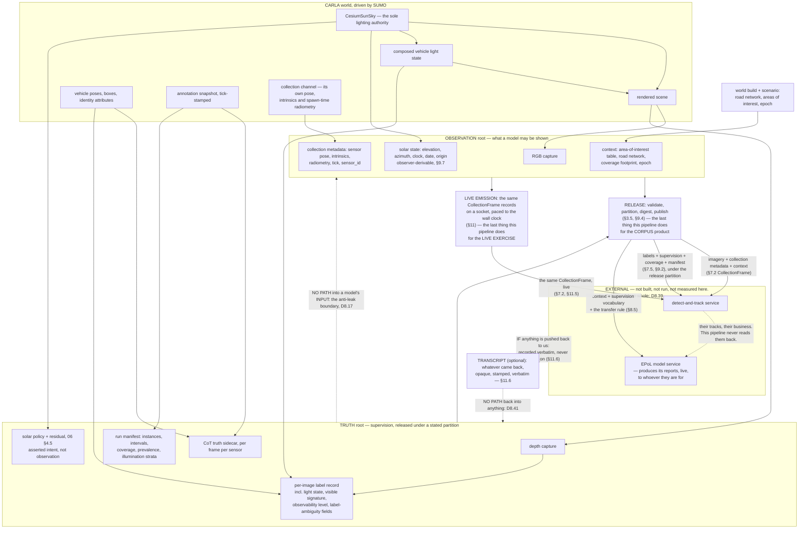
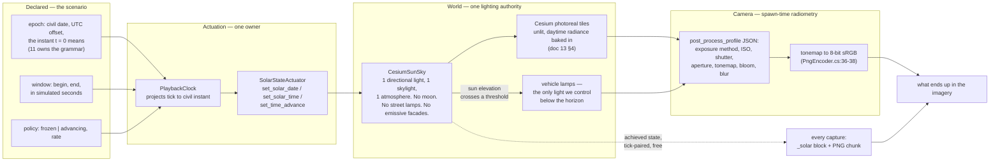
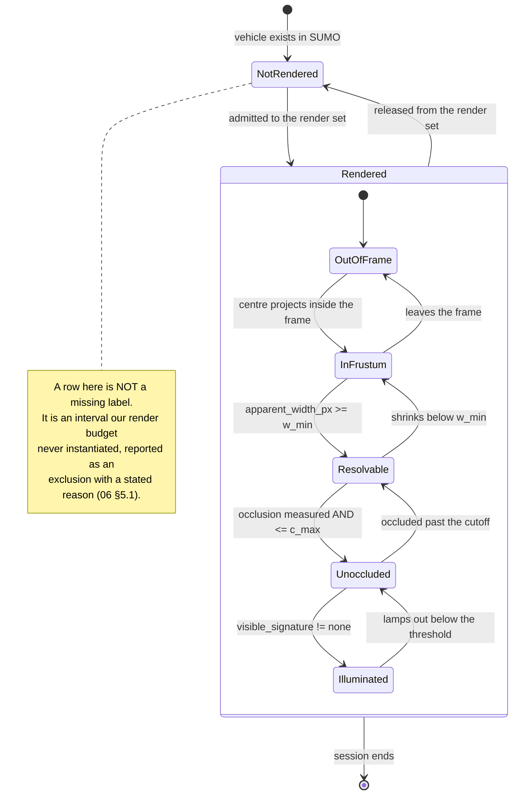
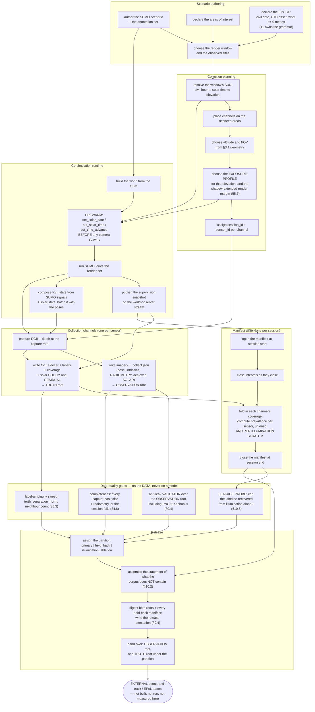
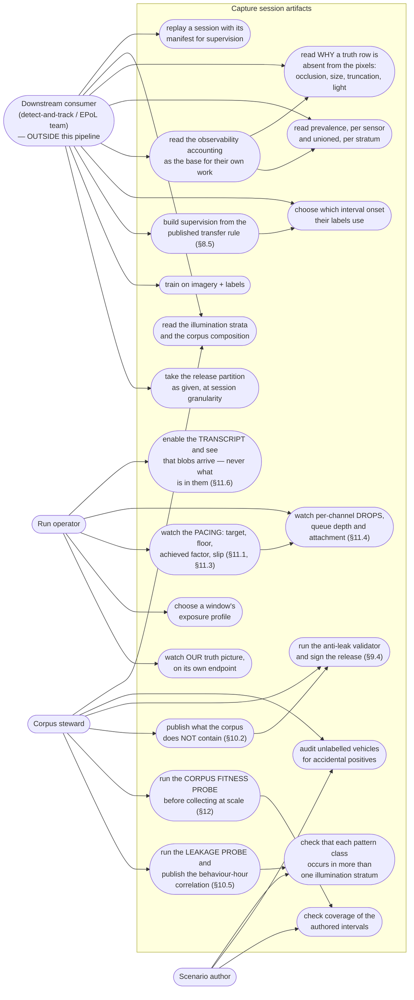

# 08 — Collection, labelling, and the handover to external models

**Status:** Plan section. Source audit against the working tree; read-only measurements taken against
`BahonarPatternOfLife.zip`, against the camera geometry, against the shipped post-process profiles and
against the solar geometry of the sizing site, each marked as measured where it appears. No code
changed, no build run.
**Date:** 2026-09-18.
**Owner role:** collection and external-model handover engineer.
**Scope:** everything between photons and the **handover** — the camera rig, the light the scene is
captured under, the capture, the per-image labels, the observability accounting, the corpus's own
metadata, and the contracts by which an external detect-and-track team and an external
estimated-pattern-of-life (EPoL) team read all of it. Covers both products: a **recorded corpus** and a
**live exercise** in which the same records leave the process over a socket while the world runs.
**Audience:** an engineer who has read neither the conversation that produced this plan nor the whole
Findings set. Every external claim is cited.

### Change history

| Revision | What changed |
|---|---|
| 2026-09-17 | Rig geometry, per-image labelling, observability accounting and the handover contracts. |
| 2026-09-18 | Illumination made a first-class collection parameter; radiometry recorded per capture. |
| 2026-09-18 | Scope narrowed to labelling: no scoring, no association harness, no model metrics. |
| 2026-09-18 | Live exercise designed as a primary use case; no external format specified. |
| 2026-09-21 | The vocabulary is published into the training export as well as the truth root. |

> **The boundary this section is written against.** This pipeline **labels; it never scores.** It does
> not run a detector, a tracker or an EPoL model; it does not associate external model output to truth;
> it emits no precision, recall, F1, tIoU, confusion matrix or any other model metric; it builds no
> evaluation harness and issues no pass/fail verdict on a model. What it does emit is imagery, truth,
> labels, and an honest account of what the corpus contains and what it does not. Quality gates in this
> section are gates on **the data** — is it internally consistent, is it leak-free, is it complete, does
> it say what it lacks. **D8.37** states this as a decision so it can be cited.
>
> **And the boundary is a line, not a wall.** The chain *is* run — synthetic imagery generation feeds a
> detect-and-track stage, whose tracks feed an EPoL model service, which produces its reports live
> (team brief §3c). Everything up to and including the imagery is ours and is designed here.
> **Everything after it is not, and we know nothing about it**: their APIs, formats, transports, report
> schemas, latencies and failure modes are unknown to us and are none of this plan's business. **A
> reader must be able to substitute a completely different detector and a completely different EPoL
> service without any part of this plan changing.** That is the test every paragraph of §7 and §11 is
> written to pass, and **D8.39** states it as a decision.

**Reads from:**
[20 — Behavioral Annotation and Areas of Interest](../../Findings/20_Behavioral_Annotation_And_Areas_Of_Interest.md) ·
[17 — Photoreal Occlusion Metric](../../Findings/17_Photoreal_Occlusion_Metric.md) ·
[16 — Sensor Pose in Recordings](../../Findings/16_Sensor_Pose_In_Recordings.md) ·
[19 — Image Labeling during Orbit](../../Findings/19_Image_Labeling_during_Orbit.md) ·
[13 — Usable Night-Time Lighting](../../Findings/13_Usable_Night_Lighting.md) ·
[12 — CarlaNet.Labeling](../../Findings/12_CarlaNet_Labeling.md) ·
[09 — Telemetry CoT Contract](../../Findings/09_Telemetry_CoT_Contract.md) ·
[23 — SUMO Traffic Integration](../../Findings/23_SUMO_Traffic_Integration.md).

**Depends on, and states the property it needs rather than designing it:**
[`01_Architecture.md`](01_Architecture.md) (process topology, `SolarStateActuator`, `SumoSignalProjector`),
[`03_CoSimulation_Runtime.md`](03_CoSimulation_Runtime.md) (tick loop, pose continuity),
[`04_Contracts.md`](04_Contracts.md) (interface registry),
[`06_Truth_And_Annotation.md`](06_Truth_And_Annotation.md) (the annotation record, the solar record and the manifest),
[`10_Scale_And_Performance.md`](10_Scale_And_Performance.md) (throughput budget, window placement),
[`11_Time_And_Illumination.md`](11_Time_And_Illumination.md) (the epoch contract, the engine-side verdict on what is renderable, the light-mapping table),
[`12_Operator_Control_Surface.md`](12_Operator_Control_Surface.md) (how an operator expresses any of it),
[`13_Work_Breakdown.md`](13_Work_Breakdown.md) (sequencing).

### What this section does *not* cover

- **Any model.** Not the internals of a detector, a tracker or an EPoL model, and not their operation:
  this pipeline does not run one, does not measure one, and does not compare two. Only the contracts at
  the boundary, and only from our side of it.
- **Any model metric, evaluation harness, scoreboard or model verdict** (team brief §3b). Where one
  would be expected, the section says in a line what an external consumer would do instead, and stops
  there.
- **Any external interface past synthetic imagery generation** (team brief §3c). No detector input
  schema, no track format, no report format, no fusion stage, no normaliser, and no assumption about
  anybody's transport, latency or failure modes. **Where a concrete integration is needed to make a use
  case readable it appears once, in §11.5, marked as one illustrative adapter sitting outside the
  boundary.** The section is written so that substituting a different detector and a different EPoL
  service changes nothing in it (**D8.39**); the live exercise itself *is* covered, in §11, because
  everything up to and including the imagery is ours.
- The behavioural annotation format itself — that is [`06_Truth_And_Annotation.md`](06_Truth_And_Annotation.md).
  This section says what the collection chain must carry and how a consumer reads it.
- **The epoch contract** — what civil instant `t = 0` means, its grammar, and the civil-to-solar-zone
  conversion. [`11_Time_And_Illumination.md`](11_Time_And_Illumination.md) owns it; §4.9 states what
  this section needs it to guarantee.
- **The engine-side verdict on what is renderable at night** — whether a moon light, a sky-light floor
  or street lamps get built. [`11_Time_And_Illumination.md`](11_Time_And_Illumination.md) owns that.
  **This section owns the collection verdict: whether a detector can work with what comes out** (§4.6).
- **The light-state mapping table and the darkness thresholds.** [`01_Architecture.md`](01_Architecture.md)
  gives the job to `SumoSignalProjector` and [`11_Time_And_Illumination.md`](11_Time_And_Illumination.md)
  owns the table. This section owns what the resulting lights do to a detector, a box and a track
  (§4.5, §5.8, §8.7).
- **How an operator expresses the time-of-day choice.** [`12_Operator_Control_Surface.md`](12_Operator_Control_Surface.md)
  owns the surface; §4.9 states the controls collection needs to exist.
- How SUMO vehicles become CARLA actors (the render-set contract) — [`03_CoSimulation_Runtime.md`](03_CoSimulation_Runtime.md).
- Which vehicles exist, how they are authored, or how a `vType` maps to a blueprint —
  [`07_Scenario_Authoring.md`](07_Scenario_Authoring.md). Two measured *confounders* in the authoring
  surface are reported in §5.6 and §4.5 because they damage the corpus, not because the authoring
  surface is this section's to fix.
- Pedestrians. Out of scope for the whole plan (team brief §3.5).
- Sequencing and work items — [`13_Work_Breakdown.md`](13_Work_Breakdown.md).

---

## 1. Two products, one chain

The user's stated purpose names two things, and they are not variants of each other. **Both are primary,
and the live exercise is the one wanted most** (team brief §3c). Both are **handovers**: in one the
corpus is handed over as files, in the other the same records are handed over as a stream while the
world is still running. **Neither ends in a score, because scoring is not ours** (team brief §3b).

| | **Recorded corpus** | **Live exercise** |
|---|---|---|
| Purpose | Supply imagery, truth and labels for training and validating external models | Drive the whole chain end to end against a wall clock: our imagery in, somebody's reports out, live |
| Product | Imagery + truth sidecars + per-image labels + coverage + a run manifest | The same records on a socket, an operator picture of the run, and — optionally — a transcript of whatever came back (§11.6) |
| Pacing | As fast as the machine allows; simulated time is the clock | Paced against the wall clock at a declared factor, with a declared floor (§11.1, §11.3) |
| Truth | Written beside the imagery in a separate root, complete, retained, released under a stated partition | Written to a separate sink and off the consumer's feed by default (§11.4) |
| Who runs a detector | An external team, offline, after the fact, as often as they like | An external team, in the loop, under a latency budget that is theirs to meet |
| Illumination | A **controlled variable**: frozen per window, stratified across windows (§4.7, §10.5) | A **condition**: whatever the run's scenario time implies, and it may move (§4.7) |
| What our failure costs | A corpus that misdescribes itself | A run that silently slipped its rate, or dropped frames without saying so (§11.3) |

They share everything from photons to the handover record. They diverge at exactly three points:
**transport** (files versus a stream), **pacing** (free-running versus wall-clock), and **what
illumination is for** (a stratification axis versus a condition of the run). That shared middle is why
one design covers both, and why the handover must be defined as a **record** rather than as a directory
of files (§7.2).

**The live exercise's shape, in the user's own terms** (team brief §3c), with the line marked:

```
              OURS                  |          NOT OURS, AND UNKNOWN TO US
                                    |
  synthetic imagery generation  ---->  Detect & Track consumes
                                    |    -> sends tracks to the EPoL model service
                                    |    -> the model performs its anomaly detection
                                    |    -> and produces reports, live
                                    |
   designed in §7 and §11           |   specified nowhere in this plan (D8.39)
                              the boundary
```

Everything left of the line is designed in this section. Everything right of it is unknown to us and
stays unknown: **no detector input schema, no track format, no report format, no fusion stage and no
normaliser appears anywhere in this plan** (**D8.39**). What we owe the right-hand side is a stated
emission contract, a stated attachment, a stated rate and a stated behaviour when it cannot keep up —
all four of which are things we can promise without knowing anything at all about who is listening.



Five things the diagram is drawn to say. **First**, there is no `SCORE` box, and there is no edge
returning from `DT` or `EPOL` into this pipeline that reaches anything but a transcript file: model
output is neither produced nor consumed here, which is why §3.5 rules that a third artifact root would
be a directory for files we never write. **Second**, the dashed anti-leak edge now runs *between our own
two roots* rather than from truth to a model, because that is where the rule actually bites — it is
entirely about what we put in the data, and it is enforced at the writer (§9.4). **Third**, `SOL` sits
in the `OBSERVATION` root; §9.7 is the argument for why the achieved solar state may be placed there
when almost nothing else may. **Fourth**, `LIVE` hangs off `OBSERVATION` and not off `REL`: the live
exercise emits the *same record*, and it does not wait on release, validation or partitioning, because
none of those is a per-frame operation. **Fifth**, `TRANS` has exactly one inbound edge and one dashed
refusal — it is a sink, and the crossed edge into `TRUTHART` is the rule that a transcript is never
merged into truth or supervision (**D8.41**).

---

## 2. What exists today, measured

§2.1 to §2.8 were read from the tree on 2026-09-17 and re-verified on 2026-09-18; §2.9 and §2.10 were
measured on 2026-09-18.

### 2.1 The rig is one camera and its shadow

`SensorRig` spawns exactly two sensors: an RGB camera and a depth camera, configured from the same
`--width`/`--height`/`--fov` arguments and spawned at one pose
(`CarlaControl/src/carlacontrol/SensorRig.py:61-91`). Every pose change moves camera, depth camera and
spectator together (`SensorRig.py:100-125`), and the reason is written down in the source: measurements
that pair a depth capture with a colour capture "are only valid while the two are looking from the same
place, and a depth camera left behind at the old pose silently invalidates them"
(`SensorRig.py:186-189`).

`run_SCTMV.py` builds one rig (`CarlaControl/scripts/run_SCTMV.py:169`) and one recorder over that
rig's RGB camera with that rig's depth camera attached (`run_SCTMV.py:190-192`).

### 2.2 The single-camera limit is a shim field, not an architectural one

This paragraph corrects a premise doc 20 decision 11 rests on, and it was re-verified against the source
because the multi-camera decision (§3.4) turns on it.

**A recorder already opens two streams, not one.** `FrameRecorder`'s constructor takes a single 24-byte
*camera* token and rejects anything else
(`CarlaNet/src/CarlaNet.Recording/FrameRecorder.cs:83-90`), but it opens a subscription for the depth
stream at `FrameRecorder.cs:112-113` (via `OcclusionEstimator`, whose own constructor subscribes at
`OcclusionEstimator.cs:83-90`) and a second for the camera at `FrameRecorder.cs:125-126`. The range
`FrameRecorder.cs:59-98`, which doc 20 §2.5 and §7.3 both cite as the place a single stream token is
bound, is the occlusion counter block (`:59-69`) followed by the constructor's XML documentation and
signature (`:71-90`). It binds nothing.

**The transport imposes no limit either.** `CarlaClient.SubscribeToStream` parses a token, constructs a
`SensorStream` and appends it to a list (`CarlaNet/src/CarlaNet.Transport/CarlaClient.cs:1748-1754`).
One client already holds three: the world-observer stream (`CarlaClient.cs:1803`), the recorder's camera
stream, and the occlusion estimator's depth stream.

**The limit is one Python field.** `World.start_recording` calls `self.stop_recording()` at its top
(`CarlaNet/python/carlanet/__init__.py:1908`) and stores the result in `self._recorder`
(`:1924`, cleared at `:1980-1986`), so starting a second recorder on one `World` object destroys the
first. It is enforced, not conventional — but it is scoped to the `World` *instance*, and
`Client.get_world()` returns a **fresh** `World(self._inner)` on every call (`:2285`, `:2295`). So two
`World` handles from one `Client` already hold two independent recorder slots over one connection, one
world-observer stream and one actor cache.

**Consequence:** several collection channels in one process is a rig change and a shim change —
or no shim change at all, since a purpose-built rig can construct `FrameRecorder` per channel directly,
as the shim itself does (`carlanet/__init__.py:1907, 1924-1929`). Doc 20 §7.3's premise that "adding one
today means adding a client process" is wrong, and §3.4 takes the decision on the corrected premise.

What is *not* free is throughput: N channels means 2N or 3N subscriptions on one connection, and
`run_SCTMV.py:215-219` records two streams already saturating it (§2.3).

### 2.3 Capture is decimated client-side, and the server does not know

`FrameRecorder.OnFrame` drops frames until `sim_time - last_capture >= 1/hz`
(`FrameRecorder.cs:129-133`), with `--record-hz` defaulting to 2.0
(`CarlaControl/src/carlacontrol/CarlaControlArgumentParser.py:512-518`) against a default world step of
0.05 s (`CarlaControlArgumentParser.py:68-74`). So at defaults the server renders and streams twenty
frames per second per camera, and nineteen in twenty are decoded far enough to be discarded.

The engine already exposes the fix and nothing uses it. `sensor_tick` is a standard sensor attribute
(`Unreal/CarlaUnreal/Plugins/Carla/Source/Carla/Actor/ActorBlueprintFunctionLibrary.cpp:244-254`) and
`ASensor::Set` turns it into `SetActorTickInterval`
(`Unreal/CarlaUnreal/Plugins/Carla/Source/Carla/Sensor/Sensor.cpp:44-49`). `SensorRig` never sets it
(`SensorRig.py:61-86`). Whether `sensor_tick` composes correctly with synchronous world ticking, and
whether two cameras given the same `sensor_tick` land on the same simulation frames — which
`OcclusionEstimator` requires for pairing (§2.5) — is **unmeasured**; the measurement is in §12.4.

The contention is already recorded as a measurement in the source: "With two camera streams saturating
the connection each of those RPCs stalls for ~100-200 ms; left on the main loop they collapse it to ~1
fps" (`run_SCTMV.py:215-219`). Two streams is today's rig. Multi-camera multiplies it.

### 2.4 What a capture already carries

Per capture, two files sharing a filename stem built from local wall-clock time to the millisecond
(`FrameRecorder.cs:223-232`):

- a lossless PNG with `carla:solar`, `carla:sensor` and `carla:capture` tEXt chunks
  (`FrameRecorder.cs:225-229`);
- a CoT XML sidecar (`CotWriter.cs`) holding, in order: the capture identity on the `<events>` element
  — tick, simulation time, `run_id`, `scenario_id`, `seed` (`CotWriter.cs:40-48`); a `<_solar>` block
  (`:52-66`); the collection platform as a CoT air track with a standard `<sensor>` element and a
  `<_carla_intrinsics>` child carrying `fx, fy, cx, cy, hfov, vfov, distortion, align_offset_m`
  (`:71-128`); and one `<event>` per telemetered vehicle with `point/lat,lon,hae`, `track/course,speed`,
  `contact/callsign` and a `_carla` extras block (`:130-198`).

Occlusion rides that extras block when it was measured: `occlusion`, `occlusion_level`,
`occlusion_samples`, `apparent_width_px`, `apparent_height_px`, all absent when unmeasured
(`CotWriter.cs:178-193`).

**The capture identity is the join key that already works.** `CaptureIdentity(Tick, SimTimeSeconds,
RunId, ScenarioId, Seed)` (`CaptureMetadata.cs:24-29`) is taken from the very sensor frame that
produced the pixels (`FrameRecorder.cs:179`), and the record's own doc comment explains why wall-clock
time cannot serve (`CaptureMetadata.cs:9-14`). Filenames are wall-clock and must never be used to pair
anything.

**The solar block is already there, and it is already bound to the pixels.** `_solar` carries
`solar_time`, `date`, `time_zone`, `lat`, `lon`, `sun_elevation_deg`, `sun_azimuth_deg`, `advancing` and
`rate` (`CotWriter.cs:52-65`), read lock-free from the world-observer cache with no RPC
(`FrameRecorder.cs:160-162`, `CarlaClient.cs:1988-1991`), and the same eleven doubles are embedded in
the PNG as a `carla:solar` tEXt chunk (`SolarMetadata.cs:14-20`, written between IHDR and IDAT by
`PngEncoder.cs:44-47`). [`06_Truth_And_Annotation.md`](06_Truth_And_Annotation.md) §2.7 owns the full
account of that record and of the four ways it can be silently wrong; it is not restated here. What
matters to collection is the consequence §9.7 draws from it: **the sun is already, today, physically
inside the file that ships beside the imagery.**

### 2.5 The occlusion measurement is built

`OcclusionEstimator` keeps a ring of eight recent depth frames (`OcclusionEstimator.cs:50`), pairs one
to the recorded frame by simulation frame number, falls back to simulation time, and **refuses the pair
if the two cameras are not co-located and co-boresighted** within tolerances
(`OcclusionEstimator.cs:110-172`). Failures are counted in five buckets and surfaced on the recorder
(`FrameRecorder.cs:53-69`), which `NativeRecorder` reports on stop
(`CarlaControl/src/carlacontrol/NativeRecorder.py:133-160`).

**It is illumination-independent, and that turns out to matter.** The depth capture is a scene-depth
render, and the apparent-size figures are computed by projecting the *true* box
(`CotWriter.cs:189-192`); neither reads a pixel's brightness. §12.1 leans on this to keep the re-scoped
experiment from multiplying into a matrix.

### 2.6 The arrival gate is built, and is inert by default

Doc 17 §12.2's arrival gate is client-side: `CarlaClient` records each `set_actor_fade` it sends and
latches full opacity, and `VehicleTelemetryService` skips vehicles that were never established
(`VehicleTelemetryService.cs:66-73`).

**Under the user's directive of 2026-09-17 the fade is demoted and this section does not design around
it.** Verified against the tree:

- `--fade` carries `default=False`, and the help text names the reason: the opacity is computed
  client-side and pushed "one blocking RPC per vehicle per reconcile, which is the heaviest load this
  client puts on the server's per-frame RPC budget"
  (`CarlaControl/src/carlacontrol/CarlaControlArgumentParser.py:317-328`).
- With nothing fading, the gate suppresses nothing. `IsActorEstablished` returns true for any actor with
  no fade record — `!_fade.TryGetValue(id, out var fade) || fade.Established`
  (`CarlaNet/src/CarlaNet.Transport/CarlaClient.cs:1571`) — and `GetActorOpacity` returns `1.0` on the
  same condition (`:1562`). The truth producer's own comment says so: "Vehicles nobody fades are
  established from the start, so this gate is inert unless staging traffic is running"
  (`VehicleTelemetryService.cs:71-72`).

So there is **no dissolve-in period during which a vehicle is deliberately unreported**, and nothing in
this section may assume one. Every vehicle is telemetered, labelled and counted in coverage from the
tick it exists. Three consequences run through the rest of this document: §5.1's `opacity` carries no
information and is retained only so that a later fade mode is not a schema change; §5.3's arrival gate is
a no-op; and the artefact a fade would have hidden is now in the imagery and is §5.7's subject.

**The budget released is real and is spent here.** Removing the heaviest per-frame client load is
headroom for the capture and per-image labelling of §5, for the N-channel subscription cost of §3.4, and
for the per-tick light-state batch of §4.5 — which matters because §2.3's contention measurement was
taken on a client that was doing that work.

### 2.7 The recorder already computes the 3D box and throws it away

`VehicleTelemetry` carries `ActorTransform` and `BoundingBox`, with the doc comment "Geometry rather
than telemetry: it is not part of the CoT contract and is not serialized to the sidecar"
(`CarlaNet/src/CarlaNet.Recording/VehicleTelemetry.cs:65-74`). It also carries `Opacity`
(`:59-63`), likewise unserialised — doc 17 §12.5 lists that as open.

So the oriented 3D box for every telemetered vehicle, frame-coherent with the pixels, already exists in
memory at write time. **Per-image labelling is a serialisation change plus a projection, not a new
measurement.** That is the same conclusion doc 12 §2 reached, and it is still true.

### 2.8 What does not exist — corrected

Read from the tree, so that no part of this plan assumes a tool that is gone. **The last three rows are
the reason §2.9 exists.**

| Named in | Thing | State on 2026-09-18 |
|---|---|---|
| doc 12 | `CarlaNet.Labeling` assembly | **Absent.** `CarlaNet/src/` holds Map, Nav, Python, Recording, Scenario, Sensors, TrafficManager, Transport, Types — no Labeling |
| doc 19 | `Training_Data_Generator.py` | **Absent** from the tree |
| doc 19, doc 12 | `eo_observer.py` | **Absent**; only a stale `CarlaNet/python/__pycache__/eo_observer.cpython-314.pyc` remains |
| doc 20 §7.5 | run manifest | **Absent.** Nothing writes one |
| doc 20 §4.2 | `scenario_id` supplied to the recorder | **Still never supplied, at a new address.** The live call site is `CarlaControl/src/carlacontrol/NativeRecorder.py:96-111`, which passes `run_id`, `seed`, `fov`, the four `platform_*` arguments, `depth_camera`, `occlusion_margin_m` and `occlusion_samples` — and no `scenario_id`, though the shim accepts one (`carlanet/__init__.py:1876`). `ScenarioController` never learns an id at all (`ScenarioController.py:30`) |
| — | any detector, tracker, or EPoL client | **Absent.** The only mention of YOLO in code is a comment (`CarlaNet/python/cot_telemetry.py:5`) |
| doc 13 §6 Phases 1–3 | a moon light, a night sky-light floor, street lamps, emissive facades | **All absent.** `ACesiumSunSky` still creates exactly one directional light at 111 000 lux, one real-time `SkyLight` with `bLowerHemisphereIsBlack = false`, and one atmosphere — **no second directional light** (`Unreal/CarlaUnreal/Plugins/CesiumForUnreal/Source/CesiumRuntime/Private/CesiumSunSky.cpp:59`, `:82`, `:86`). A search of `CarlaControl/src` and `CarlaNet/src` for `street_lamp`, `StreetLight`, `PointLight` or `SpotLight` returns exactly one hit — `MapLayer.StreetLights` (`CarlaNet/src/CarlaNet.Types/Rpc/Enums/MapLayer.cs:8`), a layered-map flag for the stock towns with nothing to do with a generated world. **Doc 13's Phase 0 is built and everything after it is not** (§4.6) |
| upstream CARLA | a camera **motion-blur attribute** | **Still absent as an attribute** — the camera definition offers `fov`, `image_size_x/y`, `lens_*`, `enable_postprocess_effects`, `post_process_profile`, `sensor_tick` (`ActorBlueprintFunctionLibrary.cpp:244-254`, `:313-410`) and a search for `motion_blur` finds nothing. **But motion blur is switched on in every shipped profile and is rendering today** (§2.9, §6.5): the knob is absent from this fork, the effect is not |
| — | `exposure_compensation` | **Still not offered by the server's camera definition** — a search for `exposure` in `ActorBlueprintFunctionLibrary.cpp` returns nothing — so `SensorRig`'s `--ev` path is inert behind its `has_attribute` guard (`SensorRig.py:66-67`). The guard's other half never fires: `--ev` carries `default=0.0`, not `None` (`CarlaControlArgumentParser.py:237-241`), so `args.ev is not None` is always true and only `has_attribute` blocks it. **But exposure is fully settable at spawn, by a different attribute that does exist** (§2.9), so "the rig cannot currently set either" is **half wrong**, and §4.2 states what is actually true |

### 2.9 The radiometric chain, measured

**This is the single most consequential measurement in the section.** `exposure_compensation` is not
there to be found; following the attribute that *is* there leads somewhere different.

**The camera definition publishes eleven attributes and none of them is an exposure.**
`MakeCameraDefinition` declares `fov`, `image_size_x`, `image_size_y`, the six `lens_*` parameters,
`enable_postprocess_effects` and `post_process_profile`
(`Unreal/CarlaUnreal/Plugins/Carla/Source/Carla/Actor/ActorBlueprintFunctionLibrary.cpp:313-410`), plus
`sensor_tick` from `AddVariationsForSensor` (`:244-254`) and the sensor `role_name` (`:239-241`).
**Of the three sensors in a collection channel (§3.2), only the RGB camera gets the post-process pair**:
`ASceneCaptureCamera` passes `bEnableModifyingPostProcessEffects = true`
(`Unreal/CarlaUnreal/Plugins/Carla/Source/Carla/Sensor/SceneCaptureCamera.cpp:19-22`), while the depth
camera takes the one-argument overload, which defaults it to `false`
(`Sensor/DepthCamera.cpp:14`; default declared at `ActorBlueprintFunctionLibrary.h:66-68`).

**The engine side is complete and is simply not published.** `ASceneCaptureSensor` carries the whole
physical-camera surface with getters and setters: `SetExposureMethod` (`SceneCaptureSensor.h:237`),
`SetLocalExposureMethod` (`:243`), `SetExposureCompensation` (`:255`), `SetShutterSpeed` (`:267`),
`SetISO` (`:273`), `SetAperture` (`:279`), `SetFilmSlope` and the rest of the tonemapper (`:321`…),
`SetExposureMinBrightness` / `MaxBrightness` / `SpeedDown` / `SpeedUp` (`:351`, `:357`, `:363`, `:369`),
and `SetMotionBlurIntensity` / `MaxDistortion` / `MinObjectScreenSize` (`:381`, `:387`, `:393`). Every
one writes a field of `CaptureComponent2D->PostProcessSettings`
(`SceneCaptureSensor.cpp:108-433`), and the constructor sets the corresponding `bOverride_*` flag to
true for all of them (`SceneCaptureSensor.cpp:1057-1114`), so the values on the component are
authoritative over any level post-process volume. **Nothing exposes them as blueprint attributes.**
Publishing them is an additive change to one function, and a rebuild is not a cost on this project
(team brief §4).

**But exposure is already controllable at spawn, through `post_process_profile`.** `SetCamera` reads
the attribute and loads a named JSON file over the capture component
(`ActorBlueprintFunctionLibrary.cpp:1369-1381`):

```cpp
FString PostProcessDefaultName = RetrieveActorAttributeToString("post_process_profile",
    Description.Variations, TEXT("default"));
UPostProcessJsonUtils::LoadAllPostProcessFromJsonToSceneCapture(
    Camera->GetCaptureComponent(), PostProcessDefaultName);
```

`LoadAllPostProcessFromJsonToSceneCapture` reads
`Content/Carla/Config/PostProcess/<name>.json` (`BlueprintLibary/PostProcessJsonUtils.h:49`) and
assigns `SensorCamera->PostProcessSettings = Wrapper.Settings` — **a whole-struct replacement**
(`PostProcessJsonUtils.cpp:86-101`). The load is reached because the Python shim sends **every**
attribute of a blueprint, not only the modified ones: `ActorBlueprint.to_description()` builds an
`ActorAttributeValue` for each entry of its cached attribute dict
(`CarlaNet/python/carlanet/__init__.py:619-625`), so `enable_postprocess_effects` and
`post_process_profile` are always in `Description.Variations` for an RGB camera and the
`if (Description.Variations.Contains(...))` guard at `:1369` is always satisfied.

**Four profiles ship, and they are not equivalent.** Measured by reading the JSON directly from
`Unreal/CarlaUnreal/Content/Carla/Config/PostProcess/` and computing EV100 as
`log2(N²/t) − log2(ISO/100)`:

| Profile | Exposure method | Aperture | Shutter | ISO | Bias | **EV100** | Bloom | Lens flare | Vignette | Lumen skylight leak |
|---|---|---|---|---|---|---|---|---|---|---|
| `Default.json` | **`AEM_Manual`** | f/4.0 | 1/320 | 100 | 0.0 | **+12.32** | 0.20 | 0.01 | 0.40 | 0.00 |
| `GoPro.json` | `AEM_Manual` | f/6.0 | 1/60 | 100 | 0.0 | **+11.08** | 0.675 | 1.00 | 0.40 | 0.00 |
| `Town10HD_Opt.json` | **`AEM_Histogram`** | f/9.8 | 1/15 | 300 000 | +1.2 | **−1.06** | 0.675 | 1.00 | 0.70 | 0.35 |
| `Town_C.json` | `AEM_Histogram` | f/9.8 | 1/15 | 300 000 | +1.2 | **−1.06** | 0.675 | 1.00 | 0.70 | 0.35 |

All four set `autoExposureApplyPhysicalCameraExposure = true`, all four set `filmGrainIntensity = 0`,
and all four set `motionBlurAmount = 0.5`, `motionBlurMax = 5` (percent of screen width) and
`motionBlurPerObjectSize = 0`. The histogram profiles carry `autoExposureMinBrightness = −10` and
`MaxBrightness = 20` — a thirty-stop adaptation range.

Six consequences, and each is load-bearing somewhere below:

1. **Today's collects are made at a bright-daylight exposure.** `SensorRig` sets `image_size_x/y`, `fov`,
   the inert `--ev`, and the depth camera's `max_range`, and never touches `post_process_profile`
   (`SensorRig.py:61-80`). Nothing in `CarlaControl/src` or `CarlaNet/src` mentions `post_process` at
   all. So every capture uses `Default.json` at **EV100 +12.3**, which is a clear-sun exposure. That is
   the correct choice for the noon-spawned worlds collected so far and the wrong one for anything else.
2. **A night-capable exposure already exists on disk and is one string away.** `Town10HD_Opt.json` is
   sixteen stops darker than `Default.json` and runs histogram eye-adaptation. It is named for a stock
   town, which is a naming collision rather than a technical obstacle, and §4.2 says what to do about it.
3. **Exposure is spawn-time only.** The profile is loaded inside `SetCamera`, which runs once when the
   actor is created; there is no RPC that re-applies a profile or sets an exposure on a live camera
   (searched: nothing in `CarlaNet/src` or the shim references post-process). **A session whose sun
   moves cannot re-expose without respawning the camera**, and respawning changes the actor id, the
   stream token and therefore the channel's identity (§3.5). This is the mechanical reason §4.7 prefers
   a frozen sun.
4. **The product is 8-bit, tonemapped, and has no noise model.** `PngEncoder` writes IHDR with bit depth
   8 and colour type 2, truecolour RGB (`PngEncoder.cs:37-38`), from the BGRA the server already
   tonemapped. There is no HDR path and no raw path, so **under-exposure is not recoverable in post** —
   it is quantised away before the file is written. And `filmGrainIntensity = 0` in all four profiles
   means there is no sensor-noise model at all, so synthetic low-light imagery will be *clean* dark
   where real low-light EO is noise-dominated (§4.3).
5. **The profile silently overwrites the C++ defaults, including the Lumen tuning.** `SetCameraDefaultOverrides`
   sets `LumenSkylightLeaking = 0.1` and a full Lumen configuration
   (`SceneCaptureSensor.cpp:1115-1152`); the JSON assignment replaces the entire struct, and
   `Default.json` carries `lumenSkylightLeaking = 0.0`. At noon that is invisible. In a scene lit only
   by a below-horizon sun, skylight leak is one of the few remaining sources of any radiance at all, so
   the difference between 0.0 and 0.35 is the difference between black and nearly black. **Inference,
   labelled as such:** this is reasoning from the parameter's documented role, not from a rendered frame.
6. **A case-sensitivity hazard that would differ between Windows and Linux.** The attribute's
   recommended value is the lower-case string `"default"` (`ActorBlueprintFunctionLibrary.cpp:402`) and
   the file on disk is `Default.json`. The path is composed verbatim
   (`PostProcessJsonUtils.h:49`), `LoadAllPostProcessFromJsonToSceneCapture` returns `false` when the
   file cannot be opened, and the call site **discards the return value and logs nothing**
   (`ActorBlueprintFunctionLibrary.cpp:1376-1380`). On Windows the filesystem resolves it; on a
   case-sensitive filesystem it would not, and the camera would silently keep the constructor's default
   values instead of the profile's. **Inference, labelled:** the failure mode follows from the code, but
   whether the Linux server actually misses the file is **unmeasured** and is listed in §12.4. If it
   does, two servers render the same scene at different exposures with nothing in the record to show it.
   The profiles are staged into the packaged build — measured: all four JSONs are present under
   `Build/Dist/Carla-0.10.0-Win64-Development/CarlaServer/CarlaUnreal/Content/Carla/Config/PostProcess/`
   and in `Build/Package/…/Windows/…` — so this is a naming issue, not a packaging one.

**And the capture records none of it.** The sidecar's `<sensor>` element carries azimuth, elevation,
roll, fov, vfov, range and model, and `<_carla_intrinsics>` carries the pinhole parameters and
`align_offset_m` (`CotWriter.cs:101-124`). **There is no radiometry anywhere in the record**: not the
profile name, not the exposure method, not ISO, shutter or aperture, not the bit depth, not the
tonemapper. A corpus that records the sun to three decimal places and says nothing about the camera
cannot be re-exposed, cannot be compared across profiles, and cannot distinguish a dark scene from an
under-exposed one. §4.8 fixes that.

### 2.10 A time-of-day surface already exists in the harness

Measured, and worth knowing before [`12_Operator_Control_Surface.md`](12_Operator_Control_Surface.md)
designs a new one: the viewer harness already has four arguments and a consumer.

| Argument | Default | Effect |
|---|---|---|
| `--time` | `None`, meaning 12:00 | start local **solar** time, `HH:MM` or decimal hours (`CarlaControlArgumentParser.py:243-249`) |
| `--date` | `None`, meaning **the host system date** | scene date, `YYYY-MM-DD`, "sets the seasonal sun angle" (`:250-255`) |
| `--time-advance` | off | advance the sun as the scene runs; the help states it advances "with the world tick: WALL-CLOCK time in `--async`, but SIMULATION time under synchronous ticking" (`:256-263`) |
| `--time-rate` | `1.0` | sun-clock seconds per real or simulated second (`:264-269`) |

`WorldBuilder` consumes them: it parses the date (falling back to `datetime.now()`), parses the time
(falling back to 12.0), calls `set_solar_date` then `set_solar_time`, logs a warning if the world has no
`CesiumSunSky`, and calls `set_time_advance(True, args.time_rate)` when asked
(`CarlaControl/src/carlacontrol/WorldBuilder.py:225-253`). A runtime toggle exists too, bound to a key
in the interactive viewer (`PygameInterface.py:263-268`).

Two things follow for collection.

- **The freeze-versus-advance toggle the team brief now requires already has a precedent**, and it is a
  process-level flag rather than a per-window one. A capture plan with several windows at different
  hours therefore maps onto several runs, which §4.7 argues is the right shape anyway.
- **`--date` defaulting to the host system date is a reproducibility defect with a measured magnitude.**
  The seasonal declination sets the sun's elevation at a given hour, so with no `--date` the
  illumination of a corpus is a function of **the calendar day the operator happened to run it on**.
  At the sizing site (latitude 27.150 12°, read from the network's `projParameter`) the elevation at
  07:00 solar time ranges from **1.71° at the December solstice to 23.13° at the June solstice**
  (computed here from the standard solar-position identity). §4.1 turns that 21.4° spread into shadow
  lengths differing by a factor of fourteen. Two runs of one scenario, six months apart on the wall
  clock, are two different illumination conditions with nothing declaring it.
  [`11_Time_And_Illumination.md`](11_Time_And_Illumination.md) owns the epoch that fixes this; the
  collection-side requirement is simply that **a session never takes its date from the host clock**
  (D8.30).

---

## 3. The collection rig

### 3.1 How much a camera can actually see — measured geometry

The camera is a pinhole with square pixels and a centred principal point (doc 16 §4.4), so
`fx = W / (2·tan(hfov/2))`. At the defaults — 1280×720, 90° (`CarlaControlArgumentParser.py:236`,
`:274-275`) — `fx = 640 px` exactly, and the ground sample distance at slant range `R` is `R/640` metres
per pixel. Computed here; it reproduces doc 17 §12.3's measured figures (a 4.5 m vehicle at 555 m is
about 5 px, at 914 m about 3 px) to within a tenth of a pixel, so the model and the measurement agree.

| slant range | GSD (m/px) | 4.5 m vehicle | 28 m/s over 1.0 s | over 0.5 s | over 0.1 s |
|---|---|---|---|---|---|
| 200 m | 0.31 | 14.4 px | 90 px | 45 px | 9.0 px |
| 300 m | 0.47 | 9.6 px | 60 px | 30 px | 6.0 px |
| 518 m (1700 ft) | 0.81 | 5.6 px | 35 px | 17 px | 3.5 px |
| 1000 m | 1.56 | 2.9 px | 18 px | 9 px | 1.8 px |
| 1524 m (5000 ft) | 2.38 | 1.9 px | 12 px | 6 px | 1.2 px |
| 3000 m | 4.69 | 1.0 px | 6 px | 3 px | 0.6 px |
| 5486 m (18 kft) | 8.57 | 0.5 px | 3 px | 1.6 px | 0.3 px |

28 m/s is the measured median vehicle speed in the sizing scenario (§6.1).

At 90° the largest slant range at which a 4.5 m vehicle reaches a given pixel length is 960 m for 3 px,
576 m for 5 px, 288 m for 10 px, 144 m for 20 px. Doc 17 §12.3 records that neither resolution nor
field of view affects range *precision*, but that a narrower field of view buys more resolution of the
occlusion metric than a larger frame does; the same is true of a detection.

**The footprint at a usable resolution is fixed, and it is small.** Holding 10 px on a 4.5 m vehicle
means holding GSD at 0.45 m/px, and at 1280×720 that is a **576 × 324 m ground swath — 0.187 km² —
whatever the altitude.** Flying higher buys nothing except a narrower field of view to pay for it:

| slant range | FOV for 10 px on a 4.5 m vehicle | GSD | ground swath |
|---|---|---|---|
| 555 m | 54.9° | 0.45 m/px | 576 × 324 m |
| 1000 m | 32.1° | 0.45 m/px | 576 × 324 m |
| 1524 m | 21.4° | 0.45 m/px | 576 × 324 m |
| 3000 m | 11.0° | 0.45 m/px | 576 × 324 m |
| 5486 m | 6.0° | 0.45 m/px | 576 × 324 m |

Measured against the sizing scenario: the Bahonar network's `convBoundary` is
`-3606.86,-1914.94,3607.23,2107.82` (read from `Shahid_Bahonar_Port.net.xml` inside
`BahonarPatternOfLife.zip`), i.e. **7214 × 4023 m = 29.0 km²**. One camera at detector-usable
resolution covers **0.64 % of it.**

That single number decides the rig. A seven-day, 29 km², 245-flow scenario cannot be observed by one
camera in any useful sense, and the "honest denominator" of doc 20 §2.5 will be nearly empty unless
cameras are **aimed at the places the annotations are about**. Coverage is a design input, not an
outcome. §4.1 adds the second design input, which is that the same swath contains a shadow field whose
size varies by a factor of fourteen with the sun.

### 3.2 The unit of collection is a channel, not a camera

A "camera" in this rig is three co-posed sensors, of which the first is the product:

| Sensor | Role | Required? |
|---|---|---|
| `sensor.camera.rgb` | the imagery — the only product a consumer ever sees | yes |
| `sensor.camera.depth` | the occlusion measurement (doc 17 §12.1) and, with it, the honest observability accounting | yes for a corpus; optional for a live exercise |
| `sensor.camera.instance_segmentation` | modal (visible-region) vehicle masks, the doc 17 §5.2 upgrade | optional |

The depth camera **must** be held at the RGB camera's pose and field of view: `OcclusionEstimator`
refuses a pair whose poses have drifted (`OcclusionEstimator.cs:161-172`), and `SensorRig` already moves
them together for that reason (`SensorRig.py:100-125, 186-189`).

On the third: doc 12 §1 rejected segmentation cameras *as a source of bounding-box truth*, because
Cesium photoreal tiles are not CARLA actors and every building, tree and terrain pixel falls into
"Unlabeled". That reasoning is sound and unchanged. It does **not** apply to the use wanted here:
vehicles *are* CARLA actors, so an instance-segmentation camera gives an exact per-vehicle visible mask
against an unlabelled background, which is precisely the modal mask doc 17 §5.2 wants and the
`occlusion_src` attribution doc 17 §6 defers. Its other advertised benefit — weighting a translucent
occluder by its opacity (doc 17 §9) — no longer applies, because the only translucent occluders doc 17
named were mid-fade vehicles and nothing fades (§2.6). **It has a second use**: at low sun and at night
the amodal box and the visible extent diverge by the whole vehicle (§5.8), and the instance mask is the
only thing in the rig that measures the divergence rather than assuming it. Adopting it is optional and
additive; nothing depends on it.

Note that the depth and segmentation cameras are **not** given the post-process pair — only the RGB
camera is (`SceneCaptureCamera.cpp:19-22` versus `DepthCamera.cpp:14`, §2.9) — which is correct, because
neither is a radiometric product, and which is also why neither is affected by anything in §4.

Naming, because three of these per channel multiplied by N channels needs names that stand alone:
a **collection channel** is `(sensor_id, rgb, depth?, seg?)`; a **capture session** is the set of
channels recording one run of one world.

### 3.3 Three rig patterns, named

| Pattern | Motion | What it is for | State |
|---|---|---|---|
| **Stare** | fixed pose, fixed boresight | persistent coverage of a declared area of interest; the only pattern that gives an unbroken observed span over a long interval | supported today by simply not enabling orbit |
| **Orbit** | circular ground track, boresight held on a centre | the existing EO collection idiom; gives look-angle diversity over one site | built — `OrbitSensorController` (`OrbitSensorController.py:250-277`), updated on its own 50 Hz thread (`:96-100`) |
| **Transit** | a commanded waypoint track | covering several sites in one pass; every site gets a short, bounded observation | **not built**; `PyGameSensorController` is interactive only |

A capture session mixes them. The recommended default for a corpus is **one orbiting primary plus one
staring channel per area of interest the run's annotations reference**, because an orbit alone cannot
promise coverage of an interval and a stare alone cannot give look-angle diversity.

**Measured consequence of orbiting, which the tracker inherits.** At the default 240 s per revolution
(`CarlaControlArgumentParser.py:610-614`), the boresight yaws at 1.5 °/s. Across a 90° field of view on
1280 px that is 14.2 px per degree, so **every static ground feature translates about 10.7 px between
consecutive captures at 2 Hz, regardless of altitude** — nearly two vehicle lengths at 518 m. Platform
translation adds only 3–5 px on top (5.2 m/s at a 200 m radius, 26 m/s at 1000 m). So the dominant
image-space motion in an orbit collect is *camera rotation*, not vehicle motion, and any tracker must
compensate for ego-motion using the recorded pose and intrinsics before it associates anything. Doc 16
put both in the sidecar and the PNG; this is what they are for.

**An orbit interacts with the sun, and the interaction is not small.** An orbit sweeps the sensor
azimuth through a full 360° every 240 s while the sun stays where it is, so the sun–target–sensor
geometry cycles from fully frontlit to fully backlit and through both specular configurations once per
revolution. At low sun that is the difference between a vehicle silhouetted against its own shadow and a
vehicle washed out by glare off wet quay, glass or water — and the sizing site is a **port**
(`Shahid_Bahonar_Port`, measured). §10.5 therefore stratifies on *relative* azimuth rather than on
absolute sun azimuth, and §12.2 notes that an orbit collect samples that whole axis for free, which a
stare does not.

### 3.4 The multi-camera decision

Doc 20 decision 11 states the problem and demands the decision be taken before multi-camera capture,
not after: the annotation registry is process-local, a recorder in another process reads an empty
registry and silently writes `unlabelled` on every vehicle, and the two ways out are (a) publish the
annotation state to the server the way staging bounds are, or (b) require every recorder to live in the
executor's process.

**The premise behind its framing is wrong, and correcting it splits the question in two.** Doc 20 §7.3
argues from "adding one camera today means adding a client process". §2.2 shows that is not so: a
recorder already opens two streams, the transport holds an unbounded list of them, and the only limit is
a `World`-instance field over a `Client` that hands out fresh `World` objects. So there are two separate
questions, and they have different answers:

| Question | Answer |
|---|---|
| **Where does world-scoped state live?** | Published server-side. Unchanged by the correction, and consistent with [`01_Architecture.md`](01_Architecture.md) **D1.10** |
| **How many processes should a multi-channel capture session use?** | **One**, by default — which the correction makes materially cheaper than doc 20 assumed |

**Decision on the first: publish the annotation state, and publish it on the world-observer snapshot
rather than through an RPC.**

Reasons, in order of weight:

1. **The silent failure mode is unacceptable and (b) does not remove it, it only forbids it.** Doc 20
   says so itself: (b) "is free and must then be enforced, because the failure mode is silent". Nothing
   in the shim or the recorder can detect the difference between "no scenario is running" and "the
   scenario is running in another process", because both produce an empty registry, and doc 20 decision
   2 makes `unlabelled` a legitimate written state. A corpus silently collected unsupervised is
   indistinguishable from a corpus legitimately collected unsupervised.
2. **(b) is incompatible with the live exercise, which is one of the two products.** A live exercise
   places the consumer outside the simulator process by construction, and the truth writer — which must
   keep recording supervision and coverage while that happens — has to run somewhere. Under (b) it must
   be in the co-simulation process.
3. **Doc 17 §12.2's client-held arrival gate is not a reason, because the fade is demoted (§2.6).** With
   nothing fading, the gate is inert in every process and there is no cross-process defect left for
   publication to fix. Reasons 1, 2, 4, 5 and 6 carry the decision on their own and none of them
   mentions fade. If a server-side fade is ever reinstated, this becomes a reason at no cost, because
   arrival and opacity would then ride a channel that already exists.
4. **The mechanism already exists and has exactly the three properties doc 20 §7.3 asked for.** Solar
   state rides the world-observer datagram into a `volatile double[]` that is swapped wholesale per
   frame (`CarlaClient.cs:169`, `:1855`) and read lock-free with no RPC and no poll
   (`CarlaClient.cs:1987-1991`), which is how `FrameRecorder` consumes it at capture time
   (`FrameRecorder.cs:160-162`). That is tick-stamped, lock-free, snapshot-swapped — doc 20 §7.3's list,
   already implemented for a different payload. **And the payload in question is precisely the
   illumination state that §4 makes first-class**, so the mechanism is not merely analogous to what is
   needed: it is already carrying half of it.
5. **The objection doc 17 §12.2 raised against widening the observer packet does not apply here.**
   There, four bytes per actor per tick were rejected because "this very process had just sent" the
   value. Here no client holds it, the payload is sparse (doc 20 decision 2 makes `unlabelled` the
   default, so only annotated and nominal actors need an entry), and the alternative is an RPC in the
   capture path.
6. Rebuilds are neutral (team brief §4). "It is more work" is not a reason and does not appear in this
   comparison.

**Decision on the second: a capture session runs its channels in one process by default.** The corrected
premise changes the recommendation here even though it changes nothing above:

- Every channel then shares one connection, one world-observer stream and one actor cache, so the
  per-tick truth the recorders read is provably the same snapshot rather than N snapshots that agree
  most of the time. Doc 20 decision 15 calls a per-camera disagreement in `<_supervision>` at one tick a
  defect; one process makes it structurally impossible rather than merely required. **The same argument
  now covers illumination**: one process means every channel stamps the same tick with the same solar
  block, so a per-camera disagreement about what the sun was doing is impossible too.
- The capture-session identity (§3.5) is then trivially assigned once, and the manifest has one writer
  in the process that already holds every channel's coverage.
- The cost is contention on one connection, measured at two streams already
  (`run_SCTMV.py:215-219`). That is the reason to move a channel out, and it is a throughput decision
  for [`10_Scale_And_Performance.md`](10_Scale_And_Performance.md) rather than a correctness one.

**These two decisions are deliberately independent, and that is the point.** Publication means that
moving a channel into its own process — for throughput, or because a detector wants to sit beside it, or
because a live exercise puts a consumer on another machine — is a deployment choice with no correctness
consequence. Under doc 20's option (b) the same move would silently produce an unsupervised corpus.
**Correctness must not depend on which process a recorder is in; performance may.**

**Property needed from [`01_Architecture.md`](01_Architecture.md):** the topology must permit a
collection process that holds no SUMO connection, no traffic authority and no scenario state, and whose
only inputs are the sensor streams and the world-observer snapshot. If the architecture instead puts
collection inside the co-simulation process, this section's design still works; the reverse is not true.

**Property needed from [`06_Truth_And_Annotation.md`](06_Truth_And_Annotation.md):** the world-scoped
snapshot must carry, per actor, the supervision state and the instance and phase references, stamped
with the tick it describes — so that two recorders reading it at different wall-clock moments produce
identical `<_supervision>` for the same tick, which doc 20 decision 15 requires and calls a defect if
violated.

### 3.5 Session and sensor identity, and the artifact roots

Three identity defects, one already half-solved:

- **Session identity exists but is per process, not per session.** `run_SCTMV.py:152` derives
  `run-<UTC>` once per process and hands it to the recorder (`:190-192`), which is the right level for
  today's one-camera rig. `FrameRecorder`'s own fallback derives one from its start instant and the
  comment calls it "unique enough per recorder" (`FrameRecorder.cs:98-103`) — doc 20 §7.5 correctly
  identifies that as the wrong property. **Decision: a capture session identity is assigned once and
  handed to every channel; the per-recorder fallback survives only for a single-channel run.**
- **`sensor_id` defaults to an actor id.** `platform_uid` defaults to `CARLA-SENSOR-<camera id>`
  (`carlanet/__init__.py:1910`) and the CLI offers `--platform-uid` with that default
  (`CarlaControlArgumentParser.py:537-541`). Doc 20 §6.3 records that this has the same defect
  `actor_id` has. **Decision: for a session with more than one channel, an authored `sensor_id` is
  required, validated unique within the session, and stable across runs.** Everything in §8, §10 and
  §11 keys on it, and §2.9's finding sharpens it: a camera that must be respawned to change exposure
  would otherwise change identity mid-session.
- **`scenario_id` is still never supplied** (§2.8). Under SUMO drive the analogous identity is the
  scenario configuration, and it must reach `CaptureIdentity` (`CaptureMetadata.cs:24-29`) or the
  captures cannot be tied to the annotations. This belongs to [`04_Contracts.md`](04_Contracts.md); the
  property needed is simply that it is supplied, since the field already exists end to end.

**How many artifact roots? Two — the ruling.**

**There are exactly two: `OBSERVATION` (what a model may be shown) and `TRUTH` (labels and
supervision). There is no `SCORE` root for associations and reports.** The reasoning is short and it
follows directly from the scope decision:

- **A `SCORE` root would be a directory for artifacts this pipeline never produces.** Its two contents
  would be the truth-to-track association and the score report. Both require model output; model output
  is neither produced nor consumed here (team brief §3b). An empty root is not a safeguard.
- **It would be worse than empty — it would be an invitation.** A root named `score/`, sitting beside
  two roots that *are* written, is a standing suggestion that model output belongs in our tree. The
  first time somebody drops a detector's `tracks.jsonl` into it, the corpus acquires an artifact whose
  provenance we cannot attest, whose licence we do not know, and whose presence makes the corpus look
  like an evaluation product. **The honest structure refuses the file rather than providing a shelf for
  it.**
- **The leak such a root would guard against does not exist in our tree.** Its anti-leak job would be
  to keep score artifacts — which are derived from truth — from re-entering the model's input path.
  With no score artifacts, that path has nothing on it. The leak that *does* exist is truth reaching
  the observation root, and that is a two-root problem enforced at the writer (§9.4).

**What serves the purpose instead is not a directory but a property of the release: a documented,
digest-attested held-back partition.** The partition is orthogonal to the roots — a held-back session
has both observation and truth — so expressing it as a root would require four roots, not three.
Expressed as a release property it costs one field and a digest:

| | |
|---|---|
| **Granularity** | the **session**, never the frame. Consecutive frames of one orbit are not independent samples (§3.3 measures the ego-rotation that makes them dependent: 10.7 px between captures at 2 Hz) |
| **Where it is recorded** | `manifest.partition ∈ primary \| held_back \| illumination_ablation`, per session |
| **What a normal release contains** | both roots for `primary` sessions; the **observation root only** for `held_back` sessions |
| **What proves the held-back truth later** | the manifest digest for each held-back session is published with the release. A consumer who validates against held-back truth can prove afterwards *which* truth they were given, without that truth having been published with the training data |
| **Second axis** | §10.5 adds a **stratum** axis to the same field, so a corpus can be released with an illumination band held back |

**This is a data-release discipline, not an evaluation design.** We are not measuring whether a model
generalises out of partition; we are declining to hand a training team the answers to a split we
deliberately withheld, and recording what we withheld so the withholding is auditable. **D8.17 states
this**, and §15 records the consequence for
[`12_Operator_Control_Surface.md`](12_Operator_Control_Surface.md)'s `roots.score` configuration key.

**On-disk layout.** One session directory; one subdirectory per `sensor_id`; the manifest at the
session root, written by one writer (doc 20 §7.5). Filenames stay local wall-clock stems
(`FrameRecorder.cs:223-224`) and **nothing pairs across channels by filename** — the join key is the
tick, which every capture already carries (`CotWriter.cs:42`, `CaptureMetadata.cs:24-29`).

```
<session_root>/
  manifest.json                    # one per session, written incrementally, closed at end   TRUTH
  coverage.jsonl                   # per (sensor, tick, actor) observability, appended       TRUTH
  <sensor_id>/
    SCTMV_<stem>.png               # imagery                                   OBSERVATION
    SCTMV_<stem>.collect.json      # pose, intrinsics, RADIOMETRY, solar, tick  OBSERVATION
    SCTMV_<stem>.xml               # CoT truth sidecar (+ solar policy, residual)  TRUTH
    SCTMV_<stem>.labels.json       # per-image labels (+ light state, signature)   TRUTH
    SCTMV_<stem>.depth.png         # optional depth capture                    TRUTH
```

Physically the two roots are two directory trees with the same shape; a release materialises them as
two mounts, two archives or two download bundles. **There is no third tree, and nothing this pipeline
writes belongs anywhere else.**

The split of a capture's metadata into a `.collect.json` that travels with the imagery, separate from
the `.xml` sidecar that does not, is the physical form of the anti-leak boundary (§9.4). Today both live
in one file; they must not. **Two things sit on the split because of §4**, and §9.7 is the reasoning for
both: the *achieved* solar state and the camera's radiometry belong on the `OBSERVATION` side, while the
*asserted* solar policy and the declared-versus-achieved residual — which exist only by comparison
against the scenario's own declaration — belong on the `TRUTH` side.

**One place that is deliberately not a root: the probe workspace.** §12's corpus fitness probe runs a
stock detector as an instrument over an existing collect. Its detections and tracks are diagnostic
output of *our* quality checking, not corpus content. **They are written outside both roots, into a
workspace that is never released, never digested into a manifest, and never cited by a corpus
artifact.** The probe's only durable product is a line in the data-quality report saying whether our
data yielded trackable targets (**D8.38**).

---

## 4. Illumination as a collection parameter

**Illumination is a collection parameter, not a rendering detail.** The plan's recommended capture
windows at 07:00 and at 23:00 (10 §3.1.3) are meaningless unless each is connected to the sun, and
illumination is the largest single covariate an electro-optical detector faces — at this corpus's
resolution it is comparable in magnitude to the targets themselves.

The chain it governs:



Three properties of that chain decide everything below. **One lighting authority** — the world
generator disables every pre-existing directional light and sky light so `CesiumSunSky` is the sole sun
(`Unreal/CarlaUnreal/Plugins/CesiumCarlaBridge/Source/CesiumCarlaBridge/Private/CesiumHeightSampler.cpp:358-381`,
which logs the count), and the server binding names it "the single sun/lighting authority for the
georeferenced world (CARLA weather is inert here)"
(`Unreal/CarlaUnreal/Plugins/Carla/Source/Carla/Server/CarlaServer.cpp:611-612`). **One camera
radiometry, fixed at spawn** (§2.9). **One output format, 8-bit and tonemapped** (§2.9).

### 4.1 Why it is the largest covariate, in the corpus's own units

The sizing site is at latitude **27.150 12°**, longitude **56.180 65°**, read from the `projParameter`
of `BahonarPatternOfLife/scenario/Shahid_Bahonar_Port.net.xml` (measured; the same `<location>` element
carries `netOffset="0.00,0.00"`, which doc 23 §2 measured at Arapahoe and
[`06_Truth_And_Annotation.md`](06_Truth_And_Annotation.md) §2.7 confirms here).

Sun elevation and azimuth at that latitude, computed here from the standard solar-position identity
`sin h = sin φ sin δ + cos φ cos δ cos H`, at the three declared window hours the plan already names:

| Solar time | December solstice | Equinox | June solstice |
|---|---|---|---|
| **07:00** (shift change, 10 §3.1.3) | **1.71°**, az 117.5° | 13.31°, az 97.0° | 23.13°, az 74.5° |
| 12:00 | 39.41°, az 180.0° | 62.85°, az 180.0° | 86.29°, az 180.0° |
| 15:00 (afternoon shift) | 23.31°, az 224.9° | 38.99°, az 245.5° | 49.36°, az 275.1° |
| **23:00** (night shift, 10 §3.1.3) | **−75.95°** | **−59.26°** | **−37.38°** |
| 05:00 | −23.13° | −13.31° | −1.71° |

Two readings of that table matter and they are independent.

**First: the same declared hour is not the same illumination.** At 07:00 the sun elevation spans
21.4° across the year, purely from the date. Since §2.10 measured that `--date` defaults to the host
system date, **that spread is currently sampled by whichever day the operator ran the collect on.**

**Second: at this resolution, shadows are larger objects than the vehicles that cast them.** Shadow
length is `h·cot(elevation)`; at the corpus's own 0.45 m/px working GSD (§3.1), for a 1.5 m tall
vehicle whose body is 10 px long:

| Sun elevation | Shadow length | In pixels at 0.45 m/px | Shadow ÷ vehicle length |
|---|---|---|---|
| 1.7° (07:00 in December) | 50.5 m | **112 px** | **11.2×** |
| 5° | 17.1 m | 38 px | 3.8× |
| 10° | 8.5 m | 19 px | 1.9× |
| 13.3° (07:00 at equinox) | 6.4 m | 14 px | 1.4× |
| 20° | 4.1 m | 9 px | 0.9× |
| 39.4° (noon in December) | 1.8 m | 4 px | 0.4× |
| 62.9° (noon at equinox) | 0.8 m | 1.7 px | 0.17× |
| 86.3° (noon in June) | 0.10 m | 0.2 px | 0.02× |

**A 4.5 m vehicle at the plan's working resolution is 10 px. Its shadow at the 07:00 window in
December is 112 px** — a higher-contrast, eleven-times-larger, perfectly correlated object moving with
the target. Whether a detector prefers the shadow to the vehicle at 10 px is exactly the kind of thing
that cannot be argued and must be measured, and §12.2 measures it. What can be said without measuring
is that **noon and dawn are not two samples of one distribution**, and a corpus collected only at noon
— where the shadow is a fifth of a pixel — contains no example of the regime where the shadow dominates.

**Third, and it is the one that makes this a collection problem rather than a rendering one:** the
azimuth column matters as much as the elevation. An orbit sweeps the sensor through 360° of azimuth
every 240 s (§3.3) while the sun stands still, so the sun–target–sensor geometry cycles through frontlit,
crosslit, backlit and both specular configurations once per revolution. The site is a port; water,
wet quay and glass are the three surfaces that produce specular glare, and all three are present.
Glare is therefore not an occasional hazard in this corpus — it is a periodic function of the orbit
phase, and §10.5 stratifies on relative azimuth for that reason.

### 4.2 Exposure: what can be controlled, what cannot, and what that costs at night

§2.9 has the measurements. The summary a collection engineer needs:

| Question | Answer |
|---|---|
| Can a run set an exposure compensation? | **No.** `exposure_compensation` is not a published attribute, so `--ev` is inert behind `has_attribute` (`SensorRig.py:66-67`) |
| Can a run set an exposure *at all*? | **Yes, at spawn**, by naming a `post_process_profile` (`ActorBlueprintFunctionLibrary.cpp:398-405`, applied at `:1367-1381`). The profile carries the whole stack: method, ISO, shutter, aperture, adaptation limits, tonemap, bloom, flare, vignette, motion blur |
| How many exposures can it choose from? | **Four**, the JSON files in `Content/Carla/Config/PostProcess/`, spanning EV100 +12.32 to −1.06 (§2.9) |
| Can it change exposure during a session? | **No.** The profile is read inside `SetCamera` at spawn; no RPC re-applies it. Changing exposure means respawning the camera, which changes its identity (§3.5) |
| Is the exposure recorded anywhere? | **No.** The sidecar carries geometry and intrinsics only (`CotWriter.cs:101-124`) |
| Is any of this hard to fix? | **No.** The engine-side setters are complete and unpublished — `SetExposureMethod` (`SceneCaptureSensor.h:237`), `SetExposureCompensation` (`:255`), `SetShutterSpeed` (`:267`), `SetISO` (`:273`), `SetAperture` (`:279`), `SetExposureMinBrightness`/`MaxBrightness`/`SpeedDown`/`SpeedUp` (`:351`, `:357`, `:363`, `:369`) — and every corresponding `bOverride_*` is already true (`SceneCaptureSensor.cpp:1057-1114`). Publishing them is an additive change to one function, and a rebuild is not a cost (team brief §4) |

**So the honest statement is not "exposure cannot be controlled".** It is: *exposure is controllable at
spawn, at the granularity of four named profiles, with no way to change it mid-session and no record of
which one was used.* For a corpus collected entirely at noon that is adequate and nobody noticed. For a
dusk or night corpus each of those three limitations bites, and they bite in a specific order:

1. **Profile granularity is the smallest problem and the easiest to fix.** A dusk window needs an
   exposure between `Default.json`'s EV100 +12.3 and `Town10HD_Opt.json`'s −1.06, and the gap between
   them is thirteen stops. Since the profile is just a JSON file the server reads by name, an **EO
   collection profile set** — named for the illumination regime rather than for a stock town, and
   version-controlled beside the plan — is a content change with no code in it at all. That is the
   cheapest useful thing in this whole section.
2. **No mid-session change is a real constraint and it argues for a design choice, not against one.**
   A window whose sun advances through dusk will cross several stops; with a fixed manual exposure the
   window's early frames or its late frames will be wrong, and with histogram adaptation the exposure
   becomes a function of the scene's content. Both are bad for a corpus, and §4.7 resolves it by
   freezing the sun per window and running one exposure per window, which makes the limitation
   irrelevant rather than merely tolerated.
3. **No recorded exposure is the one that silently corrupts the corpus**, and it is the reason §4.8
   exists. Two captures of the same scene under different profiles differ in every pixel; with no
   radiometry in the record, a later reader cannot tell that from a difference in the scene. Whatever
   else is decided, **the exposure actually in force must reach the sidecar, or the imagery is not
   self-describing.**

**On auto-exposure, which is available and which should mostly not be used.** `Town10HD_Opt.json`
selects `AEM_Histogram` with a thirty-stop adaptation range (§2.9). Histogram eye-adaptation makes the
image readable in almost any light and is the right choice for an operator looking at a screen. For a
corpus it has a specific and serious defect: **it makes the exposure a function of the scene's content,
and the scene's content is what is being detected.** A bright headlight entering frame darkens
everything else in the same frame; a run of frames containing more vehicles is exposed differently from
a run containing fewer. Worse for this plan's purpose, **adaptation partially cancels the very covariate
the corpus is being stratified by**: two windows at different sun elevations can produce similar pixel
statistics because the camera compensated, so an illumination axis measured in EV at the sensor would
look flat while the scene illumination varied by stops. Doc 13 §5 reached the same conclusion from the
determinism side — "prefer scheduled fixed `--ev` over auto-exposure when generating reproducible EO
frames" — and that is adopted here for a second, independent reason.

**Decision (D8.26): the corpus uses a fixed, manual, per-window exposure, chosen from a named EO
profile set, and recorded per capture. Auto-exposure is permitted only in a live exercise and only when
recorded as such**, because there the product is an operator's picture rather than a comparable
measurement.

### 4.3 Dynamic range, noise, and the 8-bit tonemapped product

Three measured properties of the product, and what each costs.

- **8-bit, tonemapped, no raw path.** `PngEncoder` writes bit depth 8, colour type 2 truecolour
  (`PngEncoder.cs:37-38`), from the BGRA the server already tonemapped through `FilmSlope 0.88`,
  `FilmToe 0.55`, `FilmShoulder 0.26`, `FilmBlackClip 0.0`, `FilmWhiteClip 0.04` (measured, identical in
  all four profiles). **Consequence:** the scene's dynamic range is compressed and quantised *before*
  anything is written, so under-exposure is not recoverable and over-exposure is not recoverable. A
  night frame that comes back near-black is black in the data, not merely dark on a screen. This is the
  single hardest constraint in §4.6's verdict, and it is the one that would survive even if every
  lighting phase of doc 13 were built, because it is a property of the capture path rather than of the
  scene.
- **No sensor-noise model.** `filmGrainIntensity = 0` in all four profiles (measured). Real low-light EO
  imagery is noise-dominated: photon shot noise sets the detection floor and a detector trained without
  it learns a clean-dark world that does not exist. **This is a domain gap, it is one-sided (synthetic
  is easier than real), and it is not closeable by collection** — the grain parameters are in the same
  unpublished post-process surface as exposure (`SceneCaptureSensor.cpp:1069`, `bOverride_FilmGrainIntensity`),
  so a profile could set it, but choosing a *physically meaningful* grain level would require a sensor
  model nobody in this plan owns. **Recommendation:** leave grain at zero, record that it is zero
  (§4.8), and treat noise as a post-hoc augmentation applied by the trainer rather than a rendered
  property. A recorded zero is honest; an invented grain is not.
- **Bloom, flare and vignette are large at low light and they are profile-dependent.** Measured:
  `bloomIntensity` 0.20 in `Default.json` and 0.675 in the histogram profiles; `lensFlareIntensity`
  0.01 versus 1.00; `vignetteIntensity` 0.40 versus 0.70. At noon these are cosmetic. When the only
  bright things in frame are lamps, **bloom and flare determine the apparent size of the detected
  object** and vignette determines whether a lamp near the frame corner survives at all. §5.8 takes that
  up, because it changes what a bounding box means.

### 4.4 Shadows, glare, and the ceiling nobody can raise

§4.1 gives the shadow magnitudes. Two further facts bound what any amount of work can achieve.

**The photoreal tiles carry daytime lighting baked into their albedo.** Doc 13 §4 states it plainly:
asset 2275207 is unlit photogrammetry whose textures "already encode the aerial capture's sun-lit
albedo, cast shadows, and ambient occlusion from a daytime pass", there is no per-texel operation that
recovers true albedo from a single baked capture, and any added light is additive on top. Two
consequences land on collection rather than on rendering:

- **Shadows in the imagery are two populations, and only one of them moves with our sun.** The tiles'
  baked shadows point wherever the aerial capture's sun pointed and are **identical in every capture of
  the corpus, at every declared hour**; the CARLA actors' shadows point wherever `CesiumSunSky` puts
  them. A model that learns to use shadow direction as a cue will learn the *baked* direction, because
  it is the one that never varies. **Inference, labelled:** this follows from doc 13 §4's statement plus
  the single-lighting-authority measurement, not from a rendered comparison. It is cheap to check and is
  listed in §12.4.
- **Illumination stratification is therefore partial by construction.** Varying the sun varies the
  actors' shading and shadows and the specular response of any lit surface, and does **not** vary the
  tiles' own apparent lighting. A report that claims a model was validated across illumination must say
  which part of the scene actually varied. §10.5 requires that statement.

**Glare is real, geometric, and already derivable.** Specular return off water, wet quay and glass is a
function of the sun–surface–sensor geometry, which is fully determined by the recorded
`sun_elevation_deg`, `sun_azimuth_deg` (`CotWriter.cs:58-59`) and the sensor's own `azimuth` and
`elevation` (`CotWriter.cs:101-102`). Nothing new is needed to *identify* a glare geometry; what is
needed is that the stratification uses it (§10.5) and that a capture in a near-specular configuration is
labelled rather than silently pooled with the rest.

### 4.5 Vehicle lights: reachable, unwired, and at night the only signal

**The mechanism is reachable and batchable.** Measured end to end:

| Layer | Surface |
|---|---|
| Python shim | `Actor.set_light_state` / `get_light_state` over `VehicleLightStateFlags` (`carlanet/__init__.py:781-788`) |
| Batch command | `SetVehicleLightStateCommand`, one of the 22 batch commands (imported at `carlanet/__init__.py:487`, wrapped at `:1141-1147`) — so lights ride the same `apply_batch` as the poses, at no extra round trip |
| Flags | `Position 0x1, LowBeam 0x2, HighBeam 0x4, Brake 0x8, RightBlinker 0x10, LeftBlinker 0x20, Reverse 0x40, Fog 0x80, Interior 0x100, Special1 0x200, Special2 0x400` (`CarlaNet/src/CarlaNet.Types/Rpc/Lighting/VehicleLightState.cs:8-10`) |
| Engine | `ACarlaWheeledVehicle::SetVehicleLightState` compares eleven booleans and calls `RefreshLightState` **only on change** (`Vehicle/CarlaWheeledVehicle.cpp:684-700`); the state lives on `InputControl.LightState` (`CarlaWheeledVehicle.h:326-332`) |
| SUMO | `Vehicle::getSignals` (`Build/sumo-src/src/libtraci/Vehicle.cpp:327`), variable `VAR_SIGNALS = 0x5b` (`libsumo/TraCIConstants.h:1075`), over the bitmask `BLINKER_RIGHT 1, BLINKER_LEFT 2, BLINKER_EMERGENCY 4, BRAKELIGHT 8, FRONTLIGHT 16, FOGLIGHT 32, HIGHBEAM 64, BACKDRIVE 128, …, EMERGENCY_BLUE 2048, EMERGENCY_RED 4096, EMERGENCY_YELLOW 8192` (`microsim/MSVehicle.h:1110-1138`) |

**But three things are true that change what can be built on it**, and all three are measured.

1. **SUMO never turns a headlight on.** Its model switches `VEH_SIGNAL_BRAKELIGHT`
   (`microsim/MSVehicle.cpp:4255-4257`) and the two blinkers (`:6836`, `:6850`, `:6853`); a search of the
   microsim finds **no** `switchOnSignal(VEH_SIGNAL_FRONTLIGHT)` anywhere. SUMO has no notion of time of
   day, so it cannot. **Headlights can only come from the solar state.**
2. **The only automatic-headlight logic in the tree is gated on a subsystem that is inert here, and is
   locked out anyway.** `VehicleLightStage` computes `position`/`lowBeam` from
   `_weather.SunAltitudeAngle` against thresholds of 15° and 165°
   (`CarlaNet/src/CarlaNet.TrafficManager/Stages/VehicleLightStage.cs:228-254`, constants at
   `CarlaNet/src/CarlaNet.TrafficManager/Constants.cs:202-208`), inside `if (_isWeatherEnabled)`
   (`:226`). CARLA weather is inert in a generated world (`CarlaServer.cpp:611-612`;
   `CesiumHeightSampler.cpp:386` says so in a comment), so that branch would never fire even if the
   traffic manager ran — and team brief §3.4 requires that it does not.
   [`01_Architecture.md`](01_Architecture.md) reaches the same finding and gives the composition job to
   `SumoSignalProjector`; this section does not duplicate the mapping table, which
   [`11_Time_And_Illumination.md`](11_Time_And_Illumination.md) owns.
3. **A successful `set_light_state` does not prove a lamp appeared.** `RefreshLightState` is a
   `UFUNCTION(BlueprintImplementableEvent)` (`CarlaWheeledVehicle.h:310-311`): the C++ stores the flags
   and hands them to the vehicle's Blueprint, with no native fallback. So the RPC's success tells you
   the state was recorded, not that anything was rendered. **Probe, and its limits:** a byte-grep over
   the `.uasset` name tables finds `RefreshLightState` in `BaseVehiclePawn.uasset` (the shared base, so
   the event is implemented once for everything that inherits it) and finds `LightState` or
   `SpotLightComponent` in **27 of 56** top-level vehicle blueprints under
   `Unreal/CarlaUnreal/Content/Carla/Blueprints/Vehicles/`. That is a name-table probe over a serialised
   asset, so it **bounds rather than proves**: a name may be present and unused, and a vehicle may
   inherit working lamps without carrying the name. **The only acceptable evidence is a rendered frame**,
   and that measurement is in §12.4. This is the same class of trap as the log-only `MaterialNotFound`
   on `Bodywork_Mat`, where a per-blueprint content gap looks like a working API from the client side.

**Now the part that is this section's to own: what lights do to a detector.**

At the corpus's working resolution a vehicle is 10 px (§3.1). A headlight pair is separated by roughly
1.4–1.8 m, which is **3–4 px**, and each lamp is sub-pixel. So below the horizon the detectable object
is not a vehicle silhouette; it is **a small, bloom-dominated pair of point sources**. Five consequences,
in the order they break things:

1. **Apparent size stops describing the target and starts describing the render profile.** A point
   source's extent in the image is set by bloom and flare, which are profile constants
   (`bloomIntensity` 0.20 or 0.675; `lensFlareIntensity` 0.01 or 1.00 — measured, §2.9). Two things in
   the design lean on apparent size: §5.3's `resolvable` gate and §8.2's association gate, which scales
   with `max(apparent_width_px, apparent_height_px)`. **Both are calibrated on daylight silhouettes and
   both are meaningless on a lamp**, and a gate that is meaningless is worse than a gate that is absent
   because it produces numbers. §5.8 and §8.7 say what replaces them.
2. **The truth box is still correct and is now mostly invisible.** The label writer projects the true 3D
   box (§5.1), which does not care about light. But the *visible* extent at night is the lamp, so the
   amodal box encloses a vehicle a human cannot see. **A box over a region containing nothing visible is
   a true label and a misleading one**, and the corpus has to say which it is. §5.8 adds a
   `visible_signature` field so a consumer can select the lamp centroid instead, rather than meeting the
   mismatch as an unexplained hard example.
3. **The lamp is not at the truth point.** CARLA's truth point is the body centre; headlamps are at the
   front face and brake lamps at the rear. For a 4.5 m vehicle that is ±2.25 m, which at 0.45 m/px is
   **±5 px — half the object's own length**. Front-aspect and rear-aspect vehicles are offset in
   *opposite* directions, so at night **our label point sits systematically off the only thing in the
   pixels, with the sign of the error flipping by aspect.** That is a defect in the label, not in
   anything downstream, and §8.7 fixes it by publishing `lit_face_px` alongside the body centre.
4. **A track at night is a track of a light state, not of a body, and light states switch.** SUMO's
   brake light is a per-step boolean (`MSVehicle.cpp:4255-4257`); at the sizing scenario's authored 1.0 s
   step (measured, §6.1) and a 2 Hz capture, a braking episode is one or two captures long. A rear-aspect
   vehicle whose only signature is its brake lamps therefore **appears and disappears with the brake
   signal** — an appearance and disappearance in the imagery caused by illumination rather than by
   motion. That is §5.7's `birth_in_frame` artefact arriving by a different route, and it gets the same
   treatment: **flag it in the label record**, so a consumer can see that the pixels' evidence for this
   vehicle began and ended for a lighting reason. The per-frame label is still true; what is not true is
   any inference a consumer might draw about continuity. Indicators
   raise a second question — whether the blueprint animates a blink or holds the lamp steady — which is
   content-side, **unmeasured**, and listed in §12.4, because a blinking signature at a 2 Hz capture
   aliases into something a tracker will not recognise as periodic.
5. **Emergency lights are a label leak waiting to happen, and it is the §5.6 confounder in a new
   dimension.** SUMO carries `VEH_SIGNAL_EMERGENCY_BLUE/RED/YELLOW` (`MSVehicle.h:1136-1138`) and CARLA
   carries `Special1`/`Special2`. The sizing scenario's four anomaly `vType`s are of `vClass`
   `army`, `authority` and `passenger` (measured, §5.6). **If a light projector maps an anomaly's
   vClass — or worse, its supervision state — to a flashing lamp, the corpus teaches "blue flashing =
   anomaly", and at night it is far worse than the orange-paint confounder of §5.6 because the lamp is
   the entire signal.** Rule, and it belongs here because it lands in the pixels:

   > **The light composition may read only a vehicle's own motion signals and the world's illumination.
   > It may never read a supervision state, an anomaly flag, an `instance_id`, or a `vType` name.**
   > Emergency lights are permitted only where the scenario authored them as behaviour for a vehicle
   > class that also occurs in the nominal population.

   This is the guard rail [`01_Architecture.md`](01_Architecture.md) refers to when it assigns the
   mapping to `SumoSignalProjector`.

**One thing lights buy that is worth saying plainly.** Brake lights and indicators are *observable
behaviour*. A detector that can read a brake lamp has a behavioural cue that no amount of positional
tracking gives it at 10 px, and the pattern-of-life model downstream is in the business of behaviour.
So lights are not only a night problem; they are a daylight opportunity that this plan gets essentially
free, because SUMO already computes the signals and `SetVehicleLightStateCommand` already batches them.
Whether a 10 px vehicle's brake lamp is resolvable in daylight is **unmeasured** and is the cheapest
question in §12.4.

### 4.6 Is night capture viable? The collection verdict

[`11_Time_And_Illumination.md`](11_Time_And_Illumination.md) owns the engine-side verdict on what is
renderable. This is the collection-side verdict: **whether a detector can work with what comes out.**

**Verdict: no. A night corpus is not viable today, and the reason is not one thing but a chain in which
every link is currently broken.** Stated as a chain, because which links get fixed decides what becomes
possible:

| Link | Measured state | Consequence if unfixed |
|---|---|---|
| Is there any light below the horizon? | **No.** `CesiumSunSky` has one directional light, one real-time skylight and one atmosphere; no moon, no night floor (`CesiumSunSky.cpp:59`, `:82`, `:86`; doc 13 §2). The generator disables every other light in the level (`CesiumHeightSampler.cpp:358-381`) | The scene's only illumination is a sun below the horizon |
| Are there artificial lights? | **No.** No street-lamp or emissive-facade ingestion exists anywhere in `CarlaControl/src` or `CarlaNet/src` (§2.8) | Nothing lights the ground, the buildings or the roads |
| Do the tiles help? | **No, and they cannot.** They are unlit photogrammetry with daytime radiance baked in; multiplying baked radiance by near-zero light gives near-zero, and there is no de-lighting operation (doc 13 §4) | No surface texture survives |
| Is the exposure right? | **No.** Every capture today runs `Default.json` at EV100 +12.3, a clear-sun exposure (§2.9) | The scene is under-exposed by roughly nine to sixteen stops |
| Can that be recovered later? | **No.** The product is 8-bit tonemapped sRGB with no raw path (`PngEncoder.cs:37-38`) | The under-exposure is quantised away before the file exists |
| Is it actually night at 23:00? | **Yes, unambiguously.** At the sizing site the sun at 23:00 is between **−37.4° and −76.0°** below the horizon across the year (computed, §4.1) — far past astronomical twilight at −18°, in every season | There is no twilight term to fall back on |
| Do the vehicles at least have lamps? | **Unproven.** The API is complete and batchable, but rendering is a per-blueprint `BlueprintImplementableEvent` and the probe bounds it at 27 of 56 (§4.5) | Even the lamp-only fallback is not established |

**What switching to the histogram profile would and would not do.** `Town10HD_Opt.json` is sixteen stops
darker and adapts over thirty stops (§2.9), so the *image* would stop being black. It adds no light: it
amplifies a scene lit by nothing, which means it amplifies the tonemapper's floor and whatever Lumen
skylight leak the profile allows. **Inference, labelled:** what comes back should be a low-contrast
near-uniform field plus whatever lamps exist, not a night scene. The measurement that settles it is
§12.2's B-dark point, and it costs one collect.

**So the precise verdict, stated so it is actionable rather than merely negative:**

- **What is not viable now:** a corpus of *vehicles at night*. Nothing in the imagery would carry a
  vehicle's extent, shape or class, and the truth boxes would describe objects that are not in the
  pixels.
- **What might be viable now, and is worth one measurement:** a corpus of *vehicle lamps against a dark
  field*. That is a real EO task and it is what a fielded system actually sees at night. But it is a
  **different task**, with a different label semantics (§5.8), a different association geometry (§8.7)
  and a different notion of what a track is. It must be named and scoped as that, not sold as night
  vehicle detection.
- **What is fully viable now, and is where the illumination axis should be built:** **low-sun capture**.
  Sun elevations between roughly the horizon and 25° are renderable today with real light, real
  geometry-correct shadows and real glare, and §4.1 shows that is where the covariate excursion is
  largest — a 112 px shadow beside a 10 px vehicle. It is also where a detector most often fails in the
  field. **A dusk corpus is available for the cost of setting a time; a night corpus is not available at
  any collection-side cost.**
- **What is a consequence for the plan, not for this section:** the sizing scenario's 23:00 window and
  doc 20's class-4 pattern ("a heavy goods vehicle in a residential area at 03:00") are **currently
  unrenderable as detector training data**. That is a finding with consequences for corpus design, and
  the right response is to say so in the plan — and in the corpus's own statement of what it does not
  contain (§10.2) — rather than to collect a window of black frames and let a consumer discover it.

**What would change the verdict, in collection terms, so that [`11_Time_And_Illumination.md`](11_Time_And_Illumination.md)
knows what to build for.** Doc 13 §6 already phases the engine work; this is what each phase buys a
*detector*, which is a different question from what it buys an eye:

| Doc 13 phase | What a detector gains | What it still lacks |
|---|---|---|
| Phase 1 — ambient floor | A non-black frame with no structure. Flat, shadowless, and the tiles still read day-lit | Nothing detectable that was not detectable before; a floor raises the black level, not the contrast between a vehicle and the road |
| Phase 2 — moon key light | **Modelled vehicles and real cast shadows.** This is the first phase that produces a vehicle-shaped signature at night | The tiles' baked daytime shadows now disagree with the moon's direction in every frame (doc 13 §4) — a fixed, learnable artefact |
| Phase 3 — street lamps and emissive facades | **The only night-correct illumination available**, because they are real light sources under our control, producing genuine pools of light on the ground that vehicles pass through | Nothing further in the scene; the remaining gap is the capture path, below |
| **Independent of all three** | — | **Exposure must become a per-window collection parameter and must be recorded** (§4.2, §4.8), or every phase above is captured at the wrong EV and the work is invisible. This is the collection-side prerequisite and it is on the critical path for any night corpus |

**Recommendation to the plan: order the illumination work by what it unlocks for a detector, not by
rendering cost.** Publishing the exposure attributes and recording radiometry (§4.8) unlocks the *dusk*
corpus, which is available immediately and is the largest covariate excursion. Doc 13's Phase 2 is the
first phase that makes a night vehicle detectable at all. Phase 1 alone produces a readable picture and
no additional detections, so it should not be mistaken for progress toward a night corpus.

### 4.7 Freeze or advance: what the collection needs as a default

The team brief requires the choice to be per-run. This section is asked to have an opinion, and it does.

**Default: the sun is frozen at the window's opening instant, one window per run.**

Four reasons, in order of weight:

1. **A sweep comparing behaviours must hold illumination constant or the comparison is confounded**, and
   comparing behaviours is the corpus's primary purpose. If the sun moves during a window, two
   annotated intervals in the same window were observed under different light, and any difference
   between them is partly the light.
2. **The magnitude is measured, and it is not small.** The sun's hour angle moves 15°/h; at the sizing
   site's latitude that is about **13.4°/h of elevation** for a near-equinox sun near the horizon
   (computed). A twenty-minute window at rate 1.0 therefore sweeps **4.5° of elevation**, which at low
   sun is most of a stratum's width and, from §4.1's table, is the difference between a 38 px shadow and
   a 19 px one. The covariate would be drifting *inside* what is supposed to be one stratum.
3. **Freezing makes the verification stronger.** Under a frozen policy the achieved `solar_time` must be
   *identical* across every capture in the window — a one-line check over the sidecars, and a
   contradiction is unambiguous. Under an advancing policy it must move at `rate`, which is a weaker and
   noisier test. [`06_Truth_And_Annotation.md`](06_Truth_And_Annotation.md) §4.5 already builds the
   residual machinery; freezing is the mode in which it is most decisive.
4. **Freezing removes the exposure problem instead of managing it.** §2.9 measured that exposure cannot
   change mid-session. A frozen sun means one illumination level per window means one correct exposure
   per window, and the limitation stops mattering.

**Advance is the right choice in exactly two cases, and they should be named rather than left to taste:**

- **A transition is the phenomenon under study** — a window deliberately spanning dawn, dusk, or the
  elevation at which lamps switch on. Here the moving light *is* the experiment, and freezing it would
  destroy the thing being measured.
- **A live exercise long enough that a frozen sun would be visibly wrong to an operator.** The live
  product is a picture for a human, not a comparable measurement, so the trade runs the other way.

**Three supporting rules that make the default workable:**

- **One window, one run.** A capture plan covering 07:00, 15:00 and 23:00 is three runs, not one run
  with a moving sun. Otherwise the corpus's illumination strata are three points on one sun's
  trajectory rather than three independent conditions, and §10.5's stratum-held-out test becomes
  meaningless. This also matches the mechanism: §2.10 measured that the existing surface is
  process-level, and [`01_Architecture.md`](01_Architecture.md) already fixes the epoch and the solar
  policy as immutable for a session.
- **The sun is set before the first captured frame, not after it.** [`10_Scale_And_Performance.md`](10_Scale_And_Performance.md)
  already runs SUMO alone up to `window.begin − prewarm_s` before CARLA attaches;
  [`06_Truth_And_Annotation.md`](06_Truth_And_Annotation.md) §4.5 places the three solar RPCs
  (`CarlaServer.cpp:614`, `:625`, `:661`) inside that lead-in. Collection depends on that and adds
  nothing to it, except the observation that **the camera must be spawned after the sun is set**, since
  the exposure profile is chosen at spawn for the illumination the window will actually have (§2.9).
- **When advancing, the rate is bounded by the stratum width.** At rate `r` the sun moves about
  `0.0037·r` degrees of elevation per simulated second at this latitude, so over a 0.5 s capture interval
  it moves `0.0019·r` degrees. Requiring a whole window to stay inside a 6° stratum for `T` simulated
  seconds means `r ≤ 6 / (0.0037·T)`; for a five-minute window that is `r ≤ 5.4`. **The arithmetic is
  stated rather than a number being baked in**, because the stratum width is a report parameter (§10.5)
  and the window length belongs to [`10_Scale_And_Performance.md`](10_Scale_And_Performance.md).

### 4.8 What a capture must record about its own illumination

The sun is already recorded (§2.4). The camera is not (§2.9). Three additions, and the classification of
each is the point rather than an afterthought — §9.7 is the rule being applied.

**On the `OBSERVATION` side, in `.collect.json` beside the imagery**, because a fielded system knows all
of it about itself:

```
radiometry
  profile_name                       # the post_process_profile string actually sent
  profile_digest                     # hash of the JSON the server loaded — the only proof of WHICH
  exposure_method                    # manual | histogram | basic
  ev100                              # computed from the three below, so a reader need not
  camera_iso, shutter_speed_s, aperture_fstop
  exposure_bias_ev
  adaptation_min_ev, adaptation_max_ev, adaptation_speed_up, adaptation_speed_down   # histogram only
  tonemap: film_slope, film_toe, film_shoulder, film_black_clip, film_white_clip
  bloom_intensity, lens_flare_intensity, vignette_intensity, film_grain_intensity
  motion_blur_amount, motion_blur_max_pct, motion_blur_min_object_px
  bit_depth, colour_space            # 8, sRGB today (PngEncoder.cs:36-38)

solar                                # the achieved block, already computed (CotWriter.cs:52-65)
  solar_time, date, time_zone, lat, lon, sun_elevation_deg, sun_azimuth_deg
```

**On the `TRUTH` side, in the sidecar**, because these exist only by comparison against the scenario's
own declaration and are therefore statements about authored intent:

```
solar_policy          # frozen | advancing, the rate, the anchor tick   (06 §4.5)
solar_residual        # solar_time_residual_s, sun_elevation_residual_deg (06 §4.5)
advancing, rate       # simulator configuration — see below
```

**Three rulings that are easy to get wrong, and one of them is a live defect today.**

1. **`advancing` and `rate` are simulator configuration, not observation, and must leave the
   `OBSERVATION` side.** A fielded system does not know that its sun has been frozen. Telling a model
   `advancing=false` tells it the run is part of a controlled sweep, which is information about the
   corpus's construction and is exactly the class of thing §9.4 exists to keep out.
2. **They are in the PNG today.** `SolarMetadata.ToJson` writes all eleven doubles, including
   `advancing` and `rate`, into the `carla:solar` tEXt chunk (`SolarMetadata.cs:26-34`), which is
   embedded in the image itself (`PngEncoder.cs:44-47`, `FrameRecorder.cs:227`). **So the split has to
   happen inside the PNG chunk, not merely between files**, and the anti-leak validator of §9.4 has to
   learn to read tEXt chunks — today it would walk files and see a PNG as opaque. This is a small,
   concrete, findable defect that the ruling of §9.7 surfaces, and it is the best evidence that the
   ruling was worth making explicit.
3. **`profile_digest` is not decoration.** §2.9 measured that a missing profile file fails silently and
   the return value is discarded (`ActorBlueprintFunctionLibrary.cpp:1376-1380`). Recording the digest
   of what the server actually loaded — rather than the name the client asked for — is the only way a
   corpus can prove which exposure produced it, and it is the only thing that would catch the
   case-sensitivity hazard on a Linux server.

**And one refusal.** A capture whose radiometry is unknown is in the same position as
[`06_Truth_And_Annotation.md`](06_Truth_And_Annotation.md) §4.5's capture with no `_solar` element: it
cannot be compared with anything and cannot be re-derived later. **It fails the session rather than
shipping with a gap**, for the same reason and with the same precedent — `OcclusionEstimator` refuses a
mismatched pair rather than measuring it approximately (`OcclusionEstimator.cs:161-172`).

### 4.9 What this section needs from 11 and 12

Stated as properties, not designs, per the house rule.

**From [`11_Time_And_Illumination.md`](11_Time_And_Illumination.md):**

| # | Property |
|---|---|
| 1 | **A tick maps to a civil instant**, deterministically and without reference to the host clock, so that a window's illumination is a property of the scenario rather than of the day it was run (§2.10's `--date` defect) |
| 2 | **The civil-to-solar-zone conversion is applied in exactly one place**, so a declared civil hour is not passed raw into `set_solar_time`. 06 §2.7 measured the residual at the sizing site as 14 min 43 s |
| 3 | **A verdict on the darkness threshold at which lamps switch on**, expressed in `sun_elevation_deg`, because §10.5 stratifies on that same quantity and the two must use one definition |
| 4 | **The light-mapping table**: which `VEH_SIGNAL_*` bit becomes which `VehicleLightStateFlags` bit, and which lamps the solar state adds. §4.5 states the one guard rail the mapping must respect |
| 5 | **A decision on whether doc 13's Phase 2 moon light is built**, because it is the first phase that makes a night vehicle detectable at all (§4.6), and §12.2's B-dark result should feed that decision rather than the other way round |
| 6 | **The date-rollover defect is owned there**: the advancing clock wraps at midnight and never advances the date (`CesiumTimeOfDayController.cpp:34-36`), so a multi-day run re-lives one declination. 06 §2.7 measured it; collection only needs the manifest to say whether a rollover occurred |

**From [`12_Operator_Control_Surface.md`](12_Operator_Control_Surface.md):**

| # | Property |
|---|---|
| 1 | **A per-run solar policy control** — frozen or advancing, with a rate — that is recorded as an assertion rather than inferred from the world (06 §4.5 measured that `advancing=false` is ambiguous between "deliberately frozen" and "never configured") |
| 2 | **A per-window exposure selection**, expressed as a named profile from an EO profile set rather than as a stock-town name, applied at camera spawn and recorded by digest (§4.8) |
| 3 | **A refusal, not a warning, when a window's declared illumination and the camera's exposure are grossly mismatched** — for example a window whose sun is below the horizon spawned against a clear-sun profile. The check is arithmetic on two numbers both of which the surface already holds |
| 4 | **No control that changes the sun mid-session**, since the corpus's stratification assumes one illumination per session (§4.7) and there is no way to re-expose anyway (§2.9) |

---

## 5. Per-image labelling

### 5.1 What accompanies each frame

One label record per (sensor, tick, vehicle). Fields, with provenance.

| Field | What it is | Source today |
|---|---|---|
| `tick`, `sim_time_s` | the simulation instant | `CaptureIdentity` (`CaptureMetadata.cs:24-29`) |
| `session_id`, `sensor_id` | which collection, which channel | §3.5 |
| `actor_id` | intra-run join to the truth sidecar | `VehicleTelemetry.Id`, written as `CARLA-TRUTH-<id>` (`CotWriter.cs:134`) |
| `entity_id`, `instance_id` | cross-run join to the authored entity and pattern instance | doc 20 §6.3, §7.2 — **not emitted today** |
| `class` | detector class: `base_type` plus a `special_type` suffix | `VehicleTelemetry.BaseType/SpecialType` |
| `box3d_local` | 8 corners in CARLA-local metres, from the oriented box | `ActorTransform` + `BoundingBox`, computed and discarded (`VehicleTelemetry.cs:65-74`) |
| `box3d_geodetic` | the same corners as lat/lon/hae, so the label survives a coordinate-frame change | `Geodesy.CarlaLocalToGeodetic`, already used per vehicle |
| `box2d_amodal_obb` | oriented 2D box, the hull of the projected corners | projection — doc 12 §4.3 |
| `box2d_amodal_aabb` | axis-aligned, for plain YOLO | projection |
| `box2d_modal` | visible-region box | needs instance segmentation (§3.2); absent otherwise |
| `occlusion`, `occlusion_level`, `occlusion_samples` | how much is hidden and how well that is known | measured (`CotWriter.cs:178-193`) |
| `apparent_width_px`, `apparent_height_px` | projected footprint including any part off-frame | measured (`CotWriter.cs:189-192`) |
| `opacity` | **constant 1.0 under the default**, since nothing fades (§2.6). Retained so a later fade mode is not a schema change | computed, unserialised (`VehicleTelemetry.cs:59-63`) |
| `range_m` | camera-to-centre distance; a natural loss weight (doc 12 §5.5) | derivable from the recorded pose |
| `truncation` | fraction of the amodal box outside the frame | derivable from the projection |
| `pose_source` | `simulated` / `interpolated` / `held` — see §6.4 | **new**; needed under SUMO drive |
| `yaw_world_deg` | heading supervision for free (doc 12 §7) | `ActorTransform` |
| **`light_state`** | the composed `VehicleLightStateFlags` bitmask actually commanded for this vehicle at this tick | **new** — `SumoSignalProjector`'s output; the flags exist (`VehicleLightState.cs:8-10`) |
| **`lit_face_px`** | image-space centroid of the lit face(s), given the light state and the aspect — front for beams and position lamps, rear for brake, corners for indicators | **new**, derived from `box3d_local` and `light_state`. It is the point the published supervision-transfer rule compares against when the signature is a lamp (§8.7) |
| **`visible_signature`** | `body` / `lamps` / `body_and_lamps` / `none` — what is actually visible, given the achieved sun elevation and the light state | **new**; §5.8 |
| **`shadow_px`** | the projected length of this vehicle's own cast shadow, from the sun elevation and the box height | **new**, pure geometry from `_solar` and `box3d_local`; §10.5 stratifies on it and §12.2 uses it to interpret the probe |
| **`observability_level`** | the highest of §10.2's five levels this vehicle reached on this capture: `rendered` / `in_frustum` / `resolvable` / `unoccluded` / `illuminated` | **new**, and it is the field that lets a consumer tell "absent from the pixels for a reason we recorded" from "absent for a reason nobody knows" (§10.2, §8.4) |
| **`truth_separation_px`, `truth_separation_norm`** | image-space distance from this vehicle's label point to the **nearest other truth vehicle's**, absolute and normalised by this vehicle's apparent size | **new**, and computed with **no detector at all** — it is the label-ambiguity field of §8.3 |
| **`truth_neighbour_count`** | how many other truth vehicles fall inside a stated image-space radius of this one | **new**, same provenance; the density term of §8.3 |

`light_state`, `lit_face_px`, `visible_signature`, `shadow_px`, `observability_level` and the two
separation fields are all **truth** by the rule of §9.3 — each is computed from the true box, from the
depth capture, or from state the simulator commanded. They live in the label record, which is a truth
artifact. None of them may be placed in the observation root; all of them are needed for the corpus to
describe itself honestly at low sun and below the horizon, and the last three are what make a
mis-transferred label findable later (§8.3).

### 5.2 Format: a record, not a text line

Doc 12 §4.4 proposed a DOTA-style polygon `.obb.txt` as the artifact. **That should be a derived
projection, not the primary.** A whitespace line cannot carry `entity_id`, `instance_id`, `sensor_id`,
the tick, the 3D box, the gate inputs, `pose_source` or any of §5.1's four new fields without becoming a
private format nobody else reads, and the moment a field is dropped to fit the line it stops existing.
Write one self-describing record per frame; generate `.obb.txt`, `.yolo.txt` or COCO JSON from it with a
converter, which costs nothing and can be re-run with different gates (doc 19's "record once, experiment
with different label parameters" advantage, preserved properly). The illumination fields make the
argument stronger rather than weaker: a night export that emits lamp centroids and a day export that
emits body boxes are two projections of one record, and neither is expressible as the other's text line.

### 5.3 Gates are recorded, never applied at write time

Doc 17 §7 proposes a label policy of drop / tag / retighten, with a heavy-occlusion cutoff around
70–80 %. Doc 17 §12.5 records that a minimum apparent size has not been chosen, and that the data to
choose it now rides in the sidecar but nothing acts on it.

**Decision: the writer emits every vehicle that projects into the frame, with every gate input
attached, and applies no gate.** Consumers gate. The reasons are specific:

- The gate thresholds are **unmeasured** (doc 17 §12.5) and choosing one at write time bakes an
  unvalidated number into an expensive artifact.
- Doc 20 §2.5's observability accounting needs the *ungated* record: an interval observed but below the
  resolution threshold is a different fact from an interval not observed at all, and only the ungated
  record distinguishes them. §10.2 uses exactly that distinction.
- **A vehicle that is present and unfindable is data.** A record that gates it away cannot tell anybody
  it was there, and a corpus that silently omits its hard cases is describing an easier world than the
  one it rendered.
- **And now a fourth reason, from §4:** a gate calibrated in daylight is wrong at night. An
  `apparent_width_px` threshold describes a silhouette; below the horizon the visible object is a lamp
  whose extent is set by the render profile's bloom (§4.5). A writer that gated on apparent size would
  discard exactly the frames the night question is about.

The gates a consumer will want, all computable from the record: **apparent size** (below a chosen pixel
length, a vehicle is a poor example whether or not anything is in front of it — doc 17 §12.4),
**occlusion** (the doc 17 §7 cutoff), **truncation**, and — new — **signature**, because a consumer
training a body-box detector wants `visible_signature ∈ {body, body_and_lamps}` and a consumer training
a lamp detector wants the complement. A fifth, **arrival** (`opacity < 1`), exists in the schema and is
a no-op under the default (§2.6).

### 5.4 Where the occlusion measurement is used here, precisely

Doc 17's measurement is used in three distinct places in this chain, and conflating them is the easy
mistake:

1. **As a label gate input** (§5.3) — attached to every label, applied by nobody at write time, so a
   consumer chooses their own cutoff and can re-choose it without a re-collect.
2. **As the observability predicate** (§10.2) — an annotated interval counts as *observed* by a sensor
   at a tick only if the participant was in that sensor's frustum, resolvable, and not occluded past
   the cutoff. This is what makes the corpus's account of itself honest, and it is per sensor, per doc
   20 decision 15.
3. **As the reason a truth row is not in the pixels** (§8.4) — doc 17 §10 frames this as adjudicating
   "a 'missed' detection … vs a legitimately occluded target", and the *fact* it rests on is ours to
   publish: a hidden vehicle is present in truth and absent from the imagery, and the corpus says so on
   the row. **Without it, a consumer cannot tell a hidden vehicle from a labelling error.**

Doc 17 §12.2's fourth use — the telemetry gate that suppressed an unarrived vehicle from truth — is
inert under the demoted fade (§2.6) and is not relied on anywhere here.

Use (2) is the one that has no implementation and the most leverage. Note that an absent `occlusion`
attribute means "this camera cannot say", not "not occluded" (doc 09 §5.1, `CotWriter.cs:176-177`), and
a coverage record that reads absence as zero will overstate coverage.

**One property of the occlusion measurement that is load-bearing:** it is illumination-independent
(§2.5). Occlusion is computed from the depth capture against the true box, so a vehicle hidden behind a
crane is `occluded` at noon and at midnight alike. That is why §10.2's first four levels remain
meaningful in the dark even when nothing in the pixels is, and it is the same property §12.1 uses to
keep the corpus fitness probe from multiplying.

### 5.5 The behavioural annotation is not in the label file

`<_supervision>` belongs in the truth sidecar and the manifest (doc 20 §7.4, §7.5) and must not appear
in a per-image label record. Two reasons: the label record is a *detector* artifact and a detector has
no business learning behaviour from a per-frame flag; and keeping the behavioural statement out of the
label file makes the artifact classes of §9.4 separable by file rather than by field.

### 5.6 A measured confounder already present in the sizing scenario

Doc 20 §2.6 names appearance as the first way a synthetic corpus lets a model cheat. Measured in
`BahonarPatternOfLife/scenario/Shahid_Bahonar_Port_PatternOfLife.rou.xml`, the fourteen `vType`
definitions colour the four anomaly types in saturated hues and everything else in greys and earth
tones:

| vType | colour | vClass |
|---|---|---|
| `anomaly_probe` | `1.00,0.45,0.00` orange | passenger |
| `anomaly_escort` | `1.00,0.10,0.10` red | army |
| `anomaly_shadow` | `1.00,0.20,0.60` magenta | army |
| `anomaly_staybehind` | `1.00,0.30,0.00` orange | authority |
| `civ_car` / `civ_pickup` / `civ_truck` | `0.80,0.80,0.82` / `0.55,0.58,0.60` / `0.60,0.50,0.35` | passenger / truck |

The nine `marked_ids` in `Shahid_Bahonar_Port_PatternOfLife.labels.json` are exactly the vehicles of
those four types. In SUMO those colours are a GUI aid and harmless. **If a `vType`'s colour is carried
into the CARLA blueprint or its colour attribute at playback, the corpus teaches "orange car =
anomaly" and every number downstream is meaningless.**

The same file also maps `affiliation_by_type` to give the anomaly types CoT `u` (unknown) while
civilians get `n` — which is doc 20 decision 9's prohibition ("the CoT affiliation is not overloaded")
violated in the largest authored scenario that exists. **It is in our truth sidecar**, so it reaches an
operator's picture and every consumer that reads our truth CoT: the label is encoded in a field that is
supposed to carry affiliation, which makes it a leak inside the labels themselves rather than a
cosmetic choice.

**Property needed from [`07_Scenario_Authoring.md`](07_Scenario_Authoring.md) and
[`04_Contracts.md`](04_Contracts.md):** the `vType` → blueprint mapping must draw appearance from the
run seed over a per-category set, never from the `vType`'s display colour, and there must be a
compile-time check that no annotated entity draws from a pool the nominal entities cannot. This section
raises it because it destroys the corpus, not because it is this section's to fix.

**The same rule has a second dimension, and it is worse at night.** §4.5 shows the light
composition could leak the label as easily as the paint can, and below the horizon the lamp is the whole
signal, so a leak there is not a bias — it is the entire feature. The compile-time check
[`07_Scenario_Authoring.md`](07_Scenario_Authoring.md) owns must therefore cover **appearance and
lights together**: no annotated entity may draw a paint colour, a vehicle class, or a lamp
configuration that the nominal population cannot also draw.

### 5.7 Vehicles now appear from nothing, and that is an imagery artefact

With the fade demoted (§2.6), a vehicle admitted to the render set **pops into existence at full
opacity**. [`01_Architecture.md`](01_Architecture.md) already states the mitigation — the render volume
is the union of every collection camera's footprint, expanded by a margin large enough that a vehicle is
instantiated and settled before it could first be seen, with the margin's only job being to keep an
appearance from happening inside a frame. This section owns whether that succeeds, because the failure
is visible in the pixels and lands in the tracks.

**What the artefact does.** A vehicle that materialises inside a camera's footprint is a correct
detection on the frame it appears — truth carries it from that tick — but the *track* opened on it has a
birth with no approach. A tracker's initiation logic, its velocity prior and its coast budget are all
calibrated on objects that enter the frame from an edge or emerge from an occluder. An object appearing
mid-road is neither, and a corpus in which that happens is teaching a track-initiation behaviour that no
fielded sensor ever sees. The release end is worse: a vehicle that vanishes mid-road produces a track
termination the tracker cannot distinguish from a total occlusion, so its coast budget is spent on
nothing.

**The margin, sized from measurement.** The requirement is
`margin ≥ v_max · (t_settle + t_capture_interval)`: the vehicle must be instantiated, set down and pose-
corrected before the first capture that could contain it. `v_max` is measured — the sizing sample's
maximum is 34.98 m/s (§6.1) — and `t_capture_interval` is 0.5 s at the default 2 Hz. `t_settle` is
**unmeasured** and is a question for [`03_CoSimulation_Runtime.md`](03_CoSimulation_Runtime.md).

| `v_max` | `t_settle + t_capture` | required margin |
|---|---|---|
| 35 m/s | 0.5 s (capture only, zero settle) | 17.5 m |
| 35 m/s | 1.0 s | 35.0 m |
| 35 m/s | 1.5 s | 52.5 m |

And the margin is not free, because it enlarges the render volume against the concurrent-actor cap
([`01_Architecture.md`](01_Architecture.md) D1.13). Computed from §3.1's 576 × 324 m detector-usable
footprint:

| margin | render volume | area vs footprint |
|---|---|---|
| 0 m | 576 × 324 m | 1.00× |
| 25 m | 626 × 374 m | 1.25× |
| 50 m | 676 × 424 m | 1.54× |
| 100 m | 776 × 524 m | 2.18× |

So a 50 m margin — comfortable at 35 m/s with a full second of settle slack — admits **54 % more
vehicles than the cameras can see**, purely to keep appearances out of frame. That is the real price of
the artefact and it should be paid knowingly rather than discovered when the cap starts refusing
annotated participants. **Recommendation: 50 m at the sizing scenario's speeds, revisited once
`t_settle` is measured.**

**A low-sun correction to the margin.** At low sun a vehicle's
shadow extends up to 112 px, which is **50 m on the ground** at the working GSD (§4.1). A vehicle
admitted just outside the footprint therefore has its *shadow* inside the frame before the vehicle is,
and a shadow appearing from nothing is the same artefact by another route — arguably a worse one,
because the shadow is the larger object. **The margin must be measured against the shadow, not the
body**: `margin ≥ v_max·(t_settle + t_capture) + h·cot(sun_elevation)`, evaluated at the window's own
sun. At 50 m of motion margin plus 50 m of shadow that is a 100 m margin and a render volume 2.18× the
footprint. This is a real, quantified cost of collecting at low sun, and it is exactly the kind of thing
that is cheap to plan for and expensive to discover. **Recommendation: the render margin is computed per
window from that window's sun elevation, not fixed once.**

**When the margin cannot be satisfied.** Four cases, and they are not hypothetical:

1. **A camera is re-aimed or moves fast.** The render volume is the union of the current footprints, so
   a footprint that sweeps into new ground admits vehicles *inside* it by definition. A stare camera
   re-aimed mid-session is the clear case; an orbit is the mild one, since at the default 240 s
   revolution the footprint centre moves 5.2 m/s at a 200 m radius, which the margin absorbs.
2. **The actor cap binds and the margin is cut to fit.**
3. **A vehicle is admitted late** — because it was refused earlier and re-offered, or because SUMO
   inserted it inside the volume.
4. **The sun is low and the shadow margin exceeds the budget** — the only one of the four that is a
   function of the window rather than of the scenario.

**What the collection does about it, in order.** It does not try to repair the imagery, and it does not
judge anybody's tracker; it detects the artefact, records it as a fact about the data, and narrows the
exclusion to the claim the artefact actually damages rather than throwing away the frame:

- **Detect.** [`01_Architecture.md`](01_Architecture.md) already records the admission and release tick
  per vehicle in `RenderedVehicleRegistry` and carries them in the manifest. The label writer projects
  every vehicle anyway (§5.3), so testing "did this vehicle's admission or release tick fall inside this
  sensor's frame" costs a comparison. It is per (sensor, vehicle), because a boundary is only a boundary
  relative to a camera.
- **Record.** Two flags on the label record, `birth_in_frame` and `death_in_frame`, plus per-capture
  counts in the coverage file and per-session totals in the manifest. A session in which they are
  common is a session whose rig geometry is wrong. **Two more flags for the illumination cause**,
  `birth_on_light_change` and `death_on_light_change` (§4.5), because a track that begins when a brake
  lamp lights is the same defect with a different origin and must not be pooled with a real initiation.
- **Mark the frame, do not discard it, and publish what the mark means.** The per-frame label is true:
  the vehicle really is there, at that pose, with that box. What is *not* trustworthy is any claim that
  depends on the vehicle's history — when it entered, how long it has been visible, whether a gap in the
  imagery means it left. So the corpus carries the flag and states the consequence plainly in its own
  documentation: **a vehicle-tick carrying `birth_in_frame`, `death_in_frame`,
  `birth_on_light_change` or `death_on_light_change` is sound as a per-frame example and unsound as
  evidence about continuity.** What a consumer does with that — most will exclude such tracks from any
  lifetime analysis they run — is theirs; the corpus's obligation is to say which ticks they are, and it
  can, because the flags are per (sensor, vehicle, tick). Discarding the whole frame would throw away
  good labelled imagery to hide an artefact we can simply name.
- **Break the observed span.** For an annotated interval, an in-frame admission or release of the
  *participant* breaks that sensor's observed span at that tick rather than bridging it (§10.2), because
  the span is meant to describe what could have been followed continuously.
- **Forbid the avoidable case.** A camera is not re-aimed during an annotated interval it is covering.
  If a session plan requires it, the plan is wrong; if an operator does it during a live exercise, the
  coverage record shows it and the interval is reported as broken rather than as covered.

None of this needs the fade back. It needs the admission and release ticks, which are recorded anyway,
the composed light state, which §4.5 makes available at no extra round trip, and a comparison the label
writer is already positioned to make.

### 5.8 When only lamps are visible, a bounding box means something else

This subsection exists because §4.5's consequence 2 is a change to what a label *is*, and that cannot
live in a field description.

**The amodal box stays correct and stops being the useful target.** The label writer projects the true
3D box, which is geometry and is unaffected by light. At noon that box encloses a visible silhouette.
Below the horizon it encloses a region of near-uniform dark containing two bright points. Both boxes are
equally *true*; only one of them describes something a detector could have found.

**So the record names which regime it is in, and lets the consumer choose.** `visible_signature`
(§5.1) is computed from two quantities the capture already holds — the achieved `sun_elevation_deg`
(`CotWriter.cs:58`) and the composed `light_state` — and takes four values:

| `visible_signature` | Condition | What a consumer should train on |
|---|---|---|
| `body` | sun above the lamp-on threshold, no lamps commanded | the amodal box, as today |
| `body_and_lamps` | sun above threshold, lamps commanded (braking in daylight; fog lamps) | the amodal box; lamps are an extra cue, and `light_state` is the label for reading them |
| `lamps` | sun below the threshold; lamps commanded | the **lamp centroid** (`lit_face_px`), not the body box |
| `none` | sun below the threshold; no lamps commanded | nothing — this vehicle is **present in truth and absent from the pixels**, and the corpus says so explicitly rather than leaving a consumer to infer it (§8.4) |

The `none` row is the important one and it has no analogue in a daylight corpus: **truth contains a
vehicle that is genuinely invisible, through no occlusion and through nothing anybody did wrong.** Doc
17 gave us the machinery to record *why* a truth object is not in the pixels when it is hidden; this is a
second, independent reason, and §8.4 records it alongside the first. Without it, a night corpus would
present a consumer with truth rows they have no way to distinguish from labelling errors — and the
sizing scenario's overnight floor is "almost entirely the 17 parked guards" (10 §3.1.3, measured), so
this would not be a rare case; it would be most of the night population. **A corpus that does not say
which of its truth rows are unseeable is not a labelled corpus, it is a trap.**

**The threshold is not this section's to choose.** It is the lamp-on sun elevation, and
[`11_Time_And_Illumination.md`](11_Time_And_Illumination.md) owns it (§4.9). What this section requires
is that **one number serves both the lamp switching and the signature classification**, so that a
vehicle cannot be commanded lamps by one threshold and classified `body` by another.

---

## 6. The SUMO-specific problem: does the motion survive?

### 6.1 The measured sizing case

From `BahonarPatternOfLife.zip`, read directly:

- `Shahid_Bahonar_Port_PatternOfLife.sumocfg` — `<step-length value="1.0"/>`, `<end value="604800"/>`
  (seven days), `<seed value="42"/>`, `<time-to-teleport value="-1"/>` with the comment that a teleport
  "is a vehicle jumping position, which nothing downstream can reproduce faithfully".
- `samples/bahonar_cot_sample.csv` — 2000 rows, 12 vehicles, 572 distinct simulation times **exactly
  1.0 s apart**. Speeds: min 5.71, median 28.31, p75 30.52, p90 33.18, p95 34.07, max 34.98 m/s; not one
  sample below 0.15 m/s. So the sample is freeway-class traffic at roughly 100–125 km/h.

At the median 28.3 m/s, **a vehicle moves 28 m per SUMO step.** At 518 m slant range that is 35 px
against a 5.6 px vehicle (§3.1) — six vehicle lengths, in one jump.

### 6.2 What teleporting does to the imagery

Three regimes, and they are different products:

| Regime | Pose between SUMO steps | Consequence |
|---|---|---|
| **Held** — write the pose once per SUMO step, leave it | stationary for 20 world ticks, then a 28 m jump | at 2 Hz capture, alternating captures show 0 px and 69 px of motion. No constant-velocity tracker survives this: the association gate must be sized for the jump, which admits every neighbouring vehicle on the same lane |
| **Linearly interpolated** — divide the step across world ticks | constant velocity within a step, a velocity **discontinuity at every step boundary** | smooth within a step; but at a 1.0 s step and a 0.5 s capture interval there is a kink between *every* pair of captures, so the tracker's process model sees a fresh acceleration each frame and its velocity estimate never converges |
| **Physically executed** — SUMO's decision fed through a controller, doc 23 §4.1 | continuous and once-differentiable by construction; a physical body cannot have a velocity discontinuity | the only regime in which apparent velocity in the imagery is a usable tracker feature |

Team brief §3.2 accepts teleport-style control for this mode and forbids re-litigating it. So the
finding here is not "do not teleport" — it is **what teleport costs the imagery and what must be true
for the imagery to be trackable anyway**.

### 6.3 The property required, stated as a property

**Required of [`03_CoSimulation_Runtime.md`](03_CoSimulation_Runtime.md):**

> At every world tick that a collection channel renders, each rendered vehicle's pose must be a
> continuous function of simulated time whose per-tick increment is small compared with that vehicle's
> own projected length, and whose velocity discontinuities occur at a rate **well below** the capture
> rate — as a working figure, no more than one discontinuity per five capture intervals.

Two things follow, and only the second is a free parameter:

- **The capture rate cannot fix this.** Capturing faster does not smooth motion; it samples the same
  discontinuities more finely. Capturing slower hides them and destroys the velocity signal with them.
- **The SUMO step is the lever.** With a 2 Hz capture, "one discontinuity per five capture intervals"
  means a SUMO step at or below **0.1 s** — which is the figure doc 23 §6.10 already records as
  co-simulation practice.

But the sizing case runs at 1.0 s over seven days and cannot be re-run at 0.1 s without changing the
trajectories it was authored around — which [`03_CoSimulation_Runtime.md`](03_CoSimulation_Runtime.md)
has since **measured** rather than assumed: over the same authored window, the same seed and the same
demand, dropping the step from 1.0 s to 0.1 s cuts mean time loss per vehicle by 62 %, so the step is not
a rendering knob. So the reconciliation is **keep the authored SUMO step and resample the pose**, which
is what [`03_CoSimulation_Runtime.md`](03_CoSimulation_Runtime.md) **D3.6** decides: run SUMO one step
ahead of the rendered clock and interpolate every sub-step pose between two buffered SUMO frames, along
the lane's own geometry.

**One seam with D3.6 that this section has to name rather than paper over.** D3.6 interpolates *lane
position* linearly within a step while interpolating *reported speed* linearly in time. Those two are
not the same motion: linear-in-arc-length gives a constant along-lane speed within a step and therefore
a velocity **discontinuity** at every step boundary — the middle row of §6.2's table, with one kink
between every pair of captures at a 1.0 s step and a 2 Hz capture — while a linearly ramping reported
speed is a different, C¹ story. Both cannot be true, and for this section's purposes the pose is the one
that matters, because the pose is what the pixels show.

**The property, restated so it is testable against that mechanism:** the interpolator's along-lane
*speed* must be continuous across a step boundary, not merely its position. A speed-continuous
interpolant through two endpoint positions and two endpoint speeds is the standard cubic Hermite fit and
costs nothing extra over the linear one, since D3.6 already buffers both endpoints and both speeds.
Failing that, the truth speed must be derived from the pose actually rendered (§6.4) rather than from
SUMO's reported speed, so that at least the record is self-consistent and the discontinuity is visible
in the data instead of hidden between two disagreeing fields.

Doc 23 §4.1's "SUMO decides, CARLA physics executes" avoids the question entirely, because a
controller-driven physical body cannot produce a kink at all. Team brief §3.2 accepts teleport for this
mode, so that is context rather than a recommendation.

### 6.4 What the truth record must then say

Sub-second motion that nothing simulated is fabricated motion, and it must be labelled as such or a
later reader will treat it as simulator output.

- **`pose_source` per vehicle per capture** (§5.1): `simulated` at a SUMO step boundary,
  `interpolated` between, `held` if the bridge did not resample. **This is a label-accuracy
  declaration**: only a `simulated` pose is exact, and the corpus publishes the interpolation rule and a
  stated positional bound for the others, so a consumer knows the precision of every label they are
  given rather than assuming all labels are equal.
- **Truth velocity must be the derivative of the pose that was rendered.** `WorldObserver.cpp:373`
  serialises `View->GetActor()->GetVelocity()` — verified by reading the file — and a `set_transform`
  on a non-simulating body does not update it, so a teleported vehicle reports zero speed into the CoT
  truth record and into anything derived from it. Team brief §3.2 calls that a problem to solve, and
  [`03_CoSimulation_Runtime.md`](03_CoSimulation_Runtime.md) **D3.5** solves it at source: write
  `ComponentVelocity` on a non-simulating root primitive and have the bridge emit an
  `ApplyTargetVelocityCommand` beside every transform command. This section depends on that and proposes
  nothing to replace it.

  **But D3.5 writes SUMO's interpolated speed, and D3.6 derives the pose from linear along-lane
  interpolation, so the two are not the same quantity** (§6.3). The requirement this section adds is a
  *consistency* one, not a mechanism:

  1. **The reported speed and the rendered pose must agree** to within a stated tolerance. If D3.6's
     interpolant becomes speed-continuous (§6.3), they agree by construction and nothing more is needed.
  2. **If they cannot be made to agree, the recorder derives the truth speed from the pose.**
     `FrameRecorder` already finite-differences consecutive poses to produce the *platform's* course and
     speed (`FrameRecorder.cs:166-174`); the same pattern over `VehicleTelemetryService`'s per-actor
     state costs nothing and needs no server change. This is the collection-side floor: **the recorded
     truth speed is never allowed to be zero merely because the body is not simulating, and never
     allowed to describe a motion different from the one in the pixels.**
  3. **Either way the truth record carries both** — SUMO's own speed as its own field, which D3.5
     already keeps for cross-checking — so a disagreement is detectable in the data rather than
     invisible.

  Note the same seam reaches acceleration: `FWorldObserver_GetAcceleration` differences the reported
  velocity (`WorldObserver.cpp:264-277`), so at every SUMO-step boundary it reports a whole step's
  acceleration in one frame. [`03_CoSimulation_Runtime.md`](03_CoSimulation_Runtime.md) names that and
  accepts it. The consequence for the corpus is a **truth-quality declaration**: acceleration is not a
  trustworthy truth field at step boundaries, so the record flags those frames and the corpus's
  documentation says so, rather than shipping a field that is silently wrong one frame in twenty.

**One brake-light corollary.** SUMO's brake signal is switched on the same per-step
boundary as everything else (`MSVehicle.cpp:4255-4257`), so a resampled pose and a step-quantised lamp
describe the same deceleration at two different time resolutions. At a 1.0 s authored step and a 2 Hz
capture the lamp is quantised to twice the capture period, so **a brake lamp can be lit in a frame whose
interpolated pose is not yet decelerating, and vice versa.** That is a statement about the *labels*:
`light_state` is a step-resolution label and `box3d_local` is a sub-step one, and the two must not be
read as if they were sampled at the same rate. The label record carries `pose_source` beside
`light_state` precisely so a consumer can see that the two resolutions differ, and the corpus
documentation states the quantisation rather than leaving it to be discovered.

### 6.5 Motion blur

**Motion blur is switched on and is rendering today, and the collection cannot change it.** §2.9
measured that all four shipped post-process profiles set `motionBlurAmount = 0.5`,
`motionBlurMax = 5` (percent of screen width) and `motionBlurPerObjectSize = 0`, and that the
constructor sets `bOverride_MotionBlurAmount`, `bOverride_MotionBlurMax` and
`bOverride_MotionBlurPerObjectSize` to true (`SceneCaptureSensor.cpp:1096-1098`). What is absent is
only the *attribute*, so a run cannot change it — and the setters exist unpublished
(`SceneCaptureSensor.h:381`, `:387`, `:393`).

The open question that remains is a sharp one. `motionBlurMax = 5` at 1280 px caps the
smear at **64 px**; §6.1 measured a whole-SUMO-step jump at 518 m as **35 px**, which is inside the cap.
So if Unreal's velocity buffer registers a pose written by `set_transform`, a held-pose regime would
smear a 5.6 px vehicle across 35 px — six vehicle lengths of blur on an object the size of a full stop.
Under D3.6's resampling at a 0.05 s tick the per-tick motion is 1.4 m, which is 1.7 px at the same range,
and the blur is sub-pixel. **Whether the velocity buffer registers a teleported pose at all is
unmeasured and is an inference either way**; the measurement is §12.4, and it has a predicted magnitude
to test against.

Two collection consequences either way. **If blur is registered**, it is a genuine and *helpful*
realism term — real EO imagery of a moving vehicle at these rates is blurred — and the corpus should
keep it and record its parameters (§4.8 does). **If it is not registered**, the corpus carries a
one-sided domain gap in the easy direction, the same shape as the missing grain of §4.3, and the honest
response is to record the zero rather than to invent a blur.

---

## 7. The handover contract to a detect-and-track consumer

**This section describes a contract, not a stage.** Under team brief §3b the detect-and-track stage is
external, and this plan neither builds it, runs it, nor measures it. What the external team needs from
us is the **contract at the boundary**: what the corpus offers them, in what format, with what
guarantees, and what it deliberately does not contain.

### 7.1 The boundary in one sentence

A detect-and-track consumer is handed **imagery plus the collection metadata that a real exploitation
chain would have** (§7.2), and, separately and under the release partition, **the truth and labels they
need to supervise or check their own work** (§7.5). The pipeline's obligation ends at those two
handovers. What counts as truth — and therefore what may not be in the first handover — is §9.3; the
rule that decides borderline cases is §9.7.

### 7.2 What the observation handover contains

One **collection frame**: the image, plus a metadata record that is a strict subset of what doc 16
already puts in the sidecar and the `carla:sensor` PNG chunk (doc 16 §4.1, §4.2; `CotWriter.cs:71-128`),
now extended by the two blocks §4.8 adds:

```
CollectionFrame
  session_id, sensor_id
  tick, sim_time_s                    # the join key (CaptureMetadata.cs:24-29)
  wall_time_utc                       # for a live feed's own latency accounting only
  image                               # bytes, or a path
  width, height
  platform: lat, lon, hae, align_offset_m
  pointing: azimuth_deg, elevation_deg, roll_deg
  motion:   course_deg, speed_mps
  intrinsics: fx, fy, cx, cy, hfov_deg, vfov_deg, model, distortion
  radiometry: profile_name, profile_digest, exposure_method, ev100,
              camera_iso, shutter_speed_s, aperture_fstop, exposure_bias_ev,
              tonemap{...}, bloom_intensity, lens_flare_intensity,
              vignette_intensity, film_grain_intensity,
              motion_blur{amount, max_pct, min_object_px},
              bit_depth, colour_space            # §4.8 — NEW
  solar:    solar_time, date, time_zone, lat, lon,
            sun_elevation_deg, sun_azimuth_deg   # §9.7 — NEW, and deliberately NOT advancing/rate
  ground_reference: <identifier of the bare-earth surface the chain may use>
```

Everything above the `radiometry` line already exists per capture. **Nothing in the record is truth
about the *scene*:** it is the collection's knowledge of its own sensor and of its own situation, which
a real platform has. §9.7 is the argument that the `solar` block belongs to that category and names the
two fields that do not.

Two transports, one record: for the corpus, a `.collect.json` beside each PNG (§3.5); for the live
handover, the same record as a frame on a socket. **Decision: the handover is defined as the record, not
as a directory**, so the same contract serves both products and a consumer writes one reader.

**The guarantees attached to this handover**, because a contract without guarantees is a schema:

| Guarantee | What backs it |
|---|---|
| **Every frame is self-describing.** Pose, intrinsics, radiometry and achieved solar state travel with the pixels, so an image is interpretable without reference to any other file | §2.4 (the pose and solar chunk already do), §4.8 (radiometry is added), D8.28 |
| **The tick is the only join key.** Filenames are local wall-clock stems (`FrameRecorder.cs:223-232`) and must never be used to pair anything; `CaptureIdentity` is taken from the sensor frame that produced the pixels (`FrameRecorder.cs:179`) and the record's own doc comment says why wall clock cannot serve (`CaptureMetadata.cs:9-14`) | §2.4, D8.4 |
| **Channels are frame-coherent.** All channels of a session read one world-observer snapshot per tick, so two channels stamping the same tick cannot disagree about the sun or the supervision state | §3.4, D8.3a |
| **The radiometry is attested, not asserted.** `profile_digest` is a hash of the JSON the server actually loaded, because a missing profile fails silently and the return value is discarded (`ActorBlueprintFunctionLibrary.cpp:1376-1380`) | §2.9, §4.8, D8.28 |
| **Nothing in this handover is derived from the scene.** Enforced at the writer and checked mechanically, including inside PNG tEXt chunks | §9.4, D8.17 |

**And what this handover deliberately does not contain**, stated because a consumer needs the absences
as much as the contents: no depth, no truth position, no actor or entity identity, no occlusion measure,
no supervision, no `scenario_id` and no `seed` (§9.7 consequence 2), no `advancing`/`rate`, and no
simulator configuration of any kind.

### 7.3 The three properties our published transfer rule assumes about a consumer's output

**A consumer's track format is not ours to specify.** A track format is an external interface, and team
brief §3c forbids this plan from specifying one: their formats are unknown to us and are none of our
business. Nothing in this plan reads a consumer's output, so nothing in this plan is entitled to a
`Detection` or `Track` schema, nor to a recommended wire format for one.

What this section states instead is the minimum that must be *true* of any output for §8.5's published
transfer rule to be applicable to it. These are properties, not fields, and they are stated because a
rule is useless without them:

1. **It can name one of our frames** — some way of getting back to a `(session_id, sensor_id, tick)` we
   emitted. The tick is the join key for everything in this plan (D8.4), and a consumer who discards it
   and keeps only their own wall clock cannot use the rule, because filenames and wall clock pair
   nothing (`FrameRecorder.cs:223-232`, `CaptureMetadata.cs:9-14`).
2. **It has a position in that frame's image space.** §8.2 compares in pixels, so an output that is
   geodetic only must be projected back through the pose and `K` we published before the rule applies.
3. **It says, or does not say, which point on the vehicle it refers to.** At low light an output may be
   a lamp rather than a body, and the ±5 px front-to-rear offset measured in §8.7 is the difference
   between the two. An output that does not distinguish them is treated by §8.5 as ambiguous rather than
   silently compared against the wrong point. **This is a property of the rule, not a field we require.**

**A consumer whose output lacks any of the three can still use the corpus** — they simply cannot apply
our transfer rule unmodified, and that is their choice to make, not a defect in either side.

**On CoT, because it will be assumed.** Doc 09 §3 fixes detection uids as `CARLA-DET-<track_id>` and
`how="m-f"`, and that identity exists for anyone who wants to put their output on a TAK feed beside
ours. It is a **display projection and not an interchange format** — a CoT event cannot carry a track's
history — and this plan neither requires it nor reads it. What our *own* stream uses is stated in §11
and in D8.13; what theirs uses is theirs.

### 7.4 Geolocation: what ground surface the corpus is entitled to publish

A consumer holding a pixel box needs a position on the ground, and they get there by intersecting the
pixel ray — reconstructed from the pose and `K` we published — with a ground surface. Doc 16 §10 names
that round trip as the payoff of recording the intrinsics, and the existing pixel-picker math is the
worked example (`SensorRig.pick_world_point`, `SensorRig.py:253-348`).

**The question this section owns is not how they do it. It is which surface we are entitled to put in
the observation root**, which is an anti-leak question about our data, and the answer is not obvious:

| Surface | May it go in the observation root? | Why |
|---|---|---|
| A bare-earth elevation grid (`bareearth.bin`, read by `SumoCotBridge.py:93-119`) | **Yes** | A real exploitation chain has DTED. It describes terrain, not the scene's contents, and it is fixed before the run |
| A flat-earth assumption at a nominal height | Yes | Strictly less information |
| **The simulator's depth capture** | **No** | It is a per-frame measurement of exactly where every object in the scene is, including the vehicles a consumer is trying to find. Publishing it beside the imagery publishes the answer |
| The truth sidecar's `hae` | No | Truth |
| **The solar state** | **Yes** — see §9.7 | Derivable from a clock, a position and public ephemeris, without observing the scene |

`SensorRig.pick_world_point` uses the depth frame (`SensorRig.py:279-316`). It is the right tool for an
operator's interactive measurement and the **wrong** thing to ship in the observation root. The
distinction is between a *prior* the collection is entitled to publish and a *measurement of the scene*
that only the simulator has.

Consequence for the rig: the depth camera is a **truth instrument**, and its captures are written to the
truth root (§3.5), not beside the imagery.

**A shadow-based note, because it will be asked about.** With the sun elevation and azimuth in hand, the
length and bearing of an object's shadow give its height, and its height plus the ray gives a better
ground intersection than a DTM alone. That is a legitimate thing for a consumer to do with what we
published — it uses only observer-derivable quantities and pixels — and it is one of the reasons the
solar block earns its place in the observation root rather than merely being tolerated there. It is also
why §4.4's warning matters and why it belongs in the corpus's own documentation: **the tiles' baked
shadows are not our sun's shadows**, so a consumer measuring shadows must measure them on CARLA actors
and not on the photoreal background, and the corpus has to tell them that.

### 7.5 What truth is available to them, and under what terms

The second handover. It is the whole of the truth root (§3.5) for sessions in the release partition, and
it exists so an external team can supervise, check and characterise their own work without this pipeline
doing any of it for them.

| What they get | Per | Where it comes from |
|---|---|---|
| **Per-image labels** — 3D box (local and geodetic), 2D amodal OBB and AABB, modal box when a segmentation channel ran, class, yaw, range, truncation | (sensor, tick, vehicle) | §5.1 |
| **Ungated labels.** Every vehicle that projects into the frame, with every gate input attached and no gate applied, so a consumer chooses their own thresholds and can re-choose them without a re-collect | (sensor, tick, vehicle) | §5.3, D8.7 |
| **Why a vehicle is not in the pixels** — `occlusion`, `occlusion_level`, `occlusion_samples`, `apparent_width_px`, `apparent_height_px`, `truncation`, `visible_signature`, `observability_level` | (sensor, tick, vehicle) | §5.1, §5.8, §10.2 |
| **Label precision** — `pose_source`, the interpolation rule, the stated positional bound, the SUMO step, and which fields are unsound at a step boundary | (sensor, tick, vehicle) and per session | §6.3, §6.4 |
| **Label ambiguity** — `truth_separation_px`, `truth_separation_norm`, `truth_neighbour_count` | (sensor, tick, vehicle) | §8.3 |
| **Three-valued supervision**, with pattern instances, participants and intervals, and the vocabulary version | per instance, per interval | doc 20 §7.4; §10.3 |
| **Coverage** — `coverage.jsonl`, one row per (sensor, tick, actor), carrying the five observability levels | (sensor, tick, actor) | §10.1, §10.2 |
| **The manifest** — instances, intervals, the three prevalence units, illumination strata, render states and refusals, the partition, and the `closed` flag | per session | §10.1, §10.5 |
| **The transfer rule** — how supervision *would* be carried onto their tracks, and the label-quality fields that make a mis-transfer findable | published as a rule, not run | §8.5, §8.3 |

**The terms.** Three, and they are terms on *our* conduct as much as on theirs:

1. **Truth is a separate root and a separate release artifact.** A team that wants a training set without
   supervision leakage can take the observation root alone; a team that wants labels takes both. The
   split is at the writer, so nothing is ever stripped (§9.4 mechanism 2).
2. **Held-back sessions ship their observation root only**, with the truth manifest digest published so
   the withholding is provable later (§3.5). This is a release discipline, not an evaluation design.
3. **The corpus states what it does not contain.** §10.2's empty-span counts, §4.6's night verdict,
   §4.3's missing noise model, §4.4's baked-shadow domain artefact and §5.6's authoring confounder all
   travel with the corpus. **A corpus that only lists its contents is advertising; one that also lists
   its absences is data.**

---

## 8. Associable truth: the format guarantee, the published rule, and label quality

**There is no association harness here.** Assigning detector tracks to truth vehicles and recording how
well each assignment went requires model output this pipeline never sees, and what it produces is a
measurement of a model, which team brief §3b excludes.

**Three things are in scope, and they are not the same kind of thing.** Keeping them apart is the whole
point of this section:

| | What it is | Who does it |
|---|---|---|
| **A format guarantee** (§8.1, §8.2) | we emit truth that *is* associable — per tick, positioned, timed, boxed, in the frame's own geometry | **us**, and it is a property of the data |
| **A published rule** (§8.2, §8.5, §8.7) | the documented procedure by which supervision *would* be carried from our truth onto someone's tracks, including the lamp-aspect correction | **written by us, executed by a consumer.** We do not run it |
| **Label quality** (§8.3) | the fields that say how ambiguous a label is, so that a mis-transfer is findable rather than becoming an unexplained hard example | **us**, computed with **no detector at all** |

Nothing here measures a model. `residual_px` is defined but never computed by us; `assigned_fraction`
and `switch_count` are no part of the corpus at all, because they are a consumer's recall and a
consumer's tracker behaviour and neither is our business.

### 8.1 Truth carries no identity a track could borrow — and that is a format guarantee

Doc 09 §3 fixes it: truth uids are `CARLA-TRUTH-<actor_id>`, detection uids are `CARLA-DET-<track_id>`,
and truth is associated to detection by position and time, **not** by uid. Doc 09 §9 repeats it and doc
20 §7.6 builds on it.

**That rule is a constraint on what we publish**, not a rule about how a scoring harness must behave,
and as a constraint it is enforceable by us alone: a consumer's track has no actor id, no affiliation
and no entity id *because we never put one anywhere they can reach it*.
`actor_id`, `entity_id` and `instance_id` are on the truth list (§9.3) and the validator fails on their
names (§9.4). **If a consumer's output ever carries one of our identities, the leak is in what we handed
over, not in what they did** — which is exactly why the rule belongs in this section rather than in a
harness nobody here writes.

The consequence for the corpus: **truth must be associable by geometry and time alone, and the corpus's
job is to make that possible and to say how well it is possible.** "How well" is §8.3.

### 8.2 The published rule: how supervision would be carried onto a consumer's tracks

**We publish this; we do not run it.** It exists so that a transfer done downstream is done the same way
by everyone, is reproducible, and is checkable against the label-quality fields we ship. Per
`(sensor_id, tick)`:

1. **Truth is already in image space.** Every telemetered vehicle's oriented box is projected through the
   frame's own recorded pose and `K` by the label writer (§5.1), so the projected truth box is **read
   from the label record**, not recomputed. This is the part we actually do, and it is why the rule is
   cheap for a consumer to follow.
2. **Compare in pixels, not on the ground.** The comparison is `d_px` between the consumer's box centre
   and the projected truth centre, normalised by the truth vehicle's apparent size. A ground-space
   distance may be computed alongside but should not be the comparison, because it confounds "matched
   the wrong object" with "matched the right object and geolocated it poorly" — two different things,
   and only the first is a mis-label.
3. **Gate on a scaled radius, not an absolute one:** `max(g_min, k · max(apparent_width_px,
   apparent_height_px))`. A gate in absolute pixels is wrong across the frame, because apparent size
   varies by a factor of several between frame centre and corner at these look angles (doc 12 §5.5
   records 5.5–7 km of range variation across one frame at 18 kft). **§8.7 replaces the scale term when
   the signature is a lamp**, because apparent size then describes the render profile rather than the
   target.
4. **Assign globally, not greedily.** A minimum-cost bipartite assignment over the surviving pairs.
   Greedy nearest-neighbour is the classic source of systematic mis-assignment in dense traffic, and
   dense traffic is what a 245-flow scenario produces. **This matters for labelling and not only for
   accounting**: a greedy mis-assignment does not merely miscount, it attaches one vehicle's supervision
   to another vehicle's track, which is a wrong label in somebody's training set.
5. **Record `residual_px`, `residual_norm` and the margin to the runner-up per transferred label.** Doc
   20 §7.6 requires this so "a mis-associated label is findable later rather than being an unexplained
   hard example" — and note that doc 20's own justification is about *labels*, not about scores. The
   corpus therefore asks a consumer to keep these numbers with their labels, and ships the two fields
   (§8.3) that let them be interpreted.

**What the rule does not say.** It says nothing about what to do with an unmatched detection, because an
unmatched detection is a statement about a model. It says nothing about counting. It produces labels,
not numbers.

### 8.3 The association-quality block, and which side of the line each field falls on

Doc 20 §7.6's requirement is a **labelling** requirement: record the quality of each assignment so a
mis-associated label is findable later. That requirement is entirely in scope. A field whose only use
is to characterise a model is not.

The block's eight fields, one at a time, and plainly which side each falls on:

| Field | Side of the line | Where it lands |
|---|---|---|
| **`truth_density`** → **`truth_neighbour_count`** | **Data.** How many truth vehicles sit close together in image space is a property of our scene and our camera, with no detector anywhere in it | **Ours, computed with no detector.** Computed per (sensor, tick, vehicle) from the label record alone (§5.1) and shipped with the labels. It is the density term that says whether a close call was expected |
| **`margin`** → **`truth_separation_px` / `truth_separation_norm`** | **Data**, as defined here. A gap to a *detection's* runner-up would need a detection. The gap to the **nearest other truth vehicle**, normalised by apparent size, needs none, and it is the quantity that actually predicts mis-transfer | **Ours, computed with no detector.** This is the single most useful field in the block: a label at 12 px from its nearest neighbour is safe to transfer, one at 1.2 px is not, and we can say which every label is **before anyone runs anything** |
| **`occlusion_at_assignment`** | **Data.** It is the truth vehicle's own occlusion; "at assignment" is framing | **Plain `occlusion` on the label record**, where it already is (`CotWriter.cs:178-193`, §5.1). No new field |
| **`signature_at_assignment`** | **Data**, same reasoning | **Plain `visible_signature`** on the label record (§5.1, §5.8). No new field |
| **`residual_px`, `residual_norm`** | **Neither, strictly — it is a *joint* property of our label and their track.** We cannot compute it; they can, and when they do it is a statement about their label, not about their model | **A published rule only** (§8.2 step 5). We define it, we require it of a transfer done under our rule, we ship the fields needed to interpret it, and we never compute a value |
| **`dominant_truth_fraction`** | **Label quality, computed by the consumer.** "Is this one track of one vehicle?" is a question about whether a label may be applied, not about how good the tracker is | **A published rule** (§8.5): a track below the threshold must not carry one vehicle's supervision. The threshold is a parameter of the transfer and the transfer states it |
| **`assigned_fraction`** | **Model.** The fraction of a track's frames that matched truth is per-track recall wearing a different name | **No part of the corpus.** An external consumer who wants it computes it; the corpus neither defines nor requests it |
| **`switch_count`** | **Model.** Identity switches are a tracker performance measure, full stop | **No part of the corpus**, for the same reason |

**The ruling in one line:** *of the eight, four are properties of our data and we compute them
ourselves with no detector in the loop, two are properties of a transfer and are published as rules
with stated thresholds, and two are model metrics and are no part of the corpus.*

**Why computing four of them ourselves matters.** A block computable only *after* a detector ran would
make a mis-transfer findable only in retrospect and only by whoever ran the detector.
`truth_separation_norm` and `truth_neighbour_count` are computable at write time from geometry we
already project, so **the corpus can flag its own ambiguous labels before it is released** — and
§10.2's reporting can say what fraction of a session's labels sit below a stated separation, which is a
corpus-quality figure and not a model one.

### 8.4 Truth rows that are present and unseeable, and why the corpus must say so

**Nothing here adjudicates, and nothing decides what to charge a detector for. What the corpus records
is why a truth row is not in the pixels**, because a consumer who does not have that will read our
unseeable truth rows as labelling errors.

Every truth row in the corpus carries `observability_level` (§5.1, §10.2) and `visible_signature`
(§5.8). Between them they classify why a vehicle that truth asserts is not visible in the pixels:

| Disposition of a truth row | What the corpus records | What it means for a consumer |
|---|---|---|
| **Fully observable** | `observability_level = illuminated` | a label over an object that could have been found |
| **Out of frame** | stops at `rendered` | the camera was not pointing at it; nothing about the imagery |
| **Too small** | stops at `in_frustum` | below the stated `w_min`; §3.1's geometry makes this common — 2.9 px at 1000 m |
| **Hidden** | stops at `resolvable`, with `occlusion`, `occlusion_level` and `occlusion_samples` attached | doc 17's measurement, and it is illumination-independent (§2.5) so it holds by day and by night alike |
| **Unlit** | stops at `unoccluded`, `visible_signature = none` | **present in truth, absent from every pixel, through no occlusion.** Not a corner case: the sizing scenario's overnight population is dominated by 17 parked guards (10 §3.1.3, measured) |
| **Appeared or vanished mid-frame** | `birth_in_frame` / `death_in_frame` / `birth_on_light_change` / `death_on_light_change` | the label is true, its history is not evidence (§5.7) |

**And one fact about the imagery that is ours to publish rather than theirs to puzzle over.** At low sun
a vehicle's shadow is up to **112 px against a 10 px vehicle** (§4.1, measured), higher-contrast than the
target and perfectly correlated with it. Because `shadow_px` is recorded per vehicle (§5.1), the corpus
can state, per capture, where the shadows were and how large — so that a consumer finding detections
displaced along the sun's azimuth has the information to recognise what happened. **We record the
shadow; we do not count anybody's false alarms on it.**

**Truth is never deliberately silent about a vehicle the pixels plainly show**, because the fade is
demoted and nothing is suppressed (§2.6). Two opposite problems remain, and the corpus names both:
§5.7's, a vehicle that
appears from nothing at the render-volume boundary and is in truth from its first tick; and §5.8's, a
vehicle that is in truth throughout and is in the pixels not at all.

### 8.5 The supervision-transfer rule, published

Doc 20 §7.6 sets three rules. **The corpus publishes them as the transfer contract and does not execute
them:**

- exported supervision is **per (sensor, track, interval)**, not per entity, because one truth entity
  maps to several tracks;
- a track that spans an interval boundary is **clipped**, not labelled wholesale;
- with N channels there are N independent observations, so one truth interval yields up to N supervised
  spans that overlap in time and differ in coverage — which is correct, and is why the manifest carries
  both the per-sensor breakdown and the union (doc 20 decision 15).

Two additions this section makes, both about label quality:

- **A track below the stated `dominant_truth_fraction` threshold does not carry one vehicle's
  supervision** (§8.3). Transferring it anyway produces a label that is wrong about which vehicle it
  describes, which is worse than no label.
- **A transfer records `residual_px`, `residual_norm` and the runner-up margin per label**, so that a
  later reader can find a mis-transfer instead of meeting it as an unexplained hard example. The corpus
  ships `truth_separation_norm` and `truth_neighbour_count` alongside so those numbers can be
  interpreted (§8.3).

Clipping needs interval *bounds*, which exist only in the manifest, not in the per-frame sidecar — doc
20 §7.6's closing point, and the reason the manifest is the authoritative artifact and travels with the
corpus (doc 20 §7.7).

### 8.6 The observability life of a truth row

**What is drawn here is a truth row, not a track.** A detector-track lifecycle would describe a model's
internal states and an adjudication pass, and neither is ours. What *is* ours — and what a consumer
genuinely needs drawn — is how a single truth row's observability changes over a session, per sensor,
because that is what the coverage record contains and what the denominator of §10.2 is built from.



**Every transition is recorded per (sensor, tick, actor) in `coverage.jsonl`, and the level a row stops
at is the diagnostic**: stopping at `in_frustum` is a rig-geometry problem, at `resolvable` an
altitude-and-field-of-view problem, at `unoccluded` a site problem, and at `illuminated` a
window-placement problem that no change to the rig can fix (§10.2).

Two properties of this lifecycle are load-bearing and neither is obvious. **The first four states are
illumination-independent by construction** (§2.5, §5.4): the frustum test and the apparent sizes are
projections of the true box, and occlusion is measured against the depth capture, which is not even
given the post-process pair that carries the exposure (`DepthCamera.cpp:14`, §2.9). So they are computed
once and are valid at every sun elevation. **Only the last transition depends on the light**, which is
why it is separated, and it is the fact §12.1 uses to keep the corpus fitness probe from multiplying
into a grid.

**A row can also break its span without changing state** — an in-frame admission or release, or a lamp
change (§5.7) — and the coverage record marks the break rather than bridging it, because a span is meant
to describe an unbroken opportunity to observe.

### 8.7 When the signature is a lamp, the label's comparison point moves

Three changes to §8.2's published rule, all conditional on `visible_signature` (§5.8), none of them a
new measurement, and all of them about **where the label actually is in the image** rather than about
anybody's performance.

1. **The comparison point moves from the body centre to the lit face.** When
   `visible_signature = lamps`, the rule compares against `lit_face_px` (§5.1) rather than the projected
   body centre. The reason is measured geometry, not preference: headlamps sit at the front face and
   brake lamps at the rear, which for a 4.5 m vehicle is ±2.25 m, or **±5 px at the working 0.45 m/px
   GSD — half the object's own length** — and **the sign of the offset flips with the aspect.** Pooled
   over a scene containing both approaching and receding traffic, a body-centre comparison produces a
   bimodal, aspect-dependent displacement that is entirely an artefact of CARLA's truth convention.
   **This is a label-quality defect, not a model defect**: the truth point is in the wrong place for what
   is visible, so a transfer done against it mis-associates systematically in dense traffic and
   mis-localises systematically everywhere else. Publishing `lit_face_px` is how the corpus fixes its
   own labels rather than leaving a consumer to discover a bias with our name on it.
2. **The gate's scale term changes.** `max(apparent_width_px, apparent_height_px)` describes a
   silhouette. Under `lamps` it describes nothing that is in the pixels, so the rule scales instead on
   the **lamp separation** — the projected distance between the lit lamps, typically 1.4–1.8 m and so
   **3–4 px at the working GSD** — with `g_min` doing the rest. This makes the night gate *tighter* than
   the day gate, not looser, which is correct: a point source is localised better than a 10 px
   silhouette, and a loose gate in dense traffic is what step 4 exists to avoid.
3. **Both comparison points travel with the label.** `lit_face_px` and the projected body centre are
   both in the label record, so a consumer can apply either convention, and so the two are never
   silently mixed across a corpus that spans day and night captures.

**What must not be done, and would be tempting.** The lamp positions are derived from the *true* box and
the *commanded* light state, so they are truth (§9.3) and belong only in the truth root. Putting a
per-frame lamp geometry into the observation root would be a leak of exactly the kind §9.4 exists to
prevent. A consumer may of course know that vehicles have two headlamps about 1.5 m apart — that is
public knowledge about vehicles — but they must bring it, not be handed it per frame keyed to a vehicle
we named.

---

## 9. What the corpus hands an external model team, and the observation boundary

### 9.1 The EPoL model is external, and this section is about our side only

An **external system**, built and operated by somebody else. This pipeline does not host the exchange,
so it specifies no request schema, no response schema and no transport for one (team brief §3b). What
genuinely belongs here is:

- **the context bundle the corpus publishes** (§9.2), which an EPoL team needs and which is entirely
  derivable from our own collection;
- **the exhaustive truth list** (§9.3), so that "is this truth?" is never an argument;
- **the structural enforcement of the anti-leak boundary** (§9.4), which is the most important thing in
  this section, because model output never comes back to cross-check anything;
- **the label vocabulary the corpus publishes** (§9.5), because a label is useless without the
  vocabulary that defines it and the version that pins it;
- **the transport** (§9.6), which is a handover, not an exchange;
- **the observer-derivability principle** (§9.7), which decides what may be placed in the observation
  root.

### 9.2 The context bundle the corpus publishes

An EPoL team reasoning over tracks needs more than tracks. All of the following is collection metadata,
all of it is derivable from what the collection legitimately holds, and all of it is published:

```
CorpusContext                     # published once per session, in the OBSERVATION root
  session_id
  sensor_scope[]                  # the sensor_ids in the session; "fused" is a consumer's choice,
                                  #   and it changes what "observed" means (doc 20 §7.6, §11.4)
  areas_of_interest               # the resolved GeoJSON table, doc 20 §8.2
  road_network                    # the .xodr or a derived graph
  solar                           # solar_time, date, time_zone, lat, lon, sun elevation/azimuth
                                  #   — already in every sidecar (CotWriter.cs:52-65) and every PNG
                                  #   (SolarMetadata.cs:26-34). Admitted by §9.7, MINUS advancing/rate
  radiometry                      # the camera's own exposure, per sensor (§4.8) — same reasoning
  coverage[]                      # per sensor, per tick: the ground footprint the sensor was looking at
  epoch                           # the civil instant simulated time zero maps to; 11 owns its form
```

**`coverage` is collection metadata, not truth, and it is the field most likely to be left out.**
Without it a downstream model cannot distinguish "this vehicle stopped being seen because it left" from
"this vehicle stopped being seen because the camera looked elsewhere", and a pattern-of-life model that
cannot tell those apart will learn the orbit period instead of the pattern. It is derivable entirely
from the sensor's own pose, intrinsics and a ground surface — all of which the collection legitimately
holds (§7.2). **Note the asymmetry:** the *footprint* form of coverage published here is observation;
the *per-actor* form in `coverage.jsonl` (§10.1) is truth, because it is keyed by a vehicle we named.
That is §9.7 clause 2 in action.

**`solar` belongs in this bundle, and §9.7 is the argument.** It is the only input in this design that
is neither truth nor pixels, which is why it gets a principle rather than a ruling.

### 9.3 What is truth, exhaustively

The list exists so that "is this truth?" is never an argument. It governs **what may be placed in the
observation root** — which is a question about our data, and is therefore untouched by the scope
decision except that it is the *only* enforcement that matters, since no downstream cross-check exists
to catch a leak after the fact. Four rows come from §4 and §5; three more from §8.3.

| Truth | Because |
|---|---|
| Any `<event uid="CARLA-TRUTH-…">`, any element with `source="truth"` | it is the simulator's own answer |
| `<_supervision>`, `<_aoi>` | authored intent and derived context over truth objects (doc 20 §7.4) |
| `actor_id`, `entity_id`, `instance_id` | identities only the simulator assigns |
| `occlusion`, `occlusion_level`, `occlusion_samples` | computed from the simulator's depth buffer against the true 3D box (doc 17 §12.1) |
| `apparent_width_px` / `apparent_height_px` | computed from the true 3D box |
| `opacity`, arrival state | render state the simulator owns. Constant under the default (§2.6), so it carries nothing today — but it stays on the truth list, because a field that becomes informative later must not have to be re-classified then |
| `hae_dtm`, `align_offset_m` on a *vehicle* | bare-earth height *at the vehicle* — a truth-conditioned sample of an otherwise legitimate surface |
| the depth capture | §7.4 |
| the per-image label record | it is the projected true box |
| the SUMO `vType`, flow id, `role_name` | the authoring surface's own categories |
| the manifest | the whole of the supervision |
| **`light_state` per vehicle** | it is the state the simulator *commanded* on a named actor, not a state anybody observed. A brake lamp may be inferred from pixels; it may not be handed over per frame |
| **`lit_face_px`, `visible_signature`, `shadow_px`** | each is computed from the true 3D box, and `visible_signature` additionally from the commanded light state (§5.1) |
| **`observability_level`** | it is the level a *named vehicle* reached, computed from the true box, the depth capture and the commanded lights (§10.2). The per-sensor *footprint* form of coverage is observation; this per-actor form is not |
| **`truth_separation_px`, `truth_separation_norm`, `truth_neighbour_count`** | each is a distance between *true* positions of named vehicles. It says how crowded the truth is, which is a description of the scene's contents (§8.3) |
| **`solar_policy`, `solar_time_residual_s`, `sun_elevation_residual_deg`** | each exists only by comparison against the scenario's own declaration, which is authored intent (06 §4.5) |
| **`advancing`, `rate`** | simulator configuration. A fielded system does not know that its sun has been frozen, and knowing it reveals that the run is part of a controlled sweep (§4.8, §9.7) |

Note `align_offset_m` appears twice with different verdicts: on the **sensor** record it is the
collection's own altitude bookkeeping (doc 16 §5) and is legitimate; sampled **at a vehicle** it is a
function of that vehicle's true position. §9.7 generalises exactly that pattern, and §8.3's new fields
are the same pattern again.

**A feature derived only from truth is truth.** The four that will be proposed and must be refused:
occlusion as a "visibility feature", `hae_dtm` as a "terrain feature", the truth track's continuous id
as "a track that needed no tracker", and **`light_state` as a "behaviour feature"** — the most tempting
of the four, because brake lights and indicators really are behaviour and really would help. They must
be *detected* from the pixels by whoever wants them, not supplied by us.

### 9.4 How the anti-leak rule is enforced structurally

**A leak here gets no second chance of being caught.** No score report records the digests of what went
into each side for a later reader to check they were disjoint, and there is no downstream visibility
into what a consumer did with what we gave them. **Everything rests on what we put in the data**, which
is exactly where the brief says the boundary lives.

Discipline is not an enforcement mechanism. Four structural ones, in order of how hard they are to
circumvent by accident:

1. **Two artifact classes with two roots and one writer each** (§3.5). `OBSERVATION` — imagery,
   collection metadata, radiometry, achieved solar state, the context bundle. `TRUTH` — sidecars, depth
   captures, label records, solar policy and residual, manifest, per-actor coverage. **There is no
   third root**, and §3.5 is the argument: a `SCORE` root would be a directory for artifacts this
   pipeline never produces, and a named empty shelf is an invitation to put somebody's model output on
   it. A handover gives the observation root, or both roots under the release partition, and nothing
   else exists to be given by mistake.
2. **The split happens at the writer, not at a copy step.** Today one `CotWriter` call produces one
   file holding both the sensor block and the truth events (`CotWriter.cs:71-198`). That file cannot go
   into an observation root, so a "strip the truth out" step would be invented, and a stripping step is
   a thing that gets forgotten or gets a bug. **Decision: the recorder writes the collection metadata
   and the truth sidecar as separate files from the start** (§3.5). Nothing is ever stripped, because
   nothing is ever combined.
3. **A mechanical validator over the observation root**, run in CI and before any release. It walks
   every file in the root and fails on: the literal `CARLA-TRUTH-`; an attribute `source="truth"`; the
   element names `_supervision`, `_aoi`, `_carla`; the field names `actor_id`, `entity_id`,
   `instance_id`, `occlusion`, `opacity`, `hae_dtm`, `light_state`, `visible_signature`, `lit_face_px`,
   `shadow_px`, `observability_level`, `truth_separation_px`, `truth_separation_norm`,
   `truth_neighbour_count`, `solar_policy`, `advancing`, `rate`, `scenario_id`, `seed`; and any file
   extension on a truth list. This is a few dozen lines, it is exact, and it fails loudly. **It is the
   only one of the four that catches a leak somebody introduced deliberately and forgot to remove**, and
   with no downstream cross-check it is now the last line rather than the first.
   **It must open PNG tEXt chunks rather than treating a PNG as opaque**, because `carla:solar` carries
   `advancing` and `rate` inside the image file today (`SolarMetadata.cs:26-34`) and `carla:capture`
   carries `scenario_id` and `seed` (`CaptureMetadata.cs:39-48`). A validator that walks files and not
   chunks would pass a corpus that leaks. **This is the best single piece of evidence that the
   boundary has to be mechanical**: two leaking fields, inside an image, in a tree that looked clean.
4. **A held-back release partition**, per §3.5. Sessions are partitioned at *session* granularity —
   never at frame granularity, because consecutive frames of one orbit are not independent samples
   (§3.3 measures why: 10.7 px of ego-rotation between captures) — and a held-back session's `TRUTH`
   root is not released with the training data at all. Its manifest digest *is* published, so that
   whoever later validates against that truth can prove which truth they were given. **§10.5 adds a
   second partitioning axis**: an illumination stratum can be held back the same way.

**A fifth, weaker one: a release attestation.** Each release records the digests of the observation
root, of the released truth root, and of every held-back manifest, together with the validator's
verdict and its ruleset version. It proves
what was handed over and what was not. It is a statement about our conduct, not about anybody's model.

### 9.5 The label vocabulary the corpus publishes, and the assessment schema that does not exist

**There is no `EpolAssessment` record here** — no model id, subject, interval, label, score or
rationale received and joined. Model output is neither produced nor consumed here (team brief §3b), so
a schema for it would be a schema for a file we never open. **What an external consumer does instead:**
they define their own output format, and if they want it to be joinable to our supervision, they key it
by `(session_id, sensor_id, tick)` and use the vocabulary below. Nothing more is required of them by us.

**What is squarely ours is the vocabulary itself.** A label is worthless without the
terms that define it and the version that pins them, and doc 20 §6.2 owns the vocabulary. The corpus
publishes, per session:

```
SupervisionVocabulary              # written to the TRUTH root beside the manifest, and republished
                                   #   verbatim into the training export (06 §10.3, §10.1 below)
  vocabulary_version               # pinned; a corpus and a consumer that disagree about what
                                   #   `loiter` means must be able to detect the disagreement
  terms[]                          # each with its definition, per doc 20 §6.2
  three_valued_semantics           # what annotated / nominal / unlabelled each ASSERT (§10.3)
  interval_onsets                  # declared / committed / observed, all three, per 06 §3.3 (§10.4)
  area_reference                   # the area-of-interest table the terms are defined against
```

Two properties that are easy to omit and expensive to omit:

- **Intervals are in ticks**, in the same frame as everything else (`CaptureMetadata.cs:9-14` explains
  why wall clock cannot serve). A consumer working in wall-clock seconds converts on their side.
- **`unlabelled` is not a negative** (§10.3), and the vocabulary has to say so in the artifact rather
  than in a plan document, because the artifact is what travels.

### 9.6 Transport

It is a **handover**, not an exchange — one direction, from us to a consumer:

| | Corpus | Live exercise |
|---|---|---|
| Direction | files: the consumer reads a released tree | push, one way, no acknowledgement: the collection chain streams `CollectionFrame` records (§7.2, §11.5) |
| Shape | the on-disk layout of §3.5 plus a release attestation (§9.4) | a persistent connection carrying the same records, line-delimited |
| Back-channel | **none.** Nothing comes back into this pipeline | **none into the pipeline.** A consumer's output goes wherever they send it. *If* they also push something to us, it lands in the transcript — an opaque blob that terminates at a file and is never read back into truth, supervision, coverage, a manifest or a decision (§11.6, D8.41) |
| Failure | a failed read is the consumer's retry | slow within the declared floor first, then drop-oldest at our end, counted and recorded (§11.3, D8.40) |

The record is the contract; the transport is not. Writing the same record for both products is what
keeps a corpus consumer and a live consumer from having to build two readers.

### 9.7 May solar state be placed in the observation root? Yes — and the principle that settles it

This is the only quantity in the design that is neither truth nor pixels, so it needs a rule rather than
a verdict. The verdict comes first, then the rule, then three consequences, two of which are live
defects today.

**The principle governs what may be placed in the OBSERVATION root**, which is a question about our own
data and is therefore entirely within scope — the brief's boundary is "what we put in the data", and
this is the rule for deciding it. It is written in terms of what a fielded system could compute, because
that is what makes the observation root a defensible thing to hand anybody, but **it is not a statement
about any model's behaviour.**

**Ruling: the achieved solar state — `solar_time`, `date`, `time_zone`, the georeference `lat`/`lon`,
`sun_elevation_deg` and `sun_azimuth_deg` — belongs in the observation root, beside the imagery.
`advancing` and `rate` do not. The solar *policy* and the declared-versus-achieved *residual* do not.**

**Why it does not cross the anti-leak boundary.** The rule D8.17 enforces is that *truth about the
scene* must not be placed where a model's input comes from. Solar state is not about the scene:

- It is a **deterministic function of a clock, a geodetic position and a date**, all three of which a
  fielded platform knows about *itself*. An aircraft has a navigation solution and a clock; sun
  elevation and azimuth follow from public ephemeris. The team brief says the same thing in its standing
  constraint — illumination is "a legitimate input to a fielded system, which knows the time and its own
  location".
- It is **identical for every capture at the same instant**, whether the frame contains forty vehicles
  or none. Nothing an annotation asserts changes it, and nothing a vehicle does changes it. It carries
  no information about any scene object's position, class or behaviour.
- It is **already inside the image file** — the `carla:solar` tEXt chunk is embedded in the PNG itself
  (`SolarMetadata.cs:14-20`, `PngEncoder.cs:44-47`, `FrameRecorder.cs:227`). So the question is not
  whether to grant it passage; it is whether to notice that it already has passage, and to say which
  parts of it should.
- And it is **useful in a way that is intrinsic to the task rather than to the corpus**: shadow-based
  height estimation (§7.4), knowing that a lamp signature rather than a body signature is to be
  expected, and — for a pattern-of-life consumer — the fact that *time of day is itself a feature of a
  pattern of life.* The question "is a heavy goods vehicle in a residential area unusual?" has no answer
  that does not include the hour; doc 20's pattern class 4 is defined by it. Withholding the hour would
  not make a corpus stricter; it would make it unusable for the thing it is for.

**The principle — the observer-derivability test.** State it once, apply it everywhere:

> **A quantity may be placed in the OBSERVATION root if and only if a fielded system with the same
> sensor, the same navigation solution, the same clock and access to public reference data could compute
> it *without observing the scene's contents*. If computing it requires knowing where a scene object is,
> what it is, or what it is doing, it is truth and it belongs in the TRUTH root.**

Four clauses make it usable rather than merely quotable, and each of them decides a real case in this
plan:

1. **It is about the derivation, not about the sensitivity of the value.** A bare-earth DTM passes —
   public reference data, fixed before the run — even though it is a precise description of the ground.
   The depth capture fails even though it is "just geometry", because deriving it requires observing the
   scene. §7.4's table is this clause applied.
2. **Conditioning on a scene object converts a legitimate quantity into truth.** This is not a new rule;
   it is the one already in force for `align_offset_m`, which is legitimate on the sensor record and is
   truth when sampled at a vehicle (§9.3). Solar state obeys it: the world's sun is legitimate; "the sun
   elevation *at the vehicle*" is a sample keyed by a truth position. In this corpus the distinction is
   degenerate — the sun does not vary measurably across a 576 × 324 m swath — which is exactly why it
   must be stated: **the world-scoped value is the only one that is ever published, and no per-vehicle
   solar field is ever created**, because the moment one exists it is keyed by truth. **The same clause
   decides three newer cases the same way**: coverage as a per-sensor *footprint* is observation while
   `coverage.jsonl`'s per-actor rows are truth (§9.2); and §8.3's `truth_separation_*` and
   `truth_neighbour_count`, being distances between named vehicles, are truth however innocuous they
   look.
3. **Simulator configuration is not observer-derivable, even when it is not truth about the scene.**
   `advancing` and `rate` describe how the *simulation* was set up. A fielded system does not know that
   its sun has been frozen; more to the point, it discloses that this run belongs to a controlled sweep,
   which is information about the corpus's construction rather than about the world. This clause is the
   one that catches a whole class of leak that "is it truth?" would wave through, and it catches two
   live cases below.
4. **The value must be knowable at the moment the frame is exploited.** Solar state is computable from
   the frame's own metadata, so it passes for the live exercise as well as the corpus. A quantity that
   is only knowable after the run — an end-of-session summary, a manifest digest — does not pass, even
   if it is otherwise innocuous.

**Three consequences, and two of them are defects in the tree today.**

1. **The `carla:solar` PNG chunk must be split.** `SolarMetadata.ToJson` writes all eleven doubles
   including `advancing` and `rate` (`SolarMetadata.cs:26-34`), and that JSON is embedded in the image
   (`PngEncoder.cs:44-47`). Under clause 3 those two fields must not be on the `OBSERVATION` side, so
   the chunk carries nine fields and the two configuration fields move to the sidecar. **Small, exact,
   and findable only because the principle was written down** — which is the argument for writing it
   down.
2. **The `carla:capture` chunk carries `scenario_id` and `seed`** (`CaptureMetadata.cs:39-48`). `tick`
   and `sim_time_s` are the frame's own timestamp and pass clause 4. `run_id` is provenance for a
   single execution and is harmless. **`scenario_id` and `seed` are neither truth nor observer-derivable
   — they are handles that index a *set* of scenes**, and a training set that carries them lets a model
   key on the scenario rather than on the scene. This is the same hazard §9.4 mechanism 4 addresses by
   partitioning at session granularity, arriving by a different route. **Ruling: `scenario_id` and
   `seed` are excluded from the observation root and stay in the truth root, where the manifest and the
   release attestation need them.**
3. **The radiometry block passes trivially, and that is the point of stating the principle rather than
   arguing case by case.** A camera's own ISO, shutter, aperture, tonemapper and bit depth are facts a
   fielded system knows about its own sensor. §4.8 puts them on the `OBSERVATION` side and needs no
   further argument.

**What this does not license.** The principle is about *what may be computed without observing the
scene*, not about what is convenient. It does not admit weather (there is none here, but the reasoning
would be the same: an observed weather state is scene observation, a forecast is public data), it does
not admit the render-set membership, and it explicitly does not admit `light_state`, because a
commanded lamp state is an instruction the simulator gave a named actor. A brake lamp read off the
pixels has been earned; a brake lamp handed over as a bit has not, and a corpus that hands it over is
not a corpus of imagery any more.

---

## 10. Corpus metadata: what the corpus says about itself

**There is no evaluation join here.** A join would require model output and would produce model
metrics, both of which team brief §3b excludes. What this section carries instead is a description of
*the data*: what was observable and what was not, how prevalent the annotated behaviour is, which onset
a label refers to, and what illumination the corpus was collected under. **A corpus that carries this
is honest about itself; one that does not is a pile of pictures.**

### 10.1 The artifacts

| Artifact | Written by | Root |
|---|---|---|
| `manifest.json` | the process holding the annotation state, incrementally, closed at end (doc 20 §7.5) | TRUTH |
| `coverage.jsonl` | each channel's recorder, appended per capture | TRUTH |
| `context.json` | the session, once — the §9.2 bundle | OBSERVATION |
| `vocabulary.json` | the session, once — §9.5 | TRUTH, **and republished verbatim into the training export** — see below |
| `release.json` | the release step — digests, partition, validator verdict (§9.4) | beside both, in neither |
| the **transcript** (live exercise only, listener off by default) | the receiving endpoint, appended as blobs arrive | **neither root**, and never released with a corpus (§11.6, D8.41) |

**Four artifacts a reader might expect are absent**: `tracks.jsonl`, `assessments.jsonl`,
`association.jsonl` and `report.json` are all either external model output or derived from it.
**Nothing writes them here and no root holds them** (§3.5). The transcript is not one of them under
another name: those four would be **parsed and structured** forms of received output, and a transcript
is an undifferentiated blob we never open (§11.6).

**The vocabulary is the one truth-root artifact that is also handed to a trainer, and that is not a
leak.** The corpus is exported as a training export and a full-truth export
([`06`](06_Truth_And_Annotation.md) D6.15), and the training export carries labels — three-valued
supervision, its pattern instances, participants, phases and interval bounds. **A label whose
definition and version a reader cannot locate is an opaque string rather than a label**, and
withholding the vocabulary would hand a trainer supervision they cannot read while withholding nothing
they could not have inferred from it. It passes §9.3's test on its face: it says what
`bahonar:post_unmanned` *means*, never which vehicle carries it, so it holds no row keyed by an actor,
an entity or an instance.

**Two optional term fields are the exception, and the export step resolves them out.**
[`06`](06_Truth_And_Annotation.md) §3.8 allows a term to carry `exemplar_instances[]` and a
`counterfactual` whose `kind` is `instance`, `cohort` or `series`. Those name *subjects*, and
`instance_id`, `series_id` and `slot_key` are withheld from the training export by
[`06`](06_Truth_And_Annotation.md) §10.2. So the copy written into the training export carries a term's
definitional fields only; the pointer fields travel in the full-truth export's copy, where the
identifiers they resolve against are also present. This is the standing rule applied rather than a new
one — truth may define the target, and may never travel with an example as a field the model can read
(D6.15) — and it is a release-step check of §9.4's mechanical kind, not a convention.

`coverage.jsonl` is the artifact doc 20 §2.5 asks for and nothing writes today. One row per
`(sensor_id, tick, actor_id)` for every vehicle that projected into that sensor's frame, carrying the
predicates of §10.2 and the occlusion inputs behind them. It is written by the recorder because
the recorder is the only thing that has the pose, the intrinsics, the truth, the depth capture and the
solar state frame-coherently (`FrameRecorder.cs:142-186`).

### 10.2 Observability accounting, which is the substance

Doc 20 §2.5: "The honest denominator is intervals observed by at least one collection sensor." Doc 20
§2.6: prevalence computed over authored rather than observed intervals is overstated, and the effect is
largest exactly in the low-prevalence regime an anomaly corpus lives in. Doc 20 decision 15: coverage and
prevalence are per sensor **and** unioned.

**The denominator is ours to publish and nobody's to score with, here.** We compute it because it is a
fact about the corpus — how many of the intervals the author wrote were actually observable, and at what
level — and we publish it so that a consumer computing any figure of their own has an honest base to
compute it over. **The denominator exists so the corpus can state what it contains, not so that a model
can be scored against it.**

[`06_Truth_And_Annotation.md`](06_Truth_And_Annotation.md) §5.1 owns the split above this and it is
adopted unchanged: **render coverage** (did the interval have a rendered participant at all — a property
of *our* budget, with no analogue in the field, so an entirely `not_rendered` interval is a reported
exclusion and is never evidence about anything else) is reported separately from **collection coverage**
(of the intervals that were rendered, what fraction was observable). What this section adds is that
**"observable" is not one predicate.** Five nested levels, all recorded, because they answer different
questions and are wrong in different ways. The fifth is the illumination one:

| Level | Predicate | Answers | Owner |
|---|---|---|---|
| **rendered** | the participant was a CARLA actor at that tick | did our budget instantiate it | 06 §5.1 |
| **in-frustum** | rendered **and** the vehicle's centre projects inside the frame | was the camera pointing at it. Needs only the pose and `K`, both already recorded — doc 20 §2.5's "cheap proxy", available with no new measurement | here |
| **resolvable** | in-frustum **and** `apparent_width_px ≥ w_min` | was it big enough to be a detection at all (doc 17 §12.4) | here |
| **unoccluded** | resolvable **and** `occlusion ≤ c_max` **and** `occlusion` was measured | could anything have seen it (doc 17) | here |
| **illuminated** | unoccluded **and** `visible_signature ≠ none` | **was there any light by which to see it** (§5.8) | here |

The first four are illumination-independent by construction (§2.5, §5.4): frustum and apparent size are
projections of the true box, and occlusion is measured against the depth capture. **That is deliberate
and it is load-bearing** — it means the first four levels can be computed once and are valid at every
sun elevation, which is the fact §12.1 uses to keep the corpus fitness probe affordable. The fifth level
is the only one that depends on the light, and it is separated for exactly that reason.

The middle two are the ones §3.1's geometry makes non-trivial: at 1000 m a vehicle is 2.9 px, so
in-frustum and resolvable diverge sharply, and a count built on in-frustum alone overstates what the
corpus actually contains.

A capture where occlusion was not measured — `OcclusionEstimator` returning no pairing, counted in five
buckets (`FrameRecorder.cs:53-69`) — contributes to *in-frustum* and *resolvable* and is **excluded from
the unoccluded count entirely**, neither as observed nor as unobserved. Reading an absent occlusion as
zero (doc 09 §5.1) is the single easiest way to overstate coverage. **The same discipline applies to the
fifth level:** a capture with no `_solar` element, or with no recorded radiometry, is excluded from the
*illuminated* count rather than assumed lit — and, per §4.8 and 06 §4.5, such a capture fails the
session anyway.

**Published quantities, per level, per sensor and unioned:**

- observed span of each annotated interval (first and last tick at which the predicate held, and total
  ticks, since coverage can be discontinuous within an interval);
- the count of annotated intervals with a non-empty observed span — **the honest base for anything
  computed over this corpus**;
- **prevalence in 06 §5.3's three units** — per vehicle, per vehicle-second, per interval — since 06
  measured those differing by a factor of 372 in the sizing scenario. An unlabelled prevalence is a
  defect; the corpus publishes all three, per observability level, so a reader can see how much of the
  ratio is the rig rather than the scenario;
- and, because it is the number that decides whether collecting at all was worth it, the count of
  authored intervals with an **empty** span at every level, with the level at which each was lost. **The
  level at which an interval is lost is diagnostic**: lost at `in-frustum` is a rig-geometry problem,
  lost at `resolvable` is an altitude-and-FOV problem, lost at `unoccluded` is a site problem, and lost
  at `illuminated` is a *window-placement* problem that no change to the rig can fix.
- **The corpus's statement of what it does not contain**, assembled from the same data: which authored
  intervals produced no observable ticks at all, which pattern classes are absent, which illumination
  bands were never collected, and which known domain gaps ride along (§4.3's zero grain, §4.4's baked
  tile shadows, §4.6's night verdict, §5.6's authoring confounder). This is a required part of the
  release, not a courtesy.

`w_min` and `c_max` are unchosen (doc 17 §12.5), and the lamp-on elevation threshold behind
`visible_signature` belongs to [`11_Time_And_Illumination.md`](11_Time_And_Illumination.md). All three
are therefore **parameters of the accounting**, and the corpus states the values it used rather than
leaving them implicit — because a corpus assembled under one pair and read under another is not one
corpus.

### 10.3 What each supervision value asserts — and what it does not

**There is no metric catalogue here.** Precision, recall, F1, geolocation error by range band, class
confusion, identity switches, track fragmentation, interval IoU, onset and offset error and
segment-level precision/recall at stated tIoU thresholds all measure a model, and this pipeline
measures no model (team brief §3b). **What an external consumer does instead:** they compute whichever
of those they need, over the observability accounting of §10.2, using the label semantics below — and
the corpus is built so that they can, which is the only obligation we have.

**What this section carries is not a metric but the meaning of a label.** Doc 20 decision 2's three-valued
supervision is a statement about what the author asserted, and a consumer who misreads it will build a
wrong training set regardless of what they later compute:

| Supervision value | What it asserts | What it does **not** assert |
|---|---|---|
| `annotated` | the author asserts this behaviour occurred, over this interval, by these participants | nothing about any other vehicle in the frame |
| `nominal` | the author asserts this behaviour **did not** occur here — a genuine, authored negative, and doc 20 §2.7 calls these the scenario system's unique product | that the vehicle was uninteresting in some other respect |
| `unlabelled` | **the author made no claim.** This is the default state for the large majority of the population (doc 20 decision 2) | **that the behaviour was absent.** An `unlabelled` vehicle is not a negative, and treating it as one manufactures false labels out of silence |

**The corpus publishes this table in `vocabulary.json`** (§9.5), not only in a plan document, because the
artifact is what travels — **and the training export carries that same document** (§10.1), because the
trainer is the reader in whose hands the collapse this table warns of does the damage. The distinction
between `nominal` and `unlabelled` is the single easiest thing for a downstream consumer to collapse, and
collapsing it turns every un-annotated vehicle into an asserted negative that nobody ever asserted.

### 10.4 The corpus publishes all three interval onsets and substitutes none

Doc 20 decision 5: all three onsets are recorded — the gap between them is an authored property rather
than a calibratable constant, and "which one defines the interval is the trainer's choice". Doc 20 §2.4
measures the consequence: at a 2 Hz capture, even a short ramp is several frames of a label on a vehicle
that is visibly still moving.

**Decision: the corpus emits all three onsets per interval and picks none.** Picking one would bake a
labelling convention into the artifact, and a corpus assembled under one convention is not
interchangeable with a corpus assembled under another. The choice belongs to whoever builds a training
set from it, which is precisely doc 20 decision 5's position.

Doc 20's three onsets were defined against the OpenSCENARIO executor's decomposition of a speed action,
and that executor is not the authoring surface here.
[`06_Truth_And_Annotation.md`](06_Truth_And_Annotation.md) §3.3 re-seats them on SUMO and names them by
the authority that produces each — **declared** (the author), **committed** (SUMO's own
model), **observed** (the rendered body) — showing that SUMO already makes the declared/committed
distinction itself in `StopData.intendedArrival` versus `arrival`. **This section uses those names and
that decomposition, and adds nothing to it.** Two consequences land on the corpus:

- **An onset can be legitimately absent, which doc 20's schema had no case for.** 06 §3.3 measured that
  all 338 stops in the sizing scenario use `duration` and none uses `until`, so there is no declared
  instant at all — only a declared *length*. And the observed onset is absent whenever the participant
  was never rendered. **The corpus therefore records the absence explicitly and never substitutes:** an
  interval with no declared onset carries an absent field with a stated reason, not a zero and not a
  quiet fallback to another onset. A silent fallback would mix two labelling conventions inside one
  field, and nothing downstream could tell.
- **The committed-to-observed gap is a bridge health check, not scenario signal** (06 §3.3). The
  manifest carries its distribution per session, because a drifting gap means the rendered body was not
  doing what SUMO committed to — which is a defect in our own bridge and a warning about every temporal
  label in that session.

One SUMO-specific wrinkle, measured here: the sizing scenario runs at a **1.0 s step**
(`<step-length value="1.0"/>`), so declared and committed onsets are quantised to a whole second. With a
0.5 s capture interval the quantisation is *twice* the capture period. **The manifest carries the SUMO
step so the quantisation floor is visible in the artifact**, because a temporal label is not more
precise than the step that produced it and a consumer needs to know where that floor is. **The same
quantisation reaches the lamps** (§6.4), so a `light_state` transition inherits the same floor.

### 10.5 The illumination axis, and the confounder that comes with it

**Nothing today bins by illumination, and a corpus collected only at noon contains only noon however it
is described.** The record already carries everything needed: the achieved solar block per capture
(`CotWriter.cs:52-65`), the radiometry §4.8 adds, and the per-vehicle `visible_signature` and
`shadow_px` of §5.1. What is missing is that the manifest uses them to describe the corpus's own
composition.

**Stratify on sun elevation, not on clock hour.** The reason is measured: at the sizing site the same
declared hour of 07:00 spans **21.4° of sun elevation** across the year and shadow lengths differing by
a factor of fourteen (§4.1). Clock hour is a label for a scenario's intent; elevation is the physical
covariate. Four terms, all derivable per capture with no new measurement:

| Term | Derivation | Why it is separate |
|---|---|---|
| **`sun_elevation_deg`** | recorded (`CotWriter.cs:58`) | the dominant term: sets shadow length, contrast, and whether there is any light at all |
| **`relative_sun_azimuth_deg`** | `wrap(sun_azimuth_deg − sensor.azimuth)` from `CotWriter.cs:59` and `:101` | frontlit, crosslit and backlit are different problems at one elevation, and specular glare is a function of this term. An orbit sweeps it through 360° every 240 s (§3.3), so a single orbit collect samples the whole axis for free |
| **`exposure_ev100`** | recorded (§4.8) | two captures of one scene at different exposures are different images; pooling them silently is the same error as pooling two elevations |
| **`signature_mix`** | the fraction of in-frame truth vehicles at each `visible_signature` (§5.8) | the operational summary of "what could be seen": a window where 90 % of vehicles are `none` is a window with almost no data in it, whatever the nominal coverage says |

**Recommended bands, stated as corpus parameters rather than baked in:** elevation `< 0°` (lamp-only),
`0–6°` (twilight and the longest shadows), `6–20°` (low sun), `20–45°` (mid), `> 45°` (high); relative
azimuth in four quadrants with the two near-specular ones separated. **The manifest states the bands it
used**, for the same reason §10.2 states `w_min` and `c_max`.

**The corpus's own composition is published per stratum, not only pooled.** Capture count, annotated
interval count, the three prevalence units, the `signature_mix`, and the five observability levels of
§10.2 — all of them per stratum, because the `illuminated` level is stratum-dependent by construction
and `resolvable` becomes so in practice once the signature is a lamp. **A corpus that reports one
pooled figure for a collection spanning five sun elevations is describing an average of five different
datasets.**

**One honesty requirement that follows from §4.4.** Varying the sun varies the CARLA actors' shading and
shadows and the specular response, and does **not** vary the photoreal tiles' baked daytime lighting.
So the corpus must state **which part of the scene varied** across its illumination strata. The phrase
to avoid is "spans a range of lighting conditions"; the phrase that is true is "spans a range of sun
positions, with the photoreal background's baked illumination identical in every capture". That belongs
in the corpus's statement of what it does not contain (§10.2), because a consumer training on shadow
direction will otherwise learn the one direction that never changes.

#### The confounder: in a pattern of life, the hour *is* the behaviour

This is the failure mode that would quietly invalidate the whole corpus, and it is not hypothetical.
Measured: the sizing scenario's guard shifts depart at 25 200 s, 54 000 s and 82 800 s — 07:00, 15:00
and 23:00 (team brief §3a), and [`10_Scale_And_Performance.md`](10_Scale_And_Performance.md) §3.1.3
identifies exactly those three as the daily traffic peaks. Doc 20's pattern class 4 is *"a heavy goods
vehicle in a residential area at 03:00"* — a class **defined by its hour**. So in any realistic pattern
of life:

> annotated ⇒ a particular hour ⇒ a particular sun elevation ⇒ a particular illumination.

**This is a defect in the dataset, and it is ours.** Anything trained on such a corpus can reach the
right answer from the light alone, and will, because the light is a far easier feature than a behaviour
at 10 px — but the reason that matters here is that *we built a corpus in which the label is recoverable
from a covariate*, which is a labelling failure regardless of who consumes it. **It is the same shape of
defect as the render-set cap leak that
[`06_Truth_And_Annotation.md`](06_Truth_And_Annotation.md) §10.4 identifies** — a property of the corpus
correlating with the label — and it deserves the same treatment: measure the correlation, publish it,
and change what we collect where it binds. Two independent leaks handled by one mechanism is a mechanism
worth building once.

**How it is detected — three probes on the dataset, all cheap, none needing a new capture, none of them
measuring a model:**

1. **Stratum-conditioned prevalence.** Publish 06 §5.3's three prevalence units *per illumination
   stratum*. If annotated prevalence varies across strata, the label and the light are correlated, and
   the mutual information between stratum and label is the magnitude. **Publish the number, not a
   warning** — a number can be compared between corpora and a warning cannot.
2. **The leakage probe — an illumination-only predictor.** Fit the trivial predictor that sees *only*
   the capture's solar state and the coverage footprint, and try to recover the label from it. It uses
   no imagery, no detector and no tracks, so it costs almost nothing. **What it measures is a property
   of the dataset: whether the label has leaked into a covariate.** If the label is recoverable from
   illumination alone, the corpus carries a shortcut it did not intend to carry, and that fact belongs
   in the corpus's own description.
   **It is explicitly not a baseline or a floor.** Calling its score "the floor any real model must
   beat" would frame it as a benchmark, and it is not one: nothing here is being compared with
   anything, no model is on the other side of the comparison, and the output is a leakage statement
   about our data, reported as the recoverability of the label from illumination together with the
   mutual information behind it. **It should be run on every corpus, not on request**, because a
   leaked corpus that ships is a corpus that has to be re-collected.
3. **Stratum-held-out release.** Hold an illumination stratum back at release (§9.4 mechanism 4, second
   axis), so that a downstream team *can* check out-of-stratum behaviour if they choose to. **We make
   the check possible; we do not perform it and we do not report its outcome.**

**How it is controlled — four measures, in increasing cost, and the third is the one to build on:**

1. **Capture nominal and annotated intervals in the same window, and describe the within-window
   composition separately.** This is free and it is already the natural shape: a window contains both,
   so a *within-window* comparison is illumination-free by construction. **The within-window pairing is
   the part of the corpus that is not confounded**, and the manifest should identify it explicitly so a
   consumer can use it rather than having to reconstruct it.
2. **Author the same behaviour class at more than one hour.** The cleanest fix, and it belongs to
   [`07_Scenario_Authoring.md`](07_Scenario_Authoring.md): a pattern class occurring at only one hour
   cannot be de-confounded after the fact, and the corpus must **label it as stratum-confounded** rather
   than shipping it as though it were clean. The property this section needs is simply that the
   authoring surface can express, and the manifest can record, which classes occur in more than one
   stratum.
3. **Decouple the date from the hour, which changes the illumination while holding the behaviour
   exactly.** This is the important one. The seasonal declination gives a **21.4° elevation spread at a
   fixed clock hour** at the sizing site (measured, §4.1), and `set_solar_date` already exists
   (`CarlaServer.cpp:625`). So the same window of the same scenario, at the same seed, with identical
   traffic and identical behaviour, can be rendered at several sun elevations **by changing one field**.
   That is a genuine controlled illumination sweep with no scenario change, no re-authoring and no
   confound — the behaviour is provably identical because it is the same simulation. **Recommendation:
   this is the primary de-confounding mechanism for the corpus**, and §12.2 uses the same trick to keep
   the corpus fitness probe from multiplying.
4. **Re-render a window at an hour the behaviour did not occur at** — that is, tell the sun a different
   time from the one the scenario declares. This breaks the corpus's internal consistency: 06 §4.5's
   declared-versus-achieved residual will correctly flag every such capture as wrong. **Permitted only
   in an explicitly named `illumination_ablation` partition whose captures are never pooled with the
   primary corpus, and forbidden in the primary corpus**, because a corpus that lies about its own civil
   time is exactly the internally-contradictory artifact the team brief's §3a warns about.

**What the manifest must therefore carry**, so that all of the above is computable after the fact and
none of it needs a re-run: per session, the solar policy and its residual distribution (06 §4.5); per
capture, the achieved solar block and the radiometry (§4.8); per stratum, the capture count, the
annotated-interval count, the three prevalence units and the `signature_mix`; and per pattern class, the
set of strata it occurs in.

---

## 11. The live exercise

**The live exercise is a primary use case, wanted more than the corpus** (team brief §3c). Narrowing
the scope removed *scoring*, not *running the chain*, so the exercise is designed here rather than
merely tolerated — **on our side of the line only.**

**The obligation, in one paragraph.** A live exercise runs the world, captures its channels, and emits
the same `CollectionFrame` records §7.2 already defines onto a socket instead of into files, paced
against a wall clock. Something attaches and consumes them; that something detects and tracks; its
tracks go to an EPoL model service; the service performs its anomaly detection and produces reports,
live. **We own the first clause and nothing after it.** Our whole obligation is to emit records that are
self-describing, correctly stamped, correctly identified and correctly paced; to say what we do when the
far side cannot keep up; and to show an operator what is happening. **A completely different detector
and a completely different EPoL service can be substituted without one word of this plan changing**
(D8.39) — and if any paragraph below would need editing to accommodate such a substitution, that
paragraph is a defect.

| Ours, and specified here | Not ours, and specified nowhere in this plan |
|---|---|
| What leaves the process, field by field (§7.2) | What a detector takes as input |
| When it leaves, and at what rate (§11.1) | What a track looks like |
| What happens when the far side is slower (§11.3) | What a report looks like |
| How something attaches, and what it may assume (§11.5) | Their transport, their API, their latency budget, their failure modes |
| What is recorded about the run, including what came back (§11.6) | Whether any of it was any good (§3b, D8.37) |
| What the operator sees (§11.4) | Whether a consumer fuses channels before displaying (D8.24) |

### 11.0 What we emit, and the guarantees that attach to it

**The record is the one §7.2 defines, unchanged.** That is the point of D8.1: the corpus writes a
`.collect.json` beside each PNG and the live exercise puts the same record on a socket, so a consumer
writes one reader for both products. Nothing is added for the live case and nothing is removed.

Six guarantees travel with it. The first five are §7.2's and hold identically live; **the sixth is
live-only and is stated because the drop policy of §11.3 makes it non-obvious:**

| Guarantee | What backs it |
|---|---|
| **Every frame is self-describing** — pose, intrinsics, radiometry and achieved solar state travel with the pixels | §2.4, §4.8, D8.28 |
| **The tick is the only join key**, taken from the sensor frame that produced the pixels (`FrameRecorder.cs:179`); `wall_time_utc` exists for the far side's own latency accounting and is never a join key; filenames pair nothing (`CaptureMetadata.cs:9-14`) | §2.4, D8.4 |
| **Identity is stable for the whole session** — the session id is assigned once and handed to every channel, and `sensor_id` is authored and validated unique for any multi-channel session, so a consumer's keying never changes mid-run | §3.5, D8.4 |
| **Channels are frame-coherent** — all channels read one world-observer snapshot per tick, so two channels stamping one tick cannot disagree about the sun | §3.4, D8.3a |
| **Nothing in the emission is derived from the scene**, enforced at the writer and checked mechanically, including inside PNG tEXt chunks | §9.4, D8.17 |
| **Per sensor, ticks are strictly increasing, never repeated and never re-sent.** Dropping under §11.3 produces a **gap** — never a reorder, never a duplicate, never a retry. Across sensors no ordering is promised at all: two channels' frames for one tick may arrive in either order, and a consumer that assumes otherwise has assumed something we did not say | §11.3, and D8.40 |

**One timing promise, and one deliberate refusal.** We state the **nominal capture interval in simulated
time** (`1/--record-hz`, default 0.5 s — `CarlaControlArgumentParser.py:512-518`) and the **declared
real-time factor** (§11.1), so a consumer can compute the nominal wall-clock interval as
`1 / (record_hz · f)` and size their own budget against it. **We promise no jitter bound**, because none
has been measured, and publishing an unmeasured bound is the same mistake §5.3 refuses to make with
`w_min`. What we publish instead is the *achieved* rate, after the fact and while it runs (§11.4).

### 11.1 Pacing: what rate a live exercise can actually sustain

**The clock has one owner and it is not collection.** Team brief §6.3 fixes that, and
[`01_Architecture.md`](01_Architecture.md) names the owner `PlaybackClock` and gives it the sun as well.
Collection **observes** the rate and **records** it; it does not set it.

**The pattern to copy already exists.** `SumoCotBridge.run` paces a run against the wall clock:
`real_time_factor` is documented as "1.0 makes a second of simulation take a second, 2.0 runs at twice
that, and 0 — the default — steps as fast as the machine allows"
(`CarlaControl/src/carlacontrol/SumoCotBridge.py:184-194`), exposed as `--real-time-factor`
(`CarlaControl/scripts/sumo_cot_telemetry.py:83`, used at `:160`). Two properties of the implementation
matter here and both are read from the source:

- **The factor is a divisor**, `behind = (started_at + (now − sim_start) / real_time_factor) −
  monotonic()` (`SumoCotBridge.py:246`), so **`f < 1` is the "let simulated time advance more slowly"
  candidate, already expressible in the existing idiom.** Slowing needs no new mechanism, only a
  parameter below one.
- **The sleep target is absolute, not per step**, with the source's own reason: "a step that overruns is
  absorbed by the next one instead of accumulating drift over a long run" (`SumoCotBridge.py:243-248`).
  A per-step sleep would drift over seven days.

**A measured defect in that pattern, which matters far more here than where it lives.** The pacer sleeps
only when it is *ahead*: `if behind > 0: time.sleep(behind)` (`SumoCotBridge.py:247-248`). When the
machine is behind it neither sleeps nor records the shortfall, so a run that slipped its rate is
byte-for-byte indistinguishable from a run that held it. For a dataset, where the factor is 0 anyway,
that is harmless. **For a live exercise it is the failure mode**, because the whole product is a
wall-clock claim.

**Property needed from [`03_CoSimulation_Runtime.md`](03_CoSimulation_Runtime.md):** a real-time factor
on the *world* tick, implemented against an absolute target in the manner of `SumoCotBridge.py:243-248`,
with **the achieved factor measured per wall-clock interval and reported, not merely targeted**.
Collection needs only to observe it and to record it per session, because a run that did not hold its
rate is a run whose captures are unevenly spaced in wall-clock time — a fact about the data, and the one
thing an exercise must never hide.

**One illumination consequence, and it comes for free.** `ACesiumTimeOfDayController::Tick` advances the
solar clock by `DeltaSeconds · Rate / 3600` hours (`CesiumTimeOfDayController.cpp:34-36`), so the sun
advances with the *world tick's* delta. Under synchronous ticking that is simulated time, which is what
team brief §3a requires; under a real-time factor below 1.0 it is still simulated time, so **a slowed
exercise does not desynchronise the sun from the scenario.** That is the correct behaviour and it is
worth recording that it arrives without a design.

#### What a channel costs on the wire, computed

Every figure below is **computed from defaults read in the tree**, and is marked as computed rather than
measured:

- `--fixed-delta` defaults to 0.05 s and its help text reads "ticks are paced to wall-clock at this rate
  (default 0.05 = ~20 fps / real time)" (`CarlaControlArgumentParser.py:68-74`) — **20 world ticks per
  simulated second**, and the wall-clock pacing of ticks is already the tool's stated behaviour.
- The server renders and streams every camera every tick; the client decimates **after
  deserialisation**, dropping frames until `sim_time − last_capture ≥ 1/hz` (`FrameRecorder.cs:129-133`)
  with `--record-hz` defaulting to 2.0 (`CarlaControlArgumentParser.py:512-518`). **Nineteen frames in
  twenty cross the wire to be discarded** (§2.3).
- A frame at the default 1280×720 (`CarlaControlArgumentParser.py:274-275`) is BGRA — the recorder
  rejects a payload shorter than `w · h · 4` (`FrameRecorder.cs:140`) — so **3 686 400 bytes = 3.686 MB
  per frame per camera** (computed).
- A **channel** is RGB plus depth, both full-frame and co-posed (§3.2), so a channel carries two such
  streams.

Per wall-clock second, at real-time factor `f`:

| | frames/s/camera | wire load per channel | captures/s/channel |
|---|---|---|---|
| **Today** — decimation is client-side | 20·f | **147.5·f MB/s** | 2·f |
| **With `sensor_tick` set to the capture rate** (§2.3 — the engine exposes it, `SensorRig` never sets it, and whether it composes with synchronous ticking is **unmeasured**) | 2·f | **14.7·f MB/s** | 2·f |

#### The one saturation measurement in the tree, and what it bounds

The only saturation figure in the tree is a source comment, and it is a measurement: "With two camera
streams saturating the connection each of those RPCs stalls for ~100-200 ms; left on the main loop they
collapse it to ~1 fps" (`run_SCTMV.py:215-219`). **Two camera streams is one channel** (§3.2). So the
single measurement we have says **one channel at `f = 1.0` already saturates the connection**, and the
arithmetic above says that channel is putting 147.5 MB/s on it.

**Inference, labelled as an inference:** take 147.5 MB/s at these defaults as *the measured saturating
load* for this transport on this host, and budget in multiples of it. The absolute number is
host-specific and the resolution scales it — at 1920×1080 a frame is 8.29 MB and every figure below
multiplies by 2.25 — so **the ratio is what travels between hosts, not the megabytes.**

| Configuration | wire load, as a multiple of the measured saturating load |
|---|---|
| 1 channel, `f = 1.0`, today | **1.0** — measured as saturating |
| 2 channels, `f = 1.0`, today | 2.0 |
| 2 channels, `f = 0.5`, today | **1.0** |
| 4 channels, `f = 0.25`, today | **1.0** |
| 1 channel, `f = 1.0`, with `sensor_tick` | 0.1 |
| 4 channels, `f = 1.0`, with `sensor_tick` | 0.4 |
| 10 channels, `f = 1.0`, with `sensor_tick` | **1.0** |

#### The answer: what rate is sustainable, and with how many channels

1. **Today, a live exercise at real time is one channel**, and one channel at detector-usable resolution
   covers a 576 × 324 m swath — **0.64 % of the measured 29.0 km² sizing world** (§3.1) — whatever the
   altitude. So a real-time exercise observes one site, and it must be *designed* around that: the
   channel is placed on a declared area of interest at planning time exactly as a corpus channel is
   (D8.5), and an exercise that expects the chain to notice something happening elsewhere is an exercise
   that will fail for a reason that has nothing to do with anybody's model.
2. **Channel count and rate trade linearly against each other through `f`**, and the trade costs no
   truth (§11.3). Two channels at `f = 0.5`, or four at `f = 0.25`, sit on exactly the load one channel
   at real time already occupies. That is the whole substance of the pacing ruling: **wall-clock rate is
   the only currency a live exercise can spend to buy coverage.**
3. **The caveat is worth ten times everything above.** Ninety per cent of the wire load exists only
   because the decimation is client-side (§2.3). If `sensor_tick` composes with synchronous ticking, the
   same connection carries **ten channels at real time instead of one** — 6.4 % of the sizing world
   rather than 0.64 %. **That promotes §12.4 measurement 1 from a corpus-throughput question to the
   gating measurement for the live exercise**, and it costs one spawn and one comparison of
   `OcclusionEstimator`'s five pairing counters (`FrameRecorder.cs:53-69`).

**One rate question that is not a wire question.** At 2 Hz on an orbiting channel, §3.3 measures that
every static ground feature translates about **10.7 px between consecutive captures** — nearly two
vehicle lengths at 518 m — because the boresight yaws at 1.5 °/s at the default 240 s revolution
(`CarlaControlArgumentParser.py:610-614`). That is a property of the orbit and not of the pacing, and a
**staring** channel does not pay it. An exercise that wants a higher effective live rate should consider
staring before it considers spending wall clock, because it costs nothing and removes the dominant
image-space motion.

### 11.2 The budget, photon to handover

**What is drawn ends where our obligation ends.** A detector, a tracker and an EPoL service are not
participants here, there is no assessment returning to a viewer and there is no scoring sink: those
lanes are outside this plan. The external side appears once, as a boundary with nothing measured on it,
and the return path appears once, as a blob going into a file.

```mermaid
sequenceDiagram
    autonumber
    participant W as CARLA world (server)
    participant B as Co-sim bridge (owns the clock)
    participant R as Collection channel
    participant H as Emission socket (OBSERVATION)
    participant X as Truth writer (TRUTH root)
    participant V as Operator picture (run operator)
    participant C as External consumer (unknown)
    participant T as Transcript sink (NEITHER root)

    Note over W,B: window opens: the sun is set during prewarm,<br/>before the camera is spawned (§4.7)
    B->>W: set_solar_date / set_solar_time / set_time_advance<br/>[once per window, never per tick]
    B->>W: spawn channels with the window's exposure profile

    Note over W,B: tick N begins; the bridge owns the clock and the<br/>real-time factor f, target and floor declared (§11.1)
    B->>W: apply poses for tick N
    B->>W: apply composed light state for tick N<br/>[same batch, no extra round trip — §4.5]
    W->>W: render RGB + depth (~1 frame)
    W-->>R: sensor frame, header carries pose + tick<br/>[t0]
    W-->>X: world-observer snapshot (poses, annotation state, solar block)

    R->>R: decimate against SIMULATED time (FrameRecorder.cs:129-133)<br/>decode BGRA [~1-3 ms, estimated]
    R-->>X: truth sidecar + labels + coverage + solar policy/residual<br/>(TRUTH root — no path to H, D8.17)
    R->>H: CollectionFrame: image + pose + intrinsics<br/>+ radiometry + achieved solar [t1 = t0 + decode + transport]
    H->>H: outbound queue depth is the ONLY pacing input (§11.3);<br/>below the floor factor, drop-oldest and count it
    H-->>B: queue depth [our own socket — no protocol with C]
    R-->>V: pacing, per-channel drops, attachment state,<br/>coverage footprint, solar state (§11.4)

    Note over H,C: ===== THE BOUNDARY OF THIS PLAN =====
    H-->>C: frames leave the process. Detect, track, model and report<br/>are not built, not run and not measured here.
    C-->>T: IF anything is pushed back: an opaque blob,<br/>stamped and stored verbatim, never read (§11.6)
    Note over T: T has NO outbound edge at all. A transcript is never<br/>merged into truth, supervision or coverage (D8.41).

    Note over W,H: our budget = t1 − t0, and every term in it is ours.<br/>Nothing downstream is timed, because nothing downstream is ours.
```

**The measured terms are ours and they are small.** The recorder's decode and job hand-off happen on the
stream thread with the encode moved to a bounded channel whose full mode is `DropWrite` so the stream
reader never blocks (`FrameRecorder.cs:116-121`); the queue is sized `max(4, workers · 2)` with
`workers = max(2, ProcessorCount / 2)` by default and every refused write is counted
(`FrameRecorder.cs:115-121`, `:184-185`) — **the house pattern the emission socket copies**. At defaults
nineteen of twenty frames are discarded before any of that (§2.3), and the solar read at capture time
costs nothing, because it is a lock-free read of the world-observer cache (`FrameRecorder.cs:160-162`).
The `~1-3 ms` decode figure is an **estimate, not a measurement**, and it is marked as such in the
diagram.

**The dominant term of an end-to-end budget is out of scope, not merely unmeasured.** Detector
inference time and model assessment time are a consumer's budget against a consumer's hardware. The only
things this plan owes them are a **stated capture interval, a stated real-time factor and a stated drop
policy** (§11.0, §11.1, §11.3), so they know what rate they must meet and what happens if they do not.

**The light-state batch is the one new per-tick cost and it is bounded by design.**
`SetVehicleLightStateCommand` rides the same `apply_batch` as the poses (§4.5), and
`ACarlaWheeledVehicle::SetVehicleLightState` compares eleven booleans and calls the blueprint **only on
change** (`CarlaWheeledVehicle.cpp:684-700`), so a steady-state vehicle costs a command only when a
signal actually changes. The pattern to copy is `VehicleLightStage`'s, which emits a pending update only
on difference (`VehicleLightStage.cs:288-295`). This is the budget released by the fade's demotion
(§2.6) being spent on something cheaper than what it replaced.

### 11.3 When the external chain cannot keep up — the ruling

**This is the genuinely new engineering question** (team brief §3c), and it is this section's to answer.
Four candidates; the brief names three of them and the fourth is included so the comparison is
complete.

| Candidate | What it costs | Verdict |
|---|---|---|
| **Back-pressure the world** on the consumer | corrupts the run's own premise — the world is meant to be running; under a synchronous world it silently changes the relationship between simulated and wall-clock time that §11.1 exists to control; **and it moves the sun**, since the solar clock advances on the world tick (`CesiumTimeOfDayController.cpp:34-36`), so a stall changes the illumination as well as the pacing | **No, absolutely** |
| **Let simulated time advance more slowly in wall-clock terms** (`f < 1`) | **no truth at all** — see below — and one thing that is not truth: wall-clock realism | **Yes, and first** |
| **Drop the oldest pending frame** | the consumer sees a sparser stream; the world is unaffected; coverage records the gap | **Yes, second** |
| **Run ahead and buffer** | latency grows without bound; the consumer is looking at a world that has moved on | **No** |

#### Why slowing costs no truth, clause by clause

The brief says this is "nearly free because truth is stamped in simulated time". That is right, and it is
worth backing rather than asserting, because the whole ruling rests on it:

- **Capture identity is simulated time.** `CaptureIdentity(Tick, SimTimeSeconds, RunId, ScenarioId,
  Seed)` (`CaptureMetadata.cs:24-29`) is taken from the very sensor frame that produced the pixels
  (`FrameRecorder.cs:179`), and the record's own doc comment explains why wall clock cannot serve
  (`CaptureMetadata.cs:9-14`).
- **The capture interval is simulated time.** The decimation gate is `t − _lastCaptureSimTime <
  _periodSeconds` against the frame's own timestamp (`FrameRecorder.cs:129-133`), so the *simulated*
  spacing of captures is invariant under `f`. A corpus collected at `f = 0.25` is the same corpus.
- **The sun is simulated time.** `DeltaHours = DeltaSeconds · Rate / 3600`
  (`CesiumTimeOfDayController.cpp:34-36`) under synchronous ticking, so a slowed world's sun stays
  exactly where the scenario put it and 06 §4.5's declared-versus-achieved residual check is unaffected.
- **The step ratios are simulated time.** The SUMO step, the world step and the capture rate are a fixed
  ratio (team brief §5), and `f` does not appear in it.
- **The only wall-clock quantities we emit are two, and neither is load-bearing**: `wall_time_utc`,
  which §7.2 already marks as for the far side's latency accounting only and never as a join key, and
  the filename stem, which is a local wall-clock string that nothing may pair on
  (`FrameRecorder.cs:223-232`, D8.4).

**A world that ticks slower is internally exact.** There is no truth field, no label, no coverage row
and no manifest figure whose *value* differs between `f = 1.0` and `f = 0.25`. This is the property that
makes slowing the first-choice response and it is why the response is nearly free.

#### What slowing does cost, named plainly

**Wall-clock realism, and nothing else.** If part of what an exercise is for is to see whether the chain
keeps up at real time, a world that quietly slowed to let it has answered a different question. So
slowing must be **bounded** and **visible**; unbounded and invisible, it would be the worst option on the
list rather than the best.

#### The ruling (D8.40)

1. **A live exercise declares a target factor and a floor factor.** The target defaults to 1.0. The
   floor defaults to 1.0 as well — that is, **no slowing unless somebody asked for it** — so an exercise
   that is about real-time behaviour gets real-time behaviour by default and an exercise that would
   rather keep every frame says so.
2. **Between target and floor, the clock owner may slow, and the only input is the depth of our own
   outbound queue.** Not a message from the consumer, not a rate they advertise, not an acknowledgement,
   not a heartbeat. This is not fastidiousness. The moment the world's rate is a function of something a
   consumer *sends*, an external project's latency becomes an input to our simulation, the run stops
   being reproducible, and this plan has acquired a protocol with a party it knows nothing about.
   **Observing the depth of our own socket requires no cooperation and no protocol, and that is exactly
   what makes an arbitrary consumer substitutable** (D8.39).
3. **At the floor, the policy switches to drop-oldest at the emission socket, with a per-sensor drop
   counter recorded in the session manifest.** D8.22 is unchanged and this is the pattern `FrameRecorder`
   already applies to its own encode queue (`FrameRecorder.cs:118`, counter at `:46`, `:184-185`), so it
   is the house pattern. **The world never blocks on a consumer, at any factor.**
4. **Running ahead and buffering is refused**, and for three separate reasons. First, it converts "live"
   into "delayed by an amount we chose and did not state": the operator's picture and the consumer's
   picture then differ by the buffer depth, and **end-to-end latency is one of the things an exercise
   exists to observe**, so a buffer hides our own contribution to it inside a number we picked. Second,
   the world's sun moves on while the consumer is still holding an older frame — the frame's own solar
   record is still correct, but any report about it arrives about a scene the world has already left,
   and an operator watching both cannot tell a slow chain from a deep buffer. Third, **a bounded buffer
   is just the drop policy with extra latency in front of it**, which is strictly worse than the drop
   policy alone; an unbounded one grows latency without bound, which is the table's own verdict.
5. **Nothing is silent.** The achieved factor per wall-clock interval, the cumulative simulated-versus-
   wall slip, the time spent below target, and the per-sensor drop count are all recorded in the session
   record and all on the operator's picture while it runs (§11.4). **The silent-slip defect measured in
   `SumoCotBridge.py:247-248` is the thing this clause exists to prevent.**

#### Reconciling with `02_Use_Cases.md` UC-8, which appears to say the opposite

UC-8's failure flow states that "a live exercise that silently slows the world is worse than one that
visibly drops frames, because the observer cannot tell". **The operative word is *silently*, and clause
5 is the removal of the silence rather than a contradiction of the objection**: the slowing is declared
in advance, bounded by a floor, displayed while it happens and recorded afterwards. UC-8 also supplies
the free confirmation, and it is worth keeping: under an advancing sun the solar clock tracks simulated
time (`CesiumTimeOfDayController.cpp:34-36`), so **a world running below `f = 1.0` shows a sun visibly
behind the exercise's own wall clock**, with no instrumentation whatsoever.

#### What a drop is recorded as

**A fact about the data rather than something absorbed silently.** A dropped frame is a tick at which
the sensor *was* covering a vehicle and the emission carried nothing. The coverage record marks that
(sensor, tick) as **covered but not delivered** — the camera saw it, the consumer never got it — which is
a two-valued fact, not a judgement about anybody. It is only possible to record because coverage is
written by the recorder, independently of whatever is downstream (§10.1), **and it is the reason a live
exercise's coverage is still trustworthy when the link was not.**

### 11.4 The operator picture, and keeping truth off any feed a consumer sees

**Two operator roles, and they must not share a surface.** The **run operator** drives the simulation and
needs to see everything about it, including things no fielded system would know. The **exercised
operator**, if there is one, is part of what the chain is producing reports *for* and must see only what
a fielded operator would. Everything in the truth-separation rules below is about the second; the pacing
picture is for the first.

#### What the run operator sees while it runs

| Panel | Contents | Why it is there |
|---|---|---|
| **Pacing** | target factor, floor factor, achieved factor over the last wall-clock interval, cumulative simulated-versus-wall slip | these are the numbers that say whether the exercise running is the exercise that was asked for (§11.1, §11.3 clause 5) |
| **Per channel** | captures emitted, captures dropped at the socket, outbound queue depth as a fraction of capacity, last emitted tick | the drop policy is the second stage and must never be discovered after the fact (§11.3) |
| **Attachment** | attached / not attached / detached at tick N, per connection — **derived from our own socket alone, with no protocol** | §11.5: we learn this without asking the far side anything |
| **Illumination** | solar time, sun elevation, `advancing` and `rate` | the run operator owns the sun (§4.7). **These last two must never reach an exercised operator, the observation root or the PNG** (§9.7, D8.35) |
| **Coverage** | the channel footprint drawn against the declared areas of interest, with §3.1's swath made concrete for this rig | a real-time exercise is one channel today (§11.1), and the operator must be able to see what it is *not* looking at |
| **Transcript** | per source id: count of blobs received, total bytes, last receive time. **Never the content** | §11.6: we record it, we do not read it |
| **Deliberately absent** | any figure of merit, any count of hits and misses, any agreement between a transcript and truth, any "the model found N of M" | D8.37. **This is the one place in the whole plan where a score would be added by accident**, because both streams are already in one process on a common tick base and the join is a few lines away |

That last row is a design constraint on the operator surface, not a note: a panel that displays truth
beside received output, side by side, with a common tick, has built the comparison whether or not it
computes a number. **The operator picture shows our run; the reports are on the reports.**

#### Keeping truth off any feed a consumer or an exercised operator sees

Existing facts: the live feed is one CoT event per UDP datagram (`CotUdpEmitter.py:38-44`), truth events
are built by `vehicle_telemetry_to_cot` with `uid_prefix="CARLA-TRUTH"` and `how="m-g"`
(`CotUdpEmitter.py:62-96`), and `TelemetryController` emits at `--rate`, default 5 Hz
(`TelemetryController.py:38`, `CarlaControlArgumentParser.py:477`). Doc 09 §5 records that "WinTAK
ignores unknown detail children", which is why `_carla`, `_solar` and `_capture` already ride the feed
(`CotUdpEmitter.py:131-167`).

**No EPoL assessment rides the feed as a `<_epol>` detail child**, because this pipeline emits no
assessments and does not re-broadcast anyone else's.
If an external consumer wants their output on a TAK feed, doc 09 §3's `CARLA-DET-<track_id>` /
`how="m-f"` identity and doc 09 §5's unknown-detail-child extension point are there for them to use, and
doc 20 decision 9's refusal to overload the CoT affiliation applies to their output as it does to ours.
**That is a note for them, not a stage for us.**

What *is* ours:

- **Truth does not ride any feed a consumer or an exercised operator sees.** Truth on that feed is a
  leak if the operator is part of what is being exercised, and it is a confusion even when they are not:
  two events for one vehicle, one exact and one estimated. **Decision: truth goes to its own endpoint;
  in a live exercise the truth feed is off by default and turning it on is a recorded choice.** The
  switch is the same `--tak-host`/`--tak-port` mechanism, pointed elsewhere. This is the half of D8.23
  that is about our data, and it is the half
  [`12_Operator_Control_Surface.md`](12_Operator_Control_Surface.md) cites for `telemetry.truth_endpoint`.
- **The CoT affiliation is never overloaded, on our feed.** Doc 20 decision 9 refuses encoding a label
  in the CoT type, and §5.6 records that the largest authored scenario violates it today by mapping
  `affiliation_by_type` to give the anomaly types `u` while civilians get `n`. That is a live corpus
  defect, not a display preference.
- **`_solar` on the live feed is fine and is already there.** By §9.7 the achieved solar block is
  observer-derivable, so its presence on the feed (`CotUdpEmitter.py:131-167`) is not a leak — with the
  same two exceptions: `advancing` and `rate` describe the simulation's configuration and must not ride
  a feed an exercised operator sees, for the same reason they must not ride the PNG.
- **One operational consequence of multi-channel, reduced to the part that is ours.** Doc 20 §7.4 warns
  that several clients emitting to one address multiply the events a viewer sees. Whether a downstream
  consumer fuses their per-sensor output before displaying it is their design problem. **What is ours is
  that the choice changes what "observed" means in our coverage record** (doc 20 §7.6 — union under
  fusion, per-sensor without it), so the corpus publishes coverage **both ways**, per sensor and unioned
  (doc 20 decision 15), and a consumer picks the one matching what they did. **Nothing we ship waits on
  a fusion stage that was never ours.**

### 11.5 How an arbitrary consumer attaches, and one illustrative adapter

**The attachment is specified as properties of what our side offers, and nothing is required of the far
side beyond reading bytes.** That is the whole design, and it is short on purpose: every additional
requirement we place on a consumer is a requirement a substitute consumer might not meet.

| Property | What it means | Why |
|---|---|---|
| **One emission endpoint per capture session**, carrying every channel, each record tagged with its `sensor_id` | a consumer opens one connection, not one per channel | otherwise the attachment becomes a function of the rig, and the rig changes per run (§3.3) |
| **Push, one direction, no acknowledgement, no request, no handshake beyond connecting** | we never wait for the far side to say anything | anything else is a protocol with a party we know nothing about (team brief §3c) |
| **Late join is legal**, and delivers from the moment of attachment | a consumer attaching at tick N receives from tick N and nothing before it | an exercise that has to be restarted because somebody connected late is an exercise nobody will run twice |
| **Detach and re-attach are legal, recorded, and unremarkable** | the world does not notice and does not pause | the world never blocks on a consumer at any factor (D8.22, §11.3) |
| **Zero consumers is a normal state** | an exercise with nothing attached is a valid run that produces a valid session record and valid coverage | the truth writer and the coverage writer are independent of anything downstream (§10.1) — the same property that makes a live exercise's coverage trustworthy when the link was not |
| **The record is the one the corpus writes** (§7.2), line-delimited | one reader serves both products | D8.1, D8.13 |
| **No content negotiation** | we emit one record shape, and that is our whole position | a consumer that wants another shape writes an adapter, which is outside the boundary |

**How we know the attachment state without a protocol.** From our own socket: a connection exists or it
does not, and the outbound queue is draining or it is not. Both are observations of our own end, and
neither requires the far side to tell us anything — which is the same principle as §11.3 clause 2 and the
reason the operator's Attachment panel can be populated for a consumer we know nothing about.

**One illustrative adapter, outside the boundary, and not part of this design.** It is here purely so the
section reads concretely. It is an example of *somebody else's* work, it is not a deliverable, nothing in
this plan depends on it existing, and a completely different one would change nothing above:

> **Illustrative only — outside the boundary of this plan.** A small process attaches to the session
> endpoint, decodes each record's image, hands the pixels to whatever the detector's own API happens to
> want, and forwards whatever the detector returns to whatever the model service's own API happens to
> want — carrying our `(session_id, sensor_id, tick)` through untouched as an opaque token, so that
> §8.5's supervision-transfer rule stays applicable downstream (§7.3 property 1). It belongs to whoever
> owns the detector. **The moment it acquires a specified schema in a document of ours, it has been
> over-specified.**

The three things such an adapter needs from us are the three §7.2 already guarantees: a self-describing
frame, a stable identity, and a stated interval. Nothing else about it is our business.

### 11.6 The transcript: an opaque blob, recorded and never read

[`02_Use_Cases.md`](02_Use_Cases.md) UC-8 establishes the transcript as a use case and its **D2.24** as a
decision — a live exercise feeds and records; it does not judge. **This section fixes its shape, and the
shape is deliberately dumb** (team brief §3c).

| | |
|---|---|
| **What it is** | a record that something arrived, and exactly what arrived |
| **Container** | an **opaque blob**, carrying a **receive timestamp** (the tick current when it arrived, plus wall time), a **source id** (which endpoint it came from — assigned by us, never claimed by the sender), and a **content type** (as declared by the sender, recorded and *not* validated) |
| **What we do with the bytes** | **store them verbatim, and nothing else.** We do not parse them, we do not validate them against a schema, we do not count what is inside them, we do not index them by anything inside them, and we do not act on them |
| **Where it lives** | its own artifact, in **neither root** — the same placement as §12's probe workspace and for the same reason: it is not corpus content, and its provenance is not ours to attest |
| **What it may never do** | enter a truth sidecar, a label record, a coverage row or a manifest's supervision block; be joined to truth; be counted; be compared; be scored (§3b, D8.37, D8.41) |

**Counting arrivals is not reading them.** §11.4's transcript panel shows, per source id, how many
blobs arrived, how many bytes, and when the last one did. None of that requires opening one, and the
prohibition above is on counting *what is inside* a blob — detections, tracks, findings, anything — not
on noticing that bytes turned up.

**Why "content type, recorded and not validated".** Validating it would mean having an opinion about
their formats, which is exactly the thing we do not have. **Recording an unrecognised content type
verbatim is correct behaviour and not a degraded mode**, and a transcript full of blobs we cannot
interpret is a complete and successful transcript.

**How that rule lands on the rest of the design.** Four places, and they agree:

- **D8.23 refuses an `<_epol>` CoT detail child** — we emit no assessments and we re-broadcast nobody
  else's.
- **§9.6's "no back-channel" holds for *the pipeline*** — something may arrive, and the transcript
  terminates at a file that nothing reads back into anything we write.
- **§10.1's artifact table excludes `tracks.jsonl`, `assessments.jsonl`, `association.jsonl` and
  `report.json`.** Those would be *parsed, structured* forms of received output, which is precisely what
  §3c forbids. **One opaque sink stands in place of all four**, which is a simplification rather than an
  addition.
- **[`02_Use_Cases.md`](02_Use_Cases.md) UC-8 step 4 describes the return side as "tracks and
  assessments, verbatim".** *Verbatim* is right; naming the two kinds is one step further than we are
  entitled to go, **because we cannot tell them apart without parsing them.** The transcript records
  blobs and does not classify them. The distinction would matter only to somebody who later writes a
  reader, and that somebody is not us.

**The listener is off by default.** Receiving anything at all requires the far side to push to us, which
requires a protocol, which §11.5 declines to demand of anyone. The transcript endpoint therefore exists
only when a run enables it, and **an exercise with no transcript is the normal case, not a degraded
one.**

---

## 12. The corpus fitness probe: is our data fit for purpose, and under which light?

Doc 20 §11 question 1, unanswered: "Everything above assumes an annotated interval yields a usable
detector track. Unmeasured. … §2.5's in-frustum span is the cheap proxy; the real number needs the
detector."

**This is a question about our corpus, not about a detector**, and under team brief §3b that reading is
the only admissible one. Restated so its subject is unambiguous:

> **Does an annotated interval in our data yield a trackable target at all?** If it does not, the rig
> geometry is wrong, the altitude is wrong, or the window is wrong — and every one of those is ours to
> fix before we collect anything at scale.

§3.1's geometry says why the question is genuinely in doubt: at 518 m a vehicle is 5.6 px, and at
1000 m it is 2.9 px. A corpus of boxes over three-pixel objects may not be usable data at all, and that
would be a defect in what we built.

**The probe uses a stock detector as an instrument**, the way a thermometer checks an oven. The
thermometer is not being graded. Three rules follow and they are not decoration:

1. **It emits no figure of merit for the detector.** No precision, no recall, no F1, no comparison
   between detectors, no statement of the form "detector X achieves Y". Its output is a sentence about
   our data.
2. **One fixed instrument, pinned by version.** The probe records the detector's identity and weights
   digest, and a probe run with a different instrument is **not comparable** with an earlier one — the
   instrument is a constant of the measurement, and changing it changes the measurement. This is
   instrument calibration, not model selection.
3. **Its output is not a corpus artifact.** Detections and tracks go to the probe workspace, outside
   both roots, never released (§3.5, **D8.38**). The only thing that survives into the corpus is a line
   in the data-quality report.

**The illumination dimension.** The answer at noon and the answer at 23:00 are not the same answer — a
10 px vehicle beside a 112 px shadow (§4.1) and a 10 px vehicle that is not in the pixels at all (§4.6)
are different failures of *our data* with different fixes. The obvious response, a grid of tiers against
illumination strata against rig geometries, is unaffordable and would not be run. §12.1 is the
observation that makes the grid unnecessary.

### 12.1 Why the illumination dimension does not multiply the probe

Two facts, both measured, and the second follows from the first.

**Tier A is illumination-blind and needs no detector at all, so running it once runs it for every
light.** Tier A computes the in-frustum, resolvable and unoccluded spans. All three come from geometry:
the frustum test is the projection of the true box through the recorded pose and `K`;
`apparent_width_px` and `apparent_height_px` are computed from the true box (`CotWriter.cs:189-192`);
occlusion is measured against the **depth** capture (doc 17 §12.1, `OcclusionEstimator.cs:110-172`).
**Not one of them reads a pixel's brightness**, and the depth camera is not even given the post-process
pair that carries the exposure (`DepthCamera.cs:14`, §2.9). So Tier A's upper bound is valid at every
sun elevation simultaneously. That is not obvious — a "visibility" bound sounds illumination-dependent —
and it is why §10.2 deliberately separates the first four observability levels from the fifth.

**That Tier A needs no instrument at all is the most important thing about it.** It is a pure
measurement of our own data, computed from artifacts the existing recorder already writes, with nothing
external anywhere in it. **If Tier A answers the question, no detector is ever involved** — and Tier A
answers it whenever the answer is "no", which is the case that matters most, because it is the case
that invalidates the rig before anything is collected at scale.

**Therefore the illumination effect is the residual between the two tiers, not a third axis.** Tier A
says what the geometry of our collection allowed; Tier B says what came out of our pixels with a fixed
instrument applied to them. The gap between them at a given sun elevation *is* the illumination cost of
our data, measured rather than modelled. **Separating geometry from light is what the two-tier
structure is for.**

### 12.2 The probe, in two tiers and three sun settings

**Tier A — the coverage bound. No detector. Runnable today, on a collect the existing rig already
produces. Run once.**

*Needs:* one existing or new recording with occlusion on (the default —
`CarlaControlArgumentParser.py:542-545`) and a scenario or SUMO run with at least one authored interval.
*New code:* a reader over the sidecars. Nothing else.
*Method:* for the annotated participant, over the interval's ticks, count the captures at which it was
in-frustum, resolvable and unoccluded, using the attributes the sidecar already carries
(`CotWriter.cs:178-193`). Report the three spans and the fraction of the interval each covers.
*What it answers:* an **upper bound on what our data can possibly contain, valid at every
illumination**. Nothing can be tracked over frames where the vehicle was not geometrically visible, so
if Tier A returns 10 %, no instrument and no sun rescues it: **the rig geometry is wrong and that is our
defect.**
*Why it is first:* it needs no detector, no SUMO, no manifest, no labelling writer and no new
measurement — only a reader over an artifact that exists. It is the cheapest thing in this entire plan
that can invalidate the plan, and it involves nothing external at all.

**Tier B — the instrumented check, at three sun settings over one window.**

*Needs:* Tier A's collect, plus one off-the-shelf pretrained small-object detector **pinned by version
and weights digest**, plus a simple constant-velocity tracker with the ego-motion compensation of §3.3.
*Method:* run the instrument over the captures; track; apply §8.2's published transfer rule to see which
truth vehicle each track corresponds to; and report, over the annotated interval, **one primary number
and two supporting ones, all of them statements about the interval**:

| Reported | What it says about our data |
|---|---|
| **(c) the longest single track covering the interval, as a fraction of it** — the primary | whether **our annotated interval** survived as one followable object. This is the number the probe exists for |
| (a) the fraction of the interval's captures on which the participant produced any detection at all | whether the interval is present in our pixels continuously or in fragments |
| (d) the `dominant_truth_fraction` of that longest track | whether the interval is **label-ambiguous** — a track that drifts between two of our vehicles means our truth is too crowded at this GSD for supervision to transfer cleanly (§8.3) |

Report all three **per sun setting**.

**What is deliberately not reported, and why there is no (b):** the count of frames "assigned to a
detector track" is per-frame recall of the instrument, and a recall figure is a figure of merit. **No
precision, no recall, no F1, no comparison between instruments, and no sentence of the form "the
detector achieved…" appears in a probe result.**

**The three sun settings, and why they are three settings rather than three scenarios.** They are the
*same window of the same scenario at the same seed with the same rig geometry*, differing only in the
sun — which is possible because `set_solar_date` moves the elevation at a fixed hour by up to 21.4° at
the sizing site (§4.1, measured) and `set_solar_time` moves it freely. **The behaviour, the traffic and
the geometry are provably identical, because it is the same simulation.**

| Point | Sun elevation | What it answers | Predicted failure, labelled as a prediction |
|---|---|---|---|
| **B-high** | near the window's maximum (40–60° at the sizing site) | the control, and the condition a daylight-only corpus implicitly assumes | — |
| **B-low** | just above the horizon (1–6°) | whether long shadows and glare make **our low-sun captures** unusable at 10 px | **Inference, not a measurement:** the shadow at 1.7° is 112 px against a 10 px vehicle (§4.1), higher-contrast than the target and perfectly correlated with it, so an instrument may well settle on it. If it does, it shows up as a systematic displacement along the sun's azimuth — which the recorded `shadow_px` (§5.1, §8.4) makes legible rather than merely puzzling, and which says that **our imagery at this sun angle carries a stronger correlated artefact than it carries a target** |
| **B-dark** | below the horizon (23:00, so −37° to −76°) | whether a lamp-only corpus contains a followable object at all — the go/no-go for collecting night at all | **Inference:** §4.6 predicts a near-uniform dark field plus whatever lamps render. If no lamps render, the result also settles §4.5's unproven blueprint question at the same time |

*What counts as a pass, stated before running:* the primary is (c). **An interval that our data carries
as one followable object over most of its length is an interval worth annotating and collecting; an
interval that our data carries only as fragments is not**, because supervision attached to fragments is
supervision over objects nothing can follow, and that is a labelling problem regardless of who consumes
it.

*The decision rule, also stated before running*, so the result cannot be rationalised afterwards. **Note
that every branch changes something we do, and none of them says anything about a model:**

- **B-low ≈ B-high** → illumination is not the binding constraint at this rig geometry, and the corpus
  may be collected at any lit hour. Stratification is still published (§10.5), but it is not a design
  driver.
- **B-low collapses** → the corpus must be stratified by elevation, **our** rig geometry must be
  re-examined at low sun, and §5.7's shadow-extended render margin becomes mandatory rather than
  recommended.
- **B-dark yields nothing** → **night is off the table until doc 13's Phase 2 lands**, the sizing
  scenario's 23:00 window and doc 20's class 4 are recorded in the corpus's statement of what it does
  not contain, and the plan says so rather than collecting a window of black frames. This is the
  measurement that turns §4.6's verdict from a reasoned position into a settled one.

*What it does not need:* a detector trained on our data, an EPoL service, a manifest, or SUMO. Using a
stock instrument understates what a purpose-built one would find, and **that is acceptable and in fact
required**: the question is whether our chain preserves the interval, and a fixed, mediocre, pinned
instrument is a better thermometer than a good one that changes between runs. **A poor stock result at
5 px is a finding about our rig geometry (§3.1), not a finding about the network.**

**Cost, stated so the probe is visibly affordable.** Tier A is one reader and needs nothing external
whatsoever. Tier B is three collects of the same length, run through the same two binaries. Nothing
else multiplies: no extra rig geometry, no extra scenario, no
extra authoring, no manifest schema change. **And the three points are not only a probe** — B-high and
B-low differ *only* in the sun over the same annotated interval, so the pair is simultaneously the
stratum-held-back release axis of §10.5 and the first entry in the `illumination_ablation` partition, at
no additional cost.

### 12.3 Where it sits in the sequence

**First, before anything else in this section is built.** Its outputs decide four things about **our
collection** that are expensive to change afterwards: the altitude and field of view (§3.1), the number
of channels (§3.4), which illumination strata are worth collecting at all (§4.6, §10.5), and whether a
per-interval corpus is viable to build. Tier A in particular has no dependency on any other section of
this plan and no dependency on anything external.

### 12.4 The other measurements this section needs

All are cheap, all are read-only or single-run, and all are currently inferences.

1. **Does `sensor_tick` compose with synchronous ticking, and do two cameras given the same value land
   on the same simulation frames?** (§2.3.) Method: spawn an RGB and a depth camera with equal
   `sensor_tick`, record, and compare `OcclusionEstimator`'s five pairing counters
   (`FrameRecorder.cs:53-69`) against a run without it. If pairing degrades, server-side decimation is
   unavailable and the multi-channel throughput budget is set by the world tick rate, which
   [`10_Scale_And_Performance.md`](10_Scale_And_Performance.md) needs to know. **This is the gating
   measurement for the live exercise, not only a corpus-throughput question.** §11.1's arithmetic says
   it is worth a factor of ten in channels at real time — one channel or ten on the same connection,
   0.64 % or 6.4 % of the sizing world — because ninety per cent
   of the wire load exists only because the decimation is client-side (§2.3). It remains one spawn and
   one comparison of counters that already exist.
2. **Does a teleported vehicle blur?** (§6.5.) Method: capture the same vehicle at the same speed under
   physics drive and under per-tick `set_transform`, at the same pose, and difference the images. The
   prediction to test against is now specific: `motionBlurMax = 5` caps the smear at 64 px at 1280 px
   wide, and a whole-SUMO-step jump at 518 m is 35 px, so a held-pose regime should smear a 5.6 px
   vehicle over 35 px if the velocity buffer registers the write at all.
3. **Does a vehicle's lamp actually render?** (§4.5.) Method: spawn one vehicle of each top-level
   blueprint, set every `VehicleLightStateFlags` bit in turn, capture, and difference against the unlit
   frame. This is the only acceptable evidence, because `RefreshLightState` is a
   `BlueprintImplementableEvent` (`CarlaWheeledVehicle.h:310-311`) and the byte-grep probe bounds the
   answer at 27 of 56 without proving any of them. **Run it before anything depends on night lamps**,
   and record the per-blueprint result as a capability table, because a `vType`-to-blueprint mapping that
   assigns an annotated entity to a lampless blueprint would be a silent, one-sided corpus defect.
4. **Does a brake lamp resolve at 10 px in daylight?** (§4.5.) Method: the same rig, one braking vehicle,
   at the working GSD, differenced across the brake transition. This is the cheapest question in the
   list and it decides whether lights are a night-only concern or a behavioural cue available all day.
5. **Does the histogram exposure profile produce anything at all below the horizon?** (§4.6.) Method:
   one capture of the same scene at 23:00 under `Default.json` and under `Town10HD_Opt.json`, and a
   histogram of each. It is one collect and it converts §4.6's central inference into a measurement.
   Run it as part of §12.2's B-dark point rather than separately.
6. **Do the photoreal tiles' baked shadows visibly disagree with the sun?** (§4.4.) Method: two captures
   of one static scene at two sun azimuths 90° apart, differenced. If the tile surfaces are unchanged
   while the CARLA actors' shadows swing, the domain artefact of §4.4 is confirmed and the report
   wording of §10.5 is required rather than merely prudent.
7. **Does the profile load on a case-sensitive filesystem?** (§2.9.) Method: on the Linux server, spawn
   an RGB camera and read back `GetExposureCompensation` or capture a frame of a fixed scene, and
   compare with Windows. The failure is silent by construction — the return value is discarded
   (`ActorBlueprintFunctionLibrary.cpp:1376-1380`) — so nothing will report it. This is also a
   Windows/Linux parity question (team brief §4).

---

## 13. Producing a corpus, end to end



**The edge that carries the whole design is `C2 --> Q2`**: the only thing that ever inspects the
observation root before it leaves is a mechanical leak validator, and there is **no edge from `C3` or
`M4` into anything that reaches `EXT` except through the partition at `L1`.** The chain now ends at
`L4 --> EXT`, a single one-way handover, with nothing returning.

Three edges are worth naming. `A0 --> A3` — a scenario that declares its own civil time, without which
the sun cannot be set from the scenario. `P0 --> R0` — the sun is resolved at planning time and set
during prewarm, **before a camera exists**, because the exposure profile is chosen at spawn (§2.9).
`M4 --> Q0` — the leakage probe, which is computed from the manifest alone, needs no imagery, and is a
statement about the dataset rather than an artifact anybody is handed.

**What this diagram deliberately does not contain**: a detect-and-track stage, a scoring harness, an
association step, a supervised-training-set emitter and a report. The first two are not ours to run;
the association is published as a rule (§8.2, §8.5) rather than executed; and the training set is built
by whoever is trained, from the two roots we hand them.

---

## 14. Who uses the corpus, and for what

**There is no "Evaluator" actor here.** Scoring a model, adjudicating its misses and reading its report
all sit outside this pipeline. Two actors sit in the frame instead: a **downstream consumer**, who is
handed a corpus and does their own work with it, and a **corpus steward**, who is inside this pipeline
and whose job is that the corpus is honest before it leaves.



**The consumer and the steward share U12 and U8, and share nothing else** — which is the boundary drawn
as a diagram. The steward's four use cases (U13, U16, U17, U18) are all gates on the data, and not one
of them touches a model: a leakage probe on the dataset, a fitness probe with a pinned instrument, a
statement of absences, and a mechanical leak check.

**U19, U20 and U21 are the live exercise's operator surface, and they belong to the run operator alone**
— not to the exercised operator, who must see only what a fielded operator would (§11.4). All three are
observations of *our own* run: the rate we are holding, the frames we emitted or dropped, and the fact
that blobs arrived. **None of them shows what a consumer concluded**, and U21 deliberately stops at a
count and a timestamp: the operator sees *that* a transcript is filling, never what is in it (§11.6,
D8.41). `U19 --> U20` because the two are read together — a run below its target factor and a run
dropping frames are the two halves of one question, and D8.40 orders them.

**U4 stays with the consumer alone**, and that is doc 20 decision 5's practical consequence: the onset
is not a property of the corpus, so the corpus publishes all three (§10.4) and whoever builds a training
set picks. U12 likewise: the corpus publishes its composition per stratum, and what a consumer pools is
their business.

`U9` (replay) depends on the manifest travelling with the captures, per doc 20 §7.7. `U11` is the
author's feedback loop and is the reason coverage is an artifact rather than a statistic: an author who
cannot see that a site was never observed will keep authoring for it. **`U13 --> U14` is the
uncomfortable loop**: the steward discovers that the labels correlate with the hour, and the only real
fix is upstream, in what the author wrote. **`U16 --> U11`**: the fitness probe's verdict
about rig geometry lands on the author's coverage expectations before a corpus is collected rather than
after.

---

## 15. Decisions

**Decision numbers are permanent identifiers.** `01`, `02`, `11` and `12` cite `D8.3`, `D8.4`, `D8.17`,
`D8.19`, `D8.23` and `D8.29` by number, and `00` cites `D8.29`, so no number in this table is ever
reused or reassigned.

**Consequences for sibling sections, stated here because they are the places a sibling's text disagrees
with this one:**

| Sibling | What it says | What it should say |
|---|---|---|
| [`12_Operator_Control_Surface.md`](12_Operator_Control_Surface.md) `roots.score` and validation rule 17 | three export roots, none containing another | **two** roots, `roots.observation` and `roots.truth`, still required distinct and non-nested. **Closed by the integration lead 2026-09-18**: `roots.score` removed from the toggle table, the third root removed from the artifact diagram and its accompanying note, and rule 17's message now cites two roots (§3.5, D8.17, [`04`](04_Contracts.md) D4.26) |
| [`12_Operator_Control_Surface.md`](12_Operator_Control_Surface.md) `:1110` | "the third is written by the evaluation…" | there is no third root; the equivalent surface is the **release partition** and the held-back manifest digest (§3.5, §9.4 mechanism 4) |
| [`02_Use_Cases.md`](02_Use_Cases.md) UC-8 step 4 | the return side records "tracks and assessments, verbatim" | **"blobs, verbatim."** *Verbatim* is right; naming the two kinds is one step past what we are entitled to, because we cannot tell them apart without parsing them, which D8.41 refuses. A container with a timestamp, a source id and a content type, and no classification |
| [`02_Use_Cases.md`](02_Use_Cases.md) UC-8 failure flow | "a live exercise that **silently** slows the world is worse than one that visibly drops frames" | **True, and satisfied rather than contradicted.** D8.40 slows only between a declared target and a declared floor, displays the achieved factor and the slip while it runs, and records both — so the slow is never silent. The ordering is slow-then-drop, not drop-only (§11.3) |
| [`12_Operator_Control_Surface.md`](12_Operator_Control_Surface.md) | it has no pacing controls | a live exercise needs **three**: a target real-time factor, a floor real-time factor, and a transcript endpoint that is **off by default**. §11.4's panel list is what the surface has to be able to show. Stated as a dependency, not designed here (§11.1, §11.3, §11.6) |

| # | Decision |
|---|---|
| **D8.1** | **The corpus and the live exercise are one chain with two ends.** Everything from photons to the handover record is shared; they differ only in transport, pacing and what illumination is for. **The handover is defined as a record, never as a directory**, so one contract serves both products and a consumer writes one reader. It is a property of the chain and not of a detect-and-track *stage*, because there is no such stage here (§1, §7.2) |
| **D8.2** | **The unit of collection is a channel, not a camera** — `(sensor_id, rgb, depth?, seg?)`, co-posed. The depth camera is mandatory for a corpus because the observability accounting depends on it, and its captures are **truth artifacts** (§3.2, §7.4) |
| **D8.3** | **Multi-camera decision, part one — where world-scoped state lives: published to the server, taking doc 20 decision 11's first branch, and specifically on the world-observer snapshot** — tick-stamped, lock-free, snapshot-swapped, zero-RPC, in the manner `_solar` already is (`CarlaClient.cs:169, 1855, 1991`). Consistent with [`01_Architecture.md`](01_Architecture.md) D1.10. **Correctness must not depend on which process a recorder runs in** (§3.4) |
| **D8.3a** | **Multi-camera decision, part two — how many processes: one, by default.** Doc 20 §7.3's premise that a second camera needs a second client process is wrong: a recorder already opens two streams (`FrameRecorder.cs:112-113, 125-126`), the transport holds an unbounded list (`CarlaClient.cs:1748-1754`), and the limit is the shim's `World._recorder` field over a `Client` that returns a fresh `World` per call (`carlanet/__init__.py:1908, 1924, 2285, 2295`). One process gives every channel the same world-observer snapshot, so a per-camera `<_supervision>` **or `_solar`** disagreement at one tick becomes impossible rather than merely prohibited. Moving a channel out is then a throughput decision, not a correctness one (§2.2, §3.4) |
| **D8.4** | **A capture session identity is assigned once and handed to every channel**; the per-recorder wall-clock fallback (`FrameRecorder.cs:98-103`) survives only for a single-channel run. **A stable `sensor_id` is required and validated unique** for any multi-channel session. Nothing is ever paired across channels by filename; the tick is the join key (§3.5) |
| **D8.5** | **Coverage is a design input — and so is the sun.** One channel at detector-usable resolution covers a 576 × 324 m swath whatever the altitude — 0.64 % of the measured 29.0 km² sizing world — so channels are placed against the declared areas of interest the annotations reference, and a session's coverage of its own authored intervals is computed at planning time, not discovered afterwards. **The window's sun elevation is resolved at the same planning step**, because it sets the shadow field (112 px at 1.7° against a 10 px vehicle), the exposure profile, and the render margin (§3.1, §3.3, §4.1, §5.7) |
| **D8.6** | **Per-image labels are a separate artifact from the truth sidecar**, one self-describing record per frame per sensor. YOLO/DOTA/COCO text forms are derived projections, never the primary, because a text line cannot carry the identity keys, the 3D box, the gate inputs or the illumination fields (§5.1, §5.2) |
| **D8.7** | **The label writer emits every in-frame vehicle with every gate input attached and applies no gate.** Apparent size, occlusion and truncation thresholds are consumer-side and are unmeasured (doc 17 §12.5); baking one into the artifact would fix an unvalidated number. **A fourth reason:** a size gate calibrated on daylight silhouettes is meaningless on a lamp, so a writer that gated would discard exactly the frames the night question is about (§5.3) |
| **D8.8** | **The behavioural annotation never appears in a per-image label file.** It lives in the truth sidecar and the manifest, which keeps the artifact classes separable by file rather than by field (§5.5) |
| **D8.9** | **The imagery's requirement on the co-simulation runtime is pose continuity, not capture rate.** Per-tick pose increments small against the projected vehicle length, and velocity discontinuities no more often than one per five capture intervals — which at a 2 Hz capture means a resampled pose whatever the authored SUMO step. Capturing faster does not fix a discontinuity; it samples it more finely. Against [`03_CoSimulation_Runtime.md`](03_CoSimulation_Runtime.md) **D3.6** this sharpens to: **the sub-step interpolant must be continuous in along-lane speed, not only in position** — a cubic Hermite through the two buffered endpoints and their two speeds, which costs nothing over the linear form D3.6 already has the inputs for (§6.2, §6.3) |
| **D8.10** | **Fabricated motion is labelled.** Every vehicle carries `pose_source` ∈ `simulated` \| `interpolated` \| `held` per capture. This is a **label-accuracy declaration**: only a `simulated` pose is exact, and the corpus publishes the interpolation rule and a stated positional bound for the others, so a consumer knows the precision of each label rather than assuming they are all equal (§6.4) |
| **D8.11** | **Recorded truth speed must describe the motion in the pixels.** [`03_CoSimulation_Runtime.md`](03_CoSimulation_Runtime.md) **D3.5** fixes zero velocity at source and this section depends on it; what this section adds is the consistency requirement, because D3.5 reports SUMO's interpolated speed while D3.6 derives the pose from linear along-lane interpolation. Reported speed and rendered pose must agree to a stated tolerance; failing that the recorder derives speed from the pose using the pattern it already applies to the platform (`FrameRecorder.cs:166-174`); and both figures are carried so a disagreement is visible. Truth acceleration is not trustworthy at SUMO-step boundaries (`WorldObserver.cpp:264-277`), so those frames are flagged and the corpus documents the limitation rather than shipping a field that is silently wrong one frame in twenty (§6.4) |
| **D8.12** | **The observation handover carries imagery plus collection metadata and never truth.** The corpus may publish a bare-earth surface beside the imagery — a legitimate prior a real exploitation chain has — and may never publish the simulator's depth capture there, because it is a per-frame measurement of the scene's contents. What a consumer does with the ray is theirs (§7.2, §7.4) |
| **D8.13** | **Line-delimited JSON, one record per line, is the shape *our own* stream uses, and CoT is a display projection rather than an interchange** — a CoT event cannot carry a track's history or its coast state. **It is not offered as a recommendation for a consumer's output**: we state what we emit, their shape is theirs, and §7.3 specifies no `Detection` or `Track` schema for the same reason (§7.3, §11.0, §11.5) |
| **D8.14** | **Truth is emitted so that it is associable, and the association rule is published rather than executed.** We guarantee the format: per tick, positioned, timed, boxed, in the frame's own geometry, projected by the label writer, with no identity a track could borrow (§8.1). We publish the rule — compare in image space, gate on a radius scaled by apparent size, assign globally and not greedily, record the residual and the runner-up margin per transferred label (§8.2). **We do not perform the association**, because it needs model output this pipeline never sees (§8.1, §8.2, §8.5) |
| **D8.15** | **The association-quality block is label quality, and four of its fields are ours and need no detector.** `truth_density` → **`truth_neighbour_count`** and `margin` → **`truth_separation_px` / `truth_separation_norm`** are derived against the nearest *other truth vehicle* and computed at write time from the label record alone, so **the corpus can flag its own ambiguous labels before release**; `occlusion_at_assignment` and `signature_at_assignment` are label attributes and are carried as plain `occlusion` and `visible_signature`. `residual_px`/`residual_norm` and `dominant_truth_fraction` are **published rules** with stated thresholds, computed by whoever transfers supervision. **`assigned_fraction` and `switch_count` are no part of the corpus** — they are per-track recall and tracker performance, which are model metrics (§8.3) |
| **D8.16** | **Every truth row states why it is not in the pixels, and the corpus never charges anybody for anything.** Each row carries `observability_level` and `visible_signature`, which between them distinguish out of frame, too small, hidden past the cutoff, truncated, and **present but unlit** (§8.4). The unlit case is not a corner case: the sizing scenario's overnight population is dominated by 17 parked guards (10 §3.1.3, measured). The corpus also records `shadow_px` per vehicle, so a displacement along the sun's azimuth is legible rather than mysterious. **Nothing here adjudicates, and nothing decides what to charge a detector for** (§2.6, §8.4) |
| **D8.16a** | **The render volume carries a margin sized so that no vehicle appears or disappears inside any active camera's footprint.** `margin ≥ v_max · (t_settle + t_capture_interval)`, which at the sizing scenario's measured 35 m/s and a 2 Hz capture is 17.5 m before any settle time and 50 m with a second of slack, at the cost of a render volume 1.54× the footprint area and therefore 54 % more admitted actors against the cap of [`01_Architecture.md`](01_Architecture.md) D1.13. **The margin is computed per window from that window's sun elevation**, because a vehicle's shadow enters the frame before the vehicle does — `margin ≥ v_max·(t_settle + t_capture) + h·cot(elevation)`, which at 1.7° adds another 50 m and takes the render volume to 2.18×. When the margin cannot be satisfied — a re-aimed camera, a binding cap, a late admission, a sun too low to afford — the collection does not repair the imagery: it flags `birth_in_frame` / `death_in_frame` **and `birth_on_light_change` / `death_on_light_change`** per label, breaks the affected observed span, **marks the affected ticks with those flags and states in the corpus documentation that such a tick is sound as a per-frame example and unsound as evidence about continuity**, and records the totals in the manifest. A camera is not re-aimed during an annotated interval it is covering (§5.7) |
| **D8.17** | **The anti-leak rule is enforced structurally, by four mechanisms, not by discipline.** **Two artifact roots, not three:** `OBSERVATION` and `TRUTH`, one writer each; the split performed *at the writer* so nothing is ever stripped; a mechanical validator over the observation root run in CI — **which must read PNG tEXt chunks, not only files**, because `carla:solar` carries `advancing`/`rate` (`SolarMetadata.cs:26-34`) and `carla:capture` carries `scenario_id`/`seed` (`CaptureMetadata.cs:39-48`); and a **held-back release partition** at session granularity whose truth is not released but whose manifest digest is. **There is no `SCORE` root**: it would be a directory for artifacts this pipeline never produces, and a named empty shelf invites somebody's model output into our tree (§3.5). A fifth, weaker mechanism is a **release attestation** recording both roots' digests, every held-back manifest digest, and the validator's verdict and ruleset version. §9.3 is the exhaustive truth list, and a feature derived only from truth is truth (§3.5, §9.4) |
| **D8.18** | **The corpus publishes no identity that a consumer's output could key on, and publishes the label vocabulary that makes its labels readable.** There is no `EpolAssessment` schema — model output is neither produced nor consumed here. What remains is ours: `actor_id`, `entity_id` and `instance_id` never reach the observation root, so any consumer output carrying one is evidence of a leak **in what we handed over**; and `vocabulary.json` travels with the corpus carrying the term definitions, the version, the three-valued semantics and the three onsets (§9.3, §9.5) |
| **D8.19** | **Observability is accounted at nested levels, published per sensor and unioned**, per doc 20 §2.5 and decision 15. There are **five** levels: rendered, in-frustum, resolvable, unoccluded, **illuminated**. The first four are illumination-independent by construction and the fifth is not, which is why they are separated. A capture whose occlusion could not be paired is excluded from the unoccluded count entirely, and a capture with no solar or radiometric record is excluded from the illuminated count — never counted as lit. **The corpus publishes this accounting as a description of itself**, including the count of authored intervals with an empty span and the level at which each was lost; what anybody computes over it is theirs (§10.2) |
| **D8.20** | **`unlabelled` is not a negative; `nominal` is an asserted negative; and the corpus says so in the artifact.** `annotated` asserts the behaviour occurred, `nominal` asserts it did not — the hard negatives doc 20 §2.7 calls the scenario system's unique product — and `unlabelled` asserts nothing at all. Collapsing the last two manufactures false labels out of silence, which is why the distinction is published in `vocabulary.json` rather than only in this plan (§9.5, §10.3) |
| **D8.21** | **The corpus emits all three interval onsets and picks none.** Declared, committed and observed — the three names are seated on the SUMO authoring surface, with definitions in 06 §3.3. An absent onset is recorded as absent with a stated reason and is **never silently substituted**, since a quiet fallback mixes two labelling conventions inside one field. The manifest carries the SUMO step, so the quantisation floor on every temporal label is visible in the artifact (§10.4) |
| **D8.22** | **In a live exercise the world never blocks on the consumer.** This decision states the never-block half; **D8.40** orders the response. Drop-oldest at the emission socket with a recorded per-sensor drop count — the pattern `FrameRecorder` already uses for its own encode queue (`FrameRecorder.cs:118`, `:46`, `:184-185`). A dropped frame is recorded in coverage as **covered but not delivered**, which is a two-valued fact about the link and not a judgement about anybody; it is recordable only because coverage is written by the recorder, independently of anything downstream. Back-pressuring the world would also move the sun, since the solar clock advances on the world tick (§11.3) |
| **D8.23** | **Truth rides its own endpoint and is off by default in a live exercise; the CoT affiliation is never overloaded.** **No EPoL assessment rides the feed as a `<_epol>` detail child**, because this pipeline emits no assessments. What stands is the separation — truth on a viewer's feed is a leak when the operator is part of what is being exercised and a confusion when they are not — and doc 20 decision 9's refusal to encode a label in the CoT type, which §5.6 measures being violated today by `affiliation_by_type` in the largest authored scenario. `_solar` on the feed is fine; `advancing` and `rate` are not (§11.4) |
| **D8.24** | **Coverage is published both per sensor and unioned, so a consumer's fusion choice does not change what our record means.** Fusion is a consumer's design problem, and **a multi-channel live exercise does not wait on a fusion stage**. What is ours is that fusing changes what "observed" means (doc 20 §7.6), so the corpus carries both forms per doc 20 decision 15 and the consumer picks the one matching what they did (§11.4) |
| **D8.25** | **Doc 20 §11 question 1 is a question about our corpus, answered by a two-tier fitness probe, and it sequences first.** Tier A — the in-frustum / resolvable / unoccluded span of an annotated interval, computed by a reader over sidecars today's recorder already produces — **needs no detector, no SUMO and nothing external at all**, and bounds the answer at every illumination simultaneously. Tier B applies **one stock detector, pinned by version and weights digest, as an instrument** and reports the longest single track covering the interval, the interval's detection continuity, and the track's `dominant_truth_fraction`. **It emits no figure of merit for the detector**: no precision, no recall, no F1, no comparison between instruments. Its outputs set our altitude, our field of view and our channel count before any corpus is collected (§12) |
| **D8.26** | **The corpus uses a fixed, manual, per-window exposure, chosen from a named EO profile set, and recorded per capture.** Auto-exposure is permitted only in a live exercise and only when recorded as such. Two independent reasons: it makes the exposure a function of the scene's content, which is what is being detected; and it partially cancels the illumination covariate the corpus is stratified by, so two windows at different sun elevations can produce similar pixel statistics. Doc 13 §5 reached the same conclusion from determinism (§4.2) |
| **D8.27** | **Exposure is a published, per-run collection parameter, and the profile set is named for illumination regimes rather than for stock towns.** Today the only lever is `post_process_profile` over four files spanning EV100 +12.32 to −1.06 (measured), applied at spawn (`ActorBlueprintFunctionLibrary.cpp:1369-1381`) and unrecorded; the engine-side setters are complete and unpublished (`SceneCaptureSensor.h:237-393`). Publishing them is an additive change to one function and a rebuild is not a cost (§2.9, §4.2) |
| **D8.28** | **Every capture records its own radiometry on the OBSERVATION side, including a digest of the profile the server actually loaded.** The name the client asked for is not evidence: a missing profile file fails silently and the return value is discarded (`ActorBlueprintFunctionLibrary.cpp:1376-1380`). **A capture with no radiometric record fails the session**, on the same principle as a capture with no `_solar` element (§4.8) |
| **D8.29** | **Night capture is not viable today as a detector corpus, and low-sun capture is where the illumination axis is built.** The chain is broken at every link: no light below the horizon (`CesiumSunSky.cpp:59, 82, 86`), no artificial lights anywhere in the tree, tiles with daytime radiance baked in (doc 13 §4), a clear-sun exposure, and an 8-bit tonemapped product in which under-exposure is not recoverable (`PngEncoder.cs:37-38`). At the sizing site the 23:00 sun is 37° to 76° below the horizon in every season (computed). **What may be viable is a corpus of vehicle lamps against a dark field — a different task, and it must be named as one.** Doc 13's Phase 2 moon light is the first phase that makes a night vehicle detectable at all; Phase 1 alone produces a readable picture and no additional detections (§4.6) |
| **D8.30** | **A session never takes its illumination from the host clock.** `--date` currently defaults to `datetime.now()` (`WorldBuilder.py:226-230`), and at the sizing site the seasonal spread at a fixed hour is 21.4° of sun elevation and a factor of fourteen in shadow length (computed). The epoch belongs to [`11_Time_And_Illumination.md`](11_Time_And_Illumination.md); the collection-side requirement is that no capture's light is a function of the day somebody ran it (§2.10, §4.1) |
| **D8.31** | **The default solar policy for a corpus is frozen at the window's opening instant, one window per run.** A sweep comparing behaviours must hold illumination constant; a twenty-minute window at rate 1.0 sweeps 4.5° of elevation at this latitude (computed), which at low sun is most of a stratum; a frozen policy makes 06 §4.5's residual check decisive rather than merely indicative; and it removes the mid-session exposure problem instead of managing it. **Advance is correct in exactly two cases** — a window whose subject *is* a transition, and a live exercise long enough that a frozen sun would be visibly wrong. When advancing, the rate is bounded by the stratum width, and the arithmetic is stated rather than a number baked in (§4.7) |
| **D8.32** | **Vehicle light state is composed from SUMO's motion signals and the world's illumination, and from nothing else.** SUMO sets only `BRAKELIGHT` and the blinkers (`MSVehicle.cpp:4255-4257`, `:6836-6853`) and has no notion of time of day, so headlights can only come from the solar state; the only automatic-headlight logic in the tree is gated on CARLA weather, which is inert here (`VehicleLightStage.cs:228-254`, `CarlaServer.cpp:611-612`). **The composition may never read a supervision state, an anomaly flag, an `instance_id` or a `vType` name**, and emergency lights are permitted only for a vehicle class that also occurs in the nominal population — because at night the lamp is the entire signal, so a leak there is not a bias but the whole feature (§4.5) |
| **D8.33** | **At low light a label means something different, and the record says which.** Each label carries `light_state`, `lit_face_px`, `visible_signature` ∈ `body` \| `body_and_lamps` \| `lamps` \| `none`, and `shadow_px`. A vehicle with `visible_signature = none` is **in truth and in no pixel**, and the corpus states that explicitly rather than leaving a consumer to read it as a labelling error; it is not a rare case — the sizing scenario's overnight population is dominated by 17 parked guards (10 §3.1.3, measured). **A corpus that does not say which of its truth rows are unseeable is a trap.** All four fields are **truth** and never enter the observation root (§5.1, §5.8, §9.3) |
| **D8.34** | **When the signature is a lamp, the label's comparison point moves to the lit face and the published rule's gate scales on lamp separation.** Headlamps sit at the front face and brake lamps at the rear, ±2.25 m on a 4.5 m vehicle, which is **±5 px at the working GSD with the sign flipping by aspect** — so comparing against the body centre produces a bimodal, aspect-dependent displacement that is an artefact of CARLA's truth convention. **This is a label-quality defect of ours, not a model defect**: publishing `lit_face_px` fixes our own labels instead of leaving a consumer to inherit a bias with our name on it. Both comparison points travel with the label so neither convention is ever silently mixed (§8.7) |
| **D8.35** | **Solar state may be placed in the observation root; simulator configuration may not; and the rule is the observer-derivability test.** It governs what we put in the data. A quantity may be placed in the `OBSERVATION` root if and only if a fielded system with the same sensor, navigation solution, clock and public reference data could compute it **without observing the scene's contents**. Four clauses: it is about the derivation, not the value's sensitivity; conditioning on a scene object converts a legitimate quantity into truth, so **no per-vehicle solar field is ever created**, per-actor coverage rows are truth while the per-sensor footprint is not, and §8.3's `truth_separation_*` fields are truth however innocuous they look; simulator configuration is not observer-derivable even when it is not scene truth, which excludes `advancing`, `rate`, `scenario_id` and `seed`; and the value must be knowable when the frame is exploited. Two live consequences: the `carla:solar` PNG chunk must drop `advancing` and `rate` (`SolarMetadata.cs:26-34`), and the `carla:capture` chunk must drop `scenario_id` and `seed` (`CaptureMetadata.cs:39-48`) (§9.7) |
| **D8.36** | **The corpus is stratified by illumination, and the behaviour-hour confounder is measured and published rather than assumed away.** Strata are bands of `sun_elevation_deg`, `relative_sun_azimuth_deg`, `exposure_ev100` and `signature_mix`, not clock hours — because the same declared hour spans 21.4° of elevation across the year (measured). **The corpus publishes its own composition per stratum**, and a corpus describing five sun elevations with one pooled figure is describing an average of five datasets. The confounder is detected by three probes **on the dataset**: stratum-conditioned prevalence; the **leakage probe**, an illumination-only predictor that sees no imagery and measures whether the label has leaked into a covariate — **explicitly not a baseline and not a floor for anything to beat**; and a stratum-held-back release axis, which makes an out-of-stratum check possible without us performing one. It is controlled by four measures, of which the primary is **changing the declared date to move the sun while holding the behaviour exactly, since it is the same simulation at the same seed**. Telling the sun a different hour from the scenario's is permitted only in a named `illumination_ablation` partition that is never pooled. This is the same defect shape as 06 §10.4's render-cap leak and is handled by the same mechanism (§10.5) |
| **D8.37** | **This pipeline labels; it never scores.** *(Team brief §3b.)* The detect-and-track model and the EPoL model are external. This pipeline does not run one, does not associate external model output to truth, emits no precision, recall, F1, tIoU, confusion matrix or any other model metric, builds no evaluation harness, and issues no pass/fail verdict on a model. Every quality gate it applies is a gate on **the data**: is it internally consistent, is it leak-free, is it complete, does it say what it lacks. **A measured finding is never removed to satisfy this decision**; it is stated as a fact about the data rather than as an evaluation of a model (§1, §7, §8, §10, §12) |
| **D8.38** | **Nothing a probe produces is a corpus artifact.** §12's fitness probe runs a stock detector as a pinned instrument and §10.5's leakage probe fits a trivial predictor; both write to a **probe workspace outside both roots**, never released, never digested into a manifest, never cited by a corpus artifact. Their only durable products are a line in the data-quality report — *our data does or does not yield trackable targets*, *the label is or is not recoverable from illumination alone* — and, for the fitness probe, the instrument's identity and weights digest, since **a probe run with a different instrument is not comparable with an earlier one** (§3.5, §10.5, §12) |
| **D8.39** | **The live exercise is a primary use case, and everything past synthetic imagery generation is substitutable in whole.** *(Team brief §3c.)* The chain is run end to end — our imagery feeds a detect-and-track service, whose tracks feed an EPoL model service, which produces its reports live. **Everything up to and including the imagery is designed here; everything after it is unknown to us and is specified nowhere in this plan**: no detector input schema, no track format, no report format, no fusion stage, no normaliser. The test this decision imposes on every paragraph of §7 and §11 is that **a completely different detector and a completely different EPoL service could be substituted without one word of this plan changing** — which is why §7.3 specifies no `Detection` or `Track` schema, why §11.5 specifies only what our side offers, and why the one concrete integration that appears is marked **illustrative and outside the boundary**. Scoping this in does **not** re-open scoring: **D8.37** stands and a live figure of merit is refused (§1, §7.3, §11) |
| **D8.40** | **Pacing ruling: slow first within a declared floor, then drop; never back-pressure the world, never run ahead.** *(Team brief §3c; it orders the response whose never-block half is D8.22.)* A live exercise declares a **target factor** (default 1.0) and a **floor factor** (default 1.0, so nothing slows unless asked). Between them the clock owner may slow, and **the only input to the slowing is the depth of our own outbound queue** — never a message, rate or acknowledgement from a consumer, because the moment the world's rate is a function of something they send, their latency is an input to our simulation and this plan has a protocol with a party it knows nothing about. At the floor the policy becomes drop-oldest (D8.22) and the world never blocks. **Running ahead and buffering is refused**: it converts "live" into "delayed by an unstated amount", the sun keeps moving while the consumer looks at an older sun, and a bounded buffer is the drop policy with extra latency in front of it. **Slowing costs no truth**, and that is cited rather than asserted — capture identity (`CaptureMetadata.cs:24-29`, `FrameRecorder.cs:179`), the capture interval (`FrameRecorder.cs:129-133`), the sun (`CesiumTimeOfDayController.cpp:34-36`) and the step ratios are all in simulated time, and the only wall-clock quantities emitted are `wall_time_utc` and a filename stem that nothing may pair on. **What slowing does cost is wall-clock realism, so it is bounded and visible**: the achieved factor, the slip, the time below target and the per-sensor drop count are recorded and displayed, which is the removal of the silent-slip defect measured at `SumoCotBridge.py:247-248` and the reconciliation with [`02_Use_Cases.md`](02_Use_Cases.md) UC-8's objection to a *silent* slow (§11.1, §11.3, §11.4) |
| **D8.41** | **The transcript is an opaque blob, recorded and never read.** *(Team brief §3c; fixes the shape of the artifact [`02_Use_Cases.md`](02_Use_Cases.md) UC-8 and its D2.24 established as a use case.)* If the external chain pushes anything back, it is stored as bytes with a **receive timestamp** (the current tick plus wall time), a **source id** assigned by us rather than claimed by the sender, and a **content type declared by the sender, recorded and not validated** — validating it would require an opinion about their formats, which we do not have. **It is never parsed for meaning we act on, never counted, never indexed by anything inside it, never merged into truth, supervision, coverage or a manifest, and never measured** (D8.37). It lives in its own artifact in **neither root**, the same placement as §12's probe workspace and for the same reason. The listener is **off by default**, because receiving anything requires a protocol §11.5 declines to demand. **One opaque sink stands in place of four parsed artifacts** (`tracks.jsonl`, `assessments.jsonl`, `association.jsonl`, `report.json`), and UC-8 step 4's "tracks and assessments" narrows to "blobs", because we cannot tell those apart without parsing them (§9.6, §11.6) |

---

## 16. Open questions

1. **`w_min` and `c_max` — the resolvable and unoccluded thresholds.** Doc 17 §12.5 records that a
   minimum apparent size has not been chosen and that the occlusion margin and sample density are
   defaulted but untuned. Every level in §10.2 is a function of both. They are corpus parameters for
   now, but **a corpus assembled under one pair and read under another is not one corpus**, and the
   values are part of what the corpus is rather than part of how it is judged.
   **Recommendation:** fix them from Tier B of §12, and record them in the manifest.

2. **Whether an instance-segmentation channel is worth its stream.** It delivers exact modal
   (visible-region) vehicle masks, at the cost of a third stream per channel against a connection
   already measured as contended (`run_SCTMV.py:215-219`). Its *second* benefit has evaporated: doc 17
   §9 wanted instance segmentation to weight a translucent occluder by its opacity, and with the fade
   demoted (§2.6) the only translucent occluders it named — mid-fade vehicles — do not occur, so the
   depth method's documented approximation is exact for every occluder in the scene. **It has a third
   benefit**: at low sun and below the horizon the amodal box and the visible extent diverge by the
   whole vehicle, and the instance mask is the only instrument in the rig
   that *measures* the divergence rather than inferring it from `visible_signature`. **Recommendation:**
   optional per channel, off by default, and measured once against the throughput budget that
   [`10_Scale_And_Performance.md`](10_Scale_And_Performance.md) owns — but reconsider it as mandatory if
   §12.2's B-dark point is pursued at all, because a lamp corpus with no measured visible extent is a
   corpus whose boxes nobody can check.

3. **Per-sensor coverage or unioned coverage, when a consumer fuses.** Fusion itself is a consumer's
   design problem and D8.24 places no dependency on it. What remains open is small and is ours: doc 20
   §7.6 records that the fusion choice changes what "observed" means, so the corpus publishes coverage
   **both** per sensor and unioned (doc 20 decision 15). **Recommendation:** publish both, always; the
   cost is one extra aggregation over a file we already write, and the alternative is a consumer
   silently reading a per-sensor denominator as if it were a union.

4. **What class taxonomy the corpus should publish as its `class` field.** The truth side has
   `base_type` and `special_type` (doc 09 §5) and the SUMO side has fourteen `vType`s over six
   `vClass`es in the sizing scenario (measured, §5.6). **`vType` names the authoring surface's own
   categories, which are not observable from pixels at 5 px** — so a label field carrying `vType` is a
   label nothing in the imagery supports, which is a labelling defect regardless of who trains on it.
   **Recommendation:** the published `class` is `base_type`, `vType` stays on the truth side as
   provenance, and the corpus documents the difference — but this interacts with the vehicle catalogue
   contract ([`04_Contracts.md`](04_Contracts.md),
   [`07_Scenario_Authoring.md`](07_Scenario_Authoring.md)) and should be settled with it. **A lamp-only
   corpus has no class taxonomy at all**, which is one more reason §4.6 insists it be named as a
   different product.

5. **Whether the corpus should carry sessions in which nothing was annotated.** They are pure negatives
   and doc 20 §2.7 argues hard negatives are the scenario system's unique product — but they are also
   the cheapest data to over-collect, and prevalence (§10.2) is computed per session.
   **Recommendation:** yes, and record the annotated/unannotated split in the manifest so a trainer can
   re-balance rather than discover the ratio. **And record it per illumination stratum too**, since an
   unannotated session collected at a stratum the annotated sessions do not cover would deepen the §10.5
   confounder rather than relieving it.

6. **How a session that crashes mid-run is treated.** Doc 20 §7.5 requires the manifest to be written
   incrementally, "not held in memory until then". A session with a closed manifest but truncated
   coverage from one channel is partially usable; one with an unclosed manifest is not, because its
   observability accounting describes fewer captures than the session actually produced.
   **Recommendation:** the manifest carries a `closed` flag and a per-sensor last-tick, and **the
   release step refuses to publish a session whose manifest is unclosed** rather than shipping a corpus
   whose own description is short. That is a data-completeness gate, and it is the same discipline as
   §4.8's refusal of a capture with no radiometry.

7. **Whether a live exercise should also record to disk.** Recording costs the encode budget in the
   emission path and produces a corpus of exactly the frames a consumer was given live — which is the
   most valuable corpus available and also the one most likely to be handed straight back to whoever
   was on the other end of the socket. **Recommendation:** record, and assign the session to the
   **held-back partition** of §3.5 by default, so it is available for analysis and is not released
   alongside training data by accident. The default is a release-hygiene choice, and an operator can
   override it as a recorded decision. **Sharpened by §11.1's arithmetic:** recording does not add wire
   load — the frames have already crossed the connection — so the cost is the encode queue and the disk,
   not the 147.5 MB/s that binds the channel count. Recording a live exercise is therefore cheaper
   relative to its constraint than recording a corpus is relative to its own.

8. **The sensor-noise model.** Exposure and motion blur are settled and are not a domain gap in the
   way their absence as attributes suggests: §2.9 measured that motion blur is **on** in every shipped
   profile, and that exposure is settable at spawn through `post_process_profile` with a full
   engine-side setter surface that is merely unpublished (`SceneCaptureSensor.h:237-393`). D8.27 and
   D8.28 settle the collection side. **The noise model is genuinely open:**
   `filmGrainIntensity = 0` in all four profiles (measured), real low-light EO is noise-dominated, and
   choosing a physically meaningful grain level needs a sensor model nobody in this plan owns.
   **Recommendation:** leave grain at zero, record the zero (§4.8), and treat noise as a trainer-side
   augmentation. A recorded zero is honest; an invented grain is not.

9. **The lamp-on sun elevation threshold, which two subsystems must share.**
   [`11_Time_And_Illumination.md`](11_Time_And_Illumination.md) owns the value, and the existing
   precedent is the traffic manager's 15° for beams and 35° for position lamps
   (`CarlaNet/src/CarlaNet.TrafficManager/Constants.cs:202-205`) — measured against CARLA's own
   `SunAltitudeAngle`, which is a different quantity from the Cesium sun's elevation and is inert here.
   The collection-side requirement is that **one number serves both the lamp switching and
   `visible_signature`** (§5.8), or a vehicle can be commanded lamps by one threshold and classified
   `body` by another. **Recommendation:** adopt a single published constant, cite it from both places,
   and set it from §12.2's B-low and B-dark points rather than inheriting 15° from a subsystem that does
   not run here.

10. **Whether a lamp-only corpus is worth building at all, if §12.2's B-dark point says it is
    possible.** It is a real EO task, it is what a fielded system sees at night, and it is the only
    night product available before doc 13's Phase 2. It is also a task with no class taxonomy, boxes
    that describe invisible objects, a signature that is a light state rather than a body, and a truth
    population dominated by vehicles nothing can see (§4.6, §5.8). **Recommendation:** decide it *after*
    B-dark and not before, and if it is built, build it as a separate corpus with its own label
    semantics rather than as a night partition of the day corpus — because pooling the two would put
    `visible_signature` in the position of a hidden mode switch inside one training set, which is a
    labelling defect we would be shipping rather than a difficulty anyone downstream could see coming.

11. **Whether the label-ambiguity fields of §8.3 should gate the release, or only describe it.**
    `truth_separation_norm` and `truth_neighbour_count` are computed at write time and can be
    aggregated per session, so the release step *could* refuse a session in which a large fraction of
    annotated participants sit below a stated separation — the same shape as §4.8's refusal of a
    capture with no radiometry. **Recommendation:** describe first, gate later. Publish the
    distribution with the first corpora, choose a threshold once there is a distribution to choose it
    from, and only then make it a refusal — because a gate set from an unmeasured number is exactly the
    mistake §5.3 refuses to make with `w_min`.

12. **Whether a live exercise's channel count should be allowed to trade against the real-time factor
    automatically, or only by declaration.** §11.1 measures the trade — two channels at `f = 0.5` sit on
    the load one channel at `f = 1.0` already occupies — and D8.40 permits slowing between a declared
    target and a declared floor. What is *not* settled is whether an operator who asks for four channels
    at a floor of 1.0 should be **refused at planning time** (the load is computable before the run
    starts, from §11.1's arithmetic and the rig's resolution) or allowed to start and left to watch the
    drops. **Recommendation:** refuse at planning time with the computed figure in the message, for the
    same reason §4.8 fails a session with no radiometry rather than shipping one — a run that was
    arithmetically impossible before it began should not consume an exercise slot to prove it. This
    needs [`10_Scale_And_Performance.md`](10_Scale_And_Performance.md) to own the threshold, since the
    saturating load is host-specific (§11.1) and only that section is measuring hosts.

13. **Whether the transcript listener should exist at all in a default build.** §11.6 and **D8.41** put
    it off by default, because receiving anything requires the far side to push to us and §11.5 declines
    to demand a protocol of anyone. The residual question is whether "off by default" is enough or
    whether it should be absent unless a run asks for it: an always-present inbound socket is a surface
    that nothing in the corpus product needs. **Recommendation:** present but disabled, because an
    exercise that discovers mid-run that it cannot record what came back has lost the one artifact the
    exercise produces — and because a disabled listener is auditable in the session record while an
    absent one is not. **This is a genuine trade and it belongs to whoever owns deployment
    ([`09_Toolchain_And_Packaging.md`](09_Toolchain_And_Packaging.md)), not to collection.**
