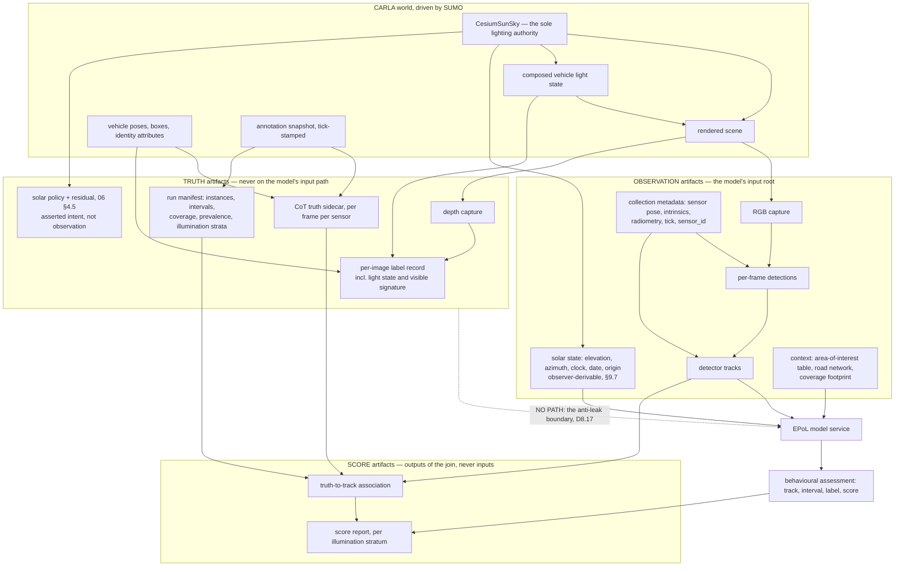
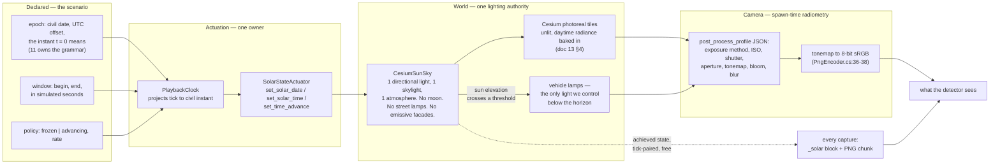
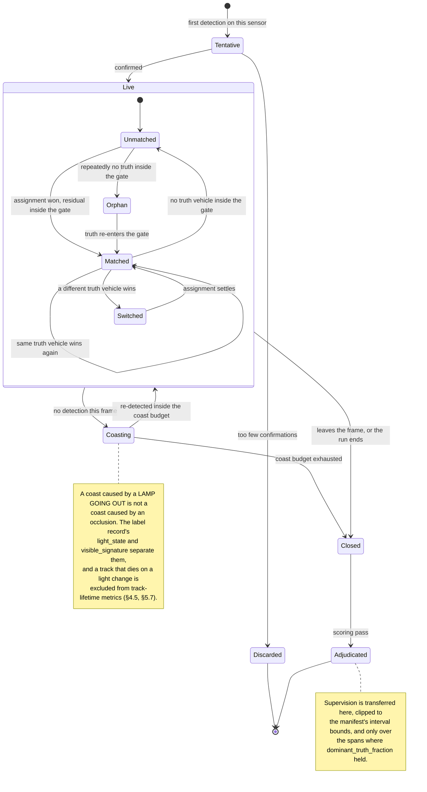
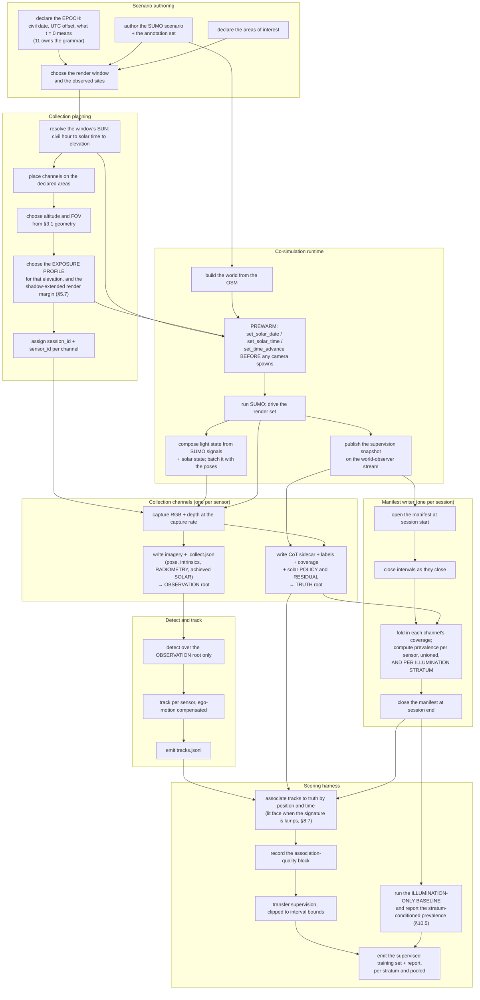
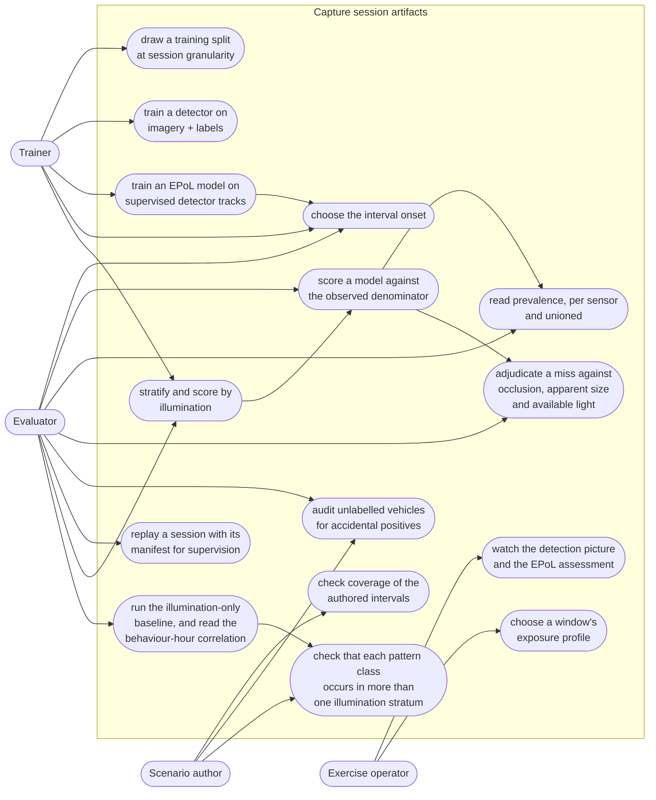

# 08 — Collection and the EPoL boundary

**Status:** Plan section. Source audit against the working tree; read-only measurements taken against
`BahonarPatternOfLife.zip`, against the camera geometry, against the shipped post-process profiles and
against the solar geometry of the sizing site, each marked as measured where it appears. No code
changed, no build run.
**Date:** 2026-09-18. **Redrafted** from the 2026-09-17 draft to make **illumination a first-class
collection parameter**. The first draft placed capture windows in simulated time — at 07:00 and at
23:00 — and never connected them to the sun. That was an oversight, and for this section it is the
largest one available, because illumination is the biggest covariate an electro-optical detector faces.
**Every measurement in the first draft is carried forward unchanged.**
**Owner role:** collection and EPoL integration engineer.
**Scope:** everything between photons and a score — the camera rig, the light the scene is captured
under, the capture, the per-image labels, the detect-and-track stage, the estimated-pattern-of-life
(EPoL) model service boundary, and the evaluation join. Covers both products: a **recorded corpus** and
a **live exercise**.
**Audience:** an engineer who has read neither the conversation that produced this plan nor the whole
Findings set. Every external claim is cited.

**Reads from:**
[20 — Behavioral Annotation and Areas of Interest](../../Findings/20_Behavioral_Annotation_And_Areas_Of_Interest.md) ·
[17 — Photoreal Occlusion Metric](../../Findings/17_Photoreal_Occlusion_Metric.md) ·
[16 — Sensor Pose in Recordings](../../Findings/16_Sensor_Pose_In_Recordings.md) ·
[19 — Image Labeling during Orbit](../../Findings/19_Image_Labeling_during_Orbit.md) ·
[13 — Usable Night-Time Lighting](../../Findings/13_Usable_Night_Lighting.md) ·
[12 — CarlaNet.Labeling](../../Findings/12_CarlaNet_Labeling.md) ·
[09 — Telemetry CoT Contract](../../Findings/09_Telemetry_CoT_Contract.md) ·
[23 — SUMO Traffic Integration](../../Findings/23_SUMO_Traffic_Integration.md).

**Depends on, and states the property it needs rather than designing it:**
[`01_Architecture.md`](01_Architecture.md) (process topology, `SolarStateActuator`, `SumoSignalProjector`),
[`03_CoSimulation_Runtime.md`](03_CoSimulation_Runtime.md) (tick loop, pose continuity),
[`04_Contracts.md`](04_Contracts.md) (interface registry),
[`06_Truth_And_Annotation.md`](06_Truth_And_Annotation.md) (the annotation record, the solar record and the manifest),
[`10_Scale_And_Performance.md`](10_Scale_And_Performance.md) (throughput budget, window placement),
[`11_Time_And_Illumination.md`](11_Time_And_Illumination.md) (the epoch contract, the engine-side verdict on what is renderable, the light-mapping table),
[`12_Operator_Control_Surface.md`](12_Operator_Control_Surface.md) (how an operator expresses any of it),
[`13_Work_Breakdown.md`](13_Work_Breakdown.md) (sequencing).

### What changed in this redraft

The section numbers moved once, and this table is the re-map so a reader holding the first draft can
follow. Nothing was deleted and no measurement was dropped.

| First draft | Here | Why |
|---|---|---|
| §1–§3 | §1–§3 | unchanged, plus a new §2.9 (the radiometric chain) and §2.10 (the time-of-day surface that already exists) |
| — | **§4 — Illumination as a collection parameter** | **new.** The night-viability verdict, the exposure finding, vehicle lights, the freeze-versus-advance default |
| §4 (per-image labelling) | §5 | plus §5.8 on what a label means when only lamps are visible |
| §5 (does the motion survive) | §6 | plus §6.5, which corrects the motion-blur finding |
| §6 (detect-and-track interface) | §7 | `CollectionFrame` gains a radiometry block and a solar block |
| §7 (association) | §8 | plus §8.7, association when the signature is a lamp |
| §8 (EPoL boundary) | §9 | plus §9.7, the ruling on solar state and the principle that settles it |
| §9 (evaluation join) | §10 | plus §10.5, the illumination axis and the behaviour-hour confounder |
| §10 (live exercise) | §11 | unchanged |
| §11 (doc 20 question 1) | §12 | **re-scoped** — the illumination dimension, without a matrix |
| §12–§15 | §13–§16 | diagrams and decisions updated |

### What this section does *not* cover

- The internals of any detector, tracker or EPoL model. Only the contracts at their boundaries.
- The behavioural annotation format itself — that is [`06_Truth_And_Annotation.md`](06_Truth_And_Annotation.md).
  This section says what the collection chain must carry and how scoring consumes it.
- **The epoch contract** — what civil instant `t = 0` means, its grammar, and the civil-to-solar-zone
  conversion. [`11_Time_And_Illumination.md`](11_Time_And_Illumination.md) owns it; §4.9 states what
  this section needs it to guarantee.
- **The engine-side verdict on what is renderable at night** — whether a moon light, a sky-light floor
  or street lamps get built. [`11_Time_And_Illumination.md`](11_Time_And_Illumination.md) owns that.
  **This section owns the collection verdict: whether a detector can work with what comes out** (§4.6).
- **The light-state mapping table and the darkness thresholds.** [`01_Architecture.md`](01_Architecture.md)
  gives the job to `SumoSignalProjector` and [`11_Time_And_Illumination.md`](11_Time_And_Illumination.md)
  owns the table. This section owns what the resulting lights do to a detector, a box and a track
  (§4.5, §5.8, §8.7).
- **How an operator expresses the time-of-day choice.** [`12_Operator_Control_Surface.md`](12_Operator_Control_Surface.md)
  owns the surface; §4.9 states the controls collection needs to exist.
- How SUMO vehicles become CARLA actors (the render-set contract) — [`03_CoSimulation_Runtime.md`](03_CoSimulation_Runtime.md).
- Which vehicles exist, how they are authored, or how a `vType` maps to a blueprint —
  [`07_Scenario_Authoring.md`](07_Scenario_Authoring.md). Two measured *confounders* in the authoring
  surface are reported in §5.6 and §4.5 because they damage the corpus, not because the authoring
  surface is this section's to fix.
- Pedestrians. Out of scope for the whole plan (team brief §3.5).
- Sequencing and work items — [`13_Work_Breakdown.md`](13_Work_Breakdown.md).

---

## 1. Two products, one chain

The user's stated purpose names two things, and they are not variants of each other:

| | **Recorded corpus** | **Live exercise** |
|---|---|---|
| Purpose | Train and validate EPoL models | Exercise an EPoL model's decision end to end |
| Product | Imagery + truth sidecars + per-image labels + a run manifest | A running world, a model under test, and an operator picture |
| Pacing | As fast as the machine allows; simulated time is the clock | Paced against the wall clock |
| Truth | Written beside the imagery, complete, retained | Written to a separate sink, withheld from the model, retained for scoring |
| Detector | May run offline, after the fact, repeatedly | Runs once, in the loop, under a latency budget |
| Illumination | A **controlled variable**: frozen per window, stratified across windows (§4.7, §10.5) | A **condition**: whatever the exercise's scenario time implies, and it may move |
| Failure of the model | Costs a number in a report | Costs the exercise |

They share everything from photons to detector-track output. They diverge at exactly three points:
**transport** (files versus a stream), **pacing** (free-running versus wall-clock), and **what
illumination is for** (a stratification axis versus a condition of the exercise). That shared middle is
why one design covers both, and why the detect-and-track stage must be written to consume a stream of
frames plus metadata rather than a directory of files (§7.2).



The dashed edge is the whole point of §9.4. It is drawn because the shortest route from a good idea to
a worthless corpus is a feature the model turns out to have been computed from truth. The solid
`SOL --> EPOL` edge is the one this redraft adds, and §9.7 is the argument for why it is allowed to
cross a boundary that nothing else crosses.

---

## 2. What exists today, measured

§2.1 to §2.8 were read from the tree on 2026-09-17 and re-verified on 2026-09-18. §2.9 and §2.10 are new.

### 2.1 The rig is one camera and its shadow

`SensorRig` spawns exactly two sensors: an RGB camera and a depth camera, configured from the same
`--width`/`--height`/`--fov` arguments and spawned at one pose
(`CarlaControl/src/carlacontrol/SensorRig.py:61-91`). Every pose change moves camera, depth camera and
spectator together (`SensorRig.py:100-125`), and the reason is written down in the source: measurements
that pair a depth capture with a colour capture "are only valid while the two are looking from the same
place, and a depth camera left behind at the old pose silently invalidates them"
(`SensorRig.py:186-189`).

`run_SCTMV.py` builds one rig (`CarlaControl/scripts/run_SCTMV.py:169`) and one recorder over that
rig's RGB camera with that rig's depth camera attached (`run_SCTMV.py:190-192`).

### 2.2 The single-camera limit is a shim field, not an architectural one

This paragraph corrects a premise doc 20 decision 11 rests on, and it was re-verified against the source
because the multi-camera decision (§3.4) turns on it.

**A recorder already opens two streams, not one.** `FrameRecorder`'s constructor takes a single 24-byte
*camera* token and rejects anything else
(`CarlaNet/src/CarlaNet.Recording/FrameRecorder.cs:83-90`), but it opens a subscription for the depth
stream at `FrameRecorder.cs:112-113` (via `OcclusionEstimator`, whose own constructor subscribes at
`OcclusionEstimator.cs:83-90`) and a second for the camera at `FrameRecorder.cs:125-126`. The range
`FrameRecorder.cs:59-98`, which doc 20 §2.5 and §7.3 both cite as the place a single stream token is
bound, is the occlusion counter block (`:59-69`) followed by the constructor's XML documentation and
signature (`:71-90`). It binds nothing.

**The transport imposes no limit either.** `CarlaClient.SubscribeToStream` parses a token, constructs a
`SensorStream` and appends it to a list (`CarlaNet/src/CarlaNet.Transport/CarlaClient.cs:1748-1754`).
One client already holds three: the world-observer stream (`CarlaClient.cs:1803`), the recorder's camera
stream, and the occlusion estimator's depth stream.

**The limit is one Python field.** `World.start_recording` calls `self.stop_recording()` at its top
(`CarlaNet/python/carlanet/__init__.py:1908`) and stores the result in `self._recorder`
(`:1924`, cleared at `:1980-1986`), so starting a second recorder on one `World` object destroys the
first. It is enforced, not conventional — but it is scoped to the `World` *instance*, and
`Client.get_world()` returns a **fresh** `World(self._inner)` on every call (`:2285`, `:2295`). So two
`World` handles from one `Client` already hold two independent recorder slots over one connection, one
world-observer stream and one actor cache.

**Consequence:** several collection channels in one process is a rig change and a shim change —
or no shim change at all, since a purpose-built rig can construct `FrameRecorder` per channel directly,
as the shim itself does (`carlanet/__init__.py:1907, 1924-1929`). Doc 20 §7.3's premise that "adding one
today means adding a client process" is wrong, and §3.4 takes the decision on the corrected premise.

What is *not* free is throughput: N channels means 2N or 3N subscriptions on one connection, and
`run_SCTMV.py:215-219` records two streams already saturating it (§2.3).

### 2.3 Capture is decimated client-side, and the server does not know

`FrameRecorder.OnFrame` drops frames until `sim_time - last_capture >= 1/hz`
(`FrameRecorder.cs:129-133`), with `--record-hz` defaulting to 2.0
(`CarlaControl/src/carlacontrol/CarlaControlArgumentParser.py:512-518`) against a default world step of
0.05 s (`CarlaControlArgumentParser.py:68-74`). So at defaults the server renders and streams twenty
frames per second per camera, and nineteen in twenty are decoded far enough to be discarded.

The engine already exposes the fix and nothing uses it. `sensor_tick` is a standard sensor attribute
(`Unreal/CarlaUnreal/Plugins/Carla/Source/Carla/Actor/ActorBlueprintFunctionLibrary.cpp:244-254`) and
`ASensor::Set` turns it into `SetActorTickInterval`
(`Unreal/CarlaUnreal/Plugins/Carla/Source/Carla/Sensor/Sensor.cpp:44-49`). `SensorRig` never sets it
(`SensorRig.py:61-86`). Whether `sensor_tick` composes correctly with synchronous world ticking, and
whether two cameras given the same `sensor_tick` land on the same simulation frames — which
`OcclusionEstimator` requires for pairing (§2.5) — is **unmeasured**; the measurement is in §12.4.

The contention is already recorded as a measurement in the source: "With two camera streams saturating
the connection each of those RPCs stalls for ~100-200 ms; left on the main loop they collapse it to ~1
fps" (`run_SCTMV.py:215-219`). Two streams is today's rig. Multi-camera multiplies it.

### 2.4 What a capture already carries

Per capture, two files sharing a filename stem built from local wall-clock time to the millisecond
(`FrameRecorder.cs:223-232`):

- a lossless PNG with `carla:solar`, `carla:sensor` and `carla:capture` tEXt chunks
  (`FrameRecorder.cs:225-229`);
- a CoT XML sidecar (`CotWriter.cs`) holding, in order: the capture identity on the `<events>` element
  — tick, simulation time, `run_id`, `scenario_id`, `seed` (`CotWriter.cs:40-48`); a `<_solar>` block
  (`:52-66`); the collection platform as a CoT air track with a standard `<sensor>` element and a
  `<_carla_intrinsics>` child carrying `fx, fy, cx, cy, hfov, vfov, distortion, align_offset_m`
  (`:71-128`); and one `<event>` per telemetered vehicle with `point/lat,lon,hae`, `track/course,speed`,
  `contact/callsign` and a `_carla` extras block (`:130-198`).

Occlusion rides that extras block when it was measured: `occlusion`, `occlusion_level`,
`occlusion_samples`, `apparent_width_px`, `apparent_height_px`, all absent when unmeasured
(`CotWriter.cs:178-193`).

**The capture identity is the join key that already works.** `CaptureIdentity(Tick, SimTimeSeconds,
RunId, ScenarioId, Seed)` (`CaptureMetadata.cs:24-29`) is taken from the very sensor frame that
produced the pixels (`FrameRecorder.cs:179`), and the record's own doc comment explains why wall-clock
time cannot serve (`CaptureMetadata.cs:9-14`). Filenames are wall-clock and must never be used to pair
anything.

**The solar block is already there, and it is already bound to the pixels.** `_solar` carries
`solar_time`, `date`, `time_zone`, `lat`, `lon`, `sun_elevation_deg`, `sun_azimuth_deg`, `advancing` and
`rate` (`CotWriter.cs:52-65`), read lock-free from the world-observer cache with no RPC
(`FrameRecorder.cs:160-162`, `CarlaClient.cs:1988-1991`), and the same eleven doubles are embedded in
the PNG as a `carla:solar` tEXt chunk (`SolarMetadata.cs:14-20`, written between IHDR and IDAT by
`PngEncoder.cs:44-47`). [`06_Truth_And_Annotation.md`](06_Truth_And_Annotation.md) §2.7 owns the full
account of that record and of the four ways it can be silently wrong; it is not restated here. What
matters to collection is the consequence §9.7 draws from it: **the sun is already, today, physically
inside the file the detector reads.**

### 2.5 The occlusion measurement is built

`OcclusionEstimator` keeps a ring of eight recent depth frames (`OcclusionEstimator.cs:50`), pairs one
to the recorded frame by simulation frame number, falls back to simulation time, and **refuses the pair
if the two cameras are not co-located and co-boresighted** within tolerances
(`OcclusionEstimator.cs:110-172`). Failures are counted in five buckets and surfaced on the recorder
(`FrameRecorder.cs:53-69`), which `NativeRecorder` reports on stop
(`CarlaControl/src/carlacontrol/NativeRecorder.py:133-160`).

**It is illumination-independent, and that turns out to matter.** The depth capture is a scene-depth
render, and the apparent-size figures are computed by projecting the *true* box
(`CotWriter.cs:189-192`); neither reads a pixel's brightness. §12.1 leans on this to keep the re-scoped
experiment from multiplying into a matrix.

### 2.6 The arrival gate is built, and is inert by default

Doc 17 §12.2's arrival gate is client-side: `CarlaClient` records each `set_actor_fade` it sends and
latches full opacity, and `VehicleTelemetryService` skips vehicles that were never established
(`VehicleTelemetryService.cs:66-73`).

**Under the user's directive of 2026-09-17 the fade is demoted and this section does not design around
it.** Verified against the tree:

- `--fade` carries `default=False`, and the help text names the reason: the opacity is computed
  client-side and pushed "one blocking RPC per vehicle per reconcile, which is the heaviest load this
  client puts on the server's per-frame RPC budget"
  (`CarlaControl/src/carlacontrol/CarlaControlArgumentParser.py:317-328`).
- With nothing fading, the gate suppresses nothing. `IsActorEstablished` returns true for any actor with
  no fade record — `!_fade.TryGetValue(id, out var fade) || fade.Established`
  (`CarlaNet/src/CarlaNet.Transport/CarlaClient.cs:1571`) — and `GetActorOpacity` returns `1.0` on the
  same condition (`:1562`). The truth producer's own comment says so: "Vehicles nobody fades are
  established from the start, so this gate is inert unless staging traffic is running"
  (`VehicleTelemetryService.cs:71-72`).

So there is **no dissolve-in period during which a vehicle is deliberately unreported**, and nothing in
this section may assume one. Every vehicle is telemetered, labelled and counted in coverage from the
tick it exists. Three consequences run through the rest of this document: §5.1's `opacity` carries no
information and is retained only so that a later fade mode is not a schema change; §5.3's arrival gate is
a no-op; and the artefact the fade used to hide is now in the imagery and is §5.7's subject.

**The budget released is real and is spent here.** Removing the heaviest per-frame client load is
headroom for the capture and per-image labelling of §5, for the N-channel subscription cost of §3.4, and
for the per-tick light-state batch of §4.5 — which matters because §2.3's contention measurement was
taken on a client that was doing that work.

### 2.7 The recorder already computes the 3D box and throws it away

`VehicleTelemetry` carries `ActorTransform` and `BoundingBox`, with the doc comment "Geometry rather
than telemetry: it is not part of the CoT contract and is not serialized to the sidecar"
(`CarlaNet/src/CarlaNet.Recording/VehicleTelemetry.cs:65-74`). It also carries `Opacity`
(`:59-63`), likewise unserialised — doc 17 §12.5 lists that as open.

So the oriented 3D box for every telemetered vehicle, frame-coherent with the pixels, already exists in
memory at write time. **Per-image labelling is a serialisation change plus a projection, not a new
measurement.** That is the same conclusion doc 12 §2 reached, and it is still true.

### 2.8 What does not exist — corrected

Read from the tree, so that no part of this plan assumes a tool that is gone. **The last three rows are
corrections to the first draft, and they are the reason §2.9 exists.**

| Named in | Thing | State on 2026-09-18 |
|---|---|---|
| doc 12 | `CarlaNet.Labeling` assembly | **Absent.** `CarlaNet/src/` holds Map, Nav, Python, Recording, Scenario, Sensors, TrafficManager, Transport, Types — no Labeling |
| doc 19 | `Training_Data_Generator.py` | **Absent** from the tree |
| doc 19, doc 12 | `eo_observer.py` | **Absent**; only a stale `CarlaNet/python/__pycache__/eo_observer.cpython-314.pyc` remains |
| doc 20 §7.5 | run manifest | **Absent.** Nothing writes one |
| doc 20 §4.2 | `scenario_id` supplied to the recorder | **Still never supplied, at a new address.** The live call site is `CarlaControl/src/carlacontrol/NativeRecorder.py:96-111`, which passes `run_id`, `seed`, `fov`, the four `platform_*` arguments, `depth_camera`, `occlusion_margin_m` and `occlusion_samples` — and no `scenario_id`, though the shim accepts one (`carlanet/__init__.py:1876`). `ScenarioController` never learns an id at all (`ScenarioController.py:30`) |
| — | any detector, tracker, or EPoL client | **Absent.** The only mention of YOLO in code is a comment (`CarlaNet/python/cot_telemetry.py:5`) |
| doc 13 §6 Phases 1–3 | a moon light, a night sky-light floor, street lamps, emissive facades | **All absent.** `ACesiumSunSky` still creates exactly one directional light at 111 000 lux, one real-time `SkyLight` with `bLowerHemisphereIsBlack = false`, and one atmosphere — **no second directional light** (`Unreal/CarlaUnreal/Plugins/CesiumForUnreal/Source/CesiumRuntime/Private/CesiumSunSky.cpp:59`, `:82`, `:86`). A search of `CarlaControl/src` and `CarlaNet/src` for `street_lamp`, `StreetLight`, `PointLight` or `SpotLight` returns exactly one hit — `MapLayer.StreetLights` (`CarlaNet/src/CarlaNet.Types/Rpc/Enums/MapLayer.cs:8`), a layered-map flag for the stock towns with nothing to do with a generated world. **Doc 13's Phase 0 is built and everything after it is not** (§4.6) |
| upstream CARLA | a camera **motion-blur attribute** | **Still absent as an attribute** — the camera definition offers `fov`, `image_size_x/y`, `lens_*`, `enable_postprocess_effects`, `post_process_profile`, `sensor_tick` (`ActorBlueprintFunctionLibrary.cpp:244-254`, `:313-410`) and a search for `motion_blur` finds nothing. **But motion blur is switched on in every shipped profile and is rendering today** (§2.9, §6.5). The first draft's "absent from this fork" was true of the knob and false of the effect |
| — | `exposure_compensation` | **Still not offered by the server's camera definition** — a search for `exposure` in `ActorBlueprintFunctionLibrary.cpp` returns nothing — so `SensorRig`'s `--ev` path is inert behind its `has_attribute` guard (`SensorRig.py:66-67`). The guard's other half never fires: `--ev` carries `default=0.0`, not `None` (`CarlaControlArgumentParser.py:237-241`), so `args.ev is not None` is always true and only `has_attribute` blocks it. **But exposure is fully settable at spawn, by a different attribute that does exist** (§2.9). The first draft's conclusion that "the rig cannot currently set either" is **half wrong**, and §4.2 states what is actually true |

### 2.9 The radiometric chain, measured

**New in this redraft, and it is the single most consequential measurement in it.** The first draft
looked for `exposure_compensation`, did not find it, and stopped. Following the attribute that *is*
there leads somewhere different.

**The camera definition publishes eleven attributes and none of them is an exposure.**
`MakeCameraDefinition` declares `fov`, `image_size_x`, `image_size_y`, the six `lens_*` parameters,
`enable_postprocess_effects` and `post_process_profile`
(`Unreal/CarlaUnreal/Plugins/Carla/Source/Carla/Actor/ActorBlueprintFunctionLibrary.cpp:313-410`), plus
`sensor_tick` from `AddVariationsForSensor` (`:244-254`) and the sensor `role_name` (`:239-241`).
**Of the three sensors in a collection channel (§3.2), only the RGB camera gets the post-process pair**:
`ASceneCaptureCamera` passes `bEnableModifyingPostProcessEffects = true`
(`Unreal/CarlaUnreal/Plugins/Carla/Source/Carla/Sensor/SceneCaptureCamera.cpp:19-22`), while the depth
camera takes the one-argument overload, which defaults it to `false`
(`Sensor/DepthCamera.cpp:14`; default declared at `ActorBlueprintFunctionLibrary.h:66-68`).

**The engine side is complete and is simply not published.** `ASceneCaptureSensor` carries the whole
physical-camera surface with getters and setters: `SetExposureMethod` (`SceneCaptureSensor.h:237`),
`SetLocalExposureMethod` (`:243`), `SetExposureCompensation` (`:255`), `SetShutterSpeed` (`:267`),
`SetISO` (`:273`), `SetAperture` (`:279`), `SetFilmSlope` and the rest of the tonemapper (`:321`…),
`SetExposureMinBrightness` / `MaxBrightness` / `SpeedDown` / `SpeedUp` (`:351`, `:357`, `:363`, `:369`),
and `SetMotionBlurIntensity` / `MaxDistortion` / `MinObjectScreenSize` (`:381`, `:387`, `:393`). Every
one writes a field of `CaptureComponent2D->PostProcessSettings`
(`SceneCaptureSensor.cpp:108-433`), and the constructor sets the corresponding `bOverride_*` flag to
true for all of them (`SceneCaptureSensor.cpp:1057-1114`), so the values on the component are
authoritative over any level post-process volume. **Nothing exposes them as blueprint attributes.**
Publishing them is an additive change to one function, and a rebuild is not a cost on this project
(team brief §4).

**But exposure is already controllable at spawn, through `post_process_profile`.** This is the part the
first draft missed. `SetCamera` reads the attribute and loads a named JSON file over the capture
component (`ActorBlueprintFunctionLibrary.cpp:1369-1381`):

```cpp
FString PostProcessDefaultName = RetrieveActorAttributeToString("post_process_profile",
    Description.Variations, TEXT("default"));
UPostProcessJsonUtils::LoadAllPostProcessFromJsonToSceneCapture(
    Camera->GetCaptureComponent(), PostProcessDefaultName);
```

`LoadAllPostProcessFromJsonToSceneCapture` reads
`Content/Carla/Config/PostProcess/<name>.json` (`BlueprintLibary/PostProcessJsonUtils.h:49`) and
assigns `SensorCamera->PostProcessSettings = Wrapper.Settings` — **a whole-struct replacement**
(`PostProcessJsonUtils.cpp:86-101`). The load is reached because the Python shim sends **every**
attribute of a blueprint, not only the modified ones: `ActorBlueprint.to_description()` builds an
`ActorAttributeValue` for each entry of its cached attribute dict
(`CarlaNet/python/carlanet/__init__.py:619-625`), so `enable_postprocess_effects` and
`post_process_profile` are always in `Description.Variations` for an RGB camera and the
`if (Description.Variations.Contains(...))` guard at `:1369` is always satisfied.

**Four profiles ship, and they are not equivalent.** Measured by reading the JSON directly from
`Unreal/CarlaUnreal/Content/Carla/Config/PostProcess/` and computing EV100 as
`log2(N²/t) − log2(ISO/100)`:

| Profile | Exposure method | Aperture | Shutter | ISO | Bias | **EV100** | Bloom | Lens flare | Vignette | Lumen skylight leak |
|---|---|---|---|---|---|---|---|---|---|---|
| `Default.json` | **`AEM_Manual`** | f/4.0 | 1/320 | 100 | 0.0 | **+12.32** | 0.20 | 0.01 | 0.40 | 0.00 |
| `GoPro.json` | `AEM_Manual` | f/6.0 | 1/60 | 100 | 0.0 | **+11.08** | 0.675 | 1.00 | 0.40 | 0.00 |
| `Town10HD_Opt.json` | **`AEM_Histogram`** | f/9.8 | 1/15 | 300 000 | +1.2 | **−1.06** | 0.675 | 1.00 | 0.70 | 0.35 |
| `Town_C.json` | `AEM_Histogram` | f/9.8 | 1/15 | 300 000 | +1.2 | **−1.06** | 0.675 | 1.00 | 0.70 | 0.35 |

All four set `autoExposureApplyPhysicalCameraExposure = true`, all four set `filmGrainIntensity = 0`,
and all four set `motionBlurAmount = 0.5`, `motionBlurMax = 5` (percent of screen width) and
`motionBlurPerObjectSize = 0`. The histogram profiles carry `autoExposureMinBrightness = −10` and
`MaxBrightness = 20` — a thirty-stop adaptation range.

Six consequences, and each is load-bearing somewhere below:

1. **Today's collects are made at a bright-daylight exposure.** `SensorRig` sets `image_size_x/y`, `fov`,
   the inert `--ev`, and the depth camera's `max_range`, and never touches `post_process_profile`
   (`SensorRig.py:61-80`). Nothing in `CarlaControl/src` or `CarlaNet/src` mentions `post_process` at
   all. So every capture uses `Default.json` at **EV100 +12.3**, which is a clear-sun exposure. That is
   the correct choice for the noon-spawned worlds collected so far and the wrong one for anything else.
2. **A night-capable exposure already exists on disk and is one string away.** `Town10HD_Opt.json` is
   sixteen stops darker than `Default.json` and runs histogram eye-adaptation. It is named for a stock
   town, which is a naming collision rather than a technical obstacle, and §4.2 says what to do about it.
3. **Exposure is spawn-time only.** The profile is loaded inside `SetCamera`, which runs once when the
   actor is created; there is no RPC that re-applies a profile or sets an exposure on a live camera
   (searched: nothing in `CarlaNet/src` or the shim references post-process). **A session whose sun
   moves cannot re-expose without respawning the camera**, and respawning changes the actor id, the
   stream token and therefore the channel's identity (§3.5). This is the mechanical reason §4.7 prefers
   a frozen sun.
4. **The product is 8-bit, tonemapped, and has no noise model.** `PngEncoder` writes IHDR with bit depth
   8 and colour type 2, truecolour RGB (`PngEncoder.cs:37-38`), from the BGRA the server already
   tonemapped. There is no HDR path and no raw path, so **under-exposure is not recoverable in post** —
   it is quantised away before the file is written. And `filmGrainIntensity = 0` in all four profiles
   means there is no sensor-noise model at all, so synthetic low-light imagery will be *clean* dark
   where real low-light EO is noise-dominated (§4.3).
5. **The profile silently overwrites the C++ defaults, including the Lumen tuning.** `SetCameraDefaultOverrides`
   sets `LumenSkylightLeaking = 0.1` and a full Lumen configuration
   (`SceneCaptureSensor.cpp:1115-1152`); the JSON assignment replaces the entire struct, and
   `Default.json` carries `lumenSkylightLeaking = 0.0`. At noon that is invisible. In a scene lit only
   by a below-horizon sun, skylight leak is one of the few remaining sources of any radiance at all, so
   the difference between 0.0 and 0.35 is the difference between black and nearly black. **Inference,
   labelled as such:** this is reasoning from the parameter's documented role, not from a rendered frame.
6. **A case-sensitivity hazard that would differ between Windows and Linux.** The attribute's
   recommended value is the lower-case string `"default"` (`ActorBlueprintFunctionLibrary.cpp:402`) and
   the file on disk is `Default.json`. The path is composed verbatim
   (`PostProcessJsonUtils.h:49`), `LoadAllPostProcessFromJsonToSceneCapture` returns `false` when the
   file cannot be opened, and the call site **discards the return value and logs nothing**
   (`ActorBlueprintFunctionLibrary.cpp:1376-1380`). On Windows the filesystem resolves it; on a
   case-sensitive filesystem it would not, and the camera would silently keep the constructor's default
   values instead of the profile's. **Inference, labelled:** the failure mode follows from the code, but
   whether the Linux server actually misses the file is **unmeasured** and is listed in §12.4. If it
   does, two servers render the same scene at different exposures with nothing in the record to show it.
   The profiles are staged into the packaged build — measured: all four JSONs are present under
   `Build/Dist/Carla-0.10.0-Win64-Development/CarlaServer/CarlaUnreal/Content/Carla/Config/PostProcess/`
   and in `Build/Package/…/Windows/…` — so this is a naming issue, not a packaging one.

**And the capture records none of it.** The sidecar's `<sensor>` element carries azimuth, elevation,
roll, fov, vfov, range and model, and `<_carla_intrinsics>` carries the pinhole parameters and
`align_offset_m` (`CotWriter.cs:101-124`). **There is no radiometry anywhere in the record**: not the
profile name, not the exposure method, not ISO, shutter or aperture, not the bit depth, not the
tonemapper. A corpus that records the sun to three decimal places and says nothing about the camera
cannot be re-exposed, cannot be compared across profiles, and cannot distinguish a dark scene from an
under-exposed one. §4.8 fixes that.

### 2.10 A time-of-day surface already exists in the harness

Measured, and worth knowing before [`12_Operator_Control_Surface.md`](12_Operator_Control_Surface.md)
designs a new one: the viewer harness already has four arguments and a consumer.

| Argument | Default | Effect |
|---|---|---|
| `--time` | `None`, meaning 12:00 | start local **solar** time, `HH:MM` or decimal hours (`CarlaControlArgumentParser.py:243-249`) |
| `--date` | `None`, meaning **the host system date** | scene date, `YYYY-MM-DD`, "sets the seasonal sun angle" (`:250-255`) |
| `--time-advance` | off | advance the sun as the scene runs; the help states it advances "with the world tick: WALL-CLOCK time in `--async`, but SIMULATION time under synchronous ticking" (`:256-263`) |
| `--time-rate` | `1.0` | sun-clock seconds per real or simulated second (`:264-269`) |

`WorldBuilder` consumes them: it parses the date (falling back to `datetime.now()`), parses the time
(falling back to 12.0), calls `set_solar_date` then `set_solar_time`, logs a warning if the world has no
`CesiumSunSky`, and calls `set_time_advance(True, args.time_rate)` when asked
(`CarlaControl/src/carlacontrol/WorldBuilder.py:225-253`). A runtime toggle exists too, bound to a key
in the interactive viewer (`PygameInterface.py:263-268`).

Two things follow for collection.

- **The freeze-versus-advance toggle the team brief now requires already has a precedent**, and it is a
  process-level flag rather than a per-window one. A capture plan with several windows at different
  hours therefore maps onto several runs, which §4.7 argues is the right shape anyway.
- **`--date` defaulting to the host system date is a reproducibility defect with a measured magnitude.**
  The seasonal declination sets the sun's elevation at a given hour, so with no `--date` the
  illumination of a corpus is a function of **the calendar day the operator happened to run it on**.
  At the sizing site (latitude 27.150 12°, read from the network's `projParameter`) the elevation at
  07:00 solar time ranges from **1.71° at the December solstice to 23.13° at the June solstice**
  (computed here from the standard solar-position identity). §4.1 turns that 21.4° spread into shadow
  lengths differing by a factor of fourteen. Two runs of one scenario, six months apart on the wall
  clock, are two different illumination conditions with nothing declaring it.
  [`11_Time_And_Illumination.md`](11_Time_And_Illumination.md) owns the epoch that fixes this; the
  collection-side requirement is simply that **a session never takes its date from the host clock**
  (D8.30).

---

## 3. The collection rig

### 3.1 How much a camera can actually see — measured geometry

The camera is a pinhole with square pixels and a centred principal point (doc 16 §4.4), so
`fx = W / (2·tan(hfov/2))`. At the defaults — 1280×720, 90° (`CarlaControlArgumentParser.py:236`,
`:272-273`) — `fx = 640 px` exactly, and the ground sample distance at slant range `R` is `R/640` metres
per pixel. Computed here; it reproduces doc 17 §12.3's measured figures (a 4.5 m vehicle at 555 m is
about 5 px, at 914 m about 3 px) to within a tenth of a pixel, so the model and the measurement agree.

| slant range | GSD (m/px) | 4.5 m vehicle | 28 m/s over 1.0 s | over 0.5 s | over 0.1 s |
|---|---|---|---|---|---|
| 200 m | 0.31 | 14.4 px | 90 px | 45 px | 9.0 px |
| 300 m | 0.47 | 9.6 px | 60 px | 30 px | 6.0 px |
| 518 m (1700 ft) | 0.81 | 5.6 px | 35 px | 17 px | 3.5 px |
| 1000 m | 1.56 | 2.9 px | 18 px | 9 px | 1.8 px |
| 1524 m (5000 ft) | 2.38 | 1.9 px | 12 px | 6 px | 1.2 px |
| 3000 m | 4.69 | 1.0 px | 6 px | 3 px | 0.6 px |
| 5486 m (18 kft) | 8.57 | 0.5 px | 3 px | 1.6 px | 0.3 px |

28 m/s is the measured median vehicle speed in the sizing scenario (§6.1).

At 90° the largest slant range at which a 4.5 m vehicle reaches a given pixel length is 960 m for 3 px,
576 m for 5 px, 288 m for 10 px, 144 m for 20 px. Doc 17 §12.3 records that neither resolution nor
field of view affects range *precision*, but that a narrower field of view buys more resolution of the
occlusion metric than a larger frame does; the same is true of a detection.

**The footprint at a usable resolution is fixed, and it is small.** Holding 10 px on a 4.5 m vehicle
means holding GSD at 0.45 m/px, and at 1280×720 that is a **576 × 324 m ground swath — 0.187 km² —
whatever the altitude.** Flying higher buys nothing except a narrower field of view to pay for it:

| slant range | FOV for 10 px on a 4.5 m vehicle | GSD | ground swath |
|---|---|---|---|
| 555 m | 54.9° | 0.45 m/px | 576 × 324 m |
| 1000 m | 32.1° | 0.45 m/px | 576 × 324 m |
| 1524 m | 21.4° | 0.45 m/px | 576 × 324 m |
| 3000 m | 11.0° | 0.45 m/px | 576 × 324 m |
| 5486 m | 6.0° | 0.45 m/px | 576 × 324 m |

Measured against the sizing scenario: the Bahonar network's `convBoundary` is
`-3606.86,-1914.94,3607.23,2107.82` (read from `Shahid_Bahonar_Port.net.xml` inside
`BahonarPatternOfLife.zip`), i.e. **7214 × 4023 m = 29.0 km²**. One camera at detector-usable
resolution covers **0.64 % of it.**

That single number decides the rig. A seven-day, 29 km², 245-flow scenario cannot be observed by one
camera in any useful sense, and the "honest denominator" of doc 20 §2.5 will be nearly empty unless
cameras are **aimed at the places the annotations are about**. Coverage is a design input, not an
outcome. §4.1 adds the second design input, which is that the same swath contains a shadow field whose
size varies by a factor of fourteen with the sun.

### 3.2 The unit of collection is a channel, not a camera

A "camera" in this rig is three co-posed sensors, of which the first is the product:

| Sensor | Role | Required? |
|---|---|---|
| `sensor.camera.rgb` | the imagery — the only thing the detector ever sees | yes |
| `sensor.camera.depth` | the occlusion measurement (doc 17 §12.1) and, with it, the honest denominator | yes for a corpus; optional for a live exercise |
| `sensor.camera.instance_segmentation` | modal (visible-region) vehicle masks, the doc 17 §5.2 upgrade | optional |

The depth camera **must** be held at the RGB camera's pose and field of view: `OcclusionEstimator`
refuses a pair whose poses have drifted (`OcclusionEstimator.cs:161-172`), and `SensorRig` already moves
them together for that reason (`SensorRig.py:100-125, 186-189`).

On the third: doc 12 §1 rejected segmentation cameras *as a source of bounding-box truth*, because
Cesium photoreal tiles are not CARLA actors and every building, tree and terrain pixel falls into
"Unlabeled". That reasoning is sound and unchanged. It does **not** apply to the use wanted here:
vehicles *are* CARLA actors, so an instance-segmentation camera gives an exact per-vehicle visible mask
against an unlabelled background, which is precisely the modal mask doc 17 §5.2 wants and the
`occlusion_src` attribution doc 17 §6 defers. Its other advertised benefit — weighting a translucent
occluder by its opacity (doc 17 §9) — no longer applies, because the only translucent occluders doc 17
named were mid-fade vehicles and nothing fades (§2.6). **This redraft gives it a second use it did not
have before**: at low sun and at night the amodal box and the visible extent diverge by the whole
vehicle (§5.8), and the instance mask is the only thing in the rig that measures the divergence rather
than assuming it. Adopting it is still optional and additive; nothing depends on it.

Note that the depth and segmentation cameras are **not** given the post-process pair — only the RGB
camera is (`SceneCaptureCamera.cpp:19-22` versus `DepthCamera.cpp:14`, §2.9) — which is correct, because
neither is a radiometric product, and which is also why neither is affected by anything in §4.

Naming, because three of these per channel multiplied by N channels needs names that stand alone:
a **collection channel** is `(sensor_id, rgb, depth?, seg?)`; a **capture session** is the set of
channels recording one run of one world.

### 3.3 Three rig patterns, named

| Pattern | Motion | What it is for | State |
|---|---|---|---|
| **Stare** | fixed pose, fixed boresight | persistent coverage of a declared area of interest; the only pattern that gives a stable denominator over a long interval | supported today by simply not enabling orbit |
| **Orbit** | circular ground track, boresight held on a centre | the existing EO collection idiom; gives look-angle diversity over one site | built — `OrbitSensorController` (`OrbitSensorController.py:250-277`), updated on its own 50 Hz thread (`:96-100`) |
| **Transit** | a commanded waypoint track | covering several sites in one pass; every site gets a short, bounded observation | **not built**; `PyGameSensorController` is interactive only |

A capture session mixes them. The recommended default for a corpus is **one orbiting primary plus one
staring channel per area of interest the run's annotations reference**, because an orbit alone cannot
promise coverage of an interval and a stare alone cannot give look-angle diversity.

**Measured consequence of orbiting, which the tracker inherits.** At the default 240 s per revolution
(`CarlaControlArgumentParser.py:610-614`), the boresight yaws at 1.5 °/s. Across a 90° field of view on
1280 px that is 14.2 px per degree, so **every static ground feature translates about 10.7 px between
consecutive captures at 2 Hz, regardless of altitude** — nearly two vehicle lengths at 518 m. Platform
translation adds only 3–5 px on top (5.2 m/s at a 200 m radius, 26 m/s at 1000 m). So the dominant
image-space motion in an orbit collect is *camera rotation*, not vehicle motion, and any tracker must
compensate for ego-motion using the recorded pose and intrinsics before it associates anything. Doc 16
put both in the sidecar and the PNG; this is what they are for.

**An orbit interacts with the sun, and the interaction is not small.** An orbit sweeps the sensor
azimuth through a full 360° every 240 s while the sun stays where it is, so the sun–target–sensor
geometry cycles from fully frontlit to fully backlit and through both specular configurations once per
revolution. At low sun that is the difference between a vehicle silhouetted against its own shadow and a
vehicle washed out by glare off wet quay, glass or water — and the sizing site is a **port**
(`Shahid_Bahonar_Port`, measured). §10.5 therefore stratifies on *relative* azimuth rather than on
absolute sun azimuth, and §12.2 notes that an orbit collect samples that whole axis for free, which a
stare does not.

### 3.4 The multi-camera decision

Doc 20 decision 11 states the problem and demands the decision be taken before multi-camera capture,
not after: the annotation registry is process-local, a recorder in another process reads an empty
registry and silently writes `unlabelled` on every vehicle, and the two ways out are (a) publish the
annotation state to the server the way staging bounds are, or (b) require every recorder to live in the
executor's process.

**The premise behind its framing is wrong, and correcting it splits the question in two.** Doc 20 §7.3
argues from "adding one camera today means adding a client process". §2.2 shows that is not so: a
recorder already opens two streams, the transport holds an unbounded list of them, and the only limit is
a `World`-instance field over a `Client` that hands out fresh `World` objects. So there are two separate
questions, and they have different answers:

| Question | Answer |
|---|---|
| **Where does world-scoped state live?** | Published server-side. Unchanged by the correction, and consistent with [`01_Architecture.md`](01_Architecture.md) **D1.10** |
| **How many processes should a multi-channel capture session use?** | **One**, by default — which the correction makes materially cheaper than doc 20 assumed |

**Decision on the first: publish the annotation state, and publish it on the world-observer snapshot
rather than through an RPC.**

Reasons, in order of weight:

1. **The silent failure mode is unacceptable and (b) does not remove it, it only forbids it.** Doc 20
   says so itself: (b) "is free and must then be enforced, because the failure mode is silent". Nothing
   in the shim or the recorder can detect the difference between "no scenario is running" and "the
   scenario is running in another process", because both produce an empty registry, and doc 20 decision
   2 makes `unlabelled` a legitimate written state. A corpus silently collected unsupervised is
   indistinguishable from a corpus legitimately collected unsupervised.
2. **(b) is incompatible with the live exercise, which is one of the two products.** A live exercise
   places a detector and a model service outside the simulator process by construction, and the truth
   writer that scores them must run somewhere. Under (b) it must be in the co-simulation process.
3. **~~The same channel also fixes doc 17 §12.2's client-held arrival gate.~~ Withdrawn, and recorded
   as withdrawn rather than deleted.** That was a reason until the fade was demoted (§2.6); with
   nothing fading, the gate is inert in every process and there is no cross-process defect left for
   publication to fix. It is struck here so that a later reader does not find the decision resting on a
   support that no longer exists. **The decision does not move**: reasons 1, 2, 4, 5 and 6 carry it on
   their own, and none of them mentions fade. If a server-side fade is ever reinstated, this reason
   returns at no cost, because arrival and opacity would then ride a channel that already exists.
4. **The mechanism already exists and has exactly the three properties doc 20 §7.3 asked for.** Solar
   state rides the world-observer datagram into a `volatile double[]` that is swapped wholesale per
   frame (`CarlaClient.cs:169`, `:1855`) and read lock-free with no RPC and no poll
   (`CarlaClient.cs:1987-1991`), which is how `FrameRecorder` consumes it at capture time
   (`FrameRecorder.cs:160-162`). That is tick-stamped, lock-free, snapshot-swapped — doc 20 §7.3's list,
   already implemented for a different payload. **This redraft strengthens the argument rather than
   weakening it**: the payload in question is precisely the illumination state that §4 makes
   first-class, so the mechanism is not merely analogous to what is needed, it is already carrying half
   of it.
5. **The objection doc 17 §12.2 raised against widening the observer packet does not apply here.**
   There, four bytes per actor per tick were rejected because "this very process had just sent" the
   value. Here no client holds it, the payload is sparse (doc 20 decision 2 makes `unlabelled` the
   default, so only annotated and nominal actors need an entry), and the alternative is an RPC in the
   capture path.
6. Rebuilds are neutral (team brief §4). "It is more work" is not a reason and does not appear in this
   comparison.

**Decision on the second: a capture session runs its channels in one process by default.** The corrected
premise changes the recommendation here even though it changes nothing above:

- Every channel then shares one connection, one world-observer stream and one actor cache, so the
  per-tick truth the recorders read is provably the same snapshot rather than N snapshots that agree
  most of the time. Doc 20 decision 15 calls a per-camera disagreement in `<_supervision>` at one tick a
  defect; one process makes it structurally impossible rather than merely required. **The same argument
  now covers illumination**: one process means every channel stamps the same tick with the same solar
  block, so a per-camera disagreement about what the sun was doing is impossible too.
- The capture-session identity (§3.5) is then trivially assigned once, and the manifest has one writer
  in the process that already holds every channel's coverage.
- The cost is contention on one connection, measured at two streams already
  (`run_SCTMV.py:215-219`). That is the reason to move a channel out, and it is a throughput decision
  for [`10_Scale_And_Performance.md`](10_Scale_And_Performance.md) rather than a correctness one.

**These two decisions are deliberately independent, and that is the point.** Publication means that
moving a channel into its own process — for throughput, or because a detector wants to sit beside it, or
because a live exercise puts the model on another machine — is a deployment choice with no correctness
consequence. Under doc 20's option (b) the same move would silently produce an unsupervised corpus.
**Correctness must not depend on which process a recorder is in; performance may.**

**Property needed from [`01_Architecture.md`](01_Architecture.md):** the topology must permit a
collection process that holds no SUMO connection, no traffic authority and no scenario state, and whose
only inputs are the sensor streams and the world-observer snapshot. If the architecture instead puts
collection inside the co-simulation process, this section's design still works; the reverse is not true.

**Property needed from [`06_Truth_And_Annotation.md`](06_Truth_And_Annotation.md):** the world-scoped
snapshot must carry, per actor, the supervision state and the instance and phase references, stamped
with the tick it describes — so that two recorders reading it at different wall-clock moments produce
identical `<_supervision>` for the same tick, which doc 20 decision 15 requires and calls a defect if
violated.

### 3.5 Session and sensor identity

Three identity defects, one already half-solved:

- **Session identity exists but is per process, not per session.** `run_SCTMV.py:152` derives
  `run-<UTC>` once per process and hands it to the recorder (`:190-192`), which is the right level for
  today's one-camera rig. `FrameRecorder`'s own fallback derives one from its start instant and the
  comment calls it "unique enough per recorder" (`FrameRecorder.cs:98-103`) — doc 20 §7.5 correctly
  identifies that as the wrong property. **Decision: a capture session identity is assigned once and
  handed to every channel; the per-recorder fallback survives only for a single-channel run.**
- **`sensor_id` defaults to an actor id.** `platform_uid` defaults to `CARLA-SENSOR-<camera id>`
  (`carlanet/__init__.py:1910`) and the CLI offers `--platform-uid` with that default
  (`CarlaControlArgumentParser.py:537-541`). Doc 20 §6.3 records that this has the same defect
  `actor_id` has. **Decision: for a session with more than one channel, an authored `sensor_id` is
  required, validated unique within the session, and stable across runs.** Everything in §8, §10 and
  §11 keys on it. It matters more under §2.9's finding than it did in the first draft, because a camera
  that must be respawned to change exposure would otherwise change identity mid-session.
- **`scenario_id` is still never supplied** (§2.8). Under SUMO drive the analogous identity is the
  scenario configuration, and it must reach `CaptureIdentity` (`CaptureMetadata.cs:24-29`) or the
  captures cannot be tied to the annotations. This belongs to [`04_Contracts.md`](04_Contracts.md); the
  property needed is simply that it is supplied, since the field already exists end to end.

**On-disk layout.** One session directory; one subdirectory per `sensor_id`; the manifest at the
session root, written by one writer (doc 20 §7.5). Filenames stay local wall-clock stems
(`FrameRecorder.cs:223-224`) and **nothing pairs across channels by filename** — the join key is the
tick, which every capture already carries (`CotWriter.cs:42`, `CaptureMetadata.cs:24-29`).

```
<session_root>/
  manifest.json                    # one per session, written incrementally, closed at end
  coverage.jsonl                   # per (sensor, tick, actor) observability, appended
  <sensor_id>/
    SCTMV_<stem>.png               # imagery                                   OBSERVATION
    SCTMV_<stem>.collect.json      # pose, intrinsics, RADIOMETRY, solar, tick  OBSERVATION
    SCTMV_<stem>.xml               # CoT truth sidecar (+ solar policy, residual)  TRUTH
    SCTMV_<stem>.labels.json       # per-image labels (+ light state, signature)   TRUTH
    SCTMV_<stem>.depth.png         # optional depth capture                    TRUTH
```

The split of a capture's metadata into a `.collect.json` that travels with the imagery, separate from
the `.xml` sidecar that does not, is the physical form of the anti-leak boundary (§9.4). Today both live
in one file; they must not. **The redraft adds two things to that split**, and §9.7 is the reasoning for
both: the *achieved* solar state and the camera's radiometry belong on the `OBSERVATION` side, while the
*asserted* solar policy and the declared-versus-achieved residual — which exist only by comparison
against the scenario's own declaration — belong on the `TRUTH` side.

---

## 4. Illumination as a collection parameter

**This section is new.** It exists because the first draft recommended capture windows at 07:00 and at
23:00 without connecting either to the sun, and because illumination is not a rendering detail here —
it is the largest single covariate an electro-optical detector faces, and at this corpus's resolution it
is comparable in magnitude to the targets themselves.

The chain it governs:



Three properties of that chain decide everything below. **One lighting authority** — the world
generator disables every pre-existing directional light and sky light so `CesiumSunSky` is the sole sun
(`Unreal/CarlaUnreal/Plugins/CesiumCarlaBridge/Source/CesiumCarlaBridge/Private/CesiumHeightSampler.cpp:358-381`,
which logs the count), and the server binding names it "the single sun/lighting authority for the
georeferenced world (CARLA weather is inert here)"
(`Unreal/CarlaUnreal/Plugins/Carla/Source/Carla/Server/CarlaServer.cpp:611-612`). **One camera
radiometry, fixed at spawn** (§2.9). **One output format, 8-bit and tonemapped** (§2.9).

### 4.1 Why it is the largest covariate, in the corpus's own units

The sizing site is at latitude **27.150 12°**, longitude **56.180 65°**, read from the `projParameter`
of `BahonarPatternOfLife/scenario/Shahid_Bahonar_Port.net.xml` (measured; the same `<location>` element
carries `netOffset="0.00,0.00"`, which doc 23 §2 measured at Arapahoe and
[`06_Truth_And_Annotation.md`](06_Truth_And_Annotation.md) §2.7 confirms here).

Sun elevation and azimuth at that latitude, computed here from the standard solar-position identity
`sin h = sin φ sin δ + cos φ cos δ cos H`, at the three declared window hours the plan already names:

| Solar time | December solstice | Equinox | June solstice |
|---|---|---|---|
| **07:00** (shift change, 10 §3.1.3) | **1.71°**, az 117.5° | 13.31°, az 97.0° | 23.13°, az 74.5° |
| 12:00 | 39.41°, az 180.0° | 62.85°, az 180.0° | 86.29°, az 180.0° |
| 15:00 (afternoon shift) | 23.31°, az 224.9° | 38.99°, az 245.5° | 49.36°, az 275.1° |
| **23:00** (night shift, 10 §3.1.3) | **−75.95°** | **−59.26°** | **−37.38°** |
| 05:00 | −23.13° | −13.31° | −1.71° |

Two readings of that table matter and they are independent.

**First: the same declared hour is not the same illumination.** At 07:00 the sun elevation spans
21.4° across the year, purely from the date. Since §2.10 measured that `--date` defaults to the host
system date, **that spread is currently sampled by whichever day the operator ran the collect on.**

**Second: at this resolution, shadows are larger objects than the vehicles that cast them.** Shadow
length is `h·cot(elevation)`; at the corpus's own 0.45 m/px working GSD (§3.1), for a 1.5 m tall
vehicle whose body is 10 px long:

| Sun elevation | Shadow length | In pixels at 0.45 m/px | Shadow ÷ vehicle length |
|---|---|---|---|
| 1.7° (07:00 in December) | 50.5 m | **112 px** | **11.2×** |
| 5° | 17.1 m | 38 px | 3.8× |
| 10° | 8.5 m | 19 px | 1.9× |
| 13.3° (07:00 at equinox) | 6.4 m | 14 px | 1.4× |
| 20° | 4.1 m | 9 px | 0.9× |
| 39.4° (noon in December) | 1.8 m | 4 px | 0.4× |
| 62.9° (noon at equinox) | 0.8 m | 1.7 px | 0.17× |
| 86.3° (noon in June) | 0.10 m | 0.2 px | 0.02× |

**A 4.5 m vehicle at the plan's working resolution is 10 px. Its shadow at the 07:00 window in
December is 112 px** — a higher-contrast, eleven-times-larger, perfectly correlated object moving with
the target. Whether a detector prefers the shadow to the vehicle at 10 px is exactly the kind of thing
that cannot be argued and must be measured, and §12.2 measures it. What can be said without measuring
is that **noon and dawn are not two samples of one distribution**, and a corpus collected only at noon
— where the shadow is a fifth of a pixel — contains no example of the regime where the shadow dominates.

**Third, and it is the one that makes this a collection problem rather than a rendering one:** the
azimuth column matters as much as the elevation. An orbit sweeps the sensor through 360° of azimuth
every 240 s (§3.3) while the sun stands still, so the sun–target–sensor geometry cycles through frontlit,
crosslit, backlit and both specular configurations once per revolution. The site is a port; water,
wet quay and glass are the three surfaces that produce specular glare, and all three are present.
Glare is therefore not an occasional hazard in this corpus — it is a periodic function of the orbit
phase, and §10.5 stratifies on relative azimuth for that reason.

### 4.2 Exposure: what can be controlled, what cannot, and what that costs at night

§2.9 has the measurements. The summary a collection engineer needs:

| Question | Answer |
|---|---|
| Can a run set an exposure compensation? | **No.** `exposure_compensation` is not a published attribute, so `--ev` is inert behind `has_attribute` (`SensorRig.py:66-67`) |
| Can a run set an exposure *at all*? | **Yes, at spawn**, by naming a `post_process_profile` (`ActorBlueprintFunctionLibrary.cpp:398-405`, applied at `:1367-1381`). The profile carries the whole stack: method, ISO, shutter, aperture, adaptation limits, tonemap, bloom, flare, vignette, motion blur |
| How many exposures can it choose from? | **Four**, the JSON files in `Content/Carla/Config/PostProcess/`, spanning EV100 +12.32 to −1.06 (§2.9) |
| Can it change exposure during a session? | **No.** The profile is read inside `SetCamera` at spawn; no RPC re-applies it. Changing exposure means respawning the camera, which changes its identity (§3.5) |
| Is the exposure recorded anywhere? | **No.** The sidecar carries geometry and intrinsics only (`CotWriter.cs:101-124`) |
| Is any of this hard to fix? | **No.** The engine-side setters are complete and unpublished — `SetExposureMethod` (`SceneCaptureSensor.h:237`), `SetExposureCompensation` (`:255`), `SetShutterSpeed` (`:267`), `SetISO` (`:273`), `SetAperture` (`:279`), `SetExposureMinBrightness`/`MaxBrightness`/`SpeedDown`/`SpeedUp` (`:351`, `:357`, `:363`, `:369`) — and every corresponding `bOverride_*` is already true (`SceneCaptureSensor.cpp:1057-1114`). Publishing them is an additive change to one function, and a rebuild is not a cost (team brief §4) |

**So the honest statement is not "exposure cannot be controlled".** It is: *exposure is controllable at
spawn, at the granularity of four named profiles, with no way to change it mid-session and no record of
which one was used.* For a corpus collected entirely at noon that is adequate and nobody noticed. For a
dusk or night corpus each of those three limitations bites, and they bite in a specific order:

1. **Profile granularity is the smallest problem and the easiest to fix.** A dusk window needs an
   exposure between `Default.json`'s EV100 +12.3 and `Town10HD_Opt.json`'s −1.06, and the gap between
   them is thirteen stops. Since the profile is just a JSON file the server reads by name, an **EO
   collection profile set** — named for the illumination regime rather than for a stock town, and
   version-controlled beside the plan — is a content change with no code in it at all. That is the
   cheapest useful thing in this whole section.
2. **No mid-session change is a real constraint and it argues for a design choice, not against one.**
   A window whose sun advances through dusk will cross several stops; with a fixed manual exposure the
   window's early frames or its late frames will be wrong, and with histogram adaptation the exposure
   becomes a function of the scene's content. Both are bad for a corpus, and §4.7 resolves it by
   freezing the sun per window and running one exposure per window, which makes the limitation
   irrelevant rather than merely tolerated.
3. **No recorded exposure is the one that silently corrupts the corpus**, and it is the reason §4.8
   exists. Two captures of the same scene under different profiles differ in every pixel; with no
   radiometry in the record, a later reader cannot tell that from a difference in the scene. Whatever
   else is decided, **the exposure actually in force must reach the sidecar, or the imagery is not
   self-describing.**

**On auto-exposure, which is available and which should mostly not be used.** `Town10HD_Opt.json`
selects `AEM_Histogram` with a thirty-stop adaptation range (§2.9). Histogram eye-adaptation makes the
image readable in almost any light and is the right choice for an operator looking at a screen. For a
corpus it has a specific and serious defect: **it makes the exposure a function of the scene's content,
and the scene's content is what is being detected.** A bright headlight entering frame darkens
everything else in the same frame; a run of frames containing more vehicles is exposed differently from
a run containing fewer. Worse for this plan's purpose, **adaptation partially cancels the very covariate
the corpus is being stratified by**: two windows at different sun elevations can produce similar pixel
statistics because the camera compensated, so an illumination axis measured in EV at the sensor would
look flat while the scene illumination varied by stops. Doc 13 §5 reached the same conclusion from the
determinism side — "prefer scheduled fixed `--ev` over auto-exposure when generating reproducible EO
frames" — and that is adopted here for a second, independent reason.

**Decision (D8.26): the corpus uses a fixed, manual, per-window exposure, chosen from a named EO
profile set, and recorded per capture. Auto-exposure is permitted only in a live exercise and only when
recorded as such**, because there the product is an operator's picture rather than a comparable
measurement.

### 4.3 Dynamic range, noise, and the 8-bit tonemapped product

Three measured properties of the product, and what each costs.

- **8-bit, tonemapped, no raw path.** `PngEncoder` writes bit depth 8, colour type 2 truecolour
  (`PngEncoder.cs:37-38`), from the BGRA the server already tonemapped through `FilmSlope 0.88`,
  `FilmToe 0.55`, `FilmShoulder 0.26`, `FilmBlackClip 0.0`, `FilmWhiteClip 0.04` (measured, identical in
  all four profiles). **Consequence:** the scene's dynamic range is compressed and quantised *before*
  anything is written, so under-exposure is not recoverable and over-exposure is not recoverable. A
  night frame that comes back near-black is black in the data, not merely dark on a screen. This is the
  single hardest constraint in §4.6's verdict, and it is the one that would survive even if every
  lighting phase of doc 13 were built, because it is a property of the capture path rather than of the
  scene.
- **No sensor-noise model.** `filmGrainIntensity = 0` in all four profiles (measured). Real low-light EO
  imagery is noise-dominated: photon shot noise sets the detection floor and a detector trained without
  it learns a clean-dark world that does not exist. **This is a domain gap, it is one-sided (synthetic
  is easier than real), and it is not closeable by collection** — the grain parameters are in the same
  unpublished post-process surface as exposure (`SceneCaptureSensor.cpp:1069`, `bOverride_FilmGrainIntensity`),
  so a profile could set it, but choosing a *physically meaningful* grain level would require a sensor
  model nobody in this plan owns. **Recommendation:** leave grain at zero, record that it is zero
  (§4.8), and treat noise as a post-hoc augmentation applied by the trainer rather than a rendered
  property. A recorded zero is honest; an invented grain is not.
- **Bloom, flare and vignette are large at low light and they are profile-dependent.** Measured:
  `bloomIntensity` 0.20 in `Default.json` and 0.675 in the histogram profiles; `lensFlareIntensity`
  0.01 versus 1.00; `vignetteIntensity` 0.40 versus 0.70. At noon these are cosmetic. When the only
  bright things in frame are lamps, **bloom and flare determine the apparent size of the detected
  object** and vignette determines whether a lamp near the frame corner survives at all. §5.8 takes that
  up, because it changes what a bounding box means.

### 4.4 Shadows, glare, and the ceiling nobody can raise

§4.1 gives the shadow magnitudes. Two further facts bound what any amount of work can achieve.

**The photoreal tiles carry daytime lighting baked into their albedo.** Doc 13 §4 states it plainly:
asset 2275207 is unlit photogrammetry whose textures "already encode the aerial capture's sun-lit
albedo, cast shadows, and ambient occlusion from a daytime pass", there is no per-texel operation that
recovers true albedo from a single baked capture, and any added light is additive on top. Two
consequences land on collection rather than on rendering:

- **Shadows in the imagery are two populations, and only one of them moves with our sun.** The tiles'
  baked shadows point wherever the aerial capture's sun pointed and are **identical in every capture of
  the corpus, at every declared hour**; the CARLA actors' shadows point wherever `CesiumSunSky` puts
  them. A model that learns to use shadow direction as a cue will learn the *baked* direction, because
  it is the one that never varies. **Inference, labelled:** this follows from doc 13 §4's statement plus
  the single-lighting-authority measurement, not from a rendered comparison. It is cheap to check and is
  listed in §12.4.
- **Illumination stratification is therefore partial by construction.** Varying the sun varies the
  actors' shading and shadows and the specular response of any lit surface, and does **not** vary the
  tiles' own apparent lighting. A report that claims a model was validated across illumination must say
  which part of the scene actually varied. §10.5 requires that statement.

**Glare is real, geometric, and already derivable.** Specular return off water, wet quay and glass is a
function of the sun–surface–sensor geometry, which is fully determined by the recorded
`sun_elevation_deg`, `sun_azimuth_deg` (`CotWriter.cs:58-59`) and the sensor's own `azimuth` and
`elevation` (`CotWriter.cs:101-102`). Nothing new is needed to *identify* a glare geometry; what is
needed is that the stratification uses it (§10.5) and that a capture in a near-specular configuration is
labelled rather than silently pooled with the rest.

### 4.5 Vehicle lights: reachable, unwired, and at night the only signal

**The mechanism is reachable and batchable.** Measured end to end:

| Layer | Surface |
|---|---|
| Python shim | `Actor.set_light_state` / `get_light_state` over `VehicleLightStateFlags` (`carlanet/__init__.py:781-788`) |
| Batch command | `SetVehicleLightStateCommand`, one of the 22 batch commands (imported at `carlanet/__init__.py:487`, wrapped at `:1141-1147`) — so lights ride the same `apply_batch` as the poses, at no extra round trip |
| Flags | `Position 0x1, LowBeam 0x2, HighBeam 0x4, Brake 0x8, RightBlinker 0x10, LeftBlinker 0x20, Reverse 0x40, Fog 0x80, Interior 0x100, Special1 0x200, Special2 0x400` (`CarlaNet/src/CarlaNet.Types/Rpc/Lighting/VehicleLightState.cs:8-10`) |
| Engine | `ACarlaWheeledVehicle::SetVehicleLightState` compares eleven booleans and calls `RefreshLightState` **only on change** (`Vehicle/CarlaWheeledVehicle.cpp:684-700`); the state lives on `InputControl.LightState` (`CarlaWheeledVehicle.h:326-332`) |
| SUMO | `Vehicle::getSignals` (`Build/sumo-src/src/libtraci/Vehicle.cpp:327`), variable `VAR_SIGNALS = 0x5b` (`libsumo/TraCIConstants.h:1075`), over the bitmask `BLINKER_RIGHT 1, BLINKER_LEFT 2, BLINKER_EMERGENCY 4, BRAKELIGHT 8, FRONTLIGHT 16, FOGLIGHT 32, HIGHBEAM 64, BACKDRIVE 128, …, EMERGENCY_BLUE 2048, EMERGENCY_RED 4096, EMERGENCY_YELLOW 8192` (`microsim/MSVehicle.h:1110-1138`) |

**But three things are true that change what can be built on it**, and all three are measured.

1. **SUMO never turns a headlight on.** Its model switches `VEH_SIGNAL_BRAKELIGHT`
   (`microsim/MSVehicle.cpp:4255-4257`) and the two blinkers (`:6836`, `:6850`, `:6853`); a search of the
   microsim finds **no** `switchOnSignal(VEH_SIGNAL_FRONTLIGHT)` anywhere. SUMO has no notion of time of
   day, so it cannot. **Headlights can only come from the solar state.**
2. **The only automatic-headlight logic in the tree is gated on a subsystem that is inert here, and is
   locked out anyway.** `VehicleLightStage` computes `position`/`lowBeam` from
   `_weather.SunAltitudeAngle` against thresholds of 15° and 165°
   (`CarlaNet/src/CarlaNet.TrafficManager/Stages/VehicleLightStage.cs:228-254`, constants at
   `CarlaNet/src/CarlaNet.TrafficManager/Constants.cs:202-208`), inside `if (_isWeatherEnabled)`
   (`:226`). CARLA weather is inert in a generated world (`CarlaServer.cpp:611-612`;
   `CesiumHeightSampler.cpp:386` says so in a comment), so that branch would never fire even if the
   traffic manager ran — and team brief §3.4 requires that it does not.
   [`01_Architecture.md`](01_Architecture.md) reaches the same finding and gives the composition job to
   `SumoSignalProjector`; this section does not duplicate the mapping table, which
   [`11_Time_And_Illumination.md`](11_Time_And_Illumination.md) owns.
3. **A successful `set_light_state` does not prove a lamp appeared.** `RefreshLightState` is a
   `UFUNCTION(BlueprintImplementableEvent)` (`CarlaWheeledVehicle.h:310-311`): the C++ stores the flags
   and hands them to the vehicle's Blueprint, with no native fallback. So the RPC's success tells you
   the state was recorded, not that anything was rendered. **Probe, and its limits:** a byte-grep over
   the `.uasset` name tables finds `RefreshLightState` in `BaseVehiclePawn.uasset` (the shared base, so
   the event is implemented once for everything that inherits it) and finds `LightState` or
   `SpotLightComponent` in **27 of 56** top-level vehicle blueprints under
   `Unreal/CarlaUnreal/Content/Carla/Blueprints/Vehicles/`. That is a name-table probe over a serialised
   asset, so it **bounds rather than proves**: a name may be present and unused, and a vehicle may
   inherit working lamps without carrying the name. **The only acceptable evidence is a rendered frame**,
   and that measurement is in §12.4. This is the same class of trap as the log-only `MaterialNotFound`
   on `Bodywork_Mat`, where a per-blueprint content gap looks like a working API from the client side.

**Now the part that is this section's to own: what lights do to a detector.**

At the corpus's working resolution a vehicle is 10 px (§3.1). A headlight pair is separated by roughly
1.4–1.8 m, which is **3–4 px**, and each lamp is sub-pixel. So below the horizon the detectable object
is not a vehicle silhouette; it is **a small, bloom-dominated pair of point sources**. Five consequences,
in the order they break things:

1. **Apparent size stops describing the target and starts describing the render profile.** A point
   source's extent in the image is set by bloom and flare, which are profile constants
   (`bloomIntensity` 0.20 or 0.675; `lensFlareIntensity` 0.01 or 1.00 — measured, §2.9). Two things in
   the design lean on apparent size: §5.3's `resolvable` gate and §8.2's association gate, which scales
   with `max(apparent_width_px, apparent_height_px)`. **Both are calibrated on daylight silhouettes and
   both are meaningless on a lamp**, and a gate that is meaningless is worse than a gate that is absent
   because it produces numbers. §5.8 and §8.7 say what replaces them.
2. **The truth box is still correct and is now mostly invisible.** The label writer projects the true 3D
   box (§5.1), which does not care about light. But the *visible* extent at night is the lamp, so the
   amodal box encloses a vehicle a human cannot see. A detector asked to regress that box from a point
   source is being asked to hallucinate extent. §5.8 adds a `visible_signature` field so a consumer can
   choose lamp-centroid detection instead, rather than discovering the mismatch as unexplained loss.
3. **The lamp is not at the truth point.** CARLA's truth point is the body centre; headlamps are at the
   front face and brake lamps at the rear. For a 4.5 m vehicle that is ±2.25 m, which at 0.45 m/px is
   **±5 px — half the object's own length**. Front-aspect and rear-aspect vehicles are therefore offset
   in *opposite* directions, so pooled localisation error at night carries a systematic, aspect-dependent
   bias that would be charged to the detector. §8.7 fixes it by comparing against the lit face.
4. **A track at night is a track of a light state, not of a body, and light states switch.** SUMO's
   brake light is a per-step boolean (`MSVehicle.cpp:4255-4257`); at the sizing scenario's authored 1.0 s
   step (measured, §6.1) and a 2 Hz capture, a braking episode is one or two captures long. A rear-aspect
   vehicle whose only signature is its brake lamps therefore **appears and disappears with the brake
   signal** — a track birth and death caused by illumination rather than by motion. That is §5.7's
   `birth_in_frame` artefact arriving by a different route, and it gets the same treatment: flag it,
   exclude the track from track-lifetime metrics, keep it for per-frame detection metrics. Indicators
   raise a second question — whether the blueprint animates a blink or holds the lamp steady — which is
   content-side, **unmeasured**, and listed in §12.4, because a blinking signature at a 2 Hz capture
   aliases into something a tracker will not recognise as periodic.
5. **Emergency lights are a label leak waiting to happen, and it is the §5.6 confounder in a new
   dimension.** SUMO carries `VEH_SIGNAL_EMERGENCY_BLUE/RED/YELLOW` (`MSVehicle.h:1136-1138`) and CARLA
   carries `Special1`/`Special2`. The sizing scenario's four anomaly `vType`s are of `vClass`
   `army`, `authority` and `passenger` (measured, §5.6). **If a light projector maps an anomaly's
   vClass — or worse, its supervision state — to a flashing lamp, the corpus teaches "blue flashing =
   anomaly", and at night it is far worse than the orange-paint confounder of §5.6 because the lamp is
   the entire signal.** Rule, and it belongs here because it lands in the pixels:

   > **The light composition may read only a vehicle's own motion signals and the world's illumination.
   > It may never read a supervision state, an anomaly flag, an `instance_id`, or a `vType` name.**
   > Emergency lights are permitted only where the scenario authored them as behaviour for a vehicle
   > class that also occurs in the nominal population.

   This is the guard rail [`01_Architecture.md`](01_Architecture.md) refers to when it assigns the
   mapping to `SumoSignalProjector`.

**One thing lights buy that is worth saying plainly.** Brake lights and indicators are *observable
behaviour*. A detector that can read a brake lamp has a behavioural cue that no amount of positional
tracking gives it at 10 px, and the pattern-of-life model downstream is in the business of behaviour.
So lights are not only a night problem; they are a daylight opportunity that this plan gets essentially
free, because SUMO already computes the signals and `SetVehicleLightStateCommand` already batches them.
Whether a 10 px vehicle's brake lamp is resolvable in daylight is **unmeasured** and is the cheapest
question in §12.4.

### 4.6 Is night capture viable? The collection verdict

[`11_Time_And_Illumination.md`](11_Time_And_Illumination.md) owns the engine-side verdict on what is
renderable. This is the collection-side verdict: **whether a detector can work with what comes out.**

**Verdict: no. A night corpus is not viable today, and the reason is not one thing but a chain in which
every link is currently broken.** Stated as a chain, because which links get fixed decides what becomes
possible:

| Link | Measured state | Consequence if unfixed |
|---|---|---|
| Is there any light below the horizon? | **No.** `CesiumSunSky` has one directional light, one real-time skylight and one atmosphere; no moon, no night floor (`CesiumSunSky.cpp:59`, `:82`, `:86`; doc 13 §2). The generator disables every other light in the level (`CesiumHeightSampler.cpp:358-381`) | The scene's only illumination is a sun below the horizon |
| Are there artificial lights? | **No.** No street-lamp or emissive-facade ingestion exists anywhere in `CarlaControl/src` or `CarlaNet/src` (§2.8) | Nothing lights the ground, the buildings or the roads |
| Do the tiles help? | **No, and they cannot.** They are unlit photogrammetry with daytime radiance baked in; multiplying baked radiance by near-zero light gives near-zero, and there is no de-lighting operation (doc 13 §4) | No surface texture survives |
| Is the exposure right? | **No.** Every capture today runs `Default.json` at EV100 +12.3, a clear-sun exposure (§2.9) | The scene is under-exposed by roughly nine to sixteen stops |
| Can that be recovered later? | **No.** The product is 8-bit tonemapped sRGB with no raw path (`PngEncoder.cs:37-38`) | The under-exposure is quantised away before the file exists |
| Is it actually night at 23:00? | **Yes, unambiguously.** At the sizing site the sun at 23:00 is between **−37.4° and −76.0°** below the horizon across the year (computed, §4.1) — far past astronomical twilight at −18°, in every season | There is no twilight term to fall back on |
| Do the vehicles at least have lamps? | **Unproven.** The API is complete and batchable, but rendering is a per-blueprint `BlueprintImplementableEvent` and the probe bounds it at 27 of 56 (§4.5) | Even the lamp-only fallback is not established |

**What switching to the histogram profile would and would not do.** `Town10HD_Opt.json` is sixteen stops
darker and adapts over thirty stops (§2.9), so the *image* would stop being black. It adds no light: it
amplifies a scene lit by nothing, which means it amplifies the tonemapper's floor and whatever Lumen
skylight leak the profile allows. **Inference, labelled:** what comes back should be a low-contrast
near-uniform field plus whatever lamps exist, not a night scene. The measurement that settles it is
§12.2's B-dark point, and it costs one collect.

**So the precise verdict, stated so it is actionable rather than merely negative:**

- **What is not viable now:** a corpus of *vehicles at night*. Nothing in the imagery would carry a
  vehicle's extent, shape or class, and the truth boxes would describe objects that are not in the
  pixels.
- **What might be viable now, and is worth one measurement:** a corpus of *vehicle lamps against a dark
  field*. That is a real EO task and it is what a fielded system actually sees at night. But it is a
  **different task**, with a different label semantics (§5.8), a different association geometry (§8.7)
  and a different notion of what a track is. It must be named and scoped as that, not sold as night
  vehicle detection.
- **What is fully viable now, and is where the illumination axis should be built:** **low-sun capture**.
  Sun elevations between roughly the horizon and 25° are renderable today with real light, real
  geometry-correct shadows and real glare, and §4.1 shows that is where the covariate excursion is
  largest — a 112 px shadow beside a 10 px vehicle. It is also where a detector most often fails in the
  field. **A dusk corpus is available for the cost of setting a time; a night corpus is not available at
  any collection-side cost.**
- **What is a consequence for the plan, not for this section:** the sizing scenario's 23:00 window and
  doc 20's class-4 pattern ("a heavy goods vehicle in a residential area at 03:00") are **currently
  unrenderable as detector data**. That is a finding with consequences for corpus design, and the right
  response is to say so in the plan rather than to collect a window of black frames and discover it in
  the scoring.

**What would change the verdict, in collection terms, so that [`11_Time_And_Illumination.md`](11_Time_And_Illumination.md)
knows what to build for.** Doc 13 §6 already phases the engine work; this is what each phase buys a
*detector*, which is a different question from what it buys an eye:

| Doc 13 phase | What a detector gains | What it still lacks |
|---|---|---|
| Phase 1 — ambient floor | A non-black frame with no structure. Flat, shadowless, and the tiles still read day-lit | Nothing detectable that was not detectable before; a floor raises the black level, not the contrast between a vehicle and the road |
| Phase 2 — moon key light | **Modelled vehicles and real cast shadows.** This is the first phase that produces a vehicle-shaped signature at night | The tiles' baked daytime shadows now disagree with the moon's direction in every frame (doc 13 §4) — a fixed, learnable artefact |
| Phase 3 — street lamps and emissive facades | **The only night-correct illumination available**, because they are real light sources under our control, producing genuine pools of light on the ground that vehicles pass through | Nothing further in the scene; the remaining gap is the capture path, below |
| **Independent of all three** | — | **Exposure must become a per-window collection parameter and must be recorded** (§4.2, §4.8), or every phase above is captured at the wrong EV and the work is invisible. This is the collection-side prerequisite and it is on the critical path for any night corpus |

**Recommendation to the plan: order the illumination work by what it unlocks for a detector, not by
rendering cost.** Publishing the exposure attributes and recording radiometry (§4.8) unlocks the *dusk*
corpus, which is available immediately and is the largest covariate excursion. Doc 13's Phase 2 is the
first phase that makes a night vehicle detectable at all. Phase 1 alone produces a readable picture and
no additional detections, so it should not be mistaken for progress toward a night corpus.

### 4.7 Freeze or advance: what the collection needs as a default

The team brief requires the choice to be per-run. This section is asked to have an opinion, and it does.

**Default: the sun is frozen at the window's opening instant, one window per run.**

Four reasons, in order of weight:

1. **A sweep comparing behaviours must hold illumination constant or the comparison is confounded**, and
   comparing behaviours is the corpus's primary purpose. If the sun moves during a window, two
   annotated intervals in the same window were observed under different light, and any difference
   between them is partly the light.
2. **The magnitude is measured, and it is not small.** The sun's hour angle moves 15°/h; at the sizing
   site's latitude that is about **13.4°/h of elevation** for a near-equinox sun near the horizon
   (computed). A twenty-minute window at rate 1.0 therefore sweeps **4.5° of elevation**, which at low
   sun is most of a stratum's width and, from §4.1's table, is the difference between a 38 px shadow and
   a 19 px one. The covariate would be drifting *inside* what is supposed to be one stratum.
3. **Freezing makes the verification stronger.** Under a frozen policy the achieved `solar_time` must be
   *identical* across every capture in the window — a one-line check over the sidecars, and a
   contradiction is unambiguous. Under an advancing policy it must move at `rate`, which is a weaker and
   noisier test. [`06_Truth_And_Annotation.md`](06_Truth_And_Annotation.md) §4.5 already builds the
   residual machinery; freezing is the mode in which it is most decisive.
4. **Freezing removes the exposure problem instead of managing it.** §2.9 measured that exposure cannot
   change mid-session. A frozen sun means one illumination level per window means one correct exposure
   per window, and the limitation stops mattering.

**Advance is the right choice in exactly two cases, and they should be named rather than left to taste:**

- **A transition is the phenomenon under study** — a window deliberately spanning dawn, dusk, or the
  elevation at which lamps switch on. Here the moving light *is* the experiment, and freezing it would
  destroy the thing being measured.
- **A live exercise long enough that a frozen sun would be visibly wrong to an operator.** The live
  product is a picture for a human, not a comparable measurement, so the trade runs the other way.

**Three supporting rules that make the default workable:**

- **One window, one run.** A capture plan covering 07:00, 15:00 and 23:00 is three runs, not one run
  with a moving sun. Otherwise the corpus's illumination strata are three points on one sun's
  trajectory rather than three independent conditions, and §10.5's stratum-held-out test becomes
  meaningless. This also matches the mechanism: §2.10 measured that the existing surface is
  process-level, and [`01_Architecture.md`](01_Architecture.md) already fixes the epoch and the solar
  policy as immutable for a session.
- **The sun is set before the first captured frame, not after it.** [`10_Scale_And_Performance.md`](10_Scale_And_Performance.md)
  already runs SUMO alone up to `window.begin − prewarm_s` before CARLA attaches;
  [`06_Truth_And_Annotation.md`](06_Truth_And_Annotation.md) §4.5 places the three solar RPCs
  (`CarlaServer.cpp:614`, `:625`, `:661`) inside that lead-in. Collection depends on that and adds
  nothing to it, except the observation that **the camera must be spawned after the sun is set**, since
  the exposure profile is chosen at spawn for the illumination the window will actually have (§2.9).
- **When advancing, the rate is bounded by the stratum width.** At rate `r` the sun moves about
  `0.0037·r` degrees of elevation per simulated second at this latitude, so over a 0.5 s capture interval
  it moves `0.0019·r` degrees. Requiring a whole window to stay inside a 6° stratum for `T` simulated
  seconds means `r ≤ 6 / (0.0037·T)`; for a five-minute window that is `r ≤ 5.4`. **The arithmetic is
  stated rather than a number being baked in**, because the stratum width is a report parameter (§10.5)
  and the window length belongs to [`10_Scale_And_Performance.md`](10_Scale_And_Performance.md).

### 4.8 What a capture must record about its own illumination

The sun is already recorded (§2.4). The camera is not (§2.9). Three additions, and the classification of
each is the point rather than an afterthought — §9.7 is the rule being applied.

**On the `OBSERVATION` side, in `.collect.json` beside the imagery**, because a fielded system knows all
of it about itself:

```
radiometry
  profile_name                       # the post_process_profile string actually sent
  profile_digest                     # hash of the JSON the server loaded — the only proof of WHICH
  exposure_method                    # manual | histogram | basic
  ev100                              # computed from the three below, so a reader need not
  camera_iso, shutter_speed_s, aperture_fstop
  exposure_bias_ev
  adaptation_min_ev, adaptation_max_ev, adaptation_speed_up, adaptation_speed_down   # histogram only
  tonemap: film_slope, film_toe, film_shoulder, film_black_clip, film_white_clip
  bloom_intensity, lens_flare_intensity, vignette_intensity, film_grain_intensity
  motion_blur_amount, motion_blur_max_pct, motion_blur_min_object_px
  bit_depth, colour_space            # 8, sRGB today (PngEncoder.cs:36-38)

solar                                # the achieved block, already computed (CotWriter.cs:52-65)
  solar_time, date, time_zone, lat, lon, sun_elevation_deg, sun_azimuth_deg
```

**On the `TRUTH` side, in the sidecar**, because these exist only by comparison against the scenario's
own declaration and are therefore statements about authored intent:

```
solar_policy          # frozen | advancing, the rate, the anchor tick   (06 §4.5)
solar_residual        # solar_time_residual_s, sun_elevation_residual_deg (06 §4.5)
advancing, rate       # simulator configuration — see below
```

**Three rulings that are easy to get wrong, and one of them is a live defect today.**

1. **`advancing` and `rate` are simulator configuration, not observation, and must leave the
   `OBSERVATION` side.** A fielded system does not know that its sun has been frozen. Telling a model
   `advancing=false` tells it the run is part of a controlled sweep, which is information about the
   corpus's construction and is exactly the class of thing §9.4 exists to keep out.
2. **They are in the PNG today.** `SolarMetadata.ToJson` writes all eleven doubles, including
   `advancing` and `rate`, into the `carla:solar` tEXt chunk (`SolarMetadata.cs:26-34`), which is
   embedded in the image itself (`PngEncoder.cs:44-47`, `FrameRecorder.cs:227`). **So the split has to
   happen inside the PNG chunk, not merely between files**, and the anti-leak validator of §9.4 has to
   learn to read tEXt chunks — today it would walk files and see a PNG as opaque. This is a small,
   concrete, findable defect that the ruling of §9.7 surfaces, and it is the best evidence that the
   ruling was worth making explicit.
3. **`profile_digest` is not decoration.** §2.9 measured that a missing profile file fails silently and
   the return value is discarded (`ActorBlueprintFunctionLibrary.cpp:1376-1380`). Recording the digest
   of what the server actually loaded — rather than the name the client asked for — is the only way a
   corpus can prove which exposure produced it, and it is the only thing that would catch the
   case-sensitivity hazard on a Linux server.

**And one refusal.** A capture whose radiometry is unknown is in the same position as
[`06_Truth_And_Annotation.md`](06_Truth_And_Annotation.md) §4.5's capture with no `_solar` element: it
cannot be compared with anything and cannot be re-derived later. **It fails the session rather than
shipping with a gap**, for the same reason and with the same precedent — `OcclusionEstimator` refuses a
mismatched pair rather than measuring it approximately (`OcclusionEstimator.cs:161-172`).

### 4.9 What this section needs from 11 and 12

Stated as properties, not designs, per the house rule.

**From [`11_Time_And_Illumination.md`](11_Time_And_Illumination.md):**

| # | Property |
|---|---|
| 1 | **A tick maps to a civil instant**, deterministically and without reference to the host clock, so that a window's illumination is a property of the scenario rather than of the day it was run (§2.10's `--date` defect) |
| 2 | **The civil-to-solar-zone conversion is applied in exactly one place**, so a declared civil hour is not passed raw into `set_solar_time`. 06 §2.7 measured the residual at the sizing site as 14 min 43 s |
| 3 | **A verdict on the darkness threshold at which lamps switch on**, expressed in `sun_elevation_deg`, because §10.5 stratifies on that same quantity and the two must use one definition |
| 4 | **The light-mapping table**: which `VEH_SIGNAL_*` bit becomes which `VehicleLightStateFlags` bit, and which lamps the solar state adds. §4.5 states the one guard rail the mapping must respect |
| 5 | **A decision on whether doc 13's Phase 2 moon light is built**, because it is the first phase that makes a night vehicle detectable at all (§4.6), and §12.2's B-dark result should feed that decision rather than the other way round |
| 6 | **The date-rollover defect is owned there**: the advancing clock wraps at midnight and never advances the date (`CesiumTimeOfDayController.cpp:34-36`), so a multi-day run re-lives one declination. 06 §2.7 measured it; collection only needs the manifest to say whether a rollover occurred |

**From [`12_Operator_Control_Surface.md`](12_Operator_Control_Surface.md):**

| # | Property |
|---|---|
| 1 | **A per-run solar policy control** — frozen or advancing, with a rate — that is recorded as an assertion rather than inferred from the world (06 §4.5 measured that `advancing=false` is ambiguous between "deliberately frozen" and "never configured") |
| 2 | **A per-window exposure selection**, expressed as a named profile from an EO profile set rather than as a stock-town name, applied at camera spawn and recorded by digest (§4.8) |
| 3 | **A refusal, not a warning, when a window's declared illumination and the camera's exposure are grossly mismatched** — for example a window whose sun is below the horizon spawned against a clear-sun profile. The check is arithmetic on two numbers both of which the surface already holds |
| 4 | **No control that changes the sun mid-session**, since the corpus's stratification assumes one illumination per session (§4.7) and there is no way to re-expose anyway (§2.9) |

---

## 5. Per-image labelling

### 5.1 What accompanies each frame

One label record per (sensor, tick, vehicle). Fields, with provenance. The last four rows are new in
this redraft and all four exist because of §4.

| Field | What it is | Source today |
|---|---|---|
| `tick`, `sim_time_s` | the simulation instant | `CaptureIdentity` (`CaptureMetadata.cs:24-29`) |
| `session_id`, `sensor_id` | which collection, which channel | §3.5 |
| `actor_id` | intra-run join to the truth sidecar | `VehicleTelemetry.Id`, written as `CARLA-TRUTH-<id>` (`CotWriter.cs:134`) |
| `entity_id`, `instance_id` | cross-run join to the authored entity and pattern instance | doc 20 §6.3, §7.2 — **not emitted today** |
| `class` | detector class: `base_type` plus a `special_type` suffix | `VehicleTelemetry.BaseType/SpecialType` |
| `box3d_local` | 8 corners in CARLA-local metres, from the oriented box | `ActorTransform` + `BoundingBox`, computed and discarded (`VehicleTelemetry.cs:65-74`) |
| `box3d_geodetic` | the same corners as lat/lon/hae, so the label survives a coordinate-frame change | `Geodesy.CarlaLocalToGeodetic`, already used per vehicle |
| `box2d_amodal_obb` | oriented 2D box, the hull of the projected corners | projection — doc 12 §4.3 |
| `box2d_amodal_aabb` | axis-aligned, for plain YOLO | projection |
| `box2d_modal` | visible-region box | needs instance segmentation (§3.2); absent otherwise |
| `occlusion`, `occlusion_level`, `occlusion_samples` | how much is hidden and how well that is known | measured (`CotWriter.cs:178-193`) |
| `apparent_width_px`, `apparent_height_px` | projected footprint including any part off-frame | measured (`CotWriter.cs:189-192`) |
| `opacity` | **constant 1.0 under the default**, since nothing fades (§2.6). Retained so a later fade mode is not a schema change | computed, unserialised (`VehicleTelemetry.cs:59-63`) |
| `range_m` | camera-to-centre distance; a natural loss weight (doc 12 §5.5) | derivable from the recorded pose |
| `truncation` | fraction of the amodal box outside the frame | derivable from the projection |
| `pose_source` | `simulated` / `interpolated` / `held` — see §6.4 | **new**; needed under SUMO drive |
| `yaw_world_deg` | heading supervision for free (doc 12 §7) | `ActorTransform` |
| **`light_state`** | the composed `VehicleLightStateFlags` bitmask actually commanded for this vehicle at this tick | **new** — `SumoSignalProjector`'s output; the flags exist (`VehicleLightState.cs:8-10`) |
| **`lit_face_px`** | image-space centroid of the lit face(s), given the light state and the aspect — front for beams and position lamps, rear for brake, corners for indicators | **new**, derived from `box3d_local` and `light_state`; §8.7 uses it as the night association point |
| **`visible_signature`** | `body` / `lamps` / `body_and_lamps` / `none` — what is actually visible, given the achieved sun elevation and the light state | **new**; §5.8 |
| **`shadow_px`** | the projected length of this vehicle's own cast shadow, from the sun elevation and the box height | **new**, pure geometry from `_solar` and `box3d_local`; §10.5 uses it and §12.2 tests whether a detector prefers it |

`light_state`, `lit_face_px`, `visible_signature` and `shadow_px` are **truth** by the rule of §9.3 —
they are computed from the true box and from state the simulator commanded — and they live in the label
record, which is already a truth artifact. None of them reaches the model; all of them are needed to
score it honestly at low sun and below the horizon.

### 5.2 Format: a record, not a text line

Doc 12 §4.4 proposed a DOTA-style polygon `.obb.txt` as the artifact. **That should be a derived
projection, not the primary.** A whitespace line cannot carry `entity_id`, `instance_id`, `sensor_id`,
the tick, the 3D box, the gate inputs, `pose_source` or any of §5.1's four new fields without becoming a
private format nobody else reads, and the moment a field is dropped to fit the line it stops existing.
Write one self-describing record per frame; generate `.obb.txt`, `.yolo.txt` or COCO JSON from it with a
converter, which costs nothing and can be re-run with different gates (doc 19's "record once, experiment
with different label parameters" advantage, preserved properly). The illumination fields make the
argument stronger rather than weaker: a night export that emits lamp centroids and a day export that
emits body boxes are two projections of one record, and neither is expressible as the other's text line.

### 5.3 Gates are recorded, never applied at write time

Doc 17 §7 proposes a label policy of drop / tag / retighten, with a heavy-occlusion cutoff around
70–80 %. Doc 17 §12.5 records that a minimum apparent size has not been chosen, and that the data to
choose it now rides in the sidecar but nothing acts on it.

**Decision: the writer emits every vehicle that projects into the frame, with every gate input
attached, and applies no gate.** Consumers gate. The reasons are specific:

- The gate thresholds are **unmeasured** (doc 17 §12.5) and choosing one at write time bakes an
  unvalidated number into an expensive artifact.
- Doc 20 §2.5's denominator needs the *ungated* record: an interval observed but below the resolution
  threshold is a different fact from an interval not observed at all, and only the ungated record
  distinguishes them. §10.2 uses exactly that distinction.
- A negative example that the detector *should* have missed is only identifiable if it is in the file.
- **And now a fourth reason, from §4:** a gate calibrated in daylight is wrong at night. An
  `apparent_width_px` threshold describes a silhouette; below the horizon the visible object is a lamp
  whose extent is set by the render profile's bloom (§4.5). A writer that gated on apparent size would
  discard exactly the frames the night question is about.

The gates a consumer will want, all computable from the record: **apparent size** (below a chosen pixel
length, a vehicle is a poor example whether or not anything is in front of it — doc 17 §12.4),
**occlusion** (the doc 17 §7 cutoff), **truncation**, and — new — **signature**, because a consumer
training a body-box detector wants `visible_signature ∈ {body, body_and_lamps}` and a consumer training
a lamp detector wants the complement. A fifth, **arrival** (`opacity < 1`), exists in the schema and is
a no-op under the default (§2.6).

### 5.4 Where the occlusion measurement is used here, precisely

Doc 17's measurement is used in three distinct places in this chain, and conflating them is the easy
mistake:

1. **As a label gate** (§5.3) — a consumer-side filter over the corpus.
2. **As the observability predicate** (§10.2) — an annotated interval counts as *observed* by a sensor
   at a tick only if the participant was in that sensor's frustum, resolvable, and not occluded past
   the cutoff. This is what makes the denominator honest and it is per sensor, per doc 20 decision 15.
3. **As the adjudicator of a miss** (§8.4) — doc 17 §10: "a 'missed' detection can be adjudicated as a
   true miss vs a legitimately occluded target". Without it, every occluded vehicle is charged to the
   detector.

Doc 17 §12.2's fourth use — the telemetry gate that suppressed an unarrived vehicle from truth — is
inert under the demoted fade (§2.6) and is not relied on anywhere here.

Use (2) is the one that has no implementation and the most leverage. Note that an absent `occlusion`
attribute means "this camera cannot say", not "not occluded" (doc 09 §5.1, `CotWriter.cs:176-177`), and
a coverage record that reads absence as zero will overstate the denominator.

**One property of the occlusion measurement that the redraft makes load-bearing:** it is
illumination-independent (§2.5). Occlusion is computed from the depth capture against the true box, so
a vehicle hidden behind a crane is `occluded` at noon and at midnight alike. That is why §10.2's
denominator levels remain meaningful in the dark even when the *detection* is not, and it is the same
property §12.1 uses to keep the experiment from multiplying.

### 5.5 The behavioural annotation is not in the label file

`<_supervision>` belongs in the truth sidecar and the manifest (doc 20 §7.4, §7.5) and must not appear
in a per-image label record. Two reasons: the label record is a *detector* artifact and a detector has
no business learning behaviour from a per-frame flag; and keeping the behavioural statement out of the
label file makes the artifact classes of §9.4 separable by file rather than by field.

### 5.6 A measured confounder already present in the sizing scenario

Doc 20 §2.6 names appearance as the first way a synthetic corpus lets a model cheat. Measured in
`BahonarPatternOfLife/scenario/Shahid_Bahonar_Port_PatternOfLife.rou.xml`, the fourteen `vType`
definitions colour the four anomaly types in saturated hues and everything else in greys and earth
tones:

| vType | colour | vClass |
|---|---|---|
| `anomaly_probe` | `1.00,0.45,0.00` orange | passenger |
| `anomaly_escort` | `1.00,0.10,0.10` red | army |
| `anomaly_shadow` | `1.00,0.20,0.60` magenta | army |
| `anomaly_staybehind` | `1.00,0.30,0.00` orange | authority |
| `civ_car` / `civ_pickup` / `civ_truck` | `0.80,0.80,0.82` / `0.55,0.58,0.60` / `0.60,0.50,0.35` | passenger / truck |

The nine `marked_ids` in `Shahid_Bahonar_Port_PatternOfLife.labels.json` are exactly the vehicles of
those four types. In SUMO those colours are a GUI aid and harmless. **If a `vType`'s colour is carried
into the CARLA blueprint or its colour attribute at playback, the corpus teaches "orange car =
anomaly" and every number downstream is meaningless.**

The same file also maps `affiliation_by_type` to give the anomaly types CoT `u` (unknown) while
civilians get `n` — which is doc 20 decision 9's prohibition ("the CoT affiliation is not overloaded")
violated in the largest authored scenario that exists. It does not reach the model through the detector
(a detector-derived track has no affiliation, doc 09 §3), but it does reach an operator's picture and it
would reach any consumer that reads truth CoT.

**Property needed from [`07_Scenario_Authoring.md`](07_Scenario_Authoring.md) and
[`04_Contracts.md`](04_Contracts.md):** the `vType` → blueprint mapping must draw appearance from the
run seed over a per-category set, never from the `vType`'s display colour, and there must be a
compile-time check that no annotated entity draws from a pool the nominal entities cannot. This section
raises it because it destroys the corpus, not because it is this section's to fix.

**The redraft adds a second dimension to the same rule and it is worse at night.** §4.5 shows the light
composition could leak the label as easily as the paint can, and below the horizon the lamp is the whole
signal, so a leak there is not a bias — it is the entire feature. The compile-time check
[`07_Scenario_Authoring.md`](07_Scenario_Authoring.md) owns must therefore cover **appearance and
lights together**: no annotated entity may draw a paint colour, a vehicle class, or a lamp
configuration that the nominal population cannot also draw.

### 5.7 Vehicles now appear from nothing, and that is an imagery artefact

With the fade demoted (§2.6), a vehicle admitted to the render set **pops into existence at full
opacity**. [`01_Architecture.md`](01_Architecture.md) already states the mitigation — the render volume
is the union of every collection camera's footprint, expanded by a margin large enough that a vehicle is
instantiated and settled before it could first be seen, with the margin's only job being to keep an
appearance from happening inside a frame. This section owns whether that succeeds, because the failure
is visible in the pixels and lands in the tracks.

**What the artefact does.** A vehicle that materialises inside a camera's footprint is a correct
detection on the frame it appears — truth carries it from that tick — but the *track* opened on it has a
birth with no approach. A tracker's initiation logic, its velocity prior and its coast budget are all
calibrated on objects that enter the frame from an edge or emerge from an occluder. An object appearing
mid-road is neither, and a corpus in which that happens is teaching a track-initiation behaviour that no
fielded sensor ever sees. The release end is worse: a vehicle that vanishes mid-road produces a track
termination the tracker cannot distinguish from a total occlusion, so its coast budget is spent on
nothing.

**The margin, sized from measurement.** The requirement is
`margin ≥ v_max · (t_settle + t_capture_interval)`: the vehicle must be instantiated, set down and pose-
corrected before the first capture that could contain it. `v_max` is measured — the sizing sample's
maximum is 34.98 m/s (§6.1) — and `t_capture_interval` is 0.5 s at the default 2 Hz. `t_settle` is
**unmeasured** and is a question for [`03_CoSimulation_Runtime.md`](03_CoSimulation_Runtime.md).

| `v_max` | `t_settle + t_capture` | required margin |
|---|---|---|
| 35 m/s | 0.5 s (capture only, zero settle) | 17.5 m |
| 35 m/s | 1.0 s | 35.0 m |
| 35 m/s | 1.5 s | 52.5 m |

And the margin is not free, because it enlarges the render volume against the concurrent-actor cap
([`01_Architecture.md`](01_Architecture.md) D1.13). Computed from §3.1's 576 × 324 m detector-usable
footprint:

| margin | render volume | area vs footprint |
|---|---|---|
| 0 m | 576 × 324 m | 1.00× |
| 25 m | 626 × 374 m | 1.25× |
| 50 m | 676 × 424 m | 1.54× |
| 100 m | 776 × 524 m | 2.18× |

So a 50 m margin — comfortable at 35 m/s with a full second of settle slack — admits **54 % more
vehicles than the cameras can see**, purely to keep appearances out of frame. That is the real price of
the artefact and it should be paid knowingly rather than discovered when the cap starts refusing
annotated participants. **Recommendation: 50 m at the sizing scenario's speeds, revisited once
`t_settle` is measured.**

**A low-sun correction to the margin that the first draft could not have made.** At low sun a vehicle's
shadow extends up to 112 px, which is **50 m on the ground** at the working GSD (§4.1). A vehicle
admitted just outside the footprint therefore has its *shadow* inside the frame before the vehicle is,
and a shadow appearing from nothing is the same artefact by another route — arguably a worse one,
because the shadow is the larger object. **The margin must be measured against the shadow, not the
body**: `margin ≥ v_max·(t_settle + t_capture) + h·cot(sun_elevation)`, evaluated at the window's own
sun. At 50 m of motion margin plus 50 m of shadow that is a 100 m margin and a render volume 2.18× the
footprint. This is a real, quantified cost of collecting at low sun, and it is exactly the kind of thing
that is cheap to plan for and expensive to discover. **Recommendation: the render margin is computed per
window from that window's sun elevation, not fixed once.**

**When the margin cannot be satisfied.** Four cases, and they are not hypothetical:

1. **A camera is re-aimed or moves fast.** The render volume is the union of the current footprints, so
   a footprint that sweeps into new ground admits vehicles *inside* it by definition. A stare camera
   re-aimed mid-session is the clear case; an orbit is the mild one, since at the default 240 s
   revolution the footprint centre moves 5.2 m/s at a 200 m radius, which the margin absorbs.
2. **The actor cap binds and the margin is cut to fit.**
3. **A vehicle is admitted late** — because it was refused earlier and re-offered, or because SUMO
   inserted it inside the volume.
4. **The sun is low and the shadow margin exceeds the budget** — new, and the only one of the four that
   is a function of the window rather than of the scenario.

**What the collection does about it, in order.** It does not try to repair the imagery; it detects,
records, and excludes the right metric rather than the whole frame:

- **Detect.** [`01_Architecture.md`](01_Architecture.md) already records the admission and release tick
  per vehicle in `RenderedVehicleRegistry` and carries them in the manifest. The label writer projects
  every vehicle anyway (§5.3), so testing "did this vehicle's admission or release tick fall inside this
  sensor's frame" costs a comparison. It is per (sensor, vehicle), because a boundary is only a boundary
  relative to a camera.
- **Record.** Two flags on the label record, `birth_in_frame` and `death_in_frame`, plus per-capture
  counts in the coverage file and per-session totals in the manifest. A session in which they are
  common is a session whose rig geometry is wrong. **Two more flags for the illumination cause**,
  `birth_on_light_change` and `death_on_light_change` (§4.5), because a track that begins when a brake
  lamp lights is the same defect with a different origin and must not be pooled with a real initiation.
- **Exclude the metric, not the frame.** A detector track whose birth coincides with an in-frame
  admission — or with a light change that made the vehicle visible for the first time — is **excluded
  from track-lifetime metrics** (initiation latency, fragmentation, identity switches, coast behaviour)
  and **retained for per-frame detection metrics**, because the per-frame detection was correct and the
  per-frame label is true. Discarding the whole frame would throw away good detection data to fix a
  tracking artefact.
- **Break the observed span.** For an annotated interval, an in-frame admission or release of the
  *participant* breaks that sensor's observed span at that tick rather than bridging it (§10.2), because
  the span is meant to describe what could have been tracked.
- **Forbid the avoidable case.** A camera is not re-aimed during an annotated interval it is covering.
  If a session plan requires it, the plan is wrong; if an operator does it in a live exercise, the
  coverage record shows it and the interval is excluded.

None of this needs the fade back. It needs the admission and release ticks, which are recorded anyway,
the composed light state, which §4.5 makes available at no extra round trip, and a comparison the label
writer is already positioned to make.

### 5.8 When only lamps are visible, a bounding box means something else

This subsection exists because §4.5's consequence 2 is a change to what a label *is*, and that cannot
live in a field description.

**The amodal box stays correct and stops being the useful target.** The label writer projects the true
3D box, which is geometry and is unaffected by light. At noon that box encloses a visible silhouette.
Below the horizon it encloses a region of near-uniform dark containing two bright points. Both boxes are
equally *true*; only one of them describes something a detector could have found.

**So the record names which regime it is in, and lets the consumer choose.** `visible_signature`
(§5.1) is computed from two quantities the capture already holds — the achieved `sun_elevation_deg`
(`CotWriter.cs:58`) and the composed `light_state` — and takes four values:

| `visible_signature` | Condition | What a consumer should train on |
|---|---|---|
| `body` | sun above the lamp-on threshold, no lamps commanded | the amodal box, as today |
| `body_and_lamps` | sun above threshold, lamps commanded (braking in daylight; fog lamps) | the amodal box; lamps are an extra cue, and `light_state` is the label for reading them |
| `lamps` | sun below the threshold; lamps commanded | the **lamp centroid** (`lit_face_px`), not the body box |
| `none` | sun below the threshold; no lamps commanded | nothing — this vehicle is a **true negative that truth knows about**, and it must not be charged to the detector as a miss (§8.4) |

The `none` row is the important one and it has no analogue in a daylight corpus: **truth contains a
vehicle that is genuinely invisible, through no fault of the detector and through no occlusion.** Doc 17
gave us the machinery to adjudicate an occluded miss; this is a second, independent reason a miss is not
a miss, and §8.4 adds it to the adjudication table. Without it, a night corpus would charge a detector
for every unlit parked vehicle in the frame — and the sizing scenario's overnight floor is "almost
entirely the 17 parked guards" (10 §3.1.3, measured), so this would not be a rare case; it would be most
of the night population.

**The threshold is not this section's to choose.** It is the lamp-on sun elevation, and
[`11_Time_And_Illumination.md`](11_Time_And_Illumination.md) owns it (§4.9). What this section requires
is that **one number serves both the lamp switching and the signature classification**, so that a
vehicle cannot be commanded lamps by one threshold and classified `body` by another.

---

## 6. The SUMO-specific problem: does the motion survive?

### 6.1 The measured sizing case

From `BahonarPatternOfLife.zip`, read directly:

- `Shahid_Bahonar_Port_PatternOfLife.sumocfg` — `<step-length value="1.0"/>`, `<end value="604800"/>`
  (seven days), `<seed value="42"/>`, `<time-to-teleport value="-1"/>` with the comment that a teleport
  "is a vehicle jumping position, which nothing downstream can reproduce faithfully".
- `samples/bahonar_cot_sample.csv` — 2000 rows, 12 vehicles, 572 distinct simulation times **exactly
  1.0 s apart**. Speeds: min 5.71, median 28.31, p75 30.52, p90 33.18, p95 34.07, max 34.98 m/s; not one
  sample below 0.15 m/s. So the sample is freeway-class traffic at roughly 100–125 km/h.

At the median 28.3 m/s, **a vehicle moves 28 m per SUMO step.** At 518 m slant range that is 35 px
against a 5.6 px vehicle (§3.1) — six vehicle lengths, in one jump.

### 6.2 What teleporting does to the imagery

Three regimes, and they are different products:

| Regime | Pose between SUMO steps | Consequence |
|---|---|---|
| **Held** — write the pose once per SUMO step, leave it | stationary for 20 world ticks, then a 28 m jump | at 2 Hz capture, alternating captures show 0 px and 69 px of motion. No constant-velocity tracker survives this: the association gate must be sized for the jump, which admits every neighbouring vehicle on the same lane |
| **Linearly interpolated** — divide the step across world ticks | constant velocity within a step, a velocity **discontinuity at every step boundary** | smooth within a step; but at a 1.0 s step and a 0.5 s capture interval there is a kink between *every* pair of captures, so the tracker's process model sees a fresh acceleration each frame and its velocity estimate never converges |
| **Physically executed** — SUMO's decision fed through a controller, doc 23 §4.1 | continuous and once-differentiable by construction; a physical body cannot have a velocity discontinuity | the only regime in which apparent velocity in the imagery is a usable tracker feature |

Team brief §3.2 accepts teleport-style control for this mode and forbids re-litigating it. So the
finding here is not "do not teleport" — it is **what teleport costs the imagery and what must be true
for the imagery to be trackable anyway**.

### 6.3 The property required, stated as a property

**Required of [`03_CoSimulation_Runtime.md`](03_CoSimulation_Runtime.md):**

> At every world tick that a collection channel renders, each rendered vehicle's pose must be a
> continuous function of simulated time whose per-tick increment is small compared with that vehicle's
> own projected length, and whose velocity discontinuities occur at a rate **well below** the capture
> rate — as a working figure, no more than one discontinuity per five capture intervals.

Two things follow, and only the second is a free parameter:

- **The capture rate cannot fix this.** Capturing faster does not smooth motion; it samples the same
  discontinuities more finely. Capturing slower hides them and destroys the velocity signal with them.
- **The SUMO step is the lever.** With a 2 Hz capture, "one discontinuity per five capture intervals"
  means a SUMO step at or below **0.1 s** — which is the figure doc 23 §6.10 already records as
  co-simulation practice.

But the sizing case runs at 1.0 s over seven days and cannot be re-run at 0.1 s without changing the
trajectories it was authored around — which [`03_CoSimulation_Runtime.md`](03_CoSimulation_Runtime.md)
has since **measured** rather than assumed: over the same authored window, the same seed and the same
demand, dropping the step from 1.0 s to 0.1 s cuts mean time loss per vehicle by 62 %, so the step is not
a rendering knob. So the reconciliation is **keep the authored SUMO step and resample the pose**, which
is what [`03_CoSimulation_Runtime.md`](03_CoSimulation_Runtime.md) **D3.6** decides: run SUMO one step
ahead of the rendered clock and interpolate every sub-step pose between two buffered SUMO frames, along
the lane's own geometry.

**One seam with D3.6 that this section has to name rather than paper over.** D3.6 interpolates *lane
position* linearly within a step while interpolating *reported speed* linearly in time. Those two are
not the same motion: linear-in-arc-length gives a constant along-lane speed within a step and therefore
a velocity **discontinuity** at every step boundary — the middle row of §6.2's table, with one kink
between every pair of captures at a 1.0 s step and a 2 Hz capture — while a linearly ramping reported
speed is a different, C¹ story. Both cannot be true, and for this section's purposes the pose is the one
that matters, because the pose is what the pixels show.

**The property, restated so it is testable against that mechanism:** the interpolator's along-lane
*speed* must be continuous across a step boundary, not merely its position. A speed-continuous
interpolant through two endpoint positions and two endpoint speeds is the standard cubic Hermite fit and
costs nothing extra over the linear one, since D3.6 already buffers both endpoints and both speeds.
Failing that, the truth speed must be derived from the pose actually rendered (§6.4) rather than from
SUMO's reported speed, so that at least the record is self-consistent and the discontinuity is visible
in the data instead of hidden between two disagreeing fields.

Doc 23 §4.1's "SUMO decides, CARLA physics executes" avoids the question entirely, because a
controller-driven physical body cannot produce a kink at all. Team brief §3.2 accepts teleport for this
mode, so that is context rather than a recommendation.

### 6.4 What the truth record must then say

Sub-second motion that nothing simulated is fabricated motion, and it must be labelled as such or a
later reader will treat it as simulator output.

- **`pose_source` per vehicle per capture** (§5.1): `simulated` at a SUMO step boundary,
  `interpolated` between, `held` if the bridge did not resample. The scoring join (§10) treats only
  `simulated` positions as exact and carries a stated bound on the others.
- **Truth velocity must be the derivative of the pose that was rendered.** `WorldObserver.cpp:373`
  serialises `View->GetActor()->GetVelocity()` — verified by reading the file — and a `set_transform`
  on a non-simulating body does not update it, so a teleported vehicle reports zero speed into the CoT
  truth record and into anything derived from it. Team brief §3.2 calls that a problem to solve, and
  [`03_CoSimulation_Runtime.md`](03_CoSimulation_Runtime.md) **D3.5** solves it at source: write
  `ComponentVelocity` on a non-simulating root primitive and have the bridge emit an
  `ApplyTargetVelocityCommand` beside every transform command. This section depends on that and proposes
  nothing to replace it.

  **But D3.5 writes SUMO's interpolated speed, and D3.6 derives the pose from linear along-lane
  interpolation, so the two are not the same quantity** (§6.3). The requirement this section adds is a
  *consistency* one, not a mechanism:

  1. **The reported speed and the rendered pose must agree** to within a stated tolerance. If D3.6's
     interpolant becomes speed-continuous (§6.3), they agree by construction and nothing more is needed.
  2. **If they cannot be made to agree, the recorder derives the truth speed from the pose.**
     `FrameRecorder` already finite-differences consecutive poses to produce the *platform's* course and
     speed (`FrameRecorder.cs:166-174`); the same pattern over `VehicleTelemetryService`'s per-actor
     state costs nothing and needs no server change. This is the collection-side floor: **the recorded
     truth speed is never allowed to be zero merely because the body is not simulating, and never
     allowed to describe a motion different from the one in the pixels.**
  3. **Either way the truth record carries both** — SUMO's own speed as its own field, which D3.5
     already keeps for cross-checking — so a disagreement is detectable in the data rather than
     invisible.

  Note the same seam reaches acceleration: `FWorldObserver_GetAcceleration` differences the reported
  velocity (`WorldObserver.cpp:264-277`), so at every SUMO-step boundary it reports a whole step's
  acceleration in one frame. [`03_CoSimulation_Runtime.md`](03_CoSimulation_Runtime.md) names that and
  accepts it; for scoring it means **acceleration is not a usable truth field at step boundaries** and a
  report that uses it must say which frames it excluded.

**One brake-light corollary the redraft adds.** SUMO's brake signal is switched on the same per-step
boundary as everything else (`MSVehicle.cpp:4255-4257`), so a resampled pose and a step-quantised lamp
describe the same deceleration at two different time resolutions. At a 1.0 s authored step and a 2 Hz
capture the lamp is quantised to twice the capture period, so **a brake lamp can be lit in a frame whose
interpolated pose is not yet decelerating, and vice versa.** For scoring that means a brake lamp is a
*step-resolution* observation and must not be used to validate a sub-step motion claim; the label record
carries `pose_source` beside `light_state` precisely so that a consumer can see the two resolutions
differ.

### 6.5 Motion blur — corrected, and now a sharper question

The first draft recorded motion blur as absent from this fork and concluded the collection could not
control it either way. **Half of that is wrong.** §2.9 measured that all four shipped post-process
profiles set `motionBlurAmount = 0.5`, `motionBlurMax = 5` (percent of screen width) and
`motionBlurPerObjectSize = 0`, and that the constructor sets `bOverride_MotionBlurAmount`,
`bOverride_MotionBlurMax` and `bOverride_MotionBlurPerObjectSize` to true
(`SceneCaptureSensor.cpp:1096-1098`). **Motion blur is switched on and is rendering today.** What is
absent is only the *attribute*, so a run cannot change it — and the setters exist unpublished
(`SceneCaptureSensor.h:381`, `:387`, `:393`).

That makes the open question sharper rather than removing it. `motionBlurMax = 5` at 1280 px caps the
smear at **64 px**; §6.1 measured a whole-SUMO-step jump at 518 m as **35 px**, which is inside the cap.
So if Unreal's velocity buffer registers a pose written by `set_transform`, a held-pose regime would
smear a 5.6 px vehicle across 35 px — six vehicle lengths of blur on an object the size of a full stop.
Under D3.6's resampling at a 0.05 s tick the per-tick motion is 1.4 m, which is 1.7 px at the same range,
and the blur is sub-pixel. **Whether the velocity buffer registers a teleported pose at all is
unmeasured and is an inference either way**; the measurement is §12.4, and the first draft's version of
it is unchanged except that it now has a predicted magnitude to test against.

Two collection consequences either way. **If blur is registered**, it is a genuine and *helpful*
realism term — real EO imagery of a moving vehicle at these rates is blurred — and the corpus should
keep it and record its parameters (§4.8 does). **If it is not registered**, the corpus carries a
one-sided domain gap in the easy direction, the same shape as the missing grain of §4.3, and the honest
response is to record the zero rather than to invent a blur.

---

## 7. The detect-and-track interface

### 7.1 The boundary in one sentence

The detect-and-track stage consumes **imagery plus the collection metadata that a real exploitation
chain would have**, and emits **tracks**. It never reads truth, and the list of what counts as truth is
§9.3.

### 7.2 What it consumes

One **collection frame**: the image, plus a metadata record that is a strict subset of what doc 16
already puts in the sidecar and the `carla:sensor` PNG chunk (doc 16 §4.1, §4.2; `CotWriter.cs:71-128`),
now extended by the two blocks §4.8 adds:

```
CollectionFrame
  session_id, sensor_id
  tick, sim_time_s                    # the join key (CaptureMetadata.cs:24-29)
  wall_time_utc                       # for a live feed's own latency accounting only
  image                               # bytes, or a path
  width, height
  platform: lat, lon, hae, align_offset_m
  pointing: azimuth_deg, elevation_deg, roll_deg
  motion:   course_deg, speed_mps
  intrinsics: fx, fy, cx, cy, hfov_deg, vfov_deg, model, distortion
  radiometry: profile_name, profile_digest, exposure_method, ev100,
              camera_iso, shutter_speed_s, aperture_fstop, exposure_bias_ev,
              tonemap{...}, bloom_intensity, lens_flare_intensity,
              vignette_intensity, film_grain_intensity,
              motion_blur{amount, max_pct, min_object_px},
              bit_depth, colour_space            # §4.8 — NEW
  solar:    solar_time, date, time_zone, lat, lon,
            sun_elevation_deg, sun_azimuth_deg   # §9.7 — NEW, and deliberately NOT advancing/rate
  ground_reference: <identifier of the bare-earth surface the chain may use>
```

Everything above the `radiometry` line already exists per capture. **Nothing in the record is truth
about the *scene*:** it is the collection's knowledge of its own sensor and of its own situation, which
a real platform has. §9.7 is the argument that the `solar` block belongs to that category and the two
fields that do not.

Two transports, one record: for the corpus, a `.collect.json` beside each PNG (§3.5); for the live
exercise, the same record as a frame on a socket. **Decision: the stage is written against the record,
not against a directory**, so the same binary serves both products.

### 7.3 What it emits

Per detection, per frame:

```
Detection
  session_id, sensor_id, tick
  bbox_px            # axis-aligned or oriented, stated
  class, confidence
  geo: lat, lon, hae, ce, le     # geolocated, with an error estimate
  kind               # body | lamp | unknown  — what the detector thinks it found (§8.7)
```

Per track:

```
Track
  session_id, sensor_id, track_id     # unique within (session, sensor)
  frames[]           # tick -> bbox_px, geo, confidence, kind
  class, class_confidence            # the track's class, however the stage decides it
  first_tick, last_tick, coast_frames, switches_suspected
  status             # tentative | live | coasting | closed
```

`kind` is new and is the detector's own claim, not truth. It exists because at low light a detector's
output may be a lamp rather than a body, and a scoring harness that cannot tell a detector's intent from
its geometry cannot adjudicate the ±5 px offset of §8.7. A detector that does not distinguish the two
emits `unknown`, and the harness then treats the residual as ambiguous rather than as a localisation
error.

Format: **line-delimited JSON, one record per line, appended** — because it is streamable and
truncation-tolerant, which a live exercise needs and a batch run does not mind. CoT is a *projection*
of a track for display (doc 09 §3 fixes detection uids as `CARLA-DET-<track_id>` and `how="m-f"`), not
the interchange format: a CoT event cannot carry a track's history or its coast state.

### 7.4 Geolocation, and the line it must not cross

A detection is a pixel box; the EPoL model needs a position on the ground. The stage geolocates by
intersecting the pixel ray — reconstructed from the recorded pose and the recorded `K` — with a ground
surface. Doc 16 §10 names this round trip as the payoff of recording the intrinsics, and the existing
pixel-picker math is the worked example (`SensorRig.pick_world_point`, `SensorRig.py:253-348`).

**Which ground surface is legitimate is an anti-leak question, and the answer is not obvious:**

| Surface | Legitimate for the detector? | Why |
|---|---|---|
| A bare-earth elevation grid (`bareearth.bin`, read by `SumoCotBridge.py:93-119`) | **Yes** | A real exploitation chain has DTED. It describes terrain, not the scene's contents, and it is fixed before the run |
| A flat-earth assumption at a nominal height | Yes | Strictly less information |
| **The simulator's depth capture** | **No** | It is a per-frame measurement of exactly where every object in the scene is, including the vehicles being detected. Handing it to the detector is handing it the answer |
| The truth sidecar's `hae` | No | Truth |
| **The solar state** | **Yes** — see §9.7 | Derivable from a clock, a position and public ephemeris, without observing the scene |

`SensorRig.pick_world_point` uses the depth frame (`SensorRig.py:279-316`). It is the right tool for an
operator's interactive measurement and the **wrong** tool inside the detector. The distinction is
between a *prior* the collection is entitled to and a *measurement of the scene* that only the
simulator has.

Consequence for the rig: the depth camera is a **truth instrument**, and its captures are written to the
truth side of the split (§3.5), not beside the imagery.

**A shadow-based geolocation note, because it will be proposed.** With the sun elevation and azimuth in
hand, the length and bearing of an object's shadow give its height, and its height plus the ray gives a
better ground intersection than a DTM alone. That is legitimate — it uses only observer-derivable
quantities and pixels — and it is one of the few places where the solar block earns its passage through
the boundary rather than merely being allowed through it. It is also why §4.4's warning matters: the
tiles' baked shadows are not the sun's shadows, so a chain that measures shadows must measure them on
CARLA actors and not on the tiles.

---

## 8. Truth-to-track association

### 8.1 Why uid is not available and must not be reintroduced

Doc 09 §3 fixes it: truth uids are `CARLA-TRUTH-<actor_id>`, detection uids are `CARLA-DET-<track_id>`,
and "scoring associates truth↔detection by position/time, **not** uid". Doc 09 §9 repeats it and doc 20
§7.6 builds on it. A detector-derived track has no actor id, no affiliation and no entity id, and any
design that gives it one has leaked truth into the detection path.

So association is a **measurement with an error**, and that error is itself an output.

### 8.2 The assignment, per sensor, per frame

Per `(sensor_id, tick)`:

1. **Project truth into image space.** Every telemetered vehicle's oriented box, projected through the
   frame's own recorded pose and `K` — the same projection the label writer performs (§5.1), so the
   projected truth box is simply read from the label record rather than recomputed.
2. **Cost in two spaces, primary in pixels.** Cost is `d_px` between the detection's box centre and the
   projected truth centre, normalised by the truth vehicle's apparent size; `d_m` between the
   detection's geolocated point and the truth point is computed but is **not** the primary cost.
   Reason: geolocation error is a quantity to be *measured* (§10.3), and using it as the association cost
   confounds "the detector found the wrong object" with "the detector found the right object and
   mislocated it". Image space is where the detector actually erred.
3. **Gate.** Reject a pair beyond `max(g_min, k · max(apparent_width_px, apparent_height_px))`. A gate
   in absolute pixels is wrong across the frame, because apparent size varies by a factor of several
   between frame centre and corner at these look angles (doc 12 §5.5 records 5.5–7 km of range variation
   across one frame at 18 kft). **§8.7 replaces the scale term when the signature is a lamp**, because
   apparent size then describes the render profile rather than the target.
4. **Assign globally, not greedily.** A minimum-cost bipartite assignment over the surviving pairs.
   Greedy nearest-neighbour is the classic source of systematic mis-assignment in dense traffic, and
   dense traffic is what a 245-flow scenario produces.
5. **Record the outcome for every row and every column**, including the unassigned ones. The unassigned
   are the whole of precision and recall.

### 8.3 The association-quality block — doc 20 §7.6's requirement

Doc 20 §7.6 asks that "the association quality per assignment should be recorded, so a mis-associated
label is findable later rather than being an unexplained hard example". Four numbers, per assignment,
all available as a by-product of step 4, plus one the redraft adds:

| Field | Meaning | Why it is the one that matters |
|---|---|---|
| `residual_px`, `residual_norm` | the assignment cost, absolute and normalised by apparent size | how close the match was |
| `margin` | the difference to the same detection's next-best truth candidate, normalised | **the discriminative one.** A residual of 3 px is meaningless if the runner-up was 3.1 px away |
| `truth_density` | how many truth vehicles were inside the gate | a dense-traffic flag; a low margin in dense traffic is expected, in sparse traffic it is a bug |
| `occlusion_at_assignment` | the truth vehicle's measured occlusion on this frame | distinguishes a poor match from a match to a half-hidden object |
| **`signature_at_assignment`** | the truth vehicle's `visible_signature` (§5.8) on this frame | **new.** Distinguishes a poor match from a match against an object whose only visible part was a lamp; without it, every night residual reads as a localisation failure |

At track level, three more, accumulated: `assigned_fraction` (of the track's live frames that got an
assignment), `dominant_truth_fraction` (of assigned frames that went to the modal truth vehicle), and
`switch_count`. A track whose `dominant_truth_fraction` is below a threshold is not a track of one
vehicle and must not carry one vehicle's supervision.

### 8.4 Four outcomes, and adjudication

| Outcome | Meaning | Adjudication |
|---|---|---|
| **Assigned** | a detection and a truth vehicle matched | quality block attached |
| **Unassigned detection** | the detector saw something truth does not have there | a false alarm. Under the default there is no case in which truth is deliberately silent about a rendered vehicle (§2.6), so this row has no exception — **except one the redraft adds**: a detection on a *shadow* is a real, explainable false alarm at low sun, and because `shadow_px` is recorded per vehicle (§5.1) a harness can test whether the detection fell on a truth vehicle's own shadow rather than merely reporting it as unexplained. It is still charged as a false alarm; it is no longer unexplained |
| **Unassigned truth** | truth has a vehicle the detector did not report | adjudicated against the record: occluded past the cutoff, or below the resolution threshold, or truncated → **not charged as a miss**, counted separately. Otherwise a true miss. This is exactly doc 17 §10's payoff |
| **Unassigned truth with `visible_signature = none`** | truth has a vehicle that **nothing could have seen** — below the lamp-on threshold with no lamps lit (§5.8) | **not charged as a miss, and counted in its own bucket**, because it is not an occlusion, not a resolution failure and not a truncation. New with the redraft, and it is not a corner case: the sizing scenario's overnight population is dominated by 17 parked guards (10 §3.1.3, measured), every one of which would be an unlit, invisible, correctly-missed vehicle |

The asymmetry an earlier draft recorded here — truth deliberately silent about a dissolving vehicle the
pixels plainly show, so that a detector reporting it was penalised for being right — **no longer
exists**, because the fade is demoted and nothing is suppressed (§2.6). What replaces it is two
opposite problems: §5.7's, a vehicle that appears from nothing at the render-volume boundary and is in
truth from its first tick; and §5.8's, a vehicle that is in truth throughout and is in the pixels not at
all.

### 8.5 Supervision transfer

Doc 20 §7.6 sets three rules and this design implements them literally:

- exported supervision is **per (sensor, detector track, interval)**, not per entity, because one truth
  entity maps to several detector tracks;
- a detector track that spans an interval boundary is **clipped**, not labelled wholesale;
- with N channels there are N detectors, so one truth interval yields up to N supervised spans that
  overlap in time and differ in coverage — which is correct, and is why the manifest carries both the
  per-sensor breakdown and the union (doc 20 decision 15).

Clipping needs interval *bounds*, which exist only in the manifest, not in the per-frame sidecar — doc
20 §7.6's closing point, and the reason the manifest is the authoritative artifact.

### 8.6 The detector track's life



The inner states are re-evaluated every frame; the outer states are the track's own life. A track can be
`Live/Orphan` — detected reliably, matching nothing — and that is the shape of a false-alarm track. A
persistent `Orphan` is charged as a false alarm **unless** the coverage record shows the truth vehicle
was gated out at those ticks: occluded past the cutoff, below the resolution threshold, invisible for
want of light (§8.4), or not yet arrived. That check is the reason coverage is recorded independently of
the detector.

### 8.7 Association when the signature is a lamp

Three changes to §8.2, all of them conditional on `visible_signature` (§5.8) and none of them a new
measurement.

1. **The comparison point moves from the body centre to the lit face.** When
   `visible_signature = lamps`, the primary cost is computed against `lit_face_px` (§5.1) rather than
   against the projected body centre. The reason is measured geometry, not preference: headlamps sit at
   the front face and brake lamps at the rear, which for a 4.5 m vehicle is ±2.25 m, or **±5 px at the
   working 0.45 m/px GSD — half the object's own length** — and the sign of the offset flips with the
   aspect. Pooled over a scene containing both approaching and receding traffic, the body-centre cost
   would produce a residual distribution that is bimodal, aspect-dependent, and entirely an artefact of
   the truth convention.
2. **The gate's scale term changes.** `max(apparent_width_px, apparent_height_px)` describes a
   silhouette. Under `lamps` it describes nothing the detector can see, so the gate scales instead on
   the **lamp separation** — the projected distance between the lit lamps, typically 1.4–1.8 m and so
   3–4 px at the working GSD — with `g_min` doing the rest of the work. This makes the night gate
   *tighter* than the day gate, not looser, which is correct: a point source is localised better than a
   10 px silhouette, and a loose gate in dense traffic is what §8.2 step 4 exists to avoid.
3. **Both residuals are reported, and the report says which was the cost.** `residual_px` against the
   lit face and `residual_px_body` against the body centre travel together, so a later reader can
   recompute either convention and so that the two are never silently mixed across a report that spans
   day and night captures.

**What must not be done, and would be tempting.** The lamp positions are derived from the *true* box and
the *commanded* light state, so they are truth (§9.3) and belong only on the scoring side. Handing a
detector a lamp geometry prior derived from truth would be a leak of exactly the kind §9.4 exists to
prevent. A detector may of course learn that vehicles have two headlamps 1.5 m apart — that is public
knowledge about vehicles — but it must learn it, not be told it per frame.

---

## 9. The EPoL model service boundary

### 9.1 What the service is, here

An **external system**. This section specifies its contract and nothing about its internals. It is
addressed the same way in both products; only the transport and the pacing differ.

### 9.2 What it consumes

```
EpolRequest
  session_id
  sensor_scope        # a sensor_id, or "fused" — which changes what "observed" means (doc 20 §7.6)
  tracks[]            # §7.3, over the requested interval
  context
    areas_of_interest # the resolved GeoJSON table, doc 20 §8.2
    road_network      # the .xodr or a derived graph
    solar             # solar_time, date, time_zone, lat, lon, sun elevation/azimuth
                      #   — already in every sidecar (CotWriter.cs:52-65) and every PNG
                      #   (SolarMetadata.cs:26-34). Admitted by §9.7, MINUS advancing and rate
    radiometry        # the camera's own exposure, per sensor (§4.8) — admitted for the same reason
    coverage[]        # per sensor, per tick: the ground footprint the sensor was looking at
    epoch             # the civil instant simulated time zero maps to; 11 owns its form
```

**`coverage` is collection metadata, not truth, and the model needs it.** Without it the model cannot
distinguish "this vehicle stopped being seen because it left" from "this vehicle stopped being seen
because the camera looked elsewhere", and a pattern-of-life model that cannot tell those apart will
learn the orbit period. It is derivable entirely from the sensor's own pose, intrinsics and a ground
surface — all of which the collection legitimately holds (§7.2).

**`solar` is the addition this redraft argues for, and §9.7 is the argument.** It is also the first
input in this design that is neither truth nor pixels, which is why it gets a principle rather than a
ruling.

### 9.3 What is truth, exhaustively

The list exists so that "is this truth?" is never an argument. Four rows are new and all four come from
§4 and §5.

| Truth | Because |
|---|---|
| Any `<event uid="CARLA-TRUTH-…">`, any element with `source="truth"` | it is the simulator's own answer |
| `<_supervision>`, `<_aoi>` | authored intent and derived context over truth objects (doc 20 §7.4) |
| `actor_id`, `entity_id`, `instance_id` | identities only the simulator assigns |
| `occlusion`, `occlusion_level`, `occlusion_samples` | computed from the simulator's depth buffer against the true 3D box (doc 17 §12.1) |
| `apparent_width_px` / `apparent_height_px` | computed from the true 3D box |
| `opacity`, arrival state | render state the simulator owns. Constant under the default (§2.6), so it carries nothing today — but it stays on the truth list, because a field that becomes informative later must not have to be re-classified then |
| `hae_dtm`, `align_offset_m` on a *vehicle* | bare-earth height *at the vehicle* — a truth-conditioned sample of an otherwise legitimate surface |
| the depth capture | §7.4 |
| the per-image label record | it is the projected true box |
| the SUMO `vType`, flow id, `role_name` | the authoring surface's own categories |
| the manifest | the whole of the supervision |
| **`light_state` per vehicle** | it is the state the simulator *commanded* on a named actor, not a state anybody observed. A detector may infer a brake lamp from pixels; it may not be told one |
| **`lit_face_px`, `visible_signature`, `shadow_px`** | each is computed from the true 3D box, and `visible_signature` additionally from the commanded light state (§5.1) |
| **`solar_policy`, `solar_time_residual_s`, `sun_elevation_residual_deg`** | each exists only by comparison against the scenario's own declaration, which is authored intent (06 §4.5) |
| **`advancing`, `rate`** | simulator configuration. A fielded system does not know that its sun has been frozen, and knowing it reveals that the run is part of a controlled sweep (§4.8, §9.7) |

Note `align_offset_m` appears twice with different verdicts: on the **sensor** record it is the
collection's own altitude bookkeeping (doc 16 §5) and is legitimate; sampled **at a vehicle** it is a
function of that vehicle's true position. §9.7 generalises exactly that pattern.

**A feature derived only from truth is truth.** The four that will be proposed and must be refused:
occlusion as a "visibility feature", `hae_dtm` as a "terrain feature", the truth track's continuous id
as "the tracker output before the tracker existed", and — new — **`light_state` as a "behaviour
feature"**, which is the most tempting of the four because brake lights and indicators really are
behaviour and really would help. They must be *detected*, not supplied.

### 9.4 How the anti-leak rule is enforced structurally

Discipline is not an enforcement mechanism. Four structural ones, in order of how hard they are to
circumvent by accident:

1. **Three artifact classes with three roots and one writer each** (§3.5). `OBSERVATION` — imagery,
   collection metadata, radiometry, achieved solar state, detections, tracks, context. `TRUTH` —
   sidecars, depth captures, label records, solar policy and residual, manifest, coverage. `SCORE` —
   associations and reports. The model service's input root is the `OBSERVATION` root and it is given no
   path to the others. In a live exercise they are different processes with different working
   directories; in a containerised deployment, different mounts.
2. **The split happens at the writer, not at a copy step.** Today one `CotWriter` call produces one
   file holding both the sensor block and the truth events (`CotWriter.cs:71-198`). That file cannot be
   given to a detector, so a "strip the truth out" step would be invented, and a stripping step is a
   thing that gets forgotten or gets a bug. **Decision: the recorder writes the collection metadata and
   the truth sidecar as separate files from the start** (§3.5). Nothing is ever stripped, because
   nothing is ever combined.
3. **A mechanical validator over the model's input root**, run before any training or evaluation run
   and in CI. It walks every file the model can reach and fails on: the literal `CARLA-TRUTH-`; an
   attribute `source="truth"`; the element names `_supervision`, `_aoi`, `_carla`; the field names
   `actor_id`, `entity_id`, `instance_id`, `occlusion`, `opacity`, `hae_dtm`, and now `light_state`,
   `visible_signature`, `lit_face_px`, `shadow_px`, `solar_policy`, `advancing`, `rate`; and any file
   extension on a truth list. This is a few dozen lines, it is exact, and it fails loudly. It is the
   only one of the four that catches a leak somebody introduced deliberately and forgot to remove.
   **The redraft extends its reach**: it must open PNG tEXt chunks rather than treating a PNG as
   opaque, because `carla:solar` carries `advancing` and `rate` inside the image file today
   (`SolarMetadata.cs:26-34`) and `carla:capture` carries `scenario_id` and `seed`
   (`CaptureMetadata.cs:39-48`). A validator that walks files and not chunks would pass a corpus that
   leaks.
4. **A held-back evaluation split.** The session's captures are partitioned at *session* granularity —
   never at frame granularity, because consecutive frames of one orbit are not independent samples —
   and the evaluation partition's `TRUTH` root is not released to whoever trains the model at all. The
   manifest digest for the evaluation partition is published so the scoring run can prove which truth it
   scored against, without publishing the truth. **§10.5 adds a second partitioning axis**: a
   stratum-held-out split, so that a model can be scored on illumination it never saw.

**A fifth, weaker one worth having: provenance in the score report.** Every score report records the
digests of the `OBSERVATION` inputs the model was given and of the `TRUTH` inputs the join used, so a
later reader can check that they were disjoint.

### 9.5 What it emits

```
EpolAssessment
  model_id, model_version         # what produced this; a score is meaningless without it
  session_id, sensor_scope
  subject: track_id               # a DETECTOR track id — the only identity the model has
  interval: first_tick, last_tick
  label                           # a term from the same vocabulary the annotations use (doc 20 §6.2)
  vocabulary_version
  score                           # the model's confidence
  areas[]                         # area ids the assessment is defined against, if any
  rationale                       # free-form, optional, never scored
```

Three properties that make it joinable and are easy to omit:

- **The subject is a detector track id**, not a vehicle. The model has nothing else, and any output
  keyed by an actor id is prima facie evidence of a leak.
- **The interval is in ticks**, in the same frame as everything else (`CaptureMetadata.cs:9-14`
  explains why wall clock cannot serve). A model working in wall-clock seconds converts on the way out.
- **`vocabulary_version` travels with the label**, so a corpus and a model that disagree about what
  `loiter` means are detectable rather than silently mis-scored (doc 20 §6.2).

### 9.6 Transport

| | Corpus | Live exercise |
|---|---|---|
| Direction | pull: the harness posts a batch of tracks, reads assessments | push: the collection chain streams tracks, the service streams assessments |
| Shape | HTTP request/response over the record above; or a file exchange with the same schema | a persistent connection carrying the same records, line-delimited |
| Ordering | irrelevant | assessments may arrive out of order and must carry their own interval |
| Failure | retry; a failed batch is a failed batch | §11.3 |

The schema is the contract; the transport is not. Writing them as the same record in both directions is
what keeps a model validated on the corpus and a model exercised live from being two different things.

### 9.7 May solar state reach the model? Yes — and the principle that settles it

This is the first input in the design that is neither truth nor pixels, so it needs a rule rather than a
verdict. The verdict comes first, then the rule, then three consequences that are live defects today.

**Ruling: the achieved solar state — `solar_time`, `date`, `time_zone`, the georeference `lat`/`lon`,
`sun_elevation_deg` and `sun_azimuth_deg` — is a legitimate input to the detect-and-track stage and to
the EPoL model service. `advancing` and `rate` are not. The solar *policy* and the declared-versus-
achieved *residual* are not.**

**Why it does not cross the anti-leak boundary.** The rule D8.17 enforces is that *truth about the
scene* must not reach the model. Solar state is not about the scene:

- It is a **deterministic function of a clock, a geodetic position and a date**, all three of which a
  fielded platform knows about *itself*. An aircraft has a navigation solution and a clock; sun
  elevation and azimuth follow from public ephemeris. The team brief says the same thing in its standing
  constraint — illumination is "a legitimate input to a fielded system, which knows the time and its own
  location".
- It is **identical for every capture at the same instant**, whether the frame contains forty vehicles
  or none. Nothing an annotation asserts changes it, and nothing a vehicle does changes it. It carries
  no information about any scene object's position, class or behaviour.
- It is **already in the file the detector reads** — the `carla:solar` tEXt chunk is embedded in the PNG
  itself (`SolarMetadata.cs:14-20`, `PngEncoder.cs:44-47`, `FrameRecorder.cs:227`). So the question is
  not whether to grant it passage; it is whether to notice that it already has passage, and to say which
  parts of it should.
- And it is **useful in a way that is intrinsic to the task rather than to the corpus**: shadow-based
  height estimation (§7.4), predicting that a lamp signature rather than a body signature is expected,
  and — for the EPoL model — the fact that *time of day is itself a feature of a pattern of life.* A
  model asked whether a heavy goods vehicle in a residential area is anomalous cannot answer without
  knowing it is three in the morning. Withholding the hour would not make the model honest; it would
  make it blind to the thing the task is about.

**The principle — the observer-derivability test.** State it once, apply it everywhere:

> **An input may reach the model if and only if a fielded system with the same sensor, the same
> navigation solution, the same clock and access to public reference data could compute it *without
> observing the scene's contents*. If computing it requires knowing where a scene object is, what it is,
> or what it is doing, it is truth.**

Four clauses make it usable rather than merely quotable, and each of them decides a real case in this
plan:

1. **It is about the derivation, not about the sensitivity of the value.** A bare-earth DTM passes —
   public reference data, fixed before the run — even though it is a precise description of the ground.
   The depth capture fails even though it is "just geometry", because deriving it requires observing the
   scene. §7.4's table is this clause applied.
2. **Conditioning on a scene object converts a legitimate quantity into truth.** This is not a new rule;
   it is the one already in force for `align_offset_m`, which is legitimate on the sensor record and is
   truth when sampled at a vehicle (§9.3). Solar state obeys it: the world's sun is legitimate; "the sun
   elevation *at the vehicle*" is a sample keyed by a truth position. In this corpus the distinction is
   degenerate — the sun does not vary measurably across a 576 × 324 m swath — which is exactly why it
   must be stated: **the world-scoped value is the only one that is ever published, and no per-vehicle
   solar field is ever created**, because the moment one exists it is keyed by truth.
3. **Simulator configuration is not observer-derivable, even when it is not truth about the scene.**
   `advancing` and `rate` describe how the *simulation* was set up. A fielded system does not know that
   its sun has been frozen; more to the point, knowing it tells a model that this run belongs to a
   controlled sweep, which is information about the corpus's construction. This clause is the one that
   catches a whole class of leak that "is it truth?" would wave through, and it catches two live cases
   below.
4. **The value must be knowable at the moment the frame is exploited.** Solar state is computable from
   the frame's own metadata, so it passes for the live exercise as well as the corpus. A quantity that
   is only knowable after the run — an end-of-session summary, a manifest digest — does not pass, even
   if it is otherwise innocuous.

**Three consequences, and two of them are defects in the tree today.**

1. **The `carla:solar` PNG chunk must be split.** `SolarMetadata.ToJson` writes all eleven doubles
   including `advancing` and `rate` (`SolarMetadata.cs:26-34`), and that JSON is embedded in the image
   (`PngEncoder.cs:44-47`). Under clause 3 those two fields must not be on the `OBSERVATION` side, so
   the chunk carries nine fields and the two configuration fields move to the sidecar. **Small, exact,
   and findable only because the principle was written down** — which is the argument for writing it
   down.
2. **The `carla:capture` chunk carries `scenario_id` and `seed`** (`CaptureMetadata.cs:39-48`). `tick`
   and `sim_time_s` are the frame's own timestamp and pass clause 4. `run_id` is provenance for a
   single execution and is harmless. **`scenario_id` and `seed` are neither truth nor observer-derivable
   — they are handles that index a *set* of scenes**, and a model given them can memorise a scenario
   rather than learn from it. This is the same hazard §9.4 mechanism 4 addresses by partitioning at
   session granularity, arriving by a different route. **Ruling: `scenario_id` and `seed` are excluded
   from the model's input record and stay on the truth and score sides, where the join needs them.**
3. **The radiometry block passes trivially, and that is the point of stating the principle rather than
   arguing case by case.** A camera's own ISO, shutter, aperture, tonemapper and bit depth are facts a
   fielded system knows about its own sensor. §4.8 puts them on the `OBSERVATION` side and needs no
   further argument.

**What this does not license.** The principle is about *what may be computed without observing the
scene*, not about what is convenient. It does not admit weather (there is none here, but the reasoning
would be the same: an observed weather state is scene observation, a forecast is public data), it does
not admit the render-set membership, and it explicitly does not admit `light_state`, because a
commanded lamp state is an instruction the simulator gave a named actor. A detector that reads a brake
lamp off the pixels has earned it; one that is handed the bit has not.

---

## 10. The evaluation join

### 10.1 The artifacts

| Artifact | Written by | Class |
|---|---|---|
| `manifest.json` | the process holding the annotation state, incrementally, closed at end (doc 20 §7.5) | TRUTH |
| `coverage.jsonl` | each channel's recorder, appended per capture | TRUTH |
| `tracks.jsonl` | the detect-and-track stage, per sensor | OBSERVATION |
| `assessments.jsonl` | the EPoL service | OBSERVATION output |
| `association.jsonl` | the scoring harness (§8) | SCORE |
| `report.json` | the scoring harness | SCORE |

`coverage.jsonl` is the artifact doc 20 §2.5 asks for and nothing writes today. One row per
`(sensor_id, tick, actor_id)` for every vehicle that projected into that sensor's frame, carrying the
predicates of §10.2 and the occlusion inputs behind them. It is written by the recorder because
the recorder is the only thing that has the pose, the intrinsics, the truth, the depth capture and the
solar state frame-coherently (`FrameRecorder.cs:142-186`).

### 10.2 The denominator, which is the substance

Doc 20 §2.5: "The honest denominator is intervals observed by at least one collection sensor." Doc 20
§2.6: prevalence computed over authored rather than observed intervals is overstated, "and precision at
low prevalence — the regime an anomaly model actually operates in — is dominated by exactly that
number." Doc 20 decision 15: coverage and prevalence are per sensor **and** unioned.

[`06_Truth_And_Annotation.md`](06_Truth_And_Annotation.md) §5.1 owns the split above this and it is
adopted unchanged: **render coverage** (did the interval have a rendered participant at all — a property
of *our* budget, with no analogue in the field, so an entirely `not_rendered` interval leaves evaluation
as a reported exclusion and is never a miss) is reported separately from **collection coverage** (of the
intervals that were rendered, what fraction was observable). What this section adds is that
**"observable" is not one predicate.** Five nested levels, all recorded, because they answer different
questions and are wrong in different ways. The fifth is new and is the illumination one:

| Level | Predicate | Answers | Owner |
|---|---|---|---|
| **rendered** | the participant was a CARLA actor at that tick | did our budget instantiate it | 06 §5.1 |
| **in-frustum** | rendered **and** the vehicle's centre projects inside the frame | was the camera pointing at it. Needs only the pose and `K`, both already recorded — doc 20 §2.5's "cheap proxy", available with no new measurement | here |
| **resolvable** | in-frustum **and** `apparent_width_px ≥ w_min` | was it big enough to be a detection at all (doc 17 §12.4) | here |
| **unoccluded** | resolvable **and** `occlusion ≤ c_max` **and** `occlusion` was measured | could anything have seen it (doc 17) | here |
| **illuminated** | unoccluded **and** `visible_signature ≠ none` | **was there any light by which to see it** (§5.8) | here — **new** |

The first four are illumination-independent by construction (§2.5, §5.4): frustum and apparent size are
projections of the true box, and occlusion is measured against the depth capture. **That is deliberate
and it is load-bearing** — it means the first four levels can be computed once and are valid at every
sun elevation, which is the fact §12.1 uses to keep the experiment affordable. The fifth level is the
only one that depends on the light, and it is separated for exactly that reason.

The middle two are the ones §3.1's geometry makes non-trivial: at 1000 m a vehicle is 2.9 px, so
in-frustum and resolvable diverge sharply, and a denominator built on in-frustum alone overstates what
the detector was ever given.

A capture where occlusion was not measured — `OcclusionEstimator` returning no pairing, counted in five
buckets (`FrameRecorder.cs:53-69`) — contributes to *in-frustum* and *resolvable* and is **excluded from
the unoccluded denominator entirely**, neither as observed nor as unobserved. Reading an absent
occlusion as zero (doc 09 §5.1) is the single easiest way to overstate coverage. **The same discipline
applies to the new level:** a capture with no `_solar` element, or with no recorded radiometry, is
excluded from the *illuminated* denominator rather than assumed lit — and, per §4.8 and 06 §4.5, such a
capture fails the session anyway.

**Reported quantities, per level, per sensor and unioned:**

- observed span of each annotated interval (first and last tick at which the predicate held, and total
  ticks, since coverage can be discontinuous within an interval);
- the count of annotated intervals with a non-empty observed span — **the denominator**;
- **prevalence in 06 §5.3's three units** — per vehicle, per vehicle-second, per interval — since 06
  measured those differing by a factor of 372 in the sizing scenario. An unlabelled prevalence is a
  defect; this section reports the same three, per observability level, so a reader can see how much of
  the ratio is the rig rather than the scenario;
- and, because it is the number that decides whether the whole exercise is worth running, the count of
  authored intervals with an **empty** span at every level, with the level at which each was lost. **The
  level at which an interval is lost is now diagnostic**: lost at `in-frustum` is a rig-geometry
  problem, lost at `resolvable` is an altitude-and-FOV problem, lost at `unoccluded` is a site problem,
  and lost at `illuminated` is a *window-placement* problem that no change to the rig can fix.

`w_min` and `c_max` are unchosen (doc 17 §12.5), and the lamp-on elevation threshold behind
`visible_signature` belongs to [`11_Time_And_Illumination.md`](11_Time_And_Illumination.md). All three
are therefore **parameters of the report**, and a report states its values rather than assuming them.

### 10.3 Metrics

Three families, and mixing them is how a report becomes unreadable.

**Detection and tracking** — scored over frames in the illuminated denominator:
precision, recall and F1 at a stated gate; geolocation error CE/LE, split by range band (a 5 px vehicle
at 900 m and a 20 px vehicle at 150 m are different problems); class confusion against truth
`base_type`; identity switches and track fragmentation. This is doc 09 §9's list, made per-sensor — and
now per illumination stratum (§10.5).

**Temporal localisation of a behaviour** — the metric doc 20 §2.4 warns is interval-overlap-sensitive:
interval IoU between the assessed and the truth interval; onset error in ticks; offset error; and
segment-level precision/recall at a stated tIoU threshold, reported as a curve over thresholds rather
than at one.

**Three-valued handling**, from doc 20 decision 2 — this is where most scoring harnesses go wrong:

| Truth state | Role in scoring |
|---|---|
| `annotated` | the positive |
| `nominal` | an **asserted negative**. A model firing on a nominal interval is a false positive, and these are the hard negatives doc 20 §2.7 calls the scenario system's unique product |
| `unlabelled` | **excluded from both numerator and denominator.** Not a negative. Charging a model for firing on an unlabelled vehicle punishes it for finding something the author never claimed was absent |

### 10.4 Scoring is parameterised by interval onset

Doc 20 decision 5: all three onsets are recorded — the gap between them is an authored property rather
than a calibratable constant, and "which one defines the interval is the trainer's choice". Doc 20 §2.4
measures the consequence: at a 2 Hz capture, even a short ramp is several frames of a label on a vehicle
that is visibly still moving.

**Decision: the scoring harness takes the onset as an input and reports all three.** A report that bakes
one in is not comparable with a report that baked in another.

Doc 20's three onsets were defined against the OpenSCENARIO executor's decomposition of a speed action,
and that executor is not the authoring surface here.
[`06_Truth_And_Annotation.md`](06_Truth_And_Annotation.md) §3.3 has since re-seated them on SUMO and
renamed them by the authority that produces each — **declared** (the author), **committed** (SUMO's own
model), **observed** (the rendered body) — showing that SUMO already makes the declared/committed
distinction itself in `StopData.intendedArrival` versus `arrival`. **This section uses those names and
that decomposition, and adds nothing to it.** The two consequences that land on scoring are:

- **An onset can be legitimately absent, which doc 20's schema had no case for.** 06 §3.3 measured that
  all 338 stops in the sizing scenario use `duration` and none uses `until`, so there is no declared
  instant at all — only a declared *length*. And the observed onset is absent whenever the participant
  was never rendered. **The harness must therefore refuse to silently substitute:** an interval scored
  under `onset=declared` when no declared onset exists is an *exclusion with a stated reason*, not a
  zero and not a fallback to another onset. A harness that quietly falls back produces a number nobody
  can interpret, mixing two onset conventions in one figure.
- **The committed-to-observed gap is a bridge health check, not scenario signal** (06 §3.3). A report
  should carry its distribution, because a drifting gap invalidates every temporal-localisation number
  in the same report.

One SUMO-specific wrinkle, measured here: the sizing scenario runs at a **1.0 s step**
(`<step-length value="1.0"/>`), so declared and committed onsets are quantised to a whole second. With a
0.5 s capture interval the quantisation is *twice* the capture period, and interval IoU at short
intervals is sensitive to it. The report carries the SUMO step so the quantisation floor is visible, and
no onset error smaller than one SUMO step should be reported as meaningful. **The same quantisation
reaches the lamps** (§6.4), so a report that uses a brake-lamp onset inherits the same floor.

### 10.5 The illumination axis, and the confounder that comes with it

**Nothing today bins by illumination, and a model validated only at noon is not validated.** The record
already carries everything needed: the achieved solar block per capture (`CotWriter.cs:52-65`), the
radiometry §4.8 adds, and the per-vehicle `visible_signature` and `shadow_px` of §5.1. What is missing
is that the manifest and the report use them.

**Stratify on sun elevation, not on clock hour.** The reason is measured: at the sizing site the same
declared hour of 07:00 spans **21.4° of sun elevation** across the year and shadow lengths differing by
a factor of fourteen (§4.1). Clock hour is a label for a scenario's intent; elevation is the physical
covariate. Four terms, all derivable per capture with no new measurement:

| Term | Derivation | Why it is separate |
|---|---|---|
| **`sun_elevation_deg`** | recorded (`CotWriter.cs:58`) | the dominant term: sets shadow length, contrast, and whether there is any light at all |
| **`relative_sun_azimuth_deg`** | `wrap(sun_azimuth_deg − sensor.azimuth)` from `CotWriter.cs:59` and `:101` | frontlit, crosslit and backlit are different problems at one elevation, and specular glare is a function of this term. An orbit sweeps it through 360° every 240 s (§3.3), so a single orbit collect samples the whole axis for free |
| **`exposure_ev100`** | recorded (§4.8) | two captures of one scene at different exposures are different images; pooling them silently is the same error as pooling two elevations |
| **`signature_mix`** | the fraction of in-frame truth vehicles at each `visible_signature` (§5.8) | the operational summary of "what could be seen": a window where 90 % of vehicles are `none` is a window with almost no data in it, whatever the nominal coverage says |

**Recommended bands, stated as report parameters rather than baked in:** elevation `< 0°` (lamp-only),
`0–6°` (twilight and the longest shadows), `6–20°` (low sun), `20–45°` (mid), `> 45°` (high); relative
azimuth in four quadrants with the two near-specular ones separated. **The report states its bands**,
for the same reason §10.2 states `w_min` and `c_max`.

**Every metric family of §10.3 is reported per stratum as well as pooled, and a pooled number published
without its stratum breakdown is a defect.** The denominator levels are computed per stratum too,
because the `illuminated` level is stratum-dependent by construction and `resolvable` becomes so in
practice once the signature is a lamp.

**One honesty requirement that follows from §4.4.** Varying the sun varies the CARLA actors' shading and
shadows and the specular response, and does **not** vary the photoreal tiles' baked daytime lighting.
So a report claiming validation across illumination must state **which part of the scene varied**. The
phrase to avoid is "validated across lighting conditions"; the phrase that is true is "validated across
sun positions, with the background's baked illumination held constant".

#### The confounder: in a pattern of life, the hour *is* the behaviour

This is the failure mode that would quietly invalidate the whole corpus, and it is not hypothetical.
Measured: the sizing scenario's guard shifts depart at 25 200 s, 54 000 s and 82 800 s — 07:00, 15:00
and 23:00 (team brief §3a), and [`10_Scale_And_Performance.md`](10_Scale_And_Performance.md) §3.1.3
identifies exactly those three as the daily traffic peaks. Doc 20's pattern class 4 is *"a heavy goods
vehicle in a residential area at 03:00"* — a class **defined by its hour**. So in any realistic pattern
of life:

> annotated ⇒ a particular hour ⇒ a particular sun elevation ⇒ a particular illumination.

A model can then reach the right answer from the light alone, and it will, because the light is a far
easier feature than a behaviour at 10 px. **This is the same shape of defect as the render-set cap leak
that [`06_Truth_And_Annotation.md`](06_Truth_And_Annotation.md) §10.4 identifies** — a property of the
corpus correlating with the label — and it deserves the same treatment: measure the correlation, report
conditioned on it, and exclude from training where it binds. Saying so explicitly matters, because two
independent leaks handled by one mechanism is a mechanism worth building once.

**How it is detected — three tests, all cheap, none needing a new capture:**

1. **Stratum-conditioned prevalence.** Report 06 §5.3's three prevalence units *per illumination
   stratum*. If annotated prevalence varies across strata, the label and the light are correlated, and
   the mutual information between stratum and label is the magnitude. **Report the number, not a
   warning** — a number can be compared between corpora and a warning cannot.
2. **An illumination-only baseline.** Train and score the trivial model that sees *only* the capture's
   solar state and the coverage footprint, and predicts the label. It uses no imagery, no detector and
   no tracks, so it costs almost nothing. **Its score is the floor any real model must beat.** If the
   illumination-only baseline scores well, the corpus is not measuring what it claims to measure, and
   every headline number in the report is suspect. This is the single most informative diagnostic in
   this section and it should be run on every corpus, not on request.
3. **Stratum-held-out evaluation.** Score on illumination strata the model never trained on (§9.4
   mechanism 4, second axis). A model that collapses out of stratum learned the light.

**How it is controlled — four measures, in increasing cost, and the third is the one to build on:**

1. **Capture nominal and annotated intervals in the same window, and report the within-window contrast
   separately.** This is free and it is already the natural shape: a window contains both, so the
   *within-window* comparison is illumination-free by construction. **The within-window score is the
   number that is not confounded**, and a report should lead with it rather than with the pooled figure.
2. **Author the same behaviour class at more than one hour.** The cleanest fix, and it belongs to
   [`07_Scenario_Authoring.md`](07_Scenario_Authoring.md): a pattern class occurring at only one hour
   cannot be de-confounded after the fact, and its scores are reported as stratum-confounded. The
   property this section needs is simply that the authoring surface can express, and the manifest can
   record, which classes occur in more than one stratum.
3. **Decouple the date from the hour, which changes the illumination while holding the behaviour
   exactly.** This is the important one. The seasonal declination gives a **21.4° elevation spread at a
   fixed clock hour** at the sizing site (measured, §4.1), and `set_solar_date` already exists
   (`CarlaServer.cpp:625`). So the same window of the same scenario, at the same seed, with identical
   traffic and identical behaviour, can be rendered at several sun elevations **by changing one field**.
   That is a genuine controlled illumination sweep with no scenario change, no re-authoring and no
   confound — the behaviour is provably identical because it is the same simulation. **Recommendation:
   this is the primary de-confounding mechanism for the corpus**, and §12.2 uses the same trick to keep
   the experiment from multiplying.
4. **Re-render a window at an hour the behaviour did not occur at** — that is, tell the sun a different
   time from the one the scenario declares. This breaks the corpus's internal consistency: 06 §4.5's
   declared-versus-achieved residual will correctly flag every such capture as wrong. **Permitted only
   in an explicitly named `illumination_ablation` partition whose captures are never pooled with the
   primary corpus, and forbidden in the primary corpus**, because a corpus that lies about its own civil
   time is exactly the internally-contradictory artifact the team brief's §3a warns about.

**What the manifest must therefore carry**, so that all of the above is computable after the fact and
none of it needs a re-run: per session, the solar policy and its residual distribution (06 §4.5); per
capture, the achieved solar block and the radiometry (§4.8); per stratum, the capture count, the
annotated-interval count, the three prevalence units and the `signature_mix`; and per pattern class, the
set of strata it occurs in.

---

## 11. The live exercise

### 11.1 Pacing

`SumoCotBridge.run` already carries the right idea, and it is the pattern to copy rather than reinvent.
`real_time_factor` paces a run against the wall clock: "1.0 makes a second of simulation take a second,
2.0 runs at twice that, and 0 — the default — steps as fast as the machine allows"
(`CarlaControl/src/carlacontrol/SumoCotBridge.py:184-194`), exposed as `--real-time-factor`
(`CarlaControl/scripts/sumo_cot_telemetry.py:83`, used at `:160`). The implementation is the important
part: the sleep target is **absolute**, computed as
`started_at + (now − sim_start)/factor − monotonic()`, with the comment that "a step that overruns is
absorbed by the next one instead of accumulating drift over a long run"
(`SumoCotBridge.py:243-248`). A per-step sleep would drift over seven days.

That code paces **SUMO alone, with no CARLA in the loop**. Under co-simulation the clock has exactly one
owner (team brief §6.3), and [`01_Architecture.md`](01_Architecture.md) names it `PlaybackClock` and
gives it the sun as well.

**Property needed from [`03_CoSimulation_Runtime.md`](03_CoSimulation_Runtime.md):** a real-time factor
on the *world* tick, implemented against an absolute target in the manner of `SumoCotBridge.py:243-248`,
with the achieved factor reported. Collection needs only to observe it, and needs the achieved factor
recorded per session so a report can state whether the exercise ran at rate. **One illumination
consequence:** because `ACesiumTimeOfDayController::Tick` advances the solar clock by
`DeltaSeconds · Rate / 3600` hours (`CesiumTimeOfDayController.cpp:34-36`), the sun advances with the
*world tick's* delta. Under synchronous ticking that is simulated time, which is what the team brief
requires; under a real-time factor below 1.0 it is still simulated time, so a slowed exercise does not
desynchronise the sun from the scenario. That is the correct behaviour and it is worth recording that it
comes for free rather than needing a design.

### 11.2 The latency budget, photon to assessment

```mermaid
sequenceDiagram
    autonumber
    participant W as CARLA world (server)
    participant B as Co-sim bridge
    participant R as Collection channel
    participant D as Detector
    participant T as Tracker
    participant E as EPoL service
    participant V as TAK viewer
    participant X as Truth writer (scoring sink)

    Note over W,B: window opens: the sun is set during prewarm,<br/>before the camera is spawned (§4.7)
    B->>W: set_solar_date / set_solar_time / set_time_advance<br/>[once per window, never per tick]
    B->>W: spawn channels with the window's exposure profile

    Note over W,B: tick N begins; the bridge owns the clock
    B->>W: apply poses for tick N
    B->>W: apply composed light state for tick N<br/>[same batch, no extra round trip — §4.5]
    W->>W: render RGB + depth (~1 frame)
    W-->>R: sensor frame, header carries pose + tick<br/>[t0]
    W-->>X: world-observer snapshot (poses, annotation state, solar block)

    R->>R: decimate against sim time (FrameRecorder.cs:129-133)<br/>decode BGRA [~1-3 ms]
    R-->>X: truth sidecar + labels + coverage + solar policy/residual<br/>(TRUTH sink — never reaches D/T/E)
    R->>D: CollectionFrame: image + pose + intrinsics<br/>+ radiometry + achieved solar [t1 = t0 + decode + transport]

    D->>D: inference [UNMEASURED — the dominant term]
    D->>T: detections for tick N [t2]
    T->>T: ego-motion compensate from pose, gate, associate<br/>[~1 ms, O(detections)]
    T->>E: track deltas for tick N [t3]
    T-->>V: detection CoT, uid CARLA-DET-<track_id>, how="m-f"

    E->>E: assess over a trailing interval<br/>[UNMEASURED; interval-scoped, not per frame]
    E-->>V: assessment as a <_epol> detail child on the detection track [t4]
    E-->>X: assessments (scored later against the withheld truth)

    Note over V: operator sees the detection picture;<br/>truth is on a separate feed and off by default (§11.4)
    Note over W,E: end-to-end latency = t4 − t0.<br/>Only the world and the recorder terms are measured today.
```

The measured terms are small and the unmeasured ones are the budget. What is known: the recorder's decode
and job hand-off happen on the stream thread with the encode moved to a bounded channel whose full mode
is `DropWrite` so the stream reader never blocks (`FrameRecorder.cs:116-121`); at defaults nineteen of
twenty frames are discarded before any of that (§2.3); and the solar read at capture time costs nothing,
because it is a lock-free read of the world-observer cache (`FrameRecorder.cs:160-162`). What is not
known: detector inference time, EPoL assessment time, and whether either fits inside a capture interval.

**The light-state batch is the one new per-tick cost and it is bounded by design.**
`SetVehicleLightStateCommand` rides the same `apply_batch` as the poses (§4.5), and
`ACarlaWheeledVehicle::SetVehicleLightState` compares eleven booleans and calls the blueprint **only on
change** (`CarlaWheeledVehicle.cpp:684-700`), so a steady-state vehicle costs a command only when a
signal actually changes. The pattern to copy is `VehicleLightStage`'s, which emits a pending update only
on difference (`VehicleLightStage.cs:288-295`). This is the budget released by the fade's demotion
(§2.6) being spent on something cheaper than what it replaced.

### 11.3 When the model is slower than the world

Three policies, and only one is right:

| Policy | Effect | Verdict |
|---|---|---|
| Back-pressure the world | the simulation stalls until the model catches up | **No.** It corrupts the exercise's own premise — the world is meant to be running — and under a synchronous world it silently changes the relationship between simulated and wall-clock time that §11.1 exists to control. **And it would move the sun**, since the solar clock advances on the world tick, so a stall would change the illumination as well as the pacing |
| Drop the oldest pending frame | the model sees a sparser stream; the world is unaffected | **Yes**, with the drop counted |
| Decouple with an unbounded queue | latency grows without bound; assessments arrive about a world that has moved on | No |

**Decision: drop-oldest at the detector's input, with a per-sensor drop counter recorded in the session
and reported.** This is the policy `FrameRecorder` already applies to its own encode queue
(`FrameRecorder.cs:118`, counter at `:46`, `:184-185`), so it is the house pattern.

The consequence must be recorded rather than absorbed: a dropped frame is a tick at which the sensor
*was* covering a vehicle but the chain produced nothing. For scoring, that tick counts as observed
(the camera saw it) and as a miss (the chain did not report it) — which is the honest accounting for a
latency failure, and is only possible because coverage is recorded independently of the detector (§10.1).

### 11.4 The operator picture, and whether the assessment rides the CoT feed

Existing facts: the live feed is one CoT event per UDP datagram (`CotUdpEmitter.py:38-44`), truth events
are built by `vehicle_telemetry_to_cot` with `uid_prefix="CARLA-TRUTH"` and `how="m-g"`
(`CotUdpEmitter.py:62-96`), and `TelemetryController` emits at `--rate`, default 5 Hz
(`TelemetryController.py:38`, `CarlaControlArgumentParser.py:477`). Doc 09 §5 records that "WinTAK
ignores unknown detail children", which is why `_carla`, `_solar` and `_capture` already ride the feed
(`CotUdpEmitter.py:131-167`).

**Should the EPoL assessment ride the same feed? Yes — on the detection feed, as a `<_epol>` detail
child of the detection track's event. And truth must not be on that feed.**

- **Yes for the assessment.** It attaches to a detection track, which already has a CoT identity fixed
  by doc 09 §3 (`CARLA-DET-<track_id>`, `how="m-f"`). An unknown `<detail>` child is ignored by WinTAK
  and read by anything that knows about it, which is exactly the extension point doc 09 §5 established.
  It costs nothing and gives the operator the model's opinion in the place they are already looking.
- **No affiliation overloading.** Doc 20 decision 9 refuses encoding a label in the CoT type, and the
  same refusal applies to a model's assessment: a viewer may colour a track from `<_epol>`, but the
  emitted affiliation stays neutral. Marking an assessed track hostile is the available and tempting
  shortcut and it destroys the truth-versus-detection comparison the identical-shape contract exists
  for (doc 09 §1).
- **No for truth, on that feed.** Truth on the operator's feed is a leak if the operator is part of what
  is being exercised, and it is a confusion even when they are not: two events for one vehicle, one
  exact and one estimated. **Decision: truth and detection go to separate endpoints; in an exercise,
  the truth feed is off by default and turning it on is a recorded choice.** The switch is the same
  `--tak-host`/`--tak-port` mechanism, pointed elsewhere.
- **`_solar` on the live feed is fine and is already there.** By §9.7 the achieved solar block is
  observer-derivable, so its presence on the operator's feed (`CotUdpEmitter.py:131-167`) is not a leak
   — with the same two exceptions: `advancing` and `rate` describe the simulation's configuration and
  should not ride a feed an exercised operator sees, for the same reason they should not ride the PNG.
- **One operational consequence of multi-channel.** Doc 20 §7.4 warns that several clients emitting to
  one address multiply the tracks a viewer sees. With N channels there are N detectors and therefore N
  tracks per vehicle, and the operator's picture becomes unreadable at N=3. **A multi-channel live
  exercise requires either a fusion stage upstream of the feed, or a per-sensor display selection.**
  This section does not pick one; it records that a multi-channel live exercise is not shippable until
  one exists, and notes that the choice also changes what "observed" means for scoring (doc 20 §7.6 —
  union under fusion, per-sensor without it), so the same decision lands in two places.

---

## 12. Doc 20 question 1, re-scoped: does the annotated interval survive contact with the detector — and under which light?

Doc 20 §11 question 1, unanswered: "Everything above assumes an annotated interval yields a usable
detector track. Unmeasured. … §2.5's in-frustum span is the cheap proxy; the real number needs the
detector."

This is the go/no-go for the corpus idea, and §3.1's geometry says why it is genuinely in doubt: at 518 m
a vehicle is 5.6 px, and at 1000 m it is 2.9 px. A corpus of boxes over three-pixel objects is not
obviously trainable at all.

**The redraft adds a second dimension to the same question**, because the answer at noon and the answer
at 23:00 are not the same question — a 10 px vehicle beside a 112 px shadow (§4.1) and a 10 px vehicle
that is not in the pixels at all (§4.6) are different failures with different fixes. The obvious
response, a grid of tiers against illumination strata against rig geometries, is unaffordable and would
not be run. §12.1 is the observation that makes the grid unnecessary.

### 12.1 Why the illumination dimension does not multiply the experiment

Two facts, both measured, and the second follows from the first.

**Tier A is illumination-blind, so running it once runs it for every light.** Tier A computes the
in-frustum, resolvable and unoccluded spans. All three come from geometry: the frustum test is the
projection of the true box through the recorded pose and `K`; `apparent_width_px` and
`apparent_height_px` are computed from the true box (`CotWriter.cs:189-192`); occlusion is measured
against the **depth** capture (doc 17 §12.1, `OcclusionEstimator.cs:110-172`). **Not one of them reads a
pixel's brightness**, and the depth camera is not even given the post-process pair that carries the
exposure (`DepthCamera.cs:14`, §2.9). So Tier A's upper bound is valid at every sun elevation
simultaneously. That is not obvious — a "visibility" bound sounds illumination-dependent — and it is why
§10.2 deliberately separates the first four denominator levels from the fifth.

**Therefore the illumination effect is the residual between the two tiers, not a third axis.** Tier A
says what the geometry allowed; Tier B says what a detector achieved. The gap between them at a given
sun elevation *is* the illumination cost, measured rather than modelled. **The experiment already had
the structure needed to separate geometry from light; it just had not been asked to.**

### 12.2 The experiment, in two tiers and three sun settings

**Tier A — the coverage bound. Runnable today, on a collect the existing rig already produces. Run once.**

*Needs:* one existing or new recording with occlusion on (the default —
`CarlaControlArgumentParser.py:542-545`) and a scenario or SUMO run with at least one authored interval.
*New code:* a reader over the sidecars. Nothing else.
*Method:* for the annotated participant, over the interval's ticks, count the captures at which it was
in-frustum, resolvable and unoccluded, using the attributes the sidecar already carries
(`CotWriter.cs:178-193`). Report the three spans and the fraction of the interval each covers.
*What it answers:* an **upper bound, valid at every illumination**. A detector cannot produce a track
over frames where the vehicle was not geometrically visible, so if Tier A returns 10 %, no detector and
no sun rescues it and the rig geometry is wrong.
*Why it is first:* it needs no detector, no SUMO, no manifest, no labelling writer and no new
measurement — only a reader over an artifact that exists. It is the cheapest thing in this entire plan
that can invalidate the plan.

**Tier B — the real number, at three sun settings over one window.**

*Needs:* Tier A's collect, plus an off-the-shelf pretrained small-object detector, plus a simple
constant-velocity tracker with the ego-motion compensation of §3.3.
*Method:* run the detector over the captures; track; associate to truth by §8; count, over the annotated
interval, (a) frames with any detection on the participant, (b) frames assigned to a detector track,
(c) the longest single detector track covering the interval as a fraction of it, and (d)
`dominant_truth_fraction` for that track. Report all four **per sun setting**.

**The three sun settings, and why they are three settings rather than three scenarios.** They are the
*same window of the same scenario at the same seed with the same rig geometry*, differing only in the
sun — which is possible because `set_solar_date` moves the elevation at a fixed hour by up to 21.4° at
the sizing site (§4.1, measured) and `set_solar_time` moves it freely. **The behaviour, the traffic and
the geometry are provably identical, because it is the same simulation.**

| Point | Sun elevation | What it answers | Predicted failure, labelled as a prediction |
|---|---|---|---|
| **B-high** | near the window's maximum (40–60° at the sizing site) | the control, and the condition the first draft implicitly assumed | — |
| **B-low** | just above the horizon (1–6°) | whether long shadows and glare break detection and association at 10 px | **Inference, not a measurement:** the shadow at 1.7° is 112 px against a 10 px vehicle (§4.1), higher-contrast than the target and perfectly correlated with it, so a stock detector may well prefer it. If it does, the failure shows up as a systematic association residual along the sun's azimuth — which §8.4's shadow test makes visible rather than merely puzzling |
| **B-dark** | below the horizon (23:00, so −37° to −76°) | whether a lamp-only corpus yields a track at all — the go/no-go for night | **Inference:** §4.6 predicts a near-uniform dark field plus whatever lamps render. If no lamps render, the result also settles §4.5's unproven blueprint question at the same time |

*Success criterion, unchanged and stated before running:* the honest one is (c). An interval covered by
one track over most of its length survives; an interval fragmented into many short tracks does not,
because supervision transferred onto fragments is supervision over objects the model cannot follow.

*The decision rule, also stated before running*, so that the result cannot be rationalised afterwards:

- **B-low ≈ B-high** → illumination is not the binding constraint at this rig geometry, and the corpus
  may be collected at any lit hour. Stratification is still reported (§10.5), but it is not a design
  driver.
- **B-low collapses** → the corpus must be stratified by elevation, the rig geometry must be re-examined
  at low sun, and §5.7's shadow-extended render margin becomes mandatory rather than recommended.
- **B-dark yields nothing** → **night is off the table until doc 13's Phase 2 lands**, the sizing
  scenario's 23:00 window and doc 20's class 4 are recorded as unrenderable, and the plan says so rather
  than collecting a window of black frames. This is the measurement that turns §4.6's verdict from a
  reasoned position into a settled one.

*What it does not need:* a trained-on-our-data detector, an EPoL service, a manifest, or SUMO. Using a
stock detector understates absolute performance and **that is acceptable**, because the question is
whether the chain preserves the interval, not how good a particular network is. A poor stock result at
5 px is itself the finding, and it argues for the rig geometry of §3.1 rather than against the corpus.

**Cost, stated so the re-scoping is visibly affordable.** Tier A was one reader and stays one reader.
Tier B was one collect and becomes three of the same length, run through the same two binaries. Nothing
else multiplies: no extra rig geometry, no extra scenario, no extra authoring, no manifest schema
change. **And the three points are not only an experiment** — B-high and B-low differ *only* in the sun
over the same annotated interval, so the pair is simultaneously the stratum-held-out test of §10.5 and
the first entry in the `illumination_ablation` partition, at no additional cost.

### 12.3 Where it sits in the sequence

**First, before anything else in this section is built.** Its outputs decide four things that are
expensive to change afterwards: the collection altitude and field of view (§3.1), the number of channels
(§3.4), which illumination strata are worth collecting at all (§4.6, §10.5), and whether a per-interval
corpus is viable. Tier A in particular has no dependency on any other section of this plan.

### 12.4 The other measurements this section needs

All are cheap, all are read-only or single-run, and all are currently inferences. The first two are
carried forward from the first draft; the rest are new and every one of them is an illumination question.

1. **Does `sensor_tick` compose with synchronous ticking, and do two cameras given the same value land
   on the same simulation frames?** (§2.3.) Method: spawn an RGB and a depth camera with equal
   `sensor_tick`, record, and compare `OcclusionEstimator`'s five pairing counters
   (`FrameRecorder.cs:53-69`) against a run without it. If pairing degrades, server-side decimation is
   unavailable and the multi-channel throughput budget is set by the world tick rate, which
   [`10_Scale_And_Performance.md`](10_Scale_And_Performance.md) needs to know.
2. **Does a teleported vehicle blur?** (§6.5.) Method: capture the same vehicle at the same speed under
   physics drive and under per-tick `set_transform`, at the same pose, and difference the images. The
   prediction to test against is now specific: `motionBlurMax = 5` caps the smear at 64 px at 1280 px
   wide, and a whole-SUMO-step jump at 518 m is 35 px, so a held-pose regime should smear a 5.6 px
   vehicle over 35 px if the velocity buffer registers the write at all.
3. **Does a vehicle's lamp actually render?** (§4.5.) Method: spawn one vehicle of each top-level
   blueprint, set every `VehicleLightStateFlags` bit in turn, capture, and difference against the unlit
   frame. This is the only acceptable evidence, because `RefreshLightState` is a
   `BlueprintImplementableEvent` (`CarlaWheeledVehicle.h:310-311`) and the byte-grep probe bounds the
   answer at 27 of 56 without proving any of them. **Run it before anything depends on night lamps**,
   and record the per-blueprint result as a capability table, because a `vType`-to-blueprint mapping that
   assigns an annotated entity to a lampless blueprint would be a silent, one-sided corpus defect.
4. **Does a brake lamp resolve at 10 px in daylight?** (§4.5.) Method: the same rig, one braking vehicle,
   at the working GSD, differenced across the brake transition. This is the cheapest question in the
   list and it decides whether lights are a night-only concern or a behavioural cue available all day.
5. **Does the histogram exposure profile produce anything at all below the horizon?** (§4.6.) Method:
   one capture of the same scene at 23:00 under `Default.json` and under `Town10HD_Opt.json`, and a
   histogram of each. It is one collect and it converts §4.6's central inference into a measurement.
   Run it as part of §12.2's B-dark point rather than separately.
6. **Do the photoreal tiles' baked shadows visibly disagree with the sun?** (§4.4.) Method: two captures
   of one static scene at two sun azimuths 90° apart, differenced. If the tile surfaces are unchanged
   while the CARLA actors' shadows swing, the domain artefact of §4.4 is confirmed and the report
   wording of §10.5 is required rather than merely prudent.
7. **Does the profile load on a case-sensitive filesystem?** (§2.9.) Method: on the Linux server, spawn
   an RGB camera and read back `GetExposureCompensation` or capture a frame of a fixed scene, and
   compare with Windows. The failure is silent by construction — the return value is discarded
   (`ActorBlueprintFunctionLibrary.cpp:1376-1380`) — so nothing will report it. This is also a
   Windows/Linux parity question (team brief §4).

---

## 13. Producing a corpus, end to end



The two edges that carry the whole design are `C2 --> D1` (the detector reads only the `OBSERVATION`
root) and the absence of any edge from `C3` or `M4` into `DT`. The three edges the redraft adds are
`A0 --> A3` (a scenario that declares its own civil time), `P0 --> R0` (the sun is resolved at planning
time and set during prewarm, before a camera exists), and `M4 --> J0` (the illumination-only baseline,
which is a scoring artifact computed from the manifest alone and needs no imagery at all).

---

## 14. Who uses the corpus, and for what



The trainer and the evaluator both touch **U4 — choose the interval onset** — and that shared edge is
doc 20 decision 5's practical consequence: the onset is not a property of the corpus, so both actors set
it and a report that omits which one was used is not comparable with any other. **They now share U12 as
well**, and for the same reason: the illumination stratum is a parameter of the report, not a property
of the corpus, and a score pooled across strata is not comparable with one that was not.

`U9` (replay) depends on the manifest travelling with the captures, per doc 20 §7.7. `U11` is the
author's feedback loop and is the reason coverage is an artifact rather than a statistic: an author who
cannot see that a site was never observed will keep authoring for it. **`U13 --> U14` is the redraft's
feedback loop and is the more uncomfortable one**: the evaluator discovers that the labels correlate
with the hour, and the only real fix is upstream, in what the author wrote.

---

## 15. Decisions

Decisions **D8.1 to D8.25 keep their numbers and their meanings.** Four of them — D8.5, D8.7, D8.16a and
D8.19 — are **amended** by the illumination requirement, and the amendment is marked inside the row so a
reader who has cited the original can see exactly what moved. **D8.26 to D8.36 are new.**

| # | Decision |
|---|---|
| **D8.1** | **The corpus and the live exercise are one chain with two ends.** Everything from photons to detector-track output is shared; they differ only in transport, pacing and what illumination is for. The detect-and-track stage is therefore written against a frame record, never against a directory (§1, §7.2) |
| **D8.2** | **The unit of collection is a channel, not a camera** — `(sensor_id, rgb, depth?, seg?)`, co-posed. The depth camera is mandatory for a corpus because the observed denominator depends on it, and its captures are **truth artifacts** (§3.2, §7.4) |
| **D8.3** | **Multi-camera decision, part one — where world-scoped state lives: published to the server, taking doc 20 decision 11's first branch, and specifically on the world-observer snapshot** — tick-stamped, lock-free, snapshot-swapped, zero-RPC, in the manner `_solar` already is (`CarlaClient.cs:169, 1855, 1991`). Consistent with [`01_Architecture.md`](01_Architecture.md) D1.10. **Correctness must not depend on which process a recorder runs in** (§3.4) |
| **D8.3a** | **Multi-camera decision, part two — how many processes: one, by default.** Doc 20 §7.3's premise that a second camera needs a second client process is wrong: a recorder already opens two streams (`FrameRecorder.cs:112-113, 125-126`), the transport holds an unbounded list (`CarlaClient.cs:1748-1754`), and the limit is the shim's `World._recorder` field over a `Client` that returns a fresh `World` per call (`carlanet/__init__.py:1908, 1924, 2285, 2295`). One process gives every channel the same world-observer snapshot, so a per-camera `<_supervision>` **or `_solar`** disagreement at one tick becomes impossible rather than merely prohibited. Moving a channel out is then a throughput decision, not a correctness one (§2.2, §3.4) |
| **D8.4** | **A capture session identity is assigned once and handed to every channel**; the per-recorder wall-clock fallback (`FrameRecorder.cs:98-103`) survives only for a single-channel run. **A stable `sensor_id` is required and validated unique** for any multi-channel session. Nothing is ever paired across channels by filename; the tick is the join key (§3.5) |
| **D8.5** | **Coverage is a design input — and so is the sun.** *(Amended.)* One channel at detector-usable resolution covers a 576 × 324 m swath whatever the altitude — 0.64 % of the measured 29.0 km² sizing world — so channels are placed against the declared areas of interest the annotations reference, and a session's coverage of its own authored intervals is computed at planning time, not discovered afterwards. **The amendment:** the window's sun elevation is resolved at the same planning step, because it sets the shadow field (112 px at 1.7° against a 10 px vehicle), the exposure profile, and the render margin (§3.1, §3.3, §4.1, §5.7) |
| **D8.6** | **Per-image labels are a separate artifact from the truth sidecar**, one self-describing record per frame per sensor. YOLO/DOTA/COCO text forms are derived projections, never the primary, because a text line cannot carry the identity keys, the 3D box, the gate inputs or the illumination fields (§5.1, §5.2) |
| **D8.7** | **The label writer emits every in-frame vehicle with every gate input attached and applies no gate.** *(Amended.)* Apparent size, occlusion and truncation thresholds are consumer-side and are unmeasured (doc 17 §12.5); baking one into the artifact would fix an unvalidated number. **The amendment:** a fourth reason now applies — a size gate calibrated on daylight silhouettes is meaningless on a lamp, so a writer that gated would discard exactly the frames the night question is about (§5.3) |
| **D8.8** | **The behavioural annotation never appears in a per-image label file.** It lives in the truth sidecar and the manifest, which keeps the artifact classes separable by file rather than by field (§5.5) |
| **D8.9** | **The imagery's requirement on the co-simulation runtime is pose continuity, not capture rate.** Per-tick pose increments small against the projected vehicle length, and velocity discontinuities no more often than one per five capture intervals — which at a 2 Hz capture means a resampled pose whatever the authored SUMO step. Capturing faster does not fix a discontinuity; it samples it more finely. Against [`03_CoSimulation_Runtime.md`](03_CoSimulation_Runtime.md) **D3.6** this sharpens to: **the sub-step interpolant must be continuous in along-lane speed, not only in position** — a cubic Hermite through the two buffered endpoints and their two speeds, which costs nothing over the linear form D3.6 already has the inputs for (§6.2, §6.3) |
| **D8.10** | **Fabricated motion is labelled.** Every vehicle carries `pose_source` ∈ `simulated` \| `interpolated` \| `held` per capture, and the scoring join treats only `simulated` positions as exact (§6.4) |
| **D8.11** | **Recorded truth speed must describe the motion in the pixels.** [`03_CoSimulation_Runtime.md`](03_CoSimulation_Runtime.md) **D3.5** fixes zero velocity at source and this section depends on it; what this section adds is the consistency requirement, because D3.5 reports SUMO's interpolated speed while D3.6 derives the pose from linear along-lane interpolation. Reported speed and rendered pose must agree to a stated tolerance; failing that the recorder derives speed from the pose using the pattern it already applies to the platform (`FrameRecorder.cs:166-174`); and both figures are carried so a disagreement is visible. Truth acceleration is unusable at SUMO-step boundaries (`WorldObserver.cpp:264-277`) and a report using it must say which frames it excluded (§6.4) |
| **D8.12** | **The detect-and-track stage consumes imagery plus collection metadata and never truth.** Geolocation intersects the pixel ray with a bare-earth surface — a legitimate prior — and never with the simulator's depth capture, which is a measurement of the scene (§7.2, §7.4) |
| **D8.13** | **Tracks are exchanged as line-delimited JSON records; CoT is a display projection, not the interchange** — a CoT event cannot carry a track's history or its coast state (§7.3) |
| **D8.14** | **Truth-to-track association is by position and time only, per sensor, per frame, globally optimal, with a gate scaled by apparent size.** The primary cost is in image space; ground-space residual is measured but is not the cost, so geolocation error stays a measurement rather than a confound (§8.1, §8.2) |
| **D8.15** | **Every assignment records an association-quality block** — `residual_px`, `residual_norm`, `margin` to the runner-up, `truth_density`, `occlusion_at_assignment` and now `signature_at_assignment` — plus per-track `assigned_fraction`, `dominant_truth_fraction` and `switch_count`. `margin` is the discriminative field; a residual without it is not evidence (§8.3) |
| **D8.16** | **Unassigned truth is adjudicated before it is charged as a miss** — occluded past the cutoff, below the resolution threshold, truncated, **or invisible for want of light** (§8.4's fourth row). Unassigned *detections* have no such exception, because under the demoted fade truth is never deliberately silent about a rendered vehicle — though a detection falling on a truth vehicle's own recorded shadow is now an *explained* false alarm rather than an unexplained one (§2.6, §8.4) |
| **D8.16a** | **The render volume carries a margin sized so that no vehicle appears or disappears inside any active camera's footprint.** *(Amended.)* `margin ≥ v_max · (t_settle + t_capture_interval)`, which at the sizing scenario's measured 35 m/s and a 2 Hz capture is 17.5 m before any settle time and 50 m with a second of slack, at the cost of a render volume 1.54× the footprint area and therefore 54 % more admitted actors against the cap of [`01_Architecture.md`](01_Architecture.md) D1.13. **The amendment: the margin is computed per window from that window's sun elevation**, because a vehicle's shadow enters the frame before the vehicle does — `margin ≥ v_max·(t_settle + t_capture) + h·cot(elevation)`, which at 1.7° adds another 50 m and takes the render volume to 2.18×. When the margin cannot be satisfied — a re-aimed camera, a binding cap, a late admission, a sun too low to afford — the collection does not repair the imagery: it flags `birth_in_frame` / `death_in_frame` **and `birth_on_light_change` / `death_on_light_change`** per label, breaks the affected observed span, **excludes the affected track from track-lifetime metrics while retaining it for per-frame detection metrics**, and records the totals in the manifest. A camera is not re-aimed during an annotated interval it is covering (§5.7) |
| **D8.17** | **The anti-leak rule is enforced structurally, by four mechanisms, not by discipline:** three artifact classes with three roots and one writer each; the split performed *at the writer* so nothing is ever stripped; a mechanical validator over the model's input root run in CI — **which must read PNG tEXt chunks, not only files**; and a held-back evaluation split partitioned at session granularity whose truth is never released. §9.3 is the exhaustive truth list, and a feature derived only from truth is truth (§9.4) |
| **D8.18** | **The EPoL assessment's subject is a detector track id.** Any model output keyed by an actor id is prima facie evidence of a leak. Intervals are in ticks, and `vocabulary_version` travels with every label (§9.5) |
| **D8.19** | **The denominator is observed intervals, at nested levels, reported per sensor and unioned**, per doc 20 §2.5 and decision 15. *(Amended.)* There are now **five** levels, not three: rendered, in-frustum, resolvable, unoccluded, **illuminated**. The first four are illumination-independent by construction and the fifth is not, which is why they are separated. A capture whose occlusion could not be paired is excluded from the unoccluded denominator entirely, and a capture with no solar or radiometric record is excluded from the illuminated denominator — never counted as lit (§10.2) |
| **D8.20** | **`unlabelled` is excluded from scoring; `nominal` is an asserted negative.** Charging a model for firing on an unlabelled vehicle punishes it for finding something nobody claimed was absent (§10.3) |
| **D8.21** | **Scoring is parameterised by interval onset and reports all three**, and the three onset names — declared, committed, observed — survive the change of authoring surface from OpenSCENARIO to SUMO with re-seated definitions (§10.4) |
| **D8.22** | **In a live exercise the world never blocks on the model.** Drop-oldest at the detector input with a recorded per-sensor drop count — the pattern `FrameRecorder` already uses for its own encode queue. A dropped frame scores as observed-and-missed, which is the honest accounting and is only possible because coverage is recorded independently of the detector. Back-pressuring the world would also move the sun, since the solar clock advances on the world tick (§11.3) |
| **D8.23** | **The EPoL assessment rides the detection CoT feed as a `<_epol>` detail child; truth rides a separate endpoint and is off by default in an exercise.** The CoT affiliation is never overloaded with the assessment, per doc 20 decision 9 (§11.4) |
| **D8.24** | **A multi-channel live exercise is not shippable without a fusion stage or a per-sensor display selection**, because N channels put N tracks per vehicle on the operator's feed. The same choice changes what "observed" means for scoring, so it is one decision landing in two places (§11.4) |
| **D8.25** | **Doc 20 §11 question 1 is answered by a two-tier experiment, and it sequences first.** Tier A — the in-frustum / resolvable / unoccluded span of an annotated interval, computed by a reader over sidecars that today's recorder already produces — needs no detector, no SUMO and no new measurement, and bounds the answer. Tier B adds a stock detector and a simple tracker and reports the longest single track covering the interval. Its outputs set the altitude, the field of view and the channel count before any corpus is collected (§12) |
| **D8.26** | **The corpus uses a fixed, manual, per-window exposure, chosen from a named EO profile set, and recorded per capture.** Auto-exposure is permitted only in a live exercise and only when recorded as such. Two independent reasons: it makes the exposure a function of the scene's content, which is what is being detected; and it partially cancels the illumination covariate the corpus is stratified by, so two windows at different sun elevations can produce similar pixel statistics. Doc 13 §5 reached the same conclusion from determinism (§4.2) |
| **D8.27** | **Exposure is a published, per-run collection parameter, and the profile set is named for illumination regimes rather than for stock towns.** Today the only lever is `post_process_profile` over four files spanning EV100 +12.32 to −1.06 (measured), applied at spawn (`ActorBlueprintFunctionLibrary.cpp:1369-1381`) and unrecorded; the engine-side setters are complete and unpublished (`SceneCaptureSensor.h:237-393`). Publishing them is an additive change to one function and a rebuild is not a cost (§2.9, §4.2) |
| **D8.28** | **Every capture records its own radiometry on the OBSERVATION side, including a digest of the profile the server actually loaded.** The name the client asked for is not evidence: a missing profile file fails silently and the return value is discarded (`ActorBlueprintFunctionLibrary.cpp:1376-1380`). **A capture with no radiometric record fails the session**, on the same principle as a capture with no `_solar` element (§4.8) |
| **D8.29** | **Night capture is not viable today as a detector corpus, and low-sun capture is where the illumination axis is built.** The chain is broken at every link: no light below the horizon (`CesiumSunSky.cpp:59, 82, 86`), no artificial lights anywhere in the tree, tiles with daytime radiance baked in (doc 13 §4), a clear-sun exposure, and an 8-bit tonemapped product in which under-exposure is not recoverable (`PngEncoder.cs:37-38`). At the sizing site the 23:00 sun is 37° to 76° below the horizon in every season (computed). **What may be viable is a corpus of vehicle lamps against a dark field — a different task, and it must be named as one.** Doc 13's Phase 2 moon light is the first phase that makes a night vehicle detectable at all; Phase 1 alone produces a readable picture and no additional detections (§4.6) |
| **D8.30** | **A session never takes its illumination from the host clock.** `--date` currently defaults to `datetime.now()` (`WorldBuilder.py:226-230`), and at the sizing site the seasonal spread at a fixed hour is 21.4° of sun elevation and a factor of fourteen in shadow length (computed). The epoch belongs to [`11_Time_And_Illumination.md`](11_Time_And_Illumination.md); the collection-side requirement is that no capture's light is a function of the day somebody ran it (§2.10, §4.1) |
| **D8.31** | **The default solar policy for a corpus is frozen at the window's opening instant, one window per run.** A sweep comparing behaviours must hold illumination constant; a twenty-minute window at rate 1.0 sweeps 4.5° of elevation at this latitude (computed), which at low sun is most of a stratum; a frozen policy makes 06 §4.5's residual check decisive rather than merely indicative; and it removes the mid-session exposure problem instead of managing it. **Advance is correct in exactly two cases** — a window whose subject *is* a transition, and a live exercise long enough that a frozen sun would be visibly wrong. When advancing, the rate is bounded by the stratum width, and the arithmetic is stated rather than a number baked in (§4.7) |
| **D8.32** | **Vehicle light state is composed from SUMO's motion signals and the world's illumination, and from nothing else.** SUMO sets only `BRAKELIGHT` and the blinkers (`MSVehicle.cpp:4255-4257`, `:6836-6853`) and has no notion of time of day, so headlights can only come from the solar state; the only automatic-headlight logic in the tree is gated on CARLA weather, which is inert here (`VehicleLightStage.cs:228-254`, `CarlaServer.cpp:611-612`). **The composition may never read a supervision state, an anomaly flag, an `instance_id` or a `vType` name**, and emergency lights are permitted only for a vehicle class that also occurs in the nominal population — because at night the lamp is the entire signal, so a leak there is not a bias but the whole feature (§4.5) |
| **D8.33** | **At low light a label means something different, and the record says which.** Each label carries `light_state`, `lit_face_px`, `visible_signature` ∈ `body` \| `body_and_lamps` \| `lamps` \| `none`, and `shadow_px`. A vehicle with `visible_signature = none` is in truth and is in no pixel; it is **not charged as a miss**, and it is not a rare case — the sizing scenario's overnight population is dominated by 17 parked guards (10 §3.1.3, measured). All four fields are **truth** and never reach the model (§5.1, §5.8, §9.3) |
| **D8.34** | **When the signature is a lamp, association compares against the lit face and the gate scales on lamp separation.** Headlamps sit at the front face and brake lamps at the rear, ±2.25 m on a 4.5 m vehicle, which is ±5 px at the working GSD with the sign flipping by aspect — so a body-centre cost would produce a bimodal, aspect-dependent residual that is an artefact of the truth convention. Both residuals are reported and the report states which was the cost (§8.7) |
| **D8.35** | **Solar state may reach the model; simulator configuration may not; and the rule is the observer-derivability test.** An input may reach the model if and only if a fielded system with the same sensor, navigation solution, clock and public reference data could compute it **without observing the scene's contents**. Four clauses: it is about the derivation, not the value's sensitivity; conditioning on a scene object converts a legitimate quantity into truth, so **no per-vehicle solar field is ever created**; simulator configuration is not observer-derivable even when it is not scene truth, which excludes `advancing`, `rate`, `scenario_id` and `seed`; and the value must be knowable when the frame is exploited. Two live consequences: the `carla:solar` PNG chunk must drop `advancing` and `rate` (`SolarMetadata.cs:26-34`), and the `carla:capture` chunk must drop `scenario_id` and `seed` (`CaptureMetadata.cs:39-48`) (§9.7) |
| **D8.36** | **Stratification and scoring gain an illumination axis, and the behaviour-hour confounder is measured rather than assumed away.** Strata are bands of `sun_elevation_deg`, `relative_sun_azimuth_deg`, `exposure_ev100` and `signature_mix`, not clock hours — because the same declared hour spans 21.4° of elevation across the year (measured). Every metric is reported per stratum and a pooled number without its breakdown is a defect. The confounder is detected by three tests — stratum-conditioned prevalence, an **illumination-only baseline** that sees no imagery and whose score is the floor any real model must beat, and stratum-held-out evaluation — and controlled by four measures, of which the primary is **changing the declared date to move the sun while holding the behaviour exactly, since it is the same simulation at the same seed**. Telling the sun a different hour from the scenario's is permitted only in a named `illumination_ablation` partition that is never pooled. This is the same defect shape as 06 §10.4's render-cap leak and is handled by the same mechanism (§10.5) |

---

## 16. Open questions

1. **`w_min` and `c_max` — the resolvable and unoccluded thresholds.** Doc 17 §12.5 records that a
   minimum apparent size has not been chosen and that the occlusion margin and sample density are
   defaulted but untuned. Every denominator in §10.2 is a function of both. They are report parameters
   for now, but a corpus assembled under one pair and evaluated under another is not one corpus.
   **Recommendation:** fix them from Tier B of §12, and record them in the manifest.

2. **Whether an instance-segmentation channel is worth its stream.** It delivers exact modal
   (visible-region) vehicle masks, at the cost of a third stream per channel against a connection
   already measured as contended (`run_SCTMV.py:215-219`). Its *second* benefit has evaporated: doc 17
   §9 wanted instance segmentation to weight a translucent occluder by its opacity, and with the fade
   demoted (§2.6) the only translucent occluders it named — mid-fade vehicles — do not occur, so the
   depth method's documented approximation is now exact for every occluder in the scene. **But the
   redraft gives it a new third benefit**: at low sun and below the horizon the amodal box and the
   visible extent diverge by the whole vehicle, and the instance mask is the only instrument in the rig
   that *measures* the divergence rather than inferring it from `visible_signature`. **Recommendation:**
   optional per channel, off by default, and measured once against the throughput budget that
   [`10_Scale_And_Performance.md`](10_Scale_And_Performance.md) owns — but reconsider it as mandatory if
   §12.2's B-dark point is pursued at all, because a lamp corpus with no measured visible extent is a
   corpus whose boxes nobody can check.

3. **Per-sensor tracks or fused tracks into the model.** Doc 20 §7.6 leaves this outside its scope but
   records that it changes what "observed" means. §11.4 shows the same decision is forced by the
   operator's picture in a live exercise. **Recommendation:** capture-time artifacts stay per sensor and
   the manifest carries both, per doc 20 decision 15; the fusion stage, if built, is a consumer of
   tracks and not part of the collection chain — so this is deferrable for the corpus and blocking for a
   multi-channel live exercise.

4. **What the detector's class taxonomy should be.** The truth side has `base_type` and `special_type`
   (doc 09 §5) and the SUMO side has fourteen `vType`s over six `vClass`es in the sizing scenario
   (measured, §5.6). A detector trained on `vType` learns the authoring surface's categories, which are
   not observable from pixels at 5 px. **Recommendation:** train on `base_type`, score class confusion
   on `base_type`, and keep `vType` on the truth side only — but this interacts with the vehicle
   catalogue contract ([`04_Contracts.md`](04_Contracts.md),
   [`07_Scenario_Authoring.md`](07_Scenario_Authoring.md)) and should be settled with it. **A lamp-only
   corpus has no class taxonomy at all**, which is one more reason §4.6 insists it be named as a
   different task.

5. **Whether the corpus should carry sessions in which nothing was annotated.** They are pure negatives
   and doc 20 §2.7 argues hard negatives are the scenario system's unique product — but they are also
   the cheapest data to over-collect, and prevalence (§10.2) is computed per session.
   **Recommendation:** yes, and record the annotated/unannotated split in the manifest so a trainer can
   re-balance rather than discover the ratio. **And record it per illumination stratum too**, since an
   unannotated session collected at a stratum the annotated sessions do not cover would deepen the §10.5
   confounder rather than relieving it.

6. **How a session that crashes mid-run is treated.** Doc 20 §7.5 requires the manifest to be written
   incrementally "not held in memory until then". A session with a closed manifest but truncated
   coverage from one channel is partially usable; one with an unclosed manifest is not.
   **Recommendation:** the manifest carries a `closed` flag and a per-sensor last-tick, and the scoring
   harness refuses a session whose manifest is unclosed rather than silently scoring against a short
   denominator.

7. **Whether the live exercise should record at all.** Recording a live exercise costs the encode
   budget in the latency path and produces a corpus of exactly the frames the model was scored on —
   which is the most valuable corpus available and also the one most likely to be reused as training
   data for the model it just evaluated. **Recommendation:** record, into the held-back split of
   D8.17 §9.4(4), so it is usable for analysis and structurally unavailable for training.

8. **~~Exposure and motion blur as collection parameters.~~ Resolved, and replaced by a narrower
   question.** The first draft asked whether their absence was a domain gap worth closing. §2.9
   measured that neither is absent in the way the draft assumed: motion blur is **on** in every shipped
   profile, and exposure is settable at spawn through `post_process_profile` with a full engine-side
   setter surface that is merely unpublished (`SceneCaptureSensor.h:237-393`). D8.27 and D8.28 settle
   the collection side. **What remains open is the sensor-noise model**, and it is genuinely open:
   `filmGrainIntensity = 0` in all four profiles (measured), real low-light EO is noise-dominated, and
   choosing a physically meaningful grain level needs a sensor model nobody in this plan owns.
   **Recommendation:** leave grain at zero, record the zero (§4.8), and treat noise as a trainer-side
   augmentation. A recorded zero is honest; an invented grain is not.

9. **The lamp-on sun elevation threshold, which two subsystems must share.**
   [`11_Time_And_Illumination.md`](11_Time_And_Illumination.md) owns the value, and the existing
   precedent is the traffic manager's 15° for beams and 35° for position lamps
   (`CarlaNet/src/CarlaNet.TrafficManager/Constants.cs:202-205`) — measured against CARLA's own
   `SunAltitudeAngle`, which is a different quantity from the Cesium sun's elevation and is inert here.
   The collection-side requirement is that **one number serves both the lamp switching and
   `visible_signature`** (§5.8), or a vehicle can be commanded lamps by one threshold and classified
   `body` by another. **Recommendation:** adopt a single published constant, cite it from both places,
   and set it from §12.2's B-low and B-dark points rather than inheriting 15° from a subsystem that does
   not run here.

10. **Whether a lamp-only corpus is worth building at all, if §12.2's B-dark point says it is
    possible.** It is a real EO task, it is what a fielded system sees at night, and it is the only
    night product available before doc 13's Phase 2. It is also a task with no class taxonomy, boxes
    that describe invisible objects, tracks that are tracks of light states, and a truth population
    dominated by vehicles nothing can see (§4.6, §5.8). **Recommendation:** decide it *after* B-dark and
    not before, and if it is built, build it as a separate corpus with its own label semantics rather
    than as a night partition of the day corpus — because pooling the two would put `visible_signature`
    in the position of a hidden mode switch inside one training set.
