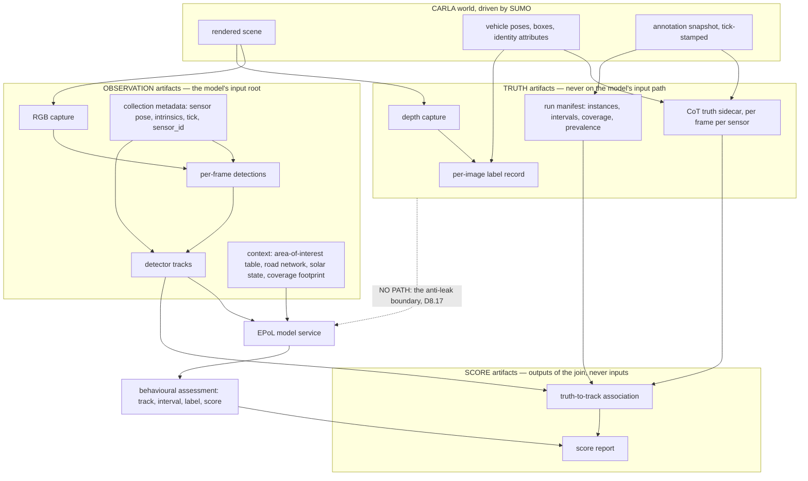
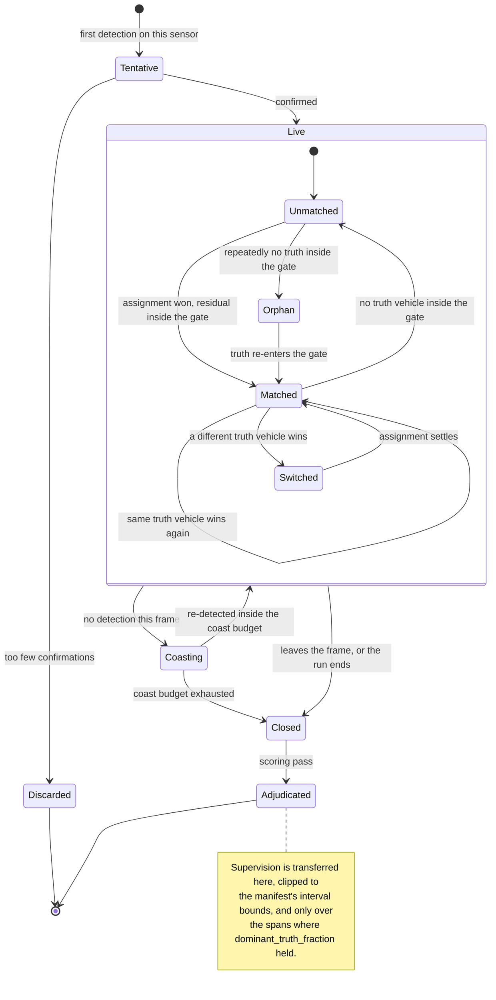
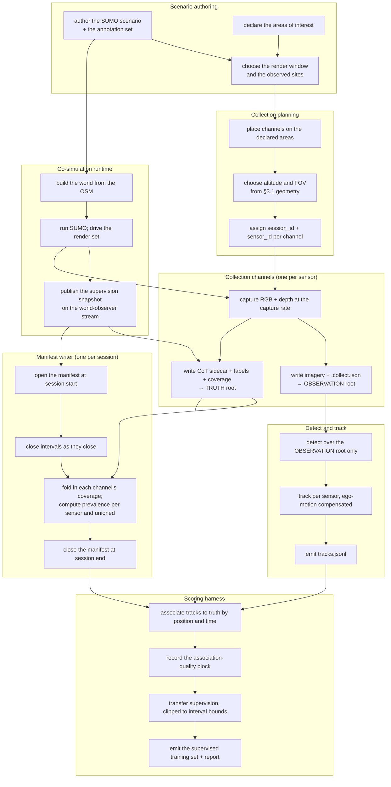
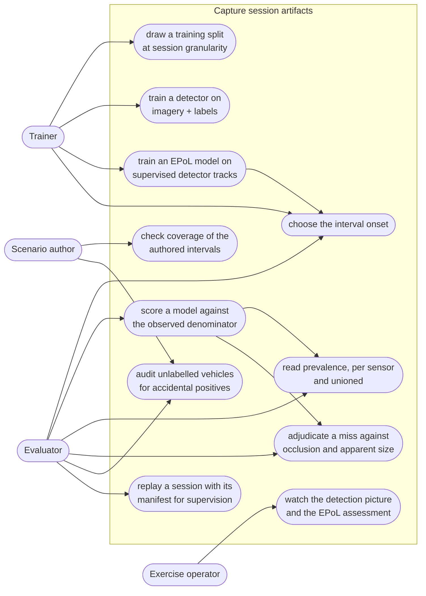

# 08 — Collection and the EPoL boundary

**Status:** Plan section. Source audit against the working tree on 2026-09-17; read-only measurements
taken against `BahonarPatternOfLife.zip` and against the camera geometry, and marked as measured where
they appear. No code changed, no build run.
**Owner role:** collection and EPoL integration engineer.
**Scope:** everything between photons and a score — the camera rig, the capture, the per-image labels,
the detect-and-track stage, the estimated-pattern-of-life (EPoL) model service boundary, and the
evaluation join. Covers both products: a **recorded corpus** and a **live exercise**.
**Audience:** an engineer who has read neither the conversation that produced this plan nor the whole
Findings set. Every external claim is cited.

**Reads from:**
[20 — Behavioral Annotation and Areas of Interest](../../Findings/20_Behavioral_Annotation_And_Areas_Of_Interest.md) ·
[17 — Photoreal Occlusion Metric](../../Findings/17_Photoreal_Occlusion_Metric.md) ·
[16 — Sensor Pose in Recordings](../../Findings/16_Sensor_Pose_In_Recordings.md) ·
[19 — Image Labeling during Orbit](../../Findings/19_Image_Labeling_during_Orbit.md) ·
[12 — CarlaNet.Labeling](../../Findings/12_CarlaNet_Labeling.md) ·
[09 — Telemetry CoT Contract](../../Findings/09_Telemetry_CoT_Contract.md) ·
[23 — SUMO Traffic Integration](../../Findings/23_SUMO_Traffic_Integration.md).

**Depends on, and states the property it needs rather than designing it:**
[`01_Architecture.md`](01_Architecture.md) (process topology),
[`03_CoSimulation_Runtime.md`](03_CoSimulation_Runtime.md) (tick loop, pose continuity),
[`04_Contracts.md`](04_Contracts.md) (interface registry),
[`06_Truth_And_Annotation.md`](06_Truth_And_Annotation.md) (the annotation record and the manifest),
[`10_Scale_And_Performance.md`](10_Scale_And_Performance.md) (throughput budget).

### What this section does *not* cover

- The internals of any detector, tracker or EPoL model. Only the contracts at their boundaries.
- The behavioural annotation format itself — that is `06_Truth_And_Annotation.md`. This section says
  what the collection chain must carry and how scoring consumes it.
- How SUMO vehicles become CARLA actors (the render-set contract) — `03_CoSimulation_Runtime.md`.
- Which vehicles exist, how they are authored, or how a `vType` maps to a blueprint —
  `07_Scenario_Authoring.md`. One measured *confounder* in the authoring surface is reported in §4.6
  because it damages the corpus, not because the authoring surface is this section's to fix.
- Pedestrians. Out of scope for the whole plan (team brief §3.5).

---

## 1. Two products, one chain

The user's stated purpose names two things, and they are not variants of each other:

| | **Recorded corpus** | **Live exercise** |
|---|---|---|
| Purpose | Train and validate EPoL models | Exercise an EPoL model's decision end to end |
| Product | Imagery + truth sidecars + per-image labels + a run manifest | A running world, a model under test, and an operator picture |
| Pacing | As fast as the machine allows; simulated time is the clock | Paced against the wall clock |
| Truth | Written beside the imagery, complete, retained | Written to a separate sink, withheld from the model, retained for scoring |
| Detector | May run offline, after the fact, repeatedly | Runs once, in the loop, under a latency budget |
| Failure of the model | Costs a number in a report | Costs the exercise |

They share everything from photons to detector-track output. They diverge at exactly two points:
**transport** (files versus a stream) and **pacing** (free-running versus wall-clock). That shared
middle is why one design covers both, and why the detect-and-track stage must be written to consume a
stream of frames plus metadata rather than a directory of files (§6.2).



The dashed edge is the whole point of §8.4. It is drawn because the shortest route from a good idea to
a worthless corpus is a feature the model turns out to have been computed from truth.

---

## 2. What exists today, measured

Everything in this section was read from the tree on 2026-09-17.

### 2.1 The rig is one camera and its shadow

`SensorRig` spawns exactly two sensors: an RGB camera and a depth camera, configured from the same
`--width`/`--height`/`--fov` arguments and spawned at one pose
(`CarlaControl/src/carlacontrol/SensorRig.py:61-91`). Every pose change moves camera, depth camera and
spectator together (`SensorRig.py:100-125`), and the reason is written down in the source: measurements
that pair a depth capture with a colour capture "are only valid while the two are looking from the same
place, and a depth camera left behind at the old pose silently invalidates them"
(`SensorRig.py:186-189`).

`run_SCTMV.py` builds one rig (`CarlaControl/scripts/run_SCTMV.py:169`) and one recorder over that
rig's RGB camera with that rig's depth camera attached (`run_SCTMV.py:190-192`).

### 2.2 The single-camera limit is a shim field, not an architectural one

This paragraph corrects a premise doc 20 decision 11 rests on, and it was re-verified against the source
on 2026-09-17 because the multi-camera decision (§3.4) turns on it.

**A recorder already opens two streams, not one.** `FrameRecorder`'s constructor takes a single 24-byte
*camera* token and rejects anything else
(`CarlaNet/src/CarlaNet.Recording/FrameRecorder.cs:83-90`), but it opens a subscription for the depth
stream at `FrameRecorder.cs:112-113` (via `OcclusionEstimator`, whose own constructor subscribes at
`OcclusionEstimator.cs:83-90`) and a second for the camera at `FrameRecorder.cs:125-126`. The range
The range `FrameRecorder.cs:59-98`, which doc 20 §2.5 and §7.3 both cite as the place a single stream
token is bound, is the occlusion counter block (`:59-69`) followed by the constructor's XML
documentation and signature (`:71-90`). It binds nothing.

**The transport imposes no limit either.** `CarlaClient.SubscribeToStream` parses a token, constructs a
`SensorStream` and appends it to a list (`CarlaNet/src/CarlaNet.Transport/CarlaClient.cs:1748-1754`).
One client already holds three: the world-observer stream (`CarlaClient.cs:1803`), the recorder's camera
stream, and the occlusion estimator's depth stream.

**The limit is one Python field.** `World.start_recording` calls `self.stop_recording()` at its top
(`CarlaNet/python/carlanet/__init__.py:1908`) and stores the result in `self._recorder`
(`:1924`, cleared at `:1980-1986`), so starting a second recorder on one `World` object destroys the
first. It is enforced, not conventional — but it is scoped to the `World` *instance*, and
`Client.get_world()` returns a **fresh** `World(self._inner)` on every call (`:2285`, `:2295`). So two
`World` handles from one `Client` already hold two independent recorder slots over one connection, one
world-observer stream and one actor cache.

**Consequence:** several collection channels in one process is a rig change and a shim change —
or no shim change at all, since a purpose-built rig can construct `FrameRecorder` per channel directly,
as the shim itself does (`carlanet/__init__.py:1907, 1924-1929`). Doc 20 §7.3's premise that "adding one
today means adding a client process" is wrong, and §3.4 takes the decision on the corrected premise.

What is *not* free is throughput: N channels means 2N or 3N subscriptions on one connection, and
`run_SCTMV.py:215-219` records two streams already saturating it (§2.3).

### 2.3 Capture is decimated client-side, and the server does not know

`FrameRecorder.OnFrame` drops frames until `sim_time - last_capture >= 1/hz`
(`FrameRecorder.cs:129-133`), with `--record-hz` defaulting to 2.0
(`CarlaControl/src/carlacontrol/CarlaControlArgumentParser.py:512-518`) against a default world step of
0.05 s (`CarlaControlArgumentParser.py:68-74`). So at defaults the server renders and streams twenty
frames per second per camera, and nineteen in twenty are decoded far enough to be discarded.

The engine already exposes the fix and nothing uses it. `sensor_tick` is a standard sensor attribute
(`Unreal/CarlaUnreal/Plugins/Carla/Source/Carla/Actor/ActorBlueprintFunctionLibrary.cpp:244-254`) and
`ASensor::Set` turns it into `SetActorTickInterval`
(`Unreal/CarlaUnreal/Plugins/Carla/Source/Carla/Sensor/Sensor.cpp:44-49`). `SensorRig` never sets it
(`SensorRig.py:61-86`). Whether `sensor_tick` composes correctly with synchronous world ticking, and
whether two cameras given the same `sensor_tick` land on the same simulation frames — which
`OcclusionEstimator` requires for pairing (§2.5) — is **unmeasured**; the measurement is in §11.

The contention is already recorded as a measurement in the source: "With two camera streams saturating
the connection each of those RPCs stalls for ~100-200 ms; left on the main loop they collapse it to ~1
fps" (`run_SCTMV.py:215-219`). Two streams is today's rig. Multi-camera multiplies it.

### 2.4 What a capture already carries

Per capture, two files sharing a filename stem built from local wall-clock time to the millisecond
(`FrameRecorder.cs:223-232`):

- a lossless PNG with `carla:solar`, `carla:sensor` and `carla:capture` tEXt chunks
  (`FrameRecorder.cs:225-229`);
- a CoT XML sidecar (`CotWriter.cs`) holding, in order: the capture identity on the `<events>` element
  — tick, simulation time, `run_id`, `scenario_id`, `seed` (`CotWriter.cs:40-48`); a `<_solar>` block
  (`:52-66`); the collection platform as a CoT air track with a standard `<sensor>` element and a
  `<_carla_intrinsics>` child carrying `fx, fy, cx, cy, hfov, vfov, distortion, align_offset_m`
  (`:71-128`); and one `<event>` per telemetered vehicle with `point/lat,lon,hae`, `track/course,speed`,
  `contact/callsign` and a `_carla` extras block (`:130-198`).

Occlusion rides that extras block when it was measured: `occlusion`, `occlusion_level`,
`occlusion_samples`, `apparent_width_px`, `apparent_height_px`, all absent when unmeasured
(`CotWriter.cs:178-193`).

**The capture identity is the join key that already works.** `CaptureIdentity(Tick, SimTimeSeconds,
RunId, ScenarioId, Seed)` (`CaptureMetadata.cs:24-29`) is taken from the very sensor frame that
produced the pixels (`FrameRecorder.cs:179`), and the record's own doc comment explains why wall-clock
time cannot serve (`CaptureMetadata.cs:9-14`). Filenames are wall-clock and must never be used to pair
anything.

### 2.5 The occlusion measurement is built

`OcclusionEstimator` keeps a ring of eight recent depth frames (`OcclusionEstimator.cs:50`), pairs one
to the recorded frame by simulation frame number, falls back to simulation time, and **refuses the pair
if the two cameras are not co-located and co-boresighted** within tolerances
(`OcclusionEstimator.cs:110-172`). Failures are counted in five buckets and surfaced on the recorder
(`FrameRecorder.cs:53-69`), which `NativeRecorder` reports on stop
(`CarlaControl/src/carlacontrol/NativeRecorder.py:133-160`).

### 2.6 The arrival gate is built, and is inert by default

Doc 17 §12.2's arrival gate is client-side: `CarlaClient` records each `set_actor_fade` it sends and
latches full opacity, and `VehicleTelemetryService` skips vehicles that were never established
(`VehicleTelemetryService.cs:66-73`).

**Under the user's directive of 2026-09-17 the fade is demoted and this section does not design around
it.** Verified against the tree today:

- `--fade` carries `default=False`, and the help text names the reason: the opacity is computed
  client-side and pushed "one blocking RPC per vehicle per reconcile, which is the heaviest load this
  client puts on the server's per-frame RPC budget"
  (`CarlaControl/src/carlacontrol/CarlaControlArgumentParser.py:317-328`).
- With nothing fading, the gate suppresses nothing. `IsActorEstablished` returns true for any actor with
  no fade record — `!_fade.TryGetValue(id, out var fade) || fade.Established`
  (`CarlaNet/src/CarlaNet.Transport/CarlaClient.cs:1571`) — and `GetActorOpacity` returns `1.0` on the
  same condition (`:1562`). The truth producer's own comment says so: "Vehicles nobody fades are
  established from the start, so this gate is inert unless staging traffic is running"
  (`VehicleTelemetryService.cs:71-72`).

So there is **no dissolve-in period during which a vehicle is deliberately unreported**, and nothing in
this section may assume one. Every vehicle is telemetered, labelled and counted in coverage from the
tick it exists. Three consequences run through the rest of this document: §4.1's `opacity` carries no
information and is retained only so that a later fade mode is not a schema change; §4.3's arrival gate is
a no-op; and the artefact the fade used to hide is now in the imagery and is §4.7's subject.

**The budget released is real and is spent here.** Removing the heaviest per-frame client load is
headroom for the capture and per-image labelling of §4, and for the N-channel subscription cost of §3.4
— which matters because §2.3's contention measurement was taken on a client that was doing that work.

### 2.7 The recorder already computes the 3D box and throws it away

`VehicleTelemetry` carries `ActorTransform` and `BoundingBox`, with the doc comment "Geometry rather
than telemetry: it is not part of the CoT contract and is not serialized to the sidecar"
(`CarlaNet/src/CarlaNet.Recording/VehicleTelemetry.cs:65-74`). It also carries `Opacity`
(`:59-63`), likewise unserialised — doc 17 §12.5 lists that as open.

So the oriented 3D box for every telemetered vehicle, frame-coherent with the pixels, already exists in
memory at write time. **Per-image labelling is a serialisation change plus a projection, not a new
measurement.** That is the same conclusion doc 12 §2 reached, and it is still true.

### 2.8 What does not exist

Read from the tree, so that no part of this plan assumes a tool that is gone:

| Named in | Thing | State on 2026-09-17 |
|---|---|---|
| doc 12 | `CarlaNet.Labeling` assembly | **Absent.** `CarlaNet/src/` holds Map, Nav, Python, Recording, Scenario, Sensors, TrafficManager, Transport, Types — no Labeling |
| doc 19 | `Training_Data_Generator.py` | **Absent** from the tree |
| doc 19, doc 12 | `eo_observer.py` | **Absent**; only a stale `CarlaNet/python/__pycache__/eo_observer.cpython-314.pyc` remains |
| doc 20 §7.5 | run manifest | **Absent.** Nothing writes one |
| doc 20 §4.2 | `scenario_id` supplied to the recorder | **Still never supplied, at a new address.** The live call site is `CarlaControl/src/carlacontrol/NativeRecorder.py:96-111`, which passes `run_id`, `seed`, `fov`, the four `platform_*` arguments, `depth_camera`, `occlusion_margin_m` and `occlusion_samples` — and no `scenario_id`, though the shim accepts one (`carlanet/__init__.py:1876`). `ScenarioController` never learns an id at all (`ScenarioController.py:30`) |
| — | any detector, tracker, or EPoL client | **Absent.** The only mention of YOLO in code is a comment (`CarlaNet/python/cot_telemetry.py:5`) |
| upstream CARLA | camera motion-blur attributes | **Absent from this fork.** The camera definition offers `fov`, `image_size_x/y`, `lens_*`, `enable_postprocess_effects`, `post_process_profile`, `sensor_tick` (`ActorBlueprintFunctionLibrary.cpp:313-410`, `:244-254`); a tree-wide search for `motion_blur` finds nothing, though the C++ setters exist unexposed (`Sensor/SceneCaptureSensor.cpp:402-421`) |
| — | `exposure_compensation` | **Not offered by the server's camera definition**, so `SensorRig`'s `--ev` path is inert behind its `has_attribute` guard (`SensorRig.py:66-67`) |

The last two are collection-control gaps, not defects: exposure and motion blur are real EO collection
parameters, and the rig cannot currently set either.

---

## 3. The collection rig

### 3.1 How much a camera can actually see — measured geometry

The camera is a pinhole with square pixels and a centred principal point (doc 16 §4.4), so
`fx = W / (2·tan(hfov/2))`. At the defaults — 1280×720, 90° (`CarlaControlArgumentParser.py:236`,
`:272-273`) — `fx = 640 px` exactly, and the ground sample distance at slant range `R` is `R/640` metres
per pixel. Computed here; it reproduces doc 17 §12.3's measured figures (a 4.5 m vehicle at 555 m is
about 5 px, at 914 m about 3 px) to within a tenth of a pixel, so the model and the measurement agree.

| slant range | GSD (m/px) | 4.5 m vehicle | 28 m/s over 1.0 s | over 0.5 s | over 0.1 s |
|---|---|---|---|---|---|
| 200 m | 0.31 | 14.4 px | 90 px | 45 px | 9.0 px |
| 300 m | 0.47 | 9.6 px | 60 px | 30 px | 6.0 px |
| 518 m (1700 ft) | 0.81 | 5.6 px | 35 px | 17 px | 3.5 px |
| 1000 m | 1.56 | 2.9 px | 18 px | 9 px | 1.8 px |
| 1524 m (5000 ft) | 2.38 | 1.9 px | 12 px | 6 px | 1.2 px |
| 3000 m | 4.69 | 1.0 px | 6 px | 3 px | 0.6 px |
| 5486 m (18 kft) | 8.57 | 0.5 px | 3 px | 1.6 px | 0.3 px |

28 m/s is the measured median vehicle speed in the sizing scenario (§5.1).

At 90° the largest slant range at which a 4.5 m vehicle reaches a given pixel length is 960 m for 3 px,
576 m for 5 px, 288 m for 10 px, 144 m for 20 px. Doc 17 §12.3 records that neither resolution nor
field of view affects range *precision*, but that a narrower field of view buys more resolution of the
occlusion metric than a larger frame does; the same is true of a detection.

**The footprint at a usable resolution is fixed, and it is small.** Holding 10 px on a 4.5 m vehicle
means holding GSD at 0.45 m/px, and at 1280×720 that is a **576 × 324 m ground swath — 0.187 km² —
whatever the altitude.** Flying higher buys nothing except a narrower field of view to pay for it:

| slant range | FOV for 10 px on a 4.5 m vehicle | GSD | ground swath |
|---|---|---|---|
| 555 m | 54.9° | 0.45 m/px | 576 × 324 m |
| 1000 m | 32.1° | 0.45 m/px | 576 × 324 m |
| 1524 m | 21.4° | 0.45 m/px | 576 × 324 m |
| 3000 m | 11.0° | 0.45 m/px | 576 × 324 m |
| 5486 m | 6.0° | 0.45 m/px | 576 × 324 m |

Measured against the sizing scenario: the Bahonar network's `convBoundary` is
`-3606.86,-1914.94,3607.23,2107.82` (read from `Shahid_Bahonar_Port.net.xml` inside
`BahonarPatternOfLife.zip`), i.e. **7214 × 4023 m = 29.0 km²**. One camera at detector-usable
resolution covers **0.64 % of it.**

That single number decides the rig. A seven-day, 29 km², 245-flow scenario cannot be observed by one
camera in any useful sense, and the "honest denominator" of doc 20 §2.5 will be nearly empty unless
cameras are **aimed at the places the annotations are about**. Coverage is a design input, not an
outcome.

### 3.2 The unit of collection is a channel, not a camera

A "camera" in this rig is three co-posed sensors, of which the first is the product:

| Sensor | Role | Required? |
|---|---|---|
| `sensor.camera.rgb` | the imagery — the only thing the detector ever sees | yes |
| `sensor.camera.depth` | the occlusion measurement (doc 17 §12.1) and, with it, the honest denominator | yes for a corpus; optional for a live exercise |
| `sensor.camera.instance_segmentation` | modal (visible-region) vehicle masks, the doc 17 §5.2 upgrade | optional |

The depth camera **must** be held at the RGB camera's pose and field of view: `OcclusionEstimator`
refuses a pair whose poses have drifted (`OcclusionEstimator.cs:161-172`), and `SensorRig` already moves
them together for that reason (`SensorRig.py:100-125, 186-189`).

On the third: doc 12 §1 rejected segmentation cameras *as a source of bounding-box truth*, because
Cesium photoreal tiles are not CARLA actors and every building, tree and terrain pixel falls into
"Unlabeled". That reasoning is sound and unchanged. It does **not** apply to the use wanted here:
vehicles *are* CARLA actors, so an instance-segmentation camera gives an exact per-vehicle visible mask
against an unlabelled background, which is precisely the modal mask doc 17 §5.2 wants and the
`occlusion_src` attribution doc 17 §6 defers. Its other advertised benefit — weighting a translucent
occluder by its opacity (doc 17 §9) — no longer applies, because the only translucent occluders doc 17
named were mid-fade vehicles and nothing fades (§2.6). Adopting it is optional and additive; nothing
depends on it.

Naming, because three of these per channel multiplied by N channels needs names that stand alone:
a **collection channel** is `(sensor_id, rgb, depth?, seg?)`; a **capture session** is the set of
channels recording one run of one world.

### 3.3 Three rig patterns, named

| Pattern | Motion | What it is for | State |
|---|---|---|---|
| **Stare** | fixed pose, fixed boresight | persistent coverage of a declared area of interest; the only pattern that gives a stable denominator over a long interval | supported today by simply not enabling orbit |
| **Orbit** | circular ground track, boresight held on a centre | the existing EO collection idiom; gives look-angle diversity over one site | built — `OrbitSensorController` (`OrbitSensorController.py:250-277`), updated on its own 50 Hz thread (`:96-100`) |
| **Transit** | a commanded waypoint track | covering several sites in one pass; every site gets a short, bounded observation | **not built**; `PyGameSensorController` is interactive only |

A capture session mixes them. The recommended default for a corpus is **one orbiting primary plus one
staring channel per area of interest the run's annotations reference**, because an orbit alone cannot
promise coverage of an interval and a stare alone cannot give look-angle diversity.

**Measured consequence of orbiting, which the tracker inherits.** At the default 240 s per revolution
(`CarlaControlArgumentParser.py:610-614`), the boresight yaws at 1.5 °/s. Across a 90° field of view on
1280 px that is 14.2 px per degree, so **every static ground feature translates about 10.7 px between
consecutive captures at 2 Hz, regardless of altitude** — nearly two vehicle lengths at 518 m. Platform
translation adds only 3–5 px on top (5.2 m/s at a 200 m radius, 26 m/s at 1000 m). So the dominant
image-space motion in an orbit collect is *camera rotation*, not vehicle motion, and any tracker must
compensate for ego-motion using the recorded pose and intrinsics before it associates anything. Doc 16
put both in the sidecar and the PNG; this is what they are for.

### 3.4 The multi-camera decision

Doc 20 decision 11 states the problem and demands the decision be taken before multi-camera capture,
not after: the annotation registry is process-local, a recorder in another process reads an empty
registry and silently writes `unlabelled` on every vehicle, and the two ways out are (a) publish the
annotation state to the server the way staging bounds are, or (b) require every recorder to live in the
executor's process.

**The premise behind its framing is wrong, and correcting it splits the question in two.** Doc 20 §7.3
argues from "adding one camera today means adding a client process". §2.2 shows that is not so: a
recorder already opens two streams, the transport holds an unbounded list of them, and the only limit is
a `World`-instance field over a `Client` that hands out fresh `World` objects. So there are two separate
questions, and they have different answers:

| Question | Answer |
|---|---|
| **Where does world-scoped state live?** | Published server-side. Unchanged by the correction, and consistent with [`01_Architecture.md`](01_Architecture.md) **D1.10** |
| **How many processes should a multi-channel capture session use?** | **One**, by default — which the correction makes materially cheaper than doc 20 assumed |

**Decision on the first: publish the annotation state, and publish it on the world-observer snapshot
rather than through an RPC.**

Reasons, in order of weight:

1. **The silent failure mode is unacceptable and (b) does not remove it, it only forbids it.** Doc 20
   says so itself: (b) "is free and must then be enforced, because the failure mode is silent". Nothing
   in the shim or the recorder can detect the difference between "no scenario is running" and "the
   scenario is running in another process", because both produce an empty registry, and doc 20 decision
   2 makes `unlabelled` a legitimate written state. A corpus silently collected unsupervised is
   indistinguishable from a corpus legitimately collected unsupervised.
2. **(b) is incompatible with the live exercise, which is one of the two products.** A live exercise
   places a detector and a model service outside the simulator process by construction, and the truth
   writer that scores them must run somewhere. Under (b) it must be in the co-simulation process.
3. **~~The same channel also fixes doc 17 §12.2's client-held arrival gate.~~ Withdrawn, and recorded
   as withdrawn rather than deleted.** That was a reason until the fade was demoted (§2.6); with
   nothing fading, the gate is inert in every process and there is no cross-process defect left for
   publication to fix. It is struck here so that a later reader does not find the decision resting on a
   support that no longer exists. **The decision does not move**: reasons 1, 2, 4, 5 and 6 carry it on
   their own, and none of them mentions fade. If a server-side fade is ever reinstated, this reason
   returns at no cost, because arrival and opacity would then ride a channel that already exists.
4. **The mechanism already exists and has exactly the three properties doc 20 §7.3 asked for.** Solar
   state rides the world-observer datagram into a `volatile double[]` that is swapped wholesale per
   frame (`CarlaClient.cs:169`, `:1855`) and read lock-free with no RPC and no poll
   (`CarlaClient.cs:1987-1991`), which is how `FrameRecorder` consumes it at capture time
   (`FrameRecorder.cs:160-162`). That is tick-stamped, lock-free, snapshot-swapped — doc 20 §7.3's list,
   already implemented for a different payload.
5. **The objection doc 17 §12.2 raised against widening the observer packet does not apply here.**
   There, four bytes per actor per tick were rejected because "this very process had just sent" the
   value. Here no client holds it, the payload is sparse (doc 20 decision 2 makes `unlabelled` the
   default, so only annotated and nominal actors need an entry), and the alternative is an RPC in the
   capture path.
6. Rebuilds are neutral (team brief §4). "It is more work" is not a reason and does not appear in this
   comparison.

**Decision on the second: a capture session runs its channels in one process by default.** The corrected
premise changes the recommendation here even though it changes nothing above:

- Every channel then shares one connection, one world-observer stream and one actor cache, so the
  per-tick truth the recorders read is provably the same snapshot rather than N snapshots that agree
  most of the time. Doc 20 decision 15 calls a per-camera disagreement in `<_supervision>` at one tick a
  defect; one process makes it structurally impossible rather than merely required.
- The capture-session identity (§3.5) is then trivially assigned once, and the manifest has one writer
  in the process that already holds every channel's coverage.
- The cost is contention on one connection, measured at two streams already
  (`run_SCTMV.py:215-219`). That is the reason to move a channel out, and it is a throughput decision
  for [`10_Scale_And_Performance.md`](10_Scale_And_Performance.md) rather than a correctness one.

**These two decisions are deliberately independent, and that is the point.** Publication means that
moving a channel into its own process — for throughput, or because a detector wants to sit beside it, or
because a live exercise puts the model on another machine — is a deployment choice with no correctness
consequence. Under doc 20's option (b) the same move would silently produce an unsupervised corpus.
**Correctness must not depend on which process a recorder is in; performance may.**

**Property needed from [`01_Architecture.md`](01_Architecture.md):** the topology must permit a
collection process that holds no SUMO connection, no traffic authority and no scenario state, and whose
only inputs are the sensor streams and the world-observer snapshot. If the architecture instead puts
collection inside the co-simulation process, this section's design still works; the reverse is not true.

**Property needed from [`06_Truth_And_Annotation.md`](06_Truth_And_Annotation.md):** the world-scoped
snapshot must carry, per actor, the supervision state and the instance and phase references, stamped
with the tick it describes — so that two recorders reading it at
different wall-clock moments produce identical `<_supervision>` for the same tick, which doc 20 decision
15 requires and calls a defect if violated.

### 3.5 Session and sensor identity

Three identity defects, one already half-solved:

- **Session identity exists but is per process, not per session.** `run_SCTMV.py:152` derives
  `run-<UTC>` once per process and hands it to the recorder (`:190-192`), which is the right level for
  today's one-camera rig. `FrameRecorder`'s own fallback derives one from its start instant and the
  comment calls it "unique enough per recorder" (`FrameRecorder.cs:98-103`) — doc 20 §7.5 correctly
  identifies that as the wrong property. **Decision: a capture session identity is assigned once and
  handed to every channel; the per-recorder fallback survives only for a single-channel run.**
- **`sensor_id` defaults to an actor id.** `platform_uid` defaults to `CARLA-SENSOR-<camera id>`
  (`carlanet/__init__.py:1910`) and the CLI offers `--platform-uid` with that default
  (`CarlaControlArgumentParser.py:537-541`). Doc 20 §6.3 records that this has the same defect
  `actor_id` has. **Decision: for a session with more than one channel, an authored `sensor_id` is
  required, validated unique within the session, and stable across runs.** Everything in §7, §9 and
  §10 keys on it.
- **`scenario_id` is still never supplied** (§2.8). Under SUMO drive the analogous identity is the
  scenario configuration, and it must reach `CaptureIdentity` (`CaptureMetadata.cs:24-29`) or the
  captures cannot be tied to the annotations. This belongs to `04_Contracts.md`; the property needed is
  simply that it is supplied, since the field already exists end to end.

**On-disk layout.** One session directory; one subdirectory per `sensor_id`; the manifest at the
session root, written by one writer (doc 20 §7.5). Filenames stay local wall-clock stems
(`FrameRecorder.cs:223-224`) and **nothing pairs across channels by filename** — the join key is the
tick, which every capture already carries (`CotWriter.cs:42`, `CaptureMetadata.cs:24-29`).

```
<session_root>/
  manifest.json                    # one per session, written incrementally, closed at end
  coverage.jsonl                   # per (sensor, tick, actor) observability, appended
  <sensor_id>/
    SCTMV_<stem>.png               # imagery                      OBSERVATION
    SCTMV_<stem>.collect.json      # pose, intrinsics, tick, ids  OBSERVATION
    SCTMV_<stem>.xml               # CoT truth sidecar            TRUTH
    SCTMV_<stem>.labels.json       # per-image labels             TRUTH
    SCTMV_<stem>.depth.png         # optional depth capture       TRUTH
```

The split of a capture's metadata into a `.collect.json` that travels with the imagery, separate from
the `.xml` sidecar that does not, is the physical form of the anti-leak boundary (§8.4). Today both live
in one file; they must not.

---

## 4. Per-image labelling

### 4.1 What accompanies each frame

One label record per (sensor, tick, vehicle). Fields, with provenance:

| Field | What it is | Source today |
|---|---|---|
| `tick`, `sim_time_s` | the simulation instant | `CaptureIdentity` (`CaptureMetadata.cs:24-29`) |
| `session_id`, `sensor_id` | which collection, which channel | §3.5 |
| `actor_id` | intra-run join to the truth sidecar | `VehicleTelemetry.Id`, written as `CARLA-TRUTH-<id>` (`CotWriter.cs:134`) |
| `entity_id`, `instance_id` | cross-run join to the authored entity and pattern instance | doc 20 §6.3, §7.2 — **not emitted today** |
| `class` | detector class: `base_type` plus a `special_type` suffix | `VehicleTelemetry.BaseType/SpecialType` |
| `box3d_local` | 8 corners in CARLA-local metres, from the oriented box | `ActorTransform` + `BoundingBox`, computed and discarded (`VehicleTelemetry.cs:65-74`) |
| `box3d_geodetic` | the same corners as lat/lon/hae, so the label survives a coordinate-frame change | `Geodesy.CarlaLocalToGeodetic`, already used per vehicle |
| `box2d_amodal_obb` | oriented 2D box, the hull of the projected corners | projection — doc 12 §4.3 |
| `box2d_amodal_aabb` | axis-aligned, for plain YOLO | projection |
| `box2d_modal` | visible-region box | needs instance segmentation (§3.2); absent otherwise |
| `occlusion`, `occlusion_level`, `occlusion_samples` | how much is hidden and how well that is known | measured (`CotWriter.cs:178-193`) |
| `apparent_width_px`, `apparent_height_px` | projected footprint including any part off-frame | measured (`CotWriter.cs:189-192`) |
| `opacity` | **constant 1.0 under the default**, since nothing fades (§2.6). Retained so a later fade mode is not a schema change | computed, unserialised (`VehicleTelemetry.cs:59-63`) |
| `range_m` | camera-to-centre distance; a natural loss weight (doc 12 §5.5) | derivable from the recorded pose |
| `truncation` | fraction of the amodal box outside the frame | derivable from the projection |
| `pose_source` | `simulated` / `interpolated` / `held` — see §5.4 | **new**; needed under SUMO drive |
| `yaw_world_deg` | heading supervision for free (doc 12 §7) | `ActorTransform` |

### 4.2 Format: a record, not a text line

Doc 12 §4.4 proposed a DOTA-style polygon `.obb.txt` as the artifact. **That should be a derived
projection, not the primary.** A whitespace line cannot carry `entity_id`, `instance_id`, `sensor_id`,
the tick, the 3D box, the gate inputs or `pose_source` without becoming a private format nobody else
reads, and the moment a field is dropped to fit the line it stops existing. Write one self-describing
record per frame; generate `.obb.txt`, `.yolo.txt` or COCO JSON from it with a converter, which costs
nothing and can be re-run with different gates (doc 19's "record once, experiment with different label
parameters" advantage, preserved properly).

### 4.3 Gates are recorded, never applied at write time

Doc 17 §7 proposes a label policy of drop / tag / retighten, with a heavy-occlusion cutoff around
70–80 %. Doc 17 §12.5 records that a minimum apparent size has not been chosen, and that the data to
choose it now rides in the sidecar but nothing acts on it.

**Decision: the writer emits every vehicle that projects into the frame, with every gate input
attached, and applies no gate.** Consumers gate. The reasons are specific:

- The gate thresholds are **unmeasured** (doc 17 §12.5) and choosing one at write time bakes an
  unvalidated number into an expensive artifact.
- Doc 20 §2.5's denominator needs the *ungated* record: an interval observed but below the resolution
  threshold is a different fact from an interval not observed at all, and only the ungated record
  distinguishes them. §9.2 uses exactly that distinction.
- A negative example that the detector *should* have missed is only identifiable if it is in the file.

The four gates a consumer will want, all computable from the record: **apparent size** (below a chosen
pixel length, a vehicle is a poor example whether or not anything is in front of it — doc 17 §12.4),
**occlusion** (the doc 17 §7 cutoff), and **truncation**. A fourth, **arrival** (`opacity < 1`), exists
in the schema and is a no-op under the default (§2.6).

### 4.4 Where the occlusion measurement is used here, precisely

Doc 17's measurement is used in three distinct places in this chain, and conflating them is the easy
mistake:

1. **As a label gate** (§4.3) — a consumer-side filter over the corpus.
2. **As the observability predicate** (§9.2) — an annotated interval counts as *observed* by a sensor
   at a tick only if the participant was in that sensor's frustum, resolvable, and not occluded past
   the cutoff. This is what makes the denominator honest and it is per sensor, per doc 20 decision 15.
3. **As the adjudicator of a miss** (§7.4) — doc 17 §10: "a 'missed' detection can be adjudicated as a
   true miss vs a legitimately occluded target". Without it, every occluded vehicle is charged to the
   detector.

Doc 17 §12.2's fourth use — the telemetry gate that suppressed an unarrived vehicle from truth — is
inert under the demoted fade (§2.6) and is not relied on anywhere here.

Use (2) is the one that has no implementation and the most leverage. Note that an absent `occlusion`
attribute means "this camera cannot say", not "not occluded" (doc 09 §5.1, `CotWriter.cs:176-177`), and
a coverage record that reads absence as zero will overstate the denominator.

### 4.5 The behavioural annotation is not in the label file

`<_supervision>` belongs in the truth sidecar and the manifest (doc 20 §7.4, §7.5) and must not appear
in a per-image label record. Two reasons: the label record is a *detector* artifact and a detector has
no business learning behaviour from a per-frame flag; and keeping the behavioural statement out of the
label file makes the artifact classes of §8.4 separable by file rather than by field.

### 4.6 A measured confounder already present in the sizing scenario

Doc 20 §2.6 names appearance as the first way a synthetic corpus lets a model cheat. Measured in
`BahonarPatternOfLife/scenario/Shahid_Bahonar_Port_PatternOfLife.rou.xml`, the fourteen `vType`
definitions colour the four anomaly types in saturated hues and everything else in greys and earth
tones:

| vType | colour | vClass |
|---|---|---|
| `anomaly_probe` | `1.00,0.45,0.00` orange | passenger |
| `anomaly_escort` | `1.00,0.10,0.10` red | army |
| `anomaly_shadow` | `1.00,0.20,0.60` magenta | army |
| `anomaly_staybehind` | `1.00,0.30,0.00` orange | authority |
| `civ_car` / `civ_pickup` / `civ_truck` | `0.80,0.80,0.82` / `0.55,0.58,0.60` / `0.60,0.50,0.35` | passenger / truck |

The nine `marked_ids` in `Shahid_Bahonar_Port_PatternOfLife.labels.json` are exactly the vehicles of
those four types. In SUMO those colours are a GUI aid and harmless. **If a `vType`'s colour is carried
into the CARLA blueprint or its colour attribute at playback, the corpus teaches "orange car =
anomaly" and every number downstream is meaningless.**

The same file also maps `affiliation_by_type` to give the anomaly types CoT `u` (unknown) while
civilians get `n` — which is doc 20 decision 9's prohibition ("the CoT affiliation is not overloaded")
violated in the largest authored scenario that exists. It does not reach the model through the detector
(a detector-derived track has no affiliation, doc 09 §3), but it does reach an operator's picture and it
would reach any consumer that reads truth CoT.

**Property needed from [`07_Scenario_Authoring.md`](07_Scenario_Authoring.md) and
[`04_Contracts.md`](04_Contracts.md):** the `vType` → blueprint mapping must draw appearance from the
run seed over a per-category set, never from the `vType`'s display colour, and there must be a
compile-time check that no annotated entity draws from a pool the nominal entities cannot. This section
raises it because it destroys the corpus, not because it is this section's to fix.

---

### 4.7 Vehicles now appear from nothing, and that is an imagery artefact

With the fade demoted (§2.6), a vehicle admitted to the render set **pops into existence at full
opacity**. [`01_Architecture.md`](01_Architecture.md) §9.2 already states the mitigation — the render
volume is "the union of every collection camera's footprint, expanded by a margin large enough that a
vehicle is instantiated and settled before it could first be seen", with the margin's "only job … to
keep an appearance from happening inside a frame". This section owns whether that succeeds, because the
failure is visible in the pixels and lands in the tracks.

**What the artefact does.** A vehicle that materialises inside a camera's footprint is a correct
detection on the frame it appears — truth carries it from that tick — but the *track* opened on it has a
birth with no approach. A tracker's initiation logic, its velocity prior and its coast budget are all
calibrated on objects that enter the frame from an edge or emerge from an occluder. An object appearing
mid-road is neither, and a corpus in which that happens is teaching a track-initiation behaviour that no
fielded sensor ever sees. The release end is worse: a vehicle that vanishes mid-road produces a track
termination the tracker cannot distinguish from a total occlusion, so its coast budget is spent on
nothing.

**The margin, sized from measurement.** The requirement is
`margin ≥ v_max · (t_settle + t_capture_interval)`: the vehicle must be instantiated, set down and pose-
corrected before the first capture that could contain it. `v_max` is measured — the sizing sample's
maximum is 34.98 m/s (§5.1) — and `t_capture_interval` is 0.5 s at the default 2 Hz. `t_settle` is
**unmeasured** and is a question for `03_CoSimulation_Runtime.md`.

| `v_max` | `t_settle + t_capture` | required margin |
|---|---|---|
| 35 m/s | 0.5 s (capture only, zero settle) | 17.5 m |
| 35 m/s | 1.0 s | 35.0 m |
| 35 m/s | 1.5 s | 52.5 m |

And the margin is not free, because it enlarges the render volume against the concurrent-actor cap
(`01_Architecture.md` D1.13). Computed from §3.1's 576 × 324 m detector-usable footprint:

| margin | render volume | area vs footprint |
|---|---|---|
| 0 m | 576 × 324 m | 1.00× |
| 25 m | 626 × 374 m | 1.25× |
| 50 m | 676 × 424 m | 1.54× |
| 100 m | 776 × 524 m | 2.18× |

So a 50 m margin — comfortable at 35 m/s with a full second of settle slack — admits **54 % more
vehicles than the cameras can see**, purely to keep appearances out of frame. That is the real price of
the artefact and it should be paid knowingly rather than discovered when the cap starts refusing
annotated participants. **Recommendation: 50 m at the sizing scenario's speeds, revisited once
`t_settle` is measured.**

**When the margin cannot be satisfied.** Three cases, and they are not hypothetical:

1. **A camera is re-aimed or moves fast.** The render volume is the union of the current footprints, so
   a footprint that sweeps into new ground admits vehicles *inside* it by definition. A stare camera
   re-aimed mid-session is the clear case; an orbit is the mild one, since at the default 240 s
   revolution the footprint centre moves 5.2 m/s at a 200 m radius, which the margin absorbs.
2. **The actor cap binds and the margin is cut to fit.**
3. **A vehicle is admitted late** — because it was refused earlier and re-offered, or because SUMO
   inserted it inside the volume.

**What the collection does about it, in order.** It does not try to repair the imagery; it detects,
records, and excludes the right metric rather than the whole frame:

- **Detect.** `01_Architecture.md` §7 already records the admission and release tick per vehicle in
  `RenderedVehicleRegistry` and carries them in the manifest. The label writer projects every vehicle
  anyway (§4.3), so testing "did this vehicle's admission or release tick fall inside this sensor's
  frame" costs a comparison. It is per (sensor, vehicle), because a boundary is only a boundary relative
  to a camera.
- **Record.** Two flags on the label record, `birth_in_frame` and `death_in_frame`, plus per-capture
  counts in the coverage file and per-session totals in the manifest. A session in which they are
  common is a session whose rig geometry is wrong.
- **Exclude the metric, not the frame.** A detector track whose birth coincides with an in-frame
  admission is **excluded from track-lifetime metrics** — initiation latency, fragmentation, identity
  switches, coast behaviour — and **retained for per-frame detection metrics**, because the per-frame
  detection was correct and the per-frame label is true. Discarding the whole frame would throw away
  good detection data to fix a tracking artefact.
- **Break the observed span.** For an annotated interval, an in-frame admission or release of the
  *participant* breaks that sensor's observed span at that tick rather than bridging it (§9.2), because
  the span is meant to describe what could have been tracked.
- **Forbid the avoidable case.** A camera is not re-aimed during an annotated interval it is covering.
  If a session plan requires it, the plan is wrong; if an operator does it in a live exercise, the
  coverage record shows it and the interval is excluded.

None of this needs the fade back. It needs the admission and release ticks, which are recorded anyway,
and a comparison the label writer is already positioned to make.

---

## 5. The SUMO-specific problem: does the motion survive?

### 5.1 The measured sizing case

From `BahonarPatternOfLife.zip`, read directly:

- `Shahid_Bahonar_Port_PatternOfLife.sumocfg` — `<step-length value="1.0"/>`, `<end value="604800"/>`
  (seven days), `<seed value="42"/>`, `<time-to-teleport value="-1"/>` with the comment that a teleport
  "is a vehicle jumping position, which nothing downstream can reproduce faithfully".
- `samples/bahonar_cot_sample.csv` — 2000 rows, 12 vehicles, 572 distinct simulation times **exactly
  1.0 s apart**. Speeds: min 5.71, median 28.31, p75 30.52, p90 33.18, p95 34.07, max 34.98 m/s; not one
  sample below 0.15 m/s. So the sample is freeway-class traffic at roughly 100–125 km/h.

At the median 28.3 m/s, **a vehicle moves 28 m per SUMO step.** At 518 m slant range that is 35 px
against a 5.6 px vehicle (§3.1) — six vehicle lengths, in one jump.

### 5.2 What teleporting does to the imagery

Three regimes, and they are different products:

| Regime | Pose between SUMO steps | Consequence |
|---|---|---|
| **Held** — write the pose once per SUMO step, leave it | stationary for 20 world ticks, then a 28 m jump | at 2 Hz capture, alternating captures show 0 px and 69 px of motion. No constant-velocity tracker survives this: the association gate must be sized for the jump, which admits every neighbouring vehicle on the same lane |
| **Linearly interpolated** — divide the step across world ticks | constant velocity within a step, a velocity **discontinuity at every step boundary** | smooth within a step; but at a 1.0 s step and a 0.5 s capture interval there is a kink between *every* pair of captures, so the tracker's process model sees a fresh acceleration each frame and its velocity estimate never converges |
| **Physically executed** — SUMO's decision fed through a controller, doc 23 §4.1 | continuous and once-differentiable by construction; a physical body cannot have a velocity discontinuity | the only regime in which apparent velocity in the imagery is a usable tracker feature |

Team brief §3.2 accepts teleport-style control for this mode and forbids re-litigating it. So the
finding here is not "do not teleport" — it is **what teleport costs the imagery and what must be true
for the imagery to be trackable anyway**.

### 5.3 The property required, stated as a property

**Required of [`03_CoSimulation_Runtime.md`](03_CoSimulation_Runtime.md):**

> At every world tick that a collection channel renders, each rendered vehicle's pose must be a
> continuous function of simulated time whose per-tick increment is small compared with that vehicle's
> own projected length, and whose velocity discontinuities occur at a rate **well below** the capture
> rate — as a working figure, no more than one discontinuity per five capture intervals.

Two things follow, and only the second is a free parameter:

- **The capture rate cannot fix this.** Capturing faster does not smooth motion; it samples the same
  discontinuities more finely. Capturing slower hides them and destroys the velocity signal with them.
- **The SUMO step is the lever.** With a 2 Hz capture, "one discontinuity per five capture intervals"
  means a SUMO step at or below **0.1 s** — which is the figure doc 23 §6.10 already records as
  co-simulation practice.

But the sizing case runs at 1.0 s over seven days and cannot be re-run at 0.1 s without changing the
trajectories it was authored around — which `03_CoSimulation_Runtime.md` §6.3 has since **measured**
rather than assumed: over the same authored window, the same seed and the same demand, dropping the
step from 1.0 s to 0.1 s cuts mean time loss per vehicle by 62 %, so the step is not a rendering knob.
So the reconciliation is **keep the authored SUMO step and resample the pose**, which is what
`03_CoSimulation_Runtime.md` **D3.6** decides: run SUMO one step ahead of the rendered clock and
interpolate every sub-step pose between two buffered SUMO frames, along the lane's own geometry.

**One seam with D3.6 that this section has to name rather than paper over.** D3.6 interpolates *lane
position* linearly within a step while interpolating *reported speed* linearly in time (§6.4 of that
section). Those two are not the same motion: linear-in-arc-length gives a constant along-lane speed
within a step and therefore a velocity **discontinuity** at every step boundary — the middle row of
§5.2's table, with one kink between every pair of captures at a 1.0 s step and a 2 Hz capture — while a
linearly ramping reported speed is a different, C¹ story. Both cannot be true, and for this section's
purposes the pose is the one that matters, because the pose is what the pixels show.

**The property, restated so it is testable against that mechanism:** the interpolator's along-lane
*speed* must be continuous across a step boundary, not merely its position. A speed-continuous
interpolant through two endpoint positions and two endpoint speeds is the standard cubic Hermite fit and
costs nothing extra over the linear one, since D3.6 already buffers both endpoints and both speeds.
Failing that, the truth speed must be derived from the pose actually rendered (§5.4) rather than from
SUMO's reported speed, so that at least the record is self-consistent and the discontinuity is visible
in the data instead of hidden between two disagreeing fields.

Doc 23 §4.1's "SUMO decides, CARLA physics executes" avoids the question entirely, because a
controller-driven physical body cannot produce a kink at all. Team brief §3.2 accepts teleport for this
mode, so that is context rather than a recommendation.

### 5.4 What the truth record must then say

Sub-second motion that nothing simulated is fabricated motion, and it must be labelled as such or a
later reader will treat it as simulator output.

- **`pose_source` per vehicle per capture** (§4.1): `simulated` at a SUMO step boundary,
  `interpolated` between, `held` if the bridge did not resample. The scoring join (§9) treats only
  `simulated` positions as exact and carries a stated bound on the others.
- **Truth velocity must be the derivative of the pose that was rendered.** `WorldObserver.cpp:373`
  serialises `View->GetActor()->GetVelocity()` — verified by reading the file — and a `set_transform`
  on a non-simulating body does not update it, so a teleported vehicle reports zero speed into the CoT
  truth record and into anything derived from it. Team brief §3.2 calls that a problem to solve, and
  `03_CoSimulation_Runtime.md` **D3.5** solves it at source: write `ComponentVelocity` on a
  non-simulating root primitive and have the bridge emit an `ApplyTargetVelocityCommand` beside every
  transform command. This section depends on that and proposes nothing to replace it.

  **But D3.5 writes SUMO's interpolated speed, and D3.6 derives the pose from linear along-lane
  interpolation, so the two are not the same quantity** (§5.3). The requirement this section adds is a
  *consistency* one, not a mechanism:

  1. **The reported speed and the rendered pose must agree** to within a stated tolerance. If D3.6's
     interpolant becomes speed-continuous (§5.3), they agree by construction and nothing more is needed.
  2. **If they cannot be made to agree, the recorder derives the truth speed from the pose.**
     `FrameRecorder` already finite-differences consecutive poses to produce the *platform's* course and
     speed (`FrameRecorder.cs:166-174`); the same pattern over `VehicleTelemetryService`'s per-actor
     state costs nothing and needs no server change. This is the collection-side floor: **the recorded
     truth speed is never allowed to be zero merely because the body is not simulating, and never
     allowed to describe a motion different from the one in the pixels.**
  3. **Either way the truth record carries both** — SUMO's own speed as its own field, which D3.5
     already keeps for cross-checking — so a disagreement is detectable in the data rather than
     invisible.

  Note the same seam reaches acceleration: `FWorldObserver_GetAcceleration` differences the reported
  velocity (`WorldObserver.cpp:264-277`), so at every SUMO-step boundary it reports a whole step's
  acceleration in one frame. `03_CoSimulation_Runtime.md` §5 names that and accepts it; for scoring it
  means **acceleration is not a usable truth field at step boundaries** and a report that uses it must
  say which frames it excluded.

### 5.5 Motion blur — an open domain-gap question

Real EO imagery of a moving vehicle at these rates is motion-blurred; synthetic imagery of a teleported
one may not be. This fork exposes no motion-blur attribute on the camera (§2.8), so the collection
cannot control it either way, and whether Unreal's velocity buffer registers a pose written by
`set_transform` — and whether a 28 m jump exceeds `MotionBlurMax` and is clamped to nothing — is
**unmeasured and is an inference either way**. The measurement is cheap and is listed in §11.

---

## 6. The detect-and-track interface

### 6.1 The boundary in one sentence

The detect-and-track stage consumes **imagery plus the collection metadata that a real exploitation
chain would have**, and emits **tracks**. It never reads truth, and the list of what counts as truth is
§8.3.

### 6.2 What it consumes

One **collection frame**: the image, plus a metadata record that is a strict subset of what doc 16 already
puts in the sidecar and the `carla:sensor` PNG chunk (doc 16 §4.1, §4.2; `CotWriter.cs:71-128`):

```
CollectionFrame
  session_id, sensor_id
  tick, sim_time_s                    # the join key (CaptureMetadata.cs:24-29)
  wall_time_utc                       # for a live feed's own latency accounting only
  image                               # bytes, or a path
  width, height
  platform: lat, lon, hae, align_offset_m
  pointing: azimuth_deg, elevation_deg, roll_deg
  motion:   course_deg, speed_mps
  intrinsics: fx, fy, cx, cy, hfov_deg, vfov_deg, model, distortion
  ground_reference: <identifier of the bare-earth surface the chain may use>
```

Everything above the `ground_reference` line already exists per capture. Nothing in it is truth about
the *scene*: it is the collection's knowledge of its own sensor, which a real platform has.

Two transports, one record: for the corpus, a `.collect.json` beside each PNG (§3.5); for the live
exercise, the same record as a frame on a socket. **Decision: the stage is written against the record,
not against a directory**, so the same binary serves both products.

### 6.3 What it emits

Per detection, per frame:

```
Detection
  session_id, sensor_id, tick
  bbox_px            # axis-aligned or oriented, stated
  class, confidence
  geo: lat, lon, hae, ce, le     # geolocated, with an error estimate
```

Per track:

```
Track
  session_id, sensor_id, track_id     # unique within (session, sensor)
  frames[]           # tick -> bbox_px, geo, confidence
  class, class_confidence            # the track's class, however the stage decides it
  first_tick, last_tick, coast_frames, switches_suspected
  status             # tentative | live | coasting | closed
```

Format: **line-delimited JSON, one record per line, appended** — because it is streamable and
truncation-tolerant, which a live exercise needs and a batch run does not mind. CoT is a *projection*
of a track for display (doc 09 §3 fixes detection uids as `CARLA-DET-<track_id>` and `how="m-f"`), not
the interchange format: a CoT event cannot carry a track's history or its coast state.

### 6.4 Geolocation, and the line it must not cross

A detection is a pixel box; the EPoL model needs a position on the ground. The stage geolocates by
intersecting the pixel ray — reconstructed from the recorded pose and the recorded `K` — with a ground
surface. Doc 16 §10 names this round trip as the payoff of recording the intrinsics, and the existing
pixel-picker math is the worked example (`SensorRig.pick_world_point`, `SensorRig.py:253-348`).

**Which ground surface is legitimate is an anti-leak question, and the answer is not obvious:**

| Surface | Legitimate for the detector? | Why |
|---|---|---|
| A bare-earth elevation grid (`bareearth.bin`, read by `SumoCotBridge.py:93-119`) | **Yes** | A real exploitation chain has DTED. It describes terrain, not the scene's contents, and it is fixed before the run |
| A flat-earth assumption at a nominal height | Yes | Strictly less information |
| **The simulator's depth capture** | **No** | It is a per-frame measurement of exactly where every object in the scene is, including the vehicles being detected. Handing it to the detector is handing it the answer |
| The truth sidecar's `hae` | No | Truth |

`SensorRig.pick_world_point` uses the depth frame (`SensorRig.py:279-316`). It is the right tool for an
operator's interactive measurement and the **wrong** tool inside the detector. The distinction is
between a *prior* the collection is entitled to and a *measurement of the scene* that only the
simulator has.

Consequence for the rig: the depth camera is a **truth instrument**, and its captures are written to the
truth side of the split (§3.5), not beside the imagery.

---

## 7. Truth-to-track association

### 7.1 Why uid is not available and must not be reintroduced

Doc 09 §3 fixes it: truth uids are `CARLA-TRUTH-<actor_id>`, detection uids are `CARLA-DET-<track_id>`,
and "scoring associates truth↔detection by position/time, **not** uid". Doc 09 §9 repeats it and doc 20
§7.6 builds on it. A detector-derived track has no actor id, no affiliation and no entity id, and any
design that gives it one has leaked truth into the detection path.

So association is a **measurement with an error**, and that error is itself an output.

### 7.2 The assignment, per sensor, per frame

Per `(sensor_id, tick)`:

1. **Project truth into image space.** Every telemetered vehicle's oriented box, projected through the
   frame's own recorded pose and `K` — the same projection the label writer performs (§4.1), so the
   projected truth box is simply read from the label record rather than recomputed.
2. **Cost in two spaces, primary in pixels.** Cost is `d_px` between the detection's box centre and the
   projected truth centre, normalised by the truth vehicle's apparent size; `d_m` between the
   detection's geolocated point and the truth point is computed but is **not** the primary cost.
   Reason: geolocation error is a quantity to be *measured* (§9.3), and using it as the association cost
   confounds "the detector found the wrong object" with "the detector found the right object and
   mislocated it". Image space is where the detector actually erred.
3. **Gate.** Reject a pair beyond `max(g_min, k · max(apparent_width_px, apparent_height_px))`. A gate
   in absolute pixels is wrong across the frame, because apparent size varies by a factor of several
   between frame centre and corner at these look angles (doc 12 §5.5 records 5.5–7 km of range variation
   across one frame at 18 kft).
4. **Assign globally, not greedily.** A minimum-cost bipartite assignment over the surviving pairs.
   Greedy nearest-neighbour is the classic source of systematic mis-assignment in dense traffic, and
   dense traffic is what a 245-flow scenario produces.
5. **Record the outcome for every row and every column**, including the unassigned ones. The unassigned
   are the whole of precision and recall.

### 7.3 The association-quality block — doc 20 §7.6's requirement

Doc 20 §7.6 asks that "the association quality per assignment should be recorded, so a mis-associated
label is findable later rather than being an unexplained hard example". Four numbers, per assignment,
all available as a by-product of step 4:

| Field | Meaning | Why it is the one that matters |
|---|---|---|
| `residual_px`, `residual_norm` | the assignment cost, absolute and normalised by apparent size | how close the match was |
| `margin` | the difference to the same detection's next-best truth candidate, normalised | **the discriminative one.** A residual of 3 px is meaningless if the runner-up was 3.1 px away |
| `truth_density` | how many truth vehicles were inside the gate | a dense-traffic flag; a low margin in dense traffic is expected, in sparse traffic it is a bug |
| `occlusion_at_assignment` | the truth vehicle's measured occlusion on this frame | distinguishes a poor match from a match to a half-hidden object |

At track level, three more, accumulated: `assigned_fraction` (of the track's live frames that got an
assignment), `dominant_truth_fraction` (of assigned frames that went to the modal truth vehicle), and
`switch_count`. A track whose `dominant_truth_fraction` is below a threshold is not a track of one
vehicle and must not carry one vehicle's supervision.

### 7.4 Three outcomes, and adjudication

| Outcome | Meaning | Adjudication |
|---|---|---|
| **Assigned** | a detection and a truth vehicle matched | quality block attached |
| **Unassigned detection** | the detector saw something truth does not have there | a false alarm. Under the default there is no case in which truth is deliberately silent about a rendered vehicle (§2.6), so this row has no exception — which is a simplification the fade's demotion buys |
| **Unassigned truth** | truth has a vehicle the detector did not report | adjudicated against the record: occluded past the cutoff, or below the resolution threshold, or truncated → **not charged as a miss**, counted separately. Otherwise a true miss. This is exactly doc 17 §10's payoff |

The asymmetry an earlier draft recorded here — truth deliberately silent about a dissolving vehicle the
pixels plainly show, so that a detector reporting it was penalised for being right — **no longer
exists**, because the fade is demoted and nothing is suppressed (§2.6). What replaces it is the
opposite problem and it is §4.7's: a vehicle that appears from nothing at the render-volume boundary is
in truth from its first tick, and both the detector and the tracker behave correctly while producing a
track whose birth is an artefact of the corpus rather than a property of the world.

### 7.5 Supervision transfer

Doc 20 §7.6 sets three rules and this design implements them literally:

- exported supervision is **per (sensor, detector track, interval)**, not per entity, because one truth
  entity maps to several detector tracks;
- a detector track that spans an interval boundary is **clipped**, not labelled wholesale;
- with N channels there are N detectors, so one truth interval yields up to N supervised spans that
  overlap in time and differ in coverage — which is correct, and is why the manifest carries both the
  per-sensor breakdown and the union (doc 20 decision 15).

Clipping needs interval *bounds*, which exist only in the manifest, not in the per-frame sidecar — doc
20 §7.6's closing point, and the reason the manifest is the authoritative artifact.

### 7.6 The detector track's life



The inner states are re-evaluated every frame; the outer states are the track's own life. A track can be
`Live/Orphan` — detected reliably, matching nothing — and that is the shape of a false-alarm track. A
persistent `Orphan` is charged as a false alarm **unless** the coverage record shows the truth vehicle
was gated out at those ticks: occluded past the cutoff, below the resolution threshold, or not yet
arrived (§7.4). That check is the reason coverage is recorded independently of the detector.

---

## 8. The EPoL model service boundary

### 8.1 What the service is, here

An **external system**. This section specifies its contract and nothing about its internals. It is
addressed the same way in both products; only the transport and the pacing differ.

### 8.2 What it consumes

```
EpolRequest
  session_id
  sensor_scope        # a sensor_id, or "fused" — which changes what "observed" means (doc 20 §7.6)
  tracks[]            # §6.3, over the requested interval
  context
    areas_of_interest # the resolved GeoJSON table, doc 20 §8.2
    road_network      # the .xodr or a derived graph
    solar             # solar_time, date, sun elevation/azimuth — already in every sidecar (CotWriter.cs:52-66)
    coverage[]        # per sensor, per tick: the ground footprint the sensor was looking at
    epoch             # the wall-clock instant simulated time zero maps to (SumoCotBridge.py:149-151)
```

**`coverage` is collection metadata, not truth, and the model needs it.** Without it the model cannot
distinguish "this vehicle stopped being seen because it left" from "this vehicle stopped being seen
because the camera looked elsewhere", and a pattern-of-life model that cannot tell those apart will
learn the orbit period. It is derivable entirely from the sensor's own pose, intrinsics and a ground
surface — all of which the collection legitimately holds (§6.2).

### 8.3 What is truth, exhaustively

The list exists so that "is this truth?" is never an argument:

| Truth | Because |
|---|---|
| Any `<event uid="CARLA-TRUTH-…">`, any element with `source="truth"` | it is the simulator's own answer |
| `<_supervision>`, `<_aoi>` | authored intent and derived context over truth objects (doc 20 §7.4) |
| `actor_id`, `entity_id`, `instance_id` | identities only the simulator assigns |
| `occlusion`, `occlusion_level`, `occlusion_samples` | computed from the simulator's depth buffer against the true 3D box (doc 17 §12.1) |
| `apparent_width_px` / `apparent_height_px` | computed from the true 3D box |
| `opacity`, arrival state | render state the simulator owns. Constant under the default (§2.6), so it carries nothing today — but it stays on the truth list, because a field that becomes informative later must not have to be re-classified then |
| `hae_dtm`, `align_offset_m` on a *vehicle* | bare-earth height *at the vehicle* — a truth-conditioned sample of an otherwise legitimate surface |
| the depth capture | §6.4 |
| the per-image label record | it is the projected true box |
| the SUMO `vType`, flow id, `role_name` | the authoring surface's own categories |
| the manifest | the whole of the supervision |

Note `align_offset_m` appears twice with different verdicts: on the **sensor** record it is the
collection's own altitude bookkeeping (doc 16 §5) and is legitimate; sampled **at a vehicle** it is a
function of that vehicle's true position.

**A feature derived only from truth is truth.** The three that will be proposed and must be refused:
occlusion as a "visibility feature", `hae_dtm` as a "terrain feature", and the truth track's continuous
id as "the tracker output before the tracker existed".

### 8.4 How the anti-leak rule is enforced structurally

Discipline is not an enforcement mechanism. Four structural ones, in order of how hard they are to
circumvent by accident:

1. **Three artifact classes with three roots and one writer each** (§3.5). `OBSERVATION` — imagery,
   collection metadata, detections, tracks, context. `TRUTH` — sidecars, depth captures, label records,
   manifest, coverage. `SCORE` — associations and reports. The model service's input root is the
   `OBSERVATION` root and it is given no path to the others. In a live exercise they are different
   processes with different working directories; in a containerised deployment, different mounts.
2. **The split happens at the writer, not at a copy step.** Today one `CotWriter` call produces one
   file holding both the sensor block and the truth events (`CotWriter.cs:71-198`). That file cannot be
   given to a detector, so a "strip the truth out" step would be invented, and a stripping step is a
   thing that gets forgotten or gets a bug. **Decision: the recorder writes the collection metadata and
   the truth sidecar as separate files from the start** (§3.5). Nothing is ever stripped, because
   nothing is ever combined.
3. **A mechanical validator over the model's input root**, run before any training or evaluation run
   and in CI. It walks every file the model can reach and fails on: the literal `CARLA-TRUTH-`; an
   attribute `source="truth"`; the element names `_supervision`, `_aoi`, `_carla`; the field names
   `actor_id`, `entity_id`, `instance_id`, `occlusion`, `opacity`, `hae_dtm`; and any file extension on
   a truth list. This is a few dozen lines, it is exact, and it fails loudly. It is the only one of the
   four that catches a leak somebody introduced deliberately and forgot to remove.
4. **A held-back evaluation split.** The session's captures are partitioned at *session* granularity —
   never at frame granularity, because consecutive frames of one orbit are not independent samples —
   and the evaluation partition's `TRUTH` root is not released to whoever trains the model at all. The
   manifest digest for the evaluation partition is published so the scoring run can prove which truth it
   scored against, without publishing the truth.

**A fifth, weaker one worth having: provenance in the score report.** Every score report records the
digests of the `OBSERVATION` inputs the model was given and of the `TRUTH` inputs the join used, so a
later reader can check that they were disjoint.

### 8.5 What it emits

```
EpolAssessment
  model_id, model_version         # what produced this; a score is meaningless without it
  session_id, sensor_scope
  subject: track_id               # a DETECTOR track id — the only identity the model has
  interval: first_tick, last_tick
  label                           # a term from the same vocabulary the annotations use (doc 20 §6.2)
  vocabulary_version
  score                           # the model's confidence
  areas[]                         # area ids the assessment is defined against, if any
  rationale                       # free-form, optional, never scored
```

Three properties that make it joinable and are easy to omit:

- **The subject is a detector track id**, not a vehicle. The model has nothing else, and any output
  keyed by an actor id is prima facie evidence of a leak.
- **The interval is in ticks**, in the same frame as everything else (`CaptureMetadata.cs:9-14`
  explains why wall clock cannot serve). A model working in wall-clock seconds converts on the way out.
- **`vocabulary_version` travels with the label**, so a corpus and a model that disagree about what
  `loiter` means are detectable rather than silently mis-scored (doc 20 §6.2).

### 8.6 Transport

| | Corpus | Live exercise |
|---|---|---|
| Direction | pull: the harness posts a batch of tracks, reads assessments | push: the collection chain streams tracks, the service streams assessments |
| Shape | HTTP request/response over the record above; or a file exchange with the same schema | a persistent connection carrying the same records, line-delimited |
| Ordering | irrelevant | assessments may arrive out of order and must carry their own interval |
| Failure | retry; a failed batch is a failed batch | §10.3 |

The schema is the contract; the transport is not. Writing them as the same record in both directions is
what keeps a model validated on the corpus and a model exercised live from being two different things.

---

## 9. The evaluation join

### 9.1 The artifacts

| Artifact | Written by | Class |
|---|---|---|
| `manifest.json` | the process holding the annotation state, incrementally, closed at end (doc 20 §7.5) | TRUTH |
| `coverage.jsonl` | each channel's recorder, appended per capture | TRUTH |
| `tracks.jsonl` | the detect-and-track stage, per sensor | OBSERVATION |
| `assessments.jsonl` | the EPoL service | OBSERVATION output |
| `association.jsonl` | the scoring harness (§7) | SCORE |
| `report.json` | the scoring harness | SCORE |

`coverage.jsonl` is the artifact doc 20 §2.5 asks for and nothing writes today. One row per
`(sensor_id, tick, actor_id)` for every vehicle that projected into that sensor's frame, carrying the
three predicates of §9.2 and the occlusion inputs behind them. It is written by the recorder because
the recorder is the only thing that has the pose, the intrinsics, the truth and the depth capture
frame-coherently (`FrameRecorder.cs:142-186`).

### 9.2 The denominator, which is the substance

Doc 20 §2.5: "The honest denominator is intervals observed by at least one collection sensor." Doc 20
§2.6: prevalence computed over authored rather than observed intervals is overstated, "and precision at
low prevalence — the regime an anomaly model actually operates in — is dominated by exactly that
number." Doc 20 decision 15: coverage and prevalence are per sensor **and** unioned.

[`06_Truth_And_Annotation.md`](06_Truth_And_Annotation.md) §5.1 owns the split above this and it is
adopted unchanged: **render coverage** (did the interval have a rendered participant at all — a property
of *our* budget, with no analogue in the field, so an entirely `not_rendered` interval leaves evaluation
as a reported exclusion and is never a miss) is reported separately from **collection coverage** (of the
intervals that were rendered, what fraction was observable). What this section adds is that
**"observable" is not one predicate.** Four nested levels, all recorded, because they answer different
questions and are wrong in different ways:

| Level | Predicate | Answers | Owner |
|---|---|---|---|
| **rendered** | the participant was a CARLA actor at that tick | did our budget instantiate it | 06 §5.1 |
| **in-frustum** | rendered **and** the vehicle's centre projects inside the frame | was the camera pointing at it. Needs only the pose and `K`, both already recorded — doc 20 §2.5's "cheap proxy", available with no new measurement | here |
| **resolvable** | in-frustum **and** `apparent_width_px ≥ w_min` | was it big enough to be a detection at all (doc 17 §12.4) | here |
| **unoccluded** | resolvable **and** `occlusion ≤ c_max` **and** `occlusion` was measured | could anything have seen it (doc 17) | here |

The middle two are the ones §3.1's geometry makes non-trivial: at 1000 m a vehicle is 2.9 px, so
in-frustum and resolvable diverge sharply, and a denominator built on in-frustum alone overstates what
the detector was ever given.

A capture where occlusion was not measured — `OcclusionEstimator` returning no pairing, counted in five
buckets (`FrameRecorder.cs:53-69`) — contributes to *in-frustum* and *resolvable* and is **excluded from
the unoccluded denominator entirely**, neither as observed nor as unobserved. Reading an absent
occlusion as zero (doc 09 §5.1) is the single easiest way to overstate coverage.

**Reported quantities, per level, per sensor and unioned:**

- observed span of each annotated interval (first and last tick at which the predicate held, and total
  ticks, since coverage can be discontinuous within an interval);
- the count of annotated intervals with a non-empty observed span — **the denominator**;
- **prevalence in 06 §5.3's three units** — per vehicle, per vehicle-second, per interval — since 06
  measured those differing by a factor of 372 in the sizing scenario. An unlabelled prevalence is a
  defect; this section reports the same three, per observability level, so a reader can see how much of
  the ratio is the rig rather than the scenario;
- and, because it is the number that decides whether the whole exercise is worth running, the count of
  authored intervals with an **empty** span at every level, with the level at which each was lost.

`w_min` and `c_max` are unchosen (doc 17 §12.5). They are therefore **parameters of the report**, and a
report states its values rather than assuming them.

### 9.3 Metrics

Three families, and mixing them is how a report becomes unreadable.

**Detection and tracking** — scored over frames in the unoccluded denominator:
precision, recall and F1 at a stated gate; geolocation error CE/LE, split by range band (a 5 px vehicle
at 900 m and a 20 px vehicle at 150 m are different problems); class confusion against truth
`base_type`; identity switches and track fragmentation. This is doc 09 §9's list, made per-sensor.

**Temporal localisation of a behaviour** — the metric doc 20 §2.4 warns is interval-overlap-sensitive:
interval IoU between the assessed and the truth interval; onset error in ticks; offset error; and
segment-level precision/recall at a stated tIoU threshold, reported as a curve over thresholds rather
than at one.

**Three-valued handling**, from doc 20 decision 2 — this is where most scoring harnesses go wrong:

| Truth state | Role in scoring |
|---|---|
| `annotated` | the positive |
| `nominal` | an **asserted negative**. A model firing on a nominal interval is a false positive, and these are the hard negatives doc 20 §2.7 calls the scenario system's unique product |
| `unlabelled` | **excluded from both numerator and denominator.** Not a negative. Charging a model for firing on an unlabelled vehicle punishes it for finding something the author never claimed was absent |

### 9.4 Scoring is parameterised by interval onset

Doc 20 decision 5: all three onsets are recorded — action issued, phase committed, physical predicate
observed — the gap between them is an authored property rather than a calibratable constant, and "which
one defines the interval is the trainer's choice". Doc 20 §2.4 measures the consequence: at a 2 Hz
capture, even a short ramp is several frames of a label on a vehicle that is visibly still moving.

**Decision: the scoring harness takes the onset as an input and reports all three.** A report that bakes
one in is not comparable with a report that baked in another.

Doc 20's three onsets were defined against the OpenSCENARIO executor's decomposition of a speed action,
and that executor is not the authoring surface here.
[`06_Truth_And_Annotation.md`](06_Truth_And_Annotation.md) §3.3 has since re-seated them on SUMO and
renamed them by the authority that produces each — **declared** (the author), **committed** (SUMO's own
model), **observed** (the rendered body) — showing that SUMO already makes the declared/committed
distinction itself in `StopData.intendedArrival` versus `arrival`. **This section uses those names and
that decomposition, and adds nothing to it.** The two consequences that land on scoring are:

- **An onset can be legitimately absent, which doc 20's schema had no case for.** 06 §3.3 measured that
  all 338 stops in the sizing scenario use `duration` and none uses `until`, so there is no declared
  instant at all — only a declared *length*. And the observed onset is absent whenever the participant
  was never rendered. **The harness must therefore refuse to silently substitute:** an interval scored
  under `onset=declared` when no declared onset exists is an *exclusion with a stated reason*, not a
  zero and not a fallback to another onset. A harness that quietly falls back produces a number nobody
  can interpret, mixing two onset conventions in one figure.
- **The committed-to-observed gap is a bridge health check, not scenario signal** (06 §3.3). A report
  should carry its distribution, because a drifting gap invalidates every temporal-localisation number
  in the same report.

One SUMO-specific wrinkle, measured here: the sizing scenario runs at a **1.0 s step**
(`<step-length value="1.0"/>`), so declared and committed onsets are quantised to a whole second. With a
0.5 s capture interval the quantisation is *twice* the capture period, and interval IoU at short
intervals is sensitive to it. The report carries the SUMO step so the quantisation floor is visible, and
no onset error smaller than one SUMO step should be reported as meaningful.

---

## 10. The live exercise

### 10.1 Pacing

`SumoCotBridge.run` already carries the right idea, and it is the pattern to copy rather than reinvent.
`real_time_factor` paces a run against the wall clock: "1.0 makes a second of simulation take a second,
2.0 runs at twice that, and 0 — the default — steps as fast as the machine allows"
(`CarlaControl/src/carlacontrol/SumoCotBridge.py:184-194`), exposed as `--real-time-factor`
(`CarlaControl/scripts/sumo_cot_telemetry.py:83`, used at `:160`). The implementation is the important
part: the sleep target is **absolute**, computed as
`started_at + (now − sim_start)/factor − monotonic()`, with the comment that "a step that overruns is
absorbed by the next one instead of accumulating drift over a long run"
(`SumoCotBridge.py:243-248`). A per-step sleep would drift over seven days.

That code paces **SUMO alone, with no CARLA in the loop**. Under co-simulation the clock has exactly one
owner (team brief §6.3).

**Property needed from [`03_CoSimulation_Runtime.md`](03_CoSimulation_Runtime.md):** a real-time factor
on the *world* tick, implemented against an absolute target in the manner of `SumoCotBridge.py:243-248`,
with the achieved factor reported. Collection needs only to observe it, and needs the achieved factor
recorded per session so a report can state whether the exercise ran at rate.

### 10.2 The latency budget, photon to assessment

```mermaid
sequenceDiagram
    autonumber
    participant W as CARLA world (server)
    participant B as Co-sim bridge
    participant R as Collection channel
    participant D as Detector
    participant T as Tracker
    participant E as EPoL service
    participant V as TAK viewer
    participant X as Truth writer (scoring sink)

    Note over W,B: tick N begins; the bridge owns the clock
    B->>W: apply poses for tick N
    W->>W: render RGB + depth (~1 frame)
    W-->>R: sensor frame, header carries pose + tick<br/>[t0]
    W-->>X: world-observer snapshot (poses, annotation state)

    R->>R: decimate against sim time (FrameRecorder.cs:129-133)<br/>decode BGRA [~1-3 ms]
    R-->>X: truth sidecar + labels + coverage<br/>(TRUTH sink — never reaches D/T/E)
    R->>D: CollectionFrame: image + pose + intrinsics + tick<br/>[t1 = t0 + decode + transport]

    D->>D: inference [UNMEASURED — the dominant term]
    D->>T: detections for tick N [t2]
    T->>T: ego-motion compensate from pose, gate, associate<br/>[~1 ms, O(detections)]
    T->>E: track deltas for tick N [t3]
    T-->>V: detection CoT, uid CARLA-DET-<track_id>, how="m-f"

    E->>E: assess over a trailing interval<br/>[UNMEASURED; interval-scoped, not per frame]
    E-->>V: assessment as a <_epol> detail child on the detection track [t4]
    E-->>X: assessments (scored later against the withheld truth)

    Note over V: operator sees the detection picture;<br/>truth is on a separate feed and off by default (§10.4)
    Note over W,E: end-to-end latency = t4 − t0.<br/>Only the world and the recorder terms are measured today.
```

The measured terms are small and the unmeasured ones are the budget. What is known: the recorder's decode
and job hand-off happen on the stream thread with the encode moved to a bounded channel whose full mode
is `DropWrite` so the stream reader never blocks (`FrameRecorder.cs:116-121`); at defaults nineteen of
twenty frames are discarded before any of that (§2.3). What is not known: detector inference time, EPoL
assessment time, and whether either fits inside a capture interval.

### 10.3 When the model is slower than the world

Three policies, and only one is right:

| Policy | Effect | Verdict |
|---|---|---|
| Back-pressure the world | the simulation stalls until the model catches up | **No.** It corrupts the exercise's own premise — the world is meant to be running — and under a synchronous world it silently changes the relationship between simulated and wall-clock time that §10.1 exists to control |
| Drop the oldest pending frame | the model sees a sparser stream; the world is unaffected | **Yes**, with the drop counted |
| Decouple with an unbounded queue | latency grows without bound; assessments arrive about a world that has moved on | No |

**Decision: drop-oldest at the detector's input, with a per-sensor drop counter recorded in the session
and reported.** This is the policy `FrameRecorder` already applies to its own encode queue
(`FrameRecorder.cs:118`, counter at `:46`, `:184-185`), so it is the house pattern.

The consequence must be recorded rather than absorbed: a dropped frame is a tick at which the sensor
*was* covering a vehicle but the chain produced nothing. For scoring, that tick counts as observed
(the camera saw it) and as a miss (the chain did not report it) — which is the honest accounting for a
latency failure, and is only possible because coverage is recorded independently of the detector (§9.1).

### 10.4 The operator picture, and whether the assessment rides the CoT feed

Existing facts: the live feed is one CoT event per UDP datagram (`CotUdpEmitter.py:38-44`), truth events
are built by `vehicle_telemetry_to_cot` with `uid_prefix="CARLA-TRUTH"` and `how="m-g"`
(`CotUdpEmitter.py:62-96`), and `TelemetryController` emits at `--rate`, default 5 Hz
(`TelemetryController.py:38`, `CarlaControlArgumentParser.py:477`). Doc 09 §5 records that "WinTAK
ignores unknown detail children", which is why `_carla`, `_solar` and `_capture` already ride the feed
(`CotUdpEmitter.py:131-167`).

**Should the EPoL assessment ride the same feed? Yes — on the detection feed, as a `<_epol>` detail
child of the detection track's event. And truth must not be on that feed.**

- **Yes for the assessment.** It attaches to a detection track, which already has a CoT identity fixed
  by doc 09 §3 (`CARLA-DET-<track_id>`, `how="m-f"`). An unknown `<detail>` child is ignored by WinTAK
  and read by anything that knows about it, which is exactly the extension point doc 09 §5 established.
  It costs nothing and gives the operator the model's opinion in the place they are already looking.
- **No affiliation overloading.** Doc 20 decision 9 refuses encoding a label in the CoT type, and the
  same refusal applies to a model's assessment: a viewer may colour a track from `<_epol>`, but the
  emitted affiliation stays neutral. Marking an assessed track hostile is the available and tempting
  shortcut and it destroys the truth-versus-detection comparison the identical-shape contract exists
  for (doc 09 §1).
- **No for truth, on that feed.** Truth on the operator's feed is a leak if the operator is part of what
  is being exercised, and it is a confusion even when they are not: two events for one vehicle, one
  exact and one estimated. **Decision: truth and detection go to separate endpoints; in an exercise,
  the truth feed is off by default and turning it on is a recorded choice.** The switch is the same
  `--tak-host`/`--tak-port` mechanism, pointed elsewhere.
- **One operational consequence of multi-channel.** Doc 20 §7.4 warns that several clients emitting to
  one address multiply the tracks a viewer sees. With N channels there are N detectors and therefore N
  tracks per vehicle, and the operator's picture becomes unreadable at N=3. **A multi-channel live
  exercise requires either a fusion stage upstream of the feed, or a per-sensor display selection.**
  This section does not pick one; it records that a multi-channel live exercise is not shippable until
  one exists, and notes that the choice also changes what "observed" means for scoring (doc 20 §7.6 —
  union under fusion, per-sensor without it), so the same decision lands in two places.

---

## 11. Doc 20 question 1: does the annotated interval survive contact with the detector?

Doc 20 §11 question 1, unanswered: "Everything above assumes an annotated interval yields a usable
detector track. Unmeasured. … §2.5's in-frustum span is the cheap proxy; the real number needs the
detector."

This is the go/no-go for the corpus idea, and §3.1's geometry says why it is genuinely in doubt: at 518 m
a vehicle is 5.6 px, and at 1000 m it is 2.9 px. A corpus of boxes over three-pixel objects is not
obviously trainable at all.

### 11.1 The experiment, in two tiers

**Tier A — the coverage bound. Runnable today, on a collect the existing rig already produces.**

*Needs:* one existing or new recording with occlusion on (the default —
`CarlaControlArgumentParser.py:542-545`) and a scenario or SUMO run with at least one authored interval.
*New code:* a reader over the sidecars. Nothing else.
*Method:* for the annotated participant, over the interval's ticks, count the captures at which it was
in-frustum, resolvable and unoccluded, using the attributes the sidecar already carries
(`CotWriter.cs:178-193`). Report the three spans and the fraction of the interval each covers.
*What it answers:* an **upper bound**. A detector cannot produce a track over frames where the vehicle
was not visible, so if Tier A returns 10 %, no detector rescues it and the rig geometry is wrong.
*Why it is first:* it needs no detector, no SUMO, no manifest, no labelling writer and no new
measurement — only a reader over an artifact that exists. It is the cheapest thing in this entire plan
that can invalidate the plan.

**Tier B — the real number.**

*Needs:* Tier A's collect, plus an off-the-shelf pretrained small-object detector, plus a simple
constant-velocity tracker with the ego-motion compensation of §3.3.
*Method:* run the detector over the captures; track; associate to truth by §7; count, over the annotated
interval, (a) frames with any detection on the participant, (b) frames assigned to a detector track,
(c) the longest single detector track covering the interval as a fraction of it, and (d)
`dominant_truth_fraction` for that track.
*Success criterion, stated before running:* the honest one is (c). An interval covered by one track over
most of its length survives; an interval fragmented into many short tracks does not, because supervision
transferred onto fragments is supervision over objects the model cannot follow.
*What it does not need:* a trained-on-our-data detector, an EPoL service, a manifest, or SUMO. Using a
stock detector understates absolute performance and **that is acceptable**, because the question is
whether the chain preserves the interval, not how good a particular network is. A poor stock result at
5 px is itself the finding, and it argues for the rig geometry of §3.1 rather than against the corpus.

### 11.2 Where it sits in the sequence

**First, before anything else in this section is built.** Its outputs decide three things that are
expensive to change afterwards: the collection altitude and field of view (§3.1), the number of channels
(§3.4), and whether a per-interval corpus is viable at all. Tier A in particular has no dependency on
any other section of this plan.

### 11.3 Two other measurements this section needs

Both are cheap, both are read-only or single-run, and both are currently inferences:

1. **Does `sensor_tick` compose with synchronous ticking, and do two cameras given the same value land
   on the same simulation frames?** (§2.3.) Method: spawn an RGB and a depth camera with equal
   `sensor_tick`, record, and compare `OcclusionEstimator`'s five pairing counters
   (`FrameRecorder.cs:53-69`) against a run without it. If pairing degrades, server-side decimation is
   unavailable and the multi-channel throughput budget is set by the world tick rate, which
   `10_Scale_And_Performance.md` needs to know.
2. **Does a teleported vehicle blur?** (§5.5.) Method: capture the same vehicle at the same speed under
   physics drive and under per-tick `set_transform`, at the same pose, and difference the images. The
   result decides whether the corpus carries a motion-blur domain gap and whether exposing the
   `SceneCaptureSensor` motion-blur setters (`SceneCaptureSensor.cpp:402-421`) as blueprint attributes
   is worth doing.

---

## 12. Producing a corpus, end to end



The two edges that carry the whole design are `C2 --> D1` (the detector reads only the OBSERVATION
root) and the absence of any edge from `C3` or `M4` into `DT`.

---

## 13. Who uses the corpus, and for what



The trainer and the evaluator both touch **U4 — choose the interval onset** — and that shared edge is
doc 20 decision 5's practical consequence: the onset is not a property of the corpus, so both actors set
it and a report that omits which one was used is not comparable with any other.

`U9` (replay) depends on the manifest travelling with the captures, per doc 20 §7.7. `U11` is the
author's feedback loop and is the reason coverage is an artifact rather than a statistic: an author who
cannot see that a site was never observed will keep authoring for it.

---

## 14. Decisions

| # | Decision |
|---|---|
| **D8.1** | **The corpus and the live exercise are one chain with two ends.** Everything from photons to detector-track output is shared; they differ only in transport and pacing. The detect-and-track stage is therefore written against a frame record, never against a directory (§1, §6.2) |
| **D8.2** | **The unit of collection is a channel, not a camera** — `(sensor_id, rgb, depth?, seg?)`, co-posed. The depth camera is mandatory for a corpus because the observed denominator depends on it, and its captures are **truth artifacts** (§3.2, §6.4) |
| **D8.3** | **Multi-camera decision, part one — where world-scoped state lives: published to the server, taking doc 20 decision 11's first branch, and specifically on the world-observer snapshot** — tick-stamped, lock-free, snapshot-swapped, zero-RPC, in the manner `_solar` already is (`CarlaClient.cs:169, 1855, 1991`). Consistent with `01_Architecture.md` D1.10. **Correctness must not depend on which process a recorder runs in** (§3.4) |
| **D8.3a** | **Multi-camera decision, part two — how many processes: one, by default.** Doc 20 §7.3's premise that a second camera needs a second client process is wrong: a recorder already opens two streams (`FrameRecorder.cs:112-113, 125-126`), the transport holds an unbounded list (`CarlaClient.cs:1748-1754`), and the limit is the shim's `World._recorder` field over a `Client` that returns a fresh `World` per call (`carlanet/__init__.py:1908, 1924, 2285, 2295`). One process gives every channel the same world-observer snapshot, so a per-camera `<_supervision>` disagreement at one tick becomes impossible rather than merely prohibited. Moving a channel out is then a throughput decision, not a correctness one (§2.2, §3.4) |
| **D8.4** | **A capture session identity is assigned once and handed to every channel**; the per-recorder wall-clock fallback (`FrameRecorder.cs:98-103`) survives only for a single-channel run. **A stable `sensor_id` is required and validated unique** for any multi-channel session. Nothing is ever paired across channels by filename; the tick is the join key (§3.5) |
| **D8.5** | **Coverage is a design input.** One channel at detector-usable resolution covers a 576 × 324 m swath whatever the altitude — 0.64 % of the measured 29.0 km² sizing world — so channels are placed against the declared areas of interest the annotations reference, and a session's coverage of its own authored intervals is computed at planning time, not discovered afterwards (§3.1, §3.3) |
| **D8.6** | **Per-image labels are a separate artifact from the truth sidecar**, one self-describing record per frame per sensor. YOLO/DOTA/COCO text forms are derived projections, never the primary, because a text line cannot carry the identity keys, the 3D box or the gate inputs (§4.1, §4.2) |
| **D8.7** | **The label writer emits every in-frame vehicle with every gate input attached and applies no gate.** Apparent size, occlusion and truncation thresholds are consumer-side and are unmeasured (doc 17 §12.5); baking one into the artifact would fix an unvalidated number (§4.3) |
| **D8.8** | **The behavioural annotation never appears in a per-image label file.** It lives in the truth sidecar and the manifest, which keeps the artifact classes separable by file rather than by field (§4.5) |
| **D8.9** | **The imagery's requirement on the co-simulation runtime is pose continuity, not capture rate.** Per-tick pose increments small against the projected vehicle length, and velocity discontinuities no more often than one per five capture intervals — which at a 2 Hz capture means a resampled pose whatever the authored SUMO step. Capturing faster does not fix a discontinuity; it samples it more finely. Against `03_CoSimulation_Runtime.md` **D3.6** this sharpens to: **the sub-step interpolant must be continuous in along-lane speed, not only in position** — a cubic Hermite through the two buffered endpoints and their two speeds, which costs nothing over the linear form D3.6 already has the inputs for (§5.2, §5.3) |
| **D8.10** | **Fabricated motion is labelled.** Every vehicle carries `pose_source` ∈ `simulated` \| `interpolated` \| `held` per capture, and the scoring join treats only `simulated` positions as exact (§5.4) |
| **D8.11** | **Recorded truth speed must describe the motion in the pixels.** `03_CoSimulation_Runtime.md` **D3.5** fixes zero-velocity at source and this section depends on it; what this section adds is the consistency requirement, because D3.5 reports SUMO's interpolated speed while D3.6 derives the pose from linear along-lane interpolation. Reported speed and rendered pose must agree to a stated tolerance; failing that the recorder derives speed from the pose using the pattern it already applies to the platform (`FrameRecorder.cs:166-174`); and both figures are carried so a disagreement is visible. Truth acceleration is unusable at SUMO-step boundaries (`WorldObserver.cpp:264-277`) and a report using it must say which frames it excluded (§5.4) |
| **D8.12** | **The detect-and-track stage consumes imagery plus collection metadata and never truth.** Geolocation intersects the pixel ray with a bare-earth surface — a legitimate prior — and never with the simulator's depth capture, which is a measurement of the scene (§6.2, §6.4) |
| **D8.13** | **Tracks are exchanged as line-delimited JSON records; CoT is a display projection, not the interchange** — a CoT event cannot carry a track's history or its coast state (§6.3) |
| **D8.14** | **Truth-to-track association is by position and time only, per sensor, per frame, globally optimal, with a gate scaled by apparent size.** The primary cost is in image space; ground-space residual is measured but is not the cost, so geolocation error stays a measurement rather than a confound (§7.1, §7.2) |
| **D8.15** | **Every assignment records an association-quality block** — `residual_px`, `residual_norm`, `margin` to the runner-up, `truth_density`, `occlusion_at_assignment` — plus per-track `assigned_fraction`, `dominant_truth_fraction` and `switch_count`. `margin` is the discriminative field; a residual without it is not evidence (§7.3) |
| **D8.16** | **Unassigned truth is adjudicated before it is charged as a miss** — occluded past the cutoff, below the resolution threshold, or truncated. Unassigned *detections* have no such exception, because under the demoted fade truth is never deliberately silent about a rendered vehicle (§2.6, §7.4) |
| **D8.16a** | **The render volume carries a margin sized so that no vehicle appears or disappears inside any active camera's footprint** — `margin ≥ v_max · (t_settle + t_capture_interval)`, which at the sizing scenario's measured 35 m/s and a 2 Hz capture is 17.5 m before any settle time and 50 m with a second of slack, at the cost of a render volume 1.54× the footprint area and therefore 54 % more admitted actors against the cap of `01_Architecture.md` D1.13. **When the margin cannot be satisfied** — a re-aimed camera, a binding cap, a late admission — the collection does not repair the imagery: it flags `birth_in_frame` / `death_in_frame` per label from the admission and release ticks `RenderedVehicleRegistry` already records, breaks the affected observed span, **excludes the affected track from track-lifetime metrics while retaining it for per-frame detection metrics**, and records the totals in the manifest. A camera is not re-aimed during an annotated interval it is covering (§4.7) |
| **D8.17** | **The anti-leak rule is enforced structurally, by four mechanisms, not by discipline:** three artifact classes with three roots and one writer each; the split performed *at the writer* so nothing is ever stripped; a mechanical validator over the model's input root run in CI; and a held-back evaluation split partitioned at session granularity whose truth is never released. §8.3 is the exhaustive truth list, and a feature derived only from truth is truth (§8.4) |
| **D8.18** | **The EPoL assessment's subject is a detector track id.** Any model output keyed by an actor id is prima facie evidence of a leak. Intervals are in ticks, and `vocabulary_version` travels with every label (§8.5) |
| **D8.19** | **The denominator is observed intervals, at three nested levels — in-frustum, resolvable, unoccluded — reported per sensor and unioned**, per doc 20 §2.5 and decision 15. A capture whose occlusion could not be paired is excluded from the unoccluded denominator entirely, never counted as unoccluded (§9.2) |
| **D8.20** | **`unlabelled` is excluded from scoring; `nominal` is an asserted negative.** Charging a model for firing on an unlabelled vehicle punishes it for finding something nobody claimed was absent (§9.3) |
| **D8.21** | **Scoring is parameterised by interval onset and reports all three**, and the three onset names — issued, committed, observed — survive the change of authoring surface from OpenSCENARIO to SUMO with re-seated definitions (§9.4) |
| **D8.22** | **In a live exercise the world never blocks on the model.** Drop-oldest at the detector input with a recorded per-sensor drop count — the pattern `FrameRecorder` already uses for its own encode queue. A dropped frame scores as observed-and-missed, which is the honest accounting and is only possible because coverage is recorded independently of the detector (§10.3) |
| **D8.23** | **The EPoL assessment rides the detection CoT feed as a `<_epol>` detail child; truth rides a separate endpoint and is off by default in an exercise.** The CoT affiliation is never overloaded with the assessment, per doc 20 decision 9 (§10.4) |
| **D8.24** | **A multi-channel live exercise is not shippable without a fusion stage or a per-sensor display selection**, because N channels put N tracks per vehicle on the operator's feed. The same choice changes what "observed" means for scoring, so it is one decision landing in two places (§10.4) |
| **D8.25** | **Doc 20 §11 question 1 is answered by a two-tier experiment, and it sequences first.** Tier A — the in-frustum / resolvable / unoccluded span of an annotated interval, computed by a reader over sidecars that today's recorder already produces — needs no detector, no SUMO and no new measurement, and bounds the answer. Tier B adds a stock detector and a simple tracker and reports the longest single track covering the interval. Its outputs set the altitude, the field of view and the channel count before any corpus is collected (§11) |

---

## 15. Open questions

1. **`w_min` and `c_max` — the resolvable and unoccluded thresholds.** Doc 17 §12.5 records that a
   minimum apparent size has not been chosen and that the occlusion margin and sample density are
   defaulted but untuned. Every denominator in §9.2 is a function of both. They are report parameters
   for now, but a corpus assembled under one pair and evaluated under another is not one corpus.
   **Recommendation:** fix them from Tier B of §11, and record them in the manifest.

2. **Whether an instance-segmentation channel is worth its stream.** It delivers exact modal
   (visible-region) vehicle masks, at the cost of a third stream per channel against a connection
   already measured as contended (`run_SCTMV.py:215-219`). Its *second* benefit has evaporated: doc 17
   §9 wanted instance segmentation to weight a translucent occluder by its opacity, and with the fade
   demoted (§2.6) the only translucent occluders it named — mid-fade vehicles — do not occur, so the
   depth method's documented approximation is now exact for every occluder in the scene. That leaves
   one benefit against one cost. **Recommendation:** optional per channel, off by default, and measured
   once against the throughput budget that `10_Scale_And_Performance.md` owns.

3. **Per-sensor tracks or fused tracks into the model.** Doc 20 §7.6 leaves this outside its scope but
   records that it changes what "observed" means. §10.4 shows the same decision is forced by the
   operator's picture in a live exercise. **Recommendation:** capture-time artifacts stay per sensor and
   the manifest carries both, per doc 20 decision 15; the fusion stage, if built, is a consumer of
   tracks and not part of the collection chain — so this is deferrable for the corpus and blocking for a
   multi-channel live exercise.

4. **What the detector's class taxonomy should be.** The truth side has `base_type` and `special_type`
   (doc 09 §5) and the SUMO side has fourteen `vType`s over six `vClass`es in the sizing scenario
   (measured, §4.6). A detector trained on `vType` learns the authoring surface's categories, which are
   not observable from pixels at 5 px. **Recommendation:** train on `base_type`, score class confusion
   on `base_type`, and keep `vType` on the truth side only — but this interacts with the vehicle
   catalogue contract (`04_Contracts.md`, `07_Scenario_Authoring.md`) and should be settled with it.

5. **Whether the corpus should carry sessions in which nothing was annotated.** They are pure negatives
   and doc 20 §2.7 argues hard negatives are the scenario system's unique product — but they are also
   the cheapest data to over-collect, and prevalence (§9.2) is computed per session.
   **Recommendation:** yes, and record the annotated/unannotated split in the manifest so a trainer can
   re-balance rather than discover the ratio.

6. **How a session that crashes mid-run is treated.** Doc 20 §7.5 requires the manifest to be written
   incrementally "not held in memory until then". A session with a closed manifest but truncated
   coverage from one channel is partially usable; one with an unclosed manifest is not. **Recommendation:**
   the manifest carries a `closed` flag and a per-sensor last-tick, and the scoring harness refuses a
   session whose manifest is unclosed rather than silently scoring against a short denominator.

7. **Whether the live exercise should record at all.** Recording a live exercise costs the encode
   budget in the latency path and produces a corpus of exactly the frames the model was scored on —
   which is the most valuable corpus available and also the one most likely to be reused as training
   data for the model it just evaluated. **Recommendation:** record, into the held-back split of
   D8.17 §8.4(4), so it is usable for analysis and structurally unavailable for training.

8. **Exposure and motion blur as collection parameters.** Neither is exposed on this fork's camera
   (§2.8) and both are real EO collection controls. Whether their absence is a domain gap worth closing
   depends on §11.3's blur measurement. **Recommendation:** measure first; the C++ setters already
   exist (`SceneCaptureSensor.cpp:402-421`) so exposing them is plumbing.
