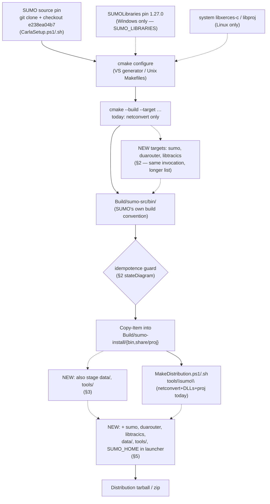
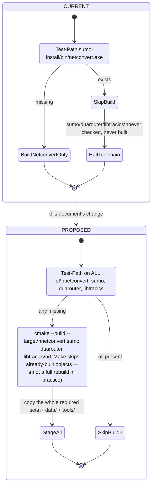
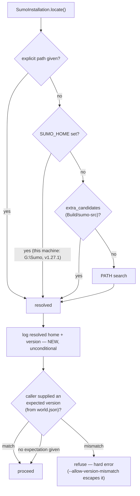
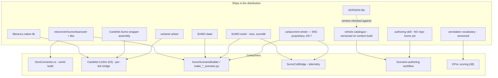

# 09 — Toolchain and Packaging

**Status:** planning only. No code changed, no build/cook/engine run. Every claim below is either
cited to `path:line` in the tree as it stands today, or marked as measured with the command that
produced it.
**Date:** 2026-09-17.
**Owner role:** build, toolchain and packaging engineer. This document only.
**Reads:** [`_TEAM_BRIEF.md`](_TEAM_BRIEF.md) (binding); `Findings/23_SUMO_Traffic_Integration.md` §1,
1.2, 6.1–6.3, 6.12, §8; `Findings/15_Automated_Build_Distribution_Pipeline.md`; `Findings/07_RoadNetwork_Filtering.md`
§1.3; `Findings/20_Behavioral_Annotation_And_Areas_Of_Interest.md` §5.6, §6.2; `Findings/22_Digital_Twin_Feature_Port.md`
§14; `.github/workflows/build-carla-ue5.yml` (the CI pipeline as it actually runs today, not as doc 15
proposed it).
**Does not cover:** the co-simulation runtime shape (`03`), the render-set / lifecycle / tick contracts
(`04`, `05`), truth and annotation schema (`06`), scenario-authoring content (`07`), EPoL interfaces
(`08`), or scale and performance (`10`). Where a decision here depends on one of those, it is named and
linked rather than made silently. The vehicle catalogue, annotation vocabulary and authoring skill are
designed elsewhere; this section only specifies what has to be true of them for them to *ship*.

**Corrections folded into this pass.** Two things changed the shape of this document after the first
read of doc 23:

1. Doc 23's citation `SCTMV.py:102-106` for where `CARLA_NETCONVERT`/`PROJ_LIB` are set is **stale**.
   `carla/CarlaNet/python/SCTMV.py` no longer exists — deleted 2026-09-15. The live entry point is
   `carla/CarlaControl/scripts/run_SCTMV.py`, driving the `carlacontrol` package. §3 below re-resolves
   this from the live tree rather than repeating the doc 23 citation.
2. Two measurements landed mid-pass from the scenario-authoring engineer and are verified and folded
   in at §3.3 (a live `SUMO_HOME` pointed at a different netconvert version than the one this repo
   pins, silently preferred by `SumoInstallation.locate`) and §8.3 (a non-deterministic serialization
   order in `OsmClipper.py` that would make a naive byte-hash reproducibility check fail spuriously).

---

## 1. What is actually on disk today, against doc 23's table

Doc 23 §1/§1.2 was measured 2026-08-21. Re-measured today against the same four directories
(`Build/sumo-src`, `Build/SUMOLibraries`, `Build/sumo-build`, `Build/sumo-install/bin`):

| Thing | Doc 23 said | Measured today | Drift |
|---|---|---|---|
| `Build/sumo-src` | complete, v1.27.0 pinned `e238ea04b7` | confirmed: `git -C Build/sumo-src rev-parse HEAD` pin matches `CarlaSetup.ps1:616`'s `$sumoSrcPin` exactly; `bin/` holds `sumo.exe` (6.9 MB), `duarouter.exe` (2.6 MB), `netconvert.exe`, `libtracics.dll` + `.lib`/`.exp`, `libtracics-sources.zip`, `libsumostatic.lib`, `libtracistatic.lib` | none |
| `Build/SUMOLibraries` | pinned tag `1.27.0` | confirmed present, matches `CarlaSetup.ps1:617-618` pins | none |
| `Build/sumo-build` | fully configured — `sumo.vcxproj`, `duarouter.vcxproj`, `libtracics.vcxproj`, `libsumocs.vcxproj` all generated | confirmed all four exist: `src/sumo.vcxproj`, `src/duarouter/duarouter.vcxproj`, `src/libtraci/libtracics.vcxproj`, `src/libsumo/libsumocs.vcxproj` | none |
| `Build/sumo-install/bin` | **`netconvert.exe` only** staged; `sumo`/`duarouter`/`libtracics` exist in the source tree's `bin/` but are not staged | confirmed identical: `netconvert.exe` + 32 DLLs + `share/proj`; no `sumo.exe`, `duarouter.exe`, or `libtracics.dll` in `sumo-install/bin` | none |
| Generated C# bindings | **94 generated C# files** in `Eclipse.Sumo.Libtraci/` | **93 `.cs` files.** The 94th file in that directory is `libtraciCSHARP_wrap.cxx` — the SWIG-generated **C++** glue that gets compiled into the native `libtracics.dll`, not a C# source file. Confirmed by unzipping `Build/sumo-src/bin/libtracics-sources.zip` (95 zip entries = 1 directory entry + 93 `.cs` + 1 `.cxx`) and by `find … -iname '*.cs' \| wc -l` = 93 | doc 23 off by one; harmless, but the `.cxx` must not be swept into the C# wrapper project (§4) |
| `data/`, `tools/` staged | present in source, **unstaged** | confirmed: `Build/sumo-src/data` and `Build/sumo-src/tools` exist and are populated (type maps, XSDs, `traci`/`sumolib`); nothing under `Build/sumo-install` or `Build/Dist/*/tools/sumo` | none |
| Distribution slot | `MakeDistribution.ps1:237` creates `tools\sumo\` | the directory list is now at `Scripts/Windows/MakeDistribution.ps1:211`; the actual SUMO copy block is `:248-260`. Contents of the built `Build/Dist/Carla-0.10.0-Win64-Development/tools/sumo/`: `netconvert.exe` + its DLLs + a `proj/` subfolder (**PROJ's own data**, not SUMO's `data/typemap/`). No `sumo.exe`, no `duarouter.exe`, no `libtracics.dll`, no SUMO `data/`, no SUMO `tools/` | line-number drift only (script has grown since 2026-08-21); the packaging gap doc 23 described is confirmed unchanged |
| `SUMO_HOME` | "set nowhere" | **Wrong as a blanket statement — see §3.3.** It is set nowhere *by any script in this repo*, but it exists as an ambient developer environment variable on this machine, pointed at an entirely separate SUMO installation | material correction, not cosmetic |

One additional disk fact doc 23 does not mention: **`Build/sumo-src/share/proj` also holds a complete
PROJ data set** (16 entries, identical to `Build/sumo-install/share/proj`). No script in this repo
writes there — `CarlaSetup.ps1:687-691` only writes `Build/sumo-install/share/proj`. This is most likely
a side effect of SUMO's own CMake build copying PROJ data next to its test-suite binaries when `sumo`/
`duarouter` were built 2026-08-21 (**inferred, not confirmed** — SUMO's build system, not ours, would
have done this). It matters because `carlacontrol.SumoInstallation` (§3) resolves `Build/sumo-src` as a
candidate installation and would find working PROJ data there too, **by accident**, not by any staging
this repo performs. Do not rely on it for the distribution path (§5) — a distribution recipient has no
`Build/sumo-src`.

**Net conclusion: doc 23's disk-state table holds.** The only correction of substance is `SUMO_HOME`
(§3.3), which changes the shape of §3 below but not §1's inventory.

**The build and staging pipeline, source pin to staged install to distribution bundle** — current state
(solid) and what §2/§5 add (dashed):



---

## 2. The build target change

### 2.1 What changes, and why the guard has to change with it

`CarlaSetup.ps1:677` builds exactly one target:

```powershell
cmake --build $sumoBuild --target netconvert --config Release -- -m
```

and the idempotence guard at `CarlaSetup.ps1:632-636` is:

```powershell
$netconvert = Join-Path $sumoInstall 'bin\netconvert.exe'
if (Test-Path $netconvert) { Write-Host "Found SUMO netconvert ... Skipping SUMO build." }
```

`CarlaSetup.sh:261-264` does the platform-appropriate equivalent (`test -f "$sumo_install/bin/netconvert"`).
Doc 23 §6.1 already names the trap: keying the guard on `netconvert.exe` alone means a developer who
has that one file staged is told the SUMO step is done, even with `sumo`, `duarouter` and `libtracics`
never built.

**Do not replace the single-file check with a different single-file check.** Doc 23 §6.1 phrases the
fix as keying on "the newest required binary." That phrasing does not survive contact with how the
build actually runs: `-- -m` passes MSBuild `/m` (parallel project build), so on a multi-target build
there is no dependable single "newest" output file — parallel projects can finish in any order, and a
partial failure can leave an arbitrary subset staged. The guard has to check **presence of the whole
required set**, not the freshness of one member of it.

**The idempotence guard, current versus proposed:**



Required set (built and staged together, one invocation): `netconvert`, `sumo`, `duarouter`,
`libtracics` (its native library — `.dll` on Windows, `.so` on Linux). `jtrrouter` and `polyconvert`
(doc 23 §6.1 lists them as optional) are **not** added to the default target list: nothing in this plan
or in `carlacontrol` invokes either of them today (verified — no reference to `jtrrouter` or
`polyconvert` anywhere in `CarlaControl/` or `CarlaNet/`), so building them by default only lengthens
every clean build for no consumer. Leave them reachable via the existing `-CleanAll`-style flag surface
if a future author needs them, rather than building them unconditionally.

`duarouter` was already going to be in this target list as a build-time convenience; the
scenario-authoring engineer's plan for `07_Scenario_Authoring.md` makes it **load-bearing**: route
validation for authored scenarios calls `duarouter` unconditionally as part of scenario compilation
(measured at 0.27 s for the 52 Arapahoe routes — cost is not a reason to make it optional). `duarouter`
therefore moves from "nice to have while we're building sumo anyway" to **a required, staged, verified
artifact**, and §8's acceptance check treats it that way.

### 2.2 Windows (`CarlaSetup.ps1`)

```powershell
# Guard: ALL required binaries staged, not just netconvert.
$requiredBins = 'netconvert.exe','sumo.exe','duarouter.exe'
$requiredNative = 'libtracics.dll'
$haveAll = ($requiredBins | ForEach-Object { Test-Path (Join-Path $sumoInstall "bin\$_") }) -notcontains $false `
           -and (Test-Path (Join-Path $sumoInstall "bin\$requiredNative"))
if ($haveAll) {
    Write-Host "Found the full SUMO toolchain (netconvert, sumo, duarouter, libtracics) staged. Skipping SUMO build."
} else {
    ...
    cmake --build $sumoBuild --target netconvert sumo duarouter libtracics --config Release -- -m
    ...
    # Stage the whole required set, not just netconvert.exe.
    foreach ($bin in $requiredBins) {
        Copy-Item -Force (Join-Path $sumoSrc "bin\$bin") $installBin
    }
    Copy-Item -Force (Join-Path $sumoSrc "bin\$requiredNative") $installBin
    Copy-Item -Force (Join-Path $sumoSrc 'bin\*.dll') $installBin   # unchanged: runtime DLLs
    # NEW: stage data/ and tools/ beside bin/ (see §3).
    Copy-Item -Recurse -Force (Join-Path $sumoSrc 'data') (Join-Path $sumoInstall 'data')
    Copy-Item -Recurse -Force (Join-Path $sumoSrc 'tools') (Join-Path $sumoInstall 'tools')
}
```

`-Clean`/`-CleanAll` (`CarlaSetup.ps1:159-160`) already remove `Build\sumo-build` + `Build\sumo-install`
(and, for `-CleanAll`, the source and library pins too); nothing about their behavior needs to change —
they force exactly the fuller rebuild this section now performs by default when the guard fails. Needing
that rebuild is not a cost to weigh against anything; it is the guard doing its job.

### 2.3 Linux (`CarlaSetup.sh`)

Mirrors §2.2 exactly, same required set, same guard shape:

```sh
required_bins="netconvert sumo duarouter"
required_native="libtracics.so"
have_all=1
for b in $required_bins; do [ -f "$sumo_install/bin/$b" ] || have_all=0; done
[ -f "$sumo_install/bin/$required_native" ] || have_all=0

if [ "$have_all" -eq 1 ]; then
    echo "Found the full SUMO toolchain staged. Skipping SUMO build."
else
    ...
    cmake --build "$sumo_build" --target netconvert sumo duarouter libtracics -j"$(nproc)"
    mkdir -p "$sumo_install/bin"
    for b in $required_bins "$required_native"; do
        cp "$sumo_src/bin/$b" "$sumo_install/bin/$b"
    done
    # NEW: stage data/ and tools/.
    cp -a "$sumo_src/data" "$sumo_install/data"
    cp -a "$sumo_src/tools" "$sumo_install/tools"
fi
```

**Prerequisite gap found beyond doc 23's scope.** Doc 23 §6.1 says "Linux additionally needs `swig` in
`InstallPrerequisites.sh`." That is necessary but **not sufficient**, because it is the wrong file for
the path this repo's own CI actually uses:

- `Util/SetupUtils/InstallPrerequisites.sh:29-42` detects an **Ubuntu** version (`VERSION_ID` from
  `/etc/os-release`) and installs via `apt-get`. It already carries `libxerces-c-dev`, `libproj-dev`
  (`:70-71`) but no `swig`. This is the path a bare-metal Ubuntu developer box uses.
- The CI container is **AlmaLinux 8**, provisioned by `Util/Docker/Base.alma8.Dockerfile`, which
  `.github/workflows/build-carla-ue5.yml` pulls pre-built and never runs `InstallPrerequisites.sh`
  against at all — the CI job calls `CarlaSetup.sh --skip-prerequisites` (workflow step "Build CARLA
  distribution", inline script). The Dockerfile's own package block (`RUN dnf -y groupinstall
  "Development Tools" && dnf -y install … xerces-c-devel proj-devel …`) already has `xerces-c-devel`
  and `proj-devel` but **no `swig`** either.

Both places need it:

| Path | File | Package | Consumed by |
|---|---|---|---|
| Bare-metal Ubuntu dev box | `Util/SetupUtils/InstallPrerequisites.sh` | `swig` (apt) | a developer running `CarlaSetup.sh` without `--skip-prerequisites` |
| CI container (AlmaLinux 8 / RHEL8-compatible) | `Util/Docker/Base.alma8.Dockerfile` | `swig` (dnf; ships in AlmaLinux 8's base or PowerTools repo, already enabled at `:83`) | `build-carla-ue5.yml`'s "Build CARLA distribution" step, which always runs `--skip-prerequisites` |

Missing the Dockerfile side would make the target-list change work for every developer laptop and fail
silently — or rather, fail loudly with a SWIG-not-found CMake error — the first time CI tries to build
`libtracics` from a clean `Build/` tree, which happens whenever `clean_build: true` is dispatched or the
runner's cache is ever cleared. Adding the package means rebuilding and re-pushing `carla-base:alma8` to
the private registry (`iasartifact.sncorp.com:8443/cat-docker-dev/carla-base:alma8`, per
`build-carla-ue5.yml:47`); that rebuild is not a cost, it is the fix.

---

## 3. `SUMO_HOME`, the data directory, and a live version collision found during this pass

### 3.1 Where `CARLA_NETCONVERT` / `PROJ_LIB` are actually set today (re-resolved, not carried from doc 23)

Doc 23 cited `SCTMV.py:102-106`. That file is gone (§0). Grepping the live tree for `CARLA_NETCONVERT`,
`PROJ_LIB`, `SUMO_HOME` finds these, and only these:

| File:lines | What it does |
|---|---|
| `CarlaControl/scripts/run_SCTMV.py:60-78` | The live entry point. Defaults `CARLA_NETCONVERT` to `Build/sumo-install/bin/netconvert{.exe}` and `PROJ_LIB`/`PROJ_DATA` to `Build/sumo-install/share/proj`, **but only if the env var isn't already set** (`os.environ.get(...) or ...`, then `setdefault`) |
| `Scripts/Windows/MakeDistribution.ps1:298-300` | The generated `run-sctmv.ps1` launcher sets `CARLA_NETCONVERT`/`PROJ_LIB` to the bundled `tools\sumo\` paths, for a distribution recipient who has no `Build\` tree at all |
| `Scripts/Linux/MakeDistribution.sh:194-195` | Same, for the generated `run-sctmv.sh` |
| `CarlaSetup.ps1:696-702` / `CarlaSetup.sh:281-287` / `CarlaSetup.bat:184-189` | Print-only reminders (`Write-Host`/`echo`) telling the developer what to set by hand. **These do not persist anything** — a fresh shell after running `CarlaSetup.ps1` still has no `CARLA_NETCONVERT` unless the developer copies the printed line into their profile, or unless `run_SCTMV.py`'s own default (above) covers it, which today it does |

All three setup scripts' comments point at a doc that does not exist: `# see NETCONVERT_INTEGRATION.md`
(`CarlaSetup.ps1:697`, `CarlaSetup.sh:282`, `CarlaSetup.bat:184`). `find . -iname NETCONVERT_INTEGRATION.md`
returns nothing anywhere in the tracked tree. This is pre-existing doc rot, unrelated to SUMO's expansion,
but it is the file a developer is told to go read for exactly the environment-variable contract this
section extends — worth fixing in the same change rather than adding a fourth reference to a file that
has never existed in this repo's history that we can find.

`SUMO_HOME` is set **nowhere in any of the above** — confirmed by the same grep. `carlacontrol.SumoInstallation`
(`CarlaControl/src/carlacontrol/SumoInstallation.py:1-108`) reads it (§3.2) but nothing writes it.

### 3.2 `SumoInstallation`'s discovery order, and what it resolves to right now

`SumoInstallation.locate` (`SumoInstallation.py:32-56`) tries, in order:

1. `explicit` — an argument the caller passed (every CLI here exposes `--sumo-home`, defaulting to `None`)
2. `os.environ.get("SUMO_HOME")`
3. `extra_candidates` — every caller (`make_arapahoe_scenario.py:56,277`, `make_bahonar_scenario.py:331`,
   `make_sumo_scenario.py:167`, `sumo_cot_telemetry.py:48,142`) passes exactly one:
   `REPO_SUMO = Build/sumo-src` (the **source tree**, not `Build/sumo-install` — it already has `bin/`,
   `data/`, `tools/` in one place, so it already resolves as a complete installation today, by accident
   of SUMO's own build/source layout, not by design)
4. `shutil.which("sumo")` / `shutil.which("netconvert")` on `PATH`

A directory qualifies (`_is_installation`, `:59-62`) if it has `bin/sumo{.exe}` **or** `bin/netconvert{.exe}`
— lenient by design, so a netconvert-only directory (today's `Build/sumo-install`) already counts as "an
installation" even though `.sumo`, `.tools`/`import_traci()` would raise on it. That is intentional
lenience for callers that only need `netconvert`, not a defect — but it means **the check that gates
"is this installation usable" is weaker than what most callers actually need**, and a caller that calls
`.sumo` or `import_traci()` first discovers the shortfall at that call site, not at `locate()` time.

### 3.3 A live version collision, measured on this machine

**Measured just now, on this machine, exactly as the scenario-authoring engineer reported:**

```
$ echo $SUMO_HOME
G:\Sumo\
$ ls $SUMO_HOME
bin  data  doc  include  tools
$ "$SUMO_HOME/bin/netconvert.exe" --version
Eclipse SUMO netconvert 1.27.1
 Build features: Windows-10.0.17763 AMD64 MSVC 19.29.30133.0 Release ...
```

against the repo's own staged/pinned build:

```
$ Build/sumo-install/bin/netconvert.exe --version
Eclipse SUMO netconvert 1.27.0
 Build features: Windows-10.0.26200 AMD64 MSVC 19.44.35227.0 Release ...
```

`SUMO_HOME=G:\Sumo\` is a **full, independent, official SUMO 1.27.1 installation** (it has `include/`,
which nothing in this repo's build produces — this was installed by some other means, on this machine,
unrelated to `CarlaSetup.ps1`). Under §3.2's order, `SUMO_HOME` is checked **before** `extra_candidates`,
and no caller passes `explicit`, so **every `SumoInstallation.locate()` call on this machine today
silently resolves to the external 1.27.1 install, never to this repo's pinned 1.27.0 build**, with zero
output saying which one it picked.

This is exactly the failure the coordinating message named: the CARLA world for a map is built by
`CarlaNet.Map.OsmConverter` via `CARLA_NETCONVERT` (§3.1 — resolves to the repo's pinned `sumo-install`
netconvert, **1.27.0**), while the SUMO network authored against that same map by `SumoScenarioBuilder`
/ the `make_*_scenario.py` tools resolves through `SumoInstallation` to **1.27.1**, on this machine,
today. Two different netconvert builds are producing what the team brief's ground truth (§5) asserts is
"the same clipped OSM at the same pinned origin" — the origin-pinning and flag set are identical, but
"same netconvert run" is not true when it is not even the same netconvert *version*. Doc 23's
`netOffset = 0.00,0.00` coordinate-identity measurement was taken with one specific netconvert build; it
is not a property guaranteed across versions, only re-verified for the one that happened to run.

**This has to become a reported, refusing condition, not something reordering hides.** Two designs were
considered:

- **Flip precedence so the repo-pinned build always wins by default.** Rejected as the default: it
  breaks the one SUMO-wide convention `SumoInstallation`'s own docstring names — `SUMO_HOME` is "what
  `traci` itself checks" (`SumoInstallation.py:9`) — and would make this repo's tooling resolve
  differently from raw `traci` run against the same environment, which is a worse kind of silent
  divergence than the one being fixed.
- **Keep the existing precedence, but make the resolution and any mismatch impossible to miss.**
  Recommended. Concretely:
  1. `SumoInstallation` gains a `.version` property: run the resolved `netconvert --version` once, parse
     the `Eclipse SUMO netconvert X.Y.Z` line, cache it.
  2. Every tool built on `SumoInstallation.locate()` logs the resolved `home` and `.version` at startup,
     unconditionally — not behind a verbose flag. Silence is what let this stand unnoticed.
  3. The world-build provenance record already carries netconvert's argument set (team brief §5, ground
     truth on `world.json`); it must also carry the **resolved netconvert version string** at the time
     the world was built. Where exactly that field lives in `world.json`'s schema is a `04_Contracts.md`
     / `01_Architecture.md` decision, not mine — what I specify is that the *source* of that string is
     `OsmConverter`'s own invocation of the netconvert it just ran, recorded at build time, not inferred
     later.
  4. A scenario-authoring tool that opens an existing world package reads that recorded version and
     compares it against its own resolved `SumoInstallation.version`. On mismatch: **hard error**, not a
     warning — "world was built with netconvert 1.27.0; this SUMO installation resolves to 1.27.1 at
     `G:\Sumo`; pass `--sumo-home` to point at a matching installation or rebuild the world" — with an
     explicit `--allow-version-mismatch` escape hatch for a developer who has a specific reason to accept
     the risk. `SumoInstallation` is the natural home for the comparison primitive itself (e.g. a
     `require_version(expected: str) -> None` method), since it already owns version resolution; whether
     the *caller* refuses or warns by default is `07_Scenario_Authoring.md`'s call to finalize, since
     `SumoScenarioBuilder` is where that consumption happens.

This is a real, present bug independent of everything else in this document — it would exist even if no
line of the SUMO-driven-traffic plan were ever built, because it already affects today's Arapahoe/Bahonar
scenario authoring. It belongs in this document because the fix is a discovery/packaging change
(`SumoInstallation` + the world-package provenance field it reads), not a runtime co-simulation change.



### 3.4 What must be staged, and what changes once the real type map exists

Doc 23 §6.2 and doc 07 §1.3 (`07_RoadNetwork_Filtering.md:84-96`) already measured why this matters:
`Build/sumo-install` ships no `data/typemap/`, so `netconvert` silently falls back to its **compiled-in**
default OSM type map. Doc 07's own build note is explicit that this is not currently a problem for the
vClass filter approach — the compiled-in defaults already give `passenger` the right allow/disallow set
(`07_RoadNetwork_Filtering.md:88-96`).

What changes once `data/` is staged and `SUMO_HOME` points at a complete installation:

- **Nothing changes by default.** `netconvert` without `--type-files` uses its compiled-in table
  regardless of what sits on disk at `$SUMO_HOME/data/typemap/`. Staging `data/` does not, by itself,
  alter any existing conversion's output.
- **It becomes possible to pass `--type-files $SUMO_HOME/data/typemap/osmNetconvert.typ.xml`
  deliberately** — to diff the compiled-in defaults against the shipped file (they are expected to
  agree, but "expected" is not "measured" — this is a cheap, worthwhile one-time check once staging
  lands), or to hand `netconvert` a **customized** type map (e.g. one that changes vClass permissions
  for a road class this fork cares about) without that customization living nowhere on disk.
- **Other SUMO tools need `data/` and `tools/` for reasons unrelated to netconvert's type map**:
  `sumo`/`duarouter` reference `data/` for XSD validation of generated files under some invocations,
  and `tools/` is where `traci`, `sumolib`, `randomTrips.py` and `routeSampler.py` (doc 23 §9 question 1)
  live — none of that is optional once the Python authoring path (§4.2) is expected to work from a
  staged install rather than a source checkout.

Staging shape (both platforms, added in §2's build step): `Build/sumo-install/{bin,data,tools,share/proj}`.
`SUMO_HOME` is not set by `CarlaSetup.ps1`/`.sh` themselves (§3.1's precedent — they print a reminder,
they do not persist an env var into the calling shell, and persisting a machine-wide env var from an
unattended CI run is the wrong tool for that job regardless). It is set:

- In `run_SCTMV.py`'s own defaulting block (`:60-78`), extended with the same `setdefault` pattern:
  `os.environ.setdefault("SUMO_HOME", _INSTALL)` — respecting an operator's own `SUMO_HOME` exactly the
  way `CARLA_NETCONVERT` already does, which is what makes §3.3's fix meaningful rather than circular.
- In the generated distribution launchers (`run-sctmv.ps1`/`.sh`), alongside `CARLA_NETCONVERT`/`PROJ_LIB`
  (§5).
- In `CarlaSetup.ps1`/`.sh`'s printed reminder (§3.1), extended to mention `SUMO_HOME` alongside
  `CARLA_NETCONVERT`/`PROJ_LIB` so a developer who does set env vars by hand sets all three together.

---

## 4. The C# binding wrapper, and the Python path it sits beside

### 4.1 The C# path

**`libtraci` (out-of-process), not `libsumo`** — doc 23 §6.3's recommendation stands; §6 below adds the
licensing angle it did not carry.

What a consuming .NET project needs, concretely:

1. **A new project, `CarlaNet/src/CarlaNet.Sumo/CarlaNet.Sumo.csproj`.** This holds only the generated
   SWIG proxy classes and the thinnest possible native-load glue — nothing CARLA-specific. It has **no**
   `ProjectReference` to any other `CarlaNet.*` assembly, which keeps it regenerable in isolation and
   gives the eventual bridge (doc 23 §5's proposed `CarlaNet.CoSim`, owned by `03_CoSimulation_Runtime.md`)
   a clean, acyclic dependency: `CarlaNet.CoSim` → `CarlaNet.Sumo` + `CarlaNet.Types` + `CarlaNet.Transport`
   + `CarlaNet.Map` + `CarlaNet.TrafficManager`, mirroring the existing pattern at
   `CarlaNet.Scenario.csproj:4-7`. `TargetFramework` is `net10.0`, matching every existing CarlaNet
   assembly (verified: `CarlaNet.Types.csproj`, `CarlaNet.Scenario.csproj`).
2. **The generated sources reproducibly, from a clean clone, not from a build tree someone happens to
   have.** SUMO's own build already produces exactly the right artifact for this:
   `Build/sumo-src/bin/libtracics-sources.zip`, which contains the full `Eclipse.Sumo.Libtraci/` folder
   (93 `.cs` files — §1's correction — plus the harmless `.cxx`, which a default `**/*.cs` compile glob
   never touches). Once §2/§3 stage the toolchain into `Build/sumo-install/bin/`, that zip is staged
   there too, and `CarlaNet.Sumo`'s build extracts it into its own source-generation output directory as
   an MSBuild pre-build step (unzip a fixed, versioned artifact — not "copy whatever loose files are
   sitting in someone's `Build/sumo-build`"). This makes the wrapper buildable from a clean clone that
   has run `CarlaSetup.ps1`/`.sh` once, with no manual file placement.
3. **`libtracics.dll`/`.so` on the native load path.** A post-build MSBuild target copies it from
   `Build/sumo-install/bin/` next to `CarlaNet.Sumo.dll`'s own output — the same mechanism already
   needed for any native interop in a `dotnet build` output directory, no RID-specific NuGet packaging
   required for an in-repo `ProjectReference`.
4. **Regeneration, not maintenance.** Nothing in `CarlaNet.Sumo` is hand-written; a SUMO version bump
   re-runs §2's build, produces a new `libtracics-sources.zip`, and the next `dotnet build` picks it up.
   There is no drift to reconcile because there is no hand-maintained copy.

### 4.2 The Python path — needed regardless of `03`'s C#-vs-Python decision

`03_CoSimulation_Runtime.md` decides whether the *per-tick bridge* is C# or Python. Independent of that:
today's **working** SUMO tooling (`SumoScenarioBuilder`, `SumoPatternOfLifeBuilder`, `SumoCotBridge`, the
`make_*_scenario.py` CLIs) is Python, uses `carlacontrol.SumoInstallation` (§3.2) to resolve `traci`/
`sumolib` from `$SUMO_HOME/tools`, and will keep needing that regardless of what `03` decides for the
bridge. Once §2/§3 stage `data/` and `tools/` into `Build/sumo-install`, this path needs nothing new
structurally — `SumoInstallation.tools` already resolves to `<home>/tools` and `import_traci()` already
adds it to `sys.path` (`SumoInstallation.py:93-97`). What changes is that `Build/sumo-install` becomes a
**genuinely complete** installation matching what `_is_installation`'s lenient check already implies is
possible, closing the gap where `REPO_SUMO = Build/sumo-src` (the source tree) is the only candidate that
currently works end-to-end for this path (§3.2).

### 4.3 Licensing exclusion this section must not silently violate

`Findings/22_Digital_Twin_Feature_Port.md:522` records: **`CarlaControl/` is SNC proprietary — exclude
from any external distribution.** `carlacontrol.SumoInstallation`, `SumoScenarioBuilder`,
`SumoPatternOfLifeBuilder` and every `make_*_scenario.py` CLI live in `CarlaControl/`. This is a
packaging fact with teeth, addressed at §5.4 — noted here because it means **the Python SUMO path, as it
exists today, is entirely proprietary code**, and any statement that "the Python path is the reference
implementation" carries that qualification forward.

---

## 5. Distribution

### 5.1 What `MakeDistribution` bundles today, verified against both platforms

| Slot | Windows (`Scripts/Windows/MakeDistribution.ps1`) | Linux (`Scripts/Linux/MakeDistribution.sh`) |
|---|---|---|
| Cooked server | `:212-213` | `:90` |
| `carlanet` wheel | `:230` | `:104-114` (`copy_newest_wheel "$root/CarlaNet/python/dist"`) |
| `carlacontrol` wheel | **not bundled** | `:104-114` (`copy_newest_wheel "$root/CarlaControl/dist"`) |
| Demo client | `foreach ($f in 'SCTMV.py', 'osm_clip.py') { … CarlaNet\python\$f … }` (`:237-241`) | `cp "$root/CarlaControl/scripts/run_SCTMV.py" "$dist/scripts/"` (`:117`) |
| SUMO netconvert + DLLs + PROJ | `:248-260` | `:122-158` (walks `ldd`) |
| `SUMO_HOME` in launcher | not set | not set |

### 5.2 A currently-broken distribution, found while verifying this table

`Scripts/Windows/MakeDistribution.ps1:237-241` copies `CarlaNet\python\SCTMV.py` into the distribution's
`scripts/` folder. **That file does not exist** (§0/§3.1 — deleted 2026-09-15, superseded by
`CarlaControl/scripts/run_SCTMV.py`). The copy loop's own guard (`if (Test-Path $src) { … } else {
Write-Warning "missing $src" }`) means the build does not fail — it silently omits the file and keeps
going. The generated `run-sctmv.ps1` launcher (`:295-303`) then unconditionally does:

```powershell
& $py "$here\scripts\SCTMV.py" @args
```

which will fail the moment anyone runs a distribution built from the current tree, with "file not
found," not with anything that names the real cause. **This predates and is independent of the SUMO
toolchain work**, but it sits in the exact script section this plan already has to touch (the SUMO
copy block a few lines below it), so it should be fixed in the same change: point the Windows copy at
`CarlaControl\scripts\run_SCTMV.py`, matching what Linux already does correctly.

### 5.3 Fixing 5.2 surfaces the 4.3 licensing question on both platforms uniformly

Today, Windows and Linux disagree about bundling `carlacontrol` — Linux bundles it (`:104-114`), Windows
doesn't (§5.1) — but **by accident**, not by design: Windows doesn't bundle it because its demo script
reference is broken and was never updated to the file that needs `carlacontrol`, not because anyone
decided Windows distributions should exclude proprietary code. Fixing §5.2 the straightforward way (point
at `run_SCTMV.py`, which imports `carlacontrol`) makes Windows bundle `carlacontrol.whl` too, which
makes both platforms *consistently* ship SNC-proprietary code in every distribution this pipeline
produces — which is fine for an **internal-only** distribution (§6 confirms the CI's Artifactory target,
`iasartifact.sncorp.com:8443/cat-local-generic-dev/carla`, is an SNC-internal registry) but is exactly
what doc 22 says must never happen for an **external** one, and nothing in either script currently
distinguishes the two. This is `D9.7` below.

### 5.4 What must be bundled once the toolchain is complete

Extending both scripts' SUMO block (§5.1's row 5) from "netconvert + its DLLs + PROJ data" to the full
staged install:

| Artifact | Windows source | Linux source | Destination |
|---|---|---|---|
| `sumo`, `duarouter`, `netconvert` + runtime DLLs/`.so`s | `Build\sumo-install\bin\*` | `Build/sumo-install/bin/*` (Linux already walks `ldd` per-binary at `:125-144`; extend the walk to all three, not just `netconvert`) | `tools\sumo\` |
| `libtracics.dll`/`.so` | same | same | `tools\sumo\` |
| SUMO `data/` (type maps, XSDs) | `Build\sumo-install\data\*` | `Build/sumo-install/data/*` | `tools\sumo\data\` |
| SUMO `tools/` (`traci`, `sumolib`, …) | `Build\sumo-install\tools\*` | `Build/sumo-install/tools/*` | `tools\sumo\tools\` |
| PROJ data | already bundled | already bundled | `tools\sumo\proj\` (unchanged) |
| `CarlaNet.Sumo` wrapper assembly + `libtracics` native lib | `CarlaNet\src\CarlaNet.Sumo\bin\Release\net10.0\*` | equivalent | `wheels\` is Python-only — this needs a new `dotnet\` (or similar) slot, since it is a managed assembly, not a wheel |
| `SUMO_HOME` in the generated launcher | new line in `run-sctmv.ps1`: `$env:SUMO_HOME = Join-Path $here 'tools\sumo'` | new line in `run-sctmv.sh`: `export SUMO_HOME="$here/tools/sumo"` | — |

### 5.5 The new, non-toolchain artifacts this plan introduces

Per the team brief, this section states what must be shippable, not their formats:

- **The vehicle catalogue.** Doc 20 §5.6 already states the requirement plainly: "**Generated from a
  running server, never hand-maintained**… **Versioned and shipped with the distribution**, so a
  storyboard authored against one content build can be validated against the world it is run in"
  (`20_Behavioral_Annotation_And_Areas_Of_Interest.md:647,651`). The distribution already has a natural
  versioning hook for this: `Unreal/Package/CreateCarlaVersionFile.cmake:51-59` writes a `VERSION` file
  recording `Carla version`, `Carla git hash`, **`Content git hash`** and `UnrealEngine git hash`
  separately, precisely because "a CARLA release can change nothing a world depends on" (`:47-50`). The
  vehicle catalogue is a property of the content build, so its version stamp belongs next to `Content
  git hash`, not `Carla version` — the exact schema and file format are `04_Contracts.md`'s call; what I
  specify is that it needs a distribution slot (e.g. a new `catalogs\` alongside `wheels\`/`osm\`) and
  that its version must be checkable against the `VERSION` file already shipped at the distribution root.
- **The annotation vocabulary.** Doc 20 §6.2: "a term list carried with the annotation set… `vocabulary_version`
  lets a consumer refuse a corpus it does not understand" (`:702-707`). Same packaging need: a
  discoverable, versioned file shipped with the distribution (or with a captured corpus — that's `06`'s
  and `08`'s call), not embedded in code.
- **The authoring skill.** `.agents/skills/sumo-traffic-scenarios/SKILL.md` exists today as a single
  14 KB file. **It has no reproducible source location for packaging to copy from.** The workspace root
  (`G:\Projects\CarlaUE_5_7_4`) is not a git repository at all (`git rev-parse --is-inside-work-tree`
  fails there) — `.agents/skills/` is a local Claude Code convenience directory, untracked, one level
  above the `carla` repo this whole plan lives in. A distribution built from a clean clone of `carla`
  has no path to this file. Before it can ship with anything, it needs a home **inside** the `carla` repo
  (tracked, versioned, and therefore something `MakeDistribution` can reference by a real path) — where
  exactly is `07_Scenario_Authoring.md`'s call, since that document owns the skill's content; the fact
  that it currently has *no* reproducible source location is this document's finding to raise, not
  something to design around silently.



---

## 6. Licensing — facts, not advice

SUMO is Eclipse Public License 2.0 (`Build/sumo-src/LICENSE`, `Build/sumo-src/NOTICE.md`). Prior analysis
already exists and is not being redone here: `Findings/22_Digital_Twin_Feature_Port.md:528` records the
current position for the one SUMO artifact already redistributed —

> `SUMO netconvert binary | EPL-2.0 | notice + source offer; separate-process invocation keeps our code
> outside file-level copyleft`

Extending that to every binding choice this plan puts in front of the user:

| Choice | What is redistributed | Boundary | Consequence, stated plainly |
|---|---|---|---|
| `netconvert` (already shipped) | compiled binary only | separate process, invoked by argv | notice + source offer (doc 22's existing conclusion, unchanged) |
| `sumo` + `duarouter` (new) | compiled binaries only | separate processes | same as `netconvert` — no new category |
| **`libtraci` (recommended bridge)** | compiled native `libtracics.dll`/`.so` **and generated C# source** (`Eclipse.Sumo.Libtraci/*.cs`) | out-of-process TraCI protocol between our code and the `sumo` process; the native `libtracics` library and its generated `.cs` proxies are SWIG output from SUMO's own `.i` interface files, which are themselves part of SUMO's EPL-2.0 source tree | the *binary* half is the same notice-plus-source-offer situation as `netconvert`. The *generated source* half is materially different from anything doc 22 already covers: this plan ships **EPL-2.0-derived source code**, not only an opaque binary, inside our own build/distribution. Whether that requires anything beyond notice + retaining SUMO's own copyright headers in the generated files (EPL-2.0 is file-level copyleft — modifications to an EPL-covered *file* carry obligations for that file, it does not by itself extend to code that merely calls it) is **flagged for legal review, not decided here** |
| `libsumo` (rejected in doc 23 §6.3 on architecture grounds) | `libsumocpp`/`libsumostatic.lib` **statically linked** into the same native module our own code loads, plus the same category of generated C# source as `libtraci` | in-process; EPL-2.0 is explicit that mere aggregation and dynamic linking do not extend copyleft to the linking program, but **static linking into the same binary is a closer, more contested boundary** than a separate process talking over TCP | staying out-of-process (§4.1's recommendation) is therefore **also** the licensing-conservative choice, not only the crash-isolation one — the architecture decision and the licensing posture point the same direction, which is worth knowing when the choice is made, not after |
| `CarlaControl/` (existing, unrelated to SUMO) | source, SNC proprietary (`CarlaControl/LICENSE`) | — | must be excluded from any distribution that is not internal-only; §5.3/§5.4/`D9.7` |

No conclusion above should be read as legal sign-off. The two flagged rows — generated EPL-2.0 source
bundled as source, and the internal/external distribution boundary around `CarlaControl/` — are the two
items worth a licensing review before this ships, stated as facts so that review has something concrete
to look at rather than a summary.

---

## 7. CI and reproducibility

### 7.1 The actual pipeline, which has moved past doc 15's plan

Doc 15 is a **plan** document; `.github/workflows/build-carla-ue5.yml` is the **implementation that
exists and runs today** (manual `workflow_dispatch` only, self-hosted GHE runner, per project memory
confirmed working end-to-end since 2026-07-28). Where they differ, the workflow file is ground truth for
this section:

- Doc 15 imagined building the engine in the same pipeline (§4 there); the actual workflow **fetches a
  pre-built engine tarball from Artifactory** (`prepare-ue-distribution`, workflow step "Prepare Unreal
  Engine distribution") — the engine pipeline doc 15 designed is a separate, not-yet-shown concern.
- Doc 15 assumed a raw `docker`/registry credential flow; the actual workflow uses **podman**, rootless,
  with a per-job copied auth file, and mounts the content snapshot with an overlay-probe fallback
  (`Select content mount mode` step) — considerably more defensive than the plan.
- Doc 15 flagged GHES forbidding `upload-artifact` v4 as an open risk; the actual workflow has **already
  designed around it** — its own comment states this explicitly ("GitHub Enterprise Server does not
  support `actions/upload-artifact` v4 at all") and publishes exclusively to Artifactory with a `.sha256`
  sidecar instead.
- `Build/` **persists between runs** on the runner (the "Clean tracked workspace" step deliberately does
  not `git clean -ffdx`, precisely to avoid re-downloading the ~43 GB content cache and Cesium/vcpkg
  dependencies every run). This is the detail that makes §2's idempotence-guard fix matter for CI, not
  only for a developer's laptop (§7.2).

### 7.2 What has to change for the SUMO toolchain to be built and shipped by this pipeline

1. **`carla-base:alma8` needs `swig`** (§2.3) — a Dockerfile change, rebuild, and re-push to
   `iasartifact.sncorp.com:8443/cat-docker-dev/carla-base:alma8`. The workflow's "Pull container image"
   step already pulls by a fixed tag with no digest pin visible in the workflow, so a rebuild under the
   same tag reaches the next run automatically; whether that tag should move to a digest pin so a SUMO
   toolchain change can't silently ride in on an unrelated base-image rebuild is worth a decision (`D9.8`).
2. **No workflow change is needed to trigger the new targets.** `CarlaSetup.sh --skip-prerequisites`
   (the only build-relevant flag the workflow passes) skips `InstallPrerequisites.sh`, not the SUMO build
   block — the two are separate steps in the script. Once §2's target-list change lands and the container
   has `swig`, the existing "Build CARLA distribution" step picks it up with no workflow edit.
3. **The persistent `Build/` tree means §2's guard fix is a CI-correctness fix, not only a developer
   convenience.** Before this change, a CI box that already has `netconvert.exe` staged from an earlier
   run would skip the SUMO step forever, silently shipping an incomplete `tools/sumo/` in every
   distribution until someone dispatches `clean_build: true` and happens to notice. After this change,
   the guard itself detects the shortfall on the very next run, with no `clean_build` required.
4. **`clean_build: true` (the workflow's existing input) already exercises the from-scratch path** — it
   removes `Build/` entirely (`rm -rf "$GITHUB_WORKSPACE/Build"`), which includes `Build/sumo-*`. This is
   the reproducibility check (§7.3), not a new mechanism to add.

### 7.3 A clean-clone reproducibility check, defined concretely

A `workflow_dispatch` run with `clean_build: true` should reproduce, byte-for-byte where that is a
meaningful comparison and semantically where it is not:

- `Build/sumo-install/bin/` containing all four required binaries, each reporting the pinned version
  (`sumo --version` → `1.27.0`, built from commit `e238ea04b7150ba23a348a285d3048919fa4830b` — the same
  pin `CarlaSetup.ps1:616` carries)
- `Build/sumo-install/{data,tools}` populated
- the distribution tarball's `tools/sumo/` mirroring the same set

**This check must not hash OSM-derived content and call it toolchain reproducibility** — a finding from
the scenario-authoring engineer, verified here, and worth stating because it is exactly the kind of thing
a reproducibility check would naively do. `CarlaControl/src/carlacontrol/OsmClipper.py:154` builds
`used_orig = set()` and iterates it at `:219` (`for nid in used_orig: newroot.append(...)`) to decide
node emission order in the clipped `.osm` output. Python randomizes string hashing per process by
default, so **the same input OSM, clipped three separate times, produces three different byte sequences
and three different SHA-256 digests while the parsed graph is identical** — confirmed by reading the
code path, not yet re-run three times independently, but the mechanism (per-process hash randomization
driving `set` iteration order of string node IDs) is not in doubt. Any check in this plan that hashes a
`.osm`, `.net.xml` or `.xodr` file to detect toolchain drift will fail spuriously for this reason,
independent of whether the toolchain build itself is reproducible. §7.3's check therefore only hashes
**toolchain artifacts** (the SUMO binaries, which are ordinary compiler output and do not have this
problem) and, for anything downstream of `OsmClipper`, compares **semantic** properties instead — exactly
the shape doc 23 §2 already used (edge count, junction count, `<request>` row count, `tlLogic` count) —
or a canonicalized serialization (sort node IDs before comparing) rather than raw bytes. The actual fix
(`sorted(used_orig, key=int)` at the call site) is a one-line change to proprietary code in
`CarlaControl/`, outside this document's "no code changes" mandate and outside SUMO toolchain packaging
proper; it is named here as a decision to hand to whoever owns `OsmClipper.py` (`D9.9`), and worked around
in the verification design regardless of whether that fix ever lands.

---

## 8. Verification — concrete, runnable, and living somewhere a person or CI will actually run it

Doc 23 §8 proposes "`sumo --version` from the staged install" plus "a trivial console app stepping an
empty simulation through the binding." Turned into two runnable checks:

### 8.1 C# path

**New:** `CarlaNet/test/CarlaNet.Sumo.Tests/` (mirrors the existing `CarlaNet/test/CarlaNet.Tests`
convention). Contents:

```csharp
// Skips (not fails) when no SUMO installation resolves, so the wider `dotnet test` suite
// doesn't require SUMO_HOME on every machine that runs it.
[Fact]
public void StagedSumoAndDuarouterReportThePinnedVersion() { /* Process.Start(sumo/duarouter, "--version"),
    assert stdout contains "1.27.0" and the pinned commit if --version-verbose is used */ }

[Fact]
public void EmptySimulationStepsThroughLibtraci() {
    // Start `sumo` as a subprocess with --remote-port on an ephemeral port and a minimal
    // .sumocfg (an empty net + no vehicles — SUMO ships trivial fixtures under data/ for this).
    // Eclipse.Sumo.Libtraci.Simulation.init/step/close via CarlaNet.Sumo. Assert no exception
    // and that simulation time advanced by one step.
}
```

Run via `dotnet test CarlaNet/CarlaNet.sln --filter CarlaNet.Sumo.Tests`. This is the check that
answers "is the C# binding path actually usable," and it lives where `dotnet test` already runs it as
part of whatever CI or pre-commit step already runs the other 76 CarlaNet tests (project memory: "76/76
tests pass") rather than depending on someone remembering to run it by hand.

### 8.2 Python path

**New:** `CarlaControl/scripts/test_sumo_toolchain.py`, matching the existing direct-run-script
convention already used for `CarlaNet/python/test_*.py` (e.g. `test_left_turn_yield.py`,
`test_digital_twin.py`) rather than requiring a pytest harness:

```python
from carlacontrol.SumoInstallation import SumoInstallation

installation = SumoInstallation.locate(explicit=None, extra_candidates=[REPO_SUMO])
print(f"Resolved SUMO installation: {installation.home} (version {installation.version})")

subprocess.run([installation.sumo, "--version"], check=True)
subprocess.run([installation.executable("duarouter"), "--version"], check=True)   # required, §2.1

traci = installation.import_traci()
traci.start([str(installation.sumo), "-c", <a trivial fixture .sumocfg>])
traci.simulationStep()
traci.close()
```

Run directly: `python CarlaControl/scripts/test_sumo_toolchain.py [--sumo-home PATH]`. Exercised against
both the repo-staged install (`Build/sumo-install`, once §2/§3 land) and, deliberately, against whatever
`SUMO_HOME` happens to be set to — the second run is what would have caught §3.3 immediately, since it
prints the resolved home and version unconditionally rather than assuming.

### 8.3 What "done" means, stated once

Doc 23 §8's "Phase 0" is done when both 8.1 and 8.2 pass **from a distribution's staged install**, not
from a developer's `Build/` tree — i.e., the same two checks, pointed at `tools/sumo/` inside an
extracted distribution tarball, with `SUMO_HOME` set the way `run-sctmv.ps1`/`.sh` sets it (§5.4), pass
identically. That is the actual acceptance bar: not "it compiles," but "a distribution recipient with no
`Build/` tree at all can run both checks and get the same answer."

---

## 9. Decisions

| # | Decision |
|---|---|
| D9.1 | Build target list becomes `netconvert`, `sumo`, `duarouter`, `libtracics` (required, staged together) on both platforms. `jtrrouter`/`polyconvert` stay out of the default target list — nothing in this plan consumes them. |
| D9.2 | The idempotence guard checks **presence of the entire required set** in `Build/sumo-install/bin`, not the freshness of a single "newest" file — parallel (`-m`/`-j`) builds have no dependable single last-built artifact, and CI's persistent `Build/` tree makes a wrong guard a standing, silent CI defect, not just a developer inconvenience. |
| D9.3 | `data/` and `tools/` are staged into `Build/sumo-install/{data,tools}` by the same build step, on both platforms. |
| D9.4 | `libtraci` (out-of-process) is the binding boundary for the C# path, per doc 23 §6.3, reaffirmed here on licensing grounds independently of the architecture ones (§6). `libsumo` is rejected for both reasons together. |
| D9.5 | A new, dependency-free `CarlaNet/src/CarlaNet.Sumo` project holds only the generated bindings and native-load glue, built from `libtracics-sources.zip` staged alongside the toolchain. Any co-simulation bridge (`03`'s `CarlaNet.CoSim` or equivalent) depends on it; it depends on nothing CARLA-specific. |
| D9.6 | `SUMO_HOME` precedence in `SumoInstallation.locate` is **not** reordered — `SUMO_HOME` continues to win, matching raw `traci`'s own convention. Instead: resolution is always logged (home + version), a `.version` property is added, and a version-mismatch between the netconvert that built a world and the SUMO installation resolved to author/run a scenario against it becomes a **hard-refusing** condition with an explicit override flag. The consumer-side refuse-vs-warn UX is `07_Scenario_Authoring.md`'s call to finalize against `SumoScenarioBuilder`. |
| D9.7 | Both distribution scripts must gain an explicit internal/external packaging mode. Today, fixing the broken Windows demo-client reference (§5.2) the obvious way makes both platforms bundle the SNC-proprietary `carlacontrol` wheel uniformly — correct for the one distribution channel that exists today (an internal Artifactory repo) and wrong the moment any distribution is meant to leave that boundary. No such mode exists in either script today; this document does not choose its shape, only that it must exist before an external distribution is ever produced from this pipeline (see Open Questions). |
| D9.8 | `carla-base:alma8`'s pull in `build-carla-ue5.yml` is by tag with no digest pin; adding `swig` (D9.1's prerequisite) means rebuilding and re-pushing that tag. Needing the rebuild is not a cost. Whether the workflow should move to a digest pin so future base-image changes can't silently ride into a build is an open question (below), independent of this rebuild. |
| D9.9 | `CarlaControl/src/carlacontrol/OsmClipper.py:154,219`'s non-deterministic `set`-ordered node emission is a real reproducibility hazard for anything that hashes its output, but it is proprietary code outside this document's scope to change. Recorded here as a handoff: the fix is `sorted(used_orig, key=int)` (or equivalent) at the emission site; until it lands, no reproducibility or acceptance check in this plan hashes OSM-clip-derived file bytes (§7.3). |
| D9.10 | The authoring skill (`.agents/skills/sumo-traffic-scenarios/SKILL.md`) has no reproducible, version-controlled source location today (it sits outside any git repository). It cannot be bundled into a distribution until it is given one inside `carla/`. Where is `07_Scenario_Authoring.md`'s decision; that it currently has none is this document's finding. |

## Open questions

1. **Is there ever an external distribution channel for this program?** If the answer is "no, everything
   this pipeline produces is internal," `D9.7`'s mode can default to "bundle everything" and the
   licensing exclusion in doc 22 §14 is satisfied by the channel itself rather than by the tooling. If
   the answer is "yes, eventually," the mode needs to exist before that day, not on it. This is a
   product/distribution-strategy question, not a toolchain one — recommend deciding it explicitly rather
   than by default.
2. **Does the version-mismatch check (§3.3, `D9.6`) default to refuse or default to warn?** Recommended:
   refuse by default with an explicit override, on the grounds that a silently-divergent converter is
   worse than a blocked run — but this trades developer friction against correctness, and
   `07_Scenario_Authoring.md` is closer to how often a legitimate mismatch (e.g., deliberately testing
   forward-compatibility with a newer SUMO) would occur in practice.
3. **Should `carla-base:alma8` move to a digest-pinned reference in `build-carla-ue5.yml` (`D9.8`)?**
   Independent of this plan, but this plan is the first thing found that needs a base-image change and
   therefore the first thing that would notice if that pin is missing.
4. **Where does `libtracics-sources.zip` (or its unzipped contents) live for a build that has never run
   `CarlaSetup.ps1`/`.sh`** — e.g., a from-scratch CI run before §2's staging step has ever executed?
   Answered functionally in §4.1 (it is a build-order dependency: `CarlaNet.Sumo` cannot build before the
   SUMO toolchain step has run once), but whether `CarlaNet.sln`'s build order should encode that
   dependency explicitly (an MSBuild `Exec` that shells out to `CarlaSetup`) or leave it as documented
   operator sequencing is a call for whoever wires `CarlaNet.CoSim` into the existing build (`03`/`05`).
