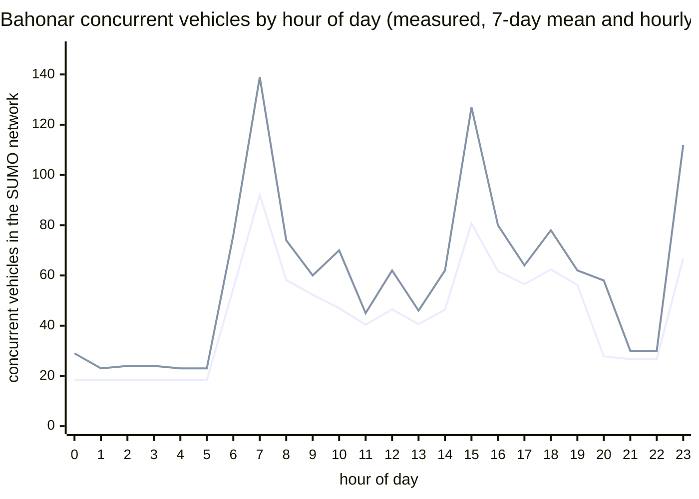
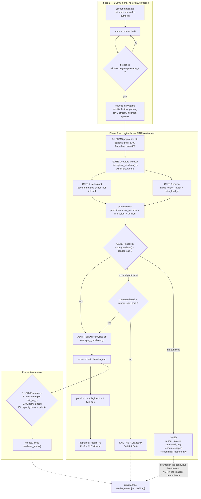
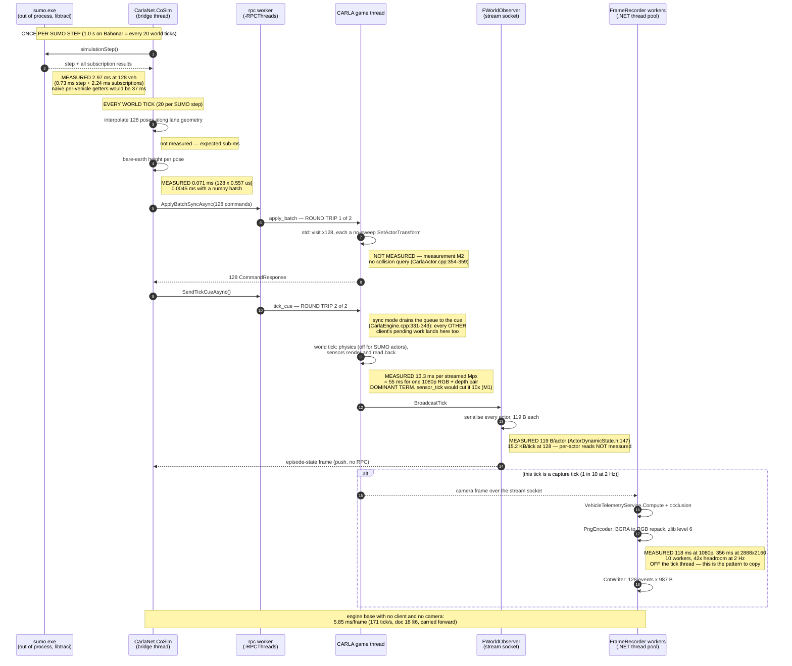

# 10 — Scale and performance

| | |
|---|---|
| **Status** | Plan section. Measurements taken 2026-09-17; nothing here is implemented. |
| **Scope** | Whether the SUMO-driven behavioural-capture mode works at the size the user actually needs, and what has to be true for it to. Sizes the scenario corpus, the render set, the RPC and TraCI budgets, the capture pipeline and memory; recommends an envelope, a degradation strategy and the measurements that must precede commitment. |
| **Audience** | An engineer implementing or reviewing the co-simulation runtime, the render-set controller or the capture path, who has not read the conversation that produced this plan. |
| **Owns** | The *numeric values* of the render-set parameters that [`04_Contracts.md`](04_Contracts.md) §4.2 declares and defers here. |
| **Machine for every "this box" figure** | Windows 11, 20 logical processors, Python 3.14.4, SUMO 1.27.0 from `Build/sumo-src/bin/sumo.exe`. |

---

## 0. What this section does not cover

- **The admission predicate.** Which vehicles are admitted and in what order is
  [`04_Contracts.md`](04_Contracts.md) §4.2–4.4. This section supplies the *numbers* that section types
  (`render_cap`, `render_cap_hard`, `prewarm_s`, `entry_lead_m`, `exit_lag_m`, `exit_lag_s`,
  `aoi_halo_m`, `frustum_lead_s`, `capture_windows[]`) and the evidence for each.
- **Which CarlaNet calls exist.** [`05_CarlaNet_Capability_Audit.md`](05_CarlaNet_Capability_Audit.md).
  This section states the RPC budget both ways — batched and unbatched — so the plan holds whichever
  answer that audit returns, and then records what it actually returned.
- **The interpolation scheme and the tick contract.**
  [`03_CoSimulation_Runtime.md`](03_CoSimulation_Runtime.md) §6 and `04` §8. Taken as given here.
- **Sensor and imagery quality.** [doc 17](../../Findings/17_Photoreal_Occlusion_Metric.md) and
  [`08_Collection_And_EPoL.md`](08_Collection_And_EPoL.md).
- **GPU sizing for a specific card.** Every rendering figure here is measured on one machine and is
  reported as a ratio (milliseconds per streamed megapixel) rather than an absolute, so it transfers.

---

## 1. The four answers, up front

| Question | Answer | Confidence |
|---|---|---|
| **Peak concurrent vehicles, Bahonar (seven days)** | **139**, at simulated t = 199,260 s (day 2, 07:21). Median 41, mean 43.9, p99 122. | **Measured** — a complete headless SUMO run of the shipped scenario. |
| **Wall clock to render seven simulated days frame-for-frame** | **19 to 24 days** at the measured clock ratio for a 6.2 Mpx camera pair; **8.3 days** at the most favourable ratio ever recorded on this fork; **19.6 hours** at an unreachable upper bound with no client and no capture. Storage at the same time is **6 to 17 TB**. | **Measured ratios, derived extrapolation.** **Verdict: not acceptable. Windowing is mandatory, not an optimisation.** |
| **Recommended render set** | **`render_cap` = 128, `render_cap_hard` = 192.** | 100 concurrent rendered, telemetered and occlusion-measured vehicles are **demonstrated** on this fork (§4.3). 128 is one step beyond demonstrated and is gated on measurement M2. |
| **Largest scenario the design survives** | Bahonar, whole map, in **windows**: peak 139 is under the cap, so no shedding on 99.4% of its seven days. **Arapahoe Underpass is the harder case**, not Bahonar: 437 peak, 336 median, and the cap bites always. | **Measured.** |

The headline is not the one the team brief anticipated. The brief expected the seven-day span to be the
threat. It is not: the *population* of the seven-day scenario is small and flat, and the whole seven days
of SUMO runs in **140 seconds** of wall clock. The threat is the **rendered second** — pixels and ticks —
and the scenario that threatens it is the one-hour freeway scenario, not the seven-day port.

---

## 2. Method, and the honesty ledger

The project's standing rule is that a systemic explanation offered ahead of a measurement has repeatedly
been wrong. Every figure below is one of three things, and is labelled:

| Label | Meaning |
|---|---|
| **Measured** | Produced by running something read-only and reading the result, here, on 2026-09-17. The command or the file is named. |
| **Derived** | Arithmetic over measured quantities. The arithmetic is shown. |
| **Guess** | An engineering judgement with no measurement behind it. Called a guess, in those words. |

Three things were *run* to produce this section, all read-only and all outside the repository (working
copies extracted to the workspace scratchpad):

1. `sumo.exe` headless over each shipped scenario, with `--summary-output`.
2. The Python `traci` binding against `sumo.exe`, to time per-step reads.
3. Python `zlib` over the pixel planes of PNGs already on disk in `carla/Build/SCTMV_recordings`.

No build, no cook, no engine, no code change.

**An independent model was built and then discarded in favour of the run.** Before running SUMO, the
concurrent population was estimated analytically: enumerate every flow departure at its deterministic
spacing, give each vehicle a residence time of `κ ×` its free-flow route time from a Dijkstra over the
network's own connection graph, and count. That model predicted Bahonar's peak as **155 at t = 199,200 s**
against a measured **139 at t = 199,260 s** — 11% high on magnitude, 60 seconds off on timing — and
predicted total departures as **69,245** against a measured **69,245**, exactly. It is reported in §3.1.4
only because it is the cheap estimator for a scenario that has not been run yet, and because its agreement
is the evidence that the measured run is not an artefact.

---

## 3. The sizing case, measured

### 3.1 Concurrent vehicle population over simulated time — Bahonar

#### 3.1.1 What the file actually contains

`BahonarPatternOfLife.zip` → `scenario/Shahid_Bahonar_Port_PatternOfLife.rou.xml`, 152,046 bytes.

| Element | Count | Note |
|---|---|---|
| `<flow>` | **245** | Every one uses `vehsPerHour`; none uses `period`, `probability` or `number`. Rates 20 – 600 veh/h. |
| `<trip>` | **365** | **The team brief's "individually declared vehicles: 0" is true only of `<vehicle>`.** There are 365 `<trip>` elements — individually declared vehicles with `from`/`to`/`via` and no precomputed route. They are the guards, the escorts, the probes and the shadow. |
| `<vehicle>` | 0 | |
| `<stop>` | **338**, all on `<trip>`, all `parking="true"` | Durations: min 300 s, **median 28,800 s (8 h)**, max **489,000 s (5.66 days)**. |
| `<vType>` | 14 | `passenger`, `taxi`, `truck`, `bus`, `authority`, `army`. |
| `<vTypeDistribution>` | 3 | `civ_mix`, `port_mix`, `mil_mix`. |

Simulated span 604,800 s, step length 1.0 s, seed 42, `time-to-teleport -1`, `max-depart-delay 900`
(`Shahid_Bahonar_Port_PatternOfLife.sumocfg`).

The 338 parking stops matter to sizing in a way the brief did not anticipate: a guard parked at a tower
for an eight-hour shift is a **stationary vehicle that still exists**, still occupies a SUMO id, and — if
rendered — is a CARLA actor that must be posed and serialised every tick while contributing nothing but a
parked car to the imagery. They are a floor under the population, not a spike.

#### 3.1.2 The measured run

```
sumo.exe -c Shahid_Bahonar_Port_PatternOfLife.sumocfg \
         --summary-output bahonar_summary.xml --no-step-log true --duration-log.statistics true
```

| Quantity | Value |
|---|---|
| Wall clock for the whole seven days | **140.41 s** |
| Real-time factor | **4,307×** |
| Vehicles inserted | **69,245** |
| Mean route length | 5,519.30 m |
| Mean trip duration | 382.86 s |
| Mean speed | 24.56 m/s |
| Mean time loss | 16.72 s |
| Mean depart delay | 0.14 s — **no insertion starvation**; `max-depart-delay 900` never bit |

Concurrent population, from the 604,800 rows of `--summary-output`:

| Statistic | `running` (all) | `stopped` (parked) | moving (`running − stopped`) |
|---|---|---|---|
| minimum | 2 | 0 | 0 |
| **median** | **41** | **17** | 24 |
| mean | 43.9 | 16.1 | 27.8 |
| p75 | 56 | — | — |
| p90 | 70 | — | — |
| p99 | 122 | — | — |
| p99.9 | 134 | — | — |
| **peak** | **139** @ t = 199,260 s (day 2, 07:21) | 20 | 122 |

Time above a threshold, over the whole 168 simulated hours:

| Threshold | Fraction of the week | Hours |
|---|---|---|
| > 32 | 61.68% | 103.6 |
| > 64 | 13.63% | 22.9 |
| > 100 | 4.08% | 6.8 |
| > 128 | **0.58%** | **1.0** |
| > 150 | 0.00% | 0.0 |

The excursions are short and countable: **108 contiguous spans above 100 vehicles**, the longest 1,652 s,
6.8 hours in total across the week.

#### 3.1.3 The shape of the week

Hour-of-day profile, averaged over the seven days (measured):



The same data as a table, because the chart's two series are not labelled by Mermaid — the first line is
the seven-day **mean**, the second the hourly **maximum**:

| Hour | 0–5 | 6 | **7** | 8 | 9 | 10 | 11 | 12 | 13 | 14 | **15** | 16 | 17 | 18 | 19 | 20 | 21–22 | **23** |
|---|---|---|---|---|---|---|---|---|---|---|---|---|---|---|---|---|---|---|
| mean | 18.4 | 54.8 | **92.1** | 58.2 | 52.3 | 47.0 | 40.4 | 46.5 | 40.6 | 46.4 | **80.7** | 61.7 | 56.5 | 62.4 | 56.2 | 27.8 | 26.7 | **66.7** |
| max | 23–29 | 76 | **139** | 74 | 60 | 70 | 45 | 62 | 46 | 62 | **127** | 80 | 64 | 78 | 62 | 58 | 30 | **112** |

Per-day peaks are flat to within 1.5%: day 0 = 131 (no overnight carry-in), days 1–6 = 137, 138, 138, 137,
137, 138. **The week is six repetitions of one day plus a cold first day.** That is the single most
load-bearing observation for windowing: any window drawn from days 1–6 is representative of every other
day at the same hour, so a capture plan does not need to cover the week to cover the pattern.

Three daily peaks, all identifiable from the scenario source: **07:00–08:00** (shift change plus the ferry
bursts, the `ferry_in_*` / `ferry_out_*` flows at 600 veh/h for 720 s), **15:00–16:00** (the afternoon
shift), and **23:00** (the night shift). The overnight floor of ~18–21 is almost entirely the 17 parked
guards.

#### 3.1.4 The analytic model, and why it is worth keeping

Assumptions, stated so they can be attacked:

1. A `vehsPerHour` flow departs vehicles at deterministic, equidistant times `begin + i·3600/vehsPerHour`
   starting **at** `begin`. (This is SUMO's behaviour, and it means 245 flows sharing an hour boundary
   insert 245 vehicles in one second.)
2. Trip duration = `κ ×` (free-flow route time), where the route is a Dijkstra over the network's own
   `<connection>` graph weighted by `lane.length / min(lane.speed, vType.maxSpeed)`, including the
   internal junction-connector lanes via each connection's `via` attribute, and `vType.maxSpeed` is the
   probability-weighted mean over the `vTypeDistribution`.
3. A parking `<stop>` adds its full duration to residence.
4. `κ = 1.3`.

**`κ` is the weak link, and it was the weak link.** The measured mean trip duration was 382.86 s against
the model's flow-weighted free-flow mean of 215 s — an effective `κ` of 1.78, not 1.3 — but the measured
mean route length was also 5,519 m against the model's 4,638 m, because SUMO's own router does not pick
the shortest free-flow path. Net of the longer routes, the speed-side `κ` was ≈ 1.50. The two errors
partly cancelled, which is luck and should be said plainly.

| | Model (κ = 1.3) | Measured | Error |
|---|---|---|---|
| Total departures | 69,245 | 69,245 | **0** |
| Peak concurrent | 155 | 139 | +11.5% |
| Peak time | t = 199,200 s | t = 199,260 s | 60 s |
| Median concurrent | 45 | 41 | +9.8% |
| Parked median | 17 | 17 | 0 |
| Parked peak | 18 | 20 | −10% |

Against the two short scenarios the same model, checked against the *shipped CoT sample CSVs* rather than
a fresh run, matched to the vehicle: Arapahoe at t = 22…26 s gave model 93, 95, 98, 98, 101 against
measured 93, 95, 95, 98, 101; Gardnerville over t = 59…64 s gave a median ratio of 1.00.

**Keep the model as the estimator for an unrun scenario, at `κ = 1.5`, and treat its output as an upper
bound to be confirmed by a run.** It costs seconds and needs no SUMO. But the run costs 140 seconds, so
for any scenario that will actually be captured, **run it**.

### 3.2 The other two scenarios

Same treatment, measured the same way.

| | **Bahonar** | **Arapahoe Underpass** | **Gardnerville Orbit** |
|---|---|---|---|
| Simulated span | 604,800 s (7 d) | 2,700 s | 2,220 s |
| Step length | 1.0 s | 0.05 s | 0.05 s |
| Flows / individually declared | 245 / 365 `<trip>` | 51 / 1 | 30 / 1 `<vehicle>` |
| Inserted | 69,245 | 7,433 | 775 |
| Mean route length | 5,519.30 m | 1,989.80 m | 1,635.77 m |
| Mean trip duration | 382.86 s | 122.72 s | 113.82 s |
| Mean speed | 24.56 m/s | 21.02 m/s | 15.08 m/s |
| Mean time loss | 16.72 s | **42.70 s** | 22.89 s |
| **Concurrent median** | **41** | **336** | **39** |
| **Concurrent peak** | **139** | **437** | **51** |
| Concurrent p99 | 122 | 427 | 48 |
| Wall clock for the whole run | **140.41 s** | **126.10 s** | **6.69 s** |
| Real-time factor | **4,307×** | **21.4×** | **331.9×** |

**Arapahoe Underpass is the binding scenario for the render set, not Bahonar.** Its two freeway flows are
3,300 and 3,000 veh/h over a 2.1 km route; Little's law alone puts 2·(3,150/3,600)·73 s ≈ 128 vehicles on
I-25 before any surface street is counted. Its concurrent population is **2.4× Bahonar's peak as its
median** and it never drops below 42.

The second consequence is the cost of a SUMO step. Per vehicle-step, single-threaded:

| Scenario | Steps | Wall | ms/step | Median live | **µs per vehicle-step** |
|---|---|---|---|---|---|
| Bahonar | 604,800 | 140.41 s | 0.232 | 41 | **5.7** |
| Arapahoe | 54,000 | 126.10 s | 2.335 | 336 | **7.0** |
| Gardnerville | 44,400 | 6.69 s | 0.151 | 39 | **3.9** |

**4 to 7 µs per vehicle per SUMO step.** At 400 vehicles that is 2.8 ms of a step — against a 50 ms
real-time budget at `fixed_delta = 0.05`, and against a **1,000 ms** budget at Bahonar's 1.0 s step.
**SUMO is never the bottleneck.** Say so once and stop worrying about it.

### 3.3 The networks

Measured by parsing each `.net.xml`. The right-hand column is doc 23 §2's Arapahoe measurement on the
**unclipped** OSM, carried forward, so there is a second point on the curve for the same location.

| | **Bahonar** | **Arapahoe (clipped, shipped)** | **Gardnerville** | *Arapahoe (doc 23 §2, unclipped)* |
|---|---|---|---|---|
| File size | 2.47 MB | 1.15 MB | 0.17 MB | — |
| `netOffset` | `0.00,0.00` | `0.00,0.00` | `0.00,0.00` | `0.00,0.00` |
| `convBoundary` extent | **7,214 × 4,023 m = 29.02 km²** | 954 × 1,939 m = 1.85 km² | 1,678 × 846 m = 1.42 km² | — |
| Normal edges | 1,066 | 317 | 55 | 2,420 |
| Internal edges | 3,133 | 689 | 202 | 5,819 |
| Normal lanes | 1,130 | 657 | 55 | — |
| Internal lanes | 3,198 | 1,037 | 202 | — |
| Total normal lane length | 199.8 km | 65.7 km | 11.8 km | — |
| Junctions | 651 | 298 | 68 | 1,431 |
| — `priority` | 272 | 147 | 24 | 437 |
| — `right_before_left` | 179 | 10 | 0 | 372 |
| — `traffic_light` | **0** | 23 | **0** | 45 |
| — `dead_end` | 6 | 15 | 0 | 212 |
| — `internal` | 194 | 103 | 44 | 365 |
| `<connection>` | 6,202 | 1,971 | 360 | — |
| **`<request>` right-of-way rows** | **3,004** | **934** | **158** | **5,855** |
| `<tlLogic>` programs | **0** | 23 | **0** | 45 |
| Distinct `z` in any lane shape | **0** | **0** | **0** | **0** |
| Lane speed min / median / max | 5.56 / 5.56 / 39.44 m/s | 11.18 / 17.88 / 29.06 m/s | 13.89 / 13.89 / 22.22 m/s | — |

Three things worth carrying forward:

- **The largest map is 16× the area of the smallest but carries only 3.4× the junctions and 3.1× the
  right-of-way rows.** Network size scales with *road density*, not extent, and none of these numbers is
  large. In-memory cost is negligible (§4.7).
- **Bahonar has no traffic lights at all.** Zero `tlLogic`, zero `traffic_light` junctions. So
  [`03`](03_CoSimulation_Runtime.md)'s `D3.16` (SUMO owns traffic-light state) is **inert on the sizing
  case** and can only be exercised on an Arapahoe-class map. That is a gap in test coverage, not a
  problem with the decision.
- The flatness (`0` distinct `z`) is doc 23 §6.5 confirmed on all three, including the large one.

### 3.4 The bare-earth grid

**Format**, read from the writer (`CarlaNet/src/CarlaNet.Map/WorldPackage/WorldPackage.cs:194-204`) and the
reader (`CarlaControl/src/carlacontrol/SumoCotBridge.py:105-119`): a 60-byte header
`<i d d d d d d i i` = magic `0x43575031`, origin latitude, origin longitude, origin height, grid minimum
x, grid minimum y, cell size, columns, rows — followed by **two** `float32` planes of `columns × rows`,
row-major: the **drape offset first**, then the **bare-earth height**, which is the plane the reader takes
(`SumoCotBridge.py:112` skips the first plane by seeking `header_size + 4·count`).

Verified on all three: `60 + 8·cols·rows` equals the file size **exactly**.

| | **Bahonar** | **Arapahoe** (inside `Arapahoe_I25.cwp`) | **Gardnerville** |
|---|---|---|---|
| Bytes | 60,891,108 | 3,713,164 | 3,071,100 |
| Columns × rows | 3,609 × 2,109 | 478 × 971 | 840 × 457 |
| **Cells** | **7,611,381** | 464,138 | 383,880 |
| Cell size | **2.0 m** | 2.0 m | 2.0 m |
| Covered extent | 7,218 × 4,218 m | 956 × 1,942 m | 1,680 × 914 m |
| Origin | 27.150120 N, 56.180650 E | 39.59431 N, −104.88449 W | 38.911080 N, −119.764597 W |

**Lookup cost.** `BareEarthGrid.height_at` (`SumoCotBridge.py:115-119`) is two clamped integer divisions
and one flat index — O(1), no interpolation, no search. Measured on the Bahonar grid, 200,000 random
points: **0.557 µs per lookup**, 1.8 M lookups/s.

At the recommended cap of 128 rendered vehicles and 20 ticks/s that is 2,560 lookups/s = **1.4 ms per
wall-second**, 0.14% of one core. **The hot path is not hot.**

**The load path is.** Measured on this box:

| Representation | Load time | Resident | Lookup |
|---|---|---|---|
| **As shipped** — `struct.unpack_from(f"<{n}f", …)` → tuple of boxed floats (`SumoCotBridge.py:112`) | **5.61 s** | **243.6 MB** (peak 304.5 MB) | 0.557 µs |
| `array.array('f').frombytes(…)` | **0.011 s** | **32.3 MB** | 0.599 µs |
| `numpy.frombuffer(…, dtype=float32)` — zero-copy view | **0.000025 s** | **30.4 MB** | 35 ns *(vectorised over a batch of 200,000)* |

A 60.9 MB file becomes **244 MB** of process memory and costs **5.6 seconds** to open, because CPython
boxes 7.6 million floats at ~32 bytes each. The fix is one line and changes nothing else; it is
`D10.9`. It is worth doing not because the lookup is slow — it is not — but because 244 MB and 5.6 s of
startup are paid by every client that opens the grid, and this design adds clients.

---

## 4. The budgets

### 4.1 Wall clock to render seven simulated days

**Measured, from files already on disk.** `carla/Build/SCTMV_recordings` holds 54 captures from four
recorder runs on 2026-09-16. Every PNG carries a `carla:capture` `tEXt` chunk written by
`CaptureMetadata.cs:35`, `CaptureIdentity.PngTextChunks` with the **tick and the simulated time** that produced those pixels, and
the filename carries local wall-clock time to the millisecond (`FrameRecorder.cs:223-224`). Dividing one
by the other gives the clock ratio of a real capture session with no instrumentation and no new run.

Every capture interval in every run is **exactly 10 ticks / 0.500 simulated seconds** — the configured
2 Hz, with **no dropped captures anywhere**.

| Run | Camera | Ticks per wall-second | ms per tick | **Clock ratio** |
|---|---|---|---|---|
| `run-20260916-180919` | 9,248 × 6,944 (64.2 Mpx) ×2 | 0.60 | 1,674 | **3.0%** |
| `run-20260916-195810` | 2,888 × 2,160 (6.24 Mpx) ×2 | 7.24 | 138 | **36.2%** |
| `run-20260916-213225` | 2,888 × 2,160 ×2 | 5.91 | 169 | 29.5% |
| `run-20260916-214042` | 2,888 × 2,160 ×2 | 5.90 | 170 | **29.5%** |

"×2" because `SensorRig.py:61-82` spawns an RGB **and** a depth camera at the same resolution, and the
occlusion measurement subscribes to both (`--no-occlusion` is off by default,
`CarlaControlArgumentParser.py:543-554`). The sidecar of `run-20260916-214042` confirms the configuration:
**101 events = 1 platform + 100 vehicles**, 44 of them carrying an `occlusion` attribute,
`_carla_intrinsics width="2888" height="2160"`.

**Derived, and the most transferable number in this document:** dividing tick cost by streamed pixels,

| Run | Streamed Mpx per tick | ms/tick | **ms per streamed megapixel** |
|---|---|---|---|
| 9,248 × 6,944 ×2 | 128.4 | 1,674 | **13.0** |
| 2,888 × 2,160 ×2 | 12.48 | 170 | **13.6** |

**13.0 – 13.6 ms of tick time per streamed megapixel, consistent across a 10.3× range of pixel count.**
The relationship is linear in pixels with a small constant term — which means the tick is dominated by
*pixel-rate* work (GPU readout, serialisation, stream), not by per-frame overhead, not by actor count,
and not by anything the SUMO bridge does.

Two anchors carried forward from [doc 18](../../Findings/18_Scenario_Fabrication_For_EPoL_Training.md),
both measured there, both at much smaller camera sizes:

- §5.4: **1,014 ticks in 60 s of wall clock — 16.9 Hz against a 20 Hz target, 84% of real time** — with
  traffic at the 30-vehicle default, a recorder and a second client attached.
- §6: **~171 ticks/s free-running with no client driving it.** That is **5.85 ms per frame** for the bare
  engine on this content, and it is the ceiling nothing else can exceed.

Now the answer:

| Clock ratio | Source | Wall clock for 604,800 simulated seconds |
|---|---|---|
| 3.0% | measured, 64 Mpx camera pair | 20,160,000 s = **233 days** |
| **29.5%** | **measured, 6.2 Mpx pair, 100 vehicles, 2 Hz capture, occlusion on** | 2,050,169 s = **23.7 days** |
| 36.2% | measured, same configuration, best of four runs | 1,670,718 s = **19.3 days** |
| 84% | carried forward, 30 vehicles, small camera | 720,000 s = **8.3 days** |
| 100% | hypothetical | 604,800 s = 7.0 days |
| 855% | carried forward, **no client, no capture** — unreachable ceiling | 70,737 s = **19.6 hours** |

And the corpus, at 2 Hz on **one** recorded camera, using the measured PNG sizes of §4.6:

| Camera | MB/frame | Frames over 7 days | **Corpus** | Sustained write |
|---|---|---|---|---|
| 1280 × 720 | 2.25 | 1,209,600 | **2.72 TB** | 4.5 MB/s |
| 1920 × 1080 | 5.00 | 1,209,600 | **6.05 TB** | 10.0 MB/s |
| 2888 × 2160 | 14.46 | 1,209,600 | **17.49 TB** | 28.9 MB/s |
| 9248 × 6944 | 112.57 | 1,209,600 | **136.16 TB** | 225.1 MB/s |

> **D10.1 — Rendering seven simulated days frame-for-frame is rejected on two independent grounds.**
> Time: 19–24 wall-clock days at the measured ratio, and 19.6 hours at a ceiling that requires no client
> and no camera, which is to say no product. Storage: 6–17 TB for one camera at the smallest useful
> resolution. Either alone is disqualifying. **The design renders windows of simulated time, and the
> window is a first-class, authored, recorded object — not a debugging convenience.**

### 4.2 Windowing, concretely

A window is a span of simulated time `[begin_s, end_s]` during which CARLA exists, renders and captures.
Outside it, **SUMO runs alone**, which it does 4,307× faster than real time.



#### 4.2.1 How SUMO fast-forwards, measured

Three mechanisms exist. All three were tried.

**(a) Run from t = 0 with no output. Measured.**

| Target | Wall clock | Real-time factor |
|---|---|---|
| t = 25,200 s (07:00 on day 0) | **1.65 s** | 15,291× |
| t = 604,800 s (the whole week) | **140.41 s** | 4,307× |

*(The whole-week factor is lower because the whole week includes the busy hours; the early-morning hours
are nearly empty.)*

**Reaching any instant in the seven-day scenario costs at most 140 seconds and typically a few seconds.**

**(b) `--begin <t>`, cold start. Measured, and it loses things.** A cold start at t = 25,200 s inserts
only the vehicles that depart after that instant; the network begins empty. Comparing the cold run's
population against the continuous run's at the same simulated instants:

| Simulated seconds after the cold start | Cold | Continuous | Deviation |
|---|---|---|---|
| 0 | 5 | 40 | 87.5% |
| 60 | 33 | 60 | 45.0% |
| 120 | 46 | 62 | 25.8% |
| 180 | — | — | 10% *(60 s block mean)* |
| **300** | **70** | **74** | **5.4%** |
| 600 | 95 | 94 | 1.1% |
| 900 | 109 | 107 | 1.9% |
| 1,800 | 117 | 113 | 3.5% |
| 2,700 | 62 | 62 | 0.0% |

**Population converges to within 5% after 300 simulated seconds and stays within 10% for the rest of the
hour.** That is the measured basis for `prewarm_s`.

**(c) `--save-state.times` / `--load-state`. Works for saving; does not compose here.** Saving state at
t = 25,200 s produced a **19,115-byte gzipped** snapshot containing 35 `<vehicle>`, 4 `<flowState>`,
1,150 `<route>`, the vType table and the RNG state. Loading it back **re-inserted every vehicle that had
already departed**: 1,856 insertions over the 3,600 s window against 716 for a cold start, because the
route file is re-read from the top and the state carries only the *instantiated* flows, not the ones whose
`begin` is still in the future. With `--ignore-route-errors` it ran but reported a mean duration of
−899.12 s. This is an unrouted-`<trip>`/`<flow>` interaction, not a SUMO defect; a pre-routed route file
(`duarouter` output with explicit `<route edges="…"/>`) is the likely fix and is untested.

> **D10.2 — The window mechanism is `sumo.exe` run from t = 0 with no output until the window opens, then
> the CARLA attachment. Not `--begin`, and not state save/load.** Measured: the whole seven days is
> 140.41 s of wall clock and any earlier instant is a few seconds, so there is nothing to buy by skipping
> it, and the fast-forward preserves **everything** — vehicle identity, trip history, the parked
> population, the insertion queues and the RNG stream — that the other two lose. State save/load is
> revisited only if the fast-forward exceeds ~10 minutes on some future scenario, and then only against a
> pre-routed route file.

#### 4.2.2 What is lost at a window edge, and what is done about it

| Loss | Consequence | Handling |
|---|---|---|
| **A vehicle's history before the window** | A vehicle already mid-trip at `window.begin` appears in the imagery with no observable past. A tracker cannot tell it from one that just entered. | **Not a loss under D10.2** — SUMO fast-forwards, so the *simulation* history is complete and is in the truth record. Only the *imagery* history is absent, which is exactly what `04` §4.5's `rendered_spans[]` and `observed_spans[]` exist to state. Every such vehicle carries a `rendered_spans[0].begin_s` equal to the window open, and a `sumo_span_s[0]` earlier than it. A consumer that ignores the difference is reading the record wrong. |
| **Warm-up state** | Under a cold start, the first ~300 s of a window is under-populated by 5–87%. | **`prewarm_s = 300`** (§4.8). Under D10.2 there is no warm-up state to lose; `prewarm_s` instead buys the *render set* time to fill: it is the span before `window.begin` during which vehicles are admitted and posed but **nothing is captured**. It also absorbs `entry_lead_m` and the frustum lead. |
| **An annotated interval that straddles a window edge** | A pattern instance whose interval runs from before `window.begin` to inside it, or from inside it to after `window.end`, is captured in part. A partially observed positive is worse than an unobserved one: it teaches the model a truncated pattern. | **Three-valued, and refused silently never.** (1) At authoring time, `07`'s validator rejects a `capture_windows[]` entry that cuts a declared interval, naming the instance — a window that cuts an interval is an authoring error, not a runtime event. (2) If it happens anyway — an interval whose `observed_start_tick` is only determined at runtime — the vehicle's `render_states[]` entry records `render_state = partially_rendered`, and the instance carries `straddles_window = true`. (3) A consumer building a training set must be able to exclude straddling instances with one predicate, so the flag is on the *instance*, not inferred from span arithmetic. **The participant guarantee (`04` D4.6) is unchanged**: a participant is admitted at `interval.start − prewarm_s`, so the only straddle that can survive validation is one at `window.end`. |
| **Continuity of the corpus across two windows** | Two windows of the same run produce two disjoint imagery spans that a naive consumer may concatenate. | Windows are separate `observed_spans[]` entries and each capture carries its tick (`CaptureIdentity`, measured present in every PNG on disk). Concatenation across a gap is detectable from the ticks alone. The run manifest lists `capture_windows[]` verbatim. |

#### 4.2.3 Window sizing

At the measured 29.5% clock ratio, a 6.2 Mpx camera pair and 2 Hz capture on one recorded camera:

| Window | Wall clock | Frames | PNG | Sidecar @128 veh |
|---|---|---|---|---|
| 60 s | 3.4 min | 120 | 1.7 GB | 0.01 GB |
| **300 s** | **16.9 min** | 600 | 8.7 GB | 0.04 GB |
| **900 s** | **50.8 min** | 1,800 | 26.0 GB | 0.12 GB |
| **1,800 s** | **1.7 h** | 3,600 | 52.1 GB | 0.24 GB |
| 3,600 s | 3.4 h | 7,200 | 104.1 GB | 0.48 GB |
| 7,200 s | 6.8 h | 14,400 | 208.2 GB | 0.96 GB |
| 21,600 s (6 h) | 20.3 h | 43,200 | 624.7 GB | 2.89 GB |

Because **days 1–6 of Bahonar are within 1.5% of each other** (§3.1.3), a capture plan covering the
scenario's pattern does not need many hours. Six windows of 1,800 s — one on each daily peak and one
overnight — is 3 hours of simulated time, **10 hours of wall clock and 313 GB**, and covers every
population regime the week contains.

> **D10.3 — Default window length 1,800 simulated seconds; recommended plan for a seven-day pattern-of-life
> scenario is 4 to 8 windows placed on the authored events, not a contiguous span.** Derived from the
> measured per-day repeatability and the measured wall-clock and storage rates above.

### 4.3 The render set — the number

`04` §4.2 owns the predicate. This section owns the number.

**What is demonstrated.** `carla/Build/SCTMV_recordings/SCTMV_2026.09.16_14.44.31.487.xml` — a file on
disk, written by a real run — contains **101 CoT events: one collection platform and 100 vehicles**, at a
single tick, each with a full `_carla` block, 44 of them carrying a measured `occlusion` attribute. The
same run's captures show **5.90 ticks per wall-second** with a 6.24 Mpx RGB camera plus a 6.24 Mpx depth
camera streaming every tick and no dropped captures. **One hundred concurrent, rendered, telemetered,
occlusion-measured vehicles are a fact about this fork, not a projection.**

Doc 17 §12.4 reports a collect in which "234 vehicle records carried 104 occlusion annotations; the other
130 vehicles were outside that camera's frame" — consistent with 234 rendered vehicles in one sidecar,
though the text does not say unambiguously whether that is one tick or a whole collect. Treated as
supporting, not load-bearing.

**What limits it.** Per rendered actor per tick, on the game thread:

| Cost | Where | Scales as |
|---|---|---|
| `set_actor_transform` | `CarlaServer.cpp:3175` → `FCarlaActor::SetActorGlobalTransform` (`CarlaActor.cpp:335-359`) → `AActor::SetActorTransform(local, **bSweep = false**, nullptr, TeleportType)` | O(N). **No sweep, so no collision query** — this is the cheapest transform write UE offers. |
| World-observer serialisation | `WorldObserver.cpp:344-390`, for **every actor in the registry**, every tick, on the game thread; `GetActor()->GetVelocity()`, `GetActorGlobalTransform()`, `FWorldObserver_GetActorState` | O(N). **119 bytes per actor** (`LibCarla/source/carla/sensor/data/ActorDynamicState.h:147-148`, a `static_assert`). At 128 actors that is 15.2 KB/tick, 305 KB/s. Bandwidth is nothing; the per-actor game-thread reads are the cost. |
| Truth computation | `VehicleTelemetryService.Compute`, called per capture (`FrameRecorder.cs:143`), not per tick | O(N) **at capture rate**, ×0.1 relative to the tick. |
| Occlusion | `OcclusionEstimator.Estimate` over N boxes, `--occlusion-samples 24` across the longer side (`CarlaControlArgumentParser.py:563-569`) | O(N × samples²) at capture rate, on the recorder's worker threads, not the tick thread. |
| Live CoT emission | [issue #14](https://github.com/sbrett9/carla/issues/14) — one datagram per vehicle, serialised **on the tick thread** | O(N) **on the tick thread**. At 5 Hz and 200 vehicles that is 1,000 serialise-and-send per second inside the tick budget. |

Issue #14 is the one that bites, and its own text measures the symptom: "the same effect already measured
at roughly 84% of real time under ordinary load". **In a SUMO-drive session the live CoT feed must not run
on the tick thread.** The recorder already shows the pattern — a bounded channel drained by workers
(`FrameRecorder.cs:115-122, 214-241`) — and issue #14 recommends exactly that.

**The recommendation.**

> **D10.4 — `render_cap` = 128, `render_cap_hard` = 192.**
>
> - 100 is demonstrated (above). 128 is one binary step beyond demonstrated.
> - It clears Bahonar: the population exceeds 128 for **0.58% of the seven days (1.0 hour of 168)**, and
>   never exceeds 139.
> - It does **not** clear Arapahoe, whose median is 336. Arapahoe is handled by the region gate and by
>   shedding (§4.3.1, §7).
> - `render_cap_hard` = 192 exists only to serve `04` D4.6's participant guarantee, and 1.5× the soft cap
>   is a **guess** — no measurement bounds it. It is the right shape (a headroom multiple) at an unmeasured
>   value.
>
> **The binding constraint is not yet identified.** The evidence says the tick is dominated by streamed
> pixels (13.3 ms/Mpx) with a 5.85 ms engine base, and that 100 actors fitted inside that without visible
> cost — but no one has swept actor count with the camera held fixed. **Measurement M2 (§9) must run
> before this number is committed.** It may well come back much higher: the 100-vehicle run had physics
> **on** and the traffic manager driving, whereas a SUMO-driven actor is kinematic (`03` D3.4), which
> removes the Chaos vehicle simulation entirely. That is a reason to expect headroom, not a claim of it.

#### 4.3.1 What the region gate is actually worth

Measured, over TraCI, at each scenario's busiest moment: the fraction of the live population within a
radius of the population centroid.

| Radius | **Arapahoe** (400 live at t = 1,100 s) | **Bahonar** (130 live at t = 199,000 s) |
|---|---|---|
| 200 m | 82 (20.3%) | 17 (13.1%) |
| 300 m | 128 (31.8%) | 39 (30.0%) |
| 400 m | 198 (49.6%) | 47 (36.2%) |
| 600 m | 276 (68.9%) | 58 (45.0%) |
| 800 m | 334 (83.3%) | 71 (54.6%) |
| 1,200 m | 400 (100%) | 96 (73.5%) |
| 2,000 m | 400 (100%) | 107 (82.3%) |
| 3,000 m | 400 (100%) | 114 (87.7%) |

Read this as the cost of a wide region. On Arapahoe, a **300 m** region holds exactly `render_cap`; a
600 m region holds 276 and sheds 54% of what it admits. On Bahonar the population is spread over 29 km²,
so even a 3 km region holds only 114 — under the cap — which is why Bahonar never sheds.

> **D10.5 — `render_region` is sized per scenario against this measurement, not defaulted.** A region
> wider than the camera footprint buys nothing and costs actors. The cheapest probe is the one used here:
> subscribe positions over TraCI at the busiest minute and take the radial CDF. It needs no CARLA.

### 4.4 RPC round trips per tick

**Measured from source.** `apply_batch` is a single `BIND_SYNC` binding that iterates the command vector
with `std::visit` on the game thread (`CarlaServer.cpp:3198-3213`), and `ApplyTransform` is in the visitor
(`:3175`). `SpawnActor` carries a `do_after` list whose commands have the new actor id substituted before
execution (`:3157-3164`). The client side is a single RPC call
(`CarlaNet/src/CarlaNet.Transport/CarlaClient.cs:1779-1785`).
[`05`](05_CarlaNet_Capability_Audit.md) D5.2 concludes: **exactly two RPC round trips per step, independent
of vehicle count** — one `apply_batch`, one `tick_cue`.

The budget, stated both ways so it holds whichever answer the audit had returned:

| | **Batched** (what `05` found) | **Unbatched** (N calls) |
|---|---|---|
| Round trips per step | **2** | **N + 1** |
| Game-thread work per step | N visitor dispatches inside one queued call | N queued calls, each with its own dispatch and response |
| **Synchronous mode** | The queue is drained until the tick cue arrives (`CarlaEngine.cpp:331-343`: `do { Server.RunSome(1u); } while (!Server.TickCueReceived())`). Both shapes complete before the tick; the batched one costs one network round trip instead of N. At 128 vehicles and a 0.2 ms round trip, that is **0.4 ms versus 25.8 ms** — half a tick budget spent on nothing but latency. | as left |
| **Asynchronous mode** | One call, one slice. | The queue gets **5 ms of game thread per frame** (`CarlaEngine.cpp:66-78`, `-RPCBudgetMs=`, default 5). A request that misses its slice waits a whole frame. N sequential calls therefore cost up to N frames — at N = 128 and 20 fps, **6.4 seconds per simulated step.** Unusable. |

Three consequences the plan must carry:

1. **Synchronous mode is not a preference here, it is the only mode in which the RPC budget is not a
   constraint at all.** In sync mode the queue is drained to the cue, so `-RPCBudgetMs=` is ignored
   (`Docs/adv_synchrony_timestep.md`, "How the server serves client requests", added in `7b4afc5ee`).
2. **That same drain makes every other connected client a direct tax on the tick.** In sync mode the
   server executes *all* pending client work, from *every* client, on the game thread before advancing.
   A viewer polling `get_actors`, an EPoL feed asking for transforms, or a second recorder configuring a
   sensor each add their service time straight to the tick. **Nothing else may poll the server during a
   capture window.** The world-observer stream is a push over a separate socket and costs no RPC
   (`CarlaClient.cs:1800-1804`), so a consumer that needs world state must read that, not ask.
3. **Do not use `apply_batch`'s `do_tick_cue`** — `05` D5.3, because the client does not then wait for the
   frame. Restated here only because it is a tempting way to get to one round trip and it buys 0.2 ms at
   the cost of determinism.

### 4.5 TraCI cost per step

Doc 23 §6.11 says subscriptions are "non-optional at scale". **Measured, and the word is right by a factor
of fourteen.**

Probe: `traci` (Python binding) against `sumo.exe` on the Arapahoe scenario, fast-forwarded to t = 1,000 s
(388 live vehicles), 200–300 steps, median per step. Seven variables read per vehicle — position, angle,
speed, type, road id, length, width.

| Mode | `simulationStep` | Read | **Total per step** | Per vehicle |
|---|---|---|---|---|
| step only, no reads | 1.814 ms | — | **1.81 ms** | — |
| **naive per-vehicle getters** (2,716 TraCI calls) | 2.753 ms | **113.219 ms** | **116.0 ms** | **292 µs** |
| **subscriptions**, 7 vars, `getAllSubscriptionResults` | 8.090 ms | 0.006 ms | **8.10 ms** | 16.2 µs |
| **subscriptions**, 2 vars (position + angle only) | — | — | **4.16 ms** | 6.1 µs |

*(With subscriptions the results are delivered with the step response, which is why the step itself gets
more expensive and the read collapses to nothing.)*

Scaling across three populations, subscriptions only, same probe:

| Live vehicles | position + angle | all seven variables |
|---|---|---|
| 49 (Gardnerville) | 0.727 ms | 1.242 ms |
| 132 (Bahonar at peak) | 1.359 ms | 2.317 ms |
| 388 (Arapahoe at peak) | 4.163 ms | 10.123 ms |

Linear. Net of SUMO's own step cost, the marginal constants are **≈ 6.1 µs per vehicle per step for
position + angle** and **≈ 21.4 µs per vehicle per step for the full seven-variable set**.

Put against the budget: at a 0.05 s world delta the naive path costs **116 ms inside a 50 ms tick — 2.3×
the entire budget, before CARLA does anything**. With subscriptions it is 8.1 ms, 16%. And on Bahonar,
whose SUMO step is 1.0 s and whose bridge interpolates over 20 world ticks (`03` D3.6), the 2.3 ms cost is
paid **once per 20 ticks** — 0.12 ms per tick amortised.

> **D10.6 — Subscriptions, and only the variables the bridge and the truth record actually consume.**
> Measured 14× on total step cost and 48× on the read itself. Subscribe position and angle for the pose
> path; add speed, type, road and lane only because the truth record needs them, and know they cost 3.5×
> the pose-only set. Per-vehicle getters in the step loop are a defect, not a tuning choice.
>
> These are **Python-binding** numbers. `libtraci` (the C# binding `03` D3.2 selects) links SUMO into the
> client process with no socket, so these are **upper bounds**. Nothing here needs them to be tight.

### 4.6 Capture and encoding

**The encoder, identified rather than assumed.** `PngEncoder` writes 8-bit truecolour with scanline
filter 0 and a `ZLibStream` at `CompressionLevel.Optimal` (`PngEncoder.cs:49-75`). Taking a real 2,888 ×
2,160 capture off disk, inflating its IDAT and re-deflating the identical bytes at each zlib level:

| zlib level | Bytes | vs. the shipped IDAT |
|---|---|---|
| 1 | 16,955,398 | +17.23% |
| 4 | 14,474,254 | +0.07% |
| **6** | **14,463,283** | **−0.001%** |
| 7 | 14,437,057 | −0.18% |
| 9 | 13,749,504 | −4.94% |

**`CompressionLevel.Optimal` is zlib level 6**, confirmed to one part in 10⁵. Level 9 would cut the corpus
by 4.94% for 20% more CPU — worth knowing, not worth doing at 2 Hz where encode capacity is 14× demand.

**Size and cost by resolution** (measured: real capture resampled, filter 0 applied, zlib 6):

| Resolution | Mpx | Raw RGB | **PNG** | Ratio | Deflate | **ms/Mpx** |
|---|---|---|---|---|---|---|
| 1280 × 720 | 0.92 | 2.76 MB | **2.25 MB** | 1.23 | 54 ms | 59 |
| 1920 × 1080 | 2.07 | 6.22 MB | **5.00 MB** | 1.24 | 119 ms | 58 |
| 2888 × 2160 | 6.24 | 18.71 MB | **14.46 MB** | 1.29 | 346 ms | 55 |
| 3840 × 2160 | 8.29 | 24.88 MB | **18.72 MB** | 1.33 | 457 ms | 55 |
| 9248 × 6944 | 64.22 | 192.65 MB | **112.57 MB** | 1.71 | 2,894 ms | 45 |

Two facts follow. **Photoreal imagery does not compress**: a ratio of 1.23–1.33 means lossless PNG is
essentially raw size, so corpus arithmetic is pixel arithmetic. And the shipped corpus agrees — the 54
real captures on disk have a median size of 14,427,244 bytes at 2,888 × 2,160, against 14.46 MB predicted.

**Throughput.** `FrameRecorder` runs `max(2, ProcessorCount / 2)` workers (`FrameRecorder.cs:115`) draining
a bounded channel of `max(4, 2 × workers)` (`:116`) with `BoundedChannelFullMode.DropWrite` so the
stream-reader thread never blocks (`:118`).

| Resolution | Encode per frame per worker | Capacity with 10 workers | Demand at 2 Hz | **Headroom** |
|---|---|---|---|---|
| 1280 × 720 | 53 ms | 190 fps | 2 fps | 95× |
| 1920 × 1080 | 118 ms | 85 fps | 2 fps | 42× |
| 2888 × 2160 | 356 ms | 28 fps | 2 fps | **14×** |
| 3840 × 2160 | 473 ms | 21 fps | 2 fps | 11× |

**Encoding is not a bottleneck and is not close to one**, which the disk confirms: every capture interval
in all four recorded runs is exactly 10 ticks, so `_dropped` was zero.

**But a drop would be silent.** `FrameRecorder.Dropped` (`FrameRecorder.cs:49`) has **no reader anywhere in
the tree** — grepped across `CarlaNet/src`, `CarlaControl` and the shim. A recorder that falls behind
produces a corpus with holes and says nothing. That is a hole in the observability denominator of exactly
the kind doc 20 §2.5 forbids.

> **D10.7 — `FrameRecorder.Dropped` is read at window close and written into the run manifest, and a
> non-zero value fails the run's quality gate.** One counter, already incremented (`:184`), currently
> discarded.

**The sidecar.** Measured over the 54 sidecars on disk: **662 bytes per CoT event**, 66,875 bytes median
for 101 events. Doc 20 §7.4's `<_aoi>` warning, quantified — a `<relation>` element of the shape doc 20
gives is **78 bytes**:

| Relations per vehicle | Event | ×base | Sidecar @128 veh | At 2 Hz | Per simulated hour |
|---|---|---|---|---|---|
| 0 | 662 B | 1.00× | 85 KB | 0.169 MB/s | 0.61 GB |
| **4** | 987 B | **1.49×** | 126 KB | 0.253 MB/s | **0.91 GB** |
| 8 | 1,299 B | 1.96× | 166 KB | 0.333 MB/s | 1.20 GB |
| 16 | 1,923 B | 2.90× | 246 KB | 0.492 MB/s | 1.77 GB |
| **50** | 4,575 B | **6.91×** | 586 KB | 1.171 MB/s | **4.22 GB** |

Doc 20 §7.4 says a map with fifty areas "triples the sidecar". **Measured, it is worse: 6.9×.** The
correction matters because the sidecar is the artefact a consumer parses per frame.

> **D10.8 — `aoi_max_relations_per_vehicle` = 4, nearest always present**, selected as (areas containing
> the vehicle) ∪ (areas within `aoi_halo_m`) ∪ (the single nearest), truncated in that order of priority.
> Measured cost 1.49× the base sidecar; the uncapped fifty-area case is 6.91×. The truncation must be
> visible: when relations were dropped, `<_aoi truncated="true">`, so a consumer never reads absence as
> "not near any area".

**The camera renders ten times more than it keeps.** `FrameRecorder.OnFrame` discards frames between
captures on a *simulated*-time gate (`FrameRecorder.cs:129-133`), but the sensor produced, rendered,
serialised and streamed every one of them. `sensor_tick` — the blueprint attribute that throttles a
sensor's tick interval — defaults to `0.0`, meaning every tick
(`ActorBlueprintFunctionLibrary.cpp:246-252`), is honoured server-side via `SetActorTickInterval`
(`Sensor.cpp:43-49`), and is **set nowhere in `carlacontrol`, `CarlaNet` or the shim** (grepped). At the
measured configuration — 2 Hz capture, 20 Hz tick — **90% of the rendered and streamed frames are thrown
away client-side**, and §4.1 measured the tick as 13.3 ms per streamed megapixel.

If throttling the sensor removes that work, the arithmetic is (derived, on the measured 13.3 ms/Mpx and
5.85 ms base):

| Configuration | ms/tick | ticks/s | Clock ratio |
|---|---|---|---|
| 1 × 1920 × 1080 streaming every tick | 33.4 | 29.9 | 100% |
| 2 × 1920 × 1080 every tick | 61.0 | 16.4 | 82% |
| 4 × 1920 × 1080 every tick | 116.2 | 8.6 | 43% |
| 1 × 1920 × 1080 with `sensor_tick = 0.5` | 8.6 | 116 | 100% |
| 2 × 1920 × 1080 with `sensor_tick = 0.5` | 11.4 | 88 | 100% |
| 4 × 1920 × 1080 with `sensor_tick = 0.5` | 16.9 | 59 | 100% |

**This is a hypothesis, explicitly labelled.** It rests on `SetActorTickInterval` actually suppressing the
render and readout rather than only the enqueue, which no one has measured. It is the cheapest
high-value probe in this plan and it is measurement **M1** (§9). If it holds, it is worth roughly an order
of magnitude on the clock ratio, which is worth more than every other optimisation in this document
combined.

### 4.7 Memory

| Consumer | Size | Basis |
|---|---|---|
| **Bare-earth grid — as shipped** (Python) | **243.6 MB** resident, peak 304.5 MB, 5.61 s to load | **Measured**, Bahonar, `tracemalloc` |
| **Bare-earth grid — `array.array('f')`** | **32.3 MB**, 0.011 s | **Measured** |
| **Bare-earth grid — `numpy.frombuffer`** | **30.4 MB**, 25 µs, zero-copy | **Measured** |
| Bare-earth grid, C# (`WorldPackage.Read` → `float[]`) | 30.4 MB | **Derived** — 7,611,381 × 4 B |
| **SUMO network in `sumo.exe`** | — | Not measured; the process ran the 7-day scenario in 140 s with no memory pressure |
| **Lane geometry for the interpolator** (`03` §6.4) | **0.29 MB** | **Measured** — Bahonar has 4,328 lanes and **18,152 shape points**; ×16 B for two doubles. Arapahoe 0.12 MB, Gardnerville 0.02 MB. Negligible. |
| **Actor set, client side** | ~119 B/actor/tick on the wire; the client's own registry is small | **Measured** (`ActorDynamicState.h:147-148`) |
| **Capture queue** | `max(4, 2 × workers)` jobs, each holding a private BGRA copy (`FrameRecorder.cs:116, 180-183`) | **Derived**: at 10 workers → 20 jobs. **74 MB** at 1280 × 720, **166 MB** at 1920 × 1080, **499 MB** at 2888 × 2160, **664 MB** at 3840 × 2160, **per recorder** |
| Encode scratch | `MemoryStream(w·h·3/2 + 1024)` + one scanline buffer per worker, plus the compressed array (`PngEncoder.cs:52`) | **Derived**: ~28 MB per in-flight encode at 2888 × 2160; ×10 workers = 280 MB |

**The capture queue is the largest client-side allocation in the system and it scales with camera area and
worker count, not with vehicles.** At 2888 × 2160 with 10 workers, a single recorder can hold ~0.5 GB of
undecoded frames plus ~0.3 GB of encode scratch. Two recorded cameras double it.

> **D10.9 — Read the bare-earth plane as `array.array('f')` (or a `numpy` view), not a tuple of Python
> floats.** Measured: 243.6 MB → 32.3 MB and 5.61 s → 0.011 s, with identical lookup semantics, at
> `SumoCotBridge.py:112`. A vectorised `numpy` batch lookup is a further 16× on the lookup itself and is
> worth taking if the bridge ever needs a per-tick ground height for every rendered vehicle at once.

### 4.8 Budget table per subsystem

One simulated second, at `fixed_delta = 0.05` (20 ticks), SUMO step 1.0 s, 128 rendered vehicles, one
1920 × 1080 RGB camera plus its depth camera, capture at 2 Hz.

| Subsystem | Per simulated second | Basis | Consumer | Headroom vs. real time |
|---|---|---|---|---|
| **SUMO step** | 1 step × 128 × 5.7 µs = **0.73 ms** | measured, §3.2 | `sumo.exe` process | 1,370× |
| **TraCI read** (subscriptions, 7 vars) | 1 step × 128 × 21.4 µs + 0.23 ms = **2.97 ms** | measured, §4.5 | bridge thread | 337× |
| **Interpolation** (`03` §6.4) | 20 ticks × 128 lane evaluations | not measured — **guess**: ≪ 1 ms, it is a polyline arc-length lookup | bridge thread | — |
| **Bare-earth lookups** | 20 × 128 × 0.557 µs = **1.43 ms** (0.09 ms with `numpy`) | measured, §3.4 | bridge thread | 700× |
| **RPC round trips** | 20 ticks × 2 = **40 round trips** | measured from source, §4.4 | network + game thread | see §4.4 |
| **`apply_batch` dispatch** | 20 × 128 = 2,560 visitor dispatches, each a no-sweep `SetActorTransform` | not measured — **M2** | **game thread** | — |
| **World observer** | 20 × 128 × 119 B = **305 KB/s**; 2,560 per-actor `GetVelocity` + transform reads | measured size, unmeasured cost | **game thread** | — |
| **Camera render + stream** | 20 ticks × 4.15 Mpx × 13.3 ms = **1,104 ms** *(→ 110 ms with `sensor_tick = 0.5`, hypothesis M1)* | measured ratio, §4.1 | **game thread — dominant** | **0.91×** *(→ 9.1×)* |
| **PNG encode** | 2 frames × 118 ms = **236 ms** of worker time, on 2 of 10 workers | measured, §4.6 | .NET thread pool | 42× |
| **Disk write** | 2 × 5.00 MB = **10.0 MB/s** | measured, §4.6 | disk | ~50× on NVMe |
| **CoT sidecar** | 2 × 128 × 987 B = **253 KB/s** | measured, §4.6 | .NET thread pool | — |
| **Live CoT feed** (if enabled) | 5 Hz × 128 = **640 serialise+send**, today **on the tick thread** | [issue #14](https://github.com/sbrett9/carla/issues/14) | **game thread — must be moved off** | — |

**The camera is the budget.** Everything else together is under 6 ms of a 1,000 ms second.

---

## 5. One tick, annotated with its cost



---

## 6. The sizing envelope

Everything below is what the design supports **with the numbers now in hand**. Each row names the
constraint that binds it, and whether that constraint is measured.

| Axis | **Supported** | Binding constraint | Measured? |
|---|---|---|---|
| **Scenario span** | Unbounded. Seven days is 140 s of SUMO. | SUMO fast-forward, 4,307× real time | **Yes** |
| **Total SUMO population** | ≥ 437 concurrent; no ceiling found | SUMO at 4–7 µs/vehicle-step | **Yes** |
| **Rendered actors** | **128** (`render_cap`), 192 hard | game-thread pose write + world-observer serialisation | **No — M2.** 100 is demonstrated |
| **Simulated time rendered per run** | **1,800 s** default per window, 4–8 windows | wall clock (§4.1) and storage (§4.6) | **Yes** |
| **Wall clock per 1,800 s window** | **1.7 h** at 2888 × 2160 ×2; **0.5 h** at 1920 × 1080 ×2 | clock ratio 29.5% measured / 82% derived | **Measured / derived** |
| **Cameras** | **1 recorded RGB + 1 depth** at 1920 × 1080 at **82%** of real time; one RGB alone at 100%; two recorded pairs at 43% | 13.3 ms per streamed megapixel | **Measured ratio, derived extrapolation** |
| **Camera resolution** | **1920 × 1080 recommended; 2888 × 2160 supported at 29.5%; 9248 × 6944 rejected (3%)** | same | **Yes** |
| **Capture rate** | **2 Hz** default. The encoder sustains 85 fps at 1920 × 1080 with 10 workers, so the capture rate is bounded by the **tick rate**, not the encoder | encode 118 ms/frame/worker, 10 workers | **Yes** |
| **Corpus per window** | 52 GB at 2888 × 2160, 18 GB at 1920 × 1080, per recorded camera, per 1,800 s | PNG ratio 1.23–1.33 measured | **Yes** |
| **Areas of interest** | **50 declared, 4 emitted per vehicle** | sidecar growth 6.91× uncapped | **Yes** |
| **Client memory** | ~0.8 GB per recorder at 2888 × 2160; ~0.25 GB at 1920 × 1080; + 30 MB grid | capture queue bound | **Derived from measured sizes** |
| **Other connected clients** | **Zero polling clients during a capture window** | sync-mode queue drain adds their service time to the tick | **Read from source** |

**The two scenarios, placed in the envelope:**

- **Bahonar** fits entirely. Peak 139 against a cap of 128 means shedding on 0.58% of the week; a 3 km
  render region holds 114 of 130 at peak; six 1,800 s windows cover every regime in 10 wall-clock hours
  and 313 GB.
- **Arapahoe Underpass** does not fit without the region gate. Median 336 against a cap of 128 means the
  cap binds essentially always. A 300 m region holds exactly 128; a 600 m region holds 276 and sheds 54%.
  **This is the scenario the degradation strategy exists for**, and it is the one to run M2 against.

---

## 7. Degradation, made visible

Every shed is a hole in the observability denominator (doc 20 §2.5). The design's obligation is not to
avoid shedding — on Arapahoe it cannot — but to make every shed **countable, attributable and joinable**.

**The order in which things are shed**, most expendable first:

| # | Shed | Recorded as | Never |
|---|---|---|---|
| 1 | `ambient` vehicles, by longest time since last inside any sensor frustum | `render_states[].render_state = simulated_only`, `reason = capped` | — |
| 2 | `in_frustum` vehicles beyond `render_cap`, farthest first | same | — |
| 3 | `aoi_member` vehicles not in an open interval | same | — |
| 4 | Capture rate: 2 Hz → 1 Hz | `capture_rate_hz` in the run manifest, per window | Silently. A changed rate changes the corpus's temporal sampling and must be in the manifest |
| 5 | Camera count: drop the second recorded camera | `sensors[]` in the manifest | — |
| 6 | Resolution | `_carla_intrinsics` already carries it per capture (measured present on disk) | — |
| — | **Participants in an open interval** | — | **Never shed. `04` D4.6: the run fails, loudly, at that tick.** A run that silently drops its subject is indistinguishable from a run whose model missed it |

**What must be written for the shedding to be visible**, beyond `04`'s `render_states[]`:

```
shedding[]                # in the run manifest, one entry per admission pass that shed
  tick                    # the world tick of the pass
  sim_time_s
  sumo_population         # how many vehicles SUMO had live
  eligible                # how many passed gates 1-3
  admitted                # how many were rendered
  shed                    # eligible - admitted
  cap                     # the render_cap in force
  reason                  # capped | region | window
```

Three properties this must have:

1. **`sumo_population` is recorded whether or not anything was shed**, so a consumer can compute the
   rendered fraction at any tick without reconstructing it from `render_states[]`.
2. **It is written incrementally**, like `render_states[]`, so a crash does not lose it.
3. **A run whose median rendered fraction falls below a declared floor fails its quality gate rather than
   producing a quietly thin corpus.** The floor is a scenario property, not a global constant, because on
   Bahonar it should be 1.0 and on Arapahoe it cannot be.

Two existing silent failures must be closed at the same time, because they are the same defect in other
clothes:

- **`FrameRecorder.Dropped`** has no reader (`FrameRecorder.cs:49`; §4.6, `D10.7`).
- **The clock ratio is not recorded anywhere.** It was recoverable here only by differencing PNG `tEXt`
  ticks against filename timestamps. Doc 18 §6 already measured that it is **not a constant** — 84% in one
  session, 99% in another, and 29.5% in the sessions measured here. A window that ran at 15% produced the
  same imagery as one that ran at 90% and cost six times as much; nothing in the corpus says which.
  Record achieved ticks per wall-second per window in the manifest.

---

## 8. Parameter values for `04_Contracts.md` §4.2

`04` §4.2 types these and defers their values here. Each is given with its derivation and its honesty
label.

| Parameter | **Value** | Derivation | Label |
|---|---|---|---|
| `render_cap` | **128** | 100 demonstrated (§4.3); one binary step beyond; clears Bahonar for 99.4% of the week | **Derived from measurement, gated on M2** |
| `render_cap_hard` | **192** | 1.5 × soft cap, to serve `04` D4.6 | **Guess** — no measurement bounds it |
| `prewarm_s` | **300** | Measured cold-start convergence to within 5% at 300 simulated seconds (§4.2.1b). Under D10.2 it is instead the render-set fill time, and 300 s comfortably exceeds `entry_lead_m` at the measured max speed | **Measured** |
| `capture_windows[]` | **1,800 s each, 4–8 per seven-day scenario, placed on authored events** | §4.2.3 wall-clock and storage table, plus the measured 1.5% day-to-day repeatability | **Derived** |
| `render_region` | **Per scenario, from the radial CDF of §4.3.1.** Arapahoe 300 m; Bahonar the whole staging rectangle | Measured population concentration | **Measured** |
| `entry_lead_m` | **200** | `frustum_lead_s` (3 s) + one SUMO step of interpolation buffer (1 s) + one admission-pass period (1 s) = 5 s, × the measured max speed 35.0 m/s = 175 m, rounded up | **Derived** from measured speeds |
| `exit_lag_m` | **100** | Must exceed two SUMO steps of travel at max speed (2 × 35 m = 70 m) or a vehicle can cross the hysteresis band inside one pass | **Derived** |
| `exit_lag_s` | **5.0** | Five SUMO steps on Bahonar; enough that a vehicle stopped at the region edge does not flicker | **Guess**, shaped by the measured step length |
| `aoi_halo_m` | **50** | Half `exit_lag_m`; a vehicle within 50 m of an area is plausibly about to interact with it | **Guess** |
| `frustum_lead_s` | **3.0** | 105 m at the measured max speed 35.0 m/s, so a vehicle is rendered and settled before its first in-frame capture at 2 Hz | **Derived** from measured speeds |
| `aoi_max_relations_per_vehicle` | **4** | §4.6: 1.49× base sidecar, against 6.91× uncapped at 50 areas | **Measured** |

Measured speed evidence behind the three speed-derived rows: Bahonar whole-run mean **24.56 m/s**; the
shipped Bahonar CoT sample mean 28.0 m/s, **max 34.98 m/s**; Arapahoe whole-run mean 21.02 m/s, sample max
37.59 m/s; Gardnerville mean 15.08 m/s. Bahonar's fastest lane is 39.44 m/s and its `vType` cap is
35 m/s, so 35.0 m/s is the binding speed on the sizing case.

---

## 9. Measurements to take before committing

In priority order. Each names the cheapest probe that would answer it, and what it decides.

| # | Question | Cheapest probe | What it decides | Cost |
|---|---|---|---|---|
| **M1** | **Does `sensor_tick` remove the render and readout of discarded frames, or only the enqueue?** | Spawn the existing rig twice — once as today, once with `sensor_tick` set to the capture period — and difference the clock ratio using the method of §4.1 (capture `tEXt` tick vs. filename wall clock). **No new instrumentation: the data is already in every PNG.** | The clock ratio, and therefore the wall-clock cost of every window in the plan. Potentially **an order of magnitude.** Nothing else in this document is worth as much. | Two short runs |
| **M2** | **What is the actual ceiling on rendered actors?** Sweep 32 → 64 → 128 → 256 → 512 kinematic actors (physics off, gravity off) with the camera configuration held fixed, and plot ticks per wall-second. | A script that spawns N actors, sets physics off, teleports all N in one `apply_batch` per tick, and reads the clock ratio from capture metadata. **No SUMO needed** — a circle of poses will do. | `render_cap` and `render_cap_hard` (§4.3). It is the only unmeasured number in the envelope that the design depends on. | One run per N |
| **M3** | **What does one `apply_batch` of N transforms actually cost on the game thread?** | Same harness as M2, differencing the clock ratio with the batch present and absent at each N. Also answers whether the world-observer per-actor loop or the transform write dominates. | Whether the render cap is set by the pose write or by the camera — which decides whether M1's win is spendable on more actors. | Shares M2's harness |
| **M4** | **Does moving the live CoT feed off the tick thread recover the ratio?** ([issue #14](https://github.com/sbrett9/carla/issues/14), whose own verification section specifies this) | Run one window with the feed on and one with it off at the same N, and difference the clock ratio. | Whether the live mode and the capture mode can share a session, or must be separate runs. | Two short runs |
| **M5** | **Does `--load-state` compose with a pre-routed route file?** | `duarouter` the Bahonar route file into explicit `<route edges="…"/>`, then repeat §4.2.1(c). | Nothing, under D10.2 — this is insurance against a future scenario whose fast-forward exceeds ~10 minutes. **Do not do this until one exists.** | Minutes, no CARLA |
| **M6** | **Is `libtraci` (C#) faster than the Python binding measured in §4.5, and by how much?** | Re-run the §4.5 probe through `Eclipse.Sumo.Libtraci`. | Nothing in the envelope — §4.5's numbers are already upper bounds and already fit. Worth taking only when the bridge exists. | Low |

**What is measured, what is derived, what is a guess — the whole document, in one place:**

| Measured | Derived | Guess |
|---|---|---|
| Every population figure (§3.1, §3.2), from complete SUMO runs | Wall clock for seven days (§4.1) — measured ratios × arithmetic | `render_cap_hard` = 192 |
| Every network and grid figure (§3.3, §3.4) | Corpus sizes (§4.1, §4.2.3) — measured PNG sizes × frame counts | `exit_lag_s` = 5.0 |
| Bare-earth load, memory and lookup, and all three alternatives (§3.4) | `ms` per streamed megapixel (§4.1) — measured ratios ÷ measured pixels | `aoi_halo_m` = 50 |
| Clock ratios of four real capture sessions (§4.1) | The `sensor_tick` table (§4.6) — **explicitly a hypothesis, M1** | Interpolation cost (§4.8) |
| 100 concurrent rendered vehicles (§4.3) | `entry_lead_m`, `exit_lag_m`, `frustum_lead_s` — measured speeds × stated latencies | |
| TraCI naive vs. subscription, three populations (§4.5) | `render_cap` = 128 — one step beyond a measured 100 | |
| PNG level, size, ratio and encode cost at five resolutions (§4.6) | Budget table (§4.8) | |
| Sidecar bytes per event and `<_aoi>` growth (§4.6) | | |
| Spatial concentration of the population (§4.3.1) | | |
| SUMO fast-forward and cold-start convergence (§4.2.1) | | |
| `apply_batch` shape, `sensor_tick` default, `Dropped` having no reader — read from source | | |

---

## 10. Decisions

| # | Decision |
|---|---|
| **D10.1** | **Rendering seven simulated days frame-for-frame is rejected.** Measured: 19–24 wall-clock days at the measured clock ratio for a 6.2 Mpx camera pair, 8.3 days at the most favourable ratio ever recorded on this fork, 19.6 hours at an unreachable ceiling with no client and no camera; and 6–17 TB of corpus for one camera. **Windowing is mandatory and the window is an authored, recorded object** (§4.1). |
| **D10.2** | **A window is reached by running `sumo.exe` from t = 0 with no output until the window opens, then attaching CARLA.** Not `--begin` (loses identity, history and the parked population, and is 5–87% under-populated for the first 300 s), and not state save/load (does not compose with unrouted `<trip>`/`<flow>`). Measured: the whole seven days costs 140.41 s of wall clock, so there is nothing to buy by skipping it (§4.2.1). |
| **D10.3** | **Default window length 1,800 simulated seconds; 4–8 windows per seven-day scenario, placed on authored events rather than contiguously.** Measured: days 1–6 of Bahonar peak within 1.5% of each other, so six 1,800 s windows cover every population regime in the week for 10 wall-clock hours and 313 GB (§4.2.3). |
| **D10.4** | **`render_cap` = 128, `render_cap_hard` = 192**, gated on measurement M2. 100 concurrent rendered, telemetered, occlusion-measured vehicles are demonstrated on this fork; 128 clears Bahonar's seven days for 99.4% of their duration (§4.3). |
| **D10.5** | **`render_region` is sized per scenario against the measured radial CDF of the live population, never defaulted.** A region wider than the camera footprint buys nothing and costs actors: on Arapahoe a 300 m region holds exactly `render_cap` while a 600 m region holds 276 (§4.3.1). |
| **D10.6** | **TraCI reads are subscriptions, restricted to the variables the bridge and truth record consume.** Measured 116.0 ms → 8.1 ms per step at 388 vehicles (14×), and the naive path alone exceeds a 50 ms tick budget by 2.3× (§4.5). |
| **D10.7** | **`FrameRecorder.Dropped` is read at window close, written into the run manifest, and a non-zero value fails the run's quality gate.** It is incremented today (`FrameRecorder.cs:184`) and has no reader anywhere in the tree (§4.6). |
| **D10.8** | **`aoi_max_relations_per_vehicle` = 4, nearest always present, and truncation is marked `<_aoi truncated="true">`.** Measured: 4 relations cost 1.49× the base sidecar; 50 cost 6.91×, not the 3× doc 20 §7.4 estimates (§4.6). |
| **D10.9** | **The bare-earth plane is read as `array.array('f')` or a `numpy` view, not a tuple of Python floats.** Measured: 243.6 MB → 32.3 MB, 5.61 s → 0.011 s, identical semantics, one line at `SumoCotBridge.py:112` (§3.4). |
| **D10.10** | **A capture window runs in synchronous mode with no other polling client attached.** In sync mode the server drains every client's pending requests on the game thread before advancing (`CarlaEngine.cpp:331-343`), so a second client's service time is added directly to the tick. A consumer needing world state reads the world-observer push stream, which costs no RPC (§4.4). |
| **D10.11** | **The live CoT feed does not run on the tick thread in a SUMO-drive session.** [Issue #14](https://github.com/sbrett9/carla/issues/14) is a prerequisite of the render cap, not an adjacent concern: at 128 vehicles and 5 Hz it puts 640 serialisations and sends per second inside the tick budget (§4.3, M4). |
| **D10.12** | **Every window records its achieved ticks per wall-second, its `sumo_population`/`admitted` pair per admission pass, and its capture rate.** The clock ratio is measured to be non-constant (84%, 99%, 29.5% across sessions) and is recoverable today only by differencing PNG metadata against file timestamps (§7). |
| **D10.13** | **The analytic population model of §3.1.4 is the estimator for a scenario that has not been run; a scenario that will be captured is run.** At `κ = 1.5` it is an upper bound on peak concurrency and costs seconds; the run costs 140 s and is exact (§3.1.4). |

---

## 11. Open questions

1. **Does `sensor_tick` suppress the render, or only the enqueue?** (M1.) If it suppresses the render, the
   clock ratio improves by roughly an order of magnitude and every wall-clock figure in this document is
   pessimistic by that factor. If it only suppresses the enqueue, the camera stays the budget and the
   envelope stands as written. **This is the single largest unknown in the plan.** Recommendation: run M1
   before anything else, because it changes what the rest is worth.
2. **Is the render cap set by the pose write or by the camera?** (M2, M3.) The evidence points hard at the
   camera — 13.3 ms per streamed megapixel against a 5.85 ms engine base, with 100 actors fitting inside
   that without visible cost, and kinematic actors being cheaper than the physics-driven ones measured.
   But nobody has swept actor count. If the answer is "the camera", `render_cap` can rise substantially
   and Arapahoe may not need shedding at all. Recommendation: **do not commit `render_cap` = 128 as a
   permanent number**; commit it as the value M2 will replace.
3. **What is the acceptable rendered fraction on a scenario like Arapahoe?** At `render_cap` = 128 against
   a median of 336, 62% of the population is `simulated_only`. That is a legitimate corpus — the truth
   record says so explicitly and the behaviour denominator is unaffected — but it is a decision about the
   product, not about performance. **Needs the user.** Options: (a) accept the fraction and record it;
   (b) shrink `render_region` to 300 m so the cap does not bite, at the cost of a narrower scene;
   (c) raise `render_cap` pending M2. Recommendation: (c) then (a), with (b) available per scenario.
4. **Does a capture window need imagery continuity across its edges, or is a per-window corpus acceptable?**
   §4.2.2 handles the truth-record side, but if a downstream tracker needs unbroken tracks across an
   authored pattern that spans hours, windows cannot deliver it and the pattern must be re-authored to fit
   a window. **Needs the user**, and it is an authoring constraint
   ([`07`](07_Scenario_Authoring.md)) more than a performance one.
5. **Should the corpus be lossless?** PNG at zlib 6 compresses photoreal imagery only 1.23–1.33×, so the
   corpus is effectively raw. Level 9 would recover 4.94% (measured). A visually lossless codec would
   recover an order of magnitude, at the cost of the "lossless capture" property the recorder was built
   for. Not a performance decision — a training-data decision, belonging with
   [`08`](08_Collection_And_EPoL.md). Recommendation: leave PNG alone, and revisit only if storage, rather
   than wall clock, becomes the binding constraint. On present numbers it is not.
6. **Is there a second, cheaper depth path for occlusion?** The depth camera doubles the streamed pixel
   rate — the dominant term — purely to measure occlusion at the 2 Hz capture rate. If `sensor_tick`
   works (M1), that concern evaporates. If it does not, a lower-resolution depth camera would halve the
   dominant cost, at some loss of occlusion precision that [doc 17](../../Findings/17_Photoreal_Occlusion_Metric.md)
   would need to bound. Recommendation: resolve M1 first; this question exists only in the branch where
   M1 fails.
