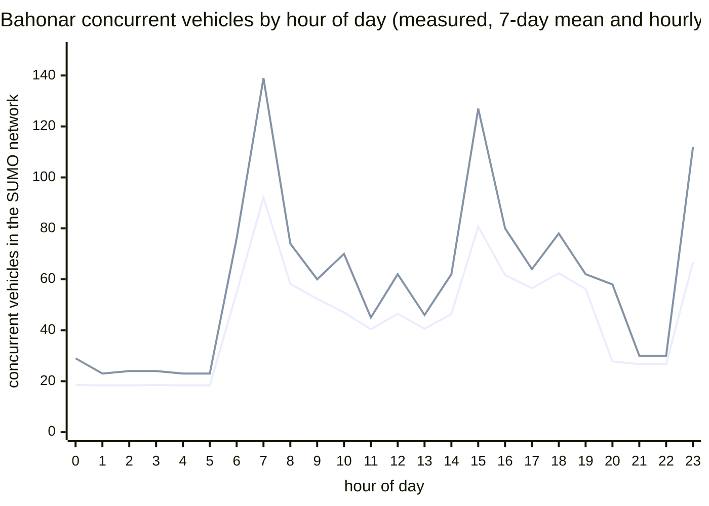
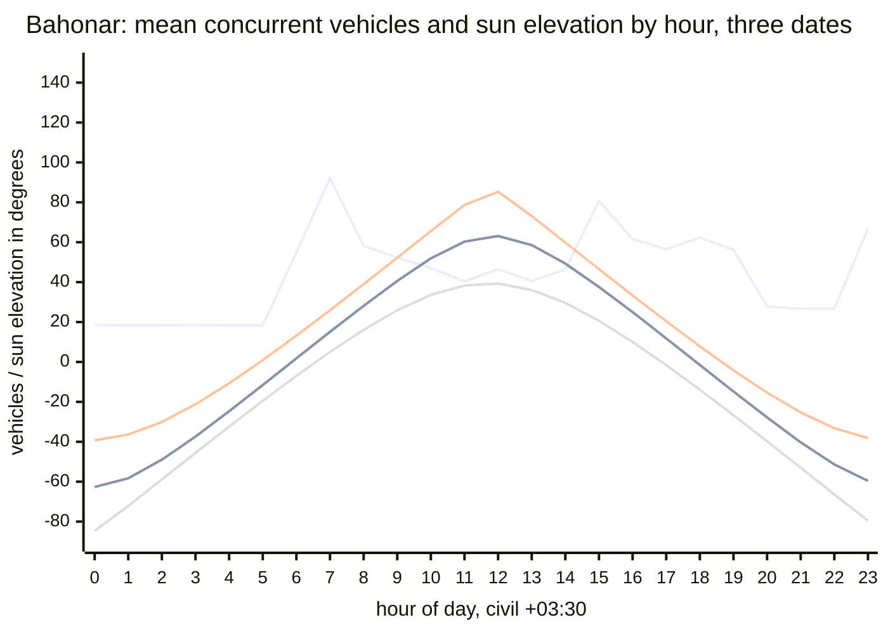
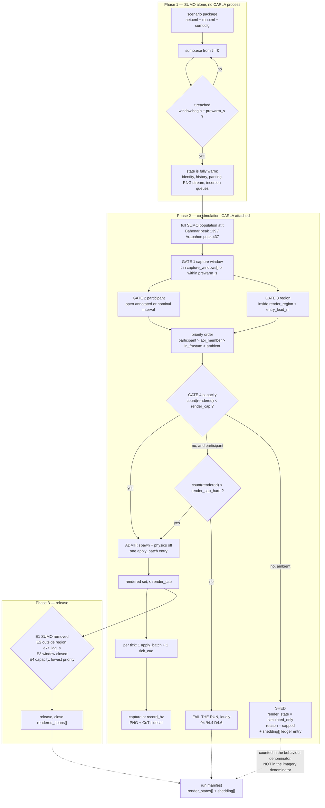

# 10 — Scale and performance

| | |
|---|---|
| **Status** | Plan section. Nothing here is implemented. |
| **Scope** | Whether the SUMO-driven behavioural-capture mode works at the size the user actually needs, and what has to be true for it to. Sizes the scenario corpus, the render set, the RPC and TraCI budgets, the solar and vehicle-light surfaces, the capture pipeline and memory; recommends an envelope, a degradation strategy and the measurements that must precede commitment. |
| **Audience** | An engineer implementing or reviewing the co-simulation runtime, the render-set controller or the capture path, who has not read the conversation that produced this plan. |
| **Owns** | The *numeric values* of the render-set parameters that [`04_Contracts.md`](04_Contracts.md) §4.2 declares and defers here, and the **cost** of the time-of-day and vehicle-light surfaces. |
| **Machine for every "this box" figure** | Windows 11, 20 logical processors, Python 3.14.4, SUMO 1.27.0 from `Build/sumo-src/bin/sumo.exe`. |

**Change history**

| Date | Change |
|---|---|
| 2026-09-17 | Initial population, network, RPC/TraCI, render and storage budgets; sizing envelope and degradation strategy. |
| 2026-09-18 | Added sun-elevation, solar-surface and vehicle-light-state measurements; replaced the 23:00 window with a truth-only demotion. |
| 2026-09-18 | Traffic-light state carries no RPC, batch or byte cost; network signal counts kept as SUMO behaviour inputs. |

---

## 0. What this section does not cover

- **The admission predicate.** Which vehicles are admitted and in what order is
  [`04_Contracts.md`](04_Contracts.md) §4.2–4.4. This section supplies the *numbers* that section types
  (`render_cap`, `render_cap_hard`, `prewarm_s`, `entry_lead_m`, `exit_lag_m`, `exit_lag_s`,
  `aoi_halo_m`, `frustum_lead_s`, `capture_windows[]`) and the evidence for each.
- **Which CarlaNet calls exist.** [`05_CarlaNet_Capability_Audit.md`](05_CarlaNet_Capability_Audit.md).
  This section states the RPC budget both ways — batched and unbatched — so the plan holds whichever
  answer that audit returns, and then records what it actually returned.
- **The interpolation scheme and the tick contract.**
  [`03_CoSimulation_Runtime.md`](03_CoSimulation_Runtime.md) §6 and `04` §8. Taken as given here.
- **Sensor and imagery quality.** [doc 17](../../Findings/17_Photoreal_Occlusion_Metric.md) and
  [`08_Collection_And_EPoL.md`](08_Collection_And_EPoL.md).
- **Whether a night capture is *viable*.** [`11_Time_And_Illumination.md`](11_Time_And_Illumination.md)
  §5 owns the verdict and [`08_Collection_And_EPoL.md`](08_Collection_And_EPoL.md) §4 owns what a
  collection does with it. **This section owns only the cost**, and where the cost cannot be measured
  without the engine it says so and names the probe rather than inventing a figure.
- **The epoch contract, the solar policy and the light-mapping function.**
  [`11_Time_And_Illumination.md`](11_Time_And_Illumination.md). What this section needs from it is
  stated as a property in §4.7.4 and §4.8.4, not designed here.
- **How an operator expresses any of this.**
  [`12_Operator_Control_Surface.md`](12_Operator_Control_Surface.md).
- **Sequencing and dependency of the work.** [`13_Work_Breakdown.md`](13_Work_Breakdown.md).
- **GPU sizing for a specific card.** Every rendering figure here is measured on one machine and is
  reported as a ratio (milliseconds per streamed megapixel) rather than an absolute, so it transfers.

---

## 1. The answers, up front

| Question | Answer | Confidence |
|---|---|---|
| **Peak concurrent vehicles, Bahonar (seven days)** | **139**, at simulated t = 199,260 s (day 2, 07:21). Median 41, mean 43.9, p99 122. | **Measured** — a complete headless SUMO run of the shipped scenario. |
| **Wall clock to render seven simulated days frame-for-frame** | **19 to 24 days** at the measured clock ratio for a 6.2 Mpx camera pair; **8.3 days** at the most favourable ratio ever recorded on this fork; **19.6 hours** at an unreachable upper bound with no client and no capture. Storage at the same time is **6 to 17 TB**. | **Measured ratios, derived extrapolation.** **Verdict: not acceptable. Windowing is mandatory, not an optimisation.** |
| **Recommended render set** | **`render_cap` = 128, `render_cap_hard` = 192.** | 100 concurrent rendered, telemetered and occlusion-measured vehicles are **demonstrated** on this fork (§4.3). 128 is one step beyond demonstrated and is gated on measurement M2. |
| **Largest scenario the design survives** | Bahonar, whole map, in **windows**: peak 139 is under the cap, so no shedding on 99.4% of its seven days. **Arapahoe Underpass is the harder case**, not Bahonar: 437 peak, 336 median, and the cap bites always. | **Measured.** |
| **Does the 23:00 window survive contact with the sun?** | **No.** At the sizing site the sun is **38.1° to 79.5° below the horizon at 23:00, on every date in the year.** That is below astronomical twilight by a wide margin at every season; there is no date that rescues it. The window is retained as a **truth-only window** and the imagery regime it was meant to sample is re-placed onto 17:00–18:00 (§4.2.4). | **Measured** (NOAA solar geometry at the world-package origin, §3.5). |
| **What does the solar surface cost?** | **Setting the sun does not stall the render thread** — the whole path is an enqueue (`RendererScene.cpp:3490`). But under the *advancing* policy the sun's direction changes every frame, and this project runs **virtual shadow maps** (`DefaultEngine.ini:54`), whose directional cache is **invalidated whenever the light direction changes** (`VirtualShadowMapCacheManager.cpp:311`). Advancing therefore re-renders the directional shadow set uncached **every frame**; freezing does not. The magnitude is unmeasured and is **M7**, which is a two-value cvar sweep. | **Read from source; magnitude unmeasured.** |
| **What does vehicle light state cost?** | **Effectively nothing in the batch, and an unmeasured amount in the engine.** Measured inside the 300 m render region on the binding scenario: **7.5% of the rendered set changes its signal mask per 0.05 s step → 9.6 extra batch entries per tick at `render_cap` = 128**, which is **+1.9% of batch bytes** and **zero extra round trips**. The engine work is gated behind an 11-field equality early-out (`CarlaWheeledVehicle.cpp:686-696`), so only *transitions* cost anything — and what a transition costs is a Blueprint VM call, which is **M8**. | **Measured (rates and bytes); engine cost unmeasured.** |
| **Is reading solar state free?** | **Free to the client, not free to the server.** The client read is a field access with no RPC (`CarlaClient.cs:1991`) — the claim holds. But the value is put there by `WorldObserver.cpp:326` calling `GetSolarState` **on the game thread every tick**, and that function performs **three full actor-list sweeps** (§4.7.2) whether or not the sun can have changed and whether or not anyone reads it. | **Read from source.** |

The headline is not the one the team brief anticipated. The brief expected the seven-day span to be the
threat. It is not: the *population* of the seven-day scenario is small and flat, and the whole seven days
of SUMO runs in **140 seconds** of wall clock. The threat is the **rendered second** — pixels and ticks —
and the scenario that threatens it is the one-hour freeway scenario, not the seven-day port.

**The illumination requirement does not change that headline, and it does not displace the top of the
measurement register.** It adds a fourth measurement to the top tier rather than reordering the first
three (§9). What it *does* change is which simulated seconds are worth rendering at all: measured below,
**only 59% to 77% of the sizing scenario's daily vehicle-hours occur under a sun above −6°**, so between
a quarter and two-fifths of the traffic the scenario simulates cannot be photographed at any price.

---

## 2. Method, and the honesty ledger

The project's standing rule is that a systemic explanation offered ahead of a measurement has repeatedly
been wrong. Every figure below is one of three things, and is labelled:

| Label | Meaning |
|---|---|
| **Measured** | Produced by running something read-only and reading the result, here, on 2026-09-17. The command or the file is named. |
| **Derived** | Arithmetic over measured quantities. The arithmetic is shown. |
| **Guess** | An engineering judgement with no measurement behind it. Called a guess, in those words. |

Six things were *run* to produce this section, all read-only and all outside the repository (working
copies extracted to the workspace scratchpad):

1. `sumo.exe` headless over each shipped scenario, with `--summary-output`.
2. The Python `traci` binding against `sumo.exe`, to time per-step reads.
3. Python `zlib` over the pixel planes of PNGs already on disk in `carla/Build/SCTMV_recordings`.
4. **The NOAA solar-position algorithm**, implemented in Python and evaluated at the sizing scenario's
   world-package origin, to place the sun at each window instant across the year (§3.5). This is the
   same formulation the engine uses — `USunPositionFunctionLibrary::GetSunPosition`
   (`Engine/Plugins/Runtime/SunPosition/Source/SunPosition/Private/SunPosition.cpp:11-149`) is pure
   scalar double arithmetic over the same inputs — so it predicts what `CesiumSunSky` will produce
   without running it. **It is a model of the engine's output, not a reading of it**; the confirmation
   measurement is M9.
5. **`traci` subscribed to `VAR_SIGNALS`**, to count per-step vehicle signal transitions on two
   scenarios (§4.8.1). This is a direct measurement of SUMO, not a model.
6. **Python `zlib` over attenuated copies of a real capture**, to bound the storage and tonal cost of a
   dark frame (§4.6). The attenuation is synthetic and is labelled as such wherever its output is used.

No build, no cook, no engine, no code change.

**An independent model was built and then discarded in favour of the run.** Before running SUMO, the
concurrent population was estimated analytically: enumerate every flow departure at its deterministic
spacing, give each vehicle a residence time of `κ ×` its free-flow route time from a Dijkstra over the
network's own connection graph, and count. That model predicted Bahonar's peak as **155 at t = 199,200 s**
against a measured **139 at t = 199,260 s** — 11% high on magnitude, 60 seconds off on timing — and
predicted total departures as **69,245** against a measured **69,245**, exactly. It is reported in §3.1.4
only because it is the cheap estimator for a scenario that has not been run yet, and because its agreement
is the evidence that the measured run is not an artefact.

---

## 3. The sizing case, measured

### 3.1 Concurrent vehicle population over simulated time — Bahonar

#### 3.1.1 What the file actually contains

`BahonarPatternOfLife.zip` → `scenario/Shahid_Bahonar_Port_PatternOfLife.rou.xml`, 152,046 bytes.

| Element | Count | Note |
|---|---|---|
| `<flow>` | **245** | Every one uses `vehsPerHour`; none uses `period`, `probability` or `number`. Rates 20 – 600 veh/h. |
| `<trip>` | **365** | **The team brief's "individually declared vehicles: 0" is true only of `<vehicle>`.** There are 365 `<trip>` elements — individually declared vehicles with `from`/`to`/`via` and no precomputed route. They are the guards, the escorts, the probes and the shadow. |
| `<vehicle>` | 0 | |
| `<stop>` | **338**, all on `<trip>`, all `parking="true"` | Durations: min 300 s, **median 28,800 s (8 h)**, max **489,000 s (5.66 days)**. |
| `<vType>` | 14 | `passenger`, `taxi`, `truck`, `bus`, `authority`, `army`. |
| `<vTypeDistribution>` | 3 | `civ_mix`, `port_mix`, `mil_mix`. |

Simulated span 604,800 s, step length 1.0 s, seed 42, `time-to-teleport -1`, `max-depart-delay 900`
(`Shahid_Bahonar_Port_PatternOfLife.sumocfg`).

The 338 parking stops matter to sizing in a way the brief did not anticipate: a guard parked at a tower
for an eight-hour shift is a **stationary vehicle that still exists**, still occupies a SUMO id, and — if
rendered — is a CARLA actor that must be posed and serialised every tick while contributing nothing but a
parked car to the imagery. They are a floor under the population, not a spike.

#### 3.1.2 The measured run

```
sumo.exe -c Shahid_Bahonar_Port_PatternOfLife.sumocfg \
         --summary-output bahonar_summary.xml --no-step-log true --duration-log.statistics true
```

| Quantity | Value |
|---|---|
| Wall clock for the whole seven days | **140.41 s** |
| Real-time factor | **4,307×** |
| Vehicles inserted | **69,245** |
| Mean route length | 5,519.30 m |
| Mean trip duration | 382.86 s |
| Mean speed | 24.56 m/s |
| Mean time loss | 16.72 s |
| Mean depart delay | 0.14 s — **no insertion starvation**; `max-depart-delay 900` never bit |

Concurrent population, from the 604,800 rows of `--summary-output`:

| Statistic | `running` (all) | `stopped` (parked) | moving (`running − stopped`) |
|---|---|---|---|
| minimum | 2 | 0 | 0 |
| **median** | **41** | **17** | 24 |
| mean | 43.9 | 16.1 | 27.8 |
| p75 | 56 | — | — |
| p90 | 70 | — | — |
| p99 | 122 | — | — |
| p99.9 | 134 | — | — |
| **peak** | **139** @ t = 199,260 s (day 2, 07:21) | 20 | 122 |

Time above a threshold, over the whole 168 simulated hours:

| Threshold | Fraction of the week | Hours |
|---|---|---|
| > 32 | 61.68% | 103.6 |
| > 64 | 13.63% | 22.9 |
| > 100 | 4.08% | 6.8 |
| > 128 | **0.58%** | **1.0** |
| > 150 | 0.00% | 0.0 |

The excursions are short and countable: **108 contiguous spans above 100 vehicles**, the longest 1,652 s,
6.8 hours in total across the week.

#### 3.1.3 The shape of the week

Hour-of-day profile, averaged over the seven days (measured):



The same data as a table, because the chart's two series are not labelled by Mermaid — the first line is
the seven-day **mean**, the second the hourly **maximum**:

| Hour | 0–5 | 6 | **7** | 8 | 9 | 10 | 11 | 12 | 13 | 14 | **15** | 16 | 17 | 18 | 19 | 20 | 21–22 | **23** |
|---|---|---|---|---|---|---|---|---|---|---|---|---|---|---|---|---|---|---|
| mean | 18.4 | 54.8 | **92.1** | 58.2 | 52.3 | 47.0 | 40.4 | 46.5 | 40.6 | 46.4 | **80.7** | 61.7 | 56.5 | 62.4 | 56.2 | 27.8 | 26.7 | **66.7** |
| max | 23–29 | 76 | **139** | 74 | 60 | 70 | 45 | 62 | 46 | 62 | **127** | 80 | 64 | 78 | 62 | 58 | 30 | **112** |

Per-day peaks are flat to within 1.5%: day 0 = 131 (no overnight carry-in), days 1–6 = 137, 138, 138, 137,
137, 138. **The week is six repetitions of one day plus a cold first day.** That is the single most
load-bearing observation for windowing: any window drawn from days 1–6 is representative of every other
day at the same hour, so a capture plan does not need to cover the week to cover the pattern.

Three daily peaks, all identifiable from the scenario source: **07:00–08:00** (shift change plus the ferry
bursts, the `ferry_in_*` / `ferry_out_*` flows at 600 veh/h for 720 s), **15:00–16:00** (the afternoon
shift), and **23:00** (the night shift). The overnight floor of ~18–21 is almost entirely the 17 parked
guards.

#### 3.1.4 The analytic model, and why it is worth keeping

Assumptions, stated so they can be attacked:

1. A `vehsPerHour` flow departs vehicles at deterministic, equidistant times `begin + i·3600/vehsPerHour`
   starting **at** `begin`. (This is SUMO's behaviour, and it means 245 flows sharing an hour boundary
   insert 245 vehicles in one second.)
2. Trip duration = `κ ×` (free-flow route time), where the route is a Dijkstra over the network's own
   `<connection>` graph weighted by `lane.length / min(lane.speed, vType.maxSpeed)`, including the
   internal junction-connector lanes via each connection's `via` attribute, and `vType.maxSpeed` is the
   probability-weighted mean over the `vTypeDistribution`.
3. A parking `<stop>` adds its full duration to residence.
4. `κ = 1.3`.

**`κ` is the weak link, and it was the weak link.** The measured mean trip duration was 382.86 s against
the model's flow-weighted free-flow mean of 215 s — an effective `κ` of 1.78, not 1.3 — but the measured
mean route length was also 5,519 m against the model's 4,638 m, because SUMO's own router does not pick
the shortest free-flow path. Net of the longer routes, the speed-side `κ` was ≈ 1.50. The two errors
partly cancelled, which is luck and should be said plainly.

| | Model (κ = 1.3) | Measured | Error |
|---|---|---|---|
| Total departures | 69,245 | 69,245 | **0** |
| Peak concurrent | 155 | 139 | +11.5% |
| Peak time | t = 199,200 s | t = 199,260 s | 60 s |
| Median concurrent | 45 | 41 | +9.8% |
| Parked median | 17 | 17 | 0 |
| Parked peak | 18 | 20 | −10% |

Against the two short scenarios the same model, checked against the *shipped CoT sample CSVs* rather than
a fresh run, matched to the vehicle: Arapahoe at t = 22…26 s gave model 93, 95, 98, 98, 101 against
measured 93, 95, 95, 98, 101; Gardnerville over t = 59…64 s gave a median ratio of 1.00.

**Keep the model as the estimator for an unrun scenario, at `κ = 1.5`, and treat its output as an upper
bound to be confirmed by a run.** It costs seconds and needs no SUMO. But the run costs 140 seconds, so
for any scenario that will actually be captured, **run it**.

### 3.2 The other two scenarios

Same treatment, measured the same way.

| | **Bahonar** | **Arapahoe Underpass** | **Gardnerville Orbit** |
|---|---|---|---|
| Simulated span | 604,800 s (7 d) | 2,700 s | 2,220 s |
| Step length | 1.0 s | 0.05 s | 0.05 s |
| Flows / individually declared | 245 / 365 `<trip>` | 51 / 1 | 30 / 1 `<vehicle>` |
| Inserted | 69,245 | 7,433 | 775 |
| Mean route length | 5,519.30 m | 1,989.80 m | 1,635.77 m |
| Mean trip duration | 382.86 s | 122.72 s | 113.82 s |
| Mean speed | 24.56 m/s | 21.02 m/s | 15.08 m/s |
| Mean time loss | 16.72 s | **42.70 s** | 22.89 s |
| **Concurrent median** | **41** | **336** | **39** |
| **Concurrent peak** | **139** | **437** | **51** |
| Concurrent p99 | 122 | 427 | 48 |
| Wall clock for the whole run | **140.41 s** | **126.10 s** | **6.69 s** |
| Real-time factor | **4,307×** | **21.4×** | **331.9×** |

**Arapahoe Underpass is the binding scenario for the render set, not Bahonar.** Its two freeway flows are
3,300 and 3,000 veh/h over a 2.1 km route; Little's law alone puts 2·(3,150/3,600)·73 s ≈ 128 vehicles on
I-25 before any surface street is counted. Its concurrent population is **2.4× Bahonar's peak as its
median** and it never drops below 42.

The second consequence is the cost of a SUMO step. Per vehicle-step, single-threaded:

| Scenario | Steps | Wall | ms/step | Median live | **µs per vehicle-step** |
|---|---|---|---|---|---|
| Bahonar | 604,800 | 140.41 s | 0.232 | 41 | **5.7** |
| Arapahoe | 54,000 | 126.10 s | 2.335 | 336 | **7.0** |
| Gardnerville | 44,400 | 6.69 s | 0.151 | 39 | **3.9** |

**4 to 7 µs per vehicle per SUMO step.** At 400 vehicles that is 2.8 ms of a step — against a 50 ms
real-time budget at `fixed_delta = 0.05`, and against a **1,000 ms** budget at Bahonar's 1.0 s step.
**SUMO is never the bottleneck.** Say so once and stop worrying about it.

### 3.3 The networks

Measured by parsing each `.net.xml`. The right-hand column is doc 23 §2's Arapahoe measurement on the
**unclipped** OSM, carried forward, so there is a second point on the curve for the same location.

| | **Bahonar** | **Arapahoe (clipped, shipped)** | **Gardnerville** | *Arapahoe (doc 23 §2, unclipped)* |
|---|---|---|---|---|
| File size | 2.47 MB | 1.15 MB | 0.17 MB | — |
| `netOffset` | `0.00,0.00` | `0.00,0.00` | `0.00,0.00` | `0.00,0.00` |
| `convBoundary` extent | **7,214 × 4,023 m = 29.02 km²** | 954 × 1,939 m = 1.85 km² | 1,678 × 846 m = 1.42 km² | — |
| Normal edges | 1,066 | 317 | 55 | 2,420 |
| Internal edges | 3,133 | 689 | 202 | 5,819 |
| Normal lanes | 1,130 | 657 | 55 | — |
| Internal lanes | 3,198 | 1,037 | 202 | — |
| Total normal lane length | 199.8 km | 65.7 km | 11.8 km | — |
| Junctions | 651 | 298 | 68 | 1,431 |
| — `priority` | 272 | 147 | 24 | 437 |
| — `right_before_left` | 179 | 10 | 0 | 372 |
| — `traffic_light` | **0** | 23 | **0** | 45 |
| — `dead_end` | 6 | 15 | 0 | 212 |
| — `internal` | 194 | 103 | 44 | 365 |
| `<connection>` | 6,202 | 1,971 | 360 | — |
| **`<request>` right-of-way rows** | **3,004** | **934** | **158** | **5,855** |
| `<tlLogic>` programs | **0** | 23 | **0** | 45 |
| Distinct `z` in any lane shape | **0** | **0** | **0** | **0** |
| Lane speed min / median / max | 5.56 / 5.56 / 39.44 m/s | 11.18 / 17.88 / 29.06 m/s | 13.89 / 13.89 / 22.22 m/s | — |

Three things worth carrying forward:

- **The largest map is 16× the area of the smallest but carries only 3.4× the junctions and 3.1× the
  right-of-way rows.** Network size scales with *road density*, not extent, and none of these numbers is
  large. In-memory cost is negligible (§4.10).
- **Bahonar has no traffic lights at all.** Zero `tlLogic`, zero `traffic_light` junctions, so every
  one of its 3,004 right-of-way rows resolves by priority or right-before-left rather than by a signal
  program. Arapahoe's 23 and 45 are where SUMO's actuated programs shape the behaviour. **Neither
  count is an RPC or batch budget line**: signals are simulated in SUMO and rendered nowhere
  ([`03`](03_CoSimulation_Runtime.md) `D3.24`), so no traffic-light state crosses the wire on any map.
- The flatness (`0` distinct `z`) is doc 23 §6.5 confirmed on all three, including the large one.

### 3.4 The bare-earth grid

**Format**, read from the writer (`CarlaNet/src/CarlaNet.Map/WorldPackage/WorldPackage.cs:194-204`) and the
reader (`CarlaControl/src/carlacontrol/SumoCotBridge.py:105-119`): a 60-byte header
`<i d d d d d d i i` = magic `0x43575031`, origin latitude, origin longitude, origin height, grid minimum
x, grid minimum y, cell size, columns, rows — followed by **two** `float32` planes of `columns × rows`,
row-major: the **drape offset first**, then the **bare-earth height**, which is the plane the reader takes
(`SumoCotBridge.py:112` skips the first plane by seeking `header_size + 4·count`).

Verified on all three: `60 + 8·cols·rows` equals the file size **exactly**.

| | **Bahonar** | **Arapahoe** (inside `Arapahoe_I25.cwp`) | **Gardnerville** |
|---|---|---|---|
| Bytes | 60,891,108 | 3,713,164 | 3,071,100 |
| Columns × rows | 3,609 × 2,109 | 478 × 971 | 840 × 457 |
| **Cells** | **7,611,381** | 464,138 | 383,880 |
| Cell size | **2.0 m** | 2.0 m | 2.0 m |
| Covered extent | 7,218 × 4,218 m | 956 × 1,942 m | 1,680 × 914 m |
| Origin | 27.150120 N, 56.180650 E | 39.59431 N, −104.88449 W | 38.911080 N, −119.764597 W |

**Lookup cost.** `BareEarthGrid.height_at` (`SumoCotBridge.py:115-119`) is two clamped integer divisions
and one flat index — O(1), no interpolation, no search. Measured on the Bahonar grid, 200,000 random
points: **0.557 µs per lookup**, 1.8 M lookups/s.

At the recommended cap of 128 rendered vehicles and 20 ticks/s that is 2,560 lookups/s = **1.4 ms per
wall-second**, 0.14% of one core. **The hot path is not hot.**

**The load path is.** Measured on this box:

| Representation | Load time | Resident | Lookup |
|---|---|---|---|
| **As shipped** — `struct.unpack_from(f"<{n}f", …)` → tuple of boxed floats (`SumoCotBridge.py:112`) | **0.18–5.61 s** | **243.6 MB** (peak 304.5 MB) | 0.557 µs |
| `array.array('f').frombytes(…)` | **0.011–0.018 s** | **32.3 MB** | 0.599 µs |
| `numpy.frombuffer(…, dtype=float32)` — zero-copy view | **0.000025 s** | **30.4 MB** | 35 ns *(vectorised over a batch of 200,000)* |

A 60.9 MB file becomes **244 MB** of process memory, because CPython boxes 7.6 million floats at
~32 bytes each. The fix is one line and changes nothing else; it is `D10.9`.

**The load times are a range because two independent runs on this box disagree by a factor of 30** —
5.61 s and 0.183 s for the same file, against 0.011 s and 0.018 s for the `array` path. The resident
figures reproduced to the decimal in both, so it is the same grid; the load spread is almost certainly
file-cache state, cold against warm. **The case rests on the footprint, which is not in dispute.** 244 MB
is paid by every client that opens the grid, and this design adds clients. Anyone quoting a load-time
saving should re-measure with a cold cache first.

### 3.5 The sizing scenario's illumination profile

§3.1.3 measured three daily population regimes and §4.2.3 recommends windows placed on them. Those
windows land at civil clock times, and a civil clock time plus a date plus a position is a sun
elevation: this section computes it.

#### 3.5.1 Where and when the sun is

The site is the Bahonar world package's own origin, **27.150120 N, 56.180650 E** (§3.4, read from the
`bareearth.bin` header). Iran's civil offset is **+03:30**. The scenario's own trip identifiers put
`t = 0` at civil midnight (team brief §3a: guard shifts at 25,200 / 54,000 / 82,800 s = 07:00 / 15:00 /
23:00). The scenario declares **no date**, so the date is a free variable — which turns out to matter
more than anything else in this subsection.

**Measured** (NOAA solar position, §2 item 4; the same formulation the engine evaluates):

| Date | 07:00 | 15:00 | **23:00** | 03:00 |
|---|---|---|---|---|
| 15 Jan | **+3.97°** | +24.16° | **−76.08°** | −47.50° |
| 21 Mar (equinox) | +15.07° | +37.65° | **−59.65°** | −37.39° |
| 15 May | +25.45° | +43.92° | **−42.75°** | −23.50° |
| 21 Jun (solstice) | +25.92° | +46.50° | **−38.15°** | −21.23° |
| 15 Aug | +21.78° | +43.86° | **−47.26°** | −28.13° |
| 23 Sep (equinox) | +18.18° | +34.30° | **−61.69°** | −34.43° |
| 15 Nov | +10.33° | +21.58° | **−79.06°** | −41.10° |
| 21 Dec (solstice) | +5.00° | +20.63° | **−79.49°** | −45.62° |

Three readings, in order of importance:

1. **23:00 is deep night on every date.** The sun spans **−38.15° to −79.49°**. Astronomical twilight
   ends at −18°, so the best case is twenty degrees past the darkest twilight band. **No choice of date
   makes the 23:00 window renderable.** Neither does 03:00 (doc 20's pattern class 4, the heavy goods
   vehicle in a residential area at 03:00), which spans −21.23° to −47.50°.
2. **07:00 is never night, and is the most useful window in the scenario for a second reason.** It spans
   **+3.97° to +25.92° — a 22-degree range produced purely by the date**, at identical scenario seconds
   and therefore an identical vehicle population. That is an illumination axis that costs nothing in
   population, nothing in wall clock and nothing in storage (§6).
3. **15:00 is high sun on every date** (+20.63° to +46.50°) and is the least interesting of the three
   from an illumination standpoint: no date brings it near the horizon.

Twilight bands at the site, for placing anything near the terminator (**measured**, local civil clock):

| Date | astro −18° | naut −12° | civil −6° | sunrise | sunset | civil −6° | naut −12° |
|---|---|---|---|---|---|---|---|
| 15 Jan | 05:14 | 05:43 | 06:11 | **06:36** | **17:13** | 17:38 | 18:07 |
| 21 Mar | 04:31 | 04:58 | 05:25 | **05:48** | **17:57** | 18:20 | 18:47 |
| 21 Jun | 03:19 | 03:53 | 04:25 | **04:51** | **18:43** | 19:09 | 19:41 |
| 23 Sep | 04:17 | 04:44 | 05:11 | **05:34** | **17:41** | 18:04 | 18:31 |
| 21 Dec | 05:07 | 05:36 | 06:05 | **06:30** | **16:56** | 17:22 | 17:51 |

On 15 January, the 07:00 window opens **24 minutes after sunrise**. That is a genuinely distinct
illumination regime — long shadows, strong colour cast, high dynamic range — reached with no change to
the scenario, the population, the window length or the render set.

#### 3.5.2 The population and the sun, together

Both quantities on the same hour axis. The first series is §3.1.3's measured seven-day mean population;
the other three are the measured sun elevation at that hour on the equinox and the two solstices.



The same data as a table, because Mermaid does not label the four series — first the population, then
equinox, June solstice, December solstice. The hours where **every** date is below the horizon are the
hours no capture plan can use.

| Hour | pop mean | 21 Mar | 21 Jun | 21 Dec | usable at any date? |
|---|---|---|---|---|---|
| 00–05 | 18.4–18.5 | −62.7 … −11.6 | −39.3 … +0.9 | −84.7 … −19.5 | **no** (05:00 on the June solstice is +0.9°, marginal) |
| **06** | **54.8** | +1.8 | +13.2 | −7.0 | **yes, low sun** |
| **07** | **92.1** | +15.1 | +25.9 | **+5.0** | **yes — and spans 21° by date** |
| 08–14 | 40.4–58.2 | +28.1 … +49.3 | +39.0 … +85.3 | +16.1 … +29.6 | yes, high sun |
| **15** | **80.7** | +37.6 | +46.5 | +20.6 | yes, high sun |
| 16 | 61.7 | +25.0 | +33.3 | +10.0 | yes |
| **17** | **56.5** | **+11.8** | +20.4 | −1.6 | **yes, low sun on most dates** |
| **18** | **62.4** | −1.5 | **+7.8** | −13.9 | **yes on the June solstice only** |
| 19 | 56.2 | −14.8 | −4.2 | −26.7 | no |
| 20–22 | 26.7–27.8 | −27.8 … −51.4 | −15.4 … −33.2 | −39.8 … −66.4 | **no** |
| **23** | **66.7** | −59.6 | −38.1 | −79.5 | **no, at any date** |

**Derived, and it is the number that sizes the illumination problem.** Weighting each hour by its
measured mean population and summing the hours whose sun clears a threshold:

| Sun elevation threshold | 21 Mar | 21 Jun | 21 Dec |
|---|---|---|---|
| **> +6°** (clear of the horizon band) | **59.0%** | **70.2%** | **44.9%** |
| **> 0°** (sun up) | 64.2% | 71.9% | 53.7% |
| **> −6°** (civil twilight or better) | 70.2% | 77.2% | 59.0% |

> **The sizing scenario puts between 23% and 41% of its own daily vehicle-hours into hours that cannot
> be photographed**, and on the December solstice more than half of them. This is not a performance
> limit and no amount of render budget touches it. It is a property of the scenario's authored timeline
> meeting the site's solar geometry, and it belongs in the sizing envelope (§6) because it caps the
> fraction of an authored pattern that a corpus can ever contain.

#### 3.5.3 The scenario's clock is not the engine's clock, and the gap is measurable

`ACesiumSunSky` has **no time-zone setter** and the world is spawned with
`EstimateTimeZoneForLongitude(OriginLongitude)`, which is `TimeZone = longitude / 15.0`
(`CesiumSunSky.cpp:570-573`), called from `CesiumHeightSampler.cpp:412` alongside `SolarTime = 12.0` and
DST off (`:409-412`). At the sizing site that is `56.180650 / 15 = +3.745377` against Iran's civil
**+3.5** — the engine's clock runs **14.72 minutes** ahead of the scenario's.

[`11_Time_And_Illumination.md`](11_Time_And_Illumination.md) owns the fix and records the defect. The
reason it appears here is that the error is **not small where it matters**, and its consequence is a
shadow-length error that a detector sees:

| Date, hour | civil-clock sun | engine-clock sun | shadow length, civil | shadow length, engine | ratio |
|---|---|---|---|---|---|
| 21 Dec, 07:00 | +5.00° | +2.12° | 11.44 × height | 26.98 × height | **2.36×** |
| 15 Jan, 07:00 | +3.97° | +1.01° | 14.40 × height | 56.64 × height | **3.93×** |
| 21 Mar, 07:00 | +15.07° | +11.81° | 3.72 × height | 4.78 × height | 1.29× |
| 21 Jun, 07:00 | +25.92° | +22.76° | 2.06 × height | 2.38 × height | 1.16× |
| **21 Dec, 17:00** | **−1.60°, sun down** | **+1.33°, sun up** | — | — | **the error flips day to night** |

*(Shadow length per unit object height is `cot(elevation)`; the arithmetic is shown so the reading is
checkable. **Derived** from the measured elevations.)*

The last row is the one to carry: at the terminator a 14.72-minute clock error is the difference between
a lit scene and an unlit one. High sun forgives it; the low-sun windows this section recommends do not.

---

## 4. The budgets

### 4.1 Wall clock to render seven simulated days

**Measured, from files already on disk.** `carla/Build/SCTMV_recordings` holds 54 captures from four
recorder runs on 2026-09-16. Every PNG carries a `carla:capture` `tEXt` chunk written by
`CaptureMetadata.cs:35`, `CaptureIdentity.PngTextChunks` with the **tick and the simulated time** that produced those pixels, and
the filename carries local wall-clock time to the millisecond (`FrameRecorder.cs:223-224`). Dividing one
by the other gives the clock ratio of a real capture session with no instrumentation and no new run.

Every capture interval in every run is **exactly 10 ticks / 0.500 simulated seconds** — the configured
2 Hz, with **no dropped captures anywhere**.

| Run | Camera | Ticks per wall-second | ms per tick | **Clock ratio** |
|---|---|---|---|---|
| `run-20260916-180919` | 9,248 × 6,944 (64.2 Mpx) ×2 | 0.60 | 1,674 | **3.0%** |
| `run-20260916-195810` | 2,888 × 2,160 (6.24 Mpx) ×2 | 7.24 | 138 | **36.2%** |
| `run-20260916-213225` | 2,888 × 2,160 ×2 | 5.91 | 169 | 29.5% |
| `run-20260916-214042` | 2,888 × 2,160 ×2 | 5.90 | 170 | **29.5%** |

"×2" because `SensorRig.py:61-82` spawns an RGB **and** a depth camera at the same resolution, and the
occlusion measurement subscribes to both (`--no-occlusion` is off by default,
`CarlaControlArgumentParser.py:543-554`). The sidecar of `run-20260916-214042` confirms the configuration:
**101 events = 1 platform + 100 vehicles**, 44 of them carrying an `occlusion` attribute,
`_carla_intrinsics width="2888" height="2160"`.

**Derived, and the most transferable number in this document:** dividing tick cost by streamed pixels,

| Run | Streamed Mpx per tick | ms/tick | **ms per streamed megapixel** |
|---|---|---|---|
| 9,248 × 6,944 ×2 | 128.4 | 1,674 | **13.0** |
| 2,888 × 2,160 ×2 | 12.48 | 170 | **13.6** |

**13.0 – 13.6 ms of tick time per streamed megapixel, consistent across a 10.3× range of pixel count.**
The relationship is linear in pixels with a small constant term — which means the tick is dominated by
*pixel-rate* work (GPU readout, serialisation, stream), not by per-frame overhead, not by actor count,
and not by anything the SUMO bridge does.

Two anchors carried forward from [doc 18](../../Findings/18_Scenario_Fabrication_For_EPoL_Training.md),
both measured there, both at much smaller camera sizes:

- §5.4: **1,014 ticks in 60 s of wall clock — 16.9 Hz against a 20 Hz target, 84% of real time** — with
  traffic at the 30-vehicle default, a recorder and a second client attached.
- §6: **~171 ticks/s free-running with no client driving it.** That is **5.85 ms per frame** for the bare
  engine on this content, and it is the ceiling nothing else can exceed.

Now the answer:

| Clock ratio | Source | Wall clock for 604,800 simulated seconds |
|---|---|---|
| 3.0% | measured, 64 Mpx camera pair | 20,160,000 s = **233 days** |
| **29.5%** | **measured, 6.2 Mpx pair, 100 vehicles, 2 Hz capture, occlusion on** | 2,050,169 s = **23.7 days** |
| 36.2% | measured, same configuration, best of four runs | 1,670,718 s = **19.3 days** |
| 84% | carried forward, 30 vehicles, small camera | 720,000 s = **8.3 days** |
| 100% | hypothetical | 604,800 s = 7.0 days |
| 855% | carried forward, **no client, no capture** — unreachable ceiling | 70,737 s = **19.6 hours** |

And the corpus, at 2 Hz on **one** recorded camera, using the measured PNG sizes of §4.6:

| Camera | MB/frame | Frames over 7 days | **Corpus** | Sustained write |
|---|---|---|---|---|
| 1280 × 720 | 2.25 | 1,209,600 | **2.72 TB** | 4.5 MB/s |
| 1920 × 1080 | 5.00 | 1,209,600 | **6.05 TB** | 10.0 MB/s |
| 2888 × 2160 | 14.46 | 1,209,600 | **17.49 TB** | 28.9 MB/s |
| 9248 × 6944 | 112.57 | 1,209,600 | **136.16 TB** | 225.1 MB/s |

> **D10.1 — Rendering a scenario frame-for-frame over its whole declared span is rejected on two
> independent grounds.** Scenario length is the author's to set and is not bounded here; what is
> bounded is how much of it can be rendered. Measured on the seven-day sizing case:
> Time: 19–24 wall-clock days at the measured ratio, and 19.6 hours at a ceiling that requires no client
> and no camera, which is to say no product. Storage: 6–17 TB for one camera at the smallest useful
> resolution. Either alone is disqualifying. **The design renders windows of simulated time, and the
> window is a first-class, authored, recorded object — not a debugging convenience.**

### 4.2 Windowing, concretely

A window is a span of simulated time `[begin_s, end_s]` during which CARLA exists, renders and captures.
Outside it, **SUMO runs alone**, which it does 4,307× faster than real time.



#### 4.2.1 How SUMO fast-forwards, measured

Three mechanisms exist. All three were tried.

**(a) Run from t = 0 with no output. Measured.**

| Target | Wall clock | Real-time factor |
|---|---|---|
| t = 25,200 s (07:00 on day 0) | **1.65 s** | 15,291× |
| t = 604,800 s (the whole week) | **140.41 s** | 4,307× |

*(The whole-week factor is lower because the whole week includes the busy hours; the early-morning hours
are nearly empty.)*

**Reaching any instant in the seven-day scenario costs at most 140 seconds and typically a few seconds.**

**(b) `--begin <t>`, cold start. Measured, and it loses things.** A cold start at t = 25,200 s inserts
only the vehicles that depart after that instant; the network begins empty. Comparing the cold run's
population against the continuous run's at the same simulated instants:

| Simulated seconds after the cold start | Cold | Continuous | Deviation |
|---|---|---|---|
| 0 | 5 | 40 | 87.5% |
| 60 | 33 | 60 | 45.0% |
| 120 | 46 | 62 | 25.8% |
| 180 | — | — | 10% *(60 s block mean)* |
| **300** | **70** | **74** | **5.4%** |
| 600 | 95 | 94 | 1.1% |
| 900 | 109 | 107 | 1.9% |
| 1,800 | 117 | 113 | 3.5% |
| 2,700 | 62 | 62 | 0.0% |

**Population converges to within 5% after 300 simulated seconds and stays within 10% for the rest of the
hour.** That is the measured basis for `prewarm_s`.

**(c) `--save-state.times` / `--load-state`. Works for saving; does not compose here.** Saving state at
t = 25,200 s produced a **19,115-byte gzipped** snapshot containing 35 `<vehicle>`, 4 `<flowState>`,
1,150 `<route>`, the vType table and the RNG state. Loading it back **re-inserted every vehicle that had
already departed**: 1,856 insertions over the 3,600 s window against 716 for a cold start, because the
route file is re-read from the top and the state carries only the *instantiated* flows, not the ones whose
`begin` is still in the future. With `--ignore-route-errors` it ran but reported a mean duration of
−899.12 s. This is an unrouted-`<trip>`/`<flow>` interaction, not a SUMO defect; a pre-routed route file
(`duarouter` output with explicit `<route edges="…"/>`) is the likely fix and is untested.

> **D10.2 — The window mechanism is `sumo.exe` run from t = 0 with no output until the window opens, then
> the CARLA attachment. Not `--begin`, and not state save/load.** Measured: the whole seven days is
> 140.41 s of wall clock and any earlier instant is a few seconds, so there is nothing to buy by skipping
> it, and the fast-forward preserves **everything** — vehicle identity, trip history, the parked
> population, the insertion queues and the RNG stream — that the other two lose. State save/load is
> revisited only if the fast-forward exceeds ~10 minutes on some future scenario, and then only against a
> pre-routed route file.

#### 4.2.2 What is lost at a window edge, and what is done about it

| Loss | Consequence | Handling |
|---|---|---|
| **A vehicle's history before the window** | A vehicle already mid-trip at `window.begin` appears in the imagery with no observable past. A tracker cannot tell it from one that just entered. | **Not a loss under D10.2** — SUMO fast-forwards, so the *simulation* history is complete and is in the truth record. Only the *imagery* history is absent, which is exactly what `04` §4.5's `rendered_spans[]` and `observed_spans[]` exist to state. Every such vehicle carries a `rendered_spans[0].begin_s` equal to the window open, and a `sumo_span_s[0]` earlier than it. A consumer that ignores the difference is reading the record wrong. |
| **Warm-up state** | Under a cold start, the first ~300 s of a window is under-populated by 5–87%. | **`prewarm_s = 300`** (§8). Under D10.2 there is no warm-up state to lose; `prewarm_s` instead buys the *render set* time to fill: it is the span before `window.begin` during which vehicles are admitted and posed but **nothing is captured**. It also absorbs `entry_lead_m` and the frustum lead. |
| **An annotated interval that straddles a window edge** | A pattern instance whose interval runs from before `window.begin` to inside it, or from inside it to after `window.end`, is captured in part. A partially observed positive is worse than an unobserved one: it teaches the model a truncated pattern. | **Three-valued, and refused silently never.** (1) At authoring time, `07`'s validator rejects a `capture_windows[]` entry that cuts a declared interval, naming the instance — a window that cuts an interval is an authoring error, not a runtime event. (2) If it happens anyway — an interval whose `observed_start_tick` is only determined at runtime — the vehicle's `render_states[]` entry records `render_state = partially_rendered`, and the instance carries `straddles_window = true`. (3) A consumer building a training set must be able to exclude straddling instances with one predicate, so the flag is on the *instance*, not inferred from span arithmetic. **The participant guarantee (`04` D4.6) is unchanged**: a participant is admitted at `interval.start − prewarm_s`, so the only straddle that can survive validation is one at `window.end`. |
| **Continuity of the corpus across two windows** | Two windows of the same run produce two disjoint imagery spans that a naive consumer may concatenate. | Windows are separate `observed_spans[]` entries and each capture carries its tick (`CaptureIdentity`, measured present in every PNG on disk). Concatenation across a gap is detectable from the ticks alone. The run manifest lists `capture_windows[]` verbatim. |

#### 4.2.3 Window sizing

At the measured 29.5% clock ratio, a 6.2 Mpx camera pair and 2 Hz capture on one recorded camera:

| Window | Wall clock | Frames | PNG | Sidecar @128 veh |
|---|---|---|---|---|
| 60 s | 3.4 min | 120 | 1.7 GB | 0.01 GB |
| **300 s** | **16.9 min** | 600 | 8.7 GB | 0.04 GB |
| **900 s** | **50.8 min** | 1,800 | 26.0 GB | 0.12 GB |
| **1,800 s** | **1.7 h** | 3,600 | 52.1 GB | 0.24 GB |
| 3,600 s | 3.4 h | 7,200 | 104.1 GB | 0.48 GB |
| 7,200 s | 6.8 h | 14,400 | 208.2 GB | 0.96 GB |
| 21,600 s (6 h) | 20.3 h | 43,200 | 624.7 GB | 2.89 GB |

Because **days 1–6 of Bahonar are within 1.5% of each other** (§3.1.3), a capture plan covering the
scenario's pattern does not need many hours. Six windows of 1,800 s is 3 hours of simulated time,
**10 hours of wall clock and 313 GB**, and covers every population regime the week contains.

**One window in a default 1,800 s plan also moves the sun.** At `rate = 1.0` under the advancing policy,
1,800 s of simulated time is 1,800 s of solar time = **0.5 h of hour angle = 7.5° of azimuth**, and at
the sizing site's latitude the elevation change over half an hour near 07:00 is **6–7°** (measured: the
07:00-to-08:00 change is 13.0° on the equinox, 13.1° on the June solstice, 11.1° on the December
solstice, so half an hour is roughly half of that). Whether that is wanted is
[`11`](11_Time_And_Illumination.md)'s decision, not this section's; what it costs is §4.7.

> **D10.3 — Default window length 1,800 simulated seconds; recommended plan for a seven-day pattern-of-life
> scenario is 4 to 8 windows placed on the authored events, not a contiguous span.** Derived from the
> measured per-day repeatability and the measured wall-clock and storage rates above.

#### 4.2.4 Window placement, against illumination

Window placement must account for both population and light. §3.1.3 measures three population regimes —
07:00, 15:00 and 23:00; §3.5 supplies the sun elevation at each, so a window is placed on both together.

**The 23:00 window cannot be photographed.** Sun elevation −38.1° to −79.5°, on every date. There is no
authoring choice, no date, no render budget and no exposure setting that changes that, because §4.9
establishes that the world contains **no light sources at all** when the sun is down.

There are four things that can be done with a population regime that falls in darkness, and they are not
equally good:

| Option | What it costs | What it buys | Verdict |
|---|---|---|---|
| **(a) Render it anyway** | Full wall clock, full storage (bounded in §4.6 at 4.8%–14% of a daylit frame's bytes — the saving *is* the information loss) | Frames that are 99.9% black (§4.9) | **Rejected.** It spends a window's wall clock to produce nothing, and it produces a corpus entry that looks valid and is not |
| **(b) Re-declare the epoch so 82,800 s means a daylit hour** | Nothing | Nothing real | **Rejected, and it is the failure mode team brief §3a exists to prevent.** The regime is the *night shift*; rendering it at noon makes the corpus internally contradictory in exactly the way the brief describes |
| **(c) Keep it as a truth-only window** | **Effectively nothing** — CARLA never attaches, SUMO runs alone at the measured 4,307× real time. A 1,800 s truth-only window is **0.42 s of wall clock and no pixels** | Complete behavioural truth for the night shift, with no imagery and an explicit statement that there is none | **Recommended** |
| **(d) Re-place the imagery onto the nearest renderable regime** | One ordinary window | An evening/low-sun imagery regime that a corpus otherwise lacks entirely | **Recommended, alongside (c)** |

For (d), §3.5.2 gives the candidates directly. **17:00 carries a mean of 56.5 vehicles at +11.8° on the
equinox**, and **18:00 carries 62.4 at +7.8° on the June solstice** — both comparable in population to
23:00's 66.7, and both renderable. They are the evening counterpart of the 07:00 morning regime.

> **D10.14 — The recommended window plan for the sizing scenario is five imagery windows and one
> truth-only window, and the date is an explicit part of each window's declaration.**
>
> | # | Scenario clock | Kind | Population (mean / hourly max, measured §3.1.3) | Sun, at the declared date | Why |
> |---|---|---|---|---|---|
> | W1 | 07:00, day 2 | imagery | 92.1 / **139 — the scenario's peak** | **+5.0° on 21 Dec** | The peak population, at the lowest sun the scenario can reach without going dark |
> | W2 | 07:00, day 4 | imagery | 92.1 / 137 | **+25.9° on 21 Jun** | The *same* window and the *same* population at a 21° higher sun — an illumination stratum that costs nothing but its own wall clock (§6) |
> | W3 | 15:00, day 3 | imagery | 80.7 / 127 | +37.6° on 21 Mar | The afternoon peak, high sun |
> | W4 | 17:00, day 5 | imagery | 56.5 / 64 | **+11.8° on 21 Mar** | **Replaces the 23:00 imagery window.** Evening regime, low sun |
> | W5 | 06:00, day 6 | imagery | 54.8 / 76 | **+1.8° on 21 Mar** | The sunrise ramp; the closest the scenario gets to the terminator while still lit |
> | W6 | 23:00, day 2 | **truth only** | 66.7 / 112 | −59.6° | The night shift's behaviour is recorded; **its imagery is declared absent, not attempted** |
>
> Cost, derived from §4.2.3's and §6's measured rates at 1,800 s per window. The truth-only window adds
> **0.42 s of wall clock and 0 bytes** (1,800 s ÷ the measured 4,307× fast-forward), so the plan costs
> five windows, not six:
>
> | Camera | This plan: 5 imagery + 1 truth-only | Naive: 6 imagery windows, no demotion | Saving |
> |---|---|---|---|
> | 1920 × 1080 ×2 | **2.5 h, 90 GB** | 3.0 h, 108 GB | one window, 17% |
> | 2888 × 2160 ×2 | **8.3 h, 261 GB** | 10.0 h, 313 GB | one window, 17% |
>
> **The 17% is not the point.** The point is that the window removed was the one that would have produced
> black frames, and that the plan now spans **+1.8° to +37.6° of sun elevation** — a range a
> population-only placement has no way to express, at no extra cost.
>
> **What is not decided here.** Whether a window may be declared corpus-eligible at a given sun
> elevation is [`11`](11_Time_And_Illumination.md)'s ruling, and whether an evening low-sun window is
> worth a stratum is [`08`](08_Collection_And_EPoL.md)'s. This section states that W1–W5 are all
> renderable and what each costs, and that W6 is not renderable at any date.

**The property this section needs from [`04_Contracts.md`](04_Contracts.md).** A `capture_windows[]`
entry currently types `{ begin_s, end_s }` (`04` §4.2). It needs a third component — the **declared
date**, or an epoch that supplies one — because two windows at identical `begin_s` and `end_s` on
different dates are different captures with identical population, and there is presently nothing in the
contract that distinguishes them. The grammar is [`11`](11_Time_And_Illumination.md)'s; the requirement
that the render-set controller can read it per window is this section's.

### 4.3 The render set — the number

`04` §4.2 owns the predicate. This section owns the number.

**What is demonstrated.** `carla/Build/SCTMV_recordings/SCTMV_2026.09.16_14.44.31.487.xml` — a file on
disk, written by a real run — contains **101 CoT events: one collection platform and 100 vehicles**, at a
single tick, each with a full `_carla` block, 44 of them carrying a measured `occlusion` attribute. The
same run's captures show **5.90 ticks per wall-second** with a 6.24 Mpx RGB camera plus a 6.24 Mpx depth
camera streaming every tick and no dropped captures. **One hundred concurrent, rendered, telemetered,
occlusion-measured vehicles are a fact about this fork, not a projection.**

Doc 17 §12.4 reports a collect in which "234 vehicle records carried 104 occlusion annotations; the other
130 vehicles were outside that camera's frame" — consistent with 234 rendered vehicles in one sidecar,
though the text does not say unambiguously whether that is one tick or a whole collect. Treated as
supporting, not load-bearing.

**What limits it.** Per rendered actor per tick, on the game thread:

| Cost | Where | Scales as |
|---|---|---|
| `set_actor_transform` | `CarlaServer.cpp:3175` → `FCarlaActor::SetActorGlobalTransform` (`CarlaActor.cpp:335-359`) → `AActor::SetActorTransform(local, **bSweep = false**, nullptr, TeleportType)` | O(N). **No sweep, so no collision query** — this is the cheapest transform write UE offers. |
| World-observer serialisation | `WorldObserver.cpp:344-390`, for **every actor in the registry**, every tick, on the game thread; `GetActor()->GetVelocity()`, `GetActorGlobalTransform()`, `FWorldObserver_GetActorState` | O(N). **119 bytes per actor** (`LibCarla/source/carla/sensor/data/ActorDynamicState.h:147-148`, a `static_assert`). At 128 actors that is 15.2 KB/tick, 305 KB/s. Bandwidth is nothing; the per-actor game-thread reads are the cost. |
| Truth computation | `VehicleTelemetryService.Compute`, called per capture (`FrameRecorder.cs:143`), not per tick | O(N) **at capture rate**, ×0.1 relative to the tick. |
| Occlusion | `OcclusionEstimator.Estimate` over N boxes, `--occlusion-samples 24` across the longer side (`CarlaControlArgumentParser.py:563-569`) | O(N × samples²) at capture rate, on the recorder's worker threads, not the tick thread. |
| Live CoT emission | [issue #14](https://github.com/sbrett9/carla/issues/14) — one datagram per vehicle, serialised **on the tick thread** | O(N) **on the tick thread**. At 5 Hz and 200 vehicles that is 1,000 serialise-and-send per second inside the tick budget. |

Issue #14 is the one that bites, and its own text measures the symptom: "the same effect already measured
at roughly 84% of real time under ordinary load". **In a SUMO-drive session the live CoT feed must not run
on the tick thread.** The recorder already shows the pattern — a bounded channel drained by workers
(`FrameRecorder.cs:115-122, 214-241`) — and issue #14 recommends exactly that.

**The recommendation.**

> **D10.4 — `render_cap` = 128, `render_cap_hard` = 192.**
>
> - 100 is demonstrated (above). 128 is one binary step beyond demonstrated.
> - It clears Bahonar: the population exceeds 128 for **0.58% of the seven days (1.0 hour of 168)**, and
>   never exceeds 139.
> - It does **not** clear Arapahoe, whose median is 336. Arapahoe is handled by the region gate and by
>   shedding (§4.3.1, §7).
> - `render_cap_hard` = 192 exists only to serve `04` D4.6's participant guarantee, and 1.5× the soft cap
>   is a **guess** — no measurement bounds it. It is the right shape (a headroom multiple) at an unmeasured
>   value.
>
> **The binding constraint is not yet identified.** The evidence says the tick is dominated by streamed
> pixels (13.3 ms/Mpx) with a 5.85 ms engine base, and that 100 actors fitted inside that without visible
> cost — but no one has swept actor count with the camera held fixed. **Measurement M2 (§9) must run
> before this number is committed.** It may well come back much higher: the 100-vehicle run had physics
> **on** and the traffic manager driving, whereas a SUMO-driven actor is kinematic (`03` D3.4), which
> removes the Chaos vehicle simulation entirely. That is a reason to expect headroom, not a claim of it.

#### 4.3.1 What the region gate is actually worth

Measured, over TraCI, at each scenario's busiest moment: the fraction of the live population within a
radius of the population centroid.

| Radius | **Arapahoe** (400 live at t = 1,100 s) | **Bahonar** (130 live at t = 199,000 s) |
|---|---|---|
| 200 m | 82 (20.3%) | 17 (13.1%) |
| 300 m | 128 (31.8%) | 39 (30.0%) |
| 400 m | 198 (49.6%) | 47 (36.2%) |
| 600 m | 276 (68.9%) | 58 (45.0%) |
| 800 m | 334 (83.3%) | 71 (54.6%) |
| 1,200 m | 400 (100%) | 96 (73.5%) |
| 2,000 m | 400 (100%) | 107 (82.3%) |
| 3,000 m | 400 (100%) | 114 (87.7%) |

Read this as the cost of a wide region. On Arapahoe, a **300 m** region holds exactly `render_cap`; a
600 m region holds 276 and sheds 54% of what it admits. On Bahonar the population is spread over 29 km²,
so even a 3 km region holds only 114 — under the cap — which is why Bahonar never sheds.

> **D10.5 — `render_region` is sized per scenario against this measurement, not defaulted.** A region
> wider than the camera footprint buys nothing and costs actors. The cheapest probe is the one used here:
> subscribe positions over TraCI at the busiest minute and take the radial CDF. It needs no CARLA.

### 4.4 RPC round trips per tick

**Measured from source.** `apply_batch` is a single `BIND_SYNC` binding that iterates the command vector
with `std::visit` on the game thread (`CarlaServer.cpp:3198-3213`), and `ApplyTransform` is in the visitor
(`:3175`). `SpawnActor` carries a `do_after` list whose commands have the new actor id substituted before
execution (`:3157-3164`). The client side is a single RPC call
(`CarlaNet/src/CarlaNet.Transport/CarlaClient.cs:1779-1785`).
[`05`](05_CarlaNet_Capability_Audit.md) D5.2 concludes: **exactly two RPC round trips per step, independent
of vehicle count** — one `apply_batch`, one `tick_cue`.

The budget, stated both ways so it holds whichever answer the audit had returned:

| | **Batched** (what `05` found) | **Unbatched** (N calls) |
|---|---|---|
| Round trips per step | **2** | **N + 1** |
| Game-thread work per step | N visitor dispatches inside one queued call | N queued calls, each with its own dispatch and response |
| **Synchronous mode** | The queue is drained until the tick cue arrives (`CarlaEngine.cpp:331-343`: `do { Server.RunSome(1u); } while (!Server.TickCueReceived())`). Both shapes complete before the tick; the batched one costs one network round trip instead of N. At 128 vehicles and a 0.2 ms round trip, that is **0.4 ms versus 25.8 ms** — half a tick budget spent on nothing but latency. | as left |
| **Asynchronous mode** | One call, one slice. | The queue gets **5 ms of game thread per frame** (`CarlaEngine.cpp:66-78`, `-RPCBudgetMs=`, default 5). A request that misses its slice waits a whole frame. N sequential calls therefore cost up to N frames — at N = 128 and 20 fps, **6.4 seconds per simulated step.** Unusable. |

Three consequences the plan must carry:

1. **Synchronous mode is not a preference here, it is the only mode in which the RPC budget is not a
   constraint at all.** In sync mode the queue is drained to the cue, so `-RPCBudgetMs=` is ignored
   (`Docs/adv_synchrony_timestep.md`, "How the server serves client requests", added in `7b4afc5ee`).
2. **That same drain makes every other connected client a direct tax on the tick.** In sync mode the
   server executes *all* pending client work, from *every* client, on the game thread before advancing.
   A viewer polling `get_actors`, an EPoL feed asking for transforms, or a second recorder configuring a
   sensor each add their service time straight to the tick. **Nothing else may poll the server during a
   capture window.** The world-observer stream is a push over a separate socket and costs no RPC
   (`CarlaClient.cs:1800-1804`), so a consumer that needs world state must read that, not ask.
3. **Do not use `apply_batch`'s `do_tick_cue`** — `05` D5.3, because the client does not then wait for the
   frame. Restated here only because it is a tempting way to get to one round trip and it buys 0.2 ms at
   the cost of determinism.

### 4.5 TraCI cost per step

Doc 23 §6.11 says subscriptions are "non-optional at scale". **Measured, and the word is right by a factor
of fourteen.**

Probe: `traci` (Python binding) against `sumo.exe` on the Arapahoe scenario, fast-forwarded to t = 1,000 s
(388 live vehicles), 200–300 steps, median per step. Seven variables read per vehicle — position, angle,
speed, type, road id, length, width.

| Mode | `simulationStep` | Read | **Total per step** | Per vehicle |
|---|---|---|---|---|
| step only, no reads | 1.814 ms | — | **1.81 ms** | — |
| **naive per-vehicle getters** (2,716 TraCI calls) | 2.753 ms | **113.219 ms** | **116.0 ms** | **292 µs** |
| **subscriptions**, 7 vars, `getAllSubscriptionResults` | 8.090 ms | 0.006 ms | **8.10 ms** | 16.2 µs |
| **subscriptions**, 2 vars (position + angle only) | — | — | **4.16 ms** | 6.1 µs |

*(With subscriptions the results are delivered with the step response, which is why the step itself gets
more expensive and the read collapses to nothing.)*

Scaling across three populations, subscriptions only, same probe:

| Live vehicles | position + angle | all seven variables |
|---|---|---|
| 49 (Gardnerville) | 0.727 ms | 1.242 ms |
| 132 (Bahonar at peak) | 1.359 ms | 2.317 ms |
| 388 (Arapahoe at peak) | 4.163 ms | 10.123 ms |

Linear. Net of SUMO's own step cost, the marginal constants are **≈ 6.1 µs per vehicle per step for
position + angle** and **≈ 21.4 µs per vehicle per step for the full seven-variable set**.

Put against the budget: at a 0.05 s world delta the naive path costs **116 ms inside a 50 ms tick — 2.3×
the entire budget, before CARLA does anything**. With subscriptions it is 8.1 ms, 16%. And on Bahonar,
whose SUMO step is 1.0 s and whose bridge interpolates over 20 world ticks (`03` D3.6), the 2.3 ms cost is
paid **once per 20 ticks** — 0.12 ms per tick amortised.

> **D10.6 — Subscriptions, and only the variables the bridge and the truth record actually consume.**
> Measured 14× on total step cost and 48× on the read itself. Subscribe position and angle for the pose
> path; add speed, type, road and lane only because the truth record needs them, and know they cost 3.5×
> the pose-only set. Per-vehicle getters in the step loop are a defect, not a tuning choice.
>
> These are **Python-binding** numbers. `libtraci` (the C# binding `03` D3.2 selects) links SUMO into the
> client process with no socket, so these are **upper bounds**. Nothing here needs them to be tight.

#### 4.5.1 The cost of carrying vehicle signal state over TraCI

Vehicle light state requires one more subscribed variable, `VAR_SIGNALS`. **Measured**, same probe, each
configuration in its own `sumo.exe` process fast-forwarded to the same instant so every run sees the
same population:

| Variable set | Bahonar, 133 live | Arapahoe, 410 live |
|---|---|---|
| position + angle (2) | 1.301 ms | 4.271 ms |
| **+ signals (3)** | **1.421 ms** | **4.835 ms** |
| the truth set (7) | 2.365 ms | 7.573 ms |
| **truth + signals (8)** | **2.483 ms** | **8.171 ms** |

**Derived:** the signals variable costs **+0.120 ms at 133 vehicles and +0.564 ms at 410** when added to
the pose set, and **+0.118 ms / +0.598 ms** when added to the truth set — that is **0.89 to 1.46 µs per
vehicle per SUMO step**, and the increment is the same whichever set it joins, which is the signature of
a per-vehicle marginal cost with no fixed term.

Put against the budget: on Bahonar the 1.0 s SUMO step gives a 1,000 ms budget, so 0.120 ms is **0.012%**
of it. On Arapahoe the 0.05 s step gives 50 ms, so 0.564 ms is **1.1%**. **Carrying vehicle signals over
TraCI is free at both scales.** Whether to carry them is a design question (§4.8); it is not a cost
question.

### 4.6 Capture and encoding

**The encoder, identified rather than assumed.** `PngEncoder` writes 8-bit truecolour with scanline
filter 0 and a `ZLibStream` at `CompressionLevel.Optimal` (`PngEncoder.cs:49-75`). Taking a real 2,888 ×
2,160 capture off disk, inflating its IDAT and re-deflating the identical bytes at each zlib level:

| zlib level | Bytes | vs. the shipped IDAT |
|---|---|---|
| 1 | 16,955,398 | +17.23% |
| 4 | 14,474,254 | +0.07% |
| **6** | **14,463,283** | **−0.001%** |
| 7 | 14,437,057 | −0.18% |
| 9 | 13,749,504 | −4.94% |

**`CompressionLevel.Optimal` is zlib level 6**, confirmed to one part in 10⁵. Level 9 would cut the corpus
by 4.94% for 20% more CPU — worth knowing, not worth doing at 2 Hz where encode capacity is 14× demand.

**Size and cost by resolution** (measured: real capture resampled, filter 0 applied, zlib 6):

| Resolution | Mpx | Raw RGB | **PNG** | Ratio | Deflate | **ms/Mpx** |
|---|---|---|---|---|---|---|
| 1280 × 720 | 0.92 | 2.76 MB | **2.25 MB** | 1.23 | 54 ms | 59 |
| 1920 × 1080 | 2.07 | 6.22 MB | **5.00 MB** | 1.24 | 119 ms | 58 |
| 2888 × 2160 | 6.24 | 18.71 MB | **14.46 MB** | 1.29 | 346 ms | 55 |
| 3840 × 2160 | 8.29 | 24.88 MB | **18.72 MB** | 1.33 | 457 ms | 55 |
| 9248 × 6944 | 64.22 | 192.65 MB | **112.57 MB** | 1.71 | 2,894 ms | 45 |

Two facts follow. **Photoreal imagery does not compress**: a ratio of 1.23–1.33 means lossless PNG is
essentially raw size, so corpus arithmetic is pixel arithmetic. And the shipped corpus agrees — the 54
real captures on disk have a median size of 14,427,244 bytes at 2,888 × 2,160, against 14.46 MB predicted.

**A dark frame is much cheaper to store, and the whole saving is information that is gone.** Taking the
same real 2,888 × 2,160 capture, attenuating it linearly and re-encoding at filter 0 / zlib 6 — the
identical method — **measured**:

| Frame | IDAT bytes | vs. the daylit frame | distinct levels per channel | entropy, bits per channel |
|---|---|---|---|---|
| **as captured, daylit** | **14,794,500** | 1.000 | **238** of 256 | **7.083** |
| −1 EV | 10,393,660 | 0.703 | 119 | 5.888 |
| −3 EV | 4,944,588 | 0.334 | 31 | 4.094 |
| **−5 EV** | **2,073,209** | **0.140** | **8** | **2.228** |
| −7 EV | 703,424 | 0.048 | 3 | 0.898 |
| uniform black (the floor) | 18,210 | 0.00123 | 1 | 0.000 |

**This is a real capture attenuated, not a real dark render**, and it is labelled that way wherever it is
used. What it establishes is a bound and a mechanism, not a prediction of what a night frame looks like.

The bound: **a dark frame costs between 0.1% and 14% of a daylit frame to store**, so storage is never
the reason to refuse a dark window. The mechanism is the reason to refuse it anyway — at −5 EV only
**8 of 256 levels per channel survive**, and the PNG is small precisely because 230 of them are gone.
`PngEncoder` writes 8-bit truecolour (`PngEncoder.cs:49-75`), so there is no deeper bit depth to fall
back on; the collapse happens in the file format, not in the scene. Any design that proposes to "expose
up" a dark scene has to raise the luminance **before** the 8-bit quantisation, which is a render-side
exposure change, not a post-process one. [`08_Collection_And_EPoL.md`](08_Collection_And_EPoL.md) §2.9
owns the exposure surface; this table is the cost evidence it should be read against.

**Throughput.** `FrameRecorder` runs `max(2, ProcessorCount / 2)` workers (`FrameRecorder.cs:115`) draining
a bounded channel of `max(4, 2 × workers)` (`:116`) with `BoundedChannelFullMode.DropWrite` so the
stream-reader thread never blocks (`:118`).

| Resolution | Encode per frame per worker | Capacity with 10 workers | Demand at 2 Hz | **Headroom** |
|---|---|---|---|---|
| 1280 × 720 | 53 ms | 190 fps | 2 fps | 95× |
| 1920 × 1080 | 118 ms | 85 fps | 2 fps | 42× |
| 2888 × 2160 | 356 ms | 28 fps | 2 fps | **14×** |
| 3840 × 2160 | 473 ms | 21 fps | 2 fps | 11× |

**Encoding is not a bottleneck and is not close to one**, which the disk confirms: every capture interval
in all four recorded runs is exactly 10 ticks, so `_dropped` was zero.

**But a drop would be silent.** `FrameRecorder.Dropped` (`FrameRecorder.cs:49`) has **no reader anywhere in
the tree** — grepped across `CarlaNet/src`, `CarlaControl` and the shim. A recorder that falls behind
produces a corpus with holes and says nothing. That is a hole in the observability denominator of exactly
the kind doc 20 §2.5 forbids.

> **D10.7 — `FrameRecorder.Dropped` is read at window close and written into the run manifest, and a
> non-zero value fails the run's quality gate.** One counter, already incremented (`:184`), currently
> discarded.

**The sidecar.** Measured over the 54 sidecars on disk: **662 bytes per CoT event**, 66,875 bytes median
for 101 events. Doc 20 §7.4's `<_aoi>` warning, quantified — a `<relation>` element of the shape doc 20
gives is **78 bytes**:

| Relations per vehicle | Event | ×base | Sidecar @128 veh | At 2 Hz | Per simulated hour |
|---|---|---|---|---|---|
| 0 | 662 B | 1.00× | 85 KB | 0.169 MB/s | 0.61 GB |
| **4** | 987 B | **1.49×** | 126 KB | 0.253 MB/s | **0.91 GB** |
| 8 | 1,299 B | 1.96× | 166 KB | 0.333 MB/s | 1.20 GB |
| 16 | 1,923 B | 2.90× | 246 KB | 0.492 MB/s | 1.77 GB |
| **50** | 4,575 B | **6.91×** | 586 KB | 1.171 MB/s | **4.22 GB** |

Doc 20 §7.4 says a map with fifty areas "triples the sidecar". **Measured, it is worse: 6.9×.** The
correction matters because the sidecar is the artefact a consumer parses per frame.

> **D10.8 — `aoi_max_relations_per_vehicle` = 4, nearest always present**, selected as (areas containing
> the vehicle) ∪ (areas within `aoi_halo_m`) ∪ (the single nearest), truncated in that order of priority.
> Measured cost 1.49× the base sidecar; the uncapped fifty-area case is 6.91×. The truncation must be
> visible: when relations were dropped, `<_aoi truncated="true">`, so a consumer never reads absence as
> "not near any area".

**The camera renders ten times more than it keeps.** `FrameRecorder.OnFrame` discards frames between
captures on a *simulated*-time gate (`FrameRecorder.cs:129-133`), but the sensor produced, rendered,
serialised and streamed every one of them. `sensor_tick` — the blueprint attribute that throttles a
sensor's tick interval — defaults to `0.0`, meaning every tick
(`ActorBlueprintFunctionLibrary.cpp:246-252`), is honoured server-side via `SetActorTickInterval`
(`Sensor.cpp:43-49`), and is **set nowhere in `carlacontrol`, `CarlaNet` or the shim** (grepped). At the
measured configuration — 2 Hz capture, 20 Hz tick — **90% of the rendered and streamed frames are thrown
away client-side**, and §4.1 measured the tick as 13.3 ms per streamed megapixel.

If throttling the sensor removes that work, the arithmetic is (derived, on the measured 13.3 ms/Mpx and
5.85 ms base):

| Configuration | ms/tick | ticks/s | Clock ratio |
|---|---|---|---|
| 1 × 1920 × 1080 streaming every tick | 33.4 | 29.9 | 100% |
| 2 × 1920 × 1080 every tick | 61.0 | 16.4 | 82% |
| 4 × 1920 × 1080 every tick | 116.2 | 8.6 | 43% |
| 1 × 1920 × 1080 with `sensor_tick = 0.5` | 8.6 | 116 | 100% |
| 2 × 1920 × 1080 with `sensor_tick = 0.5` | 11.4 | 88 | 100% |
| 4 × 1920 × 1080 with `sensor_tick = 0.5` | 16.9 | 59 | 100% |

**This is a hypothesis, explicitly labelled.** It rests on `SetActorTickInterval` actually suppressing the
render and readout rather than only the enqueue, which no one has measured. It is the cheapest
high-value probe in this plan and it is measurement **M1** (§9). If it holds, it is worth roughly an order
of magnitude on the clock ratio, which is worth more than every other optimisation in this document
combined.

### 4.7 The solar surface, budgeted

Team brief §3a establishes that the mechanisms exist. This subsection establishes what they cost, and
corrects one claim that was being carried forward unverified.

#### 4.7.1 What a solar write costs on the game thread

`set_solar_time` reaches `UCesiumHeightSampler::SetSolarTime` (`CesiumHeightSampler.cpp:718-733`), which
finds the sun with a `TActorIterator` sweep (`:683-697`), wraps the hours with two `Fmod` calls
(`:730`), and calls `UpdateSun()` (`:731`). `UpdateSun_Implementation`
(`CesiumSunSky.cpp:405-467`) then does exactly four things:

| Step | Cost | Read from |
|---|---|---|
| `SkyLight->SetUsingAbsoluteLocation(true)`, `SetWorldLocation(0,0,0)` | After the first call this hits the tolerance early-out in `MoveComponentImpl` (`SceneComponent.cpp:3430-3437`) because the location never changes | `CesiumSunSky.cpp:407-409` |
| `IsDST` + `GetHMSFromSolarTime` | Integer arithmetic | `:412-421` |
| `USunPositionFunctionLibrary::GetSunPosition` | **Pure scalar double arithmetic** — roughly 14 transcendental calls and ~70 multiply-adds, no allocation, no engine subsystem touched, writes into a caller-supplied struct | `SunPosition.cpp:11-149` |
| `DirectionalLight->SetWorldRotation(worldRotation)` | The interesting one — see below | `:459-466` |
| `UpdateSkySphere()` | **Returns immediately** unless `UseMobileRendering` | `CesiumSunSky.cpp:188-191` |

**The rotation does not stall the render thread, and this is worth stating because it is the obvious
thing to fear.** The whole path from `SetWorldRotation` to the renderer is:

`SceneComponent.cpp:1948-1952` → `:1774` (rotator tolerance early-out) → `:1741` →
`MoveComponentImpl` `:3407`, quaternion tolerance early-out `:3430-3437` →
`InternalSetWorldLocationAndRotation` `:3238-3326` → `UpdateComponentToWorldWithParent` `:748` →
`PropagateTransformUpdate` `:953`, which calls `UpdateBounds()` `:979` and
`MarkRenderTransformDirty()` `:994` → `ActorComponent.cpp:2652-2659` (sets a flag, queues for
end-of-frame) → `LevelTick.cpp:1119` → `ActorComponent.cpp:2618` →
`ULightComponent::SendRenderTransform_Concurrent` `LightComponent.cpp:959-964` →
`FScene::UpdateLightTransform` `RendererScene.cpp:3500-3503` → `UpdateLightInternal` `:3483-3498`,
whose entire body is **one `ENQUEUE_RENDER_COMMAND`** at `RendererScene.cpp:3490-3495`.

There is no `FlushRenderingCommands` and no `FRenderCommandFence::Wait` anywhere on that path. The
game thread enqueues and returns.

Two supporting facts, both read from source because both are commonly assumed the other way:

- **The light is `Movable`, so the rotation actually takes effect.** `USceneComponent`'s constructor
  sets `Mobility = Movable` (`SceneComponent.cpp:114`) and none of `ULightComponentBase`,
  `ULightComponent` or `UDirectionalLightComponent` overrides it. The `Stationary` default people
  expect comes from `ADirectionalLight` (`Light.cpp:244`), and `ACesiumSunSky` does not use that actor —
  it creates the component directly (`CesiumSunSky.cpp:56-57`). Had it been Stationary, the move would
  have been **silently dropped** in Shipping (`SceneComponent.cpp:3412-3419`, `:3356-3382`,
  warning gated off at `:3368-3374`).
- **The render-side update skips the expensive part for a directional light.**
  `UpdateLightTransform_RenderThread` (`RendererScene.cpp:3390-3469`) sets
  `bUpdatePrimitiveInteractions = bHasId && (LightType != LightType_Directional)` at `:3397`, which
  guards the octree re-insert and the primitive-interaction set difference at `:3415-3467`. For the sun,
  that O(primitives) work does not happen.

> **The per-call cost of setting the sun is a full-world actor sweep, ~14 transcendentals, and one
> enqueued render command.** Called once at window open (the frozen policy), it is not a budget line at
> all.

#### 4.7.2 Reading solar state — free to the client, not free to the server

**The claim in team brief §3a is that `get_solar_state` is free because it reads a world-observer cache
with no RPC. Verified: the client half of the claim is exactly true, and the server half is not stated.**

The client read is `GetCachedSolarState()`, whose entire body is `=> _solar;` — a field access
(`CarlaClient.cs:1991`), reached by the shim at `carlanet/__init__.py:1511-1533` with an RPC fallback
only when the cache is unpopulated. **Zero cost, claim confirmed.**

The value gets into that field because `FWorldObserver_Serialize` calls
`UCesiumHeightSampler::GetSolarState(Episode.GetWorld())` **on the game thread, every tick**
(`WorldObserver.cpp:323-347`, the call at `:326`), whenever any client is subscribed to the stream
(`BroadcastTick` early-returns on `!Stream.IsStreamReady()`, `WorldObserver.cpp:408`). And
`GetSolarState` (`CesiumHeightSampler.cpp:753-797`) performs **three full actor-list sweeps**:

| # | Sweep | Where | Terminates early? |
|---|---|---|---|
| 1 | `TActorIterator<ACesiumSunSky>` | `FindCesiumSunSky`, `CesiumHeightSampler.cpp:683-697`, called at `:759` | Yes, on the first match |
| 2 | `TActorIterator<AActor>` filtered to `ACesiumGeoreference` | `FindGeoreferenceWithTag`, `CesiumGeoreference.cpp:83-94`, reached from `GetDefaultGeoreference` `:144-161`, called at `CesiumHeightSampler.cpp:767` | Only if a tagged georeference is found; otherwise it runs to the end **and then runs a second lookup** |
| 3 | `TActorIterator<ACesiumTimeOfDayController>` | `CesiumHeightSampler.cpp:786-794` | Yes if a controller exists — **but under the frozen policy no controller is ever spawned, so this sweep runs to the end of the actor list every tick and finds nothing** |

A `TActorIterator` is a linear walk of the level's actor array with a virtual `IsA` per element
(`EngineUtils.h:324-365`, the type test at `:285`; Epic's own comment at `:235` calls `IsA()`
"expensive"). So the cost is **O(total actors in the world) per sweep, per tick**, and total actors in a
capture window is `render_cap` vehicles plus the sensor rig plus every generated signal actor.

Two consequences that matter to this budget:

1. **The cost scales with `render_cap`.** It is one of only three per-tick game-thread terms that does
   (the others are the `apply_batch` visitor and the world-observer per-actor loop, §4.11), so it belongs
   in the same measurement as those — it is folded into **M2**, not given a probe of its own.
2. **It is largest in exactly the configuration chosen to be cheapest.** Under the frozen policy the
   answer cannot change from tick to tick, and sweep 3 has nothing to find, so the work is entirely
   wasted. Caching the three pointers and the packed block would make the frozen policy genuinely free.
   [`11_Time_And_Illumination.md`](11_Time_And_Illumination.md) records this as a defect; this section
   records it as a per-tick budget line that scales with the render cap.

**Magnitude: not measured.** `FWorldObserver::BroadcastTick` already carries
`TRACE_CPUPROFILER_EVENT_SCOPE_STR(__FUNCTION__)` (`WorldObserver.cpp:406`), so an Unreal Insights
capture of one window reads it off directly with no code change. **A plain estimate is not offered here**,
because a per-item constant for a virtual call would be a guess and the whole point of this section is
not to do that.

#### 4.7.3 The cost of an advancing sun — and it is not the cost that was expected

Under `set_time_advance(true, rate)`, `ACesiumTimeOfDayController::Tick` runs **every world tick**: a
`TActorIterator<ACesiumSunSky>` sweep (`CesiumTimeOfDayController.cpp:27`), two `Fmod` calls (`:35`) and
`UpdateSun()` (`:36`). By §4.7.1 that is a fourth actor sweep and an enqueue — small.

**That is not where the cost is.** The cost is on the render thread, and it is specific to this project's
renderer settings.

**This project runs virtual shadow maps.** `r.Shadow.Virtual.Enable=1` in
`Unreal/CarlaUnreal/Config/DefaultEngine.ini:54`, alongside Lumen (`:45-46`) and ray-traced shadows
(`:47`, `:51`). Ray-traced shadows do **not** remove the VSM clipmap: clipmap creation for a directional
light is gated only on `UseVirtualShadowMaps() && VirtualShadowMapArray.IsEnabled() && bDirectionalLight`
(`ShadowSetup.cpp:5484-5487`, dispatch at `:5707-5710`, construction at `ShadowSceneRenderer.cpp:578-591`).

**The VSM directional clipmap cache is invalidated whenever the light direction changes.** The cache key
holds the light direction, read fresh from the proxy every frame
(`VirtualShadowMapClipmap.cpp:199`, passed to `UpdateClipmap` at `:319`), and the test is an exact
`FVector` inequality with **no epsilon**:

```
if (bForceInvalidate || LightDirection != ClipmapCacheKey.LightDirection || …)
{ RenderedFrameNumber = -1; … }        // VirtualShadowMapCacheManager.cpp:304-317, direction test at :311
```

`RenderedFrameNumber = -1` makes every clipmap level uncached (`:213`, `:249`), and Epic state the
consequence in a comment at `VirtualShadowMapCacheManager.cpp:326-331`: *"If the cache was invalidated
for any reason (light movement, etc), we render the next frame as uncached … Thus continuously moving
lights will automatically take the uncached path always."*

> **Read from source, not inferred: under the advancing policy the sun's direction changes on every tick,
> so the directional shadow set is re-rendered uncached on every tick. Under the frozen policy it is
> cached after the first frame.** This is a real cost in this engine with this project's configuration,
> not a general claim about moving lights.

Three refinements, all from source:

- **The invalidation is per-light, not global.** It drops the sun's clipmap entries only
  (`FVirtualShadowMapPerLightCacheEntry`); the global reset at `:1238-1254` is reached from pool resize,
  not from light movement. So vehicle headlights (§4.9) keep their pages.
- **Moving the sun intermittently is not free either.** The uncached-to-cached transition costs its own
  invalidation (`:332-339`), so a sun advanced once every N ticks pays **two** invalidations per move —
  the move frame and the frame after it stops — rather than one. A policy of "advance coarsely to save
  cost" therefore saves less than the tick ratio suggests, and at high N it converges to twice the
  per-move cost rather than to zero.
- **Resolution is not additionally penalised at Epic scalability.** `ResolutionLodBiasDirectional` and
  `…DirectionalMoving` are both `-1.5` at `[ShadowQuality@3]` (`BaseScalability.ini:225-226`), so a
  moving sun is not rendered at a different resolution than a static one — only uncached.

**Magnitude: not measured, and it is measurement M7.** The probe is unusually cheap because Epic built it:
`r.Shadow.Virtual.Cache.ForceInvalidateDirectional` (default `0`,
`VirtualShadowMapClipmap.cpp:23-27`) exists, in Epic's own words, *"to emulate a moving sun to avoid
misrepresenting cache performance."* Running one window at `0` and one at `1`, with the sun frozen in
both and everything else identical, differences exactly the cost of advancing — **with no engine change,
no scenario change and no SUMO**. It is a two-value cvar sweep.

Two things the sun does **not** cost, checked because both were plausible:

- **The sky light's real-time capture is unaffected by sun motion.** `bRealTimeCapture` runs every frame
  unconditionally (`DeferredShadingRenderer.cpp:2765-2774`) and cannot be dirty-scheduled at all
  (`ReflectionEnvironmentCapture.cpp:1821-1823`); it is time-sliced over 12 states
  (`ReflectionEnvironmentRealTimeCapture.cpp:1296`) with a full cycle around 16 frames. It is a **fixed
  floor that is paid whether or not `UpdateSun` is ever called.** `SamplesPerPixel = 2`
  (`CesiumSunSky.cpp:88`) is a ray-traced-shadow ray count (`LightRendering.cpp:1810`), not a capture
  parameter.
- **The atmosphere's transmittance and multi-scattering LUTs are not rebuilt when the sun moves.** Their
  rebuild is gated on a CRC over atmosphere *material* parameters
  (`SkyAtmosphereRendering.cpp:1413-1423`; CRC at `SkyAtmosphereCommonData.cpp:29-50`), and light
  direction is not in it. The sky-view and aerial-perspective volumes are rebuilt every frame regardless
  (`SkyAtmosphereRendering.cpp:1669-1740`, `:126-143`) — another fixed floor.
  **One caveat, labelled as a conditional rather than a finding:** `ACesiumSunSky::Tick`
  (`CesiumSunSky.cpp:257-296`) writes four atmosphere parameters every tick behind inequality guards. If
  `_computeScale()` drifts frame to frame those writes fire, the CRC changes, and the transmittance and
  multi-scattering LUTs *do* rebuild every frame. Whether it drifts is not settled by source; the probe
  is to count `SkyAtmosphere` LUT passes per frame in an RDG capture, and it rides along with M7 at no
  extra cost.

> **D10.18 — On cost grounds the frozen solar policy is free and the advancing policy is not, and the
> difference is on the render thread, not the game thread.** Setting the sun does not stall the game
> thread — the whole path is an enqueue (`RendererScene.cpp:3490-3495`), and the directional case even
> skips the primitive-interaction rebuild (`RendererScene.cpp:3397`). But this project enables virtual
> shadow maps (`DefaultEngine.ini:54`), whose directional clipmap cache keys on the light direction with
> an exact vector comparison (`VirtualShadowMapCacheManager.cpp:311`), so a sun that moves every tick is
> re-rendered uncached every tick by Epic's own account (`:326-331`). **The magnitude is unmeasured and
> is M7, a two-value cvar sweep.** Until M7 is taken, a window that declares the advancing policy should
> have its achieved clock ratio compared against a frozen window of the same length before its wall-clock
> figure is trusted — which `D10.12` already requires to be recorded.
>
> **This section does not choose the policy.** [`11_Time_And_Illumination.md`](11_Time_And_Illumination.md)
> does, on grounds of what a capture means rather than what it costs. This decision records that the two
> policies are not cost-equivalent and names the measurement that quantifies the gap, so that the choice
> is made with the number rather than around it.

#### 4.7.4 What this section needs from `11` and `12`

Stated as properties, because the design of them is not this section's.

| # | Property needed | Why this section needs it |
|---|---|---|
| P10.1 | **The solar policy (frozen or advancing) is a declared, recorded property of a window, readable before the window opens.** | It selects between two different render-thread cost regimes (§4.7.3). A budget that cannot see it cannot be checked against the achieved clock ratio |
| P10.2 | **Setting the epoch is one call, not several.** | Each `UpdateSun` is a VSM invalidation; a two-call sequence is two of them, and a frame captured between them is lit wrongly |
| P10.3 | **Exactly one component is permitted to write the solar clock.** | Any other writer produces an unrecorded invalidation, and the clock ratio becomes unattributable — which is the defect `D10.12` exists to close |
| P10.4 | **The recorded solar state per capture comes from the observer cache, never from a poll.** | A poll is an RPC, and `D10.10` forbids a second polling client in a capture window |

### 4.8 Vehicle light state, budgeted

`SetVehicleLightState` is command index 18 of the 22 batch commands (`Command.h:284-306`), so the
question is not whether light changes *can* ride the per-tick batch — they can — but whether doing so is
free, whether it grows the batch, and how often light state actually changes.

#### 4.8.1 How often SUMO changes a signal — measured

**Probe:** `traci` subscribed to `VAR_SIGNALS` alongside position and angle, over `sumo.exe`
fast-forwarded to each scenario's busiest instant, counting per-step changes to each vehicle's signal
bitmask. Read-only, no CARLA.

| Scenario | Instant | Step | Live | Changes per step, mean | median | p90 | max | **as a fraction of live** |
|---|---|---|---|---|---|---|---|---|
| **Bahonar** | t = 199,200 s (07:00 peak) | 1.0 s | 132 | **36.17** | 36 | 42 | 50 | **27.2%** |
| **Arapahoe Underpass** | t = 1,100 s | 0.05 s | 417 | **40.07** | 40 | 48 | 69 | **9.66%** |

Which bits move, over 700 measured steps across both scenarios:

| Bit | Bahonar transitions | Arapahoe transitions | Share |
|---|---|---|---|
| `brakelight` | 10,557 | 15,714 | **91.8%** |
| `blinker_left` | 224 | 1,755 | 6.9% |
| `blinker_right` | 208 | 157 | 1.3% |
| **`frontlight`** | **0** | **0** | **0%** |
| everything else (fog, high beam, reverse, emergency, doors, wipers) | 0 | 0 | 0% |

**Two findings, and the second is the more important.**

1. **Brake lights are essentially the whole signal**, at **91.8%** of the 28,615 measured transitions
   (96.1% on Bahonar alone, 89.2% on Arapahoe, whose freeway lane changes raise the indicator share).
   Anything that makes brake lights cheap makes vehicle light state cheap.
2. **SUMO never asserts `frontlight`.** Zero transitions in 700 steps across two scenarios and 662
   vehicles. **Headlights cannot come from SUMO** — they have to come from the sun. That costs nothing
   extra, because sun elevation is already in the world-observer header at zero client cost (§4.7.2), so
   the headlight decision is a client-side function of a value the client already has. The mapping is
   [`11`](11_Time_And_Illumination.md)'s; the fact that it is free is this section's.

**Measured against the render set, not against the whole population.** The rate that matters is the rate
among *rendered* vehicles, and the region gate of §4.3.1 selects a spatial subset rather than a random
one — so the map-wide figure is not automatically the right one. Measured at t = 1,100 s over 400 steps,
region centred on the population centroid exactly as in §4.3.1:

| Region | Live in region | Rendered (capped at 128) | Signal changes per step, in region | % of region | **Light commands per tick at `render_cap`** |
|---|---|---|---|---|---|
| **300 m** (the region §4.3.1 recommends) | 134 | 128 | 10.10 | **7.54%** | **9.6** |
| 600 m | 281 | 128 | 21.92 | 7.80% | 10.0 |
| 1,200 m (whole map) | 417 | 128 | 40.07 | 9.61% | 12.3 |

**The rate inside the render region is *lower* than the map-wide rate, not higher** — 7.54% against
9.61% — which is the opposite of what a congested-core assumption would predict and is the reason the
measurement was worth taking rather than reasoning about. The 300 m region around the population
centroid is freeway mainline, where vehicles run at speed and brake rarely; the braking that raises the
map-wide figure is on the ramps and surface streets outside it. The rate is nevertheless **flat at
7.5–9.6% across a 4× range of region size**, so the resulting budget is insensitive to how
`render_region` is chosen, and **7.54% is used below as the figure for the recommended 300 m region.**

#### 4.8.2 What it costs in the batch — derived, arithmetic shown

Command sizes on the wire, derived from the serialisers. `SetVehicleLightState` carries an `ActorId`
(`uint32`, `ActorId.h:14`) and a `VehicleLightState::flag_type` (`uint32` with bits 0–10 used,
`VehicleLightState.h:29, 32-46`), packed as `MSGPACK_DEFINE_ARRAY(actor, light_state)`
(`Command.h:253-263`). `ApplyTransform` carries an `ActorId` and a `geom::Transform` of six `float32`
(`Command.h:117-125`; `Transform.h:34`; `Vector3D.h:25-29`). With the msgpack envelope
(`CommandFormatter.cs:30-38`):

| Command | Envelope | Actor id | Payload | **Typical total** |
|---|---|---|---|---|
| `SetVehicleLightState` | 4 B | 3 B | 3 B | **~10 B** |
| `ApplyTransform` | 4 B | 3 B | 33 B | **~40 B** |

*(Value-dependent, because msgpack uses minimal integer widths. These are arithmetic from the serialiser,
not a captured packet; the exact figure is a byte count of one `apply_batch` frame off the socket and
nothing in this budget needs it.)*

Now the growth, at `render_cap` = 128:

| Scenario | Light commands per tick | Batch entries | Batch bytes | **Growth in bytes** | **Extra round trips** |
|---|---|---|---|---|---|
| **Arapahoe**, 0.05 s step (one SUMO step per world tick) | **9.6** | 128 + 9.6 = 137.6 | 128×40 + 9.6×10 = 5,216 B vs 5,120 B | **+1.9%** | **0** |
| **Bahonar**, 1.0 s step (one SUMO step per 20 world ticks) | 34.8 on one tick in 20 | 162.8 on that tick, 128 on the other 19 | 5,468 B on that tick | **+6.8% on 1 tick in 20 = +0.34% amortised** | **0** |

> **D10.15 — Vehicle light state rides the existing per-tick `apply_batch` as deltas, and the batch cost
> of doing so is negligible.** Measured change rates (§4.8.1) with derived command sizes give **+1.9% of
> batch bytes per tick on the binding scenario** and **+0.34% amortised on the sizing scenario**, with
> **no change to the two-round-trip-per-step budget of §4.4**. Emitting light state as a per-actor RPC
> instead would be **one blocking round trip per changed vehicle** — the same shape as the vehicle-fade
> call the team brief records as *"the heaviest load this client puts on the server's per-frame RPC
> budget"* — and at 9.6 changes per tick and a 0.2 ms round trip that is **1.9 ms of a 50 ms tick spent on
> latency alone**, against **zero** batched, because the light commands ride a round trip the tick was
> already paying for. Both paths exist in the shim: the per-actor RPC at
> `carlanet/__init__.py:781-784`, the batch command at `:1141-1147`. **Use the batch.**

#### 4.8.3 What it costs in the engine — and what is not known

The server does the same work for a batched command as for a per-actor RPC: the visitor arm at
`CarlaServer.cpp:3187` invokes the same lambda the standalone RPC binds (`:1985-2008`), through
`FVehicleActor::SetVehicleLightState` (`CarlaActor.cpp:756-775`) to
`ACarlaWheeledVehicle::SetVehicleLightState` (`CarlaWheeledVehicle.cpp:684-701`). **Batching buys round
trips, not engine work.**

**The engine work is gated, and the gate is the reason the budget line is transitions rather than
commands.** `CarlaWheeledVehicle.cpp:686-696` is an eleven-field equality chain over
`FVehicleLightState` (`VehicleLightState.h:16-47`); the body runs only if something changed. **A no-op
light write costs eleven boolean compares and nothing else** — no Blueprint call, no component touch.
That is what makes it safe to send state rather than deltas if the design ever prefers to, and it is why
§4.8.1 measured *transitions* and not *vehicles*.

**On an actual transition**, `RefreshLightState` fires — and it is a `BlueprintImplementableEvent` with
no C++ body (`CarlaWheeledVehicle.h:310-311`), implemented in exactly two assets,
`Content/Carla/Blueprints/Vehicles/BaseVehiclePawn.uasset` and `BaseVehiclePawnNW.uasset`, and inherited
by every vehicle. The graph's internal names include `GetComponentsByClass`, `GetComponentsByTag`,
`SetVisibility`, `SetIntensity`, `CreateDynamicMaterialInstance`, `SetScalarParameterValue` and
`SetMaterial`, so a transition is a Blueprint VM call that iterates a vehicle's components and touches
both light components and a dynamic material instance.

> **What one transition costs is not settled by source and is measurement M8.** It is Blueprint graph
> work, so nothing short of running it answers the question. The probe is cheap and shares M2's harness:
> spawn N kinematic actors, drive a light-state sweep at the measured 7.5% per tick, and difference the
> clock ratio against the same run with the sweep absent. **The budget line to measure is 9.6 transitions
> per tick at `render_cap` = 128, not 128.**

**Light state is not in the truth stream, and that is a cost.** The 119-byte `ActorDynamicState`
(`ActorDynamicState.h:124-143`, `static_assert` at `:147-152`) carries `control`, `speed_limit`,
`traffic_light_state`, `has_traffic_light`, `traffic_light_id` and `failure_state` for a vehicle — **no
`light_state`**. So unlike pose and velocity, light state cannot be read back for free; every read is an
RPC. Two consequences:

1. **The bridge must hold the authoritative light state client-side** and send deltas from its own
   record, because reading back what it sent would cost a round trip per tick and `D10.10` forbids the
   polling. This is free — it is a `uint32` per rendered vehicle, 512 B at `render_cap` = 128.
2. **The bulk read-back path is broken today and must not be relied on.** `CarlaClient.cs:1631` calls
   the RPC `"get_vehicles_light_states"`; the server binds `"get_vehicle_light_states"`
   (`CarlaServer.cpp:2824`) and the C++ client uses the singular correct name (`Client.cpp:559`). The
   call therefore throws. It is latent rather than live: `VehicleLightStage.cs:107-114` swallows it into
   an empty list, `:175` falls back to a `uint.MaxValue` sentinel, and the change test at `:289-296` is
   then **always true**, so that stage would emit one `SetVehicleLightStateCommand` per vehicle per tick
   forever. It is inert only because `Parameters.GetUpdateVehicleLights` defaults to `false`
   (`Parameters.cs:437-438`). **Two things follow for this plan**: the ambient traffic manager is locked
   out anyway (team brief §3, decision 4), and the SUMO bridge must not reproduce that pattern — its
   change test compares against its own record, so a sentinel failure is impossible by construction.

#### 4.8.4 Is it worth doing at all?

**At 2 Hz capture and `render_cap` = 128, the measured 9.6 transitions per tick means roughly 0.75
signal transitions per rendered vehicle per captured frame** — `9.6 changes/tick × 10 ticks per capture
÷ 128 vehicles = 0.75`, of which the 91.8% brake share dominates. So brake state in the imagery is not a
rare event: **between two consecutive captures, three quarters of the render set changed its lights at
least once.** A corpus captured with lights off is not one that merely lacks a detail; it is one in which
a per-frame property of most vehicles is systematically absent.

Whether a brake light is **resolvable** at the collection altitude is not a scale question and is not
answered here — [`08_Collection_And_EPoL.md`](08_Collection_And_EPoL.md) and
[`11_Time_And_Illumination.md`](11_Time_And_Illumination.md) own it. What this section establishes is
that **the cost is not the reason to decide either way**: TraCI carries the variable for 0.9–1.5 µs per
vehicle per step (§4.5.1), the batch grows by under 2% of its bytes (§4.8.2), and the round-trip budget
does not move at all.

### 4.9 Night rendering cost, and why there is nothing to pay for

The general fear about night rendering is many light sources. **On a generated world there are none.**

| Light source | Count in a generated world | Evidence |
|---|---|---|
| Sun | 1 directional light, below the horizon at 23:00 | `CesiumSunSky.cpp:56-72`; §3.5.1 |
| Moon | **0** | `ACesiumSunSky` creates exactly one directional light, one real-time-capture sky light and one sky atmosphere, and no moon (`CesiumSunSky.cpp:46-110`; [`Findings/13`](../../Findings/13_Usable_Night_Lighting.md) §1, §2) |
| Street lamps, from OSM | **0** on Bahonar, **0** on Gardnerville, **2** on Arapahoe | **Measured**: `highway=street_lamp` node count in each shipped clipped OSM extract |
| Street lamps, in the world | **0** | Byte scan of `Plugins/GeneratedWorlds/Arapahoe_I25/Content/Maps/Arapahoe_I25.umap`: zero `CarlaLight`, `PointLight`, `SpotLight`, `StreetLight`; only `DirectionalLight` and `SkyLight`. The plugin has no `Source/` directory, so no code path can spawn one. For contrast, `Content/Carla/Maps/Town10HD_Opt.umap` carries 140 `BP_StreetLight` references |
| Emissive building facades | **0** | The world is photoreal Cesium tiles; 1,661 OSM `building` tags on Bahonar are never ingested as geometry |
| CARLA's own light subsystem | **empty** | With zero `UCarlaLight` components, `CarlaLightSubsystem::IsUpdatePending()` (`CarlaLightSubsystem.cpp:51-61`) is always false, so the `PendingLightUpdate` header bit (`CarlaEngine.cpp:412-424`, `WorldObserver.cpp:317-320`) is never set |
| **Vehicle headlights** | **the only light sources a night scene can have** | `BP_AudiTT.uasset`, `BP_Mustang.uasset` and `BP_NissanPatrol.uasset` reference `SpotLightComponent` / `PointLightComponent` with overridden `Intensity`, `AttenuationRadius`, **`CastShadows`**, `VolumetricScatteringIntensity`, `LightFunctionMaterial` and `TextureLightProfile`, tagged `high_beam`, `low_beam`, `blinker`, `brake`, `fog`, `position`, `reverse` |

This produces an unusual and, for once, unambiguous answer in **two parts**.

**Part one — night as the world stands today is nearly as expensive as day and returns nothing.** The
intuition that a dark frame must be cheap to render is wrong here, and it is worth stating explicitly
because it is the reason a night window looks affordable until it is costed. With the sun 38–79° below
the horizon and no other emitter, the render has nothing to light.
[`Findings/13`](../../Findings/13_Usable_Night_Lighting.md) §1 predicts "near-black"; §4.6 bounds what
near-black costs to store (0.1–14% of a daylit frame) and what it costs in tone (8 of 256 levels at
−5 EV). The wall clock is *not* correspondingly cheaper, because §4.1 measured the tick as **13.3 ms per
streamed megapixel** and the dominant terms in that — GPU readout, serialisation and stream — are
pixel-rate work that does not care what the pixels contain, while the sky-light capture and the
atmosphere LUTs are fixed per-frame floors (§4.7.3). **A night window costs close to a day window in wall
clock and returns a black frame.** That is the worst possible cost profile and it is why §4.2.4
recommends not rendering one.

**How much of the 13.3 ms per streamed megapixel is content-dependent has not been measured** and is the
one thing that could soften this. Every term named above as content-independent is read from source or
is inherent to a readback; what is *not* separated is the shading and shadow work that precedes the
readback, which a scene with no lights genuinely does avoid. **M11 answers it for free** — it captures
frames at a sweep of sun elevations, so differencing their clock ratios costs nothing beyond a run that
is already justified on other grounds. Until then the honest statement is a bound rather than a figure:
**a night window costs at most a day window and at least the readout, and nobody has measured where in
that interval it falls.**

**Part two — the fix inverts the sign.** Every option [`Findings/13`](../../Findings/13_Usable_Night_Lighting.md)
§3 lists for making night usable adds light sources, and light sources are the thing that is genuinely
expensive:

| Findings/13 option | What it adds | Cost shape |
|---|---|---|
| A — sky-light ambient floor | Nothing new; raises an existing component's floor | Free. The real-time capture already runs every frame (§4.7.3) |
| B — moon as a second directional light | **One more shadow-casting directional light**, i.e. **a second VSM clipmap set** | The §4.7.3 cost, doubled, and invalidated every frame if the moon is driven from an ephemeris |
| C — night exposure | A post-process value | Free at runtime; the surface gap is [`08`](08_Collection_And_EPoL.md) §2.9's |
| D — street lamps and emissive facades from OSM | **Many point/spot lights.** Bahonar's OSM supplies **zero**, so they would have to be synthesised — one per junction would be 651, one per 50 m of the measured 199.8 km of lane would be ~4,000 | Unbounded, and the dominant term the moment it is built |
| Headlights on the render set | **128 vehicles × an unknown number of shadow-casting spot lights each** | **The measurement that decides whether night is affordable at all** |

> **D10.16 — Night rendering cost is a question about light sources, and the only light sources a
> generated world has are vehicle headlights. Its cost must be measured before any night capture is
> planned, and it is measurement M10.** Today the count is not even known: the light components are
> assembled at runtime by the shared `BaseVehiclePawn` graph rather than declared as construction-script
> variables, so the per-vehicle count cannot be read from the assets. At `render_cap` = 128 the
> difference between two shadow-casting spot lights per vehicle and six is the difference between 256
> and 768 dynamic lights, and no figure in §4.1's budget survives contact with the upper end of that.
> **This is the reason the night question is a cost question and not only a viability question**, and it
> is why §6's envelope carries an illumination dimension rather than a footnote.

### 4.10 Memory

| Consumer | Size | Basis |
|---|---|---|
| **Bare-earth grid — as shipped** (Python) | **243.6 MB** resident, peak 304.5 MB, 5.61 s to load | **Measured**, Bahonar, `tracemalloc` |
| **Bare-earth grid — `array.array('f')`** | **32.3 MB**, 0.011 s | **Measured** |
| **Bare-earth grid — `numpy.frombuffer`** | **30.4 MB**, 25 µs, zero-copy | **Measured** |
| Bare-earth grid, C# (`WorldPackage.Read` → `float[]`) | 30.4 MB | **Derived** — 7,611,381 × 4 B |
| **SUMO network in `sumo.exe`** | — | Not measured; the process ran the 7-day scenario in 140 s with no memory pressure |
| **Lane geometry for the interpolator** (`03` §6.4) | **0.29 MB** | **Measured** — Bahonar has 4,328 lanes and **18,152 shape points**; ×16 B for two doubles. Arapahoe 0.12 MB, Gardnerville 0.02 MB. Negligible. |
| **Actor set, client side** | ~119 B/actor/tick on the wire; the client's own registry is small | **Measured** (`ActorDynamicState.h:147-148`) |
| **Capture queue** | `max(4, 2 × workers)` jobs, each holding a private BGRA copy (`FrameRecorder.cs:116, 180-183`) | **Derived**: at 10 workers → 20 jobs. **74 MB** at 1280 × 720, **166 MB** at 1920 × 1080, **499 MB** at 2888 × 2160, **664 MB** at 3840 × 2160, **per recorder** |
| Encode scratch | `MemoryStream(w·h·3/2 + 1024)` + one scanline buffer per worker, plus the compressed array (`PngEncoder.cs:52`) | **Derived**: ~28 MB per in-flight encode at 2888 × 2160; ×10 workers = 280 MB |

**The capture queue is the largest client-side allocation in the system and it scales with camera area and
worker count, not with vehicles.** At 2888 × 2160 with 10 workers, a single recorder can hold ~0.5 GB of
undecoded frames plus ~0.3 GB of encode scratch. Two recorded cameras double it.

> **D10.9 — Read the bare-earth plane as `array.array('f')` (or a `numpy` view), not a tuple of Python
> floats.** Measured: 243.6 MB → 32.3 MB and 5.61 s → 0.011 s, with identical lookup semantics, at
> `SumoCotBridge.py:112`. A vectorised `numpy` batch lookup is a further 16× on the lookup itself and is
> worth taking if the bridge ever needs a per-tick ground height for every rendered vehicle at once.

### 4.11 Budget table per subsystem

One simulated second, at `fixed_delta = 0.05` (20 ticks), SUMO step 1.0 s, 128 rendered vehicles, one
1920 × 1080 RGB camera plus its depth camera, capture at 2 Hz, **solar policy frozen**.

| Subsystem | Per simulated second | Basis | Consumer | Headroom vs. real time |
|---|---|---|---|---|
| **SUMO step** | 1 step × 128 × 5.7 µs = **0.73 ms** | measured, §3.2 | `sumo.exe` process | 1,370× |
| **TraCI read** (subscriptions, 7 vars) | 1 step × 128 × 21.4 µs + 0.23 ms = **2.97 ms** | measured, §4.5 | bridge thread | 337× |
| **TraCI read, the signals variable** | 1 step × 128 × 0.9 µs = **0.12 ms** | measured, §4.5.1 | bridge thread | 8,300× |
| **Interpolation** (`03` §6.4) | 20 ticks × 128 lane evaluations | not measured — **guess**: ≪ 1 ms, it is a polyline arc-length lookup | bridge thread | — |
| **Bare-earth lookups** | 20 × 128 × 0.557 µs = **1.43 ms** (0.09 ms with `numpy`) | measured, §3.4 | bridge thread | 700× |
| **RPC round trips** | 20 ticks × 2 = **40 round trips**, unchanged by light state | measured from source, §4.4, §4.8.2 | network + game thread | see §4.4 |
| **Traffic-light state** | **0 round trips, 0 batch entries, 0 bytes** — none is written, on any map | [`03`](03_CoSimulation_Runtime.md) `D3.24`; signals are simulated in SUMO and rendered nowhere | — | — |
| **`apply_batch` dispatch** | 20 × 128 = 2,560 visitor dispatches, each a no-sweep `SetActorTransform` | not measured — **M2** | **game thread** | — |
| **`apply_batch` growth from light state** | **+35 entries on 1 tick in 20** (Bahonar) / **+9.6 every tick** (Arapahoe); **+0.34% / +1.9% of batch bytes** | measured rates §4.8.1 × derived sizes §4.8.2 | game thread | — |
| **Vehicle light transitions, engine side** | **35 `RefreshLightState` Blueprint calls on 1 tick in 20** (Bahonar) / **9.6 per tick** (Arapahoe); a no-op write is 11 bool compares | rate measured §4.8.1; per-transition cost **not measured — M8** | **game thread** | — |
| **World observer** | 20 × 128 × 119 B = **305 KB/s**; 2,560 per-actor `GetVelocity` + transform reads | measured size, unmeasured cost | **game thread** | — |
| **World observer, solar block** | 20 ticks × **3 full actor-list sweeps** (`GetSolarState`), paid whether frozen or advancing | read from source §4.7.2; cost **not measured — folded into M2** | **game thread — scales with `render_cap`** | — |
| **Solar clock, frozen** | **1** `UpdateSun` per window, outside the capture loop | read from source, §4.7.1 | game thread | — |
| **Solar clock, advancing** | 20 `UpdateSun` per second on the game thread (small) **plus a VSM directional-clipmap invalidation every frame**, i.e. the directional shadow set re-rendered uncached 20 times per second | read from source, §4.7.3; magnitude **not measured — M7** | **render thread** | — |
| **Sky-light real-time capture** | fixed per-frame floor, time-sliced over ~16 frames; **independent of sun motion** | read from source, §4.7.3 | render thread | — |
| **Atmosphere LUTs** | sky-view and aerial-perspective rebuilt every frame; transmittance and multi-scattering **not** rebuilt for sun motion | read from source, §4.7.3 | render thread | — |
| **Camera render + stream** | 20 ticks × 4.15 Mpx × 13.3 ms = **1,104 ms** *(→ 110 ms with `sensor_tick = 0.5`, hypothesis M1)* | measured ratio, §4.1 | **game thread — dominant** | **0.91×** *(→ 9.1×)* |
| **PNG encode** | 2 frames × 118 ms = **236 ms** of worker time, on 2 of 10 workers | measured, §4.6 | .NET thread pool | 42× |
| **Disk write** | 2 × 5.00 MB = **10.0 MB/s** | measured, §4.6 | disk | ~50× on NVMe |
| **CoT sidecar** | 2 × 128 × 987 B = **253 KB/s** | measured, §4.6 | .NET thread pool | — |
| **Live CoT feed** (if enabled) | 5 Hz × 128 = **640 serialise+send**, today **on the tick thread** | [issue #14](https://github.com/sbrett9/carla/issues/14) | **game thread — must be moved off** | — |

**The camera is still the budget.** Everything the illumination requirement adds on the *measured* side
is under 0.2 ms of a 1,000 ms second: the signals variable is 0.12 ms and the light commands are 96 bytes
a tick. The two things it adds that are **not** measured — the per-tick solar sweeps and the advancing
policy's shadow invalidation — are on the game thread and the render thread respectively, and they are
M2 and M7. **Under the frozen policy, which §4.2.4's plan uses for five of its six windows, the second of
those is zero by construction.**

---

## 5. One tick, annotated with its cost

```mermaid
sequenceDiagram
    autonumber
    participant Sumo as sumo.exe<br/>(out of process, libtraci)
    participant Bridge as CarlaNet.CoSim<br/>(bridge thread)
    participant Rpc as rpc worker<br/>(-RPCThreads)
    participant Game as CARLA game thread
    participant Sun as CesiumSunSky<br/>+ virtual shadow maps
    participant Obs as FWorldObserver<br/>(stream socket)
    participant Rec as FrameRecorder workers<br/>(.NET thread pool)

    Note over Sumo,Bridge: ONCE PER SUMO STEP (1.0 s on Bahonar = every 20 world ticks)
    Bridge->>Sumo: simulationStep()
    Sumo-->>Bridge: step + all subscription results<br/>(position, angle, truth vars, SIGNALS)
    Note right of Sumo: MEASURED 2.97 ms at 128 veh<br/>(0.73 ms step + 2.24 ms subscriptions)<br/>+0.12 ms for VAR_SIGNALS (4.5.1)<br/>naive per-vehicle getters would be 37 ms

    Note over Bridge: EVERY WORLD TICK (20 per SUMO step)
    Bridge->>Bridge: interpolate 128 poses along lane geometry
    Note right of Bridge: not measured — expected sub-ms
    Bridge->>Bridge: bare-earth height per pose
    Note right of Bridge: MEASURED 0.071 ms (128 x 0.557 us)<br/>0.0045 ms with a numpy batch
    Bridge->>Bridge: light deltas vs the client-side record<br/>(brake/indicator from SUMO, headlights from sun elevation)
    Note right of Bridge: MEASURED 9.6 changed vehicles/tick at cap<br/>SUMO never asserts frontlight (0 in 700 steps)<br/>sun elevation is already in the observer header

    Bridge->>Rpc: ApplyBatchSyncAsync(128 transforms + ~9.6 light commands)
    Rpc->>Game: apply_batch — ROUND TRIP 1 of 2
    Game->>Game: std::visit x137, each a no-sweep SetActorTransform<br/>or a SetVehicleLightState behind an 11-field early-out
    Note right of Game: NOT MEASURED — measurements M2 and M8<br/>no collision query (CarlaActor.cpp:354-359)<br/>light commands are +1.9% of batch bytes, +0 round trips
    Game-->>Bridge: 137 CommandResponse

    Bridge->>Rpc: SendTickCueAsync()
    Rpc->>Game: tick_cue — ROUND TRIP 2 of 2
    Note right of Game: sync mode drains the queue to the cue<br/>(CarlaEngine.cpp:331-343): every OTHER<br/>client's pending work lands here too

    Game->>Sun: (advancing policy only) TimeOfDayController::Tick
    Sun->>Sun: SolarTime += dt*rate; UpdateSun()
    Note right of Sun: game thread: 1 actor sweep + ~14 transcendentals<br/>RENDER THREAD: light direction changed, so the VSM<br/>directional clipmap cache is INVALID this frame<br/>(VirtualShadowMapCacheManager.cpp:311) — M7<br/>FROZEN POLICY: this whole step does not happen

    Game->>Game: world tick: physics (off for SUMO actors),<br/>sensors render and read back
    Note right of Game: MEASURED 13.3 ms per streamed Mpx<br/>= 55 ms for one 1080p RGB + depth pair<br/>DOMINANT TERM. sensor_tick would cut it 10x (M1)

    Game->>Obs: BroadcastTick
    Obs->>Obs: GetSolarState: THREE full actor-list sweeps,<br/>every tick, frozen or not
    Note right of Obs: READ FROM SOURCE, cost NOT measured<br/>scales with render_cap — folded into M2<br/>(CesiumHeightSampler.cpp:683-697, 753-797)
    Obs->>Obs: serialise every actor, 119 B each<br/>(no light_state field — ActorDynamicState.h:124-143)
    Note right of Obs: MEASURED 119 B/actor (ActorDynamicState.h:147)<br/>15.2 KB/tick at 128 — per-actor reads NOT measured
    Obs-->>Bridge: episode-state frame + solar header (push, no RPC)
    Note right of Bridge: client-side solar read is a field access<br/>(CarlaClient.cs:1991) — genuinely free

    alt this tick is a capture tick (1 in 10 at 2 Hz)
        Game-->>Rec: camera frame over the stream socket
        Rec->>Rec: VehicleTelemetryService.Compute + occlusion
        Rec->>Rec: PngEncoder: BGRA to RGB repack, zlib level 6
        Note right of Rec: MEASURED 118 ms at 1080p, 356 ms at 2888x2160<br/>10 workers, 42x headroom at 2 Hz<br/>OFF the tick thread — this is the pattern to copy
        Rec->>Rec: CotWriter: 128 events x 987 B
    end

    Note over Bridge,Rec: engine base with no client and no camera:<br/>5.85 ms/frame (171 tick/s, doc 18 §6, carried forward)
```

---

## 6. The sizing envelope

Everything below is what the design supports **with the numbers now in hand**. Each row names the
constraint that binds it, and whether that constraint is measured.

| Axis | **Supported** | Binding constraint | Measured? |
|---|---|---|---|
| **Scenario span** | Unbounded. Seven days is 140 s of SUMO. | SUMO fast-forward, 4,307× real time | **Yes** |
| **Total SUMO population** | ≥ 437 concurrent; no ceiling found | SUMO at 4–7 µs/vehicle-step | **Yes** |
| **Rendered actors** | **128** (`render_cap`), 192 hard | game-thread pose write + world-observer serialisation | **No — M2.** 100 is demonstrated |
| **Simulated time rendered per run** | **1,800 s** default per window, 4–8 windows | wall clock (§4.1) and storage (§4.6) | **Yes** |
| **Wall clock per 1,800 s window** | **1.7 h** at 2888 × 2160 ×2; **0.5 h** at 1920 × 1080 ×2 | clock ratio 29.5% measured / 82% derived | **Measured / derived** |
| **Cameras** | **1 recorded RGB + 1 depth** at 1920 × 1080 at **82%** of real time; one RGB alone at 100%; two recorded pairs at 43% | 13.3 ms per streamed megapixel | **Measured ratio, derived extrapolation** |
| **Camera resolution** | **1920 × 1080 recommended; 2888 × 2160 supported at 29.5%; 9248 × 6944 rejected (3%)** | same | **Yes** |
| **Capture rate** | **2 Hz** default. The encoder sustains 85 fps at 1920 × 1080 with 10 workers, so the capture rate is bounded by the **tick rate**, not the encoder | encode 118 ms/frame/worker, 10 workers | **Yes** |
| **Corpus per window** | 52 GB at 2888 × 2160, 18 GB at 1920 × 1080, per recorded camera, per 1,800 s | PNG ratio 1.23–1.33 measured | **Yes** |
| **Areas of interest** | **50 declared, 4 emitted per vehicle** | sidecar growth 6.91× uncapped | **Yes** |
| **Client memory** | ~0.8 GB per recorder at 2888 × 2160; ~0.25 GB at 1920 × 1080; + 30 MB grid | capture queue bound | **Derived from measured sizes** |
| **Other connected clients** | **Zero polling clients during a capture window** | sync-mode queue drain adds their service time to the tick | **Read from source** |
| **Illumination — renderable sun elevation** | **Above roughly 0°.** Below it the world has **no light sources at all** to render by (§4.9) | absence of a moon, of street lamps and of emissive facades, all measured | **Yes** |
| **Illumination — renderable fraction of the scenario** | **59% to 77% of the sizing scenario's daily vehicle-hours**, depending on the declared date | the scenario's authored timeline against the site's solar geometry | **Measured (§3.5.2)** |
| **Illumination — strata per window** | **Unbounded in principle, linear in wall clock in practice.** The *same* window at a different declared date is a different illumination with an identical population, an identical render set and an identical corpus size | none — each stratum is a separate run | **Measured (§3.5.1: 21° of sun elevation at 07:00 purely from the date)** |
| **Illumination — solar policy** | **Frozen: no marginal render cost. Advancing: a VSM directional invalidation every tick, magnitude unmeasured** | virtual shadow map cache key on light direction | **Read from source; magnitude is M7** |
| **Vehicle lights** | **On, at `render_cap` = 128, at 9.6 transitions per tick** | batch bytes +1.9%, round trips +0 | **Rates measured; engine transition cost is M8** |
| **Night** | **Not in the envelope.** A night window is truth-only | there is nothing to light the scene with | **Measured (§4.9)** |

**Illumination is a new dimension of the envelope and it behaves unlike the others.** Every other axis
here trades against wall clock or against actors. This one does not: **changing a window's declared date
changes the sun by up to 21° at no cost in population, render set, tick rate or bytes** (§3.5.1). What it
costs is that each stratum is its own run, so **`n` illumination strata cost `n ×` the wall clock of one**
— which is the ordinary windowing arithmetic of §4.2.3 and nothing new. That makes illumination the
cheapest axis in this document to vary and the only one that is free to vary *within* a fixed budget of
simulated seconds.

**The three scenarios, placed in the envelope:**

- **Bahonar** fits entirely on population. Peak 139 against a cap of 128 means shedding on 0.58% of the
  week; a 3 km render region holds 114 of 130 at peak. **It does not fit entirely on illumination**: at
  best 77% and at worst 59% of its daily vehicle-hours fall in renderable light (§3.5.2), and its 23:00
  regime falls outside at every date. The recommended plan is §4.2.4's five imagery windows plus one
  truth-only window: **2.5 wall-clock hours and 90 GB at 1920 × 1080 ×2**, spanning +1.8° to +37.6° of
  sun elevation.
- **Arapahoe Underpass** does not fit without the region gate. Median 336 against a cap of 128 means the
  cap binds essentially always. A 300 m region holds exactly 128; a 600 m region holds 276 and sheds 54%.
  **This is the scenario the degradation strategy exists for**, it is the one to run M2 against, and it is
  also the one whose light-state rate was measured inside the render region (§4.8.1) because that is
  where braking concentrates.
- **Gardnerville Orbit** fits on every axis and is the right scenario for M7 and M10, because at a peak
  of 51 vehicles nothing else is competing for the frame and a shadow or light-source cost shows up
  cleanly.

---

## 7. Degradation, made visible

Every shed is a hole in the observability denominator (doc 20 §2.5). The design's obligation is not to
avoid shedding — on Arapahoe it cannot — but to make every shed **countable, attributable and joinable**.

**The order in which things are shed**, most expendable first:

| # | Shed | Recorded as | Never |
|---|---|---|---|
| 1 | `ambient` vehicles, by longest time since last inside any sensor frustum | `render_states[].render_state = simulated_only`, `reason = capped` | — |
| 2 | `in_frustum` vehicles beyond `render_cap`, farthest first | same | — |
| 3 | `aoi_member` vehicles not in an open interval | same | — |
| 4 | **Solar policy: advancing → frozen at the window's start instant** | `solar_policy` in the manifest, per window | Silently. A window that was declared advancing and ran frozen is a different capture, and §4.7.3 says it is also a much cheaper one — so the substitution would otherwise hide as a good clock ratio |
| 5 | **Vehicle lights: `sumo_signals` → off** | `vehicle_lights` in the manifest, per window | Silently. Recovers the 9.6 transitions per tick of §4.8, which is the smallest saving on this list and should be tried last among the cheap ones |
| 6 | Capture rate: 2 Hz → 1 Hz | `capture_rate_hz` in the run manifest, per window | Silently. A changed rate changes the corpus's temporal sampling and must be in the manifest |
| 7 | Camera count: drop the second recorded camera | `sensors[]` in the manifest | — |
| 8 | Resolution | `_carla_intrinsics` already carries it per capture (measured present on disk) | — |
| — | **The declared date, and therefore the illumination** | — | **Never shed.** It costs nothing to keep (§6) and silently changing it makes two runs of the same window incomparable while looking identical in every other field |
| — | **Participants in an open interval** | — | **Never shed. `04` D4.6: the run fails, loudly, at that tick.** A run that silently drops its subject is indistinguishable from a run whose model missed it |

**What must be written for the shedding to be visible**, beyond `04`'s `render_states[]`:

```
shedding[]                # in the run manifest, one entry per admission pass that shed
  tick                    # the world tick of the pass
  sim_time_s
  sumo_population         # how many vehicles SUMO had live
  eligible                # how many passed gates 1-3
  admitted                # how many were rendered
  shed                    # eligible - admitted
  cap                     # the render_cap in force
  reason                  # capped | region | window
```

Three properties this must have:

1. **`sumo_population` is recorded whether or not anything was shed**, so a consumer can compute the
   rendered fraction at any tick without reconstructing it from `render_states[]`.
2. **It is written incrementally**, like `render_states[]`, so a crash does not lose it.
3. **A run whose median rendered fraction falls below a declared floor fails its quality gate rather than
   producing a quietly thin corpus.** The floor is a scenario property, not a global constant, because on
   Bahonar it should be 1.0 and on Arapahoe it cannot be.

### 7.1 When a window cannot be lit

Shedding is what happens when there are too many vehicles for the frame. **A window that cannot be lit is
a different failure and needs a different answer**, because no amount of shedding helps and the run is
not short of capacity — it is short of photons.

The measured facts that force the answer: at 23:00 the sun is 38–79° below the horizon at every date
(§3.5.1); the world contains no moon, no street lamps and no emissive facades (§4.9); the wall clock of a
dark window is close to that of a lit one because the tick is pixel-rate work (§4.1); and the frame that
results has 8 of 256 tonal levels at −5 EV (§4.6). **Rendering it is the worst available trade: nearly
full cost, nearly no information.**

> **D10.17 — A window whose sun is below the renderable threshold is demoted to a truth-only window, not
> rendered at reduced quality and not silently rendered dark.** The demotion is explicit in the manifest
> (`window_kind = truth_only`, with the sun elevation that caused it), CARLA is never attached, and SUMO
> runs the span alone at the measured 4,307× real time — **0.42 s of wall clock for 1,800 simulated
> seconds and zero bytes of imagery**. The behavioural truth for that span is complete and is recorded;
> only the imagery is absent, and the record says so rather than leaving a consumer to infer it from a
> black frame.
>
> **Where the threshold sits is not this section's ruling.**
> [`11_Time_And_Illumination.md`](11_Time_And_Illumination.md) §5 owns it and
> [`08_Collection_And_EPoL.md`](08_Collection_And_EPoL.md) §4 owns what a collection does on either side
> of it. This section supplies the cost evidence on both sides and the mechanism for the demotion.

Three properties this needs, and each closes a silent-failure path of exactly the kind §7 exists for:

1. **The demotion is decided before the window opens, from the declared epoch and the window's
   `begin_s`.** It is a pure function of data the run already has, so it can be a validation-time refusal
   rather than a runtime surprise — the same treatment `04` §4.2's `V2` checks give the other window
   properties.
2. **A truth-only window still records `sumo_population` per admission pass**, so the observability
   denominator of doc 20 §2.5 is complete across the whole scenario and not only across its lit hours.
   Without this, a night shift looks like a gap in the data rather than a deliberate absence of imagery.
3. **Sun elevation is recorded per capture whether or not it mattered.** It is already in the
   world-observer header at zero cost (§4.7.2), so there is no reason to record it conditionally, and a
   corpus that records it only when someone thought it interesting cannot be stratified afterwards.

Two existing silent failures must be closed at the same time, because they are the same defect in other
clothes:

- **`FrameRecorder.Dropped`** has no reader (`FrameRecorder.cs:49`; §4.6, `D10.7`).
- **The clock ratio is not recorded anywhere.** It was recoverable here only by differencing PNG `tEXt`
  ticks against filename timestamps. Doc 18 §6 already measured that it is **not a constant** — 84% in one
  session, 99% in another, and 29.5% in the sessions measured here. A window that ran at 15% produced the
  same imagery as one that ran at 90% and cost six times as much; nothing in the corpus says which.
  Record achieved ticks per wall-second per window in the manifest.

> **D10.19 — A window's clock ratio is uninterpretable without the illumination configuration that
> produced it, so the two are recorded together.** Alongside `D10.12`'s achieved ticks per wall-second,
> each window records its **declared date**, its **solar policy**, its **sun elevation at window open and
> at window close**, and its **`vehicle_lights` setting**. The reason is arithmetic, not bookkeeping:
> §4.7.3 establishes that the advancing policy invalidates the directional shadow cache every frame and
> the frozen policy does not, so **two windows of identical length, population, camera and resolution can
> legitimately differ in wall clock by an amount nobody can attribute after the fact** unless the policy
> is in the record. Every one of these four fields is already available at zero cost — the sun elevation
> rides the world-observer header (§4.7.2), the other three are declared inputs.

---

## 8. Parameter values for `04_Contracts.md` §4.2

`04` §4.2 types these and defers their values here. Each is given with its derivation and its honesty
label.

| Parameter | **Value** | Derivation | Label |
|---|---|---|---|
| `render_cap` | **128** | 100 demonstrated (§4.3); one binary step beyond; clears Bahonar for 99.4% of the week | **Derived from measurement, gated on M2** |
| `render_cap_hard` | **192** | 1.5 × soft cap, to serve `04` D4.6 | **Guess** — no measurement bounds it |
| `prewarm_s` | **300** | Measured cold-start convergence to within 5% at 300 simulated seconds (§4.2.1b). Under D10.2 it is instead the render-set fill time, and 300 s comfortably exceeds `entry_lead_m` at the measured max speed | **Measured** |
| `capture_windows[]` | **1,800 s each, 4–8 per seven-day scenario, placed on authored events *and on a sun that exists*. For the sizing scenario: the five imagery windows and one truth-only window of `D10.14`** | §4.2.3 wall-clock and storage table, the measured 1.5% day-to-day repeatability, and the measured sun elevation at each candidate hour (§3.5) | **Derived from measurement** |
| **window declared date** | **Part of the window, not of the run.** Sizing scenario: 21 Dec for W1, 21 Jun for W2, 21 Mar for W3–W5 | Measured: the date moves the 07:00 sun by 21° at constant population (§3.5.1), so it is the illumination axis and it must be per-window or two strata cannot coexist in one run. **The grammar is [`11`](11_Time_And_Illumination.md)'s; the requirement that it be per-window is this section's** | **Measured** |
| `window_kind` | **`imagery` or `truth_only`** | `D10.17`: a window below the renderable sun threshold costs 0.42 s of wall clock and zero bytes as truth-only, against near-full cost and a black frame as imagery (§7.1) | **Derived from measurement** |
| `vehicle_lights` | **on**, as deltas over the existing batch | Measured 9.6 transitions/tick at `render_cap` on the binding scenario: +1.9% batch bytes, +0 round trips, +0.12 ms of TraCI (§4.8). **Cost is not the reason to turn it off**; whether the lights are resolvable is [`08`](08_Collection_And_EPoL.md)'s and [`11`](11_Time_And_Illumination.md)'s | **Measured (rates); M8 gates the engine-side cost** |
| `render_region` | **Per scenario, from the radial CDF of §4.3.1.** Arapahoe 300 m; Bahonar the whole staging rectangle | Measured population concentration | **Measured** |
| `entry_lead_m` | **200** | `frustum_lead_s` (3 s) + one SUMO step of interpolation buffer (1 s) + one admission-pass period (1 s) = 5 s, × the measured max speed 35.0 m/s = 175 m, rounded up | **Derived** from measured speeds |
| `exit_lag_m` | **100** | Must exceed two SUMO steps of travel at max speed (2 × 35 m = 70 m) or a vehicle can cross the hysteresis band inside one pass | **Derived** |
| `exit_lag_s` | **5.0** | Five SUMO steps on Bahonar; enough that a vehicle stopped at the region edge does not flicker | **Guess**, shaped by the measured step length |
| `aoi_halo_m` | **50** | Half `exit_lag_m`; a vehicle within 50 m of an area is plausibly about to interact with it | **Guess** |
| `frustum_lead_s` | **3.0** | 105 m at the measured max speed 35.0 m/s, so a vehicle is rendered and settled before its first in-frame capture at 2 Hz | **Derived** from measured speeds |
| `aoi_max_relations_per_vehicle` | **4** | §4.6: 1.49× base sidecar, against 6.91× uncapped at 50 areas | **Measured** |

Measured speed evidence behind the three speed-derived rows: Bahonar whole-run mean **24.56 m/s**; the
shipped Bahonar CoT sample mean 28.0 m/s, **max 34.98 m/s**; Arapahoe whole-run mean 21.02 m/s, sample max
37.59 m/s; Gardnerville mean 15.08 m/s. Bahonar's fastest lane is 39.44 m/s and its `vType` cap is
35 m/s, so 35.0 m/s is the binding speed on the sizing case.

---

## 9. Measurements to take before committing

Ordered by **rank**, which is what to do first. Identifiers are stable: M1–M6 are the original
measurement set and M7–M11 are the illumination measurements added alongside them, so the order of the
table and the order of the identifiers deliberately differ.

**Do the illumination measurements displace the current top three? No, and it is worth saying why
plainly rather than finding a way to make the new work look urgent.** M1 is worth roughly an order of
magnitude on the clock ratio and nothing else in this document approaches that. M2 is the only
unmeasured number the envelope structurally depends on, and the illumination work has *added* to what it
must cover (the three per-tick solar sweeps of §4.7.2 now ride inside it). M3 shares M2's harness.
What the illumination requirement contributes to the top of the register is **one new entry at rank 4**
— M9, which is cheaper than any of the first three and which underwrites the entire window
recommendation — and a reordering below that. The rest sit where their cost and their consequence put
them.

| Rank | # | Question | Cheapest probe | What it decides | Cost |
|---|---|---|---|---|---|
| **1** | **M1** | **Does `sensor_tick` remove the render and readout of discarded frames, or only the enqueue?** | Spawn the existing rig twice — once as today, once with `sensor_tick` set to the capture period — and difference the clock ratio using the method of §4.1 (capture `tEXt` tick vs. filename wall clock). **No new instrumentation: the data is already in every PNG.** | The clock ratio, and therefore the wall-clock cost of every window in the plan. Potentially **an order of magnitude.** Nothing else in this document is worth as much. | Two short runs |
| **2** | **M2** | **What is the actual ceiling on rendered actors?** Sweep 32 → 64 → 128 → 256 → 512 kinematic actors (physics off, gravity off) with the camera configuration held fixed, and plot ticks per wall-second. | A script that spawns N actors, sets physics off, teleports all N in one `apply_batch` per tick, and reads the clock ratio from capture metadata. **No SUMO needed** — a circle of poses will do. **Now also covers the three per-tick `GetSolarState` actor sweeps of §4.7.2**, because they scale with the same N and would otherwise need an identical harness. | `render_cap` and `render_cap_hard` (§4.3), and whether the solar block in the world-observer header is a budget line or a rounding error. It is the only unmeasured number in the envelope that the design depends on. | One run per N |
| **3** | **M3** | **What does one `apply_batch` of N transforms actually cost on the game thread?** | Same harness as M2, differencing the clock ratio with the batch present and absent at each N. Also answers whether the world-observer per-actor loop or the transform write dominates. | Whether the render cap is set by the pose write or by the camera — which decides whether M1's win is spendable on more actors. | Shares M2's harness |
| **4** | **M9** | **Does the engine's sun agree with the model §3.5 is built on?** Set a known epoch, read `get_solar_state`, and compare `sun_elevation_deg` against the NOAA model at the same instant, at the sizing site, at three dates and at 06:00 / 07:00 / 17:00 / 23:00. | One RPC per point. **Twelve RPCs and no rendering.** | **The entire window recommendation, `D10.14`.** §3.5 is a model of what `CesiumSunSky` will produce, not a reading of it; if the engine disagrees — through the 14.72-minute time-zone gap of §3.5.3, through a rounding defect, or through anything else — the windows are placed on the wrong sun and the low-sun ones are placed on the wrong side of the horizon. **This is the cheapest high-consequence measurement in the document.** | Minutes |
| **5** | **M7** | **What does an advancing sun cost on the render thread?** §4.7.3 reads from source that the VSM directional clipmap cache is invalidated on every frame in which the light direction changes; the magnitude is unknown. | **`r.Shadow.Virtual.Cache.ForceInvalidateDirectional` 1 versus 0**, sun frozen in both, everything else identical, differencing the clock ratio. Epic added the cvar for exactly this purpose (`VirtualShadowMapClipmap.cpp:23-27`). **No code change, no scenario change, no SUMO.** Run it on Gardnerville, where 51 vehicles leave the frame uncontended. Capture the `SkyAtmosphere` LUT pass count in the same trace to settle §4.7.3's atmosphere caveat at no extra cost. | Whether the *advancing* solar policy is affordable on a long window. It does **not** gate the recommended plan, which freezes the sun on five windows of six — which is why it is rank 5 and not rank 1 despite being the cheapest probe here. | One cvar sweep |
| **6** | **M8** | **What does one `RefreshLightState` transition cost?** It is Blueprint graph work (`CarlaWheeledVehicle.h:310-311`, implemented in `BaseVehiclePawn.uasset`), so source cannot answer it. | Shares M2's harness: at each N, drive a light-state sweep at the measured 7.5% of the render set per tick and difference the clock ratio against the same run with the sweep absent. **The budget line is 9.6 transitions per tick at `render_cap` = 128, not 128.** | Whether `vehicle_lights = on` (§8) survives, and whether the shed order of §7 has it in the right place. | Shares M2's harness |
| **7** | **M4** | **Does moving the live CoT feed off the tick thread recover the ratio?** ([issue #14](https://github.com/sbrett9/carla/issues/14), whose own verification section specifies this) | Run one window with the feed on and one with it off at the same N, and difference the clock ratio. | Whether the live mode and the capture mode can share a session, or must be separate runs. | Two short runs |
| **8** | **M10** | **How many dynamic lights does a vehicle actually have, and what do N of them cost?** The light components are assembled at runtime by the shared vehicle graph rather than declared as construction-script variables, so the count cannot be read from the assets (§4.9). | `r.DumpLights` / the light-complexity view mode / `stat SceneRendering` at N = 1 and N = 128, headlights off versus on. Gardnerville again, for a clean frame. | **`D10.16`** — whether a lit night is affordable at all, and therefore whether any of [`Findings/13`](../../Findings/13_Usable_Night_Lighting.md) §3's options B and D can be costed. It is rank 8 rather than higher **only because night is already ruled out on viability grounds** ([`11`](11_Time_And_Illumination.md) §5); it becomes rank 2 the moment anyone proposes to build a night capability. | One run per configuration |
| **9** | **M11** | **What does a frame at a given sun elevation actually look like?** Pixel mean, 5th and 95th percentile, and the fraction of pixels at zero, at sun elevations of roughly −61°, −34°, −3°, 0°, +3° and +6°. | One short headless run on an existing world, stepping the epoch between captures. | The *viability* threshold is [`11`](11_Time_And_Illumination.md) §9.2's `M-SOL-1`, not this section's. But **the same run answers a cost question for free**: differencing the clock ratio across the sweep separates the content-dependent part of §4.1's 13.3 ms per streamed megapixel from the readout, which is the one unmeasured term in §4.9's claim that a dark window costs nearly as much as a lit one. Record the clock ratio per elevation as well as the pixel statistics. §4.6's attenuation bound is a synthetic stand-in until this exists. | One short run |
| **10** | **M12** | **Is a vehicle's brake light legible at the collection altitude?** | [`11`](11_Time_And_Illumination.md) §9.2's `M-SOL-2`: capture one vehicle at each rig altitude with `Brake` asserted and cleared, and difference the frames. | **Not this section's question.** Listed because §4.8.4 establishes that cost is not the reason to decide either way, so this is the measurement that actually decides it. | Two captures |
| **11** | **M5** | **Does `--load-state` compose with a pre-routed route file?** | `duarouter` the Bahonar route file into explicit `<route edges="…"/>`, then repeat §4.2.1(c). | Nothing, under D10.2 — this is insurance against a future scenario whose fast-forward exceeds ~10 minutes. **Do not do this until one exists.** | Minutes, no CARLA |
| **12** | **M6** | **Is `libtraci` (C#) faster than the Python binding measured in §4.5, and by how much?** | Re-run the §4.5 and §4.5.1 probes through `Eclipse.Sumo.Libtraci`. | Nothing in the envelope — §4.5's numbers are already upper bounds and already fit. Worth taking only when the bridge exists. | Low |

**One measurement `11` handed this section has already been taken and needs no run.** Its `M-SOL-5`
asked for the added batch entries from light-state deltas at `render_cap`, confirmed on Arapahoe
Underpass because that is the binding scenario. §4.8.1 measures it directly, inside the 300 m render
region rather than over the whole map: **7.5% of the rendered set per 0.05 s step, 9.6 commands per tick,
+1.9% of batch bytes, zero extra round trips.** Its `M-SOL-4` is folded into M2 above rather than run
separately, because it needs the same actor-count sweep and would otherwise duplicate the harness.

**What is measured, what is derived, what is a guess — the whole document, in one place:**

| Measured | Derived | Guess |
|---|---|---|
| Every population figure (§3.1, §3.2), from complete SUMO runs | Wall clock for seven days (§4.1) — measured ratios × arithmetic | `render_cap_hard` = 192 |
| Every network and grid figure (§3.3, §3.4) | Corpus sizes (§4.1, §4.2.3, §4.2.4) — measured PNG sizes × frame counts | `exit_lag_s` = 5.0 |
| Bare-earth load, memory and lookup, and all three alternatives (§3.4) | `ms` per streamed megapixel (§4.1) — measured ratios ÷ measured pixels | `aoi_halo_m` = 50 |
| Clock ratios of four real capture sessions (§4.1) | The `sensor_tick` table (§4.6) — **explicitly a hypothesis, M1** | Interpolation cost (§4.11) |
| 100 concurrent rendered vehicles (§4.3) | `entry_lead_m`, `exit_lag_m`, `frustum_lead_s` — measured speeds × stated latencies | |
| TraCI naive vs. subscription, three populations (§4.5) | `render_cap` = 128 — one step beyond a measured 100 | |
| **TraCI cost of the signals variable, two scenarios, four variable sets (§4.5.1)** | Budget table (§4.11) | |
| PNG level, size, ratio and encode cost at five resolutions (§4.6) | **Batch growth from light state (§4.8.2)** — measured rates × derived msgpack sizes | |
| **PNG size and tonal entropy of an attenuated capture (§4.6)** — **synthetic attenuation, labelled** | **Renderable fraction of the scenario's vehicle-hours (§3.5.2)** — measured population × modelled sun | |
| Sidecar bytes per event and `<_aoi>` growth (§4.6) | **Shadow-length ratios from the time-zone gap (§3.5.3)** — `cot` of modelled elevations | |
| Spatial concentration of the population (§4.3.1) | **The `D10.14` window plan's wall clock and storage (§4.2.4)** — measured rates × window count | |
| SUMO fast-forward and cold-start convergence (§4.2.1) | | |
| **SUMO signal-transition rates, whole map and inside the render region, two scenarios (§4.8.1)** | | |
| **Sun elevation at every window hour, eight dates, and the twilight bands (§3.5.1)** — **modelled from the engine's own algorithm, confirmation is M9** | | |
| **Street-lamp and building counts in all three shipped OSM extracts, and light-actor counts in the generated world (§4.9)** | | |
| `apply_batch` shape, `sensor_tick` default, `Dropped` having no reader — read from source | | |
| **No render-thread flush on the sun path; VSM invalidation on light-direction change; the 11-field light early-out; the absence of `light_state` from `ActorDynamicState` — read from source (§4.7, §4.8)** | | |

---

## 10. Decisions

| # | Decision |
|---|---|
| **D10.1** | **Rendering seven simulated days frame-for-frame is rejected.** Measured: 19–24 wall-clock days at the measured clock ratio for a 6.2 Mpx camera pair, 8.3 days at the most favourable ratio ever recorded on this fork, 19.6 hours at an unreachable ceiling with no client and no camera; and 6–17 TB of corpus for one camera. **Windowing is mandatory and the window is an authored, recorded object** (§4.1). |
| **D10.2** | **A window is reached by running `sumo.exe` from t = 0 with no output until the window opens, then attaching CARLA.** Not `--begin` (loses identity, history and the parked population, and is 5–87% under-populated for the first 300 s), and not state save/load (does not compose with unrouted `<trip>`/`<flow>`). Measured: the whole seven days costs 140.41 s of wall clock, so there is nothing to buy by skipping it (§4.2.1). |
| **D10.3** | **Default window length 1,800 simulated seconds; 4–8 windows per seven-day scenario, placed on authored events rather than contiguously.** Measured: days 1–6 of Bahonar peak within 1.5% of each other, so six 1,800 s windows cover every population regime in the week for 10 wall-clock hours and 313 GB (§4.2.3). |
| **D10.4** | **`render_cap` = 128, `render_cap_hard` = 192**, gated on measurement M2. 100 concurrent rendered, telemetered, occlusion-measured vehicles are demonstrated on this fork; 128 clears Bahonar's seven days for 99.4% of their duration (§4.3). |
| **D10.5** | **`render_region` is sized per scenario against the measured radial CDF of the live population, never defaulted.** A region wider than the camera footprint buys nothing and costs actors: on Arapahoe a 300 m region holds exactly `render_cap` while a 600 m region holds 276 (§4.3.1). |
| **D10.6** | **TraCI reads are subscriptions, restricted to the variables the bridge and truth record consume.** Measured 116.0 ms → 8.1 ms per step at 388 vehicles (14×), and the naive path alone exceeds a 50 ms tick budget by 2.3× (§4.5). |
| **D10.7** | **`FrameRecorder.Dropped` is read at window close, written into the run manifest, and a non-zero value fails the run's quality gate.** It is incremented today (`FrameRecorder.cs:184`) and has no reader anywhere in the tree (§4.6). |
| **D10.8** | **`aoi_max_relations_per_vehicle` = 4, nearest always present, and truncation is marked `<_aoi truncated="true">`.** Measured: 4 relations cost 1.49× the base sidecar; 50 cost 6.91×, not the 3× doc 20 §7.4 estimates (§4.6). |
| **D10.9** | **The bare-earth plane is read as `array.array('f')` or a `numpy` view, not a tuple of Python floats.** Measured: 243.6 MB → 32.3 MB, 5.61 s → 0.011 s, identical semantics, one line at `SumoCotBridge.py:112` (§3.4). |
| **D10.10** | **A capture window runs in synchronous mode with no other polling client attached.** In sync mode the server drains every client's pending requests on the game thread before advancing (`CarlaEngine.cpp:331-343`), so a second client's service time is added directly to the tick. A consumer needing world state reads the world-observer push stream, which costs no RPC (§4.4). |
| **D10.11** | **The live CoT feed does not run on the tick thread in a SUMO-drive session.** [Issue #14](https://github.com/sbrett9/carla/issues/14) is a prerequisite of the render cap, not an adjacent concern: at 128 vehicles and 5 Hz it puts 640 serialisations and sends per second inside the tick budget (§4.3, M4). |
| **D10.12** | **Every window records its achieved ticks per wall-second, its `sumo_population`/`admitted` pair per admission pass, and its capture rate.** The clock ratio is measured to be non-constant (84%, 99%, 29.5% across sessions) and is recoverable today only by differencing PNG metadata against file timestamps (§7). |
| **D10.13** | **The analytic population model of §3.1.4 is the estimator for a scenario that has not been run; a scenario that will be captured is run.** At `κ = 1.5` it is an upper bound on peak concurrency and costs seconds; the run costs 140 s and is exact (§3.1.4). |
| **D10.14** | **The recommended window plan for the sizing scenario is five imagery windows and one truth-only window, and the date is an explicit part of each window's declaration.** The 23:00 population regime is demoted to truth-only because the sun is 38–79° below the horizon there on **every** date; its imagery regime is re-placed onto 17:00 and 06:00, and the 07:00 peak is captured twice — on 21 December at +5.0° and on 21 June at +25.9° — because the date is a 21-degree illumination axis at constant population. **2.5 wall-clock hours and 90 GB at 1920 × 1080 ×2**, against 3.0 h and 108 GB for six imagery windows with no truth-only demotion at the same camera, spanning +1.8° to +37.6° of sun elevation instead of whatever noon happened to give (§4.2.4). |
| **D10.15** | **Vehicle light state rides the existing per-tick `apply_batch` as deltas, and the batch cost of doing so is negligible.** Measured: 9.6 changed vehicles per tick inside the 300 m render region at `render_cap` = 128 on the binding scenario → **+1.9% of batch bytes, zero extra round trips**, and +0.12 ms of TraCI at 128 vehicles. The per-actor RPC alternative is the vehicle-fade shape the team brief records as the heaviest client load on the server, and at 9.6 changes per tick it is 1.9 ms of a 50 ms tick spent on latency alone (§4.8). |
| **D10.16** | **Night rendering cost is a question about light sources, and the only light sources a generated world has are vehicle headlights.** Measured: **zero** `highway=street_lamp` nodes in the Bahonar and Gardnerville OSM extracts and two in Arapahoe; **zero** `CarlaLight`, `PointLight` or `SpotLight` in the generated world's map against 140 `BP_StreetLight` references in `Town10HD_Opt`; and no moon in `ACesiumSunSky`. The per-vehicle dynamic-light count is assembled at runtime and cannot be read from the assets, so it is **M10** (§4.9). |
| **D10.17** | **A window whose sun is below the renderable threshold is demoted to a truth-only window, not rendered at reduced quality and not silently rendered dark.** SUMO runs the span alone at the measured 4,307× real time — 0.42 s of wall clock for 1,800 simulated seconds and zero bytes — and the behavioural truth is complete while the record states that the imagery is absent. Rendering it instead costs close to a lit window (the tick is pixel-rate work) and returns a frame with 8 of 256 tonal levels (§4.6, §7.1). |
| **D10.18** | **The frozen solar policy is free and the advancing policy is not, and the difference is on the render thread.** Setting the sun does not stall the game thread (`RendererScene.cpp:3490-3495` is an enqueue), but this project enables virtual shadow maps (`DefaultEngine.ini:54`) whose directional clipmap cache keys on light direction (`VirtualShadowMapCacheManager.cpp:311`), so an advancing sun is re-rendered uncached every tick. Magnitude unmeasured; **M7** is a two-value cvar sweep (§4.7.3). |
| **D10.19** | **A window records its declared date, solar policy, sun elevation at open and close, and `vehicle_lights` setting alongside its achieved clock ratio.** Two windows identical in length, population, camera and resolution can legitimately differ in wall clock by an unattributable amount if the solar policy is not in the record. All four fields are already available at zero cost (§7). |

---

## 11. Open questions

1. **Does `sensor_tick` suppress the render, or only the enqueue?** (M1.) If it suppresses the render, the
   clock ratio improves by roughly an order of magnitude and every wall-clock figure in this document is
   pessimistic by that factor. If it only suppresses the enqueue, the camera stays the budget and the
   envelope stands as written. **This is the single largest unknown in the plan.** Recommendation: run M1
   before anything else, because it changes what the rest is worth.
2. **Is the render cap set by the pose write or by the camera?** (M2, M3.) The evidence points hard at the
   camera — 13.3 ms per streamed megapixel against a 5.85 ms engine base, with 100 actors fitting inside
   that without visible cost, and kinematic actors being cheaper than the physics-driven ones measured.
   But nobody has swept actor count. If the answer is "the camera", `render_cap` can rise substantially
   and Arapahoe may not need shedding at all. Recommendation: **do not commit `render_cap` = 128 as a
   permanent number**; commit it as the value M2 will replace.
3. **What is the acceptable rendered fraction on a scenario like Arapahoe?** At `render_cap` = 128 against
   a median of 336, 62% of the population is `simulated_only`. That is a legitimate corpus — the truth
   record says so explicitly and the behaviour denominator is unaffected — but it is a decision about the
   product, not about performance. **Needs the user.** Options: (a) accept the fraction and record it;
   (b) shrink `render_region` to 300 m so the cap does not bite, at the cost of a narrower scene;
   (c) raise `render_cap` pending M2. Recommendation: (c) then (a), with (b) available per scenario.
4. **Does a capture window need imagery continuity across its edges, or is a per-window corpus acceptable?**
   §4.2.2 handles the truth-record side, but if a downstream tracker needs unbroken tracks across an
   authored pattern that spans hours, windows cannot deliver it and the pattern must be re-authored to fit
   a window. **Needs the user**, and it is an authoring constraint
   ([`07`](07_Scenario_Authoring.md)) more than a performance one.
5. **Should the corpus be lossless?** PNG at zlib 6 compresses photoreal imagery only 1.23–1.33×, so the
   corpus is effectively raw. Level 9 would recover 4.94% (measured). A visually lossless codec would
   recover an order of magnitude, at the cost of the "lossless capture" property the recorder was built
   for. Not a performance decision — a training-data decision, belonging with
   [`08`](08_Collection_And_EPoL.md). Recommendation: leave PNG alone, and revisit only if storage, rather
   than wall clock, becomes the binding constraint. On present numbers it is not.
6. **Is there a second, cheaper depth path for occlusion?** The depth camera doubles the streamed pixel
   rate — the dominant term — purely to measure occlusion at the 2 Hz capture rate. If `sensor_tick`
   works (M1), that concern evaporates. If it does not, a lower-resolution depth camera would halve the
   dominant cost, at some loss of occlusion precision that [doc 17](../../Findings/17_Photoreal_Occlusion_Metric.md)
   would need to bound. Recommendation: resolve M1 first; this question exists only in the branch where
   M1 fails.
7. **How many illumination strata is a window worth?** §3.5.1 measured that the *same* window at a
   different declared date moves the sun by up to 21° with an identical population, an identical render
   set and an identical corpus size, so an illumination stratum is free of everything except its own wall
   clock. That makes the arithmetic simple — `n` strata cost `n ×` one window — and makes the answer a
   product decision rather than a performance one: two strata double the wall clock of a plan and halve
   the number of distinct simulated hours it can cover at a fixed budget. **Needs the user**, informed by
   [`08_Collection_And_EPoL.md`](08_Collection_And_EPoL.md)'s stratification requirement. Options:
   (a) one stratum per window, dates chosen to spread illumination across the plan as a whole — which is
   what `D10.14` does, and which costs nothing extra; (b) the same window at two or more dates, doubling
   the cost of each window it is applied to; (c) strata only on the windows a detector is expected to
   find hardest. Recommendation: **(a) as the default and (c) where a specific covariate is being
   tested**, because (b) spends the scarcest resource in this document — wall clock — on the cheapest
   axis in it.
8. **Is the 07:00 low-sun window at +3.97° usable, or is it already past the point where the photoreal
   tiles stop behaving?** [`Findings/13`](../../Findings/13_Usable_Night_Lighting.md) §4 establishes that
   the Cesium tiles carry daytime radiance baked into their albedo, including cast shadows pointing the
   way the capture sun pointed. At high sun that disagreement is subtle; at +4° the scene's own cast
   shadows are 14.4 times object height (§3.5.3) and the tiles' baked shadows are not. **This is a
   fidelity question, not a cost one** — [`08`](08_Collection_And_EPoL.md) and
   [`11`](11_Time_And_Illumination.md) own it — but it is raised here because it bounds how much of the
   21° illumination axis of §3.5.1 is actually usable, and therefore how much value question 7's
   arithmetic is buying. Recommendation: settle it with M11, which is already a short run, before
   committing `D10.14`'s W1 and W5 to the low-sun end.
9. **Does `render_cap` = 128 still hold once headlights are on?** Every figure behind `D10.4` was
   measured or reasoned in daylight, where a vehicle contributes a mesh and no light. §4.9 establishes
   that vehicle lights are real shadow-casting spot and point lights, and M10 will say how many per
   vehicle. If the answer is six and they cast shadows, then `render_cap` is **two numbers, not one** —
   a daylight cap and a lit-vehicle cap — and the envelope of §6 needs a second row. Recommendation: run
   M2 in daylight first, because that is the number the plan depends on; run M10 before any window is
   declared with `vehicle_lights = on` at a sun elevation low enough for the lights to matter.
