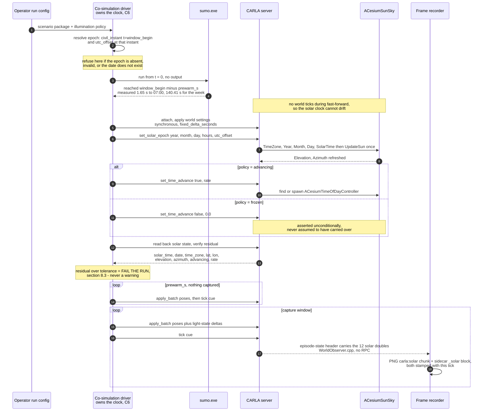
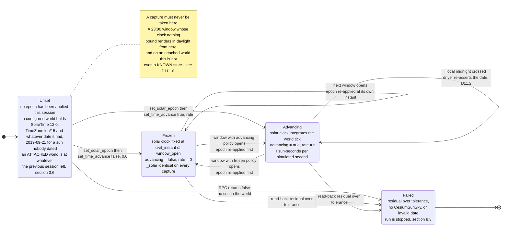
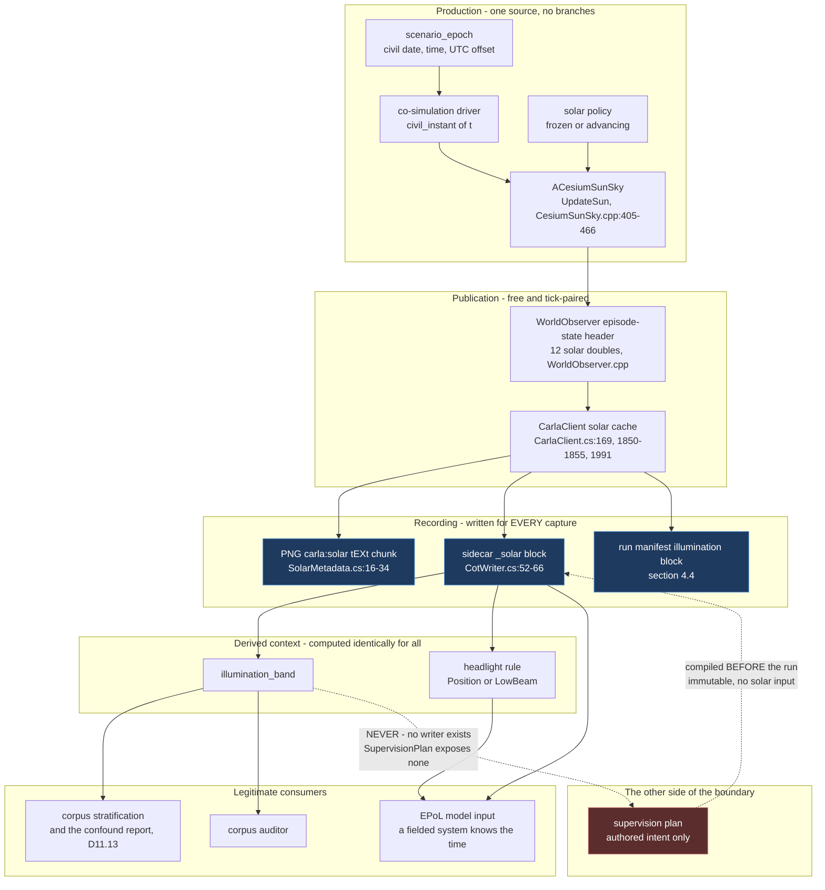

# 11 — Time and illumination

**Status:** Plan. The epoch, the per-window sun binding, the asserted policy, the per-tick solar audit
and the per-frame record are built in `CarlaNet.CoSim` and `CarlaNet.Recording`; the night work, the
lamps and the bands are not. Claims about existing behaviour are cited to `path:line`; measurements
say how they were taken; inferences are labelled.
**Scope:** The mapping from a scenario's simulated seconds to a civil date, time and zone; how the
solar clock is driven during a capture window; the freeze-versus-advance policy; what is actually
renderable at night in this fork; the mapping from SUMO vehicle signals to CARLA vehicle lights; and
the rule that illumination is a covariate and never a label.
**Audience:** Engineers building the capture path, and anyone deciding whether a night product is
possible. Assumes familiarity with the fork but not with the conversation that produced this plan.

| Date | Change |
|---|---|
| 2026-09-25 | Epoch, sun binding, asserted policy, per-tick audit and per-frame record built; engine clock decomposition measured. |

Capture windows are placed in simulated time, and the sun must be bound to them. This section owns the
epoch that maps simulated seconds to civil time, the policy governing whether the sun is frozen or
advancing, the verdict on what is renderable at each illumination regime, and the mapping from SUMO's
vehicle signals to CARLA's lamps.

---

## 0. What this section does not cover

- **The operator surface.** Flags, config files, hotkeys and the run-launch experience belong to
  [`12_Operator_Control_Surface.md`](12_Operator_Control_Surface.md). This section states the
  *parameters* that surface must expose and the *semantics* it must not change.
- **Weather.** Fog, rain, wind, cloud and wetness are a separate track,
  [`Findings/14_Weather_Resurrection.md`](../../Findings/14_Weather_Resurrection.md) and
  [issue #6](https://github.com/sbrett9/carla/issues/6). §5.4 states the one interaction that matters
  here: weather is inert in a generated world today, so illumination has exactly one driver.
- **Camera and rig design.** [`08_Collection_And_EPoL.md`](08_Collection_And_EPoL.md) owns the rig.
  §5.5 hands it one finding it needs — the exposure lever it assumed and the one that actually exists.
- **The per-tick performance budget.** [`10_Scale_And_Performance.md`](10_Scale_And_Performance.md)
  owns it. §9 states the properties to measure and hands them over rather than inventing numbers.
- **Thermal or infrared sensing.** Out of scope, as in
  [`Findings/13_Usable_Night_Lighting.md`](../../Findings/13_Usable_Night_Lighting.md) §5.
- **Lunar ephemeris.** No moon light exists to point (§5.2), so there is nothing to compute yet.

---

## 1. The four answers, up front

| Question | Answer |
|---|---|
| **What does `t = 0` mean?** | Whatever a new `scenario_epoch` block in `scenario.json` says it means: a civil date, a civil time and a UTC offset. Nothing else may assert it. A corpus-eligible run whose scenario omits the block is **refused**, because today's fallback is the *host system date* (`CarlaControl/src/carlacontrol/WorldBuilder.py:229`) and that is the failure mode this section exists to end (§2) |
| **How is the sun driven?** | One atomic `set_solar_epoch` call at window open, before the first tick, then either nothing more or the engine-side advance actor. Binding it is **mandatory, not merely correct**: a world keeps the date the previous session left, or `ACesiumSunSky`'s class-default 2019-09-21 (§3.6). The sun is read back when the window opens and compared against the declaration on every tick, and a disagreement stops the run (§8.3). Measured: with `fixed_delta_seconds = 0.05` and `rate = 1.0`, the solar clock advances **exactly one sun-second per simulated second** (§3.3) |
| **Frozen or advancing?** | **Neither is a default: the policy is declared, and a run that renders a world without one is refused.** `freeze_at_window_start` is the recommended value. Measured on the sizing scenario: one default 1,800 s window at `rate = 1.0` moves the sun through **up to 6.7° of elevation**, which is a different illumination at the window's two ends and confounds any sweep run inside it (§4). An advancing sun also meets the engine's clock-decomposition defect and is stopped by the audit until the engine is fixed (§8.3, F1) |
| **Is night viable?** | **No, not today, and not as a rendering problem that more exposure fixes.** At the 23:00 window [`10`](10_Scale_And_Performance.md) §3.1 already recommends, the sun sits at **−60.95°** — 43° past the end of astronomical twilight. There is no moon light, no artificial light of any kind in a generated world, no reachable exposure control, and the photoreal tiles carry baked daytime radiance. The renderable low-light band at this site is **26–30 minutes per twilight edge** (§5) |

---

## 2. The epoch contract

### 2.1 The gap, restated precisely

A SUMO scenario declares a span of simulated seconds and nothing else about time. The sizing
scenario's `<time>` block is `begin 0`, `end 604800`, `step-length 1.0`
(`scratchpad/sumo-bahonar/Shahid_Bahonar_Port_PatternOfLife.sumocfg`). The mapping to civil time
exists only inside trip identifiers: guard shifts depart at 25,200 / 54,000 / 82,800 s — 07:00,
15:00 and 23:00 — so `t = 0` is midnight of day 0 (measured, [`_TEAM_BRIEF.md`](_TEAM_BRIEF.md) §3a).
Nothing machine-readable states it, so nothing can set a sun from it.

Meanwhile the world's sun is configured from three places, none of which is the scenario:

| Source | What it sets | Citation |
|---|---|---|
| `ACesiumSunSky` class defaults | `SolarTime = 13.0`, `TimeZone = -5.0`, `Day = 21`, `Month = 9`, `Year = 2019`, `UseDaylightSavingTime = true` | `CesiumSunSky.h:65, 78, 91, 104, 117, 142` |
| The Cesium↔CARLA bridge, **only when it spawns the sun** | `SolarTime = 12.0`, `UseDaylightSavingTime = false`, `TimeZone = longitude / 15` | `CesiumHeightSampler.cpp:409-412`, inside `if (!bHasSunSky)` at `:402` — see §3.6 |
| `WorldBuilder.setup_solar_time` | `--time` or **12:00**; `--date` or **the host system date** | `WorldBuilder.py:214-254`, specifically `:229` and `:231-232` |

**The date defaulting to `datetime.now()` is a reproducibility defect on its own.** Two runs of the
same scenario on different days render under different seasonal sun angles, and nothing records that
the date was not chosen. Measured at the sizing site, the season is not a small effect: maximum solar
elevation is **86.29°** at the summer solstice and **39.41°** at the winter solstice (§2.5).

**Everything already captured by this pipeline is noon, on the date the run happened.**
`run_SCTMV.py:138` calls `setup_solar_time` **unconditionally** — including in `--no-build` attach
mode — and with no `--time` it forces `hours = 12.0` (`WorldBuilder.py:231-232`) on the host's
current date (`:228-230`). Two consequences the plan should carry:

- **There is no night imagery in existence to reason from.** Every shipped Cursor-on-Target dataset
  and every recorded capture is a noon capture, which is why §5's verdict has to be argued from
  mechanism rather than from a frame anyone has looked at (§5.4).
- **The seasonal sun angle in every existing capture is an artifact of when the run happened**, not
  of anything authored. That is a second, independent way today's pipeline records something the
  scenario never asserted — the same class of fault as the missing epoch, arriving by a different
  route.

The comment above that call — *"re-applied every run because the sun is respawned on each world
build"* (`run_SCTMV.py:137`) — is true only when a world was actually built. In attach mode nothing
is respawned, which is exactly the case §3.6 is about.

### 2.2 The declaration

> **D11.1 — a scenario declares its epoch as a civil instant with an explicit numeric UTC offset. The
> offset is normative; the zone name is provenance only. The epoch is the sole authority for what a
> simulated second means in civil time.**

The wire shape is the `epoch` object of [`04_Contracts.md`](04_Contracts.md) §11.3, and the session
reads it as `SolarEpoch` (`CarlaNet/src/CarlaNet.CoSim/SolarEpoch.cs`), a session input beside the
scenario:

```json
{
  "epoch_version": 1,
  "civil_datetime": "2026-03-21T00:00:00+03:30",
  "utc_offset_hours": 3.5,
  "utc_datetime": "2026-03-20T20:30:00Z",
  "calendar_advances": true,
  "dst_in_effect": false,
  "time_zone_id": "Asia/Tehran"
}
```

| Field | Req. | Meaning and rule |
|---|---|---|
| `epoch_version` | yes | `1`. Any other is refused: a time declaration is never read in part |
| `civil_datetime` | yes | The civil instant `t = 0` corresponds to, ISO-8601 with an **explicit numeric offset**. A bare local time is refused; `Z` only where the offset is zero. Must be a calendar date — §3.7 shows what an invalid one does to the engine |
| `utc_offset_hours` | yes | Signed decimal hours, a whole number of quarter hours in [−12, +14] — the range the engine's zone would otherwise clamp to silently. **Half-hour and quarter-hour offsets are first-class**: the sizing site is Iran at **+03:30**. Must equal the offset carried in `civil_datetime` |
| `utc_datetime` | yes | The same instant in UTC, equal to `civil_datetime` minus the offset to the second. Redundant by design: an offset applied in the wrong direction — a **7-hour** error at +03:30 in a scene that looks entirely plausible — is refused and named as exactly that |
| `calendar_advances` | yes | Whether the civil date advances when simulated time crosses a civil midnight (§2.3) |
| `dst_in_effect` | yes | Whether the offset already includes daylight saving, so "+02:00 standard" and "+02:00 because it is summer" read differently (§2.4) |
| `time_zone_id` | no | IANA name, carried for a reader and **never resolved**: resolving it would make a render depend on the host's time-zone database, and `zoneinfo` resolves zero zones on this machine |
| `note` | no | One sentence saying what `t = 0` is in the scenario's own terms |

A malformed epoch is refused whole at session start, naming every rule it breaks. It is named in
every record by its digest: SHA-256 of the object as Python's `json.dumps(epoch, sort_keys=True,
indent=2)` writes it, the canonicalisation the scenario compiler uses.

**Resolution.** For a simulated instant `t` seconds, `civil_instant(t) = civil_datetime + t seconds`,
at the declared offset — `SolarEpoch.CivilInstantAt`. This is one function, it lives in exactly one
place, and every consumer — the sun binding, the audit, the per-frame record — calls it. Two
implementations of it is how the corpus becomes internally contradictory a second time.

### 2.3 The calendar must advance

The advance actor carries whole days off the clock and onto the calendar: `ACesiumTimeOfDayController`
floors the advanced clock by 24 hours and rolls `Year`/`Month`/`Day` by the whole days with `FDateTime`
(`CesiumTimeOfDayController.cpp`, `RollSolarDate`). Wrapping the clock alone would return a window that
crosses local midnight to 00:00 of the *same* day — the next morning rendered under the previous day's
declination, the sidecar asserting a date a day out, and a seven-day scenario never leaving day 0, so
day-of-week could never mean anything.

> **D11.2 — `calendar_advances` is declared, and the sun's date follows one rule.** The date the sun is
> written with moves with the civil date only when the epoch's calendar advances *and* the policy is
> `advance` or a freeze declares `freeze_date_advances` — [`04`](04_Contracts.md) `C6` G11's effective
> date rule. Otherwise it stays on the epoch's own date, so a frozen week of windows keeps one seasonal
> sun geometry. The session writes the date and the clock together at window open; under `advance` the
> engine carries midnight onto the date; and the per-tick audit compares the whole instant — date and
> clock — against the declaration, so a missed or spurious rollover is a whole day out and stops the
> run. One combination is expressible and cannot run through midnight: `advance` with a held calendar,
> because the engine rolls the date regardless; the audit stops such a run at the crossing, naming the
> date.

### 2.4 Daylight saving, and why the engine's own DST is not used

`ACesiumSunSky` implements DST as a hardcoded start/end month and day with a switch hour
(`CesiumSunSky.cpp:587-602`). Three measured facts make it unusable here:

1. The bridge already disables it at spawn — `SunSky->UseDaylightSavingTime = false`
   (`CesiumHeightSampler.cpp:410`) — for determinism.
2. `DSTStartMonth`, `DSTStartDay`, `DSTEndMonth`, `DSTEndDay` and `DSTSwitchHour` are `protected` on
   `ACesiumSunSky` (declared under the `protected:` label following `CesiumSunSky.h:142`), so the
   bridge cannot set them without editing the vendored plugin.
3. The rule it implements is a single start/end date pair per year applied to every location — which
   is not how zones work, and its defaults are US-shaped.

> **D11.3 — daylight saving is carried by the declared UTC offset, never by an engine DST flag.**
> `set_solar_epoch` sets `UseDaylightSavingTime = false` every time it binds the sun, and
> `dst_in_effect` records whether the declared offset includes daylight saving. The offset is
> declared, not resolved: a zone database would make a render depend on the host's copy of it.

For the sizing scenario this is moot in the good way: **Iran abolished daylight saving in 2022**, so
`+03:30` is exact for any modern date. A US or European site declares the effective offset for its
dates — Pacific time on 21 March is −07:00 with `dst_in_effect: true` — and a span that crosses a
transition is declared as the windows either side of it, each at its own offset.

### 2.5 Choosing the date is an authoring decision, and it is not neutral

Measured with a faithful port of the engine's own solar algorithm
(`UE_5_7_4/Engine/Plugins/Runtime/SunPosition/Source/SunPosition/Private/SunPosition.cpp:11-149`,
ported to Python and run read-only) at the sizing site, origin **27.15012 N, 56.18065 E** — read from
`carla/Build/world-packages/Shahid_Bahonar_Port.cwp` `world.json` `OriginLatitude`/`OriginLongitude`
— at civil offset +03:30:

| Date | Sunrise | Sunset | Daylight | Peak elevation |
|---|---|---|---|---|
| 2026-03-21 (equinox) | 05:52 | 17:53 | 12 h 01 m | **63.20°** |
| 2026-06-21 (solstice) | 04:56 | 18:38 | 13 h 42 m | **86.29°** |
| 2026-12-21 (solstice) | 06:35 | 16:52 | 10 h 17 m | **39.41°** |

A 07:00 window is 18.4° above the horizon at the equinox and would be a materially different scene in
December. **The epoch date is a corpus-design parameter, not a formality**, and it is one of the
things a stratified corpus should deliberately vary. It is also what makes day-of-week meaningful:
at this site the weekend is Thursday–Friday, so a pattern-of-life scenario whose "day 4" is meant to
be a working day depends entirely on which weekday the epoch date is.
[`07_Scenario_Authoring.md`](07_Scenario_Authoring.md) owns how an author chooses it; this section
only requires that the choice be declared.

### 2.6 A scenario that omits the epoch

> **D11.4 — a run whose scenario declares no epoch is refused when it is corpus-eligible, and
> permitted only as an exploratory run whose manifest records `corpus_eligible: false` and
> `epoch_source: "absent"`.** Mirrors [`04`](04_Contracts.md) §5.4's refuse/warn tiering. There is no
> silent default, because the silent default that exists today is the host's wall-clock date.

Migration for the scenarios that already exist is mechanical and belongs with
[`07`](07_Scenario_Authoring.md): the sizing scenario's `t = 0` is midnight day 0 (measured), its site
is at +03:30, and the only genuinely new input is the calendar date. That single input is the open
question of §12.1.

### 2.7 What this section needs from other sections

| From | Property needed |
|---|---|
| [`04_Contracts.md`](04_Contracts.md) §5.3 | `scenario_epoch` placed in `scenario.json` with a **refuse** validation tier when it is absent and the run is corpus-eligible, and when `epoch_civil_date` is not a valid calendar date |
| [`04_Contracts.md`](04_Contracts.md) §8 (C6) | The clock owner exposes `civil_instant(t)` as a first-class query, so the solar driver never recomputes simulated time from anything but the clock |
| [`06_Truth_And_Annotation.md`](06_Truth_And_Annotation.md) §8.4 | The run manifest carries the resolved epoch verbatim plus the per-window illumination policy and residual summary of §8.4 |
| [`08_Collection_And_EPoL.md`](08_Collection_And_EPoL.md) §2.8 | Publishes the camera exposure attributes the engine already implements (`SceneCaptureSensor.h:237-369`) so a corpus-eligible run can fix exposure per window, per D11.17. Without it, auto-exposure across a dusk window hides the illumination change the sidecar records |
| [`12_Operator_Control_Surface.md`](12_Operator_Control_Surface.md) | Exposes the policy of §4.3 per run and per window; validates the combination per D11.18 rather than silently ignoring a parameter; and displays the resolved civil instant beside simulated time — never the raw `SolarTime` alone, which under the current build is a wrapped local-mean-solar number and not a civil clock |

---

## 3. How the solar clock is driven

### 3.1 The mechanism, read from the engine

The chain is complete end to end and needs using, not building.

| Layer | Surface | Citation |
|---|---|---|
| Python shim | `set_solar_time`, `set_solar_date`, `get_solar_state`, `set_time_advance` | `CarlaNet/python/carlanet/__init__.py:1500, 1506, 1512, 1535` |
| C# client | `SetSolarTimeAsync`, `SetSolarDateAsync`, `GetSolarStateAsync`, `SetTimeAdvanceAsync` | `CarlaNet/src/CarlaNet.Transport/CarlaClient.cs:1043, 1049, 1054, 1059` |
| Server RPC | `set_solar_time`, `set_solar_date`, `get_solar_state`, `set_time_advance` | `Carla/Server/CarlaServer.cpp:614, 625, 640, 661` |
| Bridge | `UCesiumHeightSampler::SetSolarTime` / `SetSolarDate` / `GetSolarState` / `SetTimeAdvance` | `CesiumCarlaBridge/Private/CesiumHeightSampler.cpp:718, 735, 753, 819` |
| Engine | `ACesiumSunSky` — **the single sun and lighting authority for the georeferenced world** | `CarlaServer.cpp:611-612`; the bridge disables every pre-existing level light to make it so, `CesiumHeightSampler.cpp:358-383` |
| Advance actor | `ACesiumTimeOfDayController`, find-or-spawned by `SetTimeAdvance` | `CesiumTimeOfDayController.cpp:14-40`, `CesiumHeightSampler.cpp:799-815` |

`ACesiumSunSky::UpdateSun_Implementation` (`CesiumSunSky.cpp:405-466`) computes elevation and azimuth
via `USunPositionFunctionLibrary::GetSunPosition` from the georeference latitude and longitude, the
`TimeZone`, the DST flag, the date and the hours/minutes/seconds decomposed from `SolarTime`, then
rotates exactly one thing: the sun directional light. **Nothing else in the scene is driven by time
of day** — no dusk tint, no artificial lights, no moon. That is the fact §5 rests on.

### 3.2 The time-zone setter

Configuring the georeference sets `TimeZone` from `EstimateTimeZoneForLongitude(OriginLongitude)`, whose
body is `this->TimeZone = FMath::Clamp(InLongitude, -180.0, 180.0) / 15.0`
(`CesiumSunSky.cpp:570-573`) — local mean solar time at the map's longitude, not the site's civil
offset. The only other writer is `set_solar_epoch` (`CarlaServer.cpp`,
`UCesiumHeightSampler::SetSolarEpoch`), which writes the declared civil offset (D11.5).

**Consequence of the longitude zone, measured.** At the sizing site, longitude 56.18065 gives
`TimeZone = 3.745377` h =
**+03:44.7**, against Iran's civil **+03:30** — a **14.72 minute** offset. So `set_solar_time(h)`
today places the sun at local *mean solar* time `h` at that longitude, not at civil time `h`, exactly
as the server's own comment says: *"`hours` is local solar time in the map-longitude time zone"*
(`CarlaServer.cpp:612-613`). Quantified at the site, on 2026-09-21:

| Declared civil time | Sun elevation at civil time | Sun elevation as `set_solar_time` renders it today | Error |
|---|---|---|---|
| 05:00 | −8.23° | −11.48° | **−3.26°** |
| 06:00 | **+5.10°** | **+1.83°** | −3.27° |
| 07:00 | +18.38° | +15.14° | −3.24° |
| 15:00 | +34.84° | +37.89° | +3.05° |
| 17:00 | +8.74° | +12.01° | +3.26° |
| 18:00 | **−4.61°** | **−1.33°** | +3.27° |
| 23:00 | −60.95° | −59.65° | +1.31° |

The mid-day rows are cosmetic. The **06:00 and 18:00 rows are not**: 14.7 minutes of civil time is
enough to move the sun from one side of the horizon to the other, and those are precisely the
instants a dusk or dawn corpus is made of. It is also a standing **3.68° error in solar hour angle**
at all hours, which reaches the imagery as an error in shadow *direction* — measured at **1.68° to
2.58° of azimuth** across the daylight hours at the sizing site. That is the kind of thing that is
never noticed and quietly poisons any shadow-based reasoning downstream.

#### 3.2.1 Two ways to close it, evaluated

There are exactly two, and they are not equivalent even though they produce the same sun.

**Conversion in the bridge, no engine change.** Keep `TimeZone = longitude / 15` and pre-convert:
`SolarTime := civil_hours − utc_offset + longitude / 15`. This is arithmetic the driver can already
do, since it knows both the origin longitude and the declared offset.

**It genuinely works, and the equivalence is exact by construction.** The engine reduces everything to
one quantity, `TrueSolarTimeMinutes = minutes_of_day + EqOfTime + 4·longitude − 60·TimeOffset`
(`SunPosition.cpp:97`). Substituting the converted clock with `TimeOffset = longitude/15` gives
`60·civil_hours − 60·utc_offset + 4·longitude + EqOfTime`, which is exactly what the civil clock with
`TimeOffset = utc_offset` gives. Verified numerically against the ported algorithm at the sizing site:
the two agree to within **0.004° of elevation** across 06:00, 07:00, 15:00, 17:00, 18:00 and 23:00,
the residue being the whole-second quantisation of the shifted clock.

So the argument against it is not correctness of the sun. It is these three:

1. **It moves the date boundary, and the sizing scenario's own window sits on it.** The converted
   clock crosses 24.0 at civil **23:45:17**, not at civil midnight, so the driver must roll `Day`
   at *local-mean-solar* midnight rather than civil midnight. Measured: civil 23:40 → 23.912 h, same
   day; civil **23:50 → 24.079 h, which must be written as day N+1** or the declination is a day out
   and the recorded date is wrong. [`10`](10_Scale_And_Performance.md)'s recommended 23:00 night
   window is 1,800 s long and closes at civil 23:30 → 23.745 h — **14 minutes and 43 seconds inside
   that boundary.** A window 15 minutes longer, or an epoch at a slightly different longitude, silently
   crosses it. Putting a second, invisible midnight into the system is not a small cost.
2. **It corrupts the record, which is the thing this section exists to protect.** `get_solar_state`
   returns `SunSky->SolarTime` and `SunSky->TimeZone` verbatim
   (`CesiumHeightSampler.cpp:775, 779`), and those go straight into the episode-state header, the
   `<_solar>` sidecar block and the `carla:solar` PNG chunk. Under the conversion the sidecar for a
   23:00 Iran capture would read `solar_time = 23.2454`, `time_zone = 3.7454` — **neither the time nor
   the offset the scenario declared.** Every consumer would then need the inverse conversion to
   recover the civil instant, and §8.3's residual would become a conversion check rather than an
   identity check. The conversion should exist in exactly one place — and putting it in the bridge
   puts it in *every reader* instead, because every reader then has to undo it.
3. **It makes the operator surface lie.** The viewer already displays `solar_time` as a clock
   (`PygameInterface.py:511-514`), and the sidecar is meant to be human-readable. A displayed
   "23:14" for a declared 23:00 is a defect report waiting to be filed.

**The atomic RPC.** Set `TimeZone` to the declared civil offset and `SolarTime` to the declared civil
clock. `TimeZone` is a `double` with `ClampMin −12 / ClampMax 14` (`CesiumSunSky.h:60-65`), so +03:30
is directly representable and the clamp is irrelevant to a value in range.

> **D11.5 — one atomic RPC, `set_solar_epoch(year, month, day, hours, utc_offset_hours)`, sets
> `TimeZone`, `Year`, `Month`, `Day` and `SolarTime`, turns the engine's DST off, and calls
> `UpdateSun()` exactly once; it refuses a date that is not a calendar date and leaves the sun
> unchanged. It is the only way the session writes the sun.**
> Chosen over the bridge-side conversion **not because the conversion is wrong — it produces the same
> sun to 0.004° — but because it is the only option under which the recorded solar state *is* the
> declared civil state.** That identity is what makes §8.3's residual a check rather than a
> conversion, keeps the date boundary at civil midnight where the epoch put it, and leaves one
> implementation of the civil↔UTC mapping instead of one per reader. It also removes a second defect
> on the way: the existing path is two RPCs each calling `UpdateSun()`
> (`CesiumHeightSampler.cpp:731, 749`), so between them the world holds the new time on the old date.
> `set_solar_time` and `set_solar_date` stay, unchanged, for the interactive viewer. A rebuild is not
> a cost ([`_TEAM_BRIEF.md`](_TEAM_BRIEF.md) §4), and here correctness of the *record* favours the
> engine.

With `TimeZone` set to the civil offset, `SolarTime` becomes the civil clock and every downstream
reader — `<_solar>`, the PNG chunk, the operator display — reads back the civil time that was
declared. **Either way, the conversion must be stated explicitly and in exactly one place**, because
a silent 14.7-minute error in shadow direction is precisely the kind of thing that never gets noticed.

### 3.3 What `rate = 1.0` means under synchronous ticking — measured from source

The docstring says the advance "tracks wall-clock in asynchronous mode and simulation time under
synchronous ticking" (`CarlaServer.cpp:663-664`, `carlanet/__init__.py:1535-1540`). Pinned down:

1. `ACesiumTimeOfDayController::Tick(float DeltaSeconds)` advances
   `DeltaHours = DeltaSeconds * Rate / 3600.0` (`CesiumTimeOfDayController.cpp:14, 34`). `DeltaSeconds`
   is the ordinary world delta for that frame.
2. Applying world settings calls `FCarlaEngine_SetFixedDeltaSeconds`, which does
   `FApp::SetBenchmarking(true)` and `FApp::SetFixedDeltaTime(FixedDeltaSeconds)`
   (`CarlaEngine.cpp:85-88`, called from `:442`). Under benchmarking the engine's frame delta **is**
   the fixed delta.
3. In synchronous mode `FCarlaEngine::OnPreTick` blocks in
   `do { Server.RunSome(1u); } while (!Server.TickCueReceived())` (`CarlaEngine.cpp:331-343`), so a
   frame — and therefore an actor tick — happens once per `world.tick()` and not otherwise.

> **Therefore: with `fixed_delta_seconds = 0.05` and `rate = 1.0`, each world tick advances the solar
> clock by exactly 0.05 sun-seconds, and twenty ticks advance it by exactly one sun-second. `rate` is
> sun-clock seconds per *simulated* second, one-to-one at 1.0, independent of wall clock and
> independent of the fixed delta.** Read from source, not from the docstring.

Two corollaries worth stating because they are the ones people get wrong:

- **`rate` is not a multiplier on the fixed delta.** Halving the fixed delta doubles the tick count
  and halves the per-tick advance; the sun moves at the same rate against simulated time.
- **No tick, no sun.** During the SUMO fast-forward of [`10`](10_Scale_And_Performance.md) D10.2 —
  `sumo.exe` running alone from `t = 0`, measured at 140.41 s of wall clock for the whole seven days —
  CARLA is not attached and the world is not ticked, so the solar clock does not move. That is
  correct and it is also why the driver must set the clock **at window open**, from the epoch, and
  never rely on it having arrived there by accumulation.

### 3.4 The window-start sequence



Three properties of that sequence are load-bearing:

- **The solar set happens after the world settings and before the first tick.** Before the settings,
  the fixed delta is not in force and an advancing policy would step at the wrong rate for one frame.
  After the first tick, a frame has already been rendered under the previous sun. The instant written
  is the civil instant of the first frame the session renders — the simulated second SUMO was
  fast-forwarded to — which, with one SUMO process per window, is the window's opening instant.
  `SolarLease` (`CarlaNet/src/CarlaNet.CoSim/SolarLease.cs`) takes it beside the world-settings and
  layer leases and gives back the sun it found on every exit path.
- **A frozen clock is declared to the whole second and written one millisecond past it.** The
  engine's clock decomposition drops a minute at 623 of the day's 1,440 whole-minute clocks (F1);
  a millisecond past the second, all 86,400 seconds decompose as declared.
- **The read-back is not optional.** `set_solar_epoch` returns `false` when the world has no
  `ACesiumSunSky` or the date is not a calendar date, and a `false` that nobody checks is how a window
  renders under the spawn default. The sun is then read back on demand — not from the observer cache,
  which predates the write — and every written field compared exactly, and the read-back is the first
  audit sample: its direction and its refraction-corrected elevation are compared against the
  declared sun before anything is rendered (§8.3).
- **The policy is asserted every window, in both branches.** `ACesiumTimeOfDayController` persists in
  the world once spawned (`CesiumHeightSampler.cpp:799-815`), so `advancing` is sticky across windows
  within a session. A window that means to freeze must say so.
- **So is the epoch, and for a stronger reason.** The sun actor persists too, and the bridge
  re-applies its defaults *only* when it spawns one (§3.6). Nothing in this sequence may be skipped
  on the grounds that the world "was just built" — D11.16.

### 3.5 Where the clock sits relative to C6

[`04`](04_Contracts.md) D4.11 makes the co-simulation driver the sole owner of the advance of
simulated time. The solar clock is a **derived view of that same clock**, not a second one:

| | Owner | Advanced by |
|---|---|---|
| Simulated time | the driver | `traci.simulationStep()` then `k` × `world.tick()` |
| Solar clock, frozen | the driver, once per window | nothing |
| Solar clock, advancing | the driver sets the origin; the engine integrates | the world tick, at `rate` sun-seconds per simulated second |

The advancing case is the only place anything other than the driver moves a clock, and it is safe
because it is *driven by* the driver's own tick. It is still worth adding to
[`04`](04_Contracts.md) §8.4's forbidden list: **no component other than the solar driver may call
`set_solar_time`, `set_solar_date`, `set_solar_epoch` or `set_time_advance` during a session.** The
interactive viewer's `K` hotkey (`CarlaControl/src/carlacontrol/PygameInterface.py:258-268, 296`) is
exactly such a component, and it must be inert while a capture session holds the world.

At runtime the rule is enforced by detection. Any other writer — `set_solar_time`, the `K` hotkey, a
second `configure_cesium_georeference` — moves the clock, the zone, the date or the advancing flag
away from the declaration, and the per-tick audit stops the run on the next tick, naming what moved
(§8.3). Refusing a second writer before it writes is not built: the RPCs are reachable from any
client, and nothing in a separate process can be stopped from calling them.

### 3.6 A loaded world inherits the previous session's sun

Configuring the georeference applies noon, DST-off and the longitude-derived zone to the sun whether
it spawns one or finds one (`CesiumHeightSampler.cpp`, the block after the level lights are disabled),
and **deliberately does not assert the date**: the date is the scenario's to declare. So a world reaches
a session holding the date the previous session left, a date somebody set by hand, or — for a sun
nobody dated — `ACesiumSunSky`'s class default, **2019-09-21**, measured in stage C on a world reaching
a session with no epoch set. Its time-of-day controller persists too, with an `advancing` flag that may
still be true.

So the illumination a capture renders under, unless the session binds it, is a function of **session
history**, which nothing records and no consumer can reconstruct. That is not a variant of the
missing-epoch problem; it is a separate one, and it
survives even a scenario that declares its epoch perfectly — if the driver assumes the world arrived
in a known state.

> **D11.16 — the session binds the full solar state at every window open, unconditionally, and never
> reads the world's existing state as a starting point.** Date, time, zone, advancing flag and rate
> are all written, under every policy that binds the sun, whether or not the world was just built. The
> read-back of §3.4 verifies what was written took, and the sun as found is kept on the run report —
> it is what session history would otherwise have lit the capture with — and restored when the session
> ends. This is what makes a capture's illumination a function of the scenario alone rather than of
> what ran before it.

The same guard is why [`04`](04_Contracts.md) §8.4 should carry D11.15's exclusivity rule: a viewer
that toggled the sun with `K` before the session started has left the world in a state the session
would otherwise inherit.

### 3.7 An invalid date produces a sentinel, not an error

`USunPositionFunctionLibrary::GetSunPosition` validates the date and **returns early leaving its
output struct at its constructed defaults** when it fails (`SunPosition.cpp:17-21`; the struct is
constructed with `Elevation(0.0f), CorrectedElevation(0.0f), Azimuth(0.0f)` at `:215-221`).
`ACesiumSunSky` then computes `Elevation = sunPosition.Elevation - 180.0f` (`CesiumSunSky.cpp:436`).

> **Measured consequence: an invalid date — 31 February, say, which `SetSolarDate` will happily clamp
> its way to via `FMath::Clamp(Day, 1, 31)` (`CesiumHeightSampler.cpp:746`) — yields
> `sun_elevation_deg = −180.0` and `sun_azimuth_deg = 0.0`, with only a log line to say so.**

**−180° is a value no real sun takes**, so the audit of §8.3 would catch it on the first tick, but it
does not get that far: `SolarEpoch` refuses a date the calendar does not have when the epoch is
declared, and `set_solar_epoch` validates the date with `FDateTime::Validate` and refuses it, leaving
the sun unchanged — measured in stage C for 31 February and month 13. `set_solar_date` still clamps,
and is not on the session's path (§10, F4).

---

## 4. Freeze versus advance

### 4.1 The trade, with the number

Both policies are legitimate and the choice belongs to the run, not to the code
([`_TEAM_BRIEF.md`](_TEAM_BRIEF.md) §3a.2). The reason both are wanted:

- **A sweep that varies behaviour must hold illumination constant**, or illumination confounds the
  comparison. If run A and run B differ in the behaviour being captured *and* in the sun angle, the
  difference in detector performance is unattributable.
- **A long window wants the light to move**, because a corpus that only ever shows static light
  teaches nothing about a changing one, and a dusk transition is exactly the hard case an EO detector
  must survive.

Measured at the sizing site on 2026-09-21, across one default window of 1,800 simulated seconds
([`10`](10_Scale_And_Performance.md) D10.3) at `rate = 1.0`:

| Window | Elevation at open | Elevation at close | Δ elevation | Δ azimuth |
|---|---|---|---|---|
| 06:00–06:30 | +5.10° | +11.76° | **+6.66°** | +3.50° |
| 07:00–07:30 | +18.38° | +24.93° | **+6.55°** | +3.94° |
| 09:00–09:30 | +43.68° | +49.35° | +5.67° | +7.15° |
| 12:00–12:30 | +62.93° | +60.68° | −2.26° | +15.19° |
| 15:00–15:30 | +34.84° | +28.48° | −6.36° | +4.68° |
| 17:00–17:30 | +8.74° | +2.07° | **−6.67°** | +3.44° |
| 18:00–18:30 | −4.61° | −11.26° | −6.66° | +3.50° |

**Up to 6.7° of elevation inside one default window.** Near the horizon that is roughly a 30% change
in cosine-weighted surface irradiance and a visibly different shadow length across the same window —
which is to say, the first and last frames of an "advancing" window are not samples of the same
illumination condition.

### 4.2 The default

> **D11.6 — the illumination policy is declared, never defaulted, and `freeze_at_window_start` is the
> recommended value.** A session that renders a world and declares no policy is refused at start,
> because a frozen run and an unconfigured run write identical records and absence would be
> indistinguishable from intent ([`00`](00_Overview.md) §6). The four policies are
> [`04`](04_Contracts.md) `C9` §11.6's. The reasons freezing at the window's opening instant is the one
> to recommend, in order: (1) the plan's capture unit is a window placed on an authored event
> ([`10`](10_Scale_And_Performance.md) D10.3), and a window is meant to be one condition; (2) the
> measured 6.7° of drift across a default window is large enough to confound a sweep and is not
> something a consumer can undo; (3) frozen is the policy under which two runs of the same scenario
> differ in nothing but what the scenario changed, which is [`04`](04_Contracts.md) G7's
> determinism guarantee extended to lighting; (4) an advancing window can always be reproduced as a
> series of frozen windows, whereas a frozen condition cannot be recovered from an advancing capture.

`advance` is a first-class choice, and is the right one for a deliberate dawn/dusk-transition
product. It is not the recommended one because the recommendation should be the one that does not
silently invalidate a comparison — and, until the engine's clock decomposition is fixed, an advancing
sun is rendered a minute early for part of every minute and the audit stops it (F1).

**A note on "frozen" being exactly frozen.** Under `frozen`, `set_time_advance(false, 0.0)` is
asserted and `ACesiumTimeOfDayController::Tick` early-returns on `!bAdvancing`
(`CesiumTimeOfDayController.cpp:17-20`). Nothing else writes `SolarTime`. So the sun is bit-identical
across every frame of the window, and `_solar` is constant — which makes the per-capture residual of
§8.3 a genuinely free check under the default policy.

### 4.3 Policy states



`Unset` is not a hypothetical: it is the state every generated world starts in, and it is precisely
where a night window silently renders in daylight. The driver's job is to make it impossible to
capture from it — which is what the read-back in §3.4 step 14 enforces.

### 4.4 What the manifest records

Per window, in the run manifest ([`06`](06_Truth_And_Annotation.md) §8.4 owns the file):

```jsonc
"illumination": {
  "epoch": { /* the resolved scenario_epoch, verbatim */ },
  "epoch_digest": "epoch@4f19c2",
  "windows": [{
    "window_index": 0,
    "window_s": [25200, 27000],
    "declared_open_civil":  "2026-03-21T07:00:00+03:30",
    "declared_close_civil": "2026-03-21T07:30:00+03:30",
    "solar_policy": "freeze_at_window_start",
    "solar_rate": 0.0,
    "sun_elevation_open_deg": 18.379, "sun_azimuth_open_deg": 99.01,
    "sun_elevation_close_deg": 18.379, "sun_azimuth_close_deg": 99.01,
    "illumination_band": "day",
    "vehicle_lights": "sumo_signals",
    "headlights_driven": false,
    "solar_residual_max_deg": 0.004,
    "solar_residual_over_tolerance_captures": 0
  }]
}
```

#### 4.4.1 The policy parameters validate each other

Today `--time-rate` is read only inside `if args.time_advance:` (`WorldBuilder.py:246-247`), so
`--time-rate 3600` on its own is a **silent no-op** — the operator asks for an hour of sun per second
and gets a frozen sun, with no message. That is the same failure shape as everything else in this
section: a stated intent that nothing honours and nothing reports.

> **D11.18 — the illumination policy is validated as a whole at run start, and an incoherent
> combination is refused rather than partially applied.** Specifically: `solar_rate` present with
> `solar_policy = "frozen"` is a **refusal**, not a no-op; `solar_policy = "advancing"` with
> `solar_rate = 0` is a refusal; a `solar_rate` other than 1.0 in a corpus-eligible run is a refusal
> (§12.4); `headlight_on_below_deg` not strictly below `headlight_off_above_deg` is a refusal;
> and `vehicle_lights = "off"` together with `headlights_driven = true` is a refusal. Each of these
> is a case where the operator asked for two things that cannot both be true, and the correct answer
> is to say so before the run costs anything.

`IlluminationPolicy.FromJson` enforces the policy half at session start: a rate beside a freeze, an
`advance` without a positive rate, a `freeze_at` without its time, any field belonging to another
policy, and any field it does not read are refused, each by name. The contract's audit-tolerance
overrides are refused too, because the bound [`04`](04_Contracts.md) `C9` places on them has not been
valued and an unbounded override is an off switch. The corpus-eligibility rule for a non-unit rate and
the headlight thresholds belong with the corpus and the lamps, which are not built.

`illumination_band` is a derived, coarse stratification key computed from the sun elevation by one
shared function — `day` above +6°, `golden` +6° to 0°, `civil_twilight` 0° to −6°,
`nautical_twilight` −6° to −12°, `astronomical_twilight` −12° to −18°, `night` below −18°. It exists
so a corpus can be stratified without every consumer re-deriving a threshold, and §7 governs what it
may and may not be used for.

---

## 5. Night

This is the hard part, and the honest answer is a finding rather than a failure.

### 5.1 The verdict

> **D11.7 — night capture is not viable in this fork today, and no capture window whose sun elevation
> is below −6° may be declared corpus-eligible.** The limit is not exposure or tone mapping; it is
> that at those instants the scene contains **no light source at all** and the only surfaces that
> would be visible carry baked daytime radiance. The renderable low-light product available today is
> the **twilight band**, measured at **26–30 minutes per edge** at the sizing site.

[`08_Collection_And_EPoL.md`](08_Collection_And_EPoL.md) needs this: it means an EO corpus from this
pipeline cannot presently validate a detector's night performance, and any claim that it does is
false. It also means [`10`](10_Scale_And_Performance.md) §3.1's 23:00 night-shift window is a
*behavioural* capture opportunity that cannot be an *imagery* one until §5.6 is built.

### 5.2 What is in the scene when the sun is down

Read from source, in the order it matters.

**There is one light, and it is the sun.** `ACesiumSunSky`'s constructor creates exactly one
`UDirectionalLightComponent` at 111,000 lux, one `USkyLightComponent` with
`bRealTimeCapture = true` and `bLowerHemisphereIsBlack = false`, and one `USkyAtmosphereComponent`
(`CesiumSunSky.cpp:46-110`, intensity at `:60`, sky light at `:81-90`). There is **no second
directional light and no moon**. The header exposes `SolarTime`, `TimeZone`, the date and DST as the
entire time-of-day surface — no moon, no night intensity, no ambient floor
(`CesiumSunSky.h:60-142`). `UpdateSun` rotates the sun and nothing else
(`CesiumSunSky.cpp:405-466`). Carried forward from
[`Findings/13`](../../Findings/13_Usable_Night_Lighting.md) §2 and re-verified here.

**Every other light in the level is switched off on purpose.** The bridge iterates
`ADirectionalLight` and `ASkyLight` and sets their light components invisible so that CesiumSunSky is
the sole authority (`CesiumHeightSampler.cpp:358-383`). This is correct — two suns is worse — but it
means the fallback illumination the level template shipped with is gone.

**There are no street lights, and there is no path to any.** `UCarlaLight` and
`UCarlaLightSubsystem` exist in the engine
(`Carla/Lights/CarlaLight.cpp`, `CarlaLightSubsystem.h`) and the server binds
`query_lights_state` / `update_lights_state` (`CarlaServer.cpp:3217, 3229`), but:

- there is **no client binding** for either RPC in `CarlaNet.Transport/CarlaClient.cs` and no
  `LightManager` in the shim (searched `carlanet/__init__.py` for `get_lightmanager`,
  `LightManager`, `get_all_lights` — no hits); and
- a **generated** world contains no `UCarlaLight` to control. Its content is the `OpenDriveMap`
  template — whose actors are `OpenDriveGenerator_2`, `PlayerStart_1`, `DirectionalLight_1`,
  `SkyLight_1`, `LevelScriptActor` only
  ([`Findings/14`](../../Findings/14_Weather_Resurrection.md) §1, byte-read of
  `Content/Carla/Maps/OpenDriveMap.umap`) — plus a photoreal Cesium tileset, the generated road mesh
  and the generated signal actors. None of those carries a light.

**The photoreal tiles cannot be relit.** Asset 2275207 is unlit photogrammetry whose textures already
encode the aerial capture's sun-lit albedo, cast shadows and ambient occlusion from a daytime pass
([`Findings/13`](../../Findings/13_Usable_Night_Lighting.md) §4). Any light added at night is
*additive on top of* baked daylight: roofs lit by the capture's midday sun still look sunlit, and the
hard shadows baked into the pavement still point the capture sun's way. There is no per-texel
un-shadow operation. This is a hard ceiling on realism, independent of how much lighting is added.

**Weather cannot help.** The generated world has no `AWeather` actor
([`Findings/14`](../../Findings/14_Weather_Resurrection.md) §1), so every `set_weather` call fails
with "weather is disabled". `BP_Carla_Sky` does own a `DirectionalLightComponentMoon`
(`Carla/Weather/Sky.h:38`) — but resurrecting it as-is would place a second sun, a second sky
atmosphere and a second sky light against Cesium's, which
[`Findings/14`](../../Findings/14_Weather_Resurrection.md) §3 explicitly rejects.

### 5.3 How dark, measured

At the sizing site, at the windows the plan already recommends:

| Declared civil time | Sun elevation | Band |
|---|---|---|
| 07:00 | **+18.38°** | day |
| 15:00 | **+34.84°** | day |
| **23:00** | **−60.95°** | **night — 43° past the end of astronomical twilight** |
| **03:00** — doc 20's class-4 pattern, *a heavy goods vehicle in a residential area at 03:00* | **−34.17°** | **night — 16° past astronomical twilight** |

Both night instants are far below the −18° at which even indirect atmospheric scattering has ceased.
There is no residual sky light to recover; the physically-based answer to "no light source above the
horizon and no artificial light" is darkness, and that is what the model correctly produces.

The usable low-light band, measured at 0.5-second resolution across three dates:

| Date | Civil twilight, morning | Civil twilight, evening | Nautical, morning | Nautical, evening |
|---|---|---|---|---|
| 2026-03-21 | 05:25–05:52 (26 min) | 17:53–18:20 (26 min) | 04:58–05:25 (27 min) | 18:20–18:47 (26 min) |
| 2026-06-21 | 04:25–04:55 (30 min) | 18:39–19:09 (30 min) | 03:54–04:24 (31 min) | 19:09–19:41 (32 min) |
| 2026-12-21 | 06:05–06:35 (30 min) | 16:52–17:22 (29 min) | 05:36–06:05 (29 min) | 17:22–17:50 (28 min) |

At a site this close to the tropics the twilight edges are short: roughly **one hour per day** across
both edges in the civil band. That is enough for two default 1,800 s windows a day, and it is the
whole of the low-light product available without new engine work.

### 5.4 What has *not* been measured, and why the verdict stands anyway

**Honesty ledger.** Nobody in this fork has captured a frame at a negative sun elevation and reported
its pixel histogram. [`Findings/13`](../../Findings/13_Usable_Night_Lighting.md) §1's "the scene goes
near-black" is a source-grounded prediction, not a measurement, and this section carries it forward as
such. Nor is there anything to look back at: **every capture this pipeline has ever made is noon**,
because `run_SCTMV.py:138` calls `setup_solar_time` unconditionally and the no-`--time` default is
12:00 (`WorldBuilder.py:231-232`) — §2.1.

The verdict does not depend on that measurement, because the *mechanism* facts settle it: with no
moon, no artificial light, no relightable surfaces and no reachable exposure control, whatever is
visible in a −61° frame is **not night-correct** — it is baked daylight at a low gain. A frame that
is merely dark is not a night frame, and a corpus of them would teach a detector the wrong thing
more effectively than no corpus at all.

The measurement is still worth taking, because it bounds what a twilight product looks like at its
dim end and it is cheap. It is handed to [`10`](10_Scale_And_Performance.md) as measurement **M-SOL-1**
in §9.

### 5.5 The exposure lever exists in the engine and is not published to clients

[`Findings/13`](../../Findings/13_Usable_Night_Lighting.md) §2 names a fixed camera exposure as "the
only night-relevant lever that exists today", via the `exposure_compensation` camera attribute. That
is stale, and [`08`](08_Collection_And_EPoL.md) §2.8 is right:

- `MakeCameraDefinition` offers `fov`, `image_size_x`, `image_size_y`, the six `lens_*` parameters,
  `enable_postprocess_effects` and `post_process_profile` — and **no exposure attribute of any kind**
  (`Carla/Actor/ActorBlueprintFunctionLibrary.cpp:313-410`).
- `SetCamera` applies image size, FOV, the post-process enable and the profile name, and nothing else
  (`:1359-1382`).
- So `SensorRig`'s `--ev` sits behind `if args.ev is not None and bp.has_attribute("exposure_compensation")`
  (`CarlaControl/src/carlacontrol/SensorRig.py:66-67`) and is **inert**.

**This is an omitted publication, not a missing capability.** The full API is declared on the sensor —
`SetExposureMethod` (`Carla/Sensor/SceneCaptureSensor.h:237`), `GetExposureMethod` (`:240`),
`SetExposureCompensation` (`:255`), `SetExposureMinBrightness` (`:351`), `SetExposureMaxBrightness`
(`:357`), `SetExposureSpeedDown` (`:363`), `SetExposureSpeedUp` (`:369`) — implemented at
`SceneCaptureSensor.cpp:108-399`, with the corresponding `bOverride_*` bits already set in
`SetCameraDefaultOverrides` (`:1057-1090`). Nothing is broken; the attributes simply are not declared
in `MakeCameraDefinition`, so no client can reach them. Restoring them is small and belongs to
[`08`](08_Collection_And_EPoL.md), which owns the rig.

**What it means for whether night is renderable, which is this section's part of it.** Because the
attributes are unreachable, the cameras run on whatever `FPostProcessSettings` defaults the
`bOverride_AutoExposureMethod` bit locks in — that is, **uncontrolled auto-exposure**, adapting to
scene content, with no client able to pin it. Two consequences:

- **Auto-exposure across a dusk window compensates away the very thing the corpus is recording.** The
  sun drops 6.7° across a default window (§4.1); a camera that brightens to match reports a scene of
  roughly constant apparent brightness, so the imagery no longer carries the illumination change that
  `_solar` faithfully records. The sidecar and the pixels would then disagree about what happened —
  a quieter version of exactly the fault this section exists to prevent.
- **It also means "the night frame is not black" would not be evidence that night works.** If
  M-SOL-1 (§9.2) returns a legible frame at −61°, the first hypothesis must be auto-exposure lifting
  the gain on a scene with nothing correct in it, not that there is usable light. The measurement
  must therefore be taken with the exposure state recorded, or it cannot be interpreted.

> **D11.17 — a corpus-eligible run fixes camera exposure per window and records it; histogram
> auto-exposure is not permitted.** Deterministic exposure is the only form under which two captures
> are comparable, under which a sweep isolates what it means to isolate, and under which an
> illumination covariate means anything. This needs N2 of §5.6 — publishing the exposure attributes —
> which is therefore a prerequisite of the **daylight** corpus and not only of a night one.
> Auto-exposure remains right for the interactive viewer, where reproducibility is not the point.

### 5.6 What night would take, if it is wanted

Stated as a sequence of independently useful steps, not a schedule. Each is a real deliverable;
together they are what turns D11.7 from "no" into "yes".

| Step | What it adds | Where it lives | What it does not fix |
|---|---|---|---|
| **N1 — moon key light** | A second, low-intensity, cool directional light on `ACesiumSunSky`, driven in `UpdateSun`, giving modelled vehicles and real cast shadows. The `ASkyBase` pattern (`Carla/Weather/Sky.h:38`) shows it is idiomatic | `CesiumSunSky` C++ | Nothing about the tiles |
| **N2 — camera exposure attributes** | `exposure_compensation`, `exposure_mode` and the auto-exposure bounds as spawnable attributes, re-enabling `--ev` and making a per-window deterministic EV possible. **A prerequisite of the daylight corpus too, per D11.17** — the engine API is already complete at `SceneCaptureSensor.h:237-369`, so this is publication, not implementation | `ActorBlueprintFunctionLibrary` + [`08`](08_Collection_And_EPoL.md) | Adds no light; only makes existing light readable, and stops auto-exposure hiding the illumination the corpus is recording |
| **N3 — sky-light night floor** | A small below-horizon `SkyLight` floor so the scene never crushes to zero. `bLowerHemisphereIsBlack = false` already (`CesiumSunSky.cpp:86`), so the knob is natural | `CesiumSunSky` C++ | Reads as flat moonless overcast on its own |
| **N4 — artificial city light from OSM** | `highway=street_lamp` nodes as point/spot lights and building footprints as emissive facades, spawned as separate actors. **This is what actually sells a city at night**, and it is the only night light that is genuinely *correct* rather than additive-on-baked-daylight | OSM ingestion + engine actor spawn + content | The tile surfaces between the pools stay day-baked |
| **N5 — vehicle headlights** | Already reachable: §6. Contributes forward pools on the road, not overhead signature | The bridge, no new engine work | Negligible at altitude, §6.4 |

Two things that are **not** on this list and should not be attempted: resurrecting `BP_Carla_Sky`
intact (a second sun —
[`Findings/14`](../../Findings/14_Weather_Resurrection.md) §3 option 3, rejected), and relighting the
photoreal tiles (not possible from a single baked capture —
[`Findings/13`](../../Findings/13_Usable_Night_Lighting.md) §4).

Note that even with all five, the honest description of the product remains **"low-key dusk over a
day-captured city"**, not a physically faithful night — because N4's light pools are correct and
everything between them is not. Any night EO deliverable must carry that limitation on its face.

### 5.7 What this means for the plan, concretely

1. **The 23:00 window survives as a behavioural capture and dies as an imagery capture.** SUMO's
   night-shift traffic, the truth record, the CoT feed and the supervision manifest are all
   unaffected by darkness — they are geometry and annotation, not pixels. What cannot be produced is
   *imagery* of it. [`10`](10_Scale_And_Performance.md)'s recommended plan of "one window on each
   daily peak and one overnight" should be re-read as: the overnight window is behavioural-only until
   N1–N4 land.
2. **Doc 20's pattern class 4 is unrenderable as written.** *A heavy goods vehicle in a residential
   area at 03:00* is a pattern defined by time of day, at −34.17° of sun elevation. Either the class
   is re-sited into the twilight band for imagery purposes — which changes the pattern — or it stays
   behavioural-only. **This needs the user** (§12.2).
3. **The illumination axis of a stratified corpus is, today, elevation from +86° down to about −6°.**
   That is a wide and genuinely useful range: it includes high sun, low sun, long shadows and the
   golden and civil-twilight bands, which between them cover most of what changes an EO detector's
   behaviour short of darkness. It is not the whole range, and the manifest must say so.

---

## 6. Vehicle lights

### 6.1 What SUMO produces

`MSVehicle::Signalling` is a bitmask (`Build/sumo-src/src/microsim/MSVehicle.h:1108-1139`). Which bits
SUMO actually sets, read from the source and then measured:

| Bit | Value | Set by | Where |
|---|---|---|---|
| `VEH_SIGNAL_BLINKER_RIGHT` | 1 | lane-change intent, upcoming link direction, parking-stop signal | `MSVehicle.cpp:6802-6861`; `MSAbstractLaneChangeModel.cpp:317-318` |
| `VEH_SIGNAL_BLINKER_LEFT` | 2 | same | same |
| `VEH_SIGNAL_BLINKER_EMERGENCY` | 4 | **never** — SUMO signals hazards as `LEFT\|RIGHT`, `MSVehicle.cpp:6850` | — |
| `VEH_SIGNAL_BRAKELIGHT` | 8 | deceleration beyond a pseudo-friction threshold, or halting speed | `MSVehicle.cpp:4244-4259` |
| `VEH_SIGNAL_FRONTLIGHT` | 16 | **never** | — |
| `VEH_SIGNAL_FOGLIGHT` | 32 | **never** | — |
| `VEH_SIGNAL_HIGHBEAM` | 64 | **never** | — |
| `VEH_SIGNAL_BACKDRIVE` | 128 | **never** | — |
| `VEH_SIGNAL_WIPER`, `DOOR_OPEN_*` | 256, 512, 1024 | **never** | — |
| `VEH_SIGNAL_EMERGENCY_BLUE` | 2048 | toggled once per 1,000 ms, **only for `vClass="emergency"`** | `MSVehicle.cpp:4800-4803, 6863-6875` |
| `VEH_SIGNAL_EMERGENCY_RED`, `_YELLOW` | 4096, 8192 | **never** | — |

The "never" rows are a measurement, not an omission: grepping the whole SUMO source tree for
`VEH_SIGNAL_FRONTLIGHT`, `VEH_SIGNAL_HIGHBEAM`, `VEH_SIGNAL_FOGLIGHT` and `VEH_SIGNAL_BACKDRIVE`
outside the enum declaration returns **zero hits**. Their own declarations say so: *"The front lights
are on (no visualisation)"*.

**Measured distribution.** Method: SUMO 1.27.0 from `Build/sumo-src/bin/sumo.exe`, the Bahonar
sizing scenario, run from `t = 0` to `t = 25,800` with `--fcd-output.signals` and
`--device.fcd.begin 25500`, giving 300 consecutive 1-second steps starting at 25,500 s — the 07:00
window plus its 300 s prewarm. Read-only; nothing in the tree was modified. Mean population over the
measured steps 81.6, peak 93.

| Signal mask | Vehicle-steps | Share | Meaning |
|---|---|---|---|
| 0 | 20,892 | **85.36%** | nothing lit |
| 8 | 2,368 | 9.68% | brake |
| 2 | 505 | 2.06% | left blinker |
| 1 | 437 | 1.79% | right blinker |
| 10 | 176 | 0.72% | left blinker + brake |
| 9 | 82 | 0.34% | right blinker + brake |
| 11 | 11 | 0.04% | hazards + brake |
| 3 | 3 | 0.01% | hazards |

No other mask occurred — confirming the source reading exactly. Neither `authority` nor `army`, the
sizing scenario's two non-civilian classes, is `vClass="emergency"` (read from
`Shahid_Bahonar_Port_PatternOfLife.rou.xml`), so the emergency-blue path never fires there.

### 6.2 The mapping

CARLA's flags are `None 0, Position 0x1, LowBeam 0x2, HighBeam 0x4, Brake 0x8, RightBlinker 0x10,
LeftBlinker 0x20, Reverse 0x40, Fog 0x80, Interior 0x100, Special1 0x200, Special2 0x400`
(`CarlaNet/src/CarlaNet.Types/Rpc/Lighting/VehicleLightState.cs:6-11`, mirrored in the shim at
`carlanet/__init__.py:2659-2676`).

> **D11.8 — the SUMO-to-CARLA light mapping is pure and total: it is a function of the SUMO signal
> mask and the recorded sun elevation, and of nothing else.**

| SUMO bit | CARLA flags | Note |
|---|---|---|
| `BLINKER_RIGHT` (1) | `RightBlinker` (0x10) | |
| `BLINKER_LEFT` (2) | `LeftBlinker` (0x20) | |
| `BLINKER_EMERGENCY` (4) | `LeftBlinker \| RightBlinker` (0x30) | mapped for completeness; SUMO uses mask 3 instead |
| `BRAKELIGHT` (8) | `Brake` (0x8) | |
| `BACKDRIVE` (128) | `Reverse` (0x40) | mapped; never produced |
| `EMERGENCY_BLUE` (2048) | `Special1` (0x200) | see §6.5 |
| `EMERGENCY_RED` (4096) | `Special1` (0x200) | mapped; never produced |
| `EMERGENCY_YELLOW` (8192) | `Special2` (0x400) | mapped; never produced |
| `FRONTLIGHT`, `FOGLIGHT`, `HIGHBEAM` | **not mapped** | never produced by SUMO; §6.3 supplies headlights instead |
| `WIPER`, `DOOR_OPEN_LEFT`, `DOOR_OPEN_RIGHT` | **not mapped** | no CARLA equivalent; dropped, and the drop is recorded once per run, not per vehicle |
| — | `HighBeam`, `Fog`, `Interior` | **never set.** Asserting them would be fabricating a driver decision the scenario never made — §7's rule applied to lights |

Hazards fall out of the bitwise mapping: mask 3 becomes `LeftBlinker | RightBlinker`, which is what a
hazard display is.

**Blinkers do not blink.** `VehicleLightStateFlags` carries steady on/off state, and SUMO's `signals`
is likewise a steady intent flag with no phase. Whether the vehicle Blueprint animates a blink is
content behaviour nobody here controls. A blinking light sampled at 2 Hz aliases regardless, so the
truth record's statement is *"the left indicator was asserted"*, never *"the lamp was illuminated in
this frame"*. A consumer must read it that way.

### 6.3 Headlights come from the sun, because nothing else can supply them

> **D11.9 — headlights are driven from the recorded sun elevation, with hysteresis, and the rule is
> declared per run.** `Position | LowBeam` is asserted when `sun_elevation_deg` falls below
> `headlight_on_below_deg` and cleared when it rises above `headlight_off_above_deg`. Defaults
> **+3.0°** and **+6.0°**.

Justification for the numbers: at the sizing site the sun crosses that 3° hysteresis band in about
14 minutes of civil time (measured: 0.220–0.222°/minute near the horizon, §6.6), so **at most one
transition occurs inside a default 1,800 s window** and there is no chattering. The `on` threshold
sits slightly above the horizon because that is when drivers actually switch on, rather than at the
astronomical instant of sunset.

Three properties this rule must have, and they are the reason it is stated as a rule rather than left
to a heuristic:

1. **It is computed from the recorded value**, `_solar.sun_elevation_deg`, not from a parallel
   calculation. One source of truth for the sun means the lights in the imagery and the sun in the
   sidecar cannot disagree.
2. **Under `solar_policy = frozen` it is constant for the whole window**, so it is evaluated once at
   window open and never again — zero per-tick cost, and no possibility of a mid-window flip that
   nothing recorded.
3. **It applies to every vehicle identically.** It carries no per-vehicle information, so it cannot
   become a label (§7). A vehicle whose lights differ from its neighbours' does so only because SUMO
   said its brakes or indicators were on.

`headlights_driven` is recorded per window (§4.4) so a consumer knows whether the headlight state in
a frame is a real signal or a constant.

### 6.4 Whether it is worth doing at all

For an EO capture at altitude, honestly:

- A brake lamp is rear-facing and emissive. At the measured ~1.1 km with a 90° camera a vehicle is
  about **3 px** long ([`Findings/09`](../../Findings/09_Telemetry_CoT_Contract.md) §5.1), so a brake
  lamp is a sub-pixel emitter contributing a fraction of one pixel's value. **Inference**, from the
  measured apparent size — not measured directly.
- A headlight is a forward-pointing spot. From overhead the sensor sees the *pool on the road ahead*,
  not the lamp. That pool is a real, sizeable feature at low altitude or oblique look angles, and
  nearly nothing at high nadir.
- At oblique or ground-level look angles — which [`00`](00_Overview.md) §2 notes is the regime doc 23's
  physics-driven actuation was written for — lights matter a great deal more.

> **D11.10 — the SUMO-signal mapping is on by default (`vehicle_lights = "sumo_signals"`), and
> headlight driving is on by default, because the cost is measured at effectively zero (§6.6) and the
> alternative is imagery that is knowably wrong about something the simulation actually knows.**
> `vehicle_lights = "off"` remains available as a control condition for a sweep that wants to isolate
> the effect, which is a legitimate experiment.

### 6.5 The emergency-blue aliasing trap

`setEmergencyBlueLight` toggles the bit on `currentTime % 1000 == 0` (`MSVehicle.cpp:6863-6875`) —
that is, once per 1,000 ms. At the authored `step-length` of 1.0 s, **it toggles on every single
step**, giving a 0.5 Hz square wave sampled at the SUMO step rate. Against a 2 Hz capture that is a
clean 4:1 ratio and every capture falls on the same phase, so an emergency vehicle's beacon would
appear *permanently on* or *permanently off* depending only on the window's parity.

No vehicle in the sizing scenario is `vClass="emergency"`, so this is latent rather than live. It is
recorded here because the first scenario that adds an ambulance will hit it, and the mitigation —
record `Special1` as "beacon asserted" and never as "beacon illuminated in this frame", exactly as
§6.2 does for blinkers — costs nothing to adopt now.

### 6.6 Cost — it rides the existing batch

`SetVehicleLightState` is one of the 22 `apply_batch` command types, dispatched in the same
`std::visit` visitor as `ApplyTransform`:

```cpp
[=](auto, const C::SetVehicleLightState &c) { MAKE_RESULT(set_vehicle_light_state(c.actor, c.light_state)); },
```
`Carla/Server/CarlaServer.cpp:3187`, in the visitor at `:3145-3195`, bound at `:3199`. The shim
wrapper is `command.SetVehicleLightState` (`carlanet/__init__.py:1141-1147`), imported at `:487`.

> **It is free of round trips.** [`10`](10_Scale_And_Performance.md) §4.4 establishes exactly two RPC
> round trips per step — one `apply_batch`, one tick cue — independent of vehicle count. Light
> commands go in the batch that already carries the poses. **No second batch, no extra round trip.**

What it does add is batch entries and game-thread visitor dispatches. Bounded by measurement:

| Quantity | Measured | Source |
|---|---|---|
| Signal-state changes per SUMO step | **mean 16.73, median 17, max 74** over 300 steps at mean population 81.6 | §6.1's FCD run |
| As a fraction of the live population | **20.5% per step** | same |
| Scaled to `render_cap` = 128 | ≈ **26 commands** on the first world sub-step of each SUMO step, **0** on the other 19 | derived from the fraction and [`10`](10_Scale_And_Performance.md) D10.4 |

And the server-side work per command is already minimal: `ACarlaWheeledVehicle::SetVehicleLightState`
compares all eleven fields and **returns without doing anything when nothing changed**
(`Carla/Vehicle/CarlaWheeledVehicle.cpp:684-700`), firing the `RefreshLightState` Blueprint event only
on a real change.

> **D11.11 — the bridge sends a `SetVehicleLightState` command only when a rendered vehicle's mapped
> flag word differs from the last word sent for it, and only on the first world sub-step of a SUMO
> step.** The signal value arrives on the existing TraCI subscription — `VAR_SIGNALS = 0x5b`
> (`libsumo/TraCIConstants.h:1075`), handled in the subscription dispatcher at
> `libsumo/Vehicle.cpp:2932-2933`, and carried into the reference client the C# one is ported from as
> `VAR_SIGNALS = 0x5b` (`Build/sumo-install/tools/traci/constants.py:1056`) with the direct getter at
> `_vehicle.py:515`. Adding it to the subscription variable list is free; a per-vehicle getter
> would not be, and [`10`](10_Scale_And_Performance.md) D10.6 forbids it.

### 6.7 One content dependency, measured and open

`RefreshLightState` is a `UFUNCTION(BlueprintImplementableEvent)`
(`Carla/Vehicle/CarlaWheeledVehicle.h:309-310`) — there is no C++ implementation, so whether a flag
becomes a visible light is entirely a property of the vehicle Blueprint.

Measured by byte-grep of the cooked-source `.uasset` files (read-only; the editor was not opened):

- `Content/Carla/Blueprints/Vehicles/BaseVehiclePawn.uasset` contains
  `K2Node_Event_VehicleLightState`, `RefreshLightState`, `SetAllLightState`, and the named groups
  `Brake Lights`, `Blinker Lights`, `LowBeam`, `HighBeam`, `LeftBlinker`, `RightBlinker`. **The event
  is implemented at the base pawn.**
- Per-vehicle light components exist: `BP_AudiTT.uasset` carries `front-blinker-l-1`,
  `front-blinker-r-1`, `back-blinker-l-1`, `back-blinker-r-1`.
- Across **54** vehicle Blueprints (excluding wheel sub-assets and the two factories), **33** carry
  light assets. Every one of the 21 without is a two-wheeler or a wheel/HGV sub-asset — so **every
  four-wheel vehicle body in the catalogue has lights**.

What a byte-grep cannot establish is whether those lights *render convincingly at capture altitude*.
That is measurement **M-SOL-2** in §9, and D11.10's default should be confirmed by it rather than
assumed. [`04`](04_Contracts.md) C1's catalogue sweep is the natural place to record a per-blueprint
`has_lights` flag while it is already spawning one of everything.

---

## 7. Illumination as a covariate, never a label

### 7.1 The rule

> **D11.12 — illumination is derived context. It is computed identically for every capture from the
> world's solar state, recorded in the sidecar and the manifest, legitimate for stratification and
> legitimate as model input — and it may never be a supervision signal, nor may a scenario encode its
> annotation in the lighting.**

This mirrors [`06`](06_Truth_And_Annotation.md) §3.6's treatment of areas of interest, and it is the
same rule the standing constraint in [`_TEAM_BRIEF.md`](_TEAM_BRIEF.md) §3a states. Restated
operationally, in the form §3.6 uses because that form is testable:

1. **Solar state is a function of `(epoch, t, origin)` and of nothing else.** It cannot depend on
   which vehicles exist, what they are doing, or whether any of them is annotated. That is trivially
   true today — `ACesiumSunSky` reads the georeference and the clock — and it must stay true.
2. **It is written for every capture, unconditionally.** There is no branch in which an annotated
   frame gets a different sun, a different exposure or a different light rule from an unannotated one.
   The `_solar` block is written before the per-vehicle events precisely so it exists even for a
   vehicle-free frame (`CotWriter.cs:50-66`).
3. **A consumer must be able to delete every illumination field and still have complete supervision.**
   This is [`06`](06_Truth_And_Annotation.md) §3.6 rule 4 extended: `<_supervision>` is written only
   from the compiled plan; `<_solar>` is written only from the world's solar state; neither reads the
   other. If deleting `<_solar>` ever changed what supervision says, illumination has become a label.
4. **Nothing derived from illumination may enter a supervision decision.** Not `illumination_band`,
   not the headlight rule's output, not the sun elevation. `illumination_band` exists for
   stratification and reporting; a code path that branches supervision on it is the defect.
5. **It is legitimate model input.** A fielded EO system knows the time and its own location, and
   therefore knows the sun. Withholding solar state from the model's input path would model a system
   that does not exist. [`08`](08_Collection_And_EPoL.md) §8.2 already lists `solar` among what the
   EPoL service consumes, and that is right.

### 7.2 A scenario must not encode annotation in lighting

The specific failure this forbids: authoring every anomalous behaviour into a night window and every
nominal one into a day window. The sun would then be a perfect predictor of the label, and a model
trained on the corpus would learn the clock rather than the behaviour. This is exactly the failure
[`00`](00_Overview.md) §6 already resolved for scene density and
[`06`](06_Truth_And_Annotation.md) §2.4 found live in `special_type="marked"`.

> **D11.13 — the corpus auditor reports, per run and across a corpus, the distribution of
> `illumination_band` conditioned on supervision label. A band that contains only positives, or only
> negatives, is reported as a confound.** It is a report, not a refusal: a single window legitimately
> has one band, and the confound only becomes real across a corpus. The check costs a
> cross-tabulation of two fields that are both already recorded.

### 7.3 Where the boundary sits in code



**The enforcing boundary is the same one [`06`](06_Truth_And_Annotation.md) §3.6 rule 3 already
names: the compiled `SupervisionPlan` is immutable and is an input to the runtime, and the runtime
component that maintains interval state has no writer for the label, instance or participant sets
because those types expose none.** Illumination needs no new boundary — it needs only to be kept on
the side of that boundary where the area relations already are. The concrete requirement on
implementation is narrow and checkable: **no assembly that computes solar or illumination state may
be referenced by the supervision-plan compiler**, and the plan compiler must not link anything that
can read a solar value. That is an assembly-reference rule, and
[`_TEAM_BRIEF.md`](_TEAM_BRIEF.md) §4's `CarlaNet.Types` layering already makes it expressible.

---

## 8. What must be recorded

### 8.1 What already exists

The solar block is **already in every sidecar and every PNG**, and it already costs nothing.

- The server packs 12 doubles into the episode-state header every tick —
  `[solar_time, year, month, day, time_zone, lat, lon, elevation, azimuth, advancing, rate,
  corrected_elevation]` — from `UCesiumHeightSampler::GetSolarState`
  (`Carla/Sensor/WorldObserver.cpp`; `CesiumHeightSampler.cpp`), with the layout flag
  `SolarCorrectedElevationCarried` set on every snapshot so a reader knows where the actors start. A
  server built before the header carried the corrected elevation packs the first eleven, and both
  readers in `CarlaNet` read either through `EpisodeStateLayout`.
- The client parses them off the header into a volatile cache with no RPC
  (`CarlaClient.cs:1848-1855`, field at `:169`, accessor `GetCachedSolarState` at `:1991`).
- The recorder reads that cache for the tick that produced the pixels
  (`FrameRecorder.cs:160-162`) and hands it to both writers in the encoding job
  (`:183, 227, 232`).
- `CotWriter` writes `<_solar solar_time date time_zone lat lon sun_elevation_deg sun_azimuth_deg
  advancing rate>` **before the per-vehicle events**, so a vehicle-free frame still carries the sun,
  plus `sun_corrected_elevation_deg` where the block carries it. `SolarMetadata.ToJson` writes the same
  fields as a `carla:solar` PNG tEXt chunk.

This is exactly the publication mechanism [`08`](08_Collection_And_EPoL.md) D8.3 chose for
world-scoped state, already working for this payload. **Nothing about the transport needs building.**

### 8.2 What must be added

`<_solar>` describes *what the sun was*, read from the world. Beside it, each capture carries *what
the run said it should be* — an `<_illumination>` element in the sidecar and a `carla:illumination`
PNG tEXt chunk with the same fields — written from the session's declaration for that capture's own
frame (`IlluminationDeclaration`, `CarlaNet/src/CarlaNet.Recording/IlluminationDeclaration.cs`). The
recorder asks the session by the capture's frame, so a still carries the audit of the tick that
rendered it, and counts a capture that went without as `IlluminationUnpaired`.

| Field | Meaning |
|---|---|
| `policy`, `rate`, `freeze_at_civil_time` | The declared policy and its parameter |
| `epoch_honoured` | Whether the frame was lit by the sun of its own declared civil instant |
| `audited` | Whether the world's sun was compared against the declaration on this frame's tick |
| `epoch_digest`, `epoch_civil`, `utc_offset_hours` | The epoch, so a still separated from its run still names what `t = 0` meant |
| `declared_civil`, `declared_utc` | This frame's simulated instant as a civil time and in UTC — the join key for anything outside this pipeline |
| `sun_declared` | The date and clock the sun was declared to hold for this frame: the civil instant under the policies that honour the epoch, the window's opening instant under a freeze, a declared hour under `freeze_at` |
| `sun_elevation_declared_deg`, `sun_corrected_elevation_declared_deg`, `declared_elevation` | Both elevations of the declared sun, and which of them a declared elevation means (§12, question 7) |
| `residual_clock_s`, `residual_deg`, `residual_corrected_deg` | The audit's residuals on this frame's tick (§8.3) |

A run that declared nothing writes no `<_illumination>` at all. The two §4.4 fields that depend on
the lamps and the band — `illumination_band` and `headlights_asserted` — are not written, because
neither the band function nor the headlight rule is built.

### 8.3 The residual, and why it fails a run

> **D11.14 — the world's sun is compared against the declared one when the window opens and on every
> tick, and a disagreement over tolerance stops the run. It is never a warning, never silently
> accepted, and never corrected by rewriting the sun.**

`SolarAudit` (`CarlaNet/src/CarlaNet.CoSim/SolarAudit.cs`) compares on demand once, right after the
binding and before any tick, and then on every tick from the world-observer snapshot the tick already
delivered — no round trip. Always against the **declaration**, `DeclaredSun.SunAt(t)`, and never
against the sun's own clock, which would compare the sun with itself and pass unconditionally:

| Compared | How | Catches |
|---|---|---|
| Zone, advancing flag, rate | Exactly | A zone of longitude/15 (local mean solar time), a second client driving the sun |
| `residual_clock_s` | The instant the sun holds — date and clock — minus the declared instant | A clock another client moved, a missed or spurious rollover (a whole day), a wrong date |
| `residual_deg` | Angle between the reported sun's direction (geometric elevation and azimuth) and the declared sun's, from the engine's own algorithm evaluated at the declared instant itself | Everything above, a sun computed for another georeference, the −180° sentinel of §3.7, and the engine rendering a minute other than the one it holds |
| `residual_corrected_deg` | Reported refraction-corrected elevation minus the declared one | The elevation the light is actually rotated by; compared per tick where the snapshot carries it, and always at window open |

The reference implementation is **the algorithm the engine uses**: `SolarPositionModel`
(`CarlaNet/src/CarlaNet.CoSim/SolarPositionModel.cs`) ports the NOAA formulation of
`SunPosition.cpp:11-149` with the engine's single-precision inputs and outputs, and reproduces all
twelve stage C readings, taken from a running server at both sites, inside 10⁻⁴°.

**Tolerance.** Derived, not chosen: **0.5 s** of clock, because the engine evaluates its sun at whole
seconds and nothing nearer can change the sun it renders, and **0.01°** of direction, the resolution
floor stage C measured the engine three orders of magnitude inside. Under `advance` both widen by two
ticks' worth of advance ([`04`](04_Contracts.md) `C6` §8.3a's form), which at a real-time rate and a
0.05 s tick leaves both at the floor.

**The engine's clock decomposition is a disagreement, and the audit reports it as one.**
`ACesiumSunSky::GetHMSFromSolarTime` truncates the minute, rounds the second and never carries (F1).
Replaying its arithmetic over every whole second of a day, it evaluates **623 of the 1,440
whole-minute clocks as the minute before** — 01:01:00 as 01:00:00 — besides the last half-second of
every minute. That is a quarter of a degree of hour angle, and near the horizon most of it is
elevation. A frozen clock is therefore written one millisecond past its declared second, where all
86,400 seconds decompose as declared (§3.4). An advancing clock passes through the bad half-second
of every minute, and the audit stops the run at the first such tick, naming `GetHMSFromSolarTime` and
the carry in the engine as the remedy. Until that carry is made, `advance` is not usable under this
audit.

**Response.** A disagreement at window open refuses the session before it renders; during a window
it stops the run at that tick, naming the tick, the civil instant, each disagreement and its likeliest
cause. The frame that tick rendered still carries its declaration and its residual, so a capture of
it says what it was measured against. **A window that rendered under the wrong sun is not salvageable
by post-processing**, so continuing produces only more unusable frames.

**The absent block is also a failure.** A snapshot that carries no sun after one was bound stops the
run — a capture with no `_solar` is exactly as unusable as one with a wrong sun, and `CotWriter` and
`SolarMetadata` omit the block silently when there is none, which is right for a frame and wrong for
a run.

**What the audit cannot see.** It reads the sun's state, not the light: a second directional light
added to the level, a sky re-lit, or exposure that compensated the change away all leave the sun
agreeing with the declaration and the frame disagreeing with it (§5.5, question 6).

### 8.4 In the manifest

§4.4's `illumination` block, plus per-run aggregates: `solar_residual_max_deg`,
`solar_residual_mean_deg`, `solar_residual_over_tolerance_captures`, and
`captures_missing_solar_block`. The last three should all be zero in a healthy run, and the gate is
that they are.

The run manifest belongs to stage J and is not built. Until it is, the co-simulation run report
(`CoSimRunReport`) carries the run-level record: the epoch and its digest, the policy, the sun the
world was found holding, the sun bound at window open with its declared elevation — refraction-corrected,
with the geometric one beside it — and the audit's ticks, tolerances and worst clock, direction and
corrected-elevation residuals, each with the tick it occurred on.

---

## 9. Cost

[`10_Scale_And_Performance.md`](10_Scale_And_Performance.md) owns the budget. This section states the
properties it needs to measure and what is already known, rather than inventing numbers.

### 9.1 What is known from source

| Operation | Cost | Read from |
|---|---|---|
| `set_solar_epoch` at window open | One RPC round trip, one `UpdateSun()`, once per window. Outside the capture loop entirely | §3.4 |
| `set_time_advance` | One RPC, once per window. The controller is find-or-spawned | `CesiumHeightSampler.cpp:799-845` |
| Reading solar state per capture | **Zero.** It rides the episode-state header already being parsed, into a volatile field | `WorldObserver.cpp:326-339`; `CarlaClient.cs:1848-1855, 1991` |
| Advancing, per tick | One `Fmod` pair and one `UpdateSun()` per world tick | `CesiumTimeOfDayController.cpp:14-40` |
| Frozen, per tick | The controller's `Tick` early-returns on `!bAdvancing` | `CesiumTimeOfDayController.cpp:17-20` |
| `UpdateSun()` itself | Sets the sky light's absolute world location, evaluates the NOAA solar formulation in scalar double math, and calls `SetWorldRotation` on one `UDirectionalLightComponent`. **No sky-light recapture is triggered** | `CesiumSunSky.cpp:405-466` |
| Vehicle light commands | Rides the existing `apply_batch`; measured ≈26 extra entries on one sub-step in twenty at `render_cap` = 128 | §6.6 |

**Inference, labelled:** `UpdateSun` is unlikely to stall the render thread, because the `SkyLight` is
created with `bRealTimeCapture = true` (`CesiumSunSky.cpp:85`) and therefore re-captures every frame
whether or not the sun moved. Moving a movable directional light dirties its render state and its
cascaded shadow maps — but those are already re-rendered per frame for a movable light with
`DynamicShadowCascades = 5` and `DynamicShadowDistanceMovableLight = 500000` (`:62, 64`). So the
marginal cost of advancing should be a transform update and not a new render-thread pass. **This is
an inference from the light's configuration, not a measurement**, and it is the thing to measure.

### 9.2 Properties handed to `10_Scale_And_Performance.md`

| # | Property | Why it matters |
|---|---|---|
| **M-SOL-1** | **Pixel statistics of a headless capture at sun elevation −61° and at −34°, and at −3°, 0°, +3° and +6°.** Report the mean, the 5th and 95th percentile and the fraction of pixels at zero — **and the camera's exposure state alongside, because without it the result is uninterpretable (§5.5)**. Costs one short run on an existing world | Bounds the dim end of the twilight product and converts [`Findings/13`](../../Findings/13_Usable_Night_Lighting.md) §1's "near-black" prediction into a number. §5.4 |
| **M-SOL-2** | **Whether a vehicle's lights are legible in a capture at operational altitude.** Capture one vehicle at each of the rig's altitudes with `Brake` asserted and cleared, and difference the frames | Confirms or overturns D11.10's default and §6.4's sub-pixel inference |
| **M-SOL-3** | **Per-tick game-thread cost of `UpdateSun()` under the advancing policy, at `render_cap` vehicles.** Difference the tick time with `advancing` true against false, all else held | The only per-tick cost the advancing policy adds. §9.1's inference is that it is negligible; that needs confirming before `advancing` is used on a long window |
| **M-SOL-4** | **Unconditional per-tick cost of `GetSolarState` inside `WorldObserver::Serialize`.** It performs **three full actor-list sweeps per tick** — `TActorIterator<ACesiumSunSky>` (`CesiumHeightSampler.cpp:683-697`), `ACesiumGeoreference::GetDefaultGeoreference` which itself iterates all actors (`CesiumGeoreference.cpp:70-88, 144-161`), and `TActorIterator<ACesiumTimeOfDayController>` (`CesiumHeightSampler.cpp:786-794`) | This runs on **every** tick, including under `frozen` where the answer cannot have changed, and it scales with total actor count — which in a capture window includes up to `render_cap` vehicles plus every generated signal actor. The fix is to cache the three pointers and the packed block, invalidated on `UpdateSun`, making the frozen policy genuinely free (§10, F2) |
| **M-SOL-5** | **Added batch entries from light-state deltas at `render_cap`.** §6.6 measures 20.5% of live population per SUMO step on the sizing scenario; confirm on Arapahoe Underpass, whose median population is 336 | Arapahoe is the binding scenario ([`10`](10_Scale_And_Performance.md) §3.2), and its lane-change rate may differ |

---

## 10. Defects found

Read from source during this section's work. Listed here because several affect data that already
exists or would silently corrupt data that is about to.

| # | Defect | Evidence | Consequence |
|---|---|---|---|
| **F1** | **`GetHMSFromSolarTime` drops up to 60 seconds.** `Minute` is truncated, `Second = FMath::RoundToInt(...) % 60` rounds a value that can reach 60 and then zeroes it, and nothing carries into the minute | `CesiumSunSky.cpp:575-585`. Swept over the 0–24 h range at 0.1 s: worst error **−60.000 s** over **0.833%** of the range, worst-case **0.25°** of hour angle and **0.222°** of elevation at the sizing site. Replayed over every whole second of a day: **623 of the 1,440 whole-minute clocks** are evaluated as the minute before, because a whole minute is rarely exact in binary | A frozen clock written on a whole minute renders the minute before, 43% of the time; the session writes it one millisecond past the second, where every second decomposes as declared. An advancing clock renders a minute early for half a second of every minute, and the audit stops such a run (§8.3). One-line carry fix in the vendored plugin |
| **F2** | **`GetSolarState` does three full actor-list sweeps on every tick**, including under a frozen clock where nothing can have changed | `CesiumHeightSampler.cpp:753-797` calling `FindCesiumSunSky` (`:683-697`), `GetDefaultGeoreference` (`CesiumGeoreference.cpp:144-161`, iterating at `:70-88`) and a `TActorIterator<ACesiumTimeOfDayController>` (`:786-794`); invoked per tick from `WorldObserver.cpp:326` | Unconditional per-tick cost that scales with actor count, for a value that is constant under the default policy. M-SOL-4 |
| **F3** | **The configured zone is local mean solar time**, `longitude / 15`, not the civil offset | `CesiumSunSky.cpp:570-573` | At the sizing site, a **14.72 minute / up to 3.27° elevation** error — decisive at the horizon. Closed by D11.5: `set_solar_epoch` writes the declared offset, and the audit compares the zone exactly on every tick |
| **F4** | **An invalid date yields a silent sentinel sun.** `SetSolarDate` clamps day to 1–31, so 31 February reaches `GetSunPosition`, which returns early leaving the output struct zeroed | `CesiumHeightSampler.cpp:746`; `SunPosition.cpp:17-21, 215-221`; `CesiumSunSky.cpp:436` | `sun_elevation_deg = −180.0`, `sun_azimuth_deg = 0.0`, with only a log line. `set_solar_epoch` rejects such a date and `SolarEpoch` refuses it at declaration; `set_solar_date` still clamps and is not on the session's path |
| **F5** | **An advancing clock that only wraps never rolls the calendar over**, so a window crossing midnight returns to 00:00 of the *same* day | A modulo-24 wrap with `Day` untouched | Closed in the engine: `ACesiumTimeOfDayController` carries whole days onto the date (`RollSolarDate`). The audit compares the whole instant, so a missed rollover would be a whole day out and stop the run |
| **F6** | **The solar date defaults to the host system date and the time defaults to noon**, applied unconditionally including in `--no-build` attach mode | `WorldBuilder.py:227-232`; `run_SCTMV.py:138`, whose comment at `:137` — "the sun is respawned on each world build" — is false for attach mode | Two runs of the same scenario on different days render under different seasonal sun angles, with nothing recording that the date was not chosen. Measured seasonal range at the sizing site: peak elevation 39.41° to 86.29°. **Every capture and every shipped CoT dataset this pipeline has produced is therefore noon on an arbitrary date** |
| **F7** | **Setting the sun is two RPCs and two `UpdateSun()` calls**, so between them the world holds the new time on the old date | `WorldBuilder.py:238-239`; `CesiumHeightSampler.cpp:731, 749` | Harmless if no frame is captured between, which is not guaranteed. The session uses D11.5's atomic call |
| **F8** | **The `_solar` block is silently omitted when the cache is unpopulated**, rather than failing | `CotWriter.cs`; `SolarMetadata.cs` | Right for a frame, wrong for a run. The session's audit stops a run whose snapshot carries no sun after one was bound (§8.3) |
| **F9** | **The camera exposure API is implemented and never published to clients**, so `--ev` is inert and exposure is uncontrolled auto | `ActorBlueprintFunctionLibrary.cpp:313-410` lists no exposure attribute and `:1359-1382` applies none, while the full API exists at `SceneCaptureSensor.h:237, 240, 255, 351, 357, 363, 369` (implemented `SceneCaptureSensor.cpp:108-399`, override bits at `:1057-1090`); `SensorRig.py:66-67` guards on `has_attribute` | An omitted publication, not a missing capability. The one night lever [`Findings/13`](../../Findings/13_Usable_Night_Lighting.md) §2 relied on is unreachable, **and auto-exposure across a dusk window compensates away the illumination change the corpus is recording** — so this blocks the daylight corpus too (D11.17). Confirms [`08`](08_Collection_And_EPoL.md) §2.8 |
| **F10** | **`Findings/13` §2's claim that no time-of-day RPC exists is now stale.** Its Phase 0 was built | `CarlaServer.cpp:614-680`; `CesiumHeightSampler.cpp:718-845`; `CesiumTimeOfDayController.cpp` | Not a code defect, a documentation one. [`Findings/13`](../../Findings/13_Usable_Night_Lighting.md) should be amended to mark Phase 0 done and to correct §2's `--ev` claim per F9 |
| **F11** | **A world inherits the previous session's date.** Configuring the georeference applies noon, DST-off and the longitude zone to a spawned or found sun, but not the date, which the scenario declares | `CesiumHeightSampler.cpp`, the sun block of `ConfigureCesiumForOrigin`; measured in stage C, a world reaching a session with no epoch holds 2019-09-21 | **A capture's illumination is a function of session history** unless something binds the date — including a still-true `advancing` flag. Closed by D11.16: the session binds everything and records the sun it found |
| **F12** | **`--time-rate` is a silent no-op without `--time-advance`** | `WorldBuilder.py:246-247` — the rate is read only inside `if args.time_advance:` | An operator asks for accelerated sun and gets a frozen one, with no message. Closed by D11.18, which makes the combination a refusal |
| **F13** | **The solar state reports the geometric sun elevation while the scene is lit by the refraction-corrected one.** `ACesiumSunSky::UpdateSun_Implementation` computes `Elevation` and `CorrectedElevation` and rotates the sun directional light by `-CorrectedElevation` (`CesiumSunSky.cpp:436-441`), but the bridge reads back `Elevation` alone | `CesiumSunSky.cpp:436-441`; `CesiumHeightSampler.cpp` `GetSunElevationDeg`. Measured at the Arapahoe site: the two differ by **+0.089° to +0.284°** near the horizon | Every threshold in this section - D11.9's +3.0°/+6.0° headlight band, D11.7's -6° corpus floor, §4.4's illumination bands and any declared window elevation - is stated against the geometric value while the imagery is lit by the corrected one. Near the horizon that is **5 to 25 per cent of the elevation itself**, which is exactly where the capture windows sit. `get_solar_state` reports both, the corrected value appended last, and the per-tick episode-state header carries both from a server built with the widened header (§8.1). Declarations are made against the corrected value, with the geometric carried beside it (§12, question 7) |


---

## 11. Decisions

| # | Decision |
|---|---|
| **D11.1** | **A scenario declares its epoch as a civil instant with an explicit numeric UTC offset** — the `epoch` object of [`04`](04_Contracts.md) `C9` §11.3, read as `SolarEpoch`. The offset is normative and the zone name provenance only; a redundant UTC instant catches an offset applied in the wrong direction. The epoch is the sole authority for what a simulated second means in civil time, and one function, `SolarEpoch.CivilInstantAt`, resolves `civil_instant(t)` for every consumer. Half-hour offsets are first-class: the sizing site is Iran at **+03:30** (§2.2) |
| **D11.2** | **`calendar_advances` is declared, and the sun's date follows `C6` G11's effective date rule**: it moves with the civil date only when the calendar advances and the policy is `advance` or a freeze declares `freeze_date_advances`. The session writes date and clock together at window open, the engine carries midnight onto the date under `advance`, and the per-tick audit compares the whole instant (§2.3) |
| **D11.3** | **Daylight saving is carried by the declared UTC offset, never an engine DST flag.** `set_solar_epoch` turns `UseDaylightSavingTime` off; `dst_in_effect` records whether the offset includes daylight saving. The engine's DST implementation is a single hardcoded date pair with `protected` fields and is unusable (§2.4) |
| **D11.4** | **A corpus-eligible run whose scenario declares no epoch is refused.** An exploratory run may proceed with `corpus_eligible: false` and `epoch_source: "absent"` in its manifest. There is no silent default, because today's silent default is the host's wall-clock date (§2.6, F6) |
| **D11.5** | **Add one atomic `set_solar_epoch(year, month, day, hours, utc_offset_hours)` RPC** that sets `TimeZone`, the date and `SolarTime` and calls `UpdateSun()` exactly once. It closes the time-zone gap — measured at **14.72 min / up to 3.27° of elevation and a standing ~3.7° shadow-direction error** at the sizing site — and removes the two-RPC intermediate state. Chosen over pre-converting civil time to local-mean-solar time in the bridge, **which produces the same sun to 0.004° but records a `solar_time` and `time_zone` that are not the declared ones, and moves the date boundary to civil 23:45:17 — 14 min 43 s from the close of the plan's own 23:00 window**. `set_solar_time` and `set_solar_date` are retained unchanged (§3.2.1, F3, F7) |
| **D11.6** | **The illumination policy is declared, never defaulted; `freeze_at_window_start` is the recommended value.** A session that renders a world with no declared policy is refused. Measured: one default 1,800 s window at `rate = 1.0` moves the sun up to **6.7° of elevation**, which confounds any comparison run inside it. `advance` is the choice for a deliberate transition product once the engine's clock decomposition is fixed (§4.2, F1) |
| **D11.7** | **Night capture is not viable today, and no window whose sun elevation is below −6° may be declared corpus-eligible.** There is no moon light, no artificial light in a generated world, no reachable exposure control, and the photoreal tiles carry baked daytime radiance. The renderable low-light band at the sizing site is **26–30 minutes per twilight edge** (§5) |
| **D11.8** | **The SUMO-to-CARLA light mapping is pure and total** — a function of the SUMO signal mask and the recorded sun elevation and nothing else. `HighBeam`, `Fog` and `Interior` are never set, because asserting them would fabricate a driver decision the scenario never made (§6.2) |
| **D11.9** | **Headlights are driven from the recorded sun elevation with hysteresis**, `Position \| LowBeam` on below **+3.0°** and off above **+6.0°** — a band the sun crosses in ~14 minutes at the sizing site, so at most one transition per default window. Computed from `_solar.sun_elevation_deg`, identically for every vehicle (§6.3) |
| **D11.10** | **Vehicle lights are on by default** (`vehicle_lights = "sumo_signals"`, headlights driven), because the measured cost is effectively zero and the alternative is imagery knowably wrong about something the simulation knows. `"off"` remains available as a sweep control condition (§6.4) |
| **D11.11** | **Light-state commands are deltas, ride the existing `apply_batch`, and go only on the first world sub-step of each SUMO step.** `VAR_SIGNALS` joins the existing TraCI subscription, never a per-vehicle getter. Measured: **16.73 changes per step** at population 81.6 — 20.5% — so ≈26 extra batch entries once per twenty ticks at `render_cap` = 128, and **zero extra round trips** (§6.6) |
| **D11.12** | **Illumination is derived context: computed identically for every capture, recorded always, legitimate for stratification and legitimate as model input, never a supervision signal.** Enforced by the same boundary [`06`](06_Truth_And_Annotation.md) §3.6 rule 3 already names — the compiled `SupervisionPlan` is immutable and exposes no writer — plus an assembly-reference rule: the plan compiler may not link anything that can read a solar value (§7.1, §7.3) |
| **D11.13** | **The corpus auditor cross-tabulates `illumination_band` against supervision label and reports a band that contains only positives or only negatives as a confound.** A report, not a refusal, because a single window legitimately has one band (§7.2) |
| **D11.14** | **The world's sun is compared against the declared one at window open and on every tick, and a disagreement stops the run**; every capture carries the residuals of its own tick. Zone, flag and rate exactly; `residual_clock_s` within **0.5 s**; `residual_deg` and `residual_corrected_deg` within **0.01°**, widened under `advance` by two ticks of advance. A snapshot with no sun fails the same gate. **Never a warning, never a correction** (§8.3) |
| **D11.15** | **The solar driver is the only component permitted to call `set_solar_time`, `set_solar_date`, `set_solar_epoch` or `set_time_advance` during a session**, added to [`04`](04_Contracts.md) §8.4's forbidden list. The interactive viewer's `K` hotkey (`PygameInterface.py:258-268`) is inert while a capture session holds the world (§3.5) |
| **D11.16** | **The session binds the full solar state at every window open, unconditionally, and never reads the world's existing state as a starting point.** Configuring the georeference does not assert the date, so a world keeps whatever date the previous session left — 2019-09-21 for a sun nobody dated — and possibly a still-true `advancing` flag. `SolarLease` writes date, clock, zone, flag and rate, reads them back, records the sun it found and restores it on every exit path (§3.6, F11) |
| **D11.17** | **A corpus-eligible run fixes camera exposure per window and records it; histogram auto-exposure is not permitted.** The exposure API is implemented (`SceneCaptureSensor.h:237-369`) and simply not published as camera attributes, so exposure is currently uncontrolled auto — which across a dusk window compensates away the 6.7° illumination change `_solar` faithfully records, and which would make M-SOL-1's night frame uninterpretable. Publishing the attributes (N2) is therefore a prerequisite of the **daylight** corpus, not only a night one (§5.5, F9) |
| **D11.18** | **The illumination policy is validated as a whole at run start; an incoherent combination is refused, never partially applied.** `solar_rate` with `frozen`, `advancing` with `solar_rate = 0`, a non-unit rate in a corpus-eligible run, inverted headlight thresholds, and `vehicle_lights = "off"` with `headlights_driven = true` are all refusals. Today `--time-rate` without `--time-advance` is a silent no-op (`WorldBuilder.py:246-247`), which is the same failure shape as everything else this section fixes (§4.4.1, F12) |

---

## 12. Open questions

1. **What calendar date should the sizing scenario's epoch declare?** Measured, the choice is not
   neutral: peak solar elevation at the site ranges from 39.41° (December solstice) to 86.29° (June
   solstice), and the site's weekend is Thursday–Friday, so the date also fixes which simulated days
   are working days. **Needs the user.** Options: (a) an equinox date, giving mid-range sun and the
   longest usable golden band; (b) a date chosen so day 0 is a specific weekday, making the
   pattern-of-life weekday structure real; (c) several dates, as a deliberate seasonal stratification
   across otherwise identical runs. **Recommendation: (b) constrained to a near-equinox week**, which
   satisfies (a) and (b) together, with (c) available later as a corpus axis at no authoring cost.

2. **Do the night-defined pattern classes stay behavioural-only, or are they re-sited into the
   twilight band?** Doc 20's class 4 is *a heavy goods vehicle in a residential area at 03:00*, at
   −34.17° of sun elevation — unrenderable per D11.7. Re-siting it to, say, 05:30 makes it
   renderable but changes the pattern, and "at 03:00" may be the point. **Needs the user.**
   **Recommendation: keep the authored time and capture it behavioural-only**, recording the window
   as `imagery: false` in the manifest, and re-site only if the imagery is what the class is for.
   This preserves the truth record, which is the part that is not blocked.

3. **How much of §5.6's night work is wanted, and in what order?** N1 (moon), N2 (exposure
   attributes) and N3 (sky-light floor) are each small and each individually shippable; N4 (OSM
   street lamps and emissive facades) is the one that actually makes a city look like night and is
   substantially larger. **Recommendation: N2 first regardless** — it is small, it is a plain
   regression against upstream CARLA's camera attribute set, and [`08`](08_Collection_And_EPoL.md)
   wants deterministic per-window exposure for the *daylight* corpus too. Then N1 + N3 together, as
   the cheapest step from "black" to "readable". N4 only against a decided requirement for a night
   product, because it is the only step whose cost is not small.

4. **Should `advancing` be permitted at rates other than 1.0 in a corpus-eligible run?** `rate > 1`
   compresses a dawn transition into a short window, which is attractive — a 3,600× rate renders an
   hour of sun in a second of simulated time. But it decouples the sun from the behaviour: vehicles
   would be doing one second of driving under an hour of sun, so the imagery would show a
   transition the scenario never simulated. **Recommendation: permit `rate ≠ 1.0` only for
   exploratory and interactive runs, and refuse it for a corpus-eligible one**, on the same grounds
   as D11.4 — a corpus whose sun and behaviour disagree about elapsed time is internally
   contradictory. Flagged rather than decided because a deliberately accelerated illumination sweep
   over a *static* scene would be a legitimate and cheap experiment.

5. **Does the residual check belong in the driver or in the recorder?** The session gates, at window
   open and on every tick, and the recorder records: each capture is written with the declaration and
   the residuals of its own tick, paired by frame, and a capture that went without is counted. Whether
   the recorder should also refuse to write such a capture is open, and belongs with the corpus
   export ([`06`](06_Truth_And_Annotation.md), [`08`](08_Collection_And_EPoL.md)).

6. **Is there a second sun authority anywhere in a generated world that this section has missed?**
   The bridge disables `ADirectionalLight` and `ASkyLight` *actors* at world configuration time
   (`CesiumHeightSampler.cpp:358-383`) — but a light added to the level afterwards, or one attached
   to a spawned actor, would not be caught, and a second directional light would silently change
   every frame's illumination. **Recommendation:** have the driver assert, at window open, that
   exactly one enabled directional light exists in the world, and record the count in the manifest.
   Cheap, and it turns an invisible corruption into a refused run. Needs a small read-only RPC that
   does not exist today.

7. **Does a declared window elevation mean the geometric sun or the sun the scene is lit by?**
   The two are not interchangeable at the horizon (F13, +0.089° to +0.284° measured), and the
   band edges this section names are all within a degree of a threshold. `get_solar_state` now
   returns both, so the choice is a statement rather than a limitation. **Recommendation: declare
   windows and the headlight band against the CORRECTED elevation**, because that is the sun the
   imagery was rendered under and imagery is what the corpus is for - and carry the geometric value
   as well, because it is the one an external ephemeris reproduces. **Taken for the capture work,
   pending the plan owner's confirmation:** declared elevations mean the corrected one, and every
   record carries both under their own names with `declared_elevation` saying which declares
   (`DeclaredSunElevation`, one constant to reverse). The episode-state header is widened to carry
   the corrected elevation every tick, so `<_solar>` and `carla:solar` record it per frame and the
   per-tick audit compares it, rather than only the on-demand read at window open.
