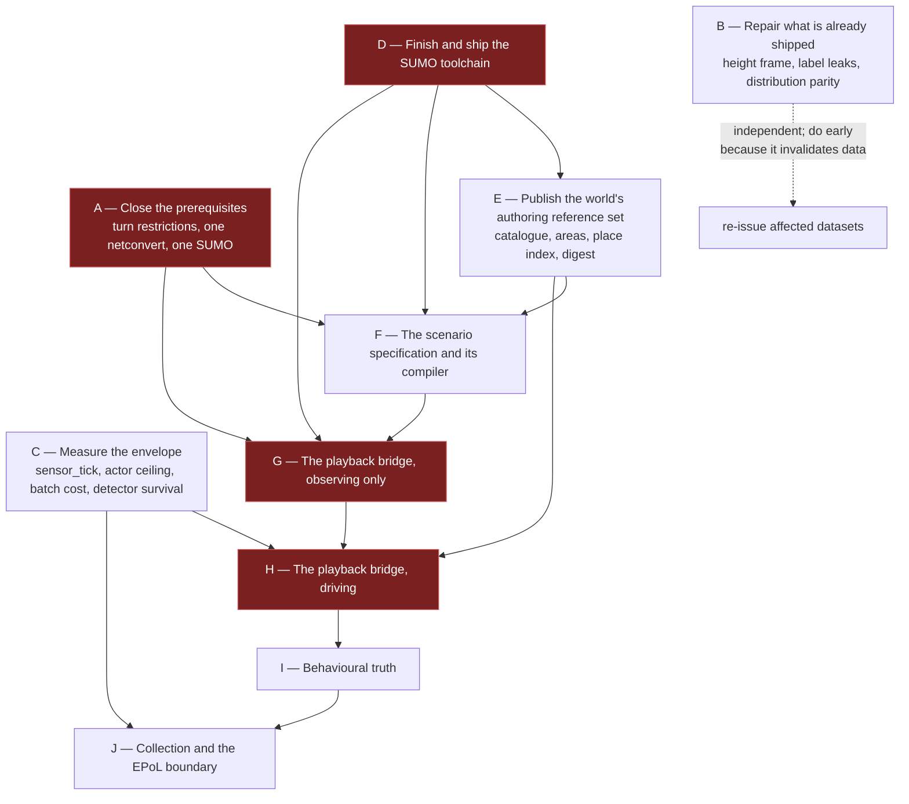

# 11 — Work breakdown

**Status:** Plan. Sequencing and dependency only — **no schedule, no effort estimates, no calendar.**
"Before" and "after" mean dependency, not time.
**Scope:** What to build, in what order, what must be measured before committing to it, and what
needs a decision from the user rather than from an engineer.
**Audience:** Whoever picks this up to implement, and whoever is deciding what to fund.

Each stage has a descriptive name and a letter used only for the dependency graph. Every item states
where it lives, what it depends on, and what makes it done. Items marked **⚑** are on the critical
path.

---

## 1. The dependency graph

Two things sit outside the chain and should start immediately, because nothing depends on them and
delay makes them worse: **B**, which invalidates data that is being produced now, and the
**measurement gate C**, whose answers change what is worth building in **H** and **J**.

---

## 2. Stage A — Close the prerequisites

Work that is not part of this system but blocks it. All three are existing defects.

| ⚑ | Item | Where | Done when |
|---|---|---|---|
| ⚑ | **Carry OSM relations through the clip**, so turn restrictions reach `netconvert`. Measured: `Import/Arapahoe_I25.osm` holds 42 relations, 22 of them `type=restriction`, and **0 survive clipping** (`OsmClipper.py:214-236`, `osm_clip.py:131-146`). [Issue #12](https://github.com/sbrett9/carla/issues/12) | Python — the clipper | Restriction relations referencing surviving ways are present in the clipped OSM, and `netconvert` stops reporting them as ignored |
| ⚑ | **Persist the world's `.net.xml` from the same `netconvert` invocation as the `.xodr`**, and refuse any network built by a different run. Measured: the two flag sets over the *identical* clipped OSM give 321 vs 317 edges, 22 junctions differing by identity, and one lane that is 352.19 m in one graph and 2.60 m in the other — while `convBoundary` matches exactly, so the frame invariant hides the topology divergence. `OsmConverter.cs:146` currently deletes it | C# — `OsmConverter`; the world package | A scenario cannot be built against a network the world did not produce, and the attempt fails with both fingerprints named |
| ⚑ | **Pin which SUMO runs.** `SUMO_HOME` on this machine is an independent SUMO 1.27.1 and `SumoInstallation.py:36` prefers it over the repo-pinned 1.27.0, so worlds and scenarios are currently converted by different binaries with no log line saying so | Python — `SumoInstallation`; both setup scripts | The resolved SUMO path and version are logged on every run, a mismatch against the version that built the world refuses, and the repo-staged toolchain wins unless explicitly overridden |

**Why these are first.** Under SUMO drive, traffic routed through a banned turn will look *worse*
than today's and will be misattributed to the bridge. And a scenario authored against edge identifiers
from a graph the world does not share is wrong in a way that every downstream check passes.

---

## 3. Stage B — Repair what is already shipped

Independent of everything else. Sequenced first among the repairs is the one that invalidates data.

| ⚑ | Item | Where | Done when |
|---|---|---|---|
| ⚑ | **Fix the bare-earth height frame and re-issue affected datasets.** The grid is indexed in CARLA y; `SumoCotBridge` passes SUMO y. Median error **9.8 m**, mean 11.2 m, max 38.0 m, 96.2% of rows over a metre | Python — `SumoCotBridge` | Recomputed heights match the grid under CARLA-frame indexing; every dataset produced by the old path is re-issued or withdrawn, and the telemetry contract's ellipsoidal-height guarantee holds again |
| | **Close the three ground-truth leaks.** `special_type="marked"` in a field scored for classification confusion; anomaly affiliation `u` readable off the CoT type string; conspicuous vType colours and ids | Python — `SumoCotBridge`, the labels sidecar | Nothing distinguishable by a detector-derived track carries the answer. Applies to the standalone telemetry path too, not only the capture path |
| | **Repair the Windows distribution.** `MakeDistribution.ps1:237` copies a script deleted in `d2c666c23` and only warns; `:301` then writes a launcher that execs it. Linux is already correct | PowerShell, with its Linux counterpart re-checked | A Windows distribution built from a clean tree runs its own launcher |
| | **Supply `scenario_id` to the recorder.** Accepted and written, never passed (`NativeRecorder.py:96-111`) | Python | Every sidecar names the scenario it was recorded under |
| | **Make capture loss audible.** `FrameRecorder.Dropped` has no reader; the clock ratio is recorded nowhere | C# + Python | A run reports drops and its clock ratio, and a run that dropped frames cannot be mistaken for one that did not |
| | **Stop boxing the bare-earth grid.** 60.9 MB becomes 243.6 MB and 5.6 s; measured one-line fix gives 32.3 MB and 0.011 s | Python — `BareEarthGrid` | Load time and footprint match the measured figures |

---

## 4. Stage C — Measure the envelope

**Nothing in stages H or J should be committed to before these return.** Each has a probe that needs
no new subsystem.

| Measurement | Question | Probe | Decides |
|---|---|---|---|
| **⚑ Frame-rate control** | Does `sensor_tick` suppress the render, or only the enqueue? It defaults to 0.0 and is set nowhere, so every camera renders at world rate while the recorder discards 19 frames in 20 | Set it and read the clock ratio back out of PNG `tEXt` metadata already written on every capture. No new instrumentation | Possibly ~10× the achievable clock ratio — which is the difference between windowed capture being comfortable and being tight |
| **⚑ Actor ceiling** | What is the real limit on rendered, pose-applied actors? 100 concurrent are demonstrated; 128 is recommended and unmeasured | Spawn N actors, physics off, teleport all N in one `apply_batch` per tick, read the clock ratio. A circle of poses will do — **no SUMO needed** | `render_cap` and `render_cap_hard`, the only unmeasured numbers the sizing envelope depends on |
| **⚑ Batch cost** | What does one `apply_batch` of N transforms cost on the game thread? | Shares the harness above | Whether the frame-rate win is spendable on more actors |
| **⚑ Does an annotated interval survive contact with a detector?** Doc 20's open question 1, still unmeasured, and the go/no-go for the corpus idea | Two tiers. First compute the in-frustum, resolvable and unoccluded span of an annotated interval from attributes today's sidecar **already carries** — a reader, no detector, no SUMO. Then add a stock pretrained detector and a simple ego-motion-compensated tracker and report the longest single track covering the interval | Camera altitude, field of view and channel count — so it must come before the collection rig is sized |
| | **Does a pose-applied vehicle read correctly to a detector at EO altitude?** The assumption that absent suspension and wheel motion are invisible at collection range is an argument, not a measurement | One scene captured twice along the same path, physics-driven and pose-applied, detector run over both | Whether doc 23's actuated strategy is optional or necessary |

A sobering figure for framing these: holding a vehicle at ten pixels fixes the ground sample distance
at 0.45 m/px and the swath at 576 × 324 m **whatever the altitude**, so one detector-usable channel
covers **0.64%** of the Bahonar map's 29.0 km². Coverage, not population, is likely to be the real
constraint on corpus yield.

---

## 5. Stage D — Finish and ship the SUMO toolchain

Already scouted, and the build itself already proven to compile clean from the unmodified
configuration.

| ⚑ | Item | Done when |
|---|---|---|
| ⚑ | Build `sumo`, `duarouter` and `libtracics` alongside `netconvert`; stage all four, plus `data/` and `tools/` | `sumo --version` runs from the **staged install**, not the build tree |
| ⚑ | Re-key the idempotence guard from "does `netconvert.exe` exist" to "are all four staged" — not "is the newest one there", since parallel builds have no dependable last-built file | A returning developer cannot silently keep a half toolchain |
| | Set `SUMO_HOME` where the other tool paths are set; add `swig` to the Linux prerequisites **and to the CI container**, which never runs the prerequisites script | A clean clone and a clean CI container both build the toolchain |
| | Bundle the toolchain, the binding and the new authoring artifacts into the distribution, both platforms | The acceptance check below passes from an installed distribution |
| | **Acceptance check**, runnable and run rather than remembered: `sumo --version` from the staged install; a trivial console application steps an empty simulation through the C# binding; `duarouter` validates a known route | The check is part of the build, not a note |

`duarouter` is **required**, not optional: route validation becomes an unconditional compile step in
stage F, measured at 0.27 s for all 52 Arapahoe routes, so cost is no reason to skip it.

---

## 6. Stage E — Publish the world's authoring reference set

Everything an author needs, generated from the world rather than known by the author.

| ⚑ | Item | Notes |
|---|---|---|
| ⚑ | **The vehicle catalogue, by spawn-and-measure.** Dimensions do not exist before spawn — `FVehicleParameters` has no dimension field and `MakeVehicleDefinition` emits none, so the box first exists on the spawned actor | One vType per blueprint; one `vTypeDistribution` per class; dimensions copied verbatim; the blueprint named in a `<param key="carla:blueprint">` that is schema-valid against SUMO's own `route.xsd` |
| ⚑ | **The catalogue is a runtime dependency of the bridge**, not only an authoring aid: the bumper-centre to body-centre pose shift needs measured length and box centre, which SUMO does not have. A vehicle of unknown extent is **not rendered**, never rendered at a guessed offset | |
| | **Areas of interest**: GeoJSON beside the OSM, validated at world build, resolved to CARLA-local metres *and* to SUMO edges, held in the world on an actor with a Set/Get RPC pair mirroring staging bounds | Required, not optional: the anomaly-that-is-an-absence anchors to an area plus a window and cannot be expressed without one |
| | **The place index**: street name to edge and road, with the coverage caveat stated in the artifact itself — 91% on the US maps, **5% on Bahonar**, and one name mapping to as many as 65 edges | Name resolution is one place form among several, never the mechanism |
| | **The world fingerprint**: a canonical fingerprint of the parsed network, **not a byte hash**. Measured: the same OSM clipped in three processes gives three different SHA-256 digests and a byte-identical graph, because `OsmClipper.py:154,219` accumulates in a `set` | |
| | **The annotation vocabulary**, versioned and declared | Contents are an open question below |

---

## 7. Stage F — The scenario specification and its compiler

The move that makes authoring checkable: **the Python builder stays, but it emits the specification
rather than SUMO XML**, so a generated scenario is subject to every check a hand-written one is.

The evidence for keeping a generator at all is a measured asymmetry: the Bahonar scenario emits 610
route entries over seven simulated days and rests on **21 distinct edge identifiers**. Composing a
week of behaviour is a program; finding and justifying twenty-odd opaque strings is the expensive part,
and that becomes a named, resolved, reported table. (The script declares 23 edge literals; two are dead
and nothing says so.)

| Item | Notes |
|---|---|
| The specification schema, and the supervision plan as its companion | The supervision plan is the **sole** annotation channel: SUMO route files are XSD-validated and generated, and `<param>` is a flat un-namespaced store SUMO's own device code reads |
| The compiler and its checks — 32 in six groups: world binding, references, routes, vehicles, annotation and areas, emission | Each check states refuse or warn |
| **Route validation via `duarouter`, with the false-accept guard.** Measured: a trip whose destination edge does not exist still produces a `<vehicle>` with a one-edge route, which the naive filter admits. The check must be *terminal edge equals requested destination, and every `via` appears in order* | |
| **The resolution report.** `sumo-gui` knows nothing about pattern instances, so the compile report is the only place an annotation can ever be checked | Doc 20 §5.5 argued for this on the storyboard surface; it is more necessary here |
| The measured gotchas triaged into validator checks, compiler defaults, or documentation — with two (`--tls.default-type`, `--junctions.join-dist`) moved to the **world build**, because they change the graph | |
| Sweeps and counterfactual pairing — `absent`, `nominal`, `displaced` | `nominal` generates doc 20 §2.7's hard negatives for free. The manifest must state that downstream trajectories are *not* expected to match, because car-following reacts to what is in front of it |

---

## 8. Stage G — The playback bridge, observing only

New `CarlaNet.CoSim` in C#, orchestrated from Python. One TraCI connection, owned by the bridge.

| ⚑ | Item | Done when |
|---|---|---|
| ⚑ | Session, clock, and the integer-ratio validation between SUMO step, world delta and capture rate | A mismatched trio refuses at session start |
| ⚑ | SUMO session and **subscription-based** state reading | Measured: subscriptions are 14× cheaper than per-vehicle getters at 388 vehicles, where the naive path alone costs 2.3× a whole tick |
| ⚑ | Pose conversion — Y negation, `carlaYaw = sumoAngle − 90`, and the bumper-to-centre shift from the catalogue; Z, pitch and roll from the drape, sampled client-side with no RPC | The reported divergence between commanded and applied pose is a stated tolerance, and a bumper-shift or Y-negation error shows up in it rather than as plausible imagery with every box wrong by half a car |
| ⚑ | One-step lookahead and **lane-geometry interpolation**, with the four cases: same lane, lane change, crossed edges, discontinuous | A vehicle tracks its lane through a junction rather than cutting the corner by 10.6 m |
| | The render-set selector and the actor pool, with admission recording its instants | |
| | **Population-authority lease and the ambient lockout** | Starting ambient traffic while SUMO holds the lease fails the session start and names the holder |
| | Log SUMO's decisions without applying them | The bridge's ghost tracks a world driven by something else within a stated tolerance |

---

## 9. Stage H — The playback bridge, driving

| ⚑ | Item | Notes |
|---|---|---|
| ⚑ | Batched pose application — one `apply_batch` per tick, no variable tail | All 22 command types are supported and the .NET traffic manager already does exactly this |
| ⚑ | **Engine: velocity for a pose-applied body.** Traced to `UPrimitiveComponent::GetComponentVelocity`, which reads the physics body only when simulating and otherwise returns a field the ChaosVehicles plugin never writes. No client call ordering can fix it, and `SetSimulatePhysics(false)` destroys the body anyway | An engine change, which is a neutral cost. Until then, kinematics come from SUMO regardless — the engine fix makes the *body* agree with the record |
| | Traffic-light synchronisation from SUMO's `tlLogic` | Needs an RPC exposing a light's OpenDRIVE signal id, which is held server-side but not exposed. **Note Bahonar has zero traffic lights**, so this cannot be exercised on the sizing scenario — Arapahoe or a stock town is needed |
| | Windowed capture: SUMO fast-forward from t = 0 | Measured: the whole Bahonar week is 140.41 s of wall clock at 4,307× real time. `--begin` is rejected — a cold start is 5–87% under-populated for 300 s — and state save/load does not compose with unrouted trips and flows |
| | Region gate sized per scenario so the cap does not bind ([00](00_Overview.md) §6) | The region gate is label-independent; the cap is not |
| | Failure paths: SUMO death, CARLA stall, a vehicle removed while CARLA holds it, route errors, collisions | If either side stalls, **both** stop and the run fails — a world that ticks without SUMO produces a plausible lie |

---

## 10. Stage I — Behavioural truth

| Item | Notes |
|---|---|
| Supervision records: three-valued state, pattern instances, participants, intervals with the three onsets — **declared**, **committed**, **observed** | The declared onset may legitimately be absent: measured, all 338 Bahonar stops use `duration`, none uses `until`, and a `duration` stop declares a length, not a time. The harness must refuse to substitute another onset silently |
| **Recurring series and the unrealised slot**, which is how an anomaly with no vehicle is expressed | The Bahonar guard no-show is reconstructible **byte for byte from its siblings**; the generator discards it at `make_bahonar_scenario.py:236`. Nothing new has to be authored — it has to stop being thrown away |
| Field-by-field truth reconciliation, emitting pose, heading, speed and dimension separations per vehicle per tick | A free test oracle for the three pose conventions |
| Observability accounting with five outcomes, keyed to recorded render admission and release instants | Distinguishes "never rendered" from "rendered but unobserved" — a distinction doc 20 could not make |
| The run supervision manifest, written incrementally and closed at scenario end | Prevalence in **three units**, because two defensible units differ by a factor of 372 in this scenario |
| SUMO's own distribution-editing behaviours enumerated as forbid, record, or harmless | Three are on by default: `time-to-teleport` at 300 s, `collision.action` at `teleport`, and instantaneous lane changes |

---

## 11. Stage J — Collection and the EPoL boundary

| Item | Notes |
|---|---|
| Multi-channel collection in one process, with world-scoped state published on the observer snapshot | The one-recorder limit is the Python shim's, not the recording layer's — a recorder already opens two streams |
| Per-image labelling and occlusion, reusing the existing depth-based metric and its arrival gate | |
| Truth-to-track association: per sensor, per frame, **position and time only**, cost in image space normalised by apparent size, globally optimal assignment, with a recorded quality block including the **margin to the runner-up** | A 3 px residual means nothing if the runner-up was 3.1 px |
| **The anti-leak boundary**: three artifact roots, one writer each, split **at the writer** so nothing is ever stripped, plus a mechanical validator in CI and a held-back split at session granularity | The depth capture is a truth instrument: the detector may geolocate against a bare-earth prior, never against the simulator's per-frame depth |
| The evaluation join, with prevalence and coverage per sensor and unioned, and scoring parameterised by which onset defines the interval | |
| The live exercise: pacing, latency budget, and what the operator sees | An EPoL assessment can ride the existing Cursor-on-Target feed as a `<detail>` child, which WinTAK ignores |

---

## 12. What needs a decision from the user

Engineering cannot settle these.

| # | Question | Recommendation |
|---|---|---|
| 1 | **Vehicle class metadata is wrong in the content.** `base_type` is wrong for 7 of 17 blueprints and `special_type` is empty for all 17. A spawn-and-measure sweep can measure a box but cannot curate a class. The honest fix corrects `VehicleParameters.json`, which is a content change | Derive from the sweep, allow a validated override file, and correct the content when a content build is next made |
| 2 | **Where the capture window comes from** — declared by the author, or chosen by the operator | Both: the scenario's declared windows as named presets, the operator free to give another, the manifest recording which was used |
| 3 | **What a capture does when SUMO reports a collision.** Record and continue, record and mark the span unusable, or stop | Record and mark. A collision is a fact about the corpus, not a failure of the run — but settle it together with question 5 |
| 4 | **One `sumo` process per capture session, or one shared across windows** | Decide after the fast-forward cost is measured in context, not before |
| 5 | **How an accidental positive in the ambient population is handled once found** — excluded, or promoted to annotated with a provenance marker. Doc 20 deferred this; it is **immediate** here, because SUMO makes a forty-five-minute ambient park possible where the traffic manager's idle cull made it impossible | The second is more valuable and more dangerous. Needs a decision before the first corpus, not after |
| 6 | **What the annotation vocabulary contains at v1** | Settle with the model's requirements in hand. Terms are cheap to add and expensive to rename once a corpus exists |
| 7 | **Whether distributions are internal or external.** Repairing the Windows distribution makes it bundle the proprietary `carlacontrol` wheel, matching Linux; nothing in either script distinguishes the two cases | Make the distinction explicit in the scripts rather than implicit in which platform you ran |
| 8 | **Where the authoring skill lives.** It has no reproducible source location — the workspace root is not a git repository, so the artifact the whole authoring workflow depends on is unversioned | Move it into the repo and ship it from there |

---

## 13. Risks worth naming

| Risk | Why it is real | What reduces it |
|---|---|---|
| **The corpus is coverage-bound, not population-bound** | One detector-usable channel covers 0.64% of the Bahonar map. Peak concurrent population is 139, but few of them are in frame | Measure detector survival early (stage C); size camera count and altitude from that answer, not from population |
| **A confounder gets into the corpus and is only found after training** | Three are already live in the shipped pipeline, and one — anomaly colour — was present in a real scenario and unnoticed | The compile-time resolution report, the anti-leak validator in CI, and treating any appearance or metadata difference between annotated and ambient populations as a defect |
| **The bridge looks right and is wrong by half a car length** | The bumper-to-centre shift, Y negation and yaw offset each fail plausibly | The commanded-versus-applied separation is emitted per vehicle per tick and is a stated tolerance |
| **Arapahoe-class maps yield no training data** | The render cap binds always at median 336, and cap-bound spans are excluded from training | Size the region gate so the cap does not bind ([00](00_Overview.md) §6) |
| **Doc 23's actuated strategy turns out to be necessary** | If pose-applied vehicles read wrong to a detector, the whole mode is built on a false premise | It is the first measurement in stage C, and the actuated strategy is retained behind the same bridge rather than discarded |
| **Traffic-light synchronisation is untested where it matters** | Bahonar has zero traffic lights | Exercise it on Arapahoe or stock content; do not let the sizing scenario stand in for coverage |
