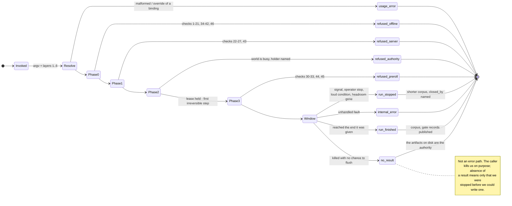
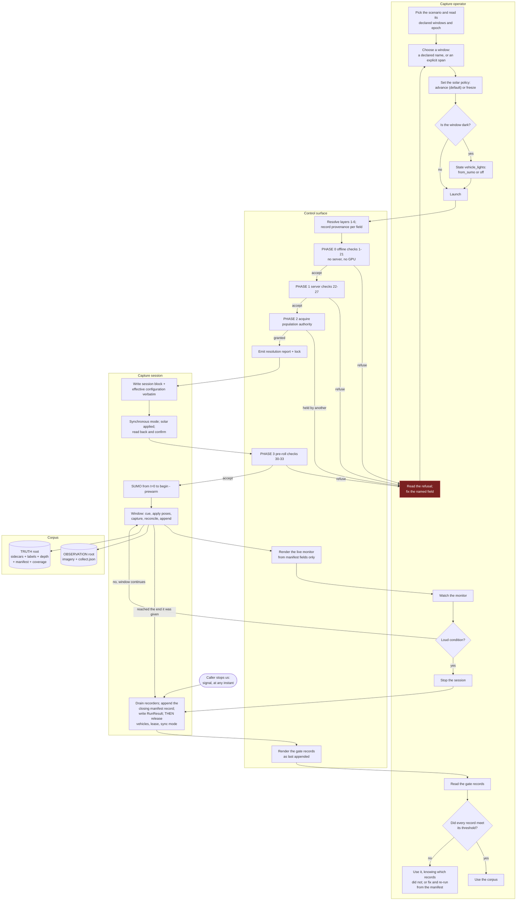

# 12 — The operator control surface

**Status:** Plan section. Specification of a control surface. Of the classes in §3.9,
`ChannelDescription`, `StareAim` and the camera follower are built; the rest are not. Every measurement in §1 was taken read-only by introspecting
the live parser object and grepping the live source tree on 2026-09-18; the further measurements in
§3.5, §3.10.1, §3.10.2, §5.2 and §7.6 were taken the same way, and each says where.
**Date:** 2026-09-18
**Revisions:**
`2026-09-25` — Stare pose and orbit centre fields; `ChannelDescription` and the camera follower built.
`2026-09-18` — Termination under external kill made first class; aggregate verdict removed; in-run observability stated.
`2026-09-18` — Unattended caller, live-exercise pacing and transcript, exposure-profile correction.
`2026-09-18` — Initial: measured the present surface; layered resolution, validation phases, time-of-day expression.
**Owner role:** Operator control-surface engineer. Added to the team by
[`_TEAM_BRIEF.md`](_TEAM_BRIEF.md) §3a item 3, which makes the surface a first-class deliverable
rather than a by-product.
**Scope:** How a caller expresses, validates, launches, watches, stops and records a capture run; the
complete inventory of what is switchable and what is not; what the tool does when it is killed; how the
new surface coexists with `run_SCTMV.py` without losing a capability; and how the time-of-day choice
reaches the record.
**There are two callers, and both are first class:** a human at a terminal, and an **external
process that starts us, watches us through interfaces that already exist, and stops us when it
decides to** ([`_TEAM_BRIEF.md`](_TEAM_BRIEF.md) §3d). That second caller is not a scheduler waiting
for a verdict. It may kill the CARLA server, the SUMO process or this client at any instant,
deliberately, and it decides when enough is enough by **querying while we run**. §3.10, §6.4 and §7.6
are that caller's half; everything else serves both unless it says otherwise. The surface also
carries the **live exercise**'s pacing and live picture (§7.4).
**Audience:** An engineer implementing the launcher and the run-configuration schema, and a reviewer
deciding whether the shape recommended in §3 is the right one. It assumes the fork but not the
conversation that produced this plan.
**Grounding:** Claims about existing behaviour cite `path:line` against the working tree as read on
2026-09-18. Numbers labelled **measured** were produced by a script run during this pass; the scripts
are described where they are used so they can be re-run. Anything labelled **inference** is reasoning.

**Out of scope, deliberately.** The semantics of the solar epoch and of the freeze/advance policy —
those belong to [`11_Time_And_Illumination.md`](11_Time_And_Illumination.md), whose author owns them;
this section owns only how an operator *expresses* and *records* the choice, and states in §4.6 what
it needs from that section. Also out of scope: the scenario specification's own schema
([`07`](07_Scenario_Authoring.md)), the manifest's supervision content
([`06`](06_Truth_And_Annotation.md) §8.4), the sensor rig's optics ([`08`](08_Collection_And_EPoL.md)
§3), and the parameter *values* in [`10`](10_Scale_And_Performance.md) §8 — this section decides where
each value is set and how it is recorded, not what it should be.

**Three more things are out of scope and are named because the live and unattended cases invite them
in.** The **pacing ruling** — what a live run does when the external chain cannot keep up — is
[`08`](08_Collection_And_EPoL.md) §11.1 and §11.3's; this section owns how the choice is *expressed*
and what is *shown*, and §7.5 states the five properties it needs back. **The cadence itself** — what
decides that a corpus should be regenerated, what trains on it afterwards, and **when a run should
stop** — is entirely outside this plan. §3d puts termination in the caller's hands, so this section
specifies what the tool does *when it is stopped*, never when it should stop; there is no scheduler
here, and §3.10 designs an invocation, not a loop. **The verdict is outside too:** this surface
publishes facts about its own data and never an aggregate judgement of whether a corpus is fit for a
purpose it does not know; [`04`](04_Contracts.md) `C10` owns the result artifact's fields on the same
principle (§3.10.3, §7.2). And **the external
detect-and-track and model services**: this section specifies a socket a run writes to and a blob store
a transcript lands in, and nothing about what is on the other end
([`_TEAM_BRIEF.md`](_TEAM_BRIEF.md) §3c).

---

## 1. The present surface, measured

The user's words were *"we're building a tool suite that is going to have to have some easy way to
control it all."* Before proposing anything, this section measures what exists. The measurement is the
argument; nothing below rests on taste.

### 1.1 Method

`CarlaControlArgumentParser` (`CarlaControl/src/carlacontrol/CarlaControlArgumentParser.py:12`) is a
self-contained module — it imports only `argparse`, `os` and `random` (`:7-9`) — so it can be loaded
in isolation and its `argparse.ArgumentParser` walked directly. Three read-only scripts were run:

1. **Surface census** — load the parser, enumerate `_action_groups` and `_group_actions`, and count.
2. **Consumer trace** — for every `dest`, search the live Python sources
   (`CarlaControl/src/carlacontrol`, `CarlaControl/scripts`, `CarlaNet/python/carlanet`; build output
   excluded) for `args.<dest>`, `getattr(args, "<dest>", …)`, `self.args.<dest>` and dictionary forms.
3. **Duplicated-default scan** — find every `getattr(args, "<dest>", <fallback>)` outside the parser
   and compare `<fallback>` against the parser's own `default=`.

### 1.2 The shape

| | Measured |
|---|---|
| Arguments defined (excluding `-h`) | **86** |
| Distinct option strings | **86** — no argument has a short form or an alias, except the `--fade` / `--no-fade` pair |
| Distinct `dest` values | **85** — `--fade` and `--no-fade` share `fade` |
| Argument groups | **9** |
| `store` actions / `store_true` / `store_false` | **70 / 12 / 4** |
| Mutually exclusive groups | **1** (`--fade` ∥ `--no-fade`, `:317`) |
| Sub-commands, modes or verbs | **0** |
| Total help text | **12,009 characters**; median 71, longest 719 (`--road-offset-east`, `:149-164`) |

Group by group, with the group titles exactly as the parser declares them:

| Group | Count | Declared at |
|---|---:|---|
| `options` (the unnamed root group) | 1 | `:492-499` |
| `connection / mode` | 5 | `:49-74` |
| `world build (phase 1)` | 23 | `:76-221` |
| `EO observer (phase 2)` | 13 | `:223-285` |
| `staging traffic (phase 3)` | 19 | `:287-449` |
| `scenario` | 1 | `:451-460` |
| `CoT telemetry (phase 4)` | 7 | `:462-490` |
| `recording (F hotkey)` | 9 | `:501-569` |
| `orbit` | 8 | `:571-615` |

Alongside it sits a second, undeclared surface: **13 runtime hotkeys** registered in
`PygameInterface.py:289-311`, plus `Escape` and `Space` handled inline (`:347-349`). Four of the
thirteen — `K` (solar advance), `X` (storyboard), `O` (orbit), `P` (orbit pause) — are absent from the
control list in the entry point's own module docstring (`run_SCTMV.py:19-42`); three of those four are
mentioned only inside the help text of an unrelated argument (`--time-advance` at `:256-263`,
`--scenario` at `:453-459`, `--orbit` at `:573-577`), and **`P` is documented nowhere at all**.

### 1.3 What is inert

Two examples were already recorded in the plan. Both are confirmed, and the first is worse than
recorded.

**`--ev` can never have an effect on this fork.** The argument is defined at `:237-242` with
`default=0.0`. Its only consumer is `SensorRig.py:66-67`:

```python
if args.ev is not None and bp.has_attribute("exposure_compensation"):
    bp.set_attribute("exposure_compensation", str(args.ev))
```

The first clause is always true (the default is `0.0`, not `None`), so the guard is entirely the
second. **Measured:** `MakeCameraDefinition`
(`Unreal/CarlaUnreal/Plugins/Carla/Source/Carla/Actor/ActorBlueprintFunctionLibrary.cpp:313-410`)
declares eleven attributes — `fov`, `image_size_x`, `image_size_y`, `lens_circle_falloff`,
`lens_circle_multiplier`, `lens_k`, `lens_kcube`, `lens_x_size`, `lens_y_size`,
`enable_postprocess_effects`, `post_process_profile` — plus `sensor_tick` from
`AddVariationsForSensor` (`:244-254`) and the `role_name` recommendation (`:241`). A grep for
`exposure_compensation` across the whole plugin returns nothing. The RGB camera therefore has **no
exposure attribute of any kind**, and `--ev` is a no-op for every value, silently.

That is a larger finding than "one dead flag". The engine class has the setters —
`SetExposureCompensation`, `SetShutterSpeed`, `SetISO`, `SetAperture`, `SetExposureMinBrightness`,
`SetExposureMaxBrightness`, `SetExposureMethod` and six more
(`Carla/Sensor/SceneCaptureSensor.h:237-378`) — but nothing publishes them as blueprint attributes, so
no client can reach them. [`08`](08_Collection_And_EPoL.md) open question 8 records the same gap from
the collection side. **Consequence for this section:** **no numeric exposure control exists**, so a
night window's brightness is whatever the engine's auto-exposure produces under the post-process
profile the camera spawned with — which is the one exposure control that does exist, and §5.2 makes it
a first-class toggle. A surface that offers `--ev` today is telling the operator a lie, and §6 check 16
turns that lie into a refusal that names the field that works.

**`--fade` was demoted to `default=False`** (`:318-328`), with `--no-fade` retained at `:329-334` so
existing command lines keep working. The stated reason is in the help text itself: the opacity is
"pushed to the server one blocking RPC per vehicle per reconcile, which is the heaviest load this
client puts on the server's per-frame RPC budget". Confirmed as read. This is the one place in the
present surface where a default was changed on measured grounds and the reason was written down where
the operator will see it — the pattern §3 generalises.

**`--time-rate` is silently inert unless `--time-advance` is given.** `WorldBuilder.py:246-247` reads
`args.time_rate` only inside `if args.time_advance:`. So `--time-rate 3600` alone parses, validates,
is recorded nowhere, and does nothing. There is no warning.

### 1.4 What is conditional

Every argument has at least one consumer — the trace found **86 of 86** reachable, once
`getattr(self.args, …)` forms are included (a first pass missed `--same-side-exit-rate`,
`--occlusion-margin` and `--occlusion-samples`, which are read through `getattr` at
`TrafficController.py:583,877` and `NativeRecorder.py:110-111`). Reachability is not the problem.
The problem is that **most arguments do nothing unless something outside their own group is on**:

| Count | Group | Inert unless |
|---:|---|---|
| 23 | `world build (phase 1)` | `--build` is in force; `--no-build` (`:80-86`) makes all 23 ignored |
| 19 | `staging traffic (phase 3)` | traffic is enabled — `--start-traffic` or the `T` hotkey |
| 9 | `recording (F hotkey)` | recording is enabled — the `F` hotkey; the group title says so, no other does |
| 8 | `orbit` | orbit is active — `--orbit` or the `O` hotkey |
| 7 | `CoT telemetry (phase 4)` | telemetry is enabled — the `Y` hotkey |
| **66 of 86** | | **conditional on a switch or hotkey declared outside their own group** |

Only **20 of 86** are unconditionally in force: the six connection/logging arguments, the thirteen EO
observer arguments, and `--scenario`.

A further three declare a second-order condition inside their own help text and enforce none of it:
`--fixed-delta` ("synchronous mode only", `:71-74`), `--terrain-res` and `--drape-cache-dir` ("'drape'
only", `:130-148`). Passing `--terrain-res 0.5` with `--height-align none` is accepted in silence.

**What this measures.** `argparse` can reject an unknown option and a bad type. It cannot reject an
option that is well-formed, correctly typed, and meaningless in the configuration it was given. With
66 of 86 arguments in that category, the dominant failure mode of the present surface is *a run that
starts, proceeds, and does not do what was asked*. That is the failure this plan cannot afford: a
windowed capture costs hours ([`10`](10_Scale_And_Performance.md) §4.1 measures 19–24 wall-clock days
for the un-windowed case) and the corpus records the configuration it *ran*, not the one that was
intended.

### 1.5 What is ambiguous or undocumented

| Finding | Measured |
|---|---|
| **No help text at all** | 5 arguments: `--osm`, `--ion-token`, `--fov`, `--width`, `--height` |
| **Single-word names carrying no subsystem** | 34 of 86 — including `--time`, `--date`, `--rate`, `--speed`, `--max`, `--step`, `--save`, `--filter`, `--seed`, `--z`, `--print`, `--stale` |
| **Name collisions across subsystems** | `--rate` is telemetry Hz (`:477`), `--record-hz` is capture Hz (`:512`), `--time-rate` is sun-clock gain (`:264`), `--fixed-delta` is the simulation step (`:68`) — four different rates, no shared prefix. `--speed` is camera fly speed (`:271`) while `--speed-scale`, `--speed-spread` and `--speed-bias` are traffic (`:376-419`). `--step` is reference-line sample spacing (`:96`), not a time step |
| **Mixed units inside one group** | The `orbit` group takes `--orbit-x` / `--orbit-y` in **metres** and `--orbit-radius` / `--orbit-altitude` in **FEET** (`:579-609`). `--z` is FEET (`:226-228`) while `--x` / `--y` are metres (`:229-235`) |
| **A parse with a side effect** | `parse_args` seeds the process-global RNG (`:640-641`) while `parse` (`:626-627`) does not. Two entry points, two behaviours, from the same class |
| **Duplicated defaults** | 11 `getattr(args, …, fallback)` sites outside the parser; **3 disagree with the parser's own default** — see below |

The three divergent defaults, measured:

| Knob | Parser default | Second default | Where |
|---|---|---|---|
| `depth_max_range` | `20000.0` (`:274-285`) | `1000.0` | `SensorRig.py:78` |
| `lane_spawn_spacing` | `15.0` (`:365-375`) | `0.0` | `TrafficController.py:647` |
| `speed_bias` | `2.0` (`:376-387`) | `0.0` | `TrafficController.py:700` |

These fallbacks only fire when the caller's `args` object lacks the attribute — that is, when the
consumer is driven by something other than this parser. **Today that never happens, so the divergence
is latent.** It stops being latent the instant a second front end exists, which is precisely what this
section proposes. `depth_max_range` is the sharpest case: the same run would measure depth to 20 km
through one front end and 1 km through the other, and the second silently caps the occlusion
measurement that [`08`](08_Collection_And_EPoL.md) D8.19's denominator depends on.

### 1.6 The trigger case, measured: every run overwrites the sun to noon

`run_SCTMV.py:138` calls `WorldBuilder.setup_solar_time(world, args)` **unconditionally** — after the
`--no-build` branch has already logged "attach mode … using the world already on the server"
(`:131-132`). Inside (`WorldBuilder.py:214-255`):

- `:226-230` — with no `--date`, the date becomes `datetime.now()` on the **host machine**.
- `:231-232` — with no `--time`, `hours = 12.0`.
- `:238-239` — `set_solar_date` then `set_solar_time` are called every time, and `set_solar_date`'s
  return value is discarded.
- `:246-247` — advance is configured only if `--time-advance` was passed.

So **attaching to an existing world resets its sun to 12:00 local on today's host date**, and a
scenario whose civil time is 23:00 renders in full daylight unless the operator remembers `--time`.
This is exactly the failure [`_TEAM_BRIEF.md`](_TEAM_BRIEF.md) §3a describes, and the record makes it
worse rather than catching it: `FrameRecorder.cs:162` reads `GetCachedSolarState()`, `CotWriter.cs:50-65`
writes it into every sidecar as `<_solar solar_time= … sun_elevation_deg= …>`, and `SolarMetadata.cs:6-14`
embeds the same block in every PNG's `tEXt` chunk (`PngEncoder.cs:44`). **The truth record faithfully
reports noon.** Nothing anywhere compares it against what the scenario asserts, because nothing
machine-readable states what the scenario asserts.

Two further details of the same function matter for §4. There is no range check on `--time`: `25:70`
parses to 26.17 and is wrapped by the server (`carlanet/__init__.py:1500-1503`) with no complaint. And
`set_solar_time` returning `False` — which is how the server reports "this world has no CesiumSunSky"
— produces a `logger.warning` (`:244-245`) and the run continues.

### 1.7 What the measurement establishes

1. **The surface is flat and large, and most of it is conditional.** 86 arguments, 9 groups, 0 modes,
   66 of 86 inert unless something else is on.
2. **`argparse` cannot express the constraints that actually matter here.** One mutually exclusive
   pair guards a demoted cosmetic feature; nothing guards the combinations that cost a run.
3. **Defaults are not a recorded artifact.** They live in the parser, are duplicated in three places
   with divergent values, and have changed at least once (`--fade`). A recorded command line is
   therefore *not* a reproducible run description: the same argv on a different build resolves
   differently, silently.
4. **The one axis this plan added — time of day — is the worst-served part of the existing surface.**
   It is four flags in a group named "EO observer", one of which is inert without another, applied
   unconditionally to a world the operator may not have built, defaulting to a value that is wrong for
   any scenario that is not about noon.

This is not a criticism of `CarlaControlArgumentParser`. It is a correct and well-documented parser
for an *interactive single-client viewer*, which is what `run_SCTMV.py` is. §2 shows that a capture
run is a different object.

---

## 2. What a capture run has to carry

Gathered from across the plan. Each row names what must be decided before a run can start, and who
already owns it. The point of the table is its size and its heterogeneity: this is what a flat
argument list would have to express.

| Axis | What must be decided | Owner |
|---|---|---|
| **Mode** | Which of the four modes, exclusively | [`01`](01_Architecture.md) §5.1 |
| **World package** | Which world, and the binding that proves the scenario was authored against it | [`07`](07_Scenario_Authoring.md) §2, D7.15 |
| **Scenario package** | Which scenario, at which lock, with which supervision plan | [`07`](07_Scenario_Authoring.md) §5.1 |
| **Capture window** | `[begin_s, end_s]` in simulated time, plus prewarm — **or a begin with no end**, which runs until the scenario ends or the caller stops us (D12.4) | [`10`](10_Scale_And_Performance.md) §4.2, D10.3 |
| **Render region and caps** | `render_region`, `render_cap`, `render_cap_hard`, the lead/lag hysteresis, the rendered-fraction floor | [`10`](10_Scale_And_Performance.md) §8, D10.4, D10.5 |
| **Camera rig** | N channels, each `(sensor_id, pattern, track, optics, depth?, seg?)` | [`08`](08_Collection_And_EPoL.md) §3.2, §3.3, D8.4 |
| **Clock** | SUMO step, world delta, capture rate — an integer-ratio contract | [`01`](01_Architecture.md) D1.13 |
| **Solar epoch and policy** | The civil instant `t = 0` means, and whether the sun freezes or advances | [`11`](11_Time_And_Illumination.md); this section for expression |
| **Seeds** | Four of them, separately | [`07`](07_Scenario_Authoring.md) D7.11 |
| **Supervision and export roots** | Two roots, one writer each | [`08`](08_Collection_And_EPoL.md) D8.17 |
| **Telemetry sinks** | Whether, where, and on which thread | [`10`](10_Scale_And_Performance.md) D10.11; [`08`](08_Collection_And_EPoL.md) D8.23 |
| **Occlusion estimator** | On/off, margin, sample density | [`08`](08_Collection_And_EPoL.md) §5.4, open question 1 |
| **Radiometry** | Which post-process profile each channel spawns with, and the digest of the one the server actually loaded | [`08`](08_Collection_And_EPoL.md) §2.9, D8.27, D8.28 |
| **Pacing** | As fast as the machine allows, or against a wall clock at a stated factor | [`08`](08_Collection_And_EPoL.md) §11.1; this section for expression |
| **Handover and transcript** | Whether frames leave the process live, on which channels, and whether what comes back is recorded | [`08`](08_Collection_And_EPoL.md) §11.2, §11.3; [`02`](02_Use_Cases.md) UC-8 |
| **Caller** | Attended or unattended, and — if unattended — how each warning is adjudicated in advance. An unattended caller also decides when the run ends, which is not a field (§3.10.2) | §3.10, §6.4 |

Sixteen axes, of which four are *bindings to artifacts* (world, scenario, epoch, supervision plan),
three are *contracts between numbers* (clock ratio, render sizing, seeds), eight are *choices*, and one
— the caller — decides **who is allowed to adjudicate the other fifteen**. A flat argument list can
express the choices. It cannot express a binding — there is nothing for a flag to bind *to* — it cannot
validate a contract between three numbers that live in three different groups, and it has no place to
put an adjudication that has to survive the run that used it.

---

## 3. The shape of the new surface

### 3.1 The requirements, restated as tests

The brief states five. Each is restated here as something a candidate either passes or fails, so §3.3
is an evaluation rather than a preference.

**These five were written for a human at a terminal**, and §3.10 adds the five a machine needs. They
are deliberately kept as separate lists rather than merged: three of the machine's five turn out to be
already satisfied by what R1–R5 forced, and that is worth being able to see rather than asserting.

| | Requirement | Test |
|---|---|---|
| **R1** | Every run is reproducible from a recorded artifact | Take the artifact the run recorded, give it to the tool on a different machine and a later build, and get the same effective configuration — **including every value that came from a default** |
| **R2** | The effective configuration is written into the run manifest | Open `manifest.json` and read the value of any knob, without knowing what the tool's defaults were |
| **R3** | A human can launch a common case in one short line | The commonest case — "capture the night window of this scenario" — fits on one line and names nothing that the scenario or the world already knows |
| **R4** | An assistant can generate a configuration reliably | There is a machine-readable schema; an unknown key is a refusal, not a silent no-op; and every refusal names the field and the candidates |
| **R5** | Nothing important can be left implicit | For every field, either it has a default that is correct in every case the tool accepts, or the tool refuses until it is stated |

### 3.2 Candidate — an extended flat command line

Extend `CarlaControlArgumentParser`'s pattern: add groups for SUMO drive, the window, the rig, the
solar policy and the roots; add cross-argument validation in code after `parse_args`.

| Test | Result |
|---|---|
| R1 | **Fails.** The recorded artifact would be the argv, and argv + defaults is not reproducible because defaults change. *Measured:* `--fade`'s default flipped from true to false (`:318-328`), and `--height-align` defaults to `none` (`:120-129`) while every world this plan describes is built with `drape`. An argv recorded before a default change replays differently and nothing says so |
| R2 | Fails unless the tool separately materialises every default into the manifest — at which point the artifact of R1 is that materialisation, not the argv, and this candidate has become the next one |
| R3 | **Fails today and would get worse.** *Measured:* the zero-argument invocation does not attach and capture; it builds a world from `Import/Lakeview_Carson.osm` (`:87-89`, file present, 730,905 bytes). The default behaviour of the viewer is the most expensive operation it has. Adding twelve axes to 86 arguments does not produce a short line |
| R4 | **Fails.** There is no schema. `argparse`'s only failure modes are unknown option and type coercion; the 66-of-86 conditional structure of §1.4 means the assistant's likely mistakes are all silent |
| R5 | **Fails structurally.** An omitted flag and a deliberately defaulted flag are indistinguishable in argv, so "the operator did not think about the sun" and "the operator chose noon" produce identical records |

This candidate is rejected on R1 and R5, which are the two the corpus depends on.

### 3.3 Candidate — a run-configuration file with a thin command line

One document per run describing the whole run; the command line names the file and little else.

| Test | Result |
|---|---|
| R1 | **Passes**, provided the file is complete — i.e. provided the tool writes back a fully-materialised copy rather than trusting the hand-written one |
| R2 | **Passes** |
| R3 | **Partly fails.** A common case still costs a file. *Measured consequence:* [`10`](10_Scale_And_Performance.md) D10.3 recommends 4–8 windows per seven-day scenario and [`07`](07_Scenario_Authoring.md) D7.12 makes counterfactual pairing a sweep mode that doubles the run list — so one scenario produces 8–16 near-identical files whose diffs are two fields each |
| R4 | **Passes** with a schema |
| R5 | **Passes** |

Rejected only on R3, and R3 matters: a surface that makes the ordinary case laborious gets worked
around, and the workaround is copy-paste, which is how 16 files acquire 16 different values for a
field nobody meant to vary.

### 3.4 Candidate — layered resolution: artifact bindings, then declared defaults, then the run, then the operator

A scenario declares what it knows (its epoch, its named windows, its step, its region hint); a run
configuration states the run's own choices; the operator overrides individual fields on the command
line. All of it resolves into one **effective run configuration** before anything starts, and that
object — not the file, not the argv — is the recorded artifact.

| Test | Result |
|---|---|
| R1 | **Passes.** The recorded artifact is the resolved object, which contains no defaults-by-reference |
| R2 | **Passes** — it is the same object |
| R3 | **Passes.** `run_capture --scenario bahonar --window night_shift` is the common case, because the scenario already declares `night_shift` |
| R4 | **Passes**, same schema as the previous candidate |
| R5 | **Passes only if every resolved field carries its provenance.** Layering is exactly where implicitness creeps back in: "where did this value come from?" must be answerable from the artifact, not by re-deriving it |

**This is the recommendation**, with the R5 caveat promoted to a hard property (§3.6).

The decisive argument is not that layering is elegant. It is that **this plan already contains the
mechanism, one level down, and building a second one would be the duplication the brief forbids.**
[`07`](07_Scenario_Authoring.md) §5 compiles a scenario specification against a world package into a
`.lock.json` plus a `.resolution.json`, with a stated refuse/warn vocabulary and a report that states
*what it resolved*, not only what it rejected (D7.6). A run configuration is the same kind of object
one layer up: a document, bound to artifacts, compiled, locked and reported. §6 therefore does not
invent a validator; it adds a phase to that one.

### 3.5 The layers, named

Strictly increasing precedence. Every layer is optional except the first and the bindings.

| # | Layer | What it supplies | Override by a higher layer |
|---|---|---|---|
| 1 | **Tool defaults** | Values compiled into the schema and versioned with the tool. Every one is materialised into the effective configuration with `provenance: "tool_default"` and the tool version | Permitted |
| 2 | **Site profile** | Facts about *this machine*, not about the science: server host and port, SUMO install, Cesium ion token, the two export roots' base paths. Separated so a run configuration is portable between machines unedited | Permitted |
| 3 | **World package binding** | Origin latitude/longitude, staging rectangle, netconvert argument vector and version, world digest, network fingerprint | **Refused.** These are bindings, not defaults; an operator override here is a check failure naming both values |
| 4 | **Scenario package declaration** | Solar epoch, named capture windows, SUMO step, the supervision plan, the scenario's own seeds, its `render_region` and its rendered-fraction floor | Permitted, and every override is recorded against the value it replaced |
| 5 | **Run configuration** | The run's choices: mode, window selection, rig, caps, solar policy, sinks, roots, seeds | Permitted |
| 6 | **Operator override** | One command-line flag per field, in `--set <path>=<value>` form plus short aliases for the handful in §3.8 | — |

Three properties make the layering safe rather than merely convenient:

- **A field that no layer supplies and that has no tool default is a refusal.** This is R5's mechanism.
- **A field whose correct value depends on a condition has no default under that condition.** Named
  the **conditional requirement**, it is what lets the file stay short in the ordinary case while
  still forbidding an important implicit choice. §4.4 and §5.2 use it twice; both uses are stated.
- **Layer 2 is materialised exactly like every other layer, and a field it resolved from the host
  environment names the variable it read.** A site profile is where host dependence is *allowed* to
  live; it is not where host dependence is allowed to hide. *Measured:* five environment variables
  already reach a run's behaviour — `CESIUM_ION_TOKEN` (`CarlaControlArgumentParser.py:105`),
  `SUMO_HOME` (`SumoInstallation.py:36`), and `CARLA_NETCONVERT` / `PROJ_LIB` / `PROJ_DATA`
  (`run_SCTMV.py:66-78`) — and none of them is written into any artifact a run produces. §3.10
  requirement M2 is what turns that into a rule.

### 3.6 Configuration resolution


The dashed edge at the bottom is R1's test made structural: **the manifest's effective configuration
is itself a valid run configuration.** Reproducing a run is reading it back, not reconstructing it.

### 3.7 What the effective configuration looks like

One field, in full, to fix the shape:

```jsonc
"render_cap": {
  "value": 128,
  "layer": "scenario_package",
  "provenance": "bahonar_pattern_of_life@a91c3f :: capture.render_cap",
  "tool_default": 128,
  "overridden": null
},
"solar": {
  "policy":  { "value": "advance", "layer": "tool_default", "tool_default": "advance" },
  "epoch":   { "value": {"date": "2026-03-04", "time_zone": "+03:30", "t0_civil": "00:00:00"},
               "layer": "scenario_package", "provenance": "bahonar…@a91c3f :: epoch" },
  "rate":    { "value": 1.0, "layer": "pinned_by_policy", "note": "advance pins rate to 1.0; see 12 D12.8" },
  "vehicle_lights": { "value": "from_sumo", "layer": "run_configuration",
                      "note": "conditional requirement: window sun elevation reaches -11.4 deg" }
}
```

Three properties, each doing a job:

- `layer` answers "where did this come from" without re-deriving it — R5 under layering.
- `tool_default` is carried **beside** the value even when the value came from elsewhere, so a later
  reader can tell a deliberate match from an accident, and a default change is visible in a diff.
- `overridden` records what an operator override replaced, so an override is an event in the record
  rather than an absence.

This costs nothing at run time: the whole object is written once at session start and never read again
by the session.

### 3.8 The short line

R3 is a real requirement and it is met by making the scenario carry what the scenario knows. The
common cases, in full:

```
run_capture --scenario bahonar_pattern_of_life --window night_shift
run_capture --scenario bahonar_pattern_of_life --window night_shift --solar freeze
run_capture --run configs/bahonar_night_sweep.run.json
run_capture --run configs/bahonar_night_sweep.run.json --set capture.render_cap=192
run_capture --replay manifests/cap-20260105-2300/manifest.json
```

Everything else is either declared by the scenario (the epoch, the windows, the step, the supervision
plan), fixed by the site profile (host, ports, roots), or bound by the world package (origin, digest).
`--window` takes a name the scenario declared or an explicit `begin_s:end_s` pair — which is
[`01`](01_Architecture.md) open question 3's and [`02`](02_Use_Cases.md) open question 2's recommended
answer, adopted here and recorded as D12.4 so those two can be closed together.

There is deliberately **no** `--dry-run`. Validation is not optional and not a mode: §6's phase 0 runs
on every launch, and a `--validate-only` flag stops after it. The difference matters because a
`--dry-run` that people forget to use is theatre.

**The unattended forms are the same line with the caller declared and a result path given**, because
the machine's needs are two fields and a contract, not a second program (§3.10):

```
run_capture --run configs/bahonar_night.run.json --caller unattended \
            --result out/bahonar_night.result.json
run_capture --run-list sweeps/bahonar_illumination.sweep.json --caller unattended \
            --result out/bahonar_illumination.result.json --caller-label ingest-38
```

`--caller unattended` is not a convenience: it changes what the tool is allowed to do without being
told (§3.10 M1, §6.4), and it is recorded in the corpus (§5.2), because a corpus whose warnings were
adjudicated by a file rather than by a person is a different thing from one that was watched.
`--caller-label` is optional, opaque, and never interpreted — it exists so a caller can recognise its
own run in a directory of them (§3.10.4).

**No form of the command takes a run length.** There is no `--duration` and no `--frames`: a run ends
when it reaches the end its window declared, or when the caller stops it (§3.10.2). A window may
declare no end at all, in which case the run continues until the scenario itself ends or the caller
stops us, and nothing in this surface depends on either happening.

### 3.9 The classes

Under [`AGENTS.md`](../../../../AGENTS.md): one public class per file, the file named for the class in
PascalCase, modern union hints, absolute imports outside the package, all imports at the top,
`logging` rather than `print`, and a thin `main` that parses, constructs and calls.

| File | Public class | Responsibility |
|---|---|---|
| `RunConfiguration.py` | `RunConfiguration` | The parsed, unresolved document. Schema-validated; knows nothing about worlds or servers |
| `SiteProfile.py` | `SiteProfile` | Layer 2. Machine facts, discovered or read from one file per machine |
| `RunConfigurationResolver.py` | `RunConfigurationResolver` | Applies layers 1–6 in order, records provenance per field, refuses an override of a binding |
| `EffectiveRunConfiguration.py` | `EffectiveRunConfiguration` | The resolved, immutable object of §3.7. Serialises itself; is re-readable as layer 5 |
| `RunConfigurationValidator.py` | `RunConfigurationValidator` | §6's checks, split by phase; emits refusals and warnings in [`07`](07_Scenario_Authoring.md) §5.2's vocabulary |
| `LaunchEcho.py` | `LaunchEcho` | §6.4's pre-commit statement: computes the block, renders it for a human, and serialises it into the resolution report for a machine. One computation, two renderings |
| `SessionMonitor.py` | `SessionMonitor` | §7.1's live view and §7.4's live-run variant; reads only fields the manifest also carries, and degrades to line-oriented logging when standard output is not a terminal |
| `RunCloseoutReport.py` | `RunCloseoutReport` | §7.2's gate records. Computed continuously and renderable at any instant, not created at the end — a run that is killed has already published everything this would have rendered |
| `RunResult.py` | `RunResult` | §3.10.3's result artifact, whose *fields* are [`04`](04_Contracts.md)'s `C10`. Written in **every** terminal outcome the tool survives, including a refusal that produced no session; the process exit status is read from it rather than computed beside it |
| `RunTerminationSequence.py` | `RunTerminationSequence` | §3.10.2's ordered flush. Installed as the handler for every signal the platform delivers *and* as the session's `finally`, so one code path serves a stop, a signal and a fault. Idempotent, time-boxed at every step, and re-entrant: a second signal abandons the remaining steps |
| `WorldBuildConfiguration.py` | `WorldBuildConfiguration` | §9.2's single definition of the 23 world-build inputs, produced by both front ends |
| `ChannelDescription.py` | `ChannelDescription` | **Built.** One camera channel: §5.2's per-channel fields and their defaults, defined once and validated on construction. §9.2's typed channel description |
| `StareAim.py` | `StareAim` | **Built.** The pose a stare channel holds, from a look-at point or an explicit pose |
| `CameraFollower.py` | `CameraFollower` | **Built.** A viewer that places one camera from a `ChannelDescription` and shows its picture live; a camera-follower process in [`01`](01_Architecture.md) D1.1's sense — it never cues, never writes episode settings, and never records ([`08`](08_Collection_And_EPoL.md) §3.4). Its camera, window and frame-stall notice are `FollowerCamera`, `FollowerWindow` and `FrameStallWatch` |
| `scripts/run_capture.py` | — | Thin `main`: resolve, validate, construct `CaptureSession`, run, close out |
| `scripts/run_camera_follower.py` | — | **Built.** Thin `main` for `CameraFollower` |

`CaptureSession`, `PlaybackClock`, `RenderSetSelector`, `RunManifestWriter` and `SumoSession` are
[`01`](01_Architecture.md) §2.3's components and are not redefined here; this section constructs them
and hands them one object.

### 3.10 The caller that starts us and stops us

Cyclic generation is **not ours to control** ([`_TEAM_BRIEF.md`](_TEAM_BRIEF.md) §3d). External
processes drive it and are in full control of when to terminate, what to do with the data, and what
comes next. They may kill the SUMO or CARLA server — or this client — at any instant, deliberately, or
query through CarlaNet and the Python shim to decide when enough is enough.

So the caller is not a scheduler we serve with a verdict. It is a process that **starts us, watches us
through interfaces that already exist, and stops us when it decides to.** Three things land on this
surface, and only three:

1. **Non-interactive, parameterised, reproducible invocation** — a caller that cannot answer a question
   still cannot answer one.
2. **Clean termination under a deliberate kill**, as a first-class property of the surface rather than
   an error path (§3.10.2).
3. **An honest record of whether we stopped or finished**, and of what exists on disk either way
   (§3.10.2, §3.10.3) — plus, while the run is still going, a surface the caller can watch (§7.6).

What does **not** land here: a cadence, a run-length policy, an aggregate verdict on the corpus, or any
assumption that we are asked politely to stop.

[`02`](02_Use_Cases.md) UC-12's *scripted launch* alternate flow states the governing rule — "the
composition step cannot be bypassed, not that a person must sit in front of it" — so the machine is not
a second surface. It is the same surface with a caller that cannot be asked a question and that decides
when we are done.

#### 3.10.1 Six machine requirements, checked against what already exists

The brief says this "mostly falls out; say so rather than inventing machinery". It does, for three of
the six. Each row states the requirement, whether §3.1–§3.9's design already meets it, and the evidence
either way.

| | Requirement | Met by §3.1–§3.9? | Evidence, and what this section requires |
|---|---|---|---|
| **M1** | **No interactive prompt, ever** | **Yes, and it was never at risk** | *Measured:* there is no `input()`, `getpass` or console prompt anywhere in `CarlaControl/src/carlacontrol` or `CarlaControl/scripts` — the two textual matches are `SumoScenarioBuilder.py:461` and `:632`, both the string `_additional_input`. §3.8 refuses a `--dry-run` on the grounds that an optional step people forget is theatre, and §6 makes validation a phase rather than a question. **The one blocking construct this section specifies is §6.4's echo, and §6.4 resolves it.** **Required:** `run_capture` constructs no display — `run_SCTMV.py:172, :198` build `PyGameSensorController` and `PygameInterface`, and the latter calls `pygame.init()` and `pygame.display.set_mode` at `PygameInterface.py:75, :79`, so a capture launcher that reused it would need a window server — and `SessionMonitor` degrades to line-oriented logging when standard output is not a terminal |
| **M2** | **No hidden host-dependent default** | **Partly** | The *mechanism* holds: layer 2 exists precisely to separate machine facts from the science (§3.5), and D12.3 makes every field carry the layer that set it. What does not hold is coverage. *Measured:* five environment variables reach behaviour today and none is recorded (§3.5); `--ion-token` defaults to the **empty string** when `CESIUM_ION_TOKEN` is unset (`CarlaControlArgumentParser.py:105`), which is a silent misconfiguration rather than an absence; `--date` defaults to `datetime.now()` on the **host** (`WorldBuilder.py:226-230`, §1.6); and `--osm` defaults to a path under the repository root (`:87-89`). **Why it is load-bearing:** a run that is killed leaves only what it wrote, so a value that came from the host environment and was never written down is unrecoverable and nobody can afterwards say what ran. **Required:** every layer-2 field names the variable it resolved from, an empty secret is a refusal rather than an empty string, and under `caller: unattended` a field resolving from an environment variable the site profile does not name is a refusal (checks 36 and 37) |
| **M3** | **The record says whether we stopped or finished** | **No. This is the real gap** | *Measured:* `run_SCTMV.py` has exactly two statuses — `1` when the world build fails (`:130`) and `0` otherwise (`:339`) — and `KeyboardInterrupt` is swallowed at `:291-292`, so **a run killed halfway through exits 0 and is indistinguishable from one that finished**. A deliberate kill is the expected path, so the one distinction the record must carry is precisely the one the tree cannot make. The plan has been bitten by a coarse exit code once already: [`07`](07_Scenario_Authoring.md) §5.5 measured `duarouter` exiting `0` regardless under `--ignore-errors`, and concluded "exit code alone is a gate that stops at the first error". **Required:** §3.10.2's outcome set, whose live distinction is *finished* against *stopped* |
| **M4** | **A machine-readable record of what was produced** | **Mostly** | §3.6 emits `<run>.resolution.json` and `<run>.lock.json` on every path including a refusal, in [`07`](07_Scenario_Authoring.md) §5.2's vocabulary; §7.2's gate records are facts about our own data. *Measured:* the one object in the tree shaped like a run result — `RunReport` (`SumoCotBridge.py:155-168`) — is **returned and never written**. `sumo_cot_telemetry.py:158` receives it, `:165-166` logs three of its six fields, and nothing persists it; `achieved_real_time_factor`, the field a live run exists to watch, has no reader at all. **Why it is load-bearing:** a returned object dies with the process, and this process is expected to be killed. **Required:** §3.10.3's `RunResult` — whose *fields* are [`04`](04_Contracts.md)'s `C10` — written to a path the caller gave, in every outcome the tool survives, and **carrying no aggregate verdict** |
| **M5** | **The same configuration produces the same corpus** | **Mostly, and the residue is worth naming** | R1's test *is* this requirement, and D12.3 (every field materialised with its provenance) and D12.11 (no nondeterministic seed default) are its mechanism. Three residues are named and closed in §3.10.4: a drawn seed, a rebuilt world, and a tool whose defaults moved. **Why it is load-bearing:** reproducibility here is not about repeating a cadence, which is the caller's business — it is about a killed run still being explicable afterwards from what it wrote |
| **M6** | **A kill at an arbitrary instant leaves valid artifacts and an honest record** | **No, and nothing in the tree is built for it** | *Measured:* `SIGTERM` is handled nowhere; the XML telemetry sink is well-formed only if its `finally` runs; an interrupted `RunReport` reports zero vehicles; the shutdown despawns the world before it drains the recorder; and frames still in the encode queue are lost without being counted. All five are in §3.10.2 with citations. **Required:** §3.10.2's termination sequence, its prohibitions, and its statement of what holds when there is no chance to flush at all |

**None of that is a new subsystem.** M1 is a property to preserve and two small refusals; M2 is coverage
over a layer that already exists; M4 is a serialisation of objects already specified; M3 is eight names
and a rule. M6 is an ordering — and the expensive part of M6 is that the ordering has to be the
*opposite* of the one the tree has today.

#### 3.10.2 Termination is the expected path, and how a run ends

##### What a deliberate kill does today, measured

Every line below was read from the live tree on 2026-09-18.

| Finding | Evidence |
|---|---|
| **`SIGTERM` is handled nowhere.** `run_SCTMV.py:246` installs a handler for **`SIGINT` only**, and the comment at `:243` says why — pythonnet can swallow `KeyboardInterrupt` inside a .NET call. *Measured:* a grep for `import signal`, `signal.signal`, `atexit`, `SIGINT` and `SIGTERM` across `CarlaControl/src/carlacontrol`, `CarlaControl/scripts` and `CarlaNet/python/carlanet` returns four lines, all in `run_SCTMV.py`, none of them `SIGTERM`. **So the ordinary way one process stops another — `SIGTERM` on Linux, `taskkill` without `/F` on Windows — terminates this client with no `finally` block at all.** The path the brief calls expected is exactly the path with no cleanup on it | `run_SCTMV.py:243-247` |
| **An interrupted run exits 0.** `KeyboardInterrupt` is swallowed and `main` returns `0` | `run_SCTMV.py:291-292, :339` |
| **The shutdown puts the world before the corpus.** Order in the `finally`: stop the background threads, join the worker (2 s), stop the orbit updater, disable the storyboard, **`traffic.disable()` — despawn every vehicle** — *then* `recorder.stop()`, then `telemetry.close()`, then restore asynchronous mode, then `sensors.cleanup()`. Every second spent despawning is a second the capture pipeline is not being drained, and the despawn mutates the world the unflushed captures describe | `run_SCTMV.py:294-338`; despawn `:317`, recorder `:321-325` |
| **One sink survives a kill and the one beside it does not.** The CoT telemetry XML is a single document: the `<events …>` root is opened at the top of the run and the closing `</events>` is written **only in the `finally`**, so a run killed without its `finally` leaves an unterminated document that no conforming parser will read. The CSV sink beside it writes one record per line and is complete to its last whole row. Same data, same run, two survivabilities | `SumoCotBridge.py:208-211`, `:283`; CSV `:274-276` |
| **The only run-summary object in the tree is valid only if the loop completed, and is never written.** `RunReport` assigns `vehicles` and `wall_seconds` *after* the loop, so an interrupted run reports zero for both; the object is returned to `sumo_cot_telemetry.py:158`, three of its six fields are logged at `:165-166`, and nothing writes it to disk | `SumoCotBridge.py:155-168`, `:277-278` |
| **Frames in flight are lost without being counted.** The recorder's encode queue is a bounded channel of `max(4, n × 2)` jobs with `n = max(2, ProcessorCount / 2)`, and `Dropped` is incremented **only** when `TryWrite` fails. A frame accepted into the queue and never encoded is counted nowhere | `FrameRecorder.cs:115-121`, `:184-185` |
| **A capture is two files and the pair is not atomic.** The worker writes the PNG straight to its final path and then the sidecar straight to its final path | `FrameRecorder.cs:222-227`, `:228-230` |
| **One bound already exists and is the right shape.** `FrameRecorder.Dispose` unsubscribes, completes the channel and waits **at most ten seconds** for the workers. A bounded drain is exactly what a signal handler can afford to run | `FrameRecorder.cs:243-249` |

Together those say one thing: **nothing in the current tree is built to be killed.**

##### What the tool does when it is stopped

One sequence — `RunTerminationSequence` (§3.9) — installed both as the handler for every signal the
platform delivers *and* as the session's `finally`, so an operator stop, a signal and a fault take the
same path and there is only one order to get right.

| Step | What happens | Why it is in this position |
|---:|---|---|
| 1 | Set the stop flag. **No new work starts**: no further tick is cued, no vehicle is admitted, no capture is scheduled | Everything after this is bounded because nothing is being added to it |
| 2 | Let the tick in flight finish, bounded by the client's own frame-wait timeout, which logs and returns rather than deadlocking (`CarlaClient.cs:292-299`, `:432-440`) | A half-applied tick is the one state in which poses and truth disagree |
| 3 | Unsubscribe every capture stream, then drain the encode queues under their existing ten-second bound (`FrameRecorder.cs:243-249`) | Unsubscribe first, drain second: the reverse races new jobs into a queue being emptied |
| 4 | **Append** the closing record to the manifest: last tick, last simulated and civil instant, `closed_by`, the gate records as of now, and per-channel *captured* and *written* counts | The manifest is already being appended to, so this is one more append rather than a document being finished. Nothing about it may be what makes the earlier appends readable |
| 5 | Write `RunResult` | Small, and by now it can state what exists |
| 6 | **Only now touch the world**: release the render set, release the authority lease, restore asynchronous mode — each best-effort, each time-boxed, each tolerating a server that is already gone | The corpus is safe before anything is spent on tidiness. This is the inverse of the order at `run_SCTMV.py:317` before `:321-325` |
| 7 | Close the handover socket and the transcript listeners without draining them | Waiting on the external chain is waiting on something the caller may have killed first |

**A second signal abandons the remaining steps and exits immediately, with the artifacts as they are.**
A caller sending a second signal is saying *now*; a shutdown that ignores it is a hang, and a hang is
what makes a caller reach for `SIGKILL`.

##### What it must never do

- **Never delete or rewrite anything already written.** There is no "clean up the partial run": a
  corpus interrupted mid-window is a shorter corpus, and shortening it is the caller's prerogative.
- **Never stage artifacts and publish them at the end.** Anything that becomes readable only on a clean
  exit is a corpus that a kill destroys.
- **Never write an artifact whose readability depends on a closing token** — the XML sink measured
  above does, and the CSV sink beside it does not, and they carry the same data.
- **Never block the corpus flush on the server, on SUMO, or on the external chain.** All three may
  already be dead, because the caller may kill them, so every call to any of them *during termination*
  is best-effort and time-boxed.
- **Never report a kill as a fault.** It is a state to record, not an error to raise: `internal_error`
  is for an unhandled fault and a signal is not one.
- **Never hold the corpus back until it can be judged.** There is nothing to judge (§3.10.3).

##### When it is killed with no chance to flush at all

`SIGKILL`, `taskkill /F`, a host that loses power, or a server that dies underneath us. This is normal,
and it is stated rather than hoped against.

- **What is on disk is what exists**, and the last complete record in each artifact is the authority.
  That is why step 4 is an append and not a close, and it is why this section needs
  [`04`](04_Contracts.md)'s per-artifact guarantee to be *valid at every instant* rather than *valid
  once closed*.
- **A bounded number of captured frames is lost, and the loss must not be silent.** At most
  `max(4, n × 2)` captures per channel are in flight (`FrameRecorder.cs:115-121`) and none of them is
  counted by `Dropped` (`:184-185`). The fix belongs in the record rather than in the queue: the
  manifest carries **captured** and **written** per channel, so the difference at the last append *is*
  the loss, and a reader sees it without being told.
- **The last capture may be torn.** A kill between the two files leaves an image with no truth record;
  a kill during either leaves a truncated file under its real name. Needed from
  [`04`](04_Contracts.md): atomic publication — write beside, rename into place — and a stated
  publication order. *Recommendation, labelled as this section's:* **publish the sidecar first**, so an
  image without truth is impossible and the only torn state is a sidecar with no image, which a reader
  can detect and disregard.
- **There may be no result artifact at all**, and its absence means *the tool was stopped before it
  could write one* — nothing more. §3.10.3's K2 states that as a property this section needs from
  [`04`](04_Contracts.md) `C10`, because a judgement inferred from our own death would make a normal
  operating mode look like a fault.

##### How a run ends

The valuable distinction is **stopped against finished**, honestly recorded, plus what a reader needs
to know about what exists on disk. Numbers alone would be conversational jargon
([`_TEAM_BRIEF.md`](_TEAM_BRIEF.md) §4), so each outcome carries a name that stands alone, and the name
is what appears in the result. **The process exit status is read from `RunResult.outcome`, never
computed alongside it** — the same rule D12.14 applies to the monitor, and for the same reason: two
computations of one fact eventually disagree, and the caller believes the cheaper one.

| Status | Name | What it says | What exists on disk |
|---:|---|---|---|
| 0 | `run_finished` | The run reached the end it was given — the window's declared end, or the scenario's own end where the window declares none — and closed itself | The corpus, with the manifest's last record naming the end it reached |
| 1 | `usage_error` | The invocation itself was malformed: unknown key, unreadable file, an override of a binding. Nothing was resolved | The result, and nothing else |
| 2 | `refused_offline` | Phase 0 refused (checks 1–21, 34–42, 46). No server was contacted | The resolution report and the result |
| 3 | `refused_server` | Phase 1 refused (checks 22–27, 43). Nothing was acquired, nothing spawned | The resolution report and the result |
| 4 | `refused_authority` | Phase 2 refused (checks 28, 29): an authority is held by someone else, **named in the result** | The resolution report and the result |
| 5 | `refused_preroll` | Phase 3 refused (checks 30–33, 44, 45). The lease was acquired and released; the manifest carries `closed_by: aborted_at_preroll` | A manifest with no window, the report and the result |
| 6 | `run_stopped` | The run ended before that end: a signal, an operator stop, a loud condition (§7.1), or the tool stopping itself because write headroom ran out (check 46). `closed_by` names which | A shorter corpus, complete to its last append |
| 7 | `internal_error` | An unhandled fault — **not** a signal | Whatever had been appended, plus the result if the fault left the tool able to write it |
| — | *no result at all* | The tool was stopped before it could write one | Whatever had been appended. **Absence is absence**, and says nothing about the data |

Three things about that table are deliberate.

- **`run_finished` and `run_stopped` are the only pair the tool is entitled to distinguish.** Which of
  them is *better* depends on what the caller wanted, and the caller did not tell us.
- **Nothing here is a verdict.** A refusal is a statement about a configuration we were given; a stop is
  a statement about how the run ended. Neither says whether the data is useful.
- **There is no retry advice.** `refused_authority` is the one outcome whose cause is outside the
  configuration — the world is busy — and that is legible because the result names the holder, not
  because this section recommends anything.



#### 3.10.3 The result artifact

**[`04`](04_Contracts.md) `C10` owns the artifact's fields. This section owns the tool's behaviour
around it**, which is four rules:

1. It is written **in every terminal outcome the tool survives**, including a refusal that produced no
   session, and including `run_stopped`.
2. It is written **to the path `--result` names** — a separate path rather than one derived from the
   session identity, because a phase-0 refusal never reaches [`08`](08_Collection_And_EPoL.md) D8.4's
   session assignment and so has no session root to be written under, and a path refused inside either
   corpus root (check 40), because a result must survive an outcome that produced no corpus.
3. It is a **pointer set over artifacts that already exist**, never a second description of the corpus.
   The corpus describes itself in the manifest ([`06`](06_Truth_And_Annotation.md) §8.4); a second copy
   is a second thing that can be stale.
4. It carries **no aggregate verdict**. **Individual gate records stay in full** — this check ran, this
   is what it observed, this is the threshold it compared against — because those are facts about our
   own data (§7.2). What it does not carry is a single field saying *therefore this corpus is fit*,
   because fitness is relative to a purpose the caller never told us. [`04`](04_Contracts.md) `C10`
   holds the same line for the same reason.

```jsonc
{
  "spec_version": 2,
  "outcome": "run_stopped",              // the name from §3.10.2; the exit status is its index
  "exit_status": 6,
  "caller": "unattended",
  "caller_label": "…",                   // opaque to us; see §3.10.4
  "tool_version": "…", "schema_version": 3,
  "effective_configuration_digest": "…", // the same digest the lock carries
  "resolution_report": "out/bahonar_night.resolution.json",
  "lock": "out/bahonar_night.lock.json",
  "launch_echo": { … },                  // §6.4 — the same block a human would have read
  "refusals":  [ { "check": 14, "field": "solar.vehicle_lights", "message": "…" } ],
  "warnings":  [ { "code": "render_cap_binds", "message": "…",
                   "adjudication": "proceed", "adjudicated_by": "configs/bahonar_night.run.json" } ],
  "produced": {
    "manifest": "/data/truth/cap-20260308-2300/manifest.json",   // null on a refusal
    "roots": { "observation": "/data/obs/cap-…", "truth": "/data/truth/cap-…" },
    "closed_by": "signal:SIGTERM",
    "window": { "begin_s": 371700, "end_declared_s": 373500, "end_reached_s": 372480,
                "civil": ["2026-03-08T23:00:00+03:30", "2026-03-08T23:08:00+03:30"] },
    "channels": [ { "sensor_id": "OVERWATCH-1",
                    "captured": 1762, "written": 1749, "recorder_dropped": 0 } ],
    "gates": [ { "id": "render_accounting.rendered_fraction",
                 "observed": 0.91, "threshold": 0.95, "comparison": "at_least", "met": false },
               { "id": "capture.recorder_dropped",
                 "observed": 0, "threshold": 0, "comparison": "equals", "met": true } ]
  }
}
```

Four properties, each the machine's version of something §7.2 does for a reader:

- **`produced` is a pointer set, not a copy** (rule 3 above).
- **`gates[]` is a list of observations, not a verdict.** Every entry names what it measured, what it
  compared against, and whether it met it. A caller that wants a single bit computes one from the
  subset it cares about; we do not compute it for them, because which subset matters depends on what
  they are building.
- **`channels[]` carries `captured` as well as `written`**, so the loss a kill causes is visible as
  their difference (§3.10.2). This is the field that makes an unflushed kill honest.
- **`warnings[]` carries its adjudication and the artifact that granted it** (§6.4). "Which warnings
  were accepted, and on whose authority" is the question [`07`](07_Scenario_Authoring.md) §5.3 says
  warnings exist to raise, and for an unattended run it is the only answer available.

**What this section needs from [`04`](04_Contracts.md) `C10`**, stated as properties in the manner of
§4.6:

| # | Property needed | Why this section needs it |
|---|---|---|
| **K1** | **No aggregate fitness field**, and `gates[]` shaped as observations — id, observed, threshold, comparison, met — rather than pass/fail labels | This surface must publish exactly the fields `C10` defines, and §7.2's gate records are the projection `C10` reads |
| **K2** | **An absent result means only that the tool was stopped before it could write one**; a caller that finds no result reads the artifacts on disk | The caller kills us deliberately. Deriving a judgement about the data from our death makes a normal operating mode look like a fault |
| **K3** | **`closed_by`, `end_declared_s` and `end_reached_s` are fields of the record**, so *stopped* and *finished* are legible without comparing timestamps | §3.10.2's only entitled distinction |
| **K4** | **`captured` and `written` are distinct per-channel counters** | Without both, an unflushed kill under-reports its own loss (`FrameRecorder.cs:184-185`) |

#### 3.10.4 What "the same configuration produces the same corpus" costs, precisely

R1's test holds for a *replay*: the manifest's effective configuration is itself a valid run
configuration (D12.3), so reading it back reproduces the run. Three residues are worth naming rather
than assuming away. **None of them is a cadence requirement** — how often the caller regenerates, and
whether it wants two runs to match, is its business.

| Residue | What it is | Ruling |
|---|---|---|
| **A drawn seed** | D12.11 keeps `random`, resolving to a drawn value that is then recorded. A recorded draw makes a run reproducible *afterwards*, which is the only reproducibility this surface owes anybody | **The requirement is survival, not repetition: a drawn seed is written into the lock and into the manifest's effective configuration before the first capture** (check 39), so a run killed one second later is still explicable. A caller that wants a reproducible draw supplies `caller_label` and gets one — the draw is then a deterministic function of the effective-configuration digest and that label — but nothing requires it, and **the tool never interprets the label** |
| **A rebuilt world** | World build carries nondeterminism no seed covers: [`09`](09_Toolchain_And_Packaging.md) D9.9 records `OsmClipper.py:154, :219` emitting nodes in `set` iteration order, which is a reproducibility hazard for anything that hashes the output (*carried forward from `09`, not re-measured here*). [`02`](02_Use_Cases.md) UC-6 refuses a swept parameter that changes the network, on the same grounds | **A capture run does not build a world** (check 38), for two reasons. The world package is an input bound by digest at layer 3; and a build is a long irreversible act whose half-written product a kill would leave behind, which is exactly the artifact the brief forbids. World building stays where it is — `run_SCTMV.py --build`, §9.1 — and is a separate, attended act |
| **A tool whose defaults moved** | D12.3 carries `tool_default` beside every value precisely so a default change shows in a diff, and the lock carries the tool version | **The tool reports; it never compares runs.** `RunResult` states `tool_version` and `schema_version`; deciding that one run is not comparable with another is the caller's judgement, and building a comparator here would be the scheduler the brief says is not ours |

---

## 4. Time of day

This is the axis that triggered the section, and §1.6 measured it as the worst-served part of the
existing surface. The mechanisms are complete; what is missing is expression, defaults, coupling and
recording.

### 4.1 What exists, verified

Re-resolved against the tree on 2026-09-18 rather than carried from the brief.

| Layer | Surface | Cited |
|---|---|---|
| Python shim | `set_solar_time(hours)`, `set_solar_date(y,m,d)`, `get_solar_state()`, `set_time_advance(enabled, rate)` | `carlanet/__init__.py:1500, :1506, :1511, :1535` |
| C# client | `SetSolarTimeAsync`, `SetSolarDateAsync`, `GetSolarStateAsync`, `SetTimeAdvanceAsync`, `GetCachedSolarState` | `CarlaClient.cs:1043, :1048, :1053, :1058, :1991` |
| Publication | Eleven doubles at offset 36 of the extended world-observer header, cached per tick, no RPC | `CarlaClient.cs:165-169, :1842-1855` |
| Capture record | `<_solar>` element on every sidecar, and a `carla:solar` JSON `tEXt` chunk in every PNG | `CotWriter.cs:50-65`; `SolarMetadata.cs:6-14`; `PngEncoder.cs:44`; read at `FrameRecorder.cs:162` |
| Vehicle lights | `Actor.set_light_state` / `get_light_state` over `VehicleLightStateFlags`; `SetVehicleLightStateCommand` is one of the batch commands | `carlanet/__init__.py:781, :786, :479, :487, :1147` |

**Per-capture recording is already solved.** Every frame already carries the sun that rendered it,
twice, in two independently-readable places. That is why §1.6's defect is dangerous rather than
merely annoying: the record is trustworthy and the value in it is wrong.

### 4.2 What is missing

| # | Gap | Evidence |
|---|---|---|
| 1 | **A scenario declares no civil time.** The mapping from simulated seconds to civil time exists only inside trip identifiers and in the author's head | [`_TEAM_BRIEF.md`](_TEAM_BRIEF.md) §3a, measured on the sizing scenario |
| 2 | **Nothing couples the sun to the window.** `setup_solar_time` runs once, before any window exists | `run_SCTMV.py:138`; `WorldBuilder.py:214` |
| 3 | **The default is wrong for every scenario that is not about noon**, and applies even in attach mode | `WorldBuilder.py:231-232`; `run_SCTMV.py:131-138` |
| 4 | **The policy is not recorded at run level.** Per capture, `advancing` and `rate` ride in `<_solar>`; the *run's intent* — freeze or advance, and from which epoch — is nowhere. [`06`](06_Truth_And_Annotation.md) §8.4's manifest has no solar block at all | Read from the manifest schema |
| 5 | **A world with no sun is a warning, not a refusal** | `WorldBuilder.py:244-245` |
| 6 | **`rate` is unpinned and under-specified.** Its help says "wall-clock in `--async`, simulation time under synchronous ticking" but says nothing about which simulated second | `:256-270`; `carlanet/__init__.py:1535-1541` |
| 7 | **No exposure control exists**, so illumination cannot be compensated for even deliberately | §1.3, measured |

### 4.3 How an operator expresses it

One block, four fields, in the run configuration:

```jsonc
"solar": {
  "epoch": null,                  // layer 4 only; an operator override here is a refusal
  "policy": "advance",            // advance | freeze | accelerated
  "freeze_at": "window_start",    // policy=freeze only: window_start | an explicit civil time
  "vehicle_lights": null          // off | from_sumo ; conditional requirement, see 4.4
}
```

and one short alias, `--solar freeze | advance`, because it is the one field an operator flips run to
run — which is the requirement [`_TEAM_BRIEF.md`](_TEAM_BRIEF.md) §3a item 2 states.

**The epoch is a binding, not a choice.** It comes from the scenario package (layer 4) and an operator
cannot override it, for the same reason they cannot override the world digest: a scenario that asserts
23:00 and a run that renders 12:00 produce a corpus that contradicts itself, and the whole point of
§3.5's layer-3/4 distinction is to make that unrepresentable. Its shape — civil date, time zone, and
the civil instant `t = 0` denotes — is [`11`](11_Time_And_Illumination.md)'s to define; §4.6 states
what this section needs it to support.

**The three policies, and what each pins.**

| Policy | Sun behaviour | `rate` | Permitted in |
|---|---|---|---|
| `advance` | Tracks simulated time. `set_time_advance(True, 1.0)`; the sun advances one sun-second per simulated second | **Pinned to 1.0**, not operator-settable | Any run |
| `freeze` | Held at the window's civil instant (or at `freeze_at`). `set_solar_time(instant)`, `set_time_advance(False, …)` | n/a | Any run |
| `accelerated` | `set_time_advance(True, rate)` with `rate ≠ 1.0` | Operator-set | **Refused for a capture run**; available in the interactive path (§9) |

`accelerated` exists today as `--time-rate` (`:264-270`) and is genuinely useful for look development
— watching a site through a day in a minute. It is **refused for a capture run, not removed**, because
under it the recorded `<_solar solar_time=…>` of successive frames no longer corresponds to the
scenario's own clock, which is the precise contradiction this whole requirement exists to prevent.
Confining a capability to the mode it is correct in is not losing it
([`_TEAM_BRIEF.md`](_TEAM_BRIEF.md) §4).

**What `rate = 1.0` means, pinned down.** `set_time_advance` "advances with the world tick"
(`carlanet/__init__.py:1538-1540`), so under synchronous ticking the sun advances by
`rate × world_delta_s` of sun-clock per cued tick. Under [`01`](01_Architecture.md) D1.1 the
`PlaybackClock` cues the world exactly once per `world_delta_s` of simulated time and per D1.13 the
SUMO step, the world delta and the capture rate are in integer ratio. Therefore **one tick is one
`world_delta_s` of simulated time, and `rate = 1.0` makes one sun-second equal one simulated second —
the same second the scenario's `t` counts in.** Any other rate breaks that identity. This is the
statement [`_TEAM_BRIEF.md`](_TEAM_BRIEF.md) §3a asks for, and it holds only because the clock
contract holds; §6 check 9 re-checks the ratio at launch for that reason.

### 4.4 Defaults, and why `advance` is the safe one

The default must be safe. Safe here means: **an operator who did not think about it does not get a
record that is physically impossible.**

- Default `advance`: a 1,800 s window ([`10`](10_Scale_And_Performance.md) D10.3) advances the sun by
  30 minutes. At dawn or dusk that is a visible illumination change across the window, and every
  frame's `<_solar>` records it correctly. An operator who wanted a controlled constant gets a corpus
  that varies slightly and *says so*, per frame, in two places.
- Default `freeze`: illumination is constant and recorded as constant. An operator who wanted the
  light to change gets 1,800 simulated seconds under a stationary sun — a state that cannot occur —
  and nothing flags it, because a constant `<_solar>` block is exactly what `freeze` is supposed to
  produce.

The failure modes are asymmetric: one is a small, self-describing, correct variation; the other is an
internally consistent physical impossibility. **Default `advance`.** `freeze` is a deliberate
experimental control — hold illumination constant across a sweep so it is not a covariate — and a
deliberate control should be asked for.

**Vehicle lights are a conditional requirement.** Default `off`, which preserves today's behaviour
exactly. But when the compiler computes the sun elevation across the requested window (it can: the
epoch plus the window plus the world's origin latitude and longitude are all in hand before anything
starts) and finds it below −6° — civil twilight — for any part of the window, **`vehicle_lights` has
no default and the run is refused until it is stated**. Both values are then legitimate and neither is
silent: a dark corpus with unlit vehicles is a deliberate choice, and a dark corpus with lit vehicles
is a deliberate choice, but nobody gets either by forgetting. The cost of `from_sumo` is zero extra
round trips — `SetVehicleLightStateCommand` rides the per-tick batch that
[`03`](03_CoSimulation_Runtime.md) already issues (`carlanet/__init__.py:487, :1147`).

*Inference, labelled:* brake and indicator state is the most detectable vehicle signature available to
a night EO detector, so this choice plausibly dominates a night corpus's usefulness. That is an
argument for making it explicit, which is what the conditional requirement does; it is not an argument
for choosing it here, which belongs to whoever captures the first night window.

### 4.5 What reaches the manifest

[`06`](06_Truth_And_Annotation.md) §8.4's `session` block gains one sibling. It is small because the
per-capture record already exists (§4.1); what is missing is the run's *intent* and the *confirmation*
that the intent took effect:

```jsonc
"solar": {
  "epoch": { "date": "2026-03-04", "time_zone": "+03:30", "t0_civil": "00:00:00",
             "source": "bahonar_pattern_of_life@a91c3f" },
  "policy": "advance",
  "rate": 1.0,
  "vehicle_lights": "from_sumo",
  "window_civil": ["2026-03-08T23:00:00+03:30", "2026-03-08T23:30:00+03:30"],
  "applied":   { "solar_time": 23.0, "date": "2026-03-08", "time_zone": 3.5,
                 "sun_elevation_deg": -37.2, "sun_azimuth_deg": 12.4, "advancing": true, "rate": 1.0 },
  "confirmed": { "at_tick": 7410000, "source": "get_solar_state" },
  "closing":   { "solar_time": 23.5, "sun_elevation_deg": -41.8 }
}
```

`applied` and `confirmed` are the part that matters and the part that does not exist today.
`WorldBuilder.py:238-247` sets the sun and logs *what it asked for*; it never reads back. The capture
surface reads `get_solar_state()` after applying, at the first cued tick, and records what the world
actually reports — which costs no RPC (`CarlaClient.cs:1991`). A disagreement between `applied` and
what was requested is a refusal at launch (§6 check 13), not a line in a log.

### 4.6 What this section needs from `11_Time_And_Illumination.md`

Stated as properties, per the brief's rule on cross-section dependencies.

| # | Property needed | Why this section needs it |
|---|---|---|
| **N1** | **An epoch type that carries a civil date, a time zone offset and the civil instant `t = 0` denotes**, and that supports a **half-hour offset** — the sizing scenario's site is at +03:30 | §4.3's binding; a time zone modelled as an integer would silently shift the sizing scenario's sun by 30 minutes |
| **N2** | **A total function from `(epoch, simulated_seconds)` to a civil instant and to the arguments of `set_solar_time` / `set_solar_date`** | §4.5's `window_civil` and `applied`; and §6 check 12 has to evaluate it for a window before any server exists |
| **N3** | **A statement of whether the epoch's time zone and the sun's time zone are the same quantity.** The sun's is derived from map longitude (`carlanet/__init__.py:1500-1502`), which for the sizing scenario is longitude ≈ 56°E ⇒ +03:44, against a civil +03:30 | If they differ, one of them is wrong in the record and this section needs to know which field carries which |
| **N4** | **A sun-elevation function** over `(epoch, simulated_seconds, latitude, longitude)` usable offline | §4.4's conditional requirement and §6 check 14 must evaluate darkness at launch, on a machine with no server and no GPU — [`02`](02_Use_Cases.md) D2.2's property |
| **N5** | **A ruling on daylight saving.** `setup_solar_time` takes a host-local date with no DST handling and the memory record notes DST was explicitly disabled at spawn | §4.5's `time_zone` is recorded as a number; whether it is fixed or seasonal changes what a corpus spanning a transition means |
| **N6** | **Confirmation that `rate` is sun-clock seconds per simulated second under synchronous ticking**, as §4.3 derives | If it is per wall-clock second even in synchronous mode, D12.8's pinning is wrong and the coupling has to be driven per tick from the client instead |

---

## 5. The complete toggle inventory

### 5.1 Four mutability classes

Named descriptively, because "static" and "dynamic" do not say what is at stake.

| Class | Meaning | Recorded as |
|---|---|---|
| **Bound** | Fixed by an artifact, **or by a ruling in a sibling section that this surface expresses rather than re-offers.** Not the caller's to set; an attempt is a refusal naming both values | A binding in the effective configuration and the lock file |
| **Session-fixed** | The operator sets it; it is then fixed for the session's life. Changing it mid-run would make the corpus's own description of itself false | A field in the effective configuration, written once |
| **Degradation-only** | Never set by the operator. Changed only by [`10`](10_Scale_And_Performance.md) §7's shedding ladder, and always recorded at the instant it changes | A timestamped entry in the manifest, per window |
| **Run-mutable** | May change mid-run because it does not change what the corpus *is* | A `control_events[]` entry in the manifest: tick, field, old value, new value |

The dividing line between Session-fixed and Run-mutable is one question: **would a consumer reading
the corpus be wrong if this changed and they did not know?** If yes, it is Session-fixed. The
occlusion estimator is the instructive case: it looks like a toggle (it is one today, implicitly, via
`--no-occlusion` at `:542-552`), but [`08`](08_Collection_And_EPoL.md) D8.19 makes a capture whose
occlusion could not be paired *excluded from the unoccluded denominator entirely* — so turning it off
mid-run silently changes the meaning of the denominator. Session-fixed.

**Bound covers a sibling section's ruling as well as an artifact's value**, and three rows depend on
that: `synchronous` is Bound by [`10`](10_Scale_And_Performance.md) D10.10, `telemetry.on_tick_thread`
by D10.11, and the drop policy when the external chain falls behind by
[`08`](08_Collection_And_EPoL.md) §11.3 and D8.23, which rules it drop-oldest-and-count. This surface
expresses all three and re-offers none of them. A toggle for a decision another section has taken is a
way to contradict that section from a configuration file.

**The live and unattended axes earn no fifth class**, and that is worth stating because they look as
though they should. `caller`, `on_warning.*`, `caller_label` and `expect.*` never reach the world and
describe the *launch decision* rather than the corpus, which is a genuinely different kind of thing. But
the governing question places them anyway: a consumer reading a corpus **would** be wrong not to know
that its warnings were adjudicated by a file rather than by a person, and that nobody was watching while
it was produced — so `caller` and `on_warning.*` are Session-fixed on the existing test, with no new
machinery. `caller_label` and `expect.*` answer *no* to the question, and they are recorded anyway, in
the lock rather than in the corpus's description, because they are the only surviving evidence of what
the caller believed it was running — and under a caller that may kill us at any instant, evidence
written before the first capture is the only evidence guaranteed to exist.

### 5.2 The inventory

Defaults marked **—** have no default: the run is refused until the field is supplied (R5). Defaults
marked **cond.** are conditional requirements (§3.5).

#### Mode and authority

| Toggle | Values | Default | Class | Source |
|---|---|---|---|---|
| `mode` | `sumo_driven_playback` \| `traffic_manager_ambient` \| `storyboard_execution` \| `recorded_replay` | **—** | Session-fixed | [`01`](01_Architecture.md) §5.1 |
| `ambient_traffic` | *not a field in `sumo_driven_playback`* | n/a | Bound | [`_TEAM_BRIEF.md`](_TEAM_BRIEF.md) §3 item 4 |
| `storyboard` | path \| null | `null` | Session-fixed; refused with `sumo_driven_playback` until SUMO mirroring exists | [`01`](01_Architecture.md) §5.2 |
| `caller` | `attended` \| `unattended` | `attended` | Session-fixed — a corpus whose warnings were adjudicated by a file is not the same object as one that was watched (§5.1) | §3.10, §6.4 |
| `caller_label` | an opaque caller-supplied string | `null` | Session-fixed, recorded in the lock; **never interpreted by the tool**, and used only to derive a repeatable seed draw when the caller asks for one | §3.10.4 |
| `world_build` | *not a field in a capture run* | n/a | **Bound** — a capture run binds a world package, it does not build one | §3.10.4; [`09`](09_Toolchain_And_Packaging.md) D9.9; [`02`](02_Use_Cases.md) UC-6 |

#### Pacing, live handover and transcript

The drop policy is deliberately absent from this table as a choice: it is Bound (§5.1).

| Toggle | Values | Default | Class | Source |
|---|---|---|---|---|
| `pacing.mode` | `as_available` \| `wall_clock` | `as_available` for a corpus, `wall_clock` for a live exercise | Session-fixed | [`08`](08_Collection_And_EPoL.md) §11.1 |
| `pacing.real_time_factor` | float > 0; sun-and-world simulated seconds per wall-clock second | `1.0`; not a field under `as_available` | Session-fixed — an unevenly-paced run is a fact about the data ([`08`](08_Collection_And_EPoL.md) §11.1) | `SumoCotBridge.py:184-194`'s `real_time_factor`, exposed at `sumo_cot_telemetry.py:83` |
| `pacing.min_achieved_factor` | float | **—** under `wall_clock` (§7.5 property L3) | Session-fixed | [`08`](08_Collection_And_EPoL.md) §11.1 |
| `pacing.on_consumer_slow` | *not a field* | n/a | **Bound** to drop-oldest-and-count | [`08`](08_Collection_And_EPoL.md) §11.3, D8.23 |
| `handover.enabled` | bool | `false` | Session-fixed — coverage's *covered but not delivered* flag ([`08`](08_Collection_And_EPoL.md) §11.3) is uninterpretable if the socket came and went mid-run | [`02`](02_Use_Cases.md) UC-8 |
| `handover.endpoint` / `handover.transport` | address; transport name | **—** when `handover.enabled` | Session-fixed | [`08`](08_Collection_And_EPoL.md) §11.2 |
| `handover.channels[]` | declared `sensor_id`s | all declared channels | Session-fixed | [`08`](08_Collection_And_EPoL.md) §11.2 |
| `handover.queue_depth` | int | `1`, which makes drop-oldest immediate | Session-fixed — it sets the drop rate, and the drop rate is in the coverage record | [`08`](08_Collection_And_EPoL.md) §11.3 |
| `transcript.enabled` | bool | `false` | Session-fixed — a gap in a transcript must mean *they said nothing*, never *we stopped listening* | [`_TEAM_BRIEF.md`](_TEAM_BRIEF.md) §3c; [`02`](02_Use_Cases.md) UC-8 step 4, D2.24 |
| `transcript.root` | path | **—** when enabled; **refused inside either corpus root** | Session-fixed | §7.4.3; [`08`](08_Collection_And_EPoL.md) D8.38's precedent |
| `transcript.sources[]` | `{source_id, listen, content_type}` | **—** when enabled | Session-fixed | [`_TEAM_BRIEF.md`](_TEAM_BRIEF.md) §3c — an opaque blob with a timestamp, a source id and a content type, and nothing else |

#### Bindings

| Toggle | Default | Class |
|---|---|---|
| `world_package` | **—** | Session-fixed (the choice); its contents are Bound |
| `scenario_package` | **—** in `sumo_driven_playback` | Session-fixed (the choice); its contents are Bound |
| `world_digest`, `network_fingerprint`, `origin_lat`, `origin_lon`, `staging_rect`, `netconvert_argv`, `netconvert_version` | from the world package | **Bound** |
| `catalogue_version`, `vocabulary_version`, `supervision_plan` | from the packages | **Bound** |
| `sumo_step_s` | from the scenario | **Bound** |

#### Clock and window

| Toggle | Default | Class | Source |
|---|---|---|---|
| `world_delta_s` | `0.05` | Session-fixed | today's `--fixed-delta` (`:68-74`) |
| `capture_hz` | `2.0` | Session-fixed; **Degradation-only** downward | today's `--record-hz` (`:512-518`); [`10`](10_Scale_And_Performance.md) §7 row 4 |
| `synchronous` | `true`, and not a field in a capture run | **Bound** | [`10`](10_Scale_And_Performance.md) D10.10 |
| `window` | **—** (a scenario-declared name, an explicit `begin_s:end_s` pair, or an explicit `begin_s:` with no end) | Session-fixed | [`01`](01_Architecture.md) OQ3 / [`02`](02_Use_Cases.md) OQ2, resolved as D12.4 |
| `window.end_s` | absent means **no declared end**: the run continues until the scenario ends or the caller stops it. Nothing in this surface depends on an end existing | Session-fixed | D12.35 |
| `prewarm_s` | `300` | Session-fixed | [`10`](10_Scale_And_Performance.md) §8 |

#### Render set

| Toggle | Default | Class | Source |
|---|---|---|---|
| `render_region` | **—** (never defaulted) | Session-fixed | [`10`](10_Scale_And_Performance.md) D10.5 |
| `render_cap` | `128` | Session-fixed | D10.4 |
| `render_cap_hard` | `192` | Session-fixed | D10.4 |
| `entry_lead_m` / `exit_lag_m` / `exit_lag_s` | `200` / `100` / `5.0` | Session-fixed | §8 |
| `frustum_lead_s` / `aoi_halo_m` | `3.0` / `50` | Session-fixed | §8 |
| `aoi_max_relations_per_vehicle` | `4` | Session-fixed | D10.8 |
| `rendered_fraction_floor` | from the scenario; **—** if the scenario declares none | Session-fixed | [`10`](10_Scale_And_Performance.md) §7 |
| admission priority order | not a field — the selector's rule | Bound | [`01`](01_Architecture.md) D1.14 |

#### Camera rig — per channel

| Toggle | Default | Class | Source |
|---|---|---|---|
| `sensor_id` | **—** when more than one channel | Session-fixed | [`08`](08_Collection_And_EPoL.md) D8.4 |
| `pattern` | `stare` | Session-fixed; a camera is not re-aimed during an interval it covers | [`08`](08_Collection_And_EPoL.md) §3.3, D8.16a |
| `fov` / `width` / `height` | `90.0` / `1280` / `720` | Session-fixed | today's `:236, :272-273` |
| `capture_rgb` | `true` | Bound — a channel without it is not a channel | [`08`](08_Collection_And_EPoL.md) D8.2 |
| `capture_depth` | `true` for a corpus, `false` for a live exercise | Session-fixed | D8.2 |
| `capture_segmentation` | `false` | Session-fixed | [`08`](08_Collection_And_EPoL.md) OQ2 |
| `depth_max_range_m` | `20000.0` | Session-fixed | `:274-285`; and see §1.5's divergent second default |
| `sensor_tick` | `1 / capture_hz`, gated on measurement M1 | Session-fixed | set nowhere today; `ActorBlueprintFunctionLibrary.cpp:248` |
| `post_process_profile` | `Default` (EV100 +12.32, measured by [`08`](08_Collection_And_EPoL.md) §2.9) | Session-fixed, and **recorded as the digest of the JSON the server actually loaded**, not as the name that was asked for | [`08`](08_Collection_And_EPoL.md) D8.27, D8.28; see the correction below |
| `exposure` (a numeric exposure value) | **not offered** — no numeric exposure attribute exists on any camera blueprint (§1.3) | — | measured; check 16 names `post_process_profile` as the field that does the job |
| `orbit_radius_m`, `orbit_altitude_m`, `orbit_period_s` | `200.0`, `518.2`, `240.0` | Session-fixed | today's `:598-615`, **converted to metres** (§1.5) |
| `orbit_centre_x_m`, `orbit_centre_y_m` | **cond.** — required when `pattern` is `orbit`; refused with `stare` | Session-fixed | today's `--orbit-x` / `--orbit-y`, which fall back to the start pose when absent (`OrbitSensorController.py:235-242`) |
| `orbit_centre_z_m` | `0.0` | Session-fixed | today's fixed `center_z` (`OrbitSensorController.py:215`) |
| `stare_look_at_x_m`, `stare_look_at_y_m` | **cond.** — a stare gives these or the five `stare_*` pose fields below, exactly one of the two; refused with `orbit` | Session-fixed | [`08`](08_Collection_And_EPoL.md) §3.3 |
| `stare_look_at_z_m` | `0.0` | Session-fixed | the implicit look-at height of `camera_transform` in `CarlaNet/python/run_sumo_drive.py` |
| `stare_altitude_m`, `stare_standoff_m`, `stare_bearing_deg` | `304.8`, `0.0`, `0.0` | Session-fixed | altitude and standoff are today's start pose — `--z` 1000 ft **converted to metres**, looking straight down (`CarlaControlArgumentParser.py:232-234`, `SensorRig.py:62`); the bearing puts north at the top of the picture, where the start pose's `yaw=0.0` puts east there |
| `stare_x_m`, `stare_y_m`, `stare_z_m`, `stare_pitch_deg`, `stare_yaw_deg` | **cond.** — all five or none; the alternative to a look-at point | Session-fixed | §9.1: a stare is sited by flying there first, and what flying produces is a pose |

**How a stare and an orbit are placed.** All positions are in CARLA's frame — metres, x east, y south,
so north is −y — and angles are CARLA's: yaw 0 faces east and −90 faces north, and a negative pitch looks
down. A stare aimed at a point stands `stare_standoff_m` back from the look-at point, on the side
opposite `stare_bearing_deg`, and `stare_altitude_m` above it; the bearing is the compass direction the
camera looks along, clockwise from north, so the boresight passes through the point and dips by
atan(altitude / standoff). A standoff of `0.0` looks straight down with the bearing at the top of the
picture. An orbit circles its centre at `orbit_radius_m`, `orbit_altitude_m` above
`orbit_centre_z_m`, with the boresight held on the centre. A field the chosen pattern would ignore is
refused rather than dropped. The single definition of every row in this table that is built is
`ChannelDescription` (`CarlaControl/src/carlacontrol/ChannelDescription.py`), whose defaults a test
holds equal to this table; the stare geometry is `StareAim`. `capture_rgb`, `capture_depth`,
`capture_segmentation`, `depth_max_range_m`, `sensor_tick` and `post_process_profile` are not yet in
it — they arrive with §9.2's `SensorRig` conversion, which has not been made.

**`post_process_profile` is the exposure control, and its default is a hidden host-dependent value of
exactly the kind M2 forbids.** No camera blueprint publishes a *numeric* exposure attribute (§1.3), but
[`08`](08_Collection_And_EPoL.md) §2.9 followed the attribute that *is* there: exposure is selectable at
spawn through `post_process_profile`, over four shipped profiles spanning EV100 +12.32 to −1.06.
Verified here, and the verification found a second defect:

- The attribute's default is the **lowercase literal** `"default"`
  (`ActorBlueprintFunctionLibrary.cpp:1376`), and the path built from it is
  `Content/Carla/Config/PostProcess/<name>.json` (`PostProcessJsonUtils.h:49-52`) — *read*.
- *Measured,* the only content directory in the tree holds exactly four files, and the one that name
  must match is `Default.json`, with a capital D.
- `LoadAllPostProcessFromJsonToSceneCapture` returns `false` when the file does not load
  (`PostProcessJsonUtils.cpp:86-101`), and **the call site discards the return value**
  (`ActorBlueprintFunctionLibrary.cpp:1377-1380`) — *read*.
- *Inference, labelled, because this fork has not been run on Linux for this purpose:* the default name
  resolves on a case-insensitive Windows file system and does not resolve on a case-sensitive Linux one,
  so **the same run configuration produces a differently-exposed camera on the two platforms**, with no
  error on either. That is M5 broken by the host, and §10's whole premise is that the two platforms run
  the same program.

Three consequences for this section, all small because
[`08`](08_Collection_And_EPoL.md) D8.27 and D8.28 already own the collection side. `post_process_profile`
becomes a real toggle in the table above rather than an absence; check 16's refusal changes from *no
exposure control exists* to *no numeric exposure exists, and here is the field that does*; and phase 1
gains check 43, which reads the loaded profile's digest back from the server — the same
request-then-confirm shape §4.5 uses for the sun, and for the same reason: a subsystem that reports what
it was asked for rather than what it did will eventually be asked for something it cannot do.

#### Solar

| Toggle | Default | Class | Source |
|---|---|---|---|
| `solar.epoch` | from the scenario; **—** if absent | **Bound** | §4.3 |
| `solar.policy` | `advance` | Session-fixed | §4.4, D12.7 |
| `solar.rate` | pinned `1.0` under `advance`; operator-set only under `accelerated`, which a capture run refuses | Bound under `advance` | §4.3, D12.8 |
| `solar.freeze_at` | `window_start` | Session-fixed | §4.3 |
| `solar.vehicle_lights` | `off`; **cond.** — no default when the window is darker than −6° | Session-fixed | §4.4 |

#### Telemetry and occlusion

| Toggle | Default | Class | Source |
|---|---|---|---|
| `telemetry.enabled` | `false` | **Run-mutable** — it changes nothing about the corpus | today's `Y` hotkey (`PygameInterface.py:306`) |
| `telemetry.host` / `port` / `ttl` / `rate_hz` / `stale_s` / `affiliation` | `239.2.3.1` / `6969` / `1` / `5.0` / `3.0` / `n` | Session-fixed | `:465-484` |
| `telemetry.on_tick_thread` | `false`, and not a field | **Bound** | [`10`](10_Scale_And_Performance.md) D10.11 |
| `telemetry.truth_endpoint` | `null` in a live exercise | Session-fixed | [`08`](08_Collection_And_EPoL.md) D8.23 |
| `occlusion.enabled` | `true` | Session-fixed — **not** run-mutable (§5.1) | `:542-552`; [`08`](08_Collection_And_EPoL.md) D8.19 |
| `occlusion.margin_m` / `occlusion.samples` | `1.0` / `24` | Session-fixed, recorded in the manifest | `:553-569`; [`08`](08_Collection_And_EPoL.md) OQ1 |

#### Roots, seeds, diagnostics

| Toggle | Default | Class | Source |
|---|---|---|---|
| `roots.observation` / `roots.truth` | derived from the site profile's base + session id; **—** if the two resolve equal or nested | Session-fixed | [`08`](08_Collection_And_EPoL.md) D8.17, [`04`](04_Contracts.md) D4.26 — **two roots, not three**: model output is neither produced nor consumed here, so no root holds it |
| `seeds.sumo` / `seeds.appearance` / `seeds.admission` | **—** (explicit; no nondeterministic default) | Session-fixed | [`07`](07_Scenario_Authoring.md) D7.11 |
| `log_path` | `<session_root>/session.log` | Session-fixed | today's `--log` (`:493-499`) |
| `result_path` | `<session_root>/run.result.json`; **—** under `caller: unattended`, and refused inside either corpus root | Session-fixed, written once at the terminal outcome — and possibly never, because a kill with no chance to flush writes nothing (§3.10.2) | §3.10.3 |
| `on_warning.<code>` | `proceed` in an attended run once the echo is acknowledged; **—** under `caller: unattended` for every code actually raised | Session-fixed — which warnings a corpus proceeded past is a fact a consumer needs (§5.1) | §6.4 |
| `expect.<path>` | none declared | Session-fixed; recorded in the lock, never in the corpus description | §6.4 |
| `write_headroom_floor` | `600` captured seconds | Session-fixed — the one bound the tool imposes on itself, because a full disk is physics rather than policy (check 46) | §6.2 check 46, D12.35 |
| `diagnostics` | `off` | **Run-mutable** | today's `]` hotkey; `:439-449` |
| `monitor` | `on`; line-oriented rather than a panel when standard output is not a terminal | **Run-mutable** | §7.1, §3.10.1 M1 |

`seeds.*` having no default is a deliberate change from today, where `--seed` defaults to `None` and
is documented "default: nondeterministic" (`:310-316`). A nondeterministic default is incompatible
with R1. Today's behaviour is preserved by `--set seeds.sumo=random`, which resolves to a drawn value
**and records the drawn value before the first capture**, so a run stopped at any instant afterwards is
still explicable. Where `caller_label` is supplied the draw is a deterministic function of the
effective-configuration digest and that label, so the same invocation can be repeated deliberately
without first reading a manifest back (§3.10.4).

### 5.3 The structural exclusions

Three combinations must be impossible rather than rejected late.

| Exclusion | Where it is caught | Why both layers are needed |
|---|---|---|
| **SUMO drive × traffic-manager ambient** | (a) The schema: `mode` is one enum and a block belonging to a non-selected mode is an **unknown key**, which is a refusal. (b) The lease: `WorldDriveAuthority` denies population authority at session start, naming the holder | (a) catches "this configuration asks for both" at compile time, with no server. (b) catches "something else is already driving this world", which no configuration can know. Neither substitutes for the other |
| **SUMO drive × storyboard execution** | Compile-time refusal until SUMO mirroring exists; then a conditional permit | [`01`](01_Architecture.md) §5.2 — an unmirrored entity is invisible to every SUMO vehicle |
| **Anything × recorded replay** | `mode` is one enum | [`01`](01_Architecture.md) §5.2 |

The lockout being a *failed session start naming the holder* rather than a warning is
[`01`](01_Architecture.md) D1.7 and [`02`](02_Use_Cases.md) D2.6; this section adds only that the
configuration cannot express the request in the first place.

---

## 6. Validation and failure

**The obligation:** a configuration that cannot work fails at launch with the reason named, not at
minute forty. [`02`](02_Use_Cases.md) UC-7 already states the sharpest instance — "a capture window
falls outside the scenario's end time: refuse at session start rather than discovering an empty world
at hour 170".

### 6.1 One compiler, not two

[`07`](07_Scenario_Authoring.md) §5 defines a compile-and-validate step with a stated refuse/warn
vocabulary, a resolution report that states what it *resolved* (D7.6), and a lock file. **The run
configuration is compiled by the same compiler, as a further phase**, emitting `<run>.resolution.json`
and `<run>.lock.json` in the same format, rendered by the same reporter. Concretely: §3.6's
`RunConfigurationCompiler` is phase 7 of the pipeline drawn in [`07`](07_Scenario_Authoring.md) §5.4,
reached after phase 6 has emitted the scenario package. A scenario that was compiled earlier is
re-bound by its lock rather than recompiled.

Three things are inherited rather than re-specified: **refuse** means nothing is emitted and no session
starts; **warn** means it proceeds and the warning appears in full in the report; and the report states
what resolved, not only what was rejected.

### 6.2 The checks

Grouped by phase. **Phase 0 needs no server, no GPU and no SUMO** — [`02`](02_Use_Cases.md) D2.2's
property, extended to the run configuration so an operator can validate a night's worth of runs on a
laptop.

#### Phase 0 — offline

Checks 1–21 below, plus 34–42 and 46 in the table that follows the later phases.

| # | Check | Outcome | Message shape |
|---:|---|---|---|
| 1 | Document parses against the schema at its declared `spec_version` | refuse | `run configuration: unknown key 'capture.render_capp' at line 14; did you mean 'capture.render_cap'?` |
| 2 | Every required field is supplied by some layer | refuse | `'capture.window' has no value and no default. Supply it, or name one of the scenario's declared windows: morning_shift, night_shift.` |
| 3 | No operator override targets a layer-3 binding | refuse | `'world.origin_lat' is bound by world package Bahonar@3f91ac (56.3421); it cannot be overridden. Rebuild the world to change it.` |
| 4 | `mode` is one value, and no block of a non-selected mode is present | refuse | `mode is 'sumo_driven_playback'; block 'traffic_manager' is not valid in this mode. Ambient traffic and SUMO drive are mutually exclusive (01 D1.7).` |
| 5 | Scenario lock's world fingerprint equals the world package's | refuse on recipe mismatch, **warn** on digest-only mismatch with an explicit override | `scenario bahonar@a91c3f was compiled against network fingerprint net@88b1de; world package Bahonar@3f91ac carries net@2c40aa.` — the two-tier gate of [`07`](07_Scenario_Authoring.md) check 1 |
| 6 | Catalogue and vocabulary versions are ones this tool understands | refuse | `vocabulary_version 3 is newer than this tool's 2.` |
| 7 | `window` resolves — a declared name, a pair inside `[0, simulated_span_s]`, or a begin inside it with no end | refuse, listing the declared names | `window 620000:621800 ends after the scenario's end time 604800.` A window with no end resolves to the scenario's own end and is reported as such in the echo, because a run that nothing stops still has to stop somewhere |
| 8 | `window.begin_s − prewarm_s ≥ 0` | warn | `prewarm 300 s clipped to 180 s: the window begins at t=180.` |
| 9 | `sumo_step_s`, `world_delta_s` and `capture_hz` are in integer ratio | refuse | `clock ratio: sumo_step 1.0 s / world_delta 0.03 s is not an integer (33.33). Choose a world_delta that divides the SUMO step.` — [`01`](01_Architecture.md) D1.13 |
| 10 | `sensor_tick` is consistent with `capture_hz` | warn | `sensor_tick 0.0 renders every channel at world rate while the recorder keeps 1 frame in 10.` |
| 11 | `sensor_id` present and unique when channels > 1 | refuse | `two channels both name sensor_id 'OVERWATCH-1'.` |
| 12 | The scenario declares a solar epoch | refuse | `scenario bahonar@a91c3f declares no epoch. A capture cannot set a sun from simulated seconds without one (12 §4.3).` |
| 13 | The window's civil span is computable from the epoch | refuse | `epoch time zone '+3:3' is not a valid offset.` |
| 14 | If the window's sun elevation falls below −6°, `solar.vehicle_lights` is stated | refuse | `window night_shift is dark (sun elevation −37.2° to −41.8°). 'solar.vehicle_lights' has no default in a dark window: state 'from_sumo' or 'off'.` |
| 15 | `solar.policy` is not `accelerated` | refuse | `solar.policy 'accelerated' is not permitted in a capture run: a rate other than 1.0 makes recorded solar time disagree with the scenario's clock. Use the interactive viewer for look development.` |
| 16 | A numeric `exposure` is not requested | refuse, **naming the field that does exist** | `a numeric camera exposure is not settable on this build: sensor.camera.rgb declares no exposure attribute (ActorBlueprintFunctionLibrary.cpp:313-410). Exposure is chosen per channel by 'post_process_profile': Default, GoPro, Town10HD_Opt, Town_C.` — §1.3's dead flag made loud, and the refusal names the field that works rather than only a wall (R4) |
| 17 | The two export roots are distinct and neither contains the other | refuse | `roots.truth '/data/run7' contains roots.observation '/data/run7/obs'. The anti-leak split requires two disjoint roots (08 D8.17, 04 D4.26).` — there is no third root: model output is neither produced nor consumed here, and a named shelf for it would only invite it into the tree |
| 18 | Every seed has an explicit value or `random` | refuse | `seeds.sumo is unset. Give a value, or 'random' to draw and record one.` |
| 19 | Free space under `roots.observation`, expressed in **captured seconds** at the configured rate and channel count | refuse when the window declares an end that does not fit; **warn with the figure** when it declares none | `window needs ~52 GB at 2 Hz × 2 channels × 6.2 Mpx; 31 GB free at /data.` and, with no declared end, `at 24 GB/h, 31 GB free at /data is 1 h 17 m of capture. This window declares no end.` — derived from [`10`](10_Scale_And_Performance.md) §4.2.3's measured per-frame sizes. Check 46 is the same quantity re-evaluated while the run proceeds |
| 20 | `render_region` is present and sized | refuse | `capture.render_region has no value; it is never defaulted (10 D10.5). The scenario's radial population profile suggests 300 m.` |
| 21 | Predicted in-region population stays under `render_cap` for at least `rendered_fraction_floor` of the window — or, where the window declares no end, of the scenario's remaining span | warn, with the numbers | `at render_region 600 m the median in-region population is 276 against render_cap 128; the cap will bind for 94% of the window and the label-dependent shedding path becomes active (00 §6).` |

Check 21 is the one that earns the phase. [`00_Overview.md`](00_Overview.md) §6 records that the cap
binding makes scene density a function of the label, which would exclude an Arapahoe-class corpus from
training; the resolution is to size the region so the cap does not bind. **That is a configuration
property, checkable before a run rather than discovered in the manifest afterwards** — the scenario
has already been run headless ([`10`](10_Scale_And_Performance.md) D10.13: a scenario that will be
captured is run), so the population inside a candidate region at every step is a lookup.

#### Phase 1 — server-bound

| # | Check | Outcome | Message shape |
|---:|---|---|---|
| 22 | The loaded world's OpenDRIVE digest equals the world package's | refuse | `server holds xodr@2c40aa; the run names Bahonar@3f91ac. Load the right world or name the right package.` |
| 23 | `get_solar_state()` returns a state — the world has a CesiumSunSky | refuse | `world has no CesiumSunSky: a capture cannot set its sun. (Today this is a warning at WorldBuilder.py:244-245 and the run continues.)` |
| 24 | Every attribute the rig sets exists on the blueprint it targets | refuse, naming the attribute and the blueprint | `sensor.camera.depth has no attribute 'max_range' on this build; depth would silently use 1000 m.` |
| 25 | Every `vType` in the scenario binds to a blueprint present on this server | refuse | carried from [`07`](07_Scenario_Authoring.md) check 14, re-run against the live server |
| 26 | The resolved SUMO version equals the one that built the world | refuse, with an explicit override | `world built by netconvert 1.27.0; SUMO_HOME resolves 1.27.1.` — [`09`](09_Toolchain_And_Packaging.md) D9.6 |
| 27 | No other client is attached | warn | `2 clients attached; in synchronous mode each client's service time is added to the tick (10 D10.10).` |

#### Phase 2 — authority

| # | Check | Outcome | Message shape |
|---:|---|---|---|
| 28 | Population authority acquired | refuse | `population authority held by TrafficManagerAmbient (client 0x…, since tick 41200). Stop it before starting a SUMO capture.` — [`01`](01_Architecture.md) D1.7 |
| 29 | Motion authority free for every vehicle the run will drive | refuse, naming the holder | [`01`](01_Architecture.md) D1.8 |

#### Phase 3 — pre-roll

| # | Check | Outcome | Message shape |
|---:|---|---|---|
| 30 | SUMO reaches `window.begin_s − prewarm_s` | refuse on a SUMO error, naming its own message | [`10`](10_Scale_And_Performance.md) D10.2 |
| 31 | Applied solar state matches the requested one, read back from `get_solar_state()` | refuse | `requested solar_time 23.00, world reports 12.00.` — §4.5's `confirmed` |
| 32 | The first cued tick delivers a frame on every channel | refuse | `channel OVERWATCH-2 delivered no frame within 5 cues.` — [`02`](02_Use_Cases.md) UC-7's session fault, applied before the window rather than during it |
| 33 | Actual in-region population at `window.begin_s` against `render_cap` | warn, with the number | closes the loop on check 21 with the real figure |

#### Further checks, each naming its own phase

**Check numbers are stable and are never reused**, because siblings cite them by number —
[`08`](08_Collection_And_EPoL.md) §15 cites rule 17 specifically. The checks below therefore continue
the sequence rather than sitting inside a phase's table, and each states its own phase.

| # | Phase | Check | Outcome | Message shape |
|---:|---|---|---|---|
| 34 | 0 | Under `caller: unattended`, every warning code actually raised has an `on_warning` adjudication | refuse | `warning 'render_cap_binds' was raised and the caller is unattended. Set capture.on_warning.render_cap_binds to 'proceed' — which is recorded against this configuration — or change render_region. An unattended run does not proceed past an unadjudicated warning (§6.4).` |
| 35 | 0 | Every declared `expect.<path>` holds against the resolved value | refuse, naming both | `expect.solar.window_civil_begin was '23:00:00+03:30'; the configuration resolved '12:00:00+03:30'. The scenario's epoch is bahonar…@a91c3f and the window is night_shift.` — §6.4's substitute for a human reading the echo |
| 36 | 0 | Under `caller: unattended`, no field resolved from an environment variable the site profile does not name | refuse | `'sumo.install' resolved from SUMO_HOME='G:\Sumo', which this site profile does not declare. An unattended run does not inherit host state it was not given (§3.10 M2; 09 D9.6).` |
| 37 | 0 | No site-profile secret or path resolves to the empty string | refuse | `'cesium.ion_token' is empty: CESIUM_ION_TOKEN is unset and the parser's default is the empty string (CarlaControlArgumentParser.py:105). An absent token is a refusal, not a blank.` |
| 38 | 0 | No `world_build` block is present | refuse | `a capture run binds a world package; it does not build one. Build with run_SCTMV.py --build and name the resulting package (§3.10.4; 09 D9.9).` |
| 39 | 0 | A `random` seed resolves to its drawn value, and that value is written into the lock and into the manifest's effective configuration **before the first capture** | refuse if the lock is not writable at that point | `seeds.sumo resolved to 'random' but the lock at out/bahonar_night.lock.json is not writable. A drawn seed that is not written before the first capture is lost the moment the run is stopped (§3.10.4).` |
| 40 | 0 | `result_path` is writable and lies outside both corpus roots | refuse | `result_path '/data/truth/run7/run.result.json' is inside roots.truth. The result must survive a refusal that produces no corpus.` |
| 41 | 0 | Pacing fields are consistent with `pacing.mode` | refuse | `pacing.mode is 'as_available'; 'pacing.real_time_factor' is not valid in that mode.` and `pacing.min_achieved_factor 1.2 exceeds pacing.real_time_factor 1.0.` |
| 42 | 0 | `handover.channels[]` names only declared channels, and `transcript.root` lies outside both corpus roots | refuse | `transcript.root '/data/obs/cap-…/transcript' is inside roots.observation. Received data is not a corpus artifact (08 D8.38's precedent, team brief §3c).` |
| 43 | 1 | Each channel's `post_process_profile` loaded on the server, confirmed by digest | refuse | `channel OVERWATCH-1 asked for profile 'default'; the server loaded nothing and kept the component's construction-time settings. The load's return value is discarded (ActorBlueprintFunctionLibrary.cpp:1377-1380), so a name that does not resolve is silent. Profiles present: Default, GoPro, Town10HD_Opt, Town_C.` — §5.2's correction, and the platform case mismatch it measured |
| 44 | 3 | Under `pacing.mode: wall_clock`, the pre-roll's achieved real-time factor is measured and compared against `min_achieved_factor` | refuse | `pre-roll held 0.31 of real time against a requested 1.0 and a floor of 0.8. A live exercise that cannot hold its rate should not open its window.` — the live analogue of check 21: predict before spending, not after |
| 45 | 3 | Under `handover.enabled`, the handover transport opens, and every `transcript.sources[]` listener binds | refuse | `handover transport could not open tcp://…: connection refused. Nothing has been captured.` |
| 46 | 0, then continuous | Write headroom under `roots.observation`, in **captured seconds** at the configured rate and channel count, stays above `write_headroom_floor` | refuse at launch when a declared window does not fit (check 19); **stop the run cleanly** when it falls below the floor while running | at launch `at 24 GB/h, 31 GB free at /data is 1 h 17 m of capture against a declared window of 8 h.`; while running `write headroom is 9 min of capture and the floor is 10 min; stopping cleanly at t=372 480 (closed_by: write_headroom).` |

Checks 34, 35, 44 and 46 are the four that earn their place. **34 and 35 are §6.4's whole mechanism** —
the machine's substitute for a human reading an echo — and **44 moves the live run's dominant failure
from minute forty to the pre-roll**, using a measurement that already has to be taken because
[`08`](08_Collection_And_EPoL.md) §11.1 requires the achieved factor to be recorded per session anyway.

**46 is the one bound the tool imposes on itself, and it is physics rather than policy.** The caller
decides when a run has produced enough, so nothing here limits a run by time or by frame count. A disk
that fills is different: it produces truncated files, which is the one outcome §3.10.2 forbids
outright. A clean self-stop with `closed_by: write_headroom` is a convenience limit in the brief's
sense — **nothing depends on it**, a caller that stops us first never sees it, and its floor is a field
an operator can set (§5.2).

### 6.3 Launch, from command to first capture

```mermaid
sequenceDiagram
    autonumber
    actor OP as Capture operator
    participant CLI as run_capture
    participant RES as RunConfigurationResolver
    participant VAL as RunConfigurationValidator
    participant SRV as CARLA server
    participant AUT as WorldDriveAuthority
    participant SUMO as SumoSession
    participant CLK as PlaybackClock
    participant MAN as RunManifestWriter
    participant REC as FrameRecorder per channel

    OP->>CLI: run_capture --scenario bahonar --window night_shift
    CLI->>RES: resolve layers 1..6
    RES->>RES: bind world package (layer 3)
    RES->>RES: read scenario declarations (layer 4)
    RES-->>CLI: EffectiveRunConfiguration<br/>+ provenance per field

    rect rgb(30,45,70)
    note over CLI,VAL: PHASE 0 - offline. No server, no GPU, no SUMO.
    CLI->>VAL: validate(effective)
    VAL-->>CLI: checks 1-21
    alt any refusal
        VAL-->>OP: REFUSE, field named, both values named,<br/>candidates listed. Nothing started.
    end
    end

    CLI->>SRV: connect
    rect rgb(30,45,70)
    note over CLI,SRV: PHASE 1 - server-bound
    CLI->>SRV: get OpenDRIVE digest, blueprint attributes,<br/>get_solar_state()
    SRV-->>CLI: world state
    CLI->>VAL: validate_against_server(...)
    VAL-->>CLI: checks 22-27
    alt refusal
        VAL-->>OP: REFUSE. Nothing acquired, nothing spawned.
    end
    end

    CLI->>OP: LAUNCH ECHO - civil span, sun elevation, cost,<br/>roots, warnings (6.4.1). Attended: blocks only if a<br/>warning was raised. Unattended: the same block is<br/>serialised to the result, warnings were adjudicated in<br/>the configuration and expectations checked in phase 0.

    rect rgb(30,45,70)
    note over CLI,AUT: PHASE 2 - authority. The first irreversible step.
    CLI->>AUT: acquire population authority (mode, session_id)
    alt held
        AUT-->>OP: REFUSE naming the current holder
    end
    AUT-->>CLI: granted
    end

    CLI->>MAN: open manifest, write session block<br/>+ effective_configuration verbatim
    CLI->>SRV: synchronous mode, world_delta_s
    CLI->>SRV: set_solar_date / set_solar_time (window civil instant)
    CLI->>SRV: set_time_advance(policy == advance, 1.0)

    rect rgb(30,45,70)
    note over CLI,SUMO: PHASE 3 - pre-roll
    CLI->>SUMO: launch, step from t=0 to begin_s - prewarm_s
    SUMO-->>CLI: warm state
    CLI->>VAL: validate_preroll(...)
    VAL-->>CLI: checks 30-33
    alt refusal
        CLI->>AUT: release
        VAL-->>OP: REFUSE. Manifest closed as aborted_at_preroll.
    end
    end

    CLK->>SRV: cue first tick of the window
    SRV-->>CLK: frame delivered
    CLK->>SRV: get_solar_state() (no RPC, cached)
    CLK->>MAN: solar.confirmed at this tick
    CLK->>REC: capture
    REC->>MAN: first capture recorded
    REC-->>OP: monitor shows first capture, clock ratio, population
```



The ordering is the substance. **Everything that can be checked without a server is checked without a
server; everything that can be checked before acquiring authority is checked before acquiring
authority; and the sun is applied and read back before the first capture, not after.** Phase 2 is
marked as the first irreversible step because it is the first one another operator can notice.

### 6.4 The echo before commit, and what replaces it for a machine

[`01`](01_Architecture.md) §10.2 item 3 asks this section for "an echo before a long run commits" —
the run telling the operator the civil instant and the sun elevation its first frame will be captured
under, before it starts — on the grounds that
[`10`](10_Scale_And_Performance.md) §4.2.3 sizes a capture plan at ten hours of wall clock and 313 GB,
and discovering afterwards that the sun was wrong is the most expensive failure available here.
[`02`](02_Use_Cases.md) UC-12 step 4 asks for the same thing from the actor's side, and
[`13`](13_Work_Breakdown.md) §8 carries it as a work item. It is specified here.

#### 6.4.1 What it is

`LaunchEcho` computes one block after phase 0 and before phase 2 — after everything checkable offline
has passed, and before the first irreversible step. It contains what a reader would have to be told to
notice that the run is not the run they meant:

```
bahonar_pattern_of_life @ a91c3f  ::  window night_shift        caller: attended
  simulated   371 700 - 373 500 s      (1 800 s, 3 600 captures at 2.0 Hz)
  civil       2026-03-08 23:00:00 +03:30  ->  23:30:00 +03:30    epoch: scenario
  sun         elevation -37.2 deg -> -41.8 deg   azimuth 12.4 -> 31.0    policy: advance, rate 1.0
              DARK for 1 800 s of 1 800.  solar.vehicle_lights = from_sumo  (stated, check 14)
  world       Bahonar@3f91ac   net@88b1de   origin 30.2891, 56.3421
  render      region 300 m   cap 128   predicted median in-region population 96
  cost        ~52 GB under /data/obs      predicted 2 h 10 m wall at the measured tick rate
  roots       observation /data/obs/cap-20260308-2300     truth /data/truth/cap-20260308-2300
  warnings    1   (render_cap_binds: cap binds for 6% of the window)
```

Every figure in it already exists: the civil span and sun angles come from
[`11`](11_Time_And_Illumination.md)'s N2 and N4 functions that check 12 and check 14 already evaluate;
the population from check 21's lookup; the size from check 19; the roots from the resolved layer 2. **The
echo is a rendering of a block, not a computation** — the same rule D12.14 applies to the monitor, one
layer earlier, and the block is serialised as `launch_echo` in `<run>.resolution.json` and in
`RunResult` (§3.10.3) whether anybody reads it or not.

#### 6.4.2 When it blocks, for a human

**It prints on every attended launch, and it blocks on exactly one condition: a phase-0 warning was
raised.** With no warnings it prints and the run proceeds.

The rule is not arbitrary. [`07`](07_Scenario_Authoring.md) §5.3 states the principle this section
inherits — warnings appear in the report in full "because warnings are the failures that a human has to
adjudicate". A refusal needs no human; it already stopped. A clean resolution needs no human; nothing is
in question. A warning is by construction the case where the tool has said *this is probably wrong and
I am not entitled to refuse it*, and that is precisely a judgement. Blocking there, and only there, is
what stops the echo from becoming the thing §3.8 rejects: an affordance people learn to scroll past.

A run killed while it is blocked at the echo costs nothing, because the echo sits after phase 0 and
before phase 2: nothing has been acquired, nothing has been spawned, and no artifact but the resolution
report exists to be left half-written.

#### 6.4.3 What the unattended path does instead

A machine cannot be blocked, and silently starting a multi-hour run on a misresolved configuration is
the failure the echo existed to prevent. The resolution is that **the two things the echo does get
separated, and each is given a mechanism a machine can satisfy.**

| What the echo does for a human | Attended | Unattended |
|---|---|---|
| **Shows the numbers** | printed to the terminal | the identical `launch_echo` block in `<run>.resolution.json` and `RunResult`. Nothing is lost; only the blocking is |
| **Collects a judgement on a warning** | the run blocks until the operator accepts, and the acceptance is recorded in the lock | **the judgement is made in advance, per warning code**: `on_warning.<code>` is `refuse` or `proceed`, an unadjudicated raised code is a phase-0 refusal (check 34), and the lock records the adjudication **and the artifact that granted it** |
| **Catches a configuration that resolved legally but not as intended** | the operator reads "civil 23:00, sun −37°" and knows whether that is the run they meant | **declared expectations**: `expect.<path>` states what the caller believed the field would resolve to, and a disagreement is a phase-0 refusal naming both values (check 35) |

**The third row is the one that matters, and it is the one an adjudication mechanism alone does not
cover.** A misresolved configuration need raise no warning at all. §1.6's measured defect is exactly
that shape: `setup_solar_time` sets the sun to 12:00 on the host's date, every value is legal, nothing
warns, the truth record faithfully reports noon, and the corpus contradicts its own scenario. A human
catches it by reading one line and applying knowledge that is nowhere in the configuration — *this
scenario is about the night shift*. **A machine has no such knowledge unless someone wrote it down, so
`expect` is the written-down form of the operator's raised eyebrow.** It costs one line in the run
configuration, it is checked offline with no server, and it reuses the refusal vocabulary whole:

```jsonc
"expect": {
  "solar.window_civil_begin": "2026-03-08T23:00:00+03:30",
  "solar.sun_elevation_deg_max": -6.0,
  "world.digest": "Bahonar@3f91ac",
  "capture.channels": 2,
  "capture.frames_per_hour": 14400
}
```

Every expectation names something that **resolves before the run starts**, which is what keeps the
mechanism honest under a caller that may stop the run at any instant: a declared total frame count
would be an expectation about how long we are allowed to run, and that is not ours to expect
(§3.10.2). A rate and a channel count are configuration; a total is a prediction about the caller.

Three properties keep this from being decoration:

- **An expectation is never a value.** It cannot supply a field, only disagree with one, so it can
  never become a seventh layer or a way to smuggle a default in. A failed expectation refuses; a passed
  one changes nothing.
- **Expectations are declared, not inferred.** The tool never generates them from a previous run, which
  would make one run silently assert the numbers of another — the comparison §3.10.4 keeps outside.
- **An attended run may declare them too**, and should whenever the configuration is a template
  something else will later run unattended, because that is the moment the human's knowledge is still
  present and can be written down. `expect` is worth more, not less, under a caller that stops us at a
  time of its choosing: it catches a configuration that resolves legally but not as intended **before**
  a long run starts, and a long run that is going to be killed at an unknown instant is exactly the kind
  whose first minutes cannot be inspected and re-run cheaply.

#### 6.4.4 Two shapes that were considered and refused

- **Block with a timeout, then proceed.** It is the worst of both: an unattended caller waits for
  nothing, and an operator who stepped away gets exactly the silent start the echo exists to prevent.
  A guard whose failure mode is "proceed anyway" is not a guard.
- **`--yes` as a blanket acceptance.** One flag that accepts every warning, present and future, records
  nothing about *which* warnings were accepted, and would be pasted into every cadence invocation on
  the first day. The per-code adjudication costs one line per warning class that actually fires, and it
  is the thing §13 open question 6 was reaching for: an acknowledgement that is attributable rather than
  ceremonial.

---

## 7. What is visible while a run proceeds, and what is recorded

[`02`](02_Use_Cases.md) open question 5 asks this directly and says nothing above specifies it. This
is the answer.

### 7.1 While it runs

One rule governs the design: **every field the monitor displays is a field the manifest also carries,
read from the same source.** A monitor that computes its own numbers is a second implementation that
can disagree with the record, and a disagreement between the screen and the corpus is the worst
outcome available — the operator believes the screen.

```
bahonar_pattern_of_life :: night_shift          cap-20260308-2300     [ADVANCING]
sim   t=371 240 / 371 700   window  61.7%   |  civil 23:12:20 +03:30  sun -39.1 deg
clock 0.41 ticks/wall-s  (ratio 0.29)       |  ETA 00:52 wall
sumo  population 139   eligible 96   admitted 96   shed 0        cap 128
render                                       rendered fraction 1.00  floor 0.95  OK
chan  OVERWATCH-1   frames 1 482   dropped 0   occl paired 1 482/1 482
chan  OVERWATCH-2   frames 1 482   dropped 0   occl paired 1 481/1 482    1 unpaired
truth manifest flushed t=371 238 (2 s ago)   instances 7   intervals open 2
```

| Field | Why it is there | Manifest field |
|---|---|---|
| Window progress and civil time | The operator must be able to see that the sun matches the scenario, which is §1.6's defect made visible | `solar.window_civil`, `<_solar>` per capture |
| Sun elevation and the advancing flag | The one number that says the time-of-day coupling is working | `solar.applied`, `solar.confirmed` |
| **Achieved ticks per wall-second and the clock ratio** | Recorded nowhere today; recoverable only by differencing PNG metadata against file timestamps | [`10`](10_Scale_And_Performance.md) D10.12 |
| `population / eligible / admitted / shed` | The shedding ledger, live | `shedding[]` ([`10`](10_Scale_And_Performance.md) §7) |
| Rendered fraction against the floor | The gate record as it stands, rather than only at the close | `render_accounting` |
| **Frames written and `Dropped`, per channel** | `FrameRecorder.Dropped` is incremented at `FrameRecorder.cs:184` and has **no reader anywhere in the tree** | [`10`](10_Scale_And_Performance.md) D10.7 |
| Occlusion pairing successes and failures | An unpaired capture is excluded from the unoccluded denominator entirely | [`08`](08_Collection_And_EPoL.md) D8.19 |
| Manifest last-flush tick | The manifest is written incrementally; a stalled writer is a silent loss of supervision | [`06`](06_Truth_And_Annotation.md) §8.4 |

**Three conditions are loud** — they interrupt rather than appearing in a column, because each means
the corpus is no longer what was asked for:

1. A participant in an open annotated interval could not be admitted →
   [`04`](04_Contracts.md) D4.6 fails the run at that tick.
2. The **recorder's** `Dropped` becomes non-zero on any channel →
   [`10`](10_Scale_And_Performance.md) D10.7. §7.4 names the second, unrelated drop counter that a live
   run introduces and explains why it is not loud.
3. The rendered fraction falls below the declared floor → [`10`](10_Scale_And_Performance.md) §7.

Nothing else interrupts. Diagnostics verbosity stays Run-mutable (§5.2) precisely so that the loud
conditions are not buried, which is the reason `--traffic-diagnostics` is off by default today
(`:439-449`).

**Under `caller: unattended` there is nobody to interrupt, and the conditions do not become
advisory.** A loud condition ends the run through §3.10.2's termination sequence: the manifest's
closing record carries the `closed_by` reason, the outcome is `run_stopped` (exit 6), and the condition
is named in `RunResult.produced`. The alternative — an unattended run continuing past a condition that
would have stopped an attended one — would make the corpus a function of who was watching, which is the
one thing §5.1's governing question exists to forbid.

**The caller may also stop the run for reasons of its own, at any instant, and that takes the same
path.** A signal is not a loud condition and is not a fault: it enters the termination sequence at step
1 from wherever the session was, and the only difference in the record is the `closed_by` value.

### 7.2 The gate records, published as they change

Every gate below is a **fact about our own data**: this check ran, this is what it observed, this is
the threshold it compared against, and whether it met it. **There is no aggregate.** Whether a corpus
is fit for a purpose depends on the purpose, and the caller never told us what it is
([`_TEAM_BRIEF.md`](_TEAM_BRIEF.md) §3d); a caller that wants a single bit computes one from the subset
it cares about. [`04`](04_Contracts.md) `C10` carries these records into the result artifact unchanged
(§3.10.3 K1).

**The records are computed continuously and appended to the manifest as they change, not calculated at
the end.** That is what makes them survive a kill — a run stopped at minute nine has already published
every gate record it had at minute nine — and it is the same property that lets an external process
read them while the run is still going (§7.6). `RunCloseoutReport` renders the latest values; it is a
rendering of the manifest, never a second computation, for the same reason the monitor is not one.

| Section | Contents | Gate record |
|---|---|---|
| **Identity** | session, run, scenario, plan, world digest, network fingerprint, seeds, effective-configuration digest | — |
| **What was asked for** | the effective configuration, with every field that came from an override or a non-default layer flagged | — |
| **What ran** | window in simulated and civil time; the end declared, the end reached and `closed_by`; achieved ticks per wall-second per window; wall-clock elapsed | `clock.ratio_recorded` — observed: windows with a recorded ratio; threshold: all of them |
| **Capture** | per channel: captured, written, `Dropped`, capture rate including any degradation step, occlusion pairing | `capture.recorder_dropped` — observed `Dropped`, threshold 0 (D10.7). `capture.captured_minus_written` — observed the difference, threshold 0, which is non-zero exactly when a kill left frames in the encode queue (§3.10.2). `capture.rate_changes_recorded` — observed rate changes carrying a record, threshold: all |
| **Render accounting** | simulated / rendered / never rendered; admissions; refusals by reason; `cap_bound_ticks`; median rendered fraction | `render_accounting.rendered_fraction` — observed the median, threshold the declared floor. `render_accounting.intervals_rendered` — observed annotated intervals never rendered, threshold 0 |
| **Solar** | requested policy, epoch, applied state, confirmed state, closing state | `solar.applied_equals_confirmed` — observed the difference, threshold 0 |
| **Radiometry** | per channel: the profile asked for and the digest of the profile the server loaded | `radiometry.profile_digest_present` — observed channels carrying a digest, threshold: all ([`08`](08_Collection_And_EPoL.md) D8.28) |
| **Pacing** | requested mode and real-time factor; achieved factor per window | `pacing.factor_recorded` — under `wall_clock`, observed: recorded or not. `pacing.achieved_factor` — observed the achieved factor, threshold `min_achieved_factor` |
| **Handover** | per channel: frames offered, handover drops, last delivered tick; transcript sources, blobs received, last stamp | **no gate.** A handover drop is expected by design ([`08`](08_Collection_And_EPoL.md) §11.3) and the coverage record already carries it as *covered but not delivered* |
| **Launch provenance** | caller, caller label, every warning with its adjudication and the artifact that granted it, every declared expectation and that it held | `launch.warnings_adjudicated` — observed warnings with no adjudication, threshold 0; that combination can arise only from a bug in §6.4 |
| **Supervision** | instances, intervals, per-interval observability, prevalence in all three units | `supervision.manifest_closing_record` — observed: present or absent. A run killed with no chance to flush has none, and this record is what says so |
| **Corpus-affecting events** | SUMO collisions, teleports, emergency stops, reconciliation refusals | recorded, not compared — [`01`](01_Architecture.md) OQ6 |

**A gate record that did not meet its threshold deletes nothing, hides nothing and downgrades
nothing.** The corpus exists, the record says what was observed and against what, and what to do about
it is the reader's decision — which is [`08`](08_Collection_And_EPoL.md) open question 6's
recommendation applied to more than the closed flag. A corpus is described the same way whether the run
finished or was stopped; the difference between those two is `closed_by`, not a change of tone.

### 7.3 The two silent failures this closes

Both are recorded in [`00_Overview.md`](00_Overview.md) §5 and neither is a new mechanism; they are
readers for values that already exist.

- **`FrameRecorder.Dropped` has no reader.** It is incremented today and read nowhere. The monitor
  reads it per channel per second; the closeout reads it at window close; a non-zero value fails the
  gate. A thin corpus stops looking like a normal one.
- **The clock ratio is recorded nowhere.** [`10`](10_Scale_And_Performance.md) §7 measures it as
  non-constant across sessions — 84%, 99%, 29.5% — so a window that ran at 15% produced the same
  imagery as one that ran at 90% at six times the cost, and nothing in the corpus says which. The
  monitor shows it live and the manifest records it per window.

### 7.4 The live run: how pacing is expressed, and what is shown while it runs

A live exercise is paced against a wall clock with a human watching
([`_TEAM_BRIEF.md`](_TEAM_BRIEF.md) §3c). **The pacing ruling is not this section's** —
[`08`](08_Collection_And_EPoL.md) §11.1 fixes the mechanism (a real-time factor on the world tick,
against an absolute target in the manner of `SumoCotBridge.py:243-248`, so an overrunning step is
absorbed rather than accumulating drift) and §11.3 fixes what happens when the consumer falls behind
(drop the oldest pending frame and count it; never back-pressure the world, because that would move the
sun). This section owns two things: the expression, which is §5.2's `pacing.*` block and its one Bound
row, and the picture.

#### 7.4.1 The panel

It is §7.1's monitor with four rows replaced, not a second display. Everything D12.14 requires still
holds: every field shown is a field the manifest carries, read from the same source.

```
bahonar_pattern_of_life :: night_shift          exr-20260308-2300     [ADVANCING]
sim   t=371 240 / 371 700   window  61.7%   |  civil 23:12:20 +03:30  sun -39.1 deg
pace  requested 1.00  achieved 0.97  floor 0.80   |  sim clock 4.1 s behind wall clock
sumo  population 139   eligible 96   admitted 96   shed 0        cap 128
chan  OVERWATCH-1  captured 1 482  recorder-dropped 0  |  offered 1 482  handover-dropped 37
chan  OVERWATCH-2  captured 1 482  recorder-dropped 0  |  offered 1 482  handover-dropped 41
recv  DETECT-A  last 0.4 s ago  312 blobs  application/octet-stream   (not parsed)
      EPOL-1    last 6.1 s ago   18 blobs  application/octet-stream   (not parsed)
truth manifest flushed t=371 238 (2 s ago)   truth feed OFF (08 D8.23)
```

| Row | Why it is there | Manifest field |
|---|---|---|
| **`pace`** — requested factor, achieved factor, floor, and how far simulated time has fallen behind wall clock | The one number a live operator is there to watch. [`02`](02_Use_Cases.md) UC-8's failure flow requires the degradation to be *displayed* rather than silent | `pacing.achieved_factor` per window ([`08`](08_Collection_And_EPoL.md) §11.1) |
| **Two drop counters per channel, side by side and never summed** | §7.4.2 | recorder: `FrameRecorder.Dropped`; handover: [`08`](08_Collection_And_EPoL.md) §11.3's per-sensor counter |
| **`recv`** — per transcript source: last-received age, blob count, content type, and the words *not parsed* | The operator must be able to see that the external chain is alive without the display implying we understood anything it said | `transcript.sources[].last_tick`, `.count` |
| **`truth feed OFF`** | [`08`](08_Collection_And_EPoL.md) D8.23 makes truth's own endpoint off by default in a live handover and turning it on a recorded choice. Showing the state stops it from being discovered afterwards | `telemetry.truth_endpoint` |

**Two displays, two audiences, and they must not be merged.** This panel is the *capture* operator's:
it shows the sun's elevation and the `ADVANCING` flag because those are how §1.6's defect is made
visible. The *exercised* operator's picture is [`08`](08_Collection_And_EPoL.md) §11.4's, and D8.23
specifically forbids `advancing` and `rate` from riding a feed an exercised operator sees, for the same
reason truth does not: they describe the simulation's configuration, and an exercise is not supposed to
show its own scaffolding. A single merged display would have to satisfy both rules and could not.

**A fourth loud condition, in a live run only:** the achieved real-time factor falls below
`pacing.min_achieved_factor`. It is loud rather than a column because a live exercise that has stopped
keeping time is no longer the thing anybody is watching, and check 44 has already proved at pre-roll
that the machine *could* hold the rate — so a shortfall inside the window is a change, not a
misconfiguration.

#### 7.4.2 Two drop counters, and why summing them would be a lie

They count different losses and they have different verdicts.

| | Recorder drop | Handover drop |
|---|---|---|
| What was lost | a frame that never reached disk | a frame that reached disk but not the consumer |
| Where | the encode queue's `DropWrite` channel, counter incremented at `FrameRecorder.cs:184-185` (declared at `:46`), which §7.3 measures as having **no reader anywhere in the tree** | the handover socket's drop-oldest queue, per sensor ([`08`](08_Collection_And_EPoL.md) §11.3) |
| What it does to the corpus | **a hole.** The imagery is short and the coverage record says the camera saw something that no file holds | **nothing.** The corpus is complete; the coverage record marks that `(sensor, tick)` *covered but not delivered* |
| Verdict | **loud** — §7.1 condition 2, and D10.7 makes a non-zero value a gate record that misses its threshold | **a counted column.** [`08`](08_Collection_And_EPoL.md) §11.3 rules it the correct behaviour, so interrupting on it would be interrupting on the design working |

A single "dropped" figure would be a number that is neither: non-zero on a healthy live run, and unable
to distinguish a corpus with holes from a consumer that reads slowly. They are separate fields in the
manifest, separate columns on the panel, and separate rows in the closeout.

#### 7.4.3 The transcript is stored, never interpreted

[`_TEAM_BRIEF.md`](_TEAM_BRIEF.md) §3c and [`02`](02_Use_Cases.md) UC-8 step 4 fix what a transcript is:
what crossed the interface and when, recorded verbatim and tick-stamped, "an opaque blob with a
timestamp, a source id and a content type". This section adds only where it goes and how it is switched
on: `transcript.root`, which **is refused inside either corpus root** (check 42).

That is not a third corpus root. It is the same ruling
[`08`](08_Collection_And_EPoL.md) D8.38 makes for a probe's workspace — outside both roots, never
released with the corpus, never digested into a manifest, never cited by a corpus artifact. The reason
here is the one D8.17 gives for the two-root split in the first place: a directory inside the corpus
that holds somebody else's model output is one refactor away from being read as a label. There are two
roots, and received data is not in either of them.

### 7.5 What this section needs from `08_Collection_And_EPoL.md`

Stated as properties, in the manner of §4.6.

| # | Property needed | Why this section needs it |
|---|---|---|
| **L1** | **The handover drop counter's identity and scope** — per sensor, per session, incremented at the socket — and a statement that it is a distinct field from `FrameRecorder.Dropped`, with distinct names in the manifest | §7.4.2. If the two land in one field, the closeout's gate on a recorder drop (D10.7) fires on a healthy live run, and the first thing anybody does about that is switch the gate off |
| **L2** | **At what granularity the achieved real-time factor is published** — per tick, per window, or per session — and by which component | D12.14 forbids the monitor from computing its own figures, so the `pace` row can only show a field something else already publishes. §11.1 says the achieved factor must be recorded per session; the panel needs it at least per window and ideally as a rolling value |
| **L3** | **A ruling on the pacing floor**: below what fraction of the requested real-time factor has a live exercise failed, or an explicit statement that there is no such number and the operator supplies one | §5.2 gives `pacing.min_achieved_factor` no tool default on the assumption the answer is *the operator supplies it*. If `08` fixes a number, it becomes a tool default and check 44's message changes |
| **L4** | **Confirmation that a transcript is not a corpus artifact** and belongs outside both roots on D8.38's precedent, or a ruling that overrules it | §7.4.3. `08` owns the root structure and the release attestation (D8.17); this section should not place a new directory near it without that section agreeing |
| **L5** | **Whether a live handover session also records to disk**, which §16 open question 7 recommends with the session assigned to the held-back release partition by default | It decides whether `pacing.mode: wall_clock` implies a corpus at all, and therefore whether §7.2's gate records and §3.10.3's `produced` block describe a live run or are empty for it |

### 7.6 What a caller can see while a run is in progress

An external process decides "when enough is enough" by **querying**, not by reading a verdict at the
end ([`_TEAM_BRIEF.md`](_TEAM_BRIEF.md) §3d). Two surfaces already exist, they answer different
questions, and neither is new.

#### 7.6.1 The server, through CarlaNet and the Python shim

An observer attaches as a second client. Three properties, all measured on 2026-09-18:

- **The world-observer subscription is opt-in and must be started explicitly.** `Client.__init__` does
  not start it and the comment at `carlanet/__init__.py:2224-2226` records why — auto-starting races the
  first RPCs and times them out — so an observer calls `Client.start_observer()` (`:2233-2239`) first.
  Without it `get_actor_ids()` returns an empty set and `get_solar_state()` silently falls back to an
  RPC.
- **Three reads are free**: `World.get_sim_time()` (`:2017-2025`), `World.get_actor_ids()`
  (`:2027-2036`) and `World.get_solar_state()` (`:1511-1533`) are all cache reads against the frame the
  observer stream last delivered. No RPC, and therefore no service time added to the tick.
- **One read is not**: `World.get_actors()` (`:2038-2050`) is a blocking RPC whose handler serialises a
  full description and bounding box for every actor, which its own docstring says outright. An observer
  that polls it is paying for data `get_actor_ids()` gives away.

That distinction is the whole of the cost question. [`10`](10_Scale_And_Performance.md) D10.10 measured
why: in synchronous mode the server drains every client's pending requests on the game thread before
advancing (`CarlaEngine.cpp:331-343`), so a polling client's service time is added directly to the
tick, while "a consumer needing world state reads the world-observer push stream, which costs no RPC".
**An observer reads the stream; it does not poll.** §6 check 27 warns when other clients are attached,
and it stays a warning rather than becoming a refusal precisely because an observing caller is a normal
condition under this brief — the warning tells an operator that the tick has company, which remains
worth knowing.

**What this surface answers:** how far simulated time has got, whether the world is still ticking, what
the sun is doing, and how many actors exist right now.

**What it cannot answer, and this is a boundary rather than a gap to design around:** anything about the
corpus. **The server holds no capture state.** Frames written, annotated intervals closed, area covered
and gate records are in no RPC and in no snapshot field, and no amount of client-side work reaches them.
They are in the artifacts, which is the second surface.

Two shim defects an observer would hit, both already recorded:
`World.wait_for_tick` returns a synthetic `Timestamp(0, 0.0, 0.0, …)`, discarding the timestamp its own
handler was given (`carlanet/__init__.py:2190-2209`; [`05`](05_CarlaNet_Capability_Audit.md) §5.3), so a
caller that keys liveness on `ts.frame` reads zero for ever — `on_tick` (`:2158-2163`) and
`get_sim_time` are correct and are what an observer should use. And the opt-in observer is documented
only in a constructor comment, which is where a caller will not look.

#### 7.6.2 The artifacts, read as they are written

The manifest is appended to while the run proceeds (§3.10.2 step 4, §7.2), and the two roots fill as
captures are published. Tailing them is how every corpus question is answered, and it costs the running
session nothing at all.

| Question a caller asks | Answered by | Surface |
|---|---|---|
| How far has simulated time got? | `World.get_sim_time()` | free cache read |
| Is the world still ticking? | the observer frame's tick number advancing, via `on_tick` | push stream |
| What is the sun doing? | `World.get_solar_state()` — `solar_time`, `sun_elevation_deg`, `advancing`, `rate` | free cache read |
| How many vehicles are rendered right now? | `World.get_actor_ids()` | free cache read |
| How many frames have been written? | the manifest's per-channel `written` | artifact |
| How many were captured but not yet written? | the manifest's per-channel `captured`; the difference is what a kill would lose | artifact |
| How many annotated intervals have closed? | the manifest's supervision block ([`06`](06_Truth_And_Annotation.md) §8.4) | artifact |
| How much of a declared area has been covered? | the coverage record ([`08`](08_Collection_And_EPoL.md)) | artifact |
| Which gate records do not currently meet their threshold? | the manifest's gate records (§7.2) | artifact |
| Is the run still alive, and did it stop? | the manifest's last append instant; then `RunResult` appearing, or not appearing (§3.10.2) | artifact |

**None of that is a new channel.** D12.14 already requires the monitor to display only fields the
manifest carries, read from the same source — so the panel an operator watches and the file an external
process tails are **the same numbers**, and a run describes itself in exactly one place.

#### 7.6.3 What this needs from `04_Contracts.md`

Stated as properties, in the manner of §4.6 and §7.5. [`04`](04_Contracts.md) is specifying the
queryable surface and owns the per-artifact guarantees; these are what this section's monitor, its gate
records and an external observer all rest on.

| # | Property needed | Why this section needs it |
|---|---|---|
| **Q1** | **A stated flush cadence for the manifest, and a stated maximum staleness** | Without it a caller cannot tell *nothing has happened* from *the writer has stalled*, and §7.1's manifest-flush row is the monitor's only liveness indicator for the truth path |
| **Q2** | **An append-only manifest shape whose truncated tail is discardable**, so that reading it while it is being written, or after a kill, yields the records up to the last complete one and no error | §3.10.2. The measured counter-example is in the tree: the CoT XML sink needs its closing token and the CSV beside it does not (`SumoCotBridge.py:208-211`, `:283`, `:274-276`) |
| **Q3** | **The in-progress counters live in the manifest**, not in a side-channel | D12.14. A second place to read a number is a second number |
| **Q4** | **Atomic publication of a capture's two files, and a stated publication order** | §3.10.2. A reader tailing the observation root while the run proceeds sees the same torn states a killed run leaves behind, so one rule covers both |

---

## 8. The operator's session

Partitions are the operator, the control surface, the capture session and the corpus.



Three things the diagram asserts:

- **Every refusal returns the operator to choosing the window, not to a restart.** The refusal names a
  field; the fix is an edit to that field; nothing that was acquired has to be released because
  nothing was acquired.
- **The darkness branch is in the operator's lane, before the launch.** It is a conditional
  requirement (§4.4), so it is a decision the operator makes rather than a default they inherit.
- **A capture run writes exactly two roots, and there is no third.** Model output is neither
  produced nor consumed by this pipeline, so nothing here holds it
  ([`04`](04_Contracts.md) D4.26). The `OBSERVATION`/`TRUTH` separation is the whole of the
  anti-leak boundary's physical form. A live run's transcript and
  a run's `RunResult` are written **outside both**, and neither is a corpus artifact (§7.4.3, §3.10.3).

**The same diagram is the unattended traversal with one lane replaced.** Every decision in the operator
lane is made in advance and in writing: the window is named in the run configuration, the darkness
branch is answered by `solar.vehicle_lights` before launch, a refusal is returned as an exit status and
a named field in `RunResult` rather than read on a screen, the loud-condition branch terminates the run
instead of asking, and the closing branch reads the gate records rather than a verdict. **The
control-surface and capture-session lanes are unchanged**, which is the whole claim of §3.10: the
machine is the same surface with a caller that cannot be asked a question.

**One edge has no attended equivalent, and it is drawn deliberately.** The caller may stop the run at
any instant and for reasons of its own, entering §3.10.2's termination sequence from wherever the
capture-session lane had got to. It is not a branch out of a decision node because there is no decision:
it arrives from outside, it is expected, and the sequence it enters is the same one an ordinary close
uses.

---

## 9. Coexistence with `run_SCTMV.py`

[`_TEAM_BRIEF.md`](_TEAM_BRIEF.md) §3 item 6 keeps the traffic-manager path and the OpenSCENARIO
executor; §4 forbids losing a capability. This section adds a second front end; it removes nothing.

### 9.1 What stays exactly as it is

`run_SCTMV.py` and `CarlaControlArgumentParser` remain the interactive path: world building, free
flight and orbit, ambient staging traffic, storyboard execution, live telemetry, ad-hoc recording, and
the thirteen hotkeys. Every one of the 86 arguments keeps working. In particular, three capabilities
live **only** there and must not be assumed to migrate:

| Capability | Why it stays interactive |
|---|---|
| **Free-flight camera control** (`PyGameSensorController`) | A capture run's camera track is declared, not flown. Siting a stare or an orbit is done by flying there first |
| **`solar.policy: accelerated`** (`--time-rate`) | Refused for a capture run (§4.3), and genuinely useful for look development |
| **`--async` free-running mode** | A capture run is synchronous by [`10`](10_Scale_And_Performance.md) D10.10 |

### 9.2 What is shared, and how

Three concerns are genuinely common. Each gets **one definition and two front ends**, never two copies.

| Concern | Single definition | Consumed by |
|---|---|---|
| **World build inputs** — the 23 arguments of `world build (phase 1)` | `WorldBuildConfiguration` (§3.9). `CarlaControlArgumentParser`'s build group is refactored to *construct* one; the run configuration's `world_build` block deserialises one | `WorldBuilder`, both front ends |
| **Sensor rig construction** | `SensorRig` already takes an `args`-shaped object; it takes a typed channel description instead, and the argument parser builds a one-channel description from `--x/--y/--z/--fov/--width/--height/--depth-max-range` | both front ends |
| **Recorder construction** | `NativeRecorder` already takes `args`; it takes a typed capture description instead | both front ends |

The rule that makes this work: **a default is defined exactly once, in the schema, and the argument
parser's `default=` reads it from there.** §1.5 measured why this is not optional — three
`getattr(args, …, fallback)` sites already disagree with the parser, and they disagree *because* they
were written to survive a caller that does not use this parser. A second front end is exactly that
caller. `depth_max_range` would ship 20 km through one path and 1 km through the other, silently
truncating the occlusion measurement that the observed denominator rests on.

### 9.3 What must not be duplicated

| Must not be duplicated | Because |
|---|---|
| Defaults | §1.5, measured: three already divergent |
| The world-build argument set | 23 arguments carrying a measured 2,832 characters of hard-won help text, including the measurement instructions in `--road-offset-east` (`:149-164`) |
| The solar application path | §1.6's defect exists once; duplicating it doubles it. `WorldBuilder.setup_solar_time` is replaced by a shared `SolarApplication` that both front ends call, with the capture path supplying an epoch and the interactive path supplying `--time`/`--date` as it does today |
| Validation | §6.1: one compiler, one refuse/warn vocabulary, one report renderer |
| The session identity | [`08`](08_Collection_And_EPoL.md) D8.4: assigned once per session and handed to every channel; `FrameRecorder`'s wall-clock fallback (`FrameRecorder.cs:98-103`) survives only for a single-channel interactive run |

### 9.4 Repairs the interactive path needs anyway

These are not migration work; they are defects §1 measured, and they should be fixed in
`run_SCTMV.py`'s own surface whether or not the new one is built.

1. **`--ev` is refused or removed** (§1.3). A flag that cannot work must not parse.
2. **The three divergent defaults are reconciled** (§1.5), starting with `depth_max_range`.
3. **`--time-rate` without `--time-advance` warns** rather than being silently inert (§1.3).
4. **`setup_solar_time` does not overwrite the sun in attach mode** unless `--time` or `--date` was
   given (§1.6). This is a behaviour change and is the right one: attaching to a world should not
   silently relight it.
5. **The four undocumented hotkeys are documented** in the module docstring, `P` in particular
   (§1.2).
6. **`parse` and `parse_args` behave identically**; the RNG side effect at `:640-641` moves to the
   caller.
7. **The post-process profile default resolves on both platforms, and a profile that did not load is
   not silent** (§5.2). The interactive viewer spawns its RGB camera through the same
   `UActorBlueprintFunctionLibrary::SetCamera` path, so the case mismatch between the default name
   `"default"` (`ActorBlueprintFunctionLibrary.cpp:1376`) and the file `Default.json` reaches it too:
   its own imagery is exposed differently on Windows and on Linux with no message either way. The
   engine-side half — publishing the setters — is
   [`08`](08_Collection_And_EPoL.md) D8.27's; the half owed here is that a discarded `false`
   (`:1377-1380`) stops being discarded.

### 9.5 The conversion, stated as a property

There is no cut-over. The run configuration schema is a superset of what the interactive path can
express for the overlapping concerns, so `run_capture --emit-run-configuration` can render a
`run_SCTMV.py` command line into a run configuration, and the resolution report shows what each flag
resolved to. That is the migration path for an operator with a command line they trust: run it once
through the converter, read the report, keep the file.

---

## 10. Both platforms

[`_TEAM_BRIEF.md`](_TEAM_BRIEF.md) §4: any change to `Scripts/Windows/*.ps1` requires its
`Scripts/Linux/*.sh` counterpart in the same change, help text and documentation included.

**The parity is already broken, measured.** `Scripts/Windows/MakeDistribution.ps1:237` copies
`CarlaNet\python\SCTMV.py`, a file deleted in `d2c666c23`; the copy only warns, so the build succeeds,
and `:301` then writes a `run-sctmv.ps1` that executes the absent script. The Linux script was
migrated correctly: `Scripts/Linux/MakeDistribution.sh:117` copies
`CarlaControl/scripts/run_SCTMV.py` and `:196` executes it. A second, unrecorded half of the same
break: `MakeDistribution.sh:112-113` bundles **both** the `carlanet` and `carlacontrol` wheels, while
the Windows script bundles only `carlanet` (`:230-234`) and mentions `carlacontrol` nowhere — so even
with the script path fixed, a Windows distribution could not import `carlacontrol`.

What this section's work requires, on both platforms in the same change:

| Artifact | Windows | Linux |
|---|---|---|
| Capture launcher | `Scripts/Windows/RunCapture.ps1` | `Scripts/Linux/RunCapture.sh` |
| Distribution launcher written into the bundle | `run-capture.ps1` beside `run-sctmv.ps1` | `run-capture.sh` beside `run-sctmv.sh` |
| Distribution contents | the `carlacontrol` wheel, the run-configuration schema, the site-profile template, the vehicle catalogue and the annotation vocabulary ([`09`](09_Toolchain_And_Packaging.md) §5.5) | the same set |
| `MakeDistribution` header comment describing the tree | `:8-20` updated | `:9-12` updated |
| Distribution README | the capture quick-start | the capture quick-start |

Three properties are required of the launchers, all because the underlying tool is the same program:

- **The `--help` output is generated from the schema, not hand-written**, so the two platforms cannot
  drift and an assistant reading `--help` gets the same field names the schema validates.
- **A parity check runs in CI**: the two launchers are invoked with `--help` and their option sets
  compared. The measured break above survived because nothing compared them.
- **The process exit status propagates identically through both launchers**, and the CI parity check
  compares that too: each launcher is invoked with a configuration that refuses in phase 0 and the
  status compared against D12.22's table. This is new with the unattended caller and it is exactly the
  kind of thing a wrapper script loses silently — the whole value of the status set is that a machine
  can act on it, and a launcher that returns 0 for a refusal is worse than one that returns nothing.
  The `run-capture` launchers must also pass `--result` through unchanged, since it is the only path on
  which a refusal leaves a readable artifact.

The site profile (§3.5 layer 2) is what keeps the run configuration itself platform-neutral: paths,
the SUMO install, the ion token and the export root bases live there, so a run configuration authored
on Windows runs unedited on Linux.

---

## 11. What this section does not cover

- **The epoch's and the policy's semantics.** [`11`](11_Time_And_Illumination.md) owns them; §4.6
  states the six properties this section needs.
- **The scenario specification's schema.** [`07`](07_Scenario_Authoring.md) §3.5 owns it. This section
  requires only that it can declare an epoch, named windows and a rendered-fraction floor.
- **The manifest's supervision content.** [`06`](06_Truth_And_Annotation.md) §8.4 owns it; §4.5 adds
  one sibling block and §7.2 reads it.
- **The values of the render parameters.** [`10`](10_Scale_And_Performance.md) §8 owns them; §5.2
  records where each is set and which class it is in.
- **The optics and coverage of the rig.** [`08`](08_Collection_And_EPoL.md) §3 owns them.
- **A graphical interface.** Nothing above needs one. If one is built it is a producer of run
  configurations and a reader of manifests, and it changes nothing in §3 or §6.
- **The live exercise's operator picture.** [`08`](08_Collection_And_EPoL.md) §11.4 owns it; §7.1 and
  §7.4.1 are the capture monitor and the three are different displays for different jobs — and D8.23
  makes two of them structurally incompatible with a merge.
- **The pacing ruling and the drop policy.** [`08`](08_Collection_And_EPoL.md) §11.1 and §11.3 own them.
  This section expresses them (§5.2), shows them (§7.4.1) and states in §7.5 what it needs back. The one
  place it declines to offer a toggle at all is the drop policy, because that section has already ruled.
- **Numeric exposure control.** Measured absent from every camera blueprint (§1.3); exposure is
  selectable at spawn through `post_process_profile` instead (§5.2). Publishing the engine-side setters
  (`SceneCaptureSensor.h:237-393`) is [`08`](08_Collection_And_EPoL.md) D8.27's; §6 check 16 refuses a
  numeric exposure and names the field that works, and check 43 makes a profile that did not load
  loud.
- **The cadence, the training, the models — and when a run should stop.** What decides that a corpus
  should be regenerated, what trains on it, what any of it is worth, and when enough has been produced
  are all outside this plan ([`_TEAM_BRIEF.md`](_TEAM_BRIEF.md) §3b, §3d). §3.10 specifies an
  invocation, an honest record of whether we stopped or finished, and what the tool does when it is
  stopped; it does not schedule, does not loop, does not compare one run with another, and publishes no
  aggregate judgement of a corpus at all.
- **The per-artifact durability guarantees.** What each artifact guarantees after a kill at an
  arbitrary point is [`04`](04_Contracts.md)'s; §3.10.2 owns the tool's behaviour, and §3.10.3 K1–K4 and
  §7.6.3 Q1–Q4 state the properties this section needs back.
- **The queryable surface's contract.** [`04`](04_Contracts.md) specifies it; §7.6 states how it is
  exposed at the tool level and what the live panel shows, and names the one boundary that is not a gap:
  the server holds no capture state.
- **The external chain's formats, transports and failure modes.** A handover endpoint and a transcript
  source are configuration fields whose values this section never interprets. A reader must be able to
  substitute a completely different detector without any field above changing
  ([`_TEAM_BRIEF.md`](_TEAM_BRIEF.md) §3c).

---

## 12. Decisions

Decision numbers and validation-check numbers are **stable and never reused**, because siblings cite
them by number ([`08`](08_Collection_And_EPoL.md) §15 cites check 17).

| # | Decision |
|---|---|
| **D12.1** | **The present surface is measured, not characterised: 86 arguments in 9 groups, 0 modes, 1 mutually exclusive pair, 5 with no help text, 34 single-word names, and 66 of 86 inert unless a switch or hotkey outside their own group is on.** The redesign rests on those numbers and on three measured defects — `--ev` cannot work, `--time-rate` is silently inert without `--time-advance`, and three defaults are duplicated outside the parser with divergent values (§1) |
| **D12.2** | **The control surface is layered resolution, not an extended flat command line and not a bare configuration file.** Six layers in strict precedence: tool defaults, site profile, world-package bindings, scenario declarations, run configuration, operator overrides. Rejected: the flat command line, because a recorded argv is not a reproducible run description once a default changes — *measured:* `--fade` already flipped; and the bare file, because one scenario's 4–8 windows times a counterfactual sweep produces 8–16 near-identical documents (§3.2–3.4) |
| **D12.3** | **The recorded artifact is the `EffectiveRunConfiguration`, and every field in it carries its value, its layer, the tool default it would have had, and what any override replaced.** The manifest's copy is itself a valid run configuration, so reproducing a run is reading it back rather than reconstructing it. This is what makes layering safe: "where did this come from" is answered by the artifact, not by re-derivation (§3.6, §3.7) |
| **D12.4** | **A capture window is chosen by name from the scenario's declarations, or given explicitly by the operator, and the manifest records which.** A window may also declare a begin and **no end**, in which case the run continues until the scenario ends or the caller stops it. This closes [`01`](01_Architecture.md) open question 3 and [`02`](02_Use_Cases.md) open question 2 together, in the way both recommended (§3.8, §5.2) |
| **D12.5** | **Run-configuration validation is a further phase of [`07`](07_Scenario_Authoring.md) §5's compiler, not a second validator.** Same refuse/warn vocabulary, same resolution report, same lock-file shape. Phase 0 — 31 of the 46 checks — needs no server, no GPU and no SUMO, preserving [`02`](02_Use_Cases.md) D2.2's property one layer up (§6.1, §6.2) |
| **D12.6** | **Two mutual-exclusion mechanisms, both required.** A configuration naming a block of a non-selected mode is refused at compile time with no server involved; a world whose population authority is held refuses the session start naming the holder. The first catches a wrong request, the second catches a busy world; neither substitutes for the other (§5.3) |
| **D12.7** | **The default solar policy is `advance`.** The failure modes are asymmetric: a run that wanted constant illumination and got `advance` records a small, correct, self-describing variation, while a run that wanted changing light and got `freeze` records a physically impossible constant that nothing flags. `freeze` is a deliberate experimental control and is asked for (§4.4) |
| **D12.8** | **Under `advance`, `rate` is pinned to 1.0 and is not operator-settable**, because `set_time_advance` advances per cued tick and [`01`](01_Architecture.md) D1.1/D1.13 make one tick exactly `world_delta_s` of simulated time — so 1.0 is the only value under which one sun-second is one scenario-second. `accelerated` (any other rate) is **refused for a capture run and retained in the interactive path**, where it is useful and harmless (§4.3) |
| **D12.9** | **The solar epoch is a binding, not a choice.** It comes from the scenario package and an operator override of it is a refusal, for the same reason the world digest is: a scenario asserting 23:00 rendered at 12:00 is a self-contradicting corpus, and the surface must not be able to express the request (§4.3) |
| **D12.10** | **A field whose correct value depends on a condition has no default under that condition** — the *conditional requirement*. Its first use: `solar.vehicle_lights` defaults to `off`, but in a window whose sun elevation falls below −6° it has no default and the run is refused until it is stated. This is how the surface stays short in the ordinary case without letting an important choice be implicit (§3.5, §4.4) |
| **D12.11** | **Seeds have no nondeterministic default.** Today `--seed` defaults to `None`, documented "nondeterministic" (`:310-316`), which is incompatible with reproducing a run from its record. `random` is still available and resolves to a drawn value that is then recorded (§5.2) |
| **D12.12** | **The solar state is read back from the world and recorded before the first capture, and a disagreement with what was requested refuses the run.** Today `WorldBuilder.py:238-247` logs what it asked for and never reads back, and a world with no CesiumSunSky produces a warning and a run that continues (`:244-245`) (§4.5, §6.2 checks 23 and 31) |
| **D12.13** | **Four mutability classes — Bound, Session-fixed, Degradation-only, Run-mutable — decided by one question: would a consumer reading the corpus be wrong if this changed and they did not know?** The occlusion estimator is Session-fixed rather than Run-mutable for exactly this reason, although it is a runtime toggle today. **Bound** reads *fixed by an artifact, or by a ruling in a sibling section that this surface expresses rather than re-offers*, which is what `synchronous` (D10.10), `telemetry.on_tick_thread` (D10.11) and the external-chain drop policy ([`08`](08_Collection_And_EPoL.md) §11.3) all need. **There is no fifth class**: `caller` and `on_warning.*` are Session-fixed by the governing question, and `caller_label` and `expect.*` are recorded in the lock as launch provenance rather than given a class of their own (§5.1, §5.2) |
| **D12.14** | **The live monitor displays only fields the manifest also carries, read from the same source.** A monitor that computes its own numbers can disagree with the record, and the operator believes the screen (§7.1) |
| **D12.15** | **Three conditions interrupt the operator and nothing else does:** a participant in an open annotated interval refused admission, a non-zero `Dropped` on any channel, and the rendered fraction falling below the declared floor. Everything else is a column (§7.1) |
| **D12.16** | **This surface publishes gate records and never an aggregate verdict.** Each record names what the check observed, the threshold it compared against and whether it met it; nothing rolls them into a single field saying the corpus is fit, because fitness is relative to a purpose the caller never told us ([`_TEAM_BRIEF.md`](_TEAM_BRIEF.md) §3d). The records are **appended to the manifest as they change**, so a run stopped at minute nine has already published everything it knew at minute nine, and the closeout is a rendering rather than the moment they come into existence. A record that did not meet its threshold deletes nothing and hides nothing (§7.2, §3.10.3) |
| **D12.17** | **`run_SCTMV.py` and its parser keep every one of their 86 arguments and all thirteen hotkeys.** The new surface is a second front end over shared definitions — `WorldBuildConfiguration`, the channel description, the capture description, and one solar application path — with **defaults defined exactly once in the schema**. *Measured justification:* three `getattr` fallbacks already disagree with the parser and exist precisely to survive a caller that is not this parser (§9.2, §9.3, §1.5) |
| **D12.18** | **Seven repairs to the interactive surface are owed regardless of whether the new one is built:** refuse or remove `--ev`; reconcile the three divergent defaults; warn on `--time-rate` without `--time-advance`; stop overwriting the sun in attach mode; document the four undocumented hotkeys; make `parse` and `parse_args` behave identically; and fix the post-process profile default, whose name is the lowercase literal `"default"` (`ActorBlueprintFunctionLibrary.cpp:1376`) against a file named `Default.json` — so it resolves on a case-insensitive file system and silently does not on a case-sensitive one, with the failure discarded at `:1377-1380` (§9.4) |
| **D12.19** | **The launcher ships on both platforms in the same change, its `--help` generated from the schema, with a CI parity check comparing the two option sets.** *Measured:* the existing parity break survived because nothing compared them — `MakeDistribution.ps1:237` copies a file deleted in `d2c666c23` and only warns, `:301` then writes a launcher that runs it, and the Windows script additionally omits the `carlacontrol` wheel that `MakeDistribution.sh:112-113` bundles (§10) |
| **D12.20** | **The predicted in-region population is checked against `render_cap` at launch**, using the scenario's already-run population profile, and a region that makes the cap bind produces a warning with the numbers. This moves [`00_Overview.md`](00_Overview.md) §6's cross-section conflict — label-dependent shedding excluding a corpus from training — from something discovered in a manifest to something named before the run starts (§6.2 check 21) |
| **D12.21** | **The external caller is a first-class consumer of this surface, not a scripted human.** It is declared (`caller: unattended`), it is recorded in the corpus, and it changes what the tool may do without being told. **Three of its six requirements already hold and are not rebuilt:** no interactive prompt (*measured:* no `input()` anywhere in `CarlaControl/src/carlacontrol` or `CarlaControl/scripts`), a provenance-carrying effective configuration (D12.3), and a reproducible artifact (R1, D12.11). Three are specified here: a record that distinguishes stopped from finished (D12.22), a result artifact written in every outcome the tool survives (D12.23), and clean termination under a kill (D12.33). What this surface does **not** contain is a scheduler, a loop, a cadence, a run length or a comparison between runs — all of those belong to the caller (§3.10) |
| **D12.22** | **Eight named terminal outcomes whose live distinction is *stopped* against *finished*, and the process exit status is read from the result artifact rather than computed beside it.** *Measured justification:* `run_SCTMV.py` has two statuses — `1` on a failed world build (`:130`), `0` otherwise (`:339`) — and swallows `KeyboardInterrupt` at `:291-292`, so a run killed halfway is indistinguishable from one that finished; and [`07`](07_Scenario_Authoring.md) §5.5 measured `duarouter` exiting 0 regardless under `--ignore-errors`, concluding that an exit code alone is a gate that stops at the first error. The set is small on purpose, and **none of it is a verdict**: `run_finished` and `run_stopped` differ in how the run ended, not in whether the data is useful, and the refusals differ in how far the launch got. `refused_authority` is the one outcome whose cause is outside the configuration, and the result names the holder (§3.10.2) |
| **D12.23** | **`RunResult` is written in every terminal outcome the tool survives, at a path the caller gives, outside both corpus roots — and its absence means only that the tool was stopped before it could write one.** It carries the outcome and its status, `closed_by`, the end declared and the end reached, the launch echo, every refusal, every warning with its adjudication, per-channel *captured* and *written*, the gate records, and a pointer to the manifest or `null`. It carries **no aggregate verdict**. The path is separate because a phase-0 refusal never reaches [`08`](08_Collection_And_EPoL.md) D8.4's session assignment and so has no session root to write under. Its fields are [`04`](04_Contracts.md)'s `C10`; this section owns when and where the tool writes it, and §3.10.3 K1–K4 state the properties it needs back (§3.10.3) |
| **D12.24** | **The echo before commit is specified, and it blocks on exactly one condition: a phase-0 warning was raised.** [`01`](01_Architecture.md) §10.2 item 3 asked for it and [`13`](13_Work_Breakdown.md) §8 carries it. It prints on every attended launch; with no warnings it prints and proceeds. The rule follows [`07`](07_Scenario_Authoring.md) §5.3 — a refusal needs no human because it already stopped, a clean resolution needs no human because nothing is in question, and a warning *is* by construction the case the tool is not entitled to decide. **The echo is a rendering of a `launch_echo` block, not a computation**, so the block exists on both paths (D12.14's rule, one layer earlier) (§6.4.1, §6.4.2) |
| **D12.25** | **For an unattended caller the echo's two jobs are separated, and each gets a mechanism a machine can satisfy.** The judgement on a warning is made **in advance and per warning code** — `on_warning.<code>`, an unadjudicated raised code is a refusal (check 34), and the lock records the adjudication *and the artifact that granted it*. The catch on a configuration that resolved legally but not as intended is **declared expectations** — `expect.<path>`, checked offline, a disagreement refused naming both values (check 35). **Refused: block-with-timeout-then-proceed** (an unattended caller waits for nothing and an absent human gets the silent start the echo existed to prevent) and **a blanket `--yes`** (it records nothing about which warnings were accepted and would be pasted into every invocation on the first day) (§6.4.3, §6.4.4) |
| **D12.26** | **`expect` is the written-down form of the knowledge a human applies when reading the echo, and it can never supply a value.** §1.6's measured defect is the shape that motivates it: every value legal, nothing warning, the sun at noon, the corpus contradicting its own scenario. A human catches it by knowing the scenario is about the night shift; a machine cannot unless someone wrote that down. An expectation only ever disagrees — it is never a seventh resolution layer, it is never generated from a previous run, and a passing one changes nothing (§6.4.3) |
| **D12.27** | **A capture run never builds a world, and a drawn seed is written down before the first capture.** World build carries nondeterminism no seed covers ([`09`](09_Toolchain_And_Packaging.md) D9.9's `set`-ordered node emission, carried forward), the world is already a layer-3 binding, and a build is a long irreversible act whose half-written product a kill would leave behind — so `world_build` is refused in a capture run (check 38) and building stays where it is, attended, in `run_SCTMV.py --build`. `random` seeds stay available; the drawn value is written into the lock and the manifest's effective configuration **before the first capture** (check 39), so a run stopped a second later is still explicable. A caller that wants a repeatable draw supplies `caller_label` and gets one — the draw is then a deterministic function of the effective-configuration digest and that label — and the tool never interprets the label (§3.10.4) |
| **D12.28** | **Layer 2 is where host dependence is allowed to live, not where it is allowed to hide.** Every layer-2 field is materialised like any other and names the environment variable it resolved from; a secret or path that resolves empty is a refusal rather than a blank (*measured:* `--ion-token` defaults to `""` at `CarlaControlArgumentParser.py:105`); and under `caller: unattended` a field resolved from an environment variable the site profile does not declare is a refusal (checks 36, 37). *Measured:* five variables reach behaviour today — `CESIUM_ION_TOKEN`, `SUMO_HOME`, `CARLA_NETCONVERT`, `PROJ_LIB`, `PROJ_DATA` — and none is recorded in anything a run produces (§3.5, §3.10.1) |
| **D12.29** | **Pacing is expressed here and ruled elsewhere.** `pacing.mode` and `pacing.real_time_factor` are Session-fixed and recorded, `pacing.min_achieved_factor` has no tool default pending [`08`](08_Collection_And_EPoL.md)'s ruling, and **`pacing.on_consumer_slow` is not a field at all** — [`08`](08_Collection_And_EPoL.md) §11.3 and D8.23 rule it drop-oldest-and-count, so this surface expresses that and does not re-offer it. A toggle for a decision another section has taken is a way to contradict that section from a configuration file. Check 44 moves the live run's dominant failure to the pre-roll, using a measurement §11.1 already requires (§5.2, §7.4) |
| **D12.30** | **Two drop counters, displayed side by side and never summed.** The recorder's (`FrameRecorder.cs:46, :184-185`) counts a frame that never reached disk — a hole in the corpus, loud, and D10.7 fails the gate on it. The handover socket's counts a frame that reached disk but not the consumer — no hole, expected by design, and the coverage record already carries it as *covered but not delivered*. A single figure would be non-zero on a healthy live run and unable to distinguish the two (§7.4.2) |
| **D12.31** | **The capture monitor and the exercised operator's picture are different displays and cannot be merged.** §7.1 and §7.4.1 show sun elevation and the advancing flag because that is how §1.6's defect is made visible; [`08`](08_Collection_And_EPoL.md) D8.23 forbids `advancing` and `rate` — and truth — from any feed an exercised operator sees. One display cannot satisfy both rules. The live panel additionally shows the truth feed's own state, so its being off is a visible fact rather than one discovered afterwards (§7.4.1) |
| **D12.32** | **A transcript is stored and never interpreted, and it is not a third corpus root.** `transcript.root` is refused inside either corpus root (check 42) on exactly [`08`](08_Collection_And_EPoL.md) D8.38's precedent for a probe workspace: outside both roots, never released, never digested into a manifest, never cited by a corpus artifact. A source is `{source_id, listen, content_type}` and a record is an opaque blob with a timestamp — the brief's §3c wording, adopted verbatim because widening it is how a schema for somebody else's output gets designed by accident. **There are still two roots** (§7.4.3) |
| **D12.33** | **Clean termination under a deliberate kill is a property of the surface, not an error path.** One sequence — `RunTerminationSequence` — serves an operator stop, a signal and a fault, in a fixed order: stop starting work; let the tick in flight finish under the client's own frame-wait bound (`CarlaClient.cs:292-299`); unsubscribe the capture streams and drain the encode queues under their ten-second bound (`FrameRecorder.cs:243-249`); **append** the closing manifest record; write `RunResult`; and only then release the render set, the lease and synchronous mode, each best-effort against a server that may already be dead. A second signal abandons the rest. It never deletes or rewrites what is written, never stages artifacts for publication at the end, never writes an artifact whose readability depends on a closing token, never blocks the corpus flush on the server or the external chain, and never reports a kill as a fault. **This is the inverse of the order in the tree**, where `traffic.disable()` despawns the world at `run_SCTMV.py:317` before `recorder.stop()` at `:321-325`, and where `SIGTERM` is handled nowhere at all (§3.10.2) |
| **D12.34** | **A kill with no chance to flush is normal, and the record makes its cost visible.** What is on disk is what exists and the last complete record is the authority. At most `max(4, n × 2)` captures per channel are lost from the encode queue (`FrameRecorder.cs:115-121`) and `Dropped` counts none of them (`:184-185`), so the manifest carries **captured** and **written** per channel and their difference is the loss. A capture is two files written to their final paths in sequence (`:222-227`, `:228-230`), so atomic publication and a stated publication order are required from [`04`](04_Contracts.md), with the sidecar published first so that the only torn state is one a reader can detect and disregard (§3.10.2, §3.10.3 K2–K4) |
| **D12.35** | **A run has no length of ours.** There is no `--duration` and no `--frames`; a window may declare no end; and nothing in this surface depends on a run reaching an end. The single bound the tool imposes on itself is **write headroom**, expressed in captured seconds rather than bytes and re-evaluated while the run proceeds (check 46), because a disk that fills produces truncated files — the one outcome D12.33 forbids outright. A clean self-stop carries `closed_by: write_headroom`, its floor is an operator-settable field, and a caller that stops us first never sees it (§3.8, §5.2, §6.2 check 46) |
| **D12.36** | **What a caller can watch while a run proceeds is two surfaces that already exist, and one boundary that is not a gap.** Through CarlaNet and the Python shim, after an explicit `Client.start_observer()` (`carlanet/__init__.py:2233-2239`), three cache reads are free and cost the tick nothing — `get_sim_time` (`:2017`), `get_actor_ids` (`:2027`) and `get_solar_state` (`:1511`) — while `get_actors` (`:2038`) is a blocking RPC per call; [`10`](10_Scale_And_Performance.md) D10.10 is why the distinction matters, and an observer reads the push stream rather than polling. **The server holds no capture state**, so frames written, intervals closed, area covered and gate records are answerable only from the incrementally written artifacts — the same fields, from the same source, that D12.14 already binds the monitor to (§7.6) |

---

## 13. Open questions

1. **What does a run list do when one member's gate records miss their thresholds?**
   [`10`](10_Scale_And_Performance.md) D10.3 puts 4–8 windows on a seven-day scenario and
   [`07`](07_Scenario_Authoring.md) D7.12 doubles that for counterfactual pairs, so a night's work is
   8–16 sessions. `run_capture --run-list` walks the sweep artifact
   [`07`](07_Scenario_Authoring.md) §7.2 already defines, one session per entry — that much is settled,
   because a caller that cannot answer a question cannot launch sixteen invocations by hand either, and
   §3.8 shows the form. What is unsettled is the continuation rule. An attended operator is usually
   better served by stopping — one wasted window instead of twelve — while an unattended list that stops
   on entry 1 of 16 produces almost nothing, and nobody is there to notice. Options: stop always;
   complete always; or `on_gate_miss: stop | continue`, with `stop` the attended default and `continue`
   the unattended one. **Recommend the third**, with `RunResult` carrying one entry per member so a
   partly-missed list is still a usable set with named holes — D12.16's reasoning applied to a list
   instead of a run. Note that the caller can stop the list at any instant regardless (§3.10.2), so this
   rule governs only what we do unprompted. Separately unsettled: whether a run list shares one `sumo`
   process across its windows, which is [`01`](01_Architecture.md) open question 5 and should be
   answered with it. **Needs the user** only if they would rather an unattended list fail fast than
   produce a partial set.

2. **Where does the site profile live, and who writes it?** It is the layer that makes a run
   configuration portable, and it is also the layer nobody will maintain. Options: a file beside the
   distribution, discovered by convention; environment variables, as `CARLA_NETCONVERT` and `PROJ_LIB`
   already are (`run_SCTMV.py:60-78`); or derived from the distribution's own layout with no file at
   all. **Recommend the third with the first as an override**, since a distribution already knows
   where its own `tools/sumo` is — but it interacts with [`09`](09_Toolchain_And_Packaging.md) D9.6's
   `SUMO_HOME` precedence and should not be decided without it.

3. **Should `solar.vehicle_lights` default to `from_sumo` in a dark window rather than being a
   conditional requirement?** D12.10 refuses to choose and forces the operator to. The argument for
   choosing `from_sumo` instead is that brake and indicator state is plausibly the dominant detectable
   signature at night, so `off` produces a corpus that is wrong rather than merely conservative. The
   argument against is that nobody has captured a night window yet and the choice would be made from
   an argument rather than an image. **Recommend keeping the conditional requirement until one night
   window exists**, then revisiting with the imagery in hand. **Needs the user** only if they would
   rather not be asked each time.

4. **What is the full `closed_by` vocabulary?** §3.10.2 fixes the mechanism — every early end takes the
   same termination sequence and the manifest's closing record names the reason — and this section needs
   at least `window_end`, `scenario_end`, `operator_stop`, `signal:<name>`, `loud:<condition>`,
   `write_headroom` and `aborted_at_preroll`. A half-window is a corpus whose authored intervals were
   cut by something other than the scenario, which [`01`](01_Architecture.md) open question 4 also needs
   a value for. **Recommend that [`06`](06_Truth_And_Annotation.md) own the vocabulary** and name these
   alongside its other `closed_by` values rather than each section inventing its own; a refusal to close
   early without an acknowledgement is **not** an option here, because the caller may stop us without
   asking.

5. **Is there an operator-facing preview of what a window will look like before it costs a run?**
   §6's check 21 predicts population and check 19 predicts corpus size, both cheaply. A third
   prediction — the sun's elevation and azimuth across the window, and the fraction of it that is
   dark — is equally cheap once [`11`](11_Time_And_Illumination.md)'s N4 exists, and would let an
   operator choose a window by its light rather than by its traffic. **Recommend adding it to the
   resolution report** rather than building a separate tool; noting that it is exactly the information
   that would have prevented the defect in §1.6 from ever mattering.

6. **Should the effective configuration be signed, or merely digested?**
   [`07`](07_Scenario_Authoring.md) open question 3 raises the same question for the scenario's
   resolution report — that an author should record having read it. The run-level analogue is stronger,
   because a capture is expensive and the operator's acceptance of check 21's warning is a judgement
   nobody else can reconstruct. **Recommend a field in the run lock recording which warnings were
   acknowledged and by whom**, populated from an explicit flag — but process that is not enforced is
   theatre, and whether this one would be enforced is a question about how the team works rather than
   about the tool.

   For an unattended caller this is settled by D12.25: `on_warning.<code>` records the adjudication *and
   the artifact that granted it*, and check 34 refuses a run with an unadjudicated warning, so the
   acknowledgement is neither optional nor ceremonial — it is a field without which the run does not
   start. **What remains open is the attended half**, where the acknowledgement is a keystroke at
   §6.4.2's block and the recorded actor is whatever identity the launcher can obtain. That is still a
   question about how the team works.
7. **Does the monitor belong in the same process as the capture session?** §7.1 assumes it does, which
   is simplest and guarantees it reads the same fields. §7.6 settles the remote case — anything watching
   from outside tails the manifest and reads the world observer's push stream, never polls — so the
   residual question is only whether the *operator's* panel is in-process. **Recommend in-process for
   the default single-process deployment ([`01`](01_Architecture.md) D1.12), and the same
   manifest-tailing path as the remote option**, because the manifest is already the single source, it
   costs the server nothing, and one reader implementation then serves the operator and the external
   caller alike.

8. **Should `caller: unattended` be permitted together with `pacing.mode: wall_clock`?** A live exercise
   has a human watching by definition ([`_TEAM_BRIEF.md`](_TEAM_BRIEF.md) §3c), which argues for
   refusing the combination outright. But [`02`](02_Use_Cases.md) UC-8's *integration test rather than
   demonstration* alternate flow is precisely an unattended live run — does the stage accept our frame,
   is the tick preserved, does latency stay inside the budget — and refusing it would delete a named use
   case to enforce a tidiness rule. **Recommend permitting it**, with two conditions: `handover.enabled`
   must be true (an unattended live run with nothing on the other end is a corpus run paced slowly for
   no reason), and §7.1's loud conditions terminate rather than merely display, which D12.21's unattended
   rule already requires. **Needs the user** only if they consider an unwatched live run a contradiction
   in terms.

9. **Should `expect` be mandatory under `caller: unattended`?** §6.4.3 argues that without a declared
   expectation a cadence has no guard at all against the one failure mode checks cannot reach — a
   configuration that resolves legally and not as intended. Mandating it would close that. Against:
   a mandatory field gets filled in mechanically, and a guard people satisfy without thinking is exactly
   what §3.8 refuses to build. **Recommend not mandatory, but visible**: the closeout and `RunResult`
   report the count of declared expectations, so `expectations declared: 0` is a line somebody reads
   rather than an absence nobody notices — and revisit once one unattended run has happened. The case
   for mandating it is stronger than it looks, because a run the caller will stop at an unknown instant
   cannot be cheaply inspected in its first minute and re-launched.
10. **What `pattern` is the interactive viewer's camera once §9.2 converts it?** run_SCTMV's one camera
   starts as a stare and becomes an orbit on the `O` key or under `--orbit`, with the orbit's centre
   defaulting to the start pose (`OrbitSensorController.py:235-242`). `ChannelDescription` holds one
   `pattern` per channel and refuses an orbit centre on a stare, so a description built from today's
   flags would be refused for exactly the camera D12.17 keeps. Either the interactive path builds
   an orbit description whenever orbiting is possible, or the description admits a channel whose
   pattern the operator switches. Nothing changes for run_SCTMV until §9.2's conversion is made.
