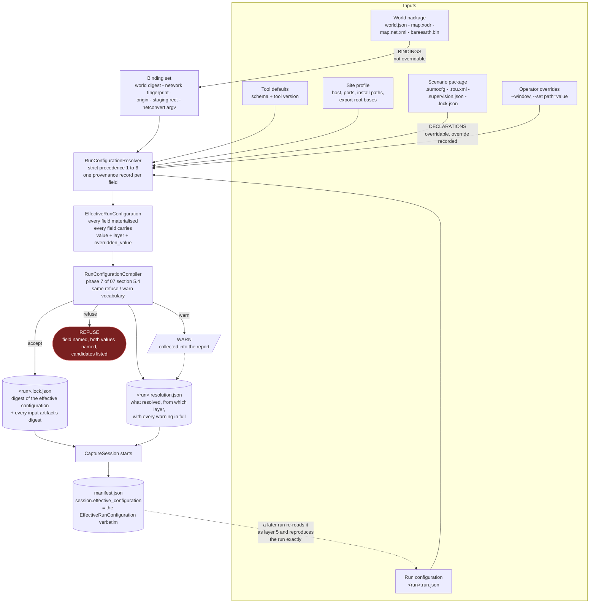
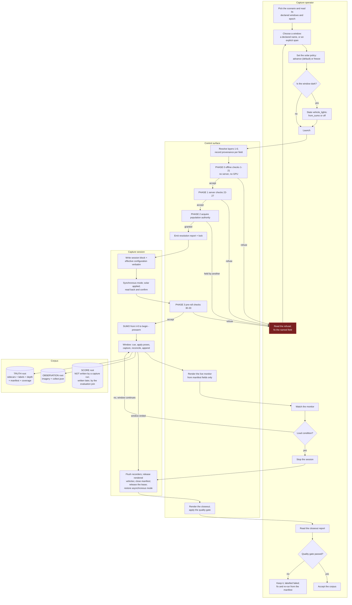

# 12 — The operator control surface

**Status:** Plan section. Specification of a control surface, not an implementation. No code was
changed, no build, cook or engine run. Every measurement in §1 was taken read-only by introspecting
the live parser object and grepping the live source tree on 2026-09-18.
**Date:** 2026-09-18
**Owner role:** Operator control-surface engineer. Added to the team by
[`_TEAM_BRIEF.md`](_TEAM_BRIEF.md) §3a item 3, which makes the surface a first-class deliverable
rather than a by-product.
**Scope:** How an operator expresses, validates, launches, watches and records a capture run; the
complete inventory of what is switchable and what is not; how the new surface coexists with
`run_SCTMV.py` without losing a capability; and how the time-of-day choice reaches the record.
**Audience:** An engineer implementing the launcher and the run-configuration schema, and a reviewer
deciding whether the shape recommended in §3 is the right one. It assumes the fork but not the
conversation that produced this plan.
**Grounding:** Claims about existing behaviour cite `path:line` against the working tree as read on
2026-09-18. Numbers labelled **measured** were produced by a script run during this pass; the scripts
are described where they are used so they can be re-run. Anything labelled **inference** is reasoning.

**Out of scope, deliberately.** The semantics of the solar epoch and of the freeze/advance policy —
those belong to [`11_Time_And_Illumination.md`](11_Time_And_Illumination.md), whose author owns them;
this section owns only how an operator *expresses* and *records* the choice, and states in §4.6 what
it needs from that section. Also out of scope: the scenario specification's own schema
([`07`](07_Scenario_Authoring.md)), the manifest's supervision content
([`06`](06_Truth_And_Annotation.md) §8.4), the sensor rig's optics ([`08`](08_Collection_And_EPoL.md)
§3), and the parameter *values* in [`10`](10_Scale_And_Performance.md) §8 — this section decides where
each value is set and how it is recorded, not what it should be.

---

## 1. The present surface, measured

The user's words were *"we're building a tool suite that is going to have to have some easy way to
control it all."* Before proposing anything, this section measures what exists. The measurement is the
argument; nothing below rests on taste.

### 1.1 Method

`CarlaControlArgumentParser` (`CarlaControl/src/carlacontrol/CarlaControlArgumentParser.py:12`) is a
self-contained module — it imports only `argparse`, `os` and `random` (`:7-9`) — so it can be loaded
in isolation and its `argparse.ArgumentParser` walked directly. Three read-only scripts were run:

1. **Surface census** — load the parser, enumerate `_action_groups` and `_group_actions`, and count.
2. **Consumer trace** — for every `dest`, search the live Python sources
   (`CarlaControl/src/carlacontrol`, `CarlaControl/scripts`, `CarlaNet/python/carlanet`; build output
   excluded) for `args.<dest>`, `getattr(args, "<dest>", …)`, `self.args.<dest>` and dictionary forms.
3. **Duplicated-default scan** — find every `getattr(args, "<dest>", <fallback>)` outside the parser
   and compare `<fallback>` against the parser's own `default=`.

### 1.2 The shape

| | Measured |
|---|---|
| Arguments defined (excluding `-h`) | **86** |
| Distinct option strings | **86** — no argument has a short form or an alias, except the `--fade` / `--no-fade` pair |
| Distinct `dest` values | **85** — `--fade` and `--no-fade` share `fade` |
| Argument groups | **9** |
| `store` actions / `store_true` / `store_false` | **70 / 12 / 4** |
| Mutually exclusive groups | **1** (`--fade` ∥ `--no-fade`, `:317`) |
| Sub-commands, modes or verbs | **0** |
| Total help text | **12,009 characters**; median 71, longest 719 (`--road-offset-east`, `:149-164`) |

Group by group, with the group titles exactly as the parser declares them:

| Group | Count | Declared at |
|---|---:|---|
| `options` (the unnamed root group) | 1 | `:492-499` |
| `connection / mode` | 5 | `:49-74` |
| `world build (phase 1)` | 23 | `:76-221` |
| `EO observer (phase 2)` | 13 | `:223-285` |
| `staging traffic (phase 3)` | 19 | `:287-449` |
| `scenario` | 1 | `:451-460` |
| `CoT telemetry (phase 4)` | 7 | `:462-490` |
| `recording (F hotkey)` | 9 | `:501-569` |
| `orbit` | 8 | `:571-615` |

Alongside it sits a second, undeclared surface: **13 runtime hotkeys** registered in
`PygameInterface.py:289-311`, plus `Escape` and `Space` handled inline (`:347-349`). Four of the
thirteen — `K` (solar advance), `X` (storyboard), `O` (orbit), `P` (orbit pause) — are absent from the
control list in the entry point's own module docstring (`run_SCTMV.py:19-42`); three of those four are
mentioned only inside the help text of an unrelated argument (`--time-advance` at `:256-263`,
`--scenario` at `:453-459`, `--orbit` at `:573-577`), and **`P` is documented nowhere at all**.

### 1.3 What is inert

Two examples were already recorded in the plan. Both are confirmed, and the first is worse than
recorded.

**`--ev` can never have an effect on this fork.** The argument is defined at `:237-242` with
`default=0.0`. Its only consumer is `SensorRig.py:66-67`:

```python
if args.ev is not None and bp.has_attribute("exposure_compensation"):
    bp.set_attribute("exposure_compensation", str(args.ev))
```

The first clause is always true (the default is `0.0`, not `None`), so the guard is entirely the
second. **Measured:** `MakeCameraDefinition`
(`Unreal/CarlaUnreal/Plugins/Carla/Source/Carla/Actor/ActorBlueprintFunctionLibrary.cpp:313-410`)
declares eleven attributes — `fov`, `image_size_x`, `image_size_y`, `lens_circle_falloff`,
`lens_circle_multiplier`, `lens_k`, `lens_kcube`, `lens_x_size`, `lens_y_size`,
`enable_postprocess_effects`, `post_process_profile` — plus `sensor_tick` from
`AddVariationsForSensor` (`:244-254`) and the `role_name` recommendation (`:241`). A grep for
`exposure_compensation` across the whole plugin returns nothing. The RGB camera therefore has **no
exposure attribute of any kind**, and `--ev` is a no-op for every value, silently.

That is a larger finding than "one dead flag". The engine class has the setters —
`SetExposureCompensation`, `SetShutterSpeed`, `SetISO`, `SetAperture`, `SetExposureMinBrightness`,
`SetExposureMaxBrightness`, `SetExposureMethod` and six more
(`Carla/Sensor/SceneCaptureSensor.h:237-378`) — but nothing publishes them as blueprint attributes, so
no client can reach them. [`08`](08_Collection_And_EPoL.md) open question 8 records the same gap from
the collection side. **Consequence for this section:** a night window's brightness is whatever the
engine's auto-exposure produces, and no operator control exists over it. A surface that offers `--ev`
today is telling the operator a lie, and §6 turns that lie into a refusal.

**`--fade` was demoted to `default=False`** (`:318-328`), with `--no-fade` retained at `:329-334` so
existing command lines keep working. The stated reason is in the help text itself: the opacity is
"pushed to the server one blocking RPC per vehicle per reconcile, which is the heaviest load this
client puts on the server's per-frame RPC budget". Confirmed as read. This is the one place in the
present surface where a default was changed on measured grounds and the reason was written down where
the operator will see it — the pattern §3 generalises.

**`--time-rate` is silently inert unless `--time-advance` is given.** `WorldBuilder.py:246-247` reads
`args.time_rate` only inside `if args.time_advance:`. So `--time-rate 3600` alone parses, validates,
is recorded nowhere, and does nothing. There is no warning.

### 1.4 What is conditional

Every argument has at least one consumer — the trace found **86 of 86** reachable, once
`getattr(self.args, …)` forms are included (a first pass missed `--same-side-exit-rate`,
`--occlusion-margin` and `--occlusion-samples`, which are read through `getattr` at
`TrafficController.py:583,877` and `NativeRecorder.py:110-111`). Reachability is not the problem.
The problem is that **most arguments do nothing unless something outside their own group is on**:

| Count | Group | Inert unless |
|---:|---|---|
| 23 | `world build (phase 1)` | `--build` is in force; `--no-build` (`:80-86`) makes all 23 ignored |
| 19 | `staging traffic (phase 3)` | traffic is enabled — `--start-traffic` or the `T` hotkey |
| 9 | `recording (F hotkey)` | recording is enabled — the `F` hotkey; the group title says so, no other does |
| 8 | `orbit` | orbit is active — `--orbit` or the `O` hotkey |
| 7 | `CoT telemetry (phase 4)` | telemetry is enabled — the `Y` hotkey |
| **66 of 86** | | **conditional on a switch or hotkey declared outside their own group** |

Only **20 of 86** are unconditionally in force: the six connection/logging arguments, the thirteen EO
observer arguments, and `--scenario`.

A further three declare a second-order condition inside their own help text and enforce none of it:
`--fixed-delta` ("synchronous mode only", `:71-74`), `--terrain-res` and `--drape-cache-dir` ("'drape'
only", `:130-148`). Passing `--terrain-res 0.5` with `--height-align none` is accepted in silence.

**What this measures.** `argparse` can reject an unknown option and a bad type. It cannot reject an
option that is well-formed, correctly typed, and meaningless in the configuration it was given. With
66 of 86 arguments in that category, the dominant failure mode of the present surface is *a run that
starts, proceeds, and does not do what was asked*. That is the failure this plan cannot afford: a
windowed capture costs hours ([`10`](10_Scale_And_Performance.md) §4.1 measures 19–24 wall-clock days
for the un-windowed case) and the corpus records the configuration it *ran*, not the one that was
intended.

### 1.5 What is ambiguous or undocumented

| Finding | Measured |
|---|---|
| **No help text at all** | 5 arguments: `--osm`, `--ion-token`, `--fov`, `--width`, `--height` |
| **Single-word names carrying no subsystem** | 34 of 86 — including `--time`, `--date`, `--rate`, `--speed`, `--max`, `--step`, `--save`, `--filter`, `--seed`, `--z`, `--print`, `--stale` |
| **Name collisions across subsystems** | `--rate` is telemetry Hz (`:477`), `--record-hz` is capture Hz (`:512`), `--time-rate` is sun-clock gain (`:264`), `--fixed-delta` is the simulation step (`:68`) — four different rates, no shared prefix. `--speed` is camera fly speed (`:271`) while `--speed-scale`, `--speed-spread` and `--speed-bias` are traffic (`:376-419`). `--step` is reference-line sample spacing (`:96`), not a time step |
| **Mixed units inside one group** | The `orbit` group takes `--orbit-x` / `--orbit-y` in **metres** and `--orbit-radius` / `--orbit-altitude` in **FEET** (`:579-609`). `--z` is FEET (`:226-228`) while `--x` / `--y` are metres (`:229-235`) |
| **A parse with a side effect** | `parse_args` seeds the process-global RNG (`:640-641`) while `parse` (`:626-627`) does not. Two entry points, two behaviours, from the same class |
| **Duplicated defaults** | 11 `getattr(args, …, fallback)` sites outside the parser; **3 disagree with the parser's own default** — see below |

The three divergent defaults, measured:

| Knob | Parser default | Second default | Where |
|---|---|---|---|
| `depth_max_range` | `20000.0` (`:274-285`) | `1000.0` | `SensorRig.py:78` |
| `lane_spawn_spacing` | `15.0` (`:365-375`) | `0.0` | `TrafficController.py:647` |
| `speed_bias` | `2.0` (`:376-387`) | `0.0` | `TrafficController.py:700` |

These fallbacks only fire when the caller's `args` object lacks the attribute — that is, when the
consumer is driven by something other than this parser. **Today that never happens, so the divergence
is latent.** It stops being latent the instant a second front end exists, which is precisely what this
section proposes. `depth_max_range` is the sharpest case: the same run would measure depth to 20 km
through one front end and 1 km through the other, and the second silently caps the occlusion
measurement that [`08`](08_Collection_And_EPoL.md) D8.19's denominator depends on.

### 1.6 The trigger case, measured: every run overwrites the sun to noon

`run_SCTMV.py:138` calls `WorldBuilder.setup_solar_time(world, args)` **unconditionally** — after the
`--no-build` branch has already logged "attach mode … using the world already on the server"
(`:131-132`). Inside (`WorldBuilder.py:214-255`):

- `:226-230` — with no `--date`, the date becomes `datetime.now()` on the **host machine**.
- `:231-232` — with no `--time`, `hours = 12.0`.
- `:238-239` — `set_solar_date` then `set_solar_time` are called every time, and `set_solar_date`'s
  return value is discarded.
- `:246-247` — advance is configured only if `--time-advance` was passed.

So **attaching to an existing world resets its sun to 12:00 local on today's host date**, and a
scenario whose civil time is 23:00 renders in full daylight unless the operator remembers `--time`.
This is exactly the failure [`_TEAM_BRIEF.md`](_TEAM_BRIEF.md) §3a describes, and the record makes it
worse rather than catching it: `FrameRecorder.cs:162` reads `GetCachedSolarState()`, `CotWriter.cs:50-65`
writes it into every sidecar as `<_solar solar_time= … sun_elevation_deg= …>`, and `SolarMetadata.cs:6-14`
embeds the same block in every PNG's `tEXt` chunk (`PngEncoder.cs:44`). **The truth record faithfully
reports noon.** Nothing anywhere compares it against what the scenario asserts, because nothing
machine-readable states what the scenario asserts.

Two further details of the same function matter for §4. There is no range check on `--time`: `25:70`
parses to 26.17 and is wrapped by the server (`carlanet/__init__.py:1500-1503`) with no complaint. And
`set_solar_time` returning `False` — which is how the server reports "this world has no CesiumSunSky"
— produces a `logger.warning` (`:244-245`) and the run continues.

### 1.7 What the measurement establishes

1. **The surface is flat and large, and most of it is conditional.** 86 arguments, 9 groups, 0 modes,
   66 of 86 inert unless something else is on.
2. **`argparse` cannot express the constraints that actually matter here.** One mutually exclusive
   pair guards a demoted cosmetic feature; nothing guards the combinations that cost a run.
3. **Defaults are not a recorded artifact.** They live in the parser, are duplicated in three places
   with divergent values, and have changed at least once (`--fade`). A recorded command line is
   therefore *not* a reproducible run description: the same argv on a different build resolves
   differently, silently.
4. **The one axis this plan added — time of day — is the worst-served part of the existing surface.**
   It is four flags in a group named "EO observer", one of which is inert without another, applied
   unconditionally to a world the operator may not have built, defaulting to a value that is wrong for
   any scenario that is not about noon.

This is not a criticism of `CarlaControlArgumentParser`. It is a correct and well-documented parser
for an *interactive single-client viewer*, which is what `run_SCTMV.py` is. §2 shows that a capture
run is a different object.

---

## 2. What a capture run has to carry

Gathered from across the plan. Each row names what must be decided before a run can start, and who
already owns it. The point of the table is its size and its heterogeneity: this is what a flat
argument list would have to express.

| Axis | What must be decided | Owner |
|---|---|---|
| **Mode** | Which of the four modes, exclusively | [`01`](01_Architecture.md) §5.1 |
| **World package** | Which world, and the binding that proves the scenario was authored against it | [`07`](07_Scenario_Authoring.md) §2, D7.15 |
| **Scenario package** | Which scenario, at which lock, with which supervision plan | [`07`](07_Scenario_Authoring.md) §5.1 |
| **Capture window** | `[begin_s, end_s]` in simulated time, plus prewarm | [`10`](10_Scale_And_Performance.md) §4.2, D10.3 |
| **Render region and caps** | `render_region`, `render_cap`, `render_cap_hard`, the lead/lag hysteresis, the rendered-fraction floor | [`10`](10_Scale_And_Performance.md) §8, D10.4, D10.5 |
| **Camera rig** | N channels, each `(sensor_id, pattern, track, optics, depth?, seg?)` | [`08`](08_Collection_And_EPoL.md) §3.2, §3.3, D8.4 |
| **Clock** | SUMO step, world delta, capture rate — an integer-ratio contract | [`01`](01_Architecture.md) D1.13 |
| **Solar epoch and policy** | The civil instant `t = 0` means, and whether the sun freezes or advances | [`11`](11_Time_And_Illumination.md); this section for expression |
| **Seeds** | Four of them, separately | [`07`](07_Scenario_Authoring.md) D7.11 |
| **Supervision and export roots** | Three roots, one writer each | [`08`](08_Collection_And_EPoL.md) D8.17 |
| **Telemetry sinks** | Whether, where, and on which thread | [`10`](10_Scale_And_Performance.md) D10.11; [`08`](08_Collection_And_EPoL.md) D8.23 |
| **Occlusion estimator** | On/off, margin, sample density | [`08`](08_Collection_And_EPoL.md) §4.4, open question 1 |

Twelve axes, of which four are *bindings to artifacts* (world, scenario, epoch, supervision plan),
three are *contracts between numbers* (clock ratio, render sizing, seeds), and five are *choices*. A
flat argument list can express the choices. It cannot express a binding — there is nothing for a flag
to bind *to* — and it cannot validate a contract between three numbers that live in three different
groups.

---

## 3. The shape of the new surface

### 3.1 The requirements, restated as tests

The brief states five. Each is restated here as something a candidate either passes or fails, so §3.3
is an evaluation rather than a preference.

| | Requirement | Test |
|---|---|---|
| **R1** | Every run is reproducible from a recorded artifact | Take the artifact the run recorded, give it to the tool on a different machine and a later build, and get the same effective configuration — **including every value that came from a default** |
| **R2** | The effective configuration is written into the run manifest | Open `manifest.json` and read the value of any knob, without knowing what the tool's defaults were |
| **R3** | A human can launch a common case in one short line | The commonest case — "capture the night window of this scenario" — fits on one line and names nothing that the scenario or the world already knows |
| **R4** | An assistant can generate a configuration reliably | There is a machine-readable schema; an unknown key is a refusal, not a silent no-op; and every refusal names the field and the candidates |
| **R5** | Nothing important can be left implicit | For every field, either it has a default that is correct in every case the tool accepts, or the tool refuses until it is stated |

### 3.2 Candidate — an extended flat command line

Extend `CarlaControlArgumentParser`'s pattern: add groups for SUMO drive, the window, the rig, the
solar policy and the roots; add cross-argument validation in code after `parse_args`.

| Test | Result |
|---|---|
| R1 | **Fails.** The recorded artifact would be the argv, and argv + defaults is not reproducible because defaults change. *Measured:* `--fade`'s default flipped from true to false (`:318-328`), and `--height-align` defaults to `none` (`:120-129`) while every world this plan describes is built with `drape`. An argv recorded before a default change replays differently and nothing says so |
| R2 | Fails unless the tool separately materialises every default into the manifest — at which point the artifact of R1 is that materialisation, not the argv, and this candidate has become the next one |
| R3 | **Fails today and would get worse.** *Measured:* the zero-argument invocation does not attach and capture; it builds a world from `Import/Lakeview_Carson.osm` (`:87-89`, file present, 730,905 bytes). The default behaviour of the viewer is the most expensive operation it has. Adding twelve axes to 86 arguments does not produce a short line |
| R4 | **Fails.** There is no schema. `argparse`'s only failure modes are unknown option and type coercion; the 66-of-86 conditional structure of §1.4 means the assistant's likely mistakes are all silent |
| R5 | **Fails structurally.** An omitted flag and a deliberately defaulted flag are indistinguishable in argv, so "the operator did not think about the sun" and "the operator chose noon" produce identical records |

This candidate is rejected on R1 and R5, which are the two the corpus depends on.

### 3.3 Candidate — a run-configuration file with a thin command line

One document per run describing the whole run; the command line names the file and little else.

| Test | Result |
|---|---|
| R1 | **Passes**, provided the file is complete — i.e. provided the tool writes back a fully-materialised copy rather than trusting the hand-written one |
| R2 | **Passes** |
| R3 | **Partly fails.** A common case still costs a file. *Measured consequence:* [`10`](10_Scale_And_Performance.md) D10.3 recommends 4–8 windows per seven-day scenario and [`07`](07_Scenario_Authoring.md) D7.12 makes counterfactual pairing a sweep mode that doubles the run list — so one scenario produces 8–16 near-identical files whose diffs are two fields each |
| R4 | **Passes** with a schema |
| R5 | **Passes** |

Rejected only on R3, and R3 matters: a surface that makes the ordinary case laborious gets worked
around, and the workaround is copy-paste, which is how 16 files acquire 16 different values for a
field nobody meant to vary.

### 3.4 Candidate — layered resolution: artifact bindings, then declared defaults, then the run, then the operator

A scenario declares what it knows (its epoch, its named windows, its step, its region hint); a run
configuration states the run's own choices; the operator overrides individual fields on the command
line. All of it resolves into one **effective run configuration** before anything starts, and that
object — not the file, not the argv — is the recorded artifact.

| Test | Result |
|---|---|
| R1 | **Passes.** The recorded artifact is the resolved object, which contains no defaults-by-reference |
| R2 | **Passes** — it is the same object |
| R3 | **Passes.** `run_capture --scenario bahonar --window night_shift` is the common case, because the scenario already declares `night_shift` |
| R4 | **Passes**, same schema as the previous candidate |
| R5 | **Passes only if every resolved field carries its provenance.** Layering is exactly where implicitness creeps back in: "where did this value come from?" must be answerable from the artifact, not by re-deriving it |

**This is the recommendation**, with the R5 caveat promoted to a hard property (§3.6).

The decisive argument is not that layering is elegant. It is that **this plan already contains the
mechanism, one level down, and building a second one would be the duplication the brief forbids.**
[`07`](07_Scenario_Authoring.md) §5 compiles a scenario specification against a world package into a
`.lock.json` plus a `.resolution.json`, with a stated refuse/warn vocabulary and a report that states
*what it resolved*, not only what it rejected (D7.6). A run configuration is the same kind of object
one layer up: a document, bound to artifacts, compiled, locked and reported. §6 therefore does not
invent a validator; it adds a phase to that one.

### 3.5 The layers, named

Strictly increasing precedence. Every layer is optional except the first and the bindings.

| # | Layer | What it supplies | Override by a higher layer |
|---|---|---|---|
| 1 | **Tool defaults** | Values compiled into the schema and versioned with the tool. Every one is materialised into the effective configuration with `provenance: "tool_default"` and the tool version | Permitted |
| 2 | **Site profile** | Facts about *this machine*, not about the science: server host and port, SUMO install, Cesium ion token, the three export roots' base paths. Separated so a run configuration is portable between machines unedited | Permitted |
| 3 | **World package binding** | Origin latitude/longitude, staging rectangle, netconvert argument vector and version, world digest, network fingerprint | **Refused.** These are bindings, not defaults; an operator override here is a check failure naming both values |
| 4 | **Scenario package declaration** | Solar epoch, named capture windows, SUMO step, the supervision plan, the scenario's own seeds, its `render_region` and its rendered-fraction floor | Permitted, and every override is recorded against the value it replaced |
| 5 | **Run configuration** | The run's choices: mode, window selection, rig, caps, solar policy, sinks, roots, seeds | Permitted |
| 6 | **Operator override** | One command-line flag per field, in `--set <path>=<value>` form plus short aliases for the handful in §3.8 | — |

Two properties make the layering safe rather than merely convenient:

- **A field that no layer supplies and that has no tool default is a refusal.** This is R5's mechanism.
- **A field whose correct value depends on a condition has no default under that condition.** Named
  the **conditional requirement**, it is what lets the file stay short in the ordinary case while
  still forbidding an important implicit choice. §4.4 and §5.2 use it twice; both uses are stated.

### 3.6 Configuration resolution



The dashed edge at the bottom is R1's test made structural: **the manifest's effective configuration
is itself a valid run configuration.** Reproducing a run is reading it back, not reconstructing it.

### 3.7 What the effective configuration looks like

One field, in full, to fix the shape:

```jsonc
"render_cap": {
  "value": 128,
  "layer": "scenario_package",
  "provenance": "bahonar_pattern_of_life@a91c3f :: capture.render_cap",
  "tool_default": 128,
  "overridden": null
},
"solar": {
  "policy":  { "value": "advance", "layer": "tool_default", "tool_default": "advance" },
  "epoch":   { "value": {"date": "2026-03-04", "time_zone": "+03:30", "t0_civil": "00:00:00"},
               "layer": "scenario_package", "provenance": "bahonar…@a91c3f :: epoch" },
  "rate":    { "value": 1.0, "layer": "pinned_by_policy", "note": "advance pins rate to 1.0; see 12 D12.8" },
  "vehicle_lights": { "value": "from_sumo", "layer": "run_configuration",
                      "note": "conditional requirement: window sun elevation reaches -11.4 deg" }
}
```

Three properties, each doing a job:

- `layer` answers "where did this come from" without re-deriving it — R5 under layering.
- `tool_default` is carried **beside** the value even when the value came from elsewhere, so a later
  reader can tell a deliberate match from an accident, and a default change is visible in a diff.
- `overridden` records what an operator override replaced, so an override is an event in the record
  rather than an absence.

This costs nothing at run time: the whole object is written once at session start and never read again
by the session.

### 3.8 The short line

R3 is a real requirement and it is met by making the scenario carry what the scenario knows. The
common cases, in full:

```
run_capture --scenario bahonar_pattern_of_life --window night_shift
run_capture --scenario bahonar_pattern_of_life --window night_shift --solar freeze
run_capture --run configs/bahonar_night_sweep.run.json
run_capture --run configs/bahonar_night_sweep.run.json --set capture.render_cap=192
run_capture --replay manifests/cap-20260105-2300/manifest.json
```

Everything else is either declared by the scenario (the epoch, the windows, the step, the supervision
plan), fixed by the site profile (host, ports, roots), or bound by the world package (origin, digest).
`--window` takes a name the scenario declared or an explicit `begin_s:end_s` pair — which is
[`01`](01_Architecture.md) open question 3's and [`02`](02_Use_Cases.md) open question 2's recommended
answer, adopted here and recorded as D12.4 so those two can be closed together.

There is deliberately **no** `--dry-run`. Validation is not optional and not a mode: §6's phase 0 runs
on every launch, and a `--validate-only` flag stops after it. The difference matters because a
`--dry-run` that people forget to use is theatre.

### 3.9 The classes

Under [`AGENTS.md`](../../../../AGENTS.md): one public class per file, the file named for the class in
PascalCase, modern union hints, absolute imports outside the package, all imports at the top,
`logging` rather than `print`, and a thin `main` that parses, constructs and calls.

| File | Public class | Responsibility |
|---|---|---|
| `RunConfiguration.py` | `RunConfiguration` | The parsed, unresolved document. Schema-validated; knows nothing about worlds or servers |
| `SiteProfile.py` | `SiteProfile` | Layer 2. Machine facts, discovered or read from one file per machine |
| `RunConfigurationResolver.py` | `RunConfigurationResolver` | Applies layers 1–6 in order, records provenance per field, refuses an override of a binding |
| `EffectiveRunConfiguration.py` | `EffectiveRunConfiguration` | The resolved, immutable object of §3.7. Serialises itself; is re-readable as layer 5 |
| `RunConfigurationValidator.py` | `RunConfigurationValidator` | §6's checks, split by phase; emits refusals and warnings in [`07`](07_Scenario_Authoring.md) §5.2's vocabulary |
| `SessionMonitor.py` | `SessionMonitor` | §7.1's live view; reads only fields the manifest also carries |
| `RunCloseoutReport.py` | `RunCloseoutReport` | §7.2's end-of-run report and quality gate |
| `WorldBuildConfiguration.py` | `WorldBuildConfiguration` | §9.2's single definition of the 23 world-build inputs, produced by both front ends |
| `scripts/run_capture.py` | — | Thin `main`: resolve, validate, construct `CaptureSession`, run, close out |

`CaptureSession`, `PlaybackClock`, `RenderSetSelector`, `RunManifestWriter` and `SumoSession` are
[`01`](01_Architecture.md) §2.3's components and are not redefined here; this section constructs them
and hands them one object.

---

## 4. Time of day

This is the axis that triggered the section, and §1.6 measured it as the worst-served part of the
existing surface. The mechanisms are complete; what is missing is expression, defaults, coupling and
recording.

### 4.1 What exists, verified

Re-resolved against the tree on 2026-09-18 rather than carried from the brief.

| Layer | Surface | Cited |
|---|---|---|
| Python shim | `set_solar_time(hours)`, `set_solar_date(y,m,d)`, `get_solar_state()`, `set_time_advance(enabled, rate)` | `carlanet/__init__.py:1500, :1506, :1511, :1535` |
| C# client | `SetSolarTimeAsync`, `SetSolarDateAsync`, `GetSolarStateAsync`, `SetTimeAdvanceAsync`, `GetCachedSolarState` | `CarlaClient.cs:1043, :1048, :1053, :1058, :1991` |
| Publication | Eleven doubles at offset 36 of the extended world-observer header, cached per tick, no RPC | `CarlaClient.cs:165-169, :1842-1855` |
| Capture record | `<_solar>` element on every sidecar, and a `carla:solar` JSON `tEXt` chunk in every PNG | `CotWriter.cs:50-65`; `SolarMetadata.cs:6-14`; `PngEncoder.cs:44`; read at `FrameRecorder.cs:162` |
| Vehicle lights | `Actor.set_light_state` / `get_light_state` over `VehicleLightStateFlags`; `SetVehicleLightStateCommand` is one of the batch commands | `carlanet/__init__.py:781, :786, :479, :487, :1147` |

**Per-capture recording is already solved.** Every frame already carries the sun that rendered it,
twice, in two independently-readable places. That is why §1.6's defect is dangerous rather than
merely annoying: the record is trustworthy and the value in it is wrong.

### 4.2 What is missing

| # | Gap | Evidence |
|---|---|---|
| 1 | **A scenario declares no civil time.** The mapping from simulated seconds to civil time exists only inside trip identifiers and in the author's head | [`_TEAM_BRIEF.md`](_TEAM_BRIEF.md) §3a, measured on the sizing scenario |
| 2 | **Nothing couples the sun to the window.** `setup_solar_time` runs once, before any window exists | `run_SCTMV.py:138`; `WorldBuilder.py:214` |
| 3 | **The default is wrong for every scenario that is not about noon**, and applies even in attach mode | `WorldBuilder.py:231-232`; `run_SCTMV.py:131-138` |
| 4 | **The policy is not recorded at run level.** Per capture, `advancing` and `rate` ride in `<_solar>`; the *run's intent* — freeze or advance, and from which epoch — is nowhere. [`06`](06_Truth_And_Annotation.md) §8.4's manifest has no solar block at all | Read from the manifest schema |
| 5 | **A world with no sun is a warning, not a refusal** | `WorldBuilder.py:244-245` |
| 6 | **`rate` is unpinned and under-specified.** Its help says "wall-clock in `--async`, simulation time under synchronous ticking" but says nothing about which simulated second | `:256-270`; `carlanet/__init__.py:1535-1541` |
| 7 | **No exposure control exists**, so illumination cannot be compensated for even deliberately | §1.3, measured |

### 4.3 How an operator expresses it

One block, four fields, in the run configuration:

```jsonc
"solar": {
  "epoch": null,                  // layer 4 only; an operator override here is a refusal
  "policy": "advance",            // advance | freeze | accelerated
  "freeze_at": "window_start",    // policy=freeze only: window_start | an explicit civil time
  "vehicle_lights": null          // off | from_sumo ; conditional requirement, see 4.4
}
```

and one short alias, `--solar freeze | advance`, because it is the one field an operator flips run to
run — which is the requirement [`_TEAM_BRIEF.md`](_TEAM_BRIEF.md) §3a item 2 states.

**The epoch is a binding, not a choice.** It comes from the scenario package (layer 4) and an operator
cannot override it, for the same reason they cannot override the world digest: a scenario that asserts
23:00 and a run that renders 12:00 produce a corpus that contradicts itself, and the whole point of
§3.5's layer-3/4 distinction is to make that unrepresentable. Its shape — civil date, time zone, and
the civil instant `t = 0` denotes — is [`11`](11_Time_And_Illumination.md)'s to define; §4.6 states
what this section needs it to support.

**The three policies, and what each pins.**

| Policy | Sun behaviour | `rate` | Permitted in |
|---|---|---|---|
| `advance` | Tracks simulated time. `set_time_advance(True, 1.0)`; the sun advances one sun-second per simulated second | **Pinned to 1.0**, not operator-settable | Any run |
| `freeze` | Held at the window's civil instant (or at `freeze_at`). `set_solar_time(instant)`, `set_time_advance(False, …)` | n/a | Any run |
| `accelerated` | `set_time_advance(True, rate)` with `rate ≠ 1.0` | Operator-set | **Refused for a capture run**; available in the interactive path (§9) |

`accelerated` exists today as `--time-rate` (`:264-270`) and is genuinely useful for look development
— watching a site through a day in a minute. It is **refused for a capture run, not removed**, because
under it the recorded `<_solar solar_time=…>` of successive frames no longer corresponds to the
scenario's own clock, which is the precise contradiction this whole requirement exists to prevent.
Confining a capability to the mode it is correct in is not losing it
([`_TEAM_BRIEF.md`](_TEAM_BRIEF.md) §4).

**What `rate = 1.0` means, pinned down.** `set_time_advance` "advances with the world tick"
(`carlanet/__init__.py:1538-1540`), so under synchronous ticking the sun advances by
`rate × world_delta_s` of sun-clock per cued tick. Under [`01`](01_Architecture.md) D1.1 the
`PlaybackClock` cues the world exactly once per `world_delta_s` of simulated time and per D1.13 the
SUMO step, the world delta and the capture rate are in integer ratio. Therefore **one tick is one
`world_delta_s` of simulated time, and `rate = 1.0` makes one sun-second equal one simulated second —
the same second the scenario's `t` counts in.** Any other rate breaks that identity. This is the
statement [`_TEAM_BRIEF.md`](_TEAM_BRIEF.md) §3a asks for, and it holds only because the clock
contract holds; §6 check 9 re-checks the ratio at launch for that reason.

### 4.4 Defaults, and why `advance` is the safe one

The default must be safe. Safe here means: **an operator who did not think about it does not get a
record that is physically impossible.**

- Default `advance`: a 1,800 s window ([`10`](10_Scale_And_Performance.md) D10.3) advances the sun by
  30 minutes. At dawn or dusk that is a visible illumination change across the window, and every
  frame's `<_solar>` records it correctly. An operator who wanted a controlled constant gets a corpus
  that varies slightly and *says so*, per frame, in two places.
- Default `freeze`: illumination is constant and recorded as constant. An operator who wanted the
  light to change gets 1,800 simulated seconds under a stationary sun — a state that cannot occur —
  and nothing flags it, because a constant `<_solar>` block is exactly what `freeze` is supposed to
  produce.

The failure modes are asymmetric: one is a small, self-describing, correct variation; the other is an
internally consistent physical impossibility. **Default `advance`.** `freeze` is a deliberate
experimental control — hold illumination constant across a sweep so it is not a covariate — and a
deliberate control should be asked for.

**Vehicle lights are a conditional requirement.** Default `off`, which preserves today's behaviour
exactly. But when the compiler computes the sun elevation across the requested window (it can: the
epoch plus the window plus the world's origin latitude and longitude are all in hand before anything
starts) and finds it below −6° — civil twilight — for any part of the window, **`vehicle_lights` has
no default and the run is refused until it is stated**. Both values are then legitimate and neither is
silent: a dark corpus with unlit vehicles is a deliberate choice, and a dark corpus with lit vehicles
is a deliberate choice, but nobody gets either by forgetting. The cost of `from_sumo` is zero extra
round trips — `SetVehicleLightStateCommand` rides the per-tick batch that
[`03`](03_CoSimulation_Runtime.md) already issues (`carlanet/__init__.py:487, :1147`).

*Inference, labelled:* brake and indicator state is the most detectable vehicle signature available to
a night EO detector, so this choice plausibly dominates a night corpus's usefulness. That is an
argument for making it explicit, which is what the conditional requirement does; it is not an argument
for choosing it here, which belongs to whoever captures the first night window.

### 4.5 What reaches the manifest

[`06`](06_Truth_And_Annotation.md) §8.4's `session` block gains one sibling. It is small because the
per-capture record already exists (§4.1); what is missing is the run's *intent* and the *confirmation*
that the intent took effect:

```jsonc
"solar": {
  "epoch": { "date": "2026-03-04", "time_zone": "+03:30", "t0_civil": "00:00:00",
             "source": "bahonar_pattern_of_life@a91c3f" },
  "policy": "advance",
  "rate": 1.0,
  "vehicle_lights": "from_sumo",
  "window_civil": ["2026-03-08T23:00:00+03:30", "2026-03-08T23:30:00+03:30"],
  "applied":   { "solar_time": 23.0, "date": "2026-03-08", "time_zone": 3.5,
                 "sun_elevation_deg": -37.2, "sun_azimuth_deg": 12.4, "advancing": true, "rate": 1.0 },
  "confirmed": { "at_tick": 7410000, "source": "get_solar_state" },
  "closing":   { "solar_time": 23.5, "sun_elevation_deg": -41.8 }
}
```

`applied` and `confirmed` are the part that matters and the part that does not exist today.
`WorldBuilder.py:238-247` sets the sun and logs *what it asked for*; it never reads back. The capture
surface reads `get_solar_state()` after applying, at the first cued tick, and records what the world
actually reports — which costs no RPC (`CarlaClient.cs:1991`). A disagreement between `applied` and
what was requested is a refusal at launch (§6 check 13), not a line in a log.

### 4.6 What this section needs from `11_Time_And_Illumination.md`

Stated as properties, per the brief's rule on cross-section dependencies.

| # | Property needed | Why this section needs it |
|---|---|---|
| **N1** | **An epoch type that carries a civil date, a time zone offset and the civil instant `t = 0` denotes**, and that supports a **half-hour offset** — the sizing scenario's site is at +03:30 | §4.3's binding; a time zone modelled as an integer would silently shift the sizing scenario's sun by 30 minutes |
| **N2** | **A total function from `(epoch, simulated_seconds)` to a civil instant and to the arguments of `set_solar_time` / `set_solar_date`** | §4.5's `window_civil` and `applied`; and §6 check 12 has to evaluate it for a window before any server exists |
| **N3** | **A statement of whether the epoch's time zone and the sun's time zone are the same quantity.** The sun's is derived from map longitude (`carlanet/__init__.py:1500-1502`), which for the sizing scenario is longitude ≈ 56°E ⇒ +03:44, against a civil +03:30 | If they differ, one of them is wrong in the record and this section needs to know which field carries which |
| **N4** | **A sun-elevation function** over `(epoch, simulated_seconds, latitude, longitude)` usable offline | §4.4's conditional requirement and §6 check 14 must evaluate darkness at launch, on a machine with no server and no GPU — [`02`](02_Use_Cases.md) D2.2's property |
| **N5** | **A ruling on daylight saving.** `setup_solar_time` takes a host-local date with no DST handling and the memory record notes DST was explicitly disabled at spawn | §4.5's `time_zone` is recorded as a number; whether it is fixed or seasonal changes what a corpus spanning a transition means |
| **N6** | **Confirmation that `rate` is sun-clock seconds per simulated second under synchronous ticking**, as §4.3 derives | If it is per wall-clock second even in synchronous mode, D12.8's pinning is wrong and the coupling has to be driven per tick from the client instead |

---

## 5. The complete toggle inventory

### 5.1 Four mutability classes

Named descriptively, because "static" and "dynamic" do not say what is at stake.

| Class | Meaning | Recorded as |
|---|---|---|
| **Bound** | Fixed by an artifact. Not the operator's to set; an attempt is a refusal naming both values | A binding in the effective configuration and the lock file |
| **Session-fixed** | The operator sets it; it is then fixed for the session's life. Changing it mid-run would make the corpus's own description of itself false | A field in the effective configuration, written once |
| **Degradation-only** | Never set by the operator. Changed only by [`10`](10_Scale_And_Performance.md) §7's shedding ladder, and always recorded at the instant it changes | A timestamped entry in the manifest, per window |
| **Run-mutable** | May change mid-run because it does not change what the corpus *is* | A `control_events[]` entry in the manifest: tick, field, old value, new value |

The dividing line between Session-fixed and Run-mutable is one question: **would a consumer reading
the corpus be wrong if this changed and they did not know?** If yes, it is Session-fixed. The
occlusion estimator is the instructive case: it looks like a toggle (it is one today, implicitly, via
`--no-occlusion` at `:542-552`), but [`08`](08_Collection_And_EPoL.md) D8.19 makes a capture whose
occlusion could not be paired *excluded from the unoccluded denominator entirely* — so turning it off
mid-run silently changes the meaning of the denominator. Session-fixed.

### 5.2 The inventory

Defaults marked **—** have no default: the run is refused until the field is supplied (R5). Defaults
marked **cond.** are conditional requirements (§3.5).

#### Mode and authority

| Toggle | Values | Default | Class | Source |
|---|---|---|---|---|
| `mode` | `sumo_driven_playback` \| `traffic_manager_ambient` \| `storyboard_execution` \| `recorded_replay` | **—** | Session-fixed | [`01`](01_Architecture.md) §5.1 |
| `ambient_traffic` | *not a field in `sumo_driven_playback`* | n/a | Bound | [`_TEAM_BRIEF.md`](_TEAM_BRIEF.md) §3 item 4 |
| `storyboard` | path \| null | `null` | Session-fixed; refused with `sumo_driven_playback` until SUMO mirroring exists | [`01`](01_Architecture.md) §5.2 |
| `pacing` | `as_available` \| `wall_clock` | `as_available` for a corpus, `wall_clock` for a live exercise | Session-fixed | [`08`](08_Collection_And_EPoL.md) §10.1 |

#### Bindings

| Toggle | Default | Class |
|---|---|---|
| `world_package` | **—** | Session-fixed (the choice); its contents are Bound |
| `scenario_package` | **—** in `sumo_driven_playback` | Session-fixed (the choice); its contents are Bound |
| `world_digest`, `network_fingerprint`, `origin_lat`, `origin_lon`, `staging_rect`, `netconvert_argv`, `netconvert_version` | from the world package | **Bound** |
| `catalogue_version`, `vocabulary_version`, `supervision_plan` | from the packages | **Bound** |
| `sumo_step_s` | from the scenario | **Bound** |

#### Clock and window

| Toggle | Default | Class | Source |
|---|---|---|---|
| `world_delta_s` | `0.05` | Session-fixed | today's `--fixed-delta` (`:68-74`) |
| `capture_hz` | `2.0` | Session-fixed; **Degradation-only** downward | today's `--record-hz` (`:512-518`); [`10`](10_Scale_And_Performance.md) §7 row 4 |
| `synchronous` | `true`, and not a field in a capture run | **Bound** | [`10`](10_Scale_And_Performance.md) D10.10 |
| `window` | **—** (a scenario-declared name or an explicit pair) | Session-fixed | [`01`](01_Architecture.md) OQ3 / [`02`](02_Use_Cases.md) OQ2, resolved as D12.4 |
| `prewarm_s` | `300` | Session-fixed | [`10`](10_Scale_And_Performance.md) §8 |

#### Render set

| Toggle | Default | Class | Source |
|---|---|---|---|
| `render_region` | **—** (never defaulted) | Session-fixed | [`10`](10_Scale_And_Performance.md) D10.5 |
| `render_cap` | `128` | Session-fixed | D10.4 |
| `render_cap_hard` | `192` | Session-fixed | D10.4 |
| `entry_lead_m` / `exit_lag_m` / `exit_lag_s` | `200` / `100` / `5.0` | Session-fixed | §8 |
| `frustum_lead_s` / `aoi_halo_m` | `3.0` / `50` | Session-fixed | §8 |
| `aoi_max_relations_per_vehicle` | `4` | Session-fixed | D10.8 |
| `rendered_fraction_floor` | from the scenario; **—** if the scenario declares none | Session-fixed | [`10`](10_Scale_And_Performance.md) §7 |
| admission priority order | not a field — the selector's rule | Bound | [`01`](01_Architecture.md) D1.14 |

#### Camera rig — per channel

| Toggle | Default | Class | Source |
|---|---|---|---|
| `sensor_id` | **—** when more than one channel | Session-fixed | [`08`](08_Collection_And_EPoL.md) D8.4 |
| `pattern` | `stare` | Session-fixed; a camera is not re-aimed during an interval it covers | [`08`](08_Collection_And_EPoL.md) §3.3, D8.16a |
| `fov` / `width` / `height` | `90.0` / `1280` / `720` | Session-fixed | today's `:236, :272-273` |
| `capture_rgb` | `true` | Bound — a channel without it is not a channel | [`08`](08_Collection_And_EPoL.md) D8.2 |
| `capture_depth` | `true` for a corpus, `false` for a live exercise | Session-fixed | D8.2 |
| `capture_segmentation` | `false` | Session-fixed | [`08`](08_Collection_And_EPoL.md) OQ2 |
| `depth_max_range_m` | `20000.0` | Session-fixed | `:274-285`; and see §1.5's divergent second default |
| `sensor_tick` | `1 / capture_hz`, gated on measurement M1 | Session-fixed | set nowhere today; `ActorBlueprintFunctionLibrary.cpp:248` |
| `exposure` | **not offered** — the attribute does not exist (§1.3) | — | measured |
| `orbit_radius_m`, `orbit_altitude_m`, `orbit_period_s` | `200.0`, `518.2`, `240.0` | Session-fixed | today's `:598-615`, **converted to metres** (§1.5) |

#### Solar

| Toggle | Default | Class | Source |
|---|---|---|---|
| `solar.epoch` | from the scenario; **—** if absent | **Bound** | §4.3 |
| `solar.policy` | `advance` | Session-fixed | §4.4, D12.7 |
| `solar.rate` | pinned `1.0` under `advance`; operator-set only under `accelerated`, which a capture run refuses | Bound under `advance` | §4.3, D12.8 |
| `solar.freeze_at` | `window_start` | Session-fixed | §4.3 |
| `solar.vehicle_lights` | `off`; **cond.** — no default when the window is darker than −6° | Session-fixed | §4.4 |

#### Telemetry and occlusion

| Toggle | Default | Class | Source |
|---|---|---|---|
| `telemetry.enabled` | `false` | **Run-mutable** — it changes nothing about the corpus | today's `Y` hotkey (`PygameInterface.py:306`) |
| `telemetry.host` / `port` / `ttl` / `rate_hz` / `stale_s` / `affiliation` | `239.2.3.1` / `6969` / `1` / `5.0` / `3.0` / `n` | Session-fixed | `:465-484` |
| `telemetry.on_tick_thread` | `false`, and not a field | **Bound** | [`10`](10_Scale_And_Performance.md) D10.11 |
| `telemetry.truth_endpoint` | `null` in a live exercise | Session-fixed | [`08`](08_Collection_And_EPoL.md) D8.23 |
| `occlusion.enabled` | `true` | Session-fixed — **not** run-mutable (§5.1) | `:542-552`; [`08`](08_Collection_And_EPoL.md) D8.19 |
| `occlusion.margin_m` / `occlusion.samples` | `1.0` / `24` | Session-fixed, recorded in the manifest | `:553-569`; [`08`](08_Collection_And_EPoL.md) OQ1 |

#### Roots, seeds, diagnostics

| Toggle | Default | Class | Source |
|---|---|---|---|
| `roots.observation` / `roots.truth` / `roots.score` | derived from the site profile's base + session id; **—** if any two resolve equal or nested | Session-fixed | [`08`](08_Collection_And_EPoL.md) D8.17 |
| `seeds.sumo` / `seeds.appearance` / `seeds.admission` | **—** (explicit; no nondeterministic default) | Session-fixed | [`07`](07_Scenario_Authoring.md) D7.11 |
| `log_path` | `<session_root>/session.log` | Session-fixed | today's `--log` (`:493-499`) |
| `diagnostics` | `off` | **Run-mutable** | today's `]` hotkey; `:439-449` |
| `monitor` | `on` | **Run-mutable** | §7.1 |

`seeds.*` having no default is a deliberate change from today, where `--seed` defaults to `None` and
is documented "default: nondeterministic" (`:310-316`). A nondeterministic default is incompatible
with R1. Today's behaviour is preserved by `--set seeds.sumo=random`, which resolves to a drawn value
**and records the drawn value**, so the run is still reproducible afterwards.

### 5.3 The structural exclusions

Three combinations must be impossible rather than rejected late.

| Exclusion | Where it is caught | Why both layers are needed |
|---|---|---|
| **SUMO drive × traffic-manager ambient** | (a) The schema: `mode` is one enum and a block belonging to a non-selected mode is an **unknown key**, which is a refusal. (b) The lease: `WorldDriveAuthority` denies population authority at session start, naming the holder | (a) catches "this configuration asks for both" at compile time, with no server. (b) catches "something else is already driving this world", which no configuration can know. Neither substitutes for the other |
| **SUMO drive × storyboard execution** | Compile-time refusal until SUMO mirroring exists; then a conditional permit | [`01`](01_Architecture.md) §5.2 — an unmirrored entity is invisible to every SUMO vehicle |
| **Anything × recorded replay** | `mode` is one enum | [`01`](01_Architecture.md) §5.2 |

The lockout being a *failed session start naming the holder* rather than a warning is
[`01`](01_Architecture.md) D1.7 and [`02`](02_Use_Cases.md) D2.6; this section adds only that the
configuration cannot express the request in the first place.

---

## 6. Validation and failure

**The obligation:** a configuration that cannot work fails at launch with the reason named, not at
minute forty. [`02`](02_Use_Cases.md) UC-7 already states the sharpest instance — "a capture window
falls outside the scenario's end time: refuse at session start rather than discovering an empty world
at hour 170".

### 6.1 One compiler, not two

[`07`](07_Scenario_Authoring.md) §5 defines a compile-and-validate step with a stated refuse/warn
vocabulary, a resolution report that states what it *resolved* (D7.6), and a lock file. **The run
configuration is compiled by the same compiler, as a further phase**, emitting `<run>.resolution.json`
and `<run>.lock.json` in the same format, rendered by the same reporter. Concretely: §3.6's
`RunConfigurationCompiler` is phase 7 of the pipeline drawn in [`07`](07_Scenario_Authoring.md) §5.4,
reached after phase 6 has emitted the scenario package. A scenario that was compiled earlier is
re-bound by its lock rather than recompiled.

Three things are inherited rather than re-specified: **refuse** means nothing is emitted and no session
starts; **warn** means it proceeds and the warning appears in full in the report; and the report states
what resolved, not only what was rejected.

### 6.2 The checks

Grouped by phase. **Phase 0 needs no server, no GPU and no SUMO** — [`02`](02_Use_Cases.md) D2.2's
property, extended to the run configuration so an operator can validate a night's worth of runs on a
laptop.

#### Phase 0 — offline

| # | Check | Outcome | Message shape |
|---:|---|---|---|
| 1 | Document parses against the schema at its declared `spec_version` | refuse | `run configuration: unknown key 'capture.render_capp' at line 14; did you mean 'capture.render_cap'?` |
| 2 | Every required field is supplied by some layer | refuse | `'capture.window' has no value and no default. Supply it, or name one of the scenario's declared windows: morning_shift, night_shift.` |
| 3 | No operator override targets a layer-3 binding | refuse | `'world.origin_lat' is bound by world package Bahonar@3f91ac (56.3421); it cannot be overridden. Rebuild the world to change it.` |
| 4 | `mode` is one value, and no block of a non-selected mode is present | refuse | `mode is 'sumo_driven_playback'; block 'traffic_manager' is not valid in this mode. Ambient traffic and SUMO drive are mutually exclusive (01 D1.7).` |
| 5 | Scenario lock's world fingerprint equals the world package's | refuse on recipe mismatch, **warn** on digest-only mismatch with an explicit override | `scenario bahonar@a91c3f was compiled against network fingerprint net@88b1de; world package Bahonar@3f91ac carries net@2c40aa.` — the two-tier gate of [`07`](07_Scenario_Authoring.md) check 1 |
| 6 | Catalogue and vocabulary versions are ones this tool understands | refuse | `vocabulary_version 3 is newer than this tool's 2.` |
| 7 | `window` resolves — a declared name, or a pair inside `[0, simulated_span_s]` | refuse, listing the declared names | `window 620000:621800 ends after the scenario's end time 604800.` |
| 8 | `window.begin_s − prewarm_s ≥ 0` | warn | `prewarm 300 s clipped to 180 s: the window begins at t=180.` |
| 9 | `sumo_step_s`, `world_delta_s` and `capture_hz` are in integer ratio | refuse | `clock ratio: sumo_step 1.0 s / world_delta 0.03 s is not an integer (33.33). Choose a world_delta that divides the SUMO step.` — [`01`](01_Architecture.md) D1.13 |
| 10 | `sensor_tick` is consistent with `capture_hz` | warn | `sensor_tick 0.0 renders every channel at world rate while the recorder keeps 1 frame in 10.` |
| 11 | `sensor_id` present and unique when channels > 1 | refuse | `two channels both name sensor_id 'OVERWATCH-1'.` |
| 12 | The scenario declares a solar epoch | refuse | `scenario bahonar@a91c3f declares no epoch. A capture cannot set a sun from simulated seconds without one (12 §4.3).` |
| 13 | The window's civil span is computable from the epoch | refuse | `epoch time zone '+3:3' is not a valid offset.` |
| 14 | If the window's sun elevation falls below −6°, `solar.vehicle_lights` is stated | refuse | `window night_shift is dark (sun elevation −37.2° to −41.8°). 'solar.vehicle_lights' has no default in a dark window: state 'from_sumo' or 'off'.` |
| 15 | `solar.policy` is not `accelerated` | refuse | `solar.policy 'accelerated' is not permitted in a capture run: a rate other than 1.0 makes recorded solar time disagree with the scenario's clock. Use the interactive viewer for look development.` |
| 16 | `exposure` is not requested | refuse | `camera exposure is not available on this build: sensor.camera.rgb declares no exposure attribute (ActorBlueprintFunctionLibrary.cpp:313-410).` — this is §1.3's dead flag made loud |
| 17 | The three export roots are distinct and none contains another | refuse | `roots.truth '/data/run7' contains roots.observation '/data/run7/obs'. The anti-leak split requires three disjoint roots (08 D8.17).` |
| 18 | Every seed has an explicit value or `random` | refuse | `seeds.sumo is unset. Give a value, or 'random' to draw and record one.` |
| 19 | Predicted corpus size fits the free space under `roots.observation` | refuse | `window needs ~52 GB at 2 Hz × 2 channels × 6.2 Mpx; 31 GB free at /data.` — derived from [`10`](10_Scale_And_Performance.md) §4.2.3's measured per-frame sizes |
| 20 | `render_region` is present and sized | refuse | `capture.render_region has no value; it is never defaulted (10 D10.5). The scenario's radial population profile suggests 300 m.` |
| 21 | Predicted in-region population stays under `render_cap` for at least `rendered_fraction_floor` of the window | warn, with the numbers | `at render_region 600 m the median in-region population is 276 against render_cap 128; the cap will bind for 94% of the window and the label-dependent shedding path becomes active (00 §6).` |

Check 21 is the one that earns the phase. [`00_Overview.md`](00_Overview.md) §6 records that the cap
binding makes scene density a function of the label, which would exclude an Arapahoe-class corpus from
training; the resolution is to size the region so the cap does not bind. **That is a configuration
property, checkable before a run rather than discovered in the manifest afterwards** — the scenario
has already been run headless ([`10`](10_Scale_And_Performance.md) D10.13: a scenario that will be
captured is run), so the population inside a candidate region at every step is a lookup.

#### Phase 1 — server-bound

| # | Check | Outcome | Message shape |
|---:|---|---|---|
| 22 | The loaded world's OpenDRIVE digest equals the world package's | refuse | `server holds xodr@2c40aa; the run names Bahonar@3f91ac. Load the right world or name the right package.` |
| 23 | `get_solar_state()` returns a state — the world has a CesiumSunSky | refuse | `world has no CesiumSunSky: a capture cannot set its sun. (Today this is a warning at WorldBuilder.py:244-245 and the run continues.)` |
| 24 | Every attribute the rig sets exists on the blueprint it targets | refuse, naming the attribute and the blueprint | `sensor.camera.depth has no attribute 'max_range' on this build; depth would silently use 1000 m.` |
| 25 | Every `vType` in the scenario binds to a blueprint present on this server | refuse | carried from [`07`](07_Scenario_Authoring.md) check 14, re-run against the live server |
| 26 | The resolved SUMO version equals the one that built the world | refuse, with an explicit override | `world built by netconvert 1.27.0; SUMO_HOME resolves 1.27.1.` — [`09`](09_Toolchain_And_Packaging.md) D9.6 |
| 27 | No other client is attached | warn | `2 clients attached; in synchronous mode each client's service time is added to the tick (10 D10.10).` |

#### Phase 2 — authority

| # | Check | Outcome | Message shape |
|---:|---|---|---|
| 28 | Population authority acquired | refuse | `population authority held by TrafficManagerAmbient (client 0x…, since tick 41200). Stop it before starting a SUMO capture.` — [`01`](01_Architecture.md) D1.7 |
| 29 | Motion authority free for every vehicle the run will drive | refuse, naming the holder | [`01`](01_Architecture.md) D1.8 |

#### Phase 3 — pre-roll

| # | Check | Outcome | Message shape |
|---:|---|---|---|
| 30 | SUMO reaches `window.begin_s − prewarm_s` | refuse on a SUMO error, naming its own message | [`10`](10_Scale_And_Performance.md) D10.2 |
| 31 | Applied solar state matches the requested one, read back from `get_solar_state()` | refuse | `requested solar_time 23.00, world reports 12.00.` — §4.5's `confirmed` |
| 32 | The first cued tick delivers a frame on every channel | refuse | `channel OVERWATCH-2 delivered no frame within 5 cues.` — [`02`](02_Use_Cases.md) UC-7's session fault, applied before the window rather than during it |
| 33 | Actual in-region population at `window.begin_s` against `render_cap` | warn, with the number | closes the loop on check 21 with the real figure |

### 6.3 Launch, from command to first capture

```mermaid
sequenceDiagram
    autonumber
    actor OP as Capture operator
    participant CLI as run_capture
    participant RES as RunConfigurationResolver
    participant VAL as RunConfigurationValidator
    participant SRV as CARLA server
    participant AUT as WorldDriveAuthority
    participant SUMO as SumoSession
    participant CLK as PlaybackClock
    participant MAN as RunManifestWriter
    participant REC as FrameRecorder per channel

    OP->>CLI: run_capture --scenario bahonar --window night_shift
    CLI->>RES: resolve layers 1..6
    RES->>RES: bind world package (layer 3)
    RES->>RES: read scenario declarations (layer 4)
    RES-->>CLI: EffectiveRunConfiguration<br/>+ provenance per field

    rect rgb(30,45,70)
    note over CLI,VAL: PHASE 0 - offline. No server, no GPU, no SUMO.
    CLI->>VAL: validate(effective)
    VAL-->>CLI: checks 1-21
    alt any refusal
        VAL-->>OP: REFUSE, field named, both values named,<br/>candidates listed. Nothing started.
    end
    end

    CLI->>SRV: connect
    rect rgb(30,45,70)
    note over CLI,SRV: PHASE 1 - server-bound
    CLI->>SRV: get OpenDRIVE digest, blueprint attributes,<br/>get_solar_state()
    SRV-->>CLI: world state
    CLI->>VAL: validate_against_server(...)
    VAL-->>CLI: checks 22-27
    alt refusal
        VAL-->>OP: REFUSE. Nothing acquired, nothing spawned.
    end
    end

    rect rgb(30,45,70)
    note over CLI,AUT: PHASE 2 - authority. The first irreversible step.
    CLI->>AUT: acquire population authority (mode, session_id)
    alt held
        AUT-->>OP: REFUSE naming the current holder
    end
    AUT-->>CLI: granted
    end

    CLI->>MAN: open manifest, write session block<br/>+ effective_configuration verbatim
    CLI->>SRV: synchronous mode, world_delta_s
    CLI->>SRV: set_solar_date / set_solar_time (window civil instant)
    CLI->>SRV: set_time_advance(policy == advance, 1.0)

    rect rgb(30,45,70)
    note over CLI,SUMO: PHASE 3 - pre-roll
    CLI->>SUMO: launch, step from t=0 to begin_s - prewarm_s
    SUMO-->>CLI: warm state
    CLI->>VAL: validate_preroll(...)
    VAL-->>CLI: checks 30-33
    alt refusal
        CLI->>AUT: release
        VAL-->>OP: REFUSE. Manifest closed as aborted_at_preroll.
    end
    end

    CLK->>SRV: cue first tick of the window
    SRV-->>CLK: frame delivered
    CLK->>SRV: get_solar_state() (no RPC, cached)
    CLK->>MAN: solar.confirmed at this tick
    CLK->>REC: capture
    REC->>MAN: first capture recorded
    REC-->>OP: monitor shows first capture, clock ratio, population
```



The ordering is the substance. **Everything that can be checked without a server is checked without a
server; everything that can be checked before acquiring authority is checked before acquiring
authority; and the sun is applied and read back before the first capture, not after.** Phase 2 is
marked as the first irreversible step because it is the first one another operator can notice.

---

## 7. What the operator sees, and what is reported at the end

[`02`](02_Use_Cases.md) open question 5 asks this directly and says nothing above specifies it. This
is the answer.

### 7.1 While it runs

One rule governs the design: **every field the monitor displays is a field the manifest also carries,
read from the same source.** A monitor that computes its own numbers is a second implementation that
can disagree with the record, and a disagreement between the screen and the corpus is the worst
outcome available — the operator believes the screen.

```
bahonar_pattern_of_life :: night_shift          cap-20260308-2300     [ADVANCING]
sim   t=371 240 / 371 700   window  61.7%   |  civil 23:12:20 +03:30  sun -39.1 deg
clock 0.41 ticks/wall-s  (ratio 0.29)       |  ETA 00:52 wall
sumo  population 139   eligible 96   admitted 96   shed 0        cap 128
render                                       rendered fraction 1.00  floor 0.95  OK
chan  OVERWATCH-1   frames 1 482   dropped 0   occl paired 1 482/1 482
chan  OVERWATCH-2   frames 1 482   dropped 0   occl paired 1 481/1 482    1 unpaired
truth manifest flushed t=371 238 (2 s ago)   instances 7   intervals open 2
```

| Field | Why it is there | Manifest field |
|---|---|---|
| Window progress and civil time | The operator must be able to see that the sun matches the scenario, which is §1.6's defect made visible | `solar.window_civil`, `<_solar>` per capture |
| Sun elevation and the advancing flag | The one number that says the time-of-day coupling is working | `solar.applied`, `solar.confirmed` |
| **Achieved ticks per wall-second and the clock ratio** | Recorded nowhere today; recoverable only by differencing PNG metadata against file timestamps | [`10`](10_Scale_And_Performance.md) D10.12 |
| `population / eligible / admitted / shed` | The shedding ledger, live | `shedding[]` ([`10`](10_Scale_And_Performance.md) §7) |
| Rendered fraction against the floor | The quality gate, live rather than at the end | `render_accounting` |
| **Frames written and `Dropped`, per channel** | `FrameRecorder.Dropped` is incremented at `FrameRecorder.cs:184` and has **no reader anywhere in the tree** | [`10`](10_Scale_And_Performance.md) D10.7 |
| Occlusion pairing successes and failures | An unpaired capture is excluded from the unoccluded denominator entirely | [`08`](08_Collection_And_EPoL.md) D8.19 |
| Manifest last-flush tick | The manifest is written incrementally; a stalled writer is a silent loss of supervision | [`06`](06_Truth_And_Annotation.md) §8.4 |

**Three conditions are loud** — they interrupt rather than appearing in a column, because each means
the corpus is no longer what was asked for:

1. A participant in an open annotated interval could not be admitted →
   [`04`](04_Contracts.md) D4.6 fails the run at that tick.
2. `Dropped` becomes non-zero on any channel → [`10`](10_Scale_And_Performance.md) D10.7.
3. The rendered fraction falls below the declared floor → [`10`](10_Scale_And_Performance.md) §7.

Nothing else interrupts. Diagnostics verbosity stays Run-mutable (§5.2) precisely so that the loud
conditions are not buried, which is the reason `--traffic-diagnostics` is off by default today
(`:439-449`).

### 7.2 At the end

`RunCloseoutReport` renders the closed manifest and applies a quality gate. It is not a new artifact —
it is a rendering of one — for the same reason the monitor is not a second computation.

| Section | Contents | Gate |
|---|---|---|
| **Identity** | session, run, scenario, plan, world digest, network fingerprint, seeds, effective-configuration digest | — |
| **What was asked for** | the effective configuration, with every field that came from an override or a non-default layer flagged | — |
| **What ran** | window in simulated and civil time; achieved ticks per wall-second per window; wall-clock elapsed | **fail** if the clock ratio was not recorded |
| **Capture** | frames per channel; `Dropped` per channel; capture rate per window including any degradation step; occlusion pairing | **fail** if `Dropped ≠ 0` (D10.7); **fail** if the capture rate changed and was not recorded |
| **Render accounting** | simulated / rendered / never rendered; admissions; refusals by reason; `cap_bound_ticks`; median rendered fraction | **fail** below the floor; **fail** if any annotated interval was never rendered |
| **Solar** | requested policy, epoch, applied state, confirmed state, closing state | **fail** if `applied` and `confirmed` disagree |
| **Supervision** | instances, intervals, per-interval observability, prevalence in all three units | **fail** if the manifest is not closed |
| **Corpus-affecting events** | SUMO collisions, teleports, emergency stops, reconciliation refusals | **warn**, per [`01`](01_Architecture.md) OQ6 |

A failed gate does not delete anything. It marks the manifest `quality_gate: "failed"` with the
failing checks named, so the run is *usable and labelled* rather than discarded or silently trusted —
which is [`08`](08_Collection_And_EPoL.md) open question 6's recommendation applied to more than the
closed flag.

### 7.3 The two silent failures this closes

Both are recorded in [`00_Overview.md`](00_Overview.md) §5 and neither is a new mechanism; they are
readers for values that already exist.

- **`FrameRecorder.Dropped` has no reader.** It is incremented today and read nowhere. The monitor
  reads it per channel per second; the closeout reads it at window close; a non-zero value fails the
  gate. A thin corpus stops looking like a normal one.
- **The clock ratio is recorded nowhere.** [`10`](10_Scale_And_Performance.md) §7 measures it as
  non-constant across sessions — 84%, 99%, 29.5% — so a window that ran at 15% produced the same
  imagery as one that ran at 90% at six times the cost, and nothing in the corpus says which. The
  monitor shows it live and the manifest records it per window.

---

## 8. The operator's session

Partitions are the operator, the control surface, the capture session and the corpus.



Three things the diagram asserts:

- **Every refusal returns the operator to choosing the window, not to a restart.** The refusal names a
  field; the fix is an edit to that field; nothing that was acquired has to be released because
  nothing was acquired.
- **The darkness branch is in the operator's lane, before the launch.** It is a conditional
  requirement (§4.4), so it is a decision the operator makes rather than a default they inherit.
- **The `SCORE` root is drawn and explicitly not written.** A capture run touches two of
  [`08`](08_Collection_And_EPoL.md) D8.17's three roots, and the third is written by the evaluation
  join in a different process — which is the anti-leak boundary's physical form.

---

## 9. Coexistence with `run_SCTMV.py`

[`_TEAM_BRIEF.md`](_TEAM_BRIEF.md) §3 item 6 keeps the traffic-manager path and the OpenSCENARIO
executor; §4 forbids losing a capability. This section adds a second front end; it removes nothing.

### 9.1 What stays exactly as it is

`run_SCTMV.py` and `CarlaControlArgumentParser` remain the interactive path: world building, free
flight and orbit, ambient staging traffic, storyboard execution, live telemetry, ad-hoc recording, and
the thirteen hotkeys. Every one of the 86 arguments keeps working. In particular, three capabilities
live **only** there and must not be assumed to migrate:

| Capability | Why it stays interactive |
|---|---|
| **Free-flight camera control** (`PyGameSensorController`) | A capture run's camera track is declared, not flown. Siting a stare or an orbit is done by flying there first |
| **`solar.policy: accelerated`** (`--time-rate`) | Refused for a capture run (§4.3), and genuinely useful for look development |
| **`--async` free-running mode** | A capture run is synchronous by [`10`](10_Scale_And_Performance.md) D10.10 |

### 9.2 What is shared, and how

Three concerns are genuinely common. Each gets **one definition and two front ends**, never two copies.

| Concern | Single definition | Consumed by |
|---|---|---|
| **World build inputs** — the 23 arguments of `world build (phase 1)` | `WorldBuildConfiguration` (§3.9). `CarlaControlArgumentParser`'s build group is refactored to *construct* one; the run configuration's `world_build` block deserialises one | `WorldBuilder`, both front ends |
| **Sensor rig construction** | `SensorRig` already takes an `args`-shaped object; it takes a typed channel description instead, and the argument parser builds a one-channel description from `--x/--y/--z/--fov/--width/--height/--depth-max-range` | both front ends |
| **Recorder construction** | `NativeRecorder` already takes `args`; it takes a typed capture description instead | both front ends |

The rule that makes this work: **a default is defined exactly once, in the schema, and the argument
parser's `default=` reads it from there.** §1.5 measured why this is not optional — three
`getattr(args, …, fallback)` sites already disagree with the parser, and they disagree *because* they
were written to survive a caller that does not use this parser. A second front end is exactly that
caller. `depth_max_range` would ship 20 km through one path and 1 km through the other, silently
truncating the occlusion measurement that the observed denominator rests on.

### 9.3 What must not be duplicated

| Must not be duplicated | Because |
|---|---|
| Defaults | §1.5, measured: three already divergent |
| The world-build argument set | 23 arguments carrying a measured 2,832 characters of hard-won help text, including the measurement instructions in `--road-offset-east` (`:149-164`) |
| The solar application path | §1.6's defect exists once; duplicating it doubles it. `WorldBuilder.setup_solar_time` is replaced by a shared `SolarApplication` that both front ends call, with the capture path supplying an epoch and the interactive path supplying `--time`/`--date` as it does today |
| Validation | §6.1: one compiler, one refuse/warn vocabulary, one report renderer |
| The session identity | [`08`](08_Collection_And_EPoL.md) D8.4: assigned once per session and handed to every channel; `FrameRecorder`'s wall-clock fallback (`FrameRecorder.cs:98-103`) survives only for a single-channel interactive run |

### 9.4 Repairs the interactive path needs anyway

These are not migration work; they are defects §1 measured, and they should be fixed in
`run_SCTMV.py`'s own surface whether or not the new one is built.

1. **`--ev` is refused or removed** (§1.3). A flag that cannot work must not parse.
2. **The three divergent defaults are reconciled** (§1.5), starting with `depth_max_range`.
3. **`--time-rate` without `--time-advance` warns** rather than being silently inert (§1.3).
4. **`setup_solar_time` does not overwrite the sun in attach mode** unless `--time` or `--date` was
   given (§1.6). This is a behaviour change and is the right one: attaching to a world should not
   silently relight it.
5. **The four undocumented hotkeys are documented** in the module docstring, `P` in particular
   (§1.2).
6. **`parse` and `parse_args` behave identically**; the RNG side effect at `:640-641` moves to the
   caller.

### 9.5 The conversion, stated as a property

There is no cut-over. The run configuration schema is a superset of what the interactive path can
express for the overlapping concerns, so `run_capture --emit-run-configuration` can render a
`run_SCTMV.py` command line into a run configuration, and the resolution report shows what each flag
resolved to. That is the migration path for an operator with a command line they trust: run it once
through the converter, read the report, keep the file.

---

## 10. Both platforms

[`_TEAM_BRIEF.md`](_TEAM_BRIEF.md) §4: any change to `Scripts/Windows/*.ps1` requires its
`Scripts/Linux/*.sh` counterpart in the same change, help text and documentation included.

**The parity is already broken, measured.** `Scripts/Windows/MakeDistribution.ps1:237` copies
`CarlaNet\python\SCTMV.py`, a file deleted in `d2c666c23`; the copy only warns, so the build succeeds,
and `:301` then writes a `run-sctmv.ps1` that executes the absent script. The Linux script was
migrated correctly: `Scripts/Linux/MakeDistribution.sh:117` copies
`CarlaControl/scripts/run_SCTMV.py` and `:196` executes it. A second, unrecorded half of the same
break: `MakeDistribution.sh:112-113` bundles **both** the `carlanet` and `carlacontrol` wheels, while
the Windows script bundles only `carlanet` (`:230-234`) and mentions `carlacontrol` nowhere — so even
with the script path fixed, a Windows distribution could not import `carlacontrol`.

What this section's work requires, on both platforms in the same change:

| Artifact | Windows | Linux |
|---|---|---|
| Capture launcher | `Scripts/Windows/RunCapture.ps1` | `Scripts/Linux/RunCapture.sh` |
| Distribution launcher written into the bundle | `run-capture.ps1` beside `run-sctmv.ps1` | `run-capture.sh` beside `run-sctmv.sh` |
| Distribution contents | the `carlacontrol` wheel, the run-configuration schema, the site-profile template, the vehicle catalogue and the annotation vocabulary ([`09`](09_Toolchain_And_Packaging.md) §5.5) | the same set |
| `MakeDistribution` header comment describing the tree | `:8-20` updated | `:9-12` updated |
| Distribution README | the capture quick-start | the capture quick-start |

Two properties are required of the launchers, both because the underlying tool is the same program:

- **The `--help` output is generated from the schema, not hand-written**, so the two platforms cannot
  drift and an assistant reading `--help` gets the same field names the schema validates.
- **A parity check runs in CI**: the two launchers are invoked with `--help` and their option sets
  compared. The measured break above survived because nothing compared them.

The site profile (§3.5 layer 2) is what keeps the run configuration itself platform-neutral: paths,
the SUMO install, the ion token and the export root bases live there, so a run configuration authored
on Windows runs unedited on Linux.

---

## 11. What this section does not cover

- **The epoch's and the policy's semantics.** [`11`](11_Time_And_Illumination.md) owns them; §4.6
  states the six properties this section needs.
- **The scenario specification's schema.** [`07`](07_Scenario_Authoring.md) §3.5 owns it. This section
  requires only that it can declare an epoch, named windows and a rendered-fraction floor.
- **The manifest's supervision content.** [`06`](06_Truth_And_Annotation.md) §8.4 owns it; §4.5 adds
  one sibling block and §7.2 reads it.
- **The values of the render parameters.** [`10`](10_Scale_And_Performance.md) §8 owns them; §5.2
  records where each is set and which class it is in.
- **The optics and coverage of the rig.** [`08`](08_Collection_And_EPoL.md) §3 owns them.
- **A graphical interface.** Nothing above needs one. If one is built it is a producer of run
  configurations and a reader of manifests, and it changes nothing in §3 or §6.
- **The live exercise's operator picture.** [`08`](08_Collection_And_EPoL.md) §10.4 owns it; §7.1 is
  the capture monitor and the two are different displays for different jobs.
- **Exposure control.** Measured absent (§1.3). Making it exist is engine plumbing with the setters
  already present (`SceneCaptureSensor.h:237-378`); it belongs with whoever captures the first night
  window, and §6 check 16 makes its absence loud until then.

---

## 12. Decisions

| # | Decision |
|---|---|
| **D12.1** | **The present surface is measured, not characterised: 86 arguments in 9 groups, 0 modes, 1 mutually exclusive pair, 5 with no help text, 34 single-word names, and 66 of 86 inert unless a switch or hotkey outside their own group is on.** The redesign rests on those numbers and on three measured defects — `--ev` cannot work, `--time-rate` is silently inert without `--time-advance`, and three defaults are duplicated outside the parser with divergent values (§1) |
| **D12.2** | **The control surface is layered resolution, not an extended flat command line and not a bare configuration file.** Six layers in strict precedence: tool defaults, site profile, world-package bindings, scenario declarations, run configuration, operator overrides. Rejected: the flat command line, because a recorded argv is not a reproducible run description once a default changes — *measured:* `--fade` already flipped; and the bare file, because one scenario's 4–8 windows times a counterfactual sweep produces 8–16 near-identical documents (§3.2–3.4) |
| **D12.3** | **The recorded artifact is the `EffectiveRunConfiguration`, and every field in it carries its value, its layer, the tool default it would have had, and what any override replaced.** The manifest's copy is itself a valid run configuration, so reproducing a run is reading it back rather than reconstructing it. This is what makes layering safe: "where did this come from" is answered by the artifact, not by re-derivation (§3.6, §3.7) |
| **D12.4** | **A capture window is chosen by name from the scenario's declarations, or given explicitly by the operator, and the manifest records which.** This closes [`01`](01_Architecture.md) open question 3 and [`02`](02_Use_Cases.md) open question 2 together, in the way both recommended (§3.8) |
| **D12.5** | **Run-configuration validation is a further phase of [`07`](07_Scenario_Authoring.md) §5's compiler, not a second validator.** Same refuse/warn vocabulary, same resolution report, same lock-file shape. Phase 0 — 21 of the 33 checks — needs no server, no GPU and no SUMO, preserving [`02`](02_Use_Cases.md) D2.2's property one layer up (§6.1, §6.2) |
| **D12.6** | **Two mutual-exclusion mechanisms, both required.** A configuration naming a block of a non-selected mode is refused at compile time with no server involved; a world whose population authority is held refuses the session start naming the holder. The first catches a wrong request, the second catches a busy world; neither substitutes for the other (§5.3) |
| **D12.7** | **The default solar policy is `advance`.** The failure modes are asymmetric: a run that wanted constant illumination and got `advance` records a small, correct, self-describing variation, while a run that wanted changing light and got `freeze` records a physically impossible constant that nothing flags. `freeze` is a deliberate experimental control and is asked for (§4.4) |
| **D12.8** | **Under `advance`, `rate` is pinned to 1.0 and is not operator-settable**, because `set_time_advance` advances per cued tick and [`01`](01_Architecture.md) D1.1/D1.13 make one tick exactly `world_delta_s` of simulated time — so 1.0 is the only value under which one sun-second is one scenario-second. `accelerated` (any other rate) is **refused for a capture run and retained in the interactive path**, where it is useful and harmless (§4.3) |
| **D12.9** | **The solar epoch is a binding, not a choice.** It comes from the scenario package and an operator override of it is a refusal, for the same reason the world digest is: a scenario asserting 23:00 rendered at 12:00 is a self-contradicting corpus, and the surface must not be able to express the request (§4.3) |
| **D12.10** | **A field whose correct value depends on a condition has no default under that condition** — the *conditional requirement*. Its first use: `solar.vehicle_lights` defaults to `off`, but in a window whose sun elevation falls below −6° it has no default and the run is refused until it is stated. This is how the surface stays short in the ordinary case without letting an important choice be implicit (§3.5, §4.4) |
| **D12.11** | **Seeds have no nondeterministic default.** Today `--seed` defaults to `None`, documented "nondeterministic" (`:310-316`), which is incompatible with reproducing a run from its record. `random` is still available and resolves to a drawn value that is then recorded (§5.2) |
| **D12.12** | **The solar state is read back from the world and recorded before the first capture, and a disagreement with what was requested refuses the run.** Today `WorldBuilder.py:238-247` logs what it asked for and never reads back, and a world with no CesiumSunSky produces a warning and a run that continues (`:244-245`) (§4.5, §6.2 checks 23 and 31) |
| **D12.13** | **Four mutability classes — Bound, Session-fixed, Degradation-only, Run-mutable — decided by one question: would a consumer reading the corpus be wrong if this changed and they did not know?** The occlusion estimator is Session-fixed rather than Run-mutable for exactly this reason, although it is a runtime toggle today (§5.1, §5.2) |
| **D12.14** | **The live monitor displays only fields the manifest also carries, read from the same source.** A monitor that computes its own numbers can disagree with the record, and the operator believes the screen (§7.1) |
| **D12.15** | **Three conditions interrupt the operator and nothing else does:** a participant in an open annotated interval refused admission, a non-zero `Dropped` on any channel, and the rendered fraction falling below the declared floor. Everything else is a column (§7.1) |
| **D12.16** | **A failed quality gate labels the run, it does not discard it.** `quality_gate: "failed"` with the failing checks named, so the corpus is usable and honest rather than silently trusted or thrown away (§7.2) |
| **D12.17** | **`run_SCTMV.py` and its parser keep every one of their 86 arguments and all thirteen hotkeys.** The new surface is a second front end over shared definitions — `WorldBuildConfiguration`, the channel description, the capture description, and one solar application path — with **defaults defined exactly once in the schema**. *Measured justification:* three `getattr` fallbacks already disagree with the parser and exist precisely to survive a caller that is not this parser (§9.2, §9.3, §1.5) |
| **D12.18** | **Six repairs to the interactive surface are owed regardless of whether the new one is built:** refuse or remove `--ev`; reconcile the three divergent defaults; warn on `--time-rate` without `--time-advance`; stop overwriting the sun in attach mode; document the four undocumented hotkeys; and make `parse` and `parse_args` behave identically (§9.4) |
| **D12.19** | **The launcher ships on both platforms in the same change, its `--help` generated from the schema, with a CI parity check comparing the two option sets.** *Measured:* the existing parity break survived because nothing compared them — `MakeDistribution.ps1:237` copies a file deleted in `d2c666c23` and only warns, `:301` then writes a launcher that runs it, and the Windows script additionally omits the `carlacontrol` wheel that `MakeDistribution.sh:112-113` bundles (§10) |
| **D12.20** | **The predicted in-region population is checked against `render_cap` at launch**, using the scenario's already-run population profile, and a region that makes the cap bind produces a warning with the numbers. This moves [`00_Overview.md`](00_Overview.md) §6's cross-section conflict — label-dependent shedding excluding a corpus from training — from something discovered in a manifest to something named before the run starts (§6.2 check 21) |

---

## 13. Open questions

1. **Does a capture session need a run-list runner, or does the operator loop?**
   [`10`](10_Scale_And_Performance.md) D10.3 puts 4–8 windows on a seven-day scenario and
   [`07`](07_Scenario_Authoring.md) D7.12 doubles that for counterfactual pairs, so a night's work is
   8–16 sessions. Options: the operator launches each; or `run_capture --run-list` walks the sweep
   artifact [`07`](07_Scenario_Authoring.md) §7.2 already defines, one session per entry, stopping on
   the first failed quality gate. **Recommend the second**, because the artifact exists and because
   stopping on the first failure is the difference between one wasted window and twelve. What is
   genuinely unsettled is whether a run list should share one `sumo` process across its windows —
   which is [`01`](01_Architecture.md) open question 5 and should be answered with it, not separately.

2. **Where does the site profile live, and who writes it?** It is the layer that makes a run
   configuration portable, and it is also the layer nobody will maintain. Options: a file beside the
   distribution, discovered by convention; environment variables, as `CARLA_NETCONVERT` and `PROJ_LIB`
   already are (`run_SCTMV.py:60-78`); or derived from the distribution's own layout with no file at
   all. **Recommend the third with the first as an override**, since a distribution already knows
   where its own `tools/sumo` is — but it interacts with [`09`](09_Toolchain_And_Packaging.md) D9.6's
   `SUMO_HOME` precedence and should not be decided without it.

3. **Should `solar.vehicle_lights` default to `from_sumo` in a dark window rather than being a
   conditional requirement?** D12.10 refuses to choose and forces the operator to. The argument for
   choosing `from_sumo` instead is that brake and indicator state is plausibly the dominant detectable
   signature at night, so `off` produces a corpus that is wrong rather than merely conservative. The
   argument against is that nobody has captured a night window yet and the choice would be made from
   an argument rather than an image. **Recommend keeping the conditional requirement until one night
   window exists**, then revisiting with the imagery in hand. **Needs the user** only if they would
   rather not be asked each time.

4. **What happens to a capture run when the operator stops it mid-window?** §8 draws it as a clean
   close, and the manifest would be closed with a short window. But a half-window is a corpus whose
   authored intervals are truncated by the operator rather than by the scenario, which
   [`01`](01_Architecture.md) open question 4 needs a `closed_by` value for. Options: treat an operator
   stop as a distinct `closed_by` reason; or refuse to close a window early without an explicit
   `--truncate` acknowledgement. **Recommend the first**, and it should be named by
   [`06`](06_Truth_And_Annotation.md) alongside the other `closed_by` values rather than invented here.

5. **Is there an operator-facing preview of what a window will look like before it costs a run?**
   §6's check 21 predicts population and check 19 predicts corpus size, both cheaply. A third
   prediction — the sun's elevation and azimuth across the window, and the fraction of it that is
   dark — is equally cheap once [`11`](11_Time_And_Illumination.md)'s N4 exists, and would let an
   operator choose a window by its light rather than by its traffic. **Recommend adding it to the
   resolution report** rather than building a separate tool; noting that it is exactly the information
   that would have prevented the defect in §1.6 from ever mattering.

6. **Should the effective configuration be signed, or merely digested?**
   [`07`](07_Scenario_Authoring.md) open question 3 raises the same question for the scenario's
   resolution report — that an author should record having read it. The run-level analogue is stronger,
   because a capture is expensive and the operator's acceptance of check 21's warning is a judgement
   nobody else can reconstruct. **Recommend a field in the run lock recording which warnings were
   acknowledged and by whom**, populated from an explicit flag — but process that is not enforced is
   theatre, and whether this one would be enforced is a question about how the team works rather than
   about the tool.

7. **Does the monitor belong in the same process as the capture session?** §7.1 assumes it does,
   which is simplest and guarantees it reads the same fields. But [`10`](10_Scale_And_Performance.md)
   D10.10 requires no other polling client in synchronous mode, and a separate monitor process would
   be one — unless it tails the manifest instead of talking to the server, which it could, since the
   manifest is written incrementally and carries every field §7.1 displays. **Recommend in-process for
   the default single-process deployment ([`01`](01_Architecture.md) D1.12), and a manifest-tailing
   monitor as the remote option**, because the manifest is already the single source and tailing it
   costs the server nothing.
