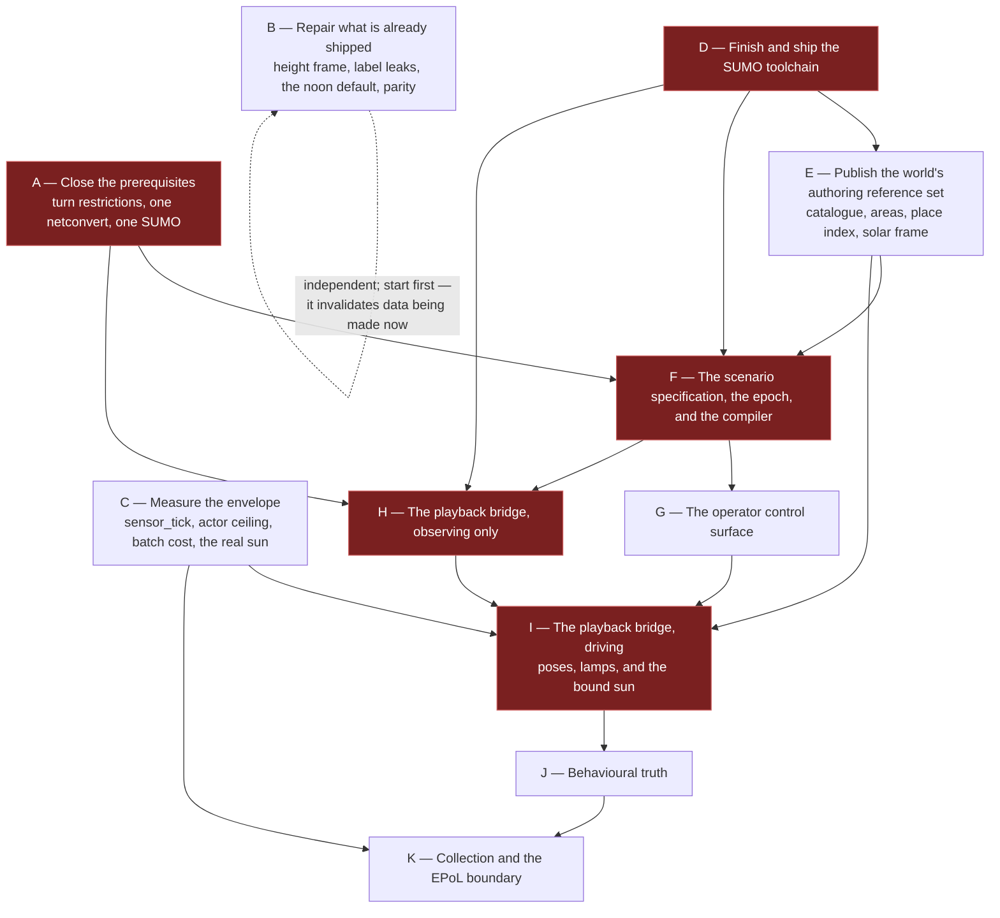

# 13 — Work breakdown

**Status:** Plan. Sequencing and dependency only — **no schedule, no effort estimates,
no calendar.** "Before" and "after" mean dependency, not time.
**Scope:** What to build, in what order, what must be measured before committing to it, and what
needs a decision from the user rather than from an engineer.

Each stage has a descriptive name and a letter used only for the dependency graph. Items marked **⚑**
are on the critical path.

**Change history**

| Date | Change |
|---|---|
| 2026-09-18 | Traffic-light synchronisation and its signal-id dependency dropped; fixture no longer needs a signalised junction. |
| 2026-09-21 | One distribution, licence manifest, `CarlaSetup.bat` retired, skill to stage A, stage B re-measured. |
| 2026-09-21 | Netconvert flags unified on the world build; vocabulary layered into a closed core and open author terms. |
| 2026-09-21 | Role and phase values are author space; only `subject` and `vacancy` are reserved. |

---

## 1. The dependency graph

**B and C sit outside the chain and start immediately.** B invalidates data that is being produced
now; C's answers change what is worth building in I and K.

**The epoch work in F must land before the first windowed capture.** A corpus whose imagery and truth
disagree about what time it was is unrepairable after the fact, and nothing in the tree today
prevents producing one.

---

## 2. Stage A — Close the prerequisites

| ⚑ | Item | Done when |
|---|---|---|
| ⚑ | **Carry OSM relations through the clip.** Measured: 42 relations, 22 of them turn restrictions, and **0 survive**. [Issue #12](https://github.com/sbrett9/carla/issues/12) | Restriction relations referencing surviving ways are present in the clipped OSM, and netconvert stops reporting them as ignored |
| ⚑ | **Persist the world's `.net.xml` from the same netconvert invocation as the `.xodr`**, and refuse any other. Measured: 321 vs 317 edges and one lane of 352.19 m vs 2.60 m from the *identical* OSM, while `convBoundary` matches exactly | A scenario cannot be built against a network the world did not produce; the attempt names both fingerprints |
| ⚑ | **Unify the netconvert flag set on the world build, and regenerate every world.** The scenario path stops invoking netconvert entirely and loads `map.net.xml` from the package; the world build adopts `--output.street-names`, `--junctions.join-dist` and `--tls.default-type` so the single invocation produces what both sides need | Every world is rebuilt from its original OSM. **`--output.street-names` must be omitted, never set `false`** — `NBEdge::expandableBy` guards on the option having been *set at all*, so `false` produces the same graph as `true` and a later attempt to turn it off fails silently |
| ⚑ | **Pin which SUMO runs.** `SUMO_HOME` is an independent 1.27.1 and `SumoInstallation.py:36` prefers it over the pinned 1.27.0 | The resolved path and version are logged every run; a mismatch against the world's converter refuses |
| ⚑ | **Move the authoring skill into the repository** and reduce the workspace copy to a stub; leave the third-party Unreal skills as their upstream clone (§13.3, `D9.10`) | The skill has a commit, a version and one source; `07` §8.4's assumption becomes true; it is bundled in the distribution |

Under SUMO drive, traffic routed through a banned turn looks *worse* than today's and is easily
misattributed to the bridge. A scenario authored against edge ids from a graph the world does not
share is wrong in a way every downstream check passes.

**The network cannot be reconstructed by re-running netconvert, even with byte-identical flags.**
Requesting OpenDRIVE output flips `rectangular-lane-cut` to true (`NWFrame.cpp:171`), which feeds
junction shape computation — measured, 743 of 4,978 canonical rows differ, with lane lengths moving up
to 3.3 m. So the `.net.xml` must come out of the same process invocation as the `.xodr`, and there is
then only one flag set to choose. The world build adopts the scenario's flags rather than the reverse:
`--output.street-names` is what gives the place index its edge names, and dropping it would cost the
91% named-edge coverage the US maps carry. The price is that every generated map changes — measured at
1,017 → 1,021 roads and 183 → 184 junctions on Arapahoe — so every world regenerates from its original
OSM. That cost is paid once, alongside the artifact re-issue stage B already requires.

---

## 3. Stage B — Repair what is already shipped

Ordered. The first item is first because it is the only one with a **closing window**: the anomaly
generator and its affiliation plumbing are uncommitted, no corpus has been produced, and nothing needs
re-issuing. Every other item repairs damage already done; this one prevents it.

| ⚑ | Item | Done when |
|---|---|---|
| ⚑ | **Close the five ground-truth label leaks before the first corpus exists.** `special_type="marked"` plus a duplicate `marked` column; anomaly affiliation `u` readable off the CoT type; conspicuous anomaly colours; and the **vType ids themselves**, written verbatim as `anomaly_probe`, `anomaly_escort`, `anomaly_shadow`, `anomaly_staybehind` | Grouping a corpus by `marked`, no value of `type_id`, `color`, `cot_type`, `special_type` or `role_name` appears in one group and not the other. Anomaly types are named and coloured like the population they hide in; the behavioural signature is the only label |
| ⚑ | **Fix the bare-earth height frame and patch the affected datasets.** Sampling the `.xodr` profile every 5 m, residual stdev is **13.05 m** under today's indexing against **0.615 m** under the fix | Heights match under CARLA-frame indexing, with a regression test asserting the road-profile residual stdev stays under 1.5 m. The four `Build/telemetry/` artifacts are rewritten from their own `sumo_x`/`sumo_y` — a forward patch, not a re-simulation |
| ⚑ | **Stop forcing noon on the host's date.** `run_SCTMV.py:138` calls `setup_solar_time` unconditionally, including in attach mode, and `WorldBuilder.py:226-237` invents both the date and the hour | A run with no `--time`/`--date` leaves the world's sun where it was, and says so. Captures already made are not recoverable — the sun is in the pixels |
| ⚑ | **Strip the PNG metadata leaks, and supply `scenario_id` in the same change.** `carla:solar` carries `advancing`/`rate`; `carla:capture` carries `seed`, and `scenario_id` is dormant only because nothing passes it | Sun *state* stays and sun *policy* goes; `tick` and `sim_time_s` stay and run configuration goes. The validator rejects one of today's 54 PNGs unmodified. Supplying `scenario_id` without this activates the dormant leak, so they are one change |
| ⚑ | **Bring the Windows distribution to parity.** Four breaks, not two: the deleted script, the launcher that execs it, the missing `carlacontrol` wheel, and `setup-venv.ps1` installing one arbitrary wheel with no `--find-links` | A distribution built from a clean tree runs its own `run-sctmv.ps1 --help` and exits 0. A missing wheel fails the build instead of warning. The Linux counterpart lands in the same commit |
| | **Supply the run's own health.** `FrameRecorder.Dropped` has no reader; the clock ratio is computed and only logged | A run reports drops and its clock ratio, and cannot be mistaken for a clean one |
| | **Stop boxing the bare-earth grid.** 7.6 M cells: 60.9 MB on disk becomes **243.6 MB** as a tuple against **32.3 MB** as an `array('f')` | Footprint matches. The load-time saving is real but small (0.183 s → 0.018 s); the footprint is the reason |
| | **Route or remove `anomaly_notes`.** Written by the generator, read by nothing | An absence anomaly reaches a consumer, or the field goes. A guard no-show has no vehicle, so it needs a record or it is not truth at all |
| | **Set `sensor_tick`** — last of these, because it touches the occlusion path's frame pairing and deserves its own measurement | Sensor callbacks ≈ captures, with the depth camera on the same instants |

Two engine-side families are grouped so they take one rebuild: the sun (a sunless world publishing
midnight at lat 0 as fact, a loaded world inheriting the previous session's sun, an advancing sun that
never rolls the date, and a clock that is local mean solar rather than civil) and the swallowed
`get_vehicles_light_states` name mismatch.

## 4. Stage C — Measure the envelope

**Nothing in stages I or K is committed to before these return.** Ranked, with the cheapest probe
that answers each.

| Rank | Measurement | Probe | Decides |
|---|---|---|---|
| **⚑ 1** | **Does `sensor_tick` suppress the render or only the enqueue?** Set nowhere; every camera renders at world rate while 19 frames in 20 are discarded | Set it; read the clock ratio from PNG metadata already written | Possibly ~10× the clock ratio — comfortable windowed capture versus tight |
| **⚑ 2** | **The actor ceiling.** 100 concurrent are demonstrated; 128 is recommended and unmeasured. Now also carries the three per-tick solar actor sweeps | Spawn N actors, physics off, one `apply_batch` per tick; a circle of poses will do. No SUMO needed | `render_cap` and `render_cap_hard` — the only unmeasured numbers the envelope structurally depends on |
| **⚑ 3** | **Batch cost of N transforms on the game thread** | Shares the harness above | Whether the frame-rate win is spendable on actors |
| **⚑ 4** | **Does the engine's sun match the model?** The capture plan is computed from a *model* of the sun, not a reading of it | Twelve RPCs comparing `get_solar_state` elevation against the model | Underwrites the whole window plan — and the 14.72 min clock error is the difference between −1.60° and +1.33° at 21 Dec 17:00 |
| **⚑ 5** | **Does an annotated interval survive contact with a detector?** Doc 20's open question 1, still the corpus go/no-go | Two tiers. Tier A is **illumination-blind by construction** and needs no detector; Tier B adds a stock detector at three sun settings over one window, one scenario, one seed | Camera altitude, field of view, channel count — so it precedes rig sizing. The illumination effect is the *residual between tiers*, not a third axis |
| 6 | **Does an advancing sun defeat the shadow cache, and by how much?** The VSM clipmap keys on light direction with an exact comparison | `r.Shadow.Virtual.Cache.ForceInvalidateDirectional` 1 vs 0 | Whether advancing is affordable at all. Gates an option, since the plan freezes on five of six windows |
| 7 | **Does a pose-applied vehicle read correctly to a detector at EO altitude?** | One scene captured twice along the same path, physics-driven and pose-applied | Whether doc 23's actuated strategy is optional or necessary |
| 8 | **Lamp transition cost in the Blueprint VM** | Rides probe 2's harness | Whether lamps are free in practice as well as on the wire |

For framing: holding a vehicle at ten pixels fixes the ground sample distance at 0.45 m/px and the
swath at 576 × 324 m **whatever the altitude**, so one detector-usable channel covers **0.64%** of
the Bahonar map. Coverage, not population, is the likely constraint on corpus yield.

### 4.1 The test fixture — a small scenario authored for the purpose

**None of these measurements needs a large scenario, and using one makes them slower and harder to
read.** The shipped scenarios are *measurement inputs* that place the sizing envelope on a curve —
Gardnerville at peak 51, Bahonar at 139, Arapahoe at 437 — not requirements the design is beholden
to. Scenario scale is a **lever the plan can pull**, not a fixed constraint it must absorb.

So stage C runs against a purpose-built fixture: **a five-minute SUMO network sited in Arapahoe with a
small, fixed vehicle population.** Five simulated minutes at a 0.05 s delta is 6,000 ticks — long
enough to hold a dwell, a turn and a lane change, short enough that a full run is minutes of wall
clock rather than hours. Properties it must have, each because a measurement depends on it:

| Property | Why |
|---|---|
| A **fixed, declared** vehicle count rather than flows | The actor-ceiling sweep varies the count deliberately; ambient variance would confound it |
| One authored dwell and one authored transit, both annotated | The smallest input that exercises the whole supervision path end to end |
| A **declared epoch** and at least two capture windows at different sun elevations | Exercises the epoch contract, the solar audit, and the illumination axis without a seven-day run |
| Both a rendered and a simulated-only vehicle | Exercises the render-set contract and the observability outcomes |
| Runs in **under a minute** of SUMO wall clock | So a failed measurement is cheap to repeat |

It is authored once, versioned with the plan, and becomes the regression fixture every later stage
runs against. **It is not a substitute for the sizing measurements already taken** — the envelope
still rests on the three real scenarios — but nothing in stage C, and nothing in the first corpus,
needs to wait on a seven-day port to be useful.

---

## 5. Stage D — Finish and ship the SUMO toolchain

Already scouted; the build itself already compiles clean from the unmodified configuration.

| ⚑ | Item | Done when |
|---|---|---|
| ⚑ | Build and stage `sumo`, `duarouter` and `libtracics` beside `netconvert`, plus `libtracics-sources.zip` and a **named subset** of `data/` and `tools/` — `tools/traci`, `tools/sumolib`, `data/typemap`, `data/xsd`. Measured: the full copy is 89 MB to deliver the 3.2 MB anything here consumes, and `tools/contributed` alone is 47 MB of third-party sub-licences | `sumo --version` runs from the **staged install**, not the build tree |
| ⚑ | Re-key the idempotence guard to "is the whole required set staged" — not "is the newest there", since parallel builds have no dependable last-built file. **The guard is firing today**: `netconvert` is staged, so the other three are never built | A returning developer cannot silently keep a half toolchain, and the check reports which members are missing |
| ⚑ | **Retire `CarlaSetup.bat`** and repoint `Docs/build_windows_ue5.md` at `CarlaSetup.ps1` in the same commit (§13.4) | No documented entry point is left dangling, and the SUMO build block exists in two scripts rather than three |
| | Set `SUMO_HOME` where the other tool paths are set; add `swig` to the Linux prerequisites **and the CI container**, which never runs the prerequisites script. Windows needs no change — `swig` already rides the pinned `SUMOLibraries` bundle | A clean clone and a clean CI container both build it |
| | Bundle the toolchain, the binding and the new artifacts, both platforms | The acceptance check passes from an installed distribution |
| | **Acceptance check**, run rather than remembered | `sumo --version` from the staged install; a console app steps an empty simulation through the C# binding; `duarouter` validates a known route |

`duarouter` is **required**: route validation becomes an unconditional compile step, measured at
0.27 s for all 52 Arapahoe routes.

---

## 6. Stage E — Publish the world's authoring reference set

| ⚑ | Item | Notes |
|---|---|---|
| ⚑ | **The vehicle catalogue, by spawn-and-measure.** Dimensions do not exist before spawn; the box first exists on the spawned actor | One vType per blueprint; one distribution per class; dimensions verbatim; blueprint named in a `<param>` that is schema-valid against SUMO's own `route.xsd` |
| ⚑ | **The catalogue is a runtime dependency of the bridge**, because the bumper-to-centre pose shift needs the measured extent. A vehicle of unknown extent is **not rendered**, never rendered at a guess | |
| | **Lamp capability, measured optically.** `HasLights` is `true` on all 17 blueprints and `GetVehicleLightState` returns the *command*, so the API will confirm lamps that never lit | Rides the same sweep |
| | **Areas of interest**: GeoJSON validated at build, resolved to CARLA metres *and* SUMO edges, held on an actor with a Set/Get pair | Required, not optional — an absence anomaly anchors to an area plus a window |
| | **The place index**, carrying its own coverage caveat: 91% on the US maps, **5% on Bahonar**, one name mapping to 65 edges | |
| | **The solar frame**: origin latitude and longitude and the zone the engine derives, published so a scenario's epoch can be checked offline | |
| | **The world fingerprint** — a canonical fingerprint of the parsed network, **not a byte hash**: the same OSM clipped three times gives three digests and a byte-identical graph | |
| | **The annotation vocabulary**, versioned | Contents are an open question below |

---

## 7. Stage F — The scenario specification, the epoch, and the compiler

The Python builder stays, but **emits the specification rather than SUMO XML**, so a generated
scenario faces every check a hand-written one does.

| ⚑ | Item | Notes |
|---|---|---|
| ⚑ | **The epoch declaration.** Civil date and time that `t = 0` means, a **numeric** UTC offset (normative; the zone name is provenance only, because `zoneinfo` resolves zero zones on this machine), whether the calendar advances, and the DST state as a declared offset | Half-hour offsets first-class — the sizing site is **+03:30**. A redundant UTC datetime cross-checks an offset applied in the wrong direction, a 7-hour error here |
| ⚑ | **Civil time as an authoring construct.** Times written as civil instants and compiled to seconds | Measured on the sizing scenario: sixteen arithmetic sites go to zero, the 335-entry rota with its deliberate no-show becomes one block with one `skip`, and the civil meaning of **610 of 610** entries becomes recoverable against **0 of 610** today |
| ⚑ | The specification schema and the supervision plan as its **sole** annotation channel | SUMO route files are XSD-validated and generated; `<param>` is a flat un-namespaced store SUMO's own devices read |
| | The compiler and its checks — seven groups, each stating refuse or warn | Including epoch form, offset a whole number of minutes, span against the calendar, midnight crossing, windows inside the span, and policy well-formedness |
| | **Route validation via `duarouter`, with the false-accept guard** — terminal edge equals the requested destination and every `via` appears in order | Measured: a trip to a nonexistent edge still produces a `<vehicle>` with a one-edge route |
| | **The resolution report**, the only place an annotation or an epoch can ever be checked | |
| | **The hour-to-label correlation check — warns, never refuses.** Measured at **0.600** on the shipped scenario; at 02:00 and 11:00 every entry is annotated | Refusing would make doc 20's class 4 unauthorable, and a check firing on the only large scenario gets switched off. Buckets by illumination regime, not clock hour; the statistic lands in the lock file |
| | Sweeps and counterfactual pairing, with illumination as a declared axis | **Sweeping `epoch.date` rather than the window hour** moves the sun 21° while holding population and behaviour provably fixed |

---

## 8. Stage G — The operator control surface

Measured justification: **86 arguments, 66 of them inert unless something declared elsewhere is on**,
only 20 unconditionally in force, plus 13 undeclared hotkeys of which one is documented nowhere.

| Item | Notes |
|---|---|
| Layered resolution — tool defaults → site profile → world bindings → scenario declarations → run configuration → operator overrides | Every field carries its value **and the layer that set it**; the manifest's copy is itself a valid run configuration, so reproducing a run is reading it back |
| The toggle inventory with mutability classes, decided by one question: *would a consumer reading the corpus be wrong if this changed and they did not know?* | The occlusion estimator is session-fixed, not run-mutable — turning it off mid-run silently changes the unoccluded denominator |
| **Launch validation**, reusing the compiler rather than inventing a second one | A configuration that cannot work fails at launch naming the reason, not at minute forty |
| **An echo before commit** | A multi-hour, multi-hundred-gigabyte run states its first frame's civil instant and sun elevation before starting |
| Coexistence with `run_SCTMV.py`, which stays for the traffic-manager path | No capability lost; the three diverged duplicated defaults reconciled |

---

## 9. Stage H — The playback bridge, observing only

New `CarlaNet.CoSim` in C#, orchestrated from Python; one TraCI connection owned by the bridge.

| ⚑ | Item | Done when |
|---|---|---|
| ⚑ | Session, clock, and the integer-ratio validation between SUMO step, world delta and capture rate | A mismatched trio refuses at session start |
| ⚑ | **Subscription-based** state reading, including `VAR_SIGNALS` | Measured 14× cheaper than per-vehicle getters |
| ⚑ | Pose conversion — Y negation, `carlaYaw = sumoAngle − 90`, bumper-to-centre from the catalogue; Z, pitch and roll from the drape, client-side with no RPC | The commanded-versus-applied divergence is a stated tolerance, so a conversion error shows up there rather than as plausible imagery with every box wrong by half a car |
| ⚑ | **One-step lookahead and lane-geometry interpolation**, four cases: same lane, lane change, crossed edges, discontinuous | A vehicle tracks its lane through a junction rather than cutting the corner by 10.6 m |
| | Render-set selector and actor pool, recording admission and release instants | |
| | **Population-authority lease and the ambient lockout** | Starting ambient traffic while SUMO holds the lease fails the session start and names the holder |
| | Log SUMO's decisions without applying them | The ghost tracks a world driven by something else within a stated tolerance |

---

## 10. Stage I — The playback bridge, driving

| ⚑ | Item | Notes |
|---|---|---|
| ⚑ | Batched pose application — one `apply_batch` per tick, no variable tail | All 22 command types supported; the .NET traffic manager already does exactly this |
| ⚑ | **Bind the sun per window.** One write after the SUMO fast-forward and before the first tick, of the civil instant at `window.begin − prewarm`; `set_time_advance` after the clock is set | Without it, illumination depends on session history — a loaded world inherits the previous session's sun |
| ⚑ | **The per-tick solar audit**, free from the observer cache | Declared civil time against observed sun; disagreement is a fault, never a silent correction |
| ⚑ | **Engine: velocity for a pose-applied body.** `GetComponentVelocity` reads the physics body only when simulating and otherwise returns a field ChaosVehicles never writes | An engine change; a rebuild is not a cost. Kinematic truth comes from SUMO regardless — the fix makes the body agree with the record |
| | **Lamps.** SUMO's brake and indicator signals mapped bitwise (**not cast** — the values collide); headlights from solar elevation, because SUMO models none | Measured ≈9.6 commands/tick at cap 128, +1.9% of batch bytes, zero extra round trips. A pooled actor inherits its predecessor's lamps, so check-out must rewrite them |
| | **Civil-to-solar conversion**, and the date rollover the engine never performs | The team recommends an engine time-zone setter over client arithmetic; see the decisions below |
| | Windowed capture via SUMO fast-forward from t = 0 | Measured: the whole week is 140.41 s at 4,307×. `--begin` rejected — cold start 87.5% under-populated; state save/load does not compose with unrouted trips and flows |
| | Region gate sized per scenario so the cap does not bind | The region gate is label-independent; the cap is not |
| | **Suppress the signal layer for the session.** One `set_layer_visible("signals", false)` before the first tick, fixed off for the run, recorded in the manifest | No traffic-light or sign actor is rendered and no traffic-light state is written; vehicle lamps are unaffected. World generation is untouched — the actors are hidden, not removed, so every other mode still renders them |
| | Failure paths: SUMO death, CARLA stall, a vehicle removed while held, route errors, collisions, a world with no sun | If either side stalls, **both** stop and the run fails — a world that ticks without SUMO produces a plausible lie |

---

## 11. Stage J — Behavioural truth

| Item | Notes |
|---|---|
| Supervision records: three-valued state, pattern instances, participants, intervals with the three onsets | The declared onset may legitimately be absent — all 338 Bahonar stops use `duration`, none uses `until`. The harness refuses to substitute another onset silently |
| **Recurring series and the unrealised slot** — how an anomaly with no vehicle is expressed | The guard no-show is reconstructible byte for byte from its siblings; the generator discards it at `make_bahonar_scenario.py:236` |
| Field-by-field truth reconciliation, emitting pose, heading, speed and dimension separations per vehicle per tick | A free test oracle for the pose conventions |
| **The solar block extended** with declared civil time, the asserted policy, and the residual | A frozen run and an unconfigured run are byte-identical today; assertion is what makes them distinguishable |
| Observability with five outcomes plus an **illumination qualifier**, keyed to recorded admission and release instants | `unlit` becomes a sixth outcome only if a resolvability cutoff is measured — and is then computable from qualifiers already recorded in every earlier corpus |
| The run supervision manifest, written incrementally | Prevalence in **three units**, plus per solar bin |
| SUMO's distribution-editing behaviours enumerated as forbid, record or harmless | Three are on by default: `time-to-teleport` at 300 s, `collision.action` at `teleport`, instantaneous lane changes |

---

## 12. Stage K — Collection and the EPoL boundary

| Item | Notes |
|---|---|
| Multi-channel collection in one process, world-scoped state on the observer snapshot | The one-recorder limit is the shim's, not the recording layer's |
| Per-image labelling and occlusion, reusing the depth-based metric | |
| **Exposure made controllable and recorded.** `post_process_profile` **is** published and carries four profiles spanning EV100 +12.32 to −1.06; `exposure_compensation` is absent | Spawn-time only, nothing recorded today, and a case-sensitivity hazard that differs between Windows and Linux |
| Truth-to-track association: per sensor, per frame, **position and time only**, cost in image space normalised by apparent size, with the **margin to the runner-up** recorded | A 3 px residual means nothing if the runner-up was 3.1 px |
| **The anti-leak boundary**: **two** roots, one writer each, split **at the writer**, a validator in CI that reads tEXt chunks, and a held-back split recorded as a **release property** rather than a directory | Governed by observer-derivability: fieldable, scene-independent, supervision-blind, and sourceable without opening a truth artifact. There is no third root — model output is neither produced nor consumed here, and a named shelf for it would only invite it into the tree |
| **The illumination-only leakage probe** — can the label be predicted from light alone, with no imagery? A property of the dataset, not a floor for a model to beat | How the hour-to-label correlation at 0.600 is caught rather than argued about |
| **The corpus handover**: prevalence and coverage per sensor and unioned, stratified by illumination, plus an explicit statement of what the corpus does **not** contain — and the published supervision-transfer rule a downstream team applies to its own tracks. This pipeline performs no association and emits no metric | |
| The live exercise: pacing, latency budget, operator view | An EPoL assessment can ride the existing Cursor-on-Target feed as a `<detail>` child |

---

## 13. Decisions taken, and what is still open

Settled 2026-09-18 and 2026-09-21. A settled row is binding on every section; where a section already reflects it,
that is noted rather than restated.

| # | Question | Outcome |
|---|---|---|
| 1 | **Is a night capability worth building?** Night imagery is not viable: no moon, every level light disabled, daytime radiance baked into the tiles, 8-bit tonemapped output, and 23:00 at −38° to −79°. Between a quarter and two-fifths of the sizing scenario's vehicle-hours are unphotographable | **Settled — do not build it, and never prevent it being asked for.** No lighting work is funded, and 23:00 is captured as a truth-only window, costing 0.42 s of wall clock and zero bytes. But the *choice* stays the user's: any time of day is authorable, the compiler **warns and never refuses**, and a night window still yields complete behavioural truth and a full sidecar whatever the pixels show. The tooling states what imagery in that regime will and will not show; it does not decide whether someone wants it |
| 2 | **The time-zone correction: engine RPC or client arithmetic?** The arithmetic works, verified to 0.004°, but client-side conversion moves the date boundary to civil 23:45:17 and makes the recorded solar time not the declared one | **Settled — add the RPC.** A rebuild is not a cost, and it keeps the solar residual an identity check rather than a conversion check |
| 3 | **Vehicle class metadata is wrong in the content.** `base_type` wrong for 7 of 17 blueprints, `special_type` empty for all 17. A sweep can measure a box but cannot curate a class | **Settled — derive from the sweep, allow a validated override, and correct `VehicleParameters.json` at the next content build.** Where inspecting blueprints or the vehicle content is needed to curate the classes, the editor tooling is available on request |
| 4 | **Where the capture window comes from** — author or operator | **Settled — both.** A scenario declares named windows as presets; the capture operator may give another; **the run manifest records which was used**, so a corpus never leaves it ambiguous |
| 5 | **What a capture does when SUMO reports a collision** | **Settled — record it and mark the affected span; never stop the run.** A collision is a fact about the corpus, not a failure of the run, and the mark is what lets a consumer filter it |
| 6 | **How an accidental positive in the ambient population is handled** | **Settled — a cohort may never be `nominal`, and no audit is built.** See §13.1 |
| 7 | **What the annotation vocabulary contains at v1** | **Settled — the vocabulary is layered, and we author the core rather than waiting.** The EPoL model team has stated no requirements, so there is nothing to fix a list against; inventing a usable core beats leaving consumers to stumble. But labelling is a **contract between the scenario author and the model trainer**, and the range of authorable SUMO scenarios is too wide to enumerate — so the pipeline closes and versions only the terms its own code branches on, and carries author-defined terms through **opaquely but self-describingly** to the corpus consumer. Passing a term the pipeline does not understand is a feature. Terms stay cheap to add and expensive to rename (§13.5) |
| 8 | **One `sumo` process per capture session, or one shared across several windows** | **Settled — one SUMO process per window.** Each window starts a fresh process, fast-forwards from `t = 0`, captures, and exits. A window is then reproducible from its seed and its bounds alone, a crash costs one window rather than a sequence, and there is no long-lived state to reason about. The cost is paying the fast-forward per window, which the measurement bounds: the sizing scenario's entire seven-day span fast-forwards in **140.41 s**, and a typical window far less |
| 9 | **The packaging scripts disagree across platforms** | **Settled — Windows and Linux are at parity, for scripts and for deliverables**, and **there is one distribution, containing all of the tools.** A difference between the platforms is a defect, never a policy; the `carlacontrol` wheel ships on both. No internal/external packaging mode is built. What the package must carry instead is a generated component-and-licence manifest — driven by third-party obligations the distribution is already failing to meet, not by anything in `CarlaControl/` (§13.2) |
| 10 | **Where the authoring skill lives.** It has no reproducible source location — the workspace root is not a git repository | **Settled — move it into the repository and ship it from there**, with the workspace copy reduced to a stub. The 27 co-located Unreal skills are a third-party MIT clone, not ours, and stay upstream rather than being vendored. A **stage A item**, since `07` §8.4 already assumes it (§13.3) |

### 13.1 Ambient traffic, the idle cull, and who owns a label

**Ambient traffic is unavailable while SUMO drives, and the idle cull is inactive.** If a SUMO
scenario says a vehicle parks for forty-five minutes, it parks for forty-five minutes; no heuristic of
ours despawns it for being idle. The SUMO network is in charge for this mode, and where establishing
that separation requires modifying the traffic manager, it is authorised.

The plan already carries this: population authority is an exclusive, engine-held lease, so starting
ambient traffic while SUMO holds it is a **failed session start naming the holder**
([01](01_Architecture.md) D1.7); SUMO-driven vehicles are never registered with the traffic manager,
so the cull **cannot reach them** ([01](01_Architecture.md) §4.1); and doc 20's decision 14, which
required the cull to be switchable, does not apply here ([06](06_Truth_And_Annotation.md) §6.1).
Measured: a vehicle parks for 489,000 s in the sizing scenario and nothing removes it.

**The author owns labelling, and a cohort may never be `nominal`.** SUMO spawns nothing unauthored —
every vehicle comes from a `<flow>`, `<trip>` or `<vehicle>` the author wrote. What a flow authors is
a *population*, not each member's behaviour: `vehsPerHour="200"` authors two hundred cars an hour on a
trip, and with `time-to-teleport="-1"` one member can end up stationary for forty-five minutes because
it was blocked rather than because anyone wrote a stop. So `nominal` — which asserts that a subject is
**not** executing any target pattern — is assertable only of a subject the author wrote one by one, an
entity or a `<trip>`. A `<flow>` is `unlabelled` or carries a whole-life annotation, and `nominal` on a
cohort is a compile error ([06](06_Truth_And_Annotation.md) D6.2).

That closes the contradiction rather than managing it. An `unlabelled` vehicle asserts nothing, so
nothing about it can be contradicted by its own physics, and a consumer that files it as a negative
has violated the three-valued contract rather than been misled by it. **The accepted cost** is that
hard negatives come only from authored trips — doc 20 §2.7 values them highly, and this makes them
deliberate rather than free.

**No accidental-positive audit is built.** Doc 20 sketched a human reviewing unlabelled vehicles
"whose derived relations look like an annotated pattern". This system has **no concept of a pattern to
compare against**, and acquiring one would be exactly the geometric predicate
[06](06_Truth_And_Annotation.md) §3.6 forbids. It is also not this system's place: the author owns
labelling, and an audit hunting for things the author labelled wrongly is a judgement about their
work. What the corpus publishes is the **derived context** — area relations, continuous time inside,
render state, the world truth track — computed identically for every vehicle. If an author wants to
distinguish blocked flow traffic from parked annotated traffic, that is theirs to declare and theirs
to bear.

### 13.2 One distribution, and what it has to declare

The packaging scripts bundle the server and the Python client tools. **The Linux script bundles the
`carlacontrol` wheel and the Windows script does not**, and nothing in either says which behaviour is
intended — so today the answer depends on which platform somebody happened to run.

**Parity is the rule.** The two scripts produce the same package from the same inputs, and any
difference between them is a defect to fix rather than a policy to preserve. The `carlacontrol` wheel
ships on both.

**There is one distribution and it contains all of the tools.** No internal/external packaging mode is
built: there is no second distribution for one to gate, and an unused mode is a switch someone
eventually flips by accident (`D9.7`).

`Findings/22` §14 records `CarlaControl/` as proprietary and to be excluded from any external
distribution. **That label came from a plan that did not manifest, and there is no exclusion to
honour.** The row is corrected at source rather than worked around here.

**What the package does have to declare is a third-party obligation, and it is larger than the one
that was being worried about.** Measured against the staged Windows distribution:

| | |
|---|---|
| The distribution ships **no `LICENSE`, no `NOTICE`, no third-party listing of any kind** | There is no precedent in the tree to copy — `VERSION` is the only self-description, and it states builds, not contents |
| `tools/sumo/` carries **42 DLLs spanning nine or more licences**, including LGPL (`fox-16.dll`, gettext), shipped in both debug and release variants because the copy is a glob | We are already redistributing LGPL binaries with no notice. `fox` is SUMO's **GUI** toolkit; `netconvert` never loads it |
| SUMO is **EPL-2.0** — notice plus source offer — and `CarlaNet.Sumo` additionally redistributes SWIG-generated EPL-2.0 source | The pinned upstream commit is already recorded in `CarlaSetup.ps1`, so the offer can cite it rather than duplicate it |
| The OSM extracts and every generated `.xodr` are **ODbL** | `Findings/22` §14 already establishes the derivative-database obligation |

So the package carries a **generated `MANIFEST.md` and a `licenses/` directory**, produced at staging
time from what was actually copied rather than hand-maintained — a hand-written manifest is wrong the
first time a slot changes. Each row names the component, its provenance, its licence and where it
sits. Two obligations fall out of the measurement and land in the same work:

- **Stop shipping binaries nothing loads.** The `bin\*.dll` glob becomes an explicit list derived from
  what the four SUMO binaries actually import. That drops the debug duplicates and the GUI-only `fox`,
  and it makes the manifest's third-party rows a short true list rather than a long partly-fictional
  one.
- **Honour the EPL-2.0 source offer** for the SUMO binaries and the generated C#.

Where the package may go is governed by access to the channel it is published to, not by a build flag.

### 13.3 The authoring skill moves into the repository

`.agents/skills/` under the workspace root holds two things that look alike and are not. Measured:
**one file of ours** — `sumo-traffic-scenarios/SKILL.md`, 14 KB — and **27 directories that are
byte-identical copies of `quodsoler/unreal-engine-skills`**, an MIT third-party repository already
cloned beside it at `unreal-engine-skills/` with its remote, its pinned commit and its `LICENSE`
intact.

**Ours moves; theirs does not.** The skill bundle moves into `carla/CarlaControl/skills/`, beside the
compiler that [`07`](07_Scenario_Authoring.md) §8 says generates most of it — generator and generated
output under one directory — and ships from there under §13.2. The workspace copy is reduced to a
stub naming the canonical path, not a directory junction: a junction is invisible in `git status` and
does not survive a fresh clone, which is the silent-divergence failure `D9.10` exists to end.

The Unreal skills stay as the upstream clone, which is already a better reproducible source than
vendoring: it has a version, a history and an intact licence. Vendoring 1.3 MB of somebody else's MIT
content into `carla/` would add an attribution obligation for a recipient who has no use for it. The
unattributed copies under `.agents/skills/` are removed, and the clone plus its commit are recorded as
a developer prerequisite.

This is a **stage A item**, not a later tidy-up: [`07`](07_Scenario_Authoring.md) §8.4 already assumes
the move happened, and every scenario authored before it lands is authored against an unversioned
tool.

### 13.4 `CarlaSetup.bat` is retired

The SUMO build-and-stage block exists in **three** scripts, not two: `CarlaSetup.ps1`,
`CarlaSetup.sh`, and `CarlaSetup.bat`. The third is the pre-port original — `CarlaSetup.ps1` describes
itself as a PowerShell port of it — and it has already drifted: it clones `SUMOLibraries` at HEAD with
no tag where the PowerShell pins the version, which is the exact failure the PowerShell's own comment
records. `Docs/build_windows_ue5.md` still directs a new developer to run it.

**It is retired rather than carried.** The fork has diverged far enough from upstream that maintaining
a third copy of every build change buys nothing, and three copies are how the drift above happened.
Retiring it means removing the script and repointing `Docs/build_windows_ue5.md` at `CarlaSetup.ps1`
in the same commit, so no documented entry point is left dangling.

### 13.5 The annotation vocabulary is a contract we carry, not one we write

The EPoL model is outside this project's scope — what it is, how it is trained and what it looks for
are not ours to know, and the team that owns it has stated no term requirements. Two things follow,
and they pull in opposite directions until the vocabulary is layered.

**We cannot wait for requirements that are not coming.** A corpus with no vocabulary at all leaves
every consumer to invent their own reading of the sidecar, which is worse than a core we author and
publish.

**We cannot dictate the terms either.** A SUMO network can express almost anything an author imagines,
and the label — whether a vehicle is noise or an actor in the pattern being reinforced — is a
statement the *author* makes to the *model trainer*. Neither party is this pipeline.

So the vocabulary splits on one test: **does the pipeline's own code branch on this term?**

| | Closed and versioned | Open and author-defined |
|---|---|---|
| **Because** | The machinery depends on it, so it must be enumerable and testable | The pipeline never inspects it, so it costs nothing to allow and everything to constrain |
| **Contains** | Supervision state, subject kind, realisation, the three interval onsets, `closed_by`, the five observability outcomes, the illumination band, the cadence form — and two reserved words, the role `subject` and the phase `vacancy` | What a pattern *is*, what an anomaly *means*, and **every role and phase value past those two** — what a role signifies in this author's world |
| **Failure if wrong** | The pipeline cannot be tested | The author cannot say what they meant |

**Role and phase values are the author's, with one reserved word each.** Nothing in the pipeline
branches on `lead` against `follower`, or on `approach` against `dwell`. What the records require is
that a participant *has* a role and that the `(instance_id, participant, phase)` triple is **stable**
across two runs of one scenario — which is enforced by diffing the two run manifests, and needs no
opinion about the word ([`06`](06_Truth_And_Annotation.md) `D6.8`, `D6.35`). `subject` is reserved so
that a consumer reading a one-participant instance never has to guess which track the instance is
about; `vacancy` is reserved because the absence writer emits it, so its spelling is ours. Closing
either list would refuse the sizing scenario's own `guard` on the day it was written (*read*,
`CarlaControl/scripts/make_bahonar_scenario.py:238`).

An author-defined term is carried **opaquely but self-describingly**: the pipeline moves it from the
supervision plan to the truth sidecar without understanding it, and requires enough alongside it that a
consumer who has never spoken to the author can read it. Passing through a term we do not understand is
a feature of this design, not a gap in it.

What none of this changes: no geometric or photometric predicate ever writes supervision
([`06`](06_Truth_And_Annotation.md) §3.6), a `<flow>` authors a population rather than each member's
behaviour so `nominal` stays unassertable of a cohort (`D6.2`), and this pipeline scores nothing.

## 14. Risks worth naming

| Risk | Why it is real | What reduces it |
|---|---|---|
| **The corpus is coverage-bound, not population-bound** | One channel covers 0.64% of the map; peak population is 139 but few are in frame | Measure detector survival early; size the rig from that answer |
| **A confounder reaches the corpus and is found after training** | Five are already live: three label leaks, two PNG metadata leaks — plus hour-to-label at 0.600 and colour, both present in a real scenario and unnoticed | The compile-time resolution report, the CI anti-leak validator, the illumination-only baseline, and treating any metadata difference between annotated and ambient populations as a defect |
| **Illumination silently disagrees with the scenario** | Every ingredient is live today: forced noon, an inherited sun, a wrapping date, a 14.7 min clock error, and a sunless world that reports midnight at lat 0 | The per-tick solar audit, the asserted policy, and refusing a corpus-eligible run with no epoch |
| **The bridge looks right and is wrong by half a car length** | Bumper shift, Y negation and yaw offset each fail plausibly | The commanded-versus-applied separation, emitted per vehicle per tick |
| **Arapahoe-class maps yield no training data** | The cap binds always at median 336, and cap-bound spans are excluded from training | Size the region gate so the cap does not bind ([00](00_Overview.md) §6) |
| **Doc 23's actuated strategy turns out to be necessary** | If pose-applied vehicles read wrong to a detector, the mode rests on a false premise | It is measurement 7 in stage C, and the strategy is retained behind the same bridge rather than discarded |
