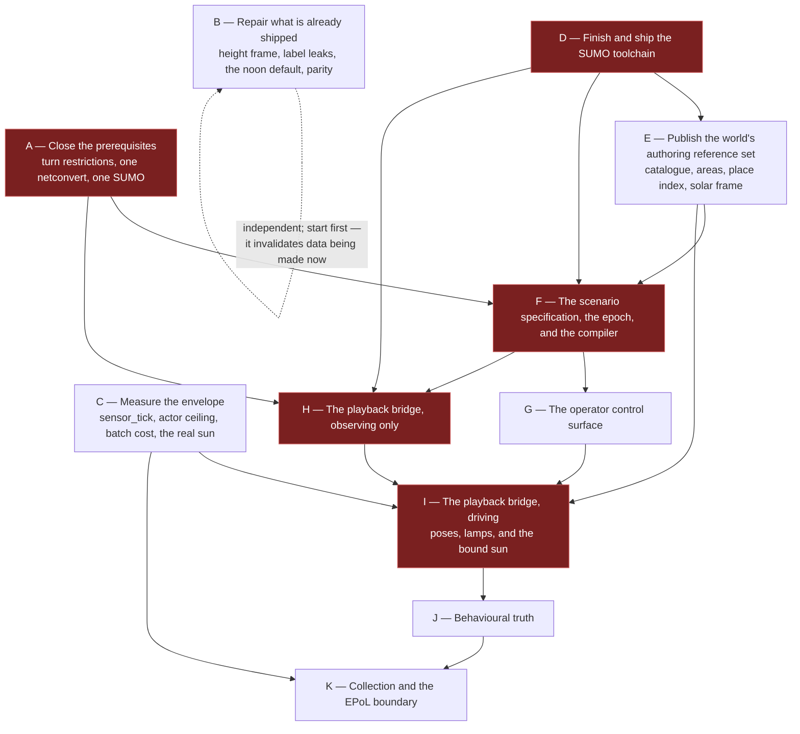

# 13 — Work breakdown

**Status:** Plan. Sequencing and dependency only — **no schedule, no effort estimates,
no calendar.** "Before" and "after" mean dependency, not time.
**Scope:** What to build, in what order, what must be measured before committing to it, and what
needs a decision from the user rather than from an engineer.

Each stage has a descriptive name and a letter used only for the dependency graph. Items marked **⚑**
are on the critical path.

**Change history**

| Date | Change |
|---|---|
| 2026-09-18 | Traffic-light synchronisation and its signal-id dependency dropped; fixture no longer needs a signalised junction. |

---

## 1. The dependency graph

**B and C sit outside the chain and start immediately.** B invalidates data that is being produced
now; C's answers change what is worth building in I and K.

**The epoch work in F must land before the first windowed capture.** A corpus whose imagery and truth
disagree about what time it was is unrepairable after the fact, and nothing in the tree today
prevents producing one.

---

## 2. Stage A — Close the prerequisites

| ⚑ | Item | Done when |
|---|---|---|
| ⚑ | **Carry OSM relations through the clip.** Measured: 42 relations, 22 of them turn restrictions, and **0 survive**. [Issue #12](https://github.com/sbrett9/carla/issues/12) | Restriction relations referencing surviving ways are present in the clipped OSM, and netconvert stops reporting them as ignored |
| ⚑ | **Persist the world's `.net.xml` from the same netconvert invocation as the `.xodr`**, and refuse any other. Measured: 321 vs 317 edges and one lane of 352.19 m vs 2.60 m from the *identical* OSM, while `convBoundary` matches exactly | A scenario cannot be built against a network the world did not produce; the attempt names both fingerprints |
| ⚑ | **Pin which SUMO runs.** `SUMO_HOME` is an independent 1.27.1 and `SumoInstallation.py:36` prefers it over the pinned 1.27.0 | The resolved path and version are logged every run; a mismatch against the world's converter refuses |

Under SUMO drive, traffic routed through a banned turn looks *worse* than today's and is easily
misattributed to the bridge. A scenario authored against edge ids from a graph the world does not
share is wrong in a way every downstream check passes.

---

## 3. Stage B — Repair what is already shipped

| ⚑ | Item | Done when |
|---|---|---|
| ⚑ | **Fix the bare-earth height frame and re-issue affected datasets.** Median **9.8 m** error, max 38.0 m, 96.2% of rows over a metre | Heights match under CARLA-frame indexing; every dataset from the old path is re-issued or withdrawn |
| ⚑ | **Stop forcing noon on the host's date.** `run_SCTMV.py:138` calls `setup_solar_time` unconditionally, including in attach mode | No run sets a sun it was not asked to set; the seasonal sun is never an artifact of when the run happened |
| | **Close the three ground-truth leaks** — `special_type="marked"`, anomaly affiliation `u`, conspicuous vType colours — including on the standalone telemetry path | Nothing a detector-derived track could not produce carries the answer |
| | **Close the two PNG metadata leaks** — `carla:solar` embeds `advancing`/`rate`; `carla:capture` embeds `scenario_id`/`seed` | The anti-leak validator reads tEXt chunks, and the model's input root is clean under it |
| | **Fix the swallowed RPC name mismatch.** `get_vehicles_light_states` against the server's singular, caught without logging | The name matches and the catch logs. One string, plus the catch |
| | **Make a sunless world say so.** The cache returns midnight of year 0 at lat 0, lon 0 rather than absent | A world with no sun is distinguishable from a world at midnight, in truth and in the shim |
| | **Repair the Windows distribution — two parity breaks.** A deleted script packaged and launched, and the `carlacontrol` wheel omitted | A Windows distribution built from a clean tree runs its own launcher |
| | **Supply `scenario_id`; make capture loss audible.** `FrameRecorder.Dropped` has no reader; the clock ratio is recorded nowhere | A run reports drops and its clock ratio, and cannot be mistaken for a clean one |
| | **Stop boxing the bare-earth grid.** 60.9 MB → 243.6 MB and 5.6 s; measured fix gives 32.3 MB and 0.011 s | Load time and footprint match |

---

## 4. Stage C — Measure the envelope

**Nothing in stages I or K is committed to before these return.** Ranked, with the cheapest probe
that answers each.

| Rank | Measurement | Probe | Decides |
|---|---|---|---|
| **⚑ 1** | **Does `sensor_tick` suppress the render or only the enqueue?** Set nowhere; every camera renders at world rate while 19 frames in 20 are discarded | Set it; read the clock ratio from PNG metadata already written | Possibly ~10× the clock ratio — comfortable windowed capture versus tight |
| **⚑ 2** | **The actor ceiling.** 100 concurrent are demonstrated; 128 is recommended and unmeasured. Now also carries the three per-tick solar actor sweeps | Spawn N actors, physics off, one `apply_batch` per tick; a circle of poses will do. No SUMO needed | `render_cap` and `render_cap_hard` — the only unmeasured numbers the envelope structurally depends on |
| **⚑ 3** | **Batch cost of N transforms on the game thread** | Shares the harness above | Whether the frame-rate win is spendable on actors |
| **⚑ 4** | **Does the engine's sun match the model?** The capture plan is computed from a *model* of the sun, not a reading of it | Twelve RPCs comparing `get_solar_state` elevation against the model | Underwrites the whole window plan — and the 14.72 min clock error is the difference between −1.60° and +1.33° at 21 Dec 17:00 |
| **⚑ 5** | **Does an annotated interval survive contact with a detector?** Doc 20's open question 1, still the corpus go/no-go | Two tiers. Tier A is **illumination-blind by construction** and needs no detector; Tier B adds a stock detector at three sun settings over one window, one scenario, one seed | Camera altitude, field of view, channel count — so it precedes rig sizing. The illumination effect is the *residual between tiers*, not a third axis |
| 6 | **Does an advancing sun defeat the shadow cache, and by how much?** The VSM clipmap keys on light direction with an exact comparison | `r.Shadow.Virtual.Cache.ForceInvalidateDirectional` 1 vs 0 | Whether advancing is affordable at all. Gates an option, since the plan freezes on five of six windows |
| 7 | **Does a pose-applied vehicle read correctly to a detector at EO altitude?** | One scene captured twice along the same path, physics-driven and pose-applied | Whether doc 23's actuated strategy is optional or necessary |
| 8 | **Lamp transition cost in the Blueprint VM** | Rides probe 2's harness | Whether lamps are free in practice as well as on the wire |

For framing: holding a vehicle at ten pixels fixes the ground sample distance at 0.45 m/px and the
swath at 576 × 324 m **whatever the altitude**, so one detector-usable channel covers **0.64%** of
the Bahonar map. Coverage, not population, is the likely constraint on corpus yield.

### 4.1 The test fixture — a small scenario authored for the purpose

**None of these measurements needs a large scenario, and using one makes them slower and harder to
read.** The shipped scenarios are *measurement inputs* that place the sizing envelope on a curve —
Gardnerville at peak 51, Bahonar at 139, Arapahoe at 437 — not requirements the design is beholden
to. Scenario scale is a **lever the plan can pull**, not a fixed constraint it must absorb.

So stage C runs against a purpose-built fixture: **a five-minute SUMO network sited in Arapahoe with a
small, fixed vehicle population.** Five simulated minutes at a 0.05 s delta is 6,000 ticks — long
enough to hold a dwell, a turn and a lane change, short enough that a full run is minutes of wall
clock rather than hours. Properties it must have, each because a measurement depends on it:

| Property | Why |
|---|---|
| A **fixed, declared** vehicle count rather than flows | The actor-ceiling sweep varies the count deliberately; ambient variance would confound it |
| One authored dwell and one authored transit, both annotated | The smallest input that exercises the whole supervision path end to end |
| A **declared epoch** and at least two capture windows at different sun elevations | Exercises the epoch contract, the solar audit, and the illumination axis without a seven-day run |
| Both a rendered and a simulated-only vehicle | Exercises the render-set contract and the observability outcomes |
| Runs in **under a minute** of SUMO wall clock | So a failed measurement is cheap to repeat |

It is authored once, versioned with the plan, and becomes the regression fixture every later stage
runs against. **It is not a substitute for the sizing measurements already taken** — the envelope
still rests on the three real scenarios — but nothing in stage C, and nothing in the first corpus,
needs to wait on a seven-day port to be useful.

---

## 5. Stage D — Finish and ship the SUMO toolchain

Already scouted; the build itself already compiles clean from the unmodified configuration.

| ⚑ | Item | Done when |
|---|---|---|
| ⚑ | Build and stage `sumo`, `duarouter` and `libtracics` beside `netconvert`, plus `data/` and `tools/` | `sumo --version` runs from the **staged install**, not the build tree |
| ⚑ | Re-key the idempotence guard to "are all four staged" — not "is the newest there", since parallel builds have no dependable last-built file | A returning developer cannot silently keep a half toolchain |
| | Set `SUMO_HOME` where the other tool paths are set; add `swig` to the Linux prerequisites **and the CI container**, which never runs the prerequisites script | A clean clone and a clean CI container both build it |
| | Bundle the toolchain, the binding and the new artifacts, both platforms | The acceptance check passes from an installed distribution |
| | **Acceptance check**, run rather than remembered | `sumo --version` from the staged install; a console app steps an empty simulation through the C# binding; `duarouter` validates a known route |

`duarouter` is **required**: route validation becomes an unconditional compile step, measured at
0.27 s for all 52 Arapahoe routes.

---

## 6. Stage E — Publish the world's authoring reference set

| ⚑ | Item | Notes |
|---|---|---|
| ⚑ | **The vehicle catalogue, by spawn-and-measure.** Dimensions do not exist before spawn; the box first exists on the spawned actor | One vType per blueprint; one distribution per class; dimensions verbatim; blueprint named in a `<param>` that is schema-valid against SUMO's own `route.xsd` |
| ⚑ | **The catalogue is a runtime dependency of the bridge**, because the bumper-to-centre pose shift needs the measured extent. A vehicle of unknown extent is **not rendered**, never rendered at a guess | |
| | **Lamp capability, measured optically.** `HasLights` is `true` on all 17 blueprints and `GetVehicleLightState` returns the *command*, so the API will confirm lamps that never lit | Rides the same sweep |
| | **Areas of interest**: GeoJSON validated at build, resolved to CARLA metres *and* SUMO edges, held on an actor with a Set/Get pair | Required, not optional — an absence anomaly anchors to an area plus a window |
| | **The place index**, carrying its own coverage caveat: 91% on the US maps, **5% on Bahonar**, one name mapping to 65 edges | |
| | **The solar frame**: origin latitude and longitude and the zone the engine derives, published so a scenario's epoch can be checked offline | |
| | **The world fingerprint** — a canonical fingerprint of the parsed network, **not a byte hash**: the same OSM clipped three times gives three digests and a byte-identical graph | |
| | **The annotation vocabulary**, versioned | Contents are an open question below |

---

## 7. Stage F — The scenario specification, the epoch, and the compiler

The Python builder stays, but **emits the specification rather than SUMO XML**, so a generated
scenario faces every check a hand-written one does.

| ⚑ | Item | Notes |
|---|---|---|
| ⚑ | **The epoch declaration.** Civil date and time that `t = 0` means, a **numeric** UTC offset (normative; the zone name is provenance only, because `zoneinfo` resolves zero zones on this machine), whether the calendar advances, and the DST state as a declared offset | Half-hour offsets first-class — the sizing site is **+03:30**. A redundant UTC datetime cross-checks an offset applied in the wrong direction, a 7-hour error here |
| ⚑ | **Civil time as an authoring construct.** Times written as civil instants and compiled to seconds | Measured on the sizing scenario: sixteen arithmetic sites go to zero, the 335-entry rota with its deliberate no-show becomes one block with one `skip`, and the civil meaning of **610 of 610** entries becomes recoverable against **0 of 610** today |
| ⚑ | The specification schema and the supervision plan as its **sole** annotation channel | SUMO route files are XSD-validated and generated; `<param>` is a flat un-namespaced store SUMO's own devices read |
| | The compiler and its checks — seven groups, each stating refuse or warn | Including epoch form, offset a whole number of minutes, span against the calendar, midnight crossing, windows inside the span, and policy well-formedness |
| | **Route validation via `duarouter`, with the false-accept guard** — terminal edge equals the requested destination and every `via` appears in order | Measured: a trip to a nonexistent edge still produces a `<vehicle>` with a one-edge route |
| | **The resolution report**, the only place an annotation or an epoch can ever be checked | |
| | **The hour-to-label correlation check — warns, never refuses.** Measured at **0.600** on the shipped scenario; at 02:00 and 11:00 every entry is annotated | Refusing would make doc 20's class 4 unauthorable, and a check firing on the only large scenario gets switched off. Buckets by illumination regime, not clock hour; the statistic lands in the lock file |
| | Sweeps and counterfactual pairing, with illumination as a declared axis | **Sweeping `epoch.date` rather than the window hour** moves the sun 21° while holding population and behaviour provably fixed |

---

## 8. Stage G — The operator control surface

Measured justification: **86 arguments, 66 of them inert unless something declared elsewhere is on**,
only 20 unconditionally in force, plus 13 undeclared hotkeys of which one is documented nowhere.

| Item | Notes |
|---|---|
| Layered resolution — tool defaults → site profile → world bindings → scenario declarations → run configuration → operator overrides | Every field carries its value **and the layer that set it**; the manifest's copy is itself a valid run configuration, so reproducing a run is reading it back |
| The toggle inventory with mutability classes, decided by one question: *would a consumer reading the corpus be wrong if this changed and they did not know?* | The occlusion estimator is session-fixed, not run-mutable — turning it off mid-run silently changes the unoccluded denominator |
| **Launch validation**, reusing the compiler rather than inventing a second one | A configuration that cannot work fails at launch naming the reason, not at minute forty |
| **An echo before commit** | A multi-hour, multi-hundred-gigabyte run states its first frame's civil instant and sun elevation before starting |
| Coexistence with `run_SCTMV.py`, which stays for the traffic-manager path | No capability lost; the three diverged duplicated defaults reconciled |

---

## 9. Stage H — The playback bridge, observing only

New `CarlaNet.CoSim` in C#, orchestrated from Python; one TraCI connection owned by the bridge.

| ⚑ | Item | Done when |
|---|---|---|
| ⚑ | Session, clock, and the integer-ratio validation between SUMO step, world delta and capture rate | A mismatched trio refuses at session start |
| ⚑ | **Subscription-based** state reading, including `VAR_SIGNALS` | Measured 14× cheaper than per-vehicle getters |
| ⚑ | Pose conversion — Y negation, `carlaYaw = sumoAngle − 90`, bumper-to-centre from the catalogue; Z, pitch and roll from the drape, client-side with no RPC | The commanded-versus-applied divergence is a stated tolerance, so a conversion error shows up there rather than as plausible imagery with every box wrong by half a car |
| ⚑ | **One-step lookahead and lane-geometry interpolation**, four cases: same lane, lane change, crossed edges, discontinuous | A vehicle tracks its lane through a junction rather than cutting the corner by 10.6 m |
| | Render-set selector and actor pool, recording admission and release instants | |
| | **Population-authority lease and the ambient lockout** | Starting ambient traffic while SUMO holds the lease fails the session start and names the holder |
| | Log SUMO's decisions without applying them | The ghost tracks a world driven by something else within a stated tolerance |

---

## 10. Stage I — The playback bridge, driving

| ⚑ | Item | Notes |
|---|---|---|
| ⚑ | Batched pose application — one `apply_batch` per tick, no variable tail | All 22 command types supported; the .NET traffic manager already does exactly this |
| ⚑ | **Bind the sun per window.** One write after the SUMO fast-forward and before the first tick, of the civil instant at `window.begin − prewarm`; `set_time_advance` after the clock is set | Without it, illumination depends on session history — a loaded world inherits the previous session's sun |
| ⚑ | **The per-tick solar audit**, free from the observer cache | Declared civil time against observed sun; disagreement is a fault, never a silent correction |
| ⚑ | **Engine: velocity for a pose-applied body.** `GetComponentVelocity` reads the physics body only when simulating and otherwise returns a field ChaosVehicles never writes | An engine change; a rebuild is not a cost. Kinematic truth comes from SUMO regardless — the fix makes the body agree with the record |
| | **Lamps.** SUMO's brake and indicator signals mapped bitwise (**not cast** — the values collide); headlights from solar elevation, because SUMO models none | Measured ≈9.6 commands/tick at cap 128, +1.9% of batch bytes, zero extra round trips. A pooled actor inherits its predecessor's lamps, so check-out must rewrite them |
| | **Civil-to-solar conversion**, and the date rollover the engine never performs | The team recommends an engine time-zone setter over client arithmetic; see the decisions below |
| | Windowed capture via SUMO fast-forward from t = 0 | Measured: the whole week is 140.41 s at 4,307×. `--begin` rejected — cold start 87.5% under-populated; state save/load does not compose with unrouted trips and flows |
| | Region gate sized per scenario so the cap does not bind | The region gate is label-independent; the cap is not |
| | **Suppress the signal layer for the session.** One `set_layer_visible("signals", false)` before the first tick, fixed off for the run, recorded in the manifest | No traffic-light or sign actor is rendered and no traffic-light state is written; vehicle lamps are unaffected. World generation is untouched — the actors are hidden, not removed, so every other mode still renders them |
| | Failure paths: SUMO death, CARLA stall, a vehicle removed while held, route errors, collisions, a world with no sun | If either side stalls, **both** stop and the run fails — a world that ticks without SUMO produces a plausible lie |

---

## 11. Stage J — Behavioural truth

| Item | Notes |
|---|---|
| Supervision records: three-valued state, pattern instances, participants, intervals with the three onsets | The declared onset may legitimately be absent — all 338 Bahonar stops use `duration`, none uses `until`. The harness refuses to substitute another onset silently |
| **Recurring series and the unrealised slot** — how an anomaly with no vehicle is expressed | The guard no-show is reconstructible byte for byte from its siblings; the generator discards it at `make_bahonar_scenario.py:236` |
| Field-by-field truth reconciliation, emitting pose, heading, speed and dimension separations per vehicle per tick | A free test oracle for the pose conventions |
| **The solar block extended** with declared civil time, the asserted policy, and the residual | A frozen run and an unconfigured run are byte-identical today; assertion is what makes them distinguishable |
| Observability with five outcomes plus an **illumination qualifier**, keyed to recorded admission and release instants | `unlit` becomes a sixth outcome only if a resolvability cutoff is measured — and is then computable from qualifiers already recorded in every earlier corpus |
| The run supervision manifest, written incrementally | Prevalence in **three units**, plus per solar bin |
| SUMO's distribution-editing behaviours enumerated as forbid, record or harmless | Three are on by default: `time-to-teleport` at 300 s, `collision.action` at `teleport`, instantaneous lane changes |

---

## 12. Stage K — Collection and the EPoL boundary

| Item | Notes |
|---|---|
| Multi-channel collection in one process, world-scoped state on the observer snapshot | The one-recorder limit is the shim's, not the recording layer's |
| Per-image labelling and occlusion, reusing the depth-based metric | |
| **Exposure made controllable and recorded.** `post_process_profile` **is** published and carries four profiles spanning EV100 +12.32 to −1.06; `exposure_compensation` is absent | Spawn-time only, nothing recorded today, and a case-sensitivity hazard that differs between Windows and Linux |
| Truth-to-track association: per sensor, per frame, **position and time only**, cost in image space normalised by apparent size, with the **margin to the runner-up** recorded | A 3 px residual means nothing if the runner-up was 3.1 px |
| **The anti-leak boundary**: **two** roots, one writer each, split **at the writer**, a validator in CI that reads tEXt chunks, and a held-back split recorded as a **release property** rather than a directory | Governed by observer-derivability: fieldable, scene-independent, supervision-blind, and sourceable without opening a truth artifact. There is no third root — model output is neither produced nor consumed here, and a named shelf for it would only invite it into the tree |
| **The illumination-only leakage probe** — can the label be predicted from light alone, with no imagery? A property of the dataset, not a floor for a model to beat | How the hour-to-label correlation at 0.600 is caught rather than argued about |
| **The corpus handover**: prevalence and coverage per sensor and unioned, stratified by illumination, plus an explicit statement of what the corpus does **not** contain — and the published supervision-transfer rule a downstream team applies to its own tracks. This pipeline performs no association and emits no metric | |
| The live exercise: pacing, latency budget, operator view | An EPoL assessment can ride the existing Cursor-on-Target feed as a `<detail>` child |

---

## 13. What needs a decision from the user

| # | Question | Recommendation |
|---|---|---|
| 1 | **Is a night capability worth building?** Night imagery is not viable: no moon, every level light disabled, daytime radiance baked into the tiles, 8-bit tonemapped output, and 23:00 at −38° to −79°. Between a quarter and two-fifths of the sizing scenario's vehicle-hours are unphotographable | Treat 23:00 as a **truth-only window** — it costs 0.42 s of wall clock and zero bytes — and decide separately whether `Findings/13`'s lighting phases are worth funding. Low-sun capture is where the covariate excursion is largest and costs only a time setting |
| 2 | **The time-zone correction: engine RPC or client arithmetic?** The arithmetic works, verified to 0.004°. The team still recommends an RPC, because client-side conversion moves the date boundary to civil 23:45:17 and makes the recorded solar time not the declared one | Add the RPC. A rebuild is not a cost, and it keeps the residual an identity check rather than a conversion check |
| 3 | **Vehicle class metadata is wrong in the content.** `base_type` wrong for 7 of 17 blueprints, `special_type` empty for all 17. A sweep can measure a box but cannot curate a class | Derive from the sweep, allow a validated override, and correct `VehicleParameters.json` at the next content build |
| 4 | **Where the capture window comes from** — author or operator | Both: declared windows as named presets, the operator free to give another, the manifest recording which |
| 5 | **What a capture does when SUMO reports a collision** | Record and mark the span, not stop. Settle together with #6 |
| 6 | **How an accidental positive in the ambient population is handled** — excluded, or promoted with a provenance marker. Doc 20 deferred this; it is **immediate** here, because SUMO makes a forty-five-minute ambient park possible where the idle cull made it impossible | The second is more valuable and more dangerous. Needed before the first corpus |
| 7 | **What the annotation vocabulary contains at v1** | Settle with the model's requirements in hand; terms are cheap to add and expensive to rename once a corpus exists |
| 8 | **One `sumo` process per session, or shared across windows** | Decide after the fast-forward cost is measured in context |
| 9 | **Internal versus external distributions.** Repairing Windows makes it bundle the proprietary `carlacontrol` wheel, matching Linux; nothing distinguishes the cases | Make the distinction explicit in the scripts rather than implicit in which platform ran |
| 10 | **Where the authoring skill lives.** It has no reproducible source location — the workspace root is not a git repository | Move it into the repo and ship it from there |

---

## 14. Risks worth naming

| Risk | Why it is real | What reduces it |
|---|---|---|
| **The corpus is coverage-bound, not population-bound** | One channel covers 0.64% of the map; peak population is 139 but few are in frame | Measure detector survival early; size the rig from that answer |
| **A confounder reaches the corpus and is found after training** | Five are already live: three label leaks, two PNG metadata leaks — plus hour-to-label at 0.600 and colour, both present in a real scenario and unnoticed | The compile-time resolution report, the CI anti-leak validator, the illumination-only baseline, and treating any metadata difference between annotated and ambient populations as a defect |
| **Illumination silently disagrees with the scenario** | The failure this revision exists to prevent, and every ingredient is live today: forced noon, an inherited sun, a wrapping date, a 14.7 min clock error, and a sunless world that reports midnight at lat 0 | The per-tick solar audit, the asserted policy, and refusing a corpus-eligible run with no epoch |
| **The bridge looks right and is wrong by half a car length** | Bumper shift, Y negation and yaw offset each fail plausibly | The commanded-versus-applied separation, emitted per vehicle per tick |
| **Arapahoe-class maps yield no training data** | The cap binds always at median 336, and cap-bound spans are excluded from training | Size the region gate so the cap does not bind ([00](00_Overview.md) §6) |
| **Doc 23's actuated strategy turns out to be necessary** | If pose-applied vehicles read wrong to a detector, the mode rests on a false premise | It is measurement 7 in stage C, and the strategy is retained behind the same bridge rather than discarded |
