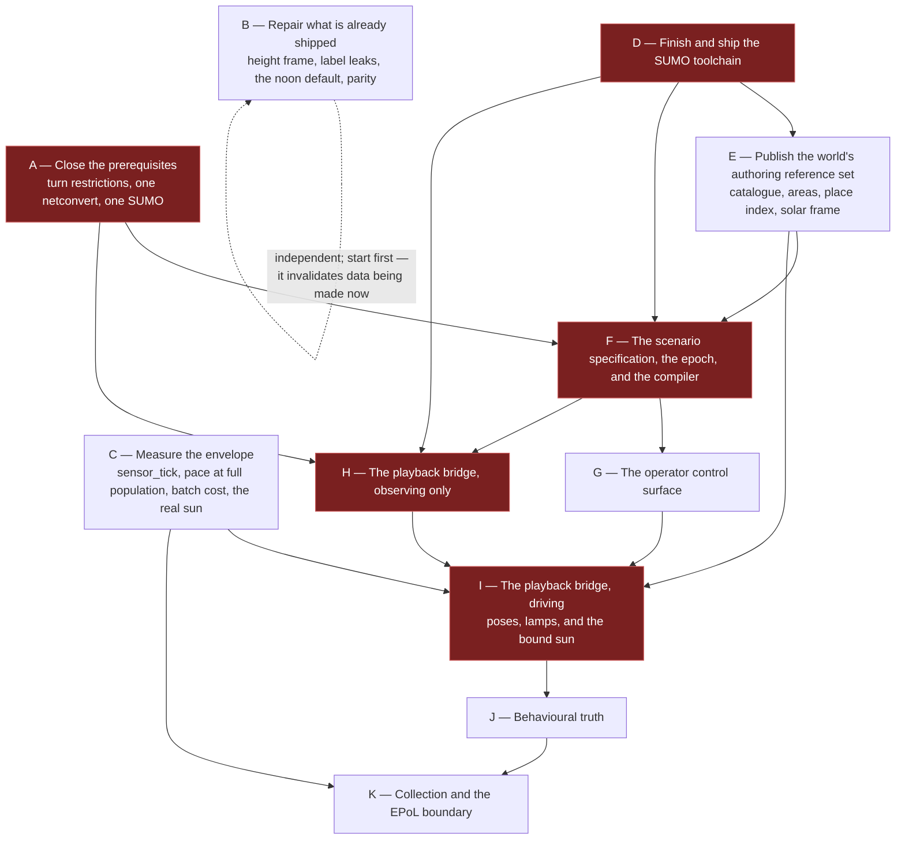

# 13 — Work breakdown

**Status:** Plan. Sequencing and dependency only — **no schedule, no effort estimates,
no calendar.** "Before" and "after" mean dependency, not time.
**Scope:** What to build, in what order, what must be measured before committing to it, and what
needs a decision from the user rather than from an engineer.

Each stage has a descriptive name and a letter used only for the dependency graph. Items marked **⚑**
are on the critical path.

**Change history**

| Date | Change |
|---|---|
| 2026-09-18 | Traffic-light synchronisation and its signal-id dependency dropped; fixture no longer needs a signalised junction. |
| 2026-09-21 | One distribution, licence manifest, `CarlaSetup.bat` retired, skill to stage A, stage B re-measured. |
| 2026-09-21 | Netconvert flags unified on the world build; vocabulary layered into a closed core and open author terms. |
| 2026-09-21 | Role and phase values are author space; only `subject` and `vacancy` are reserved. |
| 2026-09-22 | Two-wheelers are outside the vehicle mapping contract; stage E states the boundary. |
| 2026-09-22 | §13.4 states the two-script setup; stage D drops the completed retirement item. |
| 2026-09-22 | The Unreal skills are vendored under `skills/third-party/` and excluded from the distribution. |
| 2026-09-22 | Stage I: the road layer is suppressed alongside the signal layer, the session owns both, and the capture camera is aimed and its tiles pre-rolled before the first frame. |
| 2026-09-25 | Stage I: a world handed back asynchronous must free-run. Stage K: pacing and a live picture from a camera follower are built; the rest of the live exercise is not. |
| 2026-09-28 | Stages E and I state what is built: the authoring reference set, the session-written sun, and velocity for a pose-applied body, written and awaiting a build. |
| 2026-09-28 | Stage I: the bridge writes each body's velocity with its pose, and velocity for a pose-applied body is built and verified live. Stage J: a state's instant comes from the bridge's clock, not SUMO's output files. |
| 2026-09-28 | Stage A: the co-simulation session pins the SUMO release it launches to the world's converter. |
| 2026-09-28 | Stage F: the compiler and its checks, the epoch, civil time, the schema, route validation, the resolution report, the association check and sweeps are built. |
| 2026-09-28 | Stage A: the session refuses a scenario not on its world's own network. Stage B: the shipped scenarios are to be recompiled. Stage I: the session's check of the compile lock. |
| 2026-09-28 | Stage G: run_capture, layered resolution, validation, the echo, the result, termination and both launchers built. |
| 2026-09-28 | Stages A, B and F: the world type map, the shipped scenarios on their worlds' networks, compiler check 6 refusing, places and route phases built. |
| 2026-09-28 | Stage I: the compile lock and teleporting checks, staged refusals, the window-open instant and live admission passes built in the session. |
| 2026-09-28 | Stage I: tile readiness measured; two conditions from two witnesses, and the server RPC it needs specified. |
| 2026-09-28 | Stage I: `get_view_readiness`, the server half of tile readiness, written and awaiting a build. |
| 2026-09-28 | Stage G: run_capture reads staged refusals, the window instant, admission passes and check 33; a stare aimed at the traffic. |
| 2026-09-28 | Stage I: the failure paths and the vehicle lamps built in the session. |
| 2026-09-29 | Stage I: `get_view_readiness` verified live on Bahonar; the capture's wait on it is not built. |
| 2026-09-29 | Stage D: the setup scripts build and stage `sumo-gui` for development on both platforms, FOX declared in both Linux homes, not bundled. The session can launch it in place of `sumo`, pinned by its own release. Written; awaiting a build. |
| 2026-09-30 | Stages I and J: the session publishes each frame's render set, and the truth sidecar lists only the bodies that frame drew, each by its SUMO vehicle — no parked body, a uid that follows the SUMO vehicle, and a frame whose set is gone written with no vehicles and counted. Written; awaiting a build. |
| 2026-09-30 | Stage K: a camera flown inside the drive (`run_sumo_drive.py --view free`) records spans with the session's render set, each to its own folder and each started once the camera's tiles are in; a capture's pose is shown to be its image's. Built; the live pace and the live checks are the owner's to run. |
| 2026-09-30 | Stage I: `run_capture` waits for every channel's view inside the prewarm — its tiles in, then its picture settled — asked after each step and never between, and refuses at pre-roll a witness past its ceiling or a view not ready as the window opens, the window unmoved (checks 50 and 51); an orbit holds its opening pose until the window opens and a stare aimed at the traffic holds for the last 120 of its frames. Built; the live run is the owner's. |
| 2026-09-30 | Stage I: measured on Bahonar, traffic in view kept the picture witness from settling and the renderer settles on ticks, not camera frames; the picture now leaves out the blocks rendered vehicles cover, needs half the view judged, and compares frames ten ticks apart with a 120-tick ceiling. Built; the with-traffic live run is the owner's. |
| 2026-09-30 | Stage I: the render set follows the ground footprints of the cameras registered with the session -- run_capture's channels, orbits included, and run_sumo_drive's fixed or flown camera -- range-capped, admitted ahead of the view, held after it, ranked by the scenario's seed, with the configured circle deciding while none is registered. Written; the wheel awaits a build, and the live checks are the owner's to run. |
| 2026-09-30 | Stage K corrected: a camera image's header carried the next frame's pose, not the image's (89 of 90 measured live). The server now stamps the header's frame, clock and transform when it captures the frame, and the recorder places each capture, and its depth capture, from the snapshot of its own frame, the header checked, counted and gated at 0 by `run_capture`. Written; the plugin and the wheel await a build, and the live check is the owner's to run. |
| 2026-09-30 | The render cap and everything built on it removed: stage C's actor-ceiling measurement, stage I's region gate and the render set that followed the cameras, the region in the drive's startup log, and the risk that cap-bound spans starve an Arapahoe-class corpus. The cap was never measured — M2 never ran — and the scenario is the arbiter of population: every vehicle SUMO has is drawn, and a heavier scenario runs slower, never thinner. Stage C's second measurement is now the pace of a drive at Arapahoe's full population, information for the wall-clock budget. |
| 2026-10-01 | Stage I: a vehicle SUMO inserts is drawn from the frame SUMO first reports it in, where SUMO inserted it and moving, and never before. Measured live on Bahonar, every inserted vehicle had been drawn a step early, standing at its insertion point while the truth reported SUMO's speed. Built and tested offline; the wheel awaits a build, and the live check is the owner's to run. |
| 2026-10-01 | Stage I: the session names its render set to the server on each change, and the world observer carries it on every snapshot, so the live pull, the CoT feed and a recorder in any process list only the bodies a frame drew, each by its SUMO vehicle, and no parked body; pooled bodies are spawned with `role_name` `sumo`. Written and tested offline; the plugin awaits a build, and the live check is the owner's to run. |
| 2026-10-01 | Stage B: the Arapahoe dwell is compiled against its regenerated world with measured catalogue bodies and its incident as a lane closure, so both shipped scenarios are compiled. Stage F: lane closures and check 55 built. |
| 2026-10-01 | Stage I: every body is seated on the drape where its road is at grade and on its OpenDRIVE road's profile where the road is a structure — Z, pitch and roll by one weight from the road's departure from the drape at its reference line, blended between — and on the drape alone off every road, after the live run measured I-25's deck traffic seated on the ground beneath the deck and the photoreal showed the flat-across profile standing above cambered roads' outer lanes. Stage H's pose conversion row follows it, and the sign row records the signs' live confirmation. Built and tested offline; the live check is the owner's to run. |
| 2026-10-01 | Stages B, F, I and J: the compiler writes a 3 s lane change and the session reports it; the bridge renders a changing vehicle where SUMO has it across its lane; Gardnerville and Arapahoe are recompiled with it, Bahonar is not, because it deadlocks behind a body wider than its lanes; the heading through junctions and lane changes (issue #38) is measured and awaits the owner's decision. |
| 2026-10-02 | Stages B, F, I and J: SUMO is given each body's width without its mirrors, measured from the meshes in the editor, and all three shipped scenarios are recompiled with it and 3 s lane changes, Bahonar running as before; a body's heading is the heading of its own path, its velocity the path's, and SUMO's angle is recorded beside them. Built and tested offline; the wheel awaits a build, and the live check is the owner's to run. |
| 2026-10-02 | Stage I: two optional performance controls, off by default and recommended for no scenario. A limit on which vehicles get a body -- the circle, the cameras' footprints and a capacity, restored as choices with every vehicle SUMO has as the default -- and a draw distance, which every body keeps its pose and truth under and each capture marks the vehicles its camera did not draw. The limits are built and tested offline and the wheel awaits a build; the draw distance's server call is written and awaits a plugin build. The live checks are the owner's to run. |
| 2026-10-02 | Stage B: ramp meters. The world build keeps every OSM ramp meter out of junction joining and gives it a one-vehicle-per-green cycle, so Arapahoe's freeway is no longer signalised by its loop ramp's meter; the dwell's incident is notified on the loop's merge as well. Built and tested offline, the other worlds unchanged; the wheel, the Arapahoe world's rebuild and the dwell's recompile await the integrator. |
| 2026-10-02 | Stage K: every capture is named after its camera, and the camera's platform track carries the name as its callsign; a client names each camera uniquely, or it is `CARLA-SENSOR-<camera id>`. Built and tested offline; the wheel awaits a build, and the live check is the owner's to run. |
| 2026-10-02 | Stage J: SUMO's own distribution edits are checked at session start and stated on the run report — the collision action held to `warn` or `none`, every teleport trigger refused unless accepted, departure jitter and an unseeded run refused, the scale and insertion limits recorded. Built and tested offline; the wheel awaits a build. |
| 2026-10-02 | Stage J: the world truth track inside the capture window. The session writes every vehicle SUMO has at every SUMO frame of the window, drawn or not, a row each at TraCI's clock, with its render state and reason, body and the sun the world reported, flushed a row at a time with a summary beside it; `run_capture` always writes it and `run_sumo_drive.py` on request. Built and tested offline; the wheel awaits a build, and the live check is the owner's to run. |
| 2026-10-02 | Stage J: the world truth track carries the illumination band, beside the refraction-corrected elevation the world reported, cut by the table and the rule a capture's band is cut by, so the base rate's denominator is stratified as its numerator is. Built and tested offline; the wheel awaits a build. |
| 2026-10-05 | Stage K: a camera name is short and plain, as the owner asked -- 1 to 63 ASCII letters, digits, underscores and hyphens, such as `Overwatch_1` or `Southeast_1700m_orbit` -- and every refusal says what is allowed; `run_free_move_camera.py` names its camera too. Built and tested offline; the wheel awaits a build. |
| 2026-10-05 | Stage J: `collision.action none` and `ignore-accidents` are refused, as the owner ruled, so the record of collisions always exists; SUMO's colliding-vehicles count rides in each step's answer and the collision list is asked for only where a collision began or goes on, measured at about 50 µs a round trip; how much the drive prints about collisions is a switch, `run_sumo_drive.py --collision-detail` and `run_capture`'s `collision_detail`, off by default, that changes nothing recorded. Built and tested offline; the wheel awaits a build. |
| 2026-10-05 | Stage J: the supervision plan is read in C# into records nothing in a run can write, its core values through `CarlaNet.Types`' enumerations, and the session's compile-lock check binds it -- by the lock's digest, and by its own digests against the files the run loads, the lane closures' file included -- and hands it to the session on the run report. Built and tested offline; the wheel awaits a build. The interval binder is next. |
| 2026-10-05 | Stage J: the run supervision manifest is written as rows of JSON closed by a terminal row, as the owner settled: the run's opening, every admission and release, the events that change the population, the sun at the window's opening and end, and why the run ended. `run_capture` always writes it and measures its closing record. Built and tested offline; the wheel awaits a build, and the live check is the owner's to run. |

---

## 1. The dependency graph

```mermaid
flowchart TB
    A["A — Close the prerequisites<br/>turn restrictions, one netconvert, one SUMO"]
    B["B — Repair what is already shipped<br/>height frame, label leaks, the noon default, parity"]
    C["C — Measure the envelope<br/>sensor_tick, pace at full population, batch cost, the real sun"]
    D["D — Finish and ship the SUMO toolchain"]
    E["E — Publish the world's authoring reference set<br/>catalogue, areas, place index, solar frame"]
    F["F — The scenario specification, the epoch, and the compiler"]
    G["G — The operator control surface"]
    H["H — The playback bridge, observing only"]
    I["I — The playback bridge, driving<br/>poses, lamps, and the bound sun"]
    J["J — Behavioural truth"]
    K["K — Collection and the EPoL boundary"]

    A --> F
    A --> H
    B -.->|"independent; start first —<br/>it invalidates data being made now"| B
    C --> I
    C --> K
    D --> E
    D --> F
    D --> H
    E --> F
    E --> I
    F --> G
    F --> H
    G --> I
    H --> I
    I --> J
    J --> K

    classDef crit fill:#7a2020,stroke:#d06060,color:#fff
    class A,D,F,H,I crit
```

**B and C sit outside the chain and start immediately.** B invalidates data that is being produced
now; C's answers change what is worth building in I and K.

**The epoch work in F must land before the first windowed capture.** A corpus whose imagery and truth
disagree about what time it was is unrepairable after the fact, and nothing in the tree today
prevents producing one.

---

## 2. Stage A — Close the prerequisites

| ⚑ | Item | Done when |
|---|---|---|
| ⚑ | **Carry OSM relations through the clip.** Measured: 42 relations, 22 of them turn restrictions, and **0 survive**. [Issue #12](https://github.com/sbrett9/carla/issues/12) | Restriction relations referencing surviving ways are present in the clipped OSM, and netconvert stops reporting them as ignored |
| ⚑ | **Persist the world's `.net.xml` from the same netconvert invocation as the `.xodr`**, and refuse any other. Measured: 321 vs 317 edges and one lane of 352.19 m vs 2.60 m from the *identical* OSM, while `convBoundary` matches exactly | A scenario cannot be built against a network the world did not produce; the attempt names both fingerprints **Co-simulation session:** refuses, before SUMO is started, a scenario whose network is not the one the world package carries — compared by canonical fingerprint, naming both networks and both fingerprints — and a package whose network is not the one it records ([`03`](03_CoSimulation_Runtime.md) §7.2, D3.28). **Built** |
| ⚑ | **Unify the netconvert flag set on the world build, and regenerate every world.** The scenario path stops invoking netconvert entirely and loads `map.net.xml` from the package; the world build adopts `--output.street-names`, `--junctions.join-dist` and `--tls.default-type` so the single invocation produces what both sides need | Every world is rebuilt from its original OSM. **`--output.street-names` must be omitted, never set `false`** — `NBEdge::expandableBy` guards on the option having been *set at all*, so `false` produces the same graph as `true` and a later attempt to turn it off fails silently |
| ⚑ | **Pin which SUMO runs.** `SUMO_HOME` on the development machine is an independent 1.27.1; the pinned build and every shipped world's converter are 1.27.0. **Built** | The resolved path and version are logged every run; a mismatch against the world's converter refuses. **Co-simulation session:** `run_sumo_drive.py` names the installation (`--sumo-home`, `CARLANET_SUMO_HOME`, the repository's staged build); the session compares its release with the package's recorded converter by release number before starting SUMO, refuses a mismatch naming both unless `--allow-sumo-version-mismatch` is given, and records the outcome on every run report ([`03`](03_CoSimulation_Runtime.md) §2.6, D3.27). **CarlaControl tools:** `SumoInstallation.require_version` calls `CarlaNet.Sumo.SumoRelease` through `carlanet`, the single definition; compiler check 6 refuses a mismatch and the lock records an accepted one |
| ⚑ | **Move the authoring skill into the repository** and reduce the workspace copy to a stub; vendor the third-party Unreal skills under `CarlaControl/skills/third-party/` with their `LICENSE` and pin, and exclude them from `MakeDistribution` on both platforms (§13.3, `D9.10`) | Every skill an assistant reads has a commit behind it; `07` §8.4's assumption becomes true; ours is bundled in the distribution and theirs is not |

Under SUMO drive, traffic routed through a banned turn looks *worse* than today's and is easily
misattributed to the bridge. A scenario authored against edge ids from a graph the world does not
share is wrong in a way every downstream check passes.

**The network cannot be reconstructed by re-running netconvert, even with byte-identical flags.**
Requesting OpenDRIVE output flips `rectangular-lane-cut` to true (`NWFrame.cpp:171`), which feeds
junction shape computation — measured, 743 of 4,978 canonical rows differ, with lane lengths moving up
to 3.3 m. So the `.net.xml` must come out of the same process invocation as the `.xodr`, and there is
then only one flag set to choose. The world build adopts the scenario's flags rather than the reverse:
`--output.street-names` is what gives the place index its edge names, and dropping it would cost the
91% named-edge coverage the US maps carry. The price is that every generated map changes — measured at
1,017 → 1,021 roads and 183 → 184 junctions on Arapahoe — so every world regenerates from its original
OSM. That cost is paid once, alongside the artifact re-issue stage B already requires.

`--output.original-names` moves with the other three. It does **not** change the graph — measured, it
adds a `<param key="origId">` per lane and nothing else — but the scenario side has always passed it,
and the two invocations are compared argument for argument, so a flag that is asked for and not given
is a refusal whether or not it moves a road. A world a scenario needs built differently again — the
Bahonar port keeps its private roads and drops pedestrian ways by type — is built that way with
`--netconvert-arg`, and what its roads admit with the world's type map (`<extract>.typ.xml` beside the
extract, or `--type-map`), rather than by letting the two sides diverge a second time. The Bahonar world
is built with `Import/Shahid_Bahonar_Port.typ.xml` and its areas of interest,
`Import/Shahid_Bahonar_Port.aoi.geojson`; its network fingerprints as `3966113a…`
([`07`](07_Scenario_Authoring.md) §9.8, §2.11).

---

## 3. Stage B — Repair what is already shipped

Ordered. The first item is first because it is the only one with a **closing window**: the anomaly
generator and its affiliation plumbing are uncommitted, no corpus has been produced, and nothing needs
re-issuing. Every other item repairs damage already done; this one prevents it.

| ⚑ | Item | Done when |
|---|---|---|
| ⚑ | **Close the five ground-truth label leaks before the first corpus exists.** `special_type="marked"` plus a duplicate `marked` column; anomaly affiliation `u` readable off the CoT type; conspicuous anomaly colours; and the **vType ids themselves**, written verbatim as `anomaly_probe`, `anomaly_escort`, `anomaly_shadow`, `anomaly_staybehind` | Grouping a corpus by `marked`, no value of `color`, `cot_type` or any published field appears in one group and not the other. **Renaming alone cannot achieve this**: a planted vehicle needs its own vType to carry its authored `speedFactor`, so its `type_id` is unique under any name, and a scheduled vehicle's `role_name` degenerates to its own id. Those fields, with `special_type` and `marked`, leave the published channel at the writer and reach only the scenario's labels sidecar. Anomaly types are named and coloured like the population they hide in, and the vehicle **ids** are too; the behavioural signature is the only label |
| ⚑ | **Fix the bare-earth height frame.** Sampling the `.xodr` profile every 5 m, residual stdev is **13.04 m** under today's indexing against **0.63 m** under the fix | Heights match under CARLA-frame indexing, and an out-of-grid read returns nothing rather than a clamped edge cell, matching the C# peer. The regression test carries two gates: an absolute residual limit on the world the figure was measured on, **named**, and a world-independent frame gate — the mirrored lookup must be at least three times looser — parameterised over every package. The absolute limit is **not universal**: Bahonar measures 1.91 m when correct, because a sea-level port of quays and a drydock genuinely carries its road deck that far above bare earth |
| ⚑ | **Stop forcing noon on the host's date.** `run_SCTMV.py:138` calls `setup_solar_time` unconditionally, including in attach mode, and `WorldBuilder.py:226-237` invents both the date and the hour | A run with no `--time`/`--date` leaves the world's sun where it was, and says so. Captures already made are not recoverable — the sun is in the pixels |
| ⚑ | **Supply `scenario_id`.** Accepted by the recorder and never passed, so the field was dormant | A run records which scenario produced it. The `carla:solar` and `carla:capture` chunks keep `advancing`, `rate`, `scenario_id` and `seed`: a recorded still is a **truth artifact** that detect-and-track validation reads, and a harness needs to know which scenario and seed produced a frame and whether its sun was advancing. The imagery-chunk validator [`08`](08_Collection_And_EPoL.md) §9.4 specifies is **stage K work**, belonging with the observation root it checks, and is not built here |
| ⚑ | **Bring the Windows distribution to parity.** Four breaks, not two: the deleted script, the launcher that execs it, the missing `carlacontrol` wheel, and `setup-venv.ps1` installing one arbitrary wheel with no `--find-links` | A distribution built from a clean tree runs its own `run-sctmv.ps1 --help` and exits 0. A missing wheel fails the build instead of warning. The Linux counterpart lands in the same commit |
| | **Supply the run's own health.** `FrameRecorder.Dropped` has no reader; the clock ratio is computed and only logged | A run reports drops and its clock ratio, and cannot be mistaken for a clean one |
| | **Stop boxing the bare-earth grid.** 7.6 M cells: 60.9 MB on disk becomes **243.6 MB** as a tuple against **32.3 MB** as an `array('f')` | Footprint matches. The load-time saving is real but small (0.183 s → 0.018 s); the footprint is the reason |
| | **Route or remove `anomaly_notes`.** Written by the generator, read by nothing | An absence anomaly reaches a consumer, or the field goes. A guard no-show has no vehicle, so it needs a record or it is not truth at all |
| | **Set `sensor_tick`** — last of these, because it touches the occlusion path's frame pairing and deserves its own measurement | Sensor callbacks ≈ captures, with the depth camera on the same instants |
| | **Recompile the shipped scenarios against their worlds.** `Import/Arapahoe_I25_UnderpassDwell.sumocfg` and `Import/Gardnerville_Centerville_Lane_NeighborhoodOrbit.sumocfg` each run on a separate conversion of their world's area, and the session refuses both | Each is a compiled scenario whose network is its world package's own, and a session starts on it. **Done**: both are compiled into `Import/` by their generators. Arapahoe is compiled against the world regenerated on 2026-10-01, every one of its vehicle types a measured catalogue body, its incident a lane closure in a compiled additional file; measured in SUMO, peak 440 and median 338 live vehicles against the 437 and 336 it was tuned to ([`07`](07_Scenario_Authoring.md) §3.4.2). A live drive of it is the owner's to run. Recompiled again on 2026-10-01 with the compiler's 3 s lane change ([`04`](04_Contracts.md) D4.42): Gardnerville and Arapahoe, routes unchanged (Arapahoe peak 441, median 345); not Bahonar, which deadlocked with it ([`04`](04_Contracts.md) §5.2a). On 2026-10-02 all three, Bahonar included, are recompiled with each body's width without its mirrors (D4.43): Bahonar 170 / 42 / 159 as before, Arapahoe 461 / 344 / 449, Gardnerville 49 / 39 / 47 |
| | **Meter the ramps.** netconvert built Arapahoe's four OSM ramp meters as junctions: meter `582785322` was joined with the loop ramp's merge and an I-25 node into a signal holding five lanes of I-25 on red for up to 56 s a cycle, and the other three ran an 80 s green ([`07`](07_Scenario_Authoring.md) §6 gotcha 13) | Every OSM `traffic_signals=ramp_meter` is kept out of junction joining and runs a one-vehicle-per-green cycle read in the same netconvert invocation, for every world (D7.38); no signal controls a freeway lane. **Built and tested offline**: Bahonar and Gardnerville convert to their recorded arguments and fingerprints unchanged; Arapahoe's network becomes `ffe490b1…`, and its dwell, notified on the loop's merge as well (D7.39), measures peak 435, median 324, p99 416 against 461 / 344 / 449, every green releasing one vehicle and no queue past 23 m. The wheel, the Arapahoe world's rebuild and the dwell's recompile into `Import/` are the integrator's |

The engine-side items of this stage are built: a sunless world is distinguished from midnight at
latitude 0, a loaded world's sun is reset to deterministic defaults, `set_solar_epoch` writes date,
clock and civil offset together so neither the date nor a civil clock depends on the engine, and
`get_vehicle_light_states` is called by the name the server binds.

## 4. Stage C — Measure the envelope

**Nothing in stages I or K is committed to before these return**, except rank 2, which is information
for the wall-clock budget rather than a gate. Ranked, with the cheapest probe that answers each.

| Rank | Measurement | Probe | Decides |
|---|---|---|---|
| **⚑ 1** | **Does `sensor_tick` suppress the render or only the enqueue?** Set nowhere; every camera renders at world rate while 19 frames in 20 are discarded | Set it; read the clock ratio from PNG metadata already written | Possibly ~10× the clock ratio — comfortable windowed capture versus tight |
| 2 | **The pace of a drive at Arapahoe's full population** — peak 437, median 336 live vehicles, every one drawn. **Measured 2026-10-02** ([`10`](10_Scale_And_Performance.md) §4.3.3): 0.715× with a 1,500 m camera at about 325 vehicles under Windows' Best performance power mode, 0.625× under Balanced. Information for the wall-clock budget; it sets no limit. Also carries the three per-tick solar actor sweeps | A drive of the shipped Arapahoe scenario, reading ticks per wall-second at its median and its peak | What a window of a heavy scenario costs in wall clock ([`10`](10_Scale_And_Performance.md) §4.1, M2). It decides nothing about which vehicles are drawn: all of them are |
| 3 | **Batch cost of N transforms on the game thread** | One `apply_batch` of N transforms timed against the same tick without it | Whether the pose write or the camera dominates a heavy tick, and so whether rank 1's saving shortens a heavy window |
| **⚑ 4** | **Does the engine's sun match the model?** The capture plan is computed from a *model* of the sun, not a reading of it | Twelve RPCs comparing `get_solar_state` elevation against the model | Underwrites the whole window plan — and the 14.72 min clock error is the difference between −1.60° and +1.33° at 21 Dec 17:00 |
| **⚑ 5** | **Does an annotated interval survive contact with a detector?** Doc 20's open question 1, still the corpus go/no-go | Two tiers. Tier A is **illumination-blind by construction** and needs no detector; Tier B adds a stock detector at three sun settings over one window, one scenario, one seed | Camera altitude, field of view, channel count — so it precedes rig sizing. The illumination effect is the *residual between tiers*, not a third axis |
| 6 | **Does an advancing sun defeat the shadow cache, and by how much?** The VSM clipmap keys on light direction with an exact comparison | `r.Shadow.Virtual.Cache.ForceInvalidateDirectional` 1 vs 0 | Whether advancing is affordable at all. Gates an option, since the plan freezes on five of six windows |
| 7 | **Does a pose-applied vehicle read correctly to a detector at EO altitude?** | One scene captured twice along the same path, physics-driven and pose-applied | Whether doc 23's actuated strategy is optional or necessary |
| 8 | **Lamp transition cost in the Blueprint VM** | Rank 2's drive run twice, lamps written and not | Whether lamps are free in practice as well as on the wire |

For framing: holding a vehicle at ten pixels fixes the ground sample distance at 0.45 m/px and the
swath at 576 × 324 m **whatever the altitude**, so one detector-usable channel covers **0.64%** of
the Bahonar map. Coverage, not population, is the likely constraint on corpus yield.

### 4.1 The test fixture — a small scenario authored for the purpose

**None of these measurements needs a large scenario, and using one makes them slower and harder to
read.** The shipped scenarios are *measurement inputs* that place the sizing envelope on a curve —
Gardnerville at peak 51, Bahonar at 139, Arapahoe at 437 — not requirements the design is beholden
to. Scenario scale is a **lever the plan can pull**, not a fixed constraint it must absorb.

So stage C runs against a purpose-built fixture: **a five-minute SUMO network sited in Arapahoe with a
small, fixed vehicle population.** Five simulated minutes at a 0.05 s delta is 6,000 ticks — long
enough to hold a dwell, a turn and a lane change, short enough that a full run is minutes of wall
clock rather than hours. Properties it must have, each because a measurement depends on it:

| Property | Why |
|---|---|
| A **fixed, declared** vehicle count rather than flows | The batch-cost probe varies the count deliberately; ambient variance would confound it |
| One authored dwell and one authored transit, both annotated | The smallest input that exercises the whole supervision path end to end |
| A **declared epoch** and at least two capture windows at different sun elevations | Exercises the epoch contract, the solar audit, and the illumination axis without a seven-day run |
| Both a rendered vehicle and one of a type with no measured body, simulated only | Exercises the render-set contract and the observability outcomes |
| Runs in **under a minute** of SUMO wall clock | So a failed measurement is cheap to repeat |

It is authored once, versioned with the plan, and becomes the regression fixture every later stage
runs against. **It is not a substitute for the sizing measurements already taken** — the envelope
still rests on the three real scenarios — but nothing in stage C, and nothing in the first corpus,
needs to wait on a seven-day port to be useful.

---

## 5. Stage D — Finish and ship the SUMO toolchain

Already scouted; the build itself already compiles clean from the unmodified configuration.

| ⚑ | Item | Done when |
|---|---|---|
| ⚑ | Build and stage `sumo` and `duarouter` beside `netconvert`, plus a **named subset** of `data/` and `tools/` — `tools/traci`, `tools/sumolib`, `data/typemap`, `data/xsd`. Measured: the full copy is 89 MB to deliver the 3.2 MB anything here consumes, and `tools/contributed` alone is 47 MB of third-party sub-licences. `tools/traci` is also the reference `CarlaNet.Sumo` is ported from (`09` §3.4) | `sumo --version` runs from the **staged install**, not the build tree |
| ⚑ | Re-key the idempotence guard to "is the whole required set staged" — not "is the newest there", since parallel builds have no dependable last-built file. **The guard is firing today**: `netconvert` is staged, so `sumo`, `duarouter` and the `data`/`tools` subsets are never built or staged | A returning developer cannot silently keep a half toolchain, and the check reports which members are missing |
| | Set `SUMO_HOME` where the other tool paths are set. The build set needs no prerequisite `netconvert` does not already have on either platform, and the TraCI client needs none at all — but **a Linux prerequisite has two homes**, `InstallPrerequisites.sh` and `Util/Docker/Base.alma8.Dockerfile`, because CI runs `--skip-prerequisites` against a pre-built image (`09` §2.3, `D9.8`) | A clean clone and a clean CI container both build it |
| | Bundle the toolchain and the new artifacts, both platforms. `CarlaNet.Sumo` needs no slot of its own — it is managed code and rides the `carlanet` wheel | The acceptance check passes from an installed distribution |
| | **Acceptance check**, run rather than remembered | `sumo --version` from the staged install; a test steps an empty simulation over TraCI against a `sumo` it started; the version handshake refuses a mismatched install; `duarouter` validates a known route |
| | **Build and stage `sumo-gui` for development**, both platforms, as a member of the required set, so a developer can watch the simulation a drive steps ([`03`](03_CoSimulation_Runtime.md) §2.6). Its prerequisite, FOX, is declared in both Linux homes; EL8 packages none, so the CI image builds it from pinned source (`09` §2.5, `D9.15`). **Written; not yet built** | `sumo-gui` is in `Build/sumo-install/bin` after setup on both platforms and a clean CI container builds it. It is not bundled: whether a distribution carries it is the owner's decision (`09` §5.4, Open question 5) |

`duarouter` is **required**: route validation becomes an unconditional compile step, measured at
0.27 s for all 52 Arapahoe routes.

---

## 6. Stage E — Publish the world's authoring reference set

| ⚑ | Item | Notes |
|---|---|---|
| ⚑ | **The vehicle catalogue, by spawn-and-measure.** Dimensions do not exist before spawn; the box first exists on the spawned actor | One vType per blueprint; one distribution per class; dimensions verbatim; blueprint named in a `<param>` that is schema-valid against SUMO's own `route.xsd` |
| ⚑ | **The catalogue is a runtime dependency of the bridge**, because the bumper-to-centre pose shift needs the measured extent. A vehicle of unknown extent is **not rendered**, never rendered at a guess | |
| | **Two-wheelers are outside the catalogue's scope.** No class names a motorcycle, moped or bicycle, no `vType` declares one, and an author asking for one is refused rather than given a car. A two-wheeler carries a rider and riders are not rendered; and the content build registers no two-wheeled blueprint for the sweep to measure | A scope boundary, not a defect to close later. [`04`](04_Contracts.md) `D4.40`, V1.20; the authoring skill carries it |
| | **Lamp capability, measured optically.** `HasLights` is `true` on all 17 blueprints and `GetVehicleLightState` returns the *command*, so the API will confirm lamps that never lit | Rides the same sweep |
| | **Areas of interest**: GeoJSON beside the extract or `--aoi`, validated before the world is built, resolved against the world's own network to CARLA metres and SUMO lane positions, published as `areas.resolved.json` and `areas.aoi.geojson` in the world package, republishable without a rebuild. **Built.** The engine holder and `set_/get_areas_of_interest` are specified ([`04`](04_Contracts.md) C5 §7.4) and not built | Required, not optional — an absence anomaly anchors to an area plus a window |
| | **The place index**, `places.json`, carrying its own coverage: 91.2% on Gardnerville, 90.9% on Arapahoe, **4.5% on Bahonar (47 of 1,044 edges)**, one name mapping to 65 edges. **Built** | |
| | **The solar frame**, `solar.json`: origin latitude and longitude and the zone the engine derives, so a scenario's epoch is checked offline. **Built** | The site's civil zone is not derived: there is no zone-boundary data or time-zone database, so the epoch declares it |
| | **The world fingerprint** — a canonical fingerprint of the parsed network, **not a byte hash**: the same OSM clipped three times gives three digests and a byte-identical graph | |
| | **The annotation vocabulary**, versioned | Contents are an open question below |

---

## 7. Stage F — The scenario specification, the epoch, and the compiler

The Python builder stays, but **emits the specification rather than SUMO XML**, so a generated
scenario faces every check a hand-written one does. The compiler is built (`ScenarioCompiler`,
`compile_scenario.py`); `make_sumo_scenario.py` and `make_bahonar_scenario.py` emit the Gardnerville
orbit and the Bahonar pattern of life as specifications and compile them against their worlds'
packages, and `make_arapahoe_scenario.py` the Arapahoe dwell, its incident a lane closure
([`07`](07_Scenario_Authoring.md) §3.4, §3.4.1, §3.4.2).

| ⚑ | Item | Notes |
|---|---|---|
| ⚑ | **The epoch declaration.** Civil date and time that `t = 0` means, a **numeric** UTC offset (normative; the zone name is provenance only, because `zoneinfo` resolves zero zones on this machine), whether the calendar advances, and the DST state as a declared offset. **Built**: `ScenarioEpoch` reads the C9 object with the session's `SolarEpoch`; checks 33 and 34; whole quarter hours; the zone name carried, never resolved | Half-hour offsets first-class — the sizing site is **+03:30**. A redundant UTC datetime cross-checks an offset applied in the wrong direction, a 7-hour error here |
| ⚑ | **Civil time as an authoring construct.** Times written as civil instants and compiled to seconds. **Built**: `CivilTimeResolver`, `RotaExpander`; checks 37, 47 and 48; the guard rota as one block reproduces the generator's 335 entries | Measured on the sizing scenario: sixteen arithmetic sites go to zero, the 335-entry rota with its deliberate no-show becomes one block with one `skip`, and the civil meaning of **610 of 610** entries becomes recoverable against **0 of 610** today |
| ⚑ | The specification schema and the supervision plan as its **sole** annotation channel. **Built**: `ScenarioSchema` (published), `SupervisionPlanCompiler`; the route file carries only the vType binding (check 52) | SUMO route files are XSD-validated and generated; `<param>` is a flat un-namespaced store SUMO's own devices read |
| | The compiler and its checks — seven groups, each stating refuse or warn. **Built**: 52 compiler checks, listed in the skill's `checks.json`; lane closures compile into an additional file the lock binds, and check 55 refuses one that breaks a route (D7.37). Point, street-near, gateway and junction-movement places, and route phases held to a speed, are built. Network edits are not part of a specification: a world a scenario needs built differently is built that way (stage A) | Including epoch form, offset a whole number of quarter hours, span against the calendar, midnight crossing, windows inside the span, and policy well-formedness |
| | **Route validation via `duarouter`, with the false-accept guard** — terminal edge equals the requested destination and every `via` appears in order. **Built**: `RouteValidator`, which also requires the route to start on its origin and pass every stop in order | Measured: a trip to a nonexistent edge still produces a `<vehicle>` with a one-edge route |
| | **The resolution report**, the only place an annotation or an epoch can ever be checked. **Built**: `ResolutionReport`, JSON and Markdown; a refused compile writes only the report | |
| | **The hour-to-label correlation check — warns, never refuses.** Measured at **0.600** on the shipped scenario; at 02:00 and 11:00 every entry is annotated. **Built**: `IlluminationLabelAssociation`, by doc 11's bands | Refusing would make doc 20's class 4 unauthorable, and a check firing on the only large scenario gets switched off. Buckets by illumination regime, not clock hour; the statistic lands in the lock file |
| | Sweeps and counterfactual pairing, with illumination as a declared axis. **Built**: `ScenarioSweep`; an `epoch.date` sweep leaves the routes' traffic identical | **Sweeping `epoch.date` rather than the window hour** moves the sun 21° while holding population and behaviour provably fixed |
| | **The Bahonar pattern of life compiled.** Written: a specification on the rebuilt world's network under a 07:00 +03:30 epoch, reproducing every shipped entry inside the run at its local time, its six anomalies as supervision. Refused by check 14 alone until the catalogue measures `vehicle.carlamotors.european_hgv`; with that body measured it compiles and the session's network, lock, teleporting and route-error checks admit it | After a catalogue republish every compiled scenario is recompiled, because the session refuses a catalogue digest other than the lock's |
| | **A lane change spread over three seconds.** **Built:** the compiler writes `lanechange.duration` 3 into every configuration beside the other processing options, the lock records it and the resolution report's Traffic section lists them all ([`04`](04_Contracts.md) D4.42, [`06`](06_Truth_And_Annotation.md) §6.2). One value for every vehicle; a value per class is not built | Measured in SUMO alone: Arapahoe 441 / 345 against 440 / 338, Gardnerville unchanged. Bahonar deadlocked with any spread lane change behind `vehicle.fuso.mitsubishi`, whose box is 3.93 m wide on 3.35 m lanes, mirrors included (the control at 2.5 m did not); resolved by the row below. Lane-change durations per class, `maxSpeedLat` and `lcMaxSpeedLatStanding` are tabled |
| | **SUMO is given each body's width without its mirrors** ([`04`](04_Contracts.md) §3.2b, D4.43). **Built:** measured from each blueprint's own mesh exported from the editor (`measure_vehicle_body_widths.py`, all nineteen, 2026-10-02), carried in the catalogue as `body_width_m` beside the box with its method, merged by the sweep or by `apply_vehicle_body_widths.py` without a server; both type writers give it to SUMO, check 15 holds a type to it, and a class drawing a body with none is refused under check 14. The truth box and seating keep the full box | The Fuso bus is 3.23 m without its mirrors; recompiled with it, Bahonar runs at 170 / 42 / 159 under 3 s lane changes, as before they were spread. No model is rescaled |

---

## 8. Stage G — The operator control surface

Measured justification: **86 arguments, 66 of them inert unless something declared elsewhere is on**,
only 20 unconditionally in force, plus 13 undeclared hotkeys of which one is documented nowhere.

| Item | Notes |
|---|---|
| Layered resolution — tool defaults → site profile → world bindings → scenario declarations → run configuration → operator overrides | Every field carries its value **and the layer that set it**; the manifest's copy is itself a valid run configuration, so reproducing a run is reading it back. **Built**: `RunConfigurationResolver`, `EffectiveRunConfiguration`, `SiteProfile`; a run is reproduced by handing `<run>.effective.json` back to `run_capture --run` |
| The toggle inventory with mutability classes, decided by one question: *would a consumer reading the corpus be wrong if this changed and they did not know?* | The occlusion estimator is session-fixed, not run-mutable — turning it off mid-run silently changes the unoccluded denominator. **Built**: `RunConfiguration`'s field table, published as `CarlaControl/schemas/run_configuration.schema.json`, generating `--help`, and held equal to [`12`](12_Operator_Control_Surface.md) §5.2 by a test |
| **Launch validation**, reusing the compiler rather than inventing a second one | A configuration that cannot work fails at launch naming the reason, not at minute forty. **Built**: `RunConfigurationValidator`, in the compiler's finding vocabulary; [`12`](12_Operator_Control_Surface.md) §6.2.1 says where each of the 49 checks runs and which have nothing in the tree to compare yet |
| **An echo before commit** | A multi-hour, multi-hundred-gigabyte run states its first frame's civil instant and sun elevation before starting. **Built**: `LaunchEcho`, including the instant a frozen sun is actually pinned at |
| Coexistence with `run_SCTMV.py`, which stays for the traffic-manager path | No capability lost; the three diverged duplicated defaults reconciled. `run_SCTMV.py` is unchanged; reconciling the defaults waits for [`12`](12_Operator_Control_Surface.md) §9.2's conversion |
| **`run_capture`**, the capture front end. **Built**: binds a compiled scenario and its world package, drives through `SumoDriveSession`, one recorder per channel; `RunResult` in every outcome with the exit status read from it; `RunTerminationSequence`; `RunCloseoutReport`; `SessionMonitor`; `RunCapture.ps1` and `RunCapture.sh` with a parity test | Not built: the distribution launchers ([`12`](12_Operator_Control_Surface.md) §10 lists what MakeDistribution needs), run lists, world-build configuration |
| **What `run_capture` reads from the session** | **Built**: every refusal mapped by its stage; the window opening at its own begin (`window_opens_at`), with the echo's sun stated there; the live admission pass on the monitor; the compile lock and teleporting checks in the result and the closeout; a stare aimed at the rendered traffic (`stare_look_at_target`) that follows it through the prewarm until its hold, one SUMO step and 120 ticks before the window opens, and records the point it resolves to; every channel's view waited on before the window opens (check 50). Not built: a transport failure is `internal_error` until the session stages it; no run-configuration field accepts teleporting. Also to read: each refusal's cause (`CauseName`), `Report.Stopped`, `GiveBackFailures` as a loud condition, the collision and not-inserted records and callbacks, and the lamp and SUMO-answer options |

---

## 9. Stage H — The playback bridge, observing only

New `CarlaNet.CoSim` in C#, orchestrated from Python; one TraCI connection owned by the bridge.

| ⚑ | Item | Done when |
|---|---|---|
| ⚑ | Session, clock, and the integer-ratio validation between SUMO step, world delta and capture rate | A mismatched trio refuses at session start |
| ⚑ | **Subscription-based** state reading, including `VAR_SIGNALS` | Measured 14× cheaper than per-vehicle getters |
| ⚑ | Pose conversion — Y negation, `carlaYaw = sumoAngle − 90`, bumper-to-centre from the catalogue; Z, pitch and roll from the drape at grade and from the road the vehicle is on where it is a structure (stage I), client-side with no RPC | The commanded-versus-applied divergence is a stated tolerance, so a conversion error shows up there rather than as plausible imagery with every box wrong by half a car |
| ⚑ | **One-step lookahead and lane-geometry interpolation**, four cases: same lane, lane change, crossed edges, discontinuous | A vehicle tracks its lane through a junction rather than cutting the corner by 10.6 m |
| | **Follow SUMO's lateral position through a lane change.** **Built:** the subscription carries `VAR_LANEPOSITION_LAT` and every interpolated point is put that far to the left of its lane, taken linearly in time ([`03`](03_CoSimulation_Runtime.md) §6.4 case 2) | The pose is SUMO's position at every frame, the lane switch half way through a change included: under a millimetre on the fixture through TraCI, 15 mm over 300 s of Arapahoe in a world-less session, against up to 1.675 m on the centre line |
| ⚑ | Render-set selector and actor pool, recording admission and release instants | Each interval names the body that rendered it, so a track in the imagery resolves to one vehicle |
| ⚑ | **Population-authority lease and the ambient lockout** | Starting ambient traffic while SUMO holds the lease fails the session start and names the holder |
| ⚑ | Log SUMO's decisions without applying them | A session with no CARLA attached tracks a world driven by something else within a stated tolerance |

---

## 10. Stage I — The playback bridge, driving

| ⚑ | Item | Notes |
|---|---|---|
| ⚑ | Batched pose application — one `apply_batch` per tick, no variable tail. **Built** | All 22 command types supported. Carries, per body whose pose is written, `ApplyTransform` then `ApplyTargetVelocity` (SUMO's velocity, climb included); zero velocity for a held body with no pose and after a parking transform; bodies given back are written at the head of the next tick's batch (`TickBatch`, [`03`](03_CoSimulation_Runtime.md) §5.4). Measured on Gardnerville: 8,002 commands for 400 ticks, one pair per pose and per parking |
| ⚑ | **Spawn from the catalogue, physics and gravity off.** A vType naming no measured blueprint is never rendered and never substituted | The pool grows to demand; every body is spawned once at its own parking slot and destroyed only at the session's end. Every body is spawned with `role_name` `sumo` ([`04`](04_Contracts.md) D4.9; before, the blueprint default `autopilot` was on 152 of 152 records in a Bahonar sidecar). **Built** |
| ⚑ | **The commanded-versus-applied divergence, per vehicle per tick**. **Built** | Free: the world observer streams every actor's transform every tick. Position in metres and the three angles as shortest arcs, and the velocity as a vector difference read against the mean commanded speed, with the worst named by vehicle and instant |
| ⚑ | **The pitch and roll signs** | Settled from `Math::GetForwardVector` / `GetRightVector` and the `FRotator` conversion; both were inverted. Confirmed live on Arapahoe on 2026-10-01: 167 of 181 bodies on a visible grade pitch the surface's way and 169 of 190 on a cross-slope roll its way |
| ⚑ | **Seat every body by the road it is on** ([`03`](03_CoSimulation_Runtime.md) §7.5, D3.8). On the drape where the road is at grade and on the road's OpenDRIVE profile where it is a structure: Z, pitch and roll by one weight from the road's departure from the drape at its reference line at the origin's s — the drape's whole seat within 0.5 m, the profile's with no roll beyond 1.5 m, smoothstep between, changing no faster than a smoothstep over 10 m and meeting the carriageways at a junction connector's ends; the drape alone for a vehicle on no lane, on a lane with no road or off its road, counted on the report by reason. **Built and tested offline** | Measured live, the drape seated I-25's deck traffic 1.2–6.1 m below the deck and humped the traffic beneath it; measured against the photoreal, the flat-across profile stands a median 0.35 m above a cambered road's outer lanes, where the drape agrees to 0.02 m. Every lane of Arapahoe (1,694) and Bahonar (4,109) is joined to its road — by `sumoId`, a merge's lane sections and a connector's links. On a world-less Arapahoe run the deck bodies sit up to 6.8 m above where the drape seated them and East Arapahoe Road's 4.5 m below, on their profiles to 5 mm, every body at grade on the drape exactly, as continuous as the drape alone, for about 0.25 ms a tick at 335 vehicles. **The live check is the owner's to run** |
| ⚑ | **The world's clock, taken and given back.** Synchronous mode at a fixed delta, read back to confirm the world took it, restored on every exit path including a failure | A world handed back asynchronous must free-run on its own: the engine's synchronous drain tests the mode on every pass, or the world reports asynchronous and stands still until something ticks it (`CarlaNet/python/test_sync_to_async_release.py`). A previous run left an editor stranded in synchronous mode; restoration is now a property of the lease rather than a step at the end of a good run |
| ⚑ | **Bind the sun per window.** One `set_solar_epoch` of date, clock and civil offset after the SUMO fast-forward and before the first tick, for the window's opening instant, which a prewarm precedes ([`03`](03_CoSimulation_Runtime.md) §9.5), then `set_time_advance(false, 0)` under every policy; read back and audited before anything renders. **Built**: `SolarLease` | Without it, illumination depends on session history — a loaded world inherits the previous session's sun |
| ⚑ | **The advancing sun, written by the session every tick** ([`11`](11_Time_And_Illumination.md) D11.19, the owner's ruling). One `set_solar_epoch` per tick after the pose batch and before the cue, at the whole second nearest the frame's instant plus 1 ms; the date carried across midnight or held; the engine's own advance off. **Built** | 0.128 ms median per write; no batch command sets the sun. `test_sun_binding.py --advance` holds across 07:01 and across midnight at both sites, and fails against the engine-driven advance at 07:00:59.45 |
| ⚑ | **The per-tick solar audit**, free from the observer cache. **Built** | Declared instant against observed sun, 0.5 s and 0.01° at every rate; a disagreement is a fault, never a silent correction |
| ⚑ | **Engine: velocity for a pose-applied body.** With the root not simulating, `APawn::GetVelocity` returns the Chaos vehicle movement component's `Velocity`, which nothing on the CARLA vehicle path writes. `set_actor_target_velocity` on a vehicle whose physics is disabled writes that field and the root's `ComponentVelocity` (D3.5); physics-simulated vehicles and every other actor are unchanged. **Built and verified** | `test_kinematic_velocity.py` reads the commanded 12.5 m/s back every tick within 3.2e-7 m/s, and zero under transforms alone. Driven by the bridge on Gardnerville, every moving truth-sidecar row carries SUMO's own speed (checked against an independent SUMO run) to 0.01 m/s, and 0.00 with the bridge's velocity writes removed. Angular velocity reads zero whether written or not ([`03`](03_CoSimulation_Runtime.md) §5.5). Kinematic truth still comes from SUMO; the body now agrees with the record |
| | **Lamps.** SUMO's brake and indicator signals mapped bitwise (**not cast** — the values collide); headlights from solar elevation, because SUMO models none | Measured ≈40 commands/tick at Arapahoe's 417 live vehicles, +2.4% of batch bytes, zero extra round trips. A pooled actor inherits its predecessor's lamps, so check-out must rewrite them **Built** ([`03`](03_CoSimulation_Runtime.md) §3.5.3): bitwise per D11.8, headlights from the reported sun per D11.9, written on a loan and on a change, darkened on release; the pose record carries the raw word and the lamps. Sixteen of the seventeen catalogue bodies show no lit lamp (the optical survey) |
| | **Civil time on the sun.** `set_solar_epoch` writes the declared offset as the zone (D11.5), and the session writes the date every frame, so no rollover depends on the engine. **Built** | |
| | Windowed capture via SUMO fast-forward from t = 0 | Measured: the whole week is 140.41 s at 4,307×. `--begin` rejected — cold start 87.5% under-populated; state save/load does not compose with unrouted trips and flows |
| | **By default every vehicle SUMO has in a window is drawn**, parked ones included, from the frame SUMO first reports it in — where SUMO inserted it, moving, and never before ([`03`](03_CoSimulation_Runtime.md) D3.6) — until SUMO removes it or the window closes; every vehicle is subscribed, and the pool grows without a ceiling ([`03`](03_CoSimulation_Runtime.md) §8.3, [`04`](04_Contracts.md) §4.2). No cap, region, footprint or ranking chooses which unless a run chooses one of the optional limits below | The withdrawn cap was never measured (M2 never ran); with no limit a heavier scenario makes the synchronous run slower on the wall clock, never thinner. Bahonar as compiled peaks at 170 live vehicles, 17 of them parked, median 42 ([`10`](10_Scale_And_Performance.md) §3.1) |
| | **An optional limit on which vehicles get a body**, off by default and recommended for no scenario ([`03`](03_CoSimulation_Runtime.md) §8.3.2, D3.42; [`10`](10_Scale_And_Performance.md) §4.3.2). The circle (`RegionRenderSetPolicy`), the cameras' ground footprints (`CameraFootprintRenderSetPolicy`: range-capped from `render_min_pixels`, admitted ahead of a footprint, held after it, the circle or every vehicle deciding while no camera is registered) and a capacity under any of them, ranked by the scenario's seed; the session's default policy draws every vehicle. Cameras are registered with the session -- `run_capture`'s channels, orbits included, and `run_sumo_drive.py`'s fixed or flown camera -- and let go before they are destroyed. A vehicle the limit admits part-way through its drive is drawn at its interpolated position, one SUMO inserts inside it from the frame SUMO first reports it in, every body seated, headed and offset across its lane as with no limit, and every change named to the server by `update_render_set`. `capture.render_set` and its settings with check 53, and `run_sumo_drive.py --render-set`, its region and settings and `--capacity`. **Built and tested offline; the wheel awaits a build** | Restored from the session that drew a limit by default, as a choice and not as that default. A vehicle outside the limit is simulated, has no body and no imagery-side truth, and is counted: the pass records what passed the limit, what it held and what a capacity declined, the run report names the policy and the releases it caused, and the echo says before anything is acquired that a vehicle outside it is not in CARLA. No speed-up is measured. **The live check is the owner's to run** |
| | **An optional draw distance**, off by default and recommended for no scenario ([`03`](03_CoSimulation_Runtime.md) §8.3.3, D3.41; [`06`](06_Truth_And_Annotation.md) D6.39). `set_actors_max_draw_distance` sets the cull distance on every primitive and lamp of each named body and the actors attached to it, 0 for none; the session writes it once to every pooled body as the body is spawned, and to every body when it changes. Every vehicle keeps its body, its pose and its truth; each capture's sidecar states the distance and marks a vehicle beyond it from that camera, `wholly` or `partly`, with the range, and leaves a vehicle wholly beyond it unmeasured for occlusion. `capture.draw_distance_m` with check 52, and `run_sumo_drive.py --draw-distance`. **The server call is written and awaits a plugin build; the session, the recorder and both front ends are built and tested offline** | A server built before it refuses the call; the session records the refusal and goes on with every body drawn at any range, and its report says so. No speed-up is measured. **The live check is the owner's to run** |
| | **Suppress the road and signal layers for the session.** One `set_layer_visible` per layer before the first tick, fixed for the run, recorded on the run report and given back on every exit path | The session holds them, not the launcher: `LayerVisibilityLease`, taken beside the world-settings lease. The generated road surface is a flat grey ribbon over the photogrammetry of the real road and the signal meshes are frequently misaligned against it, so both are rendering artefacts in every frame. Hidden by default with an operator override per layer, decided at session start. World generation is untouched — the actors are hidden, not removed — and hiding is rendering-only, so the road keeps its collision and a hidden signal keeps its stop-line trigger |
| ⚑ | **Let the camera's own tiles arrive, and its picture settle, before the first frame is written. Measured; built: the server half verified live, and `run_capture` waiting on both witnesses in its pre-roll; the live run is the owner's.** Readiness is two conditions from two witnesses. The tiles are in when the camera is among the views `ACesiumSensorViewPublisher` has published and every visible tileset reports `LoadProgress` 100 with no failed tile; only the server can say this, and `get_view_readiness(actor_id)` does, **built and verified live** (`CarlaNet/python/test_view_readiness.py`, passed on Bahonar on 2026-09-29: refusals for an unknown actor and a non-camera, unpublished before the first tick, the tick's own frame reported, a fresh pose's tiles in after 39 ticks and the same pose again after 2): as of the end of the last tick, the frame, whether the camera was published on it, and per tileset (hidden ones flagged) its ion asset, `LoadProgress`, the load queues and kicked tiles, and failed tiles among those drawn and anywhere loaded; an unknown, dormant or non-camera actor is an error. The C# method and `world.get_view_readiness` are written. The picture has settled when the camera's frame differs from its newest frame at least ten ticks earlier by at most 0.5 grey levels in its worst 80-pixel block that no rendered vehicle covers in either frame, with at least half the view's blocks judged; only the camera can say this. Each stage has a ceiling in the unit it progresses in, and a ceiling only fails: 90 s of wall clock for the tiles, 120 ticks for the picture (first written as ten and 120 of the camera's frames, with no vehicle left out, until the Bahonar runs below). **`run_capture` waits on both** (`ViewReadinessGate`, [`03`](03_CoSimulation_Runtime.md) §9.5.1, [`12`](12_Operator_Control_Surface.md) check 50, D12.38): inside the prewarm, asking the server after each of the session's steps and never between them, and comparing the camera's own frames, listened to until the recorders start, from the step its tiles were in, with the blocks each frame's rendered vehicles cover left out — placed from the session's render set of the frame and the client's snapshot of it, box, ground shadow and a four-pixel margin (`SessionFrameVehicles`); the wait begins once every camera holds the pose the window opens on — an orbit is held at its opening pose until the window opens, and a stare aimed at the traffic holds for one SUMO step and 120 ticks. A witness past its ceiling, or a view not ready as the window opens, refuses at pre-roll naming the channel and the witness; the window is not moved and the prewarm, the lead, is not lengthened at run time; a prewarm too short for two frames ten ticks apart is refused offline (check 51). The run result records per channel the ticks and wall clock to tiles in, the ticks and frames to a settled picture, its residual, the blocks vehicles took out and the share judged, and how many comparisons could not be judged and why. **Not built:** a capture's own readiness, which needs the server to publish it per frame, and readiness for the ground an orbit sweeps after the window opens. **Measured live on Bahonar** (one stare, 450 m, 2 Hz): with 56 rendered vehicles the worst block held at 1.77–2.04 grey levels over 120 frames compared ten frames — 5 s — apart, and was refused; with none the picture settled after 16 frames at 0.46, its frames 50 and 150 ticks after the tiles matching, which is how the unit was found to be ticks. **Not measured:** the with-traffic stare with its vehicles left out, the share it leaves judged, and whether shadows or lamps reach blocks the footprints miss | 27 placements on Gardnerville. Cold tiles are in after 30–124 ticks (2.4–10 s), and the tick count follows the network, not the scene: 0.2 s added per tick cut it from 30–45 to 11–18. One DNS stall held a view for 61.5 s and ended in failed tiles that left three-quarters of the frame empty while `LoadProgress` read 100. With every tile in, the worst block still moves by up to 7.7 levels for up to 39 of the camera's frames. Image-only rules let through frames up to 177 levels from settled. `LoadProgress` reads 100 for up to 8 ticks before a new camera is published, and covers every registered view, so a live follower flying during the check holds it below 100. A scratch prototype reading the server log in place of the RPC was ready in 2.6–8.7 s and refused on a failed ceiling |
| | **Aim the capture camera at the vehicles, not at the middle of the world** | The middle of an area is whatever a road happens to pass: a run aimed at an area's middle framed a builder's yard while the traffic was on a highway a hundred metres away. The camera starts over the centre of the world's staging bounds and is aimed at the mean of the poses the bridge wrote to bodies, which is measured rather than assumed; it costs the run its first SUMO step |
| | **The session checks the scenario's compile lock.** Read `<stem>.lock.json` beside the `.sumocfg`; refuse on disagreement of the catalogue digest with the catalogue the session loads, of the epoch digest with the session's epoch, and of the config and route files' digests with the files being run (the compiler's output is byte-reproducible); record the routing SUMO release and the world identity on the run report | **Built** (`ScenarioLockCheck`, [`03`](03_CoSimulation_Runtime.md) §2.7, D3.29): refuses, naming every disagreement, before SUMO starts. A scenario with no lock runs and is recorded as uncompiled. D3.14 is built as `TeleportingCheck`: a positive `time-to-teleport`, or none (SUMO's default 300 s), is refused unless accepted; measured, `0` disables teleporting as `-1` does |
| ⚑ | **The truth sidecar lists each frame's render set, by SUMO vehicle.** The session publishes, per world tick and keyed by the frame the tick produced, the bodies the frame drew, the SUMO vehicle and vType each drew and the frame its rendered span began on; the recorder lists exactly that set of the frame its truth describes, with no parked body, keys the uid and callsign on the SUMO vehicle, and writes a frame whose set is no longer held with no vehicles, marked `vehicles="unknown"` and counted. **Written; awaiting a build** ([`03`](03_CoSimulation_Runtime.md) §8.9, D3.37; [`06`](06_Truth_And_Annotation.md) §8.2) | Measured before it on a Gardnerville capture: 1,385 of 2,608 vehicle records were bodies parked 300 m underground, no record named its SUMO vehicle, and two uids were given back and lent again within 30 s. `CarlaControl/scripts/audit_truth_sidecars.py` counts all three on any capture. A recorder in another process had no render set until it was published on the observer snapshot, the item below |
| ⚑ | **The render set on every world-observer snapshot, for every reader.** The session names each change -- bodies lent, with their SUMO vehicles and vTypes, and bodies given back -- in one `update_render_set` before the tick cue of the frame it is drawn in; the server holds it on each actor's record and the world observer writes every named body into a block between the header and the actors. The truth producer leaves out a parked body and names a lent one by its SUMO vehicle, for the live pull, the CoT feed and a recorder in any process. **Written and tested offline; the plugin awaits a build** ([`03`](03_CoSimulation_Runtime.md) §8.9, D3.39; [`09`](../../Findings/09_Telemetry_CoT_Contract.md) §5.2) | One round trip on a tick whose lending changed and none otherwise; 17 bytes per named body plus its names on each snapshot. The naming ends with the actor, and only bodies a session named are left out. A server built before it refuses the call, and the session records the refusal and goes on. **To check live:** during a drive, a second process's `get_vehicle_telemetry()` lists no record below the ground band and every record a SUMO id, and `audit_truth_sidecars.py` on a recorder started outside the drive finds neither defect |
| | Failure paths: SUMO death, CARLA stall, a vehicle removed while held, route errors, collisions, a world with no sun. **Built** ([`03`](03_CoSimulation_Runtime.md) §11.1–§11.7, D3.30, D3.32–D3.35) | SUMO's answers are bounded; a SUMO that dies, closes the connection or goes silent stops the run, quoting it; a dropped CARLA connection or an unanswered tick is a refusal of its stage with the transport failure inside; the cause is named, the stop recorded with the last complete frame, and a stopped run is never advanced again; every give-back is attempted, the lease and SUMO always released. A vehicle removed between steps is released as `Vanished`. `ignore-route-errors` is refused (measured: it strands a vehicle silently); vehicles SUMO drops from its insertion queue are recorded. A collision is one recorded span that never stops the run; the compiler sets `collision.action warn`. A sun absent after binding stops the run. **Open:** refusing `collision.action teleport` as D3.14 refuses teleporting, and `none`, which makes collisions invisible to the record; D3.14 says the jump detector releases and re-admits across a discontinuity, where the code snaps to the new position; and the server keeps synchronous mode when a client disconnects, so a session lost without its give-back leaves the world waiting for a tick |
| ⚑ | **The heading through a junction and through a lane change** ([issue #38](https://github.com/sbrett9/carla/issues/38), [`03`](03_CoSimulation_Runtime.md) §6.4, D3.40). **Built** (the owner's ruling, 2026-10-02): the heading of the body's own path -- the rear axle, 0.75 of its length behind the bumper, trailing it, turned only by forward travel, held across a jump -- with the velocity the path's, the bumper at SUMO's position, and SUMO's angle recorded beside them (`SumoAngleDegrees`, `sumo_angle_deg`; every truth record gains `heading_deg`) | The lane tangent stepped at every polyline vertex, 24–25° at p99 through junctions, and did not turn through a lane change. Measured in world-less sessions with the path heading: 3.5° and 4.7° at p99, 4.9° and 19.5° at worst, 0.7 % and 0.2 % of junction ticks beyond `v / 5 m`, no standing body turning, 0.1° from the course at the median through a lane change. Not taken: finer junction shapes, smoothing, the OpenDRIVE tangent. The live check is the owner's |

---

## 11. Stage J — Behavioural truth

| Item | Notes |
|---|---|
| Supervision records: three-valued state, pattern instances, participants, intervals with the three onsets. **The plan is read and bound (2026-10-05):** `CarlaNet.CoSim.SupervisionPlan` reads a compiled plan -- identity and digests, the resolved vocabulary, instances with participants, intervals and their anchors, series and slots, absences with their expected site, cohorts and entities -- into sealed records with private constructors, no setter and only immutable collections, so the runtime can bind rows and never make one (D6.8), every core value read through `CarlaNet.Types`' enumerations and a plan whose vocabulary is not this core, or does not digest as it says, refused. The session's compile-lock check reads the plan its lock names, refuses one whose digest is not the lock's or whose own digests are not the files the run loads, and hands it to the session on the run report ([`06`](06_Truth_And_Annotation.md) §8.1, [`03`](03_CoSimulation_Runtime.md) §2.7). **Built; tested offline; the wheel awaits a build.** Not built: the interval binder and the onsets it fills | The declared onset may legitimately be absent. Of Bahonar's 338 stops, 337 use `duration` and the stay-behind's uses `until` the run's end. The harness refuses to substitute another onset silently. Read from the plan, the gate probes' standoffs declare a length of 300 s and no start |
| **Recurring series and the unrealised slot** — how an anomaly with no vehicle is expressed | The guard no-show is the guard rota's one skip, compiled to an absence over the series' unrealised slot ([`07`](07_Scenario_Authoring.md) §3.4.1) |
| Field-by-field truth reconciliation, emitting pose, heading, speed and dimension separations per vehicle per tick | A free test oracle for the pose conventions |
| **Take a state's instant from the bridge's clock, never from SUMO's output files.** SUMO writes a step's outputs and only then advances its clock, while TraCI reports the advanced clock (`MSNet.cpp:948`, `:956`, `:809`), so an output file labels a state one step earlier than the frame that renders it. Measured: the bridge's speed at `t` matches SUMO's output at `t − 0.05 s` to 5e-3 m/s, and at `t` only to 0.229 m/s | At a 1 s SUMO step that is a whole second of onset error in any truth taken from output files |
| **The solar block extended** with declared civil time, the asserted policy, and the residual | A frozen run and an unconfigured run are byte-identical today; assertion is what makes them distinguishable |
| Observability with five outcomes plus an **illumination qualifier**, keyed to recorded admission and release instants | `unlit` becomes a sixth outcome only if a resolvability cutoff is measured — and is then computable from qualifiers already recorded in every earlier corpus |
| **The world truth track inside the capture window**: every vehicle SUMO has, at every SUMO frame of the window or at an interval of whole SUMO steps, drawn or not, one CSV row per vehicle at TraCI's clock -- `SumoCotBridge`'s columns less `marked`, then the SUMO id, the entity, the frame, `render_state` and `render_reason`, the body, the window flag, and the sun the world reported -- both its elevations, and its illumination band cut by the table and the rule a capture's band is cut by. Appended and flushed a row at a time with a summary beside it giving the rate and why the track ended. `run_capture` always writes it, to `truth/world_truth_track.csv` under the capture directory; `run_sumo_drive.py --world-truth-track PATH` on request. **Built; tested offline; the wheel awaits a build and the live check is the owner's** ([`06`](06_Truth_And_Annotation.md) §8.3, D6.17; [`04`](04_Contracts.md) C10 §12.7) | What keeps the base rate from being taken over the drawn vehicles alone. No question goes to SUMO per vehicle: a type is asked about once. **Open:** a reduced rate outside every capture window ([`06`](06_Truth_And_Annotation.md) §15 question 4, where nothing is written yet) |
| **The run supervision manifest, as rows**: one JSON object per line, appended and flushed as the run goes and closed by `manifest_closed` -- the run's opening with its identity, plan, vocabulary, SUMO settings and declared sun; every admission to and release from the render set; collisions, vehicles not inserted, emergency stops and teleports at TraCI's clock; the sun at the window's first and last capture tick with the audit's residual; and why the run ended. `run_capture` always writes it as `truth/manifest.jsonl` beside the world truth track and closes it before reading `supervision.manifest_closing_record`, now measured; `run_sumo_drive.py --run-manifest PATH` on request. **Built; tested offline; the wheel awaits a build and the live check is the owner's** ([`06`](06_Truth_And_Annotation.md) §8.4; [`04`](04_Contracts.md) §12.7, §11.8) | **Open:** the supervision rows -- instances, intervals, observability and prevalence in **three units**, plus per solar bin -- wait for the interval binder; the gate records still reach disk only in the run's `RunResult` at the end |
| SUMO's distribution-editing behaviours enumerated as forbid, record or harmless | Three are on by default: `time-to-teleport` at 300 s, `collision.action` at `teleport`, instantaneous lane changes. The last is now set to 3 s by the compiler ([`04`](04_Contracts.md) D4.42) in all three shipped scenarios; the session's report states it. **Checked at session start (2026-10-02):** a collision action other than `warn` or `none`, every teleport trigger besides `time-to-teleport` unless the run accepts teleporting, a positive `random-depart-offset` and `random` are refused, and the scale, the cap on vehicles running and `max-depart-delay` recorded; the run report states every one as it ran ([`06`](06_Truth_And_Annotation.md) §6.2, [`03`](03_CoSimulation_Runtime.md) §11.6). `time-to-teleport.highways` is off at its default, measured. Since 2026-10-05, as the owner ruled, `collision.action` is `warn` alone: `none` and `ignore-accidents` are refused, so a run always has the record of collisions (§13 decision 5); the collision list is asked for only on a step a collision began or is still going on, and what the drive prints about collisions is a switch, off by default, that changes nothing recorded ([`03`](03_CoSimulation_Runtime.md) §11.5). Open: failing the run when a discard takes a plan subject |

---

## 12. Stage K — Collection and the EPoL boundary

| Item | Notes |
|---|---|
| Multi-channel collection in one process, world-scoped state on the observer snapshot | The one-recorder limit is the shim's, not the recording layer's |
| **Every capture is named after its camera.** Each still is `<camera name>_<local capture time>`, where every still was `SCTMV_<local capture time>`, and the camera's platform track carries the name as its callsign, which defaulted to `OVERWATCH` for every camera given none. A client names each camera as it chooses -- a channel's `sensor_id`, `--camera-name` on `run_SCTMV.py`, `run_sumo_drive.py`, `orbiting_drone.py` and, for a camera that records nothing, `run_free_move_camera.py` -- a short, plain name such as `Overwatch_1` (1 to 63 ASCII letters, digits, underscores and hyphens), used as given or refused with the reason, never rewritten; a camera given none is `CARLA-SENSOR-<camera id>`. Unique within a process, and spawned as the camera's `role_name`, so a name another client's camera in the world holds is refused. **Built; unit-tested; the wheel awaits a build and the live check is the owner's** ([`04`](04_Contracts.md) §6.1, §6.3; [`08`](08_Collection_And_EPoL.md) §2.4, §3.5) | Telemetry de-collision: two cameras in one world no longer report under one callsign or write files of one name. Readers glob a directory's sidecars and read old and new names alike. The platform track's uid stays `CARLA-SENSOR-<camera id>`. A name check across clients reads the world's actors at spawn, so two clients spawning one name in the same tick can both pass it |
| **Record from a camera flown inside the drive.** `run_sumo_drive.py --view free` opens the free-move camera's window, flight controls and heads-up display in the driving process — the same `PygameInterface`, `SensorRig` and `PyGameSensorController` — on a thread of its own, read-only; F records spans, each to `<record-dir>/<camera name>-<UTC>`, through the fixed camera's recorder with the session's render set and illumination and the rig's depth camera, from the capture window's opening, each span started once `get_view_readiness` says the camera's tiles are in (90 s ceiling, which only fails). **Built; unit-tested; the live pace and live checks are to run** ([`12`](12_Operator_Control_Surface.md) §9.6, [`08`](08_Collection_And_EPoL.md) §3.4) | A capture's platform pose is the camera's in the snapshot of the image's own frame, never the camera actor's later one and never the image header's unchecked, which carried the next frame's pose until the server stamped it at capture ([`12`](12_Operator_Control_Surface.md) §9.6): `FrameRecorderSensorPoseTests`, `SensorPoseCheckTests`, and live `test_moving_camera_pose.py`, which reports the headers and the sidecars apart. The drive now hands the session no per-vehicle divergence callback, reading the worst off the report, so no Python runs in the tick loop; measured offline, a window thread in the process delays a thread returning from .NET by at most 4.5 ms, and pygame's timer resolution cuts a 20 ms .NET wait's lateness from 11 ms to 0.5 ms. **Open:** each capture's own tile readiness in its sidecar needs the server to publish readiness per frame (a capture-rate call answers for the last tick, not the image's frame); the drive's achieved pace with and without the window at 1.0× |
| Per-image labelling and occlusion, reusing the depth-based metric | |
| **Admit only exactly-paired stills into a corpus export.** The recorder pairs each still with the truth of its own frame, and when that frame is no longer held it serves the nearest and stamps which as `telemetry_tick` | A still whose `telemetry_tick` differs from its image frame is a documented mismatch, not a correct pair: on this path every vehicle moves every tick, so one tick is 1.35 m at 27 m/s. A live display should take the neighbour; a corpus export excludes or flags it. The stamp makes the mismatch detectable and nothing else makes a consumer check it, so the export is where it is enforced |
| **Exposure made controllable and recorded.** `post_process_profile` **is** published and carries four profiles spanning EV100 +12.32 to −1.06; `exposure_compensation` is absent | Spawn-time only, nothing recorded today, and a case-sensitivity hazard that differs between Windows and Linux |
| Truth-to-track association: per sensor, per frame, **position and time only**, cost in image space normalised by apparent size, with the **margin to the runner-up** recorded | A 3 px residual means nothing if the runner-up was 3.1 px |
| **The anti-leak boundary**: **two** roots, one writer each, split **at the writer**, a validator in CI that reads tEXt chunks, and a held-back split recorded as a **release property** rather than a directory | Governed by observer-derivability: fieldable, scene-independent, supervision-blind, and sourceable without opening a truth artifact. There is no third root — model output is neither produced nor consumed here, and a named shelf for it would only invite it into the tree |
| **The illumination-only leakage probe** — can the label be predicted from light alone, with no imagery? A property of the dataset, not a floor for a model to beat | How the hour-to-label correlation at 0.600 is caught rather than argued about |
| **The corpus handover**: prevalence and coverage per sensor and unioned, stratified by illumination, plus an explicit statement of what the corpus does **not** contain — and the published supervision-transfer rule a downstream team applies to its own tracks. This pipeline performs no association and emits no metric | |
| The live exercise: pacing, latency budget, operator view | **Pacing is built**: a real-time factor on the world tick, the achieved factor published per wall-clock window ([`03`](03_CoSimulation_Runtime.md) §9.9, D3.25). **A live picture is built**: the camera follower, a process that never cues ([`12`](12_Operator_Control_Surface.md) §3.9). Not built: the latency budget, the run operator's panel ([`08`](08_Collection_And_EPoL.md) §11.4) and the handover endpoint (§11.5). An EPoL assessment can ride the existing Cursor-on-Target feed as a `<detail>` child |

---

## 13. Decisions taken, and what is still open

Settled 2026-09-18 and 2026-09-21. A settled row is binding on every section; where a section already reflects it,
that is noted rather than restated.

| # | Question | Outcome |
|---|---|---|
| 1 | **Is a night capability worth building?** Night imagery is not viable: no moon, every level light disabled, daytime radiance baked into the tiles, 8-bit tonemapped output, and 23:00 at −38° to −79°. Between a quarter and two-fifths of the sizing scenario's vehicle-hours are unphotographable | **Settled — do not build it, and never prevent it being asked for.** No lighting work is funded, and 23:00 is captured as a truth-only window, costing 0.42 s of wall clock and zero bytes. But the *choice* stays the user's: any time of day is authorable, the compiler **warns and never refuses**, and a night window still yields complete behavioural truth and a full sidecar whatever the pixels show. The tooling states what imagery in that regime will and will not show; it does not decide whether someone wants it |
| 2 | **The time-zone correction: engine RPC or client arithmetic?** The arithmetic works, verified to 0.004°, but client-side conversion moves the date boundary to civil 23:45:17 and makes the recorded solar time not the declared one | **Settled — add the RPC.** A rebuild is not a cost, and it keeps the solar residual an identity check rather than a conversion check |
| 3 | **Vehicle class metadata is wrong in the content.** `base_type` wrong for 7 of 17 blueprints, `special_type` empty for all 17. A sweep can measure a box but cannot curate a class | **Settled — derive from the sweep, allow a validated override, and correct `VehicleParameters.json` at the next content build.** Where inspecting blueprints or the vehicle content is needed to curate the classes, the editor tooling is available on request |
| 4 | **Where the capture window comes from** — author or operator | **Settled — both.** A scenario declares named windows as presets; the capture operator may give another; **the run manifest records which was used**, so a corpus never leaves it ambiguous |
| 5 | **What a capture does when SUMO reports a collision** | **Settled — record it and mark the affected span; never stop the run.** A collision is a fact about the corpus, not a failure of the run, and the mark is what lets a consumer filter it |
| 6 | **How an accidental positive in the ambient population is handled** | **Settled — a cohort may never be `nominal`, and no audit is built.** See §13.1 |
| 7 | **What the annotation vocabulary contains at v1** | **Settled — the vocabulary is layered, and we author the core rather than waiting.** The EPoL model team has stated no requirements, so there is nothing to fix a list against; inventing a usable core beats leaving consumers to stumble. But labelling is a **contract between the scenario author and the model trainer**, and the range of authorable SUMO scenarios is too wide to enumerate — so the pipeline closes and versions only the terms its own code branches on, and carries author-defined terms through **opaquely but self-describingly** to the corpus consumer. Passing a term the pipeline does not understand is a feature. Terms stay cheap to add and expensive to rename (§13.5) |
| 8 | **One `sumo` process per capture session, or one shared across several windows** | **Settled — one SUMO process per window.** Each window starts a fresh process, fast-forwards from `t = 0`, captures, and exits. A window is then reproducible from its seed and its bounds alone, a crash costs one window rather than a sequence, and there is no long-lived state to reason about. The cost is paying the fast-forward per window, which the measurement bounds: the sizing scenario's entire seven-day span fast-forwards in **140.41 s**, and a typical window far less |
| 9 | **The packaging scripts disagree across platforms** | **Settled — Windows and Linux are at parity, for scripts and for deliverables**, and **there is one distribution, containing all of the tools.** A difference between the platforms is a defect, never a policy; the `carlacontrol` wheel ships on both. No internal/external packaging mode is built. What the package must carry instead is a generated component-and-licence manifest — driven by third-party obligations the distribution is already failing to meet, not by anything in `CarlaControl/` (§13.2) |
| 10 | **Where the skills an assistant reads live.** The workspace root is not a git repository, so nothing under it has a version, a history or a diff | **Settled — both kinds live in the repository, and only ours ships.** The authoring skill moves in and is shipped from there, with the workspace copy reduced to a stub. The 27 co-located Unreal skills are a third-party MIT collection and are **vendored** under `CarlaControl/skills/third-party/` with their `LICENSE` and pinned commit, and **excluded from the distribution** on both platforms. A **stage A item**, since `07` §8.4 already assumes it (§13.3) |

### 13.1 Ambient traffic, the idle cull, and who owns a label

**Ambient traffic is unavailable while SUMO drives, and the idle cull is inactive.** If a SUMO
scenario says a vehicle parks for forty-five minutes, it parks for forty-five minutes; no heuristic of
ours despawns it for being idle. The SUMO network is in charge for this mode, and where establishing
that separation requires modifying the traffic manager, it is authorised.

The plan already carries this: population authority is an exclusive, engine-held lease, so starting
ambient traffic while SUMO holds it is a **failed session start naming the holder**
([01](01_Architecture.md) D1.7); SUMO-driven vehicles are never registered with the traffic manager,
so the cull **cannot reach them** ([01](01_Architecture.md) §4.1); and doc 20's decision 14, which
required the cull to be switchable, does not apply here ([06](06_Truth_And_Annotation.md) §6.1).
Measured: a vehicle parks for 489,000 s in the sizing scenario and nothing removes it.

**The author owns labelling, and a cohort may never be `nominal`.** SUMO spawns nothing unauthored —
every vehicle comes from a `<flow>`, `<trip>` or `<vehicle>` the author wrote. What a flow authors is
a *population*, not each member's behaviour: `vehsPerHour="200"` authors two hundred cars an hour on a
trip, and with `time-to-teleport="-1"` one member can end up stationary for forty-five minutes because
it was blocked rather than because anyone wrote a stop. So `nominal` — which asserts that a subject is
**not** executing any target pattern — is assertable only of a subject the author wrote one by one, an
entity or a `<trip>`. A `<flow>` is `unlabelled` or carries a whole-life annotation, and `nominal` on a
cohort is a compile error ([06](06_Truth_And_Annotation.md) D6.2).

That closes the contradiction rather than managing it. An `unlabelled` vehicle asserts nothing, so
nothing about it can be contradicted by its own physics, and a consumer that files it as a negative
has violated the three-valued contract rather than been misled by it. **The accepted cost** is that
hard negatives come only from authored trips — doc 20 §2.7 values them highly, and this makes them
deliberate rather than free.

**No accidental-positive audit is built.** Doc 20 sketched a human reviewing unlabelled vehicles
"whose derived relations look like an annotated pattern". This system has **no concept of a pattern to
compare against**, and acquiring one would be exactly the geometric predicate
[06](06_Truth_And_Annotation.md) §3.6 forbids. It is also not this system's place: the author owns
labelling, and an audit hunting for things the author labelled wrongly is a judgement about their
work. What the corpus publishes is the **derived context** — area relations, continuous time inside,
render state, the world truth track — computed identically for every vehicle. If an author wants to
distinguish blocked flow traffic from parked annotated traffic, that is theirs to declare and theirs
to bear.

### 13.2 One distribution, and what it has to declare

The packaging scripts bundle the server and the Python client tools. **The Linux script bundles the
`carlacontrol` wheel and the Windows script does not**, and nothing in either says which behaviour is
intended — so today the answer depends on which platform somebody happened to run.

**Parity is the rule.** The two scripts produce the same package from the same inputs, and any
difference between them is a defect to fix rather than a policy to preserve. The `carlacontrol` wheel
ships on both.

**There is one distribution and it contains all of the tools.** No internal/external packaging mode is
built: there is no second distribution for one to gate, and an unused mode is a switch someone
eventually flips by accident (`D9.7`).

`Findings/22` §14 records `CarlaControl/` as proprietary and to be excluded from any external
distribution. **That label came from a plan that did not manifest, and there is no exclusion to
honour.** The row is corrected at source rather than worked around here.

**What the package does have to declare is a third-party obligation, and it is larger than the one
that was being worried about.** Measured against the staged Windows distribution:

| | |
|---|---|
| The distribution ships **no `LICENSE`, no `NOTICE`, no third-party listing of any kind** | There is no precedent in the tree to copy — `VERSION` is the only self-description, and it states builds, not contents |
| `tools/sumo/` carries **42 DLLs spanning nine or more licences**, including LGPL (`fox-16.dll`, gettext), shipped in both debug and release variants because the copy is a glob | We are already redistributing LGPL binaries with no notice. `fox` is SUMO's **GUI** toolkit; `netconvert` never loads it |
| SUMO is **EPL-2.0** — notice plus source offer — and the obligation covers source as well as binaries, because `tools/traci` and `tools/sumolib` are bundled as EPL-2.0 Python files. `CarlaNet.Sumo` is *ported* from two of them, which is a licensing question flagged for review (`09` §6) | The pinned upstream commit is already recorded in `CarlaSetup.ps1`, so the offer can cite it rather than duplicate it |
| The OSM extracts and every generated `.xodr` are **ODbL** | `Findings/22` §14 already establishes the derivative-database obligation |

So the package carries a **generated `MANIFEST.md` and a `licenses/` directory**, produced at staging
time from what was actually copied rather than hand-maintained — a hand-written manifest is wrong the
first time a slot changes. Each row names the component, its provenance, its licence and where it
sits. Two obligations fall out of the measurement and land in the same work:

- **Stop shipping binaries nothing loads.** The `bin\*.dll` glob becomes an explicit list derived from
  what the three SUMO binaries actually import. That drops the debug duplicates, and it makes the
  manifest's third-party rows a short true list rather than a long partly-fictional one. `fox` stays:
  `netconvert` does not import SUMO's GUI toolkit but `sumo` and `duarouter` both do, so the LGPL
  obligation holds for the toolchain as a whole.
- **Honour the EPL-2.0 source offer** for the SUMO binaries, and for `tools/traci` and `tools/sumolib`,
  which are bundled as EPL-2.0 source rather than as binaries.

Where the package may go is governed by access to the channel it is published to, not by a build flag.

### 13.3 Both kinds of skill live in the repository, and only ours ships

`.agents/skills/` under the workspace root holds two things that look alike and are not. Measured:
**one file of ours** — `sumo-traffic-scenarios/SKILL.md`, 14 KB — and **27 directories that are
byte-identical copies of `quodsoler/unreal-engine-skills`**, an MIT third-party collection cloned
beside it at `unreal-engine-skills/` with its remote, its pinned commit and its `LICENSE` intact.
The workspace root is not a git repository, so nothing under it has a version, a history or a diff,
and an assistant reads all 28 of them.

**Ours lives at `carla/CarlaControl/skills/sumo-traffic-scenarios/`**, beside the compiler
[`07`](07_Scenario_Authoring.md) §8 says generates most of it — generator and generated output under
one directory — and ships from there under §13.2. The workspace copy is a stub naming the canonical
path, not a directory junction: a junction is invisible in `git status` and does not survive a fresh
clone, which is the silent-divergence failure `D9.10` exists to end.

**Theirs is vendored at `carla/CarlaControl/skills/third-party/unreal-engine-skills/`**, at pinned
commit `231c857`, with the upstream MIT `LICENSE` copied verbatim beside it and a `PROVENANCE.md`
recording the upstream URL, the commit and how to move the pin. The `third-party` path segment is
what marks whose it is, and vendoring is what gives the copy an assistant actually reads a version
and a licence rather than leaving it to whatever a developer happened to clone.

**Theirs does not ship.** `MakeDistribution` copies `CarlaControl/skills/` and skips `third-party/`
on both platforms. A distribution recipient authors scenarios against a generated world and writes no
engine C++, so 1.3 MB of somebody else's MIT content would put an attribution obligation on a package
that uses none of it — and it would falsify the generated `MANIFEST.md`'s `skills/` row, which states
one provenance and one licence for the whole slot (§13.2).

**The `.agents/skills/` copies stay exactly as they are.** They are what the harness loads, and
`.agents/skills/` is itself a discovery convention, so no file needs to reference a skill for it to be
read. The vendored copy is the versioned record of what is there, not a replacement for it.

This is a **stage A item**, not a later tidy-up: [`07`](07_Scenario_Authoring.md) §8.4 already assumes
the skill's repository home, and every scenario authored before it lands is authored against an
unversioned tool.

### 13.4 There are two setup scripts, and every build change lands in both

Setup is `CarlaSetup.ps1` on Windows and `CarlaSetup.sh` on Linux, and `Docs/build_windows_ue5.md:20`
names the PowerShell script as the Windows entry point. The charter's parity rule covers exactly that
pair, and the SUMO build-and-stage block is duplicated once rather than twice.

A third copy is not carried, and the reason is concrete rather than tidiness: the fork has diverged
far enough from upstream that every build change would have to be made three times, and an unpinned
`SUMOLibraries` clone does not fail loudly — it silently produces a bundle whose layout SUMO 1.27.0's
CMake cannot glob, which is why the pin and the explanation of what an unpinned clone costs live in
one place (`CarlaSetup.ps1:614-623`).

### 13.5 The annotation vocabulary is a contract we carry, not one we write

The EPoL model is outside this project's scope — what it is, how it is trained and what it looks for
are not ours to know, and the team that owns it has stated no term requirements. Two things follow,
and they pull in opposite directions until the vocabulary is layered.

**We cannot wait for requirements that are not coming.** A corpus with no vocabulary at all leaves
every consumer to invent their own reading of the sidecar, which is worse than a core we author and
publish.

**We cannot dictate the terms either.** A SUMO network can express almost anything an author imagines,
and the label — whether a vehicle is noise or an actor in the pattern being reinforced — is a
statement the *author* makes to the *model trainer*. Neither party is this pipeline.

So the vocabulary splits on one test: **does the pipeline's own code branch on this term?**

| | Closed and versioned | Open and author-defined |
|---|---|---|
| **Because** | The machinery depends on it, so it must be enumerable and testable | The pipeline never inspects it, so it costs nothing to allow and everything to constrain |
| **Contains** | Supervision state, subject kind, realisation, the three interval onsets, `closed_by`, the five observability outcomes, the illumination band, the cadence form — and two reserved words, the role `subject` and the phase `vacancy` | What a pattern *is*, what an anomaly *means*, and **every role and phase value past those two** — what a role signifies in this author's world |
| **Failure if wrong** | The pipeline cannot be tested | The author cannot say what they meant |

**Role and phase values are the author's, with one reserved word each.** Nothing in the pipeline
branches on `lead` against `follower`, or on `approach` against `dwell`. What the records require is
that a participant *has* a role and that the `(instance_id, participant, phase)` triple is **stable**
across two runs of one scenario — which is enforced by diffing the two run manifests, and needs no
opinion about the word ([`06`](06_Truth_And_Annotation.md) `D6.8`, `D6.35`). `subject` is reserved so
that a consumer reading a one-participant instance never has to guess which track the instance is
about; `vacancy` is reserved because the absence writer emits it, so its spelling is ours. Closing
either list would refuse the sizing scenario's own `guard` on the day it was written (*read*,
`make_bahonar_scenario.py:238` at `308e4aaab`; the specification declares it as `bahonar:guard`).

An author-defined term is carried **opaquely but self-describingly**: the pipeline moves it from the
supervision plan to the truth sidecar without understanding it, and requires enough alongside it that a
consumer who has never spoken to the author can read it. Passing through a term we do not understand is
a feature of this design, not a gap in it.

What none of this changes: no geometric or photometric predicate ever writes supervision
([`06`](06_Truth_And_Annotation.md) §3.6), a `<flow>` authors a population rather than each member's
behaviour so `nominal` stays unassertable of a cohort (`D6.2`), and this pipeline scores nothing.

## 14. Risks worth naming

| Risk | Why it is real | What reduces it |
|---|---|---|
| **The corpus is coverage-bound, not population-bound** | One channel covers 0.64% of the map; peak population is 139 but few are in frame | Measure detector survival early; size the rig from that answer |
| **A confounder reaches the corpus and is found after training** | The hazard is unmitigated and the evidence for it is measured, not hypothetical: hour-to-label mutual information is **0.600** on a real scenario, and the authored vehicle types differ from their cover population in name, colour and — for the escort — in length and width, all of which a training export would carry unless something stops it. What is *not* true is that anything leaks today: the artifacts that exist are truth sidecars, which are supposed to carry the answer, and the export that would not be is unbuilt. **The risk is that the defence is built after the artifact rather than with it** | The split at the writer, the validator over the observation root, the illumination-only baseline, and the hour-to-label statistic in the lock file — all stage **K**, and none of them startable before the export they defend is specified. Specifying it is the undelivered handoff from [`06`](06_Truth_And_Annotation.md) §13.1 |
| **Illumination silently disagrees with the scenario** | Every ingredient is live today: forced noon, an inherited sun, a wrapping date, a 14.7 min clock error, and a sunless world that reports midnight at lat 0 | The per-tick solar audit, the asserted policy, and refusing a corpus-eligible run with no epoch |
| **The bridge looks right and is wrong by half a car length** | Bumper shift, Y negation and yaw offset each fail plausibly | The commanded-versus-applied separation, emitted per vehicle per tick |
| **A heavy scenario is slow to capture** | Every vehicle SUMO has is drawn, so Arapahoe's 437 at peak cost what they cost: measured at about 0.17 ms per vehicle per tick, 0.715× real time at about 325 vehicles, and 6–40% slower when Windows moves the server onto efficiency cores ([`10`](10_Scale_And_Performance.md) §4.3.3) | Size windows from the measured pace; run captures under the Best performance power mode and record it; the options in [`10`](10_Scale_And_Performance.md) §4.3.3 if pace ever matters more than it does |
| **Doc 23's actuated strategy turns out to be necessary** | If pose-applied vehicles read wrong to a detector, the mode rests on a false premise | It is measurement 7 in stage C, and the strategy is retained behind the same bridge rather than discarded |
