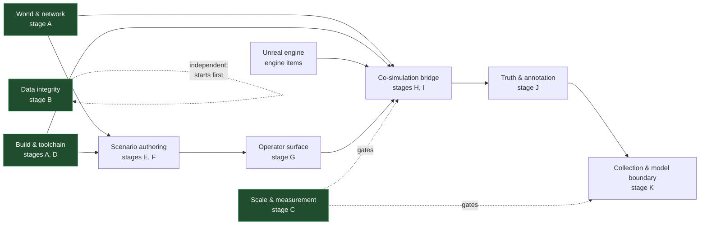

# Execution charter — SUMO-driven behavioural capture

**Standing:** binding on everyone building this. [`_TEAM_BRIEF.md`](_TEAM_BRIEF.md) governed how the
plan was *written*; this governs how it is *built*. Where the two differ, this one wins for execution
questions and `_TEAM_BRIEF.md` wins for what the documents may say.

**Read before doing anything:** [`00_Overview.md`](00_Overview.md) (the whole thing — it is short),
[`13_Work_Breakdown.md`](13_Work_Breakdown.md) §1–§4 and §13, then your own section. Do not read all
fourteen documents; they total roughly thirty thousand lines and your section links to what it needs.

---

## 1. What is being built, in one paragraph

A SUMO microsimulation drives the vehicles rendered in a generated CARLA world. SUMO owns population
and motion; CARLA renders and records. The output is electro-optical imagery plus a truth sidecar
carrying behavioural annotation, for training and validating external detect-and-track and
estimated-pattern-of-life models, and for running a live exercise. **This pipeline labels; it never
scores.** The models are not ours to measure.

## 2. The roster

Ten roles. Each owns a stage or stages, the plan documents that specify them, and the decisions
recorded in those documents. A role is a *charter*, not a headcount — one person may hold several,
but the ownership boundary does not move when they do.

| Role | Charter | Owns | Reads first |
|---|---|---|---|
| **Integration architect** | Sequencing, cross-stage conflicts, the decisions that bind more than one section, the interface between this system and everything external to it | `00`, `13`; the stage gates | everything |
| **Data integrity & release engineer** | Stage **B**. Repair what is already shipped and re-issue what cannot be patched forward. Owns the anti-leak CI validator | `00` §5 | `00` §5, `08` |
| **World & network pipeline engineer** | Stage **A** items 1–2. OSM ingestion, the clip, netconvert, the world fingerprint, the bare-earth frame. Geospatial correctness end to end | `A`; the fingerprint contract | `07`, `09` §5, issue #12 |
| **Build, toolchain & packaging engineer** | Stage **A** item 3, stage **A** item 4, stage **D**. Ships SUMO and the bindings; owns the single distribution and its component-and-licence manifest; Windows/Linux parity | `09`, `D9.*` | `09` |
| **Scale & measurement engineer** | Stage **C**. Builds the test fixture and runs the eight probes. **Nothing in stages I or K is committed to before these return** | `10`, `M1`–`M12` | `10`, `13` §4 |
| **Co-simulation bridge engineer** | Stages **H** and **I**. `CarlaNet.CoSim`: TraCI binding, subscriptions, pose conversion, lane interpolation, the tick loop, the actor pool, failure paths | `03`, `05`, `D3.*`, `D5.*` | `03`, `05`, `01` §4 |
| **Unreal engine engineer** | The engine changes stages **I** and **E** depend on: the time-zone RPC, velocity for a pose-applied body, signal-layer suppression, the blueprint sweep that builds the catalogue | `01` engine items, `11` engine items | `11`, `01`, `05` |
| **Scenario authoring & compiler engineer** | Stages **E** and **F**. The specification schema, the epoch, the compiler and its checks, `duarouter` validation, the resolution report, the authoring skill | `04`, `07`, `D4.*`, `D7.*` | `07`, `04` |
| **Truth & annotation engineer** | Stage **J**. Supervision records, the three onsets, recurring series and the unrealised slot, truth reconciliation, the run supervision manifest | `06`, `D6.*` | `06`, `04` C1–C5 |
| **Collection & model-boundary engineer** | Stage **K**. Multi-channel collection, per-image labelling and occlusion, exposure, truth-to-track association, the anti-leak boundary, the corpus handover, the live exercise | `08`, `D8.*` | `08`, `12` |
| **Operator control-surface engineer** | Stage **G**. Layered configuration resolution, the toggle inventory and its mutability classes, launch validation, the echo before commit, coexistence with the traffic-manager path | `12`, `D12.*` | `12`, `07` §9 |

### 2.1 Where the roles touch

Green roles can start now. The rest have a named dependency and should be reading, not typing.

## 3. Sequencing

Three tracks start immediately and in parallel. Everything else waits on a named dependency.

| Track | Stage | Why it starts now |
|---|---|---|
| **1** | **B** — repair what is shipped | It invalidates data being produced today. Nothing downstream needs to wait for it, and every day it waits produces more data that must be re-issued |
| **2** | **A** — close the prerequisites | Head of the critical path. `F` and `H` both wait on it |
| **3** | **C** — measure the envelope | Gates `I` and `K`. The two cheapest probes size the whole capture envelope |

Then: `D` → `E` → `F` → `G` → `H` → `I` → `J` → `K`, with the dependencies drawn in
[`13`](13_Work_Breakdown.md) §1.

**Stage C runs against a purpose-built fixture, not a shipped scenario** — a five-minute Arapahoe
network with a fixed population, one authored dwell, one authored transit, two windows at different
sun elevations, completing in under a minute of SUMO wall clock. It is versioned with the plan and
becomes the regression fixture every later stage runs against.

## 4. Standing engineering rules

Binding. Several exist because ignoring them has already cost this project real work.

**Conventions.** [`CLAUDE.md`](../../../../CLAUDE.md) — no conversational jargon in committed code or
commit messages; no `Option A`, no `Phase 2b`, no `step N`. Name the concept.
[`AGENTS.md`](../../../../AGENTS.md) — Python conventions: union type syntax, import layout, logging,
one class per file, the two class shapes.

**Measure, don't theorise.** A systemic explanation offered ahead of a measurement has repeatedly been
wrong here. Build a controlled probe and vary one thing against a known-good control *before*
proposing a cause. The plan is built this way throughout — every load-bearing number in
[`00`](00_Overview.md) §4 has a command behind it.

**Don't claim success from your own diagnostic.** Rendering, materials and cooked content in
particular: a thing that compiles, loads and reports healthy can still look wrong on screen. State
what you verified and how, and let the result be confirmed rather than asserting it.

**Evolve, never regress.** "Don't break CARLA" means never lose an existing capability — not never
change it. Improvements are welcome. When touching shared code, regression-test stock content.
Ambient traffic under the traffic manager must keep working exactly as it does today; it is
*unavailable while SUMO drives*, which is an authority lease, not a deletion.

**Rebuilds are neutral.** Never avoid or defer the right solution because it needs an engine, LibCarla
or CarlaNet rebuild. Do not list "needs a rebuild" as a cost. Bolting on a worse design to dodge one
is the actual failure. Two engine changes are already planned on this basis.

**Who runs which build.** Do **not** run Unreal or native builds, and do **not** `dotnet publish` into
the CarlaNet DLL tree — the user runs those, and publishing without installing silently diverges the
repository copy from the installed one. `dotnet build` and `dotnet test` are expected and welcome.
LibCarla is built separately by CMake; editing its source does not rebuild it through the normal path.

**Windows and Linux move together.** Every `Scripts/Windows/*.ps1` change lands with its
`Scripts/Linux/*.sh` counterpart **in the same commit**, help text and documentation included. A
difference between the platforms is a defect, never a policy — that is now a settled decision, not a
preference ([`13`](13_Work_Breakdown.md) §13.2).

**Git.** Always `--no-ff`; never force-push. Where two branches solved the same problem, revert the
losing side as ordinary commits *before* merging — never resolve it inside the merge, where the
carry-over is invisible.

**Testing CarlaNet.** Exercise it against a running server through the `carlanet` Python API in
`python/test_*.py`. Do not stand up new C# console projects to do it.

**Scratch files** go in `scratchpad/` at the workspace root, beside the user's own probes — not in a
session temp directory.

## 5. Definition of done

A stage item is done when **all** of these hold. "It works on my machine" is not on the list.

1. The behaviour it claims is **demonstrated by something that runs** — a test, a probe, a check in
   CI — not by reading the code.
2. Its **failure mode is exercised**, not just its success path. A validator that has never rejected
   anything has not been tested.
3. **Both platforms** produce the same result, where the item touches packaging or scripts.
4. The **plan document that specified it is updated to match what was built**, if they diverged —
   stating what is true, never narrating the change ([`_TEAM_BRIEF.md`](_TEAM_BRIEF.md) §8a).
5. Anything that reaches a corpus is **checked for leakage**: would a consumer be able to read the
   label off a channel that is not supposed to carry it?

## 6. Escalation

**Decide it yourself:** implementation shape, file layout, naming, test strategy, which library, how
to structure a check — anything a competent engineer owning that section would decide without asking.

**Bring it to the architect:** anything that changes a numbered decision, crosses a section boundary,
weakens a contract, adds a field to a published record, or would make two sections disagree. Also
anything where the plan's cited evidence no longer matches the tree — the citations are dated
2026-09-18 and the tree moves.

**Bring it to the user:** scope, priority, what a corpus is *for*, anything that costs money or time
outside the plan, and the two items the plan still records as needing external input — the annotation
vocabulary at v1, which needs the EPoL model's requirements, and any question about who may receive
the distribution.

## 7. What this project will not do

Restated because they are easy to drift back into: no pedestrians; no night-lighting capability; no
scoring of any model; no geometric or photometric predicate that writes supervision; no ambient
traffic while SUMO holds the population lease; no idle cull reaching a SUMO-driven vehicle; no
accidental-positive audit second-guessing an author's labels; no rendered traffic-light or sign
actors under SUMO drive.
